# ABAP — Basics to Advanced

### The complete ABAP guide for a JavaScript developer moving into SAP — from your first WRITE statement to CDS views, RAP and Fiori, with every concept explained simply, in code, with Telugu notes and diagrams

> *"ABAP is the language the world's biggest companies actually run on. It looks alien for about a week — then you realise it is just data, loops, tables and objects, like every language you already know. This guide takes you from zero to the code an SAP team would hire you to write: reports, internal tables, ABAP SQL, OO ABAP, enhancements, and the modern HANA/CDS/RAP stack that turns your ABAP into a Fiori app."*

**SAP Track** · The ABAP Guide · pairs with the SAP Master Notes and the Fiori & UI5 Notes

---

## Table of Contents

- [Part A — What ABAP Is & Where It Lives](#part-a-what-abap-is-where-it-lives)
  - [A1. What is ABAP](#a1-what-is-abap) · [A2. Where ABAP Runs — the SAP Application Server](#a2-where-abap-runs-the-sap-application-server) · [A3. The ABAP Stack vs the JavaScript Stack](#a3-the-abap-stack-vs-the-javascript-stack) · [A4. Classic ABAP, ABAP for HANA, and ABAP Cloud](#a4-classic-abap-abap-for-hana-and-abap-cloud) · [A5. What an ABAP Developer Actually Does All Day](#a5-what-an-abap-developer-actually-does-all-day)
- [Part B — The Development Environment](#part-b-the-development-environment)
  - [B1. SAP GUI and Transaction Codes](#b1-sap-gui-and-transaction-codes) · [B2. SE80, SE38, SE11 — the Classic Workbench](#b2-se80-se38-se11-the-classic-workbench) · [B3. ABAP Development Tools (ADT) in Eclipse](#b3-abap-development-tools-adt-in-eclipse) · [B4. Packages, Objects and the Repository](#b4-packages-objects-and-the-repository) · [B5. Clients, Systems and the Transport Landscape (DEV → QAS → PRD)](#b5-clients-systems-and-the-transport-landscape-dev-qas-prd) · [B6. Transport Requests — the ABAP "Git Commit"](#b6-transport-requests-the-abap-git-commit)
- [Part C — Your First Program & the Syntax Rules](#part-c-your-first-program-the-syntax-rules)
  - [C1. Program Types (Report, Module Pool, Class Pool, Include, Function Group)](#c1-program-types-report-module-pool-class-pool-include-function-group) · [C2. Hello World — the Anatomy of a Report](#c2-hello-world-the-anatomy-of-a-report) · [C3. ABAP Syntax Rules (statements, periods, chaining, case-insensitivity, comments)](#c3-abap-syntax-rules-statements-periods-chaining-case-insensitivity-comments) · [C4. WRITE and the Classic List Output](#c4-write-and-the-classic-list-output) · [C5. System Fields (sy-subrc, sy-tabix, sy-datum, sy-uname ...)](#c5-system-fields-sy-subrc-sy-tabix-sy-datum-sy-uname) · [C6. Naming Conventions and the Customer Namespace (Z / Y)](#c6-naming-conventions-and-the-customer-namespace-z-y)
- [Part D — Data Types, Variables and Constants](#part-d-data-types-variables-and-constants)
  - [D1. DATA — Declaring Variables](#d1-data-declaring-variables) · [D2. The Built-in Elementary Types (C, N, D, T, I, P, F, STRING, X ...)](#d2-the-built-in-elementary-types-c-n-d-t-i-p-f-string-x) · [D3. TYPES — Making Your Own Types](#d3-types-making-your-own-types) · [D4. CONSTANTS, Literals and Text Symbols](#d4-constants-literals-and-text-symbols) · [D5. TYPE vs LIKE, and Referring to Dictionary Types](#d5-type-vs-like-and-referring-to-dictionary-types) · [D6. Value Assignment, MOVE, CLEAR, FREE and Initial Values](#d6-value-assignment-move-clear-free-and-initial-values) · [D7. Type Conversion — the Rules That Bite You](#d7-type-conversion-the-rules-that-bite-you)
- [Part E — Operators, Expressions and String Handling](#part-e-operators-expressions-and-string-handling)
  - [E1. Arithmetic and Assignment Operators](#e1-arithmetic-and-assignment-operators) · [E2. Comparison and Logical Operators (EQ/=, BETWEEN, IN, IS INITIAL, CO/CA/CS ...)](#e2-comparison-and-logical-operators-eq-between-in-is-initial-cocacs) · [E3. Classic String Statements (CONCATENATE, SPLIT, CONDENSE, REPLACE, SHIFT, TRANSLATE)](#e3-classic-string-statements-concatenate-split-condense-replace-shift-translate) · [E4. String Templates and Modern String Expressions](#e4-string-templates-and-modern-string-expressions) · [E5. String Functions and Regular Expressions](#e5-string-functions-and-regular-expressions) · [E6. Working with Dates, Times and Numbers](#e6-working-with-dates-times-and-numbers)
- [Part F — Control Flow](#part-f-control-flow)
  - [F1. IF / ELSEIF / ELSE](#f1-if-elseif-else) · [F2. CASE and CASE TYPE OF](#f2-case-and-case-type-of) · [F3. DO and WHILE Loops](#f3-do-and-while-loops) · [F4. CHECK, EXIT, CONTINUE and RETURN](#f4-check-exit-continue-and-return) · [F5. COND and SWITCH — Conditional Expressions](#f5-cond-and-switch-conditional-expressions) · [F6. Logic Building — How to Turn a Requirement into Control Flow](#f6-logic-building-how-to-turn-a-requirement-into-control-flow)
- [Part G — Structures and Internal Tables](#part-g-structures-and-internal-tables)
  - [G1. Structures — Grouping Fields Together](#g1-structures-grouping-fields-together) · [G2. What an Internal Table Is (and why it is everything in ABAP)](#g2-what-an-internal-table-is-and-why-it-is-everything-in-abap) · [G3. Table Kinds — Standard, Sorted, Hashed](#g3-table-kinds-standard-sorted-hashed) · [G4. Declaring Internal Tables (classic and modern)](#g4-declaring-internal-tables-classic-and-modern) · [G5. Filling a Table — APPEND, INSERT, COLLECT, VALUE #( )](#g5-filling-a-table-append-insert-collect-value) · [G6. Reading — READ TABLE, table expressions itab[ ], line_exists](#g6-reading-read-table-table-expressions-itab-line_exists) · [G7. LOOP AT, LOOP AT ... GROUP BY and Nested Loops](#g7-loop-at-loop-at-group-by-and-nested-loops) · [G8. MODIFY, DELETE, SORT, and DELETE ADJACENT DUPLICATES](#g8-modify-delete-sort-and-delete-adjacent-duplicates) · [G9. Field Symbols and Data References](#g9-field-symbols-and-data-references) · [G10. FOR, REDUCE, CORRESPONDING and FILTER — Modern Table Expressions](#g10-for-reduce-corresponding-and-filter-modern-table-expressions) · [G11. Internal Table Performance — the Rules That Get You Hired](#g11-internal-table-performance-the-rules-that-get-you-hired)
- [Part H — Modularization](#part-h-modularization)
  - [H1. Why Modularize](#h1-why-modularize) · [H2. Includes](#h2-includes) · [H3. Subroutines (FORM / PERFORM) — and why they are obsolete](#h3-subroutines-form-perform-and-why-they-are-obsolete) · [H4. Function Groups and Function Modules](#h4-function-groups-and-function-modules) · [H5. Parameter Passing — by Value vs by Reference, IMPORTING/EXPORTING/CHANGING](#h5-parameter-passing-by-value-vs-by-reference-importingexportingchanging) · [H6. Remote-Enabled Function Modules (RFC) and BAPIs — an Intro](#h6-remote-enabled-function-modules-rfc-and-bapis-an-intro) · [H7. Methods vs Function Modules vs Subroutines — What to Use in 2026](#h7-methods-vs-function-modules-vs-subroutines-what-to-use-in-2026)
- [Part I — The ABAP Dictionary (DDIC)](#part-i-the-abap-dictionary-ddic)
  - [I1. What the Dictionary Is and Why It Exists](#i1-what-the-dictionary-is-and-why-it-exists) · [I2. Domain, Data Element, Field — the Three Layers](#i2-domain-data-element-field-the-three-layers) · [I3. Creating a Transparent Table (SE11) Step by Step](#i3-creating-a-transparent-table-se11-step-by-step) · [I4. Table Fields, Keys, Technical Settings and Delivery Class](#i4-table-fields-keys-technical-settings-and-delivery-class) · [I5. Transparent, Pooled and Cluster Tables](#i5-transparent-pooled-and-cluster-tables) · [I6. Foreign Keys and Check Tables](#i6-foreign-keys-and-check-tables) · [I7. Views (Database, Maintenance, Projection) and CDS Views — a First Look](#i7-views-database-maintenance-projection-and-cds-views-a-first-look) · [I8. Search Helps (F4)](#i8-search-helps-f4) · [I9. Lock Objects and the Enqueue Concept](#i9-lock-objects-and-the-enqueue-concept) · [I10. Table Types, Structures and Append Structures in DDIC](#i10-table-types-structures-and-append-structures-in-ddic)
- [Part J — ABAP SQL (Open SQL) — Talking to the Database](#part-j-abap-sql-open-sql-talking-to-the-database)
  - [J1. ABAP SQL vs Native SQL](#j1-abap-sql-vs-native-sql) · [J2. SELECT SINGLE, SELECT ... INTO TABLE, and the Loop You Must Never Write](#j2-select-single-select-into-table-and-the-loop-you-must-never-write) · [J3. WHERE, ORDER BY, UP TO n ROWS, DISTINCT](#j3-where-order-by-up-to-n-rows-distinct) · [J4. Aggregates and GROUP BY](#j4-aggregates-and-group-by) · [J5. Joins — INNER, LEFT OUTER, and Multi-Table Joins](#j5-joins-inner-left-outer-and-multi-table-joins) · [J6. FOR ALL ENTRIES — Power and Traps](#j6-for-all-entries-power-and-traps) · [J7. Subqueries, EXISTS and UNION](#j7-subqueries-exists-and-union) · [J8. INSERT, UPDATE, MODIFY, DELETE and the LUW / COMMIT WORK Concept](#j8-insert-update-modify-delete-and-the-luw-commit-work-concept) · [J9. Modern ABAP SQL (7.4+) — Comma Lists, @Escaping, Expressions, CASE, CAST](#j9-modern-abap-sql-74-comma-lists-escaping-expressions-case-cast) · [J10. SQL Performance — the Five Golden Rules](#j10-sql-performance-the-five-golden-rules)
- [Part K — Modern ABAP Syntax (7.4 / 7.5 and Beyond)](#part-k-modern-abap-syntax-74-75-and-beyond)
  - [K1. Why the Language Changed](#k1-why-the-language-changed) · [K2. Inline Declarations — DATA( ) and @DATA( )](#k2-inline-declarations-data-and-data) · [K3. Constructor Expressions — VALUE, NEW, CONV, CAST, REF](#k3-constructor-expressions-value-new-conv-cast-ref) · [K4. COND and SWITCH Revisited](#k4-cond-and-switch-revisited) · [K5. FOR Loops and REDUCE Inside Expressions](#k5-for-loops-and-reduce-inside-expressions) · [K6. CORRESPONDING and MOVE-CORRESPONDING with Mapping](#k6-corresponding-and-move-corresponding-with-mapping) · [K7. String Templates and Chaining](#k7-string-templates-and-chaining) · [K8. Old vs New — A Full Side-by-Side Rewrite of One Program](#k8-old-vs-new-a-full-side-by-side-rewrite-of-one-program)
- [Part L — Classic Reports, Selection Screens and ALV](#part-l-classic-reports-selection-screens-and-alv)
  - [L1. The Report Program Structure and Its Events](#l1-the-report-program-structure-and-its-events) · [L2. PARAMETERS and SELECT-OPTIONS](#l2-parameters-and-select-options) · [L3. The Selection Table Structure (SIGN, OPTION, LOW, HIGH)](#l3-the-selection-table-structure-sign-option-low-high) · [L4. Selection Screen Events (INITIALIZATION, AT SELECTION-SCREEN, START-OF-SELECTION ...)](#l4-selection-screen-events-initialization-at-selection-screen-start-of-selection) · [L5. Selection Screen Design — Blocks, Radio Buttons, Checkboxes, Tabs](#l5-selection-screen-design-blocks-radio-buttons-checkboxes-tabs) · [L6. Variants](#l6-variants) · [L7. What ALV Is and Why Nobody Uses WRITE Anymore](#l7-what-alv-is-and-why-nobody-uses-write-anymore) · [L8. ALV with CL_SALV_TABLE — the Simple Modern Way](#l8-alv-with-cl_salv_table-the-simple-modern-way) · [L9. ALV with the Function Module REUSE_ALV_GRID_DISPLAY (the legacy you will meet)](#l9-alv-with-the-function-module-reuse_alv_grid_display-the-legacy-you-will-meet) · [L10. ALV Field Catalog, Layout, Sorting, Totals and Events](#l10-alv-field-catalog-layout-sorting-totals-and-events) · [L11. Interactive Reporting and Drill-Down](#l11-interactive-reporting-and-drill-down)
- [Part M — Object-Oriented ABAP](#part-m-object-oriented-abap)
  - [M1. Why OO ABAP (and why every new project is OO)](#m1-why-oo-abap-and-why-every-new-project-is-oo) · [M2. Classes and Objects — CLASS ... DEFINITION / IMPLEMENTATION](#m2-classes-and-objects-class-definition-implementation) · [M3. Attributes, Methods and Visibility (PUBLIC / PROTECTED / PRIVATE)](#m3-attributes-methods-and-visibility-public-protected-private) · [M4. Instance vs Static (CLASS-DATA, CLASS-METHODS)](#m4-instance-vs-static-class-data-class-methods) · [M5. Constructors — Instance and Class Constructor](#m5-constructors-instance-and-class-constructor) · [M6. Local Classes vs Global Classes (SE24)](#m6-local-classes-vs-global-classes-se24) · [M7. Inheritance, Redefinition and SUPER](#m7-inheritance-redefinition-and-super) · [M8. Abstract and Final Classes](#m8-abstract-and-final-classes) · [M9. Interfaces — the ABAP Contract](#m9-interfaces-the-abap-contract) · [M10. Polymorphism in Practice](#m10-polymorphism-in-practice) · [M11. Events (RAISE EVENT, SET HANDLER)](#m11-events-raise-event-set-handler) · [M12. Friends, and the ME Self-Reference](#m12-friends-and-the-me-self-reference) · [M13. Design Patterns in ABAP — Singleton, Factory, Strategy](#m13-design-patterns-in-abap-singleton-factory-strategy)
- [Part N — Error Handling and Messages](#part-n-error-handling-and-messages)
  - [N1. sy-subrc — the Old Way](#n1-sy-subrc-the-old-way) · [N2. Class-Based Exceptions — TRY / CATCH / CLEANUP / RAISE](#n2-class-based-exceptions-try-catch-cleanup-raise) · [N3. Exception Class Hierarchy (CX_ROOT, CX_STATIC_CHECK, CX_DYNAMIC_CHECK, CX_NO_CHECK)](#n3-exception-class-hierarchy-cx_root-cx_static_check-cx_dynamic_check-cx_no_check) · [N4. Creating Your Own Exception Class](#n4-creating-your-own-exception-class) · [N5. MESSAGE Statement and Message Classes (SE91)](#n5-message-statement-and-message-classes-se91) · [N6. Short Dumps (ST22) and How to Read One](#n6-short-dumps-st22-and-how-to-read-one)
- [Part O — Dialog Programming (Module Pool)](#part-o-dialog-programming-module-pool)
  - [O1. What Dialog Programming Is and Where You Still Meet It](#o1-what-dialog-programming-is-and-where-you-still-meet-it) · [O2. Screens, Screen Painter (SE51) and the Flow Logic](#o2-screens-screen-painter-se51-and-the-flow-logic) · [O3. PBO and PAI — the Two Halves of Every Screen](#o3-pbo-and-pai-the-two-halves-of-every-screen) · [O4. Screen Elements, the Status Bar (GUI Status / GUI Title)](#o4-screen-elements-the-status-bar-gui-status-gui-title) · [O5. Table Control and Tabstrips](#o5-table-control-and-tabstrips) · [O6. Screen Sequences, CALL SCREEN, SET SCREEN, LEAVE TO SCREEN](#o6-screen-sequences-call-screen-set-screen-leave-to-screen) · [O7. A Complete Mini Dialog Program](#o7-a-complete-mini-dialog-program)
- [Part P — Data Transfer: Files, BDC, BAPIs](#part-p-data-transfer-files-bdc-bapis)
  - [P1. Reading and Writing Files (GUI_UPLOAD, GUI_DOWNLOAD, OPEN DATASET)](#p1-reading-and-writing-files-gui_upload-gui_download-open-dataset) · [P2. What BDC Is and Why It Exists](#p2-what-bdc-is-and-why-it-exists) · [P3. BDC Call Transaction vs Session Method](#p3-bdc-call-transaction-vs-session-method) · [P4. Recording a Transaction with SHDB](#p4-recording-a-transaction-with-shdb) · [P5. BAPIs — the Clean Way to Post Data](#p5-bapis-the-clean-way-to-post-data) · [P6. BAPI_TRANSACTION_COMMIT and the Return Table](#p6-bapi_transaction_commit-and-the-return-table) · [P7. LSMW and Modern Migration Tools](#p7-lsmw-and-modern-migration-tools)
- [Part Q — Enhancements and Modifications](#part-q-enhancements-and-modifications)
  - [Q1. The Enhancement Spectrum — Why You Never Change SAP Code](#q1-the-enhancement-spectrum-why-you-never-change-sap-code) · [Q2. User Exits and Customer Exits (SMOD / CMOD)](#q2-user-exits-and-customer-exits-smod-cmod) · [Q3. BADIs — Classic and New](#q3-badis-classic-and-new) · [Q4. The Enhancement Framework — Implicit and Explicit Enhancement Points](#q4-the-enhancement-framework-implicit-and-explicit-enhancement-points) · [Q5. Finding the Right Exit or BADI](#q5-finding-the-right-exit-or-badi) · [Q6. Modifications, Access Keys and Why to Avoid Them](#q6-modifications-access-keys-and-why-to-avoid-them) · [Q7. Clean Core — the Modern Rule](#q7-clean-core-the-modern-rule)
- [Part R — Forms and Output](#part-r-forms-and-output)
  - [R1. SAPscript — the Ancient One](#r1-sapscript-the-ancient-one) · [R2. Smart Forms](#r2-smart-forms) · [R3. Adobe Forms (SAP Interactive Forms)](#r3-adobe-forms-sap-interactive-forms) · [R4. Driver Program vs Form — How Output Actually Works](#r4-driver-program-vs-form-how-output-actually-works) · [R5. Which Form Technology to Use in 2026](#r5-which-form-technology-to-use-in-2026)
- [Part S — Interfaces and Integration](#part-s-interfaces-and-integration)
  - [S1. RFC — Remote Function Calls](#s1-rfc-remote-function-calls) · [S2. ALE and IDocs — the Concept](#s2-ale-and-idocs-the-concept) · [S3. IDoc Structure (Control, Data, Status Records)](#s3-idoc-structure-control-data-status-records) · [S4. Processing and Debugging IDocs (WE19, WE02, BD87)](#s4-processing-and-debugging-idocs-we19-we02-bd87) · [S5. Proxies, Web Services and OData — the Modern Interfaces](#s5-proxies-web-services-and-odata-the-modern-interfaces) · [S6. Choosing an Integration Technology](#s6-choosing-an-integration-technology)
- [Part T — Debugging, Performance and Quality](#part-t-debugging-performance-and-quality)
  - [T1. The ABAP Debugger — Breakpoints, Watchpoints, Step Types](#t1-the-abap-debugger-breakpoints-watchpoints-step-types) · [T2. Debugging Tricks (conditional breakpoints, changing values, debugging in background/update task)](#t2-debugging-tricks-conditional-breakpoints-changing-values-debugging-in-backgroundupdate-task) · [T3. Runtime Analysis (SAT/SE30) and SQL Trace (ST05)](#t3-runtime-analysis-satse30-and-sql-trace-st05) · [T4. Performance Rules for ABAP Programs](#t4-performance-rules-for-abap-programs) · [T5. Code Inspector (SCI) and the ABAP Test Cockpit (ATC)](#t5-code-inspector-sci-and-the-abap-test-cockpit-atc) · [T6. ABAP Unit Testing](#t6-abap-unit-testing) · [T7. Background Jobs (SM36 / SM37) and Parallel Processing](#t7-background-jobs-sm36-sm37-and-parallel-processing)
- [Part U — Modern ABAP: HANA, CDS, RAP and ABAP Cloud](#part-u-modern-abap-hana-cds-rap-and-abap-cloud)
  - [U1. What Changed When HANA Arrived — Code Pushdown](#u1-what-changed-when-hana-arrived-code-pushdown) · [U2. Core Data Services (CDS) Views — the New Backbone](#u2-core-data-services-cds-views-the-new-backbone) · [U3. CDS Annotations, Associations and Consumption](#u3-cds-annotations-associations-and-consumption) · [U4. AMDP — ABAP Managed Database Procedures](#u4-amdp-abap-managed-database-procedures) · [U5. OData and SAP Gateway — Exposing ABAP to the Web](#u5-odata-and-sap-gateway-exposing-abap-to-the-web) · [U6. RAP — the ABAP RESTful Application Programming Model](#u6-rap-the-abap-restful-application-programming-model) · [U7. Behaviour Definitions, Behaviour Implementations and Projections](#u7-behaviour-definitions-behaviour-implementations-and-projections) · [U8. Managed vs Unmanaged RAP Scenarios](#u8-managed-vs-unmanaged-rap-scenarios) · [U9. ABAP Cloud, Released APIs and the Tiered Extensibility Model](#u9-abap-cloud-released-apis-and-the-tiered-extensibility-model) · [U10. From Your Report to a Fiori App — the Full Modern Stack](#u10-from-your-report-to-a-fiori-app-the-full-modern-stack)
- [Part V — Mini Projects (Build These)](#part-v-mini-projects-build-these)
  - [V1. How to Practise ABAP Without a Company System](#v1-how-to-practise-abap-without-a-company-system) · [V2. Project 1 — Employee Directory Report (DDIC table + selection screen + ALV)](#v2-project-1-employee-directory-report-ddic-table-selection-screen-alv) · [V3. Project 2 — Sales Order Analysis Report (joins, aggregates, interactive drill-down)](#v3-project-2-sales-order-analysis-report-joins-aggregates-interactive-drill-down) · [V4. Project 3 — Material Master Upload Tool (file upload + validation + BAPI post)](#v4-project-3-material-master-upload-tool-file-upload-validation-bapi-post) · [V5. Project 4 — OO Refactor: Turn Project 2 into Classes](#v5-project-4-oo-refactor-turn-project-2-into-classes) · [V6. Project 5 — Modern Stack: CDS View + RAP + Fiori Elements App](#v6-project-5-modern-stack-cds-view-rap-fiori-elements-app) · [V7. Where to Go Next](#v7-where-to-go-next)
- [Part W — Interview Cheat-Sheet](#part-w-interview-cheat-sheet)
  - [W1. The Questions You Will Definitely Be Asked](#w1-the-questions-you-will-definitely-be-asked) · [W2. Rapid-Fire Answers (one-liners you must know cold)](#w2-rapid-fire-answers-one-liners-you-must-know-cold) · [W3. Code Questions and How to Answer Them](#w3-code-questions-and-how-to-answer-them) · [W4. Performance Questions](#w4-performance-questions) · [W5. Scenario Questions ("how would you...")](#w5-scenario-questions-how-would-you)
- [Part X — Glossary and Quick Reference](#part-x-glossary-and-quick-reference)
  - [X1. Transaction Code Cheat-Sheet](#x1-transaction-code-cheat-sheet) · [X2. Important SAP Tables](#x2-important-sap-tables) · [X3. Syntax Quick Reference Card](#x3-syntax-quick-reference-card) · [X4. Glossary A-Z](#x4-glossary-a-z)

---

# Part A — What ABAP Is & Where It Lives

*Before you write a single line of ABAP, you need to know what kind of animal it is. ABAP is not a general-purpose language you pick for a side project — it is a language that only exists inside SAP, that ships with its own database layer, its own IDE, its own version control and its own deployment pipeline, all baked into the product. That sounds strange after JavaScript, where you assemble your own stack from npm. But it is also ABAP's superpower: everything is already wired together, and 50-year-old programs still run. This part gives you the map — what the language is, the server it lives inside, how that compares to the JS world you know, which "flavour" of ABAP you'll actually meet on a project, and what an ABAP developer's real working day looks like.*

## A1. What is ABAP

**Simple definition:** **ABAP** (Advanced Business Application Programming) is SAP's own **proprietary programming language**, created in the 1980s, used to build and extend the business logic inside SAP systems. It is **strongly typed**, **case-insensitive**, **statement-based** (every statement ends with a period), and — the single most important thing about it — it has **database access built directly into the language** via **ABAP SQL** (formerly Open SQL). You do not import a database driver; `SELECT` is a keyword, exactly like `IF` and `LOOP`. ABAP runs **only** on an SAP Application Server; you cannot install it on a laptop and run `abap script.abap` the way you run `node script.js`.

<p class="te"><strong>Telugu:</strong> <strong>ABAP</strong> ante SAP company sonta programming language — 1980s lo SAP ye create chesindi, SAP system lopala business logic rayadaniki. Idi <strong>strongly typed</strong>, <strong>case-insensitive</strong> (WRITE, write, Write anni okate), prati statement <strong>period (.)</strong> tho aagipotundi. Ippudu asalu point: <strong>database language lopalane undi</strong> — JS lo mysql package install cheyyali kada? ABAP lo avasaram ledu, <code>SELECT</code> anedi <code>IF</code> laantide, oka keyword. Inko mukhyamaina vishayam: ABAP ni mee laptop lo direct ga run cheyyalem — adi <strong>SAP Application Server lopala matrame</strong> baduthundi.</p>

**The everyday analogy.** JavaScript is like a set of loose tools you buy separately — you pick your engine (Node, Deno, the browser), your framework (React, Vue), your database library (Prisma, pg), your bundler, your test runner, your CI. You assemble a workshop. ABAP is like being handed a **fully fitted factory floor**: the machines are already bolted down, wired to power, connected to each other, and the safety inspector has already signed off. You don't get to choose the layout — but you also never spend three days configuring a build tool. You just walk in and start making things.

**The second analogy, and this one is the important one.** Think of ABAP as **PL/SQL that grew up into a full application language**. In most stacks the database sits *behind* your app and you talk to it over a wire. In ABAP the language and the database are **neighbours in the same building** — the application server sits right next to the database, and reading a million rows is a normal thing to do inside a loop-free single statement. That closeness shapes everything about how you write good ABAP.

### What "proprietary" really means for you

| Aspect | JavaScript | ABAP |
|---|---|---|
| Who owns the language | ECMA / TC39, open standard | **SAP SE** — closed, single vendor |
| Where you get it | `npm`, any machine, free | Only inside a licensed SAP system |
| Where code lives | `.js` files on disk, in git | **Rows in database tables** inside SAP |
| Editor | VS Code, anything | SE80 / SE38 (in-system) or **Eclipse + ADT** |
| Package manager | npm, 3 million packages | None — SAP ships everything (function modules, classes) |
| Version control | Git | **Transport Requests** (and optionally abapGit) |
| Runs on | Any OS, browser, server | **SAP NetWeaver AS ABAP** only |
| Backwards compatibility | Breaks between major versions | **Legendary** — 1995 code still compiles today |

That last row deserves a paragraph of its own, because it explains most of ABAP's oddities. SAP made a promise to its customers decades ago: **your custom code will keep running**. A bank that spent $40 million on custom ABAP in 1998 can upgrade its system in 2026 and that code still works. To keep that promise SAP almost never removes a keyword — it just adds better ones alongside. That is why you will see a modern `VALUE #( )` expression three lines below a `MOVE` statement from 1994 in the same program, and both are valid. When you read old code, you are reading archaeology, not bad code.

### The first real ABAP you will see

```abap
*&---------------------------------------------------------------------*
*& Report Z_FIRST_LOOK
*& Purpose: show the three things that make ABAP different from JS
*&---------------------------------------------------------------------*
REPORT z_first_look.

" ---------------------------------------------------------------
" 1. DECLARATIONS. ABAP is strongly typed. You must say what a
"    variable IS before you use it. There is no 'let x' that later
"    becomes a string, then a number, then an object.
" ---------------------------------------------------------------
DATA lv_carrier TYPE s_carr_id.        " lv_ = local variable.
                                       " s_carr_id is a DATA ELEMENT --
                                       " a named, reusable type defined
                                       " centrally in the dictionary.
                                       " Think: a shared TypeScript type,
                                       " except the DATABASE knows it too.

DATA lt_flights TYPE TABLE OF sflight. " lt_ = local internal table.
                                       " An INTERNAL TABLE is ABAP's
                                       " array. 'TYPE TABLE OF sflight'
                                       " means: an array whose every row
                                       " has exactly the shape of the
                                       " database table SFLIGHT.
                                       " JS: SFlight[] -- and you never
                                       " had to write the interface,
                                       " because the table IS the type.

" ---------------------------------------------------------------
" 2. SQL IS PART OF THE LANGUAGE. No driver, no connection string,
"    no await, no try/catch around a network call.
" ---------------------------------------------------------------
lv_carrier = 'LH'.                     " Lufthansa, in SAP's demo data.

SELECT carrid, connid, fldate, seatsocc " ABAP SQL. Note: no quotes
  FROM sflight                          " around table or field names.
  WHERE carrid = @lv_carrier            " @ = 'this is an ABAP variable,
  INTO TABLE @lt_flights.               " not a database column'.
                                        " INTO TABLE = fill the array.

" ---------------------------------------------------------------
" 3. SY-SUBRC. Almost every ABAP statement sets a global return code.
"    0 = it worked. Non-zero = it did not. This is ABAP's answer to
"    both 'if (err)' and 'if (rows.length)'.
" ---------------------------------------------------------------
IF sy-subrc = 0.
  " sy-dbcnt = how many rows the last SQL statement touched.
  WRITE: / |Found { sy-dbcnt } flights for carrier { lv_carrier }.|.
ELSE.
  WRITE: / 'No flights found.'.
ENDIF.
```

**How you'd think your way to this code — line by line.**

1. **"What am I building?"** A program that reads flight rows and prints a count. In Node you'd `require` a db client, open a pool, write a query string, `await` it, handle the promise rejection. Here, none of that exists — so the whole first mental step is *unlearning* the plumbing.
2. **`REPORT z_first_look.`** — every executable ABAP program starts by declaring its own name and type. `REPORT` means "this is an executable list-producing program." The `Z` prefix means "customer-written, not SAP-written" (you'll meet that rule properly in C6). The period ends the statement — ABAP has no newline-sensitivity at all, only periods.
3. **`DATA lv_carrier TYPE s_carr_id.`** — you declare the variable *and* its type together. The naming prefix `lv_` (local variable) is not enforced by the compiler; it is a 30-year-old community convention that survived because ABAP has no block scoping, so prefixes are how you tell at a glance what something is.
4. **Why `TYPE s_carr_id` and not `TYPE c LENGTH 3`?** Because `s_carr_id` is a **data element** in the ABAP Dictionary. Type it that way and your variable automatically inherits the field label, the documentation, the search help, and — critically — it stays correct if SAP ever widens the field. This is the single habit that separates junior from senior ABAP: **type from the dictionary, never from primitives**.
5. **`DATA lt_flights TYPE TABLE OF sflight.`** — the sentence "type table of a database table" has no JavaScript equivalent and is worth sitting with. The database table definition *is* a type. There is no ORM, no schema file, no code generation step. Change the table in the dictionary and every program typed against it picks up the change at next compile.
6. **The `SELECT`** — read it as an English sentence, because that's how it was designed. Note `@lv_carrier`: since ABAP 7.40, host variables (ABAP variables used inside SQL) must be **escaped with `@`**. This exists so the compiler can tell your variable from a column name — in old code you'll see bare `lv_carrier` and it still works, but new code must use `@`.
7. **`INTO TABLE @lt_flights`** — fills the whole internal table in one shot. This is the "array-at-a-time" mindset: ABAP developers are trained to move **sets** of rows, not to loop and fetch one at a time. A `SELECT` inside a `LOOP` is the classic performance sin.
8. **`IF sy-subrc = 0.`** — `sy-subrc` is a **system field**: a global variable the runtime writes after nearly every operation. Checking it is not optional politeness; it is how ABAP reports failure, because most statements do not throw. Forgetting to check `sy-subrc` is the number one source of silent bugs in ABAP, and a guaranteed interview question (see C5).
9. **`|Found { sy-dbcnt } flights|`** — a **string template**, ABAP 7.40+. It is literally the same idea as a JS template literal, just with pipes instead of backticks and no `$`. Old ABAP wrote `CONCATENATE 'Found' lv_count 'flights' INTO lv_msg SEPARATED BY space.` — four times the code for the same result.

**Real-world example.** Replace `SFLIGHT` with `VBAK` (sales order headers) and this exact shape becomes the most common program in any SAP shop: *"read all sales orders for customer X created this month, and report on them."* The demo flight tables (`SCARR` carriers, `SPFLI` connections, `SFLIGHT` flights, `SBOOK` bookings) exist in every SAP system precisely so you can practise this shape before you touch real business tables.

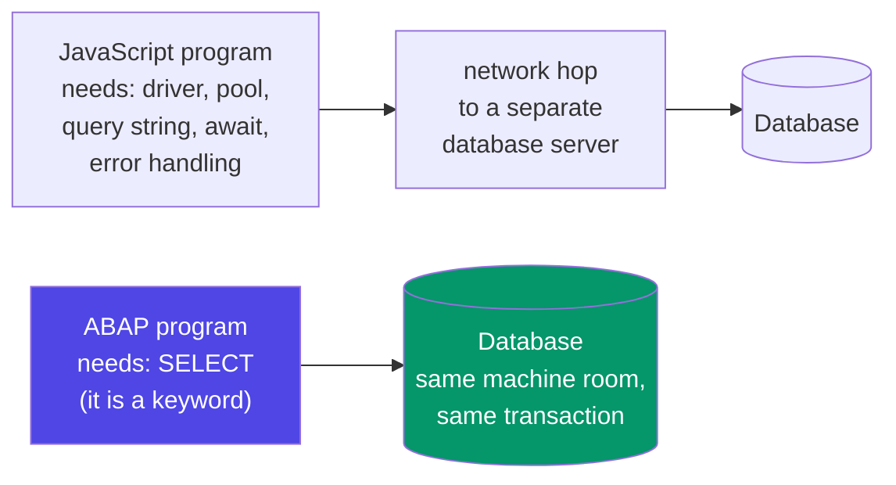

**Interview points.**
- *"Is ABAP compiled or interpreted?"* — Both, in a way. Source is **compiled to a platform-independent bytecode** (called "load") which is cached in the database and executed by the ABAP runtime (the "virtual machine" inside the work process). So: compiled to bytecode, executed by a VM — architecturally closer to Java or C# than to plain JavaScript.
- *"Is ABAP object-oriented?"* — Yes, fully, since release 4.6 (1999): classes, interfaces, inheritance, polymorphism, events, exceptions. But it is **not** object-oriented *only* — the procedural style from 1985 still works, and most legacy code is procedural. Modern ABAP guidance (and every ABAP Cloud project) is **ABAP Objects first**.
- *"What does ABAP stand for?"* — Today: **A**dvanced **B**usiness **A**pplication **P**rogramming. Originally it was German: *Allgemeiner Berichts-Aufbereitungs-Prozessor*, "generic report preparation processor" — because in 1983 it did exactly one thing: format reports. A good answer mentions both; it shows you know the language grew from a reporting tool into a full platform.

<div class="pic"><strong>Picture it:</strong> ABAP is a language that lives <em>inside</em> a database-backed business application, not a language that <em>talks to</em> one. Every instinct you have about "connecting to the backend" needs to be re-pointed: in ABAP, <strong>you are already the backend.</strong></div>

---
## A2. Where ABAP Runs — the SAP Application Server

**Simple definition:** ABAP runs inside the **SAP NetWeaver Application Server ABAP** (AS ABAP) — a large multi-user runtime that sits between the user's screen and the database. It is built on the classic **three-tier architecture**: the **presentation layer** (SAP GUI or a browser), the **application layer** (one or more servers running your ABAP), and the **database layer** (HANA, or older: Oracle/DB2/SQL Server). Inside the application layer, a **dispatcher** hands each incoming user request to a free **work process** — and here is the part that surprises every web developer: a work process serves your request, then **is taken away from you** and given to someone else. Your program is not a long-lived process. It is a guest, repeatedly.

<p class="te"><strong>Telugu:</strong> ABAP code <strong>SAP Application Server</strong> lopala run avutundi. Idi <strong>three-tier architecture</strong>: (1) <strong>Presentation</strong> = user screen (SAP GUI or browser), (2) <strong>Application</strong> = ABAP programs run ayye layer, (3) <strong>Database</strong> = data store (HANA leda Oracle). Application layer lo oka <strong>dispatcher</strong> untundi — user request vaste, adi khaali ga unna oka <strong>work process</strong> ki istundi. Ikkada twist emitante: mee program screen chupinchinappudu aa work process meeku dakkadu, inkoka user ki poddi! Anduke ABAP lo memory ni jagratha ga handle cheyyali.</p>

**The everyday analogy.** Think of a busy government office. The **presentation layer** is the counter where you stand. The **dispatcher** is the receptionist who calls "counter 4, next!". The **work processes** are the 20 clerks behind the counters. There are 5,000 citizens in the building and only 20 clerks — the whole system works *only* because no clerk is stuck with one citizen all day. The clerk handles your form, hands it back, and immediately calls the next person. When you come back with the completed form, you probably get a **different clerk** — so everything the first clerk knew about you must have been written down and carried with the form, not kept in the clerk's head.

That last sentence is the entire architecture. In Node, a request handler runs to completion on a server that stays warm and holds whatever you put in memory. In ABAP, the moment your program shows a screen and waits for the user, it is **rolled out** of the work process — its memory is snapshotted and parked — and someone else's program runs in that slot. When the user presses Enter, your program is **rolled in** again, possibly into a different work process on a different machine. This is called **roll-in / roll-out**, and it is why ABAP is efficient enough to serve 5,000 concurrent users on a handful of processes.

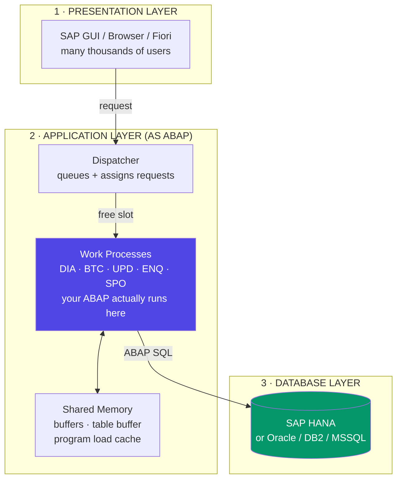

### The work process types — know these by name

An SAP system does not have one kind of worker. It has five, and knowing which one your code is running in explains most "why did it behave differently in the background?" bugs.

| Type | Full name | What it does | When your code runs here |
|---|---|---|---|
| **DIA** | Dialog | Serves interactive users, screen by screen | Any program a user runs from SE38 or a transaction |
| **BTC** | Background / Batch | Runs scheduled jobs with no user attached | Nightly jobs, mass data runs (SM36/SM37) |
| **UPD** | Update | Performs the actual database writes asynchronously | Anything posted via `CALL FUNCTION ... IN UPDATE TASK` |
| **ENQ** | Enqueue | Manages SAP's own logical locks | When you `ENQUEUE_E...` a business object |
| **SPO** | Spool | Handles printing and output | Print output, spool requests |

**The single most important operational rule you will meet:** a **dialog work process has a hard runtime limit**, set by the profile parameter `rdisp/max_wprun_time` — classically **600 seconds (10 minutes)**. Exceed it and the runtime kills your program with the dump `TIME_OUT`. Background (BTC) processes have **no such limit**. This is why the standard answer to *"my report times out"* is not "optimise it" first — it is **"run it in the background."**

```abap
*&---------------------------------------------------------------------*
*& Demonstrating that your program KNOWS where it is running
*&---------------------------------------------------------------------*
REPORT z_where_am_i.

" sy-batch is a system field: 'X' if we are in a background job,
" space if a real human is sitting in front of this program.
" You check this constantly in real code, because you cannot show
" a popup or ask a question when nobody is watching the screen.
IF sy-batch = abap_true.

  " Background: no screens allowed. Write to the job log instead.
  " (WRITE output in background goes to the SPOOL, not to a screen.)
  MESSAGE 'Running in background - writing to spool' TYPE 'I'.

ELSE.

  " Foreground (dialog). A user is present, so interaction is legal:
  " popups, selection screens, ALV grids, confirmation dialogs.
  " BUT: the 10-minute clock is ticking. Keep it short.
  WRITE: / 'Running in dialog. Keep me under 10 minutes!'.

ENDIF.

" Other 'where am I' system fields worth knowing:
WRITE: / 'System ID (SID)....:', sy-sysid,   " e.g. DEV, QAS, PRD
       / 'Client.............:', sy-mandt,   " e.g. 100, 200
       / 'App server host....:', sy-host,    " which machine
       / 'User...............:', sy-uname,   " who is running this
       / 'Language...........:', sy-langu.   " EN, DE, ...
```

**The logic walkthrough — how you'd reason to this.**

1. You start from a real problem: *"my program shows a popup, and it works fine when I test it, but it hangs forever in the nightly job."* That is the classic symptom of forgetting the two worlds exist.
2. So the first question any ABAP developer asks is **"am I in dialog or background?"** — and the runtime already answers it for you in `sy-batch`. You never have to pass a flag around.
3. `abap_true` is a **constant** (value `'X'`) from the type pool `ABAP`. You could write `IF sy-batch = 'X'.` and it compiles — but `abap_true` reads better and is the modern convention. ABAP has no real boolean data type in the classic sense; **`X` means true, blank means false**, and `abap_bool` is a one-character field. This trips up every newcomer once.
4. `MESSAGE ... TYPE 'I'` in dialog shows a modal popup. In **background** the same statement writes to the **job log** instead of popping up — the runtime quietly adapts. Not every statement is that forgiving, which is exactly why you branch explicitly.
5. `sy-sysid` matters more than it looks. A very common defensive pattern is *"never send real emails unless `sy-sysid = 'PRD'`"* — because a test run in DEV that emails 10,000 real customers is a career-defining incident, in the bad way.

**Real-world example — a payroll run.** Payroll for 40,000 employees reads `PA0001` (org assignment), `PA0008` (basic pay) and dozens of other infotypes, calculates, and posts to `FI`. It cannot possibly finish in 600 seconds, and no human should sit watching it. So it is **scheduled as a background job** (transaction SM36), runs in a **BTC work process** overnight, writes its results to the **spool**, and posts financial documents through **UPD work processes** so the dialog user who triggered it isn't blocked waiting for thousands of database writes. Every one of the five process types shows up in that one business run.

### Roll-in / roll-out, and why ABAP developers obsess about memory

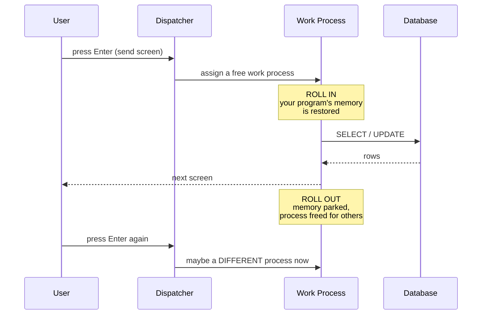

The practical consequences, and you should memorise these because they explain a hundred rules you'll be told later:

- **You cannot rely on a work process staying yours.** So you cannot hold a database lock across a user screen using database locks — SAP invented its own **enqueue lock** mechanism (ENQ processes) precisely because the DB transaction gets committed/rolled back at every screen change.
- **A "SAP LUW" is not a "database LUW."** One logical business transaction (create a sales order) spans several screens and therefore several database transactions. Keeping them consistent is the whole reason `CALL FUNCTION ... IN UPDATE TASK` and `COMMIT WORK` exist.
- **Memory is a shared, limited resource.** Bloating an internal table with 10 million rows doesn't just slow *you* down; it pushes the work process into its extended memory quota and can dump with `TSV_TBL_SPACE_NO_ROLL_MEMORY`, hurting everyone on that server.

<div class="ba"><div class="ba-col ba-before"><h4>❌ Bad (thinking like Node)</h4><ul><li>"I'll load all 5M rows into memory and filter in ABAP"</li><li>"I'll keep state in a global variable across screens"</li><li>"I'll run this 40-minute report in the foreground"</li><li>"I'll open a DB lock and hold it while the user thinks"</li></ul></div><div class="ba-col ba-after"><h4>✅ Good (thinking like ABAP)</h4><ul><li>Filter in the <code>WHERE</code> clause — let the DB do it</li><li>Carry state explicitly, or use ABAP memory / shared objects</li><li>Schedule it as a background job (SM36)</li><li>Use SAP enqueue locks (<code>ENQUEUE_E*</code>) — they survive screens</li></ul></div></div>

**Interview points.**
- *"Explain the three-tier architecture."* — Presentation / Application / Database, and the key benefit: the application layer **scales horizontally** (add more app servers behind the same database) and the database is **swappable** (the same ABAP ran on Oracle, DB2 and now HANA without change, because ABAP SQL is abstracted from the vendor's SQL dialect).
- *"What is the difference between a dialog and a background work process?"* — Interactivity and the runtime limit. Mention `rdisp/max_wprun_time` and `TIME_OUT` by name; it signals real system exposure.
- *"What happens when all dialog work processes are busy?"* — Requests queue in the dispatcher. If the queue overflows, users see the system "hanging." Transaction **SM50** (local) / **SM66** (global) is where you go to look at which processes are stuck and on what.

---
## A3. The ABAP Stack vs the JavaScript Stack

**Simple definition:** In the JavaScript world you **assemble** a stack from independent parts — runtime, framework, ORM, database, build tool, test runner, package manager, git, CI/CD — each chosen by you and glued together. In the ABAP world the stack is **pre-assembled and inseparable**: the language, the type system, the database schema (ABAP Dictionary), the IDE, the debugger, the version control (transports), the authorisation system and the deployment pipeline all ship as **one product**. You gain enormous consistency and lose nearly all choice. Learning ABAP is therefore less about syntax and more about learning **where SAP already put the thing you would have installed**.

<p class="te"><strong>Telugu:</strong> JS lo meeru stack ni <strong>meeru ye assemble chestaru</strong> — Node, React, Prisma, Postgres, Vite, Jest, npm, git, GitHub Actions... anni veru veru, meeru kalapali. ABAP lo stack <strong>already kalisi vachestundi</strong> — language, types, database schema, IDE, debugger, version control, security, deployment anni SAP ye istundi, oke product lo. Choice tho tondara ledu kaani <strong>consistency chala ekkuva</strong>. Anduke ABAP nerchukovadam ante syntax kanna ekkuvaga "nenu install chese aa thing SAP ekkada pettindi?" ani telusukovadam.</p>

**The everyday analogy.** JavaScript is cooking in your own kitchen: you buy the pans you like, the oven you like, and you can make anything — but you also have to buy, maintain and replace all of it, and your friend's kitchen looks nothing like yours. ABAP is cooking in a **hotel kitchen that came fully equipped and staffed**: every station is where the manual says it is, every hotel in the chain is laid out identically, so a chef from another hotel can walk in and work immediately. The trade is real: you cannot install your favourite pan. But you also never lose a day to "the pan doesn't fit the oven."

### The full side-by-side map

This is the single most useful table in Part A. Print it. Every row is a thing you already know, pointing at its ABAP address.

| Concern | JavaScript / React world | ABAP world | Notes for you |
|---|---|---|---|
| Language | JavaScript / TypeScript | **ABAP** | Statically typed like TS, but enforced at compile *and* DB level |
| Runtime | Node.js / browser | **AS ABAP work process** | Not long-lived; roll-in/roll-out per screen |
| Package manager | npm / pnpm | **none** — SAP ships everything | You *find* function modules & classes, you don't install them |
| Third-party libraries | 3M npm packages | Standard SAP function modules, BAPIs, global classes (`CL_*`) | Search in SE37 / SE24 / ADT |
| Type definitions | `interface`, `type`, `.d.ts` | **ABAP Dictionary** (SE11): data elements, domains, structures, table types | Types are shared with the DB — no drift possible |
| ORM / query builder | Prisma, TypeORM, Knex | **ABAP SQL** built into the language + **CDS views** | No mapping layer to maintain |
| Database | Postgres/MySQL you install | **HANA** (or Oracle/DB2/MSSQL), already there | You never write DDL by hand; SE11 generates it |
| Migrations | `prisma migrate`, Flyway | Dictionary changes + **SE14** activation, moved by transports | The transport *is* the migration |
| Arrays / collections | `Array`, `Map`, `Set` | **Internal tables** (STANDARD / SORTED / HASHED) | HASHED ≈ `Map` with O(1) key access |
| Objects / records | `{ }` object literal | **Structures** and **work areas** | `VALUE #( a = 1 b = 2 )` ≈ object literal |
| Classes | `class`, `extends` | **ABAP Objects** (`CLASS ... DEFINITION`) | Full OO: interfaces, inheritance, events, exceptions |
| Modules / imports | `import` / `export` | **Packages** (dev classes) + visibility sections | Package interfaces control what's public |
| IDE | VS Code | **Eclipse + ADT** (modern) or **SE80** (classic) | ADT is the real answer today |
| Debugger | Chrome DevTools | **ABAP Debugger** (`/h`, or breakpoints in ADT) | Genuinely excellent — better than most |
| Unit tests | Jest / Vitest | **ABAP Unit** (`CLASS ... FOR TESTING`) | Same xUnit shape; runs with Ctrl+Shift+F10 in ADT |
| Linting | ESLint / Prettier | **Code Inspector (SCI)** / **ATC** (ABAP Test Cockpit) | ATC gates transports in serious shops |
| Version control | git, branches, PRs | **Transport Requests** (+ optionally **abapGit**) | No branching in classic transports — this is the big culture shock |
| Environments | localhost → staging → prod | **DEV → QAS → PRD** systems | Physically separate systems, not folders |
| Deploy | `git push`, CI pipeline | **Release a transport**, Basis imports it (STMS) | Deployment is a person's job, not a script's |
| Auth | JWT, OAuth, middleware | **Authorization objects** + roles (PFCG), `AUTHORITY-CHECK` | Declarative and system-wide, not per-app |
| Logging | `console.log`, Winston | **Application Log (SLG1/BAL)**, `MESSAGE` | `WRITE` is output, not logging — different thing |
| API layer | Express routes / REST | **RFC**, **BAPI**, **OData (Gateway/RAP)** | OData is the modern outward-facing one |
| Async | `Promise`, `async/await` | `CALL FUNCTION ... STARTING NEW TASK`, background jobs, bgPF | Nothing like as central; ABAP is mostly synchronous |

### The same task, in both worlds

Here is "fetch flights for a carrier and print the count," written twice.

```javascript
// ---------- The JavaScript version ----------
// You had to: npm install pg, create a pool, know the connection
// string, write SQL as a STRING (no compiler checking it), await it,
// and remember that a network error throws while an empty result
// does not.
import { Pool } from 'pg';
const pool = new Pool({ connectionString: process.env.DATABASE_URL });

async function countFlights(carrier) {
  // The SQL is a string. A typo in a column name is a RUNTIME error.
  const { rows } = await pool.query(
    'SELECT carrid, connid, fldate, seatsocc FROM sflight WHERE carrid = $1',
    [carrier]                       // parameterised, to avoid injection
  );
  if (rows.length > 0) {
    console.log(`Found ${rows.length} flights for ${carrier}.`);
  } else {
    console.log('No flights found.');
  }
  return rows;
}
```

```abap
*&---------------------------------------------------------------------*
*& ---------- The ABAP version ----------
*& No install, no pool, no connection string, no await. The SQL is
*& COMPILED and CHECKED -- a typo in a column name fails at syntax
*& check, not in production at 2am.
*&---------------------------------------------------------------------*
REPORT z_compare_stacks.

PARAMETERS p_carr TYPE s_carr_id DEFAULT 'LH'.   " a real input field on
                                                 " a generated screen --
                                                 " one line, no HTML,
                                                 " no form library.

START-OF-SELECTION.

  " Inline declaration (7.40+): @DATA(lt_flights) both DECLARES and
  " TYPES the variable from the SELECT list. This is ABAP's answer to
  " TypeScript inference -- you write no interface at all.
  SELECT carrid, connid, fldate, seatsocc
    FROM sflight
    WHERE carrid = @p_carr
    INTO TABLE @DATA(lt_flights).

  " No 'rows.length' -- lines( ) is the built-in. sy-subrc also told us.
  IF lines( lt_flights ) > 0.
    WRITE: / |Found { lines( lt_flights ) } flights for { p_carr }.|.
  ELSE.
    WRITE: / 'No flights found.'.
  ENDIF.
```

**The logic walkthrough — what changed and why it matters.**

1. **Zero setup lines.** The JS version spends its first three lines existing. The ABAP version's first line of *real* code is the `SELECT`. Everything the JS version had to construct — connection, credentials, pooling, driver — is provided by the work process you are running inside. You are already connected, always, to the client's data.
2. **`PARAMETERS p_carr`** — one statement, and SAP generates an actual input screen with a labelled field, an input help (because the type `s_carr_id` carries one), and validation. In React that is a form component, state, a change handler and a validation schema. This is the clearest single demonstration of "the stack is pre-assembled."
3. **The SQL is checked at compile time.** In the JS version `SELECT carrrid` (three r's) ships to production and fails at runtime. In ABAP the syntax check fails immediately, because the compiler knows the SFLIGHT definition from the dictionary. This is a genuinely large reliability difference and worth saying out loud in interviews.
4. **`INTO TABLE @DATA(lt_flights)`** — inline declaration. The variable is created with exactly the type of the field list. It is TypeScript inference, six years before TypeScript was popular in the enterprise. Old code declared a `TYPES: BEGIN OF ty_flight ... END OF ty_flight.` structure by hand; you will see plenty of it, and you should not copy that habit into new code.
5. **`START-OF-SELECTION.`** — an **event block**. Report programs are event-driven: the runtime shows the selection screen first, and only when the user hits Execute does it raise `START-OF-SELECTION` and run your code. It is the ABAP equivalent of `onSubmit`, declared as a language keyword. There is no `main()`.
6. **`lines( )` vs `.length`** — `lines( )` is a built-in function returning the row count of an internal table. Note the ABAP spacing rule that catches everyone: **`lines( lt_flights )` needs spaces inside the parentheses.** `lines(lt_flights)` is a syntax error. ABAP is whitespace-strict inside expressions in a way no other mainstream language is.

### What you genuinely give up, and what you genuinely gain

| You give up | You gain |
|---|---|
| Choosing your tools | Every SAP system on Earth looks the same to you |
| npm ecosystem breadth | A vast, tested, documented standard library that never breaks |
| Git branching & PR culture | Guaranteed, auditable, environment-by-environment promotion |
| Fast local iteration | Never a "works on my machine" problem — there is no machine |
| Modern editor ecosystem | ADT in Eclipse is genuinely good; where-used lists are unmatched |
| Frequent framework churn | Skills that stay valuable for 20 years |

**The one that will actually hurt for the first month:** **there is no localhost.** You cannot run ABAP offline, you cannot spin up a container, and you share the DEV system with other developers. If you want a personal sandbox, the answer is an **SAP BTP ABAP Environment trial** or the free **ABAP Platform Developer Edition** (a downloadable Docker/VM image with a full AS ABAP inside). Get one early — you will learn ten times faster with a system you can break.

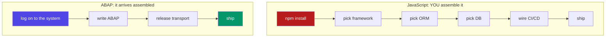

**Interview points.**
- *"Coming from JavaScript, what was hardest about ABAP?"* — A genuinely good answer: *"No branching. In git I isolate work on a branch and merge when ready; a transport request is more like a commit that is also a deployment unit, and two developers changing the same object have to coordinate through locks rather than merge."* That answer shows you understand transports (B6) rather than just having read about them.
- *"Why does SAP not just use PostgreSQL and Java?"* — Because the type system, the dictionary, the authorisation model and 40 years of customer code are all fused to ABAP. And because ABAP SQL's database abstraction is exactly what let SAP move its entire customer base onto HANA without customers rewriting their code.

---
## A4. Classic ABAP, ABAP for HANA, and ABAP Cloud

**Simple definition:** ABAP exists today in **three overlapping styles**, and job descriptions mix them freely. **Classic ABAP** is the procedural/OO code written for ECC on a disk database — heavy on `SELECT` + `LOOP` + internal-table processing in the application layer. **ABAP for HANA** (roughly 7.4–7.5 onward) is the same language written with a new instinct: **push work down to the database** using **CDS views**, **AMDP** and set-based SQL, because HANA is now fast enough to do the heavy lifting. **ABAP Cloud** is the strict modern subset used in S/4HANA Cloud and the BTP ABAP Environment: **only released public APIs**, **ABAP Objects only**, no direct access to SAP tables, and RAP for services — the "clean core" rules that keep upgrades painless.

<p class="te"><strong>Telugu:</strong> ABAP ippudu <strong>moodu styles</strong> lo undi. (1) <strong>Classic ABAP</strong> — old ECC style: SELECT chesi, data anta application server ki teesukoni, LOOP lo process cheyyadam. (2) <strong>ABAP for HANA</strong> — HANA vachaka new rule: <strong>panini database ki kindiki push cheyyi</strong> (CDS views, AMDP), endukante HANA chala fast. (3) <strong>ABAP Cloud</strong> — S/4HANA Cloud &amp; BTP kosam strict modern subset: <strong>released APIs matrame</strong> vaadali, SAP tables ni direct ga touch cheyyakudadu, ABAP Objects only, services ki RAP. Idi "<strong>clean core</strong>" kosam — upgrade time lo code break avvakunda undataniki.</p>

**The everyday analogy.** Imagine three generations of the same family business. The **grandfather** (Classic) does everything by hand at his own desk: he walks to the warehouse, carries the boxes back, counts them at his desk, and writes the total. The **father** (ABAP for HANA) realises the warehouse now has a counting machine — so he stops carrying boxes and just phones the warehouse: *"how many blue ones?"* The **son** (ABAP Cloud) works in a franchise: he may only use the official ordering system, is not allowed to walk into the warehouse at all, and everything he touches has a documented, guaranteed interface — because head office wants to renovate the warehouse next year without breaking his shop.

That warehouse renovation is the whole point. **Clean core** exists so SAP can upgrade the system underneath you without your code breaking.

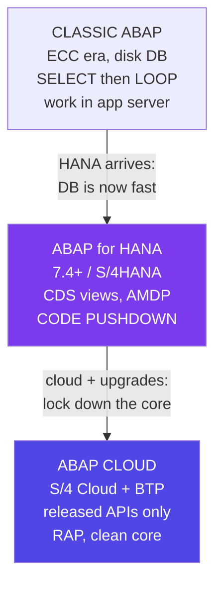

### The one idea that separates Classic from HANA: code pushdown

Classic ABAP was written when the database was **slow** and the application server was where you did work. HANA inverted that. The modern rule is called the **code-to-data paradigm** (or code pushdown): *do the aggregating, joining and filtering **in the database**, and bring back only the small result.*

```abap
*&---------------------------------------------------------------------*
*& CLASSIC style -- how ABAP was written for 20 years
*& Goal: total booked seats per carrier
*&---------------------------------------------------------------------*
REPORT z_classic_style.

TYPES: BEGIN OF ty_total,
         carrid TYPE sflight-carrid,
         total  TYPE i,
       END OF ty_total.

DATA: lt_flights TYPE TABLE OF sflight,
      lt_totals  TYPE TABLE OF ty_total,
      ls_total   TYPE ty_total.

" STEP 1: drag EVERY flight row across the network into app memory.
" On a real system this could be millions of rows. This is the
" expensive part, and in 1998 there was no better option.
SELECT * FROM sflight INTO TABLE lt_flights.

" STEP 2: do the arithmetic in ABAP, row by row, in the app server.
LOOP AT lt_flights INTO DATA(ls_flight).
  READ TABLE lt_totals INTO ls_total
       WITH KEY carrid = ls_flight-carrid.
  IF sy-subrc = 0.
    " found: add to the existing total and put the row back
    ls_total-total = ls_total-total + ls_flight-seatsocc.
    MODIFY lt_totals FROM ls_total INDEX sy-tabix.
  ELSE.
    " not found: start a new total for this carrier
    CLEAR ls_total.
    ls_total-carrid = ls_flight-carrid.
    ls_total-total  = ls_flight-seatsocc.
    APPEND ls_total TO lt_totals.
  ENDIF.
ENDLOOP.
```

```abap
*&---------------------------------------------------------------------*
*& HANA / MODERN style -- same result, one statement
*&---------------------------------------------------------------------*
REPORT z_hana_style.

" The database does the grouping and the summing. Only the small
" aggregated result (a handful of rows) crosses to the app server.
" Faster, shorter, and impossible to get wrong.
SELECT carrid,
       SUM( seatsocc ) AS total        " aggregate IN the database
  FROM sflight
  GROUP BY carrid
  ORDER BY carrid
  INTO TABLE @DATA(lt_totals).

LOOP AT lt_totals INTO DATA(ls_total).
  WRITE: / ls_total-carrid, ls_total-total.
ENDLOOP.
```

**Walk through the difference in thinking.**

1. **Ask "where should this work happen?" before you write anything.** Classic instinct: *"get the data, then compute."* HANA instinct: *"describe the answer I want; let the database compute it."* That single re-pointing is 80% of what "ABAP for HANA" means in practice.
2. **Count the network transfers.** Classic moves N rows (maybe 5,000,000). Modern moves the number of carriers (maybe 20). The `SELECT`-then-`LOOP` version isn't just longer — it can be a thousand times slower on real data.
3. **Count the ways to introduce a bug.** The classic version has a `READ TABLE`, an `sy-subrc` check, a `MODIFY ... INDEX sy-tabix`, a `CLEAR` and an `APPEND` — five places to make a mistake (forget the `CLEAR` and you carry stale fields into the new row; that is a real bug that has shipped many times). The modern version has none.
4. **`SUM( seatsocc )`** — mind the spaces again: ABAP requires them inside the brackets of any expression or function.
5. **When is the classic style still right?** When the logic genuinely cannot be expressed in SQL — complex branching business rules, calls to function modules, per-row validation against config. Then you still `SELECT` a *filtered* set and loop. The rule is not "never loop"; it is **"never move data you're only going to throw away."**

### CDS views — the artefact you'll actually build

The real vehicle for code pushdown is the **CDS view (Core Data Services)**: a database view defined in source code, versioned, transported, and rich with annotations that other layers (Fiori, OData, analytics) read automatically.

```abap
@AbapCatalog.sqlViewName: 'ZVFLIGHTSUM'   " the 16-char technical DB view
@AccessControl.authorizationCheck: #CHECK  " apply DCL access rules
@EndUserText.label: 'Booked seats per carrier'
@Analytics.dataCategory: #CUBE             " tells analytics tools what
                                           " this is -- metadata that
                                           " makes Fiori apps possible
define view Z_I_FlightSummary
  as select from sflight
  association [0..1] to scarr as _Carrier   " a JOIN you don't have to
    on $projection.carrid = _Carrier.carrid " write again in every query
{
  key carrid                as CarrierId,
      sum( seatsocc )       as BookedSeats,
      sum( paymentsum )     as Revenue,
      _Carrier.carrname     as CarrierName, " reach through the assoc
      _Carrier                              " expose it for consumers
}
group by carrid, _Carrier.carrname
```

**How to read that if you've never seen CDS.**

1. **It is a view, not a program.** You activate it once, and from then on any ABAP can `SELECT ... FROM z_i_flightsummary` as if it were a table. The heavy lifting is permanently pushed into the database.
2. **The `@` lines are annotations** — metadata. `@Analytics.dataCategory: #CUBE` doesn't change the data at all; it tells consuming tools how to treat it. This is how one CDS view can simultaneously power an ABAP report, an OData service and a Fiori analytical tile. If you know React, think of them as declarative props for the whole rest of the stack.
3. **`association ... to scarr`** is CDS's big idea: define the relationship **once**, and every consumer can navigate it (`_Carrier.carrname`) without rewriting the join. It is closer to a Prisma relation than to a SQL join.
4. **The naming `Z_I_`** follows SAP's **Virtual Data Model (VDM)** convention: `I_` = interface view (reusable, building block), `C_` = consumption view (what a Fiori app or OData service binds to), `P_` = private. Real S/4HANA projects live and die by this layering.

### The three styles, compared

| | **Classic ABAP** | **ABAP for HANA** | **ABAP Cloud** |
|---|---|---|---|
| Typical system | ECC 6.0, on-premise | S/4HANA on-premise / private cloud | S/4HANA Cloud (public), BTP ABAP Env. |
| Release | up to 7.02 | 7.4 / 7.5+ | 7.5+ with ABAP Cloud restrictions |
| Core instinct | Fetch data, process in ABAP | **Push work into the DB** | **Use only released APIs** |
| Key artefacts | Reports, module pools, FMs, BAPIs | CDS views, AMDP, ABAP SQL expressions | RAP BOs, CDS, released APIs, EML |
| Table access | `SELECT *` from any SAP table | Same, but pushed down | **Forbidden** — only released APIs/CDS |
| Programming model | Procedural + OO mix | Mostly OO | **ABAP Objects only** (classes, no reports) |
| Services | RFC / BAPI / classic Gateway | Gateway / CDS-exposed OData | **RAP** → OData V4 |
| Modifications to SAP code | Common (user exits, enhancements) | Discouraged | **Impossible** — extension points only |
| Upgrade pain | High (custom code breaks) | Medium | **Near zero — that's the point** |
| Where jobs are | Huge installed base, maintenance | The S/4 migration wave (biggest right now) | Growing fast; the future |

<div class="pic"><strong>Picture it:</strong> Classic ABAP could touch anything, so upgrades broke everything. ABAP Cloud can only touch what SAP promised to keep stable, so upgrades break nothing. The restriction <em>is</em> the feature.</div>

### What "released API" actually means

In ABAP Cloud, you cannot write `SELECT * FROM mara`. You must use a **released** object — one SAP has explicitly marked with a stable contract (a "C1 release contract"). If you try to use an unreleased one, the syntax check fails immediately. This is enforced by the **ABAP language version** set on each object:

| Language version | Where used | What it allows |
|---|---|---|
| **Standard ABAP** | Classic on-premise | Everything; no restrictions |
| **ABAP for Key Users** | In-app extensibility, restricted editor | A small, safe subset |
| **ABAP Cloud** | BTP ABAP Env., S/4HANA Cloud | Released APIs only, OO only, strict checks |

**A pragmatic note for your job search.** As of 2026, most advertised ABAP roles still involve **Classic + ABAP for HANA** on S/4HANA on-premise or private cloud — that is where the migration wave is. **ABAP Cloud** is the direction of travel and appears in the "nice to have" line of most postings and the "must have" line of the best ones. Learn Classic properly (you cannot read the existing code without it), write in the modern style (7.4+ syntax, code pushdown) by default, and understand ABAP Cloud's rules well enough to explain clean core in an interview. That combination is exactly what hiring managers are looking for right now.

**Interview points.**
- *"What is clean core?"* — Keeping the SAP standard core unmodified, so upgrades are cheap. You extend via **released extension points**, **side-by-side apps on BTP**, and **key-user extensibility**, rather than modifying SAP code. Mention that ABAP Cloud is the *technical enforcement* of clean core, not just advice.
- *"What is code pushdown, and name three techniques."* — Moving computation from the app server to the database. Three: **CDS views**, **AMDP** (ABAP Managed Database Procedures — SQLScript written inside an ABAP class), and **modern ABAP SQL** (aggregates, expressions, joins, `CASE`, calculations directly in the `SELECT`).
- *"Can you still use `SELECT *` on HANA?"* — Technically yes, but it is a code review failure. On a **columnar** store, selecting all columns defeats the entire point of column storage — you are forcing the database to reconstruct rows it had deliberately taken apart. Name only the fields you need.

---
## A5. What an ABAP Developer Actually Does All Day

**Simple definition:** An ABAP developer's job is **not** "build apps from scratch." It is overwhelmingly **extending, integrating and reporting on a system that already exists**. The work arrives as a **ticket** or a **functional specification** written by a functional consultant (an FI/MM/SD expert who knows the business but not the code), you turn it into a **technical specification** and then code, and the output is usually one of a small number of recognisable shapes — collectively remembered by the industry acronym **RICEFW**: **R**eports, **I**nterfaces, **C**onversions, **E**nhancements, **F**orms, **W**orkflows. If you can build those six things well, you are an employable ABAP developer.

<p class="te"><strong>Telugu:</strong> ABAP developer roju panulu ento telusukondi — kotta app zero nundi build cheyyadam <strong>kaadu</strong>. Already unna pedda SAP system ni <strong>extend, integrate, report</strong> cheyyadam. Pani ela vastundi? Oka <strong>functional consultant</strong> (business telisina manishi, code teliyadu) oka <strong>functional spec</strong> rastadu, meeru danini <strong>technical spec</strong> ga marchi code rastaru. Aa pani ekkuvaga aaru shapes lo untundi — <strong>RICEFW</strong>: Reports, Interfaces, Conversions, Enhancements, Forms, Workflows. Ee aaru baaga vaste, meeru job ki ready.</p>

**The everyday analogy.** You are not the architect who designed the apartment building — it was built in 1998 and 40,000 people live in it. You are the **skilled fitter** who comes in when a floor needs a new layout: run a new cable here, connect this building to the one next door, replace the kitchen in flat 12B, and produce a monthly report on water usage. You must know exactly where the existing pipes and load-bearing walls are, because cutting the wrong one brings the ceiling down on people who are still living there. That respect for the existing structure — not raw coding speed — is what makes a senior ABAP developer valuable.

### RICEFW — the six shapes of the work

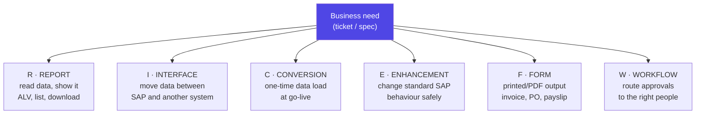

| Letter | What it is | Typical real request | Main tools |
|---|---|---|---|
| **R** — Report | Read and present data | *"List all open sales orders over 90 days old, by region"* | ABAP SQL, **ALV** (`CL_SALV_TABLE`), selection screens |
| **I** — Interface | Exchange data with another system | *"Send every new PO to the supplier portal"* | **IDoc**, RFC, **OData**, files, PI/PO/CPI, proxies |
| **C** — Conversion | One-off migration into SAP | *"Load 200,000 customers from the legacy system"* | **LSMW / LTMC**, BAPIs, BDC, batch input |
| **E** — Enhancement | Change SAP standard behaviour | *"Block the sales order if customer credit is exceeded"* | **BAdI**, user exits, enhancement spots, implicit enhancements |
| **F** — Form | Printed / PDF business documents | *"New invoice layout with our logo and QR code"* | **SmartForms**, **Adobe Forms**, (legacy: SAPscript) |
| **W** — Workflow | Route tasks and approvals | *"POs over €10,000 need the plant manager's approval"* | SAP Business Workflow (SWDD), Flexible Workflow |

**Rough share of a typical developer's time:** Reports and Enhancements together are usually well over half the work. Interfaces are the next biggest and the most technically interesting. Conversions cluster around go-live. Forms and Workflows are often specialisms — some developers do nothing else.

### A day, hour by hour

This is what the job actually feels like, and it is worth knowing before you take it:

| Time | Activity | What's really happening |
|---|---|---|
| 09:00 | Check tickets / stand-up | Incidents (production broken) always outrank new development |
| 09:30 | **Debug a production issue** | Reproduce in DEV, `/h` into the debugger, find the cause |
| 11:00 | Read a functional spec | Then ask the consultant the three questions the spec forgot |
| 11:30 | **Where-used analysis** | Before changing anything: who else calls this? (Ctrl+Shift+G) |
| 13:00 | Write code | Often less than 2 hours of actual typing in a day |
| 15:00 | Unit test + test in DEV with real-ish data | ABAP Unit, then manual runs with edge cases |
| 16:00 | Code review / ATC check | Fix the findings before the transport is released |
| 16:30 | **Release the transport**, write the release note | Then Basis imports to QAS; testers pick it up tomorrow |
| 17:00 | Answer "why is this report slow?" | ST05 SQL trace, SAT runtime analysis |

**The honest observation:** you will spend more time **reading** SAP's code than writing your own. The most valuable skill in this job is not writing ABAP — it is **finding the exact place** in 400 million lines of standard code where the behaviour you need to change lives. Everything in Part B (the workbench, where-used lists, the repository) exists to make that findable.

### A realistic first ticket, end to end

Here is the kind of thing you will genuinely be handed in month one.

> **Ticket ZD-4471.** *"Sales team need a list of sales orders for a customer and date range, showing order number, date, net value and current delivery status. They currently export from VA05 and rework it in Excel every Monday. Please provide a report."*

```abap
*&---------------------------------------------------------------------*
*& Report Z_SD_OPEN_ORDERS
*& Ticket : ZD-4471
*& Author : N. Vanama
*& Purpose: Open sales orders by customer + date range, as an ALV grid.
*&---------------------------------------------------------------------*
REPORT z_sd_open_orders.

" ---------------------------------------------------------------
" SELECTION SCREEN. Two statements = a real, validated input screen.
" SELECT-OPTIONS gives a RANGE (from/to, multiple values, exclusions,
" pattern matching) -- there is no JS equivalent that is this cheap.
" ---------------------------------------------------------------
SELECT-OPTIONS: s_kunnr FOR  vbak-kunnr,   " customer (sold-to party)
                s_erdat FOR  vbak-erdat.   " created-on date range

PARAMETERS:     p_max   TYPE i DEFAULT 5000.  " safety cap -- ALWAYS
                                              " give the user a limit,
                                              " never let a report be
                                              " unbounded on VBAK.

START-OF-SELECTION.

  " -------------------------------------------------------------
  " ONE select, with a JOIN, aggregating at the database.
  " VBAK = sales order HEADER, VBAP = sales order ITEMS.
  " We want header info + the summed net value of the items, so we
  " join and group -- instead of selecting headers, then looping and
  " selecting items per header (the classic 'SELECT inside LOOP'
  " performance disaster).
  " -------------------------------------------------------------
  SELECT FROM vbak AS h
    INNER JOIN vbap AS i
      ON  h~vbeln = i~vbeln              " ~ is ABAP's dot for
                                          " alias~field in SQL
    FIELDS h~vbeln,                       " sales document number
           h~erdat,                       " created on
           h~kunnr,                       " customer
           h~vkorg,                       " sales organisation
           SUM( i~netwr ) AS net_value,   " total net value, in the DB
           h~waerk                        " currency
    WHERE h~kunnr IN @s_kunnr             " IN <selopt> -- the range
      AND h~erdat IN @s_erdat             " table is applied by the DB
      AND h~vbtyp  = 'C'                  " 'C' = order (not quote 'B',
                                          " not contract 'G'...)
    GROUP BY h~vbeln, h~erdat, h~kunnr, h~vkorg, h~waerk
    ORDER BY h~erdat DESCENDING
    INTO TABLE @DATA(lt_orders)
    UP TO @p_max ROWS.                    " the safety cap

  IF sy-subrc <> 0.
    " No data is NOT an error -- tell the user politely and stop.
    MESSAGE 'No sales orders found for this selection.' TYPE 'S'
            DISPLAY LIKE 'W'.
    RETURN.
  ENDIF.

  " -------------------------------------------------------------
  " ALV OUTPUT. Never hand-roll WRITE lists for real reports -- the
  " ALV grid gives the user sorting, filtering, totals, layout saving
  " and Excel export for free, and they will ask for all of those.
  " -------------------------------------------------------------
  TRY.
      cl_salv_table=>factory(
        IMPORTING r_salv_table = DATA(lo_alv)
        CHANGING  t_table      = lt_orders ).

      " Turn on the standard toolbar (export, sort, filter, print)
      lo_alv->get_functions( )->set_all( abap_true ).

      " Zebra striping + optimised column widths: two lines, and the
      " report immediately looks like every other SAP report the user
      " already knows how to operate.
      lo_alv->get_display_settings( )->set_striped_pattern( abap_true ).
      lo_alv->get_columns( )->set_optimize( abap_true ).

      lo_alv->display( ).

    CATCH cx_salv_msg INTO DATA(lx_salv).
      MESSAGE lx_salv->get_text( ) TYPE 'E'.
  ENDTRY.
```

**How you'd think your way to this — the actual reasoning sequence.**

1. **Find the data before you write anything.** The ticket says "sales orders." You need to know that lives in **VBAK** (header) and **VBAP** (items). You find that either from experience, from the SAP data model, or — the practical way — by running transaction **VA03**, putting the cursor on the field, pressing **F1** then the **Technical Information** button, which tells you the exact table and field name. That trick will serve you daily.
2. **Ask what the spec didn't say.** Does "net value" mean header or sum of items? Should rejected items count? Which document types? A good developer sends three questions before writing code; a junior guesses and reworks it twice. *This is the actual difference in seniority.*
3. **Choose `SELECT-OPTIONS` over `PARAMETERS`.** A parameter takes one value; a select-option gives the user ranges, multiple values, exclusions and wildcards — for free, with a standard UI they already know. The moment a spec says "for a range of dates," the answer is `SELECT-OPTIONS`.
4. **Decide where the work happens.** The naive version selects headers, loops, and selects items for each — 5,000 orders means 5,001 database round-trips. The correct version is one joined, grouped statement. This is A4's code-pushdown lesson, applied on day one.
5. **`h~vbtyp = 'C'`** — you must filter by document category or you'll return quotations and contracts alongside orders and the numbers will be wrong. This kind of domain fact is why functional consultants exist; you learn them one burn at a time.
6. **Cap the result.** `UP TO @p_max ROWS` protects the dialog work process from the 10-minute timeout (A2) and protects the server's memory from a user who leaves the selection screen blank. Every production report needs a guard like this.
7. **`sy-subrc <> 0` is not an error case.** "No data found" is a normal outcome, so you use `MESSAGE ... TYPE 'S' DISPLAY LIKE 'W'` (a status message shown as a warning) rather than a hard `TYPE 'E'`, which would leave the user stuck. Message types are a real skill: `S` status, `I` info popup, `W` warning, `E` error, `A` abend, `X` short dump.
8. **Use ALV, always.** `CL_SALV_TABLE` is four lines and delivers a professional grid. Hand-written `WRITE` lists (C4) are for quick debugging and nothing else. The user *will* come back asking for Excel export and column sorting — ALV already has both.

### Who you work with

| Role | What they know | What they need from you |
|---|---|---|
| **Functional consultant** (FI/MM/SD/PP/HR) | The business process and SAP config, deeply. Little/no ABAP | Ask clarifying questions early; explain technical limits in business language |
| **Basis administrator** | The system, transports, performance, users | Clean transports, released on time, no runaway jobs |
| **Business user / key user** | What they actually need (often ≠ the spec) | Working output, and honesty about timelines |
| **Solution architect** | The overall design and clean-core strategy | Don't modify SAP standard without asking |
| **Testers** | The test scripts | Reproducible builds and clear release notes |

**The relationship that matters most is with your functional consultant.** They will hand you a spec that is 70% complete, because they cannot know what is technically ambiguous. Developers who cheerfully ask good questions get better specs; developers who silently guess get rework and a reputation.

<div class="ba"><div class="ba-col ba-before"><h4>❌ How juniors work</h4><ul><li>Start coding from the spec immediately</li><li>Modify SAP standard code to make it fit</li><li>Test with three happy-path records</li><li><code>SELECT</code> inside a <code>LOOP</code>, no row limit</li><li>Transport released Friday 18:00, no note</li><li>Hardcode plant '1000' and the client number</li></ul></div><div class="ba-col ba-after"><h4>✅ How seniors work</h4><ul><li>Ask 3 questions, run a where-used, <em>then</em> code</li><li>Use a BAdI / enhancement point — keep the core clean</li><li>Test empty input, huge input, wrong authorisations</li><li>One set-based statement with a safety cap</li><li>Release with a note, tell the tester what to check</li><li>Read config from a Z customising table</li></ul></div></div>

**Gotchas nobody tells you in month one.**
- **Production access is restricted.** You usually cannot change anything in PRD — often not even debug with changes. You diagnose from logs, dumps (ST22), traces and a copy of the data. This feels crippling coming from web dev, and it is why writing defensively matters so much.
- **You share DEV with everyone.** If you lock an object, a colleague cannot edit it. If someone leaves a program syntactically broken, everyone's transport imports break. Etiquette is a technical skill here.
- **Nothing is throwaway.** That "quick report" you write today will still be running in 2038, unchanged, and somebody will page you about it. Write the header comment. Name the variables properly.
- **The business owns the deadline, not the sprint.** Month-end close, year-end close and go-live weekends are immovable. Plan around the business calendar.

**Interview points.**
- *"Walk me through how you'd handle a new requirement."* — Read the FS → clarify with the functional consultant → **where-used / impact analysis** → write the TS (technical spec) → build in DEV → ABAP Unit + ATC → transport to QAS → support UAT → transport to PRD → hypercare. Naming ATC and where-used analysis unprompted marks you as someone who has actually worked in a landscape.
- *"What is RICEFW?"* — Name all six and give one concrete example of each. It is the fastest way to show you understand the shape of the job rather than just the syntax.
- *"You're asked to change SAP standard code. What do you do?"* — Look for a **BAdI or enhancement spot** first; then an **implicit enhancement**; a **modification** (which requires an SSCR access key and creates upgrade debt) is the last resort and needs architect approval. That answer is clean core (A4) applied to a real decision.

---
# Part B — The Development Environment

*In web development the environment is something you install and forget. In SAP, the environment **is** the product — you log into a live business system that thousands of people are using, and your editor, your database browser, your debugger, your version control and your deployment pipeline are all screens inside that same system. This part teaches you to navigate it: the transaction codes that get you anywhere in two seconds, the classic workbench that all legacy code lives in, the modern Eclipse tooling you'll actually work in, how objects are organised into packages, and — the concept that surprises every newcomer most — how code physically travels from the development system to production inside a transport request.*

## B1. SAP GUI and Transaction Codes

**Simple definition:** **SAP GUI** (SAP Graphical User Interface) is the classic desktop client you install on your machine to log into an SAP system — a grey, dense, keyboard-driven window that has looked broadly the same since 1992 and is still where most ABAP work and most business transactions happen. Inside it, every single screen has a short **transaction code** (**T-code**) — a 1-to-20-character shortcut like `SE38`, `VA01` or `MM03` — that you type into the **command field** at the top left to jump straight there. Learning T-codes is not optional trivia; it is **how you navigate SAP at all**, the same way a terminal user learns commands instead of clicking through folders.

<p class="te"><strong>Telugu:</strong> <strong>SAP GUI</strong> ante SAP system ki login ayye classic desktop application — grey color, dense screens, 1992 nundi deni look pedda ga marale, kaani ippatiki most ABAP work ikkade jarugutundi. Prati screen ki oka chinna shortcut untundi — daanini <strong>transaction code (T-code)</strong> antaru: <code>SE38</code>, <code>VA01</code>, <code>MM03</code> laantivi. Pai left corner lo unna <strong>command field</strong> lo type cheste direct ga aa screen ki veltaru. T-codes nerchukovadam optional kaadu — SAP lo tiragadaniki adhe main way, terminal lo commands laaga.</p>

**The everyday analogy.** Imagine a hospital with 100,000 rooms and no useful signage — but every room has a number, and staff simply say "go to 4B-217." Clicking through the menu tree to find a screen is like walking every corridor reading door labels; typing the T-code is taking the express lift straight to the room. Experienced SAP people essentially never use the menu. Watch a consultant work and you'll see them type four characters and hit Enter, over and over, faster than you can find a bookmark.

### The command field — the six things you can type in it

The little box at the top-left of SAP GUI is more powerful than it looks. This table alone will make you look experienced.

| What you type | What it does |
|---|---|
| `SE38` | Go to that transaction — **but only from the main menu screen** |
| `/nSE38` | Go to SE38, **cancelling** the current transaction (works anywhere) |
| `/oSE38` | Open SE38 in a **new window/session**, keeping the current one alive |
| `/n` | Cancel the current transaction, go back to the main menu |
| `/i` | Close (delete) the current session |
| `/h` | **Turn on the ABAP debugger** for the next step — the single most used command in this list |
| `/nend` | Log off the system entirely (with a confirmation prompt) |
| `/nex` | Log off **immediately**, no confirmation (careful — unsaved work is gone) |
| `/$sync` | Reset (invalidate) all buffers — useful after changing customising |
| `/$tab` | Reset the table buffers only |
| `SEARCH_SAP_MENU` | Find which menu path leads to a given T-code |

**Use `/o` constantly.** You are allowed up to **six sessions** per logon by default. Real workflow is: session 1 = your code (SE38/ADT), session 2 = the data (SE16N), session 3 = the business transaction you're testing (VA03), session 4 = dumps (ST22). Switching between them beats re-navigating every time.

### The T-codes you must know by heart

Split them into two groups: developer tools, and the business transactions you'll be asked to debug.

**Developer / technical:**

| T-code | What it opens | Your JS mental model |
|---|---|---|
| **SE38** | ABAP Editor (reports) | Open a `.js` file in the editor |
| **SE80** | Object Navigator — the whole workbench | The IDE's file explorer + editor combined |
| **SE11** | ABAP Dictionary (tables, data elements, views) | Your schema + your shared type definitions |
| **SE16N** | Data Browser — look at actual table contents | A DB GUI (pgAdmin / TablePlus) |
| **SE37** | Function Builder (function modules) | Browse the standard library |
| **SE24** | Class Builder (global classes) | Browse/edit classes |
| **SE09 / SE10** | Transport Organizer — your changes | `git status` + `git log` |
| **SE91** | Message maintenance | Your i18n/error-message catalogue |
| **SE93** | Create/maintain transaction codes | Registering a route |
| **SM30 / SM31** | Maintain table contents via a generated screen | A simple CRUD admin UI |
| **SM36 / SM37** | Schedule / monitor background jobs | cron + the job dashboard |
| **SM50 / SM66** | Work process overview (local / global) | `htop` for the app server |
| **ST22** | **ABAP dumps** (runtime errors) | Your error-tracking service (Sentry) |
| **SLG1** | Application Log | Your structured logs |
| **ST05** | SQL / performance trace | The Network tab + query analyser |
| **SAT** | Runtime analysis (which code is slow) | A CPU profiler |
| **SU53** | Show the last failed authorisation check | "Why did I get a 403?" |
| **SMARTFORMS** | Form builder | Your PDF template tool |
| **SE71** | SAPscript form painter (legacy) | An older PDF template tool |
| **STMS** | Transport Management System | Your CI/CD dashboard |
| **SICF** | Maintain HTTP services (activate ICF nodes) | Your web server route config |
| **/IWFND/MAINT_SERVICE** | Register OData services (Gateway) | Publishing a REST API |

**Business transactions (you'll debug these constantly):**

| T-code | Module | What it does |
|---|---|---|
| **VA01 / VA02 / VA03** | SD | Create / change / display a **sales order** |
| **VA05** | SD | List of sales orders |
| **VL01N / VL02N** | SD | Create / change an outbound **delivery** |
| **VF01 / VF03** | SD | Create / display a **billing document** |
| **MM01 / MM02 / MM03** | MM | Create / change / display a **material master** |
| **ME21N / ME22N / ME23N** | MM | Create / change / display a **purchase order** |
| **MIGO** | MM | Goods movement (receipt / issue) |
| **MIRO** | MM | Enter an incoming **invoice** |
| **XD01 / XD03** | SD/FI | Create / display a **customer master** |
| **XK01 / XK03** | MM/FI | Create / display a **vendor master** |
| **FB01 / FB03** | FI | Post / display a **financial document** |
| **F-28 / F-53** | FI | Incoming / outgoing payment |
| **PA20 / PA30** | HR | Display / maintain employee master data |

**The `01 / 02 / 03` pattern.** Notice it repeats everywhere: **01 = create, 02 = change, 03 = display**. Once you see that, hundreds of T-codes become guessable. `VA01` create sales order, `VA02` change it, `VA03` display it. `MM01/02/03` for materials. `XD01/03` for customers. This one pattern is worth more than memorising a list.

### Finding the T-code you don't know

```abap
*&---------------------------------------------------------------------*
*& The three ways to find a transaction code you don't know.
*& (Not runnable code -- a reference card in ABAP comment form.)
*&---------------------------------------------------------------------*

" WAY 1 -- from inside the screen you're already looking at:
"   System menu -> Status...   (or press the shortcut)
"   The popup shows: Transaction, Program, Screen number.
"   THIS IS THE ONE YOU WILL USE MOST. Any time a user sends you a
"   screenshot and says "this screen is broken", ask them for
"   System -> Status and you instantly know the transaction AND the
"   program behind it.

" WAY 2 -- search the table TSTC (all transaction codes) in SE16N:
"   Table  : TSTC   -> TCODE (the code), PGMNA (the program behind it)
"   Table  : TSTCT  -> the TEXTS (descriptions), language-dependent
"   Search TSTCT with TEXT = '*sales order*' and LANGUAGE = 'EN'
"   to find every transaction whose description mentions sales orders.

" WAY 3 -- search the SAP menu itself:
"   Transaction SEARCH_SAP_MENU -> type a word -> it returns the
"   full menu path AND the code.
```

**Real-world example.** A user emails: *"the order screen crashes when I enter a long text."* You reply asking for **System → Status**. They send a screenshot showing Transaction **VA02**, Program **SAPMV45A**, Screen **4440**. In thirty seconds you now know: it is the sales order change transaction, the module pool is `SAPMV45A`, and you can go straight to `SE80` → that program → screen 4440, or check `ST22` for a dump from that user. Without the T-code you'd be searching blind. This is precisely why T-code fluency matters more than it sounds.

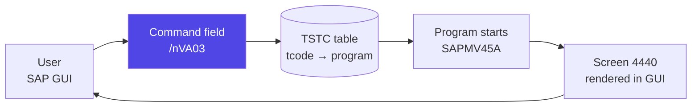

### SAP GUI flavours

| Variant | What it is | When you meet it |
|---|---|---|
| **SAP GUI for Windows** | The full desktop client, most features | The standard for developers — this is what you install |
| **SAP GUI for Java** | Cross-platform (Mac/Linux) desktop client | Mac users; slightly fewer features |
| **SAP GUI for HTML / Web GUI** | The same screens rendered in a browser via ITS | Occasional access, or a classic transaction embedded in the Fiori Launchpad |
| **SAP Fiori** | The modern, role-based, responsive UI | The strategic direction — but it does **not** replace SAP GUI for developer tools |

**Note for Mac users:** SAP GUI for Java works, but ADT in Eclipse (B3) is cross-platform and is where you'll spend most of your time anyway. Many Mac-based ABAP developers keep a Windows VM only for the handful of GUI-only transactions.

**Gotchas.**
- **The command field is hidden by default in some themes** — click the small arrow next to the toolbar to expand it. New joiners lose twenty minutes to this.
- **Typing `SE38` without `/n` on a non-menu screen does nothing** (or gives an error). Get into the habit of always typing `/n` first; it costs two keystrokes and always works.
- **`/nex` really does discard everything.** Never type it out of habit while you have unsaved code in the editor.
- **Green arrow (F3) = back, yellow arrow (Shift+F3) = exit, red X (F12) = cancel.** These three navigation keys are consistent across the entire system, including inside your own programs. Users expect them to behave correctly in what you build.
- **F1 = help on the field, F4 = value help (dropdown).** `F1 → Technical Information` is the single most useful developer trick in SAP GUI: it tells you the **table and field name** behind any input box on any screen, standard or custom.

**Interview points.**
- *"How do you find out which program lies behind a transaction?"* — System → Status, or table `TSTC` (`TCODE` → `PGMNA`), or SE93 (display the transaction definition). Three answers is better than one.
- *"How do you debug a standard transaction?"* — Type `/h` in the command field, press Enter (the status bar confirms "Debugging switched on"), then perform the action. Also mention setting a breakpoint in ADT/SE80 as the cleaner alternative when you know the code location.
- *"What is a session, and how many can you have?"* — An independent window/context; default maximum is **six** per logon, controlled by the profile parameter `rdisp/max_alt_modes`.

---
## B2. SE80, SE38, SE11 — the Classic Workbench

**Simple definition:** The **ABAP Workbench** is the set of in-system development tools reached by transaction codes. Three matter most. **SE38** is the **ABAP Editor** — open, write and run a single program. **SE80** is the **Object Navigator** — a tree-based browser over everything (programs, classes, function groups, dictionary objects, packages, screens, web objects) plus editors for all of them; it is the closest thing classic SAP has to an IDE. **SE11** is the **ABAP Dictionary** — where **database tables, data elements, domains, structures, table types, views and search helps** are defined; it is your schema editor and your shared type system in one place. Modern work happens in Eclipse/ADT (B3), but **every legacy system and every older colleague lives in these three**, so you must be fluent.

<p class="te"><strong>Telugu:</strong> <strong>ABAP Workbench</strong> ante SAP lopala unna development tools set. Moodu mukhyam: <strong>SE38</strong> = ABAP Editor, oka program open chesi rasi run cheyyadaniki. <strong>SE80</strong> = Object Navigator, oka tree lo anni objects (programs, classes, tables, function groups) browse chesi edit cheyyachu — classic SAP lo idhe IDE laantidi. <strong>SE11</strong> = ABAP Dictionary, ikkada <strong>tables, data elements, domains, structures</strong> define chestaru — idi mee database schema mariyu mee shared types rendu okate chota. Ippudu andaru Eclipse (ADT) vaadutunnaru, kaani old systems lo, old colleagues tho pani cheyyalante ee moodu tappakunda ravali.</p>

**The everyday analogy.** Think of a large workshop. **SE38** is a single workbench with one job on it — good for focused work on one program. **SE80** is the whole workshop floor: shelves of parts, every machine, a plan of the building, and you can walk from any object to anything connected to it. **SE11** is the **parts catalogue and the standards book** — it doesn't build anything itself, it defines exactly what a "M6 bolt" is, so every machine on the floor uses the same one. Change the definition in the catalogue and every machine that used it changes too. That last property — central definitions that propagate — is what the ABAP Dictionary is *for*.

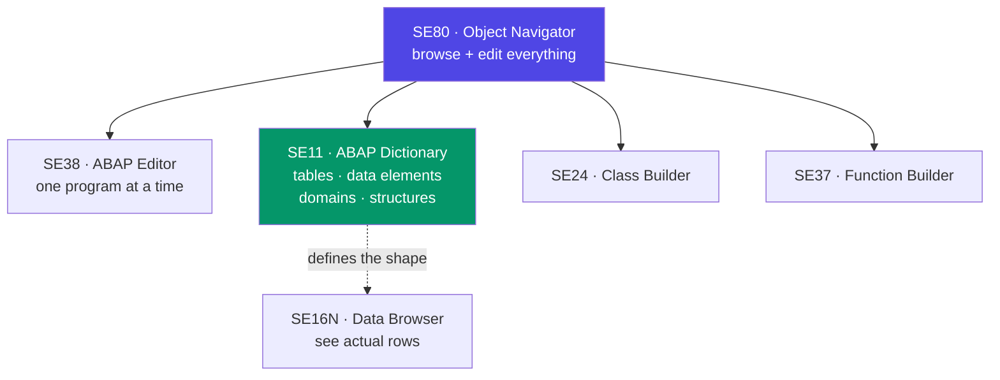

### SE11 first — because everything else depends on it

Most tutorials start with SE38 and "hello world." That is backwards. In ABAP, **types come first**, and they live in SE11. The Dictionary has a strict four-level hierarchy that you must understand, because it is unlike anything in JavaScript:

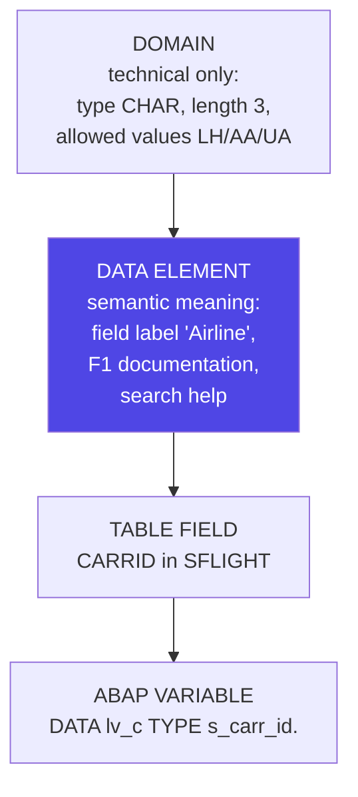

| Level | Answers the question | Example | JS/TS analogy |
|---|---|---|---|
| **Domain** | *What is it technically?* | `S_CARR_ID`: CHAR, length 3, fixed values LH/AA/UA | `type CarrierCode = 'LH' \| 'AA' \| 'UA'` |
| **Data element** | *What does it mean to a human?* | `S_CARR_ID`: label "Airline", F1 docs, F4 help | A named type **plus** its label, docs and dropdown |
| **Table field** | *Where is it stored?* | `SFLIGHT-CARRID` | A column in a schema |
| **Structure** | *A record shape, no storage* | `BAPISDHEAD` | An `interface` |
| **Table type** | *An array of a shape* | `TT_SFLIGHT` | `SFlight[]` |
| **View / CDS** | *A saved joined query* | `Z_I_FlightSummary` | A DB view |
| **Search help** | *The F4 dropdown* | `H_T005` (countries) | A typeahead component |

**Why domains and data elements are split.** Because the *technical* format and the *business meaning* are different things that change independently. Currency amount fields all share the technical domain `WERTV8` (packed decimal, 2 decimals), but the data elements differ: `NETWR` is "Net Value," `BRTWR` is "Gross Value," `KWERT` is "Condition Value." Same shape, different meaning, different labels, different documentation. One domain, many data elements. Get this and you understand the Dictionary.

### Creating a table in SE11 — with the settings that actually matter

```abap
*&---------------------------------------------------------------------*
*& The definition of a custom table ZCUST_DISCOUNT as you would key it
*& into SE11. (SE11 is a screen-based tool, so this is the equivalent
*& shown as annotated DDL-style pseudo-definition -- in ADT you now
*& genuinely do write it as source code like this.)
*&---------------------------------------------------------------------*

@EndUserText.label : 'Customer discount rules'
@AbapCatalog.enhancementCategory  : #NOT_EXTENSIBLE
@AbapCatalog.tableCategory        : #TRANSPARENT
@AbapCatalog.deliveryClass        : #A       " A = Application data
                                             "     (transactional).
                                             " C = Customising (moves
                                             "     in transports!)
                                             " L = temporary/log data
@AbapCatalog.dataMaintenance      : #ALLOWED " can SM30 maintain it

define table zcust_discount {

  " ---- KEY FIELDS (order matters -- this IS the primary index) ----

  key mandt   : mandt not null;   " CLIENT FIELD. Almost every table
                                  " starts with this. It is what makes
                                  " SAP multi-tenant, and ABAP SQL adds
                                  " 'WHERE mandt = sy-mandt' for you
                                  " automatically. NEVER select it
                                  " manually. See B5.

  key kunnr   : kunnr not null;   " Customer number. Typed from the
                                  " STANDARD data element KUNNR -- so
                                  " it inherits the label, the F4 help
                                  " on KNA1, and the exact length SAP
                                  " uses. Never declare 'CHAR 10' here.

  key matkl   : matkl not null;   " Material group.

  key valid_from : dats not null; " Time-dependent rules: the key
                                  " includes the start date so you can
                                  " keep history rather than overwrite.

  " ---- DATA FIELDS ----

  discount_pct : dec3_2;          " 3 digits, 2 decimals -> max 9.99%
                                  " Choose the domain deliberately;
                                  " widening it later is a migration.

  @Semantics.amount.currencyCode : 'waers'
  max_amount   : wertv8;          " AMOUNT fields MUST be paired with a
  waers        : waers;           " CURRENCY field, and the reference
                                  " declared. Same for QUANTITY (MENGE)
                                  " + UNIT (MEINS). SE11 refuses to
                                  " activate without it -- and it is
                                  " right to refuse: 100 is meaningless
                                  " until you know if it is EUR or JPY.

  " ---- ADMIN FIELDS (add these to every custom table) ----
  created_by   : syuname;
  created_on   : dats;
  created_at   : uzeit;
  changed_by   : syuname;
  changed_on   : dats;
}
```

**The logic walkthrough — the decisions inside that definition.**

1. **`mandt` first, always.** The client field makes the table client-dependent: data entered in client 100 is invisible from client 200. Leave it out and you have a **cross-client** table — every client shares the rows. Occasionally that is what you want (technical config), but for business data it is a serious bug. This is B5's topic and the most common design mistake juniors make.
2. **Type every field from an existing data element.** `kunnr : kunnr` not `kunnr : char10`. You inherit the label, the documentation, the F4 search help against `KNA1`, and correctness if SAP ever changes the field length. This is *the* SE11 habit that marks experience.
3. **The key defines the primary index and the uniqueness rule.** Ask "what combination of fields identifies one row?" *before* typing. Adding a key field later means dropping and recreating the table — painful once there is data.
4. **`valid_from` in the key** is the standard SAP pattern for time-dependent config: instead of updating the discount, you insert a new row with a new start date, and you keep the audit trail. SAP standard does this everywhere (`KNVV`, condition records, HR infotypes) and business auditors expect it.
5. **Delivery class `A` vs `C` matters enormously.** Class **C (customising)** means the table's *contents* can be recorded in a transport and moved from DEV to PRD. Class **A (application data)** means contents stay put and each system has its own. If your table holds configuration that must be identical in every system, it must be **C** — otherwise someone will hand-maintain it in production forever.
6. **Amount and quantity fields need a reference.** ABAP enforces the pairing at the dictionary level, which means the entire system knows that `max_amount` is expressed in `waers`. Currency-aware formatting, conversion and totalling then happen automatically in ALV and forms.
7. **Technical settings (a separate screen in SE11)** — you must also set **data class** (which tablespace) and **size category** (expected row volume). Set the size category honestly; it determines initial extents.
8. **Nothing exists until you ACTIVATE it.** Saving is not enough. Activation is the compile step: SE11 generates the actual database table, the runtime object and the type. An inactive object works only for you, and only in your session.

### SE80 — the tool that makes SAP navigable

SE80's real value is not editing; it is **connection**. From any object you can see everything related to it.

| SE80 feature | Shortcut | What it does | Why it matters |
|---|---|---|---|
| **Where-used list** | Ctrl+Shift+F3 | Every place this object is referenced | The #1 safety check before changing anything |
| **Find in source** | Ctrl+F | Search within the program | Obvious but essential |
| **Repository Info System** | (SE84) | Search all objects by name/attribute/package | Find that class you half-remember |
| **Object navigation** | Double-click any name | Jump to the definition | "Go to definition," 30 years early |
| **Forward navigation** | Ctrl+click / double-click | Follows to table, FM, class, include | The main way you explore standard SAP |
| **Display/Change toggle** | Ctrl+F1 | Locks the object for editing | This is what blocks your colleague |
| **Version management** | Utilities → Versions | Diff against previous versions | ABAP's built-in `git log` / `git diff` |
| **Pretty Printer** | Shift+F1 | Reformats and standardises casing | Prettier, but you must press it yourself |
| **Activate** | Ctrl+F3 | Compile and publish the object | Nothing is real until you do this |
| **Check** | Ctrl+F2 | Syntax check without activating | Fast feedback loop |

**Version management deserves a callout.** Every time you activate an object, SAP stores a version. Utilities → Versions → Version Management lets you **compare any two versions side by side** and **restore** an old one. This is genuinely useful — and it is the answer to "but you said ABAP has no git." You have full linear history per object; what you *don't* have is branches, merges, or a commit that groups changes across objects (that's what a transport approximates).

### SE38 — the editor, and running things

```abap
*&---------------------------------------------------------------------*
*& Working in SE38: the keys that make you fast.
*&---------------------------------------------------------------------*
REPORT z_se38_muscle_memory.

" F8         -> Execute (run the program)
" Ctrl+F2    -> Syntax check
" Ctrl+F3    -> Activate  (ALWAYS activate before running; SE38 will
"               happily run the OLD active version and leave you
"               confused about why your change did nothing)
" Shift+F1   -> Pretty Printer
" Ctrl+Shift+F3 -> Where-used list
" F5/F6/F7/F8 in the DEBUGGER -> step into / over / out / continue
" Double-click a name -> forward navigation to its definition

" Setting a breakpoint (three ways, in order of usefulness):
"   1. Click the STOP icon in the left margin (session breakpoint --
"      lives only for your logon; the normal choice).
"   2. Write the statement below (a HARD breakpoint -- it is CODE, so
"      it triggers for EVERY user, including in production if you are
"      careless enough to transport it):
BREAK-POINT.                    " never, ever transport this.

"   3. Write a USER breakpoint -- only triggers for the named user.
"      Safer than BREAK-POINT, still should not be transported:
BREAK nikhil.                   " triggers only for user NIKHIL

WRITE: / 'Look at the keyboard shortcuts above, not this line.'.
```

**How to think about the debugger.** ABAP's debugger is genuinely one of the best in any language, and it is your primary tool for understanding SAP standard code. You can inspect any variable and internal table, **change values at runtime**, jump to a different statement, set watchpoints on a variable's value, and drill into the exact SQL being issued. Since you cannot read 400 million lines of standard code, the practical method for "how does SAP do X?" is: put a breakpoint somewhere plausible, run the transaction, and **watch**. Learning ABAP standard code is an empirical activity.

<div class="ba"><div class="ba-col ba-before"><h4>❌ Common SE11/SE80 mistakes</h4><ul><li>Typing a field as <code>CHAR 10</code> instead of using data element <code>KUNNR</code></li><li>Forgetting the <code>MANDT</code> key field</li><li>Saving but not activating, then debugging for an hour</li><li>Changing a shared object with no where-used check</li><li>Amount field with no currency reference</li><li>Leaving <code>BREAK-POINT</code> in transported code</li></ul></div><div class="ba-col ba-after"><h4>✅ What experienced developers do</h4><ul><li>Reuse standard data elements everywhere</li><li><code>MANDT</code> as the first key field, always</li><li>Ctrl+F3 (activate) reflexively after every change</li><li>Where-used first, change second</li><li>Amount + currency, quantity + unit, always paired</li><li>Session breakpoints only; check the transport before release</li></ul></div></div>

**Real-world example.** Ticket: *"add a field 'preferred delivery window' to our custom shipping table."* The sequence is entirely SE11-driven: check where-used on the table (SE11 → Where-Used → find the 6 programs reading it), add the field with an appropriate data element (create a new one if no standard fits, with a proper domain and F1 documentation), activate — SAP runs a **table conversion** (SE14) which may need database downtime if the table is huge — then update the 6 programs and the SM30 maintenance view. The coding is 20 minutes; the impact analysis is the job.

**Gotchas.**
- **Adding a field to a big table is not free.** Activation may require a full table conversion (copy to a shadow table, rename), which on a 200-million-row table is a scheduled downtime event, not a Tuesday afternoon.
- **`SE16` vs `SE16N` vs `SE17`.** `SE16N` is the modern, friendlier data browser and the one to use. Note that in many shops **write access via SE16N is blocked** in QAS/PRD by design — direct table editing bypasses all business logic.
- **The object lock.** When you go into change mode, you hold an exclusive lock. If you go to lunch with an object open, your colleague is blocked. Transaction **SM12** shows locks; be the person who releases theirs rather than the one whose lock gets deleted.
- **Inactive versions are invisible to others.** Your colleague running the program gets the last *active* version. This is the source of endless "but it works for me" confusion.

**Interview points.**
- *"Difference between a domain and a data element?"* — Domain = technical (type, length, fixed values, conversion routine). Data element = semantic (labels, F1 documentation, search help) and it *references* a domain. Many data elements can share one domain. This is asked in almost every ABAP interview.
- *"What is a transparent table?"* — A dictionary table with a **1:1 counterpart in the database**. Contrast with **pooled** and **cluster** tables (several logical tables stored inside one physical table; you cannot query them with native SQL and they mostly disappeared in S/4HANA).
- *"What happens when you activate a table with existing data?"* — SAP may perform a **table conversion** (SE14): create a shadow table, copy the data, rename. If it fails mid-way the table can be left inconsistent, which is why SE14 exists as a repair tool.
- *"How do you find where a table is used?"* — SE11 → Where-Used List, or SE84 (Repository Information System). Mention that the where-used index can be rebuilt (SAPRSEUB) if it looks incomplete.

---
## B3. ABAP Development Tools (ADT) in Eclipse

**Simple definition:** **ABAP Development Tools (ADT)**, usually just called "ADT" or "ABAP in Eclipse," is SAP's **modern IDE** for ABAP: a set of Eclipse plugins that connect over HTTP to an SAP system and let you edit ABAP as **source code in a real editor** — with code completion, refactoring, quick fixes, inline errors, proper search, multiple files open in tabs, and a modern debugger. It is not a different language; it is the **same objects on the same server**, edited through a better front end. Some newer artefacts — **CDS views**, **AMDP**, **RAP business objects**, **ABAP Cloud** development — exist **only** in ADT and cannot be created in SE80 at all. As of 2026 ADT is the default professional choice; SE80 is for legacy screen-based objects and quick lookups.

<p class="te"><strong>Telugu:</strong> <strong>ADT (ABAP Development Tools)</strong> ante Eclipse lo ABAP rase modern IDE. Eclipse ki konni SAP plugins vestaru, adi HTTP dwara mee SAP system ki connect avutundi, taruvata meeru ABAP ni <strong>normal source code laaga</strong> rayochu — code completion, refactoring, quick fix, tabs, manchi debugger anni untayi. Language marale, <strong>same objects, same server</strong> — kaani front end chala better. Mukhyam: <strong>CDS views, AMDP, RAP, ABAP Cloud</strong> ivi ADT lo <strong>matrame</strong> chesthai, SE80 lo asalu ravu. Ippudu professional ga andaru ADT lone pani chestaru; SE80 ni old screen-based objects ki mariyu quick lookups ki matrame vaadutaru.</p>

**The everyday analogy.** SE80 is like editing a document through a form on a website — one field at a time, save, reload, save. ADT is opening the same document in a proper word processor: everything is text, you can select across paragraphs, undo works, search-and-replace works, and you can have five documents open. The document has not changed and it is still stored on the same server — you simply stopped editing it through a keyhole.

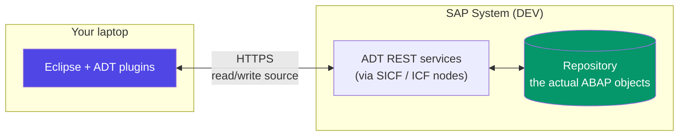

**Important consequence of that diagram:** ADT is **not offline** and it is **not local files**. There is no working copy on your machine. When you type in Eclipse you are editing the object on the server, and when you press Ctrl+S you save it there. Two developers cannot edit the same object at once — the lock still applies exactly as in SE80. Eclipse is a nicer window onto the same shared building.

### Getting set up (do this once)

1. Install a **JDK** (ADT needs Java), then **Eclipse IDE for Java Developers** — check SAP's ADT page for the supported Eclipse release, as ADT lags the newest Eclipse by a version or two.
2. Help → Install New Software → add SAP's ADT update site (`https://tools.hana.ondemand.com/<eclipse-version>`), select **ABAP Development Tools**, install, restart.
3. Window → Perspective → Open Perspective → Other → **ABAP**.
4. File → New → **ABAP Project** → pick the system from your **SAP Logon** entries (ADT reads `saplogon.ini`) → enter client, user, password/SSO.
5. In **Project Explorer**, add your packages to **Favorite Packages** so your `Z*` objects are one click away instead of buried in the full repository tree.

### The shortcuts that make ADT worth it

| Shortcut | Action | Why it changes your day |
|---|---|---|
| **Ctrl+Shift+A** | Open ABAP Development Object | Type any object name anywhere — the universal jump. Use this constantly |
| **Ctrl+Space** | Code completion | Real completion, including field names from the dictionary |
| **Ctrl+1** | **Quick fix** | The killer feature — see below |
| **F3** | Navigate to definition | Ctrl+click works too |
| **Ctrl+Shift+G** | **Where-used list** | Faster and better-filtered than SE80's |
| **Ctrl+S** | Save (inactive) | Saves to the server, does not activate |
| **Ctrl+F3** | **Activate** | Activate this object |
| **Ctrl+Shift+F3** | Activate **all** inactive objects | Use after a multi-object change |
| **F8** | Execute / continue in debugger | |
| **Ctrl+F8** | Run ABAP program | |
| **Ctrl+Shift+F10** | Run **ABAP Unit** tests | |
| **Ctrl+Shift+F9** | Run **ATC** (code check) on this object | Run it *before* you release the transport |
| **Shift+F1** | Pretty printer / format | |
| **Ctrl+O** | Outline (jump to method) | |
| **Ctrl+<** / **Ctrl+>** | Comment / uncomment block | Blessedly normal |
| **Alt+Shift+R** | Rename (refactor) | Renames a variable everywhere it's used |
| **Alt+Shift+M** | Extract method | Real refactoring, unavailable in SE80 |

**Ctrl+1 (Quick Fix) is the feature that converts people.** Write code that references a variable you never declared, and Ctrl+1 offers "declare variable." Write a method call that doesn't exist yet, and it offers to create the method with the right signature. Use old syntax, and it offers to convert it to the modern equivalent. Have an unhandled exception, and it offers to add the `TRY...CATCH`. It is the fastest way to learn modern ABAP syntax, because the IDE keeps showing you the better version of what you just wrote.

### ADT vs SE80 — the honest comparison

| Capability | SE80 (classic) | ADT (Eclipse) |
|---|---|---|
| Editing model | Screen-based forms | **Real source code editor** |
| Multiple objects open | One at a time | **Tabs, split panes** |
| Code completion | Basic | **Full, context-aware, dictionary-aware** |
| Refactoring (rename, extract) | ❌ None | **✅ Yes** |
| Quick fixes | ❌ None | **✅ Yes (Ctrl+1)** |
| Where-used | ✅ Yes | ✅ Yes, faster and filterable |
| Debugger | ✅ Good | ✅ Good, plus better variable views |
| ABAP Unit integration | Basic | **✅ Excellent, with coverage** |
| ATC integration | Separate transaction | **✅ Inline, per object** |
| **CDS views** | **❌ Impossible** | **✅ Only here** |
| **AMDP** | ❌ | **✅ Only here** |
| **RAP business objects** | ❌ | **✅ Only here** |
| **ABAP Cloud / BTP ABAP Env.** | ❌ | **✅ Only here** |
| Classic screens (SE51 dynpros) | **✅ Only here** | ❌ Opens SAP GUI in a tab |
| SmartForms / SAPscript | **✅ Only here** | ❌ |
| Menu painter (SE41) | **✅ Only here** | ❌ |
| Table maintenance generator | **✅ Only here** | ❌ |
| Works offline | ❌ | ❌ (neither does) |
| Mac / Linux | Limited | **✅ Yes** |

**The practical rule:** live in ADT; drop into SAP GUI for the handful of things it alone can do (screens, SmartForms, menu painter, table maintenance generators, most Basis transactions). ADT makes this easy — it can embed SAP GUI transactions in an Eclipse tab, so you rarely have to leave the window.

### Writing a class in ADT — where the difference shows

```abap
"! <p class="shorttext synchronized">Flight statistics helper</p>
"! ABAP Doc comments start with "! and support HTML-ish markup.
"! ADT shows them on hover -- this is ABAP's JSDoc.
CLASS zcl_flight_stats DEFINITION
  PUBLIC
  FINAL                        " nobody may inherit from this class.
                               " Default to FINAL: allow inheritance
                               " only when you have designed for it.
  CREATE PUBLIC.

  PUBLIC SECTION.

    "! Returns total booked seats for one carrier.
    "! @parameter iv_carrid | the airline code, e.g. 'LH'
    "! @parameter rv_seats  | total occupied seats
    "! @raising cx_sy_itab_line_not_found | carrier does not exist
    METHODS get_booked_seats
      IMPORTING iv_carrid       TYPE s_carr_id
      RETURNING VALUE(rv_seats) TYPE i
      RAISING   cx_sy_itab_line_not_found.

  PRIVATE SECTION.

    " A constant, not a magic string scattered through the code.
    CONSTANTS mc_min_valid_year TYPE i VALUE 2000.

ENDCLASS.


CLASS zcl_flight_stats IMPLEMENTATION.

  METHOD get_booked_seats.

    " One statement. The database groups and sums; we receive a scalar.
    " @DATA( ) inline declaration means we never wrote a type for this.
    SELECT SINGLE SUM( seatsocc ) AS total
      FROM sflight
      WHERE carrid = @iv_carrid
      INTO @rv_seats.

    " sy-subrc <> 0 here means the carrier had no flights at all.
    " We RAISE a class-based exception rather than returning 0,
    " because 'no such carrier' and 'carrier with zero bookings'
    " are genuinely different answers and the caller must be able
    " to tell them apart. Silent zeros hide bugs for years.
    IF sy-subrc <> 0.
      RAISE EXCEPTION TYPE cx_sy_itab_line_not_found.
    ENDIF.

  ENDMETHOD.

ENDCLASS.
```

**The walkthrough — and what ADT does for you here.**

1. **`"!` ABAP Doc.** Type `"!` above a method and ADT offers to generate the `@parameter` lines from the signature. Hovering the method anywhere in the system then shows this text. In SE80 this documentation lives on a separate screen almost nobody opens.
2. **Writing `METHODS get_booked_seats` in the definition and pressing Ctrl+1** offers *"add implementation"* — ADT writes the `METHOD ... ENDMETHOD` skeleton into the implementation part for you, correctly placed. In SE80 you navigate to a different screen and do it by hand.
3. **`FINAL` by default** is a genuine design recommendation, not just syntax. ABAP has no `sealed`-by-default, so classes are inheritable unless you say otherwise, and accidental inheritance from a class never designed for it is a real maintenance problem.
4. **`RETURNING VALUE(rv_seats)`** makes the method **functional** — it can be used inline: `DATA(lv_x) = lo_stats->get_booked_seats( 'LH' ).` A method with `EXPORTING` parameters cannot. Prefer `RETURNING` for anything that computes one answer; it makes call sites dramatically cleaner.
5. **`RAISING cx_...`** declares a **class-based exception**. This is the modern error mechanism — real objects with a class hierarchy, caught with `TRY...CATCH`, replacing the ancient `EXCEPTIONS` list and `sy-subrc` checking of function modules. ADT's Ctrl+1 on an uncaught exception writes the whole `TRY...CATCH` block for you.
6. **The `mc_` constant** — `mc_` = member constant, `mv_` = member variable, `mt_` = member table, `mo_` = member object. Consistent prefixes matter more in ABAP than most languages because there is no `this.` requirement and the compiler will not tell you that you shadowed an attribute with a local.

### ABAP Unit and ATC — the quality gates ADT surfaces

```abap
" A test class lives in the same include as the class it tests,
" in the 'Test Classes' tab in ADT (Ctrl+Shift+F10 to run).
CLASS ltcl_flight_stats DEFINITION FINAL FOR TESTING
  DURATION SHORT           " SHORT/MEDIUM/LONG -- declares expected
                           " runtime; the framework can filter on it.
  RISK LEVEL HARMLESS.     " HARMLESS = does not change persistent
                           " data. Systems can be configured to
                           " refuse to run risky tests in production.

  PRIVATE SECTION.
    DATA mo_cut TYPE REF TO zcl_flight_stats.  " cut = Code Under Test,
                                               " the standard name.
    METHODS setup FOR TESTING.                 " runs before EACH test
    METHODS known_carrier_returns_seats FOR TESTING RAISING cx_static_check.
    METHODS unknown_carrier_raises      FOR TESTING.
ENDCLASS.

CLASS ltcl_flight_stats IMPLEMENTATION.

  METHOD setup.
    mo_cut = NEW zcl_flight_stats( ).   " NEW #( ) -- the modern
                                        " replacement for
                                        " CREATE OBJECT.
  ENDMETHOD.

  METHOD known_carrier_returns_seats.
    DATA(lv_seats) = mo_cut->get_booked_seats( 'LH' ).

    " cl_abap_unit_assert is the assertion library. Note 'msg' --
    " always write it; a failing test with no message is a puzzle.
    cl_abap_unit_assert=>assert_true(
      act = xsdbool( lv_seats > 0 )
      msg = 'LH should have booked seats in the demo data' ).
  ENDMETHOD.

  METHOD unknown_carrier_raises.
    TRY.
        mo_cut->get_booked_seats( 'ZZ' ).
        cl_abap_unit_assert=>fail( 'Expected an exception for carrier ZZ' ).
      CATCH cx_sy_itab_line_not_found.
        " Correct -- the exception is the expected behaviour.
    ENDTRY.
  ENDMETHOD.

ENDCLASS.
```

**Why this matters more in ABAP than you'd expect.** You are changing a system where a mistake stops a factory. But you cannot easily spin up a clean database, and test data is shared and mutable. So `RISK LEVEL` and `DURATION` are not decoration — they are how the framework protects a live system from your tests. And note the dependency problem this code has: it reads the real `SFLIGHT` table, so it is really an integration test. Properly testable ABAP separates data access behind an interface so it can be mocked — the same dependency-injection lesson as everywhere else, learned late and now strongly pushed by SAP's own guidance.

**ATC (ABAP Test Cockpit)** is the linter, run with Ctrl+Shift+F9 on any object. It checks performance patterns (`SELECT` inside `LOOP`, missing `WHERE`), security (SQL injection via dynamic `WHERE`, missing `AUTHORITY-CHECK`), robustness (unhandled exceptions), and clean-core compliance. In serious shops **ATC findings block transport release**. Run it before you release, not after someone else does.

**Real-world example.** You are asked to build an S/4HANA report exposing flight revenue to a Fiori app. The chain is: **CDS view** (only creatable in ADT) → annotate it for OData → expose as a service → consume from Fiori Elements. Every step of that is Eclipse-only. A developer who knows only SE80 literally **cannot do modern S/4HANA work** — which is why "experience with ADT/Eclipse" appears in nearly every current job posting.

**Gotchas.**
- **abapGit lives in this world too.** It is an open-source ABAP-written client (installed as a single report) that serialises ABAP objects to files and pushes them to GitHub. It is excellent for sharing open-source ABAP and for moving code between unconnected systems, but it is **not** a replacement for transports in a governed landscape — transports carry the audit trail auditors require.
- **ADT needs the ICF services active.** If your ADT connection fails with an HTTP error, the usual culprit is the `/sap/bc/adt` node being inactive in **SICF**. Ask Basis to activate it.
- **Ctrl+S does not activate.** Saved-but-inactive code does not run. If your change "did nothing," check the activation state — the object appears in the "inactive objects" list at the bottom of the Project Explorer.
- **Eclipse version mismatches are the most common install problem.** Follow SAP's compatibility table exactly rather than grabbing the newest Eclipse.

**Interview points.**
- *"Do you use SE80 or Eclipse?"* — The right answer is *both, for the right things*: ADT for all new development, CDS, RAP, unit tests and ATC; SAP GUI for dynpros, SmartForms, table maintenance generators and Basis transactions. Answering "SE80 only" signals you haven't touched modern S/4HANA.
- *"What can you only do in ADT?"* — CDS views, AMDP, RAP business objects, ABAP Cloud development, proper refactoring, and inline ATC/unit-test integration.
- *"What is ATC?"* — SAP's static analysis / code-check framework (successor to the Code Inspector, SCI), typically wired into the transport release process as a quality gate.

---
## B4. Packages, Objects and the Repository

**Simple definition:** Everything you create in ABAP — a program, a class, a table, a function group, a CDS view — is a **repository object**, stored not as a file on disk but as **rows in database tables** inside the SAP system itself. Every repository object must belong to exactly one **package** (historically called a "development class"): a named container that groups related objects, controls **visibility** (which other packages may use its contents), and — crucially — determines **which transport layer** the object uses, and therefore **whether and where it can be transported**. The complete set of all objects in a system is the **Repository**, and it is searchable with the **Repository Information System** (SE84).

<p class="te"><strong>Telugu:</strong> ABAP lo meeru create chese prati vishayam — program, class, table, function group, CDS view — anni <strong>repository objects</strong>. Ivi mee laptop lo files ga undavu; <strong>SAP database lo table rows ga</strong> untayi. Prati object oka <strong>package</strong> lo undali (paatha peru: development class). Package ante related objects ni kalipi pette container — idi <strong>visibility</strong> (vere packages ee objects ni vaadocha leda) control chestundi, mariyu <strong>transport layer</strong> ni decide chestundi, ante ee object transport avutunda ledha ani. Anni objects kalipi <strong>Repository</strong> — daanini <strong>SE84</strong> tho search cheyyochu.</p>

**The everyday analogy.** Think of a huge public library where books are not stored on shelves you can walk to — they're in a closed stack, and you request them by catalogue number. The **package** is the classification section ("Medicine / Cardiology"), and it does two jobs: it tells you where a book belongs conceptually, and it controls lending rights — some sections are open to everyone, some are reference-only for staff. And critically, the section determines whether a book gets shipped when the library opens a new branch. Put a book in the wrong section and it either can't be found, or it doesn't get shipped, or it gets shipped when it shouldn't.

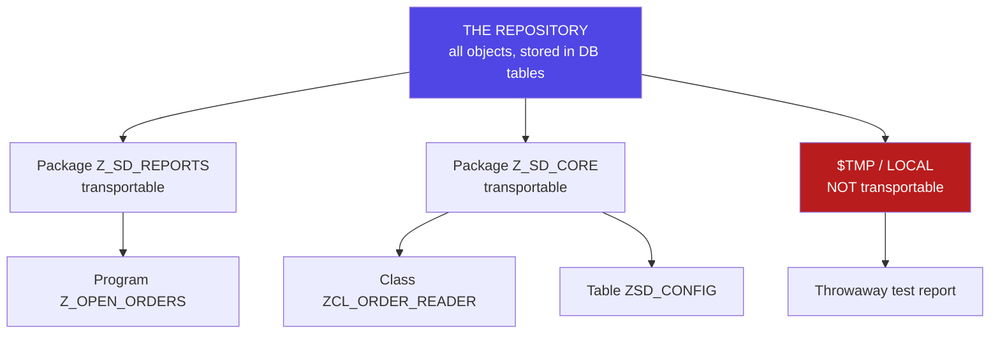

### `$TMP` — the trap every beginner falls into

When you create your first object, SAP asks for a package and offers **`$TMP`** (also shown as "Local Object"). Clicking that button is the fastest way forward and the most common early mistake.

**`$TMP` means: local, private to you, and permanently stuck in this system.** Objects in `$TMP` are not attached to a transport request, so they **can never be moved to QAS or PRD**. They also cannot be used by transportable objects. The typical story: a developer builds a report over three days in `$TMP`, it works beautifully, and then discovers there is no way to ship it — the fix is to reassign the package (possible, via the object's properties or SE03 → Change Object Directory Entries) and then create a transport, which is annoying but survivable. Do it right from the start instead.

| Package | Meaning | Transportable? | Use it for |
|---|---|---|---|
| **`$TMP`** | Local objects, tied to your user | **❌ Never** | Genuine throwaway experiments only |
| **`Z*` / `Y*`** | Customer packages you create | ✅ Yes | **All real development** |
| **`/NAMESPACE/*`** | Registered SAP partner namespace | ✅ Yes | Products shipped to other companies |
| SAP standard (e.g. `VA`, `MB`) | SAP's own packages | ✅ (needs access key) | Never create objects here |

### Creating a package properly

```abap
*&---------------------------------------------------------------------*
*& Package design as you would enter it (SE21 / SE80, or ADT:
*& File > New > ABAP Package). Shown as annotated pseudo-definition.
*&---------------------------------------------------------------------*

PACKAGE z_sd_enhancements.
  short_text        = 'SD enhancements and reports'.
  software_component = 'HOME'.       " HOME = customer-developed code.
                                     " This is the normal choice for
                                     " your own development.

  application_component = 'SD-SLS'.  " Ties the package to the SAP
                                     " application area. Matters for
                                     " routing support tickets and for
                                     " finding things later.

  transport_layer   = 'ZDEV'.        " *** THE IMPORTANT ONE ***
                                     " The transport layer decides which
                                     " transport ROUTE objects follow --
                                     " effectively, which target systems
                                     " they can travel to. Leave it
                                     " blank and the package becomes
                                     " NOT TRANSPORTABLE, which is the
                                     " same trap as $TMP wearing a
                                     " different hat.

  package_type      = 'development'. " 'structure' packages contain only
                                     " other packages (for layering);
                                     " 'main' packages group a whole
                                     " application area.

  super_package     = 'Z_SD'.        " Packages nest. A tidy landscape
                                     " has a structure package per area
                                     " with development packages inside.
```

**How to think about package design.**

1. **Group by business area, not by object type.** A package called `Z_REPORTS` holding every report you ever wrote is a junk drawer. `Z_SD_PRICING`, `Z_MM_PROCUREMENT`, `Z_FI_INTERFACES` tell a future maintainer where to look. Same instinct as feature folders vs `components/` `utils/` in React — and the same reasons.
2. **The transport layer is the field that decides your fate.** Blank = not transportable. Ask your Basis team which layer to use; every landscape defines its own (commonly `ZDEV` or similar). Getting this wrong is discovered late and painfully.
3. **Nest with structure packages.** `Z_SD` (structure) → `Z_SD_PRICING`, `Z_SD_REPORTS`, `Z_SD_INTERFACES` (development). This keeps a large custom codebase navigable after five years.
4. **Package interfaces control coupling.** A package can declare a **package interface** exposing only certain objects, and other packages declare **use accesses** to consume them. This gives real encapsulation at the architecture level — the ABAP equivalent of a module's public `index.ts`. Most projects under-use this; well-run ones use it to stop everything depending on everything.

### The object types you will create

| Object type | Created in | Prefix convention | What it is |
|---|---|---|---|
| **Program / report** | SE38, ADT | `Z*` | Executable program |
| **Class** | SE24, ADT | `ZCL_*` | Global class |
| **Interface** | SE24, ADT | `ZIF_*` | Global interface |
| **Function group** | SE80, SE37 | `Z*` | Container for function modules |
| **Function module** | SE37, ADT | `Z_*` | Callable procedure, remote-enabled if RFC |
| **Table** | SE11, ADT | `Z*` | Database table |
| **Structure** | SE11, ADT | `ZS_*` | Record shape, no storage |
| **Table type** | SE11, ADT | `ZTT_*` | Internal table type |
| **Data element** | SE11, ADT | `Z*` | Semantic type |
| **Domain** | SE11, ADT | `Z*` | Technical type |
| **View / CDS view** | SE11 / **ADT only** | `Z_I_*`, `Z_C_*` | Saved query |
| **Search help** | SE11 | `ZH_*` | F4 dropdown |
| **Lock object** | SE11 | `EZ*` | Generates `ENQUEUE_EZ*` / `DEQUEUE_EZ*` |
| **Message class** | SE91 | `Z*` | Numbered message texts |
| **Transaction** | SE93 | `Z*` | T-code pointing at a program |
| **SmartForm** | SMARTFORMS | `Z*` | Print form |
| **Enhancement impl.** | SE19 | `Z*` | BAdI implementation |

**Note the lock object oddity:** you name it `EZ...` (or `EY...`), not `Z...`. SAP generates the function modules `ENQUEUE_EZ...` and `DEQUEUE_EZ...` from it. It is an exception to the naming rule and it catches everyone once.

### Finding things — the Repository Information System

The single most valuable skill in a mature SAP system is **finding the object that already does what you need**. SAP ships tens of thousands of function modules and classes; the odds that your requirement is genuinely novel are low.

```abap
*&---------------------------------------------------------------------*
*& How to find things in the repository (a reference card).
*&---------------------------------------------------------------------*

" --- SE84: Repository Information System -------------------------
" A tree of every object type, each with a search screen. Search by
" name pattern, package, author, application component, date created.
" Example: find every function module SAP ships for reading a
" material master ->  Function Modules -> name = '*MATERIAL*READ*'

" --- SE16N on the repository tables (the power-user route) --------
"   TADIR  -> the OBJECT DIRECTORY. One row per repository object:
"             PGMID / OBJECT / OBJ_NAME / DEVCLASS (package) / AUTHOR.
"             This is THE table to know. "Show me every Z object in
"             package Z_SD_REPORTS" is one SE16N query on TADIR.
"   TRDIR  -> program attributes (type, status, fixed point arithmetic)
"   TFDIR  -> function modules -> which function group they live in
"   SEOCLASS -> global classes
"   TSTC   -> transaction codes
"   E071   -> objects inside transport requests
"   E070   -> transport request headers (owner, status, date)

" --- Full-text search across ALL source code ---------------------
"   Transaction  CODE_SCANNER   (or RS_ABAP_SOURCE_SCAN)
"   In ADT:      Search > ABAP Source Search (Ctrl+H)
"   This is your 'grep the codebase'. Use it constantly -- to find
"   examples of an unfamiliar function module, search for its name
"   across all source and read how SAP itself calls it. That is the
"   fastest way to learn any unfamiliar SAP API.
```

**That last trick is worth its own paragraph.** SAP's documentation is often thin, but the *usage examples* are everywhere — inside SAP's own 400 million lines of code. Want to know how to call `BAPI_SALESORDER_CREATEFROMDAT2` correctly, including which structures to fill and which fields need the `X` update-flags set? Full-text search for the function module name and read three of SAP's own call sites. This is the single most effective ABAP learning technique, and nobody tells beginners about it.

**Real-world example.** You are asked to *"send an email when a delivery is created."* Before writing a line, you search: SE84 → Function Modules → `*SEND*MAIL*`, and full-text search for `CL_BCS`. You discover `CL_BCS` (Business Communication Services), the standard, supported class for sending mail with attachments — and dozens of SAP examples of its use. The alternative (an afternoon spent hand-rolling SMTP, or resurrecting the obsolete `SO_NEW_DOCUMENT_SEND_API1`) is exactly the kind of avoidable work that separates a productive developer from a busy one.

### How objects, packages and transports connect

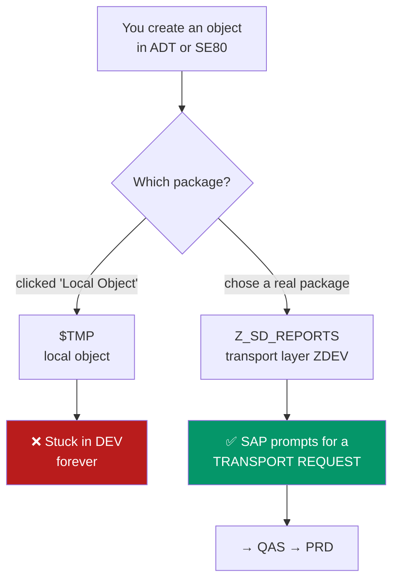

**Read this diagram as the answer to "why is my code not in production?"** Ninety percent of the time, the answer is at the top of it: the package.

<div class="ba"><div class="ba-col ba-before"><h4>❌ Poor repository hygiene</h4><ul><li>Everything in <code>$TMP</code> "for now"</li><li>One package <code>ZZZ</code> with 400 objects</li><li>Objects named <code>ZTEST</code>, <code>ZTEST2</code>, <code>ZNIKHIL1</code></li><li>No package interfaces; everything uses everything</li><li>Writing a new FM without searching for an existing one</li></ul></div><div class="ba-col ba-after"><h4>✅ Good repository hygiene</h4><ul><li>Real package with a transport layer from day one</li><li>Packages by business area, nested under a structure package</li><li>Names that state purpose: <code>ZCL_SD_ORDER_VALIDATOR</code></li><li>Package interfaces for cross-package reuse</li><li>SE84 + full-text search before building anything</li></ul></div></div>

**Gotchas.**
- **Reassigning a package after the fact is possible but fiddly.** In ADT: object properties → change package. Classic: SE03 → *Change Object Directory Entries*. Do it before you have twenty interdependent `$TMP` objects.
- **Deleting objects still needs a transport.** A deletion is a change and must travel to QAS and PRD like any other, or the object lingers in production forever. Deleting an object that is still in an unreleased transport confuses the system — clean the transport up too.
- **`TADIR` is the source of truth** for "who owns this object and which package is it in." When SE80 and reality disagree, look at `TADIR`.
- **Objects in `$TMP` still show up in where-used lists**, which occasionally causes confusion when a transportable object appears to be used by something that cannot be transported.

**Interview points.**
- *"What is a package (development class)?"* — A container for repository objects that controls grouping, visibility (via package interfaces) and the transport layer. Mention that "development class" is the older name — you'll hear both.
- *"What is `$TMP`?"* — The local, non-transportable package. Objects there cannot leave the system.
- *"What is `TADIR`?"* — The object directory: one row per repository object, recording its type, name, package and author. The table you query when you want an inventory of custom code — for example, when scoping an S/4HANA migration, the first question is always "how many Z objects do we have and where are they?", and that is a `TADIR` query.

---
## B5. Clients, Systems and the Transport Landscape (DEV → QAS → PRD)

**Simple definition:** An SAP **system** is a complete installation with its own database and its own three-letter **SID** (system ID) — e.g. `DEV`, `QAS`, `PRD`. Inside one system there are multiple **clients** (`mandt`): independent, self-contained sets of **business data** and **customising**, identified by a three-digit number (100, 200, 300). Client separation is enforced *by the database itself* — nearly every business table has `MANDT` as its first key field, and ABAP SQL silently filters on the current client for you. **Repository objects (your ABAP code) are cross-client** — they exist once per system and are visible from every client in it. The chain of systems that code travels along — typically **DEV → QAS → PRD** — is the **transport landscape**, and it is SAP's equivalent of dev → staging → production, except the environments are entirely separate installations rather than folders or branches.

<p class="te"><strong>Telugu:</strong> <strong>System</strong> ante oka complete SAP installation, dini sonta database untundi, oka moodu-letter <strong>SID</strong> untundi — <code>DEV</code>, <code>QAS</code>, <code>PRD</code>. Oka system lopala chala <strong>clients</strong> (100, 200, 300) untayi — prati client ki <strong>sonta business data mariyu sonta customising</strong>. Idi database level lo enforce avutundi: almost prati business table lo modati key field <code>MANDT</code>, mariyu ABAP SQL meeku teliyakunda <code>WHERE mandt = sy-mandt</code> add chestundi. <strong>Kaani code (repository objects) cross-client</strong> — system ki okate sari untundi, anni clients ki kanipistundi. Ee systems chain — <strong>DEV → QAS → PRD</strong> — ni <strong>transport landscape</strong> antaru. Idi web lo dev → staging → production laantidi, kaani ivi <strong>completely separate installations</strong>, folders kaadu.</p>

**The everyday analogy.** Think of a **building** (the system) with several **floors** (the clients). The building's wiring, plumbing and lift — the infrastructure — are shared: install a new lift and every floor gets it. That's your code. But each floor has its own furniture, its own tenants and its own filing cabinets — that's business data and customising. Two tenants on different floors never see each other's files, even though they use the same lift.

Now the landscape: you have **three identical buildings** — one where builders work (DEV), one where inspectors test (QAS), and one where the public lives and works (PRD). You never renovate the public building directly. You build in the first, the inspectors verify in the second, and only then is the identical change installed in the third. The lorry that carries the change between buildings is the **transport request**.

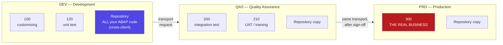

### The crucial distinction: what is client-specific and what is not

This table explains a hundred confusing behaviours. Learn it.

| Thing | Scope | Meaning in practice |
|---|---|---|
| **ABAP programs, classes, FMs** | **Cross-client** | Write it in client 100, it instantly exists in client 120 too |
| **Dictionary objects (table *definitions*)** | **Cross-client** | The table structure is shared |
| **Table *contents* (business data)** | **Client-specific** (if `MANDT` is a key) | Sales orders in 100 are invisible from 120 |
| **Customising (config)** | **Client-specific** | Company codes, plants, pricing config — per client |
| **User master records** | **Client-specific** | Your logon in 100 does not exist in 120 unless created |
| **Roles / authorisations** | **Client-specific** | You can be admin in DEV-100 and nobody in DEV-120 |
| **Number ranges** | Usually client-specific | Document numbering differs per client |
| **Cross-client tables (no `MANDT`)** | Cross-client | Some technical config; changing it affects everyone |

**The consequence that surprises everyone:** you can write a program in DEV client 100, and a colleague in DEV client 120 can run it immediately — but it will read **completely different data**. This is the standard test setup: code once, test against several data configurations. It also means that "it works in 100 but not in 120" is almost never a code problem — it's customising or data.

### Client handling in ABAP SQL

```abap
*&---------------------------------------------------------------------*
*& How the client field is handled -- and the ONE case you must know.
*&---------------------------------------------------------------------*
REPORT z_client_handling.

" ---------------------------------------------------------------
" NORMAL CASE: automatic client handling.
" You write no client logic at all. The runtime adds
" 'WHERE mandt = sy-mandt' for you. This is why you should NEVER
" list MANDT in a field list or a WHERE clause -- doing so is a
" beginner tell, and in modern ABAP SQL it is actually an error.
" ---------------------------------------------------------------
SELECT vbeln, erdat, kunnr, netwr
  FROM vbak
  WHERE kunnr = '0000001000'
  INTO TABLE @DATA(lt_orders).
" Actually executed by the DB as:
"   WHERE mandt = '100' AND kunnr = '0000001000'

" ---------------------------------------------------------------
" THE EXCEPTION: cross-client access. Rare, deliberate, and
" dangerous -- used almost exclusively by system administration
" tools that must compare or copy across clients.
" ---------------------------------------------------------------
SELECT mandt, vbeln, erdat
  FROM vbak USING ALL CLIENTS       " modern syntax (7.55+). Older
                                     " code says CLIENT SPECIFIED and
                                     " puts MANDT in the WHERE clause
                                     " by hand.
  WHERE erdat >= '20260101'
  INTO TABLE @DATA(lt_all_clients).

" ---------------------------------------------------------------
" DEFENSIVE PATTERN: know which system you are in.
" This exact IF has prevented an enormous number of incidents:
" test runs that emailed real customers, or fired real IDocs at a
" supplier's live system.
" ---------------------------------------------------------------
CONSTANTS lc_production TYPE sy-sysid VALUE 'PRD'.

IF sy-sysid = lc_production.
  " Only in production do we do the real, irreversible thing.
  " Everywhere else, log what WOULD have happened.
  PERFORM send_real_email_to_customer.
ELSE.
  MESSAGE |Simulated: would have emailed customer (system { sy-sysid }).|
          TYPE 'I'.
ENDIF.
```

**The logic walkthrough.**

1. **Automatic client handling is the default and you should almost never override it.** It is a genuine safety feature: it makes it structurally impossible to leak one client's business data into another by accident. Compare with a multi-tenant SaaS app in Node, where forgetting `WHERE tenant_id = ?` is a data breach waiting to happen. ABAP makes that mistake nearly impossible.
2. **`sy-mandt` is the current client**, set at logon. `sy-sysid` is the system. Both are system fields (C5).
3. **`USING ALL CLIENTS` is the modern replacement for `CLIENT SPECIFIED`.** If you find yourself reaching for it, stop and ask why — legitimate uses are rare, and it is a red flag in code review.
4. **The `sy-sysid` guard is a professional habit, not paranoia.** Anything irreversible and outward-facing — emails, EDI messages, payment files, calls to external APIs — should be gated on the system, and ideally on a configuration table rather than hardcoded (so it can be switched on in a test system deliberately). Hardcoding `'PRD'` as shown is the simple version; the mature version reads a flag from a Z customising table.

### The three-system landscape, and why it exists

| System | SID (typical) | Who works here | What happens | Can you change code? |
|---|---|---|---|---|
| **Development** | `DEV` | Developers, config consultants | All code written, all customising configured | ✅ Yes — the only place |
| **Quality Assurance** | `QAS` | Testers, business users | Integration testing, UAT, performance testing, training | ❌ No — imports only |
| **Production** | `PRD` | The entire business | Real orders, real money, real payroll | ❌ Absolutely not |

**Larger landscapes add more systems:** a **SBX** (sandbox) for free experimentation that never transports anywhere, a **PRE-PROD** copy of production for realistic performance testing and dress rehearsals, and a **TRN** training client. Some organisations also run a parallel **maintenance track** so urgent production fixes can bypass the in-flight project work.

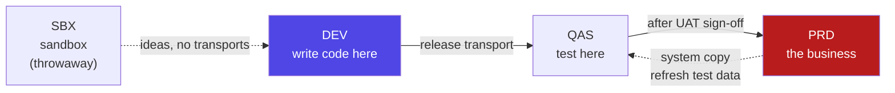

**Note the dotted line back from PRD to QAS.** Periodically Basis does a **system copy / client refresh**: production data is copied down to QAS so testing happens against realistic volumes and realistic messiness. This is why QAS testing catches performance problems that DEV (with 200 test records) never would. It also means anything you left lying around in QAS gets wiped — never treat QAS as storage.

### The special clients you'll meet

| Client | What it is | Rule |
|---|---|---|
| **000** | SAP reference client, delivered with the system | **Never** change it. Used for upgrades and as a source for new clients |
| **001** | A copy of 000, sometimes used as a template | Usually left alone |
| **066** | Historically SAP's EarlyWatch client | Obsolete; often deleted for security |
| **100 / 200 / 300** | Your organisation's working clients | Numbering is a local convention, not a rule |

### Client roles and the "changes allowed" setting

Client settings (transaction **SCC4**) control what may be changed in each client, and this is why you sometimes get *"Client XXX has status 'not modifiable'"*:

| Setting | Typical DEV | Typical QAS/PRD |
|---|---|---|
| **Client role** | Customizing | Test / Production |
| **Changes to client-specific objects** | Changes without automatic recording, or *automatic recording of changes* | **No changes allowed** |
| **Cross-client object changes** | Changes to repository and cross-client customising allowed | **No changes** |
| **Client copy protection** | Protection level 0 | Higher |
| **CATT/eCATT allowed** | Yes | No |

**When you hit "client is not modifiable" in QAS**, that message is the landscape working correctly, not a bug. The fix is never to open the client; it is to make the change in DEV and transport it.

**Real-world example — a pricing bug in production.** A customer is being charged the wrong discount. The temptation is enormous: log into PRD, look at the config, fix the entry. **You must not**, and usually cannot. The correct chain: reproduce in DEV (or in QAS, which has a recent copy of production data), fix the code or customising in **DEV**, record it in a **transport**, release it, have it imported into **QAS**, have the business confirm the fix on real-shaped data, then get change-approval for a **PRD** import — often only within an agreed change window. For a genuine emergency there is an **emergency transport** process, which is faster but still passes through QAS and still requires approval. It feels slow after `git push` deploys. It exists because the cost of a bad change here is a factory stopping or a payroll being wrong for 40,000 people.

<div class="pic"><strong>Picture it:</strong> In web development, environments are configurations of the same codebase. In SAP, environments are <strong>three separate copies of an entire enterprise system</strong>, each with its own database, its own users and its own data — kept in sync only by the disciplined, auditable stream of transports flowing one direction: DEV → QAS → PRD. Nothing ever flows backwards except a data copy.</div>

**Gotchas.**
- **Code is cross-client; customising is not.** So a transport can carry both, and a config entry that works in DEV-100 may be missing in DEV-120 — the *code* moved, the *config* did not, because it was created in a different client. This is the single most common "but it worked in DEV" cause.
- **Never develop directly in a QAS or PRD client**, even if a temporary opening lets you. The change is invisible to the landscape, will be silently overwritten by the next transport, and is an audit finding.
- **`sy-mandt` in a `WHERE` clause is wrong** — the runtime already did it. Writing it yourself is at best redundant and at worst breaks automatic client handling.
- **Number ranges are not transported by default.** Objects that generate document numbers frequently behave differently in PRD because the range there was never set up. Check with your functional consultant.
- **A client copy is not a system copy.** A *client* copy duplicates data and customising within (or between) systems; a *system* copy duplicates the whole installation including the repository. Different tools, different Basis effort, very different downtime.

**Interview points.**
- *"What is a client in SAP?"* — A self-contained unit within a system holding its own business data, customising and user master records, identified by the `MANDT` field. Crucially: **repository objects are cross-client, data and customising are client-specific.** Say that sentence and you have answered it fully.
- *"Explain the three-system landscape."* — DEV (develop), QAS (test), PRD (run). Changes only ever flow forward, via transports, and PRD is closed to direct change. Add that data sometimes flows backwards via system/client copies for realistic testing.
- *"Why can't you fix a bug directly in production?"* — Governance and auditability (SOX, GxP and similar require a documented, approved change path), plus the practical reason that an unrecorded change is overwritten by the next transport and lost.
- *"What is `sy-mandt` vs `sy-sysid`?"* — Current client vs current system ID. Both system fields; both used constantly in defensive coding.

---
## B6. Transport Requests — the ABAP "Git Commit"

**Simple definition:** A **transport request** (TR, also called a **change request** or **CR**) is a numbered container — e.g. `DEVK900123` — that records **which repository objects you changed**, so those changes can be moved as one unit from DEV to QAS to PRD. You are prompted to assign a transport the first time you change any transportable object. A request contains one or more **tasks** (one per developer), and when work is finished you **release** it — freezing its contents and making it available for **import** into the next system by the **Transport Management System (STMS)**. It is the closest thing ABAP has to a git commit *plus* a deployment artefact — but with three critical differences: **it carries objects, not diffs**; there is **no branching or merging**; and **releasing is irreversible**.

<p class="te"><strong>Telugu:</strong> <strong>Transport Request (TR)</strong> ante oka number unna container — <code>DEVK900123</code> laaga. Meeru marchina <strong>objects list</strong> ni idi record chestundi, tarvata aa changes anni <strong>okate unit ga</strong> DEV nundi QAS ki, QAS nundi PRD ki move avutayi. Meeru edaina transportable object marchinappudu SAP "e transport lo pettamantaru?" ani adugutundi. Oka request lopala <strong>tasks</strong> untayi (prati developer ki okati). Pani ayyaka <strong>release</strong> chestaru — appudu content freeze avutundi, taruvata Basis team <strong>STMS</strong> dwara next system loki <strong>import</strong> chestaru. Idi git commit + deployment rendu kalipinattu. Kaani <strong>moodu pedda differences</strong>: (1) idi diffs kaadu, <strong>objects</strong> carry chestundi, (2) <strong>branching/merging ledu</strong>, (3) release chesaka <strong>undo cheyyalem</strong>.</p>

**The everyday analogy.** A transport request is a **shipping crate with a manifest**. You put items in it (the objects you changed). While it's open you can add and remove things. When you **release** it, the crate is sealed and the manifest is signed — you cannot open it again, ever. It goes to the loading bay (the import queue), a dispatcher (Basis) loads it onto the QAS truck, and later the same sealed crate goes to PRD. Note what this means: it isn't a *description* of changes, it's the changes themselves in a box. If you forgot to put something in, the crate arrives incomplete, and the receiving warehouse breaks.

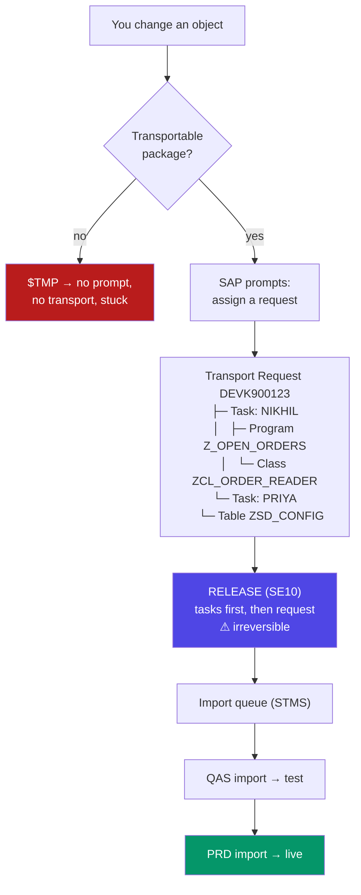

### Anatomy of a transport number

`DEVK900123` decodes as:

| Part | Meaning |
|---|---|
| `DEV` | The **source system** SID — where it was created |
| `K` | Fixed letter for a workbench/customising request |
| `900123` | A sequential number |

So a transport number tells you where a change was born. A request numbered `QASK...` means someone created a change **in QAS** — which, in a well-run landscape, is a governance question worth asking.

### The two types of request

| | **Workbench request** | **Customising request** |
|---|---|---|
| Contains | Repository objects: programs, classes, tables, CDS, FMs | Configuration table entries (client-specific) |
| Created by | Developers | Functional consultants |
| Scope | **Cross-client** (code is cross-client) | **Client-specific** |
| Typical content | `R3TR PROG Z_OPEN_ORDERS` | Entries in `T001`, pricing config, plant setup |
| Who owns it | You | Your functional consultant |

**A change often needs both**, and this is a classic source of failure: you write a program that reads a new customising table, and the *code* transports fine but the *entries* were never recorded. In QAS the program runs, finds an empty table, and behaves strangely. Always ask: *"does my change need config as well as code?"*

### Working with transports — the practical commands

```abap
*&---------------------------------------------------------------------*
*& Transport handling reference (SE09 / SE10 / SE01 / STMS).
*&---------------------------------------------------------------------*

" SE10  -> Transport Organizer. YOUR requests, filtered by user.
"          This is your 'git status'. Live here.
" SE09  -> Same tool, workbench-focused view.
" SE01  -> Extended Transport Organizer -- more functions, including
"          creating requests of unusual types and object list editing.
" STMS  -> Transport Management System. The import queues for the whole
"          landscape. Usually Basis-only, but READ access is priceless:
"          you can see whether your transport actually reached QAS,
"          when, and with what return code.
" SE03  -> Transport Organizer Tools. The swiss army knife:
"            - search for objects in requests ("which TR has this
"              program in it?" -- you will need this constantly)
"            - change object directory entries (fix the package)
"            - unlock objects stuck in someone else's request

" ---------------------------------------------------------------
" THE RELEASE SEQUENCE (get this wrong and nothing moves):
"   1. Release each TASK inside the request   (select task, F9)
"   2. THEN release the REQUEST itself        (select request, F9)
" Releasing the request while a task is still open fails. Every
" ABAP developer has done this once and stared at the error.
" ---------------------------------------------------------------

" ---------------------------------------------------------------
" RETURN CODES you will see in STMS after an import:
"   0  -> success, clean
"   4  -> WARNING. Imported, but something was off (e.g. an object
"         was generated with warnings, a text was missing). Usually
"         acceptable -- but READ it, don't assume.
"   8  -> ERROR. Objects were NOT imported correctly. Something is
"         broken in the target system. Investigate immediately.
"  12  -> FATAL / import cancelled.
"  16  -> Internal error in the transport tool itself.
" ---------------------------------------------------------------
```

**The mental model that makes transports click.** In git, a commit stores *the difference* and history is a graph you can navigate. A transport stores *a list of object names*, and at release time SAP exports the **current active version** of each of those objects into files (a "cofile" and a data file) on the transport directory. That is why the following statements are all true and all surprising:

1. **A transport captures the state at release, not at the time you edited.** If you add a program to a transport on Monday and change it again on Tuesday, the Tuesday version is what ships.
2. **The same object can only be in one open request at a time (per developer).** SAP locks it. If a colleague has your program in *their* transport, you cannot put it in yours — you must coordinate, or use SE03 to unlock.
3. **Overtaking is a real danger.** If transport A (with an old version) is imported after transport B (with a new version), production ends up with the old code. Import order matters, which is why Basis imports queues in sequence and why "cherry-picking" a single transport out of order is dangerous.
4. **There is no merge.** Two developers changing the same program coordinate by taking turns, because the object lock forces it. Coming from git this feels primitive; in practice the lock prevents an entire category of merge disaster.

### The full lifecycle, with the human steps included

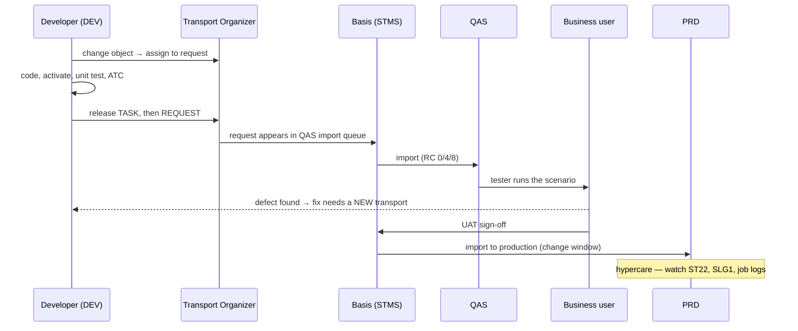

**Note the arrow that says "fix needs a NEW transport."** Once a request is released you cannot reopen it. A correction is always a new request, which then has to be imported after the first one. This is why experienced developers keep transports **small and complete**: a huge transport that is 95% correct still requires a second transport, and now the import order matters.

### Real-world example — a change that goes wrong, and why

You build a report that reads a new custom table `ZSD_DISCOUNT`. In DEV it works perfectly. You release the transport. In QAS the program dumps with `DBIF_RSQL_SQL_ERROR` — table not found.

**What happened, and the diagnostic path:**

1. You created the **table** in a transport (good) but created it early, in a *different* request that you never released — so the code arrived in QAS but the table did not.
2. **Diagnose:** SE03 → *Search for Objects in Requests* → enter `ZSD_DISCOUNT` → it shows the unreleased request. Or look at ST22 for the dump and the object name.
3. **Fix:** release the earlier request, have it imported *before* (or with) the code transport.
4. **Prevent:** before releasing, open the request in SE10 and **read the object list**. Ask: *"if this landed in an empty system, would everything it needs be here?"* — the data element, the domain, the table, the message class, the transaction code, the authorisation object, the customising entries. This 60-second review is the single highest-value habit in ABAP delivery, and the thing juniors skip most often.

<div class="ba"><div class="ba-col ba-before"><h4>❌ Transport anti-patterns</h4><ul><li>One giant transport open for three months</li><li>Releasing on Friday evening, then going home</li><li>Never reading the object list before release</li><li>Code and its customising in unrelated requests</li><li><code>BREAK-POINT</code> and hardcoded test data shipped</li><li>No description: "test", "changes", "fix"</li></ul></div><div class="ba-col ba-after"><h4>✅ Transport discipline</h4><ul><li>One transport per ticket, released when the ticket is done</li><li>Release early in the day, be available when it imports</li><li>Review the object list every single time</li><li>Coordinate code + config; note the dependency</li><li>ATC clean before release; no debug artefacts</li><li>Description: <code>ZD-4471 SD open orders report</code></li></ul></div></div>

**Write the ticket number in the transport description.** Months later, when someone asks *"why does this program do that?"*, the trail runs: object → SE03 search → transport → description → ticket → the original business requirement. Without the ticket number that trail is broken, and the code becomes unexplainable folklore. This is genuinely the closest ABAP gets to a good commit message, and it costs you five seconds.

### Transports vs git — the honest comparison

| Concept | Git | Transport request |
|---|---|---|
| Unit of change | Commit (a diff) | Request (a list of objects, exported at release) |
| Grouping | Commit / PR | Request with tasks |
| History | Full graph, per repo | Per-object **version management** (linear, no branches) |
| Branching | Core feature | **None** in classic transports |
| Merging | Core feature | **None** — object locks force turn-taking |
| Conflict resolution | Merge tools | Prevented by locking |
| Undo | `revert`, `reset` | **Not really** — you write a new transport, or Basis restores a backup |
| Deploy | Separate CI/CD | **The same object** — the transport *is* the deployment |
| Who deploys | Automated pipeline | Basis, manually, in a change window |
| Audit trail | Commit log | E070/E071 + approval workflow (what auditors actually want) |

**Where abapGit fits.** abapGit gives you real git for ABAP objects — branches, diffs, pull requests, GitHub. It is superb for open-source ABAP, for personal projects, and for moving code between systems with no transport route. But in a governed corporate landscape it usually **complements** rather than replaces transports, because the auditable, approval-gated import chain is a compliance requirement, not just a technical one. Increasingly, mature teams use both: **git for the development workflow, transports for the promotion path** — with gCTS (git-enabled Change and Transport System) as SAP's own attempt to formally bridge the two.

**Gotchas.**
- **Releasing is irreversible.** There is no unrelease. Check twice.
- **Tasks before request.** Always. This trips up everyone at least once.
- **An object locked in someone else's request blocks you.** SE03 → *Unlock Objects* exists, but talk to the person first — unlocking can strand their change.
- **Deletions must be transported too**, or the object survives in production forever.
- **Table *contents* only travel if the delivery class allows it** (class `C` customising, recorded in a customising request) or if you explicitly add entries via SE09's key-list function. Application data (class `A`) never transports.
- **Import order is not automatic across queues.** If you release TR2 before TR1 by accident, tell Basis, because STMS will import in queue order and can leave production with the wrong version.

**Interview points.**
- *"What is a transport request and how does it move?"* — Container of changed objects → released (tasks then request) → appears in STMS import queue → imported into QAS → tested → imported into PRD. Mention return codes 0/4/8.
- *"Difference between workbench and customising requests?"* — Repository objects (cross-client) vs configuration entries (client-specific).
- *"Your transport imported with RC 8. What do you do?"* — Read the import log in STMS to find the failing object, check ST22 for dumps and SE03 to confirm all dependent objects (data elements, domains, message classes) were included, then create a follow-up transport with whatever was missing. Never ask for a manual fix in the target system.
- *"How is a transport different from a git commit?"* — Objects not diffs; no branching or merging (locks instead); irreversible on release; and it doubles as the deployment artefact. Answering with all four points shows you actually understand both worlds, which is exactly the profile a team hiring a web developer into SAP is hoping for.

---
# Part C — Your First Program & the Syntax Rules

*Now you write code. This part is deliberately slow and complete, because ABAP's syntax has a handful of rules that are unlike anything in JavaScript — statements end with periods rather than newlines, the language is entirely case-insensitive, one program can be five different kinds of thing depending on a single attribute, and a set of global system fields silently records what just happened. Get these foundations exactly right now and everything in the rest of the language sits on solid ground. Get them approximately right and you will be confused for months.*

## C1. Program Types (Report, Module Pool, Class Pool, Include, Function Group)

**Simple definition:** In ABAP, "program" is not one thing. Every program has a **type** attribute that determines how the system starts it, what it may contain, and whether a user can execute it directly. The five you must know: an **executable program / report** (type `1`, keyword `REPORT`) is the standard runnable program with an optional selection screen; a **module pool** (type `M`, keyword `PROGRAM`) contains dialog screens and can only be started via a transaction code; a **class pool** (type `K`) holds exactly one global class; a **function group** (type `F`) is a container for function modules sharing common data; and an **include** (type `I`) is not executable at all — it is a fragment of source textually pasted into another program at compile time.

<p class="te"><strong>Telugu:</strong> ABAP lo "program" ante oke rakam kaadu — prati program ki oka <strong>type</strong> untundi, adi system ela start chestundo, lopala emi undocho, user direct ga run cheyyagala ledha ani decide chestundi. Aidu telisi undali: (1) <strong>Report</strong> (type 1, <code>REPORT</code>) — normal ga run ayye program, selection screen tho. (2) <strong>Module pool</strong> (type M, <code>PROGRAM</code>) — screens untayi, transaction code dwara matrame start avutundi. (3) <strong>Class pool</strong> (type K) — oke oka global class untundi. (4) <strong>Function group</strong> (type F) — function modules ki container. (5) <strong>Include</strong> (type I) — idi run avvadu, idi kevalam source code piece, compile time lo inko program lo paste avutundi.</p>

**The everyday analogy.** Think of documents in an office. A **report** is a form you fill in and submit — it has an input page, it runs, it produces output, and you can hand it to anyone to use. A **module pool** is a whole multi-screen application, like a booking wizard: it only makes sense through its proper front door, and there's a receptionist (the transaction code) who lets you in at the right screen. A **class pool** is a single specialist's toolbox — one class, self-contained. A **function group** is a shared cupboard where several related tools live together and share the same workbench (their global data). An **include** is a page of boilerplate text that gets photocopied into other documents — on its own it's meaningless.

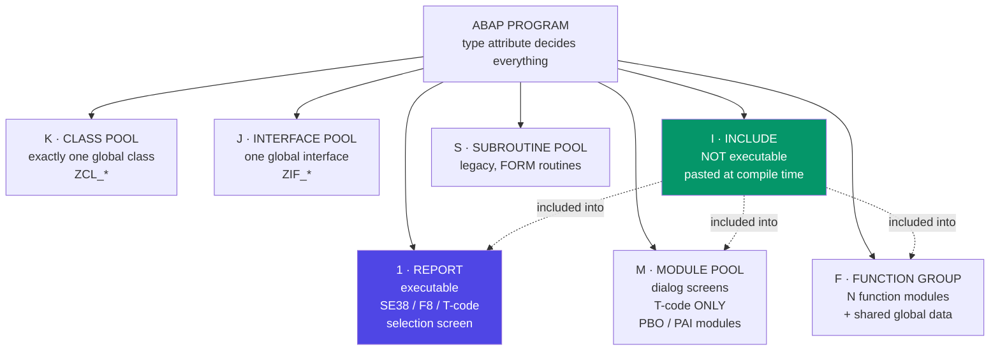

### The full type table

| Type | Code | Keyword | Executable? | Can have screens? | What it's for |
|---|---|---|---|---|---|
| **Executable program (report)** | `1` | `REPORT` | ✅ Directly (F8, SE38, T-code) | Selection screen + lists | 90% of what you write |
| **Module pool** | `M` | `PROGRAM` | ❌ Only via T-code | ✅ Full dialog screens | Multi-screen transactions |
| **Function group** | `F` | `FUNCTION-POOL` | ❌ | ✅ (for FM screens) | Container for function modules |
| **Class pool** | `K` | `CLASS-POOL` | ❌ | ❌ | One global class |
| **Interface pool** | `J` | `INTERFACE-POOL` | ❌ | ❌ | One global interface |
| **Include** | `I` | *(none)* | ❌ | ❌ | Reusable source fragment |
| **Subroutine pool** | `S` | `PROGRAM` | ❌ | ❌ | Legacy `FORM` routines |
| **Type group** | *(T)* | `TYPE-POOL` | ❌ | ❌ | Legacy shared types (obsolete — use classes) |

**The one-sentence guide for new code:** write **class pools** for logic and **reports** for entry points; use function groups only when you genuinely need a **remote-enabled (RFC) function module** or must extend something that already is one. Module pools, subroutine pools and type groups are legacy — you will *read* them constantly and *write* them rarely.

### 1. The executable report — your default

```abap
*&---------------------------------------------------------------------*
*& Report Z_DEMO_REPORT      Program type: 1 (executable)
*&---------------------------------------------------------------------*
REPORT z_demo_report.

" A report can have a SELECTION SCREEN, generated automatically from
" these declarations. No screen painter, no HTML, no form library.
PARAMETERS:     p_carrid TYPE s_carr_id OBLIGATORY DEFAULT 'LH'.
SELECT-OPTIONS: s_fldate FOR sflight-fldate.

" ---------------------------------------------------------------
" Reports are EVENT-DRIVEN. The runtime raises these in a fixed
" order. You do not call them; you fill them in. There is no main().
" ---------------------------------------------------------------

INITIALIZATION.
  " Runs ONCE, BEFORE the selection screen is displayed.
  " Use it to set defaults dynamically -- e.g. 'first day of the
  " current month to today', which a static DEFAULT cannot express.
  s_fldate-sign   = 'I'.          " I = Include (E = Exclude)
  s_fldate-option = 'BT'.         " BT = BeTween (EQ, GT, CP...)
  s_fldate-low    = sy-datum(6) && '01'.   " 1st of this month
  s_fldate-high   = sy-datum.              " today
  APPEND s_fldate TO s_fldate.

AT SELECTION-SCREEN.
  " Runs when the user presses Execute, BEFORE START-OF-SELECTION.
  " This is where you VALIDATE input. A MESSAGE of type 'E' here
  " keeps the user on the selection screen with the field ready to
  " correct -- exactly the behaviour users expect.
  SELECT SINGLE @abap_true FROM scarr
    WHERE carrid = @p_carrid INTO @DATA(lv_exists).
  IF lv_exists IS INITIAL.
    MESSAGE 'Unknown carrier. Use F4 to pick one.' TYPE 'E'.
  ENDIF.

START-OF-SELECTION.
  " The MAIN event. Your actual work goes here.
  SELECT carrid, connid, fldate, seatsocc
    FROM sflight
    WHERE carrid = @p_carrid
      AND fldate IN @s_fldate
    INTO TABLE @DATA(lt_flights).

  LOOP AT lt_flights INTO DATA(ls_flight).
    WRITE: / ls_flight-carrid, ls_flight-connid,
             ls_flight-fldate, ls_flight-seatsocc.
  ENDLOOP.

END-OF-SELECTION.
  " Runs after START-OF-SELECTION finishes. Traditionally used for
  " final totals or to trigger list display. Often unused today.
  WRITE: / |Total flights: { lines( lt_flights ) }|.
```

**The logic walkthrough — the mental shift required here.**

1. **There is no `main()` and no top-to-bottom execution.** A report is a set of **event blocks**, and the runtime decides the order. If you write executable statements before the first event keyword, they implicitly belong to `START-OF-SELECTION` — which works, and is why beginner code appears to run linearly, but hides what's really happening.
2. **The order is fixed and worth memorising:** `LOAD-OF-PROGRAM` → `INITIALIZATION` → *(selection screen displayed)* → `AT SELECTION-SCREEN OUTPUT` → `AT SELECTION-SCREEN ON <field>` → `AT SELECTION-SCREEN` → `START-OF-SELECTION` → `GET` events (logical databases, legacy) → `END-OF-SELECTION` → *(list displayed)* → `TOP-OF-PAGE` / `END-OF-PAGE` per page.
3. **`INITIALIZATION` for dynamic defaults.** `PARAMETERS ... DEFAULT sy-datum` doesn't work for computed values; `INITIALIZATION` does. The range-table fields (`sign`, `option`, `low`, `high`) are the internal shape of every select-option — worth learning early because you will build ranges programmatically all the time.
4. **`AT SELECTION-SCREEN` for validation.** A `MESSAGE ... TYPE 'E'` raised here returns the user to the selection screen with the field editable. The same message in `START-OF-SELECTION` terminates the program instead — a genuinely worse experience. Put validation where it belongs.
5. **`sy-datum(6)`** is **offset/length access**: take 6 characters starting at position 0 of the date `20260718`, giving `202607`. Then `&&` concatenates. This substring syntax (`field+offset(length)`) is everywhere in ABAP and has no direct JS equivalent — it comes from ABAP's fixed-length character heritage.

### 2. The module pool — dialog programming

```abap
*&---------------------------------------------------------------------*
*& Module pool SAPMZ_CUSTOMER    Program type: M
*& NOT executable. Started only via a transaction code (SE93) that
*& points at this program AND a screen number.
*&---------------------------------------------------------------------*
PROGRAM sapmz_customer.          " note: PROGRAM, not REPORT

" Global data, visible to every screen and module in this pool.
DATA: gv_kunnr TYPE kna1-kunnr,
      gs_kna1  TYPE kna1,
      gv_okcode TYPE sy-ucomm.   " the function code of the button
                                 " the user pressed

*&---------------------------------------------------------------------*
*& PBO -- Process Before Output. Runs BEFORE the screen is shown.
*& Think: the render-preparation step. Set titles, set the GUI
*& status (the menu/toolbar), grey out fields, fill dropdowns.
*&---------------------------------------------------------------------*
MODULE status_0100 OUTPUT.
  SET PF-STATUS 'STATUS_0100'.   " which toolbar/menu (SE41)
  SET TITLEBAR  'TITLE_0100'.    " the window title
ENDMODULE.

*&---------------------------------------------------------------------*
*& PAI -- Process After Input. Runs AFTER the user acts (Enter, a
*& button, a menu item). Think: the event handler. Read what they
*& pressed, validate, decide where to go next.
*&---------------------------------------------------------------------*
MODULE user_command_0100 INPUT.

  CASE gv_okcode.

    WHEN 'DISPLAY'.
      SELECT SINGLE * FROM kna1
        WHERE kunnr = @gv_kunnr
        INTO @gs_kna1.
      IF sy-subrc <> 0.
        " In dialog programming, an 'E' message inside PAI redisplays
        " the screen with the field open for correction -- the same
        " helpful behaviour as AT SELECTION-SCREEN in a report.
        MESSAGE 'Customer not found' TYPE 'E'.
      ENDIF.

    WHEN 'BACK' OR 'EXIT' OR 'CANCEL'.
      LEAVE TO SCREEN 0.         " 0 = leave this screen; return to
                                 " whatever called it (or end the
                                 " transaction). This is THE way to
                                 " exit a dynpro.

  ENDCASE.

  CLEAR gv_okcode.               " ALWAYS clear the OK code, or the
                                 " last command fires again on the
                                 " next Enter. Classic dialog bug.

ENDMODULE.
```

**How to think about dialog programming.** A screen (**dynpro**) is designed in the **Screen Painter (SE51)** — a visual layout of fields with a screen number, plus **flow logic** (a separate little language with just `MODULE`, `FIELD`, `CHAIN`, `LOOP`) that calls modules in your program. The cycle is **PBO → screen shown → user acts → PAI → PBO → ...** If you know React, the closest mapping is: **PBO ≈ the render pass**, **PAI ≈ the event handler**, and the screen fields are automatically two-way bound to global variables with the same name in the program — an implicit binding by name that feels like magic until it bites you.

**When would you actually write one?** Rarely, for new development — new UIs should be Fiori. But you will **read and modify** module pools constantly, because `VA01` (`SAPMV45A`), `ME21N`, `MM01` and every classic transaction is one. Knowing PBO/PAI is what lets you debug them.

### 3. Function groups and function modules

```abap
*&---------------------------------------------------------------------*
*& Function group ZSD_ORDERS    Program type: F
*& The group's top include (LZSD_ORDERSTOP) holds data shared by
*& EVERY function module in the group -- this shared state is the
*& entire reason function groups exist rather than standalone FMs.
*&---------------------------------------------------------------------*
FUNCTION-POOL zsd_orders.

DATA gt_cache TYPE TABLE OF vbak.   " shared across all FMs in this
                                    " group, and it PERSISTS for the
                                    " whole session once the group is
                                    " loaded. Useful for caching --
                                    " and a classic source of stale-
                                    " data bugs if you forget it.

*&---------------------------------------------------------------------*
FUNCTION z_sd_get_order_header.
*"----------------------------------------------------------------------
*" The interface is defined on a SCREEN in SE37, and SAP generates
*" this comment block. You do not type it by hand -- and you must not
*" edit it by hand either.
*"
*"*"Local Interface:
*"  IMPORTING
*"     VALUE(IV_VBELN) TYPE  VBELN
*"  EXPORTING
*"     VALUE(ES_HEADER) TYPE  VBAK
*"  EXCEPTIONS
*"     NOT_FOUND
*"----------------------------------------------------------------------

  " Check the group's cache before hitting the database. This is the
  " pattern function groups were designed for.
  READ TABLE gt_cache INTO es_header WITH KEY vbeln = iv_vbeln.
  IF sy-subrc = 0.
    RETURN.                       " cache hit
  ENDIF.

  SELECT SINGLE * FROM vbak
    WHERE vbeln = @iv_vbeln
    INTO @es_header.

  IF sy-subrc <> 0.
    " Classic (non-class-based) exception. The CALLER receives this
    " as sy-subrc = 1 (or whatever number they assigned it), NOT as
    " a thrown object. This is the old mechanism; modern code uses
    " class-based exceptions in methods instead.
    RAISE not_found.
  ENDIF.

  APPEND es_header TO gt_cache.

ENDFUNCTION.
```

**Why function groups still matter.** Two reasons, and only two. First, **RFC**: a function module marked *Remote-Enabled* can be called from another SAP system, from Java, from .NET, from Node via the SAP connector. Methods cannot be called remotely; function modules can. Every **BAPI** is a remote-enabled function module. Second, **shared state with a lifetime**: the group's global data is loaded once and persists for the session, which is how classic caching and `ENQUEUE`/`DEQUEUE` pairs work.

**The gotcha that persists:** because group-global data survives between calls, a function module can behave differently on its second call than its first. Debugging that is unpleasant. Modern code prefers a class with clearly-owned attributes.

### 4. Class pools and includes

```abap
" ---- Class pool (type K): SE24 or ADT. One global class per pool. ----
CLASS zcl_order_service DEFINITION PUBLIC FINAL CREATE PUBLIC.
  PUBLIC SECTION.
    METHODS get_header
      IMPORTING iv_vbeln         TYPE vbeln
      RETURNING VALUE(rs_header) TYPE vbak
      RAISING   cx_sy_itab_line_not_found.
ENDCLASS.

CLASS zcl_order_service IMPLEMENTATION.
  METHOD get_header.
    SELECT SINGLE * FROM vbak WHERE vbeln = @iv_vbeln INTO @rs_header.
    IF sy-subrc <> 0.
      RAISE EXCEPTION TYPE cx_sy_itab_line_not_found.
    ENDIF.
  ENDMETHOD.
ENDCLASS.
```

```abap
" ---- Include (type I): a source fragment, not a program. ----
" INCLUDE is a COMPILE-TIME TEXT PASTE. It is NOT an import.
" There is no namespacing, no isolation: everything declared in the
" include lands in the including program's scope, and everything in
" that program is visible inside the include.
REPORT z_uses_includes.

INCLUDE z_common_top.     " global data declarations
INCLUDE z_common_forms.   " FORM routines
INCLUDE z_common_events.  " event blocks

" C's #include, essentially. NOT ES modules.
" Modern equivalent: put the code in a CLASS and call it. Includes
" survive because SE80 automatically generates them for module
" pools and function groups (the *TOP, *F01, *O01, *I01 pattern),
" and because 30-year-old programs are built from them.
```

**Why includes exist and why you shouldn't reach for them.** Before ABAP Objects, includes were the only way to split a large program. So huge legacy programs are assembled from dozens of them. But because an include is a raw text paste, it offers **no encapsulation whatsoever** — a variable declared in one include silently collides with one in another, and the where-used list is your only defence. For new code, a class gives you real interfaces, real scoping and real testability. Reserve includes for the ones the system generates for you.

### Choosing a program type — the decision

| Requirement | Use |
|---|---|
| Run a report, produce a list or ALV | **Executable program** (`REPORT`) |
| Reusable business logic | **Class pool** (`ZCL_*`) |
| Callable from a non-SAP system / another SAP system | **Function module (RFC-enabled)** in a function group |
| Multi-screen classic UI | **Module pool** + T-code (legacy — prefer Fiori) |
| Modern UI / API | **CDS + RAP** → OData (not a classic program at all) |
| Shared source fragment | **Class** (not an include) |
| Background job | **Executable program**, scheduled in SM36 |

**Real-world example.** A requirement: *"expose our custom credit-check logic to the company's Salesforce system, and also let internal users run it from a screen."* The right decomposition uses three program types: put the logic in a **class pool** (`ZCL_CREDIT_CHECK`), wrap it in an **RFC-enabled function module** for Salesforce (or better, expose it as OData), and write a thin **executable report** with a selection screen for internal users. One implementation, three doors. Putting the logic in the function module directly — which is what a hurried developer does — means the report has to call the FM awkwardly, the logic can't be unit tested cleanly, and any future OData exposure duplicates it.

**Gotchas.**
- **`REPORT` vs `PROGRAM` keyword.** Both compile in several cases, but the **type attribute** (set in the program's attributes screen, not the keyword) is what actually decides behaviour. Trusting the keyword alone will mislead you.
- **A module pool cannot be run from SE38.** If you try, you get "program is not executable" — you need a transaction code (SE93) that names both the program and the starting screen.
- **The include naming convention is generated, not chosen:** `L<fgrp>TOP` (global data), `L<fgrp>U01` (function module source), and for module pools `MZ...TOP`, `...O01` (PBO), `...I01` (PAI), `...F01` (FORMs). Recognising these suffixes tells you instantly what you're looking at when you open unfamiliar legacy code.
- **Type groups (`TYPE-POOL`) are obsolete.** Use constants and types in a class instead. You'll still meet `ABAP` (which gives you `abap_true`/`abap_false`) constantly, because it's built in.

**Interview points.**
- *"What is the difference between a report and a module pool?"* — A report (type 1) is directly executable and typically has a selection screen and list output; a module pool (type M) contains dialog screens and can only be started through a transaction code. Mention PBO/PAI to show you've actually worked with dynpros.
- *"What is an include and how does it differ from a class?"* — Text substitution at compile time with no encapsulation, versus a real object with interfaces, scoping and testability.
- *"Why would you use a function module instead of a class method?"* — **RFC / remote enablement** (BAPIs, external system integration) and update-task processing. Otherwise, prefer a class.
- *"What are PBO and PAI?"* — Process Before Output (prepare the screen) and Process After Input (handle what the user did). The dialog-programming event cycle.

---
## C2. Hello World — the Anatomy of a Report

**Simple definition:** The smallest complete ABAP program is two statements: a `REPORT` declaration naming the program, and a `WRITE` statement producing output. But a *real* report has a recognisable anatomy that every ABAP developer expects to find, in this order: a **header comment block**, the `REPORT` statement, **type declarations**, **data declarations**, the **selection screen**, and then the **event blocks** (`INITIALIZATION`, `AT SELECTION-SCREEN`, `START-OF-SELECTION`, `END-OF-SELECTION`), followed by any **subroutines or local classes**. Learning that skeleton is more valuable than learning `WRITE`, because you will reproduce it hundreds of times.

<p class="te"><strong>Telugu:</strong> Chinna ABAP program ante rendu statements: <code>REPORT</code> (program peru) mariyu <code>WRITE</code> (output). Kaani <strong>real</strong> report ki oka fixed anatomy untundi, prati ABAP developer adhe order expect chestadu: (1) <strong>header comment block</strong>, (2) <code>REPORT</code> statement, (3) <strong>TYPES</strong>, (4) <strong>DATA</strong>, (5) <strong>selection screen</strong> (PARAMETERS / SELECT-OPTIONS), (6) <strong>event blocks</strong> (INITIALIZATION → AT SELECTION-SCREEN → START-OF-SELECTION → END-OF-SELECTION), (7) chivarlo subroutines leda local classes. <code>WRITE</code> nerchukovadam kanna <strong>ee skeleton</strong> nerchukovadam ekkuva viluvaindi — deenini meeru vandalu sarlu malli malli rastaru.</p>

**The everyday analogy.** A business letter has a fixed anatomy: letterhead, date, address, salutation, body, sign-off. Nobody invents a new arrangement, because the shape itself carries meaning — a reader knows exactly where to look for the date. An ABAP report is the same: any developer opening your program looks at the top for what it does and who wrote it, then scans for the selection screen to see what it takes as input, then jumps to `START-OF-SELECTION` for the logic. Follow the convention and your program is instantly readable by a stranger at 2am. Invent your own arrangement and you have made their night worse.

### The absolute minimum

```abap
REPORT z_hello.
WRITE 'Hello World'.
```

Two lines. Create it in SE38 or ADT, activate it (Ctrl+F3), execute it (F8), and you get a classic list screen with `Hello World` in the top-left. Notice what you did **not** have to do: no build step, no `package.json`, no server to start, no HTML, no route. You wrote two lines and had a running program with a real UI on an enterprise system. That immediacy is genuinely one of ABAP's pleasures.

### The full anatomy — a program you'd be happy to hand over

```abap
*&---------------------------------------------------------------------*
*& Report  Z_FLIGHT_OCCUPANCY
*&---------------------------------------------------------------------*
*& Title       : Flight occupancy analysis
*& Description : Lists flights for a carrier / date range with the
*&               occupancy percentage, flagging under-booked flights.
*& Author      : N. Vanama
*& Date        : 18.07.2026
*& Ticket      : ZD-4471
*& Transport   : DEVK900123
*&---------------------------------------------------------------------*
*& Change history
*& Date        Author      Ticket    Description
*& 18.07.2026  N.Vanama    ZD-4471   Initial version
*&---------------------------------------------------------------------*
REPORT z_flight_occupancy.

*&---------------------------------------------------------------------*
*& 1. TYPES -- local type definitions come first.
*&---------------------------------------------------------------------*
TYPES: BEGIN OF ty_result,
         carrid    TYPE sflight-carrid,
         connid    TYPE sflight-connid,
         fldate    TYPE sflight-fldate,
         seatsmax  TYPE sflight-seatsmax,
         seatsocc  TYPE sflight-seatsocc,
         occupancy TYPE p LENGTH 5 DECIMALS 2,  " calculated, not stored
         flag      TYPE c LENGTH 1,             " 'X' = under-booked
       END OF ty_result.

TYPES tt_result TYPE STANDARD TABLE OF ty_result WITH EMPTY KEY.

*&---------------------------------------------------------------------*
*& 2. CONSTANTS -- never scatter magic numbers through the code.
*&---------------------------------------------------------------------*
CONSTANTS gc_underbooked_pct TYPE p LENGTH 5 DECIMALS 2 VALUE '50.00'.

*&---------------------------------------------------------------------*
*& 3. DATA -- global data for the program. Keep this list SHORT;
*&    prefer inline declarations (DATA( )) inside the events.
*&---------------------------------------------------------------------*
DATA gt_result TYPE tt_result.

*&---------------------------------------------------------------------*
*& 4. SELECTION SCREEN -- the program's input contract.
*&---------------------------------------------------------------------*
SELECTION-SCREEN BEGIN OF BLOCK b1 WITH FRAME TITLE TEXT-t01.
  PARAMETERS     p_carrid TYPE s_carr_id OBLIGATORY.
  SELECT-OPTIONS s_fldate FOR  sflight-fldate.
SELECTION-SCREEN END OF BLOCK b1.

SELECTION-SCREEN BEGIN OF BLOCK b2 WITH FRAME TITLE TEXT-t02.
  PARAMETERS p_alv  RADIOBUTTON GROUP out DEFAULT 'X'.
  PARAMETERS p_list RADIOBUTTON GROUP out.
SELECTION-SCREEN END OF BLOCK b2.

*&---------------------------------------------------------------------*
*& 5. EVENT BLOCKS -- in the order the runtime raises them.
*&---------------------------------------------------------------------*

INITIALIZATION.
  " Default the date range to the current month.
  s_fldate = VALUE #( sign   = 'I'
                      option = 'BT'
                      low    = |{ sy-datum(6) }01|
                      high   = sy-datum ).
  APPEND s_fldate TO s_fldate.

AT SELECTION-SCREEN ON p_carrid.
  " Field-specific validation. Because it is 'ON p_carrid', an error
  " here puts the cursor back in EXACTLY that field.
  SELECT SINGLE @abap_true FROM scarr
    WHERE carrid = @p_carrid INTO @DATA(lv_ok).
  IF lv_ok IS INITIAL.
    MESSAGE e001(zflight) WITH p_carrid.   " 'Carrier & does not exist'
  ENDIF.

START-OF-SELECTION.
  PERFORM get_data.            " legacy style, shown for recognition
  PERFORM display_data.

*&---------------------------------------------------------------------*
*& 6. SUBROUTINES (or, in modern code, a local class)
*&---------------------------------------------------------------------*
FORM get_data.

  SELECT carrid, connid, fldate, seatsmax, seatsocc
    FROM sflight
    WHERE carrid  = @p_carrid
      AND fldate IN @s_fldate
      AND seatsmax > 0                 " guard against divide-by-zero
                                       " AT THE DATABASE. Cheaper and
                                       " safer than checking per row.
    INTO CORRESPONDING FIELDS OF TABLE @gt_result.

  IF sy-subrc <> 0.
    MESSAGE 'No flights found for this selection' TYPE 'S'
            DISPLAY LIKE 'W'.
    LEAVE LIST-PROCESSING.             " stop cleanly, no dump, no
                                       " empty list screen
  ENDIF.

  " Calculate the derived columns. This genuinely belongs in ABAP
  " (not pushed down) only because we also set a flag; a pure
  " percentage could have been computed in the SELECT.
  LOOP AT gt_result ASSIGNING FIELD-SYMBOL(<ls_row>).
    " <> field-symbol = a POINTER to the row. Modifying <ls_row>
    " modifies the table directly -- no MODIFY needed. Using
    " 'INTO ls_row' instead would copy the row, and your changes
    " would be silently thrown away. This is a classic beginner bug.
    <ls_row>-occupancy = <ls_row>-seatsocc * 100 / <ls_row>-seatsmax.

    " COND #( ) -- the modern conditional expression. Replaces a
    " four-line IF/ELSE/ENDIF with one readable assignment.
    <ls_row>-flag = COND #(
      WHEN <ls_row>-occupancy < gc_underbooked_pct THEN 'X'
      ELSE space ).
  ENDLOOP.

ENDFORM.

FORM display_data.

  IF p_alv = abap_true.
    TRY.
        cl_salv_table=>factory(
          IMPORTING r_salv_table = DATA(lo_alv)
          CHANGING  t_table      = gt_result ).
        lo_alv->get_functions( )->set_all( abap_true ).
        lo_alv->get_columns( )->set_optimize( abap_true ).
        lo_alv->display( ).
      CATCH cx_salv_msg INTO DATA(lx).
        MESSAGE lx->get_text( ) TYPE 'E'.
    ENDTRY.

  ELSE.
    " Classic list output -- see C4.
    WRITE: / 'Carrier', 12 'Conn', 20 'Date', 32 'Occ %', 45 'Flag'.
    ULINE.
    LOOP AT gt_result INTO DATA(ls_row).
      WRITE: /     ls_row-carrid,
              12   ls_row-connid,
              20   ls_row-fldate,
              32   ls_row-occupancy,
              45   ls_row-flag.
    ENDLOOP.
  ENDIF.

ENDFORM.
```

**The full logic walkthrough — how you'd build this from nothing.**

1. **Write the header block first, not last.** It takes 60 seconds and it is the only documentation this program will ever have. The **ticket number** is the crucial line: it is the thread back from the code to the business reason it exists (B6).
2. **Declare types before data.** ABAP requires declarations before executable statements in the global part, and the convention `TYPES → CONSTANTS → DATA → selection screen → events → routines` is universal. A reviewer scanning your program relies on that order.
3. **`TYPES ... WITH EMPTY KEY`.** Since ABAP 7.40 you must state a key for a standard table type. `EMPTY KEY` means "no key, I'll just append and loop" — the right choice when you don't need keyed access. If you *do* look rows up by key, declare it (`WITH KEY carrid connid`) and the runtime uses a proper search.
4. **Constants, not magic numbers.** `gc_underbooked_pct` is one line and prevents the day someone changes 50 to 60 in one place and misses the other two. Note `VALUE '50.00'` — packed decimal literals are written **as character strings in quotes**. Writing `VALUE 50.00` is a syntax error, which surprises everyone once.
5. **Group the selection screen into blocks with frames.** `SELECTION-SCREEN BEGIN OF BLOCK ... WITH FRAME TITLE` draws a labelled box. `TEXT-t01` refers to a **text symbol** — a translatable text maintained under Goto → Text Elements. **Hardcoded English strings on a selection screen are a real defect** in a multi-language SAP system, and this is the mechanism that fixes it.
6. **`AT SELECTION-SCREEN ON p_carrid`** (field-specific) is better than plain `AT SELECTION-SCREEN` (whole screen) when validating one field, because the cursor returns to exactly that field. Small detail; users notice.
7. **`MESSAGE e001(zflight) WITH p_carrid`** uses a **message class** (SE91): message number 001 in class `ZFLIGHT`, with `p_carrid` substituted into the `&` placeholder. Translatable, centrally maintained, reusable. Inline literal messages are fine for quick tools, wrong for delivered code.
8. **`seatsmax > 0` in the `WHERE` clause.** The division later would dump with `COMPUTE_INT_ZERODIVIDE` on any row with zero max seats. You could check in the loop; filtering at the database is cheaper and expresses the intent better ("rows without capacity aren't meaningful here").
9. **`INTO CORRESPONDING FIELDS OF TABLE`** maps by field *name* between the SELECT list and the target structure, filling `occupancy` and `flag` with initial values. It's convenient, and slightly slower than an exact-shape read. The strict-purist alternative is to select into a matching structure and map explicitly; in practice `CORRESPONDING` is used everywhere and is fine when the field names genuinely correspond.
10. **`ASSIGNING FIELD-SYMBOL(<ls_row>)` versus `INTO`.** This is the single most important performance-and-correctness detail in ABAP loops. `INTO` **copies** each row into a work area — modifications are lost unless you `MODIFY` back. `ASSIGNING` gives you a **pointer** to the row in place — modifications are immediate, and no copy happens, so it is measurably faster on large tables. Rule: **`ASSIGNING` when you modify or when the table is big; `INTO` when you're only reading a small table.**
11. **`COND #( )`** is the modern conditional expression. The `#` means "infer the type from context" — here, from the type of `<ls_row>-flag`. You will see `#` constantly in modern ABAP; it always means *"work out the type yourself."*
12. **`LEAVE LIST-PROCESSING`** exits cleanly back to the selection screen rather than displaying an empty list. Small, but it's the difference between a program that feels finished and one that feels like a prototype.

### Classic vs modern — the same program, two eras

| Task | Classic (pre-7.40) | Modern (7.40+) |
|---|---|---|
| Declare + fill a variable | `DATA lv TYPE i.` then `lv = 5.` | `DATA(lv) = 5.` |
| Declare from a SELECT | `TYPES: BEGIN OF ty... END OF ty.` + `DATA lt TYPE TABLE OF ty.` | `INTO TABLE @DATA(lt)` |
| Create an object | `CREATE OBJECT lo_x.` | `DATA(lo_x) = NEW zcl_x( ).` |
| Fill a structure | `ls-a = 1. ls-b = 2.` | `ls = VALUE #( a = 1 b = 2 ).` |
| Fill a table | repeated `APPEND` | `lt = VALUE #( ( a = 1 ) ( a = 2 ) ).` |
| Conditional assignment | `IF ... lv = 'A'. ELSE. lv = 'B'. ENDIF.` | `lv = COND #( WHEN ... THEN 'A' ELSE 'B' ).` |
| Concatenate | `CONCATENATE a b INTO c SEPARATED BY space.` | `c = \|{ a } { b }\|.` |
| Copy matching fields | `MOVE-CORRESPONDING s1 TO s2.` | `s2 = CORRESPONDING #( s1 ).` |
| Read a table row | `READ TABLE lt INTO ls WITH KEY k = v.` | `DATA(ls) = lt[ k = v ].` (throws if absent) |
| Check existence | `READ TABLE ... TRANSPORTING NO FIELDS.` + `sy-subrc` | `IF line_exists( lt[ k = v ] ).` |
| Build a derived table | `LOOP ... APPEND ... ENDLOOP.` | `lt2 = VALUE #( FOR ls IN lt ( ... ) ).` |
| Aggregate in ABAP | `LOOP ... lv = lv + ls-x. ENDLOOP.` | `lv = REDUCE i( INIT s = 0 FOR ls IN lt NEXT s = s + ls-x ).` |

**Write modern; read classic.** Every one of the left-hand forms still works and appears throughout the code you'll maintain. Use the right-hand column in anything you write.

### Text symbols and text elements — do this properly

```abap
" ❌ Hardcoded. Fails the moment a German user logs on.
WRITE: / 'Total flights:'.
PARAMETERS p_carrid TYPE s_carr_id.   " label shows the data element
                                      " text, which is at least
                                      " translated -- but a custom
                                      " prompt would not be.

" ✅ Text symbols: maintained under Goto > Text Elements, translatable.
WRITE: / TEXT-001.                    " 'Total flights:'
SELECTION-SCREEN COMMENT /1(30) TEXT-002.

" Text elements come in three kinds:
"   TEXT SYMBOLS  (TEXT-001) -- free text in your code
"   SELECTION TEXTS          -- labels for PARAMETERS/SELECT-OPTIONS
"   LIST HEADINGS            -- column headers for classic lists
" ADT shows an 'unmaintained text symbol' warning; do not ignore it.
```

**Real-world example.** Your report goes live in a company operating in Germany, Poland and India. The selection screen labels come from data elements (already translated by SAP), but your custom prompt "Show only under-booked flights" is a text symbol you maintained in EN. A translator opens transaction SE63, translates the text elements to DE and PL, and the same program now presents itself correctly to every user — with **no code change**. That is the payoff for the small discipline, and it is the reason "no hardcoded strings" is a hard rule in SAP code review.

<div class="ba"><div class="ba-col ba-before"><h4>❌ Beginner report</h4><ul><li>No header comment, no ticket number</li><li>Hardcoded English strings everywhere</li><li>Global variables scattered through the file</li><li><code>LOOP ... INTO</code> then <code>MODIFY</code> back</li><li>No validation; dumps on bad input</li><li>Everything in one 600-line <code>START-OF-SELECTION</code></li></ul></div><div class="ba-col ba-after"><h4>✅ Professional report</h4><ul><li>Header block with purpose, author, ticket</li><li>Text symbols and a message class</li><li>Types → constants → minimal globals → inline declarations</li><li><code>LOOP ... ASSIGNING FIELD-SYMBOL( )</code></li><li><code>AT SELECTION-SCREEN</code> validation with clear messages</li><li>Logic in a local class or well-named routines</li></ul></div></div>

**Gotchas.**
- **Activate, then run.** F8 on a saved-but-inactive program runs the last *active* version. Hours have been lost to this.
- **Packed literals need quotes:** `VALUE '50.00'`, not `VALUE 50.00`.
- **`sy-subrc` after `SELECT ... INTO TABLE`** is 0 if *at least one* row came back, 4 if none. After `SELECT SINGLE` it's 0 or 4 for the single row. Check it every time.
- **`s_fldate` is both a structure and a table.** In `INITIALIZATION` you fill the header fields and `APPEND` it — the same name refers to both, which is confusing until you've done it twice.
- **`LEAVE LIST-PROCESSING` vs `RETURN` vs `LEAVE PROGRAM`.** `RETURN` leaves the current routine; `LEAVE LIST-PROCESSING` leaves list output and returns to the selection screen; `LEAVE PROGRAM` ends the program entirely. Pick deliberately.

**Interview points.**
- *"Describe the event sequence of a report."* — `LOAD-OF-PROGRAM` → `INITIALIZATION` → *(selection screen)* → `AT SELECTION-SCREEN OUTPUT` → `AT SELECTION-SCREEN ON <field>` → `AT SELECTION-SCREEN` → `START-OF-SELECTION` → `END-OF-SELECTION` → list events (`TOP-OF-PAGE`, `END-OF-PAGE`).
- *"Where do you validate selection screen input, and why there?"* — `AT SELECTION-SCREEN` (or `ON <field>`), because an `E` message there returns the user to the screen with the field correctable, rather than terminating the program.
- *"`INTO` vs `ASSIGNING` in a LOOP?"* — Copy versus pointer. `ASSIGNING` avoids the copy (faster) and lets you modify the row in place; `INTO` requires an explicit `MODIFY` to persist changes.
- *"What are text elements?"* — Text symbols, selection texts and list headings: translatable texts stored separately from the code, so one program serves every language.

---
## C3. ABAP Syntax Rules (statements, periods, chaining, case-insensitivity, comments)

**Simple definition:** ABAP has five foundational syntax rules that differ sharply from JavaScript. **(1)** Every statement ends with a **period (`.`)** — newlines mean nothing, a statement can span twenty lines, and two statements can share one line. **(2)** The language is **completely case-insensitive** for keywords, variable names and everything else: `WRITE`, `write` and `WrItE` are identical. **(3)** **Chaining** with a colon lets you write a keyword once and apply it to a comma-separated list: `DATA: a TYPE i, b TYPE i.` **(4)** Comments are `*` in column 1 for a full line, or `"` anywhere for the rest of the line. **(5)** **Spaces are mandatory** around operators and inside the parentheses of expressions and function calls — `lines(lt)` is a syntax error, `lines( lt )` is correct.

<p class="te"><strong>Telugu:</strong> ABAP syntax lo aidu main rules unnayi, ivi JavaScript kanna chala different. <strong>(1)</strong> Prati statement <strong>period (.)</strong> tho aagali — newline ki value ledu, oka statement 20 lines paatu vellochu, leda rendu statements oke line lo undochu. <strong>(2)</strong> Language <strong>puurthiga case-insensitive</strong> — <code>WRITE</code>, <code>write</code>, <code>WrItE</code> anni okate. <strong>(3)</strong> <strong>Chaining</strong>: colon (:) petti keyword okasari rasi, comma tho list ivvochu — <code>DATA: a TYPE i, b TYPE i.</code> <strong>(4)</strong> Comments: line modhata <code>*</code>, leda madhyalo <code>"</code>. <strong>(5)</strong> <strong>Spaces tappanisari</strong> — brackets lopala space levakapote syntax error: <code>lines(lt)</code> ❌, <code>lines( lt )</code> ✅.</p>

**The everyday analogy.** JavaScript is like modern texting: line breaks and indentation carry meaning to the reader, and the machine mostly guesses your intent (semicolons optional, ASI does the rest). ABAP is like **formal written prose**: the full stop is the *only* thing that ends a sentence, and until you write it the sentence continues no matter how many times you press Enter. Once you internalise "the period is the end, nothing else is," a whole category of confusion disappears.

### Rule 1: the period ends the statement

```abap
*&---------------------------------------------------------------------*
*& The period rules -- everything else follows from these.
*&---------------------------------------------------------------------*
REPORT z_syntax_rules.

" One statement on one line -- the normal case.
DATA lv_count TYPE i.

" ONE statement spanning six lines. Perfectly legal and, for a long
" SELECT, this is the READABLE way to write it. Newlines are just
" whitespace to the compiler.
SELECT carrid,
       connid,
       fldate
  FROM sflight
  WHERE carrid = 'LH'
  INTO TABLE @DATA(lt_flights).

" THREE statements on one line. Legal, and almost always a bad idea.
lv_count = 1. lv_count = lv_count + 1. WRITE lv_count.

" A missing period is the classic beginner error, and the error
" message is confusing because the compiler swallows the NEXT line
" as part of this statement:
"   DATA lv_a TYPE i     <- no period!
"   DATA lv_b TYPE i.    <- compiler sees 'DATA lv_a TYPE i DATA lv_b
"                            TYPE i.' and complains about something
"                            that looks unrelated.
" WHEN A SYNTAX ERROR MAKES NO SENSE, LOOK AT THE LINE ABOVE IT.
```

**That last comment is a genuine debugging heuristic** worth remembering permanently: in ABAP, an incomprehensible syntax error is usually caused by a missing period on a **previous** line, because the statement never ended and the compiler is reading two statements as one.

### Rule 2: case-insensitivity

```abap
" All four of these are THE SAME STATEMENT to the compiler:
DATA lv_x TYPE i.
data lv_x type i.
Data Lv_X Type I.
DaTa LV_x TyPe i.

" It applies to variable names too -- these refer to one variable:
lv_customer_name = 'Nikhil'.
LV_CUSTOMER_NAME = 'Nikhil'.
Lv_Customer_Name = 'Nikhil'.

" ⚠️ BUT: string CONTENTS are absolutely case-SENSITIVE.
IF lv_name = 'NIKHIL'.   " does NOT match a variable holding 'Nikhil'
ENDIF.

" So comparisons on data usually need normalising:
IF to_upper( lv_name ) = 'NIKHIL'.   " ✅ reliable
ENDIF.
```

**The convention that grew from this.** Because the compiler doesn't care, the community standardised: **keywords in UPPERCASE, everything you name in lowercase**. `SELECT ... FROM sflight INTO TABLE @DATA(lt_flights).` The **Pretty Printer** (Shift+F1) enforces it automatically, and its settings (in Utilities → Settings) let you choose. Every shop has a house rule; follow the one in the code you're editing rather than the one you personally prefer.

**Why it matters more than it sounds.** In a case-insensitive language, `lv_Total` and `lv_total` are the same variable — so a typo in capitalisation silently *works* instead of creating a new variable. That is safer than JavaScript, where `lv_Total` in a non-strict context creates a new global and the bug hides for weeks.

### Rule 3: chaining with the colon

```abap
" Without chaining -- repetitive:
DATA lv_a TYPE i.
DATA lv_b TYPE i.
DATA lv_c TYPE string.

" With chaining -- the colon means 'apply this keyword to each
" comma-separated item until the period':
DATA: lv_a TYPE i,
      lv_b TYPE i,
      lv_c TYPE string.

" Chaining works on almost ANY statement, not just DATA:
WRITE: / 'Line one',
       / 'Line two',
       / 'Line three'.

" It even works mid-statement, which is where it gets clever --
" the compiler expands each comma item into a full statement:
CLEAR: lv_a, lv_b, lv_c.
" expands to: CLEAR lv_a. CLEAR lv_b. CLEAR lv_c.

ls_order-vbeln = ls_order-erdat = ls_order-kunnr = space.  " ❌ NOT ABAP
CLEAR: ls_order-vbeln, ls_order-erdat, ls_order-kunnr.     " ✅ the way

" ⚠️ THE CHAINING TRAP. This does NOT do what a JS developer expects:
MOVE: 1 TO lv_a,
      2 TO lv_b.
" It expands to TWO statements -- fine. But this:
lv_x = lv_y = 5.        " is a VALID chain assignment in ABAP and sets
                        " BOTH to 5, evaluated right-to-left. Legal,
                        " but avoid it -- it reads like a comparison.
```

**The rule for using chaining well:** chain **declarations** (`DATA:`, `TYPES:`, `CONSTANTS:`, `PARAMETERS:`) and simple repeated operations (`CLEAR:`, `REFRESH:`, `FREE:`). Do **not** chain complex logic — a chained `WRITE:` with fifteen items and mixed formatting is much harder to read than fifteen lines, and worse, a single misplaced comma breaks it in a way that's hard to spot.

### Rule 4: comments

```abap
*&---------------------------------------------------------------------*
*& An asterisk in COLUMN 1 comments out the ENTIRE line.
*& This is the classic style, used for header and section blocks.
*&---------------------------------------------------------------------*

* A single asterisk in column 1 also works for one line.
*   ⚠️ It MUST be column 1. An asterisk in column 2 is a syntax error
*   (or worse, a multiplication operator).

DATA lv_total TYPE i.   " A double quote comments to END OF LINE.
                        " This is the modern, preferred style for
                        " inline explanation.

" A full-line comment using the double quote, indented with the code.
" This reads better than '*' because it lines up with the block it
" describes. Most modern ABAP uses this exclusively.

"! ABAP DOC. Three characters: quote, bang.
"! This is documentation, not a comment -- ADT renders it on hover
"! and it appears in generated documentation.
"! @parameter iv_input | what this parameter means
METHODS do_something IMPORTING iv_input TYPE string.

" ---------------------------------------------------------------
" What to comment: WHY, not WHAT.
" ---------------------------------------------------------------

lv_total = lv_total + 1.        " ❌ increments the total  <- useless

" ✅ Business rule from ticket ZD-4471: sales orders created before
" the 2024 pricing migration have no condition records, so they must
" be excluded or the totals double-count. Do not remove without
" checking with the SD team.
DELETE lt_orders WHERE erdat < '20240401'.
```

**The comment discipline that matters in ABAP specifically.** Because ABAP code lives for decades and the original author is usually gone, a comment explaining *why* a strange condition exists is worth ten explaining *what* an obvious line does. The `DELETE ... WHERE erdat < '20240401'` above is exactly the kind of line that a future developer will "clean up" — breaking financial reporting — unless the comment stops them. Write comments for the person who will be paged at 2am in 2031.

### Rule 5: mandatory spaces

```abap
" ⚠️ THE RULE THAT CATCHES EVERY NEWCOMER, EVERY TIME.
" ABAP requires spaces around operators and INSIDE the parentheses
" of functional expressions.

DATA(lv_n) = lines( lt_flights ).      " ✅ spaces inside brackets
DATA(lv_n) = lines(lt_flights).        " ❌ SYNTAX ERROR

IF lv_a = lv_b.                        " ✅ spaces around =
IF lv_a=lv_b.                          " ❌ SYNTAX ERROR

lv_x = lv_y + 1.                       " ✅
lv_x = lv_y+1.                         " ❌ -- and this one is EVIL,
                                       " because 'lv_y+1' is valid
                                       " OFFSET syntax meaning
                                       " 'lv_y from position 1'.
                                       " It may compile and do
                                       " something completely
                                       " different from what you meant.

DATA(lv_s) = |Hello { lv_name }|.      " ✅ spaces inside { }
DATA(lv_s) = |Hello {lv_name}|.        " ❌ SYNTAX ERROR

lo_obj->method( iv_a = 1 iv_b = 2 ).   " ✅ note: NO commas between
                                       " named parameters -- just
                                       " spaces. Another JS habit to
                                       " unlearn.

" EXCEPTIONS to the spacing rule (structure and offset access):
ls_flight-carrid                       " '-' for structure components:
                                       " NO spaces. This is not the
                                       " minus operator.
lv_date+4(2)                           " offset/length: no spaces.
lt_tab[ 1 ]-field                      " table expression: spaces
                                       " inside [ ], none around -
```

**Why the spacing rule exists.** ABAP's tokeniser is older than most modern parsers and it separates tokens on whitespace. `lines(lt)` is one token to it, not a function call. The `lv_y+1` case is the dangerous one: because `+` is *also* the offset operator on character fields, ABAP may happily compile a completely different meaning. This is one of the few places where ABAP will silently do the wrong thing, so the habit of always spacing is genuinely protective.

### The remaining syntax facts you need on day one

```abap
*&---------------------------------------------------------------------*
*& Literals, operators, and the things that differ from JS.
*&---------------------------------------------------------------------*

" --- LITERALS ---
DATA(lv_text)   = 'Single quotes = CHARACTER literal (type c)'.
DATA(lv_string) = `Backticks = STRING literal (type string)`.
" ⚠️ The difference is real and it bites:
"   'abc   '  as type C keeps trailing blanks but comparisons IGNORE
"             them, and assigning to a shorter field TRUNCATES.
"   `abc   `  as type STRING keeps trailing blanks and compares them.
" Rule of thumb: use ` ` (string) for text you manipulate, ' ' (char)
" for fixed codes and flags.

DATA(lv_num)  = 42.               " integer literal
DATA(lv_pack) = '123.45'.         " ⚠️ decimals are written IN QUOTES.
                                  " 123.45 unquoted is a syntax error
                                  " in older releases and a float in
                                  " newer ones -- always quote them.

" --- OPERATORS: comparison ---
" ABAP accepts BOTH the symbol and the old two-letter form. You will
" see both in real code, so read both, write the symbols.
IF lv_a =  lv_b. ENDIF.   " EQ  equal
IF lv_a <> lv_b. ENDIF.   " NE  not equal  (also written 'NE' or '><')
IF lv_a >  lv_b. ENDIF.   " GT  greater than
IF lv_a <  lv_b. ENDIF.   " LT
IF lv_a >= lv_b. ENDIF.   " GE
IF lv_a <= lv_b. ENDIF.   " LE

" ⚠️ THERE IS NO === IN ABAP. '=' is comparison in an IF and
" assignment in a statement -- context decides. No == either.

" --- Special comparison operators with no JS equivalent ---
IF lv_name CS 'NIK'.  ENDIF.   " Contains String
IF lv_name CP 'NIK*'. ENDIF.   " Covers Pattern (* and + wildcards)
IF lv_name CA 'AEIOU'.ENDIF.   " Contains Any of these characters
IF lv_flag IS INITIAL. ENDIF.  " is it the type's default value?
IF lv_ref IS BOUND.    ENDIF.  " does this reference point at
                               " an object? (≈ !== null)
IF lv_ref IS NOT INITIAL AND lv_ref IS BOUND. ENDIF.

" --- LOGICAL operators are WORDS, not symbols ---
IF lv_a = 1 AND lv_b = 2. ENDIF.     " not &&
IF lv_a = 1 OR  lv_b = 2. ENDIF.     " not ||
IF NOT lv_a = 1.          ENDIF.     " not !

" --- ARITHMETIC ---
lv_x = lv_a + lv_b.
lv_x = lv_a ** 2.          " power (not ^)
lv_x = lv_a DIV lv_b.      " INTEGER division
lv_x = lv_a MOD lv_b.      " remainder (not %)

" --- STRING operations ---
DATA(lv_full) = |{ lv_first } { lv_last }|.       " template (modern)
DATA(lv_cat)  = lv_first && ` ` && lv_last.       " concat operator
CONCATENATE lv_first lv_last INTO lv_full SEPARATED BY space.  " old

DATA(lv_len)  = strlen( lv_text ).
DATA(lv_up)   = to_upper( lv_text ).
DATA(lv_sub)  = substring( val = lv_text off = 0 len = 3 ).
DATA(lv_part) = lv_text+0(3).       " offset/length -- the ABAP way,
                                    " no spaces, works on char fields
```

### The "no equivalent in JS" list — read this twice

| ABAP concept | What it does | Nearest JS idea |
|---|---|---|
| `IS INITIAL` | True if the variable holds its type's default (0, space, empty) | `!x` — but *typed*, so `0` and `''` are each initial for their own type |
| `CLEAR` | Reset to the initial value | `x = undefined` (but type-preserving) |
| `field+off(len)` | Substring by position, in place | `.slice()` — but assignable: you can *write* to a substring |
| `CS`, `CP`, `CA`, `NS`, `NP` | Built-in string comparison operators | `.includes()`, regex |
| `sy-subrc` | Global return code after most statements | Neither exceptions nor return values — a third thing |
| Chaining with `:` | One keyword, many operands | No equivalent |
| Case-insensitivity | `Foo` and `FOO` are one identifier | The opposite |
| `MOVE-CORRESPONDING` | Copy fields with matching names | Manual spread + rename |
| Fixed-length `c` fields | Padded with trailing blanks | Nothing — JS strings are variable length |

**The trailing-blank problem deserves a warning.** A `TYPE c LENGTH 10` field holding `'AB'` actually contains `'AB        '`. Comparisons with `=` ignore trailing blanks, so `lv_c = 'AB'` is true — but `strlen( lv_c )` returns 10, and concatenating gives you `'AB        XY'`. This is the source of a whole family of confusing bugs. The fix is `condense lv_c.` or, better, use `TYPE string` for anything you manipulate as text.

**Real-world example.** A junior writes an interface that builds a customer key: `CONCATENATE ls_kna1-kunnr ls_kna1-land1 INTO lv_key.` `KUNNR` is `CHAR 10` and the customer number is `'1000'`. The result is `'1000      DE'` with six embedded blanks, the receiving system rejects every record, and the interface fails silently overnight. The fix is one word — `CONDENSE`, or `SEPARATED BY space`, or a string template with explicit handling. The lesson is that **fixed-length character fields are the single biggest source of surprise for a developer coming from JavaScript**, and being alert to it will save you real hours.

<div class="pic"><strong>Picture it:</strong> ABAP's grammar was designed for punch-card-era compilers: periods end statements, spaces separate tokens, and case never mattered because terminals were uppercase-only. Every syntax rule that feels strange has a 1983 reason. Once you know that, the rules stop feeling arbitrary and start feeling like an accent.</div>

**Gotchas summary.**
- **Missing period** → confusing error on a *later* line. Look up.
- **`lines(lt)`** → syntax error. Spaces inside brackets, always.
- **`lv_y+1`** → offset access, not addition. Space your operators.
- **`'123.45'`** → decimal literals go in quotes.
- **`'abc'` vs `` `abc` ``** → char vs string; trailing blanks behave differently.
- **`AND`/`OR`/`NOT`**, not `&&`/`||`/`!`.
- **No `===`**, and `=` means both compare and assign depending on context.
- **Named parameters are separated by spaces, not commas:** `method( a = 1 b = 2 )`.

**Interview points.**
- *"Is ABAP case-sensitive?"* — No for identifiers and keywords, **yes for string contents**. That second half is what they're actually checking.
- *"What is the difference between `'text'` and `` `text` ``?"* — Character literal (type `c`, fixed length, trailing blanks trimmed in comparison) vs string literal (type `string`, variable length, blanks significant).
- *"What does `IS INITIAL` mean?"* — The variable holds its type's initial value: `0` for numeric, `space` for character, empty for a table, null reference for an object reference. Note it is **not** the same as "null" — ABAP has no null for elementary types.
- *"How do you comment code?"* — `*` in column 1 for a full line, `"` anywhere for the rest of the line, `"!` for ABAP Doc. Mentioning ABAP Doc marks you as an ADT user.

---
## C4. WRITE and the Classic List Output

**Simple definition:** **`WRITE`** is ABAP's original output statement. It writes formatted text to the **classic list** — a plain, scrollable, printable text page that the system displays automatically when the program ends. It is column-positioned rather than flow-based: you say *where* on the line something goes (`WRITE 15 lv_name.`), and `/` starts a new line. Around it sits a small family of list statements: `ULINE` (horizontal rule), `SKIP` (blank lines), `NEW-PAGE`, `TOP-OF-PAGE` (page header event), `HIDE` (attach hidden data to a line) and `AT LINE-SELECTION` (respond to a double-click, giving you drill-down). It is **obsolete for real reports** — use **ALV** — but you must know it, because it is everywhere in existing code, it is the fastest possible debugging output, and background jobs write their spool output through it.

<p class="te"><strong>Telugu:</strong> <strong><code>WRITE</code></strong> ante ABAP yokka original output statement. Idi <strong>classic list</strong> meeda text print chestundi — oka simple, scroll ayye, print cheyagalige page, program aipoyaka system automatic ga chupistundi. Idi <strong>column position</strong> base — <code>WRITE 15 lv_name.</code> ante 15th column nundi rayi ani, <code>/</code> ante kotta line. Chuttu inko konni statements: <code>ULINE</code> (line), <code>SKIP</code> (khaali line), <code>TOP-OF-PAGE</code> (page header), <code>HIDE</code> + <code>AT LINE-SELECTION</code> (double-click drill-down). Ippudu real reports ki idi <strong>vaadaru — ALV vaadutaru</strong>. Kaani nerchukovali: old code anta indhulone undi, debugging ki idi fastest, mariyu background jobs spool output kuda deenitone velthundi.</p>

**The everyday analogy.** `WRITE` is a **typewriter**: you set the carriage to a column position and strike characters; a new line means physically returning the carriage. **ALV** is a **spreadsheet**: you hand over the data and it gives the user sorting, filtering, totals, column reordering and Excel export without you writing any of it. Nobody types a financial report on a typewriter when a spreadsheet is available — but a typewriter is still the fastest way to jot one line of a note, and that is exactly `WRITE`'s remaining job.

### The basics

```abap
*&---------------------------------------------------------------------*
*& WRITE fundamentals.
*&---------------------------------------------------------------------*
REPORT z_write_basics.

DATA: lv_name  TYPE string      VALUE 'Nikhil',
      lv_amt   TYPE p LENGTH 9 DECIMALS 2 VALUE '12345.67',
      lv_date  TYPE d           VALUE '20260718',
      lv_qty   TYPE i           VALUE 42.

" --- New line vs same line ---
WRITE 'A'.        " starts on the current line
WRITE 'B'.        " CONTINUES on the same line -> 'A B'
WRITE / 'C'.      " the slash means NEW LINE
WRITE: / 'D', 'E'.  " chained: new line, then D and E on that line

" --- Column positioning: the number BEFORE the value is the column ---
WRITE: /  1 'Name',
         15 'Amount',
         30 'Date',
         45 'Qty'.
ULINE.                      " a full-width horizontal line
WRITE: /  1 lv_name,
         15 lv_amt,
         30 lv_date,
         45 lv_qty.

" --- Column AND length: pos(len) ---
WRITE: / 1(10) lv_name,     " print in columns 1-10, TRUNCATING if
                            " longer. Note: silent truncation, no
                            " warning. A classic source of reports
                            " that quietly lose the end of a name.
         12(15) lv_amt.

" --- Blank lines and pages ---
SKIP.            " one blank line
SKIP 3.          " three blank lines
NEW-PAGE.        " page break
ULINE AT 1(50).  " a rule of a specific width, at a position
```

### Formatting options — the ones you'll actually use

```abap
*&---------------------------------------------------------------------*
*& WRITE formatting options. These come AFTER the field.
*&---------------------------------------------------------------------*

" --- Numbers ---
WRITE: / lv_amt NO-ZERO.            " blank instead of 0.00
WRITE: / lv_amt NO-SIGN.            " suppress the minus sign
WRITE: / lv_amt DECIMALS 0.         " override decimal places
WRITE: / lv_amt CURRENCY 'JPY'.     " ⚠️ IMPORTANT: formats per the
                                    " currency's decimal rules. JPY
                                    " has 0 decimals, so 1234.00
                                    " stored internally displays as
                                    " 123400. Getting this wrong
                                    " misstates money by 100x.
WRITE: / lv_qty  UNIT 'KG'.         " same idea for quantities

" --- Dates ---
WRITE: / lv_date DD/MM/YYYY.        " force a format
WRITE: / lv_date MM/DD/YYYY.
" Without an option, the date prints in the USER'S format (set in
" their profile). That is usually what you want -- and it is why two
" users can see the same report differently and both be correct.

" --- Alignment and appearance ---
WRITE: / lv_name LEFT-JUSTIFIED.
WRITE: / lv_amt  RIGHT-JUSTIFIED.
WRITE: / lv_name CENTERED.
WRITE: / lv_name UNDER lv_amt.      " align under a previous field
WRITE: / lv_name NO-GAP.            " no space before the next field

" --- Colour and intensity (the classic list's only styling) ---
FORMAT COLOR COL_HEADING.           " there are named constants:
                                    " COL_HEADING, COL_NORMAL,
                                    " COL_TOTAL, COL_KEY, COL_POSITIVE,
                                    " COL_NEGATIVE, COL_GROUP,
                                    " COL_BACKGROUND
WRITE: / 'This row is a heading'.
FORMAT COLOR OFF.

FORMAT INTENSIFIED ON.
WRITE: / 'Bold-ish'.
FORMAT INTENSIFIED OFF.

FORMAT COLOR COL_NEGATIVE.
WRITE: / 'Overdue!'.
FORMAT RESET.                       " reset ALL formatting -- always
                                    " do this, or the colour bleeds
                                    " into every following line.
```

**The `CURRENCY` option is worth a paragraph.** SAP stores currency amounts in a normalised internal form, and the number of decimals is a property of the currency (table `TCURX`). Japanese yen has zero decimals; Kuwaiti dinar has three. `WRITE lv_amt CURRENCY lv_waers.` applies the right rule. Print an amount without it and a JPY value is displayed 100× too small. This is a real, recurring production defect in interface and form development, and it is exactly the kind of domain trap that ABAP's dictionary is designed to protect you from — provided you use it.

### Page headers and the list events

```abap
*&---------------------------------------------------------------------*
*& Classic list events. These fire automatically during output.
*&---------------------------------------------------------------------*
REPORT z_list_events LINE-SIZE 120      " list width in characters
                     LINE-COUNT 65(3)   " 65 lines/page, 3 reserved
                                        " for the footer
                     NO STANDARD PAGE HEADING.  " suppress the default
                                                " header so ours is
                                                " the only one

TOP-OF-PAGE.
  " Fires automatically at the start of EVERY page -- you never call
  " it. This is how you get repeating headers in printed output.
  FORMAT COLOR COL_HEADING.
  WRITE: /  1 'Flight Occupancy Report',
           90 'Page:', sy-pagno,       " sy-pagno = current page
          105 sy-datum DD/MM/YYYY.
  FORMAT COLOR OFF.
  ULINE.
  WRITE: /  1 'Carrier', 12 'Conn', 20 'Date', 35 'Occupied'.
  ULINE.

END-OF-PAGE.
  " Fires in the reserved footer lines declared by LINE-COUNT 65(3).
  ULINE.
  WRITE: / 'Printed by', sy-uname, 'at', sy-uzeit.

START-OF-SELECTION.
  SELECT carrid, connid, fldate, seatsocc
    FROM sflight INTO TABLE @DATA(lt_flights).

  LOOP AT lt_flights INTO DATA(ls_f).
    WRITE: /  1 ls_f-carrid,
             12 ls_f-connid,
             20 ls_f-fldate,
             35 ls_f-seatsocc.

    " HIDE stores these values INVISIBLY against the current line.
    " When the user double-clicks that line later, the runtime
    " restores them into these same variables. This is the classic
    " list's entire mechanism for drill-down -- there is no event
    " object, no row index lookup; the values just come back.
    HIDE: ls_f-carrid, ls_f-connid, ls_f-fldate.
  ENDLOOP.

AT LINE-SELECTION.
  " Fires when the user double-clicks (or presses F2) on a list line.
  " sy-lisel = the full text of the selected line.
  " sy-lilli = the line number within the list.
  " The HIDEd variables are already restored at this point.
  IF ls_f-carrid IS NOT INITIAL.
    " Drill down: show detail, or branch to a transaction.
    WRITE: / 'You selected:', ls_f-carrid, ls_f-connid, ls_f-fldate.

    " A common real pattern -- jump into the standard transaction:
    " SET PARAMETER ID 'AUN' FIELD lv_vbeln.
    " CALL TRANSACTION 'VA03' AND SKIP FIRST SCREEN.
  ENDIF.

AT USER-COMMAND.
  " Fires for buttons/menu items you defined in a GUI status (SE41).
  CASE sy-ucomm.
    WHEN 'REFRESH'.
      " ...
  ENDCASE.
```

**The logic walkthrough — how `HIDE` and `AT LINE-SELECTION` actually work together.**

1. **The problem being solved:** the classic list is just text. When a user double-clicks a line, the system knows the *text* of that line (`sy-lisel`) but not which business object it represented. Parsing the text back into a key would be fragile.
2. **`HIDE` is the answer**, and it is genuinely unusual: it stores the *current values* of the named variables in a hidden area associated with the current output line. It costs memory proportional to lines × hidden fields, which is why hiding an entire wide structure on a 100,000-line list is a real memory problem.
3. **When the user double-clicks**, the runtime finds the hidden area for that line and **writes those values back into the same variables**, then raises `AT LINE-SELECTION`. So `ls_f-carrid` simply contains the right value again. No parameter passing, no lookup — which feels like magic and is, essentially, a 1980s solution to a UI problem.
4. **Always check `IS NOT INITIAL`** before acting, because the user can double-click a header line or a blank line where nothing was hidden, leaving the variables at whatever they last held. Skipping this check produces the classic "double-clicked the title bar and it opened the wrong sales order" bug.
5. **`SET PARAMETER ID` + `CALL TRANSACTION ... AND SKIP FIRST SCREEN`** is the standard drill-down idiom: put the key into SAP memory under a well-known parameter ID (`AUN` for sales order, `MAT` for material, `KUN` for customer), then launch the display transaction, which reads that parameter to pre-fill its first screen. Worth memorising — users love drill-down and it costs three lines.

### `WRITE` vs ALV — the decision, and it is not close

| | **Classic list (`WRITE`)** | **ALV (`CL_SALV_TABLE`)** |
|---|---|---|
| Effort for a table of data | Manual column positions for every field | ~5 lines |
| Sorting | ❌ You'd write it | ✅ Built in, user-controlled |
| Filtering | ❌ | ✅ Built in |
| Totals / subtotals | ❌ Manual `AT END OF` logic | ✅ Built in |
| Column reorder / hide | ❌ | ✅ User does it |
| Save layout / variants | ❌ | ✅ Per user, persistent |
| Export to Excel | ❌ | ✅ One click |
| Print | ✅ Good | ✅ Good |
| Column headers | You write them | From the data dictionary, translated |
| Currency/quantity formatting | Manual (`CURRENCY`, `UNIT`) | Automatic from the dictionary reference |
| Drill-down | `HIDE` + `AT LINE-SELECTION` | Event handler with the actual row |
| Looks like standard SAP | ❌ | ✅ |
| When to use | Debug output, job logs, simple spool text | **Everything the user sees** |

**The rule:** if a human is going to look at it, use ALV. The user *will* ask for Excel export and sorting, and adding them to a `WRITE` list means rewriting it as ALV anyway. Write it as ALV the first time.

### Where `WRITE` is still genuinely correct

```abap
*&---------------------------------------------------------------------*
*& Legitimate uses of WRITE in modern ABAP.
*&---------------------------------------------------------------------*

" 1. QUICK DEBUG OUTPUT while developing. Faster than a breakpoint
"    for "what is in this variable at this point?".
WRITE: / 'DEBUG: lv_total =', lv_total.

" 2. BACKGROUND JOB LOGS. A program run in a background job (SM36)
"    sends its WRITE output to the SPOOL, which is how you inspect
"    what a nightly job did. ALV in background produces a spool too,
"    but plain WRITE gives you a clean, greppable text log.
IF sy-batch = abap_true.
  WRITE: / |{ sy-datum DATE = USER } { sy-uzeit TIME = USER }|,
           'Processed', lv_count, 'records,', lv_errors, 'errors'.
ENDIF.

" 3. SIMPLE SUMMARY LINES above or below an ALV.
WRITE: / 'Selection:', p_carrid, 'from', s_fldate-low, 'to',
         s_fldate-high.

" 4. Converting a value to its EXTERNAL (display) format -- a use of
"    WRITE that has nothing to do with output:
DATA lv_display TYPE c LENGTH 20.
WRITE lv_amt TO lv_display CURRENCY 'EUR'.
"    'WRITE ... TO <var>' puts the FORMATTED result into a variable
"    instead of onto the list. This is the classic way to format a
"    number or date for a file or an interface. The modern
"    alternative is a string template with formatting options:
DATA(lv_modern) = |{ lv_amt CURRENCY = 'EUR' }|.
DATA(lv_date_s) = |{ lv_date DATE = USER }|.
DATA(lv_time_s) = |{ lv_time TIME = ISO }|.
```

**`WRITE ... TO` deserves attention** because it appears constantly in legacy interface code and it is *not* output at all — it is formatting into a variable. When you see it in an old program, read it as "convert to external format." The modern replacement is the string template with format options (`|{ x DATE = USER }|`), which is clearer and type-safe.

### Real-world example — a nightly job's spool log

An interface job runs at 02:00, processes 12,000 IDocs, and at 08:00 someone asks "did it work?" The answer comes from the spool, and the spool comes from `WRITE`:

```abap
START-OF-SELECTION.

  WRITE: / '=========================================================='.
  WRITE: / 'IDoc processing run', 'System:', sy-sysid,
           'Client:', sy-mandt.
  WRITE: / 'Started:', sy-datum DD/MM/YYYY, sy-uzeit.
  WRITE: / '=========================================================='.
  SKIP.

  LOOP AT lt_idocs INTO DATA(ls_idoc).
    PERFORM process_idoc USING ls_idoc CHANGING lv_rc.

    IF lv_rc = 0.
      ADD 1 TO lv_ok.
    ELSE.
      ADD 1 TO lv_err.
      " Log the FAILURES individually with enough context to act on
      " them. A log saying '37 errors' with no detail is useless at
      " 08:00; a log naming the IDoc numbers can be reprocessed.
      FORMAT COLOR COL_NEGATIVE.
      WRITE: / 'ERROR  IDoc:', ls_idoc-docnum,
               'Partner:', ls_idoc-sndprn,
               'RC:', lv_rc.
      FORMAT COLOR OFF.
    ENDIF.
  ENDLOOP.

  SKIP.
  ULINE.
  WRITE: / 'Processed:', lv_ok + lv_err,
         / 'Successful:', lv_ok,
         / 'Failed:', lv_err.
  WRITE: / 'Finished:', sy-datum DD/MM/YYYY, sy-uzeit.
```

**Why this is the right tool here.** Nobody is interacting with this output — it is a log read after the fact, sometimes downloaded and grepped. `WRITE` gives clean, stable, line-oriented text. ALV would give a grid nobody needs. This is the shape of `WRITE`'s remaining legitimate territory: **machine-run programs producing text records of what happened.** (For structured, queryable logging that survives spool deletion, the proper enterprise answer is the **Application Log** — `BAL_LOG_CREATE` / `SLG1` — and a serious interface uses both.)

<div class="ba"><div class="ba-col ba-before"><h4>❌ Misusing WRITE</h4><ul><li>A 20-column user report built with column positions</li><li>Hardcoded English column headers</li><li><code>HIDE</code>ing a whole wide structure on 100k lines</li><li>Forgetting <code>FORMAT RESET</code> — colour bleeds down the page</li><li>Amounts written without <code>CURRENCY</code></li><li>Debug <code>WRITE</code>s left in the transported version</li></ul></div><div class="ba-col ba-after"><h4>✅ Using it well</h4><ul><li>ALV for anything a user reads interactively</li><li>Text symbols for any literal that reaches a screen</li><li><code>HIDE</code> only the key fields you need</li><li><code>FORMAT RESET</code> after every formatted block</li><li><code>CURRENCY</code>/<code>UNIT</code> on every amount and quantity</li><li>Debug output removed, or gated on a hidden parameter</li></ul></div></div>

**Gotchas.**
- **`WRITE` with no `/` continues the current line.** A loop of `WRITE ls_x-field.` produces one enormous line, not a column. It catches everyone on day one.
- **Silent truncation.** `WRITE 1(10) lv_long_name.` chops without warning.
- **`LINE-SIZE` defaults to the window width**, so a report that looks fine on your wide monitor wraps badly on a user's. Set `LINE-SIZE` explicitly for anything printed.
- **`sy-lisel` gives you the line's *text*.** Parsing it is fragile; use `HIDE`.
- **Colour bleeds.** `FORMAT COLOR` stays on until you turn it off.
- **`NEW-PAGE` inside a loop** can produce hundreds of near-empty pages if the condition is wrong — a memorable way to consume a print queue.

**Interview points.**
- *"How do you make a classic list interactive?"* — `HIDE` to attach data to lines, `AT LINE-SELECTION` for double-click, `AT USER-COMMAND` with a GUI status for buttons, and `sy-lisel`/`sy-lilli` for the selected line's text and number.
- *"Why use ALV instead of `WRITE`?"* — Sorting, filtering, totals, layout variants, Excel export, dictionary-driven headers and currency formatting, and a UI consistent with standard SAP — all free.
- *"What is `WRITE ... TO`?"* — Formats a value into a variable rather than onto the list; the classic way to produce external/display format. Modern code prefers string templates.
- *"What is `TOP-OF-PAGE`?"* — An event raised automatically at the start of each list page, used for repeating headers. Note `TOP-OF-PAGE DURING LINE-SELECTION` for headers on secondary (drill-down) lists.

---
## C5. System Fields (sy-subrc, sy-tabix, sy-datum, sy-uname ...)

**Simple definition:** **System fields** are a set of global variables, all named `sy-<something>`, that the ABAP runtime **fills in automatically** — you read them, you almost never write them. They live in the structure `SYST` and are available in every program without declaration. They tell you three kinds of thing: **what just happened** (`sy-subrc` return code, `sy-tabix` current row index, `sy-dbcnt` rows affected), **where you are** (`sy-uname` user, `sy-mandt` client, `sy-sysid` system, `sy-batch` background flag, `sy-langu` language), and **when you are** (`sy-datum` date, `sy-uzeit` time, `sy-timlo` local time). `sy-subrc` is the single most important identifier in the entire language: most ABAP statements report success or failure through it rather than by throwing.

<p class="te"><strong>Telugu:</strong> <strong>System fields</strong> ante <code>sy-</code> tho modalayye global variables — ABAP runtime vaatini <strong>automatic ga fill chestundi</strong>, meeru kevalam chaduvutaru, dadapu ekkada raayaru. Ivi <code>SYST</code> structure lo untayi, declare cheyakundane prati program lo dorukutayi. Ivi moodu vishayalu cheptayi: (1) <strong>ippude em jarigindi</strong> — <code>sy-subrc</code> (return code), <code>sy-tabix</code> (loop lo ippudu ye row), <code>sy-dbcnt</code> (enni rows). (2) <strong>meeru ekkada unnaru</strong> — <code>sy-uname</code>, <code>sy-mandt</code>, <code>sy-sysid</code>, <code>sy-batch</code>, <code>sy-langu</code>. (3) <strong>ippudu eppudu</strong> — <code>sy-datum</code>, <code>sy-uzeit</code>. Andulo <code>sy-subrc</code> <strong>chala chala mukhyam</strong> — ABAP lo most statements error ni throw cheyyavu, ee field lo cheptayi. Danini check cheyyakapote bugs silent ga velthayi.</p>

**The everyday analogy.** Think of the dashboard of a car. You don't set the fuel gauge or the odometer — the car does, continuously, as a side effect of driving. You glance at them to know what just happened and where you are. `sy-subrc` is the warning light: it comes on after almost every operation, and a driver who never looks at the dashboard eventually runs out of fuel on a motorway at night, with no idea when it started going wrong. **Not checking `sy-subrc` is the ABAP equivalent of covering the dashboard with a cloth.**

### `sy-subrc` — the one that matters most

```abap
*&---------------------------------------------------------------------*
*& sy-subrc: the return code, set by almost every statement.
*& 0 = success. Non-zero = something else happened, and the exact
*& meaning DEPENDS ON THE STATEMENT.
*&---------------------------------------------------------------------*
REPORT z_sy_subrc.

" --- After SELECT ... INTO TABLE ---
SELECT carrid, connid FROM sflight
  WHERE carrid = 'LH' INTO TABLE @DATA(lt_flights).
" sy-subrc = 0  -> at least one row was found
" sy-subrc = 4  -> NO rows found (the table is now EMPTY)
" sy-dbcnt      -> how many rows were actually read
IF sy-subrc <> 0.
  MESSAGE 'No flights' TYPE 'S' DISPLAY LIKE 'W'.
  RETURN.
ENDIF.

" --- After SELECT SINGLE ---
SELECT SINGLE carrname FROM scarr
  WHERE carrid = 'LH' INTO @DATA(lv_name).
" sy-subrc = 0 -> found, lv_name is filled
" sy-subrc = 4 -> not found. ⚠️ AND lv_name IS UNCHANGED, NOT cleared
"                 in older releases -- so a stale value from a
"                 previous read can silently leak through. This has
"                 caused real production bugs. Either CLEAR first, or
"                 check sy-subrc before using the result. ALWAYS.

" --- After READ TABLE ---
READ TABLE lt_flights INTO DATA(ls_f) WITH KEY carrid = 'AA'.
" sy-subrc = 0 -> found; ls_f filled; sy-tabix = the row index
" sy-subrc = 4 -> not found (for a sorted/binary search: no exact hit)
" sy-subrc = 8 -> BINARY SEARCH only: not found, and the table is
"                 positioned past the end. Distinguishing 4 from 8
"                 matters when you insert into a sorted table.

" --- After a LOOP ---
LOOP AT lt_flights INTO ls_f.
ENDLOOP.
" sy-subrc = 0 -> the loop executed AT LEAST ONCE
" sy-subrc = 4 -> the loop body never ran (empty table / no match)
" ⚠️ Checked AFTER ENDLOOP. Inside the loop, sy-subrc reflects
"    whatever statement ran last -- it is constantly overwritten.

" --- After CALL FUNCTION with classic EXCEPTIONS ---
CALL FUNCTION 'CONVERSION_EXIT_ALPHA_INPUT'
  EXPORTING  input  = '1000'
  IMPORTING  output = DATA(lv_kunnr)
  EXCEPTIONS
    OTHERS = 1.                 " each named exception is mapped to a
                                " NUMBER, and that number lands in
                                " sy-subrc. This is the pre-OO error
                                " mechanism and it is everywhere.
IF sy-subrc <> 0.
  " handle it
ENDIF.

" --- After AUTHORITY-CHECK ---
AUTHORITY-CHECK OBJECT 'V_VBAK_VKO'
  ID 'VKORG' FIELD '1000'
  ID 'ACTVT' FIELD '03'.
" sy-subrc = 0  -> authorised
" sy-subrc = 4  -> NOT authorised
" sy-subrc = 12 -> the user has no authorisation for the object at all
IF sy-subrc <> 0.
  MESSAGE 'You are not authorised for this sales organisation'
          TYPE 'E'.
ENDIF.
```

**⚠️ The single most important rule about `sy-subrc`: it is overwritten by the *next* statement.**

```abap
" ❌ BROKEN. By the time you check, sy-subrc belongs to the WRITE.
SELECT SINGLE * FROM scarr WHERE carrid = 'LH' INTO @DATA(ls_c).
WRITE: / 'Reading carrier...'.        " <- this resets sy-subrc
IF sy-subrc <> 0.                     " <- meaningless now
  " never fires, even when the SELECT failed
ENDIF.

" ✅ CORRECT. Check IMMEDIATELY after the statement.
SELECT SINGLE * FROM scarr WHERE carrid = 'LH' INTO @DATA(ls_c2).
IF sy-subrc <> 0.
  MESSAGE 'Carrier not found' TYPE 'E'.
ENDIF.
WRITE: / 'Reading carrier...'.

" ✅ Or, if you must do something in between, SAVE it:
SELECT SINGLE * FROM scarr WHERE carrid = 'LH' INTO @DATA(ls_c3).
DATA(lv_rc) = sy-subrc.               " snapshot it
PERFORM some_logging.
IF lv_rc <> 0.
  " ...
ENDIF.
```

This is genuinely the #1 source of subtle ABAP bugs, and it is asked in interviews precisely because it separates people who have written ABAP from people who have read about it.

### `sy-tabix` and `sy-index` — the two counters people confuse

```abap
*&---------------------------------------------------------------------*
*& sy-tabix  -> the current row index in an INTERNAL TABLE operation
*& sy-index  -> the current iteration of DO / WHILE
*& They are DIFFERENT and mixing them up is a classic error.
*&---------------------------------------------------------------------*

LOOP AT lt_flights INTO DATA(ls_flight).
  WRITE: / 'Row', sy-tabix, ls_flight-carrid.   " ✅ sy-tabix
  " sy-index here is whatever a surrounding DO/WHILE last set --
  " often 0, sometimes garbage from an outer loop.
ENDLOOP.

DO 5 TIMES.
  WRITE: / 'Iteration', sy-index.               " ✅ sy-index
ENDDO.

WHILE lv_n < 10.
  WRITE: / 'Pass', sy-index.                    " ✅ sy-index
  lv_n = lv_n + 1.
ENDWHILE.

" ⚠️ THE CLASSIC sy-tabix TRAP -- deleting while looping.
LOOP AT lt_flights INTO ls_flight.
  IF ls_flight-seatsocc = 0.
    DELETE lt_flights INDEX sy-tabix.
    " Deleting shifts every following row UP by one, so the loop's
    " internal cursor now skips the next row. Classic off-by-one:
    " with two consecutive empty flights, the second survives.
  ENDIF.
ENDLOOP.

" ✅ CORRECT -- let the runtime do it in one set-based statement:
DELETE lt_flights WHERE seatsocc = 0.

" ✅ Or, if the condition is too complex for a WHERE clause, mark
"    and sweep:
LOOP AT lt_flights ASSIGNING FIELD-SYMBOL(<ls_f>).
  IF <complex condition>.
    <ls_f>-delete_flag = abap_true.
  ENDIF.
ENDLOOP.
DELETE lt_flights WHERE delete_flag = abap_true.

" ⚠️ sy-tabix after a LOOP with a WHERE clause gives the index in the
"    ORIGINAL table, not a count of matches. And after a READ TABLE
"    with BINARY SEARCH that FAILED, sy-tabix holds the index where
"    the row WOULD go -- which is exactly what you need for
"    INSERT ... INDEX sy-tabix to keep a sorted table sorted.
```

**The nested-loop trap.** `sy-tabix` belongs to the *innermost* loop. If you need the outer loop's index inside an inner loop, save it first:

```abap
LOOP AT lt_headers INTO DATA(ls_h).
  DATA(lv_outer_idx) = sy-tabix.       " save it NOW
  LOOP AT lt_items INTO DATA(ls_i) WHERE vbeln = ls_h-vbeln.
    " sy-tabix here = the ITEMS index. lv_outer_idx = the header one.
  ENDLOOP.
  " ⚠️ sy-tabix is NOT restored to the outer value after ENDLOOP.
  " Use lv_outer_idx.
ENDLOOP.
```

### The full reference — the system fields worth knowing

| Field | Type | Meaning | Typical use |
|---|---|---|---|
| **`sy-subrc`** | `i` | **Return code of the last statement** | Check after *everything* |
| **`sy-tabix`** | `i` | Current row index in an internal table operation | `MODIFY ... INDEX sy-tabix` |
| **`sy-index`** | `i` | Current iteration of `DO` / `WHILE` | Loop counters |
| **`sy-dbcnt`** | `i` | Rows processed by the last database statement | Verify an `UPDATE`/`DELETE` hit rows |
| **`sy-datum`** | `d` | Current **server** date (YYYYMMDD) | Timestamps, default date ranges |
| **`sy-uzeit`** | `t` | Current server time (HHMMSS) | Timestamps |
| **`sy-timlo`** | `t` | Current **local** (user's) time | Display; beware time zones |
| **`sy-datlo`** | `d` | Current local date | Display |
| **`sy-zonlo`** | | The user's time zone | Conversions |
| **`sy-uname`** | `c(12)` | **Logged-on user** | Audit fields, authorisation logic |
| **`sy-mandt`** | `c(3)` | Current **client** | Rarely needed — SQL adds it for you |
| **`sy-sysid`** | `c(8)` | **System ID** (DEV/QAS/PRD) | Guard irreversible actions |
| **`sy-host`** | | Application server host name | Diagnostics |
| **`sy-langu`** | `c(1)` | Logon language (`E`, `D`, ...) | Reading text tables |
| **`sy-batch`** | `c(1)` | `'X'` if running in **background** | Suppress popups |
| **`sy-binpt`** | `c(1)` | `'X'` if running under **batch input / BDC** | Suppress dialogs in BDC |
| **`sy-repid`** | `c(40)` | Name of the **current program** | Logging, dynamic calls |
| **`sy-cprog`** | `c(40)` | Name of the **calling** program | Logging in shared FMs |
| **`sy-tcode`** | `c(20)` | Current **transaction code** | Context-dependent behaviour |
| **`sy-ucomm`** | `c(70)` | The **function code** the user triggered | `CASE sy-ucomm` in PAI |
| **`sy-lisel`** | `c(255)` | Text of the selected list line | Classic list interaction |
| **`sy-lilli`** | `i` | Number of the selected line | Classic list interaction |
| **`sy-pagno`** | `i` | Current list page number | Page headers |
| **`sy-lsind`** | `i` | Current list level (0 = basic list) | Drill-down depth |
| **`sy-msgid` `sy-msgno` `sy-msgty` `sy-msgv1..4`** | | The **last message** raised: class, number, type, variables | Re-raising messages from BAPI returns |
| **`sy-fdpos`** | `i` | Position found by `CS` / `CA` string operators | String searching |
| **`sy-linct` `sy-linsz`** | `i` | List page length / line width | List formatting |
| **`sy-saprl`** | | The SAP release | Version-dependent code (rare) |
| **`sy-opsys`** | | Operating system | Very rare |

### Real-world example — using system fields properly

```abap
*&---------------------------------------------------------------------*
*& A create-record routine using system fields the way production
*& code actually does.
*&---------------------------------------------------------------------*
METHOD create_discount_rule.

  " --- 1. AUTHORISATION. Check BEFORE doing anything. ---
  AUTHORITY-CHECK OBJECT 'Z_DISCOUNT'
    ID 'ACTVT' FIELD '01'.                " 01 = create
  IF sy-subrc <> 0.
    " Include the user name in the message -- when this lands in a
    " support ticket, 'you are not authorised' with no context
    " costs an hour of back-and-forth.
    MESSAGE e002(zsd) WITH sy-uname.
  ENDIF.

  " --- 2. Refuse to run somewhere it should not. ---
  IF sy-batch = abap_true AND iv_interactive = abap_true.
    MESSAGE 'This function needs a dialog user' TYPE 'E'.
  ENDIF.

  " --- 3. Build the record, stamping the standard admin fields.
  "        EVERY custom table should carry these four. They are the
  "        first thing anyone asks for when investigating an issue. ---
  DATA(ls_rule) = VALUE zcust_discount(
    kunnr        = iv_kunnr
    matkl        = iv_matkl
    valid_from   = iv_valid_from
    discount_pct = iv_pct
    created_by   = sy-uname            " who
    created_on   = sy-datum            " what date (server)
    created_at   = sy-uzeit            " what time (server)
  ).

  " --- 4. Lock, so two users cannot create the same key at once. ---
  CALL FUNCTION 'ENQUEUE_EZCUST_DISCOUNT'
    EXPORTING  kunnr = iv_kunnr
               matkl = iv_matkl
    EXCEPTIONS foreign_lock = 1
               system_failure = 2
               OTHERS = 3.
  IF sy-subrc <> 0.
    " sy-msgv1 holds the user who currently owns the lock -- the
    " enqueue FM fills the message variables. Passing it through
    " turns 'record is locked' into 'locked by PRIYA', which is a
    " genuinely actionable message.
    MESSAGE e003(zsd) WITH sy-msgv1.
  ENDIF.

  " --- 5. Insert, and VERIFY with sy-subrc AND sy-dbcnt. ---
  INSERT zcust_discount FROM @ls_rule.
  IF sy-subrc <> 0.
    " sy-subrc = 4 on INSERT means a DUPLICATE KEY. Do not assume
    " 'the database is down' -- almost always the record exists.
    ROLLBACK WORK.
    MESSAGE e004(zsd) WITH iv_kunnr iv_matkl.
  ENDIF.

  " sy-dbcnt confirms how many rows were actually written. On a
  " single INSERT it should be 1; on a mass UPDATE it is your proof
  " that the WHERE clause matched what you expected.
  IF sy-dbcnt <> 1.
    ROLLBACK WORK.
    MESSAGE 'Unexpected number of rows inserted' TYPE 'E'.
  ENDIF.

  COMMIT WORK AND WAIT.

  CALL FUNCTION 'DEQUEUE_EZCUST_DISCOUNT'
    EXPORTING kunnr = iv_kunnr matkl = iv_matkl.

ENDMETHOD.
```

**Walk through the reasoning.**

1. **Authorisation first, always.** `AUTHORITY-CHECK` sets `sy-subrc`; 4 means "not authorised for these values," 12 means "no authorisation for this object at all." Users diagnose their own problem with **SU53** (which shows the last failed check), so a proper `AUTHORITY-CHECK` also makes your program supportable.
2. **`sy-uname` in the error message.** Costs nothing, saves a support round-trip.
3. **The four admin fields** (`created_by/on/at`, and their `changed_` equivalents) come straight from system fields. Every custom table should have them; the first question in any data investigation is "who changed this and when?"
4. **`sy-datum` is the *server* date.** If your users are in Chennai and the server is in Frankfurt, `sy-datum` can be a day off at the boundaries. For anything where the *user's* date matters, use `sy-datlo`/`sy-timlo`, or store a UTC timestamp (`TIMESTAMPL`) and convert for display. This is a real, recurring bug in global rollouts.
5. **`sy-msgv1` after a failed enqueue** contains the lock owner. The message variables `sy-msgid`, `sy-msgno`, `sy-msgty`, `sy-msgv1..4` are how a called routine passes a message back without raising it — you then re-raise it with `MESSAGE ID sy-msgid TYPE sy-msgty NUMBER sy-msgno WITH sy-msgv1 sy-msgv2 sy-msgv3 sy-msgv4.` That exact line is worth memorising; it is how you surface the real error from a BAPI instead of a generic "posting failed."
6. **`sy-dbcnt` as a safety assertion.** On a mass `UPDATE`, checking that `sy-dbcnt` matches what you expected catches a wrong `WHERE` clause *before* you commit. This is a cheap habit that prevents the worst class of production incident.

<div class="pic"><strong>Picture it:</strong> ABAP does not throw for most operations. Instead the runtime leaves a note on the counter — <code>sy-subrc</code> — and immediately starts writing over it with the next statement's note. Your job is to read the note <strong>before the next statement runs</strong>. Everything about defensive ABAP follows from that one fact.</div>

<div class="ba"><div class="ba-col ba-before"><h4>❌ System-field mistakes</h4><ul><li>Checking <code>sy-subrc</code> two statements later</li><li>Using the result of a failed <code>SELECT SINGLE</code></li><li><code>sy-index</code> inside a <code>LOOP AT</code></li><li><code>DELETE ... INDEX sy-tabix</code> while looping</li><li>Assigning to <code>sy-</code> fields</li><li><code>sy-datum</code> for a user-facing date in a global system</li><li>Hardcoding <code>'PRD'</code> checks scattered everywhere</li></ul></div><div class="ba-col ba-after"><h4>✅ Doing it right</h4><ul><li>Check immediately, or snapshot into a local</li><li><code>CLEAR</code> the target, or check <code>sy-subrc</code> first</li><li><code>sy-tabix</code> for tables, <code>sy-index</code> for <code>DO</code>/<code>WHILE</code></li><li><code>DELETE ... WHERE</code>, or mark-then-sweep</li><li>Treat <code>sy-</code> as read-only</li><li><code>sy-datlo</code>/UTC timestamps for user-facing time</li><li>One config flag read from a Z table</li></ul></div></div>

**Gotchas.**
- **Never assign to a system field.** `sy-subrc = 0.` compiles in older releases and is a serious code smell — it lies to every subsequent check. Modern ABAP protects most of them.
- **`sy-uname` in background jobs** is the job's owner (the user under which it was scheduled), not the person who set it up. Worth knowing when reading audit fields.
- **`sy-datum` at midnight.** A long-running job that reads `sy-datum` at the start and again at the end can straddle a date change. Capture it once into a local variable.
- **`sy-subrc` after `COMMIT WORK`** is not a reliable indicator of database success — use `COMMIT WORK AND WAIT` and check for update-task errors properly.
- **`sy-tabix` is 0 after `READ TABLE ... WITH TABLE KEY` on a hashed table** — hashed tables have no index at all, so there is nothing meaningful to report.

**Interview points.**
- *"What is `sy-subrc` and when do you check it?"* — The return code of the last statement; check it **immediately**, because the next statement overwrites it. Give the `SELECT SINGLE` stale-value example and you've answered better than most candidates.
- *"Difference between `sy-tabix` and `sy-index`?"* — Internal-table row index vs `DO`/`WHILE` iteration counter.
- *"What happens if you delete from an internal table inside a `LOOP` using `sy-tabix`?"* — Rows shift up and the loop skips the next one. Use `DELETE ... WHERE` instead.
- *"How do you know how many rows a database statement affected?"* — `sy-dbcnt`.
- *"How do you re-raise a message returned by a function module?"* — `MESSAGE ID sy-msgid TYPE sy-msgty NUMBER sy-msgno WITH sy-msgv1 sy-msgv2 sy-msgv3 sy-msgv4.`

---
## C6. Naming Conventions and the Customer Namespace (Z / Y)

**Simple definition:** SAP reserves almost every object name for itself, and gives customers two letters: **`Z`** and **`Y`**. Every object you create — program, class, table, data element, transaction, message class — must start with `Z` or `Y` (or a **registered namespace** like `/ACME/`). This is not a style preference; it is a **technical guarantee**: SAP promises never to ship an object beginning with Z or Y, so your objects can never be overwritten by an upgrade and can never collide with a future SAP object. On top of that hard rule sits a body of **variable naming conventions** — `lv_`, `lt_`, `ls_`, `gv_`, `iv_`, `mt_` — which the compiler does not enforce but which every ABAP team expects, because ABAP has no block scoping and the prefix is how you know what something is at a glance.

<p class="te"><strong>Telugu:</strong> SAP dadapu anni object names ni thanaki reserve chesukundi, customers ki rendu letters ichindi: <strong><code>Z</code> mariyu <code>Y</code></strong>. Meeru create chese prati object — program, class, table, data element, transaction — <code>Z</code> leda <code>Y</code> tho modalu kaavali (leda <code>/ACME/</code> laantidi registered namespace). Idi style kaadu, idi oka <strong>technical guarantee</strong>: SAP eppudu Z/Y tho modalayye object ship cheyyadu, kabatti upgrade lo mee code overwrite avvadu, future SAP object tho clash avvadu. Deeni paina <strong>variable naming conventions</strong> untayi — <code>lv_</code>, <code>lt_</code>, <code>ls_</code>, <code>gv_</code>, <code>iv_</code>, <code>mt_</code>. Ivi compiler check cheyyadu, kaani prati ABAP team expect chestundi: ABAP lo block scoping ledu, kabatti <strong>prefix chusi ye variable emito ventane telustundi</strong>.</p>

**The everyday analogy.** Imagine you rent a flat in a building the landlord constantly renovates. The landlord's rule: *"any wall you build must be painted green. I will never paint a wall green."* Now, when the renovators come through and rip out everything that isn't green, your work survives — and if the landlord adds a new wall, it can never be where yours is, because yours is green. The `Z` prefix is that green paint. It is the mechanism by which forty years of customer code has survived hundreds of SAP upgrades.

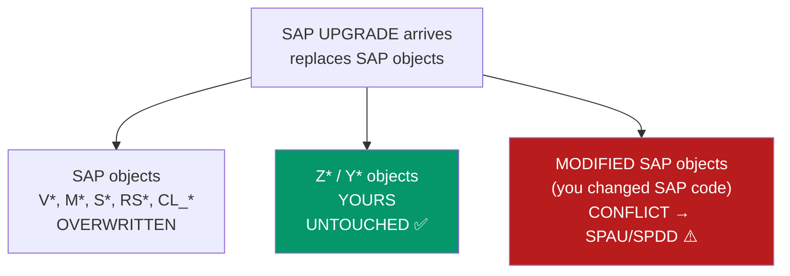

**That red box is why clean core (A4) exists.** If you modify SAP's own code, every upgrade forces someone to sit in transaction **SPAU** (for repository objects) or **SPDD** (for dictionary objects) and manually decide, modification by modification, whether to keep yours or take SAP's new version. On a large system that is weeks of specialist work per upgrade. Objects in the `Z` namespace cost zero.

### The namespace rules

| Prefix | Owner | Notes |
|---|---|---|
| `A`–`X` (most) | **SAP** | Do not create objects here |
| **`Z`** | **You (the customer)** | The conventional first choice |
| **`Y`** | **You (the customer)** | Equally valid; often used for a second category (e.g. templates, or a specific sub-team) |
| `/NAMESPACE/` | Registered partner | Bought from SAP; used when shipping software to *other* companies |
| `$` | Local / temporary | `$TMP` only |
| `T`, `TC`, ... | SAP config tables | Never create here |

**`Z` vs `Y` — is there a rule?** No universal one. Most organisations use `Z` for everything and never touch `Y`. Some split them: `Z` for permanent developments and `Y` for temporary/one-off/tooling. Whatever your project does, **be consistent** — the split only helps if everyone follows it.

**When you need a real namespace.** If you build SAP software to sell to other companies, `Z` is not enough: your customer's own `Z` objects would collide with yours. You register a namespace with SAP (e.g. `/ACME/`) and all your objects become `/ACME/CL_ORDER_READER`. Note the character cost — the namespace eats into the object's maximum name length, which is why namespaced object names are often cramped.

### Object naming — a workable convention

```abap
*&---------------------------------------------------------------------*
*& Object naming. The pattern that scales:
*&   Z <MODULE> _ <PURPOSE>
*& The module abbreviation is what makes 500 custom objects navigable
*& five years later.
*&---------------------------------------------------------------------*

" --- Programs / reports ---
Z_SD_OPEN_ORDERS           " SD (Sales), reports open orders
Z_MM_STOCK_RECONCILE       " MM (Materials)
Z_FI_PAYMENT_EXPORT        " FI (Finance)
ZSD_OPEN_ORDERS            " also common (no underscore after Z)

" --- Classes / interfaces ---
ZCL_SD_ORDER_VALIDATOR     " ZCL_ = class
ZIF_SD_PRICE_STRATEGY      " ZIF_ = interface
ZCX_SD_ORDER_INVALID       " ZCX_ = exception class
ZCL_SD_ORDER_VALIDATOR_T   " ..._T or LTCL_ = test class

" --- Dictionary ---
ZSD_DISCOUNT               " table
ZSD_S_ORDER_HEADER         " structure  (ZS_ or Z..._S_)
ZSD_TT_ORDER_HEADER        " table type (ZTT_ or Z..._TT_)
ZSD_DISCOUNT_PCT           " data element
ZSD_PCT                    " domain
ZSD_H_CUSTOMER             " search help (ZH_)
EZSD_DISCOUNT              " ⚠️ LOCK OBJECT -- starts with EZ, not Z.
                           " SAP generates ENQUEUE_EZSD_DISCOUNT and
                           " DEQUEUE_EZSD_DISCOUNT from it.

" --- Function groups / modules ---
ZSD_ORDERS                 " function group
Z_SD_GET_ORDER_HEADER      " function module: Z_<AREA>_<VERB>_<NOUN>

" --- Other ---
ZSD_MESSAGES               " message class (SE91)
ZSD01                      " transaction code (SE93)
Z_I_SalesOrderHeader       " CDS interface view (note: CamelCase is
Z_C_SalesOrderOverview     " the CDS convention, unlike everything
                           " else in ABAP, which is snake_case)
```

**Two conventions collide in that last block, and it confuses everyone.** Classic ABAP objects use `UPPER_SNAKE_CASE`. **CDS views and RAP artefacts use `CamelCase`** with the VDM prefixes `I_` (interface/reusable), `C_` (consumption/exposed), `P_` (private), `R_` (restricted). This is deliberate — SAP aligned CDS naming with its cloud-era standards. So `ZCL_SD_ORDER_READER` and `Z_C_SalesOrderOverview` are both correct, in their own worlds.

### Variable naming — the prefixes you must use

```abap
*&---------------------------------------------------------------------*
*& The two-part prefix: <SCOPE><KIND>_
*&   scope: g=global  l=local  i=importing  e=exporting
*&          c=changing  r=returning  m=member(attribute)  p=parameter
*&   kind:  v=value  t=table  s=structure  o=object ref  r=data ref
*&          c=constant
*&---------------------------------------------------------------------*

" --- Global (program level) ---
DATA: gv_total    TYPE i,                    " global value
      gt_orders   TYPE tt_orders,            " global table
      gs_header   TYPE vbak,                 " global structure
      go_alv      TYPE REF TO cl_salv_table. " global object ref

CONSTANTS gc_max_rows TYPE i VALUE 10000.    " global constant

" --- Local (inside a method / form / function) ---
DATA: lv_count    TYPE i,
      lt_items    TYPE tt_items,
      ls_item     TYPE vbap,
      lo_reader   TYPE REF TO zcl_order_reader,
      lr_data     TYPE REF TO data.          " generic data reference

" --- Method / FM parameters ---
METHODS calculate
  IMPORTING iv_amount        TYPE p        " i = importing
            it_conditions    TYPE tt_cond
            is_header        TYPE vbak
  EXPORTING ev_result        TYPE p        " e = exporting
  CHANGING  ct_log           TYPE tt_log   " c = changing
  RETURNING VALUE(rv_total)  TYPE p.       " r = returning

" --- Class attributes (members) ---
CLASS zcl_x DEFINITION.
  PRIVATE SECTION.
    DATA: mv_carrier TYPE s_carr_id,        " m = member
          mt_cache   TYPE tt_flights,
          mo_logger  TYPE REF TO zif_logger.
    CLASS-DATA: sv_instance_count TYPE i.   " s = static
ENDCLASS.

" --- Selection screen (a fixed SAP convention, not optional) ---
PARAMETERS     p_carrid TYPE s_carr_id.     " p_ for PARAMETERS
SELECT-OPTIONS s_fldate FOR sflight-fldate. " s_ for SELECT-OPTIONS

" --- Field symbols: always <angle brackets> ---
FIELD-SYMBOLS <ls_row> TYPE any.
LOOP AT gt_orders ASSIGNING FIELD-SYMBOL(<ls_order>).
ENDLOOP.
```

**Why the prefixes genuinely matter in ABAP** (more than in most languages):

1. **There is no block scoping.** A `DATA` declaration inside an `IF` or a `LOOP` is visible for the entire method — it is *not* scoped to the block. So `lv_` vs `gv_` is the only signal of lifetime you get.
2. **Parameters and locals look identical at the point of use.** `iv_amount` immediately tells a reader "this came in from the caller; do not modify it." Without the prefix you'd have to scroll to the signature every time.
3. **The type is invisible at the call site.** `lt_orders` vs `ls_order` vs `lv_order` tells you instantly whether you can `LOOP AT` it, read a component with `-`, or use it directly. In a language with no IDE hover (SE80), this was the *only* way to know.
4. **ABAP is case-insensitive**, so you can't use `Order` vs `order` to distinguish a type from a variable the way you would in Java or TypeScript. The prefix does that job.

**The counter-argument, and where the industry is going.** SAP's own **Clean ABAP** style guide (published on GitHub, and increasingly used as the reference in code reviews) argues *against* Hungarian-style prefixes for local variables, on the grounds that modern IDEs show types on hover and good names should describe meaning, not representation. It recommends `orders` over `lt_orders`. **In practice, as of 2026, the overwhelming majority of ABAP shops still use the prefixes**, legacy code is saturated with them, and a code review will ask you to add them. The professional answer: **follow the convention of the code you are in.** Know Clean ABAP exists and can argue about it; don't unilaterally introduce a different style into a codebase.

### Naming things well — beyond the prefix

```abap
" ❌ Names that describe nothing
DATA: lv_x    TYPE i,
      lt_tab  TYPE tt_orders,
      lv_flag TYPE abap_bool,
      lv_temp TYPE string.
FORM process_data.
FORM do_it.

" ✅ Names that state intent
DATA: lv_overdue_days     TYPE i,
      lt_unpaid_invoices  TYPE tt_orders,
      lv_is_credit_blocked TYPE abap_bool,
      lv_formatted_iban   TYPE string.
METHODS calculate_overdue_interest.
METHODS is_credit_limit_exceeded RETURNING VALUE(rv_exceeded) TYPE abap_bool.

" --- Naming rules that earn their keep ---
" 1. Boolean-ish names read as questions or statements:
"      lv_is_blocked, lv_has_items, mv_was_posted
"    ...and methods returning abap_bool start with is_ / has_ / can_.
" 2. Methods are VERB phrases: calculate_tax, post_document,
"    read_order_header. Not: tax, document, order_data.
" 3. Say the DOMAIN word, not the technical one:
"      ❌ lt_data_from_vbak
"      ✅ lt_sales_orders
" 4. No abbreviations that only you understand:
"      ❌ lv_cst_disc_pct_fnl
"      ✅ lv_final_customer_discount_pct
"    ⚠️ but note the HARD LIMIT: ABAP variable names max 30
"    characters, object names typically 30, transaction codes 20,
"    dictionary view names historically 16. Long descriptive names
"    genuinely do hit the ceiling -- plan for it.
" 5. Don't encode the type in the NAME beyond the prefix:
"      ❌ lv_kunnr_char10
"      ✅ lv_kunnr
```

### Real-world example — reading a custom system from its names alone

You join a project and open the custom object list. This is what good and bad naming look like in practice:

| You see | You immediately know | |
|---|---|---|
| `ZSD_OPEN_ORDERS` | An SD report about open orders | ✅ |
| `ZCL_SD_CREDIT_CHECK` | A class doing credit checks in SD | ✅ |
| `ZIF_SD_PRICING_RULE` | An interface — so there are multiple implementations | ✅ |
| `ZCX_SD_ORDER_BLOCKED` | An exception class for a blocked order | ✅ |
| `Z_I_SalesOrderItem` | A reusable CDS interface view | ✅ |
| `ZTEST3` | ...nothing. Is it live? Can it be deleted? | ❌ |
| `ZPROGRAM_NEW_FINAL_V2` | Somebody's third attempt. Which one runs? | ❌ |
| `ZNIKHIL` | It was Nikhil's. Nikhil left in 2019. | ❌ |

**This is not a hypothetical.** The single most expensive activity in an S/4HANA migration is **custom code remediation**: someone must go through every `Z` object, decide whether it is still used, still needed, and still compatible. A well-named object takes two minutes to classify. `ZTEST3` takes an afternoon of where-used analysis and interviews with people who have left the company. Your naming discipline today is directly billable someone else's time in 2032.

<div class="ba"><div class="ba-col ba-before"><h4>❌ Naming that costs money later</h4><ul><li><code>ZTEST</code>, <code>ZTEST2</code>, <code>ZZZ_NEW</code></li><li>Developer's own name in the object name</li><li><code>ZREPORT1</code> ... <code>ZREPORT47</code> with no module hint</li><li>Mixing <code>lv_</code>/no-prefix randomly in one program</li><li><code>lv_flag1</code>, <code>lv_flag2</code>, <code>lv_temp</code></li><li>Creating a <code>Z</code> copy of an SAP program named <code>ZRV45A</code> and forgetting why</li></ul></div><div class="ba-col ba-after"><h4>✅ Naming that survives</h4><ul><li><code>ZSD_OPEN_ORDERS</code> — module + purpose</li><li>Ownership lives in the header comment and TADIR, not the name</li><li>Module abbreviation in every object name</li><li>One prefix convention, applied consistently</li><li><code>lv_is_credit_blocked</code>, <code>lt_overdue_invoices</code></li><li>A header comment stating which SAP object it was copied from and why</li></ul></div></div>

### The Z-copy question

A very common practice: you need SAP's report `RVKRED77` but with one change, so you copy it to `ZRVKRED77` and edit. This **avoids a modification** (good — no SPAU pain) but creates a different debt: SAP will keep improving `RVKRED77`, fix bugs in it, and adapt it in the next release, and **your copy will silently fall behind**. Five years later your copy has a bug SAP fixed in 2027.

The decision order, from best to worst:

1. **Use standard as-is** with configuration. Always ask this first.
2. **Enhancement point / BAdI** — SAP's supported extension mechanism; survives upgrades.
3. **Implicit enhancement** — an enhancement at a pre-defined implicit point; supported but more fragile.
4. **Z-copy** — no upgrade conflict, but no upgrade benefit either. Document the source object and the reason **in the header comment**.
5. **Modification of SAP code** — requires an SSCR access key, and every future upgrade pays for it in SPAU. Last resort, architect approval only.

**Gotchas.**
- **Some object types have their own prefix rules.** Lock objects start with `EZ`/`EY`. In some releases, append structures start with `ZA`. Check before you create.
- **Transaction codes are limited to 20 characters** but conventionally kept short (`ZSD01`); dictionary **view names were historically 16 characters**, which is why `@AbapCatalog.sqlViewName` on a CDS view is cramped.
- **You cannot rename an object.** There is no rename in the repository — you copy to the new name, adjust every reference, and delete the old one, all in a transport. Choose the name carefully the first time.
- **Namespace conversion is painful.** Moving from `Z*` to `/ACME/*` after the fact means recreating everything. If you might ever ship your code to another company, decide at the start.
- **`Y` objects are not "less real."** They transport, upgrade and behave identically to `Z`. The only difference is the letter.

**Interview points.**
- *"Why do custom objects start with Z or Y?"* — SAP reserves all other namespaces, so Z/Y guarantees no collision with SAP objects and no overwriting during an upgrade. It's the mechanism that makes custom development upgrade-safe.
- *"What is the difference between an enhancement and a modification?"* — An **enhancement** uses a supported extension point (BAdI, enhancement spot, implicit enhancement) and survives upgrades cleanly. A **modification** changes SAP's own source, requires an access key, and must be manually reconciled in **SPAU**/**SPDD** at every upgrade.
- *"What do `lv_`, `lt_`, `is_`, `et_` mean?"* — local value, local table, importing structure, exporting table. Then add that you know **Clean ABAP** argues for dropping prefixes on locals, and that you follow the codebase's existing convention. That answer shows both knowledge and judgement.
- *"How would you approach custom code remediation for an S/4HANA migration?"* — Inventory the `Z` objects from **TADIR**, run **ATC with the S/4HANA readiness check** variant to find incompatibilities (removed tables like `VBUK`/`VBUP`, `MARA` field changes, obsolete function modules), classify by "still used" via usage statistics, and remediate or retire. Mentioning that unused custom code is *deleted, not migrated* shows real project experience.

---

---

# Part D — Data Types, Variables and Constants

*In JavaScript you write `let x = 5` and move on — the language figures out the rest, and changes its mind later if it feels like it. ABAP is the opposite personality: every variable has a fixed type, a fixed length, and a fixed initial value decided the moment you declare it, and it never changes for the life of the program. That feels restrictive for about a week, and then it starts saving you. Amounts never silently turn into strings, dates never become `NaN`, and a field that holds a material number is physically incapable of holding a customer name. This part is where you learn ABAP's type system properly — because almost every "why is my value wrong?" bug you will hit in your first year is really a type bug wearing a disguise.*

## D1. DATA — Declaring Variables

**Simple definition:** `DATA` is the ABAP statement that **creates a variable**. You give it a **name**, a **type**, and optionally a **starting value**, and ABAP reserves a piece of memory of exactly that shape. Unlike JavaScript's `let`, an ABAP variable's type is **frozen at declaration** — a `DATA lv_count TYPE i` is an integer forever and can never hold text. Since ABAP 7.40 you can also declare a variable **inline**, right where you first use it, with `DATA(lv_x) = ...`, and ABAP infers the type from the right-hand side.

<p class="te"><strong>Telugu:</strong> <strong>DATA</strong> ante ABAP lo variable create chese statement. Peru, type, kavalante starting value istaam — ABAP aa shape lo memory reserve chestundi. JavaScript <code>let</code> laaga kaadu: ikkada <strong>type oka sari fix aithe, permanent</strong>. <code>DATA lv_count TYPE i</code> ante adi eppatiki integer ye, andulo text pettalemu. ABAP 7.40 nunchi <strong>inline declaration</strong> kuda undi — <code>DATA(lv_x) = ...</code> — right side chusi ABAP type ni thane guess chestundi. Idi modern ABAP lo chala common, JS lo <code>const</code> laaga feel avutundi.</p>

**The everyday analogy.** Think of declaring a variable as **choosing a container before you go shopping**. In JavaScript you carry a magic bag that reshapes itself — you throw in milk, then a sofa, then the number 7, and it copes. In ABAP you walk into a warehouse and pick a specific container off the shelf: "give me the 10-character text box", "give me the date slot", "give me the amount box that holds 13 digits with 2 decimals". Everything you put in must fit that container. If you pour a 15-character name into a 10-character box, ABAP does not complain — it just **quietly cuts off the last 5 characters**, which is exactly the kind of thing you need to know before it eats a customer's name in production.

```abap
*&---------------------------------------------------------------------*
*& The classic way — declare everything up front
*&---------------------------------------------------------------------*
DATA lv_customer_id   TYPE kunnr.        " use a Dictionary type -> always right length
DATA lv_customer_name TYPE c LENGTH 40.  " 40 characters, space-padded
DATA lv_order_count   TYPE i.            " integer, starts at 0
DATA lv_net_value     TYPE p LENGTH 9 DECIMALS 2. " packed number: money
DATA lv_created_on    TYPE d.            " date, 8 chars YYYYMMDD
DATA lv_is_blocked    TYPE abap_bool.    " 'X' = true, ' ' = false (no real boolean!)

" You can group several declarations under one DATA using a colon and commas.
" This is pure convenience - it compiles to the same thing as four separate lines.
DATA: lv_a TYPE i,
      lv_b TYPE i,
      lv_c TYPE string,
      lv_d TYPE d.

" Give a starting value with VALUE
DATA lv_country TYPE c LENGTH 2 VALUE 'IN'.
DATA lv_max_rows TYPE i VALUE 100.

" IS INITIAL means "still holds its type's initial value"
DATA lv_total TYPE p LENGTH 9 DECIMALS 2 VALUE '0.00'.
```

**Line-by-line — how you would think your way to this.**

1. **Start from the business field, not from the technical type.** You are storing a customer number. Do *not* reach for `TYPE c LENGTH 10` and guess. Ask: does SAP already have a type for this? It does — `KUNNR`. Using `TYPE kunnr` means if SAP ever changes the field length, your program follows automatically. This is the single biggest habit difference between a beginner and a professional ABAPer.
2. **When no Dictionary type exists**, fall back to a built-in type with an explicit length: `TYPE c LENGTH 40`.
3. **Pick `p` for anything that is money or a quantity.** Never `f` (floating point) — rounding errors in currency get people fired. More on that in D2.
4. **`abap_bool` is not a real boolean.** ABAP has no true/false primitive. `abap_bool` is a one-character field holding `'X'` (true) or `' '` (false). You compare it with the constants `abap_true` / `abap_false`.
5. **Naming.** SAP convention: `lv_` = local variable, `ls_` = local structure, `lt_` = local internal table, `gv_/gs_/gt_` = global, `iv_/is_/it_` = importing parameter, `ev_/es_/et_` = exporting, `cv_` = changing, `rv_` = returning. It looks fussy; it makes a 3000-line program readable at a glance.

```abap
*&---------------------------------------------------------------------*
*& The modern way (7.40+) — inline declaration
*&---------------------------------------------------------------------*
" Old: declare, then fill.
DATA lv_name TYPE string.
lv_name = 'Nikhil'.

" New: declare AND fill in one statement. ABAP infers TYPE string.
DATA(lv_name2) = 'Nikhil'.          " actually type c LENGTH 6 - careful!
DATA(lv_name3) = CONV string( 'Nikhil' ). " force it to string

" Inline declaration in a SELECT - the compiler builds the table type for you
SELECT vbeln, erdat, netwr, kunnr
  FROM vbak
  WHERE erdat >= @( cl_abap_context_info=>get_system_date( ) - 30 )
  INTO TABLE @DATA(lt_orders).      " lt_orders is created right here

" Inline declaration in a LOOP - <ls_order> takes the row type automatically
LOOP AT lt_orders INTO DATA(ls_order).
  WRITE: / ls_order-vbeln, ls_order-netwr.
ENDLOOP.

" Inline in a method call
cl_salv_table=>factory(
  IMPORTING r_salv_table = DATA(lo_alv)
  CHANGING  t_table      = lt_orders ).
```

**The walkthrough — why inline changed everything.** Before 7.40, to `SELECT` into a table you had to first declare a structure type matching your field list, then a table type of that structure, then the variable — three declarations sitting 200 lines away from where you used them. Inline declaration collapses that to one line at the point of use, and the type is guaranteed correct because the compiler derives it from the `SELECT` list. This is exactly the ergonomic win you get from TypeScript's inference over hand-written interfaces.

**The trap in line 2 above.** `DATA(lv_name2) = 'Nikhil'.` does **not** create a `string`. A text literal in ABAP is type `c` with the literal's length, so `lv_name2` is `c LENGTH 6`. Assign `'Nikhil Vanama'` to it later and you lose everything after the 6th character. When you want a real `string`, either declare it explicitly or wrap the literal in `CONV string( )`.

**Real-world example — a sales order report header.** You are writing a program that reads sales orders from **VBAK** (header) and **VBAP** (items) and prints a summary. Look at how the declarations describe the business:

```abap
REPORT z_sales_summary.

" --- Selection screen: the user types values here ---
PARAMETERS     p_bukrs TYPE vbak-bukrs_vf OBLIGATORY DEFAULT '1000'.
SELECT-OPTIONS s_erdat FOR  vbak-erdat.   " a date range
SELECT-OPTIONS s_kunnr FOR  vbak-kunnr.   " customer range

" --- Working variables ---
DATA lv_grand_total TYPE vbak-netwr.      " same type as the DB field: safe
DATA lv_order_count TYPE i.
DATA lv_avg_value   TYPE p LENGTH 13 DECIMALS 2.
DATA lv_currency    TYPE waers VALUE 'INR'.

START-OF-SELECTION.

  SELECT vbeln, kunnr, erdat, netwr, waerk
    FROM vbak
    WHERE bukrs_vf =  @p_bukrs
      AND erdat    IN @s_erdat
      AND kunnr    IN @s_kunnr
    INTO TABLE @DATA(lt_headers).

  " Count and total in one pass
  LOOP AT lt_headers INTO DATA(ls_header).
    lv_grand_total = lv_grand_total + ls_header-netwr.
    lv_order_count = lv_order_count + 1.
  ENDLOOP.

  " Guard against divide-by-zero BEFORE dividing - ABAP dumps otherwise
  IF lv_order_count > 0.
    lv_avg_value = lv_grand_total / lv_order_count.
  ENDIF.

  WRITE: / 'Orders    :', lv_order_count,
         / 'Total     :', lv_grand_total CURRENCY lv_currency,
         / 'Average   :', lv_avg_value   CURRENCY lv_currency.
```

**Why `TYPE vbak-netwr` and not `TYPE p LENGTH 15 DECIMALS 2`?** Because `vbak-netwr` *is* `p LENGTH 15 DECIMALS 2` — but you did not have to know that, and if SAP changes it in a release, your code is still correct. Typing your variables from the database field they hold is the professional default.

| Declaration style | Syntax | When to use | Notes |
|---|---|---|---|
| **Explicit, built-in type** | `DATA lv_x TYPE i.` | Counters, loop indexes, flags | Simple, always clear |
| **Explicit, Dictionary type** | `DATA lv_x TYPE kunnr.` | Any real business field | ✅ **Preferred** — length & semantics come from SAP |
| **From a table field** | `DATA lv_x TYPE vbak-netwr.` | Holding one column's value | Auto-follows Dictionary changes |
| **LIKE another variable** | `DATA lv_y LIKE lv_x.` | Mirror an existing variable | Legacy; `TYPE` is preferred now |
| **With initial value** | `DATA lv_x TYPE i VALUE 10.` | Constants-that-change, defaults | `VALUE IS INITIAL` = explicit default |
| **Inline (7.40+)** | `DATA(lv_x) = expr.` | Modern code, SELECT/LOOP targets | Type inferred; watch literal types |
| **Grouped (colon)** | `DATA: a TYPE i, b TYPE i.` | Several related declarations | Pure syntax sugar |

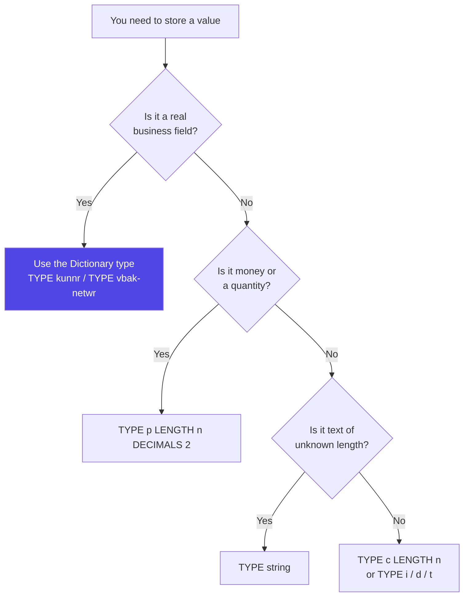

<div class="pic"><strong>Picture it:</strong> A JavaScript variable is a rubber balloon — it stretches to whatever you blow into it. An ABAP variable is a glass jar with a label and a fixed volume. You can pour anything in, but only what fits stays in, and the label tells everyone what belongs there. The glass jar is why ABAP programs from 1998 still run correctly today.</div>

<div class="ba"><div class="ba-col ba-before"><h4>❌ Bad</h4><ul><li><code>DATA lv_kunnr TYPE c LENGTH 10.</code> — guessing the length</li><li><code>DATA x TYPE i.</code> — meaningless name</li><li><code>DATA lv_amount TYPE f.</code> — float for money</li><li><code>DATA(lv_txt) = 'Some long text'.</code> then assigning something longer</li><li>Declaring 40 variables at the top that are used 800 lines below</li></ul></div><div class="ba-col ba-after"><h4>✅ Good</h4><ul><li><code>DATA lv_kunnr TYPE kunnr.</code> — Dictionary type</li><li><code>DATA lv_order_count TYPE i.</code> — says what it holds</li><li><code>DATA lv_amount TYPE vbak-netwr.</code> — packed, correct</li><li><code>DATA(lv_txt) = CONV string( 'Some long text' ).</code></li><li>Inline-declare at the point of first use</li></ul></div></div>

**Gotchas and interview points.**

- **ABAP has no block scope.** A `DATA` inside an `IF` or a `LOOP` is *not* local to that block — it is visible for the whole processing block (the whole `FORM`, method, or event). This bites JS developers constantly. Inline `DATA(x)` inside a loop is declared once, on the first pass, and reused.
- **Declaring inside a loop does not re-create the variable**, but it *does* keep its value from the previous iteration unless something overwrites it. If you need a fresh value each pass, `CLEAR` it.
- **You cannot declare a variable twice** in the same scope — "the field X is already declared" is one of the most common syntax errors when refactoring with inline declarations.
- Interview favourite: *"What is the difference between `DATA` and `TYPES`?"* — `DATA` creates a variable (occupies memory); `TYPES` creates only a *type description* (no memory). See D3.
- Interview favourite: *"Does ABAP have a boolean?"* — No primitive boolean. Use `abap_bool` / `abap_true` / `abap_false` from type group `ABAP`, or the older `char1` with `'X'`.

---

## D2. The Built-in Elementary Types (C, N, D, T, I, P, F, STRING, X ...)

**Simple definition:** ABAP ships with a small set of **built-in elementary types** — the atoms that every other type is built from. They split into two families: **fixed-length** types (`c`, `n`, `d`, `t`, `i`, `p`, `f`, `x`) whose size is decided at declaration, and **variable-length** types (`string`, `xstring`) that grow and shrink at runtime like a JavaScript string. Choosing the right one is not cosmetic — it decides how your value is stored, padded, compared and rounded.

<p class="te"><strong>Telugu:</strong> ABAP lo konni <strong>built-in elementary types</strong> unnayi — ivi anni types ki base. Rendu families: <strong>fixed-length</strong> (<code>c, n, d, t, i, p, f, x</code>) — declare chesinappude length fix; mariyu <strong>variable-length</strong> (<code>string, xstring</code>) — JS string laaga runtime lo perigi tagguthundi. Correct type select cheyyadam chala important — endukante value ela store avutundo, ela compare avutundo, rounding ela jarugutundo anni deenimeeda depend avutundi. Money ki eppudu <code>p</code>, eppudu <code>f</code> kaadu.</p>

**The everyday analogy.** Think of a stationery drawer. `c` is **ruled paper with a fixed number of boxes** — write "AB" in a 5-box row and the last 3 boxes stay blank (space-padded). `n` is the same, but the empty boxes get **zeros on the left** — perfect for document numbers like `0000004711`. `d` and `t` are **pre-printed date and time stamps**. `i` is a **tally counter**. `p` is an **accountant's ledger column** with a decimal line ruled in it — exact to the paisa. `f` is a **scientific calculator display** — huge range, but it rounds behind your back. `string` is a **roll of paper** that unrolls as far as you need.

```abap
*&---------------------------------------------------------------------*
*& Every elementary type, with what actually happens
*&---------------------------------------------------------------------*
DATA lv_c TYPE c LENGTH 5.
DATA lv_n TYPE n LENGTH 10.
DATA lv_d TYPE d.                        " always 8 chars: YYYYMMDD
DATA lv_t TYPE t.                        " always 6 chars: HHMMSS
DATA lv_i TYPE i.                        " 4-byte signed integer
DATA lv_8 TYPE int8.                     " 8-byte integer (7.54+), huge range
DATA lv_p TYPE p LENGTH 8 DECIMALS 2.    " packed decimal - EXACT
DATA lv_f TYPE f.                        " binary float - approximate!
DATA lv_x TYPE x LENGTH 4.               " raw bytes, hex
DATA lv_s TYPE string.                   " growable text
DATA lv_xs TYPE xstring.                 " growable bytes

lv_c = 'AB'.        " -> 'AB   '   padded with SPACES on the right
lv_n = '47'.        " -> '0000000047'  padded with ZEROS on the left
lv_d = '20260718'.  " -> 18 July 2026
lv_t = '143000'.    " -> 14:30:00
lv_i = 10 / 4.      " -> 3   !! integers ROUND, they do not truncate (2.5 -> 3... 10/4=2.5 -> 3)
lv_p = 10 / 4.      " -> 2.50  exact
lv_f = '0.1' + '0.2'. " -> 0.30000000000000004  the classic float problem
lv_s = 'Any length at all, grows as needed'.
```

**Walkthrough — the four facts that matter most.**

1. **`c` pads right with spaces; `n` pads left with zeros.** This is not trivia. If you compare a `c LENGTH 5` holding `'AB'` with the string `'AB'`, they are equal (trailing spaces are ignored in `c` comparisons). But an `n LENGTH 10` holding `'47'` is literally `'0000000047'`, and comparing it to `'47'` as text fails. This is why SAP document numbers need `CONVERSION_EXIT_ALPHA_INPUT`/`OUTPUT` — the "alpha conversion" that adds and strips those leading zeros.
2. **`i` rounds, it does not truncate.** `lv_i = 7 / 2` gives **4**, not 3. JavaScript developers expect truncation because `Math.floor` is the mental default; ABAP uses commercial rounding. Every off-by-one bug in your first month will come from this line.
3. **`p` is exact; `f` is not.** `p` (packed) stores each decimal digit separately, so `0.1 + 0.2` is exactly `0.3`. `f` is IEEE binary floating point — same as a JS `number` — and has the same `0.30000000000000004` problem. **Never use `f` for money.** Use `p`, or better, the Dictionary currency types (`WERTV8`, `vbak-netwr`).
4. **`decfloat16` / `decfloat34`** are the modern middle ground: decimal floating point, exact like `p` but with a huge range. Use them for scientific-scale calculations that still need decimal exactness.

| Type | Kind | Default length | Initial value | What it's for | JS analogy |
|---|---|---|---|---|---|
| **`c`** | Character, fixed | 1 | `' '` (spaces) | Names, codes, text of known length | `string` of fixed size |
| **`n`** | Numeric text, fixed | 1 | `'000...'` | Document numbers, PIN codes, IDs | zero-padded `string` |
| **`d`** | Date, fixed 8 | 8 | `'00000000'` | Calendar dates `YYYYMMDD` | `Date` (but stored as text) |
| **`t`** | Time, fixed 6 | 6 | `'000000'` | Clock times `HHMMSS` | — |
| **`i`** | Integer, 4 byte | 4 | `0` | Counters, indexes, quantities (whole) | `number` (integer) |
| **`int8`** | Integer, 8 byte | 8 | `0` | Very large counters (7.54+) | `BigInt` |
| **`p`** | Packed decimal | 8 | `0` | ✅ **Money, quantities, anything exact** | — (no JS equivalent) |
| **`f`** | Binary float | 8 | `0.0` | Scientific maths only | `number` |
| **`decfloat16/34`** | Decimal float | 8 / 16 | `0` | Exact + huge range | — |
| **`x`** | Byte, fixed | 1 | `X'00'` | Raw binary, hex flags | `Uint8Array` fixed |
| **`string`** | Character, variable | — | `''` (truly empty) | Text of unknown length, long text | `string` ✅ |
| **`xstring`** | Byte, variable | — | empty | Files, PDFs, images in memory | `Uint8Array` |

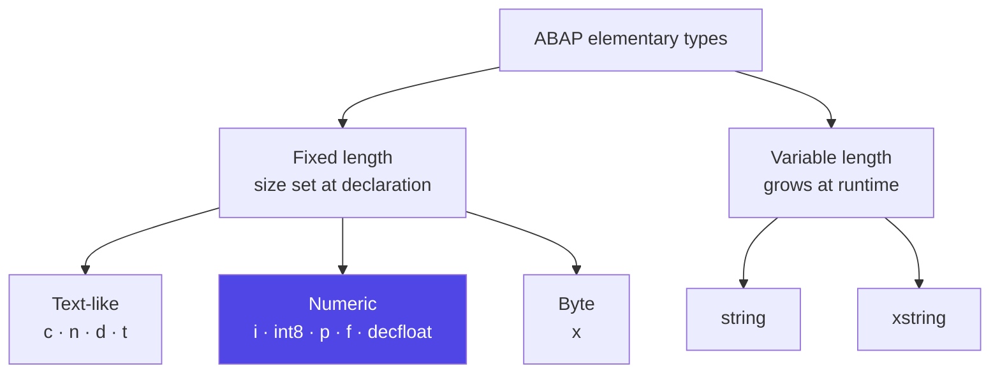

**Real-world example — why the type choice is a business decision.** You are storing a material number from **MARA**. Material numbers in SAP are `MATNR`, an 18-character field, and they are **alpha-converted**: the user types `4711`, but the database stores `'000000000000004711'`.

```abap
DATA lv_matnr_raw   TYPE c LENGTH 18 VALUE '4711'.               " WRONG for a SELECT
DATA lv_matnr_right TYPE matnr.                                  " right type

" Convert user input into internal (alpha) format before hitting the DB
lv_matnr_right = |4711|.
CALL FUNCTION 'CONVERSION_EXIT_ALPHA_INPUT'
  EXPORTING input  = lv_matnr_right
  IMPORTING output = lv_matnr_right.
" lv_matnr_right is now '000000000000004711'

SELECT SINGLE matnr, mtart, matkl, meins
  FROM mara
  WHERE matnr = @lv_matnr_right
  INTO @DATA(ls_material).

IF sy-subrc = 0.
  " Convert back to the friendly form for display
  CALL FUNCTION 'CONVERSION_EXIT_ALPHA_OUTPUT'
    EXPORTING input  = ls_material-matnr
    IMPORTING output = DATA(lv_display_matnr).
  WRITE: / 'Material', lv_display_matnr, 'Type', ls_material-mtart.
ENDIF.
```

**The logic you should internalise here:** "my SELECT returns nothing but the data definitely exists" is, nine times out of ten, an **alpha conversion problem** on a `matnr`, `kunnr`, `lifnr`, `vbeln` or `banfn` field. The type told you it was `n`-like even when it is declared as `c` with a conversion exit. Learning to suspect this saves hours.

**Real-world example 2 — money.**

```abap
" ❌ Float: looks fine, fails audit
DATA lv_bad TYPE f.
lv_bad = '1234.10' + '5678.20'.       " 6912.299999999999...

" ✅ Packed: exact to the last paisa
DATA lv_good TYPE p LENGTH 13 DECIMALS 2.
lv_good = '1234.10' + '5678.20'.      " exactly 6912.30

" ✅ Best: take the type from the field you will store it in
DATA lv_best TYPE bseg-dmbtr.          " amount in local currency, FI line item
```

**Gotchas and interview points.**

- **`p` needs `FIXED POINT ARITHMETIC` switched on** (it is on by default in every modern program and always on in classes). If it were off, decimals in `p` would be ignored — this is why very old reports produce odd results.
- **`p LENGTH n` is bytes, not digits.** `p LENGTH 8` holds 15 digits (2 digits per byte, minus the sign nibble). The formula is `digits = 2 * length - 1`.
- **`string` initial value is truly empty**, length 0. A `c LENGTH 10` initial value is 10 spaces. `IS INITIAL` is true in both cases, but `strlen( )` returns 0 vs 0 — because `strlen` ignores trailing blanks on `c`. Use `numofchar( )` semantics carefully.
- **Never compare `f` values with `=`.** Compare `abs( a - b ) < tolerance`.
- Interview favourite: *"Difference between `c` and `string`?"* — `c` is fixed length, space-padded, stored inline, faster; `string` is variable length, stored as a reference, no padding, unlimited. Use `string` for text you concatenate; use `c` for fixed codes.
- Interview favourite: *"Difference between `n` and `i`?"* — `n` is **text made of digits** (you cannot do arithmetic reliably on it without conversion, it keeps leading zeros); `i` is a real **number**.

---

## D3. TYPES — Making Your Own Types

**Simple definition:** `TYPES` defines a **new type** — a named shape — without creating any variable or using any memory. It is ABAP's equivalent of a TypeScript `interface` or `type` alias. You use it to build **structures** (a record with several named fields), **table types** (a list of such records), and simple **aliases** for elementary types. Once defined, you declare as many variables of that type as you like with `DATA ... TYPE your_type`.

<p class="te"><strong>Telugu:</strong> <strong>TYPES</strong> ante oka <strong>kotta type</strong> (shape) create cheyyadam — variable kaadu, memory teesukodu. TypeScript lo <code>interface</code> laantidi. Dinitho <strong>structure</strong> (chala fields unna oka record), <strong>table type</strong> (aa records list), leda simple alias create cheyyochu. Taruvata <code>DATA ls_x TYPE your_type</code> ani enni variables ayina declare cheyyochu. Gurthupettuko: TYPES = design, DATA = actual container.</p>

**The everyday analogy.** `TYPES` is the **blueprint**; `DATA` is the **house built from it**. An architect can draw one blueprint for a 2BHK flat and a builder can then build 200 identical flats from it. Drawing the blueprint costs no bricks. That is why `TYPES` uses no memory: it is only a description. And because every flat comes from the same blueprint, if you need to add a balcony you change the drawing once, not 200 times.

```abap
*&---------------------------------------------------------------------*
*& TYPES: aliases, structures, table types
*&---------------------------------------------------------------------*

" 1. A simple alias for an elementary type
TYPES ty_amount TYPE p LENGTH 13 DECIMALS 2.
TYPES ty_percent TYPE p LENGTH 5 DECIMALS 2.

" 2. A STRUCTURE - like a TS interface / a JS object shape
TYPES: BEGIN OF ty_s_order,
         vbeln    TYPE vbeln_va,   " sales document number
         kunnr    TYPE kunnr,      " customer
         erdat    TYPE erdat,      " created on
         netwr    TYPE ty_amount,  " reuse our own alias
         waerk    TYPE waerk,      " currency
         is_rush  TYPE abap_bool,  " our own derived flag
       END OF ty_s_order.

" 3. A TABLE TYPE - like TS  ty_s_order[]  / a JS array of objects
TYPES ty_t_order TYPE STANDARD TABLE OF ty_s_order WITH EMPTY KEY.

" 4. A sorted table type - always kept in order, binary search
TYPES ty_t_order_sorted TYPE SORTED TABLE OF ty_s_order
                        WITH UNIQUE KEY vbeln.

" 5. A nested structure - a structure inside a structure
TYPES: BEGIN OF ty_s_order_full,
         header TYPE ty_s_order,          " nested structure
         items  TYPE ty_t_item,           " nested table (deep structure)
       END OF ty_s_order_full.

" --- Now DECLARE variables from those types ---
DATA ls_order       TYPE ty_s_order.       " one record
DATA lt_orders      TYPE ty_t_order.       " a list of records
DATA lt_fast_lookup TYPE ty_t_order_sorted.
DATA lv_discount    TYPE ty_percent.
```

**Walkthrough — how to think your way to a good type.**

1. **Start from the output you must produce.** You need a report showing order number, customer, date, value, currency and a rush flag. Those six fields *are* your structure. Write the structure before you write any logic — it forces you to decide what data you actually need, which then tells you which tables to `SELECT` from.
2. **Type each field from the Dictionary, not from imagination.** `vbeln TYPE vbeln_va` not `TYPE c LENGTH 10`.
3. **Fields that are not in the database get your own alias types.** `is_rush` is something *you* compute — type it `abap_bool` so its meaning is obvious.
4. **Then make the table type.** A structure describes one row; a table type describes many rows. `WITH EMPTY KEY` says "I don't need a key" — always state it explicitly in modern code, otherwise you inherit a default standard key which silently changes how `READ TABLE` and `DELETE ADJACENT DUPLICATES` behave.
5. **Reuse your own aliases inside your own structures.** `netwr TYPE ty_amount` means every amount in your program has exactly the same precision. Change the alias once, all amounts follow.

```abap
*&---------------------------------------------------------------------*
*& Classic vs modern — filling a structure and a table
*&---------------------------------------------------------------------*

" --- CLASSIC: field by field ---
DATA ls_old TYPE ty_s_order.
ls_old-vbeln   = '0000004711'.
ls_old-kunnr   = '0000001000'.
ls_old-erdat   = sy-datum.
ls_old-netwr   = '15000.00'.
ls_old-waerk   = 'INR'.
ls_old-is_rush = abap_true.
APPEND ls_old TO lt_orders.

" --- MODERN (7.40+): VALUE constructor, one expression ---
DATA(ls_new) = VALUE ty_s_order(
                 vbeln   = '0000004711'
                 kunnr   = '0000001000'
                 erdat   = sy-datum
                 netwr   = '15000.00'
                 waerk   = 'INR'
                 is_rush = abap_true ).

" --- MODERN: build a whole table in one statement ---
DATA(lt_new) = VALUE ty_t_order(
  ( vbeln = '0000004711' kunnr = '0000001000' netwr = '15000.00' waerk = 'INR' )
  ( vbeln = '0000004712' kunnr = '0000001001' netwr = '  850.00' waerk = 'INR' )
  ( vbeln = '0000004713' kunnr = '0000001000' netwr = '92000.00' waerk = 'INR' ) ).

" --- MODERN: shared values with a BASE / repeated field ---
DATA(lt_same_cust) = VALUE ty_t_order(
  waerk = 'INR' kunnr = '0000001000'      " applies to every row below
  ( vbeln = '0000004714' netwr = '100.00' )
  ( vbeln = '0000004715' netwr = '200.00' ) ).
```

**The mental model for `VALUE #( )`.** It is the ABAP equivalent of a JavaScript object literal and array literal combined:

```javascript
// JavaScript
const order  = { vbeln: '4711', kunnr: '1000', netwr: 15000 };
const orders = [ {...}, {...}, {...} ];
```
```abap
" ABAP 7.40+
DATA(order)  = VALUE ty_s_order( vbeln = '4711' kunnr = '1000' netwr = 15000 ).
DATA(orders) = VALUE ty_t_order( ( ... ) ( ... ) ( ... ) ).
```
The `#` in `VALUE #( )` means "**work out the type from the context**" — use it when the target's type is already known (a method parameter, an existing variable). Use the explicit `VALUE ty_t_order( )` when declaring inline, because there is no context to infer from.

| Where you define it | Statement | Visible to | Use when |
|---|---|---|---|
| **Local in a program/class** | `TYPES ...` | That program / class only | Types used in one place |
| **Class-level (public)** | `TYPES` in `PUBLIC SECTION` | Anyone who uses the class | API of a class |
| **Type group** | `TYPE-POOL` / `TYPES` in a pool | Any program that `TYPE-POOLS` it | Legacy sharing mechanism |
| **Data Dictionary (SE11)** | Data element / Structure / Table type | ✅ **The whole system** | Reused across programs, used in DB tables & interfaces |

```mermaid
graph TD
    ELEM["Elementary type<br/>c · n · i · p · d · string"]
    STRUCT["Structure type<br/>BEGIN OF ... END OF<br/>several named fields"]
    TABLE["Table type<br/>TABLE OF structure<br/>many rows"]
    DEEP["Deep structure<br/>a structure containing<br/>a table"]
    VAR["DATA variable<br/>real memory"]
    ELEM --> STRUCT
    STRUCT --> TABLE
    TABLE --> DEEP
    STRUCT --> VAR
    TABLE --> VAR
    ELEM --> VAR
    style TABLE fill:#4f46e5,color:#fff
```

**Real-world example — a purchase order display structure.** You are building a report over **EKKO** (PO header) and **EKPO** (PO items) that shows each PO with its items nested inside. This needs a **deep structure**:

```abap
TYPES: BEGIN OF ty_s_po_item,
         ebelp TYPE ebelp,       " item number
         matnr TYPE matnr,       " material
         menge TYPE bstmg,       " quantity ordered
         meins TYPE bstme,       " unit
         netpr TYPE bprei,       " net price
         netwr TYPE bwert,       " item value
       END OF ty_s_po_item.

TYPES ty_t_po_item TYPE STANDARD TABLE OF ty_s_po_item WITH EMPTY KEY.

TYPES: BEGIN OF ty_s_po,
         ebeln      TYPE ebeln,        " PO number
         lifnr      TYPE lifnr,        " vendor
         bedat      TYPE bedat,        " PO date
         waers      TYPE waers,
         items      TYPE ty_t_po_item, " <-- deep: a table inside a structure
         total_val  TYPE ty_amount,    " computed by us
         item_count TYPE i,            " computed by us
       END OF ty_s_po.

TYPES ty_t_po TYPE STANDARD TABLE OF ty_s_po WITH EMPTY KEY.

DATA lt_po TYPE ty_t_po.

" Read headers
SELECT ebeln, lifnr, bedat, waers
  FROM ekko
  WHERE bedat >= @lv_from_date
  INTO CORRESPONDING FIELDS OF TABLE @lt_po.

" Read all items for those headers in ONE select (never select inside a loop!)
SELECT ebeln, ebelp, matnr, menge, meins, netpr, brtwr AS netwr
  FROM ekpo
  FOR ALL ENTRIES IN @lt_po
  WHERE ebeln = @lt_po-ebeln
  INTO TABLE @DATA(lt_all_items).

" Distribute items into their headers
LOOP AT lt_po ASSIGNING FIELD-SYMBOL(<ls_po>).
  LOOP AT lt_all_items INTO DATA(ls_item) WHERE ebeln = <ls_po>-ebeln.
    APPEND CORRESPONDING #( ls_item ) TO <ls_po>-items.
    <ls_po>-total_val = <ls_po>-total_val + ls_item-netwr.
  ENDLOOP.
  <ls_po>-item_count = lines( <ls_po>-items ).
ENDLOOP.
```

**Why this design is right.** The deep structure mirrors the *business* shape — a PO **has** items — instead of forcing you to join everything flat and repeat the header on every row. In JS you would naturally write `{ ebeln, lifnr, items: [...] }`; ABAP lets you do exactly that. And notice the "select header, then select all items at once, then distribute" pattern: **never put a SELECT inside a LOOP**. That is the number one performance sin in ABAP, and it is the first thing a reviewer looks for.

**Gotchas and interview points.**

- **`TYPES` costs nothing at runtime.** Declaring 50 types and using 3 has zero performance impact. Declaring 50 unused `DATA` variables wastes memory.
- **`WITH EMPTY KEY` vs default key.** If you omit the key on a `STANDARD TABLE`, ABAP gives it a **default key** (all non-numeric fields). `SORT`, `READ TABLE ... WITH KEY` (without field names) and `DELETE ADJACENT DUPLICATES COMPARING` then behave in surprising ways. Always state the key.
- **Dictionary types beat local types** whenever the type is used by more than one program. Local `TYPES` that got copy-pasted into six reports is the classic maintenance nightmare.
- Interview favourite: *"What is a deep structure?"* — a structure that contains a table, a string, an `xstring` or a reference. Deep structures cannot be used as-is in a database table field and cannot be `MOVE`d byte-wise.
- Interview favourite: *"Difference between a structure and a work area?"* — none technically; "work area" is just the role a structure plays when it holds one row of an internal table.

---

## D4. CONSTANTS, Literals and Text Symbols

**Simple definition:** A **constant** is a value that is fixed at compile time and can never be changed at runtime — declared with `CONSTANTS` instead of `DATA`. A **literal** is a value written directly in your code (`'INR'`, `42`, `` `hello` ``). A **text symbol** is a piece of display text stored *outside* the code, in the program's text pool, so it can be **translated** into other languages without touching the program. Together they are how you keep magic values and hard-coded English out of your logic.

<p class="te"><strong>Telugu:</strong> <strong>CONSTANTS</strong> ante oka sari value fix cheste eppatiki marchalemu — <code>DATA</code> ki badulu <code>CONSTANTS</code> vaadutham (JS lo <code>const</code> laaga, kaani inka strict). <strong>Literal</strong> ante code lo direct ga rasina value — <code>'INR'</code>, <code>42</code>. <strong>Text symbol</strong> ante screen meeda chupinche text ni code lo kaakunda separate ga <strong>text pool</strong> lo pettadam — appudu translate cheyyochu, program touch cheyyakunda. SAP multi-language system kabatti idi chala important.</p>

**The everyday analogy.** Imagine a restaurant. The **recipe** (your code) says "add 2 spoons of the house spice mix". The **spice mix definition** is written on one card in the kitchen (`CONSTANTS`) — change the card, every dish changes. A **literal** is a chef who scribbles "2 spoons of turmeric, cumin, chilli" directly into every one of 40 recipes — now changing the mix means editing 40 recipes and missing three. And the **menu** shown to the customer is printed separately in English, Hindi and Telugu (`text symbols`) — the recipes never change when you print a Telugu menu.

```abap
*&---------------------------------------------------------------------*
*& CONSTANTS
*&---------------------------------------------------------------------*
CONSTANTS gc_currency_inr  TYPE waers      VALUE 'INR'.
CONSTANTS gc_company_code  TYPE bukrs      VALUE '1000'.
CONSTANTS gc_max_retries   TYPE i          VALUE 3.
CONSTANTS gc_vat_rate      TYPE p LENGTH 5 DECIMALS 2 VALUE '18.00'.
CONSTANTS gc_true          TYPE abap_bool  VALUE 'X'.

" Grouped, and the professional pattern: a constants STRUCTURE
CONSTANTS: BEGIN OF gc_order_status,
             open      TYPE c LENGTH 1 VALUE 'A',
             in_process TYPE c LENGTH 1 VALUE 'B',
             completed TYPE c LENGTH 1 VALUE 'C',
             cancelled TYPE c LENGTH 1 VALUE 'D',
           END OF gc_order_status.

" Now the code READS like the business
IF ls_order-status = gc_order_status-cancelled.
  " skip cancelled orders
ENDIF.

" ...instead of the unreadable version:
IF ls_order-status = 'D'.     " D? what is D?
ENDIF.
```

**Walkthrough — why the constants structure is the pattern to copy.**

1. You start with `IF ls_order-status = 'D'.` It works. Six months later nobody remembers what `'D'` means, and someone adds `'E'` without knowing `'D'` exists.
2. First improvement: `CONSTANTS gc_cancelled TYPE c LENGTH 1 VALUE 'D'.` Better, but now you have a flat list of 30 unrelated constants at the top of the program.
3. The real fix: group them into a **constants structure**. `gc_order_status-cancelled` tells you the domain (order status) *and* the value (cancelled) in one read. Code completion in the editor now shows you every valid status when you type `gc_order_status-`. This is ABAP's stand-in for an enum, and it is what senior developers write.
4. In modern ABAP classes you can go one step further and use a real **enumerated type**: `TYPES BEGIN OF ENUM ty_status ... END OF ENUM ty_status.` — genuinely type-safe, so the compiler rejects an invalid value.

```abap
*&---------------------------------------------------------------------*
*& Modern: real ENUM types (7.51+)
*&---------------------------------------------------------------------*
TYPES: BEGIN OF ENUM ty_order_status,
         open,
         in_process,
         completed,
         cancelled,
       END OF ENUM ty_order_status.

DATA lv_status TYPE ty_order_status.
lv_status = in_process.            " only these four values compile

CASE lv_status.
  WHEN open.       WRITE / 'Order is open'.
  WHEN completed.  WRITE / 'Order is done'.
  WHEN OTHERS.     WRITE / 'Other'.
ENDCASE.
```

```abap
*&---------------------------------------------------------------------*
*& LITERALS — the two kinds, and why the quote type matters
*&---------------------------------------------------------------------*
DATA lv_a TYPE c LENGTH 20.
DATA lv_b TYPE string.

lv_a = 'Hello  '.       " SINGLE quotes -> type C literal. Trailing blanks are DROPPED.
lv_b = `Hello  `.       " BACKTICKS     -> type STRING literal. Trailing blanks KEPT.

" Numeric literals
DATA lv_i TYPE i     VALUE 42.
DATA lv_p TYPE p LENGTH 5 DECIMALS 2 VALUE '99.95'.   " decimals need QUOTES!
" DATA lv_bad TYPE p ... VALUE 99.95.  " syntax error - unquoted decimals not allowed

" Escaping a quote inside a literal: double it
DATA(lv_msg) = 'It''s fine'.      " -> It's fine
DATA(lv_msg2) = `He said "hi"`.   " backticks make quotes easy
```

**The single most useful rule about quotes.** `'...'` is a **character literal**: trailing spaces are removed, and the type is `c` of that length. `` `...` `` is a **string literal**: trailing spaces are preserved, and the type is `string`. When you are concatenating text and a space mysteriously vanishes, this is why.

```abap
*&---------------------------------------------------------------------*
*& TEXT SYMBOLS — translatable text
*&---------------------------------------------------------------------*
" Defined in SE38 -> Goto -> Text Elements -> Text Symbols
" 001 = 'Sales Order Report'
" 002 = 'No orders found for the selection'
" 003 = 'Customer'

WRITE: / TEXT-001.            " prints the text in the LOGON LANGUAGE
WRITE: / text-002.            " case-insensitive, both work

" Literal + text symbol combined: the text after the literal is the
" fallback shown in the editor; TEXT-003 is what actually prints.
WRITE: / 'Customer'(003).

" Selection screen labels are text symbols too
SELECTION-SCREEN BEGIN OF BLOCK b1 WITH FRAME TITLE TEXT-t01.
PARAMETERS p_bukrs TYPE bukrs.
SELECTION-SCREEN END OF BLOCK b1.
```

**Why text symbols exist and why you must use them.** SAP systems are multi-language. A German user logs in with language `DE` and expects German labels; an Indian user logs in with `EN`. If you write `WRITE 'Sales Order Report'.` the German user sees English forever. If you write `WRITE TEXT-001.` a translator can translate text symbol 001 in transaction **SE63** without a developer touching the code, and the system picks the right language automatically based on `sy-langu`. **Hard-coded display text is a code review rejection in any real SAP project.**

| Thing | Statement | Changeable at runtime? | Translatable? | Use for |
|---|---|---|---|---|
| **Variable** | `DATA` | ✅ Yes | ❌ No | Values that change |
| **Constant** | `CONSTANTS` | ❌ No (compile error) | ❌ No | Fixed technical values, codes, rates |
| **Literal** | `'X'` / `` `X` `` | n/a | ❌ No | Tiny one-off values only |
| **Text symbol** | `TEXT-001` | ❌ No | ✅ **Yes** | Anything the **user sees** |
| **Message** | `MESSAGE e001(zmsg)` | ❌ No | ✅ Yes | Errors, warnings, info popups |
| **Enum** | `TYPES BEGIN OF ENUM` | ❌ No | ❌ No | A closed set of valid values |

```mermaid
graph TD
    VAL["You have a value in your code"]
    Q1{"Does the USER<br/>see this text?"}
    TXT["Text symbol TEXT-nnn<br/>or MESSAGE"]
    Q2{"Does it ever<br/>change at runtime?"}
    VAR["DATA variable"]
    Q3{"Is it one of a<br/>fixed set of codes?"}
    ENUM["ENUM or<br/>CONSTANTS structure"]
    CONST["CONSTANTS"]
    VAL --> Q1
    Q1 -->|Yes| TXT
    Q1 -->|No| Q2
    Q2 -->|Yes| VAR
    Q2 -->|No| Q3
    Q3 -->|Yes| ENUM
    Q3 -->|No| CONST
    style ENUM fill:#4f46e5,color:#fff
```

**Real-world example — an invoice posting program.**

```abap
CONSTANTS: BEGIN OF gc_doc_type,
             invoice     TYPE blart VALUE 'RE',   " vendor invoice
             credit_memo TYPE blart VALUE 'KG',
             payment     TYPE blart VALUE 'KZ',
           END OF gc_doc_type.

CONSTANTS: BEGIN OF gc_posting_key,
             vendor_credit  TYPE bschl VALUE '31',
             expense_debit  TYPE bschl VALUE '40',
           END OF gc_posting_key.

CONSTANTS gc_tax_code_std TYPE mwskz VALUE 'V1'.   " 18% input GST
CONSTANTS gc_gl_expense   TYPE hkont VALUE '0000400000'.

" Building a BKPF header for FI posting
DATA(ls_header) = VALUE bapiache09(
  comp_code  = gc_company_code
  doc_type   = gc_doc_type-invoice          " reads like English
  doc_date   = sy-datum
  pstng_date = sy-datum
  header_txt = TEXT-h01 ).                  " translatable header text

IF lt_items IS INITIAL.
  MESSAGE TEXT-e01 TYPE 'E'.                " translatable error
ENDIF.
```

Read that block again: **you can understand what it does without knowing FI**. `gc_doc_type-invoice` and `gc_posting_key-vendor_credit` carry the meaning. The same block written with `'RE'`, `'31'`, `'40'` and `'V1'` would be unreadable to anyone but the author.

**Gotchas and interview points.**

- **Constants must have `VALUE`.** `CONSTANTS gc_x TYPE i.` is a syntax error.
- **You cannot assign to a constant**, and you cannot pass it to a `CHANGING` or `EXPORTING` parameter — the compiler blocks it. That is the whole point.
- **`sy-langu`** holds the logon language and drives which text symbol version is loaded. If a text symbol has no translation in `sy-langu`, SAP falls back to the program's original language.
- **Text symbol numbers are 3 characters** (`001`–`ZZZ`) and selection-screen texts use `t01`-style names.
- Interview favourite: *"How do you make a report multilingual?"* — text symbols for labels, messages from a message class for errors, Dictionary data elements for field labels, and never hard-code text.
- Interview favourite: *"Difference between a text symbol and a text element?"* — "Text elements" is the umbrella (SE38 → Text Elements) covering **text symbols**, **selection texts** and the **list heading**. Text symbols are one kind.

---

## D5. TYPE vs LIKE, and Referring to Dictionary Types

**Simple definition:** `TYPE` says "give this variable the shape of **this type**"; `LIKE` says "give this variable the shape of **that existing variable or field**". Both end up with the same memory layout — the difference is **what you point at**. `TYPE` points at a *type* (a built-in type, a `TYPES` definition, a Dictionary data element, a structure). `LIKE` points at a *data object* (an existing variable, a table field, a system field). Modern ABAP prefers `TYPE` almost everywhere; `LIKE` survives mainly for system fields and legacy code.

<p class="te"><strong>Telugu:</strong> <strong>TYPE</strong> ante "ee <em>type</em> shape ivvu", <strong>LIKE</strong> ante "aa <em>already unna variable</em> laantidi ivvu". Rendu memory lo same result istaayi — theda enti anti, <strong>TYPE oka type ni point chestundi</strong>, <strong>LIKE oka existing data object ni point chestundi</strong>. Modern ABAP lo <strong>TYPE</strong> ye vaadali; <code>LIKE</code> ni ippudu ekkuva ga <code>sy-</code> fields laanti vati kosam matrame vaadataru. Interview lo ee difference chala tarachu adugutaru.</p>

**The everyday analogy.** You want a new door for a room. **`TYPE`** is going to the catalogue and saying "one standard 7-foot interior door, model D-40" — you refer to the *specification*. **`LIKE`** is pointing at the neighbour's existing door and saying "make me one exactly like that one". Both give you a door. But if the neighbour later replaces their door with a sliding one, "like that one" now means something different — whereas the catalogue model D-40 is a stable definition. That is why `TYPE` is safer: it refers to a definition, not to whatever happens to be there.

```abap
*&---------------------------------------------------------------------*
*& TYPE — pointing at a type
*&---------------------------------------------------------------------*
DATA lv_a TYPE i.                    " built-in type
DATA lv_b TYPE kunnr.                " Dictionary DATA ELEMENT
DATA lv_c TYPE vbak-netwr.           " a FIELD of a Dictionary table (also a type)
DATA ls_d TYPE vbak.                 " a whole Dictionary STRUCTURE / table line
DATA lt_e TYPE ty_t_order.           " a local TYPES table type
DATA lt_f TYPE STANDARD TABLE OF vbak WITH EMPTY KEY.  " built on the fly
DATA lo_g TYPE REF TO cl_salv_table. " a reference to an object

*&---------------------------------------------------------------------*
*& LIKE — pointing at an existing data object
*&---------------------------------------------------------------------*
DATA lv_source TYPE p LENGTH 9 DECIMALS 2.
DATA lv_copy   LIKE lv_source.       " same shape as lv_source

DATA lv_today  LIKE sy-datum.        " system field -> LIKE is natural here
DATA lv_user   LIKE sy-uname.
DATA lv_subrc  LIKE sy-subrc.

DATA ls_line   LIKE LINE OF lt_orders.   " the ROW type of an internal table
DATA lt_same   LIKE lt_orders.           " a second table with the same type
```

**Walkthrough — the decision in practice.**

1. **Does a Dictionary type exist for this?** Use `TYPE <data_element>`. Best case.
2. **Am I holding one column of a table?** Use `TYPE <table>-<field>`. Also excellent.
3. **Do I need a work area for an internal table?** Classic: `DATA ls_wa LIKE LINE OF lt_orders.` Modern: don't declare it at all — use `LOOP AT lt_orders INTO DATA(ls_wa)` and let inference do it.
4. **Am I copying the shape of a system field?** `LIKE sy-datum` is idiomatic and fine — though `TYPE d` and `TYPE sy-datum` also work and are arguably clearer.
5. **Everything else** — use `TYPE`.

```abap
*&---------------------------------------------------------------------*
*& The four ways to refer to Dictionary objects
*&---------------------------------------------------------------------*

" 1. DATA ELEMENT — a single field's semantic type (with label, docs, F4 help)
DATA lv_customer TYPE kunnr.
DATA lv_material TYPE matnr.
DATA lv_amount   TYPE wertv8.

" 2. STRUCTURE / TRANSPARENT TABLE — the whole row
DATA ls_customer TYPE kna1.        " one row of the customer master table
DATA ls_order    TYPE vbak.        " one row of the sales order header

" 3. TABLE TYPE defined in SE11
DATA lt_bapiret  TYPE bapiret2_t.  " the standard BAPI return table type

" 4. Field of a structure/table
DATA lv_city TYPE kna1-ort01.

" And the modern shorthands that avoid declaring at all:
SELECT SINGLE * FROM kna1 WHERE kunnr = @lv_customer INTO @DATA(ls_kna1).
LOOP AT lt_orders ASSIGNING FIELD-SYMBOL(<ls_ord>).
```

**Real-world example — why the Dictionary reference is worth the discipline.** Sales order numbers (`VBELN`) are 10 characters. Suppose a future SAP release, or a customer's own extension, changes a field's length. Compare:

```abap
" ❌ Hard-coded: breaks silently when the field grows
DATA lv_vbeln_bad TYPE c LENGTH 10.
lv_vbeln_bad = ls_vbak-vbeln.       " if vbeln becomes 12 chars, you TRUNCATE

" ✅ Dictionary-typed: follows the field automatically, forever
DATA lv_vbeln_good TYPE vbeln_va.
lv_vbeln_good = ls_vbak-vbeln.      " always exactly right
```

The bad version does not throw an error. It silently cuts characters, your `SELECT` finds nothing, and you spend a day debugging. This is the practical reason the rule exists — not style, but correctness.

| Aspect | `TYPE` | `LIKE` |
|---|---|---|
| **Refers to** | A type (built-in, `TYPES`, Dictionary) | An existing data object (variable, field) |
| **Example** | `TYPE kunnr`, `TYPE i`, `TYPE vbak` | `LIKE lv_x`, `LIKE sy-datum`, `LIKE LINE OF lt_t` |
| **Available at** | Compile time from the type definition | Compile time from the object's declaration |
| **Modern preference** | ✅ **Use this** | Only for `sy-` fields and `LINE OF` |
| **Works with Dictionary** | ✅ Yes, directly | Only via a variable already typed from it |
| **`LINE OF` support** | `TYPE LINE OF ty_t_order` (a table *type*) | `LIKE LINE OF lt_orders` (a table *variable*) |
| **Object references** | `TYPE REF TO cl_x` | `LIKE lo_existing` |
| **In OO / clean ABAP** | Standard | Discouraged |

```mermaid
graph LR
    DE["Data Element<br/>KUNNR"]
    DOM["Domain<br/>KUNNR: CHAR 10"]
    TBL["Table KNA1<br/>field KUNNR"]
    PROG["Your program<br/>DATA lv_c TYPE kunnr"]
    DOM --> DE
    DE --> TBL
    DE --> PROG
    style DE fill:#4f46e5,color:#fff
```

<div class="pic"><strong>Picture it:</strong> The Dictionary is a three-storey building. Ground floor = <strong>Domain</strong> — the raw technical spec (CHAR 10, value range, conversion exit). First floor = <strong>Data Element</strong> — the domain plus meaning: field label, documentation, F4 help. Top floor = <strong>Table / Structure</strong> — many data elements arranged into a row. When you write <code>TYPE kunnr</code> you are plugging into the first floor, and everything below it comes with you for free.</div>

**Domain vs data element — the interview question you will definitely get.** A **domain** defines the *technical* attributes: data type, length, decimals, allowed value list, conversion exit. A **data element** defines the *semantic* attributes: the field label users see, the documentation (F1 help), and it points at exactly one domain. Many data elements can share one domain. Example: the domain `KUNNR` (CHAR 10, alpha conversion) is used by the data elements `KUNNR` ("Customer Number"), `KUNAG` ("Sold-to Party") and `KUNWE` ("Ship-to Party") — same technical shape, three different business meanings. That is the whole reason both layers exist.

**Gotchas and interview points.**

- **`LIKE` on a table field still works** (`DATA lv_x LIKE vbak-netwr.`) for historic reasons, because in old ABAP the Dictionary objects were treated as data objects. Modern syntax check prefers `TYPE`.
- **In classes, `LIKE` referring to a global variable is impossible** because classes have no global program data — another reason `TYPE` dominates OO ABAP.
- **`TYPE REF TO`** creates a *reference* variable (a pointer to an object), not the object itself. You still need `CREATE OBJECT` / `NEW` to instantiate.
- **`TYPE TABLE OF` without `WITH ... KEY`** silently gives a default key — always be explicit.
- Interview favourite: *"When would you still use `LIKE`?"* — `LIKE LINE OF` for a work area of an existing table variable, and `LIKE sy-...` for system fields. Both are increasingly replaced by inline declarations.

---

## D6. Value Assignment, MOVE, CLEAR, FREE and Initial Values

**Simple definition:** Assignment in ABAP is the `=` sign (the old keyword form is `MOVE a TO b`, now obsolete). What makes ABAP different from JavaScript is what happens *around* the assignment: **every type has a defined initial value**, `CLEAR` resets a variable back to that initial value, and `FREE` additionally releases the memory an internal table was holding. Assignments between different types trigger **automatic conversion**, which is where most silent bugs come from (that is D7's job).

<p class="te"><strong>Telugu:</strong> ABAP lo assignment ante <code>=</code>. Paatha syntax <code>MOVE a TO b</code> — ippudu obsolete, kaani legacy code lo kanipistundi. JS tho theda: ABAP lo <strong>prati type ki oka fixed initial value</strong> untundi (i ki 0, c ki spaces, string ki empty, d ki '00000000'). <strong>CLEAR</strong> ante aa initial value ki thirigi pettadam, <strong>FREE</strong> ante internal table memory ni kuda release cheyyadam. Different types madhya assign cheste ABAP <strong>automatic conversion</strong> chestundi — ikkade chala silent bugs vastaayi.</p>

**The everyday analogy.** Think of a whiteboard. **Assignment** is writing a new value on it. **`CLEAR`** is wiping it with a duster — the board is still there, still the same size, just blank. **`FREE`** is taking the whole board off the wall and putting it back in storage — you get the wall space (memory) back, and if you want to write again the board reappears empty. For a small variable, `CLEAR` and `FREE` amount to the same thing. For an internal table holding 2 million rows, the difference is hundreds of megabytes of memory.

```abap
*&---------------------------------------------------------------------*
*& Assignment — old and new
*&---------------------------------------------------------------------*
DATA lv_a TYPE i.
DATA lv_b TYPE i.

lv_a = 10.                  " modern, normal
MOVE 10 TO lv_a.            " obsolete keyword form - same effect
lv_a = lv_b = 5.            " chained: both become 5 (evaluated right to left)

" Structure assignment — all fields copied at once, by name+position
DATA ls_src TYPE vbak.
DATA ls_dst TYPE vbak.
ls_dst = ls_src.            " full copy, identical types

" Different structures: only same-named fields
MOVE-CORRESPONDING ls_vbak TO ls_report.     " classic
ls_report = CORRESPONDING #( ls_vbak ).      " modern 7.40+

" With explicit field mapping (modern only)
ls_report = CORRESPONDING #( ls_vbak
                             MAPPING order_no = vbeln
                                     customer = kunnr ).

" Keep existing values, only overwrite mapped ones: BASE
ls_report = CORRESPONDING #( BASE ( ls_report ) ls_vbak ).
```

**Walkthrough — `MOVE-CORRESPONDING` vs `CORRESPONDING #( )`.** Both copy fields that have the **same name** in source and target. The classic statement does it in place; the modern expression returns a value you can assign, pass to a method, or nest. The modern form also adds three things the old one never had: `MAPPING` to rename fields, `EXCEPT` to skip fields, and `BASE` to merge rather than overwrite. In JS terms, `CORRESPONDING #( BASE ( a ) b )` is `{ ...a, ...b }` — a spread merge.

```abap
*&---------------------------------------------------------------------*
*& CLEAR, REFRESH, FREE — three ways to empty something
*&---------------------------------------------------------------------*
DATA lv_num   TYPE i VALUE 99.
DATA lv_txt   TYPE c LENGTH 10 VALUE 'HELLO'.
DATA ls_order TYPE ty_s_order.
DATA lt_big   TYPE ty_t_order.

CLEAR lv_num.        " -> 0
CLEAR lv_txt.        " -> '          ' (10 spaces)
CLEAR ls_order.      " -> every field back to ITS initial value
CLEAR lt_big.        " -> table becomes empty (0 rows)  [memory kept]
REFRESH lt_big.      " -> same as CLEAR for a table; older, table-only wording
FREE lt_big.         " -> table becomes empty AND memory is released

" Clearing only part of a structure
CLEAR ls_order-netwr.

" Clearing a header line separately (only for tables WITH header line - obsolete)
CLEAR lt_old[].      " the [] means "the table body", not the header line
```

**When each one actually matters.**

- **`CLEAR`** — your everyday tool. Use it at the top of a loop body to make sure last iteration's values do not leak into this one. This is *the* classic ABAP bug: you fill `ls_out` inside a loop, one iteration has no value for `ls_out-city`, and the previous customer's city is still sitting there and gets appended. `CLEAR ls_out.` as the first statement inside the loop kills that whole class of bug.
- **`REFRESH`** — identical to `CLEAR` for internal tables. It exists for historical reasons. Use `CLEAR`; recognise `REFRESH` in old code.
- **`FREE`** — use when you are finished with a large internal table and the program continues running. `CLEAR` empties the rows but keeps the allocated memory block for reuse; `FREE` hands it back. In a job processing a million records in chunks, `FREE` is the difference between running and a `TSV_TNEW_PAGE_ALLOC_FAILED` memory dump.

| Statement | Works on | Rows removed? | Memory released? | Use when |
|---|---|---|---|---|
| **`CLEAR v`** | Any variable / structure | ✅ (tables emptied) | ❌ No | Everyday reset; top of a loop |
| **`REFRESH t`** | Internal tables only | ✅ Yes | ❌ No | Legacy; same as `CLEAR` |
| **`FREE t`** | Internal tables, references | ✅ Yes | ✅ **Yes** | Big tables you are done with |
| **`t = VALUE #( )`** | Internal tables (7.40+) | ✅ Yes | ❌ No | Modern, expression-style reset |
| **`UNASSIGN <fs>`** | Field symbols | n/a | n/a | Make a field symbol point at nothing |

```abap
*&---------------------------------------------------------------------*
*& Initial values by type — memorise this table, it is exam material
*&---------------------------------------------------------------------*
DATA lv_c  TYPE c LENGTH 3.   " initial: '   '        (3 spaces)
DATA lv_n  TYPE n LENGTH 3.   " initial: '000'
DATA lv_d  TYPE d.            " initial: '00000000'
DATA lv_t  TYPE t.            " initial: '000000'
DATA lv_i  TYPE i.            " initial: 0
DATA lv_p  TYPE p LENGTH 3 DECIMALS 2.  " initial: 0.00
DATA lv_f  TYPE f.            " initial: 0.0
DATA lv_x  TYPE x LENGTH 2.   " initial: '0000' (hex)
DATA lv_s  TYPE string.       " initial: '' (length 0)
DATA lt_t  TYPE ty_t_order.   " initial: empty table
DATA lo_o  TYPE REF TO object. " initial: null reference

" IS INITIAL is TRUE for every one of the above right now
IF lv_i IS INITIAL AND lv_s IS INITIAL AND lt_t IS INITIAL.
  WRITE / 'All still at their initial values'.
ENDIF.

" IS NOT INITIAL / IS INITIAL is the ABAP way to check "empty"
IF lt_orders IS INITIAL.
  MESSAGE 'No data selected' TYPE 'S' DISPLAY LIKE 'E'.
  RETURN.
ENDIF.
```

**Why `IS INITIAL` and not `= 0` or `= ''`?** Because `IS INITIAL` works for **every** type — numbers, text, dates, structures, tables, object references — with one consistent meaning: "still holds the type's initial value". `IF lv_date = ''.` accidentally works for dates (because `''` converts), but `IF lt_orders = ''.` does not compile. `IS INITIAL` always does. It is also the idiom every ABAP reviewer expects.

```mermaid
graph TD
    DECL["DATA lv_x TYPE p ... "]
    INIT["Memory allocated<br/>set to INITIAL value 0.00"]
    ASSIGN["lv_x = '150.75'"]
    USE["Used in calculations"]
    CLR["CLEAR lv_x<br/>back to 0.00"]
    FRE["FREE (tables only)<br/>memory returned"]
    END["Program ends<br/>all memory released"]
    DECL --> INIT --> ASSIGN --> USE --> CLR
    USE --> FRE
    CLR --> END
    FRE --> END
    style INIT fill:#4f46e5,color:#fff
```

**Real-world example — the loop leakage bug, and its fix.** You are building a customer list from **KNA1** plus their sales totals.

```abap
TYPES: BEGIN OF ty_s_out,
         kunnr TYPE kunnr,
         name1 TYPE name1_gp,
         ort01 TYPE ort01,
         total TYPE ty_amount,
       END OF ty_s_out.
DATA lt_out TYPE STANDARD TABLE OF ty_s_out WITH EMPTY KEY.
DATA ls_out TYPE ty_s_out.

SELECT kunnr, name1, ort01 FROM kna1
  WHERE land1 = 'IN' INTO TABLE @DATA(lt_cust).

" ❌ THE BUG
LOOP AT lt_cust INTO DATA(ls_cust).
  ls_out-kunnr = ls_cust-kunnr.
  ls_out-name1 = ls_cust-name1.
  IF ls_cust-ort01 IS NOT INITIAL.
    ls_out-ort01 = ls_cust-ort01.        " if empty, PREVIOUS city stays!
  ENDIF.
  SELECT SUM( netwr ) FROM vbak
    WHERE kunnr = @ls_cust-kunnr INTO @ls_out-total.
  APPEND ls_out TO lt_out.
ENDLOOP.

" ✅ THE FIX — clear first
LOOP AT lt_cust INTO ls_cust.
  CLEAR ls_out.                          " <-- one line kills the whole bug class
  ls_out-kunnr = ls_cust-kunnr.
  ls_out-name1 = ls_cust-name1.
  ls_out-ort01 = ls_cust-ort01.
  APPEND ls_out TO lt_out.
ENDLOOP.

" ✅✅ THE MODERN FIX — no reusable work area at all, so nothing can leak
lt_out = VALUE #( FOR ls_c IN lt_cust
                  ( kunnr = ls_c-kunnr
                    name1 = ls_c-name1
                    ort01 = ls_c-ort01 ) ).
```

**Read the three versions in order.** Version 1 has a genuine, subtle, production-grade bug: a customer with no city inherits the previous customer's city. Version 2 fixes it with discipline (`CLEAR`). Version 3 fixes it **structurally** — there is no shared work area, so leakage is impossible. That progression, from "be careful" to "make the mistake unrepresentable", is exactly what modern ABAP is for. Also note that version 1 has a `SELECT` inside a `LOOP`, which is a separate and even more serious sin.

<div class="ba"><div class="ba-col ba-before"><h4>❌ Bad</h4><ul><li>Reusing a work area across loop iterations without <code>CLEAR</code></li><li><code>MOVE a TO b.</code> in new code</li><li><code>IF lv_x = ''.</code> to test emptiness</li><li>Keeping a 2-million-row table alive after you are done with it</li><li><code>MOVE-CORRESPONDING</code> between wildly different structures and hoping</li></ul></div><div class="ba-col ba-after"><h4>✅ Good</h4><ul><li><code>CLEAR ls_out.</code> first line in the loop — or use <code>VALUE #( FOR ... )</code></li><li><code>b = a.</code></li><li><code>IF lv_x IS INITIAL.</code></li><li><code>FREE lt_big.</code> when finished</li><li><code>CORRESPONDING #( src MAPPING ... )</code> with explicit mapping</li></ul></div></div>

**Gotchas and interview points.**

- **`CLEAR` on a structure clears every field to its own initial value** — not all to spaces or all to zero. A structure with `i`, `c` and `d` fields ends up with `0`, spaces and `'00000000'` respectively.
- **`CLEAR lt_tab` vs `CLEAR lt_tab[]`** matters only for obsolete tables with header lines: `CLEAR lt_tab` clears the *header line*, `CLEAR lt_tab[]` clears the *body*. Since header lines are forbidden in classes and in Clean ABAP, prefer to never create them.
- **`IS INITIAL` on an object reference** is true when the reference is null (nothing was instantiated) — use it instead of `IS BOUND`'s negation for readability, though `IS NOT BOUND` is the clearer idiom for references.
- **Assignment copies by value for everything except references.** `lt_b = lt_a.` duplicates the whole table (ABAP uses copy-on-write internally, but semantically it is a copy). `lo_b = lo_a.` copies only the pointer — both now refer to the *same* object, exactly like JS objects.
- Interview favourite: *"Difference between `CLEAR`, `REFRESH` and `FREE`?"* — memorise the table above; this is asked in almost every ABAP interview.

---

## D7. Type Conversion — the Rules That Bite You

**Simple definition:** Whenever you assign a value of one type to a variable of another type, ABAP performs an **implicit type conversion** using a fixed set of rules — no error, no warning, it just converts. Sometimes the result is exactly what you wanted; sometimes it silently truncates, rounds, pads or reinterprets your data. Modern ABAP gives you the **`CONV`** operator to make a conversion explicit and deliberate, and the **`EXACT`** operator to demand a lossless conversion that *raises an exception* if anything would be lost.

<p class="te"><strong>Telugu:</strong> Oka type value ni veru type variable ki assign cheste ABAP <strong>automatic ga convert</strong> chestundi — error radu, warning radu, silent ga chesestundi. Kondasarlu correct, kondasarlu <strong>silent ga truncate/round/pad</strong> avutundi — akkade bugs. Modern ABAP lo <strong><code>CONV</code></strong> tho conversion ni explicit ga rayochu, mariyu <strong><code>EXACT</code></strong> tho "data loss ayite exception throw cheyyi" ani cheppochu. Interview lo <code>c</code> to <code>i</code>, <code>p</code> rounding, date conversion — ivi tarachu adugutaru.</p>

**The everyday analogy.** Conversion is **pouring liquid between differently shaped containers**. Pour a 1-litre bottle into a 500 ml glass and you do not get an error — you get 500 ml in the glass and 500 ml on the floor, and nobody tells you. Pour water into a measuring jug marked in whole litres and 1.6 litres reads as "2". Pour tea into a coffee cup and it is still tea, just in a different cup (`c` to `string`). ABAP's conversion rules are the physics of that pouring: you need to know which pours are safe, which spill, and which change the reading.

```abap
*&---------------------------------------------------------------------*
*& The conversions that actually bite
*&---------------------------------------------------------------------*

" 1. TRUNCATION: too-long text into a shorter C field
DATA lv_short TYPE c LENGTH 5.
lv_short = 'Nikhil Vanama'.        " -> 'Nikhi'  ... silently. No error.

" 2. ROUNDING: decimal into an integer
DATA lv_int TYPE i.
lv_int = '2.4'.                    " -> 2
lv_int = '2.5'.                    " -> 3   (commercial rounding, NOT floor)
lv_int = '-2.5'.                   " -> -3
lv_int = 7 / 2.                    " -> 4   NOT 3

" 3. TEXT -> NUMBER: works if the text looks like a number
DATA lv_n1 TYPE i.
lv_n1 = '123'.                     " -> 123   fine
lv_n1 = '  123  '.                 " -> 123   leading/trailing blanks ignored
lv_n1 = '12A'.                     " -> RUNTIME DUMP: CX_SY_CONVERSION_NO_NUMBER

" 4. NUMBER -> TEXT: right-aligned in a C field, with a sign position!
DATA lv_txt TYPE c LENGTH 10.
lv_txt = 42.                       " -> '        42'  (right aligned!)
DATA lv_str TYPE string.
lv_str = 42.                       " -> '42'  (string: no padding)

" 5. PACKED -> C keeps the decimal point; negative sign goes to the RIGHT
DATA lv_amt TYPE p LENGTH 5 DECIMALS 2 VALUE '-150.75'.
DATA lv_ac  TYPE c LENGTH 12.
lv_ac = lv_amt.                    " -> '     150.75-'  trailing minus!

" 6. DATE arithmetic: a date is internally a day count
DATA lv_date TYPE d VALUE '20260718'.
DATA lv_days TYPE i.
lv_days = lv_date.                 " -> 738904  (days since 0001-01-01)
lv_date = lv_date + 30.            " -> '20260817'  30 days later. Correct!

" 7. N -> I loses the leading zeros (that is usually what you want)
DATA lv_num_txt TYPE n LENGTH 10 VALUE '0000004711'.
DATA lv_real    TYPE i.
lv_real = lv_num_txt.              " -> 4711
```

**Walkthrough — the six rules to burn into memory.**

1. **`c` to shorter `c`: cut from the right, silently.** No exception, no `sy-subrc`. This is why declaring with Dictionary types matters so much: the target is always long enough.
2. **Anything to `i`: commercial rounding.** `.5` rounds away from zero. If you want truncation, use `trunc( )` explicitly: `lv_int = trunc( 7 / 2 ).` gives 3.
3. **Text to number: dumps on garbage.** Always validate before converting user input. The cheap guard is `IF lv_input CO '0123456789'.` (contains only digits) before assigning.
4. **Number to `c`: right-aligned with a leading blank reserved for the sign.** This is why `WRITE` output of a number looks oddly indented, and why concatenating a number into text without `CONDENSE` or a string template leaves gaps.
5. **Negative packed values put the minus sign at the END** when converted to character. `'150.75-'`. Every ABAPer has been confused by this once. Use string templates (`|{ lv_amt SIGN = LEFT }|`) to control it.
6. **Dates are day counts.** `lv_date + 1` genuinely means tomorrow, and month/year boundaries are handled correctly. `lv_date2 - lv_date1` gives the number of days between them as an integer. This is one of ABAP's genuinely nicer features compared to JavaScript's `Date` arithmetic.

```abap
*&---------------------------------------------------------------------*
*& CONV — make the conversion explicit (7.40+)
*&---------------------------------------------------------------------*
DATA lv_i TYPE i VALUE 42.

" Where the compiler cannot infer a type, CONV states it
DATA(lv_as_string) = CONV string( lv_i ).          " '42'
DATA(lv_as_dec)    = CONV decfloat34( '1.7' ).
DATA(lv_as_int)    = CONV i( '99' ).

" Passing a literal to a method expecting STRING
lo_logger->write( CONV string( 'Order created' ) ).

" CONV # when the target type IS known from context
DATA lv_target TYPE string.
lv_target = CONV #( lv_i ).

*&---------------------------------------------------------------------*
*& EXACT — refuse to lose data (7.40+)
*&---------------------------------------------------------------------*
TRY.
    " This one is fine: no loss
    DATA(lv_ok) = EXACT i( '100' ).

    " This RAISES CX_SY_CONVERSION_ERROR instead of silently rounding
    DATA(lv_bad) = EXACT i( '100.5' ).
  CATCH cx_sy_conversion_error INTO DATA(lx_conv).
    MESSAGE lx_conv->get_text( ) TYPE 'I'.
ENDTRY.

" EXACT is also a "does this string fit?" check
TRY.
    DATA lv_five TYPE c LENGTH 5.
    lv_five = EXACT #( 'Nikhil Vanama' ).   " raises, instead of truncating
  CATCH cx_sy_conversion_error.
    WRITE / 'Value too long for the target field'.
ENDTRY.
```

**Why `EXACT` matters more than it looks.** ABAP's default is "convert and carry on". That is convenient for reports and dangerous for financial postings and interfaces. `EXACT` flips the default to "convert or complain". When you are mapping an incoming IDoc or JSON payload into SAP fields, `EXACT` turns twelve silent data-corruption paths into twelve catchable exceptions you can log and reject. Use it at your program's boundaries — where external data comes in.

| From ↓ / To → | `i` | `p` | `c` | `n` | `string` | `d` |
|---|---|---|---|---|---|---|
| **`i`** | — | ✅ exact | Right-aligned, padded | Right-aligned, zero-padded | ✅ plain digits | Treated as day count |
| **`p`** | ⚠️ **rounds** | ✅ (may round to fewer decimals) | Decimal point kept, sign trails | ⚠️ decimals lost | ✅ decimal point kept | Day count |
| **`c`** | ⚠️ **dumps if not numeric** | ⚠️ dumps if not numeric | ⚠️ **truncates if too short** | Digits kept, rest dropped | ✅ trailing blanks removed | Must be `YYYYMMDD` |
| **`n`** | ✅ leading zeros dropped | ✅ | ✅ zeros kept | ✅ re-padded to new length | ✅ zeros kept | If 8 digits, works |
| **`string`** | ⚠️ dumps if not numeric | ⚠️ dumps if not numeric | ⚠️ truncates | ⚠️ | — | Must be `YYYYMMDD` |
| **`d`** | ✅ day count | ✅ day count | ✅ `YYYYMMDD` text | ✅ | ✅ | — |

```mermaid
graph TD
    SRC["Source value<br/>type A"]
    Q{"Same type?"}
    COPY["Direct copy"]
    RULE["Apply conversion rule<br/>for A -> B"]
    Q2{"Does it fit?"}
    OK["Value stored correctly"]
    LOSS["⚠️ Truncated / rounded<br/>SILENTLY — no error"]
    DUMP["💥 Runtime dump<br/>CX_SY_CONVERSION_NO_NUMBER"]
    SRC --> Q
    Q -->|Yes| COPY --> OK
    Q -->|No| RULE --> Q2
    Q2 -->|Yes| OK
    Q2 -->|"No, but convertible"| LOSS
    Q2 -->|"Not convertible at all"| DUMP
    style LOSS fill:#b45309,color:#fff
    style DUMP fill:#b91c1c,color:#fff
    style OK fill:#059669,color:#fff
```

**Real-world example — reading an uploaded CSV of sales orders.** External data is the number one source of conversion dumps, because you have no control over what the file contains.

```abap
TYPES: BEGIN OF ty_s_raw,
         line TYPE string,
       END OF ty_s_raw.
DATA lt_raw TYPE STANDARD TABLE OF ty_s_raw WITH EMPTY KEY.

TYPES: BEGIN OF ty_s_order_in,
         vbeln TYPE vbeln_va,
         kunnr TYPE kunnr,
         erdat TYPE d,
         netwr TYPE p LENGTH 13 DECIMALS 2,
       END OF ty_s_order_in.
DATA lt_orders TYPE STANDARD TABLE OF ty_s_order_in WITH EMPTY KEY.
DATA lt_errors TYPE STANDARD TABLE OF string WITH EMPTY KEY.

LOOP AT lt_raw INTO DATA(ls_raw).
  DATA(lv_row) = sy-tabix.

  SPLIT ls_raw-line AT ',' INTO DATA(lv_f1) DATA(lv_f2)
                                DATA(lv_f3) DATA(lv_f4).

  TRY.
      " EXACT: refuse bad data instead of silently mangling it
      DATA(ls_order) = VALUE ty_s_order_in(
        vbeln = |{ lv_f1 ALPHA = IN }|          " pad to internal format
        kunnr = |{ lv_f2 ALPHA = IN }|
        erdat = EXACT d( lv_f3 )                " must be YYYYMMDD
        netwr = EXACT p( lv_f4 ) ).             " must be a clean number

      APPEND ls_order TO lt_orders.

    CATCH cx_sy_conversion_error INTO DATA(lx).
      APPEND |Row { lv_row }: { lx->get_text( ) }| TO lt_errors.
      " Do NOT stop the whole upload for one bad row - collect and report
  ENDTRY.
ENDLOOP.

IF lt_errors IS NOT INITIAL.
  WRITE / |{ lines( lt_errors ) } row(s) rejected:|.
  LOOP AT lt_errors INTO DATA(lv_err).
    WRITE / lv_err.
  ENDLOOP.
ENDIF.

WRITE / |{ lines( lt_orders ) } row(s) accepted.|.
```

**How you would think your way to this code.**

1. **Ask "where does untrusted data enter my program?"** Here: a CSV file. That is the boundary.
2. **At the boundary, convert explicitly and defensively.** Without `EXACT`, a row containing `netwr = "abc"` would dump and kill the whole upload after 4,000 good rows.
3. **Wrap each row in `TRY ... CATCH`, not the whole loop.** One bad row should reject one row, not the file. This is the difference between a program the business trusts and one they stop using.
4. **Collect errors into a table and report them all at once.** Users need "rows 17, 402 and 903 were bad", not "something failed".
5. **Handle SAP's alpha conversion at the same boundary** with `|{ lv_f1 ALPHA = IN }|` — the modern one-liner replacement for `CONVERSION_EXIT_ALPHA_INPUT`.

<div class="pic"><strong>Picture it:</strong> Type conversion is airport security for your data. Inside the terminal (your program) everything is typed and trusted. The boundary — file uploads, IDocs, OData payloads, screen input — is the checkpoint. <code>EXACT</code> is the scanner that stops the bad item at the gate. Implicit conversion is waving everyone through and discovering the problem mid-flight.</div>

**Gotchas and interview points.**

- **`sy-subrc` is not set by conversions.** Do not check it after an assignment; there is nothing to check. Either it worked, or it dumped, or it silently lost data.
- **Comparing different types also converts.** `IF lv_char = lv_int.` converts one side before comparing — usually the character side to a number, which can dump. Compare like with like.
- **`c` comparisons ignore trailing blanks**, so `'AB'` = `'AB   '` is true. But `string` comparisons do **not** ignore them: `` `AB` `` = `` `AB   ` `` is **false**. This difference causes real bugs when you migrate `c` fields to `string`.
- **`CONV` does not make a conversion safe** — it only makes it *explicit*. It follows the exact same rules. `EXACT` is the safe one.
- Interview favourite: *"What happens when you assign `'12.9'` to a `TYPE i`?"* — it becomes `13`. The compiler is happy; the finance department is not.
- Interview favourite: *"How do you avoid conversion dumps on user input?"* — validate first (`CO '0123456789'`, or a regex), convert with `EXACT` inside `TRY...CATCH`, and give the user a clear message.

---

# Part E — Operators, Expressions and String Handling

*Text handling is where old ABAP and new ABAP look like two different languages. The classic style is a set of separate statements — `CONCATENATE`, `SPLIT`, `CONDENSE`, `REPLACE` — each doing one thing to a variable, in place, four lines where you wanted one. The modern style is **string templates**: `|Order { lv_vbeln } for { lv_kunnr }, value { lv_netwr }|`, which is JavaScript's template literal with a different bracket. You need both — the modern one to write good code, the classic one to read the ten million lines already in every SAP system. This part covers the operators that combine values, the comparisons that drive every `IF`, and the full string toolkit old and new.*

## E1. Arithmetic and Assignment Operators

**Simple definition:** ABAP's arithmetic operators are the familiar `+ - * /` plus two you may not know: **`**`** for exponentiation and **`DIV`** / **`MOD`** for integer division and remainder. The critical difference from JavaScript is that **the result type is decided by the target variable, not by the operands** — `lv_int = 7 / 2` gives `4`, because the division happens and then the result is converted (and rounded) into an integer. ABAP also has the compound assignment operators `+=`, `-=`, `*=`, `/=` since release 7.54.

<p class="te"><strong>Telugu:</strong> ABAP lo arithmetic operators <code>+ - * /</code> tho paatu <strong><code>**</code></strong> (power), <strong><code>DIV</code></strong> (integer division), <strong><code>MOD</code></strong> (remainder) unnayi. JavaScript tho pedda theda: <strong>result type ni target variable decide chestundi</strong>, operands kaadu. Anduke <code>lv_int = 7 / 2</code> ante <strong>4</strong> vastundi (3 kaadu!) — division jarigi, taruvata integer loki round avutundi. 7.54 nunchi <code>+=</code>, <code>-=</code>, <code>*=</code>, <code>/=</code> kuda unnayi.</p>

**The everyday analogy.** Imagine a shop where the calculator is perfect but the **receipt paper** decides how many decimals get printed. You calculate 7 ÷ 2 = 3.5 correctly. Then you print it on integer paper, and the printer rounds it to 4. The calculation was never wrong; the container was. In ABAP, the variable on the **left** of the `=` is the receipt paper. Choose it before you worry about the maths.

```abap
*&---------------------------------------------------------------------*
*& The operators, and what they really do
*&---------------------------------------------------------------------*
DATA lv_i    TYPE i.
DATA lv_p    TYPE p LENGTH 8 DECIMALS 2.
DATA lv_f    TYPE f.

" Basic four - note the MANDATORY spaces around every operator
lv_i = 10 + 3.        " 13
lv_i = 10 - 3.        " 7
lv_i = 10 * 3.        " 30
lv_i = 10 / 3.        " 3   (3.333 rounded to 3)
lv_i = 10 / 4.        " 3   (2.5 rounds AWAY from zero -> 3)

lv_p = 10 / 3.        " 3.33  (packed keeps 2 decimals)
lv_p = 10 / 4.        " 2.50  exact

" Power
lv_i = 2 ** 10.       " 1024
lv_p = 2 ** '0.5'.    " 1.41  (square root)

" Integer division and remainder - these NEVER round
lv_i = 17 DIV 5.      " 3   (whole divisions)
lv_i = 17 MOD 5.      " 2   (what's left over)
lv_i = -17 DIV 5.     " -4  (floors toward negative infinity)
lv_i = -17 MOD 5.     " 3   (result always has the divisor's sign)

" ⚠️ SPACES ARE MANDATORY. This is a syntax error:
" lv_i = 10+3.
" ABAP reads '10+3' as one token. Always: space operator space.
```

**Walkthrough — the four things that trip up JavaScript developers.**

1. **Spaces are part of the syntax.** `lv_i = a+b.` is a syntax error; `lv_i = a + b.` is correct. Same for brackets: `lv_i = ( a + b ) * c.` — spaces inside the parentheses too. This is ABAP's oldest and most annoying rule, and every ABAPer types it automatically after a week.
2. **`/` always does true division, then converts.** If you want integer division without rounding surprises, use `DIV`.
3. **`MOD` in ABAP is a true mathematical modulo**, so `-17 MOD 5` is `3`, not `-2` as in JavaScript. If you are porting a hashing or cycling algorithm from JS, check this.
4. **The target type controls precision.** `lv_p = 10 / 3` gives `3.33` because `lv_p` has 2 decimals; `lv_i = 10 / 3` gives `3`. Same expression, two answers.

```abap
*&---------------------------------------------------------------------*
*& Assignment operators — classic vs modern (7.54+)
*&---------------------------------------------------------------------*
DATA lv_total TYPE p LENGTH 13 DECIMALS 2.

" CLASSIC — repeat the variable name
lv_total = lv_total + ls_item-netwr.
lv_total = lv_total - lv_discount.
lv_total = lv_total * 2.
lv_total = lv_total / 4.

" MODERN 7.54+ — compound assignment
lv_total += ls_item-netwr.
lv_total -= lv_discount.
lv_total *= 2.
lv_total /= 4.

" There is NO ++ or -- in ABAP. Use += 1.
lv_counter += 1.
" ADD 1 TO lv_counter.   " obsolete keyword form - you WILL see it in old code

" The full set of obsolete arithmetic keywords (recognise, never write):
" ADD 5 TO lv_x.          ->  lv_x += 5.
" SUBTRACT 5 FROM lv_x.   ->  lv_x -= 5.
" MULTIPLY lv_x BY 2.     ->  lv_x *= 2.
" DIVIDE lv_x BY 2.       ->  lv_x /= 2.
" COMPUTE lv_x = a + b.   ->  lv_x = a + b.
```

| Operator | Meaning | Example | Result | JS equivalent |
|---|---|---|---|---|
| `+` `-` `*` | Add, subtract, multiply | `5 * 3` | `15` | same |
| `/` | Divide (true division, then convert to target) | `10 / 4` into `i` | `3` | `10/4` = `2.5` |
| `**` | Exponentiation | `2 ** 8` | `256` | `2 ** 8` |
| `DIV` | Integer division (no rounding) | `17 DIV 5` | `3` | `Math.floor(17/5)` |
| `MOD` | Remainder (always sign of divisor) | `-17 MOD 5` | `3` | `-17 % 5` = `-2` ⚠️ |
| `+=` `-=` `*=` `/=` | Compound assignment (7.54+) | `x += 5` | — | same |
| `&&=` | *(does not exist)* | — | — | — |
| `abs( )` | Absolute value | `abs( -7 )` | `7` | `Math.abs` |
| `sign( )` | -1 / 0 / 1 | `sign( -7 )` | `-1` | `Math.sign` |
| `ceil( )` | Round up | `ceil( '2.1' )` | `3` | `Math.ceil` |
| `floor( )` | Round down | `floor( '2.9' )` | `2` | `Math.floor` |
| `trunc( )` | Cut decimals (toward zero) | `trunc( '-2.9' )` | `-2` | `Math.trunc` |
| `frac( )` | Fractional part | `frac( '2.75' )` | `0.75` | — |
| `sqrt( )` | Square root | `sqrt( 16 )` | `4` | `Math.sqrt` |
| `ipow( )` | Integer power | `ipow( base = 2 exp = 8 )` | `256` | — |

```mermaid
graph TD
    EXPR["Expression:  a / b"]
    CALC["Calculated at FULL precision<br/>internally"]
    TGT{"Target variable type?"}
    INT["TYPE i → rounded<br/>10/4 = 3"]
    PCK["TYPE p DECIMALS 2 → 2 dp<br/>10/4 = 2.50"]
    FLT["TYPE f → binary float<br/>10/4 = 2.5 (approx)"]
    EXPR --> CALC --> TGT
    TGT --> INT
    TGT --> PCK
    TGT --> FLT
    style PCK fill:#4f46e5,color:#fff
```

**Real-world example — calculating an invoice with tax, discount and rounding.** This is real logic from any billing program, and every operator choice here is deliberate.

```abap
CONSTANTS gc_gst_rate      TYPE p LENGTH 5 DECIMALS 2 VALUE '18.00'.
CONSTANTS gc_bulk_qty      TYPE i VALUE 100.
CONSTANTS gc_bulk_discount TYPE p LENGTH 5 DECIMALS 2 VALUE '5.00'.

DATA lv_qty        TYPE bstmg   VALUE '150'.
DATA lv_unit_price TYPE bprei   VALUE '249.99'.
DATA lv_gross      TYPE p LENGTH 13 DECIMALS 2.
DATA lv_discount   TYPE p LENGTH 13 DECIMALS 2.
DATA lv_net        TYPE p LENGTH 13 DECIMALS 2.
DATA lv_tax        TYPE p LENGTH 13 DECIMALS 2.
DATA lv_payable    TYPE p LENGTH 13 DECIMALS 2.
DATA lv_rounded    TYPE i.

" Step 1 - gross value. Packed target keeps every paisa.
lv_gross = lv_qty * lv_unit_price.            " 37,498.50

" Step 2 - bulk discount only above a threshold
IF lv_qty >= gc_bulk_qty.
  lv_discount = lv_gross * gc_bulk_discount / 100.   " 1,874.925
ENDIF.

" Step 3 - net after discount
lv_net = lv_gross - lv_discount.              " 35,623.575 -> stored as 35,623.58

" Step 4 - GST on the NET, not the gross (business rule!)
lv_tax = lv_net * gc_gst_rate / 100.          " 6,412.24

" Step 5 - total
lv_payable = lv_net + lv_tax.                 " 42,035.82

" Step 6 - the invoice is rounded to the nearest rupee for cash payment
lv_rounded = lv_payable.                      " integer target -> 42,036

WRITE: / 'Gross    :', lv_gross,
       / 'Discount :', lv_discount,
       / 'Net      :', lv_net,
       / 'GST 18%  :', lv_tax,
       / 'Payable  :', lv_payable,
       / 'Rounded  :', lv_rounded.
```

**How you would think your way to this.**

1. **Write the business steps in order first, in comments.** Gross → discount → net → tax → total → rounding. The code then writes itself.
2. **Choose `p LENGTH 13 DECIMALS 2` for every money variable** so intermediate results never lose paisa. If you had used `i` for `lv_net`, the tax would be calculated on a rounded number and your invoice would be a rupee off — which auditors notice.
3. **`lv_gross * gc_bulk_discount / 100` not `lv_gross * (gc_bulk_discount / 100)`.** Multiply first, divide last. Dividing first gives `0.05` which, in a low-precision intermediate, loses accuracy. Order of operations is a precision decision, not just a maths one.
4. **Rounding happens once, at the end**, into `lv_rounded`. Rounding at every step compounds the error — this is the "salami slicing" problem that real financial systems are audited for.

**Gotchas and interview points.**

- **`sy-subrc` after arithmetic:** ABAP does not set it. Overflow raises `CX_SY_ARITHMETIC_OVERFLOW`; divide by zero raises `CX_SY_ZERODIVIDE`. Both are catchable — always guard division: `IF lv_divisor <> 0.`
- **Operator precedence** is standard: `**` then `* / DIV MOD` then `+ -`. Use parentheses when in doubt — and remember the spaces inside them.
- **`DIV` and `MOD` only accept integers.** `17.5 DIV 5` is a syntax error.
- **In older releases without `+=`**, `ADD ... TO` was standard. Do not write it in new code; the syntax check flags it as obsolete in strict mode.
- Interview favourite: *"What is `10 / 3` in ABAP?"* — the answer depends on the target type. Saying "3.33" or "3" without asking is the wrong answer; saying "it depends on the target type, `i` gives 3, `p DECIMALS 2` gives 3.33" is the right one.

---

## E2. Comparison and Logical Operators (EQ/=, BETWEEN, IN, IS INITIAL, CO/CA/CS ...)

**Simple definition:** Comparison operators produce true or false and drive every `IF`, `WHILE` and `CHECK`. ABAP gives you two spellings for the same thing — the **symbolic** form (`= < > <= >= <>`) and the **keyword** form (`EQ LT GT LE GE NE`) — plus a set of operators no other mainstream language has: **`BETWEEN`**, **`IN`** (for selection tables), **`IS INITIAL`**, and the character-set operators **`CO CN CA NA CS NS CP NP`** for pattern and content checks. Logical operators are the plain English `AND`, `OR`, `NOT`.

<p class="te"><strong>Telugu:</strong> Comparison operators true/false istaayi — prati <code>IF</code>, <code>WHILE</code> vati meeda nadustundi. ABAP lo <strong>rendu spellings</strong> unnayi: symbols (<code>= &lt; &gt; &lt;= &gt;= &lt;&gt;</code>) mariyu keywords (<code>EQ LT GT LE GE NE</code>) — rendu okate. Deenitho paatu ABAP ki matrame unna special operators: <strong>BETWEEN</strong>, <strong>IN</strong> (select-options kosam), <strong>IS INITIAL</strong>, mariyu character operators <strong>CO CA CS CP</strong> (contains only / contains any / contains string / covers pattern). Logical operators simple ga <code>AND</code>, <code>OR</code>, <code>NOT</code>.</p>

**The everyday analogy.** Think of a security guard at a gate with a checklist. Some checks are simple ("is the badge number equal to this one?" — `=`). Some are ranges ("is the delivery date between Monday and Friday?" — `BETWEEN`). Some are lists ("is this vendor on the approved list?" — `IN`). And some are about the *characters themselves*: "does this PIN contain only digits?" (`CO`), "does this name contain any special character?" (`CA`), "does this description contain the word URGENT?" (`CS`). ABAP gives the guard all of these as one-word questions instead of making you write a loop.

```abap
*&---------------------------------------------------------------------*
*& The two spellings — identical meaning
*&---------------------------------------------------------------------*
IF lv_a =  lv_b.  ENDIF.    IF lv_a EQ lv_b.  ENDIF.   " equal
IF lv_a <> lv_b.  ENDIF.    IF lv_a NE lv_b.  ENDIF.   " not equal
IF lv_a <  lv_b.  ENDIF.    IF lv_a LT lv_b.  ENDIF.   " less than
IF lv_a >  lv_b.  ENDIF.    IF lv_a GT lv_b.  ENDIF.   " greater than
IF lv_a <= lv_b.  ENDIF.    IF lv_a LE lv_b.  ENDIF.   " less or equal
IF lv_a >= lv_b.  ENDIF.    IF lv_a GE lv_b.  ENDIF.   " greater or equal
" ABAP also allows =< and => (old forms). Don't write them.

*&---------------------------------------------------------------------*
*& Ranges and lists
*&---------------------------------------------------------------------*
" BETWEEN is INCLUSIVE on both ends
IF lv_netwr BETWEEN 1000 AND 5000.
  WRITE / 'Mid-value order'.
ENDIF.
" identical to: IF lv_netwr >= 1000 AND lv_netwr <= 5000.

" IN with a selection table (from SELECT-OPTIONS or a RANGES table)
SELECT-OPTIONS s_kunnr FOR vbak-kunnr.
IF ls_order-kunnr IN s_kunnr.
  " true if the customer matches ANY line of the selection table
ENDIF.

" IN with an inline value list (7.40+) — like JS  [..].includes(x)
IF lv_status IN ( 'A', 'B', 'C' ).
  WRITE / 'Active status'.
ENDIF.

*&---------------------------------------------------------------------*
*& Initial / bound / supplied
*&---------------------------------------------------------------------*
IF lt_orders IS INITIAL.       ENDIF.   " empty table / zero / spaces
IF lv_name  IS NOT INITIAL.    ENDIF.
IF lo_alv   IS BOUND.          ENDIF.   " object reference points at an object
IF lo_alv   IS NOT BOUND.      ENDIF.
IF <fs_row> IS ASSIGNED.       ENDIF.   " field symbol points at something
IF iv_param IS SUPPLIED.       ENDIF.   " caller actually passed this optional param
```

**Walkthrough — which spelling to use.** Both are correct and compile identically. Modern Clean ABAP style prefers the **symbolic** operators (`=`, `<>`, `>=`) in `IF` statements because they read like maths, and the **keyword** operators (`EQ`, `BETWEEN`) inside range/selection table definitions where the keyword form is required. You will see `EQ` and `NE` heavily in older code — read them fluently, write the symbols.

```abap
*&---------------------------------------------------------------------*
*& The character-set operators — ABAP's secret weapon
*&---------------------------------------------------------------------*
DATA lv_pin      TYPE c LENGTH 6 VALUE '123456'.
DATA lv_name     TYPE c LENGTH 20 VALUE 'Nikhil Vanama'.
DATA lv_descr    TYPE string VALUE 'URGENT: expedite this delivery'.
CONSTANTS gc_digits TYPE c LENGTH 10 VALUE '0123456789'.

" CO — Contains Only: every character of the left side is in the right set
IF lv_pin CO gc_digits.
  WRITE / 'Valid numeric PIN'.        " ✅ true
ENDIF.

" CN — Contains Not only (the negation of CO)
IF lv_name CN gc_digits.
  WRITE / 'Name has non-digit characters'.   " ✅ true
ENDIF.

" CA — Contains Any: at least one character from the right set appears
IF lv_name CA '0123456789'.
  WRITE / 'Name contains a digit - suspicious'.   " ❌ false here
ENDIF.

" NA — contains None of the characters in the set
IF lv_name NA '0123456789'.
  WRITE / 'Name is digit-free'.       " ✅ true
ENDIF.

" CS — Contains String (substring, case-INSENSITIVE, trailing blanks ignored)
IF lv_descr CS 'urgent'.
  WRITE / 'This is an urgent order'.  " ✅ true - case insensitive!
ENDIF.

" NS — does Not contain String
IF lv_descr NS 'cancel'.
  WRITE / 'Not a cancellation'.       " ✅ true
ENDIF.

" CP — Covers Pattern:  * = any number of chars,  + = exactly one char
IF lv_descr CP 'URGENT*'.
  WRITE / 'Starts with URGENT'.       " ✅ true
ENDIF.
IF lv_pin CP '12++++'.
  WRITE / 'Starts with 12, then 4 more chars'.  " ✅ true
ENDIF.

" NP — does Not cover Pattern
IF lv_name NP '*test*'.
  WRITE / 'Not a test record'.        " ✅ true
ENDIF.

" After CO/CA/CS/CP, sy-fdpos holds the OFFSET of the relevant character!
IF lv_descr CS 'expedite'.
  WRITE / |Found 'expedite' at offset { sy-fdpos }|.
ENDIF.
```

**The character operators explained the way they finally click.** Read them as sentences with the *set* on the right:

- **`CO`** — "the left side **c**ontains **o**nly characters from this set." Use for validation: "is this only digits?"
- **`CA`** — "the left side **c**ontains **a**ny (at least one) character from this set." Use for detection: "does this contain a forbidden character?"
- **`CS`** — "the left side **c**ontains this **s**tring." Use for substring search. **Case-insensitive** — this surprises everyone. For case-sensitive, use `find( )` or `contains( ... case = abap_true )`.
- **`CP`** — "the left side **c**overs this **p**attern." Wildcards `*` (any) and `+` (one). This is ABAP's `LIKE`, and it *is* case-insensitive too.
- Each has a negated twin: `CN`, `NA`, `NS`, `NP`.

| Operator | Reads as | Right side is | Case sensitive? | Sets `sy-fdpos`? | Typical use |
|---|---|---|---|---|---|
| **`CO`** | Contains Only | a **character set** | ✅ Yes | ✅ first bad char | "Only digits?" validation |
| **`CN`** | Contains Not only | a character set | ✅ Yes | ✅ | Negation of `CO` |
| **`CA`** | Contains Any | a character set | ✅ Yes | ✅ first found | "Any special char?" |
| **`NA`** | contains None of | a character set | ✅ Yes | ✅ | Negation of `CA` |
| **`CS`** | Contains String | a **substring** | ❌ **No** | ✅ position | Substring search |
| **`NS`** | does Not contain String | a substring | ❌ No | ✅ | Negation of `CS` |
| **`CP`** | Covers Pattern | a **pattern** `* +` | ❌ **No** | ✅ | Wildcard match |
| **`NP`** | does Not cover Pattern | a pattern | ❌ No | ✅ | Negation of `CP` |

```abap
*&---------------------------------------------------------------------*
*& Modern equivalents — predicate functions (7.02+)
*&---------------------------------------------------------------------*
" These return a boolean and can be used ANYWHERE, including inside COND
IF contains( val = lv_descr sub = 'urgent' case = abap_false ).  ENDIF.
IF contains( val = lv_descr start = 'URGENT' ).                  ENDIF.
IF contains( val = lv_descr end   = 'delivery' ).                ENDIF.
IF contains( val = lv_descr regex = '^URGENT.*' ).               ENDIF.
IF matches(  val = lv_email regex = '\w+@\w+\.\w+' ).            ENDIF.
IF line_exists( lt_orders[ kunnr = '1000' ] ).                   ENDIF.

" Classic CS vs modern contains( ) — the modern one lets you CONTROL case
IF lv_descr CS 'urgent'.                                  " always insensitive
IF contains( val = lv_descr sub = 'urgent' case = abap_true ).  " sensitive
```

```abap
*&---------------------------------------------------------------------*
*& Logical operators and precedence
*&---------------------------------------------------------------------*
" NOT binds tightest, then AND, then OR
IF lv_status = 'A' AND lv_value > 1000 OR lv_priority = 'HIGH'.
" reads as:  ( status='A' AND value>1000 )  OR  priority='HIGH'
ENDIF.

" ALWAYS use parentheses when mixing AND and OR - clarity beats cleverness
IF ( lv_status = 'A' AND lv_value > 1000 )
   OR lv_priority = 'HIGH'.
ENDIF.

" ABAP does SHORT-CIRCUIT evaluation, same as JS
IF lo_order IS BOUND AND lo_order->is_valid( ) = abap_true.
  " is_valid( ) is only called if lo_order is bound - no null dump
ENDIF.
```

```mermaid
graph TD
    Q["What are you checking?"]
    EQ["Simple equality/order<br/>= &lt; &gt; &lt;= &gt;= &lt;&gt;"]
    RNG["A range<br/>BETWEEN a AND b"]
    LST["Membership in a list<br/>IN s_range  /  IN ( a, b, c )"]
    EMP["Emptiness<br/>IS INITIAL / IS BOUND"]
    CHR["Character content"]
    CO2["Only these chars? → CO"]
    CA2["Any of these chars? → CA"]
    CS2["Contains substring? → CS / contains( )"]
    CP2["Wildcard pattern? → CP"]
    Q --> EQ
    Q --> RNG
    Q --> LST
    Q --> EMP
    Q --> CHR
    CHR --> CO2
    CHR --> CA2
    CHR --> CS2
    CHR --> CP2
    style CHR fill:#4f46e5,color:#fff
```

**Real-world example — validating a customer master record before creation.** Every field check here uses a different operator, and each choice is the *right* one for that check.

```abap
FORM validate_customer USING is_cust TYPE kna1
                    CHANGING ct_errors TYPE string_table.

  CONSTANTS lc_digits  TYPE c LENGTH 10 VALUE '0123456789'.
  CONSTANTS lc_special TYPE c LENGTH 12 VALUE '!@#$%^&*<>?|'.

  " 1. Customer number: must be present and numeric only
  IF is_cust-kunnr IS INITIAL.
    APPEND 'Customer number is missing' TO ct_errors.
  ELSEIF is_cust-kunnr CN lc_digits.
    APPEND |Customer number { is_cust-kunnr } must be numeric| TO ct_errors.
  ENDIF.

  " 2. Name: mandatory, and must not contain special characters
  IF is_cust-name1 IS INITIAL.
    APPEND 'Customer name is missing' TO ct_errors.
  ELSEIF is_cust-name1 CA lc_special.
    APPEND |Name contains an invalid character at position { sy-fdpos }| TO ct_errors.
  ENDIF.

  " 3. Postal code (India): exactly 6 digits
  IF is_cust-pstlz CN lc_digits OR strlen( is_cust-pstlz ) <> 6.
    APPEND |Invalid PIN code: { is_cust-pstlz }| TO ct_errors.
  ENDIF.

  " 4. Country must be in an allowed list
  IF is_cust-land1 NOT IN ( 'IN', 'US', 'DE', 'GB' ).
    APPEND |Country { is_cust-land1 } is not supported| TO ct_errors.
  ENDIF.

  " 5. Test records must be blocked from creation
  IF is_cust-name1 CP '*TEST*' OR is_cust-name1 CP '*DUMMY*'.
    APPEND 'Test/dummy customers cannot be created in production' TO ct_errors.
  ENDIF.

  " 6. Email format (modern regex predicate)
  IF is_cust-adrnr IS NOT INITIAL AND
     NOT matches( val = lv_email regex = '^[\w\.\-]+@[\w\-]+\.\w{2,}$' ).
    APPEND |Invalid email address: { lv_email }| TO ct_errors.
  ENDIF.

ENDFORM.
```

**How you would think your way to each check.**

1. "Must be filled" → **`IS INITIAL`**. Never `= ''` or `= 0`.
2. "Must be only digits" → **`CN <digits>`** (contains something that is *not* a digit → error). You could also write `NOT ( kunnr CO lc_digits )`, but `CN` says it in one word.
3. "Must not contain any of these bad characters" → **`CA <bad set>`**. And because `sy-fdpos` is set, you can tell the user *where* the problem is — a small touch that makes an error message genuinely useful.
4. "Must be one of a small list" → **`IN ( ... )`**. Cleaner than four chained `OR`s.
5. "Must not look like a test record" → **`CP '*TEST*'`**. Wildcards, case-insensitive, exactly what you want here.
6. "Must match a format" → **`matches( regex = ... )`**. Once the rule is more complex than "these characters", stop using `CO`/`CA` and reach for a regex.

<div class="ba"><div class="ba-col ba-before"><h4>❌ Bad</h4><ul><li><code>IF lv_x &gt;= 10 AND lv_x &lt;= 20.</code></li><li><code>IF lv_s = '' OR lv_s = ' '.</code></li><li><code>IF a = 1 OR a = 2 OR a = 3 OR a = 4.</code></li><li>Mixing <code>AND</code>/<code>OR</code> with no parentheses</li><li>Looping character by character to check for digits</li></ul></div><div class="ba-col ba-after"><h4>✅ Good</h4><ul><li><code>IF lv_x BETWEEN 10 AND 20.</code></li><li><code>IF lv_s IS INITIAL.</code></li><li><code>IF a IN ( 1, 2, 3, 4 ).</code></li><li><code>IF ( a AND b ) OR c.</code> — explicit</li><li><code>IF lv_s CO '0123456789'.</code> — one line</li></ul></div></div>

**Gotchas and interview points.**

- **`CO` on an initial (all-spaces) field is `false`**, because the space character is not in your digit set. Always check `IS NOT INITIAL` first.
- **`CS` and `CP` ignore trailing blanks and are case-insensitive.** If you need case sensitivity, use `contains( ... case = abap_true )` or `find( )`.
- **`sy-fdpos`** is set by all the character operators: for `CO`/`CN` it is the offset of the first character *not* in the set; for `CA`/`CS`/`CP` it is the offset of the match; if there is no match it is the length of the searched field.
- **`IN` with a selection table** returns true if *any* line of the range table matches, honouring `SIGN` (I/E) and `OPTION` (EQ/BT/CP...). An **empty** selection table means "everything matches" — that is why `SELECT ... WHERE kunnr IN s_kunnr` returns all customers when the user leaves the field blank.
- Interview favourite: *"Difference between `CS` and `CP`?"* — `CS` looks for a plain substring; `CP` interprets `*` and `+` as wildcards. Both are case-insensitive and both set `sy-fdpos`.
- Interview favourite: *"How do you check that a string contains only numbers?"* — `IF lv_x CO '0123456789'.` The regex answer works but the `CO` answer is what they want.

---

## E3. Classic String Statements (CONCATENATE, SPLIT, CONDENSE, REPLACE, SHIFT, TRANSLATE)

**Simple definition:** Before ABAP 7.02 there were no string *expressions* — only string **statements**, each a separate command that modifies a variable in place. `CONCATENATE` joins, `SPLIT` breaks apart, `CONDENSE` squeezes out spaces, `REPLACE` substitutes, `SHIFT` slides characters left or right, `TRANSLATE` maps characters or changes case, and `SEARCH` finds. You will write these less and less, but you will **read** them every single day in existing SAP code, and a few (`SPLIT`, `CONDENSE`) are still the clearest tool for the job.

<p class="te"><strong>Telugu:</strong> 7.02 ki mundu ABAP lo string <strong>expressions</strong> ledu — string <strong>statements</strong> matrame unnayi. Prati okkati oka separate command, variable ni <strong>in place</strong> ga marchestundi: <code>CONCATENATE</code> kalupu, <code>SPLIT</code> vidadeeyi, <code>CONDENSE</code> extra spaces theeyi, <code>REPLACE</code> marchu, <code>SHIFT</code> jarupu, <code>TRANSLATE</code> case marchu, <code>SEARCH</code> vetuku. Kotta code lo ivi thakkuva raastaru, kaani <strong>paatha code lo prati roju kanipistaayi</strong> — kabatti chadavadam raavali.</p>

**The everyday analogy.** These statements are **kitchen tools that work on the bowl in front of you**, not on a copy. `CONDENSE` is like squeezing a wet cloth — the water (extra spaces) comes out and the cloth itself changes. `SHIFT` is sliding the food along the tray. `TRANSLATE` is running everything through a grinder that swaps one ingredient for another. You do not get a new bowl back; the bowl you handed over is what changed. That in-place behaviour is the single biggest difference from the modern expression style, where you always get a fresh result.

```abap
*&---------------------------------------------------------------------*
*& CONCATENATE — join pieces of text
*&---------------------------------------------------------------------*
DATA lv_first  TYPE c LENGTH 20 VALUE 'Nikhil'.
DATA lv_last   TYPE c LENGTH 20 VALUE 'Vanama'.
DATA lv_full   TYPE string.

" Basic: trailing blanks of C fields are dropped automatically
CONCATENATE lv_first lv_last INTO lv_full.
" -> 'NikhilVanama'   -- no space! C fields lose trailing blanks

" With a separator
CONCATENATE lv_first lv_last INTO lv_full SEPARATED BY space.
" -> 'Nikhil Vanama'

CONCATENATE 'Order' lv_vbeln 'created' INTO lv_msg SEPARATED BY space.
" -> 'Order 0000004711 created'

" RESPECTING BLANKS keeps trailing spaces of the operands
CONCATENATE lv_first lv_last INTO lv_full RESPECTING BLANKS.
" -> 'Nikhil              Vanama              '

" Joining an internal table's lines (LINES OF)
DATA lt_lines TYPE string_table.
CONCATENATE LINES OF lt_lines INTO lv_full SEPARATED BY cl_abap_char_utilities=>newline.

*&---------------------------------------------------------------------*
*& The MODERN equivalent — one line, always
*&---------------------------------------------------------------------*
lv_full = |{ lv_first } { lv_last }|.
lv_full = lv_first && ` ` && lv_last.       " && is the concatenation operator
lv_msg  = |Order { lv_vbeln } created|.
lv_full = concat_lines_of( table = lt_lines sep = |, | ).
```

```abap
*&---------------------------------------------------------------------*
*& SPLIT — break text apart
*&---------------------------------------------------------------------*
DATA lv_csv TYPE string VALUE '4711,1000,20260718,15000.00'.

" Into fixed variables — extra parts go into the LAST one!
SPLIT lv_csv AT ',' INTO DATA(lv_a) DATA(lv_b) DATA(lv_c) DATA(lv_d).
" lv_a='4711'  lv_b='1000'  lv_c='20260718'  lv_d='15000.00'

" If there are MORE parts than targets, the last target gets the remainder:
SPLIT lv_csv AT ',' INTO DATA(lv_x) DATA(lv_y).
" lv_x='4711'   lv_y='1000,20260718,15000.00'   <-- classic trap

" Into an internal table — safest, handles any number of parts
SPLIT lv_csv AT ',' INTO TABLE DATA(lt_parts).
" 4 lines

" Splitting a multi-line string into lines
SPLIT lv_file_content AT cl_abap_char_utilities=>cr_lf INTO TABLE DATA(lt_rows).

*&---------------------------------------------------------------------*
*& CONDENSE — remove extra spaces
*&---------------------------------------------------------------------*
DATA lv_messy TYPE c LENGTH 40 VALUE '   Nikhil     Vanama   '.

CONDENSE lv_messy.
" -> 'Nikhil Vanama'  : leading/trailing removed, inner runs squeezed to ONE space

CONDENSE lv_messy NO-GAPS.
" -> 'NikhilVanama'   : ALL spaces removed

" Modern equivalents
DATA(lv_clean)   = condense( val = lv_messy ).            " same as CONDENSE
DATA(lv_nogaps)  = condense( val = lv_messy del = ` ` to = `` ).
DATA(lv_trimmed) = condense( val = lv_messy from = ` ` )." trim only
```

```abap
*&---------------------------------------------------------------------*
*& REPLACE — substitute text
*&---------------------------------------------------------------------*
DATA lv_text TYPE string VALUE 'Order 4711 for customer 4711'.

" Replace the FIRST occurrence
REPLACE FIRST OCCURRENCE OF '4711' IN lv_text WITH '9999'.
" -> 'Order 9999 for customer 4711'

" Replace ALL occurrences
REPLACE ALL OCCURRENCES OF '4711' IN lv_text WITH '9999'.
" -> 'Order 9999 for customer 9999'

" Case-insensitive, and count how many were replaced
REPLACE ALL OCCURRENCES OF 'order' IN lv_text WITH 'PO'
  IGNORING CASE.
IF sy-subrc = 0.
  WRITE / |Replaced { sy-tabix } occurrence(s)|.
ENDIF.

" Regex replace
REPLACE ALL OCCURRENCES OF REGEX '\d{4}' IN lv_text WITH 'XXXX'.

" Replace at a position: SECTION OFFSET n LENGTH m
REPLACE SECTION OFFSET 6 LENGTH 4 OF lv_text WITH '0000'.

" Modern equivalent — returns a NEW string, does not modify the original
DATA(lv_new) = replace( val = lv_text sub = '4711' with = '9999' occ = 0 ).
"                                                          occ = 0 means ALL
DATA(lv_re)  = replace( val = lv_text regex = '\d{4}' with = 'XXXX' occ = 0 ).
```

```abap
*&---------------------------------------------------------------------*
*& SHIFT — slide characters
*&---------------------------------------------------------------------*
DATA lv_pad TYPE c LENGTH 10 VALUE '  4711    '.

SHIFT lv_pad LEFT DELETING LEADING space.    " -> '4711      '
SHIFT lv_pad RIGHT DELETING TRAILING space.  " -> '      4711'
SHIFT lv_pad BY 2 PLACES LEFT.               " slide 2 chars off the left
SHIFT lv_pad UP TO '7'.                      " shift until '7' is at position 0

" THE most common real use: strip leading zeros from a document number
DATA lv_vbeln TYPE c LENGTH 10 VALUE '0000004711'.
SHIFT lv_vbeln LEFT DELETING LEADING '0'.    " -> '4711      '

" Modern equivalents
DATA(lv_nz)   = |{ lv_vbeln ALPHA = OUT }|.       " proper SAP way
DATA(lv_shl)  = shift_left( val = lv_vbeln sub = '0' ).
DATA(lv_shr)  = shift_right( val = lv_vbeln sub = ' ' ).

*&---------------------------------------------------------------------*
*& TRANSLATE — map characters, change case
*&---------------------------------------------------------------------*
DATA lv_str TYPE string VALUE 'Nikhil Vanama'.

TRANSLATE lv_str TO UPPER CASE.       " -> 'NIKHIL VANAMA'
TRANSLATE lv_str TO LOWER CASE.       " -> 'nikhil vanama'

" Character-by-character mapping: replace each char in the 'from' set
" with the char at the SAME POSITION in the 'to' set
DATA lv_phone TYPE string VALUE '(080) 1234-5678'.
TRANSLATE lv_phone USING '( ) -  '.   " '('->' ', ')'->' ', '-'->' '
CONDENSE lv_phone NO-GAPS.            " -> '08012345678'

" Modern equivalents
DATA(lv_up)  = to_upper( lv_str ).
DATA(lv_lo)  = to_lower( lv_str ).
DATA(lv_mix) = to_mixed( lv_str ).           " First Letter Capitals
DATA(lv_tr)  = translate( val = lv_phone from = '()-' to = '   ' ).

*&---------------------------------------------------------------------*
*& SEARCH — find (obsolete, but everywhere in old code)
*&---------------------------------------------------------------------*
SEARCH lv_text FOR 'customer'.
IF sy-subrc = 0.
  WRITE / |Found at offset { sy-fdpos }|.
ENDIF.

" Modern: find( ) returns the offset, or -1 if not found
DATA(lv_pos) = find( val = lv_text sub = 'customer' ).
IF lv_pos >= 0.
  WRITE / |Found at offset { lv_pos }|.
ENDIF.
```

**Walkthrough — the one behaviour that explains all the traps.** Every classic statement above **modifies its target variable in place** and works on `c` fields with **trailing blanks stripped**. That combination produces the three classic bugs:

1. `CONCATENATE lv_first lv_last INTO lv_full.` loses the space, because `lv_first` is `c LENGTH 20` holding `'Nikhil'` + 14 blanks, and `CONCATENATE` drops those blanks. You must add `SEPARATED BY space`.
2. `SPLIT ... INTO a b.` on a 4-part string silently stuffs three parts into `b`. Always `SPLIT ... INTO TABLE` unless you are certain of the count.
3. `CONDENSE lv_x.` destroys the original. If you needed the original afterwards you have already lost it — copy first, or use the modern `condense( )` function which returns a new value.

| Classic statement | What it does | Modern expression equivalent | Modern advantage |
|---|---|---|---|
| `CONCATENATE a b INTO c SEPARATED BY space.` | Joins | `c = \|{ a } { b }\|.` or `c = a && ` ` && b.` | One line, readable, inline |
| `SPLIT s AT ',' INTO TABLE t.` | Breaks apart | *(still the best tool)* — or `segment( )` | `SPLIT` still wins here |
| `CONDENSE s.` | Squeezes spaces | `s = condense( s ).` | Returns a value; usable inline |
| `CONDENSE s NO-GAPS.` | Removes all spaces | `condense( val = s del = ` ` to = `` )` | Composable |
| `REPLACE ALL OCCURRENCES OF a IN s WITH b.` | Substitutes | `s = replace( val = s sub = a with = b occ = 0 ).` | Non-destructive |
| `SHIFT s LEFT DELETING LEADING '0'.` | Strips zeros | `\|{ s ALPHA = OUT }\|` | Handles SAP conversion properly |
| `TRANSLATE s TO UPPER CASE.` | Uppercase | `s = to_upper( s ).` | Usable inside expressions |
| `SEARCH s FOR 'x'.` | Finds (sets `sy-fdpos`) | `find( val = s sub = 'x' )` | Returns the value directly |
| `s+3(5) = 'ABCDE'.` | Offset write | *(still valid and useful)* | — |

```mermaid
graph LR
    OLD["Classic statements<br/>modify IN PLACE<br/>set sy-subrc / sy-fdpos"]
    NEW["Modern functions<br/>RETURN a new value<br/>composable in expressions"]
    CODE["Your code"]
    OLD -->|"read legacy"| CODE
    NEW -->|"write new"| CODE
    style NEW fill:#4f46e5,color:#fff
```

**Real-world example — parsing and cleaning a legacy flat file of vendor records.** This is genuinely the kind of program you will be handed in month two of an SAP job, and it is where the classic statements still earn their place.

```abap
DATA lt_file TYPE STANDARD TABLE OF string WITH EMPTY KEY.
DATA lt_vendors TYPE STANDARD TABLE OF lfa1 WITH EMPTY KEY.

" File format (pipe-delimited, messy, from a 1998 system):
" |  1000010 | ACME  Supplies  Pvt Ltd |  bangalore |560001| IN |

LOOP AT lt_file INTO DATA(lv_line).

  " Skip blank lines and comment lines
  IF lv_line IS INITIAL OR lv_line CP '#*'.
    CONTINUE.
  ENDIF.

  SPLIT lv_line AT '|' INTO TABLE DATA(lt_fields).

  " A valid row has 7 parts (leading and trailing | create empty first/last)
  IF lines( lt_fields ) <> 7.
    APPEND |Malformed row: { lv_line }| TO lt_errors.
    CONTINUE.
  ENDIF.

  DATA ls_vendor TYPE lfa1.
  CLEAR ls_vendor.

  " Field 2: vendor number -> trim, then pad with leading zeros (alpha in)
  DATA(lv_lifnr) = lt_fields[ 2 ].
  CONDENSE lv_lifnr.                              " '  1000010 ' -> '1000010'
  ls_vendor-lifnr = |{ lv_lifnr ALPHA = IN }|.    " -> '0000001000010'

  " Field 3: name -> trim + squeeze double spaces + Title Case
  DATA(lv_name) = lt_fields[ 3 ].
  CONDENSE lv_name.                               " 'ACME  Supplies' -> 'ACME Supplies'
  ls_vendor-name1 = to_mixed( lv_name ).          " -> 'Acme Supplies Pvt Ltd'

  " Field 4: city -> trim + proper case
  DATA(lv_city) = lt_fields[ 4 ].
  CONDENSE lv_city.
  ls_vendor-ort01 = to_mixed( lv_city ).          " 'bangalore' -> 'Bangalore'

  " Field 5: postal code -> strip everything that is not a digit
  DATA(lv_pstlz) = lt_fields[ 5 ].
  TRANSLATE lv_pstlz USING '- / . '.              " map separators to spaces
  CONDENSE lv_pstlz NO-GAPS.                      " remove them all
  ls_vendor-pstlz = lv_pstlz.

  " Field 6: country -> always uppercase in SAP
  DATA(lv_land) = lt_fields[ 6 ].
  CONDENSE lv_land.
  ls_vendor-land1 = to_upper( lv_land ).

  APPEND ls_vendor TO lt_vendors.
ENDLOOP.
```

**How you would think your way to this program.**

1. **Look at the file and list every kind of dirt.** Leading/trailing spaces, double spaces inside names, inconsistent case, separators inside the PIN code, blank lines, comment lines. Each kind of dirt maps to exactly one tool.
2. **Split into a table, not into variables.** You do not fully trust the file, so you want `lines( lt_fields )` as a validation check before touching anything.
3. **`CONDENSE` is the workhorse.** It solves leading spaces, trailing spaces and internal double spaces in one statement. There is no shorter way to say that, even in modern ABAP.
4. **`TRANSLATE ... USING` + `CONDENSE NO-GAPS` is the classic "keep only these characters" pattern.** Map everything unwanted to a space, then remove all spaces. Older ABAPers reach for this instinctively; it is faster than a regex for simple cases.
5. **`ALPHA = IN` at the end, once**, converts the cleaned number into SAP's internal padded form — because that is what the database expects.
6. **`CONTINUE` for bad rows, and log them.** Same principle as D7: one bad row must never kill the load.

**Gotchas and interview points.**

- **`CONCATENATE` without `SEPARATED BY space` gives no space.** The single most common beginner bug in classic ABAP.
- **`SPLIT` with too few targets** silently dumps the remainder into the last one. Use `INTO TABLE`.
- **`CONDENSE` on a `string` vs a `c` field** behaves the same for spaces, but on a `c` field the result is re-padded to the field's full length afterwards.
- **`TRANSLATE ... USING` needs pairs**: the argument is `'from1to1from2to2...'` — characters at even positions are replaced by the character immediately after them. Getting the pairing wrong produces silent nonsense.
- **`sy-fdpos` after `SEARCH` is 0-based**, and `SEARCH` returns `sy-subrc = 4` when not found.
- Interview favourite: *"How do you remove leading zeros from a document number?"* — `SHIFT lv_x LEFT DELETING LEADING '0'.` classically, or `|{ lv_x ALPHA = OUT }|` in modern ABAP. The second answer is better because it uses the *conversion exit*, which handles non-numeric document numbers correctly.
- Interview favourite: *"Difference between `CONDENSE` and `CONDENSE NO-GAPS`?"* — the first leaves one space between words, the second removes every space.

---

## E4. String Templates and Modern String Expressions

**Simple definition:** A **string template** is text enclosed in **pipe characters** `| ... |`, where anything inside curly braces `{ }` is evaluated and inserted. `|Order { lv_vbeln } has value { lv_netwr }|` is exactly JavaScript's `` `Order ${vbeln} has value ${netwr}` ``. Templates also accept **formatting options** inside the braces — alignment, padding, decimals, date style, case, alpha conversion — which is where they go far beyond what JS template literals can do. The `&&` operator concatenates two strings, and together these replace almost every use of `CONCATENATE`.

<p class="te"><strong>Telugu:</strong> <strong>String template</strong> ante <code>| ... |</code> pipes madhya rasina text — andulo <code>{ }</code> braces lo pettina edaina evaluate ayi kalustundi. JavaScript lo backtick template literal <code>${...}</code> laage. Kaani ABAP lo inka ekkuva undi: braces lopala <strong>formatting options</strong> ivvochu — alignment, padding, decimals, date format, case, ALPHA conversion. <code>&amp;&amp;</code> ante rendu strings kalapadam. Ivi rendu kalisi <code>CONCATENATE</code> ni almost complete ga replace chestaayi.</p>

**The everyday analogy.** A classic `CONCATENATE` is like **printing a letter by gluing paper strips together** — you cut out "Dear ", then the name, then ", your order ", then the number, and glue them in order, hoping the spacing works. A string template is a **pre-printed form with blanks**: "Dear ____, your order ____ is ready." You just fill the blanks and the layout is already correct. And ABAP's version comes with a built-in typewriter that can right-align, pad with zeros, and format dates as it fills each blank.

```abap
*&---------------------------------------------------------------------*
*& The basics
*&---------------------------------------------------------------------*
DATA lv_name  TYPE string VALUE 'Nikhil'.
DATA lv_vbeln TYPE vbeln_va VALUE '0000004711'.
DATA lv_netwr TYPE p LENGTH 13 DECIMALS 2 VALUE '15000.50'.
DATA lv_date  TYPE d VALUE '20260718'.

" Simple interpolation
DATA(lv_msg) = |Hello { lv_name }, welcome back.|.

" Expressions inside braces - not just variables
DATA(lv_calc) = |Total with tax: { lv_netwr * '1.18' }|.
DATA(lv_call) = |Order count: { lines( lt_orders ) }|.
DATA(lv_nest) = |Customer: { to_upper( ls_cust-name1 ) }|.

" Concatenation operator &&
DATA(lv_cat) = 'Order ' && lv_vbeln && ' created'.
DATA(lv_mix) = |Prefix: | && lv_name && | :Suffix|.

" Escaping: to print a literal | { } \ prefix with backslash
DATA(lv_esc) = |Use \{ and \} for placeholders, \| for pipes|.

" Newlines and tabs
DATA(lv_multi) = |Line one\nLine two\tTabbed|.
```

```abap
*&---------------------------------------------------------------------*
*& FORMATTING OPTIONS — this is where templates beat everything
*&---------------------------------------------------------------------*

" --- Width, alignment, padding ---
|{ lv_name WIDTH = 20 }|                       " pad to 20 chars (left-aligned)
|{ lv_name WIDTH = 20 ALIGN = RIGHT }|         " right-aligned
|{ lv_name WIDTH = 20 ALIGN = CENTER }|
|{ lv_name WIDTH = 20 ALIGN = RIGHT PAD = '.' }|  " dot leaders, like a menu

" --- Case ---
|{ lv_name CASE = UPPER }|                     " NIKHIL
|{ lv_name CASE = LOWER }|                     " nikhil
|{ lv_name CASE = (cl_abap_format=>c_raw) }|

" --- Numbers ---
|{ lv_netwr NUMBER = USER }|                   " user's decimal notation (1.234,56 or 1,234.56)
|{ lv_netwr NUMBER = RAW }|                    " 15000.50 - no formatting
|{ lv_netwr DECIMALS = 0 }|                    " 15001  (rounded)
|{ lv_netwr SIGN = LEFT }|                     " -150.00  instead of 150.00-
|{ lv_netwr SIGN = LEFTPLUS }|                 " +150.00
|{ lv_netwr ZERO = NO }|                       " blank instead of 0

" --- Currency / units ---
|{ lv_netwr CURRENCY = 'INR' }|                " respects the currency's decimals
|{ lv_menge UNIT = 'KG' }|                     " respects the unit's decimals

" --- Dates and times ---
|{ lv_date DATE = USER }|                      " 18.07.2026  (user's setting)
|{ lv_date DATE = ISO }|                       " 2026-07-18
|{ lv_date DATE = ENVIRONMENT }|
|{ lv_date DATE = RAW }|                       " 20260718
|{ sy-uzeit TIME = USER }|                     " 14:30:00
|{ sy-uzeit TIME = ISO }|

" --- SAP conversion exits ---
|{ lv_vbeln ALPHA = OUT }|                     " '0000004711' -> '4711'
|{ lv_input ALPHA = IN  }|                     " '4711' -> '0000004711'

" --- XML/HTML safety ---
|{ lv_text XML = ATTRIBUTE }|
|{ lv_text HTML = TRUE }|                      " escapes < > &

" --- Combining several ---
|{ lv_netwr WIDTH = 15 ALIGN = RIGHT NUMBER = USER SIGN = LEFT }|
```

**Walkthrough — how to think about formatting options.** Everything after the value inside the braces is a **format instruction**, written `OPTION = VALUE`, space-separated. You read `{ lv_netwr WIDTH = 15 ALIGN = RIGHT DECIMALS = 2 }` as: "take `lv_netwr`, force 2 decimals, right-align it in a 15-character space". This single feature replaces an enormous amount of classic code: `WRITE ... TO` with offsets, manual `SHIFT`ing, `CONVERSION_EXIT_ALPHA_OUTPUT` calls, and hand-built column alignment for reports.

| Option | Values | Does what | Classic equivalent |
|---|---|---|---|
| `WIDTH` | a number | Pad/truncate to that width | `WRITE ... TO lv_x(20)` |
| `ALIGN` | `LEFT` `RIGHT` `CENTER` | Alignment within `WIDTH` | `SHIFT ... RIGHT` |
| `PAD` | any character | Fill character for `WIDTH` | manual loop |
| `CASE` | `UPPER` `LOWER` `RAW` | Change case | `TRANSLATE TO UPPER CASE` |
| `DECIMALS` | a number | Force decimal places | manual rounding |
| `NUMBER` | `USER` `RAW` `ENVIRONMENT` | Decimal/thousand separators | `WRITE` |
| `SIGN` | `LEFT` `LEFTPLUS` `LEFTSPACE` `RIGHT` | Where the minus goes | manual `SHIFT` |
| `ZERO` | `YES` `NO` | Show 0 or blank | `IF ... IS INITIAL` |
| `CURRENCY` | a currency key | Correct decimals for that currency | `WRITE ... CURRENCY` |
| `UNIT` | a unit key | Correct decimals for that unit | `WRITE ... UNIT` |
| `DATE` | `USER` `ISO` `RAW` `ENVIRONMENT` | Date format | `WRITE ... TO` |
| `TIME` | `USER` `ISO` `RAW` | Time format | `WRITE ... TO` |
| `ALPHA` | `IN` `OUT` | SAP leading-zero conversion | `CONVERSION_EXIT_ALPHA_*` |
| `XML` / `HTML` | `ATTRIBUTE` / `TRUE` | Escape special characters | manual `REPLACE` |
| `STYLE` | `SIMPLE` `SIGN_AS_POSTFIX` `SCALE_PRESERVING` ... | Number rendering style | — |

```mermaid
graph LR
    T["String template<br/>| ... |"]
    LIT["Literal text<br/>copied as-is"]
    EMB["Embedded expression<br/>{ ... }"]
    VAL["Value<br/>variable / calculation /<br/>method call"]
    FMT["Format options<br/>WIDTH ALIGN DATE<br/>ALPHA CURRENCY ..."]
    OUT["Final STRING"]
    T --> LIT --> OUT
    T --> EMB
    EMB --> VAL --> OUT
    EMB --> FMT --> OUT
    style EMB fill:#4f46e5,color:#fff
```

**Real-world example — building a formatted sales order confirmation.** Compare the two versions honestly; this is why the modern syntax won.

```abap
*&---------------------------------------------------------------------*
*& ❌ CLASSIC — 20 lines, three temporary variables, fragile
*&---------------------------------------------------------------------*
DATA lv_out       TYPE string.
DATA lv_vbeln_out TYPE c LENGTH 10.
DATA lv_date_out  TYPE c LENGTH 10.
DATA lv_amt_out   TYPE c LENGTH 20.

CALL FUNCTION 'CONVERSION_EXIT_ALPHA_OUTPUT'
  EXPORTING input  = ls_order-vbeln
  IMPORTING output = lv_vbeln_out.

WRITE ls_order-erdat TO lv_date_out DD/MM/YYYY.

WRITE ls_order-netwr TO lv_amt_out CURRENCY ls_order-waerk.
CONDENSE lv_amt_out.

CONCATENATE 'Order' lv_vbeln_out 'dated' lv_date_out
            'for' ls_cust-name1
            'value' lv_amt_out ls_order-waerk
       INTO lv_out SEPARATED BY space.

*&---------------------------------------------------------------------*
*& ✅ MODERN — one statement, no temporaries, formatting inline
*&---------------------------------------------------------------------*
DATA(lv_out2) = |Order { ls_order-vbeln ALPHA = OUT } | &&
                |dated { ls_order-erdat DATE = USER } | &&
                |for { ls_cust-name1 } | &&
                |value { ls_order-netwr CURRENCY = ls_order-waerk } | &&
                |{ ls_order-waerk }|.

" Or as a proper aligned report line
DATA(lv_line) = |{ ls_order-vbeln ALPHA = OUT   WIDTH = 12 ALIGN = LEFT  }| &&
                |{ ls_cust-name1                WIDTH = 30 ALIGN = LEFT  }| &&
                |{ ls_order-erdat  DATE = ISO   WIDTH = 12 ALIGN = LEFT  }| &&
                |{ ls_order-netwr  NUMBER = USER WIDTH = 15 ALIGN = RIGHT }| &&
                | { ls_order-waerk }|.
```

**Read the difference.** The classic version needs three declared variables, a function module call, two `WRITE ... TO` statements, a `CONDENSE`, and a `CONCATENATE` whose spacing you have to reason about. The modern version puts every formatting decision **right next to the value it applies to**, which means you can see the whole output format by reading one expression. When you change the report layout, you change one line instead of five scattered statements.

```abap
*&---------------------------------------------------------------------*
*& Building a whole report body with templates
*&---------------------------------------------------------------------*
DATA lt_report TYPE string_table.

" Header
APPEND |{ 'Order' WIDTH = 12 }{ 'Customer' WIDTH = 30 }| &&
       |{ 'Date' WIDTH = 12 }{ 'Value' WIDTH = 15 ALIGN = RIGHT }| TO lt_report.
APPEND repeat( val = '-' occ = 69 ) TO lt_report.

" Body
LOOP AT lt_orders INTO DATA(ls_ord).
  APPEND |{ ls_ord-vbeln ALPHA = OUT WIDTH = 12 }| &&
         |{ ls_ord-name1 WIDTH = 30 }| &&
         |{ ls_ord-erdat DATE = USER WIDTH = 12 }| &&
         |{ ls_ord-netwr NUMBER = USER WIDTH = 15 ALIGN = RIGHT }| TO lt_report.
ENDLOOP.

" Footer with a total
APPEND repeat( val = '-' occ = 69 ) TO lt_report.
APPEND |{ 'TOTAL' WIDTH = 54 ALIGN = RIGHT }| &&
       |{ REDUCE p( INIT s TYPE p LENGTH 15 DECIMALS 2
                    FOR ls IN lt_orders
                    NEXT s = s + ls-netwr )
          NUMBER = USER WIDTH = 15 ALIGN = RIGHT }| TO lt_report.
```

**Notice the last block.** A `REDUCE` expression is embedded *inside* a string template placeholder, formatted, and appended — all in one statement. That composability is the real payoff: modern ABAP expressions nest inside each other, so you write what you mean instead of building it in steps.

<div class="pic"><strong>Picture it:</strong> Classic string handling is assembling a sentence out of fridge magnets — you push each word into place and constantly check the gaps. A string template is typing the sentence, with the formatting rules attached to each word like a style in a word processor. Same output, radically different effort, and the second one survives being edited six months later.</div>

**Gotchas and interview points.**

- **String templates always produce a `string`.** If you assign one to a short `c` field it will truncate — the usual rules apply.
- **You must escape `|`, `{`, `}` and `\`** with a backslash inside a template.
- **`&&` and templates both create `string`s**, so trailing blanks are preserved. `|{ lv_c_field }|` keeps the `c` field's trailing spaces — use `condense( )` if you do not want them. This is the opposite of `CONCATENATE`'s behaviour and catches people out.
- **`NUMBER = USER` and `DATE = USER`** read the *current user's* SU3 settings. Excellent for screen output; **wrong** for file interfaces, where you want `RAW` or `ISO` so the format is deterministic.
- **Templates are slightly slower than `CONCATENATE`** in extremely hot loops (millions of iterations). In 99.9% of code this does not matter; in a loop over 10 million rows, measure.
- Interview favourite: *"What replaced `CONCATENATE` in modern ABAP?"* — string templates `|...|` and the `&&` operator.
- Interview favourite: *"How do you strip leading zeros in a string template?"* — `|{ lv_vbeln ALPHA = OUT }|`.

---

## E5. String Functions and Regular Expressions

**Simple definition:** ABAP has a family of **built-in string functions** — `strlen`, `substring`, `find`, `replace`, `condense`, `to_upper`, `repeat`, `segment`, `reverse`, `escape` and more — that take arguments and **return a value**, so they can be used anywhere an expression is allowed. On top of these sit the **regular expression** capabilities: `FIND`/`REPLACE ... REGEX`, the `matches( )` and `contains( regex = )` predicates, and the class-based API `CL_ABAP_MATCHER` / `CL_ABAP_REGEX` for anything complex.

<p class="te"><strong>Telugu:</strong> ABAP lo chala <strong>built-in string functions</strong> unnayi — <code>strlen</code>, <code>substring</code>, <code>find</code>, <code>replace</code>, <code>to_upper</code>, <code>repeat</code>, <code>reverse</code>, <code>segment</code> — ivi <strong>value return chestaayi</strong>, kabatti expression lo eppudaina vaadochu (classic statements laaga variable ni marchavu). Vaati paina <strong>regular expressions</strong> unnayi: <code>FIND ... REGEX</code>, <code>matches( )</code>, <code>contains( regex = )</code>, mariyu complex cases ki <code>CL_ABAP_MATCHER</code> class. JS lo unna regex knowledge ikkada direct ga panicheestundi — syntax dadapu okate (PCRE).</p>

**The everyday analogy.** The classic statements were **kitchen tools that modify the bowl**. These functions are **a juicer**: you put fruit in one end, juice comes out the other, and the fruit you handed over is untouched. Because they return something, you can chain them — juice the orange, strain it, then sweeten it — all in one motion: `condense( to_upper( substring( val = x off = 0 len = 10 ) ) )`. Regular expressions are the **industrial pattern-matching machine** in the corner: overkill for "is it a digit", indispensable for "find every email address in this 4 MB text".

```abap
*&---------------------------------------------------------------------*
*& The core string functions
*&---------------------------------------------------------------------*
DATA lv_text TYPE string VALUE 'Sales Order 4711 for ACME Ltd'.

" --- Length ---
DATA(lv_len)   = strlen( lv_text ).              " 29
DATA(lv_nchar) = numofchar( lv_text ).           " chars ignoring trailing blanks
DATA(lv_dbg)   = xstrlen( lv_xstr ).             " byte length of an xstring

" --- Substring family ---
DATA(lv_sub1) = substring( val = lv_text off = 12 len = 4 ).   " '4711'
DATA(lv_sub2) = substring_from( val = lv_text sub = 'for' ).   " 'for ACME Ltd'
DATA(lv_sub3) = substring_to( val = lv_text sub = 'for' ).     " 'Sales Order 4711 '
DATA(lv_sub4) = substring_after( val = lv_text sub = 'for ' ). " 'ACME Ltd'
DATA(lv_sub5) = substring_before( val = lv_text sub = ' for' )." 'Sales Order 4711'

" --- Offset notation (the classic, still perfectly valid) ---
DATA(lv_off) = lv_text+12(4).                    " '4711'  - same as substring
DATA lv_c TYPE c LENGTH 30 VALUE 'Sales Order 4711'.
lv_c+0(5) = 'PURCH'.                             " WRITE into an offset

" --- Searching ---
DATA(lv_pos)   = find( val = lv_text sub = '4711' ).           " 12, or -1
DATA(lv_posci) = find( val = lv_text sub = 'acme' case = abap_false ). " 21
DATA(lv_cnt)   = count( val = lv_text sub = 'e' ).             " how many 'e'
DATA(lv_cntany)= count_any_of( val = lv_text sub = 'aeiou' ).
DATA(lv_fend)  = find_end( val = lv_text sub = '4711' ).       " 16 (offset AFTER)

" --- Predicates (return a boolean, usable in IF) ---
IF contains( val = lv_text sub = 'Order' ).       ENDIF.
IF contains( val = lv_text start = 'Sales' ).     ENDIF.
IF contains( val = lv_text end = 'Ltd' ).         ENDIF.
IF matches( val = lv_pin regex = '^\d{6}$' ).     ENDIF.
IF contains_any_of( val = lv_text sub = '0123456789' ). ENDIF.

" --- Transforming ---
DATA(lv_up)  = to_upper( lv_text ).
DATA(lv_lo)  = to_lower( lv_text ).
DATA(lv_mx)  = to_mixed( lv_text ).              " Title Case
DATA(lv_fmx) = from_mixed( lv_text ).            " reverse of to_mixed
DATA(lv_rev) = reverse( lv_text ).
DATA(lv_rep) = repeat( val = '-' occ = 40 ).     " 40 dashes
DATA(lv_ins) = insert( val = lv_text sub = 'NEW ' off = 0 ).
DATA(lv_esc) = escape( val = lv_text format = cl_abap_format=>e_html_text ).

" --- Trimming / padding ---
DATA(lv_con) = condense( val = lv_text ).
DATA(lv_shl) = shift_left(  val = lv_text sub = ' ' ).
DATA(lv_shr) = shift_right( val = lv_text sub = ' ' ).

" --- Segments (split without a table) ---
DATA(lv_seg) = segment( val = '4711,1000,INR' sep = ',' index = 2 ).  " '1000'
DATA(lv_seg2)= segment( val = '4711,1000,INR' sep = ',' index = -1 ). " 'INR' (last)

" --- Joining a table ---
DATA(lv_join) = concat_lines_of( table = lt_lines sep = ', ' ).
```

**Walkthrough — the substring family is the one to memorise.** Beginners write `lv_text+12(4)` and then hard-code offsets that break the moment the input changes. The named variants exist precisely to avoid that:

- `substring_before( sub = 'for' )` — everything up to the marker.
- `substring_after( sub = 'for ' )` — everything after the marker.
- `substring_from( sub = 'for' )` — from the marker, **including** it.
- `substring_to( sub = 'for' )` — up to the marker, **including** it.

These read like the requirement ("give me the part after the colon") instead of encoding a magic number. Use offsets only when the format is genuinely fixed-width — like a legacy mainframe file where columns 1–10 really are the customer number.

```abap
*&---------------------------------------------------------------------*
*& REGULAR EXPRESSIONS
*&---------------------------------------------------------------------*
DATA lv_body TYPE string VALUE
  'Contact us at sales@acme.com or support@acme.co.in. Order ref: SO-4711-A.'.

" --- 1. Simple boolean check ---
IF matches( val = lv_email regex = '^[\w\.\-]+@[\w\-]+\.\w{2,}$' ).
  WRITE / 'Valid email'.
ENDIF.

" --- 2. Find the FIRST match and capture groups ---
FIND REGEX 'SO-(\d+)-(\w)' IN lv_body
  SUBMATCHES DATA(lv_order_no) DATA(lv_suffix).
IF sy-subrc = 0.
  WRITE: / 'Order:', lv_order_no, 'Suffix:', lv_suffix.   " 4711 / A
ENDIF.

" --- 3. Find ALL matches into a results table ---
FIND ALL OCCURRENCES OF REGEX '[\w\.\-]+@[\w\.\-]+'
  IN lv_body RESULTS DATA(lt_matches).

LOOP AT lt_matches INTO DATA(ls_match).
  DATA(lv_found) = substring( val = lv_body
                              off = ls_match-offset
                              len = ls_match-length ).
  WRITE / lv_found.        " sales@acme.com   then   support@acme.co.in
ENDLOOP.

" --- 4. Replace with a regex, using capture group references ---
DATA(lv_masked) = replace( val   = lv_body
                           regex = '([\w\.\-]+)@([\w\.\-]+)'
                           with  = '***@$2'
                           occ   = 0 ).
" -> 'Contact us at ***@acme.com or ***@acme.co.in. ...'

" --- 5. Classic statement form ---
REPLACE ALL OCCURRENCES OF REGEX '\s+' IN lv_body WITH ' '.

" --- 6. The object API — for reuse and performance ---
DATA(lo_regex) = cl_abap_regex=>create_pcre( pattern = '(\d{4})-(\d{2})-(\d{2})' ).
DATA(lo_match) = lo_regex->create_matcher( text = lv_body ).
WHILE lo_match->find_next( ) = abap_true.
  DATA(lv_year)  = lo_match->get_submatch( 1 ).
  DATA(lv_month) = lo_match->get_submatch( 2 ).
  DATA(lv_day)   = lo_match->get_submatch( 3 ).
  WRITE: / lv_year, lv_month, lv_day.
ENDWHILE.
```

**Walkthrough — how to think about which regex tool to reach for.**

1. **Just "does it match?"** → `matches( val = ... regex = ... )`. One line, returns a boolean, works inside `IF` and `COND`.
2. **"Extract one thing"** → `FIND REGEX ... SUBMATCHES`. The `SUBMATCHES` addition maps capture groups `( )` directly into variables, in order. This is the workhorse.
3. **"Extract many things"** → `FIND ALL OCCURRENCES OF REGEX ... RESULTS lt`. You get a table of `offset`/`length` (and nested submatches), which you then slice out of the original text.
4. **"Clean or mask text"** → `replace( regex = ... with = ... occ = 0 )`. Reference capture groups as `$1`, `$2` in the replacement.
5. **"Complex, reused, or performance-critical"** → `CL_ABAP_REGEX` + matcher. Compiling the pattern once and reusing the object avoids re-parsing the regex on every call — meaningful inside a loop over 100,000 rows.

**Important: PCRE vs POSIX.** Older ABAP used a POSIX regex engine. Since 7.55 SAP recommends **PCRE** (Perl-compatible), via `cl_abap_regex=>create_pcre( )` and the `PCRE` addition on `FIND`/`REPLACE`. PCRE is the flavour your JavaScript regex knowledge already speaks — lookaheads, non-greedy `*?`, `\d\w\s`, named groups. In new code write `FIND PCRE '...' IN ...`; in older systems `FIND REGEX '...'` is what you have.

| Task | Best tool | Example |
|---|---|---|
| Length of text | `strlen( )` | `strlen( lv_x )` |
| Is a substring present? | `contains( )` or `CS` | `contains( val = a sub = b )` |
| Position of a substring | `find( )` | `find( val = a sub = b )` |
| Fixed-width slice | offset `+n(m)` or `substring( )` | `lv_x+0(10)` |
| Slice around a marker | `substring_before/after/from/to( )` | `substring_after( val = a sub = ':' )` |
| Only digits? | `CO '0123456789'` | fastest, no regex needed |
| Format validation (email, PIN, IBAN) | `matches( regex = )` | `matches( val = a regex = '^\d{6}$' )` |
| Extract parts | `FIND REGEX ... SUBMATCHES` | capture groups |
| Extract all occurrences | `FIND ALL OCCURRENCES ... RESULTS` | table of offsets |
| Mask / clean text | `replace( regex = ... occ = 0 )` | `'***@$2'` |
| Reused complex pattern | `CL_ABAP_REGEX` + matcher | compile once |
| Split by delimiter | `SPLIT ... INTO TABLE` | still the best |
| Nth piece only | `segment( )` | `segment( val = a sep = ',' index = 2 )` |

```mermaid
graph TD
    Q["You need to work with text"]
    Q1{"Simple, fixed<br/>character check?"}
    CO["CO / CA / CS<br/>fastest, no regex"]
    Q2{"Need a piece<br/>of the text?"}
    SUB["substring_before/after<br/>segment( ) / offset"]
    Q3{"Pattern-based<br/>validate or extract?"}
    RGX["matches( ) / FIND REGEX<br/>SUBMATCHES"]
    Q4{"Same pattern used<br/>thousands of times?"}
    CLS["CL_ABAP_REGEX<br/>compile once, reuse"]
    Q --> Q1
    Q1 -->|Yes| CO
    Q1 -->|No| Q2
    Q2 -->|Yes| SUB
    Q2 -->|No| Q3
    Q3 -->|Yes| RGX
    RGX --> Q4
    Q4 -->|Yes| CLS
    style RGX fill:#4f46e5,color:#fff
```

**Real-world example — parsing a customer's free-text purchase order note.** Real business data is messy: a customer emails "PO 12345, deliver by 25.12.2026, ref GSTIN 29ABCDE1234F1Z5, contact ravi@acme.com". You must extract the structured pieces.

```abap
TYPES: BEGIN OF ty_s_parsed,
         po_number TYPE string,
         deliver_by TYPE d,
         gstin     TYPE string,
         email     TYPE string,
         valid     TYPE abap_bool,
       END OF ty_s_parsed.

FORM parse_customer_note USING iv_note TYPE string
                      CHANGING cs_out TYPE ty_s_parsed.

  CLEAR cs_out.

  " 1. PO number: the digits after 'PO' (case-insensitive)
  FIND PCRE '(?i)PO\s*[:#-]?\s*(\d{4,10})' IN iv_note
    SUBMATCHES cs_out-po_number.
  IF sy-subrc <> 0.
    RETURN.        " no PO number = we cannot use this note at all
  ENDIF.

  " 2. Delivery date: dd.mm.yyyy or dd/mm/yyyy
  FIND PCRE '(\d{2})[./-](\d{2})[./-](\d{4})' IN iv_note
    SUBMATCHES DATA(lv_dd) DATA(lv_mm) DATA(lv_yyyy).
  IF sy-subrc = 0.
    " SAP internal date format is YYYYMMDD - rebuild it in that order
    cs_out-deliver_by = |{ lv_yyyy }{ lv_mm }{ lv_dd }|.
  ENDIF.

  " 3. GSTIN: strictly 15 chars - 2 digits, 5 letters, 4 digits, 1 letter,
  "    1 alphanumeric, 'Z', 1 alphanumeric
  FIND PCRE '\b(\d{2}[A-Z]{5}\d{4}[A-Z]{1}[A-Z\d]{1}Z[A-Z\d]{1})\b'
    IN to_upper( iv_note ) SUBMATCHES cs_out-gstin.

  " 4. Email
  FIND PCRE '([\w.\-]+@[\w\-]+\.[\w.]{2,})' IN iv_note
    SUBMATCHES cs_out-email.

  " 5. A note is usable if it has a PO number AND a delivery date
  cs_out-valid = COND #( WHEN cs_out-po_number IS NOT INITIAL
                          AND cs_out-deliver_by IS NOT INITIAL
                         THEN abap_true
                         ELSE abap_false ).
ENDFORM.
```

**How you would think your way to this.**

1. **List what you need to extract**, one item per line: PO number, date, GSTIN, email. Each becomes one `FIND`.
2. **Write the regex for the messiest realistic case, not the clean one.** Customers write "PO 12345", "PO: 12345", "PO#12345", "po-12345". Hence `PO\s*[:#-]?\s*(\d{4,10})` with `(?i)` for case-insensitivity.
3. **Capture only what you want** — the parentheses go around the digits, not around "PO".
4. **Rebuild dates in SAP's order.** Users write `dd.mm.yyyy`; SAP stores `yyyymmdd`. Capture the three parts separately and reassemble with a string template. Never assume the order.
5. **Fail early on the essential field.** No PO number means the note is useless; `RETURN` immediately rather than half-parsing.
6. **Decide validity explicitly at the end** with a `COND`, so the caller gets one clear flag instead of having to re-check four fields.

**Gotchas and interview points.**

- **`find( )` returns `-1` when not found**, not `0`. `IF find( ... ) > 0.` misses a match at offset 0. Use `>= 0`.
- **`FIND ... REGEX` sets `sy-subrc`**; the functional `find( )` does not — you check the return value.
- **`substring( off = ... len = ... )` dumps** (`CX_SY_RANGE_OUT_OF_BOUNDS`) if the range exceeds the string. Check `strlen( )` first, or use the `_before`/`_after` variants which are safe.
- **Offset notation `lv_x+n(m)` on a `string`** is allowed for reading; on a `c` field it also allows writing.
- **Regex is much slower than `CO`/`CS`.** Do not use a regex to check "is this a digit" inside a loop over a million rows.
- **`(?i)` at the start of a PCRE pattern** makes it case-insensitive — cleaner than uppercasing the input.
- Interview favourite: *"How would you validate an email in ABAP?"* — `matches( val = lv_email regex = '...' )`, and mention that for production you would prefer SAP's own address validation rather than a hand-rolled regex.
- Interview favourite: *"Difference between `FIND` and `SEARCH`?"* — `SEARCH` is obsolete, character-field only, sets `sy-fdpos`; `FIND` works on strings, supports regex, `SUBMATCHES`, `RESULTS`, offsets and lengths.

---

## E6. Working with Dates, Times and Numbers

**Simple definition:** ABAP stores a date as **8 characters `YYYYMMDD`** and a time as **6 characters `HHMMSS`** — but treats them as **numbers when you do arithmetic**, so `lv_date + 30` genuinely means "30 days later" with month and year boundaries handled correctly. The current date and time live in the system fields **`sy-datum`** and **`sy-uzeit`**. Anything more complex — working days, month ends, fiscal periods, time zones — is handled by SAP's function modules and, in modern ABAP, by the class **`CL_ABAP_CONTEXT_INFO`** and the built-in date/time functions.

<p class="te"><strong>Telugu:</strong> ABAP lo date ante <strong>8 characters <code>YYYYMMDD</code></strong>, time ante <strong>6 characters <code>HHMMSS</code></strong>. Kaani arithmetic chesinappudu vati ni <strong>numbers laaga</strong> treat chestundi — anduke <code>lv_date + 30</code> ante nijam ga "30 rojula taruvata", month/year boundaries automatic ga correct ga vastaayi. Ippati date/time <code>sy-datum</code>, <code>sy-uzeit</code> lo untaayi. Working days, month end, fiscal period, time zones — ivi anni SAP function modules leda modern lo <code>CL_ABAP_CONTEXT_INFO</code> class handle chestundi.</p>

**The everyday analogy.** A calendar on the wall and a **day counter** are two views of the same thing. When you *look* at a date you see "18 July 2026" — the calendar view, `YYYYMMDD`. When you *calculate* with it, ABAP quietly flips to the counter view: "day number 738,904". Adding 30 to a counter is trivially correct — the counter does not know or care that a month ended in between. Then it flips back to the calendar for display. Understanding that flip is the whole trick: date arithmetic in ABAP is easy *because* dates are secretly integers.

```abap
*&---------------------------------------------------------------------*
*& The system fields — your starting point for everything
*&---------------------------------------------------------------------*
" sy-datum   current date   TYPE d   e.g. '20260718'
" sy-uzeit   current time   TYPE t   e.g. '143025'
" sy-timlo   local time
" sy-datlo   local date
" sy-zonlo   user's time zone
" sy-tzone   time zone offset in seconds

DATA lv_today TYPE d VALUE '20260718'.
DATA lv_time  TYPE t VALUE '143025'.

" ⚠️ sy-datum is the APPLICATION SERVER date in UTC-ish terms.
" For the USER's local date in modern ABAP, prefer:
DATA(lv_user_date) = cl_abap_context_info=>get_system_date( ).
DATA(lv_user_time) = cl_abap_context_info=>get_system_time( ).
DATA(lv_user_tz)   = cl_abap_context_info=>get_user_time_zone( ).

*&---------------------------------------------------------------------*
*& Date arithmetic — the good part
*&---------------------------------------------------------------------*
DATA lv_future TYPE d.
DATA lv_days   TYPE i.

lv_future = lv_today + 30.          " 30 days later: '20260817'
lv_future = lv_today - 7.           " a week ago
lv_days   = lv_future - lv_today.   " difference in DAYS (an integer)

" Extracting parts with offsets — a date is just 8 characters
DATA(lv_year)  = lv_today+0(4).     " '2026'
DATA(lv_month) = lv_today+4(2).     " '07'
DATA(lv_day)   = lv_today+6(2).     " '18'

" Building a date from parts
DATA lv_built TYPE d.
lv_built = |{ lv_year }{ lv_month }{ lv_day }|.

" First day of the current month — set the day part to 01
DATA lv_first TYPE d.
lv_first = lv_today.
lv_first+6(2) = '01'.               " '20260701'

" Last day of the current month — first of NEXT month, minus one day
DATA lv_last TYPE d.
lv_last = lv_today.
lv_last+6(2) = '01'.                " go to the 1st
lv_last = lv_last + 31.             " definitely into next month
lv_last+6(2) = '01'.                " 1st of next month
lv_last = lv_last - 1.              " -> last day of THIS month

*&---------------------------------------------------------------------*
*& Time arithmetic — seconds, not days
*&---------------------------------------------------------------------*
DATA lv_later TYPE t.
DATA lv_secs  TYPE i.

lv_later = lv_time + 3600.          " one hour later: '153025'
lv_secs  = lv_later - lv_time.      " 3600

" ⚠️ Time WRAPS at midnight without touching the date!
DATA lv_late TYPE t VALUE '235000'.
lv_later = lv_late + 3600.          " '005000' - next day, but the DATE is unchanged
```

**Walkthrough — the two rules and the one trap.**

1. **Date arithmetic is in days.** `+ 1` = tomorrow. Subtracting two dates gives days. Month lengths and leap years are handled for you. This is genuinely better than JavaScript, where `new Date()` arithmetic in milliseconds is a well-known source of bugs.
2. **Time arithmetic is in seconds.** `+ 3600` = one hour later.
3. **The trap: time wraps silently at midnight and the date does not follow.** `'235000' + 3600` gives `'005000'` and your date field still says yesterday. If you are calculating a deadline that can cross midnight, use a **timestamp** type instead of separate date and time fields.

```abap
*&---------------------------------------------------------------------*
*& TIMESTAMPS — for anything that can cross midnight
*&---------------------------------------------------------------------*
DATA lv_ts   TYPE timestamp.       " YYYYMMDDhhmmss      (14 digits)
DATA lv_tsl  TYPE timestampl.      " with 7 decimal places for sub-seconds

GET TIME STAMP FIELD lv_ts.        " current UTC timestamp

" Convert a timestamp into a user-local date and time
CONVERT TIME STAMP lv_ts TIME ZONE sy-zonlo
  INTO DATE DATA(lv_d) TIME DATA(lv_t).

" And back
CONVERT DATE lv_d TIME lv_t INTO TIME STAMP lv_ts TIME ZONE sy-zonlo.

" Difference between two timestamps, in seconds - crosses midnight correctly
DATA(lv_diff) = cl_abap_tstmp=>subtract( tstmp1 = lv_ts_end
                                         tstmp2 = lv_ts_start ).

" Add seconds to a timestamp
DATA(lv_deadline) = cl_abap_tstmp=>add( tstmp = lv_ts secs = 86400 ). " +1 day
```

```abap
*&---------------------------------------------------------------------*
*& The function modules you will actually use
*&---------------------------------------------------------------------*

" Add/subtract months (calendar-correct: 31 Jan + 1 month = 28/29 Feb)
CALL FUNCTION 'RP_CALC_DATE_IN_INTERVAL'
  EXPORTING date      = lv_today
            days      = 0
            months    = 3
            signum    = '+'
  IMPORTING calc_date = DATA(lv_plus3m).

" Last day of a month
CALL FUNCTION 'RP_LAST_DAY_OF_MONTHS'
  EXPORTING day_in            = lv_today
  IMPORTING last_day_of_month = DATA(lv_month_end).

" Number of WORKING days between two dates (uses the factory calendar)
CALL FUNCTION 'DATE_CONVERT_TO_FACTORYDATE'
  EXPORTING correct_option = '+'
            date           = lv_today
            factory_calendar_id = 'IN'
  IMPORTING factorydate    = DATA(lv_fdate)
            date           = DATA(lv_workday).

" Is this date a working day?
CALL FUNCTION 'DATE_CHECK_WORKINGDAY'
  EXPORTING date     = lv_today
            factory_calendar = 'IN'
            message_type = 'I'
  EXCEPTIONS date_after_range = 1
             date_before_range = 2
             date_nowork_day  = 3
             OTHERS = 4.
DATA(lv_is_workday) = xsdbool( sy-subrc = 0 ).

" Week number
CALL FUNCTION 'DATE_GET_WEEK'
  EXPORTING date = lv_today
  IMPORTING week = DATA(lv_week).      " '202629'  = year + week number

" Fiscal year / period from a posting date
CALL FUNCTION 'DATE_TO_PERIOD_CONVERT'
  EXPORTING i_date  = lv_today
            i_periv = 'K4'             " fiscal year variant
  IMPORTING e_buper = DATA(lv_period)  " posting period
            e_gjahr = DATA(lv_fyear).  " fiscal year
```

| Task | Classic approach | Modern approach |
|---|---|---|
| Current date | `sy-datum` | `cl_abap_context_info=>get_system_date( )` |
| Current time | `sy-uzeit` | `cl_abap_context_info=>get_system_time( )` |
| Add days | `lv_d = lv_d + 30.` | same (still the best) |
| Add months | `RP_CALC_DATE_IN_INTERVAL` | `cl_reca_date=>add_to_date( )` or the FM |
| Last day of month | `RP_LAST_DAY_OF_MONTHS` | first-of-next-month minus 1 |
| Days between | `lv_d2 - lv_d1` | same |
| Format for display | `WRITE lv_d TO lv_c DD/MM/YYYY.` | `\|{ lv_d DATE = USER }\|` |
| Timestamp now | `GET TIME STAMP FIELD lv_ts.` | same |
| Timestamp difference | manual | `cl_abap_tstmp=>subtract( )` |
| Working days | `DATE_CONVERT_TO_FACTORYDATE` | still the FM (factory calendar) |
| Validate a date | `DATE_CHECK_PLAUSIBILITY` | `EXACT d( ... )` inside `TRY` |

```mermaid
graph TD
    D["Date field TYPE d<br/>'20260718'"]
    VIEW["Display view<br/>18.07.2026 / 2026-07-18"]
    CALC["Arithmetic view<br/>day number 738904"]
    ADD["+ 30 → 738934"]
    BACK["back to '20260817'"]
    D --> VIEW
    D --> CALC --> ADD --> BACK
    style CALC fill:#4f46e5,color:#fff
```

**Real-world example — a payment-due and overdue report over open invoices.** This is a genuinely common requirement and it exercises almost every date concept at once.

```abap
TYPES: BEGIN OF ty_s_aging,
         belnr      TYPE belnr_d,     " document number
         kunnr      TYPE kunnr,
         name1      TYPE name1_gp,
         bldat      TYPE bldat,       " document date
         zfbdt      TYPE dzfbdt,      " baseline date for payment
         zbd1t      TYPE dzbdt,       " payment terms: days
         due_date   TYPE d,           " calculated
         days_open  TYPE i,           " calculated
         bucket     TYPE string,      " calculated
         dmbtr      TYPE dmbtr,
       END OF ty_s_aging.

DATA lt_aging TYPE STANDARD TABLE OF ty_s_aging WITH EMPTY KEY.

" Open customer items from BSID (open A/R line items)
SELECT b~belnr, b~kunnr, k~name1, b~bldat, b~zfbdt, b~zbd1t, b~dmbtr
  FROM bsid AS b
  INNER JOIN kna1 AS k ON k~kunnr = b~kunnr
  WHERE b~bukrs = @gc_company_code
  INTO CORRESPONDING FIELDS OF TABLE @lt_aging.

DATA(lv_today) = cl_abap_context_info=>get_system_date( ).

LOOP AT lt_aging ASSIGNING FIELD-SYMBOL(<ls>).

  " 1. Due date = baseline date + payment term days
  "    Fall back to the document date if no baseline date was set
  DATA(lv_base) = COND d( WHEN <ls>-zfbdt IS NOT INITIAL
                          THEN <ls>-zfbdt
                          ELSE <ls>-bldat ).
  <ls>-due_date = lv_base + <ls>-zbd1t.

  " 2. How many days past due? Negative = not due yet.
  <ls>-days_open = lv_today - <ls>-due_date.

  " 3. Bucket it - the classic aging report
  <ls>-bucket = COND string(
    WHEN <ls>-days_open <  0  THEN 'Not yet due'
    WHEN <ls>-days_open <= 30 THEN '1-30 days'
    WHEN <ls>-days_open <= 60 THEN '31-60 days'
    WHEN <ls>-days_open <= 90 THEN '61-90 days'
    ELSE                           'Over 90 days' ).
ENDLOOP.

" 4. Sort worst first, then print
SORT lt_aging BY days_open DESCENDING.

WRITE: / |Accounts Receivable Aging as at { lv_today DATE = USER }|.
WRITE: / repeat( val = '=' occ = 90 ).

LOOP AT lt_aging INTO DATA(ls_row).
  WRITE: / |{ ls_row-belnr ALPHA = OUT WIDTH = 12 }| &&
           |{ ls_row-name1 WIDTH = 28 }| &&
           |{ ls_row-due_date DATE = USER WIDTH = 12 }| &&
           |{ ls_row-days_open WIDTH = 6 ALIGN = RIGHT }| &&
           |  { ls_row-bucket WIDTH = 14 }| &&
           |{ ls_row-dmbtr CURRENCY = 'INR' WIDTH = 16 ALIGN = RIGHT }|.
ENDLOOP.
```

**How you would think your way to this report.**

1. **Find the real business rule for "due date".** In SAP FI it is not the document date — it is the **baseline date** (`ZFBDT`) plus the **payment term days** (`ZBD1T`). Getting this from the functional consultant instead of guessing is the difference between a correct report and an embarrassing one.
2. **Handle the missing-data case explicitly.** `ZFBDT` can be blank. `COND d( WHEN ... THEN ... ELSE ... )` gives you a clean fallback in one expression instead of an `IF` block.
3. **Subtract dates to get days.** `lv_today - <ls>-due_date`. One operator. No library, no milliseconds, no timezone confusion — this is where ABAP's date-as-integer design pays off.
4. **Bucket with a `COND` cascade**, not nested `IF`s. Order matters: each `WHEN` only fires if all the earlier ones failed, so `<= 30` after `< 0` correctly means "0 to 30".
5. **Use `FIELD-SYMBOL` in the loop**, not `INTO`, because you are *modifying* the rows. `INTO` gives you a copy, and your calculated fields would be thrown away.
6. **Format only at the output stage**, with `DATE = USER` so each user sees their own date convention, and `CURRENCY = 'INR'` so the decimals are right.

<div class="pic"><strong>Picture it:</strong> An aging report is a row of buckets on the floor labelled "not due", "1-30", "31-60", "61-90", "90+". Every unpaid invoice is a ball. Your loop picks up each ball, works out how old it is with one subtraction, and drops it in the right bucket. The finance team then looks at how full the last bucket is and starts making phone calls.</div>

**Gotchas and interview points.**

- **`sy-datum` is the application server's date**, which in a global system may not be the user's date. For user-facing logic use `cl_abap_context_info=>get_system_date( )` or convert a timestamp with `sy-zonlo`.
- **Time arithmetic wraps at midnight** without changing the date. Use `timestamp` for anything spanning days.
- **An initial date is `'00000000'`**, not blank. `IF lv_date IS INITIAL.` is the correct check; `IF lv_date = ''.` happens to work but is unclear.
- **Adding months is not adding 30 days.** 31 January + 1 month must be 28/29 February, which only the function module (or `cl_reca_date`) gets right.
- **Fiscal year ≠ calendar year** in most companies. Never derive a fiscal period with `lv_date+0(4)`; use `DATE_TO_PERIOD_CONVERT` with the fiscal year variant.
- **`CONVERT TIME STAMP` needs a time zone**; forgetting it silently gives you UTC and a report that is wrong by 5.5 hours in India.
- Interview favourite: *"How do you find the last day of a month in ABAP?"* — set the day to `01`, add 31 days, set the day to `01` again, subtract 1. Or call `RP_LAST_DAY_OF_MONTHS`.
- Interview favourite: *"How do you calculate the number of days between two dates?"* — just subtract them; the result is an integer number of days.

---

# Part F — Control Flow

*Control flow is the smallest part of any language to learn and the largest part to master. `IF` and `CASE` take an afternoon; turning a paragraph of business requirements into control flow that is correct, readable and still correct after three rounds of "small changes" takes practice and a method. This part gives you both — the complete ABAP syntax including the modern `COND` and `SWITCH` expressions, and then a proper apprenticeship in **logic building**: three real requirements taken from plain English, through pseudo-code, into ABAP you would be happy to have your name on.*

## F1. IF / ELSEIF / ELSE

**Simple definition:** `IF` runs a block of statements only when a condition is true. `ELSEIF` offers alternative conditions checked in order, `ELSE` catches everything left, and `ENDIF` closes the whole structure. Only the **first** matching branch runs. It is identical in meaning to JavaScript's `if / else if / else` — the only differences are the keywords, the mandatory `ENDIF`, and the full stop after every statement.

<p class="te"><strong>Telugu:</strong> <code>IF</code> ante condition true aithe matrame aa block run avutundi. <code>ELSEIF</code> ante inko condition, <code>ELSE</code> ante migilinavanni, <code>ENDIF</code> tho close cheyyali. <strong>Mundu match ayina okka branch matrame</strong> run avutundi — migta anni skip. JavaScript <code>if / else if / else</code> tho exact ga same; theda enti anti keywords, <code>ENDIF</code> tappaka rayali, prati statement chivara <strong>full stop (.)</strong> undali.</p>

**The everyday analogy.** `IF/ELSEIF/ELSE` is a **queue of security checks at an airport**. The passenger walks past each desk in order. The first desk whose rule matches ("business class?") pulls them out of the line and handles them — they never reach the later desks. `ELSE` is the desk at the end that takes everyone nobody else claimed. Two consequences follow immediately: **order matters enormously**, and **you should put the most specific rule first**, because a general rule placed early will swallow the cases meant for the specific rules behind it.

```abap
*&---------------------------------------------------------------------*
*& Basic forms
*&---------------------------------------------------------------------*
IF lv_netwr > 100000.
  lv_category = 'A'.
ENDIF.

IF lv_netwr > 100000.
  lv_category = 'A'.
ELSE.
  lv_category = 'B'.
ENDIF.

" Cascade - checked TOP TO BOTTOM, first match wins, rest are skipped
IF     lv_netwr >= 1000000.
  lv_category = 'Platinum'.
ELSEIF lv_netwr >=  500000.
  lv_category = 'Gold'.
ELSEIF lv_netwr >=  100000.
  lv_category = 'Silver'.
ELSEIF lv_netwr >=   10000.
  lv_category = 'Bronze'.
ELSE.
  lv_category = 'Standard'.
ENDIF.

" Combined conditions - parenthesise when mixing AND and OR
IF ( ls_order-status = 'A' OR ls_order-status = 'B' )
   AND ls_order-netwr > 50000
   AND ls_order-erdat >= lv_cutoff_date.
  APPEND ls_order TO lt_for_approval.
ENDIF.

" Nested - each level needs its own ENDIF
IF ls_order IS NOT INITIAL.
  IF ls_order-netwr > 0.
    IF ls_order-waerk = 'INR'.
      " ... three levels deep. This is a smell - see below.
    ENDIF.
  ENDIF.
ENDIF.
```

**Walkthrough — why the cascade order above is the only correct order.** Look at the Platinum/Gold/Silver cascade. Suppose you wrote `>= 10000` first. An order worth ten lakh would hit that first branch and be classified as Bronze, and the Platinum branch would never run for anyone. **In a descending-threshold cascade you must go from the largest threshold to the smallest**, and then each branch only needs a single comparison — the "and less than the next one up" is implied by the fact that the earlier branch did not fire. Beginners write `IF lv_x >= 500000 AND lv_x < 1000000.` for the middle branches; that is redundant and it is where off-by-one gaps creep in.

```abap
*&---------------------------------------------------------------------*
*& Flattening nested IFs — the guard clause pattern
*&---------------------------------------------------------------------*

" ❌ The arrow of doom: logic drifts right, hard to read, hard to change
METHOD process_order_bad.
  IF is_order IS NOT INITIAL.
    IF is_order-netwr > 0.
      IF is_order-status <> 'X'.
        IF is_customer-blocked = abap_false.
          " the actual work is 8 levels in and 40 lines below the first IF
          rv_result = post_order( is_order ).
        ELSE.
          rv_result = 'Customer blocked'.
        ENDIF.
      ELSE.
        rv_result = 'Order cancelled'.
      ENDIF.
    ELSE.
      rv_result = 'Zero value'.
    ENDIF.
  ELSE.
    rv_result = 'Empty order'.
  ENDIF.
ENDMETHOD.

" ✅ Guard clauses: handle every failure first and LEAVE. The happy path
"    ends up flat, at the bottom, unindented and obvious.
METHOD process_order_good.
  IF is_order IS INITIAL.
    rv_result = 'Empty order'.
    RETURN.
  ENDIF.

  IF is_order-netwr <= 0.
    rv_result = 'Zero value'.
    RETURN.
  ENDIF.

  IF is_order-status = 'X'.
    rv_result = 'Order cancelled'.
    RETURN.
  ENDIF.

  IF is_customer-blocked = abap_true.
    rv_result = 'Customer blocked'.
    RETURN.
  ENDIF.

  " The happy path - one level of indentation, impossible to miss
  rv_result = post_order( is_order ).
ENDMETHOD.
```

**This is the single most valuable refactoring in the whole of Part F.** Both methods do exactly the same thing. The second one can be read top to bottom as a list of rules ("empty? out. zero? out. cancelled? out. blocked? out. otherwise, post it.") and a new rule is added by inserting four lines anywhere in the list. The first one requires you to hold four nested conditions in your head simultaneously, and adding a rule means re-indenting half the method. When a code reviewer says "reduce nesting", **guard clauses** are what they mean.

| Situation | Use | Why |
|---|---|---|
| One condition, one action | `IF ... ENDIF.` | Simplest |
| Two mutually exclusive outcomes | `IF ... ELSE ... ENDIF.` | Clear |
| Several ranges of one value | `IF/ELSEIF` cascade, largest first | Single comparison per branch |
| Several **exact values** of one variable | `CASE` (see F2) | Cleaner than 8 `ELSEIF`s |
| Validation before real work | **Guard clauses** + `RETURN` | Flattens the method |
| Assigning one of several values | `COND` (see F5) | It is an expression, not a block |
| Skipping a loop iteration | `CHECK` / `CONTINUE` (see F4) | Avoids wrapping the body in `IF` |

```mermaid
graph TD
    START["Order arrives"]
    C1{"netwr >= 1000000?"}
    P["Platinum"]
    C2{"netwr >= 500000?"}
    G["Gold"]
    C3{"netwr >= 100000?"}
    S["Silver"]
    STD["Standard"]
    START --> C1
    C1 -->|Yes| P
    C1 -->|No| C2
    C2 -->|Yes| G
    C2 -->|No| C3
    C3 -->|Yes| S
    C3 -->|No| STD
    style P fill:#4f46e5,color:#fff
```

**Real-world example — deciding whether a sales order needs manual credit approval.** Straight out of an SD implementation.

```abap
FORM check_credit_block USING is_order TYPE vbak
                              is_credit TYPE knkk       " credit master
                     CHANGING cv_blocked TYPE abap_bool
                              cv_reason  TYPE string.

  CLEAR: cv_blocked, cv_reason.

  " Guard: nothing to check on a zero-value order
  IF is_order-netwr <= 0.
    RETURN.
  ENDIF.

  " Rule 1 - customer is manually blocked in the credit master
  IF is_credit-crblb = abap_true.
    cv_blocked = abap_true.
    cv_reason  = 'Customer is blocked for credit'.
    RETURN.
  ENDIF.

  " Rule 2 - this single order exceeds the customer's credit limit
  IF is_order-netwr > is_credit-klimk.
    cv_blocked = abap_true.
    cv_reason  = |Order value { is_order-netwr CURRENCY = is_order-waerk } | &&
                 |exceeds credit limit { is_credit-klimk CURRENCY = is_order-waerk }|.
    RETURN.
  ENDIF.

  " Rule 3 - order plus existing exposure exceeds the limit
  IF is_order-netwr + is_credit-skfor > is_credit-klimk.
    cv_blocked = abap_true.
    cv_reason  = 'Total exposure would exceed the credit limit'.
    RETURN.
  ENDIF.

  " Rule 4 - customer has overdue items beyond the tolerance
  IF is_credit-sauft > 0 AND lv_oldest_overdue_days > gc_max_overdue_days.
    cv_blocked = abap_true.
    cv_reason  = |Customer has items overdue by { lv_oldest_overdue_days } days|.
    RETURN.
  ENDIF.

  " Reached here = every rule passed = release the order
ENDFORM.
```

**Why this is written as four flat rules and not one giant condition.** You could express all of it as one `IF a OR b OR c OR d.` — but then you cannot tell the user *which* rule blocked them. Business users do not accept "blocked"; they need "blocked because your exposure would exceed the limit by ₹40,000". Splitting into separate `IF ... RETURN` blocks costs three extra lines and buys you a specific reason per rule. **When a decision needs to be explained, one condition per rule beats one combined condition.**

<div class="ba"><div class="ba-col ba-before"><h4>❌ Bad</h4><ul><li>Four or five levels of nested <code>IF</code></li><li><code>IF x &gt;= 500000 AND x &lt; 1000000.</code> in a cascade</li><li><code>IF lv_flag = 'X'.</code> — what is X?</li><li>One giant combined condition when the user needs a reason</li><li><code>IF NOT ( a AND NOT b ).</code></li></ul></div><div class="ba-col ba-after"><h4>✅ Good</h4><ul><li>Guard clauses with early <code>RETURN</code></li><li><code>IF x &gt;= 500000.</code> after the higher branch</li><li><code>IF lv_flag = abap_true.</code> or a named constant</li><li>One <code>IF</code> per business rule, each with its own message</li><li>Rewrite to the positive form; negations of negations are unreadable</li></ul></div></div>

**Gotchas and interview points.**

- **`ENDIF` is mandatory.** There is no single-statement `IF` without one. `IF x = 1. y = 2. ENDIF.` is the shortest legal form.
- **No `elif` / `else if`** — the keyword is `ELSEIF`, one word.
- **Empty branches are legal but pointless.** `IF cond. ELSE. do_something. ENDIF.` should be `IF NOT cond. do_something. ENDIF.` — or better, invert the comparison.
- **ABAP short-circuits `AND` and `OR`.** `IF lo_ref IS BOUND AND lo_ref->check( ).` is safe.
- **Comparing across types silently converts** (see D7) — `IF lv_char = lv_int.` can dump. Compare like with like.
- Interview favourite: *"When would you use `CASE` instead of `IF`?"* — when you are testing one variable against several **exact values**. `CASE` is clearer and the compiler can optimise it into a jump table; `IF/ELSEIF` is required when the branches test **different variables or ranges**.

---

## F2. CASE and CASE TYPE OF

**Simple definition:** `CASE` compares **one value** against several **exact alternatives** and runs the first matching `WHEN` block; `WHEN OTHERS` catches everything unmatched. Unlike C or JavaScript, ABAP `CASE` **does not fall through** — there is no `break` because none is needed. `CASE TYPE OF` is the object-oriented sibling: it branches on the **class or interface** an object reference actually points to, which is how you handle polymorphic collections.

<p class="te"><strong>Telugu:</strong> <code>CASE</code> ante <strong>oke value</strong> ni konni exact values tho compare chesi, match ayina <code>WHEN</code> block run cheyyadam. <code>WHEN OTHERS</code> ante migilinavanni. JavaScript <code>switch</code> tho pedda theda: <strong>ABAP lo fall-through ledu</strong> — <code>break</code> avasaram ledu, automatic ga aagipotundi. <code>CASE TYPE OF</code> ante object reference ye class/interface ki cheendo dani batti branch cheyyadam — polymorphism handle cheyyadaniki.</p>

**The everyday analogy.** `IF/ELSEIF` is a **queue of different security desks**, each with its own rule. `CASE` is a **sorting machine at a post office**: one parcel, one label read once, and the machine drops it down exactly one chute — Bangalore chute, Chennai chute, Delhi chute, or the "manual handling" chute for anything it cannot read. Because the machine reads the label once and picks one chute, it is both faster and clearer than a row of people each asking "is it Bangalore? no? is it Chennai?".

```abap
*&---------------------------------------------------------------------*
*& Basic CASE
*&---------------------------------------------------------------------*
CASE ls_order-auart.                    " sales document type
  WHEN 'OR'.
    lv_description = 'Standard Order'.
  WHEN 'RE'.
    lv_description = 'Returns'.
  WHEN 'CS'.
    lv_description = 'Cash Sale'.
  WHEN 'RO'.
    lv_description = 'Rush Order'.
  WHEN OTHERS.
    lv_description = 'Unknown document type'.
ENDCASE.

" Several values sharing one block - separate with OR
CASE ls_order-status.
  WHEN 'A' OR 'B' OR 'C'.
    lv_group = 'Active'.
  WHEN 'X' OR 'Z'.
    lv_group = 'Closed'.
  WHEN OTHERS.
    lv_group = 'Unknown'.
ENDCASE.

" An empty WHEN is legal - it means "do nothing for this value",
" which is different from "fall through to the next block"
CASE lv_code.
  WHEN 'IGNORE'.
    " deliberately nothing
  WHEN OTHERS.
    process( lv_code ).
ENDCASE.
```

```abap
*&---------------------------------------------------------------------*
*& CASE with constants — the readable version
*&---------------------------------------------------------------------*
CONSTANTS: BEGIN OF gc_auart,
             standard TYPE auart VALUE 'OR',
             returns  TYPE auart VALUE 'RE',
             cash     TYPE auart VALUE 'CS',
             rush     TYPE auart VALUE 'RO',
           END OF gc_auart.

CASE ls_order-auart.
  WHEN gc_auart-standard.  PERFORM process_standard.
  WHEN gc_auart-returns.   PERFORM process_return.
  WHEN gc_auart-cash.      PERFORM process_cash_sale.
  WHEN gc_auart-rush.      PERFORM process_rush.
  WHEN OTHERS.
    MESSAGE |Unsupported document type { ls_order-auart }| TYPE 'E'.
ENDCASE.
```

**Walkthrough — the four rules of a good `CASE`.**

1. **`CASE` needs a single value on the left and exact literals on the right.** You cannot write `WHEN > 1000.` — ranges belong in `IF/ELSEIF`, or in `COND` (F5) which supports full conditions.
2. **Always write `WHEN OTHERS`.** Even if you believe every value is covered. When someone adds a new document type in customising next year, `WHEN OTHERS` turns a silent wrong result into a visible error message. A `CASE` without `WHEN OTHERS` is a future support ticket.
3. **Use constants, not literals.** `WHEN gc_auart-rush.` versus `WHEN 'RO'.` — the first tells the reader what is happening.
4. **Keep the blocks short.** If a `WHEN` block grows past a screen, call a method or a `FORM` from it. A `CASE` should read like a table of contents.

```abap
*&---------------------------------------------------------------------*
*& CASE TYPE OF — branching on the actual class of an object
*&---------------------------------------------------------------------*
DATA lo_doc TYPE REF TO zcl_business_document.

" lo_doc might actually be any subclass. Which one?
CASE TYPE OF lo_doc.
  WHEN TYPE zcl_sales_order INTO DATA(lo_so).
    " lo_so is already TYPED as zcl_sales_order - no manual cast needed
    lv_total = lo_so->get_net_value( ).

  WHEN TYPE zcl_purchase_order INTO DATA(lo_po).
    lv_total = lo_po->get_order_value( ).

  WHEN TYPE zif_printable.              " an INTERFACE also works
    lv_total = 0.

  WHEN OTHERS.
    RAISE EXCEPTION TYPE zcx_unknown_document.
ENDCASE.

" The classic equivalent, before CASE TYPE OF existed (7.51+):
TRY.
    DATA(lo_so2) = CAST zcl_sales_order( lo_doc ).
    lv_total = lo_so2->get_net_value( ).
  CATCH cx_sy_move_cast_error.
    TRY.
        DATA(lo_po2) = CAST zcl_purchase_order( lo_doc ).
        lv_total = lo_po2->get_order_value( ).
      CATCH cx_sy_move_cast_error.
        RAISE EXCEPTION TYPE zcx_unknown_document.
    ENDTRY.
ENDTRY.
```

**Why `CASE TYPE OF` is worth knowing early.** The classic version above is genuinely horrible — nested `TRY`s using exceptions for ordinary control flow. `CASE TYPE OF ... INTO` does the type test and the down-cast in one line, and gives you a correctly typed variable inside the branch. If you have written TypeScript, this is the same ergonomic win as a discriminated-union `switch` with narrowing.

**A word of design caution, though.** In good object-oriented code you usually should **not** be branching on type at all — you should call a method that each subclass overrides. `lv_total = lo_doc->get_value( ).` with each subclass implementing `get_value( )` differently is polymorphism doing the branching for you. Reach for `CASE TYPE OF` when you genuinely cannot add a method to the classes (they are SAP standard, or the behaviour does not belong on them), not as your default.

| Feature | `IF / ELSEIF` | `CASE` | `CASE TYPE OF` | `COND` (F5) | `SWITCH` (F5) |
|---|---|---|---|---|---|
| Tests | Any conditions | One value vs exact literals | An object's class | Any conditions | One value vs literals |
| Different variables per branch | ✅ Yes | ❌ No | ❌ No | ✅ Yes | ❌ No |
| Ranges (`>`, `BETWEEN`) | ✅ Yes | ❌ No | ❌ No | ✅ Yes | ❌ No |
| Is it a statement or an expression? | Statement | Statement | Statement | **Expression** | **Expression** |
| Falls through? | n/a | ❌ Never | ❌ Never | n/a | n/a |
| Catch-all | `ELSE` | `WHEN OTHERS` | `WHEN OTHERS` | `ELSE` | `ELSE` |
| Typical use | Complex/mixed rules | Document types, status codes | Polymorphic collections | Assign a value from conditions | Assign a value from a code |

```mermaid
graph TD
    VAL["One value:<br/>ls_order-auart"]
    OR["WHEN 'OR'<br/>Standard Order"]
    RE["WHEN 'RE'<br/>Returns"]
    CS["WHEN 'CS'<br/>Cash Sale"]
    OTH["WHEN OTHERS<br/>raise error"]
    VAL --> OR
    VAL --> RE
    VAL --> CS
    VAL --> OTH
    style OTH fill:#b45309,color:#fff
```

**Real-world example — a dispatcher for an inbound IDoc.** You receive documents from a partner system and must route each message type to the right handler. This is the classic `CASE` use, and it is everywhere in SAP integration work.

```abap
METHOD process_idoc.

  DATA(lv_mestyp) = is_idoc_control-mestyp.   " message type
  DATA(lv_idoctp) = is_idoc_control-idoctp.   " IDoc basic type

  CASE lv_mestyp.

    WHEN 'ORDERS'.                            " inbound sales order
      lo_handler = NEW zcl_idoc_orders( ).

    WHEN 'ORDCHG'.                            " sales order change
      lo_handler = NEW zcl_idoc_ordchg( ).

    WHEN 'DESADV'.                            " inbound delivery notification
      lo_handler = NEW zcl_idoc_desadv( ).

    WHEN 'INVOIC'.                            " incoming invoice
      lo_handler = NEW zcl_idoc_invoic( ).

    WHEN 'MATMAS'.                            " material master
      lo_handler = NEW zcl_idoc_matmas( ).

    WHEN 'DEBMAS' OR 'CREMAS'.                " customer or vendor master
      lo_handler = NEW zcl_idoc_partner_master( iv_type = lv_mestyp ).

    WHEN OTHERS.
      " NEVER silently ignore an unknown message. Log it and fail loudly.
      MESSAGE e001(zidoc) WITH lv_mestyp INTO DATA(lv_msg).
      APPEND VALUE bdidocstat( docnum = is_idoc_control-docnum
                               status = '51'          " error
                               msgty  = 'E'
                               msgid  = 'ZIDOC'
                               msgno  = '001'
                               msgv1  = lv_mestyp ) TO ct_status.
      RETURN.

  ENDCASE.

  " Every handler implements the same interface, so from here on the
  " code is polymorphic and does not care which one it got.
  lo_handler->process( EXPORTING is_control = is_idoc_control
                                 it_data    = it_idoc_data
                       CHANGING  ct_status  = ct_status ).

ENDMETHOD.
```

**How you would think your way to this dispatcher.**

1. **Identify the one value that decides everything.** Here it is `mestyp`. If your routing depended on two values you would need nested `CASE` or an `IF` — a sign that the design might need a lookup table instead.
2. **One `WHEN` per message type, and each one only decides *which handler*, not *how to process*.** The processing lives inside the handler class. This keeps the `CASE` short even when the system supports fifty message types.
3. **Group values that share a handler** with `WHEN 'DEBMAS' OR 'CREMAS'.` and pass the difference in as a parameter.
4. **`WHEN OTHERS` writes an error status back to the IDoc.** In integration, silently dropping an unknown message is how a customer's orders disappear for three weeks before anyone notices.
5. **After the `CASE`, the code is generic.** One call, one interface. That is the payoff — the `CASE` is a thin routing layer, not the logic itself.

**Gotchas and interview points.**

- **No fall-through means no `break`.** Coming from JS, this removes an entire bug class.
- **`WHEN` only accepts values, not conditions.** `WHEN lv_x > 5.` is a syntax error.
- **`CASE` compares with `=` semantics**, including type conversion. Comparing a `c` field against a numeric literal converts, and can dump.
- **The compiler can optimise `CASE` into a jump table** when the alternatives are literals, which makes it faster than a long `IF/ELSEIF` chain — though this rarely matters outside very hot loops.
- **`CASE TYPE OF` requires 7.51+.** In older systems use `CAST` inside `TRY ... CATCH cx_sy_move_cast_error`.
- Interview favourite: *"Does ABAP's `CASE` fall through like C?"* — no, never.
- Interview favourite: *"What is `WHEN OTHERS` for and should you always write it?"* — yes, always: it makes unhandled values visible instead of silent.

---

## F3. DO and WHILE Loops

**Simple definition:** `DO` repeats a block **a fixed number of times** (`DO 10 TIMES.`) or **forever until you break out** (`DO. ... ENDDO.`). `WHILE` repeats **as long as a condition stays true**. Both provide the loop counter in the system field **`sy-index`**. For iterating over an internal table you use `LOOP AT` instead — that is a different statement, covered with internal tables — so `DO` and `WHILE` are for counting, polling, retrying and algorithmic work.

<p class="te"><strong>Telugu:</strong> <code>DO</code> ante oka block ni <strong>fix ayina number of times</strong> repeat cheyyadam (<code>DO 10 TIMES.</code>), leda <code>DO.</code> ante <strong>forever</strong> — meeru <code>EXIT</code> tho aapali. <code>WHILE</code> ante <strong>condition true unnantha varaku</strong> repeat. Rendinti lo kuda loop counter <code>sy-index</code> lo untundi. Internal table meeda tiragadaniki <code>LOOP AT</code> vaadatham — adi veru statement. Kabatti <code>DO</code>/<code>WHILE</code> ni counting, retry, polling, algorithms ki vaadatham.</p>

**The everyday analogy.** `DO n TIMES` is **"do 20 push-ups"** — you know the count before you start. `WHILE` is **"keep stirring until the sugar dissolves"** — you do not know how many stirs it will take, you just check the condition each time round. `DO.` with an `EXIT` inside is **"keep dialling until someone answers, but give up after ten tries"** — an infinite loop with your own escape condition, which is exactly the shape of every retry mechanism you will ever write.

```abap
*&---------------------------------------------------------------------*
*& DO — fixed count
*&---------------------------------------------------------------------*
DO 5 TIMES.
  WRITE: / |Pass number { sy-index }|.       " sy-index is 1, 2, 3, 4, 5
ENDDO.

" The count can be a variable
DATA lv_times TYPE i VALUE 3.
DO lv_times TIMES.
  " ...
ENDDO.

" DO with no TIMES = INFINITE. You MUST exit it yourself.
DATA lv_counter TYPE i.
DO.
  lv_counter += 1.
  IF lv_counter >= 100.
    EXIT.                     " leaves the loop
  ENDIF.
ENDDO.

*&---------------------------------------------------------------------*
*& WHILE — condition-driven
*&---------------------------------------------------------------------*
DATA lv_balance TYPE p LENGTH 13 DECIMALS 2 VALUE '10000.00'.
DATA lv_months  TYPE i.

WHILE lv_balance > 0.
  lv_balance = lv_balance - '1500.00'.
  lv_months += 1.
  IF lv_months > 120.          " safety valve - ALWAYS have one
    EXIT.
  ENDIF.
ENDWHILE.

WRITE / |Paid off in { lv_months } months|.

*&---------------------------------------------------------------------*
*& Nested loops and sy-index
*&---------------------------------------------------------------------*
DO 3 TIMES.
  DATA(lv_outer) = sy-index.        " capture it - the inner loop overwrites sy-index!
  DO 4 TIMES.
    WRITE: / |Outer { lv_outer } Inner { sy-index }|.
  ENDDO.
  " here sy-index is back to the OUTER loop's value
ENDDO.
```

**Walkthrough — `sy-index` is the detail that bites.**

1. `sy-index` starts at **1**, not 0. `DO 5 TIMES.` gives you `sy-index` values 1 through 5.
2. **The inner loop overwrites `sy-index`.** Inside a nested `DO`, `sy-index` belongs to the innermost loop. If you need the outer counter, copy it into your own variable on the first line of the outer loop — as `lv_outer` above.
3. `sy-index` is restored when the inner loop ends, so it is correct again after `ENDDO`.
4. **`sy-index` is for `DO`/`WHILE`; `sy-tabix` is for `LOOP AT`.** Mixing them up is a classic error. `sy-tabix` gives the row number in the internal table.

```abap
*&---------------------------------------------------------------------*
*& The retry pattern — the most useful real use of DO
*&---------------------------------------------------------------------*
CONSTANTS gc_max_retries TYPE i VALUE 3.
CONSTANTS gc_wait_secs   TYPE i VALUE 2.

DATA lv_success TYPE abap_bool VALUE abap_false.

DO gc_max_retries TIMES.

  TRY.
      lo_service->post_document( is_data ).
      lv_success = abap_true.
      EXIT.                                   " success - stop retrying

    CATCH cx_service_unavailable INTO DATA(lx_temp).
      " Temporary failure - worth retrying
      IF sy-index < gc_max_retries.
        WAIT UP TO gc_wait_secs SECONDS.
      ELSE.
        " Last attempt failed - give up and report
        MESSAGE |Service unavailable after { gc_max_retries } attempts: | &&
                |{ lx_temp->get_text( ) }| TYPE 'E'.
      ENDIF.

    CATCH cx_invalid_data INTO DATA(lx_perm).
      " PERMANENT failure - retrying will never help. Leave immediately.
      MESSAGE lx_perm->get_text( ) TYPE 'E'.
      EXIT.
  ENDTRY.

ENDDO.

IF lv_success = abap_false.
  " handle the total failure path
ENDIF.
```

**How you would think your way to a retry loop.**

1. **Decide the maximum attempts first**, as a constant. Never an infinite retry — that turns a slow service into a hung background job that fills the work processes and takes the system down.
2. **`EXIT` immediately on success.** Otherwise you retry a call that already worked.
3. **Distinguish temporary failures from permanent ones.** A network timeout is worth retrying; "customer 999999 does not exist" is not. Retrying a permanent failure three times just makes the user wait three times longer for the same error.
4. **Only wait *between* attempts**, not after the last one — hence `IF sy-index < gc_max_retries.`
5. **Report the failure explicitly at the end.** A retry loop that quietly gives up is worse than no retry loop.

| Loop | Repeats | Counter | Exit condition | Typical use |
|---|---|---|---|---|
| `DO n TIMES.` | Exactly n times | `sy-index` (from 1) | Automatic after n | Fixed repetitions, retries |
| `DO.` | Forever | `sy-index` | **You must `EXIT`** | Polling, "until done" loops |
| `WHILE cond.` | While the condition holds | `sy-index` | When the condition turns false | Convergence, consumption |
| `LOOP AT itab.` | Once per table row | `sy-tabix` | End of table | Iterating data ✅ most common |
| `SELECT ... ENDSELECT.` | Once per DB row | — | End of result set | ⚠️ Avoid — use `INTO TABLE` |

```mermaid
graph TD
    S["Enter DO / WHILE"]
    C{"Condition true<br/>/ count remaining?"}
    B["Run the loop body<br/>sy-index = 1, 2, 3 ..."]
    E{"EXIT?"}
    OUT["Leave the loop"]
    S --> C
    C -->|Yes| B
    B --> E
    E -->|Yes| OUT
    E -->|No| C
    C -->|No| OUT
    style OUT fill:#4f46e5,color:#fff
```

**Real-world example — generating a monthly instalment (EMI) schedule.** Loan schedules are a natural `DO` loop: you know the number of instalments up front.

```abap
TYPES: BEGIN OF ty_s_emi,
         instalment TYPE i,
         due_date   TYPE d,
         opening    TYPE p LENGTH 13 DECIMALS 2,
         interest   TYPE p LENGTH 13 DECIMALS 2,
         principal  TYPE p LENGTH 13 DECIMALS 2,
         closing    TYPE p LENGTH 13 DECIMALS 2,
       END OF ty_s_emi.

DATA lt_schedule TYPE STANDARD TABLE OF ty_s_emi WITH EMPTY KEY.

DATA lv_loan     TYPE p LENGTH 13 DECIMALS 2 VALUE '500000.00'.
DATA lv_rate_pa  TYPE p LENGTH  5 DECIMALS 2 VALUE '9.50'.     " % per annum
DATA lv_tenure   TYPE i VALUE 24.                              " months
DATA lv_start    TYPE d VALUE '20260801'.

" Monthly interest rate as a fraction
DATA lv_r TYPE p LENGTH 15 DECIMALS 10.
lv_r = lv_rate_pa / 100 / 12.

" EMI formula:  P * r * (1+r)^n / ((1+r)^n - 1)
DATA lv_factor TYPE p LENGTH 15 DECIMALS 10.
lv_factor = ( 1 + lv_r ) ** lv_tenure.

DATA lv_emi TYPE p LENGTH 13 DECIMALS 2.
lv_emi = lv_loan * lv_r * lv_factor / ( lv_factor - 1 ).

DATA lv_balance TYPE p LENGTH 13 DECIMALS 2.
lv_balance = lv_loan.

DO lv_tenure TIMES.

  DATA ls_row TYPE ty_s_emi.
  CLEAR ls_row.

  ls_row-instalment = sy-index.
  ls_row-opening    = lv_balance.
  ls_row-interest   = lv_balance * lv_r.
  ls_row-principal  = lv_emi - ls_row-interest.

  " The LAST instalment absorbs any rounding drift, so the loan
  " closes at exactly zero. Real banks do exactly this.
  IF sy-index = lv_tenure.
    ls_row-principal = lv_balance.
  ENDIF.

  lv_balance     = lv_balance - ls_row-principal.
  ls_row-closing = lv_balance.

  " Due date: same day of each following month
  ls_row-due_date = lv_start.
  CALL FUNCTION 'RP_CALC_DATE_IN_INTERVAL'
    EXPORTING date      = lv_start
              days      = 0
              months    = sy-index - 1
              signum    = '+'
    IMPORTING calc_date = ls_row-due_date.

  APPEND ls_row TO lt_schedule.
ENDDO.
```

**How you would think your way to this.**

1. **The tenure is known, so it is a `DO n TIMES`, not a `WHILE`.** Use `WHILE` only when the number of iterations depends on something you compute inside the loop.
2. **Calculate everything that does not change *before* the loop** — the monthly rate, the factor, the EMI. Recomputing `( 1 + lv_r ) ** lv_tenure` inside the loop would be 24 pointless exponentiations.
3. **`CLEAR ls_row.` at the top of the body** (the D6 lesson) so nothing leaks between instalments.
4. **Use `sy-index` for the instalment number** — it is exactly the counter you need, already there.
5. **Handle the last iteration specially.** Rounding each instalment to 2 decimals means the balance will not land exactly on zero; the standard business fix is to make the final principal equal the remaining balance. Recognising this need comes from thinking about the *end state*, not just the repeated step.
6. **Use `p LENGTH 15 DECIMALS 10` for the rate**, not 2 decimals. Intermediate precision matters; final precision is 2.

**Gotchas and interview points.**

- **`DO.` with no exit is an infinite loop** that will hang the work process until the runtime limit (`TIME_OUT` dump, usually 600 seconds in dialog). Always have an exit and a safety counter.
- **`sy-index` in a nested loop refers to the innermost loop.** Copy it out if you need the outer one.
- **`WHILE` evaluates the condition *before* each pass**, so a loop whose condition is false initially runs zero times. There is no `do...while` in ABAP; simulate it with `DO. ... IF NOT cond. EXIT. ENDIF. ENDDO.`
- **`WAIT UP TO n SECONDS` inside a dialog process blocks a work process.** In a heavily used system, retry loops with waits belong in background jobs, not in online transactions.
- **`SELECT ... ENDSELECT.` is a loop over the database** and is almost always the wrong choice — it holds a cursor open and does one round trip per row. Use `SELECT ... INTO TABLE` and then `LOOP AT`.
- Interview favourite: *"Difference between `sy-index` and `sy-tabix`?"* — `sy-index` is the pass counter of `DO`/`WHILE`; `sy-tabix` is the current row number in `LOOP AT` / after `READ TABLE`.

---

## F4. CHECK, EXIT, CONTINUE and RETURN

**Simple definition:** These four statements change the normal top-to-bottom flow. **`CONTINUE`** skips the rest of the current loop pass and starts the next one. **`EXIT`** leaves the loop entirely. **`RETURN`** leaves the whole **method, `FORM` or function module** immediately. **`CHECK`** is a conditional shortcut: inside a loop it behaves like "if the condition is false, `CONTINUE`"; outside a loop it behaves like "if the condition is false, `RETURN`". Getting these four straight — especially `CHECK` and `EXIT`, whose meaning depends on *where* they appear — is essential.

<p class="te"><strong>Telugu:</strong> Ee naalugu statements normal flow ni marchestaayi. <strong><code>CONTINUE</code></strong> — ee loop pass ni vadilesi next pass start cheyyi (JS lo <code>continue</code>). <strong><code>EXIT</code></strong> — loop nunchi bayataki vellu (JS lo <code>break</code>). <strong><code>RETURN</code></strong> — method/FORM anta vadilesi bayataki. <strong><code>CHECK</code></strong> — condition false aithe: loop lopala unte <code>CONTINUE</code> laaga, loop bayata unte <code>RETURN</code> laaga. <code>CHECK</code> mariyu <code>EXIT</code> meaning <strong>ekkada unnayo dani meeda depend</strong> avutundi — idi chala mandi ni confuse chestundi.</p>

**The everyday analogy.** You are checking exam papers in a stack. **`CONTINUE`** is "this one is blank — put it aside and pick up the next paper". **`EXIT`** is "I have found the paper I was looking for — stop going through the stack". **`RETURN`** is "the fire alarm went off — leave the room entirely, stack and all". And **`CHECK`** is your standing instruction to yourself: "only bother with papers that have a name on them" — one line at the top that quietly skips everything unqualified.

```abap
*&---------------------------------------------------------------------*
*& CONTINUE — skip this pass, go to the next
*&---------------------------------------------------------------------*
LOOP AT lt_orders INTO DATA(ls_order).

  IF ls_order-netwr <= 0.
    CONTINUE.                    " skip zero-value orders entirely
  ENDIF.

  IF ls_order-status = 'X'.
    CONTINUE.                    " skip cancelled ones
  ENDIF.

  " Only real, non-cancelled orders reach here
  process_order( ls_order ).
ENDLOOP.

*&---------------------------------------------------------------------*
*& EXIT — leave the loop
*&---------------------------------------------------------------------*
LOOP AT lt_orders INTO ls_order.
  IF ls_order-vbeln = lv_wanted.
    lv_found = abap_true.
    EXIT.                        " stop searching, we have it
  ENDIF.
ENDLOOP.

" ⚠️ EXIT outside a loop means "leave the PROCESSING BLOCK"
" (the FORM / method / event) — like RETURN. This dual meaning is a trap.
FORM do_something.
  IF lv_bad.
    EXIT.                        " leaves the FORM. Works, but write RETURN.
  ENDIF.
ENDFORM.

*&---------------------------------------------------------------------*
*& RETURN — leave the method / FORM / function module
*&---------------------------------------------------------------------*
METHOD calculate_discount.
  IF is_order IS INITIAL.
    rv_discount = 0.
    RETURN.                      " unambiguous - always leaves the METHOD
  ENDIF.
  " ...
ENDMETHOD.

*&---------------------------------------------------------------------*
*& CHECK — conditional skip, meaning depends on WHERE it is
*&---------------------------------------------------------------------*
LOOP AT lt_orders INTO ls_order.
  CHECK ls_order-netwr > 0.          " false -> CONTINUE (skip this row)
  CHECK ls_order-status <> 'X'.      " false -> CONTINUE
  process_order( ls_order ).
ENDLOOP.

METHOD do_work.
  CHECK is_input IS NOT INITIAL.     " false -> RETURN (leave the method)
  " ...
ENDMETHOD.
```

**Walkthrough — the table you should memorise before your first interview.**

| Statement | Inside a `LOOP`/`DO`/`WHILE` | Outside a loop (in a method/FORM) | Condition? |
|---|---|---|---|
| **`CONTINUE`** | Skip to the next iteration | ❌ **Syntax error** — loops only | No, unconditional |
| **`EXIT`** | Leave the loop | Leave the processing block (like `RETURN`) | No, unconditional |
| **`RETURN`** | ⚠️ Leave the **whole method**, not just the loop | Leave the method | No, unconditional |
| **`CHECK cond`** | If false → `CONTINUE` | If false → `RETURN` | ✅ Yes, built in |
| **`STOP`** | Ends the current event, jumps to `END-OF-SELECTION` | same | No |
| **`LEAVE PROGRAM`** | Ends the entire program | same | No |

**The three traps in that table.**

1. **`RETURN` inside a loop exits the whole method**, not the loop. If you meant "stop looping but keep going in this method", you want `EXIT`. Writing `RETURN` there is a genuine, hard-to-spot bug.
2. **`EXIT` outside a loop silently means `RETURN`.** It works, so nobody notices, but the reader has to figure out which meaning applies. **Rule: use `EXIT` only in loops, `RETURN` only outside them.** Then every occurrence is unambiguous.
3. **`CHECK`'s meaning also flips** based on position. It is concise and idiomatic in loops. Outside a loop, many teams ban it in favour of an explicit `IF ... RETURN.` because `CHECK` hides the fact that the method is about to exit.

```abap
*&---------------------------------------------------------------------*
*& Nested loops — EXIT only leaves ONE level
*&---------------------------------------------------------------------*
LOOP AT lt_orders INTO ls_order.
  LOOP AT lt_items INTO ls_item WHERE vbeln = ls_order-vbeln.
    IF ls_item-matnr = lv_wanted.
      lv_found = abap_true.
      EXIT.                     " leaves the INNER loop only
    ENDIF.
  ENDLOOP.

  IF lv_found = abap_true.
    EXIT.                       " a second EXIT is needed for the outer loop
  ENDIF.
ENDLOOP.

" ✅ Cleaner in modern ABAP: no loop at all
IF line_exists( lt_items[ matnr = lv_wanted ] ).
  lv_found = abap_true.
ENDIF.

" Or, if you need the row itself:
TRY.
    DATA(ls_hit) = lt_items[ matnr = lv_wanted ].
    lv_found = abap_true.
  CATCH cx_sy_itab_line_not_found.
    lv_found = abap_false.
ENDTRY.
```

```mermaid
graph TD
    M["Method starts"]
    L["LOOP AT itab"]
    B["Loop body"]
    C["CONTINUE →<br/>next iteration"]
    E["EXIT →<br/>after ENDLOOP"]
    R["RETURN →<br/>out of the METHOD"]
    A["Code after ENDLOOP"]
    OUT["Caller"]
    M --> L --> B
    B --> C --> L
    B --> E --> A --> OUT
    B --> R --> OUT
    style R fill:#b91c1c,color:#fff
    style E fill:#4f46e5,color:#fff
```

**Real-world example — posting a batch of goods movements, skipping bad rows.** Every mass-processing program has this exact shape.

```abap
METHOD post_goods_movements.

  " Guard clauses first - nothing to do, leave immediately
  CHECK it_movements IS NOT INITIAL.

  DATA(lv_posted)  = 0.
  DATA(lv_skipped) = 0.
  DATA(lv_failed)  = 0.

  LOOP AT it_movements INTO DATA(ls_mvt).

    DATA(lv_row) = sy-tabix.

    " --- Skips: these rows are simply not our business ---
    CHECK ls_mvt-menge > 0.               " zero quantity - nothing to move
    CHECK ls_mvt-werks IN s_werks.        " not a plant we handle

    " --- Validations: these rows ARE our business but are wrong ---
    IF ls_mvt-matnr IS INITIAL.
      APPEND VALUE #( row = lv_row msg = 'Material is missing' ) TO et_errors.
      lv_failed += 1.
      CONTINUE.                           " next row - do NOT abort the batch
    ENDIF.

    IF NOT material_exists( ls_mvt-matnr ).
      APPEND VALUE #( row = lv_row
                      msg = |Material { ls_mvt-matnr ALPHA = OUT } does not exist| )
             TO et_errors.
      lv_failed += 1.
      CONTINUE.
    ENDIF.

    " --- The real work ---
    TRY.
        post_single_movement( ls_mvt ).
        lv_posted += 1.

      CATCH zcx_posting_error INTO DATA(lx).
        APPEND VALUE #( row = lv_row msg = lx->get_text( ) ) TO et_errors.
        lv_failed += 1.
        CONTINUE.

      CATCH zcx_system_unavailable.
        " A system-level failure means NOTHING more will work.
        " Stop the whole batch - this is the one case for EXIT.
        APPEND VALUE #( row = lv_row
                        msg = 'System unavailable - batch aborted' ) TO et_errors.
        EXIT.
    ENDTRY.

  ENDLOOP.

  ev_summary = |Posted { lv_posted }, failed { lv_failed }, skipped { lv_skipped }|.

ENDMETHOD.
```

**How you would think your way to this method — the key judgement call.** The interesting decision here is not syntax, it is **when a problem should skip a row versus abort the batch**:

1. **`CHECK` for "not applicable"** — a zero-quantity row or a plant outside this run is not an error at all. `CHECK` says "silently not my job" in one line, with no error entry.
2. **`CONTINUE` for "this row is bad"** — a missing material is a real error. You record it, count it, and move on. One bad row must never prevent the other 4,999 from posting. This is the same principle as the CSV loader in D7, and it is what separates a program the business trusts from one they abandon.
3. **`EXIT` for "the environment is broken"** — if the posting system itself is down, continuing means generating 4,999 identical failures and a useless error log. Abort, report, let someone fix the system and re-run.
4. **`RETURN` is deliberately not used inside the loop**, because you always want to reach the summary line at the bottom.

That three-way distinction — *not applicable* / *bad data* / *broken environment* — is the actual logic-building skill in this topic. The syntax takes five minutes; knowing which of the three you are looking at takes judgement.

<div class="ba"><div class="ba-col ba-before"><h4>❌ Bad</h4><ul><li><code>RETURN</code> inside a loop when you meant to stop looping</li><li><code>EXIT</code> outside a loop (works, but ambiguous to the reader)</li><li>Wrapping the whole loop body in <code>IF cond. ... ENDIF.</code></li><li>Aborting the whole batch because one row had a bad material</li><li><code>CHECK</code> buried 50 lines into a long method</li></ul></div><div class="ba-col ba-after"><h4>✅ Good</h4><ul><li><code>EXIT</code> to stop looping, <code>RETURN</code> to leave the method</li><li><code>RETURN</code> outside loops, always</li><li><code>CHECK cond.</code> or <code>IF NOT cond. CONTINUE. ENDIF.</code> at the top</li><li><code>CONTINUE</code> + collect the error + carry on</li><li><code>CHECK</code> / guard clauses in the first few lines only</li></ul></div></div>

**Gotchas and interview points.**

- **`CHECK` in a `SELECT ... ENDSELECT`** acts like `CONTINUE` for the next database row — another reason to avoid that construct entirely.
- **`CHECK` does not set `sy-subrc`** and leaves no trace. If a row silently disappears from your output and you cannot find why, look for a `CHECK`.
- **`STOP`** ends the current event block and jumps to `END-OF-SELECTION` — classic report programs only, and rarely appropriate in modern code.
- **`LEAVE PROGRAM`** terminates the whole program; **`LEAVE TO SCREEN 0`** returns to the previous screen. Very different things.
- **In older code you will see `EXIT.` used everywhere** because `RETURN` was added later. Do not copy the habit.
- Interview favourite: *"What does `EXIT` do outside a loop?"* — it leaves the current processing block, like `RETURN`.
- Interview favourite: *"What is the difference between `CHECK` and `IF`?"* — `CHECK` is a conditional `CONTINUE`/`RETURN` in one statement; `IF` opens a block you must close. `CHECK` is idiomatic at the top of a loop body, but hides the exit, so use it sparingly outside loops.

---

## F5. COND and SWITCH — Conditional Expressions

**Simple definition:** `COND` and `SWITCH` are **conditional expressions** — they *produce a value* rather than executing a block, so you can use them anywhere a value is expected: on the right of an `=`, as a method argument, inside a `VALUE #( )`, even inside a string template. **`COND`** is the expression form of `IF/ELSEIF/ELSE` (it takes full conditions). **`SWITCH`** is the expression form of `CASE` (it compares one value against literals). They are ABAP's answer to JavaScript's ternary operator, but far more readable when there are several branches.

<p class="te"><strong>Telugu:</strong> <code>COND</code> mariyu <code>SWITCH</code> ante <strong>conditional expressions</strong> — ivi block run cheyyavu, <strong>value return chestaayi</strong>. Kabatti <code>=</code> ki kudivaipu, method parameter ga, <code>VALUE #( )</code> lopala, string template lopala — value kavalasina prati chota vaadochu. <strong><code>COND</code></strong> ante <code>IF/ELSEIF/ELSE</code> yokka expression form (full conditions teesukuntundi). <strong><code>SWITCH</code></strong> ante <code>CASE</code> yokka expression form (oke value ni literals tho compare chestundi). JavaScript ternary <code>? :</code> laantivi, kaani chala branches unnappudu inka baaga chadavabadutaayi.</p>

**The everyday analogy.** An `IF` statement is **giving instructions to an assistant**: "if it's raining, put the umbrella in the bag; otherwise put the sunglasses in the bag." Four separate actions, and the assistant modifies the bag. A `COND` is **a vending machine**: you press a button describing your situation and it hands you the right item, which you then put wherever you want. The difference matters because a machine that *hands you a value* can be plugged into a bigger machine — you can feed its output straight into the next slot without ever putting it down.

```abap
*&---------------------------------------------------------------------*
*& COND — the expression form of IF / ELSEIF / ELSE
*&---------------------------------------------------------------------*

" CLASSIC: 9 lines, and lv_category must be declared beforehand
DATA lv_category TYPE string.
IF     lv_netwr >= 1000000.
  lv_category = 'Platinum'.
ELSEIF lv_netwr >=  500000.
  lv_category = 'Gold'.
ELSEIF lv_netwr >=  100000.
  lv_category = 'Silver'.
ELSE.
  lv_category = 'Standard'.
ENDIF.

" MODERN: one expression, declared inline, obviously a single assignment
DATA(lv_category2) = COND string(
  WHEN lv_netwr >= 1000000 THEN 'Platinum'
  WHEN lv_netwr >=  500000 THEN 'Gold'
  WHEN lv_netwr >=  100000 THEN 'Silver'
  ELSE                          'Standard' ).

" COND #( ) when the target type is already known
DATA lv_result TYPE string.
lv_result = COND #( WHEN lv_flag = abap_true THEN 'Yes' ELSE 'No' ).

" COND can raise an exception instead of returning a value
DATA(lv_rate) = COND p( WHEN lv_currency = 'INR' THEN 1
                        WHEN lv_currency = 'USD' THEN '83.20'
                        WHEN lv_currency = 'EUR' THEN '90.50'
                        ELSE THROW zcx_unknown_currency( iv_curr = lv_currency ) ).

" COND with no ELSE returns the type's INITIAL value if nothing matches
DATA(lv_maybe) = COND string( WHEN lv_x = 1 THEN 'One' ).   " '' if lv_x <> 1

*&---------------------------------------------------------------------*
*& SWITCH — the expression form of CASE
*&---------------------------------------------------------------------*

" CLASSIC
DATA lv_desc TYPE string.
CASE ls_order-auart.
  WHEN 'OR'.    lv_desc = 'Standard Order'.
  WHEN 'RE'.    lv_desc = 'Returns'.
  WHEN 'CS'.    lv_desc = 'Cash Sale'.
  WHEN OTHERS.  lv_desc = 'Unknown'.
ENDCASE.

" MODERN
DATA(lv_desc2) = SWITCH string( ls_order-auart
                   WHEN 'OR' THEN 'Standard Order'
                   WHEN 'RE' THEN 'Returns'
                   WHEN 'CS' THEN 'Cash Sale'
                   ELSE           'Unknown' ).

" Several values sharing a result
DATA(lv_group) = SWITCH string( ls_order-status
                   WHEN 'A' OR 'B' OR 'C' THEN 'Active'
                   WHEN 'X' OR 'Z'        THEN 'Closed'
                   ELSE                        'Unknown' ).

" SWITCH that throws for unexpected values - a very good habit
DATA(lv_handler) = SWITCH string( lv_mestyp
                     WHEN 'ORDERS' THEN 'ZCL_IDOC_ORDERS'
                     WHEN 'INVOIC' THEN 'ZCL_IDOC_INVOIC'
                     ELSE THROW zcx_unsupported( iv_type = lv_mestyp ) ).
```

**Walkthrough — when to reach for the expression form.**

1. **If the entire `IF` or `CASE` does nothing but assign one variable, use `COND`/`SWITCH`.** That is the rule. It removes the separate declaration, removes the repeated variable name in every branch, and makes it visually obvious that exactly one value is produced.
2. **If the branches do *work* — call methods, append to tables, write messages — keep the statement form.** Cramming side effects into an expression is worse than the verbose version.
3. **`COND` for conditions, `SWITCH` for one value against literals.** Same distinction as `IF` vs `CASE`.
4. **Always provide `ELSE`,** or you get a silent initial value. `ELSE THROW ...` is the strictest and often the best choice, because an unexpected input becomes a visible exception instead of a blank field.
5. **Watch the type.** `COND string( ... )` says the result is a `string`. Every `THEN` branch must be convertible to it. If the branches return different types, you get a syntax error — which is the compiler doing you a favour.

```abap
*&---------------------------------------------------------------------*
*& Where expressions really pay off — composition
*&---------------------------------------------------------------------*

" Inside a VALUE constructor
DATA(ls_out) = VALUE ty_s_report(
  vbeln    = ls_order-vbeln
  category = COND string( WHEN ls_order-netwr >= 1000000 THEN 'Platinum'
                          WHEN ls_order-netwr >=  500000 THEN 'Gold'
                          ELSE                                'Standard' )
  priority = SWITCH i( ls_order-auart
                       WHEN 'RO' THEN 1
                       WHEN 'CS' THEN 2
                       ELSE           9 )
  currency = COND waers( WHEN ls_order-waerk IS INITIAL THEN 'INR'
                         ELSE ls_order-waerk ) ).

" Directly as a method argument - no temporary variable at all
lo_logger->log( COND string( WHEN lv_errors = 0 THEN 'Completed successfully'
                             ELSE |Completed with { lv_errors } error(s)| ) ).

" Inside a string template
WRITE / |Status: { COND string( WHEN lv_ok = abap_true THEN 'OK' ELSE 'FAILED' ) }|.

" Inside a table comprehension - build a whole table with per-row logic
DATA(lt_report) = VALUE ty_t_report(
  FOR ls IN lt_orders
  ( vbeln    = ls-vbeln
    netwr    = ls-netwr
    category = COND string( WHEN ls-netwr >= 1000000 THEN 'Platinum'
                            WHEN ls-netwr >=  500000 THEN 'Gold'
                            WHEN ls-netwr >=  100000 THEN 'Silver'
                            ELSE                          'Standard' ) ) ).

" xsdbool - turn any condition into abap_bool in one call
DATA(lv_is_big) = xsdbool( ls_order-netwr > 100000 ).
" (the classic way needed a 5-line IF/ELSE just to set 'X' or ' ')
```

| Need | Statement form | Expression form | Prefer |
|---|---|---|---|
| Assign one value from conditions | `IF/ELSEIF/ELSE` | `COND type( WHEN ... THEN ... ELSE ... )` | ✅ Expression |
| Assign one value from a code | `CASE/WHEN` | `SWITCH type( val WHEN ... THEN ... )` | ✅ Expression |
| Do different **work** per branch | `IF` / `CASE` | — | ✅ Statement |
| Set a boolean from a condition | 5-line `IF/ELSE` | `xsdbool( cond )` | ✅ `xsdbool` |
| Value inside a `VALUE #( )` | impossible cleanly | `COND` / `SWITCH` nested | ✅ Expression |
| Value as a method argument | temp variable first | inline `COND` | ✅ Expression |
| Reject unexpected input | `WHEN OTHERS. MESSAGE e...` | `ELSE THROW zcx_...` | Either |

```mermaid
graph TD
    Q["You need a value chosen by logic"]
    Q1{"Does each branch do<br/>real WORK, or just<br/>produce a value?"}
    WORK["Real work<br/>→ keep IF / CASE statements"]
    Q2{"Testing one value<br/>against literals?"}
    SW["SWITCH type( val WHEN ... )"]
    CO["COND type( WHEN cond THEN ... )"]
    Q --> Q1
    Q1 -->|Work| WORK
    Q1 -->|"Just a value"| Q2
    Q2 -->|Yes| SW
    Q2 -->|"No, full conditions"| CO
    style CO fill:#4f46e5,color:#fff
    style SW fill:#4f46e5,color:#fff
```

**Real-world example — enriching sales orders for a management dashboard.** Every derived field is a small decision, which makes this the perfect showcase.

```abap
TYPES: BEGIN OF ty_s_dashboard,
         vbeln     TYPE vbeln_va,
         kunnr     TYPE kunnr,
         name1     TYPE name1_gp,
         netwr     TYPE netwr_ap,
         waerk     TYPE waerk,
         erdat     TYPE erdat,
         segment   TYPE string,     " derived from value
         priority  TYPE i,          " derived from order type
         region    TYPE string,     " derived from country
         age_days  TYPE i,          " derived from date
         alert     TYPE string,     " derived from several things
         sla_hours TYPE i,          " derived from priority
       END OF ty_s_dashboard.

DATA(lv_today) = cl_abap_context_info=>get_system_date( ).

DATA(lt_dash) = VALUE ty_t_dashboard(
  FOR ls IN lt_orders

  ( vbeln = ls-vbeln
    kunnr = ls-kunnr
    name1 = ls-name1
    netwr = ls-netwr
    waerk = ls-waerk
    erdat = ls-erdat

    " Segment from order value
    segment = COND string( WHEN ls-netwr >= 5000000 THEN 'Strategic'
                           WHEN ls-netwr >= 1000000 THEN 'Key Account'
                           WHEN ls-netwr >=  100000 THEN 'Mid Market'
                           ELSE                          'Small' )

    " Priority from document type
    priority = SWITCH i( ls-auart
                         WHEN 'RO' THEN 1        " rush order
                         WHEN 'CS' THEN 2        " cash sale
                         WHEN 'OR' THEN 3        " standard
                         WHEN 'RE' THEN 4        " returns
                         ELSE           5 )

    " Region from country key
    region = SWITCH string( ls-land1
                            WHEN 'IN' OR 'LK' OR 'BD'       THEN 'South Asia'
                            WHEN 'US' OR 'CA' OR 'MX'       THEN 'North America'
                            WHEN 'DE' OR 'FR' OR 'GB' OR 'IT' THEN 'Europe'
                            ELSE                                 'Rest of World' )

    " Age in days - simple date subtraction
    age_days = lv_today - ls-erdat

    " SLA hours, driven by the priority we just derived
    sla_hours = SWITCH i( SWITCH i( ls-auart WHEN 'RO' THEN 1
                                             WHEN 'CS' THEN 2
                                             ELSE           3 )
                          WHEN 1 THEN 4
                          WHEN 2 THEN 24
                          ELSE        72 )

    " Alert combines value, age and status - a COND with compound conditions
    alert = COND string(
              WHEN ls-status = 'X'
                THEN 'CANCELLED'
              WHEN ls-netwr >= 1000000 AND lv_today - ls-erdat > 2
                THEN 'ESCALATE: high value, overdue'
              WHEN ls-auart = 'RO' AND lv_today - ls-erdat > 0
                THEN 'ESCALATE: rush order not shipped same day'
              WHEN lv_today - ls-erdat > 30
                THEN 'REVIEW: order open over 30 days'
              ELSE '' ) ) ).
```

**Read what just happened.** Six derived business fields, each with real logic, produced in **one statement** with no temporary variables, no `CLEAR`, no chance of a value leaking between rows. The classic equivalent would be a `LOOP`, a work area, a `CLEAR`, four `IF` cascades and two `CASE` blocks — around 70 lines. More importantly, in this version each derivation sits **next to the field it produces**, so changing the segment thresholds means editing four lines you can find instantly.

**Gotchas and interview points.**

- **`COND` without `ELSE` returns the initial value** when nothing matches. That is usually a bug waiting to happen — write `ELSE` or `ELSE THROW`.
- **All branches must return compatible types.** `COND string( WHEN a THEN 'x' ELSE 42 )` will not compile cleanly; be deliberate about the declared type.
- **`THROW` inside `COND`/`SWITCH`** raises an exception from within an expression — very useful for "this must never happen" cases.
- **`xsdbool( )` vs `boolc( )`** — `boolc( )` returns a `string`, `xsdbool( )` returns `abap_bool` (`char1`). Use `xsdbool( )` when assigning to an `abap_bool` field; `boolc( )` in a comparison can behave unexpectedly because of the type difference.
- **Do not nest more than about two levels.** The `sla_hours` example above nests two `SWITCH`es to show that it is possible — in real code you would derive `priority` into a variable first and then switch on it. Clever is not the goal; readable is.
- **`COND`/`SWITCH` need 7.40 SP08+.** On older systems you write the statement form.
- Interview favourite: *"What is the modern replacement for a simple `IF/ELSE` assignment?"* — `COND`, and `SWITCH` for the `CASE` equivalent.

---

## F6. Logic Building — How to Turn a Requirement into Control Flow

**Simple definition:** **Logic building** is the skill of taking a requirement written in ordinary business English and converting it, step by step, into correct code — by first extracting the **decision rules**, then ordering them, then writing **pseudo-code**, then translating that into ABAP. It is not a language feature; it is a method. Every syntax topic so far was vocabulary. This is where you learn to write sentences.

<p class="te"><strong>Telugu:</strong> <strong>Logic building</strong> ante business valla plain English lo cheppina requirement ni step by step correct code ga marchadam. Method idi: mundu <strong>decision rules</strong> ni veru cheyyi, taruvata vaatini <strong>correct order</strong> lo pettu, taruvata <strong>pseudo-code</strong> raayi, chivaraki ABAP loki translate cheyyi. Idi language feature kaadu — idi oka <strong>alavatu (habit)</strong>. Ippati varaku nerchukunnadi anni <strong>padalu (vocabulary)</strong>; ikkada <strong>vakyalu (sentences)</strong> ela raayalo nerchukuntam. Ee section ne meeru chala saarlu tirigi chadavali.</p>

**The everyday analogy.** A client tells a tailor: "I need something formal for a wedding, but I run warm, and my brother is wearing navy so I shouldn't." The tailor does not start cutting cloth. They convert that into **specifications**: formal cut, breathable fabric, not navy, wedding-appropriate colour, delivery before the date. Only then do they pick up the scissors. Business requirements arrive exactly like that client's sentence — mixed up, incomplete, with hidden constraints. **Your first job is never to write code. It is to turn the sentence into a list of rules.**

### The method — five steps, every time

```mermaid
graph TD
    R["1 · READ<br/>Get the requirement in the<br/>business's own words"]
    X["2 · EXTRACT<br/>List every decision, input,<br/>output and edge case"]
    O["3 · ORDER<br/>Arrange rules: guards first,<br/>most specific before general"]
    P["4 · PSEUDO-CODE<br/>Write the flow in English<br/>with indentation"]
    A["5 · ABAP<br/>Translate line by line,<br/>then simplify"]
    T["6 · TEST THE EDGES<br/>Zero, empty, boundary,<br/>duplicate, missing"]
    R --> X --> O --> P --> A --> T
    T -.->|"gaps found"| X
    style P fill:#4f46e5,color:#fff
```

**The questions to ask at step 2, every single time:**

| Question | Why it matters |
|---|---|
| What are the **inputs**? Where do they come from? | Decides your `SELECT`s and parameters |
| What is the **output**? One value, a table, a posting? | Decides the structure you design first |
| What **decisions** are being made? | Each becomes an `IF`, `CASE`, `COND` or `SWITCH` |
| Are the decision branches **mutually exclusive**? | If yes → cascade. If no → separate `IF`s |
| What is the **order of precedence**? | Which rule wins when two apply? |
| What happens at the **boundaries**? (exactly 100? exactly 0?) | `>` vs `>=` — the classic off-by-one |
| What if the data is **missing or zero**? | Guard clauses |
| Does the user need to know **why**? | One condition per rule, with a message |
| Is there **existing SAP customising** for this? | Never hard-code what a functional consultant maintains in a table |

---

### Worked requirement 1 — "Give a discount based on order value and customer group"

**What the business actually said, verbatim:**

> *"We want to give better discounts to our good customers. Wholesale customers get 10% if they order more than 1 lakh, otherwise 5%. Retail customers get 5% above 1 lakh and 2% below. But our strategic accounts always get 15% no matter what. Oh, and nobody gets a discount on returns."*

**Step 2 — Extract.** Read that paragraph again and pull out the facts. Notice how much is hidden in ordinary words:

- **Inputs:** order value (`netwr`), customer group (`kdgrp` on KNA1), document type (`auart` on VBAK).
- **Output:** a discount percentage.
- **Decisions:** three customer groups × two value bands, plus two overrides.
- **Precedence — this is the crucial catch.** "Strategic always get 15% **no matter what**" and "nobody gets a discount on returns" are both **overrides**. Which one wins? The requirement does not say. **You must go and ask.** (In practice the answer is: returns wins — a returns document is a credit, and giving a discount on a credit means giving money away twice.)
- **Boundary:** "more than 1 lakh" — is exactly ₹1,00,000 in or out? "More than" strictly means out. **Confirm this**, because the business almost always means ">=" when they say "more than". Getting it wrong costs the company 5% on every order of exactly one lakh.
- **Edge cases the requirement forgot:** What about a customer with no group assigned? What about a zero-value order? What about a group that gets added next year?

**Step 3 — Order the rules.** Overrides first (they short-circuit everything), then the main matrix.

```
RULE 0 (override):  document type is a return          -> 0%
RULE 1 (override):  customer group is Strategic        -> 15%
RULE 2:             Wholesale  AND value >= 100000     -> 10%
RULE 3:             Wholesale  AND value <  100000     -> 5%
RULE 4:             Retail     AND value >= 100000     -> 5%
RULE 5:             Retail     AND value <  100000     -> 2%
RULE 6 (fallback):  anything else                      -> 0%
```

**Step 4 — Pseudo-code.**

```
FUNCTION get_discount_percent(order, customer) RETURNS percent

    IF order is a returns document
        RETURN 0
    END

    IF order value <= 0
        RETURN 0
    END

    IF customer group is STRATEGIC
        RETURN 15
    END

    IF customer group is WHOLESALE
        IF order value >= 100000  THEN RETURN 10  ELSE RETURN 5
    END

    IF customer group is RETAIL
        IF order value >= 100000  THEN RETURN 5   ELSE RETURN 2
    END

    RETURN 0        -- unknown group: safest is no discount
END
```

**Step 5 — ABAP, classic style.**

```abap
CONSTANTS: BEGIN OF gc_kdgrp,
             strategic TYPE kdgrp VALUE '01',
             wholesale TYPE kdgrp VALUE '02',
             retail    TYPE kdgrp VALUE '03',
           END OF gc_kdgrp.

CONSTANTS gc_auart_returns TYPE auart VALUE 'RE'.
CONSTANTS gc_high_value    TYPE netwr_ap VALUE '100000'.

FORM get_discount USING iv_auart TYPE auart
                        iv_kdgrp TYPE kdgrp
                        iv_netwr TYPE netwr_ap
               CHANGING cv_pct   TYPE p.       " percent

  CLEAR cv_pct.

  " RULE 0 - returns never get a discount (confirmed with business: wins over all)
  IF iv_auart = gc_auart_returns.
    RETURN.
  ENDIF.

  " Guard - a zero or negative order has nothing to discount
  IF iv_netwr <= 0.
    RETURN.
  ENDIF.

  " RULE 1 - strategic accounts override the value matrix
  IF iv_kdgrp = gc_kdgrp-strategic.
    cv_pct = 15.
    RETURN.
  ENDIF.

  " RULES 2-5 - the value matrix per group
  CASE iv_kdgrp.
    WHEN gc_kdgrp-wholesale.
      IF iv_netwr >= gc_high_value.
        cv_pct = 10.
      ELSE.
        cv_pct = 5.
      ENDIF.

    WHEN gc_kdgrp-retail.
      IF iv_netwr >= gc_high_value.
        cv_pct = 5.
      ELSE.
        cv_pct = 2.
      ENDIF.

    WHEN OTHERS.
      " RULE 6 - unknown or unassigned group: no discount, and log it
      "          so master data can be corrected
      cv_pct = 0.
  ENDCASE.

ENDFORM.
```

**Step 5b — the same logic, modern style.**

```abap
METHOD get_discount_percent.

  " Overrides first - each is a guard clause
  IF is_order-auart = gc_auart_returns OR is_order-netwr <= 0.
    rv_percent = 0.
    RETURN.
  ENDIF.

  rv_percent = SWITCH #( is_customer-kdgrp

    WHEN gc_kdgrp-strategic
      THEN 15

    WHEN gc_kdgrp-wholesale
      THEN COND #( WHEN is_order-netwr >= gc_high_value THEN 10 ELSE 5 )

    WHEN gc_kdgrp-retail
      THEN COND #( WHEN is_order-netwr >= gc_high_value THEN 5 ELSE 2 )

    ELSE 0 ).

ENDMETHOD.
```

**Step 6 — test the edges.** Before you say you are done, run these cases on paper:

| Case | auart | kdgrp | netwr | Expected | Why this case |
|---|---|---|---|---|---|
| Returns, strategic, high | `RE` | `01` | 500000 | **0%** | Tests the override precedence you asked about |
| Strategic, low value | `OR` | `01` | 100 | **15%** | "No matter what" really means no matter what |
| Wholesale, exactly 1 lakh | `OR` | `02` | 100000 | **10%** | The boundary — `>=` not `>` |
| Wholesale, 1 rupee under | `OR` | `02` | 99999 | **5%** | The other side of the boundary |
| Retail, high | `OR` | `03` | 200000 | **5%** | Matrix cell |
| Unknown group | `OR` | `99` | 500000 | **0%** | Defensive fallback |
| No group assigned | `OR` | `` | 500000 | **0%** | Master data gap |
| Zero value | `OR` | `01` | 0 | **0%** | Guard clause |

**The lesson from requirement 1.** Two-thirds of the work happened before any ABAP was written. The paragraph contained one genuine ambiguity (which override wins), one boundary question (`>` or `>=`), and three unstated edge cases. **Finding those is the job.** A developer who writes the code straight from the paragraph delivers something that looks right and is wrong twice a month.

---

### Worked requirement 2 — "Block the delivery if stock is insufficient, but allow partial delivery for regular customers"

**What the business said:**

> *"When we create a delivery, check stock. If we have enough, deliver everything. If we don't have enough, then for regular customers deliver whatever we have and keep the rest on backorder. But for one-time customers, don't deliver at all — cancel the line. And if the customer has marked the order as 'complete delivery only', we can't send a partial delivery to anyone, so block the whole thing."*

**Step 2 — Extract.** This one has **three interacting rules** and that is what makes it hard.

- **Inputs:** required quantity, available stock, customer type (regular vs one-time), the "complete delivery" flag (`KOMPL` on the order).
- **Outputs:** a decision per line — *deliver full*, *deliver partial + backorder*, *cancel line*, or *block the whole document* — plus the quantity to deliver.
- **The interaction:** "complete delivery only" affects the **whole document**, not one line. That means the decision has **two levels**: a per-line decision and a document-level decision that can override every line.
- **Order of precedence:** enough stock → always deliver full, regardless of flags. Not enough stock → the flags decide.
- **Hidden edge case:** stock is zero. Is "deliver 0 and backorder everything" the same as "cancel"? For a regular customer, delivering zero creates a pointless delivery document. **Zero available should behave like cancel, not like partial.** Nobody said that; you have to see it.

**Step 3 — Order the rules, at two levels.**

```
PER LINE:
  RULE 1: available >= required            -> FULL      (deliver required)
  RULE 2: available <= 0                   -> CANCEL    (nothing to send)
  RULE 3: order is "complete delivery only" -> BLOCK    (flag whole document)
  RULE 4: customer is one-time             -> CANCEL
  RULE 5: otherwise (regular customer)     -> PARTIAL   (deliver available)

PER DOCUMENT (after all lines are decided):
  RULE 6: if ANY line is BLOCK             -> block the entire delivery
  RULE 7: if ALL lines are CANCEL          -> do not create a delivery at all
  RULE 8: otherwise                        -> create the delivery
```

**Step 4 — Pseudo-code.**

```
FOR EACH line IN order
    available = get_available_stock(line.material, line.plant)

    IF available >= line.required_qty
        line.decision = FULL;    line.deliver_qty = line.required_qty
    ELSE IF available <= 0
        line.decision = CANCEL;  line.deliver_qty = 0
    ELSE IF order.complete_delivery_flag is set
        line.decision = BLOCK;   line.deliver_qty = 0
    ELSE IF customer.type = ONE_TIME
        line.decision = CANCEL;  line.deliver_qty = 0
    ELSE
        line.decision = PARTIAL; line.deliver_qty = available
                                 line.backorder_qty = required - available
    END
END FOR

IF any line has decision = BLOCK
    document.status = BLOCKED
ELSE IF every line has decision = CANCEL
    document.status = NO_DELIVERY
ELSE
    document.status = CREATE
END
```

**Step 5 — ABAP.**

```abap
TYPES: BEGIN OF ENUM ty_decision,
         full, partial, cancel, block,
       END OF ENUM ty_decision.

TYPES: BEGIN OF ty_s_line,
         posnr        TYPE posnr,
         matnr        TYPE matnr,
         werks        TYPE werks_d,
         required_qty TYPE lfimg,
         available    TYPE lfimg,
         deliver_qty  TYPE lfimg,
         backorder    TYPE lfimg,
         decision     TYPE ty_decision,
         reason       TYPE string,
       END OF ty_s_line.
TYPES ty_t_line TYPE STANDARD TABLE OF ty_s_line WITH EMPTY KEY.

METHOD determine_delivery.

  " ---------- Level 1: decide each line ----------
  LOOP AT ct_lines ASSIGNING FIELD-SYMBOL(<ls_line>).

    <ls_line>-available = get_available_stock( iv_matnr = <ls_line>-matnr
                                               iv_werks = <ls_line>-werks ).

    " RULE 1 - enough stock: always full, no other rule applies
    IF <ls_line>-available >= <ls_line>-required_qty.
      <ls_line>-decision    = full.
      <ls_line>-deliver_qty = <ls_line>-required_qty.
      CONTINUE.
    ENDIF.

    " RULE 2 - nothing at all: cancel (do NOT create a zero-qty partial)
    IF <ls_line>-available <= 0.
      <ls_line>-decision = cancel.
      <ls_line>-reason   = |No stock for { <ls_line>-matnr ALPHA = OUT }|.
      CONTINUE.
    ENDIF.

    " RULE 3 - complete-delivery orders cannot be split at all
    IF is_header-kompl = abap_true.
      <ls_line>-decision = block.
      <ls_line>-reason   = 'Complete delivery required but stock is short'.
      CONTINUE.
    ENDIF.

    " RULE 4 - one-time customers get no backorders
    IF is_customer-ktokd = gc_ktokd_one_time.
      <ls_line>-decision = cancel.
      <ls_line>-reason   = 'One-time customer: partial delivery not allowed'.
      CONTINUE.
    ENDIF.

    " RULE 5 - regular customer, partial stock: ship what we have
    <ls_line>-decision    = partial.
    <ls_line>-deliver_qty = <ls_line>-available.
    <ls_line>-backorder   = <ls_line>-required_qty - <ls_line>-available.
    <ls_line>-reason      = |Partial: { <ls_line>-available } of | &&
                            |{ <ls_line>-required_qty } shipped|.

  ENDLOOP.

  " ---------- Level 2: decide the document ----------
  " RULE 6 - any BLOCK blocks everything
  IF line_exists( ct_lines[ decision = block ] ).
    ev_status = gc_status-blocked.
    ev_message = 'Delivery blocked: complete delivery required, stock short'.
    RETURN.
  ENDIF.

  " RULE 7 - nothing left to send
  DATA(lv_deliverable) = REDUCE i( INIT n = 0
                                   FOR ls IN ct_lines
                                   NEXT n = COND #( WHEN ls-decision = cancel
                                                    THEN n ELSE n + 1 ) ).
  IF lv_deliverable = 0.
    ev_status  = gc_status-no_delivery.
    ev_message = 'No deliverable items - delivery not created'.
    RETURN.
  ENDIF.

  " RULE 8 - go ahead
  ev_status  = gc_status-create.
  ev_message = |Delivery will be created for { lv_deliverable } item(s)|.

ENDMETHOD.
```

**How you would think your way through this one — the two insights.**

1. **Recognising that there are two levels.** The requirement mixes line rules and document rules in one paragraph. The moment you notice "block the whole thing", you know a single loop is not enough — you need the loop, and then a second pass over the results. Beginners try to set the document status inside the loop and end up with a status that depends on which line happened to be last.
2. **The `CONTINUE` after each rule is what makes the cascade correct.** Each rule sets a decision and immediately moves to the next line. Without `CONTINUE`, a line that qualified for RULE 2 would fall through and be overwritten by RULE 5. This is exactly the `IF/ELSEIF` cascade shape from F1, written as guard clauses so it stays flat and each rule keeps its own reason message.

**Also notice what is *not* hard-coded.** `gc_ktokd_one_time` is a constant, and in a real implementation it would come from a **customising table** that a functional consultant maintains, because "which account groups count as one-time" is a business configuration, not a developer decision. **Ask yourself on every rule: is this a fact about the code, or a fact about the business that might change?** If it might change, it belongs in a Z-customising table (SM30-maintainable), not in your `CONSTANTS`.

---

### Worked requirement 3 — "Send a reminder for overdue invoices, but don't spam people"

**What the business said:**

> *"Every morning, send a reminder email to customers with overdue invoices. Send a gentle reminder at 7 days overdue, a firmer one at 30, and escalate to the account manager at 60. Don't send more than one email per customer per day. Don't chase amounts under ₹1,000, it's not worth it. And skip customers who are already in legal proceedings."*

**Step 2 — Extract.**

- **Inputs:** open items (BSID), due dates, amounts, customer master (KNA1/KNB1), a log of reminders already sent, a legal-proceedings flag.
- **Output:** a list of emails to send, each with a level (gentle/firm/escalate) and a recipient.
- **Grouping — the key structural insight.** The rules are about *invoices* (7/30/60 days) but the output is *one email per customer*. So this is a **group-and-aggregate** problem, not a simple filter. You cannot decide the email level per invoice; you must collect a customer's invoices, find the **worst** one, and use that to pick the level.
- **Exclusions:** legal cases, amounts under ₹1,000, already-contacted-today.
- **Hidden question 1:** is "under ₹1,000" per invoice or per customer total? Ten invoices of ₹500 is ₹5,000 — worth chasing. **Ask.** (Usual answer: per customer total.)
- **Hidden question 2:** at exactly 7 days, does the gentle reminder go out? Boundary again.
- **Hidden question 3:** what if a customer has one invoice 8 days overdue and another 65 days overdue? Do they get two emails? No — one email, at the **highest** level, listing all overdue invoices.

**Step 3 — Order the rules.**

```
STEP A: get all open, overdue items above the company code
STEP B: exclude items where the customer is in legal proceedings
STEP C: group by customer; sum the amount; find the MAX overdue days
STEP D: exclude customers whose total is below the threshold
STEP E: exclude customers already emailed today
STEP F: per remaining customer, choose the level from MAX overdue days:
            >= 60 -> ESCALATE (to account manager)
            >= 30 -> FIRM
            >=  7 -> GENTLE
            <   7 -> skip
STEP G: build and send; log each send so tomorrow's run sees it
```

**Step 4 — Pseudo-code.**

```
items    = select open AR items where due_date < today
customers = {}

FOR EACH item IN items
    IF customer is in legal proceedings  -> skip item
    days = today - item.due_date
    IF days < 7                          -> skip item
    customers[item.customer].total  += item.amount
    customers[item.customer].max_days = MAX(existing, days)
    customers[item.customer].items.append(item)
END

FOR EACH cust IN customers
    IF cust.total < 1000                 -> skip
    IF already_emailed_today(cust)       -> skip
    cust.level = CASE cust.max_days
                    >= 60 -> ESCALATE
                    >= 30 -> FIRM
                    else  -> GENTLE
    send_email(cust)
    log_send(cust, today)
END
```

**Step 5 — ABAP.**

```abap
TYPES: BEGIN OF ty_s_cust_dunning,
         kunnr    TYPE kunnr,
         name1    TYPE name1_gp,
         email    TYPE ad_smtpadr,
         total    TYPE dmbtr,
         max_days TYPE i,
         level    TYPE string,
         items    TYPE ty_t_open_item,
       END OF ty_s_cust_dunning.
TYPES ty_t_cust_dunning TYPE SORTED TABLE OF ty_s_cust_dunning
                        WITH UNIQUE KEY kunnr.

CONSTANTS gc_min_amount   TYPE dmbtr VALUE '1000'.
CONSTANTS gc_days_gentle  TYPE i VALUE 7.
CONSTANTS gc_days_firm    TYPE i VALUE 30.
CONSTANTS gc_days_escal   TYPE i VALUE 60.

METHOD run_dunning.

  DATA lt_cust TYPE ty_t_cust_dunning.
  DATA(lv_today) = cl_abap_context_info=>get_system_date( ).

  " ---------- STEP A: open items, one SELECT, never inside a loop ----------
  SELECT b~kunnr, b~belnr, b~zfbdt, b~zbd1t, b~dmbtr,
         k~name1, k~kunnr AS cust,
         n~xdunn                     " legal proceedings indicator
    FROM bsid AS b
    INNER JOIN kna1 AS k ON k~kunnr = b~kunnr
    INNER JOIN knb1 AS n ON n~kunnr = b~kunnr AND n~bukrs = b~bukrs
    WHERE b~bukrs = @iv_bukrs
    INTO TABLE @DATA(lt_items).

  IF lt_items IS INITIAL.
    ev_message = 'No open items'.
    RETURN.
  ENDIF.

  " ---------- STEPS B, C: filter and group ----------
  LOOP AT lt_items INTO DATA(ls_item).

    " RULE: skip customers in legal proceedings
    CHECK ls_item-xdunn <> gc_legal_flag.

    " Due date = baseline + payment terms (same rule as the aging report)
    DATA(lv_due)  = ls_item-zfbdt + ls_item-zbd1t.
    DATA(lv_days) = lv_today - lv_due.

    " RULE: not overdue enough yet
    CHECK lv_days >= gc_days_gentle.

    " Group: find or create the customer entry
    READ TABLE lt_cust ASSIGNING FIELD-SYMBOL(<ls_cust>)
         WITH TABLE KEY kunnr = ls_item-kunnr.
    IF sy-subrc <> 0.
      INSERT VALUE #( kunnr = ls_item-kunnr
                      name1 = ls_item-name1 )
             INTO TABLE lt_cust ASSIGNING <ls_cust>.
    ENDIF.

    " Aggregate
    <ls_cust>-total += ls_item-dmbtr.
    <ls_cust>-max_days = nmax( val1 = <ls_cust>-max_days val2 = lv_days ).
    APPEND CORRESPONDING #( ls_item ) TO <ls_cust>-items.

  ENDLOOP.

  " ---------- STEPS D, E, F, G ----------
  LOOP AT lt_cust ASSIGNING <ls_cust>.

    " RULE: not worth chasing - checked on the CUSTOMER TOTAL, as confirmed
    CHECK <ls_cust>-total >= gc_min_amount.

    " RULE: one email per customer per day
    CHECK NOT already_contacted_today( iv_kunnr = <ls_cust>-kunnr
                                       iv_date  = lv_today ).

    " RULE: level from the WORST overdue item, not the first one
    <ls_cust>-level = COND string(
      WHEN <ls_cust>-max_days >= gc_days_escal THEN 'ESCALATE'
      WHEN <ls_cust>-max_days >= gc_days_firm  THEN 'FIRM'
      ELSE                                          'GENTLE' ).

    " Escalation goes to the account manager, not the customer
    DATA(lv_recipient) = COND ad_smtpadr(
      WHEN <ls_cust>-level = 'ESCALATE'
        THEN get_account_manager_email( <ls_cust>-kunnr )
        ELSE get_customer_email( <ls_cust>-kunnr ) ).

    IF lv_recipient IS INITIAL.
      APPEND |No email address for customer { <ls_cust>-kunnr ALPHA = OUT }|
             TO et_errors.
      CONTINUE.                       " one missing address must not stop the run
    ENDIF.

    TRY.
        send_dunning_email( iv_to    = lv_recipient
                            iv_level = <ls_cust>-level
                            is_cust  = <ls_cust> ).

        log_contact( iv_kunnr = <ls_cust>-kunnr
                     iv_date  = lv_today
                     iv_level = <ls_cust>-level ).

        ev_sent += 1.

      CATCH zcx_email_error INTO DATA(lx).
        APPEND |{ <ls_cust>-kunnr ALPHA = OUT }: { lx->get_text( ) }| TO et_errors.
        CONTINUE.
    ENDTRY.

  ENDLOOP.

  ev_message = |{ ev_sent } reminder(s) sent, { lines( et_errors ) } error(s)|.

ENDMETHOD.
```

**How you would think your way through this one — the four judgement calls.**

1. **Spotting that it is a grouping problem.** The rules talk about invoices; the output is per customer. The moment you see that mismatch, you know you need an intermediate structure (`ty_s_cust_dunning`) that holds the *aggregated* view. Designing that structure first — before writing any loop — is what makes the rest straightforward. This is the same "start from the output" habit from D3.
2. **Using `MAX`, not "the first one found".** A customer with invoices at 8 and 65 days must get the escalation level. `nmax( )` inside the aggregation loop does this in one line. A beginner writes `<ls_cust>-max_days = lv_days.` and the level then depends on the arbitrary order of rows from the database — a bug that appears only occasionally and is very hard to reproduce.
3. **Two separate loops, not one.** The first loop cannot decide the email level, because it has not seen all of a customer's invoices yet. **When a rule depends on an aggregate, you always need a second pass.** Trying to do it in one loop is the most common structural mistake in this kind of program.
4. **`CHECK` for exclusions, `CONTINUE` + log for failures.** Same three-way distinction as F4: a customer in legal proceedings is *not applicable* (silent `CHECK`); a customer with no email address is a *data error* (`CONTINUE` + log); an email server failure could be either — here it is logged per customer so one bad address does not stop 400 other reminders.

<div class="pic"><strong>Picture it:</strong> Logic building is like packing for a trip. The bad way is to walk around the house grabbing whatever you see and stuffing it in — you finish fast and discover at the airport that you have no charger. The good way is to write the list first: days, weather, occasions, then what each needs. The list takes ten minutes and the packing then takes ten. Pseudo-code is the list. Nobody has ever regretted writing it.</div>

### The habits that make logic building automatic

| Habit | What it prevents |
|---|---|
| **Write the output structure first** | Realising halfway that you selected the wrong tables |
| **List every rule as a numbered line before coding** | Missing a rule buried mid-paragraph |
| **Ask "which rule wins?" for every pair of overrides** | The most common production bug in rule-based code |
| **Ask "`>` or `>=`?" at every threshold** | Off-by-one errors on exact boundary values |
| **Ask "what if it's zero / empty / missing?"** | Dumps and blank outputs on real data |
| **Put guards first, happy path last** | Deeply nested unreadable methods |
| **One `IF` per rule when the user needs a reason** | "It said blocked but not why" support tickets |
| **Second pass for anything that depends on an aggregate** | Level/status depending on database row order |
| **Constants or customising, never magic values** | Code changes for what should be a config change |
| **Collect errors, don't abort the batch** | 4,999 good rows lost because of one bad row |
| **Test the boundary, the empty and the duplicate** | The three cases that reach production untested |

**The single sentence to remember.** *If you cannot explain the logic in plain English as a numbered list of rules, you are not ready to write the code* — and if you can, the code almost writes itself.

---

---

# Part G — Structures and Internal Tables

*If you remember only one thing from this whole document, remember this: **ABAP is a language built around one data type — the internal table.** Every report, every interface, every ALV grid, every BAPI call, every RAP behaviour handler is really just "read rows into an internal table, transform the table, write the table back." In JavaScript you spent your days on arrays of objects — `map`, `filter`, `reduce`, `find`. ABAP has the exact same shapes with different words, plus one thing JS does not have: you get to **choose the table's internal storage strategy** (linear, sorted-binary, or hashed) and that choice is the difference between a report that runs in 2 seconds and one that runs in 40 minutes. This part teaches structures first (the "object"), then internal tables (the "array of objects"), then everything you do to them — classic syntax and modern 7.4+/7.5+ syntax side by side.*

## G1. Structures — Grouping Fields Together

**Simple definition:** A **structure** is a single record made of several named **components** (fields) of possibly different types, treated as one variable. It is ABAP's version of a **JavaScript object literal** or a **C struct** — `lv_name`, `lv_city`, `lv_age` become one thing, `ls_customer`, whose parts you reach with a hyphen: `ls_customer-name`. A structure holds **exactly one row**. A structure with no rows-of-its-own is often called a **work area** when it is used to carry one line in or out of a table.

<p class="te"><strong>Telugu:</strong> <strong>Structure</strong> ante konni fields ni kalipi oke variable ga chesukovadam — JS lo object laantidi. `ls_customer-name`, `ls_customer-city` ila hyphen tho fields ni access chestamu (JS lo dot vaadatam, ABAP lo hyphen). Gurthupettuko: structure lo <strong>oke oka row</strong> untundi, table kaadu. Adhe structure ni oka internal table lo row ni pattukovadaniki vaadithe, daanini <strong>work area</strong> antaru. Naming convention: <code>ls_</code> = local structure, <code>gs_</code> = global structure.</p>

**The everyday analogy.** Think of a paper form for one customer: name box, city box, phone box, credit-limit box. The whole sheet is the structure; each box is a component. A stack of those sheets on your desk is an internal table. You never "fill in the stack" — you pull out one sheet (the work area), write on it, and put it back on the stack. That pull-one-sheet-out-write-put-back rhythm *is* ABAP internal table programming, and once you see it you will see it everywhere.

```abap
" ---------------------------------------------------------------
" 1. LOCAL structure defined inline in the program (TYPES + DATA)
" ---------------------------------------------------------------
TYPES: BEGIN OF ty_customer,          " TYPES defines a *shape*, not a variable
         kunnr    TYPE kna1-kunnr,    " customer number - typed FROM the real DB field
         name1    TYPE kna1-name1,    " reuse the dictionary type: length + domain come free
         land1    TYPE kna1-land1,    " country key
         credit   TYPE p LENGTH 9 DECIMALS 2,  " packed number = ABAP's money type
       END OF ty_customer.

DATA ls_customer TYPE ty_customer.    " DATA creates the actual variable from the shape

" Filling it - classic, field by field
ls_customer-kunnr  = '0000001000'.
ls_customer-name1  = 'Becker Berlin'.
ls_customer-land1  = 'DE'.
ls_customer-credit = '50000.00'.      " quotes: literal is converted to packed safely

" Filling it - MODERN (7.4+): VALUE constructor, one statement, no repetition
ls_customer = VALUE #( kunnr  = '0000001000'
                       name1  = 'Becker Berlin'
                       land1  = 'DE'
                       credit = '50000.00' ).
" '#' means "infer the type from the left-hand side" - here ty_customer.
```

**How you think your way to this code.**
1. **First ask "what is one row of my thing?"** One customer. That is a structure.
2. **Never invent types you can steal.** `TYPE kna1-kunnr` means "same type as the KUNNR field of table KNA1." If SAP ever changes the length, your program follows automatically. Hard-coding `TYPE c LENGTH 10` is how programs break during an upgrade.
3. **`TYPES` vs `DATA` is the single most common beginner confusion.** `TYPES` is a blueprint — it occupies zero memory. `DATA` builds a real house from the blueprint. In TypeScript terms: `TYPES` ≈ `interface`, `DATA` ≈ `const x: Interface`.
4. **`VALUE #( )` is your object literal.** `{ kunnr: '...', name1: '...' }` in JS is `VALUE #( kunnr = '...' name1 = '...' )` in ABAP. No commas, just spaces.

### Flat vs deep vs nested structures

```abap
" FLAT structure: only elementary fields (char, numeric, date). Fixed memory size.
TYPES: BEGIN OF ty_flat,
         matnr TYPE mara-matnr,
         mtart TYPE mara-mtart,
       END OF ty_flat.

" NESTED structure: a component that is itself a structure
TYPES: BEGIN OF ty_order_head,
         vbeln    TYPE vbak-vbeln,
         customer TYPE ty_customer,      " <-- a structure inside a structure
       END OF ty_order_head.

DATA ls_head TYPE ty_order_head.
ls_head-customer-name1 = 'Becker Berlin'.   " chain the hyphens to go deeper

" DEEP structure: contains a table, a string, or a reference -> dynamic memory
TYPES: BEGIN OF ty_order_deep,
         vbeln TYPE vbak-vbeln,
         notes TYPE string,              " string = deep (length not fixed)
         items TYPE STANDARD TABLE OF ty_flat WITH EMPTY KEY,  " table inside = deep
       END OF ty_order_deep.
```

**Why "deep" matters and where it bites you.** A **flat** structure is a fixed block of bytes, so ABAP is allowed to move it around, compare it byte-by-byte, and — critically — **write it to a database table**. A **deep** structure contains pointers to memory that lives elsewhere (strings and tables grow), so it **cannot** be stored in a transparent DB table field, and some old statements refuse it. Interview question you will get: *"What is a deep structure?"* Answer: one containing a string, an internal table, a reference, or a boxed component — its memory size is not known at compile time.

| | Flat structure | Nested structure | Deep structure |
|---|---|---|---|
| Contains | Only elementary fields (`c`, `n`, `p`, `d`, `i`) | Structures inside structures | A `string`, `xstring`, internal table, or reference |
| Memory size | Fixed at compile time | Fixed (if all parts flat) | Dynamic — allocated at runtime |
| Can be a DB table line? | ✅ Yes | ✅ Yes (if flat inside) | ❌ No |
| `MOVE` / assignment | Byte copy — very fast | Byte copy | Deep copy of the referenced memory |
| JS parallel | `{a: 1, b: 2}` with only primitives | `{a: {b: 1}}` | `{a: [ ... ], b: "long text"}` |

```mermaid
graph TD
    T["TYPES ty_customer<br/>the blueprint<br/>0 bytes of memory"]
    D["DATA ls_customer<br/>TYPE ty_customer<br/>real memory, ONE row"]
    W["Used as WORK AREA<br/>carries one line in/out<br/>of an internal table"]
    IT["DATA lt_customers<br/>TABLE OF ty_customer<br/>MANY rows"]
    T --> D
    T --> IT
    D --> W
    W -->|APPEND ls TO lt| IT
    IT -->|READ ... INTO ls| W
    style T fill:#4f46e5,color:#fff
```

### Where structure types really come from — the ABAP Dictionary

In a real project you rarely type `BEGIN OF ... END OF` for anything shared. You create the structure **once** in the Dictionary (SE11) as a **DDIC structure** (e.g. `ZSCUSTOMER`) or you reuse a **table type**, and every program refers to it. That way one change propagates everywhere.

```abap
DATA ls_kna1 TYPE kna1.        " the WHOLE database table line as a structure - extremely common
DATA ls_mara TYPE mara.        " material master line
DATA ls_vbak TYPE vbak.        " sales order header line

SELECT SINGLE * FROM kna1 INTO @ls_kna1 WHERE kunnr = @lv_kunnr.
" ls_kna1 now holds every field of that customer - hundreds of them.
```

**Real-world example — a sales order header on screen.** Transaction VA03 shows one sales order. Behind it, ABAP holds `ls_vbak TYPE vbak` (header: order number `VBELN`, sold-to party `KUNNR`, order date `AUDAT`, net value `NETWR`) and `lt_vbap TYPE TABLE OF vbap` (the items). Header = **structure**, items = **internal table**. That header/items pairing repeats across all of SAP: `EKKO`/`EKPO` (purchase order), `BKPF`/`BSEG` (accounting document), `LIKP`/`LIPS` (delivery). Recognising the pattern instantly makes new modules feel familiar.

### Modern conveniences you should use

```abap
" INLINE declaration (7.40+): declare where you first use it, like JS 'let'
DATA(ls_new) = ls_customer.               " type inferred - no DATA statement above

" CORRESPONDING: copy only the identically-named fields between different structures
DATA ls_out TYPE zsc_customer_out.
ls_out = CORRESPONDING #( ls_kna1 ).      " like JS object spread with matching keys

" BASE: start from an existing structure, override a couple of fields
ls_customer = VALUE #( BASE ls_customer credit = '75000.00' ).
"                     ^^^^ = JS { ...ls_customer, credit: 75000 }

" CLEAR vs FREE
CLEAR ls_customer.        " reset every field to its initial value ('' / 0 / '00000000')
```

<div class="pic"><strong>Picture it:</strong> `TYPES` is the cookie cutter. `DATA` is the cookie. A structure is one cookie. An internal table is the tray. `CORRESPONDING #( )` is moving the sprinkles that both cookies happen to have in common.</div>

**Gotchas and interview points.**
- **`INITIAL` is not `NULL`.** ABAP has no null. A char field's initial value is blanks, a number's is 0, a date's is `'00000000'`. `IF ls_customer-kunnr IS INITIAL.` is the idiomatic empty check — there is no `undefined`.
- **Structure comparison works.** `IF ls_a = ls_b.` compares component by component. Handy, and JS cannot do it without a helper.
- **Hyphen vs dash confusion:** `ls_customer-name1` uses `-` for components; class attributes use `->` (`lo_obj->attr`); static/class members use `=>` (`cl_abap_char_utilities=>newline`). Mixing these up is the #1 syntax error for newcomers.
- **Never `MOVE-CORRESPONDING` blindly in new code** — prefer `CORRESPONDING #( )`, which is expression-based and works inside other expressions.

---

## G2. What an Internal Table Is (and why it is everything in ABAP)

**Simple definition:** An **internal table** is a **variable-length array of rows held in the application server's memory**, where every row has the same type (usually a structure). It exists only while your program runs — it is **not** a database table and nothing is saved unless you explicitly write it back. In JavaScript terms it is an **array of objects**: `const customers = [{...}, {...}]`. ABAP programs live and die by internal tables: you `SELECT` database rows *into* one, transform it, display it, and optionally `MODIFY` the database from it.

<p class="te"><strong>Telugu:</strong> <strong>Internal table</strong> ante oka <strong>temporary table</strong> — application server memory lo untundi, database lo kaadu. JS lo <strong>array of objects</strong> laantidi. Program run avutunnappudu matrame untundi; program aagipoyaka pothundi. Database nunchi data ni <code>SELECT ... INTO TABLE</code> tho internal table loki techukuni, akkada process chesi, kavalante malli database ki raastam. ABAP lo 90% pani ee internal tables tho ne jarugutundi — anduke idi baaga muddhu ga nerchuko.</p>

**The everyday analogy.** The database is the company's giant filing warehouse across town. Going there is slow and you should go as few times as possible. An internal table is the **stack of photocopies on your desk**. You drive to the warehouse once, photocopy every file you'll need for the day (one `SELECT`), come back, and then sort, filter, total and rearrange the copies on your desk as many times as you like at zero cost. The classic beginner mistake — a `SELECT` inside a `LOOP` — is driving to the warehouse once per file. That is the whole performance story of ABAP in one image.

```abap
" ---------------------------------------------------------------
" The canonical ABAP shape: SELECT into a table, loop, output
" ---------------------------------------------------------------
TYPES: BEGIN OF ty_flight,
         carrid   TYPE sflight-carrid,    " airline code, e.g. 'LH'
         connid   TYPE sflight-connid,    " connection number
         fldate   TYPE sflight-fldate,    " flight date
         seatsocc TYPE sflight-seatsocc,  " occupied seats
         price    TYPE sflight-price,
       END OF ty_flight.

DATA lt_flights TYPE STANDARD TABLE OF ty_flight WITH EMPTY KEY.

" ONE database round trip. Never put this inside a loop.
SELECT carrid, connid, fldate, seatsocc, price
  FROM sflight
  WHERE carrid = 'LH'
  INTO TABLE @lt_flights.               " @ = escape a host variable (mandatory in new SQL)

IF sy-subrc <> 0.                        " 0 = at least one row found, 4 = nothing found
  MESSAGE 'No flights found' TYPE 'S' DISPLAY LIKE 'W'.
  RETURN.
ENDIF.

" Now work entirely in memory - this costs nothing.
LOOP AT lt_flights INTO DATA(ls_flight).
  WRITE: / ls_flight-carrid, ls_flight-connid, ls_flight-fldate, ls_flight-price.
ENDLOOP.

WRITE: / 'Rows:', lines( lt_flights ).   " lines() = JS array.length
```

**Line-by-line reasoning — how you would arrive at this.**
1. **Decide the row shape first.** Do you need all 20 columns of SFLIGHT? No — five. So define a narrow `ty_flight`. Narrow rows mean less memory and less network traffic from the DB. On HANA especially (columnar storage), selecting only the columns you need is a real, measurable win.
2. **Declare the table from the row type.** `STANDARD TABLE OF ty_flight` — the table type is literally "many of the row type."
3. **`WITH EMPTY KEY`** says "I am not using a key for access." If you omit the key clause entirely in older syntax you get a *default key* built from all character-like fields, which is almost never what you want and quietly slows down sorting and reads. Always be explicit.
4. **`INTO TABLE`, not `INTO`.** `INTO TABLE @lt` fetches the whole result set in one go. `INTO @ls` fetches one row and you would need `ENDSELECT`. One trip beats N trips.
5. **Check `sy-subrc` immediately.** `sy-subrc` is ABAP's return code, set by nearly every statement, and it is **overwritten by the very next statement**. Check it on the next line or lose it.
6. **`LOOP AT ... INTO DATA(ls)`** — the inline `DATA(...)` declares the work area right there, inferring its type. This is 7.40 syntax and is what modern code looks like.

### Internal table vs database table — the distinction interviewers probe

| | Internal table | Database table |
|---|---|---|
| Lives in | Application server memory (your program's session) | Persistent storage on the DB server |
| Lifetime | Only while the program runs | Forever, until deleted |
| Created with | `DATA lt_x TYPE TABLE OF ...` | SE11 / DDIC, has a technical settings + activation |
| Accessed with | `LOOP AT`, `READ TABLE`, `lt[ ]` | ABAP SQL: `SELECT`, `INSERT`, `UPDATE`, `MODIFY`, `DELETE` |
| Shared between users | ❌ No — private to your session | ✅ Yes — everyone sees it |
| Cost of access | Nanoseconds–microseconds | Milliseconds (network + disk/memory + locking) |
| JS parallel | `const rows = []` | A Postgres/Mongo collection |

**Careful — the same words mean different things.** `INSERT`, `MODIFY` and `DELETE` are *both* internal-table statements *and* SQL statements. `INSERT lt_x` (no `INTO TABLE dbtab`) touches memory; `INSERT zmytable FROM TABLE @lt_x` touches the database. Read every such statement carefully; the difference is a production incident.

```mermaid
graph LR
    DB[("Database table<br/>SFLIGHT<br/>millions of rows<br/>on disk / in HANA")]
    SEL["SELECT ... INTO TABLE<br/>ONE round trip"]
    IT["Internal table lt_flights<br/>app server memory<br/>your private copy"]
    PROC["LOOP · SORT · READ<br/>DELETE · COLLECT<br/>all free, in memory"]
    BACK["MODIFY dbtab FROM TABLE<br/>write back once"]
    DB --> SEL --> IT --> PROC --> BACK --> DB
    style IT fill:#4f46e5,color:#fff
```

**Real-world example — a monthly open-invoice report.** Finance wants every unpaid customer invoice for the month with the customer name. Wrong shape: loop over `BSEG` and `SELECT SINGLE` the name from `KNA1` for each of 40,000 lines → 40,000 database calls → the report times out. Right shape: `SELECT` the 40,000 invoice lines into `lt_items` in one call, collect the distinct customer numbers, `SELECT ... FOR ALL ENTRIES` (or a single join) to get all names into `lt_customers` in a second call, then merge them in memory. Two database calls total. Same output, 100× faster. This exact transformation is what "ABAP performance tuning" means in practice, and it is the most common technical interview question in the whole field.

### The JavaScript ↔ ABAP mental map

| JavaScript | ABAP | Note |
|---|---|---|
| `const rows = []` | `DATA lt TYPE STANDARD TABLE OF ty WITH EMPTY KEY.` | |
| `rows.push(obj)` | `APPEND ls TO lt.` | |
| `rows.length` | `lines( lt )` | |
| `rows.forEach(r => ...)` | `LOOP AT lt INTO ls. ... ENDLOOP.` | |
| `rows.find(r => r.id === x)` | `READ TABLE lt INTO ls WITH KEY id = x.` | see G6 |
| `rows.some(r => r.id === x)` | `line_exists( lt[ id = x ] )` | 7.40+ |
| `rows.filter(...)` | `LOOP AT lt WHERE ...` / `FILTER #( )` | see G10 |
| `rows.map(...)` | `VALUE #( FOR ls IN lt ( ... ) )` | see G10 |
| `rows.reduce(...)` | `REDUCE type( INIT x = 0 FOR ls IN lt NEXT x = x + ... )` | see G10 |
| `rows.sort(cmp)` | `SORT lt BY field DESCENDING.` | |
| `new Map()` | `HASHED TABLE ... WITH UNIQUE KEY` | see G3 |
| `{...a, b: 2}` | `VALUE #( BASE a b = 2 )` | |

**Gotchas and interview points.**
- **An internal table has no fixed size limit** other than the session's memory quota; blow the quota and you get a `TSV_TNEW_PAGE_ALLOC_FAILED` short dump. Never `SELECT *` an unbounded table with no `WHERE` — package it (`SELECT ... PACKAGE SIZE`) or restrict it.
- **`REFRESH lt`, `CLEAR lt`, `FREE lt`** — `CLEAR` and `REFRESH` empty the rows; `FREE` empties them *and* releases the allocated memory. In a long loop that reuses a big table, `FREE` is the one you want.
- **Header lines are dead.** Old ABAP allowed `DATA lt TYPE TABLE OF ty WITH HEADER LINE`, where the table and a work area shared one name. It is obsolete, forbidden in ABAP Objects and in the Cloud (ABAP for Cloud) syntax variant. If you see it, you are reading legacy code.
- **Interviewer favourite:** *"Difference between an internal table and a work area?"* — the work area is one row; the table is many rows; you move data between them explicitly.

---

## G3. Table Kinds — Standard, Sorted, Hashed

**Simple definition:** ABAP gives you **three internal table kinds**, and they differ in **how rows are stored and how fast a keyed read is**. A **STANDARD** table is an unordered list with an internal index — access by index is instant, access by key is a **linear scan**. A **SORTED** table is kept permanently sorted by its key and read by **binary search**. A **HASHED** table stores rows by a **hash of a unique key** — key access takes the same time whether the table has 10 rows or 10 million, but there is no index at all. Choosing the wrong kind is the single most common cause of slow ABAP.

<p class="te"><strong>Telugu:</strong> ABAP lo internal tables <strong>moodu rakalu</strong>: <strong>STANDARD</strong> (normal list — index tho fast, key tho slow linear search), <strong>SORTED</strong> (eppudu key prakaram sort ayi untundi — binary search, chala fast), <strong>HASHED</strong> (JS lo <code>Map</code> laantidi — unique key tho constant time, table entha pedda ayina okate speed, kaani index undadu). Table chinnadi ayite STANDARD chalu; pedda table lo key tho vetakali ante SORTED leda HASHED vaadu. Ee choice ne interview lo tappakunda adugutaru — performance anta deeni meeda ne aadutundi.</p>

**The everyday analogy.** Three ways to keep customer files:
- **STANDARD** = a pile of papers in the order they arrived. Want the 47th paper? Instant. Want "Becker Berlin"? You flip through the pile one by one.
- **SORTED** = a filing cabinet in alphabetical order. Want "Becker"? Open the middle, decide left or right, halve again — a handful of steps even for 10,000 files. But every new file must be slotted into the right place, which costs a little.
- **HASHED** = a wall of numbered pigeonholes where a formula on the name tells you the exact hole. "Becker Berlin" → hole 4,132. One step. Always one step. But you cannot ask "give me the 47th pigeonhole" — the concept of "47th" doesn't exist.

### The complexity table — memorise this for interviews

| | STANDARD | SORTED | HASHED |
|---|---|---|---|
| Storage order | Insertion order (unordered logically) | Always sorted by key | Determined by hash function |
| Key uniqueness | `NON-UNIQUE` (unique also possible) | `UNIQUE` or `NON-UNIQUE` | **`UNIQUE` only** |
| Access by **index** (`INDEX 5`) | ✅ **O(1)** | ✅ O(1) (allowed, but discouraged) | ❌ **Not possible — syntax error** |
| Access by **key** | **O(n)** linear scan | **O(log n)** binary search | **O(1)** hash lookup |
| Access by key **with `BINARY SEARCH`** | O(log n) — *only if you sorted it first* | n/a (automatic) | n/a |
| `APPEND` (add at end) | ✅ O(1) — fastest fill | ❌ Not allowed | ❌ Not allowed |
| `INSERT` (add anywhere) | O(1) at end / O(n) in middle | O(log n) + shift | O(1) |
| Fill cost overall | Cheapest | Sorting overhead per row | Hash computation per row |
| `SORT` allowed | ✅ Yes | ❌ No (already sorted; syntax error) | ❌ No |
| Best when | Small tables; sequential processing; you `APPEND` a lot | Large tables read by key **and** by partial key ranges; you need order | Very large lookup/master-data tables read by **full unique key** |
| JS equivalent | `Array` + `.find()` | Sorted array + binary search | **`Map`** |

**Read that "Access by key" row again.** A `READ TABLE ... WITH KEY` on a STANDARD table with 100,000 rows scans on average 50,000 rows. Do that inside a loop over another 100,000 rows and you have 5,000,000,000 comparisons — the classic "the report ran all weekend" story. Convert the lookup table to HASHED and those five billion comparisons become one hundred thousand hash lookups. Same code, same data, seconds instead of days.

```mermaid
graph TD
    Q{"How will I mostly<br/>access this table?"}
    Q -->|"By index, or just<br/>loop through it all"| STD["STANDARD TABLE<br/>APPEND is cheapest<br/>index access O(1)"]
    Q -->|"By key, and I need<br/>rows in order / ranges"| SRT["SORTED TABLE<br/>binary search O(log n)<br/>stays ordered free"]
    Q -->|"By full unique key,<br/>huge lookup table"| HSH["HASHED TABLE<br/>O(1) always<br/>no index access"]
    STD --> SMALL["Fine for small tables<br/>(< ~1000 rows) whatever<br/>the access pattern"]
    style HSH fill:#4f46e5,color:#fff
```

```abap
" ---------------------------------------------------------------
" All three kinds declared, same row type - see how the key differs
" ---------------------------------------------------------------
TYPES: BEGIN OF ty_mat,
         matnr TYPE mara-matnr,     " material number - the natural unique key
         mtart TYPE mara-mtart,     " material type
         matkl TYPE mara-matkl,     " material group
       END OF ty_mat.

" 1. STANDARD - the default workhorse
DATA lt_std TYPE STANDARD TABLE OF ty_mat WITH NON-UNIQUE KEY matnr.

" 2. SORTED - permanently ordered by matnr, duplicates rejected
DATA lt_srt TYPE SORTED TABLE OF ty_mat WITH UNIQUE KEY matnr.

" 3. HASHED - must be UNIQUE, no index access at all
DATA lt_hsh TYPE HASHED TABLE OF ty_mat WITH UNIQUE KEY matnr.

" ---- What each one allows ----
APPEND VALUE #( matnr = 'M-001' mtart = 'FERT' ) TO lt_std.  " ✅ fine
" APPEND ... TO lt_srt.   " ❌ runtime/syntax error - sorted tables reject APPEND
INSERT VALUE #( matnr = 'M-001' mtart = 'FERT' ) INTO TABLE lt_srt. " ✅ correct verb
INSERT VALUE #( matnr = 'M-001' mtart = 'FERT' ) INTO TABLE lt_hsh. " ✅

READ TABLE lt_std INDEX 1 INTO DATA(ls1).   " ✅ O(1)
READ TABLE lt_srt INDEX 1 INTO ls1.          " ✅ allowed but a code smell
" READ TABLE lt_hsh INDEX 1 INTO ls1.       " ❌ SYNTAX ERROR - no index on hashed

READ TABLE lt_std WITH KEY matnr = 'M-001' INTO ls1.  " O(n)  - linear scan!
READ TABLE lt_srt WITH KEY matnr = 'M-001' INTO ls1.  " O(log n) - automatic binary search
READ TABLE lt_hsh WITH KEY matnr = 'M-001' INTO ls1.  " O(1)  - hash
```

**The reasoning behind each rule (this is what makes it stick).**
1. **Why can't you `APPEND` to a sorted table?** `APPEND` means "put at the end regardless of value." That would break the sort invariant, so ABAP forbids it outright. `INSERT ... INTO TABLE` means "put where it belongs," which is the only sensible operation. Use `INSERT ... INTO TABLE` as your default habit — it is correct for **all three** kinds.
2. **Why must a hashed table be unique?** The hash maps a key to one storage slot. Two rows with the same key would collide by design, and there would be no defined "which one do you mean." So uniqueness is enforced at declaration.
3. **Why no index on hashed?** Rows sit in hash order, which is effectively random and changes as the table grows and rehashes. "Row number 5" has no stable meaning, so `INDEX` is a syntax error, `LOOP AT` gives you an unpredictable order, and `SORT` is not allowed.
4. **Why is `SORT` illegal on a sorted table?** It is already sorted by its key. Wanting a *different* order means you chose the wrong table kind — copy it into a standard table and sort that.

### Secondary keys — having it both ways (7.02+)

Real tables often need two access paths: loop in order but also look something up by a different field. Instead of maintaining two copies, declare a **secondary key**. ABAP builds and maintains the extra index for you, lazily, on first use.

```abap
DATA lt_orders TYPE STANDARD TABLE OF ty_order
       WITH NON-UNIQUE DEFAULT KEY                       " the primary access path
       WITH UNIQUE SORTED KEY by_doc COMPONENTS vbeln    " secondary key #1
       WITH NON-UNIQUE SORTED KEY by_cust COMPONENTS kunnr. " secondary key #2

" Use a secondary key explicitly - otherwise the primary key is used
READ TABLE lt_orders WITH TABLE KEY by_doc COMPONENTS vbeln = '0000012345'
     INTO DATA(ls_ord).                       " O(log n) even though table is STANDARD

LOOP AT lt_orders INTO ls_ord USING KEY by_cust WHERE kunnr = '1000'.
  " loops in kunnr order, uses the secondary index
ENDLOOP.

" Table expression form (7.40+):
DATA(ls_x) = lt_orders[ KEY by_doc vbeln = '0000012345' ].
```

**When secondary keys are worth it.** They cost memory (a second index) and a small maintenance cost on every change, and the index is rebuilt if the table is modified heavily. Rule of thumb: worth it when the table is **large**, **read far more often than written**, and read by a field that is not the primary key. If you are filling the table then only reading it, they are almost free.

<div class="ba"><div class="ba-col ba-before"><h4>❌ Bad</h4><ul><li>Everything declared as <code>STANDARD TABLE ... WITH DEFAULT KEY</code> out of habit</li><li><code>READ TABLE lt WITH KEY</code> on a 200k-row standard table inside a loop</li><li><code>SORT lt.</code> with no <code>BY</code> — sorts by the whole default key, slow and unclear</li><li>Two parallel copies of the same data, one sorted one not</li></ul></div><div class="ba-col ba-after"><h4>✅ Good</h4><ul><li>Key chosen from the real access pattern; <code>WITH EMPTY KEY</code> when no key is used</li><li>Big lookup tables declared <code>HASHED ... WITH UNIQUE KEY</code></li><li><code>SORT lt BY matnr werks.</code> — always name the fields</li><li>One table with a <strong>secondary key</strong> for the second access path</li></ul></div></div>

**Real-world example — pricing a 50,000-line delivery.** You loop over 50,000 delivery items (`LIPS`) and for each one need the material's base unit and material group from `MARA` (say 8,000 distinct materials). Load `MARA` once into `lt_mara TYPE HASHED TABLE OF ty_mat WITH UNIQUE KEY matnr`. Inside the loop, `lt_mara[ matnr = ls_lips-matnr ]` is a constant-time hit. With a STANDARD table the same loop averages 4,000 comparisons × 50,000 iterations = 200 million comparisons. Same logic; one word changed in a declaration; a report that finishes in the batch window instead of blowing through it.

**Gotchas and interview points.**
- **`DEFAULT KEY` is a trap.** It means "all character-like, non-numeric fields form the key" — often 15 fields you never intended. It makes `SORT` without `BY` and keyed reads mysteriously slow, and in ABAP Cloud it is discouraged. Prefer `EMPTY KEY` or a named key.
- **`STANDARD` + `SORT` + `READ ... BINARY SEARCH`** is the classic pre-7.02 way to get O(log n) on a standard table. It still works and you *will* see it. Its danger: if anyone appends a row and forgets to re-sort, `BINARY SEARCH` silently returns wrong results — no dump, just bad data. A `SORTED` table cannot get out of sync, which is why it is the safer modern choice.
- **Generic types:** `TYPE INDEX TABLE` accepts standard or sorted (both have an index); `TYPE ANY TABLE` accepts all three. Use these for generic method parameters.
- **Interview one-liner to have ready:** *"Standard = array, sorted = sorted array with binary search, hashed = a Map. Index access O(1) on standard, key access O(n) standard, O(log n) sorted, O(1) hashed, and hashed has no index."*

---

## G4. Declaring Internal Tables (classic and modern)

**Simple definition:** Declaring an internal table means saying three things: **the row type**, **the table kind** (standard/sorted/hashed), and **the key**. You can do it in one line (`DATA lt TYPE TABLE OF mara`), in two steps via a reusable `TYPES` table type, or globally in the ABAP Dictionary as a **DDIC table type** so many programs share it. Modern ABAP adds **inline declaration** — `DATA(lt) = ...` — which declares the variable at the point of first use and infers its type, exactly like JavaScript's `const`.

<p class="te"><strong>Telugu:</strong> Internal table declare cheyyalante moodu vishayalu cheppali: <strong>row type</strong> (oka row ela untundi), <strong>table kind</strong> (standard/sorted/hashed), mariyu <strong>key</strong>. Chinna panula kosam okka line lo <code>DATA lt TYPE TABLE OF mara</code> chaalu. Reuse cheyyali ante <code>TYPES</code> tho table type chesi vaadu, leda SE11 lo DDIC table type create chesi anni programs lo vaadu. Modern ABAP lo <code>DATA(lt)</code> ani <strong>inline</strong> ga kuda declare cheyyochu — JS lo <code>const</code> laantide, type automatic ga vastundi.</p>

**The everyday analogy.** Declaring a table is like ordering a filing system. You must tell the supplier what shape the forms are (row type), what furniture holds them — loose tray, alphabetical cabinet, or pigeonhole wall (table kind) — and what is printed on the label you'll search by (the key). Inline declaration is the modern version where you just say "give me whatever holds *this*," and the supplier looks at what you're putting in and picks the matching container.

```abap
" ---------------------------------------------------------------
" WAY 1 - shortest: table type built directly from a DDIC structure
" ---------------------------------------------------------------
DATA lt_mara TYPE TABLE OF mara.
" 'TABLE OF' with no kind = STANDARD TABLE. Row = full MARA line.
" Careful: no key clause here means DEFAULT KEY in classic contexts.

DATA lt_mara2 TYPE STANDARD TABLE OF mara WITH EMPTY KEY.  " explicit + safe

" ---------------------------------------------------------------
" WAY 2 - the professional pattern: local row type + local table type
" ---------------------------------------------------------------
TYPES: BEGIN OF ty_order,
         vbeln TYPE vbak-vbeln,      " sales document
         kunnr TYPE vbak-kunnr,      " sold-to party
         netwr TYPE vbak-netwr,      " net value
         waerk TYPE vbak-waerk,      " currency
       END OF ty_order,

       " the TABLE type - reusable, can be a method parameter type
       tt_order TYPE STANDARD TABLE OF ty_order WITH NON-UNIQUE KEY vbeln.

DATA lt_orders TYPE tt_order.
DATA lt_backup TYPE tt_order.        " same shape, no repetition

" ---------------------------------------------------------------
" WAY 3 - LIKE: take the type from an existing VARIABLE, not a type
" ---------------------------------------------------------------
DATA lt_copy LIKE lt_orders.         " same type as that variable
DATA ls_row  LIKE LINE OF lt_orders. " the ROW type of that table - very useful

" ---------------------------------------------------------------
" WAY 4 - MODERN: inline declaration, type inferred (7.40+)
" ---------------------------------------------------------------
SELECT vbeln, kunnr, netwr, waerk
  FROM vbak
  WHERE erdat >= @lv_from
  INTO TABLE @DATA(lt_new).          " lt_new is created here, typed from the field list

LOOP AT lt_new INTO DATA(ls_new).    " ls_new created here, typed as one row
  ...
ENDLOOP.
```

**How to think your way through these four ways.**
1. **Throwaway, one program, row = an existing DB table?** Way 1. Don't over-engineer.
2. **The type appears in more than one place — a method signature, two tables, a returning parameter?** Way 2. Define `ty_` (row) and `tt_` (table) once. This is what production code looks like.
3. **You want to guarantee two variables always match?** Way 3, `LIKE`. And `LIKE LINE OF` is the idiomatic way to declare a work area that can never drift out of sync with its table.
4. **The type is obvious from the right-hand side?** Way 4, inline. `INTO TABLE @DATA(lt)` is now the default style for `SELECT` and saves you writing a `TYPES` block for a shape you use once.

### Where the type can come from

| Source | Syntax | Use when |
|---|---|---|
| DDIC **structure** | `TYPE TABLE OF mara` | Row is exactly a DB table line |
| DDIC **table type** (SE11) | `TYPE zctt_orders` | Shared across programs / used in a function module signature |
| Local `TYPES` | `TYPE tt_order` | Program- or class-local reuse |
| Another variable | `LIKE lt_orders` | Guarantee two variables match |
| A table's row | `LIKE LINE OF lt_orders` | Declaring a work area |
| Inferred | `DATA(lt)` / `INTO TABLE @DATA(lt)` | Type is obvious from context |
| Built-in standard type | `TYPE string_table`, `TYPE stringtab` | Lists of strings |

```mermaid
graph TD
    ROW["Row type<br/>a structure:<br/>ty_order / MARA / KNA1"]
    KIND["Table kind<br/>STANDARD / SORTED / HASHED"]
    KEY["Key<br/>EMPTY / named fields<br/>UNIQUE or NON-UNIQUE<br/>+ optional secondary keys"]
    TT["Table type<br/>tt_order"]
    VAR["DATA lt_orders TYPE tt_order<br/>the actual table variable"]
    ROW --> TT
    KIND --> TT
    KEY --> TT
    TT --> VAR
    style TT fill:#4f46e5,color:#fff
```

### Classic vs modern, side by side

| Task | Classic (pre-7.40) | Modern (7.40+) |
|---|---|---|
| Declare + fill from SQL | `DATA lt TYPE TABLE OF ty.`<br/>`SELECT ... INTO TABLE lt.` | `SELECT ... INTO TABLE @DATA(lt).` |
| Declare a work area | `DATA ls TYPE ty.` | `LOOP AT lt INTO DATA(ls).` |
| Build a literal table | `APPEND` × n | `lt = VALUE #( ( ... ) ( ... ) ).` |
| Copy matching fields | `MOVE-CORRESPONDING lt1 TO lt2.` | `lt2 = CORRESPONDING #( lt1 ).` |
| Row count | `DESCRIBE TABLE lt LINES lv_n.` | `lv_n = lines( lt ).` |
| Empty check | `IF lt[] IS INITIAL.` | `IF lt IS INITIAL.` |
| Get one row | `READ TABLE lt INTO ls INDEX 1.` | `DATA(ls) = lt[ 1 ].` |
| Declare with no key | `WITH DEFAULT KEY` (bad default) | `WITH EMPTY KEY` |

**Real-world example — a reusable purchase-order interface type.** You are writing a class that returns purchase order items to a Fiori app. You define, in the class's public section, `ty_po_item` (fields `EBELN`, `EBELP`, `MATNR`, `MENGE`, `NETPR` — real EKPO field names) and `tt_po_item TYPE STANDARD TABLE OF ty_po_item WITH NON-UNIQUE KEY ebeln ebelp`. Now the method signature is `RETURNING VALUE(rt_items) TYPE tt_po_item`, the caller declares `DATA(lt_items) = lo_po->get_items( )` with zero type repetition, and if a field is ever added it is added in exactly one place. That is the whole point of table types.

**Gotchas and interview points.**
- **`WITH HEADER LINE` is obsolete** and illegal inside classes. If a legacy program uses it, `lt_x` sometimes means the table and sometimes means the header — hence the old `lt_x[]` syntax to force "the table part." In modern code you never write `[]`.
- **`OCCURS 0`** is the ancient way of saying "standard table, initial size 0." Obsolete. Recognise it in old code; never write it.
- **Initial size** (`INITIAL SIZE 100`) is a memory hint, not a limit. Tables always grow beyond it. It rarely matters today.
- **Naming convention interviewers listen for:** `lt_` local table, `gt_` global table, `ls_`/`gs_` structure, `lv_`/`gv_` variable, `lo_` object reference, `lr_` data reference or range, `ty_` row type, `tt_` table type. Following it silently signals "this person has worked on a real SAP project."
- **`TYPE` vs `LIKE`:** `TYPE` refers to a *type*, `LIKE` refers to a *variable*. In old ABAP `LIKE` was used for DDIC objects too; in modern ABAP use `TYPE` for types and reserve `LIKE` for "same as that variable."

---

## G5. Filling a Table — APPEND, INSERT, COLLECT, VALUE #( )

**Simple definition:** There are four ways to put rows into an internal table. **`APPEND`** adds a row at the **end** (standard tables only). **`INSERT ... INTO TABLE`** adds a row **where it belongs** according to the table kind — the universal, always-correct verb. **`COLLECT`** adds a row *or*, if a row with the same character-key already exists, **adds the numeric fields into it** — an aggregator in one statement. **`VALUE #( )`** builds a whole table as one expression, the way you write a JS array literal.

<p class="te"><strong>Telugu:</strong> Table lo rows pettadaniki naalugu darulu: <strong>APPEND</strong> = chivarilo add cheyyadam (standard tables ke). <strong>INSERT ... INTO TABLE</strong> = sarayina place lo add cheyyadam — idi anni table kinds ki pani chestundi, anduke idhe best habit. <strong>COLLECT</strong> = same key unte kotta row add cheyyakunda <strong>numbers ni kalipestundi</strong> (total chesinattu). <strong>VALUE #( )</strong> = mottham table ni okka expression lo raayadam, JS lo array literal laaga. Modern code lo ekkuva VALUE and INSERT ne vaadataru.</p>

**The everyday analogy.** Four ways to add a receipt to your expense folder. **APPEND** — staple it at the back, done, fastest. **INSERT** — file it in the right alphabetical slot. **COLLECT** — see you already have a "Taxi" page, so instead of adding a second Taxi receipt you write the new amount onto the running total on the existing page. **VALUE #( )** — hand the whole day's stack over in one go instead of one receipt at a time.

```abap
TYPES: BEGIN OF ty_item,
         vbeln  TYPE vbap-vbeln,    " sales order number
         posnr  TYPE vbap-posnr,    " item number
         matnr  TYPE vbap-matnr,    " material
         kwmeng TYPE vbap-kwmeng,   " order quantity
         netwr  TYPE vbap-netwr,    " net value
       END OF ty_item.

DATA lt_items TYPE STANDARD TABLE OF ty_item WITH EMPTY KEY.
DATA ls_item  TYPE ty_item.

" ---------------------------------------------------------------
" 1. APPEND - classic: fill a work area, append, CLEAR, repeat
" ---------------------------------------------------------------
ls_item-vbeln  = '0000012345'.
ls_item-posnr  = '000010'.
ls_item-matnr  = 'M-001'.
ls_item-kwmeng = 10.
ls_item-netwr  = '1000.00'.
APPEND ls_item TO lt_items.
CLEAR ls_item.                 " ALWAYS clear - otherwise old values leak into the next row

" ---------------------------------------------------------------
" 2. APPEND with an inline VALUE - modern, no work area, no CLEAR bug possible
" ---------------------------------------------------------------
APPEND VALUE #( vbeln = '0000012345' posnr = '000020'
                matnr = 'M-002' kwmeng = 5 netwr = '750.00' ) TO lt_items.

" ---------------------------------------------------------------
" 3. INSERT ... INTO TABLE - works for STANDARD, SORTED and HASHED
" ---------------------------------------------------------------
INSERT VALUE #( vbeln = '0000012345' posnr = '000030'
                matnr = 'M-003' kwmeng = 2 netwr = '300.00' ) INTO TABLE lt_items.
IF sy-subrc <> 0.
  " on a UNIQUE-key table this means "duplicate key" - a real, checkable condition
ENDIF.

" INSERT at a specific position (index) - standard tables only
INSERT ls_item INTO lt_items INDEX 1.   " push to the front

" ---------------------------------------------------------------
" 4. VALUE #( ) - build the whole table in ONE expression
" ---------------------------------------------------------------
lt_items = VALUE #(
  ( vbeln = '0000012345' posnr = '000010' matnr = 'M-001' kwmeng = 10 netwr = '1000.00' )
  ( vbeln = '0000012345' posnr = '000020' matnr = 'M-002' kwmeng =  5 netwr =  '750.00' )
  ( vbeln = '0000012345' posnr = '000030' matnr = 'M-003' kwmeng =  2 netwr =  '300.00' ) ).
" Each ( ... ) is one ROW. Compare to JS:
"   items = [ {vbeln:'...', posnr:'000010', ...}, {...}, {...} ];

" VALUE with BASE - keep what is there and add more (JS: [...old, newRow])
lt_items = VALUE #( BASE lt_items
  ( vbeln = '0000012345' posnr = '000040' matnr = 'M-004' kwmeng = 1 netwr = '99.00' ) ).

" VALUE with shared defaults - factor out repeated fields
lt_items = VALUE #( vbeln = '0000012345'          " applies to every row below
  ( posnr = '000010' matnr = 'M-001' kwmeng = 10 )
  ( posnr = '000020' matnr = 'M-002' kwmeng =  5 ) ).
```

**Line-by-line reasoning.**
1. **Why `CLEAR` after `APPEND`?** `APPEND` copies the work area into the table but leaves the work area untouched. If the next row only sets three of five fields, the other two still hold the previous row's values — a silent, extremely common bug. The modern `APPEND VALUE #( ... )` form makes it structurally impossible, which is the real argument for using it.
2. **Why prefer `INSERT ... INTO TABLE` over `APPEND`?** Because if someone later changes the declaration from `STANDARD` to `SORTED` for performance, every `APPEND` becomes an error, but every `INSERT ... INTO TABLE` keeps working. It is the kind-agnostic verb.
3. **The `VALUE #( )` bracket rule.** Field assignments use `name = value` with **no commas**. Each row is wrapped in its own `( ... )`. A row that is just a single unnamed value — common for a table of strings — is written `( 'A' ) ( 'B' )`.
4. **`sy-subrc` after `INSERT ... INTO TABLE`** is genuinely meaningful on unique-key tables: 4 means the key already existed and nothing was inserted. That is often exactly the duplicate check you wanted, for free.

### COLLECT — the built-in group-and-sum

`COLLECT` is unusual and worth understanding properly because it appears in old code constantly. It treats the row's **non-numeric fields as the key**. If a row with that key already exists, it **adds** the numeric fields into the existing row instead of appending a new one.

```abap
TYPES: BEGIN OF ty_sum,
         matnr TYPE mara-matnr,     " character-like -> part of the key
         werks TYPE t001w-werks,    " character-like -> part of the key
         menge TYPE p LENGTH 13 DECIMALS 3,  " numeric -> gets summed
         netwr TYPE p LENGTH 15 DECIMALS 2,  " numeric -> gets summed
       END OF ty_sum.

DATA lt_sum TYPE HASHED TABLE OF ty_sum WITH UNIQUE KEY matnr werks.
DATA ls_sum TYPE ty_sum.

LOOP AT lt_lines INTO DATA(ls_line).
  ls_sum-matnr = ls_line-matnr.
  ls_sum-werks = ls_line-werks.
  ls_sum-menge = ls_line-kwmeng.
  ls_sum-netwr = ls_line-netwr.
  COLLECT ls_sum INTO lt_sum.   " same matnr+werks? add menge & netwr. else new row.
  CLEAR ls_sum.
ENDLOOP.
" lt_sum now holds one row per material/plant with totals - no sorting, no AT NEW needed.
```

**Why declare the COLLECT target as HASHED?** `COLLECT` must answer "is this key already there?" on every single row. On a STANDARD table that is a linear scan per row — O(n²) overall. On a HASHED table whose unique key is exactly those fields it is O(1) per row, so the whole aggregation is O(n). This is a genuinely strong interview answer: *"COLLECT is fine, but only into a hashed or sorted table with an explicit key — otherwise it degrades quadratically."*

The **modern replacement** for `COLLECT` is `LOOP AT ... GROUP BY` (G7) or `REDUCE` (G10), both of which are explicit about what is grouped and what is summed. Prefer them in new code; `COLLECT`'s "whatever is not numeric is the key" rule is implicit and quietly breaks the day someone adds a field.

| Statement | Adds where | Table kinds | Key handling | Typical use |
|---|---|---|---|---|
| `APPEND ls TO lt` | End | STANDARD only | Ignores key | Fast sequential fill |
| `APPEND ... SORTED BY f` | Ranked insert, keeps top n | STANDARD | n/a | Top-N lists (near-obsolete) |
| `INSERT ls INTO TABLE lt` | Correct position | All three | Respects unique key, sets `sy-subrc` | **Default choice** |
| `INSERT ls INTO lt INDEX n` | At position n | Index tables | n/a | Rare; ordering tricks |
| `INSERT LINES OF lt2 INTO TABLE lt` | Bulk | All three | Per row | Merging two tables |
| `COLLECT ls INTO lt` | Aggregates | All (hashed/sorted recommended) | Non-numeric fields = key | Summing by key |
| `lt = VALUE #( ( ) ( ) )` | Replaces / `BASE` extends | All three | Respects kind | Literals, test data, transforms |
| `SELECT ... INTO TABLE @lt` | Replaces contents | All three | n/a | Loading from DB |
| `SELECT ... APPENDING TABLE @lt` | Adds to existing | All three | n/a | Accumulating several selects |

```mermaid
graph TD
    S{"Where does the row go?"}
    S -->|"end, standard table,<br/>fastest possible fill"| A["APPEND"]
    S -->|"correct position for<br/>whatever kind it is"| I["INSERT ... INTO TABLE"]
    S -->|"merge into an existing<br/>row by summing numbers"| C["COLLECT<br/>into hashed / sorted"]
    S -->|"build the whole table<br/>as one expression"| V["VALUE #( ( ) ( ) )"]
    style I fill:#4f46e5,color:#fff
```

**Real-world example — building a BAPI item table.** To create a sales order with `BAPI_SALESORDER_CREATEFROMDAT2` you must hand it an item table. Classic code fills a work area and appends five times with `CLEAR` between. Modern code is one statement:

```abap
DATA(lt_bapi_items) = VALUE bapisditm_tab(
  ( itm_number = '000010' material = 'M-001' req_qty = 10 plant = '1000' )
  ( itm_number = '000020' material = 'M-002' req_qty =  5 plant = '1000' ) ).

DATA(lt_bapi_itemx) = VALUE bapisditmx_tab(   " the "X" table marks which fields you set
  ( itm_number = '000010' material = abap_true req_qty = abap_true plant = abap_true )
  ( itm_number = '000020' material = abap_true req_qty = abap_true plant = abap_true ) ).
```

Notice the paired `...X` table — nearly every BAPI takes one. It is SAP's way of asking "you sent me a blank field; does that mean 'no change' or 'set it to blank'?" You mark `abap_true` for every field you actually mean. Forgetting the X table is the number one reason a BAPI call appears to "do nothing."

**Gotchas and interview points.**
- **`APPEND` to a sorted or hashed table** is rejected — know *why*: it would break the storage invariant.
- **Missing `CLEAR`** between classic appends is the most common data bug in legacy ABAP. Hunt for it in code review.
- **`INSERT lt2 INTO TABLE lt` does not exist** — for bulk you need `INSERT LINES OF lt2 INTO TABLE lt`.
- **`VALUE #( )` with `#`** infers the type from context. Where there is no context (e.g. a directly-passed generic parameter) you must name the type: `VALUE tt_order( ... )`.
- **`COLLECT` whose numeric field overflows dumps.** Size packed totals generously (`p LENGTH 15 DECIMALS 2`).

---

## G6. Reading — READ TABLE, table expressions itab[ ], line_exists

**Simple definition:** Reading one row has a classic form and a modern form. Classic: **`READ TABLE lt INTO ls WITH KEY f = v.`** which sets **`sy-subrc`** (0 = found, 4 = not found) and **`sy-tabix`** (the row number). Modern: the **table expression `lt[ f = v ]`**, which reads like an array subscript and returns the row as a value — but which **raises the exception `CX_SY_ITAB_LINE_NOT_FOUND` when the row is missing** instead of setting a return code. **`line_exists( lt[ f = v ] )`** is the boolean check — ABAP's `array.some()`.

<p class="te"><strong>Telugu:</strong> Oka row ni chadavadaniki rendu dharulu. Classic: <strong>READ TABLE ... WITH KEY</strong> — idi <code>sy-subrc</code> set chestundi (0 = dorikindi, 4 = ledu), <code>sy-tabix</code> lo row number vastundi. Modern: <strong><code>lt[ f = v ]</code></strong> — JS lo array index laaga chala clean ga untundi, kaani row dorakakapothe <strong>exception</strong> visurutundi (subrc kaadu!), kaabatti <code>TRY...CATCH</code> leda <code>VALUE #( ... OPTIONAL )</code> vaadali. Idi interview lo tappakunda adugutaru — "table expression fail ayithe emavutundi?" ani.</p>

**The everyday analogy.** Two receptionists. The classic one, asked for Mr. Becker's file, always returns a slip saying either "found, shelf 12" or "not found" — you must read the slip. The modern one hands you the file directly, which is lovely, but if Becker does not exist she throws a fit and the whole office stops. So with the modern one you either ask "is Becker on the list?" first, or you stand ready to catch the fit.

```abap
DATA lt_cust TYPE HASHED TABLE OF ty_customer WITH UNIQUE KEY kunnr.
DATA ls_cust TYPE ty_customer.

" ===============================================================
" CLASSIC: READ TABLE
" ===============================================================
READ TABLE lt_cust INTO ls_cust WITH KEY kunnr = '0000001000'.
IF sy-subrc = 0.
  WRITE: / 'Found:', ls_cust-name1.
ELSE.
  WRITE: / 'Customer not in the buffer'.
ENDIF.

" Read by INDEX (position) - index tables only
READ TABLE lt_orders INTO DATA(ls_first) INDEX 1.

" Read with BINARY SEARCH on a hand-sorted STANDARD table
SORT lt_std BY matnr.                                   " MUST sort first
READ TABLE lt_std INTO ls_row WITH KEY matnr = 'M-001' BINARY SEARCH.
" Forget the SORT and this silently returns WRONG results. No dump. Nasty.

" Read using a SORTED/HASHED table's DECLARED key - fastest and safest
READ TABLE lt_cust INTO ls_cust WITH TABLE KEY kunnr = '0000001000'.
" 'WITH TABLE KEY' = "use the declared key" -> optimal access guaranteed by the compiler.
" 'WITH KEY'       = "match these fields"   -> may silently become a linear scan.

" Read only some fields (avoids copying a wide row)
READ TABLE lt_cust INTO ls_cust WITH TABLE KEY kunnr = '0000001000'
     TRANSPORTING name1 land1.

" Read WITHOUT copying at all - existence check / get the index
READ TABLE lt_cust TRANSPORTING NO FIELDS WITH TABLE KEY kunnr = '0000001000'.
IF sy-subrc = 0.
  DATA(lv_index) = sy-tabix.       " capture IMMEDIATELY - sy-* is volatile
ENDIF.

" Read by reference - no copy, and writes go back into the table (see G9)
READ TABLE lt_cust ASSIGNING FIELD-SYMBOL(<ls_c>) WITH TABLE KEY kunnr = '0000001000'.
IF sy-subrc = 0.
  <ls_c>-credit = <ls_c>-credit * '1.10'.   " changes the row IN the table
ENDIF.
```

```abap
" ===============================================================
" MODERN: table expressions (7.40+)
" ===============================================================
" By key - reads like JS array/object access
DATA(ls_c1) = lt_cust[ kunnr = '0000001000' ].

" By index
DATA(ls_c2) = lt_orders[ 1 ].          " 1-based! ABAP tables start at 1, not 0.

" Using a named secondary key
DATA(ls_c3) = lt_orders[ KEY by_doc vbeln = '0000012345' ].

" Read a single component directly - chain straight through
DATA(lv_name) = lt_cust[ kunnr = '0000001000' ]-name1.

" ---- The exception problem, and the three correct ways to handle it ----

" Way 1: check first with line_exists( )  -- ABAP's array.some()
IF line_exists( lt_cust[ kunnr = lv_kunnr ] ).
  DATA(ls_c4) = lt_cust[ kunnr = lv_kunnr ].
ENDIF.
" Note: this reads the table TWICE. Fine for hashed; wasteful in a hot loop.

" Way 2: TRY / CATCH  -- one read, explicit failure handling
TRY.
    DATA(ls_c5) = lt_cust[ kunnr = lv_kunnr ].
  CATCH cx_sy_itab_line_not_found.
    " handle "no such customer"
ENDTRY.

" Way 3: OPTIONAL / DEFAULT inside VALUE #( ) -- the elegant one
DATA(ls_c6) = VALUE #( lt_cust[ kunnr = lv_kunnr ] OPTIONAL ).
" not found -> ls_c6 is INITIAL, no exception. This is the JS `?? {}` pattern.

DATA(lv_land) = VALUE #( lt_cust[ kunnr = lv_kunnr ]-land1 DEFAULT 'XX' ).
" not found -> 'XX'. This is JS `?.land1 ?? 'XX'`.

" line_index( ) - row number, 0 if not found (never raises)
DATA(lv_idx2) = line_index( lt_cust[ kunnr = lv_kunnr ] ).
IF lv_idx2 > 0.
  " ...
ENDIF.
```

**How you reason about which read form to use.**
1. **Do I need to know whether it was found, and is "not found" normal?** Classic `READ TABLE` + `sy-subrc`, or modern `VALUE #( ... OPTIONAL )`. Both are cheap and non-exceptional.
2. **Is "not found" a genuine error that should abort?** Then the bare `lt[ ... ]` is *correct* — letting the exception fly is exactly right, and it is shorter than three lines of subrc plumbing.
3. **Am I going to change the row?** `ASSIGNING FIELD-SYMBOL(<fs>)` — no copy, and writes land back in the table. `INTO` gives you a **copy**; changing the copy changes nothing.
4. **Am I only checking existence?** `line_exists( )` or classic `TRANSPORTING NO FIELDS`. Never copy a 200-field row just to test `sy-subrc`.
5. **Is this inside a hot loop?** Make sure the read hits a real key — `WITH TABLE KEY` on a hashed/sorted table, or a secondary key. And prefer one read (`OPTIONAL` / `ASSIGNING` + subrc) over `line_exists` followed by a second read.

### The complexity picture — why the table kind decides everything

| Read form | STANDARD | SORTED | HASHED | Notes |
|---|---|---|---|---|
| `READ ... INDEX n` / `lt[ n ]` | **O(1)** | O(1) | ❌ not allowed | index exists only on index tables |
| `READ ... WITH KEY f = v` (f is *not* the key) | **O(n)** | **O(n)** | **O(n)** | full scan — the silent killer |
| `READ ... WITH KEY f = v` (f *is* the primary key) | O(n) | **O(log n)** | **O(1)** | sorted/hashed optimise automatically |
| `READ ... WITH TABLE KEY ...` | O(n) | **O(log n)** | **O(1)** | compiler-guaranteed key access |
| `READ ... WITH KEY ... BINARY SEARCH` | **O(log n)** | n/a | n/a | ⚠ valid only if sorted by that key |
| `lt[ KEY sec_key f = v ]` | **O(log n)** or O(1) | — | — | the secondary key does the work |
| `line_exists( lt[ f = v ] )` | same cost as the read it wraps | | | it *is* a read |

```mermaid
graph TD
    START["I need one row<br/>from an internal table"]
    Q1{"Do I know the<br/>row number?"}
    Q2{"Will I modify<br/>the row?"}
    Q3{"Is 'not found'<br/>normal or an error?"}
    START --> Q1
    Q1 -->|Yes| IDX["lt[ n ]<br/>O(1) index access"]
    Q1 -->|"No - by key"| Q2
    Q2 -->|Yes| ASG["READ ... ASSIGNING fs<br/>no copy, writes go back"]
    Q2 -->|No| Q3
    Q3 -->|Normal| OPT["VALUE #( lt[ k = v ] OPTIONAL )<br/>or READ + sy-subrc"]
    Q3 -->|Error| EXP["lt[ k = v ]<br/>let the exception fly"]
    style ASG fill:#4f46e5,color:#fff
```

### From `array.find` and `Map` to ABAP — the mapping you should be able to recite

| JavaScript | ABAP classic | ABAP modern | Cost |
|---|---|---|---|
| `arr[0]` | `READ TABLE lt INTO ls INDEX 1.` | `lt[ 1 ]` (1-based!) | O(1) |
| `arr.find(r => r.id === x)` | `READ TABLE lt INTO ls WITH KEY id = x.` | `lt[ id = x ]` | O(n) on standard |
| `arr.find(...) ?? {}` | `READ ...` + `IF sy-subrc <> 0. CLEAR ls. ENDIF.` | `VALUE #( lt[ id = x ] OPTIONAL )` | |
| `arr.some(r => r.id === x)` | `READ ... TRANSPORTING NO FIELDS.` + subrc | `line_exists( lt[ id = x ] )` | |
| `arr.findIndex(...)` | `READ ... TRANSPORTING NO FIELDS.` then `sy-tabix` | `line_index( lt[ id = x ] )` | |
| `map.get(k)` | `READ TABLE lt_hashed INTO ls WITH TABLE KEY k = ...` | `lt_hashed[ k = ... ]` | **O(1)** |
| `map.has(k)` | as above + subrc | `line_exists( lt_hashed[ k = ... ] )` | **O(1)** |
| `map.set(k, v)` | `INSERT ls INTO TABLE lt_hashed.` | same | O(1) |
| `map.delete(k)` | `DELETE TABLE lt_hashed WITH TABLE KEY k = ...` | same | O(1) |

**The single most important sentence in this topic:** `lt[ id = x ]` on a **STANDARD** table is `array.find` — a linear scan. `lt[ id = x ]` on a **HASHED** table is `map.get` — constant time. **The syntax is identical; only the declaration differs.** That is why G3 and G6 are really the same interview question asked twice, and why a senior ABAPer reads the declarations before reading the logic.

**Real-world example — enriching 80,000 delivery items with material text.** You have `lt_lips` (80,000 delivery item rows) and need the description from `MAKT` for each. You `SELECT` all relevant `MAKT` rows once into `lt_makt`. Now the *read* decides everything:

<div class="ba"><div class="ba-col ba-before"><h4>❌ Bad</h4><ul><li><code>lt_makt</code> declared <code>STANDARD ... DEFAULT KEY</code></li><li><code>READ TABLE lt_makt INTO ls WITH KEY matnr = ls_lips-matnr.</code></li><li>12,000 material rows × 80,000 lookups ≈ <strong>480 million comparisons</strong></li><li>Report burns ~7 minutes of pure CPU</li></ul></div><div class="ba-col ba-after"><h4>✅ Good</h4><ul><li><code>lt_makt</code> declared <code>HASHED ... WITH UNIQUE KEY matnr spras</code></li><li><code>DATA(lv_text) = VALUE #( lt_makt[ matnr = ls_lips-matnr spras = sy-langu ]-maktx OPTIONAL ).</code></li><li>80,000 constant-time hash lookups</li><li>Report finishes in under 2 seconds</li></ul></div></div>

<div class="pic"><strong>Picture it:</strong> `READ TABLE ... WITH KEY` on a standard table is walking down a supermarket aisle reading every label until you find the one. On a hashed table it is knowing the aisle and shelf number before you enter the shop. Same shopping list, completely different afternoon.</div>

**Gotchas and interview points.**
- **ABAP internal tables are 1-based.** `lt[ 1 ]` is the first row; `lt[ 0 ]` raises an exception. Coming from JS this bites everyone exactly once.
- **`sy-subrc` and `sy-tabix` are volatile** — reset by the *next* statement. Capture them on the very next line.
- **`WITH KEY` vs `WITH TABLE KEY`:** the first matches whatever fields you list (and may scan); the second requires the whole declared key and guarantees optimised access. Prefer `WITH TABLE KEY` — it turns a performance mistake into a compile error.
- **You can never change a key field** of a row in a sorted or hashed table. Delete the row and insert a new one.
- **`BINARY SEARCH` without a matching `SORT` is a correctness bug, not a performance bug.** No error, just wrong answers. Classic interview trap.
- **Interview question you will get:** *"What happens if `lt[ k = v ]` finds nothing?"* — it raises the catchable `CX_SY_ITAB_LINE_NOT_FOUND`; use `VALUE #( ... OPTIONAL )`, `... DEFAULT ...`, `line_exists( )` or `TRY/CATCH` when absence is expected.

---

## G7. LOOP AT, LOOP AT ... GROUP BY and Nested Loops

**Simple definition:** **`LOOP AT lt INTO ls. ... ENDLOOP.`** walks every row — it is `forEach`. **`WHERE`** filters as it goes. **`ASSIGNING <fs>`** loops by reference instead of copying, which is faster and lets you change rows in place. **`LOOP AT ... GROUP BY`** (7.40+) walks the table grouped by an expression, giving you SQL-style grouping in memory and replacing the old `AT NEW` / `AT END OF` control breaks. **Nested loops** are where ABAP performance goes to die, and the fix is always the same: replace the inner loop with a keyed read, a secondary key, or a parallel cursor.

<p class="te"><strong>Telugu:</strong> <strong>LOOP AT</strong> ante table lo prathi row meedaki velladam — JS lo <code>forEach</code> laantidi. <code>WHERE</code> pettite kavalasina rows matrame process avutayi. <code>INTO</code> vaadithe row yokka <strong>copy</strong> vastundi; <code>ASSIGNING &lt;fs&gt;</code> vaadithe <strong>original row</strong> ne direct ga touch chestunnam — fast, mariyu change chesthe table lo ne padutundi. <strong>GROUP BY</strong> tho SQL laaga grouping memory lone cheyyochu (paata <code>AT NEW</code> badulu idi vaadali). Chala mukhyam: <strong>nested loops</strong> (loop lopala inko loop) performance ni champutayi — lopali loop ni <strong>keyed read</strong> tho replace cheyyali.</p>

**The everyday analogy.** A loop is going through a stack of forms one at a time. `INTO` is photocopying each form, working on the copy, then binning the copy — your notes never reach the original. `ASSIGNING` is writing directly on the original form. `GROUP BY` is pre-sorting the stack into department piles so you can total each pile. A nested loop is: for every one of 10,000 order lines, walking the entire 10,000-form customer stack from the top. You would never do that with paper.

```abap
" ===============================================================
" 1. THE BASIC LOOP - four flavours
" ===============================================================
" a) Classic INTO a declared work area
DATA ls_item TYPE ty_item.
LOOP AT lt_items INTO ls_item.
  WRITE: / ls_item-matnr, ls_item-netwr.
ENDLOOP.

" b) Modern INTO an inline work area (still a COPY of each row)
LOOP AT lt_items INTO DATA(ls_row).
  ls_row-netwr = ls_row-netwr * '1.19'.   " changes the COPY only - table unchanged!
ENDLOOP.

" c) ASSIGNING a field symbol (a REFERENCE - no copy, writes go back)
LOOP AT lt_items ASSIGNING FIELD-SYMBOL(<ls_row>).
  <ls_row>-netwr = <ls_row>-netwr * '1.19'.   " the TABLE is really updated
ENDLOOP.

" d) REFERENCE INTO a data reference (rarely needed; -> instead of -)
LOOP AT lt_items REFERENCE INTO DATA(lr_row).
  lr_row->netwr = lr_row->netwr * '1.19'.
ENDLOOP.

" ===============================================================
" 2. FILTERING AND SLICING
" ===============================================================
LOOP AT lt_items INTO ls_item WHERE netwr > 1000 AND matnr CP 'M-*'.
  " WHERE is far cleaner (and slightly faster) than IF ... CONTINUE inside the body
ENDLOOP.

LOOP AT lt_items INTO ls_item FROM 10 TO 20.       " index range - index tables only

ENDLOOP.

LOOP AT lt_orders INTO DATA(ls_o) USING KEY by_cust WHERE kunnr = '0000001000'.
  " uses the secondary key -> the WHERE becomes an indexed access, not a scan
ENDLOOP.

" Control statements inside a loop
LOOP AT lt_items INTO ls_item.
  IF ls_item-netwr IS INITIAL.
    CONTINUE.        " skip to next row  (JS: continue)
  ENDIF.
  IF ls_item-matnr = 'STOP'.
    EXIT.            " leave the loop entirely  (JS: break)
  ENDIF.
  CHECK ls_item-kwmeng > 0.   " older style: if false, behaves like CONTINUE
ENDLOOP.

" sy-tabix inside a LOOP = the current row number (1-based)
LOOP AT lt_items INTO ls_item.
  DATA(lv_pos) = sy-tabix.
ENDLOOP.
```

**Reasoning through the four loop flavours.**
1. **`INTO` copies.** For a wide row (a full `MARA` line is ~200 fields) that copy happens on every iteration. Over 100,000 rows that is real CPU spent on memory copying you never needed.
2. **`ASSIGNING` does not copy.** The field symbol points at the row already sitting in the table. It is the default choice in modern ABAP for anything but tiny tables — and the only efficient way to modify rows in place.
3. **The classic bug it removes:** with `INTO`, changing `ls_row` and forgetting `MODIFY lt_items FROM ls_row.` means your change silently vanishes. With `ASSIGNING`, the change is already applied.
4. **`CHECK` vs `IF ... CONTINUE`.** `CHECK` is terse but hides control flow, and *outside* a loop it means "return from the routine," which surprises people. Modern style prefers explicit `IF ... CONTINUE.`

### AT NEW / AT END OF — classic control breaks (know them; they are everywhere)

```abap
SORT lt_items BY kunnr matnr.        " control breaks REQUIRE the matching sort

LOOP AT lt_items INTO ls_item.

  AT NEW kunnr.                       " fires on the FIRST row of each new customer
    WRITE: / 'Customer:', ls_item-kunnr.
    CLEAR lv_total.
  ENDAT.

  lv_total = lv_total + ls_item-netwr.

  AT END OF kunnr.                    " fires on the LAST row of each customer
    WRITE: / '  Total for customer:', lv_total.
  ENDAT.

  AT LAST.                            " fires once, after the final row
    WRITE: / 'Grand total processed'.
  ENDAT.

ENDLOOP.
```

**The famous `AT NEW` trap.** Inside an `AT NEW f` block, **every field to the right of `f` in the structure is filled with asterisks (`*`)**. This is deliberate ancient behaviour meant for list output, and it catches everyone. If you need `ls_item-matnr` inside `AT NEW kunnr`, you must have saved it beforehand. That alone is a good reason to prefer `GROUP BY` in new code.

### LOOP AT ... GROUP BY — the modern way (7.40+)

```abap
" ---------------------------------------------------------------
" Group sales order items by customer + currency and total them.
" No SORT needed, no asterisk trap, fully explicit.
" ---------------------------------------------------------------
DATA lt_totals TYPE STANDARD TABLE OF ty_total WITH EMPTY KEY.

LOOP AT lt_items INTO DATA(ls_it)
     GROUP BY ( kunnr = ls_it-kunnr             " the grouping key
                waerk = ls_it-waerk )
     ASCENDING                                   " groups come out in key order
     INTO DATA(ls_group).                        " ls_group holds the key fields

  DATA(lv_sum) = 0.
  DATA(lv_cnt) = 0.

  " The inner loop walks ONLY the members of THIS group
  LOOP AT GROUP ls_group INTO DATA(ls_member).
    lv_sum = lv_sum + ls_member-netwr.
    lv_cnt = lv_cnt + 1.
  ENDLOOP.

  APPEND VALUE #( kunnr = ls_group-kunnr
                  waerk = ls_group-waerk
                  total = lv_sum
                  count = lv_cnt ) TO lt_totals.
ENDLOOP.

" ---- Group metadata: size and index come free ----
LOOP AT lt_items INTO DATA(ls_it2)
     GROUP BY ( kunnr = ls_it2-kunnr
                size  = GROUP SIZE            " how many rows in this group
                index = GROUP INDEX )         " which group number this is
     INTO DATA(ls_g2).
  WRITE: / ls_g2-index, ls_g2-kunnr, ls_g2-size.
ENDLOOP.

" ---- Group by a DERIVED value - impossible with AT NEW ----
LOOP AT lt_invoices INTO DATA(ls_inv)
     GROUP BY ( month = ls_inv-fkdat+0(6) )    " year+month from the date field
     INTO DATA(ls_gm).
  " monthly buckets, no helper field needed
ENDLOOP.

" ---- The one-expression version (see G10) ----
DATA(lt_totals2) = VALUE tt_total(
  FOR GROUPS grp OF ls_r IN lt_items
  GROUP BY ( kunnr = ls_r-kunnr )
  ( kunnr = grp-kunnr
    total = REDUCE netwr( INIT s = 0 FOR m IN GROUP grp NEXT s = s + m-netwr ) ) ).
```

**How you would think your way to `GROUP BY`.**
1. **Recognise the shape:** "for each distinct X, do something with all its rows." That is a group-by, whether you write it as `SORT`+`AT NEW`, `COLLECT`, or `GROUP BY`.
2. **`GROUP BY` needs no `SORT`** — it builds the groups itself, removing the #1 cause of wrong `AT NEW` results (someone appended a row after the sort).
3. **The group key is a constructed structure**, so you can group by *derived* values, not just existing fields. `AT NEW` never could.
4. **`LOOP AT GROUP` is not a nested scan of the whole table** — it iterates only that group's members, so total work stays O(n).

| Grouping approach | Needs SORT? | Group by derived value? | Asterisk trap? | Readability | Verdict |
|---|---|---|---|---|---|
| `SORT` + `AT NEW` / `AT END OF` | ✅ Required | ❌ No | ⚠ Yes | Poor | Legacy — read it, don't write it |
| `COLLECT` into hashed table | ❌ No | ❌ No | — | Implicit key rule | OK for pure summing |
| `LOOP AT ... GROUP BY` | ❌ No | ✅ Yes | ❌ No | **Best** | **Default for new code** |
| `VALUE #( FOR GROUPS ... )` | ❌ No | ✅ Yes | ❌ No | Dense | When it fits one expression |
| Aggregate in ABAP SQL (`GROUP BY`) | — | ✅ Yes | — | Best of all | **Do it in the DB if you can** |

**Push it down.** Before writing any in-memory grouping, ask whether the database can do it: `SELECT kunnr, SUM( netwr ) AS total FROM vbak GROUP BY kunnr INTO TABLE @DATA(lt_t).` That moves the work to HANA, transfers 500 rows instead of 500,000, and is the **code-to-data** principle interviewers ask about by name. In-memory grouping is for data you already have for another reason.

### Nested loops — the performance cliff, and the fixes

```abap
" ❌ THE CLASSIC DISASTER
" 10,000 headers x 50,000 items = 500,000,000 iterations
LOOP AT lt_headers INTO DATA(ls_hdr).
  LOOP AT lt_items INTO DATA(ls_itm) WHERE vbeln = ls_hdr-vbeln.
    " the WHERE does NOT save you: it still visits all 50,000 items per header
  ENDLOOP.
ENDLOOP.

" ✅ FIX 1 - SECONDARY KEY: the inner WHERE becomes an indexed access
DATA lt_items2 TYPE STANDARD TABLE OF ty_item
       WITH EMPTY KEY
       WITH NON-UNIQUE SORTED KEY by_doc COMPONENTS vbeln.

LOOP AT lt_headers INTO ls_hdr.
  LOOP AT lt_items2 INTO ls_itm USING KEY by_doc WHERE vbeln = ls_hdr-vbeln.
    " O(log n + matches) per header instead of O(n)
  ENDLOOP.
ENDLOOP.

" ✅ FIX 2 - PARALLEL CURSOR: sort both the same way and walk them together. O(n + m).
SORT lt_headers BY vbeln.
SORT lt_items   BY vbeln posnr.

DATA lv_idx TYPE i.
LOOP AT lt_headers INTO ls_hdr.

  " jump straight to the first item of this header
  READ TABLE lt_items TRANSPORTING NO FIELDS
       WITH KEY vbeln = ls_hdr-vbeln BINARY SEARCH.
  IF sy-subrc <> 0.
    CONTINUE.                      " no items for this header
  ENDIF.
  lv_idx = sy-tabix.               " capture IMMEDIATELY - sy-tabix is volatile

  LOOP AT lt_items INTO ls_itm FROM lv_idx.   " start where the block begins
    IF ls_itm-vbeln <> ls_hdr-vbeln.
      EXIT.                        " left this header's block - stop at once
    ENDIF.
    " ... process the item
  ENDLOOP.

ENDLOOP.
```

**Why the parallel cursor works.** Both tables are sorted by the join field, so each table is read **once, front to back**. `BINARY SEARCH` finds the start of each block in O(log n) and the `EXIT` leaves it the moment the key changes. Total cost O(n log m + m) instead of O(n × m). The two mandatory ingredients are the `FROM lv_idx` (start where the block begins) and the `EXIT` on key change (never scan past it). Leave out the `EXIT` and you are back to a full nested loop.

```mermaid
graph TD
    N["Nested LOOP AT<br/>headers x items<br/>O(n x m)<br/>500,000,000 iterations"]
    F1["FIX 1 · Secondary key<br/>LOOP ... USING KEY<br/>O(n log m)"]
    F2["FIX 2 · Parallel cursor<br/>SORT both + BINARY SEARCH<br/>+ FROM idx + EXIT<br/>O(n + m)"]
    F3["FIX 3 · Hashed lookup<br/>one row per key needed<br/>O(n)"]
    F4["FIX 4 · Let the DB join<br/>SELECT ... INNER JOIN<br/>zero ABAP loops"]
    N --> F1
    N --> F2
    N --> F3
    N --> F4
    style N fill:#b91c1c,color:#fff
    style F4 fill:#4f46e5,color:#fff
```

**Real-world example — the sales order report every ABAPer writes in week two.** Read `VBAK` headers for a date range, read `VBAP` items for those orders, print each header followed by its items with a total. The naive version nests `LOOP AT lt_vbap WHERE vbeln = ls_vbak-vbeln` inside `LOOP AT lt_vbak` and dies at 10,000 orders. The professional version either (a) declares `lt_vbap` with a secondary sorted key on `VBELN`, (b) uses a parallel cursor, or (c) sidesteps the problem entirely with `SELECT ... FROM vbak INNER JOIN vbap ON vbak~vbeln = vbap~vbeln`. Any one is an acceptable interview answer; knowing all three is a strong one.

**Gotchas and interview points.**
- **`LOOP AT ... INTO` gives a copy — modifications are lost** unless you `MODIFY lt FROM ls.` This is the single most reported "my change didn't save" bug.
- **Do not `INSERT` into or index-`DELETE` from the table you are looping over.** Deleting the *current* row with `DELETE lt.` is safe; anything else shifts `sy-tabix` under your feet. Prefer collecting keys and doing one `DELETE ... WHERE` afterwards.
- **`AT NEW` fills fields to the right with `*`.** Interview trap.
- **`AT NEW` / `AT END OF` require the table sorted by exactly the fields to the left of the break field**, in order — otherwise you silently get extra or missing breaks.
- **An empty `LOOP` leaves `sy-subrc = 4`**; after a loop that processed at least one row it is 0.
- **`LOOP AT` on a HASHED table** works but the row order is unpredictable — never rely on it.

---

## G8. MODIFY, DELETE, SORT, and DELETE ADJACENT DUPLICATES

**Simple definition:** These are the four statements that change a table after it is filled. **`MODIFY`** overwrites an existing row (by index, by key, or every row matching a `WHERE`). **`DELETE`** removes rows (by index, by key, by `WHERE`, or an index range). **`SORT`** reorders a standard table — always with an explicit `BY`. **`DELETE ADJACENT DUPLICATES FROM lt COMPARING f1 f2`** removes *consecutive* duplicate rows, which is ABAP's de-duplication idiom — and it only works if the table is **sorted by exactly those fields first**.

<p class="te"><strong>Telugu:</strong> Table nindaka daanini maarchadaniki naalugu statements: <strong>MODIFY</strong> = unna row ni update cheyyadam, <strong>DELETE</strong> = rows theesivvadam, <strong>SORT</strong> = order maarchadam (eppudu <code>BY</code> tho fields cheppali!), <strong>DELETE ADJACENT DUPLICATES</strong> = duplicate rows theeyadam. Chala mukhyam: adjacent ante <strong>pakka pakkana unna</strong> duplicates matrame theestundi — kaabatti mundhu <strong>ade fields tho SORT cheyyakapothe</strong> duplicates migilipotayi. Idi interview lo baaga adige gotcha.</p>

**The everyday analogy.** Your stack of forms again. `MODIFY` is pulling one form out, correcting it, and putting it back in the same slot. `DELETE` is pulling forms out and binning them. `SORT` is re-ordering the stack. `DELETE ADJACENT DUPLICATES` is flipping through looking for two identical forms **next to each other** and binning the second — which obviously only catches them all if you sorted first. If the duplicates are pages 3 and 47, you will never see them.

```abap
" ===============================================================
" MODIFY - update rows
" ===============================================================
" 1. By index (you know the position - e.g. from a previous READ)
READ TABLE lt_items INTO DATA(ls_it) INDEX 5.
ls_it-netwr = '999.00'.
MODIFY lt_items FROM ls_it INDEX 5.

" 2. Inside a loop - the classic "I read INTO so I must write back" pattern
LOOP AT lt_items INTO ls_it.
  ls_it-netwr = ls_it-netwr * '1.19'.
  MODIFY lt_items FROM ls_it.        " no INDEX needed - uses sy-tabix implicitly
ENDLOOP.

" 2b. The modern equivalent - no MODIFY needed at all
LOOP AT lt_items ASSIGNING FIELD-SYMBOL(<ls_it>).
  <ls_it>-netwr = <ls_it>-netwr * '1.19'.
ENDLOOP.

" 3. By key - locate the row via the table key of the source row
MODIFY TABLE lt_items FROM ls_it.
IF sy-subrc <> 0.
  " no row with that key exists
ENDIF.

" 4. Mass update with WHERE - update many rows in one statement
MODIFY lt_items FROM ls_template TRANSPORTING netwr waerk WHERE matnr = 'M-001'.
"      ^ source row              ^ ONLY these fields move  ^ into these rows
" TRANSPORTING is MANDATORY with WHERE. This is the fastest mass-update form.

" ===============================================================
" DELETE - remove rows
" ===============================================================
DELETE lt_items INDEX 3.                          " one row by position
DELETE lt_items FROM 10 TO 20.                    " an index range
DELETE lt_items WHERE netwr < 100.                " every matching row - one statement
DELETE TABLE lt_items FROM ls_it.                 " by the source row's table key
DELETE TABLE lt_items WITH TABLE KEY vbeln = '0000012345' posnr = '000010'.

" Deleting inside a loop - only the CURRENT row is safe
LOOP AT lt_items INTO ls_it.
  IF ls_it-netwr IS INITIAL.
    DELETE lt_items.                 " deletes the current row (sy-tabix); safe
  ENDIF.
ENDLOOP.
" Cleaner: skip the loop -> DELETE lt_items WHERE netwr IS INITIAL.

CLEAR lt_items.        " empty the table, keep the allocated memory
REFRESH lt_items.      " same effect for tables (older keyword)
FREE lt_items.         " empty AND release the memory - use for big temp tables

" ===============================================================
" SORT - reorder (STANDARD tables only)
" ===============================================================
SORT lt_items BY kunnr ASCENDING netwr DESCENDING.   " multi-field, mixed direction
SORT lt_items BY matnr AS TEXT.                      " locale-aware alphabetical sort
SORT lt_items STABLE BY kunnr.                       " keep relative order of equal rows
SORT lt_items.                        " ⚠ NO 'BY' -> sorts by the DEFAULT KEY. Avoid.

" ===============================================================
" DELETE ADJACENT DUPLICATES - de-duplication
" ===============================================================
SORT lt_items BY matnr werks.                                    " step 1 - NOT optional
DELETE ADJACENT DUPLICATES FROM lt_items COMPARING matnr werks.  " step 2 - same fields!

" Remove rows identical in EVERY field
SORT lt_items.
DELETE ADJACENT DUPLICATES FROM lt_items COMPARING ALL FIELDS.
```

**The reasoning chain that makes these stick.**
1. **`MODIFY ... INDEX` vs `MODIFY TABLE ... FROM`.** The first needs to know *where*; the second needs to know *which key*. Inside a `LOOP`, plain `MODIFY lt FROM ls.` uses the current `sy-tabix` — which is why it works with no index and why it breaks if anything changed `sy-tabix` in between.
2. **`TRANSPORTING` is a scalpel.** Without it, `MODIFY` replaces the whole row. `TRANSPORTING netwr` replaces just that field and leaves the other forty untouched — essential when you computed one value and must not clobber the rest.
3. **`DELETE ... WHERE` beats a delete-loop every time.** One statement, the kernel shifts rows once, no `sy-tabix` hazard. If a `LOOP` exists only to `DELETE`, replace it.
4. **The word `ADJACENT` is the whole point.** The statement compares each row only to the one immediately before it. It is O(n) and cheap *because* it does not search. That is a deliberate trade: you supply the sort, it supplies the speed.
5. **`SORT` without `BY`** falls back to the default key. Slow, and its meaning silently changes the day someone adds a field to the structure. Always name your fields.

| Statement | Locates row by | Table kinds | Rows affected | Sets `sy-subrc` |
|---|---|---|---|---|
| `MODIFY lt FROM ls INDEX n` | Index | Index tables | 1 | ✅ |
| `MODIFY lt FROM ls` (in loop) | Current `sy-tabix` | Index tables | 1 | ✅ |
| `MODIFY TABLE lt FROM ls` | Table key of `ls` | All three | 1 | ✅ |
| `MODIFY lt FROM ls TRANSPORTING f WHERE ...` | Condition | All three | Many | ✅ (4 = none matched) |
| `DELETE lt INDEX n` | Index | Index tables | 1 | ✅ |
| `DELETE lt WHERE ...` | Condition | All three | Many | ✅ |
| `DELETE TABLE lt FROM ls` | Table key | All three | 1 | ✅ |
| `SORT lt BY ...` | — | STANDARD only | Reorders all | ❌ |
| `DELETE ADJACENT DUPLICATES ... COMPARING ...` | Neighbour comparison | All (sort first!) | Many | ✅ |

```mermaid
graph LR
    RAW["Raw table<br/>80,000 rows<br/>duplicates, unordered"]
    S["SORT lt BY matnr werks<br/>duplicates now sit<br/>next to each other"]
    D["DELETE ADJACENT DUPLICATES<br/>COMPARING matnr werks<br/>single O(n) pass"]
    OUT["Clean table<br/>one row per<br/>matnr + werks"]
    RAW --> S --> D --> OUT
    style S fill:#4f46e5,color:#fff
```

<div class="ba"><div class="ba-col ba-before"><h4>❌ Bad</h4><ul><li><code>DELETE ADJACENT DUPLICATES</code> with no <code>SORT</code> before it → duplicates survive, silently</li><li><code>SORT lt.</code> with no <code>BY</code></li><li>A <code>LOOP</code> whose whole body is <code>IF ... DELETE lt.</code></li><li><code>LOOP ... INTO ls.</code> + change + forgot <code>MODIFY</code></li><li><code>MODIFY</code> the full row when you computed one field</li></ul></div><div class="ba-col ba-after"><h4>✅ Good</h4><ul><li><code>SORT lt BY a b.</code> then <code>DELETE ADJACENT DUPLICATES ... COMPARING a b.</code> — same fields, same order</li><li>Always <code>SORT lt BY</code> named fields</li><li><code>DELETE lt WHERE cond.</code> — one statement</li><li><code>LOOP ... ASSIGNING &lt;fs&gt;.</code> — changes land automatically</li><li><code>MODIFY ... TRANSPORTING netwr WHERE ...</code></li></ul></div></div>

**Real-world example — building a distinct customer list for a `FOR ALL ENTRIES`.** You selected 80,000 sales order items and now need the distinct sold-to customers so you can fetch their names from `KNA1`.

```abap
" Extract just the key column
DATA lt_cust_keys TYPE STANDARD TABLE OF ty_key WITH EMPTY KEY.
lt_cust_keys = VALUE #( FOR ls IN lt_orders ( kunnr = ls-kunnr ) ).

" De-duplicate: 80,000 rows -> maybe 1,200 distinct customers
SORT lt_cust_keys BY kunnr.
DELETE ADJACENT DUPLICATES FROM lt_cust_keys COMPARING kunnr.

" GUARD: FOR ALL ENTRIES with an EMPTY driver table reads the ENTIRE database table.
IF lt_cust_keys IS NOT INITIAL.
  SELECT kunnr, name1, land1
    FROM kna1
    FOR ALL ENTRIES IN @lt_cust_keys
    WHERE kunnr = @lt_cust_keys-kunnr
    INTO TABLE @DATA(lt_names).
ENDIF.
```

That `IF ... IS NOT INITIAL` guard is not optional style — **`FOR ALL ENTRIES` on an empty driver table ignores the `WHERE` clause entirely and reads the whole table.** On `KNA1` in a real system that is millions of rows, a hung dialog process, and possibly a short dump. Interviewers ask about this specifically; it is one of the classic "does this person have production experience" questions. (The better modern answer is often: skip `FOR ALL ENTRIES`, write a proper `INNER JOIN` or use a CDS view.)

**Gotchas and interview points.**
- **`DELETE ADJACENT DUPLICATES` without a preceding matching `SORT`** is the single most asked internal-table gotcha. Non-neighbouring duplicates survive, with no error.
- **`COMPARING` field order must match the `SORT BY` field order.**
- **`SORT` on a SORTED or HASHED table is not allowed.** Need a different order? Copy into a standard table.
- **`DELETE ... WHERE` on a hashed table is allowed but is a full scan** — hashed tables optimise key access, not conditions.
- **`MODIFY` cannot change a key field** of a sorted or hashed table. Delete and re-insert.
- **`SORT ... STABLE`** costs a little more but preserves the relative order of equal rows — it matters when you sort twice to build a compound order.
- **`CLEAR` vs `FREE`:** both empty the table; only `FREE` returns the memory. In a loop that repeatedly refills a large temp table, use `FREE`.

---

## G9. Field Symbols and Data References

**Simple definition:** A **field symbol** (`<fs>`) is a **name that points at an existing piece of memory**. It is not a variable and holds no data of its own — after `ASSIGN` or `LOOP ... ASSIGNING`, using `<fs>` *is* using the original data, so writing to it changes the original. A **data reference** (`REF TO data`, or `REF TO ty_line`) is a real variable that **holds an address**; you create memory with `CREATE DATA` or `NEW`, and you access what it points at with `->` (or dereference the generic form with `->*`). Field symbols are ABAP's pointers-without-arithmetic; data references are its `new`/heap objects.

<p class="te"><strong>Telugu:</strong> <strong>Field symbol</strong> <code>&lt;fs&gt;</code> ante oka <strong>pointer laantidi</strong> — daanilo data undadu, adi already unna memory ni <em>choopistundi</em>. <code>ASSIGN</code> chesaka <code>&lt;fs&gt;</code> ni vaadithe <strong>original data</strong> ne vaadinattu, kaabatti change chesthe original lo ne padutundi. <strong>Data reference</strong> (<code>REF TO</code>) ante address ni pattukune variable — <code>CREATE DATA</code> leda <code>NEW</code> tho memory create chesi <code>-&gt;</code> tho access chestamu. Loop lo <code>ASSIGNING</code> vaadithe copy avvadu, anduke <strong>fast</strong> mariyu table lo direct ga edit cheyyochu. Ivi <strong>dynamic programming</strong> ki kuda base — field name ni runtime lo string ga icchi access cheyyochu.</p>

**The everyday analogy.** A field symbol is a **sticky arrow** you slap on a page in a book. The arrow does not contain the page; it points to it. Write "corrected" through the arrow and you have written on the actual page. A data reference is a **locker key** — the key is a small object you can pass around and store in tables, and it opens a locker that holds the real thing. Copy the key and both copies open the same locker; that is reference semantics.

```abap
" ===============================================================
" 1. FIELD SYMBOLS - the basics
" ===============================================================
FIELD-SYMBOLS <ls_item> TYPE ty_item.       " classic declaration (typed)
FIELD-SYMBOLS <lv_any>  TYPE any.           " generic - can point at anything
FIELD-SYMBOLS <lt_any>  TYPE ANY TABLE.     " generic table

" Point it at an existing variable
ASSIGN ls_item TO <ls_item>.
IF <ls_item> IS ASSIGNED.                   " ALWAYS check before using a generic one
  <ls_item>-netwr = '100.00'.               " this changes ls_item itself
ENDIF.
UNASSIGN <ls_item>.                         " make it point at nothing again

" ===============================================================
" 2. THE MAIN REASON THEY EXIST: looping without copying
" ===============================================================
LOOP AT lt_items ASSIGNING FIELD-SYMBOL(<ls_row>).   " inline declaration (7.40+)
  <ls_row>-netwr = <ls_row>-kwmeng * <ls_row>-price. " table is updated in place
ENDLOOP.
" vs. the INTO version, which copies every row and needs an explicit MODIFY.

" Reading one row by reference
READ TABLE lt_items ASSIGNING FIELD-SYMBOL(<ls_one>) WITH TABLE KEY posnr = '000010'.
IF <ls_one> IS ASSIGNED.
  <ls_one>-netwr = 0.
ENDIF.

" Table expression, by reference (no copy, still writable)
ASSIGN lt_items[ posnr = '000010' ] TO FIELD-SYMBOL(<ls_two>).
IF sy-subrc = 0.                     " ASSIGN with a table expression sets sy-subrc
  <ls_two>-netwr = 0.                "  - it does NOT raise the not-found exception
ENDIF.

" ===============================================================
" 3. DYNAMIC ACCESS - the superpower
" ===============================================================
DATA(lv_fieldname) = 'NETWR'.        " a field name decided at RUNTIME
ASSIGN COMPONENT lv_fieldname OF STRUCTURE ls_item TO FIELD-SYMBOL(<lv_val>).
IF sy-subrc = 0.
  WRITE: / <lv_val>.                 " like JS obj[key] - the whole point
ENDIF.

" Fully dynamic: name a global variable or table by string
ASSIGN ('(SAPLZTEST)GV_COUNTER') TO FIELD-SYMBOL(<lv_g>).

" Walk EVERY component of an unknown structure - generic serializers do this
DO.
  ASSIGN COMPONENT sy-index OF STRUCTURE ls_item TO FIELD-SYMBOL(<lv_c>).
  IF sy-subrc <> 0.
    EXIT.                            " ran past the last component
  ENDIF.
  WRITE: / sy-index, <lv_c>.
ENDDO.
```

**Line-by-line reasoning — how you arrive at field symbols.**
1. **Start from the problem:** "`LOOP ... INTO ls` copies each row, and my edits are lost unless I `MODIFY`." Both problems have one cause — the copy. Remove the copy and both problems disappear. That is `ASSIGNING`.
2. **`IS ASSIGNED` is your `if (ptr)`.** Using an unassigned field symbol raises `GETWA_NOT_ASSIGNED` — a dump, not a nice error. Check it whenever the assignment could have failed (any `ASSIGN`, any `READ ... ASSIGNING`).
3. **`ASSIGN COMPONENT ... OF STRUCTURE`** is literally `obj[key]` from JavaScript. It is how generic code — ALV field catalogs, Excel exporters, data-migration tools — works on structures whose shape it does not know at compile time.
4. **`sy-index` in a `DO` loop** counts iterations from 1, so using it as the component number walks the structure left to right. `sy-subrc <> 0` means you ran off the end. That six-line block is the foundation of every generic ABAP utility ever written.

### Data references — ABAP's `new`

```abap
" ===============================================================
" TYPED data reference
" ===============================================================
DATA lr_item TYPE REF TO ty_item.

CREATE DATA lr_item.                 " classic: allocate memory
lr_item->netwr = '500.00'.           " '->' reaches into the referenced structure

DATA(lr_item2) = NEW ty_item( netwr = '500.00' ).   " modern: allocate + fill in one go

" Get a reference to an EXISTING row of a table (no copy)
DATA(lr_row) = REF #( lt_items[ 1 ] ).
lr_row->netwr = 0.                   " changes the table row

" LOOP by reference
LOOP AT lt_items REFERENCE INTO DATA(lr_each).
  lr_each->netwr = lr_each->netwr * 2.
ENDLOOP.

" ===============================================================
" GENERIC data reference - the RTTS / dynamic world
" ===============================================================
DATA lr_gen TYPE REF TO data.
FIELD-SYMBOLS <lt_dyn> TYPE ANY TABLE.

" Build a table of a type only known at runtime, from a DDIC table name
CREATE DATA lr_gen TYPE TABLE OF ('MARA').
ASSIGN lr_gen->* TO <lt_dyn>.        " '->*' dereferences a generic ref

SELECT * FROM mara INTO TABLE @<lt_dyn> UP TO 100 ROWS.
" <lt_dyn> is now a fully usable internal table whose type nobody typed by hand.

" Introspect a type at runtime with RTTI
DATA(lo_type) = cl_abap_typedescr=>describe_by_data( ls_item ).
DATA(lo_struct) = CAST cl_abap_structdescr( lo_type ).
LOOP AT lo_struct->components INTO DATA(ls_comp).
  WRITE: / ls_comp-name, ls_comp-type_kind, ls_comp-length.
ENDLOOP.
```

**Where dynamic references earn their keep.** Generic ALV display, file upload/download tools that accept any structure, data-migration frameworks, RAP/OData generic handlers, and unit-test builders. You will not write them daily, but every SAP codebase has a couple, and being able to read them is a real seniority marker.

| | Field symbol `<fs>` | Data reference `lr_x` |
|---|---|---|
| What it is | An alias/name for existing memory | A variable holding an address |
| Declared with | `FIELD-SYMBOLS <fs> TYPE ...` | `DATA lr TYPE REF TO ...` |
| Bound with | `ASSIGN`, `LOOP ... ASSIGNING`, `READ ... ASSIGNING` | `CREATE DATA`, `NEW`, `REF #( )`, `LOOP ... REFERENCE INTO` |
| Access syntax | `<fs>` / `<fs>-field` | `lr->field` / `lr->*` |
| Can allocate new memory? | ❌ No — only points at what exists | ✅ Yes (`CREATE DATA`, `NEW`) |
| Can be stored in a table/structure? | ❌ No | ✅ Yes — very useful |
| Can be passed as a parameter? | Only as a `TYPE ANY` parameter | ✅ Yes, naturally |
| Emptiness check | `IS ASSIGNED` | `IS BOUND` |
| Reset with | `UNASSIGN` | `CLEAR` |
| JS parallel | A destructured *reference* / alias | An object handle you can store and pass |
| Main use | Fast loops; dynamic component access | Dynamic types; trees; polymorphic data |

```mermaid
graph LR
    subgraph MEM["Internal table lt_items in memory"]
      R1["row 1"]
      R2["row 2"]
      R3["row 3"]
    end
    FS["FIELD-SYMBOL &lt;ls_row&gt;<br/>points at the row<br/>NO copy made"]
    WA["Work area ls_row<br/>a full COPY<br/>needs MODIFY to write back"]
    R2 --> FS
    R2 -.copy.-> WA
    FS -->|"write goes straight<br/>into the table"| R2
    WA -->|"write needs<br/>MODIFY lt FROM ls"| R2
    style FS fill:#4f46e5,color:#fff
```

**Real-world example — recalculating item net values on a 200,000-line invoice run.** Each `BSEG`-style line needs `netwr = menge * price - discount`. With `LOOP AT lt INTO ls ... MODIFY lt FROM ls.` you perform 200,000 row copies out, 200,000 recalculations, and 200,000 row copies back — and each row is 40+ fields. With `LOOP AT lt ASSIGNING <ls>` you perform zero copies and write directly. In real measurements on wide structures this is routinely a **2–5× speedup on the loop**, for a one-word change. It is also the single easiest performance win a junior ABAPer can demonstrate in an interview code exercise.

<div class="pic"><strong>Picture it:</strong> `INTO` = photocopy the page, scribble on the copy, then walk back and retype your scribbles onto the original. `ASSIGNING` = write on the original with a pen. Same result, a third of the work, and no chance of forgetting the walk back.</div>

**Gotchas and interview points.**
- **Using an unassigned field symbol dumps** (`GETWA_NOT_ASSIGNED`). Guard with `IS ASSIGNED` whenever the bind could fail.
- **A field symbol pointing at a table row becomes invalid** if you `SORT`, `DELETE`, `INSERT` or otherwise restructure that table. Rebinding is your responsibility; using a stale one is undefined behaviour.
- **You cannot change key fields** through a field symbol on a sorted/hashed table row — the runtime blocks it, because it would corrupt the ordering.
- **`IS ASSIGNED` (field symbol) vs `IS BOUND` (reference) vs `IS INITIAL` (value)** — three different questions, three different keywords. Interviewers use this to separate people who have written ABAP from people who have read about it.
- **Do not `ASSIGN` a local variable to a field symbol that outlives it** — you get a dangling pointer.
- **Field symbols are not object references.** `lo_obj` (`REF TO cl_...`) uses `->` too, but it is an object handle, not a data reference. Three arrow-ish operators to keep straight: `-` (structure component), `->` (reference/object attribute), `=>` (static/class member).

---

## G10. FOR, REDUCE, CORRESPONDING and FILTER — Modern Table Expressions

**Simple definition:** ABAP 7.40+ added **constructor expressions** that turn multi-line loop-and-append blocks into a single statement — ABAP's answer to `map`, `reduce`, `filter` and object spread. **`FOR`** inside `VALUE #( )` iterates and builds a new table (`map`). **`REDUCE`** folds a table into a single value (`reduce`). **`FILTER`** selects rows by condition or by matching against another table (`filter`). **`CORRESPONDING`** copies same-named fields between different structure or table types (`{...obj}` with key matching), with `MAPPING` and `EXCEPT` to rename or skip. **`COND`** and **`SWITCH`** are the expression forms of `IF` and `CASE`.

<p class="te"><strong>Telugu:</strong> ABAP 7.40 nunchi <strong>constructor expressions</strong> vachayi — paatha 10-line loop-and-append code ni <strong>okka line</strong> lo raayochu. JS lo unna <code>map</code>, <code>reduce</code>, <code>filter</code>, spread ivi anni ABAP lo kuda unnayi ippudu: <strong>FOR</strong> = map, <strong>REDUCE</strong> = reduce, <strong>FILTER</strong> = filter, <strong>CORRESPONDING</strong> = matching fields ni copy cheyyadam (object spread laantidi), <strong>COND/SWITCH</strong> = IF/CASE ni expression ga raayadam. Ee syntax modern SAP projects lo tappakunda vaadataru — interview lo "7.4 syntax telusa?" ani adugutaru, kaabatti ivi baaga practice cheyyi.</p>

**The everyday analogy.** The old way is a factory worker with a clipboard: take a form, copy three fields onto a new form, put it in the out-tray, repeat 10,000 times. The new way is a machine you configure once — "for every input form, stamp out an output form with these three fields" — and then you press start. Same work, but the *intent* is written down in one place instead of scattered across a loop body, and there is no clipboard to forget to clear.

```abap
" ===============================================================
" FOR inside VALUE #( ) -- this is JS .map()
" ===============================================================
" CLASSIC (7 lines)
DATA lt_out TYPE tt_out.
DATA ls_out TYPE ty_out.
LOOP AT lt_items INTO DATA(ls_in).
  ls_out-matnr = ls_in-matnr.
  ls_out-value = ls_in-kwmeng * ls_in-price.
  APPEND ls_out TO lt_out.
  CLEAR ls_out.
ENDLOOP.

" MODERN (1 statement)
DATA(lt_out2) = VALUE tt_out(
  FOR ls IN lt_items
  ( matnr = ls-matnr
    value = ls-kwmeng * ls-price ) ).
" JS: items.map(i => ({ matnr: i.matnr, value: i.kwmeng * i.price }))

" FOR with a WHERE - map + filter in one go
DATA(lt_big) = VALUE tt_out(
  FOR ls IN lt_items WHERE ( netwr > 1000 )
  ( matnr = ls-matnr value = ls-netwr ) ).
" JS: items.filter(i => i.netwr > 1000).map(i => ({...}))

" FOR with an index variable
DATA(lt_numbered) = VALUE tt_out(
  FOR i = 1 THEN i + 1 UNTIL i > lines( lt_items )
  ( pos = i matnr = lt_items[ i ]-matnr ) ).

" FOR ... IN GROUPS - grouped map (see G7)
DATA(lt_by_cust) = VALUE tt_total(
  FOR GROUPS grp OF ls IN lt_items
  GROUP BY ( kunnr = ls-kunnr )
  ( kunnr = grp-kunnr
    total = REDUCE netwr( INIT s = 0 FOR m IN GROUP grp NEXT s = s + m-netwr ) ) ).

" Nested FOR - flatten a header/item structure (JS flatMap)
DATA(lt_flat) = VALUE tt_flat(
  FOR hdr IN lt_headers
  FOR itm IN lt_items WHERE ( vbeln = hdr-vbeln )
  ( vbeln = hdr-vbeln kunnr = hdr-kunnr posnr = itm-posnr matnr = itm-matnr ) ).
```

```abap
" ===============================================================
" REDUCE -- this is JS .reduce()
" ===============================================================
" Sum
DATA(lv_total) = REDUCE netwr(
  INIT sum = 0                       " the accumulator and its start value
  FOR ls IN lt_items                 " what we iterate
  NEXT sum = sum + ls-netwr ).       " how the accumulator evolves per row
" JS: items.reduce((sum, i) => sum + i.netwr, 0)

" Count with a condition (JS filter().length)
DATA(lv_count) = REDUCE i(
  INIT c = 0
  FOR ls IN lt_items WHERE ( netwr > 1000 )
  NEXT c = c + 1 ).

" Maximum
DATA(lv_max) = REDUCE netwr(
  INIT m = 0
  FOR ls IN lt_items
  NEXT m = COND #( WHEN ls-netwr > m THEN ls-netwr ELSE m ) ).

" Build a comma-separated string (JS .map().join(', '))
DATA(lv_csv) = REDUCE string(
  INIT txt = ``
  FOR ls IN lt_items
  NEXT txt = COND #( WHEN txt IS INITIAL
                     THEN |{ ls-matnr }|
                     ELSE |{ txt }, { ls-matnr }| ) ).

" REDUCE that builds a TABLE (multiple accumulators are allowed)
DATA(lt_acc) = REDUCE tt_out(
  INIT res = VALUE tt_out( )
  FOR ls IN lt_items
  NEXT res = VALUE #( BASE res ( matnr = ls-matnr value = ls-netwr ) ) ).
```

**How to read a `REDUCE` — the three-word rule.** Every `REDUCE` has exactly three parts and you read them in order: **`INIT`** (what does the accumulator start as?), **`FOR`** (what am I walking?), **`NEXT`** (what is the accumulator after this row?). The type in `REDUCE netwr( ... )` is the type of the *result*. If you can answer those three questions about your problem in English, you can write the `REDUCE` mechanically. That is the whole trick.

```abap
" ===============================================================
" FILTER -- this is JS .filter()
" ===============================================================
" 1. Filter by a simple condition (source table needs a sorted/hashed key on the field)
DATA lt_src TYPE SORTED TABLE OF ty_item WITH NON-UNIQUE KEY matnr.
DATA(lt_m1) = FILTER #( lt_src WHERE matnr = 'M-001' ).

" 2. Filter with EXCEPT - keep everything that does NOT match
DATA(lt_not_m1) = FILTER #( lt_src EXCEPT WHERE matnr = 'M-001' ).

" 3. Filter AGAINST another table - a semi-join. Extremely useful.
DATA lt_allowed TYPE HASHED TABLE OF ty_key WITH UNIQUE KEY matnr.
DATA(lt_only_allowed) = FILTER #( lt_src IN lt_allowed WHERE matnr = matnr ).
" "keep rows of lt_src whose matnr appears in lt_allowed"
" JS: src.filter(s => allowedSet.has(s.matnr))

DATA(lt_blocked) = FILTER #( lt_src EXCEPT IN lt_blocklist WHERE matnr = matnr ).
" "keep rows of lt_src whose matnr does NOT appear in lt_blocklist"

" ===============================================================
" CORRESPONDING -- this is object spread with key matching
" ===============================================================
DATA(ls_target) = CORRESPONDING ty_target( ls_source ).      " same-named fields only
DATA(lt_target) = CORRESPONDING tt_target( lt_source ).      " works on whole tables too

" MAPPING - rename fields that do not match
DATA(ls_m) = CORRESPONDING ty_target( ls_source
                MAPPING customer_id = kunnr
                        order_no    = vbeln ).

" EXCEPT - skip fields you do not want copied
DATA(ls_e) = CORRESPONDING ty_target( ls_source EXCEPT netwr waerk ).
DATA(ls_e2) = CORRESPONDING ty_target( ls_source EXCEPT * MAPPING a = b ).  " ONLY b->a

" BASE - keep the target's existing values, overwrite only the matching ones
DATA(ls_b) = CORRESPONDING #( BASE ( ls_existing ) ls_source ).

" ===============================================================
" COND and SWITCH -- IF and CASE as expressions
" ===============================================================
DATA(lv_status) = COND string(
  WHEN ls_item-netwr > 10000 THEN 'HIGH'
  WHEN ls_item-netwr > 1000  THEN 'MEDIUM'
  ELSE                            'LOW' ).
" JS: netwr > 10000 ? 'HIGH' : netwr > 1000 ? 'MEDIUM' : 'LOW'

DATA(lv_text) = SWITCH string( ls_item-mtart
  WHEN 'FERT' THEN 'Finished good'
  WHEN 'ROH'  THEN 'Raw material'
  WHEN 'HALB' THEN 'Semi-finished'
  ELSE             'Other' ).

" String templates - ABAP's template literals
DATA(lv_msg) = |Order { ls_item-vbeln ALPHA = OUT } has { lines( lt_items ) } items, | &&
               |total { lv_total CURRENCY = 'EUR' NUMBER = USER }|.
" JS: `Order ${vbeln} has ${items.length} items`
```

### The complete JS ↔ modern ABAP cheat sheet

| JavaScript | Modern ABAP |
|---|---|
| `arr.map(x => ({a: x.a}))` | `VALUE tt( FOR x IN arr ( a = x-a ) )` |
| `arr.filter(x => x.n > 10)` | `FILTER #( arr WHERE n > 10 )` |
| `arr.filter(...).map(...)` | `VALUE tt( FOR x IN arr WHERE ( n > 10 ) ( a = x-a ) )` |
| `arr.reduce((s,x) => s+x.n, 0)` | `REDUCE i( INIT s = 0 FOR x IN arr NEXT s = s + x-n )` |
| `arr.flatMap(...)` | nested `FOR ... FOR ...` inside `VALUE` |
| `arr.some(...)` | `line_exists( arr[ ... ] )` |
| `arr.length` | `lines( arr )` |
| `[...a, newItem]` | `VALUE #( BASE a ( ... ) )` |
| `{...src}` (matching keys) | `CORRESPONDING #( src )` |
| `{...tgt, ...src}` | `CORRESPONDING #( BASE ( tgt ) src )` |
| `arr.filter(a => set.has(a.k))` | `FILTER #( arr IN set WHERE k = k )` |
| `cond ? a : b` | `COND #( WHEN cond THEN a ELSE b )` |
| `switch(x){...}` | `SWITCH #( x WHEN ... THEN ... )` |
| `` `Hi ${name}` `` | `\|Hi { name }\|` |
| `Object.groupBy(arr, f)` | `LOOP AT ... GROUP BY` / `FOR GROUPS` |
| `x ?? 'def'` | `VALUE #( t[ k = v ]-f DEFAULT 'def' )` |

```mermaid
graph TD
    SRC["Source internal table<br/>lt_items"]
    F["FILTER #( ... )<br/>keep some rows<br/>= .filter()"]
    M["VALUE #( FOR ... )<br/>reshape each row<br/>= .map()"]
    G["GROUP BY / FOR GROUPS<br/>bucket the rows<br/>= groupBy"]
    R["REDUCE type( INIT/FOR/NEXT )<br/>fold to one value<br/>= .reduce()"]
    C["CORRESPONDING #( )<br/>copy matching fields<br/>= object spread"]
    SRC --> F --> M --> G --> R
    M --> C
    style M fill:#4f46e5,color:#fff
```

**Real-world example — an OData/Fiori response builder.** A Fiori app asks for open sales orders above a threshold, grouped by customer, in a DTO shape the UI expects. Classic ABAP: four loops, three work areas, ~45 lines. Modern ABAP:

```abap
" 1. one DB round trip
SELECT vbeln, kunnr, netwr, waerk, erdat
  FROM vbak
  WHERE erdat IN @s_erdat AND netwr > 0
  INTO TABLE @DATA(lt_orders).

" 2. drop the ones the user may not see (semi-join against an authorised list)
DATA(lt_visible) = FILTER #( lt_orders IN lt_auth_cust WHERE kunnr = kunnr ).

" 3. group + total + shape into the DTO, in one expression
DATA(lt_dto) = VALUE tt_cust_dto(
  FOR GROUPS grp OF ls IN lt_visible
  GROUP BY ( kunnr = ls-kunnr waerk = ls-waerk )
  ( customer_id = grp-kunnr
    currency    = grp-waerk
    order_count = REDUCE i(     INIT c = 0 FOR m IN GROUP grp NEXT c = c + 1 )
    total_value = REDUCE netwr( INIT s = 0 FOR m IN GROUP grp NEXT s = s + m-netwr )
    tier        = COND string( WHEN REDUCE netwr( INIT s = 0 FOR m IN GROUP grp
                                                  NEXT s = s + m-netwr ) > 100000
                               THEN 'GOLD' ELSE 'STANDARD' ) ) ).
```

Three statements, no work areas, no `CLEAR` bugs, and the intent is readable top to bottom. This is what a 2026 SAP code review expects to see.

<div class="ba"><div class="ba-col ba-before"><h4>❌ Bad</h4><ul><li>Declaring five work areas at the top of a 400-line program</li><li>Loop → assign fields → APPEND → CLEAR, repeated four times</li><li>One 200-line <code>REDUCE</code> nobody can debug</li><li>Using modern syntax on a 7.31 system (it will not compile)</li></ul></div><div class="ba-col ba-after"><h4>✅ Good</h4><ul><li>Inline <code>DATA( )</code> at first use, declared close to where it matters</li><li><code>VALUE #( FOR ... )</code> for the transform, one statement</li><li>Break a long expression into two or three named intermediates</li><li>Check the system release before adopting a syntax level</li></ul></div></div>

**Gotchas and interview points.**
- **Release matters.** `VALUE`/`FOR`/`REDUCE`/`COND`/`CORRESPONDING` need **7.40 SP08+**; `FILTER` and `GROUP BY` are 7.40 SP08 / 7.50 territory. On an old ECC 7.31 system none of it compiles. Always know the target release.
- **`FILTER` requires a key.** The filtered field must be part of a sorted or hashed key of the source table (primary or secondary), otherwise you get a syntax error. This surprises people constantly.
- **Readability is a real constraint.** A three-level nested `REDUCE` inside a `FOR GROUPS` may be clever and unmaintainable. If you cannot read it aloud, split it.
- **`CORRESPONDING` matches on *name*, not position or meaning.** Two unrelated fields that happen to be called `MENGE` will be copied into each other. Review the field lists.
- **Debugging expressions is harder.** You cannot set a breakpoint "inside" a `VALUE #( FOR ... )` as easily as inside a loop body. For genuinely tricky logic, a plain loop is a legitimate choice — the debugger is part of maintainability.
- **`FOR` declares its own loop variable** (`FOR ls IN lt`) whose scope is that expression only. It does not clash with an outer `ls`.

---

## G11. Internal Table Performance — the Rules That Get You Hired

**Simple definition:** ABAP performance is almost entirely about two things: **how many times you talk to the database**, and **how you access internal tables**. Every serious tuning story reduces to one of a handful of patterns — no `SELECT` inside a loop, no nested loop over unindexed tables, the right table kind for the access pattern, read by key not by scan, loop by reference not by copy, and let the database do aggregation and joins. Master these and you can answer nearly every ABAP performance interview question there is.

<p class="te"><strong>Telugu:</strong> ABAP performance ante prathaanamga rendu vishayale: (1) <strong>database ni enni sarlu picharam</strong>, (2) <strong>internal tables ni ela access chestunnam</strong>. Golden rules: <strong>loop lopala SELECT eppudu raayoddu</strong>, <strong>nested loops</strong> ni keyed read tho replace cheyyali, access pattern batti <strong>sarayina table kind</strong> (hashed/sorted) vaadali, <code>SELECT *</code> badulu kavalsina fields matrame theeyali, loop lo <code>INTO</code> badulu <code>ASSIGNING</code> vaadali, mariyu <strong>joins/aggregation database ki vadiley</strong> (code-to-data). Interview lo performance question vasthe ee list ne cheppu — chala manchi impression padutundi.</p>

**The everyday analogy.** Cooking dinner for twenty. Bad cook: for each of the twenty plates, walks to the shop, buys one portion, walks back, cooks it, serves it. Twenty round trips. Good cook: writes one shopping list, goes once, buys everything, then works entirely at the counter. The shop is the database, the counter is memory, and the shopping list is a well-written `SELECT`. Every ABAP performance lesson is a variation on "go to the shop once."

### The seven golden rules, in priority order

| # | Rule | Typical impact | Why |
|---|---|---|---|
| 1 | **Never `SELECT` inside a `LOOP`** | 10–1000× | Each call = network + parse + DB work, ~1 ms each. 50,000 calls = 50 seconds of nothing |
| 2 | **Never nest loops over unindexed tables** | 10–1000× | O(n×m) explodes; the fix is a keyed read or parallel cursor |
| 3 | **Choose the right table kind** (HASHED/SORTED for lookups) | 10–100× | O(n) → O(1) or O(log n) on every read |
| 4 | **Select only the fields you need** (never `SELECT *`) | 2–10× | Less network transfer; on columnar HANA, far fewer columns touched |
| 5 | **Aggregate and join in the database** | 5–100× | Move 500 rows instead of 500,000 (code-to-data) |
| 6 | **`LOOP ... ASSIGNING` instead of `INTO`** | 1.5–5× on wide rows | Eliminates a full row copy per iteration |
| 7 | **`DELETE ... WHERE` / `MODIFY ... WHERE` instead of delete-loops** | 2–10× | One kernel operation instead of n statements |

### Rule 1 in code — the SELECT-in-loop killer

```abap
" ❌ WORST CODE IN ABAP. Seen in every legacy system. 50,000 DB round trips.
LOOP AT lt_items INTO DATA(ls_item).
  SELECT SINGLE maktx FROM makt INTO @DATA(lv_text)
    WHERE matnr = @ls_item-matnr AND spras = @sy-langu.
  " ~1 ms each x 50,000 rows = ~50 seconds of pure waiting
ENDLOOP.

" ✅ FIX A - one bulk SELECT + a hashed lookup table
" 1. distinct keys
DATA(lt_keys) = VALUE tt_key( FOR ls IN lt_items ( matnr = ls-matnr ) ).
SORT lt_keys BY matnr.
DELETE ADJACENT DUPLICATES FROM lt_keys COMPARING matnr.

" 2. ONE round trip (guard the empty case!)
DATA lt_makt TYPE HASHED TABLE OF ty_makt WITH UNIQUE KEY matnr.
IF lt_keys IS NOT INITIAL.
  SELECT matnr, maktx FROM makt
    FOR ALL ENTRIES IN @lt_keys
    WHERE matnr = @lt_keys-matnr AND spras = @sy-langu
    INTO TABLE @lt_makt.
ENDIF.

" 3. constant-time lookups in memory
LOOP AT lt_items ASSIGNING FIELD-SYMBOL(<ls_item>).
  <ls_item>-maktx = VALUE #( lt_makt[ matnr = <ls_item>-matnr ]-maktx OPTIONAL ).
ENDLOOP.

" ✅ FIX B - even better: let the database join, no lookup table at all
SELECT p~vbeln, p~posnr, p~matnr, t~maktx
  FROM vbap AS p
  INNER JOIN makt AS t ON t~matnr = p~matnr AND t~spras = @sy-langu
  WHERE p~vbeln IN @s_vbeln
  INTO TABLE @DATA(lt_joined).
```

**Reasoning.** Rule 1 is not about CPU — it is about **latency**. A database call costs roughly a millisecond even when it returns one tiny row, because of network hops, statement parsing, and cursor setup. Multiply anything by 50,000 and a millisecond becomes a minute. The fix is always the same shape: **collect the keys, fetch in bulk once, look up in memory.** Fix B is better still because it removes the lookup entirely — the database does the join with its own indexes, and you never even build the second table. That preference for Fix B over Fix A is exactly what "code-to-data paradigm" means, and naming it in an interview is worth real points.

### Rule 3 in code — table kind changes everything

```abap
" ❌ 50,000 lookups x average 6,000 comparisons = 300,000,000 comparisons
DATA lt_lookup_bad TYPE STANDARD TABLE OF ty_makt WITH DEFAULT KEY.
LOOP AT lt_items INTO DATA(ls_i).
  READ TABLE lt_lookup_bad INTO DATA(ls_m) WITH KEY matnr = ls_i-matnr.  " O(n)
ENDLOOP.

" ✅ 50,000 hash lookups. Same logic. One word changed in the declaration.
DATA lt_lookup_good TYPE HASHED TABLE OF ty_makt WITH UNIQUE KEY matnr.
LOOP AT lt_items INTO ls_i.
  DATA(ls_m2) = VALUE #( lt_lookup_good[ matnr = ls_i-matnr ] OPTIONAL ).  " O(1)
ENDLOOP.
```

### The complexity table you should be able to draw from memory

| Operation | STANDARD | SORTED | HASHED | JS equivalent |
|---|---|---|---|---|
| Read by index | **O(1)** | O(1) | ❌ | `arr[i]` |
| Read by primary key | **O(n)** | **O(log n)** | **O(1)** | `find` / bsearch / `map.get` |
| Read by non-key field | O(n) | O(n) | O(n) | `find` |
| Read via secondary key | O(log n) / O(1) | O(log n) / O(1) | O(log n) / O(1) | index lookup |
| Insert at end (`APPEND`) | **O(1)** | ❌ | ❌ | `push` |
| Insert keeping order | O(n) | **O(log n)** | **O(1)** | splice / map.set |
| Delete by key | O(n) | O(log n) | **O(1)** | `map.delete` |
| Delete by `WHERE` | O(n) | O(n) | O(n) | `filter` |
| `SORT` | O(n log n) | ❌ n/a | ❌ | `sort` |
| `DELETE ADJACENT DUPLICATES` | **O(n)** (after sort) | O(n) | O(n) | `new Set()` |
| `COLLECT` per row | **O(n)** ⚠ | O(log n) | **O(1)** | map accumulate |
| Loop all rows | O(n) | O(n) | O(n) (unordered!) | `forEach` |
| `lines( )` | O(1) | O(1) | O(1) | `.length` |

**The row to point at in an interview:** *Read by primary key.* O(n) vs O(log n) vs O(1) — that single row explains why table-kind selection is the most consequential decision in an ABAP program, and it is the one thing every interviewer is listening for.

```mermaid
graph TD
    P["Report is slow.<br/>Where do I look?"]
    D1{"Any SELECT inside<br/>a LOOP?"}
    D2{"Any LOOP inside<br/>a LOOP?"}
    D3{"READ TABLE by key on a<br/>big STANDARD table?"}
    D4{"SELECT * on a<br/>wide table?"}
    D5{"Summing / joining<br/>in ABAP?"}
    P --> D1
    D1 -->|Yes| FIX1["Bulk SELECT + hashed lookup<br/>or an INNER JOIN"]
    D1 -->|No| D2
    D2 -->|Yes| FIX2["Secondary key, parallel cursor,<br/>or push the join to the DB"]
    D2 -->|No| D3
    D3 -->|Yes| FIX3["Change to HASHED / SORTED<br/>or add a secondary key"]
    D3 -->|No| D4
    D4 -->|Yes| FIX4["Name the fields you need"]
    D4 -->|No| D5
    D5 -->|Yes| FIX5["GROUP BY / SUM in ABAP SQL<br/>or a CDS view"]
    style FIX1 fill:#4f46e5,color:#fff
```

### The tools you must be able to name

| Tool | Transaction | What it tells you |
|---|---|---|
| **ABAP Runtime Analysis / Trace** | **SAT** (formerly SE30) | Which statements consumed the time — the first thing to run |
| **SQL Trace** | **ST05** | Every DB call, its duration, and whether an index was used |
| **Code Inspector** | **SCI** / **ATC** | Static checks: SELECT-in-loop, missing indexes, obsolete statements |
| **ABAP Test Cockpit** | **ATC** | The modern quality gate; runs on every transport |
| **Runtime Errors** | **ST22** | Short dumps — memory overruns, timeouts |
| **Work Process Overview** | **SM50 / SM66** | What is running right now and where it is stuck |
| **Performance Trace on HANA** | **ST05** + HANA plan viz | Whether HANA is doing the work or ABAP is |

**Real-world example — the report that took 4 hours.** A monthly stock-valuation report over 2 million `MSEG` movement rows was running for four hours and missing the batch window. Three changes brought it to 6 minutes:
1. **`SELECT SINGLE` on `MARA` inside the loop** (2 million calls) → one bulk `SELECT` into a `HASHED` table keyed on `MATNR`. *That alone was ~3 hours.*
2. **A nested loop** matching movements to purchase orders → a secondary sorted key on `EBELN` plus `LOOP ... USING KEY`. *~40 minutes.*
3. **`SELECT *` on `MSEG`** (a very wide table) → an explicit list of the nine fields actually used. *~10 minutes, plus a large drop in memory.*

Nothing in the business logic changed. That story — problem, diagnosis with ST05/SAT, the three specific fixes, the measured result — is exactly the shape of answer that wins a senior ABAP interview. Prepare one like it.

<div class="ba"><div class="ba-col ba-before"><h4>❌ Performance red flags in a code review</h4><ul><li><code>SELECT</code> or <code>SELECT SINGLE</code> inside <code>LOOP AT</code></li><li><code>SELECT *</code> when five fields are used</li><li><code>LOOP AT ... WHERE</code> nested inside another <code>LOOP AT</code></li><li><code>STANDARD TABLE ... WITH DEFAULT KEY</code> used as a lookup table</li><li><code>READ TABLE ... BINARY SEARCH</code> with no visible <code>SORT</code></li><li><code>FOR ALL ENTRIES</code> with no empty-table guard</li><li>Summing in ABAP what SQL could <code>SUM( )</code></li><li><code>LOOP ... INTO</code> + <code>MODIFY</code> on a wide structure</li></ul></div><div class="ba-col ba-after"><h4>✅ What good looks like</h4><ul><li>One bulk <code>SELECT</code> per logical data set, before any loop</li><li>Explicit field lists everywhere</li><li>Lookup tables declared <code>HASHED ... WITH UNIQUE KEY</code></li><li>Secondary keys where two access paths exist</li><li><code>SORT</code> immediately above every <code>BINARY SEARCH</code> / <code>DELETE ADJACENT DUPLICATES</code></li><li><code>IF lt IS NOT INITIAL.</code> before every <code>FOR ALL ENTRIES</code></li><li><code>SUM( ) ... GROUP BY</code> in ABAP SQL, or a CDS view</li><li><code>LOOP ... ASSIGNING &lt;fs&gt;</code></li></ul></div></div>

<div class="pic"><strong>Picture it:</strong> Database access is a plane trip; internal table access is walking across the room. Rules 1, 4 and 5 reduce the number of plane trips. Rules 2, 3, 6 and 7 shorten the walk. Always fix the plane trips first — a hundred optimised walks will never pay for one unnecessary flight.</div>

**Gotchas and interview points.**
- **Measure before you optimise.** Run SAT/ST05 and fix the top item. Intuition about which line is slow is wrong more often than not.
- **`FOR ALL ENTRIES` details interviewers probe:** it removes duplicates from the result automatically, it needs the full key in the field list to be safe, it is split into multiple DB calls by the profile parameter `rsdb/max_blocking_factor`, and an **empty driver table reads the whole table**. On S/4HANA a proper `JOIN` or CDS view is usually preferred.
- **Buffering.** Small, rarely-changed customising tables (like `T001`) are often table-buffered; `SELECT SINGLE` on them may never touch the database at all. But `SELECT ... FOR ALL ENTRIES`, joins, and aggregates **bypass the buffer** — a classic "why did it get slower after I optimised it" trap.
- **On HANA, prefer pushdown.** Aggregations, joins, `CASE`, string functions and window functions can all run inside HANA via ABAP SQL or CDS. Moving logic into ABAP loops on HANA is moving it to the slow place.
- **Memory is a resource too.** Selecting 10 million rows into an internal table is "one round trip" and also a `TSV_TNEW_PAGE_ALLOC_FAILED` dump. Use `PACKAGE SIZE` for genuinely large volumes.
- **Parallelism exists** (`CALL FUNCTION ... STARTING NEW TASK`, background job splitting) but it is the last resort, after the seven rules above.

---

# Part H — Modularization

*Modularization is how a 20,000-line ABAP program stops being a swamp. SAP has accumulated four generations of "how to split code up" — includes, subroutines, function modules, and classes with methods — and all four still exist in the same system, often in the same program. You need to read all four fluently because the code you maintain will use them, and you need to know that in 2026 you should be writing only the last one. This part walks the generations in order, explains what each was for, and ends with the decision table you will actually use on the job.*

## H1. Why Modularize

**Simple definition:** **Modularization** means splitting a program into named, reusable, independently testable pieces instead of one long stream of statements. The reasons are the same in ABAP as in JavaScript: **avoid repeating yourself**, **make each piece small enough to understand**, **make pieces reusable across programs**, and **make them testable in isolation**. What differs is the *mechanisms* SAP offers and which one is appropriate today.

<p class="te"><strong>Telugu:</strong> <strong>Modularization</strong> ante pedda program ni chinna chinna, perutho unna, reuse cheyagalige mukkalu ga vidagottadam. Enduku? (1) Same code malli malli raayakunda undadaniki, (2) prathi piece chinnadi ga, artham ayyela undadaniki, (3) vere programs lo kuda vaadukovadaniki, (4) separate ga <strong>test</strong> cheyyadaniki. JS lo functions/modules ela vaadatamo, ABAP lo kuda ade — kaani ABAP lo naalugu generations unnayi: <strong>Includes → Subroutines (FORM) → Function Modules → Classes/Methods</strong>. Ippudu kotta code lo <strong>classes and methods</strong> ne vaadali.</p>

**The everyday analogy.** A restaurant kitchen. One cook doing everything from one enormous handwritten recipe is fine for one dish and impossible for fifty. Real kitchens have **stations** — a sauce station, a grill station, a pastry station — each with a clear input, a clear output, and one person who owns it. When the sauce recipe changes, exactly one station changes. Modularization is building stations. Includes are "photocopy pages of the recipe into every book," subroutines are "a note in the margin," function modules are "a station with a printed order ticket," and methods are "a properly staffed station with a manager and a written contract."

```abap
" ❌ BEFORE - one 400-line report, everything inline, nothing reusable
START-OF-SELECTION.
  SELECT * FROM vbak INTO TABLE @DATA(lt_vbak) WHERE erdat IN @s_erdat.
  LOOP AT lt_vbak INTO DATA(ls_vbak).
    " 40 lines of validation
    " 60 lines of currency conversion
    " 50 lines of formatting
    " 30 lines of output
  ENDLOOP.

" ✅ AFTER - named pieces with clear contracts
CLASS lcl_order_report DEFINITION.
  PUBLIC SECTION.
    METHODS run.
  PRIVATE SECTION.
    METHODS select_orders   RETURNING VALUE(rt_orders) TYPE tt_order.
    METHODS validate_orders IMPORTING it_orders TYPE tt_order
                            RETURNING VALUE(rt_valid) TYPE tt_order.
    METHODS convert_currency IMPORTING iv_amount TYPE netwr
                                       iv_from   TYPE waers
                                       iv_to     TYPE waers
                             RETURNING VALUE(rv_amount) TYPE netwr
                             RAISING   cx_currency_error.
    METHODS display IMPORTING it_orders TYPE tt_order.
ENDCLASS.

CLASS lcl_order_report IMPLEMENTATION.
  METHOD run.
    DATA(lt_orders) = select_orders( ).
    DATA(lt_valid)  = validate_orders( lt_orders ).
    display( lt_valid ).
  ENDMETHOD.
  " ... each method 20-40 lines, each one testable on its own
ENDCLASS.
```

**How to reason about the split.** Look at the 400-line version and ask, for each block, *"what does this do, in one sentence, with no 'and'?"* Every sentence you produce is a method. "Select the orders." "Validate them." "Convert an amount from one currency to another." If you need an "and," the block does two things and wants splitting further. Then ask *"what does it need, and what does it give back?"* — that is the signature. `run( )` reading as four verbs in sequence is the payoff: someone can understand the whole program in five seconds and drill into only the part they care about.

| Benefit | What it looks like in practice |
|---|---|
| **No duplication** | Currency conversion written once, called from 12 programs |
| **Readability** | `run( )` is four lines; each detail is one level down |
| **Testability** | ABAP Unit can call `convert_currency( )` directly with 20 test cases |
| **Maintainability** | Tax rule changes → one method changes → one transport |
| **Parallel work** | Two developers on two methods, no merge conflict |
| **Reuse** | A function module or class can be called from a report, a Fiori/OData service, and a batch job |

```mermaid
graph TD
    MONO["One 400-line<br/>monolithic program<br/>nothing reusable"]
    INC["INCLUDE<br/>1980s<br/>textual copy-paste"]
    FRM["FORM / PERFORM<br/>1990s<br/>program-local, untyped"]
    FM["Function Module<br/>1990s+<br/>global, typed, RFC-capable"]
    CLS["Class + Methods<br/>2000s onward<br/>OO, testable, ABAP Cloud"]
    MONO --> INC --> FRM --> FM --> CLS
    style CLS fill:#4f46e5,color:#fff
    style MONO fill:#b91c1c,color:#fff
```

**Real-world example — the tax calculation everyone copied.** A company had VAT logic pasted into 14 different reports. A law change altered one rate. The team found 11 of the 14 copies. Three reports quietly produced wrong figures for months and the error surfaced in an audit. Had the logic lived in one method (`ZCL_TAX=>CALCULATE( )`), the change would have been one line, one transport, one test. This is not a theoretical benefit — "we found and consolidated duplicated logic" is a genuinely good answer to "tell me about a change you made that mattered."

**Gotchas and interview points.**
- **Modularization is not free.** A method called 5 million times in a loop has real call overhead. Optimise the hot path; modularize everything else.
- **The right size** for a method is usually **20–40 lines**. Beyond ~60, look for a hidden second responsibility.
- **Name by what it does, not how.** `calculate_tax( )` not `do_step_3( )`. In ABAP, method names are verbs; class names are nouns prefixed `ZCL_`/`ZIF_`.
- **Interview framing:** if asked "what modularization techniques does ABAP have?", list all four *in historical order* and say which you would write today and why. Naming the history shows you can maintain legacy code; naming the recommendation shows you are current.

---

## H2. Includes

**Simple definition:** An **include** is a source-code file with no independent life: at compile time, `INCLUDE zmy_include.` **textually pastes its source into the calling program**. There is no call, no parameters, no scope boundary — everything declared in the include is visible in the main program and vice versa. It is a **file-organisation device**, not a modularization device, and modern code should not use it except in the places SAP's own tooling still generates it.

<p class="te"><strong>Telugu:</strong> <strong>Include</strong> ante oka separate source file — kaani adi <strong>call</strong> avvadu, compile time lo aa code ni <strong>direct ga main program lo paste</strong> chestundi (copy-paste laage). Parameters undavu, separate scope undadu — include lo declare chesina anni variables main program ki kanipistayi. Kaabatti idi nijam ga modularization kaadu, kevalam <strong>file organization</strong> matrame. Paatha module pool programs lo, SAP screen programs lo ivi tappadu, kaani <strong>kotta code lo classes vaadali</strong>.</p>

**The everyday analogy.** An include is a **photocopied page you staple into your notebook**. It is not a phone call to an expert — the words simply become part of your notebook. If the photocopy declares "let X = 5," then X is now in your notebook too, colliding with any other X you had. That is the entire behaviour, and both its convenience and its danger.

```abap
" ===============================================================
" MAIN PROGRAM: ZSD_ORDER_REPORT
" ===============================================================
REPORT zsd_order_report.

INCLUDE zsd_order_report_top.   " global data declarations
INCLUDE zsd_order_report_sel.   " selection screen
INCLUDE zsd_order_report_f01.   " subroutines (FORMs)
INCLUDE zsd_order_report_o01.   " PBO modules (screen output)
INCLUDE zsd_order_report_i01.   " PAI modules (screen input)

START-OF-SELECTION.
  PERFORM get_data.
  PERFORM display_data.

" ===============================================================
" INCLUDE: ZSD_ORDER_REPORT_TOP
" ===============================================================
*&---------------------------------------------------------------------*
*& Include ZSD_ORDER_REPORT_TOP - global declarations
*&---------------------------------------------------------------------*
TABLES vbak.                    " makes VBAK usable on the selection screen

TYPES: BEGIN OF ty_order,
         vbeln TYPE vbak-vbeln,
         kunnr TYPE vbak-kunnr,
         netwr TYPE vbak-netwr,
       END OF ty_order.

DATA gt_orders TYPE STANDARD TABLE OF ty_order WITH EMPTY KEY.
DATA gv_total  TYPE vbak-netwr.
" NOTE: gt_orders and gv_total are now GLOBAL to the whole program.
" Any FORM in any include can read and write them - that is the problem.

" ===============================================================
" INCLUDE: ZSD_ORDER_REPORT_F01
" ===============================================================
FORM get_data.
  SELECT vbeln, kunnr, netwr FROM vbak
    WHERE erdat IN @s_erdat
    INTO TABLE @gt_orders.       " reaches straight into a global. No contract.
ENDFORM.
```

**How to read this — and why it hurts.**
1. **The naming convention is a fossil worth knowing.** `_TOP` = declarations, `_SEL` = selection screen, `_F01` = FORMs, `_O01` = PBO modules, `_I01` = PAI modules. SE80 generates these names automatically for module pools. Recognising them tells you instantly what you are looking at.
2. **There is no boundary.** `FORM get_data` writes to `gt_orders` which was declared in a *different file*. Nothing in the signature says so. To understand what `get_data` touches you must read its whole body — and to change `gt_orders` you must search every include.
3. **`TABLES vbak.`** declares a global work area named after the DB table. Almost always obsolete; it survives because selection screens (`SELECT-OPTIONS s_erdat FOR vbak-erdat`) historically required it.
4. **The reason includes still exist:** classic **module pools** (dialog programs with SAP GUI screens) *require* PBO/PAI modules to live in includes. So does the SAP GUI screen painter. That is a tooling constraint, not a design recommendation.

| | Include | Method / Function module |
|---|---|---|
| Mechanism | Textual paste at compile time | A real call with a stack frame |
| Parameters | ❌ None | ✅ Typed interface |
| Own scope | ❌ No — shares everything | ✅ Yes — locals are local |
| Reusable across programs | ⚠ Technically yes, dangerous — it depends on the host's globals | ✅ Yes, safely |
| Unit-testable alone | ❌ No | ✅ Yes |
| Where you must still use it | Module pools (PBO/PAI), function group includes, class includes | Everywhere else |
| JS parallel | An old-school `<script src>` sharing globals | `import { fn } from './mod'` |

```mermaid
graph TD
    MAIN["Main program<br/>ZSD_ORDER_REPORT"]
    TOP["...TOP<br/>global DATA"]
    SEL["...SEL<br/>selection screen"]
    F01["...F01<br/>FORM routines"]
    O01["...O01<br/>PBO modules"]
    I01["...I01<br/>PAI modules"]
    COMP["At COMPILE time all of it<br/>becomes ONE source unit<br/>with ONE shared global scope"]
    MAIN --> TOP
    MAIN --> SEL
    MAIN --> F01
    MAIN --> O01
    MAIN --> I01
    TOP --> COMP
    F01 --> COMP
    style COMP fill:#b91c1c,color:#fff
```

**Real-world example — the 6,000-line report you will inherit.** Nearly every ECC customer report from the 2000s has this shape: a main program of 30 lines and five includes totalling 6,000. Your first task as a new ABAPer is usually "add a column." The workflow is: find the `_TOP` include, add the field to the global type; find the `_F01` include, add it to the `SELECT`; find the display FORM, add it to the field catalog. Three files, no compiler help, no test. That experience is the fastest possible argument for classes, and it is why SAP now pushes ABAP Cloud where much of this is simply not allowed.

**Gotchas and interview points.**
- **An include cannot be executed or tested on its own.** It only makes sense inside a host program. Activating one alone often produces confusing syntax errors about undeclared variables.
- **Name collisions are silent and vicious.** Two includes both declaring `lv_index` merge into one variable.
- **Includes can nest**, which makes "where is this variable actually declared?" a genuine research task. Use forward navigation (double-click / F3 in ADT) rather than guessing.
- **Class pools and function groups use includes internally** (`ZCL_X==========CCIMP` for local classes, `LZMYFGRPTOP`/`UXX` for function groups). You edit them through the tool, not directly.
- **Interview point:** "Is an include a modularization technique?" — the good answer is *"SAP lists it as one, but it provides no interface and no scope, so it organises source rather than modularizing logic. I use it only where the tooling requires it."*

---

## H3. Subroutines (FORM / PERFORM) — and why they are obsolete

**Simple definition:** A **subroutine** is a block of code between `FORM name.` and `ENDFORM.`, called with `PERFORM name.`. It can take parameters (`USING` for input, `CHANGING` for input/output) and can have local data. It was ABAP's main modularization tool in the 1990s. **SAP now officially declares `FORM`/`PERFORM` obsolete**: parameters can be untyped, there is no encapsulation, no exceptions in the modern sense, and they are **forbidden in ABAP Objects contexts and in ABAP for Cloud Development**. You must be able to read them; you should not write new ones.

<p class="te"><strong>Telugu:</strong> <strong>Subroutine</strong> ante <code>FORM ... ENDFORM</code> madhya unna code block, daanini <code>PERFORM</code> tho pilustaru. <code>USING</code> = input, <code>CHANGING</code> = input+output. 1990s lo idi main technique. Kaani ippudu SAP idi <strong>obsolete</strong> ani cheppindi — enduku ante parameters ki <strong>type avasaram ledu</strong> (typos runtime dumps ga vastayi), encapsulation undadu, classes lopala vaadatam kudaradu, ABAP Cloud lo mottham nishedham. Kaabatti: paatha code lo <strong>chadavadam</strong> nerchuko, kotta code lo <strong>methods</strong> ne raayi.</p>

**The everyday analogy.** A subroutine is a note in the margin of your own notebook: "see the calculation on page 40." It saves you rewriting the calculation, but the calculation on page 40 can still reach out and scribble on any other page in your notebook, and the note does not say which pages it will touch. A method, by contrast, is a sealed envelope: you post specific things in, you get a specific thing back, and it cannot touch anything else.

```abap
" ===============================================================
" Declaring and calling subroutines
" ===============================================================
" Call BEFORE the definition is fine - ABAP resolves at runtime
PERFORM calculate_tax USING    lv_amount lv_country
                      CHANGING lv_tax.

PERFORM get_orders TABLES lt_orders          " TABLES params: obsolete but everywhere
                   USING  lv_date.

*&---------------------------------------------------------------------*
FORM calculate_tax USING    p_amount  TYPE netwr      " typed - good practice
                            p_country TYPE land1
                   CHANGING p_tax     TYPE netwr.

  DATA lv_rate TYPE p LENGTH 5 DECIMALS 4.   " LOCAL to this FORM - this part is fine

  CASE p_country.
    WHEN 'DE'. lv_rate = '0.1900'.
    WHEN 'IN'. lv_rate = '0.1800'.
    WHEN OTHERS. lv_rate = 0.
  ENDCASE.

  p_tax = p_amount * lv_rate.
ENDFORM.

" ===============================================================
" THE UNTYPED PROBLEM - this compiles, and it is a landmine
" ===============================================================
FORM risky USING p_any.                 " no TYPE = accepts literally anything
  p_any = p_any + 1.                    " dumps at RUNTIME if a string was passed
ENDFORM.

PERFORM risky USING 'ABC'.              " compiles fine. Dumps in production.

" ===============================================================
" Dynamic PERFORM - powerful, unmaintainable, still out there
" ===============================================================
DATA(lv_form) = 'CALCULATE_TAX'.
PERFORM (lv_form) IN PROGRAM zsd_report IF FOUND USING lv_a lv_b CHANGING lv_c.
" No compile-time check whatsoever. 'IF FOUND' at least prevents a dump when missing.
```

**Reasoning — what exactly is wrong with FORMs.**
1. **Untyped parameters.** `USING p_any` accepts anything. The compiler cannot help you; the mistake surfaces as a short dump on a Tuesday afternoon in production. A method's `IMPORTING iv_amount TYPE netwr` catches the same mistake at build time. This is the single strongest argument.
2. **No encapsulation.** A `FORM` sits in the program's global scope and can read and write every global variable. You cannot tell from the signature what it touches, so you cannot reason about it locally or test it in isolation.
3. **Not allowed in classes.** You cannot define a `FORM` inside a class, and calling one from a method is legacy-bridging at best. Since all modern ABAP — RAP, ABAP Unit, ABAP Cloud — is object-oriented, `FORM`s are a dead end by construction.
4. **`TABLES` parameters carry header lines**, which are themselves obsolete, dragging one dead concept along behind another.
5. **Exception handling is primitive.** Classic `FORM`s predate class-based exceptions; error handling degenerates into return codes and global message variables.

| | `FORM` / `PERFORM` | `METHOD` |
|---|---|---|
| Parameter typing | Optional — untyped allowed | Mandatory (generic types must be explicit) |
| Return value | Via `CHANGING` | `RETURNING` — usable in expressions |
| Scope | Program-global; sees all globals | Class-scoped; explicit interface only |
| Local data | ✅ Yes | ✅ Yes |
| Exceptions | Classic / return codes | Class-based `RAISING cx_...` |
| Usable in ABAP Objects | ⚠ Discouraged / restricted | ✅ Native |
| Allowed in ABAP Cloud | ❌ No | ✅ Yes |
| Unit testable | ❌ Practically no | ✅ Yes |
| Inheritance / polymorphism | ❌ No | ✅ Yes |
| Status | **Obsolete** | **Recommended** |

```abap
" ===============================================================
" THE SAME LOGIC, MODERNISED
" ===============================================================
CLASS lcl_tax DEFINITION.
  PUBLIC SECTION.
    CLASS-METHODS calculate
      IMPORTING iv_amount     TYPE netwr
                iv_country    TYPE land1
      RETURNING VALUE(rv_tax) TYPE netwr
      RAISING   cx_tax_not_configured.
ENDCLASS.

CLASS lcl_tax IMPLEMENTATION.
  METHOD calculate.
    DATA(lv_rate) = SWITCH p( iv_country
      WHEN 'DE' THEN '0.1900'
      WHEN 'IN' THEN '0.1800'
      ELSE THROW cx_tax_not_configured( country = iv_country ) ).
    rv_tax = iv_amount * lv_rate.
  ENDMETHOD.
ENDCLASS.

" Called as an EXPRESSION - no CHANGING variable needed
DATA(lv_tax) = lcl_tax=>calculate( iv_amount = '1000.00' iv_country = 'DE' ).
```

Note what improved: the parameters are typed, the result is `RETURNING` so the call reads like a value, an unconfigured country raises a **typed exception** instead of silently returning zero tax, and the whole thing is directly unit-testable.

```mermaid
graph LR
    P["PERFORM calculate_tax<br/>USING ... CHANGING ..."]
    F["FORM calculate_tax<br/>local data OK<br/>but sees ALL globals"]
    G[("Program globals<br/>gt_orders, gv_total<br/>anything can be touched")]
    P --> F
    F <-->|"uncontrolled<br/>read AND write"| G
    style G fill:#b91c1c,color:#fff
```

**Real-world example — where you will still meet them.** SAP's own standard programs are full of `PERFORM`. **User exits** and classic **BAdI-era enhancements** (`MV45AFZZ` for sales order processing, `ZXVEDU01`-style EDI exits) are literally include files containing `FORM` routines that SAP calls at defined points. You cannot avoid them there — the framework calls the `FORM` by name. The professional pattern is: keep the `FORM` body **one line long**, delegating immediately to a proper class.

```abap
" In MV45AFZZ (an SAP-owned user exit include):
FORM userexit_save_document_prepare.
  " Do NOT write 200 lines of business logic here.
  zcl_sales_order_checks=>validate( CHANGING cs_vbak = xvbak ).
ENDFORM.
```

That one-line bridge gives you everything: the logic is typed, unit-testable, transportable independently, and reviewable — while still satisfying the framework's demand for a `FORM`. Being able to explain this pattern in an interview signals real project experience.

**Gotchas and interview points.**
- **`USING` vs `CHANGING`:** in a `FORM`, *both* default to **pass by reference**. `USING` does **not** mean read-only — writing to a `USING` parameter really does change the caller's variable. Only `PERFORM ... USING` with a literal is safe. This surprises everyone, and it is a favourite question.
- **`FORM` parameters are positional**, unlike method parameters which can be named. Swap two arguments of the same type and nothing complains.
- **External `PERFORM`** (`PERFORM form IN PROGRAM prog`) creates a hidden dependency across programs with no compile-time check.
- **Recursion is allowed** but local data is *not* automatically stack-local unless declared with `LOCAL`. Recursive `FORM`s in legacy code are a common source of subtle bugs.
- **`FORM` is not allowed in ABAP Cloud / ABAP for Cloud Development**, and ATC flags it. If a job description says "S/4HANA Cloud" or "clean core," they expect classes only.

---

## H4. Function Groups and Function Modules

**Simple definition:** A **function module (FM)** is a globally callable, centrally registered procedure with a **typed interface** defined in transaction **SE37**: `IMPORTING`, `EXPORTING`, `CHANGING`, `TABLES` parameters and named `EXCEPTIONS`. Function modules live inside a **function group** — a container that holds the FMs plus **shared global data** that all its FMs can see. The function group is loaded into memory once per session on first call, so that shared data persists between calls, which is the whole reason function groups exist.

<p class="te"><strong>Telugu:</strong> <strong>Function module</strong> ante system anta nunchi pilavagalige oka procedure — SE37 lo create chestaru, daaniki <strong>typed interface</strong> untundi (IMPORTING, EXPORTING, CHANGING, TABLES, EXCEPTIONS). Prathi FM oka <strong>function group</strong> lopala untundi. Function group ante container — daanilo unna anni FMs oke <strong>global data</strong> ni share chesukuntayi, mariyu adi first call appudu memory loki load ayi <strong>session anta untundi</strong>. Adhe function group unna asalu karanam. Classes kanna paatadi, kaani <strong>RFC</strong> (remote calls) mariyu <strong>BAPI</strong> lu function modules ne — anduke ivi ippatiki chala mukhyam.</p>

**The everyday analogy.** A function group is a **department**, and its function modules are the **services that department offers**. The department has its own filing cabinet (the global data) that all its services share and that stays in place between visits. You call a service by filling in a request form (the typed interface). You never reach into the department's filing cabinet yourself — you can only go through a service. That is genuine encapsulation, and it is why function modules were a real step up from `FORM`s.

```abap
" ===============================================================
" DEFINING a function module (this is what SE37 generates)
" Function group: ZFG_SALES     Function module: Z_GET_ORDER_TOTAL
" ===============================================================
FUNCTION z_get_order_total
  IMPORTING
    VALUE(iv_vbeln) TYPE vbak-vbeln           " VALUE = pass by value (a copy)
    VALUE(iv_currency) TYPE waers OPTIONAL    " OPTIONAL = caller may omit
  EXPORTING
    VALUE(ev_total) TYPE netwr
    VALUE(ev_count) TYPE i
  TABLES
    et_items STRUCTURE vbap                   " TABLES = obsolete, but still generated
  EXCEPTIONS
    order_not_found
    currency_error.

  " ---- implementation ----
  SELECT SINGLE vbeln FROM vbak INTO @DATA(lv_check) WHERE vbeln = @iv_vbeln.
  IF sy-subrc <> 0.
    RAISE order_not_found.          " classic exception - just a name, no object
  ENDIF.

  SELECT * FROM vbap INTO TABLE @DATA(lt_items) WHERE vbeln = @iv_vbeln.
  et_items[] = lt_items.

  ev_count = lines( lt_items ).
  ev_total = REDUCE netwr( INIT s = 0 FOR ls IN lt_items NEXT s = s + ls-netwr ).

ENDFUNCTION.

" ===============================================================
" CALLING a function module
" ===============================================================
DATA lt_items TYPE STANDARD TABLE OF vbap.

CALL FUNCTION 'Z_GET_ORDER_TOTAL'
  EXPORTING
    iv_vbeln        = '0000012345'     " caller EXPORTS -> FM IMPORTS. Mirrored!
  IMPORTING
    ev_total        = DATA(lv_total)   " caller IMPORTS <- FM EXPORTS
    ev_count        = DATA(lv_count)
  TABLES
    et_items        = lt_items
  EXCEPTIONS
    order_not_found = 1                " map each exception to a sy-subrc value
    currency_error  = 2
    OTHERS          = 3.

CASE sy-subrc.
  WHEN 0. WRITE: / 'Total:', lv_total.
  WHEN 1. MESSAGE 'Order not found' TYPE 'E'.
  WHEN 2. MESSAGE 'Currency problem' TYPE 'E'.
  WHEN OTHERS. MESSAGE 'Unexpected error' TYPE 'E'.
ENDCASE.
```

**The one thing that confuses everybody, explained once.** The keywords are written **from the function module's point of view**, but the `CALL FUNCTION` block is written **from the caller's point of view** — so they appear swapped:

| In the FM definition | In the `CALL FUNCTION` | Direction | Meaning |
|---|---|---|---|
| `IMPORTING` | `EXPORTING` | Caller → FM | Data going in |
| `EXPORTING` | `IMPORTING` | FM → Caller | Data coming out |
| `CHANGING` | `CHANGING` | Both ways | Modified in place |
| `TABLES` | `TABLES` | Both ways | Obsolete; always by reference |
| `EXCEPTIONS` | `EXCEPTIONS` | FM → Caller | Named errors mapped to `sy-subrc` |

Read it as: *"I, the caller, am **exporting** this value to you; you, the function module, are **importing** it."* Once you say that sentence once, it never confuses you again.

### The function group and its shared memory

```abap
" ===============================================================
" In the function group's TOP include (LZFG_SALESTOP):
" ===============================================================
FUNCTION-POOL zfg_sales.

DATA gt_cache TYPE HASHED TABLE OF ty_order WITH UNIQUE KEY vbeln.
DATA gv_loaded TYPE abap_bool.
" This data is created ONCE per session, on the first call to ANY FM in this group,
" and stays alive until the session ends. All FMs in the group share it.

" ===============================================================
" FM 1 - loads the cache
" ===============================================================
FUNCTION z_sales_init.
  IF gv_loaded = abap_false.
    SELECT vbeln, kunnr, netwr FROM vbak INTO TABLE @gt_cache.
    gv_loaded = abap_true.
  ENDIF.
ENDFUNCTION.

" ===============================================================
" FM 2 - reads from the same cache. No re-select.
" ===============================================================
FUNCTION z_sales_get.
  IMPORTING VALUE(iv_vbeln) TYPE vbak-vbeln
  EXPORTING VALUE(es_order)  TYPE ty_order.

  IF gv_loaded = abap_false.
    CALL FUNCTION 'Z_SALES_INIT'.
  ENDIF.
  es_order = VALUE #( gt_cache[ vbeln = iv_vbeln ] OPTIONAL ).
ENDFUNCTION.
```

**This shared-state-across-calls behaviour is the historical reason function groups exist**, and it is exactly what a class instance (or a static class attribute) gives you today, with better syntax and proper lifecycle control. A function group is, in effect, **a singleton object with a clumsy calling convention**.

```mermaid
graph TD
    subgraph FG["Function group ZFG_SALES (loaded once per session)"]
      GD[("Shared global data<br/>gt_cache, gv_loaded<br/>lives for the session")]
      FM1["Z_SALES_INIT"]
      FM2["Z_SALES_GET"]
      FM3["Z_SALES_UPDATE"]
    end
    CALLER["Any program, any session<br/>CALL FUNCTION '...'"]
    CALLER --> FM1
    CALLER --> FM2
    CALLER --> FM3
    FM1 --> GD
    FM2 --> GD
    FM3 --> GD
    style GD fill:#4f46e5,color:#fff
```

### Function modules you will actually use every week

| Function module | What it does |
|---|---|
| `CONVERSION_EXIT_ALPHA_INPUT` / `_OUTPUT` | Add / strip leading zeros on keys like `MATNR`, `KUNNR` |
| `POPUP_TO_CONFIRM` | The standard yes/no dialog |
| `GUI_UPLOAD` / `GUI_DOWNLOAD` | Read/write a file on the user's PC |
| `REUSE_ALV_GRID_DISPLAY` | The classic ALV list (superseded by `CL_SALV_TABLE`) |
| `BAPI_TRANSACTION_COMMIT` / `_ROLLBACK` | Commit or roll back after BAPI calls |
| `ENQUEUE_E...` / `DEQUEUE_E...` | Lock / unlock a business object |
| `NUMBER_GET_NEXT` | Get the next number from a number range |
| `HR_INFOTYPE_OPERATION` | Read/write HR infotypes (`PA0001` etc.) |
| `RFC_READ_TABLE` | Generic remote table read (handy, and rightly restricted in production) |
| `SO_NEW_DOCUMENT_SEND_API1` | Send an email from ABAP |

**Real-world example — leading zeros, the bug every ABAPer hits in week one.** SAP stores customer number 1000 internally as `'0000001000'` (10 chars, zero-padded) but shows it on screen as `1000`. Compare a user-entered `'1000'` against the database and you get zero rows, with no error to explain why.

```abap
DATA lv_kunnr TYPE kna1-kunnr.

CALL FUNCTION 'CONVERSION_EXIT_ALPHA_INPUT'   " '1000' -> '0000001000'
  EXPORTING input  = lv_user_input
  IMPORTING output = lv_kunnr.

SELECT SINGLE name1 FROM kna1 INTO @DATA(lv_name) WHERE kunnr = @lv_kunnr.

" Modern equivalent, no FM call needed:
DATA(lv_display) = |{ lv_kunnr ALPHA = OUT }|.   " '0000001000' -> '1000'
DATA(lv_internal) = |{ lv_user_input ALPHA = IN }|.
```

**Gotchas and interview points.**
- **`TABLES` parameters are obsolete** but appear in thousands of SAP-delivered FMs, so you must still pass them. They carry a header line and are always by reference.
- **Classic `EXCEPTIONS` are just names mapped to `sy-subrc`**, not objects — no message, no payload, no chaining. Always include `OTHERS` in the mapping, or an unexpected exception dumps.
- **Forgetting to check `sy-subrc` after `CALL FUNCTION`** silently swallows errors. Ubiquitous bug.
- **A function group's global data is shared and long-lived**, which makes FMs stateful in ways callers do not expect, and effectively untestable in isolation. This is the strongest technical argument for classes.
- **`SE37` is the transaction** for function modules, `SE80` for function groups. Know both names.
- **Interview question:** *"Why does a function group exist at all — why not just standalone functions?"* Answer: to give a set of related FMs shared session-lifetime state and a single load unit. Then add: "which is what a class with a singleton instance does better today."

---

## H5. Parameter Passing — by Value vs by Reference, IMPORTING/EXPORTING/CHANGING

**Simple definition:** When you pass data into a procedure, ABAP can either hand over a **copy** (*by value*) or hand over the **address of the original** (*by reference*). **By value** is safe — the callee cannot damage the caller's data — but costs a copy. **By reference** is fast — nothing is copied — but the callee can change the caller's data. The direction keywords say what the data is *for*: **`IMPORTING`** = input, **`EXPORTING`** = output, **`CHANGING`** = both, **`RETURNING`** = a single result the call evaluates to. Knowing which combination is the default in each construct is genuinely important and frequently asked.

<p class="te"><strong>Telugu:</strong> Data ni procedure ki pampinchadaniki rendu dharulu: <strong>by value</strong> = oka <strong>copy</strong> istham (safe, kaani copy cost untundi), <strong>by reference</strong> = original yokka <strong>address</strong> istham (fast, kaani callee original ni maarchagaladu). Direction keywords: <strong>IMPORTING</strong> = lopaliki, <strong>EXPORTING</strong> = bayataki, <strong>CHANGING</strong> = rendu vaipulaki, <strong>RETURNING</strong> = okate result, expression laaga vaadochu. Chala mukhyam gurthupettuko: <strong>methods lo IMPORTING default ga by reference kaani read-only</strong> (compiler write cheyyaniyyadu) — anduke safe mariyu fast rendu vastayi. Pedda internal tables ni eppudu <strong>VALUE tho pampoddu</strong> — copy cost chala ekkuva.</p>

**The everyday analogy.** You need a colleague to check a 300-page report. **By value**: you photocopy all 300 pages and hand over the copy. They can scribble freely and your original is untouched — but you burned time and paper. **By reference**: you hand them the original and tell them the shelf it lives on. Instant, no copying — but if they scribble, your original is scribbled. ABAP's method `IMPORTING` is the clever third option: you hand over the original **and** the rules say they may only read it, enforced by the compiler. Fast *and* safe.

```abap
" ===============================================================
" METHOD parameters - the modern, well-designed case
" ===============================================================
CLASS lcl_demo DEFINITION.
  PUBLIC SECTION.
    METHODS process
      IMPORTING iv_amount       TYPE netwr          " by REFERENCE, but READ-ONLY
                it_items        TYPE tt_item        " by reference - no copy of a big table
                VALUE(iv_copy)  TYPE string         " forced by VALUE - a real copy
      EXPORTING ev_status       TYPE char1          " by reference, writable
      CHANGING  ct_log          TYPE tt_log         " by reference, read AND write
      RETURNING VALUE(rv_total) TYPE netwr          " ALWAYS by value, by definition
      RAISING   cx_calc_error.
ENDCLASS.
```

**The defaults, which is what interviewers actually test:**

| Construct | Parameter | Default passing | Can the callee write to it? |
|---|---|---|---|
| **Method** | `IMPORTING` | **By reference** | ❌ No — compiler-enforced read-only |
| **Method** | `EXPORTING` | By reference | ✅ Yes (auto-cleared on entry) |
| **Method** | `CHANGING` | By reference | ✅ Yes |
| **Method** | `RETURNING` | **Always by value** | n/a — it *is* the result |
| **Function module** | `IMPORTING` | **By reference** (SE37 offers a "pass by value" checkbox) | ⚠ Physically yes if by reference — a real hazard |
| **Function module** | `EXPORTING` | By value if the box is ticked, else by reference | ✅ |
| **Function module** | `TABLES` | **Always by reference** | ✅ |
| **Subroutine** | `USING` | **By reference** | ⚠ **Yes** — `USING` is *not* read-only |
| **Subroutine** | `CHANGING` | By reference | ✅ Yes |
| **Any** | `VALUE(param)` | Forced by value | ✅ Yes, on the copy only |

**The two facts to memorise.** (1) **Method `IMPORTING` is by reference but read-only** — the best of both worlds, and the reason passing a million-row table into a method is free. (2) **Subroutine `USING` is by reference and *writable*** — it looks like an input but behaves like `CHANGING`. That asymmetry is exactly what a good interviewer probes.

```abap
" ===============================================================
" Demonstrating the difference
" ===============================================================
DATA lv_x TYPE i VALUE 10.

" -- by reference (default for FORM USING) --
PERFORM by_ref USING lv_x.
WRITE: / lv_x.        " 99 !!! The caller's variable was changed.

FORM by_ref USING p TYPE i.
  p = 99.             " compiles happily. Writes straight through to lv_x.
ENDFORM.

" -- by value --
lv_x = 10.
PERFORM by_val USING lv_x.
WRITE: / lv_x.        " 10 - unchanged, the FORM only touched its copy.

FORM by_val USING VALUE(p) TYPE i.
  p = 99.
ENDFORM.

" -- method IMPORTING: by reference, but the compiler refuses the write --
METHOD safe.
  " iv_amount = 99.   " ❌ SYNTAX ERROR: "iv_amount cannot be changed"
ENDMETHOD.
```

```mermaid
graph TD
    subgraph CALLER["Caller memory"]
      V["lt_orders<br/>500,000 rows<br/>~200 MB"]
    end
    BV["Pass BY VALUE<br/>VALUE(it_orders)"]
    BR["Pass BY REFERENCE<br/>it_orders (default)"]
    COPY[("A full 200 MB COPY<br/>time + memory burned")]
    ADDR["Just an address<br/>8 bytes, instant"]
    V --> BV --> COPY
    V --> BR --> ADDR
    style ADDR fill:#059669,color:#fff
    style COPY fill:#b91c1c,color:#fff
```

### RETURNING — the parameter that changes how code reads

```abap
" Without RETURNING - the old shape
DATA lv_tax TYPE netwr.
CALL METHOD lo_calc->get_tax
  EXPORTING iv_amount = '1000.00'
  IMPORTING ev_tax    = lv_tax.

" With RETURNING - the call IS the value
DATA(lv_tax2) = lo_calc->get_tax( iv_amount = '1000.00' ).

" ...which means it composes into other expressions
DATA(lv_total) = lo_calc->get_net( iv_id = 1 ) + lo_calc->get_tax( iv_amount = '1000.00' ).

" ...and with exactly one mandatory parameter, you can even drop the name
DATA(lv_tax3) = lo_calc->get_tax( '1000.00' ).

" RETURNING can return a table too - no work area needed at the call site
METHODS get_orders IMPORTING iv_date TYPE d
                   RETURNING VALUE(rt_orders) TYPE tt_order.
DATA(lt_orders) = lo_svc->get_orders( sy-datum ).
```

**Rules for `RETURNING`:** exactly **one** per method, **always by value**, and a method with `RETURNING` may not also have `EXPORTING` or `CHANGING` (it may have `IMPORTING`). That restriction is deliberate — it makes such a method a **function** in the mathematical sense: inputs in, one value out, easy to reason about and to test. Design your methods this way whenever you can.

### The performance dimension

```abap
" ❌ Copies 500,000 rows on EVERY call
METHODS process_bad IMPORTING VALUE(it_orders) TYPE tt_order.

" ✅ Passes an address. Zero copy. Compiler still forbids modification.
METHODS process_good IMPORTING it_orders TYPE tt_order.

" ✅ Correct use of VALUE: the callee must modify its own copy and must not
"    affect the caller's data
METHODS sort_copy IMPORTING VALUE(it_in) TYPE tt_order
                  RETURNING VALUE(rt_out) TYPE tt_order.
```

**When to force `VALUE` on an input.** Only when the callee genuinely needs to modify the data locally, or when you are crossing a boundary where reference semantics are unsafe — notably `EXPORTING` parameters of **RFC-enabled** function modules, where `VALUE` is mandatory because there is no shared memory between systems. Otherwise, leave the default.

| Situation | Choose | Why |
|---|---|---|
| Large internal table as input to a method | Default (by reference) | Avoids a huge copy; still read-only |
| Small scalar input | Either | Negligible difference |
| Callee must modify its own working copy | `VALUE( )` | Protects the caller |
| RFC-enabled function module | `VALUE( )` mandatory | Separate systems, no shared memory |
| Returning a computed result | `RETURNING VALUE( )` | Composable, testable, idiomatic |
| Updating a log the caller owns | `CHANGING` | Genuine two-way traffic |
| A `FORM` you cannot avoid | Type every parameter | The compiler is the only guard you get |

**Real-world example — a BAPI wrapper.** You wrap `BAPI_SALESORDER_CREATEFROMDAT2` in a method. The header structure and the item table go in as `IMPORTING` (by reference: the item table can hold thousands of rows and copying it would be waste). The created document number comes back as `RETURNING VALUE(rv_vbeln)`. The BAPI's `RETURN` message table is a `CHANGING` parameter because the caller passes in a running log and expects it appended to. And if the BAPI reports an error, you raise a **class-based exception** rather than returning a flag — so the caller cannot accidentally ignore it. That set of four choices is a small design, but making them deliberately is what separates a developer from a code-typist.

**Gotchas and interview points.**
- **`USING` in a subroutine is writable.** The most-asked trap in this whole topic.
- **`EXPORTING` parameters of a method are cleared on entry.** If you pass a variable with a value in and the method never writes it, you get the *initial* value back, not the original. Use `CHANGING` when the incoming value matters.
- **Passing a field symbol or reference by value still only copies the pointer**, not the target.
- **`OPTIONAL` vs `DEFAULT`:** `OPTIONAL` means the parameter may be omitted (arriving as initial); `DEFAULT val` supplies a value when omitted. Check with `IS SUPPLIED` when you need to distinguish "omitted" from "passed as initial."
- **Every `CALL FUNCTION` needs `EXCEPTIONS ... OTHERS = n`** and a `sy-subrc` check, or errors vanish.
- **Interview question:** *"Is method `IMPORTING` by value or by reference?"* — **by reference, but read-only**. Saying just "by value" is the common wrong answer.

---

## H6. Remote-Enabled Function Modules (RFC) and BAPIs — an Intro

**Simple definition:** An **RFC (Remote Function Call)** is SAP's protocol for calling a function module **in another system** — another SAP system, or an external program in Java, .NET, Python or Node.js. A function module marked **"Remote-Enabled"** in SE37 becomes callable that way. A **BAPI (Business Application Programming Interface)** is a *special kind of* remote-enabled function module: it is a **standardised, SAP-guaranteed, documented business API** (create a sales order, post a goods movement, change a customer) that is registered as a method of a **business object** in the Business Object Repository (transaction BAPI/SWO1). In short: **every BAPI is an RFC-enabled FM; not every RFC-enabled FM is a BAPI.**

<p class="te"><strong>Telugu:</strong> <strong>RFC</strong> ante <strong>Remote Function Call</strong> — oka system nunchi inko system lo unna function module ni pilavadam. SE37 lo "Remote-Enabled" ani mark cheste aa FM ni bayati systems (Java, .NET, Python, Node.js) kuda pilavochu. <strong>BAPI</strong> ante oka <strong>special RFC function module</strong> — SAP ivi <strong>official business APIs</strong> ga istundi (sales order create cheyyadam, goods movement post cheyyadam, customer maarchadam). Rendu mukhyam ainа points: (1) BAPI lu <strong>stable</strong> ga untayi, upgrade lo maaravu, (2) BAPI lu <strong>tama antata commit cheyyavu</strong> — meeru <code>BAPI_TRANSACTION_COMMIT</code> ni tappakunda pilavali. Idi marchipothe data save avvadu — chala common bug.</p>

**The everyday analogy.** A regular function module is an internal office memo — useful, but only within the building. Making it RFC-enabled is publishing a **public phone number** anyone outside can call. A BAPI is a **published, contractual service** in the company's official catalogue: it has a documented interface, a service-level promise that it will not change under you at the next upgrade, and defined behaviour for errors. You would build a business partnership on the catalogue service, not on someone's internal memo.

```abap
" ===============================================================
" 1. Calling an RFC-enabled FM in ANOTHER SAP system
" ===============================================================
CALL FUNCTION 'Z_GET_STOCK'
  DESTINATION 'PRD_CLNT100'          " an RFC destination configured in SM59
  EXPORTING  iv_matnr = lv_matnr
  IMPORTING  ev_stock = lv_stock
  EXCEPTIONS
    system_failure        = 1 MESSAGE lv_msg    " network / target system down
    communication_failure = 2 MESSAGE lv_msg    " connection broken
    OTHERS                = 3.
IF sy-subrc <> 0.
  MESSAGE |RFC failed: { lv_msg }| TYPE 'E'.
ENDIF.
" system_failure and communication_failure are ALWAYS possible on an RFC call
" and must ALWAYS be handled. Remote calls fail in ways local calls never do.

" ===============================================================
" 2. Asynchronous RFC - fire and forget / parallel processing
" ===============================================================
CALL FUNCTION 'Z_LONG_JOB' STARTING NEW TASK 'TASK1'
  DESTINATION 'NONE'                              " 'NONE' = same system, new task
  CALLING handle_result ON END OF TASK
  EXPORTING iv_id = lv_id.

" ===============================================================
" 3. Transactional RFC (tRFC) - guaranteed exactly-once delivery
" ===============================================================
CALL FUNCTION 'Z_SEND_IDOC' IN BACKGROUND TASK
  DESTINATION 'PRD_CLNT100'
  EXPORTING iv_data = ls_data.
COMMIT WORK.                          " the tRFC is only queued at COMMIT
```

### Calling a BAPI properly — the pattern you must know cold

```abap
DATA ls_header  TYPE bapisdhd1.
DATA ls_headerx TYPE bapisdhd1x.
DATA lt_items   TYPE STANDARD TABLE OF bapisditm.
DATA lt_itemsx  TYPE STANDARD TABLE OF bapisditmx.
DATA lt_partner TYPE STANDARD TABLE OF bapiparnr.
DATA lt_return  TYPE STANDARD TABLE OF bapiret2.
DATA lv_vbeln   TYPE bapivbeln-vbeln.

" 1. Fill the header
ls_header = VALUE #( doc_type = 'TA' sales_org = '1000'
                     distr_chan = '10' division = '00' ).

" 2. Fill the partner (sold-to party)
lt_partner = VALUE #( ( partn_role = 'AG' partn_numb = '0000001000' ) ).

" 3. Fill items + the matching X table
lt_items  = VALUE #( ( itm_number = '000010' material = 'M-001' req_qty = 10 ) ).
lt_itemsx = VALUE #( ( itm_number = '000010' material = abap_true
                       req_qty = abap_true updateflag = 'I' ) ).

" 4. Call the BAPI
CALL FUNCTION 'BAPI_SALESORDER_CREATEFROMDAT2'
  EXPORTING  order_header_in  = ls_header
  IMPORTING  salesdocument    = lv_vbeln
  TABLES     return           = lt_return
             order_items_in   = lt_items
             order_items_inx  = lt_itemsx
             order_partners   = lt_partner.

" 5. INSPECT THE RETURN TABLE - BAPIs do NOT raise exceptions
IF line_exists( lt_return[ type = 'E' ] ) OR line_exists( lt_return[ type = 'A' ] ).
  CALL FUNCTION 'BAPI_TRANSACTION_ROLLBACK'.
  LOOP AT lt_return INTO DATA(ls_ret) WHERE type CA 'EA'.
    MESSAGE ID ls_ret-id TYPE 'I' NUMBER ls_ret-number
            WITH ls_ret-message_v1 ls_ret-message_v2.
  ENDLOOP.
  RETURN.
ENDIF.

" 6. COMMIT - without this NOTHING is saved. The #1 BAPI bug.
CALL FUNCTION 'BAPI_TRANSACTION_COMMIT'
  EXPORTING wait = abap_true.          " wait = true -> return only once really committed

MESSAGE |Sales order { lv_vbeln } created| TYPE 'S'.
```

**How to think your way through any BAPI call — the six-step recipe.**
1. **Find the BAPI.** Transaction **BAPI** (the Business Object Repository browser) or search SE37 for `BAPI_<OBJECT>_<ACTION>`. The naming is remarkably consistent: `BAPI_SALESORDER_CREATEFROMDAT2`, `BAPI_MATERIAL_SAVEDATA`, `BAPI_GOODSMVT_CREATE`, `BAPI_CUSTOMER_CHANGE`, `BAPI_PO_CREATE1`, `BAPI_ACC_DOCUMENT_POST`.
2. **Read its documentation in SE37** (the Documentation button). BAPIs have genuinely good docs including mandatory fields — this is not optional reading.
3. **Fill the structures, and every matching `...X` structure.** The X tables say "I really mean this field." Skip them and the BAPI ignores your values — the classic "it ran with no error and changed nothing."
4. **Call it.**
5. **Check the `RETURN` table.** BAPIs signal errors as rows of type `'E'` (error) or `'A'` (abort) in `BAPIRET2`, never as exceptions and never as `sy-subrc`. Ignoring `RETURN` is the second classic bug.
6. **Commit or roll back.** BAPIs deliberately do not commit. That is a feature: it lets you call three BAPIs and commit them as one logical unit of work. But it means you must call `BAPI_TRANSACTION_COMMIT` yourself.

| | Ordinary FM | RFC-enabled FM | BAPI |
|---|---|---|---|
| Callable remotely | ❌ No | ✅ Yes | ✅ Yes |
| Registered as a business object method | ❌ No | ❌ No | ✅ Yes (BOR / SWO1) |
| Stable across SAP upgrades | ⚠ No promise | ⚠ No promise | ✅ SAP-guaranteed |
| Parameters must be `VALUE` | ❌ No | ✅ Yes (EXPORTING) | ✅ Yes |
| Classic `EXCEPTIONS` allowed | ✅ Yes | ❌ **No** — must use the `RETURN` table | ❌ No — uses `RETURN` |
| Commits by itself | Depends | Depends | ❌ **Never** — you call `BAPI_TRANSACTION_COMMIT` |
| Documented for external consumers | ⚠ Rarely | ⚠ Sometimes | ✅ Always |

```mermaid
sequenceDiagram
    participant EXT as External system<br/>(Node.js / Java / SAP PI)
    participant GW as SAP Gateway / RFC layer
    participant FM as RFC-enabled FM<br/>or BAPI
    participant DB as SAP database
    EXT->>GW: RFC call + credentials (SM59 destination)
    GW->>FM: authenticate, marshal parameters
    FM->>DB: read / prepare update
    FM-->>GW: RETURN table (bapiret2)
    GW-->>EXT: results + messages
    EXT->>GW: BAPI_TRANSACTION_COMMIT
    GW->>DB: COMMIT WORK
    DB-->>EXT: committed
```

**Real-world example — a webshop creating SAP sales orders.** A Node.js storefront must create a real order in S/4HANA when a customer checks out. Three eras of doing this:
- **Classic (still very common):** the storefront calls `BAPI_SALESORDER_CREATEFROMDAT2` over RFC using the `node-rfc` library and the SAP NetWeaver RFC SDK, then calls `BAPI_TRANSACTION_COMMIT`.
- **Middleware:** SAP PI/PO or SAP Integration Suite sits between them, converting a REST/JSON call into the RFC and handling retries and monitoring.
- **Modern:** the order is created through an **OData or REST API** — a published SAP API from `api.sap.com`, or a custom **RAP** service. Under the covers, that service still often calls the same BAPI.

That last sentence is the important one: **BAPIs did not go away, they got wrapped.** OData services, RAP behaviour handlers and CPI flows regularly call BAPIs underneath. Knowing the BAPI layer keeps its full value.

**Gotchas and interview points.**
- **Forgetting `BAPI_TRANSACTION_COMMIT`** is the single most common BAPI bug. Nothing saves, and nothing complains.
- **Never call `COMMIT WORK` directly after a BAPI** — use `BAPI_TRANSACTION_COMMIT`, which triggers the BAPI framework's own post-processing.
- **Always check `RETURN` for types `'E'` and `'A'`**; `'S'`, `'I'`, `'W'` are success, info and warning. Some BAPIs also return `'E'` rows that are only informational — read the documentation.
- **`wait = abap_true`** on the commit makes it synchronous. Without it, a subsequent read may not see your own data yet.
- **RFC calls fail in ways local calls cannot** — network, authorisation, target system down. `SYSTEM_FAILURE` and `COMMUNICATION_FAILURE` must always be handled.
- **RFC destinations live in SM59**; RFC users should be of type *System* or *Communication*, never a dialog user, and should have minimal authorisations. Security reviewers ask about this.
- **Interview question:** *"BAPI vs RFC?"* — RFC is the *protocol/capability*; BAPI is a *standardised business API implemented as an RFC-enabled FM and registered in the BOR*. Add the commit behaviour and you have answered it better than most candidates.

---

## H7. Methods vs Function Modules vs Subroutines — What to Use in 2026

**Simple definition:** In 2026 the answer is short: **write classes and methods**. Use a **function module** only when a framework forces it — RFC endpoints, BAPIs, classic update tasks, some enhancement points — and even then make the FM a one-line wrapper that delegates to a class. **Never write a new subroutine**, and **never write a new include** except where the tooling generates them. This is not merely stylistic: **ABAP for Cloud Development** (the language variant for S/4HANA Cloud and BTP ABAP Environment) *forbids* subroutines and most classic constructs outright, so the modern choice is also the future-proof one.

<p class="te"><strong>Telugu:</strong> 2026 lo answer chala simple: <strong>classes and methods ne raayandi</strong>. <strong>Function module</strong> ni framework force chesinappude vaadali — RFC, BAPI, update task, konni enhancements — appudu kuda aa FM lo <strong>okka line</strong> ne raasi, migta anta class ki delegate cheyyali. <strong>Kotta subroutine (FORM) eppudu raayakandi</strong>, kotta include kuda vaddu. Idi kevalam style kaadu: <strong>ABAP for Cloud Development</strong> lo (S/4HANA Cloud, BTP ABAP) subroutines ni <strong>allow ne cheyyaru</strong> — kaabatti modern choice ye future-proof choice.</p>

**The everyday analogy.** Four generations of tools are in the workshop: a hand drill, a corded drill, a cordless drill, and a modern cordless with a torque clutch. All four still turn screws. A professional picks the newest one for every new job, and keeps the old ones around only because some old machine still has a fitting that only the corded one reaches. You must know all four to work in this workshop — but there is no honest reason to start a new job with the hand drill.

### The decision table you will actually use

| Situation | Use | Why |
|---|---|---|
| New business logic, any kind | **Class + methods** | Typed, testable, cloud-ready, inheritance available |
| Reusable calculation / service | **Class** (often static methods) | Callable from anywhere, unit-testable |
| Needs to be callable from another system | **RFC-enabled FM** wrapping a class | Only FMs can be RFC endpoints |
| Standard business operation (create order, post document) | **Existing SAP BAPI**, or your own FM wrapping a class | Never re-implement what SAP guarantees |
| Exposing data to Fiori / a web app | **CDS view + RAP service** (or OData/CAP) | The modern integration path |
| Runs in an update task (`CALL FUNCTION ... IN UPDATE TASK`) | **FM** (required by the framework) | Only FMs can be update modules |
| SAP GUI screen logic (PBO/PAI) | **Modules in includes** (required) + delegate to a class | Screen painter demands it |
| Extending SAP standard code | **BAdI implementation** (a class!) | Modern enhancement is class-based |
| A user exit that only accepts a `FORM` | **A one-line `FORM`** delegating to a class | Framework constraint; keep the body trivial |
| Anything at all in ABAP Cloud | **Class + methods** | Everything else is forbidden |

```abap
" ===============================================================
" THE PATTERN FOR 2026: logic in a class, thin adapters around it
" ===============================================================

" --- The real logic lives here. Testable, typed, reusable. ---
CLASS zcl_sales_order_service DEFINITION PUBLIC FINAL CREATE PUBLIC.
  PUBLIC SECTION.
    METHODS calculate_total
      IMPORTING it_items        TYPE ztt_order_item
      RETURNING VALUE(rv_total) TYPE netwr
      RAISING   zcx_calc_error.

    METHODS create_order
      IMPORTING is_header       TYPE zs_order_header
                it_items        TYPE ztt_order_item
      RETURNING VALUE(rv_vbeln) TYPE vbeln
      RAISING   zcx_order_error.
ENDCLASS.

CLASS zcl_sales_order_service IMPLEMENTATION.
  METHOD calculate_total.
    rv_total = REDUCE netwr( INIT s = 0
                             FOR ls IN it_items
                             NEXT s = s + ls-quantity * ls-price ).
  ENDMETHOD.
  METHOD create_order.
    " ... calls BAPI_SALESORDER_CREATEFROMDAT2, checks RETURN, commits or raises
  ENDMETHOD.
ENDCLASS.

" --- Adapter 1: RFC endpoint. The FM exists ONLY because RFC requires one. ---
FUNCTION z_create_sales_order_rfc.
  IMPORTING VALUE(is_header) TYPE zs_order_header
  TABLES    it_items         TYPE ztt_order_item
  EXPORTING VALUE(ev_vbeln)  TYPE vbeln
            VALUE(et_return) TYPE bapiret2_t.

  TRY.
      ev_vbeln = NEW zcl_sales_order_service( )->create_order(
                   is_header = is_header
                   it_items  = it_items[] ).
    CATCH zcx_order_error INTO DATA(lx).
      APPEND VALUE #( type = 'E' message = lx->get_text( ) ) TO et_return.
  ENDTRY.
ENDFUNCTION.

" --- Adapter 2: a user exit that only accepts a FORM ---
FORM userexit_save_document_prepare.
  zcl_sales_order_checks=>validate( CHANGING cs_header = xvbak ).
ENDFORM.

" --- Adapter 3: a RAP behaviour handler (also a class) ---
" --- Adapter 4: a report's START-OF-SELECTION, three lines long ---
```

**The principle, stated once:** **business logic lives in classes; everything else is an adapter.** Whatever the framework demands — an FM for RFC, a `FORM` for a user exit, a module for a screen, a handler for RAP — that artefact should be a **thin shell** that converts the framework's calling convention into a method call. When SAP changes the framework (and it will), you rewrite the shell, not the logic. This one idea will carry you through the whole ECC-to-S/4HANA-to-Cloud transition, and articulating it in an interview lands very well.

### Full comparison

| | Include | Subroutine (`FORM`) | Function module | **Method** |
|---|---|---|---|---|
| Era | 1980s | 1990s | 1990s–2000s | 2000s → today |
| Typed interface | ❌ None | ⚠ Optional | ✅ Yes | ✅ Yes, enforced |
| Encapsulation | ❌ None | ❌ None | ⚠ Group-level | ✅ Full |
| Callable from other programs | ⚠ By copy | ⚠ External `PERFORM` | ✅ Globally | ✅ Globally |
| Callable remotely (RFC) | ❌ | ❌ | ✅ | ❌ (wrap in an FM) |
| Unit testable | ❌ | ❌ | ⚠ Hard (shared state) | ✅ ABAP Unit native |
| Inheritance / interfaces | ❌ | ❌ | ❌ | ✅ |
| Class-based exceptions | ❌ | ❌ | ⚠ Possible but rare | ✅ Native |
| Usable in expressions | ❌ | ❌ | ❌ | ✅ (`RETURNING`) |
| Allowed in ABAP Cloud | ⚠ Limited | ❌ **No** | ⚠ Only released APIs | ✅ Yes |
| **Write new ones in 2026?** | ❌ No | ❌ **No** | ⚠ Only when forced | ✅ **Yes** |

```mermaid
graph TD
    NEW["New requirement<br/>arrives"]
    Q1{"Must an external system<br/>call it directly?"}
    Q2{"Does a framework demand<br/>a specific artefact?"}
    CLS["Write a CLASS<br/>with methods<br/>+ ABAP Unit tests"]
    FM["Thin RFC-enabled FM<br/>-> delegates to the class"]
    ADP["Thin adapter<br/>(FORM / module / handler)<br/>-> delegates to the class"]
    NEW --> Q1
    Q1 -->|Yes| FM
    Q1 -->|No| Q2
    Q2 -->|Yes| ADP
    Q2 -->|No| CLS
    FM --> CLS
    ADP --> CLS
    style CLS fill:#4f46e5,color:#fff
```

**Real-world example — a brownfield S/4HANA migration.** A customer moves from ECC to S/4HANA and their 800 custom objects go through the **ABAP Test Cockpit** with the S/4HANA readiness checks. The findings sort into three piles: obsolete statements (many `FORM`-related), removed standard objects (`MARA-BISMT` handling, the old `MATNR` length), and non-cloud-ready constructs. Objects already written as classes with unit tests are remediated in hours because the tests prove nothing broke. Objects that are 4,000-line include-and-`FORM` reports with no tests take weeks and are remediated on faith. Being the person who can say *"I moved the logic into classes and put ABAP Unit tests around it before we migrated"* is a genuinely strong, concrete interview story — and the migration wave running through 2027 means you will get the chance to live it.

<div class="ba"><div class="ba-col ba-before"><h4>❌ Legacy shape</h4><ul><li>4,000-line report split into five includes</li><li>60 <code>FORM</code>s reading and writing 40 global variables</li><li>Business logic pasted into a user exit include</li><li>No tests — verification is "run it and look"</li><li>ATC flags dozens of cloud-readiness violations</li></ul></div><div class="ba-col ba-after"><h4>✅ 2026 shape</h4><ul><li>A class per responsibility, methods of 20-40 lines</li><li>Typed interfaces; no shared mutable globals</li><li>User exits and FMs are one-line adapters</li><li>ABAP Unit tests run on every transport</li><li>ATC clean; ready for ABAP Cloud</li></ul></div></div>

**Gotchas and interview points.**
- **You still must read all four generations.** "I only write classes" is the right answer for *new* code and the wrong answer for *maintenance*. Say both halves.
- **Function modules are not dead** — RFC endpoints, BAPIs, update modules and some enhancement spots require them. The nuance is *thin FM, fat class*.
- **ABAP Cloud is the real forcing function.** In ABAP for Cloud Development, subroutines, `TABLES`, native SQL and direct access to unreleased SAP objects are all forbidden; you may only use **released APIs**. Mentioning "released APIs" and "clean core" by name marks you as current.
- **"Clean core"** is the SAP term for keeping custom code out of the standard: extend via BAdIs, key-user extensibility and side-by-side BTP apps rather than modifying SAP objects. Expect the phrase in interviews.
- **The strongest one-sentence answer** to "how do you modularize in ABAP?": *"Classes and methods for all logic, with thin adapters — an RFC-enabled function module, a user-exit FORM, a RAP handler — wherever a framework requires a specific artefact. Includes and subroutines I read but do not write."*

---

---

# Part I — The ABAP Dictionary (DDIC)

*Every other language you know keeps its data shapes inside the code — a TypeScript `interface`, a Mongoose schema, a Prisma model. ABAP does the opposite: the data shapes live in a central, system-wide catalogue called the **ABAP Dictionary**, and the code merely refers to them. That inversion is the single biggest mental shift for a web developer moving into SAP. Once you get it, tables, structures, search helps, locks and CDS views all stop being random SE-transactions and become one coherent system: define a thing once, and the whole SAP world — database, screens, F4 help, translations, documentation, locking — inherits it automatically.*

## I1. What the Dictionary Is and Why It Exists

**Simple definition:** The **ABAP Dictionary** (**DDIC**, transaction **SE11**) is SAP's **central catalogue of every data definition in the system** — tables, fields, data types, structures, views, search helps and lock objects. It is **database-independent**: you describe your table in the Dictionary, and SAP generates the real, physical table in whatever database sits underneath (HANA, Oracle, DB2, SQL Server). Nothing in ABAP is allowed to invent its own private definition of a customer number — everything points back to the Dictionary.

<p class="te"><strong>Telugu:</strong> <strong>ABAP Dictionary (DDIC)</strong> ante SAP system lo unna <strong>anni data definitions ki oke central catalogue</strong> — tables, fields, data types, structures, views, search helps, lock objects anni ikkade untayi. Transaction code <strong>SE11</strong>. Important point: idi <strong>database-independent</strong>. Nuvvu Dictionary lo table define chestav, SAP ah definition ni theesukuni kinda unna real database lo (HANA, Oracle, DB2) actual table create chestundi. Ante nuvvu SQL <code>CREATE TABLE</code> raayavu — SAP raastundi. JS lo Prisma schema laantidi, kaani ide oka company anta share chesukune giant shared schema.</p>

**The everyday analogy.** Think of a large hospital. Every department — reception, pharmacy, billing, radiology — needs the idea of a "patient ID". If each department invents its own format, one writes `P-0012`, another writes `12`, a third writes `0000000012`, and the moment they try to exchange records everything breaks. So the hospital publishes **one official definition** in a central rulebook: *patient ID = 10 characters, numeric, leading zeros, always displayed with this label, always validated against the patient register*. Every department must use it. The ABAP Dictionary is that rulebook, and SAP enforces it with actual machinery: you literally cannot declare a field in ABAP without either using a Dictionary type or an elementary built-in type.

**Why this matters more than it first sounds.** In a Node app, if you change a column from `varchar(20)` to `varchar(40)`, you write a migration, hope you found every place that assumed 20, and deploy. In SAP, you change the **domain** once and every table field, every screen field, every report column, every function module parameter and every CDS view that used it becomes 40 characters — and the system tells you exactly what must be re-activated. That is the whole payoff of central definitions.

```abap
" ---------------------------------------------------------------
" Three ways to declare a variable in ABAP, worst to best.
" ---------------------------------------------------------------

" 1) BUILT-IN type. Legal, but you invented the length yourself.
"    Nothing connects it to the rest of SAP. Avoid for business data.
DATA lv_customer_1 TYPE c LENGTH 10.

" 2) DICTIONARY DATA ELEMENT. Now the variable inherits:
"      - the technical type (CHAR 10)
"      - the field label used on every screen ("Customer")
"      - the F4 search help
"      - the documentation (F1 help)
"      - translations into every logged-on language
DATA lv_customer_2 TYPE kunnr.          " KUNNR = SAP's customer number data element

" 3) TYPE-OF-A-TABLE-FIELD. Most self-documenting of all: it says
"    "this variable holds exactly what KNA1-KUNNR holds".
DATA lv_customer_3 TYPE kna1-kunnr.     " table KNA1, field KUNNR
```

**Walking through how you would think your way to this.** Ask yourself one question: *"Does this value ever touch the database or a user's screen?"* If yes, it must have a Dictionary type — because sooner or later somebody will compare it to a database column, and if your length or type is different you get truncation, a short dump, or a comparison that silently never matches. If the value is purely internal (a loop counter, a flag you invented five lines ago), a built-in type is fine. In practice: **business data → Dictionary type; scratch data → built-in type.** That single rule will keep you out of most beginner trouble.

```mermaid
graph TD
    DEV["You in SE11<br/>define a table once"]
    DDIC["ABAP Dictionary<br/>the central catalogue"]
    ABAP["ABAP programs<br/>DATA ... TYPE mara-matnr"]
    SCR["Screens & Fiori UIs<br/>labels, F4, F1 help"]
    DB["Physical database<br/>HANA / Oracle / DB2"]
    CDS["CDS views &<br/>OData services"]
    DEV --> DDIC
    DDIC --> ABAP
    DDIC --> SCR
    DDIC --> DB
    DDIC --> CDS
    style DDIC fill:#4f46e5,color:#fff
```

**Real-world example — the material number.** In SAP the material number field is `MATNR`. It appears in `MARA` (material master), `MARC` (plant data), `MAKT` (descriptions), `VBAP` (sales order items), `EKPO` (purchase order items), `MSEG` (goods movements) — hundreds of tables. All of them use the **same** data element `MATNR`, which uses the **same** domain `MATNR` (CHAR 40 in S/4HANA, CHAR 18 in older ECC). When SAP extended the material number from 18 to 40 characters in S/4HANA, they changed it in essentially **one place**. Every table, screen and report followed. Try to imagine doing that with 400 hand-written `CREATE TABLE` statements.

| What you'd do in a Node/React stack | What you do in SAP |
|---|---|
| Write `CREATE TABLE` / a Prisma model per service | Define a table in SE11; SAP generates the DB table |
| Type each field with `string` / `varchar(20)` | Type each field with a **data element** |
| Repeat validation rules in every form | Fixed values & check tables live in the **domain / foreign key** |
| Hard-code English labels in JSX | Labels + translations come from the **data element** |
| Build a dropdown component per field | Attach a **search help (F4)** once, works everywhere |
| Add tooltips manually | **F1 documentation** attached to the data element |

<div class="pic"><strong>Picture it:</strong> the Dictionary is a wall of labelled drawers in the middle of the SAP building. Every program in the building, instead of carrying its own copy of a form, walks to the wall and points at a drawer. Change what's in the drawer, and every program is instantly using the new version.</div>

**The main SE11 object types you can create.**

| Object | What it is | Everyday comparison |
|---|---|---|
| **Database table** | A real, physical table on the DB | A spreadsheet that persists |
| **Structure** | A named group of fields, **no** data stored | A TS `interface` / a row shape |
| **Data element** | A field's *semantic* meaning + labels + F4 + docs | "This is a Customer Number" |
| **Domain** | A field's *technical* type + value range | "CHAR 10, only these values" |
| **Table type** | The type of an internal table (a list of rows) | `Customer[]` in TypeScript |
| **View** | A saved read-only combination of tables | A SQL view |
| **Search help** | The F4 dropdown/popup logic | An autocomplete component |
| **Lock object** | Generates ENQUEUE/DEQUEUE function modules | A row-level mutex |

**Gotchas / interview points.**
- **"Is the Dictionary the database?"** No. The Dictionary is *metadata* — the description. SAP uses it to create and maintain the real database objects. Two layers: the Dictionary layer (what SAP knows) and the database layer (what physically exists). They can temporarily disagree; that state is called **inconsistent** and you fix it in SE14.
- **Activation is a real step.** Saving a Dictionary object does nothing to the database. **Activating** it (Ctrl+F3) is what generates/adjusts the runtime object and the physical table. Beginners lose hours to "why doesn't my field exist?" — because they saved but never activated.
- **Everything is transported.** Dictionary objects are Repository objects, so they belong to a **transport request** and travel DEV → QAS → PRD. You do not "hotfix a column in production".
- **Namespace.** Customer objects must start with `Z` or `Y` (or a registered `/NAMESPACE/`). Anything else is SAP's, and modifying it needs an Access Key and is a career-limiting move.

---

## I2. Domain, Data Element, Field — the Three Layers

**Simple definition:** Every field in SAP is built from **three stacked layers**. The **domain** is the *technical* layer — data type, length, decimals, allowed values, conversion routine. The **data element** is the *semantic* layer — what the value **means**, plus its screen labels, F1 documentation and search help. The **table field** is the *usage* layer — this data element, used in this table under this name. Many data elements can share one domain; many table fields can share one data element.

<p class="te"><strong>Telugu:</strong> SAP lo prati field <strong>moodu layers</strong> tho tayaru avutundi. (1) <strong>Domain</strong> = technical vishayalu — data type enti, length entha, decimals, allowed values (fixed values), conversion routine. (2) <strong>Data element</strong> = <em>meaning</em> — ee value ki artham enti, screen meeda label enti, F1 help enti, F4 search help enti. (3) <strong>Table field</strong> = aa data element ni oka table lo oka peru tho vaadadam. Gurthupettuko: <strong>Domain = "ela unnadi", Data element = "adi enti", Field = "ekkada vaadutunnam"</strong>. Oke domain ni chala data elements vaadukovachu, oke data element ni chala tables vaadukovachu.</p>

**The everyday analogy.** Think about a **date** printed on two different documents. Technically, both are "8 digits, YYYYMMDD" — that's the **domain**; the raw shape of the value. But on a sales order, one date means *Order Date* and another means *Delivery Date* — same shape, completely different **meaning**; those are two **data elements**. And when the Order Date appears specifically as column `AUDAT` in table `VBAK`, that's the **field**. One shape, many meanings, many placements. That's the whole hierarchy in one sentence.

```mermaid
graph TD
    DOM["DOMAIN — ZDOM_AMOUNT<br/>type CURR, length 15, 2 decimals<br/>value range / fixed values"]
    DE1["DATA ELEMENT — ZDE_NET_VALUE<br/>label: 'Net Value'<br/>F1 docs, F4 help"]
    DE2["DATA ELEMENT — ZDE_TAX_AMOUNT<br/>label: 'Tax Amount'<br/>F1 docs, F4 help"]
    F1["FIELD — ZSO_HEADER-NETWR"]
    F2["FIELD — ZSO_ITEM-NETWR"]
    F3["FIELD — ZSO_HEADER-MWSBP"]
    DOM --> DE1
    DOM --> DE2
    DE1 --> F1
    DE1 --> F2
    DE2 --> F3
    style DOM fill:#4f46e5,color:#fff
```

**Read that diagram bottom-up, it's more intuitive.** A field on a table needs a meaning → that meaning is a data element → that meaning needs a physical shape → that shape is a domain. Both "Net Value" and "Tax Amount" are money, so they *share* the money domain; but they are different concepts, so they get different data elements with different labels.

```abap
" ---------------------------------------------------------------
" What the three layers give you, seen from ABAP code.
" ---------------------------------------------------------------
DATA: lv_matnr TYPE matnr,      " data element MATNR  -> domain MATNR  (CHAR 40)
      lv_kunnr TYPE kunnr,      " data element KUNNR  -> domain KUNNR  (CHAR 10)
      lv_netwr TYPE netwr_ap,   " data element NETWR_AP -> domain WERTV8 (CURR 15,2)
      lv_erdat TYPE erdat.      " data element ERDAT  -> domain DATUM  (DATS 8)

" Notice: ERDAT and AUDAT and VDATU are three DIFFERENT data elements
" (Created On / Document Date / Requested Delivery Date) that all sit on
" the SAME domain DATUM. Same shape, different business meaning.
DATA: lv_created  TYPE erdat,
      lv_docdate  TYPE audat,
      lv_reqdeliv TYPE vdatu.

" All three are internally 8-char DATS, so this compiles fine...
lv_created = lv_docdate.        " technically legal
" ...but semantically you should think twice. ABAP will not stop you;
" your reviewer should.
```

**How you would think your way to designing a new field.** Suppose the business asks for a "Loyalty Tier" on the customer. Work down the three layers in order:

1. **What values are legal?** Only `BRONZE`, `SILVER`, `GOLD`, `PLATINUM`. That is a technical constraint → it belongs in the **domain**. Create `ZDOM_LOYALTY_TIER`, type CHAR 8, and add those four **fixed values** with descriptive texts. Fixed values give you free input validation *and* a free F4 dropdown.
2. **What does it mean, and what should the label say?** "Loyalty Tier" — short/medium/long/heading labels for different screen widths. That is the **data element** `ZDE_LOYALTY_TIER`, pointing at the domain.
3. **Where does it live?** As field `LOYALTY_TIER` in table `ZCUST_LOYALTY`. That is the **field**.

Now ask: will "Loyalty Tier" and, say, "Previous Loyalty Tier" both exist? Yes, probably. Same domain (`ZDOM_LOYALTY_TIER`), two data elements. And that is exactly why the split exists.

```abap
" ---------------------------------------------------------------
" A domain's FIXED VALUES are visible from ABAP too. The texts live
" in table DD07T; the values in DD07L. This is how you build a
" dropdown from a domain without hard-coding anything.
" ---------------------------------------------------------------
SELECT domvalue_l AS tier,
       ddtext     AS description
  FROM dd07t
  WHERE domname    = 'ZDOM_LOYALTY_TIER'
    AND ddlanguage = @sy-langu
    AND as4local   = 'A'                 " 'A' = active version
  INTO TABLE @DATA(lt_tiers).

LOOP AT lt_tiers INTO DATA(ls_tier).
  WRITE: / ls_tier-tier, ls_tier-description.
ENDLOOP.
```

**Real-world example — `MATNR` end to end.** Domain `MATNR`: CHAR 40, with **conversion routine `MATN1`**. Data element `MATNR`: label "Material", F1 help "Alphanumeric key uniquely identifying the material", search help `MAT1`. Field: `MARA-MATNR`, `VBAP-MATNR`, `EKPO-MATNR`, `MAKT-MATNR`, and so on across hundreds of tables. The conversion routine on the domain is the reason a user types `1000` and the database stores `000000000000001000` — the routine pads on input (`CONVERSION_EXIT_MATN1_INPUT`) and strips on output (`..._OUTPUT`). **This is a top-5 source of "my SELECT returns nothing" bugs**, and we'll hit it again in Part J.

| Layer | Answers the question | Contains | Reused by |
|---|---|---|---|
| **Domain** | *How is it stored?* | Data type, length, decimals, value range/fixed values, conversion routine, value table | Many data elements |
| **Data element** | *What does it mean?* | Short/medium/long/heading labels, F1 documentation, search help, parameter ID | Many table fields & program variables |
| **Field** | *Where is it used?* | Field name, key flag, not-null flag, foreign key, this table's context | One table (but the same name recurs everywhere) |

<div class="ba"><div class="ba-col ba-before"><h4>❌ Bad</h4><ul><li>Field typed as raw <code>CHAR 10</code> with no data element</li><li>Label hard-coded in English on the screen</li><li>Allowed values checked with an <code>IF</code> in three programs</li><li>A new value means editing three programs</li><li>No F1 help, no F4 dropdown, no translation</li></ul></div><div class="ba-col ba-after"><h4>✅ Good</h4><ul><li>Field typed with data element <code>ZDE_LOYALTY_TIER</code></li><li>Labels translated automatically per user language</li><li>Allowed values are domain fixed values — checked by the kernel</li><li>A new value = one Dictionary change, zero code changes</li><li>F1 and F4 work everywhere for free</li></ul></div></div>

**Gotchas / interview points.**
- **"Can a data element exist without a domain?"** Yes — since 6.40 you can type a data element directly with a **built-in type** (predefined type) instead of a domain. It's allowed, but using a domain is preferred for anything reusable.
- **"Can one domain serve many data elements?"** Yes, and that is the *point*. The classic interview answer: *domain = technical, data element = semantic, field = usage; the relation is 1 domain : N data elements : N fields.*
- **Value table vs check table.** A domain can name a **value table**. That alone checks nothing — it merely *proposes* the check table when you later create a foreign key on a field. The actual enforcement happens at the **field's foreign key** (see I6). This distinction is asked constantly.
- **Conversion routines are on the domain**, not the data element. So every field using that domain gets the same padding/stripping behaviour.

---

## I3. Creating a Transparent Table (SE11) Step by Step

**Simple definition:** Creating a table in SE11 means describing it in the Dictionary — name, short text, **delivery class**, fields with their data elements, the **key fields**, and the **technical settings** (data class and size category) — and then **activating** it, which is the moment SAP actually issues the `CREATE TABLE` against the underlying database. A **transparent** table has a **1:1 relationship** with a real physical database table of the same name.

<p class="te"><strong>Telugu:</strong> SE11 lo table create cheyyadam ante — table peru, short text, <strong>delivery class</strong>, fields (prati field ki data element), <strong>key fields</strong>, mariyu <strong>technical settings</strong> (data class, size category) ivi define cheyyadam. Taruvata <strong>Activate</strong> (Ctrl+F3) kottalsindhe — appude SAP nijamga database lo <code>CREATE TABLE</code> run chestundi. Save cheste saripodhu, <strong>activate cheyyakapothe table physical ga undadu</strong>. Idi beginners chesey number-one mistake. <strong>Transparent table</strong> ante Dictionary lo unna table ki, database lo unna table ki <strong>1:1 match</strong> — same peru, same fields.</p>

**The everyday analogy.** Building a table in SE11 is like filing building plans with the city. You draw the plan (fields, keys), you declare what the building is for (delivery class), you state how big it will get and how it'll be used (technical settings). Nothing is built while the plan sits on your desk. The moment the plan is **approved** — that's activation — the construction crew (the database) actually pours the concrete. And your plan travels to other cities (QAS, PRD) in a sealed envelope: the transport request.

**The step-by-step, exactly as you'd do it in the GUI.**

1. **SE11 → Database table → enter `ZSO_HEADER` → Create.** Names start with `Z` or `Y`. Max 16 characters for tables in most systems (30 in newer releases, but stay short — generated objects append suffixes).
2. **Short description.** "Custom Sales Order Header". This is mandatory and shows up in every search.
3. **Delivery Class.** For transaction data you create and change in every system, choose **`A` (Application table)**. For customizing you maintain in DEV and transport, choose **`C`**. Full table in I4.
4. **Data Browser/Table View Maintenance.** Choose **"Display/Maintenance Allowed"** if you want to be able to use SM30/SE16 to edit rows; **"Display/Maintenance Allowed with Restrictions"** for view-only-ish; **"not allowed"** to lock it down. For a Z-table you're building a maintenance dialog for, pick "allowed".
5. **Fields tab.** Enter field names, tick **Key** for key fields, and give each a data element. Two rules you will *always* follow:
   - The **first field is `MANDT`** (client), typed with data element `MANDT`, and it **is a key field**. This is what makes the table client-dependent.
   - Key fields must be **contiguous at the top** of the field list — you cannot have a key field below a non-key field.
6. **Currency/Quantity fields tab.** Any field typed CURR must be linked to a CUKY (currency key) field; any QUAN field must be linked to a UNIT field. Activation fails otherwise, with a message that confuses everyone the first time.
7. **Technical Settings (the hat icon or Goto → Technical Settings).** Set **Data class** (`APPL0` master data / `APPL1` transaction data / `APPL2` organisational data) and **Size category** (0–4, an estimate of how many records). Also decide **buffering** here. Activation fails without technical settings.
8. **Indexes (Goto → Indexes)** if you'll frequently filter on non-key fields.
9. **Activate (Ctrl+F3).** Watch the activation log. Green = the physical table now exists. You can prove it with SE16N or `SELECT`.

```abap
" ---------------------------------------------------------------
" The table we are building, written out as if it were code.
" (You do this in the SE11 GUI, but this is the shape you are making.)
"
"   Table:  ZSO_HEADER      "Custom Sales Order Header"
"   Delivery class: A       Maintenance: Display/Maintenance Allowed
"
"   Field        Key  Data element   Type      Meaning
"   -----------  ---  -------------  --------  ---------------------------
"   MANDT        X    MANDT          CLNT 3    Client  (ALWAYS first)
"   VBELN        X    VBELN_VA       CHAR 10   Sales order number
"   ERDAT             ERDAT          DATS 8    Created on
"   ERNAM             ERNAM          CHAR 12   Created by
"   KUNNR             KUNNR          CHAR 10   Sold-to customer  (FK -> KNA1)
"   NETWR             NETWR_AP       CURR 15,2 Net value         (needs WAERK)
"   WAERK             WAERK          CUKY 5    Currency key
"   STATUS            ZDE_SO_STATUS  CHAR 1    Own status (domain fixed values)
" ---------------------------------------------------------------

" Once activated, the table is immediately usable from ABAP:
DATA ls_header TYPE zso_header.        " the table's row type exists as a type!

ls_header-vbeln  = '0000004711'.
ls_header-erdat  = sy-datum.
ls_header-ernam  = sy-uname.
ls_header-kunnr  = '0000001000'.
ls_header-netwr  = '1250.00'.
ls_header-waerk  = 'EUR'.
ls_header-status = 'N'.                " N = New (a domain fixed value)

" MANDT is NOT filled by you. ABAP SQL adds the current client
" automatically. Touching MANDT by hand is a red flag in code review.
INSERT zso_header FROM ls_header.
IF sy-subrc = 0.
  COMMIT WORK.                          " see J8 for why this line matters
ELSE.
  ROLLBACK WORK.
ENDIF.
```

**Line-by-line reasoning, the way you should build it in your head.**

1. *What identifies one row uniquely?* A sales order is identified by its number — so `VBELN` is the key. Add `MANDT` in front because SAP is multi-tenant. Everything else is an attribute, not a key.
2. *Which fields are money or quantity?* `NETWR` is money → it must be CURR → therefore a currency key field must exist in the same table → add `WAERK`. This is not optional; the Dictionary enforces it, because "1250" is meaningless without knowing whether it's euros or yen.
3. *Which fields point at other tables?* `KUNNR` points at the customer master `KNA1`. So it needs a **foreign key** (I6) — otherwise someone can save an order for a customer who does not exist.
4. *Which fields have a small closed set of values?* `STATUS`. Closed set → domain fixed values, not a free CHAR.
5. *Who created it and when?* Almost every real SAP table carries `ERDAT`/`ERNAM` (created) and often `AEDAT`/`AENAM` (changed). Add them from day one; you will always be asked for them later.

```mermaid
graph TD
    A["SE11 — enter Z-table name<br/>and press Create"]
    B["Short text +<br/>Delivery Class + Maintenance"]
    C["Fields tab<br/>MANDT first, keys on top"]
    D["Currency/Quantity tab<br/>link CURR→CUKY, QUAN→UNIT"]
    E["Technical Settings<br/>data class, size category, buffering"]
    F["Optional: secondary indexes"]
    G["ACTIVATE (Ctrl+F3)"]
    H["Physical table now exists<br/>usable in SELECT / SE16N"]
    A --> B --> C --> D --> E --> F --> G --> H
    style G fill:#4f46e5,color:#fff
    style H fill:#059669,color:#fff
```

**Real-world example — why every SAP table starts with MANDT.** One SAP system hosts several **clients** — self-contained tenants with their own master data and configuration. Client 100 might be "Training", 200 "Development", 800 "Golden config". Every client-dependent table has `MANDT` as its first key field, and **ABAP SQL silently adds `WHERE MANDT = sy-mandt` to every statement**. That is why you never see `MANDT` in application code. Compare: in your Node SaaS app you'd write `where: { tenantId }` in every single query and pray nobody forgets. ABAP does it in the kernel. (If you ever genuinely need cross-client access — and you almost never do — you write `SELECT ... CLIENT SPECIFIED`, and then you *must* filter `MANDT` yourself.)

| Setting | What it controls | Typical choice for a Z transaction table |
|---|---|---|
| **Delivery class** | Who owns the data & how it behaves on upgrade/client copy | `A` — Application table |
| **Maintenance** | Whether SE16/SM30 can edit rows | Display/Maintenance Allowed (during build) |
| **Data class** | Which physical tablespace the DB uses | `APPL1` (transaction data) |
| **Size category** | Initial space reserved; 0 ≈ few records, 4 ≈ millions | 1 or 2 for most Z tables |
| **Buffering** | Whether rows are cached on the app server | Off for transaction data, on for small config |
| **Log data changes** | Whether changes are recorded in `DBTABLOG` | On for audit-sensitive config only (it's expensive) |

<div class="pic"><strong>Picture it:</strong> activation is the "publish" button. Until you press it, your table exists only as a drawing. After you press it, there is real storage on a real disk in a real datacentre, and your transport request now carries a promise that the same drawing will be built in QA and Production.</div>

**Gotchas / interview points.**
- **Enhancement Category.** Newer releases demand you set it (Extras → Enhancement Category). Choose "Can be enhanced (deep)" for most Z tables; ignoring it produces a warning on every activation.
- **You can't delete a key field casually.** Changing the key of a populated table means a **table conversion** — SAP copies data to a shadow table, drops, recreates, copies back. On a big table in production that is an outage. Design keys carefully *before* go-live.
- **SE14 (Database Utility)** is where you go when the Dictionary and the database disagree — after a failed conversion, for instance. Knowing SE14 exists is an interview differentiator.
- **A table's name is also a type.** After activation, `TYPE zso_header` gives you the row structure and `TYPE TABLE OF zso_header` gives you an internal table type. You never re-declare the structure.
- **Never write to `MANDT` yourself**, and never add a `WHERE mandt = ...` to normal ABAP SQL. Both are code-review failures.

---

## I4. Table Fields, Keys, Technical Settings and Delivery Class

**Simple definition:** A table's **fields** are its columns; the **primary key** is the minimal set of leading fields that uniquely identifies a row (always starting with `MANDT` for client-dependent tables); **technical settings** tell the database how much space to reserve and whether SAP may cache the table in application-server memory (**buffering**); and the **delivery class** tells SAP who *owns* the data — SAP or the customer — which decides what happens during upgrades, client copies and transports.

<p class="te"><strong>Telugu:</strong> <strong>Fields</strong> ante table columns. <strong>Primary key</strong> ante oka row ni unique ga identify chese <strong>modhati konni fields</strong> — ivi table lo pai vaipu contiguous ga undali, mariyu client-dependent table ayithe modhati key field eppudu <strong>MANDT</strong>. <strong>Technical settings</strong> lo — table entha peddaga avutundo (size category), ye tablespace lo undali (data class), mariyu <strong>buffering</strong> (table ni application server memory lo cache cheyyala) ivi cheptav. <strong>Delivery class</strong> ante ee data <strong>evaridi</strong> — SAP dha (SAP delivers it) leda customer dha — adi upgrade, client copy, transport lo emi jarugutundo decide chestundi.</p>

**The everyday analogy.** Think of a library. The **key** is the shelf code that finds exactly one book — no two books share it, and you read it left to right (floor → aisle → shelf → position), which is why key fields are ordered and contiguous. **Technical settings** are the librarian's operational decisions: how many shelves to buy now, and which popular reference books to keep on the front desk instead of walking to the stacks — that front desk is **buffering**. **Delivery class** is who owns the book: books the library itself published (SAP's own config) versus books readers donated (your data). On renovation day, the library replaces its own books and never touches the donations.

### Keys — the rules you must internalise

```abap
" ---------------------------------------------------------------
" Key design, illustrated on a header/item pair — the single most
" common shape in all of SAP.
" ---------------------------------------------------------------
"  ZSO_HEADER   key: MANDT, VBELN                 (one row per order)
"  ZSO_ITEM     key: MANDT, VBELN, POSNR          (one row per order line)
"
" Read the item key aloud: "within this client, within this order,
" line number 10". That left-to-right narrowing is exactly how a
" database index works, and exactly why key order matters.
" ---------------------------------------------------------------

" Because VBELN is the LEADING non-client key field, this is fast:
SELECT * FROM zso_item
  WHERE vbeln = @lv_vbeln
  INTO TABLE @DATA(lt_items).           " uses the primary index

" But this is slow on a big table — POSNR is not the leading field,
" so the primary index cannot be used and the DB does a full scan:
SELECT * FROM zso_item
  WHERE posnr = '000010'
  INTO TABLE @DATA(lt_first_lines).     " ← full table scan, needs a secondary index
```

**How to reason about a key.** Ask: *"If I hand you these values, is there exactly one row?"* If yes, that's a candidate key. Then ask: *"What will I filter on most often, and in what order?"* Put the most-selective, most-frequently-filtered field leftmost. A key is not just uniqueness — it is also **the primary index**, so it is a performance decision at the same time.

| Concept | Meaning | Notes |
|---|---|---|
| **Primary key** | Uniquely identifies a row | Must be leading + contiguous fields; max 16 fields, 255 bytes total (release-dependent) |
| **Secondary index** | Extra index on non-key fields | Speeds up reads, slows down writes; create only for real query patterns |
| **Unique secondary index** | Index that also enforces uniqueness | Dangerous on populated tables — activation fails if duplicates exist |
| **`MANDT`** | Client field | Always key field 1 in client-dependent tables; auto-filled by ABAP SQL |
| **Client-independent table** | No `MANDT` at all | Rare; used for cross-client config (e.g. `TADIR`, `T000`) |

### Technical settings

```abap
" ---------------------------------------------------------------
" Buffering, expressed as a decision, not a checkbox.
" ---------------------------------------------------------------
" Buffering copies table rows into the APPLICATION SERVER's memory.
" Reads then never reach the database. Fantastic for small, rarely
" changed tables. Poisonous for anything that changes often, because
" every app server's buffer must be invalidated and re-synchronised
" (and the sync is periodic, so other servers can read STALE data
" for a few seconds).
"
" Rule of thumb:
"   Small + read-mostly (currency codes, country codes, config)  -> BUFFER
"   Large or write-heavy (sales orders, documents, logs)         -> DO NOT BUFFER
" ---------------------------------------------------------------

" This statement DELIBERATELY bypasses the buffer and hits the DB.
" You need it when you must read the absolute latest value.
SELECT SINGLE * FROM t001
  BYPASSING BUFFER
  WHERE bukrs = '1000'
  INTO @DATA(ls_company).
```

| Buffering type | What is loaded on first access | Use when |
|---|---|---|
| **Not buffered** | Nothing — always go to DB | Transaction data, large or frequently changed tables |
| **Fully buffered** | The **entire** table | Small config tables (< ~1 MB), read constantly |
| **Generic buffering (n key fields)** | All rows sharing the first *n* key fields | Table is naturally partitioned, e.g. by client or company code |
| **Single-record buffering** | Only the one row you read | Wide table, accessed by full key with `SELECT SINGLE` |

**Data class and size category.**

| Data class | Meant for | Example |
|---|---|---|
| `APPL0` | Master data — read often, changed rarely | `MARA`, `KNA1`, `LFA1` |
| `APPL1` | Transaction data — written constantly | `VBAK`, `VBAP`, `EKKO` |
| `APPL2` | Organisational/customizing data | `T001` (company codes) |
| `USER` / `USER1` | Customer-owned tablespaces | Rare, basis-defined |

Size category is `0`–`4` and simply pre-allocates space (`0` ≈ a handful of rows, `4` ≈ millions). Getting it wrong is not fatal — the database will extend — it just costs a little performance. Getting **buffering** wrong *is* fatal, so spend your thinking there.

### Delivery class — the table SAP interviewers love

| Class | Name | Who owns the data | Behaviour |
|---|---|---|---|
| **`A`** | Application table | Customer | Master & transaction data. Not transported, not overwritten by upgrades. **Your default for Z transaction tables.** |
| **`C`** | Customizing table | Customer | Config you maintain in DEV and **transport** to QAS/PRD. Your default for Z config tables. |
| **`L`** | Table for temporary data | Nobody | Scratch/work tables; content may be deleted at any time |
| **`G`** | Customizing, protected | Both | SAP delivers rows; customer may add rows in **their own namespace** only |
| **`E`** | Control table | Both | SAP and customer each own key ranges |
| **`S`** | System table | SAP | SAP-delivered, customer must not change; overwritten on upgrade |
| **`W`** | System table (transportable) | SAP | Content carried by transports (e.g. `TADIR`-like objects) |

**How to choose in three seconds.** *Is this data typed by end users during daily business?* → `A`. *Is it settings a consultant maintains once in DEV and moves through the landscape?* → `C`. *Is it a scratch pad?* → `L`. Everything else is SAP's business, not yours.

```mermaid
graph TD
    Q1{"Does this data change<br/>during daily business?"}
    Q2{"Is it configuration<br/>moved DEV → QAS → PRD?"}
    Q3{"Is it throwaway<br/>scratch data?"}
    A["Delivery class A<br/>Application table"]
    C["Delivery class C<br/>Customizing table"]
    L["Delivery class L<br/>Temporary data"]
    S["SAP-owned classes<br/>S / E / G / W"]
    Q1 -->|Yes| A
    Q1 -->|No| Q2
    Q2 -->|Yes| C
    Q2 -->|No| Q3
    Q3 -->|Yes| L
    Q3 -->|No| S
    style A fill:#4f46e5,color:#fff
```

**Real-world example — why `VBAK` and `T001` are configured differently.** `VBAK` (sales order headers) is delivery class `A`, data class `APPL1`, size category 4, **not buffered**. Millions of rows, written every minute; buffering it would be a disaster. `T001` (company codes) is delivery class `C`, data class `APPL2`, **fully buffered** — a few dozen rows read by nearly every financial posting. Same technology, opposite settings, entirely because of how the data behaves. When an interviewer asks "when do you buffer a table?", *that* contrast is the answer they want.

<div class="ba"><div class="ba-col ba-before"><h4>❌ Bad</h4><ul><li>Buffering a document table "to make it faster"</li><li>Key = a single meaningless GUID when users search by order number</li><li>Delivery class <code>A</code> for config that must be transported</li><li>Ten secondary indexes "just in case"</li><li>Non-key field placed above a key field (won't activate)</li></ul></div><div class="ba-col ba-after"><h4>✅ Good</h4><ul><li>Buffer only small, read-mostly config tables</li><li>Key mirrors how the business identifies the record</li><li>Delivery class <code>C</code> for transportable configuration</li><li>Indexes created from measured slow queries (ST05)</li><li><code>MANDT</code> first, keys contiguous at the top</li></ul></div></div>

**Gotchas / interview points.**
- **Buffering + `SELECT ... FOR UPDATE` / `ORDER BY` / joins / aggregates bypass the buffer automatically.** So a buffered table doesn't help a join. Know this.
- **Every secondary index slows down `INSERT`/`UPDATE`/`DELETE`.** On HANA, secondary indexes are far less often needed than on classic databases — HANA's column store is already scan-friendly. Saying that in an interview shows you understand modern SAP.
- **Table conversion risk.** Adding a field at the **end** of a table is usually an "append" — cheap. Inserting a field **in the middle**, changing a type, or changing the key triggers a full conversion — expensive and risky.
- **`Log data changes`** writes to `DBTABLOG` and needs the profile parameter `rec/client` to be active. It is an audit feature, not a debugging feature, and it costs real performance.

---

## I5. Transparent, Pooled and Cluster Tables

**Simple definition:** SAP has three logical table types. A **transparent table** maps **1:1** to a physical database table with the same name and the same fields — this is what you create today, and what everything in S/4HANA uses. A **pooled table** and a **cluster table** are legacy constructs where **many** Dictionary tables were physically stored inside **one** big database table (a *table pool* or *table cluster*), with the data compressed into a binary `VARDATA` column. You can read pooled/cluster tables only through ABAP SQL — never with native SQL, never with joins.

<p class="te"><strong>Telugu:</strong> SAP lo moodu rakala tables unnayi. (1) <strong>Transparent table</strong> — Dictionary lo unna table ki database lo <strong>same peru tho same table</strong> untundi, 1:1. Ippudu manam create chesevi anni ivi, S/4HANA lo anni ivi. (2) <strong>Pooled table</strong> mariyu (3) <strong>Cluster table</strong> — ivi purathana (legacy) vishayalu: <strong>chala Dictionary tables ni oke pedda physical table lo</strong> (pool leda cluster) kalipi, data ni compress chesi oka binary column lo pettevaru. Vaatini <strong>ABAP SQL tho matrame</strong> chadavagalam — native SQL tho kaadu, joins vaadalem, aggregates vaadalem. S/4HANA lo SAP ivi anni transparent tables ga marchindi.</p>

**The everyday analogy.** Transparent = every family in the street has its own house with its own address; the postman finds them directly. Pooled = twenty small families share one big house, and inside there is one shelf with twenty labelled boxes; the postman can only deliver to the house, and someone inside sorts it. Cluster = a house where each box contains a **whole bundle of related letters compressed together** — the header letter and all its item letters stuffed into one envelope, because they are always read together anyway. The pooling saved disk and, crucially, saved *file handles and I/O* on 1990s hardware. On HANA it's pointless, so SAP unbundled it.

```mermaid
graph TD
    subgraph "Transparent"
      T1["DDIC: VBAK"] --> P1["DB table: VBAK"]
      T2["DDIC: VBAP"] --> P2["DB table: VBAP"]
    end
    subgraph "Pooled (legacy)"
      A1["DDIC: T000C"] --> POOL["DB table: ATAB<br/>(one table pool)"]
      A2["DDIC: T001Z"] --> POOL
      A3["DDIC: many small<br/>config tables"] --> POOL
    end
    subgraph "Cluster (legacy)"
      C1["DDIC: BSEG"] --> CLU["DB table: RFBLG<br/>(one table cluster)"]
      C2["DDIC: BSEC / BSED / BSET"] --> CLU
    end
    style P1 fill:#4f46e5,color:#fff
    style POOL fill:#b45309,color:#fff
    style CLU fill:#b91c1c,color:#fff
```

```abap
" ---------------------------------------------------------------
" What you CAN and CANNOT do, by table type.
" ---------------------------------------------------------------

" TRANSPARENT — everything works.
SELECT k~vbeln, k~kunnr, p~posnr, p~matnr
  FROM vbak AS k
  INNER JOIN vbap AS p ON p~vbeln = k~vbeln     " joins: fine
  WHERE k~erdat >= @lv_from
  INTO TABLE @DATA(lt_orders).

SELECT COUNT(*) FROM vbak INTO @DATA(lv_count). " aggregates: fine

" POOLED / CLUSTER (classic ECC, e.g. BSEG before S/4HANA)
" These were ILLEGAL:
"   SELECT ... FROM bseg INNER JOIN ...          " ← no joins
"   SELECT COUNT(*) ... GROUP BY ... FROM bseg   " ← no aggregates
"   ORDER BY on a non-key field                  " ← not allowed
"   any native SQL / EXEC SQL against RFBLG      " ← binary garbage
"
" Only this shape worked — full or partial key, no fancy SQL:
SELECT * FROM bseg
  WHERE bukrs = @lv_bukrs
    AND belnr = @lv_belnr
    AND gjahr = @lv_gjahr
  INTO TABLE @DATA(lt_items).
```

**Why the restrictions existed — reason it out.** If ten Dictionary tables physically live inside one DB table as compressed binary blobs, then the database engine has no idea what a "field" is inside that blob. Only the **ABAP database interface** knows how to unpack it. So anything the *database* would have to understand — joins, `GROUP BY`, `ORDER BY` on arbitrary fields, native SQL — is impossible. Anything the *ABAP layer* can do after unpacking — filtering on key fields — is fine. Once you see the cause, you never need to memorise the list of restrictions.

| Aspect | Transparent | Pooled | Cluster |
|---|---|---|---|
| DB representation | 1 DDIC table : 1 DB table | Many DDIC tables : 1 pool (e.g. `ATAB`) | Many DDIC tables : 1 cluster (e.g. `RFBLG`) |
| Data stored as | Real columns | Key + compressed `VARDATA` | Key + compressed `VARDATA` |
| Typical content | Master & transaction data | Many tiny config tables | Header+items always read together |
| Joins allowed | ✅ Yes | ❌ No | ❌ No |
| Aggregates / `GROUP BY` | ✅ Yes | ❌ No | ❌ No |
| Native SQL / external tools | ✅ Yes | ❌ No | ❌ No |
| Secondary indexes | ✅ Yes | ❌ No | ❌ No |
| Classic examples | `VBAK`, `VBAP`, `MARA`, `KNA1`, `EKKO` | `T000*` config tables in `ATAB` | `BSEG` in `RFBLG`, `CDPOS` (change docs) |
| Status in S/4HANA | The only kind used | Converted to transparent | Converted to transparent |

**Real-world example — `BSEG`, the famous one.** In classic ECC, `BSEG` (accounting document line items) was a **cluster table** inside cluster `RFBLG`, together with `BSEC`, `BSED` and `BSET`. Because you couldn't join or aggregate on it, SAP shipped a whole family of **index/secondary tables** — `BSIS`, `BSAS`, `BSID`, `BSAD`, `BSIK`, `BSAK` — transparent tables holding *copies* of selected `BSEG` fields, purely so reports could run. Every posting wrote to `BSEG` **and** to several index tables. In **S/4HANA**, `BSEG` became transparent, and the entire index-table family was replaced by the **Universal Journal `ACDOCA`** — one wide transparent table. That story — *"cluster tables forced redundant index tables; HANA made them unnecessary; hence ACDOCA"* — is one of the best answers you can give when asked "what actually changed in S/4HANA?".

<div class="pic"><strong>Picture it:</strong> pooled and cluster tables are shipping containers. In the 1990s, packing many small crates into one container saved enormous money on transport. Today, with a warehouse fast enough to handle every crate individually, the container is just an extra layer you have to open. So SAP unpacked them.</div>

**Gotchas / interview points.**
- **"Which table types can you create in SE11 today?"** You can only create **transparent** tables. Pool/cluster creation is effectively obsolete and blocked in modern releases.
- **`INDX`-type tables (a different thing).** Don't confuse cluster *tables* with the **`INDX` cluster** concept — `EXPORT ... TO DATABASE indx(zz) ID ...` / `IMPORT ...`, which stores arbitrary ABAP data as a blob. That is a *technique*, still used today for caching and inter-process data passing.
- **`SELECT SINGLE ... FOR UPDATE`** is not allowed on pooled/cluster tables either.
- **Interview one-liner:** *"Transparent = 1:1 with a DB table. Pooled/cluster = many DDIC tables inside one physical table, readable only via ABAP SQL, no joins, no aggregates, no native SQL. S/4HANA converted them all to transparent."*

---

## I6. Foreign Keys and Check Tables

**Simple definition:** A **foreign key** in the ABAP Dictionary links a field in your table (the **foreign key field**, e.g. `KUNNR` in your sales order) to the key field of another table (the **check table**, e.g. `KNA1`), so that only values that already exist in the check table can be entered. Unlike a classic database foreign key, SAP's is enforced **by the screen/input layer and by the Dictionary**, not usually by the database itself — which has one enormous consequence you must remember: **`INSERT` from ABAP code does not check it.**

<p class="te"><strong>Telugu:</strong> <strong>Foreign key</strong> ante nee table lo unna oka field ni (udaharanaki nee sales order lo <strong>KUNNR</strong>) inko table yokka key field tho (<strong>KNA1-KUNNR</strong>) link cheyyadam. Aa rendo table ni <strong>check table</strong> antaru. Deeni valla — check table lo already unna values matrame enter cheyyagalam. <strong>Chala mukhyamaina point:</strong> SAP lo ee check ekkuvaga <strong>screen meeda (input validation) mariyu Dictionary layer lo</strong> jarugutundi, database lo kaadu. Ante nuvvu ABAP code lo <code>INSERT</code> raasi tappu customer number pettina, database aapadu! Screen aapadam vere, code aapadam vere. Idi interviews lo baaga adigey point.</p>

**The everyday analogy.** A foreign key is the dropdown at the airport check-in desk. The agent cannot type a destination that isn't in the airline's route list — the *form* only offers real airports. But if someone with database access goes round the back and writes a row directly into the flights file, nothing stops them writing "Atlantis". SAP's foreign keys are the check-in desk, not the locked back door. If you want the back door locked too, you must check in your own code.

```abap
" ---------------------------------------------------------------
" Foreign key defined in SE11 (Fields tab -> put cursor on KUNNR
" -> press the "Foreign Keys" key icon):
"
"   Check table:        KNA1
"   Foreign key field:  ZSO_HEADER-KUNNR
"   Check field:        KNA1-KUNNR
"   Cardinality:        N : 1   (many orders per customer, order needs one)
"   Foreign key type:   Key fields of a text table / Non-key fields, etc.
"
" What this buys you AUTOMATICALLY:
"   - input validation on any screen using this field
"   - a default F4 search help on the field
"   - the relationship is known to SE11, maintenance views and CDS
" ---------------------------------------------------------------

" ⚠ What it does NOT buy you: protection from code.
DATA ls_hdr TYPE zso_header.
ls_hdr-vbeln = '0000009999'.
ls_hdr-kunnr = '0000000000'.          " a customer that does NOT exist in KNA1

INSERT zso_header FROM ls_hdr.        " sy-subrc = 0. It goes in. Happily.

" ---------------------------------------------------------------
" So in real code you check it YOURSELF before inserting.
" ---------------------------------------------------------------
SELECT SINGLE @abap_true
  FROM kna1
  WHERE kunnr = @ls_hdr-kunnr
  INTO @DATA(lv_customer_exists).

IF lv_customer_exists = abap_true.
  INSERT zso_header FROM ls_hdr.
  IF sy-subrc = 0.
    COMMIT WORK.
  ENDIF.
ELSE.
  MESSAGE |Customer { ls_hdr-kunnr ALPHA = OUT } does not exist| TYPE 'E'.
ENDIF.
```

**Reasoning your way to a correct foreign key.** Four questions, in order:

1. **Which field needs validating?** `KUNNR` on your order header.
2. **Where does the truth live?** The customer master, `KNA1`. That table becomes the **check table**, and its key field is the **check field**.
3. **What is the cardinality?** Read it as *foreign-key-table : check-table*. One customer can have many orders, and every order must name exactly one customer → **N : 1**. If the order's customer were optional, it would be **N : C** (C = "can be blank / at most one").
4. **What kind of relationship is it?** SAP asks for a *foreign key type*: a plain check, a **text table** relationship (like `MAKT` describing `MARA`), or a key-field relationship. Choosing "text table" is what makes SAP automatically pull descriptions in the user's language.

| Cardinality | Reads as | Example |
|---|---|---|
| **1 : 1** | Exactly one row on each side | A record and its single extension row |
| **1 : C** | One row here, at most one there | Header and an optional detail row |
| **N : 1** | Many rows here, exactly one there — **mandatory** | Sales orders → customer (`KNA1`) |
| **N : C** | Many rows here, at most one there — **optional** | Order → optional sales rep |

```mermaid
graph LR
    KNA1["KNA1 — Customer master<br/>KEY: MANDT, KUNNR<br/><em>the CHECK table</em>"]
    ZSO["ZSO_HEADER — your order<br/>KUNNR is the<br/><em>foreign key field</em>"]
    SCR["Screen / SM30 input"]
    F4["Free F4 search help"]
    CODE["ABAP INSERT"]
    ZSO -->|"N : 1 checked against"| KNA1
    KNA1 --> SCR
    KNA1 --> F4
    CODE -.->|"NOT checked ❌"| ZSO
    style KNA1 fill:#4f46e5,color:#fff
    style CODE fill:#b91c1c,color:#fff
```

**Value table vs check table — the classic trap.** These are not the same thing and interviewers love the difference.

| | **Value table** | **Check table** |
|---|---|---|
| Defined on | The **domain** | The **field's foreign key** |
| Purpose | *Proposes* a check table when you create a foreign key | *Actually performs* the validation |
| Enforces anything on its own? | ❌ **No** | ✅ Yes (at input level) |
| Example | Domain `KUNNR` names value table `KNA1` | Field `ZSO_HEADER-KUNNR` → check table `KNA1` |

The one-liner to memorise: **"The value table is a suggestion stored on the domain. The check table is the actual enforcement stored on the field. A value table alone validates nothing."**

**Real-world example — the standard SAP sales order chain.** `VBAP` (order items) has `MATNR` checked against `MARA`, `WERKS` (plant) checked against `T001W`, and `VBELN` checked against `VBAK`. `VBAK` has `KUNNR` checked against `KNA1`, `VKORG` (sales org) against `TVKO`, and `WAERK` against `TCURC`. That web of foreign keys is why, when you type a bad plant into VA01, the field turns red before you ever press Save — and it's also why an SE11 "graphic" of `VBAK` shows a spider of related tables. Meanwhile `MAKT` is defined as the **text table** of `MARA` (same key plus `SPRAS`), which is why material descriptions appear in your language automatically.

**Text tables — a special foreign key worth knowing.**

```abap
" A text table shares the check table's key PLUS a language field SPRAS.
"   MARA  key: MANDT, MATNR
"   MAKT  key: MANDT, MATNR, SPRAS      <- text table of MARA
"
" This is why you always join MAKT with a language filter:
SELECT m~matnr,
       m~mtart,
       t~maktx
  FROM mara AS m
  LEFT OUTER JOIN makt AS t
    ON  t~matnr = m~matnr
    AND t~spras = @sy-langu             " ⚠ language MUST be in the ON clause
  WHERE m~mtart = 'FERT'
  INTO TABLE @DATA(lt_materials).

" Why LEFT OUTER and not INNER? Because a material might have no
" description in the user's language. With INNER JOIN it would vanish
" from your report entirely. That single choice has caused a thousand
" "missing rows" support tickets.
```

<div class="ba"><div class="ba-col ba-before"><h4>❌ Bad</h4><ul><li>Assuming the DB enforces the foreign key</li><li><code>INSERT</code>ing without validating referenced keys</li><li>Confusing value table with check table</li><li><code>INNER JOIN MAKT</code> — silently drops materials with no translation</li><li>Language filter put in <code>WHERE</code> instead of <code>ON</code> for an outer join</li></ul></div><div class="ba-col ba-after"><h4>✅ Good</h4><ul><li>Foreign key defined for input validation + free F4</li><li>Existence re-checked in code before <code>INSERT</code></li><li>Value table = proposal on the domain; check table = enforcement on the field</li><li><code>LEFT OUTER JOIN MAKT</code> with <code>spras</code> in <code>ON</code></li><li>Cardinality chosen deliberately (N:1 vs N:C)</li></ul></div></div>

**Gotchas / interview points.**
- **The check table's key must match the foreign key field's *domain*,** not just its type. If the domains differ, SE11 refuses the assignment.
- **Foreign keys are for checking, not for cascading.** There is no automatic `ON DELETE CASCADE`. Deleting a customer does not delete their orders. Referential cleanup is your application's job.
- **Multi-field foreign keys** are normal: `VBAP-VBELN` alone doesn't identify anything; the check is against `VBAK` on `VBELN`. But e.g. plant+storage location needs two fields matched together.
- **In CDS views** (I7 and beyond) associations largely replace foreign keys as the modern way to express relationships — and CDS associations *are* used by the framework for navigation and value help.

---

## I7. Views (Database, Maintenance, Projection) and CDS Views — a First Look

**Simple definition:** A **view** is a saved, named way of *looking at* table data — it stores no data of its own, it stores a query. Classic SE11 gives you a **database view** (join several tables, read-only, executed on the DB), a **maintenance view** (a joined, *editable* view that SM30 can maintain), a **projection view** (a subset of one table's fields, mainly to hide fields), and a **help view** (used inside search helps with outer joins). Modern SAP replaces almost all of these with **CDS views** — views written as source code in ADT, with annotations, associations and built-in support for OData, authorization and analytics.

<p class="te"><strong>Telugu:</strong> <strong>View</strong> ante data ni chuse oka <strong>saved query</strong> — daanilo sonta data undadu, query matrame untundi. SE11 lo naalugu rakalu: (1) <strong>Database view</strong> — konni tables ni join chesi chadavadam (read-only, database meede run avutundi), (2) <strong>Maintenance view</strong> — join chesina data ni SM30 tho <strong>edit</strong> cheyyagalige view, (3) <strong>Projection view</strong> — oke table lo konni fields matrame chupinchadaniki, (4) <strong>Help view</strong> — search help lo outer join kavalsinappudu. Ippudu modern SAP lo ivanni <strong>CDS views</strong> tho replace avutunnayi — CDS ante code laga raase view, annotations, associations, OData support, authorization anni untayi. S/4HANA prapanchamlo CDS ne default.</p>

**The everyday analogy.** A view is a **window cut into a wall**, not a new room. It doesn't add floor space — it just decides what you can see and from what angle. A database view is a fixed window looking at three rooms at once. A projection view is a narrow slit showing part of one room. A maintenance view is a window with a hatch you can reach through and rearrange the furniture. And a CDS view is a smart window: it can be tinted (annotations), it knows the way to the neighbouring rooms (associations), it can refuse to show you rooms you're not cleared for (authorization), and it can broadcast its view to the internet (OData).

### The four classic view types

```mermaid
graph TD
    V["SE11 View"]
    DB["Database view<br/>INNER JOIN n tables<br/>READ-ONLY, runs on DB"]
    MV["Maintenance view<br/>joins via foreign keys<br/>EDITABLE via SM30"]
    PV["Projection view<br/>subset of ONE table<br/>hides fields"]
    HV["Help view<br/>used inside search helps<br/>allows OUTER join"]
    V --> DB
    V --> MV
    V --> PV
    V --> HV
    style DB fill:#4f46e5,color:#fff
```

| View type | Tables | Join | Editable? | Typical use |
|---|---|---|---|---|
| **Database view** | One or many | **Inner join only** | ❌ Read-only | Reporting; feed a report or a search help |
| **Maintenance view** | One or many, linked by **foreign keys** | Foreign-key driven | ✅ Yes, via SM30/SM34 | Maintaining configuration across related tables |
| **Projection view** | Exactly **one** | None | ✅ Yes | Hide unwanted fields; narrow the interface to a table |
| **Help view** | One or many | **Outer join allowed** | ❌ Read-only | Selection method inside a search help |

**How to choose.** *Do I need to write?* If yes → maintenance view (or projection view for a single table). *Do I need more than one table?* If yes → database view (read) or maintenance view (write). *Do I need an outer join?* Classic database views can't do it → use a help view, or (much better today) a **CDS view**, which can do anything.

```abap
" ---------------------------------------------------------------
" Using a classic DATABASE view from ABAP is exactly like a table.
" Suppose ZV_ORDER_CUST is a database view joining VBAK and KNA1 on
" KUNNR, exposing VBELN, ERDAT, NETWR, WAERK, KUNNR, NAME1, LAND1.
" ---------------------------------------------------------------
SELECT vbeln, erdat, netwr, waerk, name1, land1
  FROM zv_order_cust
  WHERE erdat >= @lv_from_date
    AND land1  = 'DE'
  INTO TABLE @DATA(lt_german_orders).

" The DB executes ONE joined statement. You never wrote the join in
" ABAP — the view holds it. That is the whole value: the join is
" defined once, in the Dictionary, and reused by every program.
```

**Why views matter for performance.** A database view is executed **entirely on the database server**. That is the single most important performance principle in modern ABAP: *push the work down to the database, bring back only the result*. A view is the Dictionary's oldest form of code pushdown, and CDS views are its modern, far more powerful form.

### CDS views — the modern answer

**Simple definition (CDS):** A **Core Data Services view** is a view defined as **source code** (a DDL source object, created in Eclipse/ADT, not SE11) using SQL-like syntax, decorated with **annotations** that add meaning — how to expose it as OData, how to render it in Fiori, which fields are measures for analytics, which authorization object protects it. CDS views can join, aggregate, outer-join, nest, define **associations**, take **parameters**, and be consumed directly from ABAP SQL.

```abap
@AbapCatalog.sqlViewName: 'ZVSOHDR'          " the generated DDIC view name (7.4/7.5)
@AbapCatalog.compiler.compareFilter: true
@AccessControl.authorizationCheck: #CHECK
@EndUserText.label: 'Sales Order Header with Customer'
@Analytics.dataCategory: #CUBE
define view ZI_SalesOrderHeader
  as select from vbak as SalesOrder

  association [0..1] to kna1 as _Customer
    on $projection.SoldToParty = _Customer.kunnr

  association [0..*] to ZI_SalesOrderItem as _Item
    on $projection.SalesOrder = _Item.SalesOrder
{
      key SalesOrder.vbeln          as SalesOrder,
          SalesOrder.erdat          as CreationDate,
          SalesOrder.ernam          as CreatedBy,
          SalesOrder.kunnr          as SoldToParty,
          SalesOrder.vkorg          as SalesOrganization,

      @Semantics.amount.currencyCode: 'Currency'
          SalesOrder.netwr          as NetAmount,
          SalesOrder.waerk          as Currency,

          -- a calculated field: no such column exists in VBAK
          case SalesOrder.vbtyp
            when 'C' then 'Order'
            when 'G' then 'Contract'
            when 'B' then 'Quotation'
            else          'Other'
          end                       as DocumentCategoryText,

          -- expose the associations so consumers can navigate
          _Customer,
          _Item
}
where SalesOrder.vbtyp = 'C'          -- only real sales orders
```

**Reading that CDS view line by line, the way you'd build it.**

1. **`@AbapCatalog.sqlViewName`** — in 7.4/7.5, every CDS view secretly generates a classic DDIC view with this (max 16-char) name. In newer releases with `define view entity`, this annotation is gone entirely.
2. **`@AccessControl.authorizationCheck: #CHECK`** — tells the framework to apply a DCL (access control) role. Set `#NOT_REQUIRED` only for views with no sensitive data; leaving it out is a review finding.
3. **`as select from vbak as SalesOrder`** — the data source, aliased. Aliasing everything makes the view readable.
4. **`association [0..1] to kna1 as _Customer`** — this is CDS's superpower. It is a **join you have not executed yet**. If a consumer never asks for `_Customer` fields, the join never runs. Contrast with a plain join, which always runs. Cardinality `[0..1]` says "at most one customer".
5. **Field list with `as` renaming** — CDS is where SAP's cryptic German-abbreviation field names (`VBELN`, `ERDAT`, `NETWR`) get renamed to readable English (`SalesOrder`, `CreationDate`, `NetAmount`). That renaming is the reason Fiori apps read so much better than SE16.
6. **`@Semantics.amount.currencyCode: 'Currency'`** — tells every consumer "this number is money, and its currency is in that other field". Fiori then formats it correctly with no extra code.
7. **`case ... end as DocumentCategoryText`** — a computed column, evaluated **on the database**. In ECC-era ABAP you'd have looped over the internal table to derive this. Now the DB does it.
8. **`where ... vbtyp = 'C'`** — filters live in the view, so every consumer inherits the correct scope. Business logic defined once.

```abap
" ---------------------------------------------------------------
" Consuming a CDS view from ABAP is just ABAP SQL — and you can
" traverse associations with the \ (path) operator.
" ---------------------------------------------------------------
SELECT SalesOrder,
       CreationDate,
       NetAmount,
       Currency,
       \_Customer-name1 AS CustomerName,      " association traversal!
       \_Customer-land1 AS Country
  FROM ZI_SalesOrderHeader
  WHERE CreationDate >= @lv_from
    AND SalesOrganization = '1000'
  ORDER BY NetAmount DESCENDING
  INTO TABLE @DATA(lt_orders)
  UP TO 100 ROWS.

" Read that \_Customer-name1 as "follow the customer association and
" take NAME1". You never wrote a JOIN. The CDS view knew the way.
```

| Classic SE11 view | CDS view |
|---|---|
| Created in SE11 GUI | Written as **source code** in ADT (Eclipse) |
| Inner joins only (database view) | Inner, left/right outer, associations, unions |
| No calculated fields | `CASE`, `CAST`, arithmetic, string functions, aggregations |
| No parameters | `with parameters p_date : abap.dats` |
| No annotations / semantics | Rich annotations: OData, UI, Analytics, Semantics, AccessControl |
| No built-in authorization | **DCL** roles applied automatically |
| Not directly exposable as a service | `@OData.publish: true` or a service definition/binding |
| Cannot nest cleanly | CDS views are routinely stacked (Basic → Composite → Consumption) |
| Not reusable across stacks | The single source of truth for Fiori, RAP, analytics, ABAP |

**The layered CDS modelling pattern (VDM — Virtual Data Model).** SAP's own convention, and the one you should follow:

```mermaid
graph TD
    T["Database tables<br/>VBAK · VBAP · KNA1"]
    I["Interface / Basic views<br/>ZI_SalesOrderHeader<br/>1:1 with the table, renamed fields"]
    COMP["Composite views<br/>ZI_SalesOrderWithCustomer<br/>joins & calculations"]
    C["Consumption views<br/>ZC_SalesOrderOverview<br/>UI annotations, filters"]
    ODATA["OData service → Fiori app"]
    T --> I --> COMP --> C --> ODATA
    style I fill:#4f46e5,color:#fff
    style C fill:#059669,color:#fff
```

Naming convention: `ZI_*` = interface (reusable, stable, no UI annotations), `ZC_*` = consumption (UI-facing, may change freely), `ZP_*`/`ZR_*` = private/restricted. The rule behind it: **UI concerns must never leak into reusable views**, because the moment they do, two apps fight over the same view.

**Real-world example — a "Top Customers by Revenue" Fiori tile.** Old way: an ABAP report `SELECT`s `VBAK` into an internal table, loops to sum by customer, `SELECT`s `KNA1` for names, sorts, and writes an ALV. Roughly 150 lines, and all the summing happens on the application server after dragging every order across the network. New way: one CDS view `ZI_CustomerRevenue` that does `sum(NetAmount)` grouped by `SoldToParty` with an association to `KNA1`, plus a consumption view with `@UI` annotations, plus a service binding. The database does the aggregation over millions of rows and returns 10. Zero ABAP written. **That contrast is the single best illustration of "code pushdown" you can give in an interview.**

<div class="pic"><strong>Picture it:</strong> the classic SE11 view is a photograph — one fixed angle, taken once. A CDS view is a live camera feed with labels, permissions, zoom, and an API. Same wall, radically different instrument.</div>

**Gotchas / interview points.**
- **`define view` vs `define view entity`.** The older `define view` generates a hidden DDIC SQL view and needs `@AbapCatalog.sqlViewName`. The newer **`define view entity`** (7.55+, and standard in the ABAP Cloud / clean-core world) generates no DDIC artefact, has stricter and cleaner semantics, and is what you should use in new S/4HANA development. Say this and you sound current.
- **A CDS view is not a materialised table.** It has no stored data; every read re-executes it. Deeply stacked views can be slow — check with SQL trace, and keep the stack shallow where you can.
- **Associations are lazy joins.** The join is only executed if a consumer actually requests fields through the association (or explicitly uses it in the field list). That laziness is a real performance feature, not a syntax nicety.
- **Maintenance views vs table maintenance generator.** A maintenance view alone isn't enough — you also generate the maintenance dialog (SE11 → Utilities → Table Maintenance Generator) which creates the screens SM30 uses.
- **Classic database views can't do outer joins.** If someone asks you to join a table that might have no matching row, in SE11 the answer is a help view or two selects; in CDS the answer is `left outer join`. This limitation is exactly why CDS won.

---

## I8. Search Helps (F4)

**Simple definition:** A **search help** (also called a **match code**) is the Dictionary object behind the **F4 dropdown**: press F4 on a field and SAP pops up a searchable list of valid values. It defines where the values come from (a **selection method** — a table or view), which fields the user may **restrict** by (import parameters), and which fields are **copied back** into the screen (export parameters). It can be **elementary** (one source) or **collective** (a container of several elementary helps shown as tabs).

<p class="te"><strong>Telugu:</strong> <strong>Search help</strong> (purathanam ga <em>match code</em>) ante <strong>F4 dropdown</strong> venaka unna Dictionary object. Oka field meeda F4 kottite, valid values list popup avutundi — adhe search help. Daanilo cheptav: values <strong>ekkadi nunchi</strong> ravali (selection method — oka table leda view), user <strong>ye fields tho search cheyyochu</strong> (import parameters), mariyu select chesaka <strong>ye values screen loki tirigi vellali</strong> (export parameters). Rendu rakalu: <strong>Elementary</strong> (oke source) mariyu <strong>Collective</strong> (chala elementary helps ni tabs laga kalipinadi).</p>

**The everyday analogy.** A search help is the **address autocomplete** in a delivery app. You start typing, it shows matching addresses (selection method), lets you narrow by city or postcode (import parameters), and when you pick one it fills in street, city, postcode and country at once (export parameters). A **collective** search help is the same box offering tabs: "search by name", "search by phone", "search by recent orders" — several different ways to find the same thing, wrapped in one control.

```mermaid
graph TD
    U["User presses F4<br/>on field KUNNR"]
    SH["Search help<br/>ZSH_CUSTOMER"]
    SM["Selection method<br/>view ZV_CUST_SEARCH<br/>(KNA1 + address)"]
    DLG["Restriction dialog<br/>user filters by NAME1, ORT01"]
    HIT["Hit list<br/>matching customers"]
    RET["Export parameters<br/>copy KUNNR back to the screen"]
    U --> SH --> SM --> DLG --> HIT --> RET
    style SH fill:#4f46e5,color:#fff
    style RET fill:#059669,color:#fff
```

**The anatomy of an elementary search help (SE11 → Search help → Create).**

| Element | What it means | Example |
|---|---|---|
| **Selection method** | The table or view supplying the values | `KNA1`, or a view joining `KNA1` + `ADRC` |
| **Text table** | Optional table for language-dependent texts | `MAKT` for `MARA` |
| **Search help parameters** | The fields shown/used in the dialog | `KUNNR`, `NAME1`, `ORT01`, `LAND1` |
| **IMP** (import) | Fields whose current screen value pre-filters the list | `LAND1` from the screen |
| **EXP** (export) | Fields copied back into the screen after selection | `KUNNR` |
| **LPos** | Position in the **hit list** (0 = not shown) | `NAME1` LPos 2 |
| **SPos** | Position in the **selection/restriction dialog** | `ORT01` SPos 3 |
| **Dialog type** | Immediate list / dialog with restrictions / depends on set of values | Usually "Dialog with value restriction" |
| **Search help exit** | A function module to filter or manipulate the hit list in code | `Z_SHLP_EXIT_ONLY_ACTIVE` |

**How you'd think through building one.** Business asks: *"On our custom order screen, F4 on customer should only show customers in the sales org the user is working in, and should show name and city."*

1. **Where do the values live?** `KNA1` has the customer and name; `KNVV` has the sales-org assignment. Two tables → build a **database view** `ZV_CUST_BY_VKORG` joining them, and use that as the **selection method**.
2. **What must the user see in the list?** `KUNNR`, `NAME1`, `ORT01` → give them `LPos` 1, 2, 3.
3. **What should the user be able to type to narrow?** `NAME1` and `ORT01` → give them `SPos` 1, 2.
4. **What comes from the screen already?** `VKORG` → mark it **IMP** so the list is pre-filtered without the user doing anything.
5. **What goes back to the screen?** `KUNNR` → mark it **EXP**.
6. **Anything the view can't express?** "Only active customers, excluding blocked ones where the block reason is in a custom table" — that's logic, not a join → write a **search help exit**.

```abap
" ---------------------------------------------------------------
" A SEARCH HELP EXIT. This function module is called at several
" points in the F4 lifecycle; you react to CALLCONTROL-STEP.
" ---------------------------------------------------------------
FUNCTION z_shlp_exit_active_customers.
*"----------------------------------------------------------------
*"  IMPORTING/EXPORTING  SHLP        TYPE SHLP_DESCR
*"                       CALLCONTROL TYPE DDSHF4CTRL
*"  TABLES               SHLP_TAB    TYPE SHLP_DESCT
*"                       RECORD_TAB  TYPE SEAHLPRES
*"----------------------------------------------------------------

  " STEP 'SELECT'   -> you may run your own selection
  " STEP 'DISP'     -> the hit list is ready; you may filter it
  " STEP 'SELONE'   -> user is choosing among collective sub-helps
  " STEP 'PRESEL1'  -> restrictions have been entered

  CASE callcontrol-step.

    WHEN 'DISP'.
      " RECORD_TAB now holds the hit list as flat strings.
      " Convert it to a typed table so we can filter sensibly.
      DATA lt_hits TYPE STANDARD TABLE OF zv_cust_by_vkorg.

      CALL FUNCTION 'F4UT_RESULTS_MAP'
        TABLES
          shlp_tab    = shlp_tab
          record_tab  = record_tab
          source_tab  = lt_hits
        CHANGING
          shlp        = shlp
          callcontrol = callcontrol.

      " Business rule that no view could express:
      " drop customers flagged as blocked in our Z table.
      SELECT kunnr FROM zcust_block
        FOR ALL ENTRIES IN @lt_hits
        WHERE kunnr = @lt_hits-kunnr
          AND active = @abap_true
        INTO TABLE @DATA(lt_blocked).

      IF lt_blocked IS NOT INITIAL.
        LOOP AT lt_hits INTO DATA(ls_hit).
          IF line_exists( lt_blocked[ kunnr = ls_hit-kunnr ] ).
            DELETE lt_hits.               " remove from the hit list
          ENDIF.
        ENDLOOP.
      ENDIF.

      " Push the filtered list back into RECORD_TAB.
      CALL FUNCTION 'F4UT_RESULTS_MAP'
        TABLES
          shlp_tab    = shlp_tab
          record_tab  = record_tab
          source_tab  = lt_hits
        CHANGING
          shlp        = shlp
          callcontrol = callcontrol.

  ENDCASE.

ENDFUNCTION.
```

**Why the code looks like that.** The F4 framework doesn't hand you a typed table — it hands you `RECORD_TAB`, a table of flat concatenated strings, because it has to work for any search help. `F4UT_RESULTS_MAP` is the standard utility that maps between that flat form and a typed table you can actually work with, in both directions. So the pattern is always: **map in → apply your logic on a typed table → map out.** Memorise that shape; every search help exit you ever write follows it.

### Where a search help can be attached

| Attached to | Effect | When to use |
|---|---|---|
| **Data element** | Every field using that data element gets it — system-wide | The help is universally correct for that concept |
| **Table field** (SE11, "Search help" on the field) | Only that field in that table | Table-specific behaviour |
| **Check table / foreign key** | An implicit default F4 appears automatically | Free — you get it just by defining the foreign key |
| **Screen field** (SE51 / Screen Painter) | Only that screen | Screen-specific override |
| **`VALUE-REQUEST` event** in a report | You code the F4 entirely yourself | Fully dynamic lists |

```abap
" ---------------------------------------------------------------
" Coding your own F4 in a selection screen — the escape hatch when
" no Dictionary search help fits.
" ---------------------------------------------------------------
SELECTION-SCREEN BEGIN OF BLOCK b1 WITH FRAME TITLE TEXT-001.
  PARAMETERS p_carrid TYPE sflight-carrid.
SELECTION-SCREEN END OF BLOCK b1.

AT SELECTION-SCREEN ON VALUE-REQUEST FOR p_carrid.

  " Build the value list from wherever you like — here, the flight model.
  SELECT carrid, carrname
    FROM scarr
    ORDER BY carrid
    INTO TABLE @DATA(lt_carriers).

  " F4IF_INT_TABLE_VALUE_REQUEST turns any internal table into an F4 popup.
  CALL FUNCTION 'F4IF_INT_TABLE_VALUE_REQUEST'
    EXPORTING
      retfield        = 'CARRID'          " which column is the return value
      dynpprog        = sy-repid          " current program
      dynpnr          = sy-dynnr          " current screen
      dynprofield     = 'P_CARRID'        " which screen field to fill
      value_org       = 'S'               " 'S' = structured internal table
    TABLES
      value_tab       = lt_carriers
    EXCEPTIONS
      parameter_error = 1
      no_values_found = 2
      OTHERS          = 3.
```

**Real-world example — the material search help `MAT1`.** Press F4 on any material field anywhere in SAP and you get a tabbed popup: "Material by description", "Material by plant", "Material by old material number", "Material by sales material"… That is a **collective** search help (`MAT1`) containing many **elementary** helps (`MAT1A`, `MAT1M`, `MAT1W`, …), each with its own selection method and its own restriction fields. It's attached to the **data element `MATNR`**, which is why it appears in `VBAP`, `EKPO`, `MSEG`, and everywhere else without anyone configuring it per screen. That is the payoff of attaching helps at the data-element level.

<div class="ba"><div class="ba-col ba-before"><h4>❌ Bad</h4><ul><li>Search help attached separately on 20 screens</li><li>Selection method reads a huge table with no restriction dialog</li><li>Business filtering hard-coded by copying the standard help</li><li>No text/description column — user sees only cryptic IDs</li><li>Language-dependent text pulled without <code>SPRAS</code></li></ul></div><div class="ba-col ba-after"><h4>✅ Good</h4><ul><li>Attached once to the <strong>data element</strong></li><li>Selection method is a lean view; "dialog with value restriction"</li><li>Extra business rules in a <strong>search help exit</strong></li><li>Description columns in the hit list (LPos set)</li><li>Text table declared so language handling is automatic</li></ul></div></div>

**Gotchas / interview points.**
- **Search help hierarchy.** If several helps could apply, the most specific wins: **screen field → table field → check table (foreign key) → data element**. Knowing this order explains "why is my F4 not showing up".
- **Append search help** lets you add an elementary help to an SAP **collective** search help without modifying it — the enhancement-friendly way.
- **Elementary vs collective, in one line:** *elementary = one search path with one selection method; collective = a container grouping several elementary helps as tabs.*
- **In Fiori/CDS**, value help comes from `@Consumption.valueHelpDefinition` on a CDS field pointing at another CDS view. The concept survives, the implementation moved.
- **Performance:** a search help on a huge table with dialog type "display values immediately" will try to read everything. Always use "dialog with value restriction" for big tables.

---

## I9. Lock Objects and the Enqueue Concept

**Simple definition:** A **lock object** is a Dictionary object you create in SE11 that generates two function modules — **`ENQUEUE_<name>`** and **`DEQUEUE_<name>`** — used to reserve a business record so two users cannot change it at the same time. SAP locks are **logical**, not database locks: they are held in a central **enqueue server** table, keyed by the values you pass, and they last for a whole **dialog transaction** (many screens, many seconds), which a database lock never could.

<p class="te"><strong>Telugu:</strong> <strong>Lock object</strong> ante SE11 lo create chese oka Dictionary object — activate cheyyagane SAP rendu function modules generate chestundi: <strong>ENQUEUE_&lt;peru&gt;</strong> mariyu <strong>DEQUEUE_&lt;peru&gt;</strong>. Vaatini vaadi oka record ni "naa daggara undi, evvaru muttoddu" ani reserve chestam. Chala mukhyam: SAP locks <strong>database locks kaadu</strong> — ivi <strong>logical locks</strong>, oka central <strong>enqueue server</strong> lo oka table lo unchutaru. Enduku ala? Endukante user oka screen lo data ni 5 nimushalu edit cheyyavachu — anta sepu database lock petti unchalem (database chachipotundi). Anduke SAP sonta lock system pettukundi.</p>

**The everyday analogy.** A shared document in a library. A database lock is like holding the book in your hands — you can only do that for the seconds you're actually reading a line, and nobody else can even walk past. A SAP enqueue lock is the **sign-out sheet at the front desk**: you write your name against the book, walk away with it for an hour, and anyone else who asks is told "checked out by Nikhil". The desk (enqueue server) is a single, central place — that centrality is what makes the whole thing work across dozens of application servers.

```mermaid
sequenceDiagram
    participant U1 as User A (VA02)
    participant AS as App Server
    participant EQ as Enqueue Server
    participant U2 as User B (VA02)
    U1->>AS: open order 4711 for change
    AS->>EQ: ENQUEUE_EZ_VBAK (VBELN=4711, mode E)
    EQ-->>AS: lock granted
    U2->>AS: open order 4711 for change
    AS->>EQ: ENQUEUE_EZ_VBAK (VBELN=4711, mode E)
    EQ-->>AS: FOREIGN_LOCK (held by User A)
    AS-->>U2: "Order 4711 is being processed by USER_A"
    U1->>AS: save
    AS->>EQ: COMMIT WORK → DEQUEUE
    EQ-->>AS: lock released
    Note over U2: now User B can lock it
```

**Creating a lock object (SE11 → Lock object → `EZ_ZSO_HEADER`).**

1. Name must start with **`EZ`** or **`EY`** (not just `Z` — this is a classic exam question).
2. **Tables tab:** name the primary table (`ZSO_HEADER`) and choose the **lock mode**.
3. **Lock parameters** are derived from the table's key fields — you choose which of them become parameters of the generated function modules.
4. **Activate.** SAP generates `ENQUEUE_EZ_ZSO_HEADER` and `DEQUEUE_EZ_ZSO_HEADER`.

| Lock mode | Code | Meaning | Behaviour |
|---|---|---|---|
| **Exclusive** | `E` | Write lock | Only one user; the *same* user may request it again (cumulative) |
| **Shared** | `S` | Read lock | Many users may hold `S` at once; blocks anyone wanting `E` |
| **Exclusive, non-cumulative** | `X` | Strict write lock | Like `E`, but even the same user cannot request it twice |
| **Optimistic** | `O` | Read now, promote later | Held as shared, converted to `E` at save time — the Fiori/RAP style |

```abap
" ---------------------------------------------------------------
" The complete, correct locking pattern. Learn this shape by heart.
" ---------------------------------------------------------------
DATA lv_vbeln TYPE vbeln_va VALUE '0000004711'.

" 1) TRY TO LOCK -----------------------------------------------
CALL FUNCTION 'ENQUEUE_EZ_ZSO_HEADER'
  EXPORTING
    mode_zso_header = 'E'          " exclusive
    mandt           = sy-mandt
    vbeln           = lv_vbeln
    _scope          = '2'          " see the table below — '2' is the usual choice
    _wait           = abap_true    " retry a few times instead of failing instantly
  EXCEPTIONS
    foreign_lock    = 1            " someone ELSE holds it
    system_failure  = 2            " the enqueue server itself failed
    OTHERS          = 3.

IF sy-subrc <> 0.
  " sy-msgv1 conveniently contains the user name holding the lock.
  MESSAGE |Order { lv_vbeln ALPHA = OUT } is locked by { sy-msgv1 }| TYPE 'E'.
  RETURN.
ENDIF.

" 2) DO THE WORK -----------------------------------------------
TRY.
    UPDATE zso_header
      SET status = 'C'
      WHERE vbeln = @lv_vbeln.

    IF sy-subrc = 0.
      COMMIT WORK AND WAIT.        " with _SCOPE = '2', this ALSO releases the lock
    ELSE.
      ROLLBACK WORK.               " ...and this releases it too
    ENDIF.

  CLEANUP.
    " 3) ALWAYS RELEASE ON AN UNEXPECTED EXIT --------------------
    CALL FUNCTION 'DEQUEUE_EZ_ZSO_HEADER'
      EXPORTING
        mode_zso_header = 'E'
        mandt           = sy-mandt
        vbeln           = lv_vbeln.
ENDTRY.
```

**Walking through the reasoning, decision by decision.**

1. **Lock first, read second, never the other way round.** If you read then lock, someone can change the row between your read and your lock, and you'll save stale data over their change. Lock → read → change → commit.
2. **`_WAIT = abap_true`** makes the call retry for a couple of seconds instead of failing on the first collision. In a busy system this converts a lot of spurious errors into successes. In a background job processing thousands of records, though, think carefully — waiting on every record can be slower than skipping and retrying later.
3. **`_SCOPE`** decides who owns the lock's lifetime. Get this wrong and you either leak locks forever or lose the lock before the update task runs.
4. **`FOREIGN_LOCK` vs `SYSTEM_FAILURE`.** `FOREIGN_LOCK` = a human problem ("someone else has it"), show a friendly message. `SYSTEM_FAILURE` = an infrastructure problem, log it and escalate. Handling both identically is lazy.
5. **`CLEANUP` / a guaranteed release path.** A short dump or an early `RETURN` between lock and commit leaves the lock hanging until the user's session dies. Always have an unlock path.

| `_SCOPE` | Who owns the lock | Released by | Use when |
|---|---|---|---|
| **`1`** | The **dialog program** | Your explicit `DEQUEUE` | You manage the lifetime yourself |
| **`2`** | The **update task** | `COMMIT WORK` / `ROLLBACK WORK` | **The normal case** — the lock survives until the update actually posts |
| **`3`** | Both | Both | Rare; belt and braces |

**Real-world example — VA02, changing a sales order.** Open order 4711 in VA02 and SAP immediately calls `ENQUEUE_EVVBAK` for `VBELN = 4711`. A colleague opening the same order gets *"Sales document 4711 is currently being processed by user SCHMIDT"*. That message is the enqueue server talking. The lock persists across every screen and tab you visit — potentially minutes — because it is not a database lock. When you save, `COMMIT WORK` posts the update and releases the lock. If you close SAP GUI without saving, the session ends and the lock is cleaned up. You can watch all live locks in transaction **SM12**, and (very carefully, with Basis approval) delete stuck ones there.

<div class="pic"><strong>Picture it:</strong> the enqueue server is one clerk at one desk for the entire SAP system. Every application server, no matter how many, asks that one clerk. That's why locking works reliably — and also why the enqueue server is a single point of contention you should not hammer with millions of lock requests in a loop.</div>

<div class="ba"><div class="ba-col ba-before"><h4>❌ Bad</h4><ul><li>Read first, lock later</li><li>No lock at all — "it's probably fine"</li><li>Locking a whole table when one key would do</li><li>Forgetting to dequeue on an error path</li><li><code>_SCOPE = '1'</code> with an update-task write (lock dies too early)</li><li>Locking inside a loop over 100,000 records</li></ul></div><div class="ba-col ba-after"><h4>✅ Good</h4><ul><li>Lock → read → modify → commit</li><li>Lock every record you intend to change</li><li>Lock the narrowest key possible</li><li><code>CLEANUP</code> / guaranteed <code>DEQUEUE</code></li><li><code>_SCOPE = '2'</code> so <code>COMMIT WORK</code> releases it</li><li>Lock the header once for a whole batch where the business allows</li></ul></div></div>

**Gotchas / interview points.**
- **Lock object names start with `EZ` or `EY`.** Everyone forgets this once.
- **SAP locks do not stop direct database writes.** They are a *cooperative* convention — a program that doesn't ask for the lock can still write. So every program touching a record must play by the same rules.
- **Generic locking with wildcards.** Passing a key field as `'*'` or leaving it initial can lock a whole range — `ENQUEUE` with an initial `VBELN` locks *all* sales orders. Dangerous and occasionally exactly what you want.
- **SM12** displays and deletes locks; **SM21**/**ST22** help when locks are stuck because of dumps.
- **Number of lock entries is finite** (profile parameter `enque/table_size`). Mass programs that lock everything can exhaust it and take the system down.
- **In RAP**, locking is declared in the behaviour definition (`lock master`) and the framework does the enqueue for you — but it is still the same enqueue server underneath. Knowing the classic mechanism makes RAP make sense.

---

## I10. Table Types, Structures and Append Structures in DDIC

**Simple definition:** A **structure** is a named group of fields with **no data stored** — the shape of one row. A **table type** is the Dictionary definition of an **internal table**: a row type (usually a structure) plus a table kind (standard/sorted/hashed) plus a key. An **append structure** is how you add your own fields to an **SAP standard table or structure without modifying it** — you create a `Z` append and SAP's table grows, upgrade-safe. Together these three are how ABAP shares complex data shapes across programs.

<p class="te"><strong>Telugu:</strong> <strong>Structure</strong> ante fields group — daanilo <strong>data undadu</strong>, kevalam oka row yokka <strong>shape</strong> matrame. JS lo TypeScript <code>interface</code> laantidi. <strong>Table type</strong> ante internal table ki Dictionary definition — row type enti, table kind enti (standard / sorted / hashed), key enti. TypeScript lo <code>Customer[]</code> laantidi. <strong>Append structure</strong> ante — SAP standard table loki <strong>SAP code ni muttukokunda</strong> nee sonta Z fields add cheyyadam. Idi chala mukhyam: nuvvu SAP table ni direct ga modify cheste, next upgrade lo problems vastayi. Append structure vaadithe upgrade-safe.</p>

**The everyday analogy.** A **structure** is a blank form template — it defines the boxes (Name, Address, Phone) but has nothing written in it. A **table type** is a labelled folder that says "this folder holds *these* forms, filed in *this* order". An **append structure** is a sticker page you attach to the bottom of somebody else's official form: their form is untouched, but every printed copy now has your extra boxes too. When the form's publisher issues a new edition, your sticker still attaches — that's upgrade safety.

### Structures

```abap
" ---------------------------------------------------------------
" A DDIC structure ZSO_SUMMARY, defined in SE11:
"   VBELN      VBELN_VA    Sales order
"   KUNNR      KUNNR       Customer
"   NAME1      NAME1_GP    Customer name
"   ITEM_COUNT INT4        Number of items
"   NETWR      NETWR_AP    Net value
"   WAERK      WAERK       Currency
" No data is stored. It is purely a shape.
" ---------------------------------------------------------------

DATA ls_summary TYPE zso_summary.              " one row
DATA lt_summary TYPE TABLE OF zso_summary.     " many rows

" Why bother with a DDIC structure instead of a local TYPES?
"   - it is REUSABLE across every program, class and function module
"   - it can be the parameter type of a BAPI/function module
"   - it can be used on a screen and in ALV without extra work
"   - it can be enhanced later with an APPEND structure

" ---------------------------------------------------------------
" INCLUDE — reuse a structure inside another structure.
" In SE11 you add a row with the "INCLUDE" component type.
" Classic use: an audit block reused everywhere.
"
"   Structure ZS_AUDIT:  ERDAT, ERNAM, AEDAT, AENAM
"   Structure ZSO_HEADER: ... .INCLUDE ZS_AUDIT ...
"
" Result: ZSO_HEADER has ERDAT/ERNAM/AEDAT/AENAM as FLAT fields
" (not nested). This is the classic way SAP shares field blocks.
" ---------------------------------------------------------------

" Local equivalent, purely for comparison (NOT reusable):
TYPES: BEGIN OF ty_summary_local,
         vbeln TYPE vbeln_va,
         kunnr TYPE kunnr,
         netwr TYPE netwr_ap,
       END OF ty_summary_local.
```

**When to use a DDIC structure vs a local `TYPES`.** Ask *"will anything outside this program need this shape?"* If it's a function module parameter, a screen, a BAPI, an ALV field catalogue, or another program — DDIC. If it's a scratch shape used in one method — local `TYPES`. Beginners over-create DDIC structures and clutter the namespace; experienced developers create them exactly when the shape crosses a boundary.

### Table types

```abap
" ---------------------------------------------------------------
" A DDIC table type ZTT_SO_SUMMARY:
"   Row type:    ZSO_SUMMARY  (the structure above)
"   Table kind:  Sorted
"   Key:         VBELN  (unique)
" ---------------------------------------------------------------
DATA lt_orders TYPE ztt_so_summary.

" Equivalent written locally in ABAP:
TYPES ty_orders TYPE SORTED TABLE OF zso_summary WITH UNIQUE KEY vbeln.
DATA lt_orders2 TYPE ty_orders.
```

| Table kind | Access method | Read by key | Insert cost | Use when |
|---|---|---|---|---|
| **Standard** | Sequential; index access | Linear scan (slow on big tables) | Cheap (append) | Order matters, or you'll sort later; small-to-medium sets |
| **Sorted** | Binary search on the key | **Fast** (log n) | Must insert in the right place | You read by key often **and** need sorted order |
| **Hashed** | Hash on the (unique) key | **Fastest** (constant time) | Cheap | You only ever read by **full unique key**; no index access |

```abap
" ---------------------------------------------------------------
" The performance difference is not theoretical. Imagine 100,000 rows.
" ---------------------------------------------------------------
DATA lt_std  TYPE STANDARD TABLE OF mara.
DATA lt_srt  TYPE SORTED   TABLE OF mara WITH UNIQUE KEY matnr.
DATA lt_hsh  TYPE HASHED   TABLE OF mara WITH UNIQUE KEY matnr.

" Standard table, unsorted -> full scan, ~50,000 comparisons on average
READ TABLE lt_std INTO DATA(ls_a) WITH KEY matnr = lv_matnr.

" Standard table, but sorted AND you say so -> binary search, ~17 comparisons
SORT lt_std BY matnr.
READ TABLE lt_std INTO DATA(ls_b) WITH KEY matnr = lv_matnr BINARY SEARCH.
"  ⚠ BINARY SEARCH on an unsorted table returns WRONG results silently.
"    This is one of the most common real bugs in ABAP.

" Sorted table -> binary search automatically, no SORT needed, no risk
READ TABLE lt_srt INTO DATA(ls_c) WITH KEY matnr = lv_matnr.

" Hashed table -> hash lookup, ~1 operation regardless of size
READ TABLE lt_hsh INTO DATA(ls_d) WITH KEY matnr = lv_matnr.

" Modern 7.4+ table expression — works on any kind, uses the best access
" path available, and raises CX_SY_ITAB_LINE_NOT_FOUND if missing.
DATA(ls_e) = lt_srt[ matnr = lv_matnr ].

" Safe modern form when the row may not exist:
DATA(ls_f) = VALUE #( lt_srt[ matnr = lv_matnr ] OPTIONAL ).
IF line_exists( lt_srt[ matnr = lv_matnr ] ).
  " ...
ENDIF.
```

**How to choose the table kind — a three-question decision.**

1. *Do I need to access rows by index (`READ TABLE ... INDEX 5`, or preserve insertion order)?* → **Standard**. Hashed forbids index access entirely.
2. *Do I read by a unique full key and nothing else, and it's a big table?* → **Hashed**.
3. *Do I read by key **and** want the data kept in key order (for output, or for range reads)?* → **Sorted**.

If in doubt, **standard + `SORT` + `BINARY SEARCH`** works but is error-prone; **sorted** is the safer default for lookup tables because it can never fall out of order.

```mermaid
graph TD
    Q1{"Need index access or<br/>insertion order?"}
    Q2{"Read only by<br/>full unique key?"}
    STD["STANDARD TABLE"]
    HSH["HASHED TABLE<br/>constant-time lookup"]
    SRT["SORTED TABLE<br/>binary search + ordered"]
    Q1 -->|Yes| STD
    Q1 -->|No| Q2
    Q2 -->|Yes| HSH
    Q2 -->|"No — ranges too"| SRT
    style SRT fill:#4f46e5,color:#fff
```

**Secondary keys — the modern trick.** Since 7.02 an internal table can carry **secondary keys**, giving you fast access by more than one field combination without duplicating the table.

```abap
DATA lt_flights TYPE SORTED TABLE OF sflight
  WITH UNIQUE KEY carrid connid fldate                       " primary key
  WITH NON-UNIQUE SORTED KEY by_date COMPONENTS fldate.      " secondary key

" Fast access using the primary key:
DATA(ls_f1) = lt_flights[ carrid = 'LH' connid = '0400' fldate = '20260401' ].

" Fast access using the SECONDARY key — you must name it:
LOOP AT lt_flights INTO DATA(ls_f2) USING KEY by_date WHERE fldate = '20260401'.
  " without USING KEY this would be a full scan
ENDLOOP.
```

### Append structures — extending SAP without modifying it

```mermaid
graph TD
    SAP["SAP standard table<br/>MARA"]
    APP["Append structure<br/>ZAMARA (your fields)"]
    RES["Runtime table MARA<br/>= SAP fields + your fields"]
    UPG["SAP upgrade<br/>adds new SAP fields"]
    SAP --> RES
    APP --> RES
    UPG --> SAP
    UPG -.->|"your append survives ✅"| APP
    style APP fill:#4f46e5,color:#fff
    style RES fill:#059669,color:#fff
```

**How to create one.** SE11 → display the SAP table (e.g. `MARA`) → **Append Structure** button → name it `ZAMARA` → add your fields (they must be in the customer namespace, i.e. start with `ZZ` or `YY`) → activate. `MARA` now physically has your columns, and `SELECT * FROM mara` returns them.

```abap
" ---------------------------------------------------------------
" After appending ZZ_LOYALTY_TIER to KNA1 via append structure ZAKNA1:
" ---------------------------------------------------------------
SELECT kunnr,
       name1,
       land1,
       zz_loyalty_tier              " your appended field — a first-class column
  FROM kna1
  WHERE zz_loyalty_tier = 'GOLD'
  INTO TABLE @DATA(lt_gold_customers).

" It is a real column, so it can be filtered, indexed, joined, and
" exposed in a CDS view — unlike, say, storing extra data in a
" separate Z table you then have to join everywhere.
```

**Why not just add the field directly to `MARA`?** Because that is a **modification** to an SAP object: it needs an Access Key, it flags the object as modified, and every upgrade forces a manual adjustment (SPAU/SPDD) where somebody must reconcile SAP's new version with your change. An **append** is an **enhancement**, not a modification — SAP's own definition stays pristine and your append is re-applied automatically. **Enhancement beats modification. Always.** That one sentence is worth memorising verbatim for interviews.

| | **Append structure** | **Include structure** | **Modification** |
|---|---|---|---|
| Direction | Appended to the **end** of an SAP table | Inserted **inside** a structure at a chosen position | Editing SAP's own field list |
| Who owns the target | SAP | Usually you | SAP |
| Needs Access Key | ❌ No | ❌ No | ✅ Yes |
| Survives upgrade | ✅ Automatically | ✅ | ⚠ Manual adjustment (SPAU/SPDD) |
| Fields must be named | `ZZ*` / `YY*` | Any | — |
| Typical use | Add custom fields to `MARA`, `KNA1`, `VBAK` | Share a field block across your own structures | Avoid |

**Rules and limits of appends you must know.**
- Appends go at the **end** of the table — you cannot control field position.
- You **cannot append to a table with a `.INCLUDE` at the end**, or to pooled/cluster tables.
- Appended fields **cannot be key fields**. If you need a key change, you need a different design.
- A table can have **several** append structures (SAP's own, partners', yours).
- Appending to a structure used by a screen or BAPI extends the interface too — which is exactly how BAPI extension structures (`BAPI_TE_*`, `EXTENSIONIN`) work.

**Real-world example — extending the material master.** A manufacturer needs a "Sustainability Rating" on every material. Options:

- **Modify `MARA`** — needs an Access Key, breaks upgrade neutrality. ❌
- **Create `ZMAT_SUSTAIN` with `MATNR` + rating** — no modification, but now every report joins an extra table, and the field doesn't appear in standard transactions. Acceptable, sometimes right (especially in the S/4HANA "clean core" world if the data is truly separate).
- **Append structure `ZAMARA` with `ZZ_SUSTAIN_RATING`** — one new column on `MARA`, filterable, joinable, visible to CDS views, and upgrade-safe. Combined with a **screen exit** (or a Fiori field extension) it shows up in MM03 too. ✅ In classic SAP this is the standard answer.

For S/4HANA specifically, note the modern nuance: SAP now pushes **key user extensibility** (Custom Fields & Logic app) and **developer extensibility** with released APIs, precisely so that even appends are avoided on cloud systems. Mentioning both the classic answer and the clean-core answer is what separates a mid-level from a senior answer.

<div class="ba"><div class="ba-col ba-before"><h4>❌ Bad</h4><ul><li>Modifying <code>MARA</code>'s field list directly</li><li>Custom field named <code>SUSTAIN</code> (no <code>ZZ</code> prefix)</li><li><code>STANDARD TABLE</code> + <code>BINARY SEARCH</code> without sorting first</li><li>Local <code>TYPES</code> duplicated in six programs</li><li>Hashed table then trying <code>READ ... INDEX 1</code> (won't compile)</li></ul></div><div class="ba-col ba-after"><h4>✅ Good</h4><ul><li>Append structure <code>ZAMARA</code>, upgrade-safe</li><li>Field named <code>ZZ_SUSTAIN_RATING</code></li><li><code>SORTED TABLE</code> — can never fall out of order</li><li>One DDIC structure reused everywhere</li><li>Table kind chosen from the actual access pattern</li></ul></div></div>

**Gotchas / interview points.**
- **"Difference between a structure and a table?"** A structure has **no data and no database presence** — it's a type. A table stores rows.
- **"Difference between include and append?"** *Include = you put someone else's fields into **your** structure. Append = you put **your** fields into someone else's table.* Direction is the whole answer.
- **Deep vs flat structures.** A structure containing an internal table or a reference is **deep**; deep structures cannot be used as database table row types and behave differently in `MOVE-CORRESPONDING` and in `CLEAR`.
- **`CORRESPONDING #( )` (7.4+)** is the modern `MOVE-CORRESPONDING` and can map differing structures with `MAPPING` and `EXCEPT` clauses — much better for converting between DDIC structures.
- **Generic table types** (`INDEX TABLE`, `ANY TABLE`, `STANDARD TABLE` without a row type) are used for method parameters that must accept many table shapes.

---

# Part J — ABAP SQL (Open SQL) — Talking to the Database

*If Part I taught you how SAP describes data, this part teaches you how to fetch it — and fetching it badly is the number-one way ABAP developers get themselves into trouble. A report that runs in 200 milliseconds on your 500-row test system can take forty minutes on a production table with eighty million rows, and the difference is almost never cleverness; it is a handful of rules applied consistently. Learn the syntax in the first half of this part, then treat J6 and J10 as the two topics you rehearse before every interview, because they are the two that get asked.*

## J1. ABAP SQL vs Native SQL

**Simple definition:** **ABAP SQL** (called **Open SQL** before release 7.53) is SAP's own SQL dialect, written directly inside ABAP programs. It is **database-independent** — the ABAP kernel translates it into whatever the underlying database understands — and it automatically handles the **client (`MANDT`)**, the **table buffer** and SAP's data types. **Native SQL** (`EXEC SQL ... ENDEXEC`, or the modern `ADBC` classes) sends raw, database-specific SQL straight through, bypassing all of that. You use ABAP SQL for essentially everything, and Native SQL only when you truly cannot avoid it.

<p class="te"><strong>Telugu:</strong> <strong>ABAP SQL</strong> (mundu daaniki <em>Open SQL</em> ani peru) ante SAP sonta SQL — ABAP program lo direct ga raastam. Deeni pedda advantage: idi <strong>database-independent</strong>. Nuvvu oke statement raaste, kinda HANA unna, Oracle unna, DB2 unna SAP kernel daanini translate chestundi. Inka mukhyam ga — idi <strong>MANDT (client) ni automatic ga add chestundi</strong>, table buffer ni vaadukuntundi, SAP data types ni handle chestundi. <strong>Native SQL</strong> (<code>EXEC SQL ... ENDEXEC</code>) ante database ki direct ga raw SQL pampadam — ivi anni facilities poyayi, client filter kuda nuvve pettukovali. Anduke <strong>99% panulaki ABAP SQL vaadu</strong>, Native SQL ni chala arudu ga, tappanisari ayithe matrame.</p>

**The everyday analogy.** ABAP SQL is speaking through a professional interpreter who knows the local customs. You say one sentence; the interpreter phrases it correctly for whichever country you're in, remembers to mention which company you represent (that's the client), and checks whether they already have the answer written down (that's the buffer). Native SQL is grabbing the microphone and shouting in a language you *hope* the audience speaks. Sometimes you must — there's a phrase the interpreter genuinely can't translate — but you lose every safety net in the process.

```abap
" ---------------------------------------------------------------
" ABAP SQL — the normal way. Portable, client-safe, buffer-aware.
" ---------------------------------------------------------------
SELECT carrid, connid, fldate, seatsmax, seatsocc
  FROM sflight
  WHERE carrid = 'LH'
    AND fldate >= @sy-datum
  INTO TABLE @DATA(lt_flights).

" What the kernel actually sends to the database is roughly:
"   SELECT MANDT, CARRID, CONNID, FLDATE, SEATSMAX, SEATSOCC
"     FROM SFLIGHT
"    WHERE MANDT  = '100'          <-- ADDED FOR YOU. You never typed it.
"      AND CARRID = 'LH'
"      AND FLDATE >= '20260718'


" ---------------------------------------------------------------
" Native SQL — the escape hatch. Note everything you now own yourself.
" ---------------------------------------------------------------
DATA: lv_carrid TYPE sflight-carrid VALUE 'LH',
      lv_count  TYPE i.

EXEC SQL.
  SELECT COUNT(*)
    INTO :lv_count
    FROM SFLIGHT
   WHERE MANDT  = :sy-mandt        " ⚠ YOU must add the client. Nothing does it for you.
     AND CARRID = :lv_carrid
ENDEXEC.

" Problems you just inherited:
"   - syntax is NOT checked at compile time (typos blow up at runtime)
"   - the statement is database-specific; it may break on a DB migration
"   - the table buffer is bypassed entirely
"   - SAP data types are not converted for you
"   - it is invisible to the SQL trace tooling in the usual way
```

**Modern Native SQL — ADBC.** `EXEC SQL` is obsolete in new development. If you genuinely need native access (typically to call a HANA-specific function or a stored procedure), use the **ADBC** class-based API, which at least gives you proper exceptions and a real object model.

```abap
" ---------------------------------------------------------------
" ADBC — the modern, object-oriented Native SQL.
" ---------------------------------------------------------------
TRY.
    DATA(lo_conn) = cl_sql_connection=>get_connection( ).

    DATA(lo_stmt) = lo_conn->create_statement( ).

    " Parameters are bound as references — this is also your SQL-injection defence
    DATA lv_carrid TYPE s_carr_id VALUE 'LH'.
    lo_stmt->set_param( REF #( lv_carrid ) ).

    DATA(lo_result) = lo_stmt->execute_query(
      |SELECT CARRID, CONNID, FLDATE FROM SFLIGHT | &&
      |WHERE MANDT = '{ sy-mandt }' AND CARRID = ?| ).

    DATA lt_rows TYPE STANDARD TABLE OF sflight.
    lo_result->set_param_table( REF #( lt_rows ) ).
    lo_result->next_package( ).

    lo_result->close( ).
    lo_conn->close( ).

  CATCH cx_sql_exception INTO DATA(lx_sql).
    MESSAGE lx_sql->get_text( ) TYPE 'E'.
ENDTRY.
```

**How you should decide.** Ask three questions in order. *Can ABAP SQL express this?* Almost always yes — modern ABAP SQL has `CASE`, `CAST`, string functions, window-ish constructs via CDS, unions, subqueries. *If not, can a **CDS view** express it?* CDS is far more expressive than ABAP SQL and is still database-independent — this is where most "I need native SQL" cases actually land. *Still no?* Then use an **AMDP** (ABAP Managed Database Procedure — SQLScript written inside an ABAP class, executing on HANA), which is the sanctioned modern way to write database-specific code. Native SQL via `EXEC SQL` should be your last resort, and there should be a comment explaining why.

| | **ABAP SQL** | **Native SQL** (`EXEC SQL` / ADBC) |
|---|---|---|
| Database independence | ✅ Portable across HANA/Oracle/DB2/MSSQL | ❌ Tied to one database |
| Client handling (`MANDT`) | ✅ Automatic | ❌ You must add it yourself |
| Syntax check at compile time | ✅ Yes | ❌ No — runtime failures |
| Table buffer used | ✅ Yes | ❌ Bypassed |
| Automatic type conversion | ✅ Yes | ❌ Manual |
| Works on pooled/cluster tables | ✅ Yes | ❌ No (binary blobs) |
| Authorization-friendly | ✅ Integrates with SAP checks | ⚠ Bypasses SAP layers |
| SQL injection risk | Low (with proper escaping) | **High** if you concatenate strings |
| When to use | Essentially always | DB-specific features, and only after CDS/AMDP fail |

```mermaid
graph TD
    ABAP["Your ABAP program"]
    OSQL["ABAP SQL statement<br/>SELECT ... FROM sflight"]
    DBI["ABAP Database Interface<br/>· adds MANDT<br/>· checks the buffer<br/>· converts types"]
    BUF["Table buffer<br/>(app server memory)"]
    DB["Database<br/>HANA / Oracle / DB2"]
    NAT["Native SQL<br/>EXEC SQL / ADBC"]
    ABAP --> OSQL --> DBI
    DBI --> BUF
    DBI --> DB
    ABAP --> NAT
    NAT -->|"bypasses everything"| DB
    style DBI fill:#4f46e5,color:#fff
    style NAT fill:#b91c1c,color:#fff
```

**Real-world example — a database migration that didn't hurt.** A company running SAP ECC on Oracle migrates to HANA. Their 12,000 custom ABAP programs written in Open SQL continue to work: the kernel simply generates HANA SQL instead of Oracle SQL. But their handful of `EXEC SQL` blocks — written years earlier to use Oracle hints and `ROWNUM` — all break, because HANA has neither. Someone spends three weeks rewriting them. **That story is exactly why "database independence" isn't an abstract nicety; it's the reason SAP shops can change database vendors at all.**

<div class="pic"><strong>Picture it:</strong> the ABAP Database Interface sits between your code and the database like a customs officer who also happens to be a translator, an archivist and a security guard. Native SQL is the tunnel that goes under the border post. Fast in theory, no protection at all.</div>

**Gotchas / interview points.**
- **"Open SQL" vs "ABAP SQL"** — same thing; SAP renamed it in 7.53. Using the new name signals you've worked on a recent release.
- **`SELECT * FROM <table> CLIENT SPECIFIED`** turns off the automatic client handling for that one statement — and then `MANDT` is your responsibility. Used almost exclusively in Basis/admin tooling.
- **Native SQL can't see uncommitted ABAP SQL changes** in some constellations, because they use different database connections. This causes genuinely baffling bugs.
- **SQL injection is real in ABAP.** Dynamic `WHERE` clauses built by concatenating user input (`lv_where = |kunnr = '{ lv_input }'|`) are exploitable. Use `cl_abap_dyn_prg=>quote( )` / `escape_quotes( )` or, better, host variables.
- **AMDP** is the modern, supported way to write HANA-specific SQLScript from ABAP — mention it and you look current.

---

## J2. SELECT SINGLE, SELECT ... INTO TABLE, and the Loop You Must Never Write

**Simple definition:** **`SELECT SINGLE`** fetches **exactly one row** and should be used only with the **full primary key**. **`SELECT ... INTO TABLE`** fetches **many rows in one database call** into an internal table — this is what you want almost every time. And the pattern you must never write is a **`SELECT` inside a `LOOP`**: it turns one database round-trip into thousands, and it is the single most common performance defect in ABAP.

<p class="te"><strong>Telugu:</strong> <strong>SELECT SINGLE</strong> ante <strong>okate row</strong> theeskuraavadam — deenini eppudu <strong>full primary key</strong> tho matrame vaadali. <strong>SELECT ... INTO TABLE</strong> ante chala rows ni <strong>oke database call</strong> lo internal table loki theeskuraavadam — ee pattern ne 90% time vaadatam. Mariyu <strong>eppudu raayakoodani pattern</strong>: <code>LOOP</code> lopala <code>SELECT</code>. Endukante — 5000 rows unte 5000 sarlu database ki vellали, prati sari network round-trip. Idi ABAP lo <strong>number-one performance mistake</strong>. Deeni ki peru <strong>"SELECT inside LOOP"</strong> — code review lo idi kanipiste ventane fail. Bhadulu ga: mundu anni data ni oke SELECT tho theeskoni, aa taruvata internal table lo <code>LOOP</code> chey.</p>

**The everyday analogy.** You need twenty items from the supermarket. `SELECT` inside `LOOP` is driving to the shop, buying one item, driving home, and repeating twenty times. `SELECT ... INTO TABLE` is going once with a list and coming back with everything. The *shopping* was never the expensive part — the **driving** was. In database terms, the driving is the network round-trip and the query parsing, and it costs roughly the same whether you fetch one row or a thousand.

```abap
" ================================================================
" 1) SELECT SINGLE — one row, full key. Classic and modern.
" ================================================================

" CLASSIC (pre-7.4)
DATA ls_carrier TYPE scarr.
SELECT SINGLE * FROM scarr INTO ls_carrier WHERE carrid = 'LH'.
IF sy-subrc = 0.
  WRITE ls_carrier-carrname.
ENDIF.

" MODERN (7.4+) — comma list, @ escaping, inline declaration
SELECT SINGLE carrid, carrname, currcode
  FROM scarr
  WHERE carrid = 'LH'
  INTO @DATA(ls_carrier2).
IF sy-subrc = 0.
  WRITE ls_carrier2-carrname.
ENDIF.

" ⚠ ALWAYS check sy-subrc after SELECT SINGLE. If no row is found,
"   the target is left in an UNDEFINED state on some releases —
"   using it blindly gives you either stale or blank data.

" ⚠ SELECT SINGLE WITHOUT the full key is a code smell. This compiles,
"   but which of the many LH flights do you get? Whichever the DB
"   happens to return. Non-deterministic. Never do this:
SELECT SINGLE * FROM sflight INTO @DATA(ls_bad) WHERE carrid = 'LH'.

" ✅ If you genuinely want "one particular row from many", say so:
SELECT carrid, connid, fldate, price
  FROM sflight
  WHERE carrid = 'LH'
  ORDER BY fldate DESCENDING       " deterministic: the latest flight
  INTO @DATA(ls_latest)
  UP TO 1 ROWS.
ENDSELECT.


" ================================================================
" 2) SELECT ... INTO TABLE — the workhorse
" ================================================================

" CLASSIC
DATA lt_flights TYPE STANDARD TABLE OF sflight.
SELECT * FROM sflight
  INTO TABLE lt_flights
  WHERE carrid = 'LH'.

" MODERN — note: only the fields you need, and an inline table
SELECT carrid, connid, fldate, price, seatsocc
  FROM sflight
  WHERE carrid = 'LH'
  INTO TABLE @DATA(lt_flights2).

" APPENDING instead of overwriting (adds to an existing table):
SELECT carrid, connid, fldate, price, seatsocc
  FROM sflight
  WHERE carrid = 'AA'
  APPENDING TABLE @lt_flights2.

" Always check whether you actually got anything:
IF lt_flights2 IS INITIAL.
  MESSAGE 'No flights found for the selection' TYPE 'S' DISPLAY LIKE 'W'.
  RETURN.
ENDIF.


" ================================================================
" 3) SELECT ... ENDSELECT — the row-by-row loop
" ================================================================
" This fetches rows one at a time from an open cursor. It is NOT
" automatically terrible (the DB interface prefetches in packages),
" but it is almost always worse than INTO TABLE, and you cannot
" close the cursor early without care. Modern ABAP avoids it.
SELECT * FROM sflight INTO @DATA(ls_row) WHERE carrid = 'LH'.
  " row-by-row processing
ENDSELECT.

" The one legitimate modern use: enormous result sets that would
" blow up memory. Then use PACKAGE SIZE, not ENDSELECT alone:
SELECT carrid, connid, fldate, price
  FROM sflight
  INTO TABLE @DATA(lt_package)
  PACKAGE SIZE 10000.
  " process 10,000 rows at a time, keeping memory bounded
  LOOP AT lt_package INTO DATA(ls_pkg).
    " ...
  ENDLOOP.
ENDSELECT.
```

### The loop you must never write

```abap
" ================================================================
" ❌❌❌ THE ANTI-PATTERN. Learn to recognise it instantly.
" ================================================================
SELECT vbeln, kunnr, netwr
  FROM vbak
  WHERE erdat >= @lv_from
  INTO TABLE @DATA(lt_orders).            " say this returns 5,000 orders

LOOP AT lt_orders INTO DATA(ls_order).

  " 5,000 separate database round-trips. On a busy system this is
  " minutes of runtime and a measurable load on the whole instance.
  SELECT SINGLE name1, land1
    FROM kna1
    WHERE kunnr = @ls_order-kunnr
    INTO @DATA(ls_customer).

  WRITE: / ls_order-vbeln, ls_customer-name1.

ENDLOOP.


" ================================================================
" ✅ FIX 1 — a JOIN. One database call, done on the database.
" ================================================================
SELECT v~vbeln,
       v~kunnr,
       v~netwr,
       k~name1,
       k~land1
  FROM vbak AS v
  INNER JOIN kna1 AS k ON k~kunnr = v~kunnr
  WHERE v~erdat >= @lv_from
  INTO TABLE @DATA(lt_joined).

LOOP AT lt_joined INTO DATA(ls_j).
  WRITE: / ls_j-vbeln, ls_j-name1.
ENDLOOP.


" ================================================================
" ✅ FIX 2 — pre-fetch into a HASHED lookup table.
"    Use when a join is impossible or awkward (different sources,
"    a BAPI in the middle, a CDS view you can't extend).
" ================================================================
SELECT vbeln, kunnr, netwr
  FROM vbak
  WHERE erdat >= @lv_from
  INTO TABLE @DATA(lt_orders2).

IF lt_orders2 IS NOT INITIAL.

  " Collect distinct customers, then ONE select for all of them.
  SELECT kunnr, name1, land1
    FROM kna1
    FOR ALL ENTRIES IN @lt_orders2
    WHERE kunnr = @lt_orders2-kunnr
    INTO TABLE @DATA(lt_cust_raw).

  " Convert to a HASHED table -> constant-time lookups in the loop
  DATA lt_cust TYPE HASHED TABLE OF ty_cust WITH UNIQUE KEY kunnr.
  lt_cust = CORRESPONDING #( lt_cust_raw ).

  LOOP AT lt_orders2 INTO DATA(ls_o).
    " No database access here at all — pure memory lookup
    DATA(ls_c) = VALUE #( lt_cust[ kunnr = ls_o-kunnr ] OPTIONAL ).
    WRITE: / ls_o-vbeln, ls_c-name1.
  ENDLOOP.

ENDIF.
```

**Reasoning your way from the bad version to the good one.** Look at the bad loop and ask: *what changes on each iteration?* Only `ls_order-kunnr`. *And what stays the same?* The table, the field list, the shape of the query. Whenever a query's **structure** is constant and only a **value** varies, that query can be hoisted out of the loop and executed once for **all** the values — either as a join (if the two tables are joinable) or as one bulk select plus an in-memory lookup. That reduction — *"the query shape is constant, so run it once"* — is the entire mental move, and it applies to every instance of this anti-pattern you'll ever see.

| Statement | Rows returned | Round-trips | Use when |
|---|---|---|---|
| `SELECT SINGLE` | Exactly 1 | 1 | You have the **full primary key** |
| `SELECT ... UP TO 1 ROWS ... ORDER BY` | 1 (deterministic) | 1 | You want "the first/latest" of many |
| `SELECT ... INTO TABLE` | Many | 1 | **The default choice** |
| `SELECT ... APPENDING TABLE` | Many, added to existing | 1 | Accumulating from several queries |
| `SELECT ... PACKAGE SIZE n` | Many, in chunks | ⌈rows/n⌉ | Result set too big for memory |
| `SELECT ... ENDSELECT` | Many, row by row | 1 cursor | Legacy; avoid in new code |
| `SELECT` inside `LOOP` | Many | **n** ❌ | **Never** |

```mermaid
graph TD
    BAD["LOOP AT lt_orders<br/>SELECT SINGLE ... KNA1<br/>ENDLOOP"]
    N["5,000 round-trips<br/>≈ minutes of runtime"]
    Q{"Are the two tables<br/>joinable in one query?"}
    J["INNER / LEFT OUTER JOIN<br/>1 round-trip"]
    F["Bulk SELECT (FOR ALL ENTRIES)<br/>+ HASHED lookup table<br/>2 round-trips"]
    BAD --> N
    N --> Q
    Q -->|Yes| J
    Q -->|No| F
    style BAD fill:#b91c1c,color:#fff
    style J fill:#059669,color:#fff
    style F fill:#4f46e5,color:#fff
```

**Real-world example — the report that took 42 minutes.** A month-end sales report loops over `VBAP` (order items) and, per item, does `SELECT SINGLE` on `MARA` for the material type, `SELECT SINGLE` on `MAKT` for the description, and `SELECT SINGLE` on `T001W` for the plant name. With 180,000 items in the month, that's **540,000 database calls**. Runtime: 42 minutes, and it dragged the whole dialog instance down. The rewrite: one join of `VBAP` + `MARA` + `MAKT`, plus one small select of all plants into a hashed table (there are only 40). **New runtime: 19 seconds.** No cleverness at all — just moving the queries out of the loop. This is a real category of change you *will* be asked to make on the job.

<div class="ba"><div class="ba-col ba-before"><h4>❌ Bad</h4><ul><li><code>SELECT SINGLE</code> without the full key</li><li>Not checking <code>sy-subrc</code> after <code>SELECT SINGLE</code></li><li><code>SELECT *</code> when you need three fields</li><li><code>SELECT</code> inside <code>LOOP</code></li><li>Reading everything into memory with no <code>PACKAGE SIZE</code></li><li>Looping over a <code>STANDARD</code> table for lookups</li></ul></div><div class="ba-col ba-after"><h4>✅ Good</h4><ul><li><code>SELECT SINGLE</code> only with the complete key</li><li><code>sy-subrc</code> checked every time</li><li>Explicit comma-separated field list</li><li>One bulk <code>SELECT</code>, then loop in memory</li><li><code>PACKAGE SIZE</code> for very large sets</li><li><code>HASHED</code> / <code>SORTED</code> tables for in-loop lookups</li></ul></div></div>

**Gotchas / interview points.**
- **`SELECT SINGLE` does not guarantee uniqueness** unless you supply the full key. Without it, "single" just means "stop after one".
- **`INTO TABLE` overwrites** the target table; `APPENDING TABLE` adds. Forgetting this inside a loop over selection criteria is a classic bug.
- **`INTO CORRESPONDING FIELDS OF TABLE`** maps by field name and is convenient but slower and error-prone (a rename silently stops mapping). Prefer an explicit field list with `AS` aliases.
- **`SELECT ... FOR UPDATE`** locks rows at the *database* level and holds them until commit — it is not the same as an enqueue lock (I9), and holding one across a dialog step is forbidden.
- **Empty driver tables.** Guard bulk selects with `IF lt_x IS NOT INITIAL.` — this matters enormously for `FOR ALL ENTRIES` (J6), where an empty driver table reads the **entire** database table.

---

## J3. WHERE, ORDER BY, UP TO n ROWS, DISTINCT

**Simple definition:** **`WHERE`** filters rows **on the database** before anything is sent back — it is the single most important performance lever you have. **`ORDER BY`** sorts the result **on the database**. **`UP TO n ROWS`** limits how many rows come back. **`DISTINCT`** removes duplicate rows from the result set. All four push work *down* to the database instead of doing it in ABAP, and that is exactly why they matter.

<p class="te"><strong>Telugu:</strong> <strong>WHERE</strong> ante — data database lo <strong>ne</strong> filter cheyyadam, network daatakamundu. Idi performance ki <strong>anni kanna mukhyamaina vishayam</strong>. <strong>ORDER BY</strong> ante database lo sort cheyyadam. <strong>UP TO n ROWS</strong> ante entha rows kavalo cheppadam. <strong>DISTINCT</strong> ante duplicate rows theeseyyadam. Ee naalugu chesedhi okate pani — <strong>pani ni database ki push cheyyadam</strong>, ABAP lo kaadu. Gurthupettuko: 10 lakshala rows theeskuni ABAP lo filter cheyyadam kanna, database lone filter chesi 100 rows theeskuraavadam <strong>vela retlu</strong> better.</p>

**The everyday analogy.** You want the ten most expensive orders from a warehouse of a million records. `WHERE` + `ORDER BY` + `UP TO 10 ROWS` is telephoning the warehouse and saying "send me your ten most expensive, sorted". The bad alternative is having all one million shipped to your office, then sorting the boxes on your floor and throwing 999,990 away. Same answer, wildly different cost — and the cost you paid was **the shipping**, not the sorting.

```abap
" ================================================================
" WHERE — the operators you actually use
" ================================================================
DATA: lv_from  TYPE sy-datum VALUE '20260101',
      lv_carr  TYPE s_carr_id VALUE 'LH'.

SELECT carrid, connid, fldate, price, seatsocc, seatsmax
  FROM sflight
  WHERE carrid   =  @lv_carr                  " equals
    AND fldate   >= @lv_from                  " comparison
    AND price    BETWEEN 100 AND 900          " range
    AND connid   IN ( '0400', '0402', '2402' ) " value list
    AND seatsocc <> 0                          " not equal
  INTO TABLE @DATA(lt_flights).

" NULL-ish and pattern matching
SELECT kunnr, name1, ort01
  FROM kna1
  WHERE name1 LIKE 'Mül%'          " % = any characters, _ = one character
    AND land1 IN ( 'DE', 'AT', 'CH' )
    AND ort01 IS NOT NULL          " (rare in SAP — SAP uses blanks, not NULLs)
  INTO TABLE @DATA(lt_customers).

" ================================================================
" Selection-screen ranges: the SELECT-OPTIONS / IN pattern
" ================================================================
SELECT-OPTIONS: s_carrid FOR sflight-carrid,
                s_fldate FOR sflight-fldate.
PARAMETERS:     p_maxrow TYPE i DEFAULT 100.

" A SELECT-OPTION is an internal table of SIGN / OPTION / LOW / HIGH.
" ABAP SQL understands it directly via IN — no manual translation.
SELECT carrid, connid, fldate, price
  FROM sflight
  WHERE carrid IN @s_carrid          " handles I/E, EQ/BT/CP/GE... all of it
    AND fldate IN @s_fldate
  INTO TABLE @DATA(lt_sel)
  UP TO @p_maxrow ROWS.

" ⚠ An EMPTY select-option means "no restriction" — it matches everything.
"   If a user runs the report with nothing filled in, you may select the
"   whole table. Guard it:
IF s_carrid[] IS INITIAL AND s_fldate[] IS INITIAL.
  MESSAGE 'Please enter at least one selection criterion' TYPE 'E'.
ENDIF.

" Building a range table in code (modern 7.4+ VALUE syntax):
DATA(lr_carrid) = VALUE rsdsselopt_t(
  ( sign = 'I' option = 'EQ' low = 'LH' )
  ( sign = 'I' option = 'EQ' low = 'AA' )
  ( sign = 'I' option = 'BT' low = 'QF' high = 'UA' ) ).
```

```abap
" ================================================================
" ORDER BY — sort on the database
" ================================================================

" By named fields
SELECT carrid, connid, fldate, price
  FROM sflight
  WHERE carrid = 'LH'
  ORDER BY price DESCENDING, fldate ASCENDING
  INTO TABLE @DATA(lt_by_price).

" By the PRIMARY KEY — a shorthand that is often free, because the
" data usually comes back in key order anyway
SELECT carrid, connid, fldate
  FROM sflight
  ORDER BY PRIMARY KEY
  INTO TABLE @DATA(lt_by_key).

" ⚠ NEVER assume an order without ORDER BY. Databases may return rows
"   in any order, and HANA (parallel execution) genuinely does vary.
"   Code that "worked on Oracle" and breaks on HANA is usually this bug.

" ---------------------------------------------------------------
" ORDER BY on the DB vs SORT in ABAP — how to choose
" ---------------------------------------------------------------
" ORDER BY (database):  best when the DB can use an index for the sort,
"                       or when combined with UP TO n ROWS (the DB can
"                       stop early). Also keeps memory low.
" SORT (ABAP):          best when you already have the data in memory
"                       for other reasons, or need several different
"                       orderings of the same set.
SORT lt_by_price BY price DESCENDING.        " the ABAP-side alternative
```

```abap
" ================================================================
" UP TO n ROWS — limit the result
" ================================================================

" "The 10 most expensive LH flights" — the DB sorts AND truncates.
SELECT carrid, connid, fldate, price
  FROM sflight
  WHERE carrid = 'LH'
  ORDER BY price DESCENDING
  INTO TABLE @DATA(lt_top10)
  UP TO 10 ROWS.

" ⚠ ORDER and LIMIT belong together. UP TO 10 ROWS WITHOUT an ORDER BY
"   gives you ten ARBITRARY rows — a non-deterministic result that will
"   differ between runs, systems and databases.

" OFFSET (7.4+) — paging. Requires ORDER BY.
SELECT carrid, connid, fldate, price
  FROM sflight
  WHERE carrid = 'LH'
  ORDER BY fldate
  INTO TABLE @DATA(lt_page3)
  UP TO 20 ROWS
  OFFSET 40.                      " rows 41-60 → page 3 of 20-row pages

" A cheap "does anything exist?" probe — far better than counting
" everything when all you need is a yes/no:
SELECT SINGLE @abap_true
  FROM sflight
  WHERE carrid = 'LH' AND fldate = @sy-datum
  INTO @DATA(lv_exists).
IF lv_exists = abap_true.
  " ...
ENDIF.
```

```abap
" ================================================================
" DISTINCT — remove duplicate result rows
" ================================================================

" Which carriers actually have flights in our data?
SELECT DISTINCT carrid
  FROM sflight
  INTO TABLE @DATA(lt_carriers).

" DISTINCT applies to the WHOLE selected row, not to one column.
" This returns distinct COMBINATIONS, which is usually what you want:
SELECT DISTINCT carrid, connid
  FROM sflight
  INTO TABLE @DATA(lt_routes).

" ⚠ A very common misunderstanding: this does NOT give you
"   "one row per carrier". It gives distinct (carrid, connid, fldate)
"   triples — i.e. every row, because fldate makes them all unique.
SELECT DISTINCT carrid, connid, fldate FROM sflight INTO TABLE @DATA(lt_oops).

" DISTINCT is often a SYMPTOM. If a join produces duplicates and you
" slap DISTINCT on it, ask first WHY there are duplicates — usually a
" join fan-out (one header, many items) that you should have handled
" with an aggregate or a different join.

" Alternative when data is already in memory:
DELETE ADJACENT DUPLICATES FROM lt_carriers COMPARING carrid.
"  ⚠ ADJACENT — the table MUST be sorted first, or duplicates survive.
SORT lt_carriers BY carrid.
DELETE ADJACENT DUPLICATES FROM lt_carriers COMPARING carrid.
```

**How to think about all four together.** Every one of these clauses answers the question *"how much data crosses the wire?"* Write a `SELECT`, then interrogate it: *Am I filtering as tightly as the business allows?* (`WHERE`) *Do I need all these rows, or just the top few?* (`UP TO`) *Do I depend on the order?* (`ORDER BY` — and if you do, say so explicitly). *Am I about to get duplicates, and do I understand why?* (`DISTINCT`). Four questions, thirty seconds, and you'll avoid most performance reviews.

| Clause | Executed where | Main benefit | Main trap |
|---|---|---|---|
| `WHERE` | Database | Reduces rows transferred — the biggest win available | An empty select-option means "everything" |
| `ORDER BY` | Database | Sorted result; enables early stop with `UP TO` | Assuming order without it; sorting a huge unindexed set |
| `UP TO n ROWS` | Database | Bounded result and memory | Meaningless (non-deterministic) without `ORDER BY` |
| `OFFSET n` | Database | Paging | Requires `ORDER BY`; deep offsets get slow |
| `DISTINCT` | Database | Removes duplicate rows | Applies to the whole row; often masks a join fan-out |

```mermaid
graph LR
    T["Table: 8,000,000 rows"]
    W["WHERE carrid='LH'<br/>AND fldate >= today"]
    O["ORDER BY price DESC"]
    U["UP TO 10 ROWS"]
    R["10 rows cross<br/>the network"]
    T --> W --> O --> U --> R
    style W fill:#4f46e5,color:#fff
    style R fill:#059669,color:#fff
```

**Real-world example — "show me this month's top 20 customers by order value".** The naive version selects all of `VBAK` for the month into an internal table (say 400,000 rows), sums by customer in ABAP with a `LOOP` and `COLLECT`, sorts, and takes the first 20. Data transferred: 400,000 rows. The correct version aggregates and sorts **on the database** and transfers exactly 20 rows:

```abap
SELECT kunnr,
       SUM( netwr ) AS total_value,
       COUNT(*)     AS order_count
  FROM vbak
  WHERE erdat BETWEEN @lv_month_start AND @lv_month_end
    AND vbtyp = 'C'
  GROUP BY kunnr
  ORDER BY total_value DESCENDING
  INTO TABLE @DATA(lt_top_customers)
  UP TO 20 ROWS.
```

Twenty rows instead of four hundred thousand, and the summing happens on hardware built for summing. **On HANA the difference is typically two orders of magnitude.**

<div class="pic"><strong>Picture it:</strong> the network cable between the application server and the database is a drinking straw. Every row you don't need is a row you're forcing through that straw for nothing. <code>WHERE</code>, <code>UP TO</code> and aggregation are all just ways of not doing that.</div>

**Gotchas / interview points.**
- **SAP tables mostly have no NULLs.** Initial values are blanks and zeros, not `NULL`. `IS NULL` is genuinely useful mainly on the *right-hand* side of a `LEFT OUTER JOIN`, where the DB invents NULLs for missing rows.
- **`LIKE` with a leading wildcard (`'%mueller'`) cannot use an index** and forces a full scan. Trailing wildcards are index-friendly.
- **Conversion exits bite here.** `WHERE matnr = '1000'` finds nothing if the database stores `000000000000001000`. Convert first with `CONVERSION_EXIT_MATN1_INPUT` or the `ALPHA` formatting option.
- **`UP TO n ROWS` with `ENDSELECT`** stops the cursor early and is a legitimate way to probe; `SELECT SINGLE @abap_true` is the cleaner modern form.
- **Client field.** Never write `WHERE mandt = sy-mandt` in ABAP SQL. The kernel already did it, and adding it manually is a review finding.

---

## J4. Aggregates and GROUP BY

**Simple definition:** **Aggregate functions** — `COUNT`, `SUM`, `AVG`, `MIN`, `MAX` — collapse many rows into one number, **computed on the database**. **`GROUP BY`** splits the rows into groups first, so you get one result row per group. **`HAVING`** filters those groups after aggregation (as opposed to `WHERE`, which filters rows *before*). Using aggregates instead of looping and adding in ABAP is one of the biggest single performance wins available.

<p class="te"><strong>Telugu:</strong> <strong>Aggregate functions</strong> — <code>COUNT</code>, <code>SUM</code>, <code>AVG</code>, <code>MIN</code>, <code>MAX</code> — chala rows ni oke number ga marustayi, mariyu ee lekka <strong>database lone</strong> jarugutundi. <strong>GROUP BY</strong> ante rows ni groups ga vidadeesi, prati group ki oka result row ivvadam. <strong>HAVING</strong> ante — aggregate ayyaka aa groups ni filter cheyyadam. Gurthupettuko ee difference: <strong>WHERE = rows ni mundu filter chestundi, HAVING = groups ni taruvata filter chestundi</strong>. Idi interview lo tappakunda adugutaru. ABAP lo <code>LOOP</code> pettukoni add cheyyadam kanna, database lo <code>SUM</code> vaadadam <strong>chala chala fast</strong> — mukhyamga HANA meeda.</p>

**The everyday analogy.** A school wants the average marks per class. Aggregating on the database is asking each class teacher for one number. Aggregating in ABAP is collecting every student's paper from every class, carrying the whole pile to the head office, and adding them up there. Same answer. One of them involves carrying ten thousand sheets of paper across the building. `HAVING` is the extra instruction "and only tell me about classes whose average is below 40" — applied after the averages exist, because before they exist there is nothing to filter on.

```abap
" ================================================================
" The five aggregates
" ================================================================
SELECT COUNT(*)          AS flight_count,      " rows in the group
       COUNT( DISTINCT carrid ) AS carriers,   " distinct values
       SUM( seatsocc )   AS total_booked,
       AVG( price )      AS avg_price,
       MIN( price )      AS cheapest,
       MAX( price )      AS most_expensive
  FROM sflight
  WHERE fldate >= @sy-datum
  INTO @DATA(ls_stats).                        " ONE row → a structure, not a table

WRITE: / 'Flights :', ls_stats-flight_count,
       / 'Booked  :', ls_stats-total_booked,
       / 'Avg fare:', ls_stats-avg_price.


" ================================================================
" GROUP BY — one result row per group
" ================================================================
SELECT carrid,
       COUNT(*)        AS flight_count,
       SUM( seatsocc ) AS total_passengers,
       AVG( price )    AS avg_price,
       MAX( price )    AS max_price
  FROM sflight
  WHERE fldate BETWEEN @lv_from AND @lv_to
  GROUP BY carrid                              " ← every non-aggregated field
  ORDER BY total_passengers DESCENDING         "   MUST be in GROUP BY
  INTO TABLE @DATA(lt_by_carrier).


" ================================================================
" HAVING — filter the GROUPS
" ================================================================
SELECT carrid,
       connid,
       COUNT(*)        AS flight_count,
       AVG( seatsocc ) AS avg_occupancy
  FROM sflight
  WHERE fldate >= @lv_from                     " WHERE: filters ROWS  (before grouping)
  GROUP BY carrid, connid
  HAVING COUNT(*) > 10                         " HAVING: filters GROUPS (after grouping)
     AND AVG( seatsocc ) < 50
  ORDER BY avg_occupancy ASCENDING
  INTO TABLE @DATA(lt_underused_routes).

" Read that query as a sentence: "for routes flown more than ten times
" since lv_from, whose average occupancy is under 50 seats, tell me the
" route and the numbers, worst first." That is a real business question
" answered in one database call.
```

**The rule that trips everyone up.** Every field in the `SELECT` list that is **not** inside an aggregate function **must** appear in the `GROUP BY`. Reason it out rather than memorising it: if you group by carrier and ask for `fldate`, which of the 300 dates in that group should the database print? There's no answer, so it's an error. Either aggregate it (`MAX( fldate )`) or group by it.

```abap
" ❌ Syntax error — fldate is neither aggregated nor grouped
SELECT carrid, fldate, SUM( seatsocc ) AS total
  FROM sflight GROUP BY carrid INTO TABLE @DATA(lt_bad).

" ✅ Option A: aggregate it
SELECT carrid, MAX( fldate ) AS last_flight, SUM( seatsocc ) AS total
  FROM sflight GROUP BY carrid INTO TABLE @DATA(lt_ok1).

" ✅ Option B: group by it too (finer granularity)
SELECT carrid, fldate, SUM( seatsocc ) AS total
  FROM sflight GROUP BY carrid, fldate INTO TABLE @DATA(lt_ok2).
```

### The ABAP alternative — and why it's usually wrong now

```abap
" ---------------------------------------------------------------
" The CLASSIC ABAP way: COLLECT. It sums numeric fields into rows
" keyed by the non-numeric fields. Clever, and once necessary
" (pooled/cluster tables couldn't aggregate). Today: rarely right.
" ---------------------------------------------------------------
TYPES: BEGIN OF ty_sum,
         carrid   TYPE s_carr_id,       " key part (character)
         seatsocc TYPE s_seatsocc,      " summed automatically
       END OF ty_sum.
DATA: lt_sum TYPE STANDARD TABLE OF ty_sum,
      ls_sum TYPE ty_sum.

SELECT carrid, seatsocc FROM sflight INTO TABLE @DATA(lt_all).  " ALL rows transferred ❌

LOOP AT lt_all INTO DATA(ls_all).
  ls_sum-carrid   = ls_all-carrid.
  ls_sum-seatsocc = ls_all-seatsocc.
  COLLECT ls_sum INTO lt_sum.            " adds to the matching row, or appends
ENDLOOP.

" ---------------------------------------------------------------
" MODERN in-memory grouping (7.4+): LOOP AT ... GROUP BY.
" Use this when the data is ALREADY in memory for another reason.
" ---------------------------------------------------------------
LOOP AT lt_all INTO DATA(ls_row)
     GROUP BY ( carrier = ls_row-carrid )
     INTO DATA(lo_group).

  DATA(lv_total) = REDUCE i(
    INIT s = 0
    FOR  m IN GROUP lo_group
    NEXT s = s + m-seatsocc ).

  WRITE: / lo_group-carrier, lv_total.
ENDLOOP.

" ---------------------------------------------------------------
" But if the data is NOT already in memory, this is the right answer:
" ---------------------------------------------------------------
SELECT carrid, SUM( seatsocc ) AS total
  FROM sflight
  GROUP BY carrid
  INTO TABLE @DATA(lt_best).             " one call, tiny result ✅
```

| Approach | Where the work happens | Data transferred | When to use |
|---|---|---|---|
| `SUM(...) GROUP BY` in ABAP SQL | **Database** | Only the grouped result | **Default — almost always** |
| CDS view with aggregation | **Database**, reusable | Only the result | When several consumers need the same aggregation |
| `LOOP ... GROUP BY` (7.4+) | Application server | All rows | Data already in memory for other reasons |
| `COLLECT` | Application server | All rows | Legacy code; avoid in new development |

```mermaid
graph TD
    SQL["SELECT carrid, SUM(seatsocc)<br/>FROM sflight GROUP BY carrid"]
    DB["Database aggregates<br/>8,000,000 rows → 18 rows"]
    NET["18 rows cross the network"]
    APP["ABAP receives<br/>the finished answer"]
    LOOPY["SELECT * then LOOP + COLLECT"]
    NET2["8,000,000 rows cross<br/>the network ❌"]
    SQL --> DB --> NET --> APP
    LOOPY --> NET2 --> APP
    style DB fill:#4f46e5,color:#fff
    style NET2 fill:#b91c1c,color:#fff
```

**Real-world example — purchasing spend analysis.** The business wants: *"per vendor, per month, total purchase order value and number of POs, for vendors we spent more than €100,000 with this year."* One statement over `EKKO`/`EKPO`:

```abap
SELECT k~lifnr,
       l~name1,
       k~bedat,
       COUNT( DISTINCT k~ebeln )      AS po_count,
       SUM( p~netwr )                 AS total_spend,
       AVG( p~netwr )                 AS avg_line_value
  FROM ekko AS k
  INNER JOIN ekpo AS p ON p~ebeln = k~ebeln
  INNER JOIN lfa1 AS l ON l~lifnr = k~lifnr
  WHERE k~bedat BETWEEN @lv_year_start AND @lv_year_end
    AND k~bstyp = 'F'                             " F = purchase order
    AND p~loekz = @space                          " not deleted
  GROUP BY k~lifnr, l~name1, k~bedat
  HAVING SUM( p~netwr ) > 100000
  ORDER BY total_spend DESCENDING
  INTO TABLE @DATA(lt_spend).
```

Note `COUNT( DISTINCT k~ebeln )` — because the join to `EKPO` **multiplies** the header rows (one PO with 12 items appears 12 times), a plain `COUNT(*)` would count items, not POs. **That fan-out effect is the most common aggregate bug in real SAP reports**, and spotting it is exactly the kind of thing an interviewer is probing for.

<div class="ba"><div class="ba-col ba-before"><h4>❌ Bad</h4><ul><li><code>SELECT *</code> then <code>LOOP</code> + <code>COLLECT</code> to sum</li><li><code>COUNT(*)</code> after a header→item join (counts items)</li><li>Filtering aggregates in <code>WHERE</code> (syntax error)</li><li>Forgetting a non-aggregated field in <code>GROUP BY</code></li><li>Summing amounts across mixed currencies</li></ul></div><div class="ba-col ba-after"><h4>✅ Good</h4><ul><li><code>SUM( ) ... GROUP BY</code> on the database</li><li><code>COUNT( DISTINCT ebeln )</code> for header counts</li><li>Aggregate filters in <code>HAVING</code></li><li>Every plain field listed in <code>GROUP BY</code></li><li><code>GROUP BY</code> including the currency key</li></ul></div></div>

**Gotchas / interview points.**
- **`COUNT(*)` vs `COUNT( DISTINCT f )` vs `COUNT( f )`.** `COUNT(*)` counts rows; `COUNT( f )` counts non-null values of `f`; `COUNT( DISTINCT f )` counts distinct values. Know all three.
- **`WHERE` vs `HAVING`** — the classic question. *`WHERE` filters rows before grouping; `HAVING` filters groups after. You cannot put an aggregate in `WHERE`.*
- **Aggregate results into a structure, not a table**, when there is no `GROUP BY` — a bare `SELECT COUNT(*)` returns exactly one row.
- **`SUM` on an empty set returns NULL**, not zero, and lands in ABAP as an initial value. `COUNT(*)` on an empty set correctly returns 0.
- **Never sum amounts across currencies.** Always `GROUP BY` the currency key too (`WAERK`, `WAERS`), or convert first with `CURRENCY_CONVERSION` / the CDS `CURRENCY_CONVERSION` function.
- **Aggregates bypass the table buffer.** A buffered table gains nothing from `SELECT COUNT(*)`.
- **On HANA, aggregation is essentially free** compared to data transfer. The columnar store was built for exactly this. That fact is the technical justification behind every "code pushdown" recommendation SAP makes.

---

## J5. Joins — INNER, LEFT OUTER, and Multi-Table Joins

**Simple definition:** A **join** combines rows from two or more tables into one result set, matched on a condition, and executed **entirely on the database**. An **`INNER JOIN`** returns only rows that have a match on **both** sides. A **`LEFT OUTER JOIN`** returns **all** rows from the left table plus matching data from the right, filling the right-hand fields with NULLs where there is no match. Joins are the correct replacement for a `SELECT` inside a `LOOP`.

<p class="te"><strong>Telugu:</strong> <strong>Join</strong> ante rendu leda ekkuva tables ni oka condition meeda kalipi oke result ga theeskuraavadam — mariyu idi purthiga <strong>database lone</strong> jarugutundi. <strong>INNER JOIN</strong> — rendu vaipula match unna rows matrame vastayi. <strong>LEFT OUTER JOIN</strong> — edama (left) table lo unna <strong>anni rows</strong> vastayi, kudi (right) table lo match unte aa data vastundi, lekapothe khali (NULL) vastundi. Ee difference chala mukhyam: udaharanaki materials list kavali, konni materials ki description ledu anukondi — <strong>INNER JOIN vaadithe aa materials maayam ayipotayi</strong>. Anduke LEFT OUTER JOIN vaadali. Idi real projects lo chala sarlu bug ga vastundi.</p>

**The everyday analogy.** You have a list of employees and a list of company cars. An **inner join** on "who drives what" gives you only employees who *have* a car — carless employees vanish from the report entirely. A **left outer join** starting from employees gives you **every** employee, with the car column blank for those without one. Now ask yourself which report HR actually wanted. Almost always the second one — and choosing the first by accident is how rows silently disappear from production reports.

```abap
" ================================================================
" INNER JOIN — only matching rows on both sides
" ================================================================
SELECT f~carrid,
       c~carrname,
       f~connid,
       f~fldate,
       f~price,
       f~currency
  FROM sflight AS f
  INNER JOIN scarr AS c ON c~carrid = f~carrid
  WHERE f~fldate >= @sy-datum
  INTO TABLE @DATA(lt_flights).

" Classic (pre-7.4) equivalent, for comparison:
DATA lt_old TYPE STANDARD TABLE OF ty_flight.
SELECT f~carrid c~carrname f~connid f~fldate f~price
  INTO TABLE lt_old
  FROM sflight AS f
  INNER JOIN scarr AS c ON c~carrid = f~carrid
  WHERE f~fldate >= sy-datum.
"   note: spaces not commas, no @, INTO before FROM. You will read
"   plenty of this in existing code, so learn to recognise it.


" ================================================================
" LEFT OUTER JOIN — keep everything on the left
" ================================================================
" Every material, WITH its description if one exists in my language.
SELECT m~matnr,
       m~mtart,
       m~matkl,
       t~maktx AS description
  FROM mara AS m
  LEFT OUTER JOIN makt AS t
    ON  t~matnr = m~matnr
    AND t~spras = @sy-langu           " ⚠ extra condition goes in ON, not WHERE
  WHERE m~mtart = 'FERT'
  INTO TABLE @DATA(lt_materials).

" ---------------------------------------------------------------
" WHY the language filter must be in ON and not in WHERE.
" ---------------------------------------------------------------
" ON  → applied WHILE joining. Non-matching right rows become NULL,
"       but the LEFT row survives. You keep all materials. ✅
" WHERE → applied AFTER the join. Rows where t~spras is NULL are then
"       filtered out — which silently converts your LEFT OUTER JOIN
"       back into an INNER JOIN. ❌
"
" This is THE classic outer-join bug, and it is asked in interviews.

" ❌ Broken: behaves like an inner join
SELECT m~matnr, t~maktx
  FROM mara AS m
  LEFT OUTER JOIN makt AS t ON t~matnr = m~matnr
  WHERE t~spras = @sy-langu             " ← kills the outer join
  INTO TABLE @DATA(lt_broken).
```

```abap
" ================================================================
" MULTI-TABLE JOIN — a real sales order report
" ================================================================
SELECT h~vbeln,
       h~erdat,
       h~kunnr,
       c~name1     AS customer_name,
       c~land1     AS country,
       i~posnr,
       i~matnr,
       d~maktx     AS material_text,
       i~kwmeng    AS quantity,
       i~vrkme     AS unit,
       i~netwr     AS item_value,
       h~waerk     AS currency
  FROM vbak AS h
  INNER JOIN vbap AS i
    ON i~vbeln = h~vbeln                     " header → items (1:N)
  INNER JOIN kna1 AS c
    ON c~kunnr = h~kunnr                     " order → customer (N:1)
  LEFT OUTER JOIN makt AS d
    ON  d~matnr = i~matnr                    " item → description (may be missing)
    AND d~spras = @sy-langu
  WHERE h~erdat BETWEEN @lv_from AND @lv_to
    AND h~vbtyp = 'C'                        " C = sales order
    AND i~abgru = @space                     " item not rejected
  ORDER BY h~vbeln, i~posnr
  INTO TABLE @DATA(lt_report).
```

**How to build a multi-table join, step by step, the way you should think.**

1. **Start from the table that defines your result granularity.** The report is "one line per order item", so the anchor is `VBAP` — or `VBAK` if you start at header level. Whichever table determines *how many rows you want*, that's your `FROM`.
2. **Add each additional table by answering "how do I get there from what I already have?"** `VBAK → VBAP` via `VBELN`. `VBAK → KNA1` via `KUNNR`. `VBAP → MAKT` via `MATNR`. Every join needs a key path; if you can't name one, you're about to write a cartesian product.
3. **For each join, ask: can the right side be missing?** Customer: no, foreign key guarantees it → `INNER`. Description: yes, translations are incomplete → `LEFT OUTER`. **This one question determines inner vs outer every single time.**
4. **Put join-specific conditions in `ON`; put row filters in `WHERE`.** The language filter belongs to the join. The date range belongs to the whole result.
5. **Check the fan-out.** Joining header to items multiplies header rows by the item count. If you then sum a *header* amount, you'll sum it once per item and get a wildly inflated figure. Aggregate item amounts, never header amounts, in an item-level join.

```mermaid
graph TD
    VBAK["VBAK<br/>Sales order header<br/>(the anchor)"]
    VBAP["VBAP — items<br/>INNER JOIN on VBELN"]
    KNA1["KNA1 — customer<br/>INNER JOIN on KUNNR"]
    MAKT["MAKT — description<br/>LEFT OUTER JOIN<br/>on MATNR + SPRAS"]
    RES["One result set<br/>one row per order item"]
    VBAK --> VBAP
    VBAK --> KNA1
    VBAP --> MAKT
    VBAP --> RES
    KNA1 --> RES
    MAKT --> RES
    style VBAK fill:#4f46e5,color:#fff
    style RES fill:#059669,color:#fff
```

| Join type | Returns | ABAP SQL support | Typical use |
|---|---|---|---|
| **`INNER JOIN`** | Only rows matching on both sides | ✅ | Mandatory relationships (order → customer) |
| **`LEFT OUTER JOIN`** | All left rows + matching right (NULLs otherwise) | ✅ | Optional relationships (material → description) |
| **`RIGHT OUTER JOIN`** | All right rows + matching left | ✅ (7.4+) | Rare — usually rewrite as a left join |
| **`CROSS JOIN`** | Every combination (cartesian product) | ✅ (7.5+) | Generating matrices; dangerous by accident |
| **`FULL OUTER JOIN`** | All rows from both sides | ❌ not in ABAP SQL | Use CDS or two queries + merge |

**Join vs FOR ALL ENTRIES vs nested select — the decision.**

| Situation | Best tool |
|---|---|
| Both data sets are database tables in the same system | **JOIN** |
| Driver data comes from a BAPI, a file, or a different system | **FOR ALL ENTRIES** (J6) |
| One of the tables is pooled/cluster (classic ECC) | **FOR ALL ENTRIES** — joins are illegal |
| You need the same joined result in several programs | **CDS view** |
| You need one row per key | `SELECT SINGLE` with the full key |
| You're in a loop over records | **Never a nested select** — restructure |

```abap
" ================================================================
" Performance points that actually matter for joins
" ================================================================

" 1) Join on INDEXED fields — normally key fields. Joining on a
"    non-indexed field forces the DB into a full scan of that table.
"    VBAP~VBELN is the leading key field. Good.
"    VBAP~MATNR is not — joining MARA on it needs an index on VBAP-MATNR.

" 2) Restrict EARLY. The WHERE clause reduces the set before/while
"    joining. Never join everything and filter in ABAP.

" 3) Watch the number of tables. Joining 8+ tables can defeat the
"    optimiser. On big joins, measure with ST05 / SAT before assuming.

" 4) Buffered tables are NOT read from the buffer inside a join.
"    A join always goes to the database. So joining a small, fully
"    buffered config table can be SLOWER than a separate buffered
"    read plus an in-memory lookup:
SELECT bukrs, butxt FROM t001 INTO TABLE @DATA(lt_company).  " from buffer, ~0 cost
DATA lt_company_h TYPE HASHED TABLE OF ty_comp WITH UNIQUE KEY bukrs.
lt_company_h = CORRESPONDING #( lt_company ).
" ...then look up in memory instead of joining T001.
```

**Real-world example — the vendor spend report that showed the wrong total.** A developer writes a purchasing report joining `EKKO` (header) to `EKPO` (items) and sums `EKKO-...` header-level fields. A PO with 40 line items produces 40 result rows, each carrying the same header data, so any header amount is counted 40 times. The reported spend came out roughly 12× the real figure and nobody noticed for a quarter. The fixes are either (a) sum only item-level fields (`EKPO-NETWR`), or (b) aggregate with `COUNT( DISTINCT ebeln )` and `SUM` over item fields, or (c) use a subquery for the header-level number. **"Join fan-out" is worth being able to say out loud in an interview — it shows you've debugged real reports, not just read syntax.**

<div class="pic"><strong>Picture it:</strong> a join is a zip fastener. Inner join keeps only the teeth that meet. Left outer join keeps the whole left side of the zip even where the right side has gaps. And a join with no <code>ON</code> condition is a zip with no teeth at all — every left row pairs with every right row, and a 10,000 × 10,000 "join" is 100 million rows.</div>

<div class="ba"><div class="ba-col ba-before"><h4>❌ Bad</h4><ul><li><code>INNER JOIN MAKT</code> — materials without a translation vanish</li><li>Outer-join condition placed in <code>WHERE</code></li><li>Joining on non-indexed fields with no filter</li><li>Summing header amounts across an item join</li><li>Joining a fully buffered config table</li><li>Nested <code>SELECT</code> inside a <code>LOOP</code> instead of a join</li></ul></div><div class="ba-col ba-after"><h4>✅ Good</h4><ul><li><code>LEFT OUTER JOIN MAKT</code> — every material kept</li><li>Join conditions in <code>ON</code>, row filters in <code>WHERE</code></li><li>Join on key fields; index anything else you filter on</li><li>Aggregate item fields; <code>COUNT( DISTINCT )</code> for headers</li><li>Small buffered tables read separately into a hashed table</li><li>One join replacing thousands of round-trips</li></ul></div></div>

**Gotchas / interview points.**
- **`INNER` vs `LEFT OUTER` in one line:** *inner keeps only matches; left outer keeps every left row and fills the right with NULLs.*
- **Outer join fields can be NULL in ABAP.** They arrive as **initial values** (blank/zero), so you can't distinguish "no match" from "matched with a blank value" — unless you also select a key field from the right side and test it.
- **Classic ECC restriction:** you cannot join **pooled or cluster** tables. That was the historical reason `FOR ALL ENTRIES` was so ubiquitous.
- **Joins ignore the table buffer.** Repeat this in an interview; it surprises people.
- **In CDS, associations are lazy joins** — the join executes only if the consumer requests the associated fields. In plain ABAP SQL, every join in the statement always executes.
- **`CROSS JOIN` by accident** — an omitted or wrong `ON` condition produces a cartesian product. On two million-row tables, that's a system incident, not a slow report.

---

## J6. FOR ALL ENTRIES — Power and Traps

**Simple definition:** **`FOR ALL ENTRIES IN @itab`** runs a `SELECT` once for a whole **driver internal table**, matching a database field against a field of that table — effectively "give me all the database rows whose key appears anywhere in this list". The kernel splits it into a series of `WHERE ... OR ...` (or `IN`) statements behind the scenes. It is enormously useful when a join isn't possible, and it carries **four traps** that cause real production incidents. Every ABAP interview asks about at least two of them.

<p class="te"><strong>Telugu:</strong> <strong>FOR ALL ENTRIES</strong> ante — nee daggara oka internal table (driver table) undi, andulo unna anni values ki sariponey database rows ni <strong>oke SELECT</strong> tho theeskuraavadam. "Ee list lo unna anni customer numbers ki matching rows ivvu" ani cheppadam. Kernel deenini lopala chinna chinna <code>WHERE ... OR ...</code> statements ga vidadeesi database ki pamputundi. Idi <strong>join possible kanappudu</strong> chala useful — udaharanaki data BAPI nunchi vachhinappudu, leda vere system nunchi vachhinappudu. Kaani deenilo <strong>naalugu pedda traps</strong> unnayi, mariyu avi production lo nijam ga problems chestayi. Ee naalugu ni <strong>baaga gurthupettuko — interviews lo tappakunda adugutaru</strong>: (1) driver table khali unte <strong>table anta</strong> chaduvutundi, (2) duplicate rows automatic ga <strong>theesesi</strong> istundi, (3) driver table pedda ayithe slow, (4) <code>SELECT *</code> tho vaadithe extra problems.</p>

**The everyday analogy.** You have a list of thirty student ID numbers and you need their exam results. `FOR ALL ENTRIES` is walking to the records office once and handing over the whole list. The clerk brings back all thirty files in one trip. Now the traps: if you hand over an **empty** list, this particular clerk interprets it as "bring me *everything*" and returns the entire archive. If your list has the same ID twice, you get one file, not two. And if your list has fifty thousand IDs, the clerk has to make many trips anyway, and may take longer than if you'd just asked for the whole shelf.

```abap
" ================================================================
" THE BASIC PATTERN — and the guard that must always accompany it
" ================================================================
SELECT vbeln, kunnr, netwr, waerk, erdat
  FROM vbak
  WHERE erdat BETWEEN @lv_from AND @lv_to
    AND vbtyp = 'C'
  INTO TABLE @DATA(lt_orders).

" ⚠⚠⚠ TRAP 1 — THE EMPTY DRIVER TABLE ⚠⚠⚠
" If lt_orders is EMPTY, the WHERE condition is treated as ABSENT
" and the SELECT reads the ENTIRE table. On KNA1 with 4 million
" customers, that is a production incident.
" THE GUARD IS NOT OPTIONAL:
IF lt_orders IS NOT INITIAL.

  SELECT kunnr, name1, land1, ort01
    FROM kna1
    FOR ALL ENTRIES IN @lt_orders
    WHERE kunnr = @lt_orders-kunnr
    INTO TABLE @DATA(lt_customers).

ENDIF.
```

### Trap 1 — the empty driver table

```abap
" This is not a theoretical risk. Write the guard every single time.
" Some teams enforce it with a code-scan rule (ATC / Code Inspector).

IF lt_driver IS NOT INITIAL.
  SELECT ... FOR ALL ENTRIES IN @lt_driver WHERE ...
ENDIF.

" Modern alternative that avoids the trap entirely — a subquery:
SELECT kunnr, name1, land1
  FROM kna1
  WHERE kunnr IN ( SELECT kunnr FROM vbak
                     WHERE erdat BETWEEN @lv_from AND @lv_to )
  INTO TABLE @DATA(lt_cust_safe).
"   An empty subquery result correctly returns NOTHING. Safe by design.
```

### Trap 2 — silent removal of duplicates

```abap
" FOR ALL ENTRIES implicitly performs a DISTINCT on the result.
" Duplicate rows are removed WITHOUT WARNING.

" Say lt_orders contains 500 orders belonging to only 80 customers.
SELECT kunnr, name1
  FROM kna1
  FOR ALL ENTRIES IN @lt_orders
  WHERE kunnr = @lt_orders-kunnr
  INTO TABLE @DATA(lt_cust).
"   lt_cust has 80 rows, not 500. Usually what you want here.

" But now watch this — the SELECTED FIELDS decide what "duplicate" means.
" If you select only some fields and two DB rows become identical in
" those fields, one of them silently disappears:
SELECT carrid, connid                     " no FLDATE selected
  FROM sflight
  FOR ALL ENTRIES IN @lt_bookings
  WHERE carrid = @lt_bookings-carrid
  INTO TABLE @DATA(lt_routes).
"   All the different dates collapse into one row per route.
"   That may be intentional — or it may be a data-loss bug.

" ✅ The safe habit: ALWAYS include the full key of the selected table
"    in the field list, so no two genuine rows can look identical.
SELECT carrid, connid, fldate,           " full key of SFLIGHT
       price, seatsocc
  FROM sflight
  FOR ALL ENTRIES IN @lt_bookings
  WHERE carrid = @lt_bookings-carrid
  INTO TABLE @DATA(lt_flights_safe).
```

### Trap 3 — a huge driver table

```abap
" The kernel splits the statement into blocks, sized by the profile
" parameter rsdb/max_blocking_factor (typically 5-100 entries per
" database call). A driver table of 200,000 rows therefore becomes
" thousands of database calls — you reinvented SELECT inside LOOP,
" just less visibly.
"
" ✅ Habit 1: SORT the driver and remove duplicates first. Fewer
"    entries = fewer blocks = fewer calls.
SORT lt_orders BY kunnr.
DELETE ADJACENT DUPLICATES FROM lt_orders COMPARING kunnr.

IF lt_orders IS NOT INITIAL.
  SELECT kunnr, name1, land1
    FROM kna1
    FOR ALL ENTRIES IN @lt_orders
    WHERE kunnr = @lt_orders-kunnr
    INTO TABLE @DATA(lt_cust2).
ENDIF.

" ✅ Habit 2: build a LEAN driver table containing ONLY the key you
"    need, not the fat original.
DATA lt_keys TYPE SORTED TABLE OF kunnr WITH UNIQUE DEFAULT KEY.
lt_keys = VALUE #( FOR o IN lt_orders ( o-kunnr ) ).

" ✅ Habit 3: if BOTH sides are database tables, use a JOIN instead.
"    FOR ALL ENTRIES is for when a join is IMPOSSIBLE.
```

### Trap 4 — the WHERE condition rules

```abap
" Rules the kernel imposes, and the reasoning behind each:
"
" a) The driver field must have the SAME TYPE AND LENGTH as the
"    database field. A CHAR 10 driver against a CHAR 12 column gives
"    wrong or empty results — and often no error at all.
"
" b) You may NOT use the driver table in a subquery, in an aggregate
"    expression, or with LIKE/BETWEEN on the driver field.
"
" c) You may NOT use ORDER BY with FOR ALL ENTRIES (the kernel
"    reassembles blocks, so order is meaningless). SORT afterwards.
"
" d) DISTINCT is NOT allowed — because it is already implicit.
"
" e) Never modify the driver table inside the same statement.

" ❌ Wrong type — lv_kunnr_short is CHAR 8, KNA1-KUNNR is CHAR 10
" ✅ Right: type the driver field with the DDIC type
TYPES: BEGIN OF ty_key,
         kunnr TYPE kna1-kunnr,        " exactly the DB field's type
       END OF ty_key.
```

```mermaid
graph TD
    START["You need related data<br/>for a set of records"]
    Q1{"Are BOTH sides<br/>database tables in<br/>this system?"}
    JOIN["✅ Use a JOIN<br/>one statement, DB does the work"]
    Q2{"Is the driver table<br/>large (>10k rows)?"}
    SUBQ["✅ Consider a SUBQUERY<br/>or restructure the query"]
    FAE["✅ FOR ALL ENTRIES<br/>with all four guards"]
    G["Guards:<br/>1 IS NOT INITIAL<br/>2 full key in field list<br/>3 sorted + deduplicated<br/>4 matching types"]
    START --> Q1
    Q1 -->|Yes| JOIN
    Q1 -->|No| Q2
    Q2 -->|Yes| SUBQ
    Q2 -->|No| FAE --> G
    style JOIN fill:#059669,color:#fff
    style FAE fill:#4f46e5,color:#fff
    style G fill:#b45309,color:#fff
```

**The complete, production-quality pattern.**

```abap
" ================================================================
" FOR ALL ENTRIES done properly — all four guards in one place.
" ================================================================
DATA: lt_cust_keys TYPE SORTED TABLE OF ty_key WITH UNIQUE KEY kunnr.

" 1. Get the driver data
SELECT vbeln, kunnr, netwr, waerk
  FROM vbak
  WHERE erdat BETWEEN @lv_from AND @lv_to
    AND vbtyp = 'C'
  INTO TABLE @DATA(lt_orders).

" 2. Build a LEAN, DEDUPLICATED driver (guard 3 + guard 4)
lt_cust_keys = VALUE #( FOR o IN lt_orders ( kunnr = o-kunnr ) ).
"    a SORTED table with UNIQUE KEY silently drops duplicates for us

" 3. GUARD THE EMPTY CASE (guard 1)
IF lt_cust_keys IS NOT INITIAL.

  " 4. Select with the FULL KEY of the target table in the list (guard 2)
  SELECT kunnr,                       " full key of KNA1
         name1,
         land1,
         ort01
    FROM kna1
    FOR ALL ENTRIES IN @lt_cust_keys
    WHERE kunnr = @lt_cust_keys-kunnr
    INTO TABLE @DATA(lt_cust_raw).

  " 5. Convert to a HASHED table for constant-time lookups
  DATA lt_cust TYPE HASHED TABLE OF ty_cust WITH UNIQUE KEY kunnr.
  lt_cust = CORRESPONDING #( lt_cust_raw ).

ENDIF.

" 6. Now loop with ZERO database access
LOOP AT lt_orders INTO DATA(ls_order).
  DATA(ls_cust) = VALUE #( lt_cust[ kunnr = ls_order-kunnr ] OPTIONAL ).
  WRITE: / ls_order-vbeln,
           ls_cust-name1,
           ls_order-netwr,
           ls_order-waerk.
ENDLOOP.
```

**Line-by-line reasoning.** Step 2 is the one people skip, and it's the one that matters most: converting a fat 500-row order table into a lean, unique 80-row key table cuts the number of database blocks by six, costs nothing, and eliminates the duplicate-key waste. Step 5 is the second-most-skipped: without a hashed table, the lookup inside the loop is a linear scan, and you've traded a database problem for a CPU problem. Together these two steps turn a mediocre `FOR ALL ENTRIES` into a good one.

| Aspect | `FOR ALL ENTRIES` | `JOIN` | Subquery (`IN ( SELECT ... )`) |
|---|---|---|---|
| Driver from outside the DB (BAPI, file) | ✅ Yes | ❌ No | ❌ No |
| Empty driver behaviour | ⚠ **Reads everything** | n/a | ✅ Returns nothing |
| Duplicates | ⚠ Removed silently | Preserved | Preserved |
| `ORDER BY` allowed | ❌ No | ✅ Yes | ✅ Yes |
| `DISTINCT` allowed | ❌ No (implicit) | ✅ Yes | ✅ Yes |
| Works on pooled/cluster tables | ✅ Yes | ❌ No | ❌ No |
| Number of DB calls | Many (blocked) | 1 | 1 |
| Typical performance | Medium | **Best** | Good |

**Real-world example — the interface that read all four million customers.** A nightly interface reads new sales orders, then enriches them with customer data using `FOR ALL ENTRIES`. On a public holiday there were no new orders, so `lt_orders` was empty, so the `WHERE kunnr = @lt_orders-kunnr` condition was dropped, so the job selected **all of `KNA1`** — four million rows — into memory. The work process hit its memory limit and short-dumped with `TSV_TNEW_PAGE_ALLOC_FAILED`, the interface failed, and downstream systems got no data for a day. **The fix was three words: `IF lt_orders IS NOT INITIAL.`** This exact story, in some variant, has happened at nearly every SAP customer, which is precisely why interviewers ask about it.

<div class="ba"><div class="ba-col ba-before"><h4>❌ Bad</h4><ul><li>No <code>IS NOT INITIAL</code> check → reads the whole table</li><li>Fat driver table with 200,000 duplicate keys</li><li>Partial field list → real rows silently deduplicated away</li><li>Driver field typed <code>CHAR 8</code> vs a <code>CHAR 10</code> column</li><li>Using it when a plain <code>JOIN</code> would work</li><li>Looking up in a <code>STANDARD</code> table afterwards</li></ul></div><div class="ba-col ba-after"><h4>✅ Good</h4><ul><li><code>IS NOT INITIAL</code> guard, always</li><li>Lean driver: sorted, deduplicated, keys only</li><li>Full key of the target table in the field list</li><li>Driver fields typed from the DDIC field</li><li><code>JOIN</code> preferred whenever both sides are DB tables</li><li><code>HASHED</code> lookup table for the subsequent loop</li></ul></div></div>

**Gotchas / interview points — the ones you will actually be asked.**
- **"What happens if the driver table is empty?"** *The `FOR ALL ENTRIES` condition is ignored and the entire table is read.* If you remember one thing from this topic, remember this.
- **"Does `FOR ALL ENTRIES` remove duplicates?"** *Yes, implicitly and silently, based on the selected field list. Include the target table's full key to avoid losing rows.*
- **"When would you use it over a join?"** *When the driver data doesn't come from the database (BAPI, file, another system), or — historically — when the target is a pooled/cluster table where joins are illegal.*
- **`rsdb/max_blocking_factor`** controls how many driver entries go into each generated database statement. Naming this parameter marks you out as someone who has actually tuned a system.
- **No `ORDER BY`, no `DISTINCT`, no aggregates on the driver field.** Sort afterwards in ABAP.
- **Modern preference:** on HANA and in new code, prefer a **join**, a **CDS view**, or a **subquery**. `FOR ALL ENTRIES` remains valid and common, but it is no longer the default answer it was in the ECC era.

---

## J7. Subqueries, EXISTS and UNION

**Simple definition:** A **subquery** is a `SELECT` nested inside another statement's `WHERE` clause, used to compare against a set (`IN`) or a computed value. **`EXISTS`** is a subquery that asks only *"does at least one matching row exist?"* — it stops at the first hit and returns no data, which makes it the fastest way to test for presence. **`UNION`** stacks the results of two `SELECT`s vertically into one result set (`UNION` removes duplicates, `UNION ALL` keeps them).

<p class="te"><strong>Telugu:</strong> <strong>Subquery</strong> ante oka <code>SELECT</code> lopala inko <code>SELECT</code> — mamulu ga <code>WHERE</code> lo vaadutam. <strong>EXISTS</strong> ante — "ee condition ki saripoye row <strong>kanisam okati</strong> undaa?" ani matrame adagadam. Idi data theeskuraadhu, modati match dorakagane aagipotundi — anduke <strong>chala fast</strong>. "Undaa leda?" ani telusukovadaniki <code>COUNT(*)</code> vaadakandi, <code>EXISTS</code> vaadandi. <strong>UNION</strong> ante rendu <code>SELECT</code> results ni oka kinda okati petti oke result ga cheyyadam. <code>UNION</code> duplicates ni theestundi, <code>UNION ALL</code> unchutundi (mariyu <code>UNION ALL</code> fast, endukante duplicate check cheyyaddu).</p>

**The everyday analogy.** A subquery with `IN` is asking a librarian: "give me every book written by anyone on this other list of prize-winners" — the inner list is computed first, then used as a filter. `EXISTS` is asking "is there *any* book by this author?" — the librarian only has to find one and can stop; she doesn't have to count them or fetch them. And `UNION` is taking two separate search results and stapling them into one printout — with `UNION ALL` meaning "don't bother checking whether the same book appears on both".

```abap
" ================================================================
" SUBQUERY with IN — filter against a computed set
" ================================================================
" Customers who placed an order this year.
SELECT kunnr, name1, land1, ort01
  FROM kna1
  WHERE kunnr IN ( SELECT kunnr
                     FROM vbak
                     WHERE erdat >= @lv_year_start
                       AND vbtyp = 'C' )
  INTO TABLE @DATA(lt_active_customers).

" NOT IN — the inverse. Customers with NO orders this year.
SELECT kunnr, name1, land1
  FROM kna1
  WHERE kunnr NOT IN ( SELECT kunnr
                         FROM vbak
                         WHERE erdat >= @lv_year_start )
  INTO TABLE @DATA(lt_dormant_customers).
" ⚠ NOT IN is significantly slower than NOT EXISTS on most databases,
"   and behaves oddly if the subquery can return NULLs. Prefer
"   NOT EXISTS (below) whenever you can express it that way.


" ================================================================
" SCALAR SUBQUERY — compare against a single computed value
" ================================================================
" Flights priced above the overall average.
SELECT carrid, connid, fldate, price
  FROM sflight
  WHERE price > ( SELECT AVG( price ) FROM sflight )
  INTO TABLE @DATA(lt_expensive).

" Correlated: flights above the average for THEIR OWN carrier.
" The inner query references the outer table (f~carrid) — so it is
" re-evaluated per carrier group. Powerful, but measure it.
SELECT carrid, connid, fldate, price
  FROM sflight AS f
  WHERE price > ( SELECT AVG( price ) FROM sflight AS s
                    WHERE s~carrid = f~carrid )
  INTO TABLE @DATA(lt_above_own_avg).


" ================================================================
" EXISTS — the presence test. Returns no data, stops at first hit.
" ================================================================
" Materials that appear on at least one sales order item.
SELECT matnr, mtart, matkl
  FROM mara AS m
  WHERE EXISTS ( SELECT * FROM vbap AS i
                   WHERE i~matnr = m~matnr )     " correlated on MATNR
  INTO TABLE @DATA(lt_sold_materials).

" NOT EXISTS — materials never sold. The classic "orphan" query.
SELECT matnr, mtart, matkl
  FROM mara AS m
  WHERE NOT EXISTS ( SELECT * FROM vbap AS i
                       WHERE i~matnr = m~matnr )
  INTO TABLE @DATA(lt_never_sold).

" ---------------------------------------------------------------
" Why EXISTS beats COUNT(*) for a yes/no question:
"   COUNT(*)  → the DB must find and count EVERY matching row
"   EXISTS    → the DB stops the moment it finds ONE
" On a table with 10 million rows and a customer with 50,000 orders,
" that is 50,000 rows examined versus 1.
" ---------------------------------------------------------------

" ❌ Wasteful
SELECT COUNT(*) FROM vbak WHERE kunnr = @lv_kunnr INTO @DATA(lv_n).
IF lv_n > 0. " ...

" ✅ Better — probe with a single row
SELECT SINGLE @abap_true FROM vbak WHERE kunnr = @lv_kunnr INTO @DATA(lv_has).
IF lv_has = abap_true. " ...

" ✅ Best when it is part of a bigger query — EXISTS in the WHERE
SELECT kunnr, name1 FROM kna1 AS c
  WHERE EXISTS ( SELECT * FROM vbak AS o WHERE o~kunnr = c~kunnr )
  INTO TABLE @DATA(lt_customers_with_orders).
```

```abap
" ================================================================
" UNION and UNION ALL (7.50+)
" ================================================================
" A single "business partner" list combining customers and vendors.
SELECT FROM kna1
  FIELDS kunnr AS partner_id,
         name1 AS partner_name,
         land1 AS country,
         'C'   AS partner_type       " literal to mark the source
  WHERE land1 = 'DE'
UNION ALL
SELECT FROM lfa1
  FIELDS lifnr AS partner_id,
         name1 AS partner_name,
         land1 AS country,
         'V'   AS partner_type
  WHERE land1 = 'DE'
  INTO TABLE @DATA(lt_partners).

" Rules you must satisfy:
"   - both SELECTs need the SAME NUMBER of columns
"   - corresponding columns must be TYPE-COMPATIBLE
"   - column names come from the FIRST SELECT
"   - ORDER BY applies to the COMBINED result and goes at the very end
"   - the modern SELECT FROM ... FIELDS ... form is required here

" UNION vs UNION ALL:
"   UNION      → removes duplicate rows (a sort/hash operation: SLOWER)
"   UNION ALL  → keeps everything (FASTER). Use it unless you genuinely
"                need deduplication.
```

```mermaid
graph TD
    Q["I need to filter rows<br/>based on another table"]
    Q1{"Do I need the other<br/>table's DATA in the result?"}
    JOIN["JOIN — brings the columns along"]
    Q2{"Do I just need<br/>'does it exist?'"}
    EX["EXISTS / NOT EXISTS<br/>stops at first match ✅"]
    IN["IN ( SELECT ... )<br/>builds the full set"]
    Q --> Q1
    Q1 -->|Yes| JOIN
    Q1 -->|No| Q2
    Q2 -->|Yes| EX
    Q2 -->|"No — need the set"| IN
    style EX fill:#4f46e5,color:#fff
    style JOIN fill:#059669,color:#fff
```

| Construct | Returns | Best for | Watch out for |
|---|---|---|---|
| `IN ( SELECT ... )` | Rows matching a computed set | Filtering by another table's keys | Large inner result sets |
| `NOT IN ( SELECT ... )` | Rows *not* in that set | Finding orphans | Slow; NULL semantics; prefer `NOT EXISTS` |
| `EXISTS ( SELECT ... )` | Boolean per outer row | **Presence tests** | Must be correlated to be meaningful |
| `NOT EXISTS` | Boolean per outer row | Finding orphans efficiently | Correlation condition must be right |
| Scalar subquery | One value | Comparing against an aggregate | Correlated versions can be expensive |
| `UNION` | Stacked rows, deduplicated | Merging like-shaped result sets | Deduplication costs a sort |
| `UNION ALL` | Stacked rows, all kept | **The default** merge | Duplicates are yours to handle |

**How to choose between a join, `IN` and `EXISTS`.** One question decides it: **do you need columns from the other table in your result?** If yes, it's a join — nothing else brings the data along. If no, and you only need to *filter*, use `EXISTS` (or `IN`). And between those two: `EXISTS` is generally faster because it short-circuits, and it handles NULLs sanely, so make it your default. Use `IN` when the inner set is small, fixed, and easier to read.

**Real-world example — the "obsolete materials" clean-up report.** Purchasing wants a list of materials that have not been sold, purchased or moved in the last three years, so they can be flagged for deletion. Written with three `NOT EXISTS` subqueries, it reads almost like the business requirement:

```abap
SELECT m~matnr,
       m~mtart,
       m~matkl,
       t~maktx AS description
  FROM mara AS m
  LEFT OUTER JOIN makt AS t
    ON t~matnr = m~matnr AND t~spras = @sy-langu
  WHERE m~lvorm = @space                          " not already flagged
    AND NOT EXISTS ( SELECT * FROM vbap AS s      " never sold
                       INNER JOIN vbak AS h ON h~vbeln = s~vbeln
                       WHERE s~matnr = m~matnr
                         AND h~erdat >= @lv_three_years_ago )
    AND NOT EXISTS ( SELECT * FROM ekpo AS p      " never purchased
                       INNER JOIN ekko AS k ON k~ebeln = p~ebeln
                       WHERE p~matnr = m~matnr
                         AND k~bedat >= @lv_three_years_ago )
  ORDER BY m~matkl, m~matnr
  INTO TABLE @DATA(lt_obsolete).
```

The old-fashioned alternative — select all materials, then loop and probe `VBAP` and `EKPO` for each — would be hundreds of thousands of round-trips. Here, the database does the whole thing and returns the few hundred obsolete materials. **Being able to translate a business sentence directly into `NOT EXISTS` clauses is a genuinely senior skill.**

<div class="pic"><strong>Picture it:</strong> <code>EXISTS</code> is a doorman who only needs to confirm somebody is inside. <code>COUNT(*)</code> is a doorman who insists on counting every person in the building before answering "yes". Same question, wildly different effort.</div>

**Gotchas / interview points.**
- **`EXISTS` must be correlated** to be useful — the inner query needs a condition referencing the outer table (`WHERE i~matnr = m~matnr`). An uncorrelated `EXISTS ( SELECT * FROM vbap )` is just "does `VBAP` have any rows at all", which is almost never what you meant.
- **`SELECT *` inside `EXISTS` is fine** and idiomatic — no columns are actually fetched, so there's no cost. This surprises people coming from other stacks.
- **`NOT IN` and NULLs.** If the subquery returns even one NULL, `NOT IN` returns nothing at all. SAP tables rarely have NULLs, but outer-joined subqueries can produce them. `NOT EXISTS` doesn't have this problem.
- **Subqueries are not allowed with `FOR ALL ENTRIES`.** Choose one.
- **`UNION` requires the modern `SELECT FROM ... FIELDS ...` syntax** and is only available from 7.50. On older systems you run two selects and `APPEND LINES OF`.
- **Order of evaluation is the optimiser's business, not yours.** Don't assume the inner query runs first; on HANA it may be rewritten entirely. Measure with ST05 rather than reasoning about execution order.

---

## J8. INSERT, UPDATE, MODIFY, DELETE and the LUW / COMMIT WORK Concept

**Simple definition:** ABAP SQL changes data with four statements — **`INSERT`** (add new rows; fails if the key exists), **`UPDATE`** (change existing rows; fails if they don't exist), **`MODIFY`** (insert **or** update — "upsert"), and **`DELETE`**. None of these are permanent until a **`COMMIT WORK`**. The unit of work between two commits is the **LUW** (Logical Unit of Work) — either **all** its changes are saved or **none** are. In SAP you almost never write to the database directly in dialog programs; you register the change with the **update task** (`CALL FUNCTION ... IN UPDATE TASK`) and let `COMMIT WORK` execute it.

<p class="te"><strong>Telugu:</strong> Data marchadaniki naalugu statements: <strong>INSERT</strong> (kotta row add — already unte fail), <strong>UPDATE</strong> (unna row marchadam — lekapothe fail), <strong>MODIFY</strong> (unte update, lekapothe insert — "upsert"), <strong>DELETE</strong>. Chala mukhyam: ivi <strong>COMMIT WORK</strong> vachhevaraku permanent kaavu. Rendu commits madhya unna pani ni <strong>LUW (Logical Unit of Work)</strong> antaru — andulo unna <strong>anni changes save avutayi leda edi save kaadu</strong>, madhyalo aagadam ledu. Bank lo money transfer laga — okati nunchi theesi inkokati lo veyyakapothe, modati deenini kuda tirigi pettali. SAP lo direct ga database ki raayaru: <code>CALL FUNCTION ... IN UPDATE TASK</code> tho "ee pani cheyyali" ani register chesi, <code>COMMIT WORK</code> appudu adi jarugutundi.</p>

**The everyday analogy.** A bank transfer: take €500 from account A, put €500 into account B. If the power fails between those two steps, the money must not vanish. So the bank writes both steps into a pending ledger, and only when both are recorded does it declare the transfer done — that declaration is `COMMIT WORK`. If anything goes wrong before then, the whole pending ledger is torn up (`ROLLBACK WORK`) and it's as if nothing happened. The **LUW** is that all-or-nothing envelope, and SAP wraps every business transaction in one.

```abap
" ================================================================
" THE FOUR MODIFYING STATEMENTS
" ================================================================

" ---------------- INSERT — add NEW rows only ----------------
DATA ls_flight TYPE zflight.
ls_flight = VALUE #( carrid = 'LH' connid = '0400'
                     fldate = '20260901' price = '899.00'
                     currency = 'EUR' ).

INSERT zflight FROM ls_flight.
CASE sy-subrc.
  WHEN 0. " inserted
  WHEN 4. " ⚠ DUPLICATE KEY — the row already exists
    MESSAGE 'Flight already exists' TYPE 'E'.
ENDCASE.

" Bulk insert — one statement, many rows. Far faster than a loop.
INSERT zflight FROM TABLE @lt_flights.
"   ⚠ If ANY row has a duplicate key, the whole statement fails (sy-subrc=4)
"     and NOTHING is inserted. Use ACCEPTING DUPLICATE KEYS to skip them:
INSERT zflight FROM TABLE @lt_flights ACCEPTING DUPLICATE KEYS.
"   sy-subrc = 4 now means "some were skipped", not "nothing happened".


" ---------------- UPDATE — change EXISTING rows ----------------
" Form 1: update specific fields by condition (a "SET" update)
UPDATE zflight
  SET price = @lv_new_price,
      currency = 'EUR'
  WHERE carrid = 'LH'
    AND connid = '0400'
    AND fldate = '20260901'.
IF sy-subrc <> 0.
  MESSAGE 'Flight not found' TYPE 'E'.
ENDIF.

" SET can compute — this is done on the database, no read needed:
UPDATE zflight SET price = price * '1.05' WHERE carrid = 'LH'.

" Form 2: update a whole row from a work area (all non-key fields)
UPDATE zflight FROM @ls_flight.

" Form 3: bulk update from an internal table
UPDATE zflight FROM TABLE @lt_flights.


" ---------------- MODIFY — insert OR update (upsert) ----------------
MODIFY zflight FROM @ls_flight.
"   Key exists → update. Key doesn't exist → insert. sy-subrc = 0 either way.
MODIFY zflight FROM TABLE @lt_flights.

" ⚠ MODIFY is convenient and therefore over-used. If your business
"   logic genuinely differs between "new" and "changed" (audit fields,
"   number ranges, notifications), use INSERT and UPDATE explicitly so
"   the code states its intent.


" ---------------- DELETE ----------------
DELETE zflight FROM @ls_flight.                       " by key from a work area
DELETE zflight FROM TABLE @lt_flights.                " bulk
DELETE FROM zflight WHERE carrid = 'LH'               " by condition
                      AND fldate < @lv_cutoff.

" ⚠⚠ DELETE FROM zflight.   ← no WHERE clause = DELETES EVERY ROW.
"    This is legal ABAP. It has ended careers. Always have a WHERE.
```

| Statement | Row exists | Row doesn't exist | `sy-subrc` |
|---|---|---|---|
| `INSERT` | ❌ Fails | ✅ Inserts | 0 = ok, 4 = duplicate key |
| `UPDATE` | ✅ Updates | ❌ Fails | 0 = ok, 4 = not found |
| `MODIFY` | ✅ Updates | ✅ Inserts | 0 = ok |
| `DELETE` | ✅ Deletes | ❌ Nothing to do | 0 = ok, 4 = not found |

### The LUW and COMMIT WORK

```mermaid
graph TD
    START["User starts a transaction<br/>e.g. create a sales order"]
    LOCK["ENQUEUE — lock the objects<br/>(see I9)"]
    DIA["Dialog steps<br/>screens, validation, user input"]
    REG["CALL FUNCTION 'Z_SAVE_ORDER'<br/>IN UPDATE TASK<br/><em>nothing written yet —<br/>the call is only registered</em>"]
    LOG["Entry written to the<br/>update tables VBLOG / VBHDR"]
    COMMIT["COMMIT WORK"]
    UPD["Update work process (V1)<br/>executes the registered<br/>function modules"]
    DB["Database rows written<br/>+ enqueue locks released"]
    RB["ROLLBACK WORK<br/>everything discarded,<br/>locks released"]
    START --> LOCK --> DIA --> REG --> LOG --> COMMIT --> UPD --> DB
    DIA -->|"error / user cancels"| RB
    style COMMIT fill:#4f46e5,color:#fff
    style DB fill:#059669,color:#fff
    style RB fill:#b91c1c,color:#fff
```

```abap
" ================================================================
" THE FULL SAP LUW PATTERN — lock, register, commit
" ================================================================
DATA lv_vbeln TYPE vbeln_va VALUE '0000004711'.

" 1) LOCK the business object
CALL FUNCTION 'ENQUEUE_EZ_ZSO_HEADER'
  EXPORTING mandt = sy-mandt
            vbeln = lv_vbeln
            _scope = '2'                    " released by COMMIT/ROLLBACK
  EXCEPTIONS foreign_lock = 1 OTHERS = 2.
IF sy-subrc <> 0.
  MESSAGE |Locked by { sy-msgv1 }| TYPE 'E'.
  RETURN.
ENDIF.

TRY.
    " 2) VALIDATE — do all checks BEFORE registering anything.
    "    Once you start writing, backing out is expensive.
    IF lv_new_amount < 0.
      RAISE EXCEPTION TYPE zcx_invalid_amount.
    ENDIF.

    " 3) REGISTER the database work with the UPDATE TASK.
    "    This does NOT write anything yet — it stores the call and its
    "    parameters in the update tables. The dialog stays fast.
    CALL FUNCTION 'Z_SO_HEADER_UPDATE'
      IN UPDATE TASK
      EXPORTING is_header = ls_header.

    CALL FUNCTION 'Z_SO_ITEM_UPDATE'
      IN UPDATE TASK
      TABLES it_items = lt_items.

    " 4) COMMIT — NOW the update work process runs BOTH function
    "    modules as ONE atomic unit, and releases the locks.
    COMMIT WORK AND WAIT.
    "    AND WAIT = block until the update actually finished, so you can
    "    report real success/failure and safely read the data back.
    "    Without AND WAIT the commit returns immediately (asynchronous).

    IF sy-subrc <> 0.
      MESSAGE 'Update failed' TYPE 'E'.
    ELSE.
      MESSAGE |Order { lv_vbeln ALPHA = OUT } saved| TYPE 'S'.
    ENDIF.

  CATCH zcx_invalid_amount INTO DATA(lx).
    " 5) ROLLBACK discards every registered update AND releases locks
    ROLLBACK WORK.
    MESSAGE lx->get_text( ) TYPE 'E'.
ENDTRY.
```

**Walking through the reasoning — why SAP does it this indirect way.** A user filling in a sales order might sit on the screen for four minutes. You cannot hold database locks for four minutes; the database would grind to a halt. So SAP separates **the decision to change data** (which happens during the dialog, and is only *recorded*) from **the actual writing** (which happens in a dedicated update work process, in milliseconds, after `COMMIT WORK`). Meanwhile the *business* object is protected for the whole four minutes by the **enqueue lock**, which is cheap because it's just an entry in a table on one server. Once you see that split — logical lock for the long dialog, database lock for the short write — the entire architecture makes sense.

| Update type | Registered with | When it runs | Failure behaviour | Use for |
|---|---|---|---|---|
| **V1 (primary)** | `IN UPDATE TASK` | Immediately at `COMMIT WORK` | **Rolls back everything**; user notified | Business-critical data (the order itself) |
| **V2 (secondary)** | `IN UPDATE TASK` with the FM marked "Update Module — Start Delayed" | After V1 succeeds | Failure does **not** roll back V1 | Statistics, non-critical follow-ups |
| **V3 (collective)** | `IN UPDATE TASK`, collective run | Batch, scheduled | Independent | Mass statistical updates |
| **Local update** | `SET UPDATE TASK LOCAL` | In the *same* work process at commit | Same as V1 | Batch jobs where you want synchronous behaviour |

```abap
" ================================================================
" DATABASE LUW vs SAP LUW — the distinction interviewers probe
" ================================================================
" A DATABASE LUW is one database transaction. It ends at every
" implicit or explicit commit — and SAP issues an IMPLICIT DATABASE
" COMMIT at the end of every DIALOG STEP (every screen change),
" every RFC call, and various other points.
"
" A SAP LUW spans MANY dialog steps — potentially several screens.
" It is held together by the update task, NOT by the database.
"
" That is exactly WHY the update task exists: without it, the implicit
" commit at each screen change would make partial writes permanent.

" ⚠ Things that trigger an IMPLICIT DATABASE COMMIT — know these:
"     - end of a dialog step (screen change)
"     - a synchronous RFC call (CALL FUNCTION ... DESTINATION)
"     - MESSAGE of type 'I', 'W' (in some contexts), or a WAIT
"     - CALL SCREEN / CALL TRANSACTION
"     - COMMIT WORK / ROLLBACK WORK themselves

" ⚠ NEVER put COMMIT WORK inside a loop that processes records:
LOOP AT lt_orders INTO DATA(ls_o).
  UPDATE zso_header SET status = 'C' WHERE vbeln = @ls_o-vbeln.
  COMMIT WORK.                          " ❌ one commit per row = brutally slow
ENDLOOP.

" ✅ Commit once, or in sensible packages:
LOOP AT lt_orders INTO DATA(ls_o2).
  UPDATE zso_header SET status = 'C' WHERE vbeln = @ls_o2-vbeln.
  " commit every 1000 records to bound the rollback segment
  IF sy-tabix MOD 1000 = 0.
    COMMIT WORK.
  ENDIF.
ENDLOOP.
COMMIT WORK.                            " final commit for the remainder
```

**Real-world example — creating a sales order with `BAPI_SALESORDER_CREATEFROMDAT2`.** This is the pattern you'll write in your first week on a real project:

```abap
DATA: ls_header  TYPE bapisdhd1,
      lt_items   TYPE STANDARD TABLE OF bapisditm,
      lt_partner TYPE STANDARD TABLE OF bapiparnr,
      lt_return  TYPE STANDARD TABLE OF bapiret2,
      lv_vbeln   TYPE bapivbeln-vbeln.

ls_header = VALUE #( doc_type = 'TA' sales_org = '1000'
                     distr_chan = '10' division = '00' ).
lt_partner = VALUE #( ( partn_role = 'AG' partn_numb = '0000001000' ) ).
lt_items   = VALUE #( ( itm_number = '000010'
                        material   = '000000000000001234'
                        req_qty    = '10000' ) ).   " note: 3 implied decimals

CALL FUNCTION 'BAPI_SALESORDER_CREATEFROMDAT2'
  EXPORTING  order_header_in = ls_header
  IMPORTING  salesdocument   = lv_vbeln
  TABLES     return          = lt_return
             order_items_in  = lt_items
             order_partners  = lt_partner.

" ⚠ A BAPI NEVER commits by itself. That is deliberate — it lets you
"   call several BAPIs in ONE LUW and commit them together.
IF line_exists( lt_return[ type = 'E' ] ) OR line_exists( lt_return[ type = 'A' ] ).
  CALL FUNCTION 'BAPI_TRANSACTION_ROLLBACK'.
  LOOP AT lt_return INTO DATA(ls_ret) WHERE type CA 'EA'.
    WRITE: / ls_ret-message.
  ENDLOOP.
ELSE.
  CALL FUNCTION 'BAPI_TRANSACTION_COMMIT'
    EXPORTING wait = abap_true.          " = COMMIT WORK AND WAIT
  MESSAGE |Sales order { lv_vbeln ALPHA = OUT } created| TYPE 'S'.
ENDIF.
```

**The three rules of BAPIs**, which follow directly from the LUW concept: **(1)** a BAPI never commits — you do, with `BAPI_TRANSACTION_COMMIT`. **(2)** Always inspect the `RETURN` table for message types `E` (error) and `A` (abort) before committing. **(3)** Never use `COMMIT WORK` directly after a BAPI in a mixed scenario — use `BAPI_TRANSACTION_COMMIT`, which also handles the BAPI framework's own bookkeeping.

<div class="ba"><div class="ba-col ba-before"><h4>❌ Bad</h4><ul><li><code>DELETE FROM ztable.</code> with no <code>WHERE</code></li><li><code>COMMIT WORK</code> inside a per-record loop</li><li>Committing a BAPI without checking <code>RETURN</code></li><li>Writing directly to the DB from a dialog program</li><li>Row-by-row <code>INSERT</code> in a loop</li><li><code>MODIFY</code> everywhere, hiding create-vs-change intent</li></ul></div><div class="ba-col ba-after"><h4>✅ Good</h4><ul><li>Every <code>DELETE</code> has a <code>WHERE</code></li><li>Commit once, or in packages of ~1000</li><li><code>RETURN</code> checked for <code>E</code>/<code>A</code>, then commit or rollback</li><li><code>CALL FUNCTION ... IN UPDATE TASK</code></li><li><code>INSERT ... FROM TABLE</code> in bulk</li><li>Explicit <code>INSERT</code>/<code>UPDATE</code> where the logic differs</li></ul></div></div>

**Gotchas / interview points.**
- **"What is a LUW?"** *A Logical Unit of Work — an all-or-nothing set of changes. A **database** LUW ends at every implicit/explicit commit (including every dialog step); a **SAP** LUW can span many dialog steps and is held together by the update task.*
- **`COMMIT WORK` vs `COMMIT WORK AND WAIT`.** Without `AND WAIT` the commit is asynchronous — control returns before the update has actually run, so you cannot reliably read your own write. With `AND WAIT`, you block until it's done. In batch jobs and after BAPIs, use `AND WAIT`.
- **`INSERT` vs `MODIFY`.** `INSERT` fails on duplicates (`sy-subrc = 4`); `MODIFY` upserts. Use `INSERT` when a duplicate is genuinely an error you want to hear about.
- **Bulk operations are atomic.** `INSERT ... FROM TABLE` fails entirely if one row is a duplicate, unless you add `ACCEPTING DUPLICATE KEYS`.
- **Failed updates land in SM13.** Every ABAP developer should know that transaction — it shows update task failures and their short dumps.
- **`ROLLBACK WORK` in an update module is not allowed** and dumps; raise a message of type `A` (abort) instead, which the framework turns into a rollback.
- **In RAP**, the LUW is managed by the framework (`SAVE` sequence, `%cid`, EML), but underneath it is still enqueue + update task + `COMMIT WORK`. Knowing the classic mechanism is what makes RAP's save sequence intelligible.

---

## J9. Modern ABAP SQL (7.4+) — Comma Lists, @Escaping, Expressions, CASE, CAST

**Simple definition:** From release **7.40 SP05** onwards, ABAP SQL got a major overhaul: field lists are **comma-separated**, ABAP variables (host variables) must be **escaped with `@`**, target tables can be **declared inline** with `@DATA(lt_x)`, and the `SELECT` list can contain **expressions** — arithmetic, `CASE`, `CAST`, string concatenation, `COALESCE` — all evaluated **on the database**. The old syntax still works, but new code is expected to use the new form, and the strict syntax check enforces it inside classes and in ABAP Cloud.

<p class="te"><strong>Telugu:</strong> Release <strong>7.40 SP05</strong> nunchi ABAP SQL purthiga modern ayindi. Marinavi: (1) field list lo <strong>commas</strong> vaadali (mundu spaces undevi), (2) ABAP variables ki mundu <strong>@ pettali</strong> (deenini host variable escaping antaru), (3) target table ni <strong>akkade declare cheyyochu</strong> — <code>@DATA(lt_x)</code>, (4) <code>SELECT</code> lo <strong>expressions</strong> raayochu — lekkalu, <code>CASE</code>, <code>CAST</code>, string kalapadam — mariyu ivi anni <strong>database lone</strong> jarugutayi. Old syntax ippatiki pani chestundi, kaani <strong>kotta code lo kotta syntax ne raayali</strong>. Enduku @ pettali? Endukante SAP ki telayali — idi database field aa, leka ABAP variable aa. Mundu adi guess chesedi; ippudu clear ga cheptunnam.</p>

**The everyday analogy.** This is the same shift you already lived through in JavaScript: `var` and string concatenation gave way to `const`, template literals and arrow functions. The old code still runs, but nobody writes it any more, and mixing the two styles in one file looks amateurish. `@` escaping is exactly like the `${ }` in a template literal — an explicit marker saying "this bit is a variable from my program, not part of the literal text". Before it existed, the compiler had to guess, and guessing is how ambiguity bugs are born.

```abap
" ================================================================
" SIDE BY SIDE — the same query, old and new
" ================================================================

" --------------------- CLASSIC (pre-7.4) ---------------------
DATA: lt_flights TYPE STANDARD TABLE OF sflight,
      lv_carrid  TYPE s_carr_id VALUE 'LH',
      lv_date    TYPE s_date.

lv_date = sy-datum.

SELECT carrid connid fldate price          " spaces, no commas
  INTO CORRESPONDING FIELDS OF TABLE lt_flights
  FROM sflight
  WHERE carrid = lv_carrid                 " no @, ambiguous
    AND fldate >= lv_date.

" --------------------- MODERN (7.4+) ---------------------
SELECT carrid, connid, fldate, price       " commas
  FROM sflight
  WHERE carrid = @lv_carrid                " @ = "this is an ABAP variable"
    AND fldate >= @sy-datum
  INTO TABLE @DATA(lt_flights_new).         " inline declaration
```

| Aspect | Classic (pre-7.4) | Modern (7.4+) |
|---|---|---|
| Field list separator | Spaces | **Commas** |
| Host variables | Bare (`lv_carrid`) | **`@lv_carrid`** |
| Target declaration | Declared separately | **`@DATA(lt_x)`** inline |
| Clause order | `SELECT ... INTO ... FROM ... WHERE` | `SELECT ... FROM ... WHERE ... INTO` |
| Expressions in field list | ❌ Not possible | ✅ Arithmetic, `CASE`, `CAST`, `CONCAT`, `COALESCE` |
| Literal values | ❌ Not possible | ✅ `'X' AS flag` |
| `UNION` | ❌ | ✅ (7.50+) |
| Strict syntax check | Optional | **Mandatory** in classes / ABAP Cloud |

```abap
" ================================================================
" EXPRESSIONS IN THE SELECT LIST — work done on the database
" ================================================================
SELECT carrid,
       connid,
       fldate,

       " --- arithmetic ---
       seatsmax - seatsocc                          AS seats_free,
       price * 2                                    AS double_price,

       " --- CASE (simple form) ---
       CASE carrid
         WHEN 'LH' THEN 'Lufthansa'
         WHEN 'AA' THEN 'American'
         WHEN 'UA' THEN 'United'
         ELSE            'Other'
       END                                          AS carrier_name,

       " --- CASE (searched form) — conditions, not values ---
       CASE WHEN seatsocc >= seatsmax          THEN 'FULL'
            WHEN seatsocc >= seatsmax * '0.8'  THEN 'BUSY'
            WHEN seatsocc >= seatsmax * '0.4'  THEN 'NORMAL'
            ELSE                                    'EMPTY'
       END                                          AS occupancy_status,

       " --- CAST — convert a type on the database ---
       CAST( price AS CHAR( 20 ) )                  AS price_text,
       CAST( seatsocc AS DEC( 10, 2 ) )             AS seats_dec,

       " --- string functions ---
       CONCAT( carrid, connid )                     AS route_code,
       UPPER( currency )                            AS currency_upper,
       SUBSTRING( carrid, 1, 1 )                    AS carrier_initial,

       " --- COALESCE — first non-null value ---
       COALESCE( currency, 'EUR' )                  AS currency_safe,

       " --- a literal column ---
       'FLIGHT'                                     AS record_type

  FROM sflight
  WHERE fldate >= @sy-datum
  INTO TABLE @DATA(lt_enriched).

" Every one of those computations happened on the DATABASE. In classic
" ABAP you would have selected the raw rows and then written a LOOP with
" IF/ELSE to derive occupancy_status — transferring more data and
" burning application-server CPU to do work the database does for free.
```

**Reasoning: when should a calculation live in SQL rather than in ABAP?** Three tests. **(1) Does it reduce the data transferred?** A `CASE` that classifies rows so you can then aggregate by class — absolutely push it down. **(2) Is it needed for filtering or sorting?** If you need to sort by "seats free", computing it in ABAP means you must fetch everything first. Push it down. **(3) Is it business logic that belongs in one place?** If several programs need the same classification, it belongs in a **CDS view**, not copied into each program's SQL. Conversely, complex logic with many branches, calls to other classes, or anything needing ABAP-only functions must stay in ABAP.

```abap
" ================================================================
" HOST EXPRESSIONS (7.4+) — put whole expressions in the WHERE
" ================================================================
SELECT carrid, connid, fldate, price
  FROM sflight
  WHERE fldate >= @( sy-datum - 30 )             " host EXPRESSION in ( )
    AND carrid IN @( VALUE rsdsselopt_t(
                       ( sign = 'I' option = 'EQ' low = 'LH' )
                       ( sign = 'I' option = 'EQ' low = 'AA' ) ) )
  INTO TABLE @DATA(lt_recent).

" ================================================================
" INLINE DECLARATIONS — and their one real trap
" ================================================================
SELECT carrid, connid FROM sflight INTO TABLE @DATA(lt_a).
"  lt_a's type is inferred from the field list. Change the field list
"  and the type changes silently — which is usually convenient, but
"  means a downstream MOVE-CORRESPONDING can quietly stop mapping.
"  For interfaces and method parameters, declare types EXPLICITLY.

" You can also inline a single row:
SELECT SINGLE carrid, carrname FROM scarr WHERE carrid = 'LH'
  INTO @DATA(ls_carrier).

" ...and inline inside a loop:
LOOP AT lt_a INTO DATA(ls_a).                    " ls_a declared here
  " ...
ENDLOOP.
```

```abap
" ================================================================
" MODERN ABAP CONSTRUCTS THAT PAIR WITH THE NEW SQL
" ================================================================

" VALUE #( ) — build an internal table in one expression
DATA(lt_carriers) = VALUE ty_carriers(
  ( carrid = 'LH' carrname = 'Lufthansa' )
  ( carrid = 'AA' carrname = 'American Airlines' ) ).

" FOR — transform one table into another (like JS .map())
DATA(lt_ids) = VALUE ty_ids( FOR f IN lt_flights_new ( f-carrid ) ).

" FOR with a condition (like JS .filter() + .map())
DATA(lt_expensive) = VALUE ty_flights(
  FOR f IN lt_flights_new WHERE ( price > 500 ) ( f ) ).

" REDUCE — fold a table into one value (like JS .reduce())
DATA(lv_total) = REDUCE s_price(
  INIT sum = 0
  FOR  f IN lt_flights_new
  NEXT sum = sum + f-price ).

" COND / SWITCH — expressions instead of IF/CASE statements
DATA(lv_label) = COND string(
  WHEN lv_total > 10000 THEN 'HIGH'
  WHEN lv_total > 1000  THEN 'MEDIUM'
  ELSE                       'LOW' ).

DATA(lv_name) = SWITCH string( lv_carrid
  WHEN 'LH' THEN 'Lufthansa'
  WHEN 'AA' THEN 'American'
  ELSE           'Unknown' ).

" CORRESPONDING #( ) — the modern MOVE-CORRESPONDING
DATA(lt_target) = CORRESPONDING ty_target( lt_flights_new
  MAPPING airline = carrid
  EXCEPT  price ).

" String templates — the ABAP equivalent of JS template literals
DATA(lv_msg) = |Flight { lv_carrid } { lv_connid } on | &&
               |{ lv_date DATE = USER } costs { lv_price CURRENCY = 'EUR' }|.

" Table expressions — direct row access
DATA(ls_one) = lt_flights_new[ 1 ].                      " by index
DATA(ls_two) = lt_flights_new[ carrid = 'LH' ].          " by key
DATA(ls_opt) = VALUE #( lt_flights_new[ carrid = 'XX' ] OPTIONAL ).  " safe
IF line_exists( lt_flights_new[ carrid = 'LH' ] ).
  " ...
ENDIF.
```

| JavaScript you know | Modern ABAP equivalent |
|---|---|
| `const x = [...]` | `DATA(x) = VALUE ty_tab( ( ... ) ( ... ) )` |
| `arr.map(f => f.id)` | `VALUE ty_ids( FOR f IN arr ( f-id ) )` |
| `arr.filter(f => f.price > 500)` | `VALUE ty_t( FOR f IN arr WHERE ( price > 500 ) ( f ) )` |
| `arr.reduce((s,f) => s+f.price, 0)` | `REDUCE i( INIT s = 0 FOR f IN arr NEXT s = s + f-price )` |
| `` `Hello ${name}` `` | `\|Hello { name }\|` |
| `arr.find(f => f.id === x)` | `lt[ id = x ]` or `VALUE #( lt[ id = x ] OPTIONAL )` |
| `arr.some(f => f.id === x)` | `line_exists( lt[ id = x ] )` |
| `cond ? a : b` | `COND #( WHEN cond THEN a ELSE b )` |
| `switch (x) { ... }` | `SWITCH #( x WHEN ... THEN ... )` |
| `{ ...obj, extra }` | `VALUE #( BASE obj extra = ... )` |

```mermaid
graph LR
    OLD["Classic ABAP SQL<br/>spaces · no @ · INTO early<br/>logic in ABAP LOOPs"]
    NEW["Modern ABAP SQL 7.4+<br/>commas · @ escaping · inline DATA<br/>CASE/CAST/expressions in SQL"]
    CDS["CDS views<br/>reusable, annotated,<br/>maximum pushdown"]
    OLD --> NEW --> CDS
    style NEW fill:#4f46e5,color:#fff
    style CDS fill:#059669,color:#fff
```

**Real-world example — an order classification report, rewritten.** The requirement: list this month's sales orders with a size band (Large / Medium / Small), the customer name, and a flag for orders in a foreign currency.

*Classic approach:* select `VBAK` rows, select `KNA1` rows, loop over the orders, `READ TABLE` the customer, run an `IF/ELSEIF` chain to derive the band, build the flag, append to an output table. Roughly 60 lines, all of it executed on the application server.

*Modern approach:*

```abap
SELECT h~vbeln,
       h~erdat,
       h~kunnr,
       c~name1 AS customer_name,
       h~netwr,
       h~waerk,
       CASE WHEN h~netwr >= 100000 THEN 'LARGE'
            WHEN h~netwr >= 10000  THEN 'MEDIUM'
            ELSE                        'SMALL'
       END AS size_band,
       CASE WHEN h~waerk = 'EUR' THEN @space
            ELSE                      @abap_true
       END AS is_foreign_currency
  FROM vbak AS h
  INNER JOIN kna1 AS c ON c~kunnr = h~kunnr
  WHERE h~erdat BETWEEN @lv_from AND @lv_to
    AND h~vbtyp = 'C'
  ORDER BY h~netwr DESCENDING
  INTO TABLE @DATA(lt_report).
```

One statement. The join, the classification and the sort all happen on the database; the application server receives a finished report. **This is what "code pushdown" means in practice**, and being able to show this rewrite is one of the most convincing things you can do in a technical interview.

<div class="ba"><div class="ba-col ba-before"><h4>❌ Bad</h4><ul><li>Mixing classic and modern syntax in one program</li><li><code>SELECT *</code> then discarding most fields</li><li><code>IF/ELSEIF</code> chains in a <code>LOOP</code> to derive classifications</li><li><code>INTO CORRESPONDING FIELDS OF TABLE</code> everywhere</li><li>Inline <code>@DATA()</code> used for method parameter types</li></ul></div><div class="ba-col ba-after"><h4>✅ Good</h4><ul><li>One consistent style — modern in new code</li><li>Explicit comma-separated field list</li><li><code>CASE</code> expressions evaluated on the database</li><li>Explicit aliases with <code>AS</code></li><li>Explicit <code>TYPES</code> for anything crossing an interface</li></ul></div></div>

**Gotchas / interview points.**
- **The `@` is mandatory in strict mode**, which is on by default inside classes and always in ABAP Cloud. Missing it in old procedural reports still compiles — which is exactly why mixed codebases are confusing.
- **`INTO` moved to the end.** The modern clause order is `SELECT ... FROM ... WHERE ... GROUP BY ... ORDER BY ... INTO ...`. Writing `INTO` early is the tell-tale sign of classic syntax.
- **Literals in the field list need care.** A bare `'X'` may need a `CAST` or a type-defining context; `@abap_true` as a host variable is often cleaner.
- **`CAST` on the database ≠ ABAP conversion.** Database `CAST` follows SQL rules; rounding and truncation can differ from ABAP's `MOVE`. Test money conversions specifically.
- **`COALESCE` matters mainly for outer joins**, where the database genuinely produces NULLs.
- **Inline declarations infer their type from the statement.** Great inside a method; risky as a public interface, because a field-list change silently changes the type.
- **Don't over-push.** A `CASE` with fifteen branches encoding real business rules probably belongs in a CDS view or an ABAP class, not copy-pasted into six `SELECT`s.

---

## J10. SQL Performance — the Five Golden Rules

**Simple definition:** SAP's own performance guidance for database access boils down to five rules: **(1) Keep the result set small** — filter with `WHERE`, don't filter in ABAP. **(2) Keep the transferred data small** — select only the fields you need, never `SELECT *`. **(3) Reduce the number of database calls** — no `SELECT` inside a `LOOP`; use joins, bulk selects and array operations. **(4) Reduce the search effort** — make sure your `WHERE` clause can use an index. **(5) Reduce the load on the database** — use the table buffer, aggregate on the database, and avoid re-reading the same data. Learn these five and you will write better SQL than most working ABAP developers.

<p class="te"><strong>Telugu:</strong> SAP sonta performance rules — ivi <strong>five golden rules</strong>. (1) <strong>Result set chinnaga unchu</strong> — <code>WHERE</code> tho database lone filter chey, ABAP lo kaadu. (2) <strong>Transfer aiyye data chinnaga unchu</strong> — kavalsina fields matrame select chey, <code>SELECT *</code> vaddu. (3) <strong>Database calls thaggincu</strong> — <code>LOOP</code> lopala <code>SELECT</code> eppudu vaddu; joins, bulk selects vaadu. (4) <strong>Search effort thaggincu</strong> — nee <code>WHERE</code> clause <strong>index vaadagalige la</strong> undali. (5) <strong>Database meeda load thaggincu</strong> — buffer vaadu, aggregates database lo chey, oke data malli malli chadavaku. Ee 5 rules gurthu unte, chala ABAP developers kanna better SQL raastavu. Interviews lo <strong>ivi tappakunda adugutaru</strong> — five rules ni perlu tho cheppagaligithe chala manchi impression.</p>

**The everyday analogy.** You're moving house and the removal company charges by trip, by weight, and by how long it takes them to find each box. Rule 1: don't pack things you're not taking (filter early). Rule 2: don't put bricks in the boxes (only the fields you need). Rule 3: don't make forty trips when two will do (bulk operations). Rule 4: label the boxes so nobody has to open every one (indexes). Rule 5: don't ask them to fetch the same box twice (buffering and caching). Every SQL performance problem you will ever meet is one of those five, wearing a different hat.

### Rule 1 — Keep the result set small

```abap
" ❌ Fetch everything, filter in ABAP. 8 million rows cross the network.
SELECT * FROM sflight INTO TABLE @DATA(lt_all).
DELETE lt_all WHERE carrid <> 'LH'.
DELETE lt_all WHERE fldate < sy-datum.

" ✅ Filter on the database. A few hundred rows cross the network.
SELECT carrid, connid, fldate, price
  FROM sflight
  WHERE carrid = 'LH'
    AND fldate >= @sy-datum
  INTO TABLE @DATA(lt_lh).

" Also under Rule 1: cap the result when you only need a sample.
SELECT carrid, connid, fldate, price
  FROM sflight
  WHERE carrid = 'LH'
  ORDER BY price DESCENDING
  INTO TABLE @DATA(lt_top)
  UP TO 50 ROWS.
```

### Rule 2 — Keep the transferred data small

```abap
" ❌ SELECT * on a wide table. MARA has 200+ columns; you use three.
SELECT * FROM mara WHERE mtart = 'FERT' INTO TABLE @DATA(lt_fat).

" ✅ Name the fields. On a COLUMN STORE like HANA this is dramatic —
"    the database physically does not read the other columns at all.
SELECT matnr, mtart, matkl
  FROM mara
  WHERE mtart = 'FERT'
  INTO TABLE @DATA(lt_lean).

" ✅✅ Better still: aggregate, so you transfer results, not raw rows.
SELECT mtart, COUNT(*) AS material_count
  FROM mara
  GROUP BY mtart
  INTO TABLE @DATA(lt_counts).
```

### Rule 3 — Reduce the number of database calls

```abap
" ❌ n+1 round-trips
LOOP AT lt_orders INTO DATA(ls_o).
  SELECT SINGLE name1 FROM kna1 WHERE kunnr = @ls_o-kunnr INTO @DATA(lv_n).
ENDLOOP.

" ✅ One round-trip via a join
SELECT h~vbeln, h~kunnr, c~name1
  FROM vbak AS h INNER JOIN kna1 AS c ON c~kunnr = h~kunnr
  WHERE h~erdat >= @lv_from
  INTO TABLE @DATA(lt_joined).

" ✅ Bulk writes too — array operations, not row-by-row
INSERT zflight FROM TABLE @lt_new.        " 1 call
UPDATE zflight FROM TABLE @lt_changed.    " 1 call
DELETE zflight FROM TABLE @lt_removed.    " 1 call
```

### Rule 4 — Reduce the search effort (use an index)

```abap
" An index works LEFT TO RIGHT. Primary index of SFLIGHT:
"     MANDT, CARRID, CONNID, FLDATE
"
" ✅ Uses the index — the leading fields are supplied
SELECT * FROM sflight
  WHERE carrid = 'LH' AND connid = '0400'
  INTO TABLE @DATA(lt_i1).

" ⚠ Partially uses it — CARRID is there, so the DB can still narrow down
SELECT * FROM sflight WHERE carrid = 'LH' INTO TABLE @DATA(lt_i2).

" ❌ Cannot use the primary index — CARRID (the leading field) is missing.
"    Full table scan. Needs a SECONDARY INDEX on FLDATE, or a rethink.
SELECT * FROM sflight WHERE fldate = '20260901' INTO TABLE @DATA(lt_i3).

" ---------------------------------------------------------------
" Things that DEFEAT an index — recognise them on sight
" ---------------------------------------------------------------
" a) Leading wildcard — the DB cannot start from a known prefix
SELECT * FROM kna1 WHERE name1 LIKE '%mueller%' INTO TABLE @DATA(lt_x1).  " ❌
SELECT * FROM kna1 WHERE name1 LIKE 'Mueller%'  INTO TABLE @DATA(lt_x2).  " ✅

" b) Negation — 'not this' can't be looked up, only scanned
SELECT * FROM sflight WHERE carrid <> 'LH' INTO TABLE @DATA(lt_x3).       " ❌

" c) A function or calculation applied to the indexed COLUMN
"    (the index stores the raw value, not the computed one)
SELECT * FROM sflight WHERE UPPER( carrid ) = 'LH' INTO TABLE @DATA(lt_x4). " ❌

" d) OR across DIFFERENT columns — often forces multiple scans
SELECT * FROM sflight WHERE carrid = 'LH' OR connid = '0400'
  INTO TABLE @DATA(lt_x5).                                                 " ⚠

" e) Skipping the leading index field (see lt_i3 above)
```

### Rule 5 — Reduce the load on the database

```abap
" a) Use the table buffer for small, read-mostly config tables.
"    A buffered read never touches the database at all.
SELECT bukrs, butxt FROM t001 INTO TABLE @DATA(lt_companies).   " from buffer

"    ...but remember what BYPASSES the buffer:
"      joins, aggregates, ORDER BY, SELECT FOR UPDATE,
"      subqueries, and an explicit BYPASSING BUFFER.

" b) Don't read the same data twice. Read once, keep it in a HASHED table.
DATA lt_plants TYPE HASHED TABLE OF ty_plant WITH UNIQUE KEY werks.
SELECT werks, name1 FROM t001w INTO TABLE @DATA(lt_p_raw).
lt_plants = CORRESPONDING #( lt_p_raw ).
"    Then look up in memory as often as you like, at zero DB cost.

" c) Let the database aggregate. Transfer answers, not raw data.
SELECT kunnr, SUM( netwr ) AS total
  FROM vbak
  WHERE erdat >= @lv_from
  GROUP BY kunnr
  INTO TABLE @DATA(lt_totals).

" d) Push complex, reusable logic into a CDS view so it is
"    defined once and executed on the database for every consumer.
```

```mermaid
graph TD
    R1["RULE 1<br/>Keep the RESULT SET small<br/>→ WHERE, UP TO n ROWS"]
    R2["RULE 2<br/>Keep TRANSFERRED DATA small<br/>→ field list, no SELECT *"]
    R3["RULE 3<br/>Reduce DB CALLS<br/>→ joins, bulk ops, no SELECT in LOOP"]
    R4["RULE 4<br/>Reduce SEARCH EFFORT<br/>→ index-friendly WHERE"]
    R5["RULE 5<br/>Reduce DB LOAD<br/>→ buffer, aggregate, don't re-read"]
    GOAL["Fast, scalable ABAP"]
    R1 --> GOAL
    R2 --> GOAL
    R3 --> GOAL
    R4 --> GOAL
    R5 --> GOAL
    style R3 fill:#4f46e5,color:#fff
    style GOAL fill:#059669,color:#fff
```

### The tools you use to prove it

| Transaction | What it shows | When to use |
|---|---|---|
| **ST05** | SQL trace — every statement, its duration, rows returned, and the **execution plan** | The first thing you open for a slow program |
| **SAT** (formerly SE30) | ABAP runtime analysis — where time is spent, DB vs ABAP | "Is it my SQL or my loops?" |
| **ST12** | Combined ABAP + SQL trace | Single-transaction deep dives |
| **SE30 / SAT hit list** | Most expensive statements | Finding the hot spot |
| **ST03N** | Workload statistics across the system | Which programs hurt overall |
| **DB02 / DBACOCKPIT** | Table sizes, index usage, DB health | Sizing and index decisions |
| **SE11 → Utilities → Runtime Object** | Buffering and index definitions | Verifying technical settings |
| **ATC / Code Inspector (SCI)** | Static checks — including `SELECT` in `LOOP` and missing `FOR ALL ENTRIES` guards | Before every transport |

**The diagnostic workflow you should follow.** Do **not** guess. **(1)** Reproduce the slowness with realistic data volumes. **(2)** Run **SAT** to find out whether the time is in database access or in ABAP. **(3)** If it's database, run **ST05**, sort by duration, and look at the top statement. **(4)** In ST05, use "Explain" to see the **execution plan** — did the database use an index or do a full scan? **(5)** Fix the top statement only, then measure again. Performance work done in this order takes an afternoon; performance work done by guessing takes a week and often makes things worse.

**HANA-specific notes that make you sound current.**

| Classic disk database | SAP HANA |
|---|---|
| Row store; reading a row reads all columns | **Column store** — unread columns cost nothing, so `SELECT *` is *especially* wasteful |
| Secondary indexes essential | Far fewer indexes needed; the column store scans fast natively |
| Aggregation expensive → SAP built aggregate tables (`BSIS`, `S`-tables) | Aggregation is cheap → aggregate tables removed (hence `ACDOCA`) |
| Joins expensive | Joins are cheap; **code pushdown** is the explicit recommendation |
| Sorting on the app server was sometimes reasonable | Always sort/aggregate on the database |
| Result-set size was the main worry | Result-set size still matters; **round-trips matter even more** |

**Real-world example — the Code Inspector finding that saved a go-live.** Two weeks before go-live, a customer runs ATC over their 900 custom programs. It flags 47 `SELECT`s inside `LOOP`s and 23 `FOR ALL ENTRIES` without an `IS NOT INITIAL` guard. In the test system, with 5,000 rows per table, every one of those programs ran in under two seconds — the defects were completely invisible. In production, with 40 million rows, a dozen of them would have run for hours and one would have read four million customers into memory on an empty driver table. **The whole class of problem is invisible on small data and catastrophic on large data**, which is precisely why the rules exist as rules rather than as things you notice while testing.

<div class="pic"><strong>Picture it:</strong> your test system is a bicycle and production is a lorry. Everything steers fine on the bicycle. The five golden rules are what stop the lorry from jack-knifing at the first corner — and you cannot discover you needed them by riding the bicycle more carefully.</div>

<div class="ba"><div class="ba-col ba-before"><h4>❌ Bad</h4><ul><li><code>SELECT *</code> into memory, then <code>DELETE</code> in ABAP</li><li><code>SELECT</code> inside <code>LOOP</code></li><li><code>WHERE</code> that skips the leading index field</li><li><code>LIKE '%text%'</code> on a big table</li><li>Row-by-row <code>INSERT</code>/<code>UPDATE</code></li><li>Aggregating with <code>LOOP</code> + <code>COLLECT</code></li><li><code>FOR ALL ENTRIES</code> with no guard</li><li>Optimising by guesswork</li></ul></div><div class="ba-col ba-after"><h4>✅ Good</h4><ul><li>Filter on the database with <code>WHERE</code></li><li>Joins and bulk selects</li><li><code>WHERE</code> built around the index's leading fields</li><li>Trailing wildcards only, or a search-optimised design</li><li><code>INSERT ... FROM TABLE</code></li><li><code>SUM( ) ... GROUP BY</code> on the database</li><li>Guarded, lean, deduplicated driver tables</li><li>Measure with ST05/SAT, fix the top statement, re-measure</li></ul></div></div>

**Gotchas / interview points — rehearse these.**
- **Be able to name all five rules.** *Small result set, small data transfer, few database calls, low search effort, low database load.* Being able to list them in order is a strong signal.
- **"How do you find a slow statement?"** *ST05 SQL trace, sort by duration, then Explain to check the execution plan; SAT to confirm whether the time is DB or ABAP.*
- **"Why is `SELECT *` bad on HANA specifically?"** *HANA is a column store — it only reads the columns you request. `SELECT *` forces it to read and reconstruct every column, defeating its main advantage.*
- **"When would you add a secondary index?"** *When a frequent, selective query filters on non-key fields and ST05 shows a full scan. Not before — every index slows down writes, and on HANA they are needed far less often.*
- **"What is code pushdown?"** *Moving computation from the ABAP application server into the database — via ABAP SQL expressions, aggregates, CDS views and AMDP — so the database does the work and only the result is transferred.*
- **Selectivity beats cleverness.** An index on a field where 90% of rows share the same value is nearly useless. Index the fields that actually narrow the set.
- **Always test with production-like volumes.** Almost every serious ABAP performance defect is invisible at 5,000 rows.

---

---

# Part K — Modern ABAP Syntax (7.4 / 7.5 and Beyond)

*ABAP was born in 1983 and it shows. For thirty years you declared every variable at the top, looped over everything by hand, and wrote three lines where one would do. Then in 2013 SAP shipped release 7.4 and quietly turned ABAP into a modern expression-oriented language — inline declarations, constructor expressions, functional loops, string templates. If you learned JavaScript in the ES6 era, this part will feel like coming home: it is exactly the `var` → `const`, `for` → `.map()`, string-concat → template-literal jump that JS made, arriving in ABAP a few years later. Every interview you sit in 2026 will ask you about it, and every legacy program you touch will be written in the old way. You need fluency in both.*

## K1. Why the Language Changed

**Simple definition:** Modern ABAP (release **7.4 SP08 onward**, refined in **7.5x** and the **ABAP Cloud / release 7.9x** era) is the same language with a new **expression-oriented** layer bolted on top. Nothing old was removed — every classic statement still compiles. What changed is that ABAP gained the ability to **produce a value in the place where you need it**, instead of forcing you to declare a variable, fill it in a separate statement, and then use it. The practical result is roughly **40–60% fewer lines**, far fewer helper variables, and code where the *intent* is visible instead of the *mechanics*.

<p class="te"><strong>Telugu:</strong> ABAP language ni SAP <strong>7.4 release</strong> nundi baaga modernize chesindi. Old syntax emi teeseyaledu — anni ippatiki pani chestayi. Kotta ga vachindi enti ante: ippudu <strong>value ni akkade create cheyyachu</strong>, mundhu variable declare chesi, taruvata fill chesi, taruvata vaadali ane avasaram ledu. JS lo <code>var</code> nundi <code>const</code> ki, <code>for</code> loop nundi <code>.map()</code> ki maarinattu — exactly ade shift ABAP lo jarigindi. Result: code 40-60% thakkuva lines, chadavadaniki chala easy. Interview lo idi <strong>guaranteed question</strong>.</p>

**The everyday analogy.** Old ABAP is like cooking with a rule that says *every ingredient must first be moved to a labelled bowl before it can go in the pan*. Need chopped onion? Declare a bowl called `lv_onion`, put the onion in it, then tip the bowl into the pan. Three steps, two of them pure ceremony. Modern ABAP lets you chop straight into the pan. The dish is identical — you just stopped washing twenty bowls.

```abap
*&---------------------------------------------------------------------*
*& The same job, written twice. Read them side by side.
*&---------------------------------------------------------------------*

" ---------- CLASSIC (release 7.0 and earlier) ----------
DATA: lt_flights TYPE STANDARD TABLE OF sflight,   " must declare up front
      ls_flight  TYPE sflight,                     " a work area, always
      lv_total   TYPE p DECIMALS 2,                " an accumulator
      lv_msg     TYPE string.                      " a message holder

SELECT * FROM sflight
  INTO TABLE lt_flights
  WHERE carrid = 'LH'.                             " host var, no @ needed then

LOOP AT lt_flights INTO ls_flight.                 " copy each row into ls_flight
  lv_total = lv_total + ls_flight-paymentsum.      " add by hand
ENDLOOP.

CONCATENATE 'Total revenue:' lv_total INTO lv_msg
            SEPARATED BY space.                    " string building = a statement
WRITE: / lv_msg.

" ---------- MODERN (7.4 SP08+) ----------
SELECT * FROM sflight
  WHERE carrid = 'LH'
  INTO TABLE @DATA(lt_flights2).                   " table declared inline, typed automatically

DATA(lv_total2) = REDUCE p( INIT s = CONV p( 0 )   " fold the table into one number
                            FOR <ls> IN lt_flights2
                            NEXT s = s + <ls>-paymentsum ).

WRITE: / |Total revenue: { lv_total2 }|.           " string template, one expression
```

**How to think your way to the modern version.**

1. **Ask "does this variable exist for any reason other than to hold a value for one line?"** `ls_flight` in the classic version exists only so the LOOP has somewhere to put the row. Modern ABAP gives you a field symbol inline, so the work area disappears.
2. **Ask "is this statement computing a value?"** `CONCATENATE ... INTO lv_msg` computes a string. Anything that computes a value can become an expression, and an expression can live directly inside `WRITE`, inside a method call, inside a `WHERE` clause.
3. **Ask "am I telling ABAP the type it can already work out?"** `DATA lt_flights TYPE STANDARD TABLE OF sflight` repeats information the `SELECT` already knows. `@DATA(lt_flights2)` lets the compiler derive it.
4. **Do not rewrite for the sake of it.** In a real project you modernize code you are *already* changing. Rewriting a working, tested 4000-line report just to remove `CONCATENATE` is how you get a production incident and an unhappy lead.

**Real-world example — a daily open-items report in FI.** A typical ECC report reads `BKPF` (accounting document headers) and `BSEG` (line items), sums amounts per customer, and prints. The classic version is ~180 lines, of which about 50 are `DATA:` declarations and work-area shuffling. The 7.5 rewrite of the same logic lands near 90 lines with zero behaviour change — and the reviewer can now see the business rule instead of the plumbing.

| Era | Release | Headline features | JS equivalent moment |
|---|---|---|---|
| Classic ABAP | 4.6 – 7.02 | `DATA:` blocks, `MOVE`, `CONCATENATE`, `LOOP ... INTO` | ES3 / ES5 — `var`, manual `for` loops |
| Modern ABAP | **7.4 SP08** | Inline `DATA( )`, `VALUE`, `NEW`, `CONV`, `COND`, `SWITCH`, `FOR`, `REDUCE`, string templates, new Open SQL with `@` | **ES6 (2015)** — `const`, arrow fns, template literals, spread |
| Refined | 7.50 – 7.54 | `CORRESPONDING` with mapping, `FILTER`, `REDUCE` on tables, table expressions with `OPTIONAL`/`DEFAULT` | ES2017–2019 — `Object.assign`, optional chaining era |
| ABAP Cloud | 7.55+ / BTP ABAP | Released APIs only, strict syntax check, RAP, no direct table access | TypeScript strict mode |

```mermaid
graph LR
    OLD["Classic ABAP<br/>statement-oriented<br/>declare · fill · use"]
    R74["7.4 SP08 (2013)<br/>expressions arrive<br/>DATA( ) VALUE NEW COND"]
    R75["7.5x<br/>CORRESPONDING mapping<br/>FILTER · REDUCE"]
    CLOUD["ABAP Cloud<br/>strict · released APIs<br/>RAP · CDS"]
    OLD --> R74 --> R75 --> CLOUD
    style R74 fill:#4f46e5,color:#fff
```

<div class="pic"><strong>Picture it:</strong> a paragraph written by someone who ends every sentence after four words. "The table exists. It has rows. I take a row. I add its value." Modern ABAP lets you write the whole thought as one sentence — and a sentence is easier to read than four fragments, provided you do not run it to forty words.</div>

**Gotchas and interview points.**

- **"Is old syntax deprecated?"** No. It is *obsolete in style guides*, not removed by the compiler. In ABAP Cloud some old statements (like `WRITE` to list, `CALL TRANSACTION`) are genuinely forbidden by the syntax check — that is a different thing from deprecation.
- **Minimum release matters.** Most of this needs **7.4 SP08**. On a 7.31 system `DATA( )` will simply not compile. Always check with `SE38 → System → Status → Component version` before you write modern syntax in a client's system.
- **Readability has a limit.** A `REDUCE` nested three levels deep with two `LET` clauses is not clever, it is unreviewable. The interview answer they want: *"modern syntax where it makes intent clearer, classic loops where the logic is genuinely step-by-step."*
- Common one-liner they ask: *"name three constructor expressions."* → `VALUE`, `NEW`, `CONV` (also `CAST`, `REF`, `COND`, `SWITCH`, `REDUCE`, `FILTER`, `CORRESPONDING`, `EXACT`).

---

## K2. Inline Declarations — DATA( ) and @DATA( )

**Simple definition:** An **inline declaration** declares a variable **at the exact position where it is first written to**, and lets the compiler **infer its type** from the right-hand side. `DATA(lv_x) = ...` declares `lv_x` in ABAP code; `@DATA(lt_x)` does the same inside an **ABAP SQL** statement, where the `@` marks it as an ABAP variable rather than a database column. The variable's scope is the whole enclosing block (method, form, program) — not just the statement.

<p class="te"><strong>Telugu:</strong> <strong>Inline declaration</strong> ante variable ni <strong>ekkada first vaadutunnamo akkade</strong> declare cheyyadam, mariyu type ni compiler ye guess chestundi. Normal ABAP code lo <code>DATA(lv_x) = ...</code>, SQL statement lo aithe <code>@DATA(lt_x)</code> — aa <strong>@</strong> ante "idi ABAP variable, database column kaadu" ani SQL ki cheppadam. JS lo <code>const name = ...</code> laantidi — type automatic ga vachestundi. Kaani gurthupettuko: scope motham block ki vartistundi, aa oka line ki kaadu.</p>

**The everyday analogy.** The old way is filling out a form where every field you might use must be listed on page 1, before you know what you will write. Inline declaration is a notebook: you write the label right next to the value, the moment you have the value. Nobody reading it has to flip back forty pages to find out what `lv_tmp3` was supposed to be.

```abap
*&---------------------------------------------------------------------*
*& Inline declarations — every place they are allowed
*&---------------------------------------------------------------------*

" 1) Plain assignment — type comes from the right-hand side
DATA(lv_carrier) = 'LH'.              " => TYPE c LENGTH 2  (careful! see gotchas)
DATA(lv_count)   = 0.                 " => TYPE i
DATA(lv_name)    = |Nikhil|.          " => TYPE string  (a template is always string)

" 2) In ABAP SQL — the @ is mandatory from 7.4 onwards
SELECT carrid, connid, fldate, paymentsum
  FROM sflight
  WHERE carrid = @lv_carrier          " @ before an ABAP variable used as a value
  INTO TABLE @DATA(lt_flights).       " @DATA( ) declares the internal table
                                      " its row type is built from the field list:
                                      " carrid, connid, fldate, paymentsum only

" 3) Single row into a structure
SELECT SINGLE carrid, carrname
  FROM scarr
  WHERE carrid = @lv_carrier
  INTO @DATA(ls_carrier).             " a structure with 2 fields

" 4) In a LOOP — work area or field symbol, declared inline
LOOP AT lt_flights INTO DATA(ls_flight).        " ls_flight typed from the table
  " ... ls_flight is a COPY of the row; changing it does not change the table
ENDLOOP.

LOOP AT lt_flights ASSIGNING FIELD-SYMBOL(<ls_flight>).  " no copy, direct pointer
  <ls_flight>-paymentsum = <ls_flight>-paymentsum * '1.05'.  " modifies the table itself
ENDLOOP.

" 5) In READ TABLE
READ TABLE lt_flights INTO DATA(ls_first) INDEX 1.
READ TABLE lt_flights ASSIGNING FIELD-SYMBOL(<ls_hit>)
     WITH KEY connid = '0400'.

" 6) As a method's exporting/returning target
DATA(lo_alv) = NEW cl_gui_alv_grid( i_parent = cl_gui_container=>screen0 ).

cl_salv_table=>factory(
  IMPORTING r_salv_table = DATA(lo_salv)     " inline in an IMPORTING parameter
  CHANGING  t_table      = lt_flights ).

" 7) In CATCH — the exception object
TRY.
    DATA(lv_result) = 1 / 0.
  CATCH cx_sy_zerodivide INTO DATA(lx_err).  " lx_err declared right here
    WRITE: / lx_err->get_text( ).
ENDTRY.

" 8) LOOP ... GROUP BY with an inline group key (7.4+)
LOOP AT lt_flights INTO DATA(ls_row)
     GROUP BY ( carrier = ls_row-carrid )
     INTO DATA(ls_group).
  " ls_group-carrier holds the grouping value
ENDLOOP.
```

**Line-by-line: how you reason about each of these.**

1. **`DATA(lv_carrier) = 'LH'.`** — you did not say the type. ABAP looked at `'LH'`, saw a two-character literal, and gave you `c LENGTH 2`. That inference is *literal-driven* and it is the number one beginner trap: `DATA(lv_x) = 'ABC'` then `lv_x = 'ABCDEF'` silently truncates to `ABC`. When the value can grow, write `DATA lv_x TYPE string.` explicitly or seed it with a template `|ABC|`.
2. **`INTO TABLE @DATA(lt_flights)`** — the compiler builds a brand-new row structure containing *exactly the columns in your field list*, in that order. This is a real behaviour change from `SELECT *`: you cannot then reference `lt_flights[ 1 ]-planetype`, because you never selected it. That is a feature — it stops you dragging 30 unused columns across the network.
3. **The `@` sign.** From 7.4 ABAP SQL is *strict*: every ABAP variable inside a SQL statement must be prefixed with `@` so the parser can tell `carrid` (a column) from `@carrid` (your variable). Forget it and you get a syntax error, or worse, on a lenient older release, a comparison of a column against itself.
4. **`INTO DATA(ls_flight)` vs `ASSIGNING FIELD-SYMBOL(<ls>)`** — this is the single most useful distinction in the whole topic. `INTO` copies the row into a new work area (safe, slower, changes do not reach the table). `ASSIGNING` binds a **field symbol** — a pointer, like a JS object reference — so writes go straight into the internal table with no copy. For big tables `ASSIGNING` is measurably faster and it is how you modify rows in place.
5. **Inline in `IMPORTING`** — you can declare the receiving variable directly in a method call's `IMPORTING` clause. This kills the classic pattern of declaring `lo_salv` five lines earlier just to hand it in.
6. **`CATCH ... INTO DATA(lx_err)`** — scoped to the whole block, but conventionally used only inside the `CATCH`.

**Real-world example — a materials list for a plant.** You need material number, description and base unit for all materials of a given type. Classic ABAP means declaring an internal table type, a work area, and a range. Modern:

```abap
PARAMETERS: p_mtart TYPE mara-mtart DEFAULT 'FERT',   " FERT = finished goods
            p_lang  TYPE spras      DEFAULT sy-langu. " current logon language

" Join material master (MARA) with its language-dependent text (MAKT)
SELECT m~matnr,          " material number
       m~mtart,          " material type
       m~meins,          " base unit of measure
       t~maktx           " material description in the requested language
  FROM mara AS m
  LEFT OUTER JOIN makt AS t
    ON  t~matnr = m~matnr
    AND t~spras = @p_lang            " @ = ABAP parameter, not a column
  WHERE m~mtart = @p_mtart
  ORDER BY m~matnr
  INTO TABLE @DATA(lt_materials)     " table type invented by the compiler
  UP TO 500 ROWS.                    " always bound an exploratory select

IF sy-subrc <> 0.
  MESSAGE 'No materials found for this type' TYPE 'S' DISPLAY LIKE 'W'.
  RETURN.
ENDIF.

LOOP AT lt_materials ASSIGNING FIELD-SYMBOL(<ls_mat>).
  WRITE: / <ls_mat>-matnr, <ls_mat>-maktx, <ls_mat>-meins.
ENDLOOP.
```

Here `lt_materials` has exactly four columns named `matnr`, `mtart`, `meins`, `maktx`. No DDIC structure was created, no `TYPES:` block written. That is the whole point.

| Aspect | Classic `DATA:` at top | Inline `DATA( )` |
|---|---|---|
| Where declared | Top of program / method | At first assignment |
| Type | You state it explicitly | Inferred from right-hand side |
| Risk | Stale, unused declarations pile up | Wrong inferred type (literals!) |
| Scope | Whole block | Whole block (**identical** — not statement-local) |
| Readability of a long method | Must scroll up to find the type | Type is where the value is |
| Allowed in ABAP SQL | `INTO TABLE lt_x` | `INTO TABLE @DATA(lt_x)` |
| Works on release | Any | **7.4 SP08+** |

```mermaid
graph TD
    NEED["You need a value"]
    Q1{"Is the type<br/>obvious from<br/>the right side?"}
    INLINE["Use DATA( )<br/>or @DATA( )"]
    EXPL["Declare explicitly<br/>DATA lv_x TYPE ..."]
    Q2{"Inside an<br/>SQL statement?"}
    AT["Prefix with @"]
    NEED --> Q1
    Q1 -->|yes| INLINE
    Q1 -->|"no - literal, or<br/>needs a DDIC type"| EXPL
    INLINE --> Q2
    Q2 -->|yes| AT
    style INLINE fill:#4f46e5,color:#fff
```

<div class="ba"><div class="ba-col ba-before"><h4>❌ Bad</h4><ul><li><code>DATA(lv_text) = 'Order'.</code> then later <code>lv_text = 'Order rejected'</code> → silently truncated to <code>Order</code></li><li>Declaring inline inside an <code>IF</code> branch, then using the variable after <code>ENDIF</code> (compiles, but the reader assumes it is scoped)</li><li><code>SELECT * INTO TABLE @DATA(lt)</code> when you need 3 of 40 columns</li><li>Reusing one inline name for two different meanings in one method</li></ul></div><div class="ba-col ba-after"><h4>✅ Good</h4><ul><li><code>DATA(lv_text) = |Order|.</code> → <code>string</code>, grows freely</li><li>Declare inline at the point that reads as the variable's "birth", near the top of its real usage</li><li>List the columns you actually need in the <code>SELECT</code></li><li>One name, one meaning, one lifetime</li></ul></div></div>

**Gotchas and interview points.**

- **Scope is the block, not the statement.** A variable declared inside a `LOOP` still exists after `ENDLOOP` (holding the last value). This surprises everyone coming from JS `let`.
- **You cannot declare inline twice.** `DATA(lv_x) = 1.` followed by `DATA(lv_x) = 2.` is a syntax error — the second is a redeclaration.
- **Not allowed everywhere.** You cannot use `DATA( )` on the left of a `WRITE`, in `TABLES`, or as an actual parameter for a `CHANGING` parameter that must already be filled.
- **`FINAL( )` in newer releases.** ABAP 7.57+ offers `FINAL(lv_x) = ...` — an inline declaration that is **write-once**, the true `const`. If the system supports it, prefer it: the compiler then guarantees nobody reassigns your variable.
- Interview favourite: *"What does the `@` mean in `INTO TABLE @DATA(lt)`?"* → It escapes an ABAP work variable inside ABAP SQL so the parser never confuses it with a column name; mandatory in strict (7.4+) ABAP SQL.

---

## K3. Constructor Expressions — VALUE, NEW, CONV, CAST, REF

**Simple definition:** A **constructor expression** is an expression that **builds a value of a stated type on the spot**. You write the operator, then `#` (meaning "work the type out from context") or an explicit type, then parentheses containing the content. The five you use daily: **`VALUE`** builds structures and internal tables, **`NEW`** creates an object (or a data object) and returns a reference, **`CONV`** converts a value to another type, **`CAST`** down-casts an object reference, and **`REF`** takes a reference to an existing data object.

<p class="te"><strong>Telugu:</strong> <strong>Constructor expression</strong> ante akkade oka value ni tayaru chese expression. Operator raasi, taruvata <code>#</code> (ante "type ni context nundi teesuko") lekapothe type peru, taruvata bracket lo content. Roju vaade five: <strong>VALUE</strong> = structure/internal table build cheyyadaniki, <strong>NEW</strong> = object create chesi reference ivvadaniki, <strong>CONV</strong> = type maarchadaniki, <strong>CAST</strong> = parent reference ni child ki down-cast cheyyadaniki, <strong>REF</strong> = unna data object ki reference teeskovadaniki. JS lo object literal <code>{ }</code> mariyu <code>new Class()</code> laantivi.</p>

**The everyday analogy.** Old ABAP is ordering furniture as flat-pack: the box arrives (declare), you assemble it in the hall (fill field by field), then carry it to the room (append/pass it). `VALUE` is buying it assembled and having it placed directly in the room. Same furniture, one delivery.

```abap
*&---------------------------------------------------------------------*
*& VALUE — build a structure
*&---------------------------------------------------------------------*
TYPES: BEGIN OF ty_order,
         vbeln TYPE vbak-vbeln,   " sales document number
         kunnr TYPE vbak-kunnr,   " sold-to customer
         netwr TYPE vbak-netwr,   " net value
         waerk TYPE vbak-waerk,   " currency
       END OF ty_order.
TYPES ty_orders TYPE STANDARD TABLE OF ty_order WITH EMPTY KEY.

" CLASSIC: declare, then four MOVEs
DATA ls_old TYPE ty_order.
ls_old-vbeln = '0000004711'.
ls_old-kunnr = '0000001000'.
ls_old-netwr = '1250.00'.
ls_old-waerk = 'EUR'.

" MODERN: one expression
DATA(ls_new) = VALUE ty_order( vbeln = '0000004711'
                               kunnr = '0000001000'
                               netwr = '1250.00'
                               waerk = 'EUR' ).

*&---------------------------------------------------------------------*
*& VALUE — build a whole internal table
*&---------------------------------------------------------------------*
DATA(lt_orders) = VALUE ty_orders(
    waerk = 'EUR'                              " a "base" applied to all rows below
    ( vbeln = '0000004711' kunnr = '0000001000' netwr = '1250.00' )
    ( vbeln = '0000004712' kunnr = '0000001001' netwr = '3400.50' )
    ( vbeln = '0000004713' kunnr = '0000001000' netwr = '890.00'  ) ).
" Note: values written BEFORE the first ( ) become defaults for every row.
" Each ( ... ) is one row. This is the ABAP equivalent of a JS array of objects.

*&---------------------------------------------------------------------*
*& VALUE with # — type taken from context
*&---------------------------------------------------------------------*
DATA lt_more TYPE ty_orders.
lt_more = VALUE #( ( vbeln = '0000004714' waerk = 'USD' ) ).
"          ^ the # says: "you already know I am a ty_orders, figure it out"

" Append to an existing table without clearing it: BASE
lt_more = VALUE #( BASE lt_more
                   ( vbeln = '0000004715' waerk = 'USD' ) ).
" Without BASE, the assignment REPLACES the whole table. This is the #1 VALUE bug.

" An empty structure / initial value of any type
DATA(ls_empty) = VALUE ty_order( ).      " all fields initial — replaces CLEAR

*&---------------------------------------------------------------------*
*& NEW — create an object, get a reference back
*&---------------------------------------------------------------------*
" CLASSIC
DATA lo_old TYPE REF TO zcl_order_service.
CREATE OBJECT lo_old
  EXPORTING iv_bukrs = '1000'.

" MODERN
DATA(lo_new) = NEW zcl_order_service( iv_bukrs = '1000' ).
"              ^ type of lo_new is inferred: REF TO zcl_order_service

" NEW with # inside a method call — no variable at all
lo_processor->handle( io_service = NEW zcl_order_service( iv_bukrs = '1000' ) ).

" NEW also works for plain data objects (a boxed value on the heap)
DATA(lr_int) = NEW i( 42 ).      " lr_int is TYPE REF TO i
WRITE lr_int->*.                 " ->* dereferences it

*&---------------------------------------------------------------------*
*& CONV — explicit type conversion
*&---------------------------------------------------------------------*
DATA(lv_str)  = |1250.75|.
DATA(lv_pack) = CONV p( lv_str ).           " string -> packed number
DATA(lv_text) = CONV string( 42 ).          " integer -> string

" The real reason CONV exists: methods need an exact type
DATA(lv_rounded) = round( val = CONV f( lv_pack ) dec = 2 ).
" round( ) wants a float. Without CONV, the compiler refuses the packed value.

*&---------------------------------------------------------------------*
*& CAST — down-cast an object reference
*&---------------------------------------------------------------------*
DATA lo_generic TYPE REF TO object.
lo_generic = NEW zcl_order_service( iv_bukrs = '1000' ).

" CLASSIC down-cast
DATA lo_specific TYPE REF TO zcl_order_service.
lo_specific ?= lo_generic.                   " ?= is the "casting assignment"

" MODERN — and it can be chained straight into a method call
DATA(lv_total) = CAST zcl_order_service( lo_generic )->get_total( ).

*&---------------------------------------------------------------------*
*& REF — get a reference to something that already exists
*&---------------------------------------------------------------------*
DATA(lr_orders) = REF #( lt_orders ).        " TYPE REF TO ty_orders
" Used constantly when an API wants a data reference:
cl_salv_table=>factory( IMPORTING r_salv_table = DATA(lo_salv)
                        CHANGING  t_table      = lt_orders ).
```

**How you reason your way to each operator.**

1. **"I need a filled structure or table right now."** → `VALUE`. If the target type is already known (assignment target, method parameter, `RETURNING` value) use `VALUE #( )`. If nothing tells the compiler the type, name it: `VALUE ty_orders( ... )`.
2. **"I want to add rows without losing what is there."** → `VALUE #( BASE lt_x ( ... ) )`. Forgetting `BASE` silently wipes the table; this is the classic 3 a.m. bug.
3. **"I need an instance."** → `NEW`. Read `NEW zcl_x( )` as "give me a `REF TO zcl_x`". It is `CREATE OBJECT` that returns a value, so it can be nested inside another call.
4. **"The compiler is complaining about incompatible types."** → `CONV`. Ask first whether the incompatibility is telling you something real (a `char10` being forced into a `numc8` usually is).
5. **"I have a parent/generic reference and need the child's methods."** → `CAST`. Wrap it in `TRY ... CATCH cx_sy_move_cast_error` when the runtime type is not guaranteed.
6. **"An API wants `REF TO data`."** → `REF #( )`.

**Real-world example — building a BAPI call for a sales order.** `BAPI_SALESORDER_CREATEFROMDAT2` needs a header structure and several item tables. Classic ABAP is thirty lines of `MOVE` and `APPEND`. Modern:

```abap
" Header: who is ordering, order type, sales area
DATA(ls_header) = VALUE bapisdhd1( doc_type   = 'TA'        " standard order
                                   sales_org  = '1000'
                                   distr_chan = '10'
                                   division   = '00'
                                   purch_no_c = 'PO-2026-0042' ).

" Which header fields we actually want the BAPI to take (the "X" structure)
DATA(ls_headerx) = VALUE bapisdhd1x( updateflag = 'I'
                                     doc_type   = abap_true
                                     sales_org  = abap_true
                                     distr_chan = abap_true
                                     division   = abap_true ).

" Partners: the sold-to party
DATA(lt_partners) = VALUE bapiparnr_t(
    ( partn_role = 'AG'            " AG = sold-to party
      partn_numb = '0000001000' ) ).

" Items: material + quantity, one row each
DATA(lt_items) = VALUE bapisditm_t(
    ( itm_number = '000010' material = 'M-01' target_qty = 10 )
    ( itm_number = '000020' material = 'M-02' target_qty =  5 ) ).

DATA(lt_itemsx) = VALUE bapisditmx_t(
    ( itm_number = '000010' updateflag = 'I' material = abap_true target_qty = abap_true )
    ( itm_number = '000020' updateflag = 'I' material = abap_true target_qty = abap_true ) ).

CALL FUNCTION 'BAPI_SALESORDER_CREATEFROMDAT2'
  EXPORTING  order_header_in  = ls_header
             order_header_inx = ls_headerx
  IMPORTING  salesdocument    = DATA(lv_vbeln)
  TABLES     return           = DATA(lt_return)     " messages come back here
             order_items_in   = lt_items
             order_items_inx  = lt_itemsx
             order_partners   = lt_partners.

" A BAPI never commits by itself — you must decide
IF line_exists( lt_return[ type = 'E' ] ).          " table expression + predicate
  CALL FUNCTION 'BAPI_TRANSACTION_ROLLBACK'.
  MESSAGE 'Order creation failed' TYPE 'E'.
ELSE.
  CALL FUNCTION 'BAPI_TRANSACTION_COMMIT' EXPORTING wait = abap_true.
  MESSAGE |Sales order { lv_vbeln } created| TYPE 'S'.
ENDIF.
```

Notice how the *shape of the data* is now visible at a glance. In the classic version those same four tables are 40 lines of `ls_item-material = 'M-01'. APPEND ls_item TO lt_items. CLEAR ls_item.` repeated — and the `CLEAR` that someone forgets is a real production bug.

| Operator | Builds | Classic equivalent | Typical use |
|---|---|---|---|
| `VALUE` | structure / internal table / initial value | `DATA` + `MOVE`s + `APPEND` | Filling BAPI parameters, test data, ranges |
| `NEW` | object reference (or data reference) | `CREATE OBJECT` | Instantiating a class inline |
| `CONV` | a value of another type | `MOVE` with implicit conversion | Feeding a method that wants an exact type |
| `CAST` | narrowed object reference | `?=` (casting assignment) | Calling a subclass method from a parent ref |
| `REF` | data reference to existing object | `GET REFERENCE OF x INTO r` | Passing to APIs that want `REF TO data` |
| `EXACT` | value, **lossless** | none — this is new | Conversions that must not truncate/round |
| `FILTER` | subset of a table | `LOOP ... APPEND` | Filtering a table in one expression |

```mermaid
graph TD
    Q["What do you need?"]
    A["A filled structure<br/>or table"]
    B["An object<br/>instance"]
    C["Same value,<br/>different type"]
    D["Parent ref ->
    child methods"]
    E["A reference to<br/>existing data"]
    Q --> A --> VAL["VALUE #( )"]
    Q --> B --> NW["NEW class( )"]
    Q --> C --> CV["CONV type( )"]
    Q --> D --> CS["CAST class( )"]
    Q --> E --> RF["REF #( )"]
    style VAL fill:#4f46e5,color:#fff
```

**Gotchas and interview points.**

- **`VALUE #( )` without `BASE` overwrites.** Burn this in. `lt = VALUE #( ( ... ) ).` replaces; `lt = VALUE #( BASE lt ( ... ) ).` appends.
- **`#` needs context.** `DATA(x) = VALUE #( ).` is a syntax error — nothing tells the compiler the type. Either name the type or assign to a typed target.
- **`NEW` on a class with no constructor parameters still needs `( )`**: `NEW zcl_x( )`.
- **`CAST` can dump.** A failed down-cast raises `CX_SY_MOVE_CAST_ERROR`. If the source could be anything, guard it.
- **`CONV` vs `EXACT`.** `CONV` will happily round or truncate. `EXACT` raises an exception instead. For money and quantities, `EXACT` is the safer choice when you must not lose a cent.
- Interview: *"Difference between `NEW` and `CREATE OBJECT`?"* → Functionally the same; `NEW` is an **expression** so it returns a value and can be nested/passed inline, and it infers the type. `CREATE OBJECT` is a statement and needs a pre-declared reference variable.

---

## K4. COND and SWITCH Revisited

**Simple definition:** **`COND`** and **`SWITCH`** are **conditional expressions** — they return a value instead of executing statements. `COND type( WHEN cond THEN val ... ELSE val )` is `IF/ELSEIF/ELSE` as an expression (like a JS ternary chain). `SWITCH type( operand WHEN val THEN result ... )` is `CASE` as an expression. Both replace the very common pattern "declare a variable, then an IF block whose only job is to assign it".

<p class="te"><strong>Telugu:</strong> <strong>COND</strong> mariyu <strong>SWITCH</strong> ante <strong>value ni return chese</strong> conditions. Normal <code>IF</code> statements run chestundi; <code>COND</code> aithe oka <strong>value</strong> istundi, so danini directly assign cheyyachu leda method ki pampachu. <code>COND</code> = IF/ELSEIF/ELSE, <code>SWITCH</code> = CASE. JS lo <code>cond ? a : b</code> chain laantidi. Enduku useful? "variable declare chesi, IF block lo dani ni fill cheyyadam" ane pattern motham oka line ayipotundi.</p>

**The everyday analogy.** Think of a vending machine. The old way: you walk to the machine, press buttons, a can drops into the tray, then you separately go pick the can out of the tray. `COND` is the machine handing the can directly into your hand — the tray (`lv_result`) never existed.

```abap
*&---------------------------------------------------------------------*
*& COND — IF/ELSEIF/ELSE as a value
*&---------------------------------------------------------------------*
DATA(lv_netwr) = CONV netwr_ap( '15400.00' ).

" CLASSIC
DATA lv_band_old TYPE string.
IF lv_netwr >= 10000.
  lv_band_old = 'A - key account'.
ELSEIF lv_netwr >= 1000.
  lv_band_old = 'B - mid'.
ELSE.
  lv_band_old = 'C - small'.
ENDIF.

" MODERN
DATA(lv_band) = COND string( WHEN lv_netwr >= 10000 THEN 'A - key account'
                             WHEN lv_netwr >=  1000 THEN 'B - mid'
                             ELSE                        'C - small' ).

" COND with no ELSE returns the type's initial value if nothing matches.
" Be explicit — a silent empty string is a bug waiting to be found by a user.

" COND can also raise an exception instead of returning
DATA(lv_rate) = COND p( WHEN lv_netwr > 0 THEN lv_netwr / 100
                        ELSE THROW cx_sy_zerodivide( ) ).   " THROW inside an expression

" COND used directly as a method argument — no variable at all
lo_log->add_message(
  iv_severity = COND symsgty( WHEN lv_netwr > 100000 THEN 'W' ELSE 'I' )
  iv_text     = |Order value { lv_netwr }| ).

*&---------------------------------------------------------------------*
*& SWITCH — CASE as a value
*&---------------------------------------------------------------------*
DATA(lv_auart) = CONV auart( 'TA' ).      " sales document type

" CLASSIC
DATA lv_desc_old TYPE string.
CASE lv_auart.
  WHEN 'TA'. lv_desc_old = 'Standard order'.
  WHEN 'RE'. lv_desc_old = 'Returns'.
  WHEN 'CR'. lv_desc_old = 'Credit memo request'.
  WHEN OTHERS. lv_desc_old = 'Other'.
ENDCASE.

" MODERN
DATA(lv_desc) = SWITCH string( lv_auart
                   WHEN 'TA' THEN 'Standard order'
                   WHEN 'RE' THEN 'Returns'
                   WHEN 'CR' THEN 'Credit memo request'
                   ELSE           'Other' ).

" SWITCH can group several values into one branch
DATA(lv_group) = SWITCH string( lv_auart
                   WHEN 'TA' OR 'TAM' OR 'OR' THEN 'Sales'
                   WHEN 'RE' OR 'CR'          THEN 'Credit side'
                   ELSE                            'Unclassified' ).

*&---------------------------------------------------------------------*
*& LET — name intermediate values inside an expression
*&---------------------------------------------------------------------*
DATA(lv_label) = COND string(
    LET lv_gross = lv_netwr * '1.19'          " compute once, use twice below
    IN  WHEN lv_gross > 20000 THEN |High: { lv_gross }|
        WHEN lv_gross > 5000  THEN |Mid: { lv_gross }|
        ELSE                       |Low: { lv_gross }| ).
```

**Reasoning your way to it.**

1. **Spot the pattern.** Whenever you see `DATA lv_x TYPE t.` immediately followed by an `IF` or `CASE` whose *only* job is to set `lv_x`, that is a `COND`/`SWITCH`.
2. **Pick the right one.** If every branch compares the **same operand against constant values** → `SWITCH` (it reads better and the compiler can optimise it). If branches test **different conditions**, use ranges, or combine fields → `COND`.
3. **Always state the type.** `COND string(` — the type after `COND` is the type of the *result*. Use `#` only when the assignment target already fixes the type.
4. **Handle "nothing matched".** Without `ELSE`, the result is the type's initial value (empty string, 0, `00000000` for a date). Write `ELSE` explicitly, even if it is `ELSE THROW`.
5. **Do not nest more than one level.** `COND` inside `COND` inside `SWITCH` is where readability dies. At that point, extract a small method with a real name.

**Real-world example — deriving a delivery-priority text and a colour for an ALV row.** In SD, `VBAK-LPRIO` holds delivery priority. A report wants a human label and an ALV traffic-light colour:

```abap
TYPES: BEGIN OF ty_out,
         vbeln     TYPE vbak-vbeln,
         lprio     TYPE vbak-lprio,
         prio_text TYPE string,
         light     TYPE c LENGTH 1,      " ALV exception column: 1=red 2=yellow 3=green
       END OF ty_out.

SELECT vbeln, lprio, netwr, waerk
  FROM vbak
  WHERE erdat >= @sy-datum - 30          " orders from the last 30 days
  INTO TABLE @DATA(lt_vbak)
  UP TO 200 ROWS.

DATA lt_out TYPE STANDARD TABLE OF ty_out WITH EMPTY KEY.

LOOP AT lt_vbak ASSIGNING FIELD-SYMBOL(<ls_vbak>).
  APPEND VALUE ty_out(
      vbeln     = <ls_vbak>-vbeln
      lprio     = <ls_vbak>-lprio
      prio_text = SWITCH string( <ls_vbak>-lprio
                    WHEN '01' THEN 'Immediate'
                    WHEN '02' THEN 'High'
                    WHEN '03' THEN 'Normal'
                    ELSE           'Not set' )
      light     = COND char1( WHEN <ls_vbak>-lprio = '01'              THEN '1'
                              WHEN <ls_vbak>-lprio = '02'              THEN '2'
                              WHEN <ls_vbak>-netwr > 50000             THEN '2'
                              ELSE                                          '3' ) )
    TO lt_out.
ENDLOOP.
```

Two derivations, zero helper variables, and the business rule is readable top to bottom. In classic ABAP this is a `LOOP` containing a `CASE`, an `IF/ELSEIF`, four `MOVE`s, an `APPEND` and a `CLEAR` — about 25 lines instead of 14.

| | `COND` | `SWITCH` | Classic `IF` | Classic `CASE` |
|---|---|---|---|---|
| Is it | Expression (returns value) | Expression (returns value) | Statement | Statement |
| Tests | Any boolean conditions | One operand vs values | Any conditions | One operand vs values |
| Ranges (`>=`, `BETWEEN`) | ✅ | ❌ | ✅ | ❌ |
| Multiple values per branch | via `OR` in condition | `WHEN a OR b THEN` | via `OR` | `WHEN a OR b.` |
| Can appear as a method argument | ✅ | ✅ | ❌ | ❌ |
| Can `THROW` an exception | ✅ | ✅ | via `RAISE` statement | via `RAISE` statement |
| Best for | Rules, thresholds, mixed logic | Code → text mapping | Multi-statement branches | Multi-statement branches |

```mermaid
graph TD
    START["A variable whose value<br/>depends on a condition"]
    Q1{"Do the branches<br/>do more than<br/>assign one value?"}
    STMT["Keep classic<br/>IF / CASE statements"]
    Q2{"Same operand<br/>compared to<br/>fixed values?"}
    SW["SWITCH type( op<br/>WHEN v THEN r )"]
    CO["COND type(<br/>WHEN cond THEN r )"]
    START --> Q1
    Q1 -->|yes| STMT
    Q1 -->|no| Q2
    Q2 -->|yes| SW
    Q2 -->|no| CO
    style CO fill:#4f46e5,color:#fff
    style SW fill:#4f46e5,color:#fff
```

**Gotchas and interview points.**

- **Missing `ELSE` = initial value, silently.** No warning, no dump. A missing priority text shows as blank on the user's screen and you get a ticket.
- **All `THEN` results must be convertible to the declared type.** `COND string( WHEN x THEN 'a' WHEN y THEN 42 )` works (42 becomes `'42'`) but rarely means what you wanted.
- **`SWITCH` has no `WHEN OTHERS`** — it is spelled `ELSE`.
- **`COND` short-circuits top to bottom**, exactly like `IF/ELSEIF`. Order your conditions from most specific to least.
- Interview: *"When would you not use `COND`?"* → When the branch bodies need multiple statements (logging, calling a method, modifying a table). `COND` produces **one value**; anything else belongs in an `IF`.

---

## K5. FOR Loops and REDUCE Inside Expressions

**Simple definition:** **`FOR`** is an **iteration expression** used *inside* `VALUE`, `REDUCE` or `NEW` to generate rows — it is ABAP's `.map()` / `.filter()`. **`REDUCE`** is an expression that **collapses a table into a single value** by starting from an `INIT` value and applying `NEXT` for each row — it is ABAP's `.reduce()`. Together they let you build, transform and aggregate internal tables without ever writing `LOOP ... APPEND ... ENDLOOP`.

<p class="te"><strong>Telugu:</strong> <strong>FOR</strong> ante expression lo raase loop — <code>VALUE</code> leda <code>REDUCE</code> lopala vaadi rows generate chestam. JS lo <code>.map()</code> / <code>.filter()</code> laantidi. <strong>REDUCE</strong> ante oka table motham ni <strong>oke value</strong> ga marchadam — <code>INIT</code> tho start, prati row ki <code>NEXT</code> apply. JS <code>.reduce()</code> exactly ade. Vaatitho <code>LOOP ... APPEND ... ENDLOOP</code> raayakunda table build, transform, total anni oke expression lo chesukovachu.</p>

**The everyday analogy.** `FOR` is a production line: raw parts go in one end, each is shaped the same way, finished parts come out. `REDUCE` is the weighing scale at the end of the line: every finished part goes on it and you end with one number — the total weight. You do not care about the individual parts any more, only the total.

```abap
*&---------------------------------------------------------------------*
*& Setup
*&---------------------------------------------------------------------*
TYPES: BEGIN OF ty_item,
         posnr TYPE vbap-posnr,   " item number
         matnr TYPE vbap-matnr,   " material
         kwmeng TYPE vbap-kwmeng, " order quantity
         netwr TYPE vbap-netwr,   " net value
       END OF ty_item.
TYPES ty_items TYPE STANDARD TABLE OF ty_item WITH EMPTY KEY.

DATA(lt_items) = VALUE ty_items(
    ( posnr = '000010' matnr = 'M-01' kwmeng = 10 netwr = '1000.00' )
    ( posnr = '000020' matnr = 'M-02' kwmeng =  5 netwr = '2500.00' )
    ( posnr = '000030' matnr = 'M-01' kwmeng =  2 netwr =  '200.00' )
    ( posnr = '000040' matnr = 'M-03' kwmeng = 20 netwr = '7500.00' ) ).

*&---------------------------------------------------------------------*
*& FOR — map: transform every row (JS .map)
*&---------------------------------------------------------------------*
TYPES: BEGIN OF ty_short,
         matnr TYPE matnr,
         value TYPE netwr_ap,
       END OF ty_short.
TYPES ty_shorts TYPE STANDARD TABLE OF ty_short WITH EMPTY KEY.

DATA(lt_short) = VALUE ty_shorts(
    FOR ls IN lt_items                      " ls = an implicit, read-only row variable
    ( matnr = ls-matnr
      value = ls-netwr ) ).
" Read as: "for every ls in lt_items, produce a row with these two fields"

*&---------------------------------------------------------------------*
*& FOR ... WHERE — filter + map (JS .filter().map())
*&---------------------------------------------------------------------*
DATA(lt_big) = VALUE ty_shorts(
    FOR ls IN lt_items WHERE ( netwr > 1000 )   " note the parentheses around the condition
    ( matnr = ls-matnr
      value = ls-netwr ) ).
" => only items 000020 and 000040

*&---------------------------------------------------------------------*
*& FOR with an index range — generate rows from nothing
*&---------------------------------------------------------------------*
TYPES ty_nums TYPE STANDARD TABLE OF i WITH EMPTY KEY.
DATA(lt_nums) = VALUE ty_nums( FOR i = 1 THEN i + 1 UNTIL i > 10 ( i ) ).
" => 1,2,3,...,10   (THEN gives the step, UNTIL gives the stop condition)

" Generate the last 7 dates — genuinely useful for reports
TYPES ty_dates TYPE STANDARD TABLE OF d WITH EMPTY KEY.
DATA(lt_last7) = VALUE ty_dates(
    FOR d = sy-datum - 6 THEN d + 1 UNTIL d > sy-datum ( d ) ).

*&---------------------------------------------------------------------*
*& FOR with LET — compute something per row
*&---------------------------------------------------------------------*
DATA(lt_with_price) = VALUE ty_shorts(
    FOR ls IN lt_items
    LET lv_unit = ls-netwr / ls-kwmeng IN     " unit price, computed per row
    ( matnr = ls-matnr
      value = lv_unit ) ).

*&---------------------------------------------------------------------*
*& Nested FOR — cartesian / flatten
*&---------------------------------------------------------------------*
DATA(lt_pairs) = VALUE ty_nums(
    FOR x = 1 THEN x + 1 UNTIL x > 3
    FOR y = 1 THEN y + 1 UNTIL y > 3
    ( x * y ) ).
" => 1,2,3, 2,4,6, 3,6,9  — nine rows

*&---------------------------------------------------------------------*
*& REDUCE — collapse a table into one value (JS .reduce)
*&---------------------------------------------------------------------*
" Sum of net values
DATA(lv_total) = REDUCE netwr_ap(
    INIT total = CONV netwr_ap( 0 )        " the accumulator, with its starting value
    FOR ls IN lt_items                     " iterate
    NEXT total = total + ls-netwr ).       " how the accumulator changes each row

" Count rows matching a condition
DATA(lv_big_count) = REDUCE i(
    INIT n = 0
    FOR ls IN lt_items
    NEXT n = COND i( WHEN ls-netwr > 1000 THEN n + 1 ELSE n ) ).

" Find the maximum
DATA(lv_max) = REDUCE netwr_ap(
    INIT mx = CONV netwr_ap( 0 )
    FOR ls IN lt_items
    NEXT mx = COND #( WHEN ls-netwr > mx THEN ls-netwr ELSE mx ) ).

" Build a comma-separated string of materials
DATA(lv_matlist) = REDUCE string(
    INIT s = ``                                  " empty string literal (backticks)
    FOR ls IN lt_items
    NEXT s = COND #( WHEN s IS INITIAL THEN |{ ls-matnr }|
                     ELSE                   |{ s }, { ls-matnr }| ) ).

" REDUCE can carry MORE THAN ONE accumulator
DATA(lv_summary) = REDUCE string(
    INIT cnt = 0
         sum = CONV netwr_ap( 0 )
         txt = ``
    FOR ls IN lt_items
    NEXT cnt = cnt + 1
         sum = sum + ls-netwr
         txt = |{ cnt } items, total { sum }| ).

*&---------------------------------------------------------------------*
*& FILTER — the specialised, faster filter
*&---------------------------------------------------------------------*
TYPES ty_items_sorted TYPE SORTED TABLE OF ty_item WITH NON-UNIQUE KEY matnr.
DATA(lt_sorted) = CONV ty_items_sorted( lt_items ).
DATA(lt_m01)    = FILTER #( lt_sorted WHERE matnr = 'M-01' ).
" FILTER needs a sorted/hashed table or a secondary key — it is optimised, not general.
```

**Line-by-line reasoning.**

1. **`FOR ls IN lt_items`** — `ls` is declared implicitly by the `FOR` and only exists inside the expression. It is **read-only**; you cannot modify the source table through it. That immutability is the point, exactly like the callback argument in `.map()`.
2. **`WHERE ( netwr > 1000 )`** — the parentheses are **required**. This is a common syntax-error trap. The condition may only reference the loop variable's fields and constants.
3. **`FOR i = 1 THEN i + 1 UNTIL i > 10`** — three parts: the start value, the step rule, the stop condition. `UNTIL` stops *when true*; there is also `WHILE`, which continues *while true*. Get these backwards and you build an empty table or an endless one.
4. **`REDUCE type( INIT acc = start FOR ... NEXT acc = ... )`** — read it aloud: "reduce to a `netwr_ap`; start the accumulator at 0; for each row; the next accumulator value is the current one plus this row's value". Once you say it that way, `REDUCE` stops being scary.
5. **Why `CONV netwr_ap( 0 )` in `INIT`?** Because a bare `0` is `TYPE i` and the accumulator would then be an integer — your decimals would vanish. The `INIT` value fixes the accumulator's type. **This is the single most common `REDUCE` bug.**
6. **Multiple accumulators** are separated by whitespace in `INIT` and in `NEXT`. The value of the whole expression is the value of the **first** accumulator listed... unless the result type dictates otherwise — in practice, keep the one you want as the first and matching the declared type.

**Real-world example — a purchase-order value dashboard.** You need, per purchasing document, the total net value of its items, plus a flag if any item is over a threshold. Tables `EKKO` (PO header) and `EKPO` (PO items).

```abap
REPORT zpo_summary.

SELECT ebeln, bukrs, lifnr, bedat        " PO number, company code, vendor, doc date
  FROM ekko
  WHERE bedat >= @( sy-datum - 90 )      " @( ) wraps a calculated host expression
  INTO TABLE @DATA(lt_ekko)
  UP TO 100 ROWS.

IF lt_ekko IS INITIAL.
  MESSAGE 'No purchase orders in the last 90 days' TYPE 'S'. RETURN.
ENDIF.

" Fetch all items for those headers in ONE select (never select inside a loop!)
SELECT ebeln, ebelp, matnr, menge, netwr
  FROM ekpo
  FOR ALL ENTRIES IN @lt_ekko
  WHERE ebeln = @lt_ekko-ebeln
  INTO TABLE @DATA(lt_ekpo).

TYPES: BEGIN OF ty_sum,
         ebeln     TYPE ekko-ebeln,
         lifnr     TYPE ekko-lifnr,
         item_cnt  TYPE i,
         total_val TYPE ekpo-netwr,
         has_large TYPE abap_bool,
       END OF ty_sum.

" Build the summary table with FOR, and each row's totals with REDUCE
DATA(lt_summary) = VALUE STANDARD TABLE OF ty_sum WITH EMPTY KEY(
    FOR ls_hdr IN lt_ekko
    ( ebeln     = ls_hdr-ebeln
      lifnr     = ls_hdr-lifnr
      item_cnt  = REDUCE i( INIT n = 0
                            FOR ls_itm IN lt_ekpo
                            WHERE ( ebeln = ls_hdr-ebeln )
                            NEXT n = n + 1 )
      total_val = REDUCE ekpo-netwr( INIT t = CONV ekpo-netwr( 0 )
                                     FOR ls_itm IN lt_ekpo
                                     WHERE ( ebeln = ls_hdr-ebeln )
                                     NEXT t = t + ls_itm-netwr )
      has_large = REDUCE abap_bool( INIT f = abap_false
                                    FOR ls_itm IN lt_ekpo
                                    WHERE ( ebeln = ls_hdr-ebeln )
                                    NEXT f = COND #( WHEN ls_itm-netwr > 10000
                                                     THEN abap_true ELSE f ) ) ) ).
```

**Honest performance note on that example.** Three `REDUCE`s each scanning `lt_ekpo` means the item table is walked 3× per header — O(headers × items × 3). Elegant, but on 100 POs × 500 items that is 150,000 row visits. For real volumes you would use one `LOOP AT ... GROUP BY` pass, or let the database aggregate:

```abap
" Let HANA do the work — one pass, done in the database
SELECT ebeln,
       COUNT( * )      AS item_cnt,
       SUM( netwr )    AS total_val,
       MAX( netwr )    AS max_val
  FROM ekpo
  WHERE ebeln IN @lr_ebeln
  GROUP BY ebeln
  INTO TABLE @DATA(lt_agg).
```

That is the mature judgement interviewers listen for: *know the expression, and know when the database should do it instead.*

| Need | Expression | JS equivalent |
|---|---|---|
| Transform every row | `VALUE #( FOR ls IN t ( ... ) )` | `arr.map(x => ({...}))` |
| Keep some rows | `VALUE #( FOR ls IN t WHERE ( c ) ( ... ) )` | `arr.filter().map()` |
| Fast filter (sorted/hashed) | `FILTER #( t WHERE f = v )` | `arr.filter()` |
| Sum / count / max | `REDUCE type( INIT ... NEXT ... )` | `arr.reduce()` |
| Generate a sequence | `VALUE #( FOR i = 1 THEN i + 1 UNTIL i > n ( i ) )` | `Array.from({length:n})` |
| Group and aggregate | `LOOP AT ... GROUP BY` or SQL `GROUP BY` | `Object.groupBy()` |
| Does any row match | `line_exists( t[ f = v ] )` | `arr.some()` |

```mermaid
graph LR
    T["Internal table"]
    F["FOR<br/>row in, row out<br/>(map / filter)"]
    R["REDUCE<br/>many rows in,<br/>one value out"]
    OUT1["New table"]
    OUT2["Single value<br/>(sum, count, string)"]
    T --> F --> OUT1
    T --> R --> OUT2
    style R fill:#4f46e5,color:#fff
```

**Gotchas and interview points.**

- **`INIT` sets the accumulator type.** `INIT s = 0` makes it an integer. Use `CONV` for packed/decimal accumulators or you will lose your decimals and not notice until someone reconciles the numbers.
- **`WHERE` in `FOR` needs parentheses** and can only compare loop fields with constants — not with another table's fields.
- **`FOR` variables are read-only** and cease to exist after the expression.
- **`UNTIL` vs `WHILE`** — `UNTIL cond` runs while the condition is **false**; `WHILE cond` runs while it is **true**.
- **Performance:** a `FOR` over a table inside another `FOR` over a table is a nested loop. Nested loops on large internal tables are the classic ABAP performance ticket. Use a `SORTED`/`HASHED` table, a secondary key, or `GROUP BY`.
- Interview: *"Write a one-liner that totals a column."* → `DATA(lv_sum) = REDUCE netwr( INIT s = CONV netwr( 0 ) FOR ls IN lt NEXT s = s + ls-netwr ).`

---

## K6. CORRESPONDING and MOVE-CORRESPONDING with Mapping

**Simple definition:** **`MOVE-CORRESPONDING`** (classic statement) and **`CORRESPONDING #( )`** (modern expression) copy data between two structures or internal tables by **matching field names**. Fields with the same name are copied; everything else is left alone. The modern `CORRESPONDING` adds three superpowers: **`MAPPING`** (copy `a` into a differently-named `b`), **`EXCEPT`** (skip fields), and **`BASE`** (keep the target's existing values instead of clearing it).

<p class="te"><strong>Telugu:</strong> <strong>MOVE-CORRESPONDING</strong> mariyu <strong>CORRESPONDING #( )</strong> ante rendu structures/tables madhya <strong>same peru unna fields</strong> ni automatic ga copy cheyyadam. Peru match aithe copy, lekapothe vadilesthundi. Modern <code>CORRESPONDING</code> lo extra three powers: <strong>MAPPING</strong> (veru peru unna field ki copy), <strong>EXCEPT</strong> (konni fields vadileyyadaniki), <strong>BASE</strong> (target lo already unna values ni chekaruchukovadaniki). JS lo <code>Object.assign(target, source)</code> laantidi, kaani key names match ayithene.</p>

**The everyday analogy.** Two forms on a desk — an application form and a passport form. Both have "Name", "Date of birth", "Nationality". `MOVE-CORRESPONDING` is a clerk who copies across every box whose label matches, and leaves the rest blank. `MAPPING` is telling the clerk "and their box called *Surname* goes into our box called *Last name*". `EXCEPT` is "but do not copy the salary". `BASE` is "do not erase what I have already written on the form".

```abap
*&---------------------------------------------------------------------*
*& Two structures with partly-overlapping field names
*&---------------------------------------------------------------------*
TYPES: BEGIN OF ty_source,
         vbeln  TYPE vbak-vbeln,     " same name in target
         kunnr  TYPE vbak-kunnr,     " same name in target
         netwr  TYPE vbak-netwr,     " same name in target
         erdat  TYPE vbak-erdat,     " NOT in target
         waerk  TYPE vbak-waerk,     " target calls this "currency"
       END OF ty_source.

TYPES: BEGIN OF ty_target,
         vbeln     TYPE vbak-vbeln,
         kunnr     TYPE vbak-kunnr,
         netwr     TYPE vbak-netwr,
         currency  TYPE waerk,        " differently named
         status    TYPE string,       " target-only, has no source
       END OF ty_target.

DATA(ls_src) = VALUE ty_source( vbeln = '0000004711'
                                kunnr = '0000001000'
                                netwr = '1250.00'
                                erdat = '20260701'
                                waerk = 'EUR' ).

*&---------------------------------------------------------------------*
*& CLASSIC — the statement
*&---------------------------------------------------------------------*
DATA ls_tgt_old TYPE ty_target.
ls_tgt_old-status = 'Open'.                  " we set something first...
MOVE-CORRESPONDING ls_src TO ls_tgt_old.     " ...and it SURVIVES: the statement
                                             " only touches matching fields.
ls_tgt_old-currency = ls_src-waerk.          " the rename must be done by hand

*&---------------------------------------------------------------------*
*& MODERN — the expression
*&---------------------------------------------------------------------*
" Plain: matching names only. Everything else in the target is CLEARED.
DATA(ls_tgt1) = CORRESPONDING ty_target( ls_src ).
" => vbeln, kunnr, netwr filled; currency and status are INITIAL

" MAPPING: rename a field on the way across
DATA(ls_tgt2) = CORRESPONDING ty_target( ls_src
                    MAPPING currency = waerk ).
"                           ^target  = ^source     (target first — remember this!)

" EXCEPT: do not copy a field even though the names match
DATA(ls_tgt3) = CORRESPONDING ty_target( ls_src
                    MAPPING currency = waerk
                    EXCEPT  netwr ).
" EXCEPT * means "copy nothing except what MAPPING lists"
DATA(ls_tgt4) = CORRESPONDING ty_target( ls_src
                    MAPPING vbeln = vbeln currency = waerk
                    EXCEPT  * ).

" BASE: keep what the target already has
DATA ls_running TYPE ty_target.
ls_running-status = 'Open'.
ls_running = CORRESPONDING #( BASE ( ls_running ) ls_src
                              MAPPING currency = waerk ).
" => status stays 'Open', the rest is filled from ls_src

*&---------------------------------------------------------------------*
*& Whole internal tables — same syntax
*&---------------------------------------------------------------------*
TYPES ty_sources TYPE STANDARD TABLE OF ty_source WITH EMPTY KEY.
TYPES ty_targets TYPE STANDARD TABLE OF ty_target WITH EMPTY KEY.

DATA(lt_src) = VALUE ty_sources(
    ( vbeln = '0000004711' kunnr = '0000001000' netwr = '1250.00' waerk = 'EUR' )
    ( vbeln = '0000004712' kunnr = '0000001001' netwr = '3400.50' waerk = 'USD' ) ).

DATA(lt_tgt) = CORRESPONDING ty_targets( lt_src MAPPING currency = waerk ).
" One line converts an entire table from one shape to another.

*&---------------------------------------------------------------------*
*& Deep structures: DEEP and APPENDING
*&---------------------------------------------------------------------*
" DEEP  — also map nested tables/structures by name (7.4+)
" DATA(ls_deep) = CORRESPONDING ty_deep_target( DEEP ls_deep_source ).
" APPENDING — add rows to the target table instead of replacing it
" lt_tgt = CORRESPONDING #( APPENDING ( lt_tgt ) lt_src MAPPING currency = waerk ).
```

**How to reason about it.**

1. **`MAPPING target = source`.** The direction trips up everyone. Read it as an assignment: the thing on the left is what you end up with. `MAPPING currency = waerk` means "target's `currency` gets source's `waerk`".
2. **Plain `CORRESPONDING` clears the target; `MOVE-CORRESPONDING` does not.** This is the single most important behavioural difference and a guaranteed interview question. The expression *constructs a brand-new value*, so anything you had is gone unless you say `BASE`.
3. **`EXCEPT *`** flips the default: nothing is copied except what you explicitly map. Use it when the two structures share many names but you only want a controlled few — it makes the code self-documenting and immune to someone adding a field later.
4. **Type conversion still applies.** If `netwr` is `p DECIMALS 2` in one and `p DECIMALS 3` in the other, the value is converted (and may round). Matching *names* does not guarantee matching *semantics* — `MATNR` in your Z-table might be an 18-char field where SAP's is 40 in S/4HANA.
5. **When to prefer explicit assignment.** For 3–4 fields with clear names, writing them out is more readable and refuses to break silently when a DDIC field is renamed. `CORRESPONDING` shines at 10+ fields.

**Real-world example — a customer master extract for an interface.** You read `KNA1` (customer general data) and must hand a flat structure to an outbound IDoc/CSV job whose field names were chosen by the receiving system.

```abap
TYPES: BEGIN OF ty_customer_out,
         customer_id   TYPE kna1-kunnr,
         customer_name TYPE kna1-name1,
         city          TYPE kna1-ort01,
         postal_code   TYPE kna1-pstlz,
         country       TYPE kna1-land1,
         extracted_on  TYPE d,
         source_system TYPE string,
       END OF ty_customer_out.
TYPES ty_customers_out TYPE STANDARD TABLE OF ty_customer_out WITH EMPTY KEY.

SELECT kunnr, name1, ort01, pstlz, land1, ktokd
  FROM kna1
  WHERE land1 = 'DE'                 " German customers only
  INTO TABLE @DATA(lt_kna1)
  UP TO 1000 ROWS.

" Map SAP names -> interface names in a single expression
DATA(lt_out) = CORRESPONDING ty_customers_out( lt_kna1
    MAPPING customer_id   = kunnr
            customer_name = name1
            city          = ort01
            postal_code   = pstlz
            country       = land1
    EXCEPT  * ).                     " ktokd deliberately not sent

" Stamp the two interface-only fields on every row
LOOP AT lt_out ASSIGNING FIELD-SYMBOL(<ls_out>).
  <ls_out>-extracted_on  = sy-datum.
  <ls_out>-source_system = |ECC-{ sy-sysid }-{ sy-mandt }|.
ENDLOOP.
```

Ten lines replace what would classically be a `LOOP` with seven `MOVE`s and an `APPEND`. And because of `EXCEPT *`, if a colleague later adds a field named `country` to `KNA1`'s select list, nothing leaks into the interface by accident.

| Feature | `MOVE-CORRESPONDING` (statement) | `CORRESPONDING #( )` (expression) |
|---|---|---|
| Target's other fields | **Kept** | **Cleared** (unless `BASE`) |
| Rename fields | ❌ manual | ✅ `MAPPING t = s` |
| Skip fields | ❌ manual | ✅ `EXCEPT f` / `EXCEPT *` |
| Keep target values | ✅ by default | ✅ with `BASE ( x )` |
| Append to target table | ❌ | ✅ `APPENDING ( x )` |
| Nested structures | flat only (unless `EXPANDING NESTED TABLES`) | ✅ `DEEP` |
| Usable as a method argument | ❌ | ✅ |
| Release | any | 7.4 SP08+ (mapping refinements in 7.5) |

```mermaid
graph TD
    SRC["Source structure<br/>vbeln kunnr netwr<br/>erdat waerk"]
    ENG["CORRESPONDING<br/>match by field name"]
    MAP["MAPPING<br/>currency = waerk"]
    EXC["EXCEPT<br/>drop erdat"]
    TGT["Target structure<br/>vbeln kunnr netwr<br/>currency status"]
    SRC --> ENG
    MAP --> ENG
    EXC --> ENG
    ENG --> TGT
    style ENG fill:#4f46e5,color:#fff
```

<div class="pic"><strong>Picture it:</strong> two spreadsheets side by side. <code>CORRESPONDING</code> draws an arrow between every pair of columns with identical headers. <code>MAPPING</code> is you drawing one extra arrow by hand between two columns whose headers differ. <code>EXCEPT</code> is you crossing out an arrow you do not want. That mental picture is the whole feature.</div>

**Gotchas and interview points.**

- **Silent data loss.** If the target field is shorter, values are truncated with no error. Always check lengths when mapping between a Z-structure and a standard one.
- **`CORRESPONDING` clears; `MOVE-CORRESPONDING` does not.** Say this sentence in the interview and you have answered the question.
- **`MAPPING` direction is `target = source`.** Reversed, you get either a syntax error or, worse, a plausible-looking wrong mapping.
- **Deep structures need `DEEP`** — otherwise nested tables are only copied when the names *and* types match exactly.
- **It is not free.** For large tables, `CORRESPONDING` on a 500,000-row table copies 500,000 rows. That is the same cost as a manual loop, but it is easy to forget you asked for it.
- Interview: *"How do you copy `KNA1` into a differently-named interface structure in one statement?"* → `CORRESPONDING ty_out( ls_kna1 MAPPING customer_id = kunnr ... EXCEPT * )`.

---

## K7. String Templates and Chaining

**Simple definition:** A **string template** is text enclosed in **pipes** `| ... |` in which any expression can be embedded inside **braces** `{ }`. It is ABAP's template literal — the exact equivalent of JavaScript backticks. It replaces `CONCATENATE`, handles automatic type conversion, and supports **formatting options** inside the braces (`ALPHA`, `DATE`, `NUMBER`, `WIDTH`, `ALIGN`, `CASE`, `DECIMALS`). **Chaining** means calling a method on the result of another expression directly — `lo_a->get_b( )->get_c( )` — without intermediate variables.

<p class="te"><strong>Telugu:</strong> <strong>String template</strong> ante <strong>pipe symbols</strong> <code>| ... |</code> madhya text, mariyu <code>{ }</code> lopala e expression ayina pettachu. JS lo backtick template literal exactly ade. Idi <code>CONCATENATE</code> ni completely replace chestundi, type conversion automatic ga chestundi, mariyu <code>{ }</code> lopale formatting options (<code>ALPHA</code>, <code>DATE</code>, <code>WIDTH</code>) ivvachu. <strong>Chaining</strong> ante oka method result meeda venatane inko method call cheyyadam — madhyalo variable avasaram ledu.</p>

**The everyday analogy.** `CONCATENATE` is writing a sentence by handing someone one word at a time on separate cards and asking them to glue the cards together, remembering to slip blank cards in for the spaces. A string template is just writing the sentence.

```abap
*&---------------------------------------------------------------------*
*& The basics
*&---------------------------------------------------------------------*
DATA(lv_name)  = |Nikhil|.
DATA(lv_count) = 5.

" CLASSIC
DATA lv_msg_old TYPE string.
CONCATENATE 'Hello' lv_name '- you have' lv_count 'orders'
       INTO lv_msg_old SEPARATED BY space.
" (and lv_count being a number needs care: leading spaces creep in)

" MODERN
DATA(lv_msg) = |Hello { lv_name } - you have { lv_count } orders|.

" Everything inside { } is an expression, not just a variable
DATA(lv_calc) = |Total: { lv_count * 100 } EUR|.
DATA(lv_call) = |Today is { sy-datum DATE = USER } in client { sy-mandt }|.
DATA(lv_cond) = |Status: { COND string( WHEN lv_count > 0 THEN 'Active' ELSE 'Empty' ) }|.

*&---------------------------------------------------------------------*
*& Formatting options — the part that makes templates genuinely powerful
*&---------------------------------------------------------------------*
DATA(lv_matnr) = CONV matnr( '000000000000001234' ).
DATA(lv_kunnr) = CONV kunnr( '0000001000' ).
DATA(lv_date)  = CONV d( '20260718' ).
DATA(lv_time)  = CONV t( '143005' ).
DATA(lv_amt)   = CONV p( '1234567.891' ).

" ALPHA = OUT strips leading zeros (the way SAP shows them to users)
WRITE / |Material: { lv_matnr ALPHA = OUT }|.        " => Material: 1234
WRITE / |Customer: { lv_kunnr ALPHA = OUT }|.        " => Customer: 1000
" ALPHA = IN puts them back (what you need before a database read)
DATA(lv_key) = |{ '1000' ALPHA = IN }|.              " => 0000001000

" Dates and times in the user's format
WRITE / |Date: { lv_date DATE = USER }|.             " => 18.07.2026 (user setting)
WRITE / |ISO:  { lv_date DATE = ISO }|.              " => 2026-07-18
WRITE / |Time: { lv_time TIME = USER }|.             " => 14:30:05

" Numbers
WRITE / |Amount: { lv_amt NUMBER = USER }|.          " user's thousand separator
WRITE / |Fixed:  { lv_amt DECIMALS = 2 }|.           " => 1234567.89
WRITE / |Sign:   { lv_amt SIGN = LEFT }|.

" Alignment and padding — for building fixed-width files or aligned output
WRITE / |{ 'Material' WIDTH = 20 ALIGN = LEFT   PAD = ' ' }{ 'Qty' WIDTH = 10 ALIGN = RIGHT }|.
WRITE / |{ lv_matnr   WIDTH = 20 ALIGN = LEFT }{ lv_count   WIDTH = 10 ALIGN = RIGHT }|.

" Case
WRITE / |{ lv_name CASE = UPPER }|.                  " => NIKHIL
WRITE / |{ lv_name CASE = LOWER }|.                  " => nikhil

" Escaping: to print a real brace or pipe, double it / backslash it
DATA(lv_json_ish) = |\{ "id": "{ lv_matnr }" \}|.    " => { "id": "..." }

*&---------------------------------------------------------------------*
*& Concatenating templates and the && operator
*&---------------------------------------------------------------------*
DATA(lv_a) = |Hello| && | | && |world|.              " && joins strings
DATA(lv_b) = |Line 1| && cl_abap_char_utilities=>newline && |Line 2|.

" Multi-line: break a long template across source lines with &&
DATA(lv_long) =
  |Order { '0000004711' ALPHA = OUT } for customer { '0000001000' ALPHA = OUT } | &&
  |was created on { sy-datum DATE = USER } | &&
  |with a net value of { '1250.00' NUMBER = USER } EUR.|.

*&---------------------------------------------------------------------*
*& String functions that pair with templates
*&---------------------------------------------------------------------*
DATA(lv_txt) = |  Sales Order 4711  |.
WRITE / condense( lv_txt ).                          " trims and squeezes spaces
WRITE / strlen( lv_txt ).                            " length
WRITE / to_upper( lv_txt ).
WRITE / substring( val = lv_txt off = 2 len = 5 ).
WRITE / replace( val = lv_txt sub = '4711' with = '9999' ).
WRITE / |Contains 4711? { COND string( WHEN lv_txt CS '4711' THEN 'yes' ELSE 'no' ) }|.
WRITE / segment( val = 'a,b,c' index = 2 sep = ',' ).  " => b
WRITE / repeat( val = '-' occ = 40 ).                  " a separator line

" Split a string into a table (7.4+ style)
SPLIT 'M-01,M-02,M-03' AT ',' INTO TABLE DATA(lt_mats).

*&---------------------------------------------------------------------*
*& Chaining — call methods on results directly
*&---------------------------------------------------------------------*
" CLASSIC
" DATA lo_order TYPE REF TO zcl_order.
" DATA lo_cust  TYPE REF TO zcl_customer.
" DATA lv_city  TYPE string.
" lo_order = zcl_order_factory=>get( '0000004711' ).
" lo_cust  = lo_order->get_customer( ).
" lv_city  = lo_cust->get_city( ).

" MODERN — one expression
" DATA(lv_city) = zcl_order_factory=>get( '0000004711' )->get_customer( )->get_city( ).

" Chaining into a template
" MESSAGE |Ship to { zcl_order_factory=>get( iv_vbeln )->get_customer( )->get_city( ) }|
"         TYPE 'S'.

" Table expressions chain too
" DATA(lv_first_mat) = lt_items[ 1 ]-matnr.
" DATA(lv_by_key)    = lt_items[ posnr = '000020' ]-matnr.
" DATA(lv_safe)      = VALUE #( lt_items[ posnr = '000099' ]-matnr OPTIONAL ).
"                      ^ OPTIONAL returns initial instead of raising CX_SY_ITAB_LINE_NOT_FOUND
```

**Reasoning your way there.**

1. **Any `CONCATENATE` is a template.** Mechanically: delete `CONCATENATE`, wrap the whole thing in pipes, put each variable in braces, type the literal text between them. `SEPARATED BY space` becomes actual spaces you can see.
2. **Templates always produce `TYPE string`.** Not `char`. So `DATA(x) = |abc|` gives you a growable string — which is exactly why `|abc|` is a better way to seed an inline declaration than `'abc'`.
3. **Numbers get converted, and the conversion has rules.** A packed number embedded in a template comes out with its decimals and, for negative values, a **trailing** minus by default (`1250.00-`). Users hate that. Use `SIGN = LEFT` or `NUMBER = USER`.
4. **`ALPHA = OUT` is not cosmetic.** SAP stores keys with leading zeros internally (`0000001000`) and shows them without (`1000`). If you print the raw value, users think it is the wrong record. If you *read* the database with the user's stripped value, you find nothing. `ALPHA = OUT` for display, `ALPHA = IN` before the select.
5. **Chain only when every link is guaranteed non-null.** `a->b( )->c( )` dumps with `CX_SY_REF_IS_INITIAL` if `b( )` returns an unbound reference. Two links is usually safe and readable; four links is a debugging nightmare because you cannot set a breakpoint between them.

**Real-world example — a shipment notification message.** After a delivery is posted you build a status line for the application log and for an email:

```abap
SELECT SINGLE v~vbeln, v~kunnr, v~netwr, v~waerk, v~erdat,
              k~name1, k~ort01
  FROM vbak AS v
  INNER JOIN kna1 AS k ON k~kunnr = v~kunnr
  WHERE v~vbeln = @iv_vbeln
  INTO @DATA(ls_order).

IF sy-subrc <> 0.
  RAISE EXCEPTION TYPE zcx_order_not_found
    EXPORTING iv_vbeln = iv_vbeln.
ENDIF.

" A clean, user-facing one-liner with every value formatted correctly
DATA(lv_line) =
  |Order { ls_order-vbeln ALPHA = OUT } | &&                    " 4711, not 0000004711
  |for { ls_order-name1 } ({ ls_order-kunnr ALPHA = OUT }) | &&
  |in { ls_order-ort01 } | &&
  |dated { ls_order-erdat DATE = USER } | &&
  |value { ls_order-netwr NUMBER = USER SIGN = LEFT } { ls_order-waerk }|.

" => "Order 4711 for Becker Berlin (1000) in Berlin dated 18.07.2026 value 1,250.00 EUR"

MESSAGE lv_line TYPE 'S'.

" And a fixed-width line for a legacy flat-file interface
DATA(lv_flat) =
  |{ ls_order-vbeln WIDTH = 10 ALIGN = LEFT  PAD = ' ' }| &&
  |{ ls_order-kunnr WIDTH = 10 ALIGN = LEFT  PAD = ' ' }| &&
  |{ ls_order-netwr WIDTH = 15 ALIGN = RIGHT PAD = '0' DECIMALS = 2 }| &&
  |{ ls_order-waerk WIDTH = 3 }|.
```

| Task | Classic | Modern template |
|---|---|---|
| Join text + variable | `CONCATENATE a b INTO c SEPARATED BY space.` | `c = \|{ a } { b }\|` |
| Strip leading zeros | `CALL FUNCTION 'CONVERSION_EXIT_ALPHA_OUTPUT'` | `\|{ v ALPHA = OUT }\|` |
| User date format | `WRITE v TO lv_c.` | `\|{ v DATE = USER }\|` |
| Pad to fixed width | manual `lv_c+0(10) = v.` | `\|{ v WIDTH = 10 ALIGN = LEFT }\|` |
| Uppercase | `TRANSLATE v TO UPPER CASE.` | `to_upper( v )` or `\|{ v CASE = UPPER }\|` |
| Number with separators | `WRITE v TO lv_c.` | `\|{ v NUMBER = USER }\|` |
| Newline | `cl_abap_char_utilities=>newline` | same, joined with `&&` |
| Result type | usually `char n` | always `string` |

| Format option | Values | What it does |
|---|---|---|
| `ALPHA` | `IN` / `OUT` / `RAW` | Add / strip SAP leading zeros |
| `DATE` | `USER` / `ISO` / `ENVIRONMENT` / `RAW` | Date presentation |
| `TIME` | `USER` / `ISO` / `RAW` | Time presentation |
| `NUMBER` | `USER` / `ENVIRONMENT` / `RAW` | Thousand/decimal separators |
| `DECIMALS` | integer | Force decimal places |
| `SIGN` | `LEFT` / `LEFTPLUS` / `RIGHT` | Where the minus sign goes |
| `WIDTH` + `ALIGN` + `PAD` | n / `LEFT`,`RIGHT`,`CENTER` / char | Fixed-width column output |
| `CASE` | `UPPER` / `LOWER` / `RAW` | Case conversion |
| `STYLE` | `SIMPLE` / `SCIENTIFIC` | Numeric notation |

```mermaid
graph LR
    V["Raw value<br/>0000001000<br/>20260718<br/>1250.00"]
    T["String template<br/>| { v ALPHA = OUT } |<br/>| { d DATE = USER } |<br/>| { n NUMBER = USER } |"]
    O["User-ready text<br/>1000<br/>18.07.2026<br/>1,250.00"]
    V --> T --> O
    style T fill:#4f46e5,color:#fff
```

**Gotchas and interview points.**

- **Braces need spaces or they get confusing** — `|{lv_x}|` compiles, but `|{ lv_x }|` is the SAP-recommended style and far easier to read.
- **Escape braces with a backslash**: `\{` and `\}`. Escape a pipe with `\|`.
- **Templates are `string`, not `char`.** Assigning a template to a `char10` truncates silently.
- **Negative packed numbers get a trailing minus** by default. Always format currency for users.
- **Do not build SQL or JSON by hand with templates** for anything real — use `cl_abap_dyn_prg` for dynamic SQL fragments and `/ui2/cl_json` or `CALL TRANSFORMATION` for JSON. Hand-built JSON breaks on the first quote in a customer name.
- **Performance:** building a huge string by repeatedly doing `lv = lv && |...|` inside a loop is O(n²). For large output use `CONCATENATE LINES OF lt INTO lv` or an internal table of lines.
- Interview: *"How do you display a material number the way SAP GUI does?"* → `|{ lv_matnr ALPHA = OUT }|`.

---

## K8. Old vs New — A Full Side-by-Side Rewrite of One Program

**Simple definition:** This topic takes **one real classic ABAP report** — a sales-order summary that any ECC system would contain — and rewrites it line for line in modern ABAP. Nothing is invented and nothing is skipped: same selection screen, same output, same business meaning, same error handling. Then every single change is explained in a table with the reason and the risk. If you understand this one rewrite completely, you can modernise any report in an SAP shop.

<p class="te"><strong>Telugu:</strong> Ee topic lo oka <strong>nijamaina classic ABAP report</strong> teesukuni, motham modern ABAP lo malli raastam — same selection screen, same output, same logic. Emi vadalaledu, emi kalpitham kaadu. Taruvata <strong>prati oka change ni table lo</strong> explain chestam: enduku maarcham, em risk undi. Ee oka rewrite complete ga artham ayithe, ye SAP project lo ye report ni ayina nuvvu modernize cheyyagalav. Interview lo idi chupinchamante idhe chupinchu.</p>

**The everyday analogy.** It is a house renovation, not a demolition. Same walls, same rooms, same address — you replace the wiring, the plumbing and the fittings. The family living there should not notice anything except that everything now works better and is easier to fix next time.

### The original — classic ABAP, as you will actually find it

```abap
*&---------------------------------------------------------------------*
*& Report  Z_SALES_SUMMARY_OLD
*& Purpose: List sales orders for a sales organisation and date range,
*&          show customer name, net value, and a size band. Print totals.
*& Written : 2009, ECC 6.0, classic syntax
*&---------------------------------------------------------------------*
REPORT z_sales_summary_old LINE-SIZE 130.

*--- Type declarations -------------------------------------------------
TYPES: BEGIN OF ty_out,
         vbeln TYPE vbak-vbeln,
         kunnr TYPE vbak-kunnr,
         name1 TYPE kna1-name1,
         erdat TYPE vbak-erdat,
         netwr TYPE vbak-netwr,
         waerk TYPE vbak-waerk,
         band  TYPE char20,
       END OF ty_out.

*--- Global data (all declared up front, classic style) ----------------
DATA: gt_vbak  TYPE STANDARD TABLE OF vbak,
      gs_vbak  TYPE vbak,
      gt_kna1  TYPE STANDARD TABLE OF kna1,
      gs_kna1  TYPE kna1,
      gt_out   TYPE STANDARD TABLE OF ty_out,
      gs_out   TYPE ty_out,
      gv_total TYPE vbak-netwr,
      gv_count TYPE i,
      gv_line  TYPE string,
      gv_avg   TYPE p DECIMALS 2.

*--- Selection screen --------------------------------------------------
SELECTION-SCREEN BEGIN OF BLOCK b1 WITH FRAME TITLE text-001.
PARAMETERS     p_vkorg TYPE vbak-vkorg OBLIGATORY DEFAULT '1000'.
SELECT-OPTIONS s_erdat FOR gs_vbak-erdat.
SELECT-OPTIONS s_kunnr FOR gs_vbak-kunnr.
SELECTION-SCREEN END OF BLOCK b1.

*--- Events ------------------------------------------------------------
INITIALIZATION.
  s_erdat-sign   = 'I'.
  s_erdat-option = 'BT'.
  s_erdat-low    = sy-datum - 30.
  s_erdat-high   = sy-datum.
  APPEND s_erdat.

START-OF-SELECTION.
  PERFORM get_data.
  PERFORM build_output.
  PERFORM display.

*&---------------------------------------------------------------------*
FORM get_data.
  SELECT * FROM vbak
    INTO TABLE gt_vbak
    WHERE vkorg =  p_vkorg
      AND erdat IN s_erdat
      AND kunnr IN s_kunnr.

  IF sy-subrc <> 0.
    MESSAGE 'No orders found' TYPE 'S' DISPLAY LIKE 'E'.
    LEAVE LIST-PROCESSING.
  ENDIF.

  SELECT * FROM kna1
    INTO TABLE gt_kna1
    FOR ALL ENTRIES IN gt_vbak
    WHERE kunnr = gt_vbak-kunnr.
  SORT gt_kna1 BY kunnr.
ENDFORM.

*&---------------------------------------------------------------------*
FORM build_output.
  LOOP AT gt_vbak INTO gs_vbak.
    CLEAR gs_out.
    gs_out-vbeln = gs_vbak-vbeln.
    gs_out-kunnr = gs_vbak-kunnr.
    gs_out-erdat = gs_vbak-erdat.
    gs_out-netwr = gs_vbak-netwr.
    gs_out-waerk = gs_vbak-waerk.

    READ TABLE gt_kna1 INTO gs_kna1
         WITH KEY kunnr = gs_vbak-kunnr BINARY SEARCH.
    IF sy-subrc = 0.
      gs_out-name1 = gs_kna1-name1.
    ELSE.
      gs_out-name1 = 'Unknown customer'.
    ENDIF.

    IF gs_vbak-netwr >= 10000.
      gs_out-band = 'A - large'.
    ELSEIF gs_vbak-netwr >= 1000.
      gs_out-band = 'B - medium'.
    ELSE.
      gs_out-band = 'C - small'.
    ENDIF.

    APPEND gs_out TO gt_out.

    gv_total = gv_total + gs_vbak-netwr.
    gv_count = gv_count + 1.
  ENDLOOP.

  SORT gt_out BY netwr DESCENDING.
ENDFORM.

*&---------------------------------------------------------------------*
FORM display.
  WRITE: / 'Sales summary for org', p_vkorg.
  ULINE.
  LOOP AT gt_out INTO gs_out.
    WRITE: /  gs_out-vbeln,
             gs_out-kunnr,
             gs_out-name1(25),
             gs_out-erdat,
             gs_out-netwr,
             gs_out-waerk,
             gs_out-band.
  ENDLOOP.
  ULINE.
  IF gv_count > 0.
    gv_avg = gv_total / gv_count.
  ENDIF.
  CONCATENATE 'Orders:' gv_count 'Total:' gv_total 'Average:' gv_avg
         INTO gv_line SEPARATED BY space.
  WRITE: / gv_line.
ENDFORM.
```

That is a genuine 2009-era report. It works. Thousands like it are running in production right now.

### The rewrite — same program, modern ABAP

```abap
*&---------------------------------------------------------------------*
*& Report  Z_SALES_SUMMARY_NEW
*& Same behaviour as Z_SALES_SUMMARY_OLD, rewritten for ABAP 7.5+.
*& Selection screen, output columns and totals are identical.
*&---------------------------------------------------------------------*
REPORT z_sales_summary_new.

*--- Types -------------------------------------------------------------
TYPES: BEGIN OF ty_out,
         vbeln TYPE vbak-vbeln,
         kunnr TYPE vbak-kunnr,
         name1 TYPE kna1-name1,
         erdat TYPE vbak-erdat,
         netwr TYPE vbak-netwr,
         waerk TYPE vbak-waerk,
         band  TYPE char20,
       END OF ty_out.
TYPES ty_out_t TYPE STANDARD TABLE OF ty_out WITH EMPTY KEY.

*--- Only what the selection screen genuinely needs ---------------------
DATA gs_dummy TYPE vbak.        " SELECT-OPTIONS still needs a reference field

SELECTION-SCREEN BEGIN OF BLOCK b1 WITH FRAME TITLE TEXT-001.
PARAMETERS     p_vkorg TYPE vbak-vkorg OBLIGATORY DEFAULT '1000'.
SELECT-OPTIONS s_erdat FOR gs_dummy-erdat.
SELECT-OPTIONS s_kunnr FOR gs_dummy-kunnr.
SELECTION-SCREEN END OF BLOCK b1.

*--- The logic, in a local class ---------------------------------------
CLASS lcl_report DEFINITION FINAL CREATE PUBLIC.
  PUBLIC SECTION.
    METHODS run.
  PRIVATE SECTION.
    METHODS get_data   RETURNING VALUE(rt_out) TYPE ty_out_t
                       RAISING   cx_static_check.
    METHODS display    IMPORTING it_out TYPE ty_out_t.
ENDCLASS.

CLASS lcl_report IMPLEMENTATION.

  METHOD run.
    TRY.
        DATA(lt_out) = get_data( ).
        display( lt_out ).
      CATCH cx_static_check INTO DATA(lx).
        MESSAGE lx->get_text( ) TYPE 'S' DISPLAY LIKE 'E'.
    ENDTRY.
  ENDMETHOD.

  METHOD get_data.
    " ONE database round trip: join the header to the customer master.
    " The old program did two selects plus a manual READ TABLE.
    SELECT v~vbeln,
           v~kunnr,
           v~erdat,
           v~netwr,
           v~waerk,
           k~name1
      FROM vbak AS v
      LEFT OUTER JOIN kna1 AS k ON k~kunnr = v~kunnr   " LEFT keeps orders with no customer
      WHERE v~vkorg =  @p_vkorg
        AND v~erdat IN @s_erdat
        AND v~kunnr IN @s_kunnr
      ORDER BY v~netwr DESCENDING                      " sort in the DB, not in ABAP
      INTO TABLE @DATA(lt_raw).

    IF lt_raw IS INITIAL.
      RAISE EXCEPTION TYPE cx_abap_invalid_value
        EXPORTING textid = cx_abap_invalid_value=>cx_abap_invalid_value.
    ENDIF.

    " Map + derive in one expression: no work area, no APPEND, no CLEAR
    rt_out = VALUE #(
        FOR ls IN lt_raw
        ( vbeln = ls-vbeln
          kunnr = ls-kunnr
          erdat = ls-erdat
          netwr = ls-netwr
          waerk = ls-waerk
          name1 = COND #( WHEN ls-name1 IS INITIAL THEN 'Unknown customer'
                          ELSE ls-name1 )
          band  = COND char20( WHEN ls-netwr >= 10000 THEN 'A - large'
                               WHEN ls-netwr >=  1000 THEN 'B - medium'
                               ELSE                        'C - small' ) ) ).
  ENDMETHOD.

  METHOD display.
    " Totals as expressions, computed only where they are used
    DATA(lv_count) = lines( it_out ).
    DATA(lv_total) = REDUCE vbak-netwr( INIT t = CONV vbak-netwr( 0 )
                                        FOR ls IN it_out
                                        NEXT t = t + ls-netwr ).
    DATA(lv_avg)   = COND p( WHEN lv_count > 0 THEN lv_total / lv_count ELSE 0 ).

    " A real ALV instead of WRITE — see Part L for the full API
    TRY.
        cl_salv_table=>factory(
          IMPORTING r_salv_table = DATA(lo_alv)
          CHANGING  t_table      = it_out ).

        lo_alv->get_functions( )->set_all( abap_true ).
        lo_alv->get_columns( )->set_optimize( abap_true ).

        lo_alv->get_display_settings( )->set_list_header(
          |Sales summary for org { p_vkorg } - | &&
          |{ lv_count } orders, total { lv_total NUMBER = USER }, | &&
          |average { lv_avg NUMBER = USER }| ).

        lo_alv->display( ).
      CATCH cx_salv_msg INTO DATA(lx_salv).
        MESSAGE lx_salv->get_text( ) TYPE 'E'.
    ENDTRY.
  ENDMETHOD.

ENDCLASS.

*--- Events ------------------------------------------------------------
INITIALIZATION.
  " Default the date range to the last 30 days, built as a value
  s_erdat = VALUE #( sign = 'I' option = 'BT'
                     low  = sy-datum - 30
                     high = sy-datum ).
  APPEND s_erdat.

START-OF-SELECTION.
  NEW lcl_report( )->run( ).
```

### Every change, explained

| # | Classic | Modern | Why it is better | Risk / caveat |
|---|---|---|---|---|
| 1 | `REPORT ... LINE-SIZE 130.` | `REPORT ...` | Line size only matters for `WRITE` lists; the ALV manages its own width | None |
| 2 | 10 global `DATA:` variables | 1 dummy structure + inline declarations | Globals in a report are visible to every FORM — anyone can corrupt them. Locals cannot be touched from outside | `SELECT-OPTIONS` still needs a reference field, so one `DATA` survives |
| 3 | `TYPES: BEGIN OF ty_out ... END OF ty_out.` only | plus `TYPES ty_out_t TYPE STANDARD TABLE OF ty_out WITH EMPTY KEY.` | A named table type lets methods declare typed parameters and return values | `WITH EMPTY KEY` means no default key — be deliberate if you need `READ ... WITH KEY` performance |
| 4 | `PERFORM get_data.` (FORM routines) | `METHOD get_data` in a local class | FORMs have no real parameters, no return values, no encapsulation, and are obsolete. Methods are unit-testable | Slightly more boilerplate for a 20-line report |
| 5 | Two `SELECT`s + `FOR ALL ENTRIES` + `READ TABLE ... BINARY SEARCH` | One `LEFT OUTER JOIN` | One database round trip instead of two; the join runs in HANA where it is fastest; no manual sort-then-binary-search (a classic source of wrong results when someone forgets the `SORT`) | `FOR ALL ENTRIES` on an *empty* driver table selects **everything** — the old code was one `IF` away from a full table scan |
| 6 | `SELECT * FROM vbak` | Explicit column list | `VBAK` has ~200 columns. Selecting 6 moves a fraction of the data, and on a **columnar** HANA store it can be an order of magnitude faster | You must add a column to the list when you need it — a good thing |
| 7 | `WHERE erdat IN s_erdat` | `WHERE v~erdat IN @s_erdat` | Same semantics; the `@` is mandatory in strict ABAP SQL so the parser cannot confuse a variable with a column | Forgetting `@` is a syntax error on 7.4+ (which is exactly what you want) |
| 8 | `SORT gt_out BY netwr DESCENDING.` in ABAP | `ORDER BY v~netwr DESCENDING` in SQL | Sorting in the database uses its indexes and parallelism; sorting in ABAP moves everything into the app server first | `ORDER BY` on a non-indexed column of a huge table can be slower — measure |
| 9 | `MESSAGE ... TYPE 'S'. LEAVE LIST-PROCESSING.` | `RAISE EXCEPTION` caught in `run( )` | Errors travel up as objects with a text and a type; the caller decides how to react. `LEAVE LIST-PROCESSING` just abandons the program from deep inside a FORM | Class-based exceptions need a `TRY` somewhere or you get a short dump |
| 10 | `LOOP ... CLEAR ... 5× MOVE ... APPEND ... ENDLOOP` | `VALUE #( FOR ls IN lt_raw ( ... ) )` | 18 lines become 12, and the forgotten `CLEAR` bug becomes structurally impossible | Very long `VALUE` expressions hurt readability — split them if they exceed a screen |
| 11 | `READ TABLE ... IF sy-subrc = 0 ... ELSE ...` for the name | `COND #( WHEN ls-name1 IS INITIAL THEN 'Unknown customer' ELSE ls-name1 )` | The default is expressed as a value at the point of use, not as a branch six lines away | Only works because the `LEFT OUTER JOIN` already gave us a blank for missing customers |
| 12 | `IF/ELSEIF/ELSE` filling `gs_out-band` | `COND char20( WHEN ... THEN ... )` | The band rule is now one readable expression sitting in the field it fills | Must remember `ELSE`, or unmatched rows get a blank band |
| 13 | `gv_total = gv_total + ...` inside the loop | `REDUCE` at the point of display | The total is derived from the data, not accumulated as a side effect. Re-run it safely; there is no stale global to `CLEAR` | `INIT` must use `CONV` to the right type or decimals are lost |
| 14 | `gv_count = gv_count + 1` | `lines( it_out )` | A built-in that cannot drift out of sync with the table | None |
| 15 | `CONCATENATE ... SEPARATED BY space` | String template with `NUMBER = USER` | Numbers are formatted for the user's locale instead of pasted raw with stray spaces and a trailing minus | Templates are `string`; do not assign to a short `char` field |
| 16 | `WRITE: / ...` list output | `CL_SALV_TABLE` | Users get sorting, filtering, totals, Excel export, layouts, print — free. A `WRITE` list gives them none of that and they will ask for it within a week | ALV needs the data in an internal table (it already is) and does not work in a background job the same way |
| 17 | `gs_out-name1(25)` offset/length in `WRITE` | ALV column with `set_optimize( )` | Truncation by hand breaks the moment a customer has a long name | None |
| 18 | `INITIALIZATION` filling `s_erdat` field by field | `s_erdat = VALUE #( sign = 'I' ... )` | Four statements become one, and the shape of a range row (`SIGN`/`OPTION`/`LOW`/`HIGH`) is visible at a glance | Still needs the `APPEND` — `s_erdat` the header line vs `s_erdat[]` the table |
| 19 | `START-OF-SELECTION. PERFORM ...` × 3 | `NEW lcl_report( )->run( ).` | One entry point; the orchestration lives inside the class where it can be tested | None |
| 20 | No error handling around display | `TRY ... CATCH cx_salv_msg` | ALV factory can genuinely fail (bad table type); an uncaught exception is a short dump in front of a user | Adds four lines |

### What did NOT change, and why that matters

- **The selection screen is byte-identical.** Users keep their **variants** (Part L6). Change a parameter name and every saved variant in production breaks. This is the number one way a well-meaning modernisation causes a support ticket.
- **The output columns and their order are the same.** Users recognise their report.
- **The business rules — the bands, the 30-day default, the "Unknown customer" fallback — are untouched.** A rewrite that also changes behaviour is impossible to review, because you cannot tell which diff is refactoring and which is a bug.

```mermaid
graph TD
    OLD["Classic report<br/>globals · FORMs · 2 SELECTs<br/>manual loop · WRITE list"]
    S1["1 · Wrap logic in<br/>a local class"]
    S2["2 · Merge SELECTs<br/>into a JOIN,<br/>name the columns"]
    S3["3 · Replace the loop<br/>with VALUE + FOR + COND"]
    S4["4 · Replace accumulators<br/>with REDUCE / lines( )"]
    S5["5 · Replace WRITE<br/>with CL_SALV_TABLE"]
    NEW["Modern report<br/>same screen · same output<br/>half the lines"]
    OLD --> S1 --> S2 --> S3 --> S4 --> S5 --> NEW
    style S3 fill:#4f46e5,color:#fff
    style NEW fill:#059669,color:#fff
```

<div class="ba"><div class="ba-col ba-before"><h4>❌ Bad modernisation</h4><ul><li>Rewrite a working report nobody asked you to touch</li><li>Rename selection screen parameters (kills every variant)</li><li>"Fix" business logic while refactoring, in the same transport</li><li>Nest <code>REDUCE</code> inside <code>FOR</code> inside <code>COND</code> because it is one line</li><li>Ship without re-running the old and new side by side</li></ul></div><div class="ba-col ba-after"><h4>✅ Good modernisation</h4><ul><li>Modernise code you are already changing for a real requirement</li><li>Keep the selection screen and output contract frozen</li><li>Refactor in one transport, change behaviour in another</li><li>Stop at the point where a colleague can still read it</li><li>Run both versions on production-like data and diff the output</li></ul></div></div>

**Measured result of this rewrite:** 168 lines → 118 lines, 10 globals → 0, 2 database round trips → 1, ~200 columns fetched → 6, and the user gained sorting, filtering, totals and Excel export. That last one is what the business will actually thank you for.

**Interview points from this topic.**

- *"How would you modernise a legacy report?"* → Class-wrap the logic, merge selects into joins with explicit columns, replace loop-and-append with `VALUE`/`FOR`, replace accumulators with `REDUCE`, replace `WRITE` with ALV, **keep the selection screen and output identical**.
- *"What is the danger of `FOR ALL ENTRIES`?"* → An empty driver table means **no `WHERE` restriction at all** — it selects everything. Also it removes duplicates and ignores `ORDER BY`. Always `IF lt IS INITIAL. RETURN. ENDIF.` first, or use a join.
- *"Why explicit columns instead of `SELECT *`?"* → Less data on the wire, and on columnar HANA the database only reads the columns you name.

---

# Part L — Classic Reports, Selection Screens and ALV

*A "report" is the bread and butter of ABAP work. Before Fiori, before OData, before RAP, the way a business user got information out of SAP was: run a transaction, fill in a selection screen, press F8, get a grid. That has not gone away — every SAP system on Earth has thousands of these, new ones are written every week, and your first three months in any ABAP job will involve building or fixing them. This part teaches the whole machine: the event sequence that drives a report, the selection screen and the strange little table behind every SELECT-OPTIONS, and the ALV grid — the single most important UI component in classic ABAP. By the end you will be able to type a program into SE38 and hand a business user a sortable, filterable, exportable grid.*

## L1. The Report Program Structure and Its Events

**Simple definition:** A **report** (program type **1, "executable program"**) is an ABAP program that has a **selection screen** and produces output. You do not write a `main( )` function. Instead you write blocks of code under **event keywords** — `INITIALIZATION`, `AT SELECTION-SCREEN`, `START-OF-SELECTION`, `END-OF-SELECTION` — and the ABAP runtime calls them for you, in a fixed order. Everything between one event keyword and the next belongs to that event.

<p class="te"><strong>Telugu:</strong> <strong>Report</strong> ante oka executable ABAP program — daaniki oka <strong>selection screen</strong> untundi, output istundi. Ikkada <code>main()</code> function raayamu. Badulu ga <strong>event keywords</strong> kinda code raastam — <code>INITIALIZATION</code>, <code>AT SELECTION-SCREEN</code>, <code>START-OF-SELECTION</code> — aa events ni ABAP runtime tane fixed order lo call chestundi. Oka event keyword nundi next event keyword varaku unna code anta aa event ki chendinadi. JS lo React lifecycle methods laantidi — nuvvu call cheyyavu, framework call chestundi.</p>

**The everyday analogy.** Think of a restaurant. You do not tell the kitchen "now do step 1, now step 2". You write down what should happen *when the customer sits down* (`INITIALIZATION` — put water and menu on the table), *when they order* (`AT SELECTION-SCREEN` — check we actually have that dish), *when cooking starts* (`START-OF-SELECTION` — the real work), and *when the plate is ready* (`END-OF-SELECTION` — serve it). The restaurant's rhythm calls each of your instructions at the right moment. Your job is only to fill in the right envelope.

```abap
*&---------------------------------------------------------------------*
*& Report Z_EVENT_DEMO
*& Shows every report event and the exact order they fire in.
*& Type this into SE38 and run it - the messages prove the sequence.
*&---------------------------------------------------------------------*
REPORT z_event_demo.

*--- 1. Global declarations. NOT an event - this runs when the program
*---    is loaded, before anything else. Keep it to declarations only.
DATA gs_vbak TYPE vbak.          " reference structure for SELECT-OPTIONS
DATA gt_log  TYPE STANDARD TABLE OF string WITH EMPTY KEY.

*--- 2. Selection screen definition. Also not an event - these statements
*---    BUILD the screen at generation time.
PARAMETERS     p_vkorg TYPE vbak-vkorg OBLIGATORY.
SELECT-OPTIONS s_erdat FOR gs_vbak-erdat.

*--- 3. INITIALIZATION: fires ONCE, before the selection screen is shown.
*---    This is where you set defaults the user can still overwrite.
INITIALIZATION.
  APPEND |1 INITIALIZATION - screen not yet visible| TO gt_log.
  p_vkorg = '1000'.
  s_erdat = VALUE #( sign = 'I' option = 'BT'
                     low = sy-datum - 30 high = sy-datum ).
  APPEND s_erdat.

*--- 4. AT SELECTION-SCREEN OUTPUT: fires every time the screen is
*---    DISPLAYED (PBO - Process Before Output). Use it to show/hide
*---    or grey out fields dynamically.
AT SELECTION-SCREEN OUTPUT.
  APPEND |2 AT SELECTION-SCREEN OUTPUT - screen being painted| TO gt_log.
  LOOP AT SCREEN.
    " example: make the date range display-only for a special org
    IF screen-name CS 'S_ERDAT' AND p_vkorg = '9999'.
      screen-input = '0'.
      MODIFY SCREEN.
    ENDIF.
  ENDLOOP.

*--- 5. AT SELECTION-SCREEN ON <field>: fires when the user leaves that
*---    single field. Best place for per-field validation.
AT SELECTION-SCREEN ON p_vkorg.
  APPEND |3 AT SELECTION-SCREEN ON p_vkorg| TO gt_log.
  SELECT SINGLE @abap_true FROM tvko
    WHERE vkorg = @p_vkorg
    INTO @DATA(lv_exists).
  IF lv_exists = abap_false.
    " TYPE 'E' here re-displays the screen with the field ready for correction
    MESSAGE |Sales organisation { p_vkorg } does not exist| TYPE 'E'.
  ENDIF.

*--- 6. AT SELECTION-SCREEN ON VALUE-REQUEST: the F4 help (search help)
AT SELECTION-SCREEN ON VALUE-REQUEST FOR p_vkorg.
  APPEND |F4 pressed on p_vkorg| TO gt_log.
  " (see L5 for a full F4 implementation)

*--- 7. AT SELECTION-SCREEN: fires ONCE after ALL fields are processed,
*---    just before the program leaves the screen. Cross-field checks go here.
AT SELECTION-SCREEN.
  APPEND |4 AT SELECTION-SCREEN - all fields done| TO gt_log.
  IF s_erdat-high IS NOT INITIAL AND s_erdat-high < s_erdat-low.
    MESSAGE 'Date "to" is before date "from"' TYPE 'E'.
  ENDIF.

*--- 8. START-OF-SELECTION: THE MAIN EVENT. Fires once, after the user
*---    presses F8 and all validation passed. 95% of your code lives here.
START-OF-SELECTION.
  APPEND |5 START-OF-SELECTION - do the real work| TO gt_log.
  SELECT vbeln, kunnr, erdat, netwr, waerk
    FROM vbak
    WHERE vkorg = @p_vkorg AND erdat IN @s_erdat
    INTO TABLE @DATA(lt_orders)
    UP TO 100 ROWS.

*--- 9. END-OF-SELECTION: fires after START-OF-SELECTION finishes.
*---    Historically used with logical databases; today mostly used to
*---    display results. Many modern reports skip it entirely.
END-OF-SELECTION.
  APPEND |6 END-OF-SELECTION - display| TO gt_log.
  LOOP AT gt_log INTO DATA(lv_line).
    WRITE / lv_line.
  ENDLOOP.
  WRITE: / |Rows selected: { lines( lt_orders ) }|.
```

**Walking through the sequence, and how to reason about where code belongs.**

1. **Ask: "does this need to happen before the user sees the screen?"** Setting a default value, reading the user's last-used plant from a parameter ID, computing "first day of current month" → `INITIALIZATION`. It runs once, and the user can still overwrite what you set. That last part is what makes it different from hard-coding a `DEFAULT` on the `PARAMETERS` line: `DEFAULT` is static, `INITIALIZATION` is computed.
2. **Ask: "does this change how the screen looks?"** Hiding a block, greying a field, changing which radio button group is active → `AT SELECTION-SCREEN OUTPUT`. It fires **every** time the screen is painted, including after every error message, so keep it cheap — no database reads in a loop here.
3. **Ask: "am I checking one field, or several together?"** One field → `AT SELECTION-SCREEN ON p_field` (the error message puts the cursor back on exactly that field, which users love). Several fields compared with each other → plain `AT SELECTION-SCREEN`.
4. **`MESSAGE ... TYPE 'E'` inside a selection-screen event does not end the program** — it redisplays the screen with the message in the status bar and the offending field open for input. That behaviour is unique to these events; the same statement in `START-OF-SELECTION` terminates processing.
5. **`START-OF-SELECTION` is your `main( )`.** If a report has only one event, it is this one. Note that any executable statement written *before* the first event keyword is implicitly assigned to `START-OF-SELECTION` — which is why a report with no event keywords at all still runs.
6. **`END-OF-SELECTION`** is a leftover from **logical databases** (an old mechanism where SAP fed you rows one at a time via `GET` events). In a modern report you can put your display call here, or just leave it out and display at the end of `START-OF-SELECTION`. Both are accepted.

```mermaid
sequenceDiagram
    participant U as User
    participant R as ABAP Runtime
    participant P as Your Program
    U->>R: Run transaction / SE38 F8
    R->>P: LOAD-OF-PROGRAM (globals)
    R->>P: INITIALIZATION (set defaults)
    R->>U: Show selection screen
    U->>R: Types values, presses F8
    R->>P: AT SELECTION-SCREEN OUTPUT (PBO)
    R->>P: AT SELECTION-SCREEN ON field (per field)
    R->>P: AT SELECTION-SCREEN (all fields)
    alt validation failed
        R->>U: Redisplay screen with error
    else validation ok
        R->>P: START-OF-SELECTION (main work)
        R->>P: END-OF-SELECTION (display)
        R->>U: Show ALV grid
    end
```

**Real-world example — a plant stock report.** The business wants: default the plant to the user's own plant, refuse a plant the user is not authorised for, and only then read `MARD` (storage location stock).

```abap
REPORT z_plant_stock.

DATA gs_mard TYPE mard.

PARAMETERS     p_werks TYPE mard-werks OBLIGATORY.
SELECT-OPTIONS s_matnr FOR gs_mard-matnr.

INITIALIZATION.
  " Read the user's default plant from their SU3 parameter (memory ID 'WRK')
  GET PARAMETER ID 'WRK' FIELD p_werks.

AT SELECTION-SCREEN ON p_werks.
  " Does the plant exist at all?
  SELECT SINGLE @abap_true FROM t001w WHERE werks = @p_werks INTO @DATA(lv_ok).
  IF lv_ok = abap_false.
    MESSAGE |Plant { p_werks } does not exist| TYPE 'E'.
  ENDIF.
  " Is the user allowed to see it? Authorisation checks belong right here,
  " NOT after the select - never read data the user may not see.
  AUTHORITY-CHECK OBJECT 'M_MATE_WRK'
    ID 'ACTVT' FIELD '03'          " 03 = display
    ID 'WERKS' FIELD p_werks.
  IF sy-subrc <> 0.
    MESSAGE |You are not authorised for plant { p_werks }| TYPE 'E'.
  ENDIF.

START-OF-SELECTION.
  SELECT matnr, werks, lgort, labst      " labst = unrestricted stock
    FROM mard
    WHERE werks = @p_werks AND matnr IN @s_matnr
    INTO TABLE @DATA(lt_stock).

END-OF-SELECTION.
  cl_demo_output=>display( lt_stock ).   " quick display for a prototype
```

| Event | Fires | How often | Typical use | Can `MESSAGE 'E'` return to screen? |
|---|---|---|---|---|
| `LOAD-OF-PROGRAM` | Program loaded into memory | Once per session | Rarely used; constants | No |
| `INITIALIZATION` | Before screen is shown | Once | Compute defaults, set date ranges | No |
| `AT SELECTION-SCREEN OUTPUT` | Every screen paint (PBO) | Many | `LOOP AT SCREEN` to hide/grey fields | No |
| `AT SELECTION-SCREEN ON <f>` | User leaves field `f` | Per field | Validate one field | ✅ cursor returns to `f` |
| `AT SELECTION-SCREEN ON VALUE-REQUEST` | F4 pressed | On demand | Custom search help | n/a |
| `AT SELECTION-SCREEN ON HELP-REQUEST` | F1 pressed | On demand | Custom field documentation | n/a |
| `AT SELECTION-SCREEN ON BLOCK <b>` | Block processed | Per block | Validate a group of fields | ✅ |
| `AT SELECTION-SCREEN` | After all fields | Once per submit | Cross-field checks | ✅ whole screen |
| `START-OF-SELECTION` | After validation passes | Once | **The main logic** | No — ends program |
| `GET <node>` | Logical database supplies a row | Per row | Legacy LDB reports only | No |
| `END-OF-SELECTION` | After `START-OF-SELECTION` | Once | Display results | No |
| `TOP-OF-PAGE` | New list page starts | Per page | List headers (`WRITE` lists) | No |
| `AT LINE-SELECTION` | User double-clicks a list line | Per click | Drill-down (see L11) | No |

**Gotchas and interview points.**

- **Code before the first event keyword belongs to `START-OF-SELECTION`** — except declarations and selection-screen statements, which are processed at generation time.
- **`AT SELECTION-SCREEN OUTPUT` runs after every error**, so a `LOOP AT SCREEN` that hides a field must be idempotent — it will run dozens of times.
- **Do not put `SELECT` statements inside `AT SELECTION-SCREEN OUTPUT`** unless you cache the result. Users notice a screen that takes two seconds to repaint.
- **Authorisation checks go in `AT SELECTION-SCREEN`**, before you read anything. Checking after the select means you have already read data the user is not allowed to see — a genuine audit finding.
- Interview: *"Order of report events?"* → `LOAD-OF-PROGRAM` → `INITIALIZATION` → `AT SELECTION-SCREEN OUTPUT` → `AT SELECTION-SCREEN ON <field>` → `AT SELECTION-SCREEN` → `START-OF-SELECTION` → `GET` (if LDB) → `END-OF-SELECTION`.

---

## L2. PARAMETERS and SELECT-OPTIONS

**Simple definition:** **`PARAMETERS`** declares a **single input field** on the selection screen — the user types one value. **`SELECT-OPTIONS`** declares a **range input** — the user can enter a single value, a from-to range, exclusions, patterns, and a whole list of them via the "multiple selection" arrow. `PARAMETERS` gives you a plain variable; `SELECT-OPTIONS` gives you an **internal table** with four fields (`SIGN`, `OPTION`, `LOW`, `HIGH`) that you use directly in SQL with the `IN` operator.

<p class="te"><strong>Telugu:</strong> <strong>PARAMETERS</strong> ante selection screen meeda <strong>oke input box</strong> — user oke value istadu. <strong>SELECT-OPTIONS</strong> ante <strong>range input</strong> — user oka value, leda from-to range, leda konni values exclude cheyyadam, pattern — anni ivvachu. <code>PARAMETERS</code> nuvvu oka normal variable istundi; <code>SELECT-OPTIONS</code> aithe oka <strong>internal table</strong> istundi, andulo 4 fields untayi (<code>SIGN</code>, <code>OPTION</code>, <code>LOW</code>, <code>HIGH</code>), daanini SQL lo <code>IN</code> tho direct ga vaadachu.</p>

**The everyday analogy.** `PARAMETERS` is a form box that says "City: ____" — one answer. `SELECT-OPTIONS` is the flight-search filter: "departing between 1 Mar and 15 Mar, from Delhi *or* Mumbai, but *not* the 3 a.m. flights, price under 20,000." Same conceptual field, but the user can express a whole shopping list of conditions in it, and SAP hands you that shopping list as data you can pass straight to the database.

```abap
*&---------------------------------------------------------------------*
*& Every PARAMETERS and SELECT-OPTIONS variation you will actually use
*&---------------------------------------------------------------------*
REPORT z_selscreen_demo.

TABLES sflight.        " classic way to get a reference structure (see gotchas)
DATA   gs_vbak TYPE vbak.

*--- PARAMETERS ---------------------------------------------------------

" Simplest: typed from a DDIC field, so it inherits length, F1 help,
" F4 search help, conversion exit and field label automatically.
PARAMETERS p_carrid TYPE sflight-carrid.

" OBLIGATORY: the user cannot press F8 while it is empty.
" A green tick appears next to the field.
PARAMETERS p_vkorg TYPE vbak-vkorg OBLIGATORY.

" DEFAULT: a static starting value
PARAMETERS p_maxrow TYPE i DEFAULT 100.

" Checkbox: a single character that is 'X' or blank
PARAMETERS p_test AS CHECKBOX DEFAULT 'X'.

" Radio buttons: several parameters sharing one group name.
" Exactly one of them is 'X' at any time.
PARAMETERS: r_all  RADIOBUTTON GROUP g1 DEFAULT 'X',
            r_open RADIOBUTTON GROUP g1,
            r_done RADIOBUTTON GROUP g1.

" LISTBOX: a dropdown. The values are supplied at runtime (see L5).
PARAMETERS p_type TYPE char10 AS LISTBOX VISIBLE LENGTH 20.

" LOWER CASE: by default ABAP UPPERCASES everything the user types.
" For free text (names, descriptions, file paths) that is wrong.
PARAMETERS p_text TYPE string LOWER CASE.

" NO-DISPLAY: exists as a variable, is NOT painted on the screen.
" Used when the report is called with SUBMIT ... WITH p_hide = ...
PARAMETERS p_hide TYPE char1 NO-DISPLAY.

" MODIF ID: tags the field so LOOP AT SCREEN can address a whole group
PARAMETERS p_grp TYPE char10 MODIF ID grp.

" MATCHCODE OBJECT: attach a specific search help
PARAMETERS p_kunnr TYPE kna1-kunnr MATCHCODE OBJECT debi.

" VALUE CHECK: force the value to exist in the check table of the DDIC field
PARAMETERS p_land TYPE t005-land1 VALUE CHECK.

" A file path with an F4 file browser (see L5 for the handler)
PARAMETERS p_file TYPE localfile LOWER CASE.

*--- SELECT-OPTIONS -----------------------------------------------------

" Basic: FOR a field that already exists (either TABLES or a DATA structure)
SELECT-OPTIONS s_connid FOR sflight-connid.
SELECT-OPTIONS s_erdat  FOR gs_vbak-erdat.

" DEFAULT with a range: from x TO y
SELECT-OPTIONS s_fldate FOR sflight-fldate
               DEFAULT sy-datum TO sy-datum + 30.

" OBLIGATORY: at least one row must be entered
SELECT-OPTIONS s_carrid FOR sflight-carrid OBLIGATORY.

" NO-EXTENSION: only ONE row allowed (the "multiple selection" arrow is hidden)
SELECT-OPTIONS s_price FOR sflight-price NO-EXTENSION.

" NO INTERVALS: only the LOW field is shown, no "to" box
SELECT-OPTIONS s_plane FOR sflight-planetype NO INTERVALS.

" Both together = a single-value field that still behaves like a range in SQL
SELECT-OPTIONS s_one FOR sflight-carrid NO INTERVALS NO-EXTENSION.

" MEMORY ID: remembers the last value the user entered, across sessions
SELECT-OPTIONS s_mem FOR sflight-carrid MEMORY ID car.

*--- Using them ---------------------------------------------------------
START-OF-SELECTION.

  " PARAMETERS go in with a plain = comparison, prefixed by @
  " SELECT-OPTIONS go in with IN - the database expands the whole range table
  SELECT carrid, connid, fldate, price, currency, seatsocc
    FROM sflight
    WHERE carrid  =  @p_carrid
      AND connid IN @s_connid
      AND fldate IN @s_fldate
    INTO TABLE @DATA(lt_flights)
    UP TO @p_maxrow ROWS.

  " An EMPTY select-option means "no restriction" - it matches everything.
  " That is usually what you want, but be aware of it on huge tables.

  " Reading the radio buttons
  DATA(lv_mode) = COND string( WHEN r_all  = abap_true THEN 'All'
                               WHEN r_open = abap_true THEN 'Open only'
                               ELSE                         'Completed only' ).

  " The checkbox
  IF p_test = abap_true.
    MESSAGE 'Test mode - nothing will be posted' TYPE 'S'.
  ENDIF.

  WRITE: / |Mode: { lv_mode }, rows: { lines( lt_flights ) }|.
```

**Reasoning your way through the choices.**

1. **Always type from a DDIC field, not from a raw type.** `PARAMETERS p_kunnr TYPE kna1-kunnr` gives you, for free: the correct length, the leading-zero conversion exit, the F1 documentation, the F4 search help, and the field label in the user's language. `PARAMETERS p_kunnr TYPE char10` gives you a bare box and a support ticket.
2. **`PARAMETERS` vs `SELECT-OPTIONS` — the real decision.** Ask "will a user ever want more than one, or a range?" Company code: usually one → `PARAMETERS`. Document date: almost always a range → `SELECT-OPTIONS`. Material number: users always want a list → `SELECT-OPTIONS`. When in doubt choose `SELECT-OPTIONS` — a range with one row behaves exactly like a single value, so it costs you nothing and gives the user options.
3. **`OBLIGATORY` is a performance decision, not just a UX one.** An unrestricted `SELECT` on `BSEG` or `MSEG` in a production system can run for hours and get you a phone call. Make at least one restricting field obligatory.
4. **`LOWER CASE` matters more than you think.** Without it, a user searching for a customer named "Becker" types it and ABAP hands you "BECKER", which then does not match a case-sensitive comparison.
5. **Radio buttons are just parameters sharing a `GROUP`.** Exactly one holds `'X'`. Reading them with a `COND` chain (as above) is much cleaner than three `IF`s.
6. **`MEMORY ID` links to SAP's parameter memory (SU3).** `MEMORY ID WRK` on a plant field means the user's default plant appears automatically, and whatever they type is remembered. Users love this and it costs you one word.

**Real-world example — a purchase order report selection screen.** This is close to what a real MM report looks like:

```abap
REPORT z_po_report.

DATA gs_ekko TYPE ekko.
DATA gs_ekpo TYPE ekpo.

SELECTION-SCREEN BEGIN OF BLOCK b1 WITH FRAME TITLE TEXT-b01.  " "Organisational data"
PARAMETERS     p_bukrs TYPE ekko-bukrs OBLIGATORY MEMORY ID buk.  " company code
SELECT-OPTIONS s_ekorg FOR gs_ekko-ekorg.                          " purchasing org
SELECT-OPTIONS s_ekgrp FOR gs_ekko-ekgrp.                          " purchasing group
SELECTION-SCREEN END OF BLOCK b1.

SELECTION-SCREEN BEGIN OF BLOCK b2 WITH FRAME TITLE TEXT-b02.  " "Document selection"
SELECT-OPTIONS s_ebeln FOR gs_ekko-ebeln.                          " PO number
SELECT-OPTIONS s_bedat FOR gs_ekko-bedat
               DEFAULT sy-datum - 90 TO sy-datum OBLIGATORY.       " doc date
SELECT-OPTIONS s_lifnr FOR gs_ekko-lifnr MATCHCODE OBJECT kred.    " vendor
SELECT-OPTIONS s_matnr FOR gs_ekpo-matnr.                          " material
SELECTION-SCREEN END OF BLOCK b2.

SELECTION-SCREEN BEGIN OF BLOCK b3 WITH FRAME TITLE TEXT-b03.  " "Options"
PARAMETERS p_open  AS CHECKBOX DEFAULT 'X'.    " open items only
PARAMETERS p_maxrn TYPE i DEFAULT 5000.        " safety limit
SELECTION-SCREEN END OF BLOCK b3.

START-OF-SELECTION.
  SELECT k~ebeln, k~lifnr, k~bedat, k~ekorg, k~ekgrp,
         p~ebelp, p~matnr, p~menge, p~netwr, p~elikz    " elikz = delivery complete
    FROM ekko AS k
    INNER JOIN ekpo AS p ON p~ebeln = k~ebeln
    WHERE k~bukrs =  @p_bukrs
      AND k~ekorg IN @s_ekorg
      AND k~ekgrp IN @s_ekgrp
      AND k~ebeln IN @s_ebeln
      AND k~bedat IN @s_bedat
      AND k~lifnr IN @s_lifnr
      AND p~matnr IN @s_matnr
      AND ( @p_open = @abap_false OR p~elikz = @space )   " conditional filter
    INTO TABLE @DATA(lt_po)
    UP TO @p_maxrn ROWS.
```

Note the trick on the last `WHERE` line: `( @p_open = @abap_false OR p~elikz = @space )` applies the "open only" filter **only when the checkbox is ticked**, without writing two separate `SELECT` statements or building dynamic SQL.

| | `PARAMETERS` | `SELECT-OPTIONS` |
|---|---|---|
| What the user enters | One value | Ranges, lists, exclusions, patterns |
| What you get in ABAP | A simple variable | An internal table (`SIGN OPTION LOW HIGH`) + a header line |
| Used in SQL with | `=` | `IN` |
| Empty means | Initial value (`''`, `0`) — **restricts** | No restriction — **matches everything** |
| Screen widget | One box | Two boxes + multiple-selection arrow |
| Can be checkbox / radio | ✅ | ❌ |
| Can be a dropdown (`LISTBOX`) | ✅ | ❌ |
| Make mandatory | `OBLIGATORY` | `OBLIGATORY` |
| Restrict to one row | n/a | `NO-EXTENSION NO INTERVALS` |
| Remember last value | `MEMORY ID x` | `MEMORY ID x` |

```mermaid
graph TD
    Q["What input do<br/>you need?"]
    Q1{"More than one<br/>value, or a range?"}
    Q2{"Yes/no or<br/>pick one of N?"}
    SO["SELECT-OPTIONS<br/>use IN in SQL"]
    CB["PARAMETERS<br/>AS CHECKBOX /<br/>RADIOBUTTON GROUP"]
    PA["PARAMETERS<br/>use = in SQL"]
    Q --> Q1
    Q1 -->|yes| SO
    Q1 -->|no| Q2
    Q2 -->|yes| CB
    Q2 -->|no| PA
    style SO fill:#4f46e5,color:#fff
```

**Gotchas and interview points.**

- **`TABLES sflight.` creates a global work area and is obsolete** — but you still see it everywhere, because `SELECT-OPTIONS ... FOR` needs *some* existing field to reference. The modern alternative is `DATA gs_x TYPE sflight.` and `SELECT-OPTIONS s_y FOR gs_x-field.` Prefer that. In ABAP Cloud, `TABLES` is forbidden outright.
- **Parameter names are limited to 8 characters.** `p_company` will not compile. This is why every SAP selection screen looks like `p_bukrs`, `s_erdat`.
- **An empty `SELECT-OPTIONS` matches everything.** Combined with a missing `OBLIGATORY`, that is how a report accidentally selects the entire `BSEG`.
- **`s_erdat` vs `s_erdat[]`.** `s_erdat` alone is the **header line** (one row). `s_erdat[]` is the **table body**. `IF s_erdat IS INITIAL` checks the header line, which is almost never what you meant — use `IF s_erdat[] IS INITIAL`. This catches everybody once.
- **Uppercase conversion is on by default.** Add `LOWER CASE` for names, descriptions, file paths, emails.
- Interview: *"How do you make a select-option accept only a single value?"* → `NO INTERVALS NO-EXTENSION`.

---

## L3. The Selection Table Structure (SIGN, OPTION, LOW, HIGH)

**Simple definition:** Every `SELECT-OPTIONS` is really an internal table with exactly **four columns**: **`SIGN`** (`'I'` include or `'E'` exclude), **`OPTION`** (the comparison: `EQ`, `NE`, `GT`, `GE`, `LT`, `LE`, `BT` between, `NB` not between, `CP` contains pattern, `NP` not pattern), **`LOW`** (the value, or the start of a range) and **`HIGH`** (the end of a range, otherwise empty). This shape is called a **range table**, and you can build one in code with `TYPE RANGE OF` — it is the standard way to pass filter criteria between programs, methods and jobs.

<p class="te"><strong>Telugu:</strong> Prati <code>SELECT-OPTIONS</code> venaka nijaniki oka internal table untundi, andulo <strong>4 columns</strong> matrame: <strong>SIGN</strong> (<code>I</code> = include, <code>E</code> = exclude), <strong>OPTION</strong> (comparison: EQ, BT, GT, CP...), <strong>LOW</strong> (value leda range start), <strong>HIGH</strong> (range end). Deenini <strong>range table</strong> antaru. Nuvvu code lo kuda ilanti table create cheyyachu — <code>TYPE RANGE OF</code> tho. Idi programs mariyu methods madhya filter conditions pass cheyyadaniki SAP lo standard way.</p>

**The everyday analogy.** It is a stack of index cards, each holding one filter rule. Card 1: "*include* everything *between* 1 March and 31 March." Card 2: "*exclude* the value 'XX'." Card 3: "*include* anything *containing* 'ABC*'." The database reads the whole stack and applies them all. `SIGN` is whether the card is a green "keep" card or a red "drop" card; `OPTION` is what kind of comparison is written on it; `LOW` and `HIGH` are the values.

```abap
*&---------------------------------------------------------------------*
*& What is actually inside a SELECT-OPTIONS
*&---------------------------------------------------------------------*
REPORT z_range_demo.

DATA gs_vbak TYPE vbak.
SELECT-OPTIONS s_erdat FOR gs_vbak-erdat.
SELECT-OPTIONS s_kunnr FOR gs_vbak-kunnr.

START-OF-SELECTION.

  " Print the raw contents so you can SEE the structure
  LOOP AT s_erdat INTO DATA(ls_row).
    WRITE: / 'SIGN:',   ls_row-sign,
             'OPTION:', ls_row-option,
             'LOW:',    ls_row-low,
             'HIGH:',   ls_row-high.
  ENDLOOP.

*&---------------------------------------------------------------------*
*& Building a range table yourself, in code
*&---------------------------------------------------------------------*

  " MODERN declaration - explicit and usable as a method parameter type
  TYPES ty_r_kunnr TYPE RANGE OF kna1-kunnr.
  TYPES ty_r_date  TYPE RANGE OF sy-datum.

  " Build one with VALUE - this is the pattern you will use constantly
  DATA(lr_kunnr) = VALUE ty_r_kunnr(
      sign = 'I'                                    " default for all rows below
      ( option = 'EQ' low = '0000001000' )          " customer 1000
      ( option = 'EQ' low = '0000001001' )          " OR customer 1001
      ( option = 'BT' low  = '0000002000'
                      high = '0000002999' )         " OR anything 2000-2999
      ( sign = 'E' option = 'EQ' low = '0000002500' ) ).  " but NOT 2500

  " A date range: the last full calendar month
  DATA(lv_first_this_month) = CONV d( |{ sy-datum+0(6) }01| ).
  DATA(lr_date) = VALUE ty_r_date(
      ( sign = 'I' option = 'BT'
        low  = CONV d( |{ ( lv_first_this_month - 1 )+0(6) }01| )  " 1st of last month
        high = lv_first_this_month - 1 ) ).                        " last day of last month

  " Use it exactly like a SELECT-OPTIONS
  SELECT vbeln, kunnr, erdat, netwr
    FROM vbak
    WHERE kunnr IN @lr_kunnr
      AND erdat IN @lr_date
    INTO TABLE @DATA(lt_orders).

*&---------------------------------------------------------------------*
*& Ranges also work OUTSIDE of SQL - on internal tables and in IF
*&---------------------------------------------------------------------*
  DATA(lr_user) = VALUE ty_r_kunnr( ( sign = 'I' option = 'CP' low = 'DEV*' ) ).
  IF sy-uname IN lr_user.
    WRITE / 'You are a developer user'.
  ENDIF.

  LOOP AT lt_orders INTO DATA(ls_o) WHERE kunnr IN lr_kunnr.
    " the IN operator works on internal tables too
  ENDLOOP.

  DELETE lt_orders WHERE NOT ( kunnr IN lr_kunnr ).
```

**Reasoning through the four fields.**

1. **`SIGN`** is `'I'` (include) or `'E'` (exclude). SAP evaluates it as: *(all the I rows OR'd together) AND NOT (all the E rows OR'd together)*. So include rows widen the result, exclude rows carve out of it. If you write only `'E'` rows and no `'I'` rows, the result is **empty** — there is nothing to carve out of. That surprises people.
2. **`OPTION`** is the comparison operator. `EQ` needs only `LOW`. `BT`/`NB` need both `LOW` and `HIGH`. `CP`/`NP` use `LOW` as a pattern with `*` (any characters) and `+` (exactly one character).
3. **`LOW` and `HIGH` are typed like the field.** If the field is `KUNNR` (10 characters with leading zeros), you must write `'0000001000'`, not `'1000'`. Values coming from a user through the screen get converted automatically by the conversion exit; values you hard-code in `VALUE` do **not**. This is the single most common "why does my range return nothing" bug. Fix it with `|{ '1000' ALPHA = IN }|`.
4. **The header line trap.** A classic `SELECT-OPTIONS` has both a header line (one row, named `s_erdat`) and a body (named `s_erdat[]`). Statements like `APPEND s_erdat.` append the header line to the body. Modern code declared with `TYPE RANGE OF` has **no header line** — cleaner, and it is why `VALUE #( ... )` is the better way to build one.

```mermaid
graph TD
    SO["SELECT-OPTIONS s_kunnr"]
    ROW["One row =<br/>one filter rule"]
    SI["SIGN<br/>I = include<br/>E = exclude"]
    OP["OPTION<br/>EQ NE GT GE LT LE<br/>BT NB CP NP"]
    LO["LOW<br/>value or range start"]
    HI["HIGH<br/>range end<br/>only for BT / NB"]
    SQL["WHERE kunnr IN s_kunnr<br/>database expands<br/>every row"]
    SO --> ROW
    ROW --> SI
    ROW --> OP
    ROW --> LO
    ROW --> HI
    ROW --> SQL
    style ROW fill:#4f46e5,color:#fff
```

**What the user's screen entry becomes — a concrete mapping.**

| User enters on the screen | SIGN | OPTION | LOW | HIGH |
|---|---|---|---|---|
| Single value `1000` in the "from" box | `I` | `EQ` | `0000001000` | ` ` |
| `1000` to `2000` | `I` | `BT` | `0000001000` | `0000002000` |
| `1000` in the "exclude single values" tab | `E` | `EQ` | `0000001000` | ` ` |
| Greater than `1000` (via multiple selection) | `I` | `GT` | `0000001000` | ` ` |
| Pattern `ABC*` | `I` | `CP` | `ABC*` | ` ` |
| Not between `1000` and `2000` | `I` | `NB` | `0000001000` | `0000002000` |
| Nothing at all | *(table is empty)* | | | **matches everything** |

**Real-world example — a reusable "last N months" range for a finance report.** FI reports constantly need "documents posted in the last 3 periods". Build it once, reuse everywhere:

```abap
CLASS lcl_date_ranges DEFINITION FINAL.
  PUBLIC SECTION.
    TYPES ty_r_budat TYPE RANGE OF bkpf-budat.
    CLASS-METHODS last_n_months
      IMPORTING iv_months       TYPE i DEFAULT 3
      RETURNING VALUE(rr_budat) TYPE ty_r_budat.
ENDCLASS.

CLASS lcl_date_ranges IMPLEMENTATION.
  METHOD last_n_months.
    " Work out the first day of the month iv_months back
    DATA(lv_year)  = CONV numc4( sy-datum+0(4) ).
    DATA(lv_month) = CONV i( sy-datum+4(2) ) - iv_months.

    WHILE lv_month <= 0.
      lv_month = lv_month + 12.
      lv_year  = lv_year - 1.
    ENDWHILE.

    DATA(lv_from) = CONV d(
      |{ lv_year }{ lv_month WIDTH = 2 PAD = '0' ALIGN = RIGHT }01| ).

    rr_budat = VALUE #( ( sign   = 'I'
                          option = 'BT'
                          low    = lv_from
                          high   = sy-datum ) ).
  ENDMETHOD.
ENDCLASS.

" Using it in any report:
START-OF-SELECTION.
  DATA(lr_budat) = lcl_date_ranges=>last_n_months( 3 ).

  SELECT bukrs, belnr, gjahr, budat, blart, waers
    FROM bkpf                                  " accounting document headers
    WHERE bukrs =  @p_bukrs
      AND budat IN @lr_budat                   " our computed range
      AND blart IN @s_blart                    " document type, from the screen
    INTO TABLE @DATA(lt_bkpf)
    UP TO 10000 ROWS.
```

<div class="pic"><strong>Picture it:</strong> the "multiple selection" arrow on a SAP selection screen opens a dialog with four tabs — <em>Select Single Values</em>, <em>Select Ranges</em>, <em>Exclude Single Values</em>, <em>Exclude Ranges</em>. Those four tabs are literally the <code>SIGN</code> × <code>OPTION</code> matrix. Tab 1 writes <code>I/EQ</code> rows, tab 2 writes <code>I/BT</code>, tab 3 writes <code>E/EQ</code>, tab 4 writes <code>E/BT</code>. Once you see that, the whole structure makes sense.</div>

**Gotchas and interview points.**

- **Hard-coded values need the internal format.** `low = '1000'` will not match customer `0000001000`. Use `|{ '1000' ALPHA = IN }|`.
- **Only `E` rows = empty result.** Always pair excludes with at least one include row.
- **`BT` with `HIGH` lower than `LOW` returns nothing** and no error. Validate in `AT SELECTION-SCREEN`.
- **A range table with thousands of rows is slow.** If a user pastes 20,000 material numbers into a select-option, the generated SQL `IN` list can exceed database limits and the statement may fail or crawl. For bulk filters, load into a temporary table and join.
- **`s_x` (header) vs `s_x[]` (body).** Use `s_x[]` for `IS INITIAL`, `lines( )`, and when passing to a method.
- Interview: *"What are the four components of a select-option?"* → `SIGN`, `OPTION`, `LOW`, `HIGH`. Follow up: *"What does an empty select-option select?"* → Everything — it applies no restriction.

---

## L4. Selection Screen Events (INITIALIZATION, AT SELECTION-SCREEN, START-OF-SELECTION ...)

**Simple definition:** The **selection screen events** are the hooks the runtime gives you around the input screen: **`INITIALIZATION`** (set defaults before the screen appears), **`AT SELECTION-SCREEN OUTPUT`** (change how the screen looks, every time it is painted), **`AT SELECTION-SCREEN ON <field>`** (validate one field), **`AT SELECTION-SCREEN ON BLOCK <b>`** (validate a group), **`AT SELECTION-SCREEN ON VALUE-REQUEST`** (F4 help), **`AT SELECTION-SCREEN ON HELP-REQUEST`** (F1 help), and plain **`AT SELECTION-SCREEN`** (final cross-field validation). Only after all of these pass does **`START-OF-SELECTION`** run.

<p class="te"><strong>Telugu:</strong> Selection screen chuttu ABAP runtime konni <strong>hooks</strong> istundi: <code>INITIALIZATION</code> (screen raakamundu defaults set cheyyi), <code>AT SELECTION-SCREEN OUTPUT</code> (screen ela kanipinchalo maarchu — field hide, grey out), <code>AT SELECTION-SCREEN ON field</code> (oke field validate), <code>ON VALUE-REQUEST</code> (F4 help), <code>ON HELP-REQUEST</code> (F1 help), mariyu plain <code>AT SELECTION-SCREEN</code> (anni fields kalipi cross-check). Ivi anni pass ayyaka matrame <code>START-OF-SELECTION</code> run avutundi. Validation ni ekkada raayalo teliyadam — adhe ee topic asalu point.</p>

**The everyday analogy.** Airport security. `INITIALIZATION` is the desk being set up before you arrive. `AT SELECTION-SCREEN OUTPUT` is which lanes are open today. `ON <field>` is the officer checking your passport alone. `ON BLOCK` is checking your whole travel document folder. `AT SELECTION-SCREEN` is the final gate agent checking that your passport, ticket and visa all agree with each other. Only when every check passes do you board the plane — that is `START-OF-SELECTION`. And crucially: if any officer stops you, you go back to the same desk with your documents still in your hand, not out of the building.

```abap
*&---------------------------------------------------------------------*
*& Report Z_SELSCREEN_EVENTS
*& A working demonstration of validation, dynamic screens and F4.
*&---------------------------------------------------------------------*
REPORT z_selscreen_events.

TYPE-POOLS icon.                                  " for icon constants (classic)

DATA gs_vbak TYPE vbak.

*--- Screen layout -----------------------------------------------------
SELECTION-SCREEN BEGIN OF BLOCK b1 WITH FRAME TITLE TEXT-b01.
PARAMETERS     p_vkorg TYPE vbak-vkorg OBLIGATORY.
PARAMETERS     p_vtweg TYPE vbak-vtweg.
SELECT-OPTIONS s_erdat FOR gs_vbak-erdat.
SELECTION-SCREEN END OF BLOCK b1.

SELECTION-SCREEN BEGIN OF BLOCK b2 WITH FRAME TITLE TEXT-b02.
PARAMETERS: r_grid  RADIOBUTTON GROUP out DEFAULT 'X' USER-COMMAND uc_out,
            r_excel RADIOBUTTON GROUP out,
            r_file  RADIOBUTTON GROUP out.
" The file path is only relevant when r_file is chosen - we grey it out otherwise.
PARAMETERS  p_path TYPE localfile LOWER CASE MODIF ID fil.
SELECTION-SCREEN END OF BLOCK b2.

*======================================================================*
*  EVENT 1 - INITIALIZATION : runs once, before the screen is shown
*======================================================================*
INITIALIZATION.
  " Defaults the user CAN still change. This is the difference from DEFAULT.
  p_vkorg = '1000'.

  " Default the date range to "this month so far"
  s_erdat = VALUE #( sign   = 'I'
                     option = 'BT'
                     low    = CONV d( |{ sy-datum+0(6) }01| )   " 1st of this month
                     high   = sy-datum ).
  APPEND s_erdat.

  " Block titles set at runtime (alternative to text elements)
  " TEXT-b01 and TEXT-b02 come from Goto -> Text elements -> Selection texts

*======================================================================*
*  EVENT 2 - AT SELECTION-SCREEN OUTPUT : PBO, every screen paint
*======================================================================*
AT SELECTION-SCREEN OUTPUT.
  " Show the file path field ONLY when the "file" radio button is selected.
  " MODIF ID fil is what lets us address it as a group.
  LOOP AT SCREEN.
    IF screen-group1 = 'FIL'.
      screen-active = COND #( WHEN r_file = abap_true THEN '1' ELSE '0' ).
      MODIFY SCREEN.
    ENDIF.
  ENDLOOP.

  " Other useful screen attributes:
  "   screen-input     '1' = editable, '0' = display only
  "   screen-invisible '1' = hidden (password style)
  "   screen-required  '1' = mandatory
  "   screen-active    '1' = shown at all
  " ALWAYS follow a change with MODIFY SCREEN, or nothing happens.

*======================================================================*
*  EVENT 3 - ON VALUE-REQUEST : the F4 help
*======================================================================*
AT SELECTION-SCREEN ON VALUE-REQUEST FOR p_vkorg.
  " Build our own list of sales organisations with their names
  SELECT t~vkorg, x~vtext
    FROM tvko AS t
    LEFT OUTER JOIN tvkot AS x
      ON  x~vkorg = t~vkorg
      AND x~spras = @sy-langu
    INTO TABLE @DATA(lt_help).

  cl_salv_table=>factory( IMPORTING r_salv_table = DATA(lo_help)
                          CHANGING  t_table      = lt_help ).
  lo_help->set_screen_popup( start_column = 10 end_column = 60
                             start_line   = 3  end_line   = 15 ).
  lo_help->get_selections( )->set_selection_mode(
      if_salv_c_selection_mode=>single ).
  lo_help->display( ).

  " Take whatever row the user clicked and put it into the parameter
  DATA(lt_rows) = lo_help->get_selections( )->get_selected_rows( ).
  IF lt_rows IS NOT INITIAL.
    p_vkorg = lt_help[ lt_rows[ 1 ] ]-vkorg.
  ENDIF.

*======================================================================*
*  EVENT 4 - ON HELP-REQUEST : the F1 help
*======================================================================*
AT SELECTION-SCREEN ON HELP-REQUEST FOR p_vtweg.
  MESSAGE 'Distribution channel: 10 = direct sales, 20 = resellers' TYPE 'I'.

*======================================================================*
*  EVENT 5 - ON <field> : validate ONE field
*======================================================================*
AT SELECTION-SCREEN ON p_vkorg.
  SELECT SINGLE @abap_true FROM tvko
    WHERE vkorg = @p_vkorg INTO @DATA(lv_org_ok).
  IF lv_org_ok = abap_false.
    " TYPE 'E' in a selection-screen event returns to the screen
    " with the cursor sitting on p_vkorg. That precision is why you
    " validate per field instead of doing everything at the end.
    MESSAGE |Sales organisation { p_vkorg } does not exist| TYPE 'E'.
  ENDIF.

*======================================================================*
*  EVENT 6 - ON BLOCK : validate a whole block together
*======================================================================*
AT SELECTION-SCREEN ON BLOCK b1.
  IF p_vtweg IS NOT INITIAL.
    SELECT SINGLE @abap_true FROM tvkov
      WHERE vkorg = @p_vkorg AND vtweg = @p_vtweg
      INTO @DATA(lv_comb_ok).
    IF lv_comb_ok = abap_false.
      MESSAGE |Channel { p_vtweg } is not assigned to org { p_vkorg }| TYPE 'E'.
    ENDIF.
  ENDIF.

*======================================================================*
*  EVENT 7 - AT SELECTION-SCREEN : the final, cross-field check
*======================================================================*
AT SELECTION-SCREEN.
  " Guard against an absurdly wide date range that would kill the database
  IF s_erdat-low IS NOT INITIAL AND s_erdat-high IS NOT INITIAL.
    DATA(lv_days) = s_erdat-high - s_erdat-low.
    IF lv_days > 366.
      MESSAGE 'Date range may not exceed one year' TYPE 'E'.
    ENDIF.
  ENDIF.

  " A warning (TYPE 'W') lets the user press Enter and continue anyway
  IF lv_days > 180.
    MESSAGE 'Large date range - this may take a while' TYPE 'W'.
  ENDIF.

  " Only require the file path when the file option was chosen
  IF r_file = abap_true AND p_path IS INITIAL.
    MESSAGE 'Please enter a file path' TYPE 'E'.
  ENDIF.

*======================================================================*
*  EVENT 8 - START-OF-SELECTION : the real work
*======================================================================*
START-OF-SELECTION.
  SELECT vbeln, kunnr, erdat, netwr, waerk
    FROM vbak
    WHERE vkorg =  @p_vkorg
      AND vtweg =  @p_vtweg
      AND erdat IN @s_erdat
    INTO TABLE @DATA(lt_orders).

  IF lt_orders IS INITIAL.
    MESSAGE 'No orders found for this selection' TYPE 'S' DISPLAY LIKE 'W'.
    RETURN.
  ENDIF.

END-OF-SELECTION.
  cl_demo_output=>display( lt_orders ).
```

**Line-by-line reasoning — how you decide where a check belongs.**

1. **Is the check about one field on its own?** ("Does this plant exist?") → `AT SELECTION-SCREEN ON p_werks`. Benefit: on error, SAP places the cursor exactly on that field. Users can fix it without hunting.
2. **Is the check about two or more fields together?** ("Is this distribution channel valid *for this sales org*?") → `ON BLOCK` if they sit in the same frame, otherwise plain `AT SELECTION-SCREEN`.
3. **Is it about how the screen looks rather than what it contains?** → `AT SELECTION-SCREEN OUTPUT` with `LOOP AT SCREEN`.
4. **The `MODIFY SCREEN` rule.** Inside `LOOP AT SCREEN` you are working on a copy of the screen field's attributes. Changing `screen-input` does nothing until you write `MODIFY SCREEN`. Forgetting it is the classic "my field is still editable" bug.
5. **`screen-active` vs `screen-input`.** `screen-input = '0'` greys the field out but leaves it visible (good when the value is still informative). `screen-active = '0'` removes it from the screen entirely (good when it is irrelevant). Choose deliberately — hiding a field the user expected causes support calls.
6. **`USER-COMMAND uc_out` on a radio button** makes the screen round-trip to the server the instant the user clicks it, which is what triggers `AT SELECTION-SCREEN OUTPUT` again and makes the show/hide feel immediate. Without it, the field only appears after the user presses Enter.
7. **Message types matter.** `TYPE 'E'` blocks and returns to the screen. `TYPE 'W'` shows a warning that the user can dismiss by pressing Enter — perfect for "this will be slow". `TYPE 'I'` pops up a dialog. `TYPE 'S'` shows on the *next* screen. `TYPE 'A'` aborts everything. In a background job, `TYPE 'E'` and `TYPE 'A'` cancel the job — always design reports so a batch run cannot hit an interactive-only message.

```mermaid
graph TD
    INIT["INITIALIZATION<br/>set defaults - once"]
    PAINT["AT SELECTION-SCREEN OUTPUT<br/>LOOP AT SCREEN - every paint"]
    SHOW["Screen shown to user"]
    F4["ON VALUE-REQUEST<br/>F4 help"]
    F1["ON HELP-REQUEST<br/>F1 help"]
    FLD["AT SELECTION-SCREEN ON field<br/>validate one field"]
    BLK["AT SELECTION-SCREEN ON BLOCK<br/>validate a group"]
    ALL["AT SELECTION-SCREEN<br/>cross-field checks"]
    MAIN["START-OF-SELECTION<br/>the real work"]
    INIT --> PAINT --> SHOW
    SHOW -.F4.-> F4 -.-> SHOW
    SHOW -.F1.-> F1 -.-> SHOW
    SHOW -->|F8| FLD --> BLK --> ALL
    ALL -->|error| PAINT
    ALL -->|ok| MAIN
    style MAIN fill:#4f46e5,color:#fff
    style ALL fill:#059669,color:#fff
```

**Real-world example — a payroll report that must not run for the wrong period.** HR reports are dangerous: running one for the wrong period sends wrong numbers to a bank file. Layered validation:

```abap
REPORT z_payroll_check.

DATA gs_pa0001 TYPE pa0001.

PARAMETERS     p_abkrs TYPE t549a-abkrs OBLIGATORY.        " payroll area
PARAMETERS     p_pabrp TYPE t549q-pabrp OBLIGATORY.        " payroll period
PARAMETERS     p_pabrj TYPE t549q-pabrj OBLIGATORY.        " payroll year
SELECT-OPTIONS s_pernr FOR gs_pa0001-pernr.                " personnel numbers
PARAMETERS     p_test  AS CHECKBOX DEFAULT 'X'.            " test run

INITIALIZATION.
  " Default to the CURRENT payroll period for the user's area
  p_pabrj = sy-datum+0(4).
  p_pabrp = sy-datum+4(2).

AT SELECTION-SCREEN ON p_abkrs.
  SELECT SINGLE @abap_true FROM t549a
    WHERE abkrs = @p_abkrs INTO @DATA(lv_area_ok).
  IF lv_area_ok = abap_false.
    MESSAGE |Payroll area { p_abkrs } does not exist| TYPE 'E'.
  ENDIF.

AT SELECTION-SCREEN.
  " The period must exist in the payroll calendar
  SELECT SINGLE begda, endda FROM t549q
    WHERE permo = @p_abkrs AND pabrj = @p_pabrj AND pabrp = @p_pabrp
    INTO @DATA(ls_period).
  IF sy-subrc <> 0.
    MESSAGE |Period { p_pabrp }/{ p_pabrj } is not defined| TYPE 'E'.
  ENDIF.

  " Refuse a future period outright - this is a real business rule
  IF ls_period-begda > sy-datum.
    MESSAGE 'Cannot report on a future payroll period' TYPE 'E'.
  ENDIF.

  " Loud warning when someone unticks "test run" in production
  IF p_test = abap_false AND sy-sysid = 'PRD'.
    MESSAGE 'PRODUCTIVE RUN - data will be updated. Press Enter to confirm.'
            TYPE 'W'.
  ENDIF.

START-OF-SELECTION.
  " ... safe to read PA0008 (basic pay) etc. now
```

| Where to put a check | Event | Why |
|---|---|---|
| "Does this single value exist?" | `AT SELECTION-SCREEN ON <field>` | Cursor returns to that exact field |
| "Do these two fields agree?" | `AT SELECTION-SCREEN` | Runs after all fields are known |
| "Is the user authorised?" | `AT SELECTION-SCREEN` | Before any data is read |
| "Is the date range sane?" | `AT SELECTION-SCREEN` | Protects the database |
| "Hide this field when X" | `AT SELECTION-SCREEN OUTPUT` | Only place `LOOP AT SCREEN` works |
| "Custom dropdown values" | `AT SELECTION-SCREEN OUTPUT` (fill) + `VRM_SET_VALUES` | Listbox must be filled before paint |
| "Custom F4 list" | `ON VALUE-REQUEST FOR <field>` | Fires when the user presses F4 |
| "Compute a default" | `INITIALIZATION` | User can still overwrite it |

<div class="ba"><div class="ba-col ba-before"><h4>❌ Bad</h4><ul><li>All validation crammed into <code>START-OF-SELECTION</code> — the user gets an error <em>after</em> the screen is gone</li><li>Changing <code>screen-input</code> without <code>MODIFY SCREEN</code></li><li><code>SELECT</code> inside <code>LOOP AT SCREEN</code> — one query per screen field, every paint</li><li><code>AUTHORITY-CHECK</code> after the data is already selected</li><li><code>MESSAGE TYPE 'E'</code> in a report designed to run as a background job</li></ul></div><div class="ba-col ba-after"><h4>✅ Good</h4><ul><li>Per-field checks in <code>ON &lt;field&gt;</code>, cross-field checks in <code>AT SELECTION-SCREEN</code></li><li>Every attribute change followed by <code>MODIFY SCREEN</code></li><li>Read lookup data once before the loop, into a hashed table</li><li><code>AUTHORITY-CHECK</code> in <code>AT SELECTION-SCREEN</code>, before any read</li><li>In batch, collect errors into an application log (BAL) instead of messaging</li></ul></div></div>

**Gotchas and interview points.**

- **`AT SELECTION-SCREEN OUTPUT` fires many times.** Never do expensive work there.
- **`MESSAGE TYPE 'E'` behaves differently per event.** In selection-screen events it returns to the screen; in `START-OF-SELECTION` it terminates. In background processing it cancels the job.
- **`USER-COMMAND` on radio buttons** is what makes dynamic screens feel responsive.
- **`LOOP AT SCREEN` matches on `screen-name`** (the field name in uppercase, e.g. `'P_PATH'` or for select-options `'S_ERDAT-LOW'`) or on `screen-group1` (your `MODIF ID`, uppercased, max 3 characters). `MODIF ID` is far more maintainable.
- Interview: *"How do you hide a field on a selection screen at runtime?"* → In `AT SELECTION-SCREEN OUTPUT`, `LOOP AT SCREEN`, test `screen-group1` against the `MODIF ID`, set `screen-active = '0'`, then `MODIFY SCREEN`.

---

## L5. Selection Screen Design — Blocks, Radio Buttons, Checkboxes, Tabs

**Simple definition:** Selection screens are laid out with **`SELECTION-SCREEN`** statements: **`BEGIN OF BLOCK ... WITH FRAME TITLE`** draws a titled box around a group of fields, **`BEGIN OF LINE`** puts several fields on one row, **`COMMENT`** writes free text, **`SKIP`** and **`ULINE`** add spacing and lines, **`PUSHBUTTON`** adds a button, and **`BEGIN OF TABBED BLOCK`** creates tab pages. Combined with `MODIF ID` groups and `LOOP AT SCREEN`, this is a complete little UI toolkit.

<p class="te"><strong>Telugu:</strong> Selection screen layout ni <code>SELECTION-SCREEN</code> statements tho design chestam: <strong>BLOCK WITH FRAME TITLE</strong> = fields chuttu oka title unna box, <strong>BEGIN OF LINE</strong> = konni fields ni oke row lo pettadam, <strong>COMMENT</strong> = free text, <strong>SKIP / ULINE</strong> = gap mariyu line, <strong>PUSHBUTTON</strong> = button, <strong>TABBED BLOCK</strong> = tab pages. Vaatini <code>MODIF ID</code> tho kalipithe, oka chinna kaani complete UI toolkit avutundi. Business users first ee screen ne chustaru — anduke design matter avutundi.</p>

**The everyday analogy.** A well-designed selection screen is a good paper form: related questions grouped in boxes with headings, the mandatory ones marked, the optional ones tucked away in a second section, and the rarely-used expert settings on a separate page you can ignore. A badly designed one is thirty fields in a single column with no headings — technically the same information, but the user cannot find anything and fills it in wrong.

```abap
*&---------------------------------------------------------------------*
*& Report Z_SELSCREEN_DESIGN
*& The complete selection-screen layout toolkit in one program.
*&---------------------------------------------------------------------*
REPORT z_selscreen_design.

TYPE-POOLS: vrm.                      " for the listbox value table types
DATA: gs_vbak TYPE vbak,
      gs_mara TYPE mara.

*======================================================================*
*  BLOCK 1 - a simple framed block with a title
*  TEXT-b01 comes from Goto -> Text elements -> Text symbols
*======================================================================*
SELECTION-SCREEN BEGIN OF BLOCK b1 WITH FRAME TITLE TEXT-b01.
PARAMETERS     p_bukrs TYPE t001-bukrs OBLIGATORY MEMORY ID buk.
PARAMETERS     p_vkorg TYPE vbak-vkorg OBLIGATORY.
SELECT-OPTIONS s_erdat FOR gs_vbak-erdat.
SELECTION-SCREEN END OF BLOCK b1.

*======================================================================*
*  BLOCK 2 - nested blocks, comments and several fields on one line
*======================================================================*
SELECTION-SCREEN BEGIN OF BLOCK b2 WITH FRAME TITLE TEXT-b02.

  " A free-text comment line. The "/" means "start at column 1".
  SELECTION-SCREEN COMMENT /1(70) TEXT-c01.
  SELECTION-SCREEN SKIP 1.                       " one blank line

  " Two fields side by side on a single line
  SELECTION-SCREEN BEGIN OF LINE.
    SELECTION-SCREEN COMMENT 1(20) TEXT-c02.     " label: "Quantity from"
    PARAMETERS p_qtyfr TYPE menge_d.
    SELECTION-SCREEN COMMENT 45(5) TEXT-c03.     " label: "to"
    PARAMETERS p_qtyto TYPE menge_d.
  SELECTION-SCREEN END OF LINE.

  SELECTION-SCREEN ULINE.                        " a horizontal rule

  " A nested block inside block 2
  SELECTION-SCREEN BEGIN OF BLOCK b21 WITH FRAME TITLE TEXT-b21.
    SELECT-OPTIONS s_matnr FOR gs_mara-matnr.
    SELECT-OPTIONS s_mtart FOR gs_mara-mtart.
  SELECTION-SCREEN END OF BLOCK b21.

SELECTION-SCREEN END OF BLOCK b2.

*======================================================================*
*  BLOCK 3 - radio buttons with USER-COMMAND, checkboxes, MODIF ID
*======================================================================*
SELECTION-SCREEN BEGIN OF BLOCK b3 WITH FRAME TITLE TEXT-b03.

  " Radio group. USER-COMMAND forces a server round-trip on every click,
  " which is what makes the show/hide below react instantly.
  SELECTION-SCREEN BEGIN OF LINE.
    PARAMETERS r_alv RADIOBUTTON GROUP out DEFAULT 'X' USER-COMMAND uc.
    SELECTION-SCREEN COMMENT 3(20) TEXT-r01.     " "Display as ALV grid"
  SELECTION-SCREEN END OF LINE.

  SELECTION-SCREEN BEGIN OF LINE.
    PARAMETERS r_xls RADIOBUTTON GROUP out.
    SELECTION-SCREEN COMMENT 3(20) TEXT-r02.     " "Download to Excel"
  SELECTION-SCREEN END OF LINE.

  SELECTION-SCREEN BEGIN OF LINE.
    PARAMETERS r_bkg RADIOBUTTON GROUP out.
    SELECTION-SCREEN COMMENT 3(20) TEXT-r03.     " "Send by email"
  SELECTION-SCREEN END OF LINE.

  SELECTION-SCREEN SKIP 1.

  " These two only make sense for the Excel option -> MODIF ID xls
  PARAMETERS p_path TYPE localfile LOWER CASE MODIF ID xls.
  PARAMETERS p_hdr  AS CHECKBOX DEFAULT 'X'      MODIF ID xls.

  " This one only makes sense for the email option -> MODIF ID eml
  PARAMETERS p_mail TYPE ad_smtpadr LOWER CASE   MODIF ID eml.

  " Independent checkboxes (any combination allowed)
  SELECTION-SCREEN BEGIN OF LINE.
    PARAMETERS p_sum AS CHECKBOX DEFAULT 'X'.
    SELECTION-SCREEN COMMENT 3(25) TEXT-c04.     " "Show totals"
    PARAMETERS p_zer AS CHECKBOX.
    SELECTION-SCREEN COMMENT 32(25) TEXT-c05.    " "Include zero-value rows"
  SELECTION-SCREEN END OF LINE.

SELECTION-SCREEN END OF BLOCK b3.

*======================================================================*
*  A dropdown (listbox) - values supplied at runtime
*======================================================================*
PARAMETERS p_stat TYPE char20 AS LISTBOX VISIBLE LENGTH 25.

*======================================================================*
*  A pushbutton on the selection screen
*======================================================================*
SELECTION-SCREEN PUSHBUTTON /10(20) but1 USER-COMMAND cmd1.

*======================================================================*
*  TABBED BLOCK - tab pages. Each tab shows a separate subscreen.
*======================================================================*
SELECTION-SCREEN BEGIN OF TABBED BLOCK tb FOR 12 LINES.
  SELECTION-SCREEN TAB (25) tab1 USER-COMMAND ut1 DEFAULT SCREEN 1100.
  SELECTION-SCREEN TAB (25) tab2 USER-COMMAND ut2 DEFAULT SCREEN 1200.
SELECTION-SCREEN END OF BLOCK tb.

" The subscreens themselves are separate selection screens
SELECTION-SCREEN BEGIN OF SCREEN 1100 AS SUBSCREEN.
  PARAMETERS p_opt1 TYPE char10.
  PARAMETERS p_opt2 TYPE char10.
SELECTION-SCREEN END OF SCREEN 1100.

SELECTION-SCREEN BEGIN OF SCREEN 1200 AS SUBSCREEN.
  PARAMETERS p_adv1 TYPE i DEFAULT 1000.
  PARAMETERS p_adv2 AS CHECKBOX.
SELECTION-SCREEN END OF SCREEN 1200.

*======================================================================*
*  Events that make all of the above work
*======================================================================*
INITIALIZATION.
  " Button text and icon
  but1 = 'Reset selection'.
  " Tab titles
  tab1 = 'General'.
  tab2 = 'Expert settings'.

  " Fill the listbox values ONCE
  DATA lt_values TYPE vrm_values.
  lt_values = VALUE #( ( key = 'OPEN'  text = 'Open orders' )
                       ( key = 'CLOSE' text = 'Completed orders' )
                       ( key = 'ALL'   text = 'All orders' ) ).
  CALL FUNCTION 'VRM_SET_VALUES'
    EXPORTING id     = 'P_STAT'          " the parameter name, UPPERCASE
              values = lt_values.
  p_stat = 'OPEN'.

AT SELECTION-SCREEN OUTPUT.
  " Show only the fields that belong to the chosen output option
  LOOP AT SCREEN.
    CASE screen-group1.
      WHEN 'XLS'.
        screen-active = COND #( WHEN r_xls = abap_true THEN '1' ELSE '0' ).
        MODIFY SCREEN.
      WHEN 'EML'.
        screen-active = COND #( WHEN r_bkg = abap_true THEN '1' ELSE '0' ).
        MODIFY SCREEN.
    ENDCASE.
  ENDLOOP.

AT SELECTION-SCREEN.
  " Handle the pushbutton
  CASE sy-ucomm.
    WHEN 'CMD1'.
      CLEAR: p_bukrs, p_vkorg, s_erdat, s_matnr.
      MESSAGE 'Selection reset' TYPE 'S'.
  ENDCASE.

*======================================================================*
*  A custom F4 for the file path - the standard file browser
*======================================================================*
AT SELECTION-SCREEN ON VALUE-REQUEST FOR p_path.
  DATA lt_files TYPE filetable.
  DATA lv_rc    TYPE i.

  cl_gui_frontend_services=>file_open_dialog(
    EXPORTING window_title = 'Choose output file'
              default_extension = 'XLSX'
    CHANGING  file_table   = lt_files
              rc           = lv_rc ).

  IF lv_rc > 0.
    p_path = lt_files[ 1 ]-filename.
  ENDIF.

START-OF-SELECTION.
  WRITE: / |Company { p_bukrs }, status filter { p_stat }|.
```

**How to reason about screen design.**

1. **Group by the user's mental model, not by table.** Users think "which company and time period" then "which documents" then "how do I want it". Three blocks, in that order. Never group by "fields from VBAK" / "fields from VBAP".
2. **Mandatory fields go in the first block.** The user's eye starts top-left; put the things they *must* fill there.
3. **Expert or rarely-used settings go in a tabbed block or the last block.** If 90% of users never touch it, it should not be the second thing they see.
4. **`MODIF ID` is three characters, uppercase in `screen-group1`.** Write `MODIF ID xls` and compare against `'XLS'`. Getting the case wrong means your `LOOP AT SCREEN` silently does nothing — an infuriating half hour.
5. **`USER-COMMAND` on a radio button is what makes dynamic screens work.** Without it the screen only re-paints when the user presses Enter, and they will think the app is broken.
6. **Text elements, not literals.** `TITLE TEXT-b01` reads its text from the program's text elements (`Goto → Text elements`), which are translatable. A hard-coded `TITLE 'Organisational data'` is untranslatable and will fail a code review in any international project.
7. **Selection texts too.** `Goto → Text elements → Selection texts` is where you give `p_bukrs` the label "Company code" instead of showing the user the raw technical name. Tick "dictionary reference" and it inherits the DDIC label automatically in every language.

| Statement | What it draws | Note |
|---|---|---|
| `BEGIN/END OF BLOCK b WITH FRAME TITLE t` | A titled box | Can be nested |
| `BEGIN/END OF LINE` | Several fields on one row | Fields inside get no automatic label |
| `COMMENT n(len) text` | Free text at column `n` | `/1(70)` = new line, col 1, 70 wide |
| `SKIP n` | `n` blank lines | |
| `ULINE` | A horizontal rule | `ULINE /1(70)` for a partial rule |
| `PUSHBUTTON /n(len) name USER-COMMAND uc` | A button | Handle `sy-ucomm` in `AT SELECTION-SCREEN` |
| `BEGIN OF TABBED BLOCK tb FOR n LINES` | Tab container | Each tab points to a subscreen |
| `TAB (len) name USER-COMMAND u DEFAULT SCREEN nnnn` | One tab page | `nnnn` is a subscreen number |
| `BEGIN OF SCREEN nnnn AS SUBSCREEN` | A subscreen | Referenced by a `TAB` |
| `PARAMETERS ... AS LISTBOX` | Dropdown | Fill with `VRM_SET_VALUES` |
| `PARAMETERS ... MODIF ID xxx` | Tags a field | Read as `screen-group1` |

```mermaid
graph TD
    SCR["Selection screen"]
    B1["Block 1 - Organisational data<br/>company code, sales org, dates<br/>MANDATORY fields first"]
    B2["Block 2 - Document selection<br/>document numbers, materials<br/>optional filters"]
    B3["Block 3 - Output options<br/>radio buttons, checkboxes<br/>MODIF ID groups"]
    TAB["Tabbed block<br/>expert settings<br/>most users ignore it"]
    SCR --> B1 --> B2 --> B3 --> TAB
    style B1 fill:#4f46e5,color:#fff
```

**Real-world example — the layout of a real MM stock-overview report.** Blocks in the order a warehouse manager thinks: *where* (plant, storage location), *what* (material, material type), *which situation* (only negative stock, only below reorder point), *how* (ALV, download, mail). That ordering alone reduces support calls, because each field is where the user expects to look for it.

**Gotchas and interview points.**

- **Block names are max 20 characters, parameter names max 8.**
- **`SELECTION-SCREEN COMMENT` needs an explicit position and length** — `COMMENT 1(20) TEXT-c02`. Get the length too short and the text is silently truncated on screen.
- **Fields inside `BEGIN OF LINE` do not get automatic labels** — you must add `COMMENT` fields yourself. That is exactly why they look the way they do in standard SAP reports.
- **Listbox values must be set before the screen is painted** — do it in `INITIALIZATION` (or `AT SELECTION-SCREEN OUTPUT` if the values depend on another field).
- **`sy-ucomm` for a pushbutton is read in `AT SELECTION-SCREEN`**, and it arrives uppercase.
- Interview: *"How would you show different fields depending on a radio button?"* → Tag them with `MODIF ID`, add `USER-COMMAND` to the radio group, and in `AT SELECTION-SCREEN OUTPUT` do `LOOP AT SCREEN` / set `screen-active` / `MODIFY SCREEN`.

---

## L6. Variants

**Simple definition:** A **variant** is a **saved set of selection-screen values** stored under a name, so a user (or a scheduled background job) can re-run a report with the same inputs without typing them again. Variants are created from the selection screen (`Goto → Variants → Save as Variant`, or the Save button), managed in transaction **SE38 / SE80**, and are essential because **a background job can only run a report through a variant** — a batch job has no user to type into the screen.

<p class="te"><strong>Telugu:</strong> <strong>Variant</strong> ante selection screen lo pettina values ni oka <strong>peru tho save chesukovadam</strong>. Malli aa report run cheyyalante, values malli type cheyyakunda variant select chesukovachu. Chala important reason: <strong>background job</strong> lo user ledu, screen lo type cheyyadaniki evaru levaru — kabatti job ki variant tappanisari. Variant lo dynamic dates kuda pettachu (example: "eppudu run chesina, last month"). Idi <strong>D (dynamic date)</strong> option tho jarugutundi.</p>

**The everyday analogy.** A variant is a saved search on a shopping site. "Laptops, under 60,000, 16GB RAM, available in Hyderabad" — you save it as *My laptop search* and re-run it any time with one click. And if you set up a nightly alert for that search, the alert *needs* the saved search to exist; it cannot ask you to type the filters at 2 a.m. That is exactly the relationship between a background job and a variant.

```abap
*&---------------------------------------------------------------------*
*& Variants are created in the SAP GUI, not in code - but code interacts
*& with them constantly. Here is everything a developer needs to know.
*&---------------------------------------------------------------------*
REPORT z_variant_demo.

DATA gs_vbak TYPE vbak.

PARAMETERS     p_vkorg TYPE vbak-vkorg OBLIGATORY.
SELECT-OPTIONS s_erdat FOR gs_vbak-erdat.
PARAMETERS     p_test  AS CHECKBOX DEFAULT 'X'.

*&---------------------------------------------------------------------*
*& 1. Reading which variant the report was started with
*&---------------------------------------------------------------------*
START-OF-SELECTION.
  " sy-slset holds the name of the variant currently in use (blank if none)
  IF sy-slset IS NOT INITIAL.
    MESSAGE |Running with variant { sy-slset }| TYPE 'S'.
  ENDIF.

  " sy-batch is 'X' when running in the background
  IF sy-batch = abap_true.
    " In background there is no user - never issue TYPE 'E' or popups here
    MESSAGE |Background run started by { sy-uname }| TYPE 'I'
            INTO DATA(lv_dummy).
  ENDIF.

*&---------------------------------------------------------------------*
*& 2. Calling another report WITH a variant (very common in job chains)
*&---------------------------------------------------------------------*
  SUBMIT z_other_report
    USING SELECTION-SET 'DAILY_RUN'      " <- the variant name
    AND RETURN.                          " come back here afterwards

*&---------------------------------------------------------------------*
*& 3. Calling another report and overriding individual fields
*&---------------------------------------------------------------------*
  DATA lr_erdat TYPE RANGE OF vbak-erdat.
  lr_erdat = VALUE #( ( sign = 'I' option = 'BT'
                        low  = sy-datum - 7
                        high = sy-datum ) ).

  SUBMIT z_other_report
    WITH p_vkorg  = p_vkorg              " a PARAMETERS field
    WITH s_erdat IN lr_erdat             " a SELECT-OPTIONS field: use IN
    WITH p_test   = abap_false
    AND RETURN.

*&---------------------------------------------------------------------*
*& 4. Starting a variant with a variant AND overriding on top of it
*&---------------------------------------------------------------------*
  SUBMIT z_other_report
    USING SELECTION-SET 'DAILY_RUN'
    WITH  p_test = abap_false            " overrides just this one field
    AND RETURN.

*&---------------------------------------------------------------------*
*& 5. Reading a variant's contents programmatically
*&---------------------------------------------------------------------*
  DATA lt_selpar TYPE TABLE OF rsparams.
  DATA lt_valtab TYPE TABLE OF rsparams.

  CALL FUNCTION 'RS_VARIANT_CONTENTS'
    EXPORTING report               = 'Z_OTHER_REPORT'
              variant              = 'DAILY_RUN'
    TABLES    valutab              = lt_valtab
    EXCEPTIONS variant_non_existent = 1
               variant_obsolete     = 2
               OTHERS               = 3.

  IF sy-subrc = 0.
    LOOP AT lt_valtab INTO DATA(ls_par).
      " ls_par-selname = field name, -kind = 'P' or 'S',
      " -sign -option -low -high = the values
      WRITE: / ls_par-selname, ls_par-kind, ls_par-sign,
               ls_par-option,  ls_par-low,  ls_par-high.
    ENDLOOP.
  ENDIF.
```

**How variants actually work, and the parts that trip people up.**

1. **Where they live.** Variant definitions are stored in tables `VARI`, `VARID` and `VARIT` (texts), keyed by **report name + variant name**. They are **client-dependent** — a variant created in the test client is not visible in the production client. That is why "it worked in QA" is such a common variant complaint.
2. **They are tied to the field names, not the positions.** Rename `p_vkorg` to `p_sorg` in your program and **every existing variant loses that value silently**. This is the single biggest risk when modernising an old report (see K8) and the reason experienced developers freeze the selection screen during a refactor.
3. **Transport.** Variants are *not* automatically transported. You transport them explicitly via `SE38 → Variants → Utilities → Transport`, or you accept that functional consultants recreate them in production. Both approaches exist in the wild; know which your project uses.
4. **Dynamic dates are the killer feature.** In the variant maintenance screen, each field has a "Selection variable" setting. Set the type to **`D` (dynamic date calculation)** and choose e.g. *"Current date"*, *"First day of current month"*, *"Current date +/- n days"*. Now a variant saved once produces the *right* date range on every run — a job scheduled with it always reports "yesterday", not the specific date you happened to save. Without this, someone has to update the variant every month, and eventually forgets.
5. **Protecting fields.** In variant maintenance you can mark a field **"Protected"** (greyed out when the variant is used — stops users changing the company code) or **"Hide"** (removed from the screen entirely). This is how you give one report to several departments with different locked-down variants.
6. **`SUBMIT ... WITH s_field IN lr_range`.** Note the `IN` — for select-options you pass a range table, for parameters you pass a value with `=`. Mixing these up is a syntax error you will hit once.

```mermaid
graph TD
    DEV["Developer writes report<br/>with a selection screen"]
    USER["User fills the screen<br/>and saves a VARIANT"]
    STORE["Stored in VARI / VARID<br/>report + variant name<br/>client-dependent"]
    RUN1["Manual run:<br/>user picks the variant"]
    RUN2["Background job SM36:<br/>MUST have a variant"]
    DYN["Dynamic date variables<br/>always report the<br/>right period"]
    DEV --> USER --> STORE
    STORE --> RUN1
    STORE --> RUN2
    STORE --> DYN
    style RUN2 fill:#4f46e5,color:#fff
```

**Real-world example — the nightly open-orders job.** The business wants an open sales-order report emailed to the sales director every morning at 6 a.m. for the previous day.

1. Write the report `Z_OPEN_ORDERS` with `p_vkorg` and `s_erdat`.
2. Run it once in SE38, fill in sales org `1000`, and save the variant `NIGHTLY_1000`.
3. In variant maintenance, set `s_erdat` to selection variable type **`D`**, option *"Current date -1"* for both low and high. Now it always means "yesterday".
4. Mark `p_vkorg` as **protected** so nobody accidentally reruns it for the wrong org.
5. In **SM36**, create a job `ZSD_OPEN_ORDERS_DAILY`, step = ABAP program `Z_OPEN_ORDERS`, variant = `NIGHTLY_1000`, schedule daily at 06:00.
6. In **SM37** you can then see every run, its log and its spool output.

Without step 3, the job would report the same fixed date forever and nobody would notice for weeks — a genuine, common production incident.

| Concept | Where | Note |
|---|---|---|
| Create a variant | Selection screen → Save (Ctrl+S) | Or `SE38 → Variants → Create` |
| Manage variants | `SE38` → Variants → Change | Also `SE80` |
| Stored in | `VARI`, `VARID`, `VARIT` | **Client-dependent** |
| Which variant is running | `sy-slset` | Blank if none |
| Running in background? | `sy-batch` = `'X'` | Never issue popups then |
| Call with a variant | `SUBMIT rep USING SELECTION-SET 'V'` | |
| Call with explicit values | `SUBMIT rep WITH p_x = v WITH s_y IN r` | `=` for params, `IN` for select-options |
| Read a variant in code | FM `RS_VARIANT_CONTENTS` | Returns `RSPARAMS` rows |
| Dynamic date | Variant attribute, selection variable type `D` | "Current date -1", "First day of month" |
| Protect a field | Variant attribute "Protected" | Greyed out for the user |
| Hide a field | Variant attribute "Hide" | Not shown at all |
| Schedule a job | `SM36` (create), `SM37` (monitor) | Variant is mandatory |

**Gotchas and interview points.**

- **Renaming a selection-screen field breaks every variant that used it — silently.** No error, the field simply comes back empty. This is why the K8 rewrite kept the screen frozen.
- **Variants are client-dependent.** They do not travel with your transport unless you transport them explicitly.
- **A background job needs a variant.** If your report has an `OBLIGATORY` field and no variant supplies it, the job fails immediately.
- **Never issue `MESSAGE ... TYPE 'E'` or a popup in a report that runs in background.** Check `sy-batch` and write to the job log (or an application log, transaction `SLG1`) instead.
- **Variant naming convention matters.** Prefix with the department or purpose (`SD_DAILY_1000`) — a production system accumulates hundreds of variants and `TEST1`, `TEST2`, `ASDF` is what you find in badly run projects.
- Interview: *"How do you schedule a report to run every night for yesterday's data?"* → Save a variant, set the date field's selection variable to dynamic date "current date -1", then schedule it in SM36 with that variant.

---

## L7. What ALV Is and Why Nobody Uses WRITE Anymore

**Simple definition:** **ALV** stands for **ABAP List Viewer** (SAP now calls it the **SAP List Viewer**). It is a **standard, reusable grid component** that takes an internal table and displays it as a proper interactive table: users can sort any column, filter, rearrange and hide columns, calculate totals and subtotals, save their own layouts, print, and export to Excel — all **without you writing a single line of code for those features**. The old `WRITE` statement produces a static text list where none of that is possible.

<p class="te"><strong>Telugu:</strong> <strong>ALV</strong> ante <strong>ABAP List Viewer</strong> — SAP ichche standard grid component. Nuvvu oka internal table istav, adi daanini <strong>proper interactive table</strong> ga chupistundi: user column meeda click chesi sort cheyyachu, filter pettachu, columns move/hide cheyyachu, totals chudochu, sonta layout save chesukovachu, Excel ki download cheyyachu — <strong>ee features kosam nuvvu oka line kuda raayakkarledu</strong>. Old <code>WRITE</code> statement aithe static text matrame — user emi cheyyaledu. Anduke ippudu evaru <code>WRITE</code> vaadaru.</p>

**The everyday analogy.** `WRITE` is printing your data onto paper. It looks fine, but the user cannot sort it, cannot filter it, cannot add up a column, cannot open it in Excel. ALV is handing them the **spreadsheet** instead. Same numbers, but now the user can answer their own follow-up questions without coming back to you. That difference — "the user can serve themselves" — is worth more than any feature you could hand-code.

```abap
*&---------------------------------------------------------------------*
*& The same data, two ways. Run both and hand them to a user.
*&---------------------------------------------------------------------*
REPORT z_write_vs_alv.

PARAMETERS p_carrid TYPE sflight-carrid DEFAULT 'LH'.
PARAMETERS r_write RADIOBUTTON GROUP g1 DEFAULT 'X'.
PARAMETERS r_alv   RADIOBUTTON GROUP g1.

START-OF-SELECTION.

  SELECT carrid, connid, fldate, price, currency, seatsmax, seatsocc
    FROM sflight
    WHERE carrid = @p_carrid
    INTO TABLE @DATA(lt_flights).

  IF lt_flights IS INITIAL.
    MESSAGE 'No flights found' TYPE 'S' DISPLAY LIKE 'W'.
    RETURN.
  ENDIF.

*&---------------------------------------------------------------------*
*& OPTION A - the old WRITE list
*&---------------------------------------------------------------------*
  IF r_write = abap_true.

    " You must build the header yourself...
    WRITE: /  'Carrier', 12 'Conn', 20 'Date',
             32 'Price',  46 'Curr', 52 'Max', 60 'Occ'.
    ULINE.

    " ...and format every single column yourself...
    LOOP AT lt_flights INTO DATA(ls_f).
      WRITE: /  ls_f-carrid,
               12 ls_f-connid,
               20 ls_f-fldate,
               32 ls_f-price,
               46 ls_f-currency,
               52 ls_f-seatsmax,
               60 ls_f-seatsocc.
    ENDLOOP.

    " ...and compute your own totals...
    ULINE.
    DATA(lv_total) = REDUCE s_price( INIT t = CONV s_price( 0 )
                                     FOR ls IN lt_flights
                                     NEXT t = t + ls-price ).
    WRITE: / 'Total price:', lv_total.

    " The user now has: no sorting, no filtering, no column reordering,
    " no subtotals, no layout saving, no Excel export, no column widths
    " that adapt to the data. Every one of those becomes a change request.

*&---------------------------------------------------------------------*
*& OPTION B - ALV. Four lines. Everything above is free.
*&---------------------------------------------------------------------*
  ELSE.

    TRY.
        cl_salv_table=>factory(
          IMPORTING r_salv_table = DATA(lo_alv)
          CHANGING  t_table      = lt_flights ).

        lo_alv->get_functions( )->set_all( abap_true ).   " full toolbar
        lo_alv->display( ).

      CATCH cx_salv_msg INTO DATA(lx).
        MESSAGE lx->get_text( ) TYPE 'E'.
    ENDTRY.

  ENDIF.
```

**What the user actually gets, and why it matters commercially.** The four ALV lines give the business user: click-to-sort on every column, a filter dialog, drag-and-drop column reordering, show/hide columns, sum and subtotal buttons, **save layout** (so their personal arrangement survives the next run), print with proper page breaks, and **Export → Spreadsheet**. Every one of those is a feature a user would otherwise raise a ticket for. The first time a manager asks "can I get this in Excel?" and you say "the button is already there", you understand why ALV won.

**The ALV family — which one do you use?** This is a genuine source of confusion because there are several generations, and you will meet all of them in a real system.

| Flavour | What it is | When you meet it | Verdict |
|---|---|---|---|
| **`WRITE` list** | Raw list output | 1990s programs, simple logs, spool output | Only for pure batch/spool output |
| **`REUSE_ALV_GRID_DISPLAY`** | Function module, classic ALV grid | **Everywhere in ECC** — thousands of programs | You will maintain these; know it (L9) |
| **`REUSE_ALV_LIST_DISPLAY`** | Function module, list-style ALV | Older, background-friendly | Legacy |
| **`REUSE_ALV_HIERSEQ_DISPLAY`** | Header/item hierarchical ALV | PO and sales-order reports | Legacy but still common |
| **`CL_GUI_ALV_GRID`** | Object-oriented control, embedded in a screen | Custom Dynpro screens, editable grids | Use when you need a grid inside your own screen |
| **`CL_SALV_TABLE`** | The modern, simple OO ALV | **New development** | ✅ Your default choice (L8) |
| **`CL_SALV_HIERSEQ_TABLE`** | Modern hierarchical ALV | Header/item displays | Modern equivalent of HIERSEQ |
| **`CL_SALV_TREE`** | Tree display | BOM explosions, org structures | Specialised |
| **Fiori / SAP UI5 `sap.ui.table`** | Web UI | S/4HANA Fiori apps | Different world — the concept transfers |

**The output — what an ALV grid looks like.**

<figure class="fig">
<table style="border-collapse:collapse;width:100%;font-family:Segoe UI,Arial,sans-serif;font-size:13px">
<thead>
<tr style="background:#4f46e5;color:#fff">
<th style="border:1px solid #94a3b8;padding:6px 10px;text-align:left">Carrier</th>
<th style="border:1px solid #94a3b8;padding:6px 10px;text-align:left">Conn.</th>
<th style="border:1px solid #94a3b8;padding:6px 10px;text-align:left">Flight date</th>
<th style="border:1px solid #94a3b8;padding:6px 10px;text-align:right">Price</th>
<th style="border:1px solid #94a3b8;padding:6px 10px;text-align:left">Curr.</th>
<th style="border:1px solid #94a3b8;padding:6px 10px;text-align:right">Max seats</th>
<th style="border:1px solid #94a3b8;padding:6px 10px;text-align:right">Occupied</th>
</tr>
</thead>
<tbody>
<tr><td style="border:1px solid #cbd5e1;padding:5px 10px">LH</td><td style="border:1px solid #cbd5e1;padding:5px 10px">0400</td><td style="border:1px solid #cbd5e1;padding:5px 10px">18.07.2026</td><td style="border:1px solid #cbd5e1;padding:5px 10px;text-align:right">1,299.00</td><td style="border:1px solid #cbd5e1;padding:5px 10px">EUR</td><td style="border:1px solid #cbd5e1;padding:5px 10px;text-align:right">380</td><td style="border:1px solid #cbd5e1;padding:5px 10px;text-align:right">371</td></tr>
<tr style="background:#f1f5f9"><td style="border:1px solid #cbd5e1;padding:5px 10px">LH</td><td style="border:1px solid #cbd5e1;padding:5px 10px">0401</td><td style="border:1px solid #cbd5e1;padding:5px 10px">19.07.2026</td><td style="border:1px solid #cbd5e1;padding:5px 10px;text-align:right">1,180.50</td><td style="border:1px solid #cbd5e1;padding:5px 10px">EUR</td><td style="border:1px solid #cbd5e1;padding:5px 10px;text-align:right">380</td><td style="border:1px solid #cbd5e1;padding:5px 10px;text-align:right">294</td></tr>
<tr><td style="border:1px solid #cbd5e1;padding:5px 10px">LH</td><td style="border:1px solid #cbd5e1;padding:5px 10px">0402</td><td style="border:1px solid #cbd5e1;padding:5px 10px">20.07.2026</td><td style="border:1px solid #cbd5e1;padding:5px 10px;text-align:right">899.00</td><td style="border:1px solid #cbd5e1;padding:5px 10px">EUR</td><td style="border:1px solid #cbd5e1;padding:5px 10px;text-align:right">220</td><td style="border:1px solid #cbd5e1;padding:5px 10px;text-align:right">218</td></tr>
<tr style="background:#f1f5f9"><td style="border:1px solid #cbd5e1;padding:5px 10px">LH</td><td style="border:1px solid #cbd5e1;padding:5px 10px">0403</td><td style="border:1px solid #cbd5e1;padding:5px 10px">21.07.2026</td><td style="border:1px solid #cbd5e1;padding:5px 10px;text-align:right">1,450.00</td><td style="border:1px solid #cbd5e1;padding:5px 10px">EUR</td><td style="border:1px solid #cbd5e1;padding:5px 10px;text-align:right">380</td><td style="border:1px solid #cbd5e1;padding:5px 10px;text-align:right">102</td></tr>
<tr style="background:#e0e7ff;font-weight:600"><td style="border:1px solid #94a3b8;padding:6px 10px" colspan="3">Total (4 flights)</td><td style="border:1px solid #94a3b8;padding:6px 10px;text-align:right">4,828.50</td><td style="border:1px solid #94a3b8;padding:6px 10px">EUR</td><td style="border:1px solid #94a3b8;padding:6px 10px;text-align:right">1,360</td><td style="border:1px solid #94a3b8;padding:6px 10px;text-align:right">985</td></tr>
</tbody>
</table>
<figcaption>What <code>CL_SALV_TABLE</code> gives you from four lines of code: proper column headers taken from the data dictionary, right-aligned numbers, alternating row shading, and a totals row. The real grid adds a toolbar with sort, filter, layout, print and Excel export.</figcaption>
</figure>

<div class="ba"><div class="ba-col ba-before"><h4>❌ WRITE list</h4><ul><li>Static text — no sorting or filtering</li><li>You hand-code every column position and width</li><li>You compute and print totals yourself</li><li>No Excel export, no layout saving</li><li>Breaks the moment a value is longer than you assumed</li><li>Every user request becomes a code change</li></ul></div><div class="ba-col ba-after"><h4>✅ ALV grid</h4><ul><li>Sort, filter, group, subtotal — all built in</li><li>Column headers and widths from the data dictionary</li><li>Totals with one method call</li><li>Export to Excel / CSV / HTML in the toolbar</li><li>Users save their own layouts</li><li>Most user requests need no code at all</li></ul></div></div>

```mermaid
graph LR
    IT["Your internal table<br/>lt_flights"]
    ALV["ALV component<br/>CL_SALV_TABLE"]
    DDIC["Data Dictionary<br/>column labels, types,<br/>conversion exits"]
    UI["Interactive grid<br/>sort · filter · total<br/>layout · Excel export"]
    IT --> ALV
    DDIC --> ALV
    ALV --> UI
    style ALV fill:#4f46e5,color:#fff
```

**Real-world example — why `WRITE` still exists.** Do not conclude that `WRITE` is never correct. A nightly job that writes 200,000 lines to the **spool** for archiving does not need an interactive grid — and ALV in a background job simply falls back to a list anyway. `WRITE` is still the right tool for: pure spool output, simple job logs, and quick throwaway debugging output. It is the wrong tool for anything a human will look at on screen.

**Gotchas and interview points.**

- **ALV in the background** cannot show a grid — the full-screen ALV degrades to a list in the spool. If a report must run both interactively and in batch, test both.
- **`CL_SALV_TABLE` full-screen display is read-only.** If you need editable cells you must drop to `CL_GUI_ALV_GRID` — this is the single most-cited limitation of SALV and a very common interview question.
- **ALV needs the data as an internal table**, and for `CL_SALV_TABLE` the row type must be a flat, DDIC-compatible structure. Deep structures (nested tables inside rows) will not display.
- **Column headings come from the data dictionary.** If your row type uses generic types like `char20`, the columns will be titled `CHAR20`. Type your output structure from real DDIC fields (`TYPE vbak-vbeln`) and the labels appear automatically in the user's language.
- Interview: *"Why ALV instead of WRITE?"* → Standardised, interactive (sort/filter/total), users can save layouts and export to Excel, column metadata comes from the DDIC, and it costs four lines instead of a hundred.

---

## L8. ALV with CL_SALV_TABLE — the Simple Modern Way

**Simple definition:** **`CL_SALV_TABLE`** is the modern, object-oriented ALV. You call the static method **`factory( )`** passing your internal table, get back an ALV object, configure it through **getter objects** (`get_columns( )`, `get_functions( )`, `get_display_settings( )`, `get_sorts( )`, `get_aggregations( )`, `get_selections( )`, `get_event( )`), and then call **`display( )`**. There is no field catalog to build by hand — SALV reads your table's structure from the runtime type information and builds it for you.

<p class="te"><strong>Telugu:</strong> <strong>CL_SALV_TABLE</strong> ante modern object-oriented ALV. Pani chala simple: <code>factory( )</code> ki nee internal table istav, adi oka ALV object istundi, taruvata <strong>getter methods</strong> tho configure chestav — <code>get_columns( )</code> (columns), <code>get_functions( )</code> (toolbar), <code>get_sorts( )</code> (sorting), <code>get_aggregations( )</code> (totals) — chivarki <code>display( )</code>. Pedda advantage: <strong>field catalog manual ga build cheyyakkarledu</strong> — SALV nee table structure chusi tane build chestundi. Kotta programs anniti ki idhe vaadali.</p>

**The everyday analogy.** The old way is building a table in HTML by hand: every `<th>`, every column width, every alignment. `CL_SALV_TABLE` is handing a spreadsheet program your data and saying "show this" — it works out the headers and the alignment from the data itself, and then you only adjust the few things you actually care about.

```abap
*&---------------------------------------------------------------------*
*& Report Z_SALV_COMPLETE
*& A complete, runnable ALV report. Type this into SE38 and press F8.
*& It reads sales orders and displays a fully configured ALV grid.
*&---------------------------------------------------------------------*
REPORT z_salv_complete.

*======================================================================*
*  Output structure - type EVERY field from a DDIC field so the column
*  headers, lengths and conversion exits come for free.
*======================================================================*
TYPES: BEGIN OF ty_out,
         vbeln  TYPE vbak-vbeln,      " sales document
         posnr  TYPE vbap-posnr,      " item
         kunnr  TYPE vbak-kunnr,      " sold-to party
         name1  TYPE kna1-name1,      " customer name
         erdat  TYPE vbak-erdat,      " created on
         matnr  TYPE vbap-matnr,      " material
         arktx  TYPE vbap-arktx,      " item description
         kwmeng TYPE vbap-kwmeng,     " order quantity
         vrkme  TYPE vbap-vrkme,      " sales unit
         netwr  TYPE vbap-netwr,      " net value
         waerk  TYPE vbak-waerk,      " currency
         light  TYPE c LENGTH 1,      " traffic-light column (1 red 2 yellow 3 green)
       END OF ty_out.
TYPES ty_out_t TYPE STANDARD TABLE OF ty_out WITH EMPTY KEY.

DATA gs_vbak TYPE vbak.

*======================================================================*
*  Selection screen
*======================================================================*
SELECTION-SCREEN BEGIN OF BLOCK b1 WITH FRAME TITLE TEXT-b01.
PARAMETERS     p_vkorg TYPE vbak-vkorg OBLIGATORY DEFAULT '1000'.
SELECT-OPTIONS s_erdat FOR gs_vbak-erdat.
SELECT-OPTIONS s_kunnr FOR gs_vbak-kunnr.
PARAMETERS     p_max   TYPE i DEFAULT 500.
SELECTION-SCREEN END OF BLOCK b1.

*======================================================================*
*  The report, as a local class
*======================================================================*
CLASS lcl_report DEFINITION FINAL CREATE PUBLIC.

  PUBLIC SECTION.
    METHODS run.

  PRIVATE SECTION.
    DATA mt_out TYPE ty_out_t.
    DATA mo_alv TYPE REF TO cl_salv_table.

    METHODS select_data.
    METHODS build_alv     RAISING cx_salv_msg cx_salv_not_found
                                  cx_salv_data_error cx_salv_existing.
    METHODS set_columns   RAISING cx_salv_not_found.
    METHODS set_sorts     RAISING cx_salv_data_error cx_salv_not_found
                                  cx_salv_existing.
    METHODS set_totals    RAISING cx_salv_data_error cx_salv_not_found
                                  cx_salv_existing.
    METHODS set_layout.

    " Event handler for double-click
    METHODS on_link_click FOR EVENT link_click OF cl_salv_events_table
      IMPORTING row column.

ENDCLASS.

CLASS lcl_report IMPLEMENTATION.

*----------------------------------------------------------------------*
  METHOD run.
    select_data( ).

    IF mt_out IS INITIAL.
      MESSAGE 'No sales orders found for this selection'
              TYPE 'S' DISPLAY LIKE 'W'.
      RETURN.
    ENDIF.

    TRY.
        build_alv( ).
        mo_alv->display( ).
      CATCH cx_salv_msg cx_salv_not_found
            cx_salv_data_error cx_salv_existing INTO DATA(lx).
        MESSAGE lx->get_text( ) TYPE 'E'.
    ENDTRY.
  ENDMETHOD.

*----------------------------------------------------------------------*
  METHOD select_data.
    " ONE join: header + item + customer. No FOR ALL ENTRIES, no loops.
    SELECT k~vbeln,
           p~posnr,
           k~kunnr,
           c~name1,
           k~erdat,
           p~matnr,
           p~arktx,
           p~kwmeng,
           p~vrkme,
           p~netwr,
           k~waerk
      FROM vbak AS k
      INNER JOIN vbap AS p ON p~vbeln = k~vbeln
      LEFT OUTER JOIN kna1 AS c ON c~kunnr = k~kunnr
      WHERE k~vkorg =  @p_vkorg
        AND k~erdat IN @s_erdat
        AND k~kunnr IN @s_kunnr
      ORDER BY k~vbeln, p~posnr
      INTO CORRESPONDING FIELDS OF TABLE @mt_out
      UP TO @p_max ROWS.

    " Derive the traffic light: red for large orders, green for small
    LOOP AT mt_out ASSIGNING FIELD-SYMBOL(<ls>).
      <ls>-light = COND #( WHEN <ls>-netwr >= 10000 THEN '1'    " red
                           WHEN <ls>-netwr >=  1000 THEN '2'    " yellow
                           ELSE                          '3' ). " green
    ENDLOOP.
  ENDMETHOD.

*----------------------------------------------------------------------*
  METHOD build_alv.
    " THE core call. Everything else is optional configuration.
    cl_salv_table=>factory(
      IMPORTING r_salv_table = mo_alv
      CHANGING  t_table      = mt_out ).

    set_layout( ).
    set_columns( ).
    set_sorts( ).
    set_totals( ).

    " ---- Toolbar functions: sort, filter, layout, export, print ----
    DATA(lo_functions) = mo_alv->get_functions( ).
    lo_functions->set_all( abap_true ).       " turn on the whole standard toolbar
    " Or switch them on individually:
    " lo_functions->set_sort_asc( abap_true ).
    " lo_functions->set_filter( abap_true ).
    " lo_functions->set_export_xml( abap_true ).

    " ---- Selection behaviour: let the user pick rows ----
    DATA(lo_selections) = mo_alv->get_selections( ).
    lo_selections->set_selection_mode( if_salv_c_selection_mode=>row_column ).

    " ---- Register the double-click handler ----
    DATA(lo_events) = mo_alv->get_event( ).
    SET HANDLER on_link_click FOR lo_events.
  ENDMETHOD.

*----------------------------------------------------------------------*
  METHOD set_layout.
    " ---- Display settings: title, striping, grid lines ----
    DATA(lo_display) = mo_alv->get_display_settings( ).
    lo_display->set_striped_pattern( abap_true ).       " alternating row colours
    lo_display->set_list_header(
      |Sales orders - org { p_vkorg } - { lines( mt_out ) } items| ).

    " ---- Layout: let the user SAVE their own column arrangement ----
    DATA(lo_layout) = mo_alv->get_layout( ).
    " The key ties saved layouts to this specific report
    lo_layout->set_key( VALUE salv_s_layout_key( report = sy-repid ) ).
    " restrict_none = users may save both their own and global layouts
    lo_layout->set_save_restriction( if_salv_c_layout=>restrict_none ).
    lo_layout->set_default( abap_true ).
  ENDMETHOD.

*----------------------------------------------------------------------*
  METHOD set_columns.
    DATA(lo_columns) = mo_alv->get_columns( ).

    " Make column widths fit the actual content
    lo_columns->set_optimize( abap_true ).

    " Turn the "light" column into a traffic-light exception column
    lo_columns->set_exception_column( 'LIGHT' ).

    " ---- Individual column tweaks ----
    " get_column( ) returns the generic interface; CAST to the table
    " column class when you need column-specific methods.
    DATA(lo_col) = CAST cl_salv_column_table( lo_columns->get_column( 'VBELN' ) ).
    lo_col->set_long_text( 'Sales order' ).
    lo_col->set_medium_text( 'Order' ).
    lo_col->set_short_text( 'Order' ).
    lo_col->set_key( abap_true ).                       " freeze as a key column
    " Make it clickable, so the double-click handler fires on it
    lo_col->set_cell_type( if_salv_c_cell_type=>hotspot ).

    " Hide a technical column the user does not need
    lo_col = CAST cl_salv_column_table( lo_columns->get_column( 'VRKME' ) ).
    lo_col->set_visible( abap_false ).

    " Currency reference: tells ALV that NETWR is money in the WAERK currency,
    " so it formats decimals correctly per currency (JPY has none, EUR has 2)
    lo_col = CAST cl_salv_column_table( lo_columns->get_column( 'NETWR' ) ).
    lo_col->set_currency_column( 'WAERK' ).

    " Quantity reference: KWMENG is a quantity in unit VRKME
    lo_col = CAST cl_salv_column_table( lo_columns->get_column( 'KWMENG' ) ).
    lo_col->set_quantity_column( 'VRKME' ).

    " Change the column order on screen (1-based position)
    lo_columns->set_column_position( columnname = 'NAME1' position = 3 ).
  ENDMETHOD.

*----------------------------------------------------------------------*
  METHOD set_sorts.
    DATA(lo_sorts) = mo_alv->get_sorts( ).

    " Sort by customer, and GROUP the rows so subtotals can appear per customer
    lo_sorts->add_sort( columnname = 'KUNNR'
                        position   = 1
                        sequence   = if_salv_c_sort=>sort_up
                        subtotal   = abap_true            " <- enables subtotals
                        group      = if_salv_c_sort=>group_none ).

    lo_sorts->add_sort( columnname = 'VBELN'
                        position   = 2
                        sequence   = if_salv_c_sort=>sort_up ).
  ENDMETHOD.

*----------------------------------------------------------------------*
  METHOD set_totals.
    DATA(lo_agg) = mo_alv->get_aggregations( ).

    " Grand total + subtotals (subtotals appear because KUNNR has subtotal = X)
    lo_agg->add_aggregation( columnname  = 'NETWR'
                             aggregation = if_salv_c_aggregation=>total ).

    lo_agg->add_aggregation( columnname  = 'KWMENG'
                             aggregation = if_salv_c_aggregation=>total ).
  ENDMETHOD.

*----------------------------------------------------------------------*
  METHOD on_link_click.
    " row and column tell you exactly what was clicked
    READ TABLE mt_out INTO DATA(ls_row) INDEX row.
    IF sy-subrc <> 0.
      RETURN.
    ENDIF.

    CASE column.
      WHEN 'VBELN'.
        " Jump into the standard sales order display transaction VA03
        SET PARAMETER ID 'AUN' FIELD ls_row-vbeln.
        CALL TRANSACTION 'VA03' AND SKIP FIRST SCREEN.
      WHEN OTHERS.
        MESSAGE |Order { ls_row-vbeln } item { ls_row-posnr }| TYPE 'I'.
    ENDCASE.
  ENDMETHOD.

ENDCLASS.

*======================================================================*
*  Events
*======================================================================*
INITIALIZATION.
  s_erdat = VALUE #( sign = 'I' option = 'BT'
                     low  = sy-datum - 30 high = sy-datum ).
  APPEND s_erdat.

START-OF-SELECTION.
  NEW lcl_report( )->run( ).
```

**Line-by-line: how you build this up in your head.**

1. **Start with three lines.** `factory( )` + `set_all( )` + `display( )`. Run it. You already have a working grid. **Everything else in the program above is refinement.** This is the right way to build an ALV report — get the grid on screen first, then improve it one method at a time.
2. **`factory( )` takes the table as `CHANGING`, not `EXPORTING`.** That is deliberate: ALV keeps a **reference** to your table. If you later modify `mt_out` and call `mo_alv->refresh( )`, the grid updates. It also means the table must **still exist** when `display( )` runs — a locally declared table inside a method that has already returned will dump. Keep the table as an instance attribute, as done above.
3. **Type your output structure from DDIC fields.** `vbeln TYPE vbak-vbeln` means ALV finds the data element `VBELN`, reads its short/medium/long labels in the user's language, applies the `ALPHA` conversion exit so `0000004711` shows as `4711`, and right-aligns it correctly. Type it as `char10` instead and you get a column headed `CHAR10` with leading zeros. **This one habit is the difference between a professional-looking report and an obviously amateur one.**
4. **`get_columns( )->set_optimize( abap_true )`** sizes every column to its widest actual value. Without it you get uniformly wide columns and a lot of horizontal scrolling.
5. **`set_currency_column` / `set_quantity_column`** are not cosmetic. A Japanese yen amount has zero decimals; a Kuwaiti dinar has three. Telling ALV which column holds the currency makes it format each row correctly. Skip it and your finance users will find a rounding discrepancy.
6. **Subtotals need two things**: a sort with `subtotal = abap_true` on the grouping column, **and** an aggregation on the value column. Set only one and nothing appears — a very common "why are my subtotals missing" question.
7. **`set_layout( )->set_key( )` is what enables layout saving.** Without a key, the Layout button is greyed out. With it, each user can arrange columns their way and save it — the single most appreciated ALV feature.
8. **The `hotspot` cell type plus `SET HANDLER`** is how you make a column clickable. `link_click` fires on a single click of a hotspot; `double_click` fires on a double click anywhere. Use hotspots for "this is a link to a document" and double-click for "show me detail about this row".
9. **`CAST cl_salv_column_table( ... )`.** `get_column( )` returns the generic `cl_salv_column`. Methods like `set_cell_type` and `set_key` only exist on the table subclass, so you cast. Forget the cast and you get a syntax error pointing at a method that "does not exist" — now you know why.

```mermaid
graph TD
    T["Internal table<br/>mt_out"]
    F["cl_salv_table=>factory( )"]
    O["ALV object<br/>mo_alv"]
    C["get_columns( )<br/>headers · width · visibility<br/>currency · hotspot"]
    FN["get_functions( )<br/>toolbar buttons"]
    S["get_sorts( )<br/>sort + subtotal flag"]
    A["get_aggregations( )<br/>totals"]
    L["get_layout( )<br/>user-saved layouts"]
    E["get_event( )<br/>SET HANDLER"]
    D["display( )"]
    T --> F --> O
    O --> C --> D
    O --> FN --> D
    O --> S --> D
    O --> A --> D
    O --> L --> D
    O --> E --> D
    style F fill:#4f46e5,color:#fff
    style D fill:#059669,color:#fff
```

**Displaying an ALV in a popup instead of full screen** — useful for value helps and confirmations:

```abap
cl_salv_table=>factory( IMPORTING r_salv_table = DATA(lo_pop)
                        CHANGING  t_table      = lt_data ).

lo_pop->set_screen_popup( start_column = 10
                          end_column   = 90
                          start_line   = 3
                          end_line     = 20 ).
lo_pop->get_selections( )->set_selection_mode( if_salv_c_selection_mode=>single ).
lo_pop->display( ).

" Which row did the user pick?
DATA(lt_sel) = lo_pop->get_selections( )->get_selected_rows( ).
IF lt_sel IS NOT INITIAL.
  DATA(ls_picked) = lt_data[ lt_sel[ 1 ] ].
ENDIF.
```

**And the absolute quickest ALV of all** — for prototyping and debugging:

```abap
cl_demo_output=>display( lt_any_table ).     " one line, no configuration
```

| Getter | Returns | You use it for |
|---|---|---|
| `get_columns( )` | `cl_salv_columns_table` | Headers, width, visibility, order, currency/quantity refs, hotspots, exception column |
| `get_functions( )` | `cl_salv_functions_list` | Which toolbar buttons appear (`set_all`) |
| `get_display_settings( )` | `cl_salv_display_settings` | Title, striped rows, grid lines |
| `get_layout( )` | `cl_salv_layout` | Enable user-saved layouts (needs `set_key`) |
| `get_sorts( )` | `cl_salv_sorts` | Sort order and subtotal grouping |
| `get_aggregations( )` | `cl_salv_aggregations` | Totals, min, max, average |
| `get_filters( )` | `cl_salv_filters` | Pre-applied filters |
| `get_selections( )` | `cl_salv_selections` | Selection mode, read selected rows |
| `get_event( )` | `cl_salv_events_table` | `SET HANDLER` for `link_click`, `double_click`, `added_function` |
| `get_top_of_list( )` | `cl_salv_form_element` | Header area above the grid |
| `get_functional_settings( )` | `cl_salv_functional_settings` | Tooltips, hyperlinks |

**Gotchas and interview points.**

- **`CL_SALV_TABLE` full-screen is display-only.** No editable cells. If the requirement says "the user must change values in the grid", you need `CL_GUI_ALV_GRID`. Say this in an interview and you sound like you have shipped something.
- **The internal table must stay alive.** `factory( )` binds by reference; if the table goes out of scope you get a dump at `display( )`. Hold it as an instance attribute.
- **Subtotals need sort `subtotal = abap_true` AND an aggregation.**
- **Layout saving needs `set_key( )`.**
- **`set_optimize( )` before `display( )`**, not after.
- **Deep structures do not work.** SALV needs a flat, DDIC-compatible row type.
- **After changing the data, call `mo_alv->refresh( )`** — the grid does not notice on its own.
- Interview: *"How do you display an internal table as an ALV in the fewest lines?"* → `cl_salv_table=>factory( IMPORTING r_salv_table = DATA(lo) CHANGING t_table = lt ). lo->display( ).`

---

## L9. ALV with the Function Module REUSE_ALV_GRID_DISPLAY (the legacy you will meet)

**Simple definition:** **`REUSE_ALV_GRID_DISPLAY`** is the **function-module** ALV that predates the object-oriented classes. You build a **field catalog** (an internal table describing every column: name, heading, width, alignment, whether it is a total) and a **layout structure**, pass them plus your data table to the function module, and it displays the grid. It is **obsolete for new development** — but it is in tens of thousands of existing programs, so you must be able to read and modify it.

<p class="te"><strong>Telugu:</strong> <strong>REUSE_ALV_GRID_DISPLAY</strong> ante object-oriented classes raakamundu unna <strong>function module</strong> ALV. Ikkada nuvvu <strong>field catalog</strong> (prati column gurinchi details unna internal table — peru, heading, width, total kaavala) mariyu <strong>layout structure</strong> build chesi, data table tho paatu function module ki pampali. Kotta programs ki idi <strong>vaadakoodadu</strong> — kaani ECC lo velaadi programs lo idhe undi, kabatti nuvvu daanini <strong>chadavagalagali, maarchagalagali</strong>. Job lo first month lo ide kanipistundi.</p>

**The everyday analogy.** `CL_SALV_TABLE` is a modern camera on auto: point, shoot, good photo. `REUSE_ALV_GRID_DISPLAY` is a fully manual camera — you set the aperture, the shutter speed, the ISO for every shot. You get the same photo in the end, and there are situations where manual control helps, but it is a lot more knobs and you can get every one of them wrong.

```abap
*&---------------------------------------------------------------------*
*& Report Z_ALV_CLASSIC
*& The legacy ALV. Complete and runnable - this is what you will find
*& when you open a 2008-era report in a customer's ECC system.
*&---------------------------------------------------------------------*
REPORT z_alv_classic.

" The type pool that defines slis_t_fieldcat_alv, slis_layout_alv etc.
TYPE-POOLS slis.

*======================================================================*
*  Output structure
*======================================================================*
TYPES: BEGIN OF ty_out,
         vbeln  TYPE vbak-vbeln,
         posnr  TYPE vbap-posnr,
         kunnr  TYPE vbak-kunnr,
         name1  TYPE kna1-name1,
         erdat  TYPE vbak-erdat,
         matnr  TYPE vbap-matnr,
         kwmeng TYPE vbap-kwmeng,
         vrkme  TYPE vbap-vrkme,
         netwr  TYPE vbap-netwr,
         waerk  TYPE vbak-waerk,
       END OF ty_out.

*======================================================================*
*  Global data - the classic ALV needs globals because the callback
*  routines (PERFORM ... USING) cannot receive your local variables.
*======================================================================*
DATA: gt_out     TYPE STANDARD TABLE OF ty_out,
      gt_fieldcat TYPE slis_t_fieldcat_alv,      " the field catalog
      gs_fieldcat TYPE slis_fieldcat_alv,
      gs_layout   TYPE slis_layout_alv,          " the layout structure
      gt_sort     TYPE slis_t_sortinfo_alv,      " sort + subtotal info
      gs_sort     TYPE slis_sortinfo_alv,
      gt_events   TYPE slis_t_event,             " event table
      gs_variant  TYPE disvariant.               " layout (variant) key

DATA gs_vbak TYPE vbak.

*======================================================================*
*  Selection screen
*======================================================================*
SELECTION-SCREEN BEGIN OF BLOCK b1 WITH FRAME TITLE TEXT-b01.
PARAMETERS     p_vkorg TYPE vbak-vkorg OBLIGATORY DEFAULT '1000'.
SELECT-OPTIONS s_erdat FOR gs_vbak-erdat.
PARAMETERS     p_max   TYPE i DEFAULT 500.
SELECTION-SCREEN END OF BLOCK b1.

*======================================================================*
START-OF-SELECTION.
  PERFORM get_data.
  PERFORM build_fieldcat.
  PERFORM build_layout.
  PERFORM build_sort.
  PERFORM display_alv.

*&---------------------------------------------------------------------*
*&      Form  GET_DATA
*&---------------------------------------------------------------------*
FORM get_data.
  SELECT k~vbeln, p~posnr, k~kunnr, c~name1, k~erdat,
         p~matnr, p~kwmeng, p~vrkme, p~netwr, k~waerk
    FROM vbak AS k
    INNER JOIN vbap AS p ON p~vbeln = k~vbeln
    LEFT OUTER JOIN kna1 AS c ON c~kunnr = k~kunnr
    WHERE k~vkorg =  @p_vkorg
      AND k~erdat IN @s_erdat
    INTO CORRESPONDING FIELDS OF TABLE @gt_out
    UP TO @p_max ROWS.

  IF gt_out IS INITIAL.
    MESSAGE 'No data found' TYPE 'S' DISPLAY LIKE 'W'.
    LEAVE LIST-PROCESSING.
  ENDIF.
ENDFORM.

*&---------------------------------------------------------------------*
*&      Form  BUILD_FIELDCAT
*&      This is the part that does not exist in CL_SALV_TABLE.
*&      Every column must be described by hand.
*&---------------------------------------------------------------------*
FORM build_fieldcat.

  CLEAR gt_fieldcat.

  " --- Column 1: sales document, marked as a key column -------------
  CLEAR gs_fieldcat.
  gs_fieldcat-fieldname = 'VBELN'.          " field name in gt_out
  gs_fieldcat-tabname   = 'GT_OUT'.         " the table it belongs to
  gs_fieldcat-seltext_l = 'Sales order'.    " long heading
  gs_fieldcat-seltext_m = 'Order'.          " medium heading
  gs_fieldcat-seltext_s = 'Order'.          " short heading
  gs_fieldcat-outputlen = 10.               " column width
  gs_fieldcat-key       = 'X'.              " key column - frozen, coloured
  gs_fieldcat-hotspot   = 'X'.              " clickable
  APPEND gs_fieldcat TO gt_fieldcat.

  " --- Column 2: item number ----------------------------------------
  CLEAR gs_fieldcat.
  gs_fieldcat-fieldname = 'POSNR'.
  gs_fieldcat-tabname   = 'GT_OUT'.
  gs_fieldcat-seltext_l = 'Item'.
  gs_fieldcat-outputlen = 6.
  gs_fieldcat-key       = 'X'.
  APPEND gs_fieldcat TO gt_fieldcat.

  " --- Column 3: customer -------------------------------------------
  CLEAR gs_fieldcat.
  gs_fieldcat-fieldname = 'KUNNR'.
  gs_fieldcat-tabname   = 'GT_OUT'.
  gs_fieldcat-seltext_l = 'Customer'.
  gs_fieldcat-outputlen = 10.
  APPEND gs_fieldcat TO gt_fieldcat.

  " --- Column 4: customer name --------------------------------------
  CLEAR gs_fieldcat.
  gs_fieldcat-fieldname = 'NAME1'.
  gs_fieldcat-tabname   = 'GT_OUT'.
  gs_fieldcat-seltext_l = 'Customer name'.
  gs_fieldcat-outputlen = 35.
  APPEND gs_fieldcat TO gt_fieldcat.

  " --- Column 5: created on -----------------------------------------
  CLEAR gs_fieldcat.
  gs_fieldcat-fieldname = 'ERDAT'.
  gs_fieldcat-tabname   = 'GT_OUT'.
  gs_fieldcat-seltext_l = 'Created on'.
  APPEND gs_fieldcat TO gt_fieldcat.

  " --- Column 6: material -------------------------------------------
  CLEAR gs_fieldcat.
  gs_fieldcat-fieldname = 'MATNR'.
  gs_fieldcat-tabname   = 'GT_OUT'.
  gs_fieldcat-seltext_l = 'Material'.
  APPEND gs_fieldcat TO gt_fieldcat.

  " --- Column 7: quantity, with its unit and a total ----------------
  CLEAR gs_fieldcat.
  gs_fieldcat-fieldname   = 'KWMENG'.
  gs_fieldcat-tabname     = 'GT_OUT'.
  gs_fieldcat-seltext_l   = 'Order quantity'.
  gs_fieldcat-qfieldname  = 'VRKME'.        " which column holds the unit
  gs_fieldcat-qtabname    = 'GT_OUT'.
  gs_fieldcat-do_sum      = 'X'.            " show a total for this column
  APPEND gs_fieldcat TO gt_fieldcat.

  " --- Column 8: net value, with its currency and a total -----------
  CLEAR gs_fieldcat.
  gs_fieldcat-fieldname   = 'NETWR'.
  gs_fieldcat-tabname     = 'GT_OUT'.
  gs_fieldcat-seltext_l   = 'Net value'.
  gs_fieldcat-cfieldname  = 'WAERK'.        " which column holds the currency
  gs_fieldcat-ctabname    = 'GT_OUT'.
  gs_fieldcat-do_sum      = 'X'.
  APPEND gs_fieldcat TO gt_fieldcat.

  " --- Column 9: currency -------------------------------------------
  CLEAR gs_fieldcat.
  gs_fieldcat-fieldname = 'WAERK'.
  gs_fieldcat-tabname   = 'GT_OUT'.
  gs_fieldcat-seltext_l = 'Currency'.
  APPEND gs_fieldcat TO gt_fieldcat.

  " --- Hidden technical column --------------------------------------
  CLEAR gs_fieldcat.
  gs_fieldcat-fieldname = 'VRKME'.
  gs_fieldcat-tabname   = 'GT_OUT'.
  gs_fieldcat-no_out    = 'X'.              " not displayed by default
  APPEND gs_fieldcat TO gt_fieldcat.

ENDFORM.

*&---------------------------------------------------------------------*
*&      Form  BUILD_LAYOUT
*&---------------------------------------------------------------------*
FORM build_layout.
  CLEAR gs_layout.
  gs_layout-colwidth_optimize = 'X'.        " fit columns to content
  gs_layout-zebra             = 'X'.        " alternating row colours
  gs_layout-detail_popup      = 'X'.        " double-click shows a detail popup
  gs_layout-no_vline          = space.
  gs_layout-window_titlebar   = 'Sales order items'.

  " Layout (variant) key so the user can save column arrangements
  CLEAR gs_variant.
  gs_variant-report = sy-repid.
ENDFORM.

*&---------------------------------------------------------------------*
*&      Form  BUILD_SORT
*&---------------------------------------------------------------------*
FORM build_sort.
  CLEAR gt_sort.

  " Sort by customer AND create a subtotal break on it
  CLEAR gs_sort.
  gs_sort-spos      = 1.                    " sort priority
  gs_sort-fieldname = 'KUNNR'.
  gs_sort-tabname   = 'GT_OUT'.
  gs_sort-up        = 'X'.                  " ascending
  gs_sort-subtot    = 'X'.                  " subtotal at every change
  APPEND gs_sort TO gt_sort.

  CLEAR gs_sort.
  gs_sort-spos      = 2.
  gs_sort-fieldname = 'VBELN'.
  gs_sort-tabname   = 'GT_OUT'.
  gs_sort-up        = 'X'.
  APPEND gs_sort TO gt_sort.
ENDFORM.

*&---------------------------------------------------------------------*
*&      Form  DISPLAY_ALV
*&---------------------------------------------------------------------*
FORM display_alv.
  CALL FUNCTION 'REUSE_ALV_GRID_DISPLAY'
    EXPORTING
      i_callback_program       = sy-repid          " REQUIRED for callbacks
      i_callback_pf_status_set = 'SET_PF_STATUS'   " name of a FORM (uppercase!)
      i_callback_user_command  = 'USER_COMMAND'    " name of a FORM (uppercase!)
      i_grid_title             = 'Sales order items'
      is_layout                = gs_layout
      it_fieldcat              = gt_fieldcat
      it_sort                  = gt_sort
      i_save                   = 'A'               " allow user + global layouts
      is_variant               = gs_variant
    TABLES
      t_outtab                 = gt_out            " your data
    EXCEPTIONS
      program_error            = 1
      OTHERS                   = 2.

  IF sy-subrc <> 0.
    MESSAGE ID sy-msgid TYPE sy-msgty NUMBER sy-msgno
            WITH sy-msgv1 sy-msgv2 sy-msgv3 sy-msgv4.
  ENDIF.
ENDFORM.

*&---------------------------------------------------------------------*
*&      Form  SET_PF_STATUS
*&      Called BY the ALV. Note the mandatory signature: it always
*&      receives RT_EXTAB, even if you ignore it.
*&---------------------------------------------------------------------*
FORM set_pf_status USING rt_extab TYPE slis_t_extab.
  " 'STANDARD' from function group SALV is the default ALV toolbar.
  " To add your own buttons, copy it into your program with SE41 and
  " reference your own status here instead.
  SET PF-STATUS 'STANDARD' EXCLUDING rt_extab.
ENDFORM.

*&---------------------------------------------------------------------*
*&      Form  USER_COMMAND
*&      Called BY the ALV whenever the user clicks a button, a hotspot
*&      or double-clicks a row. The signature is fixed - do not change it.
*&---------------------------------------------------------------------*
FORM user_command USING r_ucomm     TYPE sy-ucomm
                        rs_selfield TYPE slis_selfield.

  CASE r_ucomm.

    WHEN '&IC1'.            " '&IC1' is the standard "pick" / double-click code
      " rs_selfield tells you which row and column were clicked
      READ TABLE gt_out INTO DATA(ls_row) INDEX rs_selfield-tabindex.
      IF sy-subrc = 0.
        CASE rs_selfield-fieldname.
          WHEN 'VBELN'.
            SET PARAMETER ID 'AUN' FIELD ls_row-vbeln.
            CALL TRANSACTION 'VA03' AND SKIP FIRST SCREEN.
          WHEN 'KUNNR'.
            SET PARAMETER ID 'KUN' FIELD ls_row-kunnr.
            CALL TRANSACTION 'XD03' AND SKIP FIRST SCREEN.
          WHEN OTHERS.
            MESSAGE |Row { rs_selfield-tabindex }, | &&
                    |column { rs_selfield-fieldname }| TYPE 'I'.
        ENDCASE.
      ENDIF.

    WHEN 'REFRESH'.         " a custom button you added in your PF-STATUS
      PERFORM get_data.
      rs_selfield-refresh = 'X'.       " tell the ALV to redraw

  ENDCASE.
ENDFORM.
```

**Reading legacy ALV code — what to look for first.**

1. **Find `build_fieldcat`.** Everything about the columns lives there. If a user says "the heading is wrong" or "I need a total on this column", that FORM is where you go — `seltext_l` for the heading, `do_sum = 'X'` for the total.
2. **Find `i_callback_program = sy-repid`.** If this is missing, the callback FORMs (`USER_COMMAND`, `SET_PF_STATUS`) are **never called** and the report simply does nothing on double-click. That is the number one legacy-ALV bug.
3. **The callback FORM names must be uppercase strings** matching the FORM exactly. `i_callback_user_command = 'user_command'` in lowercase silently does nothing on some releases.
4. **`rs_selfield` is your event payload.** `rs_selfield-tabindex` = the row number, `rs_selfield-fieldname` = the clicked column, `rs_selfield-value` = the cell value, `rs_selfield-refresh = 'X'` asks the ALV to redraw after your handler returns.
5. **`'&IC1'` is the magic function code for double-click / pick.** It looks like nonsense; it is simply SAP's internal code. Memorise it — you will see it in every legacy ALV report.
6. **`i_save`** controls layout saving: `' '` none, `'U'` user-specific only, `'X'` global only, `'A'` both. `'A'` is the usual choice.
7. **Generating the field catalog automatically.** Instead of the 80 lines above, legacy code often calls `REUSE_ALV_FIELDCATALOG_MERGE` passing a DDIC structure name, then loops over the result to tweak a few columns. That is a reasonable middle ground when maintaining old code:

```abap
CALL FUNCTION 'REUSE_ALV_FIELDCATALOG_MERGE'
  EXPORTING  i_program_name     = sy-repid
             i_internal_tabname = 'GT_OUT'
             i_inclname         = sy-repid
  CHANGING   ct_fieldcat        = gt_fieldcat
  EXCEPTIONS OTHERS             = 1.

" Then tweak only what you need
LOOP AT gt_fieldcat INTO gs_fieldcat.
  CASE gs_fieldcat-fieldname.
    WHEN 'NETWR'.  gs_fieldcat-do_sum = 'X'.
    WHEN 'VBELN'.  gs_fieldcat-hotspot = 'X'. gs_fieldcat-key = 'X'.
  ENDCASE.
  MODIFY gt_fieldcat FROM gs_fieldcat.
ENDLOOP.
```

| Concern | `REUSE_ALV_GRID_DISPLAY` | `CL_SALV_TABLE` |
|---|---|---|
| Field catalog | **Build by hand** (or `FIELDCATALOG_MERGE`) | Automatic from the table's type |
| Column heading | `seltext_l` / `_m` / `_s` | `set_long_text( )` etc., DDIC default |
| Column width | `outputlen` | `set_output_length( )`, `set_optimize( )` |
| Totals | `do_sum = 'X'` | `get_aggregations( )->add_aggregation( )` |
| Subtotals | sort with `subtot = 'X'` | sort with `subtotal = abap_true` |
| Currency / quantity | `cfieldname` / `qfieldname` | `set_currency_column( )` / `set_quantity_column( )` |
| Hide a column | `no_out = 'X'` | `set_technical( )` / `set_visible( abap_false )` |
| Events | Callback **FORMs** by name | `SET HANDLER` on typed events |
| Toolbar | Copy a GUI status in SE41 | `get_functions( )->set_all( )` |
| Layout saving | `i_save` + `is_variant` | `get_layout( )->set_key( )` |
| Editable cells | ❌ (needs `CL_GUI_ALV_GRID`) | ❌ (needs `CL_GUI_ALV_GRID`) |
| Typical line count | 150–250 | 20–40 |
| Use for | Maintaining existing code | **All new development** |

```mermaid
graph TD
    DATA["gt_out<br/>your data"]
    FC["gt_fieldcat<br/>one row per column<br/>built by hand"]
    LAY["gs_layout<br/>zebra · optimize · title"]
    SORT["gt_sort<br/>sort + subtot"]
    FM["REUSE_ALV_GRID_DISPLAY"]
    CB["Callback FORMs<br/>USER_COMMAND<br/>SET_PF_STATUS"]
    GRID["ALV grid on screen"]
    DATA --> FM
    FC --> FM
    LAY --> FM
    SORT --> FM
    FM --> GRID
    GRID -.user clicks.-> CB
    CB -.-> GRID
    style FM fill:#4f46e5,color:#fff
```

**Real-world example — the change request you will actually receive.** "In report `ZSD_ORDERS`, the *Net value* column should show a total, and double-clicking the order number should open VA03." In a legacy ALV program that is exactly two edits: add `gs_fieldcat-do_sum = 'X'` and `gs_fieldcat-hotspot = 'X'` in `build_fieldcat`, and add a `WHEN 'VBELN'` branch inside the `'&IC1'` case in `user_command`. Being able to make that change confidently in your first week is worth a great deal.

**Gotchas and interview points.**

- **`i_callback_program = sy-repid` is mandatory** for any callback to fire. Missing it is the classic "my double-click does nothing" bug.
- **Callback FORM names are uppercase literals.**
- **`fieldname` and `tabname` in the field catalog must match exactly** — `tabname` is the *name of your internal table as a string*, uppercase.
- **`do_sum` only totals numeric columns**, and the column must not be a key column in some releases.
- **`'&IC1'`** = double-click/pick function code.
- **`rs_selfield-refresh = 'X'`** after you change the data, or the grid shows stale rows.
- **`TYPE-POOLS slis`** is required for the `slis_*` types on older releases (7.0+ loads type pools implicitly, but old code always declares it).
- Interview: *"What is a field catalog?"* → An internal table (`SLIS_T_FIELDCAT_ALV`) where each row describes one output column — its field name, heading, width, alignment, whether it is a key, whether it is totalled, and its currency/quantity reference field. `CL_SALV_TABLE` generates it for you from the table's runtime type.

---

## L10. ALV Field Catalog, Layout, Sorting, Totals and Events

**Simple definition:** Four structures control everything an ALV does. The **field catalog** describes the **columns**. The **layout** describes the **grid as a whole** (striping, title, optimisation, whether a detail popup appears). The **sort table** describes **ordering and where subtotal breaks happen**. The **aggregations** describe **which numeric columns get totals**. On top of those sit **events** — double-click, hotspot click, custom toolbar buttons — which let the grid call back into your code.

<p class="te"><strong>Telugu:</strong> ALV lo anni features naalugu vishayalu control chestayi: <strong>field catalog</strong> = columns gurinchi (peru, heading, width, total kaavala), <strong>layout</strong> = grid motham gurinchi (zebra stripes, title, column width optimize), <strong>sort table</strong> = ordering mariyu <strong>subtotal ekkada break avvali</strong>, <strong>aggregations</strong> = e numeric columns ki totals. Vaati paina <strong>events</strong> — double-click, hotspot, sonta toolbar buttons — grid nundi nee code ki call back vastundi. Ee naalugu artham ayithe ALV motham nee control lo undi.</p>

**The everyday analogy.** Setting up a spreadsheet for someone else. The **field catalog** is deciding what each column is called and how wide it is. The **layout** is the overall look — banded rows, freeze panes, the sheet title. The **sort** is which column you sort by and where you insert a blank subtotal row. The **aggregations** are the SUM formulas at the bottom. And the **events** are the macros you attach so that clicking a cell does something useful.

```abap
*&---------------------------------------------------------------------*
*& Report Z_ALV_FEATURES
*& Every ALV feature a business user will ever ask you for, in one place.
*&---------------------------------------------------------------------*
REPORT z_alv_features.

TYPES: BEGIN OF ty_out,
         bukrs   TYPE bkpf-bukrs,     " company code
         belnr   TYPE bkpf-belnr,     " accounting document
         gjahr   TYPE bkpf-gjahr,     " fiscal year
         budat   TYPE bkpf-budat,     " posting date
         blart   TYPE bkpf-blart,     " document type
         lifnr   TYPE bseg-lifnr,     " vendor
         dmbtr   TYPE bseg-dmbtr,     " amount in local currency
         waers   TYPE bkpf-waers,     " currency
         status  TYPE c LENGTH 1,     " traffic light
         rowcol  TYPE lvc_t_scol,     " per-cell colours (see below)
       END OF ty_out.
TYPES ty_out_t TYPE STANDARD TABLE OF ty_out WITH EMPTY KEY.

CLASS lcl_alv DEFINITION FINAL.

  PUBLIC SECTION.
    METHODS constructor IMPORTING it_data TYPE ty_out_t.
    METHODS show.

  PRIVATE SECTION.
    DATA mt_data TYPE ty_out_t.
    DATA mo_alv  TYPE REF TO cl_salv_table.

    METHODS configure_columns  RAISING cx_salv_not_found.
    METHODS configure_sorts    RAISING cx_salv_data_error cx_salv_existing
                                       cx_salv_not_found.
    METHODS configure_totals   RAISING cx_salv_data_error cx_salv_not_found
                                       cx_salv_existing.
    METHODS configure_filters  RAISING cx_salv_data_error cx_salv_not_found.
    METHODS configure_toolbar  RAISING cx_salv_method_not_supported
                                       cx_salv_existing.
    METHODS configure_header.

    METHODS on_user_command FOR EVENT added_function OF cl_salv_events
      IMPORTING e_salv_function.
    METHODS on_double_click FOR EVENT double_click OF cl_salv_events_table
      IMPORTING row column.
    METHODS on_link_click   FOR EVENT link_click OF cl_salv_events_table
      IMPORTING row column.

ENDCLASS.

CLASS lcl_alv IMPLEMENTATION.

  METHOD constructor.
    mt_data = it_data.
  ENDMETHOD.

*----------------------------------------------------------------------*
  METHOD show.
    TRY.
        cl_salv_table=>factory( IMPORTING r_salv_table = mo_alv
                                CHANGING  t_table      = mt_data ).

        configure_columns( ).
        configure_sorts( ).
        configure_totals( ).
        configure_filters( ).
        configure_toolbar( ).
        configure_header( ).

        " --- Events: register all three handlers -----------------
        DATA(lo_events) = mo_alv->get_event( ).
        SET HANDLER on_user_command FOR lo_events.
        SET HANDLER on_double_click FOR lo_events.
        SET HANDLER on_link_click   FOR lo_events.

        mo_alv->display( ).

      CATCH cx_salv_error INTO DATA(lx).
        MESSAGE lx->get_text( ) TYPE 'E'.
    ENDTRY.
  ENDMETHOD.

*======================================================================*
*  1. COLUMNS - the modern field catalog
*======================================================================*
  METHOD configure_columns.
    DATA(lo_cols) = mo_alv->get_columns( ).

    " Global column settings
    lo_cols->set_optimize( abap_true ).              " fit width to content
    lo_cols->set_exception_column( 'STATUS' ).       " traffic light column
    lo_cols->set_color_column( 'ROWCOL' ).           " per-cell colour column

    " --- Headings -------------------------------------------------
    DATA(lo_col) = CAST cl_salv_column_table(
                          lo_cols->get_column( 'BELNR' ) ).
    lo_col->set_long_text( 'Accounting document' ).
    lo_col->set_medium_text( 'Acc. doc.' ).
    lo_col->set_short_text( 'Doc.' ).
    lo_col->set_key( abap_true ).                    " frozen key column
    lo_col->set_cell_type( if_salv_c_cell_type=>hotspot ).   " clickable

    " --- Width and alignment --------------------------------------
    lo_col = CAST cl_salv_column_table( lo_cols->get_column( 'BLART' ) ).
    lo_col->set_output_length( 8 ).
    lo_col->set_alignment( if_salv_c_alignment=>centered ).

    " --- Currency reference: correct decimals per currency ---------
    lo_col = CAST cl_salv_column_table( lo_cols->get_column( 'DMBTR' ) ).
    lo_col->set_currency_column( 'WAERS' ).
    lo_col->set_long_text( 'Amount' ).

    " --- Hide a helper column completely ---------------------------
    lo_col = CAST cl_salv_column_table( lo_cols->get_column( 'ROWCOL' ) ).
    lo_col->set_technical( abap_true ).   " exists in data, never shown,
                                          " and cannot be un-hidden by the user

    " --- Hidden by default but the user CAN bring it back ----------
    lo_col = CAST cl_salv_column_table( lo_cols->get_column( 'GJAHR' ) ).
    lo_col->set_visible( abap_false ).

    " --- Reorder columns -------------------------------------------
    lo_cols->set_column_position( columnname = 'BUDAT' position = 2 ).
  ENDMETHOD.

*======================================================================*
*  2. SORTS - ordering AND subtotal breaks
*======================================================================*
  METHOD configure_sorts.
    DATA(lo_sorts) = mo_alv->get_sorts( ).

    " Sort by company code and create a subtotal break on every change
    lo_sorts->add_sort( columnname = 'BUKRS'
                        position   = 1
                        sequence   = if_salv_c_sort=>sort_up
                        subtotal   = abap_true ).

    " Second-level sort with its own subtotal
    lo_sorts->add_sort( columnname = 'BLART'
                        position   = 2
                        sequence   = if_salv_c_sort=>sort_up
                        subtotal   = abap_true ).

    " Third level, no subtotal - just ordering
    lo_sorts->add_sort( columnname = 'BUDAT'
                        position   = 3
                        sequence   = if_salv_c_sort=>sort_down ).
  ENDMETHOD.

*======================================================================*
*  3. AGGREGATIONS - the totals themselves
*======================================================================*
  METHOD configure_totals.
    DATA(lo_agg) = mo_alv->get_aggregations( ).

    " total / minimum / maximum / average are all available
    lo_agg->add_aggregation( columnname  = 'DMBTR'
                             aggregation = if_salv_c_aggregation=>total ).

    " Show subtotals collapsed at first so the user sees the summary
    lo_agg->set_aggregation_before_items( ).
  ENDMETHOD.

*======================================================================*
*  4. FILTERS - pre-applied restrictions
*======================================================================*
  METHOD configure_filters.
    DATA(lo_filters) = mo_alv->get_filters( ).

    " Start the grid showing only vendor invoices (document type KR)
    lo_filters->add_filter( columnname = 'BLART'
                            sign       = 'I'
                            option     = 'EQ'
                            low        = 'KR' ).
    " The user can clear this from the filter dialog - it is a starting point,
    " not a security control. Never use an ALV filter to hide sensitive data.
  ENDMETHOD.

*======================================================================*
*  5. TOOLBAR - standard buttons plus your own
*======================================================================*
  METHOD configure_toolbar.
    DATA(lo_func) = mo_alv->get_functions( ).
    lo_func->set_all( abap_true ).            " the full standard toolbar

    " Add a custom button. The icon and tooltip appear in the toolbar,
    " and clicking it raises the ADDED_FUNCTION event with e_salv_function.
    lo_func->add_function(
      name     = 'ZPOST'
      icon     = CONV string( icon_execute_object )
      text     = 'Post selected'
      tooltip  = 'Post the selected documents'
      position = if_salv_c_function_position=>right_of_salv_functions ).

    lo_func->add_function(
      name     = 'ZMAIL'
      icon     = CONV string( icon_mail )
      text     = 'Email'
      tooltip  = 'Send this list by email'
      position = if_salv_c_function_position=>right_of_salv_functions ).
  ENDMETHOD.

*======================================================================*
*  6. HEADER, TITLE AND LAYOUT SAVING
*======================================================================*
  METHOD configure_header.
    " Window title and visual style
    DATA(lo_disp) = mo_alv->get_display_settings( ).
    lo_disp->set_striped_pattern( abap_true ).
    lo_disp->set_list_header( |Open items - { lines( mt_data ) } documents| ).

    " Let users save their own column layouts
    DATA(lo_layout) = mo_alv->get_layout( ).
    lo_layout->set_key( VALUE salv_s_layout_key( report = sy-repid ) ).
    lo_layout->set_save_restriction( if_salv_c_layout=>restrict_none ).

    " A rich header block ABOVE the grid (logo, text, key figures)
    DATA(lo_grid) = NEW cl_salv_form_layout_grid( ).
    lo_grid->create_header_information(
      row     = 1 column = 1
      text    = 'Financial open items'
      tooltip = 'Open items report' ).
    lo_grid->create_label( row = 2 column = 1 text = 'Run by:' ).
    lo_grid->create_text(  row = 2 column = 2 text = CONV string( sy-uname ) ).
    lo_grid->create_label( row = 3 column = 1 text = 'Run on:' ).
    lo_grid->create_text(  row = 3 column = 2
                           text = |{ sy-datum DATE = USER } { sy-uzeit TIME = USER }| ).
    mo_alv->set_top_of_list( lo_grid ).

    " Row selection so the custom buttons have something to act on
    mo_alv->get_selections( )->set_selection_mode(
      if_salv_c_selection_mode=>row_column ).
  ENDMETHOD.

*======================================================================*
*  7. EVENT HANDLERS
*======================================================================*
  METHOD on_user_command.
    " Fired by our custom toolbar buttons
    CASE e_salv_function.

      WHEN 'ZPOST'.
        DATA(lt_rows) = mo_alv->get_selections( )->get_selected_rows( ).
        IF lt_rows IS INITIAL.
          MESSAGE 'Please select at least one document' TYPE 'S'
                  DISPLAY LIKE 'W'.
          RETURN.
        ENDIF.
        " Act on exactly the rows the user ticked
        LOOP AT lt_rows INTO DATA(lv_idx).
          DATA(ls) = mt_data[ lv_idx ].
          " ... call your posting logic here ...
        ENDLOOP.
        MESSAGE |{ lines( lt_rows ) } documents processed| TYPE 'S'.
        mo_alv->refresh( ).        " redraw after changing the data

      WHEN 'ZMAIL'.
        MESSAGE 'Email function not implemented in this demo' TYPE 'I'.

    ENDCASE.
  ENDMETHOD.

*----------------------------------------------------------------------*
  METHOD on_double_click.
    " Fired by a double-click anywhere in the grid
    DATA(ls_row) = VALUE #( mt_data[ row ] OPTIONAL ).
    IF ls_row IS INITIAL.
      RETURN.
    ENDIF.
    MESSAGE |Document { ls_row-belnr }/{ ls_row-gjahr } | &&
            |company { ls_row-bukrs }| TYPE 'I'.
  ENDMETHOD.

*----------------------------------------------------------------------*
  METHOD on_link_click.
    " Fired by a SINGLE click on a hotspot cell
    DATA(ls_row) = VALUE #( mt_data[ row ] OPTIONAL ).
    IF ls_row IS INITIAL.
      RETURN.
    ENDIF.

    IF column = 'BELNR'.
      " Jump into FB03 - display accounting document
      SET PARAMETER ID 'BLN' FIELD ls_row-belnr.
      SET PARAMETER ID 'BUK' FIELD ls_row-bukrs.
      SET PARAMETER ID 'GJR' FIELD ls_row-gjahr.
      CALL TRANSACTION 'FB03' AND SKIP FIRST SCREEN.
    ENDIF.
  ENDMETHOD.

ENDCLASS.
```

**Colouring individual cells — the part everyone asks about.** The `ROWCOL` column of type `lvc_t_scol` holds one entry per coloured cell:

```abap
" Colour the DMBTR cell red when the amount is negative
LOOP AT lt_data ASSIGNING FIELD-SYMBOL(<ls>).
  IF <ls>-dmbtr < 0.
    <ls>-rowcol = VALUE #( ( fname = 'DMBTR'         " which column
                             color-col = col_negative " 6 = red
                             color-int = 0            " 0 = normal, 1 = intensified
                             color-inv = 0 ) ).       " 0 = normal, 1 = inverse
  ENDIF.
ENDLOOP.
" Leaving fname empty colours the WHOLE row.
" Colour constants: col_background 0, col_heading 1, col_normal 2,
" col_total 3, col_key 4, col_positive 5, col_negative 6, col_group 7.
```

| Feature | How | Common mistake |
|---|---|---|
| Column heading | `set_long_text/_medium_text/_short_text` | Setting only long text — ALV picks by available width, so set all three |
| Column width | `set_output_length( n )` or `set_optimize( )` | Calling `set_optimize` after `display( )` |
| Hide a column | `set_visible( abap_false )` | User can bring it back — use `set_technical( )` to hide permanently |
| Freeze key columns | `set_key( abap_true )` | Marking too many as key |
| Clickable cell | `set_cell_type( hotspot )` + `link_click` handler | Registering `double_click` and expecting a single click to work |
| Traffic light | `set_exception_column( 'F' )`, values `'1'`/`'2'`/`'3'` | Using any other value — nothing appears |
| Cell colours | `set_color_column( 'F' )`, `F TYPE lvc_t_scol` | Forgetting to hide the colour column itself |
| Currency decimals | `set_currency_column( 'WAERS' )` | Omitting it → wrong decimals for JPY |
| Totals | `add_aggregation( ... total )` | Column is not numeric |
| Subtotals | sort with `subtotal = abap_true` **plus** an aggregation | Setting only one of the two |
| Pre-filter | `get_filters( )->add_filter( )` | Treating it as security — the user can remove it |
| Custom button | `get_functions( )->add_function( )` + `added_function` handler | Function name clashing with a standard code |
| Save layouts | `get_layout( )->set_key( )` | Omitting the key → button greyed out |
| Header block | `cl_salv_form_layout_grid` + `set_top_of_list( )` | — |
| Refresh after change | `mo_alv->refresh( )` | Changing the table and wondering why the grid is stale |

```mermaid
graph TD
    U["User interacts<br/>with the grid"]
    HS["Single click on<br/>a hotspot cell"]
    DC["Double click<br/>anywhere"]
    BTN["Custom toolbar<br/>button"]
    E1["link_click<br/>row, column"]
    E2["double_click<br/>row, column"]
    E3["added_function<br/>e_salv_function"]
    CODE["Your handler method<br/>read the row, act,<br/>call refresh( )"]
    U --> HS --> E1 --> CODE
    U --> DC --> E2 --> CODE
    U --> BTN --> E3 --> CODE
    style CODE fill:#4f46e5,color:#fff
```

**Real-world example — an FI open-items report.** The finance team wants: documents grouped by company code with a subtotal per company, negative amounts in red, a traffic light showing overdue status, the document number clickable to jump into FB03, and a "Mark as reviewed" button that acts on ticked rows. Every one of those is a feature in the code above — and none of them required writing a UI. That is the point of ALV: **you configure, you do not build.**

**Gotchas and interview points.**

- **Subtotals need both the sort flag and the aggregation.**
- **`set_technical( )` vs `set_visible( abap_false )`** — technical is permanent and invisible in the layout dialog; invisible can be restored by the user. Use technical for helper columns like the colour table.
- **Exception (traffic light) columns accept only `'1'`, `'2'`, `'3'`.**
- **`refresh( )` after changing the data**, otherwise the user sees stale values.
- **Custom function names should start with `Z`** to avoid colliding with standard ALV codes.
- **ALV filters are not security.** Anything in the internal table is reachable by the user. Filter in the `SELECT`, not in the grid, when the data is confidential.
- Interview: *"How do you add a custom button to an ALV and react to it?"* → `get_functions( )->add_function( name = 'ZX' ... )` and a handler method `FOR EVENT added_function OF cl_salv_events IMPORTING e_salv_function`.

---

## L11. Interactive Reporting and Drill-Down

**Simple definition:** **Interactive reporting** means the output is not the end — the user **clicks a row and gets more detail**. Classically this was done with **`AT LINE-SELECTION`** and `HIDE` on `WRITE` lists (secondary lists, up to 20 levels deep). In modern ALV it is done with **events** (`double_click`, `link_click`) that either open a second ALV, or **jump into a standard SAP transaction** with `CALL TRANSACTION` / `SET PARAMETER ID`. **Drill-down** is the specific pattern of going from a summary level (totals per customer) to a detail level (the individual orders).

<p class="te"><strong>Telugu:</strong> <strong>Interactive reporting</strong> ante output tho aagipovadam kaadu — user oka row meeda <strong>click cheste inka detail</strong> kanipistundi. Purathana paddhati: <code>WRITE</code> list tho <code>HIDE</code> mariyu <code>AT LINE-SELECTION</code>. Modern paddhati: ALV <strong>events</strong> (<code>double_click</code>, <code>link_click</code>) — rendo ALV chupinchadam, leda <strong>standard SAP transaction ki jump</strong> cheyyadam (<code>SET PARAMETER ID</code> + <code>CALL TRANSACTION</code>). <strong>Drill-down</strong> ante summary (customer ki total) nundi detail (aa customer orders) ki vellatam. Business users ee feature ni chala ishtapadatharu.</p>

**The everyday analogy.** A bank statement app. The first screen shows monthly totals. Tap a month and you see the individual transactions. Tap a transaction and you see the merchant, the location, the card used. Each tap narrows from summary to detail, and there is always a back button. That is drill-down — and the reason users like it is that they do not have to decide up front how much detail they want.

```abap
*&---------------------------------------------------------------------*
*& Report Z_DRILLDOWN
*& A two-level drill-down: customer summary -> order detail -> VA03.
*& Complete and runnable.
*&---------------------------------------------------------------------*
REPORT z_drilldown.

*======================================================================*
*  Level 1: one row per customer, with totals
*======================================================================*
TYPES: BEGIN OF ty_summary,
         kunnr     TYPE vbak-kunnr,
         name1     TYPE kna1-name1,
         ort01     TYPE kna1-ort01,      " city
         order_cnt TYPE i,
         total_val TYPE vbak-netwr,
         waerk     TYPE vbak-waerk,
       END OF ty_summary.
TYPES ty_summary_t TYPE STANDARD TABLE OF ty_summary WITH EMPTY KEY.

*======================================================================*
*  Level 2: one row per order for the selected customer
*======================================================================*
TYPES: BEGIN OF ty_detail,
         vbeln TYPE vbak-vbeln,
         erdat TYPE vbak-erdat,
         auart TYPE vbak-auart,          " order type
         netwr TYPE vbak-netwr,
         waerk TYPE vbak-waerk,
         vkorg TYPE vbak-vkorg,
       END OF ty_detail.
TYPES ty_detail_t TYPE STANDARD TABLE OF ty_detail WITH EMPTY KEY.

DATA gs_vbak TYPE vbak.

SELECTION-SCREEN BEGIN OF BLOCK b1 WITH FRAME TITLE TEXT-b01.
PARAMETERS     p_vkorg TYPE vbak-vkorg OBLIGATORY DEFAULT '1000'.
SELECT-OPTIONS s_erdat FOR gs_vbak-erdat.
SELECTION-SCREEN END OF BLOCK b1.

*======================================================================*
CLASS lcl_drill DEFINITION FINAL.

  PUBLIC SECTION.
    METHODS run.

  PRIVATE SECTION.
    DATA mt_summary TYPE ty_summary_t.
    DATA mt_detail  TYPE ty_detail_t.
    DATA mo_alv     TYPE REF TO cl_salv_table.
    DATA mo_alv2    TYPE REF TO cl_salv_table.

    METHODS build_summary.
    METHODS show_summary.
    METHODS show_detail IMPORTING iv_kunnr TYPE vbak-kunnr.

    METHODS on_link_click FOR EVENT link_click OF cl_salv_events_table
      IMPORTING row column.
    METHODS on_detail_click FOR EVENT link_click OF cl_salv_events_table
      IMPORTING row column.

ENDCLASS.

CLASS lcl_drill IMPLEMENTATION.

*----------------------------------------------------------------------*
  METHOD run.
    build_summary( ).
    IF mt_summary IS INITIAL.
      MESSAGE 'No orders found' TYPE 'S' DISPLAY LIKE 'W'.
      RETURN.
    ENDIF.
    show_summary( ).
  ENDMETHOD.

*----------------------------------------------------------------------*
  METHOD build_summary.
    " Let the DATABASE do the aggregation. This is much faster than
    " reading every order into ABAP and looping.
    SELECT k~kunnr,
           c~name1,
           c~ort01,
           COUNT( * )      AS order_cnt,
           SUM( k~netwr )  AS total_val,
           MAX( k~waerk )  AS waerk
      FROM vbak AS k
      LEFT OUTER JOIN kna1 AS c ON c~kunnr = k~kunnr
      WHERE k~vkorg =  @p_vkorg
        AND k~erdat IN @s_erdat
      GROUP BY k~kunnr, c~name1, c~ort01
      ORDER BY SUM( k~netwr ) DESCENDING
      INTO CORRESPONDING FIELDS OF TABLE @mt_summary
      UP TO 200 ROWS.
  ENDMETHOD.

*----------------------------------------------------------------------*
  METHOD show_summary.
    TRY.
        cl_salv_table=>factory( IMPORTING r_salv_table = mo_alv
                                CHANGING  t_table      = mt_summary ).

        mo_alv->get_functions( )->set_all( abap_true ).
        mo_alv->get_columns( )->set_optimize( abap_true ).

        " Make the customer number a clickable link
        DATA(lo_col) = CAST cl_salv_column_table(
                         mo_alv->get_columns( )->get_column( 'KUNNR' ) ).
        lo_col->set_cell_type( if_salv_c_cell_type=>hotspot ).
        lo_col->set_long_text( 'Customer (click to drill down)' ).

        " Total the value column
        mo_alv->get_aggregations( )->add_aggregation(
          columnname  = 'TOTAL_VAL'
          aggregation = if_salv_c_aggregation=>total ).

        mo_alv->get_display_settings( )->set_list_header(
          |Customer summary - org { p_vkorg } - | &&
          |{ lines( mt_summary ) } customers| ).

        SET HANDLER on_link_click FOR mo_alv->get_event( ).

        mo_alv->display( ).

      CATCH cx_salv_error INTO DATA(lx).
        MESSAGE lx->get_text( ) TYPE 'E'.
    ENDTRY.
  ENDMETHOD.

*----------------------------------------------------------------------*
  METHOD on_link_click.
    " LEVEL 1 -> LEVEL 2
    DATA(ls_sum) = VALUE #( mt_summary[ row ] OPTIONAL ).
    IF ls_sum IS INITIAL.
      RETURN.
    ENDIF.

    IF column = 'KUNNR'.
      show_detail( ls_sum-kunnr ).
    ENDIF.
  ENDMETHOD.

*----------------------------------------------------------------------*
  METHOD show_detail.
    " Read the detail rows for exactly this customer
    SELECT vbeln, erdat, auart, netwr, waerk, vkorg
      FROM vbak
      WHERE kunnr =  @iv_kunnr
        AND vkorg =  @p_vkorg
        AND erdat IN @s_erdat
      ORDER BY erdat DESCENDING
      INTO TABLE @mt_detail.

    IF mt_detail IS INITIAL.
      MESSAGE 'No orders for this customer' TYPE 'S' DISPLAY LIKE 'W'.
      RETURN.
    ENDIF.

    TRY.
        cl_salv_table=>factory( IMPORTING r_salv_table = mo_alv2
                                CHANGING  t_table      = mt_detail ).

        " Show the detail as a POPUP over the summary - the user keeps
        " their place in the first list, which is what makes drill-down
        " feel natural. A full-screen second ALV loses that context.
        mo_alv2->set_screen_popup( start_column = 5  end_column = 100
                                   start_line   = 3  end_line   = 22 ).

        mo_alv2->get_functions( )->set_all( abap_true ).
        mo_alv2->get_columns( )->set_optimize( abap_true ).

        " Level 2 -> level 3: the order number jumps into VA03
        DATA(lo_col) = CAST cl_salv_column_table(
                         mo_alv2->get_columns( )->get_column( 'VBELN' ) ).
        lo_col->set_cell_type( if_salv_c_cell_type=>hotspot ).

        mo_alv2->get_aggregations( )->add_aggregation(
          columnname  = 'NETWR'
          aggregation = if_salv_c_aggregation=>total ).

        mo_alv2->get_display_settings( )->set_list_header(
          |Orders for customer { iv_kunnr ALPHA = OUT }| ).

        SET HANDLER on_detail_click FOR mo_alv2->get_event( ).

        mo_alv2->display( ).

      CATCH cx_salv_error INTO DATA(lx).
        MESSAGE lx->get_text( ) TYPE 'E'.
    ENDTRY.
  ENDMETHOD.

*----------------------------------------------------------------------*
  METHOD on_detail_click.
    " LEVEL 2 -> the standard SAP transaction
    DATA(ls_det) = VALUE #( mt_detail[ row ] OPTIONAL ).
    IF ls_det IS INITIAL.
      RETURN.
    ENDIF.

    IF column = 'VBELN'.
      " SET PARAMETER ID puts a value into SAP memory under a well-known
      " ID. VA03's first screen reads 'AUN' and pre-fills itself.
      " AND SKIP FIRST SCREEN then presses Enter for the user.
      SET PARAMETER ID 'AUN' FIELD ls_det-vbeln.
      CALL TRANSACTION 'VA03' AND SKIP FIRST SCREEN.
    ENDIF.
  ENDMETHOD.

ENDCLASS.

*======================================================================*
INITIALIZATION.
  s_erdat = VALUE #( sign = 'I' option = 'BT'
                     low  = sy-datum - 90 high = sy-datum ).
  APPEND s_erdat.

START-OF-SELECTION.
  NEW lcl_drill( )->run( ).
```

**The classic way, for when you meet it in old code.** Before ALV, drill-down used `HIDE` and `AT LINE-SELECTION`:

```abap
*&---------------------------------------------------------------------*
*& The 1990s pattern. You will see this in very old reports.
*&---------------------------------------------------------------------*
REPORT z_classic_drilldown.

DATA: gv_kunnr TYPE vbak-kunnr,
      gv_vbeln TYPE vbak-vbeln.

START-OF-SELECTION.
  SELECT vbeln, kunnr, netwr, waerk
    FROM vbak UP TO 50 ROWS
    INTO TABLE @DATA(lt_vbak).

  LOOP AT lt_vbak INTO DATA(ls_vbak).
    WRITE: / ls_vbak-vbeln, ls_vbak-kunnr, ls_vbak-netwr, ls_vbak-waerk.

    " HIDE stores these variables' CURRENT values, tied to this list line.
    " When the user later clicks this line, SAP restores them automatically
    " before AT LINE-SELECTION runs. That is the whole mechanism.
    gv_kunnr = ls_vbak-kunnr.
    gv_vbeln = ls_vbak-vbeln.
    HIDE: gv_kunnr, gv_vbeln.
  ENDLOOP.

  CLEAR: gv_kunnr, gv_vbeln.        " important: clear after the loop,
                                    " or the last row's values leak

AT LINE-SELECTION.
  " sy-lsind = the current list level (0 = basic list, 1 = first detail...)
  CASE sy-lsind.
    WHEN 1.
      " gv_vbeln was restored by HIDE - we know which line was clicked
      IF gv_vbeln IS NOT INITIAL.
        SELECT posnr, matnr, arktx, kwmeng, netwr
          FROM vbap
          WHERE vbeln = @gv_vbeln
          INTO TABLE @DATA(lt_items).

        WRITE: / |Items for order { gv_vbeln ALPHA = OUT }|.
        ULINE.
        LOOP AT lt_items INTO DATA(ls_item).
          WRITE: / ls_item-posnr, ls_item-matnr,
                   ls_item-arktx, ls_item-kwmeng, ls_item-netwr.
        ENDLOOP.
      ENDIF.
  ENDCASE.

TOP-OF-PAGE DURING LINE-SELECTION.
  " A header for the secondary list
  WRITE: / 'Detail view - press F3 to go back'.
  ULINE.
```

**How to reason about drill-down design.**

1. **Decide the levels before you write anything.** Summary → detail → standard transaction is the classic three. More than three levels and users get lost; they cannot remember how they got there.
2. **Aggregate at the database for level 1.** `GROUP BY` with `SUM( )` and `COUNT( * )` in the `SELECT` means you never read the detail rows you are not going to show. On a large sales history this is the difference between one second and one minute.
3. **Read level 2 lazily.** Only fetch the detail for the customer the user actually clicked. Pre-loading everything "just in case" is the most common performance mistake in drill-down reports.
4. **Use a popup for level 2.** The user keeps their place in level 1. A full-screen second grid means pressing back and hunting for their row again.
5. **`SET PARAMETER ID` + `CALL TRANSACTION ... AND SKIP FIRST SCREEN`** is the standard way to jump into SAP. The parameter IDs are SAP's own memory keys — `AUN` for sales order, `BLN`/`BUK`/`GJR` for accounting documents, `MAT` for material, `KUN` for customer, `LIF` for vendor, `BES` for purchase order. Learn the handful you need.
6. **Authorisation still applies.** `CALL TRANSACTION 'VA03'` runs the normal authorisation checks, so a user without VA03 rights gets a clean error rather than seeing data they should not.

| Parameter ID | Holds | Used by |
|---|---|---|
| `AUN` | Sales order number | VA02 / VA03 |
| `VL` | Delivery number | VL02N / VL03N |
| `BES` | Purchase order number | ME22N / ME23N |
| `BAN` | Purchase requisition | ME52N / ME53N |
| `MAT` | Material number | MM02 / MM03 |
| `KUN` | Customer number | XD02 / XD03 / VD03 |
| `LIF` | Vendor number | XK02 / XK03 |
| `BLN` + `BUK` + `GJR` | Doc / company / year | FB02 / FB03 |
| `WRK` | Plant | many MM transactions |
| `PER` | Personnel number | PA20 / PA30 |

| Aspect | Classic (`HIDE` + `AT LINE-SELECTION`) | Modern (ALV events) |
|---|---|---|
| Trigger | Double-click on a list line | `link_click` / `double_click` event |
| Carrying context | `HIDE` restores globals | `row` index into your table |
| List levels | `sy-lsind`, up to 20 | You control it — popups or new ALVs |
| Going back | F3 | Closing the popup |
| Header for detail | `TOP-OF-PAGE DURING LINE-SELECTION` | `set_list_header( )` |
| Sortable/filterable detail | ❌ | ✅ |
| Verdict | Read-only knowledge | Use this |

```mermaid
graph TD
    L1["Level 1 - Summary ALV<br/>one row per customer<br/>DB does GROUP BY + SUM"]
    L2["Level 2 - Detail ALV popup<br/>orders for ONE customer<br/>read lazily on click"]
    L3["Level 3 - Standard SAP<br/>VA03 sales order display<br/>SET PARAMETER ID + CALL TRANSACTION"]
    L1 -->|click customer<br/>hotspot| L2
    L2 -->|click order<br/>hotspot| L3
    L3 -.->|F3 back| L2
    L2 -.->|close popup| L1
    style L1 fill:#4f46e5,color:#fff
    style L3 fill:#059669,color:#fff
```

<div class="pic"><strong>Picture it:</strong> the user opens the report and sees 40 customers with their totals — one screen, instantly. They spot one customer whose total looks wrong, click the number, and a popup lists that customer's 12 orders. One order looks odd, they click it, and VA03 opens on that exact document. Three clicks from "something looks wrong" to "here is the document". No new transaction, no calling IT. That is why interactive reporting gets built.</div>

**Real-world example — the classic month-end query.** Finance asks "why is our revenue for company code 1000 down this month?" A drill-down report answers it without a developer: summary by customer shows one large customer dropped; drilling into that customer shows they placed three orders instead of fifteen; drilling into an order in VA03 shows the delivery block. Three clicks, no ticket raised. Reports like this are why ABAP developers keep getting hired.

**Gotchas and interview points.**

- **The `row` parameter is the index in your internal table** — but only while the ALV's own sorting has not been applied by the user. When the user re-sorts the grid, SALV still gives you the correct underlying row index, but if you re-sort the table yourself in code you must call `refresh( )` and re-derive.
- **`HIDE` variables must be cleared after the loop**, or the values from the last written line leak into a click on the header area.
- **`sy-lsind`** is the list level in classic interactive reporting: 0 is the basic list, each `AT LINE-SELECTION` adds one. Maximum 20.
- **`CALL TRANSACTION` opens a new transaction in the same session** — the user's report state is preserved and F3 brings them back.
- **Do not drill down by re-selecting all the data.** Select only what the clicked row needs.
- **Keep the detail popup**, not full screen. Losing the user's place in a 500-row list is a real usability failure.
- Interview: *"How do you implement drill-down in an ALV?"* → Set the column's cell type to `hotspot`, register a `link_click` handler with `SET HANDLER`, use the `row` and `column` parameters to identify what was clicked, then either display a second ALV as a popup or jump into a standard transaction with `SET PARAMETER ID` + `CALL TRANSACTION ... AND SKIP FIRST SCREEN`.

---

---

# Part M — Object-Oriented ABAP

*Everything modern in SAP is object-oriented. RAP behaviour handlers are classes. BAdIs are interfaces. ALV grids are objects. The old procedural style (REPORT with FORM subroutines) still runs in production, but nobody starts new code that way — and no interviewer will hire you on it. The good news: you already write JavaScript ES6 classes, so 70% of this part is renaming things you already know. This part takes you from `CLASS ... DEFINITION` to inheritance, interfaces, polymorphism, events and real design patterns, with working code you can paste into SE24 and run.*

## M1. Why OO ABAP (and why every new project is OO)

**Simple definition:** **OO ABAP** is ABAP written as **classes and objects** instead of as programs with subroutines. A **class** is a blueprint that bundles **data (attributes)** and **behaviour (methods)** together in one named unit; an **object** is one live copy of that blueprint sitting in memory. SAP moved to OO because procedural ABAP had **global variables everywhere**, **no reuse across programs**, and **no way to swap one implementation for another** — the three things that make large systems rot.

<p class="te"><strong>Telugu:</strong> <strong>OO ABAP</strong> ante ABAP ni <strong>classes and objects</strong> ga rasukovadam — pathaa procedural style lo REPORT + FORM subroutines undevi, ippudu anni classes. <strong>Class</strong> ante oka blueprint (data + methods kalipi), <strong>object</strong> ante aa blueprint yokka oka live copy memory lo. JS lo `class Employee { }` raasi `new Employee()` chesinattu, ABAP lo kuda alaage. SAP enduku marindi? Endukante old procedural code lo <strong>global variables</strong> anni chotla, reuse ledu, testing kastam. Kotta projects anni — RAP, BAdI, ALV OO, unit tests — anni classes meedhe nadustayi. So OO raakapote modern SAP job raadu.</p>

**The everyday analogy.** Procedural ABAP is a **shared office desk**: everyone drops their papers on the same table (global variables), anybody can move anybody's paper, and when something goes missing you have no idea who touched it. OO ABAP gives every person their **own locked drawer** (private attributes) with a **service counter** (public methods) — you can ask the drawer's owner for something, but you cannot reach in and rearrange their files. That single change is why big systems stay maintainable for 20 years.

```abap
*&---------------------------------------------------------------------*
*& The SAME job written twice — first procedural, then OO.
*& Job: calculate a discount for a customer order.
*&---------------------------------------------------------------------*

" ---------- 1. THE OLD PROCEDURAL WAY ----------
REPORT z_discount_old.

DATA: gv_amount   TYPE p DECIMALS 2,   " global — ANY form can change these
      gv_customer TYPE kunnr,          " global — no protection at all
      gv_discount TYPE p DECIMALS 2.   " global — who set this? nobody knows

START-OF-SELECTION.
  gv_customer = '0000001000'.
  gv_amount   = 5000.
  PERFORM calculate_discount.          " no parameters — it just reads globals
  WRITE: / 'Discount:', gv_discount.

FORM calculate_discount.
  " This form can only ever work on gv_amount. It cannot be reused
  " for a second order in the same run without wiping the globals.
  IF gv_amount > 1000.
    gv_discount = gv_amount * '0.10'.
  ELSE.
    gv_discount = 0.
  ENDIF.
ENDFORM.
```

```abap
" ---------- 2. THE OO WAY ----------
REPORT z_discount_oo.

CLASS lcl_order DEFINITION.
  PUBLIC SECTION.
    METHODS:
      " The constructor takes what the object needs to exist.
      constructor IMPORTING iv_customer TYPE kunnr
                            iv_amount   TYPE p,
      " A question you ask THIS object — not a global routine.
      get_discount RETURNING VALUE(rv_discount) TYPE p.
  PRIVATE SECTION.
    " These belong to the object. Nothing outside can touch them.
    DATA: mv_customer TYPE kunnr,
          mv_amount   TYPE p DECIMALS 2.
ENDCLASS.

CLASS lcl_order IMPLEMENTATION.
  METHOD constructor.
    mv_customer = iv_customer.   " store the state inside the object
    mv_amount   = iv_amount.
  ENDMETHOD.

  METHOD get_discount.
    " Works on MY amount. Ten objects can run this at once, safely.
    rv_discount = COND #( WHEN mv_amount > 1000
                          THEN mv_amount * '0.10'
                          ELSE 0 ).
  ENDMETHOD.
ENDCLASS.

START-OF-SELECTION.
  " Two orders alive at the same time — impossible cleanly with globals.
  DATA(lo_order_a) = NEW lcl_order( iv_customer = '0000001000'
                                    iv_amount   = 5000 ).
  DATA(lo_order_b) = NEW lcl_order( iv_customer = '0000002000'
                                    iv_amount   =  400 ).

  WRITE: / 'A:', lo_order_a->get_discount( ),   " 500
         / 'B:', lo_order_b->get_discount( ).   " 0
```

**Walkthrough — how you'd think your way to the OO version.**
1. **Ask "what is the thing?"** The job is about an *order*. So the noun `order` becomes the class. Nouns → classes, verbs → methods. This is the single most useful rule in OO design.
2. **Ask "what does the thing know?"** An order knows its customer and its amount. Those become **attributes**, and they go in `PRIVATE SECTION` because the outside world has no business rewriting them.
3. **Ask "what can you ask the thing?"** You can ask an order for its discount. That's a **public method**, `get_discount`.
4. **Ask "what does it need to be born?"** A customer and an amount. Those become **constructor** parameters, so it is impossible to create a half-built order.
5. **`NEW lcl_order( ... )`** creates a live copy. Two `NEW` calls = two independent objects with their own memory. This is exactly `new Order(...)` in JS.
6. **`->`** is the instance member access operator — the ABAP equivalent of the JS dot: `lo_order_a->get_discount( )` is `orderA.getDiscount()`.

**JS side by side (the reader already knows the right-hand column).**

| ABAP | JavaScript ES6 | Meaning |
|---|---|---|
| `CLASS lcl_order DEFINITION.` | `class Order {` | Declare the blueprint |
| `PUBLIC SECTION.` | (default in JS) | Callable from outside |
| `PRIVATE SECTION.` | `#field` / `#method` | Hidden internals |
| `DATA: mv_amount TYPE p.` | `#amount = 0;` | Instance attribute |
| `METHODS get_discount ...` | `getDiscount() { }` | Instance method |
| `METHOD constructor.` | `constructor(...) { }` | Birth logic |
| `NEW lcl_order( ... )` | `new Order(...)` | Create an object |
| `lo_order->get_discount( )` | `order.getDiscount()` | Call a method |
| `lo_order` is a **reference** | `order` is a **reference** | Both point at heap memory |

**Real-world example — the ALV grid.** The single most common thing an ABAP developer builds is a report list. The old way was `WRITE` statements. The modern way is:

```abap
" One line of OO gives you sorting, filtering, Excel export, printing.
" cl_salv_table is a global class delivered by SAP — you consume its API.
DATA: lo_alv   TYPE REF TO cl_salv_table,
      lt_flight TYPE TABLE OF sflight.

SELECT * FROM sflight INTO TABLE @lt_flight UP TO 50 ROWS.

TRY.
    " Factory method: SAP builds and returns the object for you.
    cl_salv_table=>factory( IMPORTING r_salv_table = lo_alv
                            CHANGING  t_table      = lt_flight ).
    lo_alv->display( ).          " ask the object to draw itself
  CATCH cx_salv_msg INTO DATA(lx_err).
    MESSAGE lx_err->get_text( ) TYPE 'E'.
ENDTRY.
```

You did not write a single loop or format statement. That is the payoff of OO: **SAP ships objects, you ask them to do things.**

| Aspect | Procedural ABAP | OO ABAP |
|---|---|---|
| Unit of code | `FORM` / `FUNCTION` | `CLASS` / `METHOD` |
| Data lifetime | Global to the program | Per object instance |
| Reuse across programs | Function modules only | Any global class, anywhere |
| Multiple copies at once | Painful (globals collide) | Natural (many objects) |
| Swap implementations | Impossible | Interfaces + polymorphism |
| Unit testable | Very hard | ABAP Unit built for it |
| Used by RAP / BAdI / CDS | ❌ | ✅ required |
| SAP's direction | Frozen, legacy | All new development |

```mermaid
graph TD
    P["Procedural ABAP<br/>REPORT + FORM<br/>global data"]
    PROB["Problems:<br/>globals collide<br/>no reuse<br/>cannot test<br/>cannot swap logic"]
    OO["OO ABAP<br/>CLASS + METHOD<br/>encapsulated data"]
    WIN["Result:<br/>reusable · testable<br/>polymorphic<br/>required by RAP"]
    P --> PROB --> OO --> WIN
    style OO fill:#4f46e5,color:#fff
    style WIN fill:#059669,color:#fff
```

<div class="pic"><strong>Picture it:</strong> Procedural code is one long recipe taped to the kitchen wall — everybody cooks from the same paper and edits it mid-service. OO code is a set of specialist chefs, each with their own station and their own tools, who you simply place an order with.</div>

**Interview points.**
- "Why OO ABAP?" → **encapsulation, inheritance, polymorphism, reusability, testability** — and say *why each matters*, don't just list the four words.
- OO ABAP arrived with **ABAP Objects in release 4.6C (2000)**; it is not new, it is just now mandatory.
- RAP, BOPF, BAdIs, ABAP Unit, ALV OO, exception classes — **all of them require classes**. You cannot avoid OO and still be employable.
- Procedural code is not "wrong" — millions of lines run production today. You must be able to *read* it and *not write more of it*.

---

## M2. Classes and Objects — CLASS ... DEFINITION / IMPLEMENTATION

**Simple definition:** In ABAP a class is declared in **two separate blocks**: `CLASS ... DEFINITION` lists *what exists* (the attribute names and method signatures — like a header file or a TypeScript interface), and `CLASS ... IMPLEMENTATION` contains *the actual code* of every method. An **object** (also called an **instance**) is created with `CREATE OBJECT` (classic) or `NEW #( )` (modern 7.4+), and you always hold it through a **reference variable** typed `TYPE REF TO <class>`.

<p class="te"><strong>Telugu:</strong> ABAP lo class ni <strong>rendu bhagalu</strong> ga raastaam. Modati bhagam <strong>DEFINITION</strong> — ikkada emi emi unnayo cheptaam (attribute perlu, method signatures) — code undadu. Rendo bhagam <strong>IMPLEMENTATION</strong> — ikkada prati method yokka nijamaina code raastaam. JS lo idi lekapovadam special: JS lo oke block lo anni raastaam. ABAP lo separate — endukante compiler ki first "emi untundo" telisi taruvata "ela pani chestundo" telustundi. Object create cheyyadaniki <strong>NEW #( )</strong> (kotha syntax) leda <strong>CREATE OBJECT</strong> (patha syntax). Object ni eppudu <strong>TYPE REF TO</strong> variable lo pattukuntaam — adi memory address laantidi, JS reference laage.</p>

**The everyday analogy.** Think of a restaurant. The **DEFINITION** is the printed **menu** hanging outside — it tells you every dish that exists and what it costs, but no food. The **IMPLEMENTATION** is the **kitchen** — the actual recipes and cooking. Customers only ever read the menu; the kitchen can be rearranged completely and the menu never changes. That separation is why ABAP splits the two: callers depend on the menu, not the kitchen.

```abap
*&---------------------------------------------------------------------*
*& A complete, runnable local class — a bank account.
*&---------------------------------------------------------------------*
REPORT z_oo_basics.

"======================= DEFINITION — the menu ========================
CLASS lcl_account DEFINITION.

  PUBLIC SECTION.
    " TYPES declared in a class are reusable as lcl_account=>ty_...
    TYPES: ty_amount TYPE p LENGTH 13 DECIMALS 2.

    METHODS:
      constructor IMPORTING iv_holder  TYPE string
                            iv_opening TYPE ty_amount DEFAULT 0,

      " IMPORTING = input, EXPORTING = output, RETURNING = one output
      " you can use inline like a function.
      deposit  IMPORTING iv_amount TYPE ty_amount,
      withdraw IMPORTING iv_amount        TYPE ty_amount
               RETURNING VALUE(rv_ok)     TYPE abap_bool,
      get_balance RETURNING VALUE(rv_bal) TYPE ty_amount,
      to_string   RETURNING VALUE(rv_txt) TYPE string.

  PRIVATE SECTION.
    " Convention: mv_ = member variable, mt_ = member table,
    "             mo_ = member object reference, ms_ = member structure.
    DATA: mv_holder  TYPE string,
          mv_balance TYPE ty_amount.

    " A helper only this class may call.
    METHODS log_movement IMPORTING iv_amount TYPE ty_amount
                                   iv_kind   TYPE string.

ENDCLASS.

"===================== IMPLEMENTATION — the kitchen ===================
CLASS lcl_account IMPLEMENTATION.

  METHOD constructor.
    " Runs exactly once, automatically, when NEW is called.
    mv_holder  = iv_holder.
    mv_balance = iv_opening.
  ENDMETHOD.

  METHOD deposit.
    " Guard clause first — never let bad data into the object's state.
    IF iv_amount <= 0.
      RETURN.                         " leave the method immediately
    ENDIF.
    mv_balance = mv_balance + iv_amount.
    log_movement( iv_amount = iv_amount iv_kind = 'IN' ).
  ENDMETHOD.

  METHOD withdraw.
    " RETURNING parameters start out initial; set rv_ok explicitly.
    IF iv_amount <= 0 OR iv_amount > mv_balance.
      rv_ok = abap_false.             " not enough money → refuse
      RETURN.
    ENDIF.
    mv_balance = mv_balance - iv_amount.
    log_movement( iv_amount = iv_amount iv_kind = 'OUT' ).
    rv_ok = abap_true.
  ENDMETHOD.

  METHOD get_balance.
    rv_bal = mv_balance.              " read-only window on private data
  ENDMETHOD.

  METHOD to_string.
    " String template — the ABAP equivalent of a JS template literal.
    rv_txt = |{ mv_holder }: { mv_balance NUMBER = USER }|.
  ENDMETHOD.

  METHOD log_movement.
    " Private: callable only from inside this class.
    WRITE: / '   log:', iv_kind, iv_amount.
  ENDMETHOD.

ENDCLASS.

"============================== USE IT ================================
START-OF-SELECTION.

  " MODERN (7.4+): type is inferred from NEW, variable declared inline.
  DATA(lo_acc) = NEW lcl_account( iv_holder  = 'Nikhil'
                                  iv_opening = 1000 ).

  lo_acc->deposit( 500 ).                       " single unnamed param OK

  IF lo_acc->withdraw( 2000 ) = abap_false.     " call used inside IF
    WRITE: / 'Withdrawal refused - insufficient funds'.
  ENDIF.

  lo_acc->withdraw( 300 ).
  WRITE: / lo_acc->to_string( ).                " Nikhil: 1,200.00

  " CLASSIC equivalent, for reading old code:
  DATA lo_old TYPE REF TO lcl_account.
  CREATE OBJECT lo_old
    EXPORTING iv_holder  = 'Legacy'
              iv_opening = 50.
  WRITE: / lo_old->to_string( ).
```

**Walkthrough — building this in your head, step by step.**
1. **Start with the noun.** "Account." Write `CLASS lcl_account DEFINITION.` The `lcl_` prefix is the SAP convention for a **local class** (one that lives inside a single program). Global classes in SE24 are named `ZCL_...`.
2. **Decide what is hidden.** Balance must never be assigned from outside — otherwise anyone can write `lo_acc->mv_balance = 999999`. So `mv_balance` goes in `PRIVATE SECTION`. This is the *whole point* of encapsulation.
3. **Decide the public surface.** What can the world legitimately do? Deposit, withdraw, ask the balance, print it. Four public methods. Keep this list as small as you can — every public method is a promise you must keep forever.
4. **Choose parameter kinds.** `IMPORTING` = data going in. `RETURNING VALUE(...)` = one result, and it makes the method usable inline (`IF lo_acc->withdraw( 2000 ) = abap_false`). Prefer `RETURNING` over `EXPORTING` for single results — it reads like a function.
5. **Write DEFINITION completely first, then IMPLEMENTATION.** If a method exists in one block and not the other, the compiler errors. In ADT/SE80, place the cursor on the method name and press the quick-fix to generate the empty implementation.
6. **Guard clauses at the top of every method.** `IF bad. RETURN. ENDIF.` keeps the object's state always valid. An object that can never be in an invalid state is an object you never have to debug.
7. **`NEW lcl_account( ... )` vs `CREATE OBJECT`.** Both allocate the object and call the constructor. `NEW` is 7.4+, shorter, and can be used inline inside other expressions. Use `NEW` in all new code; recognise `CREATE OBJECT` in old code.

**The reference variable — the thing beginners get wrong.**

```abap
DATA lo_a TYPE REF TO lcl_account.
DATA lo_b TYPE REF TO lcl_account.

lo_a = NEW lcl_account( iv_holder = 'X' iv_opening = 100 ).
lo_b = lo_a.                    " NOT a copy! Both point at ONE object.

lo_b->deposit( 900 ).
WRITE: / lo_a->get_balance( ).  " 1000 — because lo_a IS lo_b

CLEAR lo_a.                     " lo_a is now initial; the object lives on
                                " because lo_b still references it.
CLEAR lo_b.                     " no references left → garbage collected
```

Exactly like JavaScript: `const b = a` copies the *pointer*, not the object. ABAP has automatic **garbage collection** — when the last reference disappears, the object's memory is freed. There is no `DELETE OBJECT` and you never need one.

**Real-world example — wrapping a material master read.** Instead of scattering `SELECT SINGLE FROM mara` across twenty programs:

```abap
CLASS lcl_material DEFINITION.
  PUBLIC SECTION.
    METHODS: constructor IMPORTING iv_matnr TYPE matnr
                         RAISING   cx_sy_itab_line_not_found,
             get_description RETURNING VALUE(rv_maktx) TYPE maktx,
             is_blocked      RETURNING VALUE(rv_flag)  TYPE abap_bool.
  PRIVATE SECTION.
    DATA: ms_mara TYPE mara,      " header data from MARA
          mv_text TYPE maktx.     " description from MAKT
ENDCLASS.

CLASS lcl_material IMPLEMENTATION.
  METHOD constructor.
    " Load once, in the constructor. Every later method reads memory,
    " not the database. Ten get_description( ) calls = ONE select.
    SELECT SINGLE * FROM mara
      INTO @ms_mara
      WHERE matnr = @iv_matnr.
    IF sy-subrc <> 0.
      " A half-built material must not exist → refuse to be created.
      RAISE EXCEPTION TYPE cx_sy_itab_line_not_found.
    ENDIF.

    SELECT SINGLE maktx FROM makt
      INTO @mv_text
      WHERE matnr = @iv_matnr AND spras = @sy-langu.
  ENDMETHOD.

  METHOD get_description.
    rv_maktx = mv_text.
  ENDMETHOD.

  METHOD is_blocked.
    " MARA-LVORM = deletion flag. Business rule lives in ONE place now.
    rv_flag = COND #( WHEN ms_mara-lvorm = 'X' THEN abap_true
                                               ELSE abap_false ).
  ENDMETHOD.
ENDCLASS.
```

That class is now the **single place** in the system that knows how to read a material. Change the rule once, every caller benefits.

| Concept | Classic syntax | Modern 7.4+ syntax |
|---|---|---|
| Declare reference | `DATA lo TYPE REF TO zcl_x.` | same (still needed sometimes) |
| Create object | `CREATE OBJECT lo EXPORTING p = v.` | `DATA(lo) = NEW zcl_x( p = v ).` |
| Create + call in one go | not possible | `NEW zcl_x( )->run( ).` |
| Result into variable | `lo->get( IMPORTING e = lv ).` | `DATA(lv) = lo->get( ).` |
| Pass object as parameter | `CREATE OBJECT` then pass | `handle( NEW zcl_x( ) )` inline |
| Null check | `IF lo IS INITIAL.` | `IF lo IS NOT BOUND.` (clearer) |

```mermaid
graph TD
    DEF["CLASS lcl_x DEFINITION<br/>declares WHAT exists<br/>attributes + signatures"]
    IMPL["CLASS lcl_x IMPLEMENTATION<br/>contains HOW it works<br/>method bodies"]
    NEWO["NEW lcl_x( )<br/>allocates memory<br/>runs constructor"]
    REF["lo_x TYPE REF TO lcl_x<br/>a pointer to the object"]
    OBJ["OBJECT in memory<br/>its own copy of<br/>every attribute"]
    DEF --> IMPL --> NEWO --> OBJ
    REF -.points at.-> OBJ
    style OBJ fill:#4f46e5,color:#fff
```

**Gotchas.**
- **`IS BOUND` vs `IS INITIAL`.** For reference variables use `IS BOUND` / `IS NOT BOUND`. Calling a method on an unbound reference gives `CX_SY_REF_IS_INITIAL` — the ABAP version of "Cannot read property of undefined".
- **Method call parentheses need spaces.** `lo->run( )` — with a space before `)`. `lo->run()` is a syntax error. This trips up every JS developer on day one.
- **One unnamed parameter is allowed.** `deposit( 500 )` works because `deposit` has exactly one importing parameter. With two you must name them.
- Local classes must be **defined before use** in the program — put them above `START-OF-SELECTION`, or use `CLASS lcl_x DEFINITION DEFERRED.` for mutual references.

---

## M3. Attributes, Methods and Visibility (PUBLIC / PROTECTED / PRIVATE)

**Simple definition:** Every class member lives in exactly one of three **visibility sections**. `PUBLIC SECTION` members are visible to **everyone**. `PROTECTED SECTION` members are visible to the class **and its subclasses**. `PRIVATE SECTION` members are visible **only inside that exact class**. This is **encapsulation** — deciding deliberately what the outside world is allowed to see and touch.

<p class="te"><strong>Telugu:</strong> Class lo prati variable/method mudu <strong>sections</strong> lo okati lo untundi. <strong>PUBLIC</strong> — andariki kanipistundi, evaraina vaadukovacchu. <strong>PROTECTED</strong> — ee class ki mariyu deeni <strong>child classes</strong> ki matrame. <strong>PRIVATE</strong> — kevalam ee oka class lopala matrame, child ki kuda kanipinchadu. Deenne <strong>encapsulation</strong> antaru. Rule simple: <strong>data eppudu PRIVATE lo pettu</strong>, kavalsinappudu public method dwara icchu. JS lo `#privateField` laantidi. Idi enduku? Data ni evaru padithe vaallu maarchakunda undadaniki — control mee chetulo untundi.</p>

**The everyday analogy.** Your house has three zones. The **front porch** is public — the postman, neighbours, anyone can stand there. The **family rooms** are protected — you and your family (your subclasses) live there, but guests do not wander in. Your **diary in a locked drawer** is private — not even your family opens it. Notice you don't put the diary on the porch "just in case someone needs it." Same rule in code: **start everything private, and promote to public only when there is a proven need.**

```abap
CLASS lcl_employee DEFINITION.

  PUBLIC SECTION.
    "----------------------------------------------------------------
    " PUBLIC: the contract with the outside world. Once released,
    " changing this breaks other people's code. Keep it minimal.
    "----------------------------------------------------------------
    METHODS: constructor  IMPORTING iv_pernr TYPE persno
                                    iv_base  TYPE p,
             get_gross    RETURNING VALUE(rv_gross) TYPE p,
             get_pernr    RETURNING VALUE(rv_pernr) TYPE persno.

    " READ-ONLY: a public attribute the outside can READ but not WRITE.
    " Best of both worlds — no getter boilerplate, still safe.
    DATA mv_hire_date TYPE dats READ-ONLY.

  PROTECTED SECTION.
    "----------------------------------------------------------------
    " PROTECTED: subclasses need this, strangers do not.
    " A manager subclass will need the base salary to add a bonus.
    "----------------------------------------------------------------
    DATA mv_base_salary TYPE p LENGTH 13 DECIMALS 2.

    " Subclasses may reuse (and redefine) this calculation.
    METHODS calculate_allowance RETURNING VALUE(rv_allow) TYPE p.

  PRIVATE SECTION.
    "----------------------------------------------------------------
    " PRIVATE: pure internals. Even subclasses cannot see these.
    " You can rename, retype or delete them any time with zero risk.
    "----------------------------------------------------------------
    DATA: mv_pernr    TYPE persno,
          mv_tax_rate TYPE p LENGTH 5 DECIMALS 4.

    METHODS read_tax_rate.

ENDCLASS.

CLASS lcl_employee IMPLEMENTATION.

  METHOD constructor.
    mv_pernr        = iv_pernr.
    mv_base_salary  = iv_base.
    mv_hire_date    = sy-datum.
    read_tax_rate( ).          " private helper, called from inside
  ENDMETHOD.

  METHOD read_tax_rate.
    " Pretend this reads a config table. Because it is private,
    " tomorrow you can replace it with a CDS view and break nobody.
    mv_tax_rate = '0.2000'.
  ENDMETHOD.

  METHOD calculate_allowance.
    rv_allow = mv_base_salary * '0.10'.
  ENDMETHOD.

  METHOD get_gross.
    DATA(lv_taxable) = mv_base_salary + calculate_allowance( ).
    rv_gross = lv_taxable - ( lv_taxable * mv_tax_rate ).
  ENDMETHOD.

  METHOD get_pernr.
    rv_pernr = mv_pernr.
  ENDMETHOD.

ENDCLASS.
```

**Now watch what each section allows.**

```abap
"------------------ FROM OUTSIDE THE CLASS ------------------
DATA(lo_emp) = NEW lcl_employee( iv_pernr = '00001234' iv_base = 50000 ).

DATA(lv_g) = lo_emp->get_gross( ).      " ✅ public method
DATA(lv_d) = lo_emp->mv_hire_date.      " ✅ public READ-ONLY attribute
" lo_emp->mv_hire_date = '20200101'.    " ❌ syntax error: READ-ONLY
" lo_emp->mv_base_salary = 99999.       " ❌ error: PROTECTED, not visible
" lo_emp->read_tax_rate( ).             " ❌ error: PRIVATE
```

```abap
"------------------ FROM A SUBCLASS ------------------
CLASS lcl_manager DEFINITION INHERITING FROM lcl_employee.
  PUBLIC SECTION.
    METHODS calculate_allowance REDEFINITION.
ENDCLASS.

CLASS lcl_manager IMPLEMENTATION.
  METHOD calculate_allowance.
    rv_allow = mv_base_salary * '0.25'.  " ✅ PROTECTED is visible here
    " mv_tax_rate = '0.1'.               " ❌ PRIVATE is NOT visible here
  ENDMETHOD.
ENDCLASS.
```

**Walkthrough — how to decide which section a member goes in.**
1. **Default answer is always PRIVATE.** Write it private. If nothing complains, you are done. Private members cost you nothing and can be changed freely forever.
2. **Promote to PROTECTED only when a subclass genuinely needs it.** `mv_base_salary` moved to protected because `lcl_manager` computes its bonus from it. If no subclass exists, protected is just private with extra risk.
3. **Promote to PUBLIC only when an external caller needs it — and prefer a method over an attribute.** A public *method* lets you change the internals later. A public *attribute* freezes your data layout in every caller's code.
4. **Never make data public and writable.** The moment `mv_balance` is public, every bug that produces a wrong balance could come from anywhere in the system. If a public attribute really is convenient, use `READ-ONLY` so it can be read but only the class can write it.
5. **Order matters in ABAP:** the sections must appear as `PUBLIC` → `PROTECTED` → `PRIVATE`. That order is enforced by the compiler.

| Visibility | Same class | Subclass | Friend class | Anyone else | Use it for |
|---|---|---|---|---|---|
| `PUBLIC` | ✅ | ✅ | ✅ | ✅ | The API — as few members as possible |
| `PROTECTED` | ✅ | ✅ | ✅ | ❌ | Things subclasses must extend or reuse |
| `PRIVATE` | ✅ | ❌ | ✅ | ❌ | **Everything else — the default** |
| `PUBLIC ... READ-ONLY` | read+write | read | read | read | Stable facts (ID, created-on) |

```mermaid
graph TD
    OUT["Outside code<br/>(any program)"]
    SUB["Subclass<br/>INHERITING FROM"]
    SELF["The class itself"]
    PUB["PUBLIC SECTION"]
    PRO["PROTECTED SECTION"]
    PRI["PRIVATE SECTION"]
    OUT --> PUB
    SUB --> PUB
    SUB --> PRO
    SELF --> PUB
    SELF --> PRO
    SELF --> PRI
    style PRI fill:#4f46e5,color:#fff
    style PUB fill:#059669,color:#fff
```

**Real-world example — a pricing class in SD.** A public `get_net_price( )` is what the sales order program calls. Protected `apply_customer_discount( )` exists so a country-specific subclass can override VAT handling. Private `mv_condition_records` holds the raw rows read from `KONV` — nobody outside should ever know pricing came from a condition table, because tomorrow it might come from a CDS view or an external service.

<div class="ba"><div class="ba-col ba-before"><h4>❌ Bad</h4><ul><li>All attributes in <code>PUBLIC SECTION</code> "for convenience"</li><li>Getters and setters for every single field, generated blindly</li><li>Public method for every internal helper</li><li>Callers reading <code>lo_x->mt_items</code> and looping it themselves</li></ul></div><div class="ba-col ba-after"><h4>✅ Good</h4><ul><li>Data private by default; expose behaviour, not fields</li><li><code>READ-ONLY</code> public attributes where a getter adds nothing</li><li>Helpers private; only the real API is public</li><li>Caller asks <code>lo_x->get_total( )</code> — the loop stays inside</li></ul></div></div>

**Interview points.**
- Encapsulation is **not** "make everything private". It is **deciding deliberately** what to expose and defending that boundary.
- **A setter for every field defeats encapsulation.** If `set_balance( )` is public, the private attribute bought you nothing. Model *operations* (`deposit`, `withdraw`), not *fields*.
- `READ-ONLY` is only allowed on **public instance/static attributes** — not on protected or private ones (there it would be meaningless).
- Classic interview trap: *"Can a subclass access a private attribute of its superclass?"* → **No.** Only `PROTECTED` and `PUBLIC` are inherited-visible. (Unless the subclass is declared a **friend**, see M12.)

---

## M4. Instance vs Static (CLASS-DATA, CLASS-METHODS)

**Simple definition:** An **instance member** belongs to one object — every object gets its own copy, and you reach it with `->`. A **static member** (declared with `CLASS-DATA` / `CLASS-METHODS`) belongs to the **class itself** — there is exactly one copy shared by all objects and it exists even if no object was ever created. You reach static members with the **class access operator `=>`**.

<p class="te"><strong>Telugu:</strong> <strong>Instance member</strong> ante prati object ki separate copy — `lo_obj->method( )` la vaadataam. <strong>Static member</strong> (`CLASS-DATA`, `CLASS-METHODS`) ante class ki oke okati — anni objects share chesukuntayi, object create cheyyakunda kuda vaadocchu — `zcl_class=>method( )` la. Gurthu pettuko: <strong>arrow `->` ante instance, double arrow `=>` ante static</strong>. JS lo `static` keyword laantide. Counters, config values, utility functions, factory methods — ivi static ki perfect. Kani <strong>static data ni state kosam vaadaku</strong> — adi global variable laage prapamdam anta share avutundi, bugs vastayi.</p>

**The everyday analogy.** Think of a school. Every **student** has their own roll number, name and marks — those are **instance** attributes; 500 students, 500 copies. But the **school name**, the **address**, and the **total student count** belong to the school itself, not to any one student — those are **static**. You don't ask a student "what is the school's name?" — you ask the school. And critically: the school exists before any student enrols. That's why static members work without `NEW`.

```abap
CLASS lcl_ticket DEFINITION.

  PUBLIC SECTION.
    "-------- STATIC members: one copy for the whole class ----------
    CLASS-DATA: gv_total_issued TYPE i READ-ONLY,      " shared counter
                gv_prefix       TYPE string VALUE 'TKT'.

    " CLASS-METHODS can be called without any object existing.
    CLASS-METHODS: class_constructor,                  " special, see M5
                   get_total   RETURNING VALUE(rv_n) TYPE i,
                   reset_counter,
                   " A FACTORY: a static method that builds objects.
                   create      IMPORTING iv_subject TYPE string
                               RETURNING VALUE(ro_tkt) TYPE REF TO lcl_ticket.

    "-------- INSTANCE members: one copy per object -----------------
    METHODS: constructor IMPORTING iv_subject TYPE string,
             get_id      RETURNING VALUE(rv_id) TYPE string,
             describe    RETURNING VALUE(rv_txt) TYPE string.

  PRIVATE SECTION.
    DATA: mv_id      TYPE string,     " each ticket has its OWN id
          mv_subject TYPE string.

ENDCLASS.

CLASS lcl_ticket IMPLEMENTATION.

  METHOD class_constructor.
    " Runs ONCE, automatically, the very first time the class is touched.
    gv_total_issued = 0.
    WRITE: / '[class loaded]'.
  ENDMETHOD.

  METHOD constructor.
    " Runs once PER OBJECT.
    " Note: an instance method CAN read and write static members.
    gv_total_issued = gv_total_issued + 1.
    mv_subject      = iv_subject.
    mv_id           = |{ gv_prefix }-{ gv_total_issued WIDTH = 5 PAD = '0' }|.
  ENDMETHOD.

  METHOD get_id.
    rv_id = mv_id.
  ENDMETHOD.

  METHOD describe.
    " Instance method reading BOTH instance and static data.
    rv_txt = |{ mv_id } "{ mv_subject }" ({ gv_total_issued } total)|.
  ENDMETHOD.

  METHOD get_total.
    " STATIC method: it may ONLY touch static members.
    " rv_n = mv_id.   ❌ syntax error — no object here, so no mv_id!
    rv_n = gv_total_issued.
  ENDMETHOD.

  METHOD reset_counter.
    gv_total_issued = 0.
  ENDMETHOD.

  METHOD create.
    " Factory pattern in one line — see M13.
    ro_tkt = NEW lcl_ticket( iv_subject ).
  ENDMETHOD.

ENDCLASS.

START-OF-SELECTION.

  " Static access with => : NO object needed, none exists yet.
  WRITE: / 'Before:', lcl_ticket=>get_total( ).      " 0

  DATA(lo_t1) = NEW lcl_ticket( 'Printer broken' ).
  DATA(lo_t2) = NEW lcl_ticket( 'VPN down' ).
  DATA(lo_t3) = lcl_ticket=>create( 'Password reset' ).  " via factory

  " Instance access with -> : needs an object.
  WRITE: / lo_t1->describe( ),           " TKT-00001 ... (3 total)
         / lo_t2->describe( ),           " TKT-00002 ... (3 total)
         / lo_t3->describe( ).           " TKT-00003 ... (3 total)

  " The counter is SHARED — all three see the same 3.
  WRITE: / 'Total:', lcl_ticket=>gv_total_issued.       " 3
```

**Walkthrough — the reasoning behind every choice here.**
1. **"Is this fact about one ticket, or about tickets in general?"** The subject is about one ticket → instance. The running count is about tickets in general → static. That one question decides it every time.
2. **`CLASS-DATA gv_total_issued` is shared.** Object 1 increments it, objects 2 and 3 immediately see the new value. There is literally one memory slot, not three.
3. **A static method cannot touch instance data.** `get_total` has no `me` — no object is involved — so referring to `mv_id` is a compile error. This is the same rule as JS: a `static` method has no `this` instance.
4. **An instance method CAN touch static data.** The arrow goes one way only. The instance constructor happily increments `gv_total_issued`.
5. **`=>` vs `->` is not a style choice.** `zcl_x=>method( )` for statics, `lo_x->method( )` for instances. Using the wrong one is a syntax error, which is actually helpful — the compiler teaches you.
6. **Factory methods are static by necessity.** `create( )` must be callable *before* an object exists, so it cannot be an instance method. This is the standard shape of `cl_salv_table=>factory( )` and every SAP factory you'll meet.

| | Instance member | Static member |
|---|---|---|
| Keyword | `DATA` / `METHODS` | `CLASS-DATA` / `CLASS-METHODS` |
| Access operator | `->` | `=>` |
| Copies in memory | One per object | Exactly one, ever |
| Needs an object? | Yes (`NEW` first) | No |
| Can read instance data | ✅ | ❌ |
| Can read static data | ✅ | ✅ |
| Lifetime | Until last reference drops | Whole session / roll area |
| JS equivalent | `this.x`, `obj.method()` | `static x`, `Class.method()` |
| Typical use | Business objects (order, material) | Counters, config, factories, utilities |

```mermaid
graph TD
    CLS["CLASS lcl_ticket<br/>ONE shared area<br/>gv_total_issued = 3"]
    O1["Object 1<br/>mv_id = TKT-00001"]
    O2["Object 2<br/>mv_id = TKT-00002"]
    O3["Object 3<br/>mv_id = TKT-00003"]
    O1 -->|reads/writes shared| CLS
    O2 -->|reads/writes shared| CLS
    O3 -->|reads/writes shared| CLS
    style CLS fill:#4f46e5,color:#fff
```

**Real-world example — a currency conversion utility.** Exchange rates from `TCURR` are the same for everybody in the run, so you cache them in a static table and expose a static method:

```abap
CLASS zcl_currency DEFINITION PUBLIC FINAL CREATE PRIVATE.
  " CREATE PRIVATE = nobody can NEW this. It is a pure utility class.
  PUBLIC SECTION.
    CLASS-METHODS convert
      IMPORTING iv_amount     TYPE p
                iv_from       TYPE waers
                iv_to         TYPE waers
      RETURNING VALUE(rv_out) TYPE p.
  PRIVATE SECTION.
    " Static buffer: read the rate once, reuse for the whole session.
    TYPES: BEGIN OF ty_rate,
             from TYPE waers,
             to   TYPE waers,
             rate TYPE p LENGTH 9 DECIMALS 5,
           END OF ty_rate.
    CLASS-DATA gt_cache TYPE HASHED TABLE OF ty_rate
                        WITH UNIQUE KEY from to.
ENDCLASS.

CLASS zcl_currency IMPLEMENTATION.
  METHOD convert.
    " Try the static cache first — this is why it is static.
    READ TABLE gt_cache INTO DATA(ls_rate)
         WITH TABLE KEY from = iv_from to = iv_to.
    IF sy-subrc <> 0.
      " Not cached → read TCURR once, then remember it forever.
      SELECT SINGLE ukurs FROM tcurr
        INTO @ls_rate-rate
        WHERE fcurr = @iv_from AND tcurr = @iv_to.
      ls_rate-from = iv_from.
      ls_rate-to   = iv_to.
      INSERT ls_rate INTO TABLE gt_cache.
    ENDIF.
    rv_out = iv_amount * ls_rate-rate.
  ENDMETHOD.
ENDCLASS.

" Called from anywhere, no object ceremony:
DATA(lv_usd) = zcl_currency=>convert( iv_amount = 1000
                                      iv_from   = 'EUR'
                                      iv_to     = 'USD' ).
```

**Gotchas and interview points.**
- **Static data is shared across the whole internal session (roll area), not just your program.** If program A and called program B both use `ZCL_CURRENCY`, they share the same cache. That's usually good, occasionally a bug source.
- **Static data survives between calls but NOT between dialog steps in some contexts** — and in a stateless OData/RAP scenario each request may get a fresh session. Never assume static state persists across HTTP requests.
- **Static state is global state.** It defeats the main advantage of OO. Use it for caches, counters, config and factories — not for business state.
- **Interview classic:** *"Can a static method be redefined in a subclass?"* → **No.** Only instance methods can be redefined. Static methods are bound at compile time to the class, not resolved at runtime.
- `CREATE PRIVATE` on the class makes `NEW` illegal from outside — the standard way to build a pure utility class or enforce a singleton.

---

## M5. Constructors — Instance and Class Constructor

**Simple definition:** The **instance constructor** is a method named `constructor` that ABAP runs **automatically, exactly once, when an object is created** — its job is to put the new object into a valid state. The **class constructor** is a static method named `class_constructor` that ABAP runs **automatically, exactly once per session, the very first time the class is used in any way** — its job is to initialise static data.

<p class="te"><strong>Telugu:</strong> <strong>constructor</strong> ante object puttinappudu ABAP automatic ga run chese method — mee object ki kavalsina data ni set cheyyadaniki. Meeru direct ga call cheyyalemu, `NEW` chesinappudu adhe padutundi. <strong>class_constructor</strong> anedi veru — adi <strong>class ni modati sari touch chesinappudu</strong> okkasari matrame run avutundi (object lekapoyina sare). Static data setup cheyyadaniki. Gurthu: constructor peru <strong>marchakudadu</strong> — sarigga `constructor` ani unde undali, ledante adi normal method aipotundi. JS lo `constructor()` same, kani `class_constructor` JS lo ledu (static block ES2022 lo vachindi).</p>

**The everyday analogy.** A constructor is the **factory's final assembly and quality check**. A car does not leave the line without wheels, an engine and a VIN — the assembly step guarantees it. If a required part is missing, the line **stops** (you raise an exception) rather than shipping a broken car. The class constructor is the **factory opening for the day**: lights on, machines warmed up, done once before the first car, never again.

```abap
CLASS lcl_sales_order DEFINITION.

  PUBLIC SECTION.
    CLASS-METHODS class_constructor.     " no parameters EVER allowed

    METHODS constructor
      IMPORTING iv_vbeln TYPE vbeln
                iv_kunnr TYPE kunnr OPTIONAL
      RAISING   cx_sy_create_object_error.   " a constructor MAY raise

    METHODS: get_header RETURNING VALUE(rs_hdr) TYPE vbak,
             item_count RETURNING VALUE(rv_n)   TYPE i.

  PRIVATE SECTION.
    " Static: shared config, loaded once for everybody.
    CLASS-DATA: gv_sales_org_default TYPE vkorg,
                gv_debug_on          TYPE abap_bool.

    " Instance: one per order.
    DATA: ms_vbak  TYPE vbak,
          mt_vbap  TYPE STANDARD TABLE OF vbap WITH EMPTY KEY.

ENDCLASS.

CLASS lcl_sales_order IMPLEMENTATION.

  "-------------------------------------------------------------------
  " CLASS CONSTRUCTOR — runs ONCE, before anything else in this class.
  " Triggered by the FIRST of: creating an object, calling a static
  " method, or even just reading a static attribute.
  "-------------------------------------------------------------------
  METHOD class_constructor.
    " Expensive one-time setup belongs here, never in the instance ctor.
    SELECT SINGLE low FROM tvarvc
      INTO @gv_sales_org_default
      WHERE name = 'Z_DEFAULT_VKORG' AND type = 'P'.

    gv_debug_on = COND #( WHEN sy-uname = 'DEVELOPER'
                          THEN abap_true ELSE abap_false ).
  ENDMETHOD.

  "-------------------------------------------------------------------
  " INSTANCE CONSTRUCTOR — runs once per NEW.
  "-------------------------------------------------------------------
  METHOD constructor.
    " Rule 1: validate the inputs FIRST.
    IF iv_vbeln IS INITIAL.
      RAISE EXCEPTION TYPE cx_sy_create_object_error.
    ENDIF.

    " Rule 2: load the state the object promises to have.
    SELECT SINGLE * FROM vbak INTO @ms_vbak WHERE vbeln = @iv_vbeln.
    IF sy-subrc <> 0.
      " Rule 3: if you cannot build a VALID object, refuse to build one.
      " Raising here means NO half-broken object ever reaches the caller.
      RAISE EXCEPTION TYPE cx_sy_create_object_error.
    ENDIF.

    SELECT * FROM vbap INTO TABLE @mt_vbap WHERE vbeln = @iv_vbeln.

    " Optional parameter: only override if supplied.
    IF iv_kunnr IS SUPPLIED AND iv_kunnr IS NOT INITIAL.
      ms_vbak-kunnr = iv_kunnr.
    ENDIF.
  ENDMETHOD.

  METHOD get_header.
    rs_hdr = ms_vbak.
  ENDMETHOD.

  METHOD item_count.
    rv_n = lines( mt_vbap ).
  ENDMETHOD.

ENDCLASS.
```

**Using it, and seeing the firing order.**

```abap
START-OF-SELECTION.

  TRY.
      " ► class_constructor fires HERE (first touch of the class)
      " ► then constructor fires for this object
      DATA(lo_ord1) = NEW lcl_sales_order( iv_vbeln = '0000004500' ).

      " ► class_constructor does NOT fire again
      " ► constructor fires again for the second object
      DATA(lo_ord2) = NEW lcl_sales_order( iv_vbeln = '0000004501' ).

      WRITE: / 'Order 1 items:', lo_ord1->item_count( ),
             / 'Order 2 items:', lo_ord2->item_count( ).

    CATCH cx_sy_create_object_error.
      " The object was never created — lo_ord1 stays unbound.
      MESSAGE 'Sales order does not exist' TYPE 'E'.
  ENDTRY.
```

**Walkthrough — the four constructor rules that matter in real projects.**
1. **A constructor's only job is to produce a valid object.** Not to run the business process, not to print, not to commit. If `NEW` returns, the object must be usable. Everything else is a separate method.
2. **Fail loudly, fail early.** If the sales order doesn't exist, raising an exception in the constructor means the caller *cannot* accidentally use an empty object. Compare the alternative — setting a `mv_is_valid` flag that every caller has to remember to check. Nobody remembers.
3. **Keep it cheap, or be honest that it isn't.** Reading VBAK + VBAP in a constructor is fine for one order. Doing it inside a loop over 10,000 orders is a performance disaster (10,000 × 2 selects). For bulk, use a static factory that reads everything in **one** select and builds all the objects — see M13.
4. **`class_constructor` takes no parameters and returns nothing.** You cannot pass it anything; it has no caller. It also must not raise exceptions you expect to catch normally — if it dumps, the class is unusable for the whole session.

**The exact trigger order — a favourite interview question.**

```mermaid
sequenceDiagram
    participant P as Your program
    participant R as ABAP runtime
    participant C as Class (static area)
    participant O as New object

    P->>R: NEW lcl_sales_order( '4500' )
    R->>C: Is the class loaded yet?
    C-->>R: No - first touch
    R->>C: run class_constructor( )  [once per session]
    C-->>R: static data ready
    R->>O: allocate memory for attributes
    R->>O: run constructor( iv_vbeln )
    O->>O: SELECT vbak / vbap, validate
    O-->>R: object valid
    R-->>P: return reference
    Note over P,C: Second NEW: class_constructor is SKIPPED,<br/>only constructor runs again
```

| | `constructor` | `class_constructor` |
|---|---|---|
| Kind | Instance method (`METHODS`) | Static method (`CLASS-METHODS`) |
| Runs when | Every `NEW` / `CREATE OBJECT` | First touch of the class in the session |
| How many times | Once per object | Exactly once per session |
| Parameters | `IMPORTING` allowed (no exporting/returning) | **None allowed at all** |
| Can raise exceptions | ✅ (declare with `RAISING`) | Technically yes, but avoid — hard to catch |
| Typical content | Validate input, load this object's data | Load config, warm a static cache |
| Inherited? | Subclass must call `super->constructor( )` | Each class has its own; not inherited |
| JS equivalent | `constructor() { }` | `static { }` block (ES2022) |

<div class="pic"><strong>Picture it:</strong> <code>class_constructor</code> = unlocking the shop and switching on the lights (once, at opening). <code>constructor</code> = serving each customer who walks in (every single time).</div>

**Real-world example — an employee object in HR.** `constructor( iv_pernr )` reads `PA0001` (org assignment) and `PA0002` (personal data) for that one employee and raises if the personnel number doesn't exist. `class_constructor` reads the company code table `T001` and the current payroll period once — data that is identical for all 50,000 employees, so reading it per object would be 50,000 wasted selects.

**Gotchas.**
- **Subclass constructors MUST call `super->constructor( )`** as the first statement if the superclass has one — see M7. Forget it and you get a syntax error or an uninitialised parent.
- **You cannot call `constructor` manually.** `lo_obj->constructor( )` is illegal. It fires only via `NEW`.
- **`class_constructor` fires on a static attribute read too**, not just on `NEW`. Merely writing `lcl_ticket=>gv_prefix` triggers it.
- **Exceptions in a constructor leak nothing** — the partially built object is discarded and the reference variable stays unbound. That's exactly why constructor validation is safe.
- The constructor may have **`IMPORTING` and `RAISING` only** — no `EXPORTING`, `CHANGING` or `RETURNING`.

---

## M6. Local Classes vs Global Classes (SE24)

**Simple definition:** A **local class** is written inside one program and is visible only there — perfect for helpers and unit tests. A **global class** is a standalone repository object created in **SE24** (or in ADT/Eclipse), stored in the Data Dictionary, named `ZCL_...` / `YCL_...`, and callable from **any program in the system**. Global classes are transportable, version-managed, and are what you actually deliver in a project.

<p class="te"><strong>Telugu:</strong> <strong>Local class</strong> ante oke program lopala rasedi — aa program bayata evariki kanipinchadu. Chinna helpers, test classes ki bagundi. <strong>Global class</strong> ante <strong>SE24</strong> transaction lo (leda Eclipse/ADT lo) create chese separate repository object — peru `ZCL_...` tho start avutundi, system lo <strong>ye program nunchi ainaa</strong> vaadukovacchu, transport avutundi, version history untundi. Real projects lo meeru delivery chesedi global classes. Rule: rendu sarlu kanna ekkuva vaadithe, adi global class avvali.</p>

**The everyday analogy.** A local class is a **note you scribble on the same page you're working on** — handy, private, thrown away with the page. A global class is a **book you put in the company library** with a catalogue number: anyone can borrow it, there's a record of every edition, and if you change it you affect every reader. That's why global classes need discipline (naming, documentation, backward compatibility) and local classes don't.

```abap
*&---------------------------------------------------------------------*
*& LOCAL class — lives inside this report, invisible outside it.
*&---------------------------------------------------------------------*
REPORT z_local_demo.

CLASS lcl_formatter DEFINITION.
  PUBLIC SECTION.
    CLASS-METHODS money IMPORTING iv_amt TYPE p
                                  iv_cur TYPE waers
                        RETURNING VALUE(rv_txt) TYPE string.
ENDCLASS.

CLASS lcl_formatter IMPLEMENTATION.
  METHOD money.
    rv_txt = |{ iv_amt NUMBER = USER } { iv_cur }|.
  ENDMETHOD.
ENDCLASS.

START-OF-SELECTION.
  WRITE: / lcl_formatter=>money( iv_amt = '1234.50' iv_cur = 'EUR' ).
  " Another program CANNOT use lcl_formatter. It does not exist there.
```

```abap
*&---------------------------------------------------------------------*
*& GLOBAL class — what SE24 generates. Callable system-wide.
*& (In SE24 you fill in the sections via the UI; this is the source
*&  view you see in Eclipse/ADT, which is how modern teams write it.)
*&---------------------------------------------------------------------*
CLASS zcl_order_service DEFINITION
  PUBLIC                     " visible to the whole system
  FINAL                      " nobody may inherit from it
  CREATE PUBLIC .            " anyone may NEW it

  PUBLIC SECTION.
    " Types declared here are reachable as zcl_order_service=>ty_result
    TYPES: BEGIN OF ty_result,
             vbeln  TYPE vbeln,
             netwr  TYPE netwr,
             status TYPE string,
           END OF ty_result,
           tt_result TYPE STANDARD TABLE OF ty_result WITH EMPTY KEY.

    METHODS get_open_orders
      IMPORTING iv_kunnr         TYPE kunnr
      RETURNING VALUE(rt_result) TYPE tt_result
      RAISING   zcx_order_error.

  PROTECTED SECTION.
  PRIVATE SECTION.
    METHODS map_status IMPORTING iv_gbstk TYPE char1
                       RETURNING VALUE(rv_txt) TYPE string.
ENDCLASS.

CLASS zcl_order_service IMPLEMENTATION.

  METHOD get_open_orders.
    SELECT h~vbeln, h~netwr, s~gbstk
      FROM vbak AS h
      INNER JOIN vbuk AS s ON s~vbeln = h~vbeln
      WHERE h~kunnr = @iv_kunnr
        AND s~gbstk <> 'C'                    " C = completely processed
      INTO TABLE @DATA(lt_raw).

    IF sy-subrc <> 0.
      RAISE EXCEPTION TYPE zcx_order_error
        EXPORTING textid = zcx_order_error=>no_orders_found
                  mv_kunnr = iv_kunnr.
    ENDIF.

    rt_result = VALUE #( FOR ls IN lt_raw
                         ( vbeln  = ls-vbeln
                           netwr  = ls-netwr
                           status = map_status( ls-gbstk ) ) ).
  ENDMETHOD.

  METHOD map_status.
    rv_txt = SWITCH #( iv_gbstk
                       WHEN 'A' THEN 'Not processed'
                       WHEN 'B' THEN 'Partially processed'
                       WHEN 'C' THEN 'Completed'
                       ELSE          'Unknown' ).
  ENDMETHOD.

ENDCLASS.
```

```abap
" Now ANY program, function module, BAdI or RAP handler can do this:
DATA(lo_svc) = NEW zcl_order_service( ).
TRY.
    DATA(lt_open) = lo_svc->get_open_orders( '0000001000' ).
  CATCH zcx_order_error INTO DATA(lx).
    MESSAGE lx->get_text( ) TYPE 'I'.
ENDTRY.
```

**Walkthrough — how you actually create a global class in SE24.**
1. **Transaction `SE24`** → type the class name (must start with `Z` or `Y` in a customer system) → **Create**.
2. Choose **Class**, set **Instantiation** (Public / Protected / Private / Abstract) and tick **Final** if nobody should inherit.
3. The **Methods tab**: type the method name, choose **Level** (Instance / Static), **Visibility** (Public / Protected / Private).
4. Click **Parameters** to declare `IMPORTING` / `EXPORTING` / `CHANGING` / `RETURNING` with their types, and **Exceptions** to declare `RAISING`.
5. Double-click the method name → the source editor opens → write the body → **Activate** (Ctrl+F3).
6. **Attributes tab** for `DATA` / `CLASS-DATA`, **Types tab** for `TYPES`, **Interfaces tab** to add an interface, **Events tab** for events.
7. It asks for a **package** and a **transport request** — because unlike a local class, this object gets shipped from DEV → QA → PROD.
8. **In practice today, most teams use ADT (Eclipse)** and write the whole class as source code, exactly as shown above. SE24 is the GUI form over the same object.

| | Local class | Global class |
|---|---|---|
| Where it lives | Inside one program / include | Repository object of its own |
| Created with | Typing `CLASS ... DEFINITION` | SE24 or ADT |
| Naming convention | `lcl_...`, `ltcl_...` (test) | `ZCL_...`, `YCL_...`, SAP's `CL_...` |
| Visible to | Only that program | The entire system |
| Transportable | Only as part of the program | Yes, own transport entry |
| Version history | Program-level | Class-level, per method |
| Where-used list | ❌ meaningless | ✅ full system-wide |
| Documented / released API | ❌ | ✅ can be released for customers |
| Best for | Helpers, ALV event handlers, unit tests | Reusable services, APIs, RAP handlers |
| JS analogy | A class in the same module file | A published npm package |

```mermaid
graph TD
    NEED["You need a class"]
    Q1{"Used by more<br/>than one program?"}
    Q2{"Needs its own<br/>transport / version?"}
    LOC["LOCAL class<br/>lcl_... inside the program"]
    GLB["GLOBAL class<br/>ZCL_... in SE24 / ADT"]
    NEED --> Q1
    Q1 -- No --> Q2
    Q1 -- Yes --> GLB
    Q2 -- No --> LOC
    Q2 -- Yes --> GLB
    style GLB fill:#4f46e5,color:#fff
```

**The local test class — the one local class you will always write.**

```abap
" In a GLOBAL class, the "Local Types" / "Test classes" include is where
" your ABAP Unit tests live. They are local, but attached to the global class.
CLASS ltcl_order_service DEFINITION FOR TESTING
  DURATION SHORT
  RISK LEVEL HARMLESS.

  PRIVATE SECTION.
    DATA mo_cut TYPE REF TO zcl_order_service.   " cut = code under test
    METHODS: setup,                              " runs before EACH test
             status_c_maps_to_completed FOR TESTING.
ENDCLASS.

CLASS ltcl_order_service IMPLEMENTATION.
  METHOD setup.
    mo_cut = NEW zcl_order_service( ).
  ENDMETHOD.

  METHOD status_c_maps_to_completed.
    " cl_abap_unit_assert is SAP's assertion class.
    cl_abap_unit_assert=>assert_equals(
      exp = 'Completed'
      act = mo_cut->map_status( 'C' )     " works: test class is a friend
      msg = 'Status C must map to Completed' ).
  ENDMETHOD.
ENDCLASS.
```

Note the trick: a **local test class inside a global class can be declared a friend** of it (ADT adds `LOCAL FRIENDS ltcl_...`), which is how you test private methods. Run with **Ctrl+Shift+F10** in ADT or *Program → Test → Unit Test*.

**Real-world example — the shape of a real project.** A typical S/4HANA custom development has one global class per business capability: `ZCL_INVOICE_VALIDATOR`, `ZCL_MATERIAL_READER`, `ZCL_IDOC_MAPPER`. Inside a report that consumes them, you'll still write local classes for the ALV event handler (`lcl_alv_events`) and the test class — because those genuinely belong to that one program.

**Interview points.**
- *"When would you use a local class?"* → helpers with no reuse value, ALV/event handler classes, and **ABAP Unit test classes**.
- Global classes are **stored in tables `SEOCLASS`, `SEOCOMPO`** and generated into includes named `ZCL_X==========CP` — you'll see these in ST22 dumps and debugger stacks, so recognise the pattern.
- **`CREATE PUBLIC` / `PROTECTED` / `PRIVATE`** on the class controls who may instantiate it. `CREATE PRIVATE` + a static factory = singleton (M13).
- SAP's own classes start `CL_`; interfaces `IF_`; yours must start `ZCL_` / `ZIF_` in the customer namespace, or `/NAMESPACE/CL_` if your company has one.

---

## M7. Inheritance, Redefinition and SUPER

**Simple definition:** **Inheritance** lets a new class (the **subclass**) automatically get all the public and protected attributes and methods of an existing class (the **superclass**), declared with `INHERITING FROM`. The subclass can **add** new members, and can **replace** an inherited method's code using `REDEFINITION`. Inside a redefined method, `super->method( )` calls the original parent version. ABAP supports **single inheritance only** — one direct superclass per class (multiple inheritance of *behaviour* is done with interfaces instead).

<p class="te"><strong>Telugu:</strong> <strong>Inheritance</strong> ante oka kotta class, unna oka class nunchi anni public/protected members ni <strong>free ga tesukovadam</strong> — `INHERITING FROM` ani raastaam. Child class kotha methods add cheyyochu, leda parent method ni <strong>REDEFINITION</strong> tho marchi tana sonta code raayochu. Parent version kavalante <strong>`super->method( )`</strong> ani call cheyyali. Mukhyam: ABAP lo <strong>single inheritance matrame</strong> — oke okka parent. Rendu parents kavalante interfaces vaadali. JS lo `class Manager extends Employee` mariyu `super.method()` — <strong>exact ga adhe</strong>. Relationship test: "Manager <strong>is a</strong> Employee" ani cheppagaligite inheritance sari, ledante composition vaadu.</p>

**The everyday analogy.** A **vehicle** has wheels, a speed and a `move( )` behaviour. A **car** *is a* vehicle — it inherits all of that and adds a boot and air conditioning. A **race car** *is a* car — it inherits everything again and **replaces** the `move( )` behaviour with something much faster. Notice: the race car didn't have to re-invent wheels. And notice the test — "a race car **is a** car" reads true. If you have to say "a car **has an** engine", that's not inheritance, that's composition (an attribute).

```abap
*&---------------------------------------------------------------------*
*& A full inheritance hierarchy — employee payroll.
*&---------------------------------------------------------------------*
REPORT z_inheritance.

"===================== SUPERCLASS (the base) =========================
CLASS lcl_employee DEFINITION.

  PUBLIC SECTION.
    METHODS: constructor IMPORTING iv_name TYPE string
                                   iv_base TYPE p,
             " Not FINAL → subclasses may redefine it.
             calculate_pay RETURNING VALUE(rv_pay) TYPE p,
             " Template method: never redefined, calls the one above.
             print_slip    FINAL,
             get_name      RETURNING VALUE(rv_name) TYPE string.

  PROTECTED SECTION.
    " Subclasses need the base salary → protected, not private.
    DATA mv_base TYPE p LENGTH 13 DECIMALS 2.

  PRIVATE SECTION.
    " Truly internal → subclasses cannot see this.
    DATA mv_name TYPE string.

ENDCLASS.

CLASS lcl_employee IMPLEMENTATION.

  METHOD constructor.
    mv_name = iv_name.
    mv_base = iv_base.
  ENDMETHOD.

  METHOD calculate_pay.
    rv_pay = mv_base.                      " plain salary, nothing extra
  ENDMETHOD.

  METHOD get_name.
    rv_name = mv_name.
  ENDMETHOD.

  METHOD print_slip.
    " This method NEVER changes, but its output does — because
    " calculate_pay( ) is resolved at RUNTIME to the actual subclass.
    " That is polymorphism doing the work for you (see M10).
    WRITE: / get_name( ), '->', calculate_pay( ).
  ENDMETHOD.

ENDCLASS.

"===================== SUBCLASS level 1 ==============================
CLASS lcl_manager DEFINITION INHERITING FROM lcl_employee.

  PUBLIC SECTION.
    " Redeclaring constructor because we need an EXTRA parameter.
    METHODS: constructor IMPORTING iv_name  TYPE string
                                   iv_base  TYPE p
                                   iv_bonus TYPE p,
             " REDEFINITION: same signature, new body. No parameters
             " may be added or changed — the contract is fixed.
             calculate_pay REDEFINITION,
             " Brand new method that only managers have.
             approve_leave IMPORTING iv_days TYPE i.

  PROTECTED SECTION.
    DATA mv_bonus TYPE p LENGTH 13 DECIMALS 2.

ENDCLASS.

CLASS lcl_manager IMPLEMENTATION.

  METHOD constructor.
    " MANDATORY and MUST BE FIRST: build the parent part of the object
    " before touching anything of your own.
    super->constructor( iv_name = iv_name iv_base = iv_base ).
    mv_bonus = iv_bonus.
  ENDMETHOD.

  METHOD calculate_pay.
    " EXTEND the parent instead of copy-pasting it. If the base rule
    " changes tomorrow, this method picks the change up for free.
    rv_pay = super->calculate_pay( ) + mv_bonus.
  ENDMETHOD.

  METHOD approve_leave.
    WRITE: / get_name( ), 'approved', iv_days, 'days'.
  ENDMETHOD.

ENDCLASS.

"===================== SUBCLASS level 2 ==============================
CLASS lcl_director DEFINITION INHERITING FROM lcl_manager.
  " Note: inherits from MANAGER, which inherits from EMPLOYEE.
  " Chains are fine; keep them shallow (2-3 levels max).

  PUBLIC SECTION.
    METHODS: constructor IMPORTING iv_name   TYPE string
                                   iv_base   TYPE p
                                   iv_bonus  TYPE p
                                   iv_shares TYPE p,
             calculate_pay REDEFINITION.

  PRIVATE SECTION.
    DATA mv_share_value TYPE p LENGTH 13 DECIMALS 2.

ENDCLASS.

CLASS lcl_director IMPLEMENTATION.

  METHOD constructor.
    " super-> here means lcl_manager, the DIRECT parent.
    super->constructor( iv_name  = iv_name
                        iv_base  = iv_base
                        iv_bonus = iv_bonus ).
    mv_share_value = iv_shares.
  ENDMETHOD.

  METHOD calculate_pay.
    " This calls lcl_manager~calculate_pay, which itself calls
    " lcl_employee~calculate_pay. The chain runs bottom-up.
    rv_pay = super->calculate_pay( ) + mv_share_value.
  ENDMETHOD.

ENDCLASS.

"============================== RUN IT ================================
START-OF-SELECTION.

  DATA(lo_e) = NEW lcl_employee( iv_name = 'Ravi'  iv_base = 40000 ).
  DATA(lo_m) = NEW lcl_manager(  iv_name = 'Priya' iv_base = 60000
                                 iv_bonus = 10000 ).
  DATA(lo_d) = NEW lcl_director( iv_name = 'Arun'  iv_base = 90000
                                 iv_bonus = 20000 iv_shares = 50000 ).

  lo_e->print_slip( ).      " Ravi  -> 40000
  lo_m->print_slip( ).      " Priya -> 70000   (60000 + 10000)
  lo_d->print_slip( ).      " Arun  -> 160000  (90000 + 20000 + 50000)

  " ---- UPCASTING: a subclass reference fits into a superclass one ----
  DATA lo_any TYPE REF TO lcl_employee.
  lo_any = lo_d.                        " ✅ always safe, no cast needed
  lo_any->print_slip( ).                " still runs the DIRECTOR version!
  " lo_any->approve_leave( 5 ).         " ❌ compile error: the STATIC type
                                        "    lcl_employee has no such method
```

**Walkthrough — the reasoning, step by step.**
1. **Find what is common.** Every employee has a name, a base salary and gets paid. That common part becomes the **superclass**. Do this *before* writing subclasses — refactoring a hierarchy later is painful.
2. **`INHERITING FROM lcl_employee`** gives `lcl_manager` `mv_base`, `get_name( )`, `calculate_pay( )` and `print_slip( )` for free. You wrote zero lines to get them.
3. **`REDEFINITION` replaces the body, never the signature.** You may not add a parameter, change a type, or change the visibility. The rule exists so that anyone holding an `lcl_employee` reference can safely call `calculate_pay( )` without knowing which subclass they actually have.
4. **`super->calculate_pay( )` is the key discipline.** The lazy alternative is `rv_pay = mv_base + mv_bonus` — which works today and silently breaks the day someone adds a housing allowance to the base calculation. Always extend, don't duplicate.
5. **The constructor chain is mandatory and ordered.** `super->constructor( )` must be the **first statement**. Reason: the parent's attributes must exist before your code touches them. ABAP enforces this; JS enforces the same thing (`this` is unavailable before `super()`).
6. **`print_slip` is declared `FINAL` and never redefined**, yet it prints different amounts for each subclass. It calls `calculate_pay( )`, and ABAP resolves that at runtime to the object's *actual* class. That is the **Template Method pattern**, and it is the single most useful thing inheritance gives you.
7. **Upcasting is free and safe.** `lo_any = lo_d` needs no cast because a director *is* an employee. **Downcasting is not** — see the `?=` operator below.

**Static type vs dynamic type — the concept that unlocks everything.**

```abap
DATA lo_ref TYPE REF TO lcl_employee.   " STATIC type: what the compiler sees
lo_ref = NEW lcl_director( ... ).       " DYNAMIC type: what is really inside

lo_ref->calculate_pay( ).    " runs lcl_director's version → DYNAMIC wins
" lo_ref->approve_leave( ).  " ❌ compile error → STATIC type decides what
                             "    you are ALLOWED to call

" To get the wider interface back you must DOWNCAST with ?= :
DATA lo_mgr TYPE REF TO lcl_manager.
TRY.
    lo_mgr ?= lo_ref.                   " narrowing cast, checked at runtime
    lo_mgr->approve_leave( 5 ).         " ✅ now allowed
  CATCH cx_sy_move_cast_error.
    " Thrown if lo_ref was NOT actually a manager/director.
    WRITE: / 'Not a manager'.
ENDTRY.

" Safer modern check before casting:
IF lo_ref IS INSTANCE OF lcl_manager.
  DATA(lo_m2) = CAST lcl_manager( lo_ref ).   " 7.4+ inline cast
  lo_m2->approve_leave( 3 ).
ENDIF.
```

**Rule of thumb:** the **static type** decides *what you may write*; the **dynamic type** decides *what actually executes*. Say that sentence in an interview and you sound like someone who has done this.

```mermaid
graph TD
    E["lcl_employee<br/>mv_base (protected)<br/>calculate_pay( )<br/>print_slip( ) FINAL"]
    M["lcl_manager<br/>+ mv_bonus<br/>calculate_pay REDEFINITION<br/>+ approve_leave( )"]
    D["lcl_director<br/>+ mv_share_value<br/>calculate_pay REDEFINITION"]
    E -->|INHERITING FROM| M
    M -->|INHERITING FROM| D
    style E fill:#4f46e5,color:#fff
```

```mermaid
sequenceDiagram
    participant P as Program
    participant D as lcl_director
    participant M as lcl_manager
    participant E as lcl_employee

    P->>D: calculate_pay( )
    D->>M: super->calculate_pay( )
    M->>E: super->calculate_pay( )
    E-->>M: 90000 (base)
    M-->>D: 90000 + 20000 = 110000
    D-->>P: 110000 + 50000 = 160000
```

| Rule | Detail |
|---|---|
| Number of superclasses | **Exactly one** (single inheritance). Use interfaces for more. |
| Root of all classes | `OBJECT` — every ABAP class implicitly inherits from it |
| Redefine a method | `METHODS m REDEFINITION.` in the **same visibility section** as the original |
| Change the signature | ❌ Not allowed — parameters and types are fixed |
| Redefine a `FINAL` method | ❌ Impossible by design |
| Redefine a `PRIVATE` method | ❌ It isn't even visible to the subclass |
| Redefine a **static** method | ❌ Not possible |
| Call the parent version | `super->method( )` — only inside the redefinition (or constructor) |
| Constructor | Not inherited; subclass ctor **must** call `super->constructor( )` first if the parent has one |
| Upcast (sub → super) | Implicit, always safe: `lo_emp = lo_mgr.` |
| Downcast (super → sub) | Explicit `?=` or `CAST`, may raise `CX_SY_MOVE_CAST_ERROR` |

**JS side by side.**

| ABAP | JavaScript |
|---|---|
| `CLASS b DEFINITION INHERITING FROM a.` | `class B extends A {` |
| `METHODS run REDEFINITION.` | just redefine `run() { }` (no keyword) |
| `super->run( ).` | `super.run()` |
| `super->constructor( x ).` (must be first) | `super(x)` (must be first) |
| `CLASS a DEFINITION FINAL.` | (no direct equivalent) |
| `lo ?= lo_super.` / `CAST b( x )` | (JS is untyped — no cast needed) |
| `IS INSTANCE OF b` | `x instanceof B` |

**Real-world example — SAP's own `CL_GUI_ALV_GRID`.** You never write a grid from scratch. You inherit from `CL_GUI_ALV_GRID` (or handle its events), and SAP's `CL_GUI_CONTROL` sits above it, and `CL_GUI_OBJECT` above that. Another everyday one: every exception class you write inherits from `CX_STATIC_CHECK`, which inherits from `CX_ROOT` — that hierarchy is exactly why `CATCH cx_root` catches everything (N3).

<div class="ba"><div class="ba-col ba-before"><h4>❌ Bad inheritance</h4><ul><li>Inheriting just to reuse one helper method ("code reuse" is not an is-a relationship)</li><li>5+ levels deep — nobody can trace where a method really lives</li><li>Redefinition that copy-pastes the parent body and adds a line</li><li><code>lcl_order INHERITING FROM lcl_database_helper</code> — an order is not a helper</li></ul></div><div class="ba-col ba-after"><h4>✅ Good inheritance</h4><ul><li>A true "B <strong>is a</strong> A" relationship</li><li>2-3 levels maximum</li><li>Redefinition calls <code>super-></code> and adds behaviour</li><li>Need reuse without is-a? Hold the helper as an <strong>attribute</strong> (composition)</li></ul></div></div>

**Interview points — this topic is asked in almost every ABAP interview.**
- *"Does ABAP support multiple inheritance?"* → **No, single inheritance of classes only.** Multiple *interfaces* are allowed, which gives you multiple contracts without the diamond problem.
- *"What can't you change when redefining?"* → the signature (parameters, types, exceptions) and the visibility.
- *"What is `super->` for?"* → to call the superclass implementation from inside a redefinition, so you extend rather than duplicate.
- *"Difference between narrowing and widening cast?"* → **Widening/up-cast** = subclass reference into superclass variable, implicit and always safe. **Narrowing/down-cast** = superclass reference into subclass variable, needs `?=`, can dump with `CX_SY_MOVE_CAST_ERROR`. (Note: SAP documentation historically calls up-casting "narrowing cast" because the *view* narrows — be ready for either wording and explain the mechanism, not the label.)
- *"Favour composition over inheritance"* — know this phrase and be able to justify it: inheritance couples you to the parent's internals forever; composition lets you swap the collaborator.

---

## M8. Abstract and Final Classes

**Simple definition:** An **abstract class** cannot be instantiated — you cannot `NEW` it. It exists only to be inherited from, and it may declare **abstract methods** that have a signature but no code, forcing every subclass to implement them. A **final class** is the opposite bookend: nobody may inherit from it. A **final method** may not be redefined. Together they let you say precisely *"you must extend this"* and *"you must not extend this"*.

<p class="te"><strong>Telugu:</strong> <strong>ABSTRACT class</strong> ante direct ga object create cheyyalemu — `NEW` pani cheyyadu. Adi kevalam <strong>base ga</strong> vaadadaniki. Andulo <strong>abstract methods</strong> undochu — vaatiki signature matrame untundi, code undadu; prati child class aa method ni tappakunda implement cheyyali (ledante syntax error). <strong>FINAL class</strong> ante deeni nunchi evaru inherit cheyyalemu; <strong>FINAL method</strong> ante daanni redefine cheyyalemu. Simple ga: abstract ante "nannu extend cheyyali", final ante "nannu extend cheyyakudadu". Payment types, document types laantivi abstract base tho baaga panicestayi.</p>

**The everyday analogy.** "Vehicle" is an abstract idea — you can point at a *car* or a *bike*, but you can never point at a plain "vehicle" parked on the street. Yet every vehicle definitely *does* start and stop, even though the way it starts differs completely. That's an abstract class with abstract methods: the **idea is real, the instance is not**. And "final" is the sealed engine block on a modern car — the manufacturer has decided you don't get to modify this part, because everything else depends on it behaving exactly as specified.

```abap
*&---------------------------------------------------------------------*
*& Abstract base + concrete subclasses: document posting.
*&---------------------------------------------------------------------*
REPORT z_abstract.

"================ ABSTRACT BASE — cannot be instantiated =============
CLASS lcl_document DEFINITION ABSTRACT.

  PUBLIC SECTION.
    METHODS: constructor IMPORTING iv_id TYPE string,

             " ABSTRACT: no body allowed here. Every subclass MUST
             " provide one, or the subclass will not activate.
             validate ABSTRACT RETURNING VALUE(rv_ok) TYPE abap_bool,
             post     ABSTRACT RETURNING VALUE(rv_doc) TYPE string,

             " CONCRETE and FINAL: the fixed workflow ("template method").
             " It orchestrates the abstract steps in the right order.
             process FINAL RETURNING VALUE(rv_result) TYPE string,

             " CONCRETE but overridable: a sensible default.
             get_type RETURNING VALUE(rv_type) TYPE string.

  PROTECTED SECTION.
    DATA mv_id TYPE string.
    METHODS log IMPORTING iv_msg TYPE string.     " shared helper

ENDCLASS.

CLASS lcl_document IMPLEMENTATION.

  METHOD constructor.
    " An ABSTRACT class CAN have a constructor — subclasses call it
    " via super->constructor( ). It just cannot be called by NEW.
    mv_id = iv_id.
  ENDMETHOD.

  METHOD process.
    " THE TEMPLATE METHOD. The sequence is fixed and final;
    " the steps are abstract and vary per subclass.
    log( |Processing { get_type( ) } { mv_id }| ).

    IF validate( ) = abap_false.          " → subclass implementation
      rv_result = 'VALIDATION FAILED'.
      RETURN.
    ENDIF.

    rv_result = post( ).                  " → subclass implementation
    log( |Posted as { rv_result }| ).
  ENDMETHOD.

  METHOD get_type.
    rv_type = 'GENERIC DOCUMENT'.         " default, may be redefined
  ENDMETHOD.

  METHOD log.
    WRITE: / '  ', iv_msg.
  ENDMETHOD.

ENDCLASS.

"================ CONCRETE SUBCLASS 1 ================================
CLASS lcl_invoice DEFINITION INHERITING FROM lcl_document FINAL.
  " FINAL: this is the end of the line, nobody extends an invoice.
  PUBLIC SECTION.
    METHODS: constructor IMPORTING iv_id  TYPE string
                                   iv_amt TYPE p,
             validate REDEFINITION,       " implementing an abstract
             post     REDEFINITION,       " method uses REDEFINITION
             get_type REDEFINITION.
  PRIVATE SECTION.
    DATA mv_amount TYPE p LENGTH 13 DECIMALS 2.
ENDCLASS.

CLASS lcl_invoice IMPLEMENTATION.
  METHOD constructor.
    super->constructor( iv_id ).
    mv_amount = iv_amt.
  ENDMETHOD.

  METHOD validate.
    " Invoice rule: amount must be positive.
    rv_ok = COND #( WHEN mv_amount > 0 THEN abap_true ELSE abap_false ).
  ENDMETHOD.

  METHOD post.
    " Real life: CALL FUNCTION 'BAPI_ACC_DOCUMENT_POST'.
    rv_doc = |BKPF-{ mv_id }|.
  ENDMETHOD.

  METHOD get_type.
    rv_type = 'INVOICE'.
  ENDMETHOD.
ENDCLASS.

"================ CONCRETE SUBCLASS 2 ================================
CLASS lcl_goods_receipt DEFINITION INHERITING FROM lcl_document FINAL.
  PUBLIC SECTION.
    METHODS: constructor IMPORTING iv_id  TYPE string
                                   iv_qty TYPE i,
             validate REDEFINITION,
             post     REDEFINITION,
             get_type REDEFINITION.
  PRIVATE SECTION.
    DATA mv_qty TYPE i.
ENDCLASS.

CLASS lcl_goods_receipt IMPLEMENTATION.
  METHOD constructor.
    super->constructor( iv_id ).
    mv_qty = iv_qty.
  ENDMETHOD.
  METHOD validate.
    rv_ok = COND #( WHEN mv_qty > 0 THEN abap_true ELSE abap_false ).
  ENDMETHOD.
  METHOD post.
    " Real life: BAPI_GOODSMVT_CREATE
    rv_doc = |MKPF-{ mv_id }|.
  ENDMETHOD.
  METHOD get_type.
    rv_type = 'GOODS RECEIPT'.
  ENDMETHOD.
ENDCLASS.

"============================== RUN ==================================
START-OF-SELECTION.

  " DATA(lo_bad) = NEW lcl_document( '123' ).
  "   ❌ Syntax error: "Instantiation of the class LCL_DOCUMENT is
  "      not possible, since it is abstract."

  " But you can HOLD an abstract reference — that is the whole point.
  DATA lt_docs TYPE STANDARD TABLE OF REF TO lcl_document WITH EMPTY KEY.

  APPEND NEW lcl_invoice(       iv_id = '5000' iv_amt = 1200 ) TO lt_docs.
  APPEND NEW lcl_goods_receipt( iv_id = '6000' iv_qty = 10   ) TO lt_docs.
  APPEND NEW lcl_invoice(       iv_id = '5001' iv_amt = 0    ) TO lt_docs.

  LOOP AT lt_docs INTO DATA(lo_doc).
    " ONE line handles every document type, forever.
    " Add a new subclass tomorrow — this loop does not change.
    WRITE: / lo_doc->process( ).
  ENDLOOP.
```

**Walkthrough — the design thinking.**
1. **Spot the shared skeleton.** Every document is logged, validated, then posted — *in that order, always*. That sequence is the stable part, so it becomes a **concrete FINAL method** (`process`).
2. **Spot the varying steps.** *How* you validate and *how* you post differ per document type. Those become **abstract methods** — declared, not implemented.
3. **Make the base abstract.** A bare "document" is meaningless, so nobody should be able to create one. `ABSTRACT` on the class enforces it at compile time. Without it you'd rely on a comment saying "please don't instantiate this", which nobody reads.
4. **Abstract method = a compiler-enforced to-do list.** If you add `archive ABSTRACT` to the base tomorrow, **every subclass immediately fails activation** until it implements it. That is enormously valuable in a big system — the compiler finds all the places you must touch.
5. **`FINAL` on `process`** stops a subclass from breaking the workflow order. `FINAL` on `lcl_invoice` stops an unplanned `lcl_special_invoice` from being slipped in.
6. **You still can't `NEW` the abstract class, but you can hold references to it.** `TYPE REF TO lcl_document` is the type of the internal table — that's how one loop drives every subclass. This is the payoff.

| Modifier | Where | Meaning | Can be instantiated? | Can be inherited from? |
|---|---|---|---|---|
| (none) | class | Normal concrete class | ✅ | ✅ |
| `ABSTRACT` | class | Blueprint only | ❌ | ✅ (that's its purpose) |
| `FINAL` | class | Sealed | ✅ | ❌ |
| `ABSTRACT` | method | Signature only, no body | — | must be implemented |
| `FINAL` | method | Body fixed forever | — | cannot be redefined |
| `ABSTRACT FINAL` | class | **Static-only utility class** | ❌ | ❌ |

**The `ABSTRACT FINAL` trick — a utility class with no instances.**

```abap
" Cannot be instantiated (ABSTRACT) and cannot be inherited (FINAL).
" Everything inside must be static. This is ABAP's "static class".
CLASS zcl_date_utils DEFINITION ABSTRACT FINAL.
  PUBLIC SECTION.
    CLASS-METHODS: is_workday    IMPORTING iv_date TYPE dats
                                 RETURNING VALUE(rv_ok) TYPE abap_bool,
                   add_workdays  IMPORTING iv_date TYPE dats
                                           iv_days TYPE i
                                 RETURNING VALUE(rv_date) TYPE dats.
ENDCLASS.

" Used as: zcl_date_utils=>is_workday( sy-datum )
" Nobody can NEW it, nobody can extend it. Exactly like a JS module
" of exported pure functions.
```

```mermaid
graph TD
    ABS["lcl_document  ABSTRACT<br/>process( ) FINAL - the fixed workflow<br/>validate( ) ABSTRACT<br/>post( ) ABSTRACT"]
    INV["lcl_invoice  FINAL<br/>validate: amount > 0<br/>post: BKPF"]
    GR["lcl_goods_receipt  FINAL<br/>validate: qty > 0<br/>post: MKPF"]
    CR["lcl_credit_memo  FINAL<br/>added later - base untouched"]
    ABS --> INV
    ABS --> GR
    ABS -.-> CR
    style ABS fill:#4f46e5,color:#fff
```

**Real-world example — SAP's `CL_ABAP_CHAR_UTILITIES`** is effectively a static utility holder (`cl_abap_char_utilities=>newline`). SAP's `CX_ROOT` behaves as the abstract root of all exceptions. And in RAP, the generated base handler classes are abstract — you inherit and implement the abstract determination/validation methods, and the framework calls them.

<div class="pic"><strong>Picture it:</strong> ABSTRACT is a job description with blank sections marked "candidate must fill in". FINAL is a signed contract clause marked "not negotiable".</div>

**Gotchas and interview points.**
- **An abstract class may contain concrete methods, attributes and a constructor.** Only the class as a whole cannot be instantiated. Beginners think "abstract = nothing implemented" — wrong.
- **An abstract method cannot be `PRIVATE`** — a private method is invisible to subclasses, so nobody could ever implement it. Compiler rejects it.
- **An abstract method cannot be `FINAL`** — that combination is a contradiction.
- **A class with even one abstract method must itself be declared `ABSTRACT`.**
- **You implement an abstract method with `REDEFINITION`**, the same keyword as overriding a concrete one.
- *"Abstract class vs interface?"* → An abstract class can hold **state and shared implementation** and you get only **one**; an interface is **pure contract, no state**, and you can implement **many**. Rule of thumb: shared code → abstract class; multiple unrelated capabilities → interface. (Full comparison in M9.)

---

## M9. Interfaces — the ABAP Contract

**Simple definition:** An **interface** is a pure contract: a named list of method signatures (and optionally constants, types and events) with **no implementation and no instance data**. A class declares `INTERFACES zif_x` and must then implement every method. Because a class may implement **many** interfaces but inherit from only **one** class, interfaces are how ABAP delivers multiple capabilities without multiple inheritance. Interface members are addressed with the **tilde**: `zif_x~method( )`.

<p class="te"><strong>Telugu:</strong> <strong>Interface</strong> ante oka <strong>promise list</strong> — method perlu, signatures matrame untayi, code undadu, data undadu. Oka class `INTERFACES zif_x.` ani raasthe, aa interface lo unna <strong>prati method ni tappakunda implement cheyyali</strong>. Pedda advantage: oka class ki <strong>okate parent class</strong> matrame kani, <strong>enni interfaces ainaa</strong> implement cheyyochu. Interface method ni access cheyyadaniki <strong>tilde `~`</strong> vaadataam — `lo_obj->zif_x~run( )`. TypeScript lo `interface` mariyu `class X implements Y` — exact ga adhe. SAP lo BAdI, RAP, ALV — anni interfaces meede nadustayi, so idi chala mukhyam.</p>

**The everyday analogy.** A **power socket** is an interface. The wall doesn't know or care whether you plug in a lamp, a laptop charger or a kettle — it only guarantees the shape of the holes and 230 volts. The lamp promises "I have a plug of this shape". Any device honouring the contract works, and the wall never changes. Notice too: a device can honour *several* contracts at once — a laptop has a power plug **and** a USB port **and** an HDMI port. That's a class implementing three interfaces.

```abap
*&---------------------------------------------------------------------*
*& Interfaces: multiple contracts on one class.
*&---------------------------------------------------------------------*
REPORT z_interfaces.

"===================== INTERFACE 1 ===================================
INTERFACE lif_printable.
  " No sections. Everything in an interface is implicitly PUBLIC.
  " No implementation, no DATA (constants and types are allowed).
  CONSTANTS c_page_width TYPE i VALUE 80.

  METHODS: print,
           get_title RETURNING VALUE(rv_title) TYPE string.
ENDINTERFACE.

"===================== INTERFACE 2 ===================================
INTERFACE lif_persistable.
  METHODS: save   RETURNING VALUE(rv_ok) TYPE abap_bool,
           delete RETURNING VALUE(rv_ok) TYPE abap_bool.
ENDINTERFACE.

"===================== INTERFACE 3 ===================================
INTERFACE lif_comparable.
  " Returns -1 / 0 / +1 like a JS sort comparator.
  METHODS compare_to IMPORTING io_other TYPE REF TO object
                     RETURNING VALUE(rv_result) TYPE i.
ENDINTERFACE.

"============ ONE CLASS, THREE CONTRACTS =============================
CLASS lcl_purchase_req DEFINITION.

  PUBLIC SECTION.
    " Three interfaces. Impossible with inheritance (single parent only).
    INTERFACES: lif_printable,
                lif_persistable,
                lif_comparable.

    " ALIASES let callers skip the tilde for the common ones.
    ALIASES: print    FOR lif_printable~print,
             save     FOR lif_persistable~save.

    METHODS constructor IMPORTING iv_banfn TYPE banfn
                                  iv_value TYPE p.

  PRIVATE SECTION.
    DATA: mv_banfn TYPE banfn,
          mv_value TYPE p LENGTH 13 DECIMALS 2.

ENDCLASS.

CLASS lcl_purchase_req IMPLEMENTATION.

  METHOD constructor.
    mv_banfn = iv_banfn.
    mv_value = iv_value.
  ENDMETHOD.

  " NOTE the naming: interface~method, with a TILDE.
  METHOD lif_printable~print.
    WRITE: / lif_printable~get_title( ).
    WRITE: / |Value: { mv_value NUMBER = USER }|.
  ENDMETHOD.

  METHOD lif_printable~get_title.
    rv_title = |Purchase Requisition { mv_banfn }|.
  ENDMETHOD.

  METHOD lif_persistable~save.
    " Real life: MODIFY eban FROM ... or a BAPI call.
    WRITE: / 'Saved PR', mv_banfn.
    rv_ok = abap_true.
  ENDMETHOD.

  METHOD lif_persistable~delete.
    WRITE: / 'Deleted PR', mv_banfn.
    rv_ok = abap_true.
  ENDMETHOD.

  METHOD lif_comparable~compare_to.
    " Downcast the generic object reference to what we expect.
    TRY.
        DATA(lo_other) = CAST lcl_purchase_req( io_other ).
        rv_result = COND #( WHEN mv_value > lo_other->mv_value THEN  1
                            WHEN mv_value < lo_other->mv_value THEN -1
                            ELSE                                    0 ).
      CATCH cx_sy_move_cast_error.
        rv_result = 0.       " not comparable → treat as equal
    ENDTRY.
  ENDMETHOD.

ENDCLASS.

"====== A COMPLETELY UNRELATED CLASS honouring the SAME contract =====
CLASS lcl_customer DEFINITION.
  PUBLIC SECTION.
    " Only printable. No inheritance relationship to lcl_purchase_req
    " whatsoever — yet both fit a TYPE REF TO lif_printable variable.
    INTERFACES lif_printable.
    METHODS constructor IMPORTING iv_kunnr TYPE kunnr
                                  iv_name  TYPE string.
  PRIVATE SECTION.
    DATA: mv_kunnr TYPE kunnr,
          mv_name  TYPE string.
ENDCLASS.

CLASS lcl_customer IMPLEMENTATION.
  METHOD constructor.
    mv_kunnr = iv_kunnr.
    mv_name  = iv_name.
  ENDMETHOD.
  METHOD lif_printable~get_title.
    rv_title = |Customer { mv_kunnr } - { mv_name }|.
  ENDMETHOD.
  METHOD lif_printable~print.
    WRITE: / lif_printable~get_title( ).
  ENDMETHOD.
ENDCLASS.

"============================== RUN ==================================
START-OF-SELECTION.

  " A table of the INTERFACE type — holds anything that honours it.
  DATA lt_print TYPE STANDARD TABLE OF REF TO lif_printable
                WITH EMPTY KEY.

  APPEND NEW lcl_purchase_req( iv_banfn = '0010000123'
                               iv_value = 5000 ) TO lt_print.
  APPEND NEW lcl_customer( iv_kunnr = '0000001000'
                           iv_name  = 'Acme Ltd' ) TO lt_print.

  LOOP AT lt_print INTO DATA(lo_item).
    lo_item->print( ).     " tilde not needed: the variable IS the iface
  ENDLOOP.

  " Calling via a CLASS reference needs the tilde (or an alias):
  DATA(lo_pr) = NEW lcl_purchase_req( iv_banfn = '0010000999'
                                      iv_value = 200 ).
  lo_pr->lif_persistable~delete( ).    " full tilde syntax
  lo_pr->save( ).                      " alias — shorter, same method
  lo_pr->print( ).                     " alias
```

**Walkthrough — the reasoning.**
1. **Ask "what capabilities does this thing have?", not "what is it?"** A purchase requisition *is* a document, but it *can be* printed, *can be* saved, *can be* compared. Capabilities → interfaces. Identity → class/inheritance.
2. **`INTERFACES lif_printable.` in the PUBLIC SECTION** pulls the whole contract in. The compiler now demands implementations of `print` and `get_title`, and refuses to activate the class until you write them.
3. **Implementation method names carry the tilde:** `METHOD lif_printable~print.` Not `METHOD print.` This is the number one syntax mistake beginners make.
4. **Aliases are pure convenience.** `ALIASES print FOR lif_printable~print.` lets callers write `lo_pr->print( )`. Use them for the one or two methods callers use constantly.
5. **The magic line is `TYPE REF TO lif_printable`.** `lcl_purchase_req` and `lcl_customer` share no parent, no fields, nothing — yet both fit in that table and both respond to `print( )`. **That is polymorphism through interfaces**, and it's far more flexible than inheritance.
6. **Interfaces cannot hold instance data.** Only `CONSTANTS`, `TYPES`, method signatures and events. If you need shared *state*, you need an abstract class, not an interface.

| | Interface | Abstract class |
|---|---|---|
| Keyword | `INTERFACE ... ENDINTERFACE` | `CLASS ... DEFINITION ABSTRACT` |
| How many per class | **Many** | **One** (single inheritance) |
| Instance attributes | ❌ not allowed | ✅ allowed |
| Constants / types | ✅ allowed | ✅ allowed |
| Method bodies | ❌ never | ✅ concrete methods allowed |
| Constructor | ❌ | ✅ |
| Member access | `iface~method` | `method` |
| Visibility sections | ❌ (all public) | ✅ public/protected/private |
| Relationship expressed | "**can do**" (capability) | "**is a**" (identity) |
| Use when | Unrelated classes share a capability; you need pluggability | Related classes share real code and state |
| JS/TS analogy | `interface` / duck typing | `class` with methods that throw "not implemented" |

**Interface composition — interfaces can include other interfaces.**

```abap
INTERFACE lif_readable.
  METHODS read RETURNING VALUE(rs_data) TYPE string.
ENDINTERFACE.

INTERFACE lif_writable.
  METHODS write IMPORTING iv_data TYPE string.
ENDINTERFACE.

" A "compound" interface — implementing this obliges you to all three.
INTERFACE lif_repository.
  INTERFACES: lif_readable,
              lif_writable.
  METHODS flush.
ENDINTERFACE.

CLASS lcl_file_repo DEFINITION.
  PUBLIC SECTION.
    INTERFACES lif_repository.
    " You must now implement:
    "   lif_repository~flush
    "   lif_readable~read      ← note: the ORIGINAL interface name
    "   lif_writable~write     ←        not lif_repository~read
ENDCLASS.
```

```mermaid
graph TD
    IP["lif_printable<br/>print( )<br/>get_title( )"]
    IS["lif_persistable<br/>save( )<br/>delete( )"]
    IC["lif_comparable<br/>compare_to( )"]
    PR["lcl_purchase_req<br/>implements all THREE"]
    CU["lcl_customer<br/>implements ONE"]
    IP --> PR
    IS --> PR
    IC --> PR
    IP --> CU
    style IP fill:#4f46e5,color:#fff
```

**Real-world example — BAdIs are interfaces.** When SAP gives you an enhancement point (a BAdI), what they really give you is an **interface** like `IF_EX_BADI_SD_SALES_ITEM` with methods such as `CHECK_ITEM`. You create a class implementing it, SAP's framework holds `TYPE REF TO if_ex_...` and calls your method without knowing your class exists. Same story with `IF_OO_ADT_CLASSRUN` (the modern "console app" interface — implement `if_oo_adt_classrun~main` and press F9 in Eclipse) and `IF_AMDP_MARKER_HDB` (marks a class as containing AMDP methods).

```abap
" The modern "hello world" of ABAP in Eclipse — pure interface usage.
CLASS zcl_demo DEFINITION PUBLIC FINAL CREATE PUBLIC.
  PUBLIC SECTION.
    INTERFACES if_oo_adt_classrun.     " SAP's console-output contract
ENDCLASS.

CLASS zcl_demo IMPLEMENTATION.
  METHOD if_oo_adt_classrun~main.
    " 'out' is an importing parameter of the interface method.
    out->write( 'Hello from ABAP' ).
    out->write( VALUE string_table( ( `line 1` ) ( `line 2` ) ) ).
  ENDMETHOD.
ENDCLASS.
```

**Gotchas and interview points.**
- **You must implement EVERY method of an implemented interface**, even if the body is empty. There is no partial implementation (unless the class itself is abstract, in which case it can leave some abstract).
- **Interface methods are always public** in the implementing class — you cannot hide them.
- **The tilde `~` is for interface members, the dash `-` is for structure fields, `->` for instance, `=>` for static.** Interviewers love asking you to name all four.
- **Constants in an interface** are accessed as `lif_printable=>c_page_width` — a common way SAP publishes constant values (e.g. `if_abap_behv=>mk-on`).
- **A class implementing two interfaces that both declare `run( )`** is fine — they stay distinct as `lif_a~run` and `lif_b~run`. No conflict, no diamond problem. This is exactly why ABAP allows multiple interfaces but not multiple inheritance.
- **Program to the interface, not the implementation.** Type your variables and method parameters as `TYPE REF TO zif_...` wherever you can. It's the single change that makes code testable (you can pass a mock).

---

## M10. Polymorphism in Practice

**Simple definition:** **Polymorphism** ("many forms") means **one call, many behaviours**: you hold a reference typed as a superclass or an interface, you call a method on it, and ABAP decides **at runtime** which class's implementation actually executes based on the object that is really inside. It is what lets you write one loop that handles document types you haven't invented yet.

<p class="te"><strong>Telugu:</strong> <strong>Polymorphism</strong> ante "<strong>oke method call, veru veru behaviour</strong>". Meeru parent class leda interface type variable lo child object pedathe, method call chesinappudu ABAP <strong>runtime lo</strong> chusi — "lopala nijamga eyy object undi?" — daani version ni run chestundi. Deeni valla mee code lo <strong>IF/CASE ladders</strong> avasaram undadu. Kotta type add chesinappudu <strong>unna code ni touch cheyyakkarledu</strong> — kevalam kotta class raasthe chalu. Idi OO lo <strong>ati mukhyamaina</strong> concept, interviews lo tappakunda adugutaru. JS lo kuda same — parent method ni child override chesthe, child version run avutundi.</p>

**The everyday analogy.** You shout "**speak!**" in a room containing a dog, a cat and a cow. One command, three completely different sounds. You didn't check what animal each one was; each animal knew what "speak" means *for itself*. Now bring in a duck — you still shout the same word, and you changed nothing. Compare the non-polymorphic version: you'd have to walk to each animal, check its species, and look up the right sound in a list you must update every time a new animal arrives.

```abap
*&---------------------------------------------------------------------*
*& THE BEFORE PICTURE — no polymorphism. This is what you replace.
*&---------------------------------------------------------------------*
FORM calculate_charge USING iv_type TYPE string
                            iv_amt  TYPE p
                   CHANGING cv_fee  TYPE p.
  " Every new shipping type = one more branch here, and in the
  " five OTHER routines that also switch on iv_type. This is the
  " single biggest source of bugs in legacy ABAP.
  CASE iv_type.
    WHEN 'AIR'.     cv_fee = iv_amt * '0.15' + 50.
    WHEN 'SEA'.     cv_fee = iv_amt * '0.05'.
    WHEN 'ROAD'.    cv_fee = iv_amt * '0.08' + 10.
    WHEN 'RAIL'.    cv_fee = iv_amt * '0.06'.
    WHEN OTHERS.    cv_fee = 0.
  ENDCASE.
ENDFORM.
```

```abap
*&---------------------------------------------------------------------*
*& THE AFTER PICTURE — polymorphism through an interface.
*&---------------------------------------------------------------------*
REPORT z_polymorphism.

"------------------------- the contract ------------------------------
INTERFACE lif_shipping.
  METHODS: calculate_fee IMPORTING iv_amount    TYPE p
                                   iv_weight_kg TYPE p
                         RETURNING VALUE(rv_fee) TYPE p,
           get_eta_days  RETURNING VALUE(rv_days) TYPE i,
           get_name      RETURNING VALUE(rv_name) TYPE string.
ENDINTERFACE.

"------------------------- implementation 1 --------------------------
CLASS lcl_air DEFINITION.
  PUBLIC SECTION.
    INTERFACES lif_shipping.
ENDCLASS.
CLASS lcl_air IMPLEMENTATION.
  METHOD lif_shipping~calculate_fee.
    " Air: percentage + heavy weight surcharge + fixed handling.
    rv_fee = iv_amount * '0.15' + iv_weight_kg * 12 + 50.
  ENDMETHOD.
  METHOD lif_shipping~get_eta_days.  rv_days = 2.        ENDMETHOD.
  METHOD lif_shipping~get_name.      rv_name = 'Air Freight'. ENDMETHOD.
ENDCLASS.

"------------------------- implementation 2 --------------------------
CLASS lcl_sea DEFINITION.
  PUBLIC SECTION.
    INTERFACES lif_shipping.
ENDCLASS.
CLASS lcl_sea IMPLEMENTATION.
  METHOD lif_shipping~calculate_fee.
    " Sea: cheap per kg, but a minimum container charge applies.
    rv_fee = nmax( val1 = iv_amount * '0.05' + iv_weight_kg * 1
                   val2 = 200 ).
  ENDMETHOD.
  METHOD lif_shipping~get_eta_days.  rv_days = 30.       ENDMETHOD.
  METHOD lif_shipping~get_name.      rv_name = 'Sea Freight'. ENDMETHOD.
ENDCLASS.

"------------------------- implementation 3 --------------------------
CLASS lcl_road DEFINITION.
  PUBLIC SECTION.
    INTERFACES lif_shipping.
ENDCLASS.
CLASS lcl_road IMPLEMENTATION.
  METHOD lif_shipping~calculate_fee.
    rv_fee = iv_amount * '0.08' + iv_weight_kg * 3 + 10.
  ENDMETHOD.
  METHOD lif_shipping~get_eta_days.  rv_days = 5.        ENDMETHOD.
  METHOD lif_shipping~get_name.      rv_name = 'Road Freight'. ENDMETHOD.
ENDCLASS.

"------------- the ONE piece of code that never changes --------------
CLASS lcl_quote_engine DEFINITION.
  PUBLIC SECTION.
    " It accepts the INTERFACE. It has never heard of lcl_air.
    CLASS-METHODS quote
      IMPORTING io_mode      TYPE REF TO lif_shipping
                iv_amount    TYPE p
                iv_weight_kg TYPE p.
ENDCLASS.

CLASS lcl_quote_engine IMPLEMENTATION.
  METHOD quote.
    " No CASE. No IF. No type checking. Just ask the object.
    WRITE: / io_mode->get_name( ),
             'fee:',  io_mode->calculate_fee( iv_amount    = iv_amount
                                              iv_weight_kg = iv_weight_kg ),
             'eta:',  io_mode->get_eta_days( ), 'days'.
  ENDMETHOD.
ENDCLASS.

START-OF-SELECTION.

  DATA lt_modes TYPE STANDARD TABLE OF REF TO lif_shipping WITH EMPTY KEY.

  lt_modes = VALUE #( ( NEW lcl_air( )  )
                      ( NEW lcl_sea( )  )
                      ( NEW lcl_road( ) ) ).

  LOOP AT lt_modes INTO DATA(lo_mode).
    " ONE call site. Three different implementations run.
    lcl_quote_engine=>quote( io_mode      = lo_mode
                             iv_amount    = 10000
                             iv_weight_kg = 250 ).
  ENDLOOP.
```

**Walkthrough — what actually happens at runtime.**
1. `lo_mode` has **static type** `lif_shipping`. That's all the compiler knows, and it's all it needs: the interface guarantees `calculate_fee( )` exists.
2. At runtime, `lo_mode` points at a real object — say an `lcl_sea` instance. Every ABAP object carries a hidden pointer to its class's **method table**.
3. `lo_mode->calculate_fee( )` looks up `calculate_fee` in *that object's* method table and jumps to `lcl_sea`'s code. This is **late binding / dynamic dispatch**.
4. Next loop pass, the same line jumps to `lcl_road`'s code. Same instruction, different destination.
5. **Now add rail freight tomorrow:** write `lcl_rail`, add it to the `VALUE #( )` list. `lcl_quote_engine` is not touched, not retested, not re-transported for logic reasons. Compare the `CASE` version, where you edit — and risk — existing production code.

**The Open/Closed Principle, in one sentence:** *open for extension, closed for modification.* Polymorphism is how you achieve it. Say that in an interview and back it up with the shipping example.

```mermaid
sequenceDiagram
    participant L as LOOP (one line of code)
    participant R as lo_mode : lif_shipping
    participant A as lcl_air
    participant S as lcl_sea
    participant D as lcl_road

    L->>R: calculate_fee( 10000, 250 )
    Note over R: pass 1 - object is lcl_air
    R->>A: dispatch
    A-->>L: 4550
    L->>R: calculate_fee( 10000, 250 )
    Note over R: pass 2 - object is lcl_sea
    R->>S: dispatch
    S-->>L: 750
    L->>R: calculate_fee( 10000, 250 )
    Note over R: pass 3 - object is lcl_road
    R->>D: dispatch
    D-->>L: 1560
```

**The three ways polymorphism appears in ABAP.**

| Mechanism | How | Example | When to prefer |
|---|---|---|---|
| **Interface polymorphism** | `TYPE REF TO zif_x`, many unrelated classes implement it | BAdIs, strategy pattern | Default choice — loosest coupling |
| **Inheritance polymorphism** | `TYPE REF TO lcl_base`, subclasses redefine | Template method, document hierarchy | When subclasses share real code |
| **Method overloading** | ❌ **Does not exist in ABAP** | — | Use `OPTIONAL` / `DEFAULT` parameters instead |

**That last row is an interview favourite.** ABAP has **no method overloading** — you cannot have two methods named `post` with different parameter lists. Java and C# have it; ABAP does not. Achieve the same effect with optional parameters:

```abap
METHODS post IMPORTING iv_doc     TYPE string
                       iv_date    TYPE dats OPTIONAL
                       iv_test    TYPE abap_bool DEFAULT abap_false.

METHOD post.
  " IS SUPPLIED tells you whether the caller actually passed it,
  " which is different from "it was passed as initial".
  DATA(lv_date) = COND dats( WHEN iv_date IS SUPPLIED THEN iv_date
                             ELSE sy-datum ).
  ...
ENDMETHOD.
```

**Checking the real type when you genuinely must.**

```abap
" 1. IS INSTANCE OF — clean boolean check (7.4+)
IF lo_mode IS INSTANCE OF lcl_air.
  WRITE: / 'Air-specific extra handling'.
ENDIF.

" 2. CASE TYPE OF — the readable multi-branch form
CASE TYPE OF lo_mode.
  WHEN TYPE lcl_air INTO DATA(lo_air).
    WRITE: / 'It is air'.
  WHEN TYPE lcl_sea.
    WRITE: / 'It is sea'.
  WHEN OTHERS.
    WRITE: / 'Something else'.
ENDCASE.

" 3. RTTI — ask the runtime for the class name
DATA(lo_descr) = cl_abap_classdescr=>describe_by_object_ref( lo_mode ).
WRITE: / lo_descr->get_relative_name( ).
```

**But treat every one of these as a smell.** If you find yourself writing `CASE TYPE OF` over your own classes, you have usually just re-created the `CASE` ladder you were trying to delete — the branch logic belongs *inside* the classes as another polymorphic method.

<div class="ba"><div class="ba-col ba-before"><h4>❌ Bad</h4><ul><li><code>CASE iv_type</code> repeated in six different routines</li><li>Adding a new type means editing tested production code in six places</li><li>Callers must know every type that exists</li><li><code>CASE TYPE OF</code> used to re-implement dispatch by hand</li></ul></div><div class="ba-col ba-after"><h4>✅ Good</h4><ul><li>One interface, one implementation class per type</li><li>New type = new class only; existing code untouched</li><li>Callers know only the interface</li><li>Behaviour lives with the data it belongs to</li></ul></div></div>

**Real-world example — output determination in SD.** A sales order confirmation can go out as print, email, EDI or fax. Model it as `ZIF_OUTPUT_CHANNEL` with `send( )`, implemented by `ZCL_OUTPUT_PRINT`, `ZCL_OUTPUT_EMAIL`, `ZCL_OUTPUT_EDI`. A factory reads the customer's preferred medium from `NAST` and returns the right object; the calling code just does `lo_channel->send( is_order )`. When the business adds WhatsApp notifications in 2027, you write one class.

**Interview points.**
- Define it as **"one interface, many implementations, resolved at runtime"** — then immediately give the shipping/document example. Definitions alone score badly.
- **Static type vs dynamic type**: static decides what you may call, dynamic decides what runs.
- **Late binding** is the mechanism. ABAP does it for all instance methods automatically — there is no `virtual` keyword to remember (unlike C++/C#).
- **No overloading in ABAP** — know this and know the workaround.
- **Static methods are NOT polymorphic.** `zcl_a=>run( )` is bound at compile time.
- Polymorphism + factory + interface = the combination behind BAdIs, RAP behaviour handlers, and virtually every extensible SAP framework.

---

## M11. Events (RAISE EVENT, SET HANDLER)

**Simple definition:** An **event** lets an object announce "something happened" **without knowing who is listening**. The publisher declares `EVENTS my_event` and fires it with `RAISE EVENT`; any number of listener objects register a handler method with `SET HANDLER`. Control returns to the publisher after all handlers have run. It is ABAP's built-in **publish/subscribe** mechanism — the same idea as `addEventListener` in JavaScript.

<p class="te"><strong>Telugu:</strong> <strong>Event</strong> ante oka object "idi jarigindi ra!" ani <strong>anouncement</strong> ivvadam — kani evaru vintunnaro daaniki telidu. Publisher class lo `EVENTS` ani declare chesi, `RAISE EVENT` tho fire chestaam. Vinaalanukunna vaallu `SET HANDLER` tho register cheskuntaru. JS lo `button.addEventListener('click', fn)` — exact ga adhe idea. Deeni valla <strong>loose coupling</strong> vastundi: publisher ki listeners gurinchi teliyakkarledu, listeners ni eppudaina add/remove cheyyochu. ALV grid lo double-click handle cheyyadam — idi meeru real projects lo roju vaade example.</p>

**The everyday analogy.** A **fire alarm** in a building. The alarm doesn't have a list of everyone in the building; it just makes noise. Whoever has decided to respond — the reception desk, the fire warden, the automatic sprinklers — responds. Add a new department to the building and the alarm doesn't change. Remove one and the alarm still works. That independence is the entire value of events.

```abap
*&---------------------------------------------------------------------*
*& Events: a stock monitor that notifies several listeners.
*&---------------------------------------------------------------------*
REPORT z_events.

"===================== PUBLISHER =====================================
CLASS lcl_stock DEFINITION.

  PUBLIC SECTION.
    " Instance event. EXPORTING parameters are the payload.
    " Note: event parameters are ALWAYS passed by VALUE.
    EVENTS: stock_low     EXPORTING VALUE(ev_matnr) TYPE matnr
                                    VALUE(ev_qty)   TYPE i
                                    VALUE(ev_min)   TYPE i,
            stock_zero    EXPORTING VALUE(ev_matnr) TYPE matnr.

    " A STATIC event — raised by static methods, handled by
    " static or instance handlers.
    CLASS-EVENTS system_alert EXPORTING VALUE(ev_text) TYPE string.

    METHODS: constructor IMPORTING iv_matnr TYPE matnr
                                   iv_qty   TYPE i
                                   iv_min   TYPE i,
             issue_goods IMPORTING iv_qty TYPE i.

  PRIVATE SECTION.
    DATA: mv_matnr TYPE matnr,
          mv_qty   TYPE i,
          mv_min   TYPE i.

ENDCLASS.

CLASS lcl_stock IMPLEMENTATION.

  METHOD constructor.
    mv_matnr = iv_matnr.
    mv_qty   = iv_qty.
    mv_min   = iv_min.
  ENDMETHOD.

  METHOD issue_goods.
    mv_qty = mv_qty - iv_qty.

    " The publisher's ONLY job is to announce. It has no idea
    " whether zero, one or ten handlers are attached.
    IF mv_qty <= 0.
      RAISE EVENT stock_zero EXPORTING ev_matnr = mv_matnr.
    ELSEIF mv_qty < mv_min.
      RAISE EVENT stock_low  EXPORTING ev_matnr = mv_matnr
                                       ev_qty   = mv_qty
                                       ev_min   = mv_min.
    ENDIF.

    " Execution CONTINUES here after every handler has finished.
    WRITE: / '  (issue completed, remaining:', mv_qty, ')'.
  ENDMETHOD.

ENDCLASS.

"===================== LISTENER 1 — purchasing =======================
CLASS lcl_purchasing DEFINITION.
  PUBLIC SECTION.
    " A handler method: FOR EVENT ... OF ... IMPORTING <params>
    " You list only the parameters you actually want.
    METHODS on_stock_low FOR EVENT stock_low OF lcl_stock
                         IMPORTING ev_matnr ev_qty sender.
ENDCLASS.

CLASS lcl_purchasing IMPLEMENTATION.
  METHOD on_stock_low.
    " 'sender' is an implicit parameter available in EVERY instance
    " event handler — a reference to the object that raised it.
    WRITE: / '[PURCHASING] Raise PR for', ev_matnr,
             '- only', ev_qty, 'left'.
  ENDMETHOD.
ENDCLASS.

"===================== LISTENER 2 — email ============================
CLASS lcl_notifier DEFINITION.
  PUBLIC SECTION.
    METHODS: on_stock_low  FOR EVENT stock_low  OF lcl_stock
                           IMPORTING ev_matnr ev_min,
             on_stock_zero FOR EVENT stock_zero OF lcl_stock
                           IMPORTING ev_matnr.
ENDCLASS.

CLASS lcl_notifier IMPLEMENTATION.
  METHOD on_stock_low.
    WRITE: / '[EMAIL] Warning mail sent for', ev_matnr,
             '(minimum', ev_min, ')'.
  ENDMETHOD.
  METHOD on_stock_zero.
    WRITE: / '[EMAIL] URGENT: stockout on', ev_matnr.
  ENDMETHOD.
ENDCLASS.

"===================== LISTENER 3 — audit log ========================
CLASS lcl_audit DEFINITION.
  PUBLIC SECTION.
    " Static handler for an instance event is also allowed.
    CLASS-METHODS on_any_low FOR EVENT stock_low OF lcl_stock
                             IMPORTING ev_matnr.
ENDCLASS.
CLASS lcl_audit IMPLEMENTATION.
  METHOD on_any_low.
    WRITE: / '[AUDIT] logged low-stock event for', ev_matnr.
  ENDMETHOD.
ENDCLASS.

"============================== WIRE IT UP ===========================
START-OF-SELECTION.

  DATA(lo_stock)  = NEW lcl_stock( iv_matnr = 'MAT-1000'
                                   iv_qty   = 100
                                   iv_min   = 20 ).
  DATA(lo_purch)  = NEW lcl_purchasing( ).
  DATA(lo_notify) = NEW lcl_notifier( ).

  " REGISTER: "when lo_stock raises stock_low, call this method"
  SET HANDLER lo_purch->on_stock_low  FOR lo_stock.
  SET HANDLER lo_notify->on_stock_low FOR lo_stock.
  SET HANDLER lcl_audit=>on_any_low   FOR lo_stock.
  SET HANDLER lo_notify->on_stock_zero FOR lo_stock.

  WRITE: / '--- issue 50 (100 -> 50, still above min) ---'.
  lo_stock->issue_goods( 50 ).          " no event: 50 > 20

  WRITE: / '--- issue 40 (50 -> 10, below min) ---'.
  lo_stock->issue_goods( 40 ).          " fires stock_low → 3 handlers

  WRITE: / '--- deregister purchasing ---'.
  SET HANDLER lo_purch->on_stock_low FOR lo_stock ACTIVATION abap_false.

  WRITE: / '--- issue 10 (10 -> 0) ---'.
  lo_stock->issue_goods( 10 ).          " fires stock_zero → 1 handler

  " Listen to EVERY instance of lcl_stock, present and future:
  " SET HANDLER lo_notify->on_stock_low FOR ALL INSTANCES.
```

**Walkthrough — building the mental model.**
1. **Decide who announces and who reacts.** The stock object knows *when* stock got low. It should not know *what to do about it* — that's purchasing's and email's business. Split them: publisher raises, listeners react.
2. **`EVENTS stock_low EXPORTING VALUE(ev_matnr) ...`** — an event has only `EXPORTING` parameters, and they must be `VALUE(...)`. There is no way for a handler to send data back through the event. If you need a reply, use a normal method call, not an event.
3. **`RAISE EVENT` is a synchronous call.** ABAP runs every registered handler, one after another, *before* the next statement in `issue_goods` executes. It is not a queue and not a background job — an interviewer will ask this.
4. **The handler signature must match:** `FOR EVENT stock_low OF lcl_stock IMPORTING ev_matnr ev_qty sender.` You may list a subset of the parameters. `sender` is free and implicit for instance events.
5. **`SET HANDLER x FOR y`** creates the subscription at runtime. Nothing at compile time links publisher to listener — that's the loose coupling.
6. **`ACTIVATION abap_false`** unsubscribes. `FOR ALL INSTANCES` subscribes to every object of that class, including ones created later — powerful and easy to abuse.
7. **Handler order is the registration order**, but never rely on it. If two handlers must run in a specific sequence, they aren't really independent listeners and you should call them explicitly instead.

| Concept | Syntax | Notes |
|---|---|---|
| Declare instance event | `EVENTS e EXPORTING VALUE(p) TYPE t.` | Only `EXPORTING`, only `VALUE` |
| Declare static event | `CLASS-EVENTS e EXPORTING ...` | Handler gets no `sender` |
| Fire it | `RAISE EVENT e EXPORTING p = v.` | Synchronous; runs all handlers |
| Declare handler (instance) | `METHODS h FOR EVENT e OF cls IMPORTING p sender.` | `sender` only for instance events |
| Declare handler (static) | `CLASS-METHODS h FOR EVENT e OF cls IMPORTING p.` | |
| Register | `SET HANDLER obj->h FOR pub.` | |
| Register for all | `SET HANDLER obj->h FOR ALL INSTANCES.` | Includes future objects |
| Deregister | `SET HANDLER obj->h FOR pub ACTIVATION abap_false.` | |
| Handler count | any number, including zero | Zero handlers = event silently ignored |

```mermaid
sequenceDiagram
    participant M as Main program
    participant S as lcl_stock (publisher)
    participant P as lcl_purchasing
    participant N as lcl_notifier
    participant A as lcl_audit

    M->>S: SET HANDLER (x3 registrations)
    M->>S: issue_goods( 40 )
    S->>S: qty 50 -> 10, below minimum
    S->>P: RAISE EVENT stock_low
    P-->>S: handler done
    S->>N: RAISE EVENT stock_low
    N-->>S: handler done
    S->>A: RAISE EVENT stock_low
    A-->>S: handler done
    S-->>M: issue_goods returns
```

**Real-world example — the ALV grid double-click.** This is the event code every ABAP developer writes:

```abap
CLASS lcl_alv_handler DEFINITION.
  PUBLIC SECTION.
    " CL_GUI_ALV_GRID publishes DOUBLE_CLICK. SAP wrote the publisher;
    " you write the listener. Classic pub/sub across a framework boundary.
    METHODS on_double_click
      FOR EVENT double_click OF cl_gui_alv_grid
      IMPORTING e_row e_column sender.
ENDCLASS.

CLASS lcl_alv_handler IMPLEMENTATION.
  METHOD on_double_click.
    READ TABLE gt_flights INTO DATA(ls_row) INDEX e_row-index.
    IF sy-subrc = 0.
      " Drill down to the booking detail for the clicked flight.
      SET PARAMETER ID 'CAR' FIELD ls_row-carrid.
      CALL TRANSACTION 'ZFLIGHT_DETAIL' AND SKIP FIRST SCREEN.
    ENDIF.
  ENDMETHOD.
ENDCLASS.

" Wiring, typically right after the grid is built:
DATA(lo_handler) = NEW lcl_alv_handler( ).
SET HANDLER lo_handler->on_double_click FOR go_grid.
```

Other events you'll meet daily: `CL_GUI_ALV_GRID` → `HOTSPOT_CLICK`, `TOOLBAR`, `USER_COMMAND`, `DATA_CHANGED`; `CL_SALV_EVENTS_TABLE` → `LINK_CLICK`, `ADDED_FUNCTION`.

<div class="pic"><strong>Picture it:</strong> The publisher is a radio transmitter — it broadcasts whether or not anyone has a radio switched on. <code>SET HANDLER</code> is switching a radio on and tuning it to that station.</div>

**Gotchas and interview points.**
- **Events are synchronous.** `RAISE EVENT` blocks until every handler finishes. If a handler is slow, the publisher is slow. This is the most common misconception.
- **If a handler raises an exception, it propagates back to the `RAISE EVENT` statement** and can abort the publisher. Wrap risky handler bodies in `TRY/CATCH`.
- **The handler object must stay alive.** `SET HANDLER lo_h FOR lo_s` creates a reference from the publisher to the handler, which keeps the handler object from being garbage-collected — a real source of memory growth in long-running sessions. Deregister when done.
- **Zero handlers is legal and silent.** `RAISE EVENT` with nobody listening does nothing at all — no error. Great for optional hooks, dangerous if you assumed someone was listening.
- **You cannot get data back from a handler** through the event. Only `EXPORTING VALUE(...)` parameters exist. Workaround: pass an object reference in the payload and let the handler mutate it.
- *"Events vs a normal method call?"* → A method call means "I know exactly who does this and I need it done". An event means "I'm announcing a fact; whoever cares may react". Choose events when the list of reactors should be changeable without touching the publisher.

---

## M12. Friends, and the ME Self-Reference

**Simple definition:** `FRIENDS` is a controlled exception to encapsulation: a class can name other classes (or interfaces) that are allowed to see its **private and protected** members. `ME` is the **self-reference** available inside every instance method — a reference to the object the method is currently running on, exactly like `this` in JavaScript.

<p class="te"><strong>Telugu:</strong> <strong>FRIENDS</strong> ante oka class inko class ki "nee ku naa <strong>private members</strong> kuda kanipistayi" ani permission ivvadam. Idi encapsulation ki exception, so <strong>chala jaagratta ga</strong> vaadali — mukhyanga <strong>unit test classes</strong> ki private methods test cheyyadaniki. <strong>ME</strong> ante prati instance method lopala automatic ga unde <strong>self reference</strong> — JS lo `this` laantidi. Manchi vishayam: ABAP lo `me` <strong>eppudu marchadu</strong> (JS lo `this` context batti maarutundi, ade pedda confusion). `me->mv_x = iv_x.` ani raasthe code clear ga untundi, parameter ki attribute ki peru okate ayinappudu tappanisari.</p>

**The everyday analogy.** `FRIENDS` is giving your neighbour a **spare key to your house**. Sometimes genuinely necessary — they water your plants while you're away. But you don't hand out keys to the whole street, and every key you give is a door you can no longer freely move. `ME` is simpler: it's saying "**my own**" — "my salary", "my ID" — a way of pointing at yourself while you're talking.

```abap
*&---------------------------------------------------------------------*
*& ME — the self reference
*&---------------------------------------------------------------------*
CLASS lcl_account DEFINITION.
  PUBLIC SECTION.
    METHODS: constructor IMPORTING balance TYPE p,     " same name!
             transfer_to IMPORTING io_target TYPE REF TO lcl_account
                                   iv_amount TYPE p,
             deposit     IMPORTING iv_amount TYPE p,
             get_balance RETURNING VALUE(rv_b) TYPE p,
             register_with IMPORTING io_registry TYPE REF TO lcl_registry.
  PRIVATE SECTION.
    DATA balance TYPE p LENGTH 13 DECIMALS 2.          " same name!
ENDCLASS.

CLASS lcl_account IMPLEMENTATION.

  METHOD constructor.
    " The parameter and the attribute are BOTH called 'balance'.
    " Without me->, the parameter shadows the attribute and this
    " line would be a no-op assigning the parameter to itself.
    me->balance = balance.        " me->balance = attribute
                                  "     balance = parameter
  ENDMETHOD.

  METHOD deposit.
    " No name clash here, so me-> is optional. Many teams still
    " write it for clarity: you instantly see it is an attribute.
    me->balance = me->balance + iv_amount.
  ENDMETHOD.

  METHOD get_balance.
    rv_b = balance.               " works fine, no clash
  ENDMETHOD.

  METHOD transfer_to.
    " Guard: refuse to transfer to yourself.
    " Comparing REFERENCES with = compares identity - are these the
    " same object in memory? This is the JS `other === this` check.
    IF io_target = me.
      RETURN.
    ENDIF.

    IF me->balance < iv_amount.
      RETURN.
    ENDIF.

    me->balance = me->balance - iv_amount.
    io_target->deposit( iv_amount ).
  ENDMETHOD.

  METHOD register_with.
    " Passing ME hands out a reference to yourself. This is how an
    " object subscribes itself to something (observer pattern).
    io_registry->add( me ).
  ENDMETHOD.

ENDCLASS.
```

**Walkthrough — when `ME` is mandatory vs optional.**
1. **Mandatory when a name is shadowed.** If a method parameter or a local variable has the same name as an attribute, the *local* one wins. `me->` is the only way to reach the attribute. This is exactly why the constructor line above needs it.
2. **Mandatory when you pass yourself.** `io_registry->add( me )` — you cannot express "this object" any other way. Common in observer/registry patterns and in `SET HANDLER ... FOR me`.
3. **Mandatory when comparing identity.** `IF io_other = me.` answers "is this the same object?" — reference comparison, not value comparison.
4. **Optional everywhere else**, and stylistically encouraged: `me->mv_total` in a long method tells the reader instantly that this is object state, not a local variable.
5. **`me` is never `null` and never changes meaning.** Unlike JavaScript, where `this` depends on how the function was called (and needs `bind`/arrow functions to tame), ABAP's `me` is fixed at method entry. One less thing to worry about.
6. **`me` does not exist in static methods** (`CLASS-METHODS`) — there is no object, so referring to `me` is a syntax error.

```abap
*&---------------------------------------------------------------------*
*& FRIENDS — controlled violation of encapsulation
*&---------------------------------------------------------------------*

" The friend must be DECLARED (or forward-declared) before it is named.
CLASS lcl_audit_reader DEFINITION DEFERRED.
CLASS ltcl_account_test DEFINITION DEFERRED.

CLASS lcl_bank_account DEFINITION
  FRIENDS lcl_audit_reader ltcl_account_test.
  " ↑ These two classes may now read/write EVERY private member below.

  PUBLIC SECTION.
    METHODS: constructor IMPORTING iv_iban TYPE string,
             deposit     IMPORTING iv_amt  TYPE p.
  PRIVATE SECTION.
    DATA: mv_iban    TYPE string,
          mv_balance TYPE p LENGTH 13 DECIMALS 2,
          mt_history TYPE STANDARD TABLE OF p WITH EMPTY KEY.
    METHODS recalculate_interest.       " private method
ENDCLASS.

CLASS lcl_bank_account IMPLEMENTATION.
  METHOD constructor.
    mv_iban = iv_iban.
  ENDMETHOD.
  METHOD deposit.
    mv_balance = mv_balance + iv_amt.
    APPEND iv_amt TO mt_history.
  ENDMETHOD.
  METHOD recalculate_interest.
    mv_balance = mv_balance * '1.02'.
  ENDMETHOD.
ENDCLASS.

"----- The friend class: full access to privates ---------------------
CLASS lcl_audit_reader DEFINITION.
  PUBLIC SECTION.
    METHODS dump IMPORTING io_acc TYPE REF TO lcl_bank_account.
ENDCLASS.

CLASS lcl_audit_reader IMPLEMENTATION.
  METHOD dump.
    " ✅ Allowed ONLY because we are a declared friend.
    WRITE: / io_acc->mv_iban, io_acc->mv_balance.
    LOOP AT io_acc->mt_history INTO DATA(lv_amt).
      WRITE: / '  movement:', lv_amt.
    ENDLOOP.
    io_acc->recalculate_interest( ).     " even private METHODS
  ENDMETHOD.
ENDCLASS.

"----- A non-friend: blocked -----------------------------------------
CLASS lcl_stranger DEFINITION.
  PUBLIC SECTION.
    METHODS peek IMPORTING io_acc TYPE REF TO lcl_bank_account.
ENDCLASS.
CLASS lcl_stranger IMPLEMENTATION.
  METHOD peek.
    " WRITE io_acc->mv_balance.   ❌ Syntax error: not visible
  ENDMETHOD.
ENDCLASS.
```

**The legitimate use — unit testing private logic.**

```abap
" In a GLOBAL class, ADT generates this line in the test include:
CLASS zcl_bank_account DEFINITION LOCAL FRIENDS ltcl_account_test.

" Now the test class can reach in and set up exact private state,
" then assert on private results — without polluting the public API
" with test-only setters.
CLASS ltcl_account_test DEFINITION FOR TESTING
  DURATION SHORT RISK LEVEL HARMLESS.
  PRIVATE SECTION.
    DATA mo_cut TYPE REF TO zcl_bank_account.
    METHODS: setup,
             interest_is_two_percent FOR TESTING.
ENDCLASS.

CLASS ltcl_account_test IMPLEMENTATION.
  METHOD setup.
    mo_cut = NEW zcl_bank_account( 'DE00' ).
  ENDMETHOD.
  METHOD interest_is_two_percent.
    mo_cut->mv_balance = 100.              " friend access: set state
    mo_cut->recalculate_interest( ).       " friend access: private call
    cl_abap_unit_assert=>assert_equals( exp = 102
                                        act = mo_cut->mv_balance ).
  ENDMETHOD.
ENDCLASS.
```

| Friendship rule | Detail |
|---|---|
| Direction | **One-way.** A grants B access; B does **not** automatically grant A. |
| Transitivity | **Not transitive.** A friends B, B friends C → C has **no** access to A. |
| Inheritance | **Inherited by subclasses of the friend.** A subclass of B also gets access to A's privates. |
| Declared where | `CLASS a DEFINITION FRIENDS b c d.` |
| Global class variant | `CLASS zcl_a DEFINITION LOCAL FRIENDS ltcl_test.` (for local test classes) |
| Interfaces as friends | Allowed — all implementers of that interface become friends |
| Forward declaration | Needed: `CLASS b DEFINITION DEFERRED.` before naming b as a friend |

```mermaid
graph LR
    A["lcl_bank_account<br/>PRIVATE:<br/>mv_balance<br/>recalculate_interest( )"]
    F["lcl_audit_reader<br/>declared FRIEND"]
    T["ltcl_account_test<br/>declared FRIEND"]
    S["lcl_stranger<br/>not a friend"]
    F -->|full access ✅| A
    T -->|full access ✅| A
    S -->|blocked ❌| A
    style A fill:#4f46e5,color:#fff
```

**Real-world example — SAP's own persistence framework.** Generated persistence classes (`ZCA_...` class agent and `ZCL_...` persistent class) are declared mutual friends, because the agent must set the private attributes of the object it loads from the database. That is a textbook justified use: two classes designed together as one unit.

<div class="ba"><div class="ba-col ba-before"><h4>❌ Bad use of FRIENDS</h4><ul><li>Adding a friend because "the compiler complained"</li><li>A long friend list — encapsulation is now decorative</li><li>Friending a class you don't own or maintain</li><li>Using friends instead of designing a proper public API</li></ul></div><div class="ba-col ba-after"><h4>✅ Good use of FRIENDS</h4><ul><li><code>LOCAL FRIENDS</code> for the unit test class — the standard case</li><li>Two classes that were designed as one unit (object + its factory/agent)</li><li>A short, deliberate, documented list</li><li>Everything else goes through the public API</li></ul></div></div>

**Interview points.**
- *"Is friendship mutual?"* → **No, one-way.** A must explicitly name B; B naming A is a separate declaration.
- *"Is friendship inherited?"* → The **friend's subclasses inherit the access**. The *granting* class's subclasses do not automatically re-grant it.
- *"Is friendship transitive?"* → **No.**
- *"When is `me->` mandatory?"* → name shadowing, passing yourself as a parameter, and identity comparison.
- *"Difference between `me` and `this` in JS?"* → `me` is bound once at method entry and never rebinds; JS `this` depends on the call site. Mention this and you show cross-language depth.
- **`FRIENDS` is a design smell in most cases.** Say that. If a class needs another's internals, they may really be one class, or the API is missing a method.

---

## M13. Design Patterns in ABAP — Singleton, Factory, Strategy

**Simple definition:** A **design pattern** is a named, proven solution to a problem that keeps recurring. The three you must be able to write in ABAP from memory are: **Singleton** (exactly one instance ever exists), **Factory** (a dedicated method/class decides which object to build and returns it), and **Strategy** (interchangeable algorithms behind one interface, chosen at runtime). All three appear constantly in SAP standard code.

<p class="te"><strong>Telugu:</strong> <strong>Design pattern</strong> ante malli malli vache problems ki, industry anta oppukunna <strong>ready solution</strong>. ABAP interviews lo mukhyanga mudu adugutaru: <strong>Singleton</strong> — system anta oke okka object undali (config, logger, buffer laantivi). <strong>Factory</strong> — object ni evaru create cheyyalo aa logic ni oka method lo pettadam, caller ki `NEW` telavakkarledu. <strong>Strategy</strong> — oke pani ni veru veru vidhanalu (algorithms) lo chesevi, interface venaka pettdam, runtime lo maarchukovadam. Ee mudu SAP standard code lo prati chota kanipistayi — <code>cl_salv_table=>factory( )</code> adhe.</p>

**The everyday analogy.** **Singleton** = the one national identity register — there must be exactly one, and everyone consults the same one. **Factory** = a car dealership: you say "I need something for a family of five", the salesperson picks the model — you never walk into the factory floor and assemble a car yourself. **Strategy** = the route options in a maps app: fastest, shortest, avoid tolls. The destination is the same, the algorithm is swappable, and you pick at the moment of use.

### Pattern 1 — Singleton

```abap
*&---------------------------------------------------------------------*
*& SINGLETON: exactly one instance for the whole session.
*& Classic use: an application logger or a config buffer.
*&---------------------------------------------------------------------*
CLASS zcl_app_logger DEFINITION
  PUBLIC
  FINAL                    " nobody may subclass and bypass the rules
  CREATE PRIVATE .         " ← THE KEY: outside code CANNOT do NEW

  PUBLIC SECTION.
    " The only door in. Static, because no object exists yet.
    CLASS-METHODS get_instance
      RETURNING VALUE(ro_instance) TYPE REF TO zcl_app_logger.

    METHODS: log_info    IMPORTING iv_text TYPE string,
             log_error   IMPORTING iv_text TYPE string,
             get_entries RETURNING VALUE(rt_log) TYPE string_table,
             flush_to_db.

  PRIVATE SECTION.
    " Holds THE one and only instance for this session.
    CLASS-DATA go_instance TYPE REF TO zcl_app_logger.

    DATA mt_log TYPE string_table.

    " Private constructor: only get_instance( ) can reach it.
    METHODS constructor.
    METHODS add IMPORTING iv_level TYPE string
                          iv_text  TYPE string.
ENDCLASS.

CLASS zcl_app_logger IMPLEMENTATION.

  METHOD get_instance.
    " LAZY INITIALISATION: build it on first request, reuse forever.
    IF go_instance IS NOT BOUND.
      go_instance = NEW zcl_app_logger( ).   " legal HERE: same class
    ENDIF.
    ro_instance = go_instance.
  ENDMETHOD.

  METHOD constructor.
    add( iv_level = 'INFO'
         iv_text  = |Logger started by { sy-uname } at { sy-uzeit TIME = USER }| ).
  ENDMETHOD.

  METHOD add.
    APPEND |{ sy-uzeit TIME = USER } [{ iv_level }] { iv_text }| TO mt_log.
  ENDMETHOD.

  METHOD log_info.
    add( iv_level = 'INFO'  iv_text = iv_text ).
  ENDMETHOD.

  METHOD log_error.
    add( iv_level = 'ERROR' iv_text = iv_text ).
  ENDMETHOD.

  METHOD get_entries.
    rt_log = mt_log.
  ENDMETHOD.

  METHOD flush_to_db.
    " Real life: write to BAL (Business Application Log) via
    " BAL_LOG_CREATE / BAL_LOG_MSG_ADD / BAL_DB_SAVE.
    CLEAR mt_log.
  ENDMETHOD.

ENDCLASS.
```

```abap
" USAGE — from anywhere in the program, in any called routine:
zcl_app_logger=>get_instance( )->log_info( 'Order validation started' ).
...
zcl_app_logger=>get_instance( )->log_error( 'Customer is blocked' ).

" Proof it is the SAME object:
DATA(lo_a) = zcl_app_logger=>get_instance( ).
DATA(lo_b) = zcl_app_logger=>get_instance( ).
IF lo_a = lo_b.
  WRITE: / 'Same instance - singleton works'.    " always true
ENDIF.

" DATA(lo_c) = NEW zcl_app_logger( ).
"   ❌ Syntax error: "Instance creation is not allowed"  (CREATE PRIVATE)
```

**Walkthrough — why each piece is there.**
1. **`CREATE PRIVATE`** is what actually enforces the pattern. Without it, someone writes `NEW zcl_app_logger( )` and you have two loggers. The compiler now makes that impossible.
2. **`CLASS-DATA go_instance`** is the storage slot — static, so it survives independently of any object.
3. **`get_instance( )` must be static** because it has to be callable when zero objects exist. That's not a style choice, it's a necessity.
4. **Lazy initialisation** (`IF go_instance IS NOT BOUND`) means you pay the construction cost only if somebody actually uses the logger. Alternative: build it in `class_constructor` (eager) — simpler, but always pays the cost.
5. **`FINAL`** stops a subclass from adding a public constructor and undermining the guarantee.

**⚠️ The honest warning about Singleton.** Singleton is a **global variable in a nice suit**. It makes unit testing hard (you can't inject a fake), hides dependencies (a method's signature doesn't reveal that it logs), and creates hidden coupling. Use it for genuinely session-wide infrastructure — logging, configuration buffers, connection pools — and **not** for business objects. In an interview, saying "I know the pattern *and* I know when not to use it" is a much stronger answer than the code alone.

### Pattern 2 — Factory

```abap
*&---------------------------------------------------------------------*
*& FACTORY: the caller says WHAT it needs, not HOW to build it.
*&---------------------------------------------------------------------*
INTERFACE zif_payment.
  METHODS: pay      IMPORTING iv_amount TYPE p
                    RETURNING VALUE(rv_ref) TYPE string,
           get_fee  IMPORTING iv_amount TYPE p
                    RETURNING VALUE(rv_fee) TYPE p,
           get_name RETURNING VALUE(rv_name) TYPE string.
ENDINTERFACE.

"---------------- the concrete products ------------------------------
CLASS zcl_pay_card DEFINITION PUBLIC CREATE PUBLIC.
  PUBLIC SECTION.
    INTERFACES zif_payment.
ENDCLASS.
CLASS zcl_pay_card IMPLEMENTATION.
  METHOD zif_payment~pay.
    rv_ref = |CARD-{ sy-datum }-{ sy-uzeit }|.
  ENDMETHOD.
  METHOD zif_payment~get_fee.
    rv_fee = iv_amount * '0.02'.                 " 2% card fee
  ENDMETHOD.
  METHOD zif_payment~get_name.  rv_name = 'Credit Card'. ENDMETHOD.
ENDCLASS.

CLASS zcl_pay_transfer DEFINITION PUBLIC CREATE PUBLIC.
  PUBLIC SECTION.
    INTERFACES zif_payment.
ENDCLASS.
CLASS zcl_pay_transfer IMPLEMENTATION.
  METHOD zif_payment~pay.
    rv_ref = |SEPA-{ sy-datum }-{ sy-uzeit }|.
  ENDMETHOD.
  METHOD zif_payment~get_fee.  rv_fee = 0.       ENDMETHOD.
  METHOD zif_payment~get_name. rv_name = 'Bank Transfer'. ENDMETHOD.
ENDCLASS.

CLASS zcl_pay_cod DEFINITION PUBLIC CREATE PUBLIC.
  PUBLIC SECTION.
    INTERFACES zif_payment.
ENDCLASS.
CLASS zcl_pay_cod IMPLEMENTATION.
  METHOD zif_payment~pay.
    rv_ref = |COD-{ sy-datum }|.
  ENDMETHOD.
  METHOD zif_payment~get_fee.  rv_fee = 25.      ENDMETHOD.
  METHOD zif_payment~get_name. rv_name = 'Cash on Delivery'. ENDMETHOD.
ENDCLASS.

"---------------- THE FACTORY ----------------------------------------
CLASS zcl_payment_factory DEFINITION PUBLIC ABSTRACT FINAL.
  " ABSTRACT FINAL = pure static class, cannot be created or extended.
  PUBLIC SECTION.
    TYPES ty_method TYPE c LENGTH 4.
    CONSTANTS: BEGIN OF c_method,
                 card     TYPE ty_method VALUE 'CARD',
                 transfer TYPE ty_method VALUE 'TRAN',
                 cod      TYPE ty_method VALUE 'COD',
               END OF c_method.

    CLASS-METHODS create
      IMPORTING iv_method     TYPE ty_method
      RETURNING VALUE(ro_pay) TYPE REF TO zif_payment
      RAISING   zcx_unknown_payment.

    " A second factory method that decides FOR the caller.
    CLASS-METHODS create_for_customer
      IMPORTING iv_kunnr      TYPE kunnr
      RETURNING VALUE(ro_pay) TYPE REF TO zif_payment
      RAISING   zcx_unknown_payment.
ENDCLASS.

CLASS zcl_payment_factory IMPLEMENTATION.

  METHOD create.
    " The ONE place in the whole system that knows which class
    " belongs to which code. Everything else just holds zif_payment.
    ro_pay = SWITCH #( iv_method
               WHEN c_method-card     THEN NEW zcl_pay_card( )
               WHEN c_method-transfer THEN NEW zcl_pay_transfer( )
               WHEN c_method-cod      THEN NEW zcl_pay_cod( )
               ELSE THROW zcx_unknown_payment( ) ).
  ENDMETHOD.

  METHOD create_for_customer.
    " Business rule lives here, not in every caller:
    " customers with a credit limit get transfer, others pay by card.
    SELECT SINGLE klimk FROM knkk INTO @DATA(lv_limit)
      WHERE kunnr = @iv_kunnr.

    ro_pay = COND #( WHEN lv_limit > 10000
                     THEN create( c_method-transfer )
                     ELSE create( c_method-card ) ).
  ENDMETHOD.

ENDCLASS.
```

```abap
" USAGE — the caller never writes NEW and never names a concrete class.
TRY.
    DATA(lo_pay) = zcl_payment_factory=>create_for_customer( '0000001000' ).

    DATA(lv_fee) = lo_pay->get_fee( 5000 ).
    DATA(lv_ref) = lo_pay->pay( 5000 + lv_fee ).

    WRITE: / lo_pay->get_name( ), 'fee', lv_fee, 'ref', lv_ref.
  CATCH zcx_unknown_payment.
    MESSAGE 'Unsupported payment method' TYPE 'E'.
ENDTRY.
```

**Walkthrough.**
1. **The factory returns the INTERFACE type**, never a concrete class. That is what keeps the caller decoupled — it literally cannot name `zcl_pay_card`.
2. **One `SWITCH` in one place.** Yes, there is still a branch — but exactly one, in the factory, instead of scattered through every caller. Adding `zcl_pay_upi` means touching this single method.
3. **`create_for_customer` shows the real power:** the factory can encapsulate *selection logic*, not just construction. The caller doesn't even know payment methods have rules.
4. **`ABSTRACT FINAL` on the factory** makes it a pure static utility — no instances, no subclasses.
5. **`THROW` inside `SWITCH`** is the 7.4+ way to raise from inside an expression. Neat, and interviewers notice it.
6. **You've already used this pattern**: `cl_salv_table=>factory( )`, `cl_abap_typedescr=>describe_by_data( )`, `cl_gui_alv_grid` creation helpers, `cl_exithandler=>get_instance_for_subscreens( )` for BAdIs.

### Pattern 3 — Strategy

```abap
*&---------------------------------------------------------------------*
*& STRATEGY: swap the ALGORITHM at runtime, keep the context stable.
*& Business case: discount calculation, which changes by campaign.
*&---------------------------------------------------------------------*
INTERFACE zif_discount_strategy.
  METHODS calculate
    IMPORTING iv_gross           TYPE p
              iv_customer_group  TYPE kdgrp
    RETURNING VALUE(rv_discount) TYPE p.
ENDINTERFACE.

"------------------------ the strategies -----------------------------
CLASS zcl_disc_none DEFINITION PUBLIC CREATE PUBLIC.
  PUBLIC SECTION.
    INTERFACES zif_discount_strategy.
ENDCLASS.
CLASS zcl_disc_none IMPLEMENTATION.
  METHOD zif_discount_strategy~calculate.
    rv_discount = 0.
  ENDMETHOD.
ENDCLASS.

CLASS zcl_disc_percentage DEFINITION PUBLIC CREATE PUBLIC.
  PUBLIC SECTION.
    INTERFACES zif_discount_strategy.
    METHODS constructor IMPORTING iv_percent TYPE p.
  PRIVATE SECTION.
    DATA mv_percent TYPE p LENGTH 5 DECIMALS 2.
ENDCLASS.
CLASS zcl_disc_percentage IMPLEMENTATION.
  METHOD constructor.
    mv_percent = iv_percent.
  ENDMETHOD.
  METHOD zif_discount_strategy~calculate.
    rv_discount = iv_gross * mv_percent / 100.
  ENDMETHOD.
ENDCLASS.

CLASS zcl_disc_tiered DEFINITION PUBLIC CREATE PUBLIC.
  PUBLIC SECTION.
    INTERFACES zif_discount_strategy.
ENDCLASS.
CLASS zcl_disc_tiered IMPLEMENTATION.
  METHOD zif_discount_strategy~calculate.
    " More you spend, bigger the percentage.
    rv_discount = iv_gross * SWITCH #( boolc( iv_gross >= 100000 )
                                       WHEN abap_true THEN '0.15'
                                       ELSE COND #(
                                         WHEN iv_gross >= 50000 THEN '0.10'
                                         WHEN iv_gross >= 10000 THEN '0.05'
                                         ELSE '0' ) ).
  ENDMETHOD.
ENDCLASS.

CLASS zcl_disc_loyalty DEFINITION PUBLIC CREATE PUBLIC.
  PUBLIC SECTION.
    INTERFACES zif_discount_strategy.
ENDCLASS.
CLASS zcl_disc_loyalty IMPLEMENTATION.
  METHOD zif_discount_strategy~calculate.
    " KDGRP = customer group in KNA1. 01 = key account.
    rv_discount = COND #( WHEN iv_customer_group = '01'
                          THEN iv_gross * '0.20'
                          ELSE iv_gross * '0.02' ).
  ENDMETHOD.
ENDCLASS.

"------------------------ the CONTEXT --------------------------------
CLASS zcl_order_pricing DEFINITION PUBLIC CREATE PUBLIC.
  PUBLIC SECTION.
    " Dependency injection through the constructor - the caller
    " supplies the algorithm. This class NEVER changes again.
    METHODS: constructor IMPORTING io_strategy TYPE REF TO zif_discount_strategy,
             " Swap the algorithm mid-flight if you want.
             set_strategy IMPORTING io_strategy TYPE REF TO zif_discount_strategy,
             get_net_price IMPORTING iv_gross TYPE p
                                     iv_group TYPE kdgrp
                           RETURNING VALUE(rv_net) TYPE p.
  PRIVATE SECTION.
    DATA mo_strategy TYPE REF TO zif_discount_strategy.
ENDCLASS.

CLASS zcl_order_pricing IMPLEMENTATION.
  METHOD constructor.
    mo_strategy = io_strategy.
  ENDMETHOD.
  METHOD set_strategy.
    mo_strategy = io_strategy.
  ENDMETHOD.
  METHOD get_net_price.
    " No IF, no CASE, no knowledge of which algorithm this is.
    rv_net = iv_gross - mo_strategy->calculate( iv_gross          = iv_gross
                                                iv_customer_group = iv_group ).
  ENDMETHOD.
ENDCLASS.
```

```abap
" USAGE — pick the strategy from configuration, a campaign table,
" a user parameter, or a unit test.
START-OF-SELECTION.

  DATA(lo_pricing) = NEW zcl_order_pricing(
                       io_strategy = NEW zcl_disc_tiered( ) ).

  WRITE: / 'Tiered  :', lo_pricing->get_net_price( iv_gross = 60000
                                                   iv_group = '02' ).

  " Black Friday starts - swap the algorithm, nothing else changes.
  lo_pricing->set_strategy( NEW zcl_disc_percentage( iv_percent = 25 ) ).
  WRITE: / 'Campaign:', lo_pricing->get_net_price( iv_gross = 60000
                                                   iv_group = '02' ).

  " In a unit test, inject a predictable fake:
  lo_pricing->set_strategy( NEW zcl_disc_none( ) ).
  WRITE: / 'Test    :', lo_pricing->get_net_price( iv_gross = 60000
                                                   iv_group = '02' ).
```

**Walkthrough — Strategy vs a `CASE` statement.**
1. **The context class holds a reference to the interface**, not to any concrete algorithm. That reference is set from outside — this is **dependency injection**, and it's what makes the class unit-testable.
2. **`set_strategy( )` allows runtime swapping.** A `CASE` statement can't be swapped at runtime; it's baked into the code.
3. **New pricing rule = new class.** The pricing engine, already tested and in production, is not modified. In a regulated environment (finance, pharma) *not touching tested code* has real audit value.
4. **Strategy vs Template Method** (M8): both vary behaviour, but Template Method uses **inheritance** and fixes the skeleton in the parent; Strategy uses **composition** and lets you replace the whole algorithm — including at runtime. Prefer Strategy when the algorithm should be swappable or reusable across unrelated contexts.

```mermaid
graph TD
    CTX["zcl_order_pricing<br/>(context)<br/>holds zif_discount_strategy"]
    IF["zif_discount_strategy<br/>calculate( )"]
    S1["zcl_disc_none"]
    S2["zcl_disc_percentage"]
    S3["zcl_disc_tiered"]
    S4["zcl_disc_loyalty<br/>added later, zero<br/>changes to context"]
    CTX -->|calls| IF
    IF --> S1
    IF --> S2
    IF --> S3
    IF -.-> S4
    style IF fill:#4f46e5,color:#fff
    style CTX fill:#059669,color:#fff
```

| Pattern | Problem it solves | Key ABAP mechanism | SAP example you can cite |
|---|---|---|---|
| **Singleton** | Exactly one instance, globally reachable | `CREATE PRIVATE` + `CLASS-DATA` + static `get_instance( )` | Application log buffers, config holders |
| **Factory** | Caller shouldn't know which class to build | Static method returning `TYPE REF TO zif_...` | `cl_salv_table=>factory( )`, BAdI `get_instance` |
| **Strategy** | Swappable algorithms, no `CASE` ladder | Interface reference held as an attribute, injected | Pricing routines, output determination |
| **Template Method** | Fixed workflow, variable steps | `FINAL` method calling `ABSTRACT` methods | RAP handler base classes |
| **Observer** | React to changes without coupling | `EVENTS` + `SET HANDLER` (M11) | ALV grid events |
| **Adapter** | Make an old API fit a new interface | A class implementing `zif_x` that wraps a function module | Wrapping legacy BAPIs |
| **MVC** | Separate data, screen, logic | Model class + dialog program + controller | Module pool programs (Part O) |

**Real-world example — putting all three together in one flow.** An order-processing report:
1. `zcl_app_logger=>get_instance( )` — **Singleton** — collects messages from every layer without being passed around.
2. `zcl_payment_factory=>create_for_customer( kunnr )` — **Factory** — returns the right payment object based on the customer's credit data.
3. `NEW zcl_order_pricing( io_strategy = zcl_disc_factory=>for_campaign( sy-datum ) )` — **Strategy** (built by another **Factory**) — applies today's active discount campaign.

Adding a new payment method or a new campaign touches **only new classes**. That is what a senior ABAP developer is being paid to produce.

**Interview points.**
- Be ready to **write Singleton on a whiteboard**: `CREATE PRIVATE`, static instance attribute, static `get_instance` with a bound check. It is the single most-asked ABAP pattern question.
- **Name a real SAP example for each pattern.** Saying "`cl_salv_table=>factory( )` is a factory method" instantly signals you've read standard code.
- **Know the downside of Singleton** — hidden dependencies, hard to test, global state — and say so unprompted.
- **Strategy vs Template Method** — composition vs inheritance, runtime-swappable vs compile-time fixed.
- **Dependency injection** in ABAP means passing collaborators through the constructor as interface references. Mention it; it's the foundation of testable ABAP and of every mocking framework (`cl_abap_testdouble`, ABAP Unit test doubles).

---

# Part N — Error Handling and Messages

*Every ABAP program you write will fail. The database row won't be there, the customer will be blocked, the file will be locked, someone will pass a zero into a division. What separates a junior from a senior is not avoiding failure — it's what the program does when it happens. This part takes you from the old `sy-subrc` check, through modern class-based exceptions (the thing interviewers dig into hardest), to reading a short dump in ST22 without panic.*

## N1. sy-subrc — the Old Way

**Simple definition:** `sy-subrc` is a **system field** — a global integer that ABAP sets after most statements to report whether they worked. **`0` means success**; any other value means a specific kind of failure whose meaning depends on the statement. It is not an exception: nothing stops, nothing is thrown, execution simply continues. If you don't check it, the failure is silently ignored.

<p class="te"><strong>Telugu:</strong> <strong>sy-subrc</strong> ante ABAP automatic ga set chese oka <strong>system variable</strong> — chala statements taruvata "pani ayindaa ledaa" ani cheptundi. <strong>0 ante success</strong>, migta values ante veru veru failures (statement batti meaning maarutundi). Idi exception kaadu — program aagadu, error raadu, meeru <strong>check cheyyakapote silent ga munduku vellipotundi</strong>. Anduke rule: <strong>prati SELECT, READ TABLE, CALL FUNCTION taruvata ventane check cheyyi</strong>. Mariyu chala mukhyam — <strong>ventane</strong> check cheyyali, endukante madhyalo inko statement vasthe sy-subrc overwrite aipotundi.</p>

**The everyday analogy.** `sy-subrc` is a **light bulb above a machine** that flashes red for one second after each operation. Nobody forces you to look. If you look immediately, you know what happened. If you glance away and look back after the next operation, you're reading the *next* result and drawing the wrong conclusion. And if the bulb flashes red and you never look, the factory keeps running with a broken part in the line.

```abap
*&---------------------------------------------------------------------*
*& sy-subrc: the classic checks you will write a thousand times.
*&---------------------------------------------------------------------*

"------------------ 1. SELECT SINGLE ---------------------------------
SELECT SINGLE * FROM kna1
  INTO @DATA(ls_customer)
  WHERE kunnr = @lv_kunnr.

IF sy-subrc <> 0.
  " 4 = no row found. ls_customer contains GARBAGE from before,
  " or initial values - never trust it after a failed select.
  MESSAGE |Customer { lv_kunnr } does not exist| TYPE 'E'.
ENDIF.

"------------------ 2. SELECT into a table ---------------------------
SELECT * FROM vbap
  INTO TABLE @DATA(lt_items)
  WHERE vbeln = @lv_vbeln.

IF sy-subrc <> 0.
  " 4 = zero rows selected. sy-dbcnt holds the row count.
  WRITE: / 'No items found for order', lv_vbeln.
ELSE.
  WRITE: / sy-dbcnt, 'items read'.       " <- another system field
ENDIF.

"------------------ 3. READ TABLE ------------------------------------
READ TABLE lt_items INTO DATA(ls_item)
     WITH KEY posnr = '000010'.

CASE sy-subrc.
  WHEN 0. WRITE: / 'Found:', ls_item-matnr.
  WHEN 4. WRITE: / 'Item not found'.
  WHEN 8. WRITE: / 'Binary search failed - table not sorted!'.
ENDCASE.

"------------------ 4. Classic function module exceptions ------------
CALL FUNCTION 'CONVERSION_EXIT_ALPHA_INPUT'
  EXPORTING  input  = lv_raw_number
  IMPORTING  output = lv_kunnr
  EXCEPTIONS OTHERS = 1.               " <- old-style, maps to sy-subrc

CALL FUNCTION 'BAPI_MATERIAL_GET_DETAIL'
  EXPORTING  material              = lv_matnr
  IMPORTING  material_general_data = ls_mara_data
             return                = ls_return
  EXCEPTIONS material_not_found    = 1     " each named exception
             internal_error        = 2     " gets its own number
             OTHERS                = 3.

CASE sy-subrc.
  WHEN 0. " ok
  WHEN 1. MESSAGE 'Material not found' TYPE 'E'.
  WHEN 2. MESSAGE 'Internal error in BAPI' TYPE 'E'.
  WHEN OTHERS. MESSAGE 'Unknown error' TYPE 'E'.
ENDCASE.

"------------------ 5. Locking (ENQUEUE) -----------------------------
CALL FUNCTION 'ENQUEUE_EVVBAKE'
  EXPORTING  vbeln          = lv_vbeln
  EXCEPTIONS foreign_lock   = 1
             system_failure = 2
             OTHERS         = 3.

IF sy-subrc <> 0.
  " sy-msgv1 holds the user who has the lock - use it in the message.
  MESSAGE ID sy-msgid TYPE 'E' NUMBER sy-msgno
          WITH sy-msgv1 sy-msgv2 sy-msgv3 sy-msgv4.
ENDIF.
```

**Walkthrough — the rules that actually matter.**

1. **Check immediately — the very next statement.** `sy-subrc` is one global slot. This is the classic bug:

```abap
" BROKEN
SELECT SINGLE * FROM kna1 INTO @ls_cust WHERE kunnr = @lv_kunnr.
WRITE: / 'Reading customer...'.        " WRITE also touches sy-subrc!
IF sy-subrc <> 0.                      " you are now testing WRITE's result
  ...
ENDIF.

" CORRECT
SELECT SINGLE * FROM kna1 INTO @ls_cust WHERE kunnr = @lv_kunnr.
IF sy-subrc <> 0.
  ...
ENDIF.
WRITE: / 'Reading customer...'.
```

2. **After a failed `SELECT SINGLE`, the target is unreliable.** ABAP may leave the previous content or partial data. If you must be safe, `CLEAR` it first or use `INTO @DATA(...)` inside a fresh scope.
3. **`sy-subrc = 4` almost always means "nothing found"**, `8` usually means "a precondition was violated" (unsorted table for a binary search, invalid key), but the meaning is **per statement** — look it up in F1 help rather than guessing.
4. **`sy-dbcnt`** gives the number of rows a database statement processed. Useful after `UPDATE`/`DELETE` to confirm something actually changed.
5. **Classic function module exceptions are not real exceptions.** `EXCEPTIONS material_not_found = 1` just tells the runtime "map that condition to `sy-subrc = 1`". There is no object, no message, no stack — which is precisely why class-based exceptions were introduced.

| System field | Set by | Meaning |
|---|---|---|
| `sy-subrc` | Most statements | 0 = OK, non-zero = statement-specific failure |
| `sy-dbcnt` | DB statements, `LOOP` | Number of rows processed so far |
| `sy-tabix` | `LOOP`, `READ TABLE` | Row index of the current/found line |
| `sy-index` | `DO`, `WHILE` | Current loop pass number |
| `sy-msgid / msgno / msgty / msgv1..4` | `MESSAGE`, failed FMs | The last message's class, number, type, variables |
| `sy-uname` | Always | Current user |
| `sy-datum / sy-uzeit` | Always | Server date / time |
| `sy-langu` | Always | Logon language |
| `sy-mandt` | Always | Client |
| `sy-batch` | Always | `X` if running in background |

```mermaid
graph TD
    ST["ABAP statement executes<br/>SELECT / READ TABLE /<br/>CALL FUNCTION"]
    SET["Runtime sets sy-subrc"]
    CHK{"Do you check it<br/>on the NEXT line?"}
    OK["sy-subrc = 0<br/>continue safely"]
    BAD["sy-subrc not 0<br/>handle it"]
    SILENT["No check<br/>SILENT BUG<br/>program continues with<br/>wrong or stale data"]
    ST --> SET --> CHK
    CHK -- Yes --> OK
    CHK -- Yes --> BAD
    CHK -- No --> SILENT
    style SILENT fill:#b91c1c,color:#fff
    style BAD fill:#4f46e5,color:#fff
```

**Real-world example — the classic silent-bug story.** A goods-issue program does `SELECT SINGLE * FROM mard INTO ls_stock WHERE matnr = ... AND werks = ...` and forgets the check. For a material not stocked at that plant, `ls_stock` keeps the values from the *previous* material in the loop. The program then posts a goods issue against the wrong stock figures. Nothing dumps, nothing is logged, and the discrepancy surfaces at the next physical inventory count — weeks later, with thousands of documents to unwind. One missing `IF sy-subrc <> 0.` did that.

<div class="ba"><div class="ba-col ba-before"><h4>❌ Bad</h4><ul><li>No check at all after <code>SELECT</code></li><li>Checking several statements later</li><li><code>IF sy-subrc = 4</code> — guessing the exact code instead of <code>&lt;&gt; 0</code></li><li>Using data from a failed select</li><li>Returning <code>sy-subrc</code> from your own method as an error signal</li></ul></div><div class="ba-col ba-after"><h4>✅ Good</h4><ul><li><code>IF sy-subrc &lt;&gt; 0.</code> on the line immediately after</li><li>Distinguish 4 vs 8 only when it genuinely matters</li><li><code>CLEAR</code> the target before a risky read</li><li>In <em>your own</em> code, raise a class-based exception instead</li><li><code>IF lt_x IS NOT INITIAL</code> as a readable alternative for table selects</li></ul></div></div>

**Modern alternatives you should prefer in new code.**

```abap
" For internal tables, line_exists( ) reads far better:
IF line_exists( lt_items[ posnr = '000010' ] ).
  DATA(ls_i) = lt_items[ posnr = '000010' ].
ENDIF.

" Or catch the table-expression exception directly:
TRY.
    DATA(ls_j) = lt_items[ posnr = '000010' ].
  CATCH cx_sy_itab_line_not_found.
    " table expressions raise a REAL exception - no sy-subrc involved
ENDTRY.

" VALUE with OPTIONAL avoids the check entirely:
DATA(ls_k) = VALUE #( lt_items[ posnr = '000010' ] OPTIONAL ).
IF ls_k IS INITIAL. ... ENDIF.

" DEFAULT gives you a fallback row in one expression:
DATA(ls_l) = VALUE #( lt_items[ posnr = '000010' ]
                      DEFAULT VALUE #( posnr = '000010' matnr = 'DUMMY' ) ).
```

| Classic | Modern 7.4+ | Notes |
|---|---|---|
| `READ TABLE lt INTO ls WITH KEY k = v.` + `sy-subrc` | `ls = lt[ k = v ].` | Modern raises `CX_SY_ITAB_LINE_NOT_FOUND` |
| `READ TABLE ... TRANSPORTING NO FIELDS` + `sy-subrc` | `IF line_exists( lt[ k = v ] ).` | Pure existence check |
| `READ TABLE ... INDEX 1` | `lt[ 1 ]` | Index access |
| Check then read (two statements) | `VALUE #( lt[ ... ] OPTIONAL )` | Initial row if not found |

**Interview points.**
- *"What is `sy-subrc`?"* → a system field set by most statements, 0 = success; **not** an exception, execution continues regardless.
- *"When must you check it?"* → **on the immediately following line**, because the next statement overwrites it.
- *"`sy-subrc` vs class-based exceptions?"* → `sy-subrc` is a passive return code you can ignore; an exception is an object with a message, a class hierarchy, a stack, and (for `CX_STATIC_CHECK`) **compiler-enforced handling**. New code should raise exceptions; legacy code and standard statements still give you `sy-subrc`.
- **Table expressions (`lt[ ... ]`) raise `CX_SY_ITAB_LINE_NOT_FOUND` and do NOT set `sy-subrc`.** That surprises people migrating from `READ TABLE` — mention it and you sound current.

---

## N2. Class-Based Exceptions — TRY / CATCH / CLEANUP / RAISE

**Simple definition:** A **class-based exception** is an **object** that represents a failure. You `RAISE EXCEPTION TYPE cx_...` to signal it; execution jumps immediately out of the current block up the call stack until it finds a matching `CATCH`. The block you protect goes in `TRY ... ENDTRY`, one or more `CATCH` blocks handle specific exception classes, and an optional `CLEANUP` block runs when an exception is leaving the `TRY` so you can release locks and free resources.

<p class="te"><strong>Telugu:</strong> <strong>Class-based exception</strong> ante error ni oka <strong>object</strong> ga treat cheyyadam — andulo message, details, call stack anni untayi. `RAISE EXCEPTION TYPE cx_...` ani raasthe, aa line dagara code aagipoyi <strong>pyna unna caller</strong> ki jump avutundi, matching `CATCH` dorike varaku. Risk unna code ni <strong>TRY ... ENDTRY</strong> lo pedataam, <strong>CATCH</strong> lo handle chestaam, <strong>CLEANUP</strong> lo locks/resources release chestaam. JS lo `try/catch/finally` laantide — kani ABAP lo `finally` ledu, badulu <strong>CLEANUP</strong> undi mariyu adi <strong>exception vellinappudu matrame</strong> run avutundi (success ayite kaadu) — idi pedda difference, interview lo tappakunda adugutaru.</p>

**The everyday analogy.** Cooking with a **smoke alarm and a gas shut-off valve**. The `TRY` block is you cooking normally. `RAISE EXCEPTION` is the pan catching fire — you don't finish the recipe, you stop mid-step. `CATCH` is the person who handles fires: they know what to do and cooking resumes under their control. `CLEANUP` is the automatic gas shut-off — it fires **only when there's a fire**, on the way out, so you don't leave the gas running while everyone evacuates. And the alarm doesn't have to be in the kitchen: if nobody in the kitchen handles it, it escalates to the building, then to the fire brigade. That's the exception travelling up the call stack.

```abap
*&---------------------------------------------------------------------*
*& The complete TRY / CATCH / CLEANUP shape.
*&---------------------------------------------------------------------*
METHOD post_invoice.

  DATA(lo_log) = zcl_app_logger=>get_instance( ).

  TRY.
      "============ 1. THE PROTECTED BLOCK ============================
      " Everything here is "the happy path". Notice how readable it is:
      " no IF sy-subrc after every line, no error branches inline.

      lock_document( iv_belnr ).                  " may raise zcx_lock_error
      DATA(ls_hdr)   = read_header( iv_belnr ).   " may raise zcx_not_found
      DATA(lt_items) = read_items( iv_belnr ).
      validate( is_header = ls_hdr it_items = lt_items ).  " zcx_invalid
      DATA(lv_doc)   = call_accounting_bapi( ls_hdr ).     " zcx_post_error

      COMMIT WORK AND WAIT.
      rv_document = lv_doc.
      lo_log->log_info( |Invoice { lv_doc } posted| ).

    "============ 2. CATCH BLOCKS: most specific FIRST ================
    CATCH zcx_lock_error INTO DATA(lx_lock).
      " A very specific problem with a very specific remedy.
      lo_log->log_error( lx_lock->get_text( ) ).
      MESSAGE |Document is locked by { lx_lock->mv_user }| TYPE 'E'.

    CATCH zcx_not_found INTO DATA(lx_nf).
      lo_log->log_error( lx_nf->get_text( ) ).
      MESSAGE lx_nf->get_text( ) TYPE 'I'.

    CATCH zcx_invalid zcx_post_error INTO DATA(lx_biz).
      " ONE catch can list SEVERAL exception classes.
      ROLLBACK WORK.
      lo_log->log_error( lx_biz->get_text( ) ).
      RAISE EXCEPTION TYPE zcx_invoice_failed
        EXPORTING previous = lx_biz.        " <- chain it, don't lose it

    CATCH cx_root INTO DATA(lx_any).
      " Last resort. Catches EVERYTHING not caught above.
      " Only ever do this at a boundary (a report, an OData handler)
      " where a dump would be worse than a message.
      ROLLBACK WORK.
      lo_log->log_error( |Unexpected: { lx_any->get_text( ) }| ).
      MESSAGE 'Posting failed - see application log' TYPE 'E'.

    "============ 3. CLEANUP: runs ONLY on the way out ================
    CLEANUP.
      " Reached when an exception is propagating out of this TRY.
      " NOT reached on the success path. Release resources here.
      unlock_document( iv_belnr ).
      close_file_handle( ).
      " You may NOT leave a CLEANUP block with RETURN, EXIT,
      " or a new RAISE. It must run to its end.

  ENDTRY.

  " On the success path, control arrives here directly.
  unlock_document( iv_belnr ).

ENDMETHOD.
```

**Walkthrough — building the mental model, statement by statement.**
1. **`TRY.`** marks a protected block. It costs nothing at runtime if no exception occurs — there is no performance argument against using it.
2. **The happy path stays clean.** Compare the `sy-subrc` version of the same method: five `IF sy-subrc <> 0` blocks interleaved with the logic, and the actual business flow buried. Exceptions separate *what should happen* from *what to do when it doesn't*.
3. **`RAISE EXCEPTION TYPE zcx_lock_error EXPORTING mv_user = lv_owner.`** creates the exception object and immediately abandons the current statement sequence. Nothing after the `RAISE` in that method runs.
4. **The runtime unwinds the stack.** It looks at the current `TRY`; if there's a matching `CATCH`, it goes there. If not, the method exits and the *caller's* `TRY` is examined. And so on. If nobody catches it, you get a **short dump** (N6).
5. **Order your `CATCH` blocks from specific to general.** ABAP takes the **first** `CATCH` whose class matches the exception *or is a superclass of it*. So `CATCH cx_root` first would swallow everything and make later blocks unreachable — the compiler warns about this.
6. **`INTO DATA(lx)`** binds the exception object so you can interrogate it: `lx->get_text( )` for the message, `lx->previous` for the chained cause, `lx->get_longtext( )` for the long text.
7. **`CATCH a b c INTO lx.`** — one block, several classes. The variable is typed as the nearest common superclass.
8. **`CLEANUP` is not `finally`.** This is the difference people get wrong: `CLEANUP` runs **only when an exception is leaving the TRY block**. On success it is skipped entirely. If you need code to run in both cases, put it after `ENDTRY` *and* in `CLEANUP`.

```abap
" Proof of the CLEANUP semantics - trace this mentally:
TRY.
    WRITE: / 'A'.
    " no exception raised
    WRITE: / 'B'.
  CATCH cx_root.
    WRITE: / 'CATCH'.
  CLEANUP.
    WRITE: / 'CLEANUP'.
ENDTRY.
WRITE: / 'AFTER'.
" Output: A B AFTER        <- CLEANUP did NOT run

TRY.
    WRITE: / 'A'.
    RAISE EXCEPTION TYPE cx_sy_zerodivide.
    WRITE: / 'B'.
  CATCH cx_sy_zerodivide.
    WRITE: / 'CATCH'.
ENDTRY.
" Output: A CATCH          <- B skipped
```

**Raising exceptions — all the forms.**

```abap
" 1. Plain raise
RAISE EXCEPTION TYPE zcx_order_error.

" 2. With your own attributes
RAISE EXCEPTION TYPE zcx_order_error
  EXPORTING mv_vbeln = lv_vbeln
            mv_kunnr = lv_kunnr.

" 3. With a specific text id (a message from SE91 - see N4)
RAISE EXCEPTION TYPE zcx_order_error
  EXPORTING textid   = zcx_order_error=>customer_blocked
            mv_kunnr = lv_kunnr.

" 4. CHAINING - keep the original cause. Do this whenever you
"    translate a technical exception into a business one.
TRY.
    lv_result = lv_a / lv_b.
  CATCH cx_sy_zerodivide INTO DATA(lx_zero).
    RAISE EXCEPTION TYPE zcx_calc_error
      EXPORTING previous = lx_zero.     " <- the whole cause chain survives
ENDTRY.

" 5. RAISE ... MESSAGE (7.02+) - build the text from a message class
RAISE EXCEPTION TYPE zcx_order_error
  MESSAGE e021(zsd) WITH lv_vbeln lv_kunnr.

" 6. THROW inside an expression (7.4+)
DATA(lo_x) = COND #( WHEN lv_type = 'A' THEN NEW zcl_a( )
                     ELSE THROW zcx_unknown_type( ) ).

" 7. RESUMABLE - allows the handler to RESUME execution after the raise
RAISE RESUMABLE EXCEPTION TYPE zcx_warning.
" ...caught with: CATCH BEFORE UNWIND zcx_warning INTO lx. RESUME.
```

**Reading the whole cause chain — a technique that saves hours in support.**

```abap
CATCH zcx_invoice_failed INTO DATA(lx_top).
  DATA(lo_current) = CAST cx_root( lx_top ).
  WHILE lo_current IS BOUND.
    WRITE: / lo_current->get_text( ).
    lo_current = lo_current->previous.    " walk down to the root cause
  ENDWHILE.
" Output might be:
"   Invoice posting failed
"   Customer 1000 is blocked for billing
"   Division by zero
```

```mermaid
graph TD
    T["TRY block starts"]
    RUN["statements execute"]
    Q{"Exception raised?"}
    OK["reach ENDTRY normally<br/>CLEANUP is SKIPPED"]
    CL["CLEANUP runs<br/>release locks / files"]
    M{"Matching CATCH<br/>in this TRY?"}
    H["CATCH block handles it<br/>execution continues<br/>after ENDTRY"]
    UP["propagate to CALLER<br/>repeat the whole check"]
    DUMP["nobody catches it<br/>SHORT DUMP (ST22)"]
    T --> RUN --> Q
    Q -- No --> OK
    Q -- Yes --> CL --> M
    M -- Yes --> H
    M -- No --> UP --> DUMP
    style H fill:#059669,color:#fff
    style DUMP fill:#b91c1c,color:#fff
    style CL fill:#4f46e5,color:#fff
```

| | `sy-subrc` style | Class-based exception |
|---|---|---|
| What you get | An integer | An **object** with message, attributes, stack, cause chain |
| Ignorable? | ✅ silently | ❌ for `CX_STATIC_CHECK` the compiler forces you |
| Carries a message | ❌ (separate `sy-msg*` fields) | ✅ `get_text( )`, `get_longtext( )` |
| Travels up the stack | ❌ must be returned manually at each level | ✅ automatically until caught |
| Root cause preserved | ❌ | ✅ via `previous` chaining |
| Multiple error types | Numbers you must document | Distinct classes with a hierarchy |
| Cleanup on failure | Manual, easy to forget | `CLEANUP` block |
| Works with | Any statement, old FMs | Your code, new SAP APIs, RAP |

**JS side by side.**

| ABAP | JavaScript | Difference that matters |
|---|---|---|
| `TRY.` | `try {` | same idea |
| `CATCH zcx_a INTO DATA(lx).` | `catch (e) { if (e instanceof A) ... }` | ABAP dispatches on class automatically |
| `CATCH a b INTO lx.` | manual `if/else` on type | ABAP is cleaner here |
| `CLEANUP.` | `finally { }` | **`CLEANUP` runs only on failure; `finally` runs always** |
| `RAISE EXCEPTION TYPE zcx_a.` | `throw new A()` | same |
| `lx->previous` | `e.cause` | same idea, ABAP has had it far longer |
| `RAISING zcx_a` in the signature | (nothing) | ABAP's compiler can enforce handling |

**Real-world example — posting a goods movement.** The service method locks the material document, reads the material master, checks stock, calls `BAPI_GOODSMVT_CREATE`, and commits. Any of those can fail. With exceptions, the method body reads as five plain lines of business logic; every failure mode is one `CATCH` at the bottom, the lock is always released via `CLEANUP`, and the caller — whether it's a report, an OData handler or a background job — gets a typed exception it can translate into a screen message, an HTTP 400, or an application-log entry as appropriate. That last point matters: **the code that detects an error is rarely the code that knows how to present it.** Exceptions are how you get the information from one to the other.

<div class="pic"><strong>Picture it:</strong> An exception is a sealed envelope thrown up a stairwell. Each floor either catches it (and opens it) or lets it fly past. If it reaches the roof uncaught, the building alarm goes off — that's the short dump.</div>

**Gotchas and interview points.**
- **`CLEANUP` ≠ `finally`.** It runs only when an exception leaves the block. Most-asked detail in this topic.
- **You cannot leave a `CLEANUP` block early** — no `RETURN`, `EXIT`, or `RAISE` inside it.
- **`CATCH` order is specific → general**, and `CATCH cx_root` must be last if present at all.
- **Never write an empty `CATCH`.** `CATCH cx_root. ENDTRY.` with no body swallows every error including genuine bugs. If you truly want to ignore something, catch the *specific* class and write a comment saying why.
- **`COMMIT WORK` inside a `TRY` is dangerous** — if a later statement raises, the data is already committed and `ROLLBACK` cannot undo it. Commit at the very end, or use the update-task pattern.
- **Exceptions are cheap.** The cost is paid only when one is actually raised. Don't use them for normal control flow, do use them for genuine error conditions.
- **`RESUMABLE` exceptions** let a handler say `RESUME` and continue right after the `RAISE`. Rare, but knowing the keyword impresses.

---

## N3. Exception Class Hierarchy (CX_ROOT, CX_STATIC_CHECK, CX_DYNAMIC_CHECK, CX_NO_CHECK)

**Simple definition:** Every ABAP exception class inherits from **`CX_ROOT`**. Directly under it sit three branches that differ **only in how strict the compiler is about handling them**: **`CX_STATIC_CHECK`** — the compiler *forces* you to catch it or declare it with `RAISING`; **`CX_DYNAMIC_CHECK`** — you *should* handle it but the compiler only checks at runtime; **`CX_NO_CHECK`** — no declaration needed anywhere, it just propagates. Choosing the right branch when you create your own exception is a real design decision.

<p class="te"><strong>Telugu:</strong> ABAP lo prati exception class <strong>CX_ROOT</strong> nunchi vastundi. Daani kinda <strong>mudu branches</strong> unnayi, difference antha okate: <strong>compiler entha strict ga behave chestundi</strong>. <strong>CX_STATIC_CHECK</strong> — tappakunda catch cheyyali leda `RAISING` lo declare cheyyali, ledante <strong>syntax error</strong>. <strong>CX_DYNAMIC_CHECK</strong> — compiler check cheyyadu, runtime lo matrame. <strong>CX_NO_CHECK</strong> — ekkada declare cheyyakkarledu, sunnitanga pyki propagate aipotundi (system errors ilaage untayi). Mee sonta exception ki: <strong>business errors ki STATIC_CHECK</strong> vaadandi — appudu caller tappakunda alochistadu. Idi interview lo chala popular question.</p>

**The everyday analogy.** Three kinds of warning on a machine. **Static check** is a **safety interlock**: the machine physically will not start until you've closed the guard — you *cannot* forget. **Dynamic check** is a **sticker saying "check oil level"** — nobody stops you starting, but if it's dry it seizes. **No check** is an **earthquake** — no procedure requires you to plan for it in every room, and when it happens it shakes the whole building until someone deals with it centrally.

```mermaid
graph TD
    ROOT["CX_ROOT<br/>the root of ALL exceptions<br/>get_text( ) · previous"]
    ST["CX_STATIC_CHECK<br/>compiler ENFORCES handling"]
    DY["CX_DYNAMIC_CHECK<br/>checked at runtime only"]
    NC["CX_NO_CHECK<br/>propagates freely"]
    MYB["ZCX_CUSTOMER_BLOCKED<br/>your business exceptions"]
    SYS["CX_SY_ZERODIVIDE<br/>CX_SY_CONVERSION_NO_NUMBER<br/>CX_SY_ITAB_LINE_NOT_FOUND"]
    SYS2["CX_SY_MOVE_CAST_ERROR<br/>CX_SY_REF_IS_INITIAL<br/>CX_SY_NO_HANDLER"]
    ROOT --> ST --> MYB
    ROOT --> DY --> SYS
    ROOT --> NC --> SYS2
    style ROOT fill:#4f46e5,color:#fff
    style ST fill:#059669,color:#fff
```

```abap
*&---------------------------------------------------------------------*
*& The three branches, demonstrated.
*&---------------------------------------------------------------------*

"===== 1. CX_STATIC_CHECK - the compiler is your safety net ==========
CLASS zcx_customer_blocked DEFINITION
  INHERITING FROM cx_static_check.       " <- the strict branch
  PUBLIC SECTION.
    DATA mv_kunnr TYPE kunnr READ-ONLY.
    METHODS constructor IMPORTING kunnr    TYPE kunnr OPTIONAL
                                  previous TYPE REF TO cx_root OPTIONAL.
ENDCLASS.

CLASS zcx_customer_blocked IMPLEMENTATION.
  METHOD constructor.
    super->constructor( previous = previous ).
    mv_kunnr = kunnr.
  ENDMETHOD.
ENDCLASS.

"--- a method that raises it MUST declare it ---
METHODS check_customer IMPORTING iv_kunnr TYPE kunnr
                       RAISING   zcx_customer_blocked.
"                                ^ omit this and you get a SYNTAX ERROR
"                                  on the RAISE statement inside

METHOD check_customer.
  SELECT SINGLE aufsd FROM kna1 INTO @DATA(lv_block)
    WHERE kunnr = @iv_kunnr.
  IF lv_block IS NOT INITIAL.
    RAISE EXCEPTION TYPE zcx_customer_blocked
      EXPORTING kunnr = iv_kunnr.
  ENDIF.
ENDMETHOD.

"--- and the CALLER must either catch it or re-declare it ---
METHOD process_order.
  " check_customer( iv_kunnr ).         SYNTAX ERROR:
  "   "the exception ZCX_CUSTOMER_BLOCKED must be caught or declared"

  TRY.
      check_customer( iv_kunnr ).       " caught here
    CATCH zcx_customer_blocked INTO DATA(lx).
      MESSAGE |Customer { lx->mv_kunnr } is blocked| TYPE 'E'.
  ENDTRY.
ENDMETHOD.

" ...OR pass the responsibility upward:
METHODS process_order RAISING zcx_customer_blocked.   " also valid
```

```abap
"===== 2. CX_DYNAMIC_CHECK - declaration optional ====================
" SAP's own examples: CX_SY_ITAB_LINE_NOT_FOUND, CX_SY_ZERODIVIDE.

METHOD get_line.
  " NO RAISING clause needed. This compiles fine:
  DATA(ls) = lt_items[ posnr = iv_posnr ].   " may raise
                                             " CX_SY_ITAB_LINE_NOT_FOUND
  " If it raises and nobody catches it -> runtime error / short dump.
ENDMETHOD.

" Handling it is your choice, and you SHOULD:
METHOD get_line_safe.
  TRY.
      rs_item = lt_items[ posnr = iv_posnr ].
    CATCH cx_sy_itab_line_not_found.
      CLEAR rs_item.
  ENDTRY.
ENDMETHOD.
```

```abap
"===== 3. CX_NO_CHECK - never declared, always propagates ============
" SAP's examples: CX_SY_REF_IS_INITIAL (calling a method on an
" unbound reference), CX_SY_NO_HANDLER, resource/memory failures.

METHOD risky.
  DATA lo_ref TYPE REF TO zcl_service.
  " lo_ref was never bound - this raises CX_SY_REF_IS_INITIAL,
  " which is CX_NO_CHECK: no declaration required, no warning given.
  lo_ref->do_something( ).
ENDMETHOD.

" You CAN catch it if you want, you are just never forced to:
TRY.
    risky( ).
  CATCH cx_sy_ref_is_initial.
    WRITE: / 'Reference was not bound'.
ENDTRY.
```

**Walkthrough — how to choose the branch for YOUR exception class.**
1. **Is this a condition the caller must consciously deal with?** "Customer is blocked", "material does not exist", "posting period is closed" — yes. → **`CX_STATIC_CHECK`**. The compiler then guarantees no caller ever forgets. This is the right default for **business exceptions**, and it's what you should say in an interview.
2. **Is it a condition that theoretically can't happen if the code is correct?** A division whose divisor you already validated, a table read for a key you just inserted. → **`CX_DYNAMIC_CHECK`**. You don't want `RAISING` clauses cluttering every signature for something that shouldn't occur.
3. **Is it a catastrophic technical failure nobody can meaningfully handle locally?** Out of memory, unbound reference, framework internal error. → **`CX_NO_CHECK`**. Let it fly to a central handler or dump.
4. **Never inherit directly from `CX_ROOT`.** It is technically possible but behaves like `CX_NO_CHECK` and confuses everyone reading your code. Always pick one of the three branches. Interviewers ask this.

| | `CX_STATIC_CHECK` | `CX_DYNAMIC_CHECK` | `CX_NO_CHECK` |
|---|---|---|---|
| Must declare in `RAISING`? | ✅ **Yes** — syntax error if not | ❌ optional | ❌ never |
| Compiler enforces handling | ✅ | ❌ | ❌ |
| Checked at runtime | ✅ | ✅ | ✅ |
| Propagates without declaration | ❌ | ✅ | ✅ |
| Typical use | **Business errors** | Errors that "shouldn't happen" | System/technical catastrophes |
| SAP examples | most `CX_...` in business APIs | `CX_SY_ZERODIVIDE`, `CX_SY_ITAB_LINE_NOT_FOUND` | `CX_SY_REF_IS_INITIAL`, `CX_SY_NO_HANDLER` |
| Java analogy | checked exception | (no exact equivalent) | unchecked / `RuntimeException` |
| Your default choice | ✅ **use this for `ZCX_...`** | occasionally | rarely |

**Useful members every exception object has (inherited from `CX_ROOT`).**

| Member | Returns | Use |
|---|---|---|
| `get_text( )` | `string` | The short message text — what you show the user |
| `get_longtext( )` | `string` | The long/documentation text if maintained |
| `previous` | `REF TO cx_root` | The chained cause — walk it to the root |
| `textid` | `sotr_conc` | Which of the class's texts to use |
| `is_resumable` | `abap_bool` | Whether `RESUME` is possible |
| `get_source_position( )` | program / include / line | Where it was raised — great for logging |

```abap
CATCH cx_root INTO DATA(lx).
  lx->get_source_position( IMPORTING program_name = DATA(lv_prog)
                                     include_name = DATA(lv_incl)
                                     source_line  = DATA(lv_line) ).
  zcl_app_logger=>get_instance( )->log_error(
    |{ lx->get_text( ) } [{ lv_prog }/{ lv_line }]| ).
```

**Real-world example — a three-layer service.** In a sales-order posting service:
- The **database layer** hits `CX_SY_OPEN_SQL_DB` (dynamic check) — it catches it and re-raises `ZCX_PERSISTENCE_ERROR` (static check) with `previous` chained.
- The **business layer** raises `ZCX_CUSTOMER_BLOCKED` and `ZCX_CREDIT_LIMIT_EXCEEDED` (static check) — so every caller is compiler-forced to think about them.
- The **RAP/OData layer** catches everything, walks the `previous` chain into the message container, and returns an HTTP error the Fiori app can display.

Static-check exceptions at the business boundary are what make that design safe: nobody can add a new caller that silently ignores a blocked customer.

**Interview points.**
- *"Name the exception hierarchy."* → `CX_ROOT` → `CX_STATIC_CHECK` / `CX_DYNAMIC_CHECK` / `CX_NO_CHECK`.
- *"What is the difference?"* → **only the compiler's strictness about declaration**. All three behave identically at runtime once raised.
- *"Which do you use for your own exceptions?"* → `CX_STATIC_CHECK` for business errors, because the compiler then guarantees no caller silently ignores them.
- *"Does `CATCH cx_root` catch a `CX_NO_CHECK` exception?"* → **Yes.** Everything inherits from `CX_ROOT`.
- *"Can you inherit from `CX_ROOT` directly?"* → Technically yes, and it then behaves like no-check — but don't; always choose one of the three.

---

## N4. Creating Your Own Exception Class

**Simple definition:** You create your own exception class in **SE24** (or ADT) by inheriting from `CX_STATIC_CHECK`, `CX_DYNAMIC_CHECK` or `CX_NO_CHECK`, ticking **"with message class"** so the texts come from SE91, adding **attributes** that carry the failure's context (which customer, which order, which amount), and defining **text IDs** that map each situation to a message with placeholders. A good exception class doesn't just say "it failed" — it says exactly *what* failed and *with which data*.

<p class="te"><strong>Telugu:</strong> Mee sonta exception class ni <strong>SE24</strong> lo create chestaru — <code>ZCX_...</code> ani peru pettandi, <strong>superclass</strong> ga `CX_STATIC_CHECK` echandi (business errors ki adi best), mariyu <strong>"with message class"</strong> tick cheyyandi — appudu texts SE91 nunchi vastayi. Taruvata <strong>attributes</strong> add cheyyandi (kunnr, vbeln, amount laantivi) — error jarigina context ni pattukovadaniki. Mariyu <strong>TEXTID constants</strong> pettandi — oke exception class lo veru veru situations ki veru veru messages ivvochu. Rule: error message lo <strong>data undali</strong> — "Error occurred" kaadu, "Customer 1000 is blocked for sales org 1710" ani undali.</p>

**The everyday analogy.** A **hospital referral note**. A bad one says "patient is unwell" — the specialist now has to redo every test. A good one says "patient 4471, blood pressure 190/120, on medication X since March, referred by Dr Rao" — everything the next person needs to act, in one handover. Your exception class is that note: the code that *detects* the problem knows the details; the code that *handles* it, three layers up, knows nothing unless you put it in the object.

**Step by step in SE24.**
1. `SE24` → enter `ZCX_ORDER_ERROR` → **Create** → choose **Exception Class**.
2. Tick **"With Message Class"** (this adds the `IF_T100_MESSAGE` interface so you can use SE91 messages).
3. In the **Superclass** field enter `CX_STATIC_CHECK`.
4. **Attributes tab**: add `MV_VBELN` (`TYPE VBELN`, Public, Instance) and `MV_KUNNR` (`TYPE KUNNR`).
5. **Texts tab**: create text IDs, e.g. `CUSTOMER_BLOCKED`, `CREDIT_EXCEEDED`, and link each to a message from a message class, using `&1 &2 &3 &4` placeholders bound to your attributes.
6. Activate. SE24 generates the `constructor` with `TEXTID`, `PREVIOUS` and your attributes as parameters.

**And here is what that generated class looks like as source — which is what you write in ADT.**

```abap
CLASS zcx_order_error DEFINITION
  PUBLIC
  INHERITING FROM cx_static_check      " business error -> strict branch
  FINAL
  CREATE PUBLIC .

  PUBLIC SECTION.
    " This interface is what "with message class" adds. It lets the
    " exception pull its text from an SE91 message with placeholders.
    INTERFACES if_t100_message.

    "---------------- TEXT IDs -------------------------------------
    " Each constant links a SITUATION to a MESSAGE (class + number)
    " and says which attributes fill &1 &2 &3 &4.
    CONSTANTS:
      BEGIN OF customer_blocked,
        msgid TYPE symsgid VALUE 'ZSD',      " message class (SE91)
        msgno TYPE symsgno VALUE '021',      " message number
        attr1 TYPE scx_attrname VALUE 'MV_KUNNR',   " fills &1
        attr2 TYPE scx_attrname VALUE 'MV_VKORG',   " fills &2
        attr3 TYPE scx_attrname VALUE '',
        attr4 TYPE scx_attrname VALUE '',
      END OF customer_blocked,

      BEGIN OF credit_limit_exceeded,
        msgid TYPE symsgid VALUE 'ZSD',
        msgno TYPE symsgno VALUE '022',
        attr1 TYPE scx_attrname VALUE 'MV_KUNNR',
        attr2 TYPE scx_attrname VALUE 'MV_AMOUNT',
        attr3 TYPE scx_attrname VALUE 'MV_LIMIT',
        attr4 TYPE scx_attrname VALUE '',
      END OF credit_limit_exceeded,

      BEGIN OF order_not_found,
        msgid TYPE symsgid VALUE 'ZSD',
        msgno TYPE symsgno VALUE '023',
        attr1 TYPE scx_attrname VALUE 'MV_VBELN',
        attr2 TYPE scx_attrname VALUE '',
        attr3 TYPE scx_attrname VALUE '',
        attr4 TYPE scx_attrname VALUE '',
      END OF order_not_found.

    "---------------- CONTEXT ATTRIBUTES ---------------------------
    " READ-ONLY: the handler may inspect them, nobody may fake them.
    DATA: mv_vbeln  TYPE vbeln  READ-ONLY,
          mv_kunnr  TYPE kunnr  READ-ONLY,
          mv_vkorg  TYPE vkorg  READ-ONLY,
          mv_amount TYPE netwr  READ-ONLY,
          mv_limit  TYPE netwr  READ-ONLY.

    METHODS constructor
      IMPORTING
        !textid    LIKE if_t100_message=>t100key OPTIONAL
        !previous  LIKE previous                 OPTIONAL
        !mv_vbeln  TYPE vbeln  OPTIONAL
        !mv_kunnr  TYPE kunnr  OPTIONAL
        !mv_vkorg  TYPE vkorg  OPTIONAL
        !mv_amount TYPE netwr  OPTIONAL
        !mv_limit  TYPE netwr  OPTIONAL .

ENDCLASS.

CLASS zcx_order_error IMPLEMENTATION.

  METHOD constructor.
    " 1. Always call super first - it stores the cause chain.
    super->constructor( previous = previous ).

    " 2. Copy your context attributes.
    me->mv_vbeln  = mv_vbeln.
    me->mv_kunnr  = mv_kunnr.
    me->mv_vkorg  = mv_vkorg.
    me->mv_amount = mv_amount.
    me->mv_limit  = mv_limit.

    " 3. Standard T100 boilerplate: pick the text id, defaulting to
    "    the class's own name if none was supplied.
    CLEAR me->textid.
    IF textid IS INITIAL.
      if_t100_message~t100key = if_t100_message=>default_textid.
    ELSE.
      if_t100_message~t100key = textid.
    ENDIF.
  ENDMETHOD.

ENDCLASS.
```

**Using it — raise with context, catch with context.**

```abap
METHOD validate_order
    IMPORTING iv_vbeln TYPE vbeln
    RAISING   zcx_order_error.        " CX_STATIC_CHECK -> must declare

  SELECT SINGLE kunnr, vkorg, netwr FROM vbak
    INTO @DATA(ls_hdr)
    WHERE vbeln = @iv_vbeln.

  IF sy-subrc <> 0.
    RAISE EXCEPTION TYPE zcx_order_error
      EXPORTING textid   = zcx_order_error=>order_not_found
                mv_vbeln = iv_vbeln.
  ENDIF.

  SELECT SINGLE aufsd FROM kna1 INTO @DATA(lv_block)
    WHERE kunnr = @ls_hdr-kunnr.
  IF lv_block IS NOT INITIAL.
    RAISE EXCEPTION TYPE zcx_order_error
      EXPORTING textid   = zcx_order_error=>customer_blocked
                mv_kunnr = ls_hdr-kunnr
                mv_vkorg = ls_hdr-vkorg.
  ENDIF.

  SELECT SINGLE klimk FROM knkk INTO @DATA(lv_limit)
    WHERE kunnr = @ls_hdr-kunnr.
  IF ls_hdr-netwr > lv_limit.
    RAISE EXCEPTION TYPE zcx_order_error
      EXPORTING textid    = zcx_order_error=>credit_limit_exceeded
                mv_kunnr  = ls_hdr-kunnr
                mv_amount = ls_hdr-netwr
                mv_limit  = lv_limit.
  ENDIF.

ENDMETHOD.
```

```abap
" The caller gets a rich, actionable failure - not just "error".
TRY.
    validate_order( '0000004500' ).
    post_order( '0000004500' ).

  CATCH zcx_order_error INTO DATA(lx_ord).
    " get_text( ) resolves the T100 message WITH the attribute values:
    "   "Customer 0000001000 is blocked in sales org 1710"
    MESSAGE lx_ord->get_text( ) TYPE 'E'.

    " ...or branch on WHICH situation it was:
    IF lx_ord->if_t100_message~t100key-msgno = '022'.
      " offer a credit-release workflow
      request_credit_release( iv_kunnr  = lx_ord->mv_kunnr
                              iv_amount = lx_ord->mv_amount ).
    ENDIF.
ENDTRY.
```

**Walkthrough — the design decisions.**
1. **Inherit from `CX_STATIC_CHECK`** because a blocked customer is a business condition every caller must consciously handle. The compiler now enforces it.
2. **One exception class per *domain*, several text IDs inside it** — not one class per error. `ZCX_ORDER_ERROR` with three text IDs beats `ZCX_ORDER_NOT_FOUND` + `ZCX_CUSTOMER_BLOCKED` + `ZCX_CREDIT_EXCEEDED` for most cases: callers write one `CATCH`, and you can still distinguish situations via `t100key`. Split into separate classes only when callers genuinely need *different handling* per case.
3. **Attributes are `READ-ONLY`.** The handler inspects them; nobody rewrites the evidence.
4. **`attr1..attr4` bind attributes to `&1..&4` in the SE91 message.** This is the whole reason for `IF_T100_MESSAGE`: it lets one message text be reused with different data, and it gives you free **translation** — the text exists per language in SE91, so a Spanish user sees Spanish.
5. **Always accept and pass `previous`.** When you translate a technical exception into a business one, chain it. Support will thank you at 2am.
6. **`FINAL`** unless you specifically design a hierarchy of your own exceptions (e.g. `ZCX_SD_ERROR` as an abstract base with `ZCX_ORDER_ERROR` and `ZCX_DELIVERY_ERROR` under it — that lets a caller write one `CATCH zcx_sd_error` for the whole area).

```mermaid
graph TD
    ROOT["CX_ROOT"]
    ST["CX_STATIC_CHECK"]
    BASE["ZCX_SD_ERROR<br/>(abstract area base)"]
    ORD["ZCX_ORDER_ERROR<br/>textids:<br/>order_not_found<br/>customer_blocked<br/>credit_exceeded"]
    DEL["ZCX_DELIVERY_ERROR"]
    ROOT --> ST --> BASE
    BASE --> ORD
    BASE --> DEL
    style ORD fill:#4f46e5,color:#fff
```

| Design decision | Guidance |
|---|---|
| Superclass | `CX_STATIC_CHECK` for business errors (default) |
| Naming | `ZCX_<AREA>_<THING>_ERROR`, e.g. `ZCX_SD_ORDER_ERROR` |
| Granularity | One class per **domain**, multiple **text IDs** inside |
| Message texts | SE91 message class + `IF_T100_MESSAGE` → free translation |
| Context | Add attributes for every value the handler might need |
| Attribute visibility | Public **`READ-ONLY`** |
| Chaining | Always accept and forward `previous` |
| Area base class | Worth it once you have 3+ related exception classes |
| `FINAL` | Yes, unless it's an area base class |

<div class="ba"><div class="ba-col ba-before"><h4>❌ Bad exception design</h4><ul><li><code>RAISE EXCEPTION TYPE cx_root.</code> — no information at all</li><li>Message text hardcoded in ABAP, untranslatable</li><li>"An error occurred" with no data</li><li>Twenty near-identical exception classes</li><li>Dropping <code>previous</code> so the root cause vanishes</li><li>Inheriting from <code>CX_NO_CHECK</code> for a business rule</li></ul></div><div class="ba-col ba-after"><h4>✅ Good exception design</h4><ul><li>Domain exception class inheriting <code>CX_STATIC_CHECK</code></li><li>Texts in SE91, placeholders bound to attributes</li><li>"Customer 1000 exceeds credit limit 50,000 by 12,000"</li><li>One class, several text IDs</li><li><code>previous</code> chained at every translation point</li><li>Business rules use the strict branch</li></ul></div></div>

**Real-world example — an interface (IDoc/file) load.** `ZCX_INBOUND_ERROR` with text IDs `FILE_NOT_FOUND`, `INVALID_RECORD_FORMAT`, `MASTER_DATA_MISSING`, `POSTING_FAILED`, and attributes `MV_FILENAME`, `MV_LINE_NO`, `MV_FIELD`, `MV_VALUE`. When record 4,712 of a 50,000-line file fails, the log line reads *"Line 4712: field MATNR value 'XYZ-9' not found in MARA"* instead of *"Load failed"*. That difference is hours of support time on every single incident.

**Interview points.**
- *"How do you create a custom exception class?"* → SE24 → Exception Class → superclass `CX_STATIC_CHECK` → tick "with message class" → add attributes → define text IDs bound to SE91 messages.
- *"Why `IF_T100_MESSAGE`?"* → so exception texts come from a **translatable** SE91 message class with `&1..&4` placeholders filled from the exception's attributes.
- *"How do you preserve the original error?"* → pass it as `previous` when re-raising; walk `lx->previous` in the handler to get the full chain.
- *"One exception class or many?"* → one per domain with multiple text IDs, unless callers need genuinely different handling per case.
- Be ready to **write the class skeleton from memory**: `INHERITING FROM cx_static_check`, `INTERFACES if_t100_message`, the `BEGIN OF ... msgid/msgno/attr1..4 ... END OF` constant, and the constructor calling `super->constructor( previous = previous )`.

---

## N5. MESSAGE Statement and Message Classes (SE91)

**Simple definition:** The **`MESSAGE`** statement displays a message to the user. The text does not live in your program — it lives in a **message class** maintained in transaction **SE91**, identified by a class name (e.g. `ZSD`) and a 3-digit number (e.g. `021`), with up to four placeholders `&1 &2 &3 &4`. The **message type** (`E`, `W`, `I`, `S`, `A`, `X`) controls *both* how it is displayed *and* what happens to program flow afterwards — and that second part depends on where you are, which is the tricky bit.

<p class="te"><strong>Telugu:</strong> <strong>MESSAGE</strong> statement user ki message chupistundi. Kani text mee program lo undadu — adi <strong>SE91</strong> lo unde <strong>message class</strong> lo untundi (udaharanaki class `ZSD`, number `021`). Andulo <strong>&amp;1 &amp;2 &amp;3 &amp;4</strong> placeholders pettochu, runtime lo values fill avutayi. Enduku separate? Endukante <strong>translation</strong> — prati language ki text SE91 lo untundi, code marchakkarledu. <strong>Message type</strong> (E, W, I, S, A, X) rendu panulu chestundi: ela chupinchalo, mariyu <strong>program em avutundo</strong>. Mukhyam gurthu: <strong>oke type, veru veru chotla veru veru ga behave chestundi</strong> — report lo 'E' program ni aapesthundi, PAI lo 'E' field ni matrame ready chestundi. Idi interview lo tappakunda adugutaru.</p>

**The everyday analogy.** Message types are like **signs on a road**. `I` (information) is a billboard — you read it, you keep driving. `W` (warning) is "bridge ahead, reduce speed" — you can proceed but you were told. `E` (error) is a barrier across the road — you cannot continue until you fix something. `A` (abort) is the road being closed and you being turned around entirely. `X` is the road collapsing (a deliberate crash so an engineer comes to look). `S` (success/status) is a note handed to you *at your next stop* — it appears on the following screen, not this one.

```abap
*&---------------------------------------------------------------------*
*& All the forms of MESSAGE.
*&---------------------------------------------------------------------*

" 1. The classic short form: type + number(class)
MESSAGE e021(zsd).

" 2. With placeholders - values fill &1 &2 &3 &4 in order
MESSAGE e021(zsd) WITH lv_kunnr lv_vkorg.
"   SE91 text: "Customer &1 is blocked in sales organization &2"
"   Output   : "Customer 0000001000 is blocked in sales organization 1710"

" 3. Dynamic form - message id/number in variables (used when the
"    message comes back from a BAPI or a failed function module)
MESSAGE ID sy-msgid TYPE sy-msgty NUMBER sy-msgno
        WITH sy-msgv1 sy-msgv2 sy-msgv3 sy-msgv4.

" 4. Free text (no message class). Quick, but NOT translatable -
"    avoid in production code.
MESSAGE |Order { lv_vbeln } could not be processed| TYPE 'E'.

" 5. INTO a variable - build the text WITHOUT displaying it.
"    Perfect for writing to an application log or an exception.
MESSAGE e021(zsd) WITH lv_kunnr lv_vkorg INTO DATA(lv_text).
zcl_app_logger=>get_instance( )->log_error( lv_text ).

" 6. DISPLAY LIKE - show a non-stopping message styled as an error
MESSAGE 'Check the entries' TYPE 'S' DISPLAY LIKE 'E'.
"    Classic trick: 'S' does not stop the program, but the user
"    sees a red error-looking message. Used in PAI/ALV callbacks.

" 7. RAISING - old-style function module exception
MESSAGE e021(zsd) RAISING customer_blocked.

" 8. Inside an exception raise (7.02+)
RAISE EXCEPTION TYPE zcx_order_error
  MESSAGE e021(zsd) WITH lv_kunnr lv_vkorg.
```

**The message types, and what they actually DO.**

| Type | Name | Where shown | Effect on program flow |
|---|---|---|---|
| **`I`** | Information | Modal popup | User presses Enter → **program continues** from the next statement |
| **`W`** | Warning | Status bar | Continues; **in PAI**, makes the field ready for input (user may re-confirm) |
| **`E`** | Error | Status bar | **Depends on context** — see below |
| **`S`** | Status / Success | Status bar of the **NEXT** screen | Always continues; the classic "success" message |
| **`A`** | Abort | Modal popup | **Terminates** the transaction, returns to the main menu |
| **`X`** | Exit | — | **Forces a short dump** (`MESSAGE_TYPE_X`) — used for "impossible" states |

**The critical part: `E` behaves differently depending on where it is.**

| Context | `MESSAGE ... TYPE 'E'` does this |
|---|---|
| Report, `START-OF-SELECTION` | Message in status bar, **processing stops**, back to selection screen |
| `AT SELECTION-SCREEN` | Message shown, **selection screen redisplayed**, fields ready for input |
| Dialog **PAI** module | Message shown, **PBO is skipped**, the screen stays, the field is ready for input |
| Dialog **PBO** module | ⚠️ **Runtime error** — you cannot issue an E message in PBO |
| Inside a **function module** with `RAISING` | Sets `sy-subrc`, `sy-msg*`; no display; caller decides |
| Background job (`sy-batch = 'X'`) | Written to the **job log**; an `E` or `A` **cancels the job** |
| Update task (`ON COMMIT`) | Terminates the update, sends express mail to the user, data rolled back |

```abap
*&---------------------------------------------------------------------*
*& Context matters - the same statement, different outcomes.
*&---------------------------------------------------------------------*
REPORT z_message_demo MESSAGE-ID zsd.   " <- default message class

PARAMETERS: p_kunnr TYPE kunnr OBLIGATORY.

AT SELECTION-SCREEN ON p_kunnr.
  " Here 'E' redisplays the selection screen with p_kunnr ready
  " for input. The user fixes it and presses execute again.
  SELECT SINGLE @abap_true FROM kna1 INTO @DATA(lv_exists)
    WHERE kunnr = @p_kunnr.
  IF lv_exists = abap_false.
    MESSAGE e023 WITH p_kunnr.           " "Customer &1 does not exist"
  ENDIF.

START-OF-SELECTION.
  " Here 'E' stops processing and returns to the selection screen.
  IF check_authorisation( p_kunnr ) = abap_false.
    MESSAGE e001 WITH p_kunnr.
  ENDIF.

  " 'S' continues - use it for the happy-path confirmation.
  MESSAGE s100 WITH p_kunnr.             " shown on the NEXT screen

  " In a background job, guard your interactive messages:
  IF sy-batch = abap_true.
    " an 'I' popup in batch would hang the job - write to the log
    MESSAGE i100 WITH p_kunnr INTO DATA(lv_msg).
    WRITE: / lv_msg.
  ELSE.
    MESSAGE i100 WITH p_kunnr.
  ENDIF.
```

**Walkthrough — creating a message class in SE91.**
1. `SE91` → enter message class `ZSD` → **Create** → give it a short description and a package/transport.
2. On the **Messages** tab, add rows: number `021`, text *"Customer &1 is blocked in sales organization &2"*.
3. **Self-explanatory checkbox**: tick it if the text needs no long documentation; leave it unticked and click the long-text icon to write the "what to do about it" documentation the user sees on F1.
4. Numbers `000`–`999` per class. Group them by convention: `0xx` = authorisation, `1xx` = master data, `2xx` = business rules, `9xx` = technical.
5. **Translation**: Goto → Translation, or transaction `SE63`. This is the entire reason texts live here and not in your code.
6. In your program, either use `MESSAGE e021(zsd)` explicitly, or declare `REPORT z_x MESSAGE-ID zsd.` at the top and then write just `MESSAGE e021.`

```mermaid
graph TD
    CODE["Your ABAP<br/>MESSAGE e021(zsd)<br/>WITH kunnr vkorg"]
    T100["Table T100<br/>ZSD / 021 / language<br/>'Customer &1 is blocked<br/>in sales org &2'"]
    SUB["Runtime substitutes<br/>&1 to 0000001000<br/>&2 to 1710"]
    OUT["User sees<br/>'Customer 0000001000 is<br/>blocked in sales org 1710'<br/>in their OWN language"]
    CODE --> T100 --> SUB --> OUT
    style T100 fill:#4f46e5,color:#fff
    style OUT fill:#059669,color:#fff
```

**Real-world example — a sales order creation program.** `AT SELECTION-SCREEN` validates the customer and issues `E` so the user can correct it in place. `START-OF-SELECTION` collects business-rule violations into an internal table rather than issuing `E` on the first one — because stopping at error #1 of 12 makes the user run the program twelve times. At the end it shows them all in an ALV or a BAL application log, and only then issues a single `MESSAGE ... TYPE 'S'` on success. That pattern — **collect, then report** — is what distinguishes a usable program from an annoying one.

<div class="ba"><div class="ba-col ba-before"><h4>❌ Bad</h4><ul><li>Hardcoded English text: <code>MESSAGE 'Error!' TYPE 'E'</code></li><li><code>TYPE 'E'</code> in a PBO module → runtime error</li><li><code>TYPE 'I'</code> popup inside a background job → job hangs</li><li>Stopping at the first of many validation errors</li><li>Message text with no data: "Posting failed"</li><li><code>TYPE 'X'</code> used for ordinary business errors</li></ul></div><div class="ba-col ba-after"><h4>✅ Good</h4><ul><li>SE91 message class with <code>&amp;1..&amp;4</code>, translated</li><li><code>E</code> only in PAI / selection screen / START-OF-SELECTION</li><li><code>IF sy-batch = abap_true</code> guard, or <code>INTO</code> + job log</li><li>Collect all errors, show them together (BAL log / ALV)</li><li>"Customer 1000 blocked in sales org 1710"</li><li><code>X</code> reserved for genuinely impossible states</li></ul></div></div>

**The Business Application Log (BAL) — what real projects use instead of popups.**

```abap
" For batch jobs and mass processing, collecting messages beats
" displaying them. SLG1 is the transaction where users read them.
DATA: ls_log    TYPE bal_s_log,
      lv_handle TYPE balloghndl.

ls_log-object    = 'ZSD'.          " log object   (defined in SLG0)
ls_log-subobject = 'ORDER_LOAD'.   " sub-object   (defined in SLG0)
ls_log-aldate    = sy-datum.
ls_log-aluser    = sy-uname.

CALL FUNCTION 'BAL_LOG_CREATE'
  EXPORTING  i_s_log      = ls_log
  IMPORTING  e_log_handle = lv_handle.

" Add a message as a log entry:
CALL FUNCTION 'BAL_LOG_MSG_ADD'
  EXPORTING i_log_handle = lv_handle
            i_s_msg      = VALUE bal_s_msg(
                             msgty = 'E'  msgid = 'ZSD'  msgno = '021'
                             msgv1 = lv_kunnr  msgv2 = lv_vkorg ).

CALL FUNCTION 'BAL_DB_SAVE'
  EXPORTING i_t_log_handle = VALUE bal_t_logh( ( lv_handle ) ).
" User reads it later in SLG1.
```

**Interview points.**
- *"What are the message types?"* → `E` error, `W` warning, `I` information, `S` status/success, `A` abort, `X` exit/dump — and **the effect depends on the context**, which is the answer they're really testing.
- *"What happens with `MESSAGE ... TYPE 'E'` in PBO?"* → **runtime error.** You may not issue an E message in PBO; use PAI or set a flag.
- *"Why a message class instead of literal text?"* → **translation**, reuse, central maintenance, long-text documentation, and consistent numbering for support.
- *"How do you show a message without stopping?"* → `TYPE 'S' DISPLAY LIKE 'E'`, or `MESSAGE ... INTO lv_text` and handle it yourself.
- *"How do you handle messages in a background job?"* → never issue interactive types; check `sy-batch`, write to the job log via `WRITE`, or use the **BAL application log** (SLG1) — the professional answer.
- Messages live in table **`T100`**; message classes are maintained in **SE91**; log objects in **SLG0**; logs are read in **SLG1**.

---

## N6. Short Dumps (ST22) and How to Read One

**Simple definition:** A **short dump** (runtime error / ABAP dump) happens when the program hits a situation it cannot continue from — an uncaught exception, a division by zero, a failed type conversion, a method call on an unbound reference. The runtime **terminates the program**, rolls back uncommitted database changes, and writes a detailed report. **Transaction `ST22`** is where you read that report: it names the error, the exact source line, the call stack, the variable contents at the moment of failure, and who was running it.

<p class="te"><strong>Telugu:</strong> <strong>Short dump</strong> ante program madhyalo pattukolleni error vachi <strong>puurthiga aagipovadam</strong> — uncaught exception, zero tho divide, wrong type conversion, unbound reference meeda method call laantivi. Runtime program ni aapesi, commit avvani database changes ni rollback chesi, oka pedda report raastundi. Aa report ni <strong>ST22</strong> transaction lo chudochu. Andulo: error name, sarigga eyy line lo ayindo, <strong>call stack</strong>, aa time lo variables values, evaru run chesaru — anni untayi. Support job lo idi meeru <strong>roju</strong> vaadataru. Bhayapadakandi — dump chadavadam nerchukunte, chala bugs 5 nimishallo dorukutayi.</p>

**The everyday analogy.** A short dump is the **flight data recorder** after a crash. It is not the crash — it's the *complete record* of the crash: what the pilot did, what every instrument read, and the exact moment things went wrong. People see the wall of text and panic. Investigators know they only need four things: **what broke, where, who called it, and what the values were.** Learn to find those four things and ST22 stops being scary.

```mermaid
graph TD
    RUN["Program running"]
    ERR["Uncaught error occurs"]
    ROLL["Runtime: ROLLBACK WORK<br/>uncommitted changes undone"]
    WRITE["Dump written to<br/>table SNAP"]
    ST22["Developer opens ST22<br/>reads it"]
    FIX["Root cause found<br/>from stack + variables"]
    RUN --> ERR --> ROLL --> WRITE --> ST22 --> FIX
    style ERR fill:#b91c1c,color:#fff
    style ST22 fill:#4f46e5,color:#fff
    style FIX fill:#059669,color:#fff
```

**The anatomy of a dump — the sections that matter, in the order you should read them.**

```
================================================================
Runtime Errors         CONVT_NO_NUMBER                     <- [1]
Exception              CX_SY_CONVERSION_NO_NUMBER
Date and Time          18.07.2026 14:22:31
----------------------------------------------------------------
Short text                                                  <- [2]
    Unable to interpret "12A5" as a number.
----------------------------------------------------------------
What happened?
    Error in the ABAP Application Program
    The current ABAP program "ZSD_ORDER_LOAD" had to be terminated
    because it has come across a statement that unfortunately
    cannot be executed.
----------------------------------------------------------------
Error analysis                                              <- [3]
    An exception occurred that is explained in detail below.
    The exception, which is assigned to class
    'CX_SY_CONVERSION_NO_NUMBER', was not caught and therefore
    caused a runtime error. The program attempted to interpret
    the value "12A5" as a number, but the value contradicts the
    rules for correct number formats.
----------------------------------------------------------------
How to correct the error
    ...use a TRY/CATCH block, or validate the input first...
----------------------------------------------------------------
Information on where terminated                             <- [4]
    Termination occurred in the ABAP program "ZSD_ORDER_LOAD"
    in "PARSE_QUANTITY".
    The main program was "ZSD_ORDER_LOAD".
    In the source code you have the termination point in line 247
    of the (Include) program "ZSD_ORDER_LOAD_F01".
----------------------------------------------------------------
Source Code Extract                                         <- [5]
   244  METHOD parse_quantity.
   245    " read the quantity column from the uploaded file
   246    DATA lv_qty TYPE p DECIMALS 3.
>> 247    lv_qty = is_row-quantity.        "  <- THE FAILING LINE
   248    rv_qty = lv_qty.
   249  ENDMETHOD.
----------------------------------------------------------------
Contents of system fields                                   <- [6]
    SY-SUBRC  0        SY-TABIX  4712      SY-DBCNT  50000
    SY-UNAME  NVANAMA  SY-DATUM  20260718  SY-UZEIT  142231
----------------------------------------------------------------
Active Calls / Events (the CALL STACK)                      <- [7]
    No. Ty.     Program                Include             Line
      6 METHOD  ZCL_ORDER_LOADER===CP  ...CM003             247  <- crash
      5 METHOD  ZCL_ORDER_LOADER===CP  ...CM002             198
      4 METHOD  ZCL_ORDER_LOADER===CP  ...CM001             112
      3 FORM    ZSD_ORDER_LOAD         ZSD_ORDER_LOAD_F01    56
      2 EVENT   ZSD_ORDER_LOAD         ZSD_ORDER_LOAD        31
      1 EVENT   ZSD_ORDER_LOAD         ZSD_ORDER_LOAD         9
----------------------------------------------------------------
Chosen variables                                            <- [8]
    IS_ROW-QUANTITY   "12A5"
    IS_ROW-MATNR      "MAT-1000"
    SY-TABIX          4712
================================================================
```

**How to read it in five minutes — the actual procedure.**
1. **Read `[1]` the runtime error name and `[2]` the short text.** `CONVT_NO_NUMBER` + *"Unable to interpret 12A5 as a number"* already tells you 80% of the story. Most dump names are self-describing once you've seen them a few times.
2. **Jump straight to `[5]` the source extract.** The `>>` marker is the exact failing statement. Don't read the middle sections first — everyone does and it wastes time.
3. **Read `[8]` chosen variables.** ABAP shows you the values involved. Here `IS_ROW-QUANTITY = "12A5"` — that's the culprit, a typo in the uploaded file.
4. **Read `[7]` the call stack bottom-up** to understand *how you got there*. Line 1 is the entry point, the highest number is where it crashed. This is how you find the real origin when the crash is deep inside a shared utility.
5. **Check `[6]` `SY-TABIX = 4712`** — you now know it's row 4712 of the file, not a systemic problem. That single field turns "the load crashed" into "row 4712 has bad data".
6. **Decide: data problem or code problem?** Bad input data → add validation. Impossible-in-theory state → the code has a logic bug. Here it's both: the data is bad *and* the code should never have trusted it.

**Fixing this specific dump.**

```abap
" BEFORE - blindly trusting external data
METHOD parse_quantity.
  DATA lv_qty TYPE p DECIMALS 3.
  lv_qty = is_row-quantity.        " dumps on "12A5"
  rv_qty = lv_qty.
ENDMETHOD.

" AFTER - validate, then convert, then handle the failure
METHOD parse_quantity.
  DATA lv_qty TYPE p DECIMALS 3.

  TRY.
      lv_qty = is_row-quantity.
    CATCH cx_sy_conversion_no_number INTO DATA(lx_conv).
      " Turn a technical dump into a business message the user
      " can act on - naming the exact row and value.
      RAISE EXCEPTION TYPE zcx_inbound_error
        EXPORTING textid     = zcx_inbound_error=>invalid_number
                  mv_line_no = sy-tabix
                  mv_field   = 'QUANTITY'
                  mv_value   = is_row-quantity
                  previous   = lx_conv.
  ENDTRY.

  rv_qty = lv_qty.
ENDMETHOD.
```

Now instead of a dump, row 4712 is logged as *"Line 4712: field QUANTITY value '12A5' is not a valid number"* and the other 49,999 rows still load.

**The dumps you will actually meet, and what each really means.**

| Runtime error | Exception class | What it really means | Usual fix |
|---|---|---|---|
| `CONVT_NO_NUMBER` | `CX_SY_CONVERSION_NO_NUMBER` | Text that isn't a number moved into a numeric field | Validate / `TRY-CATCH` around the conversion |
| `COMPUTE_INT_ZERODIVIDE` | `CX_SY_ZERODIVIDE` | Divided by zero | `IF divisor <> 0` or a `COND` guard |
| `OBJECTS_OBJREF_NOT_ASSIGNED` | `CX_SY_REF_IS_INITIAL` | Method called on an unbound reference | `IF lo_x IS BOUND.` |
| `MOVE_CAST_ERROR` | `CX_SY_MOVE_CAST_ERROR` | Downcast `?=` to the wrong class | `IS INSTANCE OF` before casting |
| `ITAB_LINE_NOT_FOUND` | `CX_SY_ITAB_LINE_NOT_FOUND` | Table expression `lt[ ... ]` found nothing | `line_exists( )` or `VALUE #( ... OPTIONAL )` |
| `TSV_TNEW_PAGE_ALLOC_FAILED` | — | **Out of memory** — internal table too big | `PACKAGE SIZE`, avoid `SELECT *` into memory |
| `DBIF_RSQL_SQL_ERROR` | `CX_SY_OPEN_SQL_DB` | Database rejected the statement (deadlock, bad SQL) | Read the DB error text; retry/lock strategy |
| `TIME_OUT` | — | Dialog step exceeded `rdisp/max_wprun_time` (often 600s) | Move to a background job, or optimise |
| `MESSAGE_TYPE_X` | — | Someone deliberately dumped with `MESSAGE ... TYPE 'X'` | Read the message; it's an "impossible state" marker |
| `RAISE_EXCEPTION` | any `CX_...` | An uncaught class-based exception | Add a `TRY/CATCH` at the right level |
| `SAPSQL_ARRAY_INSERT_DUPREC` | — | `INSERT` of a duplicate primary key | Use `MODIFY`, or check before insert |
| `ASSERTION_FAILED` | — | An `ASSERT` statement evaluated false | The assumption in the code was wrong |

**Working with ST22 in practice.**

| Task | How |
|---|---|
| Open the dump list | `ST22` → date range + user → **Start** |
| Today's dumps for you | ST22 initial screen has *"Today"* and *"Own dumps"* buttons |
| Jump to the failing line | Double-click the dump → *Source Code Extract*, or the *ABAP Editor* button |
| See variable values | *Chosen variables* section, or the *Display Data Objects* function |
| Keep a dump | Press **Keep/Save** so the cleanup job doesn't delete it |
| Debug the same scenario | Reproduce it and use `/h` to start the debugger at the same point |
| Retention | Auto-deleted after ~7–14 days (job `RSSNAPDL`) unless kept |
| Underlying table | `SNAP` — dumps are stored there |

<div class="pic"><strong>Picture it:</strong> The call stack in ST22 is a receipt printed upside down. The bottom line is where the user started; the top line is where it exploded. Read it from the bottom to understand the journey, from the top to find the crash.</div>

**Real-world example — the 600-second timeout.** A monthly report ran fine for two years, then started dumping with `TIME_OUT` every month-end. ST22's stack pointed at a `SELECT` inside a `LOOP` — the classic performance sin. The data volume had simply grown past the dialog work process limit. Two fixes: (1) move the `SELECT` out of the loop into a single `SELECT ... FOR ALL ENTRIES ... INTO TABLE` and read from the internal table, and (2) schedule the report as a background job via `SM36`, where the time limit does not apply. Note how the dump didn't tell you "your SQL is in a loop" — the *stack* told you, and you knew what that shape means.

**Interview points.**
- *"What is a short dump?"* → an uncaught runtime error that terminates the program; the runtime rolls back uncommitted changes and writes an analysis you read in **ST22**.
- *"How do you analyse one?"* → runtime error name → short text → source extract (`>>` line) → chosen variables → call stack, bottom-up. Say it in that order and you sound experienced.
- *"Do dumps roll back the database?"* → **Yes**, anything not yet committed. Committed work stays — which is exactly why you don't `COMMIT` in the middle of a multi-step posting.
- *"Name common dumps."* → `CONVT_NO_NUMBER`, `COMPUTE_INT_ZERODIVIDE`, `MOVE_CAST_ERROR`, `TSV_TNEW_PAGE_ALLOC_FAILED`, `TIME_OUT`, `DBIF_RSQL_SQL_ERROR`, `MESSAGE_TYPE_X`.
- *"How long are dumps kept?"* → about a week or two by default (`RSSNAPDL`); press **Keep** to preserve one you're investigating.
- **The professional habit:** every dump is a missing `TRY/CATCH` or a missing validation. Fixing the data alone is a workaround; fixing the code so the same bad data produces a *message* instead of a *dump* is the real fix.

---

# Part O — Dialog Programming (Module Pool)

*Dialog programming is the old SAP GUI world: grey screens with input fields, table controls and tabstrips, driven by a strict two-phase cycle called PBO/PAI. New development goes to Fiori and RAP — but ECC systems are full of module pools, most S/4HANA projects still have a handful, and interviewers still ask "explain PBO and PAI". This part gives you enough to read, fix and if necessary build one, and — because you know React — it constantly points out that a dialog program is just a very opinionated, server-rendered component with a fixed render/handle-event loop.*

## O1. What Dialog Programming Is and Where You Still Meet It

**Simple definition:** **Dialog programming** means building **interactive transaction screens** — the kind where a user types into fields, presses buttons, scrolls a table and saves. The program type is a **Module Pool** (type `M`, created in **SE80** / `SE38` with type M), it has **no `START-OF-SELECTION`**, it cannot be executed directly, and it is always started through a **transaction code** created in **SE93**.

<p class="te"><strong>Telugu:</strong> <strong>Dialog programming</strong> ante SAP GUI lo user tho <strong>interact ayye screens</strong> raayadam — user fields lo type chestadu, buttons nokutadu, table lo scroll chestadu, save chestadu. Ee program type ni <strong>Module Pool</strong> (type M) antaru. Deeniki <strong>START-OF-SELECTION undadu</strong>, direct ga run kuda cheyyalemu — tappakunda <strong>SE93</strong> lo oka <strong>transaction code</strong> create chesi daani dwara open cheyyali. React lo component render + event handler laantide, kani ikkada rules chala strict — <strong>PBO</strong> (screen raaka mundu) mariyu <strong>PAI</strong> (user enter kottaka taruvata) ani rendu phases matrame untayi.</p>

**The everyday analogy.** A dialog program is a **paper form at a government counter**. The clerk (PBO) fills in what he already knows and hands you the form. You write your part and hand it back. The clerk (PAI) checks it, and either points at a mistake and hands it straight back, or accepts it and moves you to the next counter. Nothing happens *while* you're writing — the form is entirely in your hands. That "the server sees nothing until you submit" model is the fundamental difference from a modern JavaScript UI where every keystroke can trigger logic.

```abap
*&---------------------------------------------------------------------*
*& The FOUR program types you must be able to tell apart.
*&---------------------------------------------------------------------*

" 1. EXECUTABLE PROGRAM (type 1) - a report. Runs with F8/SE38.
REPORT z_my_report.
PARAMETERS p_kunnr TYPE kunnr.
START-OF-SELECTION.               " <- the entry point exists
  WRITE: / p_kunnr.

" 2. MODULE POOL (type M) - a dialog program. NO entry point.
"    Started only via a transaction code from SE93.
PROGRAM zmp_customer.             " (older syntax: PROGRAM ... MESSAGE-ID)
" no START-OF-SELECTION anywhere - screens drive everything

" 3. FUNCTION GROUP (type F) - holds function modules.
FUNCTION-POOL zfg_customer.

" 4. INCLUDE (type I) - a code fragment pulled into another program.
" (no leading statement of its own)
```

**Walkthrough — what makes a module pool different.**
1. **No `START-OF-SELECTION`.** A report is *"run this code"*. A module pool is *"show this screen"*. Control starts at a **screen number**, not at a line of ABAP.
2. **You must create a transaction code.** `SE93` → create → *Transaction with screen (dialog transaction)* → enter the **program name** and the **initial screen number** (e.g. 0100). Without this, there is no way to start it.
3. **The code is split across standard includes** with a naming convention SE80 generates for you:

| Include suffix | Contains | Example |
|---|---|---|
| `...TOP` | Global data, tables, class definitions | `ZMP_CUSTOMERTOP` |
| `...O01` | **PBO** modules (`MODULE ... OUTPUT`) | `ZMP_CUSTOMERO01` |
| `...I01` | **PAI** modules (`MODULE ... INPUT`) | `ZMP_CUSTOMERI01` |
| `...F01` | `FORM` subroutines / helper logic | `ZMP_CUSTOMERF01` |
| `...E01` | Event blocks (rare in module pools) | `ZMP_CUSTOMERE01` |

4. **Screens are separate objects**, designed in **SE51** (Screen Painter) and numbered per program (0100, 0200, 9000...). Each screen has an **attributes** part, an **element list**, a **layout**, and — crucially — **flow logic**, which is *not* ABAP but a tiny dedicated language.

```mermaid
graph TD
    T["Transaction code<br/>SE93: ZCUST<br/>program + screen 0100"]
    P["Module pool<br/>ZMP_CUSTOMER (type M)"]
    S1["Screen 0100<br/>flow logic + layout"]
    S2["Screen 0200"]
    INC["Includes:<br/>TOP · O01 · I01 · F01"]
    T --> P
    P --> S1
    P --> S2
    P --> INC
    style T fill:#4f46e5,color:#fff
```

**Where you still meet dialog programming in 2026.**

| Situation | Why it's still there |
|---|---|
| **ECC customer systems** | Thousands of Z-transactions written 2000–2015; support work is daily reality |
| **Custom maintenance transactions** | Editing a Z-table with validation beyond what SM30 gives you |
| **Enhancements to SAP screens** | Customer/vendor/material master screen exits (subscreens you fill) |
| **Table Controls for mass entry** | Data-entry clerks are genuinely faster on a GUI grid than in a browser |
| **Brownfield S/4HANA** | Migrated Z-transactions keep running; Fiori comes later, screen by screen |
| **Interviews** | PBO/PAI is a standard question even for Fiori/RAP roles |

**Where it is NOT the answer any more:** anything new and user-facing. Use **Fiori Elements + RAP** for CRUD apps, or a **freestyle SAPUI5 app** with an OData service. SAP's "clean core" guidance actively discourages new module pools.

<div class="ba"><div class="ba-col ba-before"><h4>❌ Don't build a new module pool for…</h4><ul><li>A new CRUD app for end users → RAP + Fiori Elements</li><li>Anything mobile or browser-based</li><li>A simple list output → ALV report (SALV)</li><li>Simple Z-table maintenance → SM30 table maintenance generator</li></ul></div><div class="ba-col ba-after"><h4>✅ Dialog programming is still right for…</h4><ul><li>Fixing/extending an existing Z-transaction</li><li>SAP screen exits and subscreen enhancements</li><li>High-speed keyboard-driven data entry for GUI users</li><li>Short-lived internal tools where the users live in SAP GUI</li></ul></div></div>

**React parallel (for you).** A module pool is a **server-rendered component with exactly two lifecycle hooks**: one that runs before every render (PBO) and one that runs after every user submit (PAI). Screen fields are automatically two-way bound to global ABAP variables *by name* — imagine React where any state variable called `customer` is automatically bound to `<input name="customer">` with no wiring at all. That auto-binding is the single most surprising thing about dialog programming, and it's the subject of O3.

**Interview points.**
- *"What is a module pool?"* → an ABAP program of **type M** containing screens and their PBO/PAI modules; **not directly executable**, started via a **transaction code** created in SE93.
- *"Which transactions do you use?"* → `SE80` (the workbench — do everything here), `SE51` (Screen Painter), `SE41` (Menu Painter for GUI status/title), `SE93` (transaction codes), `SE38`/`SE24` for the rest.
- *"Report vs module pool?"* → a report has `START-OF-SELECTION` and produces output; a module pool has screens and produces interaction. A report *can* call a screen (`CALL SCREEN 100`) — that's the common lightweight pattern.

---

## O2. Screens, Screen Painter (SE51) and the Flow Logic

**Simple definition:** A **screen** (also called a **Dynpro**, from *dynamic program*) is a repository object belonging to a program, identified by a **4-digit number**. It has four parts: **attributes** (type, size, next screen), **element list** (every field with its type and properties), **layout** (where things sit, drawn in **SE51** Screen Painter), and **flow logic** — a short script written in a special language whose only real job is to call your ABAP **modules** at the right moments.

<p class="te"><strong>Telugu:</strong> <strong>Screen</strong> (SAP lo <strong>Dynpro</strong> antaru) ante oka program ki chendina 4-digit number unna object. Deeniki 4 bhagalu: <strong>attributes</strong> (type, size, next screen), <strong>element list</strong> (prati field, daani type mariyu properties), <strong>layout</strong> (SE51 lo draw chestaam — ekkada emi undalo), mariyu <strong>flow logic</strong>. Flow logic ABAP kaadu — adi chinna special language, daani pani okate: <strong>correct time lo mee ABAP modules ni call cheyyadam</strong>. Andulo business logic <strong>eppudu raayakudadu</strong> — kevalam MODULE statements matrame.</p>

**The everyday analogy.** The screen is a **stage**. The **layout** is the set design — where the chairs and doors are. The **element list** is the props inventory with each item's exact specification. The **flow logic** is the **stage manager's cue sheet**: "lights up → call the actor named PBO; audience applauds → call the actor named PAI". The cue sheet contains no acting. It only says *who* performs and *when*. Put acting in the cue sheet and the whole production becomes unmaintainable — which is exactly why you never write business logic in flow logic.

**The four parts of a screen, in SE51.**

| Part | Where | What you set |
|---|---|---|
| **Attributes** | SE51 → Attributes | Screen type (Normal / Subscreen / Modal dialog box), **Next screen**, screen size, "Hold data" |
| **Element list** | SE51 → Element list | Every field: name, type, length, format, **input/output attributes**, function code for buttons |
| **Layout** | SE51 → Layout (graphical painter) | Drag fields, labels, boxes, table controls, tabstrips onto the canvas |
| **Flow logic** | SE51 → Flow logic | The `PROCESS BEFORE OUTPUT` / `PROCESS AFTER INPUT` script |

**The flow logic language — it has only about six keywords.**

```abap
*&---------------------------------------------------------------------*
*& Screen 0100 - FLOW LOGIC (this is NOT ABAP; it is a tiny DSL)
*&---------------------------------------------------------------------*

PROCESS BEFORE OUTPUT.
  MODULE status_0100.                    " set GUI status + title
  MODULE prepare_data.                   " fill screen fields
  MODULE modify_screen_fields.           " grey out / hide fields

PROCESS AFTER INPUT.
  MODULE exit_command AT EXIT-COMMAND.   " ALWAYS FIRST - see below
  FIELD gs_kna1-kunnr MODULE check_customer.   " field-level validation
  FIELD gs_kna1-land1 MODULE check_country.
  CHAIN.                                 " group fields together
    FIELD: gs_kna1-pstlz,
           gs_kna1-ort01.
    MODULE check_address ON CHAIN-INPUT. " runs only if one changed
  ENDCHAIN.
  MODULE user_command_0100.              " handle the pressed button

PROCESS ON VALUE-REQUEST.                " F4 - search help
  FIELD gs_kna1-kunnr MODULE f4_customer.

PROCESS ON HELP-REQUEST.                 " F1 - field documentation
  FIELD gs_kna1-kunnr MODULE f1_customer.
```

**Walkthrough — every construct explained.**
1. **`PROCESS BEFORE OUTPUT` (PBO)** runs *before the screen is shown*. Everything you want the user to see must be in place by the end of it.
2. **`PROCESS AFTER INPUT` (PAI)** runs *after the user presses Enter or a button*. This is where validation and action live.
3. **`MODULE name.`** calls an ABAP module. The module itself lives in an include (`O01` for output, `I01` for input) and is written as `MODULE name OUTPUT. ... ENDMODULE.` / `MODULE name INPUT. ... ENDMODULE.`
4. **`MODULE x AT EXIT-COMMAND.`** — the escape hatch. It runs **before any field validation**, and only when the user presses a button whose function type is `E` (Exit). This is what lets Back/Exit/Cancel work even when the screen is full of invalid data. **Put it first, always.** Forgetting it is the classic "the user is trapped on the screen and has to kill the session" bug.
5. **`FIELD f MODULE m.`** — the module runs, and if it issues an `E` or `W` message, **only that field** becomes ready for input again. Without the `FIELD` statement, an error message makes the *whole screen* ready for input, which is much worse UX.
6. **`CHAIN. ... ENDCHAIN.`** groups several fields so that an error in the chain makes **all of them** ready for input. `ON CHAIN-INPUT` means "only run if at least one field in the chain was changed by the user"; `ON CHAIN-REQUEST` means "only if changed to a different value".
7. **`MODULE m ON INPUT`** / **`ON REQUEST`** — the single-field equivalents. `ON INPUT` fires if the field is not initial; `ON REQUEST` fires only if the user actually typed something.
8. **`PROCESS ON VALUE-REQUEST`** is the **F4 / search help** event, and **`PROCESS ON HELP-REQUEST`** is **F1 / field help**. They are separate events precisely because they must work without triggering PAI validation.

```abap
*&---------------------------------------------------------------------*
*& The matching ABAP modules (in the O01 / I01 includes)
*&---------------------------------------------------------------------*

"--- include ZMP_CUSTOMERO01 (PBO modules) ---
MODULE status_0100 OUTPUT.
  SET PF-STATUS 'STATUS_0100'.
  SET TITLEBAR  'TITLE_0100' WITH gs_kna1-kunnr.
ENDMODULE.

MODULE prepare_data OUTPUT.
  IF gs_kna1 IS INITIAL AND gv_kunnr IS NOT INITIAL.
    SELECT SINGLE * FROM kna1 INTO @gs_kna1 WHERE kunnr = @gv_kunnr.
  ENDIF.
ENDMODULE.

MODULE modify_screen_fields OUTPUT.
  " LOOP AT SCREEN is the standard way to change field properties
  " dynamically. It works on a system structure called SCREEN.
  LOOP AT SCREEN.
    IF screen-name = 'GS_KNA1-KUNNR' AND gv_mode = 'D'.  " display mode
      screen-input = 0.               " 0 = display only, 1 = ready
      MODIFY SCREEN.                  " you MUST call MODIFY SCREEN
    ENDIF.
    IF screen-group1 = 'ADM' AND gv_is_admin = abap_false.
      screen-invisible = 1.           " hide admin-only fields
      screen-active    = 0.
      MODIFY SCREEN.
    ENDIF.
  ENDLOOP.
ENDMODULE.

"--- include ZMP_CUSTOMERI01 (PAI modules) ---
MODULE exit_command INPUT.
  " ok_code is the global variable bound to the screen's OK field
  CASE gv_ok_code.
    WHEN 'BACK' OR 'EXIT' OR 'CANC'.
      LEAVE TO SCREEN 0.              " 0 = leave this screen level
  ENDCASE.
ENDMODULE.

MODULE check_customer INPUT.
  SELECT SINGLE @abap_true FROM kna1 INTO @DATA(lv_ok)
    WHERE kunnr = @gs_kna1-kunnr.
  IF lv_ok = abap_false.
    " Because flow logic said "FIELD gs_kna1-kunnr MODULE ...",
    " this error makes ONLY that field ready for input again.
    MESSAGE e023(zsd) WITH gs_kna1-kunnr.
  ENDIF.
ENDMODULE.
```

**The `SCREEN` structure — the fields you will actually use.**

| Field | Values | Effect |
|---|---|---|
| `screen-name` | field name as a string | Which element you're modifying |
| `screen-input` | `0` / `1` | Display-only vs ready for input |
| `screen-output` | `0` / `1` | Whether it is displayed at all |
| `screen-invisible` | `0` / `1` | Hidden (e.g. password fields) |
| `screen-active` | `0` / `1` | `0` = fully removed from processing |
| `screen-required` | `0` / `1` / `2` | Mandatory entry |
| `screen-intensified` | `0` / `1` | Highlighted |
| `screen-group1..4` | 3-char code | **Your** grouping — set in the element list, tested here |

**The `group1` trick is the professional pattern:** in SE51's element list, assign every "admin only" field the modification group `ADM`. Then one `IF screen-group1 = 'ADM'` handles twenty fields instead of twenty `IF screen-name = ...` branches.

```mermaid
graph TD
    SE51["SE51 Screen Painter"]
    ATT["Attributes<br/>type · next screen · size"]
    EL["Element list<br/>fields · groups · fctcodes"]
    LAY["Layout<br/>graphical canvas"]
    FL["Flow logic<br/>PBO / PAI script"]
    MOD["Your ABAP modules<br/>in O01 / I01 includes"]
    SE51 --> ATT
    SE51 --> EL
    SE51 --> LAY
    SE51 --> FL
    FL -->|MODULE statements| MOD
    style FL fill:#4f46e5,color:#fff
    style MOD fill:#059669,color:#fff
```

**Real-world example — a customer maintenance screen.** Screen 0100 shows `KNA1` fields. `PROCESS ON VALUE-REQUEST` gives F4 help on the customer number. `FIELD gs_kna1-kunnr MODULE check_customer` validates existence and highlights just that field on error. `CHAIN` groups postcode and city so an inconsistent pair highlights both. `MODULE exit_command AT EXIT-COMMAND` guarantees the user can always press Back. `LOOP AT SCREEN` with `group1 = 'CHG'` makes every editable field display-only when the transaction was started in display mode. That's the complete shape of 90% of real dialog screens.

**Gotchas.**
- **Flow logic is not ABAP.** You cannot write `IF`, `SELECT` or `DATA` in it (beyond the small set of keywords). Everything real goes into modules.
- **You must call `MODIFY SCREEN`** inside `LOOP AT SCREEN` — changing `screen-input` alone does nothing.
- **`LOOP AT SCREEN` only works in PBO.** In PAI the screen has already been rendered.
- **Screen numbers are per program**, so two programs can both have a screen 0100.
- **Field names on the screen must match your global ABAP variable names exactly** — that's how the automatic binding works (O3).
- **Always include `AT EXIT-COMMAND`**, and give the Back/Exit/Cancel buttons **function type `E`** in the Menu Painter, or it won't fire.

**Interview points.**
- *"What is a Dynpro?"* → a screen: attributes + element list + layout + flow logic, numbered per program.
- *"What can flow logic contain?"* → `MODULE`, `FIELD`, `CHAIN/ENDCHAIN`, `LOOP/ENDLOOP` (for table controls), `CALL SUBSCREEN`, plus the four `PROCESS` events. **No business logic.**
- *"How do you make a field display-only at runtime?"* → `LOOP AT SCREEN. ... screen-input = 0. MODIFY SCREEN. ENDLOOP.` in PBO.
- *"What does `AT EXIT-COMMAND` do?"* → runs before field validation so Back/Exit/Cancel work even with invalid data on screen; requires function type `E` on the button.

---

## O3. PBO and PAI — the Two Halves of Every Screen

**Simple definition:** Every screen runs a strict two-phase cycle. **PBO (Process Before Output)** runs **just before the screen is displayed** — its job is to prepare everything the user should see: the GUI status, the title, the field values, which fields are greyed out. Then the screen is displayed and ABAP **stops completely** while the user types. **PAI (Process After Input)** runs **after the user triggers an action** (Enter or a button) — its job is to validate the input and decide what happens next. Then the cycle repeats.

<p class="te"><strong>Telugu:</strong> Prati screen ki <strong>rendu phases</strong> — idi dialog programming yokka <strong>heart</strong>. <strong>PBO (Process Before Output)</strong> — screen chupinchaka <strong>mundu</strong> run avutundi; ikkada GUI status, title, field values, ye fields grey cheyyalo — anni set chestaam. Taruvata screen kanipistundi mariyu <strong>ABAP puurthiga aagipotundi</strong> — user type chestunnappudu server ki emi teliyadu. <strong>PAI (Process After Input)</strong> — user Enter kottinaka leda button nokkinaka run avutundi; ikkada validation mariyu action. Taruvata malli PBO. Mukhyamaina magic: screen field peru mariyu mee ABAP global variable peru <strong>okate ayite, data automatic ga transfer avutundi</strong> — meeru emi copy cheyyakkarledu. Idi interview lo <strong>number one question</strong>.</p>

**The everyday analogy.** A **doctor's consultation with a paper form**. Before you walk in, the receptionist prints the form with your name and history already filled in and greys out the fields you're not allowed to change — that's **PBO**. You sit in the waiting room filling it in; the doctor is doing something else entirely and knows nothing about what you're writing — that's the screen being displayed with ABAP suspended. You hand it back; the doctor reads it, checks it, and either points at a mistake and returns it to you, or accepts it and calls the next patient — that's **PAI**.

```mermaid
sequenceDiagram
    participant U as User (SAP GUI)
    participant D as Dynpro / screen
    participant P as ABAP program
    participant DB as Database

    Note over P: CALL SCREEN 0100
    P->>D: start screen processing

    rect rgb(224,231,255)
    Note over D,P: === PBO — Process Before Output ===
    D->>P: MODULE status_0100
    P->>P: SET PF-STATUS / SET TITLEBAR
    D->>P: MODULE prepare_data
    P->>DB: SELECT customer
    DB-->>P: KNA1 row
    P->>P: fill gs_kna1 (global variables)
    D->>P: MODULE modify_screen
    P->>P: LOOP AT SCREEN - grey out fields
    end

    P->>D: transfer globals INTO screen fields (automatic)
    D->>U: display the screen

    rect rgb(254,243,199)
    Note over U: ABAP is SUSPENDED here.<br/>User types. Server knows nothing.
    U->>U: types customer number, presses SAVE
    end

    U->>D: submit + function code 'SAVE'
    D->>P: transfer screen fields INTO globals (automatic)

    rect rgb(209,250,229)
    Note over D,P: === PAI — Process After Input ===
    D->>P: MODULE exit_command AT EXIT-COMMAND
    D->>P: FIELD kunnr MODULE check_customer
    P->>DB: does the customer exist?
    DB-->>P: yes
    D->>P: MODULE user_command_0100
    P->>P: CASE ok_code WHEN 'SAVE' -> save
    P->>DB: UPDATE / COMMIT WORK
    end

    alt error message issued in PAI
        P->>D: PBO is SKIPPED, same screen redisplayed<br/>failing field ready for input
        D->>U: show error in status bar
    else success
        P->>D: next screen (or same screen again)
        Note over D,P: cycle repeats from PBO
    end
```

**The automatic data transfer — the single most important mechanism.**

```abap
*&---------------------------------------------------------------------*
*& How screen fields and ABAP variables stay in sync: BY NAME.
*&---------------------------------------------------------------------*

"--- In the TOP include: your global variables ---
TABLES kna1.                      " makes the "table work area" KNA1 global

DATA: gs_kna1   TYPE kna1,        " a structure
      gv_ok_code TYPE sy-ucomm,   " the function code of the pressed button
      gv_save_ok TYPE sy-ucomm.

" In SE51's element list, the screen field is named exactly:
"      GS_KNA1-KUNNR
" ...and the OK field of the screen is named exactly:
"      GV_OK_CODE
"
" That name match is the ENTIRE wiring. There is no binding code.
"   PBO end  : gs_kna1-kunnr  --->  screen field  (automatic)
"   PAI start: screen field   --->  gs_kna1-kunnr (automatic)
```

**Walkthrough — reasoning through the cycle.**
1. **`CALL SCREEN 0100`** hands control to the screen. PBO begins immediately.
2. **PBO's job is preparation only.** Set the status, set the title, fill the globals from the database, adjust field properties. Never validate here — there is nothing to validate yet.
3. **At the end of PBO, ABAP copies every global variable into the matching screen field**, purely by name. This is why the naming discipline matters so much.
4. **The screen is displayed and the ABAP program is suspended.** The work process may even be released to serve someone else. Nothing you write can react to a keystroke — this is the deepest difference from a JavaScript UI.
5. **The user presses a button or Enter.** The GUI sends the field contents plus a **function code** back to the server.
6. **Before PAI runs, ABAP copies the screen fields back into the globals**, again by name. Your `gs_kna1-kunnr` now holds what the user typed.
7. **`AT EXIT-COMMAND` runs first** if the pressed button has function type `E`. This bypasses all validation.
8. **`FIELD ... MODULE ...` validations run in flow-logic order.** If any issues an `E` message, **PAI stops there, PBO is skipped, and the same screen reappears** with only the offending field open for input. Notice: PBO is *skipped*, so anything you rely on PBO to set is still whatever it was. This trips people up constantly.
9. **`MODULE user_command_0100`** reads `gv_ok_code` and performs the action.
10. **The next screen is determined** by the screen's *Next screen* attribute, or overridden with `SET SCREEN` / `LEAVE TO SCREEN` (O6). If it's the same number, the cycle repeats from PBO.

```abap
*&---------------------------------------------------------------------*
*& The single most important PAI module: user_command.
*&---------------------------------------------------------------------*
MODULE user_command_0100 INPUT.

  " ALWAYS copy ok_code into a second variable and CLEAR the original.
  " Reason: ok_code is NOT cleared automatically. If the user presses
  " SAVE and then just Enter, the stale 'SAVE' would fire again.
  " This is the number one dialog programming bug.
  gv_save_ok = gv_ok_code.
  CLEAR gv_ok_code.

  CASE gv_save_ok.
    WHEN 'SAVE'.
      PERFORM save_customer.
      MESSAGE s100(zsd) WITH gs_kna1-kunnr.

    WHEN 'DELETE'.
      " Ask before destroying anything.
      CALL FUNCTION 'POPUP_TO_CONFIRM'
        EXPORTING titlebar      = 'Confirm'
                  text_question = 'Delete this customer?'
        IMPORTING answer        = DATA(lv_answer).
      IF lv_answer = '1'.
        PERFORM delete_customer.
      ENDIF.

    WHEN 'DETAIL'.
      CALL SCREEN 0200 STARTING AT 10 5 ENDING AT 80 20.  " modal popup

    WHEN 'BACK' OR 'EXIT' OR 'CANC'.
      " Normally handled in AT EXIT-COMMAND, but harmless here too.
      LEAVE TO SCREEN 0.
  ENDCASE.

ENDMODULE.
```

| | **PBO** — Process Before Output | **PAI** — Process After Input |
|---|---|---|
| When | Immediately **before** the screen appears | Immediately **after** the user submits |
| Purpose | **Prepare** what the user sees | **Validate** and **act** |
| Module syntax | `MODULE x OUTPUT. ... ENDMODULE.` | `MODULE x INPUT. ... ENDMODULE.` |
| Include | `...O01` | `...I01` |
| Typical content | `SET PF-STATUS`, `SET TITLEBAR`, fill fields, `LOOP AT SCREEN` | Read `ok_code`, validate, save, navigate |
| `LOOP AT SCREEN` allowed | ✅ | ❌ (too late) |
| `MESSAGE ... TYPE 'E'` allowed | ❌ **runtime error** | ✅ (redisplays screen, field open) |
| Runs on error redisplay | ❌ **skipped** | (it's the one that errored) |
| Data direction | globals → screen (at the end) | screen → globals (at the start) |
| React analogy | the render pass | the submit handler |

<div class="pic"><strong>Picture it:</strong> PBO fills the form and hands it over. The screen is the user holding it — ABAP is asleep. PAI takes it back and marks it. If it's wrong, it goes straight back to the user <em>without being re-filled</em> — that's why PBO is skipped on error.</div>

**Real-world example — the "stale ok_code" bug.** A user in a Z goods-issue transaction presses **POST**, the posting succeeds, and then presses **Enter** to dismiss the message. Because `ok_code` was never cleared, PAI sees `'POST'` again and posts a **second** material document. Two goods issues, one intent. The fix is three characters of discipline: copy `ok_code` to a working variable and `CLEAR` the original as the first statement of `user_command`. Every experienced ABAP developer has debugged this exact bug at least once, and interviewers love asking about it.

**Gotchas and interview points.**
- *"Explain PBO and PAI."* → the flagship question. Answer with **when each runs, what each is for, and the automatic name-based data transfer between screen fields and global variables.**
- **`MESSAGE ... TYPE 'E'` in PBO = runtime error.** In PAI it redisplays the screen with the field open.
- **On a PAI error, PBO is skipped.** Anything PBO would have refreshed is stale.
- **Always `CLEAR ok_code`** after copying it.
- **Screen field name must equal the global variable name** — that is the whole binding mechanism.
- **`TABLES kna1.`** in the TOP include declares the classic "table work area" many old screens bind to directly. It's legacy style but you'll see it everywhere; prefer your own `DATA gs_kna1 TYPE kna1.`
- **The ABAP program is suspended while the screen is displayed** — no server code runs on keystrokes. If you need live reaction, you need a control (ALV grid, HTML control) or Fiori.

---

## O4. Screen Elements, the Status Bar (GUI Status / GUI Title)

**Simple definition:** **Screen elements** are the things you drag onto the layout: input/output fields, text labels, checkboxes, radio buttons, pushbuttons, group boxes, table controls, tabstrips and subscreen areas. The **GUI status** (built in **SE41**, the Menu Painter) defines the **menu bar, application toolbar, function keys and standard toolbar** for a screen, and the **GUI title** sets the window title. You activate them in PBO with `SET PF-STATUS` and `SET TITLEBAR`.

<p class="te"><strong>Telugu:</strong> <strong>Screen elements</strong> ante layout meeda pettae vastuvulu — input/output fields, labels, checkboxes, radio buttons, buttons, boxes, table control, tabstrip. <strong>GUI status</strong> ante aa screen ki unde <strong>menu bar, toolbar buttons, function keys</strong> — deenni <strong>SE41</strong> (Menu Painter) lo create chestaam. <strong>GUI title</strong> ante window pyna kanipiche title. Rendu ni PBO lo <code>SET PF-STATUS</code> mariyu <code>SET TITLEBAR</code> tho on chestaam. Mukhyam: prati button ki oka <strong>function code</strong> untundi, adi PAI lo <code>ok_code</code> lo vastundi — akkade meeru "ee button nokkaru" ani telusukuntaru.</p>

**The everyday analogy.** The screen elements are the **controls on a car dashboard** — dials, switches, the radio. The GUI status is the **wiring loom plus the labels**: it decides which buttons physically exist on this dashboard, what icon each has, which keyboard shortcut triggers it, and what signal it sends. Two different screens can share one wiring loom (one GUI status) if they need the same buttons — which is exactly what you should do rather than building a new one per screen.

**The screen elements you'll actually use.**

| Element | What it is | Bound to | Notes |
|---|---|---|---|
| **Input/Output field** | Text box | An ABAP variable of the same name | The workhorse; `screen-input` controls editability |
| **Text field** | Static label | nothing | Use the Data Dictionary's field label where possible |
| **Checkbox** | On/off | `TYPE c LENGTH 1` (`'X'` / `' '`) | Needs a function code if it must trigger PAI |
| **Radio button group** | One of N | One variable per button, all `TYPE c LENGTH 1` | Define the *group* in the layout, or they won't be exclusive |
| **Pushbutton** | Button on the screen body | Its **function code** → `ok_code` | Different from toolbar buttons |
| **Group box / Frame** | Visual grouping | nothing | Purely cosmetic, but hugely improves usability |
| **Subscreen area** | A hole to plug another screen into | filled with `CALL SUBSCREEN` | The basis of tabstrips |
| **Table Control** | An editable grid | An internal table + a control | See O5 |
| **Tabstrip** | Tabbed pages | Subscreens per tab | See O5 |
| **Custom Control** | A container for an ALV grid / HTML viewer | `cl_gui_custom_container` | How you embed a modern ALV in a dialog screen |
| **OK field** | Invisible field holding the function code | `gv_ok_code` | **Every screen needs one** — set it in SE51's element list |

**Building a GUI status in SE41.**

```abap
*&---------------------------------------------------------------------*
*& Activating status and title in PBO.
*&---------------------------------------------------------------------*
MODULE status_0100 OUTPUT.

  " 1. The GUI status: menus, toolbar buttons, function keys.
  "    'STATUS_0100' is created in SE41 (or by double-clicking the
  "    name here in SE80 and choosing "create").
  SET PF-STATUS 'STATUS_0100'.

  " 2. Dynamically hide buttons you don't want on this pass.
  "    EXCLUDING takes an internal table of function codes.
  DATA lt_exclude TYPE TABLE OF sy-ucomm.
  IF gv_mode = 'D'.                      " display mode
    lt_exclude = VALUE #( ( 'SAVE' ) ( 'DELETE' ) ( 'CREATE' ) ).
  ENDIF.
  SET PF-STATUS 'STATUS_0100' EXCLUDING lt_exclude.

  " 3. The title bar. &1 &2 ... are filled by WITH, like a message.
  "    Title text in SE41: "Customer &1 - &2"
  SET TITLEBAR 'TITLE_0100' WITH gs_kna1-kunnr gs_kna1-name1.

ENDMODULE.
```

**Walkthrough — the SE41 workflow.**
1. In SE80, double-click the status name in your `SET PF-STATUS` statement → it offers to create it → choose **Normal screen** (or *Dialog box* for a modal popup, *List* for a list screen).
2. **Menu Bar** — the drop-down menus. Most Z-transactions leave this minimal.
3. **Application Toolbar** — the row of buttons under the standard toolbar. This is where your `SAVE`, `DELETE`, `DETAIL` buttons go. For each: a **function code** (max 20 chars, uppercase — `SAVE`, `POST`, `REFRESH`), an **icon** (from the icon list, e.g. `ICON_SYSTEM_SAVE`), an **info text** (the tooltip), and a **static text**.
4. **Function Keys** — assign your function codes to F-keys. Critically, this is also where the **standard toolbar** buttons (Back, Exit, Cancel, Save, Enter) are wired.
5. **Function type is the part people forget.** In the function key list, each function code has a *type*: blank (normal, processed in PAI), **`E` (Exit)** — processed by `AT EXIT-COMMAND` *before* validation, `S` (system), `T` (transaction call), `P` (local GUI function, doesn't even reach the server). **Back, Exit and Cancel must be type `E`.**
6. **Reuse one status across screens** wherever the buttons are the same, and use `EXCLUDING` to vary it. Ten near-identical statuses is a maintenance trap.

```abap
*&---------------------------------------------------------------------*
*& Reading which button was pressed - the standard function codes.
*&---------------------------------------------------------------------*
MODULE user_command_0100 INPUT.
  DATA(lv_fcode) = gv_ok_code.
  CLEAR gv_ok_code.

  CASE lv_fcode.
    "--- standard toolbar (function type E, usually AT EXIT-COMMAND) ---
    WHEN 'BACK'.  LEAVE TO SCREEN 0.      " green arrow
    WHEN 'EXIT'.  LEAVE PROGRAM.          " yellow arrow
    WHEN 'CANC'.  LEAVE TO SCREEN 0.      " red X

    "--- your application toolbar buttons ---
    WHEN 'SAVE'.    PERFORM save.
    WHEN 'DELETE'.  PERFORM delete.
    WHEN 'REFRESH'. PERFORM reload.
    WHEN 'PRINT'.   PERFORM print.

    "--- Enter with no button produces a BLANK function code ---
    WHEN space.
      " Common use: revalidate / recalculate on Enter.
      PERFORM recalculate_totals.
  ENDCASE.
ENDMODULE.
```

| Standard function code | Button | Conventional meaning | Function type |
|---|---|---|---|
| `BACK` | Green left arrow (F3) | Go back one level | **E** |
| `EXIT` | Yellow up arrow (Shift+F3) | Leave the transaction | **E** |
| `CANC` | Red X (F12) | Cancel, discard changes | **E** |
| `ENTER` / blank | Enter key | Revalidate / refresh | (blank) |
| `SAVE` | Disk icon (Ctrl+S) | Persist changes | (blank) |
| `PRIN` | Printer | Print | (blank) |

```mermaid
graph TD
    SE41["SE41 Menu Painter<br/>GUI status 'STATUS_0100'"]
    MB["Menu bar"]
    TB["Application toolbar<br/>SAVE · DELETE · DETAIL"]
    FK["Function keys<br/>F3 BACK (type E)<br/>F12 CANC (type E)"]
    PBO["PBO: SET PF-STATUS"]
    USER["User presses a button"]
    OK["Function code lands in<br/>ok_code field"]
    PAI["PAI: CASE ok_code"]
    SE41 --> MB
    SE41 --> TB
    SE41 --> FK
    SE41 --> PBO --> USER --> OK --> PAI
    style OK fill:#4f46e5,color:#fff
    style PAI fill:#059669,color:#fff
```

**Real-world example — a customer maintenance transaction.** One GUI status `STATUS_MAIN` with `SAVE`, `DELETE`, `NEW`, `DETAIL`, `PRINT`. When the transaction is started in display mode (from SE93 you can pass a parameter, or read `sy-tcode`), PBO calls `SET PF-STATUS 'STATUS_MAIN' EXCLUDING lt_exclude` with `SAVE`, `DELETE` and `NEW` in the exclude table. One status, two modes, zero duplication. The title bar shows `Customer 1000 - Acme Ltd` via `SET TITLEBAR ... WITH`, so the user always knows what they're looking at — a small thing that dramatically reduces "wrong record" errors.

<div class="ba"><div class="ba-col ba-before"><h4>❌ Bad</h4><ul><li>A separate GUI status per screen with 90% identical buttons</li><li>Back/Exit/Cancel without function type <code>E</code> → user trapped by validation errors</li><li>No OK field in the element list → <code>ok_code</code> is always empty</li><li>Hardcoded title text with no context</li><li>Function codes like <code>B1</code>, <code>B2</code>, <code>ZZ</code></li></ul></div><div class="ba-col ba-after"><h4>✅ Good</h4><ul><li>One status, varied with <code>EXCLUDING</code></li><li>Back/Exit/Cancel = type <code>E</code> + <code>AT EXIT-COMMAND</code></li><li>OK field declared and named to match the global</li><li><code>SET TITLEBAR ... WITH key description</code></li><li>Self-describing codes: <code>SAVE</code>, <code>POST</code>, <code>REFRESH</code></li></ul></div></div>

**Interview points.**
- *"How do you create buttons on a screen?"* → application toolbar buttons in **SE41** (GUI status), or pushbuttons placed on the layout in **SE51**; both send a **function code** to `ok_code`.
- *"How do you hide a toolbar button dynamically?"* → `SET PF-STATUS 'X' EXCLUDING lt_fcodes.`
- *"What is the OK field?"* → a screen field (usually named `OK_CODE`/`GV_OK_CODE`) that receives the function code of the pressed button; declared in the SE51 element list.
- *"Why is function type `E` important?"* → it makes the command run in `AT EXIT-COMMAND`, **before** field validation, so the user can always leave the screen.

---

## O5. Table Control and Tabstrips

**Simple definition:** A **Table Control** is a scrollable, editable **grid** on a screen, backed by an internal table — the classic SAP way to enter or display many rows at once. A **Tabstrip** is a set of **tabbed pages** on one screen, where each tab is a **subscreen** plugged into a subscreen area. Both are placed in SE51 and both need specific flow-logic constructs (`LOOP ... ENDLOOP` for table controls, `CALL SUBSCREEN` for tabstrips).

<p class="te"><strong>Telugu:</strong> <strong>Table Control</strong> ante screen meeda unde <strong>editable grid</strong> — chala rows okesari chupinchadaniki/enter cheyyadaniki. Deeni venaka oka internal table untundi, mariyu flow logic lo <strong>LOOP ... ENDLOOP</strong> ani raayali (idi lekapote data transfer avvadu). <strong>Tabstrip</strong> ante oke screen meeda <strong>tabs</strong> — prati tab oka <strong>subscreen</strong>, daanni <strong>CALL SUBSCREEN</strong> tho load chestaam. Rendintiki mukhyamaina point: <strong>screen anta data ni okesari kaadu, oka row/oka tab matrame process avutundi</strong> — anduke loop mariyu subscreen constructs avasaram.</p>

**The everyday analogy.** A **Table Control is a printed ledger page** — fixed number of visible lines, and you scroll the paper to see more. The clerk only ever works on one line at a time, which is exactly how the flow logic behaves: the `LOOP` visits one row per pass. A **Tabstrip is a ring binder with labelled dividers** — one binder, several sections, only one section open at a time, and each section is a self-contained sheet (a subscreen) that could just as easily live in another binder.

### Table Control

```abap
*&---------------------------------------------------------------------*
*& TABLE CONTROL - the complete pattern.
*&---------------------------------------------------------------------*

"--------------- TOP include: declarations ---------------------------
" 1. The control itself. The name must match the layout element.
CONTROLS tc_items TYPE TABLEVIEW USING SCREEN 0100.

" 2. The internal table behind it, plus a work area whose name
"    matches the screen field prefix in the control's columns.
DATA: gt_items TYPE STANDARD TABLE OF vbap WITH EMPTY KEY,
      gs_item  TYPE vbap.               " <- screen fields: GS_ITEM-POSNR etc.

DATA: gv_lines TYPE i.

"--------------- FLOW LOGIC of screen 0100 ---------------------------
" PROCESS BEFORE OUTPUT.
"   MODULE status_0100.
"   MODULE tc_prepare.                     " set LINES before the loop
"   LOOP AT gt_items INTO gs_item
"        WITH CONTROL tc_items
"        CURSOR tc_items-current_line.
"     MODULE tc_move_to_screen.            " per-row output work
"   ENDLOOP.
"
" PROCESS AFTER INPUT.
"   MODULE exit_command AT EXIT-COMMAND.
"   LOOP AT gt_items.                      " NOTE: no INTO in PAI!
"     MODULE tc_move_from_screen.          " per-row input work
"     MODULE tc_mark ON CHAIN-REQUEST.
"   ENDLOOP.
"   MODULE user_command_0100.

"--------------- PBO modules -----------------------------------------
MODULE tc_prepare OUTPUT.
  " Tell the control how many rows exist so the scrollbar is right.
  " +1 gives the user an empty line to type a NEW row into.
  DESCRIBE TABLE gt_items LINES gv_lines.
  tc_items-lines = gv_lines + 1.
ENDMODULE.

MODULE tc_move_to_screen OUTPUT.
  " Runs ONCE PER VISIBLE ROW. gs_item already holds the current row
  " because of "LOOP AT gt_items INTO gs_item".
  " Use it for per-row formatting:
  LOOP AT SCREEN.
    IF screen-name CS 'GS_ITEM-NETWR' AND gs_item-netwr < 0.
      screen-intensified = 1.          " highlight negative values
      MODIFY SCREEN.
    ENDIF.
  ENDLOOP.
ENDMODULE.

"--------------- PAI modules -----------------------------------------
MODULE tc_move_from_screen INPUT.
  " Runs ONCE PER ROW THE USER SEES. sy-stepl = the visible line number
  " (1..n on screen); tc_items-top_line = the first visible row's index.
  " The absolute index into gt_items is:
  DATA(lv_index) = tc_items-top_line + sy-stepl - 1.

  " gs_item now holds what the USER TYPED into this row.
  IF gs_item IS NOT INITIAL.
    MODIFY gt_items FROM gs_item INDEX lv_index.
    IF sy-subrc <> 0.
      " Beyond the end of the table = the user typed a NEW row.
      APPEND gs_item TO gt_items.
    ENDIF.
  ENDIF.
ENDMODULE.

MODULE tc_mark INPUT.
  " Handles the selection column (mark field), if you defined one.
ENDMODULE.

"--------------- handling scrolling & delete -------------------------
MODULE user_command_0100 INPUT.
  DATA(lv_fc) = gv_ok_code.
  CLEAR gv_ok_code.

  CASE lv_fc.
    WHEN 'DELROW'.
      " Delete every row the user ticked in the mark column.
      DELETE gt_items WHERE mark = abap_true.

    WHEN 'INSROW'.
      APPEND INITIAL LINE TO gt_items.

    " Scrolling: SAP handles P-- P- P+ P++ automatically IF you gave
    " the buttons those function codes AND function type 'P'.
    " Otherwise you adjust tc_items-top_line yourself.
    WHEN 'SAVE'.
      " Never save empty placeholder rows.
      DELETE gt_items WHERE posnr IS INITIAL.
      PERFORM save_items.
  ENDCASE.
ENDMODULE.
```

**Walkthrough — the six things that make table controls work.**
1. **`CONTROLS tc_items TYPE TABLEVIEW USING SCREEN 0100.`** declares a control structure whose name **must match** the table control's name in the layout. This structure carries `lines`, `top_line`, `current_line`, `cols` and more.
2. **`LOOP ... ENDLOOP` in the flow logic is mandatory.** Without it, no data moves between the internal table and the grid at all. This is the classic "my table control is empty" bug.
3. **PBO loop has `INTO gs_item`; PAI loop does not.** In PAI, ABAP has *already* moved the screen row into `gs_item` before your module runs — writing `INTO` there would overwrite the user's input with the stored value.
4. **`tc_items-lines` must be set in PBO** or the scrollbar behaves wrongly and the user can't reach later rows.
5. **`sy-stepl`** is the *visible* row number (1, 2, 3... down the screen). To get the index in your internal table you must combine it with `top_line`. Getting this arithmetic wrong is the second classic bug — the user edits row 15 and row 3 changes.
6. **`WITH CONTROL tc_items`** links the loop to the control so scrolling works; **`CURSOR tc_items-current_line`** keeps the cursor where the user left it.

| Table Control field | Meaning |
|---|---|
| `tc-lines` | Total number of rows (you set this in PBO) |
| `tc-top_line` | Index of the first visible row |
| `tc-current_line` | The row the cursor is on |
| `tc-lines_visible` | How many rows fit on screen |
| `tc-cols` | Internal table of the columns (for dynamic column changes) |
| `sy-stepl` | Visible line number within the loop (1..n) |

### Tabstrip

```abap
*&---------------------------------------------------------------------*
*& TABSTRIP - three tabs, three subscreens.
*&---------------------------------------------------------------------*

"--------------- TOP include -----------------------------------------
CONTROLS ts_customer TYPE TABSTRIP.

DATA: BEGIN OF gs_tab,
        subscreen   TYPE sy-dynnr,        " which subscreen to show
        prog        TYPE sy-repid VALUE 'ZMP_CUSTOMER',
        pressed_tab TYPE sy-ucomm VALUE 'TAB_GENERAL',
      END OF gs_tab.

CONSTANTS: c_tab_general TYPE sy-ucomm VALUE 'TAB_GENERAL',
           c_tab_address TYPE sy-ucomm VALUE 'TAB_ADDRESS',
           c_tab_sales   TYPE sy-ucomm VALUE 'TAB_SALES'.

"--------------- FLOW LOGIC of the MAIN screen 0100 -------------------
" PROCESS BEFORE OUTPUT.
"   MODULE status_0100.
"   MODULE set_active_tab.
"   CALL SUBSCREEN sub_area INCLUDING gs_tab-prog gs_tab-subscreen.
"
" PROCESS AFTER INPUT.
"   MODULE exit_command AT EXIT-COMMAND.
"   CALL SUBSCREEN sub_area.              " <- runs the SUBSCREEN's PAI
"   MODULE user_command_0100.

"--------------- PBO module ------------------------------------------
MODULE set_active_tab OUTPUT.
  " Decide which subscreen number goes into the subscreen area.
  CASE gs_tab-pressed_tab.
    WHEN c_tab_general. gs_tab-subscreen = '0110'.
    WHEN c_tab_address. gs_tab-subscreen = '0120'.
    WHEN c_tab_sales.   gs_tab-subscreen = '0130'.
    WHEN OTHERS.        gs_tab-subscreen = '0110'.
  ENDCASE.
  " Tell the tabstrip control which tab to render as active.
  ts_customer-activetab = gs_tab-pressed_tab.
ENDMODULE.

"--------------- PAI module ------------------------------------------
MODULE user_command_0100 INPUT.
  DATA(lv_fc) = gv_ok_code.
  CLEAR gv_ok_code.

  CASE lv_fc.
    " Clicking a tab sends the tab's function code.
    WHEN c_tab_general OR c_tab_address OR c_tab_sales.
      gs_tab-pressed_tab = lv_fc.       " PBO will swap the subscreen
    WHEN 'SAVE'.
      PERFORM save_customer.
  ENDCASE.
ENDMODULE.
```

**Walkthrough — tabstrip mechanics.**
1. **A tabstrip is really one subscreen area plus a row of buttons.** Each tab title is a button with a function code. Clicking it just changes which subscreen number gets plugged into the area.
2. **`CALL SUBSCREEN sub_area INCLUDING prog dynnr`** in PBO renders the chosen subscreen; the **bare `CALL SUBSCREEN sub_area`** in PAI runs that subscreen's own PAI.
3. **Both `CALL SUBSCREEN` statements are required.** Forgetting the PAI one means the user's input on the tab is silently discarded — a maddening bug.
4. **Subscreens have their own flow logic** with their own PBO/PAI modules, but they **cannot** contain `SET PF-STATUS`, `SET TITLEBAR`, `SET SCREEN`, `LEAVE SCREEN` or `CALL SCREEN`. Those belong to the main screen only.
5. **Screen attribute type must be "Subscreen"** for 0110/0120/0130, or `CALL SUBSCREEN` fails.
6. **The subscreens are ordinary screens** — you can reuse the same subscreen in several main screens, which is exactly how SAP's own master-data screen exits work.

| | Table Control | Tabstrip |
|---|---|---|
| Purpose | Many rows of the same structure | Many groups of different fields |
| Backed by | An internal table | Several subscreens |
| Flow logic needs | `LOOP ... ENDLOOP` in **both** PBO and PAI | `CALL SUBSCREEN` in **both** PBO and PAI |
| Control declaration | `CONTROLS x TYPE TABLEVIEW USING SCREEN n.` | `CONTROLS x TYPE TABSTRIP.` |
| Key runtime fields | `lines`, `top_line`, `current_line`, `sy-stepl` | `activetab` |
| Modern alternative | **ALV Grid** (`CL_GUI_ALV_GRID` / `CL_SALV_TABLE`) in a custom container | Fiori object page sections |
| Typical bug | Wrong index arithmetic (`top_line + sy-stepl - 1`) | Missing `CALL SUBSCREEN` in PAI |

```mermaid
graph TD
    MAIN["Main screen 0100<br/>tabstrip + subscreen area"]
    T1["Tab GENERAL<br/>subscreen 0110"]
    T2["Tab ADDRESS<br/>subscreen 0120"]
    T3["Tab SALES<br/>subscreen 0130"]
    PBO["PBO: set_active_tab<br/>CALL SUBSCREEN INCLUDING"]
    PAI["PAI: CALL SUBSCREEN<br/>then user_command"]
    MAIN --> PBO
    PBO --> T1
    PBO --> T2
    PBO --> T3
    MAIN --> PAI
    style MAIN fill:#4f46e5,color:#fff
```

**Real-world example — a sales order entry transaction.** The main screen carries the header fields (customer, sales org, order date) plus a **tabstrip** with *Header details*, *Partners* and *Texts*. Below it sits a **Table Control** for the line items: material, quantity, plant, net value — one row per `VBAP` record, with a mark column so the user can select and delete rows. Save collects `gt_items`, strips the empty placeholder row, and calls `BAPI_SALESORDER_CREATEFROMDAT2`. That is, almost exactly, what VA01 looks like architecturally.

**Gotchas.**
- **No `LOOP` in flow logic = empty table control.** Number one issue.
- **`INTO` in the PAI loop overwrites the user's input.** Number two.
- **Index arithmetic**: always `tc-top_line + sy-stepl - 1`.
- **Missing `CALL SUBSCREEN` in PAI** silently loses tab input.
- **Subscreens may not set status, title or screen** — runtime error if you try.
- **Table controls do not scale.** Past a few hundred rows, users want sorting/filtering/Excel export — that's an **ALV Grid** in a custom container, not a table control. In a new build, reach for `CL_GUI_ALV_GRID` (editable) or `CL_SALV_TABLE` (display) instead.

**Interview points.**
- *"How does data get into a table control?"* → via the `LOOP ... ENDLOOP` in the flow logic; PBO loop uses `INTO`, PAI loop does not; you set `tc-lines` in PBO.
- *"How do you find which internal-table row the user edited?"* → `tc-top_line + sy-stepl - 1`.
- *"Table control vs ALV grid?"* → table control is native to the dynpro and good for structured entry; ALV grid is a control with sorting, filtering, layouts and export, and is the better choice for display and for anything new.
- *"What can't a subscreen do?"* → `SET PF-STATUS`, `SET TITLEBAR`, `SET SCREEN`, `LEAVE SCREEN`, `CALL SCREEN`.

---

## O6. Screen Sequences, CALL SCREEN, SET SCREEN, LEAVE TO SCREEN

**Simple definition:** Screen navigation is controlled by three mechanisms. The **"Next screen"** attribute in SE51 is the static default. **`SET SCREEN n`** overrides it for the current cycle (the jump happens when the current PAI finishes). **`LEAVE TO SCREEN n`** sets it *and* jumps immediately. **`CALL SCREEN n`** is different in kind: it **stacks** a new screen on top of the current one, and when that screen ends with `LEAVE TO SCREEN 0`, control returns to the statement after the `CALL SCREEN`.

<p class="te"><strong>Telugu:</strong> Screen navigation ki mudu vidhanalu. SE51 lo <strong>"Next screen"</strong> attribute — default ga tarvata ye screen ravalo. <strong>SET SCREEN n</strong> — aa default ni override chestundi, kani jump ventane kaadu, <strong>PAI aipoyaka</strong> jarugutundi. <strong>LEAVE TO SCREEN n</strong> — set chesi <strong>ventane</strong> jump avutundi (migta PAI code run avvadu). <strong>CALL SCREEN n</strong> — idi puurthiga veru: kotta screen ni <strong>stack meeda</strong> pedutundi, aa screen <code>LEAVE TO SCREEN 0</code> tho mudistae, malli venakki <strong>CALL SCREEN tarvata line ki</strong> vastundi. Popup ki idi vaadataam. <strong>Screen 0</strong> ante "ee level nunchi bayataki vellu".</p>

**The everyday analogy.** `SET SCREEN` / `LEAVE TO SCREEN` is **walking to the next room** — you leave this room behind, and you're not coming back to where you were standing. `CALL SCREEN` is **stepping into a side office to ask a question** — the room you came from is still there, exactly as you left it, and when you close the office door you're standing in the corridor again, mid-conversation. That's why `CALL SCREEN` is right for popups and detail dialogs, and `LEAVE TO SCREEN` is right for moving through a wizard.

```abap
*&---------------------------------------------------------------------*
*& The four navigation statements, and when to use each.
*&---------------------------------------------------------------------*

"===== 1. SET SCREEN - takes effect at the END of the current PAI =====
MODULE user_command_0100 INPUT.
  DATA(lv_fc) = gv_ok_code.
  CLEAR gv_ok_code.

  IF lv_fc = 'NEXT'.
    SET SCREEN 0200.
    " Execution CONTINUES here! The jump happens after ENDMODULE
    " and the rest of PAI.
    PERFORM log_navigation.       " this still runs
  ENDIF.
ENDMODULE.

"===== 2. LEAVE TO SCREEN - sets AND jumps immediately ===============
MODULE user_command_0100b INPUT.
  IF gv_ok_code = 'NEXT'.
    LEAVE TO SCREEN 0200.
    " Nothing below here runs. Equivalent to:
    "   SET SCREEN 0200.  LEAVE SCREEN.
    PERFORM never_reached.        " dead code
  ENDIF.
ENDMODULE.

"===== 3. CALL SCREEN - stacks a screen and comes BACK ===============
MODULE user_command_0100c INPUT.
  IF gv_ok_code = 'DETAIL'.
    " Modal dialog box: STARTING AT col row ENDING AT col row
    CALL SCREEN 0300 STARTING AT 10 5
                     ENDING   AT 80 20.
    " Control RESUMES here once screen 0300 does LEAVE TO SCREEN 0.
    IF gv_detail_changed = abap_true.
      PERFORM refresh_list.
    ENDIF.
  ENDIF.
ENDMODULE.

"===== 4. LEAVE TO SCREEN 0 - exit this screen level =================
MODULE exit_command INPUT.
  CASE gv_ok_code.
    WHEN 'BACK' OR 'EXIT' OR 'CANC'.
      " If this screen was CALLed, returns to the caller.
      " If it is the top-level screen, ends the transaction.
      LEAVE TO SCREEN 0.
  ENDCASE.
ENDMODULE.

"===== Related exits ==================================================
LEAVE PROGRAM.                    " end the program entirely
LEAVE TO TRANSACTION 'VA03'.      " start a different transaction
CALL TRANSACTION 'VA03' AND SKIP FIRST SCREEN.   " call and come back
LEAVE LIST-PROCESSING.            " leave a list shown from a dialog
```

**Walkthrough — the reasoning behind the choice.**
1. **`SET SCREEN n` does not jump.** It changes a variable the runtime reads *after* PAI completes. Use it when you still have work to do in the current module, or when you want to set the next screen conditionally in several places and let one code path finish.
2. **`LEAVE TO SCREEN n` jumps at once.** Use it when there is genuinely nothing more to do. Be aware that any cleanup code below it will not run.
3. **`LEAVE SCREEN`** on its own means "jump now to whatever `SET SCREEN`/the *Next screen* attribute says". So `LEAVE TO SCREEN n` is exactly `SET SCREEN n.` + `LEAVE SCREEN.`
4. **`CALL SCREEN` builds a stack.** Screen 0100 calls 0300; 0300 is now on top. `LEAVE TO SCREEN 0` pops it. You can nest several levels, but keep it shallow — a deep stack is very hard for a user to reason about, and for you to debug.
5. **`STARTING AT` / `ENDING AT` makes it a modal dialog box.** The screen's *type* attribute in SE51 must be **Modal dialog box** for this to look right.
6. **Screen 0 is not a screen.** It's the signal "leave the current screen level". At the top level that ends the transaction.
7. **Data survives across screens automatically** because module pool globals are, well, global. That's convenient and dangerous in equal measure — a stale global from screen 0100 will silently affect screen 0300.

```mermaid
graph TD
    S100["Screen 0100<br/>the main list"]
    S200["Screen 0200<br/>next step"]
    S300["Screen 0300<br/>modal detail popup"]
    ZERO["Screen 0<br/>= leave this level"]
    S100 -->|LEAVE TO SCREEN 0200<br/>no way back| S200
    S100 -->|CALL SCREEN 0300<br/>stacked| S300
    S300 -->|LEAVE TO SCREEN 0<br/>returns to caller| S100
    S200 -->|LEAVE TO SCREEN 0<br/>ends transaction| ZERO
    style S300 fill:#4f46e5,color:#fff
    style ZERO fill:#b91c1c,color:#fff
```

| Statement | Jumps immediately? | Returns to caller? | Typical use |
|---|---|---|---|
| *Next screen* attribute (SE51) | at end of PAI | ❌ | Static default sequence |
| `SET SCREEN n.` | ❌ (at end of PAI) | ❌ | Conditional next screen, more work to do |
| `LEAVE SCREEN.` | ✅ | ❌ | Jump now to the already-set next screen |
| `LEAVE TO SCREEN n.` | ✅ | ❌ | Move forward in a wizard |
| `LEAVE TO SCREEN 0.` | ✅ | ✅ if called | Back / Exit / close a popup |
| `CALL SCREEN n.` | ✅ (stacks) | ✅ | Popups, detail dialogs, sub-flows |
| `CALL SCREEN n STARTING AT ...` | ✅ (stacks) | ✅ | Modal dialog box |
| `LEAVE PROGRAM.` | ✅ | ❌ | End the transaction from anywhere |
| `LEAVE TO TRANSACTION 't'.` | ✅ | ❌ | Hand over to another transaction |
| `CALL TRANSACTION 't'.` | ✅ (stacks) | ✅ | Drill down into a standard transaction |

**A three-screen sequence, wired up.**

```abap
*&---------------------------------------------------------------------*
*& A small wizard: select (0100) -> edit (0200) -> confirm (0300)
*&---------------------------------------------------------------------*

" Screen 0100 - Next screen attribute = 0100 (stay put by default)
MODULE user_command_0100 INPUT.
  DATA(lv_fc) = gv_ok_code.  CLEAR gv_ok_code.
  CASE lv_fc.
    WHEN 'CONT'.
      IF gs_kna1-kunnr IS INITIAL.
        MESSAGE e001(zsd).           " stays on 0100, field open
      ENDIF.
      SET SCREEN 0200.               " move on
    WHEN 'HELP'.
      CALL SCREEN 0900 STARTING AT 20 5 ENDING AT 100 25.  " popup
      " ...and we come straight back here
  ENDCASE.
ENDMODULE.

" Screen 0200 - Next screen attribute = 0200
MODULE user_command_0200 INPUT.
  DATA(lv_fc) = gv_ok_code.  CLEAR gv_ok_code.
  CASE lv_fc.
    WHEN 'BACK'. SET SCREEN 0100.    " step backwards in the wizard
    WHEN 'CONT'. SET SCREEN 0300.
  ENDCASE.
ENDMODULE.

" Screen 0300
MODULE user_command_0300 INPUT.
  DATA(lv_fc) = gv_ok_code.  CLEAR gv_ok_code.
  CASE lv_fc.
    WHEN 'BACK'. SET SCREEN 0200.
    WHEN 'SAVE'.
      PERFORM save_all.
      MESSAGE s100(zsd).
      LEAVE TO SCREEN 0.             " done - end the transaction
  ENDCASE.
ENDMODULE.
```

<div class="pic"><strong>Picture it:</strong> <code>LEAVE TO SCREEN</code> is a one-way door. <code>CALL SCREEN</code> is a doorway you keep your foot in — the room behind you is untouched and you will be back.</div>

**Real-world example — a Z purchase requisition transaction.** Screen 0100 is the worklist. Double-clicking a row does `CALL SCREEN 0200 STARTING AT ...` to open the item detail as a modal popup; when the user closes it, control returns to 0100 and the code immediately after the `CALL SCREEN` refreshes the list so the edited row shows its new values. Pressing "Release" runs a check and, on success, does `LEAVE TO TRANSACTION 'ME53N'` to show the standard display transaction. Three different navigation styles in one transaction, each chosen for the right reason.

**Gotchas and interview points.**
- *"`SET SCREEN` vs `LEAVE TO SCREEN`?"* → both set the next screen; **`LEAVE TO SCREEN` also jumps immediately**, `SET SCREEN` waits until PAI ends. This is *the* question on this topic.
- *"`CALL SCREEN` vs `LEAVE TO SCREEN`?"* → `CALL SCREEN` **stacks** and returns; `LEAVE TO SCREEN` **replaces** and does not.
- *"What is screen 0?"* → not a screen; it means "leave the current screen level" — return to the caller, or end the transaction at the top level.
- **Code after `LEAVE TO SCREEN` is unreachable** — a common source of "why isn't my cleanup running".
- **Deep `CALL SCREEN` nesting** makes the Back button behave unpredictably for users. Two levels is plenty.
- **`LEAVE TO TRANSACTION` ends your program**; `CALL TRANSACTION` comes back. Choose deliberately.

---

## O7. A Complete Mini Dialog Program

**Simple definition:** This section assembles everything from O1–O6 into one small, complete, realistic module pool: a **customer display and edit transaction** with a main screen, a GUI status, field validation, a table control of sales orders, a modal detail popup, and a save. Read it as a template — the structure here is the structure of every dialog program you will ever open.

<p class="te"><strong>Telugu:</strong> Ippudu O1 nunchi O6 varaku nerchukunna anni vishayalanu <strong>oke chinna complete program</strong> lo kalipi chuddam — oka <strong>customer display/edit transaction</strong>. Andulo: main screen, GUI status, field validation, sales orders chupinche table control, detail kosam modal popup, mariyu save. Idi oka <strong>template</strong> laaga vaadandi — meeru munduku ye dialog program open chesina, deeni structure ide untundi. Prati include enduku undo, prati module enduku undo — anni comments lo unnayi.</p>

**The everyday analogy.** Everything before this was learning the individual instruments. This is the **full score**: you can now see how the parts play together, and — more importantly — you can walk into a legacy transaction, open SE80, and immediately know where to look for each thing.

**The object list — what you create, in order.**

| # | Object | Transaction | Name |
|---|---|---|---|
| 1 | Module pool program | SE80 / SE38 (type M) | `ZMP_CUSTOMER` |
| 2 | TOP include (global data) | auto-generated | `ZMP_CUSTOMERTOP` |
| 3 | PBO include | auto-generated | `ZMP_CUSTOMERO01` |
| 4 | PAI include | auto-generated | `ZMP_CUSTOMERI01` |
| 5 | FORM include | auto-generated | `ZMP_CUSTOMERF01` |
| 6 | Screen 0100 (main) | SE51 | type Normal |
| 7 | Screen 0200 (detail) | SE51 | type Modal dialog box |
| 8 | GUI status `STATUS_0100` | SE41 | |
| 9 | GUI title `TITLE_0100` | SE41 | |
| 10 | Transaction code | SE93 | `ZCUST` → program + screen 0100 |

```abap
*&---------------------------------------------------------------------*
*& 1. MAIN PROGRAM  ZMP_CUSTOMER
*&---------------------------------------------------------------------*
PROGRAM zmp_customer MESSAGE-ID zsd.

INCLUDE zmp_customertop.     " global data
INCLUDE zmp_customero01.     " PBO modules
INCLUDE zmp_customeri01.     " PAI modules
INCLUDE zmp_customerf01.     " FORM subroutines
```

```abap
*&---------------------------------------------------------------------*
*& 2. INCLUDE ZMP_CUSTOMERTOP - all global data
*&---------------------------------------------------------------------*

" The customer we are working on. Screen fields are named
" GS_KNA1-KUNNR, GS_KNA1-NAME1, ... - matching these EXACTLY is
" what makes the automatic transfer work.
DATA: gs_kna1     TYPE kna1,
      gs_kna1_old TYPE kna1.        " snapshot, to detect real changes

" The sales orders of this customer, shown in the table control.
TYPES: BEGIN OF ty_order,
         mark  TYPE abap_bool,      " selection column
         vbeln TYPE vbeln,
         erdat TYPE erdat,
         netwr TYPE netwr,
         waerk TYPE waerk,
       END OF ty_order.

DATA: gt_orders TYPE STANDARD TABLE OF ty_order WITH EMPTY KEY,
      gs_order  TYPE ty_order.      " screen fields: GS_ORDER-VBELN etc.

" The table control declared in screen 0100's layout.
CONTROLS tc_orders TYPE TABLEVIEW USING SCREEN 0100.

" Function code handling.
DATA: gv_ok_code TYPE sy-ucomm,     " the screen's OK field
      gv_fcode   TYPE sy-ucomm.     " our working copy

" Mode and state.
DATA: gv_mode     TYPE c LENGTH 1 VALUE 'C',   " C = change, D = display
      gv_changed  TYPE abap_bool,
      gv_detail_vbeln TYPE vbeln.               " for the popup

CONSTANTS: c_mode_display TYPE c LENGTH 1 VALUE 'D',
           c_mode_change  TYPE c LENGTH 1 VALUE 'C'.
```

```abap
*&---------------------------------------------------------------------*
*& 3. FLOW LOGIC — screen 0100 (typed in SE51, not in the includes)
*&---------------------------------------------------------------------*
* PROCESS BEFORE OUTPUT.
*   MODULE status_0100.
*   MODULE prepare_screen_0100.
*   MODULE tc_orders_prepare.
*   LOOP AT gt_orders INTO gs_order
*        WITH CONTROL tc_orders
*        CURSOR tc_orders-current_line.
*     MODULE tc_orders_output.
*   ENDLOOP.
*   MODULE modify_screen_0100.
*
* PROCESS AFTER INPUT.
*   MODULE exit_command_0100 AT EXIT-COMMAND.
*   FIELD gs_kna1-kunnr MODULE check_customer ON REQUEST.
*   CHAIN.
*     FIELD: gs_kna1-pstlz, gs_kna1-ort01.
*     MODULE check_address ON CHAIN-REQUEST.
*   ENDCHAIN.
*   LOOP AT gt_orders.
*     MODULE tc_orders_input.
*   ENDLOOP.
*   MODULE user_command_0100.
*
* PROCESS ON VALUE-REQUEST.
*   FIELD gs_kna1-kunnr MODULE f4_customer.
```

```abap
*&---------------------------------------------------------------------*
*& 4. INCLUDE ZMP_CUSTOMERO01 - PBO modules
*&---------------------------------------------------------------------*

MODULE status_0100 OUTPUT.
  " Hide the editing buttons in display mode. ONE status, two modes.
  DATA lt_excl TYPE TABLE OF sy-ucomm.
  IF gv_mode = c_mode_display.
    lt_excl = VALUE #( ( 'SAVE' ) ( 'DELETE' ) ).
  ENDIF.

  SET PF-STATUS 'STATUS_0100' EXCLUDING lt_excl.

  " Title text in SE41: "Customer &1  &2"
  SET TITLEBAR 'TITLE_0100' WITH gs_kna1-kunnr gs_kna1-name1.
ENDMODULE.

MODULE prepare_screen_0100 OUTPUT.
  " Load the customer once, the first time we have a number.
  " Guard with "already loaded?" so we don't overwrite user edits
  " on every PBO pass. This guard is essential.
  IF gs_kna1-kunnr IS NOT INITIAL AND gs_kna1-name1 IS INITIAL.
    SELECT SINGLE * FROM kna1 INTO @gs_kna1
      WHERE kunnr = @gs_kna1-kunnr.
    IF sy-subrc = 0.
      gs_kna1_old = gs_kna1.            " snapshot for change detection
      PERFORM load_orders.
    ENDIF.
  ENDIF.
ENDMODULE.

MODULE tc_orders_prepare OUTPUT.
  " Tell the control how many rows there are, so scrolling works.
  DESCRIBE TABLE gt_orders LINES DATA(lv_lines).
  tc_orders-lines = lv_lines.
ENDMODULE.

MODULE tc_orders_output OUTPUT.
  " Runs once per visible row. gs_order holds the current row.
  " Highlight large orders so they stand out.
  LOOP AT SCREEN.
    IF screen-name CS 'GS_ORDER-NETWR' AND gs_order-netwr > 100000.
      screen-intensified = 1.
      MODIFY SCREEN.
    ENDIF.
  ENDLOOP.
ENDMODULE.

MODULE modify_screen_0100 OUTPUT.
  " Display mode: everything read-only.
  " Change mode : the key field stays read-only once loaded.
  LOOP AT SCREEN.
    IF gv_mode = c_mode_display.
      screen-input = 0.
      MODIFY SCREEN.
    ELSEIF screen-name = 'GS_KNA1-KUNNR' AND gs_kna1-name1 IS NOT INITIAL.
      screen-input = 0.               " never let them change the key
      MODIFY SCREEN.
    ENDIF.
  ENDLOOP.
ENDMODULE.

"--- PBO of the modal detail screen 0200 ---
MODULE status_0200 OUTPUT.
  SET PF-STATUS 'STATUS_0200'.        " dialog-box type status
  SET TITLEBAR  'TITLE_0200' WITH gv_detail_vbeln.
ENDMODULE.
```

```abap
*&---------------------------------------------------------------------*
*& 5. INCLUDE ZMP_CUSTOMERI01 - PAI modules
*&---------------------------------------------------------------------*

MODULE exit_command_0100 INPUT.
  " Runs BEFORE any field validation because the flow logic says
  " AT EXIT-COMMAND and the buttons are function type 'E'.
  " Without this, unsaved invalid input would trap the user.
  CASE gv_ok_code.
    WHEN 'BACK' OR 'EXIT' OR 'CANC'.
      IF gv_changed = abap_true.
        CALL FUNCTION 'POPUP_TO_CONFIRM'
          EXPORTING titlebar      = 'Unsaved changes'
                    text_question = 'Discard your changes?'
          IMPORTING answer        = DATA(lv_ans).
        IF lv_ans <> '1'.
          CLEAR gv_ok_code.
          RETURN.                     " stay on the screen
        ENDIF.
      ENDIF.
      LEAVE TO SCREEN 0.
  ENDCASE.
ENDMODULE.

MODULE check_customer INPUT.
  " Because flow logic wrote "FIELD gs_kna1-kunnr MODULE check_customer",
  " an E message here reopens ONLY this field.
  IF gs_kna1-kunnr IS INITIAL.
    RETURN.
  ENDIF.

  SELECT SINGLE name1 FROM kna1 INTO @DATA(lv_name)
    WHERE kunnr = @gs_kna1-kunnr.
  IF sy-subrc <> 0.
    CLEAR gs_kna1-name1.
    MESSAGE e023 WITH gs_kna1-kunnr.   " "Customer &1 does not exist"
  ENDIF.
ENDMODULE.

MODULE check_address INPUT.
  " CHAIN groups postcode + city, so an error reopens BOTH.
  IF gs_kna1-pstlz IS NOT INITIAL AND gs_kna1-ort01 IS INITIAL.
    MESSAGE e024 .                      " "City is required with postcode"
  ENDIF.
  gv_changed = abap_true.
ENDMODULE.

MODULE tc_orders_input INPUT.
  " Runs once per visible row. gs_order holds what the USER sees/typed.
  " The absolute index into gt_orders:
  DATA(lv_idx) = tc_orders-top_line + sy-stepl - 1.
  IF lv_idx > 0.
    MODIFY gt_orders FROM gs_order INDEX lv_idx
                     TRANSPORTING mark.   " only the mark is editable
  ENDIF.
ENDMODULE.

MODULE user_command_0100 INPUT.
  " ALWAYS copy and clear. Otherwise a stale code re-fires on Enter.
  gv_fcode = gv_ok_code.
  CLEAR gv_ok_code.

  CASE gv_fcode.

    WHEN 'SAVE'.
      IF gs_kna1 = gs_kna1_old.
        MESSAGE s101.                   " "Nothing to save"
      ELSE.
        PERFORM save_customer.
      ENDIF.

    WHEN 'REFRESH'.
      CLEAR: gs_kna1-name1, gt_orders.  " force PBO to reload
      PERFORM load_orders.

    WHEN 'DETAIL'.
      " Open the selected order as a MODAL POPUP and come back.
      READ TABLE gt_orders INTO DATA(ls_sel) WITH KEY mark = abap_true.
      IF sy-subrc = 0.
        gv_detail_vbeln = ls_sel-vbeln.
        CALL SCREEN 0200 STARTING AT 15 5
                         ENDING   AT 95 22.
        " Control returns HERE when 0200 does LEAVE TO SCREEN 0.
        PERFORM load_orders.            " refresh in case it changed
      ELSE.
        MESSAGE s102 DISPLAY LIKE 'W'.  " "Select a row first"
      ENDIF.

    WHEN 'TOGGLE'.
      gv_mode = COND #( WHEN gv_mode = c_mode_display
                        THEN c_mode_change ELSE c_mode_display ).

    WHEN space.
      " Plain Enter - just revalidate, PBO will redraw.

  ENDCASE.
ENDMODULE.

"--- PAI of the modal detail screen 0200 ---
MODULE user_command_0200 INPUT.
  DATA(lv_fc) = gv_ok_code.
  CLEAR gv_ok_code.
  CASE lv_fc.
    WHEN 'OK' OR 'CANC' OR 'BACK'.
      LEAVE TO SCREEN 0.                " pops back to screen 0100
  ENDCASE.
ENDMODULE.
```

```abap
*&---------------------------------------------------------------------*
*& 6. INCLUDE ZMP_CUSTOMERF01 - the real work, kept out of the modules
*&---------------------------------------------------------------------*

FORM load_orders.
  " Modules should stay thin. Business logic lives here - or better,
  " in a global class (Part M), which is what you would write today.
  CLEAR gt_orders.
  SELECT vbeln, erdat, netwr, waerk
    FROM vbak
    WHERE kunnr = @gs_kna1-kunnr
    ORDER BY erdat DESCENDING
    INTO CORRESPONDING FIELDS OF TABLE @gt_orders
    UP TO 200 ROWS.
ENDFORM.

FORM save_customer.
  " 1. Lock - never update master data without an enqueue.
  CALL FUNCTION 'ENQUEUE_EZKNA1'
    EXPORTING  kunnr          = gs_kna1-kunnr
    EXCEPTIONS foreign_lock   = 1
               system_failure = 2
               OTHERS         = 3.
  IF sy-subrc <> 0.
    MESSAGE ID sy-msgid TYPE 'E' NUMBER sy-msgno
            WITH sy-msgv1 sy-msgv2 sy-msgv3 sy-msgv4.
    RETURN.
  ENDIF.

  " 2. Update. (In real life: BAPI_CUSTOMER_CHANGEFROMDATA, never
  "    a direct UPDATE on SAP master data tables. Shown plainly here.)
  UPDATE kna1 FROM gs_kna1.
  IF sy-subrc = 0.
    COMMIT WORK AND WAIT.
    gs_kna1_old = gs_kna1.
    CLEAR gv_changed.
    MESSAGE s100 WITH gs_kna1-kunnr.    " "Customer &1 saved"
  ELSE.
    ROLLBACK WORK.
    MESSAGE e103 WITH gs_kna1-kunnr.
  ENDIF.

  " 3. Always unlock.
  CALL FUNCTION 'DEQUEUE_EZKNA1'
    EXPORTING kunnr = gs_kna1-kunnr.
ENDFORM.
```

**Walkthrough — the design decisions worth copying.**
1. **Modules are thin; `FORM`s (or better, class methods) do the work.** A module should read like a table of contents. If a module is 200 lines long, the program is unmaintainable.
2. **The `prepare_screen_0100` guard** (`IF ... AND gs_kna1-name1 IS INITIAL`) prevents PBO from re-reading the database on every cycle and wiping the user's unsaved edits. Forgetting this guard is one of the most common real-world dialog bugs.
3. **`gs_kna1_old` gives you change detection for free** — compare structures with `=` and you know whether anything actually changed. That powers both the "nothing to save" message and the "discard changes?" prompt.
4. **`AT EXIT-COMMAND` with a confirmation popup** is the professional touch: the user can always leave, but never accidentally loses work.
5. **Lock before update, unlock after.** `ENQUEUE`/`DEQUEUE` around any master-data change. Skipping this is how two users overwrite each other.
6. **`CALL SCREEN 0200 STARTING AT`** for the detail popup, with a refresh on return. Note how the code *after* `CALL SCREEN` runs — that's the whole reason to use `CALL` rather than `LEAVE TO`.
7. **The modern rewrite of this program** would keep the screens and move everything in `F01` into a global class `ZCL_CUSTOMER_SERVICE` (Part M), raising `ZCX_CUSTOMER_ERROR` (Part N) instead of issuing messages directly. The modules would then be three lines each: call the service, catch the exception, issue the message. That is exactly how you should modernise a legacy module pool without rewriting the UI.

```mermaid
graph TD
    TCODE["SE93: ZCUST<br/>ZMP_CUSTOMER / 0100"]
    S100["Screen 0100<br/>header fields +<br/>table control of orders"]
    PBO["PBO<br/>status · load · tc_prepare<br/>LOOP · modify_screen"]
    USER["User edits / presses button"]
    PAI["PAI<br/>exit_command · validations<br/>LOOP · user_command"]
    S200["Screen 0200 modal<br/>order detail"]
    DB["KNA1 / VBAK"]
    TCODE --> S100 --> PBO --> USER --> PAI
    PAI -->|SAVE| DB
    PAI -->|DETAIL: CALL SCREEN| S200
    S200 -->|LEAVE TO SCREEN 0| PAI
    PAI -->|redisplay| PBO
    style PBO fill:#4f46e5,color:#fff
    style PAI fill:#059669,color:#fff
```

**Checklist — use this when you build or review any dialog program.**

| ✅ | Item |
|---|---|
| ☐ | Transaction code created in SE93 pointing at the program + initial screen |
| ☐ | OK field declared in the SE51 element list, name matching the global |
| ☐ | `MODULE ... AT EXIT-COMMAND` present, buttons set to function type `E` |
| ☐ | `ok_code` copied to a working variable and **cleared** at the top of `user_command` |
| ☐ | `SET PF-STATUS` and `SET TITLEBAR` in PBO |
| ☐ | Field-level validation uses `FIELD ... MODULE ...` so only the bad field reopens |
| ☐ | Related fields grouped in a `CHAIN` |
| ☐ | Table control has `LOOP ... ENDLOOP` in **both** PBO and PAI, `tc-lines` set in PBO |
| ☐ | PBO does not reload data over the user's unsaved edits |
| ☐ | `ENQUEUE` before update, `DEQUEUE` after; `COMMIT WORK` / `ROLLBACK WORK` handled |
| ☐ | No `MESSAGE ... TYPE 'E'` anywhere in PBO |
| ☐ | Business logic in classes or FORMs, not inside the modules |
| ☐ | Unsaved-changes confirmation before Back/Exit |

<div class="ba"><div class="ba-col ba-before"><h4>❌ A legacy module pool you'd dread</h4><ul><li>500-line PAI modules with SQL, validation and posting mixed together</li><li>Globals used as informal parameters between twenty FORMs</li><li>No <code>AT EXIT-COMMAND</code>; users kill the session to escape</li><li>Stale <code>ok_code</code> causing double posting</li><li>No locking; last save wins silently</li></ul></div><div class="ba-col ba-after"><h4>✅ A module pool you'd be happy to inherit</h4><ul><li>Thin modules delegating to a global service class</li><li>State in one well-named structure, not scattered globals</li><li><code>AT EXIT-COMMAND</code> with an unsaved-changes prompt</li><li><code>ok_code</code> copied and cleared, always</li><li><code>ENQUEUE</code>/<code>DEQUEUE</code> and explicit commit handling</li></ul></div></div>

**Interview points.**
- *"Walk me through building a dialog program."* → create program type M → SE51 screens with flow logic → PBO/PAI modules in the O01/I01 includes → GUI status and title in SE41 → transaction code in SE93. Say it in that order.
- *"How do you display data in a table control?"* → internal table + `CONTROLS ... TYPE TABLEVIEW` + `LOOP ... ENDLOOP` in the flow logic + set `tc-lines` in PBO.
- *"How do you open a popup and come back?"* → `CALL SCREEN n STARTING AT ... ENDING AT ...`, and the popup ends with `LEAVE TO SCREEN 0`.
- *"How would you modernise this?"* → keep the screens, move all logic into global classes with class-based exceptions, and plan the replacement as a Fiori/RAP app. Saying this shows you understand where SAP is going, not just where it has been.

---

---

# Part P — Data Transfer: Files, BDC, BAPIs

*Every SAP project on Earth starts with the same panic: "we go live in six weeks and we have 400,000 customers, 2 million materials and 90,000 open orders sitting in the old system." Somebody has to get that data **into** SAP. And after go-live, somebody has to keep pushing data in every night from a bank, a warehouse scanner, a legacy payroll tool. That job is called **data transfer**, and it is one of the most reliable sources of ABAP work in the world. This part teaches you the three tools of the trade — files, BDC (robot typing into screens), and BAPIs (the proper API) — and, just as importantly, when each one is the right answer.*

## P1. Reading and Writing Files (GUI_UPLOAD, GUI_DOWNLOAD, OPEN DATASET)

**Simple definition:** ABAP can read and write files in **two completely different places**, and confusing them is the #1 beginner mistake. **Presentation server** = the user's own laptop running SAP GUI — you touch it with `GUI_UPLOAD` / `GUI_DOWNLOAD` (or the class `CL_GUI_FRONTEND_SERVICES`). **Application server** = the Linux/Windows machine where SAP itself runs, shared by everyone — you touch it with `OPEN DATASET` / `TRANSFER` / `READ DATASET` / `CLOSE DATASET`. Interactive one-off work uses the presentation server; **anything that runs in background (a scheduled job) MUST use the application server**, because a background job has no laptop attached to it.

<p class="te"><strong>Telugu:</strong> ABAP lo files rendu chotla untayi — confuse avvakandi. <strong>Presentation server</strong> ante mee sontha laptop, SAP GUI open chesi kurchunna machine — daaniki <code>GUI_UPLOAD</code> / <code>GUI_DOWNLOAD</code> vaadali. <strong>Application server</strong> ante SAP system ye run avutunna server machine, andariki common — daaniki <code>OPEN DATASET</code> vaadali. Chala mukhyam point: <strong>background job</strong> (scheduled job) run ayinappudu laptop ye undadu, so akkada GUI_UPLOAD pani cheyyadu — tappaka OPEN DATASET vaadali. Interview lo ee question guaranteed vastundi.</p>

**The everyday analogy.** Think of a bank branch. `GUI_UPLOAD` is you walking up to the counter with a paper form in your hand — it only works because *you personally are standing there*. `OPEN DATASET` is the night-deposit box bolted to the wall of the building — the bank's own machinery can reach into it at 2 a.m. when nobody is around. A scheduled background job is exactly that 2 a.m. robot. Hand it a "you must be standing here" instruction and it fails, every time, with a runtime error that looks mysterious until you know this rule.

In JS terms: `GUI_UPLOAD` is `<input type="file">` in the browser — it needs a human and a browser. `OPEN DATASET` is `fs.readFileSync()` in Node — it runs on the server, no human required.

### Reading from the user's laptop — GUI_UPLOAD

```abap
REPORT zp1_file_demo.

" ---------------------------------------------------------------
" Step 1: a structure that mirrors ONE LINE of the CSV file.
" Think of it as the TypeScript interface for a row.
" ---------------------------------------------------------------
TYPES: BEGIN OF ty_cust,
         kunnr TYPE kna1-kunnr,   " customer number
         name1 TYPE kna1-name1,   " customer name
         land1 TYPE kna1-land1,   " country key
         ort01 TYPE kna1-ort01,   " city
       END OF ty_cust.

DATA gt_cust TYPE STANDARD TABLE OF ty_cust.   " like: const rows: Cust[] = []

" A "raw" table: each line is ONE WHOLE LINE of the file as plain text.
" We need this because GUI_UPLOAD with ASC gives us unsplit lines.
TYPES: BEGIN OF ty_raw,
         line TYPE string,
       END OF ty_raw.
DATA gt_raw TYPE STANDARD TABLE OF ty_raw.

" ---------------------------------------------------------------
" Step 2: selection screen. p_file gets the F4 file-picker below.
" ---------------------------------------------------------------
PARAMETERS p_file TYPE string LOWER CASE OBLIGATORY.

AT SELECTION-SCREEN ON VALUE-REQUEST FOR p_file.
  " This gives the user a real Windows "Open file" dialog.
  DATA lt_files TYPE filetable.   " table of chosen filenames
  DATA lv_rc    TYPE i.

  cl_gui_frontend_services=>file_open_dialog(
    EXPORTING
      window_title = 'Select customer CSV'
      file_filter  = 'CSV files (*.csv)|*.csv|All files (*.*)|*.*'
    CHANGING
      file_table   = lt_files
      rc           = lv_rc ).                  " rc = how many files chosen

  " rc > 0 means the user actually picked something (didn't hit Cancel).
  IF lv_rc > 0.
    p_file = VALUE #( lt_files[ 1 ]-filename OPTIONAL ).
  ENDIF.

" ---------------------------------------------------------------
" Step 3: the actual upload
" ---------------------------------------------------------------
START-OF-SELECTION.

  cl_gui_frontend_services=>gui_upload(
    EXPORTING
      filename                = p_file
      filetype                = 'ASC'    " plain text. 'BIN' for images/PDF
      has_field_separator     = space    " we will split manually
    CHANGING
      data_tab                = gt_raw
    EXCEPTIONS
      file_open_error         = 1
      file_read_error         = 2
      no_authority            = 3
      OTHERS                  = 4 ).

  " NEVER ignore sy-subrc after a function module. This is not optional.
  IF sy-subrc <> 0.
    MESSAGE |Could not read { p_file }. Reason code { sy-subrc }.| TYPE 'E'.
  ENDIF.

  " ---------------------------------------------------------------
  " Step 4: parse each raw line into typed fields.
  " SPLIT ... AT ',' INTO ... is ABAP's String.split(',')
  " ---------------------------------------------------------------
  LOOP AT gt_raw INTO DATA(ls_raw) FROM 2.   " FROM 2 = skip the header row
    DATA ls_cust TYPE ty_cust.
    CLEAR ls_cust.

    SPLIT ls_raw-line AT ',' INTO ls_cust-kunnr
                                 ls_cust-name1
                                 ls_cust-land1
                                 ls_cust-ort01.

    " Customer numbers in SAP are stored with LEADING ZEROS (000000123).
    " A CSV almost never has them. Convert, or every later SELECT fails.
    ls_cust-kunnr = |{ ls_cust-kunnr ALPHA = IN }|.

    APPEND ls_cust TO gt_cust.
  ENDLOOP.

  WRITE: / |{ lines( gt_cust ) } customer rows read.|.
```

**How you would think your way to this code, line by line:**

1. **"What shape is one row?"** Always start here. Declare a `TYPES: BEGIN OF ... END OF` that mirrors the file layout exactly, and type each field against the real dictionary field (`kna1-kunnr`, not `CHAR10`). Typing against the dictionary means length and conversion rules come along for free.
2. **"How does the data arrive?"** `GUI_UPLOAD` in `ASC` mode gives you whole lines of text. So you need a second, "raw" table of strings as a landing zone. Two tables: raw in, typed out.
3. **"How does the user pick the file?"** Never make them type a path. `AT SELECTION-SCREEN ON VALUE-REQUEST FOR p_file` is the hook that fires when they press F4; inside it you call `file_open_dialog`. `rc` tells you how many files came back — 0 means Cancel, so guard it.
4. **"Did it work?"** After every function module call, check `sy-subrc`. This is ABAP's equivalent of not swallowing a promise rejection. A silent `sy-subrc = 2` here is a bug report three weeks later.
5. **"Split, then fix the data."** `SPLIT AT ','` is the split. Then the single most-forgotten line in all of SAP data loading: `ALPHA = IN` conversion. SAP stores key fields like customer, material and vendor numbers **right-aligned padded with zeros**. Your CSV says `123`; the database says `0000000123`. Without `ALPHA = IN`, your `SELECT` finds nothing and you will lose an afternoon.
6. **`FROM 2`** on the `LOOP` skips the header row — cleaner than an `IF sy-tabix = 1. CONTINUE. ENDIF.`

### Writing back to the user's laptop — GUI_DOWNLOAD

```abap
" Download the internal table as a semicolon-separated file.
cl_gui_frontend_services=>gui_download(
  EXPORTING
    filename                = 'C:\temp\customers_out.csv'
    filetype                = 'ASC'
    write_field_separator   = 'X'    " insert TAB between fields
    codepage                = '4110' " UTF-8 — matters for names with accents
  CHANGING
    data_tab                = gt_cust
  EXCEPTIONS
    OTHERS                  = 1 ).

IF sy-subrc <> 0.
  MESSAGE 'Download failed — is the file open in Excel?' TYPE 'E'.
ENDIF.
```

**Gotcha:** the most common real-world `GUI_DOWNLOAD` failure is that the user already has the target file open in Excel, which locks it. Say so in your error message; your users will love you.

### Reading and writing on the server — OPEN DATASET

This is the one that matters for interfaces and background jobs.

```abap
REPORT zp1_dataset_demo.

CONSTANTS c_path TYPE string VALUE '/usr/sap/interfaces/IN/customers.csv'.

DATA lv_line TYPE string.
DATA gt_cust TYPE STANDARD TABLE OF ty_cust.

" =========================== READING ============================
" ENCODING UTF-8 is not optional in a modern Unicode system.
" IN TEXT MODE = line-by-line;  IN BINARY MODE = raw bytes.
OPEN DATASET c_path FOR INPUT IN TEXT MODE ENCODING UTF-8.

IF sy-subrc <> 0.
  " File missing or no OS authorisation. Do NOT continue blindly.
  MESSAGE |Cannot open { c_path } on the application server.| TYPE 'E'.
ENDIF.

DO.
  READ DATASET c_path INTO lv_line.
  IF sy-subrc <> 0.
    EXIT.               " sy-subrc <> 0 here means end-of-file. This is the loop exit.
  ENDIF.

  DATA ls_cust TYPE ty_cust.
  CLEAR ls_cust.
  SPLIT lv_line AT ',' INTO ls_cust-kunnr ls_cust-name1
                            ls_cust-land1 ls_cust-ort01.
  ls_cust-kunnr = |{ ls_cust-kunnr ALPHA = IN }|.
  APPEND ls_cust TO gt_cust.
ENDDO.

CLOSE DATASET c_path.    " ALWAYS close. Open handles leak per work process.

" =========================== WRITING ============================
DATA(lv_out) = '/usr/sap/interfaces/OUT/confirm.csv'.

" FOR OUTPUT  = create/overwrite
" FOR APPENDING = add to the end of an existing file
OPEN DATASET lv_out FOR OUTPUT IN TEXT MODE ENCODING UTF-8.
IF sy-subrc <> 0.
  MESSAGE 'Cannot write to outbound directory' TYPE 'E'.
ENDIF.

LOOP AT gt_cust INTO ls_cust.
  " String template |{ }| is ABAP's `template literal`. Much cleaner
  " than CONCATENATE ... INTO ... SEPARATED BY.
  TRANSFER |{ ls_cust-kunnr },{ ls_cust-name1 },OK| TO lv_out.
ENDLOOP.

CLOSE DATASET lv_out.

" ================ USEFUL EXTRAS ================
" Check a file exists before opening:
DATA lv_exists TYPE abap_bool.
OPEN DATASET c_path FOR INPUT IN TEXT MODE ENCODING UTF-8.
lv_exists = COND #( WHEN sy-subrc = 0 THEN abap_true ELSE abap_false ).
IF lv_exists = abap_true.
  CLOSE DATASET c_path.
ENDIF.

" Delete a processed file so it is not picked up twice tomorrow:
DELETE DATASET c_path.
```

**The logic build for `OPEN DATASET`, step by step:**

1. **Open with an intent.** Unlike `GUI_UPLOAD` (one call does everything), the dataset statements are a four-step protocol: `OPEN` → `READ`/`TRANSFER` → `CLOSE`. You must state the intent up front: `FOR INPUT`, `FOR OUTPUT`, or `FOR APPENDING`.
2. **Always declare the encoding.** In a Unicode system, `ENCODING UTF-8` (or `ENCODING DEFAULT`) is required for text mode. Skipping it is a classic cause of garbled German umlauts and Indian names.
3. **The read loop is `DO ... READ ... IF sy-subrc <> 0. EXIT.`** There is no `WHILE NOT eof`. In ABAP, "end of file" *is* `sy-subrc <> 0` on the `READ DATASET`. Internalise that idiom — you will write it a hundred times.
4. **Close it.** Every work process has a limited number of open file handles. Leaked handles cause failures in *other people's* programs hours later.
5. **Delete after processing.** Inbound interface directories are picked up on a schedule. If you do not move or delete the file, tomorrow's run reprocesses yesterday's data — duplicated postings, angry accountants.

**Real-world example — the nightly bank statement.** A bank drops `MT940` statement files into `/usr/sap/interfaces/BANK/IN/` every night at 23:00. A background job runs at 23:30, uses `OPEN DATASET` to read every file in that folder, parses the lines, and posts incoming payments against open invoices in **BSEG/BKPF**. It then `TRANSFER`s a result log to the OUT folder and `DELETE DATASET`s the input. Nobody is logged in. There is no laptop. `GUI_UPLOAD` would be physically impossible here — which is exactly why the interviewer asks the question.

```mermaid
graph TD
    USER["User's laptop<br/>(Presentation server)<br/>SAP GUI running"]
    APP["SAP Application Server<br/>(Linux / Windows box)"]
    DB["Database<br/>KNA1, VBAK, MARA..."]
    JOB["Background job<br/>(no user, no GUI)"]

    USER -->|"GUI_UPLOAD / GUI_DOWNLOAD<br/>needs a live GUI session"| APP
    JOB -->|"OPEN DATASET / READ / TRANSFER<br/>works with no user"| APP
    APP --> DB

    style APP fill:#4f46e5,color:#fff
    style JOB fill:#059669,color:#fff
```

| Aspect | Presentation server (`GUI_UPLOAD`) | Application server (`OPEN DATASET`) |
|---|---|---|
| Where the file physically sits | User's own PC (`C:\temp\...`) | SAP server disk (`/usr/sap/...`) |
| Works in a background job? | ❌ **No** — dumps or hangs | ✅ Yes — the only option |
| Statement / API | `CL_GUI_FRONTEND_SERVICES` methods, FMs `GUI_UPLOAD`/`GUI_DOWNLOAD` | `OPEN / READ / TRANSFER / CLOSE / DELETE DATASET` |
| Typical volume | A few thousand rows (it is slow, one round-trip per chunk) | Millions of rows |
| Authorisation object | Client-side, none in SAP | `S_DATASET` — server file access is auth-checked |
| Typical use | Ad-hoc upload by a key user, report export to Excel | Scheduled interfaces, bank files, EDI, mass migration |
| Encoding control | `codepage` parameter | `ENCODING UTF-8 / DEFAULT / NON-UNICODE` |

<div class="pic"><strong>Picture it:</strong> The application server directory is a shared loading dock at the back of the warehouse — trucks (other systems) drop pallets there at any hour, and SAP's own forklifts collect them. The presentation server is the front reception desk — it only works while a human is sitting at it.</div>

**Interview points that come up constantly:**

- *"Can you use GUI_UPLOAD in a background job?"* — **No.** No GUI session exists. Use `OPEN DATASET`. This is the single most-asked file question in ABAP interviews.
- *"What authorisation object protects application server files?"* — `S_DATASET`.
- *"How do you know you reached end of file?"* — `sy-subrc <> 0` after `READ DATASET`.
- *"What is `ALPHA = IN` / `CONVERSION_EXIT_ALPHA_INPUT`?"* — it left-pads a key with zeros to match how SAP stores it. `ALPHA = OUT` strips them for display.
- *"TEXT MODE vs BINARY MODE?"* — text mode is line-oriented and applies an encoding; binary mode moves raw bytes (use it for PDFs, images, ZIPs).

---

## P2. What BDC Is and Why It Exists

**Simple definition:** **BDC = Batch Data Communication.** It is a technique where your ABAP program **pretends to be a human typing into an existing SAP transaction screen** — it feeds a list of "on screen X, put value V into field F, then press button B" instructions to the transaction and lets SAP's own standard code run. It exists for one reason: SAP transactions contain **years of business validation logic** you must not bypass, and for many old transactions **there is no API**. BDC is the way to reuse a screen program as if it were an API.

<p class="te"><strong>Telugu:</strong> <strong>BDC</strong> ante <strong>Batch Data Communication</strong>. Meeru oka program raastaru, adi manishi laaga SAP screen lo type chesinattu behave chestundi — "ee screen lo, ee field lo, ee value pettu, taruvata ee button nokku" ani list ga istundi. Enduku ee robot pani? Endukante aa standard transaction lo years ga build ayina <strong>validation logic</strong> untundi, danini skip cheyyakoodadu. Inka konni purathana transactions ki <strong>API (BAPI) ye ledu</strong>. So screen ne API laaga vaadatam — adhe BDC. Modern ga chuste konchem ugly, kaani ippatiki chala projects lo pani chestundi.</p>

**The everyday analogy.** Imagine an old government office where the only way to register a vehicle is to fill in Form 21 at counter 3, get it stamped at counter 5, then sign at counter 7. There is no online portal. You have 5,000 vehicles to register. You cannot invent a new process — the stamps are legally required. So you hire a clerk who does nothing all day but walk the exact same route, filling the exact same fields, 5,000 times. **BDC is that clerk, automated.** It does not skip counters. It does not invent shortcuts. It fills the same forms a human would.

For a JS developer, the closest thing you already know is **Puppeteer or Selenium** — browser automation that types into fields and clicks buttons on a site that has no API. Same idea, same trade-offs: it works, it reuses all the site's validation, and it breaks the moment the layout changes.

### What a BDC instruction list actually looks like

Every BDC is just an internal table of type `BDCDATA`. That table has only five fields and two kinds of rows.

```abap
" The standard structure — you never define it, SAP ships it.
" Fields:
"   PROGRAM  - the ABAP program behind the screen (e.g. SAPMF02D)
"   DYNPRO   - the screen number  (e.g. 0100)
"   DYNBEGIN - 'X' means "a new screen starts here"
"   FNAM     - field name on the screen (e.g. RF02D-KUNNR)
"   FVAL     - the value to type into it

DATA gt_bdcdata TYPE STANDARD TABLE OF bdcdata.
DATA gs_bdcdata TYPE bdcdata.

" ---- ROW TYPE 1: "open this screen" ----
CLEAR gs_bdcdata.
gs_bdcdata-program  = 'SAPMF02D'.   " program name
gs_bdcdata-dynpro   = '0100'.       " screen number
gs_bdcdata-dynbegin = 'X'.          " <-- the marker that says "new screen"
APPEND gs_bdcdata TO gt_bdcdata.

" ---- ROW TYPE 2: "put this value in this field" ----
CLEAR gs_bdcdata.
gs_bdcdata-fnam = 'RF02D-KUNNR'.    " screen field name
gs_bdcdata-fval = '0000004711'.     " value (already ALPHA-converted!)
APPEND gs_bdcdata TO gt_bdcdata.

" ---- The special field BDC_OKCODE = "press this button/key" ----
CLEAR gs_bdcdata.
gs_bdcdata-fnam = 'BDC_OKCODE'.
gs_bdcdata-fval = '/00'.            " '/00' = the Enter key
APPEND gs_bdcdata TO gt_bdcdata.
```

**Reading that code the way you should think about it:**

1. **A BDC table is a script, not data.** Each row is one keystroke-equivalent. You are writing a macro.
2. **Two row shapes, that is all.** If `DYNBEGIN = 'X'`, the row means *"switch to screen `DYNPRO` of program `PROGRAM`"* and `FNAM`/`FVAL` stay empty. Otherwise the row means *"type `FVAL` into field `FNAM`"* and `PROGRAM`/`DYNPRO` stay empty. Mixing them up is the classic beginner bug.
3. **`BDC_OKCODE` is the button press.** It is not a real screen field; it is the command box. `/00` = Enter, `=SAVE` = the Save function code, `/11` = Save via key, `/BACK` = Back, `=NEWL` = a specific custom function code.
4. **`BDC_CURSOR`** is the other special field — it positions the cursor, which matters on table-control screens where SAP scrolls based on cursor position.
5. **Values must already be screen-ready.** Dates must be in the user's date format (`18.07.2026` for a DD.MM.YYYY user), amounts in the user's decimal notation, keys ALPHA-converted. The screen does not do it for you; you are simulating typing, so you must type what a human would type.

### Why not always use BDC then?

Because it is brittle. It is bound to a **screen layout**, and screen layouts change with SAP support packs, with user-specific settings, and with country-specific extra fields.

<div class="ba"><div class="ba-col ba-before"><h4>❌ BDC weaknesses</h4><ul><li>Breaks when SAP changes a screen in an upgrade</li><li>Breaks when the user's date/decimal format differs</li><li>Breaks when a popup appears that you did not record</li><li>Slow — it simulates a whole dialog step per record</li><li>Cannot run against a remote system</li><li>Not officially "released" — SAP does not guarantee stability</li></ul></div><div class="ba-col ba-after"><h4>✅ BDC strengths</h4><ul><li>Works for ANY transaction, even ones with no API</li><li>Runs 100% of standard validation and authority checks</li><li>Session method gives a built-in error queue and reprocessing UI</li><li>Recordable in minutes with SHDB — no need to read SAP source</li><li>No custom development inside SAP standard needed</li></ul></div></div>

**Real-world example — legacy customer master load.** A company migrating from a homegrown Oracle system has 60,000 customers. Transaction **XD01** (Create Customer, Centrally) writes to **KNA1** (general data), **KNB1** (company code data) and **KNVV** (sales area data) *plus* address data in **ADRC**, and enforces credit-limit and tax-number rules along the way. Writing directly to KNA1 with `INSERT` would create a corrupt, half-registered customer that later blows up in billing. BDC on XD01 creates it exactly as if 60,000 humans had typed it.

```mermaid
graph LR
    LEG["Legacy file<br/>60,000 customers"]
    PRG["Your ABAP program<br/>builds BDCDATA rows"]
    TX["Standard transaction<br/>XD01 screens"]
    VAL["SAP standard<br/>validation + auth checks"]
    DB["KNA1 / KNB1 / KNVV<br/>ADRC"]

    LEG --> PRG --> TX --> VAL --> DB
    style PRG fill:#4f46e5,color:#fff
    style VAL fill:#059669,color:#fff
```

| Question | Answer |
|---|---|
| What does BDC stand for? | **B**atch **D**ata **C**ommunication |
| What structure holds the script? | `BDCDATA` (internal table) |
| Which field starts a new screen? | `DYNBEGIN = 'X'` |
| Which field presses a button? | `BDC_OKCODE` |
| Which field places the cursor? | `BDC_CURSOR` |
| Which transaction records a BDC? | **SHDB** |
| Two execution methods? | **Call Transaction** and **Session (batch input)** |

**Interview point:** the examiner's favourite framing is *"BDC is screen-level integration; BAPI is business-object-level integration."* If a BAPI exists, prefer the BAPI. Use BDC when no BAPI exists, or when the BAPI does not cover the fields you need (very common with country-specific or custom fields on standard screens).

---

## P3. BDC Call Transaction vs Session Method

**Simple definition:** Once you have built the `BDCDATA` script, you can run it two ways. **Call Transaction** executes it **immediately and synchronously** inside your program — you get control back straight away with the result, and **you** are responsible for catching and storing the errors. **Session method** (batch input) does not execute anything: it **writes the script into a queue** (a "session") using `BDC_OPEN_GROUP` / `BDC_INSERT` / `BDC_CLOSE_GROUP`, which somebody later processes in transaction **SM35**. The session method gives you free error handling and reprocessing; call transaction gives you speed and control.

<p class="te"><strong>Telugu:</strong> BDC script ready ayyaka, rendu vidhaalu ga run cheyyochu. <strong>Call Transaction</strong> ante ventane, mee program lone execute avutundi — result ventane vastundi, kaani <strong>errors ni meere</strong> pattukuni, store cheyyali. <strong>Session method</strong> ante ventane run cheyyadu — oka <strong>queue (session)</strong> lo raasi pedatundi, taruvata evaro <strong>SM35</strong> lo velli process chestaru. Session lo error handling automatic ga vastundi, fail ayina records malli process cheyyochu. Call transaction fast, session safe — interview lo ee comparison adaganu adugutaaru.</p>

**The everyday analogy.** Call Transaction is **phoning the office and waiting on the line** until the clerk tells you yes or no. You get an instant answer, but if the line drops you have to remember what you asked and try again yourself. Session is **dropping 60,000 forms into the office's inbox tray**. You walk away. The clerk works through the tray at their own pace, puts the rejected forms in a "problems" tray, and a supervisor fixes and resubmits those later — all with the office's own tracking system. You wrote no error-handling code for that; the tray *is* the error handling.

### A complete, working Call Transaction program

```abap
REPORT zp3_bdc_customer_load.

" ==================================================================
"  Load customers from a server file into transaction XD01 via BDC.
"  Demonstrates: BDCDATA build, CALL TRANSACTION, MESSTAB error
"  capture, and a proper success/error report at the end.
" ==================================================================

TYPES: BEGIN OF ty_in,
         kunnr TYPE kna1-kunnr,
         bukrs TYPE knb1-bukrs,
         ktokd TYPE kna1-ktokd,   " account group
         name1 TYPE kna1-name1,
         sortl TYPE kna1-sortl,
         land1 TYPE kna1-land1,
         ort01 TYPE kna1-ort01,
         akont TYPE knb1-akont,   " reconciliation account
       END OF ty_in.

TYPES: BEGIN OF ty_log,
         kunnr   TYPE kna1-kunnr,
         status  TYPE char1,      " S = success, E = error
         message TYPE string,
       END OF ty_log.

DATA gt_in      TYPE STANDARD TABLE OF ty_in.
DATA gt_log     TYPE STANDARD TABLE OF ty_log.

" The BDC script and the message-capture table.
DATA gt_bdcdata TYPE STANDARD TABLE OF bdcdata.
DATA gt_messtab TYPE STANDARD TABLE OF bdcmsgcoll.

PARAMETERS: p_file TYPE string DEFAULT '/usr/sap/interfaces/IN/cust.csv',
            p_mode TYPE char1  DEFAULT 'N'.   " N = no screens, A = all, E = errors only

" ------------------------------------------------------------------
"  Small helpers — one to open a screen, one to fill a field.
"  Writing these two FORMs first is what keeps a BDC program readable.
" ------------------------------------------------------------------
FORM bdc_dynpro USING p_program TYPE any
                      p_dynpro  TYPE any.
  APPEND VALUE bdcdata( program  = p_program
                        dynpro   = p_dynpro
                        dynbegin = 'X' ) TO gt_bdcdata.
ENDFORM.

FORM bdc_field USING p_fnam TYPE any
                     p_fval TYPE any.
  " Skip empty values: sending '' can CLEAR a field that had a default.
  IF p_fval IS NOT INITIAL.
    APPEND VALUE bdcdata( fnam = p_fnam
                          fval = p_fval ) TO gt_bdcdata.
  ENDIF.
ENDFORM.

" ==================================================================
START-OF-SELECTION.

  PERFORM read_file.
  PERFORM process_records.
  PERFORM display_log.

" ------------------------------------------------------------------
FORM read_file.
  DATA lv_line TYPE string.

  OPEN DATASET p_file FOR INPUT IN TEXT MODE ENCODING UTF-8.
  IF sy-subrc <> 0.
    MESSAGE |Input file { p_file } not found on app server.| TYPE 'E'.
  ENDIF.

  DO.
    READ DATASET p_file INTO lv_line.
    IF sy-subrc <> 0. EXIT. ENDIF.          " end of file

    DATA ls_in TYPE ty_in.
    CLEAR ls_in.
    SPLIT lv_line AT ';' INTO ls_in-kunnr ls_in-bukrs ls_in-ktokd
                              ls_in-name1 ls_in-sortl ls_in-land1
                              ls_in-ort01 ls_in-akont.

    " Key fields must carry SAP's internal leading zeros.
    ls_in-kunnr = |{ ls_in-kunnr ALPHA = IN }|.
    ls_in-akont = |{ ls_in-akont ALPHA = IN }|.

    APPEND ls_in TO gt_in.
  ENDDO.

  CLOSE DATASET p_file.
ENDFORM.

" ------------------------------------------------------------------
FORM process_records.

  LOOP AT gt_in INTO DATA(ls_in).

    " Fresh script for EVERY record. Forgetting this REFRESH is the
    " single most common BDC bug — record 2 replays record 1's screens.
    REFRESH: gt_bdcdata, gt_messtab.

    " ---------- Screen 0100: initial screen of XD01 ----------
    PERFORM bdc_dynpro USING 'SAPMF02D' '0100'.
    PERFORM bdc_field  USING 'BDC_CURSOR' 'RF02D-KUNNR'.
    PERFORM bdc_field  USING 'RF02D-KUNNR' ls_in-kunnr.
    PERFORM bdc_field  USING 'RF02D-BUKRS' ls_in-bukrs.
    PERFORM bdc_field  USING 'RF02D-KTOKD' ls_in-ktokd.
    PERFORM bdc_field  USING 'BDC_OKCODE'  '/00'.        " press Enter

    " ---------- Screen 0110: address / general data ----------
    PERFORM bdc_dynpro USING 'SAPMF02D' '0110'.
    PERFORM bdc_field  USING 'BDC_CURSOR'   'KNA1-NAME1'.
    PERFORM bdc_field  USING 'KNA1-NAME1'   ls_in-name1.
    PERFORM bdc_field  USING 'KNA1-SORTL'   ls_in-sortl.
    PERFORM bdc_field  USING 'KNA1-LAND1'   ls_in-land1.
    PERFORM bdc_field  USING 'KNA1-ORT01'   ls_in-ort01.
    PERFORM bdc_field  USING 'BDC_OKCODE'   '/00'.

    " ---------- Screen 0210: company code data ----------
    PERFORM bdc_dynpro USING 'SAPMF02D' '0210'.
    PERFORM bdc_field  USING 'BDC_CURSOR' 'KNB1-AKONT'.
    PERFORM bdc_field  USING 'KNB1-AKONT' ls_in-akont.
    PERFORM bdc_field  USING 'BDC_OKCODE' '=UPDA'.       " '=UPDA' = Save

    " ================== EXECUTE ==================
    " MODE   'N' = silent (no screens shown) - use in background
    "        'A' = show all screens - use while debugging
    "        'E' = show screens only when an error occurs
    " UPDATE 'S' = synchronous  - database is committed BEFORE control
    "                             returns. Slower but you KNOW it saved.
    "        'A' = asynchronous - faster, but sy-subrc lies: the update
    "                             may still fail afterwards. Avoid.
    " MESSAGES INTO - captures every message the transaction raised.
    CALL TRANSACTION 'XD01'
         USING            gt_bdcdata
         MODE             p_mode
         UPDATE           'S'
         MESSAGES INTO    gt_messtab.

    DATA(lv_subrc) = sy-subrc.

    " ================== EVALUATE THE RESULT ==================
    " sy-subrc = 0 usually means success, but NOT always: a transaction
    " can end on an error screen with subrc 0 in some cases. The reliable
    " test is: did MESSTAB contain any message of type E or A?
    DATA(lv_failed) = abap_false.
    DATA lv_text TYPE string.

    LOOP AT gt_messtab INTO DATA(ls_msg) WHERE msgtyp CA 'EA'.
      lv_failed = abap_true.

      " Turn the raw message id/number into readable text.
      MESSAGE ID ls_msg-msgid TYPE ls_msg-msgtyp NUMBER ls_msg-msgnr
              WITH ls_msg-msgv1 ls_msg-msgv2 ls_msg-msgv3 ls_msg-msgv4
              INTO lv_text.

      APPEND VALUE ty_log( kunnr   = ls_in-kunnr
                           status  = 'E'
                           message = lv_text ) TO gt_log.
    ENDLOOP.

    IF lv_failed = abap_false AND lv_subrc = 0.
      APPEND VALUE ty_log( kunnr   = ls_in-kunnr
                           status  = 'S'
                           message = |Customer { ls_in-kunnr } created| ) TO gt_log.
    ENDIF.

  ENDLOOP.
ENDFORM.

" ------------------------------------------------------------------
FORM display_log.
  DATA(lv_ok)  = REDUCE i( INIT x = 0 FOR w IN gt_log
                           WHERE ( status = 'S' ) NEXT x = x + 1 ).
  DATA(lv_err) = lines( gt_log ) - lv_ok.

  WRITE: / |Processed { lines( gt_in ) } records:|,
         / |  Success: { lv_ok }|,
         / |  Errors : { lv_err }|.

  LOOP AT gt_log INTO DATA(ls_log) WHERE status = 'E'.
    WRITE: / ls_log-kunnr, ls_log-message.
  ENDLOOP.
ENDFORM.
```

**Walking through the design decisions — this is the part interviewers probe:**

1. **Two helper FORMs first.** `bdc_dynpro` and `bdc_field` are the standard idiom (SHDB even generates them for you). Without them a BDC program is 400 lines of `CLEAR / MOVE / APPEND` noise. With them, the script reads almost like the screen flow.
2. **`REFRESH: gt_bdcdata, gt_messtab.` at the top of the loop.** Non-negotiable. The BDCDATA table is *cumulative*; if you forget the refresh, record two submits record one's screens *plus* its own, and you get a bizarre error you will hunt for an hour.
3. **`IF p_fval IS NOT INITIAL`** inside `bdc_field`. Sending a blank value actively clears a field that the transaction had pre-filled with a default. Skipping blanks is almost always what you want.
4. **`MODE`** — use `'A'` (show all screens) while you are developing so you can *watch* the robot type; switch to `'N'` for production so it runs silently in background. `'E'` is a nice middle ground for a controlled first run.
5. **`UPDATE 'S'` (synchronous).** This is the important one. With `'A'` (asynchronous) the update task runs *after* your `CALL TRANSACTION` returns, so `sy-subrc = 0` does not actually prove the record hit the database. With `'S'`, the commit completes before control returns. Slower, correct. In an interview: *"I use UPDATE 'S' so that sy-subrc is trustworthy."*
6. **`MESSAGES INTO gt_messtab`.** Without this clause you get a return code and nothing else — no idea *why* it failed. `BDCMSGCOLL` holds `msgtyp`, `msgid`, `msgnr` and four variables; the `MESSAGE ... INTO lv_text` statement renders them into a readable sentence.
7. **Do not trust `sy-subrc` alone.** Check `gt_messtab` for `msgtyp CA 'EA'` (E = error, A = abend). This belt-and-braces check is what separates a junior BDC from a production-grade one.
8. **Build a log table, then report it.** Never `WRITE` inside the processing loop — it wrecks background execution and makes the code untestable. Collect, then display.

### The Session method — same script, different delivery

```abap
REPORT zp3_bdc_session.

DATA gt_bdcdata TYPE STANDARD TABLE OF bdcdata.
CONSTANTS c_group TYPE apqi-groupid VALUE 'ZCUST_LOAD'.

" ---------- 1. Open the session (once, before the loop) ----------
CALL FUNCTION 'BDC_OPEN_GROUP'
  EXPORTING
    client              = sy-mandt
    group               = c_group      " name you will see in SM35
    user                = sy-uname     " who "owns"/processes it
    keep                = 'X'          " keep the session after success
                                       " (blank = auto-delete when done)
  EXCEPTIONS
    OTHERS              = 1.
IF sy-subrc <> 0.
  MESSAGE 'Could not open batch input session' TYPE 'E'.
ENDIF.

LOOP AT gt_in INTO DATA(ls_in).

  REFRESH gt_bdcdata.
  " ... build the exact same BDCDATA script as before ...
  PERFORM bdc_dynpro USING 'SAPMF02D' '0100'.
  PERFORM bdc_field  USING 'RF02D-KUNNR' ls_in-kunnr.
  " ... etc ...

  " ---------- 2. Insert ONE transaction into the session ----------
  CALL FUNCTION 'BDC_INSERT'
    EXPORTING
      tcode            = 'XD01'
      " post_local / printing options also available
    TABLES
      dynprotab        = gt_bdcdata
    EXCEPTIONS
      OTHERS           = 1.
  IF sy-subrc <> 0.
    " This record could not even be queued — log it.
    APPEND VALUE ty_log( kunnr = ls_in-kunnr status = 'E'
                         message = 'BDC_INSERT failed' ) TO gt_log.
  ENDIF.

ENDLOOP.

" ---------- 3. Close the session (once, after the loop) ----------
CALL FUNCTION 'BDC_CLOSE_GROUP'
  EXCEPTIONS
    OTHERS = 1.

MESSAGE |Session { c_group } created. Process it in SM35.| TYPE 'S'.
```

**The logic build here is deliberately simple, and that is the point:**

1. **Open once, insert many, close once.** `BDC_OPEN_GROUP` before the loop, `BDC_INSERT` inside it (one call per transaction), `BDC_CLOSE_GROUP` after. Forgetting `BDC_CLOSE_GROUP` leaves a session stuck in "being created" state in SM35 forever.
2. **Nothing executes.** Your program finishes in seconds even for 100,000 records, because all it did was write rows into the batch-input queue tables (`APQI` = session header, `APQD` = the data).
3. **No error-handling code.** You wrote none — and that is the feature. When someone runs the session in SM35, every failing transaction lands in an **error session** they can open, replay screen by screen (`Process → Foreground`), correct by hand, and resubmit.
4. **`keep = 'X'`** keeps the session visible in SM35 after it completes successfully, which is what auditors want. Leave it blank and successful sessions vanish.

### SM35 — the session cockpit

| SM35 processing mode | What happens |
|---|---|
| **Process/Foreground** | Every screen is shown to you, one at a time. Use it to debug a failing record. |
| **Display errors only** | Runs silently until something breaks, then shows you that screen. The practical default. |
| **Background** | Fully silent, scheduled. Errors go into the error log/session. |

```mermaid
graph TD
    PRG["Your ABAP program<br/>builds BDCDATA"]

    PRG -->|"Option 1"| CT["CALL TRANSACTION<br/>runs NOW, synchronous"]
    PRG -->|"Option 2"| SES["BDC_OPEN_GROUP<br/>BDC_INSERT<br/>BDC_CLOSE_GROUP"]

    CT --> ME["YOU must read MESSTAB<br/>and log every error"]
    SES --> Q["Session sits in queue<br/>tables APQI / APQD"]
    Q --> SM35["SM35 — someone runs it<br/>foreground / errors-only / background"]
    SM35 --> ERR["Failed records land in an<br/>ERROR SESSION — replay & fix"]

    style CT fill:#4f46e5,color:#fff
    style SES fill:#059669,color:#fff
```

| | **Call Transaction** | **Session (Batch Input)** |
|---|---|---|
| When does it run? | Immediately, inside your program | Later, when someone runs SM35 |
| Synchronous? | ✅ Yes | ❌ No — decoupled |
| Error handling | **You** write it (`MESSAGES INTO`) | **Free** — automatic error session |
| Reprocessing failed records | You must build it yourself | Built in: correct & resubmit in SM35 |
| Speed | Faster (no queue overhead) | Slower, but non-blocking for your program |
| Multiple transactions per record? | One `CALL TRANSACTION` each, you sequence them | Many `BDC_INSERT`s into one session |
| Can process in background unattended? | Yes | Yes |
| Log visible to business users? | Only what you build | Yes, in SM35 with full screen replay |
| Typical use | Online/interactive uploads, small-to-medium volume, when you need the result *now* | Large one-time migrations, nightly interfaces, anything an operations team must monitor |
| Key FMs / statements | `CALL TRANSACTION ... MESSAGES INTO` | `BDC_OPEN_GROUP`, `BDC_INSERT`, `BDC_CLOSE_GROUP` |
| Tables involved | none | `APQI` (header), `APQD` (data) |

**Real-world example — the same load, two ways.** For a go-live migration of 60,000 customers, the team uses **session method**: the program runs in 90 seconds creating one session, and the data-migration team spends the next two days working the error session in SM35, fixing missing tax numbers and invalid regions record by record with full visibility. For a **daily** interface receiving 50 new customers from a CRM, the team uses **call transaction**: it must run start-to-finish inside a scheduled job, write a success/failure line per record into a custom log table `ZCUST_IF_LOG`, and email a summary. Immediate result needed → call transaction.

**Gotchas and interview points:**

- **`REFRESH gt_bdcdata`** at the start of each record. Say this out loud in an interview; it signals you have actually written a BDC.
- **`UPDATE 'S'` vs `'A'`** — synchronous makes `sy-subrc` meaningful. Asynchronous is faster but the update can fail *after* you already logged success.
- **Mode `'N'` still stops on an unexpected popup** in some cases; always test with `'A'` first.
- **Call Transaction can be given a session for its errors** via `CALL TRANSACTION ... USING ... OPTIONS FROM ls_opt` with `CTU_PARAMS`, giving you a hybrid: fast execution plus an SM35 error session.
- **BDC does not work across systems.** If the target is a different SAP system, you need RFC/BAPI (Part S), not BDC.
- **Date and decimal formats follow the *user's* settings**, so a BDC that works for you can fail for the background job user. Fix by setting the batch user's defaults explicitly, or by using `USING ... OPTIONS` with `defsize`/`nobinpt` and date-format control.

---

## P4. Recording a Transaction with SHDB

**Simple definition:** **SHDB** (Transaction Recorder / Batch Input Recorder) is the tool that **watches you perform a transaction manually and writes down every screen, field and button you touched** — then generates a ready-made ABAP program containing exactly those `bdc_dynpro` and `bdc_field` calls. You almost never hand-write a BDC script; you record it in SHDB and then edit the generated program to read from a file and loop.

<p class="te"><strong>Telugu:</strong> <strong>SHDB</strong> ante SAP lo unna oka <strong>recorder</strong> — meeru oka transaction ni normal ga chesthunte, adi anni screens, fields, buttons ni note chesukuntundi. Taruvata adi meeku oka <strong>ready ABAP program</strong> generate chesi istundi, andulo anni <code>bdc_dynpro</code>, <code>bdc_field</code> lines already untayi. So BDC script ni chetho raayakkarledu — record chesi, aa program ni file loop tho modify chestey saripotundi. Ee approach valla time chala save avutundi mariyu screen field names tappu ravu.</p>

**The everyday analogy.** It is a **macro recorder in Excel**. You hit "record", do the task once by hand, hit "stop", and Excel hands you the VBA that does it. You then edit that VBA to run over a whole column instead of one cell. SHDB is exactly that, for SAP transactions. Nobody writes the macro from memory; everybody records it and edits.

### The SHDB workflow, step by step

1. Run transaction **SHDB**.
2. Click **New recording**. Give it a name (e.g. `ZREC_XD01`) and the transaction code (`XD01`).
3. SAP now drops you into the real transaction. **Perform it completely and carefully, filling every field you will ever need** — including ones that are blank for this sample record, because a field you never touched will not appear in the recording.
4. Save the document at the end. SAP returns to SHDB and shows you the recorded screen sequence.
5. Choose **Program** → give a name (`ZBDC_XD01_LOAD`) → SAP generates a complete, syntactically correct ABAP report.
6. Edit that program: replace the hard-coded values with fields from your input structure, wrap it in a file read and a `LOOP`, add proper error handling.

### What SHDB generates (and what to change)

```abap
*&---------------------------------------------------------------------*
*& SHDB-generated skeleton (trimmed).  This is what you get for free.
*&---------------------------------------------------------------------*
REPORT zbdc_xd01_load NO STANDARD PAGE HEADING LINE-SIZE 255.

INCLUDE bdcrecx1.            " <-- SAP's standard BDC include:
                             " gives you bdc_dynpro, bdc_field, the
                             " open/close group logic and a selection
                             " screen for session vs call transaction.

START-OF-SELECTION.

  PERFORM open_group.        " from bdcrecx1

  PERFORM bdc_dynpro      USING 'SAPMF02D' '0100'.
  PERFORM bdc_field       USING 'BDC_CURSOR' 'RF02D-KTOKD'.
  PERFORM bdc_field       USING 'BDC_OKCODE' '/00'.
  PERFORM bdc_field       USING 'RF02D-KUNNR' '0000004711'.   " <-- HARD-CODED
  PERFORM bdc_field       USING 'RF02D-BUKRS' '1000'.         " <-- HARD-CODED
  PERFORM bdc_field       USING 'RF02D-KTOKD' '0001'.         " <-- HARD-CODED

  PERFORM bdc_dynpro      USING 'SAPMF02D' '0110'.
  PERFORM bdc_field       USING 'BDC_CURSOR' 'KNA1-NAME1'.
  PERFORM bdc_field       USING 'BDC_OKCODE' '/00'.
  PERFORM bdc_field       USING 'KNA1-NAME1' 'Contoso Ltd'.   " <-- HARD-CODED
  PERFORM bdc_field       USING 'KNA1-SORTL' 'CONTOSO'.
  PERFORM bdc_field       USING 'KNA1-LAND1' 'DE'.
  PERFORM bdc_field       USING 'KNA1-ORT01' 'Berlin'.

  PERFORM bdc_dynpro      USING 'SAPMF02D' '0210'.
  PERFORM bdc_field       USING 'BDC_CURSOR' 'KNB1-AKONT'.
  PERFORM bdc_field       USING 'BDC_OKCODE' '=UPDA'.
  PERFORM bdc_field       USING 'KNB1-AKONT' '0000140000'.

  PERFORM bdc_transaction USING 'XD01'.

  PERFORM close_group.
```

Now the edit you always make — turn the recording into a loader:

```abap
*&---------------------------------------------------------------------*
*& The SAME program after you make it useful.
*&---------------------------------------------------------------------*
REPORT zbdc_xd01_load.

TYPES: BEGIN OF ty_in,
         kunnr TYPE kna1-kunnr, bukrs TYPE knb1-bukrs,
         ktokd TYPE kna1-ktokd, name1 TYPE kna1-name1,
         sortl TYPE kna1-sortl, land1 TYPE kna1-land1,
         ort01 TYPE kna1-ort01, akont TYPE knb1-akont,
       END OF ty_in.
DATA gt_in TYPE STANDARD TABLE OF ty_in.

PARAMETERS p_file TYPE string OBLIGATORY.

START-OF-SELECTION.
  PERFORM read_file.                       " you write this

  LOOP AT gt_in INTO DATA(ls_in).          " <-- the loop SHDB never gives you
    REFRESH gt_bdcdata.                    " <-- the refresh SHDB never gives you

    PERFORM bdc_dynpro USING 'SAPMF02D' '0100'.
    PERFORM bdc_field  USING 'BDC_CURSOR'  'RF02D-KTOKD'.
    PERFORM bdc_field  USING 'BDC_OKCODE'  '/00'.
    PERFORM bdc_field  USING 'RF02D-KUNNR' ls_in-kunnr.   " <-- now variable
    PERFORM bdc_field  USING 'RF02D-BUKRS' ls_in-bukrs.
    PERFORM bdc_field  USING 'RF02D-KTOKD' ls_in-ktokd.

    PERFORM bdc_dynpro USING 'SAPMF02D' '0110'.
    PERFORM bdc_field  USING 'BDC_CURSOR'  'KNA1-NAME1'.
    PERFORM bdc_field  USING 'BDC_OKCODE'  '/00'.
    PERFORM bdc_field  USING 'KNA1-NAME1'  ls_in-name1.
    PERFORM bdc_field  USING 'KNA1-SORTL'  ls_in-sortl.
    PERFORM bdc_field  USING 'KNA1-LAND1'  ls_in-land1.
    PERFORM bdc_field  USING 'KNA1-ORT01'  ls_in-ort01.

    PERFORM bdc_dynpro USING 'SAPMF02D' '0210'.
    PERFORM bdc_field  USING 'BDC_CURSOR'  'KNB1-AKONT'.
    PERFORM bdc_field  USING 'BDC_OKCODE'  '=UPDA'.
    PERFORM bdc_field  USING 'KNB1-AKONT'  ls_in-akont.

    CALL TRANSACTION 'XD01' USING gt_bdcdata
         MODE 'N' UPDATE 'S' MESSAGES INTO gt_messtab.

    PERFORM evaluate_messages USING ls_in-kunnr.   " you write this
  ENDLOOP.
```

**The thinking, step by step:**

1. **Record with the fattest possible sample record.** If your recording never enters a region code, there is no `bdc_field` line for region, and you cannot populate it later without knowing the screen field name. Record once, richly.
2. **Delete `INCLUDE bdcrecx1` if you want full control.** The include is convenient (it gives you a session-vs-call-transaction switch for free) but it hides logic. For a production interface most teams drop it and write the four helper FORMs explicitly.
3. **Replace literals with structure fields.** This is 90% of the editing work: `'0000004711'` becomes `ls_in-kunnr`.
4. **Add the loop and the `REFRESH`.** SHDB records exactly one transaction, so it has no loop and no refresh. You add both.
5. **Add real error handling.** SHDB gives you none.
6. **Watch out for the `BDC_OKCODE` position.** SHDB often emits `BDC_OKCODE` *before* the field values on a screen. That is fine — order within one screen does not matter for values, because the whole screen is filled and then the OK code is executed.

<div class="pic"><strong>Picture it:</strong> SHDB is a dashcam. It films you driving the route once. Your job afterwards is to turn "the film of one trip" into "directions any driver can follow for any address" — swap the fixed destination for a variable, and put the whole thing in a loop over the delivery list.</div>

| Field you will see in SHDB output | Meaning |
|---|---|
| `SAPMF02D` | Program behind the screen (M = module pool) |
| `0100`, `0110`, `0210` | Screen (dynpro) numbers, in the order you visited them |
| `RF02D-KUNNR` | Screen field: structure `RF02D`, field `KUNNR` |
| `BDC_CURSOR` | Where the cursor sits — matters for table controls and F4 |
| `BDC_OKCODE` `/00` | Enter key |
| `BDC_OKCODE` `=UPDA` | Function code for Save on this particular screen |
| `BDC_SUBSCR` | Sub-screen area — appears on complex screens |

```mermaid
graph LR
    A["SHDB<br/>New recording"] --> B["Do the transaction<br/>by hand, once"]
    B --> C["SAP writes down<br/>every screen + field"]
    C --> D["Generate program"]
    D --> E["You edit:<br/>+ file read<br/>+ LOOP<br/>+ REFRESH<br/>+ error handling"]
    E --> F["Production<br/>BDC loader"]
    style A fill:#4f46e5,color:#fff
    style F fill:#059669,color:#fff
```

**Gotchas:**

- **Table controls are the hard part.** If the transaction has a scrollable line-item grid (like VA01's item table), the screen field names carry an index — `RV45A-MABNR(01)`, `(02)` — and you can only fill as many rows as fit on screen before you must send a "page down" OK code. Handling more than a screenful of items in BDC is genuinely painful; this alone is a strong argument for using a BAPI instead.
- **A recording made in DEV may not replay in PROD** if screen variants, transaction variants, or user parameters differ. Always test in QA with a production-like user.
- **Recording is client- and layout-sensitive.** If someone hides a field with a transaction variant, your BDC breaks.
- **Interview point:** *"How did you build your BDC?"* — the correct answer is "recorded it in SHDB, then rewrote the generated program into a file-driven loop with proper `MESSTAB` handling." Saying "I wrote the BDCDATA by hand" makes you sound like you have never done it.

---

## P5. BAPIs — the Clean Way to Post Data

**Simple definition:** A **BAPI (Business Application Programming Interface)** is an **officially released, remote-enabled function module** that represents one operation on one SAP business object — "create a sales order", "change a material", "post a goods movement". It has a stable, documented, SAP-guaranteed interface, it does its own validation, and it works with **no screens at all**. If a BAPI exists for what you need, **use it instead of BDC** — always.

<p class="te"><strong>Telugu:</strong> <strong>BAPI</strong> ante <strong>Business Application Programming Interface</strong> — SAP officially release chesina, remote nunchi kooda pilavagalige oka <strong>function module</strong>. Idi oka business object meeda oka pani chestundi: "sales order create chey", "material change chey", "goods movement post chey". Screens ye undavu, direct ga data teesukuni validate chesi post chestundi. Interface ni SAP <strong>guarantee</strong> chestundi — upgrade ayina break avvadu. So <strong>BAPI unte, BDC vaadakandi</strong>. Idi rule.</p>

**The everyday analogy.** BDC is a robot arm that presses the buttons on a vending machine. A BAPI is the **service door on the back of the machine** that the manufacturer built for exactly this purpose, with a documented interface and a promise that it will still be there next year. Both get you a can of drink. Only one of them keeps working after the front panel is redesigned.

For a JS developer: BDC ≈ Puppeteer scraping the UI. BAPI ≈ the documented REST API the vendor publishes and versions. You would never choose the scraper if the API exists.

### What makes a function module a BAPI

Three things, and interviewers love this list:

1. It is **RFC-enabled** (Remote-Function Call enabled), so external systems can call it.
2. It is **released** by SAP — the interface is frozen and upgrade-safe. You find them in transaction **BAPI** (the BAPI Explorer) organised by business object.
3. It follows the **BAPI conventions**: no screens, no `MESSAGE` statements that stop execution, **no `COMMIT WORK` inside**, and errors are returned in a table parameter called **`RETURN`** of type `BAPIRET2`.

### A complete, realistic BAPI call — create a sales order

```abap
REPORT zp5_create_sales_order.

" ==================================================================
"  Create a standard sales order (VA01 equivalent) using
"  BAPI_SALESORDER_CREATEFROMDAT2, with correct RETURN handling.
"  Result: entries in VBAK (header) and VBAP (items).
" ==================================================================

" ---------- Header: one structure, not a table ----------
DATA ls_header    TYPE bapisdhd1.
DATA ls_headerx   TYPE bapisdhd1x.   " the "X structure" - see walkthrough

" ---------- Partners: who is the sold-to / ship-to ----------
DATA lt_partners  TYPE STANDARD TABLE OF bapiparnr.

" ---------- Items and their schedule lines ----------
DATA lt_items     TYPE STANDARD TABLE OF bapisditm.
DATA lt_itemsx    TYPE STANDARD TABLE OF bapisditmx.
DATA lt_sched     TYPE STANDARD TABLE OF bapischdl.
DATA lt_schedx    TYPE STANDARD TABLE OF bapischdlx.

" ---------- The universal error channel ----------
DATA lt_return    TYPE STANDARD TABLE OF bapiret2.

DATA lv_vbeln     TYPE bapivbeln-vbeln.   " the new order number comes back here

" ==================================================================
START-OF-SELECTION.

  " -------------------- 1. HEADER --------------------
  ls_header = VALUE bapisdhd1(
      doc_type   = 'TA'        " order type: TA/OR = standard order
      sales_org  = '1000'      " VKORG
      distr_chan = '10'        " VTWEG
      division   = '00'        " SPART
      purch_no_c = 'PO-2026-8891'   " customer's own PO number
      req_date_h = sy-datum + 7 ).  " requested delivery date

  " The X-structure: 'X' means "I am deliberately supplying this field".
  " Without it, the BAPI may ignore your value or treat it as "no change".
  ls_headerx = VALUE bapisdhd1x(
      updateflag = 'I'         " I = insert (creating something new)
      doc_type   = abap_true
      sales_org  = abap_true
      distr_chan = abap_true
      division   = abap_true
      purch_no_c = abap_true
      req_date_h = abap_true ).

  " -------------------- 2. PARTNERS --------------------
  " AG = sold-to party (Auftraggeber). WE = ship-to. RE = bill-to. RG = payer.
  " If you supply only AG, SAP derives the rest from the customer master.
  lt_partners = VALUE #(
      ( partn_role = 'AG'  partn_numb = |{ '4711' ALPHA = IN }| ) ).

  " -------------------- 3. ITEMS --------------------
  " itm_number must step in 10s to match SAP's convention (000010, 000020).
  lt_items = VALUE #(
      ( itm_number = '000010' material = |{ 'M-01' ALPHA = IN }|
        plant = '1000' target_qty = '10' target_qu = 'ST' )
      ( itm_number = '000020' material = |{ 'M-02' ALPHA = IN }|
        plant = '1000' target_qty = '5'  target_qu = 'ST' ) ).

  lt_itemsx = VALUE #(
      ( itm_number = '000010' updateflag = 'I'
        material = abap_true plant = abap_true
        target_qty = abap_true target_qu = abap_true )
      ( itm_number = '000020' updateflag = 'I'
        material = abap_true plant = abap_true
        target_qty = abap_true target_qu = abap_true ) ).

  " -------------------- 4. SCHEDULE LINES --------------------
  " This is the #1 thing beginners forget. Without schedule lines the
  " order is created with quantity 0 and no delivery date.
  lt_sched = VALUE #(
      ( itm_number = '000010' sched_line = '0001'
        req_qty = '10' req_date = sy-datum + 7 )
      ( itm_number = '000020' sched_line = '0001'
        req_qty = '5'  req_date = sy-datum + 7 ) ).

  lt_schedx = VALUE #(
      ( itm_number = '000010' sched_line = '0001' updateflag = 'I'
        req_qty = abap_true req_date = abap_true )
      ( itm_number = '000020' sched_line = '0001' updateflag = 'I'
        req_qty = abap_true req_date = abap_true ) ).

  " -------------------- 5. CALL THE BAPI --------------------
  CALL FUNCTION 'BAPI_SALESORDER_CREATEFROMDAT2'
    EXPORTING
      order_header_in     = ls_header
      order_header_inx    = ls_headerx
    IMPORTING
      salesdocument       = lv_vbeln
    TABLES
      return              = lt_return
      order_items_in      = lt_items
      order_items_inx     = lt_itemsx
      order_partners      = lt_partners
      order_schedules_in  = lt_sched
      order_schedules_inx = lt_schedx.

  " -------------------- 6. EVALUATE RETURN --------------------
  " NEVER look at sy-subrc after a BAPI. It is almost always 0.
  " The truth is ONLY in the RETURN table.
  " type: 'S' success, 'I' info, 'W' warning, 'E' error, 'A' abort/abend
  IF line_exists( lt_return[ type = 'E' ] ) OR
     line_exists( lt_return[ type = 'A' ] ).

    " Something failed -> roll everything back.
    CALL FUNCTION 'BAPI_TRANSACTION_ROLLBACK'.

    LOOP AT lt_return INTO DATA(ls_ret) WHERE type CA 'EA'.
      WRITE: / |ERROR { ls_ret-id }{ ls_ret-number }: { ls_ret-message }|.
    ENDLOOP.

  ELSE.

    " No errors -> the BAPI has staged the data but NOT saved it.
    " YOU must commit. This is the single most important BAPI rule.
    CALL FUNCTION 'BAPI_TRANSACTION_COMMIT'
      EXPORTING
        wait = abap_true.        " wait until the DB update finished

    WRITE: / |Sales order { lv_vbeln } created successfully.|.

    " Warnings are still worth logging even on success.
    LOOP AT lt_return INTO ls_ret WHERE type = 'W'.
      WRITE: / |WARNING: { ls_ret-message }|.
    ENDLOOP.

  ENDIF.
```

**The full logic build — how you would arrive at this code from scratch:**

1. **Find the BAPI.** Transaction **BAPI** (BAPI Explorer) → business object *SalesOrder* → method *CreateFromDat2*. Or search **SE37** for `BAPI_SALESORDER*`. Or look at **SE80 → function group** for related BAPIs. Read the FM documentation — SAP's BAPI docs are unusually good, and they list required fields.
2. **Read the parameter list before writing a line.** In SE37, the *Import*, *Export* and *Tables* tabs tell you the shape. Note which structures have an `X` twin.
3. **Understand the X-structures.** This is the concept that trips everyone up. `ORDER_HEADER_IN` carries the *values*; `ORDER_HEADER_INX` carries **flags saying which of those values you actually mean**. Why? Because ABAP cannot distinguish "I want to set this field to blank" from "I did not fill this field". The X-structure resolves that ambiguity: `abap_true` in the X field means "yes, take my value, even if it is blank". `updateflag` is `'I'` for insert, `'U'` for update, `'D'` for delete. **If you populate a field but forget its X flag, the BAPI silently ignores it** — the most common "my BAPI doesn't work" ticket in the world.
4. **Give the partners.** At minimum the sold-to party (`AG`). SAP derives ship-to, bill-to and payer from the customer master if you leave them out. Note the `ALPHA = IN` again — customer 4711 must be `0000004711`.
5. **Items in tens.** `000010`, `000020`. SAP's own numbering leaves gaps so users can insert lines later. Match the convention or your order looks foreign.
6. **Schedule lines are not optional for sales orders.** In SD, the *item* says "what material"; the *schedule line* says "how many, when". Supply items without schedule lines and you get an order with zero quantity. This is the classic BAPI_SALESORDER trap.
7. **Call it with `TABLES` for table parameters.** Older BAPIs (pre-Unicode-era design) use the `TABLES` clause rather than `CHANGING`. That is normal and expected here.
8. **Never trust `sy-subrc`.** A BAPI catches its own errors and reports them politely in `RETURN`. `sy-subrc` will be 0 even when the order was rejected. Check `RETURN` for `type = 'E'` or `'A'`.
9. **Rollback on error, commit on success.** A BAPI does **not** commit. Explained fully in P6 — but note the shape here: error → `BAPI_TRANSACTION_ROLLBACK`; success → `BAPI_TRANSACTION_COMMIT`.
10. **`line_exists( lt_return[ type = 'E' ] )`** is modern ABAP (7.4+) for "does the table contain a row matching this?" The classic equivalent is `READ TABLE lt_return WITH KEY type = 'E' TRANSPORTING NO FIELDS. IF sy-subrc = 0.`

### A second example — material master, showing the same pattern

```abap
" BAPI_MATERIAL_SAVEDATA: create/extend a material (MM01 equivalent).
" Writes MARA (general), MARC (plant), MAKT (descriptions), MVKE (sales).

DATA ls_head    TYPE bapimathead.
DATA ls_client  TYPE bapi_mara.
DATA ls_clientx TYPE bapi_marax.
DATA ls_plant   TYPE bapi_marc.
DATA ls_plantx  TYPE bapi_marcx.
DATA lt_matdesc TYPE STANDARD TABLE OF bapi_makt.
DATA ls_return  TYPE bapiret2.          " NOTE: a STRUCTURE here, not a table!

ls_head = VALUE bapimathead(
    material     = |{ 'ZTEST-001' ALPHA = IN }|
    ind_sector   = 'M'          " industry sector: M = mechanical engineering
    matl_type    = 'FERT'       " material type: FERT = finished good
    basic_view   = abap_true    " which views to create
    sales_view   = abap_true
    purchase_view = abap_true ).

ls_client  = VALUE bapi_mara( matl_group = '001' base_uom = 'ST' ).
ls_clientx = VALUE bapi_marax( matl_group = abap_true base_uom = abap_true ).

ls_plant   = VALUE bapi_marc( plant = '1000' pur_group = '001' ).
ls_plantx  = VALUE bapi_marcx( plant = '1000' pur_group = abap_true ).

lt_matdesc = VALUE #( ( langu = sy-langu matl_desc = 'Test finished good' ) ).

CALL FUNCTION 'BAPI_MATERIAL_SAVEDATA'
  EXPORTING
    headdata            = ls_head
    clientdata          = ls_client
    clientdatax         = ls_clientx
    plantdata           = ls_plant
    plantdatax          = ls_plantx
  IMPORTING
    return              = ls_return          " single structure this time
  TABLES
    materialdescription = lt_matdesc.

" Same rule, different shape: check the type, then commit or roll back.
IF ls_return-type CA 'EA'.
  CALL FUNCTION 'BAPI_TRANSACTION_ROLLBACK'.
  WRITE: / |Material creation failed: { ls_return-message }|.
ELSE.
  CALL FUNCTION 'BAPI_TRANSACTION_COMMIT' EXPORTING wait = abap_true.
  WRITE: / |Material { ls_head-material } saved.|.
ENDIF.
```

**Note the deliberate difference:** `BAPI_MATERIAL_SAVEDATA` returns a **single `BAPIRET2` structure**, not a table. Different BAPIs, different shapes — which is exactly why "read the interface in SE37 before you code" is rule number one.

```mermaid
graph TD
    P["Your program<br/>fills the parameters"]
    X["X-structures say<br/>WHICH fields you mean"]
    B["BAPI<br/>validates + stages data"]
    R{"RETURN table<br/>any type E or A?"}
    RB["BAPI_TRANSACTION_ROLLBACK<br/>nothing is saved"]
    CM["BAPI_TRANSACTION_COMMIT<br/>data hits VBAK / VBAP"]

    P --> X --> B --> R
    R -->|"yes"| RB
    R -->|"no"| CM

    style B fill:#4f46e5,color:#fff
    style CM fill:#059669,color:#fff
    style RB fill:#b91c1c,color:#fff
```

| | **BDC** | **BAPI** |
|---|---|---|
| Level of integration | Screen / dialog | Business object |
| Upgrade safe? | ❌ Screens change | ✅ Interface is released & frozen |
| Callable from outside SAP? | ❌ No | ✅ Yes — RFC-enabled |
| Speed | Slow (one dialog step per record) | Fast (direct logic call) |
| Error handling | `MESSTAB` / SM35 error session | `RETURN` table of `BAPIRET2` |
| Commits automatically? | Yes (the transaction commits) | ❌ **No** — you call `BAPI_TRANSACTION_COMMIT` |
| Covers custom/append fields on the screen? | Usually yes | Only via `EXTENSIONIN` / BADI |
| Effort to build | Low (record in SHDB) | Medium (read the interface, fill X-structures) |
| SAP's recommendation | Last resort | **Preferred** |

**Some BAPIs worth knowing by name (interviewers ask for examples):**

| Business object | BAPI | Creates / touches |
|---|---|---|
| Sales order | `BAPI_SALESORDER_CREATEFROMDAT2` | VBAK, VBAP, VBEP |
| Sales order change | `BAPI_SALESORDER_CHANGE` | VBAK, VBAP |
| Material | `BAPI_MATERIAL_SAVEDATA` | MARA, MARC, MAKT, MVKE |
| Customer | `BAPI_CUSTOMER_CREATEFROMDATA1` | KNA1, KNB1, KNVV |
| Vendor | `BAPI_VENDOR_CREATE` | LFA1, LFB1 |
| Purchase order | `BAPI_PO_CREATE1` | EKKO, EKPO |
| Purchase requisition | `BAPI_REQUISITION_CREATE` | EBAN |
| Goods movement | `BAPI_GOODSMVT_CREATE` | MKPF, MSEG |
| Accounting document | `BAPI_ACC_DOCUMENT_POST` | BKPF, BSEG |
| Billing document | `BAPI_BILLINGDOC_CREATEMULTIPLE` | VBRK, VBRP |
| Equipment / notification | `BAPI_ALM_NOTIF_CREATE` | QMEL |
| Generic read | `BAPI_..._GETDETAIL`, `..._GETLIST` | read-only |

**Real-world example — the e-commerce order feed.** A retailer's website posts orders to SAP through SAP PI/PO. The middleware calls `BAPI_SALESORDER_CREATEFROMDAT2` over RFC. Order goes in, `RETURN` comes back. If `RETURN` contains an `E` (say, "material M-99 is not defined in sales org 1000"), the middleware does not commit, writes the error to a monitoring queue, and the message shows up as failed in the integration cockpit with the exact SAP message text. A BDC could not have done this at all — the caller is outside SAP, and BDC is not remote-capable.

**Gotchas and interview points:**

- **"Do BAPIs commit?"** — **No.** Say this instantly. You call `BAPI_TRANSACTION_COMMIT`.
- **X-structures** — explain them and you sound experienced.
- **Schedule lines** for sales orders — the classic "why is my order quantity zero".
- **`ALPHA = IN`** on every key.
- **Never call `COMMIT WORK` directly after a BAPI** if the BAPI might be called remotely — `BAPI_TRANSACTION_COMMIT` handles the RFC case properly and can `wait`.
- **Do not mix a BAPI and a direct `UPDATE`/`INSERT`** on the same tables in one LUW. Let the BAPI own its tables.
- **`EXTENSIONIN` / `EXTENSIONOUT`** are the standard escape hatch for passing custom (append-structure) fields into a BAPI, usually combined with a BADI on the receiving side.

---

## P6. BAPI_TRANSACTION_COMMIT and the Return Table

**Simple definition:** Two rules govern every BAPI call. **(1)** A BAPI **never commits its own work** — it stages the change in the update task and hands control back, so you must explicitly call **`BAPI_TRANSACTION_COMMIT`** (or `BAPI_TRANSACTION_ROLLBACK` on failure). **(2)** A BAPI **never raises exceptions or stops with a message** — every outcome is reported in the **`RETURN`** parameter, a structure or table of type **`BAPIRET2`**, whose `TYPE` field is `S`/`I`/`W`/`E`/`A`. Checking `sy-subrc` after a BAPI is meaningless.

<p class="te"><strong>Telugu:</strong> BAPI vaadinappudu rendu rules gurthupettukondi. <strong>Okati:</strong> BAPI tanantata tanu <strong>commit cheyyadu</strong> — data ni ready chesi vadileestundi, meeru <code>BAPI_TRANSACTION_COMMIT</code> pilavali, lekapothe emi save avvadu. Error unte <code>BAPI_TRANSACTION_ROLLBACK</code>. <strong>Rendu:</strong> BAPI error ni <code>sy-subrc</code> lo cheppadu — anni messages <strong>RETURN table</strong> (type <code>BAPIRET2</code>) lo vastayi. Andulo <code>TYPE</code> field chudali: <strong>E</strong> ante error, <strong>A</strong> ante abort, <strong>W</strong> warning, <strong>S</strong> success. Ee rendu rules interview lo tappaka adugutaru.</p>

**The everyday analogy.** Think of an online shopping cart. Adding items to the cart is the BAPI call — the items are reserved, prices are checked, everything is validated. But **nothing is charged to your card until you press "Place Order"**. `BAPI_TRANSACTION_COMMIT` is that button. If you close the browser without pressing it, the cart evaporates — which is `BAPI_TRANSACTION_ROLLBACK`. And the site never throws a Java stack trace at you; it shows a tidy list of messages: "3 items added ✓, 1 item out of stock ✗". That list is the `RETURN` table.

### The SAP LUW — why the commit is separate

To understand *why* BAPIs don't commit, you need the **LUW** (Logical Unit of Work): a set of database changes that must all succeed or all fail together. Classic ABAP defers actual database writes into the **update task** (`CALL FUNCTION ... IN UPDATE TASK`), and they only fire when a `COMMIT WORK` happens.

```abap
" What a BAPI does internally (simplified):
"   1. validate the input
"   2. build the database records
"   3. CALL FUNCTION 'MY_UPDATE_MODULE' IN UPDATE TASK  <-- queued, not written
"   4. fill RETURN and exit
"
" Nothing has touched the database yet. The queued update module only
" runs when somebody issues COMMIT WORK — which is what
" BAPI_TRANSACTION_COMMIT does.
```

This design is deliberate and powerful: it lets you call **three BAPIs and commit them as one unit**.

```abap
" ==================================================================
"  Multi-BAPI LUW: create the customer, then the sales order.
"  Either BOTH exist, or NEITHER does.
" ==================================================================
DATA lt_ret1 TYPE STANDARD TABLE OF bapiret2.
DATA lt_ret2 TYPE STANDARD TABLE OF bapiret2.

" ---- Step 1: create the customer ----
CALL FUNCTION 'BAPI_CUSTOMER_CREATEFROMDATA1'
  EXPORTING  pi_personaldata = ls_person
             pi_companycodedata = ls_ccode
  IMPORTING  customerno      = DATA(lv_kunnr)
  TABLES     return          = lt_ret1.

IF line_exists( lt_ret1[ type = 'E' ] ).
  CALL FUNCTION 'BAPI_TRANSACTION_ROLLBACK'.
  " NOTHING is saved — not even a partial customer. Clean state.
  MESSAGE 'Customer creation failed, aborting' TYPE 'E'.
ENDIF.

" ---- Step 2: create an order for that brand-new customer ----
lt_partners = VALUE #( ( partn_role = 'AG' partn_numb = lv_kunnr ) ).

CALL FUNCTION 'BAPI_SALESORDER_CREATEFROMDAT2'
  EXPORTING order_header_in  = ls_header
            order_header_inx = ls_headerx
  IMPORTING salesdocument    = DATA(lv_vbeln)
  TABLES    return           = lt_ret2
            order_items_in   = lt_items
            order_partners   = lt_partners.

IF line_exists( lt_ret2[ type = 'E' ] ).
  " This rollback ALSO undoes step 1's customer. That is the whole point.
  CALL FUNCTION 'BAPI_TRANSACTION_ROLLBACK'.
  MESSAGE 'Order creation failed, customer rolled back too' TYPE 'E'.
ENDIF.

" ---- ONE commit for BOTH ----
CALL FUNCTION 'BAPI_TRANSACTION_COMMIT'
  EXPORTING wait = abap_true
  IMPORTING return = DATA(ls_commit_ret).

IF ls_commit_ret-type CA 'EA'.
  MESSAGE |Commit itself failed: { ls_commit_ret-message }| TYPE 'E'.
ENDIF.

WRITE: / |Customer { lv_kunnr } and order { lv_vbeln } both created.|.
```

**Logic walkthrough — why each piece is there:**

1. **Call BAPI 1, check `RETURN`, roll back on error.** Standard shape.
2. **Feed BAPI 1's output into BAPI 2.** `lv_kunnr` comes back from the customer BAPI and becomes the sold-to party of the order. This only works because nothing is committed yet — the customer exists *in the LUW*, which is enough for the second BAPI.
3. **A rollback at step 2 undoes step 1 as well.** There is one LUW; `BAPI_TRANSACTION_ROLLBACK` discards the whole update queue. This is the reason the commit is separated out — you get real transactional grouping across independent BAPIs.
4. **One `COMMIT` at the end.** Not one per BAPI. Committing after each call would break atomicity and, worse, sometimes cause an update-task error because the LUW is torn in half.
5. **`wait = abap_true`.** Without it, `BAPI_TRANSACTION_COMMIT` returns as soon as the update is *queued*, not when it is *written*. Your very next `SELECT` for the new order might find nothing. With `wait = 'X'` the call blocks until the database update finishes. **Rule: if you read the data right after, you must wait.**
6. **Check the commit's own return too.** Rare, but the commit can fail (update task down, DB full). Production code checks it.

### The RETURN table — `BAPIRET2` field by field

```abap
" Structure BAPIRET2 - memorise these fields, they appear everywhere.
"   TYPE       CHAR1  - S success, I info, W warning, E error, A abort
"   ID         CHAR20 - message class  (e.g. 'V1')
"   NUMBER     NUMC3  - message number (e.g. '555')
"   MESSAGE    CHAR220- the ready-made readable text
"   LOG_NO / LOG_MSG_NO - application log linkage
"   MESSAGE_V1..V4     - the placeholder values inside the message
"   PARAMETER, ROW, FIELD - which input caused it (gold for debugging)
"   SYSTEM     - which system raised it (relevant for RFC)

" ---------- A reusable evaluator you should keep in your toolbox ----------
CLASS lcl_bapi_util DEFINITION.
  PUBLIC SECTION.
    CLASS-METHODS has_error
      IMPORTING it_return        TYPE bapiret2_t
      RETURNING VALUE(rv_error)  TYPE abap_bool.

    CLASS-METHODS error_text
      IMPORTING it_return       TYPE bapiret2_t
      RETURNING VALUE(rv_text)  TYPE string.
ENDCLASS.

CLASS lcl_bapi_util IMPLEMENTATION.

  METHOD has_error.
    " 'A' (abort) is more severe than 'E'. Both mean "do not commit".
    rv_error = xsdbool( line_exists( it_return[ type = 'E' ] ) OR
                        line_exists( it_return[ type = 'A' ] ) ).
  ENDMETHOD.

  METHOD error_text.
    " Concatenate every error into one readable line for a log column.
    rv_text = REDUCE string(
                INIT t = ``
                FOR ls IN it_return WHERE ( type = 'E' OR type = 'A' )
                NEXT t = COND #( WHEN t IS INITIAL
                                 THEN |{ ls-id }{ ls-number }: { ls-message }|
                                 ELSE |{ t } / { ls-id }{ ls-number }: { ls-message }| ) ).
  ENDMETHOD.

ENDCLASS.

" ---------- Usage ----------
IF lcl_bapi_util=>has_error( lt_return ) = abap_true.
  CALL FUNCTION 'BAPI_TRANSACTION_ROLLBACK'.
  APPEND VALUE ty_log( key = lv_key status = 'E'
                       msg = lcl_bapi_util=>error_text( lt_return ) ) TO gt_log.
ELSE.
  CALL FUNCTION 'BAPI_TRANSACTION_COMMIT' EXPORTING wait = abap_true.
ENDIF.
```

**Why write the helper class:** because you will call BAPIs in twenty programs, and copy-pasting a nine-line `LOOP AT lt_return` into each one is how codebases rot. `has_error` and `error_text` are two methods you will genuinely reuse for the rest of your SAP career. Note also the modern constructs: `xsdbool( )` turns a logical expression into `abap_true`/`abap_false`, and `REDUCE` folds the table into one string — the ABAP equivalent of `array.reduce()`.

| `TYPE` | Meaning | Do you commit? | Do you log it? |
|---|---|---|---|
| `S` | Success | ✅ Yes | Optional |
| `I` | Information | ✅ Yes | Optional |
| `W` | Warning | ✅ Yes — but read it | **Yes**, always |
| `E` | Error — the operation was rejected | ❌ **No** — roll back | **Yes** |
| `A` | Abort / abend — severe failure | ❌ **No** — roll back | **Yes**, and alert someone |

```mermaid
sequenceDiagram
    participant P as Your program
    participant B as BAPI
    participant U as Update task queue
    participant D as Database

    P->>B: CALL FUNCTION 'BAPI_..._CREATE'
    B->>B: validate input
    B->>U: queue the update (IN UPDATE TASK)
    B-->>P: RETURN table (S/I/W/E/A)
    Note over P: check RETURN — NOT sy-subrc
    alt RETURN has E or A
        P->>U: BAPI_TRANSACTION_ROLLBACK
        U-->>P: queue discarded, nothing saved
    else no errors
        P->>U: BAPI_TRANSACTION_COMMIT (wait = X)
        U->>D: write VBAK / VBAP / ...
        D-->>P: committed
    end
```

<div class="ba"><div class="ba-col ba-before"><h4>❌ Bad BAPI call</h4><ul><li><code>IF sy-subrc = 0.</code> after the BAPI</li><li>No commit at all — "why is nothing saved?"</li><li><code>COMMIT WORK</code> instead of <code>BAPI_TRANSACTION_COMMIT</code></li><li>Commit inside the loop, once per record</li><li>Ignoring warnings entirely</li><li><code>wait</code> omitted, then immediately SELECTing the new record</li><li>No rollback on error → partial data from a previous BAPI stays queued</li></ul></div><div class="ba-col ba-after"><h4>✅ Good BAPI call</h4><ul><li>Evaluate the <code>RETURN</code> table for <code>type CA 'EA'</code></li><li>Rollback on error, commit on success — always both branches</li><li><code>BAPI_TRANSACTION_COMMIT</code> with <code>wait = abap_true</code></li><li>One commit per logical unit, not per row (or commit in batches of ~100)</li><li>Log warnings into an application log (BAL / SLG1)</li><li>Reusable <code>has_error</code> / <code>error_text</code> helper</li><li>Check the commit's own <code>RETURN</code> too</li></ul></div></div>

**Real-world example — mass order creation with batching.** Loading 20,000 orders, you do **not** want one giant LUW (the update queue would explode) and you do **not** want 20,000 commits (each one costs a database round trip and destroys throughput). The production pattern is: process, and every 100 successful records issue one `BAPI_TRANSACTION_COMMIT`, then continue. On an error, roll back **the current batch**, log those records for reprocessing, and carry on. This is exactly how SAP's own migration programs behave.

**Gotchas and interview points:**

- **"Does a BAPI commit?"** — No. Guaranteed question.
- **"What is `BAPIRET2`?"** — the standard message structure returned by every BAPI; `TYPE` field carries the severity.
- **"What does `wait = 'X'` do?"** — makes the commit synchronous so a subsequent read sees the data.
- **"What if you call `COMMIT WORK` yourself?"** — it usually works locally, but breaks over RFC and skips the BAPI framework's own cleanup. Use `BAPI_TRANSACTION_COMMIT`.
- **`BAPI_TRANSACTION_ROLLBACK` also clears the update queue** for the whole LUW, including earlier BAPIs. That is a feature, not a bug.
- **A BAPI that raises an exception is broken** — by convention BAPIs never `RAISE`; if you write your own "Z-BAPI", follow the convention.

---

## P7. LSMW and Modern Migration Tools

**Simple definition:** **LSMW (Legacy System Migration Workbench)** is a **no-code/low-code cockpit** for data migration: you define the source file structure, map source fields to target fields with a mouse, choose a technique (**Batch Input / BDC, BAPI, IDoc, or Direct Input**), and LSMW generates and runs the load — with conversion rules, fixed values and translation tables built in. It is still everywhere in ECC. In **S/4HANA**, its successor is the **Migration Cockpit (transaction `LTMC`, or the Fiori app "Migrate Your Data")**, which ships with hundreds of ready-made migration objects.

<p class="te"><strong>Telugu:</strong> <strong>LSMW</strong> ante data migration kosam SAP ichina oka <strong>tool/cockpit</strong> — pedda ga code raayakkarledu. Meeru source file structure cheppali, source fields ni target fields ki <strong>mouse tho map</strong> cheyyali, technique select cheyyali (BDC / BAPI / IDoc / Direct Input), tarwata LSMW ye program generate chesi run chestundi. ECC lo idi chala vaadutharu. <strong>S/4HANA</strong> lo daani place lo <strong>Migration Cockpit (LTMC)</strong> vachindi — andulo ready-made migration objects (customer, material, vendor...) vandalu already untayi, meeru just Excel template fill chesi upload cheyyali.</p>

**The everyday analogy.** LSMW is a **mail-merge wizard**. You do not write code to print 5,000 letters; you point the wizard at a spreadsheet, drag columns onto placeholders in the template, preview a few, and print. LSMW does the same for SAP: point it at a file, drag source fields onto SAP fields, preview a few records, run the load. And like a mail-merge, it is brilliant right up to the moment you need genuinely complex logic — then you drop into code anyway.

### The 14 steps of LSMW (you will be asked about these)

LSMW is organised as a numbered checklist. You work down it in order.

| Step | What you do |
|---|---|
| 1 | **Maintain Object Attributes** — choose the technique: Batch Input Recording, BAPI, IDoc, or Direct Input |
| 2 | **Maintain Source Structures** — declare the shape of your file (header, items) |
| 3 | **Maintain Source Fields** — the individual columns and their types |
| 4 | **Maintain Structure Relations** — link source structure → target SAP structure |
| 5 | **Maintain Field Mapping and Conversion Rules** — the heart: drag, or write small ABAP snippets |
| 6 | **Maintain Fixed Values, Translations, User-Defined Routines** — reusable lookups (e.g. legacy country "IND" → SAP "IN") |
| 7 | **Specify Files** — where the file sits (PC or application server) |
| 8 | **Assign Files** — bind file to source structure |
| 9 | **Read Data** — LSMW reads the file into its own staging area |
| 10 | **Display Read Data** — eyeball it before going further |
| 11 | **Convert Data** — apply the mapping rules |
| 12 | **Display Converted Data** — check what SAP will actually receive |
| 13 | **Create Batch Input Session** (or Start IDoc/Direct Input processing) |
| 14 | **Run Batch Input Session** — process it, typically via SM35 |

```abap
* Field mapping rules in LSMW step 5 are just small ABAP snippets.
* You write them in a tiny editor inside the tool.

* --- Example 1: straight move ---
KNA1-NAME1 = ZSOURCE-CUSTNAME.

* --- Example 2: conversion exit for a key field ---
* Same ALPHA problem as always: legacy '4711' -> SAP '0000004711'
CALL FUNCTION 'CONVERSION_EXIT_ALPHA_INPUT'
  EXPORTING input  = ZSOURCE-CUSTNO
  IMPORTING output = KNA1-KUNNR.

* --- Example 3: a translation table lookup (step 6 "Translations") ---
* Legacy country codes differ from SAP's ISO codes.
TRANSLATE_ZCOUNTRY: KNA1-LAND1 = ZSOURCE-COUNTRY.

* --- Example 4: conditional default ---
IF ZSOURCE-CUSTTYPE = 'RETAIL'.
  KNA1-KTOKD = '0001'.
ELSE.
  KNA1-KTOKD = '0002'.
ENDIF.

* --- Example 5: skip a bad record entirely ---
IF ZSOURCE-CUSTNAME IS INITIAL.
  SKIP_RECORD.          " LSMW keyword - drops this row from the load
ENDIF.
```

**How to think about LSMW's mapping step:** it is a **transform layer**, exactly like the `.map()` between your API response and your React component's props. Each rule answers one question: "where does this SAP field's value come from?" The answer can be a direct copy, a constant, a lookup, a conversion routine, or a few lines of logic. `SKIP_RECORD` is your `.filter()`.

### LSMW's four techniques

```mermaid
graph TD
    F["Legacy file<br/>CSV / fixed width"]
    L["LSMW<br/>read → convert → load"]
    BI["Batch Input / BDC<br/>simulate the transaction"]
    DI["Direct Input<br/>SAP's own fast load programs<br/>(e.g. RMDATIND for materials)"]
    BA["BAPI<br/>call the business API"]
    ID["IDoc<br/>inbound message processing"]
    SAP["SAP tables"]

    F --> L
    L --> BI --> SAP
    L --> DI --> SAP
    L --> BA --> SAP
    L --> ID --> SAP
    style L fill:#4f46e5,color:#fff
```

| Technique | Speed | Validation | When to use |
|---|---|---|---|
| **Batch Input (BDC)** | Slow | Full — the real transaction runs | Anything with no API; safest default |
| **Direct Input** | **Fastest** | Good — SAP's own load program validates | Only for objects SAP built one for (materials, customers, G/L, BOMs) |
| **BAPI** | Fast | Full — the BAPI validates | When a BAPI exists; also the only remote-capable option |
| **IDoc** | Fast, asynchronous | Full | When the data arrives as messages, or you want the IDoc monitoring/reprocessing tooling |

### The modern picture — S/4HANA Migration Cockpit

LSMW is **not recommended for S/4HANA** (SAP says so explicitly: LSMW is not supported for S/4HANA migration objects, partly because many underlying transactions and Direct Input programs changed). The replacement stack:

| Tool | Where | What it is |
|---|---|---|
| **LSMW** (`LSMW`) | ECC, and still usable for custom Z-objects | The classic 14-step cockpit |
| **SAP S/4HANA Migration Cockpit** (`LTMC`, newer: Fiori app *Migrate Your Data*) | S/4HANA on-prem & cloud | Ready-made migration objects with XML/Excel templates. Fill the template, upload, simulate, migrate. |
| **Migration Object Modeler** (`LTMOM`) | S/4HANA | Extend a standard migration object or build your own — the "advanced" companion to LTMC |
| **Staging tables approach** | S/4HANA Cloud | Push data into HANA staging tables (via a DB connection or CSV), then let the cockpit consume them. Best for very large volumes. |
| **Direct transfer** | S/4HANA | Read directly from a source SAP ECC system over RFC — no files at all |
| **SAP Data Services / SLT / BODS** | Enterprise | Full-scale ETL for complex, multi-source, ongoing migrations |
| **Custom ABAP + BAPI** | Anywhere | Still the answer when the transformation logic is genuinely complex |

**Real-world example — an S/4HANA greenfield go-live.** The project has to load 180,000 materials, 40,000 customers, 12,000 vendors and 2 million open FI items. The team uses the **Migration Cockpit** for the standard objects: download the Excel template for *Material*, the functional consultants fill it, upload, **simulate** (the cockpit validates every row and shows errors per cell before anything is written), fix, then **migrate**. For a custom Z-table holding legacy contract numbers, no standard object exists, so a developer writes a small ABAP report that reads a file with `OPEN DATASET` and inserts rows — 60 lines, done in a morning. That mix — cockpit for standard, custom ABAP for the leftovers — is what real projects look like.

<div class="pic"><strong>Picture it:</strong> The Migration Cockpit is IKEA furniture with the parts pre-cut and an instruction sheet. LSMW is a workshop with a saw and a plan you drew yourself. Custom ABAP is milling your own timber. Use the pre-cut kit whenever one exists for your object; reach for the workshop only when it does not.</div>

**Interview points:**

- **"Have you used LSMW?"** — describe the 14 steps at a high level, name the four techniques, and mention that field mapping accepts ABAP snippets and `SKIP_RECORD`.
- **"Is LSMW used in S/4HANA?"** — **No, it is not recommended/supported for standard S/4HANA objects.** Use the **Migration Cockpit (LTMC / Migrate Your Data)**, extended via **LTMOM**. Saying this correctly marks you as current rather than ECC-only.
- **"Which technique is fastest?"** — Direct Input, where it exists.
- **"LSMW vs a custom program?"** — LSMW when the mapping is mostly 1:1 and a functional consultant should own it; custom ABAP when the transformation logic is complex, needs lookups across many tables, or must run repeatedly as an interface.
- **The migration mantra:** *extract → transform → validate → simulate → load → reconcile.* Reconciliation (count and total-value checks between legacy and SAP) is the step juniors forget and auditors never do.

---

---

# Part Q — Enhancements and Modifications

*Every SAP customer wants their system to behave slightly differently from the box it came in. "Block the sales order if the customer's credit rating dropped." "Print our own logo on the delivery note." "Copy the PO number into a custom field on the invoice." SAP's own code cannot know any of this — and yet you must never edit SAP's code to add it. This part is about the elaborate, genuinely clever set of doorways SAP built into its own programs so you can inject your logic **without touching a single line of SAP source**. Get this right and your system upgrades in a weekend. Get it wrong and your upgrade becomes a six-month archaeology project. Enhancements are also the single most interview-tested topic in functional-technical ABAP roles, so read this part twice.*

## Q1. The Enhancement Spectrum — Why You Never Change SAP Code

**Simple definition:** SAP ships you millions of lines of source code that SAP itself owns and keeps upgrading. An **enhancement** is any officially supported way to add *your* behaviour to *their* program without editing their source. A **modification** is when you actually change SAP's source line — which SAP allows, but punishes. The **enhancement spectrum** is the ranked list of techniques from safest to most dangerous: **configuration → user exit / customer exit → BAdI → enhancement point → modification**. The professional rule is one sentence long: **always take the leftmost option that solves the problem.**

<p class="te"><strong>Telugu:</strong> SAP meeku lakshala lines code istundi — adi SAP di, vaalle maintain chestaru, upgrade lo replace chestaru. Meeru mee business logic add cheyyali ante <strong>SAP code ni touch cheyyakunda</strong> add cheyyali — daanini <strong>enhancement</strong> antaru. SAP source line ni nijam ga maarchesthe daanini <strong>modification</strong> antaru — adi cheyyochu kaani chala prapamchakam (dangerous). Order gurthupettukondi: <strong>configuration → user exit / customer exit → BAdI → enhancement point → modification</strong>. Left nunchi start chesi, mee problem solve ayye <strong>modati option</strong> ne teesukondi. Enduku? Upgrade time lo left side options anni safe, right side ki vellina kolladi meeru manual ga merge cheyyali. Interview lo "why should you not modify SAP standard code?" ani guaranteed adugutaru — answer: upgrades, support, and SAP's warranty.</p>

**The everyday analogy.** You have rented a beautiful furnished apartment. The landlord will repaint and re-fit it every two years, and whatever *he* installed, *he* replaces. Now you want a coat hook by the door.

- **Configuration** is using the hook that is already screwed into the wall — the landlord put it there deliberately, marked "for tenant use". Zero risk.
- **A customer exit / BAdI** is a wall socket the landlord pre-installed and documented: "plug your own fitting in here". He guarantees the socket will still be there after the refit.
- **An enhancement point** is drilling a small hole in a pre-marked spot. Supported, but now the wall has your hole in it, and after the refit somebody has to check it still lines up.
- **A modification** is knocking out part of the wall itself. It works. It also means every single time the landlord refits the apartment, you must be there, in person, deciding whether his new wall or your hole survives. And if the plumbing ever leaks, he will say "you knocked out a wall" and refuse to help.

That last sentence is not a joke. If you modify SAP standard code and open an OSS/SAP Support incident, one of the first things SAP checks is whether the object is modified. A modified object can void SAP's support obligation for that area.

In JS terms you already know this instinct: you never edit files inside `node_modules/`. You configure the package with options, you pass it a callback/plugin, you wrap it — and only in true desperation do you `patch-package`. `patch-package` is a modification. Every upgrade, the patch may no longer apply, and you have to redo it by hand. SAP is exactly the same idea, at industrial scale.

### The spectrum, drawn

```mermaid
graph LR
    C["1. Configuration<br/>SPRO / IMG<br/>no code at all"]
    U["2. User exit /<br/>Customer exit<br/>SMOD / CMOD"]
    B["3. BAdI<br/>SE18 / SE19<br/>object-oriented"]
    E["4. Enhancement point<br/>implicit / explicit<br/>source-code plug-in"]
    M["5. Modification<br/>edit SAP source<br/>needs an access key"]

    C --> U --> B --> E --> M
    PREF["PREFER THE LEFT<br/>take the first option that works"]
    PREF -.-> C

    style C fill:#059669,color:#fff
    style B fill:#4f46e5,color:#fff
    style M fill:#b91c1c,color:#fff
    style PREF fill:#0f172a,color:#fff
```

Read that diagram as a decision procedure, not a menu. You walk left to right and **stop at the first station that can do the job**. If a config table can express the rule, you do not write ABAP. If a BAdI exists at the right moment with the right data in scope, you do not go hunting for an enhancement point. And you reach station 5 roughly once per career, with your team lead's signature on it.

### Why upgrades are the whole story

An SAP upgrade (or a support package / SPS) replaces SAP objects with SAP's newer versions. Here is what happens to each kind of change:

| Technique | What the upgrade does to it | Manual work at upgrade time | Risk level |
|---|---|---|---|
| Configuration (SPRO) | Your table entries are customer data — untouched | None | Almost zero |
| Customer exit (CMOD/SMOD) | Your `ZX...` include is *yours*; SAP just re-ships the call | None normally | Very low |
| BAdI implementation | Your Z-class is yours; SAP re-ships the definition | None, unless SAP deprecates the BAdI | Very low |
| Implicit enhancement | Stored separately, re-applied to the new source | Usually none; can break if SAP rewrote the method | Low–medium |
| Explicit enhancement point | SAP keeps the marked spot; your code re-attaches | Usually none | Low |
| **Modification** | Conflict! SAP's new version vs your edited version | **SPAU / SPDD adjustment, object by object, by hand** | **High** |

Those last two transactions are the ones that turn upgrades into nightmares, so learn their names now:

- **SPDD** — Modification adjustment for **Dictionary** objects (tables, data elements, domains). Runs **during** the upgrade, in a special phase, because the database structures must be right before anything else can run.
- **SPAU** — Modification adjustment for **repository** objects (programs, function modules, classes, screens). Runs **after** the upgrade.

If your project has 300 modifications, SPAU is 300 individual human decisions: "keep SAP's new version, keep mine, or merge the two by hand?" Each one needs the original developer's intent, which left the company two years ago. This is why the rule exists.

<div class="pic"><strong>Picture it:</strong> A modification is a sticky note you wrote directly onto a page of somebody else's book. Every time they publish a new edition, someone has to sit with both books open, find your note, and decide whether it still makes sense. An enhancement is a note on a separate sheet with a bookmark clipped to the page — new edition arrives, you just move the bookmark.</div>

### The registration mechanics — SSCR and access keys

Two different keys exist, and interviewers love to see if you know the difference:

| Key | When you need it | What it registers |
|---|---|---|
| **Developer key** | The first time *you personally* create or change any repository object in a system | Registers **you** (your SAP user + installation number) as a developer |
| **Object access key** | The first time anyone modifies a **specific SAP standard object** | Registers **that one object** for modification |

Both come from SAP's **SSCR** (SAP Software Change Registration) system, obtained through the SAP Support Portal / ONE Support Launchpad. In modern S/4HANA and cloud systems developer keys have largely been dropped, but the **object access key for modifying SAP standard code still exists** — and the deliberate friction is the point. SAP is making you stop and think.

**Interview framing:** if you are asked "have you ever modified SAP standard?", the model answer is: *"Once, and only after we proved with SE84 and the enhancement search that no exit, BAdI or enhancement point covered the requirement, we documented it, got approval, took the access key, and recorded it in our upgrade register so SPAU would flag it."* That answer says you know both the rule and the exception.

### A concrete decision walkthrough

Requirement: *"When a sales order is saved, if the order value is above ₹10,00,000 and the customer is in a risk country, set a delivery block and email the credit manager."*

Walk the spectrum out loud:

1. **Configuration?** SAP's standard credit management (FD32 / SAP Credit Management) can block on credit limits. Can it block on "value + country" with an email? Partially — credit limits yes, the country rule and the email, no. So configuration alone does not finish the job. **Move right.**
2. **User exit / customer exit?** Sales order saving has the famous `MV45AFZZ` user exits (`USEREXIT_SAVE_DOCUMENT_PREPARE`). That is a real candidate — the whole document is in scope in `XVBAK`/`XVBAP`. **Hold this as an option.**
3. **BAdI?** `BADI_SD_SALES_ITEM`, `BADI_SD_SALES_BASIC` and the order-save BAdIs exist. Object-oriented, cleanly multiply-implementable, filterable by sales organisation. **Better than the user exit if the data you need is in scope.**
4. **Enhancement point?** Not needed — we found a BAdI.
5. **Modification?** Absolutely not.

So the answer is **BAdI**, with the user exit as a fallback. And note the reasoning shape: you did not pick the technique you like, you picked the leftmost one where the **data you need is actually in scope at the right moment**. That last phrase — *"is the data I need in scope, at the moment I need it?"* — is the real skill in enhancement work.

<div class="ba"><div class="ba-col ba-before"><h4>❌ Bad</h4><ul><li>"There's no exit for this, I'll just modify the standard program."</li><li>Copying an SAP program to a Z-program and changing it (now you have a frozen fork that never gets SAP's bug fixes)</li><li>Modifying an SAP table by adding fields directly instead of using an append structure</li><li>No register of what was modified — nobody knows what SPAU will throw up at upgrade</li></ul></div><div class="ba-col ba-after"><h4>✅ Good</h4><ul><li>Search SE84 / the enhancement spot list first; document what you searched</li><li>Use an <strong>append structure</strong> to add fields to a standard table — that is an enhancement, not a modification</li><li>Put your logic in a Z-class and let the exit/BAdI be a two-line call into it — testable, reusable</li><li>Keep a modification register with owner, reason and reviewer</li></ul></div></div>

### A crucial nuance: appends and includes are NOT modifications

This trips people up. Some things *look* like changing SAP objects but are officially enhancements:

```abap
" Adding your own field to standard table VBAK:
"   NOT a modification. You create an APPEND STRUCTURE ZAVBAK in SE11
"   containing ZZCUST_REF, and it attaches to the end of VBAK.
"   SAP never puts fields at the end of a table, so there is no clash.
"   Rule: your appended fields must start with ZZ or YY.

" Adding your own field to a standard structure used on screens:
"   Use a CI_ include (customer include) where SAP provided one,
"   e.g. CI_COBL in accounting, CI_EIKP in foreign trade.
"   SAP put those empty includes there ON PURPOSE for you.
```

| Change | Modification or enhancement? | Why |
|---|---|---|
| Append structure on `VBAK` adding `ZZ_PROJECT` | **Enhancement** | SAP designed appends for this; no source conflict |
| Filling a `CI_` customer include | **Enhancement** | The include ships empty, reserved for you |
| Adding a field *inside* SAP's own field list of `VBAK` | **Modification** | You edited an SAP object's definition |
| Implementing BAdI `BADI_SD_SALES_ITEM` | **Enhancement** | Uses the published door |
| Adding a line of ABAP inside `SAPMV45A` | **Modification** | Needs an access key |
| Adding an implicit enhancement at the end of a standard method | **Enhancement** | Supported framework, stored separately |
| Copying `RVADOR01` to `ZRVADOR01` and editing | Neither — it is a **copy** | Legal, but you inherit zero future SAP fixes |

That last row deserves a warning. Copying an SAP program into the Z namespace feels safe because nothing is modified. But you have just created a permanent fork: SAP fixes a bug in `RVADOR01` next year and your `ZRVADOR01` never receives it. Copies are sometimes right (especially for print programs, see Part R), but treat a copy as a **long-term maintenance commitment**, not a free lunch.

**Interview points you should be able to fire off instantly:**

- *"Name the enhancement techniques in order of preference."* — Configuration, customer exit/user exit, BAdI, enhancement point (implicit/explicit), modification.
- *"Why not modify standard code?"* — Upgrade conflicts (SPAU/SPDD), loss of SAP support, needs an access key, nobody remembers why it was done.
- *"SPAU vs SPDD?"* — SPDD = dictionary objects during the upgrade; SPAU = repository objects after it.
- *"Is an append structure a modification?"* — **No**, it is an enhancement.
- *"What is a developer key vs an object access key?"* — one registers the person, one registers the specific SAP object being modified.
- *"What is the modern rule?"* — **Clean core** (see Q7): keep the standard untouched, put your logic in released extension points and side-by-side apps.

---

## Q2. User Exits and Customer Exits (SMOD / CMOD)

**Simple definition:** These are SAP's two **oldest** enhancement mechanisms, and despite the similar names they are quite different animals. A **user exit** is an empty `FORM` subroutine sitting inside an SAP include (typically named `MV45AFZZ`, `MV50AFZ1`, `ZXVVAU01`-style) that SAP calls at a fixed moment — you write your code inside SAP's own include, so technically it is a *modification that does not need an access key*. A **customer exit** is the properly engineered successor: SAP defines an **enhancement** (a package of function-module exits, screen exits and menu exits) in **SMOD**, and you activate and fill it in a **project** using **CMOD**. Customer exits are true enhancements — your code lives in a `ZX*` include that belongs to you.

<p class="te"><strong>Telugu:</strong> Ivi SAP yokka <strong>modati generation</strong> enhancement techniques. <strong>User exit</strong> ante SAP include (udaharanaki <code>MV45AFZZ</code>) lo already khaali ga unna <code>FORM</code> subroutine — meeru andulo code raastaru. Adi technically SAP object lone raastunnaru, kaani access key avasaram ledu, endukante SAP ne aa include ni meeku iccharu. <strong>Customer exit</strong> ante inkonchem manchi design — SAP <strong>SMOD</strong> lo enhancement define chestundi (function exit, screen exit, menu exit), meeru <strong>CMOD</strong> lo oka <strong>project</strong> create chesi, aa enhancement ni assign chesi, activate chesi, <code>ZX...</code> include lo code raastaru. Aa <code>ZX</code> include <strong>mee sonthadi</strong> — upgrade lo pothadu ledu. Rendintiki tedaa: user exit = FORM in SAP's include, customer exit = function module exit in YOUR include, CMOD project tho activate cheyyali. Interview lo <strong>CMOD vs SMOD</strong> guaranteed question: <strong>SMOD = SAP defines, CMOD = customer implements.</strong></p>

**The everyday analogy.** Imagine a wedding hall the owner rents out. A **user exit** is a blank noticeboard already hanging on the owner's wall — he says "write whatever you like on it". You are writing on his property, but he invited you, so nobody objects. A **customer exit** is a properly built alcove with your own lockable cabinet inside: the owner built the alcove (SMOD), you sign the rental register at reception (CMOD project), and everything you put in the cabinet is unmistakably yours. When he renovates the hall, the noticeboard might get repainted; your locked cabinet just gets carried across.

### SMOD vs CMOD — the sentence that answers the interview question

| | **SMOD** | **CMOD** |
|---|---|---|
| Who uses it | **SAP** (you use it only to *look*) | **You**, the customer |
| Purpose | **Define** an enhancement: which exits belong together | **Implement**: create a project, assign enhancements, write code, activate |
| Naming | SAP enhancement names, e.g. `V45A0002`, `MM06E005`, `SAPMF02K` | Your project name, e.g. `ZSDPROJ1` |
| Mnemonic | **S** for **S**AP defines | **C** for **C**ustomer implements |
| Typical action | Display the enhancement, read its documentation, see its components | Create project → assign enhancement → edit components → **activate** |

**The single most common mistake:** you write perfect code in the `ZX` include, test it, and nothing happens. Cause: **the CMOD project was never activated.** Activating the *include* is not enough — the **project** must be activated. Burn that into memory; it is also a favourite interview trap.

### The four kinds of components inside a customer exit

An SMOD enhancement can bundle up to four types of exit:

| Component type | Looks like | What you do | Example |
|---|---|---|---|
| **Function exit** | `EXIT_SAPMM06E_006` | Implement the `ZXM06U43`-style include inside it | Add validation when a PO is saved |
| **Screen exit** | Subscreen area on an SAP screen | Build a subscreen in a `SAPLXM06`-style module pool and add your fields | Extra tab on the material master |
| **Menu exit** | `+CUS` menu entry | Give the pre-reserved menu item a text and code it | New "Check credit" menu option |
| **Field exit** | Per data element (obsolete) | Validate a single screen field | Largely dead; do not propose it |

Field exits (`FIELD_EXIT_*`, transaction CMOD → Goto → Field exits) are effectively obsolete and were disabled/deprecated in later releases — mention them only to show you know the history.

### A real function exit, end to end

Requirement: *when a purchase order is saved, reject it if the total net value exceeds ₹50,00,000 and the purchasing group is not `001`.*

**Step 1 — find the enhancement.** For purchase orders (ME21N/ME22N), the classic enhancement is **`MM06E005`** ("Customer fields in purchasing document"), and for checks at save time, `MM06E005` provides `EXIT_SAPMM06E_012`, plus the widely used `MM06E004`, `MM06E007`. (Q5 teaches you *how* to find these; here we assume you did.)

**Step 2 — create the CMOD project.**

```
CMOD
  Project:            ZMMPO01
  Short text:         PO value check for purchasing groups
  → Enhancement assignments
       MM06E005
  → Components
       EXIT_SAPMM06E_012   (function exit)
  → Save, then ACTIVATE the project   <-- do not forget this
```

**Step 3 — double-click the function exit, then double-click the `INCLUDE ZX...` line.** SAP's function module is a thin shell that does nothing but call your include:

```abap
FUNCTION exit_sapmm06e_012.
*"----------------------------------------------------------------------
*"*"Local Interface:
*"  IMPORTING
*"     VALUE(I_EKKO) TYPE  EKKO
*"  TABLES
*"      TEKPO STRUCTURE  EKPO
*"----------------------------------------------------------------------
  INCLUDE zxm06u43.       " <-- YOUR include. Double-click to create it.
ENDFUNCTION.
```

**Step 4 — write your logic in the include.**

```abap
*&---------------------------------------------------------------------*
*&  Include  ZXM06U43
*&  Customer exit: check PO value before save
*&  Project ZMMPO01 / Enhancement MM06E005
*&  Author: N. Vanama   Date: 2026-07-18   Ref: CR-4471
*&---------------------------------------------------------------------*

" The exit gives us:
"   I_EKKO  = the PO header  (structure, EKKO)
"   TEKPO   = all PO items   (table, EKPO)
" Nothing else is in scope. If you need more, you SELECT it yourself.

DATA lv_total TYPE ekpo-netwr.

" ---------------------------------------------------------------
" Step 1: only interfere when the rule actually applies.
" ALWAYS narrow first. An exit fires for EVERY purchase order in
" the entire system, including SAP's own internal ones. Blanket
" logic here has taken down production systems.
" ---------------------------------------------------------------
CHECK i_ekko-bukrs = '1000'.        " only our company code
CHECK i_ekko-ekgrp <> '001'.        " group 001 is exempt

" ---------------------------------------------------------------
" Step 2: sum the item values.
" Modern ABAP: REDUCE is the equivalent of JS array.reduce().
" ---------------------------------------------------------------
lv_total = REDUCE ekpo-netwr( INIT s = 0
                              FOR ls_item IN tekpo
                              WHERE ( loekz = space )   " skip deleted items
                              NEXT s = s + ls_item-netwr ).

" Classic equivalent, for reference:
"   CLEAR lv_total.
"   LOOP AT tekpo INTO DATA(ls_i) WHERE loekz = space.
"     lv_total = lv_total + ls_i-netwr.
"   ENDLOOP.

" ---------------------------------------------------------------
" Step 3: raise the message.
" TYPE 'E' inside a dialog transaction stops the save and puts the
" cursor back on the screen -- exactly what we want.
" ---------------------------------------------------------------
IF lv_total > 5000000.
  MESSAGE e001(zmm) WITH lv_total i_ekko-ekgrp.
  " ZMM 001: 'PO value &1 exceeds limit for purchasing group &2'
ENDIF.
```

**Thinking your way to this code, step by step:**

1. **"What is handed to me?"** Read the function module's interface first — *always*. Here it is exactly two things: the header structure and the items table. That defines the boundary of what you can do without extra `SELECT`s. Half of enhancement work is discovering that the field you need is not in scope and hunting for a different exit.
2. **"When does this fire, and for whom?"** This exit runs for **every** purchase order saved anywhere in the system — including ones created by SAP's own MRP run, by other interfaces, by other company codes. So the first executable statements are `CHECK` guards that narrow the blast radius. This is the discipline that separates a safe exit from an incident report.
3. **"Sum it."** `REDUCE` is `array.reduce()`. The `WHERE loekz = space` inside the `FOR` skips deletion-flagged items — a business rule, so it gets a comment.
4. **"How do I stop the save?"** `MESSAGE ... TYPE 'E'` inside a dialog transaction aborts the current screen processing and returns control to the user. Note: in an *update task* or a background job, `TYPE 'E'` behaves very differently (it can dump or issue a short dump-style abort), which is why you must know *where* your exit runs.
5. **"Leave a trail."** The header comment carries project, enhancement, author, date and change request. Five years from now, at upgrade time, somebody will bless you for it.

### Where user exits live — the `MV45AFZZ` family

User exits are the older style: SAP-owned includes full of empty `FORM`s. The most famous set in the SAP world is for **sales order processing (SAPMV45A)**:

```abap
*&---------------------------------------------------------------------*
*&      Include  MV45AFZZ   (SAP's include -- you write inside it)
*&---------------------------------------------------------------------*

FORM userexit_save_document_prepare.
  " Fires BEFORE the document is saved -- the right place for
  " validations that must BLOCK the save.
  " In scope: the global work areas VBAK, VBAP and the tables
  " XVBAK, XVBAP, XVBEP (X = the new/changed image of the document).

  " Example: block orders for risky customers over a value threshold.
  DATA lv_val TYPE vbap-netwr.

  CHECK vbak-vkorg = '1000'.

  LOOP AT xvbap INTO DATA(ls_item) WHERE updkz <> 'D'.  " D = deleted
    lv_val = lv_val + ls_item-netwr.
  ENDLOOP.

  IF lv_val > 1000000.
    SELECT SINGLE land1 FROM kna1
      INTO @DATA(lv_country)
      WHERE kunnr = @vbak-kunnr.

    IF lv_country IN ('XX','YY').      " risk countries
      vbak-lifsk = '01'.               " set delivery block on the header
      MESSAGE i002(zsd).               " informational, does not stop save
    ENDIF.
  ENDIF.
ENDFORM.

FORM userexit_save_document.
  " Fires AFTER the document number is assigned but INSIDE the same
  " LUW as the save. Right place to write your own Z-table record
  " so it commits or rolls back together with the sales order.
  " WRONG place to validate -- it is too late to stop the save cleanly.
ENDFORM.

FORM userexit_move_field_to_vbak.
  " Fires when header fields are being filled. Use it to default
  " your own ZZ fields, e.g.
  "   vbak-zzproject = <something derived>.
ENDFORM.
```

**The two user exits everyone must be able to name and distinguish:**

| Exit | Fires | Use it for | Do NOT use it for |
|---|---|---|---|
| `USEREXIT_SAVE_DOCUMENT_PREPARE` | **Before** the save, document number not yet assigned | Validations that must **block** the save; defaulting header/item fields | Anything needing the document number |
| `USEREXIT_SAVE_DOCUMENT` | **After** number assignment, inside the same LUW | Writing companion records to your Z-tables so they commit together | Validations — too late |

Other user-exit includes worth recognising: `MV45AFZB` (further sales checks), `MV50AFZ1` (deliveries, `USEREXIT_SAVE_DOCUMENT_PREPARE` again), `RV60AFZZ` (billing), `MV45AFZ4`, and the pricing user exits in `RV64ANNN` for requirement/formula routines (maintained through **VOFM**).

### User exit vs customer exit vs BAdI — the comparison table

| | **User exit** | **Customer exit** | **BAdI** |
|---|---|---|---|
| Generation | 1st (oldest) | 2nd | 3rd (modern) |
| Technology | `FORM` subroutine in an SAP include | Function module + your `ZX` include | ABAP Objects: interface + class |
| Where your code lives | Inside an **SAP-owned** include | Inside a **customer-owned** `ZX` include | Inside your own **Z-class** |
| Technically a modification? | Yes (a permitted one) — appears in SPAU | **No** | **No** |
| Access key needed | No (SAP left them blank for you) | No | No |
| Activated via | Just write and activate the include | **CMOD project must be activated** | SE19 implementation must be active |
| How many implementations? | One (one FORM body) | One | **Many** (if the BAdI is multiple-use) |
| Filters (e.g. per country/org) | No | No | **Yes** — filter-dependent BAdIs |
| Find them with | Search the include for `USEREXIT_` | SMOD/CMOD, table `MODSAP` | SE18, table `SXS_ATTR` |
| Still being created by SAP? | No | No | Yes (New BAdIs / enhancement spots) |

```mermaid
graph TD
    SAP["SAP defines the enhancement<br/>in SMOD (e.g. MM06E005)"]
    PROJ["You create a CMOD project<br/>ZMMPO01"]
    ASSIGN["Assign the enhancement<br/>to your project"]
    COMP["Edit the components:<br/>function exit / screen exit / menu exit"]
    INC["Write your code in the<br/>ZX... include (yours)"]
    ACT["ACTIVATE THE PROJECT<br/>(most forgotten step)"]
    RUN["SAP's program now calls<br/>your code at runtime"]

    SAP --> PROJ --> ASSIGN --> COMP --> INC --> ACT --> RUN

    style ACT fill:#b91c1c,color:#fff
    style RUN fill:#059669,color:#fff
    style SAP fill:#4f46e5,color:#fff
```

**Real-world example — the vendor master extra field.** A pharma client must record each vendor's drug-licence number and expiry date. The vendor master (XK01/XK02, tables **LFA1/LFB1**) has no such field. Solution: enhancement **`SAPMF02K`** provides both a **screen exit** (a subscreen area on the vendor master where you paint your two fields) and **function exits** to read and write them. You append `ZZ_DRUGLIC` and `ZZ_LICEXP` to `LFA1` via an append structure, build the subscreen in `SAPLZXF02`, and in the function exits copy between your subscreen fields and the LFA1 append fields. Nothing SAP owns is modified; at upgrade nothing conflicts. This exact pattern — append structure + screen exit + function exits — is the standard way custom fields get onto standard master-data screens in ECC.

**Gotchas and interview points:**

- **The CMOD project must be activated.** Repeat it in the interview; it signals hands-on experience.
- **Table `MODSAP`** lists SMOD enhancements and their components; **`MODACT`** links enhancements to CMOD projects. Knowing these table names is a strong signal.
- **One customer exit component can be used by only ONE active project** at a time. Two projects fighting over `EXIT_SAPMM06E_012` is a real and confusing production issue.
- **Exits run for the whole system.** Always `CHECK` on company code / sales org / document type first.
- **Know where your exit runs.** In a dialog, `MESSAGE ... TYPE 'E'` returns to the screen. Inside the update task, it will terminate the update and produce an SM13 update error. Same statement, wildly different consequence.
- **Do not put business logic directly in the include.** Write two lines that call a static method of a Z-class. Then it is unit-testable, reusable, and readable.
- **Performance.** An exit inside a `LOOP` over items fires per item. A `SELECT` in there is a `SELECT` per item. This is the classic "the PO save got slow after go-live" root cause.
- **User exits are found by searching for `USEREXIT_`** in the relevant `MV*`/`RV*` include; customer exits are found in SMOD or via the SE84 enhancement search.

---

## Q3. BADIs — Classic and New

**Simple definition:** A **BAdI** (**B**usiness **Add**-**I**n) is SAP's object-oriented enhancement technique. SAP defines an **interface** (a contract of method names) and calls those methods at a chosen moment in its code. You supply a **class that implements the interface**, and SAP calls *your* class at runtime without knowing it exists. It is exactly the **plugin pattern**, or in JS terms: SAP publishes a hook signature, you register a handler, SAP invokes every registered handler. Unlike customer exits, a BAdI can allow **many implementations at once**, can be **filtered** (run only for sales org 1000, only for country IN), and — since it is just classes — is properly testable.

<p class="te"><strong>Telugu:</strong> <strong>BAdI</strong> ante <strong>Business Add-In</strong> — SAP yokka modern, object-oriented enhancement. SAP oka <strong>interface</strong> define chestundi (method names contract laaga), aa methods ni tana code lo sarigga correct moment lo call chestundi. Meeru aa interface ni <strong>implement chese oka Z-class</strong> raastaru, SE19 lo register chestaru — antey, runtime lo SAP mee class ni pilustundi. JS lo plugin system laantidi: framework hook ichhindi, meeru handler register chesaru, framework aa handler ni call chestundi. Customer exit kanna manchidi enduku ante: <strong>okate BAdI ki multiple implementations</strong> undochu, <strong>filter</strong> pettochu (only sales org 1000 ki run avvali ani), and adi class kabatti <strong>unit test</strong> cheyyochu. Rendu rakalu: <strong>Classic BAdI</strong> (SE18/SE19, <code>CL_EXITHANDLER</code> tho call) mariyu <strong>New BAdI</strong> (enhancement spot lo untundi, <code>GET BADI</code> / <code>CALL BADI</code> statements tho call). New BAdI chala fast — enduku ante direct ABAP statement, database lookup ledu.</p>

**The everyday analogy.** Think of a modern airport's public announcement system. The airport authority (SAP) says: *"any airline that wants to be announced must provide a box with three buttons labelled `BOARDING`, `DELAYED`, `CANCELLED`."* That specification is the **interface**. Each airline builds its own box (**your implementation class**) — Indigo's box plays a jingle, Emirates' box announces in Arabic first. The airport never opens the boxes; at the right moment it just presses `BOARDING` on **every registered box**. That is a multiple-use BAdI. And the airport can attach a rule to each box — "only press this one for flights from Terminal 2" — which is a **filter**.

### Classic BAdI vs New BAdI — the two generations

| | **Classic BAdI** (pre-7.0) | **New BAdI** (7.0+, Enhancement Framework) |
|---|---|---|
| Defined in | **SE18** (standalone BAdI definition) | **SE18**, but nested inside an **enhancement spot** |
| Implemented in | **SE19** → "Classic BAdI" | **SE19** → "New BAdI" (inside an enhancement implementation) |
| Called by SAP with | `CL_EXITHANDLER=>GET_INSTANCE` then `CALL METHOD` | `GET BADI` + `CALL BADI` (native ABAP statements) |
| Performance | Slower — dynamic lookup through database tables at runtime | **Much faster** — resolved by the kernel, buffered |
| Filters | Single filter value, string comparison | **Multiple filter values, complex conditions (AND/OR, ranges)** |
| Default implementation | Not supported | **Supported** — SAP can ship a fallback used when you provide none |
| Inheritance of implementations | No | Yes — implementations can be sorted/inherited |
| Switchable (Switch Framework) | No | **Yes** — can be turned on/off by a business function |
| Generated helper class | `CL_EX_<badiname>` | Handle object typed to the interface |
| Still recommended | Only where SAP still ships them | ✅ Yes, this is the current standard |

**Interview one-liner:** *"Classic BAdIs are looked up at runtime through database tables via `CL_EXITHANDLER`; new BAdIs use the `GET BADI` / `CALL BADI` statements, are kernel-resolved and buffered, support multiple filter values, default implementations and the Switch Framework."* That sentence alone will land the question.

### How a BAdI actually works — the moving parts

```mermaid
graph TD
    DEF["BAdI Definition (SE18)<br/>BADI_SD_SALES_ITEM<br/>owns an INTERFACE"]
    IF["Interface<br/>IF_EX_BADI_SD_SALES_ITEM<br/>method CHECK_ITEM( )"]
    IMP1["Your implementation<br/>ZCL_IM_SD_CREDIT<br/>filter: VKORG = 1000"]
    IMP2["Another implementation<br/>ZCL_IM_SD_DISCOUNT<br/>filter: VKORG = 2000"]
    SAPCODE["SAP standard program<br/>GET BADI / CALL BADI"]
    RUN["At runtime SAP calls<br/>every ACTIVE implementation<br/>whose filter matches"]

    DEF --> IF
    IF --> IMP1
    IF --> IMP2
    SAPCODE --> DEF
    IMP1 --> RUN
    IMP2 --> RUN

    style DEF fill:#4f46e5,color:#fff
    style RUN fill:#059669,color:#fff
```

Four objects, always:

1. **The definition** — SAP's, in SE18. Says "a BAdI called X exists, here are its methods, is it multiple-use, is it filter-dependent".
2. **The interface** — auto-generated with the definition, named `IF_EX_<badi>` for classic BAdIs. This is the contract.
3. **Your implementation** — a Z-class implementing that interface, registered in SE19. Named `ZCL_IM_*` by convention (`IM` = implementation).
4. **The call** — inside SAP's code, where SAP asks for all implementations and calls them.

### A complete BAdI implementation — real code, start to finish

**The requirement.** *A distributor sells to hospitals. Business rule: for sales organisation 1000, if a sales order item is for a controlled-substance material (material group `CTRL`), and the ordering customer has no valid drug licence on file, the item must be rejected with an error. Also, stamp the licence number onto a custom item field for the invoice to print later.*

**Step 1 — find the BAdI.** In SE18, search for BAdIs in the SD sales package, or set a breakpoint on `CL_EXITHANDLER=>GET_INSTANCE` and run VA01 (technique explained in Q5). You land on **`BADI_SD_SALES_ITEM`**, a classic, multiple-use, filter-dependent BAdI whose interface `IF_EX_BADI_SD_SALES_ITEM` offers `ITEM_CHECK`.

**Step 2 — read the definition in SE18.** Note three things before writing a line of code:

```
SE18  →  BADI_SD_SALES_ITEM
  Interface:        IF_EX_BADI_SD_SALES_ITEM
  Multiple use:     X    (several implementations may coexist)
  Filter-dependent: X    Filter type: VKORG (sales organisation)
  Methods:
      ITEM_CHECK   importing IS_VBAK type VBAK
                             IS_VBAP type VBAP
                   changing  CT_MESSAGES ...
```

Those three lines determine everything: because it is **multiple-use**, you must not assume you are the only implementation and must not do anything destructive. Because it is **filter-dependent on VKORG**, you can restrict yourself to sales org 1000 declaratively instead of with a `CHECK`.

**Step 3 — create the implementation in SE19.**

```
SE19  →  Create Implementation  →  Classic BAdI
   BAdI name:            BADI_SD_SALES_ITEM
   Implementation name:  ZIM_SD_DRUG_LICENCE
   Implementation class: ZCL_IM_SD_DRUG_LICENCE     (SAP proposes this)
   Filter value:         VKORG = 1000
   → Interface tab → double-click method ITEM_CHECK → write code
   → ACTIVATE the implementation
```

**Step 4 — the implementation class.** Here is the whole thing, written the way it should be written in a real project: the BAdI method is a thin adapter, and the actual business logic lives in a separate, testable Z-class.

```abap
*&---------------------------------------------------------------------*
*&  BAdI implementation class ZCL_IM_SD_DRUG_LICENCE
*&  BAdI:    BADI_SD_SALES_ITEM   (classic, multiple-use, filter VKORG)
*&  Filter:  VKORG = 1000
*&  Purpose: block controlled-substance items for customers without a
*&           valid drug licence; stamp the licence onto the item.
*&  Author:  N. Vanama   Date: 2026-07-18   CR: CR-5512
*&---------------------------------------------------------------------*
CLASS zcl_im_sd_drug_licence DEFINITION
  PUBLIC
  FINAL
  CREATE PUBLIC.

  PUBLIC SECTION.
    " Implementing the BAdI interface is what makes SAP call us.
    " Think: `class Foo implements PluginInterface` in TypeScript.
    INTERFACES if_ex_badi_sd_sales_item.

  PRIVATE SECTION.
    " Buffer so we do not hit KNA1 once per item on a 200-item order.
    TYPES: BEGIN OF ty_lic,
             kunnr  TYPE kna1-kunnr,
             licno  TYPE char20,
             validt TYPE dats,
           END OF ty_lic.

    " CLASS-DATA = static. Survives across calls within the same
    " roll area, so a 200-item order does ONE select per customer.
    CLASS-DATA mt_lic_buffer TYPE HASHED TABLE OF ty_lic
                             WITH UNIQUE KEY kunnr.

    METHODS get_licence
      IMPORTING iv_kunnr        TYPE kna1-kunnr
      RETURNING VALUE(rs_lic)   TYPE ty_lic.
ENDCLASS.


CLASS zcl_im_sd_drug_licence IMPLEMENTATION.

  METHOD if_ex_badi_sd_sales_item~item_check.
    " ================================================================
    " SAP calls this once per sales order item, at item check time.
    " In scope: IS_VBAK (header), IS_VBAP (this item).
    " ================================================================

    " --- Guard 1: is this even a controlled substance? ---------------
    " Cheapest possible check first. 95% of items exit here and cost
    " us almost nothing. This ordering IS the performance design.
    SELECT SINGLE matkl FROM mara
      INTO @DATA(lv_matkl)
      WHERE matnr = @is_vbap-matnr.

    CHECK lv_matkl = 'CTRL'.

    " --- Guard 2: skip items already flagged for rejection ----------
    " abgru = rejection reason. If the user already rejected it,
    " nagging them again is noise.
    CHECK is_vbap-abgru IS INITIAL.

    " --- Fetch the licence (buffered) --------------------------------
    DATA(ls_lic) = get_licence( is_vbak-kunnr ).

    " --- Rule 1: no licence at all -----------------------------------
    IF ls_lic-licno IS INITIAL.
      MESSAGE e010(zsd) WITH is_vbak-kunnr is_vbap-matnr.
      " ZSD 010: 'Customer &1 has no drug licence for material &2'
      RETURN.
    ENDIF.

    " --- Rule 2: licence expired -------------------------------------
    " sy-datum is today. Compare as DATS -- string comparison on
    " YYYYMMDD works correctly, which is why SAP chose that format.
    IF ls_lic-validt < sy-datum.
      MESSAGE e011(zsd) WITH is_vbak-kunnr ls_lic-validt.
      " ZSD 011: 'Drug licence of customer &1 expired on &2'
      RETURN.
    ENDIF.

    " --- Rule 3: stamp the licence onto the item ---------------------
    " ZZ_DRUGLIC is OUR field, added to VBAP by an append structure
    " (that is an enhancement, not a modification -- see Q1).
    "
    " IMPORTANT: IS_VBAP is IMPORTING, i.e. read-only. We cannot
    " change the document from here. The correct place to write back
    " is USEREXIT_MOVE_FIELD_TO_VBAP or a BAdI with a CHANGING
    " parameter. So we stash the value and let that exit pick it up.
    zcl_sd_order_context=>set_licence(
      iv_posnr = is_vbap-posnr
      iv_licno = ls_lic-licno ).

  ENDMETHOD.


  METHOD get_licence.
    " ================================================================
    " Read-through cache. First call for a customer hits the database;
    " every later call in the same session is a hashed-table read.
    " ================================================================

    " Modern ABAP: read a hashed table with a TRY-style expression.
    " The OPTIONAL means "give me an empty line if not found"
    " instead of raising CX_SY_ITAB_LINE_NOT_FOUND.
    rs_lic = VALUE #( mt_lic_buffer[ kunnr = iv_kunnr ] OPTIONAL ).

    IF rs_lic IS NOT INITIAL.
      RETURN.                      " cache hit -- done
    ENDIF.

    " Cache miss: read the Z-table that holds licences.
    SELECT SINGLE kunnr, licno, validt
      FROM zsd_drug_licence
      INTO @rs_lic
      WHERE kunnr = @iv_kunnr.

    " Insert even a NOT-FOUND result, so a customer with no licence
    " is only looked up once. Negative caching matters.
    rs_lic-kunnr = iv_kunnr.
    INSERT rs_lic INTO TABLE mt_lic_buffer.

  ENDMETHOD.

ENDCLASS.
```

**Thinking your way to this code — the reasoning, not just the syntax:**

1. **"What does the interface force on me?"** `INTERFACES if_ex_badi_sd_sales_item.` is the entire registration mechanism. Once that line compiles and the SE19 implementation is active, SAP calls you. The method name must be written `interface~method` — `if_ex_badi_sd_sales_item~item_check`. That tilde is the ABAP equivalent of an explicit interface implementation.
2. **"What is in scope?"** Read the method signature in SE18 first, every time. Here: header and item, both `IMPORTING`, i.e. **read-only**. That single fact rewrote the design — I *cannot* set the field from here, so I had to add a context class and a second write-back point. Discovering "the parameter I want to change is IMPORTING" *after* writing 200 lines is a rite of passage; avoid it by reading the signature first.
3. **"How often does this fire?"** Once per item. A 200-line order calls this 200 times. So: cheapest guard first (`CHECK` on material group), and a **static buffer** so the licence table is read once per customer, not 200 times. This is the difference between an enhancement nobody notices and the one that makes VA01 take nine seconds.
4. **"Am I alone here?"** No — the BAdI is multiple-use. Another team may have their own implementation. So I never clear shared tables, never issue a `COMMIT WORK`, never change global state that is not mine, and I return quickly when my rule does not apply.
5. **"Where does the business logic belong?"** Ideally not in the BAdI class at all. Here `get_licence` is private and could equally live in a reusable `ZCL_SD_LICENCE` service class with its own unit tests. The BAdI class becomes a five-line adapter. That is the pattern to show in an interview: **exits are wiring, not logic.**
6. **"Negative caching."** Storing the "not found" result too is a small thing that halves the database calls on exactly the orders that trigger the error path.

### The new-BAdI style — `GET BADI` / `CALL BADI`

If SAP had defined this as a **new BAdI** inside an enhancement spot, the *calling* code inside SAP would look like this. You rarely write this yourself, but you must be able to read it, and you absolutely write it if you define **your own** BAdI for a partner or a reusable Z-framework:

```abap
" ---- How SAP calls a NEW BAdI (this is SAP's code, not yours) ----

" 1. A handle variable typed to the BAdI definition.
DATA lo_badi TYPE REF TO zbadi_order_check.

" 2. GET BADI resolves all active implementations whose filters match.
"    Filters are passed as named arguments -- clean and typed.
GET BADI lo_badi
  FILTERS
    vkorg = ls_vbak-vkorg
    auart = ls_vbak-auart.

" 3. CALL BADI invokes the method on EVERY matching implementation.
"    If none match and no default exists, it simply does nothing --
"    no exception, no sy-subrc to check. That is deliberate.
CALL BADI lo_badi->check_order
  EXPORTING
    is_header = ls_vbak
    it_items  = lt_vbap
  CHANGING
    ct_messages = lt_messages.

" Optional: find out whether anybody is listening at all, so you can
" skip building expensive parameters when no implementation exists.
DATA lv_count TYPE i.
GET BADI lo_badi.
lv_count = cl_badi_query=>number_of_implementations( badi = lo_badi ).
IF lv_count > 0.
  " ... build the expensive payload and call ...
ENDIF.
```

Compare with the **classic** call, which you will see all over ECC:

```abap
" ---- How SAP calls a CLASSIC BAdI ----
DATA lo_badi TYPE REF TO if_ex_badi_sd_sales_item.

" Dynamic lookup: reads the BAdI registry tables, builds a proxy object.
CALL METHOD cl_exithandler=>get_instance
  EXPORTING
    exit_name              = 'BADI_SD_SALES_ITEM'
    null_instance_accepted = 'X'
  CHANGING
    instance               = lo_badi.

IF lo_badi IS BOUND.
  " Calling the proxy fans the call out to every active implementation.
  CALL METHOD lo_badi->item_check
    EXPORTING
      is_vbak = ls_vbak
      is_vbap = ls_vbap.
ENDIF.
```

**Why this matters for finding BAdIs:** because the classic call *always* goes through `CL_EXITHANDLER=>GET_INSTANCE`, you can set a **breakpoint in that method**, run the transaction, and read `exit_name` at every stop to enumerate every classic BAdI the transaction offers. That trick is Q5's headline technique and a genuine interview flex.

### Defining your OWN BAdI

You should know this because reusable Z-frameworks and add-on products need it — and because interviewers ask "have you ever *created* a BAdI, not just implemented one?"

```
SE18  →  Enhancement Spot: ZES_ORDER_CHECKS   → Create
         → Create BAdI Definition: ZBADI_ORDER_CHECK
              Interface: ZIF_BADI_ORDER_CHECK   (define methods here)
              ☑ Multiple Use
              ☑ Limited Filter Use   → filter: VKORG (type VBAK-VKORG)
              Fallback class: ZCL_DEF_ORDER_CHECK   (optional default)
         → Activate
```

Then in your own program, you call it with `GET BADI` / `CALL BADI` exactly as shown above. You have just built a plugin point: other teams (or the customer's own developers) can extend your program without touching your code. This is how you make Z-code that survives.

### When you have several implementations

For a multiple-use BAdI, the call order is **not guaranteed** unless you use the sorting features of the new BAdI framework. So the golden rule: **implementations must be independent of each other**. If your logic requires "run after the other team's implementation", you have designed it wrong — that dependency belongs in one implementation, or in a service class both call.

<div class="ba"><div class="ba-col ba-before"><h4>❌ Bad BAdI implementation</h4><ul><li>200 lines of business logic pasted straight into the method</li><li><code>SELECT</code> inside a method that fires once per item, no buffering</li><li><code>COMMIT WORK</code> inside the BAdI — destroys the caller's LUW</li><li>No <code>CHECK</code> guards, so it runs for every company code on the planet</li><li>Assumes it is the only implementation and clears shared tables</li><li>Hard-coded values ('1000', 'CTRL') with no config table</li></ul></div><div class="ba-col ba-after"><h4>✅ Good BAdI implementation</h4><ul><li>Thin adapter method that delegates to a unit-tested service class</li><li>Cheapest guard first; buffered lookups in a static hashed table</li><li>Never commits; lets the caller own the LUW</li><li>Filter value set in SE19 instead of hard-coded <code>IF</code>s</li><li>Behaves correctly alongside other implementations</li><li>Header comment with author, date, change request, BAdI name</li></ul></div></div>

**Real-world example — the S/4HANA output determination BAdI.** In S/4HANA's new output management, `BADI_OUTPUT_DETERMINATION` style extension points let you decide the printer, form template and email recipient per document. A pharma client implements it so that any delivery containing a controlled substance additionally emails a PDF to the compliance mailbox, while everything else prints normally. It is filter-dependent on application (`SD_DLV`), multiple-use so the logistics team can add their own implementation for label printing, and neither team knows the other exists. That is the whole value proposition of BAdIs in one paragraph.

**Gotchas and interview points:**

- **Multiple-use vs single-use.** Single-use BAdIs permit exactly one active implementation — if SAP already shipped one, you may be blocked. Check in SE18 before promising the business anything.
- **Filter-dependent BAdIs** let you scope by org unit declaratively. Prefer a filter over an `IF` — it is faster and self-documenting.
- **A BAdI implementation must be ACTIVE.** SE19 → the implementation must show as active, and the class must be activated. Two separate things.
- **`CL_EXITHANDLER=>GET_INSTANCE`** — memorise this name; it is both the classic-BAdI call mechanism and the way you find them.
- **Tables behind BAdIs:** `SXS_ATTR` (definitions), `SXS_ATTRT` (texts), `SXC_EXIT` / `SXC_CLASS` (implementations). Handy for reporting on what is enhanced in a system.
- **Fallback / default implementation** exists only for new BAdIs — SAP's own logic runs if you supply nothing.
- **Never `COMMIT WORK` in a BAdI.** You are inside somebody else's LUW. Committing there can save half a document.
- **Do not raise unhandled exceptions.** An unexpected exception escaping your implementation crashes SAP's transaction and the blame lands on you. Wrap risky code in `TRY ... CATCH`.
- **Performance is your responsibility.** SAP's transaction was fast before you plugged in. If VA01 slows down, the first thing anyone checks is the Z-implementations.
- **BAdI vs customer exit in one line:** *"A BAdI is object-oriented, supports multiple filtered implementations, and is the modern replacement; a customer exit is procedural, single-implementation, and activated through a CMOD project."*

---

## Q4. The Enhancement Framework — Implicit and Explicit Enhancement Points

**Simple definition:** The **Enhancement Framework** (ABAP 7.0+) lets you inject your own source code into SAP programs at points SAP never explicitly designed — without modifying the source. Two flavours: an **explicit enhancement point/section** is a spot SAP deliberately marked in its code with the `ENHANCEMENT-POINT` statement, saying "you may add code here"; an **implicit enhancement point** is a spot that **exists automatically everywhere** — at the beginning and end of every FORM, function module, method, include and program, and at the end of every structure and parameter list — with no cooperation from SAP required. Your added code is stored as a separate **enhancement implementation** object, so SAP's source stays byte-for-byte untouched, and the system weaves your code in at compile time.

<p class="te"><strong>Telugu:</strong> <strong>Enhancement Framework</strong> ante ABAP 7.0 nunchi vachina kotta system — SAP program lo mee code ni <strong>SAP source ni marchakunda</strong> insert cheyyochu. Rendu rakalu. <strong>Explicit enhancement point</strong>: SAP tanu ne code lo <code>ENHANCEMENT-POINT</code> ani mark chesindi — "ikkada meeru code add cheyyochu" ani. <strong>Implicit enhancement point</strong>: idi <strong>automatic ga anni chotla untundi</strong> — prathi FORM, function module, method, include yokka <strong>modati line munduu, chivari line taruvata</strong>. SAP emi cheyyanavasaram ledu, adi framework ye istundi. Mee code separate object ga store avutundi (<strong>enhancement implementation</strong>), SAP source file ki oka akshram kuda marchadu — compile time lo weave chestundi. Chala powerful, kaani <strong>chala prapamchakam kooda</strong>: SAP aa method ni next release lo rewrite chesthe mee enhancement pothundi leda tappu ga behave chestundi. Andukane ee option <strong>BAdI taruvata</strong> ne try cheyyali.</p>

**The everyday analogy.** Imagine a printed textbook. An **explicit enhancement point** is a blank box the publisher printed on page 42 labelled "your notes here" — they meant for you to write there and they will keep the box in the next edition. An **implicit enhancement point** is the margin: it exists on every page whether the publisher likes it or not, and you can write in it. Writing in the margin is not vandalism (the printed text is untouched), but if the publisher rewrites page 42 entirely, your margin note may now sit next to completely different text — or fall off the page.

That last sentence is the whole risk profile of implicit enhancements. They are supported, they survive most upgrades, and they occasionally end up attached to code that no longer means what it meant.

### Where implicit enhancement points exist — the map

| Location | Available implicitly? | Typical use |
|---|---|---|
| Start of every **FORM** subroutine | ✅ Yes | Pre-checks, logging on entry |
| End of every **FORM** subroutine | ✅ Yes | Post-processing, adjust results |
| Start / end of every **method** | ✅ Yes | Same, in OO code |
| Start / end of every **function module** | ✅ Yes | Very common in exit hunting |
| Start / end of every **include** | ✅ Yes | Global declarations you need |
| End of a **program's global declaration** section | ✅ Yes | Adding your own global data |
| End of a **structure** in the Dictionary | ✅ Yes | Effectively an append |
| End of a **function module / method parameter list** | ✅ Yes | Adding optional parameters |
| **Middle** of a routine, at an arbitrary line | ❌ **No** | You need an explicit point, or a modification |

That last row is the crucial limitation and a favourite interview question. **You cannot implicitly enhance the middle of a method.** If your logic must run between line 40 and line 41 of an SAP FORM, an implicit enhancement cannot help you — you need an explicit point, a BAdI, or (last resort) a modification.

```mermaid
graph TD
    START["FORM check_order.<br/>--- implicit point (START) ---"]
    BODY["SAP's own code<br/>lines 1..N<br/>NO implicit point in here"]
    EXPL["ENHANCEMENT-POINT ep_check SPOTS es_sd.<br/>--- explicit point, only if SAP put it here ---"]
    MORE["more SAP code"]
    END["--- implicit point (END) ---<br/>ENDFORM."]

    START --> BODY --> EXPL --> MORE --> END

    style START fill:#059669,color:#fff
    style END fill:#059669,color:#fff
    style EXPL fill:#4f46e5,color:#fff
    style BODY fill:#7f1d1d,color:#fff
```

### Doing it: creating an implicit enhancement, click by click

```
SE38 / SE80  →  open the SAP program or include
  →  toolbar button "Enhance" (the spiral/spanner icon), or menu
     Program → Enhance   (Shift+F4)
  →  Edit → Enhancement Operations → Show Implicit Enhancement Options
       (now little grey triangles/quotes appear at every legal spot)
  →  right-click the spot  →  Enhancement Implementation → Create
       Choose: Code (source code plug-in)
       Enhancement implementation name: ZEI_SD_ORDER_LOG
       (it belongs to an enhancement implementation, in a transport)
  →  type your ABAP between the generated ENHANCEMENT / ENDENHANCEMENT
  →  ACTIVATE
```

What ends up in the source view looks like this — note that the `ENHANCEMENT ... ENDENHANCEMENT` block is displayed *inside* SAP's program but is **stored as a separate object**:

```abap
FORM userexit_save_document_prepare.

*"* ---- implicit enhancement point at the START of the FORM -----------
ENHANCEMENT 1 ZEI_SD_ORDER_LOG.    "active version
  " ==================================================================
  "  Enhancement implementation ZEI_SD_ORDER_LOG
  "  Purpose: audit-log every sales order save attempt.
  "  Why here: we need XVBAK/XVBAP as they are BEFORE SAP's checks,
  "            and there is no BAdI at this exact moment.
  "  Author: N. Vanama  2026-07-18  CR-5610
  " ==================================================================

  " Everything visible to the FORM is visible to us: XVBAK, XVBAP,
  " VBAK, VBAP, SY-*, and any global of the main program.
  " That power is exactly why this is dangerous -- we can also
  " CHANGE those globals, and SAP's later code will not expect it.

  DATA(ls_log) = VALUE zsd_order_log(
                   kunnr    = xvbak-kunnr
                   vkorg    = xvbak-vkorg
                   auart    = xvbak-auart
                   netwr    = xvbak-netwr
                   uname    = sy-uname
                   erdat    = sy-datum
                   erzet    = sy-uzeit
                   itemcnt  = lines( xvbap ) ).

  " Read-only side effect: we log, we do not steer SAP's logic.
  " That is the safest possible kind of enhancement.
  INSERT zsd_order_log FROM ls_log.
  " No COMMIT -- we deliberately join the sales order's own LUW,
  " so if the order save fails, our log row rolls back with it.

ENDENHANCEMENT.
*"* ------------------------------------------------------------------

  " ... SAP's original code continues here, completely untouched ...
ENDFORM.
```

**The reasoning behind every choice in that block:**

1. **Why an enhancement point and not a BAdI?** Because at this precise moment we need `XVBAK`/`XVBAP` *before* SAP's checks mutate them, and no BAdI is called there. Justify this out loud in a code review: "I checked for a BAdI first, here is why it did not fit." That is the professional habit.
2. **Why the start of the FORM and not the end?** Because at the end, SAP may already have modified or rejected the data. Position determines what you see. Always ask "what is the state of the data at this exact line?"
3. **Why no `COMMIT WORK`?** Deliberate. By staying inside SAP's LUW, our audit row lives or dies with the order. If we committed, we would log orders that were never saved. Restraint is a design decision here, not laziness.
4. **Why only an INSERT and no logic that changes SAP's flow?** Because an implicit enhancement has full access to the program's globals — it can quietly change `XVBAK-LIFSK` and SAP's downstream code would never know why. That power makes it the *right* tool for observation and the *wrong* tool for control. When you must control behaviour, prefer a BAdI where SAP explicitly published the contract.
5. **Why the fat header comment?** Because at the next upgrade, someone runs the enhancement-conflict report, sees this, and needs to decide in 30 seconds whether it is still valid.

### Explicit enhancement points and sections

When SAP *wants* you at a spot in the middle of its logic, it writes one of these in its own source:

```abap
" ---- SAP's own code, showing what an explicit point looks like ----

" 1. ENHANCEMENT-POINT: your code is INSERTED at this spot.
"    SAP's surrounding code all still runs.
ENHANCEMENT-POINT ep_credit_check SPOTS es_sd_credit INCLUDE BOUND.

" 2. ENHANCEMENT-SECTION: your code REPLACES the block between
"    the section statement and END-ENHANCEMENT-SECTION.
"    Much stronger -- you are overriding SAP's default logic.
ENHANCEMENT-SECTION es_calc_disc SPOTS es_sd_pricing.
    " SAP's default discount logic -- runs ONLY if nobody
    " implements this section.
    lv_discount = lv_net * '0.02'.
END-ENHANCEMENT-SECTION.
```

| | **ENHANCEMENT-POINT** | **ENHANCEMENT-SECTION** |
|---|---|---|
| Effect | Your code is **added** at that spot | Your code **replaces** SAP's default block |
| SAP's code between the markers | There is none | Runs only when no implementation exists |
| Risk | Lower | Higher — you have overridden SAP behaviour |
| Multiple implementations | Possible (`INCLUDE BOUND` controls scope) | Only one wins |
| Analogy | Adding a paragraph | Replacing the paragraph |

Both live inside an **enhancement spot** (`SPOTS es_sd_credit`) — the container object, exactly like a BAdI definition lives in an enhancement spot. You implement them in SE80/SE38 (or transaction **SE20** for spots / **SE19** for implementations) and they land in an **enhancement implementation**, which is a transportable object.

### The full object vocabulary — say these correctly in an interview

| Object | Transaction | What it is |
|---|---|---|
| **Enhancement spot** | SE20 | Container that holds explicit enhancement options (points, sections, BAdI definitions) |
| **Enhancement point / section** | (in SAP's source) | The marked location itself |
| **Enhancement implementation** | SE19 / SE80 | Your transportable object holding your code |
| **Composite enhancement spot** | SE20 | A spot that groups other spots |
| **Enhancement implementation element** | — | One `ENHANCEMENT ... ENDENHANCEMENT` block inside an implementation |
| **Switch** / **Business Function** | SFW1 / SFW5 | Turns whole enhancement implementations on or off (Switch Framework) |
| **Kernel BAdI** | SE18 | New-style BAdI, part of the same framework |

Four kinds of enhancement implementation exist, and knowing the list is a strong signal:

1. **Source code plug-in** — ABAP inserted at a point (what we did above).
2. **Function group enhancement** — add your own parameters/subroutines to a function group.
3. **Class enhancement** — add methods or attributes to an existing SAP **class**, or **pre-/post-/overwrite-exit methods** on an existing method.
4. **BAdI implementation** — the new-BAdI kind, covered in Q3.

Number 3 deserves its own demonstration because it is the most modern and the least known:

```abap
" ---- Class enhancement: pre-exit / post-exit / overwrite-exit ----
"
" In SE24, open an SAP class -> menu Class -> Enhance.
" For an enhanceable method you can create:
"
"   PRE-exit       : runs BEFORE SAP's method body.
"                    Can change IMPORTING parameters.
"   POST-exit      : runs AFTER SAP's method body.
"                    Can change RETURNING/EXPORTING/CHANGING values.
"   OVERWRITE-exit : REPLACES SAP's method body entirely. Dangerous.
"
" Inside them you access SAP's parameters through the special
" object reference CORE_OBJECT.

METHOD zcl_myenh~post_calculate_price.
  " Post-exit: SAP has already computed the price. We adjust it.
  " Note the naming -- SAP generates these method shells for you.

  IF core_object->mv_country = 'IN'.
    " Add a domestic surcharge SAP's standard logic knows nothing about.
    result = result * '1.02'.
  ENDIF.
ENDMETHOD.
```

**Why pre/post exits are lovely:** they are the ABAP equivalent of wrapping a function — `const orig = obj.calc; obj.calc = (...a) => tweak(orig(...a));`. SAP's code is untouched, your logic is a separate class, and a post-exit is the safest possible way to adjust a returned value. **Overwrite-exits, though, are effectively a modification with better paperwork** — you have silently replaced SAP logic, and SAP's future bug fixes to that method will never run. Treat overwrite-exits as a station-4.9 choice on the spectrum.

### Finding and auditing enhancements in a system

```abap
" Useful things to know when you inherit a system nobody documented:
"
" SE84  -> Enhancements -> Enhancement Implementations
"          lists every enhancement implementation in the system
"
" Table ENHOBJ / ENHHEADER  -> enhancement implementation headers
" Table ENHLOG              -> enhancement change log
" Report SE_ENH_...          -> various framework utilities
"
" In SE80, an enhanced object shows the little "enhancement" icon,
" and Edit -> Enhancement Operations -> Display All Enhancements
" reveals every implementation woven into the object you are viewing.
```

**Real-world example — the missing field on the delivery.** A logistics client needs the driver's mobile number printed on the picking list. The number lives in a Z-table keyed by shipment. The print form is called from a standard driver program deep inside delivery processing, and by the time the form runs, the shipment number is out of scope. There is no BAdI at that point. Solution: an **implicit enhancement at the end of the FORM that builds the print structure** — at that moment the delivery number *is* in scope, so a single `SELECT` fills the custom field on the already-built structure, which the form then prints. One `ENHANCEMENT` block, six lines, no modification, survives upgrades. That is the correct use of an implicit point: **a small, local, well-justified reach for data that no published exit could give you.**

<div class="pic"><strong>Picture it:</strong> A BAdI is a doorbell SAP installed and wired up — you know exactly who will answer and when. An implicit enhancement point is you climbing in through a window SAP left unlocked. Both get you in the house, both are legal, and only one of them is guaranteed to still be there after the renovation.</div>

**Gotchas and interview points:**

- *"Where do implicit enhancement points exist?"* — start/end of every FORM, method, function module, include; end of structures and parameter lists. **Not in the middle of a routine.**
- *"Difference between enhancement point and enhancement section?"* — point **adds**; section **replaces** SAP's default block.
- *"Is an enhancement point a modification?"* — **No.** SAP's source is unchanged; your code is a separate transportable object.
- *"Are implicit enhancements upgrade-safe?"* — mostly. They re-attach automatically, but if SAP rewrites or deletes the routine you attached to, you get a conflict to resolve. Safer than a modification, riskier than a BAdI.
- *"Pre-exit vs post-exit vs overwrite-exit?"* — before / after / instead of SAP's method body; overwrite is the dangerous one.
- **Enhancements can be switched off** via the Switch Framework (SFW5) — useful, and a nice detail to mention.
- **They can be deactivated per implementation** in SE19/SE80, which is a lifesaver when your enhancement is suspected of causing a production dump.
- **Do not change SAP's global variables** from an implicit enhancement unless you have proven what SAP does with them afterwards. This is how "the order total is randomly wrong" tickets are born.
- **In S/4HANA and the clean-core world**, implicit enhancements of standard code are discouraged; released APIs and BAdIs are the sanctioned route. Say this and you sound current (see Q7).

---

## Q5. Finding the Right Exit or BADI

**Simple definition:** Knowing that exits exist is easy; **finding the one exit that fires at the right moment with the right data in scope** is the actual job. There is no single search box. Instead there is a toolkit of about six techniques — repository search (SE84), the `CL_EXITHANDLER` breakpoint, the SAP Application Hierarchy + package trick, the `MODSAP` / `SXS_ATTR` table queries, the enhancement info system in SE80, and reading SAP's own source. A competent ABAP developer runs two or three of these in parallel and cross-checks the results.

<p class="te"><strong>Telugu:</strong> Exit unnadi ani teliyadam sulabham — kaani <strong>sarigga ye moment lo, ye data scope lo undi</strong> ane exit ni kanukkodam ye asalu pani. Oke search box ledu, konni techniques unnayi. <strong>Modati technique</strong> (best): <code>CL_EXITHANDLER=>GET_INSTANCE</code> method lo <strong>breakpoint</strong> pettandi, transaction run cheyyandi — prathi sari agina appudu <code>exit_name</code> variable chudandi, ade aa transaction lo unna classic BAdI peru. <strong>Rendo technique</strong>: transaction ki package kanukoni (System → Status → program → attributes → package), SE84 lo aa package lo enhancements list chudandi. <strong>Moodo</strong>: <code>MODSAP</code> table lo customer exits, <code>SXS_ATTR</code> table lo BAdIs. Chala mukhyam: exit dorikina taruvata <strong>"naaku kaavalsina data akkada scope lo unda?"</strong> ani check cheyyandi — adi lekapothe aa exit useless.</p>

**The everyday analogy.** You are a plumber called to a large old building to add a tap in a specific room. Nobody has the drawings. So you use several methods at once: you look for the building's original plans in the office (SE84 / documentation), you listen at the walls while someone runs the water (the breakpoint trick — watch what actually gets called), you ask the caretaker who has worked here 20 years (SCN / SAP Notes / your senior), and finally you open one access panel and look (read the source). Any one method alone can mislead you. Together they converge on the answer in an hour instead of a day.

### Technique 1 — the `CL_EXITHANDLER` breakpoint (the best one)

Every **classic BAdI** in the system is instantiated through the same method. Put a breakpoint there and the system tells you its own secrets.

```
1. SE24  ->  class CL_EXITHANDLER  ->  method GET_INSTANCE
2. Set a session breakpoint on the first executable line
   (or: SE24 -> display -> double-click GET_INSTANCE -> Ctrl+Shift+F12)
3. Run your transaction (VA01, ME21N, MIGO, whatever)
4. Every time the debugger stops, look at the variable EXIT_NAME
   -> that string is a BAdI available at this exact moment
5. Press F8 repeatedly and write down every EXIT_NAME you see
6. Now pick the one whose NAME sounds right, open it in SE18,
   read the method signature, and check your data is in scope
```

Why this beats every other method: it returns BAdIs **in the order they actually fire**, for **your exact scenario**, with **your exact document type**. A static list from SE84 cannot tell you that `BADI_SD_SALES_ITEM` fires before the credit check but after pricing. The debugger can.

**A refinement that saves an hour:** instead of a plain breakpoint, use a **watchpoint-free conditional**. In the debugger, set the breakpoint at `CL_EXITHANDLER=>GET_INSTANCE`, then in the Breakpoints tab give it a condition. Or simply run the transaction once, collect the whole list, then reason about it offline.

For **new BAdIs**, the equivalent is a breakpoint on the ABAP statement itself:

```
Debugger -> Breakpoints tab -> "Breakpoint at Statement"
   -> enter:  CALL BADI
   (also useful: GET BADI)
Now run the transaction; every new-BAdI call stops the debugger.
```

Other statement breakpoints worth knowing for exit hunting:

| Statement breakpoint | Finds |
|---|---|
| `CALL CUSTOMER-FUNCTION` | **Customer exits** (function exits) being called |
| `CALL BADI` / `GET BADI` | **New BAdIs** |
| `PERFORM` (too noisy alone) | with a condition on `USEREXIT`, finds user exits |
| `MESSAGE` | where a specific error is raised (brilliant for "which check blocks my order?") |

That last one is a genuinely great trick: a user says "I get error VU019 and nobody knows why". Set a statement breakpoint on `MESSAGE`, reproduce, and you land exactly in the code that raised it — often two lines from an exit you can use.

### Technique 2 — SE84 / the repository information system

```
SE84  (Repository Information System)
  -> Enhancements
       -> Customer Exits -> Enhancements        (search by package or name)
       -> BAdIs -> Definitions / Implementations
       -> Enhancement Spots
       -> Enhancement Implementations
```

To use it you need the **package** of the transaction. Get it like this:

```
1. Run the transaction (e.g. VA01)
2. Menu: System -> Status
3. Note the "Program (screen)"  ->  SAPMV45A
4. Double-click it (or SE38 -> program -> Attributes)
5. Read the "Package"  ->  VA
6. SE84 -> Enhancements -> Customer Exits -> Package = VA -> Execute
```

Now you get every enhancement SAP defined in that functional area. Cross-reference with what the debugger told you.

### Technique 3 — the table queries (SE16N)

Fast, scriptable, and impressive in an interview because it shows you understand the metadata:

| Want | Table | Query |
|---|---|---|
| All SMOD enhancements + their components | `MODSAP` | `MEMBER` = exit function name, `NAME` = enhancement |
| Which CMOD project uses an enhancement | `MODACT` | `MEMBER` = enhancement, `NAME` = project |
| Enhancement short texts | `MODSAPT` | readable descriptions |
| All classic BAdI definitions | `SXS_ATTR` | `EXIT_NAME`, `IS_MULTIPLE_USE`, `IS_FILTER_DEP` |
| BAdI definition texts | `SXS_ATTRT` | descriptions |
| BAdI implementations | `SXC_EXIT` / `SXC_CLASS` | which Z-class implements what |
| Enhancement spots | `ENHSPOTHEADER` | new framework spots |
| Enhancement implementations | `ENHHEADER` / `ENHOBJ` | who enhanced what |

```abap
" Programmatic version: list every BAdI defined in a package.
" Handy when you want to hand a functional consultant a shortlist.
SELECT a~exit_name,
       t~text,
       a~is_multiple_use,
       a~is_filter_dep
  FROM sxs_attr AS a
  LEFT OUTER JOIN sxs_attrt AS t
    ON  t~exit_name = a~exit_name
    AND t~sprsl     = @sy-langu
  INTO TABLE @DATA(lt_badis)
  WHERE a~devclass LIKE 'V%'.       " SD packages start with V

LOOP AT lt_badis INTO DATA(ls_badi).
  WRITE: / ls_badi-exit_name, ls_badi-text.
ENDLOOP.
```

### Technique 4 — the classic "find exits for a transaction" report

Almost every ABAP team on earth has a Z-report for this, usually pasted from SCN a decade ago. Here is a clean, modern version you can actually write in an interview if asked:

```abap
REPORT zq5_find_exits.

" ==================================================================
"  Given a transaction code, list its customer exits and BAdIs.
"  Logic: TSTC gives the program -> TADIR gives the package ->
"         MODSAP / SXS_ATTR give the enhancements in that package.
" ==================================================================
PARAMETERS p_tcode TYPE tstc-tcode OBLIGATORY.

START-OF-SELECTION.

  " --- 1. transaction -> program -------------------------------
  SELECT SINGLE pgmna FROM tstc
    INTO @DATA(lv_prog)
    WHERE tcode = @p_tcode.

  IF sy-subrc <> 0.
    MESSAGE |Transaction { p_tcode } not found.| TYPE 'E'.
  ENDIF.

  " --- 2. program -> package (development class) ----------------
  " TADIR is the directory of ALL repository objects. R3TR PROG
  " means "a program object".
  SELECT SINGLE devclass FROM tadir
    INTO @DATA(lv_pkg)
    WHERE pgmid    = 'R3TR'
      AND object   = 'PROG'
      AND obj_name = @lv_prog.

  WRITE: / |Transaction { p_tcode } -> program { lv_prog } -> package { lv_pkg }|.
  SKIP.

  " --- 3. package -> customer exits ------------------------------
  " MODSAP holds SMOD enhancements; join TADIR again to filter by
  " package, and MODSAPT for the readable text.
  SELECT m~name AS enhancement,
         m~member AS component,
         t~modtext AS description
    FROM modsap AS m
    INNER JOIN tadir AS d
      ON  d~pgmid    = 'R3TR'
      AND d~object   = 'SMOD'
      AND d~obj_name = m~name
    LEFT OUTER JOIN modsapt AS t
      ON  t~name  = m~name
      AND t~sprsl = @sy-langu
    INTO TABLE @DATA(lt_exits)
    WHERE d~devclass = @lv_pkg.

  WRITE: / '--- CUSTOMER EXITS ---'.
  LOOP AT lt_exits INTO DATA(ls_exit).
    WRITE: / ls_exit-enhancement, ls_exit-component, ls_exit-description.
  ENDLOOP.

  " --- 4. package -> BAdIs ---------------------------------------
  SELECT a~exit_name, t~text
    FROM sxs_attr AS a
    LEFT OUTER JOIN sxs_attrt AS t
      ON  t~exit_name = a~exit_name
      AND t~sprsl     = @sy-langu
    INTO TABLE @DATA(lt_badi)
    WHERE a~devclass = @lv_pkg.

  SKIP.
  WRITE: / '--- BADIs ---'.
  LOOP AT lt_badi INTO DATA(ls_b).
    WRITE: / ls_b-exit_name, ls_b-text.
  ENDLOOP.
```

**The reasoning chain in that report — this is the part worth understanding:**

1. **`TSTC`** is the transaction-code table. It maps `VA01` → `SAPMV45A`. Every transaction is in there.
2. **`TADIR`** is the master directory of every repository object in the system: `PGMID` (`R3TR` = a whole object, `LIMU` = a part of one), `OBJECT` (`PROG`, `CLAS`, `FUGR`, `SMOD`, `TABL`...), `OBJ_NAME`, and crucially **`DEVCLASS`** — the package. TADIR is the join key between "a thing" and "which functional area it belongs to". Learn this table; it is the backbone of half of all ABAP tooling.
3. **`MODSAP`** links enhancements to their components; joining it to TADIR filters to our package.
4. **`SXS_ATTR`** does the same for BAdIs.
5. The report is deliberately package-based, which is also its weakness: an exit may live in a *neighbouring* package. That is exactly why you cross-check with the debugger.

### Technique 5 — read SAP's source

Unglamorous and often fastest. Open the include in SE38 and search:

| Search string | Finds |
|---|---|
| `USEREXIT_` | user exits in `MV45AFZZ`-style includes |
| `CALL CUSTOMER-FUNCTION` | customer exit calls (the number after it maps to `EXIT_<prog>_<nnn>`) |
| `CL_EXITHANDLER` | classic BAdI calls |
| `GET BADI` / `CALL BADI` | new BAdI calls |
| `ENHANCEMENT-POINT` / `ENHANCEMENT-SECTION` | explicit enhancement options |
| `PERFORM ... IN PROGRAM` | dynamic calls to customer routines (VOFM) |

```abap
" What CALL CUSTOMER-FUNCTION looks like in SAP's source:
CALL CUSTOMER-FUNCTION '003'
  EXPORTING  i_ekko = ekko
  TABLES     t_ekpo = xekpo
  EXCEPTIONS error_message = 1.

" The '003' plus the program name tells you the function module is
" EXIT_SAPMM06E_003. Search THAT in SE37, then SMOD tells you which
" enhancement owns it, then CMOD is where you implement it.
```

That decoding step — `CALL CUSTOMER-FUNCTION 'nnn'` inside program `SAPMM06E` means function module `EXIT_SAPMM06E_nnn` — is a small piece of ABAP folklore that instantly marks you as someone who has actually done this.

### The decision flow

```mermaid
graph TD
    REQ["Requirement:<br/>change standard behaviour"]
    CFG{"Can configuration<br/>do it?"}
    BADI{"Is there a BAdI at<br/>the right moment with<br/>the right data?"}
    EXIT{"Is there a customer<br/>exit or user exit?"}
    ENH{"Explicit or implicit<br/>enhancement point?"}
    MOD["Modification<br/>(approval + access key)"]
    DONE["Implement"]

    REQ --> CFG
    CFG -->|yes| DONE
    CFG -->|no| BADI
    BADI -->|yes| DONE
    BADI -->|no| EXIT
    EXIT -->|yes| DONE
    EXIT -->|no| ENH
    ENH -->|yes| DONE
    ENH -->|no| MOD

    style DONE fill:#059669,color:#fff
    style MOD fill:#b91c1c,color:#fff
    style BADI fill:#4f46e5,color:#fff
```

### The question that actually decides it: "is my data in scope?"

Finding five candidate exits is the easy half. Choosing between them comes down to two questions asked of each:

1. **Timing** — does it fire *before* the moment I need to influence, or after? Blocking a save requires a *pre*-save exit. Writing a companion record requires a *post*-numbering exit.
2. **Scope** — are the fields I need actually passed in, or reachable? If the exit gives me only `VBAP` but my rule needs the customer's country, I will need a `SELECT` on KNA1 — acceptable. If it gives me only a material number but my rule needs the whole document, I am in the wrong exit.

```abap
" A tiny habit that saves hours: when you land in a candidate exit,
" put a BREAK-POINT in it, run the transaction, and inspect what is
" actually filled. Documentation lies; the debugger does not.

BREAK-POINT.        " or better, so it only stops for you:
BREAK-POINT ID zsd_enhancement.   " checkpoint group, switchable in SAAB
```

Use `BREAK-POINT ID <group>` with a **checkpoint group** (transaction **SAAB**) rather than a bare `BREAK-POINT` or the notorious `BREAK <username>`. Checkpoint groups can be switched on for one user in production without a transport — and unlike `BREAK-POINT`, you can never accidentally transport a live breakpoint into production. That single tip has saved careers.

**Real-world example — the six-hour hunt that took twenty minutes.** Requirement: when a goods receipt is posted in MIGO, if the material is batch-managed and the batch's expiry date is within 30 days, warn the user. The functional consultant swore there was no exit. The developer: set a breakpoint on `CL_EXITHANDLER=>GET_INSTANCE`, posted one goods receipt in the sandbox, pressed F8 fourteen times, and wrote down fourteen BAdI names. One of them was `MB_MIGO_BADI` — the MIGO-specific BAdI with methods for every stage of the posting, including `CHECK_ITEM`. SE18 showed the item structure was in scope, including batch. Total time: twenty minutes. The lesson: **the running system will tell you the answer if you know where to listen.**

**Gotchas and interview points:**

- *"How do you find a BAdI for a transaction?"* — breakpoint at `CL_EXITHANDLER=>GET_INSTANCE`, or statement breakpoint on `CALL BADI`; plus SE84 by package via TSTC → TADIR.
- *"How do you find customer exits?"* — search SAP's source for `CALL CUSTOMER-FUNCTION`, or query `MODSAP` joined to `TADIR` by package.
- *"How do you find user exits?"* — search the `MV*`/`RV*` include for `USEREXIT_`.
- *"Which tables?"* — `TSTC`, `TADIR`, `MODSAP`, `MODACT`, `SXS_ATTR`, `SXC_EXIT`, `ENHHEADER`.
- **Always verify in the debugger** that the exit really fires for *your* document type and *your* scenario. Many exits are skipped for certain document categories.
- **Do not trust the exit's name.** `USEREXIT_SAVE_DOCUMENT` sounds like the place to validate; it is the wrong one (too late). Read *when* it is called, not what it is called.
- **Check whether the exit is already implemented.** If SAP or a previous consultant already implemented a single-use BAdI, your plan may be dead before it starts.
- **Ask the functional consultant first.** Half of "we need a custom exit" requirements are solved by a configuration table somebody forgot existed.

---

## Q6. Modifications, Access Keys and Why to Avoid Them

**Simple definition:** A **modification** is a change to an SAP-delivered repository or dictionary object where you actually alter what SAP shipped — editing a line inside `SAPMV45A`, changing an SAP data element's length, adding a field into the middle of a standard table, or deleting SAP code. It requires an **object access key** from SAP, it is permanently recorded in the system, and at every upgrade or support package it must be **manually reconciled** through **SPDD** (dictionary) or **SPAU** (repository). Modifications are legal, occasionally necessary, and are the single biggest driver of expensive, slow, risky SAP upgrades.

<p class="te"><strong>Telugu:</strong> <strong>Modification</strong> ante SAP ichhina object ni meeru nijam ga marchadam — SAP program lo oka line change cheyyadam, standard table lo field madhyalo add cheyyadam, SAP code delete cheyyadam. Deeniki SAP nunchi <strong>object access key</strong> teesukovali (SAP Support Portal lo). System aa modification ni permanent ga record chesukuntundi. Prathi <strong>upgrade</strong> leda <strong>support package</strong> appudu, meeru <strong>SPDD</strong> (dictionary objects — tables, data elements) mariyu <strong>SPAU</strong> (programs, function modules, classes) lo manual ga kurchoni "SAP version kaavala, naa version kaavala, leka rendu merge cheyyala?" ani prathi object ki decide cheyyali. 300 modifications unte 300 decisions. Andukane SAP upgrades ki months padutundi. Inko peddha problem: modified object gurinchi SAP ki ticket pettey, SAP "meeru modify chesaru" ani support refuse cheyyochu. So: <strong>chivari option, approval tho, documentation tho matrame.</strong></p>

**The everyday analogy.** You have bought a car under warranty. Configuration is adjusting the seat. An enhancement is plugging a dashcam into the socket the manufacturer provided. A modification is **cutting into the wiring loom** to hardwire your dashcam. The car works — probably better, for your purposes. But now: the service centre's diagnostic tool reports a fault it cannot explain; every software update from the manufacturer might conflict with your splice; and when the electrics fail, the warranty conversation starts with "who cut this wire?"

### What actually counts as a modification

| Action | Modification? | Notes |
|---|---|---|
| Editing a line in an SAP program / FM / class | ✅ Yes | Access key needed |
| Deleting SAP code (even commenting it out) | ✅ Yes | The worst kind — invisible in a diff of your own code |
| Changing an SAP data element's length or domain | ✅ Yes | **SPDD** at upgrade; can require a table conversion |
| Adding a field into the middle of a standard table | ✅ Yes | Never do this — use an append |
| **Append structure** on a standard table | ❌ No | Enhancement. Fields must start `ZZ`/`YY` |
| Filling a `CI_` customer include | ❌ No | SAP shipped it empty for you |
| Writing in a **user exit** `FORM` | Technically yes, but **no access key** | SAP shipped the FORM empty on purpose; appears in SPAU as a "modification without key" |
| Customer exit / BAdI / enhancement point | ❌ No | Separate objects |
| Adding an entry to an SAP **customising** table (SPRO) | ❌ No | That is data, not code |
| Adding an entry to an SAP **system** table (e.g. T100 message class) | ⚠️ Depends | Adding to `T100` for an SAP message class *is* a modification of SAP data — use your own Z message class |
| Copying an SAP program to `Z*` and editing the copy | ❌ No | But you own it forever now |

### The access key mechanics

```
1. You open an SAP standard object in change mode (SE38, SE24, SE37, SE11)
2. A popup appears: "Object can only be changed after registration"
   -> it shows the object's KEY (a component / object name)
3. Someone with SAP Support Portal access goes to
   SAP ONE Support Launchpad -> Registration -> SSCR keys
   -> Register the object -> receives a 20-digit access key
4. You enter the key once. The object is now registered as modifiable
   FOREVER in this installation.
5. The system records the modification in table SMODILOG / ADIRACCESS
6. Every future upgrade will flag this object in SPAU
```

Two more mechanisms sit alongside:

- **Modification Assistant** — when it is switched on (the default in modern releases), SAP does not let you type freely into its source. Instead you get buttons: *Insert*, *Replace*, *Delete*. Your change is recorded **structurally**, as "insert these three lines after line 240", not as a whole modified source file. That makes the upgrade merge dramatically more automatic. **Always leave the Modification Assistant ON.** Switching it off (Edit → Modification operations → Switch off assistant) means SAP loses the structure of your change and SPAU becomes a manual text diff.
- **SMODILOG** — the table logging every modification made with the assistant. `SE95` (Modification Browser) is the report you use to see all modifications in the system — the first thing to run when you inherit an SAP landscape and want to know what you are dealing with.

```abap
" What a Modification Assistant change looks like in the source:
" SAP's original line is commented and marked, your line is added
" and marked, with a change-request number.

*{   INSERT         ZDVK900123                                        1
  " Your inserted code
  IF vbak-vkorg = '1000' AND vbak-netwr > 5000000.
    MESSAGE e099(zsd).
  ENDIF.
*}   INSERT

*{   REPLACE        ZDVK900123                                        2
*\  lv_discount = lv_net * '0.02'.        <- SAP's original, commented
    lv_discount = lv_net * '0.05'.        "  <- yours
*}   REPLACE
```

Those `*{` / `*}` markers with the transport number are the fingerprints of a modification. When you open an SAP program and see them, you are looking at somebody's decision from years ago, and at an SPAU entry waiting to happen.

### SPDD and SPAU — what actually happens at upgrade

```mermaid
graph TD
    UP["Upgrade / Support Package starts"]
    SPDD["SPDD phase<br/>Dictionary objects<br/>(tables, data elements, domains)"]
    IMPORT["SAP's new objects imported<br/>database structures adjusted"]
    SPAU["SPAU phase<br/>Repository objects<br/>(programs, FMs, classes, screens)"]
    DEC{"For each modified object:<br/>keep SAP / keep mine / merge?"}
    TEST["Regression test everything<br/>you decided to keep"]

    UP --> SPDD --> IMPORT --> SPAU --> DEC --> TEST

    style SPDD fill:#b91c1c,color:#fff
    style SPAU fill:#b91c1c,color:#fff
    style DEC fill:#4f46e5,color:#fff
```

**Why SPDD comes first and is scarier:** dictionary changes affect the physical database. If you shortened an SAP field from CHAR20 to CHAR10 and SAP's new version needs CHAR30, the upgrade cannot even build the tables until that is resolved. Get SPDD wrong and you can **lose data**. SPDD runs inside the upgrade downtime window, with everybody watching the clock.

**SPAU categorises each object for you:**

| Traffic light | Meaning | Your action |
|---|---|---|
| 🟢 Green — "automatic adjustment" | SAP's change and yours do not overlap; the assistant re-applies your change | Confirm, usually accept |
| 🟡 Yellow — "adjustment possible semi-automatically" | Overlap; the assistant shows both and asks | Read both versions, decide, test |
| 🔴 Red — "manual adjustment required" | SAP rewrote or deleted the routine you modified | Re-implement from scratch, or drop your change |
| ⚪ "Reset to original" | Your change is no longer needed (SAP built the feature) | **Best outcome** — delete your modification |

That last row is the goal to aim for on every upgrade: **look for modifications you can reset to SAP standard**, because SAP has since delivered the feature or a proper BAdI. A disciplined team's modification count goes *down* at each upgrade. An undisciplined team's goes up.

### The realistic cost model

| Number of modifications | Typical SPAU effort | Practical consequence |
|---|---|---|
| 0–10 | A day or two | Upgrade over a weekend |
| 10–50 | 1–2 weeks | A proper project workstream |
| 50–200 | 1–3 months | Dedicated team, retest of every touched area |
| 200+ | 6+ months | Upgrades get postponed for years — the system rots |

That last row is not hypothetical. Systems get stuck three or four releases behind because nobody can afford the adjustment project. Then they cannot take security fixes, cannot use new features, and eventually face a re-implementation. **Every modification you make is a small tax on every future upgrade, forever.**

### When a modification IS the right answer

Rare, but real. Be honest about it in interviews rather than absolutist:

- A **production-down** situation where SAP has confirmed a bug, the fix is in a note, but the note's correction instructions themselves require a manual source change (this is extremely common and is *sanctioned* — see below).
- A legally mandated behaviour with a hard deadline where no exit exists and SAP's fix is two releases away.
- SAP Support explicitly tells you to change the code in an OSS note.

**Important distinction: applying an SAP Note is not the same as a modification you invented.** Notes applied via **SNOTE** are SAP's own corrections — SAP tracks them, and they are automatically resolved at upgrade (the note becomes part of the standard). SNOTE-applied changes appear in SPAU but usually as automatic "note has been implemented in the new release" entries. Manual note corrections are the legitimate face of modification.

<div class="ba"><div class="ba-col ba-before"><h4>❌ How modifications happen in bad projects</h4><ul><li>"There's no exit" — said after five minutes of looking</li><li>Modification Assistant switched off so the diff is a mess</li><li>No comment, no change request reference, no owner</li><li>No register — the upgrade team discovers it in SPAU</li><li>Business logic modification with no functional sign-off</li><li>An SAP program copied to Z and forked, then forgotten</li></ul></div><div class="ba-col ba-after"><h4>✅ How they should happen</h4><ul><li>Documented search: SE84 + debugger + SAP Note check, attached to the ticket</li><li>Modification Assistant ON, minimal insert, never a rewrite</li><li>Header comment: author, date, CR number, business reason, review date</li><li>Entered in a modification register reviewed each upgrade</li><li>Architect + functional sign-off before the access key is requested</li><li>An exit strategy: "remove this when SAP delivers BAdI X in release Y"</li></ul></div></div>

**Real-world example — the tax-rounding modification.** An Indian manufacturer needed a tax amount rounded a specific way for a state-level statutory report. No user exit, no BAdI, no enhancement point existed at the exact calculation line inside a standard pricing routine. The team modified four lines. Two years later at the S/4HANA conversion, SPAU flagged it red: SAP had rewritten the entire routine and, in the meantime, delivered a proper BAdI for exactly this. The team spent three days re-implementing it as a BAdI implementation and **reset the modification to standard**. Net cost of the original decision: about a week of upgrade effort plus regression testing for four lines of code. That is the honest arithmetic — and the correct ending, because they took the chance to remove it rather than re-apply it.

**Gotchas and interview points:**

- *"What is SPAU / SPDD?"* — repository adjustment after the upgrade / dictionary adjustment during it. Know which is which.
- *"What key do you need to modify SAP standard?"* — an **object access key** (SSCR), separate from a developer key.
- *"Is an append structure a modification?"* — **No.**
- *"What is the Modification Assistant?"* — it records your change as structured insert/replace/delete operations so upgrades can re-apply them automatically. Leave it on.
- *"Which transaction shows all modifications?"* — **SE95** (Modification Browser); table `SMODILOG`.
- *"What is SNOTE?"* — the transaction for applying SAP Notes, including their correction instructions. SAP-sanctioned changes, tracked separately.
- **Never delete SAP code.** Comment it out through the assistant if you truly must — a deleted line is invisible to everyone reviewing later.
- **Never modify to fix something an exit could fix.** In an interview, the *process* you describe (search, document, escalate, approve) matters more than the technical steps.
- **`Z`-copies of SAP programs are not free.** You lose all future SAP corrections for that program. Sometimes correct (print programs), often lazy.

---

## Q7. Clean Core — the Modern Rule

**Simple definition:** **Clean core** is SAP's current governing principle for S/4HANA and the cloud: **keep the SAP standard untouched, and build your extensions only on stable, publicly released, upgrade-guaranteed interfaces.** Concretely it means no modifications, no implicit enhancements of standard code, no direct access to SAP tables you were not given, and no use of non-released APIs — instead you use **released APIs** (marked C1 in the API state), **released BAdIs / extension points**, **key user extensibility** (in-app custom fields and logic), **developer extensibility** (ABAP Cloud in an embedded steampunk environment), and **side-by-side extensions** on SAP BTP. The payoff is enormous: a clean-core system can take SAP's continuous updates automatically, which is the entire premise of cloud ERP.

<p class="te"><strong>Telugu:</strong> <strong>Clean core</strong> ante S/4HANA and cloud lo SAP yokka kotta rule: <strong>SAP standard ni asalu touch cheyyakandi</strong>, mee extensions anni SAP officially <strong>released</strong> chesina, upgrade lo guarantee unna interfaces meeda ne build cheyyandi. Ante — modifications ledu, standard code lo implicit enhancements ledu, SAP tables ni direct ga select cheyyadam ledu (released CDS views vaadali), released kaani APIs vaadadam ledu. Badulu ga: <strong>released APIs</strong> (C1 contract), <strong>released BAdIs</strong>, <strong>key user extensibility</strong> (business user ye custom field add cheyyochu, code lekunda), <strong>developer extensibility</strong> (ABAP Cloud), and <strong>side-by-side extensions</strong> (SAP BTP lo separate app). Endhuku ee kastam? Endukante cloud lo SAP <strong>prathi konni vaaralaki update</strong> istundi — mee system clean ga unte aa updates automatic ga vellipotayi, meeru emi cheyyakkarledu. Dirty ga unte prathi update oka project. Interview lo 2026 lo ee topic <strong>chala mukhyam</strong> — clean core ante emiti ani adigithe pai answer cheppandi.</p>

**The everyday analogy.** Two people rent the same model of apartment. Tenant A hangs pictures on the pre-installed rails, uses the provided fittings, keeps everything reversible. Tenant B drills into structural walls, reroutes plumbing, removes a doorway. The building management announces free upgrades — new kitchen, new wiring — installed automatically overnight, every quarter. Tenant A wakes up to a new kitchen. Tenant B gets a letter: "we cannot upgrade your unit; please restore it first, at your cost." SAP's cloud is the building management, and the upgrades are not optional forever.

### The extensibility model, drawn

```mermaid
graph TD
    CORE["SAP S/4HANA<br/>standard core<br/>UNTOUCHED"]
    KEY["Key user extensibility<br/>custom fields, logic,<br/>Fiori app adaptation<br/>(no ABAP)"]
    DEV["Developer extensibility<br/>ABAP Cloud in the<br/>embedded environment<br/>released APIs only"]
    SIDE["Side-by-side<br/>SAP BTP apps<br/>CAP / RAP / Node / Java<br/>talk via OData & events"]
    API["Released APIs<br/>C1 contract<br/>BAdIs, CDS views, OData"]

    CORE --> API
    API --> KEY
    API --> DEV
    API --> SIDE

    style CORE fill:#4f46e5,color:#fff
    style API fill:#059669,color:#fff
```

### The three extension styles

| | **Key user extensibility** | **Developer extensibility** | **Side-by-side (BTP)** |
|---|---|---|---|
| Who does it | Business power user | ABAP developer | Full-stack developer |
| Tools | Fiori apps: Custom Fields & Logic, Adapt UI, Custom CDS Views | ABAP Development Tools (Eclipse), ABAP Cloud language version | SAP BTP, CAP, RAP, Node.js, Java, UI5 |
| Runs where | Inside S/4HANA | Inside S/4HANA (restricted ABAP) | Outside, on BTP |
| Typical use | Add a field to a screen and a simple derivation rule | Custom Fiori app, custom business object, complex logic close to the data | Big custom apps, ML, integrations, anything with its own lifecycle |
| Upgrade impact | None | None (released APIs only) | None (contract-based) |
| Limits | Only where SAP enabled it | Only released APIs; no `SELECT` on arbitrary SAP tables | Latency; data must cross the wire |

**"ABAP Cloud" is the key phrase for 2026.** It is a restricted **language version** of ABAP: object-oriented only, no `WRITE` lists, no classic Dynpro, no direct table access, no `CALL FUNCTION` on unreleased FMs. The compiler enforces clean core — if you try to `SELECT * FROM VBAK`, it will not compile, because you must use the released CDS view `I_SalesDocument` instead. Being told "no" by the compiler is the entire mechanism, and it works.

```abap
" ============ NOT clean core (classic ABAP, S/4 on-premise) ============
SELECT * FROM vbak INTO TABLE @DATA(lt_orders)
  WHERE vkorg = '1000'.
" Direct access to an SAP table. SAP may change VBAK's structure or
" semantics in any release. Nothing is guaranteed to you.


" ============ Clean core (ABAP Cloud) ==================================
" Use the RELEASED CDS view. SAP guarantees this interface across
" releases -- that is what "released with contract C1" means.
SELECT SalesDocument,
       SalesOrganization,
       SoldToParty,
       TotalNetAmount
  FROM i_salesdocument
  WHERE SalesOrganization = '1000'
  INTO TABLE @DATA(lt_orders).

" Same for writes: never INSERT into VBAK. Call the released API --
" an OData API (API_SALES_ORDER_SRV) or a released BAPI/behaviour.
```

### How to tell whether something is released

This is the practical daily skill:

| Where | How to check |
|---|---|
| ADT (Eclipse) | Open the object → **API State** in the properties: "Released", "Use System-Internally", or nothing |
| Repository | Table `SRVD_...` / the released-objects list; report/CDS view **`I_APIRELEASEDOBJECT`** lists every released object |
| SAP Business Accelerator Hub | `api.sap.com` — the public catalogue of released OData/SOAP/events APIs |
| ADT | The **"ABAP Cloud"** language version simply refuses to compile a use of an unreleased object |
| Custom code check | Transaction/report **ATC** with the `S4HANA_READINESS` / ABAP Cloud check variants |

```abap
" Query the released objects yourself -- a genuinely useful snippet
" when you are planning a migration.
SELECT ReleasedObjectType,
       ReleasedObjectName,
       ReleaseState
  FROM i_apireleasedobject
  WHERE ReleasedObjectType = 'CDS_STOB'      " released CDS views
  INTO TABLE @DATA(lt_released).
```

### The clean-core rules, as a checklist

1. **No modifications.** Non-negotiable in cloud, strongly discouraged on-premise.
2. **No implicit enhancements of SAP standard code.** Use released BAdIs and extension points instead.
3. **No direct access to unreleased SAP tables** — read through released CDS views (`I_*` interface views, `C_*` consumption views).
4. **No calls to unreleased function modules or classes.** If the BAPI you have used for ten years is not released, find the released successor.
5. **Custom fields via key user extensibility** or released extension includes, not by editing SAP structures.
6. **Custom code in its own namespace**, ideally in its own software component / package with clear dependencies.
7. **Integrate through APIs and events** (OData, SOAP, RAP business events) rather than by reaching into tables.
8. **Keep it side-by-side when it does not belong in the ERP** — reporting portals, ML scoring, partner front-ends.
9. **Upgrade-test automatically** — ATC runs in CI, not once a year.

### The three-tier extensibility model (the tidy summary SAP itself uses)

| Tier | Rule | Example |
|---|---|---|
| **Tier 1 — Cloud-ready** | ABAP Cloud, released APIs only, works in public cloud | A custom Fiori app on a released CDS view |
| **Tier 2 — Cloud API enablement** | Wrap an unreleased on-premise object in your own released-style API, so tier 1 code can use it | A Z-wrapper class around an old but essential FM |
| **Tier 3 — Classic ABAP** | Legacy custom code, classic language version, on-premise only | Existing Z-reports, BDC programs, ALV reports |

The strategy is: **write everything new in tier 1; migrate tier 3 to tier 1 over time; use tier 2 as the bridge when you genuinely cannot avoid an unreleased object.** Being able to explain this three-tier model is currently one of the highest-value things a mid-level ABAP developer can say in an interview, because it proves you are thinking about 2026 SAP and not 2012 SAP.

<div class="pic"><strong>Picture it:</strong> Clean core is the difference between a phone you can update over the air every month and a jailbroken phone where every update means an evening of reinstalling everything. Both phones work today. Only one of them still works in three years without you doing anything.</div>

**How this changes what you learned in Q1–Q6**

Nothing in Q1–Q6 becomes wrong — the vast majority of SAP systems in the world today are ECC or on-premise S/4HANA, where user exits, customer exits, BAdIs and enhancement points are daily bread. What changes is the **ranking**:

| Technique | ECC / on-premise verdict | Clean-core / cloud verdict |
|---|---|---|
| Configuration | Best | Best |
| Key user extensibility | n/a | **Preferred for simple needs** |
| Released BAdI / extension point | Good | **Preferred for code** |
| Unreleased BAdI | Fine | Not allowed in ABAP Cloud |
| Customer exit (CMOD) | Fine | Legacy — avoid in new work |
| User exit | Legacy but common | Avoid |
| Implicit enhancement | Acceptable with justification | **Avoid** |
| Modification | Last resort | **Forbidden** |
| Side-by-side on BTP | Rare | **Preferred for large custom apps** |

**Real-world example — the S/4HANA conversion that went well.** A manufacturer moving from ECC to S/4HANA ran **ATC** with the S/4HANA readiness variants over 11,000 custom objects. The report bucketed them: 4,000 obsolete (never executed in two years — deleted after checking usage statistics in **ST03N** and the **SCMON**/usage-procedure-logging data), 5,000 needing only syntax fixes, 1,800 tier-3 code that kept working, and 200 genuine clean-core violations — mostly direct `SELECT`s on tables that changed in S/4 (`BSEG`-related, `MARA` field changes, the `MATNR` 40-character extension). They fixed the 200, wrapped 40 legacy FMs as tier-2 APIs, and wrote every new object in ABAP Cloud. Two years later they take SAP's updates without a project each time. The single most valuable thing they did was the **deletion of the 4,000 unused objects** — the cheapest clean-core win available to anyone.

**Gotchas and interview points:**

- *"What is clean core?"* — keep SAP standard untouched; extend only through released, upgrade-stable APIs and extension points, so updates apply automatically.
- *"What is ABAP Cloud?"* — a restricted ABAP language version that enforces clean core at compile time: OO only, released APIs only, no classic Dynpro or `WRITE` lists.
- *"Three-tier extensibility model?"* — cloud-ready / cloud API enablement (wrappers) / classic ABAP.
- *"How do you know an API is released?"* — API state in ADT, `I_APIRELEASEDOBJECT`, SAP Business Accelerator Hub.
- *"What tool checks custom code readiness?"* — **ATC** (ABAP Test Cockpit) with S/4HANA readiness / ABAP Cloud variants; plus the Custom Code Migration app.
- *"Key user vs developer vs side-by-side extensibility?"* — no-code in-app / ABAP Cloud in-stack / separate app on BTP.
- **Do not present clean core as "no custom code".** It is *governed* custom code. Businesses still need their differentiators built; clean core is about *where* and *against what interfaces*.
- **The cheapest clean-core action is deletion.** Measure what custom code is actually used (SCMON / usage procedure logging) and delete the rest before you migrate a single line.

---

# Part R — Forms and Output

*Nothing makes an SAP project feel real to the business quite like the first correctly printed invoice. Behind that one sheet of paper sits a surprisingly deep stack: a driver program that gathers the data, a form template that lays it out, output determination that decided this document deserved printing at all, a spool request, and finally a printer or an email. SAP has shipped three generations of form technology — SAPscript, Smart Forms and Adobe Forms — and, infuriatingly, all three are still alive in real systems. This part teaches you what each one is, how the driver-program pattern works (it is the same in all three), and which one you should actually reach for in 2026.*

## R1. SAPscript — the Ancient One

**Simple definition:** **SAPscript** is SAP's original form technology, from the 1980s. A SAPscript form (transaction **SE71**) is a **client-dependent**, text-based document made of **windows** placed on **pages**, filled with **text elements** that mix literal text, symbols (`&VBAK-VBELN&`) and a small control-command language. A separate ABAP **driver program** (also called the print program) reads the data and calls function modules — `OPEN_FORM`, `WRITE_FORM`, `CLOSE_FORM` — to drive the form element by element. It is verbose, it has almost no logic capability, its editor is genuinely painful, and it is still printing millions of documents a day around the world.

<p class="te"><strong>Telugu:</strong> <strong>SAPscript</strong> ante SAP yokka <strong>modati generation</strong> form technology — 1980s nunchi. Transaction <strong>SE71</strong> lo design chestaru. Structure ilaa untundi: <strong>pages</strong> untayi, prathi page lo <strong>windows</strong> untayi (header window, main window, footer window), prathi window lo <strong>text elements</strong> untayi. Data ni <code>&VBAK-VBELN&</code> ilaanti <strong>symbols</strong> tho print chestaru. Separate ga oka ABAP <strong>driver program</strong> untundi — adi data teesi <code>OPEN_FORM</code>, <code>WRITE_FORM</code>, <code>CLOSE_FORM</code> function modules tho form ni run chestundi. Rendu mukhyam points: SAPscript <strong>client-dependent</strong> (prathi client lo separate ga transport cheyyali) mariyu andulo <strong>logic dadaapu ledu</strong> — anni calculations driver program lo cheyyali. Ippudu kotta forms ki SAPscript vaadaru, kaani chala old systems lo inka running lo undi, so <strong>read cheyyadam, maintain cheyyadam</strong> nerchukovali.</p>

**The everyday analogy.** SAPscript is a printing press with movable metal type. You physically place each block of text into a frame, in order, and the press stamps it onto paper. It is precise, it is fast, and changing the layout means physically rearranging metal. There is no "preview", no drag-and-drop, no "if the customer is a VIP show a different logo" without going back to the typesetter (your driver program) and having him hand you a different block.

### The anatomy of a SAPscript form

```
FORM  ZSD_INVOICE  (SE71)
 |
 +-- Header        : form attributes, default page, page format, language
 +-- Pages         : FIRST, NEXT      (page = a physical sheet definition)
 |     +-- next page, page counter mode, print mode (S=simplex/D=duplex)
 +-- Windows       : logical boxes, reusable across pages
 |     +-- MAIN    : THE special one - the flowing body that spills to next page
 |     +-- HEADER  : constant window, same on every page
 |     +-- ADDRESS : the customer address block
 |     +-- FOOTER  : terms and conditions
 +-- Page windows  : where each window physically sits ON a given page
 |                   (left margin, upper margin, width, height)
 +-- Paragraph fmts: P1, P2, AS ... font, size, alignment, tabs, spacing
 +-- Character fmts: C1, C2 ... bold, italic, superscript, barcode
 +-- Text elements : named blocks of content inside a window
```

Three of those need burning into memory because they are the interview questions:

| Concept | What it really is |
|---|---|
| **MAIN window** | The only window that **flows across pages**. You get **exactly one per page**, and it must exist. Line items go here. When it fills up, SAPscript starts the "next page". |
| **Constant window** | Repeats identically on every page (logo, footer). Does not flow. |
| **Variable window** | Re-evaluated on each page but does not flow (e.g. "Page 2 of 5"). |
| **Text element** | A named chunk (`/E ITEM_LINE`) the driver program calls by name via `WRITE_FORM`. This is the plug between ABAP and layout. |

### What a SAPscript text element looks like

Inside the editor, every line has a **format key** in the left column:

```
Format  Line
------  ---------------------------------------------------------------
/E      ITEM_HEADER
P1      ,,Material,,Description,,Qty,,Unit,,Net value
/:      ULINE

/E      ITEM_LINE
P2      &VBAP-MATNR&,,&VBAP-ARKTX&,,&VBAP-KWMENG&,,&VBAP-VRKME&,,&VBAP-NETWR&

/E      TOTALS
/:      IF &VBAK-NETWR& GT 100000
P3      <B>Large order - manager approval attached</B>
/:      ENDIF
P3      ,,,,Total:,,&VBAK-NETWR& &VBAK-WAERK&

/E      ADDRESS_BLOCK
/:      ADDRESS DELIVERY PARAGRAPH AS
/:        TITLE     &KNA1-ANRED&
/:        NAME      &KNA1-NAME1&, &KNA1-NAME2&
/:        STREET    &KNA1-STRAS&
/:        CITY      &KNA1-ORT01&
/:        POSTCODE  &KNA1-PSTLZ&
/:        COUNTRY   &KNA1-LAND1&
/:      ENDADDRESS
```

**Reading that, line by line — this is the whole language, essentially:**

1. **`/E`** marks the start of a named **text element**. Everything until the next `/E` belongs to it. The driver program says `WRITE_FORM ... element = 'ITEM_LINE'` and *that* block is what prints.
2. **`P1`, `P2`, `P3`** are **paragraph formats** you defined in the form — they carry the font, size and tab stops. Think CSS classes.
3. **`,,`** (two commas) is the **tab character** — it jumps to the next tab stop defined in that paragraph format. Aligning columns in SAPscript is entirely done with tab stops plus `,,`. This is why SAPscript tables look wrong the moment somebody changes a font.
4. **`&FIELD&`** is a **symbol**: SAPscript substitutes the current value of that ABAP field at print time. It reads the driver program's global variables directly — which is why the driver's data must be in **global scope**, a genuine architectural constraint.
5. **`/:`** marks a **control command** line — `IF`, `ENDIF`, `ULINE`, `ADDRESS`, `NEW-PAGE`, `PROTECT`, `INCLUDE`, `DEFINE`. This is the only "logic" SAPscript has, and it is deliberately feeble.
6. **`<B>...</B>`** applies a **character format** (here bold) inline.
7. **`ADDRESS ... ENDADDRESS`** is a small gem: it formats a postal address **according to the destination country's postal conventions** (line order, whether the postcode precedes the city, whether the country name is printed at all). Never hand-build an address block in SAP; use this.

### The formatting options you will actually use

| Symbol formatting | Effect |
|---|---|
| `&VBAK-NETWR(C)&` | **Compress** — remove leading blanks |
| `&VBAK-NETWR(.2)&` | Two decimal places |
| `&VBAK-NETWR(T)&` | Omit the thousands separator |
| `&VBAK-NETWR(<)&` / `(>)&` | Left / right justified |
| `&VBAK-VBELN(K)&` | Suppress leading zeros — the `ALPHA = OUT` of forms |
| `&SYMBOL(nn)&` | Print only `nn` characters |
| `&SYMBOL+3(5)&` | Offset 3, length 5 — substring |
| `&VBAK-NETWR(I)&` | Suppress the output if the value is initial |
| `&VBAK-AUDAT(DD.MM.YYYY)&` | Date formatting |

| Control command | Purpose |
|---|---|
| `/: NEW-PAGE` | Force a page break |
| `/: PROTECT ... ENDPROTECT` | Keep this block together — do not split across pages |
| `/: IF ... ELSE ... ENDIF` | The only conditional |
| `/: CASE ... WHEN ... ENDCASE` | Multi-branch |
| `/: DEFINE &MYVAR& = 'x'` | Declare a local symbol |
| `/: INCLUDE ZTEXT OBJECT TEXT ID ST` | Pull in standard text (SO10) |
| `/: PERFORM x IN PROGRAM y` | **Call ABAP from the form** — the escape hatch |
| `/: ULINE` / `/: BOX` | Draw a line / a box |

That `PERFORM ... IN PROGRAM` is the important one, because it is the only way SAPscript can compute anything:

```abap
" ---- In the form (SE71) ----
" /: PERFORM get_bank_details IN PROGRAM zsd_form_routines
" /:   USING &VBAK-KUNNR&
" /:   CHANGING &BANKNAME&
" /: ENDPERFORM

" ---- In the ABAP program zsd_form_routines ----
" NOTE the fixed signature: SAPscript always passes two internal
" tables of type ITCSY. This is non-negotiable and looks bizarre
" the first time you see it.
FORM get_bank_details TABLES in_tab  STRUCTURE itcsy
                             out_tab STRUCTURE itcsy.

  DATA lv_kunnr TYPE kna1-kunnr.

  " Read the INPUT parameter by NAME out of the in_tab.
  READ TABLE in_tab WITH KEY name = 'VBAK-KUNNR' INTO DATA(ls_in).
  lv_kunnr = ls_in-value.
  lv_kunnr = |{ lv_kunnr ALPHA = IN }|.   " forms give unpadded values

  SELECT SINGLE banka FROM knbk AS k
    INNER JOIN bnka AS b ON b~bankl = k~bankl AND b~banks = k~banks
    INTO @DATA(lv_bank)
    WHERE k~kunnr = @lv_kunnr.

  " Write the OUTPUT back by NAME into out_tab.
  READ TABLE out_tab WITH KEY name = 'BANKNAME' INTO DATA(ls_out).
  IF sy-subrc = 0.
    ls_out-value = lv_bank.
    MODIFY out_tab FROM ls_out INDEX sy-tabix.
  ENDIF.

ENDFORM.
```

**Why this looks so strange, and what to take from it:** SAPscript has no type system. It hands you **name/value string pairs** in a table (`ITCSY` = name + value, both character). You look up your input by its name, convert it yourself, compute, and write the answer back by name. Every value is a string; every conversion is manual. Understanding this one pattern is what lets you maintain a 20-year-old SAPscript form. It is also a perfect illustration of *why* Smart Forms was invented.

### The driver program pattern

```abap
REPORT zsd_sapscript_driver.

" The three-function-module dance. Same shape every time.

DATA: ls_vbak TYPE vbak,
      lt_vbap TYPE STANDARD TABLE OF vbap.

PARAMETERS p_vbeln TYPE vbak-vbeln OBLIGATORY.

START-OF-SELECTION.

  " ---- 1. Gather the data. The form reads these GLOBALS by name. ----
  SELECT SINGLE * FROM vbak INTO ls_vbak WHERE vbeln = p_vbeln.
  SELECT * FROM vbap INTO TABLE lt_vbap WHERE vbeln = p_vbeln.

  " ---- 2. Open the form: choose device, language, printer options ----
  CALL FUNCTION 'OPEN_FORM'
    EXPORTING
      form     = 'ZSD_INVOICE'
      language = ls_vbak-spras          " print in the customer's language
      device   = 'PRINTER'              " or 'MAIL', 'TELEFAX', 'SCREEN'
      dialog   = space                  " space = no print popup (batch)
    EXCEPTIONS
      OTHERS   = 1.
  IF sy-subrc <> 0.
    MESSAGE 'Could not open form' TYPE 'E'.
  ENDIF.

  " ---- 3. Print the header element into the HEADER window ----------
  " Note: VBAK must be a GLOBAL structure named VBAK for &VBAK-VBELN&
  " to resolve. This coupling by NAME is pure SAPscript.
  DATA vbak TYPE vbak.       " global, deliberately named VBAK
  vbak = ls_vbak.

  CALL FUNCTION 'WRITE_FORM'
    EXPORTING
      element = 'HEADER'
      window  = 'HEADER'
      type    = 'TOP'.       " TOP / BODY / BOTTOM within the window

  " ---- 4. Loop the items into the MAIN window ----------------------
  DATA vbap TYPE vbap.       " global, named VBAP
  CALL FUNCTION 'WRITE_FORM'
    EXPORTING element = 'ITEM_HEADER' window = 'MAIN'.

  LOOP AT lt_vbap INTO vbap.
    " Each call prints ONE element occurrence using the CURRENT
    " contents of the global VBAP. Flow control lives in ABAP.
    CALL FUNCTION 'WRITE_FORM'
      EXPORTING element = 'ITEM_LINE' window = 'MAIN'.
  ENDLOOP.

  CALL FUNCTION 'WRITE_FORM'
    EXPORTING element = 'TOTALS' window = 'MAIN'.

  " ---- 5. Close: this is what actually creates the spool request ----
  CALL FUNCTION 'CLOSE_FORM'
    IMPORTING
      result = DATA(ls_result)
    EXCEPTIONS
      OTHERS = 1.
```

**The mental model to carry away:** in SAPscript, **the ABAP program is the loop and the form is the stamp**. The driver decides *what* prints and *how many times*; the form only knows *how it looks*. Every `WRITE_FORM` call prints one element once, using whatever is in the global variables at that instant. This is exactly inverted in Smart Forms and Adobe Forms, where the *form* owns the loop — which is the single biggest conceptual difference between the generations.

```mermaid
graph TD
    DRV["Driver program<br/>SELECTs the data"]
    OF["OPEN_FORM<br/>choose form, language, device"]
    WF["WRITE_FORM<br/>called once per element,<br/>inside your ABAP LOOP"]
    FORM["SAPscript form<br/>SE71: pages, windows,<br/>text elements"]
    CF["CLOSE_FORM<br/>creates the spool request"]
    SP["Spool (SP01) -> printer / PDF / mail"]

    DRV --> OF --> WF --> CF --> SP
    WF -.->|"element name"| FORM
    FORM -.->|"reads &VBAK-VBELN&<br/>from the driver's globals"| DRV

    style FORM fill:#4f46e5,color:#fff
    style SP fill:#059669,color:#fff
```

### Transactions and objects you must know

| Transaction | Purpose |
|---|---|
| **SE71** | Form painter — create/change SAPscript forms |
| **SE72** | Style maintenance (paragraph/character format sets) |
| **SE73** | **Font maintenance** — fonts, barcodes, printer bitmaps |
| **SE76** | Form translation |
| **SE78** | **Upload graphics/logos** (BMP → SAP, stored as `GRAPHICS`/`BDS`) |
| **SO10** | **Standard texts** — reusable text blocks included via `/: INCLUDE` |
| **SP01** | Spool request overview — where your output actually lands |
| **SP02** | Your own spool requests |
| **SPAD** | Spool administration — output devices, device types |
| **NACE** | Output determination / message control configuration |

**Two more SAPscript facts interviewers use as filters:**

- **SAPscript forms are CLIENT-DEPENDENT.** They are not transported like normal repository objects by default; you copy them between clients with the programs **`RSTXSCRP`** (export/import a form to a file) or transaction **SE71 → Utilities → Copy from client**. Smart Forms and Adobe Forms are **client-independent**. This is a classic interview question.
- **A SAPscript form has exactly ONE MAIN window**, and it is mandatory. Constant windows can be many.

**Real-world example — the legacy invoice nobody dares rewrite.** A manufacturer has printed customer invoices from `RVADIN01` + a Z-copy of SAP's `RVINVOICE01` SAPscript form since 1998. It handles 14 countries, four languages, a legally mandated layout in two of them, and a barcode the warehouse scanner depends on. Rewriting it in Adobe Forms is a six-month project with real legal risk, and it works perfectly. So it stays. When a new country is added, a developer opens SE71, copies a window, adjusts tab stops, and tests. **This is why you must be able to read SAPscript even in 2026** — not to build new ones, but because the ones that exist are load-bearing.

<div class="pic"><strong>Picture it:</strong> A SAPscript form is a rubber stamp collection. The driver program is the clerk who picks up the right stamp, inks it with today's data, and thumps it onto the page — over and over, in the order he decides. The stamps have no idea how many times they will be used.</div>

**Gotchas and interview points:**

- *"How many MAIN windows can a SAPscript form have?"* — **One per page**, and it is required. Only MAIN flows to the next page.
- *"Is SAPscript client-dependent?"* — **Yes.** Use `RSTXSCRP` to move it. Smart Forms and Adobe Forms are client-independent.
- *"How do you call ABAP logic from SAPscript?"* — `/: PERFORM ... IN PROGRAM ...` with the `ITCSY` name/value tables.
- *"How do you add a logo?"* — SE78 to upload, then `/: INCLUDE 'ZLOGO' OBJECT GRAPHICS ID BMAP` (or the BDS-based include).
- *"OPEN_FORM / WRITE_FORM / CLOSE_FORM"* — know all three and what `CLOSE_FORM` produces (the spool request).
- **`START_FORM` / `END_FORM`** exist for printing several different forms into one spool request — useful for a covering letter plus invoice.
- **Symbols read the driver's globals by name.** If your data is in a local variable or a class attribute, the form cannot see it. This forces an unfortunate global-variable style on driver programs.
- **`,,` is a tab, not a comma.** Column alignment problems are almost always tab-stop problems in the paragraph format.
- **Text elements not called are silently not printed.** No error. A missing block on an invoice usually means a missing `WRITE_FORM`.
- **Standard texts (SO10)** are how terms & conditions are maintained by the business without a developer. Know this — functional consultants love it.

---

## R2. Smart Forms

**Simple definition:** **Smart Forms** (transaction **SMARTFORMS**) is SAP's second-generation form tool and the sweet spot for most ECC-era work. Two things changed fundamentally from SAPscript. First, the form is **graphical and hierarchical** — you build a tree of pages, windows, tables, loops and program lines, and you can see it. Second, and far more importantly, **the form itself can contain logic and loops**: the form declares its own interface, does its own `LOOP`s over internal tables, and can even run ABAP in **Program Lines** nodes. When you activate a Smart Form, SAP **generates a function module** for it, and your driver program simply calls that function module once, passing the data. It is client-independent, transportable normally, and vastly more productive than SAPscript.

<p class="te"><strong>Telugu:</strong> <strong>Smart Forms</strong> ante SAP yokka <strong>rendo generation</strong> form tool — transaction <strong>SMARTFORMS</strong>. SAPscript kanna rendu peddha marpulu. <strong>Okati</strong>: idi <strong>graphical</strong> — tree structure lo pages, windows, tables, loops anni chusukuntu drag-drop laaga build cheyyochu. <strong>Rendu (chala mukhyam)</strong>: form lone <strong>logic mariyu loops</strong> raayochu — form tanaki kaavalsina data ni interface lo declare chesukuntundi, tanantata tanu <code>LOOP</code> chestundi, <strong>Program Lines</strong> node lo nijamaina ABAP code kuda raayochu. Activate chesinappudu SAP <strong>oka function module generate chestundi</strong> — mee driver program aa function module ni <strong>okkasari</strong> call cheste chalu, anni pages print avutayi. Inko manchi vishayam: Smart Form <strong>client-independent</strong> — normal ga transport avutundi (SAPscript laaga <code>RSTXSCRP</code> avasaram ledu). Chala mukhyam interview point: <strong>generated function module peru prathi system lo veru veru</strong> untundi, so <strong>hard-code cheyyakoodadu</strong> — <code>SSF_FUNCTION_MODULE_NAME</code> tho runtime lo teesukovali.</p>

**The everyday analogy.** If SAPscript is a rubber stamp, a Smart Form is a **mail-merge template in Word that also knows how to loop**. You hand it a spreadsheet of line items and say "print this template"; the template itself walks the rows, applies the conditional formatting, sums the totals, and paginates. You do not stand there stamping.

### The node hierarchy

```
SMART FORM  ZSD_INVOICE_SF
 |
 +-- Global Settings
 |     +-- Form attributes    (page format, style, output language)
 |     +-- Form interface     <-- IMPORT / EXPORT / TABLES / EXCEPTIONS
 |     +-- Global definitions <-- global data, types, field symbols,
 |                                initialization, form routines
 +-- Pages and Windows
       +-- %PAGE1  (Next page: %PAGE2, page counter, print mode)
       |     +-- MAIN window        <-- the flowing one
       |     |     +-- TABLE node   <-- header / main area / footer
       |     |           +-- LOOP over line items (implicit in table)
       |     |                 +-- TEXT nodes with &fields&
       |     +-- LOGO window        <-- GRAPHIC node
       |     +-- ADDRESS window     <-- ADDRESS node
       |     +-- FOOTER window
       +-- %PAGE2  (continuation page, Next page: %PAGE2 -- loops on itself)
```

**Node types you will use constantly:**

| Node | Purpose |
|---|---|
| **Text** | Literal text + `&field&` symbols; can be an include text (SO10) or dynamic |
| **Table** | A real table with header / main / footer areas, line types and column widths |
| **Template** | A **fixed** grid (static rows and columns) — use for layouts, not data lists |
| **Loop** | `LOOP AT itab INTO wa` inside the form |
| **Program Lines** | Actual ABAP code, with declared input/output fields |
| **Graphic** | Logo / image (uploaded via SE78) |
| **Address** | Country-correct postal formatting, same as SAPscript's `ADDRESS` |
| **Alternative** | An `IF/ELSE` node — two branches |
| **Command** | Page break, "go to new page", spool control |
| **Folder** | Grouping + a place to hang conditions |
| **Complex Section** | A container that can loop and hold sub-nodes |

**Table vs Template — the interview question:** a **Template** has a **fixed number of rows and columns**, known at design time (perfect for an address label grid or a signature block). A **Table** has a **dynamic number of rows** driven by an internal table, with automatic page breaks and repeating headers. Choosing Template for line items is a classic beginner error that produces a form that cannot paginate.

### The generated function module — the pattern that matters

This is the single most important practical fact about Smart Forms:

```abap
REPORT zsd_smartform_driver.

" ==================================================================
"  Driver program for a Smart Form.
"  THE RULE: the generated FM name is DIFFERENT in every system
"  (/1BCDWB/SF00000123 in DEV, ...00000456 in QA). NEVER hard-code it.
"  Always resolve it at runtime from the FORM NAME.
" ==================================================================

PARAMETERS: p_vbeln TYPE vbak-vbeln OBLIGATORY,
            p_prev  AS CHECKBOX DEFAULT 'X'.   " preview instead of print

DATA: ls_vbak TYPE vbak,
      lt_vbap TYPE STANDARD TABLE OF vbap.

START-OF-SELECTION.

  " ---- 1. Gather data (exactly as before) --------------------------
  SELECT SINGLE * FROM vbak INTO ls_vbak WHERE vbeln = p_vbeln.
  IF sy-subrc <> 0.
    MESSAGE |Order { p_vbeln } not found| TYPE 'E'.
  ENDIF.

  SELECT * FROM vbap INTO TABLE lt_vbap WHERE vbeln = p_vbeln.

  " ---- 2. Resolve the generated function module name ---------------
  DATA lv_fname TYPE rs38l_fnam.

  CALL FUNCTION 'SSF_FUNCTION_MODULE_NAME'
    EXPORTING
      formname           = 'ZSD_INVOICE_SF'
    IMPORTING
      fm_name            = lv_fname
    EXCEPTIONS
      no_form            = 1
      no_function_module = 2
      OTHERS             = 3.

  IF sy-subrc <> 0.
    MESSAGE 'Smart Form ZSD_INVOICE_SF is not active in this system' TYPE 'E'.
  ENDIF.

  " ---- 3. Control the output behaviour -----------------------------
  " SSFCTRLOP steers the SPOOL/preview behaviour;
  " SSFCOMPOP steers the DEVICE / printer options.
  DATA: ls_ctrl TYPE ssfctrlop,
        ls_comp TYPE ssfcompop,
        ls_job  TYPE ssfcrescl.

  ls_ctrl-no_dialog = abap_true.          " suppress the print dialog
  ls_ctrl-preview   = p_prev.             " show the print preview
  ls_ctrl-getotf    = abap_true.          " GIVE ME THE OTF DATA BACK
                                          " (needed to build a PDF later)
  ls_ctrl-langu     = ls_vbak-spras.      " print in customer's language

  ls_comp-tdnewid   = abap_true.          " new spool request
  ls_comp-tdimmed   = abap_true.          " print immediately
  ls_comp-tddelete  = space.              " keep the spool after printing
  ls_comp-tddest    = 'LP01'.             " output device

  " ---- 4. Call the generated FM DYNAMICALLY ------------------------
  " The name is in a variable, so the call must be dynamic.
  " Parameter names here must match the FORM INTERFACE you defined.
  CALL FUNCTION lv_fname
    EXPORTING
      control_parameters = ls_ctrl
      output_options     = ls_comp
      user_settings      = space         " ignore the user's own defaults
      is_vbak            = ls_vbak       " <- from the form interface
    IMPORTING
      job_output_info    = ls_job        " <- contains the OTF data
    TABLES
      it_vbap            = lt_vbap       " <- from the form interface
    EXCEPTIONS
      formatting_error   = 1
      internal_error     = 2
      send_error         = 3
      user_canceled      = 4
      OTHERS             = 5.

  IF sy-subrc <> 0.
    MESSAGE |Smart Form failed, reason { sy-subrc }| TYPE 'E'.
  ENDIF.
```

**Thinking your way through that driver — the four decisions:**

1. **"Why resolve the FM name?"** Because when you activate a Smart Form, SAP generates a function module with a **system-generated name** like `/1BCDWB/SF00000123`. That number comes from a counter that is different in DEV, QA and PROD. Hard-code it and your program works perfectly in development and dumps in production with `CALL_FUNCTION_NOT_FOUND`. **This is the number-one Smart Forms interview question and the number-one Smart Forms production bug.**
2. **"Why a dynamic `CALL FUNCTION lv_fname`?"** Because the name is only known at runtime. ABAP allows `CALL FUNCTION <variable>` — but note the cost: **no syntax check on the parameters**. Misspell `is_vbak` and you find out at runtime. So keep the interface small and copy the parameter names straight from the form interface.
3. **"What are the two control structures?"** `SSFCTRLOP` (control) answers *how should this behave* — dialog or not, preview or not, give me OTF back. `SSFCOMPOP` (composer/output options) answers *where does it go* — which device, immediately or not, delete after print. Interviewers ask for both names.
4. **"What is `getotf`?"** Setting `ls_ctrl-getotf = abap_true` makes the form return its raw **OTF** (Output Text Format — SAP's internal print language) in `job_output_info-otfdata` instead of only sending it to the spool. You need that to convert to PDF, which is the next snippet.

### Converting the output to PDF and emailing it

This is the single most-requested Smart Forms task in real projects.

```abap
" ==================================================================
"  Turn the Smart Form output into a PDF and email it.
"  Prerequisite: ls_ctrl-getotf = abap_true when you called the form,
"  and ls_ctrl-no_dialog = abap_true, preview = space.
" ==================================================================
DATA: lt_pdf   TYPE STANDARD TABLE OF tline,
      lv_bytes TYPE i.

CALL FUNCTION 'CONVERT_OTF'
  EXPORTING
    format                = 'PDF'
    max_linewidth         = 132
  IMPORTING
    bin_filesize          = lv_bytes
  TABLES
    otf                   = ls_job-otfdata     " <- the OTF we asked for
    lines                 = lt_pdf
  EXCEPTIONS
    err_max_linewidth     = 1
    err_format            = 2
    OTHERS                = 3.

IF sy-subrc <> 0.
  MESSAGE 'OTF to PDF conversion failed' TYPE 'E'.
ENDIF.

" ---- Now either download it ... ----------------------------------
cl_gui_frontend_services=>gui_download(
  EXPORTING
    bin_filesize = lv_bytes
    filename     = 'C:\temp\invoice.pdf'
    filetype     = 'BIN'                " BINARY -- a PDF is not text
  CHANGING
    data_tab     = lt_pdf ).

" ---- ... or email it with the BCS classes ------------------------
TRY.
    DATA(lo_send) = cl_bcs=>create_persistent( ).

    " Body
    DATA(lo_doc) = cl_document_bcs=>create_document(
        i_type    = 'RAW'
        i_text    = VALUE bcsy_text( ( line = 'Please find your invoice attached.' ) )
        i_subject = |Invoice { p_vbeln }| ).

    " Attachment: PDF must be passed as SOLIX (binary) content.
    " CONVERT_OTF gave us TLINE; convert that to a binary xstring first.
    DATA lv_xstr TYPE xstring.
    CALL FUNCTION 'SCMS_TEXT_TO_XSTRING'
      IMPORTING buffer = lv_xstr
      TABLES    text_tab = lt_pdf.

    lo_doc->add_attachment(
      i_attachment_type    = 'PDF'
      i_attachment_subject = |Invoice_{ p_vbeln }.pdf|
      i_att_content_hex    = cl_document_bcs=>xstring_to_solix( lv_xstr ) ).

    lo_send->set_document( lo_doc ).
    lo_send->add_recipient(
      cl_cam_address_bcs=>create_internet_address( 'customer@example.com' ) ).
    lo_send->set_send_immediately( abap_true ).
    lo_send->send( ).
    COMMIT WORK.                 " BCS needs a COMMIT to actually send

  CATCH cx_bcs INTO DATA(lx_bcs).
    MESSAGE lx_bcs->get_text( ) TYPE 'E'.
ENDTRY.
```

**The chain to remember:** **Smart Form → OTF → `CONVERT_OTF` → PDF → `CL_BCS` → email.** Recite that and any interviewer knows you have shipped a real invoice-by-email requirement. Note the `COMMIT WORK` at the end — BCS queues the mail in the send queue (`SOST`), and without a commit it never goes.

### Program Lines — putting ABAP inside the form

```abap
" A "Program Lines" node inside the Smart Form.
" You declare which fields come IN and which go OUT in the node's
" Input/Output parameter tabs; inside, it is ordinary ABAP.

" Input parameters : IS_VBAP
" Output parameters: GV_LINE_TOTAL, GV_TRAFFIC_LIGHT

gv_line_total = is_vbap-kwmeng * is_vbap-netpr.

" Derive a status icon for the row -- exactly the kind of small
" presentation logic that belongs in the form, not the driver.
gv_traffic_light = COND char4(
    WHEN is_vbap-lfsta = 'C' THEN '@08@'      " green
    WHEN is_vbap-lfsta = 'B' THEN '@09@'      " yellow
    ELSE                          '@0A@' ).   " red
```

**Where to draw the line:** presentation logic (formatting, icons, small derivations) belongs in Program Lines. Business logic and data retrieval belong in the **driver program** or, better, a service class. A Smart Form full of `SELECT` statements is a form that runs one query per printed line and takes four minutes for a 200-line invoice. Interviewers ask "can you SELECT inside a Smart Form?" — the answer is *"technically yes, and you should not; fetch everything in the driver and pass it in."*

### SAPscript vs Smart Forms

| | **SAPscript** | **Smart Forms** |
|---|---|---|
| Transaction | SE71 | SMARTFORMS |
| Generation | 1st (1980s) | 2nd (4.6C, 2001) |
| Editor | Text-based, format keys, painful | Graphical tree + form painter |
| Client dependency | **Client-dependent** (`RSTXSCRP` to copy) | **Client-independent**, normal transport |
| Logic in the form | Almost none (`/: IF`, `PERFORM`) | Yes — loops, conditions, Program Lines (real ABAP) |
| Loops over items | Driver program loops and calls `WRITE_FORM` | **The form loops** over the internal table |
| Driver interface | `OPEN_FORM` / `WRITE_FORM` / `CLOSE_FORM`, reads globals | **One call** to a generated FM with a typed interface |
| Data passing | By global variable **name** | Typed **form interface** parameters |
| Main windows | Exactly one, mandatory | **Optional**, and you can have more flexibility |
| Table output | Manual tab stops (`,,`) | Real **Table** node with line types and column widths |
| Colour / background | Very limited | Yes, plus background graphics |
| PDF output | Via OTF conversion | Via OTF conversion (`getotf`) |
| Web/XML output | No | XSF (XML for Smart Forms) |
| Multiple languages | Translation via SE76 | Translation, plus a language-dependent design |
| Still recommended for new work | ❌ No | ⚠️ ECC yes; S/4HANA prefer Adobe Forms |

<div class="ba"><div class="ba-col ba-before"><h4>❌ Bad Smart Forms practice</h4><ul><li>Hard-coding <code>/1BCDWB/SF00000123</code> in the driver</li><li><code>SELECT</code> statements inside Program Lines, one per printed row</li><li>All business logic buried in the form where nobody can unit-test it</li><li>Using a <strong>Template</strong> node for a variable-length item list</li><li>Copying the whole form for each of five countries</li></ul></div><div class="ba-col ba-after"><h4>✅ Good Smart Forms practice</h4><ul><li><code>SSF_FUNCTION_MODULE_NAME</code> every time, no exceptions</li><li>Driver (or a service class) fetches everything; form only formats</li><li>A single flat internal table of "print-ready" rows passed in</li><li><strong>Table</strong> node for line items, <strong>Template</strong> only for fixed grids</li><li>One form, language- and country-driven via conditions and text elements</li></ul></div></div>

**Real-world example — the delivery note with a barcode.** A warehouse needs a delivery note (from **LIKP/LIPS**) with a Code128 barcode of the delivery number so the scanner can pick it up. In Smart Forms: create the barcode in **SE73** (system barcode → new barcode → Code128), attach it to a **character format** in a Smart Style (transaction `SMARTSTYLES`), then in the form put a Text node with that character format around `&LIKP-VBELN&`. The driver reads LIKP and LIPS, passes both in, and the form's Table node loops the items. Total: half a day. In SAPscript, the same job is a day of tab-stop fighting. That productivity difference is the entire reason Smart Forms exists.

**Gotchas and interview points:**

- *"What is generated when you activate a Smart Form?"* — a **function module** with a system-specific generated name.
- *"How do you get the FM name?"* — `SSF_FUNCTION_MODULE_NAME`. **Never hard-code it.**
- *"Smart Forms client-dependent?"* — **No**, client-independent (unlike SAPscript).
- *"How do you get a PDF?"* — `control_parameters-getotf = 'X'`, then `CONVERT_OTF`.
- *"Table vs Template node?"* — dynamic rows vs fixed grid.
- *"Can you debug a Smart Form?"* — yes: put a breakpoint in a Program Lines node, or use SMARTFORMS → Utilities → Activate debugger.
- **`SSFCTRLOP`** = control (dialog, preview, getotf, langu); **`SSFCOMPOP`** = output options (tddest, tdimmed, tdnewid). Know both names.
- **Trailing blank pages** are usually caused by a "next page" pointing at itself with an empty MAIN window, or a footer window overflowing.
- **Smart Styles** (`SMARTSTYLES`) hold paragraph and character formats — the Smart Forms equivalent of SE72 styles. Keep one corporate style, not one per form.
- **Copy a form with SMARTFORMS → Smart Form → Copy**, and remember the generated FM is re-created on activation in each system.

---

## R3. Adobe Forms (SAP Interactive Forms)

**Simple definition:** **Adobe Forms**, properly **SAP Interactive Forms by Adobe**, is the third generation: transaction **SFP**, layouts designed in **Adobe LiveCycle Designer**, output rendered as **real PDF** by a separate Java-based service called **ADS** (Adobe Document Services). Unlike its predecessors it produces a genuine PDF natively — pixel-accurate, print-quality, embeddable fonts — and it can produce **interactive** forms: PDFs with fillable fields that a user completes offline and returns, whose data flows straight back into SAP. Architecturally it splits cleanly into three pieces: an **Interface** (the data contract), a **Form** (context + layout), and the **ADS** rendering engine.

<p class="te"><strong>Telugu:</strong> <strong>Adobe Forms</strong> ante SAP yokka <strong>moodo generation</strong> form technology — full peru <strong>SAP Interactive Forms by Adobe</strong>. Transaction <strong>SFP</strong>. Layout ni <strong>Adobe LiveCycle Designer</strong> aney separate tool lo design chestaru (SAP GUI lo embed avutundi). Output <strong>nijamaina PDF</strong> — Smart Forms laaga OTF convert cheyyakkarledu. Rendering ki <strong>ADS (Adobe Document Services)</strong> ane separate <strong>Java server</strong> kavali — idi chala mukhyam point: ADS install cheyyakapothe Adobe Forms asalu pani cheyyavu, and Basis team install cheyyali. Structure moodu bhagalu: <strong>Interface</strong> (data contract — ye data form loki vastundo), <strong>Form</strong> (context + layout), and <strong>ADS</strong> (render chese engine). Inko peddha feature: <strong>interactive forms</strong> — user PDF download chesi, offline lo fill chesi, return cheste aa data SAP loki return avutundi (leave application, appraisal forms laaga). S/4HANA lo kotta forms ki <strong>idey recommended</strong>.</p>

**The everyday analogy.** SAPscript was a rubber stamp, Smart Forms was a smart mail-merge template. Adobe Forms is a **professional design studio hooked to a printing service**. A designer lays the page out in a proper design tool with real typography and precise millimetre positioning; the data arrives through a formal contract; and a dedicated print bureau (ADS) turns the two into a finished PDF. And because the output is a real PDF, the recipient can fill in the blanks and post it back — something a rubber stamp could never do.

### The architecture — and why it has a moving part the others don't

```mermaid
graph TD
    DRV["Driver program (ABAP)<br/>gathers the data"]
    FMOD["Generated function module<br/>FP_FUNCTION_MODULE_NAME"]
    IFACE["Form Interface<br/>the data contract"]
    CTX["Form Context<br/>maps interface -> layout"]
    LAY["Layout (XDP)<br/>Adobe LiveCycle Designer"]
    ADS["ADS<br/>Adobe Document Services<br/>(Java stack / AS Java or cloud)"]
    PDF["Real PDF<br/>print / email / download / interactive"]

    DRV --> FMOD --> IFACE --> CTX --> LAY --> ADS --> PDF

    style ADS fill:#b91c1c,color:#fff
    style LAY fill:#4f46e5,color:#fff
    style PDF fill:#059669,color:#fff
```

The red box is the thing that distinguishes Adobe Forms operationally: **ADS is a separate Java-based service** that must be installed, licensed and configured by Basis (classically on an AS Java / NetWeaver Java stack; in modern landscapes it can be an ADS cloud service or a dedicated instance). If ADS is down or misconfigured, **every Adobe Form in the system stops**, and the error you get (`ADS_ERROR`, `SOAP runtime error`, `Processing Exception during a "Render" operation`) is a Basis issue, not a code issue. Knowing that saves you an afternoon of debugging your own perfectly good ABAP.

**Licensing nuance interviewers sometimes probe:** printing (non-interactive) Adobe Forms is generally covered by the standard licence; **interactive** forms (fillable PDFs whose data returns to SAP) historically required an **additional Adobe licence**. Being aware there is a licensing dimension marks experience.

### The three objects in SFP

```
SFP  ->  Interface   ZIF_SD_INVOICE
             Import parameters   : IS_VBAK type VBAK
                                   IT_VBAP type ZTT_VBAP
             Export parameters   : (rare)
             Global definitions  : global data, types
             Initialization      : ABAP code that runs BEFORE the form
                                   (great place for last-minute derivations)
             Code Initialization : the actual ABAP
                                   
SFP  ->  Form        ZSD_INVOICE_AF
             Properties  : which Interface it uses
             Context     : drag interface fields into the form's data tree;
                           add conditions, loops, alternatives, text modules,
                           graphics, address nodes
             Layout      : Adobe LiveCycle Designer
                             - Master pages  (backgrounds, headers/footers)
                             - Body pages    (the content)
                             - Hierarchy     (subforms, fields, tables)
                             - Data View     (the context, drag onto the page)
                             - Bindings      (which field shows which data)
                             - Scripting     (JavaScript or FormCalc)
```

**Three-part mental model:** *Interface = what data may come in. Context = which of that data this particular form actually uses, and under what conditions. Layout = where it appears on the page.* One Interface can serve several Forms — a lovely property when you need an invoice, a proforma invoice and a credit note that all consume the same data.

### The driver program

Structurally identical to Smart Forms, with different function module names — and the same "never hard-code the generated name" rule.

```abap
REPORT zsd_adobe_driver.

PARAMETERS p_vbeln TYPE vbak-vbeln OBLIGATORY.

DATA: ls_vbak   TYPE vbak,
      lt_vbap   TYPE STANDARD TABLE OF vbap,
      lv_fmname TYPE funcname,
      ls_outpar TYPE sfpoutputparams,
      ls_docpar TYPE sfpdocparams,
      ls_result TYPE sfpjoboutput.

START-OF-SELECTION.

  " ---- 1. Data -----------------------------------------------------
  SELECT SINGLE * FROM vbak INTO ls_vbak WHERE vbeln = p_vbeln.
  SELECT * FROM vbap INTO TABLE lt_vbap WHERE vbeln = p_vbeln.

  " ---- 2. Resolve the generated FM (same rule as Smart Forms) ------
  CALL FUNCTION 'FP_FUNCTION_MODULE_NAME'
    EXPORTING
      i_name     = 'ZSD_INVOICE_AF'      " the FORM name
    IMPORTING
      e_funcname = lv_fmname
    EXCEPTIONS
      OTHERS     = 1.
  IF sy-subrc <> 0.
    MESSAGE 'Adobe form not active in this system' TYPE 'E'.
  ENDIF.

  " ---- 3. Output parameters, then OPEN the job ---------------------
  " Adobe Forms uses an OPEN -> call form(s) -> CLOSE pattern, so that
  " several forms can be rendered into ONE spool request / one PDF.
  ls_outpar-dest     = 'LP01'.          " output device
  ls_outpar-nodialog = abap_true.       " no print dialog
  ls_outpar-preview  = abap_true.       " show the preview
  ls_outpar-getpdf   = 'X'.             " return the PDF binary to me

  CALL FUNCTION 'FP_JOB_OPEN'
    CHANGING  ie_outputparams = ls_outpar
    EXCEPTIONS OTHERS         = 1.
  IF sy-subrc <> 0.
    MESSAGE 'FP_JOB_OPEN failed' TYPE 'E'.
  ENDIF.

  " ---- 4. Document parameters: language, country, fillable? --------
  ls_docpar-langu   = ls_vbak-spras.
  ls_docpar-country = 'IN'.
  ls_docpar-fillable = space.           " 'X' = interactive/fillable PDF

  " ---- 5. Call the generated FM (dynamically, name is in a var) ----
  CALL FUNCTION lv_fmname
    EXPORTING
      /1bcdwb/docparams  = ls_docpar
      is_vbak            = ls_vbak      " <- your interface parameters
      it_vbap            = lt_vbap
    IMPORTING
      /1bcdwb/formoutput = ls_result    " contains PDF as XSTRING
    EXCEPTIONS
      usage_error        = 1
      system_error       = 2
      internal_error     = 3
      OTHERS             = 4.

  IF sy-subrc <> 0.
    " ADS errors usually surface here. Check SM59 destination ADS,
    " transaction SFP -> Utilities -> Test, and report FP_TEST_00.
    MESSAGE |Adobe rendering failed, reason { sy-subrc }| TYPE 'E'.
  ENDIF.

  " ---- 6. Close the job -------------------------------------------
  CALL FUNCTION 'FP_JOB_CLOSE'
    EXCEPTIONS OTHERS = 1.

  " ---- 7. The PDF is ALREADY a PDF -- no CONVERT_OTF needed --------
  " ls_result-pdf is an XSTRING. That is the whole point of Adobe Forms.
  DATA(lv_pdf_xstring) = ls_result-pdf.

  " Turn it into a downloadable binary table:
  DATA lt_bin TYPE solix_tab.
  lt_bin = cl_bcs_convert=>xstring_to_solix( lv_pdf_xstring ).
```

**The reasoning, decision by decision:**

1. **`FP_FUNCTION_MODULE_NAME`** is the Adobe twin of `SSF_FUNCTION_MODULE_NAME`. Same rule, same reason, same production bug if you ignore it. Note it takes the **form** name — the interface has its own generated FM too, but you call the form's.
2. **Why `FP_JOB_OPEN` / `FP_JOB_CLOSE`?** Because the framework supports rendering **several forms into one output job** — a covering letter plus an invoice plus terms and conditions, one spool request, one PDF. Open once, call each form, close once. If you render 500 invoices in a loop, opening and closing once around the whole loop is dramatically faster than 500 open/close pairs (each one is a round-trip to ADS).
3. **`sfpoutputparams` vs `sfpdocparams`.** Output params = the *job*: device, dialog, preview, `getpdf`. Doc params = *this document*: language, country, whether it is fillable. Two structures, two scopes — the same split as Smart Forms' `SSFCTRLOP` / `SSFCOMPOP`, so the concept transfers.
4. **`getpdf = 'X'`** returns the PDF as an `XSTRING` in `/1bcdwb/formoutput-pdf`. **No `CONVERT_OTF`.** This is the headline advantage: Smart Forms produces OTF that you convert; Adobe produces PDF directly, with correct fonts, vector graphics and embedded metadata.
5. **Error handling** deserves the extra comment shown, because when `sy-subrc = 2` (system error), 90% of the time the problem is ADS connectivity, not your code. Send the developer straight to `SM59` (RFC destination `ADS`) and `SFP → Utilities → Test`.

### Interactive forms — the feature nothing else has

```
Non-interactive: SAP -> PDF -> printer/email. One direction.

Interactive:     SAP -> fillable PDF -> user fills it offline
                     -> user emails/uploads it back
                     -> SAP extracts the XML data from the PDF
                     -> data posts into SAP
```

```abap
" Making a form fillable is one flag:
ls_docpar-fillable = 'X'.

" Reading the data back out of a returned PDF:
DATA: lv_pdf  TYPE xstring,
      lt_xml  TYPE tsfpxmldata.

CALL FUNCTION 'FP_PDF_GET_DATA'
  EXPORTING
    i_pdf     = lv_pdf         " the returned PDF as XSTRING
  IMPORTING
    e_xml     = DATA(lv_xml)   " the form data as XML
  EXCEPTIONS
    OTHERS    = 1.

" Then parse lv_xml (iXML / CALL TRANSFORMATION) into your structure
" and post it -- usually with a BAPI.
CALL TRANSFORMATION zst_leave_request
  SOURCE XML lv_xml
  RESULT data = DATA(ls_leave).
```

Classic real uses: **leave applications** and **travel expense claims** in HR, **appraisal forms**, **supplier questionnaires**, and any process where a person outside the SAP network must supply structured data. The user never needs an SAP licence or a GUI — they need Adobe Reader.

**Two limitations worth knowing before you promise it:** interactive PDFs generally require **Adobe Reader**, not a browser's built-in PDF viewer (which often cannot run the form's scripting), and there is that additional licensing dimension. In many modern projects a **Fiori app** has quietly replaced the interactive-PDF use case entirely — mention that and you sound current.

### Scripting inside the layout

LiveCycle Designer supports two scripting languages, and here your JavaScript background is an outright advantage:

```javascript
// JavaScript in LiveCycle Designer, on the "calculate" event of a
// total field. Object model is the form hierarchy.
var sum = 0;
var rows = xfa.resolveNodes("ItemTable.Row[*]");
for (var i = 0; i < rows.length; i++) {
    sum += rows.item(i).NetValue.rawValue;
}
this.rawValue = sum;
```

```
// FormCalc -- Adobe's own, terser expression language for the same job
this.rawValue = Sum(ItemTable.Row[*].NetValue)
```

**When to script and when not to.** Scripting runs **inside the PDF**, so it is right for interactive behaviour: show a section when a checkbox is ticked, validate a field as the user types, recompute a total in a fillable form. It is the **wrong** place for anything that could be computed in ABAP before rendering — that logic is invisible to your ABAP debugger, untestable, and does not appear in a transport diff. **Rule: compute in ABAP, present in the layout, script only for interactivity.**

### The three generations, side by side

| | **SAPscript** | **Smart Forms** | **Adobe Forms** |
|---|---|---|---|
| Transaction | SE71 | SMARTFORMS | **SFP** |
| Era | 1980s | 2001 (4.6C) | 2005 (NW 7.0) |
| Design tool | SAP text editor | SAP graphical painter | **Adobe LiveCycle Designer** |
| Native output | OTF | OTF | **PDF** |
| PDF conversion needed | `CONVERT_OTF` | `CONVERT_OTF` | **None** |
| Extra server component | No | No | **Yes — ADS (Java)** |
| Client dependency | **Client-dependent** | Client-independent | Client-independent |
| Logic in form | Barely | Yes (Program Lines) | Yes (context + JS/FormCalc) |
| Interactive / fillable | ❌ | ❌ | ✅ **Yes** |
| Layout precision | Poor | Good | **Excellent (WYSIWYG, mm-accurate)** |
| Data contract | Global variables by name | Form interface | **Separate Interface object** |
| Reuse of interface across forms | No | One interface per form | ✅ One interface, many forms |
| Generated FM name resolver | n/a | `SSF_FUNCTION_MODULE_NAME` | `FP_FUNCTION_MODULE_NAME` |
| Barcodes | SE73 | SE73 + Smart Style | Native Adobe barcode objects |
| Recommended for new work 2026 | ❌ Never | ⚠️ ECC only | ✅ **Yes (on-premise S/4)** |

**Real-world example — the multi-country invoice.** A company invoices in 11 countries. Legal layouts differ: India needs GST breakdown and an HSN column, Germany needs specific VAT wording, Brazil needs a completely different document entirely. With Adobe Forms they built **one Interface** (`ZIF_BILLING`) carrying every field any country could need, and **four Forms** bound to it, selected at runtime by a small factory class reading a Z-config table keyed by country. Adding country twelve is a config entry plus, at worst, a new Form — never a change to the data-gathering code. That separation of **Interface from Form** is the architectural gift Adobe Forms gives you, and it is worth describing in an interview because it shows design thinking, not just tool knowledge.

<div class="pic"><strong>Picture it:</strong> The Interface is the shipping manifest — everything that could possibly be in the crate. The Context is the customs declaration for this particular destination — which of those items actually travel, and under what conditions. The Layout is how the goods are arranged in the shop window. Three jobs, three people, three files.</div>

**Gotchas and interview points:**

- *"What is ADS?"* — **Adobe Document Services**, a separate Java-based rendering service. No ADS, no Adobe Forms. Configured via RFC destination `ADS` in SM59.
- *"How do you get the FM name?"* — `FP_FUNCTION_MODULE_NAME`. Never hard-code.
- *"FP_JOB_OPEN / FP_JOB_CLOSE?"* — wrap the rendering job; allows many forms in one output.
- *"Do you need CONVERT_OTF?"* — **No.** Adobe Forms produces PDF natively.
- *"Interface vs Form?"* — Interface is the data contract (reusable); Form is context + layout.
- *"Interactive forms?"* — fillable PDFs whose data comes back into SAP via `FP_PDF_GET_DATA`; needs Adobe Reader and an additional licence.
- **`sfpoutputparams`** and **`sfpdocparams`** — know both.
- **Testing:** `SFP → Utilities → Test`, and the standard report **`FP_TEST_00`** verifies the whole ADS chain end to end. Run it first when nothing renders; it tells you instantly whether the problem is yours or Basis's.
- **Performance:** each rendering is an RFC/SOAP call to ADS. Rendering 5,000 invoices one at a time is slow — open the job once, loop the forms inside, close once.
- **Fonts must be available to ADS**, not just to SAP. Missing-font problems produce silently substituted typefaces.
- **Layout editing needs LiveCycle Designer installed** on the developer's PC — a common surprise for new joiners who open SFP and get an error.

---

## R4. Driver Program vs Form — How Output Actually Works

**Simple definition:** In every generation of SAP form technology, the same three-way split holds: a **driver program** (also called the print program) is ordinary ABAP that **gathers the data and decides what to print**; the **form** is a layout object that **decides how it looks**; and the **spool system** takes the rendered result and delivers it to a device. Sitting in front of all of that in real business documents is **output determination** (transaction **NACE** in ECC / output management in S/4HANA) — the configuration that decides, when a sales order is saved, *whether* anything should be printed at all, *which* form, *which* driver program, *to which* printer, and *when*. Understanding the whole chain — not just the form — is what separates someone who can build a form from someone who can solve a "my invoice didn't print" ticket.

<p class="te"><strong>Telugu:</strong> Anni form technologies lo <strong>okate pattern</strong> untundi. <strong>Driver program</strong> (print program ani kuda antaru) ante normal ABAP program — adi <strong>data teestundi</strong> and <strong>emi print cheyyalo</strong> decide chestundi. <strong>Form</strong> ante layout — <strong>ela kanipistundo</strong> decide chestundi. <strong>Spool system</strong> aa output ni printer ki, PDF ki, leda email ki pampistundi. Vinta vishayam emitante — sales order save chesinappudu invoice automatic ga print avvali kada? Aa decision ni <strong>output determination</strong> chestundi — ECC lo transaction <strong>NACE</strong> lo configure chestaru: <strong>condition record</strong> untundi (VV11/VV31), andulo "ee document type ki, ee customer ki, <strong>ee output type</strong> (udaharanaki BA00 = order confirmation) use cheyyi, <strong>ee driver program</strong>, <strong>ee form</strong>, <strong>ee printer</strong>" ani cheppabadi untundi. Real projects lo "invoice print avvatledu" ticket vachhinappudu, 80% cases lo problem <strong>form lo kaadu</strong> — output determination lo, leda spool lo. So mottham chain teliyali.</p>

**The everyday analogy.** Think of a restaurant kitchen printing an order ticket. The **waiter** taking the order is the business transaction (VA01). The **rule** "orders over ₹500 print a manager copy too" is output determination. The **cook who assembles the data** — which items, which table, which time — is the driver program. The **printed ticket layout** is the form. The **printer in the corner** is the output device, and the **queue of tickets waiting** is the spool. When a ticket does not appear, you check the queue, the printer, the rule and the cook — in that order — long before you blame the ticket design.

### The complete flow

```mermaid
graph TD
    DOC["Business document saved<br/>VA01 / VF01 / ME21N"]
    OD["Output determination<br/>NACE / condition records<br/>WHICH output type?"]
    NAST["NAST table<br/>output record queued<br/>status 0 = not processed"]
    DRV["Driver program<br/>gathers data<br/>RVADOR01, RLB_INVOICE..."]
    FORM["Form object<br/>SAPscript / Smart Form / Adobe<br/>lays it out"]
    SPOOL["Spool request<br/>SP01 / TSP01"]
    DEV["Output device<br/>printer / PDF / email / fax / EDI"]

    DOC --> OD --> NAST --> DRV --> FORM --> SPOOL --> DEV

    style OD fill:#4f46e5,color:#fff
    style DRV fill:#0f766e,color:#fff
    style FORM fill:#7c3aed,color:#fff
    style DEV fill:#059669,color:#fff
```

Seven stations. A print problem lives at exactly one of them, and a good developer can name which one within five minutes.

### Output determination in one page

The configuration hierarchy, from top to bottom:

| Element | What it is | Where |
|---|---|---|
| **Output type** (`KSCHL`) | The kind of output: `BA00` order confirmation, `RD00` invoice, `LD00` delivery note, `NEU` purchase order | NACE / V/30 |
| **Transmission medium** | `1` print, `2` fax, `5` external send (email), `6` EDI/ALE, `7` events, `8` special function, `A` ALE | Output type / condition record |
| **Processing routine** | The **driver program** + **FORM routine** + **form name** for each medium | NACE → Processing routines |
| **Access sequence** | The ordered list of "try this key combination, then that one" | NACE |
| **Condition table** | The key combination, e.g. sales org + customer + doc type | NACE |
| **Condition record** | The actual data: "for customer 4711, print BA00 to LP03, immediately" | **VV11/VV12/VV13** (sales), `MN04` (purchasing), etc. |
| **Output procedure** | The list of output types considered for a document type | NACE |
| **Requirement** | An ABAP routine (VOFM) that decides whether this output applies | VOFM |
| **Dispatch time** | 1 = with periodic job, 2 = job with additional time, **3 = immediately when saving**, 4 = explicitly by the user | Condition record |

```
NACE  ->  choose application (V1 = Sales, V3 = Billing, EF = Purchasing, V2 = Delivery)
      ->  Output Types            : define BA00, its media, its defaults
      ->  Processing Routines     : per medium ->
                                       Program : RVADOR01
                                       FORM routine : ENTRY
                                       Form : ZSD_ORDER_CONF   (SAPscript)
                                       PDF/Smartform Form : ZSD_ORDER_SF
                                       Type : (blank = SAPscript, "PDF" = Adobe,
                                               Smart Form filled = Smart Forms)
      ->  Access Sequences        : the search strategy
      ->  Condition Tables        : the key combinations
      ->  Output Procedure        : which output types apply to which doc type
```

**The single most useful table in this whole area is `NAST`.** Every output that is determined for a document creates a row in `NAST`:

| `NAST` field | Meaning |
|---|---|
| `KAPPL` | Application (`V1` sales, `V3` billing, `EF` purchasing) |
| `OBJKY` | The document number (the object key) |
| `KSCHL` | Output type (`BA00`, `RD00`...) |
| `PARNR` | Partner (who it goes to) |
| `NACHA` | Medium (1 = print, 5 = email...) |
| `VSTAT` | **Status: `0` = not yet processed, `1` = successfully processed, `2` = error** |
| `VSZTP` | Dispatch time |
| `LDEST` | Output device |
| `TDARMOD` | Print/archive mode |

```abap
" The first query to run on any "it didn't print" ticket.
" Answers: was output even DETERMINED, and did it succeed?
SELECT kappl, objky, kschl, nacha, vstat, ldest, erdat, eruhr
  FROM nast
  WHERE kappl = 'V1'                     " sales
    AND objky = @lv_vbeln
  INTO TABLE @DATA(lt_nast).

" No rows          -> output determination did not fire.
"                     Check the condition record (VV12) and the
"                     output procedure. NOT a form problem.
" vstat = 0        -> queued but never processed. Check the periodic
"                     job RSNAST00, or dispatch time.
" vstat = 2        -> processed with an error. Read the message in
"                     transaction NACE/VF03 -> output -> processing log.
" vstat = 1        -> it printed. Now the problem is the spool/printer.
```

Learning to read `NAST` in that four-way split turns a vague "the invoice didn't come out" into a precise diagnosis in under a minute. It is genuinely one of the highest-value practical skills in this whole part.

### The driver program's fixed shape

Standard SAP driver programs all follow a convention: output determination calls a **FORM routine** (usually named `ENTRY`) in the driver program, passing the `NAST` record. Everything else the driver needs, it derives from that.

```abap
*&---------------------------------------------------------------------*
*&  Driver program ZSD_ORDER_CONF   (a Z-copy of the RVADOR01 pattern)
*&  Called by output determination via FORM ENTRY.
*&---------------------------------------------------------------------*
REPORT zsd_order_conf.

TABLES: nast,        " the output record -- passed in globally
        vbdka,       " document header work area used by SD print programs
        vbdpa.       " document item work area

DATA: gs_vbak TYPE vbak,
      gt_vbap TYPE STANDARD TABLE OF vbap.

*&---------------------------------------------------------------------*
*&  FORM ENTRY  -- the entry point output determination calls.
*&  The signature is FIXED by the framework:
*&     RETURN_CODE : 0 = success, anything else = error (NAST vstat = 2)
*&     US_SCREEN   : 'X' = print preview on screen, space = print
*&---------------------------------------------------------------------*
FORM entry USING return_code TYPE sy-subrc
                 us_screen   TYPE c.

  " NAST is global and already filled by the framework.
  " NAST-OBJKY holds the document number for this output.
  DATA(lv_vbeln) = CONV vbak-vbeln( nast-objky ).

  " ---- 1. Read the data -------------------------------------------
  SELECT SINGLE * FROM vbak INTO gs_vbak WHERE vbeln = lv_vbeln.
  IF sy-subrc <> 0.
    return_code = 1.            " tells the framework: this output FAILED
    RETURN.                     " NAST-VSTAT becomes 2
  ENDIF.

  SELECT * FROM vbap INTO TABLE gt_vbap WHERE vbeln = lv_vbeln.

  " ---- 2. Decide the medium ---------------------------------------
  " NAST-NACHA: 1 = print, 5 = external send (email)
  CASE nast-nacha.
    WHEN '1'.
      PERFORM print_it USING us_screen CHANGING return_code.
    WHEN '5'.
      PERFORM email_it CHANGING return_code.
    WHEN OTHERS.
      return_code = 1.
  ENDCASE.

ENDFORM.

*&---------------------------------------------------------------------*
FORM print_it USING us_screen TYPE c
              CHANGING rc TYPE sy-subrc.

  DATA: lv_fm   TYPE rs38l_fnam,
        ls_ctrl TYPE ssfctrlop,
        ls_comp TYPE ssfcompop.

  CALL FUNCTION 'SSF_FUNCTION_MODULE_NAME'
    EXPORTING formname = 'ZSD_ORDER_SF'
    IMPORTING fm_name  = lv_fm
    EXCEPTIONS OTHERS  = 1.
  IF sy-subrc <> 0.
    rc = 1.
    RETURN.
  ENDIF.

  " Honour what output determination configured, do not hard-code it.
  ls_comp-tddest    = nast-ldest.            " printer from the condition record
  ls_comp-tdimmed   = nast-dimme.            " print immediately?
  ls_comp-tdnewid   = abap_true.
  ls_comp-tdcovtitle = |Order confirmation { gs_vbak-vbeln }|.

  ls_ctrl-no_dialog = abap_true.
  ls_ctrl-preview   = COND #( WHEN us_screen = 'X'
                              THEN abap_true ELSE space ).
  ls_ctrl-langu     = nast-spras.            " language from the output record

  CALL FUNCTION lv_fm
    EXPORTING
      control_parameters = ls_ctrl
      output_options     = ls_comp
      user_settings      = space
      is_vbak            = gs_vbak
    TABLES
      it_vbap            = gt_vbap
    EXCEPTIONS
      OTHERS             = 1.

  rc = sy-subrc.     " non-zero propagates back and sets NAST-VSTAT = 2

ENDFORM.
```

**The logic build — why the driver looks like this:**

1. **`FORM ENTRY USING return_code us_screen`** is a **fixed contract**. Output determination calls it by name with exactly these two parameters. Get the signature wrong and the output fails with an obscure error. Copy it from a standard driver every time.
2. **`NAST` is global, not a parameter.** The framework fills the `TABLES NAST` work area before calling you. `NAST-OBJKY` is your document number, `NAST-NACHA` your medium, `NAST-LDEST` your printer, `NAST-SPRAS` your language. **Read your settings from NAST rather than hard-coding them** — that is what makes the same driver serve every customer and every printer without a code change.
3. **`return_code` is how you report failure.** Set it non-zero and `NAST-VSTAT` becomes `2` (error), the user sees a red light in the document's output screen, and the output can be reprocessed later. Silently succeeding on bad data is far worse than failing loudly: a failed output can be reprocessed; a blank one is discovered by the customer.
4. **`us_screen`** tells you whether the user asked for a preview or a real print. Honour it, or "print preview" will silently spool 400 pages.
5. **Branch on the medium.** The same driver serves print and email; the data gathering is shared and only the delivery differs. This is why the medium check sits after the `SELECT`s.

### Which standard driver programs to recognise

| Document | Output type | Standard driver program | Standard form |
|---|---|---|---|
| Sales order confirmation | `BA00` | `RVADOR01` | `RVORDER01` |
| Delivery note | `LD00` | `RVADDN01` | `RVDELNOTE` |
| Billing document / invoice | `RD00` | `RVADIN01` | `RVINVOICE01` |
| Purchase order | `NEU` | `SAPFM06P` (`ENTRY_NEU`) | `MEDRUCK` |
| Quotation | `AN00` | `RVADOR01` | `RVORDER01` |
| Picking list | `EK00` | `RVADEK01` | — |
| Invoice (Smart Forms era) | `RD00` | `RLB_INVOICE` | `LB_BIL_INVOICE` |

**`MEDRUCK`** deserves a special mention: it is the standard purchase-order SAPscript form, and it is probably the single most-copied-and-modified form object in SAP history. If a project has one Z-form, it is `ZMEDRUCK`.

### The spool — the last mile

| Object | What it is |
|---|---|
| **Spool request** | The device-independent rendered output (`TSP01` table), viewable in **SP01** |
| **Output request** | An actual attempt to send that spool to a device (`TSP02`); one spool can have several output requests (reprints) |
| **Output device** | Configured in **SPAD**: name (`LP01`), device type (`HPLJ4`, `PDF1`), access method (`L` local, `C` command, `F` frontend, `S`/`U` remote), spool server |
| **Device type** | Translates SAP's OTF/PDF into the printer's own language (PCL, PostScript, ZPL for label printers) |
| **Access method `F`** | Front-end printing — prints to the printer attached to the **user's PC**. Works only with a GUI session (same constraint as `GUI_DOWNLOAD` in Part P) |

```abap
" Reading a spool request programmatically -- e.g. to archive
" every printed invoice as a PDF.
CALL FUNCTION 'CONVERT_ABAPSPOOLJOB_2_PDF'
  EXPORTING
    src_spoolid   = lv_spoolno
    no_dialog     = abap_true
    pdf_destination = 'X'
  IMPORTING
    pdf_bytecount = DATA(lv_size)
  TABLES
    pdf           = DATA(lt_pdf)
  EXCEPTIONS
    OTHERS        = 1.
```

### Troubleshooting: the ordered checklist

This is the sequence to recite when an interviewer says "the customer says the invoice did not print":

1. **Was output determined?** `NAST` for the document. No row → condition record (VV12/VV13) or output procedure problem. **Not a form problem.**
2. **What is `VSTAT`?** `0` = queued (is job **`RSNAST00`** running? is dispatch time set to 3?), `2` = error (read the processing log on the document's output screen).
3. **Did a spool request appear?** **SP01** filtered by user/date. No spool → the driver program failed before rendering.
4. **Is the spool empty or wrong?** Now, finally, it is a form or driver problem. Reproduce with **preview** and debug.
5. **Spool exists and looks right but no paper?** Output device, device type, access method, spool server — Basis territory. Check the output request status in SP01 (`Compl.`, `Error`, `Waiting`).
6. **Email instead of print?** Check **`SOST`** (send requests) and whether `COMMIT WORK` happened. `SCOT` for the SMTP node configuration.

**Repeating an output for testing:** on the document (VA02 → Extras → Output → Header → Edit), set the output to "repeat output", or use **`RSNAST00`** with the key. In SD, transaction **`VF31`** (billing) and the message output screens let you reprocess. Knowing you can *reprocess* rather than re-create a document is a practical detail that impresses.

<div class="ba"><div class="ba-col ba-before"><h4>❌ Bad driver program</h4><ul><li>Hard-codes the printer instead of reading <code>NAST-LDEST</code></li><li>Ignores <code>us_screen</code> — preview silently prints 400 pages</li><li>Never sets <code>return_code</code>, so failures show as green in NAST</li><li>Hard-codes the generated Smart Form FM name</li><li>Selects inside the item loop — one query per printed line</li><li>Business logic in the form, data selection in the form</li></ul></div><div class="ba-col ba-after"><h4>✅ Good driver program</h4><ul><li>Everything (device, language, immediacy) read from <code>NAST</code></li><li>Honours preview vs print</li><li>Propagates errors so the output goes red and can be reprocessed</li><li><code>SSF_FUNCTION_MODULE_NAME</code> / <code>FP_FUNCTION_MODULE_NAME</code></li><li>All data fetched once, up front, into flat print-ready tables</li><li>Driver gathers, form formats — a clean seam</li></ul></div></div>

**Real-world example — the invoice that printed twice.** A finance team reported duplicate invoices going to customers. `NAST` showed **two rows** for the same billing document with output type `RD00`, one for partner function `BP` (bill-to party) and one for `PY` (payer) — the same company, two partner functions, two condition records. The fix was configuration, not code: a **requirement routine** (VOFM) attached to the output type that suppresses the second output when the payer and bill-to are the same partner. Total ABAP written: eight lines in a VOFM routine. Total time spent by the developer who did not know to look at `NAST` first: two days debugging a perfectly correct Smart Form. **Learn the chain, not just the form.**

**Gotchas and interview points:**

- *"What is the driver program?"* — the ABAP program that gathers data and calls the form; configured per output type and medium in **NACE**.
- *"What is NAST?"* — the table of determined output records; `VSTAT` tells you whether it printed.
- *"Which program processes pending outputs?"* — **`RSNAST00`**, usually as a periodic background job.
- *"What is `FORM ENTRY`?"* — the fixed entry point output determination calls in the driver, with `RETURN_CODE` and `US_SCREEN`.
- *"Where do you configure output?"* — **NACE**; condition records in `VV11/VV12/VV13` (sales), `MN04/MN05` (purchasing).
- *"Dispatch time 3?"* — send immediately on save. Times 1 and 2 wait for the periodic job.
- *"Spool request vs output request?"* — the rendered content vs an attempt to deliver it to a device.
- **Front-end printing (access method F) does not work in background jobs.** Same lesson as `GUI_DOWNLOAD`.
- **In S/4HANA, NACE-based output is being replaced** by the new **Output Management** (BRF+ based determination, Adobe forms, cloud-ready). Both exist during the transition; say so.
- **The customer's language** comes from `NAST-SPRAS`, which comes from the partner's master data. "Why is the invoice in German?" is a master-data question.

---

## R5. Which Form Technology to Use in 2026

**Simple definition:** Three generations coexist, so "which one?" is a real decision with a real answer. **For new development on S/4HANA on-premise, use Adobe Forms.** For new development on ECC, use **Smart Forms** unless the client already has ADS and Adobe skills. **Never start a new SAPscript form.** For SAP Cloud / clean-core landscapes, use the **new Output Management** with Adobe form templates, or generate documents **side-by-side on BTP** (SAP Forms Service by Adobe, or a document service). And in every case, **first ask whether a form is even the right answer** — a Fiori app, an ALV export or a scheduled PDF email often solves the underlying need better than a printed page.

<p class="te"><strong>Telugu:</strong> Moodu generations kuda inka bathikkey unnayi, so "edi vaadali?" ane question ki nijamaina answer undi. <strong>S/4HANA on-premise lo kotta form</strong> ante — <strong>Adobe Forms</strong> (ADS unte). <strong>ECC lo kotta form</strong> ante — <strong>Smart Forms</strong> (ADS ledu, team ki Adobe skills levu ante). <strong>SAPscript tho kotta form asalu start cheyyakandi</strong> — kaani unna vaatini maintain cheyyadam nerchukovali, endukante chala legacy forms inka running lo unnayi. <strong>Cloud / clean core</strong> lo — kotta <strong>Output Management</strong> (Adobe templates tho) leda <strong>BTP lo side-by-side</strong> document service. Chivariga, chala mukhyam salaha: <strong>"idi asalu form avasarama?"</strong> ani modata adagandi. Chala sarlu business "print kaavali" antundi, kaani nijam ga vaallaki kaavalsindi oka <strong>Fiori app</strong>, leda <strong>Excel download</strong>, leda <strong>email lo automatic PDF</strong>. Paper print kanna avi manchi solutions.</p>

**The everyday analogy.** You are choosing a camera. A 1985 film SLR (SAPscript) still takes wonderful photographs, and if you already own one loaded with film, finish the roll. A good 2005 digital compact (Smart Forms) is easier, faster and perfectly adequate for almost everything. A modern mirrorless system (Adobe Forms) gives you the best output and the most control, but you must buy the body, the lenses and learn the system (ADS, LiveCycle, licensing). And before you buy anything — is a photograph what you actually need, or would a video call have solved the problem?

### The decision table

| Situation | Use | Why |
|---|---|---|
| New form, **S/4HANA on-premise**, ADS available | **Adobe Forms** | Native PDF, best layout control, SAP's strategic direction |
| New form, **S/4HANA**, no ADS and no budget for it | **Smart Forms** | Still fully supported; do not block the project on infrastructure |
| New form, **ECC** | **Smart Forms** | Productive, no extra server component, team skills exist |
| New form, **SAP Cloud / clean core** | **New Output Management + Adobe templates**, or BTP | Only cloud-sanctioned routes |
| **Interactive / fillable** PDF needed | **Adobe Forms** (or reconsider: a Fiori app) | Only Adobe supports it |
| **Very high volume** (100k+ documents/night) | Smart Forms or Adobe with batching; consider a specialist output tool | ADS round-trips add up; test throughput early |
| **Label printing** (Zebra, barcode labels) | Smart Forms or SAPscript with a ZPL device type; or a dedicated label tool | Label printers need native ZPL/EPL streams |
| Modifying an **existing** SAPscript form | **Keep SAPscript** | Rewriting a legally validated form is real risk for no business value |
| A legal/statutory layout with a hard deadline | Whatever the team can deliver reliably | Deadline risk beats technology purity |
| Ad-hoc data extract for a user | **Not a form at all** — ALV with export, or a CDS view in a Fiori app | Users usually want data, not paper |

### The honest cost comparison

| | SAPscript | Smart Forms | Adobe Forms |
|---|---|---|---|
| Time to build a simple form | 2–3 days | **0.5–1 day** | 1–2 days |
| Time to build a complex multi-country form | 3+ weeks | 1–2 weeks | **1 week** |
| Infrastructure prerequisites | None | None | **ADS (Basis project)** |
| Skills availability in the market | Declining but present | **Widest** | Narrower, more valuable |
| Layout quality achievable | Adequate | Good | **Excellent** |
| Maintainability by the next developer | Poor | **Good** | Good (if the layout is not full of script) |
| Risk of "it works in DEV, not in PROD" | Client-copy issues | **Hard-coded FM name** | **ADS connectivity** |

That bottom row is worth internalising: each technology has one signature production failure. SAPscript's is the **client dependency** (the form was never copied to the production client). Smart Forms' is the **hard-coded generated function module name**. Adobe's is **ADS not reachable**. If you can name those three, you can debug most form incidents before you open the code.

### The prior question: does this need to be a form at all?

Before building anything, run the requirement through this filter:

```mermaid
graph TD
    REQ["'We need to print X'"]
    Q1{"Does a human need it<br/>on paper or as a<br/>fixed-layout PDF?"}
    Q2{"Is it a legal or<br/>external document?"}
    Q3{"Do they want to<br/>analyse the data?"}
    FORM["Build a form<br/>(Adobe / Smart Forms)"]
    ALV["ALV report<br/>with Excel export"]
    FIORI["Fiori app / CDS view<br/>analytical or list report"]
    MAIL["Scheduled job -><br/>PDF/Excel by email"]

    REQ --> Q1
    Q1 -->|no| Q3
    Q1 -->|yes| Q2
    Q2 -->|yes| FORM
    Q2 -->|"no, internal"| MAIL
    Q3 -->|yes| ALV
    Q3 -->|"no, just viewing"| FIORI

    style FORM fill:#4f46e5,color:#fff
    style FIORI fill:#059669,color:#fff
```

**Forms are for documents that leave the company** — invoices, delivery notes, purchase orders, statutory statements, certificates. Anything that stays inside and is *looked at* is usually better as a Fiori app or an ALV. Anything that stays inside and is *analysed* is an export or an analytical CDS view. Building a beautiful Adobe Form so that an internal user can read a list of open orders is a classic waste of two weeks — the user wanted to sort and filter it, and paper cannot do that.

### The S/4HANA output management shift

Worth knowing because it is a current interview topic:

| | **Classic (NACE) output** | **S/4HANA Output Management** |
|---|---|---|
| Determination | Condition technique (access sequences, condition records) | **BRF+** decision tables |
| Configuration | NACE, VV11/VV12 | Fiori apps + BRF+ (`Output Parameter Determination`) |
| Form technology | SAPscript / Smart Forms | **Adobe Forms** (and form templates) |
| Channels | Print, fax, email, EDI, ALE | Print, email, XML, IDoc, **cloud-friendly channels** |
| Master data for recipients | Partner functions in the document | Same, plus BRF+ rules |
| Status table | `NAST` | New framework tables (`APOC_*` / output history), viewable in the document's output tab |
| Availability | ECC and S/4 (compatibility) | S/4HANA |

Both coexist in S/4HANA on-premise today — new applications use the new framework, legacy SD/MM outputs often still run on NACE. Saying "it depends which application; SD billing may still be on NACE while new objects use BRF+-based output management" is exactly the kind of nuanced answer that lands well.

### A practical modernisation strategy

If you inherit a landscape full of SAPscript forms and someone asks "should we modernise?", the honest professional answer is a triage, not a crusade:

1. **Leave alone** any form that works, is legally validated, and rarely changes. Rewriting it is pure risk with zero business value.
2. **Rewrite** forms that change often, look bad, or block a business capability (no email, no barcode, cannot do a second language). The rewrite pays for itself in reduced change effort.
3. **Rewrite** anything blocking an S/4HANA conversion — but check first, because SAPscript and Smart Forms **still run in S/4HANA**. They are not removed; they are simply not the strategic direction.
4. **Consolidate.** Most landscapes have five near-identical invoice forms because five projects each copied the last one. One parameterised form plus a config table beats five forks, and the consolidation is usually easier to justify to the business than a technology migration.
5. **Standardise the driver pattern.** One Z-driver template, one service class per document type for data gathering, forms that only format. Then the technology choice matters much less, because swapping the form layer is a contained change.

That last point is the real senior insight of this whole part: **if your driver programs gather data through clean, testable service classes and pass flat print-ready structures to the form, then SAPscript, Smart Forms and Adobe Forms all become interchangeable presentation layers.** The technology debate stops being scary. Design for that seam and you can migrate a form in a day instead of a month.

**Real-world example — the pragmatic answer that won the project.** A client asked a consultancy to migrate 140 SAPscript forms to Adobe Forms as part of an S/4HANA conversion, budgeting nine months. The consultancy analysed actual usage: 62 forms had not produced a single spool request in two years (checked via `TSP01` history and the output determination condition records), 51 were low-change internal documents that would keep working untouched, and 27 were customer-facing documents that genuinely changed several times a year. They deleted the 62, left the 51 alone, and rebuilt only the 27 in Adobe Forms — nine months became eleven weeks. **Ask what is actually used before you migrate anything.** That instinct — measure, triage, then build — is worth more in an interview than any amount of SFP trivia.

**Gotchas and interview points:**

- *"Which form technology would you choose for a new S/4HANA project?"* — Adobe Forms, if ADS is available; Smart Forms otherwise. Explain the ADS dependency.
- *"Do SAPscript and Smart Forms still work in S/4HANA?"* — **Yes.** Not strategic, but not removed.
- *"What is SAP's strategic form technology?"* — Adobe Forms / form templates within the new output management.
- *"When would you NOT build a form?"* — internal documents, anything users want to sort/filter/analyse; use ALV, a Fiori app or a scheduled export.
- **Each technology's signature production failure:** SAPscript = client dependency; Smart Forms = hard-coded generated FM name; Adobe = ADS unreachable.
- **Always check usage before migrating.** Unused forms are the cheapest thing to "migrate".
- **Keep data gathering out of the form.** It makes the technology choice reversible and the logic testable — the single most valuable design decision in this area.

---

# Part S — Interfaces and Integration

*No SAP system is an island. The warehouse runs on a third-party WMS, the bank sends statements, the e-commerce site posts orders, the group's other SAP system in Singapore needs the material master, and the tax authority wants an XML file. Every one of those is an interface, and interfaces are where most production incidents live — because they cross a boundary you do not fully control. SAP has built integration technology for forty years, so there are several generations here too: RFC (the foundation everything else stands on), ALE/IDocs (the workhorse of SAP-to-SAP and EDI), and the modern web stack of proxies, SOAP services and OData. Learn IDocs especially well: they are old, they are everywhere, and interviewers use them as the single best test of whether you have actually worked on a real SAP project.*

## S1. RFC — Remote Function Calls

**Simple definition:** **RFC (Remote Function Call)** is SAP's foundational mechanism for one system to execute a function module inside another system. You mark a function module as **"Remote-Enabled"** in SE37 (making it an **RFM**), define a **destination** in **SM59** describing where the other system is and how to log in, and then call it with `CALL FUNCTION 'X' DESTINATION 'DEST'`. Everything else in SAP integration — BAPIs called from outside, ALE and IDoc transmission, proxies, the Java and .NET connectors — ultimately rides on RFC. There are four flavours — **synchronous (sRFC)**, **asynchronous (aRFC)**, **transactional (tRFC)** and **queued (qRFC)** — and knowing when to use which is the real skill.

<p class="te"><strong>Telugu:</strong> <strong>RFC</strong> ante <strong>Remote Function Call</strong> — oka SAP system lo unna program, inko system lo unna function module ni run cheyyadam. Moodu steps: <strong>(1)</strong> SE37 lo aa function module ni <strong>"Remote-Enabled Module"</strong> ga mark cheyyali, <strong>(2)</strong> <strong>SM59</strong> lo <strong>destination</strong> create cheyyali — target system address, user, password, <strong>(3)</strong> <code>CALL FUNCTION 'X' DESTINATION 'DEST'</code> ani call cheyyali. Mukhyam vishayam: SAP lo <strong>anni integrations</strong> — BAPIs bayata nunchi pilavadam, IDocs pampadam, proxies, Java connector — anni <strong>RFC meeda ne</strong> nadustayi. Naalugu rakalu unnayi: <strong>sRFC</strong> (synchronous — wait chesi answer teesukuntam), <strong>aRFC</strong> (asynchronous — pampi vellipotam), <strong>tRFC</strong> (transactional — exactly once guarantee, target down unte tarvata retry), <strong>qRFC</strong> (queued — exactly once <strong>in order</strong>, sequence important ainappudu). Interview lo <strong>tRFC vs qRFC</strong> guaranteed question: tRFC = exactly once, qRFC = exactly once <strong>IN ORDER</strong>.</p>

**The everyday analogy.** Four ways to ask a colleague in another office to do something:

- **sRFC** — you phone them and **stay on the line** until they finish and tell you the answer. Simple, but if they are out, you are stuck holding a dead phone.
- **aRFC** — you phone, say the task, and hang up immediately. Fast, but you have no idea whether they did it.
- **tRFC** — you send a **registered letter with a tracking number**. If they are out today, the post office retries tomorrow. The tracking number guarantees they cannot accidentally act on it twice.
- **qRFC** — you send a numbered **series** of registered letters and instruct the post office: *do not deliver letter 3 until letter 2 has been delivered.* Guaranteed order.

That last distinction is the entire point of qRFC and the reason it exists. If letter 1 says "create the customer" and letter 2 says "create an order for that customer", delivering them out of order fails.

### The four flavours

| | **sRFC** | **aRFC** | **tRFC** | **qRFC** |
|---|---|---|---|---|
| Statement | `CALL FUNCTION ... DESTINATION d` | `... STARTING NEW TASK t` | `... IN BACKGROUND TASK` | `... IN BACKGROUND TASK` + `TRFC_SET_QUEUE_NAME` |
| Caller waits? | ✅ Yes, blocks | ❌ No | ❌ No | ❌ No |
| Returns data to caller? | ✅ Yes | Via a callback (`RECEIVE RESULTS`) | ❌ No | ❌ No |
| Target must be up? | ✅ **Yes** | ✅ Yes | ❌ No — retries later | ❌ No |
| Exactly-once guarantee | No (you retry yourself) | No | ✅ **Yes** (via TID) | ✅ Yes |
| Order guaranteed | n/a | ❌ No | ❌ **No** | ✅ **Yes** |
| Monitoring transaction | — | — | **SM58** | **SMQ1** (outbound) / **SMQ2** (inbound) |
| Typical use | Read data, online lookup | Parallel processing | IDoc/ALE transmission, fire-and-forget posting | Master data replication where sequence matters, CIF to APO |

```abap
" ================== 1. SYNCHRONOUS (sRFC) ==========================
" Blocks until the remote system answers. Use for reads and for
" anything where you need the result to continue.
DATA lt_orders TYPE STANDARD TABLE OF bapisdorder.

CALL FUNCTION 'ZRFC_GET_OPEN_ORDERS'
  DESTINATION 'PRD_CLNT100'            " <- from SM59
  EXPORTING
    iv_kunnr              = '0000004711'
  TABLES
    et_orders             = lt_orders
  EXCEPTIONS
    " These THREE are special: every remote call can raise them,
    " and you MUST handle them or the caller dumps.
    communication_failure = 1 MESSAGE DATA(lv_msg)
    system_failure        = 2 MESSAGE lv_msg
    OTHERS                = 3.

CASE sy-subrc.
  WHEN 0.
    " success
  WHEN 1.
    " Network/connection problem: target down, firewall, wrong host.
    MESSAGE |Cannot reach remote system: { lv_msg }| TYPE 'E'.
  WHEN 2.
    " The remote side dumped or raised an error inside the FM.
    MESSAGE |Remote system error: { lv_msg }| TYPE 'E'.
ENDCASE.


" ================== 2. ASYNCHRONOUS (aRFC) =========================
" Fire and forget, or fire and collect later. Great for parallelism.
CALL FUNCTION 'ZRFC_HEAVY_CALC'
  STARTING NEW TASK 'TASK1'
  DESTINATION 'PRD_CLNT100'
  CALLING lcl_handler=>on_result ON END OF TASK   " callback
  EXPORTING
    iv_input = lv_input
  EXCEPTIONS
    communication_failure = 1
    system_failure        = 2
    RESOURCE_FAILURE      = 3.   " no free work process -- handle it!

" ... your program continues immediately ...

" The callback collects the answer:
"   METHOD on_result.
"     RECEIVE RESULTS FROM FUNCTION 'ZRFC_HEAVY_CALC'
"       IMPORTING ev_output = lv_output
"       EXCEPTIONS communication_failure = 1 system_failure = 2.
"   ENDMETHOD.


" ================== 3. TRANSACTIONAL (tRFC) ========================
" The call is RECORDED locally with a Transaction ID (TID), then sent.
" If the target is down, it stays in the queue and is retried.
" The TID is what guarantees EXACTLY ONCE -- the receiver remembers
" which TIDs it has already executed and ignores duplicates.
CALL FUNCTION 'ZRFC_POST_MOVEMENT'
  IN BACKGROUND TASK
  DESTINATION 'PRD_CLNT100'
  EXPORTING
    is_movement = ls_mvt.

" NOTHING is sent until you commit. The COMMIT WORK is what releases
" the recorded call. Forget this and your interface silently does
" nothing -- an extremely common bug.
COMMIT WORK.


" ================== 4. QUEUED (qRFC) ===============================
" Same as tRFC, but the calls join a NAMED QUEUE and are executed
" strictly in the order they entered it.
CALL FUNCTION 'TRFC_SET_QUEUE_NAME'
  EXPORTING
    qname = 'ZCUST_0000004711'.    " one queue per customer keeps
                                   " that customer's events in order

CALL FUNCTION 'ZRFC_POST_MOVEMENT'
  IN BACKGROUND TASK
  DESTINATION 'PRD_CLNT100'
  EXPORTING
    is_movement = ls_mvt.

COMMIT WORK.
```

**Thinking it through — the decisions behind each flavour:**

1. **"Do I need the answer to continue?"** If yes, sRFC. There is no alternative — the other three do not return data to the caller. But accept the consequence: your program's availability is now tied to the remote system's availability. A synchronous call to a system that is down means *your* transaction fails.
2. **"Must this survive the target being down?"** If yes, tRFC or qRFC. This is why **ALE/IDocs use tRFC**: a partner system being offline for two hours must not lose your orders. The calls sit in **SM58** and are retried.
3. **"Does order matter?"** This is the qRFC question. Creating a customer then an order for that customer must arrive in that sequence. Two independent goods movements need not. Queue names are how you express "these particular messages are a sequence" — typically one queue per business key (per customer, per material), which gives you ordering *within* a key and parallelism *across* keys. That design detail is a genuinely senior-sounding thing to say.
4. **"Did I commit?"** tRFC and qRFC calls are **recorded, not sent**, until `COMMIT WORK`. This is the same LUW concept from BAPIs in Part P, and forgetting it produces the maddening symptom of an interface that runs without error and delivers nothing.
5. **`communication_failure` and `system_failure`** must be handled on every synchronous call. Unhandled, they short-dump your program when the network hiccups. This is the most common code-review finding on RFC calls.

### SM59 — the destination

Everything about "where is the other system" lives here.

| Connection type | Meaning |
|---|---|
| **3** | **ABAP connection** — another SAP ABAP system (or another client of the same system) |
| **T** | **TCP/IP connection** — an external program (registered server program or start-on-demand) |
| **H** | **HTTP connection to ABAP system** |
| **G** | **HTTP connection to external server** — used for REST/OData consumption |
| **I** | Internal connection — another client of the **same** system |
| **L** | Logical destination — points to another destination |

Key configuration on an ABAP (type 3) destination:

```
SM59 -> Type 3 -> ZPRD_100
   Technical settings : Target host, System number, Load balancing (message
                        server + logon group -- prefer this over a fixed host)
   Logon & Security   : Client, User, Password
                        -> USE A DEDICATED "SYSTEM"-TYPE USER
                        -> Trusted System: yes/no
   Special options    : timeouts, qRFC settings, serialization
   [Connection Test]  [Authorization Test]  [Unicode Test]
```

**Three security points that get asked about:**

- **The RFC user must be of type `SYSTEM` (or `COMMUNICATION`)**, not `DIALOG`. A system user cannot log into the GUI, so a stolen password cannot become an interactive session. And it is not subject to password expiry, which would otherwise break your interface every 90 days at 3 a.m.
- **Give it the minimum authorisations** — object `S_RFC` restricted to the specific function groups it needs, not `*`. A destination with a `SAP_ALL` user is the classic finding in every SAP security audit.
- **Trusted RFC** (transaction **SMT1**/`SMT2`) lets system A call system B **without a stored password**, propagating the calling user's identity instead. Cleaner and more secure — no passwords in SM59 — but it means B trusts A completely, so it belongs only between systems in the same security zone. Authorisation object `S_RFCACL` governs it.

### Writing an RFC-enabled function module

```abap
FUNCTION zrfc_get_customer_credit.
*"----------------------------------------------------------------------
*"*"Local Interface:
*"  IMPORTING
*"     VALUE(IV_KUNNR) TYPE  KNA1-KUNNR
*"     VALUE(IV_BUKRS) TYPE  T001-BUKRS
*"  EXPORTING
*"     VALUE(EV_LIMIT) TYPE  KNKK-KLIMK
*"     VALUE(EV_USED)  TYPE  KNKK-SKFOR
*"  TABLES
*"      ET_RETURN STRUCTURE  BAPIRET2
*"----------------------------------------------------------------------

" ==================================================================
"  RULES FOR AN RFC-ENABLED FUNCTION MODULE:
"
"  1. Processing type must be "Remote-Enabled Module" (SE37 -> Attributes)
"  2. ALL parameters must be pass-by-VALUE. Pass-by-reference is
"     impossible across a network -- SE37 enforces this.
"  3. NO CHANGING parameters (same reason).
"  4. Every parameter must be typed with a DICTIONARY type. Local
"     types do not exist on the other side of the wire.
"  5. NEVER use MESSAGE ... TYPE 'E' -- there is no screen to return
"     to on the remote side. Return messages in a BAPIRET2 table.
"  6. Do not COMMIT unless the interface contract says you own the LUW.
"  7. Structures only -- no object references, no field symbols,
"     no data references in the interface.
" ==================================================================

CLEAR: ev_limit, ev_used.

SELECT SINGLE klimk, skfor FROM knkk
  INTO (@ev_limit, @ev_used)
  WHERE kunnr = @iv_kunnr
    AND kkber = @iv_bukrs.

IF sy-subrc <> 0.
  " The RFC way to report an error: a message row, not MESSAGE.
  APPEND VALUE bapiret2(
           type       = 'E'
           id         = 'ZFI'
           number     = '012'
           message_v1 = iv_kunnr
           message    = |No credit master for customer { iv_kunnr }|
         ) TO et_return.
  RETURN.
ENDIF.

APPEND VALUE bapiret2( type = 'S' id = 'ZFI' number = '013'
                       message = 'Credit data read' ) TO et_return.

ENDFUNCTION.
```

**Why each of those rules exists — the reasoning is worth understanding, not memorising:**

- **Pass by value only.** A reference is a memory address. The other system has a different memory. So everything must be serialised and copied. The compiler enforcing this is protecting you from an impossible concept.
- **Dictionary types only.** The receiving system needs to know the structure to deserialise the bytes. Only DDIC types exist in both systems. This is exactly why BAPIs use `BAPI*` structures — they are a published, stable, cross-system vocabulary.
- **No `MESSAGE ... TYPE 'E'`.** The caller may be a Java program, a middleware pipeline, or a scheduled job. There is no screen. A `MESSAGE E` in an RFC produces a runtime error on the remote side and an opaque `system_failure` for the caller. **Always return `BAPIRET2`.** This is the same lesson as BAPIs in Part P, and it is the same reason.

### Calling out to non-SAP, and non-SAP calling in

```mermaid
graph LR
    SAP["SAP ABAP system"]
    SM59["SM59 destination<br/>type 3 / T / G"]
    OTHER["Another SAP system"]
    EXT["External program<br/>Java / .NET / C"]
    GW["SAP Gateway / RFC library<br/>JCo / NCo / SAP NWRFC SDK"]

    SAP --> SM59
    SM59 -->|"type 3"| OTHER
    SM59 -->|"type T"| EXT
    EXT --> GW --> SAP

    style SM59 fill:#4f46e5,color:#fff
    style GW fill:#059669,color:#fff
```

- **SAP → external:** SM59 type **T**. Either "registered server program" (the external program starts up and registers a **Program ID** with the SAP gateway, then waits) or "start on explicit host" (SAP launches it). Registered server programs are the normal choice.
- **External → SAP:** the external program uses **SAP JCo** (Java), **NCo** (.NET) or the **NW RFC SDK** (C/C++) to connect and call any remote-enabled FM or BAPI. This is how middleware, e-commerce sites and integration platforms have talked to SAP for twenty-five years.

**Real-world example — the credit check from the website.** An online store must show "your order is on credit hold" before the customer checks out. The website's Java backend uses **JCo** to call `ZRFC_GET_CUSTOMER_CREDIT` **synchronously** through a type-3 connection. Synchronous is correct here: the answer is needed *now* to render the page. It is protected with a **two-second timeout** and a fallback ("credit status unavailable, order will be reviewed") so that an SAP outage degrades the site rather than breaking it. Meanwhile the actual **order creation** goes the other way — the website posts it asynchronously into a queue, and SAP picks it up — because creating an order must survive SAP being down for maintenance. **One integration, two different RFC styles, chosen by asking "do I need the answer right now, and what happens if the other side is down?"** That sentence is the whole of S1.

**Gotchas and interview points:**

- *"What are the RFC types?"* — synchronous, asynchronous, transactional, queued. Know the guarantees of each.
- *"tRFC vs qRFC?"* — both exactly-once; **only qRFC guarantees order**.
- *"Where do you monitor them?"* — **SM58** for tRFC, **SMQ1/SMQ2** for qRFC outbound/inbound, **SM59** for destinations, **ST22** for dumps on either side.
- *"What makes a function module remote-enabled?"* — the processing type in SE37 attributes; all parameters by value; DDIC types only.
- *"Why can't you use `MESSAGE E` in an RFC?"* — no screen on the remote side; return `BAPIRET2` instead.
- *"What is a trusted RFC?"* — no stored password; the calling user's identity is propagated; governed by `S_RFCACL`; configured in SMT1/SMT2.
- **`COMMIT WORK` releases tRFC/qRFC calls.** Without it, nothing is sent.
- **RFC users must be `SYSTEM` type** with least-privilege `S_RFC` authorisations.
- **Timeouts** — a synchronous RFC with no timeout will hang a work process. `gw/keepalive`, destination-level timeouts, and application-level guards all matter.
- **`RFC_READ_TABLE`** is the famously abused generic FM that lets an outsider read any table. Know it exists, know why security teams hate it, and never build a real interface on it.

---

## S2. ALE and IDocs — the Concept

**Simple definition:** **ALE (Application Link Enabling)** is SAP's framework for **loosely coupled, asynchronous distribution of business data** between systems — the design philosophy and the configuration layer. **IDoc (Intermediate Document)** is the **data container** ALE ships: a standardised, self-describing, hierarchical document format that carries one business object (a sales order, a material master, an invoice) between systems. The distinction interviewers want: **ALE is the framework and the process; the IDoc is the message format.** IDocs travel over **tRFC** between SAP systems, or are written to files/converted to EDI standards (ANSI X12, EDIFACT) by middleware to reach non-SAP partners. It is old technology. It is also, by volume, still how most business documents move in and out of SAP systems worldwide.

<p class="te"><strong>Telugu:</strong> <strong>ALE</strong> ante <strong>Application Link Enabling</strong> — SAP systems madhya <strong>asynchronous</strong> ga business data pampe framework. <strong>IDoc</strong> ante <strong>Intermediate Document</strong> — aa data ni carry chese <strong>container / format</strong>. Tedaa gurthupettukondi: <strong>ALE = process and configuration, IDoc = data format</strong>. Interview lo ee tedaa adugutaru. IDoc oka <strong>business object</strong> ni carry chestundi — oka sales order, oka material master, oka invoice. Rendu SAP systems madhya <strong>tRFC</strong> meeda velutundi (so target down unte kuda podhu, queue lo untundi, tarvata velutundi). Non-SAP partner ki pampali ante middleware aa IDoc ni <strong>EDIFACT</strong> leda <strong>ANSI X12</strong> laanti EDI standard loki convert chestundi. Idi purathana technology — kaani ippatiki prapamchamlo SAP loki, bayataki velle documents lo <strong>ekkuva bhagam IDocs ye</strong>. Interview lo IDoc questions <strong>tappaka</strong> vastayi, endukante idi telisina vaadu nijam ga project lo pani chesinattu.</p>

**The everyday analogy.** ALE and IDoc together are the **postal system for business documents**.

- The **IDoc** is the standardised envelope-plus-letter: an address block on the outside (who sent it, who it is for, what kind of letter it is) and structured content inside.
- **ALE** is the postal service: the rules about who may send what to whom (the **distribution model**), the sorting offices (**partner profiles**), and the delivery mechanism.
- **tRFC** is the delivery van, with its tracking number and its retry-tomorrow behaviour.
- **EDI middleware** is the international mail exchange that translates your envelope format into the destination country's.

And crucially: **you post the letter and walk away.** You do not stand at the recipient's door waiting. That is asynchronous integration, and it is the entire reason ALE exists — it decouples the two systems' availability from each other.

### Why asynchronous, and what it buys you

```mermaid
graph LR
    A["Sending system<br/>creates the document"]
    B["IDoc generated<br/>status 01 -> 03"]
    C["tRFC queue<br/>survives outages"]
    D["Receiving system<br/>IDoc arrives, status 50"]
    E["Posting function module<br/>creates the document<br/>status 53"]

    A --> B --> C --> D --> E

    style C fill:#4f46e5,color:#fff
    style E fill:#059669,color:#fff
```

| Property | What it gives you |
|---|---|
| **Asynchronous** | The sender does not wait; the receiver can be down for hours |
| **Guaranteed delivery** | tRFC retries; nothing is silently lost |
| **Exactly once** | The TID prevents duplicate posting |
| **Auditable** | Every IDoc is stored with a full status history — you can prove what was sent, when, and what happened |
| **Reprocessable** | A failed IDoc sits there; fix the master data and reprocess it (BD87). **You do not have to ask the sender to resend.** |
| **Standardised** | The same message type works between any two SAP systems, and maps to EDI standards for the rest |
| **Loosely coupled** | The sender knows nothing about the receiver's internals |

That "reprocessable" row is the one that keeps IDocs alive in 2026. When a REST call fails, the payload is usually gone and someone must resend it. When an IDoc fails, it is **still sitting in the receiving system** with its data intact and a status telling you why. A support analyst fixes the missing customer master and clicks reprocess. **This operational property — a persistent, auditable, reprocessable message store — is the honest answer to "why do people still use IDocs?"**

### The vocabulary you must have exactly right

| Term | Meaning |
|---|---|
| **IDoc type** (basic type) | The **structure** — the segments and their hierarchy. E.g. `ORDERS05`, `MATMAS05`, `DEBMAS07`, `INVOIC02` |
| **Message type** | The **business meaning** — what this document *is*. E.g. `ORDERS`, `MATMAS`, `DEBMAS`, `INVOIC` |
| **Extension** | Your custom addition to a standard IDoc type (`ZORDERS05_EXT`) |
| **Segment** | One record type inside the IDoc (`E1EDK01` header, `E1EDP01` item) |
| **Logical system** | The unique name of a system-client pair, e.g. `PRDCLNT100`. **The identity used everywhere in ALE** |
| **Partner profile** | Per-partner configuration: which message types may be sent/received, with which port, process code and settings (**WE20**) |
| **Port** | The technical channel: tRFC to an RFC destination, or a file directory, or XML (**WE21**) |
| **Process code** | The link from a message type to the **function module** that actually creates or reads the document |
| **Distribution model** | Which system sends which message type to which system (**BD64**) |
| **Change pointer** | A record that "this master data field changed", used to trigger master-data IDocs (**BD50/BD52/BD61**, sent by **BD21**) |

**The message-type vs IDoc-type distinction is a guaranteed interview question.** The crisp answer: *"The message type is the business semantics — what the document means. The IDoc type is the technical structure — which segments it contains. One message type can be sent using different IDoc types across releases (ORDERS with ORDERS01 through ORDERS05), and the combination of message type plus IDoc type plus partner determines the processing."*

### Inbound and outbound

```mermaid
graph TD
    subgraph OUT["OUTBOUND (SAP sends)"]
      O1["Application event<br/>order saved / change pointer"]
      O2["Output determination (NAST)<br/>medium 6 = EDI / A = ALE"]
      O3["Process code -> FM<br/>IDOC_OUTPUT_ORDERS"]
      O4["IDoc created<br/>status 01, 30, 03"]
      O5["Port (WE21) -> tRFC / file"]
    end
    subgraph IN["INBOUND (SAP receives)"]
      I1["IDoc arrives<br/>status 50"]
      I2["Partner profile (WE20)<br/>finds the process code"]
      I3["Process code -> FM<br/>IDOC_INPUT_ORDERS"]
      I4["Document created<br/>status 53"]
    end

    O5 --> I1
    style O3 fill:#4f46e5,color:#fff
    style I3 fill:#4f46e5,color:#fff
    style I4 fill:#059669,color:#fff
```

**Outbound triggers — the three ways an IDoc gets created:**

1. **Output determination (NAST).** Exactly the mechanism from Part R4 — but with **transmission medium `6` (EDI)** or **`A` (ALE)** instead of `1` (print). The condition record says "when a sales order for this customer is saved, send message type `ORDERS`". This is the standard route for **transactional** documents.
2. **Change pointers.** For **master data**. SAP logs every change to configured fields in table `BDCP`/`BDCP2`; the report **`RBDMIDOC`** (transaction **BD21**) runs periodically, reads the pointers, and generates IDocs for what changed. Configured in **BD50** (activate per message type), **BD52** (which fields), **BD61** (activate globally).
3. **Direct / manual.** A program calls `MASTER_IDOC_DISTRIBUTE` or an application transaction pushes explicitly (e.g. **BD10** to send a material, **BD12** a customer, **BD14** a vendor).

**Inbound processing:**

The IDoc arrives via tRFC into function module `IDOC_INBOUND_ASYNCHRONOUS`, is stored (status **50**, "IDoc added"), and then the **partner profile** for the sender + message type tells the system which **process code** to use, which resolves to a **posting function module** (`IDOC_INPUT_ORDERS`, `IDOC_INPUT_MATMAS01`...). That FM reads the segments and calls a BAPI or a BDC to create the actual document. Success = status **53**. Failure = status **51** with the error message stored on the IDoc.

Whether it posts **immediately** or **in a batch** is a per-partner setting in WE20:

| Inbound setting | Behaviour | When to use |
|---|---|---|
| **Trigger immediately** | Posts as soon as the IDoc arrives | Low volume, latency matters |
| **Trigger by background program** | IDoc parks at status 64; job `RBDAPP01` posts it later | **High volume** — protects the system from a flood; allows parallel processing |

The same choice exists outbound ("collect IDocs" vs "transfer immediately"). Collecting and sending in packets via **`RSEOUT00`** is dramatically more efficient at volume — a genuinely practical thing to know.

### The classic message types

| Message type | IDoc type | Business object | Tables it touches |
|---|---|---|---|
| `ORDERS` | `ORDERS05` | Purchase order / sales order | EKKO/EKPO, VBAK/VBAP |
| `ORDRSP` | `ORDERS05` | Order confirmation (response) | VBAK |
| `DESADV` | `DELVRY03` | Despatch advice / shipping notification | LIKP/LIPS |
| `INVOIC` | `INVOIC02` | Invoice | VBRK/VBRP, BKPF/BSEG |
| `MATMAS` | `MATMAS05` | Material master | MARA, MARC, MAKT, MVKE |
| `DEBMAS` | `DEBMAS07` | Customer master | KNA1, KNB1, KNVV |
| `CREMAS` | `CREMAS05` | Vendor master | LFA1, LFB1 |
| `WPUBON` | `WPUBON01` | POS sales data | retail |
| `HRMD_A` | `HRMD_A07` | HR master data | PA/HRP infotypes |
| `COND_A` | `COND_A04` | Condition records (prices) | KONP/KONH |
| `SHPMNT` | `SHPMNT05` | Shipment | VTTK/VTTP |
| `ACC_DOCUMENT` | `ACC_DOCUMENT03` | Accounting document | BKPF/BSEG |
| `PAYEXT` | `PEXR2002` | Payment order to bank | REGUH |
| `REMADV` | `PEXR2002` | Remittance advice | — |

Being able to name six or seven of these off the top of your head — especially `ORDERS`, `INVOIC`, `DESADV`, `MATMAS`, `DEBMAS`, `CREMAS` — is a strong practical signal in an interview.

### ALE vs EDI — a distinction people muddle

| | **ALE** | **EDI** |
|---|---|---|
| Between | **SAP and SAP** (usually) | **SAP and an external business partner** |
| Format on the wire | IDoc, over tRFC | IDoc converted to **EDIFACT / ANSI X12** by a converter |
| Needs a converter/subsystem | No | **Yes** — an EDI subsystem or middleware |
| Partner profile medium | `A` (ALE / distribution) | `6` (EDI) |
| Typical scenario | Central material master distributed to three plants' systems | Sending an invoice to a retail customer's own ERP |

Both use IDocs. The difference is who is on the other end and whether a format translation happens. Saying this cleanly settles the question.

**Real-world example — the retailer's daily order flow.** A consumer-goods manufacturer receives 3,000 purchase orders a day from a large retail chain. The retailer sends **EDIFACT ORDERS** messages to a VAN (value-added network); the manufacturer's **EDI subsystem** (SAP PI/PO, or a partner like Seeburger) converts each one into an **`ORDERS` / `ORDERS05` IDoc** and pushes it into SAP via tRFC. The partner profile for that retailer's logical partner routes it to process code **`ORDE`** → `IDOC_INPUT_ORDERS`, which calls the sales-order BAPI and creates a sales order in **VBAK/VBAP**. About 40 a day fail with status **51** — usually an unknown customer material number or a plant that cannot deliver. A support analyst works that queue in **BD87** each morning, fixes the customer-material info record, and reprocesses. **Nobody asks the retailer to resend anything, ever.** That last sentence is why the architecture has survived thirty years.

<div class="pic"><strong>Picture it:</strong> An IDoc is a shipping container. Standard size, standard fittings, a manifest bolted to the door, and a tracking number. It does not care whether it travels by ship, train or truck, and every port in the world can handle it. That standardisation — not elegance — is why it won.</div>

**Gotchas and interview points:**

- *"Difference between ALE and IDoc?"* — ALE is the framework/process; IDoc is the message format.
- *"Difference between message type and IDoc type?"* — business meaning vs technical structure.
- *"Difference between ALE and EDI?"* — SAP-to-SAP vs SAP-to-external-partner with format conversion.
- *"What transport do IDocs use between SAP systems?"* — **tRFC** (hence guaranteed, exactly-once, retryable).
- *"How are outbound IDocs triggered?"* — output determination (NAST, medium 6/A), change pointers (`RBDMIDOC`/BD21), or direct programs (BD10/BD12).
- *"What is a logical system?"* — the unique name of a system+client (`PRDCLNT100`); the identity used throughout ALE. Defined in **BD54**, assigned to a client in **SCC4**.
- **Change pointers need three things:** globally activated (BD61), activated for the message type (BD50), and the fields configured (BD52). Miss one and nothing generates — a classic support ticket.
- **IDocs are asynchronous.** Never design a user-facing "click and see the result" flow on an IDoc.
- **Volume:** use "collect and send" (`RSEOUT00`) outbound and "background posting" (`RBDAPP01`) inbound above a few hundred a day.
- **Archiving:** IDocs accumulate in `EDIDC`/`EDID4` and will eat your database. Archiving object `IDOC` and report `RSEXARCA` exist for a reason.

---

## S3. IDoc Structure (Control, Data, Status Records)

**Simple definition:** Every IDoc, without exception, consists of **exactly three kinds of record**. The **control record** (one per IDoc, table **`EDIDC`**) is the envelope: who sent it, who receives it, which message type, which IDoc type, direction, current status. The **data records** (many per IDoc, table **`EDID4`**) are the content: a flat sequence of **segments**, each 1000 characters wide, whose *hierarchy* is expressed by parent/level fields rather than by nesting. The **status records** (many per IDoc, table **`EDIDS`**) are the audit trail: every state the IDoc has passed through, with timestamps and messages. Understanding this three-part structure — and especially that segments are flat rows pretending to be a tree — is the foundation of everything you will do with IDocs.

<p class="te"><strong>Telugu:</strong> Prathi IDoc lo <strong>moodu rakala records</strong> untayi — idi exception ledu. <strong>(1) Control record</strong> — okkate untundi, table <strong>EDIDC</strong>. Idi envelope laantidi: evaru pampincharu (sender), evariki (receiver), <strong>message type</strong>, <strong>IDoc type</strong>, direction (1 = outbound, 2 = inbound), and current status. <strong>(2) Data records</strong> — chala untayi, table <strong>EDID4</strong>. Ivi asalu content — <strong>segments</strong>. Prathi segment <strong>1000 characters</strong> width unna oka flat row, and andulo <code>SDATA</code> ane field lo actual data string ga untundi. Chala mukhyam: segments <strong>flat rows</strong>, kaani <code>PSGNUM</code> (parent) and <code>HLEVEL</code> (level) fields tho <strong>tree structure</strong> ni represent chestayi. <strong>(3) Status records</strong> — table <strong>EDIDS</strong>. IDoc yokka <strong>history</strong> — prathi status, timestamp tho, error message tho. Ee moodu tables — <strong>EDIDC, EDID4, EDIDS</strong> — interview lo peru cheppagalagali. Inka status numbers gurthupettukondi: <strong>03</strong> = outbound sent, <strong>53</strong> = inbound posted successfully, <strong>51</strong> = inbound error, <strong>02</strong> = outbound error.</p>

**The everyday analogy.** An IDoc is a **courier parcel**.

- The **control record** is the shipping label stuck on the outside: from, to, contents category, tracking number, current location.
- The **data records** are the items inside — but packed as a numbered list, not nested boxes. Item 3 says "I belong under item 1"; item 4 says "I belong under item 3". You reconstruct the tree by reading the labels.
- The **status records** are the tracking history you see online: "collected 09:14 → in transit 11:02 → out for delivery 07:30 → delivered 09:41" — or "delivery failed: address not found", which is exactly what a status 51 is.

### The structure, drawn

```mermaid
graph TD
    IDOC["IDoc<br/>DOCNUM 0000000012345678"]
    CTRL["CONTROL RECORD (EDIDC)<br/>exactly ONE<br/>sender, receiver, MESTYP,<br/>IDOCTP, DIRECT, STATUS"]
    DATA["DATA RECORDS (EDID4)<br/>MANY - the segments<br/>SEGNAM, SEGNUM, PSGNUM,<br/>HLEVEL, SDATA (1000 char)"]
    STAT["STATUS RECORDS (EDIDS)<br/>MANY - the audit trail<br/>STATUS, STAMQU, STAMID,<br/>STAMNO, STATXT, timestamps"]
    S1["E1EDK01 header<br/>level 1"]
    S2["E1EDKA1 partner<br/>level 2"]
    S3["E1EDP01 item<br/>level 2"]
    S4["E1EDP19 item object id<br/>level 3"]

    IDOC --> CTRL
    IDOC --> DATA
    IDOC --> STAT
    DATA --> S1
    S1 --> S2
    S1 --> S3
    S3 --> S4

    style CTRL fill:#4f46e5,color:#fff
    style DATA fill:#0f766e,color:#fff
    style STAT fill:#b45309,color:#fff
```

### 1. The control record — `EDIDC`

One row per IDoc. This is where routing lives.

| Field | Meaning | Example |
|---|---|---|
| **`DOCNUM`** | The IDoc number — the key to everything | `0000000012345678` |
| **`DIRECT`** | Direction: **`1` = outbound**, **`2` = inbound** | `1` |
| **`STATUS`** | Current status code | `03`, `53`, `51` |
| **`MESTYP`** | Message type (business meaning) | `ORDERS` |
| **`IDOCTP`** | Basic IDoc type (structure) | `ORDERS05` |
| **`CIMTYP`** | Extension type, if the IDoc is extended | `ZORDERS05_EXT` |
| **`SNDPRN`** | **Sender partner number** | `PRDCLNT100` or a customer number |
| **`SNDPRT`** | Sender partner type | `LS` logical system, `KU` customer, `LI` vendor |
| **`SNDPFC`** | Sender partner function | `AG` sold-to, `WE` ship-to |
| **`RCVPRN` / `RCVPRT` / `RCVPFC`** | The same three, for the receiver | |
| **`CREDAT` / `CRETIM`** | Creation date and time | |
| **`SERIAL`** | Serialisation field, used for ordering | |
| **`UPDDAT` / `UPDTIM`** | Last status change | |
| **`RCVPOR` / `SNDPOR`** | Receiver / sender **port** | `A000000012` |
| **`REFMES` / `REFGRP` / `REFINT`** | Reference message/group/interchange — the EDI envelope numbers | |
| **`TEST`** | Test flag | |

**The partner triple — `PRN` / `PRT` / `PFC` — is the concept to actually understand.** A partner is identified by three things: its **number**, its **type**, and its **function**. Type `LS` (logical system) with number `PRDCLNT100` means another SAP system. Type `KU` (customer) with number `0000004711` and function `AG` (sold-to) means a specific business partner in a specific role. **Partner profiles in WE20 are keyed on exactly this triple plus the message type** — which is why "the IDoc failed with no partner profile found" is almost always a mismatch in one of these four values, not a missing profile.

### 2. The data records — `EDID4`

Many rows per IDoc, one per segment occurrence.

| Field | Meaning |
|---|---|
| **`DOCNUM`** | Which IDoc this belongs to |
| **`SEGNUM`** | Sequential number of this segment within the IDoc (1, 2, 3...) |
| **`SEGNAM`** | Segment name — `E1EDK01`, `E1EDP01`... |
| **`PSGNUM`** | **Parent segment number** — the `SEGNUM` of the segment this one hangs under |
| **`HLEVEL`** | Hierarchy level (1, 2, 3...) |
| **`SDATA`** | **The actual data — a 1000-character string** |

**The single most important fact about IDoc data records:** `SDATA` is **one flat 1000-character field**. All the individual fields of the segment are packed into it, positionally, according to the segment's dictionary definition. There is no JSON, no delimiter, no type information in the row itself. This is why you cannot read an IDoc's data in SE16 usefully, and why every piece of IDoc code you write does the same thing: **move `SDATA` into a typed segment structure.**

```abap
" ==================================================================
"  Reading an IDoc's data records the way every ABAP program does it.
"  The key move: SDATA is a flat 1000-char string; you cast it into
"  the segment's DDIC structure to get typed fields.
" ==================================================================
DATA: lt_edidd TYPE STANDARD TABLE OF edidd,
      ls_e1edk01 TYPE e1edk01,          " header segment structure
      ls_e1edp01 TYPE e1edp01.          " item segment structure

SELECT * FROM edid4
  INTO CORRESPONDING FIELDS OF TABLE @lt_edidd
  WHERE docnum = @lv_docnum
  ORDER BY segnum.                       " order matters -- it IS the tree

LOOP AT lt_edidd INTO DATA(ls_data).

  CASE ls_data-segnam.

    WHEN 'E1EDK01'.
      " This ONE line is the heart of all IDoc processing.
      " The 1000-char SDATA is moved into a typed structure, and the
      " fields land in the right places because the DDIC segment
      " definition defines the byte layout.
      ls_e1edk01 = ls_data-sdata.

      WRITE: / 'Currency:', ls_e1edk01-curcy,
             / 'Order value:', ls_e1edk01-bsart.

    WHEN 'E1EDP01'.
      ls_e1edp01 = ls_data-sdata.

      " PSGNUM tells us WHICH header this item belongs under --
      " essential when an IDoc carries several documents.
      WRITE: / 'Item', ls_e1edp01-posex,
               'Qty',  ls_e1edp01-menge,
               '(parent segment', ls_data-psgnum, ')'.

    WHEN 'E1EDP19'.
      " Item object identification: customer material number,
      " our material number, EAN... distinguished by QUALF.
      DATA(ls_e1edp19) = CORRESPONDING e1edp19( ls_data-sdata ).
      CASE ls_e1edp19-qualf.
        WHEN '001'. WRITE: / '  Our material:', ls_e1edp19-idtnr.
        WHEN '002'. WRITE: / '  Customer material:', ls_e1edp19-idtnr.
        WHEN '003'. WRITE: / '  EAN/UPC:', ls_e1edp19-idtnr.
      ENDCASE.

  ENDCASE.
ENDLOOP.
```

**Two things in that code are worth pausing on:**

1. **`ls_e1edk01 = ls_data-sdata.`** A character-to-structure move. ABAP lays the 1000 characters over the structure's fields byte by byte. It works only because the segment structure in the DDIC *is* the byte layout. This is also why **you must never change a released segment's field order or lengths** — every IDoc ever created with the old layout would be misread.
2. **The `QUALF` pattern.** IDoc segments are heavily reused, and a **qualifier field** says what this occurrence *means*. `E1EDP19` with `QUALF = 001` is our material number; `002` is the customer's. Same segment, different meaning. Similarly `E1EDKA1` (partner) with `PARVW = AG` is the sold-to party and `WE` is the ship-to. **Whenever a segment appears several times, look for the qualifier** — it is the single most common source of "why is this field empty?" confusion.

### 3. The status records — `EDIDS`

Many rows per IDoc — the complete history.

| Field | Meaning |
|---|---|
| `DOCNUM` | The IDoc |
| `COUNTR` | Sequence of this status record |
| **`STATUS`** | The status code |
| `STAMQU` / `STAMID` / `STAMNO` | Message class and number of the message that was raised |
| `STAPA1..4` | Message parameters (the `&1`, `&2` values) |
| `STATXT` | The readable text |
| `LOGDAT` / `LOGTIM` | When |
| `STATYP` | Status type: `S` success, `W` warning, `E` error |

**The status codes you must know by heart.** This is the highest-frequency IDoc interview question and the thing you will use every single day in support:

| Status | Direction | Meaning |
|---|---|---|
| **01** | Outbound | IDoc created |
| 02 | Outbound | **Error** passing data to port |
| 03 | Outbound | **Data passed to port OK** (sent) — the normal outbound end state |
| 04 | Outbound | Error within control information of EDI subsystem |
| 05 | Outbound | Error during translation |
| 12 | Outbound | Dispatch OK (confirmed by the subsystem) |
| 26 | Outbound | **Error during syntax check** |
| 29 | Outbound | Error in ALE service (e.g. no receiver determined) |
| **30** | Outbound | IDoc ready for dispatch (ALE service) — waiting for `RSEOUT00` |
| 31 | Outbound | Marked for deletion / no further processing |
| **50** | Inbound | **IDoc added** — arrived, not yet processed |
| **51** | Inbound | **Application document not posted — ERROR.** The one you work on daily |
| 52 | Inbound | Application document not fully posted |
| **53** | Inbound | **Application document posted** — success |
| 56 | Inbound | IDoc with errors added (e.g. no partner profile) |
| 60 | Inbound | Error during syntax check |
| 61 | Inbound | Processed despite syntax error |
| **64** | Inbound | **IDoc ready to be passed to application** — waiting for `RBDAPP01` |
| 65 | Inbound | Error in ALE service |
| 68 | Inbound | Error — no further processing (manually cancelled) |
| 69 | Inbound | IDoc edited |
| 70 | Inbound | Original of an edited IDoc |
| 73 | Inbound | IDoc archived |

**The four-number shortcut:** if you remember nothing else, remember **03 = sent (outbound OK)**, **53 = posted (inbound OK)**, **51 = inbound error**, **02 = outbound error**. Then **30** and **64** as the two "waiting for a job" states. Those six cover 95% of real conversations.

### The segment hierarchy — how a flat table becomes a tree

Take an `ORDERS05` IDoc carrying one purchase order with two items:

| SEGNUM | SEGNAM | PSGNUM | HLEVEL | Meaning |
|---|---|---|---|---|
| 1 | `E1EDK01` | 0 | 1 | Document header |
| 2 | `E1EDKA1` | 1 | 2 | Partner: sold-to (`PARVW = AG`) |
| 3 | `E1EDKA1` | 1 | 2 | Partner: ship-to (`PARVW = WE`) |
| 4 | `E1EDK03` | 1 | 2 | Header date (`IDDAT` qualifies which date) |
| 5 | `E1EDP01` | 1 | 2 | **Item 1** |
| 6 | `E1EDP19` | 5 | 3 | Item 1 material number (`QUALF = 001`) |
| 7 | `E1EDP20` | 5 | 3 | Item 1 schedule line |
| 8 | `E1EDP01` | 1 | 2 | **Item 2** |
| 9 | `E1EDP19` | 8 | 3 | Item 2 material number |
| 10 | `E1EDS01` | 1 | 2 | Summary (totals) |

Read it: segment 6's `PSGNUM = 5` means "I belong to item 1". Segment 9's `PSGNUM = 8` means "I belong to item 2". **The tree is entirely reconstructed from `PSGNUM` plus the ordering of `SEGNUM`.** That is why the `ORDER BY segnum` in the earlier code is not optional and why you must never reorder data records.

**Segment naming convention:** `E1` = the standard segment prefix (`E2`/`E3` are release-version variants of the same segment). Then a mnemonic: `EDK` = header (*Kopf*, German for head), `EDP` = item (*Position*), `EDS` = summary. So `E1EDK01` = "header segment 01", `E1EDP01` = "item segment 01". Once you see that pattern, IDoc segment names stop looking random.

### The key transactions — the table to memorise

| Transaction | Name | What you do with it |
|---|---|---|
| **WE20** | **Partner profiles** | The heart of ALE config. Per partner (LS/KU/LI), define outbound and inbound message types, port, process code, packet size, immediate vs background |
| **WE21** | **Ports** | Define the technical channel: **tRFC** (points to an SM59 destination), **File**, **XML file**, **ABAP-PI** |
| **WE30** | **IDoc type editor** | Create/display basic IDoc types and **extensions** — the segment hierarchy |
| **WE31** | **Segment editor** | Create/display individual **segments** and their fields |
| **WE60** | **IDoc documentation** | Auto-generated HTML documentation of any IDoc type — field lengths, positions, descriptions. **Your best friend when mapping** |
| **WE61** | Documentation for record types | Control/data/status record layouts |
| **WE81** | **Logical message types** | Define a message type |
| **WE82** | **Assign message type to IDoc type** | Link `MESTYP` ↔ `IDOCTP` ↔ release. **Forget this and nothing works** |
| **WE57** | Assign FM to logical message and IDoc type | Inbound: which FM may process this |
| **WE41 / WE42** | **Process codes** (outbound / inbound) | Map a process code to the function module |
| **WE19** | **Test tool** | Copy an existing IDoc, edit its data, reprocess. **The single most useful IDoc transaction** |
| **WE02 / WE05** | **IDoc list / IDoc display** | Search and view IDocs with status, dates, partners |
| **WE09 / WE07** | IDoc search by content / statistics | Find an IDoc by a value inside a segment |
| **BD87** | **Status monitor / reprocess** | Select failed IDocs and reprocess them in bulk |
| **BD64** | **Distribution model** | Define which system sends which message type to which — then *generate partner profiles* from it |
| **BD54** | **Logical systems** | Define logical system names |
| **SCC4** | Client maintenance | Assign the logical system to the client |
| **SM59** | **RFC destinations** | The technical connection a tRFC port points at |
| **BD21** | Create IDocs from change pointers | Runs `RBDMIDOC` |
| **BD50 / BD52 / BD61** | Change pointer activation | Per message type / per field / globally |
| **BD10 / BD12 / BD14** | Send material / customer / vendor | Manual master data push |
| **WE46** | IDoc administration | Global settings, error handling |
| **BDM2 / BDM5** | Monitoring: IDocs in receiver / consistency check | Cross-system tracing |
| **SALE** | ALE configuration menu | The IMG entry point for all of it |

**The four programs behind the transactions** (interviewers like these):

| Program | Job |
|---|---|
| **`RSEOUT00`** | Sends collected outbound IDocs (status 30 → 03) |
| **`RBDAPP01`** | Posts collected inbound IDocs (status 64 → 53) |
| **`RBDMIDOC`** | Creates IDocs from change pointers |
| **`RBDMANI2`** | Reprocesses IDocs in error (status 51) |
| **`RSARFCEX`** | Reprocesses stuck tRFC entries (SM58) |
| **`RSEXARCA` / `RSEXARCD`** | Archive / delete IDocs |

### Extending an IDoc — adding your own fields

A genuinely common requirement, and a good interview story.

```
1. WE31 : create your segment  Z1CUSTOM
             fields: ZZPROJECT (CHAR 20), ZZLICENCE (CHAR 20)
             -> Release the segment (Edit -> Set release)

2. WE30 : create an EXTENSION
             Object name: ZORDERS05_EXT
             Type: Extension
             Basic type: ORDERS05
             -> position Z1CUSTOM under E1EDK01 (or E1EDP01 for items)
             -> set min/max occurrences
             -> Activate

3. WE82 : link message type ORDERS + basic type ORDERS05
             + EXTENSION ZORDERS05_EXT + release

4. WE20 : on the partner profile's outbound parameters, set the
             Basic type = ORDERS05 and Extension = ZORDERS05_EXT

5. CODE : fill (outbound) or read (inbound) your segment in the
             appropriate EXIT -- see below
```

```abap
" ---- OUTBOUND: fill your custom segment ---------------------------
" Customer exit for ORDERS outbound is in enhancement MM06E001,
" function exit EXIT_SAPLEINM_002 (per-item) / _001 (header).
" Include: ZXM06U02

DATA ls_z1custom TYPE z1custom.

CHECK int_edidd IS NOT INITIAL.

" Read our data
SELECT SINGLE zzproject FROM zpo_extra
  INTO @DATA(lv_project)
  WHERE ebeln = @i_ekko-ebeln.

ls_z1custom-zzproject = lv_project.

" Append the new segment to the IDoc's data table.
" SEGNAM must be the segment NAME; SDATA gets the structure,
" which ABAP flattens into the 1000-char field automatically.
APPEND VALUE edidd( segnam = 'Z1CUSTOM'
                    sdata  = ls_z1custom )
       TO int_edidd.


" ---- INBOUND: read your custom segment ----------------------------
" Inbound exit for ORDERS is in enhancement VEDA0001 / MM06E001
" depending on direction; or use the BAdI IDOC_DATA_MAPPER.

LOOP AT idoc_data INTO DATA(ls_seg) WHERE segnam = 'Z1CUSTOM'.
  DATA(ls_cust) = CONV z1custom( ls_seg-sdata ).

  " Store it against the document you are about to create.
  " Typically stashed in a global/context object and written
  " in a later exit, once the document number exists.
  gv_project = ls_cust-zzproject.
ENDLOOP.
```

**The reasoning to explain in an interview:** you never modify a standard segment — you create a **new Z-segment** and hang it in an **extension** of the standard basic type. The standard IDoc type is untouched (the Q1 principle again, applied to integration), so a partner who does not know about your extension can still read the parts they understand. Extensions are the append structures of the IDoc world.

### Where the data physically lives

| Table | Contents |
|---|---|
| **`EDIDC`** | Control records — one row per IDoc |
| **`EDID4`** | Data records (current release; `EDID2`, `EDIDD` are older/structure names) |
| **`EDIDS`** | Status records |
| `EDIDOC` | (older releases) |
| `EDP21` / `EDP13` | Partner profile inbound / outbound parameters |
| `EDPP1` | Partner profile header |
| `EDIPO` / `EDIPOA` | Ports |
| `EDMSG` | Message types |
| `EDIMSG` | Message type ↔ IDoc type assignment (WE82) |
| `EDSAPPL` | Segment definitions |
| `TBDLS` | Logical systems |
| `BDCP` / `BDCP2` | Change pointers |
| `TEDS1` / `TEDS2` | Status codes and their texts |

```abap
" ==================================================================
"  A real support query: every failed inbound ORDERS IDoc from a
"  given partner today, with the error message.
"  This is the kind of snippet that makes you useful in week one.
" ==================================================================
SELECT c~docnum,
       c~mestyp,
       c~sndprn,
       c~status,
       c~credat,
       s~stapa1,
       s~statxt
  FROM edidc AS c
  INNER JOIN edids AS s
    ON  s~docnum = c~docnum
    AND s~status = c~status          " only the CURRENT status row
  WHERE c~direct = '2'               " inbound
    AND c~mestyp = 'ORDERS'
    AND c~status = '51'              " application document not posted
    AND c~credat = @sy-datum
  INTO TABLE @DATA(lt_failed).

" Group the failures by message text -- 40 IDocs usually fail for
" 3 distinct reasons, and fixing one master-data record clears 25.
SORT lt_failed BY statxt.
```

That last comment is the practical insight: **failed IDocs cluster**. Never work a 51-queue one by one; sort by error message, find the three root causes, fix the master data, and mass-reprocess in BD87.

<div class="pic"><strong>Picture it:</strong> The control record is the address label, the data records are the numbered contents list, and the status records are the tracking history. Any support conversation about an IDoc is really a question about one of those three: <em>where was it going</em>, <em>what was inside</em>, or <em>what happened to it</em>.</div>

**Gotchas and interview points:**

- *"What are the three parts of an IDoc?"* — control (`EDIDC`), data (`EDID4`), status (`EDIDS`). Know the table names.
- *"What is in SDATA?"* — the whole segment packed into 1000 characters; you move it into the typed segment structure.
- *"How is the hierarchy represented?"* — `PSGNUM` (parent segment number) and `HLEVEL`, over a flat, ordered list.
- *"Status 03 / 53 / 51 / 02 / 30 / 64?"* — sent / posted / inbound error / outbound error / ready to dispatch / ready to post.
- *"How do you add a custom field to a standard IDoc?"* — WE31 segment → WE30 extension → WE82 assignment → WE20 partner profile → fill it in the customer exit.
- *"What is a qualifier?"* — a field like `QUALF` or `PARVW` that says what this occurrence of a reused segment means.
- **Never change a released segment's field layout.** Existing IDocs would be misread.
- **`DIRECT`** — 1 outbound, 2 inbound. Getting these backwards in a query wastes an hour.
- **WE60** generates full documentation of any IDoc type — use it when a partner asks "what fields can you send?"
- **The partner triple (`PRN`/`PRT`/`PFC`) plus message type** is what WE20 is keyed on; mismatches there cause status 56.

---

## S4. Processing and Debugging IDocs (WE19, WE02, BD87)

**Simple definition:** IDoc support work is a repeatable craft with three core tools. **WE02/WE05** is the **IDoc list** — you find the IDoc and read its status and segments. **BD87** is the **status monitor and reprocessor** — you select failed IDocs and push them through again in bulk. **WE19** is the **test tool** — you take an existing IDoc, edit its data, and reprocess it **in the debugger**, which is how you actually find out why a posting fails. Master those three plus the status codes and you can handle the majority of real-world SAP interface incidents, which is a genuinely marketable skill.

<p class="te"><strong>Telugu:</strong> IDoc support pani lo <strong>moodu tools</strong> chalu. <strong>WE02 / WE05</strong> — IDoc list, ikkada IDoc ni vetiki status, segments, error message chudochu. <strong>BD87</strong> — status monitor, ikkada fail ayina IDocs ni <strong>select chesi malli process</strong> cheyyochu (bulk lo kuda). <strong>WE19</strong> — <strong>test tool</strong>, idi chala powerful: unna IDoc ni copy chesi, andulo data edit chesi, malli process cheyyochu, and mukhyanga <strong>debugger lo</strong> run cheyyochu — ade asalu "enduku fail ayindi" ani telusukune vidhaanam. Ee moodu tools plus status codes telisthe, real projects lo vachhe <strong>ekkuva bhagam interface tickets</strong> meeru solve cheyyagalaru — and idi market lo chala value unna skill. Inko mukhyam habit: fail ayina IDocs ni <strong>okkokkati chudakandi</strong> — error message batti <strong>sort</strong> cheyyandi, 40 failures ki generally 3 root causes ye untayi, oka master data fix cheste 25 clear avutayi.</p>

**The everyday analogy.** You run a parcel depot. **WE02** is the tracking search — type a number, see where it is and what went wrong. **BD87** is the "failed deliveries" shelf — you fix the addresses and send the whole shelf back out on tomorrow's van. **WE19** is the test bench in the back room, where you take a parcel that keeps failing, open it, adjust the contents, and walk it through the scanner by hand watching every step to see exactly where it jams.

### The daily workflow

```mermaid
graph TD
    T["Ticket: 'the order didn't arrive'"]
    F{"Find the IDoc<br/>WE02 / WE09"}
    N["No IDoc at all<br/>-> sender side, or<br/>partner profile missing"]
    S{"What status?"}
    S51["51 - posting error<br/>read the message"]
    S64["64 - waiting<br/>-> run RBDAPP01"]
    S30["30 - waiting to send<br/>-> run RSEOUT00"]
    S53["53 - posted OK<br/>-> not an IDoc problem"]
    FIX["Fix root cause<br/>(usually master data)"]
    RE["Reprocess<br/>BD87 / WE19"]

    T --> F
    F -->|not found| N
    F -->|found| S
    S --> S51 --> FIX --> RE
    S --> S64
    S --> S30
    S --> S53

    style S51 fill:#b91c1c,color:#fff
    style RE fill:#059669,color:#fff
    style S53 fill:#0f766e,color:#fff
```

### WE02 / WE05 — finding and reading an IDoc

```
WE02 (or WE05, near-identical; WE05 is the "IDoc lists" variant)
   Selection:
      IDoc number            (if you have it)
      Created on / time      (narrow it -- EDIDC is a huge table)
      Direction              1 outbound / 2 inbound
      Basic type / Message type
      Partner number / type / function
      Status                 (e.g. 51)
   ->  Tree: Status group -> Message type -> individual IDocs
   ->  Click an IDoc:
          Control record   -> sender/receiver/ports
          Data records     -> the segment tree, click any segment to
                              see its FIELDS decoded (not raw SDATA)
          Status records   -> the full history with messages
```

**When you do not have the IDoc number** — which is most of the time — use **WE09**, the content search: it lets you search *inside* segments. "Find the inbound ORDERS IDoc where segment `E1EDK02` field `BELNR` = the customer's PO number 4500123." That is the query that turns "the customer says they sent order PO-4500123 and we don't have it" into an answer in ninety seconds.

```abap
" The programmatic version, for a monitoring report you build once
" and the support team uses forever.
SELECT c~docnum, c~status, c~credat, c~cretim, c~sndprn
  FROM edidc AS c
  INNER JOIN edid4 AS d ON d~docnum = c~docnum
  WHERE c~mestyp = 'ORDERS'
    AND c~direct = '2'
    AND d~segnam = 'E1EDK02'
    AND d~sdata LIKE '%4500123%'         " crude but effective
  INTO TABLE @DATA(lt_found).
```

### Reading a status 51 properly

A status 51 IDoc carries the **exact application message** that stopped it. The status record holds `STAMID` (message class), `STAMNO` (number) and `STAPA1..4` (the parameters), which render into the readable text. Common ones and what they actually mean:

| Typical message | Real cause | Fix |
|---|---|---|
| "Customer 4711 not defined in sales area 1000/10/00" | Customer master exists but not extended to that sales area | Extend the customer (XD01/VD01) |
| "Material X not maintained in plant 1000" | Material master missing plant view | Extend material (MM01) |
| "Customer material info record not found" | The partner sends *their* material number and no mapping exists | Create the info record (VD51) |
| "No partner profile found" (status 56) | WE20 entry missing for this partner triple + message type | Create it, or fix the sender's partner number |
| "Field XYZ contains invalid value" | Mapping/format problem on the sender side | Fix mapping, or fix data at source |
| "Document is blocked / credit limit" | Genuine business block | Business decision, not a technical fix |
| "Posting period not open" | Period closed in FI/MM | Open the period, then reprocess the whole batch |

That table is the real content of an IDoc support role: **most status-51 errors are master-data problems, not code problems.** Internalising that changes how you triage — you stop reaching for the debugger first.

### BD87 — the reprocessing workhorse

```
BD87
   Selection: date range, message type, status, partner, direction
   ->  Tree of IDocs grouped by status and message type
   ->  Select nodes (a whole status group, or individual IDocs)
   ->  "Process" button
          Inbound  status 51 or 64 -> re-runs the posting FM
          Outbound status 30       -> re-sends via RSEOUT00
          tRFC errors               -> re-triggers the RFC
```

**Reprocessing behaviour to understand before you press the button:** BD87 **re-runs the posting function module against the IDoc's stored data**. It does *not* re-fetch anything from the sender. So:

- If you fixed **master data**, reprocessing works — the FM now finds the customer.
- If the **IDoc's own data is wrong** (the partner sent a bad value), reprocessing will fail identically forever. You must either edit the IDoc (WE19 / WE02 edit, which creates a new IDoc at status 69/70) or have the partner resend.
- If a **posting period** was closed, reprocess the whole batch after opening it — a satisfying moment where 300 IDocs go green at once.

**The mass reprocessing programs**, for when BD87's UI is too slow:

```abap
" RBDMANI2 -- reprocess IDocs in status 51 by selection criteria.
"             Schedule it as a job so transient errors self-heal.
" RBDAPP01 -- post IDocs sitting at status 64.
" RSEOUT00 -- dispatch outbound IDocs sitting at status 30.
" RBDAGAIN -- reprocess outbound IDocs with errors.
" RSARFCEX -- retry stuck tRFC calls (from SM58).
"
" A very common production job schedule:
"   every 5 min : RBDAPP01  (post arrivals)
"   every 5 min : RSEOUT00  (dispatch outbound)
"   hourly      : RBDMANI2 restricted to TRANSIENT error message
"                 numbers only -- never blanket-retry, or you will
"                 hammer the system retrying permanent failures.
```

That last warning matters. A blanket "retry everything in 51 every ten minutes" job will retry the same 4,000 permanently-broken IDocs forever, burning work processes and hiding new failures in the noise. **Retry only errors you know are transient** (lock conflicts, "document is being processed by another user", period-open timing), and let genuine data errors sit visibly in the queue.

### WE19 — the test tool, and how to actually debug

This is the technique that separates people who can *look at* IDocs from people who can *fix* them.

```
WE19
  Start from:
     - "Existing IDoc"  : enter an IDoc number  <-- 95% of the time
     - "Basic type"     : build one from scratch
     - "Via message type"

  You get an editable copy of the segment tree.
     -> double-click any segment, change any field
     -> useful to test "what if the customer sent a valid material?"

  Then choose how to process:
     [Standard inbound]          -> creates a NEW IDoc and posts it
     [Inbound function module]   -> calls the posting FM directly,
                                    WITH the "in debug mode" checkbox
     [Outbound processing]       -> for outbound testing
```

**The workflow that solves the ticket:**

```
1. WE02  -> find the failed IDoc, note its number and the error
2. WE19  -> "Existing IDoc" = that number -> Continue
3. Inspect/adjust the data if you are testing a hypothesis
4. Click "Inbound function module"
     - it proposes the FM from the partner profile, e.g. IDOC_INPUT_ORDERS
     - TICK "call in debug mode"        <-- the whole point
5. You land in the debugger AT THE START of the posting FM,
   with the IDoc data in the parameter tables.
6. Now find where it goes wrong:
     - Set a breakpoint on statement MESSAGE  -> lands exactly where
       the error is raised
     - Or on the BAPI call inside the FM, and inspect its RETURN table
     - Or watch IDOC_STATUS being filled -- that IS the status 51
```

**Why the `MESSAGE` statement breakpoint is the key move:** the posting FM does not `RAISE` anything useful — it fills an `IDOC_STATUS` table with a message and returns. So the interesting moment is *where that message was produced*, which is usually deep inside a BAPI or an SD/MM check routine. A statement breakpoint on `MESSAGE` takes you there in one step, past thousands of lines you do not care about. This is the single most useful debugging technique in all of IDoc work, and it is exactly the same trick from Q5.

```abap
" Additional breakpoints worth setting when hunting an IDoc problem:
"
"   IDOC_INPUT_ORDERS         -- the posting FM itself
"   IDOC_INBOUND_ASYNCHRONOUS -- where inbound IDocs arrive
"   IDOC_WRITE_AND_START_INBOUND
"   MASTER_IDOC_DISTRIBUTE    -- outbound master data creation
"   EDI_DOCUMENT_OPEN_FOR_CREATE / _CLOSE_CREATE  -- outbound writing
"
" And the statement breakpoints:
"   MESSAGE       -- where the error text is raised
"   CALL FUNCTION -- with a condition, to catch the BAPI call
```

**Debugging an OUTBOUND IDoc** is different and catches people out: the IDoc is often created inside the **update task** or a background process, so an ordinary breakpoint never triggers. Two answers:

1. In the debugger, **Settings → Update Debugging** (or the "Update Debugging" checkbox), which makes the debugger follow into `IN UPDATE TASK` code.
2. Or set the output/partner profile to **"collect IDocs"** so nothing is dispatched immediately, then run `RSEOUT00` manually in the foreground with a breakpoint — full control, no update-task complication.

Knowing that update-task answer is a strong signal of real experience; it is the reason many developers claim "you can't debug outbound IDocs", which is simply not true.

### Setting up an interface end to end — the checklist

For an interview "walk me through setting up an ALE interface", this sequence is the answer:

```
--- Both systems ---
1. BD54  : define logical systems (e.g. DEVCLNT100, QASCLNT200)
2. SCC4  : assign the logical system to the client
3. SM59  : create the RFC destination to the partner system
            (type 3, system user, test the connection)

--- Sending system ---
4. WE21  : create a tRFC port pointing at that SM59 destination
5. BD64  : maintain the distribution model
            - add message type (e.g. MATMAS) from sender to receiver
            - optionally add filters (only plant 1000)
            - Edit -> Model view -> Distribute (pushes it to the receiver)
            - Environment -> Generate partner profiles
6. WE20  : verify/adjust the generated outbound partner profile
            - message type, port, packet size, output mode,
              basic type + extension
7. BD50/BD52/BD61 : if using change pointers, activate them
8. Schedule RBDMIDOC (BD21) and RSEOUT00 as background jobs

--- Receiving system ---
9. WE20  : inbound partner profile
            - message type, PROCESS CODE, immediate vs background
10. WE82 : confirm message type <-> IDoc type assignment exists
11. Schedule RBDAPP01 if using background posting

--- Test ---
12. BD10 (or trigger the business event) -> WE02 on both sides
13. WE19 with debug for anything that fails
```

**The three most common setup failures**, in the order they actually occur:

1. **Partner profile missing or keyed on the wrong partner triple** → status **56** inbound. The sender's `SNDPRN` must exactly match a partner defined in the receiver's WE20.
2. **Message type ↔ IDoc type not assigned (WE82)** → the IDoc cannot be interpreted.
3. **Logical system not assigned to the client (SCC4)** or the two systems using different logical system names for each other → IDocs go nowhere and the distribution model looks fine.

### Monitoring in production

| Tool | Watches |
|---|---|
| **BD87** | Failed/pending IDocs, with reprocessing |
| **WE02 / WE05** | Ad-hoc lookup |
| **SM58** | Stuck **tRFC** calls — an IDoc at status 03 that never arrived is usually sitting here |
| **SMQ1 / SMQ2** | qRFC outbound / inbound queues |
| **BDM2** | IDocs in the receiving system — cross-system tracking |
| **BDM5** | Consistency check between sender and receiver |
| **SOST / SCOT** | If the interface is email-based |
| **SM37** | Are `RBDAPP01` / `RSEOUT00` / `RBDMIDOC` actually running? |
| **ST22** | Short dumps in the posting FM |
| **SLG1** | Application log, if the interface writes one |
| **Solution Manager / Focused Run** | Enterprise-grade interface monitoring and alerting |

**The "status 03 but the partner says nothing arrived" scenario** deserves its own note, because it is common and confuses beginners. Status 03 means **"handed to the port"** — SAP has done its job. It does **not** mean the partner received it. Check **SM58** for a stuck tRFC entry, then the port/file directory, then the middleware. Status **12** ("dispatch OK") is the stronger confirmation where the subsystem reports back. Being able to explain that distinction cleanly is a genuinely differentiating interview answer.

<div class="ba"><div class="ba-col ba-before"><h4>❌ Bad IDoc support practice</h4><ul><li>Working the 51-queue one IDoc at a time</li><li>Blanket auto-retry of every error every 10 minutes</li><li>Deleting failed IDocs to "clean up" the monitor</li><li>Asking the partner to resend instead of reprocessing</li><li>No monitoring — failures discovered by the customer</li><li>Debugging the posting FM without WE19, by re-triggering the whole business process</li></ul></div><div class="ba-col ba-after"><h4>✅ Good IDoc support practice</h4><ul><li>Sort failures by message text; fix root causes in batches</li><li>Auto-retry only known transient error numbers</li><li>Set status 68 (no further processing) with a documented reason, never delete</li><li>Reprocess with BD87 once master data is fixed</li><li>Daily monitoring job + alert on 51/56 counts above a threshold</li><li>WE19 + debug mode as the standard diagnosis tool</li></ul></div></div>

**Real-world example — the Monday morning queue.** A distributor receives ~2,000 inbound `ORDERS` IDocs per day. Every Monday roughly 60 sit at status 51. The support analyst opens BD87, sorts by message, and sees three clusters: 41 × "customer material info record not found" (a retailer added new SKUs over the weekend), 12 × "material not maintained in plant 2000" (a new plant going live), and 7 genuine one-offs. She creates the 41 info records with an LSMW/BAPI batch, asks master data to extend the 12 materials, reprocesses everything in BD87, and works the 7 individually. Total: 45 minutes for 60 failed orders worth several crore. **Nothing was resent, nothing was lost, and every step is auditable.** That is the ALE value proposition delivered in practice — and describing this workflow in an interview is worth more than reciting twenty transaction codes.

**Gotchas and interview points:**

- *"How do you debug an inbound IDoc?"* — **WE19** → existing IDoc → "Inbound function module" → tick **debug mode**. Then a statement breakpoint on `MESSAGE`.
- *"How do you reprocess failed IDocs?"* — **BD87**, or programs `RBDMANI2` (51), `RBDAPP01` (64), `RSEOUT00` (30).
- *"IDoc at status 03 but the partner didn't get it?"* — 03 only means handed to the port. Check **SM58**, the port, the middleware. Status 12 is the stronger confirmation.
- *"IDoc stuck at 64 / 30?"* — the background posting/dispatch job is not running. Check **SM37**.
- *"Status 56?"* — no partner profile for that partner triple + message type.
- **Never delete failed IDocs.** Set status 68 with documentation; the audit trail is the point.
- **Editing an IDoc (WE02 edit / WE19)** creates a new IDoc; the original goes to status 70 and the edited one to 69. Know why: the audit trail must show what was changed.
- **Outbound debugging needs update debugging on**, or set the profile to "collect" and run `RSEOUT00` in the foreground.
- **Most 51s are master data**, not code. Triage accordingly.
- **Archive IDocs regularly** (`RSEXARCA`) — `EDID4` is often one of the largest tables in an SAP database.

---

## S5. Proxies, Web Services and OData — the Modern Interfaces

**Simple definition:** Three technologies replaced RFC and IDocs for new integration work. **ABAP Proxies** are generated ABAP classes that correspond to an XML message defined *outside* SAP (in SAP PI/PO's Enterprise Services Repository) — the interface is designed first, the ABAP is generated from it. **Web services (SOAP)** expose an ABAP function module or class as a standards-based service with a **WSDL** contract, consumable by any language. **OData** is SAP's REST-style protocol — the foundation of every Fiori app and the default way modern SAP exposes data, built in ABAP through **SEGW** (classic gateway) or, in modern ABAP, through **CDS + RAP** where the service is largely *declared* rather than coded. The trend across all three is the same: **from binary and proprietary toward open, self-describing, HTTP-based contracts.**

<p class="te"><strong>Telugu:</strong> Kotta integration pani ki moodu technologies vaadutunnaru. <strong>(1) ABAP Proxy</strong> — message structure ni <strong>SAP bayata</strong> (PI/PO lo) design chestaru, appudu SAP lo aa structure batti <strong>ABAP classes generate</strong> avutayi. "Outside-in" approach — interface modata, code tarvata. <strong>(2) Web service (SOAP)</strong> — mee function module ni leda class ni oka standard service ga bayata pettadam, <strong>WSDL</strong> ane contract file tho. Ye language ayina daanini consume cheyyochu. <strong>(3) OData</strong> — SAP yokka REST-style protocol. <strong>Prathi Fiori app</strong> deeni meeda ne nadustundi. Rendu vidhalu build cheyyochu: <strong>SEGW</strong> (classic gateway — meeru methods redefine cheyyali) leda modern ga <strong>CDS + RAP</strong> (annotations tho <strong>declare</strong> cheste chalu, SAP ye implement chestundi). Moodintiki common trend okate: <strong>proprietary binary formats nunchi open, HTTP-based, self-describing contracts vaipuki.</strong> 2026 lo kotta pani ekkuvaga <strong>OData + RAP</strong> ye — adi nerchukondi.</p>

**The everyday analogy.** Four generations of ordering from a supplier:

- **RFC** — you have a private telephone line installed directly to their office. Fast, but only you two can use it, and it needs special equipment at both ends.
- **IDoc/ALE** — you post standardised order forms. Slow but reliable, auditable, and works even when they are closed.
- **SOAP web service** — you send a formal, notarised letter following an agreed legal template (the WSDL). Anybody can write one if they have the template. Verbose, heavy, but unambiguous.
- **OData/REST** — you use their website's order page. Self-explanatory, works from a phone, discoverable by just browsing it, and modern by default.

### ABAP Proxies

Proxies are the SAP PI/PO world. The defining idea is **outside-in design**: you model the message in the Enterprise Services Repository (ESR), then **generate** the ABAP artefacts from it.

| Proxy type | Direction | Meaning |
|---|---|---|
| **Client proxy** | SAP → outside | SAP *calls* the service. Generated class has an `execute` method you call |
| **Server proxy** | outside → SAP | SAP *provides* the service. You **implement** the generated method |

```
SPROXY  (the proxy generation transaction)
   -> browse the ESR's software components / namespaces
   -> find the message interface
   -> Create Proxy
        Package, prefix (ZCO_ for client / ZII_ for server)
   -> SAP generates:
        - a proxy CLASS
        - the DDIC structures for the message payload
   -> For a SERVER proxy: implement the generated method
   -> For a CLIENT proxy: call it from your code
```

```abap
" ================= CLIENT PROXY: SAP calls out ====================
DATA: lo_proxy  TYPE REF TO zco_order_status_out,
      ls_req    TYPE zorder_status_request,
      ls_resp   TYPE zorder_status_response.

TRY.
    " The logical port (SOAMANAGER) holds the URL, credentials and
    " security settings -- NOT the code. Same idea as SM59: the
    " technical endpoint is configuration, not source.
    CREATE OBJECT lo_proxy
      EXPORTING logical_port_name = 'ZLP_ORDER_STATUS'.

    ls_req-order_id  = lv_vbeln.
    ls_req-requested = sy-datum.

    " Synchronous outbound call.
    lo_proxy->execute_synchronous(
      EXPORTING output = ls_req
      IMPORTING input  = ls_resp ).

    WRITE: / 'Status:', ls_resp-status_text.

  CATCH cx_ai_system_fault INTO DATA(lx_sys).
    " Technical: endpoint down, auth failed, timeout.
    MESSAGE lx_sys->get_text( ) TYPE 'E'.

  CATCH cx_ai_application_fault INTO DATA(lx_app).
    " Business: the remote service says "order not found".
    MESSAGE lx_app->get_text( ) TYPE 'E'.
ENDTRY.


" ================= SERVER PROXY: SAP is called ====================
" You implement the generated interface method. The framework
" handles HTTP, SOAP envelope parsing and XML->ABAP conversion;
" you receive typed ABAP and write plain business logic.
METHOD zii_create_order_in~create_order.

  " input-order  is already a typed ABAP structure. No XML parsing.
  DATA lt_return TYPE STANDARD TABLE OF bapiret2.

  CALL FUNCTION 'BAPI_SALESORDER_CREATEFROMDAT2'
    EXPORTING  order_header_in = CORRESPONDING bapisdhd1( input-order-header )
    IMPORTING  salesdocument   = DATA(lv_vbeln)
    TABLES     order_items_in  = lt_items
               return          = lt_return.

  IF line_exists( lt_return[ type = 'E' ] ).
    CALL FUNCTION 'BAPI_TRANSACTION_ROLLBACK'.
    " Report a BUSINESS error as an application fault, so the caller
    " can distinguish "your data was wrong" from "we are broken".
    RAISE EXCEPTION TYPE zcx_order_fault
      EXPORTING textid = zcx_order_fault=>creation_failed.
  ENDIF.

  CALL FUNCTION 'BAPI_TRANSACTION_COMMIT' EXPORTING wait = abap_true.
  output-order_id = lv_vbeln.

ENDMETHOD.
```

**Two design lessons worth carrying beyond proxies:**

1. **The endpoint is configuration, not code.** The logical port in **SOAMANAGER** holds the URL, the credentials and the security policy, exactly as SM59 does for RFC. Hard-coding a URL in ABAP is the same class of error as hard-coding a printer name in a driver program — it breaks the moment you transport to QA.
2. **Two exception classes, deliberately.** `cx_ai_system_fault` = the plumbing broke. `cx_ai_application_fault` = the business rejected it. Every good interface distinguishes these, because they need different responses: retry the first, report the second to a human. The same distinction appears in HTTP as 5xx vs 4xx.

### SOAP web services from ABAP

The other direction: take something that already exists in ABAP and publish it.

```
Publishing:
  SE37 (FM) or SE24 (class) -> Utilities -> More Utilities ->
      Create Web Service -> Service Provider
   -> creates a SERVICE DEFINITION object
   -> SOAMANAGER -> Service Administration -> create a SERVICE
      -> binding, authentication, transport security
      -> gives you the WSDL URL to hand to the consumer

Consuming:
  SE80 -> Create -> Enterprise Service -> Service Consumer
   -> supply the external WSDL (URL or file)
   -> generates a proxy class + DDIC types
   -> SOAMANAGER -> create a LOGICAL PORT with the URL and credentials
   -> call it exactly like the client proxy above
```

**The key artefacts:** the **WSDL** is the contract (an XML document describing operations, types and the endpoint), the **service definition** is the SAP object, and the **logical port / binding** is the runtime configuration in SOAMANAGER. Interviewers ask "how do you expose a function module as a web service?" — that sequence is the answer.

### OData — the one that matters now

OData is a **REST protocol with conventions**: standard URL query options, a machine-readable metadata document, and standard CRUD semantics. Every Fiori app talks OData. In 2026 this is the integration technology to be strongest in.

```
Standard OData URL patterns:

  /sap/opu/odata/sap/ZSALES_ORDER_SRV/$metadata
        -> the full service description (entities, fields, types)

  /sap/opu/odata/sap/ZSALES_ORDER_SRV/SalesOrderSet
        -> collection (GET = read many)

  /sap/opu/odata/sap/ZSALES_ORDER_SRV/SalesOrderSet('0000012345')
        -> single entity by key

  ...?$filter=SalesOrg eq '1000' and NetValue gt 10000
  ...?$select=SalesOrder,SoldToParty,NetValue
  ...?$expand=to_Items
  ...?$orderby=NetValue desc
  ...?$top=50&$skip=100
  ...?$count=true

HTTP verbs:  GET = read   POST = create
             PUT/PATCH = update   DELETE = delete
```

**If you know REST from JavaScript, you already know 80% of this.** `$filter`, `$select`, `$expand`, `$top` are just query parameters — the equivalent of what you would hand-roll in an Express API, except standardised so that generic clients (like SAP Fiori's list-report template, or a Power BI connector) can consume any service without custom code. That standardisation is the whole point.

**Two ways to build an OData service in ABAP:**

```abap
" ============ WAY 1: Classic SEGW (SAP Gateway) ====================
" SEGW -> create project -> define entity types/sets, either by
" importing a DDIC structure or drawing them by hand -> Generate.
" You then REDEFINE methods in the generated *_DPC_EXT class.
" This is the "code it yourself" approach: lots of control, lots of
" boilerplate.

METHOD salesorderset_get_entityset.
  " Called for  GET /SalesOrderSet?$filter=...

  " The framework hands you the $filter as a range table -- you must
  " apply it yourself. Forgetting this means the service reads the
  " whole table and filters in memory. Classic SEGW performance bug.
  DATA(lt_vkorg_range) = io_tech_request_context->get_filter( )->get_filter_select_options( ).

  SELECT vbeln, kunnr, netwr, vkorg, waerk
    FROM vbak
    INTO CORRESPONDING FIELDS OF TABLE @et_entityset
    WHERE vkorg IN @lt_vkorg_range
    ORDER BY vbeln
    UP TO 100 ROWS.                   " always cap; clients ask for everything
ENDMETHOD.

METHOD salesorderset_create_entity.
  " Called for  POST /SalesOrderSet
  io_data_provider->read_entry_data( IMPORTING es_data = DATA(ls_input) ).

  CALL FUNCTION 'BAPI_SALESORDER_CREATEFROMDAT2' " ... as usual
  " Return the created entity so the client gets the new key back.
  er_entity = ls_input.
ENDMETHOD.
```

```abap
" ============ WAY 2: CDS + RAP (modern, ABAP Cloud) ===============
" Here you largely DECLARE the service. No DPC_EXT class, no
" hand-written GET_ENTITYSET. The framework generates the runtime.

@AbapCatalog.sqlViewName: 'ZVSALESORD'
@OData.publish: true                       " <- exposes it as OData
@UI.headerInfo: { typeName: 'Sales Order' }
define view ZI_SalesOrder as select from vbak
  association [0..*] to ZI_SalesOrderItem as _Item
    on $projection.SalesOrder = _Item.SalesOrder
{
  key vbeln as SalesOrder,
      kunnr as SoldToParty,
      vkorg as SalesOrganization,
      @Semantics.amount.currencyCode: 'Currency'
      netwr as NetAmount,
      waerk as Currency,
      _Item                            " expose the association
}
```

```abap
" The RAP behaviour definition -- transactional behaviour, declared.
managed implementation in class zbp_i_salesorder unique;

define behavior for ZI_SalesOrder alias SalesOrder
persistent table vbak
lock master
authorization master ( instance )
{
  create;
  update;
  delete;

  field ( readonly ) SalesOrder;          " key is never editable
  validation validateCustomer on save { field SoldToParty; }
  determination setDefaults on modify { create; }
  action releaseOrder result [1] $self;

  association _Item { create; }
}
```

**Why RAP is such a big deal, put plainly:** in SEGW you write hundreds of lines implementing read, filter, paging, create, update, delete, locking, draft handling and ETag concurrency. In RAP you **declare** them, and the framework provides the runtime — you write only the parts that are genuinely your business logic (`validation`, `determination`, `action`). It is the same shift a JavaScript developer felt moving from hand-rolled Express routes to a framework that derives the API from a schema. Fewer lines, fewer bugs, and consistent behaviour across every service in the system.

### Comparing everything

| | **RFC** | **IDoc / ALE** | **SOAP / Proxy** | **OData / REST** |
|---|---|---|---|---|
| Protocol | SAP proprietary (binary) | tRFC / file / EDI | HTTP + XML | HTTP + JSON/XML |
| Style | Sync or async | **Async only** | Sync or async | Mostly sync |
| Contract | FM signature | IDoc type / segments | **WSDL** | **`$metadata`** |
| Self-describing | ❌ | Partly (WE60 docs) | ✅ | ✅ |
| Callable from any language | Needs JCo/NCo/SDK | Needs middleware | ✅ Any SOAP client | ✅ **Anything with HTTP** |
| Guaranteed delivery / retry | tRFC/qRFC yes | ✅ **Built in** | Only via middleware | ❌ You build it |
| Persistent, reprocessable message store | SM58 (limited) | ✅ **Yes — the killer feature** | ❌ | ❌ |
| Audit trail | Weak | ✅ **Excellent** | Via middleware logs | Via gateway logs |
| Payload size suitability | Medium | **Large batches** | Medium | Small/medium |
| Firewall friendly | ❌ (needs ports) | ❌ | ✅ | ✅ |
| Mobile/browser friendly | ❌ | ❌ | Awkward | ✅ **Native** |
| Build effort | Low | Medium–high (config heavy) | Medium | **Low with RAP** |
| Modern SAP direction | Legacy but everywhere | Legacy but everywhere | Declining | ✅ **Strategic** |

```mermaid
graph TD
    SAP["SAP ABAP System"]
    RFC["RFC / BAPI<br/>binary, SAP-to-SAP,<br/>needs JCo/NCo"]
    IDOC["IDoc / ALE<br/>async, guaranteed,<br/>auditable, reprocessable"]
    SOAP["SOAP / Proxy<br/>WSDL contract,<br/>via PI/PO"]
    ODATA["OData / REST<br/>Fiori, mobile,<br/>any HTTP client"]
    EVT["Events<br/>RAP business events,<br/>Event Mesh / Kafka"]

    SAP --> RFC
    SAP --> IDOC
    SAP --> SOAP
    SAP --> ODATA
    SAP --> EVT

    style ODATA fill:#4f46e5,color:#fff
    style EVT fill:#059669,color:#fff
    style IDOC fill:#0f766e,color:#fff
```

### Events — the newest arrival

Worth knowing about because it is where the direction of travel points. Rather than a partner *asking* SAP whether anything changed, SAP **publishes an event** ("SalesOrder.Created") to a broker (SAP Event Mesh, Kafka, or Advanced Event Mesh), and any number of subscribers react. RAP supports declaring business events directly on a behaviour definition.

```abap
" Declaring a business event in a RAP behaviour definition:
define behavior for ZI_SalesOrder alias SalesOrder
{
  ...
  event OrderReleased parameter ZD_OrderReleasedParam;
}

" Raising it from a behaviour implementation:
RAISE ENTITY EVENT ZI_SalesOrder~OrderReleased
  FROM VALUE #( ( SalesOrder = ls_order-SalesOrder
                  %param = VALUE #( ReleasedBy = sy-uname
                                    ReleasedAt = utclong_current( ) ) ) ).
```

**Why events matter conceptually:** they invert the dependency. With RFC or OData, the *caller* must know SAP exists, know its address, and poll it. With events, SAP announces facts and does not know or care who listens. That decoupling is what lets you add a new subscriber (an analytics pipeline, a notification service) **without changing SAP at all** — which is the clean-core principle from Q7 applied to integration.

**Real-world example — one business process, four technologies, each correctly chosen.** A manufacturer's order-to-cash runs like this:

- The **e-commerce site** creates orders via **OData** (`POST /SalesOrderSet`) — synchronous, because the shopper must see a confirmation number immediately. Small payload, browser-friendly, mobile app uses the same service.
- **Bulk orders from the three largest retail customers** arrive as **EDI → IDoc** — 3,000 a day, guaranteed delivery, full audit trail, reprocessable when a material is missing. Nobody wants a REST call to fail at 2 a.m. with nothing persisted.
- The **warehouse WMS** is told about confirmed deliveries via a **SOAP service** through PI/PO, because the WMS vendor published a WSDL and that is what they support.
- The **credit-check lookup** during order entry is a **synchronous RFC** to the group's central finance system, with a two-second timeout and a graceful fallback.
- And **analytics** subscribes to `SalesOrder.Created` **events** on Event Mesh, so the dashboard updates without anyone polling SAP.

**The lesson: technology choice follows the requirement, not fashion.** Being able to reason like that paragraph — out loud, with the *why* attached to each choice — is what a good integration interview is actually testing.

**Gotchas and interview points:**

- *"Client proxy vs server proxy?"* — SAP calls out vs SAP is called. `SPROXY` generates both.
- *"Where is a proxy's endpoint configured?"* — **SOAMANAGER** logical port, not in code.
- *"What is a WSDL?"* — the XML contract describing a SOAP service's operations, types and endpoint.
- *"How do you build an OData service?"* — **SEGW** (redefine `*_DPC_EXT` methods) classically, **CDS + `@OData.publish` / RAP service definition + binding** in modern ABAP.
- *"What are the OData query options?"* — `$filter`, `$select`, `$expand`, `$orderby`, `$top`, `$skip`, `$count`, `$metadata`.
- *"Why do IDocs still exist if OData is better?"* — **guaranteed delivery, persistence, audit trail and reprocessability.** A failed IDoc can be fixed and reprocessed; a failed REST call is usually just gone.
- **Apply `$filter` in the database**, not after selecting everything. The classic SEGW performance disaster.
- **Always cap result sets** (`UP TO n ROWS` / server-side paging). A client asking for everything will get everything.
- **Distinguish system faults from application faults**, in every technology. Retry one, report the other.
- **`/IWFND/MAINT_SERVICE`** registers/activates a gateway service; **`/IWFND/ERROR_LOG`** and **`/IWBEP/ERROR_LOG`** are where you look when a Fiori app says "500 internal server error". Knowing those two transactions is disproportionately useful.

---

## S6. Choosing an Integration Technology

**Simple definition:** Choosing an integration technology is answering five questions in order: **(1) Do I need the answer immediately?** (synchronous vs asynchronous) **(2) What happens if the other side is down?** (guaranteed delivery or not) **(3) Does order matter?** (queued or not) **(4) What volume?** (single messages or batches) **(5) Who is on the other end and what can they speak?** (SAP, a partner, a browser, a mobile app). Answer those honestly and the technology usually picks itself. Getting this decision wrong is expensive in a way that getting a report wrong is not — interfaces are hard to change once partners depend on them.

<p class="te"><strong>Telugu:</strong> Integration technology enchukovadam ante <strong>aidu questions</strong> ki answer cheppadam. <strong>(1)</strong> Naaku answer <strong>ippude</strong> kaavala? (synchronous a, asynchronous a) <strong>(2)</strong> Avatali system <strong>down</strong> unte emavutundi? (guaranteed delivery kaavala?) <strong>(3)</strong> Messages <strong>order</strong> lo raavali ah? <strong>(4)</strong> Enni messages — okkokkati ah, leda <strong>peddha batches</strong> ah? <strong>(5)</strong> Avatali vaadu evaru — SAP ah, EDI partner ah, browser ah, mobile app ah, and vaallu emi speak cheyagalaru? Ee aidintiki nijayiti ga answer cheppthe, technology <strong>daantantatade</strong> theli potundi. Chala mukhyam warning: report tappu ga raasthe malli raayochu. Kaani <strong>interface tappu ga design cheste</strong> — partners already daani meeda depend ayipoyaru, marchadam chala kastam and khareedu. So <strong>modate sarigga alochinchandi.</strong> Interview lo "why did you choose X?" ani adigithe, ee aidu questions batti reasoning cheppandi — adi technology names cheppadam kanna chala ekkuva impress chestundi.</p>

**The everyday analogy.** Choosing how to send a message to another person: shout across the room (synchronous RFC — instant, but they must be there), send a WhatsApp (asynchronous — they read it when they can, you see the tick), post a registered letter (IDoc — slow, guaranteed, provable), or publish it on a noticeboard everyone checks (events). Nobody agonises over this in daily life because the requirements are obvious. Integration is the same once you learn to state the requirement precisely.

### The decision tree

```mermaid
graph TD
    Q1{"Do I need the<br/>answer right now?"}
    Q2{"Is the other side<br/>a browser or<br/>mobile app?"}
    Q3{"Must it survive<br/>the target being down?"}
    Q4{"Does message<br/>ORDER matter?"}
    Q5{"External business<br/>partner / EDI?"}

    ODATA["OData / REST<br/>or synchronous RFC"]
    SOAP["SOAP web service<br/>(if partner requires WSDL)"]
    IDOC["IDoc / ALE"]
    QRFC["qRFC / queued"]
    TRFC["tRFC / async"]
    EVT["Events<br/>(Event Mesh / Kafka)"]

    Q1 -->|yes| Q2
    Q2 -->|yes| ODATA
    Q2 -->|no| SOAP
    Q1 -->|no| Q3
    Q3 -->|yes| Q5
    Q5 -->|yes| IDOC
    Q5 -->|no| Q4
    Q4 -->|yes| QRFC
    Q4 -->|no| TRFC
    Q3 -->|"no, fire and forget"| EVT

    style ODATA fill:#4f46e5,color:#fff
    style IDOC fill:#0f766e,color:#fff
    style EVT fill:#059669,color:#fff
```

### The scenario-to-technology table

| Scenario | Choose | Why |
|---|---|---|
| Fiori app reads and writes SAP data | **OData (RAP)** | Native, standard, browser-friendly, declarative |
| Mobile app | **OData** | HTTP/JSON, firewall friendly, offline sync patterns exist |
| E-commerce site creates orders, needs instant confirmation | **OData** (or sync RFC via JCo) | User is waiting on a screen |
| Retail chain sends 3,000 POs/day via EDI | **IDoc + EDI subsystem** | Guaranteed, auditable, reprocessable, EDI standards |
| Master data replicated to 4 SAP systems | **IDoc / ALE with change pointers** | Purpose-built for exactly this |
| Master data where sequence matters (create then update) | **qRFC** or IDoc serialisation | Ordering guarantee |
| Nightly bank statement file | **File + OPEN DATASET** (Part P) or IDoc `FINSTA` | Batch, no online partner |
| Real-time credit check during order entry | **Synchronous RFC** or OData, with timeout + fallback | Answer needed now; must degrade gracefully |
| Partner insists on a WSDL | **SOAP web service** | Their constraint decides |
| Warehouse scanner posting goods movements | **OData** (modern) or RFC/BAPI | Small, frequent, device-driven |
| Analytics wants to know when orders are created | **Events** | Decoupled; add subscribers without touching SAP |
| Loading 2 million legacy records at go-live | **Migration Cockpit / LSMW / BAPI in batches** (Part P) | One-off, not an interface at all |
| Two SAP systems in the same landscape, simple read | **RFC** | Simplest thing that works |
| Anything crossing the internet to an unknown client | **OData with OAuth** | Standard security, firewall friendly |

### The five questions, expanded

**1. Synchronous or asynchronous?** The real question is *"is a human waiting?"* If yes, synchronous, and you must handle the failure path visibly (timeout, fallback message). If no, asynchronous — and you gain enormous resilience. **The most common architectural mistake is making something synchronous because it is easier to code**, then discovering that a partner's two-hour outage means two hours of failed orders that nobody stored.

**2. What if the target is down?** Three honest answers: *the user retries* (fine for a lookup), *the message waits and retries automatically* (tRFC/qRFC/IDoc/queue — right for anything transactional), or *the message is lost* (only acceptable for genuinely disposable data like a cache refresh). Say which one you have chosen, deliberately. An interface where the answer is "we never thought about it" is an incident waiting to be scheduled.

**3. Does order matter?** Test it with a concrete pair: does message B make sense if A has not arrived? "Create customer" then "create order for customer" — yes, order matters. Two unrelated goods movements — no. If order matters, you need qRFC queues, IDoc serialisation, or an idempotent receiver that can handle out-of-order arrival. **Designing the receiver to be idempotent and order-tolerant is usually cheaper than enforcing global ordering**, and it scales better — a genuinely senior point to make.

**4. What volume?** A hundred a day: anything works. Ten thousand an hour: batching, packet sizes, parallel processing and back-pressure all become design concerns. This is where IDocs' "collect and send in packets" and RAP's paging matter, and where a naive one-HTTP-call-per-record design collapses. **Always ask for the peak, not the average** — month-end and Black Friday are where interfaces die.

**5. Who is the other end?** This constrains more than anything else. An EDI partner speaks EDIFACT. A Fiori app speaks OData. A twenty-year-old warehouse system speaks flat files on an FTP server. A vendor's cloud product speaks REST with OAuth. **You do not get to choose their half of the conversation** — and this is the question most often skipped in design discussions, then discovered in week six.

### Non-functional requirements everyone forgets

| Concern | Ask early |
|---|---|
| **Security** | Who authenticates? Certificates, OAuth, basic auth, trusted RFC? Is the payload encrypted in transit? |
| **Idempotency** | If the same message arrives twice, do we create two orders? (tRFC's TID and IDoc numbers help; REST does not — you need a business key check) |
| **Monitoring & alerting** | Who gets told when it fails at 3 a.m.? What is the threshold? |
| **Error handling** | Retry automatically, or park for a human? Which errors are transient? |
| **Volume & peaks** | Peak per hour, not average per day |
| **Latency** | Is "within 15 minutes" acceptable, or must it be sub-second? |
| **Data volume per message** | 10 fields or 10,000 line items? |
| **Restart & recovery** | After an outage, does it catch up automatically or need manual intervention? |
| **Archiving** | Where does the message history go, and for how long (often a legal question)? |
| **Testing** | How does the partner test without posting real orders? Is there a test flag? |

**The idempotency row deserves emphasis** because it is the most common production disaster. A network timeout means the caller does not know whether the message arrived. If they retry, and your receiver is not idempotent, you have just created a duplicate sales order — and the customer receives two shipments. **Design every inbound interface so that receiving the same message twice is harmless**, usually by checking a partner-supplied reference number before creating anything. IDocs get some of this for free through tRFC TIDs; REST interfaces get none of it, and you must build it.

<div class="ba"><div class="ba-col ba-before"><h4>❌ Bad integration design</h4><ul><li>Synchronous because it was easier to code; no thought about outages</li><li>No idempotency — a retry creates duplicate documents</li><li>Errors written to a log nobody reads</li><li>Endpoint URLs and credentials hard-coded in ABAP</li><li>One HTTP call per record for a 50,000-record load</li><li>No test mode, so the partner tests in production</li><li>Technology chosen because "we always use IDocs here"</li></ul></div><div class="ba-col ba-after"><h4>✅ Good integration design</h4><ul><li>Sync only when a human waits; async with retry otherwise</li><li>Receiver checks the partner reference before creating anything</li><li>Failures land in a monitored queue with alerting and an owner</li><li>Endpoints in SM59 / SOAMANAGER, credentials in secure storage</li><li>Batched, with a tested peak-volume run before go-live</li><li>A documented test flag and a partner test window</li><li>Technology justified against the five questions, in writing</li></ul></div></div>

### The migration question you will be asked

*"You have 200 IDoc interfaces and you are moving to S/4HANA cloud. What do you do?"*

The good answer is a triage, not a rewrite:

1. **IDocs still work in S/4HANA on-premise.** Do not rewrite what works and is not blocking anything.
2. **Measure first.** How many of the 200 have actually carried a message in the last year? In every real landscape, a large fraction are dead. Delete those — the cheapest migration is the one you do not do. (Same instinct as R5 and Q7: **measure, triage, then build.**)
3. **Keep IDocs where their properties are the requirement** — EDI partners, high-volume batch, anything where auditability and reprocessing are contractual.
4. **Move to OData/events** where the consumer is a Fiori app, a mobile client, or a cloud service, and where the guaranteed-delivery machinery was never really needed.
5. **In public cloud**, IDoc support is limited and the sanctioned routes are released APIs, SOAP/OData and events — so those interfaces genuinely must be redesigned. Say this explicitly; it shows you know cloud is a different constraint set from on-premise.
6. **Wrap, don't rewrite, where you can.** A tier-2 wrapper (Q7's model) around a working legacy interface buys time.

### The one-paragraph summary to say out loud

*"I pick the integration technology by asking whether a human is waiting for the answer, what must happen if the other side is down, whether order matters, what the peak volume is, and what the other end can speak. If a user is waiting, it is synchronous — OData for anything browser- or mobile-facing, RFC between SAP systems, with a timeout and a fallback. If nobody is waiting and the message must not be lost, it is asynchronous with guaranteed delivery — IDoc/ALE for EDI partners and SAP-to-SAP master data, because of the audit trail and reprocessability, and qRFC where sequence matters. For new SAP development the direction is OData with RAP, plus business events for decoupled notification. And whichever I choose, I design the receiver to be idempotent, put the endpoint in configuration rather than code, and make sure failures land somewhere a named human is monitoring."*

That paragraph, delivered calmly, answers about six interview questions at once — and, more importantly, it is actually how the decision should be made.

**Gotchas and interview points:**

- *"How do you choose between IDoc and a web service?"* — guaranteed delivery, audit and reprocessability vs immediacy and openness. Ask whether a human is waiting.
- *"Why are IDocs still used?"* — persistence, auditability, reprocessing, EDI standards, and thirty years of working partner connections.
- *"What is idempotency and why does it matter here?"* — the same message arriving twice must not create two documents. Essential for any retrying interface.
- *"Synchronous or asynchronous?"* — is a human waiting? If not, prefer asynchronous for resilience.
- *"How do you monitor interfaces?"* — BD87/WE02 (IDocs), SM58/SMQ1/SMQ2 (RFC queues), `/IWFND/ERROR_LOG` (gateway), SLG1 (application log), SM37 (jobs), and Solution Manager / Focused Run for landscape-wide alerting.
- **Peak volume, not average.** Design for month-end.
- **The endpoint belongs in configuration** — SM59, SOAMANAGER, a Z-config table. Never in source.
- **Interfaces are the hardest thing to change later** because someone else depends on them. Spend the extra day at design time; it is the highest-return hour in the whole project.

---

---

# Part T — Debugging, Performance and Quality

*Writing ABAP that runs is easy. Writing ABAP that runs **fast**, survives a code review, and can be fixed at 2am when a production job dies — that is the job. This part gives you the four tools every real ABAP developer lives inside: the debugger (find out what is actually happening), the trace tools (find out what is actually slow), the static checkers (find out what will break later), and unit tests (prove it still works tomorrow). Interviewers hammer T1 and T4 harder than almost anything else in ABAP, so read those two twice.*

## T1. The ABAP Debugger — Breakpoints, Watchpoints, Step Types

**Simple definition:** The **ABAP Debugger** is a tool that **freezes your program mid-execution** so you can look at every variable, internal table and object at that exact moment, then walk forward one line at a time. You stop it with a **breakpoint** (stop at this *line*) or a **watchpoint** (stop when this *value* changes). It is the ABAP equivalent of Chrome DevTools' `debugger;` statement plus the Sources panel — same idea, different keys.

<p class="te"><strong>Telugu:</strong> <strong>ABAP Debugger</strong> ante program ni madhyalo <strong>aapesi</strong>, aa moment lo prathi variable, internal table, object lo em value undo choose tool. Chrome DevTools lo <code>debugger;</code> pettinattu — ikkada <strong>breakpoint</strong> pedatham (ee line daggara aagu) leda <strong>watchpoint</strong> (ee variable value marithe aagu). Breakpoint line-based, watchpoint value-based — ee difference interview lo pakka adugutaru. F5/F6/F7/F8 ane four keys nerchuko, chaalu.</p>

**The everyday analogy.** Imagine watching a cricket match on TV. Normally it plays at full speed and you miss the exact moment the ball hit the edge of the bat. The debugger is the **pause + frame-by-frame replay** button. A breakpoint is you saying "pause when the bowler reaches the crease." A watchpoint is you saying "pause the moment the score changes" — you don't care *where* in the video it happens, you care *that the number moved*.

### The two ways to set a breakpoint

```abap
REPORT z_debug_demo.

DATA: lv_total TYPE p DECIMALS 2,
      lt_vbap  TYPE STANDARD TABLE OF vbap.

START-OF-SELECTION.

  SELECT * FROM vbap
    INTO TABLE @lt_vbap
    UP TO 50 ROWS.

  " ---- HARD breakpoint: written into the source code -------------
  " Stops for EVERY user, in EVERY run, until you delete the line.
  " Great for a stubborn background job you cannot catch live.
  " DANGEROUS: never let this reach production - it will hang a job.
  BREAK-POINT.

  " ---- USER-SPECIFIC hard breakpoint ------------------------------
  " Only stops when the named user runs it. Safer, but STILL source code.
  BREAK nikhil.                    " user name, no quotes

  LOOP AT lt_vbap INTO DATA(ls_vbap).
    lv_total = lv_total + ls_vbap-netwr.   " running order value total
  ENDLOOP.

  WRITE: / 'Total net value:', lv_total.
```

**How to think your way through this code.**

1. `BREAK-POINT.` is a **statement**, so it is transported. It stops the program for anyone. Treat it like `console.log` you forgot to remove — except worse, because it doesn't print, it *halts*.
2. `BREAK <username>.` is the polite version. The kernel compares the current user to the name; other users sail past. Still, it lives in the transport, so still remove it.
3. The **real** way is the **session breakpoint**: open the code in SE38/SE80/ADT, put the cursor on a line, press **Ctrl+Shift+F12** (or click the stop-sign icon). Nothing is written to the source at all. It lives only in your user session and dies when you log off.

| Breakpoint type | Where it lives | Who it stops | Survives logoff? | Works in background? | Use when |
|---|---|---|---|---|---|
| **Session breakpoint** (icon / Ctrl+Shift+F12) | Your logon session only | You | ❌ No | ❌ No | 95% of everyday debugging |
| **External breakpoint** (HTTP/RFC) | User + terminal, ~2h | You, via web/OData/RFC calls | ⚠️ ~2 hours | ❌ No | Debugging a Fiori/OData call |
| **`BREAK-POINT.`** (hard) | The source code | **Everyone** | ✅ Yes | ✅ Yes | Emergency only, never transport |
| **`BREAK user.`** (hard, user-specific) | The source code | Named user | ✅ Yes | ✅ Yes | Background job you can't reach |
| **Watchpoint** | Debugger session | You, on value change | ❌ No | ❌ No | "Who is corrupting this field?" |

### Watchpoints — the tool most people never learn

A breakpoint answers *"what happens at line 240?"*. A watchpoint answers the far more useful question: **"something is setting this variable to zero and I have no idea where."**

```abap
" Scenario: after a 900-line pricing routine, lv_net_price is 0.
" You have no idea which of the 40 FORM routines wrecked it.
"
" 1. Start the debugger anywhere BEFORE the damage.
" 2. Debugger menu -> Breakpoints -> Create Watchpoint
"        Variable  : LV_NET_PRICE
"        Condition : LV_NET_PRICE = 0
" 3. Press F8. The debugger stops on the exact statement AFTER
"    the value became 0, and the call stack tells you who did it.

DATA lv_net_price TYPE vbap-netwr.

lv_net_price = 1500.
PERFORM apply_discount CHANGING lv_net_price.   " suspect #1
PERFORM apply_freight  CHANGING lv_net_price.   " suspect #2
PERFORM apply_rounding CHANGING lv_net_price.   " suspect #3
```

**Logic-building walkthrough.**

1. You cannot guess which FORM is guilty, and stepping through 900 lines by hand is a waste of an afternoon.
2. So you flip the question from *"where"* to *"when"* — a watchpoint is a **conditional trap on data**, not on position.
3. You can watch a **field of a structure** (`ls_vbap-netwr`), a **table line** (`lt_items[ 3 ]-menge`), or even a **reference** — and you can attach a condition so it only fires on the value you care about.
4. When it fires, the **Call Stack** tab is the payoff: it shows the exact chain of FORMs/methods that led here. That is your culprit.

**Interview gotcha:** the classic follow-up is *"how many watchpoints can you have?"* — the practical answer is **up to 10 per debugging session** in the new debugger, and they are **session-only** (never transported). Also: watchpoints slow execution down noticeably, because the kernel checks the value after every statement.

### The four step keys — memorise these cold

```mermaid
graph TD
    START["Program running"]
    BP["Breakpoint hit<br/>program frozen"]
    F5["F5 · Single Step<br/>go INTO the subroutine"]
    F6["F6 · Execute<br/>run the call, stay HERE"]
    F7["F7 · Return<br/>finish this routine,<br/>come back to caller"]
    F8["F8 · Continue<br/>run to next breakpoint<br/>or to the end"]
    START --> BP
    BP --> F5
    BP --> F6
    BP --> F7
    BP --> F8
    style BP fill:#4f46e5,color:#fff
```

| Key | Name | What it does | JS DevTools equivalent |
|---|---|---|---|
| **F5** | Single Step | Steps **into** the CALL FUNCTION / PERFORM / method | Step into |
| **F6** | Execute | Runs the whole call as **one step**, doesn't go inside | Step over |
| **F7** | Return | Runs to the **end of the current routine**, stops at caller | Step out |
| **F8** | Continue | Runs until the **next** breakpoint or the program ends | Resume |

**The rule of thumb that saves hours:** press **F6 by default**. Only press F5 when you have a genuine reason to suspect the thing you are about to call. Beginners hold F5 down and end up 14 levels deep inside SAP standard kernel code with no idea how they got there. If that happens, **F7 repeatedly** climbs you back out.

<div class="pic"><strong>Picture it:</strong> the debugger screen is split in two. The <strong>top half</strong> is your source code with a yellow arrow on the line that is <em>about to run</em> (not the one that just ran — this trips up everybody once). The <strong>bottom half</strong> is a set of tabs: <em>Variables</em>, <em>Structures</em>, <em>Tables</em>, <em>Objects</em>, <em>Call Stack</em>, <em>Breakpoints</em>. Double-click any variable name in the source and it jumps into the variable list below.</div>

### The debugger tabs you actually use

| Tab | What it shows | When you need it |
|---|---|---|
| **Variables / Locals** | Current values of simple fields | Constantly |
| **Globals** | Program-level and system fields (`sy-subrc`, `sy-tabix`, `sy-uname`) | Checking why a SELECT "failed" |
| **Table** | Internal table contents, row by row | Every internal table bug ever |
| **Objects** | Object instance attributes behind a reference | OO / RAP debugging |
| **Call Stack** | The chain of calls that got you here | "Who called this?" |
| **Desktop 1/2/3** | Your own saved layout of the above | Once you debug daily |

**Real-world example — a sales order report showing wrong totals.** A user reports that transaction `ZSD_ORDER_REPORT` shows ₹0 net value for order `4500001234`, but VA03 shows ₹85,000. You:

1. Set a **session breakpoint** on the `SELECT` from **VBAP**.
2. Run it, check `sy-subrc` in **Globals** — it is `0`, so data *was* found.
3. Open the **Table** tab on `lt_items`: 3 rows, `NETWR` populated correctly. So the read is fine.
4. F8 to the next breakpoint inside the totalling loop. `lv_total` stays 0.
5. You look closer: the loop adds `ls_item-kwmeng` (quantity) into a field typed `TYPE p DECIMALS 2`, but the addition line was `lv_total = lv_total` — a copy-paste slip. Two minutes, because you followed the data instead of reading 400 lines.

<div class="ba"><div class="ba-col ba-before"><h4>❌ Bad debugging</h4><ul><li>Hold F5 until lost in SAP standard code</li><li>Leave <code>BREAK-POINT.</code> in the transport</li><li>Read code for an hour before opening the debugger</li><li>Ignore the Call Stack tab</li><li>Guess which routine broke the value</li></ul></div><div class="ba-col ba-after"><h4>✅ Good debugging</h4><ul><li>F6 by default, F5 only on suspicion</li><li>Session breakpoints only (Ctrl+Shift+F12)</li><li>Break early, follow the data forward</li><li>Call Stack answers "who called me"</li><li>Watchpoint + condition finds the culprit</li></ul></div></div>

**Interview points.**

- *"Difference between breakpoint and watchpoint?"* → Breakpoint = **position** based (a line). Watchpoint = **data** based (a value change), optionally with a condition.
- *"Can you debug a background job?"* → Not with a session breakpoint. Use **JDBG** from SM37 on a finished job, or a `BREAK <user>` hard breakpoint (see T2).
- *"Which breakpoint survives logoff?"* → Only the **hard** (`BREAK-POINT` / `BREAK user`) ones, because they are source code.
- *"Can you change a variable in the debugger?"* → Yes, with **debug change** authorization (`S_DEVELOP` with activity 02) — covered in T2.

---

## T2. Debugging Tricks (conditional breakpoints, changing values, debugging in background/update task)

**Simple definition:** Once you know F5–F8, the next level is **controlling** the debugger: stopping only when a condition is true (**conditional breakpoint**), stopping on a *statement type* or an exception rather than a line (**breakpoint at statement/exception**), **editing values live** to force a different code path, and reaching code you normally cannot touch — **background jobs**, **update task** work, and **HTTP/OData** calls from a Fiori app.

<p class="te"><strong>Telugu:</strong> Basic debugging telisaka, next step debugger ni <strong>control</strong> cheyyadam. <strong>Conditional breakpoint</strong> — condition true ayithene aagutundi (example: order number 4500001234 vachinappude). <strong>Value change</strong> — debugger lo variable value marchi vere path lo program ni pampinchochu (authorization kaavali). <strong>Background job, update task, OData call</strong> — ivi normal ga debug cheyyaleru, vaatiki prathyeka tricks unnayi: JDBG, update debugging on, external breakpoint. Ee tricks real project lo rojuvaari panulu.</p>

**The everyday analogy.** A plain breakpoint is a policeman stopping **every** car at a checkpoint — exhausting when 10,000 cars pass. A conditional breakpoint is the same policeman with an instruction: *"only stop the red Swift with number plate TS09."* Changing a value in the debugger is like the policeman quietly swapping the driver's paperwork so he takes the other road — you are forcing the story down a branch you want to test.

### Trick 1 — Conditional breakpoints

You are looping over 20,000 sales order items and only item `000010` of order `4500001234` misbehaves. Stopping 20,000 times is not debugging, it's punishment.

```abap
LOOP AT lt_items INTO DATA(ls_item).

  " WITHOUT a condition you stop here 20,000 times.
  " Instead: set a session breakpoint on the next line, then
  " Debugger -> Breakpoints tab -> select it -> "Breakpoint Condition"
  "     LS_ITEM-VBELN = '0004500001234' AND LS_ITEM-POSNR = '000010'
  " Now it stops exactly once, on the row you care about.
  PERFORM calculate_item_price CHANGING ls_item.

ENDLOOP.
```

The **poor man's version**, when you cannot be bothered with the dialog, is a guarded hard breakpoint:

```abap
LOOP AT lt_items INTO DATA(ls_item).

  " Self-documenting and safe-ish, but it IS source code:
  " it must be removed before the transport is released.
  IF ls_item-vbeln = '0004500001234' AND ls_item-posnr = '000010'.
    BREAK-POINT.                 " TODO: remove before release
  ENDIF.

  PERFORM calculate_item_price CHANGING ls_item.

ENDLOOP.
```

**Walkthrough of the thinking.**

1. First ask: *do I know the key of the bad record?* If yes → condition on the key. This is the fastest path 90% of the time.
2. If you only know the **symptom** (a value goes wrong) but not the key → use a **watchpoint with a condition** instead (T1).
3. If the bad case is rare and data-driven, condition on `sy-tabix > 15000` or on `sy-subrc <> 0` to skip the boring iterations.
4. Prefer the **debugger dialog condition** over the `IF ... BREAK-POINT` hack — the dialog leaves the source untouched, which means no transport, no review, no risk of shipping it.

### Trick 2 — Breakpoint at statement / at exception

This is the trick that makes senior developers look psychic. You do not know *where* something happens, but you know *what kind of thing* happens.

| Breakpoint "at…" | You type | Stops when |
|---|---|---|
| **at Statement** | `MESSAGE` | Any message is issued — finds the source of "Error: field X invalid" |
| **at Statement** | `COMMIT WORK` | The exact place a database commit happens |
| **at Statement** | `CALL TRANSACTION` / `SUBMIT` | Control leaves your program |
| **at Function Module** | `BAPI_SALESORDER_CREATEFROMDAT2` | Anyone calls that BAPI |
| **at Method** | `CL_SALES_ORDER=>SAVE` | Any call of that method |
| **at Exception** | `CX_SY_ZERODIVIDE` | The exception is *raised*, not where it's caught |
| **at Source Code** | program + line | Classic |

**How to use it in anger:** a user says *"I get an error popup saying 'Customer not allowed'"* and you have no idea which of 60 includes raises it. You go to SE91, find the message class and number — say `ZSD 042`. Then in the debugger: **Breakpoints → Create → at Statement → `MESSAGE`**, run it, and the first hit where `sy-msgno = '042'` is your line. One shot.

### Trick 3 — Changing a value live

```abap
DATA lv_credit_ok TYPE abap_bool.

lv_credit_ok = zcl_credit_check=>is_customer_ok( iv_kunnr = '0000012345' ).

IF lv_credit_ok = abap_true.
  PERFORM create_delivery.        " the branch you want to test
ELSE.
  MESSAGE 'Credit check failed' TYPE 'E'.
ENDIF.
```

You cannot easily get a customer past the credit check in the test system. So: stop on the `IF`, **double-click `lv_credit_ok`**, click the **pencil/change icon**, type `X`, press Enter, then F5. The program now walks into `create_delivery` and you can test the delivery logic without touching master data.

**What you can change:** simple variables, structure fields, internal table rows (insert/delete/modify rows in the Table tab), and even `sy-subrc` — which is how you simulate "the SELECT found nothing" without deleting data.

**Serious gotchas.**

- Changing values requires **debug-change authorization** (`S_DEVELOP`, activity **02**). In production it is almost always removed — and rightly so.
- **Never** change values in a productive client. You can commit inconsistent data and there is no undo. Debug-change in production is an audit finding in every SAP shop on Earth.
- You **cannot** change a `CONSTANTS`, a field-symbol's type, or the loop's control variable safely.

### Trick 4 — Debugging a background job

This is the one every interviewer asks and most candidates fumble.

```mermaid
graph TD
    Q["Job runs in background<br/>no screen, no session"]
    A["Job already FINISHED<br/>SM37 → select job →<br/>type JDBG in command box"]
    B["Job is ACTIVE right now<br/>SM37 → select →<br/>Program → Capture: Debugging"]
    C["Job not yet released<br/>put BREAK &lt;user&gt; in code<br/>run job under THAT user"]
    Q --> A
    Q --> B
    Q --> C
    style Q fill:#4f46e5,color:#fff
```

| Situation | Technique | How |
|---|---|---|
| Job **finished**, want to replay | **JDBG** | SM37 → select the job line → type `JDBG` in the command field → Enter. It restarts the job's program in the debugger. |
| Job is **currently running** | **Capture debugging** | SM37 → select active job → menu **Program → Capture: Debugging** (older: SM50 → select the work process → **Administration → Program → Debugging**) |
| You control the code | **`BREAK <username>`** | Insert `BREAK nikhil.`, schedule the job under user `nikhil`, then attach via SM50 |
| Job dies with a dump | **ST22** | Often faster than debugging — the dump shows the exact line, values and call stack |

**Watch out:** `JDBG` starts the program *from the beginning* with the job's variant — it does not replay the original run's data state. If the job failed because of a data condition that has since changed, JDBG will not reproduce it. In that case ST22 (dump) or your own application log is the truth.

### Trick 5 — Debugging update task and RFC

Code inside `CALL FUNCTION ... IN UPDATE TASK` does **not** run in your session — it runs in a separate update work process after `COMMIT WORK`. A normal breakpoint in it is simply skipped.

```abap
" This FM is registered now but EXECUTED later, in the update task.
CALL FUNCTION 'Z_POST_INVOICE_UPDATE'
  IN UPDATE TASK
  EXPORTING
    is_header = ls_header
  TABLES
    it_items  = lt_items.

" Nothing has run yet. The update happens HERE:
COMMIT WORK.
```

To debug it: start the debugger, then in the debugger menu choose **Settings → Change Debugger Profile/Settings → tick "Update Debugging"** (older releases: **Settings → Update Debugging**). Now when you F8 past `COMMIT WORK`, the debugger opens a **second session** inside the update work process and stops at your breakpoint in `Z_POST_INVOICE_UPDATE`.

The same idea applies to **RFC**: tick **"System Debugging"** and set an external breakpoint so the debugger follows the call into the called system's function module.

### Trick 6 — External breakpoints for Fiori / OData

When a Fiori app calls your OData service, the ABAP runs in a **different session** triggered over HTTP. Your session breakpoint will never fire.

1. In ADT (Eclipse) or SE80, set an **external breakpoint** — in SE80: **Utilities → Settings → ABAP Editor → Debugging → set your user**, then use the *external* breakpoint icon (a small "e" on the stop sign).
2. The breakpoint is bound to **your user** for roughly **2 hours**.
3. Click the button in the Fiori app. The ABAP debugger pops open in your GUI/ADT at your line, inside the OData `GET_ENTITYSET` / RAP handler method.

**Real-world example — invoice posting that "sometimes" fails.** A nightly job posts 4,000 invoices; 12 fail with "Tax code missing". You cannot stop 4,000 times. Approach: `BREAK-POINT` guarded by `IF ls_inv-mwskz IS INITIAL.` in a copy of the program, scheduled under your user; JDBG the failed run from SM37; find that a specific plant's config row in a Z-table was deleted. Total time: 20 minutes. Without these tricks: a day of log-reading.

**Interview points.**

- *"How do you debug a background job?"* → **JDBG** from SM37 for a finished job; **capture debugging** (SM37/SM50) for an active one; `BREAK <user>` if you control the code.
- *"Why doesn't my breakpoint fire in an update FM?"* → Because it runs in the **update work process**; you must switch on **update debugging**.
- *"How do you debug a Fiori app's backend?"* → **External breakpoint**, bound to your user, valid ~2 hours.
- *"Can you skip a statement in the debugger?"* → Yes — **Debugger → Goto → Set Next Statement** (needs authorization); handy to skip past a `MESSAGE E`.

---


## T3. Runtime Analysis (SAT/SE30) and SQL Trace (ST05)

**Simple definition:** These are the two **measuring** tools. **SAT** (transaction `SAT`, successor to `SE30` "Runtime Analysis") records **where your ABAP program spends its time** — which method, which loop, which function module ate the milliseconds. **ST05** (SQL Trace / Performance Trace) records **every database statement** your program fired — the SQL text, how long it took, how many rows came back, and whether it used an index. SAT tells you *which line*; ST05 tells you *which query*.

<p class="te"><strong>Telugu:</strong> Program slow ga undi ante <strong>guess cheyyakoodadu — measure cheyyali</strong>. Rendu tools: <strong>SAT</strong> (mundu SE30) — mee ABAP code lo <strong>ekkada time ekkuva</strong> avutundo chupistundi (e method, e loop, e FM). <strong>ST05</strong> (SQL Trace) — mee program <strong>database ki enni queries</strong> pampindo, prathi query enta time teesukundo, index vaadindaa ledaa ani chupistundi. SAT = ABAP side, ST05 = database side. Interview lo "how do you find a performance problem?" ani adigite ee rendu peru cheppali — "I would measure with ST05 and SAT first, not guess."</p>

**The everyday analogy.** Your car is slow. You do **not** start replacing parts at random. First you check the **rev counter** (SAT — where is the engine effort going?), then the **fuel line** (ST05 — is the supply being choked?). Nine times out of ten in ABAP, the fuel line is the problem: the database is being asked the same silly question 5,000 times.

### SAT — Runtime Analysis in practice

```abap
REPORT z_perf_demo.

START-OF-SELECTION.

  SELECT vbeln, erdat, kunnr, netwr
    FROM vbak
    INTO TABLE @DATA(lt_head)
    UP TO 5000 ROWS
    WHERE erdat >= '20250101'.

  " *** The classic killer: a SELECT inside a LOOP ***
  " 5,000 rows -> 5,000 separate round trips to the database.
  " SAT shows this LOOP with a huge "Gross" time, and
  " ST05 shows 5,000 identical-looking SELECTs. This single
  " pattern is the most common performance defect in real ABAP.
  LOOP AT lt_head INTO DATA(ls_head).
    SELECT vbeln, posnr, matnr, kwmeng
      FROM vbap
      APPENDING TABLE @DATA(lt_item)
      WHERE vbeln = @ls_head-vbeln.
  ENDLOOP.
```

**How to run it and read it.**

1. Transaction **SAT** → enter your program or transaction → pick a **measurement variant** (`DEFAULT` is fine; an *aggregated* variant keeps the trace file small) → **Execute**.
2. The program runs normally while SAT writes a trace file.
3. You land in the **evaluation** screen with three views you actually use:
   - **Hit List** — every call sorted by time. Sort by **Gross** descending; the top row is your suspect.
   - **Call Hierarchy** — the call tree, so you can see *who* called the expensive thing.
   - **Profile** — the split between **ABAP**, **Database** and **System** time.
4. The first number to look at is the **ABAP vs Database ratio** in the profile. It decides which way you go next.

| Profile shows | What it means | Where to go next |
|---|---|---|
| Database time 70%+ | A SQL problem — too many calls, or a missing index | **ST05** |
| ABAP time 70%+ | Bad loops, nested LOOPs, linear `READ TABLE` | Fix the algorithm (T4) |
| System time high | Locking, RFC, memory or GUI round trips | SM50 / SM12 / ST22 |

**Gross vs Net — the number one misreading.** In the SAT hit list, **Gross** = this call **plus everything it called**; **Net** = this call **alone**. A `LOOP` with huge Gross but tiny Net is not itself slow — something inside it is. Use Gross to navigate down the tree, then chase **Net** to find the guilty statement.

### ST05 — SQL Trace in practice

ST05 is a **switch**, not a program. The sequence never changes.

```mermaid
graph LR
    A["ST05 →<br/>Activate Trace<br/>(filter: your user)"]
    B["Run the slow<br/>report in another<br/>session"]
    C["ST05 →<br/>Deactivate Trace"]
    D["Display Trace<br/>read the list"]
    E["Explain / DDIC Info<br/>which index was used?"]
    A --> B --> C --> D --> E
    style D fill:#4f46e5,color:#fff
```

**Reading the trace list — the columns that matter:**

| Column | Meaning | Red flag |
|---|---|---|
| **Duration** | Microseconds for that statement | Any single statement over ~100,000 µs |
| **Object** | The table (VBAP, MARA, KNA1…) | — |
| **Operation** | `PREPARE`, `OPEN`, `FETCH`, `REOPEN`, `EXEC` | Thousands of `REOPEN` = a SELECT in a LOOP |
| **Recs** | Rows returned | Repeated `Recs = 0` = you are querying for nothing |
| **Statement** | The real SQL sent to the DB | `WHERE` that skips the leading key fields |

**The two patterns you are hunting.**

- **The same statement repeated hundreds of times** → a `SELECT` inside a `LOOP`. Fix with `FOR ALL ENTRIES` or a **JOIN** (T4).
- **One statement, long duration, big `Recs`** → likely a full table scan. Click **Explain** to see the execution plan; if it reports a sequential scan on a large table, your `WHERE` clause is not matching an index. **DDIC Info** shows which indexes exist.

**Real-world example — the report that took 40 minutes.** A ZSD report over **VBAK/VBAP** for one month of orders ran 40 minutes. ST05, traced for just 60 seconds, showed **11,400 `REOPEN` operations on VBAP**, each returning 2–3 rows at ~900 µs. That is pure waiting, thousands of times over. One change — replacing the loop-select with a single `SELECT ... FOR ALL ENTRIES IN lt_head` — dropped the runtime to **35 seconds**. Nothing else in the program was touched.

| Tool | Transaction | Answers | Overhead | Scope |
|---|---|---|---|---|
| **Runtime Analysis** | `SAT` (old `SE30`) | *Which ABAP statement is slow?* | Moderate | One program run |
| **SQL Trace** | `ST05` | *Which DB statement is slow / repeated?* | Low | Time window, filtered by user |
| **Single Transaction Analysis** | `ST12` | Both at once, in one shot | Moderate | One run — what SAP support uses |
| **Workload monitor** | `ST03N` | *Which programs are slow system-wide?* | None | Historical, whole system |
| **Dump analysis** | `ST22` | *Why did it crash?* | None | After the fact |

<div class="pic"><strong>Picture it:</strong> the ST05 trace list is the ABAP version of the browser <strong>Network tab</strong>. Every row is one request to the database, with a duration. If you have ever opened DevTools and seen 300 identical XHR calls firing from inside a loop, you already know exactly what a bad SQL trace looks like — same disease, different stack.</div>

**Interview points.**

- *"How would you approach a slow report?"* → Measure first: **ST05** for the SQL, **SAT** for the ABAP, then fix the biggest number. Never optimise by guessing.
- *"SE30 vs ST05?"* → SAT/SE30 = ABAP-side runtime distribution. ST05 = database-side statement trace.
- *"What is ST12?"* → Single Transaction Analysis (ST-A/PI add-on) — runs SAT and ST05 together.
- *"What does Explain show?"* → The database's chosen **execution plan** — which index, if any, it used.

---

## T4. Performance Rules for ABAP Programs

**Simple definition:** ABAP performance comes down to **two things**: (1) **talk to the database as few times as possible and bring back as little as possible**, and (2) **use the right internal table type and access method** so in-memory work is O(log n) or O(1) instead of O(n). Almost every real-world fix is one of about a dozen well-known patterns — learn them all and you can fix 95% of slow ABAP programs.

<p class="te"><strong>Telugu:</strong> ABAP performance ki rendu golden rules: (1) <strong>database ni thakkuva sarlu adagali</strong>, mariyu <strong>avasaram unna data ne</strong> teesukuraavali — <code>SELECT *</code> vaddu, loop lo SELECT asalu vaddu. (2) <strong>Correct internal table type</strong> vaadali — HASHED table ante O(1), SORTED ante O(log n), STANDARD lo linear search O(n). Interview lo idi <strong>guaranteed question</strong>: "SELECT inside LOOP enduku baaledu?" — answer: prathi iteration ki oka database round trip, 5000 rows ante 5000 trips, network latency ye champutundi. Badulu <code>FOR ALL ENTRIES</code> leda <code>JOIN</code> vaadali.</p>

**The everyday analogy.** The database is a shop across town. Rule 1: **don't drive there 500 times** — write one list and go once (JOIN / `FOR ALL ENTRIES` instead of a loop-select). Rule 2: **don't buy the whole shop** — take only what is on your list (a field list instead of `SELECT *`). Rule 3: **once the goods are home, keep them in labelled boxes** — a sorted or hashed internal table, so you find things instantly instead of tipping everything on the floor and searching row by row.

### The five golden database rules

```abap
"=====================================================================
" RULE 1 - NEVER put a SELECT inside a LOOP
"=====================================================================

" ---------- BAD ------------------------------------------------------
LOOP AT lt_orders INTO DATA(ls_order).
  SELECT SINGLE name1 FROM kna1
    INTO @DATA(lv_name)
    WHERE kunnr = @ls_order-kunnr.       " one DB round trip PER row
ENDLOOP.

" ---------- GOOD (FOR ALL ENTRIES) -----------------------------------
IF lt_orders IS NOT INITIAL.             " *** MANDATORY guard ***
  SELECT kunnr, name1
    FROM kna1
    INTO TABLE @DATA(lt_cust)
    FOR ALL ENTRIES IN @lt_orders
    WHERE kunnr = @lt_orders-kunnr.
  SORT lt_cust BY kunnr.                 " so we can binary-search it
ENDIF.

LOOP AT lt_orders INTO ls_order.
  READ TABLE lt_cust INTO DATA(ls_cust)
       WITH KEY kunnr = ls_order-kunnr BINARY SEARCH.
ENDLOOP.

" ---------- BETTER (a JOIN - one statement, no post-processing) ------
SELECT o~vbeln, o~kunnr, c~name1, o~netwr
  FROM vbak AS o
  INNER JOIN kna1 AS c ON c~kunnr = o~kunnr
  INTO TABLE @DATA(lt_result)
  WHERE o~erdat >= @lv_from_date.
```

**Line-by-line reasoning — how you arrive at the good version.**

1. **Count the round trips.** A loop over 5,000 orders with a `SELECT SINGLE` inside is **5,000 network round trips**. Each costs roughly 0.5–1 ms of latency even if the query itself is instant. That is ~5 seconds of doing nothing but waiting.
2. So flip the question: gather **all** the keys first, then ask **once**. That is precisely what `FOR ALL ENTRIES` does.
3. `FOR ALL ENTRIES` has **three famous traps** you must be able to state in an interview:
   - If the driver table is **empty**, the `WHERE` clause is dropped and you select the **whole table**. Always guard with `IF lt_orders IS NOT INITIAL.`
   - It **removes duplicates** from the result automatically (behaves like `SELECT DISTINCT`), so never rely on the row count.
   - De-duplicate the driver table first (`SORT` + `DELETE ADJACENT DUPLICATES COMPARING kunnr`) or you send redundant keys and the kernel splits the query into more packets than needed.
4. A **JOIN** is usually better still: the database does the matching, only final rows cross the network, and there is no post-loop `READ TABLE` at all. Prefer a JOIN — unless the driver data did **not** come from the database (a file, an interface, application logic), in which case `FOR ALL ENTRIES` is the right tool.

```abap
"=====================================================================
" RULE 2 - Select only the FIELDS you need (never SELECT *)
"=====================================================================

" BAD: VBAP has ~350 columns. You use 4. You just dragged 346
"      useless columns across the network for every single row.
SELECT * FROM vbap INTO TABLE @DATA(lt_bad) WHERE vbeln = @lv_vbeln.

" GOOD: a projection. On a COLUMNAR database like HANA this is not a
"       small win - HANA physically reads only the columns you ask
"       for, so 4 columns instead of 350 can be an order of magnitude.
SELECT vbeln, posnr, matnr, kwmeng
  FROM vbap
  INTO TABLE @DATA(lt_good)
  WHERE vbeln = @lv_vbeln.

"=====================================================================
" RULE 3 - Select only the ROWS you need (filter in the DB, not ABAP)
"=====================================================================

" BAD: bring 2 million rows home, then throw 1.99 million away.
SELECT vbeln, erdat FROM vbak INTO TABLE @DATA(lt_all).
DELETE lt_all WHERE erdat < '20250101'.

" GOOD: let the database filter. It has indexes; your ABAP does not.
SELECT vbeln, erdat
  FROM vbak
  INTO TABLE @DATA(lt_filtered)
  WHERE erdat >= '20250101'.

"=====================================================================
" RULE 4 - Aggregate in the DATABASE, not in a loop
"=====================================================================

" BAD: read everything, add it up in ABAP.
SELECT vbeln, netwr FROM vbak INTO TABLE @DATA(lt_n).
LOOP AT lt_n INTO DATA(ls_n).
  lv_total = lv_total + ls_n-netwr.
ENDLOOP.

" GOOD: one row crosses the network instead of a million.
SELECT SUM( netwr ) AS total, COUNT(*) AS cnt
  FROM vbak
  INTO @DATA(ls_agg)
  WHERE erdat >= '20250101'.

" And with GROUP BY when you need a breakdown per customer:
SELECT kunnr, SUM( netwr ) AS total
  FROM vbak
  INTO TABLE @DATA(lt_by_cust)
  WHERE erdat >= '20250101'
  GROUP BY kunnr
  HAVING SUM( netwr ) > 100000.

"=====================================================================
" RULE 5 - Respect the INDEX: key fields, left to right, in the WHERE
"=====================================================================

" BAD: MATNR is not a leading key field of VBAP (VBELN, POSNR are),
"      so the database may scan the entire table.
SELECT vbeln, posnr FROM vbap INTO TABLE @DATA(lt_x)
  WHERE matnr = @lv_matnr.

" GOOD: lead with the primary key fields when you have them...
SELECT vbeln, posnr FROM vbap INTO TABLE @DATA(lt_y)
  WHERE vbeln = @lv_vbeln AND posnr = @lv_posnr.

" ...or, if you genuinely must search by MATNR, create a SECONDARY
" INDEX on VBAP-MATNR in SE11 - but get basis/DBA review first,
" because every extra index slows down INSERT and UPDATE.
```

### Internal table performance — the half everyone forgets

Plenty of "slow ABAP" has nothing to do with SQL. It is a `READ TABLE` without `BINARY SEARCH` inside a loop, which quietly becomes O(n²).

| Table type | Access by | Read cost | Insert cost | Use when |
|---|---|---|---|---|
| **STANDARD** | Index or key | **O(n)** linear (O(log n) with `BINARY SEARCH` on a sorted table) | O(1) append | Sequential processing; order matters; you mostly `LOOP` |
| **SORTED** | Key, always sorted | **O(log n)** automatic binary search | O(n) — inserts in position | Frequent key reads **and** you need sort order or range reads |
| **HASHED** | **Unique key only** | **O(1)** constant | O(1) | Large lookup/mapping tables read by full key |

```abap
"=====================================================================
" The O(n^2) trap and its three fixes
"=====================================================================

" ---------- BAD: linear search inside a loop -------------------------
" 10,000 orders x 50,000 customers = up to 500,000,000 comparisons.
LOOP AT lt_orders INTO DATA(ls_o).
  READ TABLE lt_cust INTO DATA(ls_c) WITH KEY kunnr = ls_o-kunnr.
ENDLOOP.

" ---------- FIX 1: sort ONCE, then BINARY SEARCH ---------------------
SORT lt_cust BY kunnr.                     " O(n log n), done once
LOOP AT lt_orders INTO ls_o.
  READ TABLE lt_cust INTO ls_c
       WITH KEY kunnr = ls_o-kunnr BINARY SEARCH.   " O(log n)
  IF sy-subrc <> 0.
    CONTINUE.                               " ALWAYS check sy-subrc
  ENDIF.
ENDLOOP.

" ---------- FIX 2: declare it HASHED and stop thinking about it ------
DATA lt_cust_h TYPE HASHED TABLE OF kna1
                 WITH UNIQUE KEY kunnr.
LOOP AT lt_orders INTO ls_o.
  READ TABLE lt_cust_h INTO ls_c
       WITH TABLE KEY kunnr = ls_o-kunnr.             " O(1)
ENDLOOP.

" ---------- FIX 3: modern table expression (7.4+) --------------------
LOOP AT lt_orders INTO ls_o.
  TRY.
      DATA(ls_found) = lt_cust_h[ kunnr = ls_o-kunnr ].
    CATCH cx_sy_itab_line_not_found.
      CONTINUE.
  ENDTRY.
ENDLOOP.

" ...or with no TRY at all, using OPTIONAL for a blank default:
DATA(lv_name) = VALUE #( lt_cust_h[ kunnr = ls_o-kunnr ]-name1
                         OPTIONAL ).
```

**How to think about choosing a table type.**

1. Ask *"how will this table be read?"* Looped through in order → **STANDARD**.
2. Looked up by a full unique key, many times → **HASHED**. This is the single biggest easy win in ABAP.
3. Looked up by key **and** you need sort order or range reads → **SORTED**.
4. Stuck with a STANDARD table you cannot change → at minimum `SORT` it **once** before the loop and use `BINARY SEARCH`. Sorting *inside* the loop is the other classic disaster.
5. Modern alternative — keep it STANDARD but add a **secondary key**, giving hashed access on top of insertion order:

```abap
DATA lt_cust TYPE STANDARD TABLE OF kna1
       WITH NON-UNIQUE DEFAULT KEY
       WITH UNIQUE HASHED KEY by_kunnr COMPONENTS kunnr.

" O(1) read, while LOOPs still see the original insertion order:
DATA(ls_c2) = lt_cust[ KEY by_kunnr kunnr = '0000012345' ].
```

### Loop and modify rules

```abap
" ---------- Field-symbols avoid copying every row --------------------
" INTO copies the whole structure into a work area each iteration.
" ASSIGNING points AT the row in place - no copy, and writable.
LOOP AT lt_items ASSIGNING FIELD-SYMBOL(<ls_item>).
  <ls_item>-netwr = <ls_item>-kwmeng * <ls_item>-price.
ENDLOOP.
" No MODIFY needed - you changed the table row itself.

" ---------- Restrict the LOOP instead of IF-ing inside it ------------
" BAD:
LOOP AT lt_items INTO DATA(ls_i).
  IF ls_i-werks = '1000'.
    " ...
  ENDIF.
ENDLOOP.

" GOOD: WHERE is evaluated by the kernel; on a SORTED table with
"       WERKS in the key the kernel can skip whole blocks of rows.
LOOP AT lt_items INTO ls_i WHERE werks = '1000'.
  " ...
ENDLOOP.

" ---------- The parallel cursor: two sorted tables, one pass ---------
" Turns a nested O(n*m) loop into O(n+m).
SORT lt_head BY vbeln.
SORT lt_item BY vbeln posnr.
DATA lv_idx TYPE i VALUE 1.

LOOP AT lt_head INTO DATA(ls_h).
  " Jump straight to where this order's items begin - never rescan.
  READ TABLE lt_item TRANSPORTING NO FIELDS
       WITH KEY vbeln = ls_h-vbeln BINARY SEARCH.
  IF sy-subrc <> 0.
    CONTINUE.
  ENDIF.
  lv_idx = sy-tabix.

  LOOP AT lt_item INTO DATA(ls_it) FROM lv_idx.
    IF ls_it-vbeln <> ls_h-vbeln.
      EXIT.                     " left this order's block - stop early
    ENDIF.
    " ... process the item ...
  ENDLOOP.
ENDLOOP.
```

### The full checklist (print this)

| # | Rule | Why |
|---|---|---|
| 1 | No `SELECT` inside a `LOOP` | One round trip per row |
| 2 | `FOR ALL ENTRIES` **with an `IS NOT INITIAL` guard** | Empty driver = full table select |
| 3 | Prefer a **JOIN** when both tables are in the DB | DB does the work; fewer rows on the wire |
| 4 | Never `SELECT *` — list the fields | Huge win on columnar HANA |
| 5 | Filter with `WHERE`, not `DELETE` afterwards | Don't ship rows you throw away |
| 6 | Aggregate with `SUM / COUNT / MAX / GROUP BY` in SQL | One row instead of a million |
| 7 | Lead the `WHERE` with key fields, left to right | Index usage |
| 8 | `BINARY SEARCH` on sorted tables, or use HASHED | O(n) → O(log n) → O(1) |
| 9 | `LOOP ... ASSIGNING FIELD-SYMBOL` instead of `INTO` + `MODIFY` | No row copy, no second pass |
| 10 | `LOOP ... WHERE` instead of `IF` inside the loop | Kernel-level filtering |
| 11 | `SELECT SINGLE` when you want one row by full key | Stops after the first hit |
| 12 | Use the **parallel cursor** for two sorted tables | O(n·m) → O(n+m) |
| 13 | `UP TO n ROWS` when you only need a sample | Obvious, constantly forgotten |
| 14 | Push logic down to CDS views / AMDP (Part U) | The modern answer — see U1 |

<div class="ba"><div class="ba-col ba-before"><h4>❌ Slow ABAP</h4><ul><li><code>SELECT *</code> then use 3 fields</li><li><code>SELECT SINGLE</code> inside a LOOP</li><li><code>FOR ALL ENTRIES</code> with no empty check</li><li><code>READ TABLE</code> with no BINARY SEARCH</li><li>Nested LOOP over two big tables</li><li>Summing a million rows in ABAP</li><li><code>SORT</code> inside a loop</li></ul></div><div class="ba-col ba-after"><h4>✅ Fast ABAP</h4><ul><li>Explicit field list / projection</li><li>One JOIN, or one FOR ALL ENTRIES</li><li>Guarded with <code>IS NOT INITIAL</code></li><li>HASHED table or table expression</li><li>Parallel cursor or hashed lookup</li><li><code>SELECT SUM( ) ... GROUP BY</code></li><li><code>SORT</code> once, before the loop</li></ul></div></div>

```mermaid
graph TD
    SLOW["Program is slow"]
    MEAS["Measure first:<br/>ST05 + SAT"]
    DB{"Database time<br/>dominant?"}
    SQL["Fix the SQL:<br/>no loop-select, JOIN,<br/>field list, WHERE, index"]
    ITAB["Fix the ABAP:<br/>table type, BINARY SEARCH,<br/>field-symbols, parallel cursor"]
    PUSH["Still slow?<br/>Push down:<br/>CDS view / AMDP"]
    SLOW --> MEAS --> DB
    DB -->|yes| SQL
    DB -->|no| ITAB
    SQL --> PUSH
    ITAB --> PUSH
    style MEAS fill:#4f46e5,color:#fff
    style PUSH fill:#059669,color:#fff
```

**Real-world example — the month-end sales report.** A report over **VBAK + VBAP + KNA1 + MAKT** covering 120,000 order items ran for 22 minutes. Three changes, in this order:

1. Replaced the nested loop-select on **VBAP** with one `INNER JOIN` on VBAK/VBAP → 22 min to **4 min**.
2. Replaced `SELECT *` with an 8-field list → 4 min to **90 s**.
3. Turned the two lookup tables (KNA1 names, MAKT descriptions) into **HASHED** tables keyed on `KUNNR` / `MATNR` → 90 s to **11 s**.

Note the ordering. The database fix gave the biggest win, and it almost always does. Fix SQL first, internal tables second.

**Interview points.**

- *"Why is SELECT inside LOOP bad?"* → One database round trip per iteration; network latency dominates. Use `FOR ALL ENTRIES` or a JOIN.
- *"FOR ALL ENTRIES vs JOIN?"* → JOIN is generally faster (one statement, DB does the work). `FOR ALL ENTRIES` is needed when the driver data is not in the database. FOR ALL ENTRIES also silently de-duplicates, and selects the whole table if the driver is empty.
- *"STANDARD vs SORTED vs HASHED?"* → O(n) / O(log n) / O(1); hashed requires a **unique** key and gives no sort order.
- *"What is a parallel cursor?"* → Two sorted tables, an index pointer and `LOOP ... FROM lv_index` so the inner table is never re-scanned — O(n·m) becomes O(n+m).
- *"How do you know it's the SQL?"* → Because you measured it in ST05/SAT. Never say "I would optimise the code" without naming the tool.

---


## T5. Code Inspector (SCI) and the ABAP Test Cockpit (ATC)

**Simple definition:** **Code Inspector (SCI)** is SAP's **static code analysis** engine — it reads your source without running it and reports problems: performance defects, syntax risks, security holes, naming violations, unused variables. **ATC (ABAP Test Cockpit)** is the modern **wrapper** around SCI that adds a proper developer workflow: run checks from ADT, get findings in your IDE, request **exemptions** for false positives, and **block transport release** if serious findings remain. In JS terms: SCI is ESLint's rule engine, ATC is ESLint integrated into your editor plus a CI gate on your pull request.

<p class="te"><strong>Telugu:</strong> <strong>SCI (Code Inspector)</strong> ante mee code ni <strong>run cheyyakunda</strong> chadivi thappulu chupinche tool — slow SELECT, empty CATCH, unused variable, security issue, naming rules anni check chestundi. JS lo <strong>ESLint</strong> laantidi. <strong>ATC (ABAP Test Cockpit)</strong> ante daani meeda kattina modern layer — ADT (Eclipse) lo direct ga findings kanipistayi, false positive ayithe <strong>exemption</strong> adagochu, mariyu serious findings unte <strong>transport release aavvadu</strong>. Company lo code quality gate idhe. Interview lo: "SCI = engine, ATC = the developer-friendly cockpit + transport gate."</p>

**The everyday analogy.** SCI is the **building inspector** who walks through your half-built house with a checklist: wiring too thin here, no fire exit there, load-bearing wall missing. ATC is the **municipal approval office** built around that inspector: you get the report on your phone, you can formally appeal an item ("this wall is decorative, here's why"), and — crucially — **you don't get the occupancy certificate (transport release) until the serious items are cleared.**

### What the checks actually catch

```abap
REPORT z_bad_quality.

DATA: lv_unused TYPE i,                    " SCI: variable never used
      lt_orders TYPE STANDARD TABLE OF vbak.

START-OF-SELECTION.

  " SCI PERFORMANCE check: SELECT * - "field list should be specified"
  SELECT * FROM vbak INTO TABLE lt_orders.

  LOOP AT lt_orders INTO DATA(ls_order).

    " SCI PERFORMANCE check (critical priority):
    " "SELECT statement inside a LOOP"
    SELECT SINGLE name1 FROM kna1
      INTO @DATA(lv_name)
      WHERE kunnr = @ls_order-kunnr.

    " SCI ROBUSTNESS check: sy-subrc is never evaluated after SELECT
  ENDLOOP.

  TRY.
      PERFORM risky_thing.
    CATCH cx_root.
      " SCI ROBUSTNESS check: "empty CATCH block" - the error
      " disappears silently, which is worse than crashing.
  ENDTRY.

  " SCI SECURITY check: dynamic WHERE built from user input
  " -> potential ABAP code injection. Must be validated/escaped.
  SELECT * FROM vbak INTO TABLE lt_orders WHERE (p_dynwhere).
```

**How to think about each finding.**

1. **`SELECT *`** — mechanical fix: list the fields. Almost never a false positive.
2. **`SELECT` in a `LOOP`** — this is the one ATC marks as *priority 1 (very important)*. It is the finding most likely to actually block your transport. Fix with a JOIN or `FOR ALL ENTRIES` (T4).
3. **Unchecked `sy-subrc`** — after every `SELECT`, `READ TABLE`, `CALL FUNCTION`, `AUTHORITY-CHECK`, either evaluate `sy-subrc` or explicitly comment why you don't care.
4. **Empty `CATCH`** — swallowing an exception is how a production bug becomes invisible for six months. At minimum log it.
5. **Dynamic `WHERE` from user input** — genuine security risk (ABAP code injection). Validate against a whitelist, or use `CL_ABAP_DYN_PRG` methods like `check_column_name`, `quote`, `escape_quotes`.

### The check categories

| Category | Example checks | Typical priority |
|---|---|---|
| **Performance** | `SELECT` in a LOOP; `SELECT *`; nested loops; missing `BINARY SEARCH`; `FOR ALL ENTRIES` without empty check | 1 (very important) |
| **Security** | Dynamic SQL from input; missing `AUTHORITY-CHECK`; hard-coded client; `SY-UNAME` checks in code | 1 |
| **Robustness** | `sy-subrc` not checked; empty `CATCH`; obsolete statements | 2 |
| **Syntax / Extended check** | Type conflicts, obsolete statements, `SLIN` findings | 1–2 |
| **Naming conventions** | Prefix rules (`lv_`, `lt_`, `ls_`, `gv_`) | 3 (informational) |
| **Programming conventions** | Unused variables/parameters, dead code, missing documentation | 3 |
| **Cloud readiness** | Use of non-released APIs, direct table access — the **ABAP Cloud** checks (U9) | 1 |

### Running it

```mermaid
graph TD
    DEV["You write ABAP"]
    ADT["ADT: right-click →<br/>Run As → ABAP Test Cockpit"]
    RUN["ATC runs the SCI<br/>check variant"]
    FIND{"Findings?"}
    FIX["Fix the code"]
    EXE["Request an EXEMPTION<br/>with a written reason"]
    APPR["Quality expert<br/>approves / rejects"]
    REL["Transport release<br/>allowed"]
    DEV --> ADT --> RUN --> FIND
    FIND -->|priority 1/2| FIX --> RUN
    FIND -->|genuine false positive| EXE --> APPR --> REL
    FIND -->|none| REL
    style RUN fill:#4f46e5,color:#fff
    style REL fill:#059669,color:#fff
```

| Where | Transaction / action | What you get |
|---|---|---|
| **SE80 / SE38** | *Program → Check → Code Inspector* | Quick, one object |
| **SCI** | Create an **inspection**: object set + **check variant** | Full control, mass runs |
| **ATC** | `ATC` transaction, or ADT **Run As → ABAP Test Cockpit** | Developer workflow, exemptions |
| **ADT (Eclipse)** | Right-click object → Run As → ATC | Findings appear inline in the IDE — this is how you should work |
| **Transport release** | Automatic ATC gate in SE09/SE10 | Blocks release on priority-1 findings |
| **Central ATC** | One "check system" runs ATC for the whole landscape | Consistent rules across all systems |

**Check variant — the piece to understand.** A **check variant** is the named set of rules to apply (like an `.eslintrc`). SAP ships several:

| Variant | What it is | When used |
|---|---|---|
| `DEFAULT` | The basic SAP set | Everyday development |
| `PERFORMANCE_DB` | Database performance only | Performance clean-up sprints |
| `SECURITY_ANALYSIS` | Security-relevant only | Security review |
| `S4HANA_READINESS` | Custom code that breaks on S/4HANA | Migration projects |
| `ABAP_CLOUD_READINESS` | Non-released API usage, cloud rules | Clean-core / cloud moves |
| Company variant (e.g. `ZATC_STANDARD`) | Your employer's agreed rules | The one actually gating your transports |

**Real-world example — an S/4HANA migration.** Before migrating a customer from ECC to S/4HANA, you run **ATC across the entire Z namespace** with the **`S4HANA_READINESS`** variant. It flags every custom program that reads obsolete tables — for example code that still selects from **`MSEG`/`BSEG`** in ways that break under the simplified data model, or code that assumes the old 10-character material number instead of the 40-character one. The output is your migration backlog: a spreadsheet of a few thousand findings, sorted by priority, distributed across the team. This exact task is a very common first job for a junior ABAP developer on a migration project — so knowing ATC well is genuinely employable knowledge.

**Exemptions — use them honestly.** If a finding is a true false positive (say, a `SELECT` inside a loop that provably runs at most twice), you request an **exemption** with a written justification, and a designated **quality expert** approves it. Exemptions are auditable. Requesting them to dodge real work is the fastest way to lose credibility on a team.

**Interview points.**

- *"SCI vs ATC?"* → SCI is the check **engine** and its check variants; ATC is the **cockpit** on top — IDE integration, exemption workflow, transport gate, central runs.
- *"How do you enforce quality in a team?"* → A company check variant + ATC as a **transport release gate** + peer review + ABAP Unit tests (T6).
- *"What is a check variant?"* → The named collection of checks to run — the ABAP equivalent of a lint config.
- *"Name three checks."* → SELECT in a loop, unchecked `sy-subrc`, empty CATCH block. (Also `SELECT *`, dynamic SQL injection, unused variables.)

---

## T6. ABAP Unit Testing

**Simple definition:** **ABAP Unit** is SAP's built-in testing framework. You write a **local class marked `FOR TESTING`** inside the same program or class pool, put your assertions in methods marked `FOR TESTING`, and use the static methods of **`cl_abap_unit_assert`** to state what should be true. Running it (Ctrl+Shift+F10 in ADT) executes every test and shows green/red. It is JUnit for ABAP — and conceptually identical to Jest in the JS world you already know.

<p class="te"><strong>Telugu:</strong> <strong>ABAP Unit</strong> ante SAP lo build-in testing framework — JS lo <strong>Jest</strong> laantidi. Mee class ki oka <strong>local test class</strong> raastaru, adi <code>FOR TESTING</code> ani mark chestaru, methods lo <code>cl_abap_unit_assert=&gt;assert_equals( )</code> tho "ee result ilaage raavali" ani cheptaru. <code>setup</code> method prathi test ki mundu run avutundi (Jest lo <code>beforeEach</code> laage). Test raayadam valla — code marchinappudu emaina paagilipoyindaa ledaa <strong>ventane telustundi</strong>, manual ga test cheyyakkarledu. Modern SAP projects lo tests lekapothe code review lo reject avutundi.</p>

**The everyday analogy.** A unit test is a **smoke alarm you install yourself**. You don't install it because you expect a fire today; you install it so that the day someone leaves the stove on — six months from now, when you're on another project — the alarm screams *immediately* instead of the house burning down quietly. Every test you write is a permanent, automatic tripwire around behaviour you care about.

### The class under test

```abap
"=====================================================================
" The production class we want to test: a discount calculator
"=====================================================================
CLASS zcl_discount_calculator DEFINITION
  PUBLIC
  FINAL
  CREATE PUBLIC.

  PUBLIC SECTION.

    " Percentage discount based on order value and customer group.
    " Pure function: same input -> same output. Perfect for unit tests.
    METHODS get_discount_percent
      IMPORTING iv_order_value    TYPE vbak-netwr
                iv_customer_group TYPE kna1-kdgrp
      RETURNING VALUE(rv_percent) TYPE p
      RAISING   zcx_invalid_input.

    METHODS apply_discount
      IMPORTING iv_order_value  TYPE vbak-netwr
                iv_percent      TYPE p
      RETURNING VALUE(rv_final) TYPE vbak-netwr.

ENDCLASS.


CLASS zcl_discount_calculator IMPLEMENTATION.

  METHOD get_discount_percent.

    " Guard clause: a negative order value is nonsense, not a
    " "zero discount" case. Fail loudly rather than return junk.
    IF iv_order_value < 0.
      RAISE EXCEPTION TYPE zcx_invalid_input.
    ENDIF.

    " Business rule, agreed with the SD functional consultant:
    "   VIP customers (group 01) get a flat 15%
    "   everyone else gets 10% over 100,000, 5% over 50,000, else 0
    rv_percent = COND #(
      WHEN iv_customer_group = '01'      THEN 15
      WHEN iv_order_value    > 100000    THEN 10
      WHEN iv_order_value    >  50000    THEN 5
      ELSE                                    0 ).

  ENDMETHOD.

  METHOD apply_discount.
    rv_final = iv_order_value - ( iv_order_value * iv_percent / 100 ).
  ENDMETHOD.

ENDCLASS.
```

### The complete test class

```abap
"=====================================================================
" LOCAL TEST CLASS
" In ADT this lives in the "Test Classes" tab of the global class.
" It is NEVER shipped to the runtime of a production call - the
" FOR TESTING addition tells the compiler this is test-only code.
"=====================================================================
CLASS ltcl_discount_calculator DEFINITION FINAL
  FOR TESTING                       " <- marks it as a test class
  DURATION SHORT                    " SHORT / MEDIUM / LONG - expected runtime
  RISK LEVEL HARMLESS.              " HARMLESS / DANGEROUS / CRITICAL

  PRIVATE SECTION.

    " The "cut" = Code Under Test. A near-universal naming convention
    " in ABAP Unit; interviewers recognise it instantly.
    DATA mo_cut TYPE REF TO zcl_discount_calculator.

    " Runs BEFORE EVERY SINGLE test method (like Jest's beforeEach).
    " Guarantees each test starts from an identical, clean state,
    " so tests can never leak state into one another.
    METHODS setup.

    " Runs AFTER every test method (like afterEach) - clean-up.
    METHODS teardown.

    " ---- the actual tests. One behaviour per method. --------------
    METHODS vip_customer_gets_15    FOR TESTING.
    METHODS large_order_gets_10     FOR TESTING.
    METHODS medium_order_gets_5     FOR TESTING.
    METHODS small_order_gets_0      FOR TESTING.
    METHODS boundary_exactly_50000  FOR TESTING.
    METHODS negative_value_raises   FOR TESTING RAISING cx_static_check.
    METHODS apply_discount_math     FOR TESTING.

ENDCLASS.


CLASS ltcl_discount_calculator IMPLEMENTATION.

  METHOD setup.
    " Fresh instance for every test. If a test mutated the object,
    " the next test would never see it.
    mo_cut = NEW zcl_discount_calculator( ).
  ENDMETHOD.

  METHOD teardown.
    CLEAR mo_cut.
  ENDMETHOD.

  "-------------------------------------------------------------------
  METHOD vip_customer_gets_15.

    " ARRANGE - inputs (setup already built the object)
    " ACT     - call the one thing under test
    DATA(lv_percent) = mo_cut->get_discount_percent(
                         iv_order_value    = 1000
                         iv_customer_group = '01' ).

    " ASSERT  - state exactly what must be true
    cl_abap_unit_assert=>assert_equals(
      act = lv_percent
      exp = 15
      msg = 'VIP customer group 01 must always get 15% regardless of value' ).

  ENDMETHOD.

  "-------------------------------------------------------------------
  METHOD large_order_gets_10.

    DATA(lv_percent) = mo_cut->get_discount_percent(
                         iv_order_value    = 150000
                         iv_customer_group = '02' ).

    cl_abap_unit_assert=>assert_equals(
      act = lv_percent
      exp = 10
      msg = 'Order above 100,000 for a normal customer gets 10%' ).

  ENDMETHOD.

  "-------------------------------------------------------------------
  METHOD medium_order_gets_5.

    cl_abap_unit_assert=>assert_equals(
      act = mo_cut->get_discount_percent( iv_order_value    = 75000
                                          iv_customer_group = '02' )
      exp = 5
      msg = 'Order between 50,000 and 100,000 gets 5%' ).

  ENDMETHOD.

  "-------------------------------------------------------------------
  METHOD small_order_gets_0.

    cl_abap_unit_assert=>assert_equals(
      act = mo_cut->get_discount_percent( iv_order_value    = 1000
                                          iv_customer_group = '02' )
      exp = 0
      msg = 'Small orders get no discount' ).

  ENDMETHOD.

  "-------------------------------------------------------------------
  METHOD boundary_exactly_50000.

    " BOUNDARY TEST - this is where real bugs live. The rule says
    " "over 50,000", so exactly 50,000 must get ZERO, not 5%.
    " Off-by-one/boundary errors are the most common defect class
    " in business logic; always test the edge, not just the middle.
    cl_abap_unit_assert=>assert_equals(
      act = mo_cut->get_discount_percent( iv_order_value    = 50000
                                          iv_customer_group = '02' )
      exp = 0
      msg = 'Exactly 50,000 is NOT "over 50,000" - must be 0%' ).

  ENDMETHOD.

  "-------------------------------------------------------------------
  METHOD negative_value_raises.

    " Testing that the code FAILS correctly is as important as
    " testing that it succeeds.
    TRY.
        mo_cut->get_discount_percent( iv_order_value    = -100
                                      iv_customer_group = '02' ).

        " If we reach this line, no exception was raised -> the
        " guard clause is broken. Fail the test deliberately.
        cl_abap_unit_assert=>fail(
          msg = 'Negative order value must raise zcx_invalid_input' ).

      CATCH zcx_invalid_input.
        " Expected path - nothing to do, the test passes.
    ENDTRY.

  ENDMETHOD.

  "-------------------------------------------------------------------
  METHOD apply_discount_math.

    cl_abap_unit_assert=>assert_equals(
      act = mo_cut->apply_discount( iv_order_value = 1000
                                    iv_percent     = 10 )
      exp = 900
      msg = '1000 minus 10% must be 900' ).

  ENDMETHOD.

ENDCLASS.
```

**Line-by-line: how you would think your way to this test class.**

1. **Start from the rules, not the code.** The spec has four branches (VIP / >100k / >50k / else) plus one error case. That is five tests minimum. Write one method per rule and **name the method after the rule** — `vip_customer_gets_15` reads like a sentence in the failure report.
2. **`FOR TESTING` on the class** makes it a test class; **`FOR TESTING` on each method** makes it a test. Both are needed.
3. **`RISK LEVEL`** tells the system how dangerous the test is. `HARMLESS` = touches no persistent data (the only kind you should normally write). `DANGEROUS` = writes to the database. `CRITICAL` = changes system settings. Systems can be configured to refuse to run anything above HARMLESS — which is exactly why you should design testable, database-free logic.
4. **`DURATION`** (`SHORT` / `MEDIUM` / `LONG`) is your promise about runtime, used for timeouts.
5. **`setup`** is a **special reserved name** — ABAP Unit calls it automatically before every test method. Same for **`teardown`** after each, and **`class_setup` / `class_teardown`** which run once for the whole class. If you already know Jest: `setup` = `beforeEach`, `class_setup` = `beforeAll`.
6. Every test follows **Arrange → Act → Assert**. Keep exactly one behaviour per test; when it goes red, the *name alone* should tell you what broke.
7. Always fill in **`msg`**. Six months from now the failure report is all you get, and `'Expected 15, got 10'` is far less useful than the sentence you wrote.
8. `assert_equals` compares `act` (actual) against `exp` (expected). Swapping them silently inverts your error messages — a classic beginner slip.

### The assertion methods you'll use

| Method | Checks | Typical use |
|---|---|---|
| `assert_equals( act exp msg )` | Two values are equal (works on structures and internal tables too) | 80% of all assertions |
| `assert_differs( act exp )` | Values are **not** equal | "the ID must have changed" |
| `assert_initial( act )` | Value is initial/empty | Result table must be empty |
| `assert_not_initial( act )` | Value is filled | A key was generated |
| `assert_bound( act )` | Object reference is bound | Factory returned an instance |
| `assert_not_bound( act )` | Reference is unbound | Factory correctly returned nothing |
| `assert_true( act )` / `assert_false( act )` | `abap_bool` checks | Flag logic |
| `assert_subrc( exp )` | `sy-subrc` has the expected value | Legacy code |
| `fail( msg )` | Force a failure | The "expected exception did not occur" pattern |
| `abort( msg )` | Stop the whole test run | Precondition impossible to meet |

### Test doubles — how you test code that touches the database

Real ABAP code calls the database, and a unit test must **not**. The standard answer is **dependency injection with an interface**, and the modern answer adds **ABAP test double frameworks**.

```abap
" 1) Depend on an INTERFACE, never on a concrete DB reader.
INTERFACE zif_customer_reader.
  METHODS get_group
    IMPORTING iv_kunnr        TYPE kna1-kunnr
    RETURNING VALUE(rv_kdgrp) TYPE kna1-kdgrp.
ENDINTERFACE.

" 2) Production implementation hits KNA1.
CLASS zcl_customer_reader_db DEFINITION.
  PUBLIC SECTION.
    INTERFACES zif_customer_reader.
ENDCLASS.

CLASS zcl_customer_reader_db IMPLEMENTATION.
  METHOD zif_customer_reader~get_group.
    SELECT SINGLE kdgrp FROM kna1
      INTO @rv_kdgrp
      WHERE kunnr = @iv_kunnr.
  ENDMETHOD.
ENDCLASS.

" 3) In the TEST CLASS, a local fake that hits nothing at all.
CLASS ltd_customer_reader DEFINITION FOR TESTING.   " ltd_ = local test double
  PUBLIC SECTION.
    INTERFACES zif_customer_reader.
    DATA mv_group TYPE kna1-kdgrp.                  " what to return
ENDCLASS.

CLASS ltd_customer_reader IMPLEMENTATION.
  METHOD zif_customer_reader~get_group.
    rv_kdgrp = mv_group.     " no SELECT - instant, deterministic
  ENDMETHOD.
ENDCLASS.

" 4) The test injects the double instead of the real reader.
METHOD setup.
  DATA(lo_double) = NEW ltd_customer_reader( ).
  lo_double->mv_group = '01'.                       " pretend: VIP
  mo_cut = NEW zcl_order_pricing( io_reader = lo_double ).
ENDMETHOD.
```

The modern alternatives worth naming in an interview: **`cl_abap_testdouble`** (creates mock objects for an interface at runtime, no local class needed) and **CDS/ABAP SQL test doubles** (`cl_osql_test_environment` and `cl_cds_test_environment`) which let you **replace real database tables with in-memory test data** — the correct way to unit-test code that genuinely must run SQL.

```mermaid
graph TD
    TEST["Test method<br/>FOR TESTING"]
    SETUP["setup( )<br/>runs before EACH test"]
    CUT["Code Under Test<br/>mo_cut"]
    DOUBLE["Test double<br/>fake DB reader"]
    ASSERT["cl_abap_unit_assert<br/>assert_equals / fail"]
    RESULT["Green ✅ or Red ❌"]
    SETUP --> CUT
    TEST --> CUT
    CUT --> DOUBLE
    CUT --> ASSERT --> RESULT
    style CUT fill:#4f46e5,color:#fff
    style RESULT fill:#059669,color:#fff
```

### Running the tests

| Where | How |
|---|---|
| **ADT (Eclipse)** | Select the class → **Ctrl+Shift+F10** → results in the *ABAP Unit* view |
| **SE80 / SE24** | Menu **Test → Unit Test** |
| **Whole package** | Right-click the package in ADT → Run As → ABAP Unit Test |
| **With coverage** | ADT: **Run As → ABAP Unit Test with Coverage** — shows which lines were never executed |
| **As part of ATC** | ABAP Unit is one of the checks ATC can run — so tests can gate a transport too |
| **CI/CD** | `abapGit` + `abapLint` + gCTS pipelines call ABAP Unit programmatically |

**Real-world example — pricing logic in a sales order.** A customer's pricing routine has 14 rules layered over five years by four different developers. Every change breaks something else, and nobody dares touch it. The fix is not heroism, it is **characterisation tests**: write one ABAP Unit test per known rule, using real historical order values from **VBAK/VBAP** as the inputs and the actual invoiced amounts as the expected results. Once all 14 are green, you can refactor the tangle freely — the instant a rule breaks, a named test goes red and tells you *which* rule. That is the entire business case for unit testing, and it is exactly how you'd talk about it in an interview.

<div class="ba"><div class="ba-col ba-before"><h4>❌ Bad tests</h4><ul><li>One giant test method covering everything</li><li>Test reads live data from VBAK — different result each run</li><li>No <code>msg</code> on assertions</li><li>Tests depend on each other's leftover state</li><li>Only the happy path is tested</li><li><code>RISK LEVEL CRITICAL</code> because it writes to the DB</li></ul></div><div class="ba-col ba-after"><h4>✅ Good tests</h4><ul><li>One behaviour per test, named after the rule</li><li>Test doubles — no database, deterministic</li><li>Every assertion explains itself</li><li><code>setup</code> gives every test a clean slate</li><li>Boundaries and error paths tested too</li><li><code>RISK LEVEL HARMLESS</code>, <code>DURATION SHORT</code></li></ul></div></div>

**Interview points.**

- *"How do you write a unit test in ABAP?"* → A local class with `FOR TESTING`, `RISK LEVEL`, `DURATION`; test methods with `FOR TESTING`; assertions via `cl_abap_unit_assert`.
- *"What is `setup`?"* → A reserved method run before **every** test method; `class_setup` runs once for the whole class.
- *"How do you test code that hits the database?"* → Inject an interface and pass a **test double**, or use `cl_osql_test_environment` / `cl_cds_test_environment` to substitute test data for real tables.
- *"What does RISK LEVEL mean?"* → How much the test can damage: `HARMLESS` (no persistent change), `DANGEROUS` (changes data), `CRITICAL` (changes system settings). Production-like systems often refuse to run anything but HARMLESS.
- *"How do you check coverage?"* → ADT's **Run As → ABAP Unit Test with Coverage**.

---


## T7. Background Jobs (SM36 / SM37) and Parallel Processing

**Simple definition:** A **background job** is an ABAP program scheduled to run **without a user sitting there** — overnight, on a schedule, or triggered by an event. You **create/schedule** jobs in **SM36** and **monitor** them in **SM37**. **Parallel processing** is splitting one big workload into several chunks that run **simultaneously** in different work processes, using `CALL FUNCTION ... STARTING NEW TASK` (aRFC) or `SUBMIT ... VIA JOB`. In JS terms: a background job is a cron job, and parallel processing is `Promise.all` across worker threads.

<p class="te"><strong>Telugu:</strong> <strong>Background job</strong> ante user screen mundu lekunda, ratri/schedule prakaram automatic ga run ayye program. <strong>SM36</strong> lo job create/schedule chestham, <strong>SM37</strong> lo monitor chestham (status, log, spool). Dialog process ki <strong>time limit unTundi</strong> (default 600 seconds) — pedda data process cheyyali ante background lo pettali, ledante <code>TIME_OUT</code> dump vastundi. <strong>Parallel processing</strong> ante pedda pani ni chinna chunks ga vibhajinchi, oke sari different work processes lo run cheyyadam — JS lo <code>Promise.all</code> laage. Idi <code>STARTING NEW TASK</code> tho chestham.</p>

**The everyday analogy.** A **dialog** program is a shopkeeper serving you at the counter — he cannot spend two hours on your order, other customers are waiting, so there is a strict time limit. A **background job** is the same shop's overnight stock-taking: nobody is watching, it can take four hours, and in the morning there is a written report (the **job log** and **spool**). **Parallel processing** is the manager sending eight staff to count eight aisles at once instead of one person walking the whole shop.

### Why background at all — the time limit

```abap
REPORT z_mass_invoice_post.

" A dialog work process is killed after rdisp/max_wprun_time
" (default 600 seconds) with a TIME_OUT short dump. Anything
" that processes mass data MUST run in the background, where
" that limit does not apply.

PARAMETERS: p_bukrs TYPE t001-bukrs OBLIGATORY,
            p_gjahr TYPE bkpf-gjahr OBLIGATORY.

START-OF-SELECTION.

  " Defensive check: refuse to run this interactively at all.
  IF sy-batch = abap_false.
    MESSAGE 'This program must be scheduled as a background job'
            TYPE 'E'.
  ENDIF.

  SELECT belnr, bukrs, gjahr, budat
    FROM bkpf
    INTO TABLE @DATA(lt_docs)
    WHERE bukrs = @p_bukrs
      AND gjahr = @p_gjahr.

  LOOP AT lt_docs INTO DATA(ls_doc).
    PERFORM post_document USING ls_doc.

    " In background, WRITE goes to the SPOOL, not to a screen.
    " This becomes the printable job output you read in SM37.
    WRITE: / 'Posted document', ls_doc-belnr.
  ENDLOOP.

  " sy-batch = 'X' inside a background job - use it to branch
  " (e.g. no popups, no interactive ALV, write to spool instead).
```

**Walkthrough.**

1. `sy-batch` is the system field that tells you *"am I running in the background?"*. Use it to suppress anything interactive — a `CALL SCREEN` or a popup inside a background job simply hangs the job forever.
2. `WRITE` in a background job goes to the **spool**. That spool list is your primary evidence when someone asks "what did last night's job actually do?".
3. Real production jobs write to the **Application Log** (`BAL_LOG_CREATE` / `BAL_LOG_MSG_ADD`, viewable in **SLG1**) rather than only to a spool, because the application log is searchable and structured.

### Creating and monitoring a job

| Step | Transaction | What you do |
|---|---|---|
| 1. Define the job | **SM36** | Job name, job class (A/B/C), target server |
| 2. Define the step(s) | SM36 → *Step* | ABAP program + **variant**, or external command, or an ABAP class |
| 3. Define the start condition | SM36 → *Start condition* | Immediate, date/time, **After job**, **After event**, or **Periodic** (hourly/daily/weekly/monthly) |
| 4. Save and release | SM36 | A job only runs once it is **released** — "Scheduled" alone never runs |
| 5. Monitor | **SM37** | Filter by name/user/date; see the status |
| 6. Read the output | SM37 | **Job log** (messages) and **Spool** (the WRITE output) |
| 7. Debug a failure | SM37 + ST22 | `JDBG` to replay, ST22 for the dump (see T2) |

| Job status in SM37 | Meaning |
|---|---|
| **Scheduled** | Defined but **not released** — will never run until released |
| **Released** | Waiting for its start condition |
| **Ready** | Start condition met, waiting for a free background work process |
| **Active** | Running now |
| **Finished** | Completed successfully |
| **Cancelled** | Ended in error — check the job log and ST22 |

**Job classes:** **A** = highest priority (reserved work processes, use for critical/urgent jobs only), **B** = medium (period-driven, important), **C** = normal (the default; almost everything you write). Marking everything class A is a classic junior mistake that starves the system.

```mermaid
graph TD
    SM36["SM36<br/>define job + step + variant"]
    REL["Release the job<br/>(mandatory!)"]
    COND{"Start condition"}
    TIME["Date/time or<br/>periodic (daily 02:00)"]
    EVENT["After event<br/>SM64 / BP_EVENT_RAISE"]
    AFTER["After another job<br/>(chaining)"]
    RUN["Background work process<br/>runs the ABAP program"]
    SM37["SM37<br/>job log + spool + status"]
    SM36 --> REL --> COND
    COND --> TIME --> RUN
    COND --> EVENT --> RUN
    COND --> AFTER --> RUN
    RUN --> SM37
    style RUN fill:#4f46e5,color:#fff
    style SM37 fill:#059669,color:#fff
```

### Scheduling a job from inside ABAP

You often need a program to schedule *another* program — for example, a Fiori app that lets a user launch a long-running rebuild.

```abap
DATA: lv_jobname  TYPE tbtcjob-jobname VALUE 'Z_INVOICE_MASS_POST',
      lv_jobcount TYPE tbtcjob-jobcount.

" 1) OPEN the job - reserves a job number, nothing runs yet.
CALL FUNCTION 'JOB_OPEN'
  EXPORTING  jobname          = lv_jobname
  IMPORTING  jobcount         = lv_jobcount
  EXCEPTIONS cant_create_job  = 1
             invalid_job_data = 2
             jobname_missing  = 3
             OTHERS           = 4.
IF sy-subrc <> 0.
  MESSAGE 'Could not create the job' TYPE 'E'.
ENDIF.

" 2) SUBMIT the program as a STEP of that job.
"    USING SELECTION-SET passes a saved selection-screen variant.
SUBMIT z_mass_invoice_post
  WITH p_bukrs = '1000'
  WITH p_gjahr = '2026'
  USER              sy-uname          " job runs under this user's auths
  VIA JOB           lv_jobname
  NUMBER            lv_jobcount
  AND RETURN.                          " control comes back here

" 3) CLOSE the job = release it with a start condition.
CALL FUNCTION 'JOB_CLOSE'
  EXPORTING  jobname              = lv_jobname
             jobcount             = lv_jobcount
             strtimmed            = abap_true   " start immediately
  EXCEPTIONS cant_start_immediate = 1
             invalid_startdate    = 2
             OTHERS               = 3.
IF sy-subrc = 0.
  MESSAGE |Job { lv_jobname } scheduled successfully| TYPE 'S'.
ENDIF.
```

**Logic-building walkthrough.**

1. The pattern is always **JOB_OPEN → SUBMIT ... VIA JOB → JOB_CLOSE**. Miss `JOB_CLOSE` and the job sits forever in *Scheduled* status, never running — a bug that has confused every ABAP developer at least once.
2. `AND RETURN` is essential: without it, `SUBMIT` transfers control away and never comes back to your program.
3. `USER sy-uname` decides whose **authorizations** the job runs under. In production this is usually a dedicated technical/batch user, not a person — because people leave the company and their accounts get locked, which then silently kills the nightly job.
4. For a scheduled (not immediate) start, replace `strtimmed` with `sdlstrtdt` (date) and `sdlstrttm` (time).

### Parallel processing

When even a background job is too slow, split the work.

```abap
"=====================================================================
" PARALLEL PROCESSING with asynchronous RFC (aRFC)
" Split 1,000,000 material numbers into packages and process
" several packages simultaneously in different work processes.
"=====================================================================
CONSTANTS: c_pkg_size TYPE i VALUE 5000,
           c_rfc_group TYPE rzlli_apcl VALUE 'parallel_generators'.

DATA: lv_free_wp  TYPE i,
      lv_tasks    TYPE i,
      lt_package  TYPE STANDARD TABLE OF mara.

" How many work processes may we use? NEVER hard-code a number -
" ask the system, or you will starve the whole application server
" and the basis team will come looking for you.
CALL FUNCTION 'SPBT_INITIALIZE'
  EXPORTING  group_name                = c_rfc_group
  IMPORTING  free_pbt_wps              = lv_free_wp
  EXCEPTIONS invalid_group_name        = 1
             internal_error            = 2
             pbt_env_already_initialized = 3
             OTHERS                    = 4.

LOOP AT lt_all_materials INTO DATA(ls_mat).

  APPEND ls_mat TO lt_package.

  " Once a package is full, fire it off asynchronously.
  IF lines( lt_package ) >= c_pkg_size.

    CALL FUNCTION 'Z_PROCESS_MATERIAL_PACKAGE'
      STARTING NEW TASK  |TASK{ lv_tasks }|      " unique task name
      DESTINATION IN GROUP c_rfc_group           " use the RFC group
      CALLING     handle_result ON END OF TASK   " callback when done
      EXPORTING   it_materials = lt_package
      EXCEPTIONS  communication_failure = 1
                  system_failure        = 2
                  resource_failure      = 3.     " no free WP right now

    CASE sy-subrc.
      WHEN 0.
        lv_tasks = lv_tasks + 1.
        CLEAR lt_package.
      WHEN 3.
        " No free work process. DON'T give up - wait for one of the
        " running tasks to finish, then retry the same package.
        WAIT UNTIL lv_done >= 1 UP TO 5 SECONDS.
    ENDCASE.

  ENDIF.

ENDLOOP.

" Block until EVERY task has reported back, otherwise the program
" ends while children are still running and results are lost.
WAIT UNTIL lv_done >= lv_tasks.
```

```abap
" The callback form/method that collects each task's result.
FORM handle_result USING p_task TYPE clike.

  RECEIVE RESULTS FROM FUNCTION 'Z_PROCESS_MATERIAL_PACKAGE'
    IMPORTING  et_result             = DATA(lt_part)
    EXCEPTIONS communication_failure = 1
               system_failure        = 2.

  IF sy-subrc = 0.
    APPEND LINES OF lt_part TO gt_final_result.
  ENDIF.

  lv_done = lv_done + 1.        " one more task accounted for

ENDFORM.
```

**How to think your way to this pattern.**

1. **Can the work be split at all?** Parallel processing only works when packages are **independent** — package 7 must not need package 3's result. Splitting by material, customer, plant or company code usually works; splitting a sequential numbering routine does not.
2. **Choose a package size.** Too small (say 10) and RFC overhead dominates. Too big (say 500,000) and you get no parallelism. A few thousand records per package is the usual sweet spot; tune it by measuring.
3. **Never hard-code the number of parallel tasks.** Use `SPBT_INITIALIZE` with an **RFC server group** (set up by basis in **RZ12**) so the system tells you how many work processes you may use. Flooding the server is how a "performance improvement" becomes a production outage.
4. **Handle `resource_failure` (`sy-subrc = 3`).** It means "no free work process right now" — the correct response is to **wait and retry**, never to skip the package.
5. **`WAIT UNTIL` at the end is mandatory.** The parent must not finish before its children, or you lose their results.
6. **Locking:** parallel tasks writing the same records will fight over enqueue locks. Design packages so each owns its own data.

| Approach | Mechanism | Best for | Watch out for |
|---|---|---|---|
| **Single background job** | SM36 | Most mass processing | Long runtime |
| **aRFC parallel** | `STARTING NEW TASK ... DESTINATION IN GROUP` | CPU/DB-bound splittable work | Resource failure, locks, no shared state |
| **Multiple jobs** | `SUBMIT ... VIA JOB` in a loop, one per range | Simple split by number range | Harder to collect results |
| **bgPF / bgRFC** | Background Processing Framework | Modern, transactional, RAP-friendly | Newer releases only |
| **SAP Job Scheduling service** | BTP | Cloud / ABAP Cloud | Different landscape |

**Real-world example — nightly material valuation.** A retailer revalues 1.2 million materials each night. Serially it took 6.5 hours and overran the business day. Split into 240 packages of 5,000 materials, running across 10 parallel work processes from an RFC group, it finished in **38 minutes**. The two design decisions that made it work: packages were split by **plant** (so no two packages ever locked the same **MARA/MBEW** record), and results were merged in the `ON END OF TASK` callback rather than written directly by each task.

**Gotchas and interview points.**

- *"Why run in background?"* → No dialog **time limit** (`rdisp/max_wprun_time`, default 600 s), no user needed, and it can be scheduled/periodic.
- *"SM36 vs SM37?"* → SM36 **schedules**, SM37 **monitors**. (Remember: 36 comes first.)
- *"My job never ran."* → It is in status *Scheduled* — you forgot to **release** it (or forgot `JOB_CLOSE`).
- *"How do you pass selection values to a job?"* → A saved selection-screen **variant**, or `SUBMIT ... WITH ... VIA JOB`.
- *"Where does WRITE output go?"* → The **spool**, viewable from SM37 (and SP01).
- *"How do you do parallel processing?"* → `CALL FUNCTION ... STARTING NEW TASK ... DESTINATION IN GROUP`, sizing with `SPBT_INITIALIZE`, results collected via `RECEIVE RESULTS` in an `ON END OF TASK` callback, and `WAIT UNTIL` all tasks report back.
- **Never** hard-code the parallel degree, and **never** run a `COMMIT WORK` inside a parallel task without thinking about locks and rollback scope.

---


# Part U — Modern ABAP: HANA, CDS, RAP and ABAP Cloud

*This is the part that turns you from "someone who learned ABAP" into "someone who can be hired onto an S/4HANA project in 2026." Everything up to here was classic ABAP: read the database into internal tables, loop, calculate, print. HANA broke that model — when the database can do the heavy lifting in microseconds, dragging millions of rows up into ABAP is simply the wrong shape of program. So SAP built a new stack: **CDS views** to define semantic data models inside the database, **AMDP** for the rare cases you need real SQLScript, **RAP** to turn those models into full transactional OData services, and **ABAP Cloud** to keep the core clean. This part is also the bridge to your Fiori/UI5 notes — by U10 you will see the exact chain from a database table to a working Fiori Elements app, with no gaps in the middle.*

## U1. What Changed When HANA Arrived — Code Pushdown

**Simple definition:** **Code pushdown** means moving calculation, filtering, joining and aggregation **out of ABAP and down into the database**, because on **SAP HANA** the database is an in-memory, columnar, massively parallel engine that is far faster at that work than an ABAP loop could ever be. The old rule was *"keep logic in ABAP, keep the database dumb."* The new rule is the exact opposite: **"do as much as possible in the database, and let ABAP orchestrate."**

<p class="te"><strong>Telugu:</strong> <strong>Code pushdown</strong> ante — calculations, joins, sums, filters anni <strong>ABAP lo kaakunda database lo</strong> cheyyadam. Endukante <strong>HANA</strong> ante in-memory, columnar database — adi ee panulu ABAP kanna chala chala fast ga chestundi. Purvam rule: "logic ni ABAP lo pettu, database ni simple ga unchu." Ippudu rule <strong>exactly opposite</strong>: "veelaina antha database lo cheyyi, ABAP kevalam orchestrate cheyyali." Anduke <strong>CDS views</strong> mariyu <strong>AMDP</strong> vachayi. Interview lo golden rule: <em>"Move the calculation to the data, not the data to the calculation."</em></p>

**The everyday analogy.** You want the total sales of one branch. **Old way:** you drive to the branch, load every single invoice into your car, drive back to head office, and add them up on your desk with a calculator. **New way:** you phone the branch and say "add up your invoices and tell me the number." One number travels instead of ten thousand documents. That phone call is code pushdown, and CDS views are how you make it.

### The same requirement, two eras

```abap
"=====================================================================
" CLASSIC ABAP (pre-HANA thinking): pull everything, compute in ABAP
"=====================================================================
DATA: lt_head  TYPE STANDARD TABLE OF vbak,
      lt_item  TYPE STANDARD TABLE OF vbap,
      lv_total TYPE p DECIMALS 2.

" Round trip 1: pull 500,000 header rows into application memory
SELECT * FROM vbak INTO TABLE lt_head
  WHERE erdat BETWEEN '20260101' AND '20260131'.

" Round trip 2: pull 2,000,000 item rows
SELECT * FROM vbap INTO TABLE lt_item
  FOR ALL ENTRIES IN lt_head
  WHERE vbeln = lt_head-vbeln.

" Now do the join and the maths in ABAP, one row at a time,
" on ONE application server CPU. Millions of rows moved across
" the network so we could produce ONE number.
LOOP AT lt_head INTO DATA(ls_head).
  LOOP AT lt_item INTO DATA(ls_item) WHERE vbeln = ls_head-vbeln.
    lv_total = lv_total + ( ls_item-netwr ).
  ENDLOOP.
ENDLOOP.

"=====================================================================
" MODERN ABAP (pushdown): the database does the join AND the maths
"=====================================================================
" HANA joins, filters and aggregates in parallel across all cores,
" reading only the two columns it needs, and returns ONE ROW.
SELECT h~kunnr,
       SUM( i~netwr ) AS total_value,
       COUNT( DISTINCT h~vbeln ) AS order_count
  FROM vbak AS h
  INNER JOIN vbap AS i ON i~vbeln = h~vbeln
  INTO TABLE @DATA(lt_summary)
  WHERE h~erdat BETWEEN '20260101' AND '20260131'
  GROUP BY h~kunnr
  ORDER BY total_value DESCENDING.
```

**Line-by-line thinking — how you make this shift in your head.**

1. Ask: *"what does the user actually need to see?"* Here: a total per customer. Roughly a few thousand rows. Anything beyond that on the network is waste.
2. Ask: *"what is the database genuinely good at?"* Joining, filtering, sorting, grouping, aggregating. On HANA, all four run in parallel, in memory, on compressed columns.
3. Therefore: express the requirement **as one SQL statement** and let ABAP receive the finished answer. The ABAP program shrinks from 60 lines to 8, and it gets faster by orders of magnitude.
4. The **only** work that belongs in ABAP is what SQL genuinely cannot do: calling BAPIs, complex procedural branching, orchestration, and building the response.

### Why HANA is different — and why it changes the rules

| | Classic disk database | SAP HANA |
|---|---|---|
| **Storage** | Rows on spinning disk / SSD | **Columns in RAM** |
| **Reading 3 of 350 columns** | Reads the whole row anyway | Reads **only those 3 columns** |
| **Aggregation** | Slow → so SAP pre-built aggregate tables | Fast enough to compute **on the fly** |
| **Indexes** | Many secondary indexes needed | Far fewer — the column store is its own index |
| **Compression** | Modest | Very high (columns of similar values compress hugely) |
| **Parallelism** | Limited | Every core, every query |
| **Consequence for ABAP** | Keep logic in ABAP | **Push logic to the database** |

```mermaid
graph TD
    OLD["CLASSIC<br/>SELECT * →<br/>millions of rows to ABAP →<br/>LOOP and calculate"]
    NET["Network + app server<br/>memory become<br/>the bottleneck"]
    NEW["PUSHDOWN<br/>CDS view / AMDP /<br/>ABAP SQL with JOIN + GROUP BY"]
    RES["HANA computes in parallel,<br/>returns only the RESULT"]
    OLD --> NET
    NEW --> RES
    style NEW fill:#4f46e5,color:#fff
    style RES fill:#059669,color:#fff
    style NET fill:#b91c1c,color:#fff
```

### The three pushdown techniques, in the order you should reach for them

| Technique | What it is | Reach for it when | Portable? |
|---|---|---|---|
| **1. Open/ABAP SQL** | Modern `SELECT` with JOIN, `GROUP BY`, `CASE`, arithmetic, window functions | Simple, one-off queries inside one program | ✅ Any DB |
| **2. CDS views** | Reusable, semantically annotated data models defined in the DDL | The result is reused, exposed to Fiori, or is a real business entity | ✅ Any DB |
| **3. AMDP** | ABAP-managed SQLScript procedure running natively in HANA | Genuinely procedural DB logic: loops over intermediate result sets, HANA-only functions | ❌ HANA only |

**The golden rule of ordering:** always try **ABAP SQL first**, then **CDS**, and only then **AMDP**. AMDP ties your code to HANA forever and is much harder to debug, test and transport. In real projects, CDS covers the overwhelming majority of pushdown needs.

<div class="pic"><strong>Picture it:</strong> think of the old model as a <strong>tall thin funnel</strong> — a huge amount of data squeezing up a narrow pipe into ABAP, where a single CPU grinds through it. The new model is a <strong>wide flat plate</strong>: HANA spreads the work sideways across every core, and only a teaspoon of result comes up the pipe.</div>

**Real-world example — the "top 10 customers" dashboard tile.** A Fiori launchpad tile must show the top 10 customers by revenue this month, refreshed every time the launchpad opens, for a company with 40 million **VBAK/VBAP** rows. The classic approach (pull, loop, sort in ABAP) simply cannot work — it would time out and eat gigabytes of application server memory per user. The pushdown approach is a **CDS view** with a JOIN on VBAK/VBAP, `SUM( netwr )`, `GROUP BY kunnr`, exposed as OData with an `@UI` annotation. HANA answers in well under a second, ABAP writes essentially no logic at all, and the tile just works. That is the entire modern stack in one requirement — and U2 to U10 build exactly that, piece by piece.

**Interview points.**

- *"What is code pushdown?"* → Moving data-intensive logic (filter, join, aggregate, calculate) from ABAP into the database, because HANA does it far faster. *"Move the calculation to the data, not the data to the calculation."*
- *"Why is HANA fast?"* → In-memory + columnar + compression + massive parallelism; it reads only the columns you request.
- *"Which pushdown technique first?"* → ABAP SQL → CDS → AMDP, in that order. AHDB/AMDP last because it is HANA-specific.
- *"Did HANA make old ABAP illegal?"* → No — it still runs. But `SELECT *` and ABAP-side loops now waste the very thing you paid for.

---


## U2. Core Data Services (CDS) Views — the New Backbone

**Simple definition:** A **CDS view** is a **database view defined in source code** — you write it in a DDL (data definition language) source file in ADT, it is transported like any other object, and it is compiled into a real view inside the database. But it is much more than a view: it carries **semantics** (this field is a currency amount, that one is a quantity), **associations** (this order *has* items), **annotations** (how a Fiori app should display it) and **authorization rules**. It is the single backbone of modern SAP: analytics, OData services, RAP and Fiori all sit on CDS.

<p class="te"><strong>Telugu:</strong> <strong>CDS view</strong> ante database view ni <strong>code lo</strong> raayadam — ADT (Eclipse) lo oka DDL file, transport avutundi, database lo real view ga compile avutundi. Kaani idi mamulu view kaadu: idi <strong>meaning</strong> kooda motukuntundi — ee field currency, aa field quantity, ee order ki items unnayi (<strong>association</strong>), Fiori lo ela chupinchali (<strong>annotation</strong>), evaru chudochu (<strong>DCL authorization</strong>). Modern SAP anta CDS meeda nilichi undi — analytics, OData, RAP, Fiori anni. SE11 lo old database view kanna ivi chala powerful. Interview lo: "CDS = the backbone of S/4HANA."</p>

**The everyday analogy.** An old SE11 database view is a **photocopy of some columns** — flat, dumb, no meaning attached. A CDS view is a **properly labelled report template**: it not only pulls the right columns, it knows that column 3 is money in the customer's currency, that it links to the customer master, that the heading should read "Net Value", and that only sales staff for that region may see it. All that knowledge travels *with* the object, so every consumer — an OData service, a Fiori app, an analytical query — gets it for free.

### Your first CDS view (classic `DEFINE VIEW` form)

```abap
@AbapCatalog.sqlViewName: 'ZVSALESORDER'     " <- the SQL view name in
                                             "    the database (max 16
                                             "    chars, must be unique)
@AbapCatalog.compiler.compareFilter: true
@AbapCatalog.preserveKey: true
@AccessControl.authorizationCheck: #CHECK    " apply the DCL role
@EndUserText.label: 'Sales Order Header'
@Metadata.allowExtensions: true

define view Z_I_SalesOrder                   " <- the CDS entity name
  as select from vbak                        "    (this is what ABAP uses)
{
      // KEY marks the primary key of the view
  key vbeln          as SalesOrder,          // alias -> a readable name
      erdat          as CreationDate,
      kunnr          as Customer,
      vkorg          as SalesOrganization,
      auart          as OrderType,

      // @Semantics tells consumers this is MONEY, and which field
      // holds its currency. Fiori then formats it correctly per
      // currency (2 decimals for EUR, 0 for JPY) with no UI code.
      @Semantics.amount.currencyCode: 'Currency'
      netwr          as NetValue,

      @Semantics.currencyCode: true
      waerk          as Currency
}
where
  vbtyp = 'C'                                // only real sales orders
```

**Line-by-line walkthrough — how you would build this from scratch.**

1. `@AbapCatalog.sqlViewName: 'ZVSALESORDER'` — in the **classic** form, a CDS view actually creates **two** objects: the CDS entity (`Z_I_SalesOrder`, what your ABAP code uses) and an underlying SQL view in the database (`ZVSALESORDER`). The SQL view name must be **≤ 16 characters** and unique. This is the single most common activation error for beginners.
2. `@AccessControl.authorizationCheck: #CHECK` — the view will apply any **DCL** (access control) role defined for it. `#NOT_REQUIRED` skips it. Leaving this out is a security finding in ATC.
3. `define view Z_I_SalesOrder as select from vbak` — the entity name. The `Z_I_` prefix is SAP's **Virtual Data Model** convention: `I_` = *interface* view (reusable building block), `C_` = *consumption* view (built for one app/UI), `P_` = private, `E_` = extension.
4. `key vbeln as SalesOrder` — `key` declares the view's key; the alias gives it a **human-readable, business-language name**. This matters enormously downstream, because those aliases become the **OData property names** the Fiori app consumes. `SalesOrder` reads better in a URL than `VBELN`.
5. `@Semantics.amount.currencyCode: 'Currency'` — this is the part that has no equivalent in old views. It says "this number is an amount, and its currency lives in the `Currency` field." Every consumer now formats and converts correctly without a single line of UI code.
6. `where vbtyp = 'C'` — push the filter into the view so **no consumer can forget it**. Encoding business rules once, in the model, is the whole point of the VDM.

### The modern form — `define view entity` (7.55+ / ABAP Cloud)

```abap
@AccessControl.authorizationCheck: #CHECK
@EndUserText.label: 'Sales Order Header'
@Metadata.allowExtensions: true

define view entity Z_I_SalesOrder            // NOTE: no sqlViewName!
  as select from vbak
{
  key vbeln          as SalesOrder,
      erdat          as CreationDate,
      kunnr          as Customer,
      vkorg          as SalesOrganization,

      @Semantics.amount.currencyCode: 'Currency'
      netwr          as NetValue,

      @Semantics.currencyCode: true
      waerk          as Currency,

      // Calculated field - computed in the DATABASE, not in ABAP
      @EndUserText.label: 'Order Age in Days'
      dats_days_between(erdat, $session.system_date) as AgeInDays,

      // CASE expression - also evaluated by the database
      case
        when netwr > 100000 then 'A'
        when netwr >  50000 then 'B'
        else                     'C'
      end                                    as ValueClass
}
where
  vbtyp = 'C'
```

| | Classic `define view` | Modern `define view entity` |
|---|---|---|
| **Extra SQL view created?** | ✅ Yes (`@AbapCatalog.sqlViewName` required) | ❌ No — one object only |
| **`@AbapCatalog` annotations** | Required | Not allowed |
| **Available from** | 7.40 SP05 | 7.55 / S/4HANA 2020+ |
| **ABAP Cloud / BTP ABAP** | ❌ Not allowed | ✅ The **only** option |
| **Null handling & type checks** | Looser, legacy behaviour | Stricter, cleaner semantics |
| **Which to write today** | Only to maintain old code | ✅ **Always this one** |

**Say this in an interview:** *"On any modern system I write `define view entity`. The classic `define view` with `@AbapCatalog.sqlViewName` creates a second SQL view object and isn't allowed in ABAP Cloud."* That one sentence signals you have actually worked on a current release.

### Joins, unions and parameters

```abap
@AccessControl.authorizationCheck: #NOT_REQUIRED
@EndUserText.label: 'Sales Order Items with Material Text'

define view entity Z_I_SalesOrderItem
  with parameters
    // A parameter becomes a mandatory input - in OData it shows up
    // as a key of a parameterised entity set. Great for language,
    // date ranges, currency, etc.
    p_language : abap.lang
  as select from vbap as Item

    // INNER JOIN: only items whose material has a description
    inner join   makt as Text
      on  Text.matnr = Item.matnr
      and Text.spras = $parameters.p_language

    // LEFT OUTER JOIN: keep the item even if no schedule line exists
    left outer join vbep as Schedule
      on  Schedule.vbeln = Item.vbeln
      and Schedule.posnr = Item.posnr
      and Schedule.etenr = '0001'
{
  key Item.vbeln        as SalesOrder,
  key Item.posnr        as SalesOrderItem,
      Item.matnr        as Material,
      Text.maktx        as MaterialName,
      Schedule.edatu    as FirstDeliveryDate,

      @Semantics.quantity.unitOfMeasure: 'Unit'
      Item.kwmeng       as Quantity,

      @Semantics.unitOfMeasure: true
      Item.vrkme        as Unit,

      @Semantics.amount.currencyCode: 'Currency'
      Item.netwr        as NetValue,

      @Semantics.currencyCode: true
      Item.waerk        as Currency
}
```

**Reasoning through the joins.**

1. **Inner vs left outer is a business decision, not a technical one.** Inner join to MAKT says "an item with no description in this language must not appear" — usually wrong for a UI. Left outer says "show the item, leave the text blank" — usually right. Choose deliberately and be able to justify it.
2. `with parameters` + `$parameters.p_language` is how you avoid hard-coding. In ABAP you then call it as `SELECT ... FROM z_i_salesorderitem( p_language = @sy-langu )`.
3. Never build a chain of ten joins in one view. The VDM way is **layers**: small `I_` views that join two or three tables, composed into bigger views. Layering keeps each piece testable and reusable.

### Aggregation and grouping in a view

```abap
@AccessControl.authorizationCheck: #NOT_REQUIRED
@EndUserText.label: 'Sales Volume per Customer'

define view entity Z_I_SalesByCustomer
  as select from Z_I_SalesOrder            // built ON another CDS view
{
  key Customer,
  key Currency,

      // These aggregations run inside HANA, in parallel.
      @Semantics.amount.currencyCode: 'Currency'
      sum(NetValue)         as TotalRevenue,

      count(distinct SalesOrder) as OrderCount,

      @Semantics.amount.currencyCode: 'Currency'
      max(NetValue)         as LargestOrder
}
group by
  Customer,
  Currency
```

Note that this view selects from **another CDS view**, not from a table. That layering — table → basic interface view → composite view → consumption view — is the heart of SAP's **Virtual Data Model (VDM)**.

### Consuming a CDS view from ABAP

```abap
" A CDS entity is used exactly like a table in ABAP SQL.
SELECT SalesOrder, Customer, NetValue, Currency
  FROM z_i_salesorder
  INTO TABLE @DATA(lt_orders)
  WHERE CreationDate >= @lv_from
    AND SalesOrganization = @lv_vkorg
  ORDER BY NetValue DESCENDING
  UP TO 10 ROWS.

" With parameters:
SELECT *
  FROM z_i_salesorderitem( p_language = @sy-langu )
  INTO TABLE @DATA(lt_items)
  WHERE SalesOrder = @lv_vbeln.
```

### The Virtual Data Model layers

```mermaid
graph TD
    TAB["Database tables<br/>VBAK · VBAP · KNA1 · MAKT"]
    BASIC["Basic interface views<br/>I_SalesOrder · I_Customer<br/>1:1 with a table, renamed<br/>and annotated"]
    COMP["Composite interface views<br/>joins + calculations<br/>reusable business entities"]
    CONS["Consumption views<br/>C_SalesOrderOverview<br/>@UI annotations, one per app"]
    APP["OData service →<br/>Fiori Elements app"]
    TAB --> BASIC --> COMP --> CONS --> APP
    style CONS fill:#4f46e5,color:#fff
    style APP fill:#059669,color:#fff
```

| VDM layer | Prefix | Purpose | Has `@UI` annotations? |
|---|---|---|---|
| **Basic interface** | `I_` | One table, renamed fields, semantics | ❌ No |
| **Composite interface** | `I_` | Joins, calculations, reusable | ❌ No |
| **Consumption** | `C_` | Shaped for **one** app | ✅ Yes |
| **Private** | `P_` | Internal helper, not for reuse | ❌ No |
| **Extension** | `E_` | Customer extension of an SAP view | — |

**Real-world example — replacing a 900-line report.** A customer had a Z-report joining **VBAK, VBAP, KNA1, MAKT and T001** with all the totalling done in nested ABAP loops: 900 lines, 14 minutes runtime. It was replaced by three layered CDS views (one per join level) plus **12 lines of ABAP** that simply `SELECT`s from the top view. Runtime: **under 3 seconds**. And because it is now a CDS view, the same model was reused a month later for a Fiori app and an analytical query — with no new backend code at all. That reuse, not just the speed, is why CDS won.

**Gotchas.**

- `@AbapCatalog.sqlViewName` must be **≤ 16 characters** and unique across the whole system. Not needed (and not allowed) in `define view entity`.
- CDS views are **read-only**. Writes go through RAP behaviour definitions (U7), not through the view.
- Field aliases become **OData property names** — name them in business language from day one, because renaming later breaks every consumer.
- Always set `@AccessControl.authorizationCheck` deliberately. `#NOT_REQUIRED` on a view exposing salary data is a genuine audit finding.
- Don't put `@UI` annotations on `I_` views. They belong on the `C_` consumption layer, or the model stops being reusable.

**Interview points.**

- *"CDS view vs SE11 database view?"* → CDS is source-code-based, transportable, supports joins/unions/aggregations/parameters/expressions, carries **semantics and annotations**, supports **associations** and **DCL** authorizations, and is the basis of RAP and Fiori. SE11 views are flat and dumb by comparison.
- *"What is the VDM?"* → SAP's layered CDS model: basic → composite → consumption, with `I_` / `C_` naming.
- *"Where does a CDS view run?"* → It is a view **in the database**; the filtering, joining and aggregation execute there (code pushdown).
- *"define view vs define view entity?"* → The entity form is the modern one: no separate SQL view, stricter semantics, and the only form allowed in ABAP Cloud.

---


## U3. CDS Annotations, Associations and Consumption

**Simple definition:** **Annotations** are `@`-prefixed metadata lines that add meaning to a CDS view without changing the data — `@UI` tells Fiori how to render it, `@Semantics` says what a field means, `@ObjectModel` and `@Analytics` drive analytical and RAP behaviour, `@OData` controls service exposure. **Associations** are **named, reusable, lazily-evaluated relationships** between CDS entities ("this order *has* items") — like a join you define once and only pay for when someone actually asks for it. Together they are what let SAP generate a complete Fiori app from metadata alone.

<p class="te"><strong>Telugu:</strong> <strong>Annotations</strong> ante <code>@</code> tho modalayye metadata lines — data ni marchavu, kaani <strong>meaning</strong> istayi. <code>@UI</code> ante Fiori ki "ee field ni column 10 lo chupinchu, idi filter field" ani cheputundi. <code>@Semantics</code> ante "idi amount, idi quantity" ani cheputundi. <strong>Association</strong> ante rendu CDS entities madhya <strong>name unna relationship</strong> — "ee order ki items unnayi" — join laantide kaani <strong>evaru adigithe appude</strong> execute avutundi (lazy). Idi chala important: annotations valla mee Fiori app <strong>code raayakundane</strong> generate avutundi. Adhe Fiori Elements magic.</p>

**The everyday analogy.** Think of a parcel. The **contents** are the data. The **shipping label** — fragile, this way up, deliver to floor 3, signature required — is the annotations. The parcel is unchanged by the label, but every person who handles it behaves differently because of it. An **association** is the little note on the label saying *"box 1 of 3, the other two are in warehouse B"* — nobody fetches the other boxes unless they actually need them.

### Associations — define once, use everywhere

```abap
@AccessControl.authorizationCheck: #CHECK
@EndUserText.label: 'Sales Order with Associations'

define view entity Z_I_SalesOrder
  as select from vbak as Order

  // ---- ASSOCIATIONS -------------------------------------------------
  // [0..*] = cardinality: one order has zero or more items.
  // The association is NOT executed unless a consumer actually
  // requests _Item fields - that is the "lazy" part, and it is the
  // key difference from a JOIN, which always runs.
  association [0..*] to Z_I_SalesOrderItem as _Item
    on  $projection.SalesOrder = _Item.SalesOrder

  // [1..1] = every order has exactly one customer.
  association [1..1] to I_Customer         as _Customer
    on  $projection.Customer = _Customer.Customer

  // [0..1] = optional
  association [0..1] to I_SalesOrganization as _SalesOrg
    on  $projection.SalesOrganization = _SalesOrg.SalesOrganization

{
  key Order.vbeln  as SalesOrder,
      Order.erdat  as CreationDate,
      Order.kunnr  as Customer,
      Order.vkorg  as SalesOrganization,

      @Semantics.amount.currencyCode: 'Currency'
      Order.netwr  as NetValue,

      @Semantics.currencyCode: true
      Order.waerk  as Currency,

      // Path expression: reach THROUGH the association to pull one
      // field from the target. This becomes an efficient left outer
      // join, generated only because we asked for this field.
      _Customer.CustomerName as CustomerName,

      // ---- EXPOSE the associations so consumers can navigate ------
      // Without these lines the associations exist but no OData
      // client can follow them. This is what creates the
      // "navigation properties" in the OData service.
      _Item,
      _Customer,
      _SalesOrg
}
where
  Order.vbtyp = 'C'
```

**Line-by-line walkthrough.**

1. `association [0..*] to Z_I_SalesOrderItem as _Item on ...` — the leading underscore in `_Item` is universal SAP convention for an association name. `[0..*]` is the **cardinality**, and it matters: it drives whether OData exposes a single entity or a collection, and RAP uses it to decide parent-child composition.
2. `$projection.SalesOrder` means *"the field named `SalesOrder` in this view's own select list"* — i.e. after aliasing. Using `Order.vbeln` here would also work, but `$projection` is the robust habit because it survives changes to the source.
3. `_Customer.CustomerName as CustomerName` is a **path expression**. This is the practical superpower: you get a field from a related entity without writing a join, and the compiler generates a left outer join **only for the fields actually requested**.
4. Listing `_Item,` in the select list **exposes** the association. This is the step people forget: an unexposed association is invisible to OData, so the Fiori app cannot navigate from an order to its items.
5. **Association vs join, the interview answer:** a **join always executes**; an **association executes only if a consumer requests fields through it**. On a view with eight associations where a UI requests two fields, you pay for almost nothing.

| | JOIN | ASSOCIATION |
|---|---|---|
| **When it runs** | Always | **Only when its fields are requested** (lazy) |
| **Reusable by name** | ❌ No | ✅ Yes (`_Item`, `_Customer`) |
| **Exposed to OData** | ❌ No | ✅ Becomes a **navigation property** |
| **Cardinality declared** | Implicit | ✅ Explicit `[0..1]`, `[1..1]`, `[0..*]` |
| **Used by RAP** | ❌ | ✅ Compositions and parent-child are built on it |
| **Best for** | A fixed, always-needed combination | Modelled business relationships |

### `@UI` annotations — a Fiori app with no UI code

This is the direct bridge to your Fiori/UI5 notes. **Fiori Elements** reads these annotations at runtime and builds the entire list report and object page from them.

```abap
@AccessControl.authorizationCheck: #CHECK
@EndUserText.label: 'Sales Order Overview'
@Metadata.allowExtensions: true

// Header info: what the object page shows at the top, and what
// the app is "about". This drives the object page title area.
@UI.headerInfo: {
  typeName:       'Sales Order',
  typeNamePlural: 'Sales Orders',
  title:          { value: 'SalesOrder' },
  description:    { value: 'CustomerName' }
}

define view entity Z_C_SalesOrderOverview   // C_ = consumption layer
  as projection on Z_I_SalesOrder           // projection on the I_ view
{
      // ---- Key field: shown first in the table, and as a filter --
      @UI.facet: [ { id       : 'Header',
                     purpose  : #STANDARD,
                     type     : #IDENTIFICATION_REFERENCE,
                     label    : 'Order Details',
                     position : 10 } ]
      @UI.lineItem:       [ { position: 10, label: 'Order' } ]
      @UI.identification: [ { position: 10 } ]
      @UI.selectionField: [ { position: 10 } ]     // -> filter bar
  key SalesOrder,

      @UI.lineItem:       [ { position: 20, label: 'Created On' } ]
      @UI.identification: [ { position: 20 } ]
      @UI.selectionField: [ { position: 20 } ]
      CreationDate,

      // A value help: the F4 dropdown comes from another CDS view,
      // entirely by annotation - zero UI5 code.
      @Consumption.valueHelpDefinition: [
        { entity: { name: 'I_Customer', element: 'Customer' } } ]
      @UI.lineItem:       [ { position: 30, label: 'Customer' } ]
      @UI.selectionField: [ { position: 30 } ]
      Customer,

      @UI.lineItem:       [ { position: 40, label: 'Customer Name' } ]
      CustomerName,

      // importance HIGH = keep this column visible when the screen
      // is narrow (phone). Fiori Elements handles responsiveness.
      @UI.lineItem:       [ { position: 50,
                              label: 'Net Value',
                              importance: #HIGH } ]
      @UI.identification: [ { position: 50 } ]
      NetValue,

      Currency,

      // Expose the association so the object page can show items
      // in a table facet.
      _Item,
      _Customer
}
```

**How the annotations map to what the user sees.**

| Annotation | Where it appears in the Fiori app |
|---|---|
| `@UI.headerInfo` | The object page title and subtitle |
| `@UI.lineItem` | Columns of the **list report table** (`position` = column order) |
| `@UI.selectionField` | Fields in the **filter bar** at the top |
| `@UI.identification` | Fields in the **object page header/general section** |
| `@UI.facet` | The **sections/tabs** of the object page |
| `@UI.fieldGroup` | A named group of fields inside a facet |
| `@UI.dataPoint` | A **KPI / rating / progress** visual |
| `@Consumption.valueHelpDefinition` | The **F4 value help** dropdown |
| `@Search.searchable` + `@Search.defaultSearchElement` | The **free-text search** box |
| `@UI.presentationVariant` | Default sorting and initial view |

```mermaid
graph LR
    CDS["CDS consumption view<br/>with @UI annotations"]
    META["OData $metadata<br/>+ annotation document"]
    FE["Fiori Elements<br/>generic templates"]
    APP["Running app:<br/>filter bar, table,<br/>object page — no UI5 code"]
    CDS --> META --> FE --> APP
    style CDS fill:#4f46e5,color:#fff
    style APP fill:#059669,color:#fff
```

<div class="pic"><strong>Picture it:</strong> in React you would hand-write the table, the columns, the filter inputs, the sorting and the detail page. With Fiori Elements you write <strong>none</strong> of it. You annotate the CDS view, and SAP's generic templates read that metadata at runtime and render the whole screen. Annotations <em>are</em> your UI code — which is exactly why getting <code>position</code> numbers and labels right matters so much.</div>

### The other annotation families

| Family | Example | Purpose |
|---|---|---|
| `@AbapCatalog` | `sqlViewName`, `preserveKey` | Technical, classic views only |
| `@AccessControl` | `authorizationCheck: #CHECK` | Apply DCL authorization |
| `@EndUserText` | `label`, `quickInfo` | Translatable labels |
| `@Semantics` | `amount.currencyCode`, `quantity.unitOfMeasure` | What the field *means* |
| `@UI` | `lineItem`, `facet`, `selectionField` | Fiori Elements rendering |
| `@Consumption` | `valueHelpDefinition`, `filter` | Value helps, default filters |
| `@Search` | `searchable`, `defaultSearchElement` | Free-text/fuzzy search |
| `@Analytics` | `dataCategory: #CUBE / #DIMENSION` | Analytical/multidimensional queries |
| `@ObjectModel` | `representativeKey`, `semanticKey` | RAP and object model behaviour |
| `@OData` | `publish: true` | Quick-and-dirty OData exposure (legacy shortcut) |
| `@Metadata` | `allowExtensions: true` | Permit metadata extensions (see below) |

### Metadata extensions — keep the model clean

Stuffing 40 `@UI` annotations into a view makes it unreadable. The clean pattern separates **what the data is** from **how it looks**:

```abap
@Metadata.layer: #CUSTOMER      // layering: CORE < PARTNER < CUSTOMER
annotate view Z_C_SalesOrderOverview with
{
  @UI.lineItem:       [ { position: 10, label: 'Order Number' } ]
  @UI.selectionField: [ { position: 10 } ]
  SalesOrder;

  @UI.lineItem: [ { position: 50, label: 'Net Value', importance: #HIGH } ]
  NetValue;
}
```

The view keeps only data logic; the `annotate view` object holds presentation. It also means a customer can re-annotate an **SAP-delivered** view without modifying it — which is exactly the clean-core principle from U9.

**Real-world example — a purchase requisition approval app.** The requirement: managers approve requisitions on a phone. Backend work: one `I_` view over **EBAN**, one `C_` consumption view with `@UI.lineItem` for the columns (requisition, requester, material, value), `@UI.selectionField` for the filter bar (plant, status, date), a `@UI.dataPoint` with `criticality` to colour high-value requests red, and an association `_Items` exposed as an object page facet. Total UI5 code written: **zero**. The Fiori Elements list report template rendered the entire app from the annotations. This is why "ABAP developer" in 2026 means "someone who models data and annotates it well" as much as "someone who writes procedural code."

**Gotchas.**

- An association you don't list in the select list is **not exposed** — the Fiori app cannot navigate it.
- `position` values collide silently. Use gaps of 10 so you can insert later.
- `@UI` annotations belong on the **`C_` consumption** view, never on reusable `I_` views.
- Cardinality `[1..1]` on an association that can genuinely be empty produces wrong results — the compiler trusts you.
- `@Metadata.allowExtensions: true` must be on the view **before** any metadata extension can annotate it.

**Interview points.**

- *"Association vs join?"* → Association is named, reusable, **lazy** (only executed when its fields are requested), declares cardinality, and becomes an OData navigation property. A join always executes.
- *"What is a path expression?"* → `_Customer.CustomerName` — reaching through an association to a target field; compiled into a left outer join on demand.
- *"How does a Fiori Elements app know what to draw?"* → From `@UI` annotations in the CDS consumption view, delivered via the OData `$metadata` and annotation documents.
- *"What is a metadata extension?"* → A separate `annotate view` object holding the `@UI` annotations, so the view stays clean and SAP-delivered views can be annotated without modification.

---


## U4. AMDP — ABAP Managed Database Procedures

**Simple definition:** An **AMDP** is a **database procedure written inside an ABAP class**. You write **SQLScript** (HANA's procedural SQL language) in the body of an ABAP method, and at runtime the ABAP server creates and executes a real stored procedure inside HANA. It is the **most powerful and most dangerous** pushdown tool: it gives you loops, intermediate result sets and HANA-only functions in the database, but it locks your code to HANA and is significantly harder to debug, test and maintain than a CDS view.

<p class="te"><strong>Telugu:</strong> <strong>AMDP</strong> ante <strong>database procedure ni ABAP class lo</strong> raayadam. Method body lo ABAP kaadu, <strong>SQLScript</strong> (HANA yokka SQL language) raastam, adi HANA lo real stored procedure ga create avutundi. Idi <strong>chala powerful</strong> — CDS view lo cheyyalenivi (loops, intermediate tables, HANA-only functions) ikkada cheyyochu. Kaani <strong>danger</strong>: mee code HANA ki matrame pani chestundi (portable kaadu), debug cheyyadam kashtam. Anduke rule: <strong>modata ABAP SQL, taruvata CDS, chivariki AMDP</strong>. Interview lo idi cheppali — "AMDP is the last resort, not the first."</p>

**The everyday analogy.** ABAP SQL is ordering from the restaurant menu. A CDS view is a **standing order** the kitchen has prepared and named ("the usual"). An AMDP is **going into the kitchen and cooking yourself** — total control, far more power, but you must know that kitchen intimately, you can't take the recipe to another restaurant, and if you burn something it's entirely on you.

### A complete, real AMDP class

```abap
"=====================================================================
" AMDP class: calculate a customer credit exposure summary.
" Requirement: for each customer, total open sales order value plus
" open invoices, minus payments, classified into risk bands - over
" tens of millions of rows. Too procedural for a single CDS view.
"=====================================================================
CLASS zcl_credit_exposure DEFINITION
  PUBLIC
  FINAL
  CREATE PUBLIC.

  PUBLIC SECTION.

    " *** MANDATORY: the marker interface that makes this an AMDP class.
    " Without it the compiler treats the method body as ABAP and fails.
    INTERFACES if_amdp_marker_hdb.

    " The result row structure. AMDP can only use TABLE/STRUCTURE
    " types that exist in the DDIC or as public class types.
    TYPES: BEGIN OF ty_exposure,
             kunnr      TYPE kna1-kunnr,
             open_value TYPE vbak-netwr,
             waerk      TYPE vbak-waerk,
             risk_band  TYPE c LENGTH 1,
           END OF ty_exposure,
           tt_exposure TYPE STANDARD TABLE OF ty_exposure
                            WITH EMPTY KEY.

    " AMDP method signature rules:
    "  - all parameters must be passed BY VALUE
    "  - only IMPORTING / EXPORTING / CHANGING (no RETURNING)
    "  - parameters must be elementary, structures or tables
    CLASS-METHODS get_exposure
      IMPORTING VALUE(iv_client)   TYPE mandt      " client must be passed
                VALUE(iv_vkorg)    TYPE vbak-vkorg
                VALUE(iv_from)     TYPE vbak-erdat
      EXPORTING VALUE(et_exposure) TYPE tt_exposure.

ENDCLASS.


CLASS zcl_credit_exposure IMPLEMENTATION.

  METHOD get_exposure
        " ---- The AMDP declaration block --------------------------
        BY DATABASE PROCEDURE      " it is a procedure, not a function
        FOR HDB                    " for the HANA database
        LANGUAGE SQLSCRIPT         " the body below is SQLScript
        " USING lists EVERY database object the body touches.
        " Miss one and you get a runtime error, not a syntax error -
        " this is the single most common AMDP mistake.
        USING vbak vbap vbuk kna1.

    -- ==============================================================
    -- FROM HERE DOWN IT IS SQLSCRIPT, NOT ABAP.
    -- Comments use "--" not the ABAP quote. Statements end with ";".
    -- ABAP syntax highlighting and the ABAP debugger do NOT apply.
    -- ==============================================================

    -- Step 1: open order values. Assigning a SELECT to a variable
    -- creates an INTERMEDIATE TABLE VARIABLE - this is the thing
    -- a CDS view cannot do, and the main reason to use AMDP.
    lt_open_orders =
      SELECT h.kunnr        AS kunnr,
             h.waerk        AS waerk,
             SUM( i.netwr ) AS open_value
        FROM vbak AS h
        INNER JOIN vbap AS i
          ON  i.mandt = h.mandt
          AND i.vbeln = h.vbeln
        INNER JOIN vbuk AS s              -- status table
          ON  s.mandt = h.mandt
          AND s.vbeln = h.vbeln
       WHERE h.mandt = :iv_client         -- ":" reads an ABAP parameter
         AND h.vkorg = :iv_vkorg
         AND h.erdat >= :iv_from
         AND s.gbstk <> 'C'               -- 'C' = completely processed
       GROUP BY h.kunnr, h.waerk;

    -- Step 2: classify into risk bands. We reuse the intermediate
    -- result from step 1 without touching the base tables again -
    -- HANA keeps it in memory.
    lt_classified =
      SELECT kunnr,
             waerk,
             open_value,
             CASE
               WHEN open_value > 1000000 THEN 'A'   -- high risk
               WHEN open_value >  250000 THEN 'B'
               ELSE                           'C'
             END AS risk_band
        FROM :lt_open_orders;             -- ":" also reads a table var

    -- Step 3: the EXPORTING parameter is filled by assigning to it.
    -- Column names and order must match the ABAP type exactly.
    et_exposure =
      SELECT c.kunnr        AS kunnr,
             e.open_value   AS open_value,
             e.waerk        AS waerk,
             e.risk_band    AS risk_band
        FROM :lt_classified AS e
        INNER JOIN kna1 AS c
          ON  c.mandt = :iv_client
          AND c.kunnr = e.kunnr
       ORDER BY e.open_value DESC;

  ENDMETHOD.

ENDCLASS.
```

### Calling it from ABAP

```abap
DATA lt_exposure TYPE zcl_credit_exposure=>tt_exposure.

" It looks like an ordinary static method call. All the work
" happens inside HANA; only the final result set comes back.
zcl_credit_exposure=>get_exposure(
  EXPORTING iv_client   = sy-mandt
            iv_vkorg    = '1000'
            iv_from     = '20260101'
  IMPORTING et_exposure = lt_exposure ).

LOOP AT lt_exposure INTO DATA(ls_exp) WHERE risk_band = 'A'.
  WRITE: / ls_exp-kunnr, ls_exp-open_value, ls_exp-waerk.
ENDLOOP.
```

**Line-by-line walkthrough — the eight rules you must remember.**

1. **`INTERFACES if_amdp_marker_hdb.`** — the marker interface. This is what tells the compiler "this class contains database procedures." Forget it and nothing works.
2. **`BY DATABASE PROCEDURE FOR HDB LANGUAGE SQLSCRIPT`** — the declaration that switches the method body from ABAP to SQLScript. There is also `BY DATABASE FUNCTION` for AMDP functions, which is what you use when a **CDS table function** needs an implementation.
3. **`USING vbak vbap vbuk kna1.`** — you must list **every** database object the body reads. This is not optional documentation; the procedure genuinely fails at runtime without it. Debugging that error message is a rite of passage.
4. **All parameters `BY VALUE`, no `RETURNING`.** AMDP signatures are restricted; `RETURNING` is not allowed.
5. **`:` prefixes an ABAP variable** inside SQLScript (`:iv_vkorg`) and also references an intermediate table variable (`:lt_open_orders`).
6. **The client (`MANDT`) is not automatic.** ABAP SQL adds the client filter for you; SQLScript does **not**. You must pass `sy-mandt` and filter on it in every table access, or you will read other clients' data. This is the most dangerous AMDP mistake, and interviewers love it.
7. **Intermediate table variables are the point.** Steps 1→2→3 pass results in memory without ever going back to the base tables. This is exactly the capability a CDS view lacks, and the honest justification for choosing AMDP.
8. **Errors surface at activation or runtime**, not as ABAP syntax errors — the SQLScript is compiled by HANA, not by the ABAP compiler.

### CDS table functions — AMDP with a CDS front door

The cleanest way to use AMDP is to hide it behind a **CDS table function**, so consumers just see a normal CDS entity:

```abap
" 1) The CDS table function declaration (a DDL source)
@EndUserText.label: 'Credit Exposure'
define table function Z_I_CreditExposure
  with parameters
    @Environment.systemField: #CLIENT
    p_client : abap.clnt,
    p_vkorg  : vkorg
  returns {
    client     : abap.clnt;
    kunnr      : kunnr;
    open_value : netwr;
    waerk      : waerk;
    risk_band  : abap.char(1);
  }
  implemented by method zcl_credit_exposure=>get_exposure_tf;
```

```abap
" 2) The AMDP method that implements it - note BY DATABASE FUNCTION
METHOD get_exposure_tf BY DATABASE FUNCTION
                       FOR HDB
                       LANGUAGE SQLSCRIPT
                       OPTIONS READ-ONLY       " no data changes - lets
                                               " HANA optimise heavily
                       USING vbak vbap.
  RETURN
    SELECT :p_client AS client,
           h.kunnr,
           SUM( i.netwr ) AS open_value,
           h.waerk,
           'C' AS risk_band
      FROM vbak AS h
      INNER JOIN vbap AS i ON i.mandt = h.mandt AND i.vbeln = h.vbeln
     WHERE h.mandt = :p_client
       AND h.vkorg = :p_vkorg
     GROUP BY h.kunnr, h.waerk;
ENDMETHOD.
```

```abap
" 3) Consumers now use it exactly like any CDS view - they neither
"    know nor care that SQLScript is underneath.
SELECT * FROM z_i_creditexposure( p_vkorg = '1000' )
  INTO TABLE @DATA(lt_exp)
  WHERE risk_band = 'A'.
```

That indirection is worth the extra object: the AMDP stays an implementation detail, and if you later find a way to express it in pure CDS, consumers never notice the swap.

### When to use what

| Requirement | Use | Why |
|---|---|---|
| A simple filtered join | **ABAP SQL** | Zero extra objects, portable |
| A reusable business entity, exposed to Fiori/RAP | **CDS view** | Semantics, annotations, reuse, portable |
| Aggregation over huge volumes | **CDS view** | HANA handles it natively |
| Multi-step logic with intermediate result sets | **AMDP** | Only AMDP has table variables |
| Loops / cursors / imperative logic in the DB | **AMDP** | CDS is declarative only |
| HANA-only functions (spatial, text search, PAL/APL) | **AMDP** | Not exposed in CDS |
| Anything that must run on a non-HANA DB | **CDS / ABAP SQL** | AMDP is HANA-only |

```mermaid
graph TD
    NEED["Data-intensive requirement"]
    Q1{"Can ABAP SQL<br/>express it?"}
    Q2{"Reusable model or<br/>declarative enough<br/>for CDS?"}
    Q3{"Needs intermediate<br/>tables / procedural<br/>steps / HANA-only fn?"}
    SQL["Use ABAP SQL"]
    CDS["Use a CDS view"]
    AMDP["Use AMDP<br/>(behind a CDS table function)"]
    RETHINK["Rethink the design"]
    NEED --> Q1
    Q1 -->|yes| SQL
    Q1 -->|no| Q2
    Q2 -->|yes| CDS
    Q2 -->|no| Q3
    Q3 -->|yes| AMDP
    Q3 -->|no| RETHINK
    style CDS fill:#4f46e5,color:#fff
    style AMDP fill:#b45309,color:#fff
```

**Real-world example — a materials requirements planning pre-check.** A manufacturer needed to simulate MRP for 800,000 materials across 40 plants: for each material, walk the bill of materials level by level, accumulate demand, compare against stock and open purchase orders, then flag shortages. The "walk level by level" step is inherently **iterative** — each level's output is the next level's input — so no single CDS view could express it. Implemented as an AMDP with one intermediate table variable per BOM level, it ran in about 90 seconds. The previous ABAP version, looping and selecting per material, took 11 hours. It was then wrapped in a **CDS table function** so the Fiori shortage-report app could consume it like any other view.

<div class="ba"><div class="ba-col ba-before"><h4>❌ AMDP misuse</h4><ul><li>Using AMDP for a simple two-table join</li><li>Forgetting the client (<code>MANDT</code>) filter</li><li>Incomplete <code>USING</code> list</li><li>Business rules buried in SQLScript nobody can read</li><li>No unit tests because "it's SQL"</li><li>Called directly from 20 programs</li></ul></div><div class="ba-col ba-after"><h4>✅ AMDP done right</h4><ul><li>Only when CDS genuinely cannot express it</li><li>Client passed and filtered everywhere</li><li>Complete <code>USING</code>, <code>OPTIONS READ-ONLY</code> when read-only</li><li>Commented steps, one concern per step</li><li>Tested via the wrapping CDS table function</li><li>Hidden behind one CDS table function</li></ul></div></div>

**Gotchas.**

- **No automatic client handling.** Pass and filter `MANDT` yourself.
- **`USING` must be complete**, or you get an activation/runtime failure.
- **No ABAP debugger.** You debug with the HANA/SQLScript debugger in ADT, or by materialising intermediate steps into a temp table and looking at them.
- **Case sensitivity:** SQLScript is stricter about names and types than ABAP.
- **Not portable.** `FOR HDB` means HANA. Non-HANA systems cannot run it at all.
- **ABAP Cloud restricts AMDP heavily** — another reason to prefer CDS (see U9).

**Interview points.**

- *"What is AMDP?"* → A database procedure written in SQLScript inside an ABAP class, marked by `IF_AMDP_MARKER_HDB`, declared with `BY DATABASE PROCEDURE FOR HDB LANGUAGE SQLSCRIPT USING ...`.
- *"CDS vs AMDP?"* → CDS is declarative, portable, reusable, annotatable — always the first choice. AMDP is procedural, HANA-only, and reserved for logic CDS cannot express.
- *"What is the biggest AMDP pitfall?"* → No automatic client handling; you must filter `MANDT` yourself.
- *"How do you expose AMDP to a Fiori app?"* → Wrap it in a **CDS table function** implemented `BY DATABASE FUNCTION`, then consume that like any CDS view.

---


## U5. OData and SAP Gateway — Exposing ABAP to the Web

**Simple definition:** **OData** (Open Data Protocol) is a **REST-based standard** for exposing data over HTTP with a strict, self-describing metadata contract. **SAP Gateway** is the ABAP component that turns your ABAP data into OData and speaks HTTP to the outside world. Together they are the **only** door between an SAP backend and a browser: every Fiori/UI5 app you will ever build talks to ABAP through an OData service. In JS terms, OData is a REST API with a built-in, machine-readable schema plus a standard query language in the URL.

<p class="te"><strong>Telugu:</strong> <strong>OData</strong> ante REST API standard — HTTP meeda data ivvadaniki SAP vaade protocol. Normal REST kanna difference: OData ki <strong>metadata</strong> untundi (<code>$metadata</code> URL kotti chuste, entity lo e fields unnayo, e types unnayo anni cheputundi), mariyu <strong>URL lone query</strong> raayochu — <code>$filter</code>, <code>$top</code>, <code>$expand</code>, <code>$orderby</code>. <strong>SAP Gateway</strong> ante ABAP data ni OData ga marchi HTTP lo icche component. Gurthupettuko: <strong>prathi Fiori app OData dwarane ABAP tho maatladutundi</strong>. Mee UI5 notes lo <code>ODataModel</code> vaadaru kada — daani vaipuna ee ABAP undi.</p>

**The everyday analogy.** A plain REST API is a **restaurant with no menu** — you have to ask the waiter what exists, and hope the docs are current. OData is a restaurant where the **menu is machine-readable and always accurate** (`$metadata`), and where you can order with modifiers written right into your request: *"the fish, no salt, only 10 pieces, sorted by price, and bring the side dishes with it"* → `?$filter=Type eq 'Fish'&$top=10&$orderby=Price&$expand=Sides`.

### What an OData service looks like from the outside

```
" ---- The service document: what collections exist? --------------
GET /sap/opu/odata/sap/Z_SALES_ORDER_SRV/

" ---- The metadata: the full machine-readable schema -------------
"      This is what a Fiori Elements app reads to build itself.
GET /sap/opu/odata/sap/Z_SALES_ORDER_SRV/$metadata

" ---- Read a collection ------------------------------------------
GET /sap/opu/odata/sap/Z_SALES_ORDER_SRV/SalesOrderSet

" ---- Read one entity by key -------------------------------------
GET .../SalesOrderSet('4500001234')

" ---- Query options: filtering, paging, sorting, projecting ------
GET .../SalesOrderSet?$filter=NetValue gt 50000 and Customer eq '12345'
                     &$orderby=CreationDate desc
                     &$top=20&$skip=0
                     &$select=SalesOrder,Customer,NetValue
                     &$inlinecount=allpages

" ---- Follow an association (navigation property) ----------------
GET .../SalesOrderSet('4500001234')/to_Item

" ---- Expand: parent AND children in ONE round trip --------------
GET .../SalesOrderSet('4500001234')?$expand=to_Item

" ---- Write operations -------------------------------------------
POST   .../SalesOrderSet          { "Customer": "12345", ... }
PATCH  .../SalesOrderSet('4500001234')   { "NetValue": "1500.00" }
DELETE .../SalesOrderSet('4500001234')
```

**The query options you will actually use, and their SQL meaning:**

| OData option | Means | ABAP SQL equivalent |
|---|---|---|
| `$filter` | Restrict rows | `WHERE` |
| `$select` | Restrict columns | The field list |
| `$orderby` | Sort | `ORDER BY` |
| `$top` / `$skip` | Paging | `UP TO n ROWS` + offset |
| `$expand` | Include related entities inline | A JOIN / association read |
| `$count` (V4) / `$inlinecount` (V2) | Total row count | `COUNT(*)` |
| `$search` | Free-text search | Fuzzy/text search |
| `$apply` (V4) | Group and aggregate | `GROUP BY` |

**Why this matters for performance.** When a Fiori table sends `$top=20&$skip=0`, a well-built service pushes that straight down into the database and reads 20 rows. A badly built one reads 500,000 rows into an internal table and then discards all but 20. Everything you learned in T4 applies at the OData layer — and this is precisely where RAP and CDS earn their keep, because they do the pushdown automatically.

### The three ways to build an OData service in ABAP

```mermaid
graph TD
    CDS["CDS view"]
    A["1 · @OData.publish: true<br/>fastest, read-only,<br/>legacy shortcut"]
    B["2 · SEGW / Gateway Builder<br/>hand-written DPC_EXT methods<br/>full control, most work"]
    C["3 · RAP service definition<br/>+ service binding<br/>THE MODERN WAY"]
    ODATA["OData service<br/>on the HTTP endpoint"]
    FIORI["Fiori / UI5 app"]
    CDS --> A --> ODATA
    CDS --> C --> ODATA
    B --> ODATA
    ODATA --> FIORI
    style C fill:#4f46e5,color:#fff
    style FIORI fill:#059669,color:#fff
```

| Approach | Effort | Read | Write | Verdict |
|---|---|---|---|---|
| **`@OData.publish: true`** on a CDS view | Minutes | ✅ | ❌ | Quick prototypes only; not for ABAP Cloud |
| **SEGW** (Gateway Service Builder) + `*_DPC_EXT` class | Days | ✅ | ✅ | The classic ECC/legacy way — still very common in older projects |
| **RAP**: CDS + behaviour definition + service definition + service binding | Hours | ✅ | ✅ | **The modern standard.** Use this. |

### The classic SEGW approach (know it — you will meet it)

Plenty of live systems still run hand-written Gateway services, so you must be able to read them.

```abap
"=====================================================================
" Classic Gateway: redefine methods in the *_DPC_EXT class that SEGW
" generated. Each OData operation maps to one method.
"=====================================================================
CLASS zcl_zsales_dpc_ext IMPLEMENTATION.

  " GET on a collection:  .../SalesOrderSet?$filter=...
  METHOD salesorderset_get_entityset.

    DATA lt_filters TYPE /iwbep/t_mgw_select_option.

    " *** THE CRITICAL PART ***
    " Read the caller's $filter and PUSH IT DOWN into the SELECT.
    " If you ignore io_tech_request_context and select everything,
    " you have built a service that dies on real data volumes.
    lt_filters = io_tech_request_context->get_filter( )->get_filter_select_options( ).

    DATA(lr_kunnr) = VALUE #( lt_filters[ property = 'CUSTOMER' ]-select_options
                              OPTIONAL ).

    " Paging: honour $top and $skip instead of reading everything.
    DATA(lv_top)  = io_tech_request_context->get_top( ).
    DATA(lv_skip) = io_tech_request_context->get_skip( ).

    SELECT SalesOrder, Customer, CreationDate, NetValue, Currency
      FROM z_i_salesorder
      INTO CORRESPONDING FIELDS OF TABLE @et_entityset
      WHERE Customer IN @lr_kunnr
      ORDER BY SalesOrder
      UP TO @lv_top ROWS
      OFFSET @lv_skip.

  ENDMETHOD.

  " GET on a single entity: .../SalesOrderSet('4500001234')
  METHOD salesorderset_get_entity.

    " The key comes in as a name/value table - convert it.
    io_tech_request_context->get_converted_keys(
      IMPORTING es_key_values = DATA(ls_key) ).

    SELECT SINGLE SalesOrder, Customer, CreationDate, NetValue, Currency
      FROM z_i_salesorder
      INTO CORRESPONDING FIELDS OF @er_entity
      WHERE SalesOrder = @ls_key-salesorder.

    IF sy-subrc <> 0.
      " Always raise a proper business exception - the Fiori app
      " turns this into a readable message, not a 500 error.
      RAISE EXCEPTION TYPE /iwbep/cx_mgw_busi_exception
        EXPORTING textid = /iwbep/cx_mgw_busi_exception=>business_error
                  message_unlimited = |Sales order { ls_key-salesorder } not found|.
    ENDIF.

  ENDMETHOD.

  " POST: create
  METHOD salesorderset_create_entity.
    io_data_provider->read_entry_data( IMPORTING es_data = DATA(ls_new) ).
    " ... call the BAPI, e.g. BAPI_SALESORDER_CREATEFROMDAT2 ...
    " ... then BAPI_TRANSACTION_COMMIT ...
    er_entity = ls_new.
  ENDMETHOD.

ENDCLASS.
```

**Walkthrough — the one thing that separates a good Gateway service from a bad one.**

1. Every OData operation maps to a method: `GET_ENTITYSET` (collection), `GET_ENTITY` (single), `CREATE_ENTITY`, `UPDATE_ENTITY`, `DELETE_ENTITY`.
2. **`io_tech_request_context` is the whole game.** It carries `$filter`, `$top`, `$skip`, `$orderby`. If you don't read it and push those into your `SELECT`, your service reads the entire table for every request. This is the single most common Gateway performance defect in the wild.
3. Errors must be raised as `/iwbep/cx_mgw_busi_exception`, which becomes a proper OData error payload the UI can display.
4. Registration is two steps: **SEGW** to model and generate, then **/IWFND/MAINT_SERVICE** to activate the service on the frontend server. Troubleshooting lives in **/IWFND/ERROR_LOG** and the **Gateway Client** (**/IWFND/GW_CLIENT**), which is the ABAP equivalent of Postman.

### V2 vs V4

| | OData V2 | OData V4 |
|---|---|---|
| **Payload** | XML (Atom) or JSON | JSON only, much leaner |
| **Aggregation** | Very limited | `$apply` — group and aggregate |
| **Batch** | Multipart MIME | JSON batch |
| **Draft handling** | Bolted on | Native in RAP |
| **Used by** | Classic Fiori apps, SEGW, `sap.ui.model.odata.v2.ODataModel` | Modern RAP + Fiori Elements V4, `sap.ui.model.odata.v4.ODataModel` |
| **Which to choose** | Only for legacy compatibility | ✅ **New development** |

In a **RAP service binding** you literally pick the binding type — `ODATA V2 UI`, `ODATA V4 UI`, or `ODATA V4 WEB API` — and the same model is published either way. That is the payoff of building on RAP: the protocol version becomes a dropdown, not a rewrite.

### Troubleshooting cheat-sheet

| Transaction | Purpose |
|---|---|
| **SEGW** | Gateway Service Builder — model and generate classic services |
| **/IWFND/MAINT_SERVICE** | Activate/register a service on the frontend server |
| **/IWFND/GW_CLIENT** | Test a service (SAP's built-in Postman) |
| **/IWFND/ERROR_LOG** | Frontend errors — start here when a Fiori app shows a 500 |
| **/IWBEP/ERROR_LOG** | Backend errors |
| **/IWFND/CACHE_CLEANUP** | Clear the metadata cache after model changes (fixes "my new field isn't showing") |
| **ST05** | Trace the HTTP **and** SQL of an OData call (see T3) |

**Real-world example — a purchase order approval app.** A Fiori app lists POs awaiting approval and lets a manager approve or reject. Backend: an OData service with a `PurchaseOrderSet` (from a CDS view over **EKKO/EKPO**), an association `to_Item` so `$expand=to_Item` gets header and items in one round trip, and a **function import** `ApprovePO` that calls the standard release BAPI. The manager's phone issues `GET .../PurchaseOrderSet?$filter=Status eq 'AWAIT'&$top=25&$expand=to_Item` — one request, 25 POs with items, and because the filter and paging are pushed into a CDS view, HANA answers in milliseconds even though EKKO has 30 million rows.

**Gotchas.**

- After changing a CDS view or model, **clear the metadata cache** (`/IWFND/CACHE_CLEANUP`) or the app keeps seeing the old fields. This wastes an hour of somebody's day every single week, somewhere in the world.
- Ignoring `$filter`/`$top` in a custom `GET_ENTITYSET` is a guaranteed production performance incident.
- OData is **stateless**: every request must carry its own context. For writes, the client needs a **CSRF token** (fetch with `X-CSRF-Token: Fetch` on a GET, then send it back on POST/PATCH) — a very common cause of mysterious 403s in UI5 apps.
- Use `$batch` to group many changes into one transactional round trip.

**Interview points.**

- *"What is OData?"* → A REST-based protocol with machine-readable metadata (`$metadata`) and standard URL query options (`$filter`, `$expand`, `$top`…). SAP's standard door to the backend.
- *"How does a Fiori app talk to ABAP?"* → Over OData, via SAP Gateway.
- *"SEGW vs RAP?"* → SEGW = classic, hand-coded DPC/MPC classes, lots of boilerplate. RAP = CDS + behaviour definition + service definition + service binding, largely generated, and the current standard.
- *"How do you troubleshoot a failing Fiori app?"* → `/IWFND/ERROR_LOG`, the Gateway Client, then ST05, and clear the metadata cache.
- *"What is $expand for?"* → Fetching related entities in one round trip instead of N+1 calls — the OData answer to the same problem `FOR ALL ENTRIES` solves in ABAP.

---


## U6. RAP — the ABAP RESTful Application Programming Model

**Simple definition:** **RAP** is SAP's standard, modern way to build **transactional** (create/read/update/delete) OData services in ABAP. Instead of hand-writing hundreds of lines of Gateway handler code, you **declare** what your business object is (CDS views), **declare** what it can do (a behaviour definition), and write ABAP only for the genuinely custom parts (validations, determinations, actions). The framework handles OData, drafts, locking, ETags, transactions and paging for you.

<p class="te"><strong>Telugu:</strong> <strong>RAP</strong> ante SAP yokka modern way to build <strong>transactional OData services</strong> — ante kevalam chadavadam kaadu, <strong>create/update/delete</strong> kooda cheyyagalige services. Purvam SEGW lo prathi operation ki manam code raayali. Ippudu RAP lo manam <strong>declare</strong> chestham: "idi naa business object (CDS view), deeniki create, update, delete allowed, ee field mandatory, ee validation run cheyyi" ani. Migta anta — OData, locking, draft (save cheyyakunda edit cheyyadam), transaction handling — <strong>framework chustundi</strong>. Manam custom logic matrame raastam. Simple ga: <strong>RAP = declare cheyyi, framework build chestundi</strong>.</p>

**The everyday analogy.** SEGW is building a house **brick by brick** — you lay every wall yourself, including the plumbing and the wiring, and you get exactly what you build (including your mistakes). RAP is a **prefab modular house**: you specify the floor plan and which rooms you want, the factory delivers walls, wiring and plumbing already done to code, and you spend your time on the things that are actually specific to *this* house — the custom kitchen, the built-in shelves.

### The five building blocks

```mermaid
graph TD
    T["1 · Database table<br/>ZSALES_ORDER"]
    I["2 · CDS interface view<br/>Z_I_SalesOrder<br/>(the data model)"]
    B["3 · Behaviour definition<br/>Z_I_SalesOrder<br/>(what it can DO)"]
    BI["3b · Behaviour implementation<br/>ABAP class ZBP_I_SalesOrder<br/>(validations, actions)"]
    P["4 · Projection view + projection BDEF<br/>Z_C_SalesOrder<br/>(what THIS app exposes)"]
    SD["5 · Service definition<br/>ZUI_SALESORDER<br/>(which entities are published)"]
    SB["6 · Service binding<br/>OData V4 UI"]
    F["Fiori Elements app"]
    T --> I --> B
    B --> BI
    B --> P --> SD --> SB --> F
    style B fill:#4f46e5,color:#fff
    style F fill:#059669,color:#fff
```

| Object | Written in | Answers the question |
|---|---|---|
| **Database table** | DDL | Where is the data stored? |
| **CDS interface view** (`Z_I_`) | DDL | What does the data look like? |
| **Behaviour definition** (BDEF) | BDL | What operations are allowed? |
| **Behaviour implementation** | ABAP class | What is the custom logic? |
| **Projection view** (`Z_C_`) + projection BDEF | DDL / BDL | What does *this app* expose? |
| **Service definition** | DDL-like | Which entities go into the service? |
| **Service binding** | Editor | Which protocol — OData V2/V4, UI or Web API? |

### A complete minimal RAP object

```abap
"---------------------------------------------------------------------
" 1) THE TABLE
"---------------------------------------------------------------------
@EndUserText.label : 'Custom Sales Order'
@AbapCatalog.enhancement.category : #NOT_EXTENSIBLE
define table zsales_order {
  key client      : abap.clnt not null;
  key order_uuid  : sysuuid_x16 not null;   // technical key for RAP
  order_id        : abap.char(10);          // the business key
  customer        : kunnr;
  order_date      : dats;
  net_value       : abap.curr(15,2);
  currency        : waers;
  status          : abap.char(1);
  // Administrative fields - RAP fills these automatically
  created_by      : abp_creation_user;
  created_at      : abp_creation_tstmpl;
  last_changed_by : abp_locinst_lastchange_user;
  last_changed_at : abp_locinst_lastchange_tstmpl;
  local_last_changed_at : abp_lastchange_tstmpl;   // the ETag field
}
```

```abap
"---------------------------------------------------------------------
" 2) THE CDS INTERFACE VIEW - the data model
"---------------------------------------------------------------------
@AccessControl.authorizationCheck: #CHECK
@EndUserText.label: 'Sales Order - Interface View'

define root view entity Z_I_SalesOrder      // ROOT = top of the object
  as select from zsales_order
{
  key order_uuid       as OrderUUID,
      order_id         as OrderID,
      customer         as Customer,
      order_date       as OrderDate,

      @Semantics.amount.currencyCode: 'Currency'
      net_value        as NetValue,

      @Semantics.currencyCode: true
      currency         as Currency,

      status           as Status,

      // These four make RAP's automatic admin-field handling work
      @Semantics.user.createdBy: true
      created_by       as CreatedBy,
      @Semantics.systemDateTime.createdAt: true
      created_at       as CreatedAt,
      @Semantics.user.lastChangedBy: true
      last_changed_by  as LastChangedBy,
      @Semantics.systemDateTime.lastChangedAt: true
      last_changed_at  as LastChangedAt,

      // The ETag field - RAP uses it for optimistic concurrency,
      // so two users cannot silently overwrite each other.
      @Semantics.systemDateTime.localInstanceLastChangedAt: true
      local_last_changed_at as LocalLastChangedAt
}
```

### The behaviour definition — the heart of RAP

```abap
"---------------------------------------------------------------------
" 3) THE BEHAVIOUR DEFINITION (BDEF) - file type: Behavior Definition
"---------------------------------------------------------------------

// "managed" = the framework does all the database work for us.
// "implementation unmanaged" would mean we write it ourselves (U8).
managed implementation in class zbp_i_salesorder unique;

// Optimistic concurrency: RAP compares this field on every write.
strict ( 2 );

define behavior for Z_I_SalesOrder alias SalesOrder
persistent table zsales_order        // where data is actually stored
lock master                          // this entity owns the lock
authorization master ( instance )    // and owns the authorization check
etag master LocalLastChangedAt       // the concurrency field
{
  // ---- Allowed operations ---------------------------------------
  create;
  update;
  delete;

  // ---- Field behaviour -------------------------------------------
  // The UUID is filled by the framework, never by the user.
  field ( numbering : managed, readonly ) OrderUUID;

  // OrderID is generated by our own logic, so it is read-only to
  // the UI but writable by the determination below.
  field ( readonly ) OrderID, CreatedBy, CreatedAt,
                     LastChangedBy, LastChangedAt, LocalLastChangedAt;

  // Customer and OrderDate must be supplied on create.
  field ( mandatory : create ) Customer, OrderDate;

  // ---- Admin fields filled automatically by the framework --------
  mapping for zsales_order
    {
      OrderUUID           = order_uuid;
      OrderID             = order_id;
      Customer            = customer;
      OrderDate           = order_date;
      NetValue            = net_value;
      Currency            = currency;
      Status              = status;
      CreatedBy           = created_by;
      CreatedAt           = created_at;
      LastChangedBy       = last_changed_by;
      LastChangedAt       = last_changed_at;
      LocalLastChangedAt  = local_last_changed_at;
    }

  // ---- DETERMINATION: derive data automatically -----------------
  // Runs when the framework says so; here: on create, to generate
  // the human-readable order number.
  determination setOrderID on save { create; }

  // Recalculate the status whenever the value changes.
  determination setStatus on modify { field NetValue; }

  // ---- VALIDATION: refuse to save invalid data ------------------
  // Runs before save; if it reports an error, the save is rejected.
  validation validateCustomer on save { create; field Customer; }
  validation validateValue    on save { create; update; field NetValue; }

  // ---- ACTION: a custom button the user can press ---------------
  // "result [1] $self" = returns the changed instance, so the UI
  // refreshes automatically after the action runs.
  action ( features : instance ) approveOrder result [1] $self;
  action ( features : instance ) rejectOrder  result [1] $self;

  // A factory action creates a new instance from an existing one.
  factory action copyOrder [1];
}
```

**Line-by-line walkthrough — reading a BDEF like a sentence.**

1. **`managed implementation in class zbp_i_salesorder unique;`** — "managed" means RAP handles the actual INSERT/UPDATE/DELETE against the table. This is the mode you use for **new** custom objects (U8 covers the alternative).
2. **`strict ( 2 )`** — opt into the latest, strictest syntax rules. Always use it on new objects; it catches modelling errors at activation time instead of at runtime.
3. **`persistent table zsales_order`** — tells the managed runtime where to write.
4. **`lock master`** — this entity is responsible for locking. Child entities declare `lock dependent by _Parent`, so locking the header automatically locks the items.
5. **`etag master LocalLastChangedAt`** — optimistic concurrency. If two users load the same order and both save, the second gets a proper "data was changed by another user" error instead of silently overwriting. Getting this right is a mark of seniority.
6. **`field ( numbering : managed, readonly ) OrderUUID;`** — the framework generates the UUID. You never write UUID-generation code.
7. **`field ( mandatory : create )`** — enforced by the framework *and* surfaced to the UI, so Fiori marks those inputs with a red asterisk automatically.
8. **`determination`** = "when X happens, derive Y automatically." **`validation`** = "before saving, check Z and refuse if it's wrong." **`action`** = "a button the user presses to do something explicit." Being able to state those three definitions crisply is the single most common RAP interview question.
9. **`result [1] $self`** on an action means it returns the modified instance, so the Fiori UI refreshes without a manual reload.

| Concept | Triggered by | Purpose | Can reject the save? |
|---|---|---|---|
| **Determination** | Framework, on modify/save | **Derive** or default data | ❌ No |
| **Validation** | Framework, before save | **Check** data is legal | ✅ Yes |
| **Action** | The **user** pressing a button | Do something explicit | n/a |
| **Feature control** | Framework, per instance | Enable/disable/hide fields and buttons dynamically | n/a |

### Draft handling — the RAP superpower

```abap
// Add ONE line to the BDEF and you get full draft support:
// the user can start creating an order, close the browser, come
// back tomorrow, and continue where they left off.
define behavior for Z_I_SalesOrder alias SalesOrder
persistent table zsales_order
draft table zsales_order_d                 // the draft shadow table
lock master total etag LastChangedAt
authorization master ( instance )
etag master LocalLastChangedAt
{
  ...
  draft action Edit;
  draft action Activate optimized;
  draft action Discard;
  draft action Resume;
  draft determine action Prepare { validation validateCustomer;
                                   validation validateValue; }
}
```

**Why this matters.** In classic ABAP, "let the user half-finish a document and come back later" is a multi-week custom development: a shadow table, a cleanup job, a lock strategy, UI plumbing. In RAP it is a handful of declarative lines plus a generated draft table. When someone asks *"what is the biggest advantage of RAP?"*, **draft handling** is a genuinely impressive answer.

**Real-world example — a custom equipment inspection app.** A utility company needs field engineers to record inspections on a tablet, often with patchy connectivity. Built in RAP: a root entity `Z_I_Inspection` with a child `Z_I_InspectionFinding` (composition), draft enabled so a half-filled inspection survives a lost signal, a validation refusing a "Pass" result while any finding has severity "Critical", a determination stamping the GPS-derived plant code, and two actions — `submitInspection` and `escalateToMaintenance` (which creates a maintenance notification via a released API). Total custom ABAP: roughly 250 lines in the behaviour implementation class. The equivalent SEGW build would have been several thousand lines and would still have lacked drafts and ETags.

| | Classic SEGW | RAP |
|---|---|---|
| **Lines of boilerplate** | Hundreds to thousands | Tens |
| **Locking** | You write it (ENQUEUE/DEQUEUE) | Declarative (`lock master`) |
| **ETag / concurrency** | You write it | One line |
| **Draft** | Custom project | One line + a draft table |
| **Transaction handling** | You write it | Framework |
| **Paging / `$filter` pushdown** | You write it | Automatic via CDS |
| **OData V2 and V4** | Separate builds | Two service bindings on the same model |
| **ABAP Cloud ready** | ❌ No | ✅ Yes |

**Interview points.**

- *"What is RAP?"* → The ABAP RESTful Application Programming Model — the standard, declarative way to build transactional OData services from CDS views, behaviour definitions and service bindings.
- *"Determination vs validation vs action?"* → Determination **derives** data automatically; validation **checks** and can reject a save; action is a **user-triggered** operation.
- *"What is a root entity?"* → The top of a business object hierarchy — it owns the lock, the authorization and the transaction boundary.
- *"What does RAP give you for free?"* → OData V2/V4, locking, ETags, draft handling, transaction buffer, `$filter`/`$top` pushdown, authorization integration.
- *"What is `etag master`?"* → Optimistic concurrency control — RAP compares a timestamp field so a second user cannot silently overwrite the first user's change.

---


## U7. Behaviour Definitions, Behaviour Implementations and Projections

**Simple definition:** The **behaviour definition (BDEF)** *declares* what a business object can do; the **behaviour implementation** is the **ABAP class** that contains the actual code for the validations, determinations and actions the BDEF promised; and a **projection** is a **slimmed, app-specific view of the whole business object** — a projection CDS view plus a projection BDEF — that lets many different apps expose different subsets of the same underlying object without duplicating anything.

<p class="te"><strong>Telugu:</strong> <strong>BDEF</strong> ante "ee object em cheyyagaladu" ani <strong>declare</strong> cheyyadam. <strong>Behaviour implementation</strong> ante aa declare chesina validations, determinations, actions ki <strong>nijamaina ABAP code</strong> — oka class lo, local handler classes tho. <strong>Projection</strong> ante — oke business object ni different apps ki <strong>different views</strong> ga ivvadam. Example: manager app ki anni fields kanipistayi, warehouse app ki konni fields matrame, adi kooda read-only. Base object oke okati, projections matram enni ayina. Idi <strong>reuse</strong> ki chala important — prathi app ki kotta object create cheyyakkarledu.</p>

**The everyday analogy.** The BDEF is a **job description**: "this role must approve requests, validate budgets and escalate overruns." The behaviour implementation is the **person actually doing those things**. A projection is a **business card printed for a specific audience** — the one you hand to a customer shows your name and phone; the one for internal HR shows your employee number and salary band. Same person, different visible surface.

### The behaviour implementation class

```abap
"---------------------------------------------------------------------
" The class named in the BDEF: "managed implementation in class
" zbp_i_salesorder unique". The GLOBAL class is nearly empty; all
" the real code lives in LOCAL handler classes in its "Local Types".
"---------------------------------------------------------------------
CLASS zbp_i_salesorder DEFINITION
  PUBLIC ABSTRACT FINAL
  FOR BEHAVIOR OF Z_I_SalesOrder.      " <- binds class to the BDEF
ENDCLASS.

CLASS zbp_i_salesorder IMPLEMENTATION.
ENDCLASS.
```

```abap
"---------------------------------------------------------------------
" LOCAL TYPES of zbp_i_salesorder - where the work happens.
"---------------------------------------------------------------------
CLASS lhc_salesorder DEFINITION INHERITING FROM cl_abap_behavior_handler.

  PRIVATE SECTION.

    " Every determination, validation and action declared in the BDEF
    " must have a matching method here, or activation fails.

    METHODS setOrderID FOR DETERMINE ON SAVE
      IMPORTING keys FOR SalesOrder~setOrderID.

    METHODS setStatus FOR DETERMINE ON MODIFY
      IMPORTING keys FOR SalesOrder~setStatus.

    METHODS validateCustomer FOR VALIDATE ON SAVE
      IMPORTING keys FOR SalesOrder~validateCustomer.

    METHODS validateValue FOR VALIDATE ON SAVE
      IMPORTING keys FOR SalesOrder~validateValue.

    METHODS approveOrder FOR MODIFY
      IMPORTING keys FOR ACTION SalesOrder~approveOrder RESULT result.

    " Feature control: decide PER INSTANCE whether the Approve
    " button is enabled. Returns enabled/disabled to the UI.
    METHODS get_instance_features FOR INSTANCE FEATURES
      IMPORTING keys REQUEST requested_features FOR SalesOrder
      RESULT result.

ENDCLASS.


CLASS lhc_salesorder IMPLEMENTATION.

  "-------------------------------------------------------------------
  " DETERMINATION - derive the human-readable order number on create.
  "-------------------------------------------------------------------
  METHOD setOrderID.

    " STEP 1: read the current state of the affected instances from
    " the TRANSACTION BUFFER (not from the database!). RAP keeps
    " unsaved changes in memory, and EML is how you reach them.
    READ ENTITIES OF Z_I_SalesOrder IN LOCAL MODE
      ENTITY SalesOrder
        FIELDS ( OrderID )
        WITH CORRESPONDING #( keys )
      RESULT DATA(lt_orders).

    " STEP 2: only fill orders that don't have an ID yet.
    DELETE lt_orders WHERE OrderID IS NOT INITIAL.
    IF lt_orders IS INITIAL.
      RETURN.
    ENDIF.

    " STEP 3: pull numbers from a real number range object (SNRO).
    "         Never use "max( id ) + 1" - it breaks under concurrency.
    TRY.
        cl_numberrange_runtime=>number_get(
          EXPORTING nr_range_nr = '01'
                    object      = 'ZSALESORD'
                    quantity    = CONV #( lines( lt_orders ) )
          IMPORTING number      = DATA(lv_number)
                    returncode  = DATA(lv_rc)
                    returned_quantity = DATA(lv_qty) ).
      CATCH cx_number_ranges INTO DATA(lx_nr).
        " Report the failure back to the framework so the save fails
        " cleanly with a readable message instead of dumping.
        APPEND VALUE #( %key = lt_orders[ 1 ]-%key
                        %msg = lx_nr ) TO reported-salesorder.
        RETURN.
    ENDTRY.

    " STEP 4: write the derived values BACK into the buffer.
    DATA(lv_next) = CONV i( lv_number ) - lv_qty.
    MODIFY ENTITIES OF Z_I_SalesOrder IN LOCAL MODE
      ENTITY SalesOrder
        UPDATE FIELDS ( OrderID )
        WITH VALUE #( FOR ls_o IN lt_orders INDEX INTO i (
                        %tky    = ls_o-%tky
                        OrderID = |{ lv_next + i WIDTH = 10 ALIGN = RIGHT PAD = '0' }| ) )
      REPORTED DATA(lt_rep).

  ENDMETHOD.

  "-------------------------------------------------------------------
  " VALIDATION - refuse to save an order for a blocked customer.
  "-------------------------------------------------------------------
  METHOD validateCustomer.

    READ ENTITIES OF Z_I_SalesOrder IN LOCAL MODE
      ENTITY SalesOrder
        FIELDS ( Customer )
        WITH CORRESPONDING #( keys )
      RESULT DATA(lt_orders).

    " One database read for ALL affected instances - never one
    " SELECT per instance (T4 applies inside RAP too).
    DATA(lt_customers) = VALUE range_of_kunnr(
      FOR ls_o IN lt_orders ( sign = 'I' option = 'EQ' low = ls_o-Customer ) ).

    IF lt_customers IS NOT INITIAL.
      SELECT kunnr, aufsd FROM kna1
        INTO TABLE @DATA(lt_kna1)
        WHERE kunnr IN @lt_customers.
    ENDIF.

    LOOP AT lt_orders INTO DATA(ls_order).

      DATA(ls_cust) = VALUE #( lt_kna1[ kunnr = ls_order-Customer ] OPTIONAL ).

      IF ls_cust IS INITIAL OR ls_cust-aufsd IS NOT INITIAL.

        " *** FAILED: tells the framework to REJECT the save ***
        APPEND VALUE #( %tky = ls_order-%tky )
               TO failed-salesorder.

        " *** REPORTED: the message the user actually sees, tied
        "     to the specific FIELD so Fiori highlights that input.
        APPEND VALUE #(
          %tky              = ls_order-%tky
          %state_area       = 'VALIDATE_CUSTOMER'
          %element-Customer = if_abap_behv=>mk-on
          %msg = new_message_with_text(
                   severity = if_abap_behv_message=>severity-error
                   text     = |Customer { ls_order-Customer } is blocked or unknown| ) )
          TO reported-salesorder.

      ENDIF.

    ENDLOOP.

  ENDMETHOD.

  "-------------------------------------------------------------------
  " ACTION - the Approve button.
  "-------------------------------------------------------------------
  METHOD approveOrder.

    " Set the status in the buffer...
    MODIFY ENTITIES OF Z_I_SalesOrder IN LOCAL MODE
      ENTITY SalesOrder
        UPDATE FIELDS ( Status )
        WITH VALUE #( FOR key IN keys ( %tky   = key-%tky
                                        Status = 'A' ) )
      FAILED   failed
      REPORTED reported.

    " ...then read it back so we can return the updated instance.
    " "result [1] $self" in the BDEF means the UI expects this.
    READ ENTITIES OF Z_I_SalesOrder IN LOCAL MODE
      ENTITY SalesOrder
        ALL FIELDS WITH CORRESPONDING #( keys )
      RESULT DATA(lt_approved).

    result = VALUE #( FOR ls_a IN lt_approved
                      ( %tky = ls_a-%tky  %param = ls_a ) ).

  ENDMETHOD.

  "-------------------------------------------------------------------
  " FEATURE CONTROL - grey out Approve for already-approved orders.
  "-------------------------------------------------------------------
  METHOD get_instance_features.

    READ ENTITIES OF Z_I_SalesOrder IN LOCAL MODE
      ENTITY SalesOrder
        FIELDS ( Status )
        WITH CORRESPONDING #( keys )
      RESULT DATA(lt_orders).

    result = VALUE #(
      FOR ls_o IN lt_orders
      ( %tky                   = ls_o-%tky
        %action-approveOrder   = COND #( WHEN ls_o-Status = 'A'
                                         THEN if_abap_behv=>fc-o-disabled
                                         ELSE if_abap_behv=>fc-o-enabled )
        %action-rejectOrder    = COND #( WHEN ls_o-Status = 'A'
                                         THEN if_abap_behv=>fc-o-disabled
                                         ELSE if_abap_behv=>fc-o-enabled ) ) ).

  ENDMETHOD.

ENDCLASS.
```

**Line-by-line reasoning — the RAP mental model.**

1. **Everything goes through the transaction buffer.** `READ ENTITIES` and `MODIFY ENTITIES` (collectively called **EML** — Entity Manipulation Language) read and write the framework's in-memory buffer, **not** the database. Reading the table directly with `SELECT` inside a handler gets you stale data, because the user's unsaved changes are not there yet. This is the single biggest conceptual jump from classic ABAP.
2. **`IN LOCAL MODE`** means "skip authorization and feature control for this internal read" — you are already inside the business object, so re-checking would be both redundant and, in some cases, wrong.
3. **`keys`** is a table, never a single record. RAP is **mass-enabled**: a `$batch` request can create 500 orders at once. Write every handler as a set operation, not a loop over single reads — the same T4 discipline, applied inside RAP.
4. **`failed`** rejects; **`reported`** explains. Filling `reported` without `failed` shows a message but still saves. Filling `failed` without `reported` rejects the save with no explanation, which users hate. Fill both.
5. **`%tky`** is the *transactional key* (key plus draft indicator) — always prefer it over `%key` in modern strict-mode code.
6. **`%element-Customer = if_abap_behv=>mk-on`** attaches the message to that specific field, so Fiori highlights the offending input rather than showing a generic banner.
7. **Feature control** returns `enabled` / `disabled` / `readonly` per instance, so buttons grey out automatically. No UI5 code involved.

### The saver class — for unmanaged parts

```abap
" A second local class handles the SAVE sequence, used when you must
" call a legacy BAPI or write to a table RAP doesn't manage.
CLASS lsc_salesorder DEFINITION INHERITING FROM cl_abap_behavior_saver.
  PROTECTED SECTION.
    METHODS finalize          REDEFINITION.  " last chance to derive data
    METHODS check_before_save REDEFINITION.  " last chance to reject
    METHODS save              REDEFINITION.  " actually persist
    METHODS cleanup           REDEFINITION.  " release resources
    METHODS cleanup_finalize  REDEFINITION.
ENDCLASS.
```

```mermaid
graph TD
    REQ["OData request<br/>(create / update / action)"]
    MOD["MODIFY phase<br/>determinations on modify<br/>+ feature control"]
    FIN["finalize( )<br/>last derivations"]
    CHK["check_before_save( )<br/>+ validations on save"]
    SAVE["save( )<br/>write to the database"]
    COMMIT["COMMIT WORK<br/>done by the framework"]
    REQ --> MOD --> FIN --> CHK
    CHK -->|all OK| SAVE --> COMMIT
    CHK -->|failed filled| REJ["Rejected<br/>messages returned to UI"]
    style CHK fill:#4f46e5,color:#fff
    style COMMIT fill:#059669,color:#fff
    style REJ fill:#b91c1c,color:#fff
```

### Projections — one object, many app-specific faces

```abap
"---------------------------------------------------------------------
" The PROJECTION VIEW - what THIS app exposes, plus its @UI annotations
"---------------------------------------------------------------------
@AccessControl.authorizationCheck: #CHECK
@EndUserText.label: 'Sales Order - Manager App'
@Metadata.allowExtensions: true

define root view entity Z_C_SalesOrder
  provider contract transactional_query    // <- makes it RAP-consumable
  as projection on Z_I_SalesOrder
{
  key OrderUUID,
      OrderID,

      @Consumption.valueHelpDefinition: [
        { entity: { name: 'I_Customer', element: 'Customer' } } ]
      Customer,

      OrderDate,
      NetValue,
      Currency,

      // A field that exists ONLY in this projection - a virtual
      // element or a simple expression for this app's needs.
      Status,

      LastChangedAt
      // NOTE: CreatedBy / CreatedAt are deliberately NOT exposed here.
      // Another projection for the audit app could expose them.
}
```

```abap
"---------------------------------------------------------------------
" The PROJECTION BDEF - which behaviours this app may use
"---------------------------------------------------------------------
projection;
strict ( 2 );

define behavior for Z_C_SalesOrder alias SalesOrder
{
  use create;
  use update;
  // NOTE: "use delete;" is deliberately omitted - this app CANNOT
  // delete orders, even though the base object supports it.

  use action approveOrder;
  // rejectOrder is not exposed to this app at all.

  // Draft actions, if the base object is draft-enabled
  use action Edit;
  use action Activate;
  use action Discard;
  use action Resume;
  use action Prepare;
}
```

**Why projections matter — the reuse argument.**

1. The **base object** (`Z_I_`) holds all the data and all the logic, once.
2. Each **app** gets its own **projection** exposing only the fields and operations that app needs.
3. A warehouse app might expose the same order **read-only** with three fields. A manager app exposes everything plus `approveOrder`. An audit app exposes the admin fields.
4. All three share **one** set of validations and determinations. A rule fixed in the base object is instantly fixed everywhere — which is exactly the property that stops large SAP projects from rotting.

| Layer | Object | Contains | Reused by |
|---|---|---|---|
| **Base / interface** | `Z_I_SalesOrder` + BDEF | All data, all logic | Every app |
| **Projection** | `Z_C_SalesOrder` + projection BDEF | Subset of fields + `use` of operations, `@UI` annotations | One app |
| **Service definition** | `ZUI_SALESORDER` | Which entities to publish | One or more bindings |
| **Service binding** | OData V2 UI / V4 UI / V4 Web API | The protocol and endpoint | The client |

**Real-world example — one object, three apps.** A manufacturer built a `Z_I_MaintenanceOrder` RAP object over their maintenance tables. Three apps came from it with **no duplicated logic**: (1) a **technician** app — projection exposing description, status and a `completeTask` action, no financial fields; (2) a **planner** app — full projection with scheduling fields, plus `reschedule` and `assignTechnician` actions; (3) a **finance** app — a read-only projection exposing cost fields and the OData V4 **Web API** binding, consumed by a BTP analytics job. When the business changed the rule "cannot complete an order with open safety findings", it was added as **one validation on the base object** — and all three apps enforced it the same afternoon.

**Gotchas.**

- Reading with plain `SELECT` inside a handler gives you **stale data**. Always use `READ ENTITIES` for buffer state.
- Every determination/validation/action in the BDEF **must** have a matching method in the handler class, with the exact `FOR DETERMINE` / `FOR VALIDATE` / `FOR MODIFY` signature — otherwise activation fails.
- Handlers get a **table** of keys. Writing them as if a single instance arrived is a correctness *and* performance bug.
- `provider contract transactional_query` is what makes a projection view RAP-consumable; forget it and the service binding won't publish it.
- Fill **both** `failed` and `reported`. One without the other produces either a silent save or a silent rejection.

**Interview points.**

- *"What is EML?"* → Entity Manipulation Language — `READ ENTITIES` / `MODIFY ENTITIES` / `COMMIT ENTITIES`, the way ABAP code talks to a RAP business object's transaction buffer.
- *"What is a projection?"* → An app-specific view of a business object — a projection CDS view plus a projection BDEF that `use`s a subset of the base behaviours.
- *"What are `failed` and `reported`?"* → `failed` rejects the instances; `reported` carries the messages back to the UI. Use both together.
- *"What is feature control?"* → Per-instance enabling/disabling of fields and actions, returned from `get_instance_features` — this is what greys out buttons in Fiori.
- *"Where does the actual save happen?"* → In managed scenarios, the framework does it. In unmanaged or "managed with additional save", the `lsc_` saver class's `save( )` method.

---


## U8. Managed vs Unmanaged RAP Scenarios

**Simple definition:** In a **managed** scenario, RAP owns the persistence — you declare `persistent table`, and the framework does the INSERT/UPDATE/DELETE, the locking, the number ranges and the transaction handling. In an **unmanaged** scenario, **you** own the persistence — typically because the data must go through an existing BAPI or legacy function module that already contains twenty years of business logic — and you implement every operation yourself. There is also a middle road, **managed with additional save** (and its cousin, **managed with unmanaged save**), which is what most brownfield projects actually use.

<p class="te"><strong>Telugu:</strong> <strong>Managed</strong> ante — data ni database lo raaye pani <strong>framework chestundi</strong>. Manam kevalam "ee table lo save cheyyi" ani cheppali, migta anta RAP chustundi. Kotta custom objects ki idhe vaadali. <strong>Unmanaged</strong> ante — save cheyye pani <strong>manam</strong> raayali. Endukante already unna <strong>BAPI</strong> leda legacy function module dwarane data raayali (danilo 20 years business logic undi, daanini bypass cheyyakoodadu). Middle option kooda undi: <strong>managed with additional save</strong> — RAP save chestundi, plus manam extra pani (log raayadam, workflow start cheyyadam) chestham. Interview lo: <em>"Greenfield = managed, brownfield with existing BAPI = unmanaged."</em></p>

**The everyday analogy.** Managed is **ordering food delivery**: you say what you want, and the restaurant handles cooking, packing and delivery. Unmanaged is **cooking in your grandmother's kitchen using her recipe** — you must follow her exact method because that recipe encodes decades of knowledge you cannot safely re-derive. Managed-with-additional-save is ordering delivery **and** adding your own garnish before serving.

### Managed — the default for new development

```abap
"---------------------------------------------------------------------
" MANAGED: two words do all the persistence work.
"---------------------------------------------------------------------
managed implementation in class zbp_i_salesorder unique;
strict ( 2 );

define behavior for Z_I_SalesOrder alias SalesOrder
persistent table zsales_order       // <- the framework writes here
lock master
authorization master ( instance )
etag master LocalLastChangedAt
{
  create;
  update;
  delete;

  field ( numbering : managed, readonly ) OrderUUID;
  field ( mandatory : create ) Customer;

  mapping for zsales_order corresponding;   // field names match 1:1
}
```

You write **zero** persistence code. No `INSERT`, no `UPDATE`, no `ENQUEUE`, no `COMMIT WORK`. You write only validations, determinations and actions.

### Unmanaged — wrapping an existing BAPI

```abap
"---------------------------------------------------------------------
" UNMANAGED: you must implement EVERY operation yourself.
"---------------------------------------------------------------------
unmanaged implementation in class zbp_i_legacyorder unique;
strict ( 2 );

define behavior for Z_I_LegacyOrder alias LegacyOrder
// NOTE: no "persistent table" - RAP has no idea where data lives.
lock master ( global )              // we implement lock/unlock ourselves
authorization master ( instance )
{
  create;
  update;
  delete;

  field ( readonly ) SalesOrder;

  // We must declare our OWN implementations of the lifecycle:
  determination setDefaults on modify { create; }
  validation    checkCredit on save   { create; update; }

  action releaseOrder result [1] $self;
}
```

```abap
"---------------------------------------------------------------------
" The handler class must implement EVERY operation, plus the save
" sequence. This is why unmanaged is far more work.
"---------------------------------------------------------------------
CLASS lhc_legacyorder DEFINITION INHERITING FROM cl_abap_behavior_handler.

  PRIVATE SECTION.

    METHODS create FOR MODIFY
      IMPORTING entities FOR CREATE LegacyOrder.

    METHODS update FOR MODIFY
      IMPORTING entities FOR UPDATE LegacyOrder.

    METHODS delete FOR MODIFY
      IMPORTING keys FOR DELETE LegacyOrder.

    METHODS read FOR READ
      IMPORTING keys FOR READ LegacyOrder RESULT result.

    " Mandatory in unmanaged: you own the locking.
    METHODS lock FOR LOCK
      IMPORTING keys FOR LOCK LegacyOrder.

ENDCLASS.


CLASS lhc_legacyorder IMPLEMENTATION.

  METHOD create.

    " In UNMANAGED, "create" does NOT write to the database yet.
    " It stages the change in our OWN buffer; the actual BAPI call
    " happens in the saver's save( ) method, after all validations.
    LOOP AT entities INTO DATA(ls_entity).

      " Stage it in a global/class-level internal table that our
      " saver class will read later.
      APPEND VALUE #( operation = 'C'
                      data      = ls_entity ) TO gt_buffer.

      " Return the (provisional) key to the framework so the UI
      " can address this instance before it is saved.
      APPEND VALUE #( %cid      = ls_entity-%cid
                      %key      = ls_entity-%key )
             TO mapped-legacyorder.

    ENDLOOP.

  ENDMETHOD.

  METHOD read.

    " We must fetch the data ourselves - from the database AND
    " from our own buffer, so unsaved changes are visible.
    SELECT SalesOrder, Customer, OrderDate, NetValue, Currency
      FROM z_i_legacyorder
      FOR ALL ENTRIES IN @keys
      WHERE SalesOrder = @keys-SalesOrder
      INTO CORRESPONDING FIELDS OF TABLE @result.

    " Overlay anything currently sitting unsaved in our buffer.
    LOOP AT gt_buffer INTO DATA(ls_buf) WHERE operation <> 'D'.
      MODIFY result FROM CORRESPONDING #( ls_buf-data )
             TRANSPORTING ALL FIELDS
             WHERE SalesOrder = ls_buf-data-SalesOrder.
    ENDLOOP.

  ENDMETHOD.

  METHOD lock.

    " We call the classic ENQUEUE function module ourselves.
    LOOP AT keys INTO DATA(ls_key).

      CALL FUNCTION 'ENQUEUE_EVVBAKE'
        EXPORTING  vbeln          = ls_key-SalesOrder
        EXCEPTIONS foreign_lock   = 1
                   system_failure = 2
                   OTHERS         = 3.

      IF sy-subrc <> 0.
        APPEND VALUE #( %key = ls_key ) TO failed-legacyorder.
        APPEND VALUE #( %key = ls_key
                        %msg = new_message_with_text(
                          severity = if_abap_behv_message=>severity-error
                          text = |Order { ls_key-SalesOrder } is locked by another user| ) )
               TO reported-legacyorder.
      ENDIF.

    ENDLOOP.

  ENDMETHOD.

ENDCLASS.


"---------------------------------------------------------------------
" The SAVER: where the BAPI is finally called.
"---------------------------------------------------------------------
CLASS lsc_legacyorder DEFINITION INHERITING FROM cl_abap_behavior_saver.
  PROTECTED SECTION.
    METHODS save    REDEFINITION.
    METHODS cleanup REDEFINITION.
ENDCLASS.

CLASS lsc_legacyorder IMPLEMENTATION.

  METHOD save.

    LOOP AT gt_buffer INTO DATA(ls_buf).

      CASE ls_buf-operation.

        WHEN 'C'.
          " Call the standard BAPI - 20 years of pricing, credit
          " checks, ATP and output determination live inside it.
          " Re-implementing that in RAP would be professional
          " malpractice; wrapping it is the correct answer.
          CALL FUNCTION 'BAPI_SALESORDER_CREATEFROMDAT2'
            EXPORTING  order_header_in = CORRESPONDING #( ls_buf-data )
            IMPORTING  salesdocument   = DATA(lv_vbeln)
            TABLES     return          = DATA(lt_return).

          " NOTE: the framework issues COMMIT WORK after save( ),
          " so we must NOT call BAPI_TRANSACTION_COMMIT here.
          " Doing so breaks RAP's transaction boundary - a classic
          " and very expensive mistake.

        WHEN 'U'.
          CALL FUNCTION 'BAPI_SALESORDER_CHANGE'
            EXPORTING salesdocument = ls_buf-data-SalesOrder
            TABLES    return        = lt_return.

      ENDCASE.

    ENDLOOP.

    CLEAR gt_buffer.

  ENDMETHOD.

  METHOD cleanup.
    " Release the locks we took in the lock( ) method.
    CLEAR gt_buffer.
    CALL FUNCTION 'DEQUEUE_ALL'.
  ENDMETHOD.

ENDCLASS.
```

**Line-by-line reasoning — why unmanaged looks like this.**

1. In unmanaged, `create`/`update`/`delete` do **not** touch the database. They stage changes in your own buffer. Only `save( )` persists. This preserves RAP's core promise: nothing is written until everything validates.
2. You must implement `read` yourself, and it must **overlay your buffer on top of the database** — otherwise the user creates a record, the UI re-reads it, and it appears to have vanished.
3. You implement `lock` with classic `ENQUEUE_*` function modules. Managed scenarios do this for you.
4. **Never call `BAPI_TRANSACTION_COMMIT` inside `save( )`.** The RAP framework issues the `COMMIT WORK` itself. An extra commit splits the transaction and can leave half-saved data — a genuinely dangerous bug and a favourite interview trap.
5. The `cleanup` method must release locks and clear buffers, including when the transaction is rolled back.

### The middle road — managed with additional save

This is what most real brownfield projects use, and knowing the name puts you ahead of most candidates.

```abap
// The framework does the standard persistence, AND calls our
// additional save method so we can do extra work in the same
// transaction: write an application log, trigger a workflow,
// post to a second table, send an event.
managed with additional save implementation in class zbp_i_salesorder unique;
strict ( 2 );

define behavior for Z_I_SalesOrder alias SalesOrder
persistent table zsales_order
lock master
authorization master ( instance )
etag master LocalLastChangedAt
{
  create; update; delete;
  with additional save;         // <- enables save_modified( )
}
```

```abap
CLASS lsc_salesorder DEFINITION INHERITING FROM cl_abap_behavior_saver.
  PROTECTED SECTION.
    " Called AFTER the framework has written the main table,
    " but INSIDE the same LUW - so it is all-or-nothing.
    METHODS save_modified REDEFINITION.
ENDCLASS.

CLASS lsc_salesorder IMPLEMENTATION.
  METHOD save_modified.

    " create-, update- and delete- carry exactly what changed.
    IF create-salesorder IS NOT INITIAL.

      " Example: write an audit trail row for every new order,
      " in the same transaction as the order itself.
      INSERT zsales_audit FROM TABLE @( VALUE #(
        FOR ls_c IN create-salesorder
        ( order_uuid = ls_c-OrderUUID
          action     = 'CREATE'
          changed_by = sy-uname
          changed_at = utclong_current( ) ) ) ).

    ENDIF.

  ENDMETHOD.
ENDCLASS.
```

### Choosing between them

```mermaid
graph TD
    Q1{"Is the data in a NEW<br/>custom Z table?"}
    Q2{"Must writes go through<br/>an existing BAPI or<br/>legacy FM?"}
    Q3{"Need extra work in the<br/>same transaction<br/>(log, workflow, event)?"}
    MAN["MANAGED<br/>declare and go"]
    ADD["MANAGED with<br/>ADDITIONAL SAVE"]
    UNM["UNMANAGED<br/>you implement everything"]
    Q1 -->|yes| Q3
    Q3 -->|no| MAN
    Q3 -->|yes| ADD
    Q1 -->|no| Q2
    Q2 -->|yes| UNM
    Q2 -->|no| MAN
    style MAN fill:#4f46e5,color:#fff
    style UNM fill:#b45309,color:#fff
```

| | Managed | Managed + additional save | Unmanaged |
|---|---|---|---|
| **Who writes to the DB** | Framework | Framework + your extra code | **You** |
| **Locking** | Framework | Framework | **You** (`ENQUEUE`) |
| **Number ranges** | Framework (`numbering : managed`) | Framework | You |
| **ETag / concurrency** | Declarative | Declarative | You |
| **Draft support** | ✅ Easy | ✅ Easy | ⚠️ Much harder |
| **Effort** | Low | Low–medium | **High** |
| **Typical use** | New custom apps (greenfield) | Custom app + audit log / workflow / events | Wrapping an existing BAPI (brownfield) |
| **Recommendation** | ✅ Default choice | ✅ Very common in practice | Only when you genuinely must |

**Real-world example — two apps, two scenarios, same project.** A logistics company built two Fiori apps in one S/4HANA project.

- **App 1 — "Damage Report"**: brand-new data, a new Z table, no legacy logic. Built **managed**, with draft support so drivers could start a report at the depot and finish it later. Backend effort: about two days.
- **App 2 — "Create Delivery"**: had to create real SAP deliveries. Standard delivery creation contains route determination, batch determination, availability checks and output determination — thousands of lines of SAP standard logic inside `BAPI_OUTB_DELIVERY_CREATE_SLS`. Built **unmanaged**, wrapping that BAPI in `save( )`. Backend effort: about three weeks.

The lesson generalises: **never re-implement SAP standard logic in RAP.** Wrap it. Managed is for data you own; unmanaged is for data SAP owns.

**Gotchas.**

- **Never** call `COMMIT WORK` or `BAPI_TRANSACTION_COMMIT` inside a RAP saver. The framework owns the transaction.
- In unmanaged `read`, you must merge database rows with your unsaved buffer, or new records appear to vanish on refresh.
- Unmanaged **draft** support is substantially harder — if drafts are a requirement, push hard for a managed design.
- Number range objects must be created in **SNRO** before `numbering : managed` will work with them.
- Mixing scenarios inside one composition tree (managed root, unmanaged child) is not supported — pick one per business object.

**Interview points.**

- *"Managed vs unmanaged?"* → Managed: the framework handles persistence, locking, numbering, ETags — for new custom objects. Unmanaged: you implement create/update/delete/read/lock and call an existing BAPI in `save( )` — for wrapping legacy logic.
- *"When would you choose unmanaged?"* → When writes must go through an existing BAPI/FM containing business logic you must not bypass.
- *"What is managed with additional save?"* → The framework persists normally, and additionally calls `save_modified( )` so you can do extra work (audit log, workflow, event) inside the same LUW.
- *"Why must you not COMMIT in the saver?"* → RAP owns the transaction boundary; an extra commit breaks atomicity and can leave inconsistent data.

---


## U9. ABAP Cloud, Released APIs and the Tiered Extensibility Model

**Simple definition:** **ABAP Cloud** is a **restricted, future-proof subset of ABAP** in which you may only use **officially released APIs** — you cannot read SAP tables directly, cannot call unreleased function modules, and cannot use obsolete statements. The point is the **clean core**: if all custom code sits on stable, released contracts, SAP can upgrade the system underneath you without breaking anything. The **tiered extensibility model** is SAP's decision framework for *where* a given extension should live — on-stack developer extensibility, side-by-side on BTP, or low-code.

<p class="te"><strong>Telugu:</strong> <strong>ABAP Cloud</strong> ante ABAP lo oka <strong>restricted subset</strong> — ikkada SAP tables ni direct ga <code>SELECT</code> cheyyaleru, released kaani function modules call cheyyaleru, obsolete statements vaadaleru. <strong>Enduku?</strong> Endukante SAP ki system upgrade cheyyalsi vastundi. Mee code direct ga SAP tables meeda depend ayithe, SAP aa table structure marchinappudu mee code paagilipotundi. Kaani mee code <strong>released API</strong> meeda unte, SAP aa API contract ni maintain chestundi — upgrade safe. Deenine <strong>clean core</strong> antaru. Modern SAP projects anni ee direction lo velthunnayi, so idi <strong>career-critical</strong> concept.</p>

**The everyday analogy.** Imagine renting a flat. **Classic ABAP** is being allowed to knock down interior walls and re-route the plumbing yourself. It works — until the landlord renovates the building, and now nothing lines up and it's your problem. **ABAP Cloud** is being given a set of **official fixtures and sockets** you may use. More constrained, yes — but when the building is upgraded, everything you plugged in still works, because you only ever used the sockets the landlord guarantees.

### What changes in ABAP Cloud

```abap
"=====================================================================
" CLASSIC ABAP - allowed on-premise, FORBIDDEN in ABAP Cloud
"=====================================================================

" ❌ Direct read of an SAP table. The table is not a released API,
"    so SAP may change or drop it in any release.
SELECT * FROM vbak INTO TABLE @DATA(lt_orders) WHERE vbeln = @lv_vbeln.

" ❌ Calling a non-released function module.
CALL FUNCTION 'SD_SALESDOCUMENT_CREATE'
  EXPORTING sales_header_in = ls_header.

" ❌ Obsolete / non-cloud statements
WRITE: / 'Hello'.               " classic list output - not allowed
CALL SCREEN 100.                " Dynpro - not allowed
CALL TRANSACTION 'VA01'.        " not allowed
SUBMIT z_report.                " not allowed
EXEC SQL. ... ENDEXEC.          " native SQL - definitely not allowed

"=====================================================================
" ABAP CLOUD - the same requirements, done with released APIs
"=====================================================================

" ✅ Read through a RELEASED CDS view (C1 contract). SAP guarantees
"    this view's structure across upgrades.
SELECT SalesOrder, SalesOrderType, SoldToParty, TotalNetAmount
  FROM I_SalesOrder                     " released VDM view
  INTO TABLE @DATA(lt_orders)
  WHERE SalesOrder = @lv_vbeln.

" ✅ Write through a RELEASED RAP business object using EML,
"    instead of calling an unreleased function module.
MODIFY ENTITIES OF I_SalesOrderTP
  ENTITY SalesOrder
    CREATE FIELDS ( SalesOrderType SoldToParty )
    WITH VALUE #( ( %cid           = 'C1'
                    SalesOrderType = 'OR'
                    SoldToParty    = '0000012345' ) )
  MAPPED   DATA(ls_mapped)
  FAILED   DATA(ls_failed)
  REPORTED DATA(ls_reported).

" The commit is explicit and framework-aware.
COMMIT ENTITIES
  RESPONSE OF I_SalesOrderTP
  FAILED   DATA(ls_commit_failed)
  REPORTED DATA(ls_commit_reported).

" ✅ Output goes to an OData service / Fiori app, not to WRITE.
```

**How to find out whether something is released.**

1. In **ADT**, open the object and look at the **Properties → API State** tab. It says *Released for Cloud Development (C1)*, *Use System-Internally (C0)*, or nothing at all.
2. Check the **released objects list**: the CDS view `I_APIReleaseState`, or transaction **`ATC`** with the `ABAP_CLOUD_READINESS` check variant, tells you exactly what you may use.
3. SAP publishes the same information on the **SAP Business Accelerator Hub**.
4. Naming heuristic: VDM views starting `I_` and RAP objects ending `TP` (transactional processing) are usually the released ones. Underlying tables like `VBAK` never are.

| Contract | Meaning | Can you use it? |
|---|---|---|
| **C0** | Use system-internally only | ❌ No |
| **C1** | Released for **cloud development** — customer/partner code | ✅ **Yes — this is what you build on** |
| **C2** | Released for local/related development within a component | ⚠️ Restricted |
| **No API state** | Not released at all | ❌ No (ATC will flag it) |

### The classic-vs-cloud mapping you need to memorise

| Classic ABAP | ABAP Cloud replacement |
|---|---|
| `SELECT` from `VBAK`, `MARA`, `EKKO` | `SELECT` from released VDM views `I_SalesOrder`, `I_Product`, `I_PurchaseOrder` |
| `CALL FUNCTION 'BAPI_*'` | RAP business object via **EML**, or a released API class |
| `WRITE` list output | OData service → Fiori app, or an ALV with IDA (on-prem only) |
| Dynpro / `CALL SCREEN` | Fiori Elements or a freestyle UI5 app |
| `SUBMIT` / `CALL TRANSACTION` | Class methods, or the released job scheduling APIs |
| `AUTHORITY-CHECK` on custom objects | Still allowed, plus CDS **DCL** access controls |
| SE38 report | ABAP class + RAP service, or an ABAP console app (`if_oo_adt_classrun`) |
| SE11 database view | CDS `define view entity` |
| `EXEC SQL` native SQL | ABAP SQL / CDS / AMDP (AMDP itself is restricted in cloud) |
| SAPscript / Smart Forms | Adobe Forms / cloud form service |

### The three-tier extensibility model

```mermaid
graph TD
    NEED["A business needs<br/>something SAP doesn't do"]
    T3["TIER 3 · Key User Extensibility<br/>Low/no code, in the Fiori UI<br/>custom fields, logic snippets"]
    T2["TIER 2 · Developer Extensibility<br/>ABAP Cloud ON the S/4HANA stack<br/>RAP, CDS, released APIs only"]
    T1["TIER 1 · Side-by-Side<br/>SAP BTP — CAP, Node, Java, Kyma<br/>separate lifecycle, own scaling"]
    CORE["S/4HANA clean core<br/>never modified"]
    NEED --> T3
    NEED --> T2
    NEED --> T1
    T3 --> CORE
    T2 --> CORE
    T1 -->|OData / Events| CORE
    style T2 fill:#4f46e5,color:#fff
    style CORE fill:#059669,color:#fff
```

| Tier | Who builds it | Where it runs | Use when |
|---|---|---|---|
| **Key user (tier 3)** | Business power user | Inside S/4HANA, via Fiori config apps | Add a custom field, a simple rule, a new UI layout |
| **Developer extensibility (tier 2)** | ABAP developer | **On the S/4HANA stack**, in ABAP Cloud | You need real ABAP, close to the data, transactional |
| **Side-by-side (tier 1)** | Full-stack / cloud developer | **SAP BTP**, separate from S/4HANA | Independent lifecycle, non-SAP integration, heavy scaling, non-ABAP tech |

**The decision rule, in one sentence:** *stay as close to the core as possible without touching it.* Prefer key-user config; if that is not enough, use developer extensibility in ABAP Cloud; go side-by-side on BTP only when the extension genuinely needs its own release cycle, its own scaling, or a non-ABAP technology.

### The three-tier ABAP language versions

| Language version | Where | What is allowed |
|---|---|---|
| **ABAP Cloud** | BTP ABAP Environment, S/4HANA Cloud Public Edition, and *recommended* for on-prem | Released APIs only, `define view entity`, RAP, no Dynpro, no `WRITE` |
| **ABAP for Cloud Development / Standard ABAP** | S/4HANA Cloud Private Edition, on-premise | Everything, including classic — but ATC nudges you toward cloud rules |
| **ABAP for Key Users** | Restricted in-app extensibility | A tiny safe subset used in custom logic snippets |

You set this per package in ADT (**ABAP Language Version**). Setting new packages to **ABAP Cloud** even on an on-premise system is now SAP's explicit recommendation — it is how you make today's code survive tomorrow's migration.

### The 3-tier model in practice

<div class="ba"><div class="ba-col ba-before"><h4>❌ Dirty core (the old way)</h4><ul><li>Modify SAP standard code with an access key</li><li>Copy <code>SAPMV45A</code> into <code>ZSAPMV45A</code> and edit it</li><li><code>SELECT</code> directly from VBAK, MARA, BSEG</li><li>Call unreleased internal FMs</li><li>Every upgrade = months of regression testing</li><li>Stuck on an old release because upgrading is too risky</li></ul></div><div class="ba-col ba-after"><h4>✅ Clean core (ABAP Cloud)</h4><ul><li>Extend only via released extension points</li><li>Build a new RAP object alongside standard</li><li><code>SELECT</code> from released <code>I_*</code> VDM views</li><li>Write via released RAP BOs with EML</li><li>Upgrades are near-automatic</li><li>New SAP features adopted as they ship</li></ul></div></div>

**Real-world example — a custom field on the sales order.** The business wants a "Customer Priority Code" on sales orders, visible in Fiori and usable in reporting.

- **The dirty way (2010):** append a Z field to **VBAK**, modify `SAPMV45A` to display it, patch the print program. Result: three modifications that must be re-validated at **every** upgrade, forever.
- **The clean way (2026):** use **key-user extensibility** to add the custom field (SAP stores it in an extension include and exposes it in the released views automatically), then a **CDS extension view** to surface it in reporting, then a **metadata extension** to place it on the Fiori UI. Zero modifications. The next upgrade touches none of it.

That contrast is the entire clean-core argument, and it is exactly how you should answer *"what is clean core?"* in an interview — with the before/after, not the slogan.

**Gotchas.**

- ABAP Cloud is **restrictive by design**. The frustration of "I can't just SELECT from VBAK" is the feature, not a bug.
- Some things genuinely have **no** released equivalent yet. The correct move is to raise an **API release request** with SAP, not to quietly break the rules.
- **On-premise systems still allow classic ABAP** — but ATC with `ABAP_CLOUD_READINESS` will flag it, and the migration bill comes due eventually.
- A **released** API can still be **deprecated** — check the API state, and watch deprecation notices.
- Key-user extensibility is powerful but limited; know when to escalate to tier 2 rather than fighting the low-code tool.

**Interview points.**

- *"What is ABAP Cloud?"* → A restricted ABAP language version allowing only released (C1) APIs, enforcing the clean core so SAP can upgrade without breaking custom code.
- *"What is clean core?"* → Keeping SAP standard unmodified and building extensions only on stable, released contracts and official extension points.
- *"What is the tiered extensibility model?"* → Key-user (tier 3) → developer extensibility in ABAP Cloud (tier 2) → side-by-side on BTP (tier 1). Stay as close to the core as possible without modifying it.
- *"Why can't you SELECT from VBAK in ABAP Cloud?"* → It is not a released API; SAP may change it in any release. Use the released VDM view `I_SalesOrder` instead.
- *"How do you check if something is released?"* → The **API State** in ADT, `I_APIReleaseState`, the ATC `ABAP_CLOUD_READINESS` variant, or the SAP Business Accelerator Hub.

---


## U10. From Your Report to a Fiori App — the Full Modern Stack

**Simple definition:** This is the chain that connects everything you have learned. A **database table** holds the data; a **CDS view** models and annotates it; a **behaviour definition** says what can be done to it; a **service definition** decides what is published; a **service binding** picks the protocol and creates the **OData** endpoint; and **Fiori Elements** reads the annotations from that endpoint and renders a complete app. Seven objects, one straight line, no gaps.

<p class="te"><strong>Telugu:</strong> Idi <strong>anni kalipe chain</strong> — mee Fiori/UI5 notes ki ee ABAP notes ki bridge. Chain ilaa untundi: <strong>Table</strong> (data ekkada undi) → <strong>CDS view</strong> (data ela kanipistundi + @UI annotations) → <strong>Behaviour definition</strong> (em cheyyochu — create, update, actions) → <strong>Service definition</strong> (edi publish cheyyali) → <strong>Service binding</strong> (e protocol — OData V4) → <strong>OData endpoint</strong> → <strong>Fiori Elements app</strong>. Mukhyam ga gurthupettuko: ee chain lo <strong>UI5 JavaScript code oka line kooda raayaledu</strong> — annotations valla app automatic ga generate avutundi. Mee React knowledge tho compare cheste: React lo prathi component manam raastam; ikkada metadata istham, SAP render chestundi.</p>

**The everyday analogy.** Think of building a restaurant. The **table** is the pantry. The **CDS view** is the recipe plus the menu description ("spicy, contains nuts, ₹280"). The **behaviour definition** is the kitchen's rules about what can be customised. The **service definition** is deciding which dishes go on today's menu. The **service binding** is printing that menu in the language your customers read. **OData** is the waiter. **Fiori Elements** is the dining room that assembles itself from the menu — set the menu correctly and the room lays itself out.

### The complete end-to-end architecture

```mermaid
graph TD
    DB["1 · DATABASE TABLE<br/>ZSALES_ORDER<br/>where the data actually lives"]
    CDS["2 · CDS VIEW<br/>Z_I_SalesOrder → Z_C_SalesOrder<br/>model + associations + @UI annotations"]
    BDEF["3 · BEHAVIOUR DEFINITION<br/>Z_I_SalesOrder + projection BDEF<br/>create/update/delete, validations,<br/>determinations, actions, draft"]
    SD["4 · SERVICE DEFINITION<br/>ZUI_SALESORDER<br/>which entities are exposed"]
    SB["5 · SERVICE BINDING<br/>ZUI_SALESORDER_O4<br/>OData V4 · UI"]
    OD["6 · ODATA ENDPOINT<br/>/sap/opu/odata4/sap/zui_salesorder/...<br/>$metadata + annotations"]
    FE["7 · FIORI ELEMENTS APP<br/>list report + object page<br/>generated from annotations"]
    DB --> CDS --> BDEF --> SD --> SB --> OD --> FE
    style BDEF fill:#4f46e5,color:#fff
    style FE fill:#059669,color:#fff
```

### Step by step, with the actual code

```abap
"=====================================================================
" STEP 1 - the database table
"=====================================================================
@EndUserText.label : 'Sales Order'
define table zsales_order {
  key client            : abap.clnt not null;
  key order_uuid        : sysuuid_x16 not null;
  order_id              : abap.char(10);
  customer              : kunnr;
  order_date            : dats;
  net_value             : abap.curr(15,2);
  currency              : waers;
  status                : abap.char(1);
  last_changed_at       : abp_lastchange_tstmpl;
  local_last_changed_at : abp_locinst_lastchange_tstmpl;
}
```

```abap
"=====================================================================
" STEP 2a - the CDS INTERFACE view (the reusable model)
"=====================================================================
@AccessControl.authorizationCheck: #CHECK
@EndUserText.label: 'Sales Order - Interface'

define root view entity Z_I_SalesOrder
  as select from zsales_order

  association [0..*] to Z_I_SalesOrderItem as _Item
    on $projection.OrderUUID = _Item.OrderUUID
{
  key order_uuid  as OrderUUID,
      order_id    as OrderID,
      customer    as Customer,
      order_date  as OrderDate,

      @Semantics.amount.currencyCode: 'Currency'
      net_value   as NetValue,

      @Semantics.currencyCode: true
      currency    as Currency,

      status      as Status,

      @Semantics.systemDateTime.lastChangedAt: true
      last_changed_at as LastChangedAt,
      @Semantics.systemDateTime.localInstanceLastChangedAt: true
      local_last_changed_at as LocalLastChangedAt,

      _Item                       // expose the association
}
```

```abap
"=====================================================================
" STEP 2b - the CDS CONSUMPTION view (this app's face + the UI)
"=====================================================================
@AccessControl.authorizationCheck: #CHECK
@EndUserText.label: 'Sales Orders'
@Metadata.allowExtensions: true

@UI.headerInfo: { typeName: 'Sales Order', typeNamePlural: 'Sales Orders',
                  title: { value: 'OrderID' },
                  description: { value: 'Customer' } }

define root view entity Z_C_SalesOrder
  provider contract transactional_query
  as projection on Z_I_SalesOrder
{
      @UI.facet: [ { id: 'Header', purpose: #STANDARD,
                     type: #IDENTIFICATION_REFERENCE,
                     label: 'General', position: 10 },
                   { id: 'Items', purpose: #STANDARD,
                     type: #LINEITEM_REFERENCE, label: 'Items',
                     position: 20, targetElement: '_Item' } ]
  key OrderUUID,

      @UI.lineItem:       [ { position: 10, label: 'Order' } ]
      @UI.identification: [ { position: 10 } ]
      OrderID,

      @Consumption.valueHelpDefinition: [
        { entity: { name: 'I_Customer', element: 'Customer' } } ]
      @UI.lineItem:       [ { position: 20 } ]
      @UI.selectionField: [ { position: 10 } ]
      @UI.identification: [ { position: 20 } ]
      Customer,

      @UI.lineItem:       [ { position: 30 } ]
      @UI.selectionField: [ { position: 20 } ]
      OrderDate,

      @UI.lineItem:       [ { position: 40, importance: #HIGH } ]
      @UI.identification: [ { position: 40 } ]
      NetValue,
      Currency,

      // criticality colours the cell: 1=red 2=yellow 3=green
      @UI.lineItem: [ { position: 50, criticality: 'StatusCriticality' } ]
      Status,

      LastChangedAt,
      LocalLastChangedAt,
      _Item : redirected to composition child Z_C_SalesOrderItem
}
```

```abap
"=====================================================================
" STEP 3 - the BEHAVIOUR DEFINITION (base) + PROJECTION BDEF
"=====================================================================
managed implementation in class zbp_i_salesorder unique;
strict ( 2 );

define behavior for Z_I_SalesOrder alias SalesOrder
persistent table zsales_order
draft table zsales_order_d
lock master total etag LastChangedAt
authorization master ( instance )
etag master LocalLastChangedAt
{
  create; update; delete;

  field ( numbering : managed, readonly ) OrderUUID;
  field ( readonly ) OrderID, LastChangedAt, LocalLastChangedAt;
  field ( mandatory : create ) Customer, OrderDate;

  determination setOrderID on save { create; }
  validation    validateCustomer on save { create; field Customer; }
  action ( features : instance ) approveOrder result [1] $self;

  draft action Edit;
  draft action Activate optimized;
  draft action Discard;
  draft action Resume;
  draft determine action Prepare { validation validateCustomer; }

  association _Item { create; with draft; }

  mapping for zsales_order corresponding;
}
```

```abap
"---------------------------------------------------------------------
" The projection behaviour definition - what THIS app may do
"---------------------------------------------------------------------
projection;
strict ( 2 );
use draft;

define behavior for Z_C_SalesOrder alias SalesOrder
{
  use create;
  use update;
  use delete;
  use action approveOrder;
  use action Edit;
  use action Activate;
  use action Discard;
  use action Resume;
  use action Prepare;

  use association _Item { create; with draft; }
}
```

```abap
"=====================================================================
" STEP 4 - the SERVICE DEFINITION: what goes into the service
"=====================================================================
@EndUserText.label: 'Sales Order Service'
define service ZUI_SALESORDER {
  expose Z_C_SalesOrder     as SalesOrder;
  expose Z_C_SalesOrderItem as SalesOrderItem;
  expose I_Customer         as Customer;      // for the value help
}
```

**STEP 5 — the service binding.** This one is not code: in ADT you create a **Service Binding** object, pick the service definition `ZUI_SALESORDER`, choose the binding type — **OData V4 UI** for a Fiori Elements app, **OData V2 UI** for older tooling, **OData V4 Web API** for machine-to-machine integration — and press **Activate**. The **Preview** button then opens a fully working Fiori Elements app in your browser, right there, before you have written any UI code at all. That preview moment is the single most convincing demo of RAP there is.

```
"=====================================================================
" STEP 6 - the OData endpoint that now exists
"=====================================================================
GET /sap/opu/odata4/sap/zui_salesorder/srvd/sap/zui_salesorder/0001/$metadata

GET .../SalesOrder?$filter=Status eq 'N'&$top=25&$expand=_Item
POST .../SalesOrder
POST .../SalesOrder(...)/com.sap.gateway.srvd.zui_salesorder.v0001.approveOrder
```

**STEP 7 — the Fiori Elements app.** In **SAP Business Application Studio**, choose *Create Application → SAP Fiori Elements → List Report Object Page*, point it at your service binding, and generate. The result is a full app — filter bar, sortable table, object page with an items table, Create/Edit/Delete buttons, an Approve button that greys out on approved orders, draft handling with "continue editing?" prompts, and messages that highlight the offending field — **built entirely from your CDS annotations and behaviour definition**.

### Where each piece of knowledge lands

| Layer | Object | Which notes cover it |
|---|---|---|
| Data storage | Database table | ABAP notes — DDIC |
| Data model | CDS view (`I_` then `C_`) | **U2, U3** |
| Behaviour | BDEF + implementation class | **U6, U7, U8** |
| Custom logic | ABAP class, EML | ABAP notes — OO ABAP + **U7** |
| Performance | Pushdown, CDS, AMDP | **T4, U1, U4** |
| Quality | ATC, ABAP Unit | **T5, T6** |
| Exposure | Service definition + binding | **U5, U6** |
| Protocol | OData V4 | **U5** + your Fiori/UI5 notes |
| UI | Fiori Elements / freestyle UI5 | **Your Fiori & UI5 notes** |
| Governance | ABAP Cloud, clean core | **U9** |

### Classic stack vs modern stack — the same requirement

| | Classic (ECC, 2010) | Modern (S/4HANA + RAP, 2026) |
|---|---|---|
| **Data access** | `SELECT` from VBAK into itab | CDS view, pushdown to HANA |
| **Logic** | 900-line report, nested loops | Determinations, validations, actions |
| **UI** | Dynpro / SAP GUI, or ALV | Fiori Elements, generated |
| **Transport of logic to UI** | None — logic and screen are welded together | OData `$metadata` + annotations |
| **Locking** | Hand-written ENQUEUE/DEQUEUE | `lock master` |
| **Draft / resume later** | Custom project, weeks | One line in the BDEF |
| **Mobile** | Impossible | Free — Fiori is responsive |
| **Reuse for a second app** | Copy-paste the report | A second projection |
| **Upgrade safety** | Modifications must be re-tested | Clean core, released APIs |
| **Lines of code** | ~2,000 | ~250 |

<div class="pic"><strong>Picture it:</strong> in React you build a table by writing the component, the columns, the fetch, the filter state, the sorting and the detail route — every line yours. Fiori Elements inverts that completely: <strong>you describe the data and SAP writes the screen.</strong> Annotations are your JSX. That is the biggest mental shift for a JS developer moving into SAP — and once it clicks, RAP stops feeling like bureaucracy and starts feeling like leverage.</div>

**Real-world example — a four-week greenfield app.** A pharma company needed a "Batch Release Request" app: QA managers review a manufacturing batch, attach test results, and either release or quarantine it. Delivered in four weeks by two people:

- **Week 1** — data model: two Z tables (request header, test results), CDS interface views with a composition association, released `I_Product` and `I_Plant` joined in for descriptions.
- **Week 2** — behaviour: a managed BDEF with draft enabled; validations (cannot release with a failed test, cannot release an expired batch); determinations (stamp the requester, derive the plant, generate the request number from SNRO); actions `releaseBatch` and `quarantineBatch`; feature control greying out Release when any test failed.
- **Week 3** — exposure and UI: consumption projection with `@UI` annotations, service definition, OData V4 UI service binding, Fiori Elements list report + object page generated in BAS. **Zero lines of JavaScript.**
- **Week 4** — quality and go-live: ABAP Unit tests on the validation logic (T6), ATC clean with the company variant (T5), a performance check with ST05 confirming filter pushdown (T3), transport to QA and production.

Every single part of that project is covered in these notes. That is the shape of a modern SAP development job — and it is the job you are training for.

**Your learning path, in order.**

1. **ABAP fundamentals** — syntax, internal tables, OO ABAP, modularisation.
2. **Modern ABAP** — inline declarations, `VALUE #( )`, `FOR`, `REDUCE`, `COND`, `CORRESPONDING`, string templates.
3. **CDS views** — this is the highest-leverage skill on the list. Learn it properly (U2, U3).
4. **RAP** — behaviour definitions, EML, projections (U6–U8).
5. **OData + Fiori Elements** — the bridge to the UI5 you already know (U5, U10).
6. **Quality and performance** — ATC, ABAP Unit, ST05, SAT (T3–T6).
7. **ABAP Cloud and clean core** — the governance layer every project now asks about (U9).

**Interview points.**

- *"Walk me through building a Fiori app end to end."* → Table → CDS interface view → behaviour definition + implementation → consumption projection with `@UI` annotations + projection BDEF → service definition → service binding (OData V4 UI) → Fiori Elements app. Say those seven, in order, and you sound like someone who has actually shipped one.
- *"What is a service definition vs a service binding?"* → The definition says **which entities** are exposed; the binding says **which protocol and version** (OData V2/V4, UI or Web API) and creates the actual endpoint.
- *"How much UI5 code does a Fiori Elements app need?"* → None for the standard patterns. Custom requirements are added through **extension points** or a freestyle UI5 app against the same OData service.
- *"Why is RAP better than SEGW?"* → Declarative instead of hand-coded; you get locking, ETags, drafts, transactions, paging and pushdown for free; one model publishes as both OData V2 and V4; and it is the only option in ABAP Cloud.

---

---

# Part V — Mini Projects (Build These)

*Reading ABAP teaches you syntax; building ABAP teaches you SAP. Everything up to here was vocabulary — this part is where you write full programs end to end, the same way a real developer receives a requirement and ships it. Five projects, ordered from "your first report" to "a modern RAP + Fiori Elements app", each one a complete build with real DDIC objects, real source code and a walkthrough of how you would think your way to it. Do them in order. By the end you will have five things you can screen-share in an interview, which is worth more than any certificate.*

## V1. How to Practise ABAP Without a Company System

**Simple definition:** You do **not** need an employer to write ABAP. You need an **SAP system you are allowed to develop in**, and there are four legal ways to get one: the free **SAP BTP ABAP Environment trial** (cloud, modern ABAP + RAP), the free **ABAP Platform Trial Docker image / VM** (a full on-premise system on your own laptop), the public **SAP Demo/Developer systems**, or an employer/partner sandbox. Every project in this part is written so it runs on at least one of them, and each project tells you which.

<p class="te"><strong>Telugu:</strong> ABAP practise cheyyadaniki company job avasaram ledu. Meeru develop cheyyagalige oka <strong>SAP system</strong> kavali, ade free ga vachestundi — <strong>BTP ABAP Environment trial</strong> (cloud, modern ABAP + RAP kosam), <strong>ABAP Platform Trial</strong> (Docker/VM tho mee laptop lone full system, classic ABAP + SE38 + SE11 anni untai), leda <strong>public demo systems</strong>. Package name eppudu <code>Z</code> leda <code>Y</code> tho start avvali — adi customer namespace. Prati project ki "idi ee system lo run avutundi" ani cheptha, confuse avvakandi.</p>

**The everyday analogy.** Learning ABAP without a system is like learning to drive from a manual — you can recite the gears, but your hands know nothing. A trial system is a driving range: nobody's production data is at risk, you can crash as often as you like, and the car is identical to the real one. Every senior ABAPer you will ever meet learned by breaking a sandbox, not by reading.

### The four ways to get a system

| Option | What you get | Cost | Best for | Limits |
|---|---|---|---|---|
| **ABAP Platform Trial** (Docker image or VM) | A complete on-premise AS ABAP with SE11, SE38, SE24, SE80, SE37, ALV, BAPIs, sample flight data (SFLIGHT) | Free | **Projects 1–4** — classic ABAP, ALV, reports, BDC/BAPI | Needs ~16 GB RAM, ~150 GB disk; license expires (~90 days), just re-install |
| **SAP BTP ABAP Environment trial** ("Steampunk") | Cloud ABAP: ADT only, CDS views, RAP, Fiori Elements preview | Free trial (needs BTP trial account) | **Project 5** — CDS + RAP + Fiori | **Restricted ABAP** — no SE38, no classic screens, no `WRITE`, allow-listed APIs only |
| **SAP Demo / Developer systems** (e.g. sapdev-style public systems) | Shared classic system with a developer key | Free / small fee | Quick syntax experiments | Shared, slow, others' junk objects everywhere |
| **Employer / partner sandbox** | The real thing, real data model | Job-dependent | Everything | You must not experiment in DEV of a live project without permission |

**What to install first (the honest shortcut).** Install **ABAP Development Tools (ADT)** — the Eclipse plug-in. It is free, it connects to *both* the on-premise trial and the BTP cloud trial, and it is what every modern team actually uses. SAP GUI is still needed for transaction codes like SE11/SE93/SM30, but write your code in ADT.

```mermaid
graph TD
    YOU["You<br/>laptop"]
    ADT["ABAP Development Tools<br/>(Eclipse plug-in)"]
    GUI["SAP GUI<br/>for SE11 / SE93 / SM30"]
    TRIAL["ABAP Platform Trial<br/>Docker on your laptop<br/>classic ABAP + ALV"]
    BTP["BTP ABAP Environment<br/>cloud trial<br/>CDS + RAP + Fiori"]
    YOU --> ADT
    YOU --> GUI
    ADT --> TRIAL
    ADT --> BTP
    GUI --> TRIAL
    TRIAL --> P14["Projects 1-4"]
    BTP --> P5["Project 5"]
    style ADT fill:#4f46e5,color:#fff
```

### Setting up the local trial (the 10-minute version)

```bash
# 1. Install Docker Desktop, give it at least 12 GB RAM in Settings > Resources.

# 2. Pull the ABAP Platform Trial image (name/version changes over time -
#    always check the current tag on Docker Hub / SAP's developer pages).
docker pull sapse/abap-platform-trial:latest

# 3. Run it. The -h flag MUST be vhcalnplci - the licence and the
#    installed profile are bound to that exact hostname. Change it and
#    the system will not start.
docker run --stop-timeout 3600 -i --name a4h -h vhcalnplci \
  -p 3200:3200 -p 3300:3300 -p 8443:8443 -p 30213:30213 -p 50000:50000 -p 50001:50001 \
  sapse/abap-platform-trial:latest -skip-limits-check

# 4. Wait. First start takes 15-45 minutes - it is starting HANA plus the
#    ABAP stack. Watch the log until you see the system is ready.

# 5. Add a hosts entry so SAP GUI can resolve the hostname:
#      127.0.0.1  vhcalnplci
#    (Windows: C:\Windows\System32\drivers\etc\hosts - edit as administrator)

# 6. In SAP GUI create a connection:
#      Application server: vhcalnplci   System number: 00   System ID: A4H
#    Log in:  client 001   user DEVELOPER   password Htods70334 (check current docs)
```

**Walkthrough — why each step is what it is.**
1. **Docker over VM.** The old way was a 60 GB VirtualBox appliance. The Docker image starts faster and is easier to throw away and re-pull when the 90-day licence lapses. If you only have 8 GB RAM, skip local entirely and do Projects 1–4 on a public demo system.
2. **The `-h vhcalnplci` hostname is not optional.** SAP installations record the hostname inside the instance profile and the licence key. A different hostname = a system that starts and immediately dies. This trips up almost everyone once.
3. **The port list** maps SAP GUI (3200/3300), the ABAP HTTP/HTTPS services used by ADT (50000/50001, 8443) and HANA (30213). Miss one and something silently doesn't work later.
4. **The hosts file entry** exists because SAP GUI resolves the *application server name*, not an IP. Docker publishes on localhost, so you point the name at 127.0.0.1.
5. **Client 001, user DEVELOPER.** In SAP a **client** is a self-contained data tenant (see the earlier part on clients and transports). The trial ships developer objects in 001. Log in there, not 000.

### The rules you must follow in any system

<div class="ba"><div class="ba-col ba-before"><h4>❌ Bad</h4><ul><li>Naming your program <code>SALES_REPORT</code> — that is SAP's namespace, you may collide with a standard object and the system may refuse the save</li><li>Creating objects in package <code>$TMP</code> then wondering why you cannot transport them</li><li>Editing an SAP standard program directly "just to test"</li><li>Testing a <code>DELETE FROM vbak</code> to see what happens</li></ul></div><div class="ba-col ba-after"><h4>✅ Good</h4><ul><li>Every object starts with <code>Z</code> or <code>Y</code>: <code>ZHR_EMP_REPORT</code>, <code>ZCL_SALES_ANALYZER</code>, table <code>ZEMPLOYEE</code></li><li>Create a real package <code>ZLEARN</code> in SE21/ADT so your work is grouped and transportable</li><li>Copy standard code into a <code>Z</code> program and break <em>that</em></li><li>Only ever write to <code>Z</code> tables; read standard tables, never write them directly</li></ul></div></div>

**Naming convention to use across all five projects.** Consistency here is what makes an interviewer take you seriously.

| Object type | Prefix | Example from these projects |
|---|---|---|
| Package | `Z` | `ZLEARN` |
| Executable program (report) | `Z…` | `ZHR_EMPLOYEE_REPORT` |
| Include | `Z…_TOP`, `_F01` | `ZHR_EMPLOYEE_REPORT_TOP` |
| Transparent table | `Z…` | `ZEMPLOYEE`, `ZDEPARTMENT` |
| Data element | `ZDE_…` | `ZDE_EMPID` |
| Domain | `ZDO_…` | `ZDO_EMPID` |
| Structure | `ZST_…` | `ZST_EMP_OUT` |
| Table type | `ZTT_…` | `ZTT_EMP_OUT` |
| Class | `ZCL_…` | `ZCL_SALES_ANALYZER` |
| Interface | `ZIF_…` | `ZIF_SALES_SOURCE` |
| Search help | `ZSH_…` | `ZSH_DEPT` |
| CDS view entity | `Z…`, `ZC_…`, `ZI_…` | `ZI_SalesOrder`, `ZC_SalesOrder` |
| Message class | `Z…` | `ZHR_MSG` |

<div class="pic"><strong>Picture it:</strong> Think of the SAP namespace like a shared apartment block. SAP owns every flat without a letter on the door. Flats starting with <code>Z</code> and <code>Y</code> are permanently reserved for tenants like you. Building your own furniture in SAP's flat is how you get evicted at the next upgrade — SAP overwrites its own objects, and your changes vanish.</div>

**Interview point.** "Where do you develop?" is a real screening question. The answer that lands: *"Customer namespace Z/Y, in a proper package with a transport request, never a modification to standard — and if standard behaviour must change I use an enhancement point, BAdI or user exit so the change survives upgrades."* That one sentence signals you have worked in a governed system.

---

## V2. Project 1 — Employee Directory Report (DDIC table + selection screen + ALV)

**Simple definition:** Your first complete ABAP deliverable: a **classic executable report** that reads a custom **DDIC table** of employees, filters it through a **selection screen**, and displays the result in an **ALV grid** — SAP's standard sortable, filterable, exportable output control. Almost every ABAP job starts with tickets that look exactly like this, and every concept here (DDIC → SELECT → internal table → ALV) repeats in every later project.

<p class="te"><strong>Telugu:</strong> Idi mee modati complete ABAP program. Panulu moodu: (1) <strong>SE11</strong> lo <code>ZEMPLOYEE</code> ane sonta table create cheyyadam, (2) <strong>selection screen</strong> tho user nunchi filters (department, salary range, joining date) teesukovadam, (3) data ni <strong>internal table</strong> loki <code>SELECT</code> chesi <strong>ALV grid</strong> lo chupinchadam. ALV ante SAP yokka ready-made table display — sort, filter, Excel export anni free ga vastai, meeru raayakkarledu. Real SAP jobs lo modati 100 tickets ilaage untai, so idi baaga practice cheyandi.</p>

**The everyday analogy.** You are building the "employee search page" of a company intranet. In React you would have a `<form>` with a few inputs, a `fetch()` to an API, and a `<DataGrid>` component. ABAP has exactly the same three pieces, with different names: the **selection screen** is your form, **ABAP SQL** is your fetch, and the **ALV grid** is your DataGrid — except the grid ships with sorting, filtering, totals, layout saving and Excel export already built, which is why nobody in SAP hand-rolls a table.

### The business requirement (as HR would write the ticket)

> *"We need a report where HR can look up employees. They should be able to filter by employee number, department, joining date range, and minimum salary, and optionally see only active employees. The output must show employee number, full name, department name (not just the code), designation, joining date, salary with currency, and email. HR must be able to sort it, export it to Excel, and see the total salary of the selection. Rows where salary is above 150,000 should stand out."*

That paragraph contains every requirement type you will ever get: **filters**, **a join for a text description**, **a total**, **conditional formatting**, and **export**. Learn to decompose a ticket like this before writing a line of code.

### Solution design

```mermaid
graph TD
    USER["HR user<br/>runs ZHR_EMPLOYEE_REPORT"]
    SEL["Selection screen<br/>emp no · dept · date · salary<br/>+ active-only checkbox"]
    VAL["Validate input<br/>AT SELECTION-SCREEN"]
    DB["ABAP SQL SELECT<br/>ZEMPLOYEE INNER JOIN ZDEPARTMENT"]
    ITAB["Internal table<br/>gt_output"]
    ALV["ALV grid<br/>CL_SALV_TABLE<br/>sort · filter · export · total"]
    USER --> SEL --> VAL --> DB --> ITAB --> ALV
    style ALV fill:#4f46e5,color:#fff
```

### DDIC objects to create

**Table 1 — `ZDEPARTMENT` (department master).** Create this first: `ZEMPLOYEE` will have a foreign key pointing at it.

| Field | Key | Data element / type | Length | Description |
|---|---|---|---|---|
| `MANDT` | ✅ | `MANDT` | 3 | Client — always the first key field of a client-dependent table |
| `DEPT_ID` | ✅ | `ZDE_DEPTID` (CHAR) | 4 | Department code, e.g. `IT01` |
| `DEPT_NAME` | | `CHAR40` | 40 | Department name |
| `DEPT_HEAD` | | `CHAR40` | 40 | Head of department |
| `COST_CENTER` | | `KOSTL` | 10 | Cost centre (reuse SAP's data element) |

**Table 2 — `ZEMPLOYEE` (employee master).**

| Field | Key | Data element / type | Length | Description |
|---|---|---|---|---|
| `MANDT` | ✅ | `MANDT` | 3 | Client |
| `EMP_ID` | ✅ | `ZDE_EMPID` (NUMC) | 8 | Employee number |
| `FIRST_NAME` | | `CHAR40` | 40 | First name |
| `LAST_NAME` | | `CHAR40` | 40 | Last name |
| `DEPT_ID` | | `ZDE_DEPTID` | 4 | FK → `ZDEPARTMENT-DEPT_ID` |
| `DESIGNATION` | | `CHAR30` | 30 | Job title |
| `JOIN_DATE` | | `DATS` | 8 | Joining date |
| `SALARY` | | `ZDE_SALARY` (CURR 13,2) | 13,2 | Monthly salary — needs a reference field |
| `CURRENCY` | | `WAERS` | 5 | Currency key — the reference field for `SALARY` |
| `EMAIL` | | `CHAR60` | 60 | Email address |
| `ACTIVE` | | `CHAR1` (`XFELD`) | 1 | `X` = active employee |
| `CREATED_BY` | | `SYUNAME` | 12 | Audit: who created |
| `CREATED_ON` | | `DATS` | 8 | Audit: when |

**Two DDIC details that are exam questions and real bugs:**
- A **CURR** field is meaningless without a **reference table + reference field** pointing at a **CUKY** (currency key) field. In `ZEMPLOYEE` set `SALARY`'s currency reference to table `ZEMPLOYEE`, field `CURRENCY`. Forget this and activation fails.
- **`MANDT` first.** Client-dependent tables must have `MANDT` as the first key field, and ABAP SQL then filters by the logged-in client automatically. That automatic filtering is the reason you almost never write `WHERE mandt = sy-mandt` yourself.

### The full source code

```abap
*&---------------------------------------------------------------------*
*& Report  ZHR_EMPLOYEE_REPORT
*&---------------------------------------------------------------------*
*& Purpose : Employee directory for HR. Filter employees by number,
*&           department, joining date and salary; display in an ALV
*&           grid with department text, totals and highlighting.
*& Author  : Nikhil
*& Project : Mini Project 1 - DDIC + selection screen + ALV
*&---------------------------------------------------------------------*
REPORT zhr_employee_report.

*----------------------------------------------------------------------*
* TYPES - the shape of one output row.
* Think of this as a TypeScript interface for the row object. It is NOT
* the database row: it is database fields PLUS derived fields
* (full_name, dept_name) that only exist in the report.
*----------------------------------------------------------------------*
TYPES: BEGIN OF ty_output,
         emp_id      TYPE zemployee-emp_id,
         full_name   TYPE char81,          " first + space + last
         dept_id     TYPE zemployee-dept_id,
         dept_name   TYPE zdepartment-dept_name,   " comes from the JOIN
         designation TYPE zemployee-designation,
         join_date   TYPE zemployee-join_date,
         years_svc   TYPE i,               " derived: completed years
         salary      TYPE zemployee-salary,
         currency    TYPE zemployee-currency,
         email       TYPE zemployee-email,
         active      TYPE zemployee-active,
       END OF ty_output.

TYPES ty_output_tab TYPE STANDARD TABLE OF ty_output WITH EMPTY KEY.

*----------------------------------------------------------------------*
* GLOBAL DATA
* g_ = global, gt_ = global table, gs_ = global structure.
* Sticking to this convention is not decoration - in a 3000-line
* program it is the only thing that tells you a variable's scope.
*----------------------------------------------------------------------*
DATA: gt_output TYPE ty_output_tab,
      go_alv    TYPE REF TO cl_salv_table.

*----------------------------------------------------------------------*
* SELECTION SCREEN
* SELECT-OPTIONS gives you a full range widget (from-to, multiple
* values, exclusions, wildcards) for ONE line of code. There is no
* equivalent in React - you would build that widget for two days.
*----------------------------------------------------------------------*
SELECTION-SCREEN BEGIN OF BLOCK b1 WITH FRAME TITLE TEXT-b01.
  SELECT-OPTIONS: s_empid FOR gs_dummy-emp_id,      " employee number range
                  s_dept  FOR gs_dummy-dept_id,     " department(s)
                  s_jdate FOR gs_dummy-join_date.   " joining date range
  PARAMETERS:     p_minsal TYPE zemployee-salary.   " minimum salary
SELECTION-SCREEN END OF BLOCK b1.

SELECTION-SCREEN BEGIN OF BLOCK b2 WITH FRAME TITLE TEXT-b02.
  PARAMETERS: p_activ AS CHECKBOX DEFAULT 'X',      " only active staff
              p_maxr  TYPE i DEFAULT 5000.          " safety row limit
SELECTION-SCREEN END OF BLOCK b2.

*----------------------------------------------------------------------*
* INITIALIZATION - runs ONCE before the selection screen is painted.
* Use it for defaults the user can still change.
*----------------------------------------------------------------------*
INITIALIZATION.
  " Default the date range to "joined in the last 5 years".
  s_jdate-sign   = 'I'.        " I = include (E would exclude)
  s_jdate-option = 'BT'.       " BT = between
  s_jdate-low    = sy-datum - 1825.
  s_jdate-high   = sy-datum.
  APPEND s_jdate TO s_jdate.

*----------------------------------------------------------------------*
* AT SELECTION-SCREEN - runs AFTER the user presses execute, BEFORE
* START-OF-SELECTION. This is where you validate. If you raise an
* error message here (TYPE 'E'), the screen is redisplayed with the
* field ready for correction - you do not lose the user's input.
*----------------------------------------------------------------------*
AT SELECTION-SCREEN.
  IF p_minsal < 0.
    MESSAGE 'Minimum salary cannot be negative' TYPE 'E'.
  ENDIF.

  IF p_maxr <= 0.
    MESSAGE 'Row limit must be greater than zero' TYPE 'E'.
  ENDIF.

  " Validate that every department typed actually exists. Doing this
  " here (instead of returning an empty list later) is the difference
  " between a helpful report and a confusing one.
  IF s_dept[] IS NOT INITIAL.
    SELECT SINGLE @abap_true
      FROM zdepartment
      WHERE dept_id IN @s_dept
      INTO @DATA(lv_dept_exists).
    IF lv_dept_exists <> abap_true.
      MESSAGE 'No department matches your selection' TYPE 'E'.
    ENDIF.
  ENDIF.

*----------------------------------------------------------------------*
* AT SELECTION-SCREEN ON VALUE-REQUEST - the F4 help.
* Fired when the user clicks the dropdown on the department field.
* Without this the user has to know department codes by heart.
*----------------------------------------------------------------------*
AT SELECTION-SCREEN ON VALUE-REQUEST FOR s_dept-low.
  PERFORM f4_department CHANGING s_dept-low.

*----------------------------------------------------------------------*
* START-OF-SELECTION - the real main() of a classic report.
* Keep it as a table of contents: three PERFORM/method calls that read
* like the requirement. All detail lives below.
*----------------------------------------------------------------------*
START-OF-SELECTION.

  PERFORM get_data.

  IF gt_output IS INITIAL.
    " Type 'S' with DISPLAY LIKE 'E' shows a red message in the status
    " bar and then leaves the list - much friendlier than a hard dump.
    MESSAGE 'No employees found for the given selection' TYPE 'S'
            DISPLAY LIKE 'E'.
    LEAVE LIST-PROCESSING.
  ENDIF.

  PERFORM display_alv.

*&---------------------------------------------------------------------*
*& Form GET_DATA
*& Reads the database once, in a single JOIN, and builds the output
*& table. Note there is NO SELECT inside a LOOP anywhere here - that
*& is the single most important performance rule in ABAP.
*&---------------------------------------------------------------------*
FORM get_data.

  " ------------------------------------------------------------------
  " One SELECT with an INNER JOIN.
  "  - INNER JOIN because an employee without a valid department is a
  "    data error; if you wanted to still show them, use LEFT OUTER.
  "  - UP TO @p_maxr ROWS is a safety net so a mis-typed selection
  "    cannot pull two million rows into memory.
  "  - The @ before host variables is mandatory in strict (7.4+) ABAP
  "    SQL. It marks "this is an ABAP variable, not a column".
  " ------------------------------------------------------------------
  SELECT FROM zemployee AS e
         INNER JOIN zdepartment AS d
           ON e~dept_id = d~dept_id
    FIELDS e~emp_id,
           e~first_name,
           e~last_name,
           e~dept_id,
           d~dept_name,
           e~designation,
           e~join_date,
           e~salary,
           e~currency,
           e~email,
           e~active
    WHERE e~emp_id    IN @s_empid
      AND e~dept_id   IN @s_dept
      AND e~join_date IN @s_jdate
      AND e~salary    >= @p_minsal
    ORDER BY e~dept_id, e~last_name, e~first_name
    INTO TABLE @DATA(lt_raw)
    UP TO @p_maxr ROWS.

  IF sy-subrc <> 0.
    RETURN.                 " nothing found - caller handles the message
  ENDIF.

  " ------------------------------------------------------------------
  " Post-processing loop: derive the fields SQL cannot give you.
  " We loop the internal table (memory, fast), NOT the database.
  " REFERENCE INTO <ls> style with FIELD-SYMBOLS avoids copying each
  " row - on 100k rows that is a measurable difference.
  " ------------------------------------------------------------------
  LOOP AT lt_raw ASSIGNING FIELD-SYMBOL(<ls_raw>).

    " The active-only filter is applied here rather than in the WHERE
    " clause because it is a checkbox, not a range. (You could also
    " push it into SQL with a dynamic WHERE - see the extensions.)
    IF p_activ = abap_true AND <ls_raw>-active <> abap_true.
      CONTINUE.
    ENDIF.

    APPEND VALUE #(
      emp_id      = <ls_raw>-emp_id
      " String template |{ }| is the modern concatenation. The old way
      " was CONCATENATE a b INTO c SEPARATED BY space - three times
      " longer and it needed a target variable declared up front.
      full_name   = |{ <ls_raw>-first_name } { <ls_raw>-last_name }|
      dept_id     = <ls_raw>-dept_id
      dept_name   = <ls_raw>-dept_name
      designation = <ls_raw>-designation
      join_date   = <ls_raw>-join_date
      " Integer division on the day difference gives completed years.
      " Good enough for a directory; use a date function if HR needs
      " exact anniversary logic.
      years_svc   = ( sy-datum - <ls_raw>-join_date ) / 365
      salary      = <ls_raw>-salary
      currency    = <ls_raw>-currency
      email       = <ls_raw>-email
      active      = <ls_raw>-active
    ) TO gt_output.

  ENDLOOP.

ENDFORM.

*&---------------------------------------------------------------------*
*& Form DISPLAY_ALV
*& Builds and shows the ALV. CL_SALV_TABLE is the modern, object
*& oriented ALV. Prefer it over REUSE_ALV_GRID_DISPLAY: less code,
*& no field catalog to hand-build, and it is what new code uses.
*&---------------------------------------------------------------------*
FORM display_alv.

  DATA: lo_columns  TYPE REF TO cl_salv_columns_table,
        lo_column   TYPE REF TO cl_salv_column_table,
        lo_functions TYPE REF TO cl_salv_functions_list,
        lo_display  TYPE REF TO cl_salv_display_settings,
        lo_sorts    TYPE REF TO cl_salv_sorts,
        lo_agg      TYPE REF TO cl_salv_aggregations,
        lo_layout   TYPE REF TO cl_salv_layout,
        ls_key      TYPE salv_s_layout_key.

  " ------------------------------------------------------------------
  " 1. FACTORY - creates the ALV object bound to our internal table.
  "    CHANGING (not EXPORTING) because ALV keeps a live reference to
  "    the table; if you change the table later and call refresh(),
  "    the grid updates.
  " ------------------------------------------------------------------
  TRY.
      cl_salv_table=>factory(
        IMPORTING r_salv_table = go_alv
        CHANGING  t_table      = gt_output ).
    CATCH cx_salv_msg INTO DATA(lx_salv).
      MESSAGE lx_salv->get_text( ) TYPE 'E'.
  ENDTRY.

  " ------------------------------------------------------------------
  " 2. TOOLBAR - one line switches on sort, filter, export to Excel,
  "    print, layout save. This is why ALV exists.
  " ------------------------------------------------------------------
  lo_functions = go_alv->get_functions( ).
  lo_functions->set_all( abap_true ).

  " ------------------------------------------------------------------
  " 3. DISPLAY SETTINGS - title and zebra striping.
  " ------------------------------------------------------------------
  lo_display = go_alv->get_display_settings( ).
  lo_display->set_striped_pattern( abap_true ).
  lo_display->set_list_header( |Employee Directory - { lines( gt_output ) } employees| ).

  " ------------------------------------------------------------------
  " 4. LAYOUT SAVE - lets the user save their column arrangement and
  "    get it back next run. Users notice this immediately.
  "    report_key = the report name so layouts do not leak between
  "    programs.
  " ------------------------------------------------------------------
  lo_layout = go_alv->get_layout( ).
  ls_key-report = sy-repid.
  lo_layout->set_key( ls_key ).
  lo_layout->set_save_restriction( if_salv_c_layout=>restrict_none ).

  " ------------------------------------------------------------------
  " 5. COLUMNS - optimise width, rename headers, hide technical fields.
  "    Wrapping in TRY/CATCH because get_column() throws if the name
  "    is wrong - a typo would otherwise dump at runtime.
  " ------------------------------------------------------------------
  lo_columns = go_alv->get_columns( ).
  lo_columns->set_optimize( abap_true ).

  TRY.
      lo_column ?= lo_columns->get_column( 'FULL_NAME' ).
      lo_column->set_short_text( 'Name' ).
      lo_column->set_medium_text( 'Employee Name' ).
      lo_column->set_long_text( 'Employee Full Name' ).

      lo_column ?= lo_columns->get_column( 'DEPT_NAME' ).
      lo_column->set_long_text( 'Department' ).

      lo_column ?= lo_columns->get_column( 'YEARS_SVC' ).
      lo_column->set_long_text( 'Years of Service' ).

      " The currency column drives the salary column's formatting.
      " Without this link ALV shows raw numbers with the wrong decimals
      " for currencies like JPY (0 decimals) or KWD (3 decimals).
      lo_column ?= lo_columns->get_column( 'SALARY' ).
      lo_column->set_currency_column( 'CURRENCY' ).
      lo_column->set_long_text( 'Monthly Salary' ).

      " ACTIVE is technical noise for HR - hide it, do not delete it,
      " because the user can still unhide it from the layout menu.
      lo_column ?= lo_columns->get_column( 'ACTIVE' ).
      lo_column->set_technical( abap_true ).

    CATCH cx_salv_not_found.
      " A missing column is a developer error, not a user error.
      " Do not crash the report over cosmetics.
  ENDTRY.

  " ------------------------------------------------------------------
  " 6. SORT + SUBTOTAL by department. subtotal = abap_true turns the
  "    sort into a grouping with a total line per department.
  " ------------------------------------------------------------------
  lo_sorts = go_alv->get_sorts( ).
  TRY.
      lo_sorts->add_sort( columnname = 'DEPT_NAME'
                          position   = 1
                          sequence   = if_salv_c_sort=>sort_up
                          subtotal   = abap_true ).
    CATCH cx_salv_data_error cx_salv_not_found cx_salv_existing.
  ENDTRY.

  " ------------------------------------------------------------------
  " 7. AGGREGATION - the grand total and the subtotals of salary.
  " ------------------------------------------------------------------
  lo_agg = go_alv->get_aggregations( ).
  TRY.
      lo_agg->add_aggregation( columnname  = 'SALARY'
                               aggregation = if_salv_c_aggregation=>total ).
    CATCH cx_salv_data_error cx_salv_not_found cx_salv_existing.
  ENDTRY.

  " ------------------------------------------------------------------
  " 8. HOT ROWS - highlight high earners. In SALV this is done by
  "    adding a colour column to the output table. (See the extension
  "    section; shown here as the hook.)
  " ------------------------------------------------------------------
  PERFORM set_row_colours.

  " ------------------------------------------------------------------
  " 9. GO. display() is blocking - the user gets the grid, and control
  "    returns here only when they leave it.
  " ------------------------------------------------------------------
  go_alv->display( ).

ENDFORM.

*&---------------------------------------------------------------------*
*& Form SET_ROW_COLOURS
*& Placeholder for conditional formatting. To make this live, add
*&   t_color TYPE lvc_t_scol
*& to ty_output, fill it per row, and call
*&   lo_columns->set_color_column( 'T_COLOR' ).
*&---------------------------------------------------------------------*
FORM set_row_colours.
  " Left as the first extension challenge - see below.
ENDFORM.

*&---------------------------------------------------------------------*
*& Form F4_DEPARTMENT
*& Custom F4 help driven straight from ZDEPARTMENT, so the dropdown
*& always matches the data. Never hard-code a value list.
*&---------------------------------------------------------------------*
FORM f4_department CHANGING cv_dept TYPE zemployee-dept_id.

  DATA lt_return TYPE STANDARD TABLE OF ddshretval.

  SELECT dept_id, dept_name, dept_head
    FROM zdepartment
    INTO TABLE @DATA(lt_dept).

  CALL FUNCTION 'F4IF_INT_TABLE_VALUE_REQUEST'
    EXPORTING
      retfield        = 'DEPT_ID'      " which column is returned
      dynpprog        = sy-repid
      dynpnr          = sy-dynnr
      dynprofield     = 'S_DEPT-LOW'   " which screen field to fill
      value_org       = 'S'            " S = structured table
    TABLES
      value_tab       = lt_dept
      return_tab      = lt_return
    EXCEPTIONS
      parameter_error = 1
      no_values_found = 2
      OTHERS          = 3.

  IF sy-subrc = 0 AND lt_return IS NOT INITIAL.
    cv_dept = lt_return[ 1 ]-fieldval.
  ENDIF.

ENDFORM.
```

### How to build it, step by step

1. **Create the package first.** In ADT: *File → New → ABAP Package* → `ZLEARN`, software component `HOME`, transport layer default. Every object below goes in it. If you skip this and land everything in `$TMP`, you cannot transport, and "how do you transport?" is an interview question you will then have no story for.

2. **Create the domains and data elements before the tables.** In SE11 create domain `ZDO_EMPID` (NUMC 8), then data element `ZDE_EMPID` using it, with field labels Short/Medium/Long = `Emp No` / `Employee No` / `Employee Number`. *Why bother?* Because those labels become the ALV column headings and the selection screen text automatically. Do the same for `ZDO_DEPTID`/`ZDE_DEPTID` (CHAR 4) and `ZDE_SALARY` (CURR 13,2). This is the DDIC layering — domain = technical type, data element = business meaning + labels, field = usage — and it is a guaranteed interview question.

3. **Create `ZDEPARTMENT`.** Delivery class `A` (application table, master data), *Data Browser/Table View Maint.* = `Display/Maintenance Allowed`. Set technical settings (the **Technical Settings** button): data class `APPL0` (master data), size category `0`. Activate.

4. **Create `ZEMPLOYEE`.** Same settings but data class `APPL0`, size category `1`. Then two extra things:
   - **Currency reference:** on the `SALARY` row click *Currency/Quantity Fields* and set Reference table `ZEMPLOYEE`, Reference field `CURRENCY`. Activation fails without it — this is deliberate, because SAP refuses to store an amount that has no currency.
   - **Foreign key:** click on `DEPT_ID` → *Foreign Keys* → check table `ZDEPARTMENT`, cardinality `1:CN` (one department, many employees). This gives you input checking for free and documents the relationship.

5. **Generate table maintenance so you can enter test data.** SE11 → *Utilities → Table Maintenance Generator*: authorization group `&NC&`, function group `ZEMPLOYEE_FG`, maintenance type *one step*, screen number `0001`. Now `SM30` on `ZEMPLOYEE` gives you a data entry screen you did not write. Enter 20–30 employees across 4–5 departments, deliberately including a couple of inactive ones and a range of salaries and joining dates — you need messy data to prove your filters work.

6. **Create the report** `ZHR_EMPLOYEE_REPORT` (SE38 or ADT: *New → ABAP Program*), type *Executable program*, and paste the code. Note the `gs_dummy` reference used by `SELECT-OPTIONS` — add `DATA gs_dummy TYPE zemployee.` above the selection screen, because `SELECT-OPTIONS ... FOR` needs a declared field to copy its type from.

7. **Create the selection texts.** *Goto → Text Elements → Selection Texts*, tick *Dictionary reference* for each field so the data element labels are used. Then *Text Elements → Text Symbols*: `B01` = `Employee Selection`, `B02` = `Options`. Skipping this leaves your screen showing raw field names like `S_EMPID`, which instantly looks unfinished.

8. **Run it (F8).** Test in this order: no filters at all (all rows), one department, a date range, a minimum salary that excludes everyone (proves the "no data" message), a bad department code (proves your validation). Testing the failure paths is what separates a developer from a student.

9. **Create a transaction code.** SE93 → `ZHR_EMPDIR`, *Program and selection screen (report transaction)*, program `ZHR_EMPLOYEE_REPORT`. Real users never type program names; they get a transaction on their menu.

10. **Read the SQL trace.** `ST05` → *Activate Trace* → run the report → *Deactivate* → *Display Trace*. You should see exactly **one** SELECT statement. If you ever see one per row, you have written a `SELECT` inside a `LOOP` and you have just found the single most common ABAP performance defect — in your own code, before a reviewer does.

### What the output looks like

```
Employee Directory - 27 employees
--------------------------------------------------------------------------------------------
Emp No   Employee Name        Dept  Department      Designation       Joined      Yrs  Salary
--------------------------------------------------------------------------------------------
                                    Engineering  ................................ (subtotal)
00000103 Anita Rao            IT01  Engineering     Senior Developer  12.03.2019    6  145,000.00 INR
00000110 Kiran Kumar          IT01  Engineering     Tech Lead         01.07.2017    8  198,000.00 INR
00000121 Vamsi Reddy          IT01  Engineering     Developer         15.09.2022    2   82,000.00 INR
                                                                              Engineering   425,000.00
                                    Finance      ................................ (subtotal)
00000045 Priya Sharma         FI01  Finance         Financial Analyst 03.04.2020    5   96,000.00 INR
00000067 Rahul Mehta          FI01  Finance         Controller        22.11.2015   10  210,000.00 INR
                                                                                 Finance   306,000.00
--------------------------------------------------------------------------------------------
                                                                            GRAND TOTAL  3,847,000.00
```

The toolbar above it gives sorting, filtering, *Export → Spreadsheet*, layout save and print — none of which you wrote.

### Extension challenges — now try adding...

1. **Row colouring (finish `SET_ROW_COLOURS`).** Add `t_color TYPE lvc_t_scol` to `ty_output`, and per row append `VALUE #( color-col = 6 color-int = 0 color-inv = 0 )` (col 6 = red) when `salary > 150000`, then `lo_columns->set_color_column( 'T_COLOR' )`. Colour codes 1–7 map to SAP's heading/positive/negative/total palette.
2. **Hotspot + drill-down.** Make `EMP_ID` a hotspot (`lo_column->set_cell_type( if_salv_c_cell_type=>hotspot )`), register the `link_click` event, and on click show the full employee detail in a popup ALV. This teaches you ALV events, which Project 2 needs.
3. **Push the active filter into SQL.** Replace the `CONTINUE` with a proper `WHERE` condition built via `COND #( WHEN p_activ = abap_true THEN ... )` or a dynamic where-clause string. Fetching rows only to discard them is wasteful — say this in an interview and you sound senior.
4. **Add an authorisation check.** Create authorisation object `ZEMPDEPT` and call `AUTHORITY-CHECK OBJECT 'ZEMPDEPT' ID 'DEPT' FIELD <dept>` so a manager only sees their own department. Every real HR report has this.
5. **Add a `radiobutton` for output mode:** ALV grid vs plain `WRITE` list vs download to a file on the desktop via `cl_gui_frontend_services=>gui_download`.
6. **Make it a background job.** Reports that might run long should be schedulable. Test with `SA38 → Program → Execute in Background`, and handle the fact that `cl_salv_table->display( )` cannot run in background — you need `LEAVE LIST-PROCESSING` logic or a `WRITE` fallback when `sy-batch = abap_true`.

**Gotchas that bite everyone on Project 1.**
- `SELECT-OPTIONS ... FOR` needs an already-declared data object. Declaring `DATA gs_dummy TYPE zemployee.` *after* the `SELECT-OPTIONS` line is a syntax error — declaration order matters on the selection screen.
- `s_dept[]` (with brackets) is the internal table; `s_dept` (without) is the header line's current row. Use `s_dept[] IS NOT INITIAL` to test "did the user enter anything".
- `cl_salv_table` in a **full-screen** display needs no container. The moment you want it embedded in your own screen you must pass `r_container` — different call, same class.
- Currency fields: `SALARY` is stored in the currency's smallest handling per `TCURX`; for most currencies this is invisible, but for JPY the raw value and displayed value differ. Setting `set_currency_column` is what makes ALV do the right thing.

---

## V3. Project 2 — Sales Order Analysis Report (joins, aggregates, interactive drill-down)

**Simple definition:** A **two-level interactive report** over real SAP sales data: level one shows one summarised line per customer (order count, total net value, average order value) built with a **`SELECT` … `GROUP BY`** across `VBAK`, `VBAP` and `KNA1`; double-clicking a customer **drills down** to that customer's individual orders, and double-clicking an order drills to its line items. It teaches the three things every ABAP report interview probes: **joins**, **aggregation**, and **ALV events**.

<p class="te"><strong>Telugu:</strong> Idi rendu-level <strong>interactive report</strong>. Modati screen lo prati customer ki oka summary line — enni orders, motham value, average value — <code>GROUP BY</code> tho SQL lone calculate chestam. Aa line meeda <strong>double-click</strong> cheste aa customer yokka orders list vastundi, malli order meeda double-click cheste aa order line items (materials) vastai. Real SAP tables vaadutunnam: <strong>VBAK</strong> (order header), <strong>VBAP</strong> (order items), <strong>KNA1</strong> (customer master). Interviews lo "join, aggregate, drill-down chesava?" ani adugutaru — ee project answer.</p>

**The everyday analogy.** This is an analytics dashboard: a summary table you can click into, like clicking a row in a React table to open a detail drawer, then clicking again for line-level detail. The difference is that in ABAP the "state" of which screen you are on is not React state — it is either an event handler on the ALV object (modern) or `sy-lsind`, the *list index*, in classic interactive reporting. You will see both, because interviewers ask about both.

### The business requirement

> *"Sales management wants a report by customer for a chosen sales organisation and date range: number of orders, total net value, average order value, and the date of the last order — sorted by value, biggest customer first. They want to click a customer and see that customer's orders, and click an order to see its materials and quantities. Blocked and cancelled orders must be excluded. It must run in under 10 seconds on a year of data."*

The last sentence is the real requirement. "Under 10 seconds on a year of data" is why this program aggregates **in the database** rather than pulling millions of rows into ABAP.

### Solution design

```mermaid
graph TD
    SEL["Selection screen<br/>sales org · date range · customer"]
    L1["Level 1 - SQL GROUP BY<br/>VBAK + KNA1<br/>one row per customer"]
    ALV1["ALV: customer summary<br/>double_click event"]
    L2["Level 2 - SELECT orders<br/>for clicked customer<br/>VBAK"]
    ALV2["ALV popup: order list<br/>double_click event"]
    L3["Level 3 - SELECT items<br/>VBAP + MAKT"]
    ALV3["ALV popup: item detail"]
    SEL --> L1 --> ALV1 -->|double click customer| L2 --> ALV2 -->|double click order| L3 --> ALV3
    style L1 fill:#4f46e5,color:#fff
```

### DDIC objects to create

**None.** That is the point of this project — you are reporting on **standard SAP tables**, which is what 70% of real ABAP report work is. You only create one thing: a **structure** for the output, so the ALV has a typed row.

| Standard table | What it holds | Key fields you use |
|---|---|---|
| `VBAK` | Sales order **header** | `VBELN` (order no), `KUNNR` (sold-to), `VKORG` (sales org), `ERDAT` (created on), `NETWR` (net value), `WAERK` (currency), `AUART` (order type), `VBTYP` (doc category) |
| `VBAP` | Sales order **item** | `VBELN`, `POSNR` (item no), `MATNR` (material), `KWMENG` (order qty), `VRKME` (unit), `NETWR` (item net value), `WERKS` (plant) |
| `KNA1` | Customer master (general) | `KUNNR`, `NAME1`, `ORT01` (city), `LAND1` (country) |
| `MAKT` | Material descriptions | `MATNR`, `SPRAS` (language), `MAKTX` (description) |
| `VBUK` / `VBAK-*` status | Header status (ECC) | `GBSTK` (overall status), `LFSTK` (delivery status) — in S/4HANA status moved into `VBAK` |

**Optional DDIC object — `ZST_CUST_SALES` (structure).** Fields: `KUNNR`, `NAME1`, `ORT01`, `ORDER_COUNT` (INT4), `TOTAL_NET` (CURR 15,2 ref `WAERK`), `AVG_NET` (CURR 15,2 ref `WAERK`), `WAERK` (CUKY), `LAST_ORDER` (DATS). Creating it as a real DDIC structure (instead of a local `TYPES`) means the ALV picks up DDIC field labels automatically and the type is reusable in Project 4's OO refactor.

### The full source code

```abap
*&---------------------------------------------------------------------*
*& Report  ZSD_SALES_ANALYSIS
*&---------------------------------------------------------------------*
*& Purpose : Sales analysis by customer with two levels of drill-down.
*&           L1  customer summary  (GROUP BY in the database)
*&           L2  orders of a customer
*&           L3  items of an order
*& Tables  : VBAK, VBAP, KNA1, MAKT
*& Project : Mini Project 2 - joins, aggregates, ALV drill-down
*&---------------------------------------------------------------------*
REPORT zsd_sales_analysis.

*----------------------------------------------------------------------*
* TYPES
*----------------------------------------------------------------------*
TYPES: BEGIN OF ty_cust,
         kunnr       TYPE vbak-kunnr,
         name1       TYPE kna1-name1,
         ort01       TYPE kna1-ort01,
         land1       TYPE kna1-land1,
         order_count TYPE i,
         total_net   TYPE vbak-netwr,
         avg_net     TYPE vbak-netwr,
         max_net     TYPE vbak-netwr,
         last_order  TYPE vbak-erdat,
         waerk       TYPE vbak-waerk,
       END OF ty_cust.

TYPES: BEGIN OF ty_order,
         vbeln TYPE vbak-vbeln,
         erdat TYPE vbak-erdat,
         auart TYPE vbak-auart,
         bezei TYPE tvakt-bezei,      " order type text
         netwr TYPE vbak-netwr,
         waerk TYPE vbak-waerk,
         item_count TYPE i,
       END OF ty_order.

TYPES: BEGIN OF ty_item,
         vbeln  TYPE vbap-vbeln,
         posnr  TYPE vbap-posnr,
         matnr  TYPE vbap-matnr,
         maktx  TYPE makt-maktx,
         kwmeng TYPE vbap-kwmeng,
         vrkme  TYPE vbap-vrkme,
         werks  TYPE vbap-werks,
         netwr  TYPE vbap-netwr,
         waerk  TYPE vbap-waerk,
       END OF ty_item.

TYPES: ty_cust_tab  TYPE STANDARD TABLE OF ty_cust  WITH EMPTY KEY,
       ty_order_tab TYPE STANDARD TABLE OF ty_order WITH EMPTY KEY,
       ty_item_tab  TYPE STANDARD TABLE OF ty_item  WITH EMPTY KEY.

*----------------------------------------------------------------------*
* EVENT HANDLER CLASS
* Classic reports used AT LINE-SELECTION + sy-lsind. Modern reports
* register a handler class on the ALV's double_click event. The class
* is defined locally in the report - it does not need to be global.
*----------------------------------------------------------------------*
CLASS lcl_handler DEFINITION.
  PUBLIC SECTION.
    METHODS:
      " Signature must match cl_salv_events_table~double_click exactly:
      " row (salv_de_row) and column (salv_de_column).
      on_double_click_cust  FOR EVENT double_click OF cl_salv_events_table
        IMPORTING row column,
      on_double_click_order FOR EVENT double_click OF cl_salv_events_table
        IMPORTING row column.
ENDCLASS.

*----------------------------------------------------------------------*
* GLOBAL DATA
*----------------------------------------------------------------------*
DATA: gt_cust    TYPE ty_cust_tab,
      gt_order   TYPE ty_order_tab,
      gt_item    TYPE ty_item_tab,
      go_alv1    TYPE REF TO cl_salv_table,
      go_alv2    TYPE REF TO cl_salv_table,
      go_alv3    TYPE REF TO cl_salv_table,
      go_handler TYPE REF TO lcl_handler,
      gs_vbak    TYPE vbak,        " type donor for SELECT-OPTIONS
      gs_kna1    TYPE kna1.

*----------------------------------------------------------------------*
* SELECTION SCREEN
*----------------------------------------------------------------------*
SELECTION-SCREEN BEGIN OF BLOCK b1 WITH FRAME TITLE TEXT-b01.
  PARAMETERS     p_vkorg TYPE vbak-vkorg OBLIGATORY DEFAULT '1000'.
  SELECT-OPTIONS s_erdat FOR gs_vbak-erdat OBLIGATORY.
  SELECT-OPTIONS s_kunnr FOR gs_vbak-kunnr.
  SELECT-OPTIONS s_auart FOR gs_vbak-auart.
SELECTION-SCREEN END OF BLOCK b1.

SELECTION-SCREEN BEGIN OF BLOCK b2 WITH FRAME TITLE TEXT-b02.
  PARAMETERS: p_minval TYPE vbak-netwr,          " ignore tiny customers
              p_top    TYPE i DEFAULT 0.         " 0 = all, else top N
SELECTION-SCREEN END OF BLOCK b2.

*----------------------------------------------------------------------*
* INITIALIZATION - default to the current year to date.
*----------------------------------------------------------------------*
INITIALIZATION.
  s_erdat-sign   = 'I'.
  s_erdat-option = 'BT'.
  s_erdat-low    = |{ sy-datum(4) }0101|.
  s_erdat-high   = sy-datum.
  APPEND s_erdat TO s_erdat.

*----------------------------------------------------------------------*
* AT SELECTION-SCREEN - guard rails.
*----------------------------------------------------------------------*
AT SELECTION-SCREEN.
  " A date range wider than 3 years on VBAK is a query that will hurt.
  " Warn, do not block - the user may genuinely want it.
  IF s_erdat-high - s_erdat-low > 1095.
    MESSAGE 'Date range over 3 years - this may run slowly' TYPE 'W'.
  ENDIF.

  " Sales org must exist. Reading TVKO is cheap and prevents an empty
  " report that looks like a bug.
  SELECT SINGLE @abap_true FROM tvko
    WHERE vkorg = @p_vkorg
    INTO @DATA(lv_ok).
  IF lv_ok <> abap_true.
    MESSAGE |Sales organisation { p_vkorg } does not exist| TYPE 'E'.
  ENDIF.

*----------------------------------------------------------------------*
* START-OF-SELECTION
*----------------------------------------------------------------------*
START-OF-SELECTION.

  PERFORM get_customer_summary.

  IF gt_cust IS INITIAL.
    MESSAGE 'No sales orders match your selection' TYPE 'S' DISPLAY LIKE 'E'.
    LEAVE LIST-PROCESSING.
  ENDIF.

  PERFORM display_level1.

*&---------------------------------------------------------------------*
*& Form GET_CUSTOMER_SUMMARY
*& The heart of the program. ONE statement produces the whole level-1
*& result: join to the customer master, filter, group, aggregate.
*&---------------------------------------------------------------------*
FORM get_customer_summary.

  " ------------------------------------------------------------------
  " Reasoning behind every clause:
  "
  " INNER JOIN kna1 : we need the customer name. INNER (not LEFT)
  "   because an order without a customer master record is corrupt data
  "   and should be found, not silently shown blank.
  "
  " vbtyp = 'C'     : VBAK holds MANY document categories - quotations
  "   (B), orders (C), contracts (G), scheduling agreements (E). If you
  "   forget this filter your "sales" numbers include quotations and
  "   management will not trust the report. This single condition is
  "   the most commonly missed line in SD reporting.
  "
  " NOT EXISTS ...  : exclude orders with a header billing/delivery
  "   block. A subquery here is cheaper than fetching and filtering.
  "
  " GROUP BY        : every non-aggregated field in the field list MUST
  "   appear in GROUP BY. That rule is identical to standard SQL.
  "
  " HAVING          : filters on the AGGREGATE (total value), which
  "   WHERE cannot do because WHERE runs before grouping.
  " ------------------------------------------------------------------
  SELECT FROM vbak AS h
         INNER JOIN kna1 AS c ON h~kunnr = c~kunnr
    FIELDS h~kunnr,
           c~name1,
           c~ort01,
           c~land1,
           COUNT( * )        AS order_count,
           SUM( h~netwr )    AS total_net,
           AVG( h~netwr AS DEC( 15, 2 ) ) AS avg_net,
           MAX( h~netwr )    AS max_net,
           MAX( h~erdat )    AS last_order,
           MAX( h~waerk )    AS waerk
    WHERE h~vkorg  = @p_vkorg
      AND h~erdat IN @s_erdat
      AND h~kunnr IN @s_kunnr
      AND h~auart IN @s_auart
      AND h~vbtyp  = 'C'
    GROUP BY h~kunnr, c~name1, c~ort01, c~land1
    HAVING SUM( h~netwr ) >= @p_minval
    ORDER BY total_net DESCENDING
    INTO CORRESPONDING FIELDS OF TABLE @gt_cust.

  IF sy-subrc <> 0.
    RETURN.
  ENDIF.

  " ------------------------------------------------------------------
  " Top-N trimming. Done in ABAP rather than SQL because "top N" here
  " means "top N after HAVING", and UP TO n ROWS combined with
  " GROUP BY + ORDER BY is not supported on every database release.
  " DELETE ... FROM index is O(1)-ish on a standard table tail.
  " ------------------------------------------------------------------
  IF p_top > 0 AND lines( gt_cust ) > p_top.
    DELETE gt_cust FROM p_top + 1.
  ENDIF.

ENDFORM.

*&---------------------------------------------------------------------*
*& Form DISPLAY_LEVEL1
*&---------------------------------------------------------------------*
FORM display_level1.

  DATA: lo_cols  TYPE REF TO cl_salv_columns_table,
        lo_col   TYPE REF TO cl_salv_column_table,
        lo_ev    TYPE REF TO cl_salv_events_table.

  TRY.
      cl_salv_table=>factory(
        IMPORTING r_salv_table = go_alv1
        CHANGING  t_table      = gt_cust ).
    CATCH cx_salv_msg INTO DATA(lx).
      MESSAGE lx->get_text( ) TYPE 'E'.
  ENDTRY.

  go_alv1->get_functions( )->set_all( abap_true ).
  go_alv1->get_display_settings( )->set_striped_pattern( abap_true ).
  go_alv1->get_display_settings( )->set_list_header(
    |Sales by Customer - { p_vkorg } - { s_erdat-low DATE = USER } to { s_erdat-high DATE = USER }| ).

  " ------------------------------------------------------------------
  " Selection mode must be a ROW mode for double_click to give you a
  " meaningful row number. Default is cell-based and works, but
  " row_column makes the whole line highlight, which users expect.
  " ------------------------------------------------------------------
  go_alv1->get_selections( )->set_selection_mode(
    if_salv_c_selection_mode=>row_column ).

  lo_cols = go_alv1->get_columns( ).
  lo_cols->set_optimize( abap_true ).

  TRY.
      lo_col ?= lo_cols->get_column( 'KUNNR' ).
      " Hotspot renders the value as a clickable link - a visual cue
      " that this column drills down. Without it users never discover
      " the double-click.
      lo_col->set_cell_type( if_salv_c_cell_type=>hotspot ).
      lo_col->set_long_text( 'Customer' ).

      lo_col ?= lo_cols->get_column( 'TOTAL_NET' ).
      lo_col->set_currency_column( 'WAERK' ).
      lo_col->set_long_text( 'Total Net Value' ).

      lo_col ?= lo_cols->get_column( 'AVG_NET' ).
      lo_col->set_currency_column( 'WAERK' ).
      lo_col->set_long_text( 'Average Order' ).

      lo_col ?= lo_cols->get_column( 'MAX_NET' ).
      lo_col->set_currency_column( 'WAERK' ).
      lo_col->set_long_text( 'Largest Order' ).

      lo_col ?= lo_cols->get_column( 'ORDER_COUNT' ).
      lo_col->set_long_text( 'No. of Orders' ).
    CATCH cx_salv_not_found.
  ENDTRY.

  " ------------------------------------------------------------------
  " Wire the event. Three lines, and they must all be right:
  "  1. get the events object from the ALV
  "  2. create the handler instance
  "  3. SET HANDLER method FOR events-object
  " Forget step 3 and your double-click silently does nothing - the
  " classic "my event is not firing" bug.
  " ------------------------------------------------------------------
  lo_ev = go_alv1->get_event( ).
  CREATE OBJECT go_handler.
  SET HANDLER go_handler->on_double_click_cust FOR lo_ev.

  go_alv1->display( ).

ENDFORM.

*&---------------------------------------------------------------------*
*& CLASS LCL_HANDLER IMPLEMENTATION
*&---------------------------------------------------------------------*
CLASS lcl_handler IMPLEMENTATION.

  " ------------------------------------------------------------------
  " LEVEL 1 -> LEVEL 2 : user double-clicked a customer row.
  " 'row' is the index in the DISPLAYED table. Because SALV displays
  " our internal table directly, that index is also the index in
  " gt_cust - true only as long as you do not re-sort inside ALV in a
  " way that changes the underlying table (SALV sorts a copy, so this
  " is safe; ALV Grid OO with a sort DOES change the order, which is
  " why people get the wrong row there).
  " ------------------------------------------------------------------
  METHOD on_double_click_cust.

    READ TABLE gt_cust INTO DATA(ls_cust) INDEX row.
    IF sy-subrc <> 0.
      RETURN.
    ENDIF.

    CLEAR gt_order.

    " Orders of THIS customer only. Joining TVAKT gives the order type
    " description in the user's login language (sy-langu) - never
    " hard-code 'EN', because the same report runs in Germany.
    SELECT FROM vbak AS h
           LEFT OUTER JOIN tvakt AS t
             ON  t~auart = h~auart
             AND t~spras = @sy-langu
      FIELDS h~vbeln, h~erdat, h~auart, t~bezei, h~netwr, h~waerk
      WHERE h~kunnr  = @ls_cust-kunnr
        AND h~vkorg  = @p_vkorg
        AND h~erdat IN @s_erdat
        AND h~vbtyp  = 'C'
      ORDER BY h~erdat DESCENDING
      INTO CORRESPONDING FIELDS OF TABLE @gt_order.

    IF sy-subrc <> 0.
      MESSAGE 'No orders found' TYPE 'S' DISPLAY LIKE 'W'.
      RETURN.
    ENDIF.

    " Item counts for all these orders in ONE aggregate query, then
    " matched in memory. The naive version - a SELECT COUNT inside the
    " LOOP - would fire one round trip per order. On 200 orders that
    " is 200 database calls instead of 1.
    SELECT vbeln, COUNT( * ) AS cnt
      FROM vbap
      FOR ALL ENTRIES IN @gt_order
      WHERE vbeln = @gt_order-vbeln
      GROUP BY vbeln
      INTO TABLE @DATA(lt_cnt).

    LOOP AT gt_order ASSIGNING FIELD-SYMBOL(<ls_o>).
      " Modern table expression with a default. The old equivalent was
      " READ TABLE ... WITH KEY ... plus an IF sy-subrc check.
      <ls_o>-item_count = VALUE #( lt_cnt[ vbeln = <ls_o>-vbeln ]-cnt
                                   DEFAULT 0 ).
    ENDLOOP.

    PERFORM display_level2 USING ls_cust-kunnr ls_cust-name1.

  ENDMETHOD.

  " ------------------------------------------------------------------
  " LEVEL 2 -> LEVEL 3 : user double-clicked an order row.
  " ------------------------------------------------------------------
  METHOD on_double_click_order.

    READ TABLE gt_order INTO DATA(ls_order) INDEX row.
    IF sy-subrc <> 0.
      RETURN.
    ENDIF.

    CLEAR gt_item.

    SELECT FROM vbap AS i
           LEFT OUTER JOIN makt AS m
             ON  m~matnr = i~matnr
             AND m~spras = @sy-langu
      FIELDS i~vbeln, i~posnr, i~matnr, m~maktx,
             i~kwmeng, i~vrkme, i~werks, i~netwr, i~waerk
      WHERE i~vbeln = @ls_order-vbeln
      ORDER BY i~posnr
      INTO CORRESPONDING FIELDS OF TABLE @gt_item.

    PERFORM display_level3 USING ls_order-vbeln.

  ENDMETHOD.

ENDCLASS.

*&---------------------------------------------------------------------*
*& Form DISPLAY_LEVEL2 - orders of one customer, as a modal popup.
*&---------------------------------------------------------------------*
FORM display_level2 USING iv_kunnr TYPE kna1-kunnr
                          iv_name  TYPE kna1-name1.

  DATA: lo_cols TYPE REF TO cl_salv_columns_table,
        lo_col  TYPE REF TO cl_salv_column_table.

  TRY.
      cl_salv_table=>factory(
        IMPORTING r_salv_table = go_alv2
        CHANGING  t_table      = gt_order ).
    CATCH cx_salv_msg.
      RETURN.
  ENDTRY.

  " set_screen_popup turns the full-screen ALV into a modal window.
  " The four numbers are start/end column and row in SAP GUI character
  " units - not pixels. Trial and error is normal here.
  go_alv2->set_screen_popup( start_column = 5  end_column = 120
                             start_line   = 3  end_line   = 25 ).

  go_alv2->get_functions( )->set_all( abap_true ).
  go_alv2->get_display_settings( )->set_list_header(
    |Orders of { iv_kunnr ALPHA = OUT } { iv_name }| ).
  go_alv2->get_selections( )->set_selection_mode(
    if_salv_c_selection_mode=>row_column ).

  lo_cols = go_alv2->get_columns( ).
  lo_cols->set_optimize( abap_true ).
  TRY.
      lo_col ?= lo_cols->get_column( 'VBELN' ).
      lo_col->set_cell_type( if_salv_c_cell_type=>hotspot ).
      lo_col ?= lo_cols->get_column( 'NETWR' ).
      lo_col->set_currency_column( 'WAERK' ).
    CATCH cx_salv_not_found.
  ENDTRY.

  " Second-level event registration - same three steps as level 1.
  SET HANDLER go_handler->on_double_click_order FOR go_alv2->get_event( ).

  go_alv2->display( ).

ENDFORM.

*&---------------------------------------------------------------------*
*& Form DISPLAY_LEVEL3 - items of one order.
*&---------------------------------------------------------------------*
FORM display_level3 USING iv_vbeln TYPE vbak-vbeln.

  TRY.
      cl_salv_table=>factory(
        IMPORTING r_salv_table = go_alv3
        CHANGING  t_table      = gt_item ).
    CATCH cx_salv_msg.
      RETURN.
  ENDTRY.

  go_alv3->set_screen_popup( start_column = 10 end_column = 130
                             start_line   = 5  end_line   = 22 ).
  go_alv3->get_functions( )->set_all( abap_true ).
  go_alv3->get_display_settings( )->set_list_header(
    |Items of order { iv_vbeln ALPHA = OUT }| ).

  DATA(lo_cols) = go_alv3->get_columns( ).
  lo_cols->set_optimize( abap_true ).
  TRY.
      DATA(lo_col) = CAST cl_salv_column_table( lo_cols->get_column( 'NETWR' ) ).
      lo_col->set_currency_column( 'WAERK' ).
      lo_col = CAST cl_salv_column_table( lo_cols->get_column( 'KWMENG' ) ).
      lo_col->set_quantity_column( 'VRKME' ).
    CATCH cx_salv_not_found.
  ENDTRY.

  go_alv3->get_aggregations( )->add_aggregation(
    columnname  = 'NETWR'
    aggregation = if_salv_c_aggregation=>total ).

  go_alv3->display( ).

ENDFORM.
```

### The classic alternative (know this for interviews)

Before OO ALV, drill-down was done with **`AT LINE-SELECTION`** and the system field **`SY-LSIND`** (list index: 0 = basic list, 1 = first secondary list, …). You will meet this in old code, and interviewers over 40 love to ask about `HIDE`.

```abap
* ---------- classic interactive report, same idea ----------
START-OF-SELECTION.
  SELECT kunnr, SUM( netwr ) AS total
    FROM vbak WHERE vkorg = @p_vkorg AND vbtyp = 'C'
    GROUP BY kunnr
    INTO TABLE @DATA(lt_sum).

  LOOP AT lt_sum INTO DATA(ls_sum).
    WRITE: / ls_sum-kunnr, ls_sum-total.
    " HIDE stores the value of the variable AGAINST THE CURRENT LINE.
    " When the user later clicks that line, the system automatically
    " restores the stored values into the variables. It is a per-line
    " hidden data area - there is no JS equivalent; the closest idea
    " is a data-* attribute on a <tr>.
    HIDE ls_sum-kunnr.
  ENDLOOP.
  CLEAR ls_sum.

AT LINE-SELECTION.
  " sy-lsind tells you which list level the click happened on.
  CASE sy-lsind.
    WHEN 1.
      " ls_sum-kunnr has been restored by HIDE - no lookup needed.
      SELECT vbeln, erdat, netwr FROM vbak
        WHERE kunnr = @ls_sum-kunnr AND vbtyp = 'C'
        INTO TABLE @DATA(lt_ord).
      LOOP AT lt_ord INTO DATA(ls_ord).
        WRITE: / ls_ord-vbeln, ls_ord-erdat, ls_ord-netwr.
        HIDE ls_ord-vbeln.
      ENDLOOP.
    WHEN 2.
      SELECT posnr, matnr, kwmeng FROM vbap
        WHERE vbeln = @ls_ord-vbeln
        INTO TABLE @DATA(lt_itm).
      LOOP AT lt_itm INTO DATA(ls_itm).
        WRITE: / ls_itm-posnr, ls_itm-matnr, ls_itm-kwmeng.
      ENDLOOP.
  ENDCASE.
```

| | Classic (`AT LINE-SELECTION` + `HIDE`) | Modern (SALV + event handler) |
|---|---|---|
| Output look | Plain `WRITE` list, no toolbar | Full ALV grid, sortable, exportable |
| Row identification | `HIDE` area restored automatically | `row` parameter → `READ TABLE ... INDEX row` |
| Level tracking | `SY-LSIND` | Separate methods / separate ALV objects |
| Testability | Impossible — logic is glued to output | Handler is a class, can be unit tested |
| Where you meet it | Legacy reports written pre-2005 | Anything written this decade |
| Interview answer | "I can read and maintain it" | "This is what I write" |

### How to build it, step by step

1. **Check you actually have data.** On the ABAP trial `VBAK` is usually empty. Run `SE16N` on `VBAK` first. If empty, either (a) create a handful of orders with transaction `VA01`, or (b) switch the whole project to the **flight data model** — `SBOOK` (bookings) joined to `SCUSTOM` (passengers) and `SFLIGHT`, which the trial *does* fill via program `SAPBC_DATA_GENERATOR`. The logic is identical; only the table names change. Do not skip this step and then spend an hour debugging an empty report.

2. **Write the level-1 SELECT on its own first.** Put it in a throwaway program with a `cl_demo_output=>display( lt_cust )` at the end. Get the numbers right before you touch ALV. Mixing "is my SQL right" with "is my ALV configured right" doubles your debugging time — always separate the two.

3. **Sanity-check the aggregate against SAP.** Run `VA05` (list of sales orders) for the same sales org and date range and compare the total. If your number is higher, you almost certainly forgot `vbtyp = 'C'` and are counting quotations. This habit — *reconcile your report against a standard SAP transaction* — is exactly what a functional consultant will ask you to do on day one of a real project.

4. **Add the ALV, no events yet.** Confirm columns, currency formatting and the header text look right.

5. **Add the handler class and the level-2 popup.** Test the double-click. If nothing happens, check in order: (a) did you `SET HANDLER`? (b) is your method signature exactly `IMPORTING row column`? (c) did you set a row selection mode? Those three cover 95% of "my event doesn't fire".

6. **Add level 3.** Notice that `go_handler` is already instantiated — you register a second method on a *different* ALV object's event. One handler object, many ALVs, is the normal pattern.

7. **Performance-check with `ST05`.** Then run `SAT` (ABAP runtime analysis) and look at the split between database time and ABAP time. On a correct implementation, almost all time is in the one `GROUP BY` statement. This is the artefact to screenshot for your portfolio.

8. **Try to break it.** A customer with 500 orders. A date range with no data. A customer whose `KNA1` record was deleted (the `INNER JOIN` silently drops them — decide if that is right, and be able to defend the choice).

### What the output looks like

```
Sales by Customer - 1000 - 01.01.2026 to 18.07.2026
-------------------------------------------------------------------------------------
Customer   Name                     City        Orders   Total Net    Average   Largest
-------------------------------------------------------------------------------------
0000001000 Becker Berlin             Berlin         47  2,847,900.00  60,593.62  310,000.00
0000001172 Sunny Electronics         Chennai        31  1,905,400.00  61,464.52  244,500.00
0000001450 Nordwind Handel           Hamburg        22  1,110,250.00  50,465.91  180,000.00
...
                                            [double-click a customer]
                            +--------------------------------------------------+
                            | Orders of 1000 Becker Berlin                     |
                            | Order      Date       Type  Description   Value  |
                            | 0000004970 12.07.2026 TA    Standard Ord  8,400  |
                            | 0000004912 03.07.2026 TA    Standard Ord 12,900  |
                            +--------------------------------------------------+
                                            [double-click an order]
                                    +------------------------------------------+
                                    | Items of order 4970                      |
                                    | Item Material     Description  Qty  Value|
                                    | 0010 M-01         Sunny Sunny  10   4,200|
                                    | 0020 M-04         Flatscreen    5   4,200|
                                    |                          TOTAL      8,400|
                                    +------------------------------------------+
```

### Extension challenges — now try adding...

1. **A monthly trend column set.** Pivot the data so each customer row has Jan…Dec totals. In SQL use `SUM( CASE WHEN ... THEN netwr ELSE 0 END )` (ABAP SQL supports `CASE` since 7.4) — twelve of them.
2. **An ABC classification.** After the summary, sort descending, compute the running share of total revenue with `REDUCE`, and tag customers A (top 80% of revenue), B (next 15%), C (rest). This is a genuine business requirement in every SD department.
3. **Export to Excel with formatting** using `cl_salv_export_xlsx` / `XLSX` via `cl_salv_ex_util`, or generate a real workbook with `abap2xlsx` if it is installed.
4. **A CDS view instead of open SQL.** Move the level-1 aggregation into a CDS view `ZI_CustomerSalesSummary` and `SELECT` from that. Suddenly the same logic is reusable by a Fiori app — the exact bridge into Project 5.
5. **Add currency conversion.** Different orders may be in different currencies; summing them is wrong. Convert to a display currency with `CONVERT_TO_LOCAL_CURRENCY` or the ABAP SQL `CURRENCY_CONVERSION( )` function. Interviewers love this because it proves you noticed the bug.
6. **Selection screen variant.** Save your favourite filters as a variant (`SE38 → Variants`) and schedule the report weekly in `SM36`, emailing the ALV as a spreadsheet.

**Gotchas / interview points.**
- **`AVG` needs an explicit target type** in ABAP SQL (`AVG( netwr AS DEC( 15,2 ) )`), otherwise you get a truncated or rounded result. Classic exam trap.
- **Every non-aggregate field must be in `GROUP BY`.** `MAX( waerk )` above is a small trick: currency is not really an aggregate, but including it in `GROUP BY` would split a customer into multiple rows if they ever had two currencies. Using `MAX` picks one. Know *why* you did it.
- **`FOR ALL ENTRIES` on an empty driver table selects EVERYTHING.** Always `IF gt_order IS NOT INITIAL` before it. This has caused real production outages.
- **`FOR ALL ENTRIES` removes duplicates** from the result. If you need duplicates, include the full key in the field list.
- **`NETWR` at header vs item level need not match** — header net value can include header conditions. If Finance queries your numbers, this is usually why.
- **`KUNNR` is stored with leading zeros** (`0000001000`). Display with `ALPHA = OUT`; compare using the internal format. Mixing them up produces the classic "why does my WHERE find nothing" bug.

---

## V4. Project 3 — Material Master Upload Tool (file upload + validation + BAPI post)

**Simple definition:** A **data migration / mass-maintenance program**: the user picks a spreadsheet (CSV or Excel) of new materials from their desktop, the program **reads the file**, **validates every row** against SAP's own configuration tables, shows a **test-run report** of what would happen, and — only on confirmation — **posts each valid row into SAP by calling the standard BAPI** `BAPI_MATERIAL_SAVEDATA`, then displays a success/error log. This is the single most common category of custom ABAP program in the world.

<p class="te"><strong>Telugu:</strong> Idi <strong>data upload tool</strong> — SAP projects lo highest demand unna program type idi. User desktop nunchi oka Excel/CSV file istadu (kotha materials list), program aa file ni <strong>chaduvutundi</strong>, prati row ni <strong>validate</strong> chestundi (material type correct aa? plant unda? unit of measure valid aa?), tarvata <strong>test run</strong> lo "idi jarugutundi" ani chupistundi, user OK ante <strong>BAPI</strong> (<code>BAPI_MATERIAL_SAVEDATA</code>) call chesi SAP lo data create chestundi. Chivarilo success/error log ALV lo vastundi. Gurthupettuko: <strong>eppudu ee direct INSERT cheyyakandi standard tables loki</strong> — eppudu BAPI ne vaadali.</p>

**The everyday analogy.** A company is going live on SAP next Monday and has 8,000 materials in a spreadsheet. Somebody has to get them in. You could pay twenty people to type them into `MM01` for a week (and accept the typos), or you write this program once and it runs in ten minutes with a perfect audit log. That is the entire business case, and it is why "did you do a data upload?" is asked in nearly every ABAP interview.

**The one rule that governs this whole project.** You **never** write `INSERT INTO mara`. A material is not one row — creating one touches `MARA`, `MARC`, `MARD`, `MAKT`, `MBEW`, `MVKE` and number ranges, and it must fire the standard checks and update logic. The **BAPI** is SAP's official, supported doorway that does all of it consistently. Direct inserts into standard tables corrupt the database in ways that surface months later, and saying you would do it is an instant interview fail.

### The business requirement

> *"During cutover, the MM team will hand us a spreadsheet of new materials: material number (or blank for internal numbering), description, material type, industry sector, base unit of measure, material group, plant, storage location, purchasing group, and standard price. Read the file, validate everything before touching SAP, produce a check report showing exactly which rows would fail and why, then on the user's confirmation create the valid ones. Give us a downloadable log of what was created and what failed."*

### Solution design

```mermaid
graph TD
    FILE["Spreadsheet on desktop<br/>materials.csv"]
    UP["Read file<br/>GUI_UPLOAD"]
    MAP["Map to internal table<br/>convert external formats"]
    VAL["Validate every row<br/>against T134, T001W, T006, T023"]
    TEST{"Test run?"}
    REP["Show check report<br/>green / red per row"]
    BAPI["BAPI_MATERIAL_SAVEDATA<br/>per valid row"]
    COMMIT["BAPI_TRANSACTION_COMMIT"]
    LOG["Result log ALV<br/>+ download"]
    FILE --> UP --> MAP --> VAL --> TEST
    TEST -->|yes| REP
    TEST -->|no| BAPI --> COMMIT --> LOG
    REP --> LOG
    style BAPI fill:#4f46e5,color:#fff
```

### DDIC objects to create

**One structure and one log table.** The upload structure could be a local `TYPES`, but making it a DDIC structure lets you reuse it in the OO version and gives ALV proper labels.

**Structure `ZST_MAT_UPLOAD` (the file layout):**

| Field | Type / data element | Description |
|---|---|---|
| `MATNR` | `MATNR` | Material number (blank = internal numbering) |
| `MAKTX` | `MAKTX` | Description |
| `MTART` | `MTART` | Material type, e.g. `FERT`, `ROH`, `HALB` |
| `MBRSH` | `MBRSH` | Industry sector, e.g. `M` |
| `MEINS` | `MEINS` | Base unit of measure, e.g. `EA`, `KG` |
| `MATKL` | `MATKL` | Material group |
| `WERKS` | `WERKS_D` | Plant |
| `LGORT` | `LGORT_D` | Storage location |
| `EKGRP` | `EKGRP` | Purchasing group |
| `STPRS` | `STPRS` | Standard price |
| `WAERS` | `WAERS` | Currency |
| `SPRAS` | `SPRAS` | Description language |

**Log table `ZMAT_UPLOAD_LOG` (transparent table, so the audit survives the session):**

| Field | Key | Type | Description |
|---|---|---|---|
| `MANDT` | ✅ | `MANDT` | Client |
| `RUN_ID` | ✅ | `CHAR12` | One id per upload run (from a number range or timestamp) |
| `ROW_NO` | ✅ | `INT4` | Row number in the file |
| `MATNR` | | `MATNR` | Material created (blank if failed) |
| `STATUS` | | `CHAR1` | `S` success, `E` error, `W` warning |
| `MESSAGE` | | `CHAR220` | Message text |
| `FILE_NAME` | | `CHAR255` | Source file |
| `CREATED_BY` | | `SYUNAME` | Who ran it |
| `CREATED_AT` | | `TIMESTAMPL` | When |

An auditor asking "who loaded these 8,000 materials and were there failures?" six months later is not hypothetical. Persist the log.

### The full source code

```abap
*&---------------------------------------------------------------------*
*& Report  ZMM_MATERIAL_UPLOAD
*&---------------------------------------------------------------------*
*& Purpose : Mass-create material master records from a desktop file
*&           using BAPI_MATERIAL_SAVEDATA, with full pre-validation
*&           and a test-run mode.
*& Project : Mini Project 3 - file upload + validation + BAPI post
*& NOTE    : Never INSERT into MARA/MARC directly. Always the BAPI.
*&---------------------------------------------------------------------*
REPORT zmm_material_upload.

*----------------------------------------------------------------------*
* TYPES
*----------------------------------------------------------------------*
" One row exactly as it appears in the file - everything CHARACTER,
" because a file has no types. Converting too early is a classic
" mistake: a price of "1.234,56" from a German Excel will dump if you
" read it straight into a packed field.
TYPES: BEGIN OF ty_raw,
         matnr TYPE string,
         maktx TYPE string,
         mtart TYPE string,
         mbrsh TYPE string,
         meins TYPE string,
         matkl TYPE string,
         werks TYPE string,
         lgort TYPE string,
         ekgrp TYPE string,
         stprs TYPE string,
         waers TYPE string,
         spras TYPE string,
       END OF ty_raw.

" The same row after conversion + validation, with its verdict.
TYPES: BEGIN OF ty_mat,
         row_no  TYPE i,
         matnr   TYPE matnr,
         maktx   TYPE maktx,
         mtart   TYPE mtart,
         mbrsh   TYPE mbrsh,
         meins   TYPE meins,
         matkl   TYPE matkl,
         werks   TYPE werks_d,
         lgort   TYPE lgort_d,
         ekgrp   TYPE ekgrp,
         stprs   TYPE stprs,
         waers   TYPE waers,
         spras   TYPE spras,
         status  TYPE char1,      " V=valid  E=error
         message TYPE char220,
         icon    TYPE icon_d,     " for a nice ALV traffic light
       END OF ty_mat.

TYPES: ty_raw_tab TYPE STANDARD TABLE OF ty_raw WITH EMPTY KEY,
       ty_mat_tab TYPE STANDARD TABLE OF ty_mat WITH EMPTY KEY.

*----------------------------------------------------------------------*
* GLOBAL DATA
*----------------------------------------------------------------------*
DATA: gt_raw    TYPE ty_raw_tab,
      gt_mat    TYPE ty_mat_tab,
      gv_run_id TYPE char12.

" Configuration caches. We read each config table ONCE into a sorted
" table and then check rows against memory. Doing a SELECT per row
" against T134 for an 8000-row file is 8000 database round trips.
DATA: gt_mtart TYPE SORTED TABLE OF t134-mtart WITH UNIQUE KEY table_line,
      gt_werks TYPE SORTED TABLE OF t001w-werks WITH UNIQUE KEY table_line,
      gt_meins TYPE SORTED TABLE OF t006-msehi  WITH UNIQUE KEY table_line,
      gt_matkl TYPE SORTED TABLE OF t023-matkl  WITH UNIQUE KEY table_line,
      gt_ekgrp TYPE SORTED TABLE OF t024-ekgrp  WITH UNIQUE KEY table_line.

*----------------------------------------------------------------------*
* SELECTION SCREEN
*----------------------------------------------------------------------*
SELECTION-SCREEN BEGIN OF BLOCK b1 WITH FRAME TITLE TEXT-b01.
  PARAMETERS: p_file TYPE rlgrap-filename OBLIGATORY,
              p_head AS CHECKBOX DEFAULT 'X',   " first line is a header
              p_sep  TYPE c LENGTH 1 DEFAULT ';'.
SELECTION-SCREEN END OF BLOCK b1.

SELECTION-SCREEN BEGIN OF BLOCK b2 WITH FRAME TITLE TEXT-b02.
  PARAMETERS: p_test AS CHECKBOX DEFAULT 'X',   " TEST RUN ON by default
              p_stop AS CHECKBOX DEFAULT ' ',   " stop on first error
              p_log  AS CHECKBOX DEFAULT 'X'.   " write ZMAT_UPLOAD_LOG
SELECTION-SCREEN END OF BLOCK b2.

*----------------------------------------------------------------------*
* F4 for the filename. Always give the user a file browser; never make
* them type a path.
*----------------------------------------------------------------------*
AT SELECTION-SCREEN ON VALUE-REQUEST FOR p_file.

  DATA: lt_files TYPE filetable,
        lv_rc    TYPE i.

  cl_gui_frontend_services=>file_open_dialog(
    EXPORTING
      window_title = 'Select material upload file'
      file_filter  = 'CSV files (*.csv)|*.csv|Text (*.txt)|*.txt|All (*.*)|*.*'
    CHANGING
      file_table   = lt_files
      rc           = lv_rc ).

  IF lv_rc > 0.
    p_file = lt_files[ 1 ]-filename.
  ENDIF.

*----------------------------------------------------------------------*
* Validate that the file actually exists BEFORE doing anything else.
*----------------------------------------------------------------------*
AT SELECTION-SCREEN.

  IF cl_gui_frontend_services=>file_exist( CONV string( p_file ) ) = abap_false.
    MESSAGE 'File does not exist' TYPE 'E'.
  ENDIF.

*----------------------------------------------------------------------*
* MAIN FLOW - reads like the requirement document.
*----------------------------------------------------------------------*
START-OF-SELECTION.

  PERFORM generate_run_id.
  PERFORM read_file.

  IF gt_raw IS INITIAL.
    MESSAGE 'File is empty or could not be read' TYPE 'E'.
  ENDIF.

  PERFORM load_config_cache.
  PERFORM map_and_validate.

  IF p_test = abap_true.
    " TEST RUN: show what WOULD happen, change nothing.
    PERFORM display_check_report.
  ELSE.
    PERFORM post_materials.
    PERFORM display_result_log.
  ENDIF.

  IF p_log = abap_true.
    PERFORM save_log_to_db.
  ENDIF.

*&---------------------------------------------------------------------*
*& Form GENERATE_RUN_ID
*& A unique id per run so the log can be filtered later. A real
*& implementation uses a number range object (SNRO / NUMBER_GET_NEXT);
*& a timestamp is fine for a learning project.
*&---------------------------------------------------------------------*
FORM generate_run_id.
  GET TIME STAMP FIELD DATA(lv_ts).
  gv_run_id = |{ lv_ts }|.
ENDFORM.

*&---------------------------------------------------------------------*
*& Form READ_FILE
*& Reads the desktop file. GUI_UPLOAD runs on the PRESENTATION server
*& (the user's PC). It therefore CANNOT run in a background job -
*& background jobs have no GUI. If this must run in background you
*& need OPEN DATASET on an application-server file instead. That
*& distinction is a guaranteed interview question.
*&---------------------------------------------------------------------*
FORM read_file.

  DATA: lt_lines TYPE STANDARD TABLE OF string.

  cl_gui_frontend_services=>gui_upload(
    EXPORTING
      filename                = CONV string( p_file )
      filetype                = 'ASC'      " plain text, one line per row
    CHANGING
      data_tab                = lt_lines
    EXCEPTIONS
      file_open_error         = 1
      file_read_error         = 2
      no_authority            = 3
      OTHERS                  = 4 ).

  IF sy-subrc <> 0.
    MESSAGE |Could not read file (reason { sy-subrc })| TYPE 'E'.
  ENDIF.

  " Drop the header line if the user said there is one.
  IF p_head = abap_true AND lines( lt_lines ) > 0.
    DELETE lt_lines INDEX 1.
  ENDIF.

  " Split each line on the separator into our raw structure.
  " SPLIT ... INTO f1 f2 f3 assigns positionally and blanks any
  " missing fields - it does NOT dump on a short line, which is
  " exactly the tolerant behaviour we want for user files.
  LOOP AT lt_lines INTO DATA(lv_line).

    " Skip completely blank lines - Excel loves to add them at the end.
    IF lv_line IS INITIAL.
      CONTINUE.
    ENDIF.

    DATA(ls_raw) = VALUE ty_raw( ).
    SPLIT lv_line AT p_sep INTO
      ls_raw-matnr ls_raw-maktx ls_raw-mtart ls_raw-mbrsh
      ls_raw-meins ls_raw-matkl ls_raw-werks ls_raw-lgort
      ls_raw-ekgrp ls_raw-stprs ls_raw-waers ls_raw-spras.

    APPEND ls_raw TO gt_raw.

  ENDLOOP.

ENDFORM.

*&---------------------------------------------------------------------*
*& Form LOAD_CONFIG_CACHE
*& Read every configuration table ONCE. This turns per-row validation
*& from a database call into an in-memory binary search.
*&---------------------------------------------------------------------*
FORM load_config_cache.

  SELECT mtart FROM t134  INTO TABLE @gt_mtart.
  SELECT werks FROM t001w INTO TABLE @gt_werks.
  SELECT matkl FROM t023  INTO TABLE @gt_matkl.
  SELECT ekgrp FROM t024  INTO TABLE @gt_ekgrp.

  " Units of measure are language dependent in T006A; T006 holds the
  " internal keys, which is what the BAPI wants.
  SELECT msehi FROM t006 INTO TABLE @gt_meins.

ENDFORM.

*&---------------------------------------------------------------------*
*& Form MAP_AND_VALIDATE
*& Convert the character file row into typed fields and check every
*& business rule. Everything that can be caught here MUST be caught
*& here - a BAPI failure halfway through a load is far more expensive
*& to clean up than a rejected row.
*&---------------------------------------------------------------------*
FORM map_and_validate.

  DATA lv_row TYPE i.

  LOOP AT gt_raw INTO DATA(ls_raw).

    lv_row = sy-tabix + COND i( WHEN p_head = abap_true THEN 1 ELSE 0 ).

    DATA(ls_mat) = VALUE ty_mat( row_no = lv_row
                                 status = 'V' ).   " innocent until proven guilty

    " ---------------------------------------------------------------
    " 1. Trim and upper-case. Users paste from Excel with trailing
    "    spaces constantly; SAP keys are case-sensitive and stored
    "    upper-case.
    " ---------------------------------------------------------------
    ls_mat-maktx = condense( ls_raw-maktx ).
    ls_mat-mtart = to_upper( condense( ls_raw-mtart ) ).
    ls_mat-mbrsh = to_upper( condense( ls_raw-mbrsh ) ).
    ls_mat-meins = to_upper( condense( ls_raw-meins ) ).
    ls_mat-matkl = to_upper( condense( ls_raw-matkl ) ).
    ls_mat-werks = to_upper( condense( ls_raw-werks ) ).
    ls_mat-lgort = to_upper( condense( ls_raw-lgort ) ).
    ls_mat-ekgrp = to_upper( condense( ls_raw-ekgrp ) ).
    ls_mat-waers = to_upper( condense( ls_raw-waers ) ).
    ls_mat-spras = COND #( WHEN ls_raw-spras IS INITIAL
                           THEN sy-langu
                           ELSE to_upper( condense( ls_raw-spras ) ) ).

    " ---------------------------------------------------------------
    " 2. Material number: add leading zeros to SAP internal format.
    "    A user types "100"; SAP stores "000000000000000100". Skipping
    "    CONVERSION_EXIT_MATN1_INPUT is the number one cause of
    "    "material not found" bugs in upload programs.
    " ---------------------------------------------------------------
    IF ls_raw-matnr IS NOT INITIAL.
      CALL FUNCTION 'CONVERSION_EXIT_MATN1_INPUT'
        EXPORTING  input        = ls_raw-matnr
        IMPORTING  output       = ls_mat-matnr
        EXCEPTIONS length_error = 1
                   OTHERS       = 2.
      IF sy-subrc <> 0.
        PERFORM fail USING CHANGING ls_mat 'Invalid material number format'.
      ENDIF.
    ENDIF.

    " ---------------------------------------------------------------
    " 3. Price: convert the character price safely. A bad price must
    "    become an error row, never a short dump. TRY/CATCH around the
    "    move is the cheap, correct way to do this.
    " ---------------------------------------------------------------
    IF ls_raw-stprs IS NOT INITIAL.
      TRY.
          " Remove thousand separators the user may have pasted in.
          DATA(lv_price) = replace( val = condense( ls_raw-stprs )
                                    sub = ',' with = '' occ = 0 ).
          ls_mat-stprs = CONV stprs( lv_price ).
        CATCH cx_sy_conversion_no_number.
          PERFORM fail USING CHANGING ls_mat
                       |Price '{ ls_raw-stprs }' is not a number|.
      ENDTRY.
    ENDIF.

    " ---------------------------------------------------------------
    " 4. Mandatory fields.
    " ---------------------------------------------------------------
    IF ls_mat-maktx IS INITIAL.
      PERFORM fail USING CHANGING ls_mat 'Description is mandatory'.
    ENDIF.

    " ---------------------------------------------------------------
    " 5. Configuration checks against the cached tables.
    "    line_exists( ) on a SORTED table is a binary search - fast
    "    even for a large cache.
    " ---------------------------------------------------------------
    IF ls_mat-status = 'V' AND NOT line_exists( gt_mtart[ table_line = ls_mat-mtart ] ).
      PERFORM fail USING CHANGING ls_mat |Material type '{ ls_mat-mtart }' does not exist|.
    ENDIF.

    IF ls_mat-status = 'V' AND NOT line_exists( gt_meins[ table_line = ls_mat-meins ] ).
      PERFORM fail USING CHANGING ls_mat |Unit of measure '{ ls_mat-meins }' does not exist|.
    ENDIF.

    IF ls_mat-status = 'V' AND ls_mat-werks IS NOT INITIAL
       AND NOT line_exists( gt_werks[ table_line = ls_mat-werks ] ).
      PERFORM fail USING CHANGING ls_mat |Plant '{ ls_mat-werks }' does not exist|.
    ENDIF.

    IF ls_mat-status = 'V' AND ls_mat-matkl IS NOT INITIAL
       AND NOT line_exists( gt_matkl[ table_line = ls_mat-matkl ] ).
      PERFORM fail USING CHANGING ls_mat |Material group '{ ls_mat-matkl }' does not exist|.
    ENDIF.

    IF ls_mat-status = 'V' AND ls_mat-ekgrp IS NOT INITIAL
       AND NOT line_exists( gt_ekgrp[ table_line = ls_mat-ekgrp ] ).
      PERFORM fail USING CHANGING ls_mat |Purchasing group '{ ls_mat-ekgrp }' does not exist|.
    ENDIF.

    " ---------------------------------------------------------------
    " 6. Storage location must belong to the plant (T001L is keyed by
    "    both). A valid plant plus a valid storage location that do
    "    not belong together is a very common file error.
    " ---------------------------------------------------------------
    IF ls_mat-status = 'V' AND ls_mat-lgort IS NOT INITIAL.
      SELECT SINGLE @abap_true FROM t001l
        WHERE werks = @ls_mat-werks AND lgort = @ls_mat-lgort
        INTO @DATA(lv_lgort_ok).
      IF lv_lgort_ok <> abap_true.
        PERFORM fail USING CHANGING ls_mat
          |Storage location { ls_mat-lgort } not valid for plant { ls_mat-werks }|.
      ENDIF.
    ENDIF.

    " ---------------------------------------------------------------
    " 7. Duplicate check - both against the file itself and against
    "    materials already in SAP. Creating a material that exists
    "    would silently CHANGE it, which is far worse than failing.
    " ---------------------------------------------------------------
    IF ls_mat-status = 'V' AND ls_mat-matnr IS NOT INITIAL.

      IF line_exists( gt_mat[ matnr = ls_mat-matnr ] ).
        PERFORM fail USING CHANGING ls_mat 'Duplicate material number in file'.
      ELSE.
        SELECT SINGLE @abap_true FROM mara
          WHERE matnr = @ls_mat-matnr
          INTO @DATA(lv_exists).
        IF lv_exists = abap_true.
          PERFORM fail USING CHANGING ls_mat 'Material already exists in SAP'.
        ENDIF.
      ENDIF.

    ENDIF.

    " ---------------------------------------------------------------
    " 8. Set the traffic-light icon for the ALV.
    " ---------------------------------------------------------------
    ls_mat-icon = COND #( WHEN ls_mat-status = 'V'
                          THEN icon_green_light
                          ELSE icon_red_light ).
    IF ls_mat-status = 'V'.
      ls_mat-message = 'Ready to post'.
    ENDIF.

    APPEND ls_mat TO gt_mat.

  ENDLOOP.

ENDFORM.

*&---------------------------------------------------------------------*
*& Form FAIL - one place to mark a row as failed, so the first error
*& wins and later checks do not overwrite the real cause.
*&---------------------------------------------------------------------*
FORM fail USING CHANGING cs_mat TYPE ty_mat
                         iv_msg TYPE clike.
  IF cs_mat-status = 'V'.          " keep the FIRST error only
    cs_mat-status  = 'E'.
    cs_mat-message = iv_msg.
  ENDIF.
ENDFORM.

*&---------------------------------------------------------------------*
*& Form POST_MATERIALS
*& The real work. One BAPI call per material, each followed by an
*& explicit COMMIT or ROLLBACK.
*&---------------------------------------------------------------------*
FORM post_materials.

  DATA: ls_head    TYPE bapimathead,
        ls_client  TYPE bapi_mara,
        ls_clientx TYPE bapi_marax,
        ls_plant   TYPE bapi_marc,
        ls_plantx  TYPE bapi_marcx,
        ls_sloc    TYPE bapi_mard,
        ls_slocx   TYPE bapi_mardx,
        ls_val     TYPE bapi_mbew,
        ls_valx    TYPE bapi_mbewx,
        ls_return  TYPE bapiret2,
        lt_desc    TYPE STANDARD TABLE OF bapi_makt.

  LOOP AT gt_mat ASSIGNING FIELD-SYMBOL(<ls_mat>) WHERE status = 'V'.

    CLEAR: ls_head, ls_client, ls_clientx, ls_plant, ls_plantx,
           ls_sloc, ls_slocx, ls_val, ls_valx, ls_return, lt_desc.

    " ---------------------------------------------------------------
    " HEADER: tells the BAPI which material and WHICH VIEWS to create.
    " The *_VIEW flags are the equivalent of ticking the view
    " checkboxes in MM01. Omit them and the BAPI creates nothing
    " useful - a very common "it ran but nothing happened" bug.
    " ---------------------------------------------------------------
    ls_head-material     = <ls_mat>-matnr.   " blank = internal number
    ls_head-ind_sector   = <ls_mat>-mbrsh.
    ls_head-matl_type    = <ls_mat>-mtart.
    ls_head-basic_view   = abap_true.
    ls_head-purchase_view = COND #( WHEN <ls_mat>-ekgrp IS NOT INITIAL THEN abap_true ).
    ls_head-account_view = COND #( WHEN <ls_mat>-stprs IS NOT INITIAL THEN abap_true ).
    ls_head-storage_view = COND #( WHEN <ls_mat>-lgort IS NOT INITIAL THEN abap_true ).

    " ---------------------------------------------------------------
    " CLIENT DATA (MARA) plus its X-structure.
    " The X-STRUCTURE PATTERN is the single most important thing to
    " understand about SAP BAPIs: for every data structure there is a
    " parallel "X" structure of single characters. Setting a field in
    " the data structure does NOTHING unless you also set the matching
    " flag to 'X' in the X structure. This is how the BAPI tells
    " "set this field to blank" apart from "do not touch this field".
    " ---------------------------------------------------------------
    ls_client-base_uom  = <ls_mat>-meins.
    ls_clientx-base_uom = abap_true.

    IF <ls_mat>-matkl IS NOT INITIAL.
      ls_client-matl_group  = <ls_mat>-matkl.
      ls_clientx-matl_group = abap_true.
    ENDIF.

    " ---------------------------------------------------------------
    " DESCRIPTION - a table, because a material has one description
    " per language.
    " ---------------------------------------------------------------
    APPEND VALUE bapi_makt( langu     = <ls_mat>-spras
                            matl_desc = <ls_mat>-maktx ) TO lt_desc.

    " ---------------------------------------------------------------
    " PLANT DATA (MARC)
    " ---------------------------------------------------------------
    IF <ls_mat>-werks IS NOT INITIAL.
      ls_plant-plant   = <ls_mat>-werks.
      ls_plantx-plant  = <ls_mat>-werks.     " key field: the VALUE, not 'X'
      IF <ls_mat>-ekgrp IS NOT INITIAL.
        ls_plant-pur_group  = <ls_mat>-ekgrp.
        ls_plantx-pur_group = abap_true.
      ENDIF.
    ENDIF.

    " ---------------------------------------------------------------
    " STORAGE LOCATION (MARD)
    " ---------------------------------------------------------------
    IF <ls_mat>-lgort IS NOT INITIAL.
      ls_sloc-plant     = <ls_mat>-werks.
      ls_sloc-stge_loc  = <ls_mat>-lgort.
      ls_slocx-plant    = <ls_mat>-werks.
      ls_slocx-stge_loc = <ls_mat>-lgort.
    ENDIF.

    " ---------------------------------------------------------------
    " VALUATION (MBEW) - standard price. Valuation area is normally
    " the plant.
    " ---------------------------------------------------------------
    IF <ls_mat>-stprs IS NOT INITIAL.
      ls_val-val_area   = <ls_mat>-werks.
      ls_val-std_price  = <ls_mat>-stprs.
      ls_val-price_ctrl = 'S'.          " S = standard price, V = moving avg
      ls_val-price_unit = 1.
      ls_valx-val_area  = <ls_mat>-werks.
      ls_valx-std_price = abap_true.
      ls_valx-price_ctrl = abap_true.
      ls_valx-price_unit = abap_true.
    ENDIF.

    " ---------------------------------------------------------------
    " CALL THE BAPI
    " ---------------------------------------------------------------
    CALL FUNCTION 'BAPI_MATERIAL_SAVEDATA'
      EXPORTING
        headdata            = ls_head
        clientdata          = ls_client
        clientdatax         = ls_clientx
        plantdata           = ls_plant
        plantdatax          = ls_plantx
        storagelocationdata = ls_sloc
        storagelocationdatax = ls_slocx
        valuationdata       = ls_val
        valuationdatax      = ls_valx
      IMPORTING
        return              = ls_return
      TABLES
        materialdescription = lt_desc.

    " ---------------------------------------------------------------
    " EVALUATE THE RESULT
    " BAPIs do NOT throw exceptions and do NOT commit. They report
    " through RETURN. Message types: S/I/W = fine, E/A/X = failure.
    " If you skip this check and always commit, you will "successfully"
    " load nothing and nobody will know until go-live.
    " ---------------------------------------------------------------
    IF ls_return-type CA 'EAX'.

      " ROLLBACK undoes the update task registered by the BAPI. It is
      " NOT optional - without it the failed material's partial work
      " can be committed by the NEXT successful BAPI's commit.
      CALL FUNCTION 'BAPI_TRANSACTION_ROLLBACK'.

      <ls_mat>-status  = 'E'.
      <ls_mat>-message = ls_return-message.
      <ls_mat>-icon    = icon_red_light.

      IF p_stop = abap_true.
        MESSAGE |Stopped at row { <ls_mat>-row_no }: { ls_return-message }|
                TYPE 'S' DISPLAY LIKE 'E'.
        EXIT.
      ENDIF.

    ELSE.

      " WAIT = 'X' makes the commit SYNCHRONOUS - control returns only
      " after the database write is finished. Without it, the very
      " next statement might read the material and not find it yet.
      CALL FUNCTION 'BAPI_TRANSACTION_COMMIT'
        EXPORTING wait = abap_true.

      <ls_mat>-status  = 'S'.
      <ls_mat>-icon    = icon_green_light.
      " Internal numbering: the BAPI returns the generated number in
      " the RETURN structure's message variables.
      IF <ls_mat>-matnr IS INITIAL.
        <ls_mat>-matnr = ls_return-message_v2.
      ENDIF.
      <ls_mat>-message = |Material { <ls_mat>-matnr ALPHA = OUT } created|.

    ENDIF.

  ENDLOOP.

ENDFORM.

*&---------------------------------------------------------------------*
*& Form DISPLAY_CHECK_REPORT / DISPLAY_RESULT_LOG
*& Same ALV, different heading. Both show the traffic-light icon,
*& the row number and the message.
*&---------------------------------------------------------------------*
FORM display_check_report.
  PERFORM show_alv USING |TEST RUN - nothing was posted. { count_ok( ) } of { lines( gt_mat ) } rows are valid|.
ENDFORM.

FORM display_result_log.
  PERFORM show_alv USING |UPLOAD COMPLETE - { count_ok( ) } created, { lines( gt_mat ) - count_ok( ) } failed|.
ENDFORM.

FORM show_alv USING iv_title TYPE string.

  DATA lo_alv TYPE REF TO cl_salv_table.

  TRY.
      cl_salv_table=>factory(
        IMPORTING r_salv_table = lo_alv
        CHANGING  t_table      = gt_mat ).
    CATCH cx_salv_msg.
      RETURN.
  ENDTRY.

  lo_alv->get_functions( )->set_all( abap_true ).
  lo_alv->get_display_settings( )->set_list_header( CONV lvc_title( iv_title ) ).
  lo_alv->get_display_settings( )->set_striped_pattern( abap_true ).
  lo_alv->get_columns( )->set_optimize( abap_true ).

  TRY.
      DATA(lo_col) = CAST cl_salv_column_table(
                       lo_alv->get_columns( )->get_column( 'ICON' ) ).
      lo_col->set_icon( abap_true ).
      lo_col->set_short_text( 'Status' ).
      lo_col->set_output_length( 6 ).
    CATCH cx_salv_not_found.
  ENDTRY.

  lo_alv->display( ).

ENDFORM.

*&---------------------------------------------------------------------*
*& Form SAVE_LOG_TO_DB
*&---------------------------------------------------------------------*
FORM save_log_to_db.

  GET TIME STAMP FIELD DATA(lv_now).

  DATA(lt_log) = VALUE ztt_mat_upload_log(
    FOR ls IN gt_mat
    ( run_id     = gv_run_id
      row_no     = ls-row_no
      matnr      = ls-matnr
      status     = ls-status
      message    = ls-message
      file_name  = p_file
      created_by = sy-uname
      created_at = lv_now ) ).

  " MODIFY (not INSERT) so re-running with the same run id overwrites
  " rather than short-dumping on a duplicate key.
  MODIFY zmat_upload_log FROM TABLE lt_log.
  COMMIT WORK.

ENDFORM.
```

*(`count_ok( )` above is a small helper — implement it as `FORM`/method returning `REDUCE i( INIT n = 0 FOR ls IN gt_mat NEXT n = COND #( WHEN ls-status = 'S' OR ls-status = 'V' THEN n + 1 ELSE n ) )`.)*

### The three ways to load data into SAP — know all three

| Technique | How it works | Use when | Downside |
|---|---|---|---|
| **BAPI** | Call SAP's official API function module | **Default choice.** An API exists for the object | Not every object has a BAPI; parameters are verbose (X-structures) |
| **BDC / Batch Input** | Records and replays keystrokes against a real transaction screen | No BAPI exists (older objects, some HR/PM transactions) | Breaks if the screen layout changes; slow; painful to debug |
| **LSMW / LTMC / Migration Cockpit** | Configuration-driven migration tool wrapping the above | One-off cutover migrations by a functional team | Not a programmable, repeatable interface |
| **Direct `INSERT`** | Writing to standard tables yourself | **Never** for standard objects | Skips all checks, breaks number ranges, corrupts dependent tables |

**BDC in one glance** (you must be able to recognise it):

```abap
" Build the "keystroke script": which screen, which field, which value.
DATA lt_bdc TYPE STANDARD TABLE OF bdcdata.

APPEND VALUE bdcdata( program = 'SAPLMGMM' dynpro = '0060' dynbegin = 'X' ) TO lt_bdc.
APPEND VALUE bdcdata( fnam = 'RMMG1-MATNR' fval = '100' )                   TO lt_bdc.
APPEND VALUE bdcdata( fnam = 'RMMG1-MBRSH' fval = 'M' )                     TO lt_bdc.
APPEND VALUE bdcdata( fnam = 'BDC_OKCODE'  fval = '/00' )                   TO lt_bdc. " Enter

" Mode: 'A' all screens (watch it), 'N' no screens (fast), 'E' errors only.
" Update: 'S' synchronous, 'A' asynchronous.
CALL TRANSACTION 'MM01' USING lt_bdc MODE 'N' UPDATE 'S'
                        MESSAGES INTO lt_messages.
```

### How to build it, step by step

1. **Find the BAPI before you write anything.** Transaction `BAPI` shows the business object repository; or `SE37` and search `BAPI_MATERIAL*`; or `SE16N` on table `TFDIR`. Then — the step people skip — **run it standalone in SE37** with hand-typed values until one material is created. Only once you can create a material by hand in SE37 do you know which fields the BAPI truly needs. Building the whole program first and discovering the BAPI needs something else is the slow path.

2. **Read the BAPI documentation** (SE37 → *Function module documentation*, and the documentation on each parameter). `BAPI_MATERIAL_SAVEDATA`'s docs explain the X-structure rules explicitly.

3. **Create the log table** `ZMAT_UPLOAD_LOG` and a table type `ZTT_MAT_UPLOAD_LOG` in SE11.

4. **Build a small test file — 5 rows, on purpose messy:** one perfect row, one with an invalid material type, one with a plant that doesn't exist, one with a price of `abc`, one duplicate. If your program handles those five, it handles eight thousand.

```
MATNR;MAKTX;MTART;MBRSH;MEINS;MATKL;WERKS;LGORT;EKGRP;STPRS;WAERS;SPRAS
;Steel Bracket 20mm;ROH;M;EA;001;1000;0001;001;45.50;EUR;EN
;Blue Widget;FERT;M;EA;001;1000;0001;001;120.00;EUR;EN
;Bad Type Item;ZZZZ;M;EA;001;1000;0001;001;10.00;EUR;EN
;Bad Plant Item;ROH;M;EA;001;9999;0001;001;10.00;EUR;EN
;Bad Price Item;ROH;M;EA;001;1000;0001;001;abc;EUR;EN
```

5. **Write the read + validate half first, with `p_test` forced on.** Get the check report perfect. You can iterate here as many times as you like because nothing is written.

6. **Then wire the BAPI.** Run with *one* valid row first. Verify in `MM03` that the material really exists with the right description, plant, unit and price. Never trust a green light without opening the object in the standard transaction.

7. **Verify the error path.** Deliberately post a bad row and confirm you get the BAPI's message and a rollback, not a dump.

8. **Check the update debugging setting.** If a material seems created but isn't there, the commit is happening in **update task** and failing silently — `SM13` shows failed update records. Knowing `SM13` exists is an interview-level detail.

9. **Add the log persistence and a download button** (`cl_gui_frontend_services=>gui_download`) so the user can send the failure list back to the business.

### What the output looks like

**Test run:**
```
TEST RUN - nothing was posted. 2 of 5 rows are valid
--------------------------------------------------------------------------------------
St  Row  Material  Description          Type  Plant  Message
--------------------------------------------------------------------------------------
🟢    2  -         Steel Bracket 20mm   ROH   1000   Ready to post
🟢    3  -         Blue Widget          FERT  1000   Ready to post
🔴    4  -         Bad Type Item        ZZZZ  1000   Material type 'ZZZZ' does not exist
🔴    5  -         Bad Plant Item       ROH   9999   Plant '9999' does not exist
🔴    6  -         Bad Price Item       ROH   1000   Price 'abc' is not a number
```

**Real run (test checkbox off):**
```
UPLOAD COMPLETE - 2 created, 3 failed
--------------------------------------------------------------------------------------
🟢    2  100000345 Steel Bracket 20mm   ROH   1000   Material 100000345 created
🟢    3  100000346 Blue Widget          FERT  1000   Material 100000346 created
🔴    4  -         Bad Type Item        ZZZZ  1000   Material type 'ZZZZ' does not exist
...
```

### Extension challenges — now try adding...

1. **Read a real `.xlsx` instead of CSV.** Use `cl_gui_frontend_services=>gui_upload` with `filetype = 'BIN'` plus `abap2xlsx`, or `TEXT_CONVERT_XLS_TO_SAP`. Handles the "but our users only have Excel" reality.
2. **Application-server file mode** with `OPEN DATASET ... FOR INPUT IN TEXT MODE ENCODING UTF-8` / `READ DATASET` / `CLOSE DATASET`, so the program can run as a scheduled background job. Add a radio button to switch between presentation and application server. This one change is what makes a program "productionisable".
3. **Parallel processing.** For 100,000 rows, split into packets and post them with `CALL FUNCTION ... STARTING NEW TASK` (aRFC) across dialog work processes, collecting results in `RECEIVE`. Mention this in an interview and you sound like you have done a real migration.
4. **Change mode as well as create.** If the material exists, call the same BAPI with only the changed fields flagged in the X-structures — that is an update. Add a `p_mode` radio: Create / Change / Create-or-Change.
5. **Use `BAPI_MATERIAL_EXISTENCECHECK`** instead of your own `SELECT` on `MARA` — using SAP's own API where one exists is a code-review point.
6. **Application Log (`SLG1`)** instead of a custom Z log table: `BAL_LOG_CREATE`, `BAL_LOG_MSG_ADD`, `BAL_DB_SAVE`. This is what enterprise-grade programs actually use, and it gives you `SLG1` display for free.
7. **Email the failure list** to the requester with `cl_bcs`.

**Gotchas / interview points.**
- **BAPIs never commit.** You must call `BAPI_TRANSACTION_COMMIT`. This is *the* most asked BAPI question.
- **BAPIs never raise exceptions.** They report in `RETURN`. Always check `type CA 'EAX'`.
- **The X-structure pattern.** For key fields inside an X-structure (like `plant` in `bapi_marcx`) you pass the **value**, not `'X'` — only for non-key fields do you pass `'X'`. This trips up everyone the first time.
- **Never commit inside a `LOOP` over a `SELECT`** — the database cursor can be invalidated. Read into an internal table first (which this program does).
- **`GUI_UPLOAD` cannot run in background.** Presentation server = the user's PC = needs a GUI.
- **Conversion exits.** `MATNR`, `KUNNR`, `LIFNR`, `VBELN` all have `ALPHA`-style conversion exits. Internal format has leading zeros; external does not. `\|{ lv_matnr ALPHA = OUT }\|` for display, `CONVERSION_EXIT_..._INPUT` for storing.
- **Test run mode is not optional in the real world.** Any program that writes data should have one. Interviewers notice when you volunteer it.

---

## V5. Project 4 — OO Refactor: Turn Project 2 into Classes

**Simple definition:** Take the working procedural sales report from Project 2 and **restructure it into classes** — a **model** class that only fetches and calculates, a **view** class that only displays, an **interface** so the data source can be swapped, a **custom exception class** for error handling, and a thin **report** that just wires them together. Same output, completely different maintainability. This is the transition from "ABAP programmer" to "ABAP developer", and it is what modern SAP teams expect.

<p class="te"><strong>Telugu:</strong> Project 2 lo raasina program pani chestundi kaani anta oke file lo <code>FORM</code>s ga undi — pedda ayyaka maintain cheyyadam kastam. Ikkada dhanni <strong>classes</strong> ga marustam: <strong>model class</strong> (data teeyadam + calculation matrame), <strong>view class</strong> (display matrame), <strong>interface</strong> (data source marchagaligela), <strong>exception class</strong> (errors kosam), mariyu chinna <strong>report</strong> (vaatini kalipe wiring). Output same, kaani ippudu unit test raayavachu, reuse cheyyavachu, ee logic ni repude oka Fiori app kosam vaadukovachu. Modern SAP teams ee style ne expect chestaru.</p>

**The everyday analogy.** You know this move already. Project 2 is one 800-line `App.jsx` with fetch calls, state, formatting and JSX all mixed together. The refactor is what you would do in React: pull the fetching into a service/hook, pull the rendering into components, define the data shape once, and leave `App` as ten lines of composition. ABAP's classes are the same idea with `CLASS ... DEFINITION` instead of `export function`.

### Why bother — the honest argument

| Procedural (`FORM`s) | Object-oriented (classes) |
|---|---|
| Global variables — anything can change anything | State is private inside the object |
| `FORM`s are obsolete in modern ABAP (still work, but SAP recommends methods) | Methods are the supported, future-proof construct |
| Cannot unit test — logic is glued to the selection screen and ALV | Model class is testable with ABAP Unit, no screen needed |
| Reuse means copy-paste | Instantiate the class from a report, an OData handler, a job, anywhere |
| Errors via `sy-subrc` checks everywhere | Class-based exceptions with `TRY / CATCH` and typed error info |
| One file grows to 3,000 lines | Each class is one focused, navigable unit |
| Interviewer: "so… you don't do OO?" | Interviewer: "good, show me the interface" |

**And the counter-argument you should also know.** For a 60-line one-off report, a class is ceremony. Judgement, not dogma: use OO when there is logic worth isolating, more than one consumer, or anything you would want to unit test. Say that in an interview and you sound experienced rather than doctrinaire.

### Solution design

```mermaid
graph TD
    REP["ZSD_SALES_ANALYSIS_OO<br/>report - 30 lines<br/>selection screen + wiring"]
    IF["ZIF_SALES_SOURCE<br/>interface"]
    MOD["ZCL_SALES_ANALYZER<br/>model: SQL + calculations"]
    MOCK["ZCL_SALES_SOURCE_MOCK<br/>test double"]
    VIEW["ZCL_SALES_VIEW<br/>ALV display + events"]
    EXC["ZCX_SALES_ERROR<br/>exception class"]
    TEST["ZCL_SALES_ANALYZER<br/>local test class<br/>ABAP Unit"]
    REP --> MOD
    REP --> VIEW
    MOD -.implements.-> IF
    MOCK -.implements.-> IF
    MOD -->|raises| EXC
    VIEW -->|reads| MOD
    TEST --> MOCK
    style MOD fill:#4f46e5,color:#fff
```

### The objects to create

| Object | Type | Responsibility |
|---|---|---|
| `ZIF_SALES_SOURCE` | Interface | The contract: "something that can give me customer summaries, orders and items" |
| `ZCL_SALES_ANALYZER` | Global class | Implements the interface against the real database |
| `ZCL_SALES_SOURCE_MOCK` | Global class | Implements the interface with hard-coded data, for tests |
| `ZCX_SALES_ERROR` | Exception class (`CX_STATIC_CHECK`) | Typed errors with message class support |
| `ZCL_SALES_VIEW` | Global class | Everything ALV: build, format, events, drill-down |
| `ZSD_SALES_ANALYSIS_OO` | Report | Selection screen + 10 lines of wiring |
| `ZIF_SALES_TYPES` | Interface (types only) | Shared type definitions, so nothing is declared twice |

### Step 1 — the shared types interface

An interface containing only `TYPES` is the ABAP idiom for "a types module". Everyone references `zif_sales_types=>ty_cust_tab` and there is exactly one definition.

```abap
INTERFACE zif_sales_types PUBLIC.

  TYPES: BEGIN OF ty_cust,
           kunnr       TYPE vbak-kunnr,
           name1       TYPE kna1-name1,
           ort01       TYPE kna1-ort01,
           order_count TYPE i,
           total_net   TYPE vbak-netwr,
           avg_net     TYPE vbak-netwr,
           last_order  TYPE vbak-erdat,
           waerk       TYPE vbak-waerk,
           abc_class   TYPE char1,        " new: A/B/C classification
         END OF ty_cust.

  TYPES: BEGIN OF ty_order,
           vbeln TYPE vbak-vbeln,
           erdat TYPE vbak-erdat,
           auart TYPE vbak-auart,
           netwr TYPE vbak-netwr,
           waerk TYPE vbak-waerk,
         END OF ty_order.

  TYPES: BEGIN OF ty_item,
           vbeln  TYPE vbap-vbeln,
           posnr  TYPE vbap-posnr,
           matnr  TYPE vbap-matnr,
           maktx  TYPE makt-maktx,
           kwmeng TYPE vbap-kwmeng,
           vrkme  TYPE vbap-vrkme,
           netwr  TYPE vbap-netwr,
         END OF ty_item.

  " A selection criteria object. Passing ONE structure instead of six
  " parameters is what lets the model exist without knowing anything
  " about a selection screen. This is the key decoupling move.
  TYPES: BEGIN OF ty_criteria,
           vkorg    TYPE vbak-vkorg,
           date_rng TYPE RANGE OF vbak-erdat,
           cust_rng TYPE RANGE OF vbak-kunnr,
           type_rng TYPE RANGE OF vbak-auart,
           min_val  TYPE vbak-netwr,
           top_n    TYPE i,
         END OF ty_criteria.

  TYPES: ty_cust_tab  TYPE STANDARD TABLE OF ty_cust  WITH EMPTY KEY,
         ty_order_tab TYPE STANDARD TABLE OF ty_order WITH EMPTY KEY,
         ty_item_tab  TYPE STANDARD TABLE OF ty_item  WITH EMPTY KEY.

ENDINTERFACE.
```

**Why `ty_criteria` matters more than it looks.** In Project 2 the model read `p_vkorg` and `s_erdat` — global variables owned by the selection screen. That single dependency made the logic untestable and unreusable. Passing a criteria structure severs it. Now the same class can be driven by a selection screen, a unit test, an OData request or a background job.

### Step 2 — the exception class

```abap
CLASS zcx_sales_error DEFINITION
  PUBLIC
  INHERITING FROM cx_static_check     " static check = caller MUST handle
  FINAL
  CREATE PUBLIC.

  PUBLIC SECTION.
    INTERFACES if_t100_message.

    " Message constants. Using the T100 mechanism means the text lives
    " in a translatable message class (SE91), not hard-coded English.
    CONSTANTS:
      BEGIN OF no_data,
        msgid TYPE symsgid VALUE 'ZSD',
        msgno TYPE symsgno VALUE '001',
        attr1 TYPE scx_attrname VALUE 'MV_VKORG',
        attr2 TYPE scx_attrname VALUE '',
        attr3 TYPE scx_attrname VALUE '',
        attr4 TYPE scx_attrname VALUE '',
      END OF no_data,
      BEGIN OF invalid_org,
        msgid TYPE symsgid VALUE 'ZSD',
        msgno TYPE symsgno VALUE '002',
        attr1 TYPE scx_attrname VALUE 'MV_VKORG',
        attr2 TYPE scx_attrname VALUE '',
        attr3 TYPE scx_attrname VALUE '',
        attr4 TYPE scx_attrname VALUE '',
      END OF invalid_org.

    DATA mv_vkorg TYPE vbak-vkorg READ-ONLY.

    METHODS constructor
      IMPORTING textid   LIKE if_t100_message=>t100key OPTIONAL
                previous LIKE previous OPTIONAL
                iv_vkorg TYPE vbak-vkorg OPTIONAL.

ENDCLASS.

CLASS zcx_sales_error IMPLEMENTATION.

  METHOD constructor.
    " ALWAYS call super first in an exception constructor - it sets up
    " the exception's internal state including the previous-exception
    " chain used for root-cause analysis.
    super->constructor( previous = previous ).
    mv_vkorg = iv_vkorg.

    CLEAR me->textid.
    IF textid IS INITIAL.
      if_t100_message~t100key = if_t100_message=>default_textid.
    ELSE.
      if_t100_message~t100key = textid.
    ENDIF.
  ENDMETHOD.

ENDCLASS.
```

**The three exception base classes — a guaranteed interview question.**

| Base class | Caller must… | Use for |
|---|---|---|
| `CX_STATIC_CHECK` | Handle it or declare `RAISING` — compiler enforces | Expected business errors (no data, invalid input) |
| `CX_DYNAMIC_CHECK` | Nothing enforced; unhandled = runtime error | Errors that "shouldn't happen" if preconditions hold (e.g. arithmetic) |
| `CX_NO_CHECK` | Nothing; cannot be declared | Truly unrecoverable system situations (resource missing) |

### Step 3 — the interface (the contract)

```abap
INTERFACE zif_sales_source PUBLIC.

  INTERFACES zif_sales_types.

  " Aliases so consumers can write zif_sales_source=>ty_cust_tab.
  ALIASES: ty_cust_tab  FOR zif_sales_types~ty_cust_tab,
           ty_order_tab FOR zif_sales_types~ty_order_tab,
           ty_item_tab  FOR zif_sales_types~ty_item_tab,
           ty_criteria  FOR zif_sales_types~ty_criteria.

  METHODS:
    " Note: functional methods (one RETURNING parameter) so they can be
    " used inline: DATA(lt) = lo_src->get_customer_summary( ls_crit ).
    get_customer_summary
      IMPORTING is_criteria       TYPE ty_criteria
      RETURNING VALUE(rt_summary) TYPE ty_cust_tab
      RAISING   zcx_sales_error,

    get_orders_of_customer
      IMPORTING iv_kunnr         TYPE vbak-kunnr
                is_criteria      TYPE ty_criteria
      RETURNING VALUE(rt_orders) TYPE ty_order_tab
      RAISING   zcx_sales_error,

    get_items_of_order
      IMPORTING iv_vbeln        TYPE vbak-vbeln
      RETURNING VALUE(rt_items) TYPE ty_item_tab
      RAISING   zcx_sales_error.

ENDINTERFACE.
```

**Why an interface at all?** Three concrete payoffs, all of which you should be able to name:
1. **Testability** — a mock implementation lets you unit test everything above the database without a database.
2. **Substitutability** — swap the ABAP SQL implementation for one reading a **CDS view**, or an RFC to another system, without touching the view or the report.
3. **Honest documentation** — the interface *is* the specification of what this component does.

### Step 4 — the model class

```abap
CLASS zcl_sales_analyzer DEFINITION
  PUBLIC
  FINAL
  CREATE PUBLIC.

  PUBLIC SECTION.
    INTERFACES zif_sales_source.

    ALIASES: get_customer_summary   FOR zif_sales_source~get_customer_summary,
             get_orders_of_customer FOR zif_sales_source~get_orders_of_customer,
             get_items_of_order     FOR zif_sales_source~get_items_of_order.

    METHODS constructor
      IMPORTING iv_language TYPE sylangu DEFAULT sy-langu.

  PRIVATE SECTION.
    " Private = nothing outside can touch it. In Project 2 every one
    " of these was a global variable any FORM could corrupt.
    DATA mv_language TYPE sylangu.

    METHODS:
      " Pure calculation, no database. This is the method that ABAP
      " Unit will test - no mocking needed at all because it takes a
      " table in and gives a table out.
      classify_abc
        IMPORTING it_summary        TYPE zif_sales_types~ty_cust_tab
        RETURNING VALUE(rt_summary) TYPE zif_sales_types~ty_cust_tab,

      validate_criteria
        IMPORTING is_criteria TYPE zif_sales_types~ty_criteria
        RAISING   zcx_sales_error.

ENDCLASS.


CLASS zcl_sales_analyzer IMPLEMENTATION.

  METHOD constructor.
    " Injecting the language instead of reading sy-langu everywhere
    " means a test can force a language and get deterministic results.
    mv_language = iv_language.
  ENDMETHOD.

  METHOD get_customer_summary.

    validate_criteria( is_criteria ).

    SELECT FROM vbak AS h
           INNER JOIN kna1 AS c ON h~kunnr = c~kunnr
      FIELDS h~kunnr,
             c~name1,
             c~ort01,
             COUNT( * )                     AS order_count,
             SUM( h~netwr )                 AS total_net,
             AVG( h~netwr AS DEC( 15, 2 ) ) AS avg_net,
             MAX( h~erdat )                 AS last_order,
             MAX( h~waerk )                 AS waerk
      WHERE h~vkorg  = @is_criteria-vkorg
        AND h~erdat IN @is_criteria-date_rng
        AND h~kunnr IN @is_criteria-cust_rng
        AND h~auart IN @is_criteria-type_rng
        AND h~vbtyp  = 'C'
      GROUP BY h~kunnr, c~name1, c~ort01
      HAVING SUM( h~netwr ) >= @is_criteria-min_val
      ORDER BY total_net DESCENDING
      INTO CORRESPONDING FIELDS OF TABLE @rt_summary.

    IF sy-subrc <> 0.
      " Raising instead of returning empty forces the caller to decide
      " what "no data" means. RAISE EXCEPTION TYPE ... MESSAGE ID uses
      " the T100 constants defined in the exception class.
      RAISE EXCEPTION TYPE zcx_sales_error
        EXPORTING textid   = zcx_sales_error=>no_data
                  iv_vkorg = is_criteria-vkorg.
    ENDIF.

    " Business calculation lives in its own method, separate from I/O.
    rt_summary = classify_abc( rt_summary ).

    IF is_criteria-top_n > 0 AND lines( rt_summary ) > is_criteria-top_n.
      DELETE rt_summary FROM is_criteria-top_n + 1.
    ENDIF.

  ENDMETHOD.

  METHOD classify_abc.

    rt_summary = it_summary.

    " REDUCE: fold a table into a single value. The functional
    " equivalent of JS array.reduce(). Replaces a LOOP + accumulator
    " variable, and cannot accidentally leak the accumulator.
    DATA(lv_grand_total) = REDUCE vbak-netwr(
      INIT sum = CONV vbak-netwr( 0 )
      FOR ls IN rt_summary
      NEXT sum = sum + ls-total_net ).

    IF lv_grand_total IS INITIAL.
      RETURN.
    ENDIF.

    " Running share of revenue. Table is already sorted descending, so
    " the first customers accumulate fastest.
    DATA(lv_running) = CONV vbak-netwr( 0 ).

    LOOP AT rt_summary ASSIGNING FIELD-SYMBOL(<ls>).
      lv_running = lv_running + <ls>-total_net.
      DATA(lv_share) = lv_running / lv_grand_total * 100.

      " COND #( ) is the expression form of IF/ELSEIF. One assignment
      " instead of a five-line IF block, and it cannot fall through
      " leaving the target unset.
      <ls>-abc_class = COND char1( WHEN lv_share <= 80 THEN 'A'
                                   WHEN lv_share <= 95 THEN 'B'
                                   ELSE                     'C' ).
    ENDLOOP.

  ENDMETHOD.

  METHOD validate_criteria.

    IF is_criteria-vkorg IS INITIAL.
      RAISE EXCEPTION TYPE zcx_sales_error
        EXPORTING textid = zcx_sales_error=>invalid_org.
    ENDIF.

    SELECT SINGLE @abap_true FROM tvko
      WHERE vkorg = @is_criteria-vkorg
      INTO @DATA(lv_ok).

    IF lv_ok <> abap_true.
      RAISE EXCEPTION TYPE zcx_sales_error
        EXPORTING textid   = zcx_sales_error=>invalid_org
                  iv_vkorg = is_criteria-vkorg.
    ENDIF.

  ENDMETHOD.

  METHOD get_orders_of_customer.

    SELECT FROM vbak
      FIELDS vbeln, erdat, auart, netwr, waerk
      WHERE kunnr  = @iv_kunnr
        AND vkorg  = @is_criteria-vkorg
        AND erdat IN @is_criteria-date_rng
        AND vbtyp  = 'C'
      ORDER BY erdat DESCENDING
      INTO CORRESPONDING FIELDS OF TABLE @rt_orders.

  ENDMETHOD.

  METHOD get_items_of_order.

    SELECT FROM vbap AS i
           LEFT OUTER JOIN makt AS m
             ON  m~matnr = i~matnr
             AND m~spras = @mv_language          " injected, not sy-langu
      FIELDS i~vbeln, i~posnr, i~matnr, m~maktx,
             i~kwmeng, i~vrkme, i~netwr
      WHERE i~vbeln = @iv_vbeln
      ORDER BY i~posnr
      INTO CORRESPONDING FIELDS OF TABLE @rt_items.

  ENDMETHOD.

ENDCLASS.
```

### Step 5 — the view class

```abap
CLASS zcl_sales_view DEFINITION
  PUBLIC
  FINAL
  CREATE PUBLIC.

  PUBLIC SECTION.
    " Constructor injection: the view is HANDED its data source. It
    " never constructs one. That is dependency injection, and it is
    " why a test can hand it a mock.
    METHODS constructor
      IMPORTING io_source   TYPE REF TO zif_sales_source
                is_criteria TYPE zif_sales_types~ty_criteria.

    METHODS display RAISING zcx_sales_error.

  PRIVATE SECTION.
    DATA: mo_source   TYPE REF TO zif_sales_source,
          ms_criteria TYPE zif_sales_types~ty_criteria,
          mt_cust     TYPE zif_sales_types~ty_cust_tab,
          mt_order    TYPE zif_sales_types~ty_order_tab,
          mt_item     TYPE zif_sales_types~ty_item_tab,
          mo_alv1     TYPE REF TO cl_salv_table,
          mo_alv2     TYPE REF TO cl_salv_table,
          mo_alv3     TYPE REF TO cl_salv_table.

    METHODS:
      on_click_customer FOR EVENT double_click OF cl_salv_events_table
        IMPORTING row column,
      on_click_order    FOR EVENT double_click OF cl_salv_events_table
        IMPORTING row column,
      show_orders IMPORTING iv_kunnr TYPE vbak-kunnr
                            iv_name  TYPE kna1-name1,
      show_items  IMPORTING iv_vbeln TYPE vbak-vbeln,
      set_common_settings IMPORTING io_alv   TYPE REF TO cl_salv_table
                                    iv_title TYPE string.

ENDCLASS.


CLASS zcl_sales_view IMPLEMENTATION.

  METHOD constructor.
    mo_source   = io_source.
    ms_criteria = is_criteria.
  ENDMETHOD.

  METHOD display.

    " If this raises, it propagates to the report, which decides how to
    " tell the user. The view does not swallow errors.
    mt_cust = mo_source->get_customer_summary( ms_criteria ).

    cl_salv_table=>factory(
      IMPORTING r_salv_table = mo_alv1
      CHANGING  t_table      = mt_cust ).

    set_common_settings(
      io_alv   = mo_alv1
      iv_title = |Sales by Customer - { ms_criteria-vkorg }| ).

    TRY.
        DATA(lo_col) = CAST cl_salv_column_table(
          mo_alv1->get_columns( )->get_column( 'KUNNR' ) ).
        lo_col->set_cell_type( if_salv_c_cell_type=>hotspot ).

        lo_col = CAST cl_salv_column_table(
          mo_alv1->get_columns( )->get_column( 'TOTAL_NET' ) ).
        lo_col->set_currency_column( 'WAERK' ).

        lo_col = CAST cl_salv_column_table(
          mo_alv1->get_columns( )->get_column( 'ABC_CLASS' ) ).
        lo_col->set_long_text( 'ABC Class' ).
      CATCH cx_salv_not_found.
    ENDTRY.

    " 'me' registers THIS object's method as the handler. In the
    " procedural version we needed a separate global handler object.
    SET HANDLER me->on_click_customer FOR mo_alv1->get_event( ).

    mo_alv1->display( ).

  ENDMETHOD.

  METHOD set_common_settings.
    " Everything every ALV in this program needs, in one place.
    " In Project 2 these six lines were copy-pasted three times.
    io_alv->get_functions( )->set_all( abap_true ).
    io_alv->get_display_settings( )->set_striped_pattern( abap_true ).
    io_alv->get_display_settings( )->set_list_header( CONV lvc_title( iv_title ) ).
    io_alv->get_columns( )->set_optimize( abap_true ).
    io_alv->get_selections( )->set_selection_mode(
      if_salv_c_selection_mode=>row_column ).
  ENDMETHOD.

  METHOD on_click_customer.
    TRY.
        DATA(ls_cust) = mt_cust[ row ].
        mt_order = mo_source->get_orders_of_customer(
                     iv_kunnr    = ls_cust-kunnr
                     is_criteria = ms_criteria ).
        show_orders( iv_kunnr = ls_cust-kunnr iv_name = ls_cust-name1 ).
      CATCH cx_sy_itab_line_not_found.
        RETURN.                       " user clicked a total line
      CATCH zcx_sales_error INTO DATA(lx).
        MESSAGE lx->get_text( ) TYPE 'S' DISPLAY LIKE 'E'.
    ENDTRY.
  ENDMETHOD.

  METHOD show_orders.

    TRY.
        cl_salv_table=>factory(
          IMPORTING r_salv_table = mo_alv2
          CHANGING  t_table      = mt_order ).
      CATCH cx_salv_msg.
        RETURN.
    ENDTRY.

    mo_alv2->set_screen_popup( start_column = 5  end_column = 110
                               start_line   = 3  end_line   = 24 ).
    set_common_settings( io_alv   = mo_alv2
                         iv_title = |Orders of { iv_kunnr ALPHA = OUT } { iv_name }| ).

    TRY.
        CAST cl_salv_column_table(
          mo_alv2->get_columns( )->get_column( 'VBELN' )
        )->set_cell_type( if_salv_c_cell_type=>hotspot ).
      CATCH cx_salv_not_found.
    ENDTRY.

    SET HANDLER me->on_click_order FOR mo_alv2->get_event( ).
    mo_alv2->display( ).

  ENDMETHOD.

  METHOD on_click_order.
    TRY.
        DATA(ls_ord) = mt_order[ row ].
        mt_item = mo_source->get_items_of_order( ls_ord-vbeln ).
        show_items( ls_ord-vbeln ).
      CATCH cx_sy_itab_line_not_found.
        RETURN.
      CATCH zcx_sales_error INTO DATA(lx).
        MESSAGE lx->get_text( ) TYPE 'S' DISPLAY LIKE 'E'.
    ENDTRY.
  ENDMETHOD.

  METHOD show_items.

    TRY.
        cl_salv_table=>factory(
          IMPORTING r_salv_table = mo_alv3
          CHANGING  t_table      = mt_item ).
      CATCH cx_salv_msg.
        RETURN.
    ENDTRY.

    mo_alv3->set_screen_popup( start_column = 10 end_column = 125
                               start_line   = 5  end_line   = 22 ).
    set_common_settings( io_alv   = mo_alv3
                         iv_title = |Items of order { iv_vbeln ALPHA = OUT }| ).
    mo_alv3->display( ).

  ENDMETHOD.

ENDCLASS.
```

### Step 6 — the report is now almost nothing

```abap
REPORT zsd_sales_analysis_oo.

DATA gs_vbak TYPE vbak.

SELECTION-SCREEN BEGIN OF BLOCK b1 WITH FRAME TITLE TEXT-b01.
  PARAMETERS     p_vkorg TYPE vbak-vkorg OBLIGATORY DEFAULT '1000'.
  SELECT-OPTIONS s_erdat FOR gs_vbak-erdat OBLIGATORY.
  SELECT-OPTIONS s_kunnr FOR gs_vbak-kunnr.
  SELECT-OPTIONS s_auart FOR gs_vbak-auart.
  PARAMETERS:    p_minval TYPE vbak-netwr,
                 p_top    TYPE i DEFAULT 0.
SELECTION-SCREEN END OF BLOCK b1.

START-OF-SELECTION.

  " The ONLY job of the report: translate screen input into a criteria
  " object, build the objects, start them, and translate exceptions
  " back into user messages. Everything else lives in a class.
  TRY.

      DATA(ls_criteria) = VALUE zif_sales_types~ty_criteria(
        vkorg    = p_vkorg
        date_rng = s_erdat[]
        cust_rng = s_kunnr[]
        type_rng = s_auart[]
        min_val  = p_minval
        top_n    = p_top ).

      " NEW #( ) - the modern replacement for CREATE OBJECT. The
      " variable is typed to the INTERFACE, not the class: the rest of
      " the program depends on the contract, not the implementation.
      DATA(lo_source) = CAST zif_sales_source( NEW zcl_sales_analyzer( ) ).

      DATA(lo_view) = NEW zcl_sales_view( io_source   = lo_source
                                          is_criteria = ls_criteria ).
      lo_view->display( ).

    CATCH zcx_sales_error INTO DATA(lx_err).
      MESSAGE lx_err->get_text( ) TYPE 'S' DISPLAY LIKE 'E'.
      LEAVE LIST-PROCESSING.
  ENDTRY.
```

Compare: Project 2's report was ~500 lines. This one is ~35, and every line of it is about the *screen*, not about sales.

### Step 7 — the payoff: unit tests

```abap
*"* use this source file for your ABAP unit test classes
CLASS ltcl_abc_classification DEFINITION FINAL
  FOR TESTING
  DURATION SHORT           " SHORT = no database, must run in ms
  RISK LEVEL HARMLESS.     " HARMLESS = changes no data, safe anywhere

  PRIVATE SECTION.
    DATA mo_cut TYPE REF TO zcl_sales_analyzer.   " cut = code under test

    METHODS:
      setup,                                       " runs before EACH test
      top_customer_is_class_a  FOR TESTING,
      tail_customer_is_class_c FOR TESTING,
      empty_table_is_safe      FOR TESTING.

ENDCLASS.

CLASS ltcl_abc_classification IMPLEMENTATION.

  METHOD setup.
    mo_cut = NEW zcl_sales_analyzer( iv_language = 'E' ).
  ENDMETHOD.

  METHOD top_customer_is_class_a.

    " GIVEN: four customers, revenue heavily concentrated in the first.
    DATA(lt_in) = VALUE zif_sales_types~ty_cust_tab(
      ( kunnr = '1000' total_net = '800.00' )
      ( kunnr = '2000' total_net = '150.00' )
      ( kunnr = '3000' total_net = '040.00' )
      ( kunnr = '4000' total_net = '010.00' ) ).

    " WHEN: classify. classify_abc is private, so the test class must
    " be declared a FRIEND of zcl_sales_analyzer (in ADT: "Local Test
    " Classes" are automatically friends of the global class).
    DATA(lt_out) = mo_cut->classify_abc( lt_in ).

    " THEN
    cl_abap_unit_assert=>assert_equals(
      act = lt_out[ 1 ]-abc_class
      exp = 'A'
      msg = 'Customer with 80% of revenue must be class A' ).

  ENDMETHOD.

  METHOD tail_customer_is_class_c.
    DATA(lt_in) = VALUE zif_sales_types~ty_cust_tab(
      ( kunnr = '1000' total_net = '800.00' )
      ( kunnr = '2000' total_net = '150.00' )
      ( kunnr = '3000' total_net = '040.00' )
      ( kunnr = '4000' total_net = '010.00' ) ).

    DATA(lt_out) = mo_cut->classify_abc( lt_in ).

    cl_abap_unit_assert=>assert_equals(
      act = lt_out[ 4 ]-abc_class
      exp = 'C'
      msg = 'Smallest customer must be class C' ).
  ENDMETHOD.

  METHOD empty_table_is_safe.
    " Division by zero is the obvious bug in classify_abc. Prove it
    " cannot happen. Writing the test for the edge case BEFORE you
    " find it in production is the whole point.
    DATA(lt_out) = mo_cut->classify_abc( VALUE #( ) ).

    cl_abap_unit_assert=>assert_initial(
      act = lt_out
      msg = 'Empty input must give empty output, not a dump' ).
  ENDMETHOD.

ENDCLASS.
```

Run with **Ctrl+Shift+F10** in ADT (or `SE80 → Execute → Unit Test`). Green bar = your ABC logic is provably right. **In Project 2 this was impossible** — the logic could not be reached without a selection screen and a database.

### Testing the view with a mock

```abap
CLASS zcl_sales_source_mock DEFINITION PUBLIC FINAL CREATE PUBLIC.
  PUBLIC SECTION.
    INTERFACES zif_sales_source.
ENDCLASS.

CLASS zcl_sales_source_mock IMPLEMENTATION.

  METHOD zif_sales_source~get_customer_summary.
    " Fixed, known data. No database, no VBAK, runs on any system,
    " gives the same answer every time.
    rt_summary = VALUE #(
      ( kunnr = '0000001000' name1 = 'Test Customer A' ort01 = 'Berlin'
        order_count = 3 total_net = '900.00' avg_net = '300.00'
        waerk = 'EUR' abc_class = 'A' )
      ( kunnr = '0000002000' name1 = 'Test Customer B' ort01 = 'Chennai'
        order_count = 1 total_net = '100.00' avg_net = '100.00'
        waerk = 'EUR' abc_class = 'C' ) ).
  ENDMETHOD.

  METHOD zif_sales_source~get_orders_of_customer.
    rt_orders = VALUE #( ( vbeln = '0000004970' erdat = '20260712'
                           auart = 'TA' netwr = '300.00' waerk = 'EUR' ) ).
  ENDMETHOD.

  METHOD zif_sales_source~get_items_of_order.
    rt_items = VALUE #( ( vbeln = '0000004970' posnr = '000010'
                          matnr = 'M-01' maktx = 'Test Material'
                          kwmeng = 10 vrkme = 'EA' netwr = '300.00' ) ).
  ENDMETHOD.

ENDCLASS.
```

```abap
" And now the view can be driven with zero database:
DATA(lo_view) = NEW zcl_sales_view(
  io_source   = CAST zif_sales_source( NEW zcl_sales_source_mock( ) )
  is_criteria = VALUE #( vkorg = '1000' ) ).
lo_view->display( ).
```

**That substitution is the entire argument for interfaces**, and being able to demonstrate it in 20 seconds is worth more in an interview than reciting the definition of polymorphism.

### How to build it, step by step

1. **Do not rewrite from scratch — refactor.** Keep Project 2 running side by side. After each step, run both and compare output. A refactor that changes behaviour is not a refactor; it is a rewrite with bugs.
2. **Extract types first** (`ZIF_SALES_TYPES`). Change Project 2 to use them. Still works? Good.
3. **Extract the model** (`ZCL_SALES_ANALYZER`) — move the `SELECT`s into methods, replace global-variable reads with the criteria parameter. Have Project 2's `FORM`s call the class. Still works? Good. This intermediate state — procedural report calling a class — is completely legitimate and is where a lot of real code lives.
4. **Add the exception class** and replace `MESSAGE ... TYPE 'E'` inside the model with `RAISE EXCEPTION`. The model must never call `MESSAGE` — a class that talks to the screen cannot be reused headlessly.
5. **Extract the view.** Move all ALV code and the event handlers into `ZCL_SALES_VIEW`.
6. **Introduce the interface** and change the report to type its variable as the interface.
7. **Write the mock and the unit tests.** Do this last only because it is easier once the seams exist — in a greenfield build, write the test first.
8. **Delete the old report** only when the new one has been run against the same selections and produced identical output.

### What the output looks like

Identical to Project 2, plus the new **ABC Class** column — which is the point. Users should not be able to tell you refactored. What changed is underneath:

```
Sales by Customer - 1000
--------------------------------------------------------------------------------
Customer     Name              City      Orders  Total Net    Average   ABC
--------------------------------------------------------------------------------
0000001000   Becker Berlin     Berlin        47  2,847,900.00  60,593.62  A
0000001172   Sunny Electronics Chennai       31  1,905,400.00  61,464.52  A
0000001450   Nordwind Handel   Hamburg       22  1,110,250.00  50,465.91  B
0000002210   Kleine GmbH       Munich         3     41,000.00  13,666.67  C
```

And in ADT, an extra window nobody saw before:

```
ABAP Unit Runs
  ZCL_SALES_ANALYZER
    LTCL_ABC_CLASSIFICATION
      ✅ top_customer_is_class_a     4 ms
      ✅ tail_customer_is_class_c    3 ms
      ✅ empty_table_is_safe         1 ms
  3 of 3 tests passed
```

### Extension challenges — now try adding...

1. **A factory class** `ZCL_SALES_FACTORY` with a static `get_source( )` that returns the real class in production and the mock when `sy-sysid = 'A4H'`. Introduces the factory pattern properly.
2. **A second implementation of the interface** that reads a **CDS view** instead of raw tables. Swap it in with a one-line change and note that nothing else moves — that is the interface earning its keep.
3. **A singleton** for the config cache (`ZCL_SALES_CONFIG=>get_instance( )`) with a private constructor and a static instance attribute.
4. **Class-based events.** Have the model raise an event `data_loaded` with the row count; let the view subscribe. Teaches `EVENTS`, `RAISE EVENT`, `SET HANDLER` outside ALV.
5. **`FOR TESTING` with test doubles for the database** using the **ABAP CDS test double framework** (`cl_cds_test_environment`) or `cl_osql_test_environment` — the modern way to unit test SQL without touching real data.
6. **A `ZIF_SALES_FORMATTER` interface** with two implementations: ALV and plain `WRITE`. Now output format is pluggable too.
7. **Static code check.** Run `ATC` (`SE80 → ABAP Test Cockpit`) or Code Inspector `SCI` on both versions and compare the finding counts. Watching the number drop is genuinely satisfying and it is what a real code review runs.

**Gotchas / interview points.**
- **`SET HANDLER me->method`** inside a class works only if the method is declared with `FOR EVENT ... OF ...`. The signature must match the event's parameters exactly, including names.
- **Instance vs static.** `CLASS-METHODS`/`CLASS-DATA` are static (one per program run); `METHODS`/`DATA` are per object. Static state is global state wearing a hat — use sparingly.
- **`FINAL`** prevents inheritance. Prefer `FINAL` + interfaces over deep inheritance trees; SAP's own guidance is "composition over inheritance".
- **`CREATE PRIVATE`** plus a static factory method is how you enforce a singleton or control construction.
- **`CAST` vs `?=`** — `CAST` is the modern expression form usable inline; `?=` (down-cast assignment) is the classic statement. Both raise `CX_SY_MOVE_CAST_ERROR` on a bad cast.
- **Exceptions in the model, messages in the view.** If asked "where do you put error handling?", that one sentence is the answer.

---

## V6. Project 5 — Modern Stack: CDS View + RAP + Fiori Elements App

**Simple definition:** Build a complete, working **SAP Fiori application** without writing any JavaScript: define your data model as **CDS view entities**, declare its behaviour (create/update/delete, validations, determinations, actions) in a **RAP behaviour definition**, implement the custom rules in a **behaviour implementation class**, expose it as an **OData V4 service**, and let **Fiori Elements** generate the entire UI from the annotations. This is what "modern ABAP" means, it is what S/4HANA is built on, and it is the single most valuable thing on your CV in 2026.

<p class="te"><strong>Telugu:</strong> Idi <strong>modern SAP development</strong> — JavaScript oka line kuda raayakunda complete Fiori app. Steps: (1) <strong>CDS view entity</strong> tho data model define cheyyadam (SQL view laantidi kaani chala powerful), (2) <strong>annotations</strong> tho UI ela undalo cheppadam (<code>@UI.lineItem</code>, <code>@UI.selectionField</code>), (3) <strong>behavior definition</strong> lo create/update/delete, validations, actions declare cheyyadam, (4) <strong>behavior implementation class</strong> lo aa rules code raayadam, (5) <strong>service definition + service binding</strong> tho OData V4 service ga expose cheyyadam, (6) <strong>Fiori Elements</strong> aa annotations chusi UI ni automatic ga generate chestundi. Idi S/4HANA lo standard way — ee skill vunte job market lo mee value chala ekkuva.</p>

**The everyday analogy.** In React you build the UI by hand: components, state, forms, validation, tables, filters. Fiori Elements flips it — you **describe** your data and its rules, and the framework builds the app. It is closer to "define a schema, get an admin panel" (think a generated CRUD admin) than to writing components. Your job moves from *pixels* to *model and behaviour*, which is exactly where the business logic belongs.

**Where this runs.** Project 5 needs an **ABAP Cloud / BTP ABAP Environment trial**, or an on-premise **S/4HANA 2020+** system (RAP exists there too, with slightly different restrictions). It will **not** run on the classic ABAP 7.52 trial — that predates RAP. Do it in **ADT only**; there is no SE80 path.

### The business requirement

> *"Sales operations need a small app to manage 'sales lead' records: create a lead with a customer, description, expected value and expected close date; edit it; delete it while it is still open; and once it is qualified, a button to 'Convert to Opportunity' which stamps the status and the date. Leads over 100,000 need a manager flag. The list must be filterable by status and customer, show a status traffic light, and be usable on a phone."*

### Solution design — the RAP stack

```mermaid
graph TD
    DB["Database table<br/>ZLEAD"]
    IV["ZI_Lead<br/>interface CDS view<br/>data model + associations"]
    BD["ZI_Lead behaviour definition<br/>managed · create/update/delete<br/>validations · determinations · actions"]
    BI["ZBP_I_Lead<br/>behaviour implementation<br/>ABAP class"]
    PV["ZC_Lead<br/>projection view<br/>+ UI annotations"]
    PB["ZC_Lead behaviour projection<br/>use create/update/delete"]
    SD["ZUI_LEAD service definition<br/>expose ZC_Lead"]
    SB["Service binding<br/>OData V4 · UI"]
    APP["Fiori Elements<br/>List Report + Object Page"]
    DB --> IV --> PV --> SD --> SB --> APP
    IV --> BD --> BI
    BD --> PB
    style BD fill:#4f46e5,color:#fff
```

**The mental model.** RAP separates **what the data is** (CDS), **what may be done to it** (behaviour definition — declarative), **how the custom rules work** (behaviour implementation — ABAP), and **what the outside world sees** (projection + service). Each layer has one job. The layer that surprises people is the projection: you almost never expose the base view directly, because the projection is where you tailor and annotate per consumer.

### DDIC objects to create

**Table `ZLEAD`** (in ABAP Cloud, create it as a database table in ADT — there is no SE11):

| Field | Key | Type | Description |
|---|---|---|---|
| `CLIENT` | ✅ | `MANDT` | Client (`abap.clnt`) |
| `LEAD_UUID` | ✅ | `SYSUUID_X16` | Technical key — RAP strongly prefers a UUID key |
| `LEAD_ID` | | `CHAR10` | Human-readable id (from a number range/determination) |
| `CUSTOMER_ID` | | `KUNNR`-like `CHAR10` | Customer |
| `DESCRIPTION` | | `CHAR120` | What the lead is |
| `EXPECTED_VALUE` | | `CURR 15,2` | Expected revenue |
| `CURRENCY` | | `WAERS` | Currency key |
| `EXPECTED_CLOSE` | | `DATS` | Expected close date |
| `STATUS` | | `CHAR2` | `NW` New, `QL` Qualified, `CV` Converted, `LO` Lost |
| `MANAGER_FLAG` | | `CHAR1` | `X` if value over threshold |
| `CONVERTED_ON` | | `DATS` | Set by the action |
| `CREATED_BY` | | `SYUNAME` | Admin data |
| `CREATED_AT` | | `TIMESTAMPL` | Admin data |
| `LAST_CHANGED_BY` | | `SYUNAME` | Admin data |
| `LAST_CHANGED_AT` | | `TIMESTAMPL` | **Total ETag** — RAP uses it for optimistic locking |
| `LOCAL_LAST_CHANGED_AT` | | `TIMESTAMPL` | **Local ETag** |

**Two fields you must not skip.** `LAST_CHANGED_AT` (total ETag) and `LOCAL_LAST_CHANGED_AT` (local ETag) are how RAP detects that someone else changed the record since you loaded it. Without them, concurrent edits silently overwrite each other. RAP will refuse to activate a managed behaviour definition that has no ETag — and that refusal is the framework doing you a favour.

### Step 1 — the table

```abap
@EndUserText.label : 'Sales Lead'
@AbapCatalog.enhancement.category : #NOT_EXTENSIBLE
@AbapCatalog.tableCategory : #TRANSPARENT
@AbapCatalog.deliveryClass : #A
@AbapCatalog.dataMaintenance : #RESTRICTED
define table zlead {
  key client            : abap.clnt not null;
  key lead_uuid         : sysuuid_x16 not null;
  lead_id               : abap.char(10);
  customer_id           : abap.char(10);
  description           : abap.char(120);
  @Semantics.amount.currencyCode : 'zlead.currency'
  expected_value        : abap.curr(15,2);
  currency              : abap.cuky;
  expected_close        : abap.dats;
  status                : abap.char(2);
  manager_flag          : abap.char(1);
  converted_on          : abap.dats;
  created_by            : abp_creation_user;
  created_at            : abp_creation_tstmpl;
  last_changed_by       : abp_lastchange_user;
  last_changed_at       : abp_lastchange_tstmpl;
  local_last_changed_at : abp_locinst_lastchange_tstmpl;
}
```

Note `@Semantics.amount.currencyCode` — the CDS equivalent of the SE11 currency reference. Same rule, different syntax.

### Step 2 — the interface CDS view (the data model)

```abap
@AccessControl.authorizationCheck: #NOT_REQUIRED
@EndUserText.label: 'Sales Lead - interface view'
@Metadata.ignorePropagatedAnnotations: true
define root view entity ZI_Lead
  as select from zlead
  association [0..1] to I_Customer as _Customer
    on $projection.CustomerId = _Customer.Customer
{
      // The key is exposed with a UI-friendly name. CDS lets you
      // rename every field: database naming (snake case) stays in the
      // table, business naming (CamelCase) goes to the service. This
      // separation is deliberate - OData consumers see clean names.
  key lead_uuid              as LeadUUID,

      lead_id                as LeadID,
      customer_id            as CustomerId,
      description            as Description,

      @Semantics.amount.currencyCode: 'Currency'
      expected_value         as ExpectedValue,
      currency               as Currency,
      expected_close         as ExpectedClose,
      status                 as Status,
      manager_flag           as ManagerFlag,
      converted_on           as ConvertedOn,

      // ---- calculated fields: computed on read, stored nowhere ----
      // Days remaining until the expected close date. dats_days_between
      // is a CDS built-in; doing this in the view means every consumer
      // (Fiori, another report, an API) gets it for free.
      case
        when expected_close is initial then 0
        else dats_days_between( $session.system_date, expected_close )
      end                    as DaysToClose,

      // Criticality drives the traffic light in Fiori Elements.
      // 1 = red, 2 = yellow, 3 = green, 0 = neutral. The UI reads this
      // number; you never write colour code in the app.
      case status
        when 'CV' then 3
        when 'QL' then 2
        when 'LO' then 1
        else           0
      end                    as StatusCriticality,

      // ---- admin fields ----
      @Semantics.user.createdBy: true
      created_by             as CreatedBy,
      @Semantics.systemDateTime.createdAt: true
      created_at             as CreatedAt,
      @Semantics.user.lastChangedBy: true
      last_changed_by        as LastChangedBy,
      @Semantics.systemDateTime.lastChangedAt: true
      last_changed_at        as LastChangedAt,
      @Semantics.systemDateTime.localInstanceLastChangedAt: true
      local_last_changed_at  as LocalLastChangedAt,

      // Exposing the association lets consumers path-navigate:
      //   _Customer.CustomerName
      _Customer
}
```

**Walkthrough — the three ideas that make CDS different from a database view.**
1. **`define root view entity`** — `root` marks the top of a business object composition tree. Even a single-node object must be declared root for RAP.
2. **Associations, not joins.** An association is a *declared, unresolved* relationship. It costs nothing until someone actually asks for a field from it, at which point the database resolves it as a join. A `JOIN` is always executed; an association is executed on demand. That is why CDS models are cheap to enrich.
3. **Annotations are the model's metadata.** `@Semantics`, `@UI`, `@ObjectModel`, `@Search`, `@Analytics` — they travel through the OData service to the client, so the UI (or an analytical tool, or Joule) knows what a field *means*, not just its type.

### Step 3 — the behaviour definition

```abap
managed implementation in class zbp_i_lead unique;
strict ( 2 );

define behavior for ZI_Lead alias Lead
persistent table zlead
lock master
authorization master ( instance )
etag master LocalLastChangedAt
{
  // Standard operations. 'managed' means RAP does the actual database
  // work - you write no INSERT/UPDATE/DELETE at all.
  create;
  update;
  delete ( features : instance );   // deletable only under a condition

  // Fields the outside world may never set - RAP rejects attempts.
  field ( readonly ) LeadID, Status, ManagerFlag, ConvertedOn,
                     CreatedBy, CreatedAt, LastChangedBy, LastChangedAt;
  field ( mandatory ) CustomerId, Description, ExpectedValue, Currency;
  field ( numbering : managed ) LeadUUID;   // RAP generates the UUID

  // ---- VALIDATIONS: refuse bad data -------------------------------
  // 'on save' = run when the user saves, not on every keystroke.
  validation validateCustomer  on save { create; field CustomerId; }
  validation validateValue     on save { create; update; field ExpectedValue; }
  validation validateCloseDate on save { create; update; field ExpectedClose; }

  // ---- DETERMINATIONS: fill fields automatically -------------------
  determination setInitialStatus on modify { create; }
  determination setLeadId        on save   { create; }
  determination setManagerFlag   on modify { create; field ExpectedValue; }

  // ---- ACTIONS: business operations beyond CRUD --------------------
  // 'result [1] $self' means the action returns the changed instance,
  // so the UI refreshes automatically.
  action ( features : instance ) convertToOpportunity result [1] $self;
  action ( features : instance ) markAsLost          result [1] $self;
  // A factory action creates a new instance from an existing one.
  factory action copyLead [1];

  mapping for zlead
  {
    LeadUUID           = lead_uuid;
    LeadID             = lead_id;
    CustomerId         = customer_id;
    Description        = description;
    ExpectedValue      = expected_value;
    Currency           = currency;
    ExpectedClose      = expected_close;
    Status             = status;
    ManagerFlag        = manager_flag;
    ConvertedOn        = converted_on;
    CreatedBy          = created_by;
    CreatedAt          = created_at;
    LastChangedBy      = last_changed_by;
    LastChangedAt      = last_changed_at;
    LocalLastChangedAt = local_last_changed_at;
  }
}
```

**The vocabulary you must be able to explain in an interview.**

| Concept | Fires when | Typical use | JS analogy |
|---|---|---|---|
| **Validation** | On save, if a watched field changed | Reject bad data with a message | Form validation before submit |
| **Determination** | On modify or on save, on a trigger | Fill a derived field automatically | A computed field / `useEffect` deriving state |
| **Action** | User presses a button | A business operation beyond CRUD | A button handler calling an endpoint |
| **Feature control** | Before rendering / before execution | Grey out a button, make a field read-only per instance | `disabled={!canEdit}` |
| **Managed vs unmanaged** | — | Managed: RAP writes the DB. Unmanaged: you write the DB (wrapping legacy logic) | ORM vs hand-written SQL |
| **Draft** | — | Save incomplete work; RAP keeps a shadow draft table | Autosave / local draft state |

### Step 4 — the behaviour implementation class

```abap
CLASS lhc_lead DEFINITION INHERITING FROM cl_abap_behavior_handler.

  PRIVATE SECTION.

    " Feature control: decide per instance whether delete / actions
    " are allowed. Runs before the UI renders the buttons.
    METHODS get_instance_features FOR INSTANCE FEATURES
      IMPORTING keys REQUEST requested_features FOR Lead RESULT result.

    METHODS get_instance_authorizations FOR INSTANCE AUTHORIZATION
      IMPORTING keys REQUEST requested_authorizations FOR Lead RESULT result.

    " Validations
    METHODS validateCustomer  FOR VALIDATE ON SAVE IMPORTING keys FOR Lead~validateCustomer.
    METHODS validateValue     FOR VALIDATE ON SAVE IMPORTING keys FOR Lead~validateValue.
    METHODS validateCloseDate FOR VALIDATE ON SAVE IMPORTING keys FOR Lead~validateCloseDate.

    " Determinations
    METHODS setInitialStatus FOR DETERMINE ON MODIFY IMPORTING keys FOR Lead~setInitialStatus.
    METHODS setLeadId        FOR DETERMINE ON SAVE   IMPORTING keys FOR Lead~setLeadId.
    METHODS setManagerFlag   FOR DETERMINE ON MODIFY IMPORTING keys FOR Lead~setManagerFlag.

    " Actions
    METHODS convertToOpportunity FOR MODIFY
      IMPORTING keys FOR ACTION Lead~convertToOpportunity RESULT result.
    METHODS markAsLost FOR MODIFY
      IMPORTING keys FOR ACTION Lead~markAsLost RESULT result.
    METHODS copyLead FOR MODIFY
      IMPORTING keys FOR ACTION Lead~copyLead.

ENDCLASS.


CLASS lhc_lead IMPLEMENTATION.

  "-------------------------------------------------------------------
  " VALIDATION: does the customer exist?
  " Pattern for EVERY validation method:
  "   1. READ ENTITIES to get the current data for the changed keys
  "   2. LOOP and check
  "   3. On failure: APPEND to failed (marks the instance as failed)
  "      AND APPEND to reported (the message the user sees)
  " Both are needed - failed without reported gives a silent failure,
  " reported without failed shows a message but still saves.
  "-------------------------------------------------------------------
  METHOD validateCustomer.

    READ ENTITIES OF zi_lead IN LOCAL MODE
      ENTITY Lead
        FIELDS ( CustomerId )
        WITH CORRESPONDING #( keys )
      RESULT DATA(lt_leads).

    " Read all distinct customers ONCE, then check in memory. Same
    " no-SELECT-in-a-LOOP discipline as classic ABAP - RAP does not
    " change the laws of physics.
    DATA(lt_cust) = lt_leads.
    SORT lt_cust BY CustomerId.
    DELETE ADJACENT DUPLICATES FROM lt_cust COMPARING CustomerId.

    IF lt_cust IS NOT INITIAL.
      SELECT Customer FROM I_Customer
        FOR ALL ENTRIES IN @lt_cust
        WHERE Customer = @lt_cust-CustomerId
        INTO TABLE @DATA(lt_valid).
    ENDIF.

    LOOP AT lt_leads INTO DATA(ls_lead).

      IF ls_lead-CustomerId IS INITIAL.
        APPEND VALUE #( %tky = ls_lead-%tky ) TO failed-lead.
        APPEND VALUE #( %tky = ls_lead-%tky
                        %state_area = 'VALIDATE_CUSTOMER'
                        %msg = new_message_with_text(
                                 severity = if_abap_behv_message=>severity-error
                                 text     = 'Customer is mandatory' )
                        %element-CustomerId = if_abap_behv=>mk-on )
               TO reported-lead.
        CONTINUE.
      ENDIF.

      IF NOT line_exists( lt_valid[ customer = ls_lead-CustomerId ] ).
        APPEND VALUE #( %tky = ls_lead-%tky ) TO failed-lead.
        APPEND VALUE #( %tky = ls_lead-%tky
                        %state_area = 'VALIDATE_CUSTOMER'
                        %msg = new_message_with_text(
                                 severity = if_abap_behv_message=>severity-error
                                 text     = |Customer { ls_lead-CustomerId } does not exist| )
                        %element-CustomerId = if_abap_behv=>mk-on )
               TO reported-lead.
      ENDIF.

    ENDLOOP.

  ENDMETHOD.

  "-------------------------------------------------------------------
  " VALIDATION: expected value must be positive.
  "-------------------------------------------------------------------
  METHOD validateValue.

    READ ENTITIES OF zi_lead IN LOCAL MODE
      ENTITY Lead
        FIELDS ( ExpectedValue Currency )
        WITH CORRESPONDING #( keys )
      RESULT DATA(lt_leads).

    LOOP AT lt_leads INTO DATA(ls_lead).

      IF ls_lead-ExpectedValue <= 0.
        APPEND VALUE #( %tky = ls_lead-%tky ) TO failed-lead.
        APPEND VALUE #( %tky = ls_lead-%tky
                        %state_area = 'VALIDATE_VALUE'
                        %msg = new_message_with_text(
                                 severity = if_abap_behv_message=>severity-error
                                 text     = 'Expected value must be greater than zero' )
                        %element-ExpectedValue = if_abap_behv=>mk-on )
               TO reported-lead.
      ENDIF.

      IF ls_lead-Currency IS INITIAL.
        APPEND VALUE #( %tky = ls_lead-%tky ) TO failed-lead.
        APPEND VALUE #( %tky = ls_lead-%tky
                        %msg = new_message_with_text(
                                 severity = if_abap_behv_message=>severity-error
                                 text     = 'Currency is mandatory when a value is entered' )
                        %element-Currency = if_abap_behv=>mk-on )
               TO reported-lead.
      ENDIF.

    ENDLOOP.

  ENDMETHOD.

  "-------------------------------------------------------------------
  " VALIDATION: close date cannot be in the past.
  " Note it is a WARNING, not an error - the business may legitimately
  " enter a lead that has already slipped. Choosing severity correctly
  " is a design decision, not a technical one.
  "-------------------------------------------------------------------
  METHOD validateCloseDate.

    READ ENTITIES OF zi_lead IN LOCAL MODE
      ENTITY Lead
        FIELDS ( ExpectedClose )
        WITH CORRESPONDING #( keys )
      RESULT DATA(lt_leads).

    LOOP AT lt_leads INTO DATA(ls_lead).
      IF ls_lead-ExpectedClose IS NOT INITIAL
         AND ls_lead-ExpectedClose < cl_abap_context_info=>get_system_date( ).
        APPEND VALUE #( %tky = ls_lead-%tky
                        %msg = new_message_with_text(
                                 severity = if_abap_behv_message=>severity-warning
                                 text     = 'Expected close date is in the past' )
                        %element-ExpectedClose = if_abap_behv=>mk-on )
               TO reported-lead.
        " Deliberately NO entry in failed-lead: a warning must not
        " block the save.
      ENDIF.
    ENDLOOP.

  ENDMETHOD.

  "-------------------------------------------------------------------
  " DETERMINATION: every new lead starts as 'NW'.
  " MODIFY ENTITIES ... IN LOCAL MODE is how a handler changes data.
  " IN LOCAL MODE means "bypass the projection and feature control" -
  " required, because Status is declared readonly for the outside
  " world but the framework itself must be able to set it.
  "-------------------------------------------------------------------
  METHOD setInitialStatus.

    READ ENTITIES OF zi_lead IN LOCAL MODE
      ENTITY Lead
        FIELDS ( Status )
        WITH CORRESPONDING #( keys )
      RESULT DATA(lt_leads).

    " Only touch instances where status is still blank, so this
    " determination is idempotent - it can fire twice with no harm.
    DELETE lt_leads WHERE Status IS NOT INITIAL.
    CHECK lt_leads IS NOT INITIAL.

    MODIFY ENTITIES OF zi_lead IN LOCAL MODE
      ENTITY Lead
        UPDATE FIELDS ( Status )
        WITH VALUE #( FOR ls IN lt_leads ( %tky   = ls-%tky
                                           Status = 'NW' ) )
      REPORTED DATA(lt_rep).

  ENDMETHOD.

  "-------------------------------------------------------------------
  " DETERMINATION: human-readable id, assigned at save time.
  " On SAVE (not on modify) because we only want to burn a number when
  " the record is really being persisted.
  "-------------------------------------------------------------------
  METHOD setLeadId.

    READ ENTITIES OF zi_lead IN LOCAL MODE
      ENTITY Lead
        FIELDS ( LeadID )
        WITH CORRESPONDING #( keys )
      RESULT DATA(lt_leads).

    DELETE lt_leads WHERE LeadID IS NOT INITIAL.
    CHECK lt_leads IS NOT INITIAL.

    " Real systems use a number range object via
    " cl_numberrange_runtime=>number_get( ). MAX+1 is shown here for
    " clarity but is NOT safe under concurrency - two users saving at
    " the same moment can get the same number. Say this out loud in an
    " interview; knowing the limitation matters more than the code.
    SELECT MAX( lead_id ) FROM zlead INTO @DATA(lv_max).
    DATA(lv_next) = CONV i( lv_max ).

    DATA lt_upd TYPE TABLE FOR UPDATE zi_lead.
    LOOP AT lt_leads INTO DATA(ls_lead).
      lv_next += 1.
      APPEND VALUE #( %tky   = ls_lead-%tky
                      LeadID = |LEAD{ lv_next WIDTH = 6 PAD = '0' }| )
             TO lt_upd.
    ENDLOOP.

    MODIFY ENTITIES OF zi_lead IN LOCAL MODE
      ENTITY Lead UPDATE FIELDS ( LeadID ) WITH lt_upd
      REPORTED DATA(lt_rep).

  ENDMETHOD.

  "-------------------------------------------------------------------
  " DETERMINATION: flag high-value leads for manager attention.
  "-------------------------------------------------------------------
  METHOD setManagerFlag.

    CONSTANTS lc_threshold TYPE p LENGTH 8 DECIMALS 2 VALUE '100000.00'.

    READ ENTITIES OF zi_lead IN LOCAL MODE
      ENTITY Lead
        FIELDS ( ExpectedValue ManagerFlag )
        WITH CORRESPONDING #( keys )
      RESULT DATA(lt_leads).

    DATA lt_upd TYPE TABLE FOR UPDATE zi_lead.

    LOOP AT lt_leads INTO DATA(ls_lead).
      DATA(lv_flag) = COND abap_boolean(
        WHEN ls_lead-ExpectedValue >= lc_threshold THEN abap_true
        ELSE abap_false ).

      " Only write when it actually changes - avoids a pointless
      " update and an unnecessary ETag bump.
      IF lv_flag <> ls_lead-ManagerFlag.
        APPEND VALUE #( %tky        = ls_lead-%tky
                        ManagerFlag = lv_flag ) TO lt_upd.
      ENDIF.
    ENDLOOP.

    CHECK lt_upd IS NOT INITIAL.

    MODIFY ENTITIES OF zi_lead IN LOCAL MODE
      ENTITY Lead UPDATE FIELDS ( ManagerFlag ) WITH lt_upd
      REPORTED DATA(lt_rep).

  ENDMETHOD.

  "-------------------------------------------------------------------
  " FEATURE CONTROL: which buttons are enabled for THIS instance.
  " This is why the Convert button is greyed out on an already
  " converted lead - the UI asks the backend, the backend decides.
  " Never rely on the UI to enforce a rule; the rule lives here.
  "-------------------------------------------------------------------
  METHOD get_instance_features.

    READ ENTITIES OF zi_lead IN LOCAL MODE
      ENTITY Lead
        FIELDS ( Status )
        WITH CORRESPONDING #( keys )
      RESULT DATA(lt_leads)
      FAILED failed.

    result = VALUE #( FOR ls IN lt_leads
      ( %tky = ls-%tky

        " Delete only while the lead is still New or Qualified.
        %delete = COND #( WHEN ls-Status = 'CV' OR ls-Status = 'LO'
                          THEN if_abap_behv=>fc-o-disabled
                          ELSE if_abap_behv=>fc-o-enabled )

        " Convert only from Qualified.
        %action-convertToOpportunity =
          COND #( WHEN ls-Status = 'QL'
                  THEN if_abap_behv=>fc-o-enabled
                  ELSE if_abap_behv=>fc-o-disabled )

        " Mark as lost from New or Qualified only.
        %action-markAsLost =
          COND #( WHEN ls-Status = 'NW' OR ls-Status = 'QL'
                  THEN if_abap_behv=>fc-o-enabled
                  ELSE if_abap_behv=>fc-o-disabled )
      ) ).

  ENDMETHOD.

  METHOD get_instance_authorizations.
    " Stub. In a real app: check an authorisation object per instance,
    " e.g. only the sales rep who owns the lead may update it.
  ENDMETHOD.

  "-------------------------------------------------------------------
  " ACTION: convert to opportunity.
  " Pattern for every action:
  "   1. MODIFY the instance(s)
  "   2. READ them back
  "   3. Fill 'result' so the UI refreshes with the new state
  "-------------------------------------------------------------------
  METHOD convertToOpportunity.

    MODIFY ENTITIES OF zi_lead IN LOCAL MODE
      ENTITY Lead
        UPDATE FIELDS ( Status ConvertedOn )
        WITH VALUE #( FOR key IN keys
                      ( %tky        = key-%tky
                        Status      = 'CV'
                        ConvertedOn = cl_abap_context_info=>get_system_date( ) ) )
      FAILED failed
      REPORTED reported.

    READ ENTITIES OF zi_lead IN LOCAL MODE
      ENTITY Lead
        ALL FIELDS WITH CORRESPONDING #( keys )
      RESULT DATA(lt_leads).

    result = VALUE #( FOR ls IN lt_leads
                      ( %tky = ls-%tky  %param = ls ) ).

    " A success toast. Severity 'success' renders as a green message
    " strip in Fiori - users need confirmation that a button worked.
    LOOP AT lt_leads INTO DATA(ls_lead).
      APPEND VALUE #( %tky = ls_lead-%tky
                      %msg = new_message_with_text(
                               severity = if_abap_behv_message=>severity-success
                               text     = |Lead { ls_lead-LeadID } converted to opportunity| ) )
             TO reported-lead.
    ENDLOOP.

  ENDMETHOD.

  METHOD markAsLost.

    MODIFY ENTITIES OF zi_lead IN LOCAL MODE
      ENTITY Lead
        UPDATE FIELDS ( Status )
        WITH VALUE #( FOR key IN keys ( %tky = key-%tky  Status = 'LO' ) )
      FAILED failed REPORTED reported.

    READ ENTITIES OF zi_lead IN LOCAL MODE
      ENTITY Lead ALL FIELDS WITH CORRESPONDING #( keys )
      RESULT DATA(lt_leads).

    result = VALUE #( FOR ls IN lt_leads ( %tky = ls-%tky  %param = ls ) ).

  ENDMETHOD.

  "-------------------------------------------------------------------
  " FACTORY ACTION: duplicate an existing lead as a new draft.
  " %cid is the "content id" - a client-side temporary key used before
  " the real key exists. Every created instance MUST have one.
  "-------------------------------------------------------------------
  METHOD copyLead.

    READ ENTITIES OF zi_lead IN LOCAL MODE
      ENTITY Lead ALL FIELDS WITH CORRESPONDING #( keys )
      RESULT DATA(lt_source).

    MODIFY ENTITIES OF zi_lead IN LOCAL MODE
      ENTITY Lead
        CREATE FIELDS ( CustomerId Description ExpectedValue
                        Currency ExpectedClose )
        WITH VALUE #( FOR ls IN lt_source INDEX INTO i
                      ( %cid          = |COPY{ i }|
                        CustomerId    = ls-CustomerId
                        Description   = |Copy of { ls-Description }|
                        ExpectedValue = ls-ExpectedValue
                        Currency      = ls-Currency
                        ExpectedClose = ls-ExpectedClose ) )
      MAPPED mapped FAILED failed REPORTED reported.

  ENDMETHOD.

ENDCLASS.
```

### Step 5 — the projection view with UI annotations

This is where the app's *appearance* is defined — and it is all declarative.

```abap
@EndUserText.label: 'Sales Lead - consumption view'
@AccessControl.authorizationCheck: #NOT_REQUIRED
@Metadata.allowExtensions: true

@Search.searchable: true

@UI.headerInfo: {
  typeName:       'Lead',
  typeNamePlural: 'Leads',
  title:          { type: #STANDARD, value: 'LeadID' },
  description:    { type: #STANDARD, value: 'Description' }
}

define root view entity ZC_Lead
  provider contract transactional_query
  as projection on ZI_Lead
{
      @UI.facet: [
        { id: 'General', purpose: #STANDARD, type: #IDENTIFICATION_REFERENCE,
          label: 'General Information', position: 10 },
        { id: 'Admin', purpose: #STANDARD, type: #FIELDGROUP_REFERENCE,
          label: 'Administrative Data', position: 20, targetQualifier: 'Admin' }
      ]

      // The key is hidden from the UI - a UUID means nothing to a user.
      @UI.hidden: true
  key LeadUUID,

      // lineItem  = which columns appear in the LIST
      // identification = which fields appear on the OBJECT PAGE
      // selectionField = which filters appear at the top
      @UI.lineItem:       [ { position: 10, label: 'Lead' } ]
      @UI.identification: [ { position: 10 } ]
      LeadID,

      @UI.lineItem:       [ { position: 20, label: 'Customer' } ]
      @UI.identification: [ { position: 20 } ]
      @UI.selectionField: [ { position: 10 } ]
      @Search.defaultSearchElement: true
      // valueHelpDefinition wires an F4 to a CDS view - the modern
      // equivalent of a search help, and it is one line.
      @Consumption.valueHelpDefinition: [ { entity: { name: 'I_Customer',
                                                      element: 'Customer' } } ]
      CustomerId,

      @UI.lineItem:       [ { position: 30 } ]
      @UI.identification: [ { position: 30 } ]
      @Search.defaultSearchElement: true
      @Search.fuzzinessThreshold: 0.8
      Description,

      @UI.lineItem:       [ { position: 40, label: 'Value' } ]
      @UI.identification: [ { position: 40 } ]
      ExpectedValue,

      Currency,

      @UI.lineItem:       [ { position: 50, label: 'Expected Close' } ]
      @UI.identification: [ { position: 50 } ]
      ExpectedClose,

      // criticality points at the field holding 1/2/3 - Fiori renders
      // the traffic light itself.
      @UI.lineItem:       [ { position: 60, criticality: 'StatusCriticality' },
                            // Buttons in the list toolbar / on the row.
                            { type: #FOR_ACTION, dataAction: 'convertToOpportunity',
                              label: 'Convert to Opportunity' },
                            { type: #FOR_ACTION, dataAction: 'markAsLost',
                              label: 'Mark as Lost' } ]
      @UI.identification: [ { position: 60, criticality: 'StatusCriticality' },
                            { type: #FOR_ACTION, dataAction: 'convertToOpportunity',
                              label: 'Convert to Opportunity' } ]
      @UI.selectionField: [ { position: 20 } ]
      Status,

      @UI.hidden: true
      StatusCriticality,

      @UI.lineItem:       [ { position: 70, label: 'Days to Close' } ]
      DaysToClose,

      @UI.lineItem:       [ { position: 80, label: 'Mgr Review' } ]
      ManagerFlag,

      ConvertedOn,

      @UI.fieldGroup: [ { qualifier: 'Admin', position: 10, label: 'Created By' } ]
      CreatedBy,
      @UI.fieldGroup: [ { qualifier: 'Admin', position: 20, label: 'Created At' } ]
      CreatedAt,
      @UI.fieldGroup: [ { qualifier: 'Admin', position: 30, label: 'Changed By' } ]
      LastChangedBy,

      LastChangedAt,
      LocalLastChangedAt,

      _Customer : redirected to I_Customer
}
```

**The four annotations that build 90% of a Fiori Elements app:**

| Annotation | Controls | Where it shows |
|---|---|---|
| `@UI.lineItem` | Table columns and toolbar buttons | List Report |
| `@UI.selectionField` | Filter bar fields | Top of the List Report |
| `@UI.identification` | Detail fields | Object Page, main section |
| `@UI.facet` | Page sections and their order | Object Page layout |

### Step 6 — behaviour projection, service definition, service binding

```abap
" ---- behaviour projection: what the projection exposes ----
projection;
strict ( 2 );

define behavior for ZC_Lead alias Lead
{
  use create;
  use update;
  use delete;

  use action convertToOpportunity;
  use action markAsLost;
  use action copyLead;
}
```

```abap
" ---- service definition: which entities go into the service ----
@EndUserText.label: 'Sales Lead Service'
define service ZUI_LEAD {
  expose ZC_Lead as Lead;
  expose I_Customer as Customer;    " needed for the value help
}
```

Then create a **service binding** in ADT: right-click the service definition → *New Service Binding* → binding type **OData V4 – UI** → **Activate** → press **Preview**. A browser opens with a working application.

### How to build it, step by step

1. **Set up ADT against a BTP ABAP Environment trial.** Create the BTP trial account, subscribe to *ABAP Environment*, create a Dev Space / service instance, download the service key, and in Eclipse create an *ABAP Cloud Project* using it. Budget an hour; it is the fiddliest part of the whole project.
2. **Create the package** with software component `ZLOCAL` and package type `Development` (ABAP Cloud requires an explicit *ABAP Language Version* — `ABAP for Cloud Development`).
3. **Create the table `ZLEAD`**, activate.
4. **Create `ZI_Lead`** — in ADT use the template *Define Root View Entity*. Activate, then **right-click → Open With → Data Preview** to check it returns rows. Always prove a view works before layering behaviour on it.
5. **Create the behaviour definition** on `ZI_Lead` (right-click → New Behavior Definition, type **Managed**). Activate. Do this with only `create; update; delete;` at first — no validations, no actions. Get a minimal thing working end to end, then add.
6. **Create the projection `ZC_Lead`** with just the key and two fields, the behaviour projection, the service definition and the binding. **Preview.** You now have a working CRUD app with almost no code. Seeing this happen is the moment RAP clicks.
7. **Now iterate.** Add one annotation, activate the view, refresh the preview, look. Then the next. Annotations are guess-and-check even for experienced developers; short cycles win.
8. **Add validations one at a time,** testing each by deliberately entering bad data. Confirm the message appears **on the right field** (that is what `%element-FieldName = if_abap_behv=>mk-on` does).
9. **Add determinations,** then check the saved record in the Data Preview of the table. If a determination seems not to run, the usual causes are: wrong trigger (`on modify` vs `on save`), the field not listed as a trigger in the behaviour definition, or forgetting `IN LOCAL MODE` on the `MODIFY`.
10. **Add the actions and feature control.** Test that the Convert button is genuinely greyed out on an already-converted lead.
11. **Add draft handling** (`with draft;` in the behaviour definition plus a draft table). This is what real Fiori apps use — it gives you the "Create → fill in slowly → Save" experience with autosaved drafts.
12. **Write an ABAP Unit test for the behaviour** using `cl_abap_behv_test_environment` — RAP is testable, and being able to say so is a differentiator.

### What the output looks like

**List Report** — generated, no UI code:

```
+--------------------------------------------------------------------------------+
| Leads                                                          [Create] [...]  |
| Customer: [_________ F4]   Status: [_______ v]           [Go]  [Adapt Filters] |
+--------------------------------------------------------------------------------+
| Lead      Customer    Description          Value      Expected   Status  Days  |
|--------------------------------------------------------------------------------|
| LEAD000001 0000001000 Q3 hardware refresh  145,000 EUR 30.09.2026 🟡 Qual  74   |
| LEAD000002 0000001172 Annual support renew  38,500 EUR 15.08.2026 🟢 Conv  28   |
| LEAD000003 0000001450 Pilot project         12,000 EUR 01.07.2026 🔴 Lost  -17  |
+--------------------------------------------------------------------------------+
| Selected: 1     [Convert to Opportunity]  [Mark as Lost]  [Delete]              |
+--------------------------------------------------------------------------------+
```

**Object Page** — also generated:

```
+--------------------------------------------------------------------------------+
| LEAD000001                                            [Edit] [Convert] [Delete]|
| Q3 hardware refresh                                                            |
|--------------------------------------------------------------------------------|
| General Information                                                            |
|   Lead            LEAD000001                                                   |
|   Customer        0000001000  Becker Berlin                                    |
|   Description     Q3 hardware refresh                                          |
|   Expected Value  145,000.00 EUR                                               |
|   Expected Close  30.09.2026                                                   |
|   Status          🟡 Qualified                                                 |
|   Mgr Review      X                                                            |
|--------------------------------------------------------------------------------|
| Administrative Data                                                            |
|   Created By      NIKHIL      Created At   18.07.2026 09:14:22                 |
+--------------------------------------------------------------------------------+
```

And the same service, with zero extra work, is a REST API:

```
GET  /sap/opu/odata4/sap/zui_lead/srvd/sap/zui_lead/0001/Lead?$filter=Status eq 'QL'&$top=10
POST /sap/opu/odata4/.../Lead
POST /sap/opu/odata4/.../Lead(...)/com.sap.gateway.srvd.zui_lead.v0001.convertToOpportunity
```

That is the real headline: **one model, and you get a Fiori UI, a mobile UI and a public API.**

### Classic vs RAP — the comparison to have ready

| | Classic (Projects 1–4) | RAP (Project 5) |
|---|---|---|
| Data model | DDIC tables + `SELECT` in the program | CDS view entities with associations |
| UI | ALV / Dynpro, SAP GUI only | Fiori Elements, browser + mobile |
| UI code you write | ALV field catalog, screens, PBO/PAI | **None** — annotations only |
| Business logic | Scattered through the report | Behaviour definition + handler class, one place |
| Locking | `ENQUEUE`/`DEQUEUE` function modules | Declarative `lock master` + ETag |
| Transaction | `COMMIT WORK` yourself | RAP's controlled save sequence |
| API | Write a separate BAPI/RFC | The same service *is* the API |
| Testability | Hard | `cl_abap_behv_test_environment` |
| Runs on | ECC and S/4HANA | S/4HANA 2020+ and ABAP Cloud |
| Job ads say | "ABAP developer" | "S/4HANA / RAP / Fiori developer" (better paid) |

### Extension challenges — now try adding...

1. **Draft handling.** Add `with draft;`, create the draft table, and add `draft action Edit/Activate/Discard/Resume/Prepare` to the projection behaviour. This is how every real Fiori app behaves.
2. **A composition (parent-child).** Add a `ZLEAD_ITEM` table, a child view `ZI_LeadItem`, a `composition [0..*] of ZI_LeadItem as _Item` in the parent and `association to parent`. Then a table facet on the Object Page. Composition is *the* RAP concept for multi-node business objects.
3. **An analytical CDS view** on top (`@Analytics.query: true`) and consume it in a Fiori **Analytical List Page** with a chart.
4. **A real number range.** Replace the `MAX + 1` in `setLeadId` with `cl_numberrange_runtime=>number_get( )` against a number range object.
5. **Authorisation.** Implement `get_instance_authorizations` and a CDS access control (DCL) role so a sales rep only sees their own leads.
6. **Custom Fiori extension.** Generate the app with the *Fiori tools* (`@sap/generator-fiori`), then add a hand-written UI5 custom section — the escape hatch when annotations are not enough.
7. **Consume the OData service from a React app.** You know React; this is the moment the two halves of your CV connect. Fetch the entity set, render it yourself, and `POST` to the action. Being able to say *"I've built the RAP service and consumed it from React"* is a genuinely rare combination.

**Gotchas / interview points.**
- **`IN LOCAL MODE`** in a handler means "work on the base entity, skip projection and feature control". You need it in almost every determination and action; forgetting it causes bewildering "field is read-only" failures.
- **`%tky`** is the *transactional key* (key + draft indicator). Modern RAP code uses `%tky`; older examples use `%key` — prefer `%tky`.
- **`failed` and `reported`** are both required for a validation to work properly. `failed` blocks the save; `reported` produces the message.
- **ETag fields are mandatory** for a managed behaviour with update. No ETag = no activation.
- **Determination triggers matter.** `on modify` runs during the interaction phase; `on save` runs in the save sequence. Assigning a number range `on modify` wastes numbers on abandoned drafts.
- **Managed vs unmanaged.** Managed = RAP persists. Unmanaged = you implement the persistence, typically to wrap an existing BAPI or legacy function module. Almost all new development is managed; unmanaged exists for brownfield.
- **Restricted ABAP in the cloud.** No `WRITE`, no Dynpro, no direct access to non-released SAP tables — only **released APIs** (`C1` contract). This "clean core" rule is why cloud extensions survive upgrades, and interviewers do ask about it.

---

## V7. Where to Go Next

**Simple definition:** After these five projects you have the core skills of a working ABAP developer. What is left is **breadth** (the areas these projects did not touch: enhancements, forms, interfaces, workflow, performance tuning), **depth** (real system experience under load), and **proof** (a portfolio, a certification, and the ability to talk about what you built). This topic is the map of what to learn next and in what order.

<p class="te"><strong>Telugu:</strong> Ee 5 projects ayipoyaka meeru oka working ABAP developer skills sampadinchinattu. Ippudu kavalsindi moodu: (1) <strong>breadth</strong> — ee projects lo touch cheyani areas: enhancements/BAdI, Adobe Forms/Smartforms, interfaces (IDoc, Proxy, REST), workflow, performance tuning; (2) <strong>depth</strong> — real system lo pedda data tho pani chesi nerchukovadam; (3) <strong>proof</strong> — GitHub portfolio, certification, mariyu "nenu idi build chesanu, ilaa chesanu" ani clear ga cheppagaligadam. Interviews lo code kanna mee <strong>reasoning</strong> ne ekkuva chustaru.</p>

**The everyday analogy.** You have learned to cook five dishes properly. That is not the same as running a kitchen. What comes next is learning the ingredients you have not used yet, cooking under time pressure with someone else's recipe, and being able to explain your choices to a critic. The five dishes are still the foundation — nobody who cannot cook can run a kitchen.

### The gaps these projects deliberately left

```mermaid
graph TD
    DONE["What you can do now<br/>DDIC · reports · ALV · OO<br/>BAPI · CDS · RAP · Fiori EA"]
    ENH["Enhancements<br/>BAdI · user exit<br/>enhancement points"]
    FORM["Output<br/>Smartforms · Adobe Forms<br/>SAPscript legacy"]
    INT["Interfaces<br/>IDoc · RFC · Proxy<br/>REST/OData client"]
    PERF["Performance<br/>ST05 · SAT · SQLM<br/>HANA pushdown"]
    WF["Workflow &<br/>Business Events"]
    DONE --> ENH
    DONE --> FORM
    DONE --> INT
    DONE --> PERF
    DONE --> WF
    style DONE fill:#4f46e5,color:#fff
```

| Gap | Why it matters | The one thing to build |
|---|---|---|
| **Enhancements (BAdI, user exit, enhancement point)** | Every project needs standard SAP behaviour changed without modifying standard code | Find a BAdI with `SE18`/`SE19` and implement it — e.g. add a check on sales order save |
| **Output forms (Smartforms / Adobe Forms)** | Invoices, delivery notes, purchase orders — someone must print them | A Smartform invoice driven by a print program, called from `NACE` output determination |
| **Interfaces (IDoc, RFC, proxies, REST)** | No SAP system is an island; integration work is constant and well paid | Send and receive a simple IDoc (`WE19`, `WE02`, `WE20`); then call an external REST API with `cl_http_client` |
| **Performance tuning** | The difference between a mid and a senior developer | Take Project 2, load 500k rows, profile with `ST05` and `SAT`, and make it 10× faster |
| **Workflow / business events** | Approvals: "PO over 10,000 needs a manager" | A simple approval workflow, or in RAP a business event consumed by SAP Build Process Automation |
| **ALE / distributed systems** | Multi-system landscapes | Understand logical systems, partner profiles and distribution models conceptually |
| **Authorisations** | Every real object needs `AUTHORITY-CHECK`; auditors check | Create an auth object in `SU21` and use it in Project 1 |

### A learning order that works

1. **Consolidate — write a sixth project on your own, from a requirement you invent.** No tutorial. This is the step that converts "I followed the instructions" into "I can do this". Time-box it to a weekend.
2. **Enhancements next**, because it is the most common real ticket type after reports, and it is conceptually small.
3. **Performance next**, because it makes everything you already know better and it is what interviewers probe hardest.
4. **Then pick a direction:**
   - **Modern/Fiori track** → deepen RAP (drafts, compositions, analytics), learn UI5 properly, learn CAP, look at BTP. Highest growth and best fit for your React background.
   - **Integration track** → IDoc, proxies, CPI/Integration Suite, APIs. Always in demand, less glamorous, very stable.
   - **Classic/functional-adjacent track** → forms, enhancements, deep module knowledge in SD or MM. Most abundant jobs, especially in support and rollout projects.
5. **Read standard SAP code deliberately.** Pick a standard transaction, find its program, and read it. `VA01` and `MM01` are monstrous, but ten minutes a day of reading real, ugly, production ABAP teaches you more idiom than any tutorial.

### Building the portfolio

Interviews are won by evidence. Concretely:

<div class="ba"><div class="ba-col ba-before"><h4>❌ Weak</h4><ul><li>"I did an ABAP course"</li><li>Certificate with no code behind it</li><li>Code on your laptop nobody can see</li><li>"I know ALV" with no example</li></ul></div><div class="ba-col ba-after"><h4>✅ Strong</h4><ul><li>A GitHub repo with all five projects, exported via <strong>abapGit</strong></li><li>A README per project: the requirement, your design decision, the tricky part, what you would do differently</li><li>Screenshots of the ALV, the Fiori app, the ST05 trace and the green ABAP Unit bar</li><li>"Here is the interface I extracted so I could unit test the ABC classification — let me show you the mock"</li></ul></div></div>

**Use abapGit.** It serialises ABAP objects to files and pushes them to GitHub. It is free, community-built, and universally used. A GitHub repo of real ABAP is the single highest-leverage thing you can produce from this document, because it makes your work *checkable* — which almost no ABAP candidate offers.

**Write up each project as if to a colleague.** For every project answer four questions in the README: *what was the requirement*, *what did I choose and why*, *what went wrong*, *what would I change*. That fourth question is the one interviewers listen hardest to, because it is the only one that cannot be memorised.

### Certifications — worth it or not?

| Certification | Honest verdict |
|---|---|
| **C_TAW12 / C_ABAPD (ABAP development)** | Useful if you have no SAP work history — it gets past HR filters. Does not impress developers. |
| **RAP / ABAP Cloud (C_ABAPD_2309-style)** | More valuable than the classic one right now, because fewer people have it and it signals modern skills. |
| **SAP Learning Hub / learning.sap.com** | The free tutorials on `developers.sap.com` are genuinely good and are how most people learn RAP. |

Blunt advice: **build first, certify second.** A certificate plus no code is a common and weak profile. Code plus no certificate gets hired. Both is best.

### The 30-day plan after this document

| Days | Focus | Deliverable |
|---|---|---|
| 1–3 | Get a system running, all naming conventions set up | Trial system + `ZLEARN` package |
| 4–8 | Project 1 | Employee report, transaction code, screenshot |
| 9–14 | Project 2 | Sales analysis with drill-down, `ST05` trace |
| 15–19 | Project 3 | Upload tool with test run and log |
| 20–23 | Project 4 | OO refactor with passing unit tests |
| 24–30 | Project 5 | Working Fiori Elements app in a BTP trial |
| Ongoing | Portfolio | All five pushed to GitHub via abapGit with READMEs |

Then start applying. You will not feel ready. Nobody does, and the fastest learning of your life happens in the first three months of a real project — but only if you arrive able to write working code, which after these five projects you can.

**The final point, and the most important one.** Every project in this part was chosen because it maps to a real ticket type: *build a report*, *make it interactive*, *load data safely*, *clean up legacy code*, *build something modern*. If you can talk fluently for five minutes about each — the requirement, your design, the bug that cost you an evening, the thing you would do differently — you will interview better than candidates with two years of experience who only ever followed a template. Depth of understanding on a small number of things beats a long shallow list. Always.

---

# Part W — Interview Cheat-Sheet

*ABAP interviews are unusually predictable. The same forty questions circulate through every panel in the world, and most candidates answer them with a memorised definition and nothing else. The winning move is to answer with a definition **plus one sentence of practical consequence** — "internal table types differ in how they are searched, which is why I use a HASHED table when I look up by full key inside a loop". This part gives you the questions, the model answers, and the reasoning behind them so the answers are yours, not recited.*

## W1. The Questions You Will Definitely Be Asked

**Simple definition:** These are the **core screening questions** — the ones asked in nearly every ABAP interview, at every experience level, by both technical panels and staffing agencies. Each has a model answer below. Learn the *shape* of the answers (definition → why it matters → concrete example), not the words.

<p class="te"><strong>Telugu:</strong> Ee kindha unna questions <strong>prati ABAP interview lo</strong> vastai — company edhaina, level edhaina. Prati dhaniki model answer icchanu. Kaani <strong>ratta kottakandi</strong> — answer yokka <strong>shape</strong> ni gurthupettukondi: modata definition, tarvata "endhuku matters", chivarilo oka real example. Ee moodu unte interviewer ki meeru books nunchi kaakunda <strong>anubhavam nunchi</strong> matladutunnattu anipistundi. Oka question ki telidante "naaku exact ga teliyadu kaani nenu ilaa find chestanu" ani cheppandi — adi guess cheyyadam kanna chala better.</p>

**The everyday analogy.** An interview is not a quiz, it is a conversation where they are trying to guess what you would be like on a Tuesday afternoon with a broken program. Every answer should quietly suggest "I have actually done this." A perfect textbook definition delivered flatly is less convincing than a slightly rough answer that includes "…and the first time I got that wrong it took me an hour to find."

### Fundamentals

**1. What is ABAP?**
*Advanced Business Application Programming* — SAP's proprietary, high-level, application-server-hosted language. It is strongly typed, database-integrated (ABAP SQL is part of the language, not a library), event-driven for classic reports, and fully object-oriented since 4.6. It runs inside the SAP application server, which handles the database connection, user session, locking and transactions for you. Modern ABAP (7.4+) added functional constructs — inline declarations, `VALUE`, `FOR`, `REDUCE`, `COND` — and modern ABAP Cloud restricts it to released APIs.

**2. What is a data element, a domain, and a field?**
Three DDIC layers. The **domain** is the *technical* definition: data type, length, value range. The **data element** wraps a domain with *business semantics*: field labels, documentation, search help. The **table field** uses a data element. One domain can serve many data elements; one data element serves many fields. Practical consequence: change a field label in the data element once, and every screen and ALV column in the system that uses it updates.

**3. What is an internal table? What types are there?**
An in-memory table of rows — the closest ABAP thing to a JS array of objects. Three types:
- **Standard** — indexed, no key uniqueness enforced; linear search unless sorted. Default choice.
- **Sorted** — kept in key order automatically; binary search on the key; key may be unique or non-unique.
- **Hashed** — hash access on a unique key; constant-time access, **no index access**. Best for lookups by full key.
Practical consequence: reading with `READ TABLE ... WITH KEY` on a standard table is O(n). Do that inside a loop over another big table and you have written an accidental O(n²). Make it `SORTED` or `HASHED` and the same code is fast.

**4. Work area vs header line?**
A **work area** is a separate structure you read a row into. A **header line** is an implicit work area attached to the internal table with the same name — obsolete, not allowed in OO contexts, and confusing because `itab` sometimes means the table and sometimes the header. Modern answer: always use an explicit work area or, better, `ASSIGNING FIELD-SYMBOL(<fs>)` so you avoid the copy entirely.

**5. `TYPE` vs `LIKE`?**
`TYPE` refers to a *type* (data element, table type, DDIC structure, built-in type). `LIKE` refers to an existing *data object*. In modern ABAP use `TYPE` almost always; `LIKE` remains useful for `LIKE LINE OF itab` and referring to a local variable.

**6. Transparent, pooled and cluster tables?**
A **transparent** table has a one-to-one relationship with a physical database table — this is what you create and what almost everything is. **Pooled** and **cluster** tables were storage optimisations that packed many logical tables into one physical table; you cannot use native SQL or joins on them. S/4HANA converted essentially all of them to transparent, so today the answer is mostly historical — but say the last sentence, because it shows you know what changed.

**7. What is a buffer, and when must you not use it?**
Table buffering caches a table's contents in the application server so reads never touch the database. Configure in *Technical Settings*: single record, generic (first n key fields) or full. Use it for small, mostly-read configuration tables. **Do not** buffer tables that change frequently or where you must always see the absolute latest value, because buffer synchronisation across application servers has a delay. `BYPASSING BUFFER` on a `SELECT` forces a database read.

**8. Client-dependent vs client-independent?**
A client-dependent table has `MANDT` as its first key field; ABAP SQL then automatically filters by the logged-on client, so data in client 100 is invisible from client 200. Client-independent tables (most configuration and all repository objects) have no `MANDT` — a change is visible in every client. Practical consequence: your program code is client-independent, your test data usually is not.

### Reports and selection screens

**9. What are the events of a classic report, in order?**
`INITIALIZATION` → `AT SELECTION-SCREEN OUTPUT` (PBO of the selection screen) → `AT SELECTION-SCREEN ON <field>` → `AT SELECTION-SCREEN` → `START-OF-SELECTION` → `GET <node>` (logical database) → `END-OF-SELECTION` → `TOP-OF-PAGE` / `END-OF-PAGE` (during list output) → `AT LINE-SELECTION` / `AT USER-COMMAND` (interactive). Practical consequence: validation belongs in `AT SELECTION-SCREEN` because that is the last event where the screen can be redisplayed with the user's input intact.

**10. `PARAMETERS` vs `SELECT-OPTIONS`?**
`PARAMETERS` is one value. `SELECT-OPTIONS` creates a **range table** with columns `SIGN` (I/E), `OPTION` (EQ, BT, GT, CP…), `LOW`, `HIGH` — supporting multiple values, ranges, exclusions and wildcards, plus the multiple-selection popup, all free. You use it in SQL directly with `WHERE field IN @s_range`.

**11. How do you validate a selection screen field and keep the user's input?**
`AT SELECTION-SCREEN ON <field>` (or plain `AT SELECTION-SCREEN`) with `MESSAGE ... TYPE 'E'`. The error redisplays the screen with all values preserved and the cursor on the offending field. Raising the error in `START-OF-SELECTION` instead throws the user back to an empty screen — a small thing users hate.

**12. What is a variant?**
A saved set of selection screen values, stored per program. Essential for background jobs (a job needs a variant, it cannot type into a screen) and convenient for users with a recurring set of filters.

### ALV

**13. Which ALV would you use and why?**
`CL_SALV_TABLE` for new development: no field catalog to build by hand, less code, object-oriented, easy popups. `REUSE_ALV_GRID_DISPLAY` (function module) and `CL_GUI_ALV_GRID` (control) are what you find in older code — `CL_GUI_ALV_GRID` is still needed when you must embed ALV in your own Dynpro with full editing. Being able to say *when* each is right is the actual question.

**14. How do you make an ALV editable?**
`CL_SALV_TABLE` is display-only. For editing you need `CL_GUI_ALV_GRID` with a field catalog where `edit = 'X'` on the relevant fields, a custom container on a Dynpro, and `check_changed_data( )` to pull the user's edits back into your internal table before you save. This is a common trick question because people assume SALV can do everything.

**15. How do you add a custom button to an ALV toolbar?**
With SALV: copy the standard GUI status (`SALV_TABLE_STANDARD`) into your program, add a function code, then `go_alv->set_screen_status( )` and handle `added_function`. With `CL_GUI_ALV_GRID`: handle the `toolbar` event to add the button and `user_command` to react.

### Performance

**16. Name five ABAP performance rules.**
(1) Never put a `SELECT` inside a `LOOP` — use a join, a `FOR ALL ENTRIES`, or read into an internal table first. (2) Select only the fields you need, never `SELECT *`. (3) Put a `WHERE` clause that matches an existing index; check with `ST05`'s explain. (4) Use the right internal table type — `SORTED`/`HASHED` for lookups. (5) Do aggregation and filtering in the database (code pushdown), not in ABAP. Bonus: avoid `SELECT ... ENDSELECT`, avoid `INTO CORRESPONDING FIELDS` on huge sets, and never sort a large table you did not need sorted.

**17. `FOR ALL ENTRIES` vs `JOIN` — which and when?**
A `JOIN` is done entirely in the database and is normally faster and simpler. `FOR ALL ENTRIES` splits into multiple statements driven by an internal table, and is needed when the driving data is not in a database table (it came from a file, a calculation or another system) or when a join would be too expensive across a huge table. Two things you must say about `FOR ALL ENTRIES`: **it removes duplicates from the result**, and **on an empty driver table it selects everything** — always guard with `IF itab IS NOT INITIAL`.

**18. What tools do you use to find a performance problem?**
`ST05` (SQL trace — see every statement, its time, and the explain plan), `SAT`/`SE30` (ABAP runtime analysis — where the time goes between ABAP and database), `ST22` (dumps), `SM50`/`SM66` (what work processes are doing right now), `ST03N` (workload over time), and `SQLM`/`SWLT` (SQL monitor for HANA migration). Name `ST05` and `SAT` at minimum.

**19. What does "code pushdown" mean?**
Moving calculation from the ABAP layer into the database, because HANA is dramatically faster at set operations than a row-by-row ABAP loop. Concretely: CDS views with joins, aggregations, `CASE` expressions and window functions; ABAP SQL expressions; AMDP (ABAP Managed Database Procedures) for real SQLScript. The classic anti-pattern being replaced is "select everything into an internal table, then loop and calculate".

### Modularisation and OO

**20. Function module vs method vs FORM?**
`FORM` (subroutine) is obsolete in modern ABAP — local to the program, no proper interface. **Function modules** live in function groups, are globally callable, and are required for RFC and for BAPIs. **Methods** in classes are the modern default: proper visibility, inheritance, interfaces, testability. Answer: "New code goes in classes; function modules where an RFC or a BAPI is required; `FORM`s only when maintaining old code."

**21. What is a function group?**
A container for function modules that share global data (`TOP` include). All function modules in a group load together and share that state — which is how, for example, a function group can cache configuration across calls within a session.

**22. What are the four visibility sections in a class?**
`PUBLIC` (anyone), `PROTECTED` (this class and subclasses), `PRIVATE` (this class only), plus `FRIENDS` which grants another class full access. Local test classes in ADT are automatically friends of the global class — which is how you unit test private methods.

**23. Interface vs abstract class?**
An interface has **no implementation** and a class may implement **many**. An abstract class can have implemented methods and state, and ABAP supports only **single inheritance**. Rule of thumb: interface for a contract/capability, abstract class for shared implementation. Modern SAP guidance favours interfaces plus composition over deep inheritance.

**24. What is polymorphism, with an ABAP example?**
Same call, different behaviour depending on the object behind the reference. Example from Project 4: `lo_source->get_customer_summary( )` where `lo_source` is typed as `ZIF_SALES_SOURCE` and might be the real database class or a mock — the caller does not know or care. Always give the concrete example; the definition alone is what everyone says.

**25. What are the exception class base types?**
`CX_STATIC_CHECK` (compiler forces the caller to handle or declare — use for expected business errors), `CX_DYNAMIC_CHECK` (not enforced — for errors that indicate a broken precondition), `CX_NO_CHECK` (cannot be declared — unrecoverable system errors). All inherit from `CX_ROOT`. `CLEANUP` in a `TRY` block runs on the way out, like `finally`.

### Data updates and transactions

**26. What is a LUW? What is an SAP LUW?**
A **database LUW** is one database transaction — everything between two commits, all-or-nothing. An **SAP LUW** spans multiple dialog steps (multiple screens), which is longer than a database transaction can be held open. SAP bridges this with **update function modules** (`CALL FUNCTION ... IN UPDATE TASK`) that are collected during the dialog and executed as one database LUW at `COMMIT WORK`. Practical consequence: if an update fails, it fails *after* the user has left the screen — you find it in `SM13`.

**27. `COMMIT WORK` vs `COMMIT WORK AND WAIT`?**
Plain `COMMIT WORK` triggers the update task asynchronously and returns immediately — the database write may not be finished. `AND WAIT` returns only after the update has completed. Use `AND WAIT` (or `BAPI_TRANSACTION_COMMIT` with `wait = 'X'`) whenever the next statement needs to read what you just wrote.

**28. What is a BAPI and what are its two golden rules?**
A **B**usiness **A**pplication **P**rogramming **I**nterface: a released, stable RFC-enabled function module that is the official way to read or change a business object. Rule 1: **a BAPI never commits** — you call `BAPI_TRANSACTION_COMMIT` (or `_ROLLBACK`). Rule 2: **a BAPI never raises classic exceptions** — it reports through the `RETURN` structure/table, and you must check for message type `E`, `A` or `X`.

**29. What is the X-structure pattern in BAPIs?**
For every data structure there is a parallel structure of single-character flags. Setting a field in the data structure does nothing unless the matching flag is `'X'` in the X-structure. This exists so the BAPI can distinguish "set this field to blank" from "leave this field alone". For key fields inside an X-structure you pass the value, not `'X'`.

**30. How do you lock a record?**
Create a **lock object** in SE11 (`EZ...`), which generates `ENQUEUE_EZ...` and `DEQUEUE_EZ...` function modules. Call enqueue before changing, dequeue after (or let `COMMIT WORK` release it). Lock modes: **E** exclusive (cumulative for the same user), **S** shared read, **X** exclusive non-cumulative. Locks are logical, held in the enqueue server — the database is not locked. `SM12` shows current locks.

### Enhancements and standard SAP

**31. How do you change standard SAP behaviour without modifying it?**
In order of preference: **BAdI** (`SE18` to find the definition, `SE19` to implement), **enhancement point / enhancement spot** (implicit and explicit, the newer Enhancement Framework), **user exit** (`SMOD`/`CMOD` customer exits — function exits, screen exits, menu exits), **BTE** (business transaction events, mostly FI). Only if none exists do you consider a modification with an access key, and that becomes your problem at every upgrade. Add: "in ABAP Cloud, only released extension points are allowed — that's the clean core principle."

**32. What is a user exit vs a customer exit vs a BAdI?**
A **user exit** is a subroutine in a standard include that SAP left for customers (mostly SD, requires modification-style access). A **customer exit** is the `SMOD`/`CMOD` mechanism — function exits (`EXIT_SAPxxx`), screen exits, menu exits — one implementation per exit. A **BAdI** is the object-oriented successor: interface-based, supports **multiple implementations**, filters, and is the current standard.

### Modern ABAP / S/4HANA

**33. What is a CDS view and why not just a database view?**
CDS (Core Data Services) views are defined in ABAP source, versioned in the transport system, and support far more than SQL views: **associations** (declared, resolved on demand), **annotations** (UI, analytics, semantics, search), **input parameters**, **built-in functions**, and **access control (DCL)**. They are the foundation of the S/4HANA virtual data model and of RAP. A DDIC database view is a thin SQL view with none of that.

**34. What is RAP?**
The **ABAP RESTful Application Programming Model**: define a CDS data model, declare its behaviour (CRUD, validations, determinations, actions, draft) in a behaviour definition, implement custom logic in a handler class, expose it through a projection + service definition + service binding as OData, and consume it with Fiori Elements. **Managed** = RAP handles persistence; **unmanaged** = you do (used to wrap legacy logic).

**35. What is ABAP Cloud / clean core?**
The restricted ABAP language version for cloud and for upgrade-safe on-premise development: only **released SAP APIs** may be used, no direct access to unreleased standard tables, no Dynpro, no `WRITE`, no obsolete statements. The point is that extensions built this way survive upgrades untouched — the "clean core" strategy. This is increasingly a screening question.

**36. Difference between ECC and S/4HANA from a developer's point of view?**
Simplified data model (aggregate and index tables removed — `BSEG`/`BKPF` compatibility views over the `ACDOCA` universal journal, `MATNR` extended to 40 characters), HANA-only so code pushdown is expected, CDS-based virtual data model, Fiori as the primary UI, RAP for new development, and clean core rules on extensions. Also: old code often breaks on `SELECT` without `ORDER BY` (HANA does not guarantee row order) and on the extended material number.

### Behaviour and process

**37. Walk me through your development process for a new requirement.**
Read the functional spec; clarify with the functional consultant (what happens in the edge cases, what should the user see when it fails); check whether standard SAP or an existing Z object already does it; write a technical spec; develop in DEV in a transport under a Z package; write test cases including negative ones; unit test; do a `ST05` sanity check; peer review / ATC; hand to the functional consultant for testing in QA; transport to QA then PRD after sign-off; document. Mentioning **transports, ATC and negative testing** unprompted is what marks you as someone who has worked in a real landscape.

**38. What is a transport request?**
The container that carries changes between systems in the landscape (DEV → QA → PRD). A **workbench request** carries repository objects (programs, tables, classes); a **customizing request** carries configuration. Created/managed in `SE09`/`SE10`, released and then imported by Basis via `STMS`. Every change to a Z object in a proper system lands in one automatically.

**39. How do you debug?**
`/h` in the command field before executing, or a breakpoint in ADT/SE38. Session breakpoints (user-specific, survive), external breakpoints (for HTTP/OData/RFC calls from outside the GUI), conditional breakpoints, watchpoints (break when a variable changes), `BREAK-POINT` statement (never leave one in transported code). For updates: switch on *Update Debugging* in the debugger settings, otherwise the update task runs in a different process you cannot see. For background jobs: `SM37` → *Debug* on the running job. For OData: external breakpoint plus `/IWFND/ERROR_LOG`.

**40. Tell me about a problem you solved.**
Have two stories ready, each in this shape: **situation → what was actually wrong → what you did → the measurable result → what you learned.** From this document you have real ones: "my sales report totals didn't match `VA05` because I was counting quotations — I was missing `VBTYP = 'C'`, and now the first thing I do on any SD report is reconcile against the standard transaction." That answer is more convincing than any definition in this list, because nobody memorises it.

**How to handle a question you cannot answer.** Say so, then say how you would find out: *"I haven't used Adobe Forms — I've done Smartforms. I'd start from the form in SFP, look at how the interface passes data, and find an existing form in the system to copy the pattern from."* Interviewers are testing whether you flail or navigate. Bluffing is the only truly wrong answer.

---

## W2. Rapid-Fire Answers (one-liners you must know cold)

**Simple definition:** The **short-answer round** — facts an interviewer expects instantly, with no thinking pause. These are not deep questions; hesitating on them just signals inexperience. Read this list out loud until the answers are reflexes.

<p class="te"><strong>Telugu:</strong> Ivi <strong>rapid-fire</strong> questions — interviewer adigina ventane answer raavali, aalochinchakudadu. Ivi kastamaina questions kaadu, kaani inka aalochiste "veellaki experience ledu" ani anipistundi. Ee list ni <strong>gattiga chaduvutu</strong> practice cheyandi, oka sari kaadu — rendu moodu sarlu, roju kosam. Meeku telisina vishayame, kaani <strong>ventane</strong> cheppagaladam ane skill separate ga practice cheyyali.</p>

| Question | The one-line answer |
|---|---|
| What is `SY-SUBRC`? | Return code of the last statement; `0` = success. Check it after every `SELECT`, `READ TABLE`, `CALL FUNCTION`. |
| `SY-TABIX` vs `SY-INDEX`? | `SY-TABIX` = current row index in an internal table loop. `SY-INDEX` = current iteration of `DO`/`WHILE`. |
| `SY-DATUM`, `SY-UZEIT`, `SY-UNAME`, `SY-MANDT`, `SY-LANGU`? | Current date, time, user, client, logon language. |
| `SY-DBCNT`? | Number of rows processed by the last database statement. |
| `CLEAR` vs `REFRESH` vs `FREE`? | `CLEAR` = reset to initial (on a table with header line, clears the header). `REFRESH` = empty the table body. `FREE` = empty **and** release the memory. |
| `APPEND` vs `INSERT` vs `MODIFY` vs `COLLECT`? | `APPEND` adds at the end; `INSERT` at an index or by key; `MODIFY` changes an existing row; `COLLECT` adds numeric fields into an existing matching row or appends a new one. |
| `MOVE-CORRESPONDING` vs `CORRESPONDING #( )`? | Both copy same-named fields; `CORRESPONDING #( )` is the modern expression form and supports `MAPPING` and `EXCEPT`. |
| `READ TABLE ... BINARY SEARCH` requires? | The table must be **sorted by the search key** first, or you get wrong results silently. |
| Difference between `EXIT`, `STOP`, `CONTINUE`, `CHECK`, `RETURN`? | `EXIT` leaves the loop (or processing block); `CONTINUE` skips to the next loop pass; `CHECK` skips the pass if false; `RETURN` leaves the whole modularisation unit; `STOP` jumps to `END-OF-SELECTION`. |
| Message types? | `S` status (bottom bar, next screen), `I` information (popup), `W` warning, `E` error, `A` abort (terminates), `X` short dump. |
| What is `MESSAGE ... TYPE 'S' DISPLAY LIKE 'E'`? | Status message rendered in red — a non-blocking error notification. |
| Open SQL vs Native SQL? | Open (now ABAP) SQL is database-independent and client-aware. Native SQL (`EXEC SQL` / ADBC) talks directly to the database — no client handling, no portability. |
| What does `@` mean in ABAP SQL? | Escapes a host variable — mandatory in strict mode (7.4+) to distinguish an ABAP variable from a column. |
| What is `UP TO n ROWS`? | Limits the result set at the database. |
| `SELECT SINGLE` vs `SELECT ... UP TO 1 ROWS`? | `SELECT SINGLE` needs the full key for a guaranteed unique read; `UP TO 1 ROWS` with `ORDER BY` gives a defined "first" row. |
| Can you use `ORDER BY` with `SELECT SINGLE`? | No. |
| What is a secondary index? | An extra database index on non-key fields to speed a `WHERE` clause; created in SE11 under *Indexes*. Costs write performance. |
| What is a search help? | An F4 value list object (SE11) — elementary (one source) or collective (several elementary ones). |
| What is a lock object? | SE11 object generating `ENQUEUE_*`/`DEQUEUE_*` function modules for logical locking. |
| Lock modes? | `E` exclusive, `S` shared, `X` exclusive non-cumulative. |
| What is a match code? | The obsolete name for a search help. |
| Delivery class `A`, `C`, `L`, `G`, `E`, `S`? | `A` application data, `C` customizing, `L` temporary, `G` customer-extendable SAP table, `E` control table, `S` system table. |
| Table maintenance generator does what? | Generates an SM30 maintenance screen and function group for a table. |
| What is `SE16` vs `SE16N` vs `SE11`? | Data browser (display data), newer data browser, and the ABAP Dictionary (define objects). |
| What does `SE93` do? | Create and maintain transaction codes. |
| What is `SU53`? | Shows the last failed authorisation check for the user — first stop for "I get no authorisation". |
| What is `ST22`? | Short dump analysis. |
| What is `SM37`? | Job monitoring / overview of background jobs. |
| What is `SM12`? | Lock entries. `SM13` = update records. |
| What is `SM35`? | Batch input session monitor. |
| Modularisation units? | Include, subroutine (`FORM`), function module, method, macro (obsolete). |
| What is an include? | A source fragment textually inserted at compile time — no interface, no parameters. |
| Static vs instance method? | `CLASS-METHODS` belongs to the class (`class=>method`); `METHODS` belongs to an object (`obj->method`). |
| `CREATE OBJECT` vs `NEW #( )`? | `NEW #( )` is the modern expression form, usable inline. |
| `?=` vs `CAST`? | Both down-cast; `CAST` is the modern expression form. Both can raise `CX_SY_MOVE_CAST_ERROR`. |
| What is `ME`? | The self-reference inside a class — ABAP's `this`. |
| What is `SUPER`? | Reference to the superclass implementation. |
| Constructor vs class-constructor? | `constructor` runs per object; `class_constructor` runs once, the first time the class is used. |
| `FIELD-SYMBOLS` vs data reference? | A field symbol is a typed pointer, dereferenced implicitly (`<fs>`); a data reference (`REF TO data`) is an object you dereference with `->*`. |
| Why `ASSIGNING` instead of `INTO`? | No row copy — you modify the table row directly and it is faster on large tables. |
| What is `LOOP AT ... GROUP BY`? | Modern grouped loop (7.4+) — iterate over groups without manually tracking control breaks. |
| Control break events in a `LOOP`? | `AT FIRST`, `AT NEW field`, `AT END OF field`, `AT LAST` — table must be sorted appropriately. |
| String template syntax? | `\|Hello { lv_name } and { lv_num ALPHA = OUT }\|` — with formatting options like `ALPHA`, `DATE`, `WIDTH`, `PAD`. |
| `CONCATENATE` modern equivalent? | `lv = \|{ a }{ b }\|` or `a && b`. |
| What is `abap_true` / `abap_false`? | Constants for `'X'` and `' '` of type `abap_bool` — use these, not literals. |
| What is a BAPI return structure? | `BAPIRET2` — `TYPE`, `ID`, `NUMBER`, `MESSAGE`, `MESSAGE_V1..4`. |
| What is an IDoc? | Intermediate Document — SAP's standard structured message format for asynchronous system-to-system data exchange. Has a control record, data records and status records. |
| `WE19`, `WE02`, `WE20`, `BD87`? | IDoc test tool, IDoc display, partner profiles, IDoc reprocess/monitor. |
| RFC types? | Synchronous (sRFC), asynchronous (aRFC), transactional (tRFC), queued (qRFC), background (bgRFC). |
| What is `SM59`? | RFC destination maintenance. |
| Smartform vs SAPscript vs Adobe Form? | SAPscript (oldest, client-independent, no logical structure), Smartform (graphical, generates a function module), Adobe Form / SAP Interactive Forms (PDF-based, supports interactive input). |
| What is `NACE`? | Output determination configuration — which form/program runs for which output type. |
| ALV field catalog is? | The metadata table describing each output column (field name, text, output length, `edit`, `hotspot`, `do_sum`…). |
| What is `LSMW`? | Legacy System Migration Workbench — configuration-driven data migration tool; superseded in S/4HANA by the Migration Cockpit (LTMC/LTMOM). |
| What is ATC? | ABAP Test Cockpit — the static code check framework (successor to Code Inspector `SCI`). |
| What is abapGit? | Open-source tool to serialise ABAP objects to Git and back. |
| What does `%tky` mean in RAP? | The transactional key — the instance key plus the draft indicator. |
| Managed vs unmanaged RAP? | Managed: framework persists the data. Unmanaged: you implement the persistence. |
| CDS association vs join? | An association is declared and resolved only when its fields are used; a join always executes. |
| What is AMDP? | ABAP Managed Database Procedure — a method whose body is SQLScript, executed inside HANA. |
| OData V2 vs V4? | V4 is leaner (JSON-first), supports better filtering/aggregation and is what RAP produces; V2 is what most existing Gateway services use. |
| What is `/IWFND/MAINT_SERVICE`? | Gateway service registration/maintenance (OData V2 activation). |

---

## W3. Code Questions and How to Answer Them

**Simple definition:** Panels increasingly hand you a **code snippet** and ask "what does this do / what is wrong with it / rewrite it". The skill is not spotting the bug — it is **narrating your reasoning while you spot it**. This topic gives you the classic snippets and the exact thing to say.

<p class="te"><strong>Telugu:</strong> Ippudu chala interviews lo <strong>code snippet</strong> istaru — "idi em chestundi?", "ikkada tappu emiti?", "better ga raayandi" ani adugutaru. Ikkada important vishayam: bug kanipettadam matrame kaadu, <strong>meeru ela alochistunnaro loud ga cheppadam</strong>. Silent ga chusi "ee line tappu" annakante, "modata nenu loop lopala SELECT unda ani chustanu... ah idigo undi, idi n round trips chestundi" ani cheptey chala better. Kinda unna patterns anni classic — ivi tirigi tirigi vastaayi.</p>

### Snippet 1 — the classic performance bug

```abap
LOOP AT lt_orders INTO ls_order.
  SELECT SINGLE name1 FROM kna1
    INTO ls_order-name
    WHERE kunnr = ls_order-kunnr.
  MODIFY lt_orders FROM ls_order.
ENDLOOP.
```

**What to say:** *"There's a `SELECT` inside a `LOOP` — one database round trip per row. On ten thousand orders that's ten thousand round trips, and network latency dominates. I'd read all the customers once and match in memory."*

```abap
" Fix: one read, then in-memory lookup.
DATA(lt_key) = lt_orders.
SORT lt_key BY kunnr.
DELETE ADJACENT DUPLICATES FROM lt_key COMPARING kunnr.

IF lt_key IS NOT INITIAL.
  SELECT kunnr, name1 FROM kna1
    FOR ALL ENTRIES IN @lt_key
    WHERE kunnr = @lt_key-kunnr
    INTO TABLE @DATA(lt_cust).
ENDIF.

" A SORTED table gives binary search on the lookup.
DATA lt_cust_s TYPE SORTED TABLE OF ty_cust WITH UNIQUE KEY kunnr.
lt_cust_s = lt_cust.

LOOP AT lt_orders ASSIGNING FIELD-SYMBOL(<ls_order>).
  <ls_order>-name = VALUE #( lt_cust_s[ kunnr = <ls_order>-kunnr ]-name1
                             OPTIONAL ).
ENDLOOP.
```

**Bonus points:** mention that `ASSIGNING` removes the `MODIFY` entirely, and that the best answer might be a single `JOIN` if the orders came from the database in the first place.

### Snippet 2 — the empty `FOR ALL ENTRIES` disaster

```abap
SELECT * FROM vbap
  FOR ALL ENTRIES IN lt_header
  WHERE vbeln = lt_header-vbeln
  INTO TABLE lt_items.
```

**What to say:** *"Two problems. If `lt_header` is empty, `FOR ALL ENTRIES` ignores the whole `WHERE` clause and selects the entire table — that's a production outage. And `SELECT *` on `VBAP` pulls hundreds of columns we don't need."*

```abap
IF lt_header IS NOT INITIAL.
  SELECT vbeln, posnr, matnr, kwmeng
    FROM vbap
    FOR ALL ENTRIES IN @lt_header
    WHERE vbeln = @lt_header-vbeln
    INTO TABLE @DATA(lt_items).
ENDIF.
```

Add: *"and `FOR ALL ENTRIES` removes duplicate result rows, so if I needed duplicates I'd have to include the full key in the field list."*

### Snippet 3 — silent `BINARY SEARCH` failure

```abap
READ TABLE lt_data INTO ls_data
  WITH KEY matnr = lv_matnr BINARY SEARCH.
IF sy-subrc = 0.
  ...
ENDIF.
```

**What to say:** *"`BINARY SEARCH` is only correct if `lt_data` is sorted by `MATNR`. If it isn't, this doesn't error — it just fails to find rows that are there. That's the worst kind of bug because it's silent and intermittent. I'd either `SORT lt_data BY matnr` immediately before, or better, declare it as a `SORTED TABLE` so the compiler guarantees it."*

### Snippet 4 — the `sy-subrc` trap

```abap
SELECT SINGLE * FROM mara INTO ls_mara WHERE matnr = lv_matnr.
CALL FUNCTION 'SOME_FM' EXPORTING iv_x = lv_x.
IF sy-subrc <> 0.
  MESSAGE 'Material not found' TYPE 'E'.
ENDIF.
```

**What to say:** *"`sy-subrc` is being checked after the function call, not after the `SELECT` — so the message is reporting on the wrong statement. System fields are overwritten by almost every statement. Check `sy-subrc` on the very next line, or capture it into a local variable."*

### Snippet 5 — modern rewrite

```abap
" Old
DATA: lt_result TYPE TABLE OF ty_row,
      ls_result TYPE ty_row.

LOOP AT lt_source INTO DATA(ls_source).
  IF ls_source-amount > 1000.
    CLEAR ls_result.
    ls_result-id     = ls_source-id.
    ls_result-amount = ls_source-amount * '1.18'.
    APPEND ls_result TO lt_result.
  ENDIF.
ENDLOOP.
```

```abap
" Modern - a single expression, no mutable accumulator to forget to CLEAR
DATA(lt_result) = VALUE ty_rows(
  FOR ls IN lt_source
  WHERE ( amount > 1000 )
  ( id     = ls-id
    amount = ls-amount * '1.18' ) ).
```

**What to say:** *"Same result, but the `VALUE ... FOR` form has no mutable work area, so the classic `CLEAR`-forgotten bug where fields leak from the previous row is impossible. It's declarative — it reads like the requirement."*

### Snippet 6 — what does this print?

```abap
DATA lv_int TYPE i.
lv_int = 7 / 2.
WRITE lv_int.
```

**Answer: `4`.** ABAP **rounds** when assigning to an integer, it does not truncate. `7 / 2 = 3.5 → 4`. Contrast with `DIV` (integer division, `7 DIV 2 = 3`) and `MOD` (`7 MOD 2 = 1`). This is a favourite trick question because most languages truncate.

### Snippet 7 — the deep structure copy

```abap
DATA: lt_a TYPE TABLE OF ty_row,
      lt_b TYPE TABLE OF ty_row.

lt_b = lt_a.
DELETE lt_b INDEX 1.
" Is lt_a affected?
```

**Answer: no.** ABAP internal tables are **value semantics** — assignment copies the table (with copy-on-write optimisation internally, but semantically a copy). This is different from JavaScript, where `b = a` on an array gives you two names for one array. Say that comparison out loud; it shows you understand both.

### Snippet 8 — an ALV that shows nothing

```abap
cl_salv_table=>factory(
  IMPORTING r_salv_table = lo_alv
  CHANGING  t_table      = lt_data ).
lo_alv->get_functions( )->set_all( abap_true ).
" ... and nothing appears
```

**What to say:** *"`display( )` was never called. The factory builds the object; `display( )` renders it. Also worth checking: was `lt_data` filled before the factory call, and if it's a popup, was `set_screen_popup` called?"*

### Snippet 9 — the BAPI that "works" but saves nothing

```abap
CALL FUNCTION 'BAPI_MATERIAL_SAVEDATA'
  EXPORTING headdata = ls_head clientdata = ls_client
  IMPORTING return   = ls_return.
WRITE: 'Done'.
```

**What to say:** *"Three things missing. No `BAPI_TRANSACTION_COMMIT`, so nothing is persisted. No check of `ls_return-type` for `E`/`A`/`X`, so a failure is invisible. And `clientdatax` isn't passed — without the X-structure flags the BAPI ignores the fields in `clientdata` entirely."*

### Snippet 10 — the `AT NEW` surprise

```abap
LOOP AT lt_data INTO ls_data.
  AT NEW kunnr.
    WRITE: / ls_data-name1.
  ENDAT.
ENDLOOP.
```

**What to say:** *"Inside `AT NEW`, all fields to the **right** of the control field are filled with asterisks (`*`) for character fields and zeros for numeric ones — so `name1` will print as `*****`. If I need the name I have to read it from a separate variable captured outside the `AT` block, or use the modern `LOOP AT ... GROUP BY` instead, which doesn't have this behaviour."* This is a genuine gotcha that catches experienced people.

**How to handle any code question — the four-step narration.**
1. **Say what it does** in one sentence, so they know you read it.
2. **Name the category of problem** ("this is a performance issue", "this is a correctness issue under a specific condition").
3. **Give the fix**, and say why the fix is better in terms of a measurable thing (round trips, memory, correctness).
4. **Add one adjacent point** — a related pitfall, or a modern-syntax version. This is what turns a right answer into a strong one.

---

## W4. Performance Questions

**Simple definition:** Performance is the area where interviewers separate juniors from mid-level developers, because it is the area where a plausible-sounding wrong answer is easy to give. The whole subject reduces to three ideas: **do less work**, **do it in the database**, and **measure instead of guessing**.

<p class="te"><strong>Telugu:</strong> Performance questions lo ne interviewers <strong>junior vs experienced</strong> teluchukuntaru. Motham subject moodu ideas ne: (1) <strong>takkuva pani cheyandi</strong> — avasaram lenidi teeyakandi, (2) <strong>database lo cheyandi</strong> — HANA chala fast, ABAP loop slow, (3) <strong>guess cheyyakandi, measure cheyandi</strong> — ST05, SAT tools vaadandi. Interview lo "SELECT * vaadakudadu" ani cheppadam kanna "nenu ST05 tho trace teesi, aa statement 4 seconds teesukuntundi ani chusi, join ga marchi 200 ms ki teesukocchanu" ani cheppadam pattukuntundi.</p>

### The performance hierarchy — always answer in this order

```mermaid
graph TD
    M["1. MEASURE<br/>ST05 · SAT · SQLM<br/>never guess"]
    L["2. DO LESS<br/>fewer rows, fewer fields,<br/>fewer round trips"]
    D["3. PUSH DOWN<br/>joins · aggregates · CDS · AMDP<br/>let HANA do the work"]
    I["4. INDEX & BUFFER<br/>match the WHERE to an index<br/>buffer small config tables"]
    A["5. ABAP-SIDE<br/>right table type, ASSIGNING,<br/>avoid needless SORT"]
    M --> L --> D --> I --> A
    style M fill:#4f46e5,color:#fff
```

**Q: A report takes 40 minutes. Walk me through what you do.**
*"First I don't change anything — I measure. `ST05` with an SQL trace tells me whether the time is in the database or in ABAP, and shows me the top statements with their execution counts. If one statement runs 200,000 times, that's a `SELECT` in a loop and I restructure it. If one statement runs once but takes 30 minutes, I look at its explain plan — usually a `WHERE` that can't use an index, or a full table scan. If the database time is small and the wall time is huge, it's ABAP: `SAT` shows me which method or loop is burning the time, and it's usually a nested loop or a linear `READ TABLE` inside a big loop. Only after I know which of those it is do I decide on a fix, and then I re-measure to prove it worked."*

That answer wins the question, because it leads with method rather than a list of tips.

### The rules, with the reason behind each

| Rule | Why | What a senior adds |
|---|---|---|
| No `SELECT` inside a `LOOP` | Each statement is a network round trip; latency dominates | "Unless the loop runs three times and the alternative is a join across a billion-row table — measure it" |
| No `SELECT *` | Transfers columns you discard; on a columnar database it also reads column stores you didn't need | "On HANA this matters more than on a row store, because column selection is the whole point of the engine" |
| `WHERE` should match an index | Otherwise a full scan | "Leading fields of the index matter — a `WHERE` on the second field of a compound index usually can't use it" |
| Aggregate in SQL, not in ABAP | The database aggregates millions of rows in parallel; ABAP loops one row at a time | "This is code pushdown; CDS views and AMDP are the formal tools for it" |
| Use the right internal table type | `HASHED` = O(1) by full key, `SORTED` = O(log n), `STANDARD` = O(n) | "And a secondary key on a standard table gives you the best of both without changing the declaration" |
| `ASSIGNING` over `INTO` | Avoids copying each row | "Measurable above ~10k rows; below that it's style" |
| Avoid `SELECT ... ENDSELECT` | Holds a cursor open and processes one row at a time | "Use `INTO TABLE`, or package-wise with `PACKAGE SIZE` if the result is too big for memory" |
| Guard `FOR ALL ENTRIES` | Empty driver = full table scan | "And it de-duplicates, which has caused silent data loss in reports I've seen" |
| Don't sort what you don't need sorted | Sorting is O(n log n) on possibly millions of rows | "And `ORDER BY` in the database is often cheaper than `SORT` in ABAP because the index may already provide the order" |
| Parallelise long-running mass jobs | One work process is one CPU | "aRFC with `STARTING NEW TASK` and packets, or the parallel processing framework" |

### Specific questions and their answers

**Q: `SELECT ... INTO TABLE` vs `SELECT ... ENDSELECT`?**
`INTO TABLE` transfers the whole result set in one go and closes the cursor — fast. `SELECT ... ENDSELECT` keeps a cursor open and loops row by row, holding a database resource for the whole processing time. Use `INTO TABLE`, with `PACKAGE SIZE n` if the result genuinely won't fit in memory.

**Q: How do you handle a result set too big for memory?**
`SELECT ... INTO TABLE @lt_data PACKAGE SIZE 10000` inside a `SELECT`/`ENDSELECT` block — you get 10,000 rows at a time, process them, and the internal table is reused. Alternatively use a cursor (`OPEN CURSOR`/`FETCH NEXT`/`CLOSE CURSOR`) which gives you more control, or restrict the selection so the question doesn't arise.

**Q: What is the difference between a primary and a secondary index, and when do you add one?**
The primary index is on the key and always exists. A secondary index speeds up a `WHERE` on non-key fields. Add one when a frequent query filters on the same non-key fields and `ST05` shows a full scan — but each index slows down every `INSERT`/`UPDATE` and consumes space, so it is a trade. On HANA, secondary indexes are needed far less often because column scans are fast.

**Q: What does a nested loop cost, and how do you fix it?**
`LOOP` inside `LOOP` is O(n×m). With 10,000 × 10,000 that is 100 million iterations. Fix by making the inner table `SORTED` or `HASHED` and replacing the inner loop with a keyed read (O(n log m) or O(n)), or by using `LOOP AT ... GROUP BY`, or by joining in the database so the nesting never happens in ABAP.

**Q: What is a "code pushdown" example you'd actually write?**
"Instead of selecting every sales order into an internal table and summing per customer in a loop, I write the `GROUP BY` in ABAP SQL or, better, a CDS view with the aggregation — the database returns one row per customer. On a year of orders that turns a 200,000-row transfer plus an ABAP loop into a few hundred rows and no loop at all." (That is literally Project 2 — use it.)

**Q: What changed about performance in S/4HANA / HANA?**
Reads are dramatically faster and aggregates are computed on the fly, so aggregate tables were removed; secondary indexes are much less often needed; `SELECT` without `ORDER BY` no longer returns rows in a predictable order (old code that relied on that breaks); and the optimisation target shifted from "avoid reading" to "avoid moving data out of the database". SAP's `SQLM` / `SWLT` tools exist specifically to find old code that violates the new rules.

**Q: When is it right to *not* optimise?**
When the program runs once a month on 200 rows. Optimisation costs development and testing time and adds complexity. The professional answer is: optimise what the measurement says is slow, and what runs often or on large data. Saying this shows judgement rather than reflex.

<div class="pic"><strong>Picture it:</strong> A <code>SELECT</code> inside a loop is like driving to the supermarket once for every item on your shopping list. The journey (network round trip) costs far more than the item. A join is one trip with the whole list. That image is worth memorising — it makes the point in an interview faster than any number.</div>

---

## W5. Scenario Questions ("how would you...")

**Simple definition:** **Open-ended design questions** — no single right answer, testing whether you can decompose a problem, choose between options, and think about failure. Panels use them because they cannot be memorised. The winning structure is always: **clarify → options → choice with reason → failure handling → testing**.

<p class="te"><strong>Telugu:</strong> Ivi <strong>open-ended design questions</strong> — "ilaanti requirement vasthe meeru ela chestaru?" ani. Ikkada oke correct answer ledu. Interviewer chusedi: meeru problem ni <strong>chinna mukkalu ga vibhajinchagalara</strong>, options compare cheyagalara, mee choice ki <strong>reason</strong> cheppagalara, mariyu <strong>errors/failures</strong> gurinchi alochistunnara. Prati answer ki oke structure vaadandi: (1) modata <strong>clarifying questions</strong> adagandi, (2) <strong>options</strong> cheppandi, (3) oka option ni <strong>enduku</strong> select chesaro cheppandi, (4) <strong>edi fail ayite emavutundi</strong> cheppandi, (5) <strong>ela test chestaru</strong> cheppandi. Ee 5 steps unte answer eppudu strong ga untundi.</p>

**The everyday analogy.** These are the "how would you move Mount Fuji" questions of the SAP world, except they are actually relevant. What is being tested is not knowledge but *process* — the same way a senior developer on your team would think aloud at a whiteboard before touching the keyboard.

### The universal answer structure

```mermaid
graph LR
    C["1. Clarify<br/>ask 2-3 questions<br/>before answering"]
    O["2. Options<br/>name 2-3 approaches"]
    D["3. Decide<br/>pick one, give the reason"]
    F["4. Failure<br/>what breaks, what then"]
    T["5. Test<br/>how you prove it works"]
    C --> O --> D --> F --> T
    style C fill:#4f46e5,color:#fff
```

**Never skip step 1.** Answering immediately signals that you take specs at face value — the single most expensive habit in enterprise development. Two clarifying questions buy you thinking time *and* score points.

---

**Scenario 1: "A user says the report is showing wrong data. What do you do?"**

*Clarify:* Which selection did they run, in which system and client, and what number did they expect and from where? (Very often the "wrong" number is a different, equally valid definition.)
*Then:* Reproduce it with their exact variant. Compare against the standard transaction that owns the data (`VA05` for orders, `MB51` for movements, `FBL3N` for GL). Check authorisations — a user seeing fewer rows than expected is often an authorisation filter, not a bug. Then debug with a breakpoint on the `SELECT` and inspect the actual `WHERE` values. Check whether data changed after the last run (someone cancelled an order).
*Failure handling:* If it is a data issue, not a code issue, document it and route it to the functional consultant rather than "fixing" the report to hide it.
*Test:* Add the reported case to a regression test list.

---

**Scenario 2: "Load one million records from a file into SAP overnight."**

*Clarify:* Is there a BAPI for the object? Must it complete in one window or can it restart? Is the file on the application server or a user's PC? Are duplicates possible?
*Options:* Migration Cockpit (if it's a one-off cutover and a standard object), a custom BAPI program, or BDC if no BAPI exists.
*Decide:* Custom program reading with `OPEN DATASET` (application server, so it can run in background), validating in bulk against cached config, processing in packets of ~1,000, with parallel processing via aRFC across several work processes, a commit per packet, and a restart marker so a crash resumes rather than restarts.
*Failure:* Per-row error log persisted to a Z table or the Application Log (`SLG1`); failed rows never block the rest; a summary email at the end.
*Test:* Test run mode on the full file first (validation only, no posting) — you find 100% of the data problems without spending the load window on them.

---

**Scenario 3: "Standard SAP does X, the client needs it to do Y. How?"**

*Clarify:* Is this a display change, a validation, or a change to what gets saved? Is the system on-premise classic or ABAP Cloud?
*Options in preference order:* Configuration first (surprisingly often the answer, and it costs nothing) → BAdI (`SE18`/`SE19`) → enhancement point/spot → customer exit (`CMOD`) → **only then** consider a modification with an access key.
*Decide:* Find the BAdI by debugging the standard transaction and setting a breakpoint on `cl_exithandler=>get_instance` or `GET BADI`, which shows you every BAdI the transaction calls at that moment. That technique — *find the extension point by debugging* — is a strong thing to volunteer.
*Failure:* If nothing exists, escalate rather than modify; a modification is a permanent upgrade cost and needs a business decision, not a developer decision.
*Test:* Regression-test the standard transaction, not just your change — an enhancement runs inside standard code and can break unrelated flows.

---

**Scenario 4: "Two users edit the same record at the same time. What happens?"**

*Answer:* Without locking, last write wins and one user's change vanishes silently. The fix depends on the stack:
- **Classic:** a lock object (`ENQUEUE_EZ...`) taken before the change and released on `COMMIT WORK`. The second user gets "record is locked by user X".
- **RAP/OData:** stateless, so instead you use **optimistic locking** with an **ETag** — the client sends the version it read; if the stored version has moved on, the update is rejected with a 412 and the user is told to refresh. Plus RAP's `lock master` for pessimistic locking where required.
*Then add:* "and for a display-only transaction you take a shared (`S`) lock or none at all, because an exclusive lock on read blocks everyone else for no reason."

---

**Scenario 5: "Design an interface to send daily sales data to an external system."**

*Clarify:* Real-time or batch? What format does the partner accept? Who retries on failure? What volume?
*Options:* IDoc (if the partner speaks SAP or EDI, gives built-in status tracking and reprocessing via `BD87`), an OData/REST service (modern, synchronous, easy for a non-SAP partner), a flat file to a shared directory (simple, dated, still extremely common), or SAP Integration Suite / CPI as the middleware.
*Decide:* For a daily batch to a non-SAP partner, a scheduled ABAP job producing a file plus a REST push, with the payload built from a CDS view so the definition of "sales data" lives in one place.
*Failure:* Every message needs a status, a retry, and an alert. State explicitly: "an interface without monitoring is an incident waiting to happen." Log every transmission, make it idempotent so a retry cannot double-post, and give support a transaction to reprocess.
*Test:* A test partner/destination in `SM59`, plus a way to replay a single message.

---

**Scenario 6: "The month-end job failed at 3 a.m. You're on call."**

*Answer:* `SM37` to find the job and its log — what step failed and with what message. If it dumped, `ST22` for the short dump with the exact statement and variable values. Check `SM13` for failed update records and `SM21` (system log) for infrastructure issues (tablespace full, memory, database). Decide whether it's data (a bad record — fix the data, restart), code (a bug — needs a fix and a transport, so decide whether a workaround is possible tonight), or environment (escalate to Basis). Communicate early: tell the business owner what happened and the expected recovery time before they ask.
*Add:* "And afterwards, the job should be made restartable so the same night doesn't cost four hours next month."

---

**Scenario 7: "Your report works in DEV but fails in QA."**

*Answer:* Almost always one of five things: (1) the transport didn't include everything — a data element or table type is missing (check `SE09`, and check for the classic "object created in `$TMP`"); (2) configuration differs — the sales org or plant you hard-coded doesn't exist in QA; (3) data differs — QA has data shapes DEV doesn't (nulls, longer strings, other languages); (4) authorisations differ; (5) the QA system is on a different patch level. Diagnose in that order, and note that (2) is a lesson: never hard-code organisational values, read them from a config table or a selection screen default.

---

**Scenario 8: "How would you make an existing 5,000-line report maintainable?"**

*Answer:* Don't rewrite. (a) Get it under test first — even a crude "run it with fixed inputs and compare the output to a saved file" harness. (b) Extract the data selection into a class with a criteria parameter (this is exactly Project 4). (c) Extract display. (d) Replace obsolete constructs mechanically (`FORM` → method, header lines → work areas). (e) Run ATC and fix findings in batches. (f) Do it incrementally, transporting small changes, never a big-bang. And say the constraint out loud: *"the business gets no visible benefit from a refactor, so it has to be paid for either by a change they do want, or by making a maintenance cost argument."* That is the sentence that makes you sound like someone who has worked in a real organisation.

---

**Scenario 9: "A Fiori app is slow. Where do you look?"**

*Answer:* Split frontend from backend first. Browser dev tools network tab: is one OData call taking 8 seconds (backend) or are there 200 calls (frontend/model problem)? Backend: `/IWFND/TRACES` and `/IWFND/ERROR_LOG` on the gateway, then `ST05` on the backend for the underlying CDS query — a CDS view stacked five levels deep with joins at every level is a classic cause. Check whether `$filter` and `$top` are actually being pushed to the database or whether the whole entity set is being read and filtered late. Frontend: batching, over-eager `$expand`, and growing table thresholds.

---

**Scenario 10: "You disagree with the functional consultant's design. What do you do?"**

*Answer:* Ask why first — the functional side usually knows a business constraint you don't. State your concern in terms of consequence, not preference ("if we store it that way, the month-end report will need a full table scan"). Offer an alternative that meets their requirement. If you still disagree, escalate to the lead with both options and the trade-off written down, and then implement whatever is decided without sulking. Panels ask this to check whether you are someone they can put in front of a client.

**The meta-point about scenario questions.** They are not really about SAP. They are about whether you think about failure, whether you ask before assuming, and whether you can be trusted with a system that runs a company's finances. Every answer you give should quietly demonstrate those three things.

---

# Part X — Glossary and Quick Reference

*This is the part you keep open in a second window. Transaction codes, the tables that hold the data you will actually query, a syntax card for the constructs you forget at the worst moment, and a glossary of every term used anywhere in this document. Nothing here is meant to be read end to end — it is meant to be searched. Print the tables you use most and stick them next to your monitor; every ABAP developer alive has some version of this on their desk.*

## X1. Transaction Code Cheat-Sheet

**Simple definition:** A **transaction code** (T-code) is a short command that jumps straight to a screen or program in SAP — typed into the command field at the top left of SAP GUI. Instead of navigating menus, you type `SE11` and press Enter. Knowing thirty of these by heart is the difference between working fluently and clicking through menus like a first-week trainee.

<p class="te"><strong>Telugu:</strong> <strong>Transaction code</strong> ante SAP lo oka screen ki direct ga vellae short command — SAP GUI paina left corner lo unna command field lo type chesi Enter kotte chalu. Menu lo veturukkovadam avasaram ledu. Konni tips: <code>/n</code> tho start cheste current transaction close ayyi kotthadi open avutundi (<code>/nSE11</code>), <code>/o</code> tho kotta window lo open avutundi (<code>/oSE16N</code>), <code>/h</code> ante debugger on avutundi, <code>/nex</code> ante logoff without confirmation. Ee 30 codes byheart telisthe mee speed rendintlu avutundi.</p>

**The everyday analogy.** T-codes are keyboard shortcuts for an entire application. `SE38` is `Ctrl+P` for "open the program editor". Nobody who uses SAP daily navigates by menu, in the same way nobody who codes daily opens files by mouse.

### The prefixes that make navigation predictable

```mermaid
graph TD
    T["Transaction code"]
    SE["SE* — ABAP Workbench<br/>SE11 SE38 SE24 SE80 SE37 SE93"]
    SM["SM* — System management<br/>SM12 SM13 SM30 SM35 SM36 SM37 SM59"]
    ST["ST* — Monitoring & tuning<br/>ST05 ST22 ST03N"]
    SU["SU* — Users & authorisations<br/>SU01 SU53 SU21 SU24"]
    APP["Module codes<br/>VA01 SD · ME21N MM · FB01 FI · MM01 MM"]
    T --> SE
    T --> SM
    T --> ST
    T --> SU
    T --> APP
    style T fill:#4f46e5,color:#fff
```

### Development — the ones you will live in

| T-code | What it does |
|---|---|
| `SE11` | ABAP Dictionary — tables, views, data elements, domains, structures, table types, search helps, lock objects |
| `SE14` | Database utility — activate/adjust a table after a structural change (needed when activation fails) |
| `SE16` / `SE16N` | Data Browser — display (and in SE16N, sometimes edit) table contents |
| `SE24` | Class Builder — global classes and interfaces |
| `SE37` | Function Builder — function modules |
| `SE38` | ABAP Editor — programs and reports |
| `SE80` | Object Navigator — the all-in-one workbench (packages, programs, function groups, classes, Web Dynpro) |
| `SE84` | Repository Information System — find objects by any criterion |
| `SE91` | Message maintenance — message classes and message texts |
| `SE93` | Transaction code maintenance |
| `SE09` / `SE10` | Transport Organiser — your transport requests |
| `SE01` | Transport Organiser (extended view) |
| `SE18` / `SE19` | BAdI definition / BAdI implementation |
| `SMOD` / `CMOD` | Customer exit definition / project (classic enhancements) |
| `SE41` / `SE51` | Menu Painter / Screen Painter (Dynpro) |
| `SE43` | Area menu maintenance |
| `SE21` | Package builder |
| `SNRO` | Number range object maintenance |
| `SM30` / `SM31` | Table maintenance (the generated maintenance view) |
| `SE54` | Generate table maintenance dialog |
| `SAT` (`SE30`) | ABAP runtime analysis / trace |
| `ST05` | Performance trace (SQL, buffer, enqueue, RFC) |
| `SCI` / `ATC` | Code Inspector / ABAP Test Cockpit — static checks |
| `SCU3` | Table change logs |
| `SLG1` | Application Log display |
| `SM34` | View cluster maintenance |
| `STMS` | Transport Management System (usually Basis) |
| `SICF` | HTTP service maintenance — activate services for OData/Gateway |
| `SEGW` | Gateway Service Builder (classic OData V2 projects) |
| `/IWFND/MAINT_SERVICE` | Activate and maintain OData services |
| `/IWFND/ERROR_LOG` | Gateway error log — first stop when a Fiori app fails |
| `ADT` (Eclipse) | Not a T-code — where all modern development actually happens |

### Runtime, monitoring and troubleshooting

| T-code | What it does |
|---|---|
| `ST22` | Short dump (runtime error) analysis — your first stop after a crash |
| `SM21` | System log |
| `SM12` | Lock entries — see and delete locks |
| `SM13` | Update records — find failed update task work |
| `SM35` | Batch input session monitor |
| `SM36` / `SM37` | Define a background job / monitor jobs |
| `SM50` / `SM66` | Work process overview, local / system-wide |
| `SM59` | RFC destinations |
| `ST03N` | Workload analysis over time |
| `DB02` / `DBACOCKPIT` | Database space and performance |
| `SP01` | Spool requests (print output) |
| `SOST` | Send requests (emails sent from SAP) |
| `SU01` | User maintenance |
| `SU53` | Last failed authorisation check — always ask a user to run this |
| `SU21` / `SU24` | Authorisation objects / assignment to transactions |
| `PFCG` | Role maintenance |
| `SCC4` | Client administration |
| `SCOT` | SAPconnect — email/fax configuration |
| `SMLG` | Logon load balancing groups |
| `RZ10` / `RZ11` | Profile parameters |
| `SLICENSE` | System licence |

### Business transactions worth knowing (so you can reconcile your reports)

| T-code | Module | What it does |
|---|---|---|
| `VA01` / `VA02` / `VA03` | SD | Create / change / display sales order |
| `VA05` | SD | List of sales orders — reconcile your report against this |
| `VL01N` / `VL02N` | SD | Create / change outbound delivery |
| `VF01` / `VF03` | SD | Create / display billing document |
| `XD01` / `XD02` / `XD03` | SD | Create / change / display customer master |
| `MM01` / `MM02` / `MM03` | MM | Create / change / display material master |
| `MMBE` | MM | Stock overview |
| `MB51` | MM | Material document list |
| `MIGO` | MM | Goods movement |
| `ME21N` / `ME22N` / `ME23N` | MM | Create / change / display purchase order |
| `ME51N` / `ME53N` | MM | Create / display purchase requisition |
| `MIRO` | MM | Invoice verification |
| `XK01` / `XK03` | MM | Create / display vendor master |
| `FB01` / `FB03` | FI | Post / display accounting document |
| `FB60` / `FB70` | FI | Vendor invoice / customer invoice |
| `FBL1N` / `FBL5N` / `FBL3N` | FI | Vendor / customer / GL line items |
| `F-28` | FI | Incoming payment |
| `FS10N` | FI | GL account balance |
| `KS01` / `KS03` | CO | Create / display cost centre |
| `KSB1` | CO | Cost centre line items |
| `CO01` / `CO02` | PP | Create / change production order |
| `MD01` / `MD04` | PP | MRP run / stock requirements list |
| `CS01` / `CS03` | PP | Create / display bill of material |
| `IW31` / `IW33` | PM | Create / display maintenance order |
| `PA20` / `PA30` | HCM | Display / maintain HR master data |
| `PA40` | HCM | Personnel actions (hiring, transfer) |
| `NACE` | Cross | Output determination — which form prints when |
| `SMARTFORMS` | Cross | Smartform builder |
| `SFP` | Cross | Adobe Form / Interactive Forms builder |
| `WE19` / `WE02` / `WE20` / `BD87` | Cross | IDoc test tool / display / partner profiles / reprocess |
| `LTMC` / `LTMOM` | Cross | S/4HANA Migration Cockpit / object modeler |

### Command-field prefixes

| Prefix | Meaning |
|---|---|
| `/n` + code | End the current transaction and start the new one |
| `/o` + code | Start the new transaction in a **new window** |
| `/h` | Switch on the debugger for the next screen |
| `/nend` | Log off with confirmation |
| `/nex` | Log off **without** confirmation (dangerous — unsaved data lost) |
| `/i` | Close the current session |
| `/$sync` | Reset all buffers (development systems only) |
| `/$tab` | Reset the table buffer |

---

## X2. Important SAP Tables

**Simple definition:** SAP stores everything in database tables with cryptic German-abbreviation names, and knowing the important ones by heart is a genuine professional skill — it is what lets you answer "where does that field live?" in seconds instead of an hour of searching. This table groups the ones that matter by module.

<p class="te"><strong>Telugu:</strong> SAP lo anni data <strong>tables</strong> lo untundi, kaani perlu German abbreviations valla vichitram ga untai — <code>VBAK</code> ante "Verkaufsbeleg Kopf" ante sales document header. Ee perlu <strong>byheart</strong> telisthe "aa field ekkada undi?" ane question ki seconds lo answer cheppagalaru, lekapote gantalu vetakali. Oka trick: SAP lo <strong>header table</strong> ki chivara <code>K</code> (Kopf = head), <strong>item table</strong> ki <code>P</code> (Position = item) untundi — VBAK/VBAP, EKKO/EKPO, BKPF/BSEG ilaa. Inko trick: screen lo edaina field meeda cursor petti <strong>F1</strong> tarvata <strong>Technical Information</strong> nokkite aa field yokka table + field name kanipistundi.</p>

**The everyday analogy.** These are the schema of the world's biggest business database. A React developer memorises the shape of their API responses; an ABAP developer memorises `VBAK`/`VBAP`. And there is a trick that makes it easier: SAP is consistent. Header tables end in `K` (*Kopf*, head), item tables in `P` (*Position*, item). `VBAK`/`VBAP`, `EKKO`/`EKPO`, `LIKP`/`LIPS`, `BKPF`/`BSEG`. Once you see the pattern, half the list memorises itself.

### Sales & Distribution (SD)

| Table | Contents | Key fields |
|---|---|---|
| `VBAK` | Sales document **header** (orders, quotations, contracts) | `VBELN` |
| `VBAP` | Sales document **item** | `VBELN`, `POSNR` |
| `VBEP` | Sales document **schedule line** (delivery dates/quantities) | `VBELN`, `POSNR`, `ETENR` |
| `VBKD` | Sales document business data | `VBELN`, `POSNR` |
| `VBPA` | Sales document partners (sold-to, ship-to, bill-to) | `VBELN`, `POSNR`, `PARVW` |
| `VBFA` | **Document flow** — order → delivery → invoice chain | `VBELV`, `POSNV`, `VBELN` |
| `VBUK` / `VBUP` | Header / item status (ECC; merged into VBAK/VBAP in S/4) | `VBELN` |
| `LIKP` | Delivery **header** | `VBELN` |
| `LIPS` | Delivery **item** | `VBELN`, `POSNR` |
| `VBRK` | Billing document **header** | `VBELN` |
| `VBRP` | Billing document **item** | `VBELN`, `POSNR` |
| `KNA1` | Customer master — **general** data | `KUNNR` |
| `KNB1` | Customer master — **company code** data | `KUNNR`, `BUKRS` |
| `KNVV` | Customer master — **sales area** data | `KUNNR`, `VKORG`, `VTWEG`, `SPART` |
| `KONV` / `PRCD_ELEMENTS` | Pricing conditions per document (S/4 renamed) | `KNUMV`, `KPOSN` |
| `TVAK` / `TVAKT` | Sales document types / their texts | `AUART` |

### Materials Management (MM)

| Table | Contents | Key fields |
|---|---|---|
| `MARA` | Material master — **general** data | `MATNR` |
| `MAKT` | Material **descriptions** (per language) | `MATNR`, `SPRAS` |
| `MARC` | Material master — **plant** data | `MATNR`, `WERKS` |
| `MARD` | Material master — **storage location** stock | `MATNR`, `WERKS`, `LGORT` |
| `MBEW` | Material **valuation** (price, price control) | `MATNR`, `BWKEY` |
| `MVKE` | Material — **sales org** data | `MATNR`, `VKORG`, `VTWEG` |
| `MSEG` | Material **document item** (every goods movement) | `MBLNR`, `MJAHR`, `ZEILE` |
| `MKPF` | Material document **header** | `MBLNR`, `MJAHR` |
| `EKKO` | Purchasing document **header** (PO) | `EBELN` |
| `EKPO` | Purchasing document **item** | `EBELN`, `EBELP` |
| `EKET` | Purchasing schedule lines | `EBELN`, `EBELP`, `ETENR` |
| `EKBE` | Purchase order **history** (GR/IR per PO item) | `EBELN`, `EBELP`, `VGABE` |
| `EBAN` | Purchase **requisition** | `BANFN`, `BNFPO` |
| `LFA1` | Vendor master — **general** data | `LIFNR` |
| `LFB1` | Vendor master — **company code** data | `LIFNR`, `BUKRS` |
| `LFM1` | Vendor master — **purchasing org** data | `LIFNR`, `EKORG` |
| `T001W` | **Plants** | `WERKS` |
| `T001L` | **Storage locations** | `WERKS`, `LGORT` |
| `T134` | **Material types** | `MTART` |
| `T023` | **Material groups** | `MATKL` |
| `T024` | **Purchasing groups** | `EKGRP` |
| `T006` / `T006A` | **Units of measure** / their language texts | `MSEHI` |

### Finance & Controlling (FI/CO)

| Table | Contents | Key fields |
|---|---|---|
| `BKPF` | Accounting document **header** | `BUKRS`, `BELNR`, `GJAHR` |
| `BSEG` | Accounting document **line item** (cluster in ECC; compatibility view in S/4) | `BUKRS`, `BELNR`, `GJAHR`, `BUZEI` |
| `ACDOCA` | **Universal Journal** — the single line-item table in S/4HANA | `RLDNR`, `RBUKRS`, `GJAHR`, `BELNR`, `DOCLN` |
| `BSID` / `BSAD` | Customer **open** / **cleared** items (ECC) | `BUKRS`, `KUNNR`, `BELNR` |
| `BSIK` / `BSAK` | Vendor **open** / **cleared** items (ECC) | `BUKRS`, `LIFNR`, `BELNR` |
| `BSIS` / `BSAS` | GL **open** / **cleared** items (ECC) | `BUKRS`, `HKONT`, `BELNR` |
| `SKA1` / `SKB1` | GL account master — chart of accounts / company code | `KTOPL`,`SAKNR` / `BUKRS`,`SAKNR` |
| `T001` | **Company codes** | `BUKRS` |
| `TCURR` | **Exchange rates** | `KURST`, `FCURR`, `TCURR`, `GDATU` |
| `TCURX` | Currency **decimal places** (why JPY looks wrong if you ignore it) | `CURRKEY` |
| `CSKS` / `CSKT` | Cost centre master / texts | `KOKRS`, `KOSTL` |
| `COEP` | CO line items | `KOKRS`, `BELNR`, `BUZEI` |
| `AUFK` | Order master data (internal/production orders) | `AUFNR` |

### HR / HCM

| Table | Contents | Key fields |
|---|---|---|
| `PA0000` | Infotype 0000 — **Actions** (hire, transfer, leave) | `PERNR`, `BEGDA`, `ENDDA` |
| `PA0001` | Infotype 0001 — **Organisational assignment** | `PERNR`, `BEGDA`, `ENDDA` |
| `PA0002` | Infotype 0002 — **Personal data** (name, DOB) | `PERNR` |
| `PA0006` | Infotype 0006 — **Addresses** | `PERNR`, `SUBTY` |
| `PA0008` | Infotype 0008 — **Basic pay** | `PERNR` |
| `PA0105` | Infotype 0105 — **Communication** (email, user id) | `PERNR`, `SUBTY` |
| `HRP1000` | Org management — **objects** (positions, org units) | `PLVAR`, `OTYPE`, `OBJID` |
| `HRP1001` | Org management — **relationships** | `OTYPE`, `OBJID`, `RSIGN`, `RELAT` |
| `T001P` | Personnel subareas | `WERKS`, `BTRTL` |

### Production Planning & Plant Maintenance

| Table | Contents | Key fields |
|---|---|---|
| `AFKO` | Production order header | `AUFNR` |
| `AFPO` | Production order item | `AUFNR`, `POSNR` |
| `RESB` | Reservations / order components | `RSNUM`, `RSPOS` |
| `MAST` | Material to BOM link | `MATNR`, `WERKS`, `STLAN` |
| `STKO` / `STPO` | BOM header / BOM item | `STLNR` |
| `PLKO` / `PLPO` | Routing header / operation | `PLNNR` |
| `EQUI` | Equipment master | `EQUNR` |
| `IFLOT` | Functional location | `TPLNR` |

### Cross-application, technical and training tables

| Table | Contents | Key fields |
|---|---|---|
| `TSTC` | All **transaction codes** in the system | `TCODE` |
| `TSTCT` | Transaction code **texts** | `SPRAS`, `TCODE` |
| `TRDIR` | Program attributes (every ABAP program) | `NAME` |
| `DD02L` / `DD02T` | Table definitions / texts | `TABNAME` |
| `DD03L` | Table **fields** — query this to find which table has a field | `TABNAME`, `FIELDNAME` |
| `DD04L` / `DD04T` | Data elements / texts | `ROLLNAME` |
| `DD07T` | Domain fixed-value texts | `DOMNAME`, `DOMVALUE_L` |
| `TADIR` | **Object directory** — every repository object and its package | `PGMID`, `OBJECT`, `OBJ_NAME` |
| `T100` | **Message texts** (message class + number) | `SPRAS`, `ARBGB`, `MSGNR` |
| `TVARVC` | **Variant variables** — dynamic values for report variants | `NAME`, `TYPE`, `NUMB` |
| `NRIV` | Number range intervals | `OBJECT`, `NRRANGENR` |
| `USR02` | User logon data | `BNAME` |
| `AGR_USERS` | Role-to-user assignment | `AGR_NAME`, `UNAME` |
| `EDIDC` / `EDIDD` / `EDIDS` | IDoc control / data / status records | `DOCNUM` |
| `BALHDR` / `BALDAT` | Application Log header / data | `LOGNUMBER` |
| `TBTCO` / `TBTCP` | Background job header / steps | `JOBNAME`, `JOBCOUNT` |
| `SFLIGHT` | **Flight training model** — actual flights with seats/price | `CARRID`, `CONNID`, `FLDATE` |
| `SCARR` | Airlines (training) | `CARRID` |
| `SPFLI` | Flight schedule (training) | `CARRID`, `CONNID` |
| `SBOOK` | Flight bookings (training) | `CARRID`, `CONNID`, `FLDATE`, `BOOKID` |
| `SCUSTOM` | Flight customers (training) | `ID` |

**The two techniques that make this table unnecessary.** (1) Put the cursor on any field on any SAP screen, press **F1**, then the **Technical Information** button — it shows you the table and field name. (2) Run `ST05`, do the thing in the standard transaction, stop the trace, and read which tables SAP itself touched. Both are faster than memorising, and both are worth demonstrating in an interview if you get the chance.

---

## X3. Syntax Quick Reference Card

**Simple definition:** The **one-page-per-topic** reference for the ABAP constructs you use constantly and still mistype: declarations, internal table operations, string handling, SQL, control flow, and the modern (7.4+) expression forms alongside their classic equivalents.

<p class="te"><strong>Telugu:</strong> Idi <strong>syntax quick card</strong> — roju vaade constructs anni oka chota. Prati section lo <strong>classic syntax</strong> mariyu <strong>modern (7.4+) syntax</strong> pakka pakkana pettanu, endukante meeru old code chaduvutaru kaani kotta code modern ga raayali. Modern syntax takkuva lines, takkuva bugs — variables mundhe declare cheyyakkarledu, <code>CLEAR</code> marchipoye chance ledu. Interview lo modern syntax vaadithe "ee person up to date ga unnaru" ani anipistundi.</p>

### Declarations

```abap
" ---- classic ----
DATA: lv_name  TYPE string,
      lv_count TYPE i VALUE 10,
      lv_date  TYPE d,
      ls_row   TYPE mara,
      lt_tab   TYPE STANDARD TABLE OF mara,
      lo_obj   TYPE REF TO zcl_my_class,
      lr_data  TYPE REF TO data.

CONSTANTS lc_max TYPE i VALUE 100.

FIELD-SYMBOLS <fs_row> TYPE mara.

" ---- modern: inline declaration at the point of use ----
DATA(lv_total) = 0.                       " type inferred
SELECT * FROM mara INTO TABLE @DATA(lt_mara) UP TO 10 ROWS.
LOOP AT lt_mara ASSIGNING FIELD-SYMBOL(<ls>).
ENDLOOP.
READ TABLE lt_mara INTO DATA(ls_first) INDEX 1.
DATA(lo_new) = NEW zcl_my_class( ).
```

### Internal table declarations and their access costs

```abap
" STANDARD - index access, linear key search. The default.
DATA lt_std TYPE STANDARD TABLE OF ty_row WITH EMPTY KEY.

" SORTED - kept in key order, binary search O(log n).
DATA lt_srt TYPE SORTED TABLE OF ty_row WITH UNIQUE KEY id.

" HASHED - hash access O(1), NO index access at all.
DATA lt_hsh TYPE HASHED TABLE OF ty_row WITH UNIQUE KEY id.

" STANDARD with a SECONDARY key - index access AND fast key lookup.
DATA lt_mix TYPE STANDARD TABLE OF ty_row WITH EMPTY KEY
            WITH UNIQUE SORTED KEY by_id COMPONENTS id.
" Used as: lt_mix[ KEY by_id id = 42 ]
```

### Internal table operations

| Task | Classic | Modern (7.4+) |
|---|---|---|
| Add a row | `APPEND ls TO lt.` | `lt = VALUE #( BASE lt ( ... ) ).` |
| Build a table | `LOOP ... APPEND ... ENDLOOP.` | `DATA(lt) = VALUE ty_tab( ( a = 1 ) ( a = 2 ) ).` |
| Read by key | `READ TABLE lt INTO ls WITH KEY id = 1.` | `DATA(ls) = lt[ id = 1 ].` |
| Read safely | `READ ... IF sy-subrc = 0.` | `DATA(ls) = VALUE #( lt[ id = 1 ] OPTIONAL ).` |
| Read with default | — | `DATA(v) = VALUE #( lt[ id = 1 ]-name DEFAULT 'n/a' ).` |
| Does a row exist? | `READ ... TRANSPORTING NO FIELDS. IF sy-subrc = 0.` | `IF line_exists( lt[ id = 1 ] ).` |
| Row count | `DESCRIBE TABLE lt LINES lv_n.` | `DATA(lv_n) = lines( lt ).` |
| Find the index | `READ ... TRANSPORTING NO FIELDS. lv_i = sy-tabix.` | `DATA(lv_i) = line_index( lt[ id = 1 ] ).` |
| Copy matching fields | `MOVE-CORRESPONDING ls_a TO ls_b.` | `ls_b = CORRESPONDING #( ls_a ).` |
| Filter | `LOOP ... WHERE ... APPEND ... ENDLOOP.` | `DATA(lt2) = FILTER #( lt WHERE amount > 100 ).` |
| Sum a column | loop + accumulator | `REDUCE i( INIT s = 0 FOR l IN lt NEXT s = s + l-amt )` |
| Conditional value | `IF ... ELSE ... ENDIF.` | `DATA(v) = COND #( WHEN x > 1 THEN 'A' ELSE 'B' ).` |
| Switch | `CASE ... ENDCASE.` | `DATA(v) = SWITCH #( x WHEN 1 THEN 'A' WHEN 2 THEN 'B' ).` |

```abap
" ---- core statements ----
APPEND ls TO lt.
APPEND INITIAL LINE TO lt ASSIGNING FIELD-SYMBOL(<ls>).
INSERT ls INTO TABLE lt.               " sorted/hashed: by key
INSERT ls INTO lt INDEX 3.             " standard: at a position
MODIFY lt FROM ls INDEX sy-tabix.
MODIFY lt FROM ls TRANSPORTING amount WHERE id = 5.
DELETE lt INDEX 1.
DELETE lt WHERE status = 'X'.
DELETE lt FROM 100.                    " delete from index 100 to the end
DELETE ADJACENT DUPLICATES FROM lt COMPARING id.   " must SORT first!
SORT lt BY id ASCENDING amount DESCENDING.
CLEAR lt.   REFRESH lt.   FREE lt.

" ---- loops ----
LOOP AT lt INTO DATA(ls).            ENDLOOP.   " copies each row
LOOP AT lt ASSIGNING FIELD-SYMBOL(<ls>). ENDLOOP.  " no copy - prefer this
LOOP AT lt REFERENCE INTO DATA(lr).  ENDLOOP.   " data reference
LOOP AT lt INTO ls WHERE amount > 100. ENDLOOP.
LOOP AT lt INTO ls FROM 10 TO 20.    ENDLOOP.

" ---- grouped loop (the modern control break) ----
LOOP AT lt INTO DATA(ls_g)
     GROUP BY ( key = ls_g-kunnr  size = GROUP SIZE )
     INTO DATA(lv_group).
  WRITE: / lv_group-key, lv_group-size.
  LOOP AT GROUP lv_group INTO DATA(ls_member).
    WRITE: / '   ', ls_member-vbeln.
  ENDLOOP.
ENDLOOP.

" ---- classic control breaks (table must be sorted) ----
LOOP AT lt INTO ls.
  AT FIRST.        WRITE 'start'.       ENDAT.
  AT NEW kunnr.    WRITE ls-kunnr.      ENDAT.   " fields right of kunnr = ***
  AT END OF kunnr. SUM. WRITE ls-amount. ENDAT.
  AT LAST.         WRITE 'end'.         ENDAT.
ENDLOOP.
```

### Strings

```abap
" ---- modern: string templates ----
DATA(lv_msg) = |Hello { lv_name }, you have { lv_count } items|.
DATA(lv_mat) = |{ lv_matnr ALPHA = OUT }|.         " strip leading zeros
DATA(lv_in)  = |{ lv_matnr ALPHA = IN }|.          " add leading zeros
DATA(lv_dat) = |{ sy-datum DATE = USER }|.         " user's date format
DATA(lv_num) = |{ lv_i WIDTH = 8 PAD = '0' ALIGN = RIGHT }|.
DATA(lv_amt) = |{ lv_amount NUMBER = USER CURRENCY = 'EUR' }|.
DATA(lv_up)  = |{ lv_text CASE = UPPER }|.

" ---- functions ----
lv_len   = strlen( lv_text ).
lv_up    = to_upper( lv_text ).      lv_lo = to_lower( lv_text ).
lv_trim  = condense( lv_text ).      " also: condense lv_text NO-GAPS.
lv_sub   = substring( val = lv_text off = 0 len = 5 ).
lv_repl  = replace( val = lv_text sub = 'a' with = 'b' occ = 0 ).
lv_pos   = find( val = lv_text sub = 'abc' ).       " -1 if not found
lv_cnt   = count( val = lv_text sub = 'a' ).
lv_rev   = reverse( lv_text ).
lv_shift = shift_left( val = lv_text sub = '0' ).   " strip leading zeros

" ---- concatenation ----
DATA(lv_a) = lv_x && lv_y.                            " modern
CONCATENATE lv_x lv_y INTO lv_z SEPARATED BY space.   " classic
SPLIT lv_line AT ';' INTO lv_a lv_b lv_c.
SPLIT lv_line AT ';' INTO TABLE lt_parts.

" ---- comparison operators for strings ----
IF lv_a CS 'abc'.  ENDIF.   " Contains String
IF lv_a CP 'AB*'.  ENDIF.   " Covers Pattern (* and + wildcards)
IF lv_a CA 'EAX'.  ENDIF.   " Contains Any of these characters
IF lv_a NS 'abc'.  ENDIF.   " does Not contain String
```

### ABAP SQL

```abap
" ---- modern strict syntax: FIELDS list, @ escaping, inline target ----
SELECT FROM vbak
  FIELDS vbeln, kunnr, netwr, waerk
  WHERE vkorg = @p_vkorg
    AND erdat IN @s_erdat
  ORDER BY netwr DESCENDING
  INTO TABLE @DATA(lt_orders)
  UP TO 100 ROWS.

" ---- single row (needs the full key to be safe) ----
SELECT SINGLE name1 FROM kna1 WHERE kunnr = @lv_kunnr INTO @DATA(lv_name).

" ---- exists check: cheapest possible read ----
SELECT SINGLE @abap_true FROM mara WHERE matnr = @lv_matnr INTO @DATA(lv_ok).

" ---- join ----
SELECT FROM vbak AS h
       INNER JOIN vbap AS i ON h~vbeln = i~vbeln
       LEFT OUTER JOIN makt AS m ON m~matnr = i~matnr AND m~spras = @sy-langu
  FIELDS h~vbeln, i~posnr, i~matnr, m~maktx
  WHERE h~vkorg = @p_vkorg
  INTO TABLE @DATA(lt_j).

" ---- aggregate ----
SELECT kunnr,
       COUNT( * )                     AS cnt,
       SUM( netwr )                   AS total,
       AVG( netwr AS DEC( 15,2 ) )    AS avg,
       MAX( erdat )                   AS latest
  FROM vbak
  WHERE vbtyp = 'C'
  GROUP BY kunnr
  HAVING SUM( netwr ) > 10000
  INTO TABLE @DATA(lt_agg).

" ---- CASE, arithmetic and string expressions in SQL (7.4+) ----
SELECT vbeln,
       netwr,
       CASE WHEN netwr > 100000 THEN 'BIG'
            WHEN netwr > 10000  THEN 'MED'
            ELSE 'SML' END              AS size_class,
       netwr * 118 / 100                AS gross,
       concat( kunnr, waerk )           AS combo
  FROM vbak
  INTO TABLE @DATA(lt_expr).

" ---- FOR ALL ENTRIES (guard against an empty driver!) ----
IF lt_head IS NOT INITIAL.
  SELECT vbeln, posnr, matnr FROM vbap
    FOR ALL ENTRIES IN @lt_head
    WHERE vbeln = @lt_head-vbeln
    INTO TABLE @DATA(lt_items).
ENDIF.

" ---- subquery ----
SELECT vbeln FROM vbak
  WHERE EXISTS ( SELECT vbeln FROM vbap
                   WHERE vbeln = vbak~vbeln AND matnr = @lv_matnr )
  INTO TABLE @DATA(lt_sub).

" ---- package-wise processing for huge result sets ----
SELECT vbeln, netwr FROM vbak
  INTO TABLE @DATA(lt_pkg) PACKAGE SIZE 10000.
  " process lt_pkg here
ENDSELECT.

" ---- writing (Z tables only!) ----
INSERT ztable FROM ls.           " dumps on duplicate key
INSERT ztable FROM TABLE lt ACCEPTING DUPLICATE KEYS.
UPDATE ztable SET status = 'X' WHERE id = @lv_id.
MODIFY ztable FROM TABLE lt.     " insert-or-update
DELETE FROM ztable WHERE id = @lv_id.
COMMIT WORK AND WAIT.
```

### Control flow and error handling

```abap
IF lv_a > lv_b AND ( lv_c = 1 OR lv_d IS INITIAL ).
ELSEIF lv_a = lv_b.
ELSE.
ENDIF.

CASE lv_status.
  WHEN 'A' OR 'B'.
  WHEN OTHERS.
ENDCASE.

DO 10 TIMES.      " sy-index = iteration
ENDDO.

WHILE lv_i < 10.
  lv_i += 1.      " compound assignment, 7.4+
ENDWHILE.

TRY.
    DATA(lv_r) = 1 / lv_divisor.
  CATCH cx_sy_zerodivide INTO DATA(lx).
    MESSAGE lx->get_text( ) TYPE 'S' DISPLAY LIKE 'E'.
  CATCH cx_root INTO DATA(lx_any).
  CLEANUP.        " runs on the way out, like finally
ENDTRY.

RAISE EXCEPTION TYPE zcx_my_error
  EXPORTING textid = zcx_my_error=>some_case.

" comparison / testing operators
IF lv_x IS INITIAL.        ENDIF.
IF lv_x IS NOT INITIAL.    ENDIF.
IF lo_ref IS BOUND.        ENDIF.   " object reference is not null
IF <fs> IS ASSIGNED.       ENDIF.   " field symbol points somewhere
IF lv_x BETWEEN 1 AND 10.  ENDIF.
IF lv_x IN s_range.        ENDIF.
```

### Classes

```abap
CLASS zcl_demo DEFINITION PUBLIC FINAL CREATE PUBLIC.
  PUBLIC SECTION.
    INTERFACES zif_demo.
    CLASS-METHODS create RETURNING VALUE(ro) TYPE REF TO zcl_demo.
    METHODS constructor IMPORTING iv_name TYPE string.
    METHODS get_name RETURNING VALUE(rv_name) TYPE string.
    EVENTS data_loaded EXPORTING VALUE(iv_count) TYPE i.
  PROTECTED SECTION.
  PRIVATE SECTION.
    DATA mv_name TYPE string.
    CLASS-DATA gv_instances TYPE i.
ENDCLASS.

CLASS zcl_demo IMPLEMENTATION.
  METHOD constructor.
    mv_name = iv_name.
    gv_instances += 1.
  ENDMETHOD.
  METHOD get_name.
    rv_name = mv_name.
  ENDMETHOD.
  METHOD create.
    ro = NEW #( iv_name = 'default' ).
  ENDMETHOD.
ENDCLASS.

" usage
DATA(lo) = NEW zcl_demo( iv_name = 'test' ).
DATA(lv_n) = lo->get_name( ).
DATA(lo_if) = CAST zif_demo( lo ).
SET HANDLER lo_handler->on_loaded FOR lo.
RAISE EVENT data_loaded EXPORTING iv_count = 5.
```

### Classic vs modern — the side-by-side you should internalise

| Purpose | Classic | Modern (7.4+) |
|---|---|---|
| Declare + assign | `DATA lv TYPE i. lv = 1.` | `DATA(lv) = 1.` |
| Create object | `CREATE OBJECT lo.` | `DATA(lo) = NEW zcl_x( ).` |
| Down-cast | `lo_b ?= lo_a.` | `DATA(lo_b) = CAST zcl_b( lo_a ).` |
| Build a structure | field-by-field assignment | `VALUE ty_s( a = 1 b = 2 )` |
| Build a table | `LOOP`/`APPEND` | `VALUE ty_t( ( ... ) ( ... ) )` |
| Read a row | `READ TABLE ... WITH KEY` | `lt[ id = 1 ]` |
| Concatenate | `CONCATENATE a b INTO c.` | `\|{ a }{ b }\|` or `a && b` |
| Conditional value | `IF`/`ELSE` block | `COND #( WHEN ... THEN ... ELSE ... )` |
| Switch value | `CASE` block | `SWITCH #( x WHEN 1 THEN ... )` |
| Aggregate a table | loop + accumulator | `REDUCE` |
| Transform a table | loop + append | `VALUE #( FOR x IN lt ( ... ) )` |
| Filter a table | loop + `WHERE` + append | `FILTER #( lt WHERE ... )` |
| Copy fields | `MOVE-CORRESPONDING` | `CORRESPONDING #( ... MAPPING ... )` |
| Row count | `DESCRIBE TABLE ... LINES` | `lines( lt )` |
| Exists | `READ ... TRANSPORTING NO FIELDS` | `line_exists( lt[ ... ] )` |
| Type conversion | `MOVE` + a typed helper variable | `CONV ty( lv )` |
| Escape SQL variable | (nothing) | `@lv_var` — mandatory in strict mode |

---

## X4. Glossary A-Z

**Simple definition:** Every term used anywhere in this document, defined in one or two plain sentences. Use it as a lookup while you read, and as a self-test before an interview — cover the right column and see how many you can define out loud.

<p class="te"><strong>Telugu:</strong> Ee glossary lo ee document lo vaadina <strong>anni terms</strong> unnayi, prati okkati oka rendu simple lines lo. Rendu vidhaluga vaadandi: (1) chaduvutunnappudu ardham kaani word vasthe ikkada chudandi, (2) interview ki mundhu <strong>self-test</strong> laaga — kudi vaipu cover chesi, prati term ni meeru sonta matallo cheppagalara ani check cheyandi. Meeru cheppalekapothe aa topic malli chadavali. Idi chala effective revision method.</p>

| Term | Meaning |
|---|---|
| **ABAP** | Advanced Business Application Programming — SAP's proprietary application language, running inside the SAP application server. |
| **ABAP Cloud** | The restricted ABAP language version for cloud/clean-core development: only released APIs, no Dynpro, no `WRITE`, no direct access to unreleased standard tables. |
| **abapGit** | Open-source tool that serialises ABAP repository objects to Git files and back — how you get ABAP onto GitHub. |
| **ABAP SQL** | The database-independent SQL built into the ABAP language (formerly "Open SQL"); client-aware and portable across databases. |
| **ABAP Unit** | The built-in unit testing framework — test classes declared `FOR TESTING`, assertions via `cl_abap_unit_assert`. |
| **ADT** | ABAP Development Tools — the Eclipse plug-in that is the modern development environment; required for CDS and RAP. |
| **ALE** | Application Link Enabling — the framework for distributing data between SAP systems, typically using IDocs. |
| **ALV** | ABAP List Viewer — the standard output grid providing sorting, filtering, totals, layouts and Excel export for free. |
| **AMDP** | ABAP Managed Database Procedure — a class method whose body is SQLScript, executed inside HANA. Code pushdown at its most direct. |
| **Annotation** | Metadata attached to a CDS view (`@UI`, `@Semantics`, `@Analytics`, `@Search`) that travels to consumers and drives generated UIs. |
| **Association** | A declared relationship between CDS entities, resolved as a join only when its fields are actually used. |
| **ATC** | ABAP Test Cockpit — the static code check framework; successor to Code Inspector. |
| **Authorisation object** | A named set of fields checked with `AUTHORITY-CHECK` to control what a user may do or see. |
| **BADI** | Business Add-In — the object-oriented, interface-based enhancement technique; supports multiple implementations and filters. `SE18`/`SE19`. |
| **BAPI** | Business Application Programming Interface — a released, RFC-enabled function module that is the official API for a business object. Never commits; reports errors via `RETURN`. |
| **BDC** | Batch Data Communication — data loading by replaying keystrokes against a real transaction screen. Used when no BAPI exists. |
| **Behaviour definition** | The RAP artefact declaring what may be done to a business object: CRUD, validations, determinations, actions, draft, locking. |
| **BTP** | SAP Business Technology Platform — SAP's cloud platform for extensions, integration, data and AI. Hosts the ABAP Environment. |
| **Buffer** | Application-server cache of table contents so reads avoid the database. Configured in Technical Settings; unsuitable for frequently changed tables. |
| **CDS** | Core Data Services — the modern way to define data models in ABAP source, with associations, annotations and access control. |
| **Client (MANDT)** | A self-contained data tenant inside one SAP system. Client-dependent tables have `MANDT` as their first key field. |
| **Clean core** | The strategy of building extensions only on released APIs and released extension points, so they survive upgrades untouched. |
| **Code pushdown** | Moving calculation from ABAP into the database (CDS, ABAP SQL expressions, AMDP), because HANA is far faster at set operations. |
| **COMMIT WORK** | Ends the SAP LUW and triggers the update task. `AND WAIT` returns only once the database write is complete. |
| **Composition** | In RAP/CDS, a strong parent-child relationship where the child cannot exist without the parent (order → order items). |
| **Conversion exit** | A routine that converts between a field's internal and external representation, e.g. `ALPHA` adding/removing leading zeros on `MATNR`. |
| **Data element** | The DDIC layer giving a field its business meaning: field labels, documentation, search help. Built on a domain. |
| **DDIC** | ABAP Dictionary — the central repository of tables, views, data elements, domains, structures, table types, search helps and lock objects. |
| **Determination** | A RAP handler that fills fields automatically when a trigger fires (on modify or on save). |
| **Domain** | The DDIC layer defining a field's technical type, length and value range. Shared by many data elements. |
| **Draft** | RAP's mechanism for saving incomplete work — a shadow draft table so a user can leave a half-filled form and come back. |
| **Dynpro** | "Dynamic Program" — a classic SAP GUI screen, with PBO (Process Before Output) and PAI (Process After Input) logic. |
| **ECC** | ERP Central Component — the classic SAP ERP core (ECC 6.0), predecessor of S/4HANA. Mainstream support ends 2027. |
| **Enhancement point/spot** | The Enhancement Framework's hooks — implicit (at the start/end of a routine) and explicit — for adding code to standard programs. |
| **ENQUEUE / DEQUEUE** | The function modules generated by a lock object to set and release logical locks. |
| **ETag** | A version token used for optimistic locking in OData/RAP; the client sends the version it read and the update fails if it has moved on. |
| **Field symbol** | A typed pointer (`<fs>`) dereferenced implicitly; used with `ASSIGNING` to modify internal table rows without copying them. |
| **Fiori** | SAP's design system and the family of role-based apps built on it. |
| **Fiori Elements** | A framework that generates a complete Fiori UI from CDS annotations — List Report, Object Page, Analytical List Page — with no UI code. |
| **FOR ALL ENTRIES** | ABAP SQL construct driving a `WHERE` clause from an internal table. Removes duplicates; selects everything if the driver table is empty. |
| **Function group** | Container for function modules that share global data through a `TOP` include. |
| **Function module** | A globally callable, parameterised procedure in a function group; required for RFC and BAPIs. |
| **HANA** | SAP's in-memory, columnar database — the engine that made S/4HANA's simplified data model possible. |
| **Header line** | An obsolete implicit work area attached to an internal table of the same name; not allowed in OO contexts. |
| **IDoc** | Intermediate Document — SAP's standard structured message format for asynchronous system-to-system exchange. Control, data and status records. |
| **Include** | A source fragment textually inserted at compile time; no interface, no parameters. |
| **Infotype** | An HR data record type identified by a four-digit number (`PA0001` = organisational assignment), always time-dependent (`BEGDA`/`ENDDA`). |
| **Internal table** | An in-memory table of rows; standard, sorted or hashed. The ABAP equivalent of a JS array of objects. |
| **Lock object** | An SE11 object (`EZ...`) generating enqueue/dequeue function modules for logical locking. |
| **LSMW** | Legacy System Migration Workbench — configuration-driven data migration; superseded by the Migration Cockpit in S/4HANA. |
| **LUW** | Logical Unit of Work — an all-or-nothing bundle of changes. A database LUW is one transaction; an SAP LUW spans dialog steps via the update task. |
| **Managed / unmanaged** | RAP implementation types: managed = the framework persists the data; unmanaged = you implement persistence, typically wrapping legacy logic. |
| **Message class** | An SE91 object holding numbered, translatable message texts used by `MESSAGE` and exception classes (table `T100`). |
| **Modification** | Changing SAP standard code, requiring an access key; must be re-checked at every upgrade. The option of last resort. |
| **Modularisation** | Splitting code into includes, subroutines, function modules or methods. |
| **Namespace** | The prefix reserved for a party's objects. `Z` and `Y` are the customer namespace; everything else belongs to SAP or a registered partner. |
| **Number range** | An SNRO object issuing sequential numbers safely under concurrency, via `NUMBER_GET_NEXT` / `cl_numberrange_runtime`. |
| **OData** | The REST-based protocol SAP uses between Fiori front ends and the back end. V2 is the older Gateway standard; V4 is what RAP produces. |
| **Open SQL** | The former name of ABAP SQL. |
| **Package** | A container grouping repository objects, controlling transport and visibility. `$TMP` means local and non-transportable. |
| **PBO / PAI** | Process Before Output / Process After Input — the two event blocks of a classic Dynpro screen. |
| **Projection view** | In RAP, the consumer-facing CDS view over the interface view, where UI annotations and per-consumer tailoring live. |
| **RAP** | ABAP RESTful Application Programming Model — CDS + behaviour definition + implementation + service, consumed as OData by Fiori Elements. |
| **Range table** | The internal table created by `SELECT-OPTIONS`, with `SIGN`, `OPTION`, `LOW`, `HIGH`; usable directly in SQL with `IN`. |
| **Released API** | An SAP object explicitly declared stable for customer use (`C1` contract) — the only things ABAP Cloud may call. |
| **RFC** | Remote Function Call — calling a function module in another system. Variants: synchronous, asynchronous, transactional, queued, background. |
| **S/4HANA** | SAP's current ERP, HANA-only, with a simplified data model (e.g. `ACDOCA`), Fiori UX and RAP-based development. |
| **SALV** | `CL_SALV_TABLE` and its family — the modern object-oriented ALV, requiring no hand-built field catalog. |
| **Search help** | An F4 value-list object; elementary (one data source) or collective (a set of elementary ones). |
| **Selection screen** | The auto-generated input screen of a classic report, built from `PARAMETERS` and `SELECT-OPTIONS`. |
| **Service binding** | The RAP artefact that publishes a service definition under a protocol (OData V2/V4) and a scenario (UI or API). |
| **Service definition** | The RAP artefact listing which CDS entities are exposed in a service. |
| **Smartform** | Graphical form-design tool that generates a callable function module; the successor to SAPscript for printed output. |
| **Spool** | The print queue; requests visible in `SP01`. |
| **Structure** | A DDIC or local composite type with no database table behind it. |
| **Table type** | A DDIC-defined internal table type (line type + table kind + key). |
| **T-code** | Transaction code — the short command that jumps directly to a program or screen. |
| **Transport request** | The container that carries changes between systems (DEV → QA → PRD). Workbench requests carry code; customizing requests carry configuration. |
| **Update task** | The mechanism (`CALL FUNCTION ... IN UPDATE TASK`) that collects database changes during a dialog and executes them as one LUW at `COMMIT WORK`. Failures appear in `SM13`. |
| **User exit** | A subroutine left in standard code for customer use (mostly SD); the oldest enhancement technique. |
| **Value help** | The F4 dropdown; in CDS declared with `@Consumption.valueHelpDefinition`, in DDIC via a search help. |
| **Validation** | A RAP handler that runs on save and rejects bad data by filling `failed` and `reported`. |
| **Variant** | A saved set of selection screen values; required for scheduling a report as a background job. |
| **View entity** | The modern CDS view type (`define view entity`) — no underlying DDIC SQL view, stricter and faster to activate than the older `define view`. |
| **Virtual Data Model (VDM)** | SAP's layered set of standard CDS views in S/4HANA: basic/interface views (`I_`), consumption views (`C_`), and analytical queries. |
| **Work area** | An explicit structure variable used to read from or write to an internal table row. |
| **Work process** | The SAP application server thread that executes a request; types include dialog, background, update, enqueue and spool. Monitored in `SM50`/`SM66`. |
| **X-structure** | The parallel flag structure in a BAPI: a field in the data structure is only applied if its matching flag is `'X'`. |
| **%tky** | RAP's transactional key — the instance key plus the draft indicator; the standard way to identify an instance in handler code. |
| **$TMP** | The local, non-transportable package. Objects here can never leave your system. |

---
