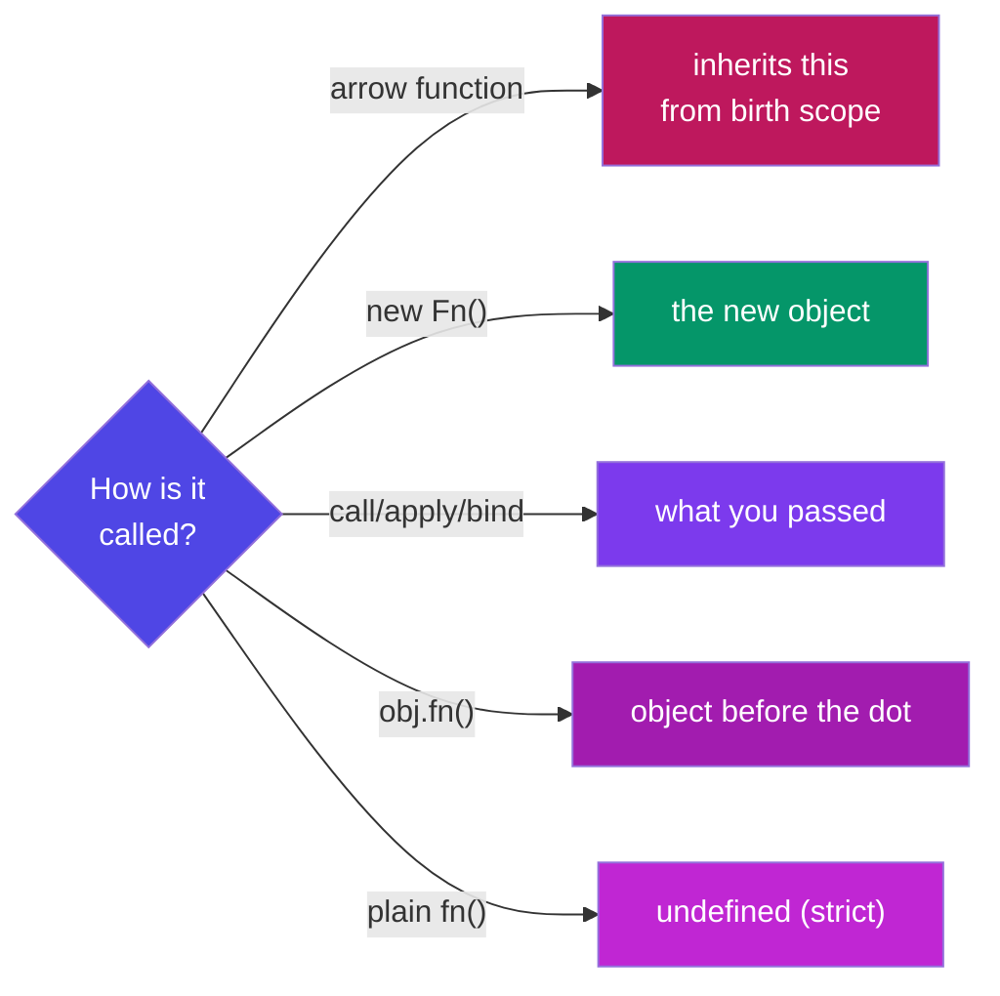
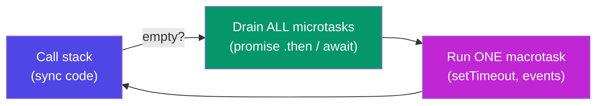

# JavaScript — Interview Cheat Sheet

### Every concept from Phase 4 & 5, compressed for quick revision

> *"In an interview you don't rise to the level of your knowledge — you fall to the level of your recall. This sheet is the recall."*

---

## Table of Contents

- [1. Rapid-Fire One-Liners](#1-rapid-fire-one-liners) — 30-second answers to the most-asked definitions
- [2. Language Core — Cheat Tables](#2-language-core-cheat-tables) — variables, types, coercion, functions, arrays, objects, DOM
- [3. The Big Five Deep-Dives](#3-the-big-five-deep-dives) — hoisting · closures · this · prototypes/OOP · event loop/async
- [4. Predict the Output](#4-predict-the-output) — 12 trick snippets with answers
- [5. Scenario-Based Questions](#5-scenario-based-questions) — "how would you…" playbook
- [6. Implement From Scratch](#6-implement-from-scratch) — the classic hand-coding rounds
- [7. One-Breath Answers](#7-one-breath-answers) — the 10 most-asked questions, pre-worded
- [8. The Last-Minute Card](#8-the-last-minute-card) — read this outside the interview room

---

# 1. Rapid-Fire One-Liners

*The interviewer wants ONE crisp sentence. Give these, then expand only if asked.*

| Question | Your one-liner |
|---|---|
| What is JavaScript? | A single-threaded, dynamically-typed language that runs in browsers and Node, making pages interactive. |
| let vs const vs var? | `const` default, `let` when reassigning, `var` never — it's function-scoped and hoists to `undefined`. |
| Data types? | 7 primitives — string, number, boolean, null, undefined, symbol, bigint — plus object. |
| undefined vs null? | `undefined` = JS's "never assigned"; `null` = the developer's deliberate "empty". |
| Why `typeof null === "object"`? | A bug from 1995, kept forever for backward compatibility. |
| == vs ===? | `==` coerces types before comparing; `===` checks value *and* type — always use `===`. |
| The six falsy values? | `false, 0, "", null, undefined, NaN` — everything else is truthy (even `"0"`, `[]`, `{}`). |
| `\|\|` vs `??`? | `\|\|` replaces *any* falsy value; `??` replaces only `null`/`undefined` — so `0` and `""` survive. |
| Optional chaining `?.`? | Returns `undefined` instead of crashing when the left side is null/undefined. |
| Template literal? | Backtick string with `${expression}` embedding and multi-line support. |
| Arrow vs regular function? | Arrows have no own `this` (inherit from birth scope) and don't hoist. |
| Higher-order function? | A function that takes and/or returns another function — `.map`, `debounce`. |
| map vs forEach? | `map` returns a new transformed array; `forEach` returns nothing (side effects). |
| slice vs splice? | `slice` copies (original safe); `splice` cuts/inserts in place (mutates). |
| Spread vs rest? | Same `...` — spread *unpacks* into pieces; rest *collects* pieces into one. |
| Destructuring? | Unpacking object/array values into variables by shape: `const {name} = user`. |
| Shallow vs deep copy? | Spread/`Object.assign` copy one level (nested objects shared); `structuredClone` copies fully. |
| What is the DOM? | The live object tree the browser builds from HTML — JS edits the tree, the page follows. |
| Event delegation? | One listener on a parent handles bubbled events from all children via `e.target`. |
| Hoisting? | Declarations are registered in memory before code runs — functions fully, `var` as `undefined`, `let`/`const` locked (TDZ). |
| Temporal Dead Zone? | The region where a `let`/`const` exists but throws if touched — before its declaration line. |
| Closure? | A function that remembers the variables of the scope it was born in, even after that scope returned. |
| Lexical scope? | Visibility decided by *where code is written*, not where it's called; lookup goes outward only. |
| IIFE? | A function expression invoked immediately — a throwaway private scope: `(function(){...})()`. |
| What is `this`? | The object currently executing the function — decided at *call time* by how it's called (except arrows). |
| call / apply / bind? | call = args by commas now; apply = args as array now; bind = returns a locked copy for later. |
| Prototype chain? | Each object's hidden link to a parent object; failed lookups walk up the chain until `null`. |
| ES6 class? | Cleaner syntax over constructors + prototypes — same machinery, plus `#private` and `super`. |
| The 4 OOP pillars? | Encapsulation (hide state), Inheritance (is-a reuse), Polymorphism (one call, many behaviours), Abstraction (hide the how). |
| Event loop? | When the stack empties: run ALL microtasks (promises), then ONE macrotask (timers/events); repeat. |
| Microtask vs macrotask? | Promise callbacks are microtasks (VIP lane); `setTimeout`/events are macrotasks — micro always wins. |
| Promise? | An object representing a future value — pending → fulfilled or rejected, settles once. |
| async/await? | Syntax over promises: `async` fn always returns a promise; `await` pauses only that function. |
| Promise.all vs allSettled? | `all` fails fast if any rejects; `allSettled` never rejects — reports every outcome. |
| Named vs default export? | Named: many per file, `import {x}` exact names; default: one per file, import under any name. |
| What is JSON? | The universal text format for data — `JSON.stringify` out, `JSON.parse` in. |
| What is reduce? | Folds an array into one value by carrying an accumulator through every item. |

---

# 2. Language Core — Cheat Tables

## 2.1 Variables & types

```js
const x = 1;   // block-scoped, no reassign — DEFAULT
let y = 2;     // block-scoped, reassignable
var z = 3;     // function-scoped, hoists to undefined — NEVER

typeof "a"→"string"  typeof 1→"number"  typeof true→"boolean"
typeof undefined→"undefined"  typeof null→"object"❗  typeof []→"object"❗
typeof {}→"object"  typeof f→"function"     Array.isArray([]) → true
```

**Coercion rules to recite:** `+` concatenates if either side is a string; `- * /` always convert to numbers; `==` coerces (avoid); six falsy values only.

```js
1 + "2"   // "12"     1 - "2"   // -1        "5" == 5   // true
[] + {}   // "[object Object]"               "5" === 5  // false
0.1 + 0.2 === 0.3  // false (0.30000000000000004 — use integers for money)
NaN === NaN        // false (use Number.isNaN)
```

## 2.2 Functions

```js
function decl(a, b) {}            // hoisted fully
const expr = function () {};      // not hoisted
const arrow = (a, b) => a + b;    // implicit return, NO own this
const greet = (name = "friend") => `Hi ${name}`;   // default param
const sum = (...nums) => nums.reduce((t, n) => t + n, 0);  // rest
```

| Use a **regular** function for | Use an **arrow** for |
|---|---|
| object methods (`this` = the object) | callbacks (`setTimeout`, array methods) |
| constructors / classes | preserving outer `this` inside methods |

## 2.3 Arrays — the method matrix

| Method | Job | Returns | Mutates? |
|---|---|---|---|
| `push/pop` | add/remove END | new length / item | ✅ |
| `unshift/shift` | add/remove FRONT | new length / item | ✅ |
| `splice(i, n, ...x)` | surgery at index | removed items | ✅ |
| `sort((a,b)=>a-b)` `reverse` | order | the same array | ✅ |
| `slice(i, j)` | copy section (j excluded) | new array | ❌ |
| `map(fn)` | transform each | new array (same length) | ❌ |
| `filter(fn)` | keep passers | new array (≤ length) | ❌ |
| `find(fn)` / `findIndex` | first passer | item / index | ❌ |
| `some(fn)` / `every(fn)` | any pass? / all pass? | boolean | ❌ |
| `includes(x)` / `indexOf(x)` | membership | boolean / index | ❌ |
| `reduce(fn, start)` | fold to one value | anything | ❌ |
| `flat(depth)` / `join(sep)` | unnest / stringify | new array / string | ❌ |

```js
[10, 2, 1].sort()               // [1, 10, 2] ❗ string sort — pass (a,b)=>a-b
students.filter(s => s.score >= 75).map(s => s.name).sort()   // chain = sentence
```

## 2.4 Objects, destructuring, spread

```js
const user = { name: "NV", greet() { return `Hi ${this.name}`; } };
Object.keys(user)  Object.values(user)  Object.entries(user)

const { name, city = "BLR" } = user;        // destructure + default
const { name: userName } = user;            // rename
const [a, , c] = [1, 2, 3];                 // skip
[x, y] = [y, x];                            // swap, no temp

const copy   = { ...user, city: "Hyd" };    // copy + override (SHALLOW!)
const merged = { ...defaults, ...prefs };   // later wins
const { password, ...safe } = user;         // strip a key out
const deep = structuredClone(user);         // real deep copy
```

## 2.5 DOM & events — quick reference

```js
const el = document.querySelector("#id, .class, any CSS");
document.querySelectorAll(".task")          // all matches

el.textContent = "safe text";               // innerHTML only for trusted HTML (XSS!)
el.classList.add / remove / toggle("done");
el.value                                    // form fields
const li = document.createElement("li"); parent.append(li); li.remove();

btn.addEventListener("click", (e) => { ... });
form.addEventListener("submit", (e) => e.preventDefault());   // stop reload
input.addEventListener("input", ...);       // every keystroke
document.addEventListener("keydown", e => e.key === "Escape" && close());

// DELEGATION — one parent listener, works for future children too:
list.addEventListener("click", (e) => {
  if (e.target.matches("li.task")) e.target.classList.toggle("done");
});
```

---

# 3. The Big Five Deep-Dives

*Five topics decide a JS interview. For each: the 30-second answer, the snippet you'll be shown, and the follow-ups.*

## 3.1 Hoisting & TDZ

**30-second answer:** "Before executing, JS does a creation pass that registers every declaration in memory. Function declarations are stored whole, so they're callable early. `var` is registered as `undefined` — silent wrong values. `let`/`const` are registered but locked — touching them early throws a ReferenceError; that lock zone is the Temporal Dead Zone, and it's a feature: loud errors beat silent `undefined`."

```js
greet();              // ✅ "Hi" — declarations hoist whole
console.log(a);       // undefined — var hoists as undefined
console.log(b);       // ❌ ReferenceError — TDZ
function greet() { console.log("Hi"); }
var a = 1;  let b = 2;
```

**Follow-ups:** *Do function expressions hoist?* No — the `const` holding them is in the TDZ. *Why was TDZ added?* To make use-before-declare a visible bug.

## 3.2 Closures

**30-second answer:** "A closure is a function plus the variables of the scope where it was created. The inner function keeps those variables alive after the outer function returns — like a backpack it carries. It's how JS does private state, and it powers memoize, debounce, and every event handler that uses outer variables."

```js
function counter() {
  let count = 0;                              // private forever
  return { inc: () => ++count, val: () => count };
}
const c = counter(); c.inc(); c.inc(); c.val();   // 2 — count outlived counter()
```

**The follow-up they ALWAYS ask — the loop:**

```js
for (var i = 1; i <= 3; i++) setTimeout(() => console.log(i));  // 4 4 4
for (let i = 1; i <= 3; i++) setTimeout(() => console.log(i));  // 1 2 3
```

*Why:* `var` = ONE shared binding, read after the loop finished; `let` = a fresh binding per iteration, so each callback closes over its own. *Fixes:* use `let`, or wrap the body in an IIFE passing `i`.

## 3.3 `this` (+ call / apply / bind)

**30-second answer:** "`this` is decided at call time by how the function is called, with four rules in priority order: `new` binds it to the fresh object; explicit `call`/`apply`/`bind` binds it to what you pass; a dot call binds it to the object before the dot; a plain call gives `undefined` in strict mode. Arrow functions opt out entirely and inherit `this` from where they were written."



```js
const user = { name: "NV", greet() { return `Hi ${this.name}`; } };
user.greet();                    // "Hi NV"        — dot rule
const f = user.greet; f();       // "Hi undefined" — lost the dot
f.call({ name: "X" });           // "Hi X"         — explicit, now
f.bind(user)();                  // "Hi NV"        — locked copy
```

**Memory hook:** call = **c**ommas, apply = **a**rray, bind = **b**ookmark. **Trap:** never use an arrow *as* a method — it ignores the dot rule.

## 3.4 Prototypes, Classes & OOP

**30-second answer:** "Every object has a hidden link to a prototype object; missed lookups walk that chain — that's why every array can call `map` though none owns it: one shared copy on `Array.prototype`. `class` is modern syntax over this same machinery: `extends` wires the chain, `super` calls the parent, `#fields` give real privacy."

```js
class Vehicle {
  #serviceDue = false;                       // encapsulation
  constructor(kind) { this.kind = kind; }
  describe() { return `A ${this.kind}`; }
  static compare(a, b) { ... }               // on the class, not instances
}
class Car extends Vehicle {                  // inheritance
  constructor() { super("car"); }            // super FIRST, then this
  describe() { return super.describe() + " 🚗"; }   // polymorphism (override)
}
new Car().describe();
// chain: car → Car.prototype → Vehicle.prototype → Object.prototype → null
```

| Pillar | One-liner | JS tool |
|---|---|---|
| Encapsulation | hide state behind guarded methods | `#private`, getters/setters, closures |
| Inheritance | child is-a parent, reuses + extends | `extends`, `super` |
| Polymorphism | same call, per-class behaviour | method override → `shapes.forEach(s => s.area())` |
| Abstraction | simple what, hidden how | private methods, small public API |

**Follow-ups:** *What does `new` do?* Create empty object → link to `.prototype` → run constructor with `this` = it → return it. *Static vs instance?* Static lives on the class (`Math.random`, `User.findById`); instances can't see it.

## 3.5 Event Loop, Promises & async/await

**30-second answer:** "JS is single-threaded, so slow work is delegated to the environment. Finished promise callbacks queue as microtasks, timers and events as macrotasks. The event loop's rule: when the stack empties, drain ALL microtasks, then run ONE macrotask. That's why a resolved promise always beats a 0ms timer."



```js
console.log(1);
setTimeout(() => console.log(2));                 // macrotask
Promise.resolve().then(() => console.log(3));     // microtask
console.log(4);                                    // → 1 4 3 2
```

**Promises in four lines:** states pending → fulfilled/rejected, settles once. `.then` returns a NEW promise (chainable); one `.catch` covers the whole chain; `.finally` always runs (spinner cleanup).

**async/await rules:** an `async` function ALWAYS returns a promise; `await` pauses only that function (the rest becomes a microtask); wrap in `try/catch/finally`.

```js
// ❌ 3s — sequential          // ✅ ~1s — parallel
const a = await fA();          const [a, b, c] = await Promise.all([fA(), fB(), fC()]);
const b = await fB();
const c = await fC();
```

| Combinator | Behaviour | Scenario |
|---|---|---|
| `Promise.all` | all succeed or fail fast | page needs user + cart + prices |
| `Promise.allSettled` | never rejects, full report | 100 emails — which failed? |
| `Promise.race` | first to SETTLE wins | fetch vs 5s timeout |
| `Promise.any` | first to FULFIL wins | fastest mirror/CDN |

**fetch traps (always mention both):** ① no reject on 404/500 — check `res.ok`; ② body is a second await: `await res.json()`.

---

# 4. Predict the Output

*The interviewer's favourite round. Cover the answers, commit to an output, THEN check. Being wrong here now is the cheapest way to be right later.*

**#1 — var hoisting**
```js
console.log(x);
var x = 5;
```
**Answer:** `undefined` — `var` is registered in the creation phase with value `undefined`; no error, just a silent blank.

**#2 — TDZ**
```js
console.log(y);
let y = 5;
```
**Answer:** `ReferenceError: Cannot access 'y' before initialization` — hoisted but locked (TDZ).

**#3 — the loop classic**
```js
for (var i = 0; i < 3; i++) setTimeout(() => console.log(i));
```
**Answer:** `3 3 3` — one shared `var i`, read after the loop ends. With `let`: `0 1 2` (fresh binding per iteration).

**#4 — event loop ordering**
```js
console.log("A");
setTimeout(() => console.log("B"), 0);
Promise.resolve().then(() => console.log("C"));
console.log("D");
```
**Answer:** `A D C B` — sync first, then ALL microtasks (C), then the macrotask (B). 0ms never means "now".

**#5 — chained microtasks still beat timers**
```js
setTimeout(() => console.log("t"));
Promise.resolve().then(() => console.log("p1")).then(() => console.log("p2"));
```
**Answer:** `p1 p2 t` — the microtask queue is drained *completely*, including microtasks queued by microtasks.

**#6 — losing `this`**
```js
const user = { name: "NV", greet() { return `Hi ${this.name}`; } };
const f = user.greet;
console.log(f());
```
**Answer:** `Hi undefined` — no dot at call time → default binding. Fix: `f.bind(user)` or call as `user.greet()`.

**#7 — arrow as method**
```js
const obj = { name: "NV", greet: () => `Hi ${this.name}` };
console.log(obj.greet());
```
**Answer:** `Hi undefined` — arrows ignore the dot rule; this arrow's `this` is the module/global scope where it was written.

**#8 — coercion set**
```js
console.log(1 + "2", 1 - "2", "5" == 5, null == undefined, NaN === NaN);
```
**Answer:** `"12" -1 true true false` — `+` concatenates with strings; `-` converts; `==` coerces; null/undefined are loosely equal to each other only; NaN equals nothing.

**#9 — string sort**
```js
console.log([10, 9, 1].sort());
```
**Answer:** `[1, 10, 9]` — default sort compares as strings ("10" < "9"). Fix: `.sort((a, b) => a - b)`.

**#10 — shallow spread**
```js
const a = { user: { name: "NV" } };
const b = { ...a };
b.user.name = "X";
console.log(a.user.name);
```
**Answer:** `"X"` — spread copies one level; `a.user` and `b.user` are the SAME object. Deep fix: `structuredClone(a)`.

**#11 — async return value**
```js
async function f() { return 42; }
console.log(f());
f().then(v => console.log(v));
```
**Answer:** `Promise { 42 }` then `42` — async functions always wrap returns in a promise.

**#12 — await pauses only its function**
```js
async function job() {
  console.log("1");
  await Promise.resolve();
  console.log("2");
}
job();
console.log("3");
```
**Answer:** `1 3 2` — `await` suspends `job` and yields to the caller; the code after `await` resumes as a microtask.

---

# 5. Scenario-Based Questions

*Interviews increasingly ask "what would you reach for when…". Answer with the tool + one sentence of why.*

**S1. "The search box fires an API call on every keystroke — 20 calls for one word. Fix it."**
→ **Debounce** (a closure holding a timer): reset a `setTimeout` on each keystroke; only the pause after the *last* keystroke fires the call.
```js
input.addEventListener("input", debounce(runSearch, 400));
```

**S2. "Remove duplicates from an array."**
```js
const unique = [...new Set([1, 2, 2, 3])];    // [1, 2, 3] — Set stores uniques, spread back
```

**S3. "Group 500 orders by status for a dashboard."**
→ **reduce with an object accumulator:**
```js
orders.reduce((g, o) => ((g[o.status] ??= []).push(o), g), {});
```

**S4. "A fetch sometimes hangs forever. Add a 5-second timeout."**
→ **Promise.race** against a rejecting timer:
```js
const timeout = ms => new Promise((_, rej) => setTimeout(() => rej(new Error("Timeout")), ms));
const data = await Promise.race([fetch(url), timeout(5000)]);
```

**S5. "Dashboard loads 3 independent APIs; one failing shouldn't blank the page."**
→ **Promise.allSettled**, render fulfilled widgets, error-card the rejected:
```js
(await Promise.allSettled([sales(), traffic(), reviews()]))
  .forEach(r => r.status === "fulfilled" ? render(r.value) : renderError(r.reason));
```

**S6. "Three dependent API calls run 3 seconds total; two are actually independent. Speed it up."**
→ Start independents together, await together: `const [a, b] = await Promise.all([fA(), fB()])`, then the dependent third. Total ≈ slowest + one, not the sum.

**S7. "A table has 1,000 rows, each needing a click handler — and rows are added dynamically."**
→ **Event delegation**: ONE listener on the `<tbody>`, identify the row via `e.target.closest("tr")`. Works for future rows automatically.

**S8. "Users double-click Submit and orders post twice."**
→ Disable on first click, re-enable in `finally`; or wrap the handler in a closure-based `once(fn)`. (Server must also guard — idempotency key.)

**S9. "An expensive calculation is called repeatedly with the same inputs."**
→ **Memoize** — a closure caching results by argument:
```js
const fast = memoize(slowFn);   // first call computes, repeats are instant
```

**S10. "Price arrives as `'500'` from a form and `total` becomes `'500500'`."**
→ Form values are always **strings**; convert at the boundary: `Number(input.value)` (or `+input.value`), *then* do math. This is the `+`-prefers-strings coercion rule in the wild.

**S11. "Build an undo feature for a form/editor."**
→ Keep an **array of past states** (immutable snapshots via spread); undo = pop and restore. This is why immutability matters beyond React.

**S12. "A module needs private state without classes."**
→ **Closure / module pattern**: return an API object over hidden variables (`counter()` pattern) — or `#fields` if a class fits better.

**S13. "The page freezes for 4 seconds when processing a big array."**
→ The stack is blocked, so paints/clicks queue (event loop). Chunk the work (`setTimeout` batches), or move it off-thread (Web Worker).

**S14. "Settings: user's `volume: 0` keeps resetting to 50."**
→ Someone wrote `volume || 50`; `0` is falsy. Use `volume ?? 50` — nullish, not falsy, fallback.

**S15. "Update one field of a state object without touching the original."**
→ `const next = { ...prev, city: "Hyd" }` — copy + override; never mutate shared state. (Exactly what React's `setState` expects.)

---

# 6. Implement From Scratch

*The hand-coding round. Each of these is a real, frequently-asked exercise — practise until you can write them without notes.*

**6.1 — myMap / myFilter (proves you get higher-order functions):**
```js
Array.prototype.myMap = function (fn) {
  const out = [];
  for (let i = 0; i < this.length; i++) out.push(fn(this[i], i, this));
  return out;
};
Array.prototype.myFilter = function (fn) {
  const out = [];
  for (let i = 0; i < this.length; i++) if (fn(this[i], i, this)) out.push(this[i]);
  return out;
};
```

**6.2 — myReduce (the one they push you on):**
```js
Array.prototype.myReduce = function (fn, start) {
  let acc = start, i = 0;
  if (acc === undefined) { acc = this[0]; i = 1; }   // no seed → first item seeds
  for (; i < this.length; i++) acc = fn(acc, this[i], i, this);
  return acc;
};
```

**6.3 — debounce & throttle (closures in production):**
```js
function debounce(fn, delay) {              // fire AFTER the storm stops
  let timer;
  return (...args) => {
    clearTimeout(timer);
    timer = setTimeout(() => fn(...args), delay);
  };
}
function throttle(fn, gap) {                // fire at most once per gap
  let last = 0;
  return (...args) => {
    const now = Date.now();
    if (now - last >= gap) { last = now; fn(...args); }
  };
}
// debounce = search box (wait for typing to stop)
// throttle = scroll handler (steady drumbeat while it continues)
```

**6.4 — once & memoize:**
```js
function once(fn) {
  let done = false, result;
  return (...args) => done ? result : (done = true, result = fn(...args));
}
function memoize(fn) {
  const cache = new Map();
  return (...args) => {
    const key = JSON.stringify(args);
    if (!cache.has(key)) cache.set(key, fn(...args));
    return cache.get(key);
  };
}
```

**6.5 — myBind (tests `this` + closures at once):**
```js
Function.prototype.myBind = function (ctx, ...preset) {
  const fn = this;                                   // the original function
  return (...later) => fn.apply(ctx, [...preset, ...later]);
};
const bound = user.greet.myBind(user);   // works like the real bind
```

**6.6 — Promise.allSettled from scratch (your roadmap exercise):**
```js
function allSettled(promises) {
  return Promise.all(
    promises.map(p =>
      Promise.resolve(p)
        .then(value  => ({ status: "fulfilled", value }))
        .catch(reason => ({ status: "rejected",  reason }))
    )
  );   // every promise is wrapped so none can reject → all() is safe
}
```

**6.7 — delay / sleep (the async building block):**
```js
const delay = ms => new Promise(res => setTimeout(res, ms));
await delay(1000);          // readable pauses in async flows, retries, polling
```

**6.8 — flattenDeep (recursion check):**
```js
const flattenDeep = arr =>
  arr.reduce((out, x) => out.concat(Array.isArray(x) ? flattenDeep(x) : x), []);
flattenDeep([1, [2, [3, [4]]]]);   // [1, 2, 3, 4]   (prod: arr.flat(Infinity))
```

**6.9 — Event-loop-safe retry with backoff (senior-flavoured):**
```js
async function retry(fn, attempts = 3, wait = 500) {
  for (let i = 1; i <= attempts; i++) {
    try { return await fn(); }
    catch (err) {
      if (i === attempts) throw err;
      await delay(wait * i);          // 500ms, 1000ms, 1500ms...
    }
  }
}
const data = await retry(() => fetchJSON("/api/flaky"));
```

---

# 7. One-Breath Answers

*The ten questions you are near-guaranteed to hear. Pre-worded — say them like you own them, because now you do.*

**1. "Explain closures."**
"A closure is a function that keeps access to the variables of the scope it was created in, even after that scope has returned. JS functions carry their birth environment like a backpack. It's how we get private state without classes — and it powers debounce, memoize, and module patterns."

**2. "Explain the event loop."**
"JavaScript runs on one call stack; slow operations are delegated to the environment. Completed promise callbacks wait in the microtask queue, timers and events in the macrotask queue. Whenever the stack empties, the loop drains every microtask, then runs one macrotask. That's why `Promise.then` always beats `setTimeout(0)`."

**3. "How does `this` work?"**
"It's bound at call time, four rules by priority: `new` → the fresh object; `call`/`apply`/`bind` → what you pass; dot call → the object before the dot; plain call → undefined in strict mode. Arrow functions skip all four and inherit `this` from where they were written."

**4. "Explain prototypal inheritance."**
"Every object holds a hidden link to a prototype. A failed property lookup walks up that chain until found or `null`. Methods live once on the prototype and are shared by all instances — a million arrays, one `map`. ES6 classes are syntax over exactly this."

**5. "Hoisting?"**
"Before running code, JS registers all declarations. Function declarations become fully callable; `var` becomes `undefined` — silent bugs; `let`/`const` exist but are locked in the Temporal Dead Zone, throwing if touched early — loud bugs, which is precisely why they're better."

**6. "Promises vs callbacks?"**
"Both handle async, but callbacks nest — the pyramid of doom — with error handling repeated at each level. Promises flatten steps into a chain where each `.then` feeds the next and one `.catch` handles any failure. async/await then makes that chain read like synchronous code."

**7. "var vs let vs const?"**
"`const` and `let` are block-scoped with TDZ protection; `var` is function-scoped, hoists to undefined, and shares one binding across loop iterations — the setTimeout 3-3-3 bug. I use `const` by default, `let` when reassignment is needed, `var` never."

**8. "== or ===?"**
"Strict equals, always — `==` coerces types first, so `'5' == 5` and `0 == false` are true, which invites bugs. The one idiom I'd accept is `x == null` to match both null and undefined."

**9. "The four OOP pillars in JS?"**
"Encapsulation — hide state behind `#private` fields or closures; Inheritance — `extends`/`super` reusing a base class; Polymorphism — subclasses override the same method so one loop handles every shape; Abstraction — a small public API hiding messy internals."

**10. "What happens when you type an expression like `fetch` in your app — walk me through an API call."**
"`fetch` returns a promise immediately and the browser does the networking off-thread. When headers arrive the promise fulfils with a Response — even for 404s, so I check `res.ok`. The body is a second async step, `await res.json()`. I wrap it in try/catch/finally — catch for network errors and thrown HTTP errors, finally to stop the spinner — and if calls are independent, I fire them together with `Promise.all`."

---

# 8. The Last-Minute Card

*Read this in the five minutes before the interview. Nothing new — just switches flipped on.*

> **Six falsy:** `false 0 "" null undefined NaN` · everything else truthy (`"0"`, `[]`, `{}`).
> **Coercion:** `+` with a string concatenates; `- * /` convert · `===` always · `??` for defaults (saves 0 and "").
> **typeof traps:** `null → "object"` · arrays → `"object"` (`Array.isArray`) · `NaN !== NaN`.
> **Hoisting ladder:** function declarations whole → `var` undefined → `let/const` TDZ error.
> **Closure = backpack.** Private state · memoize · debounce · loop bug: `var` shares, `let` is per-iteration.
> **this:** new → explicit (call/apply/bind) → dot → default · arrows inherit from birth scope · call **c**ommas, apply **a**rray, bind **b**ookmark.
> **Prototype chain:** obj → Constructor.prototype → Object.prototype → null · one shared method for all instances.
> **new does:** create → link → run with this → return.
> **Pillars:** encapsulate `#` · inherit `extends/super` · polymorph override · abstract hide-the-how.
> **Event loop:** stack empty → ALL microtasks → ONE macrotask · so `1 4 3 2` · promises outrank timers, always.
> **async:** async fn returns a promise, always · await pauses only its fn · independent? `Promise.all` · partial-ok? `allSettled` · timeout? `race`.
> **fetch:** check `res.ok` · `await res.json()` · finally kills the spinner.
> **Arrays:** map transform · filter keep · find first · some/every test · reduce fold · sort needs `(a,b)=>a-b`.
> **Spread copies are SHALLOW** — nested objects shared · deep: `structuredClone`.
> **Delegation:** one listener on the parent, `e.target` decides · survives dynamic children.
> **Interview meta:** think aloud · say the one-liner first, expand if invited · if unsure of an output, *reason* through stack → micro → macro on paper.

*You built a to-do app with all of this and wrote every pattern by hand. You're not recalling trivia — you're describing your own code. Go.*
