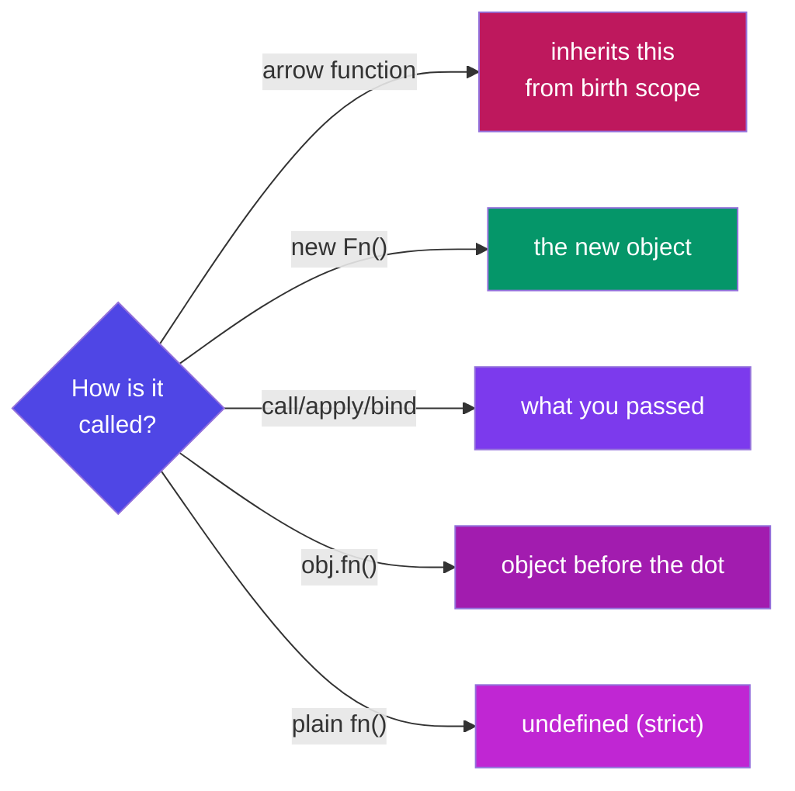
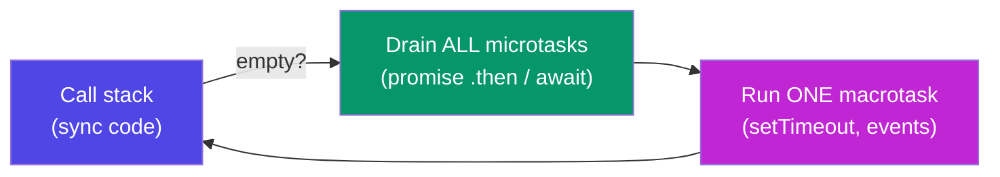

# JavaScript — Interview Cheat Sheet

### Every concept from Phase 4 & 5, compressed for quick revision

> *"In an interview you don't rise to the level of your knowledge — you fall to the level of your recall. This sheet is the recall."*

---

## Table of Contents

- [1. Rapid-Fire One-Liners](#1-rapid-fire-one-liners) — 30-second answers to the most-asked definitions
- [2. Language Core — Cheat Tables](#2-language-core-cheat-tables) — variables, types, coercion, functions, arrays, objects, DOM
- [3. The Big Five Deep-Dives](#3-the-big-five-deep-dives) — hoisting · closures · this · prototypes/OOP · event loop/async
- [4. Predict the Output](#4-predict-the-output) — 12 trick snippets with answers
- [5. Scenario-Based Questions](#5-scenario-based-questions) — "how would you…" playbook
- [6. Implement From Scratch](#6-implement-from-scratch) — the classic hand-coding rounds
- [7. One-Breath Answers](#7-one-breath-answers) — the 10 most-asked questions, pre-worded
- [8. The Last-Minute Card](#8-the-last-minute-card) — read this outside the interview room
- [9. Practice Lab A — JavaScript, Topic by Topic](#9-practice-lab-a-javascript-topic-by-topic) — worked example + practice tasks for all 14 JS topics
- [10. Practice Lab B — Node.js & Backend, Topic by Topic](#10-practice-lab-b-nodejs-backend-topic-by-topic) — runtime → fs → streams → Express → REST → MySQL → JWT → production hygiene
- [11. Real-World Builds](#11-real-world-builds-ten-challenges-that-are-actually-the-job) — ten portfolio challenges that are miniatures of the actual job
- [12. The Project Ladder](#12-the-project-ladder-24-projects-small-to-big) — 24 projects from vanilla frontend to system design, one clear goal each

---

# 1. Rapid-Fire One-Liners

*The interviewer wants ONE crisp sentence. Give these, then expand only if asked.*

| Question | Your one-liner |
|---|---|
| What is JavaScript? | A single-threaded, dynamically-typed language that runs in browsers and Node, making pages interactive. |
| let vs const vs var? | `const` default, `let` when reassigning, `var` never — it's function-scoped and hoists to `undefined`. |
| Data types? | 7 primitives — string, number, boolean, null, undefined, symbol, bigint — plus object. |
| undefined vs null? | `undefined` = JS's "never assigned"; `null` = the developer's deliberate "empty". |
| Why `typeof null === "object"`? | A bug from 1995, kept forever for backward compatibility. |
| == vs ===? | `==` coerces types before comparing; `===` checks value *and* type — always use `===`. |
| The six falsy values? | `false, 0, "", null, undefined, NaN` — everything else is truthy (even `"0"`, `[]`, `{}`). |
| `\|\|` vs `??`? | `\|\|` replaces *any* falsy value; `??` replaces only `null`/`undefined` — so `0` and `""` survive. |
| Optional chaining `?.`? | Returns `undefined` instead of crashing when the left side is null/undefined. |
| Template literal? | Backtick string with `${expression}` embedding and multi-line support. |
| Arrow vs regular function? | Arrows have no own `this` (inherit from birth scope) and don't hoist. |
| Higher-order function? | A function that takes and/or returns another function — `.map`, `debounce`. |
| map vs forEach? | `map` returns a new transformed array; `forEach` returns nothing (side effects). |
| slice vs splice? | `slice` copies (original safe); `splice` cuts/inserts in place (mutates). |
| Spread vs rest? | Same `...` — spread *unpacks* into pieces; rest *collects* pieces into one. |
| Destructuring? | Unpacking object/array values into variables by shape: `const {name} = user`. |
| Shallow vs deep copy? | Spread/`Object.assign` copy one level (nested objects shared); `structuredClone` copies fully. |
| What is the DOM? | The live object tree the browser builds from HTML — JS edits the tree, the page follows. |
| Event delegation? | One listener on a parent handles bubbled events from all children via `e.target`. |
| Hoisting? | Declarations are registered in memory before code runs — functions fully, `var` as `undefined`, `let`/`const` locked (TDZ). |
| Temporal Dead Zone? | The region where a `let`/`const` exists but throws if touched — before its declaration line. |
| Closure? | A function that remembers the variables of the scope it was born in, even after that scope returned. |
| Lexical scope? | Visibility decided by *where code is written*, not where it's called; lookup goes outward only. |
| IIFE? | A function expression invoked immediately — a throwaway private scope: `(function(){...})()`. |
| What is `this`? | The object currently executing the function — decided at *call time* by how it's called (except arrows). |
| call / apply / bind? | call = args by commas now; apply = args as array now; bind = returns a locked copy for later. |
| Prototype chain? | Each object's hidden link to a parent object; failed lookups walk up the chain until `null`. |
| ES6 class? | Cleaner syntax over constructors + prototypes — same machinery, plus `#private` and `super`. |
| The 4 OOP pillars? | Encapsulation (hide state), Inheritance (is-a reuse), Polymorphism (one call, many behaviours), Abstraction (hide the how). |
| Event loop? | When the stack empties: run ALL microtasks (promises), then ONE macrotask (timers/events); repeat. |
| Microtask vs macrotask? | Promise callbacks are microtasks (VIP lane); `setTimeout`/events are macrotasks — micro always wins. |
| Promise? | An object representing a future value — pending → fulfilled or rejected, settles once. |
| async/await? | Syntax over promises: `async` fn always returns a promise; `await` pauses only that function. |
| Promise.all vs allSettled? | `all` fails fast if any rejects; `allSettled` never rejects — reports every outcome. |
| Named vs default export? | Named: many per file, `import {x}` exact names; default: one per file, import under any name. |
| What is JSON? | The universal text format for data — `JSON.stringify` out, `JSON.parse` in. |
| What is reduce? | Folds an array into one value by carrying an accumulator through every item. |

---

# 2. Language Core — Cheat Tables

## 2.1 Variables & types

```js
const x = 1;   // block-scoped, no reassign — DEFAULT
let y = 2;     // block-scoped, reassignable
var z = 3;     // function-scoped, hoists to undefined — NEVER

typeof "a"→"string"  typeof 1→"number"  typeof true→"boolean"
typeof undefined→"undefined"  typeof null→"object"❗  typeof []→"object"❗
typeof {}→"object"  typeof f→"function"     Array.isArray([]) → true
```

**Coercion rules to recite:** `+` concatenates if either side is a string; `- * /` always convert to numbers; `==` coerces (avoid); six falsy values only.

```js
1 + "2"   // "12"     1 - "2"   // -1        "5" == 5   // true
[] + {}   // "[object Object]"               "5" === 5  // false
0.1 + 0.2 === 0.3  // false (0.30000000000000004 — use integers for money)
NaN === NaN        // false (use Number.isNaN)
```

## 2.2 Functions

```js
function decl(a, b) {}            // hoisted fully
const expr = function () {};      // not hoisted
const arrow = (a, b) => a + b;    // implicit return, NO own this
const greet = (name = "friend") => `Hi ${name}`;   // default param
const sum = (...nums) => nums.reduce((t, n) => t + n, 0);  // rest
```

| Use a **regular** function for | Use an **arrow** for |
|---|---|
| object methods (`this` = the object) | callbacks (`setTimeout`, array methods) |
| constructors / classes | preserving outer `this` inside methods |

## 2.3 Arrays — the method matrix

| Method | Job | Returns | Mutates? |
|---|---|---|---|
| `push/pop` | add/remove END | new length / item | ✅ |
| `unshift/shift` | add/remove FRONT | new length / item | ✅ |
| `splice(i, n, ...x)` | surgery at index | removed items | ✅ |
| `sort((a,b)=>a-b)` `reverse` | order | the same array | ✅ |
| `slice(i, j)` | copy section (j excluded) | new array | ❌ |
| `map(fn)` | transform each | new array (same length) | ❌ |
| `filter(fn)` | keep passers | new array (≤ length) | ❌ |
| `find(fn)` / `findIndex` | first passer | item / index | ❌ |
| `some(fn)` / `every(fn)` | any pass? / all pass? | boolean | ❌ |
| `includes(x)` / `indexOf(x)` | membership | boolean / index | ❌ |
| `reduce(fn, start)` | fold to one value | anything | ❌ |
| `flat(depth)` / `join(sep)` | unnest / stringify | new array / string | ❌ |

```js
[10, 2, 1].sort()               // [1, 10, 2] ❗ string sort — pass (a,b)=>a-b
students.filter(s => s.score >= 75).map(s => s.name).sort()   // chain = sentence
```

## 2.4 Objects, destructuring, spread

```js
const user = { name: "NV", greet() { return `Hi ${this.name}`; } };
Object.keys(user)  Object.values(user)  Object.entries(user)

const { name, city = "BLR" } = user;        // destructure + default
const { name: userName } = user;            // rename
const [a, , c] = [1, 2, 3];                 // skip
[x, y] = [y, x];                            // swap, no temp

const copy   = { ...user, city: "Hyd" };    // copy + override (SHALLOW!)
const merged = { ...defaults, ...prefs };   // later wins
const { password, ...safe } = user;         // strip a key out
const deep = structuredClone(user);         // real deep copy
```

## 2.5 DOM & events — quick reference

```js
const el = document.querySelector("#id, .class, any CSS");
document.querySelectorAll(".task")          // all matches

el.textContent = "safe text";               // innerHTML only for trusted HTML (XSS!)
el.classList.add / remove / toggle("done");
el.value                                    // form fields
const li = document.createElement("li"); parent.append(li); li.remove();

btn.addEventListener("click", (e) => { ... });
form.addEventListener("submit", (e) => e.preventDefault());   // stop reload
input.addEventListener("input", ...);       // every keystroke
document.addEventListener("keydown", e => e.key === "Escape" && close());

// DELEGATION — one parent listener, works for future children too:
list.addEventListener("click", (e) => {
  if (e.target.matches("li.task")) e.target.classList.toggle("done");
});
```

---

# 3. The Big Five Deep-Dives

*Five topics decide a JS interview. For each: the 30-second answer, the snippet you'll be shown, and the follow-ups.*

## 3.1 Hoisting & TDZ

**30-second answer:** "Before executing, JS does a creation pass that registers every declaration in memory. Function declarations are stored whole, so they're callable early. `var` is registered as `undefined` — silent wrong values. `let`/`const` are registered but locked — touching them early throws a ReferenceError; that lock zone is the Temporal Dead Zone, and it's a feature: loud errors beat silent `undefined`."

```js
greet();              // ✅ "Hi" — declarations hoist whole
console.log(a);       // undefined — var hoists as undefined
console.log(b);       // ❌ ReferenceError — TDZ
function greet() { console.log("Hi"); }
var a = 1;  let b = 2;
```

**Follow-ups:** *Do function expressions hoist?* No — the `const` holding them is in the TDZ. *Why was TDZ added?* To make use-before-declare a visible bug.

## 3.2 Closures

**30-second answer:** "A closure is a function plus the variables of the scope where it was created. The inner function keeps those variables alive after the outer function returns — like a backpack it carries. It's how JS does private state, and it powers memoize, debounce, and every event handler that uses outer variables."

```js
function counter() {
  let count = 0;                              // private forever
  return { inc: () => ++count, val: () => count };
}
const c = counter(); c.inc(); c.inc(); c.val();   // 2 — count outlived counter()
```

**The follow-up they ALWAYS ask — the loop:**

```js
for (var i = 1; i <= 3; i++) setTimeout(() => console.log(i));  // 4 4 4
for (let i = 1; i <= 3; i++) setTimeout(() => console.log(i));  // 1 2 3
```

*Why:* `var` = ONE shared binding, read after the loop finished; `let` = a fresh binding per iteration, so each callback closes over its own. *Fixes:* use `let`, or wrap the body in an IIFE passing `i`.

## 3.3 `this` (+ call / apply / bind)

**30-second answer:** "`this` is decided at call time by how the function is called, with four rules in priority order: `new` binds it to the fresh object; explicit `call`/`apply`/`bind` binds it to what you pass; a dot call binds it to the object before the dot; a plain call gives `undefined` in strict mode. Arrow functions opt out entirely and inherit `this` from where they were written."


```mermaid
graph LR
    Q{"How is it<br/>called?"} -->|"arrow function"| A5["inherits this<br/>from birth scope"]
    Q -->|"new Fn()"| A1["the new object"]
    Q -->|"call/apply/bind"| A2["what you passed"]
    Q -->|"obj.fn()"| A3["object before the dot"]
    Q -->|"plain fn()"| A4["undefined (strict)"]
    style Q fill:#4f46e5,color:#fff
    style A1 fill:#059669,color:#fff
    style A2 fill:#7c3aed,color:#fff
    style A3 fill:#a21caf,color:#fff
    style A4 fill:#c026d3,color:#fff
    style A5 fill:#be185d,color:#fff
```

```js
const user = { name: "NV", greet() { return `Hi ${this.name}`; } };
user.greet();                    // "Hi NV"        — dot rule
const f = user.greet; f();       // "Hi undefined" — lost the dot
f.call({ name: "X" });           // "Hi X"         — explicit, now
f.bind(user)();                  // "Hi NV"        — locked copy
```

**Memory hook:** call = **c**ommas, apply = **a**rray, bind = **b**ookmark. **Trap:** never use an arrow *as* a method — it ignores the dot rule.

## 3.4 Prototypes, Classes & OOP

**30-second answer:** "Every object has a hidden link to a prototype object; missed lookups walk that chain — that's why every array can call `map` though none owns it: one shared copy on `Array.prototype`. `class` is modern syntax over this same machinery: `extends` wires the chain, `super` calls the parent, `#fields` give real privacy."

```js
class Vehicle {
  #serviceDue = false;                       // encapsulation
  constructor(kind) { this.kind = kind; }
  describe() { return `A ${this.kind}`; }
  static compare(a, b) { ... }               // on the class, not instances
}
class Car extends Vehicle {                  // inheritance
  constructor() { super("car"); }            // super FIRST, then this
  describe() { return super.describe() + " 🚗"; }   // polymorphism (override)
}
new Car().describe();
// chain: car → Car.prototype → Vehicle.prototype → Object.prototype → null
```

| Pillar | One-liner | JS tool |
|---|---|---|
| Encapsulation | hide state behind guarded methods | `#private`, getters/setters, closures |
| Inheritance | child is-a parent, reuses + extends | `extends`, `super` |
| Polymorphism | same call, per-class behaviour | method override → `shapes.forEach(s => s.area())` |
| Abstraction | simple what, hidden how | private methods, small public API |

**Follow-ups:** *What does `new` do?* Create empty object → link to `.prototype` → run constructor with `this` = it → return it. *Static vs instance?* Static lives on the class (`Math.random`, `User.findById`); instances can't see it.

## 3.5 Event Loop, Promises & async/await

**30-second answer:** "JS is single-threaded, so slow work is delegated to the environment. Finished promise callbacks queue as microtasks, timers and events as macrotasks. The event loop's rule: when the stack empties, drain ALL microtasks, then run ONE macrotask. That's why a resolved promise always beats a 0ms timer."


```mermaid
graph LR
    CS["Call stack<br/>(sync code)"] -->|empty?| MI["Drain ALL microtasks<br/>(promise .then / await)"]
    MI --> MA["Run ONE macrotask<br/>(setTimeout, events)"]
    MA --> CS
    style CS fill:#4f46e5,color:#fff
    style MI fill:#059669,color:#fff
    style MA fill:#c026d3,color:#fff
```

```js
console.log(1);
setTimeout(() => console.log(2));                 // macrotask
Promise.resolve().then(() => console.log(3));     // microtask
console.log(4);                                    // → 1 4 3 2
```

**Promises in four lines:** states pending → fulfilled/rejected, settles once. `.then` returns a NEW promise (chainable); one `.catch` covers the whole chain; `.finally` always runs (spinner cleanup).

**async/await rules:** an `async` function ALWAYS returns a promise; `await` pauses only that function (the rest becomes a microtask); wrap in `try/catch/finally`.

```js
// ❌ 3s — sequential          // ✅ ~1s — parallel
const a = await fA();          const [a, b, c] = await Promise.all([fA(), fB(), fC()]);
const b = await fB();
const c = await fC();
```

| Combinator | Behaviour | Scenario |
|---|---|---|
| `Promise.all` | all succeed or fail fast | page needs user + cart + prices |
| `Promise.allSettled` | never rejects, full report | 100 emails — which failed? |
| `Promise.race` | first to SETTLE wins | fetch vs 5s timeout |
| `Promise.any` | first to FULFIL wins | fastest mirror/CDN |

**fetch traps (always mention both):** ① no reject on 404/500 — check `res.ok`; ② body is a second await: `await res.json()`.

---

# 4. Predict the Output

*The interviewer's favourite round. Cover the answers, commit to an output, THEN check. Being wrong here now is the cheapest way to be right later.*

**#1 — var hoisting**
```js
console.log(x);
var x = 5;
```
**Answer:** `undefined` — `var` is registered in the creation phase with value `undefined`; no error, just a silent blank.

**#2 — TDZ**
```js
console.log(y);
let y = 5;
```
**Answer:** `ReferenceError: Cannot access 'y' before initialization` — hoisted but locked (TDZ).

**#3 — the loop classic**
```js
for (var i = 0; i < 3; i++) setTimeout(() => console.log(i));
```
**Answer:** `3 3 3` — one shared `var i`, read after the loop ends. With `let`: `0 1 2` (fresh binding per iteration).

**#4 — event loop ordering**
```js
console.log("A");
setTimeout(() => console.log("B"), 0);
Promise.resolve().then(() => console.log("C"));
console.log("D");
```
**Answer:** `A D C B` — sync first, then ALL microtasks (C), then the macrotask (B). 0ms never means "now".

**#5 — chained microtasks still beat timers**
```js
setTimeout(() => console.log("t"));
Promise.resolve().then(() => console.log("p1")).then(() => console.log("p2"));
```
**Answer:** `p1 p2 t` — the microtask queue is drained *completely*, including microtasks queued by microtasks.

**#6 — losing `this`**
```js
const user = { name: "NV", greet() { return `Hi ${this.name}`; } };
const f = user.greet;
console.log(f());
```
**Answer:** `Hi undefined` — no dot at call time → default binding. Fix: `f.bind(user)` or call as `user.greet()`.

**#7 — arrow as method**
```js
const obj = { name: "NV", greet: () => `Hi ${this.name}` };
console.log(obj.greet());
```
**Answer:** `Hi undefined` — arrows ignore the dot rule; this arrow's `this` is the module/global scope where it was written.

**#8 — coercion set**
```js
console.log(1 + "2", 1 - "2", "5" == 5, null == undefined, NaN === NaN);
```
**Answer:** `"12" -1 true true false` — `+` concatenates with strings; `-` converts; `==` coerces; null/undefined are loosely equal to each other only; NaN equals nothing.

**#9 — string sort**
```js
console.log([10, 9, 1].sort());
```
**Answer:** `[1, 10, 9]` — default sort compares as strings ("10" < "9"). Fix: `.sort((a, b) => a - b)`.

**#10 — shallow spread**
```js
const a = { user: { name: "NV" } };
const b = { ...a };
b.user.name = "X";
console.log(a.user.name);
```
**Answer:** `"X"` — spread copies one level; `a.user` and `b.user` are the SAME object. Deep fix: `structuredClone(a)`.

**#11 — async return value**
```js
async function f() { return 42; }
console.log(f());
f().then(v => console.log(v));
```
**Answer:** `Promise { 42 }` then `42` — async functions always wrap returns in a promise.

**#12 — await pauses only its function**
```js
async function job() {
  console.log("1");
  await Promise.resolve();
  console.log("2");
}
job();
console.log("3");
```
**Answer:** `1 3 2` — `await` suspends `job` and yields to the caller; the code after `await` resumes as a microtask.

---

# 5. Scenario-Based Questions

*Interviews increasingly ask "what would you reach for when…". Answer with the tool + one sentence of why.*

**S1. "The search box fires an API call on every keystroke — 20 calls for one word. Fix it."**
→ **Debounce** (a closure holding a timer): reset a `setTimeout` on each keystroke; only the pause after the *last* keystroke fires the call.
```js
input.addEventListener("input", debounce(runSearch, 400));
```

**S2. "Remove duplicates from an array."**
```js
const unique = [...new Set([1, 2, 2, 3])];    // [1, 2, 3] — Set stores uniques, spread back
```

**S3. "Group 500 orders by status for a dashboard."**
→ **reduce with an object accumulator:**
```js
orders.reduce((g, o) => ((g[o.status] ??= []).push(o), g), {});
```

**S4. "A fetch sometimes hangs forever. Add a 5-second timeout."**
→ **Promise.race** against a rejecting timer:
```js
const timeout = ms => new Promise((_, rej) => setTimeout(() => rej(new Error("Timeout")), ms));
const data = await Promise.race([fetch(url), timeout(5000)]);
```

**S5. "Dashboard loads 3 independent APIs; one failing shouldn't blank the page."**
→ **Promise.allSettled**, render fulfilled widgets, error-card the rejected:
```js
(await Promise.allSettled([sales(), traffic(), reviews()]))
  .forEach(r => r.status === "fulfilled" ? render(r.value) : renderError(r.reason));
```

**S6. "Three dependent API calls run 3 seconds total; two are actually independent. Speed it up."**
→ Start independents together, await together: `const [a, b] = await Promise.all([fA(), fB()])`, then the dependent third. Total ≈ slowest + one, not the sum.

**S7. "A table has 1,000 rows, each needing a click handler — and rows are added dynamically."**
→ **Event delegation**: ONE listener on the `<tbody>`, identify the row via `e.target.closest("tr")`. Works for future rows automatically.

**S8. "Users double-click Submit and orders post twice."**
→ Disable on first click, re-enable in `finally`; or wrap the handler in a closure-based `once(fn)`. (Server must also guard — idempotency key.)

**S9. "An expensive calculation is called repeatedly with the same inputs."**
→ **Memoize** — a closure caching results by argument:
```js
const fast = memoize(slowFn);   // first call computes, repeats are instant
```

**S10. "Price arrives as `'500'` from a form and `total` becomes `'500500'`."**
→ Form values are always **strings**; convert at the boundary: `Number(input.value)` (or `+input.value`), *then* do math. This is the `+`-prefers-strings coercion rule in the wild.

**S11. "Build an undo feature for a form/editor."**
→ Keep an **array of past states** (immutable snapshots via spread); undo = pop and restore. This is why immutability matters beyond React.

**S12. "A module needs private state without classes."**
→ **Closure / module pattern**: return an API object over hidden variables (`counter()` pattern) — or `#fields` if a class fits better.

**S13. "The page freezes for 4 seconds when processing a big array."**
→ The stack is blocked, so paints/clicks queue (event loop). Chunk the work (`setTimeout` batches), or move it off-thread (Web Worker).

**S14. "Settings: user's `volume: 0` keeps resetting to 50."**
→ Someone wrote `volume || 50`; `0` is falsy. Use `volume ?? 50` — nullish, not falsy, fallback.

**S15. "Update one field of a state object without touching the original."**
→ `const next = { ...prev, city: "Hyd" }` — copy + override; never mutate shared state. (Exactly what React's `setState` expects.)

---

# 6. Implement From Scratch

*The hand-coding round. Each of these is a real, frequently-asked exercise — practise until you can write them without notes.*

**6.1 — myMap / myFilter (proves you get higher-order functions):**
```js
Array.prototype.myMap = function (fn) {
  const out = [];
  for (let i = 0; i < this.length; i++) out.push(fn(this[i], i, this));
  return out;
};
Array.prototype.myFilter = function (fn) {
  const out = [];
  for (let i = 0; i < this.length; i++) if (fn(this[i], i, this)) out.push(this[i]);
  return out;
};
```

**6.2 — myReduce (the one they push you on):**
```js
Array.prototype.myReduce = function (fn, start) {
  let acc = start, i = 0;
  if (acc === undefined) { acc = this[0]; i = 1; }   // no seed → first item seeds
  for (; i < this.length; i++) acc = fn(acc, this[i], i, this);
  return acc;
};
```

**6.3 — debounce & throttle (closures in production):**
```js
function debounce(fn, delay) {              // fire AFTER the storm stops
  let timer;
  return (...args) => {
    clearTimeout(timer);
    timer = setTimeout(() => fn(...args), delay);
  };
}
function throttle(fn, gap) {                // fire at most once per gap
  let last = 0;
  return (...args) => {
    const now = Date.now();
    if (now - last >= gap) { last = now; fn(...args); }
  };
}
// debounce = search box (wait for typing to stop)
// throttle = scroll handler (steady drumbeat while it continues)
```

**6.4 — once & memoize:**
```js
function once(fn) {
  let done = false, result;
  return (...args) => done ? result : (done = true, result = fn(...args));
}
function memoize(fn) {
  const cache = new Map();
  return (...args) => {
    const key = JSON.stringify(args);
    if (!cache.has(key)) cache.set(key, fn(...args));
    return cache.get(key);
  };
}
```

**6.5 — myBind (tests `this` + closures at once):**
```js
Function.prototype.myBind = function (ctx, ...preset) {
  const fn = this;                                   // the original function
  return (...later) => fn.apply(ctx, [...preset, ...later]);
};
const bound = user.greet.myBind(user);   // works like the real bind
```

**6.6 — Promise.allSettled from scratch (your roadmap exercise):**
```js
function allSettled(promises) {
  return Promise.all(
    promises.map(p =>
      Promise.resolve(p)
        .then(value  => ({ status: "fulfilled", value }))
        .catch(reason => ({ status: "rejected",  reason }))
    )
  );   // every promise is wrapped so none can reject → all() is safe
}
```

**6.7 — delay / sleep (the async building block):**
```js
const delay = ms => new Promise(res => setTimeout(res, ms));
await delay(1000);          // readable pauses in async flows, retries, polling
```

**6.8 — flattenDeep (recursion check):**
```js
const flattenDeep = arr =>
  arr.reduce((out, x) => out.concat(Array.isArray(x) ? flattenDeep(x) : x), []);
flattenDeep([1, [2, [3, [4]]]]);   // [1, 2, 3, 4]   (prod: arr.flat(Infinity))
```

**6.9 — Event-loop-safe retry with backoff (senior-flavoured):**
```js
async function retry(fn, attempts = 3, wait = 500) {
  for (let i = 1; i <= attempts; i++) {
    try { return await fn(); }
    catch (err) {
      if (i === attempts) throw err;
      await delay(wait * i);          // 500ms, 1000ms, 1500ms...
    }
  }
}
const data = await retry(() => fetchJSON("/api/flaky"));
```

---

# 7. One-Breath Answers

*The ten questions you are near-guaranteed to hear. Pre-worded — say them like you own them, because now you do.*

**1. "Explain closures."**
"A closure is a function that keeps access to the variables of the scope it was created in, even after that scope has returned. JS functions carry their birth environment like a backpack. It's how we get private state without classes — and it powers debounce, memoize, and module patterns."

**2. "Explain the event loop."**
"JavaScript runs on one call stack; slow operations are delegated to the environment. Completed promise callbacks wait in the microtask queue, timers and events in the macrotask queue. Whenever the stack empties, the loop drains every microtask, then runs one macrotask. That's why `Promise.then` always beats `setTimeout(0)`."

**3. "How does `this` work?"**
"It's bound at call time, four rules by priority: `new` → the fresh object; `call`/`apply`/`bind` → what you pass; dot call → the object before the dot; plain call → undefined in strict mode. Arrow functions skip all four and inherit `this` from where they were written."

**4. "Explain prototypal inheritance."**
"Every object holds a hidden link to a prototype. A failed property lookup walks up that chain until found or `null`. Methods live once on the prototype and are shared by all instances — a million arrays, one `map`. ES6 classes are syntax over exactly this."

**5. "Hoisting?"**
"Before running code, JS registers all declarations. Function declarations become fully callable; `var` becomes `undefined` — silent bugs; `let`/`const` exist but are locked in the Temporal Dead Zone, throwing if touched early — loud bugs, which is precisely why they're better."

**6. "Promises vs callbacks?"**
"Both handle async, but callbacks nest — the pyramid of doom — with error handling repeated at each level. Promises flatten steps into a chain where each `.then` feeds the next and one `.catch` handles any failure. async/await then makes that chain read like synchronous code."

**7. "var vs let vs const?"**
"`const` and `let` are block-scoped with TDZ protection; `var` is function-scoped, hoists to undefined, and shares one binding across loop iterations — the setTimeout 3-3-3 bug. I use `const` by default, `let` when reassignment is needed, `var` never."

**8. "== or ===?"**
"Strict equals, always — `==` coerces types first, so `'5' == 5` and `0 == false` are true, which invites bugs. The one idiom I'd accept is `x == null` to match both null and undefined."

**9. "The four OOP pillars in JS?"**
"Encapsulation — hide state behind `#private` fields or closures; Inheritance — `extends`/`super` reusing a base class; Polymorphism — subclasses override the same method so one loop handles every shape; Abstraction — a small public API hiding messy internals."

**10. "What happens when you type an expression like `fetch` in your app — walk me through an API call."**
"`fetch` returns a promise immediately and the browser does the networking off-thread. When headers arrive the promise fulfils with a Response — even for 404s, so I check `res.ok`. The body is a second async step, `await res.json()`. I wrap it in try/catch/finally — catch for network errors and thrown HTTP errors, finally to stop the spinner — and if calls are independent, I fire them together with `Promise.all`."

---

# 8. The Last-Minute Card

*Read this in the five minutes before the interview. Nothing new — just switches flipped on.*

> **Six falsy:** `false 0 "" null undefined NaN` · everything else truthy (`"0"`, `[]`, `{}`).
> **Coercion:** `+` with a string concatenates; `- * /` convert · `===` always · `??` for defaults (saves 0 and "").
> **typeof traps:** `null → "object"` · arrays → `"object"` (`Array.isArray`) · `NaN !== NaN`.
> **Hoisting ladder:** function declarations whole → `var` undefined → `let/const` TDZ error.
> **Closure = backpack.** Private state · memoize · debounce · loop bug: `var` shares, `let` is per-iteration.
> **this:** new → explicit (call/apply/bind) → dot → default · arrows inherit from birth scope · call **c**ommas, apply **a**rray, bind **b**ookmark.
> **Prototype chain:** obj → Constructor.prototype → Object.prototype → null · one shared method for all instances.
> **new does:** create → link → run with this → return.
> **Pillars:** encapsulate `#` · inherit `extends/super` · polymorph override · abstract hide-the-how.
> **Event loop:** stack empty → ALL microtasks → ONE macrotask · so `1 4 3 2` · promises outrank timers, always.
> **async:** async fn returns a promise, always · await pauses only its fn · independent? `Promise.all` · partial-ok? `allSettled` · timeout? `race`.
> **fetch:** check `res.ok` · `await res.json()` · finally kills the spinner.
> **Arrays:** map transform · filter keep · find first · some/every test · reduce fold · sort needs `(a,b)=>a-b`.
> **Spread copies are SHALLOW** — nested objects shared · deep: `structuredClone`.
> **Delegation:** one listener on the parent, `e.target` decides · survives dynamic children.
> **Interview meta:** think aloud · say the one-liner first, expand if invited · if unsure of an output, *reason* through stack → micro → macro on paper.

*You built a to-do app with all of this and wrote every pattern by hand. You're not recalling trivia — you're describing your own code. Go.*

---

# 9. Practice Lab A — JavaScript, Topic by Topic

*Every JS topic from the Phase 4–5 notes: one worked example you should be able to write blind, then practice tasks. Type them — reading is 20%, typing is the other 80%. Hints are at the end of each topic; full techniques live in the phase notes.*

<p class="te"><strong>Telugu:</strong> Prathi topic ki: okka <strong>worked example</strong> (chudakunda raayagalagali) + <strong>practice tasks</strong>. Chadavadam 20% matrame — <strong>type chesi run cheyyadam</strong> migilina 80%. Hints prathi topic chivarana unnayi.</p>

## 9.1 Variables, Types & Coercion

```js
// const by default; let only when reassigning. Types: 7 primitives + object.
const user = "Nikhil";          // string
let score = 0;                  // number — the only numeric type (plus BigInt)
score += 1;

typeof null;                    // "object"  ← famous bug, memorise
0.1 + 0.2 === 0.3;              // false — binary floats; use Number.EPSILON
1 + "2";                        // "12"  → + with a string concatenates
1 - "2";                        // -1    → other math operators convert to number
Boolean("");                    // false — falsy: 0 "" null undefined NaN false
"5" == 5;                       // true  (coerces) — never use
"5" === 5;                      // false (strict)  — always use
```

**Practice:**
1. Predict, then run: `[] + []`, `[] + {}`, `"5" - - "2"`, `null == undefined`, `NaN === NaN`.
2. Write `isEmpty(value)` → true for `""`, `null`, `undefined`, `[]`, `{}` — but **false** for `0`.
3. Write `toNumberSafe(str)` returning a number or `null` (never `NaN`) — handle `"12px"`, `""`, `"3.5"`.

*Hints: 1) `[]+[]` is `""` — arrays stringify. 2) check `value?.length`/`Object.keys`. 3) `Number()` + `Number.isNaN()` guard.*

## 9.2 Strings & Template Literals

```js
const name = "Nikhil", items = 3;
const msg = `Hi ${name}, you have ${items} item${items === 1 ? "" : "s"}`; // interpolation + expression

"  hello  ".trim().toUpperCase();     // "HELLO"      — methods chain
"JavaScript".slice(0, 4);             // "Java"       — slice never mutates
"a-b-c".split("-").join("→");         // "a→b→c"      — split↔join round trip
"pad".padStart(5, "0");               // "00pad"      — invoice numbers, clocks
```

**Practice:**
1. `titleCase("the quick brown fox")` → `"The Quick Brown Fox"`.
2. `mask(email)` → `"nik***@gmail.com"` (keep first 3 chars of the local part).
3. `slugify("Phase 3: CS Fundamentals!")` → `"phase-3-cs-fundamentals"` (you did this in the PDF generator's world).

*Hints: 1) split(" ").map + slice. 2) indexOf("@") + slice + padEnd. 3) lowercase → replace non-alphanumerics → collapse hyphens.*

## 9.3 Conditionals & Loops

```js
const grade = s => s >= 90 ? "A" : s >= 75 ? "B" : "C";   // ternary chain — keep short

for (const fruit of ["apple", "mango"]) console.log(fruit);       // of = VALUES
for (const key in { a: 1, b: 2 }) console.log(key);               // in = KEYS
for (const [k, v] of Object.entries({ a: 1 })) console.log(k, v); // both

// switch needs break — forgetting it "falls through" (bug #1)
switch (status) {
  case 200: msg = "OK"; break;
  case 404: msg = "Not found"; break;
  default:  msg = "Unknown";
}
```

**Practice:**
1. FizzBuzz 1–30, but as a function returning an **array** (no console.log inside).
2. Sum only the odd numbers of `[1..100]` three ways: `for`, `for…of`, `.filter().reduce()`.
3. Print a 5-row star pyramid with nested loops — then do it again with `"*".repeat()` and no inner loop.

*Hints: 2) odd test `n % 2 !== 0`. 3) row i needs `" ".repeat(5-i)` + `"*".repeat(2*i-1)`.*

## 9.4 Functions & Arrows

```js
function greet(name = "friend") { return `Hi ${name}`; }   // declaration — hoisted
const add = (a, b) => a + b;                               // arrow — implicit return
const makeId = (prefix, ...nums) => `${prefix}-${nums.join("")}`; // rest params

// Arrows have NO own `this` — that's the interview point:
const timer = {
  seconds: 0,
  start() {                       // method: regular function → `this` = timer
    setInterval(() => this.seconds++, 1000);  // arrow inherits that `this` ✅
  }
};
```

**Practice:**
1. Write `once(fn)` — returned function runs `fn` only the first call; later calls return the first result.
2. Write `compose(f, g)` → `compose(double, inc)(5)` = `double(inc(5))` = 12.
3. Convert to arrows where *correct*, and say why one must stay regular: `function sq(n){return n*n}`, an object method using `this`, an event handler using `this`.

*Hints: 1) closure over `called` + `result`. 2) `(x) => f(g(x))`. 3) methods/handlers that need dynamic `this` stay regular.*

## 9.5 Arrays — map, filter, reduce & friends

```js
const products = [
  { name: "Laptop", price: 60000, qty: 1 },
  { name: "Mouse",  price: 500,   qty: 2 },
  { name: "Desk",   price: 8000,  qty: 1 },
];

const names  = products.map(p => p.name);                       // transform each
const cheap  = products.filter(p => p.price < 10000);           // keep some
const total  = products.reduce((sum, p) => sum + p.price * p.qty, 0); // fold to one value → 69000
const desk   = products.find(p => p.name === "Desk");           // first match
const anyBig = products.some(p => p.price > 50000);             // true
const sorted = [...products].sort((a, b) => a.price - b.price); // copy first! sort mutates
```

**Practice:**
1. From `products`: one chained expression → the names of items under ₹10,000, uppercased, alphabetical.
2. `countBy(["a","b","a","c","a"])` → `{ a: 3, b: 1, c: 1 }` using reduce.
3. `chunk([1,2,3,4,5], 2)` → `[[1,2],[3,4],[5]]`.
4. Flatten one level without `.flat()`: `[[1,2],[3]] → [1,2,3]` using reduce.

*Hints: 1) filter→map→sort. 2) `(acc, k) => (acc[k] = (acc[k] ?? 0) + 1, acc)`. 3) slice in a for loop stepping by size. 4) `reduce((a, x) => a.concat(x), [])`.*

## 9.6 Objects, Destructuring & Spread

```js
const user = { name: "Nikhil", city: "Bangalore", skills: ["JS", "React"] };

const { name, city: town = "Unknown" } = user;   // rename + default
const [first, ...restSkills] = user.skills;      // array destructuring

const updated = { ...user, city: "Hyderabad" };  // copy + override (user untouched)
const merged  = { ...defaults, ...options };     // later spread wins

// ⚠ spread is SHALLOW — nested objects are still shared:
const a = { nested: { x: 1 } };
const b = { ...a };
b.nested.x = 99;
a.nested.x;                                      // 99 — both point at one nested object
const deep = structuredClone(a);                 // true deep copy
```

**Practice:**
1. `pick(obj, ["name", "city"])` → new object with only those keys.
2. Swap two variables in one line with destructuring.
3. Given `{ data: { user: { address: { city } } } }` — destructure `city` safely when `address` may be missing.
4. Write `updateItem(cartArray, id, changes)` that returns a **new** array with one item's fields updated immutably (the exact shape of a React state update).

*Hints: 1) reduce over keys, or `Object.fromEntries(keys.map(k => [k, obj[k]]))`. 2) `[a, b] = [b, a]`. 3) `const { city } = obj.data.user.address ?? {}`. 4) `arr.map(it => it.id === id ? { ...it, ...changes } : it)`.*

## 9.7 Closures

```js
// A closure = a function + the variables it captured from where it was born.
function makeCounter() {
  let count = 0;                       // private — nothing outside can touch it
  return {
    inc:   () => ++count,
    value: () => count,
  };
}
const c = makeCounter();
c.inc(); c.inc();
c.value();                             // 2
c.count;                               // undefined — truly private

// The classic trap: var shares one variable across the loop
for (var i = 0; i < 3; i++) setTimeout(() => console.log(i));  // 3 3 3
for (let j = 0; j < 3; j++) setTimeout(() => console.log(j));  // 0 1 2 — let = fresh per iteration
```

**Practice:**
1. `makeBank(initial)` → `{ deposit(n), withdraw(n), balance() }` with the balance impossible to modify directly.
2. `createLimiter(fn, max)` — allows only `max` calls, then returns `"limit reached"`.
3. Explain (out loud, 30 seconds) why the `var` loop prints `3 3 3` — then fix it **without** `let` (IIFE).

*Hints: 1) same shape as makeCounter. 2) closure over a counter. 3) `for(var i…){ (function(i){ setTimeout(()=>log(i)) })(i) }`.*

## 9.8 `this`, Classes & Prototypes

```js
class Account {
  #balance = 0;                              // real private field
  constructor(owner) { this.owner = owner; }
  deposit(amount) {                          // method — `this` = the instance
    this.#balance += amount;
    return this;                             // returning this enables chaining
  }
  get balance() { return this.#balance; }    // getter
  static bank() { return "SBI"; }            // on the class, not instances
}

class Savings extends Account {
  deposit(amount) { return super.deposit(amount * 1.01); }  // override + super
}

new Savings("Nikhil").deposit(1000).deposit(500).balance;   // 1515

// The `this` rules in one block:
const obj = { name: "A", say() { return this.name; } };
const loose = obj.say;
loose();                       // undefined — lost its receiver
loose.call({ name: "B" });     // "B"      — call sets `this` explicitly
const bound = obj.say.bind(obj);
bound();                       // "A"      — bind locks it forever
```

**Practice:**
1. Build `class Stack` (push/pop/peek/size) with the array as a `#private` field — your Phase 3 exercise, now class-flavoured.
2. Add a `toJSON()` method to Account so `JSON.stringify` outputs `{ owner, balance }` despite the private field.
3. Predict `this` in four spots: a method, an arrow inside a method, a detached method, an inline `onClick` arrow in React — then verify.

*Hints: 2) JSON.stringify calls toJSON automatically. 3) instance · inherited instance · undefined · lexical component scope.*

## 9.9 Async — Promises & async/await

```js
const wait = ms => new Promise(res => setTimeout(res, ms));   // promisified timer

async function loadUser(id) {
  try {
    const res = await fetch(`/api/users/${id}`);
    if (!res.ok) throw new Error(`HTTP ${res.status}`);       // fetch does NOT reject on 404!
    return await res.json();
  } catch (err) {
    console.error("loadUser failed:", err.message);
    throw err;                                                // re-throw — let the caller decide
  }
}

// Sequential vs parallel — the #1 real-world async mistake:
const slow = async () => { await loadUser(1); await loadUser(2); };        // 2× the time
const fast = async () => { await Promise.all([loadUser(1), loadUser(2)]); }; // together
// Promise.allSettled → never rejects; .race → first to finish; .any → first to succeed
```

**Practice:**
1. Write `retry(fn, times)` — await `fn()`, on failure wait 500ms and try again, up to `times`.
2. Fetch 3 URLs in parallel; return `{ ok: [...], failed: [...] }` using `allSettled`.
3. Convert callback-style `fs.readFile(path, cb)` into a promise by hand (no `util.promisify`).
4. Predict the order: `console.log(1); setTimeout(()=>console.log(2)); Promise.resolve().then(()=>console.log(3)); console.log(4);`

*Hints: 1) for-loop + try/catch + `await wait(500)`. 2) filter by `s.status`. 3) `new Promise((res, rej) => fs.readFile(p, (e, d) => e ? rej(e) : res(d)))`. 4) 1 4 3 2 — microtasks before macrotasks.*

## 9.10 Event Loop (predict & explain)

```js
console.log("A");                                   // 1 — sync
setTimeout(() => console.log("B"), 0);              // 4 — macrotask queue
Promise.resolve().then(() => console.log("C"));     // 3 — MICROtask queue (runs first)
console.log("D");                                   // 2 — sync
// Output: A D C B — stack empties → ALL microtasks → one macrotask → repeat
```

**Practice:**
1. Add `queueMicrotask(() => log("E"))` and an `async` function with a log before and after its first `await` — predict the full order.
2. Explain in 60 seconds why a `while(true)` loop freezes the page but `setInterval` doesn't.
3. Write the event-loop order rule from memory as three bullet points.

*Hints: 1) code before the first `await` is synchronous. 2) the loop never lets the stack empty. 3) sync → microtasks (all) → render → one macrotask → repeat.*

## 9.11 DOM & Events

```js
const list  = document.querySelector("#todo-list");
const input = document.querySelector("#new-todo");

document.querySelector("#add").addEventListener("click", () => {
  const li = document.createElement("li");
  li.textContent = input.value;               // textContent — never innerHTML for user input (XSS)
  li.classList.add("todo");
  list.appendChild(li);
  input.value = "";
});

// Event DELEGATION — one listener on the parent handles all children, even future ones:
list.addEventListener("click", e => {
  if (e.target.matches("li.todo")) e.target.classList.toggle("done");
});

document.querySelector("form").addEventListener("submit", e => {
  e.preventDefault();                          // stop the page reload — every SPA form needs this
});
```

**Practice:**
1. Build the full mini to-do: add, toggle done (delegation), delete button per item, count display.
2. Add keyboard support: Enter adds the todo (`keydown`, check `e.key`).
3. Explain bubbling in one sentence and name the API that stops it.

*Hints: 1) delete = `e.target.closest("li").remove()`. 3) events travel child→ancestors; `e.stopPropagation()`.*

## 9.12 Error Handling

```js
class ValidationError extends Error {            // custom error type
  constructor(field, message) {
    super(message);
    this.name = "ValidationError";
    this.field = field;
  }
}

function saveUser(user) {
  if (!user.email?.includes("@")) throw new ValidationError("email", "Invalid email");
  // …
}

try {
  saveUser({ email: "nope" });
} catch (err) {
  if (err instanceof ValidationError) showFieldError(err.field, err.message);
  else throw err;                                // unknown errors: never swallow — re-throw
} finally {
  hideSpinner();                                 // runs on success AND failure
}
```

**Practice:**
1. Write `safeJsonParse(str)` → `{ ok: true, data }` or `{ ok: false, error }` — no exceptions escape.
2. Add a global net: `window.addEventListener("unhandledrejection", …)` that logs the reason.
3. Wrap `loadUser` from 9.9 so network errors show "You're offline" but HTTP 500 shows "Server issue" — different messages, one try/catch.

*Hints: 1) try/catch around JSON.parse. 3) `TypeError` from fetch = network; check `err.message` for HTTP.*

## 9.13 JSON, localStorage & fetch

```js
// The persistence trio every real app uses:
const cart = [{ id: 1, qty: 2 }];

localStorage.setItem("cart", JSON.stringify(cart));            // objects must be stringified
const saved = JSON.parse(localStorage.getItem("cart") ?? "[]"); // ?? guards first visit

// POST JSON to an API:
const res = await fetch("/api/orders", {
  method: "POST",
  headers: { "Content-Type": "application/json" },
  body: JSON.stringify({ items: saved, coupon: "SAVE10" }),
});
const order = await res.json();
```

**Practice:**
1. `usePersistentCounter()` — a counter that survives page refresh (read on load, write on change).
2. Store a `Date` in localStorage and get a working Date back (JSON turns dates into strings — handle it).
3. Build `api.get(url)` / `api.post(url, data)` helpers that set headers, check `res.ok`, and parse JSON — then rewrite 9.9's `loadUser` with them.

*Hints: 2) `new Date(JSON.parse(x))` or store `getTime()`. 3) one `request(method, url, data)` core, two thin wrappers.*

## 9.14 Modules & Modern Operators

```js
// math.js
export const add = (a, b) => a + b;
export default function multiply(a, b) { return a * b; }

// app.js
import multiply, { add } from "./math.js";      // default + named in one line

// The modern operator kit:
const city   = user?.address?.city;             // ?. — stop safely at missing links
const name   = user.nickname ?? "Guest";        // ?? — default ONLY for null/undefined (0 and "" pass!)
user.settings ??= { theme: "dark" };            // ??= — assign if nullish
const isAdmin = user?.roles?.includes("admin") ?? false;
```

**Practice:**
1. Split the 9.5 products code into `products.js` (data + `cartTotal`) and `app.js` (imports and logs) — run with `<script type="module">`.
2. Rewrite with modern operators: `const theme = settings && settings.ui && settings.ui.theme ? settings.ui.theme : "light"`.
3. Explain why `count || 10` is a bug when `count` is `0`, and `count ?? 10` isn't.

*Hints: 2) `settings?.ui?.theme ?? "light"`. 3) `||` treats all falsy as missing; `??` only null/undefined.*

---

# 10. Practice Lab B — Node.js & Backend, Topic by Topic

*Every topic from the Phase 7 Node/Express notes, same drill format. These assume `npm init -y` and, where marked, `npm i express`.*

<p class="te"><strong>Telugu:</strong> Ide format Node/backend ki — Phase 7 notes loni prathi topic: worked example + practice. Ivi anni chinna folder lo <code>npm init -y</code> chesi type chesi run cheyyi — backend confidence ki idi shortcut.</p>

## 10.1 Node Runtime & Globals

```js
// No DOM here — Node's globals are about the machine and the process:
console.log(process.version);         // node version
console.log(process.env.NODE_ENV);    // environment variables — config lives here
console.log(process.argv);            // CLI arguments: [node, script, ...yours]
console.log(import.meta.dirname);     // this file's folder (ESM; CJS uses __dirname)

process.exit(1);                      // non-zero = "I failed" — CI reads this
```

**Practice:**
1. `greet.js` — run `node greet.js Nikhil Telugu` → prints a greeting built from `process.argv`.
2. Print all env vars whose names start with `DB_`.
3. Make a script exit `1` with a usage message when required args are missing (test `echo $LASTEXITCODE` / `$?`).

*Hints: 1) `process.argv.slice(2)`. 2) `Object.entries(process.env).filter(([k]) => k.startsWith("DB_"))`.*

## 10.2 Modules — CommonJS vs ESM

```js
// CommonJS (default .js in most existing code):
const fs = require("fs");
module.exports = { readConfig };

// ESM (add "type": "module" to package.json — the modern default):
import fs from "node:fs";
export const readConfig = () => { /* … */ };

// Interop rule of thumb: new projects → ESM; old tutorials/codebases → CJS. Know both shapes.
```

**Practice:**
1. Write `logger.js` exporting `info()` and `error()` twice — once CJS, once ESM.
2. Break it on purpose: `require` an ESM file and read the error; `import` without `"type": "module"` and read that one — you'll meet both messages in real life.

## 10.3 fs & path — Files Done Right

```js
import fs from "node:fs/promises";                 // promise API — the one to use
import path from "node:path";

const file = path.join(import.meta.dirname, "data", "notes.json");  // never "folder/" + "file" by hand

const raw   = await fs.readFile(file, "utf8");     // async — doesn't block the event loop
const notes = JSON.parse(raw);
notes.push({ id: Date.now(), text: "learn streams" });
await fs.writeFile(file, JSON.stringify(notes, null, 2));

await fs.mkdir(path.join("backups"), { recursive: true });  // no error if it exists
```

**Practice:**
1. `stats.js <folder>` — list every file with its size in KB, largest first.
2. A tiny JSON "database": `db.get(key)`, `db.set(key, value)` persisted to `store.json`.
3. Copy every `.md` file from one folder to `backup/` — then explain why `readFileSync` in a web server is a sin (event loop!).

*Hints: 1) `fs.readdir` + `fs.stat` + sort. 3) sync I/O blocks the single thread — every user waits.*

## 10.4 EventEmitter

```js
import { EventEmitter } from "node:events";

const orders = new EventEmitter();

orders.on("placed", order => console.log("email:", order.id));     // many listeners,
orders.on("placed", order => console.log("stock:", order.id));     // same event
orders.once("first-sale", () => console.log("🎉 only fires once"));

orders.emit("placed", { id: 42 });     // fire — both listeners run
// This is Express, streams, WebSockets — everything in Node is an EventEmitter underneath.
```

**Practice:**
1. Build a `TicketQueue` emitter: `emit("created")` → two listeners (log + "assign agent"); `emit("closed")` → one.
2. Add an `error` listener — then emit an error **without** one registered and see Node crash (this is why error listeners matter).

## 10.5 Streams — Big Data, Small Memory

```js
import fs from "node:fs";
import { pipeline } from "node:stream/promises";
import zlib from "node:zlib";

// Copy + gzip a 2GB file using ~64KB of RAM — chunks flow through, nothing loads fully:
await pipeline(
  fs.createReadStream("huge.log"),
  zlib.createGzip(),
  fs.createWriteStream("huge.log.gz"),
);
// readFile would try to hold all 2GB in RAM. Streams are the memory-hierarchy lesson applied.
```

**Practice:**
1. Stream-copy a file and log each chunk's size (`data` events) — count the chunks.
2. Build a line counter for a big file using `readline.createInterface` over a read stream.
3. Say in one sentence when you'd pick `readFile` vs a stream.

*Hints: 3) small file read once → readFile; big file / unknown size / pass-through → stream.*

## 10.6 Bare `http` — a Server With No Framework

```js
import http from "node:http";

const server = http.createServer((req, res) => {
  if (req.url === "/health" && req.method === "GET") {
    res.writeHead(200, { "Content-Type": "application/json" });
    return res.end(JSON.stringify({ ok: true }));
  }
  res.writeHead(404).end("Not found");
});

server.listen(3000, () => console.log("http://localhost:3000"));
// Express is *this*, plus routing, parsing, and middleware sugar. Build it bare once — then Express is never magic.
```

**Practice:**
1. Add `GET /time` returning the server time as JSON.
2. Handle `POST /echo` — collect the body chunks manually (`req.on("data")`) and echo them back. Feel the pain Express's `express.json()` removes.

## 10.7 Express — Routes, Params & Query

```js
import express from "express";
const app = express();
app.use(express.json());                      // body parser — forget this, req.body is undefined

let notes = [{ id: 1, text: "learn Express" }];

app.get("/api/notes",     (req, res) => res.json(notes));
app.get("/api/notes/:id", (req, res) => {                   // :id = route PARAM
  const note = notes.find(n => n.id === +req.params.id);
  if (!note) return res.status(404).json({ error: "Not found" });
  res.json(note);
});
app.get("/api/search",    (req, res) => {                   // ?q= = QUERY string
  const { q = "", limit = 10 } = req.query;
  res.json(notes.filter(n => n.text.includes(q)).slice(0, +limit));
});

app.listen(3000);
```

**Practice:**
1. Add `POST /api/notes` (201 + created note), `PATCH /api/notes/:id`, `DELETE /api/notes/:id` (204).
2. Add validation: POST without `text` → 400 with a helpful message.
3. Test every route with Postman/Bruno **and** with `fetch` from a browser console — feel CORS fail, then fix it with the `cors` package.

*Hints: 1) PATCH = find + `Object.assign(note, req.body)`. 3) the browser call fails cross-origin until `app.use(cors())`.*

## 10.8 Middleware — the Assembly Line

```js
// A middleware = (req, res, next). Express is just a chain of them.
const logger = (req, res, next) => {
  console.log(req.method, req.url);
  next();                                   // forget next() → request hangs forever
};

const requireKey = (req, res, next) => {
  if (req.headers["x-api-key"] !== process.env.API_KEY)
    return res.status(401).json({ error: "Unauthorized" });   // stop the chain
  next();
};

app.use(logger);                            // runs on every request
app.get("/admin", requireKey, handler);     // runs on this route only

// The ERROR middleware — 4 args, defined LAST:
app.use((err, req, res, next) => {
  console.error(err);
  res.status(err.status ?? 500).json({ error: err.message ?? "Server error" });
});
```

**Practice:**
1. Write `timer` middleware logging how many ms each request took (`res.on("finish")`).
2. Write `validate(schema)` — a middleware **factory** that 400s when `req.body` is missing schema keys.
3. Throw inside an async route and watch Express 4 *not* catch it; fix with a `wrap(fn)` helper (or Express 5). This is the classic production bug.

*Hints: 2) return a middleware from a function. 3) `const wrap = fn => (req,res,next) => fn(req,res,next).catch(next)`.*

## 10.9 REST Design — the Rules That Make APIs Guessable

```js
// Resources are NOUNS, verbs come from HTTP:
// GET    /api/tasks          list   (200)
// POST   /api/tasks          create (201 + body)     — NOT /api/createTask
// GET    /api/tasks/:id      one    (200 | 404)
// PATCH  /api/tasks/:id      edit   (200)
// DELETE /api/tasks/:id      remove (204, empty body)
// Filters/pagination/sort are QUERY: /api/tasks?done=true&page=2&sort=-createdAt

// One consistent envelope makes frontends trivial:
res.json({ data: tasks, meta: { page: 2, total: 57 } });          // success
res.status(400).json({ error: { message: "text is required" } }); // failure
```

**Practice:**
1. Design (paper only) the full route table for a Library API: books, members, borrowings — including "borrow a book" (tricky: it's a POST to which resource?).
2. Add `?page=&limit=` pagination to the notes API with a `meta` block.
3. Say why `GET /api/deleteNote/5` is wrong twice (verb in URL, unsafe GET).

*Hints: 1) borrowing = `POST /api/borrowings` with bookId+memberId in the body. 2) `slice((page-1)*limit, page*limit)`.*

## 10.10 MySQL from Node

```js
import mysql from "mysql2/promise";

const pool = mysql.createPool({                     // pool, not single connection
  host: process.env.DB_HOST,
  user: process.env.DB_USER,
  password: process.env.DB_PASS,
  database: "notes_app",
  connectionLimit: 10,
});

// PARAMETERISED queries — the ? placeholders are your SQL-injection armour:
const [rows] = await pool.query("SELECT * FROM notes WHERE user_id = ?", [userId]);
const [info] = await pool.query("INSERT INTO notes (user_id, text) VALUES (?, ?)", [userId, text]);
res.status(201).json({ id: info.insertId, text });
```

**Practice:**
1. Swap the in-memory `notes` array from 10.7 for real MySQL — same routes, same responses.
2. Write the injection attack against a string-glued version (`'; DROP TABLE notes; --`), prove `?` placeholders stop it.
3. Add an index on `user_id`, then `EXPLAIN` the SELECT before and after — Phase 3's B-tree lesson, live.

## 10.11 JWT Auth — Register, Login, Protect

```js
import jwt from "jsonwebtoken";
import bcrypt from "bcryptjs";

// REGISTER: never store the password — store its hash
app.post("/api/register", wrap(async (req, res) => {
  const hash = await bcrypt.hash(req.body.password, 10);
  const [r]  = await pool.query("INSERT INTO users (email, password_hash) VALUES (?, ?)",
                                [req.body.email, hash]);
  res.status(201).json({ id: r.insertId });
}));

// LOGIN: compare, then sign a token
app.post("/api/login", wrap(async (req, res) => {
  const [[user]] = await pool.query("SELECT * FROM users WHERE email = ?", [req.body.email]);
  if (!user || !await bcrypt.compare(req.body.password, user.password_hash))
    return res.status(401).json({ error: "Invalid credentials" });
  const token = jwt.sign({ id: user.id }, process.env.JWT_SECRET, { expiresIn: "1h" });
  res.json({ token });
}));

// PROTECT: middleware verifies the Bearer token
const auth = (req, res, next) => {
  try {
    const token = req.headers.authorization?.split(" ")[1];
    req.user = jwt.verify(token, process.env.JWT_SECRET);     // throws if fake/expired
    next();
  } catch { res.status(401).json({ error: "Login required" }); }
};

app.get("/api/me", auth, (req, res) => res.json({ userId: req.user.id }));
```

**Practice:**
1. Wire this into the notes API: every note belongs to `req.user.id`; users only ever see their own.
2. Return 403 (not 404) when a user requests someone else's note — then argue the opposite choice (information leaking).
3. Add token refresh: short-lived access token + `/api/refresh` using a longer-lived one.

## 10.12 Config, Validation & Production Hygiene

```js
import "dotenv/config";                         // loads .env into process.env — .env goes in .gitignore!
import helmet from "helmet";                    // security headers
import cors from "cors";
import rateLimit from "express-rate-limit";
import { z } from "zod";                        // schema validation

app.use(helmet());
app.use(cors({ origin: process.env.FRONTEND_URL }));
app.use("/api/login", rateLimit({ windowMs: 60_000, max: 5 }));   // brute-force brake

const NoteSchema = z.object({ text: z.string().min(1).max(500) });
app.post("/api/notes", auth, (req, res, next) => {
  const parsed = NoteSchema.safeParse(req.body);
  if (!parsed.success) return res.status(400).json({ error: parsed.error.issues });
  // …parsed.data is now TRUSTED
});
```

**Practice:**
1. Create `.env` + `.env.example` (same keys, fake values) — commit only the example.
2. Zod-validate the register route: real email, password ≥ 8 chars — return field-level errors.
3. Hit the rate-limited login 6 times fast and read the 429 — then explain to an imaginary teammate why it's on login specifically.

---

# 11. Real-World Builds — Ten Challenges That Are Actually the Job

*Each one is a miniature of something you'll build professionally. Specs only — the point is that you now own every tool they need. Order = difficulty.*

<p class="te"><strong>Telugu:</strong> Ee padi challenges nijamaina job pani ki chinna versions. Specs matrame ichamu — kaavalsina tools anni paina unnayi. Varusaga kastam perugutundi. Okko dani ki oka sayantram — ivi complete chesthe nee GitHub okka portfolio aipotundi.</p>

1. **Debounced live search** *(9.7, 9.11, 9.13)* — an input that calls `/api/search?q=` only after 400ms of silence, shows results, handles the out-of-order-response bug (a slow earlier request must not overwrite a fast later one). *Key moves: closure timer, `clearTimeout`, an "current request" id or `AbortController`.*
2. **Cart engine** *(9.5, 9.6, 9.13)* — add/remove/change-qty as pure immutable functions, totals with `reduce` (subtotal, 18% GST, coupon), persisted in localStorage, rendered with delegation. *This is Redux's shape, hand-made.*
3. **Form validator** *(9.12, 9.11)* — name/email/password rules, field-level messages on `blur`, submit blocked until valid, all rules in one config object so adding a field = adding one entry.
4. **Paginated table** *(9.5, 9.14)* — 500 fake rows; search + sort + page-size as one `pipeline(rows, state)` function of chained array methods; state in one object.
5. **fetch with timeout & retry** *(9.9, 9.12)* — `apiFetch(url, { retries: 3, timeout: 5000 })` using `AbortController`; exponential backoff (500ms → 1s → 2s); distinguish network vs HTTP errors.
6. **CLI toolbox** *(10.1, 10.3)* — `node tool.js count <folder>` (files by extension), `node tool.js todos <folder>` (grep TODO comments to a report file). Your first "I automated it" story.
7. **Notes API, production shape** *(10.7–10.12 combined)* — Express + MySQL + JWT + zod + helmet + rate limit + central error middleware + pagination. **This is your Phase 8 capstone rehearsal.**
8. **File upload service** *(10.7, multer)* — `POST /api/upload` accepting images only, 2MB cap, random safe filename, served back from `/uploads`; reject a renamed `.exe` by checking the magic bytes, not the extension (Phase 3, L5!).
9. **Streaming CSV report** *(10.5, 10.10)* — `GET /api/notes/export` streams a million DB rows to CSV without loading them in memory (`pool.query().stream()` → transform → `res`), and the download starts instantly.
10. **Webhook receiver** *(10.6, 10.8, crypto)* — `POST /webhook/payment` that verifies an HMAC signature header before trusting the body, responds 200 in <1s, and queues the slow work (an EventEmitter is enough) — the exact shape of every Razorpay/Stripe integration.

> **How to use this lab:** one topic a day as revision, one build a weekend. Every build goes to GitHub with a README and a screenshot. Ten weekends from now, your portfolio *is* the interview.

---

# 12. The Project Ladder — 24 Projects, Small to Big

*The complete climb: vanilla frontend → APIs → React → backend → databases → system design. Every project gets four things: **what you build** (so you can picture the finished thing), the **concepts** it forces you to implement, the **approach** (build order — start at ①, never at the fancy part), and the one **goal** that makes the project worth doing. Bold ✅ = already in your roadmap. Don't skip rungs — the impressive projects are easy **because** of the boring ones.*

<p class="te"><strong>Telugu:</strong> Idi complete ladder — chinna vanilla project nunchi system design varaku. Prathi project ki naalugu ichamu: <strong>emi kadutunnavo</strong> (finished thing ela untundo picture avvadaniki), <strong>concepts</strong> (andulo emi implement chestavo), <strong>approach</strong> (① nunchi order lo — fancy part tho eppudu start cheyyaku), mariyu <strong>goal</strong>. Rungs skip cheyyaku — pedda projects easy avvadaniki kaaranam chinna projects ye. Prathi okkati GitHub ki, README + screenshot tho.</p>

---

### Tier 1 — Vanilla Frontend Basics *(one evening–one weekend each)*

#### 1. Counter + Theme Toggle

**What you build:** a number on screen with **+ / − / reset** buttons, and a dark-mode switch — and both the count and the theme are still there when you refresh the page.
**Concepts:** `querySelector`, `addEventListener`, a state variable, a `render()` that writes `textContent`, `classList.toggle`, `localStorage`.
**Approach:** ① static HTML first — number, three buttons, toggle ② select the elements once at the top ③ `let count = 0` and a `render()` that paints it ④ each button changes state *then calls render()* — never edits the DOM directly ⑤ theme = one class on `<body>`, saved to localStorage, re-applied on load.
**Goal:** prove the smallest possible **event → state → render** loop — the pattern all 23 projects below repeat.

<p class="te"><strong>Telugu:</strong> Chinna project, pedda pattern: buttons state ni maarustayi, <code>render()</code> screen ni maarustundi — buttons nerugga DOM ni <strong>eppudu muttavu</strong>. Ee discipline ikkada nerchukunte cart, React anni easy. Refresh chesina count nilavali — localStorage.</p>

#### 2. To-Do List

**What you build:** the classic — type a task, add it, tick it done (strikethrough), delete it, filter All/Active/Done, and the list survives refresh.
**Concepts:** an array of `{ id, text, done }` objects, `map().join("")` rendering, **event delegation**, `data-id`, `filter`, form `submit` + `preventDefault`, localStorage JSON.
**Approach:** ① `todos = []` + `render()` that rebuilds the `<ul>` from the array ② add via form submit (`preventDefault`!) ③ **one** click listener on the `<ul>` — `closest()` + `data-id` decides toggle vs delete ④ filters set a `view` variable; `render()` filters before painting ⑤ save/load with `JSON.stringify`/`parse`.
**Goal:** CRUD on the DOM with **event delegation** — the pattern every list UI uses forever.

<p class="te"><strong>Telugu:</strong> Prathi interview lo unde project. Mukhyam: prathi task button ki listener <strong>kaadu</strong> — <code>ul</code> ki okate listener (delegation), <code>data-id</code> tho e task o telusukovadam. Array ni maarchi, motham list ni malli render cheyyadam — ide ninna cart lo, repu React lo.</p>

#### 3. Quiz App

**What you build:** one question at a time with four options; clicking shows right/wrong colour for a second, then the next question; at the end a score screen with a restart button.
**Concepts:** an array of question objects, a **state machine** (`{ index, score, finished }`), conditional rendering (question screen vs result screen), `setTimeout` for feedback delay, disabling buttons mid-transition.
**Approach:** ① questions as data — `{ q, options, answer }` ② state object with `index`/`score`/`finished` ③ `render()` branches: finished ? result screen : current question ④ option click → mark correct/wrong, `score++` if right, `setTimeout` 800ms → `index++` → render ⑤ restart = reset state, render.
**Goal:** **state transitions** — your first state machine, the mental model behind every wizard, checkout, and game.

<p class="te"><strong>Telugu:</strong> Ikkada kotha idea: <strong>state machine</strong> — app eppudu okka "sthithi" lo untundi ({index, score, finished}) mariyu clicks aa sthithi ni maarustayi. Render eppudu state ni chusi em chupinchalo decide chestundi. Checkout flows, wizards anni ide pattern.</p>

#### 4. Form Validator

**What you build:** a signup form (name, email, password, confirm) that shows a specific error under each field the moment you leave it, and refuses to submit until everything passes.
**Concepts:** a **rules config object** (data, not if-chains), `blur` + `submit` events, basic regex, creating/removing error elements, `aria-invalid`, disabled submit state.
**Approach:** ① write rules as data: `{ email: [required, isEmail], password: [required, min8] }` ② `validateField(name)` runs that field's rules, returns the first error or null ③ on `blur` validate one field and paint its error `<p>` ④ on `submit` validate all; block with `preventDefault` if any fail ⑤ adding a new field = adding one entry to the config — if it needs code changes elsewhere, refactor.
**Goal:** **validation as configuration** + the habit that the frontend validates for *kindness* — the backend will re-check for *security* (Tier 4).

<p class="te"><strong>Telugu:</strong> Rules ni <strong>data ga</strong> raayi (config object), if-else ladder ga kaadu — kotha field add cheyyali ante okka entry chaalu. Inko nijam gurthupettuko: frontend validation <strong>saukaryam</strong> kosam; nijamaina security backend lo (Tier 4 lo malli chestham).</p>

#### 5. Shopping Cart ✅ *(built — `Projects/JS/shopping-cart`)*

**What you build:** a product grid with search/filter/sort, a cart with quantity controls, coupon codes, and a live GST invoice — VanillaCart.
**Concepts:** an **immutable state engine** separated from rendering, `reduce` totals, module split (data/store/ui/app), delegation, debounce, localStorage.
**Approach:** the four-file architecture: ① data module ② store of pure functions that return *new* state ③ render functions that only paint ④ one `update()` every change flows through. The full function-by-function walkthrough is in the project's `EXPLANATION.pdf`.
**Goal:** the **React mental model, built by hand** — so the framework, when it arrives, is a convenience and not magic.

<p class="te"><strong>Telugu:</strong> Idi already kattav ✅. Deeni asalu viluva: React ki mundu React laaga alochinchadam — state okate nijam, prathi marpu kotha state, render antha state nunchi. <code>EXPLANATION.pdf</code> lo prathi function vivarana undi — adi chadivi inkokariki cheppagalagali.</p>

---

### Tier 2 — Vanilla + Real APIs *(the async rungs)*

#### 6. Weather App

**What you build:** type a city (or allow location access) → current temperature, condition icon, and a 3-day strip — with a spinner while loading and a friendly message when the city doesn't exist or the network is down.
**Concepts:** `fetch` + `async/await`, `try/catch`, the **loading/success/error** state triad, `encodeURIComponent` for user input in URLs, reading nested JSON, optionally `navigator.geolocation`.
**Approach:** ① pick a free API (Open-Meteo needs no key) and get one successful fetch in the console ② `getWeather(city)` with try/catch that *throws* on `!res.ok` ③ a `status` variable — `"loading" | "ready" | "error"` — and `render()` branches on it ④ form submit → set loading → await → set ready/error → render ⑤ distinguish "city not found" (API's 404) from "you're offline" (fetch threw) — different messages.
**Goal:** the **async UI triad** — every screen you ever build that talks to a server has these three states; do them properly once.

<p class="te"><strong>Telugu:</strong> Prathi API screen ki <strong>mudu states</strong> untayi: loading, success, error. Ee project aa mudinti ni sariggā cheyyadam nerpistundi. Mukhyam: "city ledu" (404) veru, "net ledu" (fetch throw) veru — user ki veru veru messages. Modata console lo okka fetch success cheyyi, taruvata UI.</p>

#### 7. Movie Search

**What you build:** a search box that shows a poster grid of matching movies *as you type* — no search button — smooth, fast, and never showing stale results.
**Concepts:** **debounce** (closure), **`AbortController`**, the out-of-order response race, keyboard UX, empty/no-results states.
**Approach:** ① static grid from one hard-coded fetch first ② wire input → debounced 400ms search ③ **cause the bug on purpose**: type fast, watch a slow early response overwrite a fast later one ④ fix: keep the current `AbortController`, `abort()` it before each new fetch, ignore `AbortError` in catch ⑤ polish: "Start typing…", "No results for 'xyz'".
**Goal:** kill the **out-of-order-response race** — the bug that separates tutorials from production search boxes.

<p class="te"><strong>Telugu:</strong> Ikkada okka <strong>nijamaina bug</strong> ni kaavalane create chesi, taruvata fix chestav: slow ga vachina paatha response, fast ga vachina kotha results ni overwrite cheyyadam. Fix = prathi kotha search ki mundu paatha fetch ni <code>AbortController</code> tho cancel cheyyadam. Ee bug production search boxes lo nijamga untundi.</p>

#### 8. GitHub Profile Viewer

**What you build:** enter a username → their avatar, bio, follower count, and their top-5 repos sorted by stars, each linking to GitHub.
**Concepts:** **`Promise.all`** (profile + repos are two endpoints), sorting API data, rendering lists of objects, HTTP 404 vs 403 (rate limit!), caching a result.
**Approach:** ① fetch `/users/:name` alone and render the card ② add `/users/:name/repos` and run both in `Promise.all` ③ sort by `stargazers_count`, `slice(0, 5)` ④ handle 404 ("no such user") and 403 ("rate limited — try later") separately ⑤ cache the last successful result in localStorage so a refresh doesn't spend API quota.
**Goal:** **parallel API calls + real HTTP status handling** — two requests that must land together, and errors with different meanings.

<p class="te"><strong>Telugu:</strong> Rendu API calls okesari kaavali (profile + repos) — <code>Promise.all</code>. Mariyu HTTP statuses ki <strong>artham</strong> untundi: 404 = user ledu, 403 = rate limit dhaatav. Rendinti ki veru messages. Chivariga: result ni cache chesi API quota save cheyyi.</p>

#### 9. Kanban Board

**What you build:** a Trello-lite — three columns (To Do / Doing / Done), add cards, and **drag cards between columns** with the mouse; everything persists.
**Concepts:** the drag & drop event family (`dragstart`, `dragover`, `drop`), `dataTransfer`, **nested state** (`columns → cards`), immutable moves between arrays, delegation at two levels.
**Approach:** ① state = `[{ id, title, cards: [{id, text}] }]` and full render ② add-card form per column ③ make cards `draggable="true"`; on `dragstart` store the card id in `dataTransfer` ④ columns listen for `dragover` (must `preventDefault`!) and `drop` — move the card from source array to target array *immutably*, render ⑤ persist; bonus: a delete zone.
**Goal:** **complex nested state updates** — moving an item between two arrays without mutation is the exact shape of real app state.

<p class="te"><strong>Telugu:</strong> Rendu kotha vishayalu: <strong>drag & drop events</strong> (dragover lo <code>preventDefault</code> marchipovaddu — lekapothe drop pani cheyyadu!) mariyu <strong>nested state</strong> — okka card ni okka array nunchi teesi inkoka array lo pettadam, rendinti ni mutate cheyakunda. Idi real apps lo roju unde update shape.</p>

#### 10. Expense Tracker with Chart

**What you build:** add expenses (amount, category, date) → a monthly summary with a total and a **bar chart by category** you build yourself from divs — no chart library.
**Concepts:** **`reduce` group-by**, `Object.entries`, date filtering, percentage maths → CSS heights, `Intl.NumberFormat` (₹), derived data discipline.
**Approach:** ① expenses array + add form + plain list ② `byCategory = reduce` into `{ Food: 4200, Travel: 1800 }` ③ bars: each category a div whose height is `sum / max × 100%` — label + amount on top ④ month selector filters *before* the reduce ⑤ everything recomputes from the raw array — delete an expense and watch the chart follow.
**Goal:** **derived data on real numbers** — the chart is never stored, always computed; the same principle as the cart's totals, at chart scale.

<p class="te"><strong>Telugu:</strong> Chart library <strong>vaadaku</strong> — divs + CSS heights tho nuvve kattu. Andulo point: chart data eppudu store avvadu, prathi saari raw expenses nunchi <code>reduce</code> tho lekkinchabadutundi. Okka expense delete cheste chart daanantata adi maarali — adi jarigithe nuvvu derived-data ni artham chesukunnattu.</p>

---

### Tier 3 — React *(redo the ideas; feel what the framework automates — Phase 6)*

#### 11. Task Tracker ✅ *(your Phase 6 capstone)*

**What you build:** the to-do concept, grown up: tasks with priorities and filters, componentised, styled with Tailwind, **deployed live on Vercel** with a real URL.
**Concepts:** components & props, `useState`, lifting state up, controlled inputs, conditional rendering, `useEffect` + localStorage, deploy.
**Approach:** ① sketch the component tree on paper first (App → Header, TaskForm, FilterBar, TaskList → TaskItem) ② state lives in `App`; children get data + handler props ③ the form is a controlled input ④ filters are *derived* in render — not copied state ⑤ `useEffect` persists; push → Vercel → the URL goes in your resume.
**Goal:** thinking in **components and props** — and the deploy muscle, because an undeployed project half-exists.

<p class="te"><strong>Telugu:</strong> React lo modati adugu: UI ni <strong>components chettu</strong> ga break cheyyadam (paper meeda modata!), state ni App lo unchi, pillalaki props ga pampadam. Filters ni state lo <strong>copy cheyaku</strong> — render lo derive cheyyi (cart lo nerchukunna rule ye). Deploy tappanisari — link lekapothe project sagame.</p>

#### 12. VanillaCart → ReactCart

**What you build:** project #5, rebuilt in React — same features, same look — with `store.js` carried over almost untouched.
**Concepts:** **`useReducer`** (your store functions become the reducer!), component decomposition, props vs context, `useEffect` for persistence, keys in lists.
**Approach:** ① copy `store.js` in; reshape into `reducer(state, action)` with a switch on `action.type` ② components: `ProductGrid`, `ProductCard`, `Cart`, `CartLine`, `Summary` ③ `dispatch({ type: "add", id })` replaces `update(addItem(...))` ④ `useEffect` watches state → localStorage ⑤ diff the two repos: your hand-written `render()` calls are simply *gone* — that's what React does for a living.
**Goal:** **feel precisely what React automates** (re-rendering) and what it never will (your state logic) — the moment frameworks stop being magic.

<p class="te"><strong>Telugu:</strong> Ide project ni React lo malli kattadam — kaani <code>store.js</code> daadapu <strong>alaage</strong> reducer avutundi. Diff chusthe okate teda: nuvvu prathi chota rasina <code>render()</code> calls maayam — adi React pani. Appudu nee ki telustundi: framework <strong>rendering</strong> automate chestundi, <strong>nee logic</strong> kaadu — adi eppudu nee pane.</p>

#### 13. Dashboard with Routing

**What you build:** a small admin panel — a list page, a detail page, and a create/edit form — against any public API, with URL-driven navigation and cached server data.
**Concepts:** React Router (routes, `useParams`, links), **TanStack Query** (`useQuery`, `useMutation`, invalidation), loading skeletons, form → refetch flow.
**Approach:** ① routes: `/items`, `/items/:id`, `/items/new` ② list page = `useQuery(["items"])` with a skeleton while loading ③ detail = `useQuery(["items", id])` reading `useParams` ④ create = `useMutation` that invalidates `["items"]` on success → the list refetches itself ⑤ shared layout with nav; deploy.
**Goal:** **URL-driven UI + server-state caching** — the shape of every internal tool and admin panel you will ever be paid to build.

<p class="te"><strong>Telugu:</strong> Prathi company lo unde app idi: list → detail → form. Rendu kotha ideas: <strong>URL ye state</strong> (route batti em chupinchalo) mariyu <strong>server data ni TanStack Query</strong> chusukuntundi (cache, refetch, loading). Mutation success ayyaka invalidate cheste list adi adhe refresh avutundi — magic kaadu, pattern.</p>

---

### Tier 4 — Backend *(the server rungs — Phases 7–8)*

#### 14. CLI Toolbox

**What you build:** a command-line tool: `node tool.js count <folder>` prints files grouped by extension; `node tool.js todos <folder>` finds every `// TODO` in a codebase and writes a report file.
**Concepts:** `process.argv`, subcommand routing, `fs` (readdir/stat/readFile), recursion through folders, exit codes, writing output files.
**Approach:** ① parse `argv` → `[command, target]`; unknown command → usage message + `process.exit(1)` ② `walk(dir)` — a recursive function collecting file paths (skip `node_modules`!) ③ `count`: group with reduce by `path.extname` ④ `todos`: read each file, regex match lines, collect `{file, line, text}` ⑤ write `report.md` and print a summary.
**Goal:** **Node without HTTP** — files, arguments, exit codes; your first "I automated something real" story.

<p class="te"><strong>Telugu:</strong> Server kaadu — <strong>automation</strong>. Folder antha recursive ga tirigi (node_modules skip!), files ni lekkinchadam, TODOs vetiki report raayadam. Interview lo "nenu edaina automate chesa" ani cheppadaniki modati katha idi. Exit codes marchipoku — fail aithe <code>process.exit(1)</code>.</p>

#### 15. Notes REST API

**What you build:** a clean Express API — `GET/POST /api/notes`, `GET/PATCH/DELETE /api/notes/:id` — in-memory array, correct status codes, tested entirely from Postman/Bruno (no frontend at all).
**Concepts:** Express routes, `express.json()`, route params vs query, **status codes** (200/201/204/400/404), validation, router/controller file split.
**Approach:** ① one file, `GET /api/notes` working in Bruno ② add POST — 400 when `text` missing, 201 + the created note when valid ③ GET one / PATCH / DELETE with proper 404s ④ add `?page=&limit=` pagination with a `meta` block ⑤ split into `routes/` + `controllers/` — feel why the split exists.
**Goal:** **REST done correctly before a database exists** — routes, verbs, and status codes as habits, with zero SQL distraction.

<p class="te"><strong>Telugu:</strong> Database <strong>ledu</strong> — array matrame. Enduku ante modata REST rules (nouns, verbs, status codes) alavatu avvali: create ki 201, delete ki 204, lekapothe 404, thappudu input ki 400. Frontend kuda ledu — Bruno/Postman tho test. DB tarvata add avutundi (#17), rules appatike raktham lo untayi.</p>

#### 16. Auth API ✅ *(your Phase 8 capstone)*

**What you build:** registration and login returning a JWT, a middleware that protects routes, and per-user data — the notes API where you only ever see *your* notes.
**Concepts:** bcrypt hashing, JWT sign/verify, `Authorization: Bearer` header, auth middleware, zod validation, 401 vs 403, rate limiting the login.
**Approach:** ① `/register` — zod-validate, bcrypt-hash, store; never store the raw password ② `/login` — compare hash, sign a 1-hour JWT ③ `auth` middleware — verify token, attach `req.user`, else 401 ④ scope every notes query to `req.user.id` ⑤ rate-limit `/login`; return field-level zod errors.
**Goal:** the **complete auth flow** — the single most reused backend skill in existence; every SaaS you ever build starts here.

<p class="te"><strong>Telugu:</strong> Prathi app ki kaavalsina flow: register (password ni <strong>hash chesi</strong> dachadam — never raw), login (compare + JWT ivvadam), middleware (prathi request lo token verify), mariyu prathi query ki <code>req.user.id</code> scope. Idi okkasari sariggā kattithe, jeevitham antha reuse chestav.</p>

#### 17. URL Shortener

**What you build:** `POST /api/shorten` with a long URL → `https://yourapp/x7Kp2`; visiting that short link **301-redirects** to the original and counts the click; a stats endpoint shows totals.
**Concepts:** your **first persistent backend** — MySQL table design, unique short-code generation, HTTP redirects (`res.redirect(301, …)`), UPDATE counters, URL validation.
**Approach:** ① table: `id, code (unique), url, clicks, created_at` ② POST: validate the URL, generate a 6-char code (retry on the rare collision), INSERT ③ `GET /:code`: SELECT → 404 page if missing → `UPDATE clicks + 1` → redirect ④ `GET /api/stats/:code` returns the numbers ⑤ same long URL twice → return the existing code (decide and document).
**Goal:** **data that survives restart** + the redirect mechanic — a tiny app you'll later scale into project #21.

<p class="te"><strong>Telugu:</strong> Modatisari data <strong>server restart ni survive</strong> avutundi — MySQL. Chinna app, kaani andulo: unique code generation (collision handle), 301 redirect, click counter UPDATE. Deenine #21 lo scale chestham — Redis, rate limit, load test. Ippude foundation sariggā veyyi.</p>

---

### Tier 5 — Full-Stack + Database *(the JOIN rungs — Phase 9)*

#### 18. Blog Platform API

**What you build:** the backend of a Medium-lite: users write posts, posts have comments, posts carry multiple tags (and tags belong to many posts), everything paginated.
**Concepts:** **schema design**, one-to-many (user→posts, post→comments), **many-to-many** via a junction table (post_tags), JOIN queries, indexes, pagination with total counts.
**Approach:** ① draw the schema on paper *before any code* — 5 tables including `post_tags` ② write the CREATE TABLEs with foreign keys ③ CRUD for posts ④ the money queries: post-with-author-and-tags (JOIN ×3), posts-by-tag, comment counts per post (GROUP BY) ⑤ paginate with `LIMIT/OFFSET` + a `meta.total`; EXPLAIN your hottest query and add the index it begs for.
**Goal:** **JOINs and junction tables stop being theory** — the project where relational modelling becomes muscle.

<p class="te"><strong>Telugu:</strong> Code kanna mundu <strong>paper meeda schema</strong> geeyyi — 5 tables, andulo <code>post_tags</code> junction table (many-to-many ki ide daari). Asalu practice: JOIN queries — post + author + tags okate query lo. Chivariga EXPLAIN chesi index add cheyyi — Phase 3 B-tree gnyanam ikkada panichestundi.</p>

#### 19. Full-Stack Store

**What you build:** your React cart with the training wheels off — products come from MySQL, checkout writes a real order inside a **transaction**, a fake payment step confirms it, and an order-history page shows past orders.
**Concepts:** the full loop (browser → API → DB → back), transactions (orders + order_items + stock together), API error handling in the UI, order status flow, environment configs.
**Approach:** ① products table + `GET /api/products` — delete `products.js` from the frontend and fetch instead ② cart stays client-side; checkout POSTs `{ items }` ③ the transaction: insert order, insert order_items, decrement stock — all or nothing (test by making one step fail!) ④ fake payment: a confirm step that flips order status ⑤ `GET /api/orders` (auth from #16) → history page.
**Goal:** **one feature travelling every layer** — this repo is the sentence "I am a full-stack developer," with proof.

<p class="te"><strong>Telugu:</strong> Ippudu anni layers okate feature lo: React cart → API → MySQL → tirigi UI. Star concept: <strong>transaction</strong> — order + order_items + stock okate unit ga, madhyalo fail aithe motham rollback (kaavalane fail chesi test cheyyi!). Ee okka repo "full-stack developer" ane maatiki saakshyam.</p>

#### 20. Real-Time Chat

**What you build:** chat rooms — join one, messages appear for everyone in it *instantly*, history loads from MySQL when you join, and a "Nikhil is typing…" indicator flickers as people type.
**Concepts:** WebSockets (socket.io), rooms/broadcast, push vs request/response, persisting a stream, debounced typing events, reconnect handling.
**Approach:** ① socket.io server + client, one global room, messages echo to all ② rooms: `socket.join(room)`, broadcast only to it ③ persist each message; on join, send the last 50 from MySQL ④ typing indicator = debounced `typing` event with a 2s auto-clear ⑤ handle disconnect/reconnect gracefully (show status in the UI).
**Goal:** **push beyond request/response** — the server talks *first*; a different mental model, and the basis of every live feature.

<p class="te"><strong>Telugu:</strong> Ippativaraku client adigithe server icchindi. Ikkada <strong>server mundhuga matladutundi</strong> — WebSocket eppudu open ga untundi, message vachina ventane andariki push. History MySQL nunchi, live messages socket nunchi — rendu kalipina design ne nerchukovadam. Typing indicator = debounce malli (nee #7 skill).</p>

---

### Tier 6 — System-Design Flavoured *(think in systems — Phases 10–11)*

#### 21. URL Shortener at Scale

**What you build:** project #17, hardened: Redis caches hot codes, a rate limiter guards creation, the whole thing runs in Docker on EC2 — and a README with **before/after load-test numbers** proves the difference.
**Concepts:** caching + invalidation, cache-hit ratio, rate limiting, Docker/compose, deployment, load testing (autocannon), *measuring before optimising*.
**Approach:** ① load-test the plain version first — record req/s and p95 latency (this number is the whole point) ② Redis: check cache → miss → MySQL → fill cache; expire sensibly ③ re-test, compute hit ratio, write the numbers down ④ rate-limit `POST /shorten` ⑤ docker-compose (app + MySQL + Redis) → EC2 → test once more over the real internet.
**Goal:** **measure → cache → protect** — your first performance story with real numbers; "I took it from 800 to 4,000 req/s" is interview gold.

<p class="te"><strong>Telugu:</strong> Rule okate: <strong>modata kolavu, taruvata optimise cheyyi</strong>. Plain version ni load-test chesi number raasuko; Redis cache petti malli kolavu; teda ne nee interview katha. Cache-hit ratio, p95 latency — ee padalu ikkada nee sontham avutayi. Docker + EC2 tho nijam internet meeda deploy.</p>

#### 22. Job Queue Worker

**What you build:** an API that accepts "send 1,000 emails" and responds **instantly** — while a separate worker process eats the queue in the background with retries and backoff; a status endpoint reports `pending/processing/done/failed` counts live.
**Concepts:** decoupling accept-from-do, producer/consumer, a jobs table (or Redis list), polling workers, **retry + exponential backoff**, idempotent job handling, graceful shutdown.
**Approach:** ① `jobs` table: `id, type, payload, status, attempts, run_at` ② `POST /jobs` just INSERTs and returns 202 + id — nothing else ③ `worker.js` — a separate process: claim a pending job (mark `processing` atomically!), do it (simulate failures), mark done ④ on failure: `attempts++`, `run_at = now + 2^attempts` seconds; after 5, `failed` ⑤ `GET /jobs/:id` + a counts endpoint; run two workers at once and make sure no job runs twice.
**Goal:** **accepting work ≠ doing work** — the message-queue pattern behind every email, invoice, and export feature at every large company.

<p class="te"><strong>Telugu:</strong> API pani <strong>accept cheyyadam matrame</strong> — instant ga 202 return; nijamaina pani veru worker process chestundi, tana speed lo. Fail aithe retry with backoff (2, 4, 8 sec…). Kastam ayina bhagam: rendu workers okate job ni teesukokudadu — atomic claim. Idi Kafka/RabbitMQ la venuka unna pattern, nuvve chinna ga kattutunnav.</p>

#### 23. Split-the-Bill App

**What you build:** a Splitwise-lite: groups, shared expenses, and a "settle up" screen that computes the *minimum* set of who-pays-whom transfers — correct even when two people edit the group at the same moment.
**Concepts:** settlement algorithm (net balances → greedy matching), **transactions + row locking** (`SELECT … FOR UPDATE`), concurrency testing, money as integers (paise!), audit history.
**Approach:** ① schema: groups, members, expenses, splits ② balances: reduce expenses into net per person ③ settlement: repeatedly match the biggest debtor with the biggest creditor ④ **break it**: fire two parallel expense-adds (Promise.all two fetches) and catch the corruption ⑤ fix with a transaction + `FOR UPDATE`; store money in paise, never floats.
**Goal:** **ACID under concurrency** — the difference between an app that works in the demo and one that's safe with real users and real money.

<p class="te"><strong>Telugu:</strong> Rendu highlights: settlement algorithm (evaru evariki entha — minimum transfers tho) mariyu <strong>concurrency</strong> — iddaru okesari expense add chesthe balance corrupt avvakudadu. Kaavalane parallel requests pampi bug ni chudu, taruvata transaction + <code>FOR UPDATE</code> tho fix cheyyi. Money eppudu paise lo (integers) — floats tho dabbu lekkalu cheyakudadu (0.1+0.2 gurthundha?).</p>

#### 24. FocusTrack Pro + AI ✅ *(your Phase 12 capstone path)*

**What you build:** your focus-session tracker, plus an assistant that answers "what did I work on last week?" from **your own data** — RAG over your sessions, and an n8n automation that mails you a weekly summary.
**Concepts:** everything above, plus embeddings + vector search (RAG), grounded prompting ("answer only from the context"), LLM API calls from your backend, n8n workflow automation.
**Approach:** ① the tracker itself: CRUD + charts (Tiers 3–5 skills, nothing new) ② embed each session note into a vector store (pgvector/Chroma) ③ `/api/ask`: embed the question → retrieve top-5 sessions → prompt the LLM with them + "answer only from this context" ④ show sources with the answer ⑤ n8n: cron → query the week → LLM summary → email.
**Goal:** ship a product with an **AI feature grounded in your own database** — the 2026-shaped portfolio piece that ties both halves of your roadmap together.

<p class="te"><strong>Telugu:</strong> Chivari rung: nee sonta app + nee sonta data meeda AI. RAG ante ikkada nijam ga chestav: session notes ni embeddings ga dachi, prashna vachinappudu daggari 5 sessions teesi, "veeti nunchi matrame samadhanam cheppu" ani LLM ki ivvadam — hallucination aagipotundi. n8n tho weekly summary email — Phase 12 + nee SAP AI katha rendu ikkade kalustayi.</p>

---

### How to climb

- **One rung at a time, finished > fancy.** A deployed #6 beats a half-built #19.
- **Every project:** GitHub repo → README with a screenshot → deployed link where possible. The ladder *is* the portfolio.
- **Revisit rule:** each tier reuses the last — the cart becomes ReactCart becomes the full-stack store; the shortener becomes the scaled shortener. You're not building 24 things; you're growing ~8 things through 24 stages.
- **When stuck, shrink the step** — every approach above starts with a version so small it can't fail (one fetch in the console, one hard-coded render). Get that working, then grow it.
- **Interview mapping:** Tiers 1–2 answer "do you know JS?", Tiers 3–4 answer "can you build features?", Tier 5 answers "can you own a system end-to-end?", Tier 6 answers "can you think at scale?" — the senior-shaped question.

<p class="te"><strong>Telugu:</strong> Okka rung okkasari — <strong>complete chesindi</strong> > fancy ga modalupettindi. Prathi approach chinna, fail avvalēni step tho start avutundi (console lo okka fetch, okka hard-coded render) — adi work ayyake perigincha. 24 veru projects kaadu: cart → ReactCart → full-stack store laaga <strong>ade project perugutundi</strong>. Tier 5 varaku vasthe "full-stack developer"; Tier 6 vasthe "scale gurinchi alochinchagalanu" — adi senior-level samadhanam.</p>
