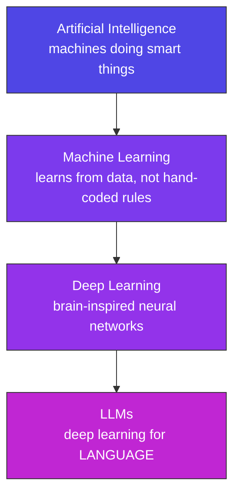
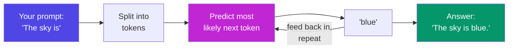
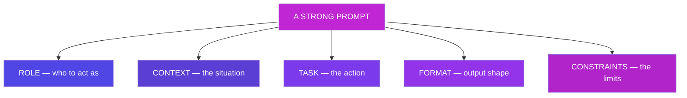
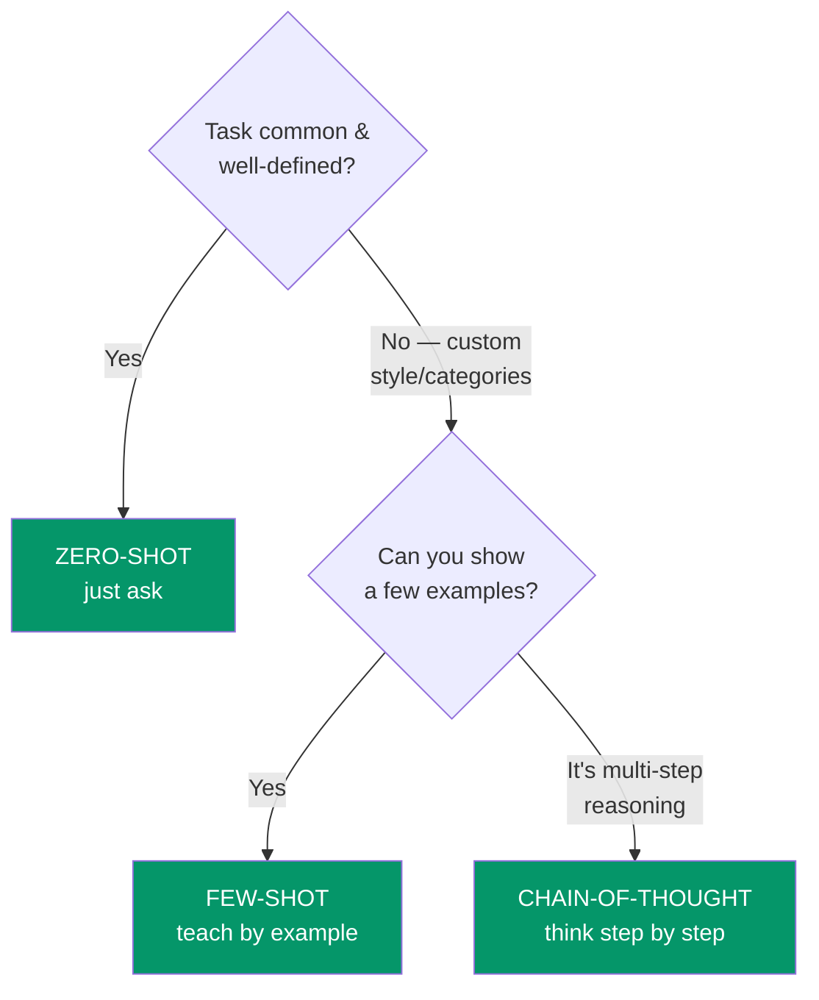
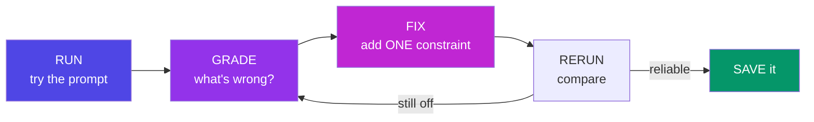
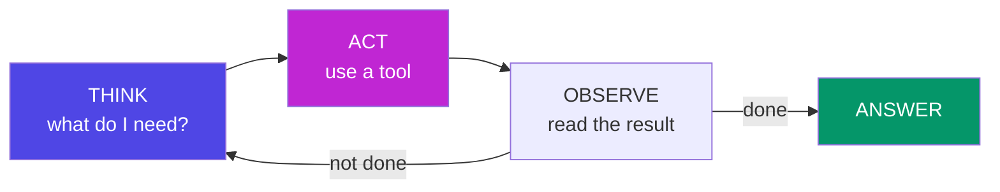
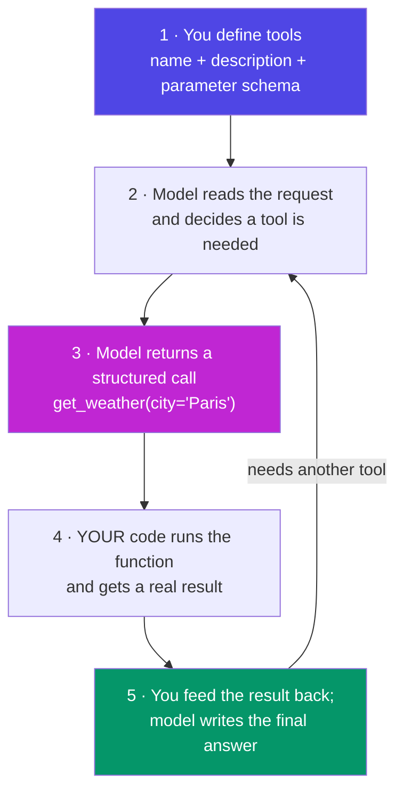
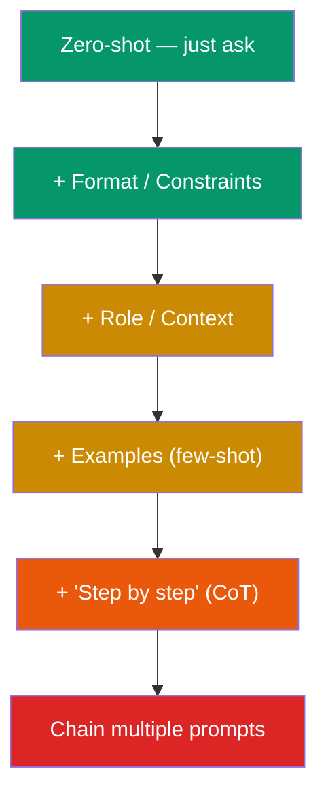

# Prompt Engineering — Complete Guide

### From "What is AI?" to advanced, scenario-based prompting

> *"Prompts are the code of the AI era. A great prompt turns a 4-hour task into 20 minutes; a bad one wastes both."*

---

## Table of Contents

- [Part A — Foundations](#part-a-foundations)
  - [A1. What is AI?](#a1-what-is-ai)
  - [A2. What is Machine Learning?](#a2-what-is-machine-learning)
  - [A2b. What is NLP?](#a2b-what-is-nlp-natural-language-processing)
  - [A3. What is an LLM? (+ Transformers, Attention, GPT)](#a3-what-is-an-llm-large-language-model)
  - [A4. Key Terms Glossary](#a4-key-terms-glossary)
  - [A5. What is a Prompt? What is Prompt Engineering?](#a5-what-is-a-prompt-what-is-prompt-engineering)
- [Part B — The 5-Element Prompt Anatomy](#part-b-the-5-element-prompt-anatomy)
- [Part C — Core Prompting Techniques](#part-c-core-prompting-techniques)
  - [C1. Zero-Shot](#c1-zero-shot-prompting) · [C2. Few-Shot](#c2-few-shot-prompting) · [C3. Chain-of-Thought](#c3-chain-of-thought-cot) · [C4. Role Prompting](#c4-role-prompting) · [C5. Structured / JSON Output](#c5-structured-json-output) · [C6. Iterative Refinement](#c6-iterative-refinement)
- [Part D — Advanced Techniques](#part-d-advanced-techniques)
- [Part E — Applied Prompting: Multimodal, Tool Use & Templates](#part-e-applied-prompting-multimodal-tool-use-templates)
  - [E1. Multimodal Prompting](#e1-multimodal-prompting) · [E2. Tool Use / Function Calling](#e2-tool-use-function-calling-in-depth) · [E3. Prompt Templates](#e3-prompt-templates)
- [Part F — Scenario-Based Prompting](#part-f-scenario-based-prompting)
- [Part G — The Everyday Mindset](#part-g-the-everyday-mindset)
- [Part H — Exercises](#part-h-exercises)
- [Part I — Q&A for Every Topic](#part-i-qa-for-every-topic)
- [Part J — Resources & Quick Reference](#part-j-resources-quick-reference)

---

# Part A — Foundations

*Start from zero. No prior AI knowledge assumed.*

## A1. What is AI?

**Simple definition:** Artificial Intelligence is software that performs tasks which normally require human thinking — understanding language, recognising images, making decisions, generating text.

**Analogy:** AI is like a brilliant, extremely well-read intern. It has absorbed millions of books, but it has never lived in *your* world. It can help enormously — *if you brief it clearly*. Left to guess, it produces something generic.

**The family tree** (each layer is a *specialisation* of the one above it):



**Everyday examples of each layer:**
- **AI (rules + logic):** a chess engine, Google Maps route-finding.
- **Machine Learning:** Netflix recommending shows, spam filters, credit-card fraud alerts.
- **Deep Learning:** face unlock, voice assistants understanding speech, medical image scans.
- **LLMs:** ChatGPT, Claude, Gemini — chatting, writing, coding.

**Mindset takeaway:** AI is not magic and not a person. It is a *prediction machine*. Prompt engineering is the skill of shaping those predictions toward what you actually want.

---

## A2. What is Machine Learning?

**Simple definition:** Instead of a programmer writing every rule by hand, we show the computer thousands of examples and let it *discover the rules itself*.

**Rules vs. learning — a concrete contrast:**
- **Old way (hand-coded rules):** To catch spam, a programmer writes `if subject contains "lottery" OR "free money" → spam`. Spammers change one word and slip through. The list of rules never ends.
- **ML way (learn from examples):** Show the system 100,000 emails already labelled *spam* / *not spam*. It finds the patterns on its own — word combinations, sender behaviour, links — including subtle ones no human would think to write down.

**Analogy:** Teaching a child to recognise a dog. You don't recite "four legs, fur, a tail, barks." You point at many dogs and say "dog." Soon the child recognises breeds it has never seen. That is machine learning — **patterns from examples, not rules from programmers.**

**Why this matters for prompting:** Few-shot prompting (Part C2) works for exactly this reason. When you put a few examples inside your prompt, you are teaching the model *by example* on the spot — the same principle, applied live.

---

## A2b. What is NLP? (Natural Language Processing)

**Simple definition:** NLP is the branch of AI focused on getting computers to **understand, interpret, and generate human language** — the messy, ambiguous words people actually use, not clean code.

**Where it sits:** NLP is the *field* (the goal — "make machines handle language"); LLMs are the current *best tool* for achieving it. For decades NLP used simpler methods (keyword rules, statistics); LLMs are the breakthrough that made NLP suddenly work well.

```
AI  →  Machine Learning  →  Deep Learning  →  LLMs
                    ↘  NLP (the "handle human language" goal)  ↗
      LLMs are today's most powerful way to do NLP.
```

**Analogy:** NLP is the *subject* ("teaching computers to read and write"); an LLM is the *star student* who finally aced that subject.

**Everyday NLP tasks (many predate LLMs):**
- **Classification** — is this review positive or negative? Is this email spam?
- **Extraction** — pull the names, dates, and amounts out of a paragraph.
- **Translation** — English → French.
- **Summarisation** — turn 10 pages into 5 bullets.
- **Intent detection** — "book me a cab" → the user *wants a ride*.

**Why it matters for prompting:** almost every prompt you write is really an NLP task in disguise (classify, extract, translate, summarise, generate). Knowing the underlying task type helps you pick the right technique — e.g. classification loves few-shot; summarisation loves clear format + length constraints.

---

## A3. What is an LLM? (Large Language Model)

**Simple definition:** An LLM is a deep-learning model trained on enormous amounts of text (books, websites, code) to do one core thing extraordinarily well: **predict the next word (token)**.

That sounds too simple to be powerful — but predicting the next word *reliably* forces the model to absorb grammar, facts, reasoning patterns, tone, and coding style along the way.

**Analogy:** The world's most powerful autocomplete. Your phone suggests the next word from your last two or three. An LLM does the same, except it has "read" a large slice of the internet and considers your *entire* conversation before choosing each next word.

**How it works, in 4 steps:**



1. **Training (one-time, expensive):** the model reads massive text and tunes billions of internal numbers (*parameters*) to get better at predicting the next token.
2. **Your prompt goes in:** your text is chopped into tokens (word-pieces).
3. **Prediction:** given everything so far, it computes "which token most likely comes next?" — then repeats, one token at a time. Each new token becomes part of the input for the next.
4. **Output:** the stream of predicted tokens is your answer.

### The "GPT" in ChatGPT — Transformers & Attention

You'll constantly see the words **GPT**, **transformer**, and **attention**. Here's what they mean, plainly:

- **GPT = Generative Pre-trained Transformer.** Read it backwards: it's a **Transformer** (the architecture), **Pre-trained** (it did its big learning phase *before* you ever used it), and **Generative** (it *produces* new text rather than just classifying).
- **Transformer** is the neural-network design (introduced by Google in 2017) that powers essentially every modern LLM — GPT, Claude, Gemini included. Its superpower is processing all the words in your input *at once* and weighing how they relate, instead of reading strictly left-to-right one word at a time.
- **Attention** is the key mechanism inside a transformer: for each word, the model decides **which other words matter most** to its meaning, and "pays attention" to them.

**Analogy for attention:** reading the sentence *"The trophy didn't fit in the case because* *it* *was too big."* To know what "it" refers to, you glance back at "trophy," not "case." Attention is the model doing that glancing-back for every word, simultaneously — figuring out what connects to what. That ability to track long-distance relationships is why LLMs stay coherent across long passages.

You don't need the maths — just the intuition: **transformer = the engine, attention = how it decides what's relevant, GPT = one popular family built on it.**

**The single most important consequence — memorise this:**

> **An LLM does not "look up" answers — it predicts plausible text. Your prompt is the steering wheel. A vague prompt steers toward the *average* internet answer. A precise prompt steers toward exactly what you need.**

This one idea is *why prompt engineering exists*. Everything else is technique built on top of it.

---

## A4. Key Terms Glossary

Each term gets a plain meaning, an analogy, and a quick example. These reappear constantly once you work with AI tools and APIs.

### Token

**Meaning:** the word-piece a model reads and writes — roughly 4 characters, or about ¾ of an English word. Common words are one token; longer or rarer words split.
**Analogy:** Lego bricks of language — the model builds every sentence brick by brick.
**Example:** `"Prompt engineering is powerful"` → `[Prompt][ engineer][ing][ is][ powerful]` ≈ 5 tokens. `"unbelievable"` → `[un][believ][able]` = 3 tokens. You are billed *per token*, in and out.

### Context window

**Meaning:** the maximum number of tokens a model can "see" at once — your system prompt + conversation history + the current message + its reply, all combined.
**Analogy:** the size of the model's desk. Whatever doesn't fit on the desk, it cannot look at.
**Example:** In a very long chat, early messages eventually "fall off the desk" and the model forgets them. Pasting a 300-page book into a small context window simply won't fit.

```
CONTEXT WINDOW = the model's desk (fixed size)
┌──────────────────────────────────────────────────────────┐
│ system prompt │ chat history │ your message │ its reply │
└──────────────────────────────────────────────────────────┘
   Overflow it → oldest text drops off & is forgotten.
   Bloat it with junk → less room left for a good answer.
```

### Parameters

**Meaning:** the billions of internal numbers tuned during training. More parameters ≈ more capacity (very roughly).
**Analogy:** the strengths of the connections between neurons in a brain.
**Example:** a model described as "70B" has 70 billion of these dials set during training.

### Temperature

**Meaning:** a dial (usually 0 to 1, sometimes up to 2) controlling randomness. Low = focused and repeatable; high = varied and creative.
**Analogy:** a fizz dial. 0 = flat soda (same answer every time); 1 = fizzy and surprising.
**Example:** For "extract the invoice total as a number," use **temperature 0** — you want the same correct answer every run. For "give me 10 quirky product names," use **0.8–1.0** — you want variety. Same prompt, different dial, very different behaviour.

### Top-p (nucleus sampling)

**Meaning:** an alternative randomness control — the model only picks from the smallest set of next-tokens whose probabilities add up to *p* (e.g. 0.9).
**Analogy:** "only consider the top choices that together cover 90% of the likelihood; ignore the long tail of weird options."
**Example:** top-p 0.9 keeps output sensible while allowing some variety. You usually tune *either* temperature *or* top-p, not both hard at once.

### Hallucination

**Meaning:** the model confidently stating something false — a fake fact, a non-existent API method, an invented citation.
**Analogy:** the student who never writes "I don't know" and always fills the answer box with *something*, right or wrong.
**Example:** Ask for "the `Array.prototype.shuffle()` method in JavaScript" and a model may cheerfully describe it — but that method doesn't exist. **Always verify facts, APIs, and citations that matter.**

### Training vs. Inference

**Meaning:** Training = the one-time, costly learning phase. Inference = the model answering you right now.
**Analogy:** Training = years of medical school. Inference = the doctor seeing you in the clinic today.
**Example:** You never "train" the public model when you chat with it; you only run inference. It doesn't remember your last session unless that text is fed back in.

### Knowledge cutoff

**Meaning:** the date after which the model saw no training data. It knows nothing newer.
**Analogy:** an intern who was in a coma since that date — sharp, but unaware of anything since.
**Example:** Ask about an event from last week and the model may not know it — or worse, *hallucinate* an answer. For recent info you must paste it in (or use a tool that searches).

### System prompt

**Meaning:** standing, behind-the-scenes instructions that shape *every* reply in a conversation — personality, rules, scope.
**Analogy:** the employee handbook a support agent follows on every call, whoever calls.
**Example:** `"You are a terse assistant. Never apologise. Answer in at most 3 sentences."` set once, applies to the whole chat.

### User message (the payload)

**Meaning:** the actual message you send on each turn — the *dynamic* part that changes every request, as opposed to the *fixed* system prompt. In apps, this is where user input and variables get slotted in.
**Analogy:** the system prompt is the standing employee handbook; the user message is *today's specific job ticket*.
**Example:** System prompt (fixed): "You are a translator, English → French." User message (changes each time): "Translate: Good morning." A well-built app keeps the stable rules in the system prompt and injects only the changing data into the user message.

### Prompt vs. Completion

**Meaning:** the prompt is what you send in; the completion (or response) is what the model generates back.
**Example:** Prompt: `"Capital of Japan?"` → Completion: `"Tokyo."`

**Mindset takeaway:** Tokens cost money and fill the context window. Precise, compact prompts are not just clearer — they are *cheaper* and leave more room for the answer.

---

## A5. What is a Prompt? What is Prompt Engineering?

**Prompt:** everything you send to the model — instructions, background, examples, and data. It is the model's *entire* view of your problem. It has no other context.

**Prompt Engineering:** the craft of writing precise inputs that reliably produce the output you want — by design, not by luck.

**The analogy to remember:**

> **Prompting = briefing a brilliant new employee on their first day.**
> They are highly capable but know nothing about your project, your audience, or your taste. A lazy brief ("make the report better") yields something generic. A great brief — who to act as, the situation, the exact task, the desired output shape, and the limits — yields near-perfect work on the first try.

**Bad vs. good, side by side:**

❌ **Bad:** `Fix my code`
The model doesn't know the language, what "fixed" means, what's wrong, or what to return. It guesses.

✅ **Good:**

```
You are a senior JavaScript developer.
This Node.js function should return only unique emails, but it returns duplicates.
Task: find the bug, explain it in two lines, then give the corrected function.
Format: (1) bug explanation  (2) fixed code block  (3) one-line prevention tip.
Constraints: keep the same function name and signature; no external libraries.

<code>
function uniqueEmails(list){ return list.map(u => u.email); }
</code>
```

Same model, same price per token — dramatically better output. **The only thing that changed is the prompt.** That is the entire discipline in one comparison.

---

# Part B — The 5-Element Prompt Anatomy

This is the core framework. Almost every strong prompt is built from up to five elements.

## Role · Context · Task · Format · Constraints



**The 5-element analogy — ordering a custom suit from a tailor:**

| # | Element | What it does | Tailor analogy |
| --- | --- | --- | --- |
| 1 | **Role** | Who the AI should act as | Choosing a *wedding-suit specialist*, not a general shop |
| 2 | **Context** | The background it needs | "It's for an outdoor December wedding, cold weather" |
| 3 | **Task** | The specific action | "Make a three-piece suit" |
| 4 | **Format** | The shape of the output | "Slim fit, navy blue, notch lapel" |
| 5 | **Constraints** | The rules and limits | "Budget ₹15,000, ready in two weeks, no polyester" |

Skip any element and the tailor guesses — and the model guesses *the same way*.

### Each element in detail

**1. Role — "You are a…"**
Sets vocabulary, depth, and perspective. `You are a senior SQL database administrator` produces sharper, more expert output than no role at all.
- ❌ Vague: "be helpful," "act smart."
- ✅ Specific: "You are a senior technical writer for developer documentation."

**2. Context — the background**
The model knows nothing about your situation unless you say it: the audience, the purpose, the environment, what you already tried.
- ✅ "The readers are non-technical managers who will skim this on a phone in under 30 seconds."

**3. Task — the one clear action**
Use a strong verb: *rewrite, classify, extract, compare, debug, summarise into…*.
- ❌ "Can you maybe help with this text?"
- ✅ "Rewrite the paragraph below as three bullet points."

**4. Format — the shape of the answer**
Table? JSON? Numbered steps? Code only? If you don't specify, you get the model's default — usually long paragraphs.
- ✅ "Return a Markdown table with columns: Issue | Severity | Fix."

**5. Constraints — the guardrails**
Length, tone, what to exclude, and how to handle edge cases.
- ✅ "Under 80 words. No jargon. If a value is missing, write 'UNKNOWN' — do not guess."

### The canonical example

```
Role:        You are a senior technical writer.
Context:     Users read release notes on mobile in under 30 seconds.
Task:        Rewrite the changelog below as 3 bullet points.
Format:      Markdown bullets, no headings.
Constraints: Under 40 words total. No jargon.

<changelog>
- Refactored the auth token refresh logic to reduce latency.
- Fixed a null-pointer crash on the settings page.
- Upgraded the logging library to v3.
</changelog>
```

> **Best practice — use delimiters.** Wrap pasted data in tags like `<changelog>…</changelog>`, `"""…"""`, or `### … ###`. This cleanly separates your *instructions* from the *data*, so the model never confuses one for the other — and it can't be hijacked by instructions hidden inside the data.

### How to score any prompt (1–5 each)

1. **Clarity** — could a stranger execute this without asking follow-up questions?
2. **Specificity** — are role, format, and limits explicit rather than assumed?
3. **Verifiability** — can you objectively check the output? ("3 bullets, under 40 words" is checkable; "make it good" is not.)

### The five classic anti-patterns

1. **Vague or missing role** — "be helpful" tells the model nothing.
2. **No context** — the model doesn't know your audience or purpose, so it defaults to generic.
3. **Weak task verb** — "help with," "look at," "deal with."
4. **No format** — you get rambling paragraphs instead of the structure you needed.
5. **No constraints** — wrong length, wrong tone, and guessed edge cases.

**Mindset takeaway:** You don't always need all five (a simple translation needs only a Task). Use the checklist as a *diagnostic*: when output disappoints, ask "which element did I skip?" — that is your fix about 90% of the time.

---

# Part C — Core Prompting Techniques

*Ordered basic → advanced. For each: what it is, when to use it, an analogy, and a worked example.*

**Which technique to reach for:**



*Whatever you pick, you can still layer on a* *Role**, force* *JSON output**, and then* *iterate* *if the result misses.*

## C1. Zero-Shot Prompting

**What:** ask directly, giving *no* examples. The model relies purely on what it learned in training.

**When it works:** common, well-defined tasks — translate, summarise, classify, explain, reformat.

**When it fails:** ambiguous instructions ("make this better" — better how?), novel or organisation-specific tasks, and very particular output formats.

**Analogy:** asking an experienced chef to "make a margherita pizza." It's so standard they need no demonstration.

**Worked example:**

```
Classify the sentiment of this review as POSITIVE, NEGATIVE, or NEUTRAL.
Review: "The delivery was fast, but the packaging arrived damaged."
```

*Result:* `NEUTRAL` (mixed signal). Clear task, common skill — zero-shot is perfect.

**Rule of thumb:** always try zero-shot **first**. Add complexity only when the result misses.

---

## C2. Few-Shot Prompting

**What:** show 2–5 input→output examples *before* the real question. The model copies the pattern. (One example = "one-shot"; a handful = "few-shot.")

**When to use:** custom categories, a specific tone or style, exact output patterns, domain-specific transformations.

**Analogy:** handing a new employee three finished reports before asking them to write the fourth. They mirror the tone, structure, and style — no long explanation needed.

**The three rules for good examples:**
1. **Diverse** — cover the tricky edge cases, not three near-identical easy ones.
2. **Short** — every example costs tokens.
3. **Consistent format** — the model mirrors your format *exactly*, including any inconsistency you leave in.

**Worked example** (note the deliberately tricky third example):

```
Classify each message's sentiment.

"Loved the new update!"        → POSITIVE
"Battery drains way too fast." → NEGATIVE
"Works ok I guess."            → NEUTRAL

Now classify: "Fast, but crashes sometimes."
```

Without that "ok I guess → NEUTRAL" example, the model wouldn't know how you want mild/mixed cases handled. The examples *teach the boundary*.

**Real uses:** turning casual notes into your company's email style · tagging tickets with *your* categories · generating commit messages in your team's convention.

---

## C3. Chain-of-Thought (CoT)

**What:** ask the model to **reason step by step before giving the final answer.** Rushing straight to an answer causes mistakes on multi-step problems; writing out the intermediate steps improves accuracy dramatically.

**Analogy:** a maths exam that says "show your working." The student who writes each step catches their own errors; the one who writes only the final number gets it wrong more often. *Same brain, better process.*

**The zero-shot CoT trick:** simply append **"Let's think step by step."** to a plain prompt. That one line measurably boosts accuracy on reasoning tasks.

**Worked example:**

```
A shirt costs ₹800. A store gives 25% off, then a coupon takes ₹50 off the
discounted price. What is the final price?
Think step by step, then state the final answer on its own line.
```

*The model reasons:* 25% of 800 = 200 → 800 − 200 = 600 → 600 − 50 = **₹550.** Ask this *without* "step by step" and models more often blurt a wrong number.

**Shines on:** maths, logic, multi-step debugging, planning, and any decision with intermediate steps.
**Skip it for:** simple lookups ("capital of France") — you'd just pay extra tokens for ceremony.

**Why it works:** each written step becomes part of the input for predicting the next step, so the model *builds toward* the answer instead of leaping to it — and any error surfaces early, in view, instead of hiding inside a one-word reply.

---

## C4. Role Prompting

**What:** assign the model an identity that shapes its expertise, vocabulary, and scope — usually the first line of the prompt or the system prompt.

**Analogy:** the same person answers "why is the sky blue?" completely differently as a physics professor, a kindergarten teacher, or a poet. The role selects *which mode* of the model's knowledge you get.

**Two levels:**
- **Light role:** `"You are a senior code reviewer."` — sets expertise and tone.
- **Full persona (system prompt):** a standing instruction with scope rules, behaviour rules, and refusal rules.

**Worked example — a lightweight role:**

```
You are a senior SQL database administrator.
Reply with a single valid MySQL 8 query only — no explanation, no markdown.
Request: "Get the top 5 customers by total order value in 2024."
```

**Worked example — a scoped assistant (persona):**

```
You are the official assistant for a public library.
Scope: you ONLY answer questions about library hours, memberships, and borrowing.
If asked anything outside that scope, reply exactly:
"I can only help with library-related questions."
Style: friendly, under 60 words.
```

Test it: "When do you close on Sundays?" → answers. "Write me a poem about the moon." → politely refuses. The refusal rule is what makes a persona *reliable* instead of just flavour.

**Real uses:** an interview coach ("ask one question at a time, grade my answer 1–10 before the next") · a strict code reviewer · a support bot locked to one product.

---

## C5. Structured / JSON Output

**What:** force the output into a machine-readable structure so that *code* can consume it directly. This is where prompting meets real software.

**Analogy:** a blank sheet vs. a form. Ask ten people to "write your details" and you get ten layouts. Hand them a form with labelled boxes and every response is identical — and a program can file it automatically.

**The three rules:**
1. **Show the schema** — field names, types, and allowed values.
2. **Say "Return ONLY valid JSON"** — this kills the "Sure! Here's your JSON:" preamble that crashes `JSON.parse()`.
3. **Define edge cases** — "if a field is unknown, use `null` — never invent a value."

**Worked example:**

```
Extract the task details as JSON matching exactly this schema:
{ "title": string,
  "priority": "low" | "med" | "high",
  "due": string | null,     // ISO date, or null if not stated
  "tags": string[] }

Return ONLY the JSON — no markdown, no code fences, no text before or after.

Input: "Urgent: send the Q3 report to finance by Friday. #reporting #finance"
```

*Output:* `{"title":"Send Q3 report to finance","priority":"high","due":"2026-07-17","tags":["reporting","finance"]}` — ready to `JSON.parse()` and store.

**When prompted JSON isn't enough:** in production, when the schema *must* be guaranteed, use the API's **tool use / function calling** feature instead of hoping the text comes out valid. Prompted JSON is great for quick scripts; tool use enforces the schema at the API level.

---

## C6. Iterative Refinement

**What:** great prompts are *grown*, not born. Treat a prompt like code: run → grade → fix one thing → rerun.



**Analogy:** adjusting a shower tap. You don't calculate the perfect angle from physics — you turn, feel, adjust, feel again. Each turn targets the *specific* problem (too hot → cool it slightly).

**A real 5-iteration walkthrough:**
- **v1** `"Summarise this article."` → too long →
- **v2** `+ "in 3 bullet points"` → too technical →
- **v3** `+ "for a non-technical manager"` → buries the numbers →
- **v4** `+ "each bullet must lead with a metric"` → invents metrics when none exist →
- **v5** `+ "if no metric exists, write 'no data'"` → ✅ reliable.

**Version your prompts.** Keep v1, v2, v3 with a one-line note on what changed and why. That growing collection of proven templates is your **prompt library** — reuse beats rewriting.

**Mindset takeaway:** never rage-quit after one bad output. Change **one** thing per iteration — exactly like debugging, where changing three variables at once tells you nothing.

---

# Part D — Advanced Techniques

*These build on the core six. You don't need them daily, but knowing them is what separates a casual user from a prompt engineer. Each has a full explanation and a worked example.*

## D1. Prompt Chaining

**What:** break a big task into a sequence of smaller prompts, where the **output of one becomes the input of the next.** Instead of asking for everything at once, you build the answer in stages.

**Why:** models do each *small* job more accurately than one giant tangled job. Chaining also lets you inspect and fix the middle steps.

**Analogy:** a factory assembly line. Each station does one thing well and passes the product on — rather than one worker trying to build the whole car alone.

**Worked example — turning a messy transcript into a polished summary email:**

```
Prompt 1 (EXTRACT):  "From this meeting transcript, list every decision and
                      action item as bullet points."   → output A

Prompt 2 (ORGANISE): "Group these bullets under headings: Decisions,
                      Action Items, Open Questions."    (input = output A) → output B

Prompt 3 (WRITE):    "Turn this into a short, friendly summary email to the team."
                      (input = output B) → final email
```

Each step is simple and checkable. If the email is wrong, you can see whether the mistake came from extraction, organisation, or writing.

**When to use:** multi-stage jobs (extract → analyse → format), or any task where one mega-prompt keeps producing muddled results.

---

## D2. Self-Consistency

**What:** ask the model the **same reasoning question several times** (with some randomness), then take the **majority answer** instead of trusting a single run.

**Why:** on hard reasoning problems a model can slip on any one attempt. Different attempts make *different* mistakes, so the most common answer is usually the correct one.

**Analogy:** getting a second, third, and fourth medical opinion and going with the consensus rather than betting everything on one doctor.

**Worked example:**

```
Run this prompt 5 times at temperature 0.7:
"A bat and ball cost ₹110 total. The bat costs ₹100 more than the ball.
 How much is the ball? Think step by step."

Answers across runs: ₹5, ₹5, ₹10, ₹5, ₹5  →  majority = ₹5 (the correct answer).
```

The tempting wrong answer (₹10) shows up sometimes, but the majority vote lands on the right one (₹5).

**When to use:** high-stakes reasoning where accuracy matters more than cost or speed. (It multiplies token cost, so reserve it for questions worth the extra spend.)

---

## D3. Tree of Thoughts (ToT)

**What:** instead of one line of reasoning (Chain-of-Thought), the model **explores several different reasoning branches, evaluates them, and pursues the most promising** — backtracking from dead ends.

**Why:** some problems (puzzles, planning, creative search) have many possible paths. A single chain can march confidently down a wrong one; a tree lets the model compare options before committing.

**Analogy:** a chess player mentally trying several candidate moves, looking a few steps ahead down each, then choosing the line that looks best — rather than playing the first move that comes to mind.

**Worked example (prompt style):**

```
Solve this step by step, but first propose THREE different approaches.
For each approach, sketch the first two steps and rate how promising it is (1–10).
Then continue only with the highest-rated approach to the final answer.

Problem: <the puzzle / planning task>
```

This makes the model *branch, evaluate, then commit* — the essence of Tree of Thoughts, in a single prompt.

**When to use:** complex planning, puzzles, or open-ended problems with many viable strategies. Overkill for straightforward tasks.

---

## D4. ReAct (Reason + Act) — the basis of AI agents

**What:** the model alternates between **thinking** and **using a tool** (web search, a calculator, running code, calling an API), then **observing the result** and thinking again — looping until it has the answer. This is the foundation of *agents*.

**The loop:**



**Why:** a plain LLM can only *talk*. ReAct lets it *act* — look things up it doesn't know, do exact maths it would otherwise fumble, and interact with real systems.

**Analogy:** a detective. Form a theory (think), gather evidence (act — interview a witness), study what you found (observe), then revise the theory. Repeat until the case is solved.

**Worked example (the model's internal trace):**

```
Question: "What is the population of the capital of France, divided by 1000?"

Thought: I need the capital of France.            → (knows: Paris)
Thought: I need Paris's population — that's a fact that may be outdated.
Act:     search("current population of Paris")
Observe: ~2,100,000
Thought: Now divide by 1000. I'll use the calculator to be exact.
Act:     calculate(2100000 / 1000)
Observe: 2100
Answer:  About 2,100.
```

**When to use:** anything needing fresh information, precise computation, or real actions (booking, querying a database, editing files). This is exactly how coding assistants and research agents work under the hood.

> **Safety rail — the Max Iterations Guard.** Because ReAct *loops*, it can get stuck: a tool keeps failing, or the model keeps "thinking" without ever finishing. So every agent sets a **maximum number of iterations** (e.g. "stop after 10 think-act cycles") as a circuit breaker. When the limit is hit, the loop halts and returns a best-effort answer or an error instead of running forever, burning tokens and money. Rule of thumb: any autonomous loop you build **must** have a hard stop — max iterations, a timeout, or both.

---

## D5. Meta-Prompting

**What:** use the AI to **write or improve your prompts.** You describe the goal; it produces a well-structured prompt (or critiques the one you have).

**Why:** the model knows the patterns of good prompts. When you're stuck, it can draft a far better prompt than a first blank-page attempt.

**Analogy:** asking the tailor to help you *write the order slip* — the expert helps you ask for the right thing in the first place.

**Worked example:**

```
You are a prompt engineering expert.
Improve the prompt below using the Role–Context–Task–Format–Constraints framework.
Return: (1) the improved prompt, (2) a bullet list of what you changed and why.

My prompt: "write social media posts about our new app"
```

The model returns a sharper prompt (adds audience, platform, tone, length, count, hashtags rules) *and* explains the upgrades — so you learn while you fix.

**When to use:** starting a tricky prompt from scratch, or debugging one that keeps underperforming. A fast way to level up your own skill.

---

## D6. RAG (Retrieval-Augmented Generation)

**What:** automatically **fetch relevant documents and paste them into the prompt** before the model answers — so it responds using *your* data (or current data), not just what it memorised in training.

**Why:** it fixes the two biggest LLM weaknesses at once — the **knowledge cutoff** (it can now use up-to-date or private info) and **hallucination** (it answers *from the provided text* rather than guessing).

**Analogy:** turning a closed-book exam into an open-book one. The student is the same, but now they can quote the actual textbook instead of relying on memory.

**How it works (the pipeline):**


**Worked example (the assembled prompt):**

```
Answer the question using ONLY the context below. If the answer isn't in the
context, say "I don't have that information." Do not use outside knowledge.

<context>
[Company handbook, p.12] Employees get 18 paid leave days per year, accrued monthly.
Unused leave carries over up to a maximum of 6 days.
</context>

Question: "How many leave days can I carry over to next year?"
```

*Answer:* "Up to 6 days." — grounded in the document, not invented. This is how "chat with your PDF/website/database" products are built.

**When to use:** company knowledge bases, documentation assistants, customer-support bots, or anything that must answer from a specific, trusted, or recent source.

---

## D7. Negative Prompting (say what NOT to do)

**What:** explicitly state what to **avoid** — the model doesn't only need to know the goal, it benefits from knowing the traps.

**Why:** models default to verbose, hedging, apologetic output. Naming the anti-goals removes it.

**Analogy:** telling the barber what you *don't* want cut — otherwise you rely on them guessing your limits.

**Worked example:**

```
Explain how HTTPS works.
Do NOT: use analogies, apologise, restate the question, or exceed 100 words.
Start directly with the technical explanation.
```

Without the "do NOT" line you'd likely get "Great question! Let me explain with an analogy…" and 400 words. Negative constraints tighten it instantly.

**When to use:** whenever the model keeps adding fluff, wandering off format, or including a specific thing you don't want.

---

## D8. Least-to-Most Prompting

**What:** first ask the model to **break a hard problem into smaller sub-problems**, then solve them **in order, easiest first**, each solution feeding the next.

**Why:** it's a structured cousin of chaining for problems where you don't yet know the steps — the model *plans* the decomposition, then executes it.

**Analogy:** learning to cook a complex dish by first listing the sub-recipes (make the sauce, prep the veg, cook the base), then doing them in a sensible order.

**Worked example:**

```
Problem: "Plan a 3-day beginner itinerary for Kyoto on a tight budget."
Step 1: First list the sub-questions we must answer (transport, must-see free
        sites, cheap food areas, daily walking routes).
Step 2: Answer them one at a time, simplest first.
Step 3: Combine the answers into the final day-by-day itinerary.
```

**When to use:** complex, multi-part problems where even *knowing the steps* is part of the challenge.

---

## D9. Prompt Caching (an optimization, not a reasoning trick)

**What:** when you reuse the **same large, fixed chunk of prompt** (a long system prompt, a big document, a set of examples) across many requests, the model provider can **cache** that chunk after the first call. Later calls that start with the identical prefix reuse the cached work instead of reprocessing it.

**Why it matters:** it makes repeated calls **faster and cheaper** — cached input tokens cost a fraction of normal ones and skip re-processing. For an app that sends the same 2,000-token instruction block on every request, caching can cut latency and cost dramatically.

**Analogy:** a chef doing *mise en place* — chopping the onions and garlic once at the start of service, then reusing them for every order, instead of re-chopping from scratch for each dish.

**The one design rule:** put the **stable** content **first** (system prompt, reference documents, fixed examples) and the **changing** content **last** (the user's actual question). Caching only helps when the *beginning* of the prompt stays byte-for-byte identical between calls — change one character early on and the cache misses.

```
[ FIXED PREFIX — cached ]        [ VARIABLE SUFFIX — new each call ]
system prompt + reference docs   →   today's user question
        (reused, cheap)                    (fresh, full price)
```

**When to use:** production apps and agents that repeatedly send the same big context — chatbots with a long persona, "chat with this document" tools, or multi-step agents that re-send the same instructions each loop. (It's a provider/API feature, not something you trigger with wording — but structuring your prompt *prefix-stable* is what unlocks it.)

---

### Advanced techniques at a glance

| Technique | One-line idea | Best for |
| --- | --- | --- |
| **Prompt chaining** | Output of one prompt feeds the next | Multi-stage jobs (extract → analyse → format) |
| **Self-consistency** | Run several times, take the majority | High-stakes reasoning accuracy |
| **Tree of Thoughts** | Explore branches, keep the best | Puzzles, planning, many-path problems |
| **ReAct** | Think → act (use a tool) → observe → repeat | Agents; fresh info, exact maths, real actions |
| **Meta-prompting** | Use AI to write/improve prompts | Starting or debugging tricky prompts |
| **RAG** | Fetch documents into the prompt | Answering from private/current data |
| **Negative prompting** | State what NOT to do | Killing fluff and format drift |
| **Least-to-most** | Decompose, then solve easiest-first | Complex problems with unknown steps |
| **Prompt caching** | Reuse a fixed prompt prefix cheaply | Production apps repeating big context |

---

# Part E — Applied Prompting: Multimodal, Tool Use & Templates

*The core techniques get you great text-in / text-out results. These three take you into how prompting works inside **real applications** — seeing images, taking actions, and being reused at scale.*

## E1. Multimodal Prompting

**What:** prompting a model with **more than just text** — images, screenshots, diagrams, charts, PDFs (and, in some models, audio or video) — alongside your instructions. "Multi-modal" = multiple *types* of input.

**Why it matters:** a huge amount of real information isn't text — a UI screenshot, a photo of a whiteboard, a chart in a report, a scanned receipt. Multimodal prompting lets the model *look* and reason about what it sees, not just what you type.

**Analogy:** the difference between describing a rash to a doctor over the phone versus showing it in person. One relies on your words; the other lets the expert see for themselves — far more accurate.

**How you prompt with an image:** you attach the image and pair it with a clear **text instruction** telling the model exactly what to do with it. The instruction still follows the same 5-element thinking.

**Worked examples:**
```
[attach a screenshot of a broken web page]
You are a front-end developer. This layout should be a 3-column grid but the
third column wraps to a new line. Look at the screenshot, identify the likely
CSS cause, and give the fix.
```
```
[attach a photo of a handwritten receipt]
Extract every line item as JSON: { "item": string, "price": number }.
If a value is unreadable, use null. Return ONLY the JSON.
```
```
[attach a bar chart image]
Read this chart and answer: which quarter had the highest revenue, and by
roughly what % did it beat the second-highest? Show your reasoning.
```

**Best practices:**
- **Be explicit about *what to look at*** — "focus on the error message in the red box," not just "what's wrong?"
- **Combine "describe, then reason"** for hard images — ask the model to first describe what it sees, then answer. (It's Chain-of-Thought for vision.)
- **Don't assume perfect reading** — models can misread small text, dense tables, or messy handwriting. Verify anything critical.

**Common uses:** debugging from screenshots · extracting data from documents/receipts (OCR-style) · reading charts and dashboards · converting a hand-drawn wireframe or diagram into code · describing images for accessibility.

---

## E2. Tool Use / Function Calling (in depth)

**What:** giving the model a set of **tools** (functions) it's allowed to call — and letting it decide *when* to call them and *with what arguments*. Instead of answering from memory, the model can fetch live data, do exact maths, query a database, or trigger an action. This is the **API-level mechanism** behind the ReAct pattern (Part D4).

**Why it matters:** it fixes what a plain LLM can't do reliably — current facts (it has a knowledge cutoff), exact computation (it approximates maths), and real-world actions (it can only produce text). Tool use turns a "talker" into a "doer," with structured, verifiable steps.

**How it works — the 5-step loop:**



**Crucial point:** the model **doesn't run the function itself** — it only *asks* to, by outputting a structured request. *Your* code executes it and hands back the result. The model then continues. This keeps you in control of what actually happens.

**Worked example — a weather assistant:**
```
1. You define the tool (as JSON schema the API understands):
   {
     "name": "get_weather",
     "description": "Get the current weather for a city.",
     "parameters": {
       "type": "object",
       "properties": { "city": { "type": "string", "description": "City name" } },
       "required": ["city"]
     }
   }

2. User asks: "Should I carry an umbrella in London today?"

3. Model responds with a tool call (not prose):
   get_weather(city="London")

4. Your code runs it → returns { "condition": "rain", "temp_c": 14 }

5. You send that back; the model answers:
   "Yes — it's raining in London right now (14°C). Take an umbrella."
```

**Tool use vs. raw JSON prompting (Part C5):** JSON prompting *hopes* the text comes out in the right shape; function calling **guarantees** a valid, structured call enforced by the API. Use JSON prompting for quick scripts; use function calling for production actions and agents.

**Best practices:**
- **Write clear tool descriptions** — the model chooses tools based on their `description`. Vague descriptions → wrong tool or wrong time. Treat the description like a mini-prompt.
- **Design tight parameter schemas** — required fields, allowed values, types. This is your guardrail.
- **Handle failures** — tools error out (API down, no result). Feed the error back so the model can retry or apologise gracefully.
- **Keep tools small and single-purpose** — many focused tools beat one giant do-everything tool.
- **Cap the loop** — pair with a Max Iterations Guard (Part D4) so an agent can't call tools forever.

**Common uses:** live data (weather, stock, search) · database queries · sending emails or messages · booking/ordering actions · calculators · any coding assistant that reads and edits files.

---

## E3. Prompt Templates

**What:** a **reusable prompt with blank slots (variables)** you fill in each time, instead of rewriting the prompt from scratch. The fixed wording stays; only the changing data is injected.

**Why it matters:** once a prompt works, you want to use it a hundred times with different inputs — reliably and identically. Templates give you **consistency** (same structure every time), **reuse** (write once, run anywhere), **scale** (loop over thousands of inputs), and **versioning** (improve the template in one place).

**Analogy:** a fill-in-the-blanks form letter. *"Dear ___, thank you for your order of ___."* The letter's quality is baked in once; you just drop in the name and item for each customer.

**Worked example — a template with variables:**
```
Template (written once):
  "You are a {{role}}.
   Summarise the text below for a {{audience}} in {{num}} bullet points.
   Text: {{input_text}}"

Filled at runtime:
  role        = "medical writer"
  audience    = "patient with no medical background"
  num         = 3
  input_text  = "<the clinical note>"
```
In code you'd slot values into `{{...}}` (Python f-strings, or a library's template object) and send the finished prompt. Change the note, reuse the exact same structure.

**Separate the stable part from the changing part.** Put fixed instructions in the **system prompt** (the template's constant skeleton) and inject only the variable data into the **user message**. This also unlocks **prompt caching** (Part D9) — a stable prefix is a cacheable prefix.

**Tools & frameworks:** at the simplest level, string formatting (f-strings) is a template. Libraries like **LangChain** (`PromptTemplate`) or **Jinja2** add variable validation, reuse, and composition — useful once you have many templates or multi-step chains.

**Best practices:**
- **Name variables clearly** — `{{customer_name}}`, not `{{x}}`.
- **Validate inputs before injecting** — an empty or malformed variable produces a broken prompt.
- **Guard against injection** — if a variable holds untrusted user text, wrap it in delimiters (Part B) so it can't override your instructions.
- **Version your templates** — keep v1, v2, v3 with change notes. This *is* your prompt library, made programmatic.

**Common uses:** any repeated task — bulk classification/summarisation, customer-support replies, generating docs per item, or every prompt inside an app that runs more than once.

---

# Part F — Scenario-Based Prompting

*The same principles, tuned to the situation. These are the everyday workhorses.*

| Scenario | Core move | Go-to techniques |
| --- | --- | --- |
| **Coding** | Send code + intent + environment + error | Role, CoT, delimiters |
| **Learning** | Make the AI a teacher who *checks you* | Role, few-shot, active recall |
| **Exploring / research** | Force structure and force *both sides* | Comparison tables, devil's advocate |
| **Writing** | Give audience, tone, and length | Role, few-shot style-matching |
| **Productivity** | Turn messy input into structured output | JSON, summarise, extract |

## F1. Coding

**Mindset:** never paste bare code with "fix this." Always send **code + intent + environment + the actual error.**

**Debugging:**

```
You are a senior Node.js developer.
This Express route should return the user's tasks but returns an empty array.
Environment: Node 20, MySQL 8, the mysql2 library.

Debug step by step: walk the code line by line, state your hypothesis, then
give the corrected code.

Error: <error>…paste the real error…</error>
Code:  <code>…paste the code…</code>
```

**Code review:** `"You are a strict senior reviewer. Review for bugs, security, then readability. Output a table: Issue | Severity | Line | Fix. Do not rewrite the whole file."`

**Understanding a codebase:** `"Explain what this file does at three levels: one sentence, one paragraph, then function by function."`

**Golden rules:** include versions · paste the *actual* error (never a paraphrase) · say what you already tried · ask for reasoning *before* code when debugging (CoT).

## F2. Learning

**Mindset:** don't consume explanations passively — make the AI a *teacher who quizzes you*, not a lecturer.

**Explain-it-simply:**

```
Explain <topic> to someone who knows the basics but has never used it.
Structure: (1) one-line definition (2) a real-world analogy
(3) a minimal code/example (4) the top 2 beginner mistakes. Under 250 words.
```

**Active-recall quiz:** `"Ask me 5 questions on <topic>, one at a time. Wait for my answer, grade it, correct me, then ask the next. Start easy, get harder."`

**The gap-finder (most underrated):** `"I'll explain <topic> in my own words. Point out anything wrong or missing: <your explanation>."` — the model becomes your checking partner, which is how you find what you *don't* actually understand.

**Connect to what you know:** `"I know JavaScript well. Explain Python's data types by mapping each to its closest JavaScript equivalent."`

## F3. Exploring / Research

**Mindset:** force structure and force *both* sides — otherwise you get an agreeable essay that just confirms your lean.

```
I'm choosing between <A> and <B> for <specific use case>.
Compare in a table: learning curve, performance, community, job demand, long-term fit.
Then recommend one for MY case in two lines — and steelman the opposite choice in two lines.
```

**Devil's advocate (kills confirmation bias):** `"I plan to <decision>. Argue against it as a skeptical senior engineer. Give the 3 strongest objections only."`

**Landscape scan:** `"List the main approaches to <problem>, grouped by category, one line each. Mark which are industry-standard vs. niche."`

## F4. Writing & Communication

```
You are a professional communication assistant.
Rewrite this message to a client: polite but firm about the deadline.
Under 120 words, no corporate jargon, end with one clear ask.

<message>…your draft…</message>
```

**Style-matching (few-shot):** paste two emails you actually sent, then "match this tone."
**Tone ladder:** `"Give three versions: formal / friendly / concise"` — then pick.

## F5. Productivity & Daily Life

- **Planning:** `"Here is my week and these 3 goals. Build a realistic schedule around my fixed commitments. Flag anything overcommitted."`
- **Summarising:** `"Summarise this long thread into: decisions made, open questions, and my action items."`
- **Extracting:** `"Pull every date, name, and amount from this text into a table."`

---

# Part G — The Everyday Mindset

*How to keep using this well, long after reading this once.*

### 1. The one analogy that covers everything

> **Every prompt = briefing a brilliant new employee on day one.**
> Before sending, ask: *"If I handed this exact text to a smart stranger, could they nail the task?"* If not, the model can't either.

### 2. The 5-second checklist (before any important prompt)

> **Who · Where · What · Shape · Limits**
> (Role · Context · Task · Format · Constraints)

### 3. The escalation ladder — don't over-engineer



**Start at the top. Climb only when the output misses.** Most tasks never need the bottom rungs.

### 4. Habits that make it permanent

- **Grade, don't rage.** A bad output = a missing element. Find it, add it, rerun.
- **One change per iteration** — like debugging.
- **Save winners.** Any prompt that works well goes into a reusable *prompt library* immediately.
- **Teach it.** Explain one technique to someone else (or write it in your own words). Teaching locks it in.

### 5. What prompting *cannot* fix (know the limits)

- **Hallucination** — always verify facts, APIs, and citations that matter. "If unsure, say so" helps but doesn't cure it.
- **Knowledge cutoff** — anything recent must be pasted in or fetched (RAG / search).
- **Context window** — huge pastes bury your instructions. Trim to what's relevant.

---

# Part H — Exercises

*Do these with a real AI, not on paper. Evidence beats theory.*

### Foundations

1. Explain out loud, in two minutes, what an LLM does — using only the autocomplete analogy, no jargon.
2. Take one hallucination you've seen from an AI and write down *why* next-token prediction explains it.

### The 5-Element Anatomy

3. Write 5 zero-shot prompts for 5 different tasks (translate, summarise, classify, explain, reformat). Score each 1–5 for clarity, specificity, and verifiability.
4. Take your worst prompt from #3 and rewrite it with all five elements. Compare the two outputs.
5. Find a prompt you sent recently that disappointed you. Diagnose which element(s) it was missing.

### Zero-shot & Few-shot

6. Write a zero-shot prompt to sort expenses into categories. Watch it guess wrong, then fix it with 4 few-shot examples — include one tricky edge case.
7. Take 3 messages you actually wrote, use them as few-shot examples ("match my style"), and have the AI draft a new one.

### Chain-of-Thought

8. Give the AI a maths word problem twice — once plain, once with "Let's think step by step." Compare accuracy.
9. Take a real bug and prompt: "Debug step by step — hypothesis first, then verification, then fix."

### Role Prompting

10. Build a scoped assistant with a system prompt that only answers within one domain and politely refuses everything else. Test it with 3 in-scope and 3 out-of-scope questions.

### JSON Output

11. Write a prompt that converts any product review into `{ "rating": 1-5, "pros": string[], "cons": string[] }`. Test with a review that has no cons — does it invent them, or return `[]`?

### Iterative Refinement

12. Take one prompt and refine it through 5 versions (v1→v5), noting what changed and why at each step.

### Advanced Techniques

13. **Chaining:** turn a messy paragraph into a polished email using 3 separate prompts (extract → organise → write).
14. **Self-consistency:** run one tricky reasoning question 5 times and take the majority answer. Did any single run get it wrong?
15. **RAG (manual):** paste a document, then ask a question with "answer using ONLY the context above; if it's not there, say so." Try a question the document *doesn't* cover.
16. **Meta-prompting:** give the AI a weak prompt and ask it to improve it using the 5-element framework, explaining its changes.

### Applied Prompting
17. **Multimodal:** screenshot any webpage or chart and ask the model to read it and answer a specific question about it. Then try a blurry/handwritten image and see where it struggles.
18. **Tool use (on paper):** design one tool for a task you care about — write its name, one-line description, and parameter schema. Then write the user request that should trigger it.
19. **Template:** take your best prompt and rewrite it as a template with 3 named `{{variables}}`. Run it on 3 different inputs by only swapping the variables.

### Scenarios

20. Use the active-recall quiz prompt on *this very document*: "Quiz me on prompt engineering, 5 questions, one at a time."
21. Use the comparison template on a real decision you're facing.

### Ten prompts worth keeping (build a reusable library)

Write and save polished versions of: code review · bug debug · explain-simply · API-doc generator · commit-message writer · test-case generator · error explainer · SQL query assistant · data transformer · study-quiz generator.

---

# Part I — Q&A for Every Topic

*Cover the answer, try to recall it, then check. Active recall is the revision that actually sticks.*

## Foundations: AI / ML / LLM

**Q: Difference between AI, ML, and LLM in one line each?**
A: AI = machines doing tasks that need human-like intelligence. ML = machines learning patterns from examples instead of hand-coded rules. LLM = an ML model trained on text to predict the next token (ChatGPT, Claude).

**Q: What is the ONE core operation an LLM performs?**
A: Predicting the next token, repeatedly. Reasoning, coding, and chatting all emerge from doing that extremely well.

**Q: Why do LLMs hallucinate?**
A: They generate *plausible* text, not *verified* text. When they lack a fact, the most plausible-sounding continuation is still produced — confidently. Prediction has no built-in "I don't know."

**Q: Why does prompt engineering work at all?**
A: The prompt is the input to the prediction. Change the input → change which continuation is most likely. A precise prompt makes the *correct* answer the most probable output.

**Q: What is NLP, and how does it relate to LLMs?**
A: NLP (Natural Language Processing) is the AI field aimed at making computers understand and generate human language. LLMs are today's most powerful tool for doing NLP — the goal vs. the tool.

**Q: What does "GPT" stand for, and what is a transformer?**
A: Generative Pre-trained Transformer — it *generates* text, was *pre-trained* before use, and is built on the *transformer* architecture. The transformer is the neural-network design behind modern LLMs; it processes all input words at once and weighs how they relate.

**Q: What is "attention" in one sentence?**
A: The mechanism that, for each word, decides which other words matter most to its meaning — letting the model track long-distance relationships and stay coherent over long text.

## Key Terms

**Q: What's a token, roughly?**
A: A word-piece — about 4 characters or ¾ of an English word. Models read and write token by token, and you're billed per token.

**Q: What's the context window, and why care?**
A: The maximum tokens the model can see at once — its "desk." Anything beyond it is invisible, and huge pastes can bury your instructions.

**Q: Temperature 0 vs. 1 — when to use which?**
A: Low (0) = consistent and focused → facts, code, extraction. High (~1) = varied and creative → brainstorming, naming, drafts.

**Q: Training vs. inference?**
A: Training = the one-time learning phase (medical school). Inference = the model answering your prompt now (the clinic visit).

**Q: What is a system prompt?**
A: A standing instruction that shapes every reply in a conversation — the employee handbook. Roles, scope, and refusal rules live there.

**Q: System prompt vs. user message?**
A: The system prompt is fixed standing rules (the handbook); the user message is the changing per-turn input (today's job ticket). Apps keep stable rules in the system prompt and inject only the changing data into the user message.

## The 5-Element Anatomy

**Q: Name the five elements.**
A: Role, Context, Task, Format, Constraints — "Who · Where · What · Shape · Limits."

**Q: Which elements are missing from "You are a chef. Give me a pasta recipe"?**
A: Context (for whom? what equipment?), Format (steps? ingredient list?), and Constraints (vegetarian? 30 minutes? serves two?). Only Role and Task are present.

**Q: The three criteria for scoring a prompt?**
A: Clarity (a stranger could execute it), Specificity (role/format/limits explicit), Verifiability (you can objectively check the output).

**Q: Why wrap pasted data in delimiters like `<code>…</code>`?**
A: It separates instructions from data, so the model never mistakes your content for commands — and can't be hijacked by instructions hidden inside the data.

**Q: Do you always need all five elements?**
A: No. "Translate to French: hello" is fine. Use the checklist as a *diagnostic* when output disappoints, not as a rigid form.

## Zero-shot & Few-shot

**Q: When does zero-shot fail?**
A: On ambiguous instructions, novel or organisation-specific tasks, and formatting-sensitive output.

**Q: The three rules for few-shot examples?**
A: Diverse (cover edge cases), short (tokens cost), and consistent in format (the model mirrors it exactly).

**Q: All your few-shot examples are easy cases. What happens on a tricky input?**
A: The model guesses — your examples never taught it the boundary. Swap one easy example for the hardest case you can find.

**Q: Few-shot vs. fine-tuning?**
A: Few-shot = teaching by example *inside the prompt*, instant and free. Fine-tuning = retraining the model on many examples, permanent but costly. Try few-shot first.

## Chain-of-Thought

**Q: What is CoT in one sentence?**
A: Asking the model to write out its reasoning steps before the final answer, which sharply improves accuracy on multi-step problems.

**Q: The zero-shot CoT trick?**
A: Append "Let's think step by step."

**Q: Where does CoT shine, and where is it a waste?**
A: Shines on maths, logic, multi-step debugging, and planning. Wasted on simple lookups — you pay extra tokens for nothing.

**Q: Why does showing steps improve answers?**
A: Each step becomes context for predicting the next, so the model builds toward the answer instead of leaping — and errors surface early instead of hiding in a one-word reply.

## Role Prompting

**Q: What does a role actually change?**
A: Which region of its training the model draws from — vocabulary, depth, priorities, and tone all shift to match the persona.

**Q: What three things should a scoped assistant's system prompt define?**
A: Scope (what it answers), refusal behaviour (the exact polite decline for out-of-scope), and style rules (tone and length).

## Structured / JSON Output

**Q: The three rules for reliable JSON?**
A: Show the schema, demand "Return ONLY valid JSON" (no preamble or fences), and define edge cases (use `null`, never invent values).

**Q: Why does "Sure! Here's your JSON:" break things?**
A: `JSON.parse()` fails on any non-JSON prefix — one friendly sentence crashes the script.

**Q: When should you stop prompting for JSON and use tool use / function calling?**
A: In production, when the schema *must* be guaranteed. Prompted JSON suits quick scripts; tool use enforces the schema at the API level.

## Iterative Refinement

**Q: The refinement loop?**
A: Run → Grade (what exactly is wrong?) → Fix (add ONE targeted constraint) → Rerun → repeat until reliable.

**Q: Why only one change per iteration?**
A: Same reason as debugging — change three things at once and you can't tell which one helped or broke something.

## Advanced Techniques

**Q: What is prompt chaining, and why use it?**
A: Splitting a task into steps where each output feeds the next. Models do small jobs more accurately than one giant one, and you can inspect the middle steps.

**Q: How does self-consistency improve accuracy?**
A: It runs the same reasoning several times and takes the majority answer. Different runs make different mistakes, so the consensus is usually right.

**Q: Chain-of-Thought vs. Tree of Thoughts?**
A: CoT follows one line of reasoning. ToT explores several branches, evaluates them, and pursues the best — backtracking from dead ends.

**Q: What are the four steps of the ReAct loop, and why does it matter?**
A: Think → Act (use a tool) → Observe → repeat. It lets an LLM *do* things — search, calculate, call APIs — not just talk. It's the basis of agents.

**Q: Why does a ReAct agent need a Max Iterations Guard?**
A: Because it loops, it can get stuck (a failing tool, endless "thinking"). A hard cap on cycles (plus/or a timeout) is a circuit breaker that stops it running forever and burning tokens.

**Q: What is prompt caching, and what's the one rule to benefit from it?**
A: Reusing a fixed prompt prefix so repeated calls are faster and cheaper. The rule: put stable content (system prompt, docs, examples) first and changing content (the user's question) last — the cache only hits when the beginning stays identical.

**Q: What problem does RAG solve?**
A: The knowledge cutoff and hallucination — by fetching relevant documents into the prompt so the model answers from real, current, or private text instead of memory. Closed-book → open-book.

**Q: What is meta-prompting?**
A: Using the AI to write or improve your prompts — describe the goal and let it produce a well-structured prompt (and explain its changes).

**Q: Give one example of a negative prompt.**
A: "Do not use analogies, do not apologise, do not exceed 100 words." Naming the anti-goals removes default fluff.

**Q: When would you use least-to-most prompting?**
A: On complex problems where you don't yet know the steps — the model first decomposes the problem, then solves the pieces easiest-first.

## Applied Prompting

**Q: What is multimodal prompting, and one best practice?**
A: Prompting with non-text inputs too — images, screenshots, charts, PDFs — alongside your instruction. Best practice: be explicit about *what to look at*, and for hard images ask it to describe first, then reason (Chain-of-Thought for vision).

**Q: In tool use / function calling, who actually runs the function?**
A: *Your* code does. The model only outputs a structured request to call it (name + arguments); you execute it and feed the result back. The model never runs code itself — that keeps you in control.

**Q: Tool use vs. raw JSON prompting — what's the difference?**
A: JSON prompting *hopes* the text comes out in the right shape; function calling *guarantees* a valid, structured call enforced by the API. Scripts → JSON prompting; production actions/agents → function calling.

**Q: What decides which tool a model picks?**
A: Mostly the tool's `description`. Treat each description like a mini-prompt — vague ones lead to the wrong tool or wrong timing.

**Q: What is a prompt template, and why use one?**
A: A reusable prompt with variable slots you fill each run, so you rewrite nothing. It gives consistency, reuse, scale (loop over many inputs), and one place to version and improve.

**Q: How do prompt templates connect to caching and security?**
A: Keep the fixed skeleton in the system prompt (a stable, cacheable prefix — Part D9) and inject only changing data into the user message. If that data is untrusted, wrap it in delimiters so it can't override your instructions.

## Scenarios & Mindset

**Q: The golden rule for a coding prompt?**
A: Send code + intent + environment + the *actual* error — and ask for reasoning before the fix.

**Q: How do you turn the AI into a real learning tool instead of a lecturer?**
A: Make it quiz you (active recall) or check your own explanation (the gap-finder), rather than just reading its answer.

**Q: The single mental model to remember forever?**
A: Every prompt is briefing a brilliant new employee on day one — capable, but knows nothing until you tell it.

---

# Part J — Resources & Quick Reference

### Learn more (free, high-quality)

- **Anthropic — Prompt Engineering docs:** https://docs.anthropic.com/en/docs/build-with-claude/prompt-engineering/overview
- **OpenAI — Prompt Engineering guide:** https://platform.openai.com/docs/guides/prompt-engineering
- **DeepLearning.AI — ChatGPT Prompt Engineering for Developers** (free, ~1 hr, certificate): https://learn.deeplearning.ai/chatgpt-prompt-eng
- **freeCodeCamp — Prompt Engineering Tutorial** (41 min): https://youtu.be/\_ZvnD73m40o
- **Anthropic AI on YouTube** (prompt engineering series): https://www.youtube.com/@AnthropicAI

### One-page recall card

> **LLM** = super-autocomplete: predicts the next token; your prompt steers it.
> **Prompt** = briefing a brilliant new employee on day one.
> **5 elements** = Who · Where · What · Shape · Limits (Role · Context · Task · Format · Constraints).
> **Escalation ladder:** zero-shot → +format/constraints → +role/context → few-shot → CoT → chain.
> **Few-shot rules:** diverse · short · consistent.
> **CoT trigger:** "Let's think step by step."
> **JSON rules:** show the schema · "ONLY valid JSON" · define nulls.
> **Refine:** run → grade → fix ONE thing → rerun → save the winner.
> **Advanced:** chaining · self-consistency · tree-of-thoughts · ReAct (agents, with a max-iterations guard) · meta-prompting · RAG · negative · least-to-most · prompt caching.
> **Applied:** multimodal (images/screenshots) · tool use / function calling (the model *asks*, your code *runs*) · prompt templates (reusable, with `{{variables}}`).
> **Always:** trust but verify — hallucination never fully goes away.

*Master the five elements, climb the ladder only when you must, and save every prompt that works. That is the whole craft.*
