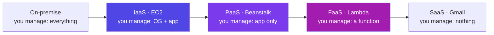
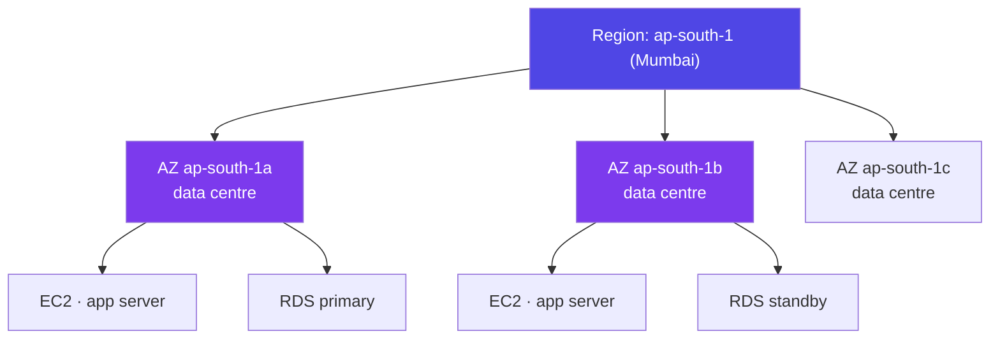
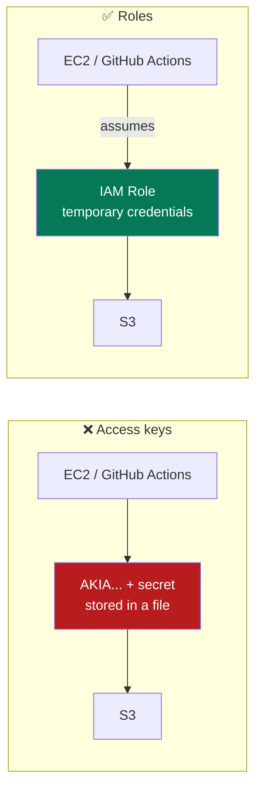
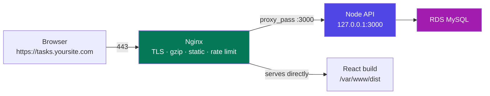
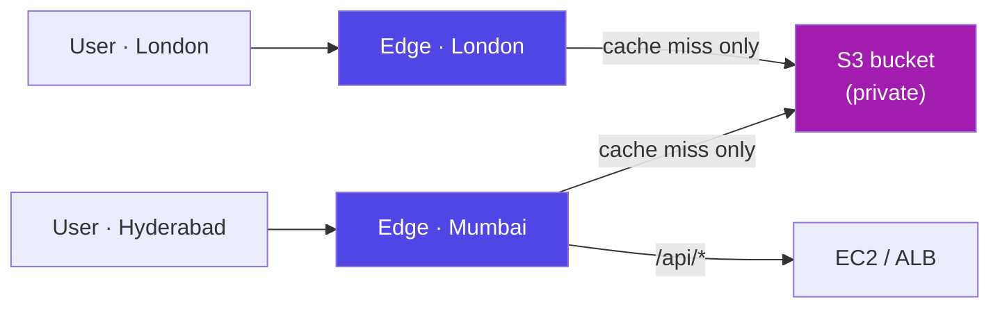
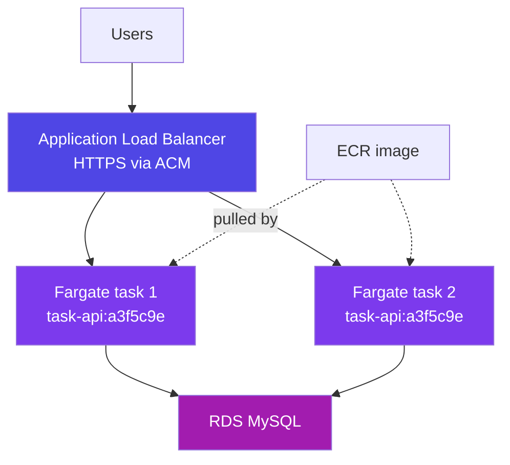
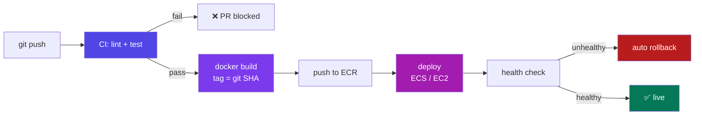
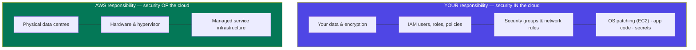
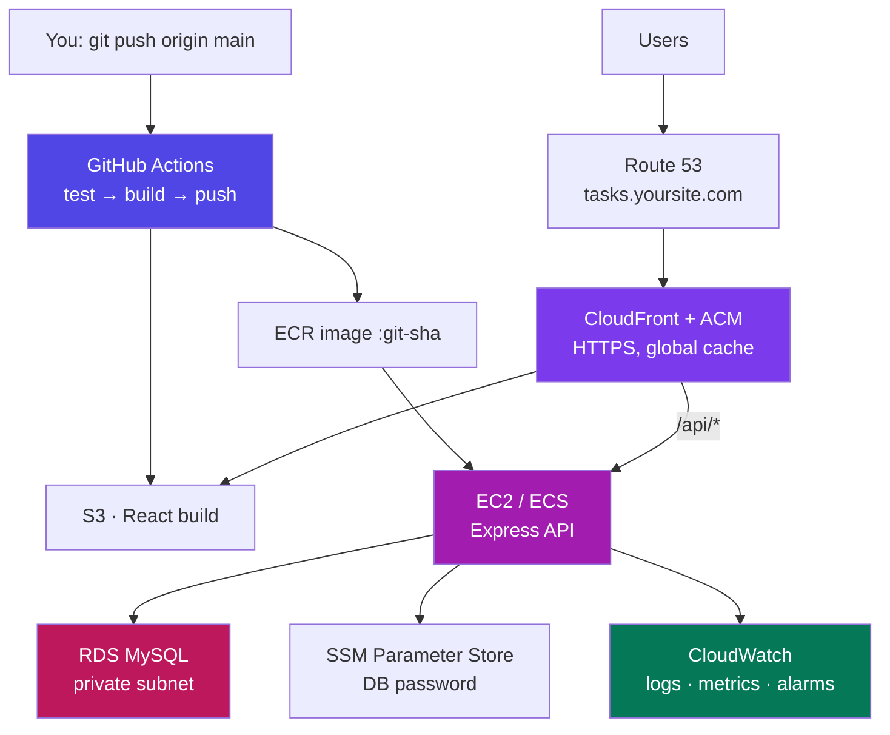
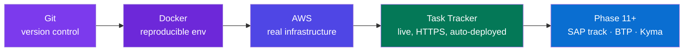

# AWS & Cloud Deployment — Basics to Advanced

### From your first EC2 box to a Dockerized app deployed by GitHub Actions — with the bill under control

> *"The cloud is just somebody else's computer. Learning AWS is learning how to rent it well — and how to stop paying for what you forgot to turn off."*

**Phase 10 of 12 · Guide 3 of 3 (Git · Docker · AWS)** · The 50-Day Challenge · Web Dev → SAP + AI Engineer

---

## Table of Contents

- [How to Use This Guide (Days 3–4 of 4)](#how-to-use-this-guide-days-34-of-4)
- [Part A — Cloud Foundations and Your Account](#part-a-cloud-foundations-and-your-account)
  - [A1. What "the Cloud" Actually Is](#a1-what-the-cloud-actually-is) · [A2. The AWS Map — Regions, AZs, and the 15 Services That Matter](#a2-the-aws-map-regions-azs-and-the-15-services-that-matter) · [A3. Account Setup — and the Billing Alarm You Set First](#a3-account-setup-and-the-billing-alarm-you-set-first) · [A4. IAM — Users, Roles and Least Privilege](#a4-iam-users-roles-and-least-privilege) · [A5. The AWS CLI](#a5-the-aws-cli)
- [Part B — Compute: EC2, Your Server in the Cloud](#part-b-compute-ec2-your-server-in-the-cloud)
  - [B1. Launching an EC2 Instance](#b1-launching-an-ec2-instance) · [B2. Security Groups, SSH, and Getting In](#b2-security-groups-ssh-and-getting-in) · [B3. Keeping It Running — systemd, pm2 and Docker](#b3-keeping-it-running-systemd-pm2-and-docker) · [B4. Nginx as a Reverse Proxy](#b4-nginx-as-a-reverse-proxy) · [B5. Domain and HTTPS](#b5-domain-and-https)
- [Part C — Storage and Database](#part-c-storage-and-database)
  - [C1. S3 — Object Storage and Your Static Frontend](#c1-s3-object-storage-and-your-static-frontend) · [C2. CloudFront — The CDN in Front](#c2-cloudfront-the-cdn-in-front) · [C3. RDS — Managed MySQL](#c3-rds-managed-mysql) · [C4. Secrets — Never `.env` in Git, Never `ENV` in an Image](#c4-secrets-never-env-in-git-never-env-in-an-image)
- [Part D — Containers and Serverless on AWS](#part-d-containers-and-serverless-on-aws)
  - [D1. ECR — Your Private Image Registry](#d1-ecr-your-private-image-registry) · [D2. ECS + Fargate — Containers Without Servers](#d2-ecs-fargate-containers-without-servers) · [D3. Lambda and API Gateway — Serverless](#d3-lambda-and-api-gateway-serverless) · [D4. Choosing Where to Run It](#d4-choosing-where-to-run-it)
- [Part E — CI/CD: Ship It Automatically](#part-e-cicd-ship-it-automatically)
  - [E1. What a Pipeline Is](#e1-what-a-pipeline-is) · [E2. The Deployment Workflow](#e2-the-deployment-workflow) · [E3. Credentials the Right Way — OIDC](#e3-credentials-the-right-way-oidc) · [E4. Zero Downtime and Rollback](#e4-zero-downtime-and-rollback)
- [Part F — Running It Well](#part-f-running-it-well)
  - [F1. CloudWatch — Logs, Metrics and Alarms](#f1-cloudwatch-logs-metrics-and-alarms) · [F2. Cost Control](#f2-cost-control) · [F3. The Security Checklist](#f3-the-security-checklist) · [F4. AWS and the SAP Track](#f4-aws-and-the-sap-track)
- [Part G — Revision](#part-g-revision)
  - [G1. The Capstone — Deploying the Task Tracker End to End](#g1-the-capstone-deploying-the-task-tracker-end-to-end) · [G2. The AWS Cheat Sheet](#g2-the-aws-cheat-sheet) · [G3. 15 Interview Questions With Sharp Answers](#g3-15-interview-questions-with-sharp-answers) · [G4. Glossary](#g4-glossary) · [G5. Your Days 3–4, and What Comes Next](#g5-your-days-34-and-what-comes-next)

---

# How to Use This Guide (Days 3–4 of 4)

*Day 1 you learned to move code. Day 2 you learned to move the environment. Today your app leaves the laptop for good. By tomorrow evening the Task Tracker — React frontend, Express API, MySQL database — is on the public internet at a real domain, over HTTPS, redeployed automatically every time you push to `main`.*

**Day 3:** Parts A, B, C — account, IAM, EC2, S3, RDS. You will deploy manually first, because you must understand each piece before a robot does it for you.
**Day 4:** Parts D, E, F, G — containers on AWS, the CI/CD pipeline, monitoring and cost control, then revision.

<p class="te"><strong>Telugu:</strong> Ee rendu rojula lo nee app <strong>internet loki veltundi</strong>. Modati roju antha <strong>chetho</strong> deploy chestam — prathi mukka ardham kavadaniki. Rendo roju aa panini <strong>robot</strong> (GitHub Actions) ki appagistam. Prathi step ni nijam ga AWS lo cheyyi — chadivithe raadu.</p>

> **Read Part A3 before you click anything.** Set a billing alarm first. AWS is genuinely cheap for learning and genuinely expensive if you leave the wrong thing running — the free tier is real, but it has edges, and a forgotten NAT Gateway costs about ₹3,000 a month for nothing.

**What you need:** a credit/debit card for account verification (~₹2 is charged and refunded), the Git and Docker material from Guides 1 and 2, and your Task Tracker repo on GitHub.

---

# Part A — Cloud Foundations and Your Account

## A1. What "the Cloud" Actually Is

**Simple definition:** the **cloud** is renting computers, storage and services over the internet, by the hour or by the request, instead of buying and running your own machines.

<p class="te"><strong>Telugu:</strong> Cloud ante <strong>inkokari computers ni adde ki teesukovadam</strong>. Aa machines nijam ga unnayi — peddha data centres lo. Nuvvu vaatini touch cheyyavu, vaadina daaniki matrame dabbulu kadatav. Server kondam, room lo pettam, current bill kattam — ee panulu anni podataayi.</p>

Before the cloud, launching a web app meant buying a server (₹2–5 lakh), racking it in a data centre, paying for power and cooling, and sizing it for the traffic you *hoped* to get — months of lead time, and it sat idle 90% of the time. AWS launched S3 and EC2 in 2006 and turned that into a credit card and ten minutes.

| | Own server | Cloud |
|---|---|---|
| Upfront cost | Lakhs | ₹0 |
| Time to get one | Weeks | 60 seconds |
| Scale up for a traffic spike | Buy hardware | Change a number |
| Scale back down | You still own it | Stop paying |
| Failed disk at 2 a.m. | Your problem | Their problem |
| Cost model | CapEx (buy) | OpEx (rent) |

**The four service models** you must be able to name in an interview:



| Model | You handle | You don't | Example |
|---|---|---|---|
| **IaaS** | OS, runtime, app, scaling | Hardware, network, power | **EC2** — a bare Linux box |
| **PaaS** | Just your code | OS, patching, scaling | Elastic Beanstalk, App Runner, Render |
| **FaaS/Serverless** | One function | Everything, including "is it running?" | **Lambda** |
| **SaaS** | Nothing — you're a user | Everything | Gmail, Salesforce, **SAP S/4HANA Cloud** |

**Real-world example:** Netflix runs on AWS and owns almost no servers. Closer to home, your Phase 10 capstone will use three models at once — S3 (managed storage) for the React build, EC2 or ECS (IaaS/containers) for the API, and RDS (managed database) for MySQL.

---

## A2. The AWS Map — Regions, AZs, and the 15 Services That Matter

**Simple definition:** AWS has 200+ services in dozens of **regions** (geographic locations), each containing several **availability zones** (independent data centres). You need about fifteen services, ever.

<p class="te"><strong>Telugu:</strong> AWS lo 200+ services unnayi — anni nerchukovaddu, avasaram ledu. Nee ki kaavalsinavi ~15. <strong>Region</strong> ante prapanchamlo oka chota (Mumbai = ap-south-1), <strong>AZ</strong> ante aa region lo oka separate data centre. Rendu AZ lo app pedithe, okati poyina inkoti nadustundi.</p>

**Pick your region first, and stay there.** Choose the one nearest your users — for India that is **`ap-south-1` (Mumbai)**. It matters for three reasons: latency (Mumbai ≈ 20 ms vs Virginia ≈ 250 ms from Hyderabad), price (varies by region), and data-residency rules. Most resources are region-scoped, so a "missing" EC2 instance is almost always the console sitting in the wrong region.



**The services you will actually use in Phase 10:**

| Category | Service | One-line purpose |
|---|---|---|
| **Compute** | **EC2** | A virtual Linux server you SSH into |
| | **Lambda** | Run a function on demand, no server |
| | **ECS + Fargate** | Run Docker containers without managing servers |
| **Storage** | **S3** | Files and static websites |
| | **EBS** | The virtual hard disk attached to an EC2 |
| **Database** | **RDS** | Managed MySQL/PostgreSQL |
| | **DynamoDB** | Managed NoSQL key-value |
| **Network** | **VPC** | Your private network inside AWS |
| | **Route 53** | DNS — connects your domain to your app |
| | **CloudFront** | CDN — caches your site worldwide |
| | **ELB/ALB** | Load balancer in front of your servers |
| **Security** | **IAM** | Who can do what |
| | **ACM** | Free TLS certificates (HTTPS) |
| | **Secrets Manager / SSM** | Store passwords and API keys |
| **Ops** | **CloudWatch** | Logs, metrics, alarms |
| | **ECR** | Private Docker registry |

**Interview line:** *"A region is a geographic location; an availability zone is an isolated data centre within it. You spread across AZs for high availability and across regions for disaster recovery or data residency."*

---

## A3. Account Setup — and the Billing Alarm You Set First

**Simple definition:** creating an AWS account gives you a **root user** with unlimited power over everything, including the ability to run up a very large bill. Securing it and capping spend is step zero.

<p class="te"><strong>Telugu:</strong> Ee section ni <strong>skip cheyyaku</strong>. AWS account create chesina ventane rendu panulu: (1) <strong>MFA</strong> pettadam, (2) <strong>budget alarm</strong> pettadam. Idi cheyyakapothe, marchipoyina oka service nela chivarilo pedda bill techchipettochu.</p>

**The first-hour checklist:**

| # | Do it | Where |
|---|---|---|
| 1 | Create the account (card verification, ~₹2 refunded) | aws.amazon.com |
| 2 | **Enable MFA on the root user** | IAM → Security credentials |
| 3 | **Create a Budget with an email alert at ₹500** | Billing → Budgets |
| 4 | Turn on "Receive Free Tier Usage Alerts" | Billing → Preferences |
| 5 | Create an IAM **admin user** for yourself (A4) | IAM → Users |
| 6 | **Stop using the root user** — log in as the IAM user | — |
| 7 | Set your region to `ap-south-1` (top-right) | Console |

**The free tier has three shapes**, and mixing them up is how people get surprised:

| Kind | Meaning | Examples |
|---|---|---|
| **12 months free** | Free for a year from signup | 750 hr/month `t2.micro`/`t3.micro` EC2, 750 hr RDS `db.t3.micro`, 5 GB S3, 30 GB EBS |
| **Always free** | Free forever, within limits | 1M Lambda requests/month, 25 GB DynamoDB, 10 custom CloudWatch metrics |
| **Trials** | Short one-off | Some ML and analytics services |

**The five things that quietly cost money** even when "nothing is running":

1. **NAT Gateway** — ~$32/month (₹2,700) whether used or not. The single most common shock bill. Avoid it entirely for this project.
2. **Elastic IPs not attached to a running instance** — charged hourly.
3. **EBS volumes and snapshots** left behind after you terminate an instance.
4. **Load balancers** — ~$16/month each, even with zero traffic.
5. **Data transfer OUT** — inbound is free, outbound is not (CloudFront makes this cheaper).

<p class="te"><strong>Telugu:</strong> Ee aidintini gurthupettuko — NAT Gateway, unused Elastic IP, migilipoyina EBS volumes, load balancer, and data transfer out. "Nenu emi run cheyyaledu kada" anukuntu bill vastundi ivi valla ne. Practice ayipoyaka <strong>terminate</strong> cheyyi (stop kaadu).</p>

**Stop vs terminate:** *stopping* an EC2 halts the compute charge but you keep paying for its EBS disk; *terminating* deletes the instance and (by default) its disk. When you finish a lab, terminate.

---

## A4. IAM — Users, Roles and Least Privilege

**Simple definition:** **IAM** (Identity and Access Management) controls **who** can do **what** to **which** AWS resources. It is free, it is global, and it is the service you cannot skip.

<p class="te"><strong>Telugu:</strong> IAM ante "evaru, e panulu, e resources meeda cheyyochu" ani niyantrinche system. Root user ni roju vaadaku — daaniki anni permissions untayi. Nee kosam oka IAM user create chesukoni, adhe vaadu. Applications ki <strong>role</strong> ivvali — keys kaadu.</p>

**The four nouns:**

| Term | Is | Example |
|---|---|---|
| **User** | A person (long-lived credentials) | `nikhil-admin` |
| **Group** | A bag of users sharing policies | `developers` |
| **Role** | A set of permissions something *assumes* temporarily | An EC2 instance reading S3 |
| **Policy** | The JSON document listing allowed actions | `AmazonS3ReadOnlyAccess` |

```json
{
  "Version": "2012-10-17",
  "Statement": [{
    "Effect": "Allow",
    "Action": ["s3:GetObject", "s3:PutObject"],
    "Resource": "arn:aws:s3:::task-tracker-uploads/*"
  }]
}
```

Read it as a sentence: *allow these actions on exactly this resource.* That `Resource` line is the difference between least privilege and "this key can do anything to any bucket in the account." An **ARN** (`arn:aws:s3:::bucket/key`) is AWS's globally unique name for a resource — you will see them everywhere.

**Roles beat access keys — this is the single most important IAM idea.** An access key is a permanent secret that can leak into Git, a laptop or a log. A role issues **temporary credentials** automatically, rotated by AWS, never written down.



| Situation | Use |
|---|---|
| You, on the console/CLI | An **IAM user** with MFA |
| Code on an EC2 instance | An **instance profile role** — no keys on the box |
| A Lambda function | Its **execution role** |
| GitHub Actions deploying to AWS | An **OIDC role** (Part E3) — no stored keys at all |
| Another AWS account | A cross-account **role** |

**The rules that matter:** MFA on everything human; never the root user for daily work; start from AWS-managed policies then narrow them; one role per job, not one god-role; and rotate or delete any access key older than 90 days. Run **IAM Access Analyzer** occasionally — it tells you which permissions were never actually used.

---

## A5. The AWS CLI

**Simple definition:** the **AWS CLI** does everything the console does, from your terminal — which means it can go in a script, and therefore in a pipeline.

<p class="te"><strong>Telugu:</strong> Console lo click cheyyadam nerchukovadaniki manchidi, kaani automate cheyyalemu. <strong>CLI</strong> tho ade panini command tho chestav — and aa command ni script lo, CI/CD lo pettochu. Modata console lo cheyyi, ardham chesuko, tarvata CLI ki maaru.</p>

```bash
# install (Windows: MSI from aws.amazon.com/cli ; Mac: brew install awscli)
aws --version

aws configure
# AWS Access Key ID     : AKIA...          ← from IAM → your user → Security credentials
# AWS Secret Access Key : ...
# Default region name   : ap-south-1
# Default output format : json

aws sts get-caller-identity          # "who am I?" — the first command to run when confused
```

```bash
aws ec2 describe-instances --query \
  'Reservations[].Instances[].{ID:InstanceId,State:State.Name,IP:PublicIpAddress}' --output table
aws s3 ls                                        # list buckets
aws s3 sync ./dist s3://my-bucket --delete       # upload a built React app
aws logs tail /aws/lambda/my-fn --follow         # stream logs
aws ecr get-login-password | docker login --username AWS --password-stdin <acct>.dkr.ecr...
```

Credentials live in `~/.aws/credentials`; **that file must never be committed** (it is exactly what `.gitignore` and `.dockerignore` are for). Use `--profile work` and `[profile work]` blocks to keep multiple accounts apart.

**Beyond the CLI — a preview of Infrastructure as Code.** Clicking in the console is fine for learning, but a real team writes its infrastructure down so it is versioned, reviewed and repeatable: **CloudFormation** (AWS-native YAML), **Terraform** (multi-cloud, the industry favourite), **AWS CDK** (write infrastructure in TypeScript). You don't need them in Phase 10 — but know that "click-ops" is a learning tool, not a practice.

---

# Part B — Compute: EC2, Your Server in the Cloud

## B1. Launching an EC2 Instance

**Simple definition:** **EC2** (Elastic Compute Cloud) rents you a virtual machine by the second. You choose the OS image, the size, a login key and a firewall — and 60 seconds later you have a Linux box on the internet.

<p class="te"><strong>Telugu:</strong> EC2 ante <strong>cloud lo oka Linux computer</strong> adde ki teesukovadam. Nuvve daanini SSH tho login avvali, Node install cheyyali, app run cheyyali — antha nee bhaadyata. Ade IaaS ante.</p>

**The launch wizard, decision by decision:**

| Choice | Pick | Why |
|---|---|---|
| **Name** | `task-tracker-api` | You will have several |
| **AMI** (the OS image) | **Ubuntu 22.04 LTS** | Most tutorials and Docker docs assume it. (Amazon Linux 2023 is also fine and AWS-tuned) |
| **Instance type** | **t3.micro** | Free-tier eligible, 2 vCPU / 1 GB. Enough for a Node API |
| **Key pair** | Create one, download the `.pem` | **The only copy** — lose it and you lose SSH access |
| **Network** | Default VPC, **public subnet**, auto-assign public IP | Keeps you out of NAT-Gateway costs |
| **Security group** | New: SSH 22 **from My IP**, HTTP 80, HTTPS 443 from anywhere | See B2 |
| **Storage** | 8–20 GB gp3 | 30 GB is free-tier |
| **User data** | Optional bootstrap script | Below |

**Instance families**, so the names stop looking random: **t** = burstable/general (t3, t4g — cheapest, what you want), **m** = balanced, **c** = compute-optimised, **r** = memory-optimised, **g/p** = GPU. A trailing **g** (`t4g`, `m7g`) means **Graviton** — AWS's own ARM chips, ~20% cheaper and excellent for Node; just remember to build ARM Docker images for them (Docker guide, E1).

**User data** runs once at first boot as root — this is how you bake setup into the launch:

```bash
#!/bin/bash
apt-get update && apt-get install -y docker.io docker-compose-plugin nginx
systemctl enable --now docker
usermod -aG docker ubuntu
```

```bash
# the same thing from the CLI
aws ec2 run-instances --image-id ami-0f5ee92e2d63afc18 --instance-type t3.micro \
  --key-name task-tracker-key --security-group-ids sg-0abc123 \
  --tag-specifications 'ResourceType=instance,Tags=[{Key=Name,Value=task-tracker-api}]'
```

---

## B2. Security Groups, SSH, and Getting In

**Simple definition:** a **security group** is a virtual firewall attached to your instance. It is *deny by default* — nothing reaches your server unless you open a port to a source.

<p class="te"><strong>Telugu:</strong> Security group ante nee server chuttu unde <strong>gōda</strong>. Default ga anni ports mūsi untayi. Nuvvu open chesinave open. SSH (22) ni <strong>My IP</strong> ki matrame ivvu — 0.0.0.0/0 ki iste prapancham motham nee server ni try chestundi (nijam ga, nimishaalalo bots vastayi).</p>

| Rule | Port | Source | Meaning |
|---|---|---|---|
| SSH | 22 | **My IP** | Only you can log in |
| HTTP | 80 | 0.0.0.0/0 | The public can browse |
| HTTPS | 443 | 0.0.0.0/0 | The public, encrypted |
| MySQL | 3306 | **the API's security group** | Only your app server — never the internet |

That last row is the pattern worth learning: a security group can reference **another security group** as its source, so "the database accepts connections from the app servers, whoever they are today" needs no IP addresses at all.

**Connecting:**

```bash
chmod 400 task-tracker-key.pem                    # SSH refuses loose permissions
ssh -i task-tracker-key.pem ubuntu@13.234.56.78   # ubuntu@ for Ubuntu, ec2-user@ for Amazon Linux
```

On Windows use Git Bash (from Guide 1) — the same command works. If it hangs, it is almost always the security group or the wrong IP; if it says *permission denied (publickey)*, it is the wrong username or the wrong key. **EC2 Instance Connect** in the console gives you a browser shell when you have locked yourself out.

**Once inside — the standard setup:**

```bash
sudo apt update && sudo apt upgrade -y
curl -fsSL https://deb.nodesource.com/setup_20.x | sudo -E bash - && sudo apt install -y nodejs
sudo apt install -y docker.io && sudo usermod -aG docker ubuntu   # log out/in after this
git clone https://github.com/nikhil/task-tracker.git && cd task-tracker
npm ci --omit=dev
node -v && docker --version
```

**Public vs private IP, and the Elastic IP trap:** an instance's public IP **changes every time you stop and start it**, which breaks your DNS record. An **Elastic IP** is a fixed address you attach — free while attached to a running instance, charged when it isn't.

---

## B3. Keeping It Running — systemd, pm2 and Docker

**Simple definition:** `node server.js` dies the moment you close your SSH session. Something must own the process, restart it if it crashes, and start it again after a reboot.

<p class="te"><strong>Telugu:</strong> SSH close cheste app aagipotundi — enduku ante adi nee session yokka child process. App ni <strong>background lo, permanent ga</strong> nadapadaniki moodu daarulu: pm2, systemd, leda Docker (<code>--restart unless-stopped</code>). Nuvvu Docker ne vaadu — Guide 2 antha daani gurinche.</p>

**Option 1 — Docker (recommended, since you did Guide 2):**

```bash
docker compose up -d                 # restart: unless-stopped in the compose file does the rest
docker compose logs -f api
```

**Option 2 — pm2** (the Node-native process manager):

```bash
sudo npm install -g pm2
pm2 start src/server.js --name task-api -i max   # -i max = one process per CPU core
pm2 logs task-api        pm2 restart task-api    pm2 monit
pm2 startup && pm2 save                          # survive a reboot
```

**Option 3 — systemd** (no extra tools, how Linux itself runs services):

```ini
# /etc/systemd/system/task-api.service
[Unit]
Description=Task Tracker API
After=network.target

[Service]
Type=simple
User=ubuntu
WorkingDirectory=/home/ubuntu/task-tracker
EnvironmentFile=/home/ubuntu/task-tracker/.env
ExecStart=/usr/bin/node src/server.js
Restart=always
RestartSec=5

[Install]
WantedBy=multi-user.target
```

```bash
sudo systemctl daemon-reload && sudo systemctl enable --now task-api
sudo systemctl status task-api        journalctl -u task-api -f
```

| | pm2 | systemd | Docker |
|---|---|---|---|
| Node-specific | Yes | No | No |
| Clustering across cores | Built in | Manual | Run N containers |
| Environment reproducible | ❌ | ❌ | ✅ |
| What you should use | Quick demos | Non-container servers | **This project** |

---

## B4. Nginx as a Reverse Proxy

**Simple definition:** **Nginx** sits in front of your Node app on port 80/443 and forwards requests to it on port 3000 — handling TLS, static files, compression and rate limits on the way.

<p class="te"><strong>Telugu:</strong> Nee Node app port 3000 lo nadustundi, kaani users port 80/443 ki vastaru. <strong>Nginx</strong> mundu nilabadi, request teesukoni Node ki pampistundi. Node ni root ga port 80 lo nadapakkarledu, HTTPS Nginx choostundi, static files kuda adhe icchestundi — anduke antha mandi ee pattern vaadutharu.</p>



```nginx
# /etc/nginx/sites-available/task-tracker
server {
    listen 80;
    server_name tasks.yoursite.com;

    # the React build, served straight from disk
    root /var/www/task-tracker;
    index index.html;
    location / {
        try_files $uri $uri/ /index.html;      # SPA routing: unknown paths → index.html
    }

    # anything under /api goes to Node
    location /api/ {
        proxy_pass http://127.0.0.1:3000/;
        proxy_http_version 1.1;
        proxy_set_header Host              $host;
        proxy_set_header X-Real-IP         $remote_addr;
        proxy_set_header X-Forwarded-For   $proxy_add_x_forwarded_for;
        proxy_set_header X-Forwarded-Proto $scheme;
        proxy_set_header Upgrade           $http_upgrade;   # WebSockets
        proxy_set_header Connection        "upgrade";
    }

    gzip on;
    gzip_types text/css application/javascript application/json;
}
```

```bash
sudo ln -s /etc/nginx/sites-available/task-tracker /etc/nginx/sites-enabled/
sudo nginx -t                 # ALWAYS test before reloading
sudo systemctl reload nginx
```

Those `X-Forwarded-*` headers matter: without them your Express app sees Nginx's IP for every request, so logging and rate-limiting break. Set `app.set('trust proxy', 1)` in Express so `req.ip` is the real client.

**One bonus:** with Nginx in front, your Node app should now listen only on `127.0.0.1:3000`, and port 3000 should not be open in the security group at all. Fewer doors, fewer problems.

---

## B5. Domain and HTTPS

**Simple definition:** a **domain** is a human name for your IP address; **HTTPS** encrypts the traffic. Both are free or near-free, and neither is optional in 2026 — browsers mark plain HTTP as "Not secure".

<p class="te"><strong>Telugu:</strong> IP address (13.234.56.78) evaruu gurthupettukoru — anduke <strong>domain</strong>. And HTTPS lekapothe browser "Not secure" ani chupistundi, and modern browser features chala pani cheyyavu. Certificate <strong>ipudu ucchitham</strong> — Let's Encrypt tho.</p>

**Step 1 — point the domain at your server.** Buy a domain (Route 53, Namecheap, GoDaddy — ₹700–1,200/year) and add a DNS record:

| Record | Name | Value | For |
|---|---|---|---|
| **A** | `tasks.yoursite.com` | `13.234.56.78` (your Elastic IP) | EC2 |
| **CNAME** | `www` | `tasks.yoursite.com` | The www alias |
| **ALIAS** (Route 53 only) | `yoursite.com` | a CloudFront/ALB target | AWS-managed targets |

DNS propagation is usually minutes; `nslookup tasks.yoursite.com` tells you when it has landed.

**Step 2 — get a certificate.** Two paths, and which you use depends on where TLS terminates:

```bash
# On the EC2 box itself (Nginx) — Let's Encrypt, free, auto-renewing
sudo apt install -y certbot python3-certbot-nginx
sudo certbot --nginx -d tasks.yoursite.com -d www.tasks.yoursite.com
# It edits your Nginx config, adds the 80 → 443 redirect, and installs a renewal timer.
sudo certbot renew --dry-run
```

**AWS Certificate Manager (ACM)** is the other path: free public certificates that renew themselves, but they can only be attached to AWS-managed endpoints — CloudFront, an Application Load Balancer, or API Gateway. You cannot install an ACM certificate on your own Nginx. Rule of thumb: **CloudFront/ALB → ACM; plain EC2 + Nginx → Certbot.**

**Then harden it:** force HTTP→HTTPS (Certbot offers this), add HSTS, and check yourself at [ssllabs.com/ssltest](https://www.ssllabs.com/ssltest/) — aim for an A.

---

# Part C — Storage and Database

## C1. S3 — Object Storage and Your Static Frontend

**Simple definition:** **S3** (Simple Storage Service) stores files ("objects") in "buckets". It is effectively infinite, extremely cheap, extremely durable, and it can serve a website by itself.

<p class="te"><strong>Telugu:</strong> S3 ante <strong>cloud lo unlimited pen drive</strong>. Files (objects) ni buckets lo pedatharu. Chala cheap (1 GB nela ki ~₹2), and 99.999999999% durable — file poddhu. Nee React build (HTML/CSS/JS) ni ikkade pedatam — server akkarledu.</p>

| S3 is right for | S3 is wrong for |
|---|---|
| Built frontends (HTML/CSS/JS) | A database |
| User uploads — images, PDFs, CSVs | Anything needing partial edits (you replace whole objects) |
| Backups, logs, data-lake files | Low-latency shared filesystems (use EFS) |

```bash
aws s3 mb s3://task-tracker-web-nikhil          # bucket names are GLOBALLY unique
aws s3 sync ./dist s3://task-tracker-web-nikhil --delete   # deploy the React build
aws s3 cp report.pdf s3://my-bucket/reports/    # single file
aws s3 ls s3://task-tracker-web-nikhil --recursive --human-readable
aws s3 rm s3://my-bucket/old.txt
```

**Deploying your Phase 6 React app to S3:**

```bash
npm run build                                    # → dist/
aws s3 sync ./dist s3://task-tracker-web-nikhil --delete
# Properties → Static website hosting → Enable, index.html as both index and error document
#   (error → index.html is what makes React Router's client-side routes work)
```

**Buckets are private by default, and should stay that way.** Blocking public access and putting **CloudFront** in front (C2) is the correct modern pattern; making the bucket itself public is the pattern in old tutorials and the cause of a decade of data leaks. If you must serve directly from S3 for a lab, the policy is:

```json
{
  "Version": "2012-10-17",
  "Statement": [{
    "Effect": "Allow", "Principal": "*",
    "Action": "s3:GetObject",
    "Resource": "arn:aws:s3:::task-tracker-web-nikhil/*"
  }]
}
```

**Two features worth knowing:** **versioning** (keeps every version of an object — instant undo for a bad deploy or an encrypted-by-ransomware bucket) and **lifecycle rules** (auto-move objects to cheaper storage classes: Standard → Infrequent Access → Glacier, from ₹2 to ₹0.09 per GB-month).

**Pre-signed URLs** are the pattern for user uploads: your API generates a temporary, permission-scoped URL and the browser uploads *directly* to S3 — your server never touches the file:

```js
import { getSignedUrl } from '@aws-sdk/s3-request-presigner';
const url = await getSignedUrl(s3, new PutObjectCommand({
  Bucket: 'task-tracker-uploads', Key: `users/${userId}/${filename}`
}), { expiresIn: 300 });   // valid 5 minutes
```

---

## C2. CloudFront — The CDN in Front

**Simple definition:** **CloudFront** is AWS's **CDN** — it copies your files to ~600 edge locations worldwide so users download from a server near them, and it gives you free HTTPS on your own domain.

<p class="te"><strong>Telugu:</strong> CDN ante nee files ni prapanchamlo chala chotla <strong>copy</strong> chesi unchadam. Hyderabad user ki Hyderabad edge nunchi, London user ki London nunchi — chaala fast. Plus HTTPS ucchitham, and S3 bucket ni private ga unchochu.</p>



**Setting it up for the Task Tracker frontend:** create a distribution, set the origin to your S3 bucket with **Origin Access Control** (which is what lets you keep the bucket private), request a free **ACM certificate** in `us-east-1` (CloudFront requires that region — a classic gotcha), attach your domain as an alternate name, and set the default root object to `index.html`.

| Setting | Value | Why |
|---|---|---|
| Origin | Your S3 bucket, with OAC | Bucket stays private |
| Viewer protocol policy | Redirect HTTP → HTTPS | Never serve plaintext |
| Default root object | `index.html` | `/` works |
| Custom error 403/404 → `/index.html` (200) | React Router | Deep links work |
| Certificate | ACM, **in `us-east-1`** | CloudFront's rule |

**Cache invalidation is the one gotcha.** Edges cache aggressively, so after a deploy users may still get yesterday's JavaScript:

```bash
aws s3 sync ./dist s3://task-tracker-web-nikhil --delete
aws cloudfront create-invalidation --distribution-id E1ABCDEF --paths "/*"
```

The professional version costs nothing: Vite/CRA already emit hashed filenames (`main.a3f5c9.js`), so cache those forever (`max-age=31536000`) and only invalidate `/index.html`. First 1,000 invalidation paths per month are free.

**Bonus:** put `/api/*` on the same distribution pointing at your EC2/ALB origin, and your frontend and API share one domain — CORS problems disappear.

---

## C3. RDS — Managed MySQL

**Simple definition:** **RDS** (Relational Database Service) runs MySQL, PostgreSQL and others *for* you — backups, patching, failover and monitoring included. Your Phase 9 database, but not your problem at 3 a.m.

<p class="te"><strong>Telugu:</strong> Nee Phase 9 MySQL ni EC2 lo nuvve install cheyyochu — kaani backups, updates, crash aithe recovery... antha nee bhaadyata. <strong>RDS</strong> aa panulanni AWS ki appagistundi. Konchem ekkuva kharchu, kaani production lo idhe correct.</p>

**Creating one:** *Standard create* → MySQL 8 → **Free tier** template → `db.t3.micro`, 20 GB gp3 → set a master password → **Public access: No** → security group allowing 3306 **from your EC2's security group only** → enable automated backups (7 days).

| Choice | Learning | Production |
|---|---|---|
| Instance | `db.t3.micro` (free tier) | `db.t4g.medium`+ |
| Multi-AZ | No | **Yes** — automatic standby failover |
| Public access | No | No, never |
| Backups | 7 days | 7–35 days + snapshots |
| Storage | 20 GB gp3 | gp3 with autoscaling on |

```bash
# from the EC2 box only — RDS should not be reachable from the internet
mysql -h task-db.abc123.ap-south-1.rds.amazonaws.com -u admin -p task_tracker
```

```js
// your Phase 9 pool, now pointing at RDS
const pool = mysql.createPool({
  host: process.env.DB_HOST,          // ...rds.amazonaws.com
  user: process.env.DB_USER,
  password: process.env.DB_PASSWORD,  // from Secrets Manager (C4)
  database: process.env.DB_NAME,
  connectionLimit: 10,
  ssl: { rejectUnauthorized: true },  // RDS supports TLS — use it
});
```

| | MySQL on EC2 | RDS | Aurora |
|---|---|---|---|
| You manage | Everything | Nothing but schema and queries | Same as RDS |
| Backups / patching | Manual | Automatic | Automatic |
| Failover | You build it | Multi-AZ, ~60 s | ~30 s, up to 15 read replicas |
| Cost | Lowest | ~2× | ~3×, scales further |
| Use when | Learning, tiny budgets | **Almost always** | High scale |

**Migrating your Phase 9 schema up:**

```bash
mysqldump -u root -p task_tracker > schema.sql              # from your laptop/container
mysql -h <rds-endpoint> -u admin -p task_tracker < schema.sql   # from EC2
```

**Real-world example:** `db.t3.micro` is free for 12 months, then roughly ₹1,100/month — often the largest line on a small project's bill. For a portfolio app that no one queries at night, an alternative is **PlanetScale** or **Neon** (serverless MySQL/Postgres with real free tiers). Know RDS because every job expects it; choose by budget.

---

## C4. Secrets — Never `.env` in Git, Never `ENV` in an Image

**Simple definition:** **SSM Parameter Store** and **Secrets Manager** hold your passwords and API keys, and hand them to your app at runtime through its IAM role — so nothing sensitive lives in your repo or your image.

<p class="te"><strong>Telugu:</strong> Git guide lo "secrets ni commit cheyyaku" ani chusam, Docker guide lo "image lo pettaku" ani chusam. Mari ekkada pettali? — <strong>Parameter Store</strong> leda <strong>Secrets Manager</strong> lo. App start ayye time lo, daani IAM role tho, avi teesukuntundi.</p>

```bash
# Parameter Store — free for standard parameters
aws ssm put-parameter --name /task-tracker/prod/DB_PASSWORD --value 'S3cret!' --type SecureString
aws ssm get-parameter --name /task-tracker/prod/DB_PASSWORD --with-decryption --query Parameter.Value --output text

# Secrets Manager — ~$0.40/secret/month, but rotates RDS passwords automatically
aws secretsmanager get-secret-value --secret-id task-tracker/prod --query SecretString --output text
```

```js
// fetch once at startup, keep in memory — never log it
import { SSMClient, GetParameterCommand } from '@aws-sdk/client-ssm';
const ssm = new SSMClient({ region: 'ap-south-1' });
const { Parameter } = await ssm.send(new GetParameterCommand({
  Name: '/task-tracker/prod/DB_PASSWORD', WithDecryption: true,
}));
```

| Where secrets go | Verdict |
|---|---|
| Hard-coded in source | ❌ Instantly leaked via Git |
| `.env` committed | ❌ Same |
| `ENV` in a Dockerfile | ❌ Readable by anyone with the image |
| `.env` on the server, `chmod 600`, not in Git | ⚠ Acceptable for a lab |
| **SSM Parameter Store / Secrets Manager + IAM role** | ✅ The real answer |
| GitHub Actions secrets (for CI only) | ✅ For pipeline credentials |

**The rule:** if a secret ever reached a Git commit, a log line or an image layer, it is burned — rotate it, don't hide it.

---

# Part D — Containers and Serverless on AWS

## D1. ECR — Your Private Image Registry

**Simple definition:** **ECR** (Elastic Container Registry) is AWS's private Docker registry. It sits in your account, so IAM controls access and pulls are fast and free within the region.

<p class="te"><strong>Telugu:</strong> Docker guide lo image ni Docker Hub ki push chesam. AWS lo deploy chestunnappudu <strong>ECR</strong> vaadatam — adi nee account lone undi, IAM permissions panichestayi, and same region lo pull cheyyadam ucchitham + fast.</p>

```bash
aws ecr create-repository --repository-name task-api --region ap-south-1
# → 123456789012.dkr.ecr.ap-south-1.amazonaws.com/task-api

ACCOUNT=123456789012; REGION=ap-south-1
aws ecr get-login-password --region $REGION \
  | docker login --username AWS --password-stdin $ACCOUNT.dkr.ecr.$REGION.amazonaws.com

docker build -t task-api:$(git rev-parse --short HEAD) .
docker tag task-api:$(git rev-parse --short HEAD) $ACCOUNT.dkr.ecr.$REGION.amazonaws.com/task-api:$(git rev-parse --short HEAD)
docker push $ACCOUNT.dkr.ecr.$REGION.amazonaws.com/task-api:$(git rev-parse --short HEAD)
```

Tagging with the **Git SHA** is the practice from Guide 2 that pays off here: every deployed image maps to one commit, so "what is running in production?" is a lookup. Turn on **scan on push** (free basic scanning) and add a **lifecycle policy** to expire untagged images after 14 days so storage doesn't creep.

---

## D2. ECS + Fargate — Containers Without Servers

**Simple definition:** **ECS** is AWS's container orchestrator; **Fargate** is the mode where AWS provides the underlying machines, so you never patch, size or SSH into a server again.

<p class="te"><strong>Telugu:</strong> EC2 lo nuvve server ni chuskovali — updates, disk, crash. <strong>Fargate</strong> lo server ane concept ye ledu: "ee image ni, ee CPU/memory tho, 2 copies run cheyyi" ani cheppu, AWS chuskuntundi. Konchem ekkuva kharchu, chaala takkuva tension.</p>

**The three nouns:**

| Term | Is | Docker equivalent |
|---|---|---|
| **Task definition** | JSON blueprint: image, CPU, memory, ports, env, logs | A Compose service |
| **Task** | One running instance of it | A container |
| **Service** | Keeps N tasks running, registers them with a load balancer | `restart: unless-stopped` + scaling |

```json
{
  "family": "task-api",
  "requiresCompatibilities": ["FARGATE"],
  "networkMode": "awsvpc",
  "cpu": "256", "memory": "512",
  "executionRoleArn": "arn:aws:iam::123456789012:role/ecsTaskExecutionRole",
  "taskRoleArn": "arn:aws:iam::123456789012:role/taskApiRole",
  "containerDefinitions": [{
    "name": "api",
    "image": "123456789012.dkr.ecr.ap-south-1.amazonaws.com/task-api:a3f5c9e",
    "portMappings": [{ "containerPort": 3000 }],
    "environment": [{ "name": "NODE_ENV", "value": "production" }],
    "secrets": [{
      "name": "DB_PASSWORD",
      "valueFrom": "arn:aws:ssm:ap-south-1:123456789012:parameter/task-tracker/prod/DB_PASSWORD"
    }],
    "healthCheck": {
      "command": ["CMD-SHELL", "wget -qO- http://localhost:3000/health || exit 1"],
      "interval": 30, "timeout": 5, "retries": 3
    },
    "logConfiguration": {
      "logDriver": "awslogs",
      "options": { "awslogs-group": "/ecs/task-api", "awslogs-region": "ap-south-1",
                   "awslogs-stream-prefix": "ecs" }
    }
  }]
}
```

Note the two roles — the **execution role** lets ECS pull the image and read the secret, while the **task role** is what your application code uses to call other AWS services. And note `secrets:` rather than `environment:` for the password: ECS injects it at start-up, so it is never in the image or the task definition.



```bash
aws ecs update-service --cluster task-tracker --service task-api \
  --task-definition task-api:12 --force-new-deployment
```

ECS then performs a **rolling deployment**: start new tasks, wait for their health checks, shift the load balancer over, drain and stop the old ones. Zero downtime, and an automatic rollback if the new tasks never turn healthy (with a deployment circuit breaker enabled).

**Cost reality check:** 0.25 vCPU / 0.5 GB Fargate ≈ ₹750/month per task, plus ~₹1,400 for the ALB. For a portfolio project, a single `t3.micro` EC2 running `docker compose` is free-tier and perfectly honest. Learn Fargate because it is what jobs use; deploy on EC2 because it is what your wallet uses.

---

## D3. Lambda and API Gateway — Serverless

**Simple definition:** **Lambda** runs a function in response to an event and charges per millisecond. **API Gateway** puts an HTTP endpoint in front of it. There is no server, and no cost when nobody calls it.

<p class="te"><strong>Telugu:</strong> Lambda lo server ane concept ledu — oka <strong>function</strong> raasi ivvu, request vachchinappudu adi run avutundi, run ayina milliseconds ki matrame charge. Evaru vaadakapothe <strong>zero cost</strong>. Kaani chaala sepu vaadakapothe modati request slow (cold start).</p>

```js
// index.mjs — a Lambda handler
export const handler = async (event) => {
  const id = event.pathParameters?.id;
  return {
    statusCode: 200,
    headers: { 'content-type': 'application/json' },
    body: JSON.stringify({ id, status: 'ok' }),
  };
};
```

| Lambda fits | Lambda fights you |
|---|---|
| Spiky or rare traffic | Steady high traffic (an always-on box is cheaper) |
| Event handlers: S3 upload → resize, cron jobs, webhooks | Long jobs (15-minute hard limit) |
| Glue between AWS services | Big frameworks + many DB connections (use RDS Proxy) |
| Genuine scale-to-zero | Anything needing predictable low latency (cold starts) |

**Cold starts** are the trade-off: an idle function must be initialised before the first request — roughly 100–400 ms for Node, more for a fat bundle. Keep the bundle small, initialise the DB client *outside* the handler so it is reused, and use provisioned concurrency only if you must.

**The always-free tier is generous:** 1 million requests and 400,000 GB-seconds per month, forever. A webhook or a nightly job genuinely costs ₹0.

**Real-world example for your project:** keep the Task Tracker API on ECS/EC2 (steady, connection-pooled), and use Lambda for the edges — a nightly "email me overdue tasks" cron via EventBridge, and an S3-triggered function that makes thumbnails of uploaded attachments.

---

## D4. Choosing Where to Run It

**Simple definition:** AWS gives you six ways to run the same Node app. They differ in how much you manage, how much you pay, and how fast you can ship.

<p class="te"><strong>Telugu:</strong> Okate app ni AWS lo aaru vidhaluga run cheyyochu. Nuvvu nerchukovadaniki <strong>EC2</strong>, job lo panichesedi <strong>ECS Fargate</strong>, and quick ga live cheyyadaniki <strong>Render/Railway</strong>. Ee table ni interview ki gurthupettuko.</p>

| Option | You manage | Best for | ~Monthly (small app) |
|---|---|---|---|
| **EC2** | OS, runtime, deploys, scaling | **Learning**, full control, cheapest at small scale | Free tier → ₹700 |
| **Elastic Beanstalk** | Just the code (it builds EC2 + ALB for you) | Classic PaaS on AWS | ₹700 + ALB |
| **App Runner** | Just a container image or repo | Simplest container deploy on AWS | ~₹4,000 |
| **ECS + Fargate** | Task definitions | **Production containers** — the industry default | ₹750/task + ₹1,400 ALB |
| **EKS (Kubernetes)** | Cluster + manifests | Many services, many teams | ₹6,000 control plane + nodes |
| **Lambda + API Gateway** | Functions | Events, spiky traffic, scale-to-zero | ₹0 – few hundred |

**Non-AWS reality check.** For a portfolio project shipping today: **Vercel** or **Netlify** for the React frontend (free, 30 seconds, global CDN), **Render** or **Railway** for the API + Postgres (free/cheap tiers, `git push` deploys), **Fly.io** for containers near your users. They are all AWS underneath with the sharp edges removed.

**So which should *you* do?** Do the EC2 path by hand first — it is the only way to understand what Beanstalk and Fargate are automating, and "I set up Nginx, TLS and a systemd service on EC2" is a stronger interview story than "I clicked deploy on Render." Then automate it (Part E). Then, if you want the resume line, redo the same app on ECS Fargate.

---

# Part E — CI/CD: Ship It Automatically

## E1. What a Pipeline Is

**Simple definition:** **CI** (Continuous Integration) means every push is automatically built and tested. **CD** (Continuous Deployment) means every change that passes those tests is automatically released.

<p class="te"><strong>Telugu:</strong> <strong>CI</strong> = push chesina prathi sari automatic ga build + test. <strong>CD</strong> = test pass aithe automatic ga deploy. Chetho deploy cheste marchipotam, tappulu chestam, and "naa laptop lo build chesanu" ane problem malli vastundi. Robot ki appagiste prathi sari okate laaga jarugutundi.</p>



**The rules a good pipeline follows** — each one prevents a specific class of outage:

1. **Build the image once**, then promote that exact image through environments. Never rebuild per environment.
2. **Tag with the Git SHA** so any running version maps to one commit.
3. **Test before build, build before deploy** — fail as early and as cheaply as possible.
4. **No human credentials.** The pipeline assumes a role (E3).
5. **Health-check after deploy**, and roll back automatically if it fails.
6. **Make it fast.** A 20-minute pipeline gets bypassed; a 4-minute one gets trusted.

**The AWS-native alternatives** to GitHub Actions — CodePipeline, CodeBuild, CodeDeploy — do the same job and appear in AWS-heavy job descriptions. Learn the concepts here; the vocabulary transfers.

---

## E2. The Deployment Workflow

**Simple definition:** one YAML file in `.github/workflows/` that tests, builds an image, pushes it to ECR, and tells ECS to run it.

<p class="te"><strong>Telugu:</strong> Guide 1 lo test-matrame chese workflow raasam. Ippudu daanike deploy steps kalupudam — test → docker build → ECR ki push → ECS ki "kotha image vaadu" ani cheppadam. Ee file ne nee CD pipeline.</p>

```yaml
name: Deploy API

on:
  push:
    branches: [main]
    paths: ['api/**', '.github/workflows/deploy.yml']

env:
  AWS_REGION: ap-south-1
  ECR_REPOSITORY: task-api
  ECS_CLUSTER: task-tracker
  ECS_SERVICE: task-api

permissions:
  id-token: write        # required for OIDC (E3)
  contents: read

jobs:
  test:
    runs-on: ubuntu-latest
    steps:
      - uses: actions/checkout@v4
      - uses: actions/setup-node@v4
        with: { node-version: '20', cache: 'npm', cache-dependency-path: api/package-lock.json }
      - run: npm ci
        working-directory: api
      - run: npm run lint && npm test
        working-directory: api

  deploy:
    needs: test                       # only if tests passed
    runs-on: ubuntu-latest
    environment: production           # enables required reviewers / protection rules
    steps:
      - uses: actions/checkout@v4

      - uses: aws-actions/configure-aws-credentials@v4
        with:
          role-to-assume: arn:aws:iam::123456789012:role/github-actions-deploy
          aws-region: ${{ env.AWS_REGION }}

      - id: ecr
        uses: aws-actions/amazon-ecr-login@v2

      - name: Build, tag and push
        env:
          REGISTRY: ${{ steps.ecr.outputs.registry }}
          TAG: ${{ github.sha }}
        run: |
          docker build -t $REGISTRY/$ECR_REPOSITORY:$TAG \
                       -t $REGISTRY/$ECR_REPOSITORY:latest ./api
          docker push $REGISTRY/$ECR_REPOSITORY:$TAG
          docker push $REGISTRY/$ECR_REPOSITORY:latest
          echo "image=$REGISTRY/$ECR_REPOSITORY:$TAG" >> $GITHUB_OUTPUT
        id: build

      - name: Render new task definition
        id: taskdef
        uses: aws-actions/amazon-ecs-render-task-definition@v1
        with:
          task-definition: api/task-definition.json
          container-name: api
          image: ${{ steps.build.outputs.image }}

      - name: Deploy to ECS
        uses: aws-actions/amazon-ecs-deploy-task-definition@v2
        with:
          task-definition: ${{ steps.taskdef.outputs.task-definition }}
          service: ${{ env.ECS_SERVICE }}
          cluster: ${{ env.ECS_CLUSTER }}
          wait-for-service-stability: true      # fail the build if it never goes healthy
```

**The simpler EC2 version**, if you are running `docker compose` on a single box — same idea, fewer moving parts:

```yaml
      - name: Deploy over SSH
        uses: appleboy/ssh-action@v1
        with:
          host: ${{ secrets.EC2_HOST }}
          username: ubuntu
          key: ${{ secrets.EC2_SSH_KEY }}
          script: |
            cd /home/ubuntu/task-tracker
            git pull origin main
            docker compose pull && docker compose up -d --build
            docker image prune -f
```

**Deploy the frontend too** — three lines, and CloudFront picks it up:

```yaml
      - run: npm ci && npm run build
        working-directory: web
      - run: aws s3 sync web/dist s3://task-tracker-web-nikhil --delete
      - run: aws cloudfront create-invalidation --distribution-id ${{ secrets.CF_DIST_ID }} --paths "/index.html"
```

---

## E3. Credentials the Right Way — OIDC

**Simple definition:** **OIDC** lets GitHub Actions assume an IAM role directly, using a short-lived token GitHub issues for that specific repository — so there are **no AWS keys stored in GitHub at all**.

<p class="te"><strong>Telugu:</strong> Purathana paddhati: AWS access key ni GitHub secret lo pettadam — adi permanent, leak aithe pedda problem. Kotha paddhati <strong>OIDC</strong>: GitHub oka temporary token istundi, AWS adi nammi konni nimishaalu matrame permissions istundi. Keys ye levu, kabatti leak avvadaniki emi ledu.</p>

**Step 1 — trust GitHub as an identity provider** (once per AWS account):

```bash
aws iam create-open-id-connect-provider \
  --url https://token.actions.githubusercontent.com \
  --client-id-list sts.amazonaws.com
```

**Step 2 — create a role only your repo's `main` branch can assume:**

```json
{
  "Version": "2012-10-17",
  "Statement": [{
    "Effect": "Allow",
    "Principal": { "Federated": "arn:aws:iam::123456789012:oidc-provider/token.actions.githubusercontent.com" },
    "Action": "sts:AssumeRoleWithWebIdentity",
    "Condition": {
      "StringEquals": { "token.actions.githubusercontent.com:aud": "sts.amazonaws.com" },
      "StringLike":   { "token.actions.githubusercontent.com:sub": "repo:nikhil/task-tracker:ref:refs/heads/main" }
    }
  }]
}
```

That `sub` condition is the whole security model — without it, *any* GitHub repository in the world could assume your role. Attach only the permissions the deploy needs (ECR push, `ecs:UpdateService`, `iam:PassRole` for the task roles), never `AdministratorAccess`.

**Step 3 — use it** (already in the workflow above):

```yaml
permissions:
  id-token: write
# ...
      - uses: aws-actions/configure-aws-credentials@v4
        with:
          role-to-assume: arn:aws:iam::123456789012:role/github-actions-deploy
          aws-region: ap-south-1
```

**GitHub Secrets still have a place** — non-AWS tokens, an SSH key for the EC2 path, a Slack webhook. Store them in *Settings → Secrets and variables → Actions*, reference them as `${{ secrets.NAME }}`, and use **Environments** with required reviewers when a human should approve a production deploy.

---

## E4. Zero Downtime and Rollback

**Simple definition:** a deployment strategy decides how new code replaces old code, and how fast you can undo it when the new code is wrong.

<p class="te"><strong>Telugu:</strong> Deploy chesetappudu users ki downtime raakudadu, and tappu jarigithe <strong>venakki vellagalagali</strong>. Kotha version modata konni copies matrame start chesi, health check pass aithe migathavi maarchadam — ide rolling deployment.</p>

| Strategy | How | Rollback | Cost |
|---|---|---|---|
| **Recreate** | Stop old, start new | Redeploy | Free, but **downtime** |
| **Rolling** | Replace a few at a time, health-checking | Roll forward or back | Free — **ECS default** |
| **Blue/Green** | Run both versions; switch the load balancer | Flip back instantly | 2× while switching |
| **Canary** | Send 5% of traffic to the new version, then ramp | Stop the ramp | Small |

**What makes zero downtime actually work** is not the strategy — it is these four things:

1. **A real health endpoint.** `/health` should check the database, not just return 200. The load balancer must not send traffic to a container that cannot serve it.
2. **Graceful shutdown** — the `SIGTERM` handler from Docker guide C5, so in-flight requests finish.
3. **Backwards-compatible database migrations.** During a rolling deploy, old and new code run *at the same time*, so a migration that drops a column takes the old version down with it. Use the **expand/contract** pattern: add the new column and write to both (deploy 1), backfill and switch reads (deploy 2), drop the old column (deploy 3).
4. **A rollback you have actually tested.** `aws ecs update-service --task-definition task-api:11` (the previous revision) — because you tagged immutably, the old image is still in ECR.

<p class="te"><strong>Telugu:</strong> Migrations lo jaagratha — rolling deploy lo <strong>purathana code, kotha code rendu okesari nadustayi</strong>. Anduke okate deploy lo column drop cheyyaku: modata add cheyyi, tarvata backfill, chivarilo drop — moodu deploys.</p>

**Rollback is a first-class feature, not an emergency.** Practise it once on a calm afternoon so that at 11 p.m. it is muscle memory:

```bash
aws ecs update-service --cluster task-tracker --service task-api --task-definition task-api:11
# EC2 path:
ssh ubuntu@server 'cd task-tracker && git checkout <previous-sha> && docker compose up -d --build'
```

---

# Part F — Running It Well

## F1. CloudWatch — Logs, Metrics and Alarms

**Simple definition:** **CloudWatch** collects your logs and metrics, and can email you when a number crosses a line. It is how you find out something is broken before your users tell you.

<p class="te"><strong>Telugu:</strong> Deploy chesaka "pani chestondaa?" ani ela telusu? — <strong>CloudWatch</strong>. Logs (app emi print chesindo), metrics (CPU, memory, errors), and <strong>alarms</strong> (limit daatithe email). Alarm lekapothe, users cheppevaraku neeku telidu.</p>

```bash
aws logs tail /ecs/task-api --follow --since 10m           # stream, like docker logs -f
aws logs tail /ecs/task-api --filter-pattern "ERROR"
aws logs start-query --log-group-name /ecs/task-api \
  --start-time $(date -d '1 hour ago' +%s) --end-time $(date +%s) \
  --query-string 'fields @timestamp, @message | filter @message like /500/ | sort @timestamp desc | limit 20'
```

**Getting your app's logs in there** is nearly free: on ECS the `awslogs` driver (D2) does it automatically; on EC2 install the CloudWatch agent or run `docker compose` with `--log-driver awslogs`. Log as **JSON** (`pino` in Node) rather than plain text, and CloudWatch Logs Insights can query fields instead of grepping strings.

**The four alarms worth setting today:**

| Alarm | Threshold | Catches |
|---|---|---|
| **Billing** | Estimated charges > ₹500 | The forgotten NAT Gateway |
| **CPU** | EC2/ECS CPU > 80% for 5 min | Undersized instance or a runaway loop |
| **5xx errors** | ALB `HTTPCode_Target_5XX` > 10 in 5 min | A bad deploy |
| **Health check** | Unhealthy host count ≥ 1 | The app is down |

```bash
aws cloudwatch put-metric-alarm --alarm-name api-cpu-high \
  --metric-name CPUUtilization --namespace AWS/ECS --statistic Average \
  --period 300 --threshold 80 --comparison-operator GreaterThanThreshold \
  --evaluation-periods 2 --alarm-actions arn:aws:sns:ap-south-1:123456789012:alerts
```

**The three pillars, so the vocabulary is yours:** **logs** (what happened — events), **metrics** (how much — numbers over time), **traces** (where the time went — one request across services, via AWS X-Ray or OpenTelemetry). Add a `/health` endpoint that checks the DB, log a request id on every line, and you have most of the value for none of the cost.

---

## F2. Cost Control

**Simple definition:** AWS charges by the second for a hundred separate things. Controlling the bill is a skill, and it is one interviewers respect.

<p class="te"><strong>Telugu:</strong> AWS lo bill perigedhi peddha services valla kaadu — <strong>marchipoyina chinna vishayalu</strong> valla. Ee list ni prathi nela chudu, and practice ayipoyaka terminate cheyyi.</p>

| Where the money goes | Fix |
|---|---|
| **NAT Gateway** ~₹2,700/mo | Don't use one for this project. Public subnets + security groups, or VPC endpoints for S3 |
| **Idle load balancer** ~₹1,400/mo | One ALB shared by all services; none at all for a single EC2 + Nginx |
| **Orphaned EBS volumes / snapshots** | Terminate, don't stop; check the Volumes list monthly |
| **Unattached Elastic IPs** | Release them |
| **RDS after 12 months** ~₹1,100/mo | Stop it when not studying, or use Neon/PlanetScale free tiers |
| **Data transfer out** | Serve via CloudFront; keep chat between services in one AZ |
| **Over-provisioned instances** | `t3.micro` until a metric says otherwise |

**The four levers on real bills:** **Savings Plans / Reserved Instances** (1–3 year commit, up to ~70% off — for steady production only), **Spot Instances** (up to 90% off, can be reclaimed in 2 minutes — great for CI runners and batch), **Graviton** (`t4g`, `m7g` ARM instances, ~20% cheaper), and **right-sizing** (Compute Optimizer will tell you what is oversized).

**Your monthly habit, five minutes:** Billing → Cost Explorer, group by service, look at the top three lines and ask "am I still using that?" Then **Cost Anomaly Detection** (free) to catch spikes automatically. Tag every resource with `Project=task-tracker` so the report actually means something.

**Realistic Phase 10 bill:** in the first 12 months, one `t3.micro` EC2 + 20 GB EBS + S3 + CloudFront + `db.t3.micro` RDS lands at **₹0–200/month** if you stay inside the free tier and terminate labs when you finish. After the free tier, the same stack is roughly ₹2,000–2,500 — at which point move the database to a serverless free tier and keep the EC2.

---

## F3. The Security Checklist

**Simple definition:** AWS operates on a **shared responsibility model** — they secure the cloud (hardware, hypervisor, physical access); you secure what you put *in* it (your data, your IAM, your firewall rules, your code).

<p class="te"><strong>Telugu:</strong> AWS "cloud ni" secure chestundi — data centre, hardware, network. "Cloud lo unnadi" — nee data, IAM permissions, security groups, nee code — <strong>nee bhaadyata</strong>. Chala breaches AWS tappu kaadu, customer configuration tappu.</p>



| # | Check | Why |
|---|---|---|
| 1 | MFA on root **and** every IAM user | Credential theft is the #1 entry point |
| 2 | Root user unused; daily work as an IAM user | Limits blast radius |
| 3 | No hard-coded access keys anywhere — roles + OIDC | Keys leak; roles expire |
| 4 | Least privilege on every policy, scoped by ARN | `"Resource": "*"` is how one bug becomes total compromise |
| 5 | SSH open only to **My IP**; better, no SSH at all (SSM Session Manager) | Port 22 to the world is scanned within minutes |
| 6 | Database **not** publicly accessible; SG allows only the app SG | The commonest real-world data leak |
| 7 | S3 Block Public Access on; serve via CloudFront + OAC | The other commonest leak |
| 8 | Encryption at rest (EBS, RDS, S3 — all one checkbox) and TLS in transit | Free, and expected in every audit |
| 9 | Secrets in SSM/Secrets Manager, never in images or Git | Guide 1 E5, Guide 2 C5 |
| 10 | CloudTrail on (audit log of every API call) + GuardDuty | You cannot investigate what you didn't record |
| 11 | Automated backups + **a restore you have actually tested** | An untested backup is a hope, not a backup |
| 12 | Billing alarm | A crypto-miner in your account shows up on the bill first |

**Interview line:** *"Shared responsibility: AWS secures the infrastructure, I secure the configuration and the data. Most breaches are misconfigurations — public buckets, over-permissive IAM, exposed databases — not AWS failures."*

The **AWS Well-Architected Framework** organises all of this into six pillars — Operational Excellence, **Security**, Reliability, Performance Efficiency, **Cost Optimization**, and Sustainability. Knowing the six names and one practice from each is a very cheap interview win.

---

## F4. AWS and the SAP Track

**Simple definition:** everything in this guide reappears in the SAP world under different names — and a large share of SAP customers now run their systems on AWS.

<p class="te"><strong>Telugu:</strong> Ee guide lo nerchukunnadi SAP track lo waste kaadu. SAP customers chala mandi <strong>AWS meede</strong> S/4HANA nadupthunnaru, and SAP sonta cloud (<strong>BTP</strong>) kuda AWS/Azure/GCP meede nadustundi. Concepts okate — perlu matrame veru.</p>

**Two ways AWS meets SAP:**

1. **SAP *on* AWS** — the customer's S/4HANA or ECC runs on EC2 (there are certified instance types with up to 24 TB of memory for HANA). Migration, backup, DR and cost optimisation on AWS is an entire consulting speciality.
2. **SAP BTP** — SAP's own platform, which itself runs on AWS, Azure and GCP. Your side-by-side extensions (Node/CAP apps, the Phase 7 material) are deployed there.

| You learned | The SAP equivalent |
|---|---|
| EC2 | BTP Cloud Foundry runtime / an SAP HANA VM |
| Docker + ECS | **BTP Kyma** (managed Kubernetes) |
| ECR | The Kyma/CF container registry |
| RDS MySQL | **SAP HANA Cloud** |
| IAM roles and policies | **XSUAA** roles and scopes |
| Secrets Manager | BTP **destinations** and service bindings |
| CloudWatch | SAP Cloud ALM / BTP Application Logging |
| GitHub Actions | The same — or SAP **Continuous Integration & Delivery** service |
| S3 | BTP Object Store (which *is* S3 on AWS regions) |

**Why this matters for your career:** an SAP consultant who can also say "I containerised the extension, deployed it to Kyma with a GitHub Actions pipeline, and wired the secrets through BTP destinations" is in a different bracket from one who only knows the SAP UI. The three guides in Phase 10 are precisely that differentiator.

---

# Part G — Revision

## G1. The Capstone — Deploying the Task Tracker End to End

**Simple definition:** the whole Phase 10 payoff, in one architecture and one checklist.

<p class="te"><strong>Telugu:</strong> Ippudu antha kalipi cheddam. Phase 6 React, Phase 7 Express API, Phase 9 MySQL — moodu kalipi internet lo, HTTPS tho, and <code>git push</code> chesthe automatic ga deploy. Idi ayithe Phase 10 complete.</p>



**The build order — do it in exactly this sequence:**

| # | Step | Guide reference |
|---|---|---|
| 1 | Account, MFA, budget alarm, IAM admin user, CLI configured | A3, A4, A5 |
| 2 | Launch `t3.micro` EC2 (Ubuntu), security group SSH-from-my-IP + 80 + 443 | B1, B2 |
| 3 | Install Docker; `git clone`; `docker compose up -d` | B3, Docker D |
| 4 | Nginx reverse proxy in front of the API | B4 |
| 5 | Domain → Elastic IP; Certbot for HTTPS | B5 |
| 6 | RDS MySQL; migrate the Phase 9 schema; SG allows only the EC2 SG | C3 |
| 7 | DB password into SSM Parameter Store; app reads it via its role | C4, A4 |
| 8 | React build → S3, CloudFront in front with ACM | C1, C2 |
| 9 | ECR repository; build and push the API image tagged with the Git SHA | D1 |
| 10 | GitHub Actions: test → build → push → deploy, via an OIDC role | E2, E3 |
| 11 | CloudWatch logs + 4 alarms; test a rollback deliberately | F1, E4 |
| 12 | Cost review; terminate anything not needed; README with the architecture diagram | F2 |

**The README is part of the deliverable.** Include the diagram above, the live URL, the stack, and one paragraph on why you chose each piece. That page is what a hiring manager reads.

---

## G2. The AWS Cheat Sheet

```bash
# ---- identity & setup -----------------------------------------------------
aws configure                        aws sts get-caller-identity
aws configure --profile work         aws s3 ls --profile work

# ---- EC2 ------------------------------------------------------------------
aws ec2 describe-instances --query 'Reservations[].Instances[].{ID:InstanceId,S:State.Name,IP:PublicIpAddress}' --output table
aws ec2 start-instances  --instance-ids i-0abc      aws ec2 stop-instances --instance-ids i-0abc
aws ec2 terminate-instances --instance-ids i-0abc   # deletes it — and its disk
ssh -i key.pem ubuntu@<ip>           chmod 400 key.pem

# ---- S3 / CloudFront ------------------------------------------------------
aws s3 mb s3://bucket                aws s3 ls s3://bucket --recursive --human-readable
aws s3 sync ./dist s3://bucket --delete
aws cloudfront create-invalidation --distribution-id E1ABC --paths "/index.html"

# ---- ECR / ECS ------------------------------------------------------------
aws ecr get-login-password --region ap-south-1 | docker login --username AWS --password-stdin <acct>.dkr.ecr.ap-south-1.amazonaws.com
docker build -t app:$(git rev-parse --short HEAD) . && docker push <repo>:<tag>
aws ecs update-service --cluster c --service s --force-new-deployment
aws ecs describe-services --cluster c --services s --query 'services[0].deployments'

# ---- secrets & logs -------------------------------------------------------
aws ssm put-parameter --name /app/DB_PASSWORD --value 'x' --type SecureString
aws ssm get-parameter --name /app/DB_PASSWORD --with-decryption --query Parameter.Value --output text
aws logs tail /ecs/task-api --follow --since 15m

# ---- server-side (on the EC2 box) -----------------------------------------
sudo nginx -t && sudo systemctl reload nginx        sudo certbot --nginx -d example.com
docker compose up -d --build                        docker compose logs -f api
sudo systemctl status task-api                      journalctl -u task-api -f
```

**Deploy-day sanity checks:** `curl -I https://yourdomain.com` (200 + HSTS?) · `aws logs tail` (errors?) · CloudWatch alarms green · a `/health` that really checks the DB · and a rollback command you have already run once.

---

## G3. 15 Interview Questions With Sharp Answers

**1. IaaS vs PaaS vs SaaS?** IaaS gives you the machine (EC2 — you manage OS and app); PaaS gives you a platform (Beanstalk — you manage only code); SaaS gives you finished software (Gmail, S/4HANA Cloud). Serverless/FaaS (Lambda) sits between PaaS and SaaS: you manage a function.

**2. Region vs Availability Zone?** A region is a geographic area (`ap-south-1`); an AZ is an isolated data centre inside it. Multi-AZ for high availability, multi-region for disaster recovery and data residency.

**3. IAM user vs role?** A user is a person with long-lived credentials. A role is a set of permissions that a service, instance or external identity *assumes*, receiving temporary auto-rotated credentials. Prefer roles — nothing to leak.

**4. How should an EC2 instance access S3?** Attach an IAM role (instance profile) with a scoped policy. Never store access keys on the instance.

**5. What is a security group?** A stateful, deny-by-default virtual firewall on an instance/ENI. You add allow rules only; return traffic is automatic. A source can be a CIDR *or another security group*.

**6. S3 vs EBS vs EFS?** S3 is object storage over HTTP (websites, uploads, backups). EBS is a block device attached to one instance (its "hard disk"). EFS is a shared NFS filesystem for many instances.

**7. Why put CloudFront in front of S3?** Latency (edge caching worldwide), cheaper egress, free HTTPS on a custom domain, and it lets the bucket stay private via Origin Access Control.

**8. Why RDS instead of MySQL on EC2?** Managed backups, patching, monitoring and Multi-AZ failover. You give up OS access and pay more; you get back the 3 a.m. pager.

**9. When is Lambda the wrong choice?** Steady high traffic (an always-on instance is cheaper), jobs over 15 minutes, latency-critical paths that can't absorb cold starts, and workloads holding many DB connections (unless you add RDS Proxy).

**10. EC2 vs ECS Fargate?** EC2 is a server you manage; Fargate runs your container with no server to patch or size. Fargate costs more per unit of compute and buys back operational work.

**11. What is CI/CD, and what's a good pipeline?** Automated build+test on every push, automated release of anything that passes. Good ones build the image once, tag it with the Git SHA, promote that same artefact, use short-lived credentials, health-check after deploy and roll back automatically.

**12. How do you deploy with zero downtime?** Rolling or blue/green deployment behind a load balancer, a real health check, graceful `SIGTERM` shutdown, and backwards-compatible (expand/contract) database migrations so old and new code can run simultaneously.

**13. Where do production secrets live?** SSM Parameter Store or Secrets Manager, read at runtime through the workload's IAM role. Not in Git, not in `ENV` layers of an image, not in the task definition as plaintext.

**14. Explain the shared responsibility model.** AWS secures the cloud (facilities, hardware, hypervisor, managed-service internals); the customer secures what's in it (data, IAM, network rules, OS patching on EC2, application code). Most incidents are customer misconfiguration.

**15. Your bill tripled overnight — what do you check?** Cost Explorer grouped by service and by tag to find the line item; then the usual suspects — a NAT Gateway, an unexpected load balancer, data-transfer-out, forgotten instances or snapshots, or compromised credentials mining crypto. Then set a budget and Cost Anomaly Detection so it can't happen silently again.

---

## G4. Glossary

| Term | Meaning |
|---|---|
| **Region · AZ** | Geographic location · an isolated data centre within it |
| **EC2 · AMI · Instance type** | Virtual server · its OS image · its size |
| **EBS · Snapshot** | Virtual disk for one instance · a backup of it |
| **Security group** | Stateful, deny-by-default firewall on an instance |
| **VPC · Subnet** | Your private network · a slice of it in one AZ |
| **Elastic IP** | A fixed public IP you own |
| **S3 · Bucket · Object** | Object storage · a container · a file |
| **CloudFront** | AWS's CDN — edge caching + HTTPS |
| **Route 53** | DNS — maps your domain to AWS resources |
| **ALB** | Application Load Balancer — spreads HTTP traffic, health-checks targets |
| **RDS · Multi-AZ** | Managed relational database · automatic standby failover |
| **IAM · Policy · Role · ARN** | Access control · JSON permissions · assumable identity · a resource's unique name |
| **ACM** | Free TLS certificates for AWS endpoints |
| **SSM Parameter Store · Secrets Manager** | Config/secret storage · secret storage with rotation |
| **ECR · ECS · Task definition · Fargate** | Image registry · orchestrator · container blueprint · serverless compute for containers |
| **EKS** | Managed Kubernetes |
| **Lambda · Cold start** | Function-as-a-service · the first-call initialisation delay |
| **CloudWatch · CloudTrail** | Logs, metrics and alarms · an audit log of every API call |
| **OIDC** | Federated login — how GitHub Actions assumes a role without stored keys |
| **IaC** | Infrastructure as Code — CloudFormation, Terraform, CDK |
| **Free tier · Savings Plan · Spot** | 12-month/always-free allowances · commit for a discount · cheap interruptible capacity |
| **Shared responsibility** | AWS secures the cloud; you secure what's in it |

---

## G5. Your Days 3–4, and What Comes Next

| Day | Read | Build |
|---|---|---|
| **3 (morning)** | A | Account, MFA, **budget alarm**, IAM user, CLI, `aws sts get-caller-identity` |
| **3 (afternoon)** | B | EC2 up, SSH in, Docker installed, app running, Nginx + domain + HTTPS |
| **3 (evening)** | C | RDS with the Phase 9 schema, React build on S3 behind CloudFront, DB password in SSM |
| **4 (morning)** | D | ECR repo, image pushed tagged with the Git SHA; read the ECS/Lambda comparison |
| **4 (afternoon)** | E | GitHub Actions deploy workflow with an OIDC role; push a change and watch it go live |
| **4 (evening)** | F, G | CloudWatch alarms, a deliberate rollback, cost review, README with the diagram |

<p class="te"><strong>Telugu:</strong> Rendo roju sayantram <strong>rollback ni kaavalane practice cheyyi</strong> — tappu jarigina rojune modatisari nerchukovadam kastam. And chivarilo <strong>terminate</strong> cheyyi (stop kaadu) — lekapothe bill vastundi.</p>



**The one idea to carry forward:** the cloud did not make infrastructure disappear — it turned it into **code you can version, review and rebuild**. A server is now a launch template, a network is a security group rule, a release is a pipeline run. That is why Git came first in this phase: everything in AWS eventually becomes a file in a repository.

Set the billing alarm. Use roles, not keys. Tag your images with the commit. Health-check, then roll back without drama. And terminate what you are not using.

<p class="te"><strong>Telugu:</strong> Chivari maata — cloud lo infrastructure anedi ippudu <strong>code</strong>. Server ante oka template, network ante oka rule, release ante oka pipeline run. Anduke ee phase Git tho modalaindi — AWS lo antha chivaraki repository lo oka file ne. Billing alarm pettu, keys kaadu roles vaadu, images ki commit SHA tag cheyyi, and vaadanivi terminate cheyyi.</p>

**Phase 10 complete.** You can now version code like a team, package it like a platform engineer, and run it on real infrastructure like an operator. That combination — plus the SAP track ahead — is the whole point of the 50 days. All the best, Nikhil!

---