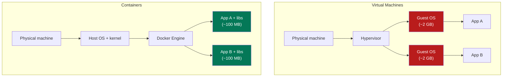
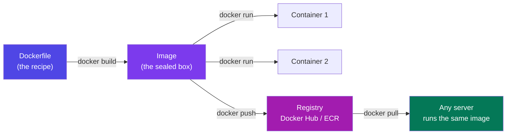
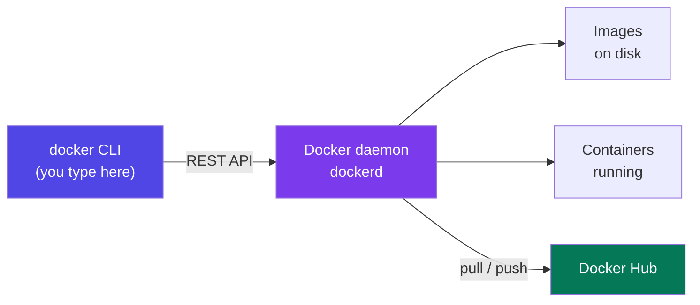
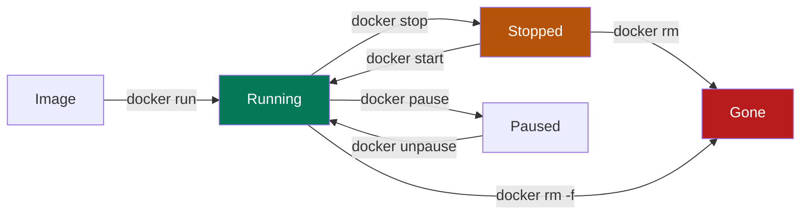
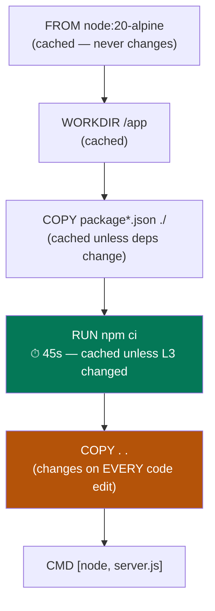
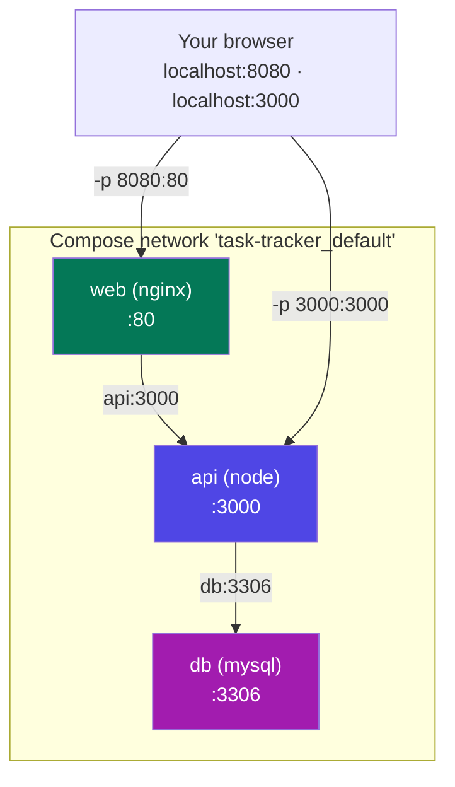
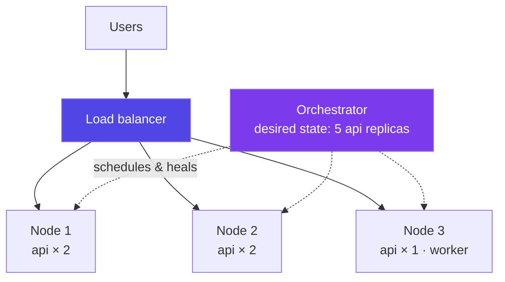
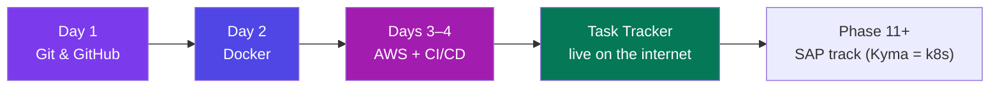

# Docker — Basics to Advanced

### Images, containers, Dockerfiles and Compose — how "but it works on my machine" stops being a joke

> *"A container is not a small computer. It is your application wearing its entire world as a coat — so wherever it goes, it is already home."*

**Phase 10 of 12 · Guide 2 of 3 (Git · Docker · AWS)** · The 50-Day Challenge · Web Dev → SAP + AI Engineer

---

## Table of Contents

- [How to Use This Guide (Day 2 of 4)](#how-to-use-this-guide-day-2-of-4)
- [Part A — Foundations: What a Container Actually Is](#part-a-foundations-what-a-container-actually-is)
  - [A1. The Problem Docker Solves](#a1-the-problem-docker-solves) · [A2. Container vs Virtual Machine](#a2-container-vs-virtual-machine) · [A3. The Three Nouns — Image, Container, Registry](#a3-the-three-nouns-image-container-registry) · [A4. How Docker Runs — Client, Daemon, and the First Container](#a4-how-docker-runs-client-daemon-and-the-first-container)
- [Part B — Running Containers](#part-b-running-containers)
  - [B1. `docker run` — The Flags That Matter](#b1-docker-run-the-flags-that-matter) · [B2. The Container Lifecycle](#b2-the-container-lifecycle) · [B3. Ports — Getting Into the Container](#b3-ports-getting-into-the-container) · [B4. Data — Volumes and Bind Mounts](#b4-data-volumes-and-bind-mounts) · [B5. Running Other People's Images](#b5-running-other-peoples-images)
- [Part C — Building Your Own Image](#part-c-building-your-own-image)
  - [C1. The Dockerfile](#c1-the-dockerfile) · [C2. Layers and the Build Cache](#c2-layers-and-the-build-cache) · [C3. Tags and Versioning](#c3-tags-and-versioning) · [C4. Multi-Stage Builds — 1.1 GB Down to 180 MB](#c4-multi-stage-builds-11-gb-down-to-180-mb) · [C5. Production Hardening](#c5-production-hardening)
- [Part D — Multiple Containers: Docker Compose](#part-d-multiple-containers-docker-compose)
  - [D1. Why Compose Exists](#d1-why-compose-exists) · [D2. The Compose File, Line by Line](#d2-the-compose-file-line-by-line) · [D3. Networking — Why It Is `db`, Not `localhost`](#d3-networking-why-it-is-db-not-localhost) · [D4. Environment, Secrets, and Dev vs Prod](#d4-environment-secrets-and-dev-vs-prod) · [D5. Everyday Compose Commands](#d5-everyday-compose-commands)
- [Part E — Beyond Your Laptop](#part-e-beyond-your-laptop)
  - [E1. Registries — Pushing Your Image Out](#e1-registries-pushing-your-image-out) · [E2. Docker in CI — Build Once, Promote the Same Image](#e2-docker-in-ci-build-once-promote-the-same-image) · [E3. Security and Size](#e3-security-and-size) · [E4. Orchestration — Where Containers Actually Live in Production](#e4-orchestration-where-containers-actually-live-in-production) · [E5. The Troubleshooting Playbook](#e5-the-troubleshooting-playbook)
- [Part F — Revision](#part-f-revision)
  - [F1. The One-Page Docker Cheat Sheet](#f1-the-one-page-docker-cheat-sheet) · [F2. 15 Interview Questions With Sharp Answers](#f2-15-interview-questions-with-sharp-answers) · [F3. Glossary](#f3-glossary) · [F4. Your Day 2, and What Comes Next](#f4-your-day-2-and-what-comes-next)

---

# How to Use This Guide (Day 2 of 4)

*Yesterday you learned to move **code** between machines. Today you learn to move the **machine itself** — the Node version, the MySQL server, the environment variables, the exact Linux libraries. That package is a container, and it is the unit everything in modern deployment is built on: AWS ECS, Kubernetes, Render, Google Cloud Run, and SAP BTP's Kyma all run containers.*

**Day 2 plan:** Parts A + B in the morning (what a container is, running other people's images), Part C after lunch (writing your own Dockerfile), Part D in the evening (Compose — the whole Task Tracker stack in one command), Part E as a skim, Part F as revision.

<p class="te"><strong>Telugu:</strong> Ninna <strong>code</strong> ni ela pampalo nerchukunnav. Ee roju <strong>machine</strong> ni ela pampalo — Node version, MySQL, environment variables, anni kalipi oka box lo. Aa box ne <strong>container</strong>. Modern deployment antha deeni meede nadustundi. Ee guide lo prathi command ni nee laptop lo type cheyyi.</p>

**Before you start:** install **Docker Desktop** from [docker.com](https://www.docker.com/products/docker-desktop). On Windows it will ask to enable **WSL 2** (a real Linux kernel inside Windows) — say yes; Docker containers are Linux, and WSL 2 is what runs them. Verify with `docker run hello-world`.

---

# Part A — Foundations: What a Container Actually Is

## A1. The Problem Docker Solves

**Simple definition:** **Docker** packages your application together with everything it needs to run — runtime, libraries, system tools, configuration — into one sealed, portable box.

<p class="te"><strong>Telugu:</strong> Docker ante nee app ni, daaniki kaavalsina anni (Node version, libraries, config) tho kalipi oka <strong>seal chesina box</strong> ga pack cheyyadam. Aa box ni ye computer meeda run chesina <strong>okate laaga</strong> pani chestundi.</p>

You have already met this problem. Your Task Tracker runs on your laptop with Node 20 and MySQL 8. Your friend clones the repo and it crashes: they have Node 18. The AWS server has MySQL 5.7 and a different timezone. Someone's `.env` is missing a variable. Every one of those is the same bug: **the code moved, the environment did not.**

| Problem | Without Docker | With Docker |
|---|---|---|
| New laptop, new developer | A day of installs and version fights | `docker compose up` — running in 2 minutes |
| Node 18 vs Node 20 | "Works on my machine" | The version is *inside* the image |
| Two projects need MySQL 5.7 and 8 | Painful; one machine, one MySQL | Two containers, two versions, side by side |
| Dev vs production drift | Different OS, libs, timezone | Byte-identical image everywhere |
| Testing a database | Install it, pollute your laptop | `docker run mysql:8` — delete it after |
| Deployment | Copy files, install, pray | Ship one image; the server runs it |

**Analogy:** before shipping containers were standardised in the 1950s, every cargo had to be loaded by hand and every ship, truck and crane handled it differently. The steel box changed the world not because it was clever, but because it was **the same everywhere**. Docker is that box for software — and the vocabulary (*image*, *container*, *registry*, *ship*) is borrowed on purpose.

**The one sentence:** *Docker doesn't make your app better; it makes your app's environment reproducible.* That is worth more than it sounds — most production incidents are environment differences, not logic errors.

---

## A2. Container vs Virtual Machine

**Simple definition:** a **virtual machine** simulates a whole computer including its own operating system. A **container** is just an isolated process on the host's existing OS kernel.

<p class="te"><strong>Telugu:</strong> VM ante oka computer lopala inko <strong>compute puri</strong> — sonta OS tho, GBs size, boot avvadaniki nimishaalu. Container ante adi kaadu — adi nee OS meede nadiche oka <strong>isolated process</strong>, MBs size, seconds lo start. Ide teda motham Docker katha.</p>



| | Virtual Machine | Container |
|---|---|---|
| Contains | A full guest OS + your app | Your app + its libraries only |
| Size | 1–20 GB | 50–500 MB |
| Start time | 30 s – 2 min | 0.1 – 2 s |
| How many per server | Tens | Hundreds |
| Isolation | Very strong (separate kernel) | Strong (shared kernel) |
| Best for | Running a different OS; hard multi-tenant isolation | Packaging and shipping applications |

**How the isolation works** — this is Phase 3's operating-systems material paying off. The Linux kernel provides:

- **Namespaces** — the container gets its own view of process IDs, network interfaces, mount points, hostnames and users. Inside, it looks like the only thing running.
- **cgroups** (control groups) — limits on CPU, memory and I/O, so one container can't starve the others.
- **Union filesystems** — layers stacked into one filesystem view (C2).

Docker did not invent these; it made them usable with one command.

**The consequence you must internalise:** a container shares the host kernel, so **Linux containers need a Linux kernel**. On Windows and Mac, Docker Desktop quietly runs a small Linux VM (WSL 2 / a hypervisor) and your containers live inside it. That is also why a container is *not* a full security boundary the way a VM is — for hostile multi-tenant workloads, clouds still use VMs (or lightweight ones like AWS Firecracker) underneath.

---

## A3. The Three Nouns — Image, Container, Registry

**Simple definition:** an **image** is the read-only template. A **container** is a running instance of an image. A **registry** is the shared place images are stored and downloaded from.

<p class="te"><strong>Telugu:</strong> Moodu padalu gurthupettuko. <strong>Image</strong> = recipe/blueprint (chadavadaniki matrame, marchalemu). <strong>Container</strong> = aa image ni run cheste vachedi (okate image nunchi 100 containers run cheyyochu). <strong>Registry</strong> = images ni dachi unche shop (Docker Hub) — GitHub laantidi, kaani code kaadu, images.</p>

The JavaScript parallel makes it instant: **image = class, container = object (`new`), registry = npm**.



| Term | It is | Lives |
|---|---|---|
| **Dockerfile** | Text recipe: "start from Node 20, copy my code, run `npm start`" | In your Git repo |
| **Image** | The built, read-only, layered result | Your machine + a registry |
| **Container** | A running (or stopped) instance, with a thin writable layer on top | Your machine / a server |
| **Registry** | A server that stores images | Docker Hub, AWS ECR, GitHub GHCR |
| **Volume** | Storage that outlives the container | Managed by Docker on the host |

**Image names** follow `registry/namespace/name:tag`. `mysql:8.0` is really `docker.io/library/mysql:8.0`. The tag matters more than beginners think: `:latest` is not a version, it is just the default tag name — and it moves. Always pin (`node:20-alpine`, not `node:latest`) so the build you test is the build you deploy.

**Real-world example:** you need MySQL 8 for the Phase 9 database work. Without Docker that is an installer, a service, a root password, and a mess to uninstall. With Docker: `docker run -d --name db -e MYSQL_ROOT_PASSWORD=secret -p 3306:3306 mysql:8` — running in 20 seconds, deleted with `docker rm -f db`, and your laptop is untouched.

---

## A4. How Docker Runs — Client, Daemon, and the First Container

**Simple definition:** the `docker` command is only a **client**. It sends your instructions to a background service, the **Docker daemon** (`dockerd`), which actually builds images and runs containers.

<p class="te"><strong>Telugu:</strong> <code>docker</code> command nuvvu type chese <strong>client</strong> matrame. Asalu pani background lo unde <strong>daemon</strong> chestundi — image build cheyyadam, container run cheyyadam. Anduke Docker Desktop off aithe "cannot connect to the Docker daemon" ani error vastundi.</p>



```bash
docker --version          # client version
docker info               # daemon status, storage driver, containers, images
docker run hello-world    # the smoke test
```

Watch what `docker run hello-world` actually did:

```text
Unable to find image 'hello-world:latest' locally     ← 1. not cached
latest: Pulling from library/hello-world              ← 2. downloads from Docker Hub
Status: Downloaded newer image for hello-world:latest ← 3. now it's an image
Hello from Docker!                                    ← 4. started a container, ran it, exited
```

That is the whole model in four lines: **pull an image → create a container from it → run its command → exit.**

**Where things live:** images and containers are stored by the daemon (on Windows, inside the WSL 2 VM), *not* in your project folder. That is why `docker images` and `docker ps` work from any directory, and why images can quietly eat 30 GB — `docker system df` shows you, `docker system prune -a` cleans up.

---

# Part B — Running Containers

## B1. `docker run` — The Flags That Matter

**Simple definition:** `docker run` creates a container from an image and starts it. Everything interesting is in the flags.

<p class="te"><strong>Telugu:</strong> <code>docker run</code> = image nunchi kotha container create chesi start cheyyadam. Ee flags ne roju vaadatharu — <code>-d</code> background lo, <code>-p</code> port kalapadam, <code>--name</code> peru pettadam, <code>-e</code> environment variable, <code>-v</code> data.</p>

```bash
docker run nginx                       # foreground; Ctrl-C stops it
docker run -d nginx                    # detached — runs in the background
docker run -d --name web -p 8080:80 nginx        # named, and reachable at localhost:8080
docker run -it --rm node:20 bash       # interactive shell, auto-delete on exit
docker run -d -e MYSQL_ROOT_PASSWORD=secret mysql:8    # environment variable
docker run -d -v tasks-data:/var/lib/mysql mysql:8     # persistent storage
docker run -d --restart unless-stopped nginx           # survive a reboot
docker run --memory 512m --cpus 1.5 my-api             # resource limits
```

| Flag | Means | Use it for |
|---|---|---|
| `-d` | Detached | Anything long-running (servers, databases) |
| `-p host:container` | Publish a port | Reaching the app from your browser |
| `--name x` | A stable name | So you can type `docker logs x` instead of a hash |
| `-e KEY=value` | Environment variable | Config and credentials |
| `--env-file .env` | A whole file of them | Real apps |
| `-v name:/path` | Volume | Data that must survive the container |
| `-it` | Interactive + TTY | Getting a shell |
| `--rm` | Delete on exit | One-off commands and experiments |
| `--restart unless-stopped` | Restart policy | Production |
| `--network x` | Join a network | Containers talking to each other (D3) |

**The most important habit:** `--rm` for anything experimental. Without it, every `docker run` leaves a stopped container behind, and in a week you have 200 of them.

**Real-world example — a throwaway Redis for testing caching:**

```bash
docker run -d --name cache -p 6379:6379 redis:7-alpine
# ...your Node app connects to localhost:6379, you test, you finish...
docker rm -f cache        # gone. Nothing installed, nothing left behind.
```

---

## B2. The Container Lifecycle

**Simple definition:** a container is created, runs, stops, and is removed. Stopping is not removing — a stopped container still exists, with its filesystem and logs.

<p class="te"><strong>Telugu:</strong> <code>stop</code> ante container ni <strong>aapadam</strong> matrame — adi inka undi, malli <code>start</code> cheyyochu. <code>rm</code> ante <strong>tolagichadam</strong>. Ee teda teliyakapothe "stop chesanu kada, malli enduku port busy?" ani confuse avutav.</p>



```bash
docker ps                     # RUNNING containers
docker ps -a                  # all of them, including stopped
docker stop web               # graceful: SIGTERM, then SIGKILL after 10s
docker start web              # start a stopped one again
docker restart web
docker rm web                 # remove a stopped container
docker rm -f web              # force: stop and remove in one go
docker logs -f --tail 100 web # follow the logs — your #1 debugging tool
docker exec -it web bash      # get a shell INSIDE a running container
docker inspect web            # everything: IP, mounts, env, restart policy
docker stats                  # live CPU/memory per container
docker cp web:/app/log.txt .  # copy a file out
```

**`exec` is where debugging happens.** When your API returns 500 inside a container, go in and look:

```bash
docker exec -it api sh        # alpine images have sh, not bash
> ls /app
> cat /app/.env
> node -e "console.log(process.env.DB_HOST)"
> exit                        # the container keeps running
```

**Cleaning up** — do this weekly or Docker will eat your disk:

```bash
docker system df              # what is using space
docker container prune        # remove all stopped containers
docker image prune -a         # remove images no container uses
docker system prune -a --volumes   # nuke everything unused ⚠ (volumes too!)
```

---

## B3. Ports — Getting Into the Container

**Simple definition:** a container has its own private network. `-p 8080:80` publishes container port 80 on your machine's port 8080, so `localhost:8080` reaches it.

<p class="te"><strong>Telugu:</strong> Container ki sonta network untundi — lopala app port 3000 meeda nadichina, bayata nunchi kanipinchadu. <code>-p 8080:3000</code> ante "naa laptop 8080 ni, container lopali 3000 ki kalapu" ani artham. <strong>Ekkada gurthupettuko: modati number nee machine di, rendodi container di.</strong></p>

```bash
docker run -d -p 8080:3000 my-api      # host 8080  →  container 3000
docker run -d -p 3000:3000 my-api      # same number both sides — the usual case
docker run -d -p 127.0.0.1:3000:3000 my-api   # only reachable from this machine
docker run -d -P nginx                 # publish ALL exposed ports on random host ports
docker port web                        # what is mapped where?
```

**The three port mistakes everyone makes once:**

1. **Reversed order.** `-p 3000:8080` when your app listens on 3000 gives you a connection refused. Host first, always.
2. **The app listens on `127.0.0.1` inside the container.** Localhost *inside* a container means the container itself, so nothing outside can reach it. Node apps must bind `0.0.0.0`: `app.listen(3000, '0.0.0.0')`.
3. **`EXPOSE` in a Dockerfile does not publish anything.** It is documentation. Only `-p` (or Compose's `ports:`) actually opens a port.

**Container-to-container is different.** Two containers on the same Docker network reach each other by **container name**, on the container's *real* port, with no `-p` at all. Your API connects to `mysql://db:3306`, not `localhost:3306` — this is the single most common beginner error, and Part D covers it properly.

---

## B4. Data — Volumes and Bind Mounts

**Simple definition:** containers are **disposable** — delete one and everything written inside it is gone. A **volume** is storage managed by Docker that survives; a **bind mount** maps a folder from your computer straight into the container.

<p class="te"><strong>Telugu:</strong> Container ni delete cheste daani lopala unna data motham poddi — adi <strong>kaavalane</strong> alaa design chesaru. Data ni kaapadukovadaniki <strong>volume</strong> (Docker chuskuntundi, database data ki) leda <strong>bind mount</strong> (nee folder ni container loki kalapadam, development ki) vaadatam.</p>

```bash
# VOLUME — Docker manages it. Use for databases.
docker volume create tasks-data
docker run -d --name db -v tasks-data:/var/lib/mysql mysql:8
docker rm -f db                        # container gone...
docker run -d --name db -v tasks-data:/var/lib/mysql mysql:8   # ...data still here
docker volume ls        docker volume inspect tasks-data       docker volume rm tasks-data

# BIND MOUNT — your folder, live. Use for development.
docker run -d -p 3000:3000 -v "$(pwd)":/app -v /app/node_modules node:20 npm run dev
#                             ^ your code, live-reloading   ^ keep the container's node_modules
```

| | Volume | Bind mount |
|---|---|---|
| Managed by | Docker | You (a real path on your machine) |
| Path | `docker volume ls` | `/home/nikhil/task-tracker` |
| Best for | **Database data**, uploads, production | **Development** — edit locally, see it live |
| Portable | Works the same on any host | Path depends on the machine |
| Speed on Windows/Mac | Fast | Slower (crosses the VM boundary) |

**The `-v /app/node_modules` trick** in that dev command is one of Docker's classic puzzles: your bind mount would otherwise hide the `node_modules` the image installed (and your host's may be built for Windows, not Linux). The extra anonymous volume masks that one folder so the container keeps its own.

**Real-world example — your Phase 9 database, made permanent:**

```bash
docker run -d --name tasks-db \
  -e MYSQL_ROOT_PASSWORD=secret -e MYSQL_DATABASE=task_tracker \
  -p 3306:3306 -v tasks-data:/var/lib/mysql mysql:8
docker exec -it tasks-db mysql -uroot -psecret task_tracker    # run your Phase 9 SQL
```

Delete the container as often as you like; `tasks-data` keeps every row.

---

## B5. Running Other People's Images

**Simple definition:** Docker Hub holds ready-made images for almost every piece of infrastructure — databases, caches, proxies, message queues. Running one is a single command with no installation.

<p class="te"><strong>Telugu:</strong> Docker Hub lo prapanchamlo unna dadapu anni tools images ga unnayi. MySQL, Redis, Nginx, Postgres — install cheyyakkarledu, okka command chalu. Ide beginner ki Docker yokka <strong>modati peddha gift</strong>.</p>

```bash
# MySQL 8 — your Phase 9 database
docker run -d --name db -e MYSQL_ROOT_PASSWORD=secret -e MYSQL_DATABASE=task_tracker \
  -p 3306:3306 -v tasks-data:/var/lib/mysql mysql:8

# PostgreSQL
docker run -d --name pg -e POSTGRES_PASSWORD=secret -p 5432:5432 postgres:16-alpine

# Redis — caching, sessions, rate limiting
docker run -d --name cache -p 6379:6379 redis:7-alpine

# Nginx serving your built React app
docker run -d -p 8080:80 -v "$(pwd)/dist":/usr/share/nginx/html:ro nginx:alpine

# A whole SQL client, once, then gone
docker run -it --rm --network host mysql:8 mysql -h127.0.0.1 -uroot -psecret
```

**Reading a Docker Hub page** — the four things to check before you trust an image: is it an **Official Image** or *Verified Publisher* (the badge matters — anyone can upload anything); which **tags** exist (prefer a specific version, and `-alpine`/`-slim` for size); which **environment variables** it needs (that's the whole configuration API); and which **paths** it stores data in (that's what you mount a volume onto).

**Image tag suffixes you will see constantly:**

| Tag | Means | Size example (Node 20) |
|---|---|---|
| `node:20` | Full Debian base | ~1.1 GB |
| `node:20-slim` | Debian, trimmed | ~240 MB |
| `node:20-alpine` | Alpine Linux — tiny | ~140 MB |

Alpine uses `musl` instead of `glibc`, which very occasionally breaks native npm modules (`bcrypt`, `sharp`). Start with `alpine`; fall back to `slim` if a build fails.

---

# Part C — Building Your Own Image

## C1. The Dockerfile

**Simple definition:** a **Dockerfile** is a plain text recipe. Each line is an instruction, and `docker build` follows them to produce an image.

<p class="te"><strong>Telugu:</strong> Dockerfile ante oka <strong>recipe</strong> — "ee base image tho start cheyyi, ee files copy cheyyi, ee command run cheyyi" ani line by line raayadam. <code>docker build</code> aa recipe ni follow chesi image thayaru chestundi.</p>

Here is a complete, correct Dockerfile for your Phase 7 Express API — read the comments, then the table below:

```dockerfile
# syntax=docker/dockerfile:1
FROM node:20-alpine                  # 1. the base image everything is built on

WORKDIR /app                         # 2. all later commands run here (mkdir + cd)

COPY package*.json ./                # 3. copy ONLY the manifests first — see C2
RUN npm ci --omit=dev                # 4. install exactly package-lock.json, no dev deps

COPY . .                             # 5. now the source code

ENV NODE_ENV=production              # 6. default env vars (never secrets!)
EXPOSE 3000                          # 7. documentation: "this app listens on 3000"

USER node                            # 8. stop running as root
CMD ["node", "src/server.js"]        # 9. what to run when a container starts
```

```bash
docker build -t task-api:1.0 .       # -t = tag it;  "." = the build context (this folder)
docker run -d -p 3000:3000 --env-file .env task-api:1.0
```

| Instruction | What it does | Watch out for |
|---|---|---|
| `FROM` | The starting image | Always pin a version; prefer `-alpine` |
| `WORKDIR` | Set (and create) the working directory | Use it instead of `RUN cd` |
| `COPY src dest` | Copy files from your machine into the image | Order matters hugely (C2) |
| `ADD` | Like COPY, but also unpacks tars and fetches URLs | Prefer `COPY` — `ADD` is too magic |
| `RUN` | Execute a command **at build time** | Each `RUN` makes a layer; chain with `&&` |
| `ENV` | Environment variable baked into the image | Never put secrets here — they're readable |
| `ARG` | Build-time variable (`--build-arg`) | Also visible in history; not for secrets |
| `EXPOSE` | Documents a port | Does **not** publish it — that's `-p` |
| `USER` | Which user runs the app | Non-root in production |
| `VOLUME` | Declares a data path | Usually better declared at run time |
| `CMD` | Default command, overridable | Use JSON form: `["node","x.js"]` |
| `ENTRYPOINT` | The fixed executable | `CMD` then supplies its default arguments |
| `HEALTHCHECK` | How Docker tests if it's alive | Essential for Compose/orchestrators (C5) |

**`CMD` vs `ENTRYPOINT` in one line:** `ENTRYPOINT` is *what this container is*, `CMD` is *its default arguments*. With `ENTRYPOINT ["node"]` and `CMD ["src/server.js"]`, running `docker run img src/worker.js` swaps the file but keeps `node`. For most web apps, `CMD` alone is fine.

**Shell form vs JSON form:** `CMD node server.js` runs through `/bin/sh -c`, which means your app becomes a *child* of the shell and **never receives the stop signal** — so `docker stop` takes the full 10-second timeout and kills it. `CMD ["node", "server.js"]` runs it directly as PID 1 and shuts down gracefully. Always use the JSON form.

---

## C2. Layers and the Build Cache

**Simple definition:** every instruction in a Dockerfile creates a read-only **layer**. Docker caches layers and reuses them, so a rebuild only redoes the steps after the first thing that changed.

<p class="te"><strong>Telugu:</strong> Prathi Dockerfile line oka <strong>layer</strong> create chestundi, and Docker aa layers ni <strong>cache</strong> chestundi. Oka line maarithe, <strong>aa line nunchi kinda unnavi anni</strong> malli build avutayi — paina unnavi cache nunchi vastayi. Anduke <code>package.json</code> ni modata copy chesi, code ni tarvata copy chestam.</p>



**Why the manifest-first order matters.** You edit one line of `src/app.js` and rebuild:

- **Correct order (above):** layers 1–4 come from cache, only `COPY . .` re-runs. Build takes **2 seconds**.
- **Wrong order** (`COPY . .` before `RUN npm ci`): the copy layer changed, so `npm ci` re-runs too. Build takes **45 seconds** — every single time.

**The rule:** order Dockerfile instructions from **least likely to change** to **most likely to change**.

**Chaining `RUN` to avoid junk layers.** Each `RUN` is a layer, and a file deleted in a *later* layer still occupies space in the earlier one:

```dockerfile
# Bad — three layers, and the apt cache is stuck in the image forever
RUN apt-get update
RUN apt-get install -y curl
RUN rm -rf /var/lib/apt/lists/*

# Good — one layer, cleaned up inside it
RUN apt-get update && apt-get install -y --no-install-recommends curl \
    && rm -rf /var/lib/apt/lists/*
```

```bash
docker history task-api:1.0     # every layer and its size — find the fat one
docker build --no-cache -t task-api:1.0 .      # force a full rebuild
```

**`.dockerignore` — the other file that must exist.** The build context (everything in `.`) is sent to the daemon before the build even starts. Without this file you ship your whole `node_modules`, `.git` and `.env` into the build:

```dockerignore
node_modules
.git
.env
dist
*.log
coverage
Dockerfile
docker-compose.yml
README.md
```

<p class="te"><strong>Telugu:</strong> <code>.dockerignore</code> lekapothe nee <code>node_modules</code> (500 MB) and <code>.git</code> motham build ki pampistav — build slow avutundi, and <code>.env</code> image lopaliki velthe <strong>secrets leak</strong>. <code>.gitignore</code> laage, idi kuda modati roje raayali.</p>

---

## C3. Tags and Versioning

**Simple definition:** a **tag** is the label after the colon in an image name. It is how you say which version of an image to run.

<p class="te"><strong>Telugu:</strong> <code>task-api:1.0</code> lo <code>1.0</code> ye tag. Okate image ki enni tags ayina pettochu. <code>:latest</code> ante "kotha version" ani kaadu — adi kevalam default peru. Anduke production lo eppudu <strong>specific tag</strong> ne vaadali.</p>

```bash
docker build -t task-api:1.2.0 -t task-api:latest .   # two tags, one build
docker tag task-api:1.2.0 nikhil/task-api:1.2.0       # retag for a registry
docker images                                          # list, with sizes
docker rmi task-api:1.0                                # remove an image
```

**The tagging scheme real teams use** — apply several tags to the same build so different consumers can pick their own risk level:

| Tag | Points at | Used by |
|---|---|---|
| `task-api:1.4.2` | One exact build, forever | Production — **always deploy this** |
| `task-api:1.4` | Latest patch of 1.4 | Staging |
| `task-api:sha-a3f5c9e` | The Git commit it was built from | Debugging: "what code is running?" |
| `task-api:latest` | The most recent build | Local development only |

**The `:latest` trap:** `docker run myapp:latest` on two servers a week apart can run two different builds, and `docker pull` won't even tell you. Every production incident of the "but we didn't change anything" kind traces back to a floating tag. Tag with the **Git SHA** in CI (the AWS guide does exactly this) and you can always answer "which commit is live?"

---

## C4. Multi-Stage Builds — 1.1 GB Down to 180 MB

**Simple definition:** a **multi-stage build** uses one image to *build* your app and a second, much smaller one to *run* it — copying across only the finished output.

<p class="te"><strong>Telugu:</strong> Build cheyyadaniki compilers, dev dependencies kaavali — kaani <strong>run</strong> cheyyadaniki avi akkarledu. Multi-stage lo modati stage lo build chesi, rendo (chinna) stage loki kevalam <strong>final output</strong> ni copy chestam. Image size 1 GB nunchi 150 MB ki paddipotundi.</p>

**Your Phase 6 React frontend** — build with Node, serve with Nginx:

```dockerfile
# ---------- stage 1: build ----------
FROM node:20-alpine AS build
WORKDIR /app
COPY package*.json ./
RUN npm ci                       # dev dependencies needed here
COPY . .
RUN npm run build                # produces /app/dist

# ---------- stage 2: serve ----------
FROM nginx:alpine
COPY --from=build /app/dist /usr/share/nginx/html
COPY nginx.conf /etc/nginx/conf.d/default.conf
EXPOSE 80
CMD ["nginx", "-g", "daemon off;"]
```

Node, npm, the source code and 400 MB of dev dependencies never reach the final image — only the built HTML/CSS/JS does. **1.1 GB → ~25 MB.**

**Your Phase 7 Express API** — same idea, production dependencies only:

```dockerfile
FROM node:20-alpine AS deps
WORKDIR /app
COPY package*.json ./
RUN npm ci --omit=dev

FROM node:20-alpine AS runner
WORKDIR /app
ENV NODE_ENV=production
COPY --from=deps /app/node_modules ./node_modules
COPY src ./src
COPY package.json .
USER node
EXPOSE 3000
HEALTHCHECK --interval=30s --timeout=3s --start-period=10s \
  CMD wget -qO- http://localhost:3000/health || exit 1
CMD ["node", "src/server.js"]
```

```bash
docker build --target build -t task-web:dev .   # stop at a named stage (handy for debugging)
```

| Benefit | Why it matters |
|---|---|
| **Smaller images** | Faster pulls, faster deploys, cheaper storage and bandwidth |
| **Smaller attack surface** | No compilers or shells for an attacker to use |
| **No source leakage** | Your uncompiled source never ships |
| **One file** | Build and runtime described together, versioned in Git |

**Real-world example:** an ECS deployment that pulls a 1.1 GB image takes ~90 seconds per task before it even starts; at 180 MB it is ~12 seconds. Multiply by every deploy, every autoscale event, every rollback — this single technique is why nobody ships single-stage Node images in production.

---

## C5. Production Hardening

**Simple definition:** the four things that separate a Dockerfile that works from one you would put on the internet — a non-root user, correct signal handling, a healthcheck, and no secrets inside the image.

<p class="te"><strong>Telugu:</strong> Image pani chestondi ante saripodu — production ki naalugu vishayalu: <strong>root ga run cheyyaddu</strong>, <strong>stop signal</strong> correct ga handle cheyyali, <strong>healthcheck</strong> undali, and <strong>secrets ni image lo pettaddu</strong>.</p>

**1. Don't run as root.** By default a container's process is root, and a container escape then means root on the host.

```dockerfile
USER node                                   # node images ship a "node" user
# or, for other bases:
RUN addgroup -S app && adduser -S app -G app
USER app
```

**2. Handle signals.** `docker stop` sends `SIGTERM` and waits 10 seconds before `SIGKILL`. Your app must close the HTTP server and the DB pool in that window, or you drop in-flight requests on every deploy:

```js
process.on('SIGTERM', async () => {
  server.close(() => console.log('http closed'));
  await pool.end();
  process.exit(0);
});
```

Use the JSON `CMD` form (C1) so your process is PID 1 and actually receives the signal; if you need proper zombie-process reaping, add `--init` to `docker run`.

**3. Add a HEALTHCHECK.** Without one, "the container is running" is all the orchestrator knows — even if your app is deadlocked. With one, Compose can wait for a database to be genuinely ready and ECS can replace a sick task.

```dockerfile
HEALTHCHECK --interval=30s --timeout=3s --retries=3 --start-period=15s \
  CMD wget -qO- http://localhost:3000/health || exit 1
```

**4. Never bake secrets into an image.** Anyone who can pull the image can read every `ENV`, `ARG` and layer — including deleted files.

| ❌ Never | ✅ Instead |
|---|---|
| `ENV DB_PASSWORD=secret` | `--env-file`, Compose `environment:`, or AWS Secrets Manager |
| `COPY .env .` | Put `.env` in `.dockerignore` |
| `ARG NPM_TOKEN` for a private registry | `RUN --mount=type=secret,id=npm ...` (BuildKit secrets) |

```bash
docker history --no-trunc task-api:1.0 | grep -i pass     # audit your own image
docker scout cves task-api:1.0                            # scan for known CVEs
```

**The size-and-safety checklist:** pin the base image, use `-alpine` or `-slim`, multi-stage, `.dockerignore`, `npm ci --omit=dev`, non-root `USER`, `HEALTHCHECK`, JSON `CMD`, no secrets, and rebuild regularly so base-image security patches actually reach you.

---

# Part D — Multiple Containers: Docker Compose

## D1. Why Compose Exists

**Simple definition:** **Docker Compose** describes a multi-container application in one YAML file, so the whole stack starts with `docker compose up`.

<p class="te"><strong>Telugu:</strong> Nee Task Tracker ki moodu mukkalu — React frontend, Express API, MySQL database. Prathi dhaanki verey <code>docker run</code> command, network, volume... gurthu pettukovadam kastam. <strong>Compose</strong> antha oka YAML file lo raasi, <code>docker compose up</code> tho motham stack ni start chestundi.</p>

Without Compose, starting your stack means remembering three long commands, in the right order, with the right network and the right environment variables. With Compose it is one file in Git, one command, and identical on every teammate's machine.

```bash
docker compose up -d        # build if needed, create the network, start everything
docker compose down         # stop and remove containers + network (volumes survive)
```

**A note on the command name:** modern Docker uses `docker compose` (a plugin, v2). Older tutorials show `docker-compose` (a separate Python tool, v1, now end-of-life). Same YAML, so use the space.

---

## D2. The Compose File, Line by Line

**Simple definition:** a Compose file defines **services** (containers), plus the **networks** and **volumes** they share.

<p class="te"><strong>Telugu:</strong> Compose file lo moodu mukkalu — <strong>services</strong> (containers), <strong>volumes</strong> (data), <strong>networks</strong> (evaru evarito matladatharo). Kindha unnadi nee Task Tracker motham stack.</p>

```yaml
# docker-compose.yml — the whole Task Tracker
services:

  db:
    image: mysql:8
    environment:
      MYSQL_ROOT_PASSWORD: ${DB_ROOT_PASSWORD}     # from the .env file beside this one
      MYSQL_DATABASE: task_tracker
    volumes:
      - db-data:/var/lib/mysql                     # named volume → data survives
      - ./sql/schema.sql:/docker-entrypoint-initdb.d/01-schema.sql:ro   # auto-run on first start
    healthcheck:
      test: ["CMD", "mysqladmin", "ping", "-h", "localhost", "-p${DB_ROOT_PASSWORD}"]
      interval: 10s
      retries: 10
    restart: unless-stopped

  api:
    build:
      context: ./api                # folder containing the Dockerfile
      dockerfile: Dockerfile
    environment:
      DB_HOST: db                   # ← the SERVICE NAME, not localhost
      DB_USER: root
      DB_PASSWORD: ${DB_ROOT_PASSWORD}
      DB_NAME: task_tracker
      PORT: 3000
    ports:
      - "3000:3000"
    depends_on:
      db:
        condition: service_healthy  # wait until MySQL actually answers
    restart: unless-stopped

  web:
    build: ./web                    # the React app (multi-stage → nginx)
    ports:
      - "8080:80"
    depends_on:
      - api

volumes:
  db-data:                          # Docker manages this
```

| Key | Means |
|---|---|
| `image:` | Use a ready-made image from a registry |
| `build:` | Build from a Dockerfile in this repo |
| `environment:` | Env vars for this container |
| `env_file:` | Load them from a file instead |
| `ports:` | `"host:container"` — publish to your machine |
| `volumes:` | `name:/path` (volume) or `./path:/path` (bind mount) |
| `depends_on:` | Start order, and with `condition:` a real readiness wait |
| `healthcheck:` | How Compose decides the service is ready |
| `restart:` | `no` / `always` / `unless-stopped` / `on-failure` |
| `command:` | Override the image's `CMD` |

**The single most important line in that file is `DB_HOST: db`.** Read D3 before you write your own.

---

## D3. Networking — Why It Is `db`, Not `localhost`

**Simple definition:** Compose puts every service on a shared private network, where each service is reachable by its **service name** as a hostname, on the container's own port.

<p class="te"><strong>Telugu:</strong> Idi <strong>90% beginners tappu chese chotu</strong>. Container lopala <code>localhost</code> ante "ee container" ani artham — nee laptop kaadu. Anduke API nunchi database ki connect avvadaniki <code>localhost:3306</code> kaadu, <code>db:3306</code> raayali (<code>db</code> ante Compose file lo aa service peru).</p>



| From | To | Address |
|---|---|---|
| API container | DB container | `db:3306` ✅ |
| API container | DB container | `localhost:3306` ❌ (that's the API itself) |
| Your laptop | DB container | `localhost:3306` ✅ (only because of `ports:`) |
| Your browser | API | `localhost:3000` ✅ |

**The corollary:** services only need `ports:` if *you* must reach them from outside. In production the database should have **no** `ports:` at all — the API reaches it over the private network, and nothing else can.

**`depends_on` does less than you think.** Plain `depends_on: [db]` waits for the container to *start*, not for MySQL to be *ready to accept connections* — so your API crashes on boot with `ECONNREFUSED`. The fix is the `condition: service_healthy` form shown in D2, plus retry logic in your app (a container that restarts until the DB is up is a legitimate design).

---

## D4. Environment, Secrets, and Dev vs Prod

**Simple definition:** Compose reads a `.env` file sitting next to `docker-compose.yml` and substitutes `${VARIABLES}` — which is how you keep passwords out of the file you commit.

<p class="te"><strong>Telugu:</strong> Passwords ni <code>docker-compose.yml</code> lo raayaku — adi Git lo velthundi. Pakkana <code>.env</code> file lo pettu (adi <code>.gitignore</code> lo undali), and <code>.env.example</code> ni matrame commit cheyyi.</p>

```bash
# .env  —  in .gitignore, never committed
DB_ROOT_PASSWORD=a-real-strong-password
JWT_SECRET=another-long-random-string
```

```bash
# .env.example  —  committed, so teammates know what they need
DB_ROOT_PASSWORD=changeme
JWT_SECRET=changeme
```

**Dev vs prod with override files.** Compose automatically merges `docker-compose.override.yml` on top of the base file when you run `docker compose up`:

```yaml
# docker-compose.override.yml — development only (auto-applied locally)
services:
  api:
    command: npm run dev          # nodemon instead of node
    volumes:
      - ./api/src:/app/src        # live reload: edit on your machine, container sees it
      - /app/node_modules         # keep the container's own node_modules (B4)
    environment:
      NODE_ENV: development
    ports:
      - "9229:9229"               # Node debugger
```

```bash
docker compose up -d                                   # base + override (development)
docker compose -f docker-compose.yml up -d             # base only (production-like)
docker compose -f docker-compose.yml -f compose.prod.yml up -d   # explicit prod stack
```

**Beyond `.env`:** Compose also supports a `secrets:` block that mounts a value as a file at `/run/secrets/<name>` rather than an environment variable — closer to how Kubernetes and ECS do it, and it keeps the value out of `docker inspect`. In real AWS deployments the secret comes from Secrets Manager or SSM Parameter Store instead (AWS guide, C4).

---

## D5. Everyday Compose Commands

**Simple definition:** the dozen commands you will actually use, and the debugging loop when something won't come up.

<p class="te"><strong>Telugu:</strong> Ee commands ne roju vaadutav. Mukhyanga <code>logs -f</code> — emaindo teliyakapothe modata adi chudu.</p>

```bash
docker compose up -d              # start everything in the background
docker compose up -d --build      # rebuild images first (after a Dockerfile/code change)
docker compose ps                 # what's running, and is it healthy?
docker compose logs -f            # follow ALL logs
docker compose logs -f api        # just one service — your main debugging tool
docker compose exec api sh        # shell inside the running api container
docker compose exec db mysql -uroot -p task_tracker    # a SQL prompt on the database
docker compose restart api        # restart one service
docker compose stop               # stop, keep everything
docker compose down               # stop + remove containers and the network
docker compose down -v            # ...and DELETE the volumes ⚠ (wipes your database)
docker compose run --rm api npm test          # one-off command in a fresh container
docker compose config             # print the fully merged, variable-substituted file
```

**The debugging loop when `up` fails:**

1. `docker compose ps` — which service is not running, or `unhealthy`?
2. `docker compose logs <service>` — read the actual error, don't guess.
3. `ECONNREFUSED` to the DB → you used `localhost` instead of the service name (D3), or you're missing `condition: service_healthy`.
4. `port is already allocated` → something else on your machine owns that port; change the *host* side of `ports:`.
5. Config looks wrong → `docker compose config` shows what Compose really parsed, with all `${VARS}` resolved.
6. Still stuck → `docker compose down -v && docker compose up --build` for a clean slate (remember `-v` deletes the database).

**Real-world example — your Day 2 deliverable:** clone the Task Tracker on a machine with nothing but Docker installed, run `docker compose up -d`, and open `localhost:8080` to a working app with a seeded database. That is the moment Docker clicks — and it is exactly what a hiring manager wants to see in your README.

---

# Part E — Beyond Your Laptop

## E1. Registries — Pushing Your Image Out

**Simple definition:** a **registry** stores images so other machines can pull them. Docker Hub is the public default; AWS **ECR** and GitHub **GHCR** are the private ones you will use at work.

<p class="te"><strong>Telugu:</strong> Nee laptop lo build chesina image ni server ki pampali kada — daaniki <strong>registry</strong>. GitHub laantidi, kaani code kaadu, images dachutundi. Public ki Docker Hub, AWS lo deploy cheyyadaniki <strong>ECR</strong>.</p>

```bash
# Docker Hub
docker login
docker tag task-api:1.4.2 nikhil/task-api:1.4.2
docker push nikhil/task-api:1.4.2
docker pull nikhil/task-api:1.4.2          # from any machine

# AWS ECR (the AWS guide sets the repository up)
aws ecr get-login-password --region ap-south-1 \
  | docker login --username AWS --password-stdin 123456789.dkr.ecr.ap-south-1.amazonaws.com
docker tag task-api:1.4.2 123456789.dkr.ecr.ap-south-1.amazonaws.com/task-api:1.4.2
docker push 123456789.dkr.ecr.ap-south-1.amazonaws.com/task-api:1.4.2
```

| Registry | Free private repos | Best for |
|---|---|---|
| **Docker Hub** | 1 | Public/portfolio images |
| **GitHub GHCR** | Unlimited for private repos | Anything already on GitHub |
| **AWS ECR** | Pay per GB (cheap) | Deploying to ECS / EKS / EC2 — same account, same IAM |

**Multi-architecture matters now.** Your M-series Mac builds `arm64`; most EC2 instances are `amd64`. An image built on one will not run on the other. Build both at once:

```bash
docker buildx build --platform linux/amd64,linux/arm64 -t nikhil/task-api:1.4.2 --push .
```

---

## E2. Docker in CI — Build Once, Promote the Same Image

**Simple definition:** in a real pipeline the image is built **once**, tested, and then the *identical* image is promoted through staging to production — never rebuilt per environment.

<p class="te"><strong>Telugu:</strong> Mukhyamaina niyamam: image ni <strong>okasari</strong> build cheyyali, and adhe image ni staging, production anni chotla vaadali. Prathi environment ki malli build cheste, test chesindi okati, deploy chesindi inkokati avutundi.</p>

```yaml
# .github/workflows/build.yml
name: Build & push image
on:
  push:
    branches: [main]

jobs:
  build:
    runs-on: ubuntu-latest
    steps:
      - uses: actions/checkout@v4
      - uses: docker/setup-buildx-action@v3
      - uses: docker/login-action@v3
        with:
          registry: ghcr.io
          username: ${{ github.actor }}
          password: ${{ secrets.GITHUB_TOKEN }}
      - uses: docker/build-push-action@v5
        with:
          push: true
          tags: |
            ghcr.io/${{ github.repository }}:${{ github.sha }}
            ghcr.io/${{ github.repository }}:latest
          cache-from: type=gha              # reuse layer cache between runs
          cache-to: type=gha,mode=max
```

Tagging with `${{ github.sha }}` means every image is traceable to the exact commit that produced it — so "which code is in production?" is a lookup, not an investigation. The AWS guide (Part E) extends this workflow to actually deploy.

**Testing inside the pipeline** is where Compose earns its keep again — spin up a real database for integration tests, then throw it away:

```yaml
      - run: docker compose -f docker-compose.test.yml up --abort-on-container-exit --exit-code-from tests
```

---

## E3. Security and Size

**Simple definition:** a container is only as safe as the image it came from, and every megabyte you ship is code that could contain a vulnerability.

<p class="te"><strong>Telugu:</strong> Image lo unna prathi package oka risk. Chinna image = takkuva risk + fast deploy. Base image ni pin cheyyi, regular ga rebuild cheyyi (security patches kosam), and scan cheyyi.</p>

```bash
docker scout cves task-api:1.4.2      # built into Docker Desktop
trivy image task-api:1.4.2            # the popular standalone scanner
docker history task-api:1.4.2         # what made this image so big?
```

**The checklist, in priority order:**

| # | Do | Why |
|---|---|---|
| 1 | Pin base image versions (`node:20.11-alpine`) | Reproducible builds |
| 2 | Rebuild weekly / on base updates | Security patches only arrive with a rebuild |
| 3 | `USER node` — never root | Limits the blast radius of an escape |
| 4 | Multi-stage; ship no compilers or shells | Smaller attack surface |
| 5 | No secrets in `ENV`, `ARG` or layers | Anyone with the image can read them |
| 6 | Scan in CI, fail on HIGH/CRITICAL | Catches known CVEs before deploy |
| 7 | Read-only filesystem where possible (`--read-only`) | Stops an attacker writing files |
| 8 | Drop capabilities (`--cap-drop ALL`) | Containers rarely need kernel privileges |
| 9 | Set memory/CPU limits | One bad container can't take the host down |

**The one that bites students:** mounting the Docker socket (`-v /var/run/docker.sock:/var/run/docker.sock`) gives that container **root on the host**. Tutorials suggest it casually. Don't, unless you fully control what runs inside.

---

## E4. Orchestration — Where Containers Actually Live in Production

**Simple definition:** an **orchestrator** runs containers across many machines — restarting them when they crash, scaling them with load, and replacing them without downtime. Compose is one machine; an orchestrator is a fleet.

<p class="te"><strong>Telugu:</strong> Compose oka machine ki. Nijamaina production lo 10 servers meeda 50 containers nadapali, okati chanipothe automatic ga restart cheyyali, load penrigithe ekkuva start cheyyali — aa pani chesedi <strong>orchestrator</strong> (Kubernetes, ECS).</p>



| Option | What it is | When to pick it |
|---|---|---|
| **Docker Compose** | One machine, several containers | Local dev; a small single-server deployment |
| **AWS ECS + Fargate** | AWS's own orchestrator; Fargate means no servers to manage | **You** — least new vocabulary, deep AWS integration |
| **Kubernetes (EKS/GKE/AKS)** | The industry standard, enormous and powerful | Many teams, many services, multi-cloud |
| **Docker Swarm** | Compose-like clustering, built in | Simple clusters; largely superseded |
| **PaaS** (Render, Railway, Fly.io, App Runner) | You hand over an image, they run it | Small teams who don't want infrastructure |

**The vocabulary that transfers.** Everything you learned today maps directly onto Kubernetes, so this is not throwaway knowledge:

| Docker / Compose | Kubernetes |
|---|---|
| Container | Container (inside a **Pod**) |
| `docker-compose.yml` service | **Deployment** + **Service** |
| `ports:` | **Service** / **Ingress** |
| `environment:` | **ConfigMap** |
| Secrets in `.env` | **Secret** |
| `volumes:` | **PersistentVolumeClaim** |
| `restart: unless-stopped` | ReplicaSet (desired replica count) |
| `healthcheck:` | **liveness** / **readiness probes** |

**For SAP:** BTP's **Kyma** runtime is managed Kubernetes, and Cloud Foundry buildpacks produce containers under the hood. The Docker mental model is the entry ticket to both.

---

## E5. The Troubleshooting Playbook

**Simple definition:** the errors you will hit this week, and the exact fix for each.

<p class="te"><strong>Telugu:</strong> Ee errors anni neeku vastayi — bhayapadaku. Prathi dhaanki fix ikkade undi. <strong>Modati step eppudu <code>docker logs</code></strong>.</p>

| Symptom | Cause | Fix |
|---|---|---|
| `Cannot connect to the Docker daemon` | Docker Desktop isn't running | Start it; on Linux `sudo systemctl start docker` |
| Container exits immediately | The main process finished or crashed | `docker logs <name>` — read the error. Foreground process required |
| `port is already allocated` | Something owns that host port | Change the host side of `-p`, or stop the other container |
| App unreachable at `localhost:3000` | App bound to `127.0.0.1` inside the container | Listen on `0.0.0.0` |
| `ECONNREFUSED` to the DB | Used `localhost` instead of the service name | `db:3306` (D3), plus `condition: service_healthy` |
| Code changes don't appear | You rebuilt nothing / no bind mount | `docker compose up -d --build`, or mount the source in dev |
| Data disappeared after `down` | You used `down -v`, or never had a volume | Use a named volume; never `-v` on real data |
| Image is enormous | Single-stage, full base, no `.dockerignore` | Multi-stage + alpine + `.dockerignore` (C2, C4) |
| Build is slow every time | `COPY . .` before `npm ci` | Copy manifests first (C2) |
| `no space left on device` | Old images and volumes | `docker system df` then `docker system prune -a` |
| `exec format error` | Built for arm64, running on amd64 | `docker buildx --platform linux/amd64` (E1) |
| Permission denied on a mounted file | UID mismatch between host and container | Match the UID, or fix ownership in the Dockerfile |

**The universal first three moves:** `docker compose ps` (what state is it in?) → `docker compose logs -f <service>` (what did it say?) → `docker compose exec <service> sh` (go in and look). Ninety per cent of Docker problems surrender to those three.

---

# Part F — Revision

## F1. The One-Page Docker Cheat Sheet

```bash
# ---- images ---------------------------------------------------------------
docker build -t app:1.0 .            docker images
docker pull mysql:8                  docker rmi app:1.0
docker tag app:1.0 user/app:1.0      docker push user/app:1.0
docker history app:1.0               docker scout cves app:1.0

# ---- containers -----------------------------------------------------------
docker run -d --name api -p 3000:3000 --env-file .env app:1.0
docker run -it --rm node:20 bash     # throwaway shell
docker ps            docker ps -a    docker stats
docker stop api      docker start api    docker rm -f api
docker logs -f --tail 100 api        docker exec -it api sh
docker inspect api                   docker cp api:/app/x.log .

# ---- data -----------------------------------------------------------------
docker volume ls                     docker volume create db-data
-v db-data:/var/lib/mysql            # volume  (databases, production)
-v "$(pwd)":/app                     # bind mount (development)

# ---- compose --------------------------------------------------------------
docker compose up -d --build         docker compose ps
docker compose logs -f api           docker compose exec api sh
docker compose down                  docker compose down -v   # ⚠ deletes volumes
docker compose run --rm api npm test docker compose config

# ---- cleanup --------------------------------------------------------------
docker system df                     docker container prune
docker image prune -a                docker system prune -a --volumes  # ⚠
```

**The Dockerfile skeleton worth memorising:**

```dockerfile
FROM node:20-alpine AS deps
WORKDIR /app
COPY package*.json ./
RUN npm ci --omit=dev

FROM node:20-alpine
WORKDIR /app
ENV NODE_ENV=production
COPY --from=deps /app/node_modules ./node_modules
COPY src ./src
USER node
EXPOSE 3000
CMD ["node", "src/server.js"]
```

---

## F2. 15 Interview Questions With Sharp Answers

**1. Container vs virtual machine?** A VM virtualises hardware and runs its own guest OS (GBs, ~a minute to boot). A container is an isolated process sharing the host kernel via namespaces and cgroups (MBs, ~a second). Containers package applications; VMs package machines.

**2. Image vs container?** The image is the read-only template; a container is a running instance of it with a thin writable layer on top. Class vs object.

**3. What is a layer, and why does order matter?** Each Dockerfile instruction creates a cached layer. A change invalidates that layer *and everything after it*, so you copy `package.json` and install dependencies before copying source — otherwise every code edit reinstalls everything.

**4. What does `.dockerignore` do?** Excludes files from the build context that is uploaded to the daemon. It keeps builds fast and stops `node_modules`, `.git` and `.env` leaking into the image.

**5. What is a multi-stage build?** Build in one stage with the full toolchain, then `COPY --from=` only the artefacts into a small runtime image. Smaller, faster to deploy, and no source or compilers shipped.

**6. `CMD` vs `ENTRYPOINT`?** `ENTRYPOINT` is the fixed executable; `CMD` provides default arguments and is easy to override at `docker run`. Most web apps only need `CMD`, in JSON form.

**7. Why JSON form for CMD?** Shell form wraps the process in `/bin/sh -c`, so your app isn't PID 1 and never receives `SIGTERM` — `docker stop` then kills it after 10 seconds, dropping in-flight requests.

**8. Volume vs bind mount?** A volume is Docker-managed storage that survives container deletion — use it for databases. A bind mount maps a host folder in — use it for live-reload during development.

**9. Why can't my container reach the database on `localhost`?** Inside a container, `localhost` is that container. On a Docker network, address the other container by its **service/container name** (`db:3306`).

**10. What does `EXPOSE` actually do?** Documents the port. Only `-p` / `ports:` publishes it to the host.

**11. Are containers secure?** Reasonably isolated but sharing a kernel, so a kernel exploit escapes. Harden with a non-root `USER`, minimal base images, dropped capabilities, resource limits and scanning. For hostile multi-tenant workloads, VMs (or Firecracker) still provide the hard boundary.

**12. `docker stop` vs `docker kill`?** `stop` sends `SIGTERM` and waits (default 10s) before `SIGKILL`, giving your app time to close connections. `kill` is `SIGKILL` immediately.

**13. What is Docker Compose for?** Declaring a multi-container app — services, networks, volumes — in one YAML file so the whole stack starts with one command and is identical for every developer.

**14. Why is `:latest` dangerous in production?** It is just a default tag name, not a version. Two servers can pull different builds from the same tag. Deploy immutable tags — a version or the Git SHA.

**15. Where do secrets go?** Never in the image (`ENV`/`ARG`/layers are all readable). Inject at runtime via `--env-file`, Compose secrets, or a cloud secret store like AWS Secrets Manager / SSM Parameter Store.

---

## F3. Glossary

| Term | Meaning |
|---|---|
| **Image** | Read-only layered template for a container |
| **Container** | A running instance of an image |
| **Dockerfile** | The text recipe used to build an image |
| **Layer** | One cached filesystem change from one instruction |
| **Build context** | The folder sent to the daemon at build time |
| **Registry · Repository · Tag** | Where images live · one image's namespace · one version label |
| **Docker Hub / ECR / GHCR** | Public / AWS / GitHub registries |
| **Daemon (`dockerd`)** | The background service that does the real work |
| **Volume · Bind mount** | Docker-managed storage · a host folder mapped in |
| **Namespace · cgroup** | Kernel isolation of resources · limits on their usage |
| **Multi-stage build** | Build in one image, ship from a smaller one |
| **Compose** | Multi-container apps defined in one YAML file |
| **Service** | One container definition in a Compose file |
| **Healthcheck** | A command Docker runs to test liveness |
| **Orchestrator** | Runs containers across many machines (ECS, Kubernetes) |
| **Alpine** | A ~5 MB Linux base image |
| **BuildKit / buildx** | Modern build engine; parallel stages, secrets, multi-arch |
| **OCI** | The open standard Docker images and runtimes conform to |

---

## F4. Your Day 2, and What Comes Next

**Do these seven things before you close the laptop today:**

| # | Task |
|---|---|
| 1 | `docker run hello-world`, then `docker run -d -p 8080:80 nginx` and open it in a browser |
| 2 | Run MySQL 8 in a container with a **named volume**; load your Phase 9 schema; `docker rm -f` it and prove the data survived |
| 3 | Write a `Dockerfile` for your Phase 7 API — manifests first, `USER node`, JSON `CMD` |
| 4 | Convert it to **multi-stage** and compare `docker images` sizes before and after |
| 5 | Add `.dockerignore`, then check `docker history` for anything that shouldn't be there |
| 6 | Write `docker-compose.yml` for web + api + db, with `condition: service_healthy` |
| 7 | `docker compose down -v && docker compose up -d --build` — the whole app from nothing, in one command |

<p class="te"><strong>Telugu:</strong> Ee 7 panulu ee roje cheyyi. Mukhyanga <strong>7th</strong> — okka command tho motham app (frontend + backend + database) start avvadam. Adi jarigina rojune Docker nee chetiki vachchinattu. Aa command ni README lo raayi — interview lo adi peddha plus.</p>



**The one idea to carry forward:** Docker's real product is not speed or size — it is **reproducibility**. An image is a promise that this code, these dependencies and this configuration behave identically on your laptop, in CI, and on a server in Mumbai. Everything else — layers, Compose, orchestration, the entire cloud-native industry — is built on that one promise.

Build small images. Never trust `:latest`. Keep secrets outside. And if it works in Compose, it will work in the cloud.

<p class="te"><strong>Telugu:</strong> Chivari maata — Docker yokka aslu goal speed kaadu, <strong>reproducibility</strong>. "Naa machine lo pani chesindi" ane maata ni permanent ga tholaginchadam. Chinna images, specific tags, secrets bayata — ee moodu gurthu unte chalu. Repu AWS — nee app internet loki veltundi! All the best, Nikhil!</p>

---