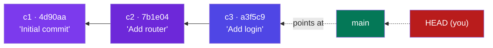
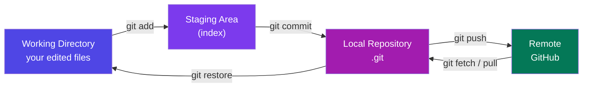
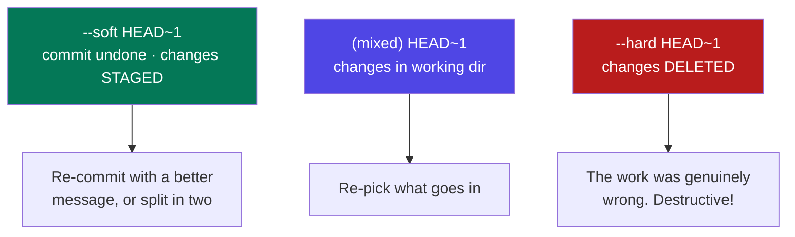
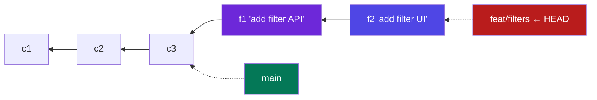
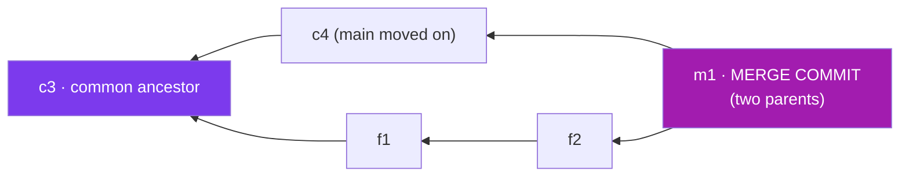
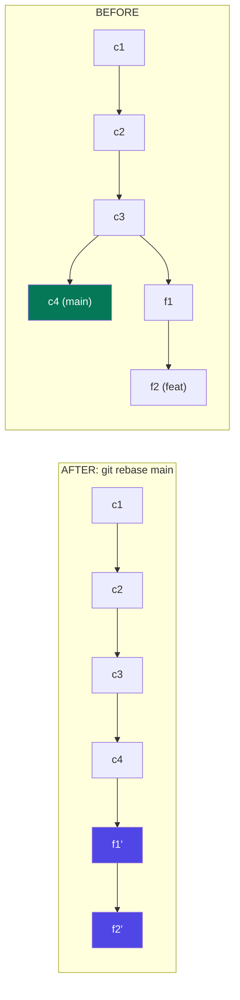
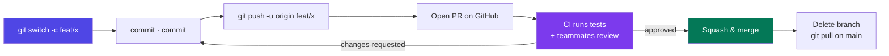
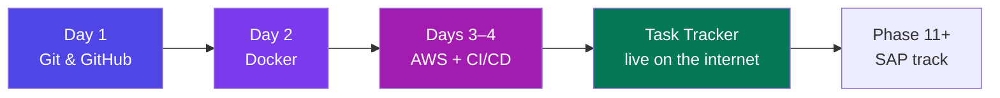

# Git & GitHub — Basics to Advanced

### From "what is a commit" to rebase, reflog and pull requests — the one tool every job posting assumes you already know

> *"Git does not save your files. It saves your decisions — and lets you take any of them back."*

**Phase 10 of 12 · Guide 1 of 3 (Git · Docker · AWS)** · The 50-Day Challenge · Web Dev → SAP + AI Engineer

---

## Table of Contents

- [How to Use This Guide (Day 1 of 4)](#how-to-use-this-guide-day-1-of-4)
- [Part A — Foundations: What Git Actually Is](#part-a-foundations-what-git-actually-is)
  - [A1. Why Version Control Exists](#a1-why-version-control-exists) · [A2. How Git Thinks — Snapshots, Not Differences](#a2-how-git-thinks-snapshots-not-differences) · [A3. The Three Areas — Working Directory, Staging, Repository](#a3-the-three-areas-working-directory-staging-repository) · [A4. Setup — Install, Configure, First Repository](#a4-setup-install-configure-first-repository)
- [Part B — The Everyday Loop](#part-b-the-everyday-loop)
  - [B1. status, add, commit](#b1-status-add-commit) · [B2. Commit Messages That Survive](#b2-commit-messages-that-survive) · [B3. Reading History — log, show, diff, blame](#b3-reading-history-log-show-diff-blame) · [B4. Undoing Things — restore, reset, revert, amend](#b4-undoing-things-restore-reset-revert-amend) · [B5. stash — Parking Unfinished Work](#b5-stash-parking-unfinished-work)
- [Part C — Branching & Merging](#part-c-branching-merging)
  - [C1. Branches — A Movable Label on a Commit](#c1-branches-a-movable-label-on-a-commit) · [C2. Merging — Bringing a Branch Back](#c2-merging-bringing-a-branch-back) · [C3. Conflicts — Reading and Resolving Them](#c3-conflicts-reading-and-resolving-them) · [C4. Rebase — Rewriting History for a Clean Line](#c4-rebase-rewriting-history-for-a-clean-line) · [C5. Tags & Releases](#c5-tags-releases)
- [Part D — GitHub: Working With Other People](#part-d-github-working-with-other-people)
  - [D1. Remotes — clone, push, fetch, pull](#d1-remotes-clone-push-fetch-pull) · [D2. Authentication — SSH Keys and Tokens](#d2-authentication-ssh-keys-and-tokens) · [D3. Pull Requests — The Review Workflow](#d3-pull-requests-the-review-workflow) · [D4. Forks, Issues, Protection and the Repo Front Page](#d4-forks-issues-protection-and-the-repo-front-page) · [D5. GitHub Actions — Your First Taste of CI](#d5-github-actions-your-first-taste-of-ci)
- [Part E — Advanced Git You Will Actually Need](#part-e-advanced-git-you-will-actually-need)
  - [E1. reflog — The Undo Button for Undo](#e1-reflog-the-undo-button-for-undo) · [E2. cherry-pick and bisect](#e2-cherry-pick-and-bisect) · [E3. Branching Strategies — How Real Teams Organise](#e3-branching-strategies-how-real-teams-organise) · [E4. Rewriting History — Interactive Rebase and Safe Force-Push](#e4-rewriting-history-interactive-rebase-and-safe-force-push) · [E5. Hooks, Big Files and Leaked Secrets](#e5-hooks-big-files-and-leaked-secrets)
- [Part F — Revision](#part-f-revision)
  - [F1. The One-Page Git Cheat Sheet](#f1-the-one-page-git-cheat-sheet) · [F2. 15 Interview Questions With Sharp Answers](#f2-15-interview-questions-with-sharp-answers) · [F3. Glossary](#f3-glossary) · [F4. Your Day 1, and What Comes Next](#f4-your-day-1-and-what-comes-next)

---

# How to Use This Guide (Day 1 of 4)

*Phase 10 is where your code stops living on your laptop. Three guides, four days: **Git** (this one, Day 1), **Docker** (Day 2), **AWS + CI/CD** (Days 3–4). By the end, the Task Tracker you built in Phases 6, 7 and 9 is on the public internet, deployed by a robot every time you push.*

**Day 1 plan:** Parts A + B in the morning (foundations, the everyday loop), Part C after lunch (branching and merging), Parts D + E in the evening (GitHub and the escape hatches), Part F as revision.

<p class="te"><strong>Telugu:</strong> Ee guide oka roju kosam. Git ni chadivithe raadu — <strong>terminal open chesi type cheyyali</strong>. Prathi command ni oka test folder lo try cheyyi, kaavalani break cheyyi, error chadavu. Prathi section lo <strong>Telugu explanation</strong> untundi. Chivarilo cheat sheet + interview questions unnayi.</p>

**How to practise:** make a throwaway folder (`mkdir git-lab && cd git-lab && git init`) and run *every* command in this guide there. Git is the rare tool where you can safely destroy everything — Part E shows you how to bring it all back.

---

# Part A — Foundations: What Git Actually Is

## A1. Why Version Control Exists

**Simple definition:** **Version control** is software that remembers every version of your project — who changed what, when, and why — and lets you return to any of them.

<p class="te"><strong>Telugu:</strong> Version control ante nee project yokka <strong>prathi version ni gurthu pettukune system</strong>. Evaru, eppudu, emi maarcharu, enduku — anni store avuthayi. Kaavalante okka command tho purathana version ki vellipovachu.</p>

You already know the problem. Without Git, a project folder looks like this:

```text
index_final.js   index_final_v2.js   index_final_v2_USE_THIS.js
index_backup_18aug.js   index_ravi_changes.js
```

Which one is live? What changed between v2 and USE_THIS? Can I take *only* the login fix out of Ravi's copy? If two of us edit at once, whose version wins? None of those have an answer here.

| Without version control | With Git |
|---|---|
| Copy the folder before a risky change | `git branch` — free, instant, unlimited |
| "It worked yesterday" → no way back | `git checkout <yesterday's commit>` |
| Merge changes by hand, file by file | `git merge` merges automatically, flags real conflicts |
| No idea who broke it | `git blame` names the line's author and commit |
| Backup = your laptop | GitHub is an off-site copy of the *whole history* |

**Real-world example:** the Linux kernel — 30+ million lines, ~15,000 contributors, thousands of changes a week — runs on Git. Linus Torvalds wrote it in 2005 in about two weeks *because* nothing else could handle that. It will handle your Task Tracker.

**The one sentence:** *Git is not a backup tool — it is a record of intent.* Every commit says "I changed these lines, for this reason." That record is what makes teamwork, code review and blame-free debugging possible.

---

## A2. How Git Thinks — Snapshots, Not Differences

**Simple definition:** every time you commit, Git stores a **snapshot** of all your tracked files at that moment, plus a pointer to the commit that came before it.

<p class="te"><strong>Telugu:</strong> Chala tools "ee line marindi" ani <strong>differences</strong> store chestayi. Git alaa kaadu — prathi commit lo <strong>motham project yokka photo (snapshot)</strong> teestundi, and "naa mundu commit idi" ani pointer pedutundi. Andukane branch cheyyadam, back vellipovadam intha fast.</p>

Three facts explain almost every Git behaviour you will ever see:

**1. A commit is a snapshot + a parent + metadata** (author, date, message). Unchanged files are not re-stored — Git points at the previous copy, so snapshots are cheap.

**2. Every commit has a unique SHA hash** like `a3f5c9e8b2…`, computed from its content *and* its parent. Change one character anywhere and you get a completely different ID. That is why history is tamper-evident, and why "rewriting history" always produces *new* commits instead of editing old ones.

**3. History is a graph, not a line.** Each commit points backwards to its parent (a merge commit has two). Branches and tags are just sticky notes pointing at a commit.



**HEAD** is Git's word for "where you are right now" — normally it points at a branch, and that branch points at a commit.

**Interview line:** *"Git stores snapshots, not diffs — a commit is an immutable object identified by the hash of its content, and branches are just movable pointers into that object graph."* That one sentence separates people who understand Git from people who memorised it.

---

## A3. The Three Areas — Working Directory, Staging, Repository

**Simple definition:** a file in a Git project lives in one of three places: the **working directory** (files you edit), the **staging area** (what will go into the next commit), and the **repository** (committed history, inside `.git`).

<p class="te"><strong>Telugu:</strong> Moodu chotlu — <strong>Working directory</strong> = nuvvu edit chese files. <strong>Staging area</strong> = next commit lo pettadaniki select chesukunnavi (shopping basket laaga). <strong>Repository</strong> = permanent ga save ayina history. <code>git add</code> = basket lo pettadam, <code>git commit</code> = bill kottadam.</p>



**Why staging exists (the part beginners skip):** it lets you commit *part* of your work. You fixed a bug and also renamed a variable elsewhere — stage and commit them separately, and your history stays readable.

```bash
git add src/auth.js
git commit -m "fix(auth): reject expired tokens"
git add -p src/utils.js   # stage chunk by chunk: y = yes, n = no, s = split smaller
git commit -m "refactor: rename fmt() to formatDate()"
```

| State | Meaning | `git status` says |
|---|---|---|
| **Untracked** | Git has never seen this file | *Untracked files* |
| **Modified** | Tracked, changed, not staged | *Changes not staged for commit* |
| **Staged** | Will be in the next commit | *Changes to be committed* |
| **Committed** | Safely in history | (nothing — it's clean) |

There is a fourth area worth knowing: the **stash** (B5), a shelf for parking unfinished work without committing it.

---

## A4. Setup — Install, Configure, First Repository

**Simple definition:** installing Git gives you the `git` command, configuring tells Git who you are, and `git init` turns any folder into a repository.

<p class="te"><strong>Telugu:</strong> Modata Git install cheyyi, tarvata nee peru + email set cheyyi (prathi commit meeda ade kanipistundi), aa tarvata <code>git init</code> tho ye folder ni ayina repository ga maarchachu.</p>

**Install:** Windows → [git-scm.com](https://git-scm.com) (this also installs *Git Bash*, a Linux-style terminal you will want for the rest of Phase 10). Mac → `brew install git`. Linux → `sudo apt install git`. Verify with `git --version`.

```bash
git config --global user.name  "Nikhil Vanama"
git config --global user.email "you@example.com"   # your GitHub email
git config --global init.defaultBranch main        # not "master"
git config --global core.autocrlf true             # Windows line endings
git config --global core.editor "code --wait"      # VS Code for messages
git config --list --show-origin                    # verify, and see which file each came from
```

Config has three levels — **system**, **global** (`~/.gitconfig`), and **local** (`.git/config`). The most specific wins, so a work repo can use your work email while everything else uses your personal one.

```bash
mkdir task-tracker && cd task-tracker
git init                     # creates .git — this folder is now a repository
echo "# Task Tracker" > README.md
git add README.md
git commit -m "chore: initial commit"
git log --oneline            # a3f5c9e chore: initial commit
```

**`.gitignore` — the file that saves your career.** It lists paths Git must never track:

```gitignore
node_modules/        # regenerate with npm ci — never commit
dist/  build/        # build output
.env  .env.local     # SECRETS — the important part
*.pem  *.log
.DS_Store  coverage/
```

<p class="te"><strong>Telugu:</strong> <code>.gitignore</code> ni <strong>modati commit lone</strong> pettu. <code>.env</code> lo API keys untayi — okasari GitHub lo push aithe, bots konni <strong>nimishaalalo</strong> aa keys ni pattukuntayi. Delete chesina history lo migilipotundi (E5 lo cleanup chuddam).</p>

**Real-world example:** every year thousands of live AWS keys are found in public GitHub repos by automated scanners, usually within minutes of the push — that is how Uber's 2016 breach of 57 million records started. Write `.gitignore` before your first `git add .`.

**Gotcha:** `.gitignore` only affects files Git isn't already tracking. If you already committed `.env`:

```bash
git rm --cached .env && echo ".env" >> .gitignore
git commit -m "chore: stop tracking .env"
# ...then rotate those keys. They are compromised. (E5)
```

Ready-made ignore files for any stack: [github.com/github/gitignore](https://github.com/github/gitignore), or `npx gitignore node`.

---

# Part B — The Everyday Loop

## B1. status, add, commit

**Simple definition:** the core rhythm of Git is: change files → `git status` to see what changed → `git add` what belongs together → `git commit` with a message.

<p class="te"><strong>Telugu:</strong> Ee naalugu commands ye nee 90% Git panulu. <strong>status</strong> = ippudu paristhiti chudu, <strong>add</strong> = e maarpulu commit cheyyalo select cheyyi, <strong>commit</strong> = enduko cheppi save cheyyi, <strong>log</strong> = charitra chudu. Migatha antha veeti chuttu ne.</p>

```bash
git status                   # run constantly — it also suggests the next command
git status -s                # short:  M src/app.js   ?? notes.txt

git add src/app.js           # one file
git add .                    # everything (check status first!)
git add -p                   # chunk by chunk — the professional habit

git commit -m "feat: add task filtering by status"
git commit                   # opens the editor: subject, blank line, body
git commit -am "fix: typo"   # add + commit, but ONLY for already-tracked files
```

**How often should you commit?** Whenever the project is in a state you would be happy to return to — usually 5–200 changed lines with a single purpose. "One commit per feature" is too big; "one commit per save" is noise.

| `git status -s` | Meaning |
|---|---|
| `??` | Untracked |
| ` M` | Modified, not staged |
| `M ` | Modified and staged |
| `MM` | Staged, then modified again |
| `A ` / `D ` / `R ` | Added / deleted / renamed, staged |

**Real-world example — one afternoon on the Task Tracker:** you changed a route, a test, and the DB pool. Don't commit all three together:

```bash
git add src/routes/tasks.js src/routes/tasks.test.js
git commit -m "feat(tasks): add GET /tasks?status= filter with tests"
git add src/db/pool.js
git commit -m "perf(db): raise pool connectionLimit to 10"
```

Two commits, two ideas. Six months later, when the pool change turns out to be wrong, you revert *that* one without touching the feature.

**Gotcha:** `git commit -am` does **not** pick up new files. Beginners lose work this way — glance at `git status` first.

---

## B2. Commit Messages That Survive

**Simple definition:** a commit message explains **why** a change was made. The diff already shows what changed.

<p class="te"><strong>Telugu:</strong> Commit message lo "emi marchano" kaadu, "<strong>enduku</strong> marchano" raayali — emi marindo diff lo already kanipistundi. Aaru nelala tarvata nuvve ee message chadavuthav.</p>

**Conventional Commits** is the format most modern teams use — it's machine-readable, so tools generate changelogs and version numbers from it:

```text
<type>(<scope>): <subject, imperative mood, under 50 chars>

<optional body: why, and context a reviewer needs>
<optional footer: Closes #42 / BREAKING CHANGE: ...>
```

| Type | Use for | Example |
|---|---|---|
| `feat` | New feature | `feat(auth): add refresh token endpoint` |
| `fix` | Bug fix | `fix(tasks): stop 500 when dueDate is null` |
| `refactor` | Restructure, no behaviour change | `refactor(db): extract repository layer` |
| `perf` | Performance | `perf(tasks): index (user_id, status)` |
| `test` / `docs` | Tests / documentation only | `test(auth): cover expired-token path` |
| `chore` / `ci` | Tooling, deps / pipeline | `chore(deps): bump express to 4.19.2` |

**Imperative mood** means "add", not "added" — so the message reads *"if applied, this commit will **add task filtering**"*, matching Git's own generated messages ("Merge branch…", "Revert…").

```bash
# Bad                     →  Good
"stuff"                      "fix(api): return 404 instead of 500 for missing task"
"fixed bug"                  "fix(auth): compare password hashes in constant time"
"updates"                    "refactor(ui): move date formatting into utils"
```

**Real-world example:** production breaks at 2 a.m. and the on-call engineer runs `git log` on the last deploy. Ten commits saying "updates" mean reading every diff. Ten conventional commits mean spotting `perf(db): drop the old index` in three seconds. That is why teams enforce the format with a commit-message hook (E5).

---

## B3. Reading History — log, show, diff, blame

**Simple definition:** these four answer "what happened?", "what exactly did that commit change?", "what is different right now?" and "who wrote this line, and why?"

<p class="te"><strong>Telugu:</strong> <strong>log</strong> = charitra list, <strong>show</strong> = oka commit lopala emundo, <strong>diff</strong> = ippudu emi maarindo, <strong>blame</strong> = ee line evaru raasaru e commit lo. Debugging lo ee naalugu ne nee tools.</p>

```bash
git log --oneline --graph --decorate --all   # THE one to memorise — a visual branch map
git log -5                       git log --author="Nikhil"
git log --since="2 weeks ago"    git log --grep="pagination"   # search MESSAGES
git log -S "connectionLimit"     # search commits that added/removed this CODE (pickaxe)
git log -p src/routes/tasks.js   # one file's history, with diffs
git log --stat                   # files changed + line counts
```

That first command draws the branch structure as ASCII art — it is how you *see* what a merge or rebase actually did:

```text
* 9f2c1a (HEAD -> main, origin/main) Merge pull request #12 from feat/filters
|\
| * 4b8e07 (feat/filters) feat(tasks): add status filter
| * 1c9d33 test(tasks): cover empty filter
|/
* 7b1e04 chore: bump deps
```

| Reference | Means |
|---|---|
| `HEAD` | Current commit |
| `HEAD~1`, `HEAD~3` | 1 / 3 commits back |
| `HEAD^2` | Second parent of a merge commit |
| `a3f5c9e` | By hash — first 7 characters are enough |
| `main`, `v1.2.0` | By branch or tag |
| `origin/main` | Where the remote's main was at your last fetch |

```bash
git show a3f5c9e                 # message + full diff of one commit
git show a3f5c9e:src/app.js      # that FILE as it was then
git diff                         # working dir vs staging — "what haven't I staged?"
git diff --staged                # staging vs last commit — "what am I about to commit?"
git diff main..feat/filters      # difference between two branches
git blame -L 40,60 src/db/pool.js   # who wrote lines 40–60, and in which commit
```

**Real-world example:** a query started timing out last Tuesday. `git log --since="last Tuesday" --oneline` shows 12 commits; `git log -S "LIMIT" --oneline` narrows it to one; `git show` confirms it. Two minutes, no guessing. Blame gives you the hash, and your commit message (B2) gives you the reason — that is the payoff of writing them properly.

---

## B4. Undoing Things — restore, reset, revert, amend

**Simple definition:** Git has a different undo for each area — **restore** throws away file changes, **reset** moves the branch pointer, **revert** adds a commit that cancels an old one, **amend** rewrites the last commit.

<p class="te"><strong>Telugu:</strong> Git lo "undo" oka command kaadu, <strong>naalugu</strong> unnayi. Push cheyyaka mundu <code>reset</code>, push chesaka <code>revert</code>. Ide golden rule.</p>

**The decision table — read this before every panic:**

| Situation | Command |
|---|---|
| Edited a file, want the committed version back | `git restore <file>` |
| Staged by mistake, keep the edit | `git restore --staged <file>` |
| Last commit message is wrong (not pushed) | `git commit --amend -m "better"` |
| Forgot a file in the last commit | `git add x && git commit --amend --no-edit` |
| Undo last commit, **keep** changes staged | `git reset --soft HEAD~1` |
| Undo last commit, keep changes unstaged | `git reset HEAD~1` *(default)* |
| Undo last commit and **delete** the changes | `git reset --hard HEAD~1` ⚠ |
| Undo a commit that is already **pushed** | `git revert <hash>` |
| Panicking, lost something | `git reflog` → E1 |



```bash
git revert a3f5c9e           # a NEW commit that reverses a3f5c9e
git revert HEAD              # undo the last commit, safely
git revert --no-commit a3f5c9e b7d2f11   # revert several, commit once
```

`revert` deletes nothing — it *adds*. That is the point: everyone else's history stays valid, so nothing breaks for your teammates.

<p class="te"><strong>Telugu:</strong> <code>reset</code> = history ni <strong>maarchadam</strong> (nee daggara matrame unte fine). <code>revert</code> = purathana commit ni cancel chese <strong>kotha commit</strong> (team tho share chesaka idi ne safe).</p>

**amend** creates a *new commit with a new hash* — the old one is discarded. Never amend something already pushed to a shared branch; it forces everyone into a conflict. (If you must: `--force-with-lease`, E4.)

**Real-world example:** you push a change that breaks the production build. The instinct is `reset --hard` and force-push — don't; five teammates already pulled it. `git revert <hash> && git push` fixes production in 30 seconds and leaves an honest record.

---

## B5. stash — Parking Unfinished Work

**Simple definition:** `git stash` takes your uncommitted changes off the working directory and puts them on a shelf, giving you a clean tree — then hands them back when you ask.

<p class="te"><strong>Telugu:</strong> Sagam pani chesi unnavu, appude urgent bug fix cheyyali. Commit cheyyadaniki pani complete kaledu. <code>git stash</code> aa maarpulni <strong>shelf meeda</strong> pettestundi, folder clean avutundi. Bug fix ayyaka <code>git stash pop</code> tho tirigi teesukuntav.</p>

```bash
git stash push -m "wip: task filter UI"   # shelve tracked changes, with a label
git stash -u                              # ...including untracked files
git stash list                            # stash@{0}: On main: wip: task filter UI
git stash pop                             # re-apply the newest and remove it
git stash apply stash@{1}                 # re-apply a specific one, KEEP it shelved
git stash show -p stash@{0}               # preview as a diff
git stash drop stash@{0}                  # delete one
```

**The classic flow:**

```bash
git stash push -m "wip: task filter UI"
git switch main && git pull
git switch -c hotfix/null-duedate     # ...fix, commit, push, PR merged...
git switch feat/filters && git stash pop   # back exactly where you were
```

**Gotchas:** stashes are **local** — they never push, and a fresh clone won't have them. They are easy to forget, so check `git stash list` weekly. Many engineers skip stash entirely and make a `git commit -am "wip"` instead, unwrapping it later with `git reset --soft HEAD~1` — harder to lose, because commits are in the reflog.

---

# Part C — Branching & Merging

## C1. Branches — A Movable Label on a Commit

**Simple definition:** a **branch** is just a name that points at a commit. Creating one costs 41 bytes and zero seconds — it does not copy your files.

<p class="te"><strong>Telugu:</strong> Branch ante oka <strong>sticky note</strong>, oka commit meeda attach chesi untundi. Kotha branch create cheste files copy avvavu — kevalam oka label create avutundi. Andukane Git lo branches ni free ga, dhairyanga vaadachu.</p>

Because a branch is only a pointer, you can work on a feature without touching `main`. When you commit on a branch, that pointer moves forward; `main` stays where it was.



```bash
git branch                       # list; * marks current
git switch -c feat/filters       # create AND move onto it   (modern — use this)
git checkout -b feat/filters     # same thing                (old syntax, seen everywhere)
git switch main                  # move                      git switch -   (previous branch)
git branch -m old new            # rename
git branch -d feat/filters       # delete (refuses if unmerged — good)
git branch --merged              # which branches are safe to delete
```

**`switch`/`restore` vs `checkout`:** `git checkout` used to do everything — change branches *and* discard file changes — which made it dangerously ambiguous. Git 2.23 split it into `switch` (branches) and `restore` (files). Use the new ones; recognise the old one in every tutorial you read.

**Naming:** a type prefix, a slash, kebab-case — `feat/task-filters`, `fix/null-duedate-500`, `chore/bump-express`, or `JIRA-412-refresh-tokens` where a ticket system is in use.

**Detached HEAD** — you will hit it. `git checkout a3f5c9e` puts HEAD on a *commit* rather than a branch, so any commits you make there belong to no branch and eventually get garbage-collected. If you made something worth keeping, run `git switch -c rescue-branch` immediately.

**Real-world example:** on the Task Tracker, `main` must always be deployable. Every change — even a typo fix — starts as `git switch -c fix/typo`, gets a pull request, and merges back. That is **GitHub Flow** (E3), and it is what almost every product team does.

---

## C2. Merging — Bringing a Branch Back

**Simple definition:** `git merge` joins the commits from another branch into your current one.

<p class="te"><strong>Telugu:</strong> Feature branch lo pani ayipoyaka, aa maarpulni <code>main</code> loki kalapadam ne <strong>merge</strong> antaru. Modata <code>main</code> ki vellali, tarvata <code>git merge feat/filters</code> — "e branch loki kalupthunnavo akkade nilabadali" ani gurthupettuko.</p>

```bash
git switch main && git pull      # start from an up-to-date main
git merge feat/filters
git branch -d feat/filters       # clean up
```

**Fast-forward** — if `main` hasn't moved since you branched, Git just slides the pointer forward. No merge commit, perfectly linear:

```text
before:  c1 ─ c2 ─ c3 (main) ─ f1 ─ f2 (feat)
after:   c1 ─ c2 ─ c3 ─ f1 ─ f2 (main, feat)
```

**Three-way merge** — if `main` moved on too, Git finds the common ancestor, combines both sides, and records a **merge commit** with two parents:



```bash
git merge feat/filters --no-ff    # force a merge commit even when ff is possible
git merge feat/filters --squash   # bring the changes in as ONE uncommitted change set
git merge --abort                 # bail out
```

**`--no-ff` is a real preference, not pedantry:** it records that "these five commits were one feature", so you can undo the whole thing with `git revert -m 1 <merge>`.

| Strategy | History looks like | Best for |
|---|---|---|
| **Merge commit** (`--no-ff`) | Branches visible, true record | Teams that value "what happened" |
| **Squash** | One commit per feature, dead straight | Small PRs with noisy WIP commits — **the common default** |
| **Rebase + fast-forward** | Perfectly linear, no merge commits | Teams that want `git log` to read like a book (C4) |

Squash turns a branch's 14 messy commits ("wip", "fix typo", "actually fix") into one clean commit on `main` — GitHub offers it as a button on every PR. The trade-off is that the fine-grained history is gone, so delete the branch afterwards.

---

## C3. Conflicts — Reading and Resolving Them

**Simple definition:** a **merge conflict** happens when two branches changed the *same lines* of the same file, and Git refuses to guess which is right.

<p class="te"><strong>Telugu:</strong> Conflict ante Git failure kaadu — rendu branches lo <strong>okate line</strong> maarithe, edi correcto Git ki teliyadu, anduke ninnu adugutundi. Bhayapadaku: file open chesi, kaavalsindi unchi, migathavi teesesi, <code>git add</code> chesi merge complete cheyyi.</p>

Git marks the file like this:

```js
function getTasks(status) {
<<<<<<< HEAD                      // ← what's on YOUR current branch (main)
  return db.query('SELECT * FROM tasks WHERE status = ?', [status]);
=======                           // ← the divider
  return db.query('SELECT * FROM tasks WHERE status = ? LIMIT 50', [status]);
>>>>>>> feat/filters              // ← what's on the branch coming IN
}
```

```bash
git merge feat/filters
# CONFLICT (content): Merge conflict in src/routes/tasks.js
git status                    # every conflicted file, under "Unmerged paths"

# 1. Open each file. Decide the CORRECT final code — often a MIX of both sides,
#    not one or the other. Delete all three marker lines.
# 2. Test that it actually works.
git add src/routes/tasks.js   # "add" here means "I resolved this"
git merge --continue

# escape hatches
git merge --abort             # undo the whole merge
git checkout --ours  src/x.js # take my version wholesale
git checkout --theirs src/x.js
```

In **VS Code**, conflicts render with *Accept Current / Incoming / Both / Compare* buttons above each block — the fastest way to do this while you are learning.

**Preventing most conflicts:** pull often (a 3-day branch rarely conflicts; a 3-week branch conflicts badly), keep branches small, agree on a formatter so nobody reformats whole files, and never hand-merge `package-lock.json` — run `git checkout --theirs package-lock.json && npm install`.

**Real-world example:** you and a teammate both add a route to `src/routes/index.js`. The correct resolution is **both lines**, in a sensible order — the case where "accept ours/theirs" is the wrong answer and reading the code is the right one.

---

## C4. Rebase — Rewriting History for a Clean Line

**Simple definition:** `git rebase` picks up your branch's commits and replays them on top of another branch, as if you had started your work today.

<p class="te"><strong>Telugu:</strong> Merge ante rendu daarulani kalipi merge commit pettadam. Rebase ante nee commits ni <strong>ethhi, main chivarina malli pettadam</strong> — history straight line laaga untundi. Kaani commits <strong>kotha hash</strong> tho re-create avutayi — ade risk.</p>



```bash
git switch feat/filters
git fetch origin
git rebase origin/main        # replay my commits on top of the latest main
git add <file> && git rebase --continue    # after fixing a conflict
git rebase --abort            # cancel entirely — nothing is lost
```

`f1'` and `f2'` are **new commits with new hashes** — same changes, different identity. That is the whole danger:

> **The Golden Rule of Rebasing: never rebase commits other people already have.**

Rebase a shared branch and everyone else's copy no longer matches yours; their next `pull` produces duplicated commits and ugly conflicts. Rebase **your own unmerged feature branch**. Never rebase `main`.

<p class="te"><strong>Telugu:</strong> Golden rule: <strong>public branch (main) ni eppudu rebase cheyyaku</strong>. Nee sonta feature branch ni, inkevaru vaadakapothe, rebase cheyyadam safe. Ee okka rule chalu.</p>

| | `git merge main` | `git rebase main` |
|---|---|---|
| History | Preserved, with a merge commit | Rewritten, linear |
| Safe on shared branches | ✅ Yes | ❌ No |
| Conflicts | Once, at the merge | Possibly once **per commit** |
| Common use | Bringing a feature into `main` | Updating *your* branch before a PR |

**What teams actually do:** rebase your feature branch onto the latest `main` to stay current and resolve conflicts on your own time, then **merge or squash** it into `main` through a pull request. `git pull --rebase` applies the same idea to everyday pulls — no merge commit each time you sync.

---

## C5. Tags & Releases

**Simple definition:** a **tag** is a permanent name for one specific commit — usually a released version. Unlike a branch, it never moves.

<p class="te"><strong>Telugu:</strong> Branch = kadulutu unde label, <strong>tag</strong> = kadalani label. Version release chesinappudu <code>v1.0.0</code> ani tag pedatharu — "aa release lo code enti?" ani tarvata adigithe ee tag chalu.</p>

```bash
git tag -a v1.0.0 -m "First deploy"  # annotated (author + date + message) — use this
git tag -a v1.0.0 a3f5c9e            # tag an older commit
git push origin v1.0.0               # tags do NOT push automatically!
git push origin --tags               # push all
git checkout v1.0.0                  # inspect that exact release
git push origin --delete v1.0.0
```

**Semantic Versioning (`MAJOR.MINOR.PATCH`)** is the convention behind those numbers — and behind the `^4.19.2` in your `package.json`, where `^` means "any newer MINOR or PATCH, no MAJOR":

| Bump | When | Example |
|---|---|---|
| **PATCH** `1.2.3 → 1.2.4` | Backwards-compatible bug fix | Fixed a 500 on null dates |
| **MINOR** `1.2.3 → 1.3.0` | New feature, nothing broken | Added `GET /tasks?status=` |
| **MAJOR** `1.2.3 → 2.0.0` | Breaking change | Renamed a response field |

**Real-world example:** you deploy `v1.4.0` on Friday and production breaks. `git checkout v1.3.2` is the exact code that was working, and your CI pipeline (AWS guide, Part E) can redeploy that tag in one click. On GitHub, pushing a tag can trigger a **Release** with auto-generated notes.

---

# Part D — GitHub: Working With Other People

## D1. Remotes — clone, push, fetch, pull

**Simple definition:** a **remote** is a copy of your repository living somewhere else — usually GitHub. `origin` is the conventional name for the main one.

<p class="te"><strong>Telugu:</strong> Remote ante nee repository yokka <strong>inko copy</strong>, GitHub lo unnadi, daani peru default ga <code>origin</code>. <code>push</code> = nee commits akkadiki pampadam, <code>fetch</code> = akkadi maarpulni <strong>download</strong> matrame cheyyadam, <code>pull</code> = fetch + merge okesari.</p>

```bash
git clone git@github.com:nikhil/task-tracker.git   # copy an existing repo
git remote -v                                      # list remotes
git remote add origin git@github.com:nikhil/task-tracker.git
git branch -M main
git push -u origin main    # -u links local main ↔ origin/main; later "git push" is enough
```

**fetch vs pull — the distinction that matters:**

```bash
git fetch origin              # download new commits, change NOTHING in your files
git log HEAD..origin/main     # what did they do that I don't have?
git merge origin/main         # now apply it

git pull                      # = fetch + merge
git pull --rebase             # = fetch + rebase (linear history)
```

`origin/main` is a **remote-tracking branch** — your snapshot of where `origin`'s main was *at your last fetch*. That is why `git status` can say "up to date" while GitHub has 12 new commits.

<p class="te"><strong>Telugu:</strong> <code>fetch</code> safe — nee files touch avvavu. <code>pull</code> = fetch + merge, files maaripotayi. Confusion lo unte modata fetch chesi, <code>git log HEAD..origin/main</code> tho emi vachchayo chusi, tarvata merge cheyyi.</p>

| Push error | Cause | Fix |
|---|---|---|
| `rejected — non-fast-forward` | Remote has commits you don't | `git pull --rebase`, then push |
| `no upstream branch` | New local branch, no link | `git push -u origin <branch>` |
| `Permission denied (publickey)` | SSH key not set up | D2 |
| `password authentication was removed` | HTTPS with a password | Token or SSH (D2) |
| `protected branch` | Branch protection is on | Open a PR (D3) |

```bash
git push origin --delete feat/filters   # delete a remote branch
git fetch --prune                       # forget remote branches that no longer exist
```

---

## D2. Authentication — SSH Keys and Tokens

**Simple definition:** GitHub stopped accepting account passwords over Git in 2021. You authenticate with an **SSH key** (a key pair on your machine) or a **personal access token**.

<p class="te"><strong>Telugu:</strong> GitHub ippudu password accept cheyyadu. Rendu daarulu — <strong>SSH key</strong> (okasari setup cheste malli adagadu, best) leda <strong>token</strong> (password laaga vaadatam).</p>

```bash
ssh-keygen -t ed25519 -C "you@example.com"   # press Enter 3 times
# → ~/.ssh/id_ed25519 (PRIVATE — never share) and id_ed25519.pub (public)

cat ~/.ssh/id_ed25519.pub | clip             # Windows; Mac: pbcopy < ~/.ssh/id_ed25519.pub
# GitHub → Settings → SSH and GPG keys → New SSH key → paste → Save
ssh -T git@github.com                        # "Hi nikhil! You've successfully authenticated"

git remote set-url origin git@github.com:user/repo.git   # switch an existing repo to SSH
```

**Personal Access Tokens** are the alternative and you *will* need one for CI and scripts: GitHub → Settings → Developer settings → Personal access tokens → **Fine-grained**, pick one repo, minimum permissions, short expiry. Treat it exactly like a password — environment variable or secret store, never a commit.

**The rules:** the `.pub` file is public, the other never leaves your machine. One key per machine, so a lost laptop means revoking one key, not your account. Short expiries on tokens — a leaked 90-day token is a bad week, a leaked permanent one is a bad year.

---

## D3. Pull Requests — The Review Workflow

**Simple definition:** a **pull request** (PR) is a request to merge your branch into another, with a page for discussion, automated checks, and line-by-line review before it happens.

<p class="te"><strong>Telugu:</strong> PR ante "naa branch ni main loki kalapandi" ani adagadam. Adi oka page — nee changes kanipistayi, teammates comment chestaru, tests automatic ga run avuthayi. Approve ayyaka ne merge avutundi. Prathi company lo ide workflow.</p>



```bash
git switch main && git pull                  # 1. start from the latest main
git switch -c feat/task-filters              # 2. branch
git add -p && git commit -m "feat(tasks): add status filter"
git fetch origin && git rebase origin/main   # 3. catch up before asking for review
git push -u origin feat/task-filters         # 4. push
gh pr create --fill                          # 5. GitHub CLI (cli.github.com) — or use the web link
# after review comments: commit + push again; the PR updates itself
gh pr merge --squash --delete-branch
git switch main && git pull && git fetch --prune
```

**What a good PR looks like:** small (under ~400 changed lines — reviewers genuinely stop finding bugs past that), one purpose, a title in commit-message format, and a description answering *what*, *why*, *how to test*. `Closes #128` in the body closes the issue automatically on merge.

```markdown
## What
Adds `GET /tasks?status=open|done` with a 50-item cap.

## Why
The React list fetches everything and filters client-side; at 600 tasks first
paint takes 2.4s. Closes #128.

## How to test
`npm test` covers empty/invalid status. Manually:
`curl 'localhost:3000/tasks?status=open'` → only open tasks, max 50.
```

**Reviewing someone else's PR** is a skill interviewers ask about. Comment on *behaviour and risk*, not style (a formatter handles style). Use GitHub's suggestion blocks so the author can accept a fix in one click. Approve when it is better than what is on `main` — not when it is perfect.

---

## D4. Forks, Issues, Protection and the Repo Front Page

**Simple definition:** a **fork** is your own server-side copy of someone else's repository — how you contribute to projects you don't have write access to.

<p class="te"><strong>Telugu:</strong> Inkokari repo lo neeku write access undadu. Appudu <strong>fork</strong> chesi (nee account loki copy), nee copy lo maarchi, original repo ki PR pampistav. Open source contribution antha ilaage jarugutundi.</p>

```bash
# 1. Fork on GitHub (button, top right), then:
git clone git@github.com:nikhil/their-project.git && cd their-project
git remote add upstream git@github.com:original-owner/their-project.git

# 2. Always branch from the LATEST upstream
git fetch upstream && git switch -c fix/typo upstream/main

# 3. Work, push to YOUR fork, open a PR against theirs
git push -u origin fix/typo
```

**Issues** are the to-do list and bug tracker; labels (`bug`, `good first issue`), milestones and Projects (kanban boards) are all built on them.

**Branch protection** — *Settings → Branches → Add rule* for `main`: require a pull request, require status checks (your CI) to pass, block force-pushes. This turns "never push straight to main" from a promise people forget into a rule the server enforces.

**The repository front page is your portfolio** — recruiters open it before your resume:

| File | Purpose |
|---|---|
| `README.md` | What it is · screenshot/GIF · live link · how to run locally · tech stack |
| `.gitignore` | Committed from day one |
| `LICENSE` | MIT for portfolio work — without one nobody may legally reuse it |
| `.env.example` | Variable *names* with dummy values, so others can run it |

<p class="te"><strong>Telugu:</strong> Nee GitHub profile ne nee <strong>resume</strong>. Prathi project ki manchi README raayi — screenshot, live link, "ela run cheyyali" steps. Green squares kanna, oka manchi README unna project ekkuva panichestundi.</p>

---

## D5. GitHub Actions — Your First Taste of CI

**Simple definition:** **GitHub Actions** runs commands on GitHub's servers whenever something happens in your repo — most usefully, running your tests on every push and pull request.

<p class="te"><strong>Telugu:</strong> Actions ante GitHub lo unde <strong>robot</strong>. Push chesina prathi sari, adi fresh computer teesi, nee code teskuni, tests run chestundi. Fail aithe PR meeda red mark padutundi. Full deploy pipeline ni AWS guide lo kadatham.</p>

Create `.github/workflows/ci.yml` — that path is not optional:

```yaml
name: CI

on:                              # WHEN to run
  push:
    branches: [main]
  pull_request:

jobs:
  test:                          # WHAT to run
    runs-on: ubuntu-latest       # a fresh Ubuntu VM, free for public repos
    steps:
      - uses: actions/checkout@v4          # get the code
      - uses: actions/setup-node@v4        # install Node
        with:
          node-version: '20'
          cache: 'npm'
      - run: npm ci                        # install exactly package-lock.json
      - run: npm run lint
      - run: npm test
```

Commit, push, open the **Actions** tab and watch it run. From now on every PR shows a green tick or a red cross — and with branch protection on, a red cross blocks the merge.

**The vocabulary** (you need it again in the AWS guide): a **workflow** is the YAML file; it has **jobs** (parallel by default); each job has **steps**; a step either `run`s a shell command or `uses` a prebuilt **action**. **Secrets** live in *Settings → Secrets and variables → Actions* and appear as `${{ secrets.NAME }}` — never as literal text.

**Real-world example:** this is the single highest-value thing you can add to a portfolio repo. A green "CI passing" badge tells a hiring manager you work the way real teams work — for eight lines of YAML.

---

# Part E — Advanced Git You Will Actually Need

## E1. reflog — The Undo Button for Undo

**Simple definition:** the **reflog** is a private local diary of every position HEAD has been in for the last ~90 days. If you "lost" a commit, it is almost certainly still there.

<p class="te"><strong>Telugu:</strong> Gurthupettuko — Git lo <strong>edi kuda nijam ga podu</strong>. <code>reset --hard</code> chesina, branch delete chesina, rebase paaditina — <code>git reflog</code> lo HEAD ekkada ekkada unnado record untundi. Aa hash teesukuni tirigi techchukovachu.</p>

```bash
git reflog
# a3f5c9e HEAD@{0}: reset: moving to HEAD~3            ← the mistake
# 9f2c1ab HEAD@{1}: commit: feat(tasks): add filter    ← the work I want back
# 7b1e04c HEAD@{2}: commit: test(tasks): cover empty filter

git switch -c rescue 9f2c1ab     # recover onto a new branch (safest)
git reset --hard 9f2c1ab         # or go straight back
```

**Three disasters it fixes:** a deleted unmerged branch (find its tip, `git switch -c <name> <hash>`); a rebase that mangled everything (`git reset --hard HEAD@{5}` — the entry just before "rebase (start)"); and a `reset --hard` that ate your commits.

**The limits:** the reflog only covers **commits**, so changes you never committed *and* never stashed are genuinely gone. Entries expire (~90 days), and it is strictly **local** — a fresh clone has an empty reflog. `git fsck --lost-found` finds dangling commits the reflog missed.

**Interview line:** *"The only way to truly lose work in Git is to never have committed it."* Commit early, commit often, and the reflog covers the rest.

---

## E2. cherry-pick and bisect

**Simple definition:** `cherry-pick` copies one specific commit onto your current branch. `bisect` binary-searches your history to find the exact commit that introduced a bug.

<p class="te"><strong>Telugu:</strong> <strong>cherry-pick</strong> = oka branch lo unna <strong>okate commit</strong> ni ikkadiki teesukuradam (motham branch kaadu). <strong>bisect</strong> = "ekkado bug vachindi kaani ekkada?" ani binary search tho pattukovadam — 1000 commits lo 10 steps lo dorukutundi.</p>

```bash
git cherry-pick a3f5c9e            # copy that one commit here (it gets a new hash)
git cherry-pick a3f5c9e^..b7d2f11  # a range
git cherry-pick --abort
```

The real use: you fixed a bug on a long-running feature branch and production needs *that fix only*, not the half-finished feature around it. Overusing it duplicates commits and confuses history — a targeted tool, not a workflow.

```bash
git bisect start
git bisect bad                 # the current commit is broken
git bisect good v1.3.0         # this old tag was fine
# Git checks out the middle commit. Test it, then say good / bad. Repeat ~log2(N) times.
# → "a3f5c9e is the first bad commit"
git bisect reset

git bisect start HEAD v1.3.0
git bisect run npm test        # fully automatic: exit 0 = good, non-zero = bad
```

**Real-world example:** a memory leak appeared "sometime in the last month" — 340 commits. Bisect finds the culprit in **9** checkouts. It seems academic until the day it saves you six hours, and it is a favourite interview question because it proves you think in terms of the commit graph.

---

## E3. Branching Strategies — How Real Teams Organise

**Simple definition:** a branching strategy is a team's agreement about which branches exist, what each means, and how code reaches production.

<p class="te"><strong>Telugu:</strong> Prathi team ki oka <strong>branch niyamam</strong> untundi — enni branches undali, ye branch nunchi ye branch loki merge cheyyali, production ki ela veltundi. Nuvvu vaadalsindi <strong>GitHub Flow</strong>.</p>

**GitHub Flow — one long-lived branch (use this).** `main` is always deployable; every change is a short-lived branch → PR → review → merge → deploy.

```text
main ──────●────────●────────●───────▶  (always deployable, auto-deploys)
            \      /          \
             feat/x            fix/y
```

**Git Flow** adds `develop`, `release/*` and `hotfix/*` alongside `main`. Designed in 2010 for versioned desktop software with scheduled releases — powerful, heavy, and largely overkill for web apps (its own author now recommends GitHub Flow for continuously delivered software). Know it because enterprises and SAP shops still run it.

**Trunk-Based Development** — everyone commits to `main` many times a day behind **feature flags**, backed by very strong automated tests. Google and Facebook scale; without the test suite it is chaos.

| | GitHub Flow | Git Flow | Trunk-based |
|---|---|---|---|
| Long-lived branches | 1 | 2+ | 1 |
| Release cadence | Continuous | Scheduled | Continuous |
| Complexity | Low | High | Low (needs great tests) |
| Good for | Web apps, startups, **you** | Versioned/enterprise products | Very large, very tested teams |

**A rule that outlives any strategy:** the longer a branch lives, the more it hurts to merge. Aim to merge every branch within 1–3 days.

---

## E4. Rewriting History — Interactive Rebase and Safe Force-Push

**Simple definition:** `git rebase -i` lets you edit, reorder, squash, split or delete your recent commits before anyone else sees them.

<p class="te"><strong>Telugu:</strong> PR pettadaniki mundu nee messy commits ("wip", "fix typo", "again") ni <strong>clean</strong> cheyyadaniki interactive rebase. Kaani idi <strong>kotha commits</strong> create chestundi, kabatti share chesina history meeda cheyyaku.</p>

```bash
git rebase -i origin/main     # edit everything my branch adds
git rebase -i HEAD~5          # or just the last 5
```

An editor opens with your commits **oldest first**. Change the verb at the start of each line:

```text
pick   7b1e04c feat(tasks): add status filter
squash 4b8e07a wip
squash 1c9d33f fix typo
reword 9f2c1ab test(tasks): cover empty filter
drop   3e5a771 debug console.log
```

| Command | Effect |
|---|---|
| `pick` | Keep as is |
| `reword` | Keep the change, edit the message |
| `squash` / `fixup` | Merge into the commit above, keeping / discarding this message |
| `edit` | Pause here so you can amend or split the commit |
| `drop` | Delete the commit entirely |

Reordering the lines reorders the commits.

**Force-pushing safely.** After rewriting, your branch no longer matches the remote, so a normal push is rejected:

```bash
git push --force-with-lease    # ✅ refuses if someone else pushed since your last fetch
git push --force               # ❌ overwrites their work with no warning
```

Make `--force-with-lease` a reflex, and only ever force-push **your own feature branch** — never `main`. While working you can also mark a fix as belonging to an earlier commit and let Git assemble it: `git commit --fixup a3f5c9e`, then `git rebase -i --autosquash origin/main`.

**Real-world example:** your PR has 11 commits — 3 real, 8 saying "wip". Reviewers cannot read it. One `git rebase -i origin/main`, squash into 3 clean commits, `git push --force-with-lease`, and the PR reads as a story.

---

## E5. Hooks, Big Files and Leaked Secrets

**Simple definition:** the last few features you meet on a real team — automation on commit, handling large files, and removing something that should never have been committed.

<p class="te"><strong>Telugu:</strong> Migilina real-world tools — commit chesinappudu automatic ga run ayye <strong>hooks</strong>, pedda files ki <strong>LFS</strong>, and <strong>secret leak</strong> ni ela clean cheyyalo.</p>

**Hooks** are scripts Git runs at certain moments. They live in `.git/hooks/` and are *not* committed, so teams share them with **Husky**:

```bash
npm install --save-dev husky lint-staged
npx husky init
echo "npx lint-staged" > .husky/pre-commit
```

```json
"lint-staged": { "*.{js,jsx}": ["eslint --fix", "prettier --write"] }
```

`pre-commit` (lint and format staged files), `commit-msg` (enforce Conventional Commits with commitlint) and `pre-push` (run the fast tests) are the three that matter. Hooks are a *convenience*, not a control — anyone can pass `--no-verify`. Real enforcement lives in CI plus branch protection.

**Large files.** Git keeps every version of every file forever, so one 200 MB video makes every future clone 200 MB heavier. **Git LFS** replaces such files with pointers (`git lfs track "*.mp4"`), but the better answer is not to commit build output, datasets or media at all — put them in S3 (AWS guide, C1).

**`.gitattributes`** settles cross-platform arguments once, in the repo, for everyone:

```gitattributes
* text=auto                  # normalise line endings — kills CRLF/LF churn
package-lock.json -diff      # don't show its diff in reviews
```

**You committed a secret.** Treat it as leaked the moment it is pushed — public repos are scanned by bots within minutes.

```bash
# 1. ROTATE THE KEY FIRST. Everything below is cleanup, not containment.
pip install git-filter-repo
git filter-repo --path .env --invert-paths     # remove it from ALL history
git push --force --all && git push --force --tags   # then everyone re-clones
```

<p class="te"><strong>Telugu:</strong> Secret leak aithe <strong>modati pani key ni rotate cheyyadam</strong> — history clean cheyyadam rendo pani, enduku ante aa key ni already evaro copy chesi undochu. Prevention: <code>.gitignore</code> + <code>.env.example</code> + GitHub Secret Scanning.</p>

Two more worth a line: **submodules** (`git submodule add <url> libs/x`) embed one repo inside another — powerful and notoriously painful, so prefer a package; **worktrees** (`git worktree add ../hotfix main`) check out a second branch into a second folder at once, genuinely useful for reviewing a PR without disturbing your work.

---

# Part F — Revision

## F1. The One-Page Git Cheat Sheet

```bash
# ---- setup ----------------------------------------------------------------
git config --global user.name "Name";  git config --global user.email "e@mail"
git init                            git clone <url>

# ---- everyday loop --------------------------------------------------------
git status -s                       git add <file> | -p | .
git commit -m "feat(x): ..."        git commit --amend --no-edit
git log --oneline --graph --decorate --all
git diff                            git diff --staged

# ---- undo -----------------------------------------------------------------
git restore <file>                  # discard file changes
git restore --staged <file>         # unstage
git reset --soft HEAD~1             # undo commit, keep staged
git reset HEAD~1                    # undo commit, keep changes
git reset --hard HEAD~1             # undo commit, DELETE changes
git revert <hash>                   # safe undo for pushed commits
git reflog                          # find anything you "lost"

# ---- branching ------------------------------------------------------------
git switch -c feat/x                git switch main         git switch -
git merge feat/x                    git merge --abort
git rebase origin/main              git rebase -i HEAD~5
git branch -d feat/x                git branch --merged

# ---- remotes --------------------------------------------------------------
git remote -v                       git push -u origin feat/x
git fetch --prune                   git pull --rebase
git push --force-with-lease         git push origin --delete feat/x

# ---- rescue ---------------------------------------------------------------
git stash / git stash pop           git cherry-pick <hash>
git bisect start / good / bad       git show <hash>:<file>
```

**Aliases that pay for themselves** (`~/.gitconfig`):

```ini
[alias]
  s = status -s
  lg = log --oneline --graph --decorate --all
  cm = commit -m
  amend = commit --amend --no-edit
  undo = reset --soft HEAD~1
  wip = !git add -A && git commit -m "wip"
```

---

## F2. 15 Interview Questions With Sharp Answers

**1. What does a commit actually store?** A snapshot of all tracked files, a pointer to its parent, author/date and the message — identified by a SHA hash of that content. Not diffs.

**2. `git fetch` vs `git pull`?** `fetch` downloads remote commits and updates `origin/main` but leaves your files untouched. `pull` = `fetch` + `merge` (or `+ rebase`), which does change your working tree.

**3. `merge` vs `rebase`?** Merge preserves history and adds a merge commit; rebase replays your commits onto a new base for linear history but creates new hashes. Merge into shared branches, rebase your own feature branch.

**4. When must you never rebase?** On commits others already have — a shared/public branch. Rewriting them breaks everyone else's history.

**5. `reset` vs `revert`?** `reset` moves the branch pointer backwards (rewrites history — local only). `revert` creates a new commit that undoes an old one (safe after pushing).

**6. `--soft` vs `--mixed` vs `--hard`?** All move the pointer. `--soft` leaves the changes staged, `--mixed` (default) leaves them unstaged, `--hard` deletes them.

**7. What is HEAD? What is detached HEAD?** HEAD is where you are — normally a pointer to the current branch. Detached means it points straight at a commit, so new commits belong to no branch and can be garbage-collected.

**8. How do you recover a deleted branch?** `git reflog` to find its tip commit, then `git switch -c <name> <hash>`.

**9. What is the staging area for?** Composing a commit deliberately — staging part of your work, even part of a file with `git add -p`, so each commit has one purpose.

**10. How do you resolve a merge conflict?** Open the files, decide the correct final code (often a blend), delete the markers, test, `git add` the file, `git merge --continue`. `git merge --abort` backs out.

**11. `--squash` vs a normal merge?** Squash flattens the branch into one set of changes, giving `main` a single clean commit; a normal merge keeps each commit and records a merge commit with two parents.

**12. What is cherry-pick for?** Copying one specific commit to another branch — typically shipping a hotfix out of a feature branch without the rest of the feature.

**13. How do you find which commit introduced a bug?** `git bisect start`, mark a known-good tag and the bad HEAD, test what Git checks out — or `git bisect run npm test` to automate. Binary search, ~log₂(N) steps.

**14. What goes in `.gitignore`, and why doesn't adding it late help?** Dependencies, build output, secrets, OS noise. It only affects *untracked* files — an already-tracked file needs `git rm --cached`, and anything committed stays in history until it is rewritten.

**15. Someone force-pushed over your work — recover it.** Your local reflog still has your commits: find the hash, branch from it, merge and push. Prevention: `--force-with-lease` and branch protection.

---

## F3. Glossary

| Term | Meaning |
|---|---|
| **Repository** | The project plus its full history (the `.git` folder) |
| **Commit** | An immutable snapshot with a parent, author and message |
| **SHA / hash** | A commit's unique ID, derived from its content |
| **Working directory** | The files you can edit right now |
| **Staging area / index** | What will go into the next commit |
| **HEAD** | Your current position — usually a branch pointer |
| **Branch / Tag** | A movable / permanent pointer to a commit |
| **Remote · Upstream** | A copy of the repo elsewhere (`origin`) · the branch yours tracks |
| **Fast-forward** | A merge where the pointer just slides forward |
| **Merge commit** | A commit with two parents, joining two branches |
| **Rebase** | Replaying commits onto a new base (new hashes) |
| **Conflict** | Two branches changed the same lines; you decide |
| **Stash** | A shelf for uncommitted work |
| **Reflog** | Local diary of every HEAD position — your safety net |
| **Fork · Pull request** | A server-side copy of another's repo · a request to merge, with review + CI |
| **Squash · Cherry-pick** | Combining commits into one · copying one commit elsewhere |
| **Bisect** | Binary search through history for a bad commit |
| **Detached HEAD** | HEAD points at a commit, not a branch |
| **CI** | Continuous Integration — automated checks on every push |

---

## F4. Your Day 1, and What Comes Next

**Do these seven things before you close the laptop today:**

| # | Task |
|---|---|
| 1 | `git init` a lab folder and run every command in Parts A–B |
| 2 | Add a proper `.gitignore` + `README.md` to your Task Tracker |
| 3 | Rewrite your last 5 commit messages with `git rebase -i` in Conventional Commits format |
| 4 | Create a `feat/` branch, cause a conflict on purpose, resolve it, merge it |
| 5 | `git reset --hard HEAD~3`, then recover it with `git reflog` — *do this once so you never fear it* |
| 6 | Set up SSH keys, push to GitHub, turn on branch protection for `main` |
| 7 | Add `.github/workflows/ci.yml` and watch the green tick appear on a PR |

<p class="te"><strong>Telugu:</strong> Ee 7 panulu ee roje cheyyi — mukhyanga <strong>5th</strong> ("kaavalani pogottukoni, reflog tho tirigi techchukovadam"). Adi okasari chesthe Git meeda bhayam poddi — adi ne ee guide yokka aslu goal.</p>



**The one idea to carry forward:** Git is a **graph of snapshots, and a set of movable pointers into it**. Every command either adds a snapshot, moves a pointer, or copies snapshots from one line to another. Once you see it that way, merge, rebase, reset, cherry-pick and reflog stop being magic spells and become obvious moves.

Commit small. Commit often. Write *why*. And remember: if it was committed, it is not lost.

<p class="te"><strong>Telugu:</strong> Chivari maata — Git ante <strong>snapshots yokka graph</strong>, and aa graph meeda kadile <strong>pointers</strong>. Prathi command idhe chestundi. Chinna commits, tarachu commits, and "enduku" ane message — ee moodu chalu. Repu Docker! All the best, Nikhil!</p>

---