# System Design — Basics to Advanced

### How real products survive real traffic — load balancers, caches, queues, shards and the trade-offs behind every one of them

> *"Anyone can build a system that works for one user. Engineering is what you do to the design when the ten-thousandth user arrives and refuses to wait."*

**Phase 11 of 12** · The 50-Day Challenge · Web Dev → SAP + AI Engineer

---

## Table of Contents

- [How to Use This Guide (3 Days)](#how-to-use-this-guide-3-days)
- [Part A — Foundations: The Language of Scale](#part-a-foundations-the-language-of-scale)
  - [A1. What System Design Actually Is](#a1-what-system-design-actually-is) · [A2. The Five Words That Matter](#a2-the-five-words-that-matter) · [A3. Back-of-the-Envelope Estimation](#a3-back-of-the-envelope-estimation) · [A4. Vertical vs Horizontal Scaling](#a4-vertical-vs-horizontal-scaling) · [A5. From One Server to a Million Users](#a5-from-one-server-to-a-million-users) · [A6. Stateless Services — The Rule That Makes Scaling Possible](#a6-stateless-services-the-rule-that-makes-scaling-possible)
- [Part B — The Request Path: Building Blocks](#part-b-the-request-path-building-blocks)
  - [B1. DNS — Turning a Name Into a Machine](#b1-dns-turning-a-name-into-a-machine) · [B2. CDN — Serving Bytes From Near the User](#b2-cdn-serving-bytes-from-near-the-user) · [B3. Load Balancers — Spreading the Work](#b3-load-balancers-spreading-the-work) · [B4. API Gateway and Reverse Proxy](#b4-api-gateway-and-reverse-proxy) · [B5. The Whole Path, End to End](#b5-the-whole-path-end-to-end)
- [Part C — Caching: The Highest-Leverage Trick in the Book](#part-c-caching-the-highest-leverage-trick-in-the-book)
  - [C1. Why Caching Works, and Where Caches Live](#c1-why-caching-works-and-where-caches-live) · [C2. The Four Caching Patterns](#c2-the-four-caching-patterns) · [C3. Expiry and Eviction — TTL, LRU, LFU](#c3-expiry-and-eviction-ttl-lru-lfu) · [C4. Redis in Practice](#c4-redis-in-practice) · [C5. The Three Cache Disasters](#c5-the-three-cache-disasters)
- [Part D — Data at Scale](#part-d-data-at-scale)
  - [D1. Replication — Copies of the Truth](#d1-replication-copies-of-the-truth) · [D2. Sharding and Partitioning](#d2-sharding-and-partitioning) · [D3. Consistency Models, CAP and PACELC](#d3-consistency-models-cap-and-pacelc) · [D4. SQL vs NoSQL — The Real Decision](#d4-sql-vs-nosql-the-real-decision) · [D5. Transactions Across Services — Saga and Outbox](#d5-transactions-across-services-saga-and-outbox) · [D6. Search, Analytics and Keeping Copies in Sync](#d6-search-analytics-and-keeping-copies-in-sync)
- [Part E — How the Pieces Talk](#part-e-how-the-pieces-talk)
  - [E1. Synchronous vs Asynchronous — The Core Choice](#e1-synchronous-vs-asynchronous-the-core-choice) · [E2. Choosing a Protocol](#e2-choosing-a-protocol) · [E3. Message Queues — Decoupling and Absorbing Bursts](#e3-message-queues-decoupling-and-absorbing-bursts) · [E4. Event Streaming and Pub/Sub](#e4-event-streaming-and-pubsub) · [E5. Delivery Guarantees and Idempotency](#e5-delivery-guarantees-and-idempotency)
- [Part F — Architecture Styles](#part-f-architecture-styles)
  - [F1. Monolith → Modular Monolith → Microservices](#f1-monolith-modular-monolith-microservices) · [F2. Drawing Service Boundaries](#f2-drawing-service-boundaries) · [F3. Event-Driven Architecture and CQRS](#f3-event-driven-architecture-and-cqrs) · [F4. Serverless and the BFF](#f4-serverless-and-the-bff)
- [Part G — Reliability, Operations and Security](#part-g-reliability-operations-and-security)
  - [G1. Designing for Failure — Redundancy and Failover](#g1-designing-for-failure-redundancy-and-failover) · [G2. Timeouts, Retries, Circuit Breakers, Bulkheads](#g2-timeouts-retries-circuit-breakers-bulkheads) · [G3. Rate Limiting](#g3-rate-limiting) · [G4. Graceful Degradation and Load Shedding](#g4-graceful-degradation-and-load-shedding) · [G5. Shipping Safely — Deployments, Rollback and DR](#g5-shipping-safely-deployments-rollback-and-dr) · [G6. Observability — Knowing What Your System Is Doing](#g6-observability-knowing-what-your-system-is-doing) · [G7. Security at the Design Level](#g7-security-at-the-design-level)
- [Part H — The Framework and Seven Real Designs](#part-h-the-framework-and-seven-real-designs)
  - [H1. The Four-Step Framework](#h1-the-four-step-framework) · [H2. Case 1 — URL Shortener (TinyURL)](#h2-case-1-url-shortener-tinyurl) · [H3. Case 2 — Social News Feed (Twitter / Instagram)](#h3-case-2-social-news-feed-twitter-instagram) · [H4. Case 3 — Chat Application (WhatsApp)](#h4-case-3-chat-application-whatsapp) · [H5. Case 4 — Nearby Drivers (Uber / Rapido)](#h5-case-4-nearby-drivers-uber-rapido) · [H6. Case 5 — Notification System](#h6-case-5-notification-system) · [H7. Case 6 — Video Streaming (YouTube / Netflix)](#h7-case-6-video-streaming-youtube-netflix) · [H8. Case 7 — Ticket Booking (BookMyShow / IRCTC)](#h8-case-7-ticket-booking-bookmyshow-irctc)
- [Part I — Your Own System, and Revision](#part-i-your-own-system-and-revision)
  - [I1. Capstone — Scaling the Task Tracker](#i1-capstone-scaling-the-task-tracker) · [I2. System Design in the SAP World](#i2-system-design-in-the-sap-world) · [I3. The One-Page Cheat Sheet](#i3-the-one-page-cheat-sheet) · [I4. Twenty Interview Questions With Sharp Answers](#i4-twenty-interview-questions-with-sharp-answers) · [I5. Your 3 Days, and What Comes Next](#i5-your-3-days-and-what-comes-next)

---

# How to Use This Guide (3 Days)

*You have spent ten phases building the pieces: a React front end, an Express API, a MySQL database, a Docker image, an AWS deployment. Every one of those was a **component**. System design is the phase where you learn to arrange components — and, more importantly, to say out loud **why** you arranged them that way. That sentence, "I chose X over Y because…", is the entire skill. It is also the entire interview.*

**The 3-day plan:**

| Day | Read | What you should be able to do by the end |
|---|---|---|
| **Day 1** | Parts A, B, C | Estimate a system's size on paper; explain DNS → CDN → load balancer → app; place a cache correctly and know the three ways caches go wrong |
| **Day 2** | Parts D, E, F, G | Shard and replicate a database; choose sync vs async; split (or not split) a monolith; make a service that survives its dependencies failing |
| **Day 3** | Parts H, I | Run the 4-step framework on any question; design 7 classic systems from a blank page; scale your own Task Tracker and answer 20 interview questions |

<p class="te"><strong>Telugu:</strong> Padi phases lo neevu <strong>pieces</strong> kattavu — React UI, Express API, MySQL, Docker, AWS. System design ante aa pieces ni ela <strong>kalapali</strong> ane phase. Inka mukhyam — "nenu X ni enduku enchukunnanu, Y ni enduku kaadu" ani cheppagaligadam. Ade motham skill, ade motham interview. Moodu rojulu: roju 1 = basics + request path + caching, roju 2 = data, messaging, architecture, reliability, roju 3 = framework + 7 real system designs.</p>

**One warning before you start:** almost every answer in this guide is "it depends". That is not the guide being vague — it is the subject being honest. There is no best architecture, only the cheapest architecture that meets *these* requirements at *this* scale. An engineer who says "always use microservices" and an engineer who says "always use a monolith" are making the same mistake.

---

# Part A — Foundations: The Language of Scale

## A1. What System Design Actually Is

**Simple definition:** **system design** is deciding what the parts of an application are, where they run, how they talk, where the data lives, and what happens when any of it breaks — *before* you write the code.

<p class="te"><strong>Telugu:</strong> System design ante — code raayakamundhe, application lo <strong>enni bhagalu untayi, avi ekkada run avutayi, oka daanitho oka dani matladatam ela, data ekkada untundi, edaina fail aithe emavutundi</strong> — ivi anni decide cheyyadam. Coding kaadu, <strong>decisions</strong>.</p>

You have already done system design without calling it that. When you chose "React on the front, Express in the middle, MySQL at the back" you drew a three-tier architecture. When you put the JWT secret in an environment variable instead of the code, you made a security-architecture decision. System design just does this **deliberately, with numbers, and for far more traffic**.

**The three things every design must state**

1. **Functional requirements** — what the system does. *"Users can shorten a URL and be redirected."*
2. **Non-functional requirements** — how well it must do it. *"Redirect in under 100 ms, 99.9 % of the time, for 100 M links."* These are what actually drive the architecture.
3. **Constraints** — money, team size, deadline, regulation, existing tech. *"Two engineers, ₹20k/month, data must stay in India."*

**Analogy:** designing a house. Functional: three bedrooms and a kitchen. Non-functional: survives an earthquake, ₹40 lakh budget, built in eight months. The second list is what changes the *structure* — and it is the list beginners forget.

**Real-world:** ticketing sites fall over on match-day not because the code is wrong but because nobody sized for 50× traffic in a 90-second window. Functionality is rarely the bug; scale is.

---

## A2. The Five Words That Matter

**Simple definition:** **latency** is how long one request takes; **throughput** is how many requests you handle per second; **availability** is the share of time the system is usable; **reliability** is whether it gives the right answer; **scalability** is whether you can grow by adding machines.

<p class="te"><strong>Telugu:</strong> Aidu padalu — <strong>Latency</strong> = oka request ki entha time (speed). <strong>Throughput</strong> = second ki enni requests (capacity). <strong>Availability</strong> = system entha sepu pani chestundi (uptime %). <strong>Reliability</strong> = correct answer istundaa. <strong>Scalability</strong> = machines add cheste peragagalada. Ee aidu padalu leni system design interview lekane ledu.</p>

**Latency vs throughput** — the classic confusion. A motorbike is *low latency* (one person reaches fast). A bus is *high throughput* (fifty people per trip, each slower). A system can have both problems, and fixing one often worsens the other: batching increases throughput and increases latency.

Latency is never one number. Always talk in **percentiles**:

| Percentile | Meaning | Why it matters |
|---|---|---|
| p50 (median) | Half of requests are faster | The "typical" experience — and a liar |
| p95 | 95 % are faster | The complaining user |
| p99 | 99 % are faster | Your worst-served real customers |
| p99.9 | The tail | Where timeouts, GC pauses and cold caches hide |

**Why averages lie:** 99 requests at 10 ms and one at 5 s average out to 60 ms — a number that looks fine and describes nobody. Amazon found p99.9 latency hits their *best* customers hardest (fuller carts → more data → slower path). **Always ask for p99.**

**Availability, in the only table worth memorising:**

| "Nines" | Availability | Downtime per year | Downtime per month |
|---|---|---|---|
| Three nines | 99.9 % | 8.76 hours | 43 minutes |
| Four nines | 99.99 % | 52.6 minutes | 4.3 minutes |
| Five nines | 99.999 % | 5.26 minutes | 26 seconds |

Each extra nine costs roughly ten times more. Three nines is a good product; four nines needs multi-AZ redundancy and automated failover; five nines needs multi-region and a team that never sleeps. **Never promise a nine you have not budgeted for.**

**And the words that describe your promise:**

- **SLI** (indicator) — the measurement. *"% of requests served in < 300 ms."*
- **SLO** (objective) — your internal target. *"99.9 % of requests < 300 ms over 30 days."*
- **SLA** (agreement) — the contract with the customer, with money attached if you miss it. Always set the SLA looser than the SLO, so you have room to fail internally before you fail commercially.

**Error budget** — the beautiful consequence. A 99.9 % SLO means you are *allowed* 43 minutes of failure a month. That is a budget you can spend on risky deploys. Spent it already? Feature work stops, reliability work starts. This turns "move fast" vs "be stable" from an argument into arithmetic.

---

## A3. Back-of-the-Envelope Estimation

**Simple definition:** **estimation** is doing rough arithmetic on traffic and storage so your design is sized to reality rather than to imagination.

<p class="te"><strong>Telugu:</strong> Design cheyyakamundhe <strong>lekka</strong> vesukovali — roju ki enni requests, second ki enni, data entha peruguthundi. Ee rough maths ne back-of-the-envelope estimation antaru. Interview lo idi cheyyakapote "guessing" laaga untundi; chesthe "engineer" laaga untundi. Exact numbers avasaram ledu — <strong>order of magnitude</strong> saripotundi.</p>

**The numbers to memorise** (approximate, and that is the point):

| Operation | Time | In human terms (if L1 = 1 second) |
|---|---|---|
| L1 cache reference | 1 ns | 1 second |
| Main memory (RAM) read | 100 ns | 1.5 minutes |
| SSD random read | 100 µs | 1.5 days |
| Round trip within a data centre | 500 µs | 6 days |
| Disk (HDD) seek | 10 ms | 4 months |
| Round trip India → USA | 150 ms | 5 years |

**The one lesson from that table:** *the network and the disk are what make systems slow; the CPU almost never is.* Every optimisation in this guide is a way of avoiding a network hop or a disk seek.

**Useful conversions:**

- 1 million seconds ≈ 12 days · **86,400 seconds in a day** (call it 100k for mental maths)
- 1 M requests/day ≈ **12 requests/second** · 1 B/day ≈ 12,000 rps
- Peak traffic ≈ **2–3×** average. Design for the peak.
- Character = 1 byte · a tweet ≈ 300 bytes · a web page ≈ 2 MB · a photo ≈ 2 MB · a minute of 1080p video ≈ 50 MB

**Worked example — sizing a Twitter-like feed.** *300 M monthly users, half post daily, 2 posts each, 300 bytes per post, read:write ratio 100:1, keep 5 years.*

```text
Daily active users  = 300M × 0.5              = 150M
Writes/day          = 150M × 2                = 300M posts/day
Writes/sec (avg)    = 300M / 100k             = 3,000 writes/sec
Writes/sec (peak)   = 3,000 × 3               = 9,000 writes/sec
Reads/sec (peak)    = 9,000 × 100             = 900,000 reads/sec   ← the real problem
Storage/day         = 300M × 300 bytes        = 90 GB/day
Storage/5 years     = 90 GB × 365 × 5         = ~164 TB (before replication)
With 3× replication                            = ~500 TB
```

**Now read the design out of the numbers** — this is the skill:

- 900k reads/sec cannot hit a database → **cache the feed** (Part C), and pre-compute it on write (H3).
- 9,000 writes/sec is more than one MySQL primary handles comfortably → **shard** (D2).
- 164 TB does not fit one machine → sharding again, and cheap **blob storage** for media.
- Reads ≫ writes → **read replicas** are worth more than write optimisation.

Every architecture decision above fell out of arithmetic, not opinion. **Do the maths first; the design mostly writes itself.**

---

## A4. Vertical vs Horizontal Scaling

**Simple definition:** **vertical scaling** (scale up) means giving one machine more CPU/RAM. **Horizontal scaling** (scale out) means adding more machines and sharing the work.

<p class="te"><strong>Telugu:</strong> <strong>Vertical</strong> = unna okka machine ni pedda di cheyyadam (ekkuva RAM, CPU) — easy kaani limit undi, and adi fail aithe antha aagipotundi. <strong>Horizontal</strong> = inko machine add cheyyadam — limit ledu, kaani code stateless ga undali, load balancer kaavali. Chinna app ki vertical, pedda app ki horizontal.</p>

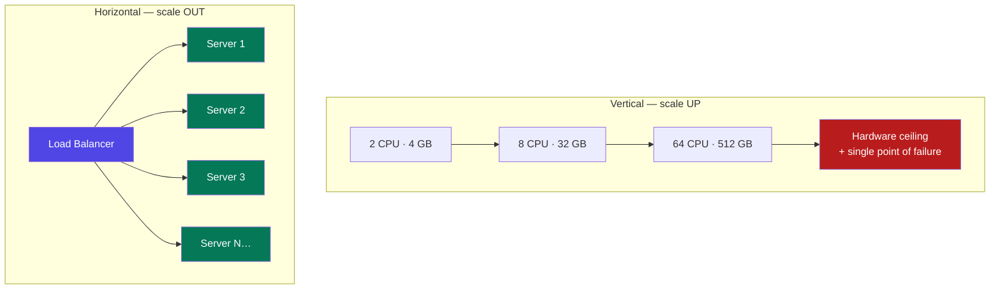

| | Vertical (up) | Horizontal (out) |
|---|---|---|
| How | Bigger instance: `t3.small` → `m5.4xlarge` | More instances behind a load balancer |
| Code changes | None | Must be stateless (A6) |
| Ceiling | Yes — biggest machine money can buy | Practically none |
| Failure | One machine = total outage | One machine dies, others serve |
| Best for | Databases, early-stage apps, quick relief | Web/app tier, anything with growth |

**The honest advice:** start vertical. A single well-tuned server with a modern CPU handles far more than beginners think — Stack Overflow famously served billions of monthly page views from a handful of servers. Scale up until it is expensive or risky, then scale out. Distributed systems are **not free**: they add network failures, consistency problems, and an on-call rota.

**Note the asymmetry:** the app tier scales out easily (it is stateless). The database usually scales **up** first, because scaling it out means replication and sharding — both of which change your code *and* your guarantees (Part D). That is why the database is nearly always the bottleneck.

---

## A5. From One Server to a Million Users

**Simple definition:** systems do not jump to a final architecture — they **evolve**, one bottleneck at a time, and each stage exists because the previous one broke.

<p class="te"><strong>Telugu:</strong> Ye system kuda modatinunche pedda architecture tho start avvadu. Okko bottleneck vachinappudu okko piece add avutundi. Ee kramam gurthupettuko — interview lo "ela scale chestav" ani adigithe, ee ladder ne cheppali: <strong>okka server → DB separate → load balancer → cache → CDN → replicas → shards → services</strong>.</p>

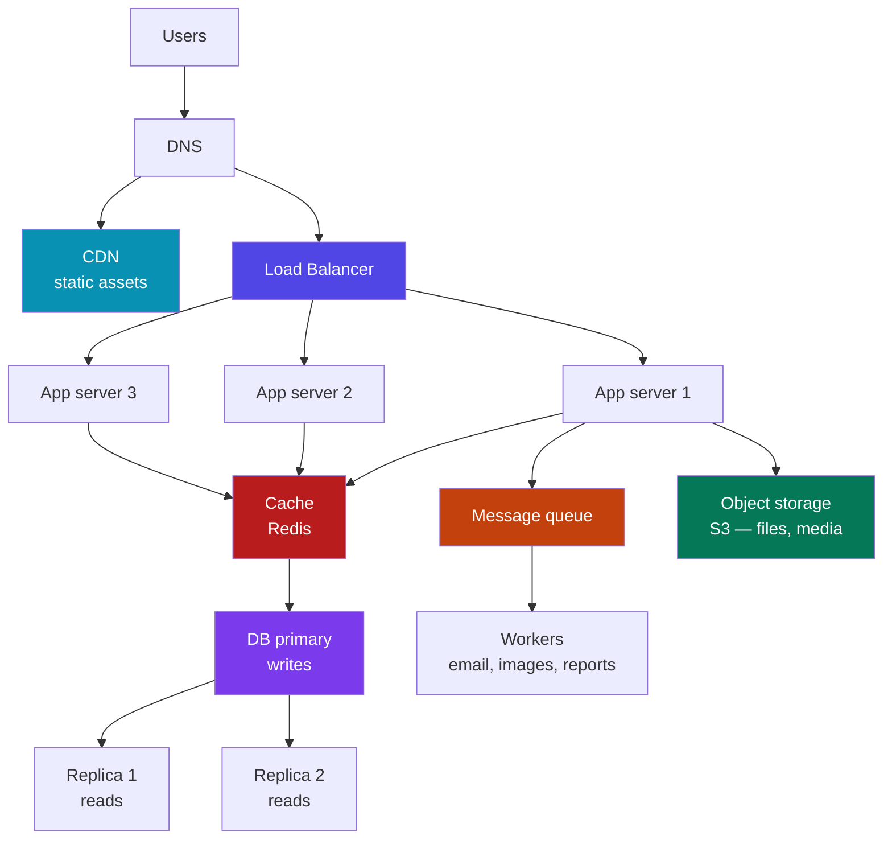

**The ladder, with the trigger for each rung:**

| Stage | Users | What you add | Because |
|---|---|---|---|
| 1 | 0 – 1k | One server: app + DB together (your AWS EC2 from Phase 10) | Simplest thing that works |
| 2 | 1k – 10k | **Split the database** onto its own machine | They fight for RAM; DB needs to be tuned and backed up separately |
| 3 | 10k – 100k | **Load balancer + 2–3 stateless app servers** | One app server saturates; also removes the single point of failure |
| 4 | 100k | **Cache (Redis)** in front of the DB | The same 20 queries run thousands of times a second |
| 5 | 100k | **CDN** for JS/CSS/images | 80 % of bytes are static and should never touch your server |
| 6 | 100k – 1M | **Read replicas**; move files to object storage | Reads dominate; local disk does not scale or survive |
| 7 | 1M+ | **Queues + workers** for slow work (email, thumbnails, reports) | Users should not wait for work they did not ask to watch |
| 8 | 1M+ | **Shard** the database; split the hot service out | One primary can no longer take the writes; one team can no longer own the code |
| 9 | 10M+ | **Multi-region**, per-service data stores, streaming platform | Latency across continents; independent scaling |

**The rule to carry into every interview:** *do not draw stage 9 for a stage 3 problem.* Interviewers are testing judgement, not vocabulary. "At this scale a single Postgres with a read replica handles it; here is the number at which I would shard" is a **stronger** answer than an unprompted Kafka cluster.

**Real-world proof:** Instagram served 14 million users with 3 engineers on a handful of EC2 machines with Postgres, Redis and memcached — no microservices, no Kafka. Shopify still runs a modular Ruby monolith at Black-Friday scale. Complexity is a cost you pay for a reason, not a badge.

---

## A6. Stateless Services — The Rule That Makes Scaling Possible

**Simple definition:** a **stateless** service keeps no client-specific data in its own memory between requests — everything it needs is either in the request or in a shared store. That is what lets any server answer any request.

<p class="te"><strong>Telugu:</strong> <strong>Stateless</strong> ante server memory lo user data daachukokapovadam. Prati request lo kaavalsinadi vastundi, leda Redis/DB nunchi teesukuntundi. Anduke ye server aina ye request ni aina answer cheyyagaladu — adi horizontal scaling ki modati condition. Server memory lo session pedithe, aa user malli vere server ki velthe logout aipotadu.</p>

**The bug this prevents** — you have already seen it in Phase 7. Store the login session in a `Map` inside the Node process, run two app servers, and every second request lands on the other server and says "not logged in". Same for in-memory rate-limit counters, in-memory carts, and uploaded files written to local disk.

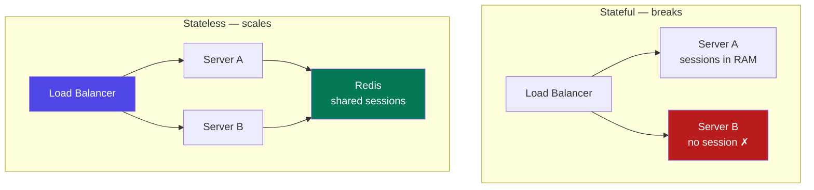

| State | Wrong place | Right place |
|---|---|---|
| Login session | Server memory | Redis, or a signed **JWT** in the client |
| Uploaded file | Local `./uploads` | S3 / object storage |
| Rate-limit counter | A JS object | Redis (`INCR` with TTL) |
| Background job | `setTimeout` in the process | A queue with a worker |
| WebSocket connection | Unavoidably on one server | Keep it, but publish messages through Redis pub/sub (H4) |

```js
// ✗ Stateful — dies the moment you run a second instance
const sessions = new Map();
app.post('/login', (req, res) => {
  const id = crypto.randomUUID();
  sessions.set(id, { userId: user.id });     // lives in THIS process only
  res.cookie('sid', id).json({ ok: true });
});

// ✓ Stateless — any instance can serve any request
app.post('/login', async (req, res) => {
  const id = crypto.randomUUID();
  await redis.set(`sess:${id}`, JSON.stringify({ userId: user.id }), 'EX', 86400);
  res.cookie('sid', id, { httpOnly: true, secure: true }).json({ ok: true });
});
```

**The escape hatch you should refuse:** *sticky sessions* (the balancer pins a user to one server) make stateful code work — until that server restarts and those users are logged out. Use it only for WebSockets, never as a fix for lazy state handling.

**The deeper idea:** you cannot delete state — you can only **move it** to a place designed to handle it. Databases, caches and object stores are exactly those places. Application servers should be **disposable cattle**: you can kill any one at any moment and nothing is lost. That property is what makes autoscaling, rolling deploys, canary releases and spot instances possible. Everything in Part G depends on it.

---

# Part B — The Request Path: Building Blocks

## B1. DNS — Turning a Name Into a Machine

**Simple definition:** **DNS** (Domain Name System) is the internet's phone book — it converts `tasktracker.in` into an IP address like `13.234.5.6` before your browser can connect to anything.

<p class="te"><strong>Telugu:</strong> DNS ante internet phone book. Browser lo peru type cheste, aa peru ki saripoye <strong>IP address</strong> ni teesukuntundi. Idi request path lo <strong>modati step</strong> — inka nee server ki request raane ledu. Ikkade traffic ni ye region ki pampalo, ye server set ki pampalo decide cheyyochu.</p>

You saw the lookup chain in Phase 3 (root → TLD → authoritative). What matters *for design* is that DNS is your **first routing decision** and a genuinely useful tool:

| DNS record / feature | What it does | Design use |
|---|---|---|
| `A` / `AAAA` | Name → IPv4 / IPv6 | Point the domain at your load balancer |
| `TTL` | How long resolvers may cache the answer | Low TTL (60 s) before a migration; high (3600 s) normally |
| **Weighted routing** | Send 5 % of traffic to a new stack | Canary releases and migrations |
| **Latency / geo routing** | Send users to the nearest region | India → Mumbai, Europe → Frankfurt |
| **Health-check failover** | Stop returning a dead region's IP | Cheap multi-region disaster recovery |

**Real-world:** Netflix answers `netflix.com` with different IPs depending on where you are, so an Indian user's connection terminates in Mumbai, not Oregon — ~200 ms saved before a byte of video moves.

**The trap:** DNS caching is not under your control. Browsers, the OS, and ISP resolvers all cache, and many ignore short TTLs. **Never use a DNS change as your rollback mechanism** — some users will keep hitting the old IP for hours. Lower TTLs *days* before a planned migration, and use a load balancer for fast traffic shifts.

---

## B2. CDN — Serving Bytes From Near the User

**Simple definition:** a **CDN** (Content Delivery Network) is a global network of cache servers that keeps copies of your static files close to users, so most requests never reach your servers at all.

<p class="te"><strong>Telugu:</strong> CDN ante prapancham antha unna cache servers network. Nee images, CSS, JS copies akkada pettukuntayi. Mumbai user ki Mumbai edge nunche file vastundi — nee AWS server varaku raadu. Rendu labhalu: <strong>chala fast</strong>, mariyu nee server meeda <strong>load chala takkuva</strong>.</p>

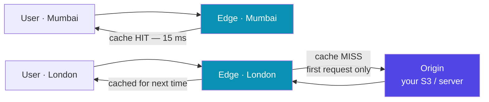

**What goes on a CDN:** your React build (`main.[hash].js`, CSS), images, fonts, video segments, PDFs — anything identical for every user. Typically **80–90 % of the bytes** your product ships.

**How it knows when to expire** — you control it with the headers from Phase 8:

```http
Cache-Control: public, max-age=31536000, immutable   # hashed asset: cache for a year
Cache-Control: public, max-age=0, s-maxage=60        # HTML: browser revalidates, CDN holds 60s
Cache-Control: private, no-store                     # anything user-specific
```

**The pattern that makes this safe** is **cache busting**: your bundler names files `app.a3f91c.js`. Change the code, the hash changes, the URL changes, and the year-long cache is bypassed automatically — you never need to purge anything. Purging a CDN globally takes minutes; renaming a file takes zero.

**Beyond static files:** CDNs also terminate TLS at the edge, absorb DDoS traffic (G7), and run **edge functions** (Cloudflare Workers, Lambda@Edge) for auth checks and A/B routing. In Phase 10 you put your React build on **S3 + CloudFront** — that was this topic in practice. CDN egress is also usually *cheaper* than serving the same bytes from EC2: one of the rare "faster **and** cheaper" decisions.

---

## B3. Load Balancers — Spreading the Work

**Simple definition:** a **load balancer** sits in front of your app servers, spreads incoming requests across them, and stops sending traffic to any server that fails its health check.

<p class="te"><strong>Telugu:</strong> Load balancer ante traffic police. Requests ni anni servers ki <strong>panchi</strong> istundi, mariyu oka server chachipothe daaniki pampadam <strong>aapesthundi</strong> (health check). Ee okka box ye horizontal scaling ni saadhyam chestundi — and adi single point of failure kaakunda undadaniki adi kuda rendu untayi (cloud lo adi automatic).</p>

**Layer 4 vs Layer 7 — the distinction interviewers ask for:**

| | L4 (transport) | L7 (application) |
|---|---|---|
| Sees | IP + port only | Full HTTP: path, headers, cookies |
| Can route by | Nothing but connection | `/api/*` → API pool, `/img/*` → media pool |
| Can do | Raw forwarding, very fast | TLS termination, compression, rewriting, auth, sticky cookies |
| Cost | Microseconds, millions of connections | Slightly slower, far more useful |
| AWS | Network Load Balancer (NLB) | Application Load Balancer (ALB) |

Use **L7 (ALB / Nginx)** for web traffic; use L4 (NLB) when you need extreme throughput, non-HTTP protocols, or a static IP.

**Balancing algorithms:**

| Algorithm | How it picks | Use when |
|---|---|---|
| **Round robin** | Next server in turn | Requests are uniform (the default) |
| **Least connections** | Fewest active requests | Request durations vary a lot |
| **IP hash / consistent hash** | Same client → same server | Local caching or sticky needs |
| **Weighted** | Bigger servers get more | Mixed instance sizes, canary rollouts |

**Health checks are the real feature.** The balancer calls `GET /health` every few seconds; N failures in a row and the server is removed from rotation; N successes and it returns. This — not the balancing — is what turns a crash into a non-event.

```nginx
upstream api {
    least_conn;
    server 10.0.1.11:3000 max_fails=3 fail_timeout=30s;
    server 10.0.1.12:3000 max_fails=3 fail_timeout=30s;
    server 10.0.1.13:3000 backup;          # only used if the others are down
}
server {
    listen 443 ssl http2;
    location /api/ {
        proxy_pass http://api;
        proxy_set_header X-Forwarded-For $proxy_add_x_forwarded_for;
        proxy_next_upstream error timeout http_502;   # retry elsewhere on failure
    }
}
```

**Two health checks, not one** (you will meet these again in Kubernetes and ECS):

- **Liveness** — "is the process alive?" Fails → restart the container.
- **Readiness** — "can it serve right now?" Fails → take it out of rotation but leave it running (still warming up, DB pool exhausted, shutting down gracefully).

**The subtlety that bites:** a health check that only returns `200 OK` from Express proves nothing — but do **not** over-check either. If it pings the DB and the DB blips, *every* server fails at once, the balancer removes them all, and a small problem becomes a total outage. Keep health checks shallow, cached for a second or two, and honest.

---

## B4. API Gateway and Reverse Proxy

**Simple definition:** a **reverse proxy** is a server that receives client requests and forwards them to internal servers. An **API gateway** is a reverse proxy that also handles the cross-cutting concerns every service would otherwise duplicate: auth, rate limiting, routing, versioning.

<p class="te"><strong>Telugu:</strong> Reverse proxy ante client ki mundu nilichi, request ni lopala unna servers ki pampe box (Nginx laaga). API Gateway ante ade pani + <strong>anni services ki common ga kaavalsina panulu</strong> — auth check, rate limit, routing, logging — okka chota cheyyadam. Prati service lo aa code malli malli raayakunda undadaniki.</p>

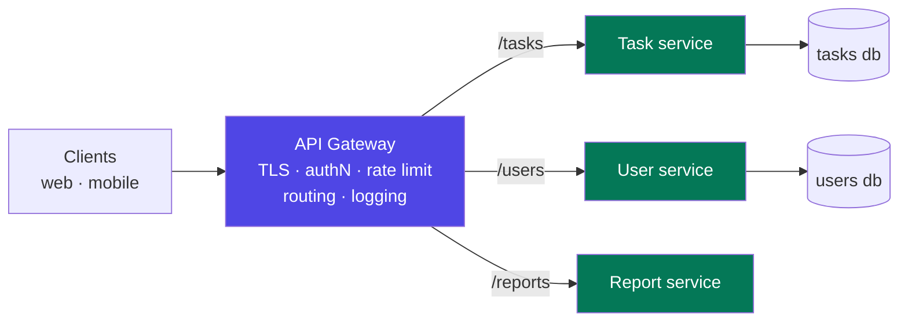

| Gateway job | What it saves you |
|---|---|
| TLS termination | Certificates in one place, not on every service |
| Authentication | Verify the JWT once; pass a trusted user ID inward |
| Rate limiting | One place to stop abuse (G3) |
| Routing & versioning | `/v2/tasks` → new service, no client change |
| Observability | One place that sees every request — logs, metrics, trace IDs |

**Real-world:** Netflix's Zuul, Amazon API Gateway, Kong, and — in SAP — the **BTP approuter**, which terminates the request, checks the XSUAA token and forwards to your CAP services. You already ran a plain reverse proxy: Nginx in front of Node in Phase 10.

**Do not overdo it.** A gateway is a single point of failure, and business logic pushed into it becomes a distributed monolith with a bottleneck at the front. For a single-service app, Nginx *is* your gateway — you do not need Kong to run a Task Tracker.

---

## B5. The Whole Path, End to End

**Simple definition:** every request travels the same well-known chain of hops, and knowing that chain lets you place a fix (or find a bug) at the right layer.

<p class="te"><strong>Telugu:</strong> Prathi request okate <strong>daari</strong> lo prayanam chestundi — DNS → CDN → Load balancer → App server → Cache → DB. Ee chain gurthu unte, "site slow ga undi" ante ekkada choodalo teliyostundi, mariyu fix ni sariaina layer lo pettochu. Interview lo modati diagram idi ye.</p>

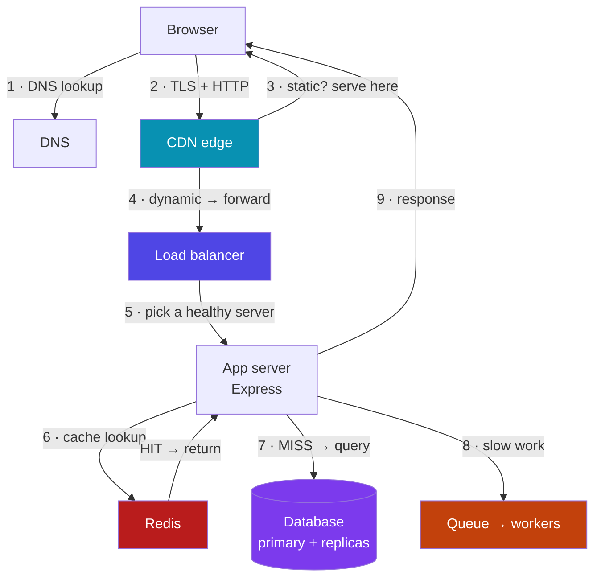

**Where each layer earns its place** — and the single question to ask at each hop:

| Hop | Fixes | Ask |
|---|---|---|
| DNS | Which region/stack answers | "Is the user reaching the closest healthy stack?" |
| CDN | Bytes and distance | "Could this response have been cached at the edge?" |
| Load balancer | Capacity and machine failure | "Is any server unhealthy and still receiving traffic?" |
| App server | Business logic | "Is this doing work it could have delegated?" |
| Cache | Repeated reads | "Is this the same answer we computed a second ago?" |
| Database | Truth and durability | "Is this query using an index? Should it be on a replica?" |
| Queue | Slow or failure-prone work | "Does the user actually need to wait for this?" |

**The debugging habit:** when something is slow, walk the path **outside in** and time each hop (DevTools → CDN cache header → LB metrics → app trace → DB slow log). It is almost always one hop, and usually the one nobody instrumented — which is why observability (G6) beats clever optimisation.

---

# Part C — Caching: The Highest-Leverage Trick in the Book

## C1. Why Caching Works, and Where Caches Live

**Simple definition:** a **cache** is a small, fast store that keeps a copy of expensive-to-produce data so the next request gets it without redoing the work.

<p class="te"><strong>Telugu:</strong> Cache ante <strong>oka sari chesina pani ni malli cheyyakunda</strong>, answer ni daachi pettukovadam. Chinnadi, kaani chala fast (RAM lo untundi). System design lo idi <strong>ati takkuva kastam tho ati ekkuva labham</strong> iche trick — anduke prathi layer lo cache untundi.</p>

Caching works because of two facts about real traffic:

- **Temporal locality** — data used once is likely to be used again soon (a trending post, today's dashboard).
- **The 80/20 rule** — a small fraction of your data serves most requests. On a typical product, 1 % of rows answer 90 % of reads.

**The cache hierarchy** — a request can be answered at any of these, and the earlier the cheaper:

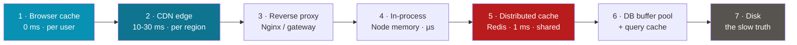

| Layer | Good for | Watch out for |
|---|---|---|
| Browser | Assets, GET responses | You cannot purge it — version your URLs |
| CDN | Static files, public API responses | Never cache user-specific data publicly |
| In-process (a `Map` in Node) | Config, feature flags | Each server has its own copy → inconsistent; **not** for user data |
| **Redis / Memcached** | Sessions, query results, counters, hot objects | The workhorse — this is what "add a cache" means |

**Real-world numbers:** a cached read from Redis is ~1 ms; the same data from MySQL with a join might be 30 ms; if it needs disk, 100 ms+. A 95 % hit rate means only 5 % of traffic reaches the database — which is exactly how one modest database survives a million users.

**The cost you accept:** every cache introduces the possibility of **stale data**. Caching is trading correctness-in-the-moment for speed. That is fine for a product listing and unacceptable for an account balance. **Ask "how stale is too stale?" before you cache anything** — the answer is your TTL.

---

## C2. The Four Caching Patterns

**Simple definition:** a **caching pattern** defines who writes to the cache and when — the application, or the cache itself — and whether writes go to the cache first or the database first.

<p class="te"><strong>Telugu:</strong> Cache ni ela nimpali, ela update cheyyali — ade pattern. Naalugu vidhalu unnayi. 95% cases lo <strong>cache-aside</strong> ne vaadutaru: modata cache lo choodu, lekapothe DB nunchi teesi cache lo pettu. Migathavi eppudu vaadalo teliste chaalu.</p>

**1 · Cache-aside (lazy loading)** — the default. The application manages the cache.

```js
async function getTask(id) {
  const key = `task:${id}`;
  const hit = await redis.get(key);
  if (hit) return JSON.parse(hit);                       // HIT
  const row = await db.query('SELECT * FROM tasks WHERE id=?', [id]);  // MISS
  if (row) await redis.set(key, JSON.stringify(row), 'EX', 300);       // fill, 5-min TTL
  return row;
}
async function updateTask(id, patch) {
  await db.query('UPDATE tasks SET ... WHERE id=?', [id]);
  await redis.del(`task:${id}`);        // INVALIDATE, don't try to update the cache
}
```

*Why `del` and not `set` on write:* two concurrent writers can interleave and leave the cache holding the older value forever. Deleting is idempotent and always safe — the next read repopulates. **Delete, don't update.**

**The other three, briefly:** **read-through** — the cache library loads from the DB on a miss (cleaner code, less control). **Write-through** — write cache and DB together, synchronously (never stale, but you cache data that may never be read). **Write-back** — write to cache, flush to the DB in batches later (very fast, and **you can lose data**; fine for view counters, never for money).

| Pattern | Read path | Write path | Use when |
|---|---|---|---|
| **Cache-aside** | App checks cache, then DB | Write DB, delete key | Default; read-heavy; most apps |
| Read-through | Cache loads on miss | Usually paired with write-through | You want the library to own it |
| Write-through | Always fresh | Write both, then return | Reads must never be stale |
| Write-back | Fast | Write cache now, DB later | Counters, metrics, tolerable loss |
| Write-around | — | Write DB only, skip cache | Write-heavy data that is rarely read |

**A rule worth writing down:** *the cache is never the source of truth.* If Redis is wiped right now, your system should get slower — not wrong, not broken. If it would break, you have built a database with no durability.

---

## C3. Expiry and Eviction — TTL, LRU, LFU

**Simple definition:** **TTL** decides how long an entry may live; **eviction** decides which entry to throw away when memory is full.

<p class="te"><strong>Telugu:</strong> <strong>TTL</strong> = ee data entha sepu correct ga untundi (time meeda). <strong>Eviction</strong> = memory nindipothe ye data ni teesipadeyyali (place meeda). Rendu veru veru vishayalu — TTL "purathanam", eviction "sthalam".</p>

| Policy | Throws away | Best for |
|---|---|---|
| **LRU** (least recently used) | Oldest untouched entry | The safe default — matches temporal locality |
| **LFU** (least frequently used) | Rarest entry | Stable hot sets; resists scans polluting the cache |
| **TTL only** | Whatever expired | Data with a natural freshness limit |

Redis exposes these as `maxmemory-policy` (`allkeys-lru` is the usual answer for a pure cache; `noeviction` if Redis is holding data you cannot lose).

**Choosing a TTL** is a product decision, not a technical one:

| Data | TTL | Why |
|---|---|---|
| Currency rates | 60 s | Changes constantly, small error tolerable |
| User profile | 5 min + delete on update | Users notice their own edits immediately |
| Feed / trending list | 30–60 s | Cheap to recompute, high traffic |
| Auth session | Equals session length | Security boundary |

**Two more knobs that matter:**

- **Add jitter.** `EX 300` on ten thousand keys created together means ten thousand simultaneous expiries. Use `300 + random(0..60)` so misses spread out (C5).
- **Watch the hit rate.** Below ~80 %, your cache is mostly overhead: the TTL is too short, the key space too wide, or the data genuinely is not reusable. `INFO stats` in Redis gives you `keyspace_hits` / `keyspace_misses` — graph that ratio, it is one of the most useful numbers in your system.

---

## C4. Redis in Practice

**Simple definition:** **Redis** is an in-memory data-structure server — a shared, extremely fast key–value store that also understands lists, sets, sorted sets, hashes and pub/sub.

<p class="te"><strong>Telugu:</strong> Redis ante RAM lo nadiche database. Key-value matrame kaadu — list, set, sorted set, hash, pub/sub kuda undi. Anduke adi cache matrame kaadu: session store, rate limiter, leaderboard, queue, lock — anni idhe chestundi. Sub-millisecond speed, single-threaded, kaani second ki lakshala operations.</p>

| Redis type | Command | Real use |
|---|---|---|
| String | `SET`/`GET`/`INCR` | Cached JSON, counters, feature flags |
| **Set** | `SADD`/`SISMEMBER` | Unique visitors, "has this user voted?" |
| **Sorted set** | `ZADD`/`ZREVRANGE` | Leaderboards, feeds by timestamp, delayed jobs |
| **TTL keys** | `EXPIRE` | Sessions, OTPs, rate-limit windows |
| Pub/Sub | `PUBLISH`/`SUBSCRIBE` | Broadcasting to WebSocket servers (H4) |
| **Atomic ops** | `INCR`, `SETNX`, Lua | Rate limiting, distributed locks |

```js
// Rate limit: 100 requests per minute per user — atomic, no race condition
const key = `rl:${userId}:${Math.floor(Date.now() / 60000)}`;
const count = await redis.incr(key);
if (count === 1) await redis.expire(key, 60);
if (count > 100) return res.status(429).json({ error: 'Too many requests' });

// Leaderboard: top 10 in one call, O(log n) writes
await redis.zadd('leaderboard', score, userId);
const top = await redis.zrevrange('leaderboard', 0, 9, 'WITHSCORES');

// Distributed lock — only one worker runs the nightly report
const got = await redis.set('lock:report', workerId, 'NX', 'EX', 300);
if (got) { try { await runReport(); } finally { await redis.del('lock:report'); } }
```

**Things that will bite you:**

- **Single-threaded.** One `KEYS *` on a big database blocks *everything*. Use `SCAN`. Never run `KEYS` in production.
- **Memory is the limit.** Set `maxmemory` and an eviction policy, or Redis will happily consume the machine.
- **Persistence is optional** (RDB snapshots / AOF log). A cache does not need it; a session store does — or accept that a restart logs everyone out.

---

## C5. The Three Cache Disasters

**Simple definition:** caches fail in three famous ways — **stampede** (everyone misses at once), **hot key** (one key gets all the traffic), and **staleness** (the cache confidently serves a wrong answer).

<p class="te"><strong>Telugu:</strong> Cache moodu vidhaluga cheddaga fail avutundi. <strong>Stampede</strong> = anni keys okesari expire ai, andaru okesari DB ni kotti DB ni champatam. <strong>Hot key</strong> = okate key ki motham traffic vachi aa okka node ni champatam. <strong>Stale</strong> = cache lo purathana data undi, users ki tappu answer velthundi. Ee moodintiki fixes gurthupettuko — interview lo tappaka adugutaru.</p>

**1 · Cache stampede (thundering herd).** A popular key expires. In the same millisecond, 5,000 requests miss, and all 5,000 run the same expensive query. The database, which was comfortable, dies — and because it died, the cache never refills, so the next 5,000 do it again.

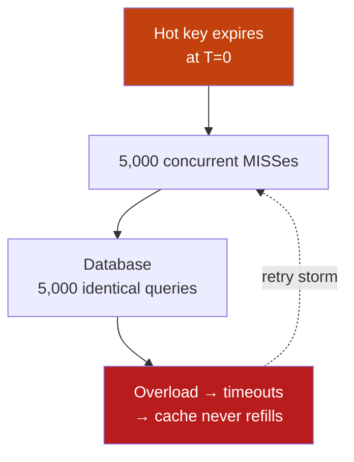

**Fixes** (use the first two together):

- **Jittered TTL** — spread expiry over a window so keys never expire in lockstep.
- **Lock / single-flight** — the first miss takes a short Redis lock (`SET key NX EX 10`) and recomputes; everyone else waits briefly or serves the stale value.
- **Stale-while-revalidate** — keep serving the old value and refresh in the background. Users never wait; this is the nicest answer.
- **Pre-warm** — after a deploy or cache flush, populate the top keys before you take traffic. A cold cache after a restart is the same event as a stampede.

**2 · Hot key.** One celebrity, one flash-sale product, one viral post. That key lives on exactly one Redis node, and that node gets 200k requests/second while the rest idle.

**Fixes:** copy the value to a **local in-process cache** for 1–5 seconds (the traffic then never leaves the app server); or **split the key** into `post:123:0…9` replicas and read a random one; or push the object to the CDN if it is public. The general principle: *when one key is hot, add a layer above it, not more nodes below it.*

**3 · Staleness and inconsistency.** The DB was updated, the cache was not. Sources: a write path that forgot to invalidate, a failed `DEL` after a successful `UPDATE`, or another service writing to the same table.

**Fixes:** invalidate in the same code path as the write (and treat a failed invalidation as an error worth retrying); prefer short TTLs as a safety net so wrongness is bounded in time; for critical data, drive invalidation from the database itself with **CDC** (D6) so *any* writer triggers it; and never cache what must be exactly right — money, stock counts at checkout, permissions.

**Bonus — cache penetration.** Requests for a key that does not exist (`user:999999`, often an attack) miss the cache *and* the database every time. Fix: cache the negative result (`null`, 30 s TTL), or put a **Bloom filter** in front to answer "definitely not present" without touching the DB.

---

# Part D — Data at Scale

## D1. Replication — Copies of the Truth

**Simple definition:** **replication** keeps live copies of your database on more than one machine, so reads can be spread out and a dead server does not mean lost data.

<p class="te"><strong>Telugu:</strong> Replication ante database ni <strong>okati kanna ekkuva machines lo copy</strong> ga unchadam. Rendu labhalu: reads ni panchukovachu (speed), mariyu oka machine chachipothe inkokati undi (safety). Common pattern — <strong>okate primary</strong> ki writes, <strong>replicas</strong> nunchi reads.</p>

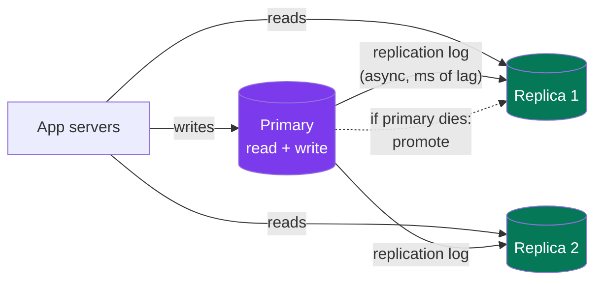

| Topology | How it works | Trade-off |
|---|---|---|
| **Leader–follower** (primary–replica) | One writer, many read-only copies | Simple, no write conflicts; the leader is a bottleneck and an SPOF until failover |
| Multi-leader | Several writable nodes, one per region | Local low-latency writes; **write conflicts** you must resolve |
| Leaderless (Dynamo-style) | Any node accepts writes; quorums decide | Very available; eventual consistency, tunable via N/W/R |

**Synchronous vs asynchronous:**

- **Async** (the default in MySQL/Postgres): the primary confirms your write immediately and ships it to replicas after. Fast — but if the primary dies in that instant, that write is **gone**, and until it catches up a replica returns old data.
- **Sync**: the primary waits for a replica to confirm. No data loss, but every write pays the network round trip, and if the replica is slow, writes stall.
- **Semi-sync** (wait for *one* of N): the practical middle ground — this is essentially what AWS RDS Multi-AZ gives you.

**Replication lag is the bug you will actually hit.** The classic symptom: a user updates their profile, the app redirects, the read goes to a replica that is 200 ms behind, and the old name comes back. The user thinks the save failed and does it again.

| Fix | How | Cost |
|---|---|---|
| **Read-your-own-writes** | For N seconds after a user writes, send *that user's* reads to the primary | Simple; primary takes a little more load |
| Monotonic reads | Pin a user to one replica (hash the user ID) | They never see time go backwards |
| Read from primary | For critical screens (checkout, balance) | Defeats the purpose — use sparingly |

**In practice:** replication is *the* first database scaling move and nearly free — a read replica in RDS is one click. It solves read scale and availability; it does **not** solve write scale or storage size. For those, D2.

---

## D2. Sharding and Partitioning

**Simple definition:** **sharding** splits one logical database into many physical databases, each holding a *different subset of rows*, so writes and storage scale across machines.

<p class="te"><strong>Telugu:</strong> Replication lo prathi machine lo <strong>motham data</strong> untundi. Sharding lo prathi machine lo <strong>konchem data</strong> matrame untundi — data ni mukkalu chesi panchipettadam. Anduke writes kuda scale avutayi, storage kuda. Kaani price ekkuva: JOINs pothayi, transactions kastam, and <strong>shard key</strong> tappu enchukunte antha chedu.</p>

**Vertical vs horizontal partitioning:**

- **Vertical** — split by *columns/tables*: users in one DB, tasks in another, analytics in a third. Easy, natural along service boundaries, but each piece still grows.
- **Horizontal (sharding)** — split by *rows*: users A–M on shard 1, N–Z on shard 2. This is what "sharding" means.

**Choosing the shard key is the whole game.** It should spread data evenly, and — critically — most queries should be answerable from **one shard**.

| Strategy | How | Problem |
|---|---|---|
| **Range** (`id 1–1M`, `1M–2M`) | Easy, range scans work | New data all lands on the newest shard — a hotspot |
| **Hash** (`hash(user_id) % N`) | Beautifully even | Adding a shard rehashes *everything* |
| **Consistent hashing** | Keys on a ring; add a node → only its neighbours move | The standard answer; used by DynamoDB, Cassandra, Redis Cluster |
| **Directory / lookup** | A service maps key → shard | Total flexibility; the lookup is now an SPOF and a hop |
| **Geographic** | India shard, EU shard | Latency + data residency (GDPR); uneven populations |

**Consistent hashing in one paragraph:** imagine a circle numbered 0 to 2³². Hash each *server* onto a point on the circle, and hash each *key* too; a key belongs to the first server clockwise from it. Add or remove a server and only the keys in that one arc move — roughly `1/N` of the data — instead of nearly all of them. **Virtual nodes** (each physical server placed at 100+ points) even out the arcs so no server gets an unfairly large slice.

**What sharding costs you** — say this in an interview and you sound experienced:

1. **Cross-shard queries.** `SELECT ... ORDER BY created_at LIMIT 10` across 16 shards means 16 queries and a merge in application code.
2. **JOINs die.** You denormalize, or you join in the app, or you keep related data on the same shard (shard by `tenant_id`, not by table).
3. **Transactions die.** Cross-shard atomicity needs 2PC or a saga (D5).
4. **Unique IDs.** `AUTO_INCREMENT` collides across shards — you need UUIDv7 or Snowflake IDs (H2).
5. **Resharding is a project**, not an afternoon — plan many logical shards mapped onto few machines (1,024 → 4 servers) so growth is a *move*, not a *rehash*.
6. **Hotspots.** Shard a chat app by `chat_id` and one enormous group chat pins one shard at 100 %.

**The advice that matters:** *shard last.* Replicas, caching, indexing, archiving old rows and a bigger instance will carry you further than beginners expect. Sharding is the point where your database stops feeling like a database.

---

## D3. Consistency Models, CAP and PACELC

**Simple definition:** a **consistency model** is the promise a distributed store makes about *when* a write becomes visible to readers. **CAP** says that when the network breaks, you must choose between consistency and availability.

<p class="te"><strong>Telugu:</strong> Data ni chala machines lo pettinappudu, oka chota write chesthe migatha chotla adi <strong>eppudu kanipistundi</strong> ane promise ye consistency model. <strong>Strong</strong> = ventane, andariki okate answer. <strong>Eventual</strong> = konchem sepatiki anni chotla same avutundi. CAP theorem — network break aithe, <strong>consistency</strong> leda <strong>availability</strong>, rendintlo okati matrame teesukogalav.</p>

| Model | Promise | Example |
|---|---|---|
| **Strong / linearizable** | Every read sees the latest write, always | Bank balance, seat inventory, primary-key reads in Postgres |
| **Read-your-writes** | *You* see your own changes; others may lag | Your profile edit |
| **Monotonic reads** | You never see time go backwards | Pinning a user to one replica |
| **Eventual** | Given no new writes, all replicas converge | Like counts, DNS, S3 listings, feed counts |

**CAP, stated properly.** In the presence of a **network partition** (P — nodes cannot talk, and this *will* happen), you must choose:

- **CP** — refuse to answer rather than answer wrongly. The minority side returns errors. *Banking, inventory, config stores (etcd, ZooKeeper), HBase, MongoDB with majority writes.*
- **AP** — keep answering with possibly stale data and reconcile later. *Shopping carts, social feeds, DNS, Cassandra, DynamoDB, Riak.*

The common misreading is "pick 2 of 3". You do not *choose* P — the network chooses it for you. CAP is only a decision **during** a partition.

**PACELC is the more useful version:** *if there is a Partition, choose A or C; Else (normal operation), choose Latency or Consistency.* This is the everyday trade-off — even with a perfectly healthy network, waiting for a majority of replicas to acknowledge a write costs milliseconds. That is why DynamoDB offers "eventually consistent read" (cheap and fast) and "strongly consistent read" (double the cost, higher latency) as a per-query flag.

**How to use this in a design:** decide **per data type**, not per system. In one e-commerce app: the shopping cart is AP (never block a user from adding an item), stock decrement at checkout is CP (never sell the last unit twice), and the "1.2k people viewed this" counter is eventual and nobody cares. Saying *that* sentence is what a senior answer sounds like.

---

## D4. SQL vs NoSQL — The Real Decision

**Simple definition:** **SQL** stores give you a fixed schema, joins and ACID transactions on one node; **NoSQL** stores drop some of those to buy horizontal scale, flexible shape, or a specialised access pattern.

<p class="te"><strong>Telugu:</strong> "SQL vs NoSQL" ante "edi manchidi" ane prashna kaadu — "<strong>nee access pattern emiti</strong>" ane prashna. Data madhya sambandhalu ekkuva unte, transactions kaavali ante → SQL. Chala pedda scale, simple key tho lookup, marutunna shape unte → NoSQL. Chala companies <strong>rendu</strong> vaadutayi.</p>

| Family | Examples | Shines at | Do not use for |
|---|---|---|---|
| **Relational** | Postgres, MySQL, SAP HANA | Relationships, transactions, ad-hoc queries, reporting | Petabyte write firehoses |
| **Key–value** | Redis, DynamoDB | Single-key lookups at any scale, sessions, carts | Anything needing a query you did not plan |
| **Document** | MongoDB, Firestore | Nested objects, varying fields, fast iteration | Heavy cross-document joins |
| **Wide-column** | Cassandra, HBase, Bigtable | Huge write volume, time-series by key, multi-region | Ad-hoc analytics, joins |
| **Graph** | Neo4j | "Friends of friends who like X", fraud rings | Bulk scans, simple CRUD |
| **Time-series** | InfluxDB, TimescaleDB | Metrics, IoT, downsampling | Transactional data |
| **Search** | Elasticsearch, OpenSearch | Full-text, facets, typo tolerance | Being your source of truth |
| **Vector** | pgvector, Pinecone | Semantic search, RAG for AI (Phase 12) | Exact lookups |
| **Blob/object** | S3, Azure Blob | Files, images, video, backups — cheap and infinite | Anything you must query |

**The decision, honestly:** start with **Postgres or MySQL**. A modern relational database does JSON columns, full-text search, geospatial queries and comfortably handles tens of thousands of transactions per second. It stops being enough when (a) writes exceed one primary, (b) data exceeds one machine's disk, or (c) an access pattern is genuinely alien to tables (graph traversal, 100k metrics/second).

**Polyglot persistence** is the normal end state — one store per job: Postgres for orders, Redis for sessions, S3 for media, Elasticsearch for search, ClickHouse for analytics. The cost is operational (more systems, more failure modes, more sync problems), so add each one only when a real pain justifies it.

**The mistake to avoid:** choosing NoSQL "because it scales" when your query pattern is relational. You end up re-implementing joins in application code — slower, buggier, no transactions. Several large companies have migrated *back* after exactly this.

---

## D5. Transactions Across Services — Saga and Outbox

**Simple definition:** once data lives in more than one service or database, a single ACID transaction cannot cover the whole operation — so you replace it with a **saga**: a chain of local transactions plus compensating undo steps.

<p class="te"><strong>Telugu:</strong> Okate database unnappudu <code>BEGIN … COMMIT</code> saripotundi. Kaani order service, payment service, inventory service veru veru databases lo unte — okate transaction kudaradu. Appudu <strong>saga</strong> vaadutaru: okko service tana pani chesi, next step ki cheputundi; madhyalo fail aithe, mundu chesina panulanu <strong>undo (compensate)</strong> chestaru. Bank lo money transfer fail aithe "refund" laantidi.</p>

**Why not two-phase commit (2PC)?** A coordinator asks every participant "can you commit?", then tells them all to go ahead. Real atomicity — but it holds locks across the network, and a coordinator that dies mid-flight leaves participants stuck. It does not scale; modern systems avoid it.

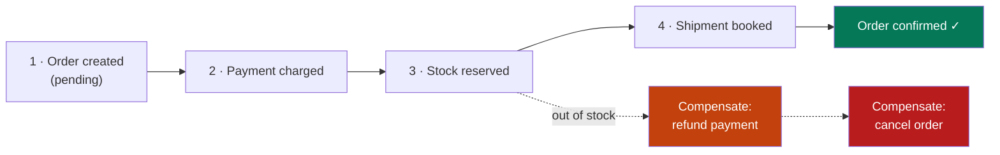

| | Choreography | Orchestration |
|---|---|---|
| How | Each service listens for events and reacts | A central saga coordinator calls each step |
| Good | No central component; loosely coupled | The whole flow is readable in one place |
| Bad | Nobody can see the whole flow; cycles sneak in | The orchestrator is a component to own and scale |
| Use | 2–4 simple steps | Complex flows with real business rules |

**The outbox pattern** — the piece people forget. "Save the order **and** publish an `OrderCreated` event" is two systems: if the DB commits and the broker call fails, the event is lost forever; publish first and the DB may roll back, so you announced something that never happened. The fix is to make it one transaction:

```sql
BEGIN;
  INSERT INTO orders (id, user_id, total, status) VALUES (...);
  INSERT INTO outbox (id, topic, payload)                 -- same DB, same transaction
       VALUES (UUID(), 'order.created', JSON_OBJECT('orderId', ...));
COMMIT;
-- A separate relay process reads outbox rows and publishes them, then marks them sent.
-- If it crashes mid-way it re-publishes → consumers must be idempotent (E5).
```

**The rules that make sagas survivable:**

1. **Every step needs a compensating action** — and "unsend the email" does not exist, so put irreversible steps last.
2. **Everything is retried, so everything must be idempotent** (E5).
3. **Nothing is atomic; things are eventually consistent.** Model it in the UI: "Order placed — payment processing", not a lie about instant success.
4. **Keep the state machine explicit** (`pending → paid → reserved → shipped`) and store it, so a crashed saga can be resumed or reported.

---

## D6. Search, Analytics and Keeping Copies in Sync

**Simple definition:** the store that is best for *writing* your data is rarely the best for *searching* or *analysing* it — so you copy data into purpose-built stores and keep the copies fresh with **CDC** (change data capture).

<p class="te"><strong>Telugu:</strong> Nee main database (MySQL) rasukovadaniki manchidi. Kaani full-text search ki Elasticsearch, pedda reports ki analytics DB baaguntundi. Anduke data ni <strong>copy</strong> chestaru. Aa copy ni update chese best padhathi — <strong>CDC</strong>: database change log ni chadivi, aa maarpulanu vere store ki pampadam.</p>

**OLTP vs OLAP** — two different jobs. OLTP (your app DB: MySQL, Postgres) does many small reads and writes, row-oriented. OLAP (BigQuery, Snowflake, ClickHouse, **SAP HANA**) does few enormous scans, **column-oriented** so it reads only the columns a query needs.

**Never run heavy reports on your production primary** — one analyst's `GROUP BY` can lock up checkout. Send them to a replica at minimum, and to a proper warehouse when reporting becomes a real workload.

**Three ways to sync a secondary store:**

| Method | How | Verdict |
|---|---|---|
| **Dual write** | App writes to MySQL *and* Elasticsearch | ✗ The two drift the first time one call fails |
| **Batch job** | Nightly export/import | OK for warehouses, too slow for search |
| **CDC** | Read the DB's replication log (binlog/WAL) and stream the changes | ✓ The right answer — Debezium, AWS DMS, Kafka Connect |

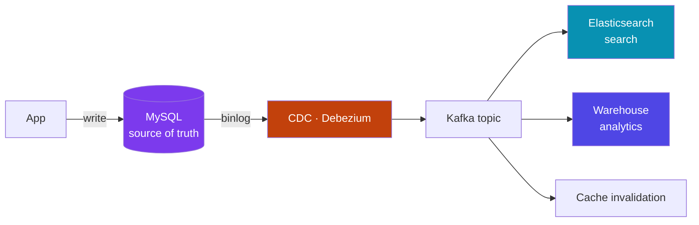

**Why CDC is elegant:** it needs no change to the writing application, it cannot miss a write (the log *is* the write), and one stream feeds many consumers — search index, warehouse, cache invalidation, audit trail, and downstream services. The cost is eventual consistency: your search index is a few hundred milliseconds behind. For search, that is invisible; for a balance check, it is not.

**Real-world:** a product catalogue lives in Postgres (truth), is indexed into Elasticsearch (search), streams into ClickHouse (dashboards) and keeps hot rows in Redis. One dataset, four stores, all fed from one change stream.

---

# Part E — How the Pieces Talk

## E1. Synchronous vs Asynchronous — The Core Choice

**Simple definition:** in a **synchronous** call the caller waits for the answer; in an **asynchronous** one the caller hands off the work and moves on, and the result arrives later.

<p class="te"><strong>Telugu:</strong> <strong>Sync</strong> = phone call — aavali varaku emi cheyyalevu, avatali vaadu levakapothe nuvvu kuda aagipotav. <strong>Async</strong> = WhatsApp message — pampi nee pani chesukuntav, samadhanam taruvata vastundi. System design lo mukhyamaina prashna: "<strong>user ee pani ayyevaraku nijamga wait cheyyala?</strong>" Avasaram lekapothe async ki pampu.</p>

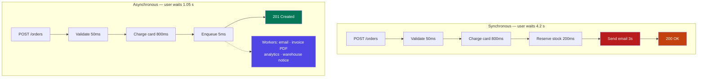

| Choose sync when | Choose async when |
|---|---|
| The user needs the answer to continue | The user only needs to know it was accepted |
| The operation must fail visibly and immediately (payment authorisation) | Work is slow, bursty, or third-party (email, PDF, video encode, webhooks) |
| It is a simple read | It can be retried safely later |
| Consistency must be immediate | Eventual completion is acceptable |

**The two hard truths about sync chains:** availability multiplies (five services at 99.9 % each = 99.5 % end-to-end — ten times the downtime) and latency adds. **Async breaks both chains.**

**Real-world:** when you order on Swiggy, payment is synchronous — but restaurant notification, partner assignment, invoicing, loyalty points and the SMS are all async. The app says "Order placed" in under a second; the rest follows. Keep the *user's* path short and make everything else fire-and-forget.

---

## E2. Choosing a Protocol

**Simple definition:** the protocol decides who can start a message, how fast it is, and how strict the contract is — REST for public APIs, gRPC between services, WebSockets when the server must push.

<p class="te"><strong>Telugu:</strong> Rendu systems madhya matladataniki chala daarulu unnayi. <strong>REST</strong> = bayati prapanchaniki (browsers, partners) — simple, cache avutundi. <strong>gRPC</strong> = lopala services madhya — chala fast, strict contract. <strong>WebSocket</strong> = server nunche data raavali ante (chat, live). <strong>GraphQL</strong> = mobile/UI ki kaavalsina fields matrame adagataniki.</p>

| Protocol | Shape | Best for | Weakness |
|---|---|---|---|
| **REST / HTTP+JSON** | Request → response | Public APIs, browsers, anything third-party (Phase 8) | Chatty; over/under-fetching |
| **GraphQL** | Client asks for exact fields | Mobile apps, many-source UIs, one round trip | Caching is hard; expensive queries need guarding |
| **gRPC** | Binary Protobuf over HTTP/2 | Service→service, low latency, streaming | Not browser-native; needs code generation |
| **WebSocket** | Full-duplex, persistent | Chat, live dashboards, multiplayer, notifications | Stateful connection; scaling needs pub/sub |
| **SSE** | Server→client stream over plain HTTP | Live feeds, AI token streaming, progress | One-way only |
| **Webhook** | You call *them* on an event | Payment/Git/partner integrations | Retry, sign, expect duplicates |

**The push problem — four ways to get server data to a browser:**

| Technique | How | Cost | Use |
|---|---|---|---|
| **Short polling** | `GET /messages` every 3 s | Wasteful — 99 % of calls return nothing | Simple, low-stakes updates |
| **Long polling** | Server holds the request until there is news | Fewer wasted calls; ties up a connection | A decent fallback |
| **SSE** | One HTTP stream, server writes events | Cheap, auto-reconnect, one-way | Notifications, live counters, LLM streaming |
| **WebSocket** | Persistent two-way socket | Real-time, both directions; needs sticky routing | Chat, collaboration, games |

**The practical rule:** if the client only *receives*, use SSE. If both sides send constantly, use WebSockets. If updates can be seconds late and volume is low, polling is not shameful — it is the simplest thing that works, and simple is a feature.

**A gRPC number worth knowing:** Protobuf payloads are 3–10× smaller than the equivalent JSON and parse far faster — which is why service meshes use it. You still keep REST at the edge, because browsers, curl, Postman and every partner speak it. **REST at the edge, gRPC inside.**

---

## E3. Message Queues — Decoupling and Absorbing Bursts

**Simple definition:** a **message queue** is a durable buffer between a producer and a consumer: the producer drops a job in and returns instantly; a worker picks it up when it can.

<p class="te"><strong>Telugu:</strong> Queue ante rendu systems madhya unde <strong>waiting line</strong>. App job ni queue lo padesi ventane user ki reply istundi; worker taruvata aa job ni teesukuni chestundi. Moodu labhalu: user wait cheyyaddu, traffic burst vachina system cheyyi dhoodu, worker chachipoina job poledu — queue lo ne untundi.</p>

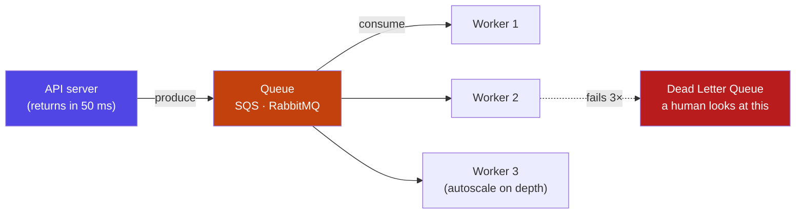

**What a queue actually buys you:**

1. **Decoupling** — the API does not need the email service to be up, or even to exist yet.
2. **Load levelling** — a flash sale sends 50,000 orders in a minute; the queue holds them while 10 workers drain at a safe rate. Without it, the burst hits the database.
3. **Durable retries** — a message stays until acknowledged; a worker that crashes mid-job releases it to another.
4. **Elastic scaling** — queue depth is the perfect autoscaling signal.

**The operational rules:**

- **Retry with exponential backoff *and jitter*.** `1s, 2s, 4s, 8s…` — plus randomness, or every failed message retries in lockstep and hammers the recovering service.
- **Always configure a DLQ.** After N failures a message goes to a dead-letter queue instead of looping forever ("poison message"). *An alarm on DLQ depth > 0 is one of the highest-value alerts you will ever set.*
- **Watch queue depth and age.** Growing depth = consumers cannot keep up. Old messages = something is stuck.
- **Keep messages small.** Send `{ "orderId": 123 }`, not the whole order. The worker re-reads current state from the DB — no stale payloads.

```js
// Producer — the API returns immediately
await queue.send({ type: 'order.confirmation', orderId: order.id });
res.status(201).json({ id: order.id, status: 'processing' });

// Consumer — idempotent, backed off, and it acknowledges only on success
async function handle(msg) {
  const { orderId } = JSON.parse(msg.body);
  if (await alreadySent(orderId)) return ack(msg);     // duplicate delivery is normal
  await sendEmail(orderId);
  await markSent(orderId);
  await ack(msg);                                       // no ack → redelivery later
}
```

**Common choices:** SQS (managed, simple), RabbitMQ (rich routing), **BullMQ/Redis** (right for a Node app your size), Celery (Python).

---

## E4. Event Streaming and Pub/Sub

**Simple definition:** in **pub/sub** a producer publishes an event and *every* interested subscriber gets a copy. An **event stream** (Kafka) is pub/sub with a durable, replayable log — consumers read at their own pace and can rewind.

<p class="te"><strong>Telugu:</strong> Queue lo oka message ni <strong>okkade</strong> worker teesukuntadu. Pub/Sub lo oka event ni <strong>andaru</strong> subscribers teesukuntaru. Kafka daani meeda inko vishesham — events ni <strong>log laaga</strong> daachi pedutundi, consumers tama vegam tho chadavachu, avasaram aithe <strong>malli modati nunchi</strong> chadavachu. Ade "replay".</p>

**Queue vs stream — the distinction interviewers probe:**

| | Queue (SQS, RabbitMQ) | Log/stream (Kafka, Kinesis) |
|---|---|---|
| A message goes to | One consumer | Every consumer group |
| After consumption | Deleted | **Retained** (days, or forever) |
| Replay | No | Yes — reset the offset |
| Order | Best-effort / FIFO queues | Strict **within a partition** |
| Scale | High | Very high (millions/sec) |
| Mental model | A to-do list | A newspaper archive |

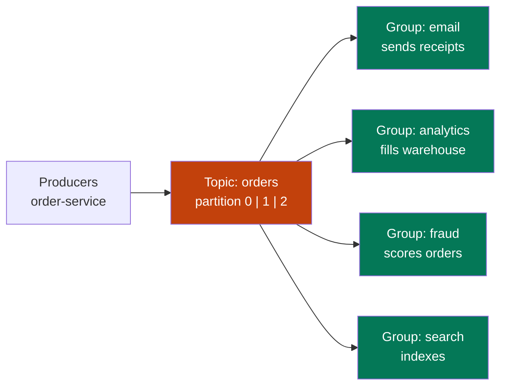

**Kafka's three ideas, in plain words:**

- **Topic** — a named stream of events (`orders`, `page-views`).
- **Partition** — the topic split into ordered logs for parallelism. **Events with the same key always land on the same partition**, so all events for `order-123` stay in order. Partition count caps your consumer parallelism.
- **Consumer group** — consumers that share the partitions between them; each group tracks its own **offset**, which is why four teams read the same stream independently.

**Why teams love it:** a new consumer needs **zero change** to the producer. When the fraud team appears, they subscribe to `orders` and replay six months of history to train their model — the order service never knew they existed.

**Why you should not start here:** Kafka is genuinely heavy — partitions, replication, consumer lag, rebalances and a cluster to operate. Below roughly "thousands of events per second across several teams", SQS or Redis Streams gives you 90 % of the benefit with 10 % of the operational pain. **In an interview, name the threshold**; that is the judgement being tested.

**The SAP connection:** SAP **Event Mesh** on BTP is this pattern in the enterprise — S/4HANA publishes business events (`BusinessPartner.Changed`) and your side-by-side extension subscribes, instead of polling OData every five minutes (I2).

---

## E5. Delivery Guarantees and Idempotency

**Simple definition:** networks lose and duplicate messages, so a distributed system promises one of three things — **at-most-once**, **at-least-once**, or **exactly-once** — and the only one you should design around is at-least-once *plus* idempotent consumers.

<p class="te"><strong>Telugu:</strong> Network lo messages podam, leda rendu sarlu ravadam sahajam. <strong>At-most-once</strong> = podam parvaledu. <strong>At-least-once</strong> = podadu kaani duplicate ravachu (real ga andaru vaadedi ide). <strong>Exactly-once</strong> = kaavali kaani chala kastam. Nijamaina fix — message rendu sarlu vachina <strong>okate result</strong> ivvela code raayadam. Ade <strong>idempotency</strong>.</p>

| Guarantee | Means | Use for |
|---|---|---|
| **At-most-once** | Fire and forget; may be lost | Metrics, non-critical logs |
| **At-least-once** | Never lost; may arrive twice | ✅ Almost everything — the practical default |
| **Exactly-once** | Once, truly | Rare; needs transactional broker + store, and costs throughput |

**Why "exactly-once" is mostly a lie:** the consumer must process the message *and* record "I did this" atomically — but those are two systems. Kafka's exactly-once works *within* Kafka; the moment you call a payment API or send an email you are back to at-least-once. **The honest answer: at-least-once delivery + idempotent processing = effectively exactly-once.**

**Making an operation idempotent** — three standard techniques:

```js
// 1 · Dedupe table keyed by message/request ID (the general solution)
async function process(msg) {
  const id = msg.id;
  try {
    await db.query('INSERT INTO processed_messages (id) VALUES (?)', [id]); // PK → duplicate throws
  } catch (e) {
    if (e.code === 'ER_DUP_ENTRY') return;                                   // already handled
    throw e;
  }
  await doTheWork(msg);
}

// 2 · Make the write itself naturally idempotent
await db.query('UPDATE orders SET status = "paid" WHERE id = ? AND status = "pending"', [id]);
// Running it twice changes nothing the second time. Compare with:
// UPDATE accounts SET balance = balance - 100  ← NEVER idempotent

// 3 · Client-supplied idempotency key (Phase 8 — Stripe does exactly this)
// POST /payments  Idempotency-Key: 8f3c-…  → same key returns the first response, no second charge
```

**The design rules:**

1. **Give every message a stable ID** at creation — not at send time, or a retry gets a new ID and defeats deduplication.
2. **Prefer `SET` over `INCREMENT`** in event handlers. Absolute values are idempotent; deltas are not.
3. **Store the dedupe record and the work in one transaction** where possible; otherwise record *after* the work and accept rare double-processing on a crash between them.
4. **Give dedupe records a TTL** (24 hours is typical) so the table does not grow forever.
5. **Design the user-visible side too:** a "Pay" button should send an idempotency key generated when the page loaded, so a double-click, a refresh and a flaky network all collapse into one charge.

---

# Part F — Architecture Styles

## F1. Monolith → Modular Monolith → Microservices

**Simple definition:** a **monolith** is one deployable application containing all features; **microservices** split it into small, independently deployable services owned by different teams.

<p class="te"><strong>Telugu:</strong> <strong>Monolith</strong> = motham app okate program, okate deploy. <strong>Microservices</strong> = okko feature okko chinna service, okko team, veru veru deploy. Microservices manchidi ani anukoku — adi <strong>technical problem ki solution kaadu, team problem ki solution</strong>. 5 mandi team ki monolith ye correct answer.</p>

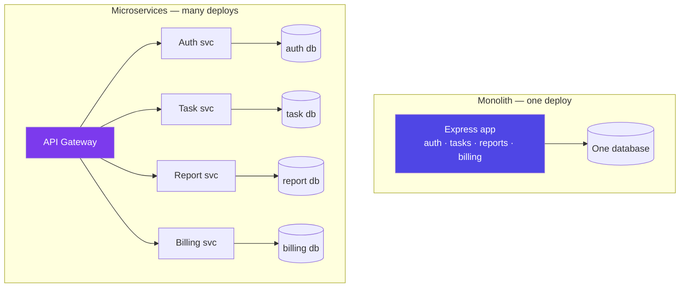

| | Monolith | Microservices |
|---|---|---|
| Deploy | One artefact — simple | Many pipelines, versioning, contracts |
| Local dev | `npm start` | Docker Compose and hope |
| A function call | Nanoseconds, always works | A network call that can fail or time out |
| Transactions | `BEGIN … COMMIT` | Sagas (D5) |
| Debugging | One stack trace | Distributed tracing across 6 services |
| Scaling | Scale the whole app | Scale only the hot service |
| Blast radius | A memory leak takes everything down | Contained — *if* you added timeouts and breakers (G2) |
| Team fit | 1–15 engineers | Many teams needing independent releases |

**The honest position:** *microservices trade simplicity for independence.* If your organisation does not need the independence, you have paid the price and bought nothing. Every distributed-systems problem in this guide — partial failure, eventual consistency, tracing, retries, versioned contracts — is a problem you *created* by splitting.

**The modular monolith is the correct default.** One deployable, but internally split into modules with explicit boundaries: `modules/tasks`, `modules/billing`, each owning its own tables, talking only through a published interface — never by reaching into another module's tables. You get clean architecture now, and if a module later needs its own deploy cycle, it lifts out cleanly because the seam already exists.

**When splitting is genuinely justified:**

- Two teams block each other on every release.
- One component's scaling profile is wildly different (video encoding vs the web app).
- One component needs a different stack (an ML model in Python).
- Compliance requires isolation (payment data in a restricted service).
- One component's failure must not touch the rest.

**Real-world both ways:** Amazon and Netflix split because thousands of engineers could not share a release train. Shopify, GitHub and Stack Overflow run large modular monoliths very successfully. Meanwhile ten-person startups split into 30 services and spend the year on YAML instead of product. **Split when the pain is organisational, not when the diagram looks impressive.**

---

## F2. Drawing Service Boundaries

**Simple definition:** a service boundary should follow a **business capability** that owns its own data — not a technical layer, and not a database table.

<p class="te"><strong>Telugu:</strong> Services ni ela vibhajinchali? <strong>Business pani</strong> prakaram — "Orders", "Payments", "Inventory" laaga. "Controller service", "Database service" laaga <strong>technical layers</strong> ga kaadu. Mukhya niyamam: <strong>prathi service ki sonta data untundi</strong>; inko service aa tables ni nerugaa touch cheyyakoodadu — API/event dwaara ne adagaali.</p>

**The one non-negotiable rule: each service owns its data.** If two services read and write the same table, they are not two services — they are one service with two deployments and no schema safety. You cannot change that table without a coordinated release, which is the exact thing you split up to avoid.

| Symptom | What it means |
|---|---|
| Every feature touches 4 services | Boundaries are wrong — you split by layer, not by capability |
| Two services share a table | Not really separate — merge, or make one the owner |
| Service A cannot work when B is down | Should have been async, or should not be separate |
| Service is 200 lines with one endpoint | Too fine — a "nanoservice", all overhead |

**How to find boundaries** — the practical version of Domain-Driven Design:

1. **List the nouns of the business:** Order, Payment, Task, User, Notification.
2. **Group by who changes them together.** Things that always change in the same release belong together.
3. **Draw the data.** If two candidates need each other's rows on every request, they are one service.
4. **Follow team ownership** — Conway's Law: your architecture mirrors your org chart whether you plan it or not.
5. **Check the transaction boundary.** Anything that must be atomic belongs in one service — often the single most useful test.

**A worked example.** Your Task Tracker grows to have an AI feature that summarises tasks weekly. Should it be a service?

| Question | Answer |
|---|---|
| Different scaling? | Yes — GPU-ish, bursty, slow |
| Different stack? | Yes — Python + an LLM SDK |
| Owns its own data? | Yes — prompts, summaries, embeddings |
| Can it be async? | Yes — a weekly job, nobody waits |
| Must it be atomic with task writes? | No |

Five yeses — split it. Now ask the same five questions about "comments on a task": different scaling? no. Own data? it is meaningless without the task. Atomic with tasks? yes. **That is a module, not a service.**

---

## F3. Event-Driven Architecture and CQRS

**Simple definition:** in an **event-driven** system services announce *facts* that already happened ("OrderPlaced") instead of commanding each other, and anyone interested reacts. **CQRS** separates the model you write with from the model you read from.

<p class="te"><strong>Telugu:</strong> Event-driven ante — oka service inko daaniki "idi cheyyi" ani <strong>order</strong> veyyadu; "idi jarigindi" ani <strong>prakatana</strong> chestundi. Evariki avasaramo vaallu vinnukuntaru. Kotta feature add cheyyali ante purathana code ni touch cheyyakkarledu — kotta subscriber ni add chesthe chaalu.</p>

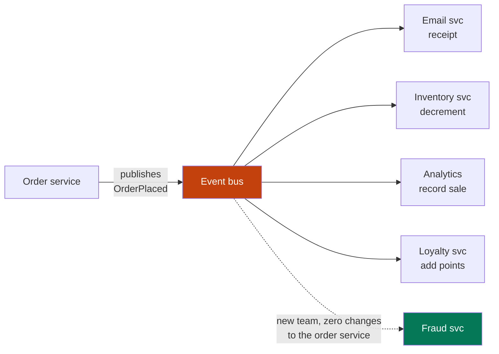

| Command (imperative) | Event (a fact) |
|---|---|
| `POST /send-email` | `OrderPlaced` |
| Caller knows the receiver | Caller has no idea who listens |
| Caller waits, and fails if the receiver is down | Fire and forget, buffered by the broker |
| Adding a listener = changing the caller | Adding a listener = zero change |

**Name events in the past tense** (`PaymentCaptured`, not `CapturePayment`) — it forces the mental shift. A fact cannot be rejected; a command can.

**The price** — be able to state these: no single place shows the whole flow (debug by correlation ID, G6); eventual consistency becomes visible to users (the order exists, the invoice appears two seconds later); events are a **public contract**, so once published you may only add fields; ordering and duplicates are your problem (E5).

**CQRS** — Command Query Responsibility Segregation. Writes go through the normalised model with all the validation; reads come from a **separate, denormalised, pre-computed** model that is built by listening to events.

Use it where read and write shapes genuinely differ — a normalised orders schema is terrible for a "customer 360" dashboard, so a read model is maintained per event and served in one query. The cost is another store to keep in sync and a lag between write and read. **Do not apply CQRS to a CRUD screen** — for most tables, one model is correct and simpler.

**Event sourcing** (its famous cousin) goes further: store *only* the events, and derive current state by replaying them. You gain a perfect audit trail and time travel; you pay with snapshots, schema evolution of old events, and the fact that "just query the current balance" is no longer trivial. Right for banking ledgers and order flows; wrong for a task list.

---

## F4. Serverless and the BFF

**Simple definition:** **serverless** means the cloud runs your function on demand and you pay per invocation — there is no server for you to size, patch or keep warm. A **BFF** (Backend For Frontend) is a thin API tailored to one client, sitting in front of the real services.

<p class="te"><strong>Telugu:</strong> <strong>Serverless</strong> ante servers levu ani kaadu — <strong>nuvvu</strong> vaatini choodakkarledu ani. Code ni pettu, request vachinappudu run avutundi, entha vaadithe antha bill. Traffic ledu ante bill ledu. <strong>BFF</strong> ante mobile app ki oka API, web ki inko API — prathi client ki kaavalsina shape lo data ivvadaniki madhyalo unde patchi layer.</p>

| | Container / EC2 (Phase 10) | Serverless (Lambda, Cloud Functions) |
|---|---|---|
| Scaling | You configure it | Automatic, to zero and to thousands |
| Cost at idle | Paid per hour, always | **Zero** |
| Cost at constant high load | Cheaper | Usually more expensive |
| Cold start | None | 100 ms – 2 s on the first call |
| Long jobs | Fine | Capped (15 min on Lambda) |
| Persistent connections | Fine | Awkward — WebSockets and DB pools both suffer |
| State | You may keep it (do not) | You may not |

**Where serverless clearly wins:** spiky or rare workloads (a nightly report, a webhook receiver, image thumbnailing on upload, a Slack bot), glue between managed services, and small internal APIs where zero idle cost matters. **Where it hurts:** steady high-traffic APIs (a busy Lambda costs multiples of a small EC2), anything needing a warm database pool, and workloads sensitive to tail latency.

**The database-connection trap:** 1,000 concurrent Lambdas try to open 1,000 database connections and exhaust Postgres. The fixes are a connection proxy (RDS Proxy), a serverless-friendly data store (DynamoDB), or an HTTP data API. This is the single most common way a serverless design fails in production.

**The BFF pattern** solves a different problem: a mobile app and a web app want different data shapes. Without a BFF, your services grow client-specific endpoints and mobile makes eight calls over a slow network.

Each BFF is owned by the *frontend* team, aggregates several services into one response, and keeps client-shaped logic out of the domain services. (GraphQL is often used as a single flexible BFF instead of several.) For your Task Tracker, the Express API *is* the BFF — you only need the pattern when a second, differently-shaped client appears.

---

# Part G — Reliability, Operations and Security

## G1. Designing for Failure — Redundancy and Failover

**Simple definition:** at scale, hardware failure is not an accident but a **statistic** — so the design assumes every component will die and makes sure no single death is visible to users.

<p class="te"><strong>Telugu:</strong> Pedda systems lo "edaina fail avutunda?" ane prashna ledu — "<strong>eppudu fail avutundi</strong>" ane prashna matrame. Anduke design lo modatinunche <strong>prathi piece rendu</strong> unchutaru, mariyu okati chachipothe rendodi ventane teesukuntundi (failover). Users ki telavakoodadu — ade goal.</p>

**Single points of failure (SPOF)** — the checklist. Walk your architecture diagram and ask of every box: *if this dies right now, does the product stop?*

| Component | SPOF fix |
|---|---|
| App server | ≥2 behind a load balancer, in ≥2 availability zones |
| Load balancer | Managed LBs are internally redundant; otherwise two + a floating IP |
| Database primary | Standby replica with automatic failover (RDS Multi-AZ) |
| A whole data centre (AZ) | Spread across ≥2 AZs |
| A whole region | Multi-region — expensive, do it only when required |
| **Your deploy pipeline** | The forgotten one: if CI is down, can you roll back? |
| **DNS / TLS certificate** | Expired certs are a top-5 cause of real outages; automate renewal + alert at 30 days |

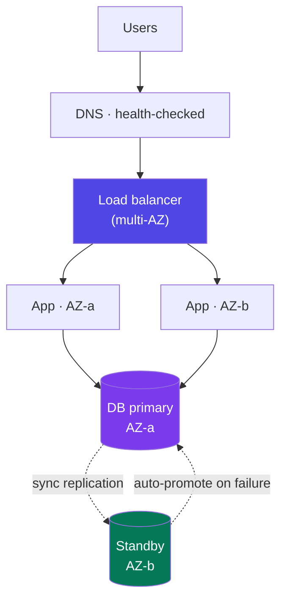

**Active–passive vs active–active:** passive keeps a standby idle and promotes it on failure — cheaper, seconds of downtime, and untested until the worst day. Active–active serves from both at all times: no failover delay, double the capacity, *continuously proven* — but it demands multi-region data consistency.

**Redundancy is not a backup.** Replication faithfully copies your `DELETE FROM tasks` to every replica in milliseconds. Redundancy protects against *hardware* failure; backups protect against *human and software* failure. You need both (G5).

**The discipline that separates theory from reality:** an untested failover does not work. Netflix's Chaos Monkey kills production instances during business hours on purpose, so failure handling is exercised constantly rather than discovered at 3 a.m. You do not need Chaos Monkey — but once a quarter, kill a server and watch what happens.

---

## G2. Timeouts, Retries, Circuit Breakers, Bulkheads

**Simple definition:** these four patterns stop *one* slow or broken dependency from consuming your service and turning a small failure into a total outage.

<p class="te"><strong>Telugu:</strong> Nee service pilichina inko service <strong>slow</strong> ga unte, nee service kuda aagipotundi — appudu daani meeda aadharapadina vaallu kuda aagutaru. Ide <strong>cascading failure</strong>. Aapadaniki naalugu: <strong>timeout</strong> (entha sepu wait chestavo cheppu), <strong>retry</strong> (jaagrattaga malli try cheyyi), <strong>circuit breaker</strong> (fail avutunte konchem sepu pilavaddu), <strong>bulkhead</strong> (resources ni veru veru chesi unchu).</p>

**1 · Timeouts — the one everyone forgets.** A call with no timeout waits forever; every waiting request holds a connection, a thread and memory. Under load your process runs out of all three and dies — because of *someone else's* problem.

```js
// Every outbound call gets a deadline. No exceptions.
const res = await fetch(url, { signal: AbortSignal.timeout(2000) });
const pool = mysql.createPool({ connectTimeout: 5000, waitForConnections: true, connectionLimit: 20 });
```
Set the timeout from the p99 of the dependency (not the average), and make it **shorter than your caller's timeout** — otherwise the client has already given up while you are still working.

**2 · Retries — helpful, and dangerous.** Retry only **idempotent** operations (E5) and only **transient** failures (timeout, 503, connection reset) — never a 400 or a 401, which will fail identically forever.

```js
async function withRetry(fn, tries = 3) {
  for (let i = 0; i < tries; i++) {
    try { return await fn(); }
    catch (e) {
      if (i === tries - 1 || !isTransient(e)) throw e;
      const backoff = 2 ** i * 100;                 // 100, 200, 400 ms
      await sleep(backoff + Math.random() * 100);   // + JITTER — essential
    }
  }
}
```
**Retry storms** are a classic self-inflicted outage: a service slows down, every client retries 3×, load triples, it dies completely. Always cap attempts, always add jitter, and never retry at more than one layer of the stack.

**3 · Circuit breaker** — stop calling something that is clearly broken.

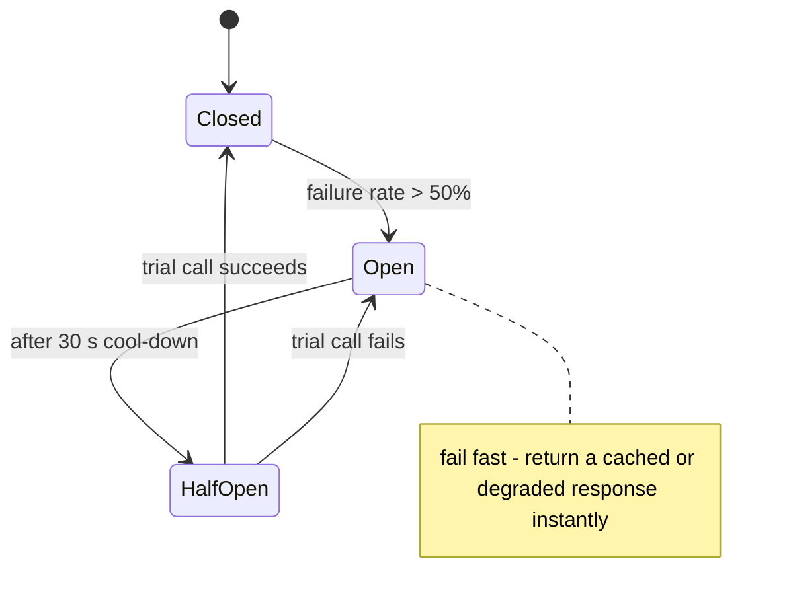

**Closed** = calls flow. **Open** = fail instantly without calling (no threads wasted, and the struggling service gets room to recover). **Half-open** = let one trial call through to test the water. This is what turns "the recommendation service is down" into "the page loads without recommendations" instead of "the site is down".

**4 · Bulkhead** — named after ship compartments: a separate resource pool per dependency, so a flood in one does not sink the ship. If report generation and login share one 20-connection pool, slow reports lock out logins. Give reports their own pool of 5.

**How they compose:** *timeout* bounds one call → *retry* handles a blip → *circuit breaker* handles a sustained failure → *bulkhead* contains the damage → *fallback* (G4) keeps the user served.

---

## G3. Rate Limiting

**Simple definition:** **rate limiting** caps how many requests a client may make in a time window — protecting you from abuse, from runaway loops, and from one noisy customer degrading everyone else.

<p class="te"><strong>Telugu:</strong> Rate limiting ante "oka user oka nimisham lo ennisarlu adagavachu" ane hadhu pettadam. Enduku — abuse aapadaniki, oka buggy client motham system ni tinesindi ani kaakunda undadaniki, mariyu bill control lo undadaniki. Limit daatithe <code>429 Too Many Requests</code> + <code>Retry-After</code> ivvali.</p>

| Algorithm | How | Trade-off |
|---|---|---|
| **Fixed window** | Count per minute, reset at :00 | Simplest; allows a 2× burst across the boundary |
| **Sliding window counter** | Weighted blend of this and last window | ✅ Accurate enough, cheap — a common default |
| **Token bucket** | Tokens refill at a steady rate; each request takes one | ✅ **Allows bursts** while capping the average — the usual best answer |
| **Leaky bucket** | Requests drain at a fixed rate | Perfectly smooth output; queues rather than bursts |

```js
// Token bucket in Redis — allows a burst of 20, sustains 5 req/s
const script = `
  local tokens = tonumber(redis.call('HGET', KEYS[1], 'tokens') or ARGV[1])
  local last   = tonumber(redis.call('HGET', KEYS[1], 'ts') or ARGV[4])
  local refill = (ARGV[4] - last) * ARGV[2]
  tokens = math.min(ARGV[1], tokens + refill)          -- cap at bucket size
  if tokens < 1 then return 0 end
  redis.call('HSET', KEYS[1], 'tokens', tokens - 1, 'ts', ARGV[4])
  redis.call('EXPIRE', KEYS[1], ARGV[3])
  return 1`;
const allowed = await redis.eval(script, 1, `rl:${userId}`, 20, 5, 60, Date.now() / 1000);
```
*(The Lua script matters: read-modify-write across separate commands is a race condition under concurrency. Redis runs Lua atomically.)*

**Design decisions that matter more than the algorithm:**

- **What is the key?** API key > user ID > IP address. IP is the weakest (offices and mobile carriers share IPs via NAT — you will block a whole college).
- **Where does it live?** At the gateway for everyone; per-service for expensive endpoints. Search might allow 10/min while reading a task allows 1,000/min.
- **Tell the client the truth:** return `429` with `Retry-After: 30` and `X-RateLimit-Remaining` headers so well-behaved clients back off instead of hammering.
- **Distributed counters** must be shared (Redis), or 10 servers with a local counter = 10× your intended limit.
- **Fail open or closed?** If Redis is down, do you block everyone (safe, but an outage) or allow everyone (available, but unprotected)? For most products: **fail open, and alarm loudly**.

**Real-world:** GitHub allows 5,000 authenticated requests/hour; OpenAI limits both requests **and tokens** per minute. Note the pattern — limits track *resource cost*, not request count. An endpoint that costs 100× more deserves its own limit.

---

## G4. Graceful Degradation and Load Shedding

**Simple definition:** **graceful degradation** means a broken dependency removes a *feature*, not the product; **load shedding** means deliberately rejecting some traffic to keep the rest healthy.

<p class="te"><strong>Telugu:</strong> Oka chinna feature (recommendations, reviews) fail aithe motham page fail avvakoodadu — aa piece ni daachi migathadi chupinchali. Ade <strong>graceful degradation</strong>. Inka traffic maryada meerithe, konni requests ni kaavalane <strong>venakki pampi</strong> (429/503) migatha vaariki service ni kaapadadam — ade <strong>load shedding</strong>. Motham koolipoye kanna konchem tagginchadam nayam.</p>

**Degradation in practice** — rank every dependency:

| Tier | Example | If it fails |
|---|---|---|
| **Critical** | Auth, orders database | The product genuinely cannot serve — return 503 honestly |
| **Important** | Search, feed ranking | Fall back: unranked list, cached results, simpler query |
| **Optional** | Recommendations, reviews, avatars | Hide the section. Never block the page |

```js
// Optional dependency: short timeout, no retry, silent fallback
async function recommendations(userId) {
  try {
    return await withTimeout(recoService.get(userId), 200);
  } catch {
    metrics.increment('reco.fallback');
    return await redis.get('reco:popular') ?? [];   // stale or generic is fine
  }
}
```

**Load shedding** — when you are over capacity, serving *everyone* slowly is worse than serving *most* people quickly, because slow requests pile up until the process dies and then nobody is served. So:

- **Reject early and cheaply** at the edge (429/503 with `Retry-After`) before the request consumes a DB connection.
- **Shed by priority.** Drop bulk API and analytics traffic before user-facing reads; drop anonymous before logged-in; keep checkout alive longest.
- **Bound your queues.** An unbounded request queue turns overload into a latency spiral — every request times out having done work nobody is waiting for. Cap it and reject when full.
- **Kill-switch flags.** A config flag that disables the expensive "related items" panel during an incident is the cheapest reliability tool there is. Build it before you need it.

**Real-world:** at peak sale traffic, large e-commerce sites turn off review counts, personalised sort and "recently viewed" and serve cached category pages. Customers barely notice; checkout stays up. That is a *designed* degradation path, not a 2 a.m. panic.

---

## G5. Shipping Safely — Deployments, Rollback and DR

**Simple definition:** a **deployment strategy** decides how new code reaches users so a bad release affects few of them and can be undone in seconds; **disaster recovery** decides how you come back from losing data or a whole region.

<p class="te"><strong>Telugu:</strong> Kotta code ni okesari andariki ivvakudadu. Modata konchem mandiki ivvu (<strong>canary</strong>), chusi baagunte andariki ivvu. Tappu aithe <strong>ventane venakki</strong> teesukovali (rollback). Inka mukhyam — <strong>backups</strong>: replication backup kaadu, endukante nuvvu delete cheste adi kuda delete avutundi. Restore ni test cheyyani backup ledu ane artham.</p>

| Strategy | How | Rollback | Cost |
|---|---|---|---|
| **Rolling** | Replace instances a few at a time | Roll forward/back gradually | Cheap; two versions run together |
| **Blue-green** | Full second environment, flip the LB | Instant — flip back | 2× infrastructure during the release |
| **Canary** | 1 % → 10 % → 50 % → 100 %, watching metrics | Stop and revert the slice | Needs good metrics; the safest for real risk |
| **Feature flag** | Ship the code dark, enable per user/tenant | Toggle off — no deploy at all | Flag debt if you never delete them |

**The rule that makes all of them work: every deploy must be backward compatible for one version.** During any rolling or canary release, old and new code run *simultaneously* against the *same* database. Hence the **expand/contract** migration (which you met in Phase 10):

1. **Expand** — add the new nullable column; deploy code that writes both old and new.
2. **Backfill** — copy existing data in batches.
3. **Migrate** — deploy code that reads the new column.
4. **Contract** — a release later, drop the old column.

Four steps, four deploys, zero downtime. Renaming a column in one migration is how you take a site down.

**Backups and DR — the two numbers to state:**

- **RPO** (Recovery Point Objective) — how much data you can afford to lose. Nightly backups = up to 24 hours. Continuous log shipping = seconds.
- **RTO** (Recovery Time Objective) — how long you may take to be back. Restoring a 500 GB database takes hours; a warm standby takes minutes.

Recovery options run from *backup & restore* (hours, cheapest) through *pilot light* (data replicated, compute off — tens of minutes) and *warm standby* (minutes) to *active–active multi-region* (seconds, most expensive).

**The three backup rules:** keep them **off-site and in another account** (ransomware and a compromised account both take your backups otherwise); **test a restore quarterly** — an untested backup is a hypothesis, not a backup; and keep **point-in-time recovery** so you can rewind to 11:59, one minute before the bad `UPDATE`.

---

## G6. Observability — Knowing What Your System Is Doing

**Simple definition:** **observability** is being able to answer "what is wrong right now, and why" from the outside, using three kinds of signal: **logs** (events), **metrics** (numbers over time), and **traces** (one request's journey).

<p class="te"><strong>Telugu:</strong> Nee system lo emi jarugutundo bayatinunche telusukogaladam ye observability. Moodu vishayalu: <strong>Logs</strong> = emi jarigindi (vaakyalu). <strong>Metrics</strong> = enni, entha (numbers, graphs). <strong>Traces</strong> = oka request ye ye services gunda velli, ekkada entha time teesukundo. Monitoring = "problem unda?", Observability = "<strong>enduku undi?</strong>"</p>

| Pillar | Answers | Tools | Rule |
|---|---|---|---|
| **Logs** | "What exactly happened for request X?" | CloudWatch, Loki, ELK | **Structured JSON**, with a request ID. Never log passwords, tokens, card numbers |
| **Metrics** | "Is it happening more than usual?" | Prometheus + Grafana, CloudWatch | Cheap, aggregated, alertable. Track **rate, errors, duration** |
| **Traces** | "Which of the six services is slow?" | OpenTelemetry, Jaeger, X-Ray | One trace ID propagated through every hop |

```js
// Structured logging with a correlation ID — the single highest-value change you can make
app.use((req, res, next) => {
  req.id = req.get('x-request-id') ?? crypto.randomUUID();
  res.set('x-request-id', req.id);
  next();
});
logger.info({ requestId: req.id, userId, route: '/tasks', ms: 42, status: 200 }, 'request');
// Pass req.id to every downstream call → one grep reconstructs the whole journey
```

**What to put on the dashboard.** The **four golden signals**: **latency** (p50/p95/p99), **traffic** (requests/sec), **errors** (rate and type), **saturation** (CPU, memory, connection pool, queue depth). For queues add depth and message age; for caches, hit rate; for databases, replication lag and slow queries.

**Alerting discipline — this is where teams fail.** Alert on **symptoms users feel**, not on causes: "checkout error rate > 1 % for 5 minutes" is a page; "CPU at 85 %" is a graph, not a page. Every alert must be **actionable** and have a runbook. Alerts that fire regularly and are ignored are worse than no alerts — they train the team to ignore the one that matters.

**One more signal that pays for itself:** deploy markers on every graph. The most common answer to "why did latency triple at 14:32?" is "we deployed at 14:31".


---

## G7. Security at the Design Level

**Simple definition:** designing for security means deciding **who may do what**, where secrets live, and which failures must never be possible — before the code exists, because the expensive vulnerabilities are architectural, not typos.

<p class="te"><strong>Telugu:</strong> Security ni chivarilo add cheyyalemu — adi design lo bhagam. Rendu mukhyamaina prashnalu: "<strong>evaru</strong>?" (authentication) mariyu "<strong>vaadu idi cheyyocha</strong>?" (authorization). Rendo prashna ne andaru marchipotaru — ade ati pedda bug (inko user data kanipinchadam). Phase 8 lo chusina BOLA ide.</p>

| Layer | Design decision |
|---|---|
| **Edge** | CDN/WAF absorbs DDoS; rate limits per key; TLS everywhere, HSTS |
| **Gateway** | Verify the token **once**; pass a trusted identity inward; never trust a client-supplied user ID |
| **Service** | Authorise **every** object access against the caller (`WHERE owner_id = :me`) |
| **Data** | Encrypt at rest (managed keys) and in transit; separate databases per sensitivity; field-level encryption for PII |
| **Secrets** | Never in code or images — SSM/Secrets Manager/Vault, injected at runtime, rotated |
| **Network** | Private subnets; the database has **no public IP**; security groups allow only what is needed |

**Authentication vs authorization, and where each belongs:** authentication scales well at the gateway (one JWT check for everyone). **Authorization cannot be centralised** — only the task service knows that a task belongs to a user. Centralising it is how BOLA (Broken Object Level Authorization) happens: `GET /api/tasks/7` returns someone else's task because the code checked *logged in* rather than *allowed*. It is #1 on the OWASP API list and it is a design bug, not a coding slip.

**Multi-tenancy** — for any product serving multiple companies (which is every SAP-adjacent product):

| Model | Isolation | Cost | Used by |
|---|---|---|---|
| Shared schema, `tenant_id` on every row | Weakest — one missing `WHERE` leaks data | Cheapest | Most SaaS |
| Schema per tenant | Good | Medium | Mid-market B2B |
| Database per tenant | Strongest | Highest | Regulated, enterprise |

If you use `tenant_id`, enforce it **below** the application: row-level security in Postgres, or a repository layer that physically cannot build a query without a tenant filter. "Every developer will remember" is not a security control.

**The threat list to design against:** DDoS (CDN + rate limits), credential stuffing (MFA, lockouts), injection (parameterised queries — Phase 9), SSRF (allow-list outbound calls), supply chain (pin dependencies, scan images). **Assume breach:** the goal is limiting blast radius and being able to prove from logs exactly what was touched.

---

# Part H — The Framework and Seven Real Designs

## H1. The Four-Step Framework

**Simple definition:** a system-design interview is not a quiz with a right answer — it is a 45-minute demonstration that you can **scope a problem, size it, structure a solution, and defend your trade-offs**.

<p class="te"><strong>Telugu:</strong> Interview lo "correct answer" ledu. Vaallu chusedi — nuvvu <strong>prashna ni saradiga scope chestunnava, lekka vestunnava, structure ga design chestunnava, mariyu nee decisions ni defend chestunnava</strong>. Vendane diagram geeyaddu. Modata prashnalu adugu. Ee naalugu steps ye motham framework.</p>

| Step | Time | What you do |
|---|---|---|
| **1 · Clarify** | 5–10 min | Ask questions. Write down functional + non-functional requirements. Agree on scope |
| **2 · Estimate** | 5 min | Users, QPS, storage, read:write ratio (A3). Let the numbers pick the architecture |
| **3 · High-level design** | 10–15 min | API contract, data model, then the boxes-and-arrows diagram |
| **4 · Deep dive + trade-offs** | 15 min | The interviewer picks a piece. Go deep. Name bottlenecks, failures, alternatives |

**Step 1 — the questions to always ask:**

- **Scope:** which features are in? (*"Analytics on the links, or just create + redirect?"*)
- **Scale:** how many users, operations per day, read:write ratio?
- **Latency:** what is acceptable — p99, not average?
- **Consistency:** must reads be immediately correct, or is a second of lag fine?
- **Availability & data:** what if a region dies? How long do we keep data; any residency rules?

**Step 3 — always in this order:** ① the **API** (2–4 endpoints; it forces the scope to be concrete), ② the **data model** (entities, keys, and the access patterns), ③ the **diagram** (client → CDN → LB → services → cache → store → queue). Draw the simple version first and *then* scale it — narrating the evolution (A5) is exactly what they want to hear.

**Step 4 — the phrases that mark a senior candidate:**

> *"At 50 QPS a single Postgres handles this; I would shard at roughly 10k writes/sec, and here is the shard key I'd choose."*
> *"I'm choosing eventual consistency for the feed because a 2-second delay is invisible, but the payment path must be strongly consistent."*
> *"The bottleneck here is fan-out on write for celebrity accounts, so I'd use a hybrid: push for normal users, pull for the top 0.1 %."*
> *"If the cache dies, we serve from the database at higher latency — degraded, not down."*

**The five ways candidates lose:** designing before clarifying; skipping the numbers; drawing Kafka for a 100-user product; presenting a design with no downsides; and going silent while thinking. **Narrate everything** — they cannot grade silence.

---

## H2. Case 1 — URL Shortener (TinyURL)

**Requirements.** *Functional:* create a short link from a long URL, redirect, optional custom alias and expiry. *Non-functional:* 100 M new links/day, read:write = 100:1, redirect p99 < 100 ms, 5-year retention, highly available (a broken redirect is a dead link everywhere on the internet).

<p class="te"><strong>Telugu:</strong> Ee prashna lo asalu challenge chinnadi laaga kanipistundi kaani rendu vishayalu unnayi — <strong>chinna unique code ela puttinchali</strong> (collision leekunda, guess cheyyalekunda), mariyu <strong>redirect ni ela ati vegam ga cheyyali</strong> (reads writes kanna 100 rettlu ekkuva → cache motham katha).</p>

**Estimation:** 100 M writes/day ≈ 1,160 writes/sec (peak ~3,500); reads ≈ 116k/sec. Each row ≈ 500 bytes → 50 GB/day → ~90 TB over 5 years. **Reads dominate by 100× → cache everything and optimise the redirect path.**

**API:** `POST /urls {longUrl, alias?, ttl?}` → `{shortUrl}`; `GET /{code}` → `301/302` redirect.

**The key decision — generating the code.** 7 characters of base62 (`a–z A–Z 0–9`) = 62⁷ ≈ 3.5 trillion combinations. Options:

| Approach | Verdict |
|---|---|
| Hash the URL (MD5, take 7 chars) | Collisions must be detected and retried |
| Random 7 chars + uniqueness check | Simple; a DB round trip per attempt |
| Auto-increment counter → base62 | No collisions, shortest codes — but **guessable/enumerable** |
| **Counter block per server** (Redis hands out ranges of 1M) | ✅ No per-request coordination, no collisions, scales out |
| **Snowflake ID** (timestamp + machine + sequence) | ✅ Distributed, time-sortable, no central service |

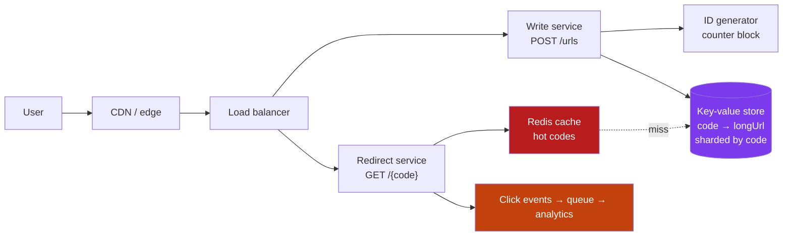

**Why a key–value store:** the only query is "code → URL". No joins, no scans. DynamoDB/Cassandra sharded on `code` scales writes and storage linearly (D2). A relational DB works fine too until roughly the billion-row mark.

**Deep-dive points that impress:**

- **301 vs 302:** `301` (permanent) is cached by browsers — fastest, but you never see the click again, so analytics die. `302` keeps every click flowing through you. **Use 302** when analytics matter.
- **Analytics must be async** — fire a click event onto a queue; never let the counter write slow the redirect.
- **Cache hit rate will be excellent** — link popularity is extremely skewed, so a small Redis absorbs nearly all traffic (Part C).
- **Custom aliases** need a conditional write, not read-then-write — that is a race.
- **Abuse:** the biggest real-world problem is phishing. Check submissions against Safe Browsing lists and rate-limit creation per account.

---

## H3. Case 2 — Social News Feed (Twitter / Instagram)

**Requirements.** *Functional:* post, follow, and see a feed of posts by people you follow, newest first. *Non-functional:* 150 M daily users, feed loads in < 200 ms, reads ≫ writes, a few seconds of staleness is fine.

<p class="te"><strong>Telugu:</strong> Ee design lo motham katha okate prashna — feed ni <strong>eppudu tayaru cheyyali</strong>? Post chesinappude andari feed lo pettala (<strong>fan-out on write</strong>), leda user open chesinappudu tayaru cheyyala (<strong>fan-out on read</strong>)? Rendintikee problems unnayi — celebrity ki modati di, active users ki rendo di. Nijamaina answer — <strong>rendu kalipi (hybrid)</strong>.</p>

**The core trade-off:**

| | Fan-out on **write** (push) | Fan-out on **read** (pull) |
|---|---|---|
| On post | Insert into every follower's feed list | Just save the post |
| On read | Read one pre-built list — very fast | Query all followees, merge, sort — slow |
| Cost | Expensive writes (a celebrity = 50 M inserts) | Expensive reads (every single load) |
| Latency | Excellent reads | Poor reads |
| Best for | Normal users (few followers) | Celebrities, inactive users |

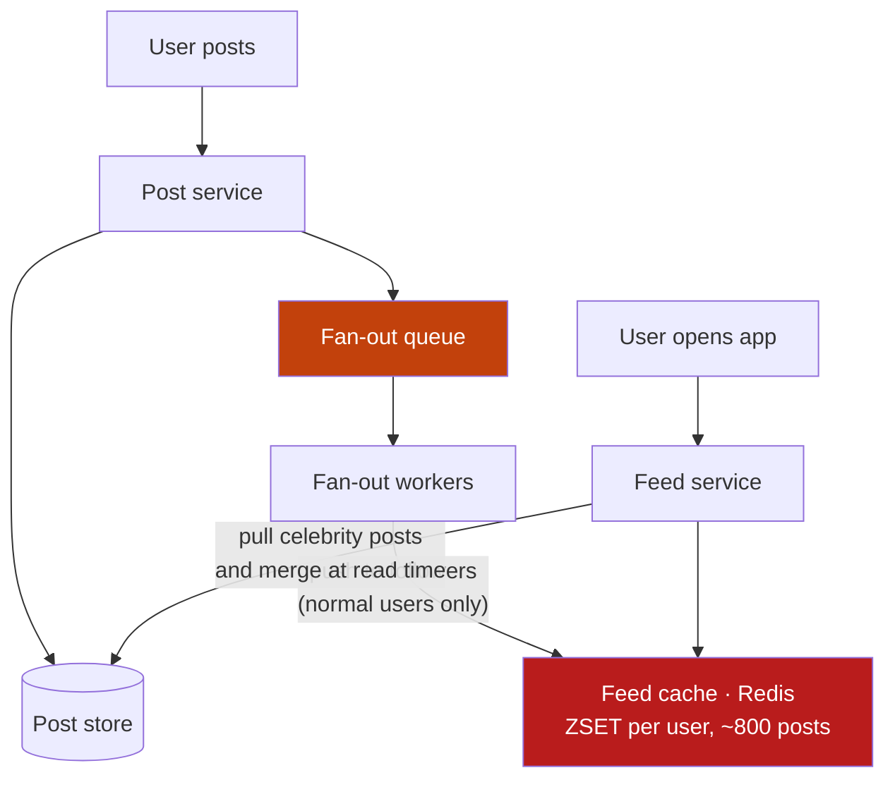

**The hybrid, stated precisely:** push for accounts under ~10k followers (99.9 % of users, cheap fan-out); for accounts above that, do **not** fan out — store the post once, and when a follower loads their feed, merge their pre-built list with the handful of celebrities they follow. Best of both, and it is the answer real systems converged on.

**Data model:** feeds live in Redis sorted sets — `ZADD feed:{userId} {timestamp} {postId}`, trimmed to the newest ~800 entries (nobody scrolls further; older pages fall back to the database). Post bodies are fetched by ID in one `MGET`.

**Deep-dive points:**

- **Pagination must be cursor-based** (Phase 8): `?before=<timestamp/postId>`. `OFFSET 1000` on a feed both gets slower and skips/duplicates items as new posts arrive.
- **Fan-out is asynchronous** — the post API returns as soon as the post is stored; the queue does the rest. A user's own post is inserted into their own feed synchronously so they see it immediately.
- **Ranking** (engagement-ordered, not chronological) is a separate scoring service over the same candidate set — do not entangle it with delivery.
- **The write amplification is real:** 1 post × 500 followers = 500 writes. At 5,000 posts/sec that is 2.5 M feed writes/sec — which is why the feed store is Redis, not MySQL.
- **Media** never goes through the feed path: object storage + CDN, URLs only in the post.

---

## H4. Case 3 — Chat Application (WhatsApp)

**Requirements.** *Functional:* one-to-one and group messages, delivery/read receipts, online presence, offline delivery, message history. *Non-functional:* 50 M concurrent connections, sub-second delivery, no message ever lost, ordered within a conversation.

<p class="te"><strong>Telugu:</strong> Chat lo teda emiti ante — <strong>server nunchi client ki data push cheyyali</strong>. Anduke HTTP polling kaadu, <strong>WebSocket</strong> — connection tericche unchutaru. Kaani okka user connection okate server meeda untundi. Rendu users veru veru servers meeda unte? Appudu aa rendu servers madhya <strong>pub/sub</strong> (Redis/Kafka) kaavali. Idi ee design lo asalu core.</p>

```mermaid
graph TB
  A["Alice · phone"] <-->|"WebSocket"| WS1["Chat server 1"]
  B["Bob · phone"] <-->|"WebSocket"| WS2["Chat server 2"]
  WS1 --> PS["Pub/Sub<br/>Redis / Kafka"]
  PS --> WS2
  WS1 --> MS["Message store<br/>Cassandra: (chat_id, ts)"]
  WS1 --> PR["Presence store<br/>Redis, TTL heartbeat"]
  WS2 --> PN["Push notification<br/>APNs / FCM — if offline"]
  style PS fill:#c2410c,color:#fff
  style MS fill:#7c3aed,color:#fff
  style PR fill:#b91c1c,color:#fff
```

**The flow:** Alice sends → chat server 1 persists the message (this happens *first* — persistence before delivery is what makes "never lost" true) → publishes to the pub/sub channel for the conversation → the server holding Bob's socket receives it and writes it down the socket → if Bob has no live connection, a push notification goes to APNs/FCM and the message waits in his undelivered queue.

**Key decisions:**

| Decision | Choice | Why |
|---|---|---|
| Transport | **WebSocket** (with long-polling fallback) | Server must push; mobile networks need reconnect logic |
| Message store | **Wide-column** (Cassandra) partitioned by `chat_id`, clustered by timestamp | Enormous write volume, "last N messages in this chat" is the only query |
| Routing between servers | Pub/sub keyed by conversation | Sockets are pinned to one server; this is the bridge |
| Connection registry | Redis: `user → server` with TTL | Find which server holds a socket |
| Presence | Heartbeat every 30 s writing a Redis key with a 60 s TTL | Self-cleaning: no heartbeat, no key, user is offline |
| Ordering | Server-assigned sequence number per conversation | Client clocks lie; never order by device time |

**Deep-dive points:**

- **Delivery states** (sent → delivered → read) are just three acknowledgements travelling back the same path — each one is a small message, so a chat system's real traffic is several times its message count.
- **Presence is expensive at scale:** naively broadcasting "Alice is online" to all her contacts is a fan-out storm. Real systems only compute presence for conversations you currently have open.
- **Group chat** is fan-out again: small groups → write to each member's queue; very large groups → store once and let clients pull.
- **50 M connections** ÷ ~65k sockets per server ≈ 1,000+ chat servers, all long-lived — so deploys must **drain gracefully** (stop accepting new sockets, let clients reconnect) rather than dropping everyone.
- **Stateful by nature:** this is the one place where sticky routing is correct (A6) — the socket *is* the state. Everything else stays stateless.

---

## H5. Case 4 — Nearby Drivers (Uber / Rapido)

**Requirements.** *Functional:* drivers send their location every few seconds; a rider sees nearby drivers and is matched to one. *Non-functional:* 1 M active drivers, location updates every 4 s (≈ 250k writes/sec), "find drivers within 3 km" in < 200 ms.

<p class="te"><strong>Telugu:</strong> Ikkada rendu kotta samasyalu — <strong>chala ekkuva writes</strong> (prathi driver 4 seconds ki tana location pampistadu) mariyu <strong>"daggarlo evaru unnaru"</strong> ane geo query. Rendo daaniki trick: bhoomini chinna chinna gadulu (grid) ga vibhajinchi, prathi driver ni oka gadi lo pettadam. Appudu "daggarlo" ante "ee gadi + pakka gadulu" ante matrame — motham prapanchanni vetakakkarledu.</p>

**Why a normal database fails:** `SELECT * FROM drivers WHERE lat BETWEEN … AND lng BETWEEN …` cannot use a plain B-tree index efficiently for two dimensions at once, and 250k writes/sec would destroy the index anyway.

**The solution — reduce 2D to 1D with a geospatial index:**

| Technique | Idea |
|---|---|
| **Geohash** | Encode lat/lng into a string (`tdr1y8`) where a shared prefix = physical proximity. Longer prefix = smaller cell |
| **Quadtree** | Recursively split cells until each holds ≤ N drivers — adapts to density |
| **S2 / H3** | Google's and Uber's libraries (hexagonal cells, equal-distance neighbours) |
| **Redis `GEOADD`/`GEOSEARCH`** | Geohash built in — the right answer for anything under city-scale |

```mermaid
graph LR
  D["1M drivers<br/>location every 4s"] --> LI["Location ingest<br/>(stateless, sharded by driver)"]
  LI --> GR["Redis GEO index<br/>cell → drivers, in RAM"]
  LI --> ST["Kafka → history store<br/>(analytics, trip replay)"]
  RQ["Rider: nearby?"] --> MS["Matching service"]
  MS --> GR
  GR --> MS
  MS --> TR[("Trip DB<br/>strongly consistent")]
  style GR fill:#b91c1c,color:#fff
  style ST fill:#c2410c,color:#fff
  style TR fill:#7c3aed,color:#fff
```

**The decisive insight:** driver locations are **ephemeral** — a position from 10 seconds ago is worthless. So they live in **memory** (Redis), not in a durable database. The durable write path (Kafka → warehouse) is for history and analytics, off the hot path. Separating "data I need now" from "data I must keep" is what makes 250k writes/sec affordable.

**Deep-dive points:**

- **Cell size is a tuning problem:** too big → you scan thousands of drivers; too small → you query many neighbours. Quadtrees/H3 adapt to density, which is why dense Bengaluru and an empty highway share one system.
- **Query the neighbouring cells too** — a rider at a cell edge would otherwise miss a driver 100 m away.
- **Matching must be strongly consistent** (D3): two riders must never be assigned the same driver. Use a conditional update (`UPDATE drivers SET status='assigned' WHERE id=? AND status='available'`) — the row lock is the arbiter.
- **Trips are a saga** (D5): match → accept → start → complete → charge, each with compensations.

---

## H6. Case 5 — Notification System

**Requirements.** *Functional:* send push, SMS, email and in-app notifications; respect user preferences; support templates, scheduling and retries. *Non-functional:* 10 M notifications/day, no duplicates, no lost critical alerts, third-party providers *will* fail.

<p class="te"><strong>Telugu:</strong> Idi interview lo ekkuvaga adigedi, endukante ikkada anni patterns kalustayi — <strong>queue, retry, DLQ, idempotency, rate limit, fan-out, third-party failure</strong>. Mukhya idea: notification pampe pani ni <strong>app nunchi veru chesi</strong> queue lo pettadam. App ki providers gurinchi teliyakkarledu, provider down aithe app aagadu.</p>

```mermaid
graph LR
  S1["Any service<br/>order.created"] --> API["Notification API"]
  API --> PREF["Preferences +<br/>template render"]
  PREF --> Q["Priority queues<br/>high · normal · bulk"]
  Q --> WP["Push worker"] --> FCM["FCM / APNs"]
  Q --> WE["Email worker"] --> SES["SES / SendGrid"]
  Q --> WS["SMS worker"] --> TW["Twilio / MSG91"]
  WE -.->|"3 failures"| DLQ["DLQ + alert"]
  WP --> TRK[("Delivery tracking<br/>sent · delivered · opened")]
  style Q fill:#c2410c,color:#fff
  style DLQ fill:#b91c1c,color:#fff
```

**The design decisions:**

| Concern | Decision |
|---|---|
| Coupling | Services publish an **event**; the notification service decides channel and content (F3) |
| Duplicates | Dedupe key = `(userId, eventId, channel)` in Redis with a 24 h TTL (E5) |
| User control | Preference check *and* quiet hours *and* a global unsubscribe — checked at send time, never at enqueue time |
| Priority | Separate queues: an OTP must never sit behind 2 M marketing emails |
| Provider failure | Retry with backoff → fail over to a second provider → DLQ |
| Provider limits | Rate-limit *outbound* per provider (they throttle you) — token bucket per provider (G3) |
| Scheduling | Delayed queue (Redis sorted set by send-time, or SQS delay) |

**Deep-dive points:**

- **Fan-out per user, not per event:** "your team's project changed" to a 500-person org is 500 notifications — batch and digest instead ("12 updates today"), or you become spam.
- **Idempotency is critical here** because at-least-once delivery means a retry can send a second SMS — which costs money and trust.
- **Track delivery state** (queued → sent → delivered → opened → failed) per notification; support teams live in this table.
- **Critical vs bulk isolation** is a bulkhead (G2): separate queues *and* workers, so a marketing blast cannot starve password resets.
- **Compliance:** DND registries, unsubscribe links and consent records are legal requirements in India (TRAI) and the EU (GDPR) — design them in, not on.

---

## H7. Case 6 — Video Streaming (YouTube / Netflix)

**Requirements.** *Functional:* upload a video, transcode it, stream it worldwide with adaptive quality. *Non-functional:* petabytes of storage, start playback in < 2 s, adapt to changing bandwidth, extreme read:write asymmetry (one upload, millions of views).

<p class="te"><strong>Telugu:</strong> Video system lo asalu vishayam — video ni <strong>okate file ga pampadam ledu</strong>. Prathi video ni chala qualities lo (240p, 480p, 1080p, 4K) convert chesi, prathi daanini <strong>chinna chinna 4-10 second mukkalu (segments)</strong> ga kosi CDN lo pedutaru. Player nee internet speed batti prathi mukka ki sariaina quality ni teesukuntundi. Ade <strong>adaptive streaming</strong>.</p>

```mermaid
graph TB
  UP["Creator uploads"] --> RAW["Raw storage · S3"]
  RAW --> Q["Transcode queue"]
  Q --> T1["Worker: 240p"]
  Q --> T2["Worker: 720p"]
  Q --> T3["Worker: 1080p / 4K"]
  T1 --> SEG["Segmented output<br/>HLS/DASH + manifest"]
  T2 --> SEG
  T3 --> SEG
  SEG --> CDN["CDN edge caches<br/>worldwide"]
  CDN --> V["Viewers<br/>player picks quality per segment"]
  META[("Metadata DB<br/>title, owner, views")] --- V
  style Q fill:#c2410c,color:#fff
  style CDN fill:#0891b2,color:#fff
  style SEG fill:#047857,color:#fff
```

**The pipeline, and why each piece exists:**

1. **Upload** goes straight to object storage via a **pre-signed URL** — the video bytes never pass through your API servers. (Multipart + resumable, because mobile uploads fail.)
2. **Transcoding is a fan-out of jobs**, one per resolution/codec, parallelised per *segment* so a 2-hour film is processed by hundreds of workers at once. This is a textbook queue-and-workers workload: slow, bursty, retryable.
3. **Segmenting + manifest** (HLS/DASH): the video becomes thousands of small files plus a playlist listing every quality. The **player**, not the server, chooses — it measures the last segment's download speed and picks the next quality accordingly.
4. **CDN is the whole delivery story.** 95 %+ of bytes come from edges; popular titles are *pushed* out before demand (Netflix puts its own appliances inside ISPs). Your origin only serves cache fills.

**Deep-dive points:**

- **Storage tiering:** hot titles on fast storage, the long tail on cheap cold storage. Most of a catalogue is watched almost never.
- **Segments are perfectly cacheable** — immutable, uniquely named, cached for a year. That is why video works at internet scale.
- **View counts** are eventual and aggregated (stream + batch-increment) — never one DB row per view.
- **Live streaming** changes everything: no pre-transcoding, 2–4 s segments, and latency trades directly against buffering.

---

## H8. Case 7 — Ticket Booking (BookMyShow / IRCTC)

**Requirements.** *Functional:* browse shows, see seat availability, hold seats while paying, confirm booking. *Non-functional:* extreme spikes (a big movie or a festival train opens and 500k people arrive in 60 seconds), **no double-booking ever**, payment must reconcile.

<p class="te"><strong>Telugu:</strong> Idi migatha vaatikanna vere rakam — ikkada <strong>stock parimitham</strong>. Okate seat ni rendu mandiki ammalemu. Anduke ikkada eventual consistency panikiraadu; <strong>strong consistency</strong> kaavali. Inka rendo samasya — traffic okesari, seconds lo lakshalu. Rendintini kalipi solve cheyyadame ee design.</p>

**The core problem: a limited, contended resource.** Everything else in this guide scales by adding copies; seats cannot be copied. The design therefore separates the *huge* read traffic from the *tiny, serialised* write path.

```mermaid
graph TB
  U["500k users"] --> CDN["CDN: show pages,<br/>seat map layout (static)"]
  CDN --> WR["Waiting room / queue<br/>(admit N per second)"]
  WR --> API["Booking API"]
  API --> CH["Redis: availability counts<br/>fast, approximate reads"]
  API --> HOLD["Seat hold<br/>Redis key, TTL 8 min"]
  HOLD --> DB[("Seats table<br/>row lock = source of truth")]
  API --> PAY["Payment gateway"]
  PAY -->|"webhook"| CONF["Confirm booking<br/>(idempotent)"]
  style WR fill:#c2410c,color:#fff
  style DB fill:#7c3aed,color:#fff
  style CH fill:#b91c1c,color:#fff
```

**The three mechanisms that make it correct:**

**1 · Hold, then confirm.** Selecting a seat creates a *temporary hold* with a TTL (5–10 minutes) so nobody else can take it while you pay. If payment does not complete, the hold expires and the seat returns automatically. Never mark a seat sold before payment; never lose it during payment.

**2 · Atomic seat claim** — the actual guarantee is one conditional write:

```sql
-- Optimistic: succeeds for exactly one of two racing users; affected-rows tells you who won
UPDATE seats SET status='held', held_by=?, hold_expires_at = NOW() + INTERVAL 8 MINUTE
 WHERE show_id=? AND seat_no=? AND (status='available'
        OR (status='held' AND hold_expires_at < NOW()));
-- affectedRows = 1 → you got it.  0 → someone else did. No locks held across the network.
```

Pessimistic locking (`SELECT … FOR UPDATE`) also works and is easier to reason about, but holds locks while contention is at its worst. Optimistic + a unique constraint on `(show_id, seat_no)` is the safer default (Phase 9, transactions).

**3 · Admission control.** You cannot let 500k people hit the seat map at once, so a **virtual waiting room** admits a controlled rate and shows everyone else a position and an estimate. This is honest, keeps the system alive, and is exactly what IRCTC's Tatkal queue and Ticketmaster's waiting room do.

**Deep-dive points:**

- **Reads are cached and approximate** ("23 seats left" from Redis, refreshed every second) but the **claim is exact** — an approximate read followed by an exact write is the pattern for all inventory systems.
- **Payment confirmation must be idempotent**: gateways retry webhooks, and users double-click. Key on the payment intent ID (E5).
- **Expiring holds** need a reaper job *and* an `hold_expires_at < NOW()` condition in the claim query, so a late reaper never causes a double-book.
- **Shard by `show_id`** — contention for one show stays on one shard, and different shows never contend.
- **Fairness matters commercially:** random admission is perceived as fairer than pure first-come at these spikes, and it defeats bots that reconnect fastest.

---

# Part I — Your Own System, and Revision

## I1. Capstone — Scaling the Task Tracker

**Simple definition:** the best way to own this phase is to take the app you already built (Phase 6 React + Phase 7 Express + Phase 9 MySQL + Phase 10 AWS) and design — on paper — every stage from 100 users to 1 million.

<p class="te"><strong>Telugu:</strong> Ee phase ki capstone code kaadu — <strong>design document</strong>. Nee sonta Task Tracker ni teesuko, "100 users nunchi 10 lakshala users varaku ela peruguthundi" ani okko step raayi. Prathi step ki: <strong>emi break aindi, emi add chesanu, entha kharchu, emi vadulukunnanu</strong>. Idi interview lo cheppadaniki nee sonta katha — chadivina theory kanna idi baguntundi.</p>

**Stage 0 — today (100 users).** One EC2 instance running Docker Compose: Nginx → Node → MySQL, React on S3+CloudFront, ≈ ₹1,500/month. *This is a correct architecture.* Do not change it without a reason.

| Stage | Users | What breaks first | What you add | Concept |
|---|---|---|---|---|
| **1** | 1k | MySQL and Node compete for RAM; backups are manual | Move MySQL to **RDS** (Multi-AZ) | Redundancy, managed failover (G1) |
| **2** | 10k | One Node process saturates; deploys cause downtime | **ALB + 2 app instances**, sessions in **Redis**, uploads to **S3** | Stateless services (A6), load balancing (B3) |
| **3** | 50k | Dashboard query (`tasks + users + projects` join) runs on every page load | **Cache-aside in Redis**, TTL 60 s, invalidate on write | Caching patterns (C2) |
| **4** | 100k | Weekly-summary emails block the request; a provider outage returns 500s | **BullMQ queue + workers**, DLQ, retries with jitter | Async work (E3), resilience (G2) |
| **5** | 200k | Reads dominate; reporting locks the primary | **Read replica**; route reports + list reads to it | Replication and lag (D1) |
| **6** | 400k | Search across task titles/descriptions is slow and `LIKE '%x%'` cannot use an index | **Elasticsearch**, fed by **CDC** | Purpose-built stores (D6) |
| **7** | 700k | One team cannot deploy the AI-summary feature without redeploying everything | Split the **AI summary service** (Python), talking over events | Boundaries (F2), events (F3) |
| **8** | 1M | Writes exceed one primary; `tasks` is 400 GB | **Shard by `tenant_id`**; archive tasks older than 2 years | Sharding (D2) |

```mermaid
graph TB
  U["Users"] --> CF["CloudFront + S3<br/>React build"]
  U --> ALB["ALB"]
  ALB --> N1["Node app · AZ-a"]
  ALB --> N2["Node app · AZ-b"]
  N1 --> RD["Redis<br/>sessions · cache · rate limit"]
  N1 --> RDS[("RDS MySQL<br/>primary + standby")]
  RDS -.-> RR[("Read replica<br/>reports")]
  N1 --> BQ["BullMQ queue"] --> WK["Workers<br/>email · summaries"]
  RDS -->|"CDC"| ES["Elasticsearch<br/>task search"]
  WK --> AI["AI summary service"]
  N1 --> S3["S3<br/>attachments"]
  style CF fill:#0891b2,color:#fff
  style ALB fill:#4f46e5,color:#fff
  style RD fill:#b91c1c,color:#fff
  style RDS fill:#7c3aed,color:#fff
  style BQ fill:#c2410c,color:#fff
```

**Write the document like this** (one short section per stage): *the metric that triggered it* → *the change* → *what it cost* → *what you gave up*. Stage 3, for example: "dashboard p99 hit 1.4 s at 50k users; added Redis cache-aside, 60 s TTL; +₹800/month; accepted that a task edit can take up to 60 s to appear on a colleague's dashboard."

**That last clause is the whole phase.** Anyone can add Redis. An engineer states what the cache costs in correctness and confirms the product can live with it.

---

## I2. System Design in the SAP World

**Simple definition:** every concept in this guide exists in SAP too — with different names, an enterprise accent, and one extra constraint: you are extending a system you must not modify.

<p class="te"><strong>Telugu:</strong> Ee guide lo nerchukunna prathi vishayam SAP lo kuda undi — perlu matrame veru. BTP lo microservices, Event Mesh lo pub/sub, HANA lo replication + scale-out, approuter lo API gateway. Oke okka teda — SAP lo nuvvu <strong>core system ni marchakudadu</strong> ("clean core"), pakkana extension ga kattali. Ade "side-by-side extensibility".</p>

| This guide | SAP equivalent |
|---|---|
| API gateway | **BTP approuter** + XSUAA (auth, routing, session) |
| Microservices | **CAP** services on Cloud Foundry / **Kyma** (managed Kubernetes) |
| Pub/sub, event streaming | **SAP Event Mesh** — S/4HANA publishes `BusinessPartner.Changed` |
| Read replica / OLAP split | **HANA** scale-out; CDS views for analytics on live data |
| Caching | HANA's in-memory column store *is* the cache; plus Redis on BTP |
| Multi-tenancy | **SaaS multitenancy** in CAP — tenant-aware DB containers |
| Rate limiting, quotas | API Management policies |
| CDC | SLT / Datasphere replication flows |

**The one architectural rule that dominates SAP work — the clean core.** You do not modify S/4HANA. You build *beside* it and integrate through released APIs and events:

```mermaid
graph LR
  S4["S/4HANA<br/>the digital core<br/>(do not modify)"] -->|"OData / RAP APIs"| EXT["Your extension on BTP<br/>CAP service + Fiori UI"]
  S4 -->|"business events"| EM["Event Mesh"]
  EM --> EXT
  EXT --> HDB[("HANA Cloud<br/>extension data")]
  EXT --> AI["AI service / Joule"]
  style S4 fill:#0a6ed1,color:#fff
  style EXT fill:#4f46e5,color:#fff
  style EM fill:#c2410c,color:#fff
```

Why it matters: an extension coupled to the core blocks every upgrade. A side-by-side extension that consumes stable APIs and events survives them. **That is the same "own your data, publish events, version your contracts" discipline from Part F** — just enforced by a vendor rather than by taste.

**Where SAP interviewers probe:** integration patterns (synchronous OData vs asynchronous events — E1), idempotency when replaying business events (E5), keeping extension data consistent with the core (eventual, with reconciliation — D5), and multi-tenancy isolation (G7). You have covered all of those generically — you only need the SAP vocabulary.

---

## I3. The One-Page Cheat Sheet

<p class="te"><strong>Telugu:</strong> Interview ki munduroju ee okka page chaalu. Numbers, decisions, mariyu "bottleneck vachinappudu emi cheyyali" table — ivi moodu gurthu unte chaalu.</p>

**Numbers to know cold**

| Fact | Value |
|---|---|
| Seconds in a day | 86,400 (≈ 100k) |
| 1 M requests/day | ≈ 12 rps · **1 B/day ≈ 12k rps** |
| Peak factor | 2–3× average |
| Memory read | 100 ns · SSD read 100 µs · **DC round trip 500 µs** · disk seek 10 ms · India↔US 150 ms |
| 99.9 % uptime | 43 min downtime/month |
| One MySQL primary | Comfortable to ~5k writes/sec · one Redis ~100k ops/sec |

**Decision table**

| Symptom | First move | Then |
|---|---|---|
| Reads are slow | Cache (C2) | Read replicas (D1) |
| Writes are slow | Batch, async (E3) | Shard (D2) |
| One row/key is hot | Local cache, split the key | Dedicated capacity |
| DB is out of disk | Archive old rows | Shard |
| Slow third-party call | Timeout + circuit breaker (G2) | Move it to a queue |
| Traffic spikes | Autoscale + queue | Load shedding, waiting room (G4) |
| Search is slow | Proper index | Elasticsearch via CDC (D6) |
| Duplicate charges | Idempotency keys (E5) | Dedupe table |
| Cascading outage | Timeouts everywhere | Bulkheads + degradation |

**Trade-off one-liners**

- Cache = speed **for** staleness · Replication = read scale **for** lag · Sharding = write scale **for** joins and transactions
- Async = availability **for** immediate consistency · Microservices = independence **for** simplicity
- Strong consistency = correctness **for** latency and availability · Denormalization = read speed **for** write complexity
- **Every "yes" here has a price. Naming the price is the skill.**

---

## I4. Twenty Interview Questions With Sharp Answers

<p class="te"><strong>Telugu:</strong> Ee 20 prashnalu <strong>ye system design interview lo aina</strong> vastayi. Samadhanam gurthupettukovaddu — <strong>kaaranam</strong> gurthupettuko. "Enduku" cheppagaligithe, prashna ela adigina answer cheyyagalav.</p>

1. **Latency vs throughput?** Latency = time for one request; throughput = requests per second. Optimising one often hurts the other (batching).
2. **Why is p99 more useful than the average?** Averages hide the tail. One user in a hundred having a 5-second page load is a real, reportable problem an average of 60 ms conceals.
3. **Vertical or horizontal scaling — which first?** Vertical: it is instant and needs no code change. Go horizontal when you hit the ceiling, need redundancy, or the cost curve turns.
4. **What makes a service stateless, and why care?** No client data in process memory. It lets any instance serve any request — the prerequisite for load balancing, autoscaling and zero-downtime deploys.
5. **L4 vs L7 load balancer?** L4 routes on IP/port (fast, blind); L7 understands HTTP so it can route by path, terminate TLS and do sticky sessions.
6. **Explain CAP, and what people get wrong.** During a network partition you must choose availability or consistency. You never *choose* P — the network does. It is not "pick 2 of 3", and it says nothing about normal operation (use PACELC for that).
7. **Cache-aside vs write-through?** Cache-aside: app reads cache, falls back to DB, deletes the key on write — the default. Write-through writes both on every write: never stale, more expensive, caches data that may never be read.
8. **Why delete a cache key on write instead of updating it?** Two concurrent writers can interleave and leave a stale value permanently. Deleting is idempotent; the next read repopulates correctly.
9. **What is a cache stampede and how do you prevent it?** A hot key expires and thousands of requests hit the DB simultaneously. Fix with jittered TTLs, a single-flight lock, and stale-while-revalidate.
10. **Replication vs sharding?** Replication copies *all* data to many nodes (read scale + availability). Sharding splits *different* data across nodes (write and storage scale). Most systems eventually need both.
11. **How do you pick a shard key?** Even distribution, and most queries answerable from one shard. Avoid monotonic keys (hotspots) and keys that cause cross-shard joins. Use many logical shards so growth is a move, not a rehash.
12. **What does consistent hashing solve?** Adding or removing a node moves only ~1/N of keys instead of nearly all of them. Virtual nodes even out the distribution.
13. **Strong vs eventual consistency — pick per what?** Per data type, not per system. Payments and inventory: strong. Feeds, counters, search indexes: eventual.
14. **Queue vs Kafka?** A queue delivers each message to one consumer and deletes it. Kafka retains an ordered log that many consumer groups read independently and can replay.
15. **Is exactly-once delivery real?** Not across system boundaries. Design for at-least-once plus idempotent consumers — that is effectively exactly-once.
16. **How do you make an operation idempotent?** A dedupe key with a unique constraint, absolute writes instead of increments, or a client-supplied idempotency key returning the original response.
17. **How do you keep one slow dependency from taking you down?** Timeouts on every call, bounded retries with jitter, a circuit breaker to fail fast, bulkheads to isolate pools, and a fallback so the feature degrades instead of the product.
18. **How do you deploy without downtime?** Rolling or canary with health checks, and backward-compatible database migrations (expand → backfill → migrate → contract). Keep one-version compatibility because old and new run together.
19. **When would you *not* use microservices?** Almost always at the start. Split when teams block each other, scaling profiles diverge, or isolation is required — not because the diagram looks modern. A modular monolith gets the boundaries without the distributed-systems tax.
20. **How would you scale a read-heavy app 100×?** In order: CDN for static, cache the hot reads, add read replicas, index and denormalize the hot queries, move slow work to queues — and only then shard.

---

## I5. Your 3 Days, and What Comes Next

<p class="te"><strong>Telugu:</strong> Moodu rojula plan, mariyu roju sayantram cheyyalsina chinna pani. Chaduvutu unte marchipotav — <strong>geeyi, raayi, cheppi choodu</strong>. Chivari roju nee sonta Task Tracker ki design document raayi. Adi nee portfolio lo undali.</p>

| Day | Read | Do the same evening |
|---|---|---|
| **1** | A, B, C | Estimate your Task Tracker's traffic at 100k users (A3). Draw the full request path (B5) from memory. Add a Redis cache-aside to one slow endpoint and measure the difference |
| **2** | D, E, F, G | Add a queue for one slow job (email or report). Put a timeout on every outbound call. Write a `/health` endpoint that checks the DB. Draw the sharding plan for `tasks` |
| **3** | H, I | Do three case studies from a blank page in 30 minutes each, *then* compare. Write the I1 scaling document for your own app. Answer the 20 questions out loud |

**The five sentences worth carrying out of this phase:**

1. **Do the arithmetic first** — the numbers choose the architecture, not fashion.
2. **Every component you add is a component that can fail** — add it for a measured reason.
3. **State is the hard part.** Everything difficult in distributed systems is difficult because data has to be in two places at once.
4. **Design the failure path, not just the happy path** — timeouts, retries, degradation and rollback are the design.
5. **Say the trade-off out loud.** "I chose X, it costs me Y, and that is acceptable because Z" is what separates an engineer from a diagram.

```mermaid
graph LR
  A["Phases 4-7<br/>JS · React · Node"] --> B["Phases 8-9<br/>APIs · Databases"]
  B --> C["Phase 10<br/>Git · Docker · AWS"]
  C --> D["Phase 11<br/>System Design"]
  D --> E["Phase 12<br/>AI · agents · n8n"]
  D --> F["SAP track<br/>BTP · CAP · HANA · Event Mesh"]
  style D fill:#4f46e5,color:#fff
  style E fill:#047857,color:#fff
  style F fill:#0a6ed1,color:#fff
```

**Where this leads.** Phase 12 gives you AI and agents — and every one of those systems is a distributed system with a slow, expensive, unreliable dependency (the model), which means queues, timeouts, caching, idempotency and cost control: this phase, applied. The SAP track is the same again with enterprise names, where "how would you extend S/4HANA without touching the core?" is a *system design* question in a different accent.

**Phase 11 complete.** You started these 50 days able to build a feature. You can now size a system, place its parts, predict where it breaks, and explain — with numbers — why you built it that way. That is the sentence that gets people hired. All the best, Nikhil!

---
