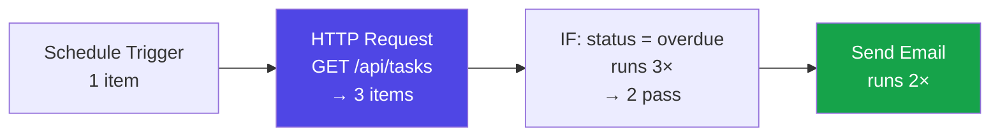
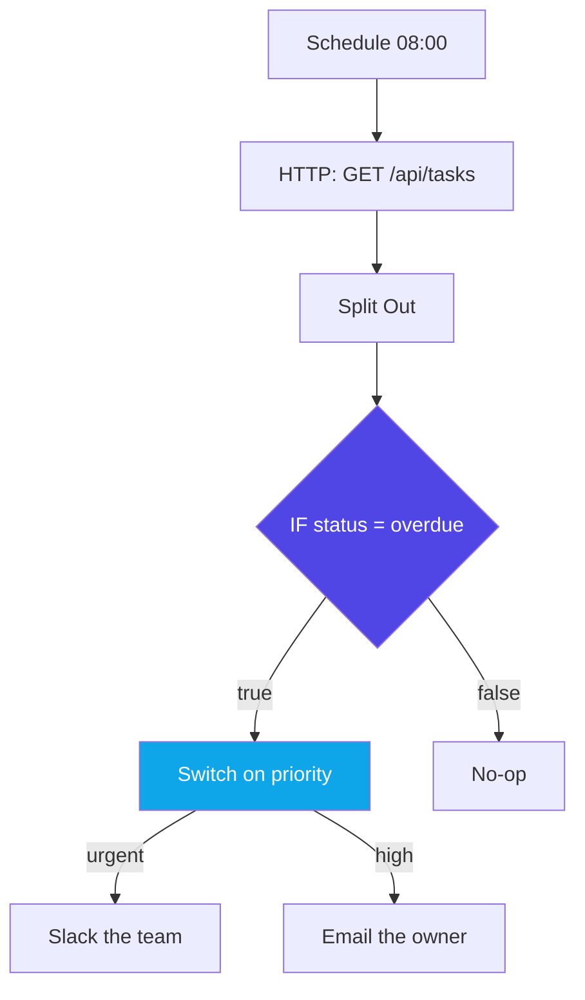
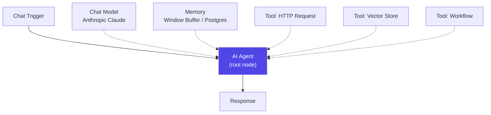
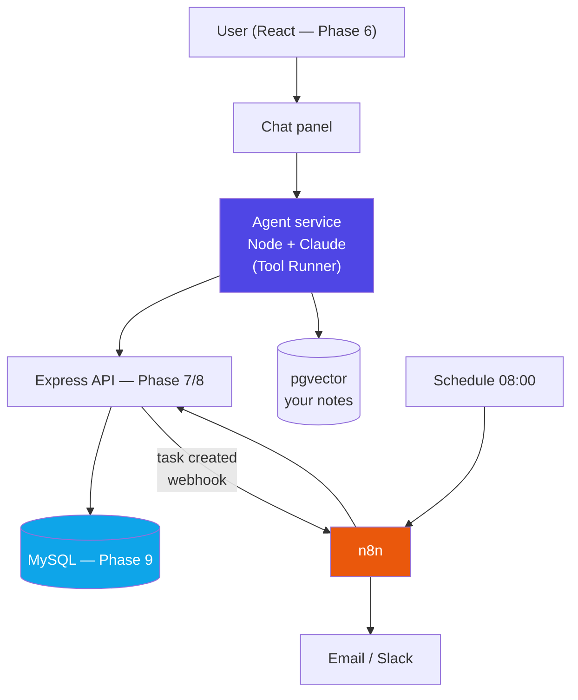
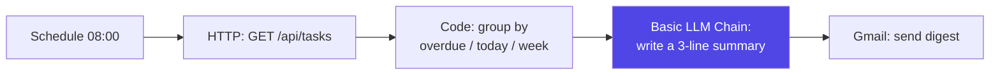

# n8n + The Capstone

### Automation you can see — and the AI layer that finally makes the Task Tracker think

> *"The last mile of every AI project is plumbing. n8n is the plumbing, and the capstone is the proof that you can lay it."*

**Phase 12 of 12** · The 50-Day Challenge · Web Dev → SAP + AI Engineer

---

## Table of Contents

- [How to Use This Guide (Days 4–5)](#how-to-use-this-guide-days-45)
- [Part A — n8n Fundamentals](#part-a-n8n-fundamentals)
  - [A1. What n8n Is, and Why It's Worth Your Time](#a1-what-n8n-is-and-why-its-worth-your-time) · [A2. Installing n8n and Touring the Editor](#a2-installing-n8n-and-touring-the-editor) · [A3. Nodes, Items, and the Execution Model](#a3-nodes-items-and-the-execution-model) · [A4. Triggers — How a Workflow Starts](#a4-triggers-how-a-workflow-starts) · [A5. Expressions, Credentials, and Security](#a5-expressions-credentials-and-security)
- [Part B — Building Real Workflows](#part-b-building-real-workflows)
  - [B1. Your First Workflow — Webhook → API → Respond](#b1-your-first-workflow-webhook-api-respond) · [B2. Flow Control — IF, Switch, Merge, Loop, Wait](#b2-flow-control-if-switch-merge-loop-wait) · [B3. The Code Node — JavaScript Inside the Canvas](#b3-the-code-node-javascript-inside-the-canvas) · [B4. Errors, Retries, and Debugging](#b4-errors-retries-and-debugging)
- [Part C — AI Inside n8n](#part-c-ai-inside-n8n)
  - [C1. The AI Nodes — Chain vs Agent](#c1-the-ai-nodes-chain-vs-agent) · [C2. The AI Agent Node — Model, Memory, and Tools](#c2-the-ai-agent-node-model-memory-and-tools) · [C3. RAG Inside n8n — Vector Stores and Embeddings](#c3-rag-inside-n8n-vector-stores-and-embeddings) · [C4. Your Own API as a Tool — and n8n with MCP](#c4-your-own-api-as-a-tool-and-n8n-with-mcp)
- [Part D — Capstone: Task Tracker AI](#part-d-capstone-task-tracker-ai)
  - [D1. The Spec — What You Are Building](#d1-the-spec-what-you-are-building) · [D2. Step 1 — Expose the API as Agent Tools](#d2-step-1-expose-the-api-as-agent-tools) · [D3. Step 2 — The Agent Service](#d3-step-2-the-agent-service) · [D4. Step 3 — The n8n Automations](#d4-step-3-the-n8n-automations) · [D5. Step 4 — Deploy, Secure, Observe, Demo](#d5-step-4-deploy-secure-observe-demo)
- [Part E — The SAP Mapping, and Revision](#part-e-the-sap-mapping-and-revision)
  - [E1. Agentic AI in the SAP World](#e1-agentic-ai-in-the-sap-world) · [E2. Mapping Your Capstone to a SAP Scenario](#e2-mapping-your-capstone-to-a-sap-scenario) · [E3. Cheat Sheet, Interview Questions, and What Comes Next](#e3-cheat-sheet-interview-questions-and-what-comes-next)

---
# How to Use This Guide (Days 4–5)

*This is the second half of Phase 12 and the last two days of the 50-Day Challenge. The first guide — **Agentic AI — Basics to Advanced** — covered the theory and the code: the agent loop, tools, RAG, MCP, and everything you need to run an agent safely. This guide connects that to the outside world with **n8n**, and then spends the rest of its pages on the **capstone** you will actually show people.*

**The 2-day plan:**

| Day | Read | What you should be able to do by the end |
|---|---|---|
| **Day 4** | Parts A, B, C | Install n8n; build a webhook workflow with branching and error handling; build an AI Agent node with memory, tools, and a vector store |
| **Day 5** | Parts D, E | Ship **Task Tracker AI** — agent tools over your API, an agent service, n8n automations, deployed and observable — then map the whole thing to SAP |

<p class="te"><strong>Telugu:</strong> Idi Phase 12 lo rendo bhaagam — 50 rojula challenge lo <strong>chivari rendu rojulu</strong>. Modati guide lo theory and code nerchukunnav. Ippudu <strong>n8n</strong> tho outside world ki connect chestaam, and <strong>capstone</strong> build chestaam. Roju 4 = n8n nerchukovadam. Roju 5 = capstone ship cheyyadam + SAP mapping. Roju 5 chivarilo neeku oka <strong>deployed, working AI product</strong> untundi — resume lo pettadaniki adi chaalu.</p>

**Prerequisites.** You need the first guide's Parts A–C at minimum (the agent loop and tool definitions), plus your Phase 6–10 stack: the React front end, the Express API, the MySQL database, and the AWS deployment. If your Task Tracker isn't running, get it running first — the capstone builds *on top of it*, not beside it.

**One framing that will save you time on Day 5:** the capstone is not "add a chatbot." It is **two different things that share one API** — a conversational agent your user talks to, and a set of unattended n8n automations that run whether anyone is watching or not. Most of the value, and most of the interview conversation, is in the second one.

---

# Part A — n8n Fundamentals

## A1. What n8n Is, and Why It's Worth Your Time

**Simple definition:** **n8n** is a workflow automation tool where you connect boxes ("nodes") on a canvas to move data between apps, run logic, and call AI models — and you can self-host the whole thing for free.

<p class="te"><strong>Telugu:</strong> n8n ante — <strong>drag-and-drop tho automation</strong> raase tool. Boxes (nodes) ni line tho kalipithe, data okati nunchi inkokati ki velthundi. Zapier laantide, kaani rendu pedda tedaalu: (1) <strong>nee sonta server lo</strong> free ga run cheyyochu, (2) <strong>JavaScript code</strong> madhyalo raayochu. Developer ki idi perfect — GUI speed + code power.</p>

| | n8n | Zapier / Make |
|---|---|---|
| Hosting | **Self-host free**, or their cloud | Cloud only |
| Code | Full JavaScript/Python nodes | Limited |
| Pricing | Per **execution** (a whole workflow run) | Per **task** (each step) — adds up fast |
| Licence | Fair-code (Sustainable Use Licence) | Proprietary |
| AI | Native AI Agent + LangChain nodes | Bolt-on |
| Integrations | 400+ | More, but shallower |

**Why a backend developer should care.** You already *could* write every automation in Express. n8n wins on three things: the 400+ pre-built integrations (Gmail, Sheets, Slack, Notion, Telegram — auth and pagination already solved), the visual execution log that shows the exact data at every step, and the speed of getting to something running. When the value is in the *connections* rather than the logic, n8n is simply faster.

**Where it loses.** Complex branching logic becomes an unreadable spaghetti canvas, version control is awkward (workflows are JSON blobs), and unit testing is limited. The mature judgment — and a good interview answer — is: **n8n for integration and orchestration, real code for complex business logic.**

**The licence, precisely:** n8n is **fair-code** under the Sustainable Use Licence. You can use, modify, and self-host it freely for internal business purposes. You may not sell it as a competing hosted service. For your capstone and your job, that is unlimited free use.

**Analogy:** Express is a set of hand tools — total control, everything from scratch. n8n is a workshop with jigs already set up. A carpenter uses both.

**Real-world:** typical production uses are lead capture → CRM → Slack alert, invoice PDF → extract fields → accounting system, and support email → AI triage → route to a team. All three are 20-minute builds in n8n and a day each in code.

---

## A2. Installing n8n and Touring the Editor

**Simple definition:** n8n runs as a Node app or a Docker container on port **5678**, and everything happens in a browser-based canvas.

<p class="te"><strong>Telugu:</strong> Install cheyyadam chala sulabham. Try cheyyadaniki <code>npx n8n</code> chaalu. Ninnu nijamga vaadalanukunte <strong>Docker</strong> vaadu — Phase 10 lo Docker nerchukunnav kada, ade ikkada panichestundi. Data ni volume lo save cheyyakapote, container ni restart chesinappudu <strong>workflows anni poddayi</strong> — idi mareche mistake.</p>

**Option 1 — try it in 30 seconds:**

```bash
npx n8n
# → open http://localhost:5678
```

**Option 2 — Docker, the way you'll actually run it:**

```bash
docker volume create n8n_data

docker run -d --name n8n --restart unless-stopped \
  -p 5678:5678 \
  -v n8n_data:/home/node/.n8n \
  -e GENERIC_TIMEZONE="Asia/Kolkata" \
  -e TZ="Asia/Kolkata" \
  -e N8N_SECURE_COOKIE=false \
  docker.n8n.io/n8nio/n8n
```

⚠️ **The `-v n8n_data:/home/node/.n8n` volume is not optional.** Without it, every workflow and credential disappears when the container restarts. This is the single most common beginner mistake with n8n.

**Option 3 — n8n Cloud** if you don't want to run anything. Fine for learning; self-host for the capstone so you can put it on the same AWS box as your API.

**The editor, in five parts:**

| Area | What it does |
|---|---|
| **Canvas** | Where you place and connect nodes. Left → right = execution order |
| **Node panel** (Tab, or `+`) | Search 400+ integrations |
| **Node settings** | Double-click a node: parameters, credentials, options |
| **INPUT / OUTPUT panes** | The **real data** entering and leaving that node — your debugger |
| **Executions tab** | Every past run, with the data at every step |

**The habit that makes n8n click:** after adding any node, hit **Execute step** and read the OUTPUT pane. You are always looking at real data, never guessing. That feedback loop is the whole reason people build faster here than in code.

**Real-world:** put n8n on the same small EC2 instance as your Task Tracker API (Phase 10), behind Nginx with a subdomain like `automate.yourdomain.com` and basic auth. It costs nothing extra and your automations sit next to the API they call.

---

## A3. Nodes, Items, and the Execution Model

**Simple definition:** data flows between nodes as an **array of items**, and — this is the rule everything else follows from — **most nodes run once per item**.

<p class="te"><strong>Telugu:</strong> Idi n8n lo <strong>ati mukhyamaina</strong> concept. Data prati chota <strong>items array</strong> ga velthundi. Oka node 5 items istey, next node <strong>5 sarlu</strong> run avutundi — okkasari kaadu. Idi artham kakapote, "enduku ee node 50 sarlu run ayindi?" ani confusion vastundi. Prati item ki oka <code>json</code> object untundi.</p>

Every connection carries this shape:

```json
[
  { "json": { "id": 1, "title": "Ship auth",   "status": "overdue" } },
  { "json": { "id": 2, "title": "Write tests", "status": "todo"    } }
]
```

Two items in → the next node executes twice, once per item. Ten tasks from your API means ten emails, automatically. No loop node needed — the looping is the execution model itself.



**Node categories you'll meet immediately:**

| Category | Examples | Note |
|---|---|---|
| **Trigger** | Manual, Schedule, Webhook, Gmail Trigger | Every workflow starts with exactly one |
| **Action** | HTTP Request, MySQL, Gmail, Slack, Google Sheets | Does the work |
| **Flow control** | IF, Switch, Merge, Loop Over Items, Wait | Shapes the path |
| **Data** | Edit Fields (Set), Code, Aggregate, Split Out | Reshapes items |
| **AI / LangChain** | AI Agent, Chat Model, Memory, Vector Store | Part C |

**Two behaviours that confuse everyone once:**

- **An API returning an array often arrives as ONE item** containing that array. Use **Split Out** to turn `{data: [...]}` into one item per element. Symptom: your node ran once when you expected ten.
- **The `Loop Over Items` node is for batching, not iteration.** You need it when an API accepts only 10 records per call, or when you want to pace requests — not for ordinary per-row processing, which happens automatically.

**Real-world:** "get all overdue tasks and email each owner" is four nodes and zero loops — Schedule → HTTP Request → Split Out → Gmail. Understanding items is what makes that obvious rather than magical.

---

## A4. Triggers — How a Workflow Starts

**Simple definition:** a **trigger** is the node that decides *when* a workflow runs. Every workflow has exactly one.

<p class="te"><strong>Telugu:</strong> Prati workflow ki oka <strong>trigger</strong> undali — adi "eppudu ee workflow start avvali" ani cheptundi. Naalugu rakaalu: manual (test ki), schedule (rojoo/gantaki), webhook (evaro call cheste), app trigger (Gmail lo kotta mail vaste). Capstone lo neeku schedule and webhook rendu kaavaali.</p>

| Trigger | Fires when | Capstone use |
|---|---|---|
| **Manual** | You click Execute | Testing, always |
| **Schedule** (Cron) | On a clock | 8 a.m. daily digest |
| **Webhook** | An HTTP request arrives | Your API calls n8n when a task is created |
| **App triggers** | Gmail/Sheets/Telegram/Slack event | Turn an email into a task |
| **Chat Trigger** | A message in n8n's chat UI | Talking to your AI agent |
| **Error Trigger** | Another workflow fails | Alerting |

**Schedule trigger** — cron syntax you already know from Phase 10:

```
0 8 * * *      → every day at 08:00
*/15 * * * *   → every 15 minutes
0 9 * * 1      → Mondays at 09:00
```

Set `GENERIC_TIMEZONE` (as in A2) or 8 a.m. means 8 a.m. **UTC** — 1:30 p.m. in India. This bites everyone exactly once.

**Webhook trigger** — n8n gives you two URLs:

```
Test:       http://localhost:5678/webhook-test/abc-123   (only while "Listen for test event" is on)
Production: http://localhost:5678/webhook/abc-123        (only after the workflow is ACTIVATED)
```

⚠️ Two rules that account for most "my webhook doesn't work" reports: the **test URL only fires while you're actively listening**, and the **production URL only works when the workflow toggle is Active**. There is no third state.

```bash
curl -X POST http://localhost:5678/webhook-test/abc-123 \
  -H "Content-Type: application/json" \
  -d '{"taskId": 7, "title": "Ship auth"}'
```

The body arrives as `{{ $json.body.taskId }}`. To reply with data (rather than just `200 OK`), set the webhook's **Respond** option to "Using Respond to Webhook node" and add that node at the end.

**Real-world:** your capstone uses a Schedule trigger for the daily digest, a Webhook trigger so your Express API can push new tasks in for AI triage, and an Error Trigger to Slack you when something breaks at 3 a.m.

---

## A5. Expressions, Credentials, and Security

**Simple definition:** **expressions** are `{{ }}` snippets that pull live data from earlier nodes into a field. **Credentials** are how n8n stores API keys — encrypted, reusable, and never typed into a node.

<p class="te"><strong>Telugu:</strong> Prati field lo static text kaadu, <strong>data</strong> pettochu — <code>&#123;&#123; $json.title &#125;&#125;</code> laaga. Idi n8n ki "programming language". Rendo vishayam: API keys ni <strong>epudu</strong> node lo type cheyyakoodadu — <strong>Credentials</strong> lo pettali. Avi encrypt ayi store avutayi, and workflow export chesinappudu bayataki povu.</p>

**The expression vocabulary — this table is 90% of what you'll use:**

| Expression | Gives you |
|---|---|
| `{{ $json.title }}` | A field from the **current** item |
| `{{ $json.body.taskId }}` | Webhook payload (note the `body`) |
| `{{ $node["HTTP Request"].json.id }}` | A field from a **named earlier** node |
| `{{ $now.format('yyyy-MM-dd') }}` | Today's date (Luxon) |
| `{{ $now.minus({days: 7}).toISO() }}` | A week ago |
| `{{ $itemCount }}` | How many items are flowing |
| `{{ $env.MY_VAR }}` | An environment variable |
| `{{ $json.title.toUpperCase() }}` | Any JavaScript expression |
| `{{ $json.due ?? 'no date' }}` | Null-safe default |

Toggle any field from *Fixed* to *Expression* to use these; the preview under the field shows the resolved value live, which makes debugging almost instant.

**Credentials, done properly:**

1. **Credentials → Add credential** → choose the type (Header Auth, OAuth2, MySQL…).
2. Reference it by name in the node. The secret is never in the workflow JSON.
3. For your own API, use **Header Auth**: name `Authorization`, value `Bearer <token>`.

**Security checklist before n8n touches the public internet:**

| Control | Why |
|---|---|
| `N8N_BASIC_AUTH_ACTIVE=true` + user/password | An open n8n editor is a remote-code-execution box for anyone who finds it |
| HTTPS via Nginx + Certbot (Phase 10) | Webhook payloads and credentials in flight |
| `N8N_ENCRYPTION_KEY` set and backed up | Lose it and every stored credential becomes unreadable |
| A secret path or token on public webhooks | Anyone who guesses the URL can trigger your workflow |
| Least-privilege API tokens | An n8n token should not be able to delete your database |
| Never log full payloads | They contain personal data |

**Real-world:** the most common n8n incident is an editor exposed on a public IP with no auth. Treat the n8n instance as production infrastructure, because it holds keys to every service you connected.

---

# Part B — Building Real Workflows

## B1. Your First Workflow — Webhook → API → Respond

**Simple definition:** the smallest useful n8n workflow receives an HTTP request, calls something, and replies. Build this once and the pattern covers half of everything you'll ever automate.

<p class="te"><strong>Telugu:</strong> Modati workflow: evaro webhook ki request pampistaru → n8n nee API ni call chestundi → answer venakki pampistundi. Ee oka pattern <strong>sagam automations</strong> ki saripotundi. Ippude build chey, chadavaku matrame.</p>

**The build, node by node:**

| # | Node | Settings |
|---|---|---|
| 1 | **Webhook** | Method `POST`, path `task-created`, Respond: *Using Respond to Webhook node* |
| 2 | **HTTP Request** | `GET http://localhost:3000/api/tasks/{{ $json.body.taskId }}`, Header Auth credential |
| 3 | **Edit Fields (Set)** | Build the response shape |
| 4 | **Respond to Webhook** | Respond with JSON |

In node 3, set two fields:

```
summary  =  {{ $json.title }} is {{ $json.status }} and due {{ $json.due }}
urgent   =  {{ $json.status === 'overdue' }}
```

Test it:

```bash
curl -X POST http://localhost:5678/webhook-test/task-created \
  -H "Content-Type: application/json" \
  -d '{"taskId": 1}'
# → {"summary":"Ship auth is overdue and due 2026-08-01","urgent":true}
```

**Four things this teaches that you'll use forever:**

1. **Webhook body lives under `body`** — `{{ $json.body.taskId }}`, not `{{ $json.taskId }}`.
2. **HTTP Request is the universal node.** Any service without a dedicated n8n node is still reachable — it's just an HTTP call.
3. **Respond to Webhook must be the last node** on every path, or the caller times out.
4. **Test URL vs production URL** (A4). Activate the workflow before pointing real traffic at it.

**Real-world:** this is exactly how your Express API will hand a newly created task to n8n for AI triage in Part D — `POST /webhook/task-created` with the id, and n8n takes it from there.

---

## B2. Flow Control — IF, Switch, Merge, Loop, Wait

**Simple definition:** flow-control nodes decide which path items take and how fast they travel.

<p class="te"><strong>Telugu:</strong> Ee nodes workflow ki <strong>brain</strong> laantivi — data ni ye daari lo pampali ani decide chestayi. IF = rendu daarulu, Switch = konni daarulu, Merge = daarulu kalapadam, Wait = aagadam, Loop = batches ga cheyyadam. Prati okkati oka JavaScript concept ke visual roopam.</p>

| Node | Does | Code equivalent |
|---|---|---|
| **IF** | Two branches: true / false | `if / else` |
| **Switch** | Up to 4+ named branches | `switch` |
| **Filter** | Drops items that don't match | `.filter()` |
| **Merge** | Combines two branches | `concat` / join |
| **Loop Over Items** | Processes in batches | chunked `for` |
| **Wait** | Pauses (seconds, or until a time) | `sleep` |
| **Stop and Error** | Fails the run deliberately | `throw` |

**IF node** — the condition builder takes a left value, an operator, and a right value:

```
Left:  {{ $json.status }}      Operator: equals       Right: overdue
```

Add a second condition with AND/OR:

```
Left:  {{ $json.priority }}    Operator: equals       Right: high
```

**Switch node** — cleaner than three chained IFs when you have several routes:

```
Rule 1: {{ $json.priority }} equals "urgent"  → output 0 → Slack the team
Rule 2: {{ $json.priority }} equals "high"    → output 1 → Email the owner
Rule 3: {{ $json.priority }} equals "low"     → output 2 → Do nothing
Fallback                                       → output 3 → Log it
```

**Merge node** — three modes worth knowing:

| Mode | Result |
|---|---|
| **Append** | All items from input 1, then all from input 2 |
| **Combine by matching fields** | A SQL-style join on a key (e.g. `task_id`) |
| **Combine by position** | Item 1 with item 1, item 2 with item 2 |

**Two rate-limit patterns you will need:**

- **Wait** — put a 1-second Wait after a node calling a rate-limited API, and since the node runs per item, you get one call per second for free.
- **Loop Over Items** with batch size 10 — for APIs that accept only 10 records per request.



**Real-world:** the daily-digest workflow in Part D is exactly this shape — fetch, split, filter to overdue, branch on priority, notify.

---

## B3. The Code Node — JavaScript Inside the Canvas

**Simple definition:** the **Code** node runs your own JavaScript (or Python) over the items flowing through, for anything the built-in nodes can't express.

<p class="te"><strong>Telugu:</strong> Konni panulu nodes tho cheyyadam kastam — appudu <strong>Code node</strong> vaadu, lopala JavaScript raayochu. Rendu modes: "Run Once for All Items" (motham array okesaari) leda "Run Once for Each Item" (prati item ki okasari). Mukhya niyamam: return cheyyaali <code>[&#123; json: &#123;...&#125; &#125;]</code> ee format lone — lekapote error vastundi.</p>

**Run Once for All Items** (the default) — you get the whole array:

```js
// Group tasks by owner and count them
const byOwner = {};
for (const item of $input.all()) {
  const o = item.json.owner ?? "unassigned";
  byOwner[o] = (byOwner[o] ?? 0) + 1;
}
// MUST return an array of { json: ... }
return Object.entries(byOwner).map(([owner, count]) => ({ json: { owner, count } }));
```

**Run Once for Each Item** — simpler when the work is per-row:

```js
const t = $input.item.json;
const daysLate = Math.floor((Date.now() - new Date(t.due)) / 86400000);
return { json: { ...t, daysLate, severity: daysLate > 7 ? "critical" : "normal" } };
```

**The helpers you'll actually use:**

| Helper | Gives you |
|---|---|
| `$input.all()` | Every incoming item (all-items mode) |
| `$input.item` | The current item (each-item mode) |
| `$('Node Name').all()` | Items from any earlier node by name |
| `$json` | Shorthand for the current item's json |
| `$now` | A Luxon DateTime |
| `$env.MY_VAR` | Environment variable |

**Four limits to know before you reach for it:**

1. **You must return `[{ json: {...} }]`.** Returning a bare object or array is the #1 Code-node error.
2. **No `npm install`.** Only built-ins plus a small allowlist. Need a library? Call a real service via HTTP Request.
3. **`console.log` goes to the browser console**, not the output pane. Return values to inspect them instead.
4. **Don't rebuild the workflow in code.** If a Code node grows past ~50 lines, that logic belongs in your Express API, called via HTTP Request. Reviewers cannot read logic buried in a canvas.

**Real-world:** in the capstone, a Code node formats the digest — grouping tasks by priority and building the HTML — because that's genuinely easier in five lines of JS than in six chained nodes.

---

## B4. Errors, Retries, and Debugging

**Simple definition:** by default a failed node stops the whole workflow. Production workflows need explicit decisions about what happens when a step fails.

<p class="te"><strong>Telugu:</strong> Default ga oka node fail ayithe <strong>motham workflow aagipotundi</strong>. Real automations lo adi saripodu — API konni sarlu fail avutundi, adi normal. Kaabatti prati risky node ki: <strong>retry</strong> pettu, <strong>continue on fail</strong> pettu, and oka <strong>error workflow</strong> pettu.</p>

**Three settings on every node (Settings tab):**

| Setting | Meaning | Use for |
|---|---|---|
| **Retry On Fail** | Retry N times with a wait between | Any network call |
| **Continue On Fail** | Pass the error along and keep going | Non-critical steps (Slack notification) |
| **Always Output Data** | Emit an empty item rather than nothing | Prevents downstream nodes being skipped |

With *Continue On Fail*, check downstream:

```
IF  {{ $json.error }}  is not empty   → handle the failure branch
```

**Error workflows** — the safety net. Build one workflow starting with an **Error Trigger** node, then set it as the error workflow in every other workflow's settings:

```
Error Trigger → Code (format) → Slack "🚨 {{ $json.workflow.name }} failed: {{ $json.execution.error.message }}"
```

The trigger receives the failed workflow's name, the execution id, the error message, and a link to the failed run. One error workflow can serve every workflow you own.

**Debugging — the four tools, in the order you should use them:**

| Tool | What it does |
|---|---|
| **Executions tab** | Every past run with the data at every step. Start here, always. |
| **Pin Data** | Freeze a node's output so you can iterate downstream without re-calling a live API |
| **Execute step** | Run one node in isolation |
| **Retry from here** | Re-run a failed execution from the failing node, not the beginning |

**Pin Data deserves special mention.** Testing a workflow that starts with a webhook is painful — you'd have to `curl` it each time. Send one real request, pin the webhook's output, then iterate on the other twelve nodes as often as you like with that frozen data. This is the single biggest productivity trick in n8n. *Remember to unpin before activating.*

**A production checklist for any workflow you activate:**

- [ ] Retry on every HTTP/API node (3 attempts, 1–5 s wait)
- [ ] Error workflow configured
- [ ] Timezone set (A2), and the schedule verified in local time
- [ ] Credentials used — no keys typed into nodes
- [ ] Data unpinned
- [ ] Tested with **bad** input, not just the happy path
- [ ] Execution data pruning enabled (`EXECUTIONS_DATA_MAX_AGE`) so the DB doesn't grow forever

**Real-world:** the most common n8n production failure is a workflow that silently stopped running weeks ago because one node started failing and nobody was told. The error workflow is what prevents that — build it before you build anything else.

---

# Part C — AI Inside n8n

## C1. The AI Nodes — Chain vs Agent

**Simple definition:** n8n ships a family of AI nodes built on LangChain. The two that matter are the **Basic LLM Chain** (one call, one answer) and the **AI Agent** (the full agent loop from the first guide, on a canvas).

<p class="te"><strong>Telugu:</strong> n8n lo 70+ AI nodes unnayi, kaani modati guide lo nerchukunna concept ee ikkada kooda vartistundi. <strong>Basic LLM Chain</strong> = oka call, oka answer (workflow). <strong>AI Agent</strong> = tools tho loop (agent). Ee tedaa neeku already telusu — ikkada adi <strong>node</strong> roopam lo untundi ante.</p>

| Node | What it does | Use when |
|---|---|---|
| **Basic LLM Chain** | One prompt → one answer | Summarize, classify, rewrite, translate |
| **AI Agent** | Agent loop with tools, memory, and reasoning | The task needs to *fetch* or *do* something |
| **Information Extractor** | Structured JSON out of free text | Parsing emails, invoices |
| **Text Classifier** | Route items into categories | Support-ticket routing |
| **Sentiment Analysis** | Positive/negative/neutral | Feedback triage |
| **Question and Answer Chain** | RAG over a vector store | Docs Q&A |

**The critical structural idea: the AI Agent is a *root node* with *sub-nodes* attached underneath it.** Those connection points at the bottom of the node are not decoration — each is a slot:



| Slot | Required | What goes there |
|---|---|---|
| **Chat Model** | ✅ Yes | Anthropic, OpenAI, Google Vertex, Mistral, Ollama (local) |
| **Memory** | Optional | Window Buffer (RAM), Postgres, Redis |
| **Tool** | Optional (but the point) | HTTP Request Tool, Vector Store, Workflow Tool, Code Tool, Calculator |
| **Output Parser** | Optional | Force structured JSON out |

**Choosing the model node:** add the **Anthropic Chat Model** sub-node, create a credential with your API key, and pick `claude-opus-5` for agent work or `claude-haiku-4-5` for high-volume classification. Everything you learned about model choice and cost in the first guide applies unchanged — n8n is just the caller.

**Real-world:** the "Basic LLM Chain vs AI Agent" decision in n8n is exactly the "workflow vs agent" decision from the first guide. If you can name the steps, use the Chain — it's cheaper, faster, and predictable.

---

## C2. The AI Agent Node — Model, Memory, and Tools

**Simple definition:** attach a chat model, optionally a memory, and one or more tools; write a system message; and n8n runs the agent loop for you.

<p class="te"><strong>Telugu:</strong> Ikkada neevu loop raayavu — n8n raastundi. Neevu cheyyalsindi: model attach chey, memory attach chey (avasaram ayithe), tools attach chey, and <strong>system message</strong> raayi. System message ye <strong>chala mukhyam</strong> — agent behaviour antha ade decide chestundi. Modati guide lo C1 lo nerchukunna rules ikkada ade vartistayi.</p>

**Building a working agent — 6 steps:**

1. Add a **Chat Trigger** node (gives you a chat window to test in).
2. Add an **AI Agent** node and connect the trigger to it.
3. Attach an **Anthropic Chat Model** sub-node → credential → `claude-opus-5`.
4. Attach a **Simple Memory (Window Buffer)** sub-node → context window length `10`.
5. Attach one or more **Tool** sub-nodes (C3, C4).
6. Open the Agent node and write the **System Message**.

**The system message is the same craft as the first guide's C1:**

```text
You are the Task Tracker assistant for one signed-in user.

Use the get_tasks tool before answering any question about task state —
never guess or invent a task.
Use create_task only when the user clearly asks to add something.

You can only see this user's own tasks. If asked about anyone else, say so.
Answer in 1–3 sentences. Use a bullet list for more than three tasks.
Today is {{ $now.format('yyyy-MM-dd') }}.
```

That last line matters — the model has no clock. Injecting the date via an expression is how "what's due this week?" starts working.

**Memory options, and the one that trips people up:**

| Memory | Stored in | Use when |
|---|---|---|
| **Simple / Window Buffer** | n8n's RAM | Testing. **Lost on restart.** |
| **Postgres / MySQL Chat Memory** | Your DB | Production — survives restarts |
| **Redis Chat Memory** | Redis | High volume |
| **Motorhead / Zep** | External service | Long-term summarized memory |

⚠️ **Memory is keyed by a session id.** If every user shares the default key, they all share one conversation — a real privacy bug, and an easy one to ship. Set the session key explicitly to something like `{{ $json.body.userId }}`.

**Cost control in n8n**, since the agent loop is hidden from you: set **Max Iterations** on the Agent node (default 10 — lower it to 5 for simple agents), pick the cheapest model that passes your tests, and keep the tool set small. Everything from the first guide's G1 still applies; you just have fewer levers exposed.

**Real-world:** a chat agent with `get_tasks`, `create_task`, and Postgres memory is roughly 20 minutes of work in n8n, versus a day in code. That is the honest reason n8n is worth learning even when you *can* write the code.

---

## C3. RAG Inside n8n — Vector Stores and Embeddings

**Simple definition:** n8n has nodes for the whole RAG pipeline — load documents, split them, embed them, store them, and query them — so you can build "chat with my notes" without writing an ingest script.

<p class="te"><strong>Telugu:</strong> Modati guide lo RAG code raasaam. n8n lo ade panini <strong>nodes</strong> tho cheyyochu: document load chey → chunks ga split chey → embed chey → vector store lo pettu. Taruvatha aa store ni <strong>tool</strong> ga agent ki attach chey. Concept okate — implementation matrame sulabham.</p>

**Two workflows, exactly as in the first guide's D3:**

**Ingest (run once, or on document change):**

| Node | Setting |
|---|---|
| Manual Trigger | — |
| **Read/Write Files from Disk** (or Google Drive) | Your `notes/` folder |
| **Default Data Loader** | Text; chunk size `1000`, overlap `100` |
| **Embeddings** (OpenAI / Cohere / Ollama) | The model you'll also use at query time |
| **Vector Store — Insert mode** | PGVector / Qdrant / Pinecone / In-Memory |

**Query (per question)** — attach a **Vector Store Tool** to your AI Agent:

```
Tool name:        search_notes
Tool description: Search Nikhil's 50-day study notes for background,
                  decisions, and explanations. Use this whenever the user
                  asks "why did we", "what did I decide", or about a
                  concept from the course. Does not contain live task data.
Limit:            5
```

That description is doing real work — it tells the agent both **when to use it** and, crucially, **when not to** ("does not contain live task data"), which stops the agent searching notes for something that needs a database query.

**Store choice inside n8n:**

| Store | Use when |
|---|---|
| **Simple Vector Store (in-memory)** | Learning. Gone on restart. |
| **PGVector** | **Best for the capstone** — you already run a database |
| **Qdrant** (Docker) | Vector-native features, still self-hosted |
| **Pinecone** | Managed, no ops, costs money |

**The same rules from the first guide still bind, and n8n does not enforce them for you:**

- Same embedding model for ingest and query, or retrieval silently returns nonsense.
- Re-run the ingest workflow when documents change — nothing is automatic.
- Filter by user/tenant in the store's metadata filter if the data is not all yours.
- Vector search still cannot count. Aggregations need a database tool.

**Real-world:** an agent with **both** a `get_tasks` HTTP tool and a `search_notes` vector tool is genuinely useful — it answers "what's overdue?" from live data and "why did I choose JWT?" from your notes, and it picks correctly between them based on nothing but those two descriptions.

---

## C4. Your Own API as a Tool — and n8n with MCP

**Simple definition:** any HTTP endpoint you own can become an agent tool in n8n, and n8n can also speak **MCP** — both as a client (using external MCP servers) and as a server (exposing your workflows to other AI apps).

<p class="te"><strong>Telugu:</strong> Nee Express API ni agent ki <strong>tool</strong> ga ivvadam chala sulabham — <strong>HTTP Request Tool</strong> node attach cheste chaalu. Inka pedda vishayam: n8n <strong>MCP</strong> kooda matladutundi. Ante nee n8n workflows ni Claude Code nunchi kooda vaadochu, and bayata MCP servers ni n8n lopala vaadochu.</p>

**Three ways to give an n8n agent a tool:**

| Tool node | What it wraps | Best for |
|---|---|---|
| **HTTP Request Tool** | Any REST endpoint | Your Task Tracker API |
| **Call n8n Workflow Tool** | Another workflow | Multi-step logic as one tool |
| **Code Tool** | JavaScript | Small calculations, formatting |

**Wiring your API as a tool** — attach an **HTTP Request Tool** sub-node to the Agent:

```
Name:        get_tasks
Description: Fetch the signed-in user's tasks. Call this whenever the user
             asks about workload, deadlines, or what is overdue. Returns
             id, title, status, due date and priority.

Method:      GET
URL:         http://api:3000/api/tasks
Auth:        Header Auth credential (Bearer token)

Query parameter "status":
  Value provider: "Let the model fill this in"
  Description:    "Filter by status: todo, in_progress, done, or overdue."
```

That last block is the important one. n8n lets you mark any field as **model-provided** — which is exactly the `input_schema` from the first guide's B1, expressed through a form instead of JSON. Same concept, same rules: describe the parameter well or the model guesses.

**n8n and MCP, both directions:**

| Node | Direction | What it does |
|---|---|---|
| **MCP Client Tool** | n8n → outside | Your agent uses tools from an external MCP server (GitHub, Postgres, your `tasks-mcp` from the first guide) |
| **MCP Server Trigger** | outside → n8n | Exposes your n8n workflows *as* an MCP server, so Claude Code and other hosts can call them |

The second one is genuinely powerful and worth ten minutes of your Day 4: build a workflow that starts with an **MCP Server Trigger**, attach a few tools to it, activate it, and you now have an MCP endpoint. Point Claude Code at it and your automations become tools your coding assistant can call.

**Security note:** an MCP Server Trigger is a public endpoint that executes your workflows. Put it behind authentication and expose only the tools you intend to share — the same rules as any other webhook (A5).

**Real-world:** this closes a nice loop for the capstone. Your Express API is a tool for the n8n agent; your n8n workflows are MCP tools for Claude Code; and your standalone `tasks-mcp` server serves both. One API, three consumers, no duplicated logic.

---

# Part D — Capstone: Task Tracker AI

## D1. The Spec — What You Are Building

**Simple definition:** **Task Tracker AI** adds two things to the app you've carried through eleven phases: a **conversational agent** the user talks to, and a set of **unattended n8n automations** that work while nobody is watching. Both go through the same API.

<p class="te"><strong>Telugu:</strong> Capstone ante kotta app kaadu — <strong>ippatike unna Task Tracker</strong> ki AI layer add cheyyadam. Rendu bhaagaalu: (1) user matladagalige <strong>agent</strong>, (2) evaru chudakapoyina pani chese <strong>n8n automations</strong>. Rendu kooda <strong>okate API</strong> vaadutayi — adi design lo mukhyamaina point. Padi kondu phases lo kattina app ki, ippudu brain vastundi.</p>

**The architecture:**



**Five features, in build order:**

| # | Feature | Type | Built in |
|---|---|---|---|
| 1 | **Chat with your tasks** — "what's overdue?", "add X for Friday" | Agent | D2, D3 |
| 2 | **Ask your notes** — "why did I choose JWT?" | RAG tool | D3 |
| 3 | **Auto-triage** — new task gets priority, tags, due date suggested | Workflow | D4 |
| 4 | **Daily digest** — 8 a.m. email: what's overdue, what's due today | Workflow | D4 |
| 5 | **Stale-task nudge** — nothing moved in 7 days → Slack alert | Workflow | D4 |

**The scope rules that keep this a 1-day build:**

- **Read tools run free; destructive tools ask.** `get_tasks`, `search_notes`, `create_task`, `update_task` run unattended. `delete_task` requires confirmation (first guide, F5).
- **The agent sees one user's tasks only.** `user_id` comes from the session, never from the model. This is BOLA prevention from Phase 8, and it is also leg 1 of the Lethal Trifecta removed by design.
- **No multi-agent.** This task is not wide. One agent, five tools.
- **Every AI call is capped:** max 6 iterations, max tokens set, and a per-run spend log.

**What "done" looks like** — the demo you will actually give:

1. Open the app, type *"what's overdue?"* → the agent calls `get_tasks` and answers with real rows.
2. Type *"add 'call the bank' for Friday"* → a task appears in the UI.
3. Type *"why did I choose JWT for auth?"* → it answers from your notes, with the source file.
4. Show the 8 a.m. digest email in your inbox.
5. Create a task in the UI → show n8n's execution log auto-assigning priority and tags.
6. Type *"delete everything"* → it refuses, or asks for confirmation.

That sequence is a complete product story: conversational, grounded, automated, and safe. It is far more convincing than any chatbot demo.

---

## D2. Step 1 — Expose the API as Agent Tools

**Simple definition:** before the agent exists, your API needs endpoints shaped for an agent — scoped to the session user, returning small predictable JSON, and safe to call.

<p class="te"><strong>Telugu:</strong> Agent build cheyyakamundu, <strong>API ni sarichey</strong>. Rendu vishayalu: (1) prati endpoint session user ki matrame data ivvali, (2) response chinnadiga, predictable ga undali — 50 columns tho pedda JSON ivvakoodadu, tokens waste. Agent ki API design cheyyadam ante — chinna, spashtamaina, safe endpoints.</p>

**The five endpoints — you mostly have these already from Phases 7–8:**

| Endpoint | Method | Notes for agent use |
|---|---|---|
| `/api/tasks` | GET | Filter by `status`; **cap at 50 rows**; return only the fields the agent needs |
| `/api/tasks` | POST | Create; return the created row |
| `/api/tasks/:id` | PATCH | Update status/priority/due |
| `/api/tasks/:id` | DELETE | Soft-delete (sets `deleted_at`) so "undo" is possible |
| `/api/notes/search` | POST | Vector search over your notes (first guide, D4) |

**Agent-shaped endpoint design — three rules:**

```js
// routes/tasks.js — note what is NOT taken from the caller
router.get("/tasks", requireAuth, async (req, res) => {
  const { status } = req.query;
  const rows = await db.query(
    `SELECT id, title, status, priority, due_date
       FROM tasks
      WHERE user_id = ? AND deleted_at IS NULL
            ${status ? "AND status = ?" : ""}
      ORDER BY due_date ASC
      LIMIT 50`,
    status ? [req.user.id, status] : [req.user.id]      // ← user id from the SESSION
  );
  res.json({ count: rows.length, tasks: rows });
});
```

1. **`user_id` comes from `req.user`, never from a query parameter.** If the model can pass a user id, it can read anyone's data.
2. **`LIMIT 50` always.** An unbounded list is an unbounded token bill, and it will eventually blow the context window.
3. **Return few fields.** Dropping `description`, `created_at`, and `updated_at` from the list response can cut the tokens per call by 70% with zero loss of usefulness.

**Add a soft delete** so "undo" is a flag, not a backup restore:

```sql
ALTER TABLE tasks ADD COLUMN deleted_at TIMESTAMP NULL;
```

**A service token for machines.** n8n calls this API without a browser session, so issue a long-lived token scoped to one user with no delete permission:

```js
const AGENT_TOKEN = process.env.AGENT_TOKEN;      // n8n sends this as Bearer
// middleware: if the token matches, set req.user = { id: SERVICE_USER_ID, canDelete: false }
```

**Real-world:** this step is where most people discover their API wasn't as clean as they thought. Making it agent-ready — scoped, capped, minimal — makes it better for humans too. That is a genuinely good thing to say in an interview.

---

## D3. Step 2 — The Agent Service

**Simple definition:** a small Node service that owns the agent loop, exposes `POST /agent/chat` to your React front end, and calls the API from D2 as tools.

<p class="te"><strong>Telugu:</strong> Ippudu asalu agent. Chinna Node service — nee React app daaniki message pampistundi, adi Claude tho matladutundi, tools pilustundi, and answer venakki istundi. Modati guide lo B4 lo nerchukunna <strong>Tool Runner</strong> ikkada vaadutunnaam — loop manam raayanavasaram ledu.</p>

```js
// agent/service.js
import Anthropic from "@anthropic-ai/sdk";
import { betaZodTool } from "@anthropic-ai/sdk/helpers/beta/zod";
import { z } from "zod";

const client = new Anthropic();
const API = process.env.TASK_API;

const api = (path, opts = {}, token) =>
  fetch(`${API}${path}`, {
    ...opts,
    headers: { Authorization: `Bearer ${token}`, "Content-Type": "application/json",
               ...(opts.headers ?? {}) },
  }).then((r) => r.json());

function toolsFor(userToken) {
  return [
    betaZodTool({
      name: "get_tasks",
      description:
        "List the signed-in user's tasks. Call this whenever the user asks about " +
        "their workload, deadlines, what is overdue, or what to do next. Returns " +
        "id, title, status, priority and due date. Max 50 tasks.",
      inputSchema: z.object({
        status: z.enum(["todo", "in_progress", "done", "overdue"]).optional()
          .describe("Filter by status. Omit for all tasks."),
      }),
      run: async ({ status }) =>
        JSON.stringify(await api(`/api/tasks${status ? `?status=${status}` : ""}`, {}, userToken)),
    }),

    betaZodTool({
      name: "create_task",
      description:
        "Create a new task for the signed-in user. Only call this when the user " +
        "clearly asks to add, create, or remind them of something.",
      inputSchema: z.object({
        title: z.string().describe("Short task title."),
        due_date: z.string().optional().describe("ISO date YYYY-MM-DD."),
        priority: z.enum(["low", "medium", "high", "urgent"]).optional(),
      }),
      run: async (input) =>
        JSON.stringify(await api("/api/tasks",
          { method: "POST", body: JSON.stringify(input) }, userToken)),
    }),

    betaZodTool({
      name: "search_notes",
      description:
        "Search Nikhil's 50-day study notes for background, decisions and " +
        "explanations. Use this for 'why did I', 'what did I decide', or any " +
        "question about a concept from the course. Does NOT contain live task data.",
      inputSchema: z.object({ query: z.string() }),
      run: async ({ query }) =>
        JSON.stringify(await api("/api/notes/search",
          { method: "POST", body: JSON.stringify({ query, k: 5 }) }, userToken)),
    }),

    betaZodTool({
      name: "delete_task",
      description: "Permanently delete a task by id. This cannot be undone by the user.",
      inputSchema: z.object({ id: z.number(), reason: z.string() }),
      run: async ({ id, reason }) => {
        // Human-in-the-loop: never delete straight from a model request.
        return `CONFIRMATION REQUIRED. Do not retry. Tell the user: "I can delete ` +
               `task ${id} (${reason}) — reply 'confirm delete ${id}' and I'll do it."`;
      },
    }),
  ];
}

const SYSTEM = `You are the Task Tracker assistant for one signed-in user.

Use get_tasks before answering anything about task state — never guess or invent a task.
Use search_notes for questions about decisions, concepts, or course material.
Use create_task only when the user clearly asks to add something.
delete_task requires explicit confirmation; never delete without it.

You can only see this user's own tasks. If asked about anyone else, say you cannot.
Answer in 1-3 sentences. Use a bullet list for more than three tasks. No preamble.
Today is ${new Date().toISOString().slice(0, 10)}.`;

export async function chat({ message, history = [], userToken }) {
  const t0 = Date.now();
  const final = await client.beta.messages.toolRunner({
    model: "claude-opus-5",
    max_tokens: 4096,
    system: [{ type: "text", text: SYSTEM, cache_control: { type: "ephemeral" } }],
    tools: toolsFor(userToken),
    max_iterations: 6,                       // hard cap — never omit
    messages: [...history, { role: "user", content: message }],
  });

  console.log(JSON.stringify({                // structured log (first guide, G5)
    run_id: crypto.randomUUID(),
    tokens_in: final.usage.input_tokens,
    cache_read: final.usage.cache_read_input_tokens,
    tokens_out: final.usage.output_tokens,
    ms: Date.now() - t0,
  }));

  return final.content.filter((b) => b.type === "text").map((b) => b.text).join("\n");
}
```

**Note the five production habits already baked in:** prompt caching on the system block, a hard `max_iterations`, a human gate on delete that tells the model *not to retry*, structured logging with token counts, and per-user tokens so tools inherit the caller's permissions.

**Wire it to Express and to React:**

```js
// POST /agent/chat  { message, conversationId }
router.post("/agent/chat", requireAuth, async (req, res) => {
  const history = await loadHistory(req.body.conversationId);        // session memory
  const reply = await chat({ message: req.body.message, history, userToken: req.token });
  await saveTurn(req.body.conversationId, req.body.message, reply);
  res.json({ reply });
});
```

On the React side it is a chat panel posting to that endpoint — the same fetch-and-render skill from Phase 6. Nothing new.

---

## D4. Step 3 — The n8n Automations

**Simple definition:** three workflows that make the app useful when nobody has it open — auto-triage on create, a daily digest, and a stale-task nudge.

<p class="te"><strong>Telugu:</strong> Ippati varaku agent tho <strong>matladaam</strong>. Ippudu evaru chudakapoyina pani jarigela automations kadataam. Interview lo "AI feature" kanna "AI <strong>automation</strong>" ekkuva impress chestundi — endukante adi nijamga time save chestundi.</p>

**Workflow 1 — Auto-triage (webhook, real-time).** Your Express `POST /api/tasks` fires a webhook after creating a task:

| # | Node | Setting |
|---|---|---|
| 1 | **Webhook** | POST `/task-created`, body `{ taskId, title, description }` |
| 2 | **Basic LLM Chain** | Anthropic `claude-haiku-4-5` — cheap, this is classification |
| 3 | **Structured Output Parser** | The schema below |
| 4 | **HTTP Request** | `PATCH /api/tasks/{{ $('Webhook').item.json.body.taskId }}` |

Prompt for node 2:

```
Classify this task. Reply with JSON only.

Title: {{ $json.body.title }}
Description: {{ $json.body.description }}
Today: {{ $now.format('yyyy-MM-dd') }}

priority: urgent | high | medium | low
due_date: ISO date, your best estimate, or null
tags: up to 3 short lowercase tags
```

Output parser schema:

```json
{ "type": "object",
  "properties": {
    "priority": { "type": "string", "enum": ["urgent","high","medium","low"] },
    "due_date": { "type": "string" },
    "tags":     { "type": "array", "items": { "type": "string" } }
  },
  "required": ["priority"] }
```

Use **Haiku** here, not Opus. This is a classification task running on every task creation — it should cost roughly ₹0.02 per task, not ₹0.20. Right-sizing the model (first guide, G1) is the whole lesson.

**Workflow 2 — Daily digest (schedule, 08:00):**



The Code node does the counting (deterministic — never ask a model to count), and the LLM writes only the human sentence at the top:

```js
const tasks = $input.all().map(i => i.json);
const today = new Date().toISOString().slice(0,10);
const overdue = tasks.filter(t => t.due_date < today && t.status !== "done");
const dueToday = tasks.filter(t => t.due_date === today && t.status !== "done");
return [{ json: {
  overdueCount: overdue.length,
  overdue: overdue.map(t => `${t.title} (${t.due_date})`).join(", "),
  dueToday: dueToday.map(t => t.title).join(", "),
}}];
```

**Workflow 3 — Stale-task nudge (schedule, weekly):** fetch tasks, filter `updated_at` older than 7 days and status `in_progress`, then Slack a short list. Four nodes, no AI needed — and knowing when *not* to use AI is part of the grade.

**Before you activate any of them** (Part B4 checklist): retry on every HTTP node, an error workflow wired to Slack, timezone set, credentials used, data unpinned.

---

## D5. Step 4 — Deploy, Secure, Observe, Demo

**Simple definition:** shipping means the agent service and n8n run next to your API on HTTPS, with caps on spend, logs you can read, and a README that lets someone else run it.

<p class="te"><strong>Telugu:</strong> Localhost lo panicheyyadam "ayipoyindi" kaadu. Phase 10 lo Docker and AWS nerchukunnav — ade ikkada vaadu. Motham deploy chey, HTTPS pettu, cost caps pettu, logs raayi, and README raayi. Ee chivari step ye demo ni <strong>product</strong> ga marchestundi.</p>

**Deploy — one `docker-compose.yml`, all four services:**

```yaml
services:
  api:
    build: ./api
    environment:
      DATABASE_URL: ${DATABASE_URL}
      JWT_SECRET: ${JWT_SECRET}
      N8N_WEBHOOK_URL: http://n8n:5678/webhook/task-created
    restart: unless-stopped

  agent:
    build: ./agent
    environment:
      ANTHROPIC_API_KEY: ${ANTHROPIC_API_KEY}
      TASK_API: http://api:3000
    restart: unless-stopped

  n8n:
    image: docker.n8n.io/n8nio/n8n
    environment:
      N8N_BASIC_AUTH_ACTIVE: "true"
      N8N_BASIC_AUTH_USER: ${N8N_USER}
      N8N_BASIC_AUTH_PASSWORD: ${N8N_PASS}
      N8N_ENCRYPTION_KEY: ${N8N_ENCRYPTION_KEY}
      GENERIC_TIMEZONE: Asia/Kolkata
      TASK_API: http://api:3000
    volumes: [n8n_data:/home/node/.n8n]
    restart: unless-stopped

  nginx:
    image: nginx:alpine
    ports: ["80:80", "443:443"]
    volumes: [./nginx.conf:/etc/nginx/conf.d/default.conf:ro]

volumes: { n8n_data: }
```

Nginx routes `/api` → api, `/agent` → agent, `automate.yourdomain.com` → n8n. Certbot for TLS — all Phase 10 material, unchanged.

**Security gates before you show anyone:**

| Check | Why |
|---|---|
| `ANTHROPIC_API_KEY` only in the agent container's env | Never in the front end. A leaked key is someone else's bill. |
| Rate-limit `/agent/chat` (e.g. 20/hour/user) | One user in a loop can cost real money |
| n8n behind basic auth + HTTPS | An open n8n editor is remote code execution |
| Agent scoped to `req.user.id` | BOLA (Phase 8) and Lethal Trifecta leg 1 |
| Soft delete + confirmation | Nothing irreversible on a model's say-so |

**Observability — log this per chat and you can answer any question about it later:**

```json
{ "run_id": "…", "user_id": 4, "tools": ["get_tasks"], "steps": 2,
  "tokens_in": 8210, "cache_read": 6900, "tokens_out": 240,
  "cost_usd": 0.0072, "ms": 3100 }
```

Then a weekly `SELECT` gives you cost per user, average steps, and your cache-hit rate. If `cache_read` is near zero, something is invalidating the prefix (first guide, C3).

**A cost ceiling you can actually enforce:** count tokens per user per day in Redis or MySQL; past the limit, return a friendly "you've hit today's AI limit" instead of calling the API. Ten lines, and it is the difference between a bounded bill and a story you don't want to tell.

**The README that makes this a portfolio piece.** Include: what it does (3 lines), the architecture diagram from D1, how to run it (`docker compose up`), the tool list with descriptions, **what it costs per conversation**, the security model (why the agent can't see other users' data), and what you'd do next. That cost-per-conversation line is the one hiring managers notice, because almost nobody includes it.

**Real-world:** you now have a deployed, authenticated, observable AI product built on your own API, with automations running on a schedule. That is not a tutorial project — it is the same shape as the systems you'll be paid to build.

---

# Part E — The SAP Mapping, and Revision

## E1. Agentic AI in the SAP World

**Simple definition:** SAP's AI stack has the same three layers you just built — an **assistant** (Joule), an **agent** layer (Joule Agents, built in Joule Studio), and a **platform** underneath (BTP AI Core). Only the names are new.

<p class="te"><strong>Telugu:</strong> Neevu ippudu kattina architecture ki SAP lo veru perlu unnayi, ante. <strong>Joule</strong> = assistant (chat). <strong>Joule Agents</strong> = tools tho pani chese agents. <strong>Joule Studio</strong> = aa agents ni build chese chotu. <strong>BTP AI Core</strong> = model platform. Nee capstone architecture ki idi <strong>okate shape</strong> — ade neeku pedda advantage.</p>

| SAP piece | What it is | Your equivalent |
|---|---|---|
| **Joule** | SAP's AI copilot, embedded across S/4HANA, SuccessFactors, Ariba | Your chat panel |
| **Joule Agents** | Agents that act on business processes — not just answer | Your agent service |
| **Joule Studio** (in SAP Build) | Low-code place to build and orchestrate custom agents | n8n's AI Agent node |
| **BTP AI Core / AI Launchpad** | Runs and manages models; deploys AI workloads | The Anthropic API + your service |
| **Generative AI Hub** | One access point to many LLMs, with SAP governance | Your model client |
| **Grounding / vector engine (HANA Cloud)** | RAG over SAP business data | pgvector + `search_notes` |
| **Autonomous Enterprise** | SAP's direction: processes that run with minimal human input | The n8n automations |

**The one difference that matters: tools are business APIs, and they carry business rules.** In your capstone, `create_task` writes a row. In SAP, an agent's tool creates a purchase requisition — which triggers an approval workflow, hits a budget check, and lands in an audit log. The agent loop is identical; the blast radius is not. This is precisely why **human-in-the-loop** (first guide, F5) is not optional in enterprise agents.

**Two SAP-specific constraints you should be able to name:**

- **Clean core.** Extensions live *side-by-side* on BTP, not modified into the ERP core, so upgrades stay clean. Your AI agent is a BTP application calling released APIs — never a modification to S/4HANA.
- **Released APIs only.** An agent tool calls a *released* OData/RAP service. Calling an unreleased internal object is exactly the modification clean core forbids.

**Real-world:** the SAP + AI Engineer role is largely this — connect an LLM to business processes through released APIs, ground it in business data, and put approval gates where money moves. You have now built that shape end-to-end on a smaller system, which is the fastest way to understand the bigger one.

---

## E2. Mapping Your Capstone to a SAP Scenario

**Simple definition:** the same five features you built map one-to-one onto a standard SAP process. Being able to draw that mapping out loud is what turns "I did a course project" into "I understand your domain."

<p class="te"><strong>Telugu:</strong> Interview lo idi cheppadam chala <strong>powerful</strong>: "nenu Task Tracker meeda kattina architecture ye, SAP lo purchase requisition process ki kooda ade vartistundi" — and mapping choopinchu. Andaru "AI project chesanu" antaru. Neevu <strong>architecture ni transfer</strong> cheyyagalanu ani choopistav.</p>

**Take procure-to-pay, one of SAP's core processes:**

| Your capstone | SAP equivalent |
|---|---|
| `get_tasks` → MySQL | `get_purchase_requisitions` → OData service on S/4HANA |
| `create_task` | `create_requisition` (RAP behavior, with validations) |
| `search_notes` → pgvector | Grounding on policy documents via HANA Cloud vector engine |
| Auto-triage (Haiku) | Auto-classify a requisition: category, cost center, urgency |
| Daily digest (n8n schedule) | Scheduled job: pending approvals older than 3 days → manager |
| `delete_task` needs confirmation | Anything that commits spend needs an approval step, always |
| Agent scoped to `req.user.id` | Authorization objects + XSUAA scopes on BTP |

**The technology mapping, layer by layer:**

| Layer | Yours | SAP |
|---|---|---|
| UI | React | Fiori / UI5, or Joule embedded |
| API | Express | CAP (Node.js!) or RAP (ABAP), exposed as OData |
| Auth | JWT | XSUAA + destinations on BTP |
| DB | MySQL | HANA Cloud |
| Vectors | pgvector | HANA Cloud vector engine |
| Agent runtime | Node + Claude | BTP app + Generative AI Hub, or Joule Studio |
| Automation | n8n | SAP Build Process Automation / Workflow |
| Deploy | Docker on EC2 | Cloud Foundry or Kyma on BTP |

Notice the CAP row: **SAP's CAP framework is Node.js**. The Express and JavaScript work from Phases 4–7 is directly transferable — that is the bridge your whole roadmap was designed around.

**What to say in an interview, in three sentences:** *"I built an agent over my own REST API with tool calling, RAG grounding, and human approval on irreversible actions. In SAP terms the tools become released OData services, grounding runs on HANA's vector engine, and the approval gate becomes a workflow step — same architecture, stricter governance. The clean-core rule means it lives on BTP side-by-side, not as a core modification."*

**Real-world:** every SAP customer in 2026 is asking the same question — "where do we put agents, safely?" The honest answer is: on released APIs, grounded in business data, with approvals where it matters. You can now say that from experience rather than from a slide.

---

## E3. Cheat Sheet, Interview Questions, and What Comes Next

<p class="te"><strong>Telugu:</strong> Chivari section. n8n cheat sheet, 15 questions, and 50 rojula taruvatha em cheyyaali ane plan.</p>

### The n8n cheat sheet

**Install:** `npx n8n` to try · Docker with `-v n8n_data:/home/node/.n8n` for real (**never skip the volume**) · port 5678 · set `GENERIC_TIMEZONE`.

**Data model:** everything is `[{ json: {...} }]` · **most nodes run once per item** · `Split Out` turns one item containing an array into many items · `Loop Over Items` is for batching, not iteration.

**Expressions:** `{{ $json.field }}` · `{{ $json.body.x }}` for webhooks · `{{ $node["Name"].json.x }}` · `{{ $now.format('yyyy-MM-dd') }}` · `{{ $env.VAR }}`.

**Triggers:** Manual (test) · Schedule (cron, watch the timezone) · Webhook (test URL needs listening, production URL needs Active) · App · Error.

**AI nodes:** Basic LLM Chain = one call · AI Agent = the loop · sub-node slots are Model / Memory / Tool / Output Parser · set **Max Iterations** · set the memory **session key** per user or everyone shares a conversation.

**Production checklist:** retry on every HTTP node · error workflow wired to Slack · credentials not typed into nodes · data unpinned · basic auth + HTTPS · `N8N_ENCRYPTION_KEY` backed up · execution pruning on.

**Cost rule:** classification → Haiku · agent reasoning → Opus · never ask a model to count — use a Code node or SQL.

### Fifteen interview questions

**1. What is n8n and when would you choose it over writing code?** A fair-code, self-hostable workflow automation tool. I choose it when the value is in connections — 400+ integrations with auth and pagination solved — and write code when the logic is complex enough that a canvas becomes unreadable.

**2. n8n vs Zapier?** n8n self-hosts free, allows arbitrary JavaScript, and bills per workflow execution rather than per task. Zapier has more integrations and no ops burden.

**3. What is fair-code?** Source-available under the Sustainable Use Licence: free to use, modify and self-host for internal business purposes; you may not resell it as a competing hosted service.

**4. Explain n8n's data model.** Items — an array of `{json: {...}}`. Most nodes execute once per item, so five items in means five executions out. That single fact explains most "why did this run 50 times?" confusion.

**5. Why did my node run once instead of ten times?** The API returned an array inside a single item. Split Out fixes it.

**6. Test webhook URL vs production?** The test URL only fires while you're listening in the editor; the production URL only works when the workflow is Active.

**7. How do you handle failures in n8n?** Retry On Fail on network nodes, Continue On Fail for non-critical steps, and an Error Trigger workflow that Slacks me with the workflow name and error. Without the last one, workflows die silently.

**8. What's the difference between Basic LLM Chain and AI Agent?** Chain is one call with no tools — a workflow. Agent runs the loop with tools and memory. Same workflow-vs-agent decision as in code: if I can name the steps, I use the Chain.

**9. What sub-nodes does the AI Agent need?** A Chat Model is required; Memory, Tools, and an Output Parser are optional. Tools are the point of using an Agent at all.

**10. How do you give an n8n agent access to your own API?** An HTTP Request Tool sub-node with a clear name and description, and any parameter marked "let the model fill this in" — which is the same `input_schema` concept as the raw API, through a form.

**11. How does n8n relate to MCP?** Both directions: the MCP Client Tool lets an n8n agent use external MCP servers, and the MCP Server Trigger exposes n8n workflows as an MCP server that Claude Code and other hosts can call.

**12. Where does the AI cost go in a workflow like yours?** Mostly into repeated input tokens in the agent loop. I control it with prompt caching, by routing classification to Haiku instead of Opus, and by capping max iterations.

**13. Tell me about your capstone.** An agent over my own Task Tracker API — five tools, RAG over my study notes, session memory in MySQL, and human confirmation on delete. Plus three n8n automations: AI triage on task creation, an 8 a.m. digest, and a weekly stale-task nudge. Deployed on AWS with Docker behind HTTPS, with per-run token and cost logging.

**14. What would you do differently with more time?** An eval suite with more than 20 cases, per-user spend limits enforced in Redis, and streaming responses so the chat feels instant instead of waiting three seconds.

**15. How does this map to SAP?** Tools become released OData/RAP services, grounding moves to HANA's vector engine, approvals become workflow steps, and it all lives side-by-side on BTP to respect clean core. The agent architecture is unchanged — the governance is stricter.

### Your 2 days

| Day | Do |
|---|---|
| **Day 4** | Install n8n (Docker, with the volume). Build B1's webhook workflow. Build one AI Agent with a Chat Model, memory, and your `get_tasks` HTTP tool. Break it on purpose, then fix it from the Executions tab. |
| **Day 5** | Build the capstone in D2 → D5 order. Deploy it. Write the README with the cost-per-conversation line. Record a 3-minute demo following D1's six steps. |

<p class="te"><strong>Telugu:</strong> Roju 4 = n8n nerchuko, chinna workflows kattu, and <strong>kaavaalani break chesi</strong> fix chey — ade nerchukune vidhaanam. Roju 5 = capstone. Deploy chey, README raayi, and 3-nimushala demo video teeyu. Aa video ye nee resume lo <strong>bagunna link</strong>.</p>

### After the 50 days

1. **Ship it publicly and link it everywhere.** A live URL plus a public repo beats every certificate. The demo video goes in your LinkedIn headline area, not buried in a post.
2. **Write one honest post** — what you built, what broke, what it costs per run. Specific numbers are what make a technical post credible.
3. **Go deep on one track.** Either the SAP side (CAP → RAP → BTP → Joule Studio, using the SAP notes in this repo) or the AI-engineering side (evals, RAG quality, agent reliability). Both are in demand; pick the one you enjoyed more, because depth beats breadth from here.
4. **Keep the habits, not the notes.** Eval before prompt changes; cost logged per run; approval gates on anything irreversible. Those three habits are what separate someone who *uses* AI from someone companies pay to *build* with it.

**You've finished the 50 days.** Phase 1 was writing a prompt. Phase 12 is deploying an agent that plans, calls your own API, grounds itself in your own notes, and asks permission before doing something it can't undo. That is a real engineer's arc — go build the next thing.

---
