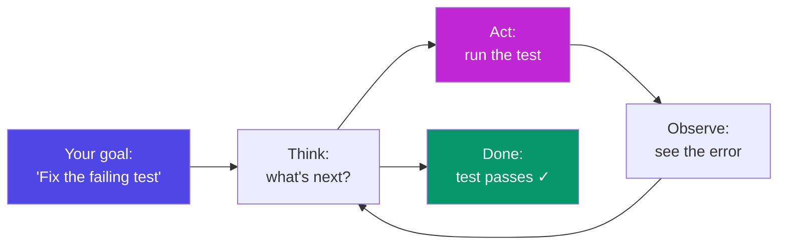
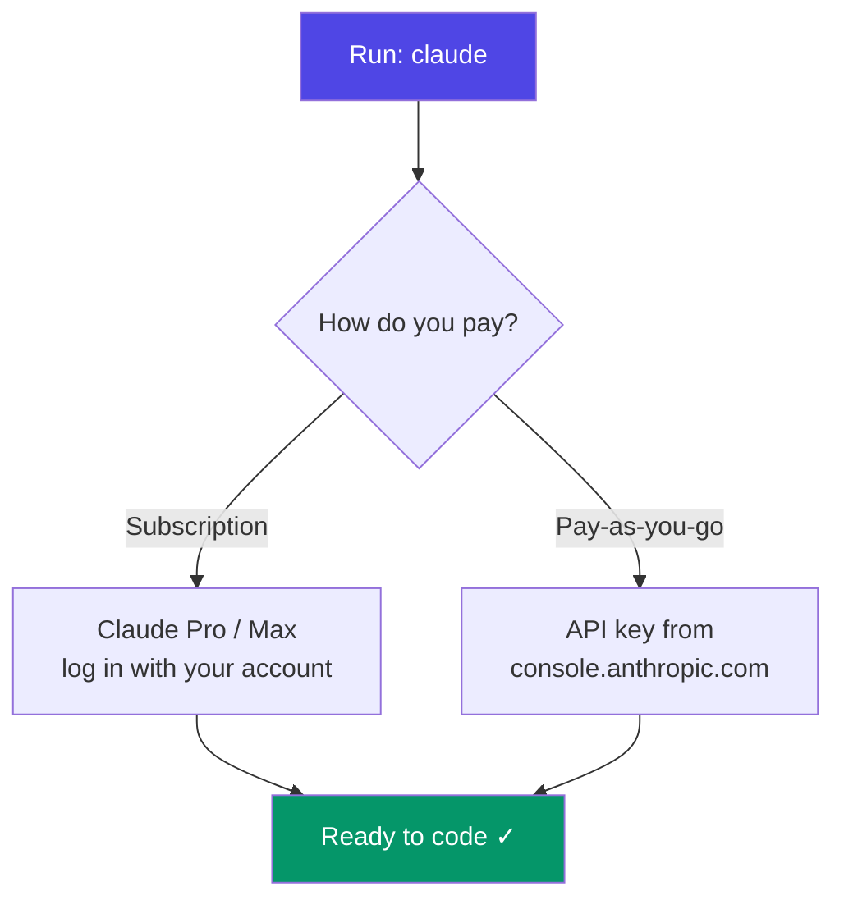
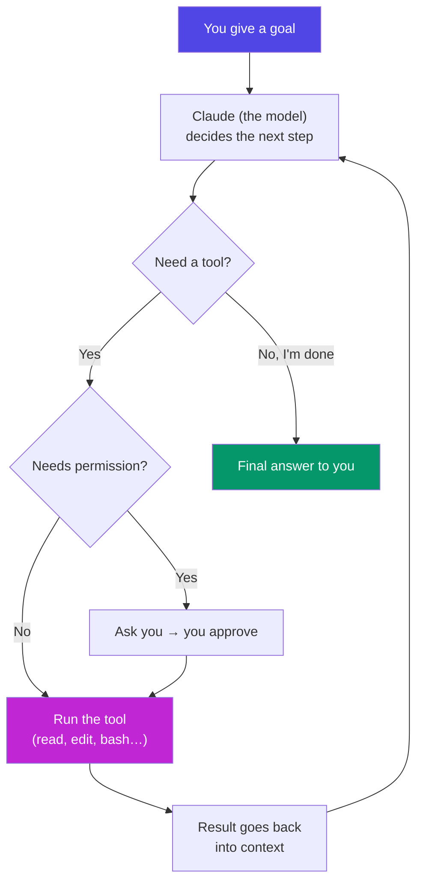
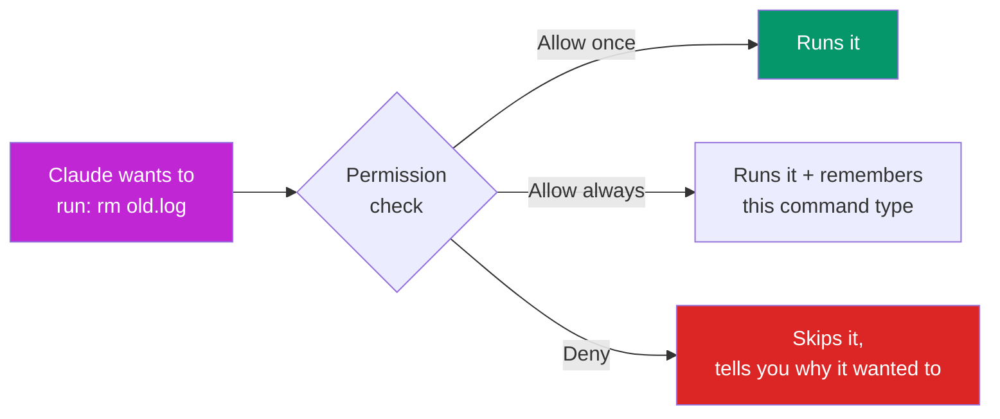
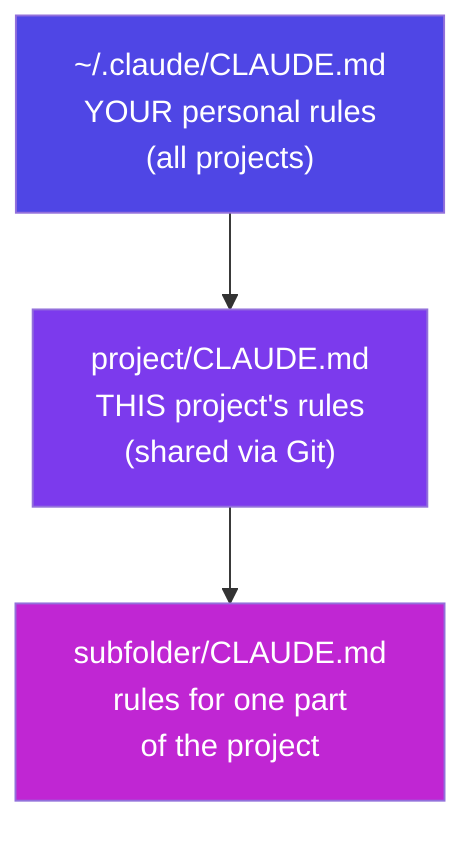
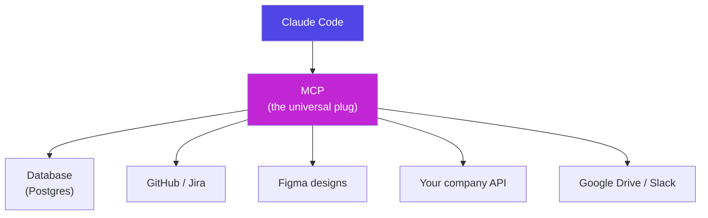
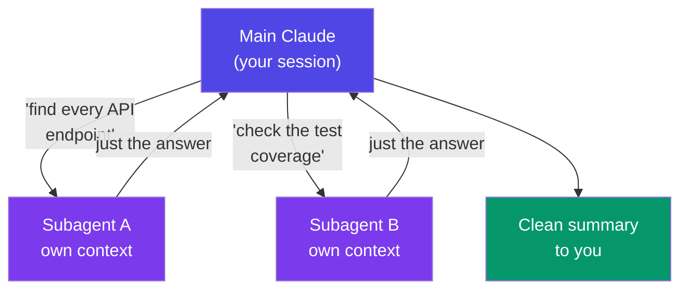
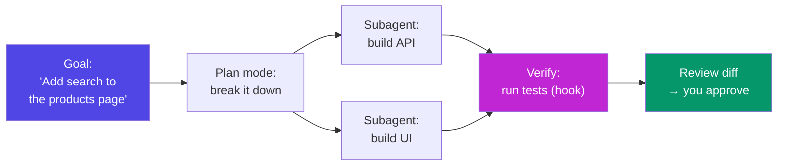

# Claude Code CLI — Complete Guide

### From "install it" to running multi-agent workflows in your terminal

> *"An LLM in a chat box answers questions. Claude Code lives inside your project — it reads your files, runs your commands, and edits your code. You stop copy-pasting and start delegating."*

---

## Table of Contents

- [Why this phase exists](#why-this-phase-exists)
- [Part A — What is Claude Code?](#part-a-what-is-claude-code)
  - [A1. From chatbot to coding agent](#a1-from-chatbot-to-coding-agent) · [A2. CLI, why the terminal?](#a2-cli-why-the-terminal) · [A3. Assistant vs Agent](#a3-assistant-vs-agent-the-key-shift) · [A4. Where Claude Code runs](#a4-where-claude-code-runs) · [A5. Key terms glossary](#a5-key-terms-glossary)
- [Part B — Getting Connected](#part-b-getting-connected)
  - [B1. Install](#b1-install) · [B2. Authentication](#b2-authentication-connecting-your-account) · [B3. Your first session](#b3-your-first-session) · [B4. The interface & modes](#b4-the-interface-and-modes)
- [Part C — How It Works Internally](#part-c-how-it-works-internally)
  - [C1. The agentic loop](#c1-the-agentic-loop) · [C2. The context window](#c2-the-context-window) · [C3. Tools](#c3-tools-the-hands-of-the-agent) · [C4. Permissions](#c4-permissions-the-safety-layer)
- [Part D — Models](#part-d-models-choosing-the-right-brain)
  - [D1. The model family](#d1-the-model-family) · [D2. How they differ](#d2-how-they-actually-differ) · [D3. Switching models](#d3-switching-models) · [D4. Cost & speed](#d4-cost-speed-and-fast-mode)
- [Part E — CLAUDE.md (Project Memory)](#part-e-claudemd-project-memory)
- [Part F — Commands & Controls](#part-f-commands-controls)
- [Part G — Using Claude Code Effectively](#part-g-using-claude-code-effectively)
- [Part H — MCP (Model Context Protocol)](#part-h-mcp-model-context-protocol)
- [Part I — Agents & Workflows](#part-i-agents-workflows)
- [Part J — Real-World Scenarios](#part-j-real-world-scenarios)
- [Part K — Exercises & Deliverables](#part-k-exercises-deliverables)
- [Part L — Q&A for Every Topic](#part-l-qa-for-every-topic)
- [Part M — Resources & Quick Reference](#part-m-resources-quick-reference)

---

## Why this phase exists

Phase 1 taught you to *talk* to an AI (prompt engineering). Phase 2 teaches you to *work with* one inside a real codebase.

The difference is enormous. A chat model can only see the text you paste. Claude Code can open your files, search your project, run your tests, fix the failures, and commit the result — all from your terminal, while you supervise. This is the tool professional developers now use daily, and the skill that separates "I use AI to write snippets" from "I ship features with AI."

By the end you will be able to: install and connect Claude Code, pick the right model for a job, write a `CLAUDE.md` that makes it smarter about *your* project, connect external tools with MCP, and orchestrate multiple agents to do work in parallel.

---

# Part A — What is Claude Code?

*Start from zero. If you finished Phase 1, you already know what an LLM is — that's all the prior knowledge you need.*

## A1. From chatbot to coding agent

**Simple definition:** Claude Code is a command-line tool (a program you run in your terminal) that puts Claude *inside* your project folder. Instead of you copying code into a chat window and pasting answers back, Claude reads and edits the files directly.

**Analogy:** A chatbot is a brilliant consultant on the phone — you describe your problem, they describe a solution, and *you* do all the typing. Claude Code is that same consultant sitting at your desk, hands on your keyboard, with permission to open files and run commands while you watch. The intelligence is the same; the *reach* is completely different.

**What changes in practice:**
- **Chatbot:** "How do I add a dark-mode toggle?" → it explains → you implement it yourself across 4 files.
- **Claude Code:** "Add a dark-mode toggle" → it *finds* the 4 files, edits them, runs the app to check, and shows you the diff.

**Mindset takeaway:** Claude Code is not a smarter chatbot. It is an *agent* — a model that can take actions in the real world (your filesystem, your terminal) in a loop until the job is done.

---

## A2. CLI, why the terminal?

**CLI = Command-Line Interface** — a text-based way to control a program by typing commands, instead of clicking buttons (that's a GUI, Graphical User Interface).

**Why did Anthropic build a *terminal* tool instead of a fancy app?** Because the terminal is where code already lives:
- Your project files are in folders the terminal can reach.
- Your build tools, tests, and Git already run as terminal commands.
- Giving Claude a terminal means giving it the *same tools you use* — no special integration needed.

**Analogy:** A GUI app is like a restaurant with a fixed menu — you can only order what the buttons allow. The terminal is like a kitchen — anything you can cook, Claude can cook too, because it has the same utensils.

**Don't panic about the terminal.** You type in plain English, not cryptic commands. "Fix the login bug" is a valid instruction. The terminal is just the *doorway*; the conversation inside is normal language.

---

## A3. Assistant vs Agent (the key shift)

This is the single most important idea in Phase 2.

| | **Assistant** (chatbot) | **Agent** (Claude Code) |
|---|---|---|
| **Sees** | Only what you paste | Your whole project, on demand |
| **Does** | Produces text | Takes actions: read, edit, run, search |
| **Loop** | One question → one answer | Keeps going until the goal is met |
| **You** | Do the work it describes | Supervise the work it performs |
| **Fails by** | Giving a wrong answer | Giving a wrong answer *and* stopping |

**An agent works in a loop.** It thinks → picks an action → sees the result → thinks again. It doesn't stop after one reply; it keeps taking steps until the task is complete or it needs your input.



**Why it matters:** In Phase 1 you learned the ReAct pattern (Reason + Act) as an advanced *prompting* technique. Claude Code *is* ReAct, built into a product. Everything you learned about clear instructions still applies — it just now drives a tool that can act on those instructions.

---

## A4. Where Claude Code runs

Claude Code is not only a terminal command. The same agent shows up in several places:

- **Terminal / CLI** — the original and most powerful form (`claude` command). This guide focuses here.
- **VS Code & JetBrains extensions** — Claude Code inside your editor, with clickable file links and inline diffs.
- **Desktop app** (Mac & Windows) — a windowed version.
- **Web app** — [claude.ai/code](https://claude.ai/code), runs in the cloud on your connected repos.

All of them share the same brain and the same core ideas (context, tools, permissions, CLAUDE.md). Learn the CLI and you know them all.

---

## A5. Key terms glossary

Keep this handy — every later part uses these words.

| Term | Plain meaning |
|---|---|
| **Agent** | An AI that takes actions in a loop, not just chats |
| **Tool** | A capability the agent can use (read a file, run a command, search) |
| **Context window** | The agent's short-term memory — everything it can "see" right now |
| **Session** | One continuous conversation with Claude Code |
| **Token** | A word-piece; both text and code are measured in tokens |
| **CLAUDE.md** | A project memo Claude reads automatically every session |
| **Slash command** | A built-in command you type starting with `/` (e.g. `/model`) |
| **Permission** | Your approval before Claude does something risky (edit, run) |
| **MCP** | A standard plug for connecting external tools & data sources |
| **Subagent** | A helper agent Claude spawns to do part of a job |
| **Headless mode** | Running Claude Code with no chat UI, for scripts/automation |
| **Compaction** | Summarising old conversation to free up the context window |

---

# Part B — Getting Connected

*The goal of this part: from nothing installed to Claude editing a file, in five minutes.*

## B1. Install

Claude Code needs **Node.js** (version 18 or newer). Check with `node --version`. If missing, install it from [nodejs.org](https://nodejs.org).

**The one-line install:**

```bash
npm install -g @anthropic-ai/claude-code
```

- `npm` is Node's package manager (came with Node).
- `-g` means *global* — install it everywhere, so you can type `claude` in any folder.
- `@anthropic-ai/claude-code` is the official package name.

**Verify it worked:**

```bash
claude --version
```

> **Note:** There is also a native installer (a single downloadable binary that doesn't need Node) and the IDE extensions install from their marketplaces. The `npm` route is the most common starting point.

---

## B2. Authentication (connecting your account)

Claude Code has to know *who you are* so it can bill the usage and unlock your models. First run:

```bash
claude
```

It opens a browser to log in. You have two ways to connect:



- **Subscription (Claude Pro or Max):** log in with your normal Claude account. Usage counts against your plan's limits. Best for individuals — predictable monthly cost.
- **API key (Console):** create a key at [console.anthropic.com](https://console.anthropic.com), paste it in. You pay per token used. Best for automation, teams, and heavy use.

You can switch later with the `/login` and `/logout` slash commands. Your choice is remembered between sessions.

**Analogy:** A subscription is a gym membership (flat monthly fee, use it as much as the plan allows). An API key is a pay-per-visit pass (you're billed for exactly what you use). Same gym, different billing.

---

## B3. Your first session

Navigate to a project folder and start:

```bash
cd my-project
claude
```

You're now in an interactive session. Try these, one at a time:

```text
> what does this project do?
> explain the folder structure
> find where the login logic lives
> add a comment to the top of the main file explaining what it does
```

Notice the pattern: the first three are **read-only** (Claude just answers). The fourth **changes a file** — Claude will show you the exact edit and ask permission before writing it. You are always in control of changes.

**To leave:** type `/exit` or press `Ctrl+C` twice.

---

## B4. The interface and modes

Claude Code has three *permission modes* that trade safety for speed. Cycle them with **Shift+Tab**.

| Mode | What it does | When to use |
|---|---|---|
| **Normal** (default) | Asks before every edit or command | Learning, unfamiliar code, anything risky |
| **Auto-accept edits** | Applies file edits without asking (still asks for commands) | You trust the task and want speed |
| **Plan mode** | Read-only — Claude researches and writes a plan, changes *nothing* | Big tasks: see the plan before any code moves |

**Plan mode is a superpower for beginners.** Ask for something large, let Claude explore and produce a step-by-step plan, review it, then approve. It's the difference between "go rebuild the auth system" (scary) and "show me exactly *how* you'd rebuild it, then we'll go" (safe).

Other interface essentials:
- **`Esc`** — interrupt Claude mid-action (stop it, redirect it).
- **`Ctrl+C`** — cancel current input / quit.
- **`↑`** — recall your previous messages.
- **Drag a file** into the terminal to add it to context.
- **Paste an image** (a screenshot of an error, a design mockup) — Claude can see it.

---

# Part C — How It Works Internally

*Understanding the machinery makes you dramatically better at using it. This is the "how it actually works" you asked for.*

## C1. The agentic loop

Under the hood, every Claude Code task is the same loop repeating:



**Walk through a real example — "the login button is broken":**
1. **Think:** "I need to find the login button code." → **Act:** search the project for "login".
2. **Observe:** finds `LoginButton.jsx`. → **Think:** "Let me read it." → **Act:** read the file.
3. **Observe:** sees the click handler calls a wrong function name. → **Think:** "That's the bug." → **Act:** edit the file (asks permission).
4. **Observe:** edit applied. → **Think:** "Verify it." → **Act:** run the app / tests.
5. **Observe:** works. → **Done:** reports the fix.

Each **Observe** feeds back into the model's context, so its next decision is informed by what just happened. That feedback is what makes an agent more than a one-shot chatbot.

---

## C2. The context window

**The context window is Claude's working memory** — every token it can currently see: your messages, the files it has read, command outputs, and CLAUDE.md. Modern Claude models have a very large window (hundreds of thousands of tokens — enough for many files at once), and some support up to **1 million tokens**.

**Crucial mental model:** context is a *desk*, not a *filing cabinet.*

```
┌─────────────────────────────────────────┐
│  THE DESK (context window)               │
│                                          │
│  • Your instructions                     │
│  • CLAUDE.md (project rules)             │
│  • Files Claude has opened               │
│  • Command outputs it has seen           │
│  • The conversation so far               │
│                                          │
│  Everything here is "in mind" right now. │
│  What's NOT here, Claude cannot see.     │
└─────────────────────────────────────────┘
```

Two consequences you must internalise:

1. **Claude only knows what's on the desk.** It doesn't magically know your whole repo — it *reads files into context* as needed. If it hasn't read a file, it hasn't seen it.
2. **The desk fills up.** Long sessions accumulate a lot of tokens. When it gets full, quality drops and cost rises. Two fixes:
   - **`/clear`** — wipe the desk and start fresh (do this between unrelated tasks).
   - **`/compact`** — Claude summarises the conversation so far into a short note, freeing space while keeping the gist. Claude Code also *auto-compacts* when the window gets close to full.

**Why it matters:** The #1 beginner mistake is one giant never-ending session where the desk is buried under ten unrelated tasks. Start fresh (`/clear`) for each new task and Claude stays sharp and cheap.

---

## C3. Tools, the hands of the agent

A model alone can only produce text. **Tools** are what let Claude *act.* Every Claude Code capability is a tool the model chooses to call:

| Tool | What it does | Real use |
|---|---|---|
| **Read** | Open a file | "Show me the config" |
| **Edit** | Change part of a file | Fix a bug on line 42 |
| **Write** | Create/overwrite a file | Scaffold a new component |
| **Bash** | Run a terminal command | `npm test`, `git status` |
| **Grep** | Search file *contents* | Find every use of `getUser()` |
| **Glob** | Find files by name pattern | All `*.test.js` files |
| **WebFetch / WebSearch** | Read the internet | Check library docs |
| **Task** | Spawn a subagent | Delegate a big search |

**How does Claude know *which* tool to use?** Each tool has a description — a mini-prompt telling the model what it's for and when to use it. This connects straight to Phase 1's tool-use lesson: **the model only *requests* a tool with structured arguments; the Claude Code program actually *runs* it** and hands back the result. The model never touches your disk directly — that boundary is your safety.

---

## C4. Permissions, the safety layer

Because Claude can edit files and run commands, there's a gate: **permissions.** By default, anything that *changes something* or *runs a command* asks first.



- **Allow once** — yes, this time.
- **Allow always / "don't ask again"** — trust this kind of action for the session (or permanently via settings).
- **Deny** — no. A denied action is *feedback*: Claude should try a different approach, not the same thing again.

You tune this in `.claude/settings.json` with **allow / ask / deny** rules — e.g. auto-allow `npm test` and `git status` (safe, frequent) but always ask for `git push` or anything that deletes. This is how teams make Claude fast without making it dangerous.

**Golden rule:** the more reversible and read-only an action, the safer it is to auto-allow. Reading and searching — allow freely. Pushing, deleting, deploying — keep the gate.

---

# Part D — Models: Choosing the Right Brain

*You asked specifically about models and how using different ones differs. Here's the whole picture.*

## D1. The model family

Claude Code can run on different Claude models. Think of them as different-sized brains — all smart, trading raw capability against speed and cost.

| Model | Personality | Best for |
|---|---|---|
| **Opus 4.8** | The senior architect — deepest reasoning | Hard bugs, big refactors, architecture, tricky logic |
| **Sonnet 5** | The reliable senior dev — fast *and* strong | Everyday coding, the default workhorse |
| **Haiku 4.5** | The quick junior — fast & cheap | Simple edits, quick questions, high-volume tasks |
| **Fable 5** | Frontier-class alternative in the Claude 5 family | Heavy reasoning workloads |

*(Model line-ups evolve — always check the current list with `/model`. The *idea* is stable: bigger = smarter but slower/costlier.)*

---

## D2. How they actually differ

The trade-off is a triangle: **capability ↔ speed ↔ cost.** You can't max all three; you pick per task.

```
        CAPABILITY (Opus)
              /\
             /  \
            /    \
           /      \
   SPEED  /________\  COST
 (Haiku)            (cheaper = Haiku)

 Opus  → smartest, slowest, priciest
 Sonnet→ the balanced middle
 Haiku → fastest, cheapest, least deep
```

**The difference in real terms:**
- A **tiny job** ("rename this variable everywhere") — Haiku nails it instantly for a fraction of the cost. Using Opus here is like hiring a principal engineer to fix a typo: wasteful.
- An **everyday feature** ("add form validation") — Sonnet is the sweet spot: strong reasoning, quick, reasonable cost. This is the default for a reason.
- A **gnarly problem** ("this race condition only happens in production") — Opus earns its cost. Its deeper reasoning finds what smaller models miss. Paying more here *saves* money because it solves it in one pass instead of ten failed cheap attempts.

**Why it matters:** Matching model to task is the biggest lever on both *quality* and *bill.* Beginners either use the cheapest for everything (and get stuck) or the priciest for everything (and overpay). The pro move: **Sonnet by default, Opus when stuck or for high-stakes design, Haiku for trivial bulk work.**

---

## D3. Switching models

**Interactively**, just type:

```text
/model
```

It lists available models; pick one. The switch takes effect immediately for the rest of the session.

**At launch**, pass a flag:

```bash
claude --model opus
```

**Advanced:** Claude Code can even use different models for different jobs automatically — e.g. a powerful model for the main reasoning and a lighter one for quick background tasks like summarising. You don't have to manage this, but it's why the tool feels both smart *and* responsive.

---

## D4. Cost, speed, and fast mode

**How billing works** depends on how you connected (Part B2):
- **Subscription:** usage draws down your Pro/Max limits — no per-token thinking needed until you hit a cap.
- **API key:** you pay per token — *input* tokens (what Claude reads: your files, context) and *output* tokens (what it writes). Bigger models cost more per token.

**Two features that cut cost dramatically:**
- **Prompt caching** — reused context (like CLAUDE.md and files already read) is cached, so you're not billed full price to "re-read" the same thing every turn. This is Phase 1's caching lesson, working automatically.
- **`/compact` and `/clear`** — smaller context = fewer input tokens = lower cost and faster responses.

**Fast mode** (`/fast`): on capable models (Opus 4.8/4.7), this speeds up output *without* dropping to a weaker model — you get Opus-quality answers, delivered faster. Toggle it when you want the best brain at higher pace.

**Check your spend** anytime with `/cost`.

---

# Part E — CLAUDE.md (Project Memory)

**The problem it solves:** Claude starts each session knowing nothing about *your* project's conventions. Do you use tabs or spaces? Which test command? What's the architecture? Without help, it guesses — and you correct the same things every session.

**CLAUDE.md is a memo Claude reads automatically at the start of every session.** It's a plain Markdown file in your project root. Put in it the things you'd tell a new teammate on day one.

**A good starter CLAUDE.md:**

```markdown
# Project: Acme Dashboard

## What this is
A React + TypeScript admin dashboard. API calls live in `src/api/`.

## Commands
- Run tests: `npm test`
- Start dev server: `npm run dev`
- Lint: `npm run lint` (ALWAYS run before committing)

## Conventions
- Use functional components + hooks, never class components.
- 2-space indentation.
- Co-locate a `*.test.tsx` next to every component.

## Don't
- Don't edit anything in `src/generated/` — it's auto-built.
- Don't add new dependencies without asking.
```

**Why this is the highest-leverage file you'll write:**
- It turns repeated corrections into a permanent rule.
- Every session starts smart instead of clueless.
- It's shared via Git, so your whole team (and their Claude) stays consistent.

**Three levels of memory** (they stack, most-specific wins):



**How to build one:**
- Run **`/init`** in a project — Claude explores the codebase and drafts a CLAUDE.md for you. Best starting point.
- Press **`#`** during a session and type a rule — Claude adds it to memory for you (e.g. `# always use pnpm, not npm`).
- Just edit the file by hand anytime.

**Keep it tight.** CLAUDE.md sits in context *every* session, so every line costs tokens. Write rules, not essays. Prune what's no longer true.

---

# Part F — Commands & Controls

Three kinds of "commands" — don't mix them up.

## F1. Slash commands (inside a session)

Typed at the `>` prompt. The ones you'll use constantly:

| Command | Does |
|---|---|
| `/help` | List everything available |
| `/clear` | Wipe context — fresh start for a new task |
| `/compact` | Summarise history to free context |
| `/model` | Switch model |
| `/init` | Generate a CLAUDE.md for this project |
| `/config` | Open settings (theme, model, behaviour) |
| `/cost` | Show token usage / spend this session |
| `/mcp` | Manage MCP connections (Part H) |
| `/agents` | Create & manage subagents (Part I) |
| `/review` | Review a pull request or the current diff |
| `/login` `/logout` | Switch accounts / auth |
| `/resume` | Reopen a past session with its full context |
| `/exit` | Quit |

**Custom slash commands & skills:** you can define your own reusable commands as Markdown files in `.claude/commands/`. A `.claude/commands/test.md` becomes `/test`. This packages a repeated instruction ("run the tests, then fix any failures, then lint") into one word.

## F2. CLI flags (when launching)

Passed to the `claude` command in your shell:

```bash
claude --model sonnet          # start on a specific model
claude -p "summarise README"   # headless: run one task, print result, exit
claude --resume                # jump back into your last session
claude --continue              # continue the most recent conversation
```

**`-p` (headless / print mode) is the automation gateway.** No chat UI — Claude runs the task and prints the answer. This is how you put Claude Code into scripts, Git hooks, and CI pipelines:

```bash
# Example: auto-generate a commit message from staged changes
git diff --staged | claude -p "write a concise commit message for this diff"
```

## F3. Keyboard controls

| Key | Action |
|---|---|
| **Shift+Tab** | Cycle permission mode (Normal → Auto-accept → Plan) |
| **Esc** | Interrupt Claude right now |
| **Ctrl+C** | Cancel input / quit |
| **↑ / ↓** | Scroll through your message history |
| **#** | Quick-add a rule to CLAUDE.md |
| **!** | Run a raw bash command yourself (bash mode) |

---

# Part G — Using Claude Code Effectively

*The "how to use it effectively" you asked for — the habits that separate frustration from flow.*

## G1. The seven habits

1. **Give it a CLAUDE.md.** (Part E.) One file removes 80% of repeated corrections. Do this first, always.
2. **Plan before big changes.** Enter Plan mode (Shift+Tab), let it produce a plan, review, *then* approve. Cheap insurance against a wrong 20-file change.
3. **One task per session.** `/clear` between unrelated jobs. A clean desk = sharper, cheaper Claude (Part C2).
4. **Be specific — Phase 1 still rules.** "Fix the bug" is weak. "The login button does nothing on click; the handler in `LoginButton.jsx` seems to call the wrong function — find and fix it" is strong. Give code + intent + the actual error.
5. **Let it verify its own work.** Ask it to run the tests / run the app after a change. An agent that checks itself catches its own mistakes.
6. **Course-correct early.** If it's going the wrong way, hit **Esc** and redirect. Don't wait for it to finish a wrong path — the context fills with dead ends.
7. **Point it at reality, not your imagination.** Paste the real error, the real screenshot, the real failing test. Claude reasons far better from ground truth than from your paraphrase.

## G2. Anti-patterns to avoid

| Don't | Instead |
|---|---|
| One endless session for everything | `/clear` per task |
| "Make it better" (vague) | Name the file, the symptom, the goal |
| Opus for every trivial edit | Sonnet default, Opus when stuck |
| Blindly approving every edit | Read the diff — you're the reviewer |
| Ignoring CLAUDE.md | Invest 10 min once, save hours |
| Letting context bloat silently | Watch `/cost`, `/compact` when big |

## G3. The reviewer mindset

Claude Code makes *you* the senior reviewer, not the typist. Your job shifts from *writing* every line to *deciding* whether the written lines are right. That's a promotion — but only if you actually read the diffs. Approval is a responsibility, not a formality.

---

# Part H — MCP (Model Context Protocol)

## H1. The problem MCP solves

Claude Code can read your files and run commands. But your work also lives *elsewhere*: a database, a Jira board, Figma designs, Slack, your company's internal API. How does Claude reach those?

Without a standard, every tool would need a custom, hand-built integration — an N×M mess.

**MCP is a universal adapter.** It's an open standard (created by Anthropic) that defines *one* way for AI tools to connect to external systems. Build a connector once, and any MCP-aware app can use it.

**Analogy:** MCP is the **USB-C of AI tools.** Before USB-C, every device had its own charger. USB-C standardised the plug — one cable, any device. MCP standardises how AI connects to data and tools — one protocol, any source.



## H2. How it works

An **MCP server** is a small program that exposes a system (say, your database) as a set of **tools** Claude can call — e.g. `query_database`, `list_tables`. Claude Code is the **MCP client** that connects to those servers. Once connected, those external tools appear alongside Claude's built-in ones, and it uses them in the same agentic loop (Part C1).

Servers can offer three things: **tools** (actions Claude can take), **resources** (data Claude can read), and **prompts** (ready-made prompt templates).

## H3. Connecting a server

```bash
# Add an MCP server (example shape — each server has its own command)
claude mcp add postgres-db -- npx -y @some/postgres-mcp-server

# See what's connected
claude mcp list
```

Inside a session, manage connections with **`/mcp`**. Connections can be scoped to just you, shared with your project (via a checked-in config), or global.

## H4. Real-world example

**Task:** "Which users signed up last week but never logged in?"

- **Without MCP:** you open a SQL client, write the query, run it, copy results back to Claude. Manual.
- **With a Postgres MCP server:** Claude calls `query_database` itself, gets the rows, and answers directly — then can even draft the follow-up email. The database became one of Claude's hands.

**Why it matters:** MCP is how Claude Code graduates from "coding assistant" to "assistant for your whole workflow" — reaching the real systems where your work actually lives. **Safety note:** only connect servers you trust, and be cautious granting write access to production systems.

---

# Part I — Agents & Workflows

*The most advanced part — how one Claude becomes a coordinated team.*

## I1. Subagents: delegation

A big task can blow up the main context: reading 30 files to answer one question buries everything else on the desk. The fix: **subagents.**

A subagent is a *separate* Claude with its *own* fresh context, spawned to do one focused job. It does the work, and returns only the *conclusion* to the main agent — not the 30 files it read.



**Two big wins:**
- **Context stays clean.** The main desk never sees the 30 files — only the tidy result.
- **Parallelism.** Independent subagents run *at the same time.* Three searches that would take 3× sequentially finish in roughly 1×.

**Custom subagents:** define specialists as Markdown files in `.claude/agents/` (or via **`/agents`**) — e.g. a `code-reviewer` agent with a strict review prompt, or a `test-writer` agent. Each has its own instructions, its own allowed tools, and can even be pinned to a specific model (a cheap Haiku reviewer, an Opus architect).

## I2. Hooks: automation

**Hooks** are commands the *harness* (not Claude) runs automatically at set moments — configured in `.claude/settings.json`. They're deterministic: they always fire, regardless of what Claude decides.

Common trigger points: `PreToolUse` (before a tool runs), `PostToolUse` (after), `Stop` (when Claude finishes).

**Real examples:**
- **After every file edit**, auto-run the code formatter → your code is always clean, no reminders.
- **Before any `git push`**, run the test suite → never push broken code.
- **When Claude finishes**, play a sound → you can look away and get pinged when it's done.

**Why hooks vs. just asking Claude?** Because "always" needs a guarantee. Asking Claude "please format after editing" works *usually*; a hook works *every single time.* Rules you can't afford to have skipped belong in hooks.

## I3. Orchestration: the full workflow

Put it together and Claude Code becomes an orchestrator:



For very large jobs (a migration across 100 files, a codebase-wide audit), you can fan work out to *many* agents in parallel — each handling one slice, with a verification pass checking the results. This is how Claude Code tackles work too big for a single context to hold. Start simple (one agent, plan mode); reach for orchestration only when the task genuinely demands scale.

---

# Part J — Real-World Scenarios

*Concrete "when would I actually use this" walkthroughs. Each maps to what you learned.*

### Scenario 1 — Onboarding to an unfamiliar codebase
You joined a project with 500 files and no docs.
```text
> Give me a tour: what does this app do, what's the tech stack,
  and where does a request flow from URL to database?
```
Claude reads the key files and explains. Follow with `/init` to capture what it learned into CLAUDE.md. **Uses:** read tools, context, CLAUDE.md.

### Scenario 2 — Fixing a bug from an error message
```text
> Running `npm test` gives this error: [paste full error].
  Find the cause and fix it, then re-run the tests to confirm.
```
Claude searches, reads, edits, and *verifies by running the tests itself* — the full agentic loop. **Uses:** the loop, Bash tool, self-verification (G1 #5).

### Scenario 3 — Building a feature safely
```text
> [Shift+Tab into Plan mode]
> Add CSV export to the reports page. Show me your plan first.
```
Review the plan, approve, let it build, read the diff. **Uses:** Plan mode, reviewer mindset.

### Scenario 4 — A large, risky refactor
```text
> Rename `getUserData` to `fetchUserProfile` across the whole codebase,
  update all call sites, and make sure nothing breaks.
```
Best on **Opus**, in Plan mode first. Claude finds every usage, edits consistently, runs tests. **Uses:** model choice (D2), Grep, verification.

### Scenario 5 — Data question via MCP
```text
> How many orders were refunded last month, by product category?
```
With a database MCP server connected, Claude queries directly and answers — no manual SQL. **Uses:** MCP (Part H).

### Scenario 6 — Automating a repetitive chore (headless)
```bash
# In a Git pre-commit hook or a nightly script:
claude -p "review the staged diff for security issues; list any found"
```
No UI — Claude runs, prints, exits. **Uses:** headless mode (F2), automation.

### Scenario 7 — Learning while building (ties to your goals)
```text
> Explain this authentication code to me like Feynman would —
  simple language, an analogy, then quiz me on it.
```
Claude Code isn't only for shipping; it's a tutor sitting inside real code — exactly the active-recall style from Phase 1.

---

# Part K — Exercises & Deliverables

*Do these in order. Each builds a real skill. Save your work — these are your Phase 2 proof.*

1. **Install & connect.** Get `claude --version` working and log in. Deliverable: a screenshot of your first successful session.
2. **First edits.** In a small practice repo, ask Claude to add a feature and a comment. Practice the permission prompts (allow / deny). Deliverable: the diff it produced.
3. **Write a CLAUDE.md.** Run `/init`, then hand-tune it with 5 real rules for the project. Deliverable: the file.
4. **Model comparison.** Give the *same* medium task to Haiku, Sonnet, and Opus. Note speed, quality, and (if on API) cost. Deliverable: a 5-line comparison table — this is where "how models differ" becomes real to you.
5. **Plan mode.** Take a bigger task, run it through Plan mode, and screenshot the plan *before* approving.
6. **Custom command.** Create a `.claude/commands/` file that becomes a `/`-command you use. Deliverable: the command file.
7. **Connect one MCP server.** A simple one (filesystem, or a public API server). Deliverable: `claude mcp list` output showing it connected.
8. **Subagent task.** Ask Claude to spawn agents to research two independent questions about a repo in parallel. Notice the speed.
9. **Headless automation.** Write a one-line `claude -p` command that does something useful in your shell (e.g. summarise a file). Deliverable: the command + its output.
10. **Reflection.** In your own words (Feynman test): explain the agentic loop, the context window, and when you'd pick each model — no notes.

---

# Part L — Q&A for Every Topic

## Foundations

**Q: In one sentence, how is Claude Code different from the Claude chat app?**
A: The chat app talks; Claude Code *acts* — it reads, edits, and runs things inside your actual project, in a loop, until the job is done.

**Q: What makes it an "agent" and not just a chatbot?**
A: The loop. It thinks → acts with a tool → observes the result → thinks again, repeating until the goal is met, instead of stopping after one reply.

**Q: Do I need to be a terminal expert?**
A: No. You type plain English. The terminal is just the doorway; the conversation is normal language.

## Connecting & Interface

**Q: What are the two ways to authenticate, and who's each for?**
A: A Claude Pro/Max **subscription** (flat cost, best for individuals) or an **API key** from the Console (pay-per-token, best for automation/teams).

**Q: What is Plan mode and why is it a beginner's best friend?**
A: A read-only mode where Claude researches and writes a step-by-step plan without changing anything — so you approve the approach *before* any code moves.

## Internals

**Q: What is the context window, in one image?**
A: A desk. Everything Claude can see right now sits on it — your messages, opened files, CLAUDE.md, command outputs. What's not on the desk, Claude can't see. When it fills, use `/clear` or `/compact`.

**Q: Who actually runs the tools — the model or the program?**
A: The program. The model only *requests* a tool with arguments; Claude Code executes it and returns the result. That boundary is your safety.

**Q: Why does `/clear` between tasks matter?**
A: A clean context is sharper and cheaper. One endless session buries the current task under old, irrelevant tokens.

## Models

**Q: Give the one-line rule for picking a model.**
A: Sonnet by default, Opus when stuck or for high-stakes design, Haiku for trivial bulk edits.

**Q: Why can paying for Opus be *cheaper* overall?**
A: It can solve a hard problem in one pass instead of ten failed cheap attempts — fewer tokens and less of your time wasted.

**Q: What does fast mode do — is it a weaker model?**
A: No. On Opus 4.8/4.7 it speeds up output while keeping Opus-level quality; it does not downgrade the brain.

## CLAUDE.md

**Q: What is CLAUDE.md and why is it the highest-leverage file?**
A: A Markdown memo Claude auto-reads every session. It turns repeated corrections into permanent rules, so every session starts smart and your team stays consistent.

**Q: Fastest way to create one?**
A: Run `/init` — Claude explores the repo and drafts it. Then trim it to real rules; keep it short because it costs context every session.

## Commands

**Q: Difference between a slash command and a CLI flag?**
A: A slash command (`/model`) runs *inside* a session; a CLI flag (`--model`) is passed to `claude` when you launch it in the shell.

**Q: What is headless mode for?**
A: `claude -p "task"` runs one task with no chat UI and prints the result — the gateway to scripts, Git hooks, and CI automation.

## MCP

**Q: What is MCP in one analogy?**
A: The USB-C of AI tools — one open standard to plug Claude into any external system (databases, Jira, Figma, your API) instead of custom one-off integrations.

**Q: After connecting an MCP server, what changes for Claude?**
A: The server's actions appear as new tools Claude can call in its normal loop — e.g. it can query your database itself instead of you doing it by hand.

## Agents & Workflows

**Q: Why use a subagent instead of doing everything in the main session?**
A: It keeps the main context clean (returns only the answer, not the 30 files it read) and lets independent work run in parallel.

**Q: Hooks vs. just instructing Claude — when do you need a hook?**
A: When you need "always." Asking Claude works *usually*; a hook (in settings.json) fires *every time*, deterministically — e.g. run tests before every push.

## Effective Use

**Q: The single mental model to carry from Phase 1 into Phase 2?**
A: Still "briefing a brilliant new employee on day one" — but now that employee has hands. Clear briefing + a good CLAUDE.md + reviewing the work = the whole craft.

**Q: What's the biggest beginner mistake?**
A: One giant never-ending session for ten unrelated tasks. Clear between tasks, be specific, and actually read the diffs.

---

# Part M — Resources & Quick Reference

### Learn more (free, official)

- **Claude Code docs:** https://docs.anthropic.com/en/docs/claude-code/overview
- **Claude Code quickstart:** https://docs.anthropic.com/en/docs/claude-code/quickstart
- **CLAUDE.md & memory:** https://docs.anthropic.com/en/docs/claude-code/memory
- **MCP (Model Context Protocol):** https://modelcontextprotocol.io
- **Subagents & hooks:** https://docs.anthropic.com/en/docs/claude-code/sub-agents
- **Anthropic on YouTube:** https://www.youtube.com/@AnthropicAI

### The essential commands card

> **Start:** `claude` · **Headless:** `claude -p "task"` · **Model at launch:** `claude --model sonnet`
> **In-session:** `/help` `/clear` `/compact` `/model` `/init` `/cost` `/mcp` `/agents` `/review` `/resume` `/exit`
> **Keys:** Shift+Tab = permission mode · Esc = interrupt · # = add memory · ! = bash · ↑ = history

### One-page recall card

> **Claude Code** = Claude *inside* your project — reads, edits, runs, in a loop. An **agent**, not a chatbot.
> **Agentic loop** = think → act (tool) → observe → repeat → done.
> **Context window** = the desk; only what's on it is seen. `/clear` per task, `/compact` when full.
> **Tools** = Read · Edit · Write · Bash · Grep · Glob · Web · Task. The *program* runs them; the model only *asks*.
> **Permissions** = allow / ask / deny. Read freely; gate push/delete/deploy.
> **Models** = Sonnet default · Opus when stuck / high-stakes · Haiku for trivial bulk. Capability ↔ speed ↔ cost.
> **CLAUDE.md** = auto-read project memo; highest-leverage file; `/init` to draft, `#` to add, keep it short.
> **Commands** = slash (in-session) vs CLI flags (launch) vs custom `/`-commands in `.claude/commands/`.
> **MCP** = USB-C for AI; plug in databases/Jira/Figma; servers expose tools Claude calls.
> **Subagents** = fresh-context helpers, run in parallel, return only the answer.
> **Hooks** = deterministic automation in settings.json — for things that must happen *every* time.
> **Effective:** CLAUDE.md first · plan big changes · one task per session · be specific · make it verify · read the diffs.

*Chat models answer. Claude Code does. Brief it well, give it a CLAUDE.md, pick the right model, review its work — and you stop typing code and start directing it. That is the whole craft of Phase 2.*
