# CS Fundamentals — Complete Guide

### From "what is a CPU?" to Big O, the browser pipeline, and the full journey of a web request

> *"Every framework you will ever learn is a thin coat of paint on four things: a processor, some memory, a network cable, and an algorithm. Learn those four and every new tool becomes easy."*

**Phase 3 of 12** · 2 days · Sat Jul 11 – Sun Jul 12, 2026

---

## Table of Contents

- [Part A — How a Computer Works](#part-a-how-a-computer-works)
  - [A1. The CPU](#a1-the-cpu-the-brain) · [A2. RAM](#a2-ram-the-desk) · [A3. Storage](#a3-storage-the-filing-cabinet) · [A4. The Memory Hierarchy](#a4-the-memory-hierarchy-the-full-picture)
  - [A5. Binary](#a5-binary-why-0s-and-1s) · [A6. Hex & Octal](#a6-hexadecimal-and-octal) · [A7. Text as Numbers](#a7-text-as-numbers-ascii-and-unicode)
- [Part B — Operating Systems](#part-b-operating-systems)
  - [B1. What an OS Does](#b1-what-an-os-actually-does) · [B2. Process vs Thread](#b2-process-vs-thread) · [B3. Concurrency vs Parallelism](#b3-concurrency-vs-parallelism) · [B4. Scheduling, Deadlock & Race Conditions](#b4-scheduling-deadlocks-and-race-conditions)
- [Part C — How the Internet Works](#part-c-how-the-internet-works)
  - [C1. The Physical Internet](#c1-the-physical-internet) · [C2. IP Addresses](#c2-ip-addresses) · [C3. DNS](#c3-dns-the-internets-phone-book) · [C4. TCP vs UDP](#c4-tcp-vs-udp) · [C5. Ports](#c5-ports) · [C6. HTTP](#c6-http-the-language-of-the-web) · [C7. HTTPS, SSL & TLS](#c7-https-ssl-and-tls) · [C8. The OSI Model](#c8-the-osi-model)
- [Part D — What Happens When You Type google.com](#part-d-what-happens-when-you-type-googlecom)
- [Part E — The Browser: Rendering & the DOM](#part-e-the-browser-rendering-and-the-dom)
  - [E1. The Rendering Pipeline](#e1-the-rendering-pipeline) · [E2. The DOM](#e2-the-dom) · [E3. Reflow & Repaint](#e3-reflow-and-repaint) · [E4. Render-Blocking & the Event Loop](#e4-render-blocking-resources-and-the-event-loop)
- [Part F — Data Structures](#part-f-data-structures)
  - [F1. Array](#f1-array) · [F2. Object / Hash Map](#f2-object-hash-map) · [F3. Set](#f3-set) · [F4. Stack](#f4-stack-lifo) · [F5. Queue](#f5-queue-fifo) · [F6. Linked List](#f6-linked-list) · [F7. Tree](#f7-tree) · [F8. Graph](#f8-graph) · [F9. Choosing One](#f9-choosing-the-right-structure)
- [Part G — Big O Notation](#part-g-big-o-notation)
  - [G1. The Idea](#g1-the-idea) · [G2. The Complexity Classes](#g2-the-complexity-classes) · [G3. How to Analyse Code](#g3-how-to-analyse-any-code) · [G4. Space Complexity](#g4-space-complexity) · [G5. Amortized Analysis](#g5-amortized-analysis)
- [Part H — The Everyday Mindset](#part-h-the-everyday-mindset)
- [Part I — Exercises & Deliverables](#part-i-exercises-and-deliverables)
- [Part J — Q&A: The 26 That Matter](#part-j-qa-the-26-that-matter)
- [Part L — Appendix: Developer Environment & Web Basics](#part-l-appendix-developer-environment-web-basics)
  - [L1. Hardware vs Software](#l1-hardware-vs-software) · [L2. Network Basics (LAN, WAN, MAC, Router)](#l2-network-basics-lan-wan-mac-and-the-boxes-on-your-wall) · [L3. Client-Server Model](#l3-the-client-server-model) · [L4. Servers, Frontend vs Backend, Hosting](#l4-servers-frontend-vs-backend-hosting) · [L5. Files & Paths](#l5-files-directories-and-paths) · [L6. The Command Line](#l6-the-command-line-cli) · [L7. Development Tools](#l7-development-tools) · [L8. Git & GitHub](#l8-version-control-git-github)
- [Part K — Resources & Quick Reference](#part-k-resources-and-quick-reference)

---

## Why this phase exists

You are about to spend 45 days on JavaScript, React, Node, MySQL, Docker, AWS, and then a year on SAP. Every one of those sits on top of the same bedrock:

<p class="te"><strong>Telugu:</strong> Nuvvu ranunna 45 rojulu JavaScript, React, Node, MySQL, Docker, AWS — taruvata samvatsaram SAP. Ivanni <strong>ee okate punaadi</strong> meeda nilabadi unnayi: <code>fetch()</code> venaka HTTP/DNS/TCP, React venaka DOM, Node 'non-blocking' venaka threads, MySQL index venaka hash maps &amp; Big O, HANA vegam venaka RAM. Ee phase vadilesthe samvatsaram antha commands <strong>bhattee vestavu</strong>; nerchukunte <strong>alochinchi</strong> samadhanam kanukkuntavu.</p>

| You will learn… | It secretly depends on… |
| --- | --- |
| `fetch()` in JavaScript | HTTP, DNS, TCP, TLS |
| React re-rendering | The DOM, reflow, repaint |
| Node.js being "non-blocking" | Processes, threads, the event loop |
| MySQL indexes | Hash maps, trees, Big O |
| Docker containers | Processes, the OS kernel |
| SAP Fiori talking to S/4HANA | HTTP requests over TLS |
| ABAP running on HANA | CPU, RAM, in-memory storage |

Skip this phase and you will spend the next year memorising commands. Learn it and you will *reason* your way to answers instead. Every technical interview you sit will contain at least one of: *"What happens when you type a URL?"*, *"TCP vs UDP?"*, *"What's the Big O of this?"*

**Two days. The whole bedrock. Let's build it.**

---

# Part A — How a Computer Works

*Start from zero. No prior knowledge assumed.*

A computer does exactly three things: it **calculates** (CPU), it **remembers for now** (RAM), and it **remembers for later** (Storage). Everything else — graphics cards, networks, screens — is a variation on these three.

**The kitchen analogy — carry this through the whole part:**

| Component | Kitchen equivalent | What it does |
| --- | --- | --- |
| **CPU** | The chef | Does the actual work — chopping, cooking, deciding |
| **RAM** | The countertop | Ingredients currently in use; wiped clean each night |
| **Storage** | The pantry & fridge | Everything you own, kept even when the lights go off |
| **Cache** | The chef's cutting board | The 2–3 things being touched *right now* |
| **Bus** | The chef's hands | Moves things between counter and pantry |

A chef never cooks *inside* the pantry. They fetch ingredients onto the counter, work there, and put results back. **The CPU never computes on the disk. Data is loaded into RAM, worked on, and written back.** That single sentence explains why software is designed the way it is.

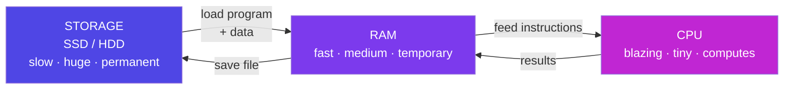

---

## A1. The CPU (the brain)

**Simple definition:** The Central Processing Unit is the chip that executes instructions. It is the only part of your computer that actually *does* anything. Everything else stores things or moves things.

<p class="te"><strong>Telugu:</strong> CPU ante computer ki <strong>magaju</strong> (brain). Idi okate pani chestundi, kaani chala vegam ga: fetch (tarvati instruction teesuko) → decode (dhani artham enti?) → execute (cheyyi) → write back. Sekanuki billion saarlu. Nee React app final ga CPU daggara ki vachesariki kevalam adds, compares, jumps matrame. Gurthupettuko: CPU telivainadi kaadu — <strong>vegam ainadi</strong>.</p>

**Analogy:** A chef who can only follow one recipe step at a time — but reads and executes each step in under a *billionth* of a second.

### The only thing a CPU does: fetch → decode → execute

Every CPU on Earth, from a ₹200 microcontroller to the server running SAP HANA, runs this loop billions of times per second:

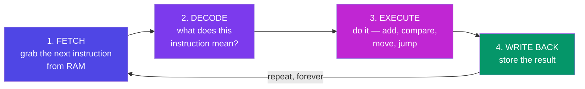

The instructions are absurdly primitive — `ADD these two numbers`, `COMPARE these`, `JUMP to that line if equal`, `MOVE this byte there`. There is no `renderReactComponent` instruction. Your beautiful React app is, by the time it runs, a river of *adds*, *compares*, and *jumps*.

### The parts inside

| Part | Job | Analogy |
| --- | --- | --- |
| **ALU** (Arithmetic Logic Unit) | Does the maths and the logic (`+`, `-`, `AND`, `OR`, `>`) | The chef's knife |
| **Control Unit** | Decodes instructions, directs traffic | The chef's brain reading the recipe |
| **Registers** | A handful of tiny slots holding the values in use *this instant* | The chef's two hands |
| **Cache (L1/L2/L3)** | A small, very fast copy of recently used RAM | The cutting board |

### Clock speed, cores, and threads

- **Clock speed (GHz)** — how many cycles per second. `3.2 GHz` = 3.2 billion cycles per second. One instruction may take one or several cycles.
- **Core** — a complete, independent CPU. A **quad-core** chip is genuinely four chefs in one kitchen, cooking simultaneously.
- **Hyper-threading / SMT** — one core pretending to be two, so that when one task stalls waiting for data, the core works on the other. Not a real second chef — a chef who starts the next dish while the first one simmers.

**Real-world example — why your laptop feels fast:** You have 8 cores. Chrome uses one per tab, VS Code uses several, and Spotify uses one. They *genuinely* run at the same time. On a single-core machine, the OS would rapidly switch between them (see [B3](#b3-concurrency-vs-parallelism)) — an illusion of simultaneity.

> **Mindset takeaway:** The CPU is not smart. It is *fast*. Every abstraction you love — functions, objects, promises — compiles down to fetch-decode-execute. Understanding this makes performance stop being magic.

**Why this matters for SAP:** ABAP programs run on an application server's CPU. When someone complains "this report takes 4 minutes," they mean *the CPU executed too many instructions*, usually because the code looped over a database result instead of letting the database do the work. Your Big O knowledge ([Part G](#part-g-big-o-notation)) is what fixes that.

---

## A2. RAM (the desk)

**Simple definition:** Random Access Memory is fast, temporary workspace. Every program you have open right now — its code and its data — lives in RAM.

<p class="te"><strong>Telugu:</strong> RAM ante nee <strong>balla</strong> (desk) — ippudu nadustunna programs anni ikkade untayi. Chala vegam, kaani <strong>current pothe anni pothayi</strong> (volatile). 'Random access' ante e address ki ayina okate time lo velladam. Lopala rendu chotlu: <strong>Stack</strong> = function calls (chinnadi, automatic), <strong>Heap</strong> = objects (peddadi, garbage collector shubhram chestundi). Infinite recursion 'stack overflow' ivvadaniki kaaranam ide.</p>

**"Random access"** means the CPU can jump straight to *any* address instantly, in the same amount of time. Contrast a cassette tape (sequential — you must wind through) with a vinyl record (random — drop the needle anywhere). RAM is the record.

**Analogy:** Your desk. Big enough for the documents you're working on *today*. Fast to reach across. And when you go home (power off), a janitor throws everything on the desk into the bin. That last part is called **volatility**.

### What RAM actually looks like

RAM is one enormous numbered list of bytes. Nothing more.

```
   Address    Value       What it is
  ─────────  ────────  ───────────────────
  0x7ffe0000    72     'H'  ┐
  0x7ffe0001   101     'e'  │  the string
  0x7ffe0002   108     'l'  │  "Hello"
  0x7ffe0003   108     'l'  │
  0x7ffe0004   111     'o'  ┘
  0x7ffe0005    42          the number 42
  0x7ffe0006     0          empty
```

A **variable** is a human-friendly name for an address. When you write `let x = 42`, JavaScript reserves a slot and remembers "`x` lives at 0x7ffe0005."

A **pointer** (or, in JS, a *reference*) is a value that holds an *address* rather than the data itself. This is why:

```js
const a = { name: "Nikhil" };
const b = a;          // b holds the SAME address as a
b.name = "Vanama";
console.log(a.name);  // "Vanama"  ← a and b point to one object in RAM
```

That famous JavaScript "gotcha" is not a language quirk. It is RAM.

### Stack vs Heap

RAM given to your program is split into two regions with very different rules:

```
┌──────────────────────────────────────────────────────────┐
│  STACK  (fast, small, automatic)                         │
│  · function calls, local variables, primitives           │
│  · grows down ↓, shrinks when a function returns         │
│  · overflow it with infinite recursion → "stack overflow"│
├──────────────────────────────────────────────────────────┤
│                                                          │
│                    (free space)                          │
│                                                          │
├──────────────────────────────────────────────────────────┤
│  HEAP  (slower, huge, manual or garbage-collected)       │
│  · objects, arrays, strings — anything of unknown size   │
│  · grows up ↑, cleaned by the Garbage Collector in JS    │
└──────────────────────────────────────────────────────────┘
```

- **Stack:** each function call pushes a "stack frame" (its local variables and where to return to). It pops off when the function returns. This is *literally* the [Stack data structure](#f4-stack-lifo) you will implement in Part F — the same LIFO idea, implemented in hardware.
- **Heap:** objects live here because their size isn't known at compile time. In JavaScript the **garbage collector** periodically finds heap objects nobody references anymore and frees them.

**Real-world example:** `RangeError: Maximum call stack size exceeded` in Node means you recursed too deep — each call pushed a frame, the stack region filled up. A `JavaScript heap out of memory` crash means the opposite: you allocated too many objects.

> **Mindset takeaway:** "It works on my machine but crashes in production" is very often a RAM story — more users, more objects on the heap, less free memory.

---

## A3. Storage (the filing cabinet)

**Simple definition:** Permanent memory. Survives power loss. Holds your OS, your programs, your files, your databases.

<p class="te"><strong>Telugu:</strong> Storage ante <strong>almirah</strong> — current pothe kuda migilipoye memory (persistent). HDD lo tirige plate + arm untundi (nemmadi); SSD lo chips matrame, kadile bhagalu levu (chala vegam). Mukhyamaina point: <strong>SAP HANA enduku vegam</strong> ante — database antha <strong>RAM lo</strong> pettesindi, disk lo kaadu. Andhuke daanini 'in-memory database' antaru.</p>

**Analogy:** The filing cabinet in the corner. Vast. Slow to walk over to. But when you come back tomorrow, everything is exactly where you left it. This property is called **persistence** (or *non-volatility*).

### HDD vs SSD

| | **HDD** (Hard Disk Drive) | **SSD** (Solid State Drive) |
| --- | --- | --- |
| How it works | A spinning magnetic platter, a physical arm that seeks | Flash memory chips, no moving parts |
| Analogy | A record player finding a track | A book you flip straight to any page |
| Speed | ~100 MB/s, ~10 ms to seek | ~500–7,000 MB/s, ~0.1 ms |
| Cost / GB | Cheap | More expensive |
| Fails by | Mechanical wear, drops | Wearing out flash cells after many writes |

**Real-world example:** Booting Windows from an HDD takes 60 seconds because the arm physically seeks thousands of scattered files. From an SSD it takes 10 seconds. Nothing about Windows changed — only the *distance the data travelled*.

### Why "in-memory" databases are a big deal

This is the single most important idea in this section for your SAP career.

A traditional database (Oracle, classic SQL Server) keeps data on **disk** and pulls pieces into RAM as needed. **SAP HANA keeps the entire database in RAM.** Reading a row is ~100,000× faster than seeking it on a spinning disk. That is the whole product. When SAP says "HANA is fast," they mean *"we moved the pantry onto the countertop."*

The trade-off is exactly the one from the analogy: RAM is volatile and expensive. So HANA still writes a log to disk, so a power cut doesn't erase your company.

---

## A4. The Memory Hierarchy (the full picture)

Every storage technology trades **speed** against **size** against **cost**. So computers use all of them at once, in layers. Fast+tiny at the top, slow+huge at the bottom.

<p class="te"><strong>Telugu:</strong> Prathi storage lo okate trade-off: <strong>vegam vs size vs kharchu</strong>. Andhuke anni layers ga vaadataru — registers → cache → RAM → SSD → network. Okko meta digithe ~10 nunchi 1000 rettu nemmadi. Network call RAM kanna <strong>daadaapu 10 kotla rettu</strong> kharchu. Ee okka vishayam artham aithe caching, CDN, database index anni enduko ardham avutundi: <strong>data ni avasaram kanna doorm nunchi teesukoku</strong>.</p>

```
                    ▲ FASTER, SMALLER, COSTLIER
   ┌────────────────────────────────────────────────┐
   │ REGISTERS      ~1 KB       ~0.3 ns     (1 cycle)
   ├────────────────────────────────────────────────┤
   │ L1 CACHE       ~64 KB      ~1 ns       (4 cycles)
   ├────────────────────────────────────────────────┤
   │ L2 CACHE       ~1 MB       ~4 ns
   ├────────────────────────────────────────────────┤
   │ L3 CACHE       ~32 MB      ~15 ns
   ├────────────────────────────────────────────────┤
   │ RAM            ~16 GB      ~100 ns
   ├────────────────────────────────────────────────┤
   │ SSD            ~1 TB       ~100,000 ns  (0.1 ms)
   ├────────────────────────────────────────────────┤
   │ HDD            ~4 TB       ~10,000,000 ns (10 ms)
   ├────────────────────────────────────────────────┤
   │ NETWORK / CLOUD  ∞         ~50,000,000 ns (50 ms)
   └────────────────────────────────────────────────┘
                    ▼ SLOWER, BIGGER, CHEAPER
```

**To feel these numbers, scale them to human time.** Pretend one CPU cycle = 1 second:

| Real event | Real time | If 1 cycle were 1 second |
| --- | --- | --- |
| Read from L1 cache | ~1 ns | **4 seconds** |
| Read from RAM | ~100 ns | **6 minutes** |
| Read from SSD | ~0.1 ms | **4 days** |
| Read from HDD | ~10 ms | **11 months** |
| Network round trip (India → US) | ~200 ms | **19 years** |

Look at that table again. **A network call is roughly a hundred million times more expensive than a memory read.** This is why one API call inside a loop can destroy an application that looks perfectly reasonable on paper. It is why caching exists. It is why `SELECT` inside an ABAP `LOOP` is the classic performance sin.

> **Mindset takeaway:** Performance is not about writing "clever" code. It is about *not moving data further than you have to.* The entire hierarchy exists to keep data close to the chef.

---

## A5. Binary (why 0s and 1s)

**Simple definition:** Binary is counting with only two digits, `0` and `1`. Computers use it because a wire is either carrying voltage (1) or not (0). Two states are easy to build reliably; ten would need ten distinguishable voltage levels and would misread constantly.

<p class="te"><strong>Telugu:</strong> Wire lo current undi (1) leda ledu (0) — andhuke computers binary vaadutayi. Rendu states ni kanukkovadam sulabham; padi voltage levels petti chuste eppudu tappu chaduvutayi. Decimal lo prathi place 10 powers, binary lo 2 powers. 42 ni maarchali ante <strong>2 tho bhaagistu, remainders ni kinda nunchi paiki</strong> chaduvu → <code>101010</code>. 1 byte = 8 bits = 0 nunchi 255 — andhuke RGB colors lo 255 max.</p>

**Analogy:** A row of light switches. Each is either off (0) or on (1). With enough switches you can encode any number, letter, pixel, or song.

### How any number system works

In **decimal** (base 10), each position is a power of 10:

```
    4     2     7
    │     │     └── 7 × 10⁰ =   7
    │     └──────── 2 × 10¹ =  20
    └────────────── 4 × 10² = 400
                             ─────
                              427
```

In **binary** (base 2), each position is a power of 2. Same idea, fewer digits:

```
  Position value:  128   64   32   16    8    4    2    1
                    2⁷   2⁶   2⁵   2⁴   2³   2²   2¹   2⁰
                  ─────────────────────────────────────────
  The number 42:     0    0    1    0    1    0    1    0
                              32  +      8  +      2   = 42
```

So **42 in binary is `101010`**. (The leading zeros are just padding to 8 bits.)

### Decimal → binary, by hand

Repeatedly divide by 2 and collect the remainders **bottom-up**:

```
  42 ÷ 2 = 21  remainder 0   ┐
  21 ÷ 2 = 10  remainder 1   │
  10 ÷ 2 =  5  remainder 0   │  read
   5 ÷ 2 =  2  remainder 1   │  upward
   2 ÷ 2 =  1  remainder 0   │    ▲
   1 ÷ 2 =  0  remainder 1   ┘    │

  Answer: 101010
```

### Binary → decimal, by hand

Add the position values wherever there's a `1`:

```
  1  0  1  0  1  0
 32     8     2       →  32 + 8 + 2 = 42
```

### The code (from your roadmap)

```js
// Decimal → Binary (Feynman practice)
function toBinary(n) {
  const bits = [];
  while (n > 0) {
    bits.unshift(n % 2);   // remainder = next bit (from the right)
    n = n >> 1;            // >> 1 shifts right = integer divide by 2
  }
  return bits.join('') || '0';   // '0' handles the n = 0 case
}

toBinary(42);   // "101010"
toBinary(5);    // "101"
toBinary(255);  // "11111111"

// The built-in shortcut — but implement it once by hand first:
(42).toString(2);        // "101010"
parseInt("101010", 2);   // 42
```

### Bits, bytes, and the units you already half-know

| Unit | Size | What fits |
| --- | --- | --- |
| **bit** | one 0 or 1 | on / off |
| **byte** | 8 bits | one English character; a number 0–255 |
| **KB** | 1,024 bytes | a page of text |
| **MB** | 1,024 KB | a photo, a minute of music |
| **GB** | 1,024 MB | a movie |
| **TB** | 1,024 GB | your laptop's whole drive |

**Why 255 keeps appearing everywhere:** 8 bits gives 2⁸ = 256 combinations → `0` through `255`. That is why an RGB colour channel maxes at 255 (`rgb(255, 0, 0)` is pure red), and why an IPv4 address section never exceeds 255.

### Bit shifts and the tricks they unlock

- `n >> 1` — shift bits right one place = **divide by 2** (integer).
- `n << 1` — shift left = **multiply by 2**.
- `n & 1` — is the last bit 1? → **odd/even test**.

```js
42 >> 1;      // 21     101010 → 10101
42 << 1;      // 84     101010 → 1010100
42 & 1;       // 0      even
43 & 1;       // 1      odd
```

**Real-world example:** File permissions on Linux. `chmod 755` — each digit is three bits: `read(4) write(2) execute(1)`. `7 = 111` = all three. `5 = 101` = read + execute, no write. You have been reading binary for years without noticing.

---

## A6. Hexadecimal and Octal

Binary is correct but unreadable — `11111111` versus `255`. **Hexadecimal (base 16)** is the human-friendly shorthand, because **one hex digit is exactly four bits.**

<p class="te"><strong>Telugu:</strong> Binary correct, kaani chadavadaniki kastam — <code>11111111</code> kanna <code>FF</code> nayam. <strong>Okka hex digit = sarigga 4 bits</strong>, andhuke binary ni 4 groups ga kosi maarchestaru. Colors (<code>#FF5733</code>), memory addresses (<code>0x7ffe</code>), MAC addresses anni hex — enduku ante 8 chirakuga unna bits ni 2 letters lo kudarchachu. Octal (base 8) ippudu Linux permissions (<code>chmod 755</code>) lo matrame migilindi.</p>

Hex digits: `0 1 2 3 4 5 6 7 8 9 A B C D E F` — where `A`=10, `B`=11, … `F`=15.

```
  Binary:   1111 1111
             │    │
             ▼    ▼
  Hex:        F    F      →  0xFF  =  255

  Binary:   1010 1010  →  A  A  →  0xAA  =  170
```

**Converting is mechanical:** chop the binary into groups of 4 from the right, translate each group.

**Octal (base 8)** groups bits by 3 instead. It survives mainly in Linux file permissions (`chmod 755`).

### Conversion reference table — memorise the first 16 rows

| Decimal | Binary | Hex | Octal |
| --- | --- | --- | --- |
| 0 | 0000 | 0 | 0 |
| 1 | 0001 | 1 | 1 |
| 2 | 0010 | 2 | 2 |
| 3 | 0011 | 3 | 3 |
| 4 | 0100 | 4 | 4 |
| 5 | 0101 | 5 | 5 |
| 6 | 0110 | 6 | 6 |
| 7 | 0111 | 7 | 7 |
| 8 | 1000 | 8 | 10 |
| 9 | 1001 | 9 | 11 |
| 10 | 1010 | A | 12 |
| 11 | 1011 | B | 13 |
| 12 | 1100 | C | 14 |
| 13 | 1101 | D | 15 |
| 14 | 1110 | E | 16 |
| 15 | 1111 | F | 17 |
| 42 | 101010 | 2A | 52 |
| 64 | 1000000 | 40 | 100 |
| 100 | 1100100 | 64 | 144 |
| 255 | 11111111 | FF | 377 |

```js
// All bases in JavaScript, in one place
(255).toString(2);    // "11111111"   binary
(255).toString(8);    // "377"        octal
(255).toString(16);   // "ff"         hex
parseInt("ff", 16);   // 255
0xFF;                 // 255          hex literal
0b101010;             // 42           binary literal
0o755;                // 493          octal literal
```

**Real-world example — CSS colours.** `#FF5733` is three bytes in hex: `FF` = 255 red, `57` = 87 green, `33` = 51 blue. Every colour picker you have ever used is a binary-to-hex converter with a nice UI. Similarly, memory addresses (`0x7ffe0000`) and MAC addresses (`00:1B:44:11:3A:B7`) are hex because it compresses eight ugly bits into two readable characters.

---

## A7. Text as numbers (ASCII and Unicode)

If a computer only stores numbers, how does it store `"Nikhil"`?

<p class="te"><strong>Telugu:</strong> Computer numbers ne dachukuntundi — mari 'Nikhil' ela? Chala simple: <strong>okka lookup table</strong> — 78 ante 'N'. ASCII (1963) 128 characters ichindi (English matrame). <strong>Unicode</strong> prathi bhaasha ki — telugu, emoji anni — okka number ichindi; <strong>UTF-8</strong> aa numbers ni bytes ga rastundi (English 1 byte, Telugu 3, emoji 4). Text lo <code>’</code> laaga vintha ga vasthe adi font problem kaadu — <strong>decoding tappu</strong> (charset=utf-8 pettaledu).</p>

**Answer: a lookup table.** Agree that 78 means `N`, 105 means `i`, and so on.

**ASCII** (1963) used 7 bits → 128 characters: English letters, digits, punctuation. Enough for America, useless for the other 95% of humanity.

```
  'A' = 65    'a' = 97     '0' = 48    ' ' = 32
  'B' = 66    'b' = 98     '1' = 49    '\n' = 10
```

Notice `'a' - 'A' = 32` — a single bit apart. That is why case-conversion used to be a bit flip.

**Unicode** (1991) gives every character in every human writing system a unique number, called a *code point*: `U+0041` is `A`, `U+0C24` is తెలుగు's `త`, `U+1F600` is 😀.

**UTF-8** is how those code points are actually stored in bytes — and it is brilliant: English characters take 1 byte (so it's backwards-compatible with ASCII), while Telugu takes 3 bytes and emoji take 4.

```js
"N".charCodeAt(0);        // 78
String.fromCharCode(78);  // "N"

"A".length;               // 1
"😀".length;              // 2  ← JS counts UTF-16 units, not characters!
[..."😀"].length;         // 1  ← spread iterates code points correctly
```

**Real-world example:** That moment when a customer's name renders as `Nikhil Vanama` — that is called *mojibake*. It happens when bytes written as UTF-8 are read as if they were Latin-1. It is not a "weird font issue"; it is a *decoding* mistake. Always set `<meta charset="UTF-8">` and `Content-Type: text/html; charset=utf-8`.

> **Mindset takeaway:** Text, images, audio, video — all of it is numbers with an agreed interpretation. A `.png` and a `.mp3` differ only in the rules for reading the bytes.

---

# Part B — Operating Systems

## B1. What an OS actually does

**Simple definition:** The Operating System (Windows, Linux, macOS, Android) is the program that manages hardware and gives every other program a safe, shared, simplified view of it.

<p class="te"><strong>Telugu:</strong> OS ante nee building ki <strong>manager</strong>. Nuvvu current company tho, neeti company tho matladavu — tap tippithe chaalu. Alaage nee program disk model teliyakkarledu; OS chusukuntundi. Ayidu panulu: processes, memory, files, devices, security. Nee app <strong>system call</strong> dwara adigithe OS chestundi — ee gadi (kernel mode vs user mode) valle okka app crash aithe Windows motham padipodu.</p>

**Analogy:** The OS is the **building manager** of an apartment block. You never negotiate with the water company or the electricity grid. You turn a tap. The manager handles the plumbing, makes sure your neighbour's shower doesn't steal your water, and evicts anyone who tries to break into your flat.

Without an OS, your JavaScript program would have to know the exact model of your SSD to save a file.

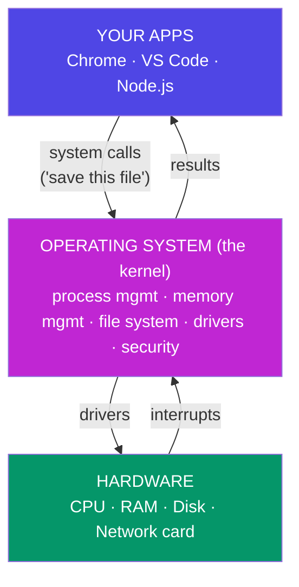

### Its five jobs

| Job | What it means | Real example |
| --- | --- | --- |
| **Process management** | Start, pause, schedule, and kill programs | Task Manager / `htop` |
| **Memory management** | Give each program RAM; stop it reading others' | Chrome can't read your bank app's memory |
| **File system** | Turn "save `notes.md`" into disk block writes | NTFS, ext4, APFS |
| **Device drivers** | Speak each device's private language | Printer, GPU, webcam |
| **Security & users** | Permissions, isolation, authentication | `sudo`, UAC prompts |

### Kernel mode vs user mode

The CPU has (at least) two privilege levels, enforced in hardware:

- **Kernel mode** — unrestricted. Only OS code runs here.
- **User mode** — restricted. Your apps run here. They *cannot* touch hardware or another app's memory directly.

When your program needs something privileged (read a file, open a socket), it makes a **system call** — a formal, checked request across the boundary. `fs.readFile()` in Node is a friendly wrapper around the `read()` syscall.

**This boundary is why a crashing Chrome tab doesn't take down Windows.** It is also why Docker containers are cheap: they are just isolated *processes* sharing one kernel, not whole virtual machines with their own kernel.

**Real-world example — virtual memory.** The OS lies to every program, telling it "you have the whole address space to yourself." Behind the scenes it maps those fake (virtual) addresses to real (physical) ones, and when RAM fills up, it moves cold pages to disk (the *page file* / *swap*). That is why your laptop slows to a crawl instead of crashing when you open 60 tabs: it is shuttling memory to and from the SSD — the [hierarchy](#a4-the-memory-hierarchy-the-full-picture) punishing you.

---

## B2. Process vs Thread

This is the single most-asked OS interview question. Get it exact.

<p class="te"><strong>Telugu:</strong> <strong>Process</strong> = sonta memory unna nadustunna program (veru veru hotels — okari saamanu inkokaru muttalemu). <strong>Thread</strong> = aa process lopala okka pani daari, memory ni <strong>panchukuntundi</strong> (okate vantillu lo nalugu chefs). Process = safe kaani baruvu; thread = chowka kaani race conditions vasthayi. Chrome prathi tab ki veru process — andhuke okka tab crash aina migilinavi bathikuntayi.</p>

**Process** = a running program, *with its own private memory*.
**Thread** = one line of execution *inside* a process, sharing that process's memory with its sibling threads.

**Analogy — a restaurant kitchen:**
- A **process** is a whole restaurant: its own kitchen, its own pantry, its own staff. Two restaurants cannot touch each other's ingredients.
- A **thread** is one chef inside that kitchen. Four chefs (threads) share one pantry (memory). They can work in parallel — but if two grab the same knife at once, chaos.

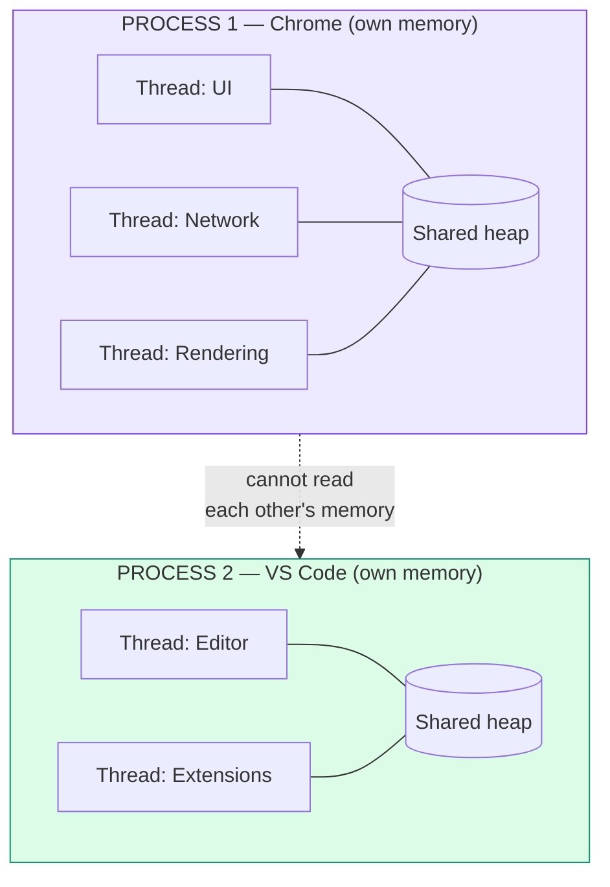

### The comparison table — know it cold

| | **Process** | **Thread** |
| --- | --- | --- |
| Memory | Private, isolated | Shared with sibling threads |
| Creation cost | Heavy (~ms) | Light (~µs) |
| Communication | Hard — needs IPC (pipes, sockets) | Easy — just share a variable |
| Crash impact | Dies alone | Can take down the whole process |
| Safety | Isolated by the OS | Risk of race conditions |
| Analogy | Separate restaurants | Chefs in one kitchen |

**Real-world example — Chrome's tabs.** Each tab is a separate *process*. That is why one runaway tab shows "Aw, Snap!" while the rest of the browser survives. The cost is memory: every process carries its own copy of the engine. Chrome traded RAM for stability, deliberately.

**Real-world example — Node.js.** Node runs your JavaScript on **one** thread. It gets away with this because most server work is *waiting* (for the DB, for the network), not computing. While waiting, the event loop ([E4](#e4-render-blocking-resources-and-the-event-loop)) runs other work. But if you write a CPU-heavy loop, you block that single thread and every user's request stalls. The fix is a `worker_thread` (a real thread) or `cluster` (multiple processes).

---

## B3. Concurrency vs Parallelism

People use these words interchangeably. They are not the same, and the distinction is a favourite interview trap.

<p class="te"><strong>Telugu:</strong> <strong>Concurrency</strong> = chala panulu <strong>nirvahinchadam</strong> (okate core, vegam ga marustu) — okka chef mudu pans juggle chestunnadu. <strong>Parallelism</strong> = nijam ga okesari <strong>cheyyadam</strong> (chala cores) — mugguru chefs, okko pan. JavaScript lo <code>async/await</code> ichedi concurrency, parallelism kaadu — nee JS rendu cores meeda okesari run avvadu.</p>

- **Concurrency** = *dealing with* many things at once (they overlap in time; may be one core switching fast).
- **Parallelism** = *doing* many things at once (they literally execute at the same instant; needs multiple cores).

**Analogy:** One chef juggling three pans, moving between them every few seconds — **concurrency**. Three chefs, one pan each — **parallelism**.

```
CONCURRENCY (1 core, context switching)
  Core 1:  [A][B][A][C][B][A][C][B]     ← rapid switching = the illusion of "at once"

PARALLELISM (3 cores)
  Core 1:  [AAAAAAAA]
  Core 2:  [BBBBBBBB]                   ← genuinely simultaneous
  Core 3:  [CCCCCCCC]
```

The act of pausing task A, saving its state, and loading task B is a **context switch**. It is not free (~1–100 µs). Too many threads → the CPU spends its time switching rather than working. That failure mode is called **thrashing**.

**Real-world example:** `async/await` in JavaScript gives you **concurrency without parallelism** — one thread, many in-flight operations. `Promise.all([fetchA(), fetchB()])` fires both requests and waits for both, but your JS never runs on two cores. To get real parallelism in Node you need worker threads or multiple processes.

---

## B4. Scheduling, deadlocks, and race conditions

### Scheduling

<p class="te"><strong>Telugu:</strong> <strong>Race condition</strong>: iddaru okate data ni okesari maarusthe, result evaru mundu vachedi batti maarutundi — bank lo rendu withdrawals 100 chusi rendu 50 rastayi, 50 maayam. Pariskaram <strong>lock</strong> (mutex) — andhuke SAP lo ENQUEUE lock objects unnayi. <strong>Deadlock</strong>: iddaru okari lock kosam inkokaru edurchustu shaswatam ga aagipovadam; nivarana — locks ni eppudu <strong>okate varusalo</strong> teesuko.</p>

With more threads than cores, the OS **scheduler** decides who runs next, using a time slice (a *quantum*, typically 1–100 ms). Common goals: keep the CPU busy, keep interactive apps responsive, don't starve anyone. That is why your mouse keeps moving smoothly while a build is running.

### Race condition

Two threads touch shared data at the same time, and the result depends on who wins the race.

```
  balance = 100.  Two threads each withdraw 50.

  Thread A: read balance (100)
  Thread B: read balance (100)     ← B read before A wrote back!
  Thread A: 100 - 50 = 50, write   → balance = 50
  Thread B: 100 - 50 = 50, write   → balance = 50

  Two ₹50 withdrawals happened. The balance should be 0. It is 50.
  The bank just lost ₹50.
```

The fix is a **lock** (mutex): "whoever holds the lock touches the balance; everyone else waits." This is exactly why SAP has `ENQUEUE`/`DEQUEUE` lock objects (which you'll meet in ABAP Segment 3), and why databases have transactions.

### Deadlock

Two threads each hold a lock the other needs. Both wait. Forever.

```
  Thread A holds Lock 1 ──wants──▶ Lock 2
                                     │
                                   held by
                                     ▼
  Thread B holds Lock 2 ──wants──▶ Lock 1
```

**Analogy:** two people in a corridor, each stepping aside in the same direction, forever. The classic prevention: always acquire locks **in the same global order**.

> **Mindset takeaway:** Shared mutable state across threads is where bugs go to hide. This is precisely why JavaScript's single-threaded model — however limiting — eliminates an entire universe of race-condition bugs. That was a design choice, not an accident.

---

# Part C — How the Internet Works

## C1. The Physical Internet

**Strip away the mysticism first.** The internet is not a cloud. The internet is **wires**.

<p class="te"><strong>Telugu:</strong> Internet ante 'cloud' kaadu — <strong>wires</strong>. Samudram adugu na fibre cables, nee veedhi kinda copper, data centres nindaa computers. Client = adigedi, server = ichedi, router = packet ni okko adugu mundhuku pampedi. <strong>Latency</strong> = okka round trip ki patte time (light speed valla Bangalore→US ~200ms, dabbu tho taggincham); <strong>bandwidth</strong> = sekanuki entha data. Pipe <strong>podavu</strong> vs pipe <strong>veddalpu</strong>.</p>

Specifically: fibre-optic cables lying on ocean floors, copper running under your street, and warehouses full of computers called **data centres**. When you load a website "from the cloud," a laser is pulsing light through glass under the Arabian Sea.


**Key terms:**
- **Client** — the machine asking (your browser, your phone).
- **Server** — a machine whose whole job is to wait for requests and answer them. It is an ordinary computer that never sleeps.
- **Router** — a device that forwards packets one hop closer to their destination. Your home router is the tiniest example; ISP routers are the big ones.
- **Packet** — data chopped into small chunks, each independently addressed and routed. A 5 MB image arrives as thousands of packets, possibly by different routes, reassembled on arrival.
- **ISP** — the company that connects you to everyone else.
- **Latency** — the delay for one round trip (milliseconds). Bounded by the speed of light: Bangalore ↔ Virginia is physically ~200 ms round trip, and **no amount of money can make it faster.** This is why CDNs put copies of content near users.
- **Bandwidth** — how much data fits through per second. Latency is the *length* of the pipe; bandwidth is its *width*.

**Real-world example:** A video call stutters on a "100 Mbps" connection because bandwidth was never the problem — latency and packet loss were. Downloading a huge file needs bandwidth; a responsive game needs low latency.

---

## C2. IP Addresses

**Simple definition:** An IP address is the unique number identifying a device on a network — so packets know where to go.

<p class="te"><strong>Telugu:</strong> IP address ante device ki <strong>intinumber</strong> — packet ekkadiki vellalo teliyadaniki. IPv4 lo naalugu numbers, prathi okkati 0-255 (enduku? okka byte = 8 bits = 256 values). <strong>Public IP</strong> = ISP ichedi, prapancham anthaa chudagaladu; <strong>private IP</strong> (<code>192.168.x.x</code>) = intilo matrame, router ichedi. Mee illu antha okate public IP panchukuntundi — daanini NAT antaru. <code>127.0.0.1</code> = eppudu 'ee machine' (localhost).</p>

**Analogy:** A postal address. `142.250.183.14` is the street address of a Google server. Without it, the postal system (routers) has no idea where to carry your letter.

### IPv4

Four numbers, `0–255`, dot-separated: `192.168.1.1`

Why 0–255? Each section is **one byte = 8 bits = 2⁸ = 256 values**. ([A5](#a5-binary-why-0s-and-1s) pays off already.) Total space = 2³² ≈ 4.3 billion addresses — which sounded infinite in 1981 and ran out around 2011.

```
     192   .   168   .   1   .   1
      │        │        │       │
   1 byte   1 byte   1 byte  1 byte   =  32 bits total
   11000000 10101000 00000001 00000001
```

### IPv6

The successor: 128 bits, written in hex — `2001:0db8:85a3::8a2e:0370:7334`. It provides 3.4 × 10³⁸ addresses, roughly *one for every atom on Earth's surface*. Adoption is slow but rising.

### Public vs private IPs

| | Public IP | Private IP |
| --- | --- | --- |
| Visible | On the whole internet | Only inside your home/office network |
| Assigned by | Your ISP | Your router (DHCP) |
| Example | `49.37.128.10` | `192.168.1.5`, `10.0.0.3`, `172.16.0.2` |
| Analogy | Your building's street address | Flat number inside the building |

Your entire home — laptop, phone, TV — shares **one** public IP. The router translates between them using **NAT** (Network Address Translation), like a receptionist routing calls to extension numbers. This is the hack that let IPv4 survive its own exhaustion.

**Special addresses to know:**
- `127.0.0.1` — **localhost**, always "this machine." (`::1` in IPv6.)
- `0.0.0.0` — "all interfaces" when a server binds to it.

**Real-world example:** Run `ipconfig` (Windows) or `ifconfig` (Linux/Mac) and you'll see something like `192.168.1.7` — private. Then visit *whatismyip.com* and see a completely different number — that's the public IP your router shows the world. Both are you.

---

## C3. DNS (the internet's phone book)

**Simple definition:** The Domain Name System translates human-friendly names (`google.com`) into IP addresses (`142.250.183.14`), because humans remember words and routers only understand numbers.

<p class="te"><strong>Telugu:</strong> DNS ante internet ki <strong>phone book</strong> — <code>google.com</code> ni <code>142.250.183.14</code> ga maarustundi (manushulaki peru gurthuntundi, routers ki numbers matrame ardham). Vedike varusa: browser cache → OS cache → resolver → root → <code>.com</code> (TLD) → authoritative server. Prathi chota TTL varaku dachukuntaru — <strong>andhuke domain maarchaka site ventane raadu</strong> ('propagation'). Migration ki oka roju mundu TTL ni taggincheyyi.</p>

**Analogy:** Your phone's contact list. You tap "Amma," not `+91 98765 43210`. DNS is that contact list, for the entire internet, kept in sync across millions of servers.

### The lookup, hop by hop

DNS is a hierarchy. Nobody holds the whole list; each level knows only who to ask next.

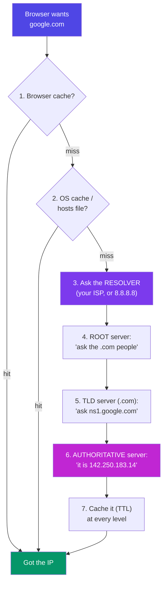

**Walking it in words:**

1. **Browser cache** — "did I look this up in the last few minutes?"
2. **OS cache & `hosts` file** — your machine's own memory. (The `hosts` file lets you hard-code a name→IP mapping; developers use it to point a domain at `127.0.0.1`.)
3. **Recursive resolver** — usually your ISP's, or a public one like Google's `8.8.8.8` or Cloudflare's `1.1.1.1`. This server does the legwork.
4. **Root nameserver** (13 logical clusters worldwide) — doesn't know Google, but knows who runs `.com`.
5. **TLD nameserver** for `.com` — doesn't know the IP, but knows Google's own nameservers.
6. **Authoritative nameserver** — Google's own. It holds the truth: `142.250.183.14`.
7. **Cache everything** for a period called the **TTL** (time to live), so the next lookup is instant.

### DNS record types you'll actually use

| Record | Meaning | Example |
| --- | --- | --- |
| **A** | Name → IPv4 address | `example.com → 93.184.216.34` |
| **AAAA** | Name → IPv6 address | `example.com → 2606:2800:220:1::` |
| **CNAME** | Alias to another name | `www.example.com → example.com` |
| **MX** | Mail server | Where your email is delivered |
| **TXT** | Arbitrary text | Domain verification, SPF/DKIM |
| **NS** | Which nameservers are authoritative | `ns1.google.com` |

**Real-world example — "why isn't my new site live yet?"** You pointed your domain at a new server, but the old IP is cached at your ISP with a 24-hour TTL. Nothing is broken; the phone book hasn't been reprinted yet. This is called *DNS propagation*. Pro move: drop the TTL to 300 seconds a day *before* you migrate.

Try it yourself:

```bash
nslookup google.com        # Windows / everywhere
dig google.com             # Linux / Mac — much more detail
ping google.com            # resolves the name, then sends packets
```

---

## C4. TCP vs UDP

Once you have an IP address, you need to decide *how* to send the data. There are two ways, and this is a guaranteed interview question.

<p class="te"><strong>Telugu:</strong> <strong>TCP</strong> = registered post — modata handshake (SYN → SYN-ACK → ACK), prathi byte cherindani guarantee, poyinadi malli pampistundi. <strong>UDP</strong> = adiche gattiga arichadam — handshake ledu, guarantee ledu, kaani vegam. Video call lo okka packet poyithe TCP daani kosam anni aapi malli adugutundi — call venakabadutundi; UDP daanini vadilesi real-time lo untundi. Gurthu: <strong>TCP = correctness ki, UDP = time ki</strong>.</p>

### TCP — Transmission Control Protocol

**Reliable, ordered, connection-based.** It guarantees every byte arrives, in order, exactly once. It achieves that with acknowledgements and retransmissions.

**Analogy:** Registered post with a signature on delivery. Slower, but you *know* it arrived. If a page is lost, it's re-sent.

**The three-way handshake** — every TCP connection opens like this:

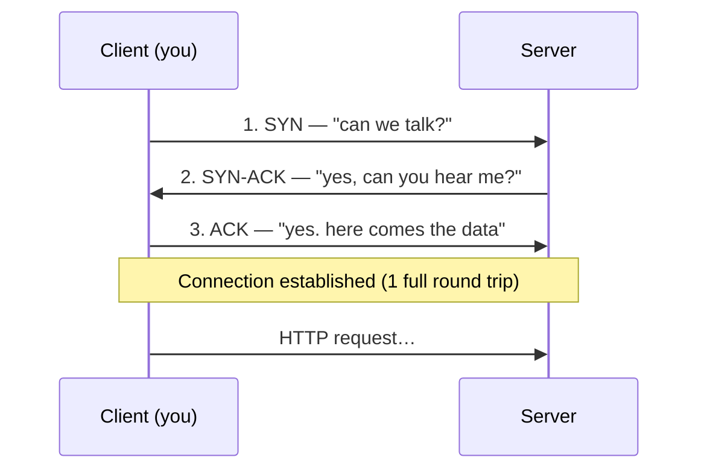

TCP also guarantees:
- **Ordering** — packets numbered, reassembled in sequence even if they arrive scrambled.
- **Retransmission** — no acknowledgement? Send it again.
- **Flow control** — don't drown a slow receiver.
- **Congestion control** — back off when the network is busy.

### UDP — User Datagram Protocol

**Fast, connectionless, no guarantees.** Fire the packet and hope. No handshake, no acknowledgements, no reordering, no retries.

**Analogy:** Shouting across a room. Usually heard. Occasionally not. You don't wait for confirmation before shouting the next word.

### The comparison — memorise this

| | **TCP** | **UDP** |
| --- | --- | --- |
| Reliability | Guaranteed delivery | Best effort; packets can vanish |
| Ordering | Guaranteed | None |
| Speed | Slower (handshake + ACKs) | Fast (no overhead) |
| Connection | Yes (handshake first) | No |
| Header size | 20 bytes | 8 bytes |
| Analogy | Registered post | Shouting across a room |
| **Used for** | Web (HTTP), email, file download, SSH, databases | Video calls, live streaming, online gaming, DNS |

### When would you choose UDP over TCP?

**When late data is worse than lost data.**

On a video call, if one 20-millisecond audio packet is lost, TCP would stop everything, request it again, and play it late — you'd hear a stutter and the whole call would drift behind. UDP just drops it. Your ear barely registers a 20 ms gap, and the conversation stays in real time. Same for live sports streaming and multiplayer gaming: you want *the current frame*, not a perfect replay of a frame from two seconds ago.

The rule: **TCP for correctness, UDP for timeliness.**

(Bonus for interviews: HTTP/3 runs over **QUIC**, which is built *on UDP* — Google rebuilt TCP's reliability in user space to escape TCP's slow handshake. So the boundary is blurrier in 2026 than the textbook says.)

---

## C5. Ports

**Simple definition:** An IP address finds the *machine*; a port number finds the *program* on that machine.

<p class="te"><strong>Telugu:</strong> IP address <strong>machine</strong> ni kanukkuntundi; port <strong>aa machine lo e program</strong> ani cheptundi. IP = apartment building address, port = flat number. 0 nunchi 65535 varaku. Gurthupettuko: 80 HTTP, 443 HTTPS, 22 SSH, 53 DNS, 3306 MySQL, 3000 nee dev server. <code>EADDRINUSE :::3000</code> ante aa flat lo already inkoti undi ani artham.</p>

**Analogy:** The IP is the apartment building's street address. The port is the flat number. `142.250.183.14:443` means "building 142.250.183.14, flat 443" — and flat 443 is where the HTTPS web server lives.

A port is a 16-bit number → `0–65535`.

```
   142.250.183.14 : 443
   └──────┬─────┘   └┬┘
      which          which
     machine        program
```

### Ports worth memorising

| Port | Service | Note |
| --- | --- | --- |
| **80** | HTTP | The unencrypted web |
| **443** | HTTPS | The encrypted web — everything now |
| **22** | SSH | Remote shell into a server |
| **25 / 587** | SMTP | Sending email |
| **53** | DNS | Usually over UDP |
| **3306** | MySQL | You'll use this in Phase 9 |
| **5432** | PostgreSQL | |
| **27017** | MongoDB | |
| **3000** | *Your* React / Express dev server | Convention, not a standard |
| **8080** | Alternate HTTP | Common for proxies, Tomcat |

Ports `0–1023` are **well-known** and need admin rights to bind — that is why you can't run a dev server on port 80 without `sudo`.

**Real-world example:** `EADDRINUSE: address already in use :::3000` means another program already holds flat 3000. Either kill it or move to 3001. And when you deploy, a *reverse proxy* (nginx) listens on 443, then forwards to your Node app quietly running on 3000 — the public sees only the front door.

---

## C6. HTTP (the language of the web)

**Simple definition:** HyperText Transfer Protocol is the agreed request/response format that browsers and servers use to talk. It rides on top of TCP.

<p class="te"><strong>Telugu:</strong> HTTP ante browser-server madhya <strong>matladukune padhathi</strong> — request pampu, response teesuko. Mukhyam: HTTP <strong>stateless</strong> — server nee gurinchi emi gurthupettukodu, andhuke prathi request tanato patu identity (cookie, JWT) teesukuraavali. Methods: GET chadavadam, POST kotthadi, PUT motham maarchadam, PATCH konchem. Status: 2xx sari, 3xx redirect, 4xx <strong>nee</strong> tappu, 5xx <strong>server</strong> tappu. 401 = 'nuvvevaro teliyadu'; 403 = 'telusu, kaani permission ledu'.</p>

**Analogy:** Ordering at a restaurant. You (client) make a structured request; the kitchen (server) sends back a structured response with a status. Both sides know the format, so no confusion.

**Its defining property: HTTP is stateless.** The server remembers nothing between requests. Every request must carry everything needed to serve it. That is why cookies, sessions, and JWT tokens exist — they re-supply identity on every single request. (This becomes very concrete for you in Phase 8.)

### Anatomy of a request

```http
GET /search?q=binary HTTP/1.1          ← method, path, version
Host: www.google.com                   ← headers start
User-Agent: Mozilla/5.0 (Windows NT 10.0)
Accept: text/html
Cookie: session_id=abc123
Authorization: Bearer eyJhbGciOi...
                                       ← blank line
{ "body": "only for POST/PUT/PATCH" }  ← body
```

### Anatomy of a response

```http
HTTP/1.1 200 OK                        ← version, status code, status text
Content-Type: text/html; charset=utf-8 ← headers
Content-Length: 5842
Cache-Control: max-age=3600
Set-Cookie: session_id=abc123

<!DOCTYPE html>                        ← body
<html>…</html>
```

### The methods (verbs)

| Method | Means | Safe? | Idempotent? | Example |
| --- | --- | --- | --- | --- |
| **GET** | Read something | ✅ | ✅ | Load a profile page |
| **POST** | Create something | ❌ | ❌ | Submit a signup form |
| **PUT** | Replace something entirely | ❌ | ✅ | Overwrite a whole record |
| **PATCH** | Modify part of something | ❌ | ❌ | Change just the email field |
| **DELETE** | Remove something | ❌ | ✅ | Delete an account |

- **Safe** = doesn't change server state.
- **Idempotent** = doing it 5 times has the same effect as doing it once. (`DELETE` twice → still deleted. `POST` twice → two records. That is exactly why double-clicking "Pay" can charge you twice, and why payment APIs demand an idempotency key.)

### Status codes — learn the families, not the list

| Range | Family meaning | Memorise these |
| --- | --- | --- |
| **1xx** | Informational | `101 Switching Protocols` (WebSockets) |
| **2xx** | ✅ Success | `200 OK`, `201 Created`, `204 No Content` |
| **3xx** | ↪️ Redirect | `301 Moved Permanently`, `302 Found`, `304 Not Modified` (cached!) |
| **4xx** | 🙋 *You* messed up | `400 Bad Request`, `401 Unauthorized`, `403 Forbidden`, `404 Not Found`, `429 Too Many Requests` |
| **5xx** | 💥 *Server* messed up | `500 Internal Server Error`, `502 Bad Gateway`, `503 Service Unavailable` |

**The 401 vs 403 distinction** interviewers love: `401` = "I don't know who you are" (log in). `403` = "I know exactly who you are, and you're not allowed" (no permission).

### HTTP versions

| Version | Key change | Why it mattered |
| --- | --- | --- |
| **HTTP/1.1** (1997) | One request at a time per connection | Browsers opened 6 connections per domain to fake parallelism |
| **HTTP/2** (2015) | Multiplexing — many requests share one connection; header compression | Massive speedup; `<script>` bundling matters less |
| **HTTP/3** (2022) | Runs on **QUIC** (over UDP), not TCP | Faster handshake, survives network switching (WiFi → 4G) |

**Real-world example:** Open DevTools → Network tab → reload any site. You are looking at real HTTP: methods, statuses, headers, timings. That `304 Not Modified` on the logo means the browser asked "changed since last time?" and the server said "no, use your copy" — a saved download.

---

## C7. HTTPS, SSL, and TLS

**HTTPS = HTTP + TLS.** Same language, spoken inside a locked, tamper-evident envelope.

<p class="te"><strong>Telugu:</strong> HTTPS = HTTP + TLS. Mudu labhalu: <strong>encryption</strong> (madhyalo evaro chudalēru), <strong>integrity</strong> (maarchalēru), <strong>authentication</strong> (nijam ga bank site ye). SSL puraatanam; ippudu vaadedi TLS. Trick: asymmetric (public/private key) nemmadi kaani secure — daanito okka <strong>session key</strong> ni ottukuntaru, taruvata vegam ayina symmetric tho matladataru. Certificate ante passport — CA (government laantidi) sign chesindi kabatti nammutham.</p>

**What the "S" buys you — three things:**

1. **Encryption** — an eavesdropper on the café WiFi sees gibberish, not your password.
2. **Integrity** — nobody can silently alter the data in transit (no ISP injecting ads).
3. **Authentication** — you are certain you're talking to the real `hdfcbank.com`, not an impostor.

**Terminology:** *SSL* is the old name (deprecated, insecure — SSL 3.0 was broken in 2014). *TLS* is the modern protocol (TLS 1.2, TLS 1.3). Everyone still says "SSL certificate" out of habit; they always mean TLS.

### The core trick: two kinds of encryption

| | **Asymmetric** (public-key) | **Symmetric** |
| --- | --- | --- |
| Keys | A public key + a private key | One shared secret key |
| Public key can | Lock (encrypt) | — |
| Private key can | Unlock (decrypt) | — |
| Speed | Slow | Very fast |
| Analogy | An open padlock anyone can snap shut; only you own the key | A house key both of you copied |

**TLS uses asymmetric encryption to safely agree on a symmetric key, then uses the fast symmetric key for everything after.** Best of both. That negotiation is the *TLS handshake*.

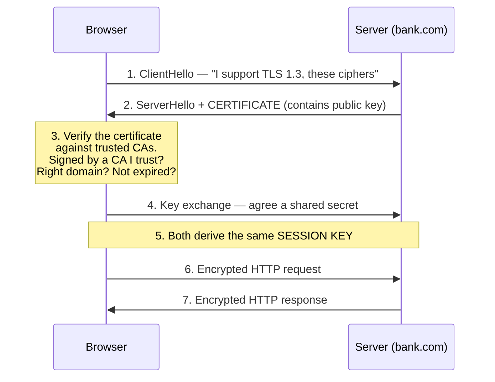

### Certificates and the chain of trust

A **certificate** says: *"The public key below belongs to `bank.com`"* — and it is digitally signed by a **Certificate Authority (CA)** such as DigiCert or Let's Encrypt.

Your operating system ships with a list of ~150 CAs it trusts. If the certificate is signed by one of them (or by someone *they* vouch for — the *chain*), the padlock appears. If not, you get the terrifying red warning page.

**Analogy:** A passport. You trust the passport not because you know the person, but because you trust the government that issued it — and you can verify the hologram.

**Real-world example:** On public café WiFi over plain `http://`, anyone running Wireshark reads your login in plaintext. Over `https://` they see only which *domain* you visited (via SNI/DNS) and the size of the traffic. This is why every browser now marks HTTP sites "Not Secure," and why Let's Encrypt made certificates free to eliminate the last excuse.

**Why you'll care in SAP:** Fiori apps talk to the S/4HANA gateway over HTTPS. Half of all "the app won't load" tickets are expired certificates or a missing intermediate CA in the chain.

---

## C8. The OSI Model

**Simple definition:** A 7-layer conceptual model for how network communication is organised. Each layer does one job and talks only to the layers directly above and below it.

<p class="te"><strong>Telugu:</strong> Network ni <strong>7 layers</strong> ga vidadeesi ardham chesukune model; prathi layer okate pani chestundi, pai-kindi layers tho matrame matladutundi. 7 Application (HTTP) · 6 Presentation (TLS) · 5 Session · 4 Transport (TCP/UDP) · 3 Network (IP, router) · 2 Data Link (Ethernet, MAC, switch) · 1 Physical (cable). Gurthu: <strong>A</strong>ll <strong>P</strong>eople <strong>S</strong>eem <strong>T</strong>o <strong>N</strong>eed <strong>D</strong>ata <strong>P</strong>rocessing. Prathi layer tana header ni chuttestundi — adi encapsulation (uttaram → cover → box).</p>

**Your roadmap says "awareness only" — but interviewers ask, so know the layers, one protocol each, and the mnemonic.**

**Analogy — posting a letter:** You write the words (Application). You choose a language both sides read (Presentation). You maintain the conversation thread (Session). The post office chops a big parcel into boxes and guarantees delivery (Transport). It routes them between cities (Network). Trucks carry them between adjacent depots (Data Link). And a road physically exists (Physical).

```
  ┌──────────────────────────────────────────────────────────────────┐
  │ 7 · APPLICATION    What the user sees      HTTP, DNS, SMTP, FTP  │
  ├──────────────────────────────────────────────────────────────────┤
  │ 6 · PRESENTATION   Format, encrypt         TLS/SSL, UTF-8, JPEG  │
  ├──────────────────────────────────────────────────────────────────┤
  │ 5 · SESSION        Open/close conversations  Sockets, NetBIOS    │
  ├──────────────────────────────────────────────────────────────────┤
  │ 4 · TRANSPORT      Reliability, ports      TCP, UDP              │
  ├──────────────────────────────────────────────────────────────────┤
  │ 3 · NETWORK        Addressing, routing     IP, ICMP (ping), routers│
  ├──────────────────────────────────────────────────────────────────┤
  │ 2 · DATA LINK      Node-to-node, MAC       Ethernet, WiFi, switches│
  ├──────────────────────────────────────────────────────────────────┤
  │ 1 · PHYSICAL       Bits on a wire          Cables, fibre, radio   │
  └──────────────────────────────────────────────────────────────────┘
```

**Mnemonic (top → bottom):** **A**ll **P**eople **S**eem **T**o **N**eed **D**ata **P**rocessing.
**Bottom → top:** **P**lease **D**o **N**ot **T**hrow **S**ausage **P**izza **A**way.

### Layer by layer, with a real protocol

| # | Layer | Job | Protocol / device | Unit of data |
| --- | --- | --- | --- | --- |
| 7 | Application | The service the user actually wants | **HTTP**, DNS, SMTP, SSH | Data |
| 6 | Presentation | Encrypt, compress, encode | **TLS**, JPEG, UTF-8 | Data |
| 5 | Session | Establish/manage/close sessions | Sockets, RPC | Data |
| 4 | Transport | End-to-end delivery, ports, reliability | **TCP**, UDP | Segment |
| 3 | Network | Logical addressing, routing between networks | **IP**, ICMP · *Router* | Packet |
| 2 | Data Link | Delivery between two directly-connected nodes; MAC addresses | **Ethernet**, WiFi · *Switch* | Frame |
| 1 | Physical | Actual electrical/optical signals | Cat-6 cable, fibre, radio | Bit |

### Encapsulation — what actually happens to your data

Each layer wraps the layer above it in its own header. Like putting a letter in an envelope, in a box, on a pallet.

```
  Your data:                                   [ GET /index.html ]
  + Transport header (TCP: ports, seq)     [TCP|  GET /index.html ]
  + Network header   (IP: src/dst IP)  [IP |TCP|  GET /index.html ]
  + Link header      (Ethernet: MAC) [ETH|IP |TCP|  GET /index.html |ETH-trailer]
  → onto the wire as bits            101011010010110101110100101...
```

The receiving machine unwraps in reverse. **That is the whole model.**

### The TCP/IP model — what the real world uses

OSI is the teaching model. The internet actually runs on the 4-layer **TCP/IP model**, which collapses OSI's top three and bottom two:

| TCP/IP (real) | ≈ OSI layers |
| --- | --- |
| Application | 7 + 6 + 5 |
| Transport | 4 |
| Internet | 3 |
| Network Access | 2 + 1 |

> **Mindset takeaway:** Layering is *the* great idea in computing. Your React code never thinks about voltage. Each layer trusts the one below to do its job and offers a clean promise to the one above. When you later meet Docker, Kubernetes, or SAP BTP, look for the layers — they are always there.

---

# Part D — What Happens When You Type google.com

*This is the most famous interview question in software engineering. It exists because answering it well proves you understand **every layer at once**. Below is the full trace. Learn to tell this story in five minutes, out loud, from memory.*

<p class="te"><strong>Telugu:</strong> Idi interviews lo <strong>atyanta ekkuva adige prashna</strong> — enduku ante idi cheppagaligina vaadiki anni layers telusu ani artham. Varusa: URL parse → caches chudu → <strong>DNS</strong> (IP kanukko) → <strong>TCP handshake</strong> → <strong>TLS handshake</strong> → HTTP GET → server 200 OK + HTML → browser DOM+CSSOM kadutundi → layout → paint → composite → page kanipistundi. Deenini <strong>5 nimushalalo, notitho, choodakunda</strong> cheppagaligela nerchuko.</p>

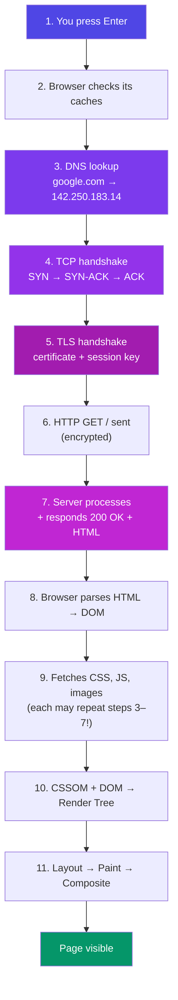

### Step 1 — You press Enter

The browser first decides: **is this a URL or a search query?** `google.com` has no spaces and a valid TLD, so it's treated as a URL and normalised to `https://google.com/`. (Type `how to learn binary` and it goes to your default search engine instead.)

The **URL is parsed** into its parts:

```
   https :// www.google.com : 443 /search ?q=binary #results
   └─┬─┘     └──────┬─────┘  └┬┘  └──┬──┘ └───┬───┘ └──┬──┘
  scheme        host        port   path     query   fragment
 (protocol)   (→ DNS)    (default) (what)  (params) (browser-only,
                                                     never sent)
```

### Step 2 — The browser checks four caches, in order

Before touching the network, the browser tries hard to avoid it:

1. **Browser HTTP cache** — do I already have this page, still fresh per its `Cache-Control` header?
2. **Service worker** — is a PWA intercepting this? (It may serve offline.)
3. **Browser DNS cache** — do I know this IP already?
4. **OS DNS cache + `hosts` file** — does the operating system know?

**The fastest network request is the one you never make.** Everything after this step is expensive.

### Step 3 — DNS resolution

All caches miss, so the full recursive lookup from [C3](#c3-dns-the-internets-phone-book) runs: resolver → root → `.com` TLD → Google's authoritative nameserver → `142.250.183.14`. Typically **20–120 ms**. The result is cached at every level for its TTL.

*(Under the hood this is usually a **UDP** request to port 53 — small, fast, one packet, no handshake needed. UDP earns its keep here.)*

### Step 4 — TCP handshake

The browser opens a TCP connection to `142.250.183.14:443`. Three packets, one full round trip:

```
   Browser ──── SYN ────────▶ Server     "Can we talk?"
   Browser ◀─── SYN-ACK ───── Server     "Yes — can you hear me?"
   Browser ──── ACK ────────▶ Server     "Yes. Connection open."
```

Bangalore → US: ~200 ms round trip. Every avoidable round trip is worth real money — which is precisely why HTTP/2 multiplexes many requests onto one connection, and why HTTP/3 (QUIC) merges the TCP and TLS handshakes.

### Step 5 — TLS handshake

Because the scheme is `https`, the encrypted tunnel from [C7](#c7-https-ssl-and-tls) is negotiated: ClientHello → ServerHello + certificate → verify the certificate against trusted CAs → derive a shared session key. Now everything is encrypted. Adds ~1 round trip (TLS 1.3) or ~2 (TLS 1.2).

### Step 6 — The HTTP request is sent

Finally, the actual request — a few hundred bytes of text, encrypted and wrapped in TCP → IP → Ethernet frames ([encapsulation](#c8-the-osi-model)), pulsed as light down a fibre under the ocean:

```http
GET / HTTP/2
Host: www.google.com
User-Agent: Mozilla/5.0 …
Accept: text/html,application/xhtml+xml
Accept-Encoding: gzip, br
Cookie: NID=511=xyz…
```

Along the way, **routers** at every hop read only the destination IP and forward the packet one step closer. No single router knows the whole path. (Run `tracert google.com` to watch each hop.)

### Step 7 — The server responds

The packet reaches Google's data centre, where it likely passes through a **load balancer** that picks one of thousands of identical servers. That server runs its application logic, perhaps queries a database, and returns:

```http
HTTP/2 200 OK
Content-Type: text/html; charset=utf-8
Content-Encoding: gzip
Cache-Control: private, max-age=0

<!DOCTYPE html><html>…
```

(In practice you were probably served by a **CDN edge node** in Mumbai or Chennai, not Virginia — a cached copy sitting physically close to you, because the speed of light is not negotiable.)

### Steps 8–11 — The browser builds the page

Now the network is done and the rendering pipeline begins. That is [Part E](#part-e-the-browser-rendering-and-the-dom) — turn the page.

### The one-paragraph answer (for interviews)

> *"The browser parses the URL and checks its caches. On a miss it resolves the domain via DNS — browser cache, OS cache, then a recursive resolver walking root → TLD → authoritative nameserver — to get an IP. It opens a TCP connection with a three-way handshake, then performs a TLS handshake, verifying the server's certificate against a trusted CA and agreeing a session key. It sends an encrypted HTTP GET; routers forward the packets hop by hop using the destination IP. A load balancer routes it to a server (or a nearby CDN edge), which returns 200 OK with HTML. The browser then parses HTML into the DOM and CSS into the CSSOM, combines them into a render tree, runs layout to compute geometry, paints pixels, and composites layers onto the screen. Sub-resources like CSS, JS, and images each repeat this network cycle — often over the same connection thanks to HTTP/2 multiplexing."*

That paragraph, delivered calmly, ends the networking portion of most interviews.

---

# Part E — The Browser: Rendering and the DOM

The server sent you a **string of HTML text**. Somehow that becomes pixels. Here's exactly how.

## E1. The Rendering Pipeline

**Analogy — building a house:**

<p class="te"><strong>Telugu:</strong> Server nee ki HTML <strong>text</strong> pampindi — adi pixels ela avutundi? Illu kattinattu: HTML chadivi <strong>DOM</strong> (plan), CSS chadivi <strong>CSSOM</strong> (decoration spec), rendu kalipi <strong>Render Tree</strong> (kattali anukunna gadulu matrame), taruvata <strong>Layout</strong> (ekkada, entha peddaga — exact px), <strong>Paint</strong> (rangu veyyadam), <strong>Composite</strong> (layers ni GPU pai pettadam). 60 FPS kaavali ante idi antha <strong>16.6ms lopala</strong> avvali.</p>

| Stage | House equivalent |
| --- | --- |
| Parse HTML → DOM | Read the architect's structural plan |
| Parse CSS → CSSOM | Read the interior-design spec |
| Render Tree | Merge them — but skip rooms marked "not built" (`display:none`) |
| Layout | Measure exactly where every wall goes, in metres |
| Paint | Actually apply the paint, textures, colours |
| Composite | Stack the transparent layers (glass, curtains) in the right order |

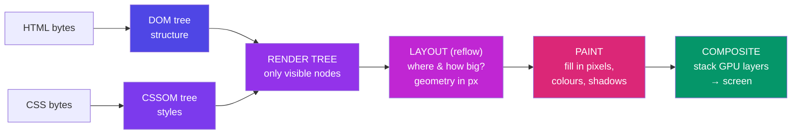

**Stage by stage:**

1. **Parse HTML → DOM.** The bytes are decoded (per `charset`), tokenised into tags, and assembled into a **tree** of nodes. The parser is incremental — it builds the tree as bytes arrive, which is why a slow server still shows content progressively.

2. **Parse CSS → CSSOM.** Every stylesheet (external, `<style>`, inline) becomes a second tree, with cascade and inheritance resolved. `<h1>` inherits `font-family` from `<body>` here.

3. **Render Tree.** DOM + CSSOM merged, keeping only what will be *visible*.
   - `display: none` → **excluded from the render tree entirely** (no box exists).
   - `visibility: hidden` → **included** (it takes up space; it's just not painted).
   - `<head>`, `<script>`, `<meta>` → never in the render tree.

   That difference is a classic interview question, and now you know it structurally rather than by rote.

4. **Layout (a.k.a. reflow).** Compute the exact geometry of every box: position and size in pixels. `width: 50%` finally becomes `640px`. This cascades — moving one element can move everything after it.

5. **Paint.** Fill in the actual pixels: text glyphs, colours, borders, shadows, images. Often onto multiple separate **layers**.

6. **Composite.** The GPU stacks the layers in the correct order and draws the final frame. Layers exist so that moving one thing (a scrolling panel, a CSS animation) doesn't require repainting everything beneath it.

**To hit 60 frames per second, this whole pipeline must finish in under 16.6 ms per frame.** That budget is why the next section matters so much.

---

## E2. The DOM

**Simple definition:** The Document Object Model is the browser's live, in-memory **tree of objects** representing your HTML — and the API that lets JavaScript read and change it.

<p class="te"><strong>Telugu:</strong> HTML ante network lo vachina <strong>text</strong>; DOM ante daani nunchi browser memory lo kattina <strong>bathikunna objects chettu</strong> (tree). HTML = blueprint, DOM = <strong>kattina illu</strong> — JS aa intini maarchagaladu, blueprint ni kaadu. <code>querySelector</code> tho pattuko, <code>textContent</code>/<code>classList</code> tho maarchu. <strong>Warning</strong>: <code>innerHTML</code> lo user input pettaku — adi HTML ga parse avutundi, XSS attack vastundi.</p>

**The crucial distinction:** HTML is a *string of text* sent over the network. The DOM is a *tree of live objects* in RAM. HTML is the blueprint; the DOM is the building you can walk through and remodel.

```html
<html>
  <head><title>Nikhil</title></head>
  <body>
    <h1 class="hero">Hello</h1>
    <p>World</p>
  </body>
</html>
```

becomes:

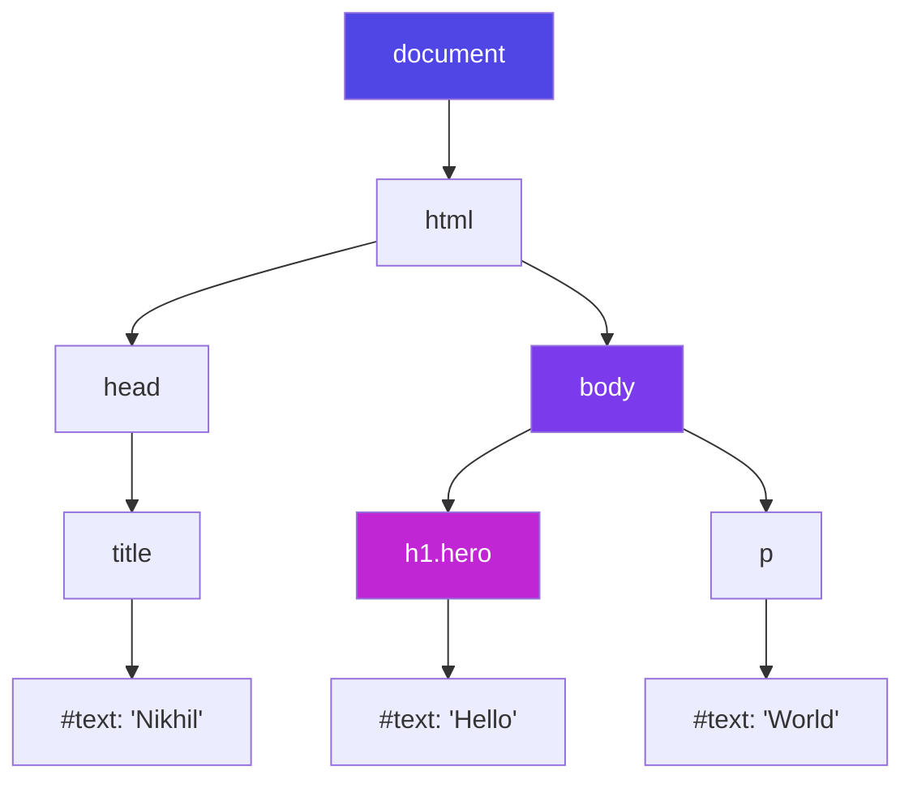

Notice: **text is a node too.** So are comments. Everything is a node.

Note also that this is exactly a **[Tree](#f7-tree)** from Part F — one root, each node with one parent and any number of children. Data structures aren't academic; the page you are reading is one.

### Talking to it from JavaScript

```js
// READ / FIND  — think of it as querying the tree
document.querySelector('.hero');            // first match
document.querySelectorAll('p');             // all matches (a NodeList)
document.getElementById('app');             // fastest single lookup

// TRAVERSE     — walk the tree
el.parentElement;
el.children;
el.nextElementSibling;

// MODIFY       — mutate the tree; the browser re-renders
el.textContent = 'Hello, Nikhil';           // safe: text only
el.classList.add('active');
el.style.color = 'crimson';
el.setAttribute('data-id', '42');

// CREATE / DELETE
const li = document.createElement('li');
li.textContent = 'New item';
document.querySelector('ul').appendChild(li);
li.remove();

// REACT TO EVENTS
button.addEventListener('click', (e) => {
  console.log('clicked', e.target);
});
```

> **Security note you must internalise now:** `innerHTML = userInput` *parses the string as HTML*, so a malicious user can inject ``. That attack is **XSS (cross-site scripting)**. Use `textContent` when you want text. You'll meet this again in Phase 8 (API security).

**Why React exists (a Phase 6 preview):** DOM mutations are expensive — each can trigger layout and paint. React keeps a lightweight **virtual DOM** (a JS object tree), diffs it against the old one, and applies the *minimum* real DOM changes in one batch. Understanding the [E1](#e1-the-rendering-pipeline) pipeline is understanding *why* React was invented.

---

## E3. Reflow and Repaint

The pipeline doesn't run once. It re-runs, partially, every time something changes — and the cost depends on *how far back* in the pipeline you force it to restart.

<p class="te"><strong>Telugu:</strong> Emi maarchavo daanni batti kharchu maarutundi. <strong>Geometry</strong> (width, height, margin) maaristhe → <strong>reflow</strong> (chala kharchu, taruvata unnavi anni malli lekkinchali). <strong>Rangu</strong> matrame maaristhe → repaint (madhyastham). <code>transform</code>/<code>opacity</code> maaristhe → composite matrame (chowka, GPU chusukuntundi). Andhuke okate rule: <strong>animations ki transform, opacity matrame vaadu</strong> — left, top, width vaadaku.</p>

| You changed… | Triggers | Cost | Examples |
| --- | --- | --- | --- |
| **Geometry** (size, position) | **Reflow** → repaint → composite | 💸💸💸 Expensive | `width`, `height`, `margin`, `padding`, `font-size`, adding a DOM node |
| **Appearance only** | **Repaint** → composite | 💸💸 Moderate | `color`, `background`, `box-shadow`, `visibility` |
| **Compositing only** | **Composite** | 💸 Cheap — GPU handles it | `transform`, `opacity` |

**This is the single most useful performance rule in front-end work:**

> **Animate with `transform` and `opacity`. Never animate `width`, `height`, `top`, or `left`.**

```js
// ❌ BAD — forces a reflow on every single frame (~60×/sec)
el.style.left = x + 'px';

// ✅ GOOD — compositing only; the GPU moves an existing layer
el.style.transform = `translateX(${x}px)`;
```

### Layout thrashing — the classic mistake

Reading a geometric property (`offsetHeight`, `getBoundingClientRect()`) forces the browser to *flush pending layout right now* so it can give you an accurate answer. Interleave reads and writes in a loop and you force a reflow on every iteration:

```js
// ❌ Layout thrashing: read, write, read, write… reflow each time
for (const box of boxes) {
  box.style.height = box.offsetHeight + 10 + 'px';   // read forces layout, write invalidates it
}

// ✅ Batch: read everything first, then write everything. One reflow.
const heights = boxes.map(b => b.offsetHeight);                     // all reads
boxes.forEach((b, i) => b.style.height = heights[i] + 10 + 'px');   // all writes
```

**Real-world example:** A page that stutters while scrolling is usually running a scroll handler that reads `getBoundingClientRect()` and writes a style, sixty times a second. The fix is either batching (above) or `IntersectionObserver`, which the browser computes off the main thread.

---

## E4. Render-blocking resources and the Event Loop

### Render-blocking

<p class="te"><strong>Telugu:</strong> CSS <strong>render-blocking</strong> — CSSOM purthi ayye varaku browser paint cheyadu. Plain <code>&lt;script&gt;</code> <strong>parsing ni aapesthundi</strong> — andhuke <code>defer</code> vaadu (download parallel ga, execute parsing tarvata). Event loop: JS ki <strong>okate thread</strong>. Timer/network pani ni browser threads ki icchi, aa callback ni queue lo pettukoni, stack khaali ayinappudu run chestundi. Okka waiter chala tables — andhuke pedda sync loop rasthe <strong>page motham freeze</strong> avutundi.</p>

- **CSS is render-blocking.** The browser will not paint until the CSSOM is complete — otherwise you'd see a flash of unstyled content. So `<link rel="stylesheet">` goes in the `<head>`, and you keep it small.
- **`<script>` is parser-blocking.** A plain `<script src="...">` in the middle of the HTML *stops HTML parsing entirely*, downloads, and executes — because that script might call `document.write()`. This is why scripts traditionally went at the end of `<body>`.

Two attributes fix it:

```
<script src="a.js">          parse ──STOP── download ── execute ── resume parse
<script defer src="a.js">    parse ──────────────────────────▶ execute after parse ✅
<script async src="a.js">    parse ──────── execute anywhere ─▶ (order not guaranteed)
```

- **`defer`** — download in parallel, execute *after* HTML parsing, in document order. **The sane default.**
- **`async`** — download in parallel, execute the instant it lands, interrupting parsing. Good only for independent scripts like analytics.

### The Event Loop (a first look — you'll go deep in Phase 5)

JavaScript in a browser has **one thread**. It cannot render and run JS at the same time. So how does a page stay responsive while waiting for a network call?

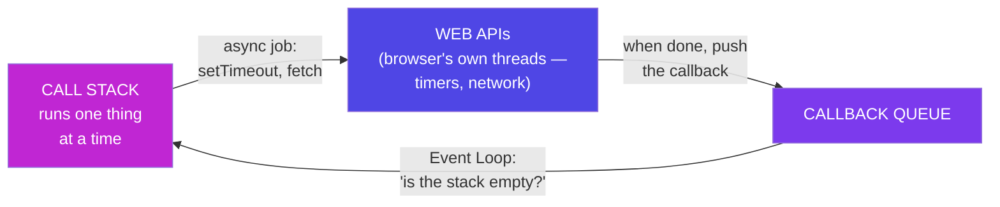

**Analogy:** A single waiter (the JS thread) taking orders. He does not stand at the kitchen door waiting for the food. He hands the order to the kitchen (Web APIs — which *are* separate threads, owned by the browser), serves other tables, and returns when the bell rings (callback queue). One waiter, many tables in flight — that is **[concurrency without parallelism](#b3-concurrency-vs-parallelism)**, exactly as defined in Part B.

**Consequence:** a long synchronous loop freezes the *entire page* — no clicks, no scrolling, no repainting — because the single thread is busy and the event loop can never run.

```js
// ❌ Freezes the browser tab for ~2 seconds. Nothing renders.
const start = Date.now();
while (Date.now() - start < 2000) {}

// ✅ Non-blocking: hands the wait to the browser's timer thread
setTimeout(() => console.log('done'), 2000);
```

> **Mindset takeaway:** The browser is not a document viewer. It is an operating system — with a scheduler, threads, memory management, and a security sandbox. Every concept from Parts A and B reappears here in a different costume.

---

# Part F — Data Structures

**Simple definition:** A data structure is a way of organising data in memory so that the operations you care about are fast.

**Analogy — a kitchen.** You *could* keep every ingredient in one giant sack. Finding the salt would take five minutes. Instead you use a spice rack (fast lookup by name), a stack of plates (take from the top), a queue at the counter (first come, first served). **Same ingredients. Different organisation. Wildly different speed.**

There is no "best" data structure. There is only the right trade-off:

> **Every data structure trades one operation's speed for another's.** Arrays are fast to read by index, slow to insert at the front. Hash maps are fast to look up by key, but store no order. Choosing well *is* the job.

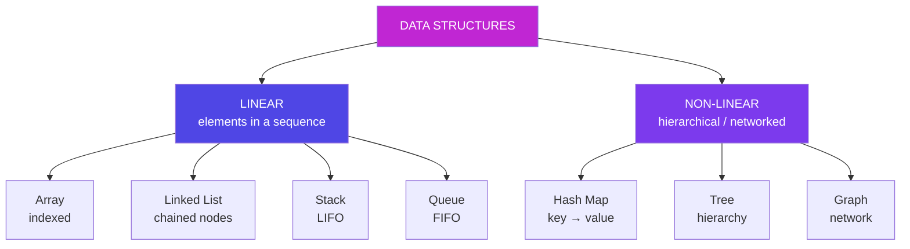

---

## F1. Array

**What:** An ordered, indexed collection stored in a **contiguous block of memory**. That last phrase is the whole story.

<p class="te"><strong>Telugu:</strong> Array ante <strong>vaparusa ga pakka pakkane</strong> (contiguous) unna lockers. Andhuke <code>arr[500]</code> ventane dorukutundi — vedakadu, <code>start + index × size</code> lekkinchi nerugga velthundi (O(1)). Kaani <strong>mundu</strong> (front) insert cheyyali ante <strong>migilina anni okko adugu jarali</strong> — O(n). <code>push</code>/<code>pop</code> chivara O(1); <code>shift</code>/<code>unshift</code> mundu O(n). Chinna list ki parledu; lakshalu unte ide nee app ni nemmadi chestundi.</p>

**Analogy:** A row of numbered lockers, bolted to the wall, side by side.

```
  Index:      0        1        2        3        4
            ┌────────┬────────┬────────┬────────┬────────┐
  Value:    │  'a'   │  'b'   │  'c'   │  'd'   │  'e'   │
            └────────┴────────┴────────┴────────┴────────┘
  Address:  1000     1004     1008     1012     1016
                     ▲
     arr[2] → address = 1000 + (2 × 4) = 1008.  One multiplication. O(1).
```

**Why indexing is instant:** the computer doesn't search. It computes `start + index × size` and jumps straight there. That is why array access is `O(1)` and why it requires elements to sit side by side.

**Why inserting at the front is slow:** to make room at index 0, every other element must physically shift one locker right. `O(n)`.

### Big O

| Operation | Complexity | Why |
| --- | --- | --- |
| Access `arr[i]` | **O(1)** | Address arithmetic |
| Search (unsorted) | **O(n)** | Must check each element |
| Push / pop (end) | **O(1)*** | Nothing shifts (*amortized — see [G5](#g5-amortized-analysis)) |
| Unshift / shift (front) | **O(n)** | Everything shifts |
| Insert / delete (middle) | **O(n)** | Everything after shifts |

```js
const arr = ['a', 'b', 'c'];

arr[1];              // 'b'      O(1)  ← instant, any index
arr.push('d');       //          O(1)  ← append to the end
arr.pop();           // 'd'      O(1)
arr.unshift('z');    //          O(n)  ← every element shifts right!
arr.shift();         // 'z'      O(n)  ← every element shifts left!
arr.indexOf('c');    // 2        O(n)  ← scans until found
arr.includes('c');   // true     O(n)
```

**Real-world example:** A "recently played songs" list where you add the newest at the front. Using `unshift()` on 100,000 songs shifts 100,000 elements *every single time*. Either `push()` to the end and read backwards, or use a [linked list](#f6-linked-list). This exact mistake is why some apps stutter as their history grows.

> **JS footnote:** JavaScript arrays are not true fixed-size arrays; they are dynamic and can be sparse. But the engine (V8) optimises "packed" arrays of one type into real contiguous memory. Keep arrays homogeneous — don't mix numbers and objects — and you keep the O(1).

---

## F2. Object / Hash Map

**What:** A collection of **key → value** pairs with near-instant lookup by key. Called an *object* in JS (`{}`), a `Map`, a dictionary in Python, a hash table in CS.

<p class="te"><strong>Telugu:</strong> Hash map ante theatre lo <strong>coat check</strong> — coat ichi token 47 teesukuntavu; malli teesukoevela evaru vetakaru, nerugga 47 hook daggara ki velthaaru. Lopala <strong>hash function</strong> key ni number (index) ga maarustundi — andhuke lookup O(1). <strong>Idi ee document lo atyanta viluvaina technique</strong>: nested loops (O(n²)) ni hash map tho okka pass (O(n)) ga maarchachu — <strong>vedakadam badulu gurthupettukovadam</strong>. Database index kuda ide.</p>

**Analogy:** A coat check at a theatre. You hand over a coat, get ticket #47. To retrieve it, nobody searches every hook — they walk straight to hook 47. **The ticket number *is* the location.**

### How it actually works — the hash function

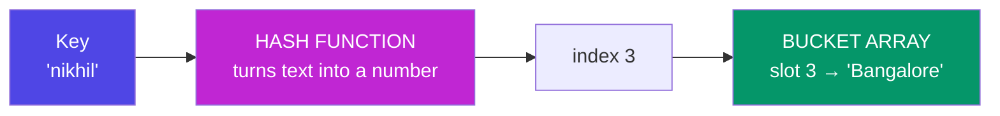

Underneath a hash map is just an **array**. A *hash function* converts your key into an array index:

```
  hash("nikhil")  →  8834721  →  8834721 % 8 buckets  →  index 1
  hash("varun")   →  4451102  →  4451102 % 8 buckets  →  index 6

   Buckets (an array!)
   0 │ ─
   1 │ ('nikhil', 'Bangalore')
   2 │ ─
   3 │ ─
   4 │ ─
   5 │ ─
   6 │ ('varun', 'Hyderabad')
   7 │ ─
```

Lookup by key = hash it, jump to the bucket. **No searching. O(1).**

**Collisions:** two different keys can hash to the same bucket. The fix (called *chaining*) is to store a small list in each bucket and scan it. With a good hash function collisions are rare, so lookup is **O(1) on average**, degrading to **O(n)** in the pathological worst case where everything collides.

### Big O

| Operation | Average | Worst |
| --- | --- | --- |
| Insert | **O(1)** | O(n) |
| Lookup by key | **O(1)** | O(n) |
| Delete | **O(1)** | O(n) |
| Search by *value* | O(n) | O(n) |

### Object vs Map in JavaScript

| | `{}` Object | `new Map()` |
| --- | --- | --- |
| Key types | Strings & symbols only | **Anything** — objects, functions, numbers |
| Order | Not guaranteed (integer keys sort first) | **Insertion order preserved** |
| Size | `Object.keys(o).length` — O(n) | `map.size` — O(1) |
| Iteration | Needs `Object.entries()` | Directly iterable |
| Prototype keys | Inherits `toString` etc. — collision risk | Clean |
| Use when | Simple string-keyed records, JSON | Frequent add/delete, non-string keys |

```js
// Object
const user = { name: 'Nikhil', city: 'Bangalore' };
user.name;                 // O(1)
user.age = 25;             // O(1)
delete user.city;          // O(1)
'name' in user;            // true

// Map
const m = new Map();
m.set('nikhil', 'Bangalore');   // O(1)
m.get('nikhil');                // O(1)
m.has('nikhil');                // O(1)
m.size;                         // O(1)
```

### The killer application: turning O(n²) into O(n)

**This is the most valuable single technique in coding interviews.**

```js
// ❌ O(n²) — for every element, scan the whole array again
function findDuplicatesSlow(arr) {
  const dupes = [];
  for (let i = 0; i < arr.length; i++) {
    for (let j = i + 1; j < arr.length; j++) {
      if (arr[i] === arr[j] && !dupes.includes(arr[i])) dupes.push(arr[i]);
    }
  }
  return dupes;
}

// ✅ O(n) — one pass, using a hash map as memory      [Roadmap Q2]
function findDuplicates(arr) {
  const seen = {};        // or new Set()
  const dupes = [];
  for (const item of arr) {
    if (seen[item]) {                      // O(1) lookup
      if (seen[item] === 1) dupes.push(item);
      seen[item]++;
    } else {
      seen[item] = 1;
    }
  }
  return dupes;
}

findDuplicates([1, 2, 3, 2, 4, 1, 5]);   // [2, 1]
```

On 10,000 items the first version does ~50 million comparisons; the second does 10,000. **Same output. Same language. 5,000× less work — because we swapped searching for remembering.**

**Real-world example:** A database **index** is a hash map (or a B-tree). `SELECT * FROM users WHERE email = ?` without an index scans all 10 million rows — O(n). With an index on `email`, it's a lookup — O(1)-ish. That is the entirety of what "add an index" means, and it's why your MySQL queries in Phase 9 will either take 3 ms or 30 seconds.

---

## F3. Set

**What:** A collection of **unique** values, with O(1) membership testing. A hash map that only keeps the keys.

<p class="te"><strong>Telugu:</strong> Set ante <strong>guest list</strong> — okkokkaru okka saare untaru, 'itanu list lo unnada?' ani O(1) lo chudochu. Duplicates thanantata poathayi. <code>[...new Set(arr)]</code> — array lo duplicates teeyadaniki JS lo ekkuva vaade line. Mukhyam: loop lopala <code>arr.includes(x)</code> (O(n²)) badulu <code>set.has(x)</code> (O(n)) vaadu.</p>

**Analogy:** A guest list. You only care *whether* someone is on it, and nobody appears twice.

```js
const s = new Set([1, 2, 2, 3, 3, 3]);
s;                    // Set(3) {1, 2, 3}   ← duplicates dropped automatically
s.has(2);             // true    O(1)
s.add(4);             //         O(1)
s.delete(1);          //         O(1)
s.size;               // 3       O(1)

// The one-line array deduplication every JS developer uses:
const unique = [...new Set([1, 2, 2, 3])];   // [1, 2, 3]   O(n)

// Compare: arr.includes(x) inside a loop is O(n²). Set.has(x) makes it O(n).
```

---

## F4. Stack (LIFO)

**What:** **Last In, First Out.** You may only add to the top and remove from the top.

<p class="te"><strong>Telugu:</strong> Stack ante <strong>plates gaddha</strong> — chivarana pettinadi modata teesukuntavu (Last In, First Out). <code>push</code> (paina pettu), <code>pop</code> (paina teesuko), <code>peek</code> (chudu matrame) — anni O(1), kaani madhyalo unna daanni muttalemu. Enduku ee structure? Closing bracket eppudu <strong>chivari</strong> opening bracket ki match avvali — 'chivari' ante LIFO ye. Nuvvu roju vaadedi: browser back button, Ctrl+Z, JS call stack.</p>

**Analogy:** A stack of plates. The last plate you put down is the first one you pick up. You cannot pull one from the middle without a disaster.

```
        push ↓        ↑ pop
              ┌─────┐
              │  C  │  ← top  (added last, leaves first)
              ├─────┤
              │  B  │
              ├─────┤
              │  A  │  ← bottom (added first, leaves last)
              └─────┘
```

### Implementation

```js
class Stack {
  #items = [];                                  // # = truly private field

  push(value) { this.#items.push(value); }      // O(1)  add to top
  pop()       { return this.#items.pop(); }     // O(1)  remove from top
  peek()      { return this.#items.at(-1); }    // O(1)  look, don't remove
  isEmpty()   { return this.#items.length === 0; }  // O(1)
  get size()  { return this.#items.length; }    // O(1)
}

const s = new Stack();
s.push('a'); s.push('b');
s.peek();      // 'b'
s.pop();       // 'b'
s.isEmpty();   // false
```

**Every operation is O(1).** That is a stack's entire selling point — but you cannot access the middle at all.

### Classic use: balanced parentheses  *(Roadmap Q1)*

```js
function isBalanced(str) {
  const stack = new Stack();
  const pairs = { ')': '(', ']': '[', '}': '{' };

  for (const ch of str) {
    if (ch === '(' || ch === '[' || ch === '{') {
      stack.push(ch);                             // an opener: remember it
    } else if (ch in pairs) {
      if (stack.pop() !== pairs[ch]) return false; // a closer: must match the most recent opener
    }
  }
  return stack.isEmpty();      // leftover openers → unbalanced
}

isBalanced("{[()]}");    // true
isBalanced("{[(])}");    // false  ← ']' closes but '(' was most recent
isBalanced("(((");       // false  ← stack not empty at the end
```

**Why a stack is the perfect tool:** a closing bracket must match **the most recent** unmatched opener. "Most recent" *is* LIFO. The data structure encodes the rule.

**Where you meet stacks:** the browser back button, Ctrl+Z undo, the JS call stack ([A2](#a2-ram-the-desk)), and nested HTML tag parsing (`<div>`…`</div>`). The call stack is why infinite recursion prints `Maximum call stack size exceeded` — you pushed frames until the stack region of RAM ran out.

---

## F5. Queue (FIFO)

**What:** **First In, First Out.** Add at the back, remove from the front. Fair.

<p class="te"><strong>Telugu:</strong> Queue ante <strong>ticket counter line</strong> — modata vachinavaadu modata veltadu (First In, First Out). Venaka add (enqueue), mundu nunchi teeyi (dequeue). <strong>Trap</strong>: <code>array.shift()</code> vaadithe migilina anni jaruguthayi — O(n); badulu <code>#front</code> pointer ni mundhuku jarupu — O(1). Nuvvu chuse chotlu: printer jobs, server requests, JS callback queue, BFS. Okka line lo: <strong>Stack = undo, Queue = nyayam</strong>.</p>

**Analogy:** The queue at a ticket counter. First person to arrive is first served. Cutting in is not allowed.

```
   dequeue ←  ┌─────┬─────┬─────┐  ← enqueue
   (front)    │  A  │  B  │  C  │     (rear)
              └─────┴─────┴─────┘
        A arrived first, so A leaves first.
```

### Implementation — and the trap in the naive version

```js
// The roadmap's simple version — correct, but note the cost
class Queue {
  #items = [];
  enqueue(v) { this.#items.push(v); }       // O(1)  add at rear
  dequeue()  { return this.#items.shift(); } // O(n)  ⚠️ every element shifts left!
  peek()     { return this.#items[0]; }      // O(1)
  isEmpty()  { return this.#items.length === 0; }
}
```

`Array.shift()` removes index 0, so **every remaining element must slide one place left** — O(n). On a queue of a million jobs, each dequeue touches a million elements. **The fix:** keep a `#front` pointer and just advance it (`this.#front++`) instead of shifting — O(1) — compacting the array occasionally. In production a queue is usually built on a [linked list](#f6-linked-list): O(1) at both ends, no shifting.

**Where you meet queues:** printer jobs, the JS callback queue ([E4](#e4-render-blocking-resources-and-the-event-loop)), a server's request queue, message brokers (Kafka, SAP Event Mesh), and BFS traversal. **In one line: Stack = undo, Queue = fairness.**

---

## F6. Linked List

**What:** A chain of **nodes**, each holding a value and a pointer to the next node. Unlike an array, nodes are scattered anywhere in RAM — the pointers hold the chain together.

<p class="te"><strong>Telugu:</strong> Linked list ante <strong>treasure hunt</strong> — prathi clue lo bahumati + tarvati clue address untundi. Nodes RAM lo ekkada padithe akkada untayi, pointers ne vaatini kalupuutayi. Andhuke 3rd item kaavali ante <strong>nadichi vellali</strong> (O(n)) — kaani madhyalo insert/delete ante <strong>rendu pointers maaristhe chaalu</strong> (O(1)), emi jaragadu. Array ki sarigga opposite trade-off. LRU cache = hash map + doubly linked list.</p>

**Analogy:** A treasure hunt. Each clue holds a prize *and* the location of the next clue. To reach clue #7 you must physically walk clues 1→2→…→7. But inserting a new clue between #3 and #4 costs nothing — you just rewrite two slips of paper.

```
   head
    │
    ▼
  ┌──────┬───┐   ┌──────┬───┐   ┌──────┬──────┐
  │  'a' │ ●─┼──▶│  'b' │ ●─┼──▶│  'c' │ null │
  └──────┴───┘   └──────┴───┘   └──────┴──────┘
   value  next    value  next    value   next

  Insert 'x' after 'a':  rewire two pointers. O(1). Nothing shifts.
  Find the 3rd element:  walk from head. O(n). No arithmetic shortcut.
```

### Array vs Linked List — the fundamental trade-off

| | **Array** | **Linked List** |
| --- | --- | --- |
| Memory layout | Contiguous block | Scattered nodes + pointers |
| Access by index | **O(1)** ✅ | O(n) ❌ |
| Insert/delete at front | O(n) ❌ | **O(1)** ✅ |
| Insert/delete at end | O(1) | O(1) *(with a tail pointer)* |
| Insert/delete in middle | O(n) | **O(1)** *(if you already hold the node)* |
| Extra memory | None | One pointer per node |
| Cache friendliness | **Excellent** (neighbours are adjacent) | Poor (jumps all over RAM) |

That last row matters more than beginners expect. Because of the [memory hierarchy](#a4-the-memory-hierarchy-the-full-picture), arrays are often *faster in practice* even where linked lists win on paper — the CPU pulls a whole cache line of neighbours in one go, while a linked list forces a fresh RAM trip per node.

### Implementation

```js
class Node {
  constructor(value) {
    this.value = value;
    this.next = null;
  }
}

class LinkedList {
  #head = null;
  #tail = null;
  #size = 0;

  append(value) {                     // O(1) — thanks to the tail pointer
    const node = new Node(value);
    if (!this.#head) this.#head = this.#tail = node;
    else { this.#tail.next = node; this.#tail = node; }
    this.#size++;
    return this;
  }

  prepend(value) {                    // O(1) ← the array's weakness is our strength
    const node = new Node(value);
    node.next = this.#head;
    this.#head = node;
    if (!this.#tail) this.#tail = node;
    this.#size++;
    return this;
  }

  find(value) {                       // O(n) — no index arithmetic possible
    let cur = this.#head;
    while (cur) {
      if (cur.value === value) return cur;
      cur = cur.next;
    }
    return null;
  }

  delete(value) {                     // O(n) to find, O(1) to unlink
    if (!this.#head) return false;
    if (this.#head.value === value) {
      this.#head = this.#head.next;
      this.#size--;
      return true;
    }
    let cur = this.#head;
    while (cur.next) {
      if (cur.next.value === value) {
        if (cur.next === this.#tail) this.#tail = cur;
        cur.next = cur.next.next;     // ← skip over it. That's the whole delete.
        this.#size--;
        return true;
      }
      cur = cur.next;
    }
    return false;
  }

  toArray() {
    const out = [];
    let cur = this.#head;
    while (cur) { out.push(cur.value); cur = cur.next; }
    return out;
  }

  get size() { return this.#size; }
}

const list = new LinkedList();
list.append('b').append('c').prepend('a');
list.toArray();    // ['a', 'b', 'c']
```

**Variants:** a **doubly linked list** adds a `prev` pointer (walk backwards; delete a node in true O(1)). A **circular** list points the tail back at the head.

**Real-world example:** An LRU cache (used by every CDN and by your browser) is a hash map + a doubly linked list. The map gives O(1) lookup; the list gives O(1) "move this item to the front" and O(1) "evict the last item." Neither structure alone can do both — combined, they are optimal. Spotify's "next song" queue and your browser's history are linked lists too.

---

## F7. Tree

**What:** A hierarchical structure. One **root**, and every node has exactly one parent and any number of children. No cycles.

<p class="te"><strong>Telugu:</strong> Tree ante <strong>vamshavruksham</strong> leda company org chart — okka root, prathi node ki okka parent, entha mandi children ayina. Nuvvu ippatike chusinav: DOM, file system (folders lopala folders), JSON, Git history. <strong>Binary Search Tree</strong> lo edamavaipu chinnadi, kudivaipu peddadi — andhuke prathi comparison <strong>sagam</strong> ni padesthundi (O(log n)): 10 lakshala nodes lo ~20 comparisons chaalu. Database index ante ide (B-tree).</p>

**Analogy:** A family tree, or a company org chart. Or — as you saw in [E2](#e2-the-dom) — the DOM.

```
                 ┌──────┐
                 │  10  │  root
                 └──┬───┘
            ┌───────┴───────┐
         ┌──▼──┐         ┌──▼──┐
         │  5  │         │  15 │        depth 1
         └──┬──┘         └──┬──┘
        ┌───┴───┐       ┌───┴───┐
     ┌──▼─┐  ┌──▼─┐  ┌──▼─┐  ┌──▼─┐
     │ 3  │  │ 7  │  │ 12 │  │ 18 │     depth 2 (leaves)
     └────┘  └────┘  └────┘  └────┘
```

**Binary Search Tree (BST):** a tree where, for every node, **everything on the left is smaller and everything on the right is larger**. That invariant means searching halves the problem at each step — **O(log n)**, exactly like looking up a word in a dictionary by opening the middle.

```js
function search(node, target) {
  if (!node) return null;
  if (target === node.value) return node;
  return target < node.value
    ? search(node.left, target)     // discard the entire right half
    : search(node.right, target);   // discard the entire left half
}
```

Searching a *balanced* BST of 1,000,000 nodes takes ~20 comparisons. Searching an unsorted array takes ~500,000.

**The catch:** insert `1,2,3,4,5` in order and the tree degenerates into a straight line — a linked list in disguise — and search collapses back to O(n). Self-balancing trees (AVL, Red-Black) rotate nodes to prevent this. Every real database index is a **B-tree**, a fat, shallow cousin optimised so that each level fits in one disk read.

**Where you meet trees:** the DOM · the file system (folders in folders) · MySQL indexes · JSON · React's virtual DOM · Git's commit history · your company's org chart in SAP HR.

---

## F8. Graph

**What:** Nodes (**vertices**) connected by **edges**. Unlike a tree, cycles are allowed and there is no root. A tree is just a graph with rules.

<p class="te"><strong>Telugu:</strong> Graph ante <strong>oorlu + roadlu</strong> — nodes (vertices) mariyu vaatini kalipe edges. Tree kanna free: cycles undochu, root akkarleadu. Facebook friendship (undirected), Twitter follow (directed). Rendu vidhaalu ga tiragachu: <strong>BFS</strong> (queue vaadutundi — level by level, shortest path, 'friends of friends'), <strong>DFS</strong> (stack/recursion — okka daari chivari varaku, cycle detection). <strong>Andhuke mundu Stack, Queue nerchukunnam</strong> — ivi graph traversal engines.</p>

**Analogy:** A map of cities and roads. Or a social network: people are nodes, friendships are edges.

```
     (Bangalore) ────── (Chennai)
          │    ╲            │
          │      ╲          │
     (Hyderabad) ─╲──── (Mumbai)
                    ╲      │
                     (Delhi)
```

- **Directed** (Twitter follows: A→B doesn't imply B→A) vs **undirected** (Facebook friendship).
- **Weighted** (roads with distances) vs unweighted.

**Two ways to walk a graph — and note which data structure each needs:**

| Traversal | Uses a… | Explores | Good for |
| --- | --- | --- | --- |
| **BFS** (breadth-first) | **Queue** | Level by level, nearest first | Shortest path (unweighted), "friends of friends" |
| **DFS** (depth-first) | **Stack** (or recursion) | One branch to the end, then backtrack | Cycle detection, maze solving, topological sort |

**That is why you learned Stack and Queue first.** They are not trivia; they are the engines of graph traversal.

**Real-world example:** Google Maps runs Dijkstra's algorithm (a weighted BFS) over a graph of road intersections. LinkedIn's "2nd-degree connection" is literally a BFS two levels deep. Your `npm install` builds a dependency graph and detects cycles with DFS.

---

## F9. Choosing the right structure

<p class="te"><strong>Telugu:</strong> 'Best' data structure ani okati ledu — <strong>e pani ekkuva chestunnavo</strong> daanni vegam cheyyi, migilinavi nemmadi ga unna parledu. Position tho kaavala → Array. Peru/id tho kaavala → Map. 'Idi chusana?' → Set. Undo/brackets → Stack. Varusa nyayam → Queue. Rendu chivarla add/delete → Linked list. Sorted + vega vetuku → Tree. Sambandhalu → Graph. Code nemmadi ga unte chaala saarlu kaaranam <strong>'tappu structure enchukunnanu'</strong> ye.</p>

| I need to… | Use | Why |
| --- | --- | --- |
| Access by position, iterate in order | **Array** | O(1) index, cache-friendly |
| Look something up by a name/id | **Object / Map** | O(1) by key |
| Check "have I seen this?" | **Set** | O(1) membership, auto-dedupe |
| Undo, back button, match brackets | **Stack** | LIFO is the rule you need |
| Process jobs fairly, in arrival order | **Queue** | FIFO is fairness |
| Insert/delete at the ends constantly | **Linked List** | O(1) ends, no shifting |
| Keep data sorted with fast search | **Tree (BST/B-tree)** | O(log n) search |
| Model relationships & connections | **Graph** | Nodes + edges |

### The master cheat-sheet

| Structure | Access | Search | Insert | Delete | Ordered? |
| --- | --- | --- | --- | --- | --- |
| **Array** | O(1) | O(n) | O(n) | O(n) | ✅ |
| **Hash Map / Object** | — | O(1)* | O(1)* | O(1)* | ❌ |
| **Set** | — | O(1)* | O(1)* | O(1)* | ❌ |
| **Stack** | O(n) | O(n) | **O(1)** | **O(1)** | LIFO |
| **Queue** | O(n) | O(n) | **O(1)** | **O(1)** | FIFO |
| **Linked List** | O(n) | O(n) | **O(1)**† | **O(1)**† | ✅ |
| **Balanced BST** | O(log n) | O(log n) | O(log n) | O(log n) | ✅ |

\* average case · † at a known position

> **Mindset takeaway:** When code is slow, the fix is almost never "write tighter loops." It is *"I chose the wrong data structure."* Ask: **what operation am I doing most often?** Optimise that one; happily let the others be slow.

---

# Part G — Big O Notation

## G1. The Idea

**Simple definition:** Big O describes **how the work grows as the input grows.** It answers exactly one question: *"If I give this code 10× more data, how much slower does it get?"*

<p class="te"><strong>Telugu:</strong> Big O ante <strong>data pergithe pani entha perugutundi</strong> ani cheppedi — millisekanlu kaadu. Phone book lo peru vetakadam: modati page chadavadam O(1), motham chadavadam O(n), madhyalo terichi sagam padeyyadam O(log n). Mudu rules: constants teesipadeyyi (O(2n)→O(n)), chinna terms teesipadeyyi (O(n²+n)→O(n²)), <strong>worst case</strong> anuko. Enduku intha crude ga? Appude adi <strong>machine tho sambandham lekunda</strong> future ni cheptundi.</p>

**Analogy — finding a name in a phone book of `n` names:**

| Strategy | Work | Big O |
| --- | --- | --- |
| Read the first page. Same effort no matter how thick the book. | 1 step | **O(1)** |
| Read every name from the start. | n steps | **O(n)** |
| Open the middle, throw away half, repeat. | ~20 steps for a million | **O(log n)** |
| For every name, compare it to every other name. | n² steps | **O(n²)** |

### The three rules that make it simple

Big O is deliberately crude. It cares only about the **shape of the growth curve**, not the exact numbers.

1. **Drop the constants.** `O(2n)` → `O(n)`. Two passes over the data still doubles when the data doubles.
2. **Drop the lower-order terms.** `O(n² + n)` → `O(n²)`. When `n` = 1,000,000, `n²` is a trillion and `n` is a rounding error.
3. **Assume the worst case.** `O(n)` for array search — because the item might be last, or absent.

**Why be so crude?** Because it makes the answer *machine-independent*. A fast laptop and a slow server disagree about milliseconds but agree perfectly that `O(n²)` collapses at scale. Big O predicts the future; benchmarks describe the present.

---

## G2. The Complexity Classes

<p class="te"><strong>Telugu:</strong> 10 lakshala items ki: O(1)=1 pani, O(log n)=20, O(n)=10 lakshalu, O(n log n)=2 kotlu, O(n²)=<strong>10 lakshala kotlu</strong>. Aa chivari line chudu — O(n) reppapaatulo aipotundi, O(n²) gantalu patti server chastundi. <strong>O(n) ki O(n²) ki madhya unna teda lone careers untayi.</strong> O(log n) ante prathi adugulo sagam padeyyadam (binary search); O(n log n) ante manchi sorting yokka speed limit.</p>

```
  ops
   ▲
   │  O(n²)                                    ╱
   │  quadratic                              ╱
   │                                       ╱
   │                                     ╱
   │                                   ╱
   │                                ╱        ╱ O(n log n)
   │                             ╱      ╱────
   │                          ╱   ╱────
   │                       ╱ ╱────            ╱ O(n)
   │                    ╱─────           ╱────
   │                ╱────         ╱──────
   │           ╱─────    ╱────────
   │      ╱─────  ╱──────                    ────────── O(log n)
   │ ╱────╱───────────────────────────────────────────  O(1)
   └────────────────────────────────────────────────────▶ n (input size)
```

| Big O | Name | 10 items | 1,000 items | 1,000,000 items | Example |
| --- | --- | --- | --- | --- | --- |
| **O(1)** | Constant | 1 | 1 | 1 | `arr[0]`, `map.get(k)`, `stack.push()` |
| **O(log n)** | Logarithmic | 3 | 10 | 20 | Binary search, balanced BST lookup |
| **O(n)** | Linear | 10 | 1,000 | 1,000,000 | One loop, `arr.includes()` |
| **O(n log n)** | Linearithmic | 33 | 10,000 | 20,000,000 | **All good sorts** — `arr.sort()`, mergesort |
| **O(n²)** | Quadratic | 100 | 1,000,000 | 1,000,000,000,000 | Nested loop over the same array |
| **O(2ⁿ)** | Exponential | 1,024 | *heat death* | — | Naive recursive Fibonacci |
| **O(n!)** | Factorial | 3.6 million | — | — | Brute-force travelling salesman |

**Read the `1,000,000` column and let it land.** O(n) finishes in a blink. O(n²) needs a *trillion* operations — hours, if it finishes at all. This is the difference between a page that loads and a page that times out. **The gap between O(n) and O(n²) is where careers are made.**

### Each class, with code

**O(1) — Constant.** Input size is irrelevant.
```js
function first(arr) { return arr[0]; }          // 1 element or 1 billion: same cost
function isEven(n)  { return (n & 1) === 0; }
```

**O(log n) — Logarithmic.** Each step *halves* the remaining problem. The hallmark: dividing by 2.
```js
function binarySearch(sortedArr, target) {       // requires a SORTED array
  let lo = 0, hi = sortedArr.length - 1;
  while (lo <= hi) {
    const mid = Math.floor((lo + hi) / 2);
    if (sortedArr[mid] === target) return mid;
    if (sortedArr[mid] < target) lo = mid + 1;   // throw away the left half
    else                         hi = mid - 1;   // throw away the right half
  }
  return -1;
}
// 1,000,000 items → at most 20 checks. Halving is that powerful.
```

**O(n) — Linear.** Touch each element once.
```js
function sum(arr) {
  let total = 0;
  for (const x of arr) total += x;               // n iterations
  return total;
}
// Two separate loops is O(2n) = O(n). Still linear.
```

**O(n log n) — Linearithmic.** Do an O(log n) amount of work for each of n elements. **This is the speed limit for comparison sorting** — no sort can beat it.
```js
arr.sort((a, b) => a - b);   // V8 uses TimSort: O(n log n)
```

**O(n²) — Quadratic.** A loop inside a loop over the same data. **The red flag to hunt for.**
```js
function hasDuplicate(arr) {
  for (let i = 0; i < arr.length; i++)           // n
    for (let j = i + 1; j < arr.length; j++)     // × n
      if (arr[i] === arr[j]) return true;
  return false;
}
// Fix with a Set → O(n):
const hasDup = arr => new Set(arr).size !== arr.length;
```

**O(2ⁿ) — Exponential.** Each call spawns two more.
```js
function fib(n) {                                 // fib(50) ≈ 1 quadrillion calls
  if (n <= 1) return n;
  return fib(n - 1) + fib(n - 2);                 // 2 branches, depth n
}

// Fix with memoization (a hash map!) → O(n)
function fibFast(n, memo = {}) {
  if (n <= 1) return n;
  if (n in memo) return memo[n];                  // O(1) lookup kills the re-work
  return memo[n] = fibFast(n - 1, memo) + fibFast(n - 2, memo);
}
```

---

## G3. How to analyse any code

Four mechanical rules. No maths degree needed.

<p class="te"><strong>Telugu:</strong> Naalugu rules chaalu: (1) <strong>Varusa</strong> steps aithe kalupu, peddadi unchu. (2) <strong>Lopala loop</strong> aithe <strong>hecchinchu</strong> (n × n). (3) <strong>Dagina loops</strong> ni marchipoku — <code>includes()</code>, <code>indexOf()</code>, <code>find()</code> ivi thamaku thame O(n); loop lopala pedithe O(n²) avutundi (ide ekkuva mandi chese tappu). (4) Input <strong>sagam</strong> avutunte log n vastundi. Jagratha: rendu <strong>veru</strong> arrays meeda nested loops O(a×b), O(n²) kaadu.</p>

**1. Sequential steps → ADD, then keep the biggest.**
```js
function f(arr) {
  for (const x of arr) console.log(x);   // O(n)
  for (const y of arr) console.log(y);   // O(n)
}                                        // O(n) + O(n) = O(2n) → O(n)
```

**2. Nested loops → MULTIPLY.**
```js
function f(arr) {
  for (const x of arr)                   // n  ┐
    for (const y of arr)                 // ×n │ → O(n²)
      console.log(x, y);                 //    ┘
}
```
⚠️ **But watch the collections.** Two *different* inputs give `O(a × b)`, **not** `O(n²)`:
```js
for (const u of users)          // a
  for (const p of products)     // × b   → O(a·b). Saying O(n²) here is wrong.
    match(u, p);
```

**3. Hidden loops count.** Library calls are not free — this is the most common analysis mistake.
```js
// ❌ Looks like one loop. Is actually O(n²).
function dedupe(arr) {
  const out = [];
  for (const x of arr)            // O(n)
    if (!out.includes(x))         // ← includes() is O(n) itself!
      out.push(x);
  return out;                     // O(n) × O(n) = O(n²)
}

// ✅ O(n): swap the O(n) scan for an O(1) lookup
function dedupeFast(arr) {
  const seen = new Set();
  const out = [];
  for (const x of arr) {
    if (!seen.has(x)) { seen.add(x); out.push(x); }   // O(1)
  }
  return out;
}
```
Know the hidden costs: `.includes()`, `.indexOf()`, `.find()`, `.filter()`, `.some()` are **O(n)**. `.sort()` is **O(n log n)**. `.shift()`/`.unshift()` are **O(n)**. `Set.has()`/`Map.get()` are **O(1)**.

**4. Halving the input → `log n` appears.**
```js
while (n > 1) n = Math.floor(n / 2);    // O(log n)
```

### The 5-second checklist for any function

1. What is `n`? (Name the input that grows.)
2. How many times is the innermost line executed, in terms of `n`?
3. Are there nested loops over the same input? → likely `O(n²)`.
4. Any library call inside a loop? → look up *its* Big O and multiply.
5. Drop constants and lower-order terms. Done.

---

## G4. Space Complexity

Same idea, measuring **extra memory** instead of time. Input doesn't count — only what you allocate.

<p class="te"><strong>Telugu:</strong> Ide lekka, kaani <strong>extra memory</strong> ki. Konni variables matrame vaadithe O(1); kotta array thayaru chesthe O(n). Mukhyam: <strong>recursion ki kuda space avutundi</strong> — prathi call oka stack frame — andhuke O(n). Prapanchamlo peddha trade-off idi: <strong>space ichi time konukkovachu</strong> — hash map, memoization, database index, cache, CDN anni ide okate vyaparam, veru veru scale lo.</p>

```js
// O(1) space — a couple of variables, regardless of input size
function sum(arr) {
  let total = 0;                    // 1 variable
  for (const x of arr) total += x;
  return total;
}

// O(n) space — a new structure that grows with the input
function doubled(arr) {
  return arr.map(x => x * 2);       // a whole new array of size n
}

// O(n) space — recursion stores n stack frames! Recursion is never free.
function countdown(n) {
  if (n === 0) return;
  countdown(n - 1);                 // n frames on the call stack
}
```

**The universal trade-off:** you can nearly always buy time with space. `findDuplicates` used O(n) extra memory (the hash map) to turn O(n²) time into O(n). Memoized `fib` stores n results to escape exponential time. **Caching, indexes, and CDNs are all this one trade, at different scales.**

---

## G5. Amortized Analysis

Why is `arr.push()` "O(1)" when a dynamic array must sometimes grow?

<p class="te"><strong>Telugu:</strong> <code>arr.push()</code> O(1) ela avutundi, array nindipothe pedda chesi copy cheyyali kada? Enduku ante nindinappudu <strong>rettimpu</strong> (double) chesi copy chestundi — adi O(n), kaani <strong>chaala arudu ga</strong> jarugutundi. Aa okka pedda kharchu ni migilina anni chinna pushes meeda panchithe, sagatuna okko push O(1). Deenini <strong>amortized O(1)</strong> antaru — 'eppudu vegam' kaadu, 'sagatuna vegam'. Inti addelaage: nelaki okasari peddha payment, kaani rojuvaari budget lo samanam.</p>

Because when the array fills, the engine allocates a **double-sized** block and copies everything over — a genuine O(n) operation. But it happens rarely: after doubling, the next n/2 pushes are free.

```
  capacity 4, full  →  push  →  allocate 8, copy 4 items   (O(n), once)
  capacity 8        →  push, push, push, push               (O(1) each)
  capacity 8, full  →  push  →  allocate 16, copy 8 items   (O(n), once)
```

Spread the expensive copies across all the cheap pushes and the **average cost per push is constant**. That is **amortized O(1)** — not "always fast," but "fast on average, guaranteed over time."

**Analogy:** Rent is a big payment once a month, but you budget it as a daily cost. Any single day might be "rent day," yet your average daily expense is stable.

The same reasoning gives hash maps their O(1): occasionally the table must be resized and every key rehashed, but amortized over all insertions it's constant.

---

# Part H — The Everyday Mindset

### 1. The one analogy that covers everything

**A computer is a kitchen. The internet is the postal service. Data structures are how you organise the pantry. Big O is how the recipe scales when 500 guests arrive instead of 5.**

If you can hold that sentence, you can re-derive most of this document.

### 2. The five questions that unlock any performance problem

When something is slow, ask, in this order:

1. **Am I moving data further than I need to?** (Disk when RAM would do. Network when cache would do.) — [Part A](#a4-the-memory-hierarchy-the-full-picture)
2. **Am I doing work inside a loop that could be done once outside it?** — [Part G](#g3-how-to-analyse-any-code)
3. **Did I pick the wrong data structure?** (Searching an array where a hash map belongs.) — [Part F](#f9-choosing-the-right-structure)
4. **Am I blocking the only thread I have?** — [Part B](#b2-process-vs-thread), [E4](#e4-render-blocking-resources-and-the-event-loop)
5. **Am I forcing a reflow when a composite would do?** — [E3](#e3-reflow-and-repaint)

Ninety percent of real-world performance bugs are one of these five, and none of them require you to be clever. They require you to know *what the machine actually does.*

### 3. The rule that outranks all the others

> **Make it work → make it right → make it fast. In that order, always.**

Big O is a tool for spotting the *catastrophic* choice (an O(n²) loop that will die at 10,000 users) — not an excuse to micro-optimise a loop that runs three times. **Premature optimisation wastes the one resource you can't buy back: your attention.**

The single question worth asking before optimising anything: *"How big will `n` actually get?"* For `n = 20`, bubble sort is fine and unreadable cleverness is a liability. For `n = 20,000,000`, the difference between O(n) and O(n²) is the difference between shipping and being fired.

### 4. Habits that make this permanent

- **Open DevTools → Network on every site you visit for a week.** Watch the DNS time, the TLS time, the waterfall. Networking stops being abstract in about four days.
- **Guess the Big O before you write the loop.** Out loud. Then check yourself.
- **When you hit a bug, name the layer.** Is this a DNS problem, a TCP problem, an HTTP problem, or an application problem? Naming the layer usually names the fix.
- **Teach one concept a day to an imaginary beginner (the Feynman test).** If you stumble, you found the gap. The OSI model and TCP-vs-UDP are the two you will stumble on first — that is normal, and it is why they are the two most-asked questions.
- **Write the code by hand once.** You will never truly own `Stack` until you have written `push`, `pop`, and `peek` yourself without looking.

### 5. What this phase cannot do for you

It cannot make you a good programmer by itself. It makes you a programmer who **cannot be bluffed** — by a framework, by a slow query, by an interviewer, or by your own code. Everything after this phase (JavaScript, React, Node, MySQL, ABAP, HANA) becomes an application of what you just learned rather than a fresh mystery.

**The connections you will feel later:**

| Later in the roadmap | Comes straight from |
| --- | --- |
| Phase 5 — the JS event loop, closures on the heap | [B2](#b2-process-vs-thread), [E4](#e4-render-blocking-resources-and-the-event-loop), [A2](#a2-ram-the-desk) |
| Phase 6 — React's virtual DOM & `key` prop | [E1](#e1-the-rendering-pipeline), [E2](#e2-the-dom), [F7](#f7-tree) |
| Phase 7 — why Node is "non-blocking" | [B2](#b2-process-vs-thread), [B3](#b3-concurrency-vs-parallelism) |
| Phase 8 — REST verbs, status codes, JWT, CORS | [C6](#c6-http-the-language-of-the-web), [C7](#c7-https-ssl-and-tls) |
| Phase 9 — why you add a MySQL index | [F2](#f2-object-hash-map), [F7](#f7-tree), [Part G](#part-g-big-o-notation) |
| Phase 10 — why Docker isn't a virtual machine | [B1](#b1-what-an-os-actually-does) |
| Phase 11 — caching, CDNs, load balancers | [A4](#a4-the-memory-hierarchy-the-full-picture), [Part D](#part-d-what-happens-when-you-type-googlecom) |
| SAP — why HANA is fast; `SELECT` inside `LOOP` | [A3](#a3-storage-the-filing-cabinet), [A4](#a4-the-memory-hierarchy-the-full-picture), [Part G](#part-g-big-o-notation) |

---

# Part I — Exercises and Deliverables

*Do these at a keyboard, not on paper. Evidence beats theory.*

### Day 1 — How computers work + the internet

1. **Binary & hex by hand.** Convert `7`, `42`, `100`, `255` to binary (check with `(n).toString(2)`), then `1010` and `11111111` back to decimal, then `255` and `171` to hex. Explain why `#FF5733` is orange, in bytes.
2. **Write `toBinary(n)` from memory** ([A5](#a5-binary-why-0s-and-1s)), then extend it to `toBase(n, base)` for 2, 8, 16.
3. **Find your IPs.** Run `ipconfig` — note your private IP; visit *whatismyip.com* — note the public one. Why do they differ?
4. **Watch the network.** Run `nslookup google.com` (twice — why is the second faster?) and `tracert google.com` (count the hops, watch latency climb as packets leave the country).
5. **DevTools archaeology.** Any site → DevTools → Network → reload. Find: the first request's status code, one `304`, the slowest resource, and the HTML's `Content-Type`.
6. **Processes are real.** Open Task Manager, find Chrome, count its separate processes, and say why in one sentence ([B2](#b2-process-vs-thread)).

### Day 2 — Browser, data structures, Big O

7. **The story.** Write "what happens when I type google.com" from memory (~300 words), *then* compare to [Part D](#part-d-what-happens-when-you-type-googlecom). Don't skip this — it's the interview question.
8. **Draw the rendering pipeline** from memory: HTML → ? → ? → ? → pixels. Label where `display:none` drops out and where `transform` skips to.
9. **Implement `Stack`** (`push`, `pop`, `peek`, `isEmpty`, `size`, Big-O comment each), then use it to validate balanced parentheses: `{[()]}` → true, `{[(])}` → false. *(Roadmap Q1)*
10. **Implement `Queue`** (naive `shift()` then the O(1) pointer version — time both on 100,000 items).
11. **Find duplicates in O(n)** with a `Set`, then write the O(n²) version and time both on 20,000 numbers. *(Roadmap Q2)*
12. **Implement `LinkedList`** (`append`, `prepend`, `find`, `delete`) and **`HashMap`** (bucket array + `hash()` + chaining). The HashMap one makes hash maps stop being magic.
13. **Big O drill.** Give the complexity and why:
    ```js
    // a
    for (let i=0;i<n;i++) log(i);
    // b
    for (let i=0;i<n;i++) for (let j=0;j<n;j++) log(i,j);
    // c
    for (let i=1;i<n;i*=2) log(i);
    // d
    for (const x of arr) if (other.includes(x)) log(x);
    // e
    function f(n){ if(n<=1) return n; return f(n-1)+f(n-2); }
    ```
    *(a) O(n) b) O(n²) c) O(log n) d) O(n·m) — `includes` is a hidden loop e) O(2ⁿ). Then rewrite (d) to O(n+m) with a `Set`.)*
14. **Feynman test.** Explain to a non-technical person in under 90 seconds each: TCP vs UDP *(Roadmap Q4)*, why `https` matters, and what Big O measures. Jargon = start again. Plus: recite the 7 OSI layers with the mnemonic *(Roadmap Q3)*.

### Mini projects (pick at least two)

1. **DS Toybox** — Vanilla JS classes for `Stack`, `Queue`, `HashMap`, `LinkedList`, with a Big-O comment on every method and a small test file. Push to GitHub with a README explaining when to use each. *This is a portfolio piece — it proves fundamentals to interviewers in ten seconds.*
2. **Browser Trace** — A one-page Markdown doc: *"What happens when I type google.com"* covering DNS → TCP → TLS → HTTP → render pipeline. Include a hand-drawn diagram (photograph it). Hand-drawing forces recall in a way typing does not.
3. **Number System Playground** — An HTML + JS tool converting between decimal, binary, hex, and octal, live as you type. Show the *algorithm* on hover (the divide-by-2 remainder trail). No `toString(2)` — implement the conversion yourself.

### Deliverables checklist

- [ ] Binary/hex conversion table written into your own notes
- [ ] "Browser to server" flow diagram drawn by hand
- [ ] `Stack`, `Queue`, `HashMap` implemented in JS and pushed to GitHub
- [ ] Notes doc: one paragraph, in your own words, per major concept
- [ ] Can answer all four roadmap practice questions out loud, unprompted
- [ ] Can tell the google.com story in five minutes without notes

---

# Part J — Q&A: The 26 That Matter

*Cover the answer, recall it, then check. These are the questions interviewers actually ask and the ideas the rest of the roadmap leans on. (Every concept has fuller treatment in its section above.)*

**Q1: What are the three things every computer does, and the one loop the CPU runs?**
A: Calculate (CPU), remember for now (RAM), remember for later (Storage). The CPU loop: fetch → decode → execute → write back, billions of times a second.

**Q2: RAM vs Storage — one line each.**
A: RAM is fast, small, volatile (wiped on power-off) — where running programs live. Storage is slow, large, persistent — where files live between sessions.

**Q3: Roughly how much slower is a network call than a RAM read, and why does it matter?**
A: ~500,000× slower (RAM ~100 ns, cross-continent round trip ~200 ms). It's why caching, CDNs, and database indexes exist, and why one API call inside a loop can kill an app.

**Q4: Why is SAP HANA fast?**
A: It keeps the whole database in RAM instead of on disk, removing the ~1,000× storage penalty. It still logs to disk so a power cut doesn't lose data.

**Q5: Convert 42 to binary, and say why a byte maxes at 255.**
A: Divide by 2, read remainders upward → `101010` (32+8+2). A byte is 8 bits → 2⁸ = 256 values → 0–255. Same reason RGB channels and IPv4 octets stop at 255.

**Q6: Why does hex exist if binary works?**
A: Readability — one hex digit = exactly 4 bits, so `11111111` becomes `FF`. Colours, memory addresses, and MAC addresses all use it.

**Q7: Process vs thread, with the trade-off.**
A: A process is a running program with its own private memory (isolated, safe, heavy). A thread runs inside a process and shares its memory with siblings (cheap, fast to communicate — but race-condition prone). Separate restaurants vs chefs in one kitchen.

**Q8: Concurrency vs parallelism?**
A: Concurrency is *dealing with* many tasks at once (one core switching fast); parallelism is *doing* many at once (multiple cores). One chef juggling three pans vs three chefs. `async/await` is concurrency, not parallelism.

**Q9: What is a race condition, and how do you fix it?**
A: Two threads read-modify-write shared data concurrently and the result depends on timing (two withdrawals both read ₹100, both write ₹50, ₹50 vanishes). Fixed with a lock/mutex — the same reason SAP has ENQUEUE lock objects.

**Q10: Why is Node.js single-threaded, and when does that hurt?**
A: Most server work is *waiting* on I/O, so one thread plus an event loop handles thousands of connections cheaply. It hurts on CPU-heavy work, which blocks every user; the fix is worker threads or clustering.

**Q11: Explain DNS in one sentence, then the lookup order.**
A: DNS translates domain names into IP addresses. Order: browser cache → OS cache/hosts file → recursive resolver → root → TLD (`.com`) → authoritative nameserver → answer, cached everywhere for its TTL.

**Q12: TCP vs UDP, and when would you choose UDP?**
A: TCP is connection-based, reliable, ordered (handshake + acknowledgements + retransmission). UDP is connectionless, fast, lossy (fire and forget). Choose UDP when *late data is worse than lost data* — video calls, live streaming, gaming, DNS. TCP for correctness, UDP for timeliness.

**Q13: What is a port, and name five.**
A: A 16-bit number identifying *which program* on a machine gets the packets. 80 HTTP, 443 HTTPS, 22 SSH, 53 DNS, 3306 MySQL.

**Q14: What does "HTTP is stateless" mean, and what does it force?**
A: The server remembers nothing between requests, so each request must carry its own identity — which is why cookies, sessions, and JWTs exist.

**Q15: GET/POST/PUT/PATCH, and what does idempotent mean?**
A: GET reads, POST creates, PUT replaces the whole resource, PATCH modifies part. Idempotent = doing it N times equals doing it once (DELETE twice → still deleted; POST twice → two records — which is why double-clicking "Pay" can charge you twice).

**Q16: What do the status-code families mean, and 401 vs 403?**
A: 2xx success, 3xx redirect, 4xx your bad request, 5xx server failure. 401 = "I don't know who you are" (log in); 403 = "I know who you are and you're not allowed."

**Q17: What three things does HTTPS give you, and why both key types?**
A: Encryption, integrity, authentication. TLS uses slow asymmetric (public/private key) encryption once to agree a fast symmetric session key, then symmetric for the data. A certificate, signed by a trusted CA, proves the public key belongs to that domain.

**Q18: List the OSI layers with one protocol each.**
A: 7 Application–HTTP, 6 Presentation–TLS, 5 Session–sockets, 4 Transport–TCP/UDP, 3 Network–IP, 2 Data Link–Ethernet, 1 Physical–cable. *All People Seem To Need Data Processing.*

**Q19: Name the rendering pipeline, and `display:none` vs `visibility:hidden`.**
A: HTML→DOM, CSS→CSSOM, Render Tree, Layout, Paint, Composite. `display:none` is removed from the render tree (no space); `visibility:hidden` stays in it (reserves space, just unpainted).

**Q20: What is the DOM, and which CSS properties are cheap to animate?**
A: The live, in-memory object tree the browser builds from the HTML text — the API JavaScript uses to change the page. Animate `transform` and `opacity` only; they skip layout and paint and go straight to GPU compositing.

**Q21: How does a hash map get O(1) lookup, and what's its killer use?**
A: A hash function turns the key into an array index, so you jump straight to the bucket instead of searching. It turns O(n²) nested-loop problems (find duplicates, two-sum) into O(n) by swapping a search for a lookup.

**Q22: Stack vs Queue, with one use each.**
A: Stack is LIFO — undo, back button, the call stack, bracket matching. Queue is FIFO — printer jobs, request handling, the event loop, BFS.

**Q23: When is a linked list better than an array?**
A: When you constantly insert/delete at the ends or at a node you already hold — O(1) with no shifting. Arrays still win for indexed access (O(1)) and cache locality.

**Q24: What does Big O measure, and the three rules?**
A: How work grows as input grows (not milliseconds). Drop constants, drop lower-order terms, assume the worst case. Order: O(1) < O(log n) < O(n) < O(n log n) < O(n²) < O(2ⁿ).

**Q25: `arr.includes(x)` inside a loop over `arr` — complexity, and the fix?**
A: O(n²), because `includes()` is itself an O(n) scan (a hidden loop). Swap it for a `Set` to get O(n). Also: `arr.push()` is *amortized* O(1) — growing doubles capacity and copies, but rarely, so the average stays constant.

**Q26: Git vs GitHub, and Git's three areas?**
A: Git is version-control software on your machine (offline); GitHub is a website hosting Git repos (camera vs Instagram). Three areas: working directory (edited files) → staging area (`git add`) → local repository (`git commit`), then `git push` to the remote.

---

# Part L — Appendix: Developer Environment & Web Basics

*Parts A–G explain how the machine and network work. This appendix covers the layer you sit in front of daily: the vocabulary and tools between "I wrote a file" and "someone sees it live." (Programming fundamentals — variables, loops, functions — are Phase 4, where you'll learn them by writing them.)*

---

## L1. Hardware vs Software

<p class="te"><strong>Telugu:</strong> <strong>Hardware</strong> = mutukune vastuvulu (CPU, RAM, SSD) — kinda paditha kaalu meeda padutundi. <strong>Software</strong> = aa hardware ki emi cheyyalo cheppe soochanalu — roopam ledu, kevalam binary. <strong>Firmware</strong> = madhyalo unnadi: chip meedane shaswatam ga unna software (BIOS, router OS). Analogy: hardware = piano, software = sheet music — piano entha paatalaina vaayinchagaladu, kaani music cheppe varaku emi cheyyadu.</p>

- **Hardware** — the physical parts you can touch: CPU, RAM, SSD, network card.
- **Software** — the instructions telling the hardware what to do; no physical form, just patterns of [binary](#a5-binary-why-0s-and-1s).
- **Firmware** — the confusing middle: software permanently stored *on* a chip (BIOS/UEFI, your router's OS).

**Analogy:** Hardware is the piano; software is the sheet music. The piano does nothing until the music tells it which keys to strike — which is what installing a program is.

| | Hardware | Software |
| --- | --- | --- |
| Physical? | Yes | No — it's data |
| Fails by | Age, heat, mechanical failure | Bugs, obsolescence ("rots") |
| Fixed by | Replacing the part | Rewriting instructions |
| Examples | CPU, RAM, SSD, router | Windows, Chrome, your JavaScript |

The stack, bottom to top: **Hardware → Firmware → Operating System → Application software → You.**

> **Takeaway:** every "software" action becomes a hardware event — a voltage on a wire. Your code is a very elaborate way of arranging electricity.

---

## L2. Network Basics — LAN, WAN, MAC, and the boxes on your wall

[Part C](#part-c-how-the-internet-works) explained how data *travels*; this names the equipment.

<p class="te"><strong>Telugu:</strong> <strong>LAN</strong> = okka building lopala (mee inti WiFi); <strong>WAN</strong> = ooru/desam dhaatinadi; <strong>Internet</strong> = anni networks kalisina <strong>network of networks</strong>, anni IP bhasha matladutunnayi. <strong>MAC address</strong> = manufacturer icchina shaswatha peru (Layer 2, local); <strong>IP address</strong> = nuvvu join ayina network icchina chirunama (Layer 3, global). IP packet ni <strong>sarina building</strong> ki teesukellutundi, MAC <strong>sarina flat</strong> ki icchestundi. Boxes: <strong>modem</strong> (ISP signal → digital), <strong>router</strong> (LAN ↔ internet, IP chusedi), <strong>switch</strong> (LAN lopala, MAC chusedi) — mee inti box lo ee mudu okate lo untayi.</p>

**Networks by size:** **LAN** (Local — one building, your home WiFi) · **WAN** (Wide — cities/countries, a company's global offices) · **the Internet** (the largest WAN). The definition worth memorising: **the internet is a network *of networks*, all speaking IP.** A LAN is the roads inside a gated community; a WAN is the national highway system; the internet is every road on Earth using the same traffic rules.

### MAC address vs IP address

| | **MAC address** | **IP address** |
| --- | --- | --- |
| Looks like | `00:1B:44:11:3A:B7` (hex) | `192.168.1.7` |
| Assigned by | Manufacturer, burned into the card | The network you join (DHCP) |
| Changes? | Never (physical) | Every new network |
| Scope / OSI layer | Local, Layer 2 | Global, Layer 3 |
| Analogy | Your **name** (permanent) | Your **current address** (how post finds you) |

The IP gets a packet to the right *network* (building); the MAC delivers it to the right *device* (flat). The lookup between them is **ARP**.

### Modem vs Router vs Switch

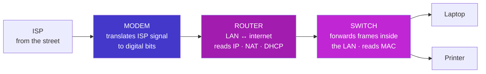

- **Modem** — **mod**ulate/**dem**odulate: converts the ISP's signal to digital bits and back (Layer 1). The border translator.
- **Router** — connects two *different* networks (LAN ↔ internet), reads **IP**, runs NAT + DHCP (Layer 3). The post office routing between cities.
- **Switch** — connects devices *within one* network, reads **MAC**, forwards each frame to the right port (Layer 2). The building's mail room.

**The box on your wall is all three in one** — which is why the words get muddled. In a data centre they're separate machines.

---

## L3. The Client-Server Model

**One machine (client) requests; another (server) responds.** That pairing underpins nearly the whole internet.

<p class="te"><strong>Telugu:</strong> <strong>Client</strong> adugutundi, <strong>server</strong> istundi — internet antha deenimeedane nadustundi. Hotel laaga: nuvvu vantillu loki velli vandavu; waiter ki cheppu, vantillu (server) chesi pampistundi. Mukhyam: <strong>okka server, vandala clients</strong>. Client <strong>modalu pedutundi</strong>, server <strong>edurchusthu untundi</strong> — <code>npm start</code> chesthe nee laptop kuda server ye. <strong>Website</strong> = content (files), <strong>web server</strong> = vaatini HTTP tho ichedi, <strong>browser</strong> = adigi chupinchedi — pustakam, library, chadive vaadu.</p>

**Analogy:** a restaurant. You (client) don't cook — you ask the waiter; the kitchen (server) prepares it; the response returns to your table. And the kitchen serves hundreds of tables at once: **one server, many clients.**

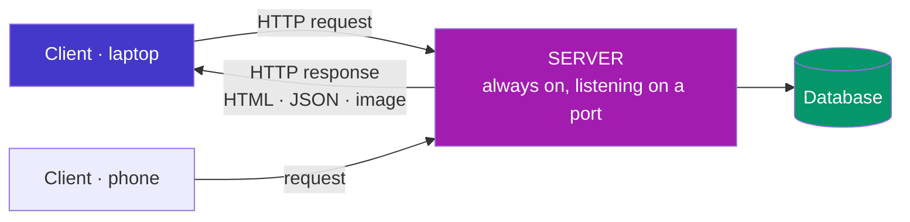

The defining asymmetry: the client *initiates*, the server *waits*. A server is an ordinary computer that never sleeps and listens on a [port](#c5-ports). Your laptop becomes one the moment you run `npm start` on port 3000. (The alternative is **peer-to-peer** — BitTorrent, blockchains — where every machine is both.)

**Website vs web server vs web browser** — three different kinds of thing: the **website** is the content (files); the **web server** is the software/machine that stores and serves them over HTTP; the **browser** is the client that requests and renders them. The book, the library, and the reader.

---

## L4. Servers, Frontend vs Backend, Hosting

### Frontend vs Backend — the most important vocabulary split in your career

<p class="te"><strong>Telugu:</strong> <strong>Frontend</strong> = user browser lo nadichedi (HTML, CSS, JS, React) — kanipinchedi. <strong>Backend</strong> = server lo nadichedi (Node, Java, ABAP) — auth, database, business rules. Peddha rule: <strong>frontend ni eppudu nammaku</strong> — evaraina DevTools terichi nee JS ni teesesi API ki nerugga <code>curl</code> tho pampagalaru; <strong>mukhyamaina prathi check ni backend lo malli cheyyali</strong>. Deployment ante code ni laptop nunchi andariki andubatu lo unna machine ki teesukelladam: server → code → run → DNS → TLS certificate → reverse proxy (Nginx).</p>

| | **Frontend** (client-side) | **Backend** (server-side) |
| --- | --- | --- |
| Runs on | The user's browser | Your server |
| Languages | HTML, CSS, JavaScript, React | Node.js, Python, Java, ABAP |
| Handles | Layout, clicks, what you *see* | Auth, payments, database, business rules |
| Visible to users | **Entirely** (View Source) | Never |
| You'll learn in | Phases 4–6 | Phases 7–9 |

**Why "never trust the frontend":** browser validation (`required`, `maxlength`) is a convenience for honest users. Anyone can open DevTools, delete your JS, and hit your API directly with `curl`. **Every check that matters must be repeated on the backend.** (You'll feel this in Phase 8.) *Full-stack* just means both sides.

### Web server software & the reverse-proxy pattern

**Apache** (classic, thread-per-connection), **Nginx** (event-driven — the [event-loop](#e4-render-blocking-resources-and-the-event-loop) idea — great for static files and as a reverse proxy), and **Node.js** (not a server but a runtime that lets *your JavaScript* be the server). Real deployments look like this:

```
  Internet ──443──▶  Nginx  ──3000──▶  Node.js app  ──3306──▶  MySQL
                 (TLS, static files)   (your routes)     (database)
```

Nginx handles the boring high-volume work; Node holds your logic — both on few threads, for the [concurrency-not-parallelism](#b3-concurrency-vs-parallelism) reason.

### Hosting & deployment

**Deployment** moves your code from laptop to a public machine; **hosting** is paying for that machine. The steps every time: get a server → get code onto it (`git pull`) → run it durably (pm2/Docker) → point a [DNS A record](#c3-dns-the-internets-phone-book) at its IP → add a TLS certificate → front it with a reverse proxy.

| Type | You manage | Examples |
| --- | --- | --- |
| **Static** | Nothing — upload files | Netlify, Vercel, GitHub Pages |
| **PaaS** | Your code only | Render, Railway, **SAP BTP** |
| **IaaS** | The whole OS | **AWS EC2** (Phase 10) |
| **Serverless** | One function | AWS Lambda |

Your Phase 10 capstone uses three at once: static frontend, Node API on EC2 behind Nginx, MySQL database.

---

## L5. Files, Directories, and Paths

The file system is a [Tree](#f7-tree) — the same shape as the [DOM](#e2-the-dom). A **directory** is a node containing others; a **file** is a leaf.

<p class="te"><strong>Telugu:</strong> File system kuda okka <strong>tree</strong> ye — directory ante lopala inkovi unna node, file ante leaf. <strong>Extension (.js, .png) okka soochana matrame, nijam kaadu</strong> — <code>photo.png</code> ni <code>photo.txt</code> ani peru maaristhe bytes maaravu, OS ki tappu cheppinattu. <strong>Absolute path</strong> = root nunchi motham chirunama (ekkada nunchi ayina panichestundi); <strong>relative path</strong> = <strong>nuvvu ippudu unna chota</strong> nunchi daari. '4th flat, MG Road, Bangalore' vs 'rendu intlu munduku'. <code>.</code> = ee folder, <code>..</code> = paiki okati, <code>~</code> = home.</p>

**File extensions** (`.html`, `.js`, `.css`, `.py`) are a **hint, not a fact** — part of the filename only. Rename `photo.png` to `photo.txt` and the bytes are unchanged; you've only told the OS to open it with the wrong program. The real format is the bytes inside — the same idea as HTTP's `Content-Type`.

### Absolute vs relative paths — half of all "broken image" bugs

- **Absolute** starts at the root — a complete address, valid anywhere.
- **Relative** starts from *where you are now* — directions from your current position.

"Flat 4, MG Road, Bangalore" versus "two doors down on the left."

```
  Absolute:  /Users/vanam/site/images/logo.png   ·   C:\Users\vanam\site\images\logo.png
  Relative (standing in  site/src/app.js):
    ./styles.css        same folder        ../index.html      one folder UP
    ../images/logo.png  up one, into images
```

Symbols: `.` current dir · `..` parent (up one) · `/` at start = root (absolute) · `~` home.

> **Rule of thumb:** relative paths inside a project (works on any machine), absolute-from-root for web assets (works from any page). Never hard-code `C:\Users\vanam\...` into pushed code — it breaks on every other computer. (Windows uses `\`; Mac/Linux use `/` — Node's `path.join()` hides the difference.)

---

## L6. The Command Line (CLI)

A text interface where you type commands instead of clicking (terminal, shell, console). A GUI is a restaurant menu — only what's pictured, easy. The CLI is talking straight to the chef — ask for anything, combine anything, repeat it a thousand times.

<p class="te"><strong>Telugu:</strong> CLI ante click cheyakunda <strong>type chesi</strong> OS ki cheppadam. GUI = hotel menu (photo lo unnadi matrame order cheyagalavu); CLI = <strong>nerugga chef tho matladadam</strong> (emi ayina adagachu, kalapachu, vey saarlu malli cheyyachu). Enduku tappanisari: remote server ki screen undadu (SSH ichedi terminal matrame); scripts ga raasi malli run cheyyochu; <code>git</code>, <code>npm</code>, <code>docker</code> anni akkade untayi. <strong>Jagratha</strong>: <code>rm</code> ki undo ledu — <code>rm</code> ki mundu eppudu <code>pwd</code> chudu.</p>

**Why developers live in it:** it's the only interface a remote server has (SSH gives you a terminal, nothing else); it's scriptable and repeatable; commands compose via pipes (`cat log | grep ERROR | wc -l` counts errors — three tools, no code); and every tool you'll learn — `npm`, `git`, `docker`, `node` — lives there.

| Command | Does | Windows (PowerShell) |
| --- | --- | --- |
| `pwd` | Where am I? | `pwd` |
| `ls` | List files | `ls` / `dir` |
| `cd projects` / `cd ..` | Move in / up | same |
| `mkdir my-site` | Make a folder | same |
| `cat file.txt` | Print a file | `Get-Content` |
| `rm file.txt` | **Delete — permanent, no recycle bin** | `Remove-Item` |

> `rm -rf *` in the wrong folder deletes everything, silently, no undo. **Always run `pwd` before `rm`.** Renaming 200 photos by hand takes an hour; `for f in *.jpg; do mv "$f" "trip-$f"; done` takes four seconds — that gap is why developers live here.

---

## L7. Development Tools

**Editor vs IDE:** a text editor edits text (Notepad); a code editor understands code — highlighting, autocomplete, error squiggles (**VS Code**); an IDE bundles editor + debugger + build tools (IntelliJ, SAP's ABAP tools). The features that save the most time: IntelliSense (stops you memorising APIs), the integrated terminal, the **debugger with breakpoints** (pause a running program and inspect it — far better than `console.log`), Git integration, and **extensions** (Prettier auto-formats, ESLint catches bugs; Claude Code is one).

<p class="te"><strong>Telugu:</strong> <strong>Editor</strong> text ni maarustundi; <strong>code editor</strong> (VS Code) code ni artham chesukuntundi (highlighting, autocomplete); <strong>IDE</strong> editor + debugger + build tools anni kalipi istundi. Ekkuva time save chesevi: IntelliSense, integrated terminal, mukhyam ga <strong>debugger breakpoints</strong> (nadustunna program ni aapi lopala chudochu — <code>console.log</code> kanna chala melu), extensions (Prettier, ESLint). <strong>Browser DevTools (F12)</strong> — web development lo atyanta takkuva vaade tool: Elements (DOM), Console (errors), Network (prathi HTTP request), Performance.</p>

**Browser DevTools (F12)** — the most underused tool in web dev, and what you used throughout this document:

| Panel | Shows | Connects to |
| --- | --- | --- |
| **Elements** | Live [DOM](#e2-the-dom) + CSS, editable | E1, E2 |
| **Console** | Errors + a JS REPL on the live page | Part E |
| **Network** | Every HTTP request: method, status, timing | C6, D |
| **Sources** | Breakpoints, step through JS | — |
| **Performance** | Flame chart of layout/paint/composite | E1, E3 |

**Real-world example:** "The button doesn't work" → Console shows a red `TypeError`, Network shows the API returned `401`. Thirty seconds, two panels: the auth token expired. That's debugging.

---

## L8. Version Control — Git & GitHub

**Git** records snapshots of your project over time — see what changed, when, by whom, and revert to any past state. A game save system, except you can save anywhere, name each save, branch to try something reckless, and merge the good result back. Without it you're playing with no save button — which is what `final_v2_FINAL.zip` is.

<p class="te"><strong>Telugu:</strong> <strong>Git</strong> ante nee project ki <strong>game save system</strong> — ekkadaina save cheyyi, prathi save ki peru pettu, kotta daari (branch) try cheyyi, nachithe merge cheyyi. <code>final_v2_FINAL.zip</code> ki idi shaswatha pariskaram. <strong>Git ≠ GitHub</strong>: Git nee machine lo (internet akkarleadu), GitHub website (backup, collaboration, recruiters chuse portfolio) — camera vs Instagram. Mudu chotlu: working directory (nee files) → <code>git add</code> → staging area → <code>git commit</code> → local repo → <code>git push</code> → GitHub. <strong><code>.env</code> ni eppudu commit cheyyaku</strong> — bots nimishallo API keys ni pattestayi.</p>

**Git ≠ GitHub:** Git is the tool on *your machine* (offline); GitHub is a *website* hosting Git repos (backup, collaboration, a portfolio recruiters read). The camera vs Instagram. Alternatives: GitLab, Bitbucket.

### The three areas — the model that makes Git click


The working directory is your desk (messy); the staging area is the envelope you fill with pages to send; the commit seals and dates it; the push posts it. Staging exists so you can commit *one idea at a time* even when your desk holds three unrelated edits.

```bash
git init                          # start tracking (or: git clone <url>)
git status                        # what changed? run this constantly
git add .                         # stage everything changed
git commit -m "Add stack class"   # seal the snapshot with a message
git push                          # send to GitHub   ·   git pull = fetch + merge
git log --oneline                 # the history
```

Write real commit messages (`"Fix O(n) dequeue with a front pointer"`, not `"stuff"`). A **`.gitignore`** lists what Git must never track: `node_modules/`, build output, and above all `.env` secrets — bots scan public repos for leaked API keys within minutes. **Branches** (Phase 10) create a parallel timeline so you build a feature without breaking `main`, then merge back — Git's history is literally a [graph](#f8-graph) of commits.

---

# Part K — Resources and Quick Reference

### Learn more (free, high-quality)

**From your roadmap:**
- **Harvard CS50x Week 0** — binary, hex, memory (the best free CS intro on Earth): https://youtu.be/y62zj9ozPOM
- **Fireship — "How the Internet Works"**: https://youtu.be/x3c1ih2NJEg
- **Big O Notation — freeCodeCamp**: https://youtu.be/Mo4vesaut8g
- **Data Structures, Easy to Advanced — freeCodeCamp**: https://youtu.be/RBSGKlAvoiM
- **MDN — "How the Web Works"**: https://developer.mozilla.org/en-US/docs/Learn/Getting_started_with_the_web/How_the_Web_works

**Worth adding:**
- **MDN — HTTP overview** (the reference you'll return to for years): https://developer.mozilla.org/en-US/docs/Web/HTTP/Overview
- **MDN — Introduction to the DOM**: https://developer.mozilla.org/en-US/docs/Web/API/Document_Object_Model/Introduction
- **ByteByteGo — "DNS in 100 Seconds"** and the rest of the channel (systems design gold)
- **Google Web Fundamentals — Critical Rendering Path**: https://web.dev/articles/critical-rendering-path
- **Big-O Cheat Sheet** (bookmark it): https://www.bigocheatsheet.com
- **VisuAlgo** — watch data structures and sorts animate: https://visualgo.net

**Certification:** Harvard **CS50x** on edX — free, with an optional verified certificate (~$149). It covers Part A of this document better than anyone. Also good: freeCodeCamp's *Scientific Computing with Python* for algorithmic practice.

**Practice:** After this phase, do 2–3 easy LeetCode problems a week using arrays, hash maps, stacks, and queues. Not to grind — just to keep the structures in your fingers.

---

### One-page recall card

> **Computer** = kitchen. CPU = chef (fetch→decode→execute). RAM = countertop (fast, volatile). Storage = pantry (slow, persistent). Cache = cutting board.
> **Memory hierarchy:** registers → L1/L2/L3 → RAM → SSD → HDD → network. Each step down ≈ 10–1000× slower. **Never move data further than you must.**
> **Binary** = base 2 because a wire is on or off. 1 byte = 8 bits = 0–255. Hex = 4 bits per digit, for humans.
> **OS** = building manager: processes, memory, files, devices, security. Apps ask via *system calls*.
> **Process** = own memory (isolated, heavy). **Thread** = shared memory (cheap, race-prone).
> **Concurrency** = juggling (one core, switching). **Parallelism** = many cores, truly at once.
> **DNS** = phone book: browser cache → OS cache → resolver → root → TLD → authoritative.
> **TCP** = registered post (handshake, reliable, ordered). **UDP** = shouting (fast, lossy). *TCP for correctness, UDP for timeliness.*
> **IP** = which machine. **Port** = which program. 80 HTTP · 443 HTTPS · 22 SSH · 53 DNS · 3306 MySQL.
> **HTTP** = stateless request/response. 2xx ok · 3xx redirect · 4xx your fault · 5xx server's fault. 401 = who are you; 403 = not allowed.
> **HTTPS** = HTTP + TLS → encryption + integrity + authentication. Asymmetric keys agree a fast symmetric session key. Certificates are passports signed by a CA.
> **OSI (7):** Application · Presentation · Session · Transport · Network · Data Link · Physical — *All People Seem To Need Data Processing.*
> **google.com:** cache → DNS → TCP handshake → TLS handshake → HTTP GET → 200 + HTML → DOM + CSSOM → render tree → layout → paint → composite.
> **Render pipeline:** geometry change = reflow (💸💸💸) · colour change = repaint (💸💸) · `transform`/`opacity` = composite (💸). **Animate transform and opacity only.**
> **DOM** = live object tree in RAM, not the HTML text. `display:none` leaves the render tree; `visibility:hidden` stays in it.
> **Structures:** Array = O(1) index, O(n) insert-front. Hash map/Set = O(1) by key, no order. Stack = LIFO (undo, call stack, brackets). Queue = FIFO (jobs, event loop, BFS). Linked list = O(1) ends, O(n) index. BST = O(log n) search. Graph = nodes + edges (BFS uses a queue, DFS a stack).
> **Big O:** drop constants, drop lower terms, assume the worst. O(1) < O(log n) < O(n) < O(n log n) < O(n²) < O(2ⁿ).
> **Hidden loops:** `.includes()` `.indexOf()` `.find()` = O(n). `.sort()` = O(n log n). `.shift()`/`.unshift()` = O(n).
> **The universal fix:** turn O(n²) into O(n) by swapping a search for a hash-map lookup. **Buy time with space.**
> **The universal order:** make it work → make it right → make it fast.

*Understand the machine, understand the wire, understand the cost. Every framework you meet for the rest of your career is just these three ideas wearing a new name.*
