# JavaScript — Basics to Advanced

### From your first variable to closures, prototypes, OOP and the event loop

> *"Every React hook, every Node.js callback, every Fiori controller sits on these fundamentals. Learn how JavaScript thinks, and nothing built on top of it will ever feel like magic."*

---

## Table of Contents

- [Part A — Meet JavaScript](#part-a-meet-javascript)
  - [A1. What is JavaScript?](#a1-what-is-javascript) · [A2. Where and How JS Runs](#a2-where-and-how-js-runs) · [A3. Your First Program](#a3-your-first-program)
- [Part B — Variables, Types & Operators](#part-b-variables-types-operators)
  - [B1. var vs let vs const](#b1-var-vs-let-vs-const) · [B2. Data Types](#b2-data-types) · [B3. Type Coercion & == vs ===](#b3-type-coercion-vs) · [B4. Operators & Logical Tricks](#b4-operators-logical-tricks) · [B5. Template Literals](#b5-template-literals)
- [Part C — Control Flow & Functions](#part-c-control-flow-functions)
  - [C1. if / switch / ternary / loops](#c1-if-switch-ternary-loops) · [C2. Functions — All the Ways](#c2-functions-all-the-ways) · [C3. Optional Chaining & Nullish Coalescing](#c3-optional-chaining-nullish-coalescing)
- [Part D — Arrays, Objects & Modern Syntax](#part-d-arrays-objects-modern-syntax)
  - [D1. Array Basics](#d1-array-basics) · [D2. Higher-Order Array Methods](#d2-higher-order-array-methods) · [D3. Objects](#d3-objects) · [D4. Destructuring](#d4-destructuring) · [D5. Spread & Rest](#d5-spread-rest) · [D6. JSON & localStorage](#d6-json-localstorage)
- [Part E — The DOM](#part-e-the-dom)
  - [E1. What is the DOM?](#e1-what-is-the-dom) · [E2. Selecting & Changing Elements](#e2-selecting-changing-elements) · [E3. Events](#e3-events) · [E4. Mini-Project: To-Do List](#e4-mini-project-to-do-list)
- [Part F — Under the Hood: Scope, Hoisting & Closures](#part-f-under-the-hood-scope-hoisting-closures)
  - [F1. Execution Context & Call Stack](#f1-execution-context-the-call-stack) · [F2. Hoisting & the TDZ](#f2-hoisting-the-temporal-dead-zone) · [F3. Lexical Scope & Scope Chain](#f3-lexical-scope-the-scope-chain) · [F4. Closures](#f4-closures) · [F5. IIFE & the Module Pattern](#f5-iife-the-module-pattern)
- [Part G — `this`, Prototypes & OOP](#part-g-this-prototypes-oop)
  - [G1. The 4 Rules of this](#g1-the-4-rules-of-this) · [G2. Prototypes & the Prototype Chain](#g2-prototypes-the-prototype-chain) · [G3. ES6 Classes](#g3-es6-classes) · [G4. Inheritance](#g4-inheritance-extends-super) · [G5. Encapsulation](#g5-encapsulation-private-fields) · [G6. Polymorphism & Abstraction](#g6-polymorphism-abstraction) · [G7. The 4 Pillars — Summary](#g7-the-4-pillars-summary)
- [Part H — Async JavaScript](#part-h-async-javascript)
  - [H1. Single-Threaded, Yet Async](#h1-single-threaded-yet-async) · [H2. The Event Loop](#h2-the-event-loop) · [H3. Callbacks & Callback Hell](#h3-callbacks-callback-hell) · [H4. Promises](#h4-promises) · [H5. async / await](#h5-async-await) · [H6. Promise.all & Friends](#h6-promiseall-friends) · [H7. fetch — Real-World API Calls](#h7-fetch-real-world-api-calls)
- [Part I — ES Modules & Array Mastery](#part-i-es-modules-array-mastery)
  - [I1. ES Modules](#i1-es-modules-import-export) · [I2. reduce — the Swiss-Army Method](#i2-reduce-the-swiss-army-method)
- [Part J — The Rest of JavaScript](#part-j-the-rest-of-javascript)
  - [J1. Sets & Maps](#j1-sets-maps) · [J2. Iterators & Generators](#j2-iterators-generators) · [J3. Error Handling & Custom Errors](#j3-error-handling-custom-errors) · [J4. The Built-in Toolboxes](#j4-the-built-in-toolboxes) · [J5. Regular Expressions](#j5-regular-expressions) · [J6. Immutability & Protecting Objects](#j6-immutability-protecting-objects) · [J7. Pure Functions, Currying, Composition](#j7-functional-patterns-pure-functions-currying-composition) · [J8. Modern Syntax You'll Meet](#j8-modern-syntax-youll-meet) · [J9. Symbols, Proxy, Reflect, Strict Mode](#j9-awareness-tier-symbols-proxy-reflect-strict-mode) · [J10. Memory, GC & Leaks](#j10-memory-garbage-collection-leaks) · [J11. Timers, rAF & Async Iterators](#j11-timers-raf-async-iterators) · [J12. Debugging](#j12-debugging-your-actual-superpower)
- [Part K — Annotated Master Programs](#part-k-annotated-master-programs)
  - [K1. The Data Pipeline](#k1-the-data-pipeline) · [K2. The Closure Toolkit](#k2-the-closure-toolkit-a-rate-limiter) · [K3. The OOP System](#k3-the-oop-system-all-four-pillars) · [K4. The Async Dashboard](#k4-the-async-dashboard) · [K5. The DOM App](#k5-the-dom-app-state-render)
- [Part L — Mindset: How to Think, Build Logic & Write Code](#part-l-mindset-how-to-think-build-logic-write-code)
  - [L1. The Truth Nobody Says](#l1-the-truth-nobody-says-out-loud) · [L2. Understand & Get Concrete](#l2-step-12-understand-get-concrete) · [L3. Decompose & Pseudocode](#l3-step-34-decompose-pseudocode) · [L4. The Dumbest Version](#l4-step-5-write-the-dumbest-version-that-works) · [L5. Logic Building: The Six Shapes](#l5-logic-building-the-six-shapes) · [L6. Code Humans Can Read](#l6-writing-code-humans-can-read) · [L7. The Worked Example](#l7-the-worked-example-thinking-made-visible) · [L8. Your Daily Practice Loop](#l8-your-daily-practice-loop)
- [Part M — Exercises & Mini-Projects](#part-m-exercises-mini-projects)
- [Part N — Resources & Quick Reference](#part-n-resources-quick-reference)

---

# Part A — Meet JavaScript

*Start from zero. Even if you've written JS before, read this — it sets the mental model everything else builds on.*

## A1. What is JavaScript?

**Simple definition:** JavaScript is the programming language that makes web pages *do things* — react to clicks, fetch data, update the screen without reloading. HTML and CSS describe a page; JavaScript gives it behaviour.


<p class="te"><strong>Telugu:</strong> JavaScript ante web page ki praanam pose language. HTML structure isthundi (godalu), CSS andam isthundi (rangu), JavaScript <strong>pani cheyistundi</strong> — button click chesthe react avvadam, data techukovadam, page reload cheyakunda screen update cheyyadam. Ee okka language nee frontend (React, Fiori), backend (Node.js) — rendinta pani chestundi.</p>

**Analogy — a house:**
- **HTML** is the *structure* — walls, doors, rooms.
- **CSS** is the *decoration* — paint, furniture, lighting style.
- **JavaScript** is the *electricity and plumbing* — the doorbell rings, the lights switch on, the taps run.

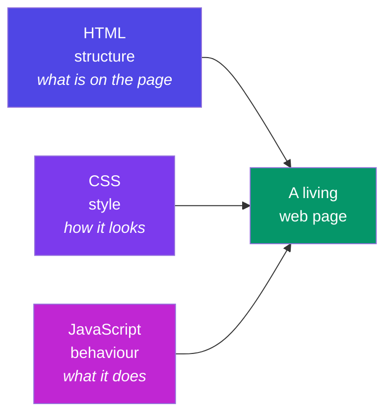

**Where you already use it (real world):**
- Gmail updating your inbox without a page refresh.
- An SAP Fiori app validating a purchase-order form as you type.
- Netflix's "continue watching" row loading as you scroll.
- The WordPress admin dashboard's drag-and-drop widgets.

**Why it matters for your roadmap:** JavaScript is the single language that runs your **frontend** (React, Fiori/UI5), your **backend** (Node.js, Express), and even build tools. Master it once, use it everywhere.

---

## A2. Where and How JS Runs

**Simple definition:** JavaScript needs an **engine** — a program that reads your code and executes it. Every browser ships one (Chrome's is called **V8**). **Node.js** took V8 out of the browser so JS can run on servers too.


<p class="te"><strong>Telugu:</strong> JS ki oka <strong>engine</strong> kaavali — code ni chadivi run chese program. Prathi browser lo okati untundi (Chrome di V8). Node.js ante aa V8 ni browser bayataki teesukocchi server meeda JS run cheyyadam. Language okate; kaani <strong>aatalu</strong> (toys) veru — browser lo <code>document</code>, Node lo files & servers.</p>

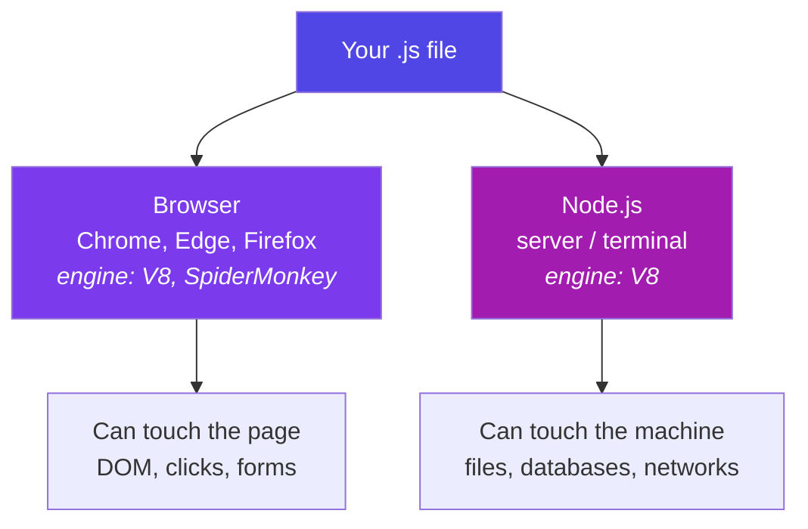

**Key idea:** the *language* is the same in both places; only the *toys available* differ. The browser gives you `document` and `window`; Node gives you files and servers. That's why "JS developer" covers both frontend and backend jobs.

**One term to know now:** JavaScript is **single-threaded** — it executes one statement at a time, on one call stack. Remember this; it becomes the hero of Part H (the event loop).

---

## A3. Your First Program

Three ways to run JavaScript today:


<p class="te"><strong>Telugu:</strong> Console open chesi (F12) prathi snippet ni <strong>type chesi run cheyyi</strong>. Chadavadam valla 20% ne vasthundi; run chesi, kaavalane break chesi, malli fix chesthe migilina 80% vasthundi.</p>

**1. Browser console** (fastest — press `F12` → Console):
```js
console.log("Hello, Nikhil!");
2 + 3;            // the console echoes: 5
```

**2. Inside an HTML page:**
```html
<!DOCTYPE html>
<html>
  <body>
    <h1 id="title">Loading...</h1>
    <script>
      document.getElementById("title").textContent = "Hello from JS!";
    </script>
  </body>
</html>
```

**3. With Node.js in a terminal:**
```js
// hello.js
console.log("Hello from Node");
// run:  node hello.js
```

**Habit to build:** keep the console open while you learn. Every snippet in these notes is meant to be *typed, run, and broken on purpose*. Reading JS teaches you 20%; running it teaches you the rest.

---

# Part B — Variables, Types & Operators

*The atoms of every program you will ever write.*

## B1. var vs let vs const

**Simple definition:** variables are labelled boxes for values. Modern JS gives you three keywords to declare them — and one of them (`var`) is a legacy trap.


<p class="te"><strong>Telugu:</strong> Variables ante values ki <strong>label vesina boxes</strong>. <code>const</code> = malli maarchalemu (default ga idi vaadu), <code>let</code> = maarchali ante, <code>var</code> = <strong>ekkada vaadaku</strong> (block boundaries ni paticchukodu, hoisting problems techipettadi). Gurthupettuko: <code>const</code> box <em>label</em> ni lock chestundi, <em>lopala unna vishayam</em> ni kaadu — andhuke <code>const user = {}</code> lo <code>user.name</code> maarchachu.</p>

```js
let score = 10;        // can be reassigned
const PI = 3.14159;    // cannot be reassigned
var old = "avoid me";  // legacy — function-scoped, hoisting surprises
```

| | `var` (1995) | `let` (2015) | `const` (2015) |
|---|---|---|---|
| Scope | **Function** | Block `{ }` | Block `{ }` |
| Reassignable | Yes | Yes | **No** |
| Redeclarable | Yes (silently!) | No (error) | No (error) |
| Hoisting | Yes — becomes `undefined` | TDZ error if used early | TDZ error if used early |
| Verdict | ❌ never in new code | ✅ when value changes | ✅ **default choice** |

**Why `var` is dangerous — the classic bug:**

```js
// var leaks out of blocks:
if (true) {
  var leaked = "I escaped!";
  let contained = "I stay inside";
}
console.log(leaked);     // "I escaped!"  😱
console.log(contained);  // ReferenceError ✅ (good — the block protected it)
```

**Real-world example:** in a shopping cart, the tax rate never changes during checkout → `const TAX_RATE = 0.18`. The running total changes with every item → `let total = 0`. If you accidentally write `total = "oops"` twice with `var`, JS stays silent; with `let`/`const` you get errors early — and early errors are cheap errors.

**`const` gotcha — it locks the *label*, not the *contents*:**

```js
const user = { name: "Nikhil" };
user.name = "NV";        // ✅ allowed — we changed the object's insides
user = { name: "X" };    // ❌ TypeError — we tried to re-point the label
```

**Rule of thumb:** `const` by default, `let` when you *know* it must change, `var` never.

---

## B2. Data Types

**Simple definition:** every value in JS has a type. There are **7 primitive types** (simple, immutable values) plus **object** (everything structured).


<p class="te"><strong>Telugu:</strong> 7 primitive types (string, number, boolean, null, undefined, symbol, bigint) + object. <code>undefined</code> ante JS cheppedi "inka evaru set cheyaledu"; <code>null</code> ante <strong>nuvvu kaavalane</strong> "khaali" ani pettedi. Parcel analogy: undefined = box raane raledu; null = box vachindi, teriste kaavalane khaali ga undi.</p>

| Type | Example | Real-world use |
|---|---|---|
| `string` | `"Nikhil"`, `'hi'`, `` `Hi ${name}` `` | names, messages, HTML |
| `number` | `42`, `3.14`, `-7` | prices, scores, coordinates |
| `boolean` | `true`, `false` | isLoggedIn, isDarkMode |
| `undefined` | declared but never assigned | "nobody set this yet" |
| `null` | assigned "nothing" on purpose | "we looked — it's empty" |
| `symbol` | `Symbol("id")` | unique hidden object keys (rare) |
| `bigint` | `9007199254740993n` | numbers beyond 2⁵³ (rare) |
| `object` | `{ }`, `[ ]`, functions, dates | everything structured |

**`undefined` vs `null` — the parcel analogy:** you order a phone online. `undefined` = the box never arrived. `null` = the box arrived, you opened it, and it's *deliberately empty*. JS sets `undefined`; *you* set `null`.

```js
let a;                 // undefined — JS's "not set yet"
let b = null;          // null — YOUR "intentionally empty"

typeof "hi"            // "string"
typeof 42              // "number"
typeof undefined       // "undefined"
typeof null            // "object"  ← famous 30-year-old bug, memorise it
typeof [1, 2]          // "object"  ← arrays are objects (use Array.isArray)
typeof function(){}    // "function"
```

**One number type:** JS has no separate int/float — `5` and `5.0` are the same `number`. Beware classic floating-point behaviour: `0.1 + 0.2 === 0.3` is `false` (it's `0.30000000000000004`). For money, work in paise/cents (integers) — every payment system does.

---

## B3. Type Coercion & == vs ===

**Simple definition:** when you mix types, JS silently *converts* one to the other. That's **coercion**. It's helpful just often enough to be dangerous.


<p class="te"><strong>Telugu:</strong> Rendu veru types kalipithe JS nishabdham ga okadaanni marokati ga <strong>maarchestundi</strong> — adi coercion. Rule: <code>+</code> ki oka side string unte <strong>kalipestundi</strong> (join), migilina math (<code>- * /</code>) <strong>number ga maarchestundi</strong>. Andhuke <code>1 + "2"</code> = <code>"12"</code> kaani <code>1 - "2"</code> = <code>-1</code>. Eppudu <code>===</code> vaadu — <code>==</code> types ni maarchi compare chestundi, adi bugs ki daari.</p>

**The famous pair:**

```js
1 + "2"    // "12"  → + sees a string, so it CONCATENATES
1 - "2"    // -1    → - only works on numbers, so it CONVERTS
```

**Rule:** `+` prefers strings; every other math operator (`-`, `*`, `/`) prefers numbers.

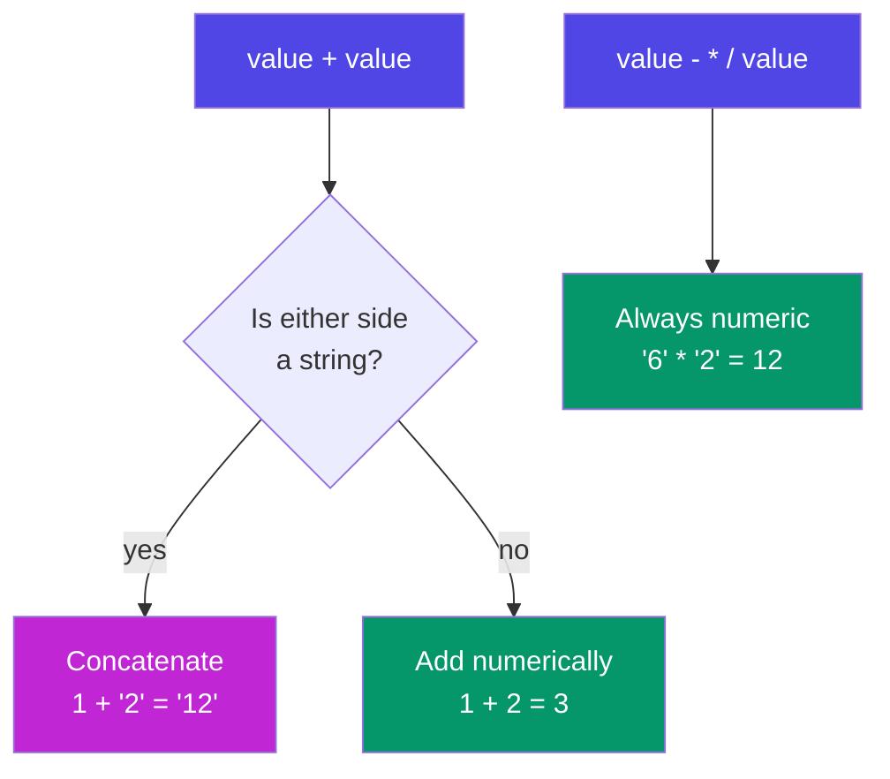

**Why this bites in the real world:** *every* value from an HTML form is a string.

```js
const qty = document.querySelector("#qty").value;   // "3" (string!)
const price = 500;
console.log(price + qty);          // "5003" 😱 — a ₹5,003 bug
console.log(price + Number(qty));  // 503   ✅
```

**Truthy & falsy:** in an `if`, every value is coerced to a boolean. Only **six values are falsy** — memorise them; everything else is truthy:

```
false   0   ""   null   undefined   NaN
```

```js
if (username) { ... }   // runs unless username is "" / null / undefined
"0" ? "truthy" : "falsy"   // "truthy" — non-empty STRING "0" is truthy!
[] ? "truthy" : "falsy"    // "truthy" — empty array is an object
```

**== vs === (the interview classic):**

- `==` (loose) coerces both sides first, *then* compares — full of surprises.
- `===` (strict) compares value **and** type — no conversion, no surprises.

```js
"5" == 5      // true   (string coerced to number)
0 == false    // true   😱
null == undefined  // true (special-cased)
"5" === 5     // false  ✅ different types
0 === false   // false  ✅
NaN === NaN   // false  ← NaN equals nothing, even itself (use Number.isNaN)
```

> **Rule for life: always use `===` and `!==`.** The only common exception pros allow: `value == null` as a shortcut for "null *or* undefined".

**Party-trick coercions (know the *why*, never use them):** `[] + {}` → `"[object Object]"` (both sides become strings and concatenate), `[] + []` → `""` (two empty strings). And chained comparisons lie: `3 > 2 > 1` evaluates left-to-right as `(3 > 2) > 1` → `true > 1` → `1 > 1` → **false**. Coercion trivia makes great quiz questions and terrible production code — your Phase 4 mini-project "Type-Coercion Quiz" is built from exactly these.

---

## B4. Operators & Logical Tricks

**Arithmetic:** `+ - * / %` (remainder) `**` (power)


<p class="te"><strong>Telugu:</strong> <code>&amp;&amp;</code> mariyu <code>||</code> true/false ivvavu — <strong>operands loni okadaanni</strong> ichestayi. <code>||</code> modati <em>truthy</em> value istundi (fallback ki), <code>&amp;&amp;</code> guard laga panichestundi. Pedda trap: <code>||</code> ki <code>0</code> and <code>""</code> kuda "levu" laga kanipistayi — andhuke defaults ki <code>??</code> vaadu, adi <code>null</code>/<code>undefined</code> ki matrame fallback istundi.</p>

```js
10 % 3    // 1   → remainder. Real use: isEven = n % 2 === 0
2 ** 10   // 1024
```

**Comparison:** `> < >= <=  ===  !==` — always return a boolean.

**Logical operators — the part people underestimate.** `&&` and `||` don't return `true`/`false`; they return **one of their operands** (short-circuit):

```js
// || returns the FIRST TRUTHY value  → great for fallbacks
const displayName = user.nickname || user.name || "Guest";

// && returns the first falsy value, else the last one → great for guards
isLoggedIn && showDashboard();   // only calls the function if truthy

// The || trap: it treats 0 and "" as "missing"!
const qty = order.qty || 1;   // BUG: a real qty of 0 becomes 1
const qty2 = order.qty ?? 1;  // ✅ ?? only falls back on null/undefined
```

**Assignment shortcuts:** `+= -= *= /=` and `count++` / `count--`.

**Real-world example — a settings object:**

```js
const settings = userSettings.theme ?? "light";       // respect "" ? no — but respect 0/false
const volume  = userSettings.volume ?? 50;            // volume 0 stays 0 ✅
const banner  = isAdmin && "Admin mode active";       // string or false
```

---

## B5. Template Literals

**Simple definition:** strings written with backticks `` ` `` that can *embed expressions* with `${...}` and span multiple lines. They replaced clumsy `+` concatenation.


<p class="te"><strong>Telugu:</strong> Backtick (<code>`</code>) strings lo <code>${...}</code> tho values ni <strong>nerugga pettochu</strong>, multi-line kuda raayochu. Purvam <code>"Hi " + name + " nuvvu "</code> ani kalipevaallam — ippudu <code>`Hi ${name}`</code>. HTML cards, email messages laanti chotla idi chala clean.</p>

```js
const name = "Nikhil", items = 3, total = 1497;

// Old, error-prone way:
const msg1 = "Hi " + name + ", your " + items + " items cost ₹" + total + ".";

// Template literal:
const msg2 = `Hi ${name}, your ${items} items cost ₹${total}.`;

// Any expression works inside ${}:
const line = `Status: ${total > 1000 ? "FREE delivery" : "₹49 delivery"}`;

// Multi-line — perfect for HTML snippets:
const card = `
  <div class="user-card">
    <h2>${name}</h2>
    <p>Items: ${items}</p>
  </div>`;
```

**Real-world example:** building an order-confirmation email, an HTML card for the DOM (Part E), or a SQL-like query message — anywhere text and data mix, template literals keep it readable.

---

# Part C — Control Flow & Functions

*Programs make decisions and package logic for reuse. This part is both skills.*

## C1. if / switch / ternary / loops

**if / else if / else** — the workhorse:


<p class="te"><strong>Telugu:</strong> Program decisions teesukovadaniki. <code>switch</code> lo <code>break</code> marchipothe next case loki <strong>jaaripothundi</strong> (fall-through) — adi #1 bug. Gurthu: <code>for..of</code> = array <strong>values</strong> ki, <code>for..in</code> = object <strong>keys</strong> ki. Practical ga chusthe, chala loops ni nuvvu <code>.map</code>/<code>.filter</code> tho replace chestavu.</p>

```js
const marks = 78;
if (marks >= 90)      console.log("A grade");
else if (marks >= 75) console.log("B grade");   // ← this runs
else                  console.log("Keep going");
```

**switch** — cleaner than a ladder of `===` checks on one value:

```js
switch (paymentMethod) {
  case "upi":
  case "wallet":              // fall-through: both share one branch
    fee = 0; break;
  case "card":
    fee = amount * 0.02; break;
  default:
    fee = 10;
}
```

⚠️ Forgetting `break` makes execution *fall through* into the next case — the #1 switch bug.

**Ternary** — an `if/else` that returns a value; perfect for short choices, terrible when nested:

```js
const badge = score >= 75 ? "🏆 Top" : "Keep going";
```

**Loops:**

```js
for (let i = 0; i < 3; i++) { ... }        // classic counter

const cart = ["pen", "book", "lamp"];
for (const item of cart) { ... }           // for..of → VALUES of an array ✅

const user = { name: "NV", age: 26 };
for (const key in user) { ... }            // for..in → KEYS of an object

while (retries < 3) { ... }                // loop while a condition holds
```

**Memory hook:** for..**o**f → **o**bjects' values in arrays; for..**in** → keys **in** an object. (In practice you'll replace most array loops with `.map`/`.filter` — Part D2.)

`break` exits a loop early; `continue` skips to the next round.

---

## C2. Functions — All the Ways

**Simple definition:** a function is a reusable, named block of logic — you give it inputs (parameters), it gives back an output (`return`).


<p class="te"><strong>Telugu:</strong> Function ante malli malli vaadagalige <strong>logic block</strong> — input istavu, output vastundi. Arrow functions ki <strong>sonta <code>this</code> undadu</strong> (ekkada raasavo akkadi nunchi teesukuntundi) mariyu hoist avvavu. Rule: object <strong>methods</strong> ki regular function, <strong>callbacks</strong> ki arrow.</p>

**The three syntaxes:**

```js
// 1. Function DECLARATION — hoisted (usable before its line)
function add(a, b) { return a + b; }

// 2. Function EXPRESSION — stored in a variable, not hoisted
const subtract = function (a, b) { return a - b; };

// 3. ARROW function (2015) — short, and no own `this`
const multiply = (a, b) => a * b;          // one-liner: implicit return
const shout = (msg) => {                   // multi-line: needs { } and return
  const upper = msg.toUpperCase();
  return upper + "!";
};
```

**Arrow vs regular — the two real differences:**

| | Regular function | Arrow function |
|---|---|---|
| Own `this` | ✅ yes (decided by *how it's called* — Part G1) | ❌ no — borrows `this` from where it was *written* |
| Hoisted | Declarations: yes | No |
| Best for | Object methods, constructors | Callbacks, one-liners, array methods |

```js
const timer = {
  seconds: 0,
  start() {
    // arrow inherits `this` from start() → this.seconds works ✅
    setInterval(() => this.seconds++, 1000);
  }
};
```

**Default + rest parameters:**

```js
const greet = (name = "friend") => `Hi ${name}`;
greet();               // "Hi friend"

function sum(...nums) {            // rest: gathers ALL args into an array
  return nums.reduce((t, n) => t + n, 0);
}
sum(1, 2, 3, 4);       // 10
```

**Real-world example — a delivery-fee calculator used across a food app:**

```js
const deliveryFee = (distanceKm, isPrime = false) => {
  if (isPrime) return 0;
  return distanceKm <= 2 ? 20 : 20 + (distanceKm - 2) * 8;
};
deliveryFee(5);         // 44
deliveryFee(5, true);   // 0
```

One function, defined once, called from the cart page, the checkout page, and the order-tracking page. Change the pricing in *one* place — that is why functions exist.

---

## C3. Optional Chaining & Nullish Coalescing

**The problem:** real data (especially from APIs) has holes. Reaching into a missing object crashes your app:


<p class="te"><strong>Telugu:</strong> API data lo <strong>gaps</strong> untayi. <code>?.</code> ante "idi lekapothe crash avvakunda <code>undefined</code> ivvu" — safe ga lopaliki vellatam. <code>??</code> ante "left side null/undefined aithe ee default vaadu". Rendu <strong>jodi</strong>: <code>?.</code> safe ga <em>andukuntundi</em>, <code>??</code> <em>default</em> istundi. React lo, API calls lo idi rojuvaari pani.</p>

```js
const user = { name: "Nikhil" };            // no address today
console.log(user.address.city);             // ❌ TypeError: Cannot read 'city' of undefined
```

**Optional chaining `?.`** — "if this is null/undefined, stop and return undefined instead of crashing":

```js
console.log(user.address?.city);            // undefined ✅ no crash
console.log(user.getOrders?.());            // safely call a maybe-missing method
console.log(orders?.[0]?.items?.[0]);       // works on array indexes too
```

**Nullish coalescing `??`** — "if the left side is null/undefined, use this default":

```js
const city = user.address?.city ?? "City not provided";
```

**`?.` and `??` are a team:** `?.` safely *reaches*, `??` supplies the *fallback*.

**Real-world example — rendering an API response:**

```js
// A payment API sometimes omits refund info entirely:
const refundAmount = response.data?.refund?.amount ?? 0;
const refundDate = response.data?.refund?.date ?? "—";
```

Without `?.` this is three nested `if` checks; with it, one readable line. You will use this *daily* in React and when calling APIs (Part H7).

---

# Part D — Arrays, Objects & Modern Syntax

*90% of real JavaScript work is transforming arrays of objects. This part is that job.*

## D1. Array Basics

**Simple definition:** an array is an ordered list. Positions (indexes) start at **0**.


<p class="te"><strong>Telugu:</strong> Array ante <strong>vaparusa list</strong>; positions 0 nunchi start. Peddha confusion: <code>slice</code> vs <code>splice</code> — <strong>slice = manchi ga copy</strong> teesukuntundi (original ki emi kaadu), <strong>splice = surgery</strong> (original ni kosestundi). Inko trap: <code>sort()</code> default ga <em>strings</em> laga compare chestundi, andhuke numbers ki <code>.sort((a,b) =&gt; a-b)</code> tappaka ivvali.</p>

```js
const cart = ["pen", "book", "lamp"];
cart[0];          // "pen"
cart.length;      // 3
cart[cart.length - 1];   // "lamp" — the classic "last item" trick
cart.at(-1);             // "lamp" — the modern way
```

**The core mutating methods (they CHANGE the array):**

```js
cart.push("mug");      // add to END        → ["pen","book","lamp","mug"]
cart.pop();            // remove from END   → returns "mug"
cart.unshift("bag");   // add to FRONT
cart.shift();          // remove from FRONT
cart.splice(1, 1);     // remove 1 item AT index 1 → cuts "book" out
cart.splice(1, 0, "ink"); // remove 0, INSERT "ink" at index 1
```

**slice vs splice — the eternal confusion:**

| | `slice(start, end)` | `splice(start, deleteCount, ...items)` |
|---|---|---|
| Changes original? | ❌ No — returns a copy | ✅ **Yes** — cuts/inserts in place |
| Returns | the copied section | the removed items |
| Memory hook | s**lice** = polite copy | s**plice** = surgery |

```js
const nums = [10, 20, 30, 40];
nums.slice(1, 3);   // [20, 30]  — original untouched (end index excluded!)
nums.splice(1, 2);  // [20, 30]  — original is now [10, 40]
```

Also handy: `indexOf`, `includes`, `join("-")`, `concat`, `reverse`, `sort` — note `sort` compares as *strings* by default: `[10, 2, 1].sort()` → `[1, 10, 2]` 😱. For numbers always pass a comparator: `.sort((a, b) => a - b)`.

---

## D2. Higher-Order Array Methods

**Simple definition:** a **higher-order function** takes another function as input. These six methods each take *your* function and apply it across the array. They are the most-used lines in modern JS — and the heart of React rendering.


<p class="te"><strong>Telugu:</strong> Ivi modern JS lo <strong>ekkuva vaade lines</strong> — React lo prathi list idi. <code>map</code> = prathi item ni <em>maarchu</em>, <code>filter</code> = <em>kaavalasinavi unchu</em>, <code>find</code> = <em>modati okati</em>, <code>some/every</code> = <em>test</em>, <code>forEach</code> = <em>just pani cheyyi</em>. Loop "ela" ani cheptundi; <code>.filter().map()</code> "emi kaavalo" ani cheptundi — 6 nelala tarvatha "emi" ne artham avutundi.</p>

**The cast, one line each:**

| Method | Question it answers | Returns |
|---|---|---|
| `.map(fn)` | "Transform every item" | new array, **same length** |
| `.filter(fn)` | "Keep only the ones that pass" | new array, ≤ length |
| `.find(fn)` | "Give me the *first* one that passes" | one item (or `undefined`) |
| `.some(fn)` | "Does at least ONE pass?" | boolean |
| `.every(fn)` | "Do ALL pass?" | boolean |
| `.forEach(fn)` | "Just do something with each" | `undefined` (side effects only) |

**One dataset, all six — a students list:**

```js
const students = [
  { name: "Asha",   score: 91, active: true  },
  { name: "Bharat", score: 62, active: true  },
  { name: "Chitra", score: 78, active: false },
];

students.map(s => s.name);                  // ["Asha","Bharat","Chitra"]
students.filter(s => s.score >= 75);        // [Asha, Chitra]  (whole objects)
students.find(s => s.name === "Bharat");    // { name:"Bharat", ... }
students.some(s => s.score >= 90);          // true  (Asha qualifies)
students.every(s => s.active);              // false (Chitra isn't)
students.forEach(s => console.log(s.name)); // prints each; returns nothing
```

**Chaining — the real-world superpower.** "Names of active students who scored 75+, alphabetically":

```js
const honourRoll = students
  .filter(s => s.active && s.score >= 75)
  .map(s => s.name)
  .sort();
```


**Why this replaces loops:** each step names its *intent*. A `for` loop says *how*; `.filter().map()` says *what*. Six months later, "what" is readable in 3 seconds.

**Real-world examples you'll write soon:**
- **React:** `products.map(p => <ProductCard key={p.id} {...p} />)` — every list on every React page is a `.map`.
- **E-commerce:** `cart.filter(i => i.inStock).map(i => i.price * i.qty)` then `.reduce` for the total (Part I2).
- **Validation:** `formFields.every(f => f.value !== "")` → enable the Submit button.

---

## D3. Objects

**Simple definition:** an object is a collection of labelled values — `key: value` pairs. If arrays are lists, objects are *profiles*.


<p class="te"><strong>Telugu:</strong> Array ante <em>list</em> aithe, object ante <strong>profile</strong> — key: value jantalu. Dot (<code>user.name</code>) key teliste, bracket (<code>user[field]</code>) key dynamic aithe. Object lopala function ni <strong>method</strong> antaru, andulo <code>this</code> = dot ki mundu unna object. Nuvvu andukune prathi API response idi.</p>

```js
const user = {
  name: "Nikhil",
  role: "developer",
  skills: ["JS", "WordPress", "Fiori"],
  address: { city: "Bangalore", pin: 560001 },   // objects nest
  greet() {                                       // a method = function in an object
    return `Hi, I'm ${this.name}`;               // `this` = the object before the dot
  },
};
```

**Reading & writing:**

```js
user.name              // "Nikhil"          — dot: when you know the key
user["role"]           // "developer"       — bracket: when the key is dynamic
const field = "role";
user[field]            // "developer"       — bracket shines here
user.age = 26;         // add a new property any time
delete user.role;      // remove one
```

**The three X-ray methods:**

```js
Object.keys(user)     // ["name", "skills", "address", "greet", "age"]
Object.values(user)   // the values
Object.entries(user)  // [["name","Nikhil"], ...] — pairs, perfect for loops
```

**Shorthand you'll see everywhere:**

```js
const name = "NV", score = 90;
const player = { name, score };          // same as { name: name, score: score }
```

**Real-world example:** every API response you'll ever receive is an object (usually holding arrays of more objects). A "user profile", a "product", an "order" — objects are how JS models *things*, arrays are how it models *many things*.

---

## D4. Destructuring

**Simple definition:** unpacking values out of objects/arrays into variables in one line — pattern-matching the shape of your data.


<p class="te"><strong>Telugu:</strong> Object/array lopali values ni <strong>okka line lo</strong> teesi variables loki pettadam. <code>const {name, city} = user</code>. React lo <code>const [count, setCount] = useState(0)</code> — aa square brackets <strong>array destructuring</strong> ye. Ippudu enduku brackets unnayo nee ki telusu.</p>

**Object destructuring:**

```js
const user = { name: "Nikhil", role: "dev", city: "Bangalore" };

const { name, city } = user;             // name="Nikhil", city="Bangalore"
const { role: jobTitle } = user;         // rename while unpacking
const { phone = "not given" } = user;    // default for missing keys
const { address: { pin } = {} } = user;  // nested (with a safe default)
```

**Array destructuring:**

```js
const scores = [98, 87, 75];
const [first, second] = scores;          // first=98, second=87
const [gold, , bronze] = scores;         // skip an item with a hole

// The famous swap — no temp variable:
let a = 1, b = 2;
[a, b] = [b, a];                         // a=2, b=1
```

**Destructuring in function parameters — the pattern React lives on:**

```js
// Instead of taking a whole object and dot-digging:
function ship({ orderId, address, express = false }) {
  return `Order ${orderId} → ${address} ${express ? "🚀" : "📦"}`;
}
ship({ orderId: 101, address: "Bangalore" });
```

**Real-world example:** pulling exactly what you need from a big API response —

```js
const { data: { user: { name, email } } } = await axios.get("/api/me");
// and in React:  const [count, setCount] = useState(0)  ← array destructuring!
```

That `useState` line — which you'll write hundreds of times in Phase 6 — *is* array destructuring. You now know why it has square brackets.

---

## D5. Spread & Rest

**Same three dots `...`, two opposite jobs:**


<p class="te"><strong>Telugu:</strong> Okate mudu chukkalu <code>...</code>, rendu vidhaalu: <strong>spread = vippadam</strong> (bayataki), <strong>rest = kudarchadam</strong> (lopaliki). Gurthu: <code>=</code> ki <strong>kudivaipu</strong> unte spread, <strong>edamavaipu</strong> / parameters lo unte rest. Peddha warning: spread <strong>okka level</strong> matrame copy chestundi — lopali objects inka <em>share</em> ye untayi (shallow copy).</p>

- **Spread** = *unpack* — explode an array/object into its pieces.
- **Rest** = *pack* — gather leftover pieces into one array/object.

**Memory hook:** on the **right** side of `=` or in a call → spread (out). On the **left** side or in parameters → rest (collect).

**Spread:**

```js
const base = ["pen", "book"];
const cart = [...base, "lamp"];              // copy + add  → new array

const user = { name: "NV", city: "BLR" };
const updated = { ...user, city: "Hyd" };    // copy + OVERRIDE one field

Math.max(...[3, 9, 4]);                      // 9 — spread as arguments
const merged = { ...defaults, ...userPrefs }; // later spread wins conflicts
```

**Rest:**

```js
const [winner, ...others] = ["Asha", "Bharat", "Chitra"];
// winner = "Asha", others = ["Bharat", "Chitra"]

const { password, ...safeUser } = user;      // strip a field OUT of an object

function avg(...marks) {                     // accept any number of args
  return marks.reduce((t, m) => t + m, 0) / marks.length;
}
```

**Why this matters enormously for React:** React state must be updated **immutably** — you never edit the old object, you build a new one:

```js
// Updating one field of state, the React way:
setUser({ ...user, city: "Hyderabad" });
// Adding an item to a list, the React way:
setTodos([...todos, newTodo]);
```

⚠️ **Shallow-copy warning:** spread copies one level deep. Nested objects are still *shared*:

```js
const copy = { ...user };
copy.address.city = "Delhi";   // ALSO changes user.address.city! 
const deep = structuredClone(user);   // true deep copy when you need it
```

---

## D6. JSON & localStorage

**Simple definition:** JSON (JavaScript Object Notation) is the universal *text* format for data — how objects travel over networks and get stored. It looks like a JS object but is a **string** with stricter rules (double quotes, no functions, no comments).


<p class="te"><strong>Telugu:</strong> JSON ante data ki <strong>universal text format</strong> — network lo prayanam chese roopam. <code>JSON.stringify</code> = bayataki (object → string), <code>JSON.parse</code> = lopaliki (string → object). <code>localStorage</code> strings ne dachukuntundi, refresh aina poavu — andhuke ee jodi to-do app ki, prathi REST API ki base.</p>

```js
const order = { id: 101, items: ["pen", "book"], paid: true };

const text = JSON.stringify(order);   // object → string  '{"id":101,...}'
const back = JSON.parse(text);        // string → object  (a fresh copy)
```

**Real-world example — persistence without a database.** The browser's `localStorage` stores strings that survive refresh and restart:

```js
// Save the cart when it changes:
localStorage.setItem("cart", JSON.stringify(cart));

// Restore it on page load:
const saved = JSON.parse(localStorage.getItem("cart") ?? "[]");
```

This exact pair powers your Phase 4 mini-project (a to-do list that survives refresh), and it's the same JSON that every REST API request/response uses (Part H7). `stringify` on the way out, `parse` on the way in — that's the whole trick.

---

# Part E — The DOM

*Everything so far ran in a vacuum. The DOM is where JavaScript finally touches the page.*

## E1. What is the DOM?

**Simple definition:** when the browser reads your HTML, it builds a live, in-memory **tree of objects** — the **D**ocument **O**bject **M**odel. JavaScript can't edit your HTML *file*, but it can edit this *tree* — and the page instantly re-draws to match.


<p class="te"><strong>Telugu:</strong> Browser nee HTML ni chadivi, memory lo <strong>bathikunna objects chettu</strong> (tree) ni thayaru chestundi — adi DOM. JS nee HTML <em>file</em> ni maarchaledu, kaani ee <em>tree</em> ni maarchagaladu — page venatane update avutundi. Analogy: HTML file = plan (blueprint), DOM = <strong>kattina illu</strong>, JS = renovation crew.</p>

**Analogy:** the HTML file is the architect's blueprint; the DOM is the *actual built house*. JS is the renovation crew — it moves walls in the house, not lines on the blueprint.

```html
<body>
  <h1>My Tasks</h1>
  <ul id="list">
    <li class="task">Learn JS</li>
    <li class="task">Build app</li>
  </ul>
</body>
```

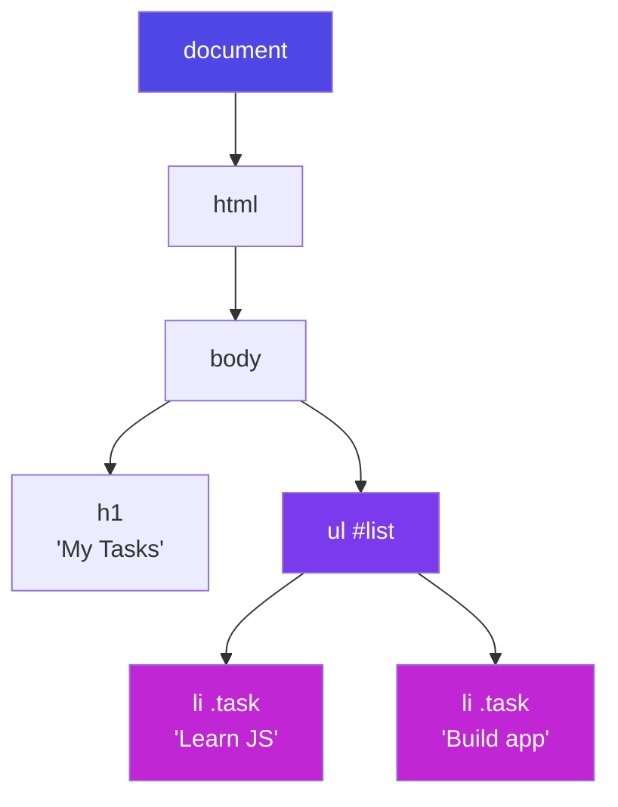

Every box in that tree is an object with properties and methods — `document` is the root handle to all of it.

---

## E2. Selecting & Changing Elements

**Selecting (finding your target):**


<p class="te"><strong>Telugu:</strong> Modata target ni <strong>pattuko</strong> (<code>querySelector</code> — CSS selector language anthaa panichestundi), taruvata maarchu. <code>textContent</code> = safe (plain text); <code>innerHTML</code> HTML ni parse chestundi — <strong>user input tho eppudu vaadaku</strong> (XSS danger). Style ki direct kaakunda <code>classList</code> tho CSS classes toggle cheyyadam better.</p>

```js
document.getElementById("list");          // fastest, IDs only
document.querySelector(".task");          // FIRST match — any CSS selector ✅
document.querySelectorAll(".task");       // ALL matches (a NodeList)
document.querySelector("#list li:last-child");  // full CSS power
```

**Rule of thumb:** `querySelector` / `querySelectorAll` can do everything — learn the CSS-selector mini-language once, reuse it here, in CSS, and in test tools forever.

**Changing content & attributes:**

```js
const title = document.querySelector("h1");
title.textContent = "Today's Tasks";        // plain text (safe)
title.innerHTML = "Tasks <em>today</em>";   // parses HTML ⚠ never with user input (XSS!)

const link = document.querySelector("a");
link.href = "https://javascript.info";
input.value = "";                            // form fields use .value
```

**Changing style — prefer classes:**

```js
title.style.color = "purple";        // quick inline style (JS uses camelCase)
title.classList.add("done");         // ✅ better: toggle CSS classes
title.classList.remove("urgent");
title.classList.toggle("dark");      // add if absent, remove if present
```

**Creating & removing elements:**

```js
const li = document.createElement("li");
li.textContent = "New task";
li.classList.add("task");
document.querySelector("#list").append(li);   // now it's on the page
li.remove();                                   // and now it's gone
```

---

## E3. Events

**Simple definition:** events are the page saying "something happened!" — a click, a keypress, a form submit. `addEventListener` lets you answer: "*when* that happens, run *this* function."


<p class="te"><strong>Telugu:</strong> Event ante page "emo jarigindi!" ani cheppadam — click, keypress, submit. <code>addEventListener</code> tho "adi jariginappudu idi run cheyyi" antaam. Form lo <code>e.preventDefault()</code> tappanisari — lekapothe page reload avutundi. <strong>Delegation</strong> = 100 items ki 100 listeners kaakunda, <em>parent</em> ki okate listener petti <code>e.target</code> tho evaru click chesaro adagadam — taruvatha add ayye items ki kuda panichestundi.</p>

```js
const btn = document.querySelector("#save");

btn.addEventListener("click", (event) => {
  console.log("Saved!");
});
```

**The event object — your incident report.** Every handler receives one, full of details:

```js
form.addEventListener("submit", (e) => {
  e.preventDefault();              // stop the browser's default (page reload!)
  const text = input.value.trim();
});

document.addEventListener("keydown", (e) => {
  if (e.key === "Escape") closeModal();     // which key?
});
```

| Event | Fires when | Classic use |
|---|---|---|
| `click` | element clicked | buttons, links |
| `submit` | form submitted | validate + save (always `preventDefault`) |
| `input` | field value changes (every keystroke) | live search, char counters |
| `change` | field committed (blur/select) | dropdowns, checkboxes |
| `keydown` | key pressed | shortcuts, Escape-to-close |
| `DOMContentLoaded` | HTML fully parsed | safe start point for your code |

**Bubbling & delegation — the pro pattern.** Events *bubble up*: a click on an `<li>` also fires on its `<ul>`, then `<body>`, then `document`. So instead of attaching 100 listeners to 100 list items (some of which don't exist yet!), attach **one** to the parent and ask *who* was clicked:

```js
list.addEventListener("click", (e) => {
  if (e.target.matches("li.task")) {
    e.target.classList.toggle("done");    // works even for items added later ✅
  }
});
```

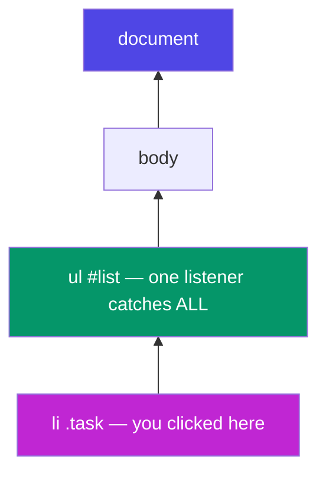

**Real-world example:** Gmail's inbox has thousands of rows but nowhere near thousands of listeners — one delegated listener on the list container handles every row click. Same trick, at scale.

---

## E4. Mini-Project: To-Do List

*Your Phase 4 deliverable — every concept from Parts B–E in 40 lines. Type it, don't paste it.*


<p class="te"><strong>Telugu:</strong> Ee project loni <strong>peddha paatam</strong>: <em>state → render</em>. <code>tasks</code> array ye okate nijam (single source of truth); DOM anedi daani <strong>pratibimbam</strong> (reflection) matrame. Prathi maarpu taruvatha array nunchi malli gееyadam. Aa aalochana ye <strong>React</strong> — oka phase mundu ga nerchukuntunnav.</p>

```html
<input id="task-input" placeholder="What next?" />
<button id="add-btn">Add</button>
<ul id="list"></ul>
```

**Part 1 — state, save, and render:**

```js
const input = document.querySelector("#task-input");
const addBtn = document.querySelector("#add-btn");
const list = document.querySelector("#list");

// State lives in ONE array; the DOM is just its reflection.
let tasks = JSON.parse(localStorage.getItem("tasks") ?? "[]");

function save() {
  localStorage.setItem("tasks", JSON.stringify(tasks));
}

function render() {
  list.innerHTML = "";                       // clear
  tasks.forEach((task, i) => {
    const li = document.createElement("li");
    li.textContent = task.text;
    li.dataset.index = i;                    // remember which task this is
    li.classList.toggle("done", task.done);
    list.append(li);
  });
}
```

**Part 2 — the three interactions:**

```js
addBtn.addEventListener("click", () => {
  const text = input.value.trim();
  if (!text) return;                         // guard clause (truthy check!)
  tasks = [...tasks, { text, done: false }]; // immutable add (spread!)
  input.value = "";
  save(); render();
});

// ONE delegated listener: click toggles done, double-click deletes
list.addEventListener("click", (e) => {
  const i = Number(e.target.dataset.index);
  tasks = tasks.map((t, idx) => idx === i ? { ...t, done: !t.done } : t);
  save(); render();
});
list.addEventListener("dblclick", (e) => {
  const i = Number(e.target.dataset.index);
  tasks = tasks.filter((_, idx) => idx !== i);
  save(); render();
});
```

**The big lesson hiding in this project:** *state → render*. The array `tasks` is the single source of truth; the DOM is redrawn from it after every change. That mental model — data drives the view — **is React**, one phase early. When you meet `useState` next week, you'll recognise `save(); render();` as what React automates for you.

---

# Part F — Under the Hood: Scope, Hoisting & Closures

*Phase 5 begins. Everything before this was "what to type". From here on it's "how JavaScript actually thinks" — the material interviews are made of.*

## F1. Execution Context & the Call Stack

**Simple definition:** every time JS runs code, it creates an **execution context** — a workspace holding that code's variables and a reference to its outer world. Program start creates the **Global** context; every function call creates a fresh **Function** context.


<p class="te"><strong>Telugu:</strong> JS code run cheyyadaniki mundu <strong>rendu phases</strong>: (1) creation — anni declarations ki memory lo chotu, (2) execution — line by line run. Ee mundu-scan ye <strong>hoisting</strong> ki kaaranam. Call stack = "nenu ippudu ekkada unnanu" ani cheppe <strong>plates stack</strong> — prathi call oka plate pedutundi, <code>return</code> teesestundi. JS eppudu <strong>paina unna plate</strong> ne pani chestundi — adi "single-threaded" ante.</p>

**Each context is built in two phases:**

1. **Creation phase (memory):** JS scans the code *before running it* and reserves space for every variable and function it finds. `var` slots get `undefined`; `let`/`const` slots are reserved but *uninitialised*; function declarations are stored **whole**.
2. **Execution phase:** the code finally runs, line by line, filling in real values.

This two-phase design is *the* reason hoisting (F2) exists — memory is allocated before a single line executes.

**The call stack** tracks "where am I?" — contexts stack up as functions call functions, and pop off as they return:

```js
function multiply(a, b) { return a * b; }
function square(n) { return multiply(n, n); }
function printSquare(n) { console.log(square(n)); }
printSquare(4);   // 16
```

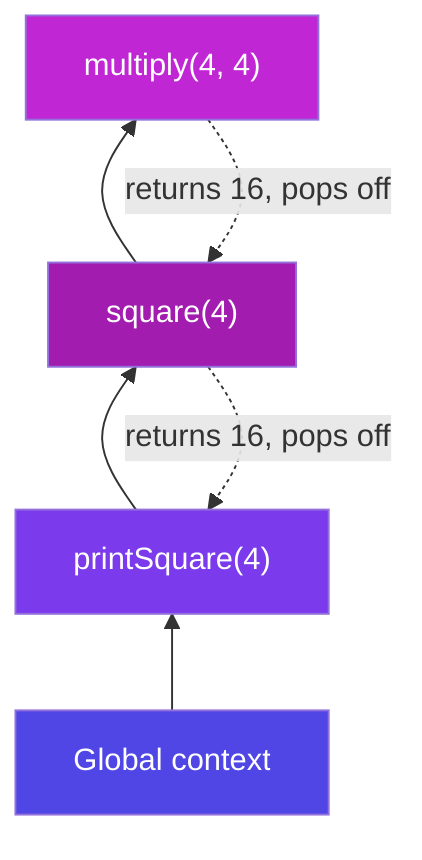

**Analogy:** a stack of dinner plates. Each function call puts a plate on top; each `return` takes the top plate off. JS only ever works on the **top plate** — that's what "single-threaded" means in practice. (When you see "Maximum call stack size exceeded", that's infinite recursion piling plates to the ceiling.)

**Why care:** the call stack is half of the event-loop story (Part H2), and "explain the execution context" is a stock interview opener.

---

## F2. Hoisting & the Temporal Dead Zone

**Simple definition:** **hoisting** is the *effect* of the creation phase — declarations are known to JS before your code runs, so some things are usable "before their line".


<p class="te"><strong>Telugu:</strong> Hoisting ante — code run avvakamundhe JS anni declarations ni <strong>ముందే telusukuntundi</strong>. Function declarations <em>poorthi ga</em> pani chestayi; <code>var</code> ki <code>undefined</code> vastundi (<strong>nishabdham ga tappu</strong> — ide pramadam); <code>let/const</code> untayi kaani <strong>lock</strong> lo — mundhe touch chesthe error. Aa lock zone ne <strong>TDZ</strong> antaru, adi <em>shiksha kaadu, varam</em>: tappu jarigina <strong>aa line lone</strong> gattiga cheptundi.</p>

```js
// 1. Function declarations hoist COMPLETELY:
greet();                          // "Hello!" ✅ works before its line
function greet() { console.log("Hello!"); }

// 2. var hoists but is set to undefined:
console.log(score);               // undefined 😐 (not an error — worse!)
var score = 10;

// 3. let / const hoist but stay LOCKED until their line — the TDZ:
console.log(total);               // ❌ ReferenceError: Cannot access before initialization
let total = 50;
```

**The Temporal Dead Zone (TDZ):** the region between the top of the scope and a `let`/`const` declaration line, where the variable *exists but is untouchable*. It sounds like a punishment — it's actually a **gift**: `var`'s silent `undefined` hides bugs, while the TDZ crashes loudly at the exact line you misused.

| | Hoisted? | Value before its line | Bug style |
|---|---|---|---|
| `function` declaration | ✅ fully | callable | none |
| `var` | ✅ | `undefined` | *silent* wrong values |
| `let` / `const` | ✅ (but locked) | TDZ → ReferenceError | *loud*, easy to fix |
| function *expression* / arrow in `const` | locked like const | TDZ error | loud |

**Real-world example:** a 500-line file where line 30 reads a `var` that's declared on line 400. With `var`: line 30 quietly gets `undefined`, and the bug surfaces as "NaN" somewhere else entirely. With `let`: line 30 throws immediately, telling you exactly what's wrong. This is why `var` is banned in modern codebases — not style, *debuggability*.

---

## F3. Lexical Scope & the Scope Chain

**Simple definition:** **scope** = where a variable is visible. **Lexical** scope means visibility is decided by *where the function is written in the code* — not where or how it is called.


<p class="te"><strong>Telugu:</strong> Scope ante variable <strong>ekkada kanipistundo</strong>. "Lexical" ante — adi <strong>ekkada raasavo</strong> daani batti nirnayam avutundi, ekkada <em>pilichavo</em> kaadu. Lookup eppudu <strong>lopala nunchi bayataki</strong> velutundi, tirigi kaadu. Analogy: prathi function oka <strong>one-way glass room</strong> — lopalinunchi bayataki kanipistundi, bayatinunchi lopaliki kanipinchadu.</p>

```js
const appName = "JobSwift";              // global scope

function outer() {
  const city = "Bangalore";              // outer's scope
  function inner() {
    const lang = "JS";                   // inner's scope
    console.log(appName, city, lang);    // ✅ sees ALL THREE
  }
  inner();
}
outer();
console.log(city);                       // ❌ ReferenceError — can't look inward
```

**The scope chain:** when `inner` uses `city`, JS looks in `inner`'s own scope → not found → steps *outward* to `outer` → found. Not found anywhere? `ReferenceError`. The chain only goes **inside → outside**, never the reverse.

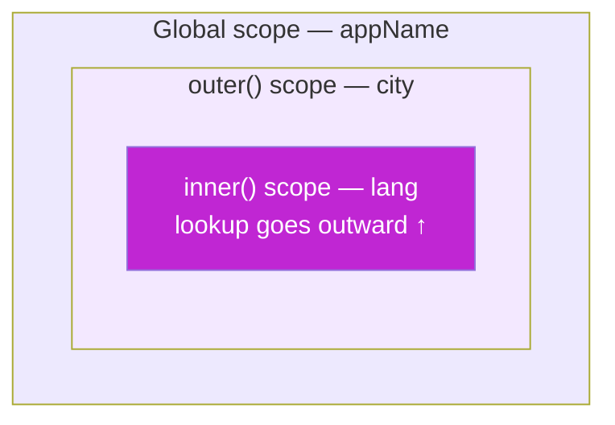

**Analogy — glass walls:** each function is a one-way glass room. From inside you can see *out* (and use outer variables); nobody outside can see *in*. Rooms nest, and you can always see through all the walls outward to the global street.

**The key phrase for interviews:** *functions remember the scope where they were **born**, not where they are **called***. That single sentence is 90% of closures — next section.

---

## F4. Closures

**The definition (memorise it):** a **closure** is a function bundled together with the variables from its birth scope. Even after the outer function has finished and returned, the inner function still *remembers and can update* those variables.


<p class="te"><strong>Telugu:</strong> Closure ante — oka function tanu <strong>puttina scope</strong> loni variables ni gurthu pettukuntundi, aa bayati function <em>aipoyina taruvatha kuda</em>. Analogy: function ki oka <strong>backpack</strong> untundi — ekkadiki vellina aa sanchi ventha vastundi. Deenitho <strong>private state</strong> (counter), <strong>memoize</strong> (cache), <strong>debounce</strong> (search box) — anni saadhyam. Interview lo <code>var</code> loop 4,4,4 question ki kaaranam ide: <code>var</code> ki <em>okate</em> sanchi, <code>let</code> ki prathi round ki <em>kotha</em> sanchi.</p>

**Analogy — the backpack:** when a function is created inside another function, it packs a backpack with every outer variable it uses. Wherever that function travels — returned, stored, passed around — the backpack goes too.

**The canonical example — a private counter:**

```js
function counter() {
  let count = 0;                    // ← lives in the backpack
  return {
    inc: () => ++count,
    dec: () => --count,
    val: () => count,
  };
}

const c = counter();     // counter() has RETURNED... but count lives on
c.inc(); c.inc();
c.val();                 // 2
count;                   // ❌ ReferenceError — truly private, no one can touch it
const c2 = counter();    // a SECOND, independent backpack
c2.val();                // 0 — each call to counter() creates a fresh closure
```

Three things just happened that matter:
1. **Privacy:** `count` cannot be read or corrupted from outside — only through the three doors we exported. This is *encapsulation without classes*.
2. **Persistence:** the variable outlived its creator function.
3. **Independence:** every call to `counter()` mints a brand-new scope.

**Real-world closure #1 — memoize (cache expensive results):**

```js
function memoize(fn) {
  const cache = {};                        // in the backpack
  return (n) => {
    if (n in cache) return cache[n];       // instant repeat answers
    return (cache[n] = fn(n));
  };
}
const slowSquare = (n) => { /* imagine 2s of work */ return n * n; };
const fastSquare = memoize(slowSquare);
fastSquare(9);   // computes once
fastSquare(9);   // served from cache ⚡
```

**Real-world closure #2 — debounce (the search-box pattern):**

```js
function debounce(fn, delay) {
  let timerId;                             // in the backpack
  return (...args) => {
    clearTimeout(timerId);                 // cancel the previous scheduled call
    timerId = setTimeout(() => fn(...args), delay);
  };
}
searchInput.addEventListener("input", debounce(runSearch, 400));
// fires runSearch only after the user STOPS typing for 400ms
```

Every autocomplete you've ever used — Google, Amazon, Flipkart — runs on this exact closure.

**The classic interview bug — `var` in a loop:**

```js
for (var i = 1; i <= 3; i++)
  setTimeout(() => console.log(i), 100);   // prints 4, 4, 4 😱

for (let i = 1; i <= 3; i++)
  setTimeout(() => console.log(i), 100);   // prints 1, 2, 3 ✅
```

**Why:** `var` creates ONE shared `i` — all three arrow functions share one backpack, and by the time they run, the loop has pushed `i` to 4. `let` creates a **fresh `i` per iteration** — three backpacks, three values. This one question tests scope, closures, hoisting, and the event loop at once, which is why interviewers love it.

---

## F5. IIFE & the Module Pattern

**Simple definition:** an **IIFE** (Immediately Invoked Function Expression) is a function that runs the instant it's defined — a disposable scope.


<p class="te"><strong>Telugu:</strong> IIFE ante — raasina venatane run ayye function: <code>(function(){...})()</code>. Enduku puttindi? 2015 ki mundu prathi <code>var</code> global ayyedi, rendu scripts okadaanni okati charipevi. Ippudu ES Modules vachaka prathi file <strong>daani sonta scope</strong> — andhuke IIFE ki avasaram thaggindi. Kaani WordPress themes, jQuery plugins lo <code>(function($){...})(jQuery)</code> ni nuvvu chusaave — adi ide.</p>

```js
(function () {
  const secret = "runs once, leaks nothing";
  console.log(secret);
})();                       // ← defined and called in one breath

(() => { /* arrow IIFEs work too */ })();
```

**Why it exists:** before 2015, *every* `var` in a script joined the global scope — two `<script>` files with `var user` would silently overwrite each other. Wrapping each file in an IIFE gave it a private scope. 

**The module pattern — IIFE + closure = a namespaced mini-library:**

```js
const CartModule = (function () {
  let items = [];                                    // private (closure)
  return {
    add(item)  { items.push(item); },                // public API
    total()    { return items.reduce((t, i) => t + i.price, 0); },
    count()    { return items.length; },
  };
})();

CartModule.add({ name: "pen", price: 20 });
CartModule.total();    // 20
CartModule.items;      // undefined — private ✅
```

**Today's status:** ES Modules (Part I1) made file-level IIFEs mostly obsolete — every module file is automatically its own scope. You still meet IIFEs in older codebases (jQuery plugins, WordPress themes — you've likely seen `(function($){ ... })(jQuery)` already) and occasionally to run top-level async code. Understand them; reach for modules.

---

# Part G — `this`, Prototypes & OOP

*Object-Oriented Programming: modelling your program as objects that hold both data and behaviour. JS does it with a twist — prototypes under the hood, classes on the surface.*

## G1. The 4 Rules of `this`

**Simple definition:** `this` is a placeholder meaning "the object currently running me". Its value is decided **at call time, by HOW the function is called** — not where it was written. (Exception: arrows.)

<p class="te"><strong>Telugu:</strong> <code>this</code> ante "ippudu nannu run chestunna object". Adi <strong>call chese samayamlo</strong>, <strong>ela pilichavo</strong> daani batti nirnayam — ekkada raasavo kaadu. 4 rules (priority order): <code>new</code> → kotha object; <code>call/apply/bind</code> → nuvvu ichinadi; <code>obj.fn()</code> → <strong>dot ki mundu unna object</strong>; simple <code>fn()</code> → undefined. Arrows ee 4 rules ni <strong>paticchukovu</strong> — raasina chota nunchi teesukuntayi. Gurthu: <strong>c</strong>all = <strong>c</strong>ommas, <strong>a</strong>pply = <strong>a</strong>rray, <strong>b</strong>ind = <strong>b</strong>ookmark (tarvata ki).</p>


**The four rules, strongest first:**

| # | Rule | You see | `this` is |
|---|---|---|---|
| 1 | `new` binding | `new User()` | the freshly created object |
| 2 | Explicit | `fn.call(obj)` / `fn.apply(obj)` / `fn.bind(obj)` | whatever you passed |
| 3 | Implicit | `obj.method()` | the object **before the dot** |
| 4 | Default | plain `fn()` | `undefined` (strict) / `window` (sloppy) |
| — | Arrow fn | — | **no own `this`** — inherits from birth scope |

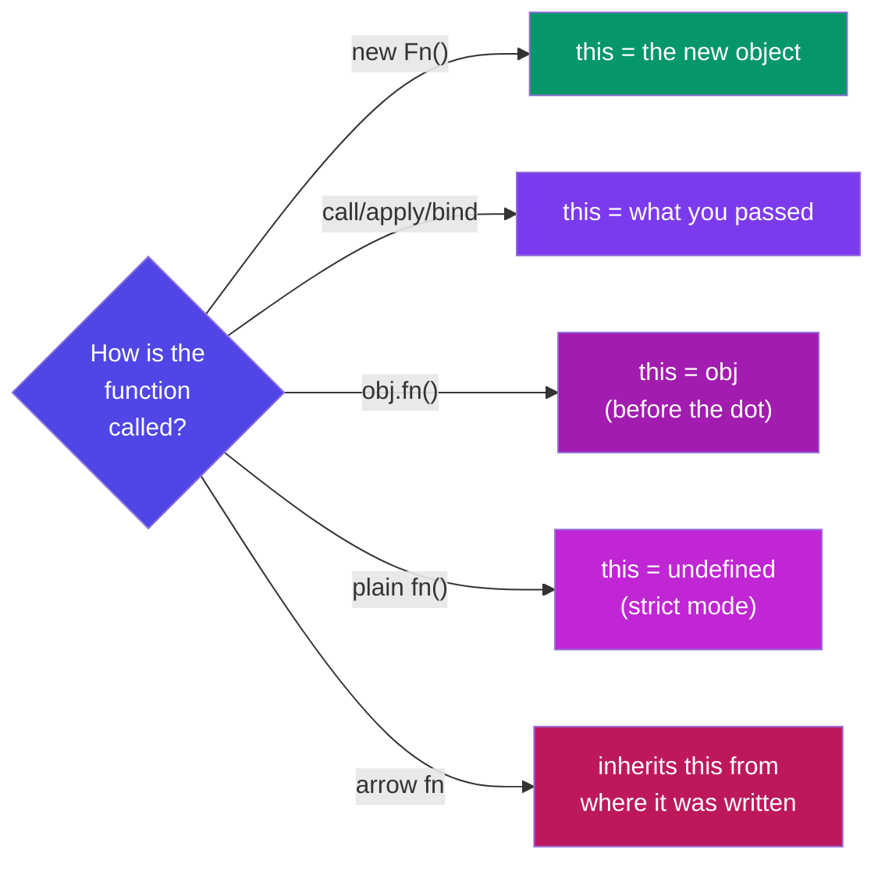

```js
const user = {
  name: "Nikhil",
  greet() { return `Hi, ${this.name}`; },
};

user.greet();                 // "Hi, Nikhil"  — rule 3: object before the dot

const loose = user.greet;
loose();                      // "Hi, undefined" 😱 — rule 4: no dot, no this

const fixed = user.greet.bind(user);
fixed();                      // "Hi, Nikhil" — rule 2: bind locks it forever
```

**call / apply / bind in one line each:**

```js
function intro(city, role) { return `${this.name} from ${city}, ${role}`; }
const me = { name: "Nikhil" };

intro.call(me, "Bangalore", "dev");        // call: args one by one, runs NOW
intro.apply(me, ["Bangalore", "dev"]);     // apply: args as Array, runs NOW
const later = intro.bind(me, "Bangalore"); // bind: returns a LOCKED copy for later
later("dev");
```

**Memory hook:** **c**all = **c**ommas, **a**pply = **a**rray, **b**ind = **b**ookmark for later.

**Where arrows save the day (and where they ruin it):**

```js
const timer = {
  seconds: 0,
  startGood() { setInterval(() => this.seconds++, 1000); },  // ✅ arrow inherits timer
  startBad()  { setInterval(function () { this.seconds++; }, 1000); }, // ❌ this = window
};

// But NEVER use an arrow AS a method:
const obj = { name: "X", greet: () => `Hi ${this.name}` };
obj.greet();   // "Hi undefined" — the arrow ignored the dot rule!
```

**Rule of thumb:** methods = regular functions; callbacks *inside* methods = arrows.

---

## G2. Prototypes & the Prototype Chain

**Simple definition:** every JS object has a hidden link — `[[Prototype]]` — to another object. Miss a property on the object? JS follows the link and looks there. Then the link's link. That walk is the **prototype chain**. It is JavaScript's native inheritance — classes are a nicer syntax *over this exact machinery*.


<p class="te"><strong>Telugu:</strong> Prathi object ki oka <strong>daagi unna link</strong> untundi — inko object ki. Property dorakakapothe, JS aa link ni <strong>paiki follow</strong> avutundi — adi prototype chain. Analogy: nee daggara drill ledu → pakkinti vaadini adigav → vaadi daggara ledu → vaadu inko intiki... veedhi aipoyaka <code>undefined</code>. Mukhyam: drill <strong>okate</strong> — method prototype meeda <em>okka copy</em>, anni instances share cheskuntayi. Million arrays, okate <code>map</code>. Classes ee machinery meede kurchunnayi.</p>

**You've already used it a thousand times:**

```js
const nums = [1, 2, 3];
nums.map(x => x * 2);
// nums has no "map" of its own!
// nums → Array.prototype (map lives HERE) → Object.prototype → null
```

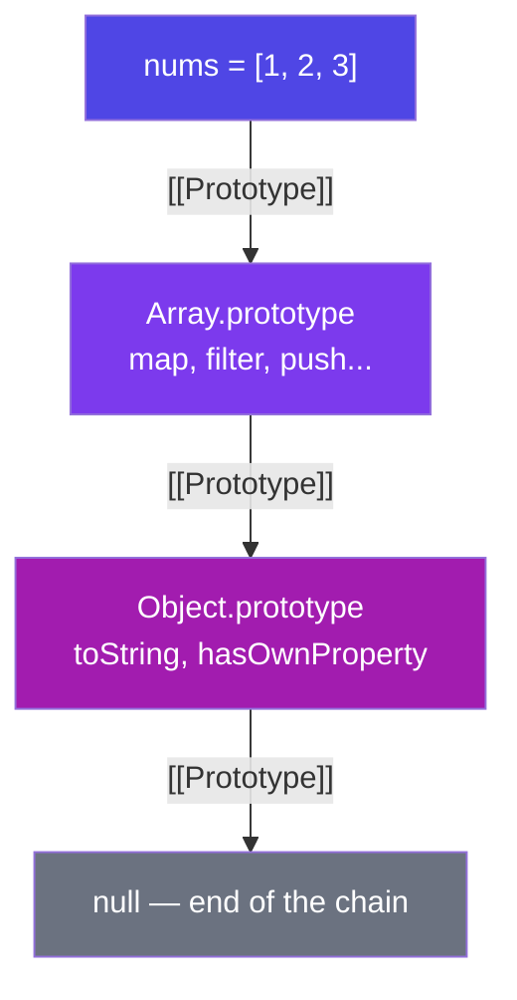

**Analogy:** you don't own a drill, so you ask your neighbour; they don't either, so they ask theirs. The request travels up the street until someone has it (or the street ends → `undefined`). Crucially, **there's only ONE drill** — a method on the prototype is *shared* by all instances, not copied into each. A million arrays, one `map`. That's the memory win.

**The pre-2015 way — constructor functions (recognise it in old code):**

```js
function User(name) {
  this.name = name;                          // per-instance data
}
User.prototype.greet = function () {         // SHARED method — one copy
  return `Hi, ${this.name}`;
};

const u = new User("Nikhil");
u.greet();                                   // found via the chain
```

**What `new` actually does — 4 steps:** ① creates an empty object → ② links its `[[Prototype]]` to `User.prototype` → ③ runs the function with `this` = that object → ④ returns the object. (That's rule 1 of `this`.)

Inspect chains with `Object.getPrototypeOf(obj)`; create with a chosen prototype via `Object.create(proto)`. Note `Object.assign(target, src)` just copies properties (no chain involved) — like a manual spread.

---

## G3. ES6 Classes

**Simple definition:** `class` is the modern, clean syntax for the constructor + prototype pattern above. Same engine underneath ("syntactic sugar") — but *far* more readable, and the style every framework uses.


<p class="te"><strong>Telugu:</strong> <code>class</code> ante constructor + prototype pattern ki <strong>kotha, clean syntax</strong> ("syntactic sugar") — lopala engine adhe. Getters/setters = bayatiki <em>property</em> laga kanipistundi kaani venaka <em>logic</em> untundi (validation, formatting). <code>static</code> = concept ki chendindi, oka object ki kaadu — <code>Math.random()</code>, <code>User.findById()</code> laaga.</p>

**A complete class — first the data and the methods:**

```js
class BankAccount {
  static bankName = "SBI";                    // STATIC: on the class itself

  #balance = 0;                               // PRIVATE field (G5)

  constructor(owner, opening = 0) {           // runs once per `new`
    this.owner = owner;                       // instance data
    this.#balance = opening;
  }

  deposit(amount) {                           // method → shared via prototype
    if (amount <= 0) throw new Error("Invalid amount");
    this.#balance += amount;
    return this;                              // return this → enables chaining
  }
```

**…then the accessors and the static utility (same class, continued):**

```js
  get balance() {                             // GETTER: read like a property
    return `₹${this.#balance.toLocaleString("en-IN")}`;
  }

  set owner(name) {                           // SETTER: validate on write
    if (!name?.trim()) throw new Error("Owner required");
    this._owner = name.trim();
  }
  get owner() { return this._owner; }

  static compare(a, b) {                      // static METHOD: utility on the class
    return a.#balance - b.#balance;
  }
}
```

**Using it:**

```js
const acc = new BankAccount("Nikhil", 5000);
acc.deposit(2500).deposit(1000);              // chaining, thanks to `return this`
acc.balance;                    // "₹8,500" — getter, no parentheses!
BankAccount.bankName;           // "SBI" — static: class, not instance
acc.bankName;                   // undefined — statics don't reach instances
```

**Getters/setters — when?** When the outside world should see a *property* but you need *logic* behind it — computed values (`fullName`), formatting, validation. **Static — when?** For things that belong to the concept, not one object: `Math.random()`, `Object.keys()`, `User.findById()` — all statics you already use.

---

## G4. Inheritance (extends & super)

**Simple definition:** inheritance lets a class *be a specialised version* of another — child gets everything the parent has, then adds or overrides. The "is-a" test: a Car **is a** Vehicle → inheritance fits.


<p class="te"><strong>Telugu:</strong> Inheritance ante oka class inko daani <strong>prathyeka roopam</strong> avvadam. Test: Car <strong>oka</strong> Vehicle (is-a) → sari. <code>super(...)</code> = parent constructor ni pilavadam (<code>this</code> vaadaka <strong>mundu</strong> tappanisari); <code>super.method()</code> = parent version ni pilavadam. Nee SAP pani lo prathi Fiori controller <code>extends Controller</code> — ee chapter ye nee bhavishyattu code.</p>

```js
class Vehicle {
  constructor(kind, wheels) {
    this.kind = kind;
    this.wheels = wheels;
  }
  describe() { return `A ${this.kind} with ${this.wheels} wheels`; }
}

class Car extends Vehicle {
  constructor(brand) {
    super("car", 4);                 // MUST call parent constructor FIRST
    this.brand = brand;
  }
  describe() {                        // override
    return `${super.describe()} — a ${this.brand}`;   // reuse parent's version
  }
  honk() { return "Beep!"; }          // extension
}

const swift = new Car("Suzuki Swift");
swift.describe();          // "A car with 4 wheels — a Suzuki Swift"
swift instanceof Car;      // true
swift instanceof Vehicle;  // true — the chain: swift → Car.prototype → Vehicle.prototype
```

**`super` in one line:** `super(...)` = call the parent's constructor (mandatory in a child constructor, *before* any `this.`); `super.method()` = call the parent's version of a method you overrode.

**Real-world example — every UI framework:**

```js
class Button extends UIComponent { ... }        // React class components (legacy),
class DetailController extends BaseController { ... }  // SAP UI5 — you extend
// sap.ui.core.mvc.Controller in EVERY Fiori app you'll touch. This chapter
// is literally the syntax of your future SAP work.
```

**A word of balance:** deep inheritance trees (A→B→C→D) turn rigid fast. Modern JS favours *composition* — building objects from small functions — for most app code, and keeps inheritance for genuine "is-a" hierarchies (framework base classes, Shape examples, error types).

---

## G5. Encapsulation (#private fields)

**Simple definition:** encapsulation = bundling data with the methods that manage it, and **hiding the data** so it can only change through those methods. The object guards its own consistency.


<p class="te"><strong>Telugu:</strong> Encapsulation ante data ni <strong>daachi</strong>, guard unna methods dwara matrame maarchanivvadam. Analogy: <strong>ATM</strong> — bank vault glass venaka ledu; nuvvu chinna menu (deposit/withdraw) dwara matrame maatladatav, rules ni <em>machine</em> enforce chestundi. <code>#balance</code> = nijamaina private (bayatinunchi touch chesthe SyntaxError) — "please touch cheyaku" kaadu, "<strong>cheyaleru</strong>".</p>

**Analogy — the ATM:** the bank's vault (data) is not behind the glass. You interact through a small, safe menu — deposit, withdraw, check balance — and *the machine* enforces the rules (no overdraft, no negative deposits). `#private` fields are the vault door.

```js
class Wallet {
  #balance = 0;                        // # = truly private (2022+, enforced by JS)

  deposit(amount) {
    if (amount <= 0) throw new Error("Deposit must be positive");
    this.#balance += amount;
  }
  withdraw(amount) {
    if (amount > this.#balance) throw new Error("Insufficient funds");
    this.#balance -= amount;
  }
  get balance() { return this.#balance; }   // read-only window
}

const w = new Wallet();
w.deposit(1000);
w.withdraw(200);
w.balance;         // 800
w.#balance;        // ❌ SyntaxError — not "please don't touch", CANNOT touch
w.balance = 999999;  // silently ignored — no setter exists ✅
```

**Why it matters:** without privacy, *any* line in a 10,000-line app can write `wallet.balance = -5000` and corrupt state; the bug surfaces far from its cause. With `#`, every change funnels through validated methods — there are only two doors, and both have guards. (You met the same idea as closures in F4 — classes and closures are two routes to one goal: *controlled access to hidden state*.)

Old code fakes privacy with `_underscore` names — a naming *convention* with zero enforcement. Recognise it; prefer `#`.

---

## G6. Polymorphism & Abstraction

**Polymorphism ("many forms") — simple definition:** different classes answer the **same method name** with their **own behaviour**, so calling code can treat them uniformly and never ask "which type are you?"


<p class="te"><strong>Telugu:</strong> <strong>Polymorphism</strong> ante — veru veru classes <em>okate method peru</em> ki <em>tama sonta</em> pani chestayi. Andhuke <code>shapes.forEach(s =&gt; s.area())</code> Circle ki, Rectangle ki, <strong>repu vachhe Triangle ki kuda</strong> panichestundi — unna code lo okka maarpu ledu. <strong>Abstraction</strong> ante — simple "<em>emi</em>" chupinchi, gandaragolam "<em>ela</em>" ni daachadam (<code>fetch(url)</code> nee tho TCP raayinchadu kada).</p>

```js
class Shape {
  area() { throw new Error("Subclass must implement area()"); }  // abstract-ish
  describe() { return `${this.constructor.name}: ${this.area().toFixed(2)}`; }
}

class Circle extends Shape {
  #r;
  constructor(r) { super(); this.#r = r; }
  area() { return Math.PI * this.#r ** 2; }
}

class Rectangle extends Shape {
  constructor(w, h) { super(); this.w = w; this.h = h; }
  area() { return this.w * this.h; }
}

const shapes = [new Circle(3), new Rectangle(4, 5), new Circle(1)];

// THE polymorphism moment — one line handles every current AND future shape:
shapes.forEach(s => console.log(s.describe()));
// Circle: 28.27 / Rectangle: 20.00 / Circle: 3.14
```

The alternative — `if (s instanceof Circle) ... else if (s instanceof Rectangle) ...` — must be edited every time a new shape is born. With polymorphism, adding `class Triangle extends Shape` requires **zero changes** to existing code. That's the point.

**Abstraction — simple definition:** exposing a simple *what* while hiding the messy *how*. `array.sort()` doesn't make you learn sorting algorithms; `fetch(url)` doesn't make you write TCP. Your classes should give the same gift:

```js
// Callers see ONE simple method...
class PaymentService {
  pay(order) {                        // the WHAT
    this.#validate(order);            // the HOW stays hidden
    const gateway = this.#pickGateway(order);
    return this.#execute(gateway, order);
  }
  #validate(o) { /* ... */ }
  #pickGateway(o) { /* UPI? card? wallet? caller never knows */ }
  #execute(g, o) { /* retries, logging, error mapping */ }
}
```

**Real-world example:** notification systems. `EmailNotifier`, `SMSNotifier`, `PushNotifier` — each implements `send(message)` its own way; the app just loops `notifiers.forEach(n => n.send(msg))`. Swap providers, add WhatsApp — the loop never changes.

---

## G7. The 4 Pillars — Summary


<p class="te"><strong>Telugu:</strong> Okka vaakyam lo: <strong>Encapsulation</strong> state ni daachutundi, <strong>Inheritance</strong> behaviour ni panchukuntundi, <strong>Polymorphism</strong> oke interface ki chala implementations istundi, <strong>Abstraction</strong> complexity ni simple API venaka daachutundi. JS lo ivi anni <strong>prototype chain</strong> meeda nadustayi, <code>class</code> anedi modern syntax.</p>

| Pillar | One-liner | Tool in JS | Example above |
|---|---|---|---|
| **Encapsulation** | hide data behind guarded methods | `#private`, getters/setters, closures | `Wallet` (G5) |
| **Inheritance** | child *is-a* parent, reuses + extends | `extends`, `super` | `Car extends Vehicle` (G4) |
| **Polymorphism** | same call, per-class behaviour | method overriding | `shapes.forEach(s => s.area())` (G6) |
| **Abstraction** | simple *what*, hidden *how* | private methods, clean public API | `PaymentService.pay()` (G6) |

**Interview one-breath answer:** *"Encapsulation hides state, inheritance shares behaviour, polymorphism lets one interface have many implementations, abstraction hides complexity behind a simple API. In JS these ride on the prototype chain, with `class` as the modern syntax."*

---

# Part H — Async JavaScript

*The grand finale of Phase 5: how a single-threaded language cooks five dishes at once.*

## H1. Single-Threaded, Yet Async

**The puzzle:** JS runs **one line at a time on one call stack** (F1). Yet a web page fetches data, waits on timers, and reacts to clicks *simultaneously* — without freezing. How?


<p class="te"><strong>Telugu:</strong> JS okkate line ni okkasari run chestundi — ayina page freeze avvakunda fetch, timers, clicks anni ela? Samadhanam: JS rendu panulu okesari <strong>cheyyadu — appagistundi</strong> (delegate). Analogy: <strong>oka vantavaadu</strong>, rice ki 20 nimishaalu — pot daggara chusthu nilabadadu kada? Timer petti (delegate), kuragayalu koyyadam start chestadu (code continue). Timer mogaganae, cheti lo pani aipoyaka rice chustadu. Okka chef, chala vantalu, edi kaaladu.</p>

**The answer:** JavaScript itself never does two things at once — it **delegates**. Slow jobs (network calls, timers, file reads) are handed to the **environment** (browser/Node), which does the waiting *outside* JS. When a job finishes, its callback queues up, and JS runs it when the stack is free.

**Analogy — the chef and the kitchen timers:** one chef (JS) cooks alone. Rice needs 20 minutes — does he stare at the pot? No: he sets a timer (delegates to the environment) and starts chopping (keeps executing). When the timer rings (callback queued), he finishes his current chop (empties the stack), *then* attends the rice. One chef, many dishes, nothing burnt.

**Why blocking is catastrophic in a browser:** while the stack is busy, the page can't repaint or respond to clicks. A 5-second synchronous loop = a frozen tab. Async isn't an optimisation; it's survival.

```js
console.log("A");
setTimeout(() => console.log("B"), 2000);   // delegate + move on
console.log("C");
// A, C ... (2s) ... B — JS never stood still
```

---

## H2. The Event Loop

**Simple definition:** the **event loop** is a tiny manager running one rule forever: *"Is the call stack empty? If yes — run all waiting **microtasks**; then take ONE **macrotask** from the queue and run it. Repeat."*


<p class="te"><strong>Telugu:</strong> Event loop oka chinna manager — okate rule: "<strong>call stack khaali aindaa? Aithe modata <em>anni</em> microtasks (promises) run cheyyi, taruvata <em>okka</em> macrotask (timer/event) teesuko. Malli repeat.</strong>" Andhuke <code>setTimeout(fn, 0)</code> ante "ippude" kaadu — "ippudu unna mukhyamaina panulu anni aipoyaka". Ee rule teliste <code>1, 4, 3, 2</code> answer nee ki automatic.</p>

**The four actors:**

1. **Call stack** — where JS executes, one frame at a time (F1).
2. **Web APIs** — the environment's helpers doing the actual waiting: `setTimeout`, `fetch`, DOM events.
3. **Macrotask queue** (a.k.a. task/callback queue) — finished timers & events wait here.
4. **Microtask queue** — finished **Promises** wait here. **Always served first, and drained completely.**

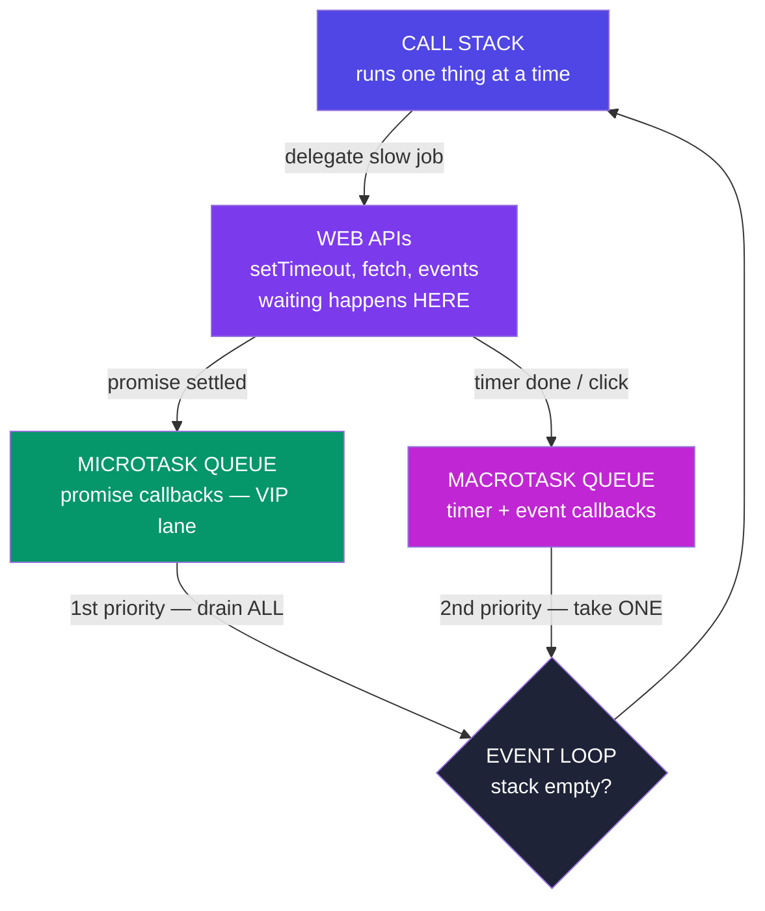

**The litmus-test snippet (asked in real interviews, verbatim):**

```js
console.log(1);
setTimeout(() => console.log(2), 0);            // macrotask — even at 0ms!
Promise.resolve().then(() => console.log(3));   // microtask — VIP lane
console.log(4);

// Output: 1, 4, 3, 2
```

**Why:** synchronous code first (`1`, `4`) — the stack must empty. Then ALL microtasks (`3`). Only then one macrotask (`2`). A `setTimeout(fn, 0)` never means "now"; it means "after everything currently more important".

**One more, to lock it in:**

```js
setTimeout(() => console.log("timer"), 0);
Promise.resolve()
  .then(() => console.log("p1"))
  .then(() => console.log("p2"));    // chained micro → still beats the timer
console.log("sync");
// sync, p1, p2, timer
```

**Real-world consequence:** a heavy synchronous loop delays *every* timer and click handler — queues only advance when the stack empties. That's why big work gets chunked, and why "the UI froze" almost always means "someone blocked the stack".

---

## H3. Callbacks & Callback Hell

**Simple definition:** a **callback** is a function you hand to an async operation: "when you finish, run this." It was JS's original async pattern — and it works, until steps depend on steps.


<p class="te"><strong>Telugu:</strong> Callback ante "nuvvu aipoyaka <strong>idi run cheyyi</strong>" ani ichhe function. Pani chestundi — kaani steps oka daani meeda okati aadharapadithe, code <strong>pakkaki pakkaki jaari</strong> pyramid avutundi. Prathi step lo malli error handling, indentation perigipotundi. Ee badha ye <strong>Promises</strong> puttadaniki kaaranam.</p>

```js
setTimeout(() => console.log("2s passed"), 2000);
button.addEventListener("click", onClick);        // callbacks are everywhere
```

**The problem — sequential steps nest sideways:**

```js
// Login → fetch profile → fetch orders → fetch invoice ... 👇
login(user, (err, session) => {
  if (err) return handle(err);
  getProfile(session, (err, profile) => {
    if (err) return handle(err);
    getOrders(profile, (err, orders) => {
      if (err) return handle(err);
      getInvoice(orders[0], (err, invoice) => {
        if (err) return handle(err);
        console.log(invoice);          // 4 levels deep — the "pyramid of doom"
      });
    });
  });
});
```

Every step re-implements error handling, indentation grows relentlessly, and running two things *in parallel then combining them* is genuinely hard. This pain is **why Promises exist** — same delegation model, civilised syntax.

---

## H4. Promises

**Simple definition:** a **Promise** is an object representing a value that isn't ready *yet* — a receipt for a future result. You attach "when ready" (`.then`) and "if failed" (`.catch`) handlers instead of nesting.


<p class="te"><strong>Telugu:</strong> Promise ante <strong>inka ready kaani value</strong> ki <em>receipt</em>. Analogy: food court lo order chesthe <strong>token</strong> istaru — food kaadu. Token <em>pending</em>; taruvata <em>fulfilled</em> (food ready) leda <em>rejected</em> (sold out). Nuvvu counter daggara stuck avvavu — kurchuni, token mogaganae vellav. <code>.then</code> chain pyramid ni <strong>pipeline</strong> ga maarusthundi, okate <code>.catch</code> anni failures ni pattukuntundi.</p>

**Analogy:** ordering at a food court. You get a **token** (the promise) immediately — not the food. The token is *pending*; later it's either *fulfilled* (order ready → collect) or *rejected* (item sold out → refund). You don't stand frozen at the counter; you sit down and act **when the token buzzes**.

**The three states (one-way street, settles exactly once):**

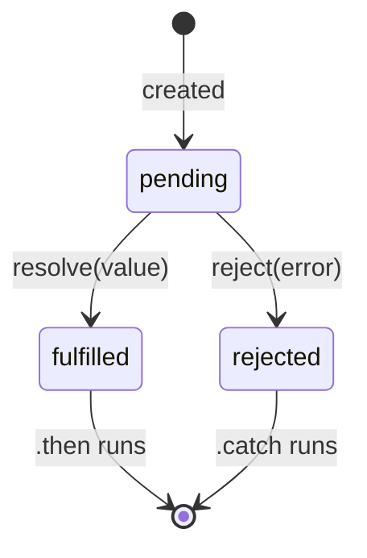

```js
const order = new Promise((resolve, reject) => {
  setTimeout(() => {
    Math.random() > 0.2 ? resolve("🍜 Ramen ready") : reject(new Error("Sold out"));
  }, 1500);
});

order
  .then(food => console.log(food))          // on fulfilled
  .catch(err => console.log(err.message))   // on rejected — ONE catch for the chain
  .finally(() => console.log("Counter free"));  // always — hide spinners here
```

**Chaining — the cure for the pyramid.** Each `.then` returns a **new promise**; return a value and it flows to the next `.then`; return another *promise* and the chain waits for it. The pyramid becomes a pipeline:

```js
login(user)
  .then(session => getProfile(session))
  .then(profile => getOrders(profile))
  .then(orders  => getInvoice(orders[0]))
  .then(invoice => console.log(invoice))
  .catch(handle);          // ANY step fails → jumps straight here. One handler.
```

Flat, readable, single error path — the exact same logic as the callback pyramid, minus the pain.

---

## H5. async / await

**Simple definition:** syntax that lets you *write* promise code as if it were ordinary top-to-bottom code. `async` marks a function as promise-returning; `await` says "pause **this function** (never the whole program!) until that promise settles, then hand me its value."


<p class="te"><strong>Telugu:</strong> Promise code ni <strong>saadha ga paina nunchi kindiki</strong> chadive laga raase syntax. 3 rules: (1) <code>async</code> function <strong>eppudu</strong> promise ne istundi; (2) <code>await</code> <strong>aa function ni matrame</strong> aapthundi — migilina program nadustune untundi; (3) <strong>viduga run avvagalige vaatini vaddu vaddu ga await cheyaku</strong> — <code>Promise.all</code> tho okesari pampu (3 sec → 1 sec).</p>

```js
// The H4 chain, rewritten — reads like a recipe:
async function showInvoice(user) {
  try {
    const session = await login(user);
    const profile = await getProfile(session);
    const orders  = await getOrders(profile);
    const invoice = await getInvoice(orders[0]);
    console.log(invoice);
  } catch (err) {
    handle(err);              // normal try/catch replaces .catch ✅
  } finally {
    hideSpinner();
  }
}
```

**The three rules that prevent 90% of async bugs:**

1. **An `async` function ALWAYS returns a promise.** `return 42` really returns `Promise.resolve(42)` — callers must `await` it or `.then` it.
2. **`await` pauses only its own function.** The rest of the program (clicks, timers, other functions) runs on. Under the hood, everything after `await` becomes a microtask (H2) — `await` is `.then` in a nicer coat.
3. **Don't await in sequence what could run in parallel:**

```js
// ❌ SLOW — 3 seconds total (1s + 1s + 1s, one after another):
const a = await fetchPrices();     // 1s
const b = await fetchReviews();    // 1s
const c = await fetchStock();      // 1s

// ✅ FAST — ~1 second (all three in flight together):
const [prices, reviews, stock] = await Promise.all([
  fetchPrices(), fetchReviews(), fetchStock(),
]);
```

Starting a promise begins the work immediately; `await` only decides *when you wait*. Independent jobs → start all, await together.

---

## H6. Promise.all & Friends

Four static helpers for running many promises at once — know when each fits:


<p class="te"><strong>Telugu:</strong> Okka vaakyam lo: <strong>all</strong> = anni successful avvali (okati fail aithe motham fail); <strong>allSettled</strong> = enni fail ayina parledu, <em>full report</em> istundi; <strong>race</strong> = modata settle ayyedi gelustundi (timeout ki idi); <strong>any</strong> = modata <em>success</em> ayyedi gelustundi (fastest CDN).</p>

| Helper | Resolves with | Fails when | Real-world fit |
|---|---|---|---|
| `Promise.all` | array of ALL results (in order) | **any one rejects** (fail-fast) | steps that ALL must succeed — load user + cart + prices before render |
| `Promise.allSettled` | array of `{status, value/reason}` per promise — **never rejects** | never | independent jobs where partial success is fine — send 100 emails, report which failed |
| `Promise.race` | the FIRST to settle (win **or** fail) | first settle is a rejection | timeouts: race the fetch against a 5s timer |
| `Promise.any` | the first to FULFIL, ignores failures | only if **all** reject | fastest mirror/CDN wins |

```js
// The classic race-a-timeout pattern:
const timeout = (ms) =>
  new Promise((_, reject) => setTimeout(() => reject(new Error("Timeout!")), ms));

const data = await Promise.race([fetch("/api/report"), timeout(5000)]);

// allSettled — a dashboard that shows what it CAN:
const results = await Promise.allSettled([fetchSales(), fetchTraffic(), fetchReviews()]);
results.forEach(r =>
  r.status === "fulfilled" ? renderWidget(r.value) : renderErrorCard(r.reason));
```

**Choosing in one breath:** *all* = need everything; *allSettled* = want a full report; *race* = first settle decides (timeouts); *any* = first success wins.

---

## H7. fetch — Real-World API Calls

**Simple definition:** `fetch(url)` is the browser's built-in, promise-based way to call HTTP APIs — the skill every real app (and Phase 8's Node/Express work) revolves around.


<p class="te"><strong>Telugu:</strong> Rendu peddha traps — rendu kuda gurthupettuko: (1) <code>fetch</code> <strong>404/500 ki reject avvadu!</strong> Network poyinappude reject. Andhuke <code>res.ok</code> nuvve check cheyyali. (2) Body ki <strong>rendo await</strong> kaavali: <code>await res.json()</code>. <code>finally</code> lo spinner off cheyyadam marchipoku.</p>

```js
async function getUser(id) {
  try {
    const res = await fetch(`https://api.example.com/users/${id}`);

    if (!res.ok) {                       // ⚠ fetch does NOT reject on 404/500!
      throw new Error(`HTTP ${res.status}`);   // you must check res.ok yourself
    }
    const user = await res.json();       // body parsing is ALSO async (2nd await)
    return user;
  } catch (err) {
    // network down, DNS failure, CORS, or our thrown HTTP error
    console.error("Could not load user:", err.message);
    return null;
  }
}
```

**The two classic traps** are both in that snippet: ① `fetch` only rejects on *network* failure — a 404 or 500 is a "successful" response you must check via `res.ok`; ② the body needs its own `await res.json()`.

**POSTing data (forms, saves):**

```js
const res = await fetch("/api/todos", {
  method: "POST",
  headers: { "Content-Type": "application/json" },
  body: JSON.stringify({ text: "Learn fetch", done: false }),   // D6's JSON!
});
```

**A complete real-world flow — search with loading state (Parts D, E, F, H together):**

```js
searchInput.addEventListener("input", debounce(async (e) => {
  spinner.classList.remove("hidden");                  // DOM (E2)
  try {
    const res = await fetch(`/api/search?q=${encodeURIComponent(e.target.value)}`);
    if (!res.ok) throw new Error(res.status);
    const items = await res.json();
    resultsEl.innerHTML = items                         // array methods (D2)
      .map(i => `<li>${i.title}</li>`)                  // template literals (B5)
      .join("");
  } catch {
    resultsEl.innerHTML = "<li>Something went wrong</li>";
  } finally {
    spinner.classList.add("hidden");                    // finally = ALWAYS cleanup
  }
}, 400));                                               // closure-powered debounce (F4)
```

Five parts of these notes in fifteen lines — this is what "knowing JavaScript" actually looks like in practice.

---

# Part I — ES Modules & Array Mastery

*Two closers: how real projects are organised across files, and the one array method that can impersonate all the others.*

## I1. ES Modules (import / export)

**Simple definition:** ES Modules split a program into files, where each file is its own private scope (goodbye, IIFE wrappers) and *chooses* what to share (`export`) and what to use from others (`import`).


<p class="te"><strong>Telugu:</strong> Prathi file <strong>daani sonta private scope</strong> — emi share cheyyalo <code>export</code> tho nuvve nirnayistav. <strong>Named</strong> (<code>export const</code>) = oka file lo chala, braces tho exact peru tho import (typo aithe error — safe). <strong>Default</strong> = file ki okate "hero", e peru tho ayina import cheyyochu. Utilities ki named, file loni main vishayam (class/component) ki default.</p>

**Named exports — a toolbox (many per file):**

```js
// utils/currency.js
export const TAX_RATE = 0.18;
export function withTax(amount) { return amount * (1 + TAX_RATE); }
export const formatINR = (n) => `₹${n.toLocaleString("en-IN")}`;
```

```js
// checkout.js
import { withTax, formatINR } from "./utils/currency.js";
import { withTax as addTax } from "./utils/currency.js";   // rename on import
import * as currency from "./utils/currency.js";           // grab the whole toolbox
```

**Default export — the file's headline act (one per file):**

```js
// Cart.js
export default class Cart { ... }

// app.js — no braces, any name you like:
import Cart from "./Cart.js";
import ShoppingCart from "./Cart.js";     // same thing — name is yours
```

| | Named `export const x` | `export default` |
|---|---|---|
| Per file | many | **one** |
| Import syntax | `import { x }` — braces, exact name | `import anything` — no braces |
| Typo protection | ✅ wrong name = error | ❌ silently imports under wrong name |
| Convention | utilities, constants, helpers | the file's one main thing (a class, a component) |

**In the browser** you opt in with `<script type="module" src="app.js">` — modules load once (repeat imports are cached), run in strict mode, and `defer` automatically. In React/Node projects, *every* file is a module; you'll write `import`/`export` more often than almost any other keyword.

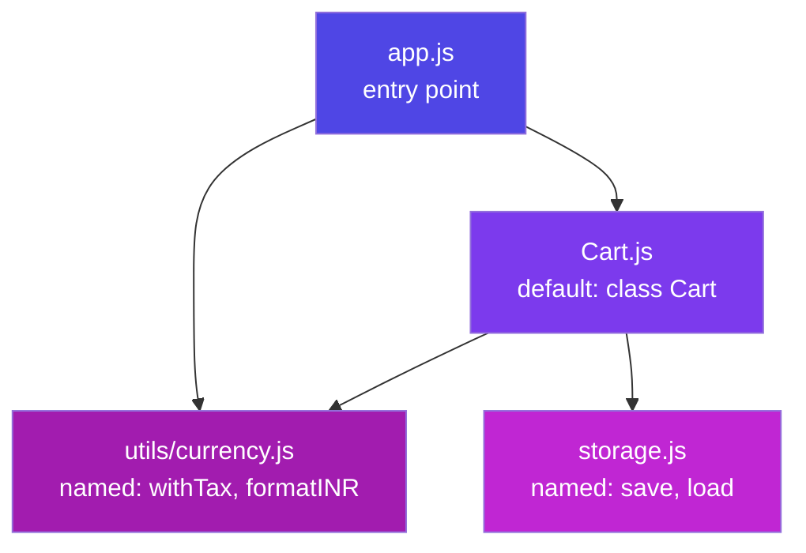

**Real-world payoff:** your to-do app (E4) refactored — `storage.js` (localStorage code), `render.js` (DOM code), `app.js` (wiring). Fix a bug in saving? You *know* it's in `storage.js`. That certainty is what modules buy at 10× the scale of a real codebase.

---

## I2. reduce — the Swiss-Army Method

**Simple definition:** `.reduce` boils an array down to **one value** — a number, a string, an object, even a new array. It carries an **accumulator** (the running result) through every item.


<p class="te"><strong>Telugu:</strong> Reduce array ni <strong>okka value</strong> ga maarustundi — number, string, object, edaina. Analogy: <strong>kondapai nunchi jaaruthunna manchu bomma</strong> (snowball) — nuvvu ichina size tho start, prathi item daggara koncham manchu pattukuntundi, kinda cheruko​gaane final result. Callback okate prashna ki samadhanam: "ippati varaku unna bomma + ee item = ippudu bomma enta?" Real world: "month vaari sales", "status vaari tasks" — prathi dashboard idi.</p>

```js
array.reduce((accumulator, item) => newAccumulator, startingValue)
```

**Analogy:** a snowball rolling downhill. It starts at your chosen size (`startingValue`), picks up snow at every item, and what arrives at the bottom is the final result. The callback answers one question: *"given the snowball so far and this item, what's the snowball now?"*

**Level 1 — sum (the hello-world):**

```js
const cart = [
  { name: "pen", price: 20 },
  { name: "book", price: 250 },
  { name: "lamp", price: 700 },
];

const total = cart.reduce((sum, item) => sum + item.price, 0);   // 970
```

Trace it: `0+20=20` → `20+250=270` → `270+700=970`. That's all reduce ever does — one honest step, repeated.

**Level 2 — max / min (accumulator as "best so far"):**

```js
const priciest = cart.reduce((best, item) => item.price > best.price ? item : best);
// no startingValue → first item starts as the accumulator
```

**Level 3 — group-by (accumulator as an object). The most useful real-world reduce:**

```js
const students = [
  { name: "Asha", grade: "A" }, { name: "Bharat", grade: "B" }, { name: "Chitra", grade: "A" },
];

const byGrade = students.reduce((groups, s) => {
  (groups[s.grade] ??= []).push(s.name);      // create the bucket if missing, then add
  return groups;
}, {});
// { A: ["Asha", "Chitra"], B: ["Bharat"] }
```

Every "sales by month", "tasks by status", "orders by customer" chart you'll ever build is this exact pattern.

**Level 4 — counting occurrences:**

```js
const votes = ["yes", "no", "yes", "yes"];
const tally = votes.reduce((t, v) => ({ ...t, [v]: (t[v] ?? 0) + 1 }), {});
// { yes: 3, no: 1 }
```

**Level 5 — the party trick: rebuild map & filter (proves reduce is the general case):**

```js
const map    = (arr, fn) => arr.reduce((out, x) => [...out, fn(x)], []);
const filter = (arr, fn) => arr.reduce((out, x) => fn(x) ? [...out, x] : out, []);
```

**The full pipeline — filter → map → reduce, the shape of real data work:**

```js
const monthlyRevenue = orders
  .filter(o => o.status === "delivered")       // keep the real sales
  .map(o => o.total * (1 - o.discount))        // net value of each
  .reduce((sum, v) => sum + v, 0);             // one number for the dashboard
```

**When NOT to reduce:** if a `filter`/`map`/`find` says it clearer, use that — reduce is the fallback power tool, not a badge of honour. Rule: the clearest method that works, wins.

---

---

# Part J — The Rest of JavaScript

*Parts A–I covered the roadmap's Phase 4 & 5 syllabus. This part closes every remaining gap, so that no JS code you meet contains a symbol you don't recognise. Each topic: what it is, when you'd reach for it, and the code.*

## J1. Sets & Maps

**Simple definition:** two collection types that fix the everyday weaknesses of arrays and plain objects. A **Set** holds only unique values. A **Map** is a dictionary whose keys can be *anything* (not just strings).

<p class="te"><strong>Telugu:</strong> Array lo duplicates vastayi; object lo keys eppudu <strong>strings</strong> ye avutayi. <strong>Set</strong> = unique values matrame (duplicates thaanantaa poyi). <strong>Map</strong> = key edaina kaavachu (object, function kuda!) mariyu order gurthu untundi. Real ga: duplicates teeyadaniki Set, "ee object ki ee data" ani gurthu unchukovadaniki Map.</p>

```js
// ---- Set: uniqueness, free
const tags = new Set(["js", "react", "js", "node"]);
tags.size;              // 3 — the duplicate "js" never entered
tags.has("react");      // true — O(1) lookup, vs array.includes() O(n)
tags.add("sap"); tags.delete("node");
const unique = [...new Set([1, 2, 2, 3])];   // [1,2,3] — THE dedupe idiom

// ---- Map: any key type, remembers insertion order
const cache = new Map();
const userObj = { id: 1 };
cache.set(userObj, "data for this exact object");   // an OBJECT as the key!
cache.set("name", "Nikhil");
cache.get(userObj);     // "data for this exact object"
cache.size;             // 2      (an object would need Object.keys().length)
for (const [k, v] of cache) { /* iterates in insertion order */ }
```

| | Plain object | `Map` |
|---|---|---|
| Key types | strings/symbols only | **anything** — objects, functions, numbers |
| Size | `Object.keys(o).length` | `map.size` |
| Order | mostly insertion (integer keys jump first) | **guaranteed** insertion order |
| Iterate | `Object.entries(o)` | directly — `for (const [k,v] of map)` |
| Inherited junk | has a prototype (`toString` etc.) | none — a clean bag |
| Use when | fixed, known shape (a record) | keys are dynamic / not strings / order matters |

**WeakMap & WeakSet — the memory-safe cousins:** they hold their keys *weakly*, meaning an entry disappears automatically when the key object is garbage-collected (J10). Use for attaching private data to objects without leaking memory:

```js
const privateData = new WeakMap();
class User {
  constructor(ssn) { privateData.set(this, { ssn }); }   // dies with the instance
}
```

**Real-world:** `Set` for "which product IDs are in the cart", `Map` for "DOM element → its state", `WeakMap` for library internals that must not leak.

---

## J2. Iterators & Generators

**Simple definition:** an **iterable** is anything `for...of` can walk (arrays, strings, Sets, Maps). A **generator** is a function you can *pause and resume* — it produces values one at a time, on demand.

<p class="te"><strong>Telugu:</strong> Saadhaarana function start aithe <strong>aipoye varaku</strong> aagadu. <strong>Generator</strong> (<code>function*</code>) matram <code>yield</code> daggara <strong>aagi</strong>, nuvvu adiginappudu malli start avutundi — pause/play button unna function laantidi. Endhuku? Anantamaina (infinite) leda chala peddha sequences ni <strong>okkosari okkati</strong> ivvadaniki — motham memory lo pettakunda.</p>

```js
function* idGenerator() {        // note the *
  let id = 1;
  while (true) {                 // an INFINITE loop that never hangs!
    yield id++;                  // pause here, hand back a value, wait
  }
}
const ids = idGenerator();
ids.next().value;    // 1   — runs until the first yield, then freezes
ids.next().value;    // 2   — resumes exactly where it stopped
// The while(true) is safe because it only advances when you ASK.
```

**Why generators matter:** laziness. Computing 1,000,000 values costs nothing until you pull them.

```js
function* take(iterable, n) {           // works on ANY iterable
  let i = 0;
  for (const item of iterable) {
    if (i++ >= n) return;
    yield item;
  }
}
[...take(idGenerator(), 3)];   // [1, 2, 3] — from an infinite source
```

**The iterator protocol — what `for...of` actually asks for.** Any object with a `[Symbol.iterator]()` method returning `{ next() }` becomes iterable. Implement it and your own class works with `for...of`, spread, and destructuring:

```js
class Playlist {
  #songs = ["Song A", "Song B"];
  *[Symbol.iterator]() { yield* this.#songs; }   // generator as the iterator
}
const p = new Playlist();
for (const song of p) console.log(song);   // it just works
const [first] = p;                          // destructuring works too
```

**Real-world:** paginated API readers (`yield` a page at a time), Redux-Saga, and every `for...of` you've already written — arrays are iterable *because* they implement this protocol.

---

## J3. Error Handling & Custom Errors

**Simple definition:** `throw` raises an error; `try/catch/finally` catches it and keeps your program alive. Errors are *objects*, and you can define your own types.

<p class="te"><strong>Telugu:</strong> Error vaste app motham aagipovaali ani ledu. <code>try</code> lo pani cheyyi, <code>catch</code> lo tappu ni pattuko, <code>finally</code> lo — <strong>jarigina jaragakapoyina</strong> — cleanup cheyyi (spinner off laantivi). Mukhyam: <strong>nishabdham ga mingakunda</strong> (silent catch) undadam — catch chesi emi cheyakapothe bug daagipotundi, taruvata inka kastam.</p>

```js
function withdraw(balance, amount) {
  if (typeof amount !== "number") throw new TypeError("Amount must be a number");
  if (amount > balance) throw new RangeError("Insufficient funds");
  return balance - amount;
}

try {
  withdraw(100, 500);
} catch (err) {
  if (err instanceof RangeError) showToast("Not enough money");
  else throw err;                    // not mine to handle → re-throw it upward
} finally {
  hideSpinner();                     // ALWAYS runs — even on throw or return
}
```

**The built-in error types** (all extend `Error`): `TypeError` (wrong type — the one you'll hit most), `RangeError` (value out of bounds), `ReferenceError` (undeclared variable / TDZ), `SyntaxError` (bad code), `Error` (generic).

**Custom errors — how real apps model failure:**

```js
class ValidationError extends Error {
  constructor(field, message) {
    super(message);                  // sets this.message
    this.name = "ValidationError";   // shows in the stack trace
    this.field = field;              // extra context for the UI
  }
}

try {
  throw new ValidationError("email", "Email is not valid");
} catch (e) {
  if (e instanceof ValidationError) highlightField(e.field);   // typed handling
}
```

**The three rules:** ① catch only what you can *handle* — re-throw the rest; ② never `catch {}` silently; ③ in async code, `try/catch` only catches `await`ed rejections — a floating promise's rejection lands in `window.onunhandledrejection`, not your `catch`.

---

## J4. The Built-in Toolboxes

**Simple definition:** the methods JS ships with. You don't memorise these — you recognise them and look up the rest.

<p class="te"><strong>Telugu:</strong> Ivi anni <strong>battee pattalsina avasaram ledu</strong> — chusinappudu "idi em chestundo telusu" ante chaalu, migilinadi MDN lo chuskovachu. Interviews lo kuda ivi gurthupettukunnaava ani kaadu, <em>saraina daani</em> ni ennukogalava ani chustaru.</p>

**String** (all return a *new* string — strings are immutable):

```js
"  Nikhil  ".trim()              // "Nikhil"        — form inputs, always
"nikhil".toUpperCase()           // "NIKHIL"
"a,b,c".split(",")               // ["a","b","c"]   — string → array
"js is fun".includes("fun")      // true
"js".padStart(5, "0")            // "000js"         — invoice numbers
"a-b-a".replaceAll("a", "x")     // "x-b-x"         — replace() does only the 1st!
"hello".slice(1, 3)              // "el"
`${name}`.at(-1)                 // last character
```

**Number & Math:**

```js
Number("42")           // 42        — the form-input fix (B3)
parseInt("42px")       // 42        — stops at the first non-digit
parseFloat("3.14rem")  // 3.14
(1234.5678).toFixed(2) // "1234.57" — a STRING, careful
(1234567).toLocaleString("en-IN")  // "12,34,567" — Indian grouping!
Number.isNaN(x)        // the safe NaN check (never x === NaN)
Number.isInteger(5.0)  // true

Math.round(4.5)  // 5      Math.floor(4.9)  // 4     Math.ceil(4.1)  // 5
Math.max(...arr) // spread! Math.min(...arr)
Math.random()    // 0 ≤ n < 1
const roll = Math.floor(Math.random() * 6) + 1;   // 1–6, the classic
Math.abs(-5)     // 5      Math.round(n * 100) / 100   // 2-decimal rounding
```

**Date** (0-indexed months — the eternal trap):

```js
const now = new Date();
now.getFullYear();          // 2026
now.getMonth();             // 0 = January! ⚠ always +1 for display
now.toISOString();          // "2026-07-16T..." — the format APIs want
now.toLocaleDateString("en-IN");    // "16/7/2026"
Date.now();                 // milliseconds since 1970 — for timing/IDs
const tomorrow = new Date(Date.now() + 24 * 60 * 60 * 1000);
```

> Dates in JS are notoriously painful (timezones, DST, month indexing). Every real project reaches for a library — **date-fns** (modern, tree-shakeable) or the new built-in **Temporal** API. Know the basics, don't hand-roll date maths.

---

## J5. Regular Expressions

**Simple definition:** a mini-language for describing text patterns — searching, validating, extracting, replacing.

<p class="te"><strong>Telugu:</strong> Regex ante <strong>text ki search pattern</strong> raase chinna bhasha. Modata chusthe gandaragolam ga untundi — kaani 6 symbols teliste 90% pani aipotundi. Nuvvu regex ni <em>raayakapoyina paravaledu</em>, kaani code lo chusinappudu <strong>chadavagalagali</strong>. Chinna warning: HTML/email ni perfect ga match cheyalanukovadam vyardham — library vaadu.</p>

```js
const re = /\d{3}-\d{4}/;          // literal syntax
"call 555-1234".match(re);         // ["555-1234"]
re.test("call 555-1234");          // true — the quickest check
```

**The symbols that cover most cases:**

| Symbol | Means | Example |
|---|---|---|
| `\d` `\w` `\s` | digit · word char · whitespace | `\d+` → "123" |
| `.` | any character | `a.c` → "abc" |
| `*` `+` `?` | 0+ · 1+ · 0-or-1 | `a+` → "aaa" |
| `{n,m}` | between n and m times | `\d{3,5}` |
| `[abc]` `[^abc]` | one of · NOT one of | `[aeiou]` |
| `^` `$` | start · end of string | `^Hi` |
| `(...)` | capture group | extract the part you want |
| `\|` | or | `cat\|dog` |
| flags `g` `i` | all matches · ignore case | `/hi/gi` |

```js
// Extract with capture groups:
const m = "2026-07-16".match(/(\d{4})-(\d{2})-(\d{2})/);
const [, year, month, day] = m;        // "2026", "07", "16"

// Named groups — far more readable:
const { groups } = "2026-07-16".match(/(?<y>\d{4})-(?<m>\d{2})-(?<d>\d{2})/);
groups.y;   // "2026"

// Replace with a function:
"hello world".replace(/\b\w/g, c => c.toUpperCase());   // "Hello World"

// Practical validation (good enough, not perfect):
const isEmail = /^[^\s@]+@[^\s@]+\.[^\s@]+$/.test(input);
```

**Real-world:** form validation, pulling IDs out of URLs, log parsing, find-and-replace across a codebase. **Rule:** if the regex needs a comment to explain it, it needs to be a function instead.

---

## J6. Immutability & Protecting Objects

**Simple definition:** immutability means *never changing existing data* — you build a new copy instead. It's the discipline that makes React (and debugging) work.

<p class="te"><strong>Telugu:</strong> Immutability ante — unna data ni <strong>maarchakunda</strong>, kotha copy ni thayaru cheyyadam. Enduku? Data ni edo oka chota nishabdham ga maarchesthe, aa bug ekkadi nunchi vachhindo kanukkovadam narakam. React kuda ide korukuntundi — <code>{...prev, city:"Hyd"}</code>. <code>const</code> immutability <strong>kaadu</strong> — adi label ni lock chestundi, lopali vishayam ni kaadu (B1 gurthupettuko).</p>

```js
// ❌ mutation — the original is gone forever
user.city = "Hyderabad";
todos.push(newTodo);

// ✅ immutable — build a new value
const updated = { ...user, city: "Hyderabad" };
const nextTodos = [...todos, newTodo];
const withoutThird = todos.filter((_, i) => i !== 2);
const renamed = todos.map(t => t.id === 5 ? { ...t, text: "new" } : t);
```

**The new immutable array methods (2023+)** — copies instead of mutating, so you can stop writing `[...arr].sort()`:

```js
arr.toSorted((a, b) => a - b);   // sort → new array (arr untouched)
arr.toReversed();                // reverse → new array
arr.with(1, "x");                // replace index 1 → new array
arr.toSpliced(1, 2);             // splice → new array
```

**Freezing — enforcement, not convention:**

```js
const config = Object.freeze({ api: "https://x.com", retries: 3 });
config.retries = 5;         // silently ignored (throws in strict mode)
Object.isFrozen(config);    // true
// ⚠ freeze is SHALLOW too — nested objects stay mutable:
const deepFrozen = structuredClone(config);   // real deep copy (D5)
```

**Real-world:** frozen config objects, immutable state updates in React/Redux, and pure functions (J7) that promise never to touch their inputs.

---

## J7. Functional Patterns: Pure Functions, Currying, Composition

**Simple definition:** a **pure function** always returns the same output for the same input and touches nothing outside itself. It's the most debuggable thing in programming.

<p class="te"><strong>Telugu:</strong> <strong>Pure function</strong> ante — oke input ki eppudu oke output, mariyu bayata prapancham lo <em>emi maarchadu</em> (no side effects). Enduku goppa? Test cheyyadam suluvu, bug ekkada undo teliyadam suluvu, cache cheyyochu. Nee code ni <strong>pure logic</strong> (lekkalu) + <strong>impure edges</strong> (DOM, fetch, localStorage) ga vidateeyyi — adi pedda developers cheseది.</p>

```js
// ❌ impure — reads/writes the outside world, output varies
let total = 0;
function addToTotal(n) { total += n; return total; }
function greet() { return `Hi ${document.title}`; }   // depends on the DOM

// ✅ pure — everything it needs comes in as arguments
const add = (a, b) => a + b;
const applyTax = (amount, rate) => amount * (1 + rate);
```

**Currying** — turning `f(a, b)` into `f(a)(b)`, so you can lock in arguments early and reuse:

```js
const multiply = (a) => (b) => a * b;
const double = multiply(2);        // a=2 is now baked in (a closure! — F4)
const triple = multiply(3);
double(10);   // 20

// The real-world shape — a configured logger:
const logger = (level) => (module) => (msg) =>
  console.log(`[${level}] ${module}: ${msg}`);
const errorLog = logger("ERROR")("payments");
errorLog("Card declined");     // [ERROR] payments: Card declined
```

**Composition** — building big behaviour by chaining small functions:

```js
const compose = (...fns) => (x) => fns.reduceRight((v, f) => f(v), x);
const pipe    = (...fns) => (x) => fns.reduce((v, f) => f(v), x);   // left→right

const clean = pipe(
  (s) => s.trim(),
  (s) => s.toLowerCase(),
  (s) => s.replace(/\s+/g, "-")
);
clean("  Hello World  ");    // "hello-world"
```

Note `pipe` is just `reduce` (I2) over functions — the accumulator is the value flowing through. **Real-world:** Redux middleware, Express middleware, and every `.filter().map()` chain you write is composition with a nicer face.

---

## J8. Modern Syntax You'll Meet

**Simple definition:** the newer shortcuts that show up in real codebases. Recognise them and you'll never be blocked reading modern JS.

<p class="te"><strong>Telugu:</strong> Ivi kotha "shortcuts" — GitHub lo, React code lo eppudu kanipistayi. Prathi daani venaka <strong>pedda concept emi ledu</strong>, kaani teliyakapothe code chadavatam aagipotundi.</p>

**Assignment & value shortcuts:**

```js
// ---- Logical assignment (2021): assign ONLY IF...
count ??= 0;          // ...currently null/undefined   (count = count ?? 0)
user.name ||= "Guest";// ...currently falsy            (careful: 0 and "")
isValid &&= checkAgain();  // ...currently truthy
groups[key] ??= [];   // the group-by idiom you saw in I2 — now you know why

// ---- Numeric separators — readability only
const budget = 1_000_000;      // === 1000000
```

**Array & object niceties:**

```js
[1,2,3].at(-1);                     // 3 — last item, no length maths
[[1,2],[3]].flat();                 // [1,2,3]
["a b","c"].flatMap(s => s.split(" "));  // ["a","b","c"] — map + flat in one
Object.fromEntries([["a",1]]);      // {a:1} — the inverse of Object.entries
Object.entries(obj).filter(...).map(...)  // objects → arrays → objects again
Array.from({ length: 5 }, (_, i) => i * 2);   // [0,2,4,6,8] — make a range
structuredClone(deepObject);        // true deep copy, built in
```

**Syntax you'll meet in libraries:**

```js
// ---- Optional catch binding — when you don't need the error object
try { risky(); } catch { fallback(); }        // no (err) needed

// ---- Tagged templates — a function that receives the template pieces
const html = (strings, ...values) =>
  strings.reduce((out, s, i) => out + s + (escape(values[i]) ?? ""), "");
const safe = html`<p>${userInput}</p>`;      // auto-escaping (styled-components)

// ---- Dynamic import — load code only when needed (code splitting)
button.addEventListener("click", async () => {
  const { default: Chart } = await import("./heavyChart.js");   // a PROMISE
  new Chart();          // the 300kb library never loaded until this click
});

// ---- globalThis — one name for `window` (browser) and `global` (Node)
globalThis.myApp = {};
```

---

## J9. Awareness Tier: Symbols, Proxy, Reflect, Strict Mode

**Simple definition:** features you may never *write*, but must *recognise* — they power the libraries you use.

<p class="te"><strong>Telugu:</strong> Ivi nuvvu roju raayavu — kaani <strong>Vue, MobX laanti libraries</strong> ee magic ne vaadutayi. "Idi enti?" ani ashcharyapokunda undadaniki chaalu. Interview lo adigithe okka vaakyam cheppagalagadam chaalu.</p>

**Symbol** — a guaranteed-unique value, used as a "hidden" object key that can't collide:

```js
const id = Symbol("id");
user[id] = 123;              // invisible to Object.keys / JSON.stringify
// Well-known symbols hook into the language itself:
class Range { *[Symbol.iterator]() { yield 1; yield 2; } }   // J2!
```

**Proxy & Reflect** — intercept *any* operation on an object. This is how reactivity frameworks detect changes:

```js
const user = { name: "Nikhil" };
const watched = new Proxy(user, {
  get(target, prop) {
    console.log(`read: ${String(prop)}`);
    return Reflect.get(target, prop);       // Reflect = the default behaviour
  },
  set(target, prop, value) {
    console.log(`write: ${String(prop)} = ${value}`);
    rerenderUI();                            // ← this is Vue 3, in essence
    return Reflect.set(target, prop, value);
  },
});
watched.name;            // logs "read: name"
watched.name = "NV";     // logs "write: name = NV" and re-renders
```

**Strict mode** — `"use strict"` opts into safer semantics: no accidental globals, `this` is `undefined` in plain calls (G1 rule 4), silent failures become errors. **You already have it**: every ES module and every `class` body is strict automatically. That's why modern code rarely writes the directive.

---

## J10. Memory, Garbage Collection & Leaks

**Simple definition:** JS frees memory automatically — the **garbage collector** deletes anything no longer *reachable* from your code. A **leak** is memory that stays reachable by accident.

<p class="te"><strong>Telugu:</strong> JS memory ni <strong>thaanantaa</strong> clean chestundi — evaru vaadani vaatini teesestundi ("reachable" kaanivi). Kaani nuvvu <em>marchipoyina reference</em> pattukuni unte, adi <strong>leak</strong> — memory perugutune untundi, page nemmadistundi. Chala leaks: teesivesina DOM elements ki listeners vadili pettadam, clear cheyani <code>setInterval</code>, eppudu perige global cache.</p>

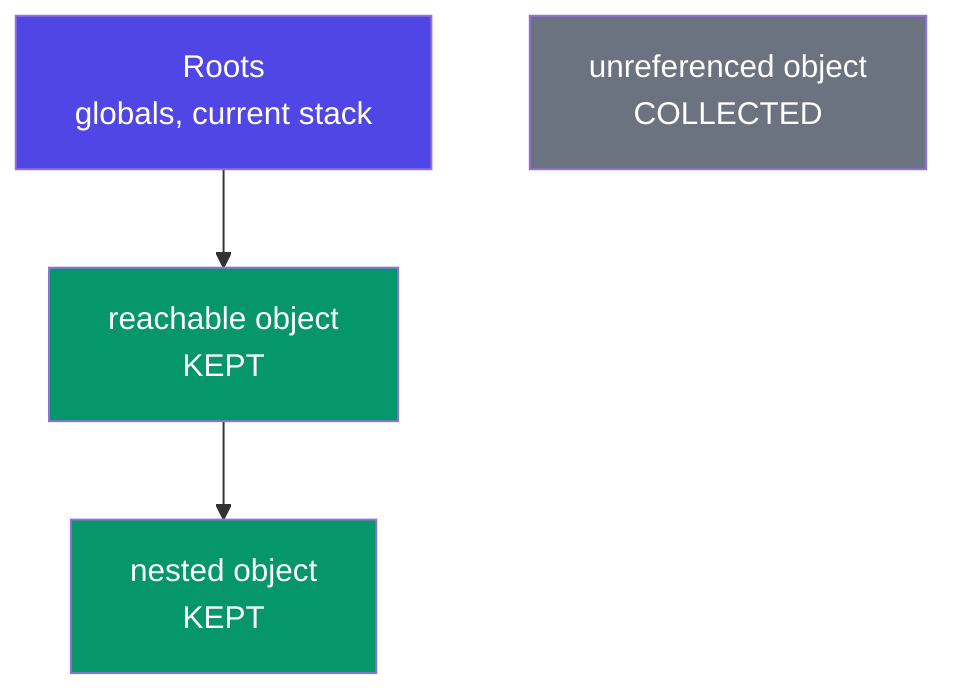

**The four leaks you'll actually cause:**

```js
// 1. Listeners on removed elements
el.addEventListener("click", handler);
el.remove();                        // ❌ handler still references el
el.removeEventListener("click", handler);   // ✅ clean up first

// 2. Timers that never stop
const id = setInterval(poll, 1000);
clearInterval(id);                  // ✅ on unmount/close — always pair them

// 3. A cache that only grows
const cache = new Map();            // ❌ unbounded → use a size limit or WeakMap

// 4. Closures holding big data alive
function setup() {
  const hugeArray = new Array(1e6).fill("data");
  return () => hugeArray.length;    // ❌ the backpack (F4) keeps 1M items alive
}
```

**Real-world:** this is why React's `useEffect` returns a cleanup function — it's the framework forcing you to pair every subscription with an unsubscription.

---

## J11. Timers, rAF & Async Iterators

**Simple definition:** the scheduling tools — how you say "later", "repeatedly", or "just before the next frame".

<p class="te"><strong>Telugu:</strong> <code>setTimeout</code> = "tarvata okkasari", <code>setInterval</code> = "malli malli", <code>requestAnimationFrame</code> = "next frame gееyadaniki mundu" (animations ki idi — setInterval kaadu, endukante browser tho <strong>kalisi</strong> panichestundi, battery kuda thaggutundi).</p>

```js
const t = setTimeout(fn, 1000);   clearTimeout(t);    // once, later
const i = setInterval(fn, 1000);  clearInterval(i);   // repeatedly — ALWAYS clear

// Animations: rAF syncs with the browser's repaint (~60fps), pauses in
// background tabs, and never drifts the way setInterval does.
function animate() {
  box.style.left = `${(pos += 2)}px`;
  if (pos < 300) requestAnimationFrame(animate);
}
requestAnimationFrame(animate);

// queueMicrotask — run right after the current task, before any timer (H2)
queueMicrotask(() => console.log("before every setTimeout"));
```

**Async iterators — `for await...of`.** When each item of a stream arrives asynchronously:

```js
async function* fetchPages(url) {          // async + generator (J2)
  let next = url;
  while (next) {
    const res = await fetch(next);
    const { items, nextUrl } = await res.json();
    yield items;                            // hand back this page, then pause
    next = nextUrl;
  }
}

for await (const page of fetchPages("/api/orders")) {
  render(page);      // renders page 1 while page 2 is still downloading
}
```

**Real-world:** paginated APIs, reading a large file line-by-line in Node, consuming a streaming LLM response token-by-token.

---

## J12. Debugging: Your Actual Superpower

**Simple definition:** the tools that turn "it doesn't work" into "line 42 gets `undefined` because the API returns `null`".

<p class="te"><strong>Telugu:</strong> Debugging ante <strong>anuvinchadam kaadu</strong> — tappu ekkada undo <em>saakshyam</em> tho kanukkovadam. Errors ni chadavadam nerchuko: <strong>error type</strong>, <strong>message</strong>, <strong>file:line</strong>, <strong>stack trace</strong> (kinda nunchi paiki chadavu — nee code modata ekkada kanipistundo adi nee tappu). Idi nerchukunte, nee speed rettimpu avutundi.</p>

```js
console.log(value);              // the workhorse — never be ashamed of it
console.log({ user, cart });     // ✅ object shorthand → shows NAMES, not just values
console.table(arrayOfObjects);   // arrays of objects as a real table 🤯
console.error / warn / info      // colour-coded, filterable
console.time("fetch"); /* ... */ console.timeEnd("fetch");   // "fetch: 342ms"
console.count("render");         // how many times did this run?
console.trace();                 // how did I get to this line?
console.assert(total > 0, "total went negative!", { total });
console.group("Cart"); console.log(...); console.groupEnd();

debugger;    // pauses execution HERE when DevTools is open — then inspect
             // every variable in scope, step line by line, see the call stack
```

**Reading a stack trace (top = where it broke, below = who called it):**

```
TypeError: Cannot read properties of undefined (reading 'city')
    at renderProfile (app.js:42:31)     ← YOUR code — start here
    at onUserLoaded  (app.js:18:5)      ← who called it
    at fetchUser     (api.js:9:12)
```

That message decodes as: *something was `undefined`, and we tried to read `.city` on it, at app.js line 42.* The fix is `user.address?.city` (C3) — but the *real* fix is asking why the address is missing.

**The debugging method — five steps, in order:**
1. **Read the error properly.** Type + message + file:line. Most errors say exactly what's wrong.
2. **Reproduce it reliably.** A bug you can't repeat is a bug you can't fix.
3. **Narrow the range.** Log at the start and end of the suspect region; halve the search each time (binary search).
4. **Check your assumptions.** `console.log(typeof x, x)` — the value is rarely what you assume. This is where 80% of bugs die.
5. **Fix the cause, not the symptom.** `?.` stops the crash; ask *why* it was undefined before you move on.

**Chrome DevTools tabs worth knowing:** *Console* (logs), *Sources* (breakpoints, step through), *Network* (what the API actually returned — check this before blaming your code), *Application* (localStorage), *Elements* (live DOM + styles).


---

# Part K — Annotated Master Programs

*Five programs that between them use nearly every concept in this document. Each is built in small chunks: **code → what every line does (English + Telugu) → next chunk**. Type them out — don't paste. The commentary is the lesson; the code is just the excuse.*

<p class="te"><strong>Telugu:</strong> Ee part lo prathi program ni <strong>chinna mukkalu</strong> ga chestham — modata code, taruvata <em>prathi line</em> em chestundo table lo (English + Telugu). Ela chadavali: modata code ni chusi "idi em chestundo" nuvve ooohinchu, taruvata table chudu. Nee ooha tappu ayite — <strong>adе</strong> nerchukunna chotu. Type cheyyi, copy-paste cheyyaku.</p>

---

## K1. The Data Pipeline

*Concepts: `const`, arrays of objects, destructuring, higher-order methods, chaining, reduce, template literals, `??`, sort comparators.*

**Chunk 1 — the data, and the revenue total.**

```js
const orders = [
  { id: 1, customer: "Asha",   total: 2400, status: "delivered", discount: 0.1 },
  { id: 2, customer: "Bharat", total: 800,  status: "cancelled", discount: 0   },
  { id: 3, customer: "Asha",   total: 1500, status: "delivered"                },
  { id: 4, customer: "Chitra", total: 3200, status: "delivered", discount: 0.2 },
];

const revenue = orders
  .filter((o) => o.status === "delivered")
  .map((o) => o.total * (1 - (o.discount ?? 0)))
  .reduce((sum, net) => sum + net, 0);
```

| Line | What & why |
|---|---|
| `const orders = [...]` | `const` because we never *reassign* the label — we only read it. Order 3 has **no `discount` key** on purpose: real data is inconsistent, and this program must survive that. <br>**Telugu:** `const` — endukante label ni malli maarchamu. Gamaninchu: order 3 ki **discount key ye ledu** — nijamaina data eppudu ilaage untundi, mana code adi thattukovali. |
| `.filter(o => o.status === "delivered")` | Narrow **first**, before any expensive work. `===` not `==` — a coercion accident here is exactly what B3 warns about. <br>**Telugu:** Modata **thakkuva cheyyi** (filter), taruvata pani. `==` kaadu `===` — types maarcheste bug guaranteed. |
| `.map(o => o.total * (1 - (o.discount ?? 0)))` | `??` not `\|\|` — **the whole point of C3/B4**. Order 3's discount is `undefined` → becomes `0`. A `\|\|` here would also rewrite a *legitimate* `0`. Train the habit on this line. <br>**Telugu:** `\|\|` kaadu, `??` — idi chala mukhyam. Order 3 ki discount `undefined` → `0` avutundi. `\|\|` vaadithe **nijamaina 0** ni kuda paresthundi. |
| `.reduce((sum, net) => sum + net, 0)` | Fold many → one. The `0` seed matters: without it an **empty** list throws *"Reduce of empty array with no initial value"*. Always seed. <br>**Telugu:** Chala → okati. Aa `0` (seed) tappanisari — lekapothe **khaali array** vaste error vastundi. Eppudu seed ivvu. |

**Chunk 2 — group by customer, then rank them.**

```js
const byCustomer = orders.reduce((acc, { customer, total, status }) => {
  if (status !== "delivered") return acc;
  acc[customer] = (acc[customer] ?? 0) + total;
  return acc;
}, {});

const leaderboard = Object.entries(byCustomer)
  .sort(([, a], [, b]) => b - a)
  .map(([name, spend], i) => `${i + 1}. ${name} — ₹${spend.toLocaleString("en-IN")}`);

console.log(`Revenue: ₹${revenue.toFixed(2)}`);
console.log(leaderboard.join("\n"));
```

| Line | What & why |
|---|---|
| `.reduce((acc, { customer, total, status }) => ...` | **Destructuring in the parameter** (D4) — the signature itself declares which 3 of the 5 fields matter. <br>**Telugu:** Parameter lone destructuring — 5 fields lo **e 3 kaavalo** signature chusthene telustundi. |
| `if (status !== "delivered") return acc;` | A **guard clause**: handle the exit first, return early. Flat code beats nested code. <br>**Telugu:** Guard clause — "idi kaadu ante ventane vellipo". `if` lopala anthaa cherchakunda, code **flat** ga untundi. |
| `acc[customer] = (acc[customer] ?? 0) + total;` | The **group-by idiom** (I2). `?? 0` creates the bucket on first sight. Bracket access because the key is *dynamic* (D3). <br>**Telugu:** Group-by idiom. `?? 0` — aa peru modatisari vaste **kotha bucket** thayaru chestundi. Key dynamic kabatti bracket `[ ]`. |
| `return acc;` | Reduce's #1 bug: forget this and the next round gets `undefined`. The accumulator must always come back. <br>**Telugu:** Reduce lo **#1 bug** — idi marchipothe, next round ki `undefined` velthundi. Accumulator ni **eppudu return cheyyali**. |
| `Object.entries(byCustomer)` | Object → array of `[key, value]` pairs, so array methods become available. The standard "I need to sort an object" move. <br>**Telugu:** Object ni array ga maarustundi → appudu `.sort`, `.map` vaadochu. "Object ni sort cheyyali" ante **ide daari**. |
| `.sort(([, a], [, b]) => b - a)` | **Nested destructuring with a hole** — skip the name, grab the number. `b - a` = descending. Never a bare `.sort()` on numbers (D1). |
| `.map(([name, spend], i) => ...)` | The second parameter `i` is the index — every array method gives it. Used here for the rank. <br>**Telugu:** Rendo parameter `i` = index. Prathi array method idi istundi — rank ki vaadam. |
| `spend.toLocaleString("en-IN")` | Indian grouping — `12,34,567`, not `1,234,567` (J4). A small touch that reads as real product quality. <br>**Telugu:** Indian style `12,34,567` — chinna vishayam, kaani product **nijam ga** kanipistundi. |

> **The shape to internalise:** `filter → map → reduce`. Narrow it, transform it, fold it. Nearly every data task at work is this pipeline wearing a different hat.

---

## K2. The Closure Toolkit — a Rate Limiter

*Concepts: closures, private state, factories, higher-order functions, rest/spread, timers.*

```js
function createRateLimiter(maxCalls, windowMs) {
  let calls = [];

  return function attempt(label) {
    const now = Date.now();
    calls = calls.filter((t) => now - t < windowMs);

    if (calls.length >= maxCalls) {
      const waitMs = windowMs - (now - calls[0]);
      return { allowed: false, retryIn: Math.ceil(waitMs / 1000) };
    }
    calls.push(now);
    return { allowed: true, remaining: maxCalls - calls.length, label };
  };
}

const limiter = createRateLimiter(3, 10_000);
limiter("search");     // { allowed: true, remaining: 2, label: "search" }
```

| Line | What & why |
|---|---|
| `function createRateLimiter(maxCalls, windowMs)` | A **factory**: it doesn't limit anything itself — it *manufactures* a limiter. Each call makes an independent one (F4). <br>**Telugu:** Idi **factory** — idi limit cheyyadu, limiter ni **thayaru chestundi**. Prathi call ki **veru veru** limiter vastundi. |
| `let calls = [];` | The private state. It lives in the **backpack** — unreachable from outside, alive as long as the returned function is. No `this`, no class, no global. <br>**Telugu:** Ide private state — **backpack** lo untundi. Bayatinunchi evaru touch cheyaleru, kaani function bathikinantha kaalam adi bathiki untundi. |
| `return function attempt(label)` | The returned function **is** the closure. **Named** (not anonymous) so it shows up in stack traces (J12) — free debugging. <br>**Telugu:** Ee return ayye function ye closure. Peru pettadam valla **stack trace** lo kanipistundi — debugging suluvu. |
| `const now = Date.now();` | Captured **once** per call. Calling `Date.now()` on each line lets time shift mid-function — a real source of flaky bugs. <br>**Telugu:** Time ni **okkasari** matrame teesukuntunnam. Prathi line lo teesukunte, madhyalo time maari **flaky bug** vastundi. |
| `calls = calls.filter(t => now - t < windowMs)` | Drop expired timestamps. **Reassigning** (not mutating) keeps it simple — `let` earns its keep, and `filter` returns a fresh array. <br>**Telugu:** Purathana timestamps ni teesestham. `filter` **kotha array** istundi — old daani ni maarchamu. |
| `Math.ceil(waitMs / 1000)` | Round **up** — telling a user "retry in 0 seconds" when 400ms remain is a lie. Rounding direction is a product decision. <br>**Telugu:** **Paiki** round (ceil) — inka 400ms unte "0 seconds lo try cheyyi" ante adi abaddham. |
| `return { allowed: false, retryIn }` | Return a **result object**, not `throw`. Being rate-limited is expected, not exceptional (J3) — don't use errors for normal control flow. <br>**Telugu:** `throw` kaadu — **result object** return cheyyi. Rate-limit avvadam anedi **exception kaadu**, normal ga jarige vishayam. |
| `maxCalls - calls.length` | Computed at return time so it's always accurate — never store what you can derive. <br>**Telugu:** Return chese chota lekkistunnam — **eppudu correct**. Lekkinchagalige daanni dachukokudadu. |

**Why closures instead of a class here?** No `this` to lose (G1), no `new` to forget, and `calls` is *truly* unreachable. **Real-world:** this is exactly how API SDKs, retry helpers, and `debounce`/`throttle` are built.

<p class="te"><strong>Telugu:</strong> Ikkada class enduku vaadaledu? <strong>this</strong> poye bhayam ledu, <code>new</code> marchipoye bhayam ledu, mariyu <code>calls</code> ni bayatinunchi <strong>evaru</strong> touch cheyaleru. Nijamaina prapancham lo — API SDKs, retry helpers, debounce/throttle — anni ilaage kattaru.</p>

---

## K3. The OOP System — All Four Pillars

*Concepts: classes, `#private`, getters, static, `extends`, `super`, polymorphism, abstraction, custom errors.*

**Chunk 1 — a typed error.**

```js
class InsufficientFunds extends Error {
  constructor(short) {
    super(`Short by ₹${short}`);
    this.name = "InsufficientFunds";
    this.short = short;
  }
}
```

| Line | What & why |
|---|---|
| `class InsufficientFunds extends Error` | A **typed** error (J3). Callers can `catch (e) { if (e instanceof InsufficientFunds) }` instead of string-matching a message — strings change, types don't. <br>**Telugu:** Error ki **sonta type**. Message string ni compare cheyyakunda `instanceof` tho pattukovachu — strings maarutayi, types maaravu. |
| `super(\`Short by ₹${short}\`)` | Sets `message` on the base `Error`. **Must** come before any `this.` (G4). <br>**Telugu:** Parent `Error` ki message pampistundi. `this.` vaadaka **mundu** super() tappanisari. |
| `this.short = short;` | Extra context the UI can use — how much was missing, not just that it failed. <br>**Telugu:** UI ki **avasaramaina extra info** — enta thakkuva undo kuda cheptundi, fail ayindi ani matrame kaadu. |

**Chunk 2 — the base class: encapsulation + abstraction.**

```js
class Account {
  static #count = 0;
  #balance = 0;
  #history = [];

  constructor(owner, opening = 0) {
    this.owner = owner;
    this.#balance = opening;
    Account.#count++;
    this.id = `AC${String(Account.#count).padStart(4, "0")}`;
  }

  get balance() { return this.#balance; }

  deposit(amt) {
    if (amt <= 0) throw new RangeError("Deposit must be positive");
    this.#record("deposit", amt);
    this.#balance += amt;
    return this;
  }

  withdraw(amt) {
    if (amt > this.#balance) throw new InsufficientFunds(amt - this.#balance);
    this.#record("withdraw", amt);
    this.#balance -= amt;
    return this;
  }

  #record(type, amt) { this.#history.push({ type, amt, at: Date.now() }); }
```

**…and the polymorphic seam plus the class-level utility (same class, continued):**

```js
  interest() { return 0; }
  summary() { return `${this.id} ${this.owner}: ₹${this.#balance} (+₹${this.interest()})`; }

  static total() { return Account.#count; }
}
```

| Line | What & why |
|---|---|
| `static #count = 0` | **Private + static**: shared by all accounts, invisible outside. Encapsulation applied to the *class* itself. <br>**Telugu:** Private + static — **anni accounts ki kalipi okate**, bayatiki kanipinchadu. |
| `#balance = 0; #history = []` | The vault (G5). Not `_balance` — a convention nobody enforces. `acc.#balance` from outside is a **SyntaxError**, so money moves only through the methods below. <br>**Telugu:** Ide **vault**. `_balance` laaga "please touch cheyaku" kaadu — `#` ante bayatinunchi **cheyaleru** (SyntaxError). Dabbu ee methods dwara **matrame** kadulutundi. |
| `constructor(owner, opening = 0)` | A default parameter means `new Account("X")` works. Fewer required arguments = fewer call-site mistakes. <br>**Telugu:** Default value valla `new Account("X")` kuda panichestundi. |
| `this.id = \`AC${...padStart(4,"0")}\`` | `AC0001` — `padStart` (J4) for fixed-width IDs. Built in the constructor because an account without an ID should never exist. <br>**Telugu:** `AC0001` laaga fixed width. Constructor lone chestunnam — **ID leni account** eppudu undakoodadu. |
| `get balance()` | A **read-only window**. Reads like a property, but there's no setter — so `acc.balance = 9999999` silently does nothing. That asymmetry *is* encapsulation. <br>**Telugu:** Chudochu, **maarchaleru**. Setter ledu kabatti `acc.balance = 9999999` ki **em jaragadu**. Ade encapsulation. |
| `if (amt <= 0) throw new RangeError(...)` | **Validate at the boundary.** The object refuses to enter an invalid state — it doesn't trust its caller. <br>**Telugu:** Modate check. Object tanani tanu **tappu state loki** vellanivvadu — pilichinavaadini nammadu. |
| `return this;` | Enables **chaining**: `acc.deposit(500).withdraw(200)`. <br>**Telugu:** `return this` valla **chaining** saadhyam. |
| `#record(type, amt)` | A **private method** — the audit trail is internal machinery. This is **abstraction**: callers see `deposit`, not the bookkeeping. <br>**Telugu:** Private **method**. Bayati vaallaki `deposit` matrame kanipistundi, lopali lekkalu kaadu — **ade abstraction**. |
| `interest() { return 0; }` | The **polymorphic seam**. The base gives a safe default; subclasses override it. <br>**Telugu:** Ikkade **polymorphism kutti** untundi. Base default istundi, pillalu daanni maarchukuntaru. |
| `summary()` calls `this.interest()` | Written **once** in the base, yet it runs whichever subclass's `interest()` is live. Add a new account type tomorrow → `summary()` needs no edit (G6). <br>**Telugu:** **Okkasari** raasam — kaani e subclass di adi run avutundi. Repu kotha type vachina, `summary()` ni **muttukokkarledu**. |
| `static total()` | Belongs to the *concept*, not an account — like `Math.random()`. `acc.total()` is deliberately not a thing. <br>**Telugu:** Idi **class di**, oka account di kaadu — `Math.random()` laaga. |

**Chunk 3 — the subclasses: inheritance + polymorphism.**

```js
class Savings extends Account {
  #rate;
  constructor(owner, opening, rate = 0.04) {
    super(owner, opening);
    this.#rate = rate;
  }
  interest() { return Math.round(this.balance * this.#rate); }
}

class Current extends Account {
  interest() { return 0; }
  withdraw(amt) {
    if (amt > this.balance + 10_000) throw new InsufficientFunds(0);
    return super.withdraw(Math.min(amt, this.balance));
  }
}

const accounts = [new Savings("Asha", 50_000), new Current("Bharat", 20_000)];
accounts.forEach((a) => console.log(a.summary()));
```

| Line | What & why |
|---|---|
| `class Savings extends Account` | **Inheritance**, used honestly: a Savings account *is an* Account (the "is-a" test). <br>**Telugu:** Savings anedi **oka** Account — "is-a" test pass. Appude inheritance saraina choice. |
| `super(owner, opening);` | Parent builds its half of the object first, then the child adds `#rate`. <br>**Telugu:** Modata parent tana bhaagam kadataadu, taruvata child `#rate` cherustundi. |
| `interest() { ... }` (in Savings) | **Overriding** — same name, different behaviour. Nobody calls this directly; `summary()` does. <br>**Telugu:** **Override** — peru okate, pani veru. Deenni evaru direct ga pilavaru — `summary()` pilustundi. |
| `Current.withdraw` → `super.withdraw(...)` | An override that **extends** rather than replaces: add the overdraft rule, then delegate to the parent. Don't duplicate what `super` already does. <br>**Telugu:** Override chesi kuda **parent pani ni vaadukuntunnam**. Kotha rule cherchi, migilinadi `super` ki appagistunnam — malli raayakunda. |
| `accounts.forEach(a => a.summary())` | **The payoff.** One line drives Savings and Current alike — no `if (type === ...)`. The objects know what they are. <br>**Telugu:** **Ide phalitham.** Okate line — Savings ki, Current ki, rendintiki panichestundi. `if type ===` **avasaram ledu**. Objects ki tama gurinchi telusu. |

---

## K4. The Async Dashboard

*Concepts: async/await, Promise.all/allSettled/race, fetch, `res.ok`, try/catch/finally, timeouts, retries.*

**Chunk 1 — the two async building blocks.**

```js
const delay = (ms) => new Promise((res) => setTimeout(res, ms));

const timeout = (ms) =>
  new Promise((_, rej) => setTimeout(() => rej(new Error(`Timeout ${ms}ms`)), ms));
```

| Line | What & why |
|---|---|
| `const delay = ms => new Promise(res => setTimeout(res, ms))` | The 1-line async building block. Wrapping a callback API in a promise is the single most useful async pattern to own. <br>**Telugu:** Okka line — callback ni **promise** ga marchadam. Async lo idi **atyanta upayogakaramaina** pattern. |
| `new Promise((_, rej) => ...)` | Only ever **rejects**. `_` marks the deliberately-unused `resolve` — a signal to the reader, not an accident. <br>**Telugu:** Idi **eppudu reject** ye avutundi. `_` ante "resolve kaavalane vaadaledu" ani chadive vaadiki chepputhondi. |

**Chunk 2 — a fetch wrapper with timeout and retries.**

```js
async function getJSON(url, { retries = 2 } = {}) {
  for (let attempt = 1; attempt <= retries + 1; attempt++) {
    try {
      const res = await Promise.race([fetch(url), timeout(5000)]);
      if (!res.ok) throw new Error(`HTTP ${res.status} on ${url}`);
      return await res.json();
    } catch (err) {
      if (attempt > retries) throw err;
      await delay(300 * 2 ** (attempt - 1));
    }
  }
}
```

| Line | What & why |
|---|---|
| `{ retries = 2 } = {}` | **Destructured options with a default object.** The `= {}` is essential — without it, `getJSON(url)` with no second argument throws while destructuring `undefined`. <br>**Telugu:** Aa `= {}` **tappanisari**. Lekapothe `getJSON(url)` ani okkate argument tho pilisthe, `undefined` ni destructure chesi **error** vastundi. |
| `attempt <= retries + 1` | `retries + 1` because 2 *retries* means 3 total *attempts*. Off-by-one errors live here — say the intent out loud. <br>**Telugu:** 2 retries ante **motham 3 attempts**. Ikkade off-by-one bugs puttai — bigge ra cheppuko. |
| `await Promise.race([fetch(url), timeout(5000)])` | Whichever settles first wins (H6). `fetch` alone can hang forever; this guarantees an answer within 5s. <br>**Telugu:** Modata ఏది settle aithe adi gelustundi. `fetch` **eppatiki** vela kaskoni undochu — idi 5 seconds lo samadhanam **guarantee** chestundi. |
| `if (!res.ok) throw ...` | **The trap from H7.** A 404 is a *successful* fetch — the promise fulfils. Without this, `res.json()` throws a confusing parse error instead of a clear HTTP one. <br>**Telugu:** **Peddha trap.** 404 vachina `fetch` **success** ye antundi! Ee line lekapothe, `res.json()` lo ardham kaani error vastundi. |
| `return await res.json()` | The **second** await — the body streams in separately. <br>**Telugu:** **Rendo await** — body veru ga vastundi. |
| `if (attempt > retries) throw err;` | Out of budget → surface the failure. Retrying forever is how you DDoS your own API. <br>**Telugu:** Attempts aipoyaka **error ni bayatiki pampu**. Aagakunda retry chesthe, nee API ni nuvve champutav. |
| `await delay(300 * 2 ** (attempt - 1))` | **Exponential backoff**: 300ms, then 600ms. A struggling server needs breathing room, not a stampede. <br>**Telugu:** 300ms, taruvata 600ms — **penche aagadam**. Kastam lo unna server ki **oopiri** kaavali, inka ekkuva load kaadu. |

**Chunk 3 — the loader: choosing `all` vs `allSettled`.**

```js
async function loadDashboard() {
  showSpinner();
  try {
    const [user, settings] = await Promise.all([
      getJSON("/api/me"),
      getJSON("/api/settings"),
    ]);

    const widgets = await Promise.allSettled([
      getJSON(`/api/sales?u=${user.id}`),
      getJSON("/api/traffic"),
      getJSON("/api/reviews"),
    ]);

    widgets.forEach((w, i) =>
      w.status === "fulfilled" ? render(i, w.value) : renderError(i, w.reason)
    );
    return { user, settings };
  } catch (err) {
    showFatal("Could not load your dashboard", err.message);
    return null;
  } finally {
    hideSpinner();
  }
}
```

| Line | What & why |
|---|---|
| `await Promise.all([...me, ...settings])` | Both are **required** and **independent** → fire together, fail fast (H6). Sequential awaits would double the wait for zero benefit (H5 rule 3). <br>**Telugu:** Rendu **tappanisari**, rendu **oka daani meeda okati aadharapadavu** → okesari pampu. Vaddu vaddu ga await chesthe, **rettimpu time** vruthaa. |
| `await Promise.allSettled([...3 widgets])` | Widgets are **optional and independent**. One dead endpoint must not blank the page — `all` would throw away two good responses because of one bad one. Choosing `all` vs `allSettled` **is** the design decision. <br>**Telugu:** Widgets **optional**. Okati chachipothe page motham khaali avvakoodadu — `all` vaadithe, **okati fail aithe migilina rendu manchi vi kuda podi**. `all` aa `allSettled` aa ani ennukovadame **asalu design decision**. |
| `w.status === "fulfilled" ? render : renderError` | `allSettled` never rejects — it reports. Each widget succeeds or fails on its own. <br>**Telugu:** `allSettled` **eppudu reject avvadu** — report istundi. Prathi widget **tana matuku tanu** gelustundi leda odipotundi. |
| `catch (err)` | Reached only if a **required** call failed (the `Promise.all`), because `allSettled` can't throw. The blast radius is deliberate. <br>**Telugu:** Idi **tappanisari** call fail aithene vastundi. `allSettled` throw cheyyadu kabatti. **Enta varaku pagilipovalo** manam nirnayinchaam. |
| `finally { hideSpinner(); }` | Runs on success, on error, **and** on early return. A spinner leak is the classic "app looks frozen" bug. <br>**Telugu:** Gelichina, odipoyina, madhyalo return ayina — **eppudu** run avutundi. Spinner aagakapothe "app aagipoyindi" ane bug. |

> **The async decision tree:** all must succeed → `all`. Partial is fine → `allSettled`. Need a deadline → `race`. Might fail transiently → retry with backoff. Always → `finally` for cleanup.

---

## K5. The DOM App — State → Render

*Concepts: DOM, events, delegation, `preventDefault`, immutable state, localStorage, JSON, XSS safety, dataset.*

**Chunk 1 — state and the single doorway for change.**

```js
const $ = (sel) => document.querySelector(sel);
const form = $("#todo-form"), input = $("#todo-input");
const list = $("#list"), count = $("#count");

let todos = JSON.parse(localStorage.getItem("todos") ?? "[]");

const save = () => localStorage.setItem("todos", JSON.stringify(todos));

function setState(next) {
  todos = next;
  save();
  render();
}
```

| Line | What & why |
|---|---|
| `const $ = sel => document.querySelector(sel)` | A 30-character helper that removes noise from 20 call sites. This was jQuery's entire original pitch. <br>**Telugu:** Chinna helper — 20 chotla noise thagguthundi. jQuery motham **ee okka idea** meeda putindi. |
| `JSON.parse(localStorage.getItem("todos") ?? "[]")` | `??` guards the first run: `getItem` returns `null` when absent and `JSON.parse(null)` gives `null` — the `?? "[]"` guarantees an **array**, so `.map` below can never explode. <br>**Telugu:** Modatisari app open chesinappudu `getItem` `null` istundi → `JSON.parse(null)` kuda `null` → taruvata `.map` **crash** ayyedi. `?? "[]"` valla **eppudu array** ye vastundi. |
| `const save = () => localStorage.setItem(...)` | Objects can't be stored — only strings (D6). <br>**Telugu:** localStorage lo objects **pettalemu** — strings matrame. |
| `function setState(next)` | **The single doorway for change.** Every mutation goes through here, so saving and re-rendering can never be forgotten. This function *is* React's `setState`, hand-built. <br>**Telugu:** Maarpu ki **okate daari**. Anni ikkadi nunche vellali — appude save/render **marchipoyye** avakasham ledu. Idi React `setState` ne, cheththo kattinadi. |
| `todos = next` (not `todos.push`) | **Immutability** (J6): callers hand us a *new* array. Old state stays intact — which is what makes undo and diffing possible. <br>**Telugu:** `push` kaadu — **kotha array**. Paatha state chedipodu; ade undo/diffing ni **saadhyam** chestundi. |

**Chunk 2 — render from state, safely.**

```js
const ESCAPES = { "&": "&amp;", "<": "&lt;", ">": "&gt;", '"': "&quot;", "'": "&#39;" };
const escapeHTML = (s) => s.replace(/[&<>"']/g, (c) => ESCAPES[c]);

function render() {
  list.innerHTML = todos
    .map(
      (t) => `<li class="task ${t.done ? "done" : ""}" data-id="${t.id}">
                <span>${escapeHTML(t.text)}</span>
                <button data-action="delete">×</button>
              </li>`
    )
    .join("");
  count.textContent = `${todos.filter((t) => !t.done).length} left`;
}
```

| Line | What & why |
|---|---|
| `escapeHTML(t.text)` | **The security line.** `innerHTML` with raw user input is an XSS hole (E2): typing `` would *execute*. Escape it, or use `textContent`. <br>**Telugu:** **Security line ide.** User type chesindi neruga `innerHTML` lo pettesthe, vaadu `` ani raasi **nee page lo code run** cheyagaladu (XSS). Escape cheyyi. |
| `list.innerHTML = todos.map(...).join("")` | Rebuild from state — **one** direction of data flow. No hunting for the specific `<li>` to patch; DOM and data can never disagree. <br>**Telugu:** State nunchi **malli motham** geeyadam. Aa `<li>` ni vethiki patch cheyyakkarledu — DOM ki, data ki **gొడవ** raadu. |
| `data-id="${t.id}"` | Store identity **on** the element, so the click handler can find its way back to the data. Read via `li.dataset.id`. <br>**Telugu:** Element **meeda** identity pettadam — click ayinappudu tirigi data ki daari dorukutundi. |
| `count.textContent = ...filter(t => !t.done).length` | **Derived** state — computed at render, never stored. Two sources of truth eventually disagree. <br>**Telugu:** Idi **lekkinchina** state, dachukunnadi kaadu. Rendu chotla nijam unte, oka roju **rendu veru veru** cheptayi. |

**Chunk 3 — one listener for every row, forever.**

```js
form.addEventListener("submit", (e) => {
  e.preventDefault();
  const text = input.value.trim();
  if (!text) return;
  setState([...todos, { id: crypto.randomUUID(), text, done: false }]);
  input.value = "";
  input.focus();
});

list.addEventListener("click", (e) => {
  const li = e.target.closest("li.task");
  if (!li) return;
  const { id } = li.dataset;

  if (e.target.dataset.action === "delete") {
    setState(todos.filter((t) => t.id !== id));
  } else {
    setState(todos.map((t) => (t.id === id ? { ...t, done: !t.done } : t)));
  }
});

render();
```

| Line | What & why |
|---|---|
| `e.preventDefault()` | Without it, submit reloads the page and your JS state vanishes (E3). <br>**Telugu:** Idi lekapothe form submit ki **page reload** ayi, nee state motham **poddi**. |
| `if (!text) return;` | Guard clause — reject empties before touching state. <br>**Telugu:** Khaali unte ventane vellipo — state ni **muttukoku**. |
| `crypto.randomUUID()` | Stable unique IDs. Array **indexes are not identity** — delete item 0 and every later index shifts, so index-keyed logic corrupts. React's `key` warning is this same lesson. <br>**Telugu:** Index ni **ID ga vaadaku** — modati item delete chesthe, migilina indexes anni **jaripotayi**, logic pandi avutundi. React lo `key` warning kuda **ide** cheptundi. |
| `input.focus()` | Users add several todos in a row. Details like this separate a demo from a product. <br>**Telugu:** Vaadaka daaru vaddu vaddu ga todos cherustaru. Ilanti **chinna vishayaale** demo ki, product ki teda. |
| `list.addEventListener("click", ...)` | **ONE** listener for all rows, present and future (E3 delegation). Per-row listeners would leak memory (J10) and miss new rows. <br>**Telugu:** Anni rows ki **okate** listener — ippudu unnavi, **repu vachhevi** kuda. Prathi row ki petthe memory leak (J10), kotha rows ki panichesyadu. |
| `e.target.closest("li.task")` | You may click the `<span>` or the `<button>` — `closest` walks **up** to the row that owns the event. Delegation's essential partner. <br>**Telugu:** Nuvvu `<span>` meeda leda `<button>` meeda click cheyyochu — `closest` **paiki velli** asalu row ni pattukuntundi. |
| `if (!li) return;` | Clicks on the padding hit `<ul>` itself. Always verify the target before trusting it. <br>**Telugu:** Padding meeda click chesthe `<ul>` ki tagulutundi. Target ni **nammadaniki mundu** check cheyyi. |
| `todos.map(t => t.id === id ? { ...t, done: !t.done } : t)` | Toggle = a new array where **one** object is replaced by a copy with a flipped flag; the others pass through by reference. This exact line is how every React list update is written. <br>**Telugu:** **Okka** object ni copy chesi flag tippi, migilinavi **appatike** vellipotayi. React lo prathi list update **ee line laage** untundi. |
| `render()` at the bottom | Paint the restored state on load — otherwise the page is blank until the first interaction. <br>**Telugu:** Load ayinappude okkasari geeyali — lekapothe modati click varaku page **khaali** ga untundi. |

> **The one idea to take into React:** you never "update the DOM". You update **state**, then the state renders. You just built that engine by hand — `useState` merely automates the `save(); render();` you wrote yourself.

<p class="te"><strong>Telugu:</strong> React loki teesukupovalsina <strong>okkate idea</strong>: nuvvu eppudu "DOM ni update cheyyavu". <strong>State</strong> ni update chestav, aa state ni batti page gееyabadutundi. Ee engine ni nuvve cheththo kattav — <code>useState</code> chesedi, nuvvu raasina <code>save(); render();</code> ni <strong>automatic</strong> cheyyadam matrame.</p>

---

# Part L — Mindset: How to Think, Build Logic & Write Code

*Syntax is the cheapest part of programming — you now have it. This part is the expensive part: how to face a problem you don't know how to solve yet. Read it when you're stuck, not just once.*

## L1. The Truth Nobody Says Out Loud

**Simple definition:** professional developers do not "know" the answer and then type it. They **don't know**, and they have a *reliable method* for not knowing.

<p class="te"><strong>Telugu:</strong> Peddha abaddham enti ante — "manchi programmers ki answer <strong>telusu</strong>, andhuke vaallu vegamga raastaru". Kaadu. Vaallaki kuda modata teliyadu. Vaallaki unnadi <strong>oka paddathi</strong> (method) — teliyani daanni chinna chinna mukkalu ga vibhajinchi, prathi mukka ni test cheskuntu munduku vellatam. Nuvvu "logic raadu" anukuntunnav — nijaniki nuvvu <strong>method</strong> nerchukoledu, ade ee part.</p>

When you stare at a problem and feel nothing happening, that is **not** a sign you lack talent. It's a sign you tried to jump from *problem* straight to *code* — a jump nobody makes. The gap between them has five steps, and skipping them is why it feels impossible.

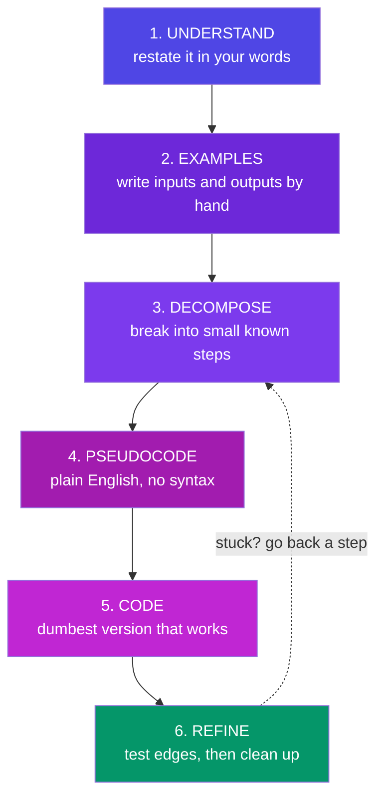

**The rule:** if you're stuck at step 5, the fault is almost always at step 1 or 3. Go back — don't push harder on the code.

---

## L2. Step 1–2: Understand & Get Concrete

**Simple definition:** you cannot solve a problem you can't restate. And you can't restate what you haven't made *concrete* with real inputs and outputs.

<p class="te"><strong>Telugu:</strong> Modati tappu: problem ni <strong>saraiga artham chesukokundane</strong> code raayadam start cheyyadam. Nee sonta maatallo malli cheppalekapothe — nee ki inka artham kaledu. Rendo tappu: <strong>abstract</strong> ga aalochinchadam. Cheyyalsindi — kaagitham meeda <strong>nijamaina input</strong> raasi, <strong>nijamaina output</strong> ni <em>cheththo</em> lekkinchadam. Nee brain pattern ni chusina venatane logic bayatapadutundi.</p>

**Take a real task:** *"Show each customer's total spend, highest first, only counting delivered orders."*

**Restate it as a sentence you'd say to a friend:**
> "Throw away the orders that aren't delivered. Add up each person's totals. Sort biggest first."

That sentence **is** your program. Notice it already contains `filter`, `reduce`, and `sort` — you just didn't know you'd written them.

**Now get concrete — by hand, on paper:**

```
INPUT:  Asha 2400 delivered
        Bharat 800 cancelled
        Asha 1500 delivered

STEP 1 (throw away):   Asha 2400, Asha 1500
STEP 2 (add up):       { Asha: 3900 }
OUTPUT: 1. Asha — ₹3900
```

**Then ask the questions the problem didn't answer** — this is what senior developers do that juniors skip:
- What if there are **zero** delivered orders? (empty output, or a message?)
- What if two customers **tie**? (any order, or alphabetical?)
- What if `total` is **missing** or negative? (skip, or treat as 0?)
- How **big** can this get — 10 orders or 10 million? (does it matter yet? usually no)

Every one of those is a bug you just prevented. In an interview, asking them out loud *is* the signal they're grading.

---

## L3. Step 3–4: Decompose & Pseudocode

**Simple definition:** decomposition is breaking one problem you *can't* solve into several you *can*. Pseudocode is writing the solution in English before you fight the syntax.

<p class="te"><strong>Telugu:</strong> "Ee problem ela solve cheyyali?" ani aduguthu kurchoku. Adugu: "<strong>Idi nenu solve cheyagalige chinna panula ga ela vibhajinchali?</strong>" Elephant ni okkasari tinaledu — mukkalu ga tintav. Prathi chinna mukka nee ki <em>already telusu</em> (filter, sort, add). Peddha problem ante — chinna telisina panula <strong>kalayika</strong> matrame.</p>

**The decomposition question:** *"What are the 3–5 smaller steps, each of which I already know how to do?"*

```
FUNCTION leaderboard(orders):
    delivered = keep orders where status is "delivered"     ← I know: filter
    totals    = for each, add total onto that customer      ← I know: reduce
    ranked    = sort totals, biggest first                  ← I know: sort
    RETURN ranked formatted as "1. Name — ₹X"               ← I know: map
```

Four lines of English. Every line is a method you already own. **The hard part is now over** — what remains is typing, and typing is the part you can look up.

**Rules for pseudocode that actually helps:**
- Write it as **comments in your editor**, then fill the code in beneath each one. The comments become your documentation for free.
- One line = one **verb**. If a line has an "and" in it, it's two lines.
- If you can't write the pseudocode, **you don't understand the problem** — go back to L2. This is the single most valuable signal in this entire document.

---

## L4. Step 5: Write the Dumbest Version That Works

**Simple definition:** your first version's only job is to be **correct**, not clever, fast, or short. Working-and-ugly beats elegant-and-imaginary, every time.

<p class="te"><strong>Telugu:</strong> Modati version <strong>andanga undakkarledu</strong> — <em>pani cheyyali</em>, anthe. Chala mandi start ye cheyyaru, endukante "perfect ga raayali" ani anukuntaru — adi <strong>paralysis</strong>. Modata <code>for</code> loop tho ayina sare, pani cheyinchu. Taruvata clean cheyyi. <strong>Pani cheyyani andamaina code</strong> kanna, <strong>pani chese vikaramaina code</strong> vela retlu melu — endukante mundadi ni improve cheyyochu, leni daanni cheyaleru.</p>

```js
// V1 — deliberately dumb. Long, repetitive, obvious. It WORKS.
function leaderboard(orders) {
  const delivered = [];
  for (let i = 0; i < orders.length; i++) {
    if (orders[i].status === "delivered") delivered.push(orders[i]);
  }
  const totals = {};
  for (let i = 0; i < delivered.length; i++) {
    const name = delivered[i].customer;
    if (totals[name] === undefined) totals[name] = 0;
    totals[name] = totals[name] + delivered[i].total;
  }
  const pairs = Object.entries(totals);
  pairs.sort((a, b) => b[1] - a[1]);
  const out = [];
  for (let i = 0; i < pairs.length; i++) {
    out.push(`${i + 1}. ${pairs[i][0]} — ₹${pairs[i][1]}`);
  }
  return out;
}
```

**This is a good program.** It runs. It's testable. Now — and *only* now — improve it, one safe step at a time, running the code after each:

```js
// V2 — same logic, spoken in JS's own vocabulary (Part D2, I2)
const leaderboard = (orders) =>
  Object.entries(
    orders
      .filter((o) => o.status === "delivered")
      .reduce((acc, o) => ({ ...acc, [o.customer]: (acc[o.customer] ?? 0) + o.total }), {})
  )
    .sort(([, a], [, b]) => b - a)
    .map(([name, sum], i) => `${i + 1}. ${name} — ₹${sum.toLocaleString("en-IN")}`);
```

**But be honest about the trade:** V2 is shorter and idiomatic. It is *not* automatically better. If your team reads V1 faster, V1 wins. **Clever code is a cost you pay every time someone reads it.** Write V2 because it says the intent more clearly — never to prove you can.

> **The habit that compounds:** run your code after **every** small change. Ten tiny verified steps take less time than one big broken leap, because you always know which change broke it — the last one.

---

## L5. Logic Building: The Six Shapes

**Simple definition:** almost every data task at work is one of six shapes. Once you can *name* the shape, the method picks itself.

<p class="te"><strong>Telugu:</strong> Nijam enti ante — pani lo vachhe 90% problems <strong>aaru aakaaraalu</strong> (shapes) ye. "Ee problem e shape?" ani gurthupatte skill ye <strong>logic building</strong>. Adi vachhaka, method automatic ga vasthundi. Andhuke daily practice lo — code raayakamundu <strong>"idi e shape?"</strong> ani nee ni nuvve adugu.</p>

| Shape | The question | Tool | Example |
|---|---|---|---|
| **Transform** | "same count, different form" | `.map` | prices → prices with tax |
| **Narrow** | "fewer items, same form" | `.filter` | all orders → delivered orders |
| **Search** | "find the one" | `.find` / `.some` | user by email · does any fail? |
| **Aggregate** | "many → one number" | `.reduce` | cart → total |
| **Group** | "many → buckets" | `.reduce` into `{}` | orders → by month |
| **Order** | "same items, new sequence" | `.sort` | products → by price |

**The two questions that unlock any data problem:**
1. **"What shape is my data now, and what shape do I need?"** Array of objects → one number? That's *aggregate*. Array → smaller array? *narrow*. Array → object of buckets? *group*.
2. **"Can I get there in one step, or do I need a pipeline?"** Usually a pipeline: `narrow → transform → aggregate`.

**Beyond data — the four control shapes:** *do X for each* (loop/`forEach`), *do X only if* (`if`/guard), *do X until* (`while`/recursion), *do X later* (async — Part H).

**When the shape isn't obvious, use these unsticking moves:**
- **Shrink the input.** Can't sort a million records? Sort three, by hand, on paper. The rule you used *is* the algorithm.
- **Solve it manually and narrate.** "I look at each order… if it's cancelled I skip it…" — *"for each"* = loop, *"if"* = filter. Your narration is pseudocode.
- **Do the reverse.** Stuck building the output? Take the finished output and ask what would produce it, one step back.
- **Explain it aloud** (rubber duck). The bug is usually found in the sentence you can't finish.
- **Sleep on it.** Genuinely — unsticking during a walk is your brain finishing step 3 offline.

---

## L6. Writing Code Humans Can Read

**Simple definition:** you write code once and read it fifty times. Optimise for the fifty.

<p class="te"><strong>Telugu:</strong> Code ni <strong>okkasari raastav, yabhai saarlu chadutav</strong> — nuvve, 3 nelala tarvatha. Andhuke "computer ki artham aithe chaalu" kaadu — <strong>manishiki</strong> artham kaavali. Nee code chadivi "idi enti?" ani nuvve adigithe, adi nee tappu, nee jnaapaka shakti tappu kaadu.</p>

**Names are documentation that can't go stale:**

```js
// ❌ what is d? what is x? what is flag?
const d = u.filter(x => x.a).map(x => x.n);
if (flag) process(d);

// ✅ the code now explains itself — no comment needed
const activeUserNames = users.filter(user => user.isActive).map(user => user.name);
if (hasPendingInvites) sendInvites(activeUserNames);
```

Rules that carry you far: **booleans** read as questions (`isActive`, `hasPermission`, `canEdit`); **functions** start with a verb (`calculateTax`, `fetchUser`, `renderList`); **arrays** are plural (`users`, not `userList`); avoid `data`, `info`, `temp`, `handleStuff` — they say nothing. The only good short names are loop indexes (`i`) and genuinely-anonymous parameters (`x => x * 2`).

**Guard clauses — return early, stay flat:**

```js
// ❌ the "arrow of doom" — the real work is buried 4 levels deep
function submit(user, cart) {
  if (user) {
    if (user.isVerified) {
      if (cart.items.length > 0) {
        return checkout(cart);
      }
    }
  }
}

// ✅ handle the exits first; the happy path lives at the left margin
function submit(user, cart) {
  if (!user) return { error: "Not logged in" };
  if (!user.isVerified) return { error: "Verify your email first" };
  if (cart.items.length === 0) return { error: "Cart is empty" };
  return checkout(cart);        // ← the point of the function, visible at a glance
}
```

**One function, one job.** If describing it needs the word "and", split it. `fetchAndRenderAndSaveUser` is three functions wearing a trench coat. A function you can't name precisely is a function that does too much.

**Comment the WHY, never the WHAT:**

```js
// ❌ noise — the code already says this
i++;                       // increment i
const total = a + b;       // add a and b

// ✅ the reason, which the code CANNOT say
// Razorpay rejects amounts with decimals — convert rupees to paise.
const amountInPaise = Math.round(rupees * 100);

// Retry twice: their API returns a spurious 503 roughly 1 call in 500.
const data = await getJSON(url, { retries: 2 });
```

**Consistency beats correctness of style.** Match the file you're in. Then let **Prettier** format and **ESLint** catch mistakes — never argue about semicolons in 2026; both are one-time setup and free forever after.

---

## L7. The Worked Example — Thinking Made Visible

*A real request, from confusion to clean code. This is the whole part, applied.*

> **The ask:** "On the orders page, show a warning if any item in the cart is out of stock, and disable checkout."

**Step 1 — Understand.** Restate: *"Look through the cart. If even one item is out of stock, show a warning and turn off the button."*

**Step 2 — Get concrete + ask questions.**
```
cart = [ {Pen, stock:5}, {Lamp, stock:0} ]  →  warn "Lamp is out of stock", button OFF
cart = [ {Pen, stock:5} ]                   →  no warning, button ON
cart = []                                   →  ??? ← the question nobody asked
```
*Question surfaced:* an empty cart — is checkout on or off? (Answer: off, but with a *different* message. You just prevented a real bug by writing three lines of example data.)

**Step 3 — Decompose.** "*Even one*" → that's the **Search** shape (`some`). Which ones → **Narrow** (`filter`). Names for the message → **Transform** (`map`).

**Step 4 — Pseudocode.**
```
IF cart is empty        → button off, no warning
outOfStock = items where stock is 0
IF outOfStock is empty  → button on, no warning
ELSE                    → button off, warn listing outOfStock names
```

**Step 5 — The dumb version, then the clean one.**

```js
function checkoutState(cart) {
  if (cart.length === 0) return { canCheckout: false, warning: null };

  const outOfStock = cart.filter((item) => item.stock === 0);
  if (outOfStock.length === 0) return { canCheckout: true, warning: null };

  const names = outOfStock.map((item) => item.name).join(", ");
  return {
    canCheckout: false,
    warning: `${names} ${outOfStock.length === 1 ? "is" : "are"} out of stock`,
  };
}

// The impure edge stays separate from the pure logic (J7):
function renderCheckout(cart) {
  const { canCheckout, warning } = checkoutState(cart);
  checkoutBtn.disabled = !canCheckout;
  warningEl.textContent = warning ?? "";
  warningEl.hidden = !warning;
}
```

**Why this is good code, in the vocabulary you now own:**
- `checkoutState` is **pure** (J7) — same cart in, same object out, touches no DOM. You can unit-test it with zero setup, and reuse it on the cart page, checkout page, and server.
- **Guard clauses** (L6) put the two boring cases first; the interesting one is last and unindented.
- It returns **state**, not DOM commands — `renderCheckout` decides how to *show* it (E4's state → render).
- `is`/`are` costs one ternary and makes it feel human-made rather than machine-made.
- Every step is one of the **six shapes** (L5): narrow, then transform.

---

## L8. Your Daily Practice Loop

<p class="te"><strong>Telugu:</strong> Nerchukovadam ante <strong>videos chudadam kaadu</strong> — adi <em>nerchukuntunna feeling</em> istundi, nijamaina nerpu ivvadu. Chinna, roju practice > vaaraniki okka peddha session. Roju 45 nimishaalu — okka concept, okka chinna program, okka bug.</p>

**The loop that actually works (45 min/day):**
1. **Recall first (5 min).** Before opening anything, write from memory: "what is a closure?" Retrieval builds memory; re-reading only builds *familiarity* — the feeling of knowing without the knowing.
2. **Learn one thing (15 min).** One concept from these notes. Read the definition, the analogy, the Telugu line.
3. **Type the code (15 min).** Never paste. Then **break it on purpose** — change `let` to `var`, remove the `await`, delete `return acc`. Predict the error *before* you run it. Being wrong here is the entire point: a wrong prediction is your brain updating.
4. **Explain it (5 min).** Out loud, to a duck/mirror/friend. The sentence you can't finish is the part you don't know yet — that's tomorrow's step 2.
5. **Log it (5 min).** One line in a `learnings.md`: *"reduce needs a seed or it throws on empty arrays."* Push it. In 50 days that file is worth more than any course certificate.

**How to know you actually know it** — the four levels, in order:
1. You **recognise** it when reading. *(most people stop here and feel ready — they are not)*
2. You can **explain** it without notes.
3. You can **write** it from a blank file.
4. You can **debug** it when it breaks at 11pm.

Interviews test level 2 and 3. Your job will test level 4. These notes get you to 1 and 2 — the keyboard is the only thing that gets you to 3 and 4.

> **The mindset, in one line:** *Don't try to be smart enough to solve it. Be systematic enough that you don't have to be.* Understand → get concrete → decompose → pseudocode → dumb version → refine. Every problem, every time. That's the whole job — and it's learnable, which is the best news in this entire document.


---

# Part M — Exercises & Mini-Projects

*Do these in order. Every one is solvable with only these notes. Push each to GitHub — that's your Phase 4/5 deliverable trail.*

### Warm-ups (Part B–C — Day 1)

1. **Predict, then run:** `1 + "2"`, `1 - "2"`, `"5" == 5`, `"5" === 5`, `[] + {}`, `0 ?? 10`, `0 || 10`, `3 > 2 > 1`. Write one line each explaining *why*.
2. Write `isEven(n)` as an arrow function; then `describe(n)` returning "even"/"odd" via a ternary.
3. Write `greet(name = "friend", lang = "en")` returning a template-literal greeting in 2 languages.
4. **[Roadmap Q1]** What does `[] + {}` evaluate to? Explain the coercion steps in two sentences.

### Arrays & objects (Part D — Day 2)

5. **[Roadmap Q2]** Write a function taking an array of objects and returning only items where `active === true`, sorted by `name`.
6. **[Roadmap Q3]** Swap two variables without a temp variable (destructuring).
7. From the `students` array in D2: (a) names of scorers ≥ 75, (b) does *anyone* score 90+?, (c) average score using reduce.
8. Clone an object with spread, override one field, and prove the original is untouched. Then demonstrate the shallow-copy trap with a nested object.

### DOM (Part E — Day 2)

9. **[Roadmap Q4]** Build a `querySelector`-based counter: two buttons (+ / −), the display updates live.
10. Upgrade E4's to-do list with: an "N items left" counter (`filter().length`) and a "Clear completed" button.
11. Add a keyboard shortcut: pressing `Enter` inside the input adds the task (`keydown` + `e.key`).

### Closures & scope (Part F — Phase 5 Day 1)

12. **[Roadmap Phase-5 Q1]** Write `counter()` returning `{ increment, decrement, reset, value }` with a private count.
13. Build `memoize(fn)` from scratch *without looking at F4*, then compare.
14. Predict the output of the `var`-in-a-loop snippet (F4); fix it two ways (use `let`; use an IIFE).
15. Build `once(fn)` — returns a version of `fn` that only ever runs the first time (closure flag).

### OOP (Part G — Days 2–3)

16. Write a `Vehicle` **constructor function** with a prototype method; then rewrite as an ES6 `class`. Confirm both pass `instanceof`.
17. Write out the 4 `this` rules from memory, each with a one-line example.
18. Build `Shape` → `Circle`, `Rectangle` with overridden `area()`, a `#private` dimension each, and a static `Shape.totalArea(shapes)`. Loop with `forEach(s => s.area())` — name the pillar each feature demonstrates.
19. Build the `Wallet` (G5) and make `withdraw` throw on overdraft; verify `w.#balance` is a SyntaxError from outside.

### Async (Part H — Day 4)

20. **Predict the output**, then run:
```js
console.log("start");
setTimeout(() => console.log("timer"), 0);
Promise.resolve().then(() => console.log("p1")).then(() => console.log("p2"));
console.log("end");
```
21. Write `delay(ms)` returning a promise; use it in an `async` countdown: 3…2…1…go, one second apart.
22. **[Roadmap]** Build `allSettled(promises)` from scratch (only `Promise.all` and `.then/.catch` allowed).
23. Fetch two APIs in parallel with `Promise.all`; render both; make one URL wrong and handle it gracefully with `allSettled` instead.
24. **[Roadmap mini-project]** Build an async `TaskQueue` class: `add(fn)` queues async jobs, runs them one at a time, `onDone(cb)` fires when idle.

### Mini-projects (pick 2, ship to GitHub)

- **Vanilla To-Do Pro** — E4 + edit-in-place, filters (all/active/done), localStorage. *(Phase 4 deliverable)*
- **Type-Coercion Quiz** — 15 "what does this output?" questions, score + explanation reveal. *(Phase 4 deliverable)*
- **DOM Counter Pro** — step selector, keyboard shortcuts, undo/redo (an array of past states = your undo stack). 
- **Weather Card** — fetch a free weather API by city, loading spinner, error card, `??` defaults everywhere.

---

# Part N — Resources & Quick Reference

### Active recall — where the Q&A went

The question bank that used to sit here now lives in its companion, **JS-Interview-Cheat-Sheet.pdf** — that doc is built for exactly this job: ~38 rapid-fire one-liners, 12 predict-the-output drills, 15 scenarios, and 10 pre-worded interview answers. Revise from the cheat sheet; learn from these notes.

### Learn more (matched to your roadmap)

- **javascript.info** — the best free JS book; Parts B–I map to its chapters: https://javascript.info/
- **MDN JavaScript Guide** — the reference to keep open forever: https://developer.mozilla.org/en-US/docs/Web/JavaScript/Guide
- **Namaste JavaScript — Akshay Saini** (Ep 1–6 scope/closures, 7–9 this/prototypes, 10–14 async) — your Phase 5 watchlist: https://youtu.be/pN6jk0uUrD8
- **Traversy — JavaScript Crash Course** (Phase 4 Day 1): https://youtu.be/hdI2bqOjy3c · **DOM Crash Course**: https://youtu.be/0ik6X4DJKCc
- **Philip Roberts — "What the heck is the event loop?"** (best 26 minutes on H2, ever): https://youtu.be/8aGhZQkoFbQ
- **Web Dev Simplified — OOP in JavaScript**: https://youtu.be/PFmuCDHHpwk · **Fireship — Async/Await in 7 min**: https://youtu.be/vn3tm0quoqE
- **Certifications:** freeCodeCamp *JavaScript Algorithms & Data Structures* (free cert); HackerRank JS Basic + Intermediate badges; Meta *Programming with JavaScript* (Coursera).

### One-page recall card

> **Variables:** `const` by default · `let` if it changes · `var` never.
> **Types:** 7 primitives + object · `typeof null === "object"` (bug) · six falsy: `false 0 "" null undefined NaN`.
> **Coercion:** `+` concatenates if a string is present; other math converts · always `===` · `??` over `||` for defaults.
> **Functions:** arrows have no own `this` and don't hoist · default + rest params · methods regular, callbacks arrow.
> **Arrays:** map transform · filter keep · find first · some/every test · reduce fold · sort needs a comparator.
> **Modern syntax:** destructure `{name}` `[a,b]` · spread unpacks, rest collects · spread copies are shallow.
> **DOM:** `querySelector` · `textContent` (safe) · `classList` · `addEventListener` · delegate on the parent · state → render.
> **Hoisting:** creation phase first · `var` → undefined · `let/const` → TDZ error · function declarations → whole.
> **Closure:** a function + its birth-scope backpack · powers private state, memoize, debounce · `let` fixes the loop bug.
> **this:** new > bind/call/apply > dot > default · arrows inherit from where they're written.
> **Prototypes:** lookup walks the chain · one shared method for all instances · `class` = sugar over it.
> **OOP pillars:** encapsulate (#private) · inherit (extends/super) · polymorph (override) · abstract (hide the how).
> **Event loop:** stack empties → ALL microtasks (promises) → ONE macrotask (timers) · hence `1, 4, 3, 2`.
> **Async:** async fn always returns a promise · await pauses only that fn · parallel? `Promise.all` · timeout? `race`.
> **fetch:** check `res.ok` · `await res.json()` · try/catch/finally for spinner cleanup.
> **Modules:** named `{x}` for tools, default for the star · every file its own scope.

*Phase 4 gives you the vocabulary; Phase 5 gives you the grammar. Together they mean React (Phase 6) will feel like learning idioms — not a new language. On to Day 1: type every snippet, break it, fix it, push it.*
