# JavaScript — Basics to Advanced

### From your first variable to closures, prototypes, OOP and the event loop

> *"Every React hook, every Node.js callback, every Fiori controller sits on these fundamentals. Learn how JavaScript thinks, and nothing built on top of it will ever feel like magic."*

---

## Table of Contents

- [Part A — Meet JavaScript](#part-a-meet-javascript)
  - [A1. What is JavaScript?](#a1-what-is-javascript) · [A2. Where and How JS Runs](#a2-where-and-how-js-runs) · [A3. Your First Program](#a3-your-first-program)
- [Part B — Variables, Types & Operators](#part-b-variables-types-operators)
  - [B1. var vs let vs const](#b1-var-vs-let-vs-const) · [B2. Data Types](#b2-data-types) · [B3. Type Coercion & == vs ===](#b3-type-coercion-vs) · [B4. Operators & Logical Tricks](#b4-operators-logical-tricks) · [B5. Template Literals](#b5-template-literals)
- [Part C — Control Flow & Functions](#part-c-control-flow-functions)
  - [C1. if / switch / ternary / loops](#c1-if-switch-ternary-loops) · [C2. Functions — All the Ways](#c2-functions-all-the-ways) · [C3. Optional Chaining & Nullish Coalescing](#c3-optional-chaining-nullish-coalescing)
- [Part D — Arrays, Objects & Modern Syntax](#part-d-arrays-objects-modern-syntax)
  - [D1. Array Basics](#d1-array-basics) · [D2. Higher-Order Array Methods](#d2-higher-order-array-methods) · [D3. Objects](#d3-objects) · [D4. Destructuring](#d4-destructuring) · [D5. Spread & Rest](#d5-spread-rest) · [D6. JSON & localStorage](#d6-json-localstorage)
- [Part E — The DOM](#part-e-the-dom)
  - [E1. What is the DOM?](#e1-what-is-the-dom) · [E2. Selecting & Changing Elements](#e2-selecting-changing-elements) · [E3. Events](#e3-events) · [E4. Mini-Project: To-Do List](#e4-mini-project-to-do-list)
- [Part F — Under the Hood: Scope, Hoisting & Closures](#part-f-under-the-hood-scope-hoisting-closures)
  - [F1. Execution Context & Call Stack](#f1-execution-context-the-call-stack) · [F2. Hoisting & the TDZ](#f2-hoisting-the-temporal-dead-zone) · [F3. Lexical Scope & Scope Chain](#f3-lexical-scope-the-scope-chain) · [F4. Closures](#f4-closures) · [F5. IIFE & the Module Pattern](#f5-iife-the-module-pattern)
- [Part G — `this`, Prototypes & OOP](#part-g-this-prototypes-oop)
  - [G1. The 4 Rules of this](#g1-the-4-rules-of-this) · [G2. Prototypes & the Prototype Chain](#g2-prototypes-the-prototype-chain) · [G3. ES6 Classes](#g3-es6-classes) · [G4. Inheritance](#g4-inheritance-extends-super) · [G5. Encapsulation](#g5-encapsulation-private-fields) · [G6. Polymorphism & Abstraction](#g6-polymorphism-abstraction) · [G7. The 4 Pillars — Summary](#g7-the-4-pillars-summary)
- [Part H — Async JavaScript](#part-h-async-javascript)
  - [H1. Single-Threaded, Yet Async](#h1-single-threaded-yet-async) · [H2. The Event Loop](#h2-the-event-loop) · [H3. Callbacks & Callback Hell](#h3-callbacks-callback-hell) · [H4. Promises](#h4-promises) · [H5. async / await](#h5-async-await) · [H6. Promise.all & Friends](#h6-promiseall-friends) · [H7. fetch — Real-World API Calls](#h7-fetch-real-world-api-calls)
- [Part I — ES Modules & Array Mastery](#part-i-es-modules-array-mastery)
  - [I1. ES Modules](#i1-es-modules-import-export) · [I2. reduce — the Swiss-Army Method](#i2-reduce-the-swiss-army-method)
- [Part J — Exercises & Mini-Projects](#part-j-exercises-mini-projects)
- [Part K — Q&A for Every Topic](#part-k-qa-for-every-topic)
- [Part L — Resources & Quick Reference](#part-l-resources-quick-reference)

---

# Part A — Meet JavaScript

*Start from zero. Even if you've written JS before, read this — it sets the mental model everything else builds on.*

## A1. What is JavaScript?

**Simple definition:** JavaScript is the programming language that makes web pages *do things* — react to clicks, fetch data, update the screen without reloading. HTML and CSS describe a page; JavaScript gives it behaviour.

**Analogy — a house:**
- **HTML** is the *structure* — walls, doors, rooms.
- **CSS** is the *decoration* — paint, furniture, lighting style.
- **JavaScript** is the *electricity and plumbing* — the doorbell rings, the lights switch on, the taps run.

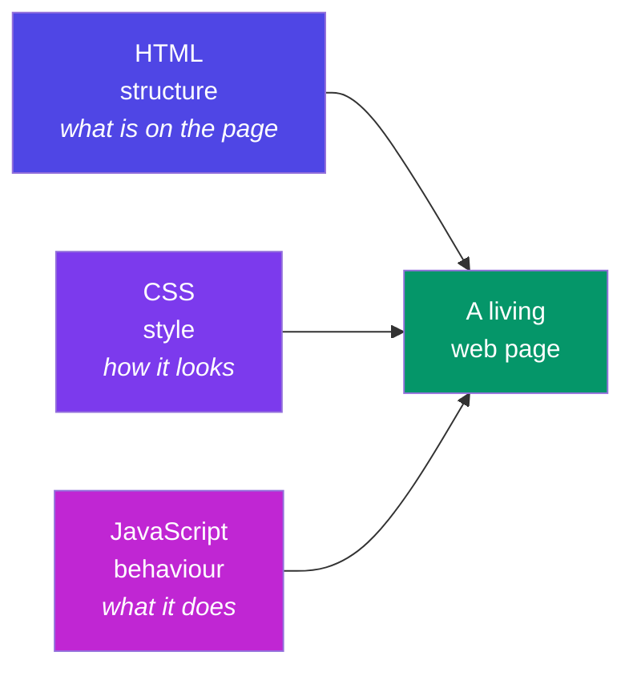

**Where you already use it (real world):**
- Gmail updating your inbox without a page refresh.
- An SAP Fiori app validating a purchase-order form as you type.
- Netflix's "continue watching" row loading as you scroll.
- The WordPress admin dashboard's drag-and-drop widgets.

**Why it matters for your roadmap:** JavaScript is the single language that runs your **frontend** (React, Fiori/UI5), your **backend** (Node.js, Express), and even build tools. Master it once, use it everywhere.

---

## A2. Where and How JS Runs

**Simple definition:** JavaScript needs an **engine** — a program that reads your code and executes it. Every browser ships one (Chrome's is called **V8**). **Node.js** took V8 out of the browser so JS can run on servers too.

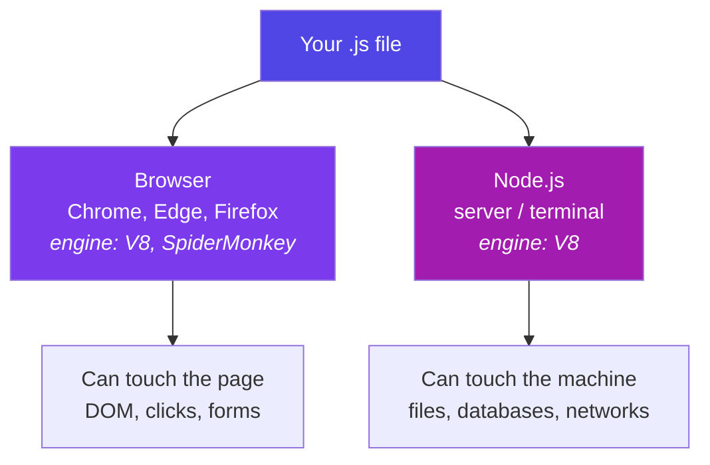

**Key idea:** the *language* is the same in both places; only the *toys available* differ. The browser gives you `document` and `window`; Node gives you files and servers. That's why "JS developer" covers both frontend and backend jobs.

**One term to know now:** JavaScript is **single-threaded** — it executes one statement at a time, on one call stack. Remember this; it becomes the hero of Part H (the event loop).

---

## A3. Your First Program

Three ways to run JavaScript today:

**1. Browser console** (fastest — press `F12` → Console):
```js
console.log("Hello, Nikhil!");
2 + 3;            // the console echoes: 5
```

**2. Inside an HTML page:**
```html
<!DOCTYPE html>
<html>
  <body>
    <h1 id="title">Loading...</h1>
    <script>
      document.getElementById("title").textContent = "Hello from JS!";
    </script>
  </body>
</html>
```

**3. With Node.js in a terminal:**
```js
// hello.js
console.log("Hello from Node");
// run:  node hello.js
```

**Habit to build:** keep the console open while you learn. Every snippet in these notes is meant to be *typed, run, and broken on purpose*. Reading JS teaches you 20%; running it teaches you the rest.

---

# Part B — Variables, Types & Operators

*The atoms of every program you will ever write.*

## B1. var vs let vs const

**Simple definition:** variables are labelled boxes for values. Modern JS gives you three keywords to declare them — and one of them (`var`) is a legacy trap.

```js
let score = 10;        // can be reassigned
const PI = 3.14159;    // cannot be reassigned
var old = "avoid me";  // legacy — function-scoped, hoisting surprises
```

| | `var` (1995) | `let` (2015) | `const` (2015) |
|---|---|---|---|
| Scope | **Function** | Block `{ }` | Block `{ }` |
| Reassignable | Yes | Yes | **No** |
| Redeclarable | Yes (silently!) | No (error) | No (error) |
| Hoisting | Yes — becomes `undefined` | TDZ error if used early | TDZ error if used early |
| Verdict | ❌ never in new code | ✅ when value changes | ✅ **default choice** |

**Why `var` is dangerous — the classic bug:**

```js
// var leaks out of blocks:
if (true) {
  var leaked = "I escaped!";
  let contained = "I stay inside";
}
console.log(leaked);     // "I escaped!"  😱
console.log(contained);  // ReferenceError ✅ (good — the block protected it)
```

**Real-world example:** in a shopping cart, the tax rate never changes during checkout → `const TAX_RATE = 0.18`. The running total changes with every item → `let total = 0`. If you accidentally write `total = "oops"` twice with `var`, JS stays silent; with `let`/`const` you get errors early — and early errors are cheap errors.

**`const` gotcha — it locks the *label*, not the *contents*:**

```js
const user = { name: "Nikhil" };
user.name = "NV";        // ✅ allowed — we changed the object's insides
user = { name: "X" };    // ❌ TypeError — we tried to re-point the label
```

**Rule of thumb:** `const` by default, `let` when you *know* it must change, `var` never.

---

## B2. Data Types

**Simple definition:** every value in JS has a type. There are **7 primitive types** (simple, immutable values) plus **object** (everything structured).

| Type | Example | Real-world use |
|---|---|---|
| `string` | `"Nikhil"`, `'hi'`, `` `Hi ${name}` `` | names, messages, HTML |
| `number` | `42`, `3.14`, `-7` | prices, scores, coordinates |
| `boolean` | `true`, `false` | isLoggedIn, isDarkMode |
| `undefined` | declared but never assigned | "nobody set this yet" |
| `null` | assigned "nothing" on purpose | "we looked — it's empty" |
| `symbol` | `Symbol("id")` | unique hidden object keys (rare) |
| `bigint` | `9007199254740993n` | numbers beyond 2⁵³ (rare) |
| `object` | `{ }`, `[ ]`, functions, dates | everything structured |

**`undefined` vs `null` — the parcel analogy:** you order a phone online. `undefined` = the box never arrived. `null` = the box arrived, you opened it, and it's *deliberately empty*. JS sets `undefined`; *you* set `null`.

```js
let a;                 // undefined — JS's "not set yet"
let b = null;          // null — YOUR "intentionally empty"

typeof "hi"            // "string"
typeof 42              // "number"
typeof undefined       // "undefined"
typeof null            // "object"  ← famous 30-year-old bug, memorise it
typeof [1, 2]          // "object"  ← arrays are objects (use Array.isArray)
typeof function(){}    // "function"
```

**One number type:** JS has no separate int/float — `5` and `5.0` are the same `number`. Beware classic floating-point behaviour: `0.1 + 0.2 === 0.3` is `false` (it's `0.30000000000000004`). For money, work in paise/cents (integers) — every payment system does.

---

## B3. Type Coercion & == vs ===

**Simple definition:** when you mix types, JS silently *converts* one to the other. That's **coercion**. It's helpful just often enough to be dangerous.

**The famous pair:**

```js
1 + "2"    // "12"  → + sees a string, so it CONCATENATES
1 - "2"    // -1    → - only works on numbers, so it CONVERTS
```

**Rule:** `+` prefers strings; every other math operator (`-`, `*`, `/`) prefers numbers.

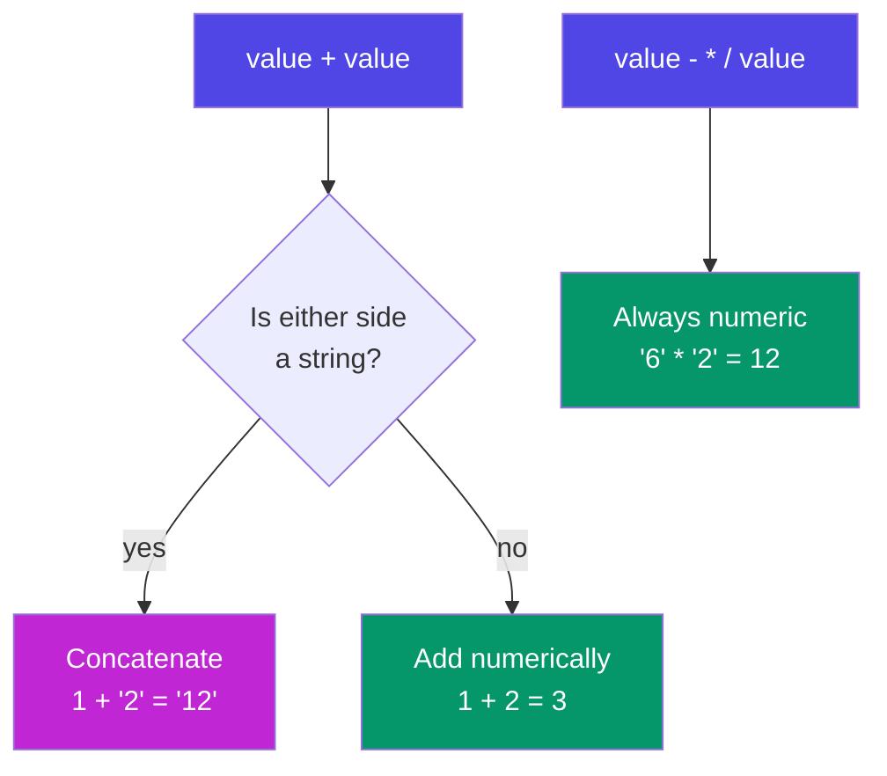

**Why this bites in the real world:** *every* value from an HTML form is a string.

```js
const qty = document.querySelector("#qty").value;   // "3" (string!)
const price = 500;
console.log(price + qty);          // "5003" 😱 — a ₹5,003 bug
console.log(price + Number(qty));  // 503   ✅
```

**Truthy & falsy:** in an `if`, every value is coerced to a boolean. Only **six values are falsy** — memorise them; everything else is truthy:

```
false   0   ""   null   undefined   NaN
```

```js
if (username) { ... }   // runs unless username is "" / null / undefined
"0" ? "truthy" : "falsy"   // "truthy" — non-empty STRING "0" is truthy!
[] ? "truthy" : "falsy"    // "truthy" — empty array is an object
```

**== vs === (the interview classic):**

- `==` (loose) coerces both sides first, *then* compares — full of surprises.
- `===` (strict) compares value **and** type — no conversion, no surprises.

```js
"5" == 5      // true   (string coerced to number)
0 == false    // true   😱
null == undefined  // true (special-cased)
"5" === 5     // false  ✅ different types
0 === false   // false  ✅
NaN === NaN   // false  ← NaN equals nothing, even itself (use Number.isNaN)
```

> **Rule for life: always use `===` and `!==`.** The only common exception pros allow: `value == null` as a shortcut for "null *or* undefined".

**Party-trick coercions (know the *why*, never use them):** `[] + {}` → `"[object Object]"` (both sides become strings and concatenate), `[] + []` → `""` (two empty strings). And chained comparisons lie: `3 > 2 > 1` evaluates left-to-right as `(3 > 2) > 1` → `true > 1` → `1 > 1` → **false**. Coercion trivia makes great quiz questions and terrible production code — your Phase 4 mini-project "Type-Coercion Quiz" is built from exactly these.

---

## B4. Operators & Logical Tricks

**Arithmetic:** `+ - * / %` (remainder) `**` (power)

```js
10 % 3    // 1   → remainder. Real use: isEven = n % 2 === 0
2 ** 10   // 1024
```

**Comparison:** `> < >= <=  ===  !==` — always return a boolean.

**Logical operators — the part people underestimate.** `&&` and `||` don't return `true`/`false`; they return **one of their operands** (short-circuit):

```js
// || returns the FIRST TRUTHY value  → great for fallbacks
const displayName = user.nickname || user.name || "Guest";

// && returns the first falsy value, else the last one → great for guards
isLoggedIn && showDashboard();   // only calls the function if truthy

// The || trap: it treats 0 and "" as "missing"!
const qty = order.qty || 1;   // BUG: a real qty of 0 becomes 1
const qty2 = order.qty ?? 1;  // ✅ ?? only falls back on null/undefined
```

**Assignment shortcuts:** `+= -= *= /=` and `count++` / `count--`.

**Real-world example — a settings object:**

```js
const settings = userSettings.theme ?? "light";       // respect "" ? no — but respect 0/false
const volume  = userSettings.volume ?? 50;            // volume 0 stays 0 ✅
const banner  = isAdmin && "Admin mode active";       // string or false
```

---

## B5. Template Literals

**Simple definition:** strings written with backticks `` ` `` that can *embed expressions* with `${...}` and span multiple lines. They replaced clumsy `+` concatenation.

```js
const name = "Nikhil", items = 3, total = 1497;

// Old, error-prone way:
const msg1 = "Hi " + name + ", your " + items + " items cost ₹" + total + ".";

// Template literal:
const msg2 = `Hi ${name}, your ${items} items cost ₹${total}.`;

// Any expression works inside ${}:
const line = `Status: ${total > 1000 ? "FREE delivery" : "₹49 delivery"}`;

// Multi-line — perfect for HTML snippets:
const card = `
  <div class="user-card">
    <h2>${name}</h2>
    <p>Items: ${items}</p>
  </div>`;
```

**Real-world example:** building an order-confirmation email, an HTML card for the DOM (Part E), or a SQL-like query message — anywhere text and data mix, template literals keep it readable.

---

# Part C — Control Flow & Functions

*Programs make decisions and package logic for reuse. This part is both skills.*

## C1. if / switch / ternary / loops

**if / else if / else** — the workhorse:

```js
const marks = 78;
if (marks >= 90)      console.log("A grade");
else if (marks >= 75) console.log("B grade");   // ← this runs
else                  console.log("Keep going");
```

**switch** — cleaner than a ladder of `===` checks on one value:

```js
switch (paymentMethod) {
  case "upi":
  case "wallet":              // fall-through: both share one branch
    fee = 0; break;
  case "card":
    fee = amount * 0.02; break;
  default:
    fee = 10;
}
```

⚠️ Forgetting `break` makes execution *fall through* into the next case — the #1 switch bug.

**Ternary** — an `if/else` that returns a value; perfect for short choices, terrible when nested:

```js
const badge = score >= 75 ? "🏆 Top" : "Keep going";
```

**Loops:**

```js
for (let i = 0; i < 3; i++) { ... }        // classic counter

const cart = ["pen", "book", "lamp"];
for (const item of cart) { ... }           // for..of → VALUES of an array ✅

const user = { name: "NV", age: 26 };
for (const key in user) { ... }            // for..in → KEYS of an object

while (retries < 3) { ... }                // loop while a condition holds
```

**Memory hook:** for..**o**f → **o**bjects' values in arrays; for..**in** → keys **in** an object. (In practice you'll replace most array loops with `.map`/`.filter` — Part D2.)

`break` exits a loop early; `continue` skips to the next round.

---

## C2. Functions — All the Ways

**Simple definition:** a function is a reusable, named block of logic — you give it inputs (parameters), it gives back an output (`return`).

**The three syntaxes:**

```js
// 1. Function DECLARATION — hoisted (usable before its line)
function add(a, b) { return a + b; }

// 2. Function EXPRESSION — stored in a variable, not hoisted
const subtract = function (a, b) { return a - b; };

// 3. ARROW function (2015) — short, and no own `this`
const multiply = (a, b) => a * b;          // one-liner: implicit return
const shout = (msg) => {                   // multi-line: needs { } and return
  const upper = msg.toUpperCase();
  return upper + "!";
};
```

**Arrow vs regular — the two real differences:**

| | Regular function | Arrow function |
|---|---|---|
| Own `this` | ✅ yes (decided by *how it's called* — Part G1) | ❌ no — borrows `this` from where it was *written* |
| Hoisted | Declarations: yes | No |
| Best for | Object methods, constructors | Callbacks, one-liners, array methods |

```js
const timer = {
  seconds: 0,
  start() {
    // arrow inherits `this` from start() → this.seconds works ✅
    setInterval(() => this.seconds++, 1000);
  }
};
```

**Default + rest parameters:**

```js
const greet = (name = "friend") => `Hi ${name}`;
greet();               // "Hi friend"

function sum(...nums) {            // rest: gathers ALL args into an array
  return nums.reduce((t, n) => t + n, 0);
}
sum(1, 2, 3, 4);       // 10
```

**Real-world example — a delivery-fee calculator used across a food app:**

```js
const deliveryFee = (distanceKm, isPrime = false) => {
  if (isPrime) return 0;
  return distanceKm <= 2 ? 20 : 20 + (distanceKm - 2) * 8;
};
deliveryFee(5);         // 44
deliveryFee(5, true);   // 0
```

One function, defined once, called from the cart page, the checkout page, and the order-tracking page. Change the pricing in *one* place — that is why functions exist.

---

## C3. Optional Chaining & Nullish Coalescing

**The problem:** real data (especially from APIs) has holes. Reaching into a missing object crashes your app:

```js
const user = { name: "Nikhil" };            // no address today
console.log(user.address.city);             // ❌ TypeError: Cannot read 'city' of undefined
```

**Optional chaining `?.`** — "if this is null/undefined, stop and return undefined instead of crashing":

```js
console.log(user.address?.city);            // undefined ✅ no crash
console.log(user.getOrders?.());            // safely call a maybe-missing method
console.log(orders?.[0]?.items?.[0]);       // works on array indexes too
```

**Nullish coalescing `??`** — "if the left side is null/undefined, use this default":

```js
const city = user.address?.city ?? "City not provided";
```

**`?.` and `??` are a team:** `?.` safely *reaches*, `??` supplies the *fallback*.

**Real-world example — rendering an API response:**

```js
// A payment API sometimes omits refund info entirely:
const refundAmount = response.data?.refund?.amount ?? 0;
const refundDate = response.data?.refund?.date ?? "—";
```

Without `?.` this is three nested `if` checks; with it, one readable line. You will use this *daily* in React and when calling APIs (Part H7).

---

# Part D — Arrays, Objects & Modern Syntax

*90% of real JavaScript work is transforming arrays of objects. This part is that job.*

## D1. Array Basics

**Simple definition:** an array is an ordered list. Positions (indexes) start at **0**.

```js
const cart = ["pen", "book", "lamp"];
cart[0];          // "pen"
cart.length;      // 3
cart[cart.length - 1];   // "lamp" — the classic "last item" trick
cart.at(-1);             // "lamp" — the modern way
```

**The core mutating methods (they CHANGE the array):**

```js
cart.push("mug");      // add to END        → ["pen","book","lamp","mug"]
cart.pop();            // remove from END   → returns "mug"
cart.unshift("bag");   // add to FRONT
cart.shift();          // remove from FRONT
cart.splice(1, 1);     // remove 1 item AT index 1 → cuts "book" out
cart.splice(1, 0, "ink"); // remove 0, INSERT "ink" at index 1
```

**slice vs splice — the eternal confusion:**

| | `slice(start, end)` | `splice(start, deleteCount, ...items)` |
|---|---|---|
| Changes original? | ❌ No — returns a copy | ✅ **Yes** — cuts/inserts in place |
| Returns | the copied section | the removed items |
| Memory hook | s**lice** = polite copy | s**plice** = surgery |

```js
const nums = [10, 20, 30, 40];
nums.slice(1, 3);   // [20, 30]  — original untouched (end index excluded!)
nums.splice(1, 2);  // [20, 30]  — original is now [10, 40]
```

Also handy: `indexOf`, `includes`, `join("-")`, `concat`, `reverse`, `sort` — note `sort` compares as *strings* by default: `[10, 2, 1].sort()` → `[1, 10, 2]` 😱. For numbers always pass a comparator: `.sort((a, b) => a - b)`.

---

## D2. Higher-Order Array Methods

**Simple definition:** a **higher-order function** takes another function as input. These six methods each take *your* function and apply it across the array. They are the most-used lines in modern JS — and the heart of React rendering.

**The cast, one line each:**

| Method | Question it answers | Returns |
|---|---|---|
| `.map(fn)` | "Transform every item" | new array, **same length** |
| `.filter(fn)` | "Keep only the ones that pass" | new array, ≤ length |
| `.find(fn)` | "Give me the *first* one that passes" | one item (or `undefined`) |
| `.some(fn)` | "Does at least ONE pass?" | boolean |
| `.every(fn)` | "Do ALL pass?" | boolean |
| `.forEach(fn)` | "Just do something with each" | `undefined` (side effects only) |

**One dataset, all six — a students list:**

```js
const students = [
  { name: "Asha",   score: 91, active: true  },
  { name: "Bharat", score: 62, active: true  },
  { name: "Chitra", score: 78, active: false },
];

students.map(s => s.name);                  // ["Asha","Bharat","Chitra"]
students.filter(s => s.score >= 75);        // [Asha, Chitra]  (whole objects)
students.find(s => s.name === "Bharat");    // { name:"Bharat", ... }
students.some(s => s.score >= 90);          // true  (Asha qualifies)
students.every(s => s.active);              // false (Chitra isn't)
students.forEach(s => console.log(s.name)); // prints each; returns nothing
```

**Chaining — the real-world superpower.** "Names of active students who scored 75+, alphabetically":

```js
const honourRoll = students
  .filter(s => s.active && s.score >= 75)
  .map(s => s.name)
  .sort();
```

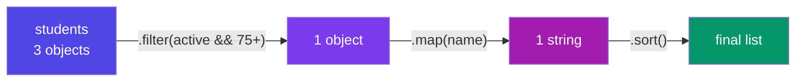

**Why this replaces loops:** each step names its *intent*. A `for` loop says *how*; `.filter().map()` says *what*. Six months later, "what" is readable in 3 seconds.

**Real-world examples you'll write soon:**
- **React:** `products.map(p => <ProductCard key={p.id} {...p} />)` — every list on every React page is a `.map`.
- **E-commerce:** `cart.filter(i => i.inStock).map(i => i.price * i.qty)` then `.reduce` for the total (Part I2).
- **Validation:** `formFields.every(f => f.value !== "")` → enable the Submit button.

---

## D3. Objects

**Simple definition:** an object is a collection of labelled values — `key: value` pairs. If arrays are lists, objects are *profiles*.

```js
const user = {
  name: "Nikhil",
  role: "developer",
  skills: ["JS", "WordPress", "Fiori"],
  address: { city: "Bangalore", pin: 560001 },   // objects nest
  greet() {                                       // a method = function in an object
    return `Hi, I'm ${this.name}`;               // `this` = the object before the dot
  },
};
```

**Reading & writing:**

```js
user.name              // "Nikhil"          — dot: when you know the key
user["role"]           // "developer"       — bracket: when the key is dynamic
const field = "role";
user[field]            // "developer"       — bracket shines here
user.age = 26;         // add a new property any time
delete user.role;      // remove one
```

**The three X-ray methods:**

```js
Object.keys(user)     // ["name", "skills", "address", "greet", "age"]
Object.values(user)   // the values
Object.entries(user)  // [["name","Nikhil"], ...] — pairs, perfect for loops
```

**Shorthand you'll see everywhere:**

```js
const name = "NV", score = 90;
const player = { name, score };          // same as { name: name, score: score }
```

**Real-world example:** every API response you'll ever receive is an object (usually holding arrays of more objects). A "user profile", a "product", an "order" — objects are how JS models *things*, arrays are how it models *many things*.

---

## D4. Destructuring

**Simple definition:** unpacking values out of objects/arrays into variables in one line — pattern-matching the shape of your data.

**Object destructuring:**

```js
const user = { name: "Nikhil", role: "dev", city: "Bangalore" };

const { name, city } = user;             // name="Nikhil", city="Bangalore"
const { role: jobTitle } = user;         // rename while unpacking
const { phone = "not given" } = user;    // default for missing keys
const { address: { pin } = {} } = user;  // nested (with a safe default)
```

**Array destructuring:**

```js
const scores = [98, 87, 75];
const [first, second] = scores;          // first=98, second=87
const [gold, , bronze] = scores;         // skip an item with a hole

// The famous swap — no temp variable:
let a = 1, b = 2;
[a, b] = [b, a];                         // a=2, b=1
```

**Destructuring in function parameters — the pattern React lives on:**

```js
// Instead of taking a whole object and dot-digging:
function ship({ orderId, address, express = false }) {
  return `Order ${orderId} → ${address} ${express ? "🚀" : "📦"}`;
}
ship({ orderId: 101, address: "Bangalore" });
```

**Real-world example:** pulling exactly what you need from a big API response —

```js
const { data: { user: { name, email } } } = await axios.get("/api/me");
// and in React:  const [count, setCount] = useState(0)  ← array destructuring!
```

That `useState` line — which you'll write hundreds of times in Phase 6 — *is* array destructuring. You now know why it has square brackets.

---

## D5. Spread & Rest

**Same three dots `...`, two opposite jobs:**

- **Spread** = *unpack* — explode an array/object into its pieces.
- **Rest** = *pack* — gather leftover pieces into one array/object.

**Memory hook:** on the **right** side of `=` or in a call → spread (out). On the **left** side or in parameters → rest (collect).

**Spread:**

```js
const base = ["pen", "book"];
const cart = [...base, "lamp"];              // copy + add  → new array

const user = { name: "NV", city: "BLR" };
const updated = { ...user, city: "Hyd" };    // copy + OVERRIDE one field

Math.max(...[3, 9, 4]);                      // 9 — spread as arguments
const merged = { ...defaults, ...userPrefs }; // later spread wins conflicts
```

**Rest:**

```js
const [winner, ...others] = ["Asha", "Bharat", "Chitra"];
// winner = "Asha", others = ["Bharat", "Chitra"]

const { password, ...safeUser } = user;      // strip a field OUT of an object

function avg(...marks) {                     // accept any number of args
  return marks.reduce((t, m) => t + m, 0) / marks.length;
}
```

**Why this matters enormously for React:** React state must be updated **immutably** — you never edit the old object, you build a new one:

```js
// Updating one field of state, the React way:
setUser({ ...user, city: "Hyderabad" });
// Adding an item to a list, the React way:
setTodos([...todos, newTodo]);
```

⚠️ **Shallow-copy warning:** spread copies one level deep. Nested objects are still *shared*:

```js
const copy = { ...user };
copy.address.city = "Delhi";   // ALSO changes user.address.city! 
const deep = structuredClone(user);   // true deep copy when you need it
```

---

## D6. JSON & localStorage

**Simple definition:** JSON (JavaScript Object Notation) is the universal *text* format for data — how objects travel over networks and get stored. It looks like a JS object but is a **string** with stricter rules (double quotes, no functions, no comments).

```js
const order = { id: 101, items: ["pen", "book"], paid: true };

const text = JSON.stringify(order);   // object → string  '{"id":101,...}'
const back = JSON.parse(text);        // string → object  (a fresh copy)
```

**Real-world example — persistence without a database.** The browser's `localStorage` stores strings that survive refresh and restart:

```js
// Save the cart when it changes:
localStorage.setItem("cart", JSON.stringify(cart));

// Restore it on page load:
const saved = JSON.parse(localStorage.getItem("cart") ?? "[]");
```

This exact pair powers your Phase 4 mini-project (a to-do list that survives refresh), and it's the same JSON that every REST API request/response uses (Part H7). `stringify` on the way out, `parse` on the way in — that's the whole trick.

---

# Part E — The DOM

*Everything so far ran in a vacuum. The DOM is where JavaScript finally touches the page.*

## E1. What is the DOM?

**Simple definition:** when the browser reads your HTML, it builds a live, in-memory **tree of objects** — the **D**ocument **O**bject **M**odel. JavaScript can't edit your HTML *file*, but it can edit this *tree* — and the page instantly re-draws to match.

**Analogy:** the HTML file is the architect's blueprint; the DOM is the *actual built house*. JS is the renovation crew — it moves walls in the house, not lines on the blueprint.

```html
<body>
  <h1>My Tasks</h1>
  <ul id="list">
    <li class="task">Learn JS</li>
    <li class="task">Build app</li>
  </ul>
</body>
```

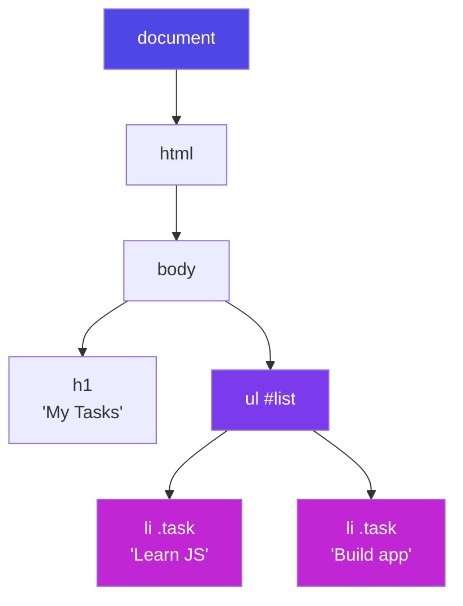

Every box in that tree is an object with properties and methods — `document` is the root handle to all of it.

---

## E2. Selecting & Changing Elements

**Selecting (finding your target):**

```js
document.getElementById("list");          // fastest, IDs only
document.querySelector(".task");          // FIRST match — any CSS selector ✅
document.querySelectorAll(".task");       // ALL matches (a NodeList)
document.querySelector("#list li:last-child");  // full CSS power
```

**Rule of thumb:** `querySelector` / `querySelectorAll` can do everything — learn the CSS-selector mini-language once, reuse it here, in CSS, and in test tools forever.

**Changing content & attributes:**

```js
const title = document.querySelector("h1");
title.textContent = "Today's Tasks";        // plain text (safe)
title.innerHTML = "Tasks <em>today</em>";   // parses HTML ⚠ never with user input (XSS!)

const link = document.querySelector("a");
link.href = "https://javascript.info";
input.value = "";                            // form fields use .value
```

**Changing style — prefer classes:**

```js
title.style.color = "purple";        // quick inline style (JS uses camelCase)
title.classList.add("done");         // ✅ better: toggle CSS classes
title.classList.remove("urgent");
title.classList.toggle("dark");      // add if absent, remove if present
```

**Creating & removing elements:**

```js
const li = document.createElement("li");
li.textContent = "New task";
li.classList.add("task");
document.querySelector("#list").append(li);   // now it's on the page
li.remove();                                   // and now it's gone
```

---

## E3. Events

**Simple definition:** events are the page saying "something happened!" — a click, a keypress, a form submit. `addEventListener` lets you answer: "*when* that happens, run *this* function."

```js
const btn = document.querySelector("#save");

btn.addEventListener("click", (event) => {
  console.log("Saved!");
});
```

**The event object — your incident report.** Every handler receives one, full of details:

```js
form.addEventListener("submit", (e) => {
  e.preventDefault();              // stop the browser's default (page reload!)
  const text = input.value.trim();
});

document.addEventListener("keydown", (e) => {
  if (e.key === "Escape") closeModal();     // which key?
});
```

| Event | Fires when | Classic use |
|---|---|---|
| `click` | element clicked | buttons, links |
| `submit` | form submitted | validate + save (always `preventDefault`) |
| `input` | field value changes (every keystroke) | live search, char counters |
| `change` | field committed (blur/select) | dropdowns, checkboxes |
| `keydown` | key pressed | shortcuts, Escape-to-close |
| `DOMContentLoaded` | HTML fully parsed | safe start point for your code |

**Bubbling & delegation — the pro pattern.** Events *bubble up*: a click on an `<li>` also fires on its `<ul>`, then `<body>`, then `document`. So instead of attaching 100 listeners to 100 list items (some of which don't exist yet!), attach **one** to the parent and ask *who* was clicked:

```js
list.addEventListener("click", (e) => {
  if (e.target.matches("li.task")) {
    e.target.classList.toggle("done");    // works even for items added later ✅
  }
});
```

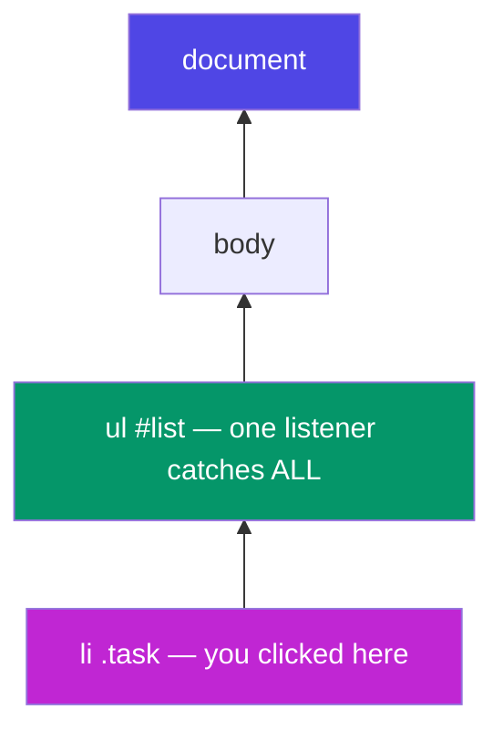

**Real-world example:** Gmail's inbox has thousands of rows but nowhere near thousands of listeners — one delegated listener on the list container handles every row click. Same trick, at scale.

---

## E4. Mini-Project: To-Do List

*Your Phase 4 deliverable — every concept from Parts B–E in 40 lines. Type it, don't paste it.*

```html
<input id="task-input" placeholder="What next?" />
<button id="add-btn">Add</button>
<ul id="list"></ul>
```

```js
const input = document.querySelector("#task-input");
const addBtn = document.querySelector("#add-btn");
const list = document.querySelector("#list");

// State lives in ONE array; the DOM is just its reflection.
let tasks = JSON.parse(localStorage.getItem("tasks") ?? "[]");

function save() {
  localStorage.setItem("tasks", JSON.stringify(tasks));
}

function render() {
  list.innerHTML = "";                       // clear
  tasks.forEach((task, i) => {
    const li = document.createElement("li");
    li.textContent = task.text;
    li.dataset.index = i;                    // remember which task this is
    li.classList.toggle("done", task.done);
    list.append(li);
  });
}

addBtn.addEventListener("click", () => {
  const text = input.value.trim();
  if (!text) return;                         // guard clause (truthy check!)
  tasks = [...tasks, { text, done: false }]; // immutable add (spread!)
  input.value = "";
  save(); render();
});

// ONE delegated listener: click toggles done, double-click deletes
list.addEventListener("click", (e) => {
  const i = Number(e.target.dataset.index);
  tasks = tasks.map((t, idx) => idx === i ? { ...t, done: !t.done } : t);
  save(); render();
});
list.addEventListener("dblclick", (e) => {
  const i = Number(e.target.dataset.index);
  tasks = tasks.filter((_, idx) => idx !== i);
  save(); render();
});
```

**The big lesson hiding in this project:** *state → render*. The array `tasks` is the single source of truth; the DOM is redrawn from it after every change. That mental model — data drives the view — **is React**, one phase early. When you meet `useState` next week, you'll recognise `save(); render();` as what React automates for you.

---

# Part F — Under the Hood: Scope, Hoisting & Closures

*Phase 5 begins. Everything before this was "what to type". From here on it's "how JavaScript actually thinks" — the material interviews are made of.*

## F1. Execution Context & the Call Stack

**Simple definition:** every time JS runs code, it creates an **execution context** — a workspace holding that code's variables and a reference to its outer world. Program start creates the **Global** context; every function call creates a fresh **Function** context.

**Each context is built in two phases:**

1. **Creation phase (memory):** JS scans the code *before running it* and reserves space for every variable and function it finds. `var` slots get `undefined`; `let`/`const` slots are reserved but *uninitialised*; function declarations are stored **whole**.
2. **Execution phase:** the code finally runs, line by line, filling in real values.

This two-phase design is *the* reason hoisting (F2) exists — memory is allocated before a single line executes.

**The call stack** tracks "where am I?" — contexts stack up as functions call functions, and pop off as they return:

```js
function multiply(a, b) { return a * b; }
function square(n) { return multiply(n, n); }
function printSquare(n) { console.log(square(n)); }
printSquare(4);   // 16
```

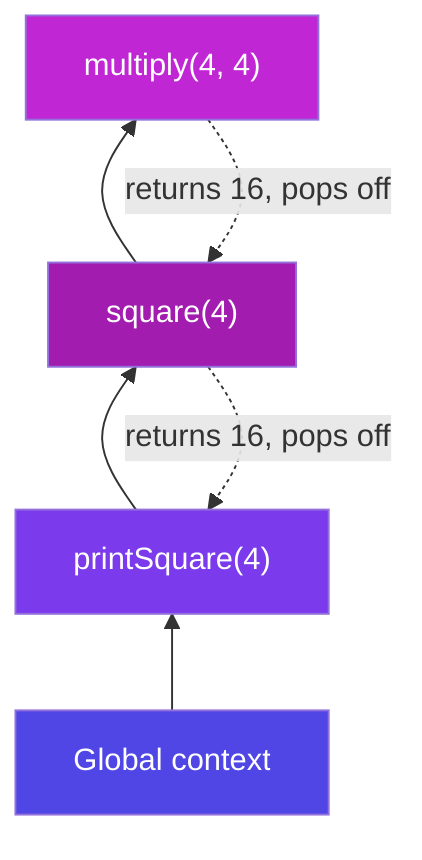

**Analogy:** a stack of dinner plates. Each function call puts a plate on top; each `return` takes the top plate off. JS only ever works on the **top plate** — that's what "single-threaded" means in practice. (When you see "Maximum call stack size exceeded", that's infinite recursion piling plates to the ceiling.)

**Why care:** the call stack is half of the event-loop story (Part H2), and "explain the execution context" is a stock interview opener.

---

## F2. Hoisting & the Temporal Dead Zone

**Simple definition:** **hoisting** is the *effect* of the creation phase — declarations are known to JS before your code runs, so some things are usable "before their line".

```js
// 1. Function declarations hoist COMPLETELY:
greet();                          // "Hello!" ✅ works before its line
function greet() { console.log("Hello!"); }

// 2. var hoists but is set to undefined:
console.log(score);               // undefined 😐 (not an error — worse!)
var score = 10;

// 3. let / const hoist but stay LOCKED until their line — the TDZ:
console.log(total);               // ❌ ReferenceError: Cannot access before initialization
let total = 50;
```

**The Temporal Dead Zone (TDZ):** the region between the top of the scope and a `let`/`const` declaration line, where the variable *exists but is untouchable*. It sounds like a punishment — it's actually a **gift**: `var`'s silent `undefined` hides bugs, while the TDZ crashes loudly at the exact line you misused.

| | Hoisted? | Value before its line | Bug style |
|---|---|---|---|
| `function` declaration | ✅ fully | callable | none |
| `var` | ✅ | `undefined` | *silent* wrong values |
| `let` / `const` | ✅ (but locked) | TDZ → ReferenceError | *loud*, easy to fix |
| function *expression* / arrow in `const` | locked like const | TDZ error | loud |

**Real-world example:** a 500-line file where line 30 reads a `var` that's declared on line 400. With `var`: line 30 quietly gets `undefined`, and the bug surfaces as "NaN" somewhere else entirely. With `let`: line 30 throws immediately, telling you exactly what's wrong. This is why `var` is banned in modern codebases — not style, *debuggability*.

---

## F3. Lexical Scope & the Scope Chain

**Simple definition:** **scope** = where a variable is visible. **Lexical** scope means visibility is decided by *where the function is written in the code* — not where or how it is called.

```js
const appName = "JobSwift";              // global scope

function outer() {
  const city = "Bangalore";              // outer's scope
  function inner() {
    const lang = "JS";                   // inner's scope
    console.log(appName, city, lang);    // ✅ sees ALL THREE
  }
  inner();
}
outer();
console.log(city);                       // ❌ ReferenceError — can't look inward
```

**The scope chain:** when `inner` uses `city`, JS looks in `inner`'s own scope → not found → steps *outward* to `outer` → found. Not found anywhere? `ReferenceError`. The chain only goes **inside → outside**, never the reverse.

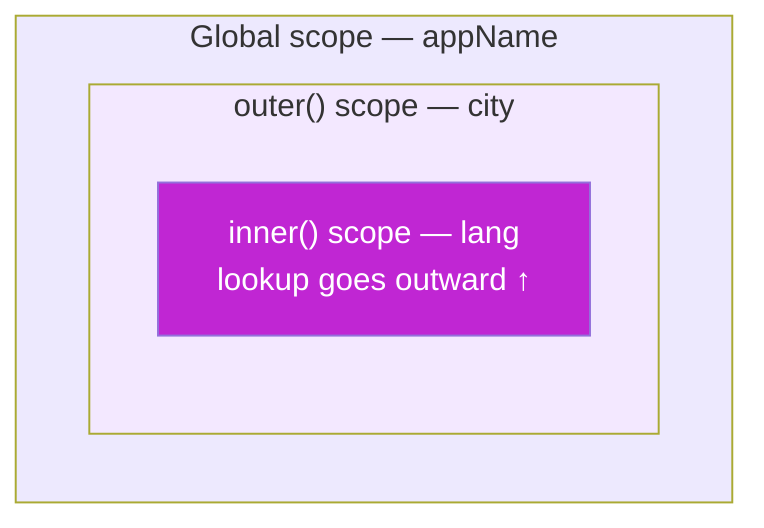

**Analogy — glass walls:** each function is a one-way glass room. From inside you can see *out* (and use outer variables); nobody outside can see *in*. Rooms nest, and you can always see through all the walls outward to the global street.

**The key phrase for interviews:** *functions remember the scope where they were **born**, not where they are **called***. That single sentence is 90% of closures — next section.

---

## F4. Closures

**The definition (memorise it):** a **closure** is a function bundled together with the variables from its birth scope. Even after the outer function has finished and returned, the inner function still *remembers and can update* those variables.

**Analogy — the backpack:** when a function is created inside another function, it packs a backpack with every outer variable it uses. Wherever that function travels — returned, stored, passed around — the backpack goes too.

**The canonical example — a private counter:**

```js
function counter() {
  let count = 0;                    // ← lives in the backpack
  return {
    inc: () => ++count,
    dec: () => --count,
    val: () => count,
  };
}

const c = counter();     // counter() has RETURNED... but count lives on
c.inc(); c.inc();
c.val();                 // 2
count;                   // ❌ ReferenceError — truly private, no one can touch it
const c2 = counter();    // a SECOND, independent backpack
c2.val();                // 0 — each call to counter() creates a fresh closure
```

Three things just happened that matter:
1. **Privacy:** `count` cannot be read or corrupted from outside — only through the three doors we exported. This is *encapsulation without classes*.
2. **Persistence:** the variable outlived its creator function.
3. **Independence:** every call to `counter()` mints a brand-new scope.

**Real-world closure #1 — memoize (cache expensive results):**

```js
function memoize(fn) {
  const cache = {};                        // in the backpack
  return (n) => {
    if (n in cache) return cache[n];       // instant repeat answers
    return (cache[n] = fn(n));
  };
}
const slowSquare = (n) => { /* imagine 2s of work */ return n * n; };
const fastSquare = memoize(slowSquare);
fastSquare(9);   // computes once
fastSquare(9);   // served from cache ⚡
```

**Real-world closure #2 — debounce (the search-box pattern):**

```js
function debounce(fn, delay) {
  let timerId;                             // in the backpack
  return (...args) => {
    clearTimeout(timerId);                 // cancel the previous scheduled call
    timerId = setTimeout(() => fn(...args), delay);
  };
}
searchInput.addEventListener("input", debounce(runSearch, 400));
// fires runSearch only after the user STOPS typing for 400ms
```

Every autocomplete you've ever used — Google, Amazon, Flipkart — runs on this exact closure.

**The classic interview bug — `var` in a loop:**

```js
for (var i = 1; i <= 3; i++)
  setTimeout(() => console.log(i), 100);   // prints 4, 4, 4 😱

for (let i = 1; i <= 3; i++)
  setTimeout(() => console.log(i), 100);   // prints 1, 2, 3 ✅
```

**Why:** `var` creates ONE shared `i` — all three arrow functions share one backpack, and by the time they run, the loop has pushed `i` to 4. `let` creates a **fresh `i` per iteration** — three backpacks, three values. This one question tests scope, closures, hoisting, and the event loop at once, which is why interviewers love it.

---

## F5. IIFE & the Module Pattern

**Simple definition:** an **IIFE** (Immediately Invoked Function Expression) is a function that runs the instant it's defined — a disposable scope.

```js
(function () {
  const secret = "runs once, leaks nothing";
  console.log(secret);
})();                       // ← defined and called in one breath

(() => { /* arrow IIFEs work too */ })();
```

**Why it exists:** before 2015, *every* `var` in a script joined the global scope — two `<script>` files with `var user` would silently overwrite each other. Wrapping each file in an IIFE gave it a private scope. 

**The module pattern — IIFE + closure = a namespaced mini-library:**

```js
const CartModule = (function () {
  let items = [];                                    // private (closure)
  return {
    add(item)  { items.push(item); },                // public API
    total()    { return items.reduce((t, i) => t + i.price, 0); },
    count()    { return items.length; },
  };
})();

CartModule.add({ name: "pen", price: 20 });
CartModule.total();    // 20
CartModule.items;      // undefined — private ✅
```

**Today's status:** ES Modules (Part I1) made file-level IIFEs mostly obsolete — every module file is automatically its own scope. You still meet IIFEs in older codebases (jQuery plugins, WordPress themes — you've likely seen `(function($){ ... })(jQuery)` already) and occasionally to run top-level async code. Understand them; reach for modules.

---

# Part G — `this`, Prototypes & OOP

*Object-Oriented Programming: modelling your program as objects that hold both data and behaviour. JS does it with a twist — prototypes under the hood, classes on the surface.*

## G1. The 4 Rules of `this`

**Simple definition:** `this` is a placeholder meaning "the object currently running me". Its value is decided **at call time, by HOW the function is called** — not where it was written. (Exception: arrows.)

**The four rules, strongest first:**

| # | Rule | You see | `this` is |
|---|---|---|---|
| 1 | `new` binding | `new User()` | the freshly created object |
| 2 | Explicit | `fn.call(obj)` / `fn.apply(obj)` / `fn.bind(obj)` | whatever you passed |
| 3 | Implicit | `obj.method()` | the object **before the dot** |
| 4 | Default | plain `fn()` | `undefined` (strict) / `window` (sloppy) |
| — | Arrow fn | — | **no own `this`** — inherits from birth scope |

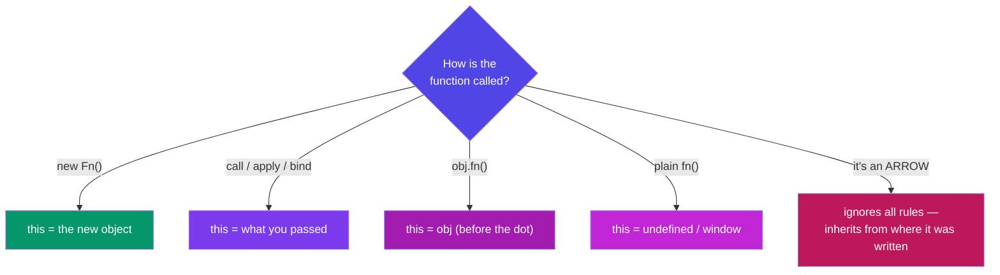

```js
const user = {
  name: "Nikhil",
  greet() { return `Hi, ${this.name}`; },
};

user.greet();                 // "Hi, Nikhil"  — rule 3: object before the dot

const loose = user.greet;
loose();                      // "Hi, undefined" 😱 — rule 4: no dot, no this

const fixed = user.greet.bind(user);
fixed();                      // "Hi, Nikhil" — rule 2: bind locks it forever
```

**call / apply / bind in one line each:**

```js
function intro(city, role) { return `${this.name} from ${city}, ${role}`; }
const me = { name: "Nikhil" };

intro.call(me, "Bangalore", "dev");        // call: args one by one, runs NOW
intro.apply(me, ["Bangalore", "dev"]);     // apply: args as Array, runs NOW
const later = intro.bind(me, "Bangalore"); // bind: returns a LOCKED copy for later
later("dev");
```

**Memory hook:** **c**all = **c**ommas, **a**pply = **a**rray, **b**ind = **b**ookmark for later.

**Where arrows save the day (and where they ruin it):**

```js
const timer = {
  seconds: 0,
  startGood() { setInterval(() => this.seconds++, 1000); },  // ✅ arrow inherits timer
  startBad()  { setInterval(function () { this.seconds++; }, 1000); }, // ❌ this = window
};

// But NEVER use an arrow AS a method:
const obj = { name: "X", greet: () => `Hi ${this.name}` };
obj.greet();   // "Hi undefined" — the arrow ignored the dot rule!
```

**Rule of thumb:** methods = regular functions; callbacks *inside* methods = arrows.

---

## G2. Prototypes & the Prototype Chain

**Simple definition:** every JS object has a hidden link — `[[Prototype]]` — to another object. Miss a property on the object? JS follows the link and looks there. Then the link's link. That walk is the **prototype chain**. It is JavaScript's native inheritance — classes are a nicer syntax *over this exact machinery*.

**You've already used it a thousand times:**

```js
const nums = [1, 2, 3];
nums.map(x => x * 2);
// nums has no "map" of its own!
// nums → Array.prototype (map lives HERE) → Object.prototype → null
```

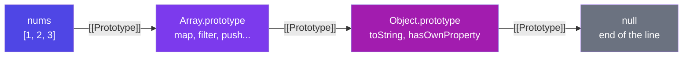

**Analogy:** you don't own a drill, so you ask your neighbour; they don't either, so they ask theirs. The request travels up the street until someone has it (or the street ends → `undefined`). Crucially, **there's only ONE drill** — a method on the prototype is *shared* by all instances, not copied into each. A million arrays, one `map`. That's the memory win.

**The pre-2015 way — constructor functions (recognise it in old code):**

```js
function User(name) {
  this.name = name;                          // per-instance data
}
User.prototype.greet = function () {         // SHARED method — one copy
  return `Hi, ${this.name}`;
};

const u = new User("Nikhil");
u.greet();                                   // found via the chain
```

**What `new` actually does — 4 steps:** ① creates an empty object → ② links its `[[Prototype]]` to `User.prototype` → ③ runs the function with `this` = that object → ④ returns the object. (That's rule 1 of `this`.)

Inspect chains with `Object.getPrototypeOf(obj)`; create with a chosen prototype via `Object.create(proto)`. Note `Object.assign(target, src)` just copies properties (no chain involved) — like a manual spread.

---

## G3. ES6 Classes

**Simple definition:** `class` is the modern, clean syntax for the constructor + prototype pattern above. Same engine underneath ("syntactic sugar") — but *far* more readable, and the style every framework uses.

**A complete class — all the pieces in one place:**

```js
class BankAccount {
  static bankName = "SBI";                    // STATIC: on the class itself

  #balance = 0;                               // PRIVATE field (G5)

  constructor(owner, opening = 0) {           // runs once per `new`
    this.owner = owner;                       // instance data
    this.#balance = opening;
  }

  deposit(amount) {                           // method → shared via prototype
    if (amount <= 0) throw new Error("Invalid amount");
    this.#balance += amount;
    return this;                              // return this → enables chaining
  }

  get balance() {                             // GETTER: read like a property
    return `₹${this.#balance.toLocaleString("en-IN")}`;
  }

  set owner(name) {                           // SETTER: validate on write
    if (!name?.trim()) throw new Error("Owner required");
    this._owner = name.trim();
  }
  get owner() { return this._owner; }

  static compare(a, b) {                      // static METHOD: utility on the class
    return a.#balance - b.#balance;
  }
}

const acc = new BankAccount("Nikhil", 5000);
acc.deposit(2500).deposit(1000);              // chaining, thanks to `return this`
acc.balance;                    // "₹8,500" — getter, no parentheses!
BankAccount.bankName;           // "SBI" — static: class, not instance
acc.bankName;                   // undefined — statics don't reach instances
```

**Getters/setters — when?** When the outside world should see a *property* but you need *logic* behind it — computed values (`fullName`), formatting, validation. **Static — when?** For things that belong to the concept, not one object: `Math.random()`, `Object.keys()`, `User.findById()` — all statics you already use.

---

## G4. Inheritance (extends & super)

**Simple definition:** inheritance lets a class *be a specialised version* of another — child gets everything the parent has, then adds or overrides. The "is-a" test: a Car **is a** Vehicle → inheritance fits.

```js
class Vehicle {
  constructor(kind, wheels) {
    this.kind = kind;
    this.wheels = wheels;
  }
  describe() { return `A ${this.kind} with ${this.wheels} wheels`; }
}

class Car extends Vehicle {
  constructor(brand) {
    super("car", 4);                 // MUST call parent constructor FIRST
    this.brand = brand;
  }
  describe() {                        // override
    return `${super.describe()} — a ${this.brand}`;   // reuse parent's version
  }
  honk() { return "Beep!"; }          // extension
}

const swift = new Car("Suzuki Swift");
swift.describe();          // "A car with 4 wheels — a Suzuki Swift"
swift instanceof Car;      // true
swift instanceof Vehicle;  // true — the chain: swift → Car.prototype → Vehicle.prototype
```

**`super` in one line:** `super(...)` = call the parent's constructor (mandatory in a child constructor, *before* any `this.`); `super.method()` = call the parent's version of a method you overrode.

**Real-world example — every UI framework:**

```js
class Button extends UIComponent { ... }        // React class components (legacy),
class DetailController extends BaseController { ... }  // SAP UI5 — you extend
// sap.ui.core.mvc.Controller in EVERY Fiori app you'll touch. This chapter
// is literally the syntax of your future SAP work.
```

**A word of balance:** deep inheritance trees (A→B→C→D) turn rigid fast. Modern JS favours *composition* — building objects from small functions — for most app code, and keeps inheritance for genuine "is-a" hierarchies (framework base classes, Shape examples, error types).

---

## G5. Encapsulation (#private fields)

**Simple definition:** encapsulation = bundling data with the methods that manage it, and **hiding the data** so it can only change through those methods. The object guards its own consistency.

**Analogy — the ATM:** the bank's vault (data) is not behind the glass. You interact through a small, safe menu — deposit, withdraw, check balance — and *the machine* enforces the rules (no overdraft, no negative deposits). `#private` fields are the vault door.

```js
class Wallet {
  #balance = 0;                        // # = truly private (2022+, enforced by JS)

  deposit(amount) {
    if (amount <= 0) throw new Error("Deposit must be positive");
    this.#balance += amount;
  }
  withdraw(amount) {
    if (amount > this.#balance) throw new Error("Insufficient funds");
    this.#balance -= amount;
  }
  get balance() { return this.#balance; }   // read-only window
}

const w = new Wallet();
w.deposit(1000);
w.withdraw(200);
w.balance;         // 800
w.#balance;        // ❌ SyntaxError — not "please don't touch", CANNOT touch
w.balance = 999999;  // silently ignored — no setter exists ✅
```

**Why it matters:** without privacy, *any* line in a 10,000-line app can write `wallet.balance = -5000` and corrupt state; the bug surfaces far from its cause. With `#`, every change funnels through validated methods — there are only two doors, and both have guards. (You met the same idea as closures in F4 — classes and closures are two routes to one goal: *controlled access to hidden state*.)

Old code fakes privacy with `_underscore` names — a naming *convention* with zero enforcement. Recognise it; prefer `#`.

---

## G6. Polymorphism & Abstraction

**Polymorphism ("many forms") — simple definition:** different classes answer the **same method name** with their **own behaviour**, so calling code can treat them uniformly and never ask "which type are you?"

```js
class Shape {
  area() { throw new Error("Subclass must implement area()"); }  // abstract-ish
  describe() { return `${this.constructor.name}: ${this.area().toFixed(2)}`; }
}

class Circle extends Shape {
  #r;
  constructor(r) { super(); this.#r = r; }
  area() { return Math.PI * this.#r ** 2; }
}

class Rectangle extends Shape {
  constructor(w, h) { super(); this.w = w; this.h = h; }
  area() { return this.w * this.h; }
}

const shapes = [new Circle(3), new Rectangle(4, 5), new Circle(1)];

// THE polymorphism moment — one line handles every current AND future shape:
shapes.forEach(s => console.log(s.describe()));
// Circle: 28.27 / Rectangle: 20.00 / Circle: 3.14
```

The alternative — `if (s instanceof Circle) ... else if (s instanceof Rectangle) ...` — must be edited every time a new shape is born. With polymorphism, adding `class Triangle extends Shape` requires **zero changes** to existing code. That's the point.

**Abstraction — simple definition:** exposing a simple *what* while hiding the messy *how*. `array.sort()` doesn't make you learn sorting algorithms; `fetch(url)` doesn't make you write TCP. Your classes should give the same gift:

```js
// Callers see ONE simple method...
class PaymentService {
  pay(order) {                        // the WHAT
    this.#validate(order);            // the HOW stays hidden
    const gateway = this.#pickGateway(order);
    return this.#execute(gateway, order);
  }
  #validate(o) { /* ... */ }
  #pickGateway(o) { /* UPI? card? wallet? caller never knows */ }
  #execute(g, o) { /* retries, logging, error mapping */ }
}
```

**Real-world example:** notification systems. `EmailNotifier`, `SMSNotifier`, `PushNotifier` — each implements `send(message)` its own way; the app just loops `notifiers.forEach(n => n.send(msg))`. Swap providers, add WhatsApp — the loop never changes.

---

## G7. The 4 Pillars — Summary

| Pillar | One-liner | Tool in JS | Example above |
|---|---|---|---|
| **Encapsulation** | hide data behind guarded methods | `#private`, getters/setters, closures | `Wallet` (G5) |
| **Inheritance** | child *is-a* parent, reuses + extends | `extends`, `super` | `Car extends Vehicle` (G4) |
| **Polymorphism** | same call, per-class behaviour | method overriding | `shapes.forEach(s => s.area())` (G6) |
| **Abstraction** | simple *what*, hidden *how* | private methods, clean public API | `PaymentService.pay()` (G6) |

**Interview one-breath answer:** *"Encapsulation hides state, inheritance shares behaviour, polymorphism lets one interface have many implementations, abstraction hides complexity behind a simple API. In JS these ride on the prototype chain, with `class` as the modern syntax."*

---

# Part H — Async JavaScript

*The grand finale of Phase 5: how a single-threaded language cooks five dishes at once.*

## H1. Single-Threaded, Yet Async

**The puzzle:** JS runs **one line at a time on one call stack** (F1). Yet a web page fetches data, waits on timers, and reacts to clicks *simultaneously* — without freezing. How?

**The answer:** JavaScript itself never does two things at once — it **delegates**. Slow jobs (network calls, timers, file reads) are handed to the **environment** (browser/Node), which does the waiting *outside* JS. When a job finishes, its callback queues up, and JS runs it when the stack is free.

**Analogy — the chef and the kitchen timers:** one chef (JS) cooks alone. Rice needs 20 minutes — does he stare at the pot? No: he sets a timer (delegates to the environment) and starts chopping (keeps executing). When the timer rings (callback queued), he finishes his current chop (empties the stack), *then* attends the rice. One chef, many dishes, nothing burnt.

**Why blocking is catastrophic in a browser:** while the stack is busy, the page can't repaint or respond to clicks. A 5-second synchronous loop = a frozen tab. Async isn't an optimisation; it's survival.

```js
console.log("A");
setTimeout(() => console.log("B"), 2000);   // delegate + move on
console.log("C");
// A, C ... (2s) ... B — JS never stood still
```

---

## H2. The Event Loop

**Simple definition:** the **event loop** is a tiny manager running one rule forever: *"Is the call stack empty? If yes — run all waiting **microtasks**; then take ONE **macrotask** from the queue and run it. Repeat."*

**The four actors:**

1. **Call stack** — where JS executes, one frame at a time (F1).
2. **Web APIs** — the environment's helpers doing the actual waiting: `setTimeout`, `fetch`, DOM events.
3. **Macrotask queue** (a.k.a. task/callback queue) — finished timers & events wait here.
4. **Microtask queue** — finished **Promises** wait here. **Always served first, and drained completely.**

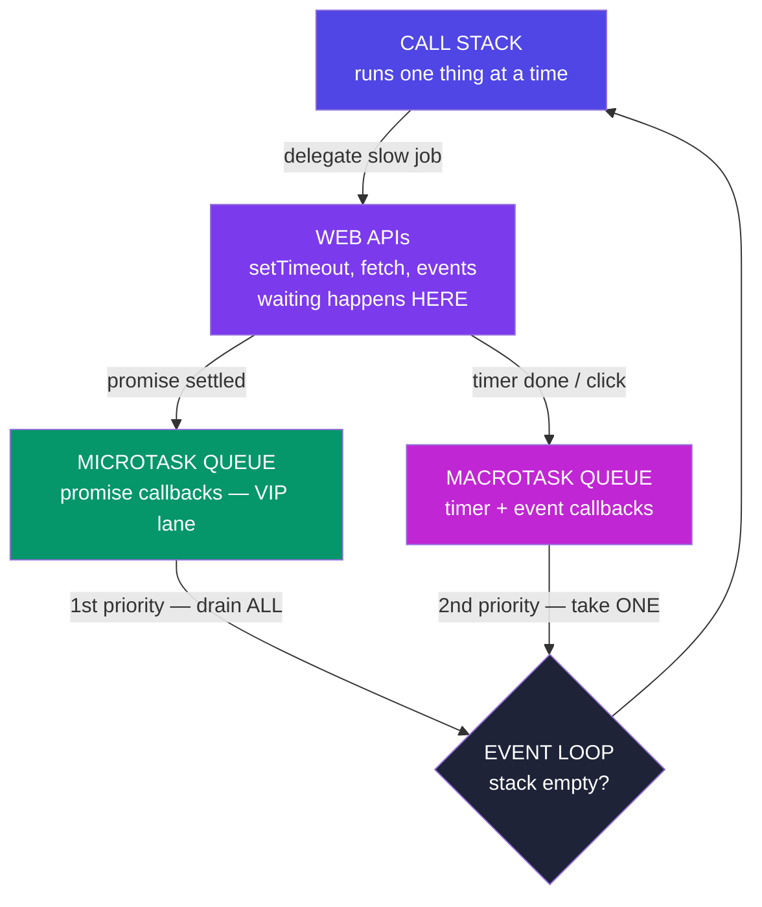

**The litmus-test snippet (asked in real interviews, verbatim):**

```js
console.log(1);
setTimeout(() => console.log(2), 0);            // macrotask — even at 0ms!
Promise.resolve().then(() => console.log(3));   // microtask — VIP lane
console.log(4);

// Output: 1, 4, 3, 2
```

**Why:** synchronous code first (`1`, `4`) — the stack must empty. Then ALL microtasks (`3`). Only then one macrotask (`2`). A `setTimeout(fn, 0)` never means "now"; it means "after everything currently more important".

**One more, to lock it in:**

```js
setTimeout(() => console.log("timer"), 0);
Promise.resolve()
  .then(() => console.log("p1"))
  .then(() => console.log("p2"));    // chained micro → still beats the timer
console.log("sync");
// sync, p1, p2, timer
```

**Real-world consequence:** a heavy synchronous loop delays *every* timer and click handler — queues only advance when the stack empties. That's why big work gets chunked, and why "the UI froze" almost always means "someone blocked the stack".

---

## H3. Callbacks & Callback Hell

**Simple definition:** a **callback** is a function you hand to an async operation: "when you finish, run this." It was JS's original async pattern — and it works, until steps depend on steps.

```js
setTimeout(() => console.log("2s passed"), 2000);
button.addEventListener("click", onClick);        // callbacks are everywhere
```

**The problem — sequential steps nest sideways:**

```js
// Login → fetch profile → fetch orders → fetch invoice ... 👇
login(user, (err, session) => {
  if (err) return handle(err);
  getProfile(session, (err, profile) => {
    if (err) return handle(err);
    getOrders(profile, (err, orders) => {
      if (err) return handle(err);
      getInvoice(orders[0], (err, invoice) => {
        if (err) return handle(err);
        console.log(invoice);          // 4 levels deep — the "pyramid of doom"
      });
    });
  });
});
```

Every step re-implements error handling, indentation grows relentlessly, and running two things *in parallel then combining them* is genuinely hard. This pain is **why Promises exist** — same delegation model, civilised syntax.

---

## H4. Promises

**Simple definition:** a **Promise** is an object representing a value that isn't ready *yet* — a receipt for a future result. You attach "when ready" (`.then`) and "if failed" (`.catch`) handlers instead of nesting.

**Analogy:** ordering at a food court. You get a **token** (the promise) immediately — not the food. The token is *pending*; later it's either *fulfilled* (order ready → collect) or *rejected* (item sold out → refund). You don't stand frozen at the counter; you sit down and act **when the token buzzes**.

**The three states (one-way street, settles exactly once):**

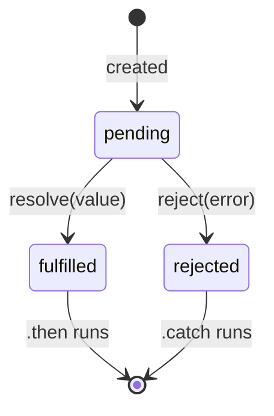

```js
const order = new Promise((resolve, reject) => {
  setTimeout(() => {
    Math.random() > 0.2 ? resolve("🍜 Ramen ready") : reject(new Error("Sold out"));
  }, 1500);
});

order
  .then(food => console.log(food))          // on fulfilled
  .catch(err => console.log(err.message))   // on rejected — ONE catch for the chain
  .finally(() => console.log("Counter free"));  // always — hide spinners here
```

**Chaining — the cure for the pyramid.** Each `.then` returns a **new promise**; return a value and it flows to the next `.then`; return another *promise* and the chain waits for it. The pyramid becomes a pipeline:

```js
login(user)
  .then(session => getProfile(session))
  .then(profile => getOrders(profile))
  .then(orders  => getInvoice(orders[0]))
  .then(invoice => console.log(invoice))
  .catch(handle);          // ANY step fails → jumps straight here. One handler.
```

Flat, readable, single error path — the exact same logic as the callback pyramid, minus the pain.

---

## H5. async / await

**Simple definition:** syntax that lets you *write* promise code as if it were ordinary top-to-bottom code. `async` marks a function as promise-returning; `await` says "pause **this function** (never the whole program!) until that promise settles, then hand me its value."

```js
// The H4 chain, rewritten — reads like a recipe:
async function showInvoice(user) {
  try {
    const session = await login(user);
    const profile = await getProfile(session);
    const orders  = await getOrders(profile);
    const invoice = await getInvoice(orders[0]);
    console.log(invoice);
  } catch (err) {
    handle(err);              // normal try/catch replaces .catch ✅
  } finally {
    hideSpinner();
  }
}
```

**The three rules that prevent 90% of async bugs:**

1. **An `async` function ALWAYS returns a promise.** `return 42` really returns `Promise.resolve(42)` — callers must `await` it or `.then` it.
2. **`await` pauses only its own function.** The rest of the program (clicks, timers, other functions) runs on. Under the hood, everything after `await` becomes a microtask (H2) — `await` is `.then` in a nicer coat.
3. **Don't await in sequence what could run in parallel:**

```js
// ❌ SLOW — 3 seconds total (1s + 1s + 1s, one after another):
const a = await fetchPrices();     // 1s
const b = await fetchReviews();    // 1s
const c = await fetchStock();      // 1s

// ✅ FAST — ~1 second (all three in flight together):
const [prices, reviews, stock] = await Promise.all([
  fetchPrices(), fetchReviews(), fetchStock(),
]);
```

Starting a promise begins the work immediately; `await` only decides *when you wait*. Independent jobs → start all, await together.

---

## H6. Promise.all & Friends

Four static helpers for running many promises at once — know when each fits:

| Helper | Resolves with | Fails when | Real-world fit |
|---|---|---|---|
| `Promise.all` | array of ALL results (in order) | **any one rejects** (fail-fast) | steps that ALL must succeed — load user + cart + prices before render |
| `Promise.allSettled` | array of `{status, value/reason}` per promise — **never rejects** | never | independent jobs where partial success is fine — send 100 emails, report which failed |
| `Promise.race` | the FIRST to settle (win **or** fail) | first settle is a rejection | timeouts: race the fetch against a 5s timer |
| `Promise.any` | the first to FULFIL, ignores failures | only if **all** reject | fastest mirror/CDN wins |

```js
// The classic race-a-timeout pattern:
const timeout = (ms) =>
  new Promise((_, reject) => setTimeout(() => reject(new Error("Timeout!")), ms));

const data = await Promise.race([fetch("/api/report"), timeout(5000)]);

// allSettled — a dashboard that shows what it CAN:
const results = await Promise.allSettled([fetchSales(), fetchTraffic(), fetchReviews()]);
results.forEach(r =>
  r.status === "fulfilled" ? renderWidget(r.value) : renderErrorCard(r.reason));
```

**Choosing in one breath:** *all* = need everything; *allSettled* = want a full report; *race* = first settle decides (timeouts); *any* = first success wins.

---

## H7. fetch — Real-World API Calls

**Simple definition:** `fetch(url)` is the browser's built-in, promise-based way to call HTTP APIs — the skill every real app (and Phase 8's Node/Express work) revolves around.

```js
async function getUser(id) {
  try {
    const res = await fetch(`https://api.example.com/users/${id}`);

    if (!res.ok) {                       // ⚠ fetch does NOT reject on 404/500!
      throw new Error(`HTTP ${res.status}`);   // you must check res.ok yourself
    }
    const user = await res.json();       // body parsing is ALSO async (2nd await)
    return user;
  } catch (err) {
    // network down, DNS failure, CORS, or our thrown HTTP error
    console.error("Could not load user:", err.message);
    return null;
  }
}
```

**The two classic traps** are both in that snippet: ① `fetch` only rejects on *network* failure — a 404 or 500 is a "successful" response you must check via `res.ok`; ② the body needs its own `await res.json()`.

**POSTing data (forms, saves):**

```js
const res = await fetch("/api/todos", {
  method: "POST",
  headers: { "Content-Type": "application/json" },
  body: JSON.stringify({ text: "Learn fetch", done: false }),   // D6's JSON!
});
```

**A complete real-world flow — search with loading state (Parts D, E, F, H together):**

```js
searchInput.addEventListener("input", debounce(async (e) => {
  spinner.classList.remove("hidden");                  // DOM (E2)
  try {
    const res = await fetch(`/api/search?q=${encodeURIComponent(e.target.value)}`);
    if (!res.ok) throw new Error(res.status);
    const items = await res.json();
    resultsEl.innerHTML = items                         // array methods (D2)
      .map(i => `<li>${i.title}</li>`)                  // template literals (B5)
      .join("");
  } catch {
    resultsEl.innerHTML = "<li>Something went wrong</li>";
  } finally {
    spinner.classList.add("hidden");                    // finally = ALWAYS cleanup
  }
}, 400));                                               // closure-powered debounce (F4)
```

Five parts of these notes in fifteen lines — this is what "knowing JavaScript" actually looks like in practice.

---

# Part I — ES Modules & Array Mastery

*Two closers: how real projects are organised across files, and the one array method that can impersonate all the others.*

## I1. ES Modules (import / export)

**Simple definition:** ES Modules split a program into files, where each file is its own private scope (goodbye, IIFE wrappers) and *chooses* what to share (`export`) and what to use from others (`import`).

**Named exports — a toolbox (many per file):**

```js
// utils/currency.js
export const TAX_RATE = 0.18;
export function withTax(amount) { return amount * (1 + TAX_RATE); }
export const formatINR = (n) => `₹${n.toLocaleString("en-IN")}`;
```

```js
// checkout.js
import { withTax, formatINR } from "./utils/currency.js";
import { withTax as addTax } from "./utils/currency.js";   // rename on import
import * as currency from "./utils/currency.js";           // grab the whole toolbox
```

**Default export — the file's headline act (one per file):**

```js
// Cart.js
export default class Cart { ... }

// app.js — no braces, any name you like:
import Cart from "./Cart.js";
import ShoppingCart from "./Cart.js";     // same thing — name is yours
```

| | Named `export const x` | `export default` |
|---|---|---|
| Per file | many | **one** |
| Import syntax | `import { x }` — braces, exact name | `import anything` — no braces |
| Typo protection | ✅ wrong name = error | ❌ silently imports under wrong name |
| Convention | utilities, constants, helpers | the file's one main thing (a class, a component) |

**In the browser** you opt in with `<script type="module" src="app.js">` — modules load once (repeat imports are cached), run in strict mode, and `defer` automatically. In React/Node projects, *every* file is a module; you'll write `import`/`export` more often than almost any other keyword.

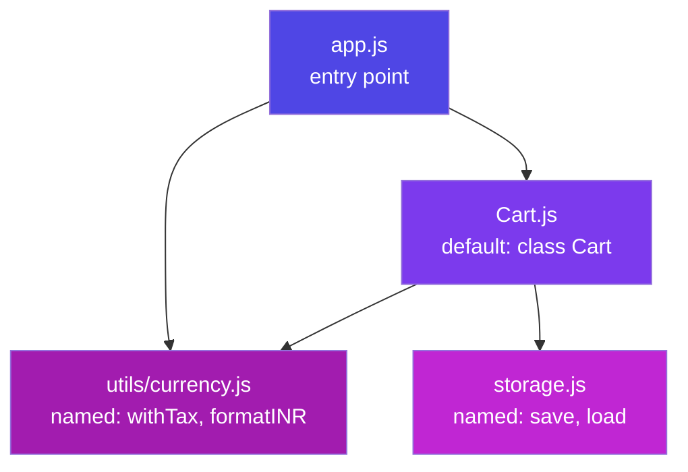

**Real-world payoff:** your to-do app (E4) refactored — `storage.js` (localStorage code), `render.js` (DOM code), `app.js` (wiring). Fix a bug in saving? You *know* it's in `storage.js`. That certainty is what modules buy at 10× the scale of a real codebase.

---

## I2. reduce — the Swiss-Army Method

**Simple definition:** `.reduce` boils an array down to **one value** — a number, a string, an object, even a new array. It carries an **accumulator** (the running result) through every item.

```js
array.reduce((accumulator, item) => newAccumulator, startingValue)
```

**Analogy:** a snowball rolling downhill. It starts at your chosen size (`startingValue`), picks up snow at every item, and what arrives at the bottom is the final result. The callback answers one question: *"given the snowball so far and this item, what's the snowball now?"*

**Level 1 — sum (the hello-world):**

```js
const cart = [{ name: "pen", price: 20 }, { name: "book", price: 250 }, { name: "lamp", price: 700 }];

const total = cart.reduce((sum, item) => sum + item.price, 0);   // 970
```

Trace it: `0+20=20` → `20+250=270` → `270+700=970`. That's all reduce ever does — one honest step, repeated.

**Level 2 — max / min (accumulator as "best so far"):**

```js
const priciest = cart.reduce((best, item) => item.price > best.price ? item : best);
// no startingValue → first item starts as the accumulator
```

**Level 3 — group-by (accumulator as an object). The most useful real-world reduce:**

```js
const students = [
  { name: "Asha", grade: "A" }, { name: "Bharat", grade: "B" }, { name: "Chitra", grade: "A" },
];

const byGrade = students.reduce((groups, s) => {
  (groups[s.grade] ??= []).push(s.name);      // create the bucket if missing, then add
  return groups;
}, {});
// { A: ["Asha", "Chitra"], B: ["Bharat"] }
```

Every "sales by month", "tasks by status", "orders by customer" chart you'll ever build is this exact pattern.

**Level 4 — counting occurrences:**

```js
const votes = ["yes", "no", "yes", "yes"];
const tally = votes.reduce((t, v) => ({ ...t, [v]: (t[v] ?? 0) + 1 }), {});
// { yes: 3, no: 1 }
```

**Level 5 — the party trick: rebuild map & filter (proves reduce is the general case):**

```js
const map    = (arr, fn) => arr.reduce((out, x) => [...out, fn(x)], []);
const filter = (arr, fn) => arr.reduce((out, x) => fn(x) ? [...out, x] : out, []);
```

**The full pipeline — filter → map → reduce, the shape of real data work:**

```js
const monthlyRevenue = orders
  .filter(o => o.status === "delivered")       // keep the real sales
  .map(o => o.total * (1 - o.discount))        // net value of each
  .reduce((sum, v) => sum + v, 0);             // one number for the dashboard
```

**When NOT to reduce:** if a `filter`/`map`/`find` says it clearer, use that — reduce is the fallback power tool, not a badge of honour. Rule: the clearest method that works, wins.

---

# Part J — Exercises & Mini-Projects

*Do these in order. Every one is solvable with only these notes. Push each to GitHub — that's your Phase 4/5 deliverable trail.*

### Warm-ups (Part B–C — Day 1)

1. **Predict, then run:** `1 + "2"`, `1 - "2"`, `"5" == 5`, `"5" === 5`, `[] + {}`, `0 ?? 10`, `0 || 10`, `3 > 2 > 1`. Write one line each explaining *why*.
2. Write `isEven(n)` as an arrow function; then `describe(n)` returning "even"/"odd" via a ternary.
3. Write `greet(name = "friend", lang = "en")` returning a template-literal greeting in 2 languages.
4. **[Roadmap Q1]** What does `[] + {}` evaluate to? Explain the coercion steps in two sentences.

### Arrays & objects (Part D — Day 2)

5. **[Roadmap Q2]** Write a function taking an array of objects and returning only items where `active === true`, sorted by `name`.
6. **[Roadmap Q3]** Swap two variables without a temp variable (destructuring).
7. From the `students` array in D2: (a) names of scorers ≥ 75, (b) does *anyone* score 90+?, (c) average score using reduce.
8. Clone an object with spread, override one field, and prove the original is untouched. Then demonstrate the shallow-copy trap with a nested object.

### DOM (Part E — Day 2)

9. **[Roadmap Q4]** Build a `querySelector`-based counter: two buttons (+ / −), the display updates live.
10. Upgrade E4's to-do list with: an "N items left" counter (`filter().length`) and a "Clear completed" button.
11. Add a keyboard shortcut: pressing `Enter` inside the input adds the task (`keydown` + `e.key`).

### Closures & scope (Part F — Phase 5 Day 1)

12. **[Roadmap Phase-5 Q1]** Write `counter()` returning `{ increment, decrement, reset, value }` with a private count.
13. Build `memoize(fn)` from scratch *without looking at F4*, then compare.
14. Predict the output of the `var`-in-a-loop snippet (F4); fix it two ways (use `let`; use an IIFE).
15. Build `once(fn)` — returns a version of `fn` that only ever runs the first time (closure flag).

### OOP (Part G — Days 2–3)

16. Write a `Vehicle` **constructor function** with a prototype method; then rewrite as an ES6 `class`. Confirm both pass `instanceof`.
17. Write out the 4 `this` rules from memory, each with a one-line example.
18. Build `Shape` → `Circle`, `Rectangle` with overridden `area()`, a `#private` dimension each, and a static `Shape.totalArea(shapes)`. Loop with `forEach(s => s.area())` — name the pillar each feature demonstrates.
19. Build the `Wallet` (G5) and make `withdraw` throw on overdraft; verify `w.#balance` is a SyntaxError from outside.

### Async (Part H — Day 4)

20. **Predict the output**, then run:
```js
console.log("start");
setTimeout(() => console.log("timer"), 0);
Promise.resolve().then(() => console.log("p1")).then(() => console.log("p2"));
console.log("end");
```
21. Write `delay(ms)` returning a promise; use it in an `async` countdown: 3…2…1…go, one second apart.
22. **[Roadmap]** Build `allSettled(promises)` from scratch (only `Promise.all` and `.then/.catch` allowed).
23. Fetch two APIs in parallel with `Promise.all`; render both; make one URL wrong and handle it gracefully with `allSettled` instead.
24. **[Roadmap mini-project]** Build an async `TaskQueue` class: `add(fn)` queues async jobs, runs them one at a time, `onDone(cb)` fires when idle.

### Mini-projects (pick 2, ship to GitHub)

- **Vanilla To-Do Pro** — E4 + edit-in-place, filters (all/active/done), localStorage. *(Phase 4 deliverable)*
- **Type-Coercion Quiz** — 15 "what does this output?" questions, score + explanation reveal. *(Phase 4 deliverable)*
- **DOM Counter Pro** — step selector, keyboard shortcuts, undo/redo (an array of past states = your undo stack). 
- **Weather Card** — fetch a free weather API by city, loading spinner, error card, `??` defaults everywhere.

---

# Part K — Q&A for Every Topic

*Cover the answer, ask yourself the question. If you can answer all of these aloud, you are interview-ready for JS fundamentals.*

## Basics (Parts A–C)

**Q: What are the roles of HTML, CSS and JavaScript?**
A: HTML = structure, CSS = appearance, JS = behaviour. Blueprint, paint, electricity.

**Q: let vs const vs var?**
A: `const` — block-scoped, no reassignment (default choice). `let` — block-scoped, reassignable. `var` — function-scoped, hoists to `undefined`, redeclarable: avoid entirely.

**Q: Why is `var` considered dangerous?**
A: It ignores block boundaries, silently becomes `undefined` before its line (hiding bugs), allows silent redeclaration, and shares one binding across loop iterations (the setTimeout 4,4,4 bug).

**Q: `undefined` vs `null`?**
A: `undefined` = JS's "never assigned". `null` = the programmer's deliberate "empty". The parcel that never arrived vs. the parcel you opened and found intentionally empty.

**Q: Why does `1 + "2"` give `"12"` but `1 - "2"` give `-1`?**
A: `+` prefers strings (concatenation) when either side is a string; `-` has no string meaning, so it coerces both sides to numbers.

**Q: == vs ===?**
A: `==` coerces types before comparing (`"5" == 5` → true); `===` compares value *and* type. Always use `===`; the only accepted `==` idiom is `x == null` to match null-or-undefined.

**Q: Name the six falsy values.**
A: `false`, `0`, `""`, `null`, `undefined`, `NaN`. Everything else — including `"0"`, `[]`, `{}` — is truthy.

**Q: `||` vs `??`?**
A: `||` falls back on *any* falsy value (so 0 and "" get replaced — often a bug); `??` falls back only on `null`/`undefined`. For defaults, prefer `??`.

**Q: Arrow function vs regular function — the two real differences?**
A: ① Arrows have no own `this` — they inherit it from where they're *written*. ② Declarations hoist; arrows don't. Use regular functions as object methods, arrows for callbacks.

**Q: What does optional chaining `?.` do?**
A: Stops and returns `undefined` instead of crashing when the left side is null/undefined — safe deep access into uncertain data: `user.address?.city`.

## Arrays, Objects & DOM (Parts D–E)

**Q: map vs forEach?**
A: `map` returns a *new array* of transformed values (use when you need the result); `forEach` returns nothing — side effects only.

**Q: slice vs splice?**
A: `slice` copies a section, original untouched; `splice` surgically removes/inserts *in place*. "slice = polite copy, splice = surgery."

**Q: How do you get "names of active users scoring 75+"?**
A: `users.filter(u => u.active && u.score >= 75).map(u => u.name)` — filter narrows, map transforms, chain reads like the sentence itself.

**Q: What's wrong with `[10, 2, 1].sort()`?**
A: Default sort compares as *strings* → `[1, 10, 2]`. Pass a comparator: `.sort((a, b) => a - b)`.

**Q: Spread vs rest — same dots, what's the difference?**
A: Spread *unpacks* (right of `=`, in calls): `[...a, ...b]`. Rest *collects* (left of `=`, in params): `(...args)`. 

**Q: Why is spread only a "shallow" copy?**
A: It copies one level; nested objects are still shared references. Mutating `copy.address.city` also changes the original. Deep copy: `structuredClone()`.

**Q: What is the DOM?**
A: The live object tree the browser builds from HTML. JS edits the tree; the page re-renders to match. Blueprint (HTML file) vs. built house (DOM).

**Q: `textContent` vs `innerHTML`?**
A: `textContent` inserts plain text (safe); `innerHTML` parses HTML — never feed it raw user input (XSS).

**Q: What is event delegation and why use it?**
A: One listener on a parent catches bubbled events from all children — checked via `e.target`. Fewer listeners, and it works for elements added *later*. 

**Q: What does `e.preventDefault()` do on a form?**
A: Stops the browser's default full-page reload on submit so JS can handle the data itself.

## Scope & Closures (Part F)

**Q: What are the two phases of an execution context?**
A: Creation (memory reserved for all declarations — the cause of hoisting) then execution (code runs line by line with real values).

**Q: What is hoisting, precisely?**
A: The visible effect of the creation phase: function declarations become fully callable before their line; `var` exists as `undefined`; `let`/`const` exist but locked (TDZ) until their line.

**Q: What is the Temporal Dead Zone, and why is it good?**
A: The zone between scope start and a `let`/`const` line where access throws. It converts `var`'s *silent* `undefined` bugs into *loud* errors at the exact misuse point.

**Q: Define a closure in one sentence.**
A: A function that remembers and can update the variables of the scope it was born in, even after that scope's function has returned.

**Q: Give three real-world closure uses.**
A: Private state (counter/wallet), memoization (result caching), debounce/throttle (search boxes) — plus every event handler that references outer variables.

**Q: Why does the `var` loop print 4,4,4 and the `let` loop 1,2,3?**
A: `var` = one shared binding, read after the loop ends; `let` = a fresh binding per iteration, each callback closes over its own.

**Q: What is an IIFE and its modern status?**
A: A function expression invoked immediately to create a throwaway private scope. Largely replaced by ES modules (each file is already private), but common in legacy/WordPress code.

## OOP (Part G)

**Q: The four rules of `this`, in priority order?**
A: `new` → the fresh object; explicit `call/apply/bind` → what you pass; implicit `obj.method()` → object before the dot; default plain call → undefined (strict). Arrows opt out and inherit lexically.

**Q: call vs apply vs bind?**
A: call = args by commas, runs now; apply = args as array, runs now; bind = returns a permanently-bound copy for later. "commas, array, bookmark."

**Q: What is the prototype chain?**
A: Each object's hidden `[[Prototype]]` link to another object; failed property lookups walk the chain (`arr` → `Array.prototype` → `Object.prototype` → `null`). It's how methods are shared — one `map` for a million arrays.

**Q: What does `new` actually do?**
A: Creates an empty object → links it to the constructor's `.prototype` → runs the constructor with `this` bound to it → returns it.

**Q: Are ES6 classes a new object model?**
A: No — cleaner syntax over constructors + prototypes ("syntactic sugar"). Same chain underneath; `class` adds niceties like `#private` fields and mandatory `new`.

**Q: What does `super` do?**
A: In a child constructor, `super(...)` runs the parent constructor (required before touching `this`); `super.method()` calls the parent's version of an overridden method.

**Q: How do you make truly private state in a class, and before classes?**
A: `#field` — enforced by the language (outside access is a SyntaxError). Before classes: closures (F4). Underscore `_name` is convention only.

**Q: Polymorphism in one line + one example?**
A: Same method name, per-class behaviour — `shapes.forEach(s => s.area())` works for Circle, Rectangle, and every future shape without an if/else type check.

**Q: The four pillars, one breath?**
A: Encapsulation hides state; inheritance shares behaviour ("is-a"); polymorphism = one interface, many implementations; abstraction = simple *what*, hidden *how*.

## Async (Part H)

**Q: JS is single-threaded — how does it do async?**
A: It delegates slow work (timers, network) to the environment's Web APIs, keeps executing, and runs completion callbacks later via queues + the event loop. The chef sets kitchen timers; he never stares at the pot.

**Q: Describe the event loop.**
A: When the call stack empties: drain the ENTIRE microtask queue (promise callbacks) first, then run ONE macrotask (timers, events); repeat forever.

**Q: Why does `1, 4, 3, 2` come out of the classic snippet?**
A: Sync code first (1, 4); then microtask `Promise.then` (3); then macrotask `setTimeout` (2) — even at 0ms, a timer waits for the stack *and* all microtasks.

**Q: What are a promise's three states?**
A: Pending → fulfilled (resolve) or rejected (reject). One-way, settles exactly once.

**Q: Why did promises replace callbacks?**
A: Callback pyramids nest sideways with per-step error handling; promise chains are flat, pass values down `.then`s, and route *any* failure to one `.catch`.

**Q: What does `await` actually pause?**
A: Only its own async function — the rest of the program keeps running. Everything after `await` resumes as a microtask; it's `.then` in nicer clothes.

**Q: What does an async function return if you `return 42`?**
A: `Promise.resolve(42)` — async functions *always* return promises; callers must await/then.

**Q: Sequential awaits vs Promise.all?**
A: `await a; await b; await c` runs one-after-another (times add up). Independent jobs should start together and be awaited together: `await Promise.all([a, b, c])` — total ≈ slowest, not sum.

**Q: all vs allSettled vs race vs any?**
A: all = everything must succeed (fail-fast); allSettled = full report, never rejects; race = first to settle wins (timeout pattern); any = first to *fulfil* wins.

**Q: The two classic `fetch` traps?**
A: ① It doesn't reject on HTTP errors — check `res.ok` yourself; 404 is a "successful" fetch. ② The body is a second async step: `await res.json()`.

## Modules & reduce (Part I)

**Q: Named vs default export?**
A: Named — many per file, imported with exact-name braces (typo-safe). Default — one per file, imported bare under any name. Utilities → named; the file's main thing → default.

**Q: What two problems do ES modules solve?**
A: Global-scope pollution (each file is private, share only via export) and dependency clarity (imports document exactly what comes from where).

**Q: Explain reduce's two parameters.**
A: A callback `(accumulator, item) → newAccumulator` and the accumulator's starting value. The snowball: starts at your chosen size, picks something up at every item.

**Q: When is reduce the wrong tool?**
A: When `map`/`filter`/`find` says it clearer. Reduce is for genuine many-to-one folds: totals, group-by, tallies, "best so far".

---

# Part L — Resources & Quick Reference

### Learn more (matched to your roadmap)

- **javascript.info** — the best free JS book; Parts B–I map to its chapters: https://javascript.info/
- **MDN JavaScript Guide** — the reference to keep open forever: https://developer.mozilla.org/en-US/docs/Web/JavaScript/Guide
- **Namaste JavaScript — Akshay Saini** (Ep 1–6 scope/closures, 7–9 this/prototypes, 10–14 async) — your Phase 5 watchlist: https://youtu.be/pN6jk0uUrD8
- **Traversy — JavaScript Crash Course** (Phase 4 Day 1): https://youtu.be/hdI2bqOjy3c · **DOM Crash Course**: https://youtu.be/0ik6X4DJKCc
- **Philip Roberts — "What the heck is the event loop?"** (best 26 minutes on H2, ever): https://youtu.be/8aGhZQkoFbQ
- **Web Dev Simplified — OOP in JavaScript**: https://youtu.be/PFmuCDHHpwk · **Fireship — Async/Await in 7 min**: https://youtu.be/vn3tm0quoqE
- **Certifications:** freeCodeCamp *JavaScript Algorithms & Data Structures* (free cert); HackerRank JS Basic + Intermediate badges; Meta *Programming with JavaScript* (Coursera).

### One-page recall card

> **Variables:** `const` by default · `let` if it changes · `var` never.
> **Types:** 7 primitives + object · `typeof null === "object"` (bug) · six falsy: `false 0 "" null undefined NaN`.
> **Coercion:** `+` concatenates if a string is present; other math converts · always `===` · `??` over `||` for defaults.
> **Functions:** arrows have no own `this` and don't hoist · default + rest params · methods regular, callbacks arrow.
> **Arrays:** map transform · filter keep · find first · some/every test · reduce fold · sort needs a comparator.
> **Modern syntax:** destructure `{name}` `[a,b]` · spread unpacks, rest collects · spread copies are shallow.
> **DOM:** `querySelector` · `textContent` (safe) · `classList` · `addEventListener` · delegate on the parent · state → render.
> **Hoisting:** creation phase first · `var` → undefined · `let/const` → TDZ error · function declarations → whole.
> **Closure:** a function + its birth-scope backpack · powers private state, memoize, debounce · `let` fixes the loop bug.
> **this:** new > bind/call/apply > dot > default · arrows inherit from where they're written.
> **Prototypes:** lookup walks the chain · one shared method for all instances · `class` = sugar over it.
> **OOP pillars:** encapsulate (#private) · inherit (extends/super) · polymorph (override) · abstract (hide the how).
> **Event loop:** stack empties → ALL microtasks (promises) → ONE macrotask (timers) · hence `1, 4, 3, 2`.
> **Async:** async fn always returns a promise · await pauses only that fn · parallel? `Promise.all` · timeout? `race`.
> **fetch:** check `res.ok` · `await res.json()` · try/catch/finally for spinner cleanup.
> **Modules:** named `{x}` for tools, default for the star · every file its own scope.

*Phase 4 gives you the vocabulary; Phase 5 gives you the grammar. Together they mean React (Phase 6) will feel like learning idioms — not a new language. On to Day 1: type every snippet, break it, fix it, push it.*
