# React + Tailwind — Basics to Advanced

### From your first component to hooks, routing, context, custom hooks and Tailwind — the way real apps are built

> *"You already learned to update state and re-draw the screen by hand in Phase 4. React is that same idea — state → render — turned into a tool. Learn how React thinks, and every UI you'll ever build becomes just data flowing downhill."*

**Phase 6 of 12** · 6 days · Mon Jul 27 – Sat Aug 1, 2026

---

## Table of Contents

- [Part A — Meet React](#part-a-meet-react)
  - [A1. What is React & Why It Exists](#a1-what-is-react-why-it-exists) · [A2. How React Thinks](#a2-how-react-thinks-components-declarative-one-way) · [A3. Setup: Vite & Your First Component](#a3-setup-vite-your-first-component)
- [Part B — JSX: HTML in JavaScript](#part-b-jsx-html-in-javascript)
  - [B1. What is JSX](#b1-what-is-jsx) · [B2. The JSX Rules](#b2-the-jsx-rules) · [B3. Embedding Expressions with { }](#b3-embedding-expressions-with) · [B4. Conditional Rendering](#b4-conditional-rendering) · [B5. Rendering Lists & the key Prop](#b5-rendering-lists-the-key-prop)
- [Part C — Components & Props](#part-c-components-props)
  - [C1. Function Components](#c1-function-components) · [C2. Props — Passing Data Down](#c2-props-passing-data-down) · [C3. Destructuring & Default Props](#c3-destructuring-default-props) · [C4. children & Composition](#c4-children-composition) · [C5. Thinking in Components](#c5-thinking-in-components)
- [Part D — State & the useState Hook](#part-d-state-the-usestate-hook)
  - [D1. What is State (vs Props)](#d1-what-is-state-vs-props) · [D2. useState Basics](#d2-usestate-basics) · [D3. State is a Snapshot](#d3-state-is-a-snapshot-the-updater-form) · [D4. Updating Objects & Arrays Immutably](#d4-updating-objects-arrays-immutably) · [D5. Lifting State Up](#d5-lifting-state-up) · [D6. Controlled Forms](#d6-controlled-forms)
- [Part E — useEffect & Side Effects](#part-e-useeffect-side-effects)
  - [E1. What is a Side Effect](#e1-what-is-a-side-effect) · [E2. useEffect & the Dependency Array](#e2-useeffect-the-dependency-array) · [E3. Cleanup Functions](#e3-cleanup-functions) · [E4. Fetching Data (loading / error / success)](#e4-fetching-data-loading-error-success) · [E5. useEffect Gotchas](#e5-useeffect-gotchas-you-will-hit)
- [Part F — React Router v6](#part-f-react-router-v6)
  - [F1. Why Client-Side Routing](#f1-why-client-side-routing) · [F2. BrowserRouter, Routes, Route](#f2-browserrouter-routes-route) · [F3. Link & NavLink](#f3-link-navlink) · [F4. Dynamic Params & useParams](#f4-dynamic-params-useparams) · [F5. useNavigate](#f5-usenavigate-programmatic-navigation) · [F6. Nested & Layout Routes](#f6-nested-layout-routes-outlet) · [F7. 404 & Protected Routes](#f7-404-protected-routes)
- [Part G — Context & useContext](#part-g-context-usecontext)
  - [G1. The Prop-Drilling Problem](#g1-the-prop-drilling-problem) · [G2. createContext + Provider + useContext](#g2-createcontext-provider-usecontext) · [G3. ThemeContext (light/dark)](#g3-themecontext-lightdark) · [G4. AuthContext](#g4-authcontext) · [G5. When NOT to Use Context](#g5-when-not-to-use-context)
- [Part H — Custom Hooks](#part-h-custom-hooks)
  - [H1. Rules of Hooks & What a Custom Hook Is](#h1-rules-of-hooks-what-a-custom-hook-is) · [H2. useFetch](#h2-usefetch) · [H3. useLocalStorage](#h3-uselocalstorage) · [H4. useDebounce](#h4-usedebounce) · [H5. useToggle & Friends](#h5-usetoggle-friends)
- [Part I — useReducer & Advanced State](#part-i-usereducer-advanced-state)
  - [I1. Why useReducer](#i1-why-usereducer) · [I2. The reducer + dispatch Pattern](#i2-the-reducer-dispatch-pattern) · [I3. useReducer vs useState](#i3-usereducer-vs-usestate) · [I4. Shopping Cart Example](#i4-shopping-cart-example) · [I5. useReducer + Context = Mini-Redux](#i5-usereducer-context-mini-redux)
- [Part J — Performance & the Rest of the Hooks](#part-j-performance-the-rest-of-the-hooks)
  - [J1. The Re-Render Mental Model](#j1-the-re-render-mental-model) · [J2. useRef](#j2-useref-the-box-that-survives-renders) · [J3. useMemo](#j3-usememo) · [J4. useCallback](#j4-usecallback) · [J5. React.memo](#j5-reactmemo) · [J6. The Hooks Rulebook](#j6-the-hooks-rulebook-recap)
- [Part K — Tailwind CSS](#part-k-tailwind-css)
  - [K1. What is Tailwind & Why Utility-First](#k1-what-is-tailwind-why-utility-first) · [K2. The Core Utilities](#k2-the-core-utilities) · [K3. Responsive Design](#k3-responsive-design) · [K4. Hover, Focus & Dark Mode](#k4-hover-focus-dark-mode) · [K5. Reusing Styles](#k5-reusing-styles-components-apply-clsx) · [K6. Tailwind + React Patterns](#k6-tailwind-react-patterns)
- [Part L — Master Program: The Task Tracker](#part-l-master-program-the-task-tracker)
- [Part M — Mindset: Thinking in React](#part-m-mindset-thinking-in-react)
- [Part N — Exercises & Mini-Projects](#part-n-exercises-mini-projects)
- [Part O — Resources & Quick Reference](#part-o-resources-quick-reference)

---

# Part A — Meet React

*Start from zero. You spent Phases 4–5 building a to-do list by hand with `save(); render();`. React is that exact pattern, industrialised. This part shows you why it exists before you write a line of it.*

## A1. What is React & Why It Exists

**Simple definition:** React is a JavaScript **library for building user interfaces out of small, reusable pieces called components**. You describe *what the screen should look like for a given set of data*, and React figures out *how* to update the real page to match.

<p class="te"><strong>Telugu:</strong> React ante UI ni <strong>chinna chinna reusable mukkalu</strong> (components) tho kattukune JavaScript library. Nuvvu "ee data ki screen ela undali" ani <em>cheptavu</em> (describe chestavu), React aa page ni update ela cheyyalo <strong>tanu chusukుంటుంది</strong>. Phase 4 lo nuvvu <code>save(); render();</code> cheththo raasav kada — React chesedi adе pani, automatic ga. Nuvvu "ela" cheppadam maanేసి "emi kavali" ane cheptav.</p>

**The problem React solves.** In Phase 4 you built a to-do list in vanilla JS. Every time the data changed, you manually re-drew the DOM: find the `<ul>`, clear it, loop the array, `createElement`, `append`. It worked for 40 lines. Now imagine Gmail — thousands of elements, hundreds of possible changes. Keeping the *screen* and the *data* in sync by hand becomes a nightmare of bugs: you update the array but forget to re-draw one badge; you re-draw but lose the input focus.

React removes that entire class of bug. You never touch the DOM directly. You change **state** (your data), and React re-runs your component and updates only the parts of the page that actually changed.

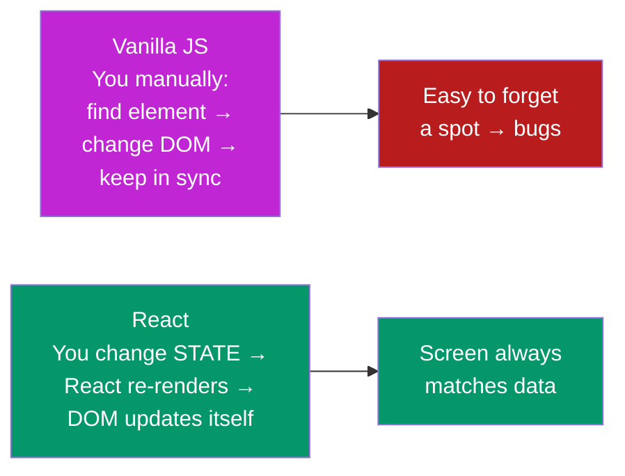

**Where you already use it (real world):**
- **Facebook, Instagram, WhatsApp Web** — React was born at Facebook.
- **Netflix, Airbnb, Uber, Swiggy** dashboards — all React.
- **SAP Fiori / UI5** — a *different* framework, but the *same ideas* (components, data binding, routing). Learning React makes UI5 click faster — that's why it's in your roadmap.
- Your **capstone FocusTrack Pro** and this phase's **Task Tracker** are React apps.

**Library vs framework (a common interview line):** React is a **library** — it does one thing (the UI) and leaves routing, data-fetching, etc. to other tools you add. Angular is a **framework** — it brings everything and expects you to do it its way. React's small size is why it pairs with Router, Tailwind, etc.

---

## A2. How React Thinks — Components, Declarative, One-Way

Three ideas separate "writing React" from "writing JavaScript that happens to use React." Internalise these now and every later chapter is easy.

<p class="te"><strong>Telugu:</strong> React lo <strong>3 peddha ఆలోచనలు</strong> (ideas) unnayi. (1) <strong>Components</strong> — UI ni chinna mukkaluga vibhajించడం (Lego blocks laga). (2) <strong>Declarative</strong> — "step by step ela cheyyalo" kaakunda "final ga ela undalo" cheppadam. (3) <strong>One-way data flow</strong> — data eppudu <em>paiనుంచి kindiki</em> (parent → child) matrame prayanistundi. Ee 3 artham aithe, React antha sulabham.</p>

**1. Componentisation — build UI from Lego blocks.** A page is a *tree* of components. A `<Navbar>` contains a `<Logo>` and a `<SearchBar>`; a `<TaskList>` contains many `<TaskItem>`s. Each component is a function that returns some UI. Build small pieces, then compose them.

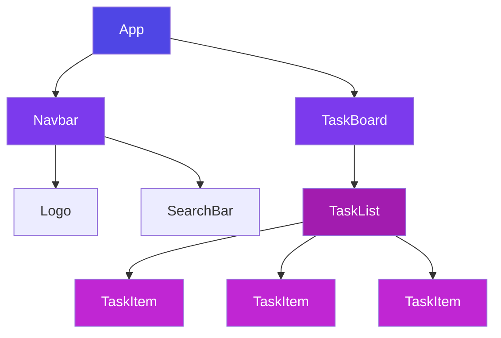

**2. Declarative, not imperative.** This is the big mental shift.
- **Imperative** (vanilla JS) = *a recipe of steps*: "find the button, add a click listener, when clicked create an `<li>`, set its text, append it…"
- **Declarative** (React) = *a description of the result*: "the list shows one `<li>` per task." You state the final picture for the current data; React does the steps.

```jsx
// Imperative (Phase 4): you list the STEPS to change the DOM
const li = document.createElement("li");
li.textContent = task.title;
list.append(li);

// Declarative (React): you describe the RESULT for the data
return <ul>{tasks.map(t => <li key={t.id}>{t.title}</li>)}</ul>;
```

**3. One-way (top-down) data flow.** Data travels **down** from parent to child through **props**. A child cannot reach up and change its parent's data directly. If a child needs to cause a change, the parent hands it a *function* to call. This one rule makes React apps predictable: when something on screen is wrong, the data that produced it lives in exactly one place *above* it.

**Why this matters for your roadmap:** SAP Fiori/UI5 uses the same MVC-ish separation and data binding. Master "data flows down, events flow up" in React and UI5's binding model will feel familiar, not foreign.

---

## A3. Setup: Vite & Your First Component

**Simple definition:** **Vite** is the modern build tool that creates and runs a React project — instant startup, instant refresh when you save. It replaced the older, slower Create React App.

<p class="te"><strong>Telugu:</strong> <strong>Vite</strong> ante React project ni create chesi, run chese modern tool — chaala fast ga start avutundi, save chesina venatane browser lo kanipistundi (hot reload). Purవం "Create React App" undedి, ippudu andaru Vite vaadుతున్నారు. Command okkate gurthupettuko: <code>npm create vite@latest</code>.</p>

**Create and run a project (type this once):**

```bash
npm create vite@latest my-app -- --template react
cd my-app
npm install        # download React & friends
npm run dev        # start the dev server → http://localhost:5173
```

**The folder tour — what actually matters:**

| File / folder | What it is |
|---|---|
| `index.html` | The single HTML page. Has one `<div id="root">` — React fills it. |
| `src/main.jsx` | The **entry point** — mounts your `<App />` into `#root`. |
| `src/App.jsx` | Your **root component** — where you start editing. |
| `src/` | All your components, hooks, and styles live here. |
| `package.json` | Dependencies + scripts (`dev`, `build`, `preview`). |
| `public/` | Static files served as-is (favicon, images). |

**How it boots up (main.jsx):**

```jsx
import { StrictMode } from "react";
import { createRoot } from "react-dom/client";
import App from "./App.jsx";
import "./index.css";

createRoot(document.getElementById("root")).render(
  <StrictMode>
    <App />
  </StrictMode>
);
```

`createRoot(...).render(<App />)` is React grabbing that empty `#root` div and rendering your whole app into it. `<StrictMode>` is a dev-only helper that double-runs some code to surface bugs early — harmless, keep it.

**Your first component (App.jsx):**

```jsx
function App() {
  const name = "Nikhil";
  return (
    <div>
      <h1>Hello, {name} 👋</h1>
      <p>My first React component.</p>
    </div>
  );
}

export default App;
```

**Read it slowly — this tiny file is all of React in miniature:**
- A **component is just a function** whose name starts with a **Capital letter** (`App`, not `app` — lowercase means "HTML tag" to React).
- It **returns JSX** — HTML-looking markup (Part B).
- `{name}` drops a JavaScript value into the markup.
- `export default App` lets `main.jsx` import it.

**The habit to build (same as Phase 4):** keep `npm run dev` running and the browser open beside your editor. Change a word, hit save, watch it update instantly. React is learned at the keyboard — type every snippet in these notes, break it on purpose, fix it.

---

# Part B — JSX: HTML in JavaScript

*JSX is the syntax that makes React feel like writing HTML. It has a handful of rules; learn them once and 90% of "why won't this render?" errors disappear.*

## B1. What is JSX

**Simple definition:** **JSX** (JavaScript XML) lets you write HTML-looking markup *inside* JavaScript. It's not HTML and not a string — it's a convenient syntax that compiles to plain JavaScript function calls that create elements.

<p class="te"><strong>Telugu:</strong> JSX ante JavaScript <strong>lopala HTML laaga raasే</strong> syntax. Idi nijamైన HTML kaadు, string kaadు — Vite deenిని venుక JavaScript function calls ga <strong>maarchestundi</strong> (compile). Enduku? UI ni chudduకుంటూ (visual ga) raయొచ్చు, plus JavaScript power (variables, <code>.map</code>, if-else) anthा andులో vaadొచ్చు. HTML + JS okే chota — adే JSX magic.</p>

**What it compiles to — the secret behind the curtain:**

```jsx
// What you write (JSX):
const el = <h1 className="title">Hello</h1>;

// What Vite turns it into (plain JS):
const el = React.createElement("h1", { className: "title" }, "Hello");
```

You never write `createElement` yourself — but knowing JSX is *just a function call* explains every rule that follows. Because it's really JavaScript, you can store JSX in variables, return it from functions, and put it in arrays.

**Why it's better than the alternatives:** template strings (Phase 4's `` `<li>${x}</li>` ``) are just text — no autocomplete, no error checking, and dangerous with user input. JSX is checked by your editor, highlights syntax, and escapes values safely by default.

---

## B2. The JSX Rules

Six rules cover almost everything. Memorise these and JSX stops fighting you.

<p class="te"><strong>Telugu:</strong> JSX ki <strong>6 rules</strong> — ivi telిస్తే 90% errors poతాయి. Peddha vi: (1) okే <strong>parent</strong> return cheyyali, (2) HTML lo <code>class</code> ki bదులు <strong><code>className</code></strong>, (3) anni tags <strong>close</strong> avvali (<code>&lt;img /&gt;</code>), (4) attributes <strong>camelCase</strong> (<code>onClick</code>, <code>tabIndex</code>). Gurthu: JSX = JavaScript, andుke JS ki reserve ayిన <code>class</code>, <code>for</code> words ni <code>className</code>, <code>htmlFor</code> ga raయాలి.</p>

**Rule 1 — Return one root element.** A component must return a *single* parent. Wrap siblings in a `<div>`, or in an empty **Fragment** `<>…</>` when you don't want an extra DOM node.

```jsx
// ❌ two siblings at the top — error
return <h1>Hi</h1><p>Bye</p>;

// ✅ wrapped in a Fragment (adds no extra <div> to the page)
return (
  <>
    <h1>Hi</h1>
    <p>Bye</p>
  </>
);
```

**Rule 2 — `className`, not `class`.** `class` is a reserved word in JavaScript, so JSX uses `className`. Similarly `<label for=...>` becomes `htmlFor`.

**Rule 3 — Close every tag.** Even self-closing ones: ``, `<br />`, `<input />`. HTML forgives ``; JSX does not.

**Rule 4 — camelCase attributes.** `onclick` → `onClick`, `tabindex` → `tabIndex`, `stroke-width` → `strokeWidth`.

**Rule 5 — `{ }` holds JavaScript.** Anything in curly braces is evaluated as a JS expression (next section).

**Rule 6 — `style` is an object, not a string.** `style={{ color: "purple", fontSize: 20 }}` — outer braces = "JS here", inner braces = the object; CSS keys are camelCased. (In practice you'll use Tailwind classes instead — Part K.)

```jsx
<input
  type="text"
  className="border rounded"
  onChange={handleChange}
  style={{ marginTop: 8 }}
/>
```

---

## B3. Embedding Expressions with { }

**Simple definition:** curly braces `{ }` are the doorway from JSX markup back into JavaScript. Anything that *produces a value* (an **expression**) can go inside.

<p class="te"><strong>Telugu:</strong> <code>{ }</code> ante JSX lo "ikkada JavaScript vasthundి" ani cheppే daari. Value ni ichhే edైనా — variable, math, function call, ternary — braces lo pettొచ్చు. Kాని <strong>statements vaadaledు</strong>: <code>if</code>, <code>for</code>, <code>let</code> braces lo panిచేయవు — avి value ivvavు. Value istే lopaliki, value ivvakపోతే బయట.</p>

**Anything that returns a value works:**

```jsx
function Profile() {
  const user = { name: "Nikhil", score: 91 };
  const now = new Date().toLocaleDateString();

  return (
    <div>
      <h2>{user.name}</h2>                        {/* variable */}
      <p>Score: {user.score * 10}</p>              {/* math */}
      <p>Grade: {user.score >= 75 ? "Pass" : "Retry"}</p>  {/* ternary */}
      <p>Joined: {now}</p>                         {/* function call */}
      <p>Name length: {user.name.length}</p>       {/* property */}
    </div>
  );
}
```

**What does NOT work inside `{ }`:** statements that don't return a value — `if`, `for`, `switch`, variable declarations. That's why React leans on **ternaries** and **`.map`** for logic in markup (next two sections).

```jsx
{ if (loggedIn) { ... } }   // ❌ if is a statement, not an expression
{ loggedIn ? <A/> : <B/> }  // ✅ ternary IS an expression
```

**How values render:** strings and numbers print as-is. `true`, `false`, `null`, and `undefined` render **nothing** (this is useful — it's why `&&` works for conditionals). Objects **throw an error** — you can't render `{user}` directly, only its fields.

---

## B4. Conditional Rendering

**Simple definition:** showing different UI depending on a condition. Since JSX only allows *expressions*, you use ternaries, `&&`, or early `return`s — never a bare `if` inside markup.

<p class="te"><strong>Telugu:</strong> Condition batti veru veru UI చూపించడం. 3 vidhaalu: (1) <strong>ternary</strong> <code>cond ? A : B</code> — "idi లేదా adi" ki. (2) <strong><code>&amp;&amp;</code></strong> — "unte చూపించు, lేకపోతే emi వద్దు" ki. (3) <strong>early return</strong> — component modatే <code>if (loading) return ...</code>. Warning: <code>&amp;&amp;</code> ki edamवైపు <code>0</code> unte, aa <code>0</code> screen mీద kanిపిస్తుంది — andుke <code>count &gt; 0 &amp;&amp; ...</code> ani raయాలి.</p>

**1. Ternary — "this OR that":**

```jsx
return (
  <div>
    {isLoggedIn ? <Dashboard /> : <LoginButton />}
    <span>{cart.length > 0 ? `${cart.length} items` : "Cart empty"}</span>
  </div>
);
```

**2. `&&` — "show it, or show nothing":**

```jsx
{error && <p className="text-red-600">{error}</p>}
{unreadCount > 0 && <Badge>{unreadCount}</Badge>}
```

⚠️ **The `0` trap:** `{cart.length && <Cart/>}` renders a literal `0` when the cart is empty, because `0` is falsy *and* renders as text. Always compare to make a real boolean: `{cart.length > 0 && <Cart/>}`.

**3. Early return — for whole-component branches:**

```jsx
function UserCard({ user }) {
  if (!user) return <p>No user selected</p>;   // guard clause (Phase 4 L6!)
  if (user.banned) return <p>Account suspended</p>;

  return <div className="card">{user.name}</div>;   // the happy path
}
```

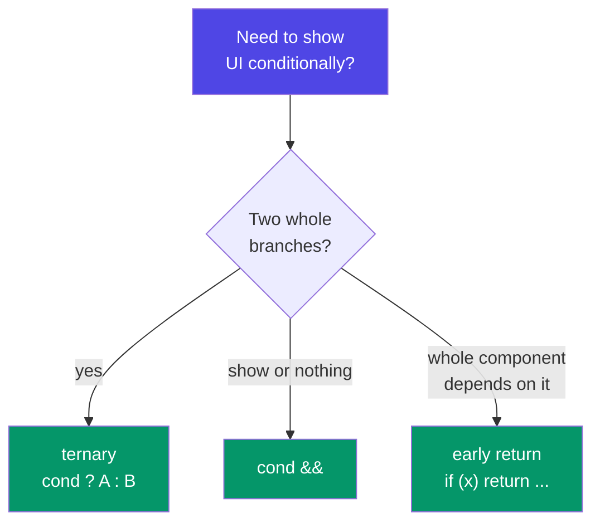

**Real-world example — every data screen you'll build:** loading spinner while fetching, error card if it fails, the data if it works. That's three conditions, and you'll write this shape hundreds of times (Part E4):

```jsx
if (loading) return <Spinner />;
if (error)   return <ErrorCard message={error} />;
return <ProductList products={products} />;
```

---

## B5. Rendering Lists & the key Prop

**Simple definition:** to render an array as UI, `.map` each item to a JSX element. React requires a unique **`key`** prop on each so it can track items across re-renders.

<p class="te"><strong>Telugu:</strong> Array ni UI ga marchadaniki <code>.map</code> vాడతాం — prati item ni okka JSX element ga maarustాం. Prati element ki <strong><code>key</code></strong> అనే unique ID ivvali — React ki "edi ediక" ani telియడానికి. <strong>Peddha rule: index ni key ga vాడకు</strong> (item delete/reorder aithే bugs); item yొక్క nijమైన <code>id</code> vాడు. Phase 4 lo <code>crypto.randomUUID()</code> nేర్చుకున్నావు kada — akkడ vాడు.</p>

**The pattern — the single most-written line in React:**

```jsx
const students = [
  { id: "a1", name: "Asha",   score: 91 },
  { id: "b2", name: "Bharat", score: 62 },
  { id: "c3", name: "Chitra", score: 78 },
];

function StudentList() {
  return (
    <ul>
      {students.map(s => (
        <li key={s.id}>
          {s.name} — {s.score}
        </li>
      ))}
    </ul>
  );
}
```

**Why `key` matters — the identity problem.** When the list changes, React compares the old and new lists to update the DOM efficiently. `key` is the stable ID that tells React "this row is the *same* row as before, just moved/edited" vs "this is a brand-new row." Without stable keys, React can attach the wrong data to the wrong DOM node — the classic bug where you delete "Asha" and "Bharat" inherits her half-typed input.

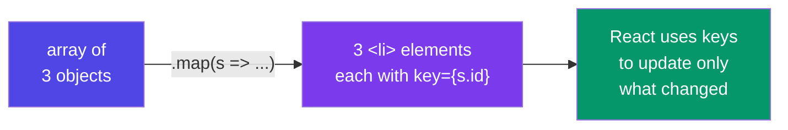

**The rules of `key`:**
- **Unique among siblings** (not globally — two different lists can both have `key={1}`).
- **Stable** — the same item gets the same key every render. Use the data's real `id`.
- ❌ **Never the array index** when the list can reorder, filter, or delete — indexes shift and React mis-matches rows. (Index is *only* safe for a static list that never changes.)
- ❌ **Never `Math.random()`** — a new key every render defeats the entire purpose (React thinks every row is new and re-creates all of them).

**Real-world example:** this is *literally* the JS-notes lesson `todos.map(t => t.id === id ? {...t, done:!t.done} : t)` rendered — the array is your source of truth, `.map` turns it into UI, and `key` keeps the rows honest. Filtering active-only tasks? `tasks.filter(t => !t.done).map(...)` — filter then map, exactly the Phase 4 pipeline, now producing JSX instead of DOM nodes.

# Part C — Components & Props

*Components are React's nouns; props are how they talk to each other. This is the vocabulary the rest of React is written in.*

## C1. Function Components

**Simple definition:** a component is a **JavaScript function that returns JSX**. Its name must start with a **capital letter**. You use it like an HTML tag: `<Button />`.

<p class="te"><strong>Telugu:</strong> Component ante <strong>JSX ni return chese JavaScript function</strong>. Peru <strong>capital letter</strong> tho start avvali — <code>Button</code>, <code>app</code> kaadు. Enduku capital? React ki <code>&lt;button&gt;</code> (small) = HTML tag, <code>&lt;Button&gt;</code> (capital) = nీ component ani teలియడానికి. Vాడేటప్పుడు HTML tag laage vాడతావు: <code>&lt;Button /&gt;</code>.</p>

```jsx
// Define it — a function returning JSX
function Welcome() {
  return <h1>Welcome back!</h1>;
}

// Use it — like a custom HTML tag
function App() {
  return (
    <div>
      <Welcome />
      <Welcome />   {/* reuse it as many times as you like */}
    </div>
  );
}
```

**The capital-letter rule is not a style choice — it's how React decides:**

```jsx
<welcome />   // ❌ React thinks this is an unknown HTML tag → renders nothing useful
<Welcome />   // ✅ React calls YOUR function
```

**One component per concept, one file per component (convention):** `Button.jsx` exports a `Button`. Keep components small — if a function returns 200 lines of JSX, it's several components hiding in a trench coat (Phase 4 L6: "one function, one job" applies here too).

---

## C2. Props — Passing Data Down

**Simple definition:** **props** (properties) are the inputs you pass *into* a component — exactly like function arguments. They flow **down** from parent to child and are **read-only**: a component can never change its own props.

<p class="te"><strong>Telugu:</strong> Props ante component ki ichhే <strong>inputs</strong> — function arguments laగే. Parent nుంచి child ki <strong>kindiki matrame</strong> prayanistాయి (one-way, gurthundా A2?). Peddha rule: <strong>props read-only</strong> — child tana props ni <em>maarchలేదు</em>. Props ni HTML attributes laage pంపుతావు: <code>&lt;Badge text="New" tone="warn" /&gt;</code>. Lopala anni okే <code>props</code> object lo vస్తాయి.</p>

**Passing and reading props:**

```jsx
// Parent passes props (like HTML attributes)
function App() {
  return <Greeting name="Nikhil" age={26} isPro={true} />;
}

// Child receives them in a `props` object
function Greeting(props) {
  return <p>Hi {props.name}, you are {props.age}.</p>;
}
```

**How to pass each type of value:**

```jsx
<User
  name="Nikhil"          // string → quotes
  age={26}               // number → braces
  isPro={true}           // boolean → braces
  skills={["JS", "React"]}  // array → braces
  address={{ city: "BLR" }} // object → braces (double: JS + object)
  onSave={handleSave}    // function → braces (this is how events flow UP)
/>
```

**Props are read-only — the golden rule:**

```jsx
function Greeting(props) {
  props.name = "changed";   // ❌ NEVER — React apps break in confusing ways
  return <p>Hi {props.name}</p>;
}
```

If a child needs to *cause* a change, the parent passes a **function** as a prop, and the child calls it. Data flows down; events (function calls) flow up. That single sentence is the whole communication model.

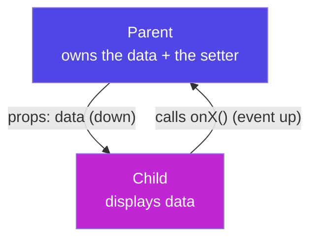

**Real-world example — one reusable Button, many uses:**

```jsx
function Button({ label, onClick, variant }) {
  return <button className={`btn btn-${variant}`} onClick={onClick}>{label}</button>;
}

// Used across the app with different props:
<Button label="Save"   variant="primary" onClick={save} />
<Button label="Delete" variant="danger"  onClick={remove} />
```

One definition, configured by props — the same reason functions exist in Phase 4, now for UI.

---

## C3. Destructuring & Default Props

**Simple definition:** instead of writing `props.name` everywhere, **destructure** the props object right in the function's parameter list. Give defaults for props that might be missing.

<p class="te"><strong>Telugu:</strong> <code>props.name</code>, <code>props.age</code> ani prati saari raయకుండా, <strong>parameter lonే destructure</strong> chేయొచ్చు: <code>function Badge({ text, tone })</code>. Idi Phase 4 loni object destructuring ye (gurthundా?). Missing props ki <strong>default</strong> ivvొచ్చు: <code>{ tone = "info" }</code>. Ee style React lo <strong>ప్రతిచోటా</strong> kanిపిస్తుంది — andుke alavాటు chేసుకో.</p>

**The upgrade — destructure in the parameters (the standard React style):**

```jsx
// Instead of this:
function Badge(props) {
  return <span className={props.tone}>{props.text}</span>;
}

// Write this — cleaner, and you see the "API" of the component at a glance:
function Badge({ text, tone = "info" }) {   // tone defaults to "info"
  const styles = {
    info: "bg-blue-100 text-blue-700",
    warn: "bg-amber-100 text-amber-700",
    error: "bg-red-100 text-red-700",
  };
  return <span className={`px-2 py-1 rounded ${styles[tone]}`}>{text}</span>;
}

// Usage:
<Badge text="New" />                 // tone falls back to "info"
<Badge text="Late" tone="warn" />
```

**Why this is the norm:** the destructured parameter list *documents the component* — anyone reading `function Badge({ text, tone })` instantly knows its two inputs. This is the exact "destructuring in function parameters" pattern from Phase 4 D4 — you were told then it's "the pattern React lives on." Here it is.

---

## C4. children & Composition

**Simple definition:** `children` is a special prop holding whatever JSX you put *between* a component's opening and closing tags. It lets components wrap other content — the foundation of reusable layout components.

<p class="te"><strong>Telugu:</strong> <code>children</code> అనేది special prop — component tags <strong>madhya</strong> pెట్టిన content anthా andులో vస్తుంది. Idి vాడితే <code>&lt;Card&gt;...andulo emైనా...&lt;/Card&gt;</code> laga <strong>wrapper components</strong> kట్టొచ్చు. Analogy: <code>Card</code> ఒక photo frame; deenిలో ఏ photo (children) айనా pెట్టొచ్చు — frame okే, lopala content veru veru.</p>

**How `children` works:**

```jsx
function Card({ children }) {
  return <div className="rounded-lg shadow p-4 bg-white">{children}</div>;
}

// Whatever you nest inside becomes `children`:
function App() {
  return (
    <Card>
      <h2>Weather</h2>
      <p>28°C, sunny</p>
    </Card>
  );
}
```

The `<h2>` and `<p>` are passed to `Card` as `children`, and `Card` decides where to place them. `Card` doesn't know or care what's inside — it just provides the frame (padding, shadow, rounded corners).

**Composition beats configuration.** Rather than a giant `<Card title=... body=... footer=... image=...>` with 15 props, you *compose* small pieces:

```jsx
<Modal>
  <ModalHeader>Delete task?</ModalHeader>
  <ModalBody>This can't be undone.</ModalBody>
  <ModalFooter>
    <Button label="Cancel" />
    <Button label="Delete" variant="danger" />
  </ModalFooter>
</Modal>
```

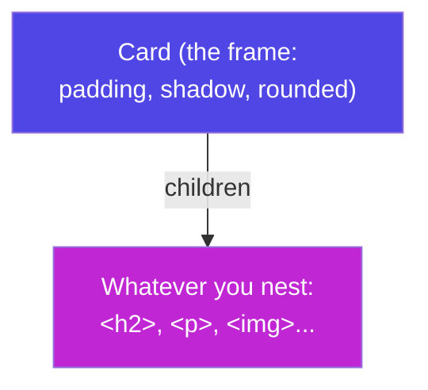

**Real-world example:** every UI library (Material UI, Chakra, shadcn/ui) is built on `children` composition — `Layout`, `Card`, `Modal`, `Tooltip` all wrap your content. Your Phase 6 project's `<Layout>` (navbar + `<Outlet/>` + footer) is exactly this pattern.

---

## C5. Thinking in Components

**Simple definition:** the design skill of looking at a UI mockup and **breaking it into a tree of components** — deciding what's a reusable piece and what's a one-off.

<p class="te"><strong>Telugu:</strong> Idి ఒక <strong>design skill</strong> — UI ni chూసి "deenిని ఏ ఏ components ga vిభజించాలి?" ani ఆలోచించడం. Rule: <strong>okే paని pదే pదే kanిపిస్తే</strong> (repeat aithే) → adి component. Analogy: శీర్షిక (heading), list, list-item — prati okkati ఒక chinna box. Chinna boxes kaట్టి, పెద్ద box lo pేర్చడమే React.</p>

**The method — 3 questions for any mockup:**
1. **Draw boxes around the UI.** Each box that represents *one thing* is a candidate component. A product card, a nav bar, a rating star.
2. **Spot repetition.** Anything that appears more than once with different data → definitely a component driven by props. Three product cards = one `<ProductCard>` used three times via `.map`.
3. **Arrange the tree.** Which box contains which? That containment *is* your component hierarchy.

**Worked example — a Task Tracker page:**

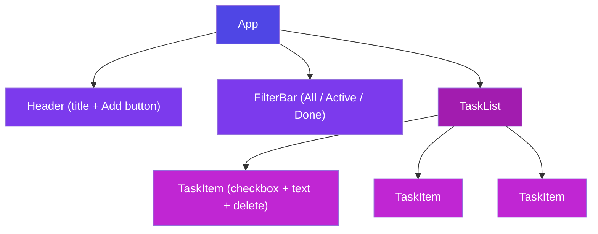

**The two rules that guide the split:**
- **Single responsibility** — a component should ideally do *one* thing. `TaskItem` shows one task; `TaskList` arranges many. (Phase 4 L6, again.)
- **Reusability** — if `<Button>` looks the same on five pages, it's one component, not five copies. Change it once, it changes everywhere.

**A caution — don't over-split too early.** Start with a few bigger components; extract smaller ones *when you feel the repetition or the file getting long*. Premature splitting creates a maze of tiny files. Build, notice the pattern, then refactor.

---

# Part D — State & the useState Hook

*Props are data a component receives. State is data a component owns and can change over time. This is where your UI comes alive — and it's the direct sequel to Phase 4's `save(); render();`.*

## D1. What is State (vs Props)

**Simple definition:** **state** is a component's private, changeable memory — data that can change over time due to user actions (a counter, form text, a toggle). When state changes, React **re-renders** the component to reflect it.

<p class="te"><strong>Telugu:</strong> State ante component yొక్క <strong>sonta, maare gala memory</strong> — kాలంతో paటు maarే data (counter value, form lo type chేసిన text, dark-mode on/off). State maarితే React aa component ni <strong>malli gీస్తుంది</strong> (re-render). Peddha tేడా: <strong>Props = bయటనుంచి vస్తాయి (read-only)</strong>; <strong>State = lopala pుడుతుంది, maarొచ్చు</strong>. Phase 4 loni <code>tasks</code> array ye state; <code>render()</code> ye re-render.</p>

**Props vs State — the defining comparison:**

| | **Props** | **State** |
|---|---|---|
| Who owns it | the **parent** | the component **itself** |
| Can it change? | ❌ read-only | ✅ yes, via its setter |
| Comes from | outside (passed in) | inside (`useState`) |
| Analogy | function **arguments** | a function's **local memory** |
| On change | parent re-renders, passes new props | component re-renders itself |

**The mental model you already own.** In Phase 4 your to-do list had one array `tasks` (the single source of truth) and a `render()` that redrew the DOM from it. React formalises exactly that: **state is the source of truth, and the return statement is your `render()`.** The only thing React adds is: *you don't call `render()` — changing state calls it for you.*

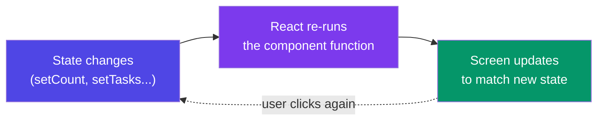

---

## D2. useState Basics

**Simple definition:** `useState` is the **hook** that gives a component a piece of state. It returns an array of two things: the current **value**, and a **setter function** to change it.

<p class="te"><strong>Telugu:</strong> <code>useState</code> ante component ki state ivvే <strong>hook</strong>. Idి రెండు వస్తువుల array istుంది: [<strong>ippటి value</strong>, <strong>daనిని maarే setter function</strong>]. Aa square brackets Phase 4 loni <strong>array destructuring</strong> ye — <code>const [count, setCount] = useState(0)</code>. Setter ni call chేస్తేనే React ki "maaru, malli gీయి" ani teలుస్తుంది — nేరుగా <code>count = 5</code> ani maarితే panిచేయదు.</p>

**Anatomy of a `useState` line:**

```jsx
import { useState } from "react";

function Counter() {
  const [count, setCount] = useState(0);
  //     ▲       ▲                  ▲
  //  value   setter          initial value

  return (
    <div>
      <p>Count: {count}</p>
      <button onClick={() => setCount(count + 1)}>+1</button>
      <button onClick={() => setCount(0)}>Reset</button>
    </div>
  );
}
```

**Read it as three parts:**
- `count` — the current value, used in the JSX. Starts at `0`.
- `setCount` — the *only* correct way to change it. Calling it tells React to re-render.
- `useState(0)` — the initial value, used **only on the first render**.

**The one rule that trips up every beginner — never assign directly:**

```jsx
count = count + 1;      // ❌ React has no idea anything changed → screen won't update
setCount(count + 1);    // ✅ tells React: update state AND re-render
```

Direct assignment is invisible to React. The setter is the doorbell — it says "data changed, please re-draw." (This is Phase 4's "the single doorway for change" — `setState` — now built into React.)

**Multiple independent states — just call it again:**

```jsx
const [name, setName]   = useState("");
const [email, setEmail] = useState("");
const [dark, setDark]   = useState(false);
```

**Real-world example — a live character counter:**

```jsx
function TweetBox() {
  const [text, setText] = useState("");
  const left = 280 - text.length;
  return (
    <div>
      <textarea value={text} onChange={e => setText(e.target.value)} />
      <span className={left < 0 ? "text-red-600" : ""}>{left} left</span>
    </div>
  );
}
```

Every keystroke calls `setText`, React re-renders, `left` recomputes, the number updates live. No DOM code — you describe the result, React does the rest.

---

## D3. State is a Snapshot — The Updater Form

**Simple definition:** within one render, a state variable is a fixed **snapshot** — it does not change mid-function. Calling the setter schedules a *new* render with a *new* value; it doesn't mutate the current one. When the next value depends on the previous, use the **updater function** form.

<p class="te"><strong>Telugu:</strong> ఒక render lo state value ఒక <strong>photo (snapshot)</strong> laంటిది — aa function madhyalో adి maaradు. Setter ni call chేస్తే <em>kొత్త</em> render schedule avutుంది, ippటిది kాదు. Andుke ఒకే click lo <code>setCount(count+1)</code> mూడు saarlు raస్తే — anni okే purాతన <code>count</code> ni chూస్తాయి, +3 kాదు +1 ye avutుంది. Fix: <strong>updater form</strong> <code>setCount(c =&gt; c + 1)</code> — React nీకు ఎప్పటికప్పుడు tాజా value istుంది.</p>

**The classic surprise:**

```jsx
function BrokenCounter() {
  const [count, setCount] = useState(0);

  function addThree() {
    setCount(count + 1);   // count is 0 → schedules 1
    setCount(count + 1);   // count is STILL 0 → schedules 1
    setCount(count + 1);   // count is STILL 0 → schedules 1
  }                        // result: 1, not 3 😱

  return <button onClick={addThree}>Add 3</button>;
}
```

`count` is `0` for the entire `addThree` call — it's a snapshot. All three setters see `0`. **The fix — the updater function**, which receives the *latest* pending value:

```jsx
function addThree() {
  setCount(c => c + 1);   // c is 0 → 1
  setCount(c => c + 1);   // c is 1 → 2
  setCount(c => c + 1);   // c is 2 → 3  ✅
}
```

**The rule:** whenever the next state depends on the previous state, pass a **function** to the setter, not a value. `setCount(count + 1)` is fine for a single independent update; `setCount(c => c + 1)` is required when they stack or when you're inside an async callback that might see stale state.

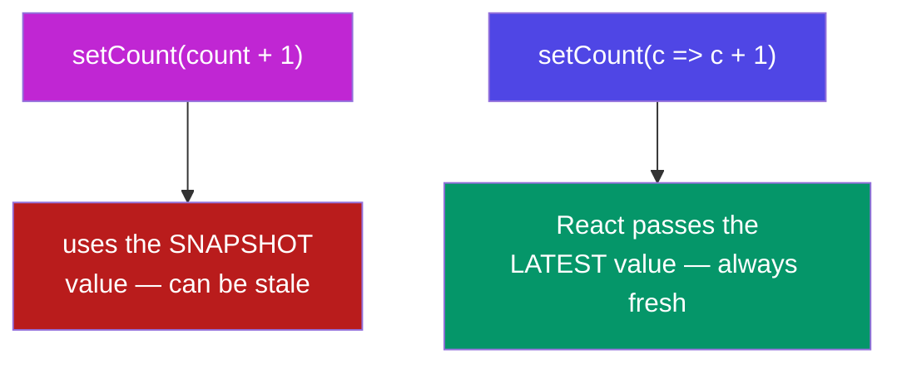

**Bonus — batching:** React groups multiple setter calls in the same event into **one** re-render (for performance). So even the broken version re-renders only once. Batching is why the snapshot rule exists — and why the updater form is your safety net.

---

## D4. Updating Objects & Arrays Immutably

**Simple definition:** React detects change by comparing references, so you must **never mutate** state objects/arrays — you create a **new** copy with the change applied. This is Phase 4's immutability lesson, now load-bearing.

<p class="te"><strong>Telugu:</strong> React "state maarindా?" ani <strong>reference tho</strong> chూస్తుంది (purాతన object == kొత్త object? ani). Andుke state ni <strong>ఎప్పుడూ nేరుగా maarకూడదు</strong> (mutate) — kొత్త copy kట్టి, andులో maarాలి. <code>...spread</code> gurthundా Phase 4? Akkడ nేర్చుకున్నది ikkడ <strong>ప్రాణం</strong>. <code>push</code>, <code>splice</code>, <code>obj.x = y</code> — ivి mutate chేస్తాయి, vాడకు. <code>[...arr]</code>, <code>{...obj}</code>, <code>.map</code>, <code>.filter</code> — ivి kొత్త copy istాయి, ivే vాడు.</p>

**Objects — copy then override with spread:**

```jsx
const [user, setUser] = useState({ name: "Nikhil", city: "BLR" });

// ❌ mutation — React sees the SAME object reference, may not re-render
user.city = "Hyderabad";
setUser(user);

// ✅ new object with one field changed
setUser({ ...user, city: "Hyderabad" });
```

**Arrays — use the non-mutating methods:**

```jsx
const [todos, setTodos] = useState([]);

// ADD:    copy + append
setTodos([...todos, newTodo]);

// REMOVE: filter keeps the rest (new array)
setTodos(todos.filter(t => t.id !== id));

// UPDATE one item: map, replace the match with a copy
setTodos(todos.map(t => t.id === id ? { ...t, done: !t.done } : t));
```

That last line — `todos.map(t => t.id === id ? {...t, done:!t.done} : t)` — is the *exact* line the JS notes told you "is how every React list update is written." Now you know why: it produces a **new array** where one object is a modified copy and the rest pass through unchanged.

| Want to… | ❌ Mutating (don't) | ✅ Immutable (do) |
|---|---|---|
| Add to array | `arr.push(x)` | `setArr([...arr, x])` |
| Remove from array | `arr.splice(i, 1)` | `setArr(arr.filter(...))` |
| Update array item | `arr[i].done = true` | `setArr(arr.map(...))` |
| Change object field | `obj.x = 1` | `setObj({ ...obj, x: 1 })` |

⚠️ **Nested objects need nested spreads** (spread is shallow — Phase 4 D5): `setUser({ ...user, address: { ...user.address, city: "Hyd" } })`. For deeply nested state, that's a signal to either restructure your state flatter or reach for `useReducer` (Part I).

---

## D5. Lifting State Up

**Simple definition:** when two sibling components need to share the same data, you move that state **up** to their closest common parent, then pass it down as props. The parent becomes the single source of truth.

<p class="te"><strong>Telugu:</strong> Rెండు sibling components okే data ni pంచుకోవాలంటే, aa state ni vాటి <strong>common parent</strong> loki pైకి jarupు (lift up), taruvాత props ga kindiki pంపు. Enduku? Data okే chota (parent lo) unte, iద్దరూ okే nిజాన్ని chూస్తారు — clash undదు. Analogy: iద్దరు pిల్లలు ఒక remote pంచుకోవాలంటే, remote ni tల్లి (parent) daగ్గర pెట్టి, iద్దరికీ vాడనిస్తుంది.</p>

**The problem:** a `<SearchInput>` and a `<ResultsList>` are siblings. The input owns the search text, but the list needs it too. Siblings can't pass data to each other directly (data only flows down).

**The fix — lift the state to the parent:**

```jsx
function SearchPage() {
  const [query, setQuery] = useState("");   // state lives in the PARENT

  return (
    <div>
      <SearchInput value={query} onChange={setQuery} />   {/* down: value + setter */}
      <ResultsList query={query} />                       {/* down: value */}
    </div>
  );
}

function SearchInput({ value, onChange }) {
  return <input value={value} onChange={e => onChange(e.target.value)} />;
}

function ResultsList({ query }) {
  const results = ALL.filter(item => item.includes(query));
  return <ul>{results.map(r => <li key={r}>{r}</li>)}</ul>;
}
```

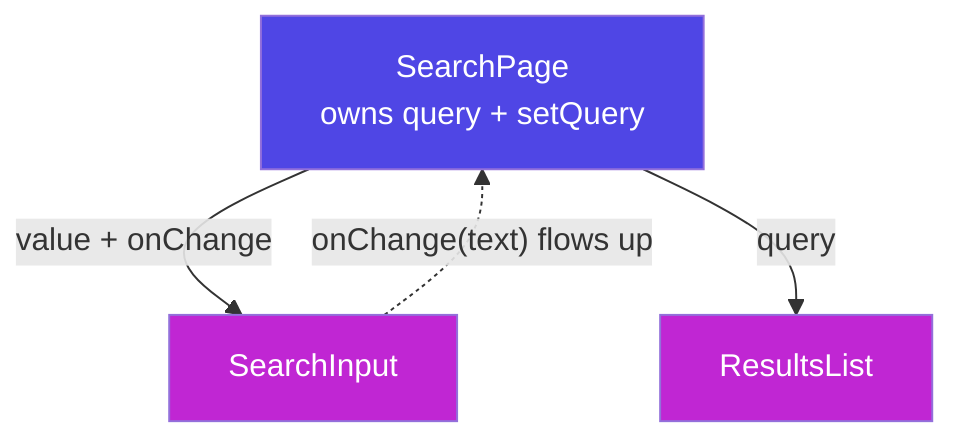

**The principle:** state should live at the **lowest common ancestor** of every component that needs it. Not higher (unnecessary re-renders and prop-passing), not lower (siblings can't reach it). When you find yourself wanting to "send data sideways," the answer is almost always *lift it up*.

**When lifting gets painful** — passing the same prop through five layers to reach a deep child — that's **prop drilling**, and it's exactly the problem **Context** solves (Part G). But reach for Context only after lifting feels genuinely heavy; for two or three levels, props are simpler and clearer.

---

## D6. Controlled Forms

**Simple definition:** in a **controlled input**, React state is the single source of truth for the field's value. You bind `value={state}` and update it with `onChange`. The input shows exactly what state says.

<p class="te"><strong>Telugu:</strong> <strong>Controlled input</strong> ante — field lo emi kanిపిస్తుందో React <strong>state ye నిర్ణయిస్తుంది</strong>. Rెండు tీగలు kలుపుతావు: <code>value={state}</code> (state ni field lo chూపు) mariyu <code>onChange</code> (type chేస్తే state ni update chేయి). Idి loop: type → onChange → setState → re-render → field lo kొత్త value. Andుke field ఎప్పుడూ state tho <strong>sync</strong> lo untుంది. Prati React form idే pattern.</p>

**The controlled input pattern:**

```jsx
function NameForm() {
  const [name, setName] = useState("");

  return (
    <input
      value={name}                              // state → input
      onChange={e => setName(e.target.value)}   // input → state
    />
  );
}
```

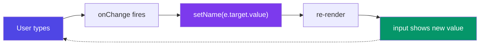

**A full form — one state object, one change handler:**

```jsx
function SignupForm() {
  const [form, setForm] = useState({ name: "", email: "", role: "user" });

  // one handler for every field, keyed by the input's `name`
  const handleChange = (e) => {
    const { name, value } = e.target;
    setForm(prev => ({ ...prev, [name]: value }));   // computed key + spread
  };

  const handleSubmit = (e) => {
    e.preventDefault();                 // stop the page reload (Phase 4 E3!)
    console.log(form);                  // { name, email, role }
  };

  return (
    <form onSubmit={handleSubmit}>
      <input name="name"  value={form.name}  onChange={handleChange} />
      <input name="email" value={form.email} onChange={handleChange} />
      <select name="role" value={form.role} onChange={handleChange}>
        <option value="user">User</option>
        <option value="admin">Admin</option>
      </select>
      <button type="submit">Sign up</button>
    </form>
  );
}
```

**Three things doing the heavy lifting:**
- `[name]: value` — a **computed property key** (Phase 4 D3), so one handler updates whichever field fired.
- `{ ...prev, [name]: value }` — immutable object update (D4).
- `e.preventDefault()` — the same "stop the browser reloading" from Phase 4 E3.

**Controlled vs uncontrolled (interview line):** *controlled* = React state drives the value (what you'll use 95% of the time — it lets you validate, disable submit, transform input live). *Uncontrolled* = the DOM keeps the value and you read it with a `ref` only when needed (occasionally used for simple/large forms or file inputs). Default to controlled.

**Real-world example:** every login, checkout, and settings form is controlled — because state-as-truth lets you show "passwords don't match" live, disable Submit until valid (`formFields.every(f => f.value !== "")` from Phase 4 D2), and clear the form after submit with `setForm(initial)`.

# Part E — useEffect & Side Effects

*Rendering is pure — it just computes JSX from state. But real apps must also fetch data, set timers, and talk to the outside world. `useEffect` is where that "outside" work lives.*

## E1. What is a Side Effect

**Simple definition:** a **side effect** is anything a component does *besides* computing its JSX — fetching data, setting a timer, reading/writing `localStorage`, subscribing to an event, changing the document title. React calls your component to *render*; effects are for everything else.

<p class="te"><strong>Telugu:</strong> <strong>Side effect</strong> ante component JSX ni lెక్కించడం <em>tప్ప</em> chేసే migిలిన paనులు — data fetch chేయడం, timer pెట్టడం, <code>localStorage</code> lo raయడం, event ki subscribe avvడం. React nీ component ni <strong>render</strong> kోసం pిలుస్తుంది; render "శుద్ధం" (pure) ga undాలి — nేరుగా fetch, timer akkడ pెట్టకూడదు. Aa "bయటి prపంచపు" paని anthా <code>useEffect</code> lo pెట్టాలి. Render = lెక్క; effect = bయటి paని.</p>

**Why render must stay pure.** React may call your component function many times, and it expects the *same output for the same state* with no surprises. If you `fetch()` directly in the render body, it fires on every render — an infinite loop of requests. Effects give side-effect code a **controlled place and time**: *after* the render is painted to the screen.

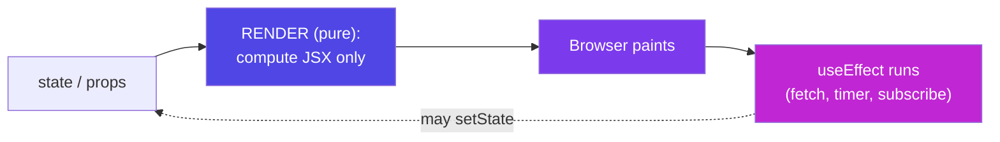

**Examples of side effects you'll write:**
- Fetch data from an API when a page loads.
- Save state to `localStorage` whenever it changes.
- Set up a `setInterval` clock, or a keyboard listener.
- Sync the browser tab title to app state.

---

## E2. useEffect & the Dependency Array

**Simple definition:** `useEffect(fn, deps)` runs `fn` **after render**, and re-runs it only when a value in the **dependency array** `deps` changes. The dependency array is the control knob for *when* the effect fires.

<p class="te"><strong>Telugu:</strong> <code>useEffect(fn, deps)</code> — <code>fn</code> ni <strong>render tarువాత</strong> run chేస్తుంది. <code>deps</code> array ye "eppుడు malli run chేయాలో" nిర్ణయిస్తుంది. 3 rakాలు gurthupెట్టుko: <strong><code>[]</code> = okే saari</strong> (mount lo, page vచ్చినప్పుడు); <strong><code>[x]</code> = x maarినప్పుడల్లా</strong>; <strong>deps lేకపోతే = prati render kి</strong> (dంజర్, appుడప్పుడే avసరం). Deps ni marచిపోతే bugs — andుke ఎప్పుడూ ivvు.</p>

**The three forms — this table is the whole concept:**

| Dependency array | When the effect runs | Use for |
|---|---|---|
| `[]` (empty) | **once**, after first render | fetch on load, set up a subscription |
| `[a, b]` | after first render + whenever `a` or `b` changes | re-fetch when an id/query changes |
| *(omitted)* | after **every** render | almost never — usually a bug |

```jsx
import { useState, useEffect } from "react";

function Clock() {
  const [time, setTime] = useState(new Date());

  useEffect(() => {
    const id = setInterval(() => setTime(new Date()), 1000);
    return () => clearInterval(id);   // cleanup (E3)
  }, []);                             // [] → set the timer up ONCE

  return <p>{time.toLocaleTimeString()}</p>;
}
```

**Re-run when a value changes — the most common real case:**

```jsx
function Post({ postId }) {
  const [post, setPost] = useState(null);

  useEffect(() => {
    fetch(`/api/posts/${postId}`)
      .then(r => r.json())
      .then(setPost);
  }, [postId]);   // re-fetch whenever postId changes ✅

  return <article>{post?.title}</article>;
}
```

If you'd written `[]` here, switching from post 1 to post 2 would keep showing post 1 — the effect never re-runs. The dependency array `[postId]` is what keeps the data in sync with the prop.

**The rule for deps:** include **every** value from your component (props, state) that the effect *reads*. Leaving one out causes "stale" bugs where the effect uses an old value. (The ESLint plugin `react-hooks/exhaustive-deps` catches these for you — keep it on.)

---

## E3. Cleanup Functions

**Simple definition:** if your effect sets up something ongoing (a timer, a subscription, a listener), it should **return a function** that tears it down. React runs this cleanup before the effect re-runs and when the component unmounts.

<p class="te"><strong>Telugu:</strong> Effect lo eదైనా <strong>continuous paని</strong> start chేస్తే (timer, event listener, subscription), daనిని <strong>ఆపే function ni return</strong> chేయాలి. React aa cleanup ni — effect malli run avvక mుందు, mariyu component pోయినప్పుడు (unmount) — run chేస్తుంది. Enduku? Marచిపోతే: timers pేరుకుపోతాయి, memory leak, purాతన listeners kూడా fire avutాయి. Rule: <strong>subscribe chేస్తే, unsubscribe kూడా raయి</strong> — jత (pair) ga.</p>

**The shape — set up, then return the teardown:**

```jsx
useEffect(() => {
  const id = setInterval(tick, 1000);   // SET UP

  return () => clearInterval(id);       // CLEAN UP
}, []);
```

**Why it matters — the leak it prevents.** Without cleanup, every time this component re-mounts (e.g. navigating away and back) you'd stack another `setInterval`, and they'd all keep firing forever. Same with event listeners and WebSocket subscriptions. This is the *exact* lesson from Phase 4: "this is why `useEffect` returns a cleanup function — the framework forcing you to pair every subscription with an unsubscription."

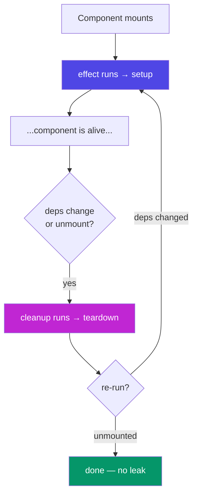

**Real-world cleanup examples:**

```jsx
// Event listener
useEffect(() => {
  const onKey = (e) => e.key === "Escape" && closeModal();
  window.addEventListener("keydown", onKey);
  return () => window.removeEventListener("keydown", onKey);
}, []);

// Debounced search timer (you'll turn this into useDebounce in Part H)
useEffect(() => {
  const t = setTimeout(() => runSearch(query), 400);
  return () => clearTimeout(t);   // cancel the old timer on every keystroke
}, [query]);
```

**Interview answer (Q5 in your roadmap):** *"useEffect cleanup runs (1) right before the effect re-runs due to a dependency change, and (2) when the component unmounts. In class components that second case was `componentWillUnmount`, but cleanup also handles the re-run case, which lifecycle methods didn't unify."*

---

## E4. Fetching Data (loading / error / success)

**Simple definition:** the canonical real-world effect — call an API on mount, and track three states: **loading**, **error**, and the **data**. This exact shape appears on nearly every screen.

<p class="te"><strong>Telugu:</strong> Idి React lo <strong>ప్రతిరోజూ raసే code</strong> — page vచ్చినప్పుడు API pిలిచి, <strong>3 states</strong> chూడడం: <em>loading</em> (spinner chూపు), <em>error</em> (fail aithే message), <em>data</em> (vచ్చాక chూపు). Phase 4 loni <code>fetch</code>, <code>res.ok</code>, <code>try/catch/finally</code> anni ikkడ vస్తాయి — kొత్తది <code>useEffect</code> lo pెట్టడం mariyu 3 states ni <code>useState</code> tho track chేయడం matrame.</p>

**The full pattern — memorise this skeleton:**

```jsx
function Users() {
  const [users, setUsers]     = useState([]);
  const [loading, setLoading] = useState(true);
  const [error, setError]     = useState(null);

  useEffect(() => {
    async function load() {
      try {
        setLoading(true);
        const res = await fetch("https://jsonplaceholder.typicode.com/users");
        if (!res.ok) throw new Error(`HTTP ${res.status}`);   // Phase 4 H7!
        const data = await res.json();
        setUsers(data);
      } catch (err) {
        setError(err.message);
      } finally {
        setLoading(false);   // spinner off, success OR fail
      }
    }
    load();
  }, []);   // [] → fetch once on mount

  if (loading) return <p>Loading…</p>;
  if (error)   return <p className="text-red-600">Error: {error}</p>;

  return (
    <ul>
      {users.map(u => <li key={u.id}>{u.name}</li>)}
    </ul>
  );
}
```

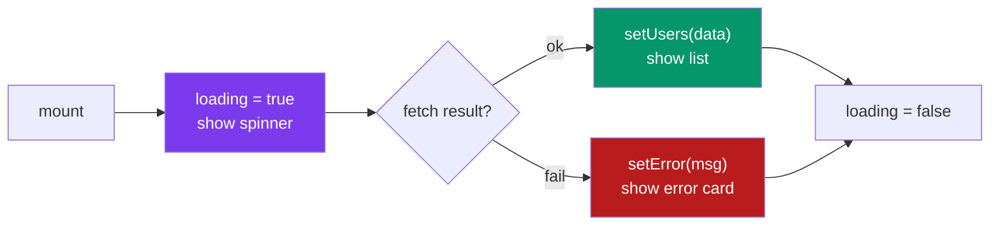

**Why `async` is a nested function.** An effect callback can't itself be `async` (it must return a cleanup function or nothing, not a Promise). So you define `async function load()` *inside* and call it. Remember it — it's a top-3 beginner stumble.

```jsx
useEffect(async () => { ... }, []);   // ❌ effect can't be async
useEffect(() => { async function load(){...} load(); }, []);   // ✅
```

**Avoiding the race-condition bug.** If `postId` changes fast, an old slow response can overwrite a new one. Guard with a cleanup flag:

```jsx
useEffect(() => {
  let active = true;
  fetch(`/api/posts/${postId}`).then(r => r.json())
    .then(data => { if (active) setPost(data); });   // ignore if superseded
  return () => { active = false; };
}, [postId]);
```

**Where this goes next:** this whole block is repetitive — you'll extract it into a **`useFetch` custom hook** in Part H2 and never write it by hand again.

---

## E5. useEffect Gotchas You Will Hit

**Simple definition:** a short catalogue of the mistakes every React learner makes with effects — recognise them now and save yourself hours of debugging.

<p class="te"><strong>Telugu:</strong> useEffect tho andarూ chేసే <strong>common tప్పులు</strong> — mundే teలిస్తే gంటల debugging tప్పుతుంది. Peddha vి: (1) deps array marచిపోవడం → infinite loop. (2) object/function ni deps lo pెట్టడం → prati render kొత్తగా → loop. (3) effect ni <em>event handler</em> avసరమైన chota vాడడం. Rule: <strong>"idి render tarువాత avసరమా, lేదా user click tarువాత avసరమా?"</strong> — click aithే effect vద్దు, handler chాలు.</p>

**Gotcha 1 — the infinite loop.** Setting state that's in the dependency array (or with no deps) re-runs the effect forever:

```jsx
// ❌ setCount triggers render → effect runs → setCount → render → ...
useEffect(() => { setCount(count + 1); });        // no deps → every render

// ✅ give it a reason to stop — run once, or on a specific change
useEffect(() => { setCount(c => c + 1); }, []);
```

**Gotcha 2 — objects/arrays/functions as dependencies.** They get a *new reference* every render, so the effect thinks they "changed" every time:

```jsx
const options = { limit: 10 };            // new object each render
useEffect(() => { load(options); }, [options]);   // ❌ runs every render

// Fix: depend on the primitive, not the object
useEffect(() => { load({ limit }); }, [limit]);    // ✅
```

(When you genuinely need a stable object/function across renders, that's what `useMemo` / `useCallback` are for — Part J.)

**Gotcha 3 — using an effect where an event handler belongs.** Effects are for syncing with *external systems*, not for responding to a specific user action.

```jsx
// ❌ don't POST on a state change via effect
useEffect(() => { if (submitted) api.save(form); }, [submitted]);

// ✅ just do it in the click handler
function handleSubmit() { api.save(form); }
```

**The mental test before writing any effect:** *"Does this need to happen because the component rendered/data changed — or because the user did a specific thing?"* The first is an effect; the second is an event handler. Modern React advice: **you might not need an effect** — reach for it only for genuine outside-world sync (fetching, subscriptions, non-React widgets).

**Gotcha 4 — StrictMode double-run.** In development, `<StrictMode>` runs each effect **twice** on mount to help you catch missing cleanups. That's not a bug — if your effect breaks when run twice, it's missing a cleanup. It runs once in production.

---

# Part F — React Router v6

*A React app is one HTML page. Router makes it *feel* like many pages — changing the URL and swapping components without a full reload. This is how every real React app has more than one screen.*

## F1. Why Client-Side Routing

**Simple definition:** React apps are **Single-Page Applications (SPAs)** — one `index.html`. **Client-side routing** watches the URL and swaps which component is shown, with no server round-trip and no white flash. React Router is the library that does this.

<p class="te"><strong>Telugu:</strong> React app anedి <strong>okే HTML page</strong> (Single-Page App). Kాని mనకు /home, /about, /posts laంటి chాలా "pages" kావాలి. <strong>Client-side routing</strong> ante — URL ni chూసి, ఏ component chూపాలో React <em>tానే</em> maarుస్తుంది, server ki mళ్లీ vెళ్లకుండా, page reload lేకుండా. Andుke chాలా <strong>fast</strong> — okే క్షణంలో page maarుతుంది. React Router aa paని chేసే library.</p>

**MPA vs SPA — what changed:**

| | Traditional (MPA) | React SPA + Router |
|---|---|---|
| Each link click | server sends a **new HTML page** | JS swaps the **component** |
| Page reload | yes — white flash | no — instant |
| Speed | slower (full round-trip) | fast (already loaded) |
| State | lost on navigation | kept in memory |

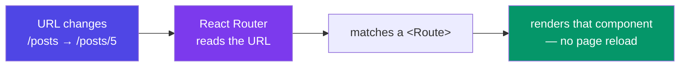

**Install it:**

```bash
npm install react-router-dom
```

**Real-world context:** Gmail, Twitter, your Task Tracker — click around and the URL changes, the content changes, but the page never fully reloads. That's client-side routing. (SAP Fiori's routing does the same job for UI5 apps — another concept that transfers.)

---

## F2. BrowserRouter, Routes, Route

**Simple definition:** three components set up routing. `<BrowserRouter>` wraps your app and watches the URL. `<Routes>` holds all your routes. Each `<Route path element>` maps a URL pattern to a component.

<p class="te"><strong>Telugu:</strong> Mూడు components tho routing set chేస్తాం. <code>&lt;BrowserRouter&gt;</code> = mొత్తం app ni chుట్టి URL ni gమనిస్తుంది (okే saari, top lo). <code>&lt;Routes&gt;</code> = anni routes ni pెట్టే dabbā. <code>&lt;Route path="..." element={...} /&gt;</code> = "ee URL vస్తే, ee component chూపు" ane rule. Simple: path = URL, element = ఏ component.</p>

**The setup — wrap once, then declare routes:**

```jsx
import { BrowserRouter, Routes, Route } from "react-router-dom";

function App() {
  return (
    <BrowserRouter>
      <Routes>
        <Route path="/"         element={<Home />} />
        <Route path="/about"    element={<About />} />
        <Route path="/posts"    element={<Posts />} />
        <Route path="/posts/:id" element={<PostDetail />} />
        <Route path="*"         element={<NotFound />} />   {/* 404 catch-all */}
      </Routes>
    </BrowserRouter>
  );
}
```

**Read it as a lookup table:** React Router looks at the current URL and renders the `element` of the first `<Route>` whose `path` matches.

| URL | Renders |
|---|---|
| `/` | `<Home />` |
| `/about` | `<About />` |
| `/posts` | `<Posts />` |
| `/posts/42` | `<PostDetail />` (with `id = "42"`) |
| `/anything-else` | `<NotFound />` (the `*` wildcard) |

**`<BrowserRouter>` goes at the top, once** — usually wrapping `<App />` in `main.jsx`, or as the outermost element of `App`. Everything that uses routing (links, params) must be *inside* it.

---

## F3. Link & NavLink

**Simple definition:** `<Link to="/path">` is Router's replacement for `<a href>`. It navigates **without reloading the page**. `<NavLink>` is a `Link` that also knows when it's the *active* route, so you can style the current tab.

<p class="te"><strong>Telugu:</strong> <strong>Normal <code>&lt;a href&gt;</code> vాడకూడదు</strong> — adి mొత్తం page reload chేస్తుంది, SPA benefit pోతుంది. Baదులు <code>&lt;Link to="/about"&gt;</code> vాడు — reload lేకుండా navigate chేస్తుంది. <code>&lt;NavLink&gt;</code> ante Link + "nేను ippుడు active ā?" ane teలివి — active tab ni highlight chేయడానికి vాడతాం (navbar lo current page ni chూపడానికి).</p>

**Link — the reload-free navigation:**

```jsx
import { Link } from "react-router-dom";

<nav>
  <Link to="/">Home</Link>
  <Link to="/posts">Posts</Link>
  <Link to="/about">About</Link>
</nav>
```

⚠️ Using `<a href="/posts">` instead would trigger a **full page reload** — losing all state and defeating the SPA. Always `<Link>` for internal navigation; `<a>` only for external sites.

**NavLink — auto-styling the active tab:**

```jsx
import { NavLink } from "react-router-dom";

<NavLink
  to="/posts"
  className={({ isActive }) => isActive ? "font-bold text-indigo-600" : "text-slate-600"}
>
  Posts
</NavLink>
```

`NavLink` passes an `{ isActive }` flag to a className function, so the current page's link styles itself differently — exactly how the highlighted tab in every navbar works.

---

## F4. Dynamic Params & useParams

**Simple definition:** a **dynamic segment** like `/posts/:id` matches any value in that slot. The `useParams()` hook reads that value inside the component, so one `<Route>` serves infinitely many URLs.

<p class="te"><strong>Telugu:</strong> <code>/posts/:id</code> lo <code>:id</code> ante "ee chota <strong>ఏ value айనా</strong> match avుతుంది" — /posts/1, /posts/2, /posts/999 anni okే route. Component lopala aa value ni <code>useParams()</code> tho chదువుతాం: <code>const { id } = useParams()</code>. Enduku peddha viషయం? okే route tho <strong>vేల posts</strong> chూపొచ్చు — prati daనికి veru page raయక్కర్లేదు.</p>

**Define the pattern, read the value:**

```jsx
// In App: the route with a dynamic :id
<Route path="/posts/:id" element={<PostDetail />} />

// Inside PostDetail: read the id from the URL
import { useParams } from "react-router-dom";

function PostDetail() {
  const { id } = useParams();          // /posts/42 → id = "42" (always a string)

  const [post, setPost] = useState(null);
  useEffect(() => {
    fetch(`/api/posts/${id}`).then(r => r.json()).then(setPost);
  }, [id]);                            // re-fetch when the URL id changes (E2!)

  if (!post) return <p>Loading…</p>;
  return <article><h1>{post.title}</h1><p>{post.body}</p></article>;
}
```


**The list → detail pattern (the most common route pair):**

```jsx
// Posts list: each item links to its own detail URL
function Posts({ posts }) {
  return posts.map(p => (
    <Link key={p.id} to={`/posts/${p.id}`}>{p.title}</Link>
  ));
}
```

Click a post → URL becomes `/posts/7` → `PostDetail` reads `id = "7"` → fetches and shows that post. One route, every post. (Your roadmap's Day 3 practice is exactly this: Home / Posts list / Post detail.)

---

## F5. useNavigate — Programmatic Navigation

**Simple definition:** `useNavigate()` returns a `navigate` function that changes the URL from **code** — for when navigation happens after an action, not a click on a link (e.g. after login, after saving, a "Back" button).

<p class="te"><strong>Telugu:</strong> Appుడప్పుడు link click kాదు, <strong>code lో</strong> navigate chేయాలి — login айన tarువాత /dashboard ki pంపడం, form save айన tarువాత mళ్లీ list ki, లేదా "Back" button. Aందుకు <code>useNavigate()</code> — idి <code>navigate</code> function istుంది: <code>navigate("/dashboard")</code>. Back kి <code>navigate(-1)</code>. Link = user click; navigate = code decision.</p>

**Navigate from an event handler:**

```jsx
import { useNavigate } from "react-router-dom";

function LoginForm() {
  const navigate = useNavigate();

  async function handleLogin(credentials) {
    await api.login(credentials);
    navigate("/dashboard");          // go there after successful login
  }
  // ...
}
```

**Common uses:**

```jsx
navigate("/posts");           // go to a path
navigate("/posts", { replace: true });  // replace history (no "back" to login)
navigate(-1);                 // go BACK one step (like the browser back button)
navigate(1);                  // go forward
```

**Link vs navigate — the rule:** if the user *clicks something that looks like a link/button to go somewhere*, use `<Link>`. If navigation is a *consequence of logic* (login succeeded, form saved, session expired → redirect to `/login`), use `navigate()`.

---

## F6. Nested & Layout Routes — Outlet

**Simple definition:** routes can nest inside a **layout route** — a parent component (shared navbar/sidebar/footer) that renders its matched child via the `<Outlet />` placeholder. Shared chrome is written once.

<p class="te"><strong>Telugu:</strong> Chాలా pages lo okే navbar, sidebar, footer repeat avutాయి. Prati page lo malli raయకుండా, <strong>layout route</strong> vాడతాం — okే parent (navbar + footer) lో, maare content ni <code>&lt;Outlet /&gt;</code> ane chota pెడతాం. Router aa Outlet chota current child page ni pెడుతుంది. Analogy: <code>Outlet</code> = photo frame lo <strong>ఖాళీ chోటు</strong>; ఏ page vస్తే aa photo akkడ vస్తుంది, frame (navbar/footer) okే.</p>

**A layout wrapping many pages:**

```jsx
import { Outlet } from "react-router-dom";

function Layout() {
  return (
    <div>
      <Navbar />
      <main>
        <Outlet />     {/* the matched child route renders HERE */}
      </main>
      <Footer />
    </div>
  );
}

// Nest child routes inside the layout route:
<Routes>
  <Route element={<Layout />}>          {/* no path → pure layout */}
    <Route path="/"      element={<Home />} />
    <Route path="/posts" element={<Posts />} />
    <Route path="/about" element={<About />} />
  </Route>
  <Route path="/login" element={<Login />} />   {/* outside the layout — no navbar */}
</Routes>
```

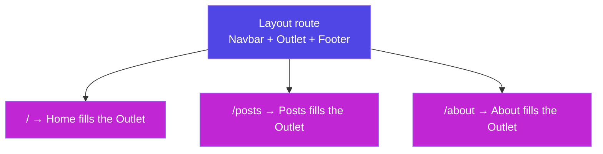

Now `Home`, `Posts`, and `About` all show inside the same navbar/footer without repeating that markup. `Login` sits outside, so it renders full-screen with no navbar — perfect for auth pages.

---

## F7. 404 & Protected Routes

**Simple definition:** the `*` wildcard route catches any unmatched URL (your 404 page). A **protected route** is a wrapper that checks auth and either shows the page or redirects to `/login`.

<p class="te"><strong>Telugu:</strong> <strong>404:</strong> ఏ route ā match kాకపోతే, <code>path="*"</code> (wildcard) aa "page dొరకలేదు" ni chూపుతుంది — ఎప్పుడూ chివరన pెట్టు. <strong>Protected route:</strong> login కాని vాళ్లు /dashboard chూడకూడదు — andుke ఒక wrapper: "logged in ā? aయితే page chూపు; kాకపోతే <code>&lt;Navigate to='/login' /&gt;</code> tho pంపేయి." Idి nీ roadmap Q4 — gurthుంచుకో.</p>

**404 — always last, catches everything else:**

```jsx
<Route path="*" element={<NotFound />} />
```

Because Router matches top-to-bottom, `*` at the end only fires when nothing above matched.

**Protected route — the redirect-if-not-authed guard:**

```jsx
import { Navigate } from "react-router-dom";

function ProtectedRoute({ children }) {
  const { user } = useAuth();          // from AuthContext (Part G4)
  if (!user) return <Navigate to="/login" replace />;   // kick out guests
  return children;                     // logged in → show the page
}

// Wrap any route you want to guard:
<Route
  path="/dashboard"
  element={
    <ProtectedRoute>
      <Dashboard />
    </ProtectedRoute>
  }
/>
```

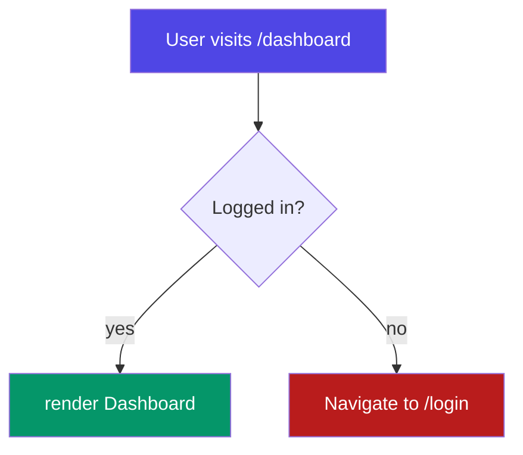

**`<Navigate>` vs `useNavigate`:** `<Navigate>` is a *component* you render to redirect immediately during render (perfect for guards). `useNavigate` is a *function* you call from event handlers (F5). Guard = `<Navigate>`; button click = `navigate()`.

**Real-world example:** this is every app's auth flow — dashboards, settings, and checkout are wrapped in `<ProtectedRoute>`; the `*` route shows a friendly "Page not found" with a link home. Both are on your Day 3 / Q4 checklist.

# Part G — Context & useContext

*Props flow down one level at a time. When data needs to reach a deep child through many layers that don't care about it, Context lets you broadcast it directly. This is how themes, auth, and language settings travel.*

## G1. The Prop-Drilling Problem

**Simple definition:** **prop drilling** is passing a prop down through many intermediate components that don't use it themselves — just to reach a deep child. It clutters every layer and makes refactoring painful.

<p class="te"><strong>Telugu:</strong> <strong>Prop drilling</strong> ante — ఒక data ni chాలా layers gుండా kిందికి pంపడం, madhyalో unna components ki aa data <em>avసరం lేకపోయినా</em>, kేవలం kింది child ki chేర్చడానికి. App → Page → Sidebar → Menu → Button ki <code>user</code> pంపాలంటే, madhyalో anni "postman" laga mోయాలి. Idి চిరాకు (annoying), plus okక్క prop maarితే chాలా files touch chేయాలి. Context idే fix chేస్తుంది.</p>

**The problem in code — `user` passed through components that don't need it:**

```jsx
function App() {
  const [user] = useState({ name: "Nikhil" });
  return <Page user={user} />;              // pass down…
}
function Page({ user }) {
  return <Sidebar user={user} />;           // …just to pass down…
}
function Sidebar({ user }) {
  return <Menu user={user} />;              // …just to pass down…
}
function Menu({ user }) {
  return <span>Hi {user.name}</span>;       // FINALLY used, 3 layers deep
}
```

`Page` and `Sidebar` don't use `user` at all — they're forced to accept and forward it. Multiply this by theme, language, and auth, and every component's props become noise.

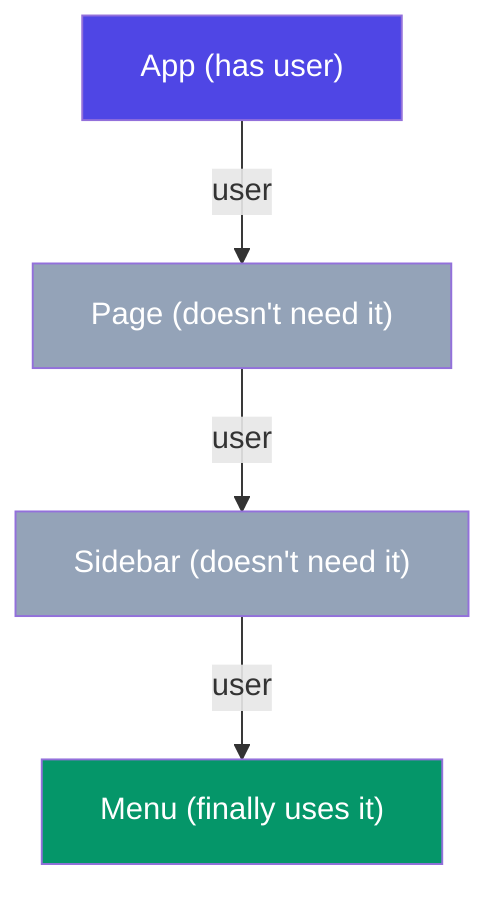

**When it's *not* a problem:** passing a prop one or two levels is normal and clear — don't reach for Context to avoid a single hop. Prop drilling becomes worth solving at ~3+ layers, or when *many* components need the same global-ish value.

---

## G2. createContext + Provider + useContext

**Simple definition:** Context has three parts. `createContext()` makes a context object. A `<Context.Provider value={...}>` broadcasts a value to everything inside it. `useContext(Context)` reads that value from any depth — no props in between.

<p class="te"><strong>Telugu:</strong> Context ki <strong>3 bhāgālu</strong>: (1) <code>createContext()</code> — ఒక "channel" create chేయడం. (2) <code>&lt;Provider value={...}&gt;</code> — aa channel lో value ni <strong>broadcast</strong> chేయడం (radio station laga), lopala unna andarికీ andుతుంది. (3) <code>useContext(Ctx)</code> — ఏ depth loనైనా aa value ni <strong>నేరుగా andుకోవడం</strong> (radio on chేసినట్టు), madhya props అక్కర్లేదు. Broadcast okక chota, vినడం ఎక్కడైనా.</p>

**The three steps:**

```jsx
import { createContext, useContext, useState } from "react";

// 1. CREATE the context (usually in its own file)
const UserContext = createContext(null);

// 2. PROVIDE a value at the top — everything inside can read it
function App() {
  const [user, setUser] = useState({ name: "Nikhil" });
  return (
    <UserContext.Provider value={user}>
      <Page />                    {/* no user prop needed anywhere below! */}
    </UserContext.Provider>
  );
}

// 3. CONSUME it anywhere below, at any depth
function Menu() {
  const user = useContext(UserContext);   // reach in directly
  return <span>Hi {user.name}</span>;
}
```

`Page` and `Sidebar` disappear from the data path entirely — no more forwarding. `Menu` grabs `user` straight from the context.

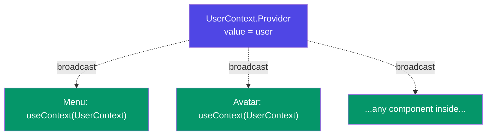

**The standard pattern — bundle state + a custom hook in the context file:**

```jsx
// UserContext.jsx
const UserContext = createContext(null);

export function UserProvider({ children }) {
  const [user, setUser] = useState(null);
  const login  = (u) => setUser(u);
  const logout = () => setUser(null);
  return (
    <UserContext.Provider value={{ user, login, logout }}>
      {children}
    </UserContext.Provider>
  );
}

// a tiny custom hook so consumers write useUser() not useContext(UserContext)
export const useUser = () => useContext(UserContext);
```

This bundles the value *and* the updater functions into one context, and exposes a clean `useUser()` hook — the professional pattern you'll copy for Theme and Auth next.

---

## G3. ThemeContext (light/dark)

**Simple definition:** a real, complete example — a light/dark theme that any component can read and toggle, with zero prop drilling. This is your Phase 6 Day 4 deliverable.

<p class="te"><strong>Telugu:</strong> Nija example — light/dark theme ni ఏ component ైనా chదవగలదు, toggle chేయగలదు, props lేకుండా. Provider lo <code>theme</code> ("light"/"dark") + <code>toggle</code> function pెట్టి broadcast chేస్తాం. Navbar loni button <code>toggle()</code> pిలిస్తే, mొత్తం app theme maarుతుంది. Tailwind lo <code>dark:</code> classes tho idి kలిస్తే (Part K4), professional dark mode readyగా untుంది.</p>

**The complete ThemeContext:**

```jsx
// ThemeContext.jsx
import { createContext, useContext, useState } from "react";

const ThemeContext = createContext();

export function ThemeProvider({ children }) {
  const [theme, setTheme] = useState("light");
  const toggle = () => setTheme(t => (t === "light" ? "dark" : "light"));

  return (
    <ThemeContext.Provider value={{ theme, toggle }}>
      {children}
    </ThemeContext.Provider>
  );
}

export const useTheme = () => useContext(ThemeContext);
```

**Wrap the app, then use it anywhere:**

```jsx
// main.jsx or App.jsx
<ThemeProvider>
  <App />
</ThemeProvider>

// Any component — a toggle button, no props passed
function ThemeToggle() {
  const { theme, toggle } = useTheme();
  return (
    <button onClick={toggle}>
      {theme === "light" ? "🌙 Dark" : "☀️ Light"}
    </button>
  );
}

// Another component reads the same theme to style itself
function Page() {
  const { theme } = useTheme();
  return <div className={theme === "dark" ? "bg-slate-900 text-white" : "bg-white"}>…</div>;
}
```

One source of truth (`theme`), broadcast to all. The button toggles it, every subscriber re-renders with the new value. That's the whole feature — and it's why "global-ish UI state" is Context's sweet spot.

---

## G4. AuthContext

**Simple definition:** the same pattern for the logged-in user. `AuthContext` holds `user`, `login`, and `logout`, so any component — navbar, protected route, profile page — can read auth status directly.

<p class="te"><strong>Telugu:</strong> Adే pattern, ippుడు <strong>login айన user</strong> kోసం. <code>AuthContext</code> lో <code>user</code>, <code>login</code>, <code>logout</code> pెడతాం. Navbar "logout" chూపాలా? — <code>useAuth()</code>. Protected route "login айయ్యారా?" ani adగాలా (Part F7)? — <code>useAuth()</code>. Profile page user peru kావాలా? — <code>useAuth()</code>. Okే chota auth state, app anthా vాడుకుంటుంది.</p>

**A mock AuthContext (real one just swaps in an API call):**

```jsx
// AuthContext.jsx
import { createContext, useContext, useState } from "react";

const AuthContext = createContext();

export function AuthProvider({ children }) {
  const [user, setUser] = useState(null);   // null = logged out

  const login  = (name) => setUser({ name });   // real app: await api.login()
  const logout = () => setUser(null);

  return (
    <AuthContext.Provider value={{ user, login, logout }}>
      {children}
    </AuthContext.Provider>
  );
}

export const useAuth = () => useContext(AuthContext);
```

**How the whole app uses it:**

```jsx
// Navbar shows login state
function Navbar() {
  const { user, logout } = useAuth();
  return user
    ? <button onClick={logout}>Logout ({user.name})</button>
    : <Link to="/login">Login</Link>;
}

// ProtectedRoute (from F7) reads the same context
function ProtectedRoute({ children }) {
  const { user } = useAuth();
  return user ? children : <Navigate to="/login" replace />;
}
```

```mermaid
graph TD
    Auth["AuthProvider<br/>{ user, login, logout }"]
    Auth -.-> Navbar["Navbar (show login/logout)"]
    Auth -.-> Protect["ProtectedRoute (guard)"]
    Auth -.-> Login["LoginForm (calls login())"]
    Auth -.-> Profile["Profile (reads user)"]
    style Auth fill:#4f46e5,color:#fff
    style Navbar fill:#059669,color:#fff
    style Protect fill:#059669,color:#fff
    style Login fill:#059669,color:#fff
    style Profile fill:#059669,color:#fff
```

**Provider nesting.** Real apps wrap multiple providers — order doesn't matter unless one depends on another:

```jsx
<AuthProvider>
  <ThemeProvider>
    <App />
  </ThemeProvider>
</AuthProvider>
```

---

## G5. When NOT to Use Context

**Simple definition:** Context is a tool with a cost — every consumer re-renders when the value changes, and it can make components harder to reuse. Use it for genuinely global, rarely-changing data; not as a dumping ground for all state.

<p class="te"><strong>Telugu:</strong> Context <strong>anni daनिकి vాడకూడదు</strong>. Cost undి: value maarితే aa context ని vాడే <em>prati component</em> re-render avutుంది. Rule: <strong>అరుదుగా maare, app-antaా avసరమైన</strong> data ke Context — theme, auth, language. Rెండు components madhya data айతే <em>lift up</em> chాలు (D5). Chాలా tరచుగా maare data (form typing laంటివి) Context lo pెట్టకు — nెమ్మదిస్తుంది.</p>

**Good fits for Context** (global, low-frequency change):
- Theme (light/dark), language/locale.
- Authenticated user / session.
- App-wide settings, feature flags.

**Poor fits — use something else:**

| Situation | Don't | Do |
|---|---|---|
| Two nearby components share data | Context | **lift state up** (D5) |
| Fast-changing value (input text) | Context (re-renders everyone) | local `useState` |
| Complex server data + caching | hand-rolled Context | a data library (React Query) — *awareness* |
| Deep but simple prop passing | Context for everything | just pass the prop 1–2 levels |

**The performance gotcha:** because *all* consumers re-render when the Provider's `value` changes, putting rapidly-changing state in a widely-used context causes app-wide re-renders. Keep contexts focused (a separate `ThemeContext` and `AuthContext`, not one giant `AppContext`), and for heavy shared logic, pair Context with `useReducer` (Part I5) rather than sprinkling `useState` everywhere.

**Rule of thumb:** reach for Context when you catch yourself drilling the *same* prop through *many* layers to *many* leaves. Otherwise, props and lifting are simpler — and simple wins.

---

# Part H — Custom Hooks

*A custom hook is how you extract and reuse stateful logic. Once you can write one, repetitive patterns like "fetch with loading/error" or "sync to localStorage" become one-line imports. This is React's real superpower.*

## H1. Rules of Hooks & What a Custom Hook Is

**Simple definition:** a **custom hook** is a JavaScript function whose name starts with **`use`** and that calls other hooks (`useState`, `useEffect`, …). It bundles reusable *stateful logic* so multiple components can share it — without sharing state.

<p class="te"><strong>Telugu:</strong> <strong>Custom hook</strong> ante — peru <code>use</code> tho start avే, lopala vేరే hooks (<code>useState</code>, <code>useEffect</code>) vాడే JavaScript function. Idి <strong>repeat aye logic</strong> ni okే chota pెట్టి, chాలా components lo vాడుకోవడానికి. Muఖ్యం: idి <em>logic</em> ni share chేస్తుంది, <em>state</em> ni kాదు — prati component ki tana sonta copy vస్తుంది. <code>useFetch</code>, <code>useLocalStorage</code> — ivi nువ్వు raసే tools.</p>

**Why extract a hook?** Say three components each fetch data with the same loading/error `useState` + `useEffect` block (Part E4). That's copy-paste. A custom hook `useFetch(url)` holds that logic *once*; each component calls it and gets its *own* independent state.

```jsx
// Before: same 15 lines in every component
// After:
const { data, loading, error } = useFetch("/api/users");
```

**The Rules of Hooks — two rules, never break them:**

1. **Only call hooks at the top level** — never inside `if`, loops, or nested functions. React tracks hooks by call *order*; a conditional hook throws that order off.
2. **Only call hooks from React functions** — components or other custom hooks. Not from regular functions or event handlers.

```jsx
// ❌ breaks Rule 1 — hook inside a condition
if (loggedIn) {
  const [x, setX] = useState(0);
}

// ✅ hook at top level; put the condition INSIDE
const [x, setX] = useState(0);
if (loggedIn) { /* use x */ }
```

**Why the `use` prefix is mandatory:** it's how React's linter *knows* a function is a hook and must obey the rules. Name it `useToggle`, not `toggle`. (The `react-hooks` ESLint plugin enforces both rules — keep it on and it catches mistakes as you type.)

```mermaid
graph LR
    Logic["Repeated stateful logic<br/>(useState + useEffect)"]
    Logic --> Hook["Extract into<br/>useSomething()"]
    Hook --> C1["Component A<br/>own state"]
    Hook --> C2["Component B<br/>own state"]
    Hook --> C3["Component C<br/>own state"]
    style Logic fill:#4f46e5,color:#fff
    style Hook fill:#7c3aed,color:#fff
    style C1 fill:#059669,color:#fff
    style C2 fill:#059669,color:#fff
    style C3 fill:#059669,color:#fff
```

---

## H2. useFetch

**Simple definition:** a custom hook that wraps the loading/error/data fetching pattern from E4 into one reusable line. Every data-fetching component becomes three lines shorter.

<p class="te"><strong>Telugu:</strong> Part E4 loni fetch pattern (loading/error/data) ni okక hook lo pెట్టడం. Ippుడు prati component lో aa 15 lines raయక్కర్లేదు — <code>const { data, loading, error } = useFetch(url)</code> okక్క line chాలు. URL maarితే malli fetch avుతుంది (deps lo url). Idి nీ roadmap Q1/Q2 tools lో okటి — okసారి raసి, everywhere vాడు.</p>

**The hook — the E4 pattern, extracted:**

```jsx
// useFetch.js
import { useState, useEffect } from "react";

export function useFetch(url) {
  const [data, setData]       = useState(null);
  const [loading, setLoading] = useState(true);
  const [error, setError]     = useState(null);

  useEffect(() => {
    let active = true;                 // race-condition guard (E4)
    setLoading(true);
    setError(null);

    fetch(url)
      .then(res => {
        if (!res.ok) throw new Error(`HTTP ${res.status}`);
        return res.json();
      })
      .then(json => { if (active) setData(json); })
      .catch(err => { if (active) setError(err.message); })
      .finally(() => { if (active) setLoading(false); });

    return () => { active = false; };  // ignore stale responses
  }, [url]);                           // re-fetch when the URL changes

  return { data, loading, error };
}
```

**Using it — the payoff:**

```jsx
function Users() {
  const { data: users, loading, error } = useFetch("/api/users");

  if (loading) return <Spinner />;
  if (error)   return <ErrorCard message={error} />;
  return <ul>{users.map(u => <li key={u.id}>{u.name}</li>)}</ul>;
}

// A totally different component — same hook, its own state:
function Products() {
  const { data: products, loading } = useFetch("/api/products");
  // ...
}
```

Two components, one hook, **independent** state each. That's the whole point — reuse the *logic*, not the *data*. This is the biggest "aha" of React: your app becomes a set of small, composable hooks.

---

## H3. useLocalStorage

**Simple definition:** a `useState` that also **persists to `localStorage`** — so the value survives a page refresh. Same API as `useState`, but the data is saved automatically. (Roadmap Q2.)

<p class="te"><strong>Telugu:</strong> <code>useState</code> laగే, kాని value ni <strong><code>localStorage</code> lo kూడా save</strong> chేస్తుంది — refresh айనా pోదు. Phase 4 loni <code>JSON.stringify</code>/<code>JSON.parse</code> + <code>localStorage</code> jత gurthundా? Adే ikkడ hook ga. Vాడకం <code>useState</code> laగే: <code>const [name, setName] = useLocalStorage("name", "")</code>. Value maarినప్పుడల్లా automatic ga save. To-do apps, theme, cart — anni deenితో persist avutాయి.</p>

**The hook — `useState` + auto-save:**

```jsx
// useLocalStorage.js
import { useState, useEffect } from "react";

export function useLocalStorage(key, initialValue) {
  // read once on init — lazy initializer runs only on first render
  const [value, setValue] = useState(() => {
    const saved = localStorage.getItem(key);
    return saved !== null ? JSON.parse(saved) : initialValue;
  });

  // save whenever the value (or key) changes
  useEffect(() => {
    localStorage.setItem(key, JSON.stringify(value));
  }, [key, value]);

  return [value, setValue];            // same shape as useState
}
```

**Using it — a drop-in `useState` replacement:**

```jsx
function App() {
  const [tasks, setTasks] = useLocalStorage("tasks", []);
  const [theme, setTheme] = useLocalStorage("theme", "light");
  // tasks and theme now survive refresh — no extra code
}
```

**Two details worth noticing:**
- The **lazy initializer** `useState(() => ...)` — passing a *function* to `useState` runs it only on the first render, so you don't hit `localStorage` on every render. (A neat pattern beyond this hook.)
- It returns `[value, setValue]` — the *same tuple shape* as `useState` — so it's a true drop-in replacement. Good hook design mimics familiar APIs.

**Real-world example:** your Task Tracker's tasks persist with this exact hook (roadmap deliverable). Theme, cart, "dismissed this banner", draft form text — all one-liners now. This is Phase 4's JSON + localStorage lesson, promoted to a reusable React tool.

---

## H4. useDebounce

**Simple definition:** **debouncing** delays reacting to a fast-changing value until it stops changing for a moment. `useDebounce` returns a value that only updates after the input has been quiet for `delay` ms — perfect for search boxes that shouldn't fire an API call on every keystroke. (Roadmap Q1.)

<p class="te"><strong>Telugu:</strong> <strong>Debounce</strong> ante — tరచుగా maare value ki, adి <em>ఆగే</em> varaku wait chేయడం. Search box lo prati letter ki API call chేస్తే, "react" type chేస్తే 5 calls — waste + slow. <code>useDebounce</code> value ni user <strong>ఆగినట్టు anిపించే varaku</strong> (say 400ms) update chేయదు. Aపైన okే call. Phase 4 loni <code>setTimeout</code>/<code>clearTimeout</code> + cleanup ye idి. Live search ki mandatory.</p>

**The hook — a self-cancelling timer:**

```jsx
// useDebounce.js
import { useState, useEffect } from "react";

export function useDebounce(value, delay = 300) {
  const [debounced, setDebounced] = useState(value);

  useEffect(() => {
    const timer = setTimeout(() => setDebounced(value), delay);
    return () => clearTimeout(timer);   // cancel if value changes before delay
  }, [value, delay]);

  return debounced;
}
```

**How it works — the cleanup is the trick.** Every keystroke changes `value`, which re-runs the effect. The cleanup **cancels the previous timer** before starting a new one. Only when you *stop* typing for `delay` ms does a timer survive and fire, updating `debounced`.

```mermaid
graph LR
    Type["type 'r','e','a','c','t'<br/>fast"] --> Reset["each keystroke<br/>cancels old timer,<br/>starts new"]
    Reset --> Stop["stop typing 400ms"]
    Stop --> Fire["timer fires once →<br/>debounced updates"]
    Fire --> API["ONE API call"]
    style Type fill:#4f46e5,color:#fff
    style Reset fill:#7c3aed,color:#fff
    style Fire fill:#059669,color:#fff
    style API fill:#059669,color:#fff
```

**Using it — debounced live search:**

```jsx
function Search() {
  const [query, setQuery] = useState("");
  const debouncedQuery = useDebounce(query, 500);   // waits for a pause

  const { data } = useFetch(
    debouncedQuery ? `/api/search?q=${debouncedQuery}` : null
  );

  return (
    <div>
      <input value={query} onChange={e => setQuery(e.target.value)} />
      {/* input updates instantly; API only fires 500ms after you stop */}
    </div>
  );
}
```

The input stays snappy (uses `query`), but the API only sees `debouncedQuery`. Typing "react" fires **one** request, not five. This composes two of your custom hooks — `useDebounce` feeding `useFetch` — which is exactly how hooks are meant to stack.

---

## H5. useToggle & Friends

**Simple definition:** small utility hooks for the tiny patterns you repeat constantly — toggling a boolean, tracking the previous value, copying to clipboard. They make components read like plain English.

<p class="te"><strong>Telugu:</strong> Chinna chinna repeat aye patterns ki chinna hooks. <code>useToggle</code> — boolean ని on/off chేయడం (modal open/close, menu show/hide). Prati saari <code>setOpen(!open)</code> raయకుండా, <code>toggle()</code> chాలు. Ivి chిన్నవే kాని, code ni <strong>english laga</strong> chదివేలా chేస్తాయి. Nువ్వు nీ sonta hooks library kట్టుకోవడం ikkడే mొదలవుతుంది.</p>

**useToggle — cleaner boolean state:**

```jsx
// useToggle.js
import { useState, useCallback } from "react";

export function useToggle(initial = false) {
  const [on, setOn] = useState(initial);
  const toggle = useCallback(() => setOn(o => !o), []);   // updater form (D3)
  return [on, toggle, setOn];
}

// Usage — reads like English:
function Modal() {
  const [isOpen, toggleOpen] = useToggle(false);
  return (
    <>
      <button onClick={toggleOpen}>{isOpen ? "Close" : "Open"}</button>
      {isOpen && <div className="modal">…</div>}
    </>
  );
}
```

**usePrevious — remember last render's value:**

```jsx
// usePrevious.js — uses useRef (Part J2) to survive renders
import { useRef, useEffect } from "react";

export function usePrevious(value) {
  const ref = useRef();
  useEffect(() => { ref.current = value; }, [value]);
  return ref.current;   // the value from the PREVIOUS render
}

// Usage: detect direction of change
const prevCount = usePrevious(count);
const rising = count > prevCount;
```

**The habit — build your own hook library.** After Phase 6 you'll have a `hooks/` folder: `useFetch`, `useLocalStorage`, `useDebounce`, `useToggle`, `usePrevious`. Copy it into every new project. Every senior React dev has this folder — start yours now. (Roadmap break-day task: *"can you write each custom hook from memory?"* — that's the real test.)

# Part I — useReducer & Advanced State

*`useState` is perfect for simple values. When state gets complex — many fields, many ways to change it — `useReducer` gives you one organised place for all the update logic. If you learned OOP's "single doorway for change" in Phase 4, this is its React form.*

## I1. Why useReducer

**Simple definition:** `useReducer` is an alternative to `useState` for **complex state** — when the next state depends on the action taken, and there are many possible actions. It centralises all update logic in one **reducer** function instead of scattering `setX` calls everywhere.

<p class="te"><strong>Telugu:</strong> <code>useReducer</code> ante complex state kోసం <code>useState</code> ki alternative. Eppుడు? State lo <strong>chాలా fields</strong> unnappుడు, లేదా daనిని maarడానికి <strong>chాలా vిధాలు</strong> unnappుడు (add, remove, update, clear...). Anni <code>setX</code> calls app antaా chెల్లాచెదురుగా undే baదులు, mొత్తం update logic ni <strong>okే reducer function</strong> lో pెడతాం. Phase 4 loni "single doorway for change" gurthundా? Reducer adే — anni maarpulu okే daari gుండా.</p>

**When `useState` starts to hurt:**

```jsx
// Too many related states, too many setters — hard to keep consistent
const [items, setItems]     = useState([]);
const [total, setTotal]     = useState(0);
const [count, setCount]     = useState(0);
const [discount, setDiscount] = useState(0);
// every add/remove has to remember to update ALL of these correctly 😰
```

When several pieces of state change *together* and in *structured ways*, `useReducer` is cleaner: you describe *what happened* ("ADD_ITEM"), and one function computes the whole next state.

```mermaid
graph LR
    UI["Component<br/>dispatch({type:'ADD'})"]
    UI --> R["reducer(state, action)<br/>ONE place, all the rules"]
    R --> NS["new state"]
    NS --> Render["re-render"]
    Render -.-> UI
    style UI fill:#4f46e5,color:#fff
    style R fill:#7c3aed,color:#fff
    style NS fill:#059669,color:#fff
```

**The rule of thumb:** reach for `useReducer` when (a) state is an object/array with several sub-values that change together, (b) the next state depends on the previous in non-trivial ways, or (c) you have many action types. Otherwise, `useState` is simpler — don't over-engineer.

---

## I2. The reducer + dispatch Pattern

**Simple definition:** `useReducer(reducer, initialState)` returns `[state, dispatch]`. A **reducer** is a pure function `(state, action) => newState`. You call `dispatch(action)` to trigger a change; the reducer decides the new state based on the action's `type`.

<p class="te"><strong>Telugu:</strong> <code>const [state, dispatch] = useReducer(reducer, initial)</code>. Rెండు bhāgālu: (1) <strong>reducer</strong> — <code>(state, action) =&gt; newState</code>, pure function, action <code>type</code> chూసి kొత్త state istుంది. (2) <strong>dispatch</strong> — "idి jరిగింది" ani reducer ki chెప్పే function: <code>dispatch({ type: "ADD", item })</code>. Nువ్వు setState pిలవవు — <em>ఏం jరిగిందో</em> dispatch chేస్తావు, reducer <em>ఏం maarాలో</em> lెక్కిస్తుంది. Action = "emi jరిగింది"; reducer = "state ela maarాలి".</p>

**The three pieces:**

```jsx
import { useReducer } from "react";

// 1. initial state
const initialState = { count: 0 };

// 2. reducer — a pure function, one switch over action types
function reducer(state, action) {
  switch (action.type) {
    case "INCREMENT": return { count: state.count + 1 };
    case "DECREMENT": return { count: state.count - 1 };
    case "SET":       return { count: action.payload };
    case "RESET":     return { count: 0 };
    default:          return state;          // unknown action → no change
  }
}

// 3. the component wires them together
function Counter() {
  const [state, dispatch] = useReducer(reducer, initialState);

  return (
    <div>
      <p>{state.count}</p>
      <button onClick={() => dispatch({ type: "INCREMENT" })}>+</button>
      <button onClick={() => dispatch({ type: "DECREMENT" })}>−</button>
      <button onClick={() => dispatch({ type: "SET", payload: 100 })}>100</button>
      <button onClick={() => dispatch({ type: "RESET" })}>Reset</button>
    </div>
  );
}
```

**Read the flow:** a click calls `dispatch({ type: "INCREMENT" })`. React runs `reducer(currentState, action)`, gets the new state, and re-renders. The component never computes state itself — it only *announces what happened*.

**Reducers must be pure (Phase 4 J7):** given the same `state` and `action`, always return the same new state; never mutate `state`, never do side effects (no `fetch`, no `Math.random`) inside. Always return a **new** object (`{ ...state, ... }`), just like immutable `useState` updates (D4). This purity is exactly why reducers are easy to test and reason about.

---

## I3. useReducer vs useState

**Simple definition:** they solve the same problem — component state — at different complexity levels. `useState` for simple, independent values; `useReducer` for structured state with many actions. Neither is "better"; they fit different jobs.

<p class="te"><strong>Telugu:</strong> Rెండూ okే paని — component state — kాని veru veru complexity ki. <strong>useState</strong> = simple, oంటరి values (count, name, isOpen). <strong>useReducer</strong> = structured state + chాలా actions (cart, form with validation, multi-step wizard). Okటి mంచిది inkోటి chెడ్డది kాదు — <strong>sరైన chota sరైనది</strong> vాడడమే skill. Chాలామంది modatా useState tho mొదలుపెట్టి, complex айనప్పుడు reducer ki maarుస్తారు.</p>

**The comparison:**

| | `useState` | `useReducer` |
|---|---|---|
| Best for | simple, independent values | complex/structured state, many actions |
| Update logic | inline `setX(...)` calls | centralised in one reducer |
| How you change it | `setCount(5)` | `dispatch({ type: "SET", payload: 5 })` |
| Testability | fine | excellent (reducer is a pure function) |
| Boilerplate | minimal | more setup |
| Analogy | a light switch | a control panel with labelled buttons |

**The same counter, both ways:**

```jsx
// useState — perfect here, don't over-engineer
const [count, setCount] = useState(0);
setCount(count + 1);

// useReducer — overkill for one number, but shows the shape
const [state, dispatch] = useReducer(reducer, { count: 0 });
dispatch({ type: "INCREMENT" });
```

**The migration signal.** Start with `useState`. When you notice (a) several `setX` calls that must fire together to stay consistent, (b) the same update logic duplicated across handlers, or (c) bugs from forgetting to update one piece — that's the moment to consolidate into a reducer. Your roadmap Day 5 does exactly this: *"rewrite the Day 2 form using useReducer."*

---

## I4. Shopping Cart Example

**Simple definition:** the textbook `useReducer` use case — a cart with `ADD_ITEM`, `REMOVE_ITEM`, `UPDATE_QTY`, and `CLEAR_CART`. All the rules live in one reducer; components just dispatch actions. (Roadmap Q3.)

<p class="te"><strong>Telugu:</strong> useReducer ki classic example — shopping cart. 4 actions: <code>ADD_ITEM</code>, <code>REMOVE_ITEM</code>, <code>UPDATE_QTY</code>, <code>CLEAR_CART</code>. Cart loni anni rules (item unte qty pెంచు, lేకపోతే kొత్తగా add chేయి, qty 0 айతే tీసేయి) okే reducer lో. Component kేవలం <code>dispatch({ type: "ADD_ITEM", item })</code> — logic anthా reducer chూసుకుంటుంది. Idి nీ roadmap Q3.</p>

**The cart reducer — every rule in one place:**

```jsx
function cartReducer(state, action) {
  switch (action.type) {
    case "ADD_ITEM": {
      const existing = state.find(i => i.id === action.item.id);
      if (existing) {
        // already in cart → bump quantity (immutable map, D4)
        return state.map(i =>
          i.id === action.item.id ? { ...i, qty: i.qty + 1 } : i
        );
      }
      return [...state, { ...action.item, qty: 1 }];   // new item
    }
    case "REMOVE_ITEM":
      return state.filter(i => i.id !== action.id);

    case "UPDATE_QTY":
      return state
        .map(i => i.id === action.id ? { ...i, qty: action.qty } : i)
        .filter(i => i.qty > 0);          // qty 0 → drop it

    case "CLEAR_CART":
      return [];

    default:
      return state;
  }
}
```

**The component — pure dispatch, zero logic:**

```jsx
function Cart() {
  const [cart, dispatch] = useReducer(cartReducer, []);

  const total = cart.reduce((sum, i) => sum + i.price * i.qty, 0);   // Phase 4 reduce!

  return (
    <div>
      {cart.map(item => (
        <div key={item.id}>
          {item.name} × {item.qty}
          <button onClick={() => dispatch({ type: "UPDATE_QTY", id: item.id, qty: item.qty + 1 })}>+</button>
          <button onClick={() => dispatch({ type: "REMOVE_ITEM", id: item.id })}>Remove</button>
        </div>
      ))}
      <p>Total: ₹{total}</p>
      <button onClick={() => dispatch({ type: "CLEAR_CART" })}>Clear</button>
    </div>
  );
}
```

Notice how every array update inside the reducer is the **immutable** pattern from D4 (`map`, `filter`, spread) and the total uses Phase 4's `reduce`. `useReducer` isn't new magic — it's your existing array skills, organised behind labelled actions.

---

## I5. useReducer + Context = Mini-Redux

**Simple definition:** put a reducer's `state` and `dispatch` into a **Context**, and any component in the tree can read the state or dispatch actions — no prop drilling. This is the core idea behind Redux, hand-built with two hooks.

<p class="te"><strong>Telugu:</strong> Reducer yొక్క <code>state</code> mariyu <code>dispatch</code> ni <strong>Context lో pెడితే</strong> — app antaా ఏ component ైనా state chదవొచ్చు, action dispatch chేయొచ్చు, props lేకుండా. Idే <strong>Redux</strong> venuka unna core idea — kాని nువ్వు kేవలం 2 hooks (useReducer + useContext) tho kట్టేస్తున్నావు. Peddha apps lo global state (cart, auth, notifications) ki idి పునాది.</p>

**Combine the two patterns:**

```jsx
// CartContext.jsx
import { createContext, useContext, useReducer } from "react";

const CartContext = createContext();

export function CartProvider({ children }) {
  const [cart, dispatch] = useReducer(cartReducer, []);
  return (
    <CartContext.Provider value={{ cart, dispatch }}>
      {children}
    </CartContext.Provider>
  );
}

export const useCart = () => useContext(CartContext);
```

**Now any component, anywhere, controls the cart:**

```jsx
// A product card deep in the tree adds to the cart — no props threaded
function ProductCard({ product }) {
  const { dispatch } = useCart();
  return (
    <button onClick={() => dispatch({ type: "ADD_ITEM", item: product })}>
      Add to cart
    </button>
  );
}

// The navbar badge reads the same cart
function CartBadge() {
  const { cart } = useCart();
  return <span>🛒 {cart.length}</span>;
}
```

```mermaid
graph TD
    Provider["CartProvider<br/>useReducer → { cart, dispatch }"]
    Provider -.->|"dispatch"| Card["ProductCard (adds items)"]
    Provider -.->|"cart"| Badge["CartBadge (shows count)"]
    Provider -.->|"cart + dispatch"| Page["CartPage (full list)"]
    style Provider fill:#4f46e5,color:#fff
    style Card fill:#059669,color:#fff
    style Badge fill:#059669,color:#fff
    style Page fill:#059669,color:#fff
```

**Why this matters:** you just built the essence of Redux/Zustand with built-in React. For most apps, `useReducer` + Context is *enough* — you often don't need a state-management library at all. When you later meet Redux Toolkit, you'll recognise it as "this pattern, with dev-tools and conventions added." (SAP UI5's models play a similar centralised-state role — the concept keeps transferring.)

---

# Part J — Performance & the Rest of the Hooks

*The core hooks (`useState`, `useEffect`, `useReducer`, `useContext`) build every app. This part covers the *performance* hooks (`useMemo`, `useCallback`, `React.memo`) and `useRef` — the tools you add when an app grows. Learn what they do; use them only when you measure a real need.*

## J1. The Re-Render Mental Model

**Simple definition:** a component re-renders when its **state changes**, its **props change**, or its **parent re-renders**. "Re-render" means React calls the function again to compute new JSX — it does *not* mean the whole DOM is rebuilt.

<p class="te"><strong>Telugu:</strong> Component eppుడు malli render avుతుంది? (1) daని <strong>state maarితే</strong>, (2) daని <strong>props maarితే</strong>, (3) daని <strong>parent re-render айతే</strong>. "Re-render" ante React aa function ni malli pిలిచి kొత్త JSX lెక్కించడం — mొత్తం DOM malli kట్టడం <em>kాదు</em> (React kేవలం maarిన bhāgాన్ని matrame update chేస్తుంది). Idి teలిస్తే, performance hooks <strong>enduku</strong> unnాయో artham avుతుంది.</p>

**The key insight — parents re-render children by default.** When a parent re-renders, *all* its children re-render too, even if their props didn't change. Usually this is cheap and fine — React is fast. But in large trees or expensive components, needless re-renders add up.

```mermaid
graph TD
    P["Parent re-renders<br/>(its state changed)"]
    P --> C1["Child A re-renders"]
    P --> C2["Child B re-renders"]
    P --> C3["Child C re-renders"]
    C1 -.->|"even if props<br/>didn't change"| Note["all children re-run<br/>by default"]
    style P fill:#4f46e5,color:#fff
    style C1 fill:#c026d3,color:#fff
    style C2 fill:#c026d3,color:#fff
    style C3 fill:#c026d3,color:#fff
```

**The golden rule of optimisation: don't — until you measure.** React is fast enough that most apps never need these hooks. Premature `useMemo`/`useCallback` everywhere adds complexity for no gain. Use React DevTools' Profiler to *find* a slow render first, then optimise that spot. The tools below are for when you have a real, measured problem — which is why your roadmap marks them "read-only today."

---

## J2. useRef — the Box That Survives Renders

**Simple definition:** `useRef` gives you a mutable box (`ref.current`) that **persists across renders but does not trigger a re-render** when changed. Two main uses: referencing a DOM element, and remembering a value without causing renders.

<p class="te"><strong>Telugu:</strong> <code>useRef</code> ఒక <strong>dabbā</strong> (<code>ref.current</code>) — renders madhya value niలుస్తుంది, kాని maarినా <strong>re-render kాదు</strong> (useState ki idే tేడా!). Rెండు vాడకాలు: (1) <strong>DOM element ni pట్టుకోవడం</strong> — input ki focus pెట్టడం laంటివి. (2) render trigger chేయకుండా <strong>value gుర్తుపెట్టుకోవడం</strong> — timer id, previous value. State kాదు kాని niలిచే j్ఞాపకం.</p>

**Use 1 — reference a DOM element (focus an input):**

```jsx
import { useRef } from "react";

function SearchBar() {
  const inputRef = useRef(null);

  useEffect(() => {
    inputRef.current.focus();   // focus the input on mount
  }, []);

  return <input ref={inputRef} placeholder="Search…" />;
}
```

**Use 2 — remember a value without re-rendering (a timer id):**

```jsx
function Stopwatch() {
  const [time, setTime] = useState(0);
  const intervalRef = useRef(null);        // survives renders, no re-render

  const start = () => {
    intervalRef.current = setInterval(() => setTime(t => t + 1), 1000);
  };
  const stop = () => clearInterval(intervalRef.current);
  // ...
}
```

**`useRef` vs `useState` — the crucial difference:**

| | `useState` | `useRef` |
|---|---|---|
| Survives re-renders | ✅ | ✅ |
| Changing it re-renders | ✅ **yes** | ❌ **no** |
| Use for | data shown on screen | DOM refs, timer ids, "instance variables" |

**The rule:** if changing the value should update the screen, use `useState`. If it's behind-the-scenes bookkeeping (a DOM node, an interval id, a "did this already run" flag), use `useRef`. Putting a timer id in state would re-render pointlessly; putting displayed data in a ref would fail to update the screen.

---

## J3. useMemo

**Simple definition:** `useMemo(fn, deps)` **caches the result** of an expensive calculation and only re-computes it when a dependency changes. It skips redundant work on re-renders.

<p class="te"><strong>Telugu:</strong> <code>useMemo</code> ఒక <strong>ఖరీదైన lెక్క</strong> yొక్క result ని <strong>dāచుకుంటుంది</strong> (cache), deps maarినప్పుడే malli lెక్కిస్తుంది. Example: 10,000 items ni sort/filter chేయడం prati render ki avసరం lేదు — data maarినప్పుడే chాలు. <code>useMemo(() =&gt; heavyCalc(items), [items])</code>. Warning: chిన్న lెక్కలకి vాడకు — cache maintain chేయడం kూడా cost, chిన్న daనికి waste.</p>

**Caching an expensive computation:**

```jsx
function ProductList({ products, filter }) {
  // Without useMemo, this sort re-runs on EVERY render, even unrelated ones
  const visible = useMemo(() => {
    return products
      .filter(p => p.name.includes(filter))
      .sort((a, b) => a.price - b.price);        // pretend this is expensive
  }, [products, filter]);                        // recompute only when these change

  return visible.map(p => <ProductCard key={p.id} {...p} />);
}
```

**The other job of `useMemo` — stable object/array references.** Recall the E5 gotcha: a new object every render breaks dependency arrays and `React.memo`. `useMemo` fixes it by keeping the *same* reference until deps change:

```jsx
const options = useMemo(() => ({ limit, sort }), [limit, sort]);
// now `options` is stable — safe to use in a dependency array
```

**When to use it (measure first):** genuinely expensive calculations (sorting/filtering thousands of items, heavy math) run on every render, or when you need a stable reference to satisfy `React.memo`/deps. For a `.map` over 20 items or `a + b`, skip it — the memoization overhead costs more than the calculation.

---

## J4. useCallback

**Simple definition:** `useCallback(fn, deps)` is `useMemo` for **functions** — it returns the *same function reference* across renders (until deps change). Its main use is passing stable callbacks to memoized child components.

<p class="te"><strong>Telugu:</strong> <code>useCallback</code> ante functions kోసం <code>useMemo</code>. Prati render lo functions <strong>kొత్తగా</strong> pుడతాయి (kొత్త reference). Aa kొత్త function ni memoized child ki prop ga pంపితే, child "prop maarింది!" ani అనుకుని malli render avుతుంది — vృధా. <code>useCallback</code> aa function ni <strong>stable</strong> ga uంచుతుంది. <code>useMemo(value)</code>, <code>useCallback(function)</code> — okే idea, veru target.</p>

**The problem it solves — new function every render:**

```jsx
function Parent() {
  const [count, setCount] = useState(0);

  // ❌ a BRAND NEW function every render → breaks React.memo on the child
  const handleClick = () => console.log("clicked");

  // ✅ same function reference across renders
  const handleClick2 = useCallback(() => console.log("clicked"), []);

  return <ExpensiveChild onClick={handleClick2} />;
}
```

**Why it matters only with `React.memo`.** Passing a fresh function to a *normal* child is harmless (it was going to re-render anyway). `useCallback` earns its keep when the child is wrapped in `React.memo` (next section) — then a stable function prop lets the child actually skip re-rendering.

```mermaid
graph LR
    UC["useCallback keeps<br/>the SAME function"]
    UC --> Memo["React.memo child<br/>sees prop unchanged"]
    Memo --> Skip["child SKIPS re-render ✅"]
    New["new function<br/>each render"] --> Broken["React.memo sees<br/>'new' prop"]
    Broken --> Rerender["child re-renders anyway ❌"]
    style UC fill:#4f46e5,color:#fff
    style Skip fill:#059669,color:#fff
    style New fill:#c026d3,color:#fff
    style Rerender fill:#b91c1c,color:#fff
```

**The rule:** `useCallback` and `React.memo` are a **team** — using one without the other is usually pointless. Don't wrap every handler in `useCallback` reflexively; do it when you're passing a callback to a memoized child and have measured re-renders as a problem.

---

## J5. React.memo

**Simple definition:** `React.memo(Component)` wraps a component so it **skips re-rendering when its props haven't changed**. It's the tool that stops "parent re-rendered → all children re-render" for expensive children.

<p class="te"><strong>Telugu:</strong> <code>React.memo(Component)</code> ఒక component ni chుట్టి, daని <strong>props maarకపోతే re-render skip</strong> chేస్తుంది. J1 lo "parent re-render айతే anni children re-render" ani chెప్పాం kada — expensive child ki adి vద్దంటే <code>React.memo</code> vాడు. Idి <code>useCallback</code>/<code>useMemo</code> tho jత kలిస్తేనే panిచేస్తుంది — lేకపోతే props prati saari kొత్తగా kanిపించి skip jరగదు.</p>

**Wrapping a component to skip needless re-renders:**

```jsx
import { memo } from "react";

// This child only re-renders when `product` actually changes,
// not every time the parent re-renders for unrelated reasons.
const ProductCard = memo(function ProductCard({ product, onAdd }) {
  console.log("rendering", product.name);
  return (
    <div>
      {product.name}
      <button onClick={() => onAdd(product.id)}>Add</button>
    </div>
  );
});
```

For `memo` to actually skip, **every prop must be stable**: primitives (strings, numbers) compare fine, but objects/arrays/functions need `useMemo`/`useCallback` in the parent, or `memo` sees a "new" prop every time and re-renders anyway.

**The performance trio — how they fit together:**

| Hook/API | Memoizes | Pair it with |
|---|---|---|
| `React.memo` | a **component** (skip render if props equal) | stable props below |
| `useMemo` | a **value** (skip recompute) | `React.memo` children, deps |
| `useCallback` | a **function** (stable reference) | `React.memo` children |

**The honest summary:** these three are for measured performance problems in larger apps. A typical Phase 6 / Task Tracker app **does not need them** — and adding them everywhere makes code harder to read for zero benefit. Know what they do (interviews ask), recognise them in codebases, and apply them surgically when the Profiler points at a real slow spot. Correctness and clarity first; optimise second.

---

## J6. The Hooks Rulebook (Recap)

**Simple definition:** a one-screen reference to every hook you've met, what it's for, and the two rules that govern all of them.

<p class="te"><strong>Telugu:</strong> Nువ్వు nేర్చుకున్న <strong>anni hooks</strong> okే chota — ఏది deniki, ఎప్పుడు vాడాలి. Rెండు rules mళ్లీ (H1): (1) hooks ni ఎప్పుడూ <strong>top-level lో</strong> matrame pిలువు (if/loop lopala vద్దు). (2) hooks ni <strong>components లేదా custom hooks</strong> nుంచే pిలువు. Ee table ni gుర్తుపెట్టుకుంటే, "ee paniki ఏ hook?" ane prశ్న ki jవాబు vెంటనే vస్తుంది.</p>

**Every hook at a glance:**

| Hook | What it does | Reach for it when |
|---|---|---|
| `useState` | local component state | any value that changes over time |
| `useEffect` | run side effects after render | fetch, subscribe, sync to outside world |
| `useContext` | read a Context value | avoid prop drilling of global-ish data |
| `useReducer` | complex state via a reducer | many actions / structured state |
| `useRef` | mutable box, no re-render | DOM refs, timer ids, instance vars |
| `useMemo` | cache a computed value | expensive calc / stable reference |
| `useCallback` | cache a function reference | stable callback to a `memo` child |
| *custom* `useXxx` | reuse stateful logic | any repeated pattern (Part H) |

**The two Rules of Hooks (never break):**
1. **Top level only** — not inside `if`, loops, or nested functions. React tracks hooks by call order.
2. **React functions only** — components or custom hooks, never plain functions or event handlers.

```mermaid
graph TD
    Q["Need to store data<br/>in a component?"]
    Q --> S1{"Shown on<br/>screen?"}
    S1 -->|"yes, simple"| US["useState"]
    S1 -->|"yes, complex/many actions"| UR["useReducer"]
    S1 -->|"no (DOM ref, id)"| RF["useRef"]
    Q2["Need outside-world work?"] --> UE["useEffect"]
    Q3["Need global-ish data deep?"] --> UC["useContext"]
    Q4["Repeated logic?"] --> CH["custom hook"]
    style Q fill:#4f46e5,color:#fff
    style US fill:#059669,color:#fff
    style UR fill:#059669,color:#fff
    style RF fill:#059669,color:#fff
    style UE fill:#059669,color:#fff
    style UC fill:#059669,color:#fff
    style CH fill:#059669,color:#fff
```

**The keyboard test (Phase 4 L8, React edition):** you *know* a hook when you can (1) explain what it does, (2) write it from a blank file, and (3) debug it when it misbehaves at 11pm. Reading this table gets you to level 1 — building the Task Tracker (Part L) gets you to 3.

# Part K — Tailwind CSS

*React builds the structure; Tailwind makes it beautiful — fast. Instead of writing CSS in separate files, you style directly in your JSX with tiny utility classes. It feels wrong for five minutes, then you never want to go back.*

## K1. What is Tailwind & Why Utility-First

**Simple definition:** **Tailwind** is a **utility-first** CSS framework. Instead of writing custom CSS rules, you apply many small, single-purpose classes (`p-4`, `text-center`, `bg-blue-500`) directly in your markup. Each class does exactly one thing.

<p class="te"><strong>Telugu:</strong> <strong>Tailwind</strong> ఒక <strong>utility-first</strong> CSS framework. Separate CSS file lo rules raయకుండా, chిన్న chిన్న single-purpose classes ni <strong>నేరుగా JSX lo</strong> pెడతాం: <code>p-4</code> (padding), <code>text-center</code> (center text), <code>bg-blue-500</code> (blue background). Prati class okే paని chేస్తుంది. Modatా vింతగా anిపిస్తుంది ("markup lo enni classes!"), kాని 5 nimishāల tarువాత chాలా <strong>fast</strong> ga UI kట్టేస్తావు — CSS file ki, HTML ki madhya jంపింగ్ undదు.</p>

**Traditional CSS vs Tailwind — the same button:**

```jsx
// Traditional: name a class, then define it elsewhere in a .css file
<button className="btn-primary">Save</button>
/* styles.css */
.btn-primary { padding: 8px 16px; background: #3b82f6; color: white; border-radius: 6px; }

// Tailwind: the styles ARE the classes — no separate file, no naming
<button className="px-4 py-2 bg-blue-500 text-white rounded-md">Save</button>
```

**Why utility-first wins (once it clicks):**
- **No naming things** — you don't invent `.btn-primary`, `.card-header-wrapper`. Naming is one of the hard problems in CSS; Tailwind deletes it.
- **No context switching** — style right where you build, no jumping to a `.css` file.
- **No dead CSS** — you never wonder "is this class still used?" Delete the element, the styles go with it.
- **Consistent by design** — `p-4`, `p-6`, `p-8` come from a fixed scale, so spacing/colors stay uniform across the app.
- **Responsive & dark mode inline** — `md:`, `dark:` prefixes (K3, K4) without media-query files.

```mermaid
graph LR
    Trad["Traditional CSS<br/>name class → write rules<br/>in a separate file"]
    Tail["Tailwind<br/>compose utilities<br/>right in the markup"]
    Trad --> Cost["naming, dead CSS,<br/>file jumping"]
    Tail --> Win["fast, consistent,<br/>self-contained"]
    style Trad fill:#c026d3,color:#fff
    style Tail fill:#059669,color:#fff
    style Cost fill:#b91c1c,color:#fff
    style Win fill:#059669,color:#fff
```

**Setup (Vite):** install Tailwind, add the plugin, add one `@import "tailwindcss";` line to your CSS. (The docs' "Framework Guides → Vite" is the exact recipe; it's a 3-minute one-time setup.) Once done, every Tailwind class just works in your JSX.

**The common objection — "the markup looks ugly with 10 classes!"** True at first. But those classes are *co-located* with the element, they're consistent, and when you have repetition you extract a **component** (K5) — not a CSS class. The React component *is* your reusable unit, so Tailwind and React fit together perfectly.

---

## K2. The Core Utilities

**Simple definition:** ~90% of styling uses a small vocabulary of utilities — spacing, sizing, color, typography, and layout (flex/grid). Learn these families and you can build almost anything.

<p class="te"><strong>Telugu:</strong> Tailwind lo vేల classes unnా, <strong>rojువారీ pa니కి 90%</strong> ఇవే kొన్ని families: <strong>spacing</strong> (padding/margin), <strong>size</strong> (width/height), <strong>color</strong> (bg/text), <strong>typography</strong> (font size/weight), <strong>layout</strong> (flex/grid). Ee groups artham айతే, migిలినvి docs lo chూసుకుంటూ raయొచ్చు. Number scale gుర్తుపెట్టుko: <code>4</code> = 1rem = 16px (so <code>p-4</code> = 16px padding).</p>

**Spacing — padding & margin** (`p`/`m` + side + scale):

```jsx
<div className="p-4">      {/* padding all sides: 16px */}
<div className="px-6 py-2"> {/* padding x (left+right) 24px, y 8px */}
<div className="mt-4 mb-2"> {/* margin-top 16px, margin-bottom 8px */}
<div className="m-auto">    {/* auto margins → center a block */}
```

The scale: `1`=4px, `2`=8px, `4`=16px, `6`=24px, `8`=32px… (each step = 4px). Sides: `t` top, `b` bottom, `l` left, `r` right, `x` horizontal, `y` vertical.

**Sizing — width & height:**

```jsx
<div className="w-full">    {/* width: 100% */}
<div className="w-64">      {/* width: 16rem (256px) */}
<div className="h-screen">  {/* height: 100vh */}
<div className="max-w-md mx-auto">  {/* readable column, centered */}
```

**Color — background, text, border:**

```jsx
<div className="bg-blue-500 text-white">   {/* Tailwind's color-shade scale */}
<p   className="text-slate-600">            {/* 50 (lightest) → 950 (darkest) */}
<div className="border border-gray-200">
```

Colors follow `color-shade`: `blue-500`, `slate-600`, `red-100`. Shades go `50, 100, 200 … 900, 950`. `500` is the "base" of each color.

**Typography:**

```jsx
<h1 className="text-3xl font-bold">        {/* size + weight */}
<p  className="text-sm text-gray-500 leading-relaxed">
<span className="uppercase tracking-wide">  {/* letter-spacing */}
```

Sizes: `text-xs, sm, base, lg, xl, 2xl, 3xl…`. Weights: `font-light, normal, medium, semibold, bold`.

**Borders & effects:**

```jsx
<div className="rounded-lg shadow-md border border-gray-100">
<button className="rounded-full shadow-lg">
```

**Flexbox — the everyday layout tool:**

```jsx
<div className="flex items-center justify-between gap-4">
  {/* flex row · vertical-center · space-between · 16px gap */}
  <Logo />
  <Nav />
</div>

<div className="flex flex-col gap-2">   {/* vertical stack */}
```

Key flex utilities: `flex` (row), `flex-col` (column), `items-center` (cross-axis center), `justify-between`/`justify-center` (main-axis), `gap-4` (spacing between children).

**Grid — for card layouts:**

```jsx
<div className="grid grid-cols-3 gap-4">   {/* 3 equal columns */}
```

| Family | Example classes | Does |
|---|---|---|
| Spacing | `p-4` `px-6` `mt-2` `gap-4` | padding, margin, gaps |
| Sizing | `w-full` `h-screen` `max-w-md` | width, height |
| Color | `bg-blue-500` `text-white` | background, text color |
| Typography | `text-xl` `font-bold` `text-center` | size, weight, align |
| Border/FX | `rounded-lg` `shadow-md` `border` | corners, shadow, borders |
| Flex | `flex` `items-center` `justify-between` | flexbox layout |
| Grid | `grid` `grid-cols-3` | grid layout |

---

## K3. Responsive Design

**Simple definition:** Tailwind is **mobile-first**. A plain class applies everywhere; adding a breakpoint prefix (`sm:`, `md:`, `lg:`) makes it apply *only at that screen width and up*. You build responsive layouts without writing a single media query.

<p class="te"><strong>Telugu:</strong> Tailwind <strong>mobile-first</strong> — prefix lేని class anni screens ki. Prefix (<code>md:</code>, <code>lg:</code>) pెడితే aa <strong>size mరియు aపైన</strong> matrame apply avుతుంది. So <code>grid-cols-1 md:grid-cols-3</code> ante: "chిన్న screen lo 1 column, medium+ lo 3 columns". Media queries okక్కటి raయకుండా responsive! Rule: <strong>chిన్న screen ki modatా raయి</strong> (prefix lేకుండా), aపైన pెద్ద screens ki prefix tho over-ride chేయి.</p>

**The breakpoints:**

| Prefix | Applies at width ≥ | Typical device |
|---|---|---|
| *(none)* | 0px (always) | mobile (base) |
| `sm:` | 640px | large phone |
| `md:` | 768px | tablet |
| `lg:` | 1024px | laptop |
| `xl:` | 1280px | desktop |

**A responsive card grid — the roadmap's Day 5 exercise:**

```jsx
<div className="grid grid-cols-1 md:grid-cols-2 lg:grid-cols-3 gap-4">
  {tasks.map(t => (
    <article key={t.id} className="p-4 rounded-lg bg-white shadow">
      <h3 className="font-semibold">{t.title}</h3>
    </article>
  ))}
</div>
```

Read the grid classes: **1 column on mobile**, **2 on tablets** (`md:`), **3 on laptops** (`lg:`). Resize the browser and watch it reflow — no media queries anywhere.

```mermaid
graph LR
    Base["grid-cols-1<br/>(mobile: 1 column)"]
    Base --> MD["md:grid-cols-2<br/>(tablet: 2 columns)"]
    MD --> LG["lg:grid-cols-3<br/>(laptop: 3 columns)"]
    style Base fill:#4f46e5,color:#fff
    style MD fill:#7c3aed,color:#fff
    style LG fill:#059669,color:#fff
```

**Responsive everything, not just grids:**

```jsx
<div className="flex flex-col md:flex-row">   {/* stack on mobile, row on desktop */}
<h1 className="text-2xl md:text-4xl">         {/* bigger heading on bigger screens */}
<div className="hidden md:block">             {/* hide on mobile, show on desktop */}
<div className="p-4 md:p-8">                   {/* more breathing room on desktop */}
```

**The mobile-first mindset:** write the phone layout with unprefixed classes, then *add* prefixes to enhance for larger screens. This is why `grid-cols-1` has no prefix and `md:grid-cols-3` does — you start small and scale up, which matches how most of your users actually browse (phones).

---

## K4. Hover, Focus & Dark Mode

**Simple definition:** **state variants** are prefixes that apply a utility only in a certain interaction state — `hover:`, `focus:`, `active:`, `disabled:` — and `dark:` for dark mode. Same idea as breakpoints, applied to states instead of screen sizes.

<p class="te"><strong>Telugu:</strong> Breakpoints laగే, <strong>state variants</strong> kూడా prefixes — kాని screen size kాదు, <strong>interaction state</strong> batti apply avుతాయి. <code>hover:bg-blue-600</code> = mouse pైన unappుడు matrame. <code>focus:ring-2</code> = input click chేసినప్పుడు. <code>disabled:opacity-50</code> = button off unappుడు. <code>dark:bg-slate-900</code> = dark mode lo matrame. Ee prefixes tho interactive, dark-mode-ready UI — extra CSS lేకుండా.</p>

**Interaction states — hover, focus, active, disabled:**

```jsx
<button className="
  bg-blue-500 text-white px-4 py-2 rounded
  hover:bg-blue-600          /* darker on mouse-over */
  active:bg-blue-700         /* even darker while clicking */
  focus:ring-2 focus:ring-blue-300   /* focus ring for keyboard users */
  disabled:opacity-50 disabled:cursor-not-allowed
">
  Save
</button>
```

**Dark mode — the `dark:` variant:**

```jsx
<div className="
  bg-white text-slate-900        /* light mode */
  dark:bg-slate-900 dark:text-white   /* dark mode */
">
  <h1 className="text-slate-800 dark:text-slate-100">Dashboard</h1>
</div>
```

**Connecting dark mode to your ThemeContext (G3).** Tailwind's `dark:` classes activate when a `dark` class is on a parent (usually `<html>`). So your `ThemeContext` toggle just adds/removes that class:

```jsx
// In your ThemeProvider's effect:
useEffect(() => {
  document.documentElement.classList.toggle("dark", theme === "dark");
}, [theme]);
```

Now the `useTheme()` toggle button from Part G3 flips *every* `dark:` class in the app at once. Context holds the *state*; Tailwind's `dark:` does the *styling*. Two Phase-6 tools clicking together.

```mermaid
graph LR
    Toggle["ThemeToggle button<br/>useTheme().toggle()"]
    Toggle --> Ctx["theme state → 'dark'"]
    Ctx --> Html["add 'dark' class<br/>to &lt;html&gt;"]
    Html --> All["every dark: class<br/>activates app-wide"]
    style Toggle fill:#4f46e5,color:#fff
    style Ctx fill:#7c3aed,color:#fff
    style All fill:#059669,color:#fff
```

**You can stack prefixes:** `md:hover:bg-blue-600` (hover effect, but only on tablet+), `dark:hover:bg-slate-700` (hover color in dark mode). Order reads left-to-right as "at this breakpoint, in this state."

---

## K5. Reusing Styles — Components, @apply, clsx

**Simple definition:** when the same class list repeats, don't copy-paste it. In React the primary answer is to **extract a component**. For the rare cases where you want a reusable CSS class, `@apply` bundles utilities; for conditional classes, `clsx`/`cn` keeps them clean.

<p class="te"><strong>Telugu:</strong> Okే pొడవైన class list mళ్లీ mళ్లీ vస్తే, copy-paste chేయకు. React lo <strong>modati answer: component ga extract chేయి</strong> (Button, Card). Aa component okే chota styles, everywhere vాడొచ్చు — Tailwind + React yొక్క natural fit. Okవేళ CSS class kావాలంటే <code>@apply</code>; conditional classes ki <code>clsx</code>. Kాని 90% saarlు — <strong>component ye correct answer</strong>.</p>

**The React way — extract a component (do this 90% of the time):**

```jsx
// Instead of pasting these 6 classes on every button…
function Button({ children, variant = "primary", ...props }) {
  const base = "px-4 py-2 rounded-md font-medium transition";
  const variants = {
    primary: "bg-blue-500 text-white hover:bg-blue-600",
    danger:  "bg-red-500 text-white hover:bg-red-600",
    ghost:   "bg-transparent text-slate-700 hover:bg-slate-100",
  };
  return (
    <button className={`${base} ${variants[variant]}`} {...props}>
      {children}
    </button>
  );
}

// Now every button is consistent AND short:
<Button>Save</Button>
<Button variant="danger">Delete</Button>
```

The repeated styles live in *one component*, configured by props — this is Part C's reusable `<Button>`, now the answer to "how do I not repeat Tailwind classes?"

**`@apply` — bundle utilities into a CSS class** (use sparingly, for truly global primitives):

```css
/* index.css */
.btn {
  @apply px-4 py-2 rounded-md font-medium;
}
```

```jsx
<button className="btn bg-blue-500 text-white">Save</button>
```

Reach for `@apply` only for app-wide primitives (`.btn`, `.input`) — over-using it recreates the naming problem Tailwind removed.

**`clsx` / `cn` — clean conditional classes:**

```jsx
import clsx from "clsx";   // npm install clsx

<button
  className={clsx(
    "px-4 py-2 rounded",           // always
    isActive && "bg-blue-500 text-white",   // when active
    isDisabled && "opacity-50 cursor-not-allowed",
  )}
>
```

`clsx` joins classes and drops the falsy ones — far cleaner than nested template-string ternaries when you have several conditional styles. Without it, conditional Tailwind turns into an unreadable `` `px-4 ${a ? "x" : ""} ${b ? "y" : ""}` ``.

**The hierarchy of reuse:** (1) extract a **component** → (2) use **`clsx`** for conditional variants → (3) `@apply` only for a few global primitives. In that order.

---

## K6. Tailwind + React Patterns

**Simple definition:** the everyday patterns for using Tailwind *inside* React — dynamic classes from props/state, style maps, and combining conditional logic with the class string. This is where the two technologies actually meet.

<p class="te"><strong>Telugu:</strong> Tailwind ni React lopala rojువారీ ela vాడాలో — props/state batti <strong>dynamic classes</strong>, <strong>style maps</strong> (object lo variants), mరియు conditional logic ni class string tho kలపడం. Idే Phase 6 yొక్క "React + Tailwind" — rెండూ kలిసి panిచేసే chోటు. Peddha pattern: <strong>object lookup</strong> — variant ni key ga vాడి, class string ni tీయడం (Badge example gurthundా?).</p>

**Pattern 1 — dynamic classes with template literals:**

```jsx
function Alert({ type, children }) {
  return (
    <div className={`p-4 rounded-lg border ${
      type === "error" ? "bg-red-50 border-red-200 text-red-700"
                       : "bg-green-50 border-green-200 text-green-700"
    }`}>
      {children}
    </div>
  );
}
```

**Pattern 2 — the style map (cleanest for 3+ variants):**

```jsx
function Badge({ text, tone = "info" }) {
  const tones = {
    info:    "bg-blue-100 text-blue-700",
    success: "bg-green-100 text-green-700",
    warn:    "bg-amber-100 text-amber-700",
    error:   "bg-red-100 text-red-700",
  };
  return <span className={`px-2 py-1 rounded text-sm ${tones[tone]}`}>{text}</span>;
}
```

This is the *exact* `Badge` from your roadmap's Day 1 snippet — object lookup (`tones[tone]`, Phase 4 D3) picks the class string. It's the professional way to do variants: no ternary chains, easy to add a new tone.

**Pattern 3 — conditional classes with state:**

```jsx
function Tab({ label, active, onClick }) {
  return (
    <button
      onClick={onClick}
      className={clsx(
        "px-4 py-2 font-medium border-b-2",
        active ? "border-blue-500 text-blue-600" : "border-transparent text-slate-500"
      )}
    >
      {label}
    </button>
  );
}
```

**Pattern 4 — a real card component tying it together:**

```jsx
function TaskCard({ task, onToggle }) {
  return (
    <article className="p-4 rounded-lg bg-white shadow hover:shadow-md transition dark:bg-slate-800">
      <div className="flex items-center justify-between gap-3">
        <h3 className={clsx(
          "font-semibold",
          task.done && "line-through text-slate-400"   // strike done tasks
        )}>
          {task.title}
        </h3>
        <input type="checkbox" checked={task.done} onChange={() => onToggle(task.id)} />
      </div>
    </article>
  );
}
```

**The mental model for React + Tailwind:** React decides *what* to show (state, props, `.map`, conditionals); Tailwind decides *how it looks* (utility classes, `dark:`, `md:`, `hover:`); and when styles repeat, a **component** captures both. Structure from React, style from Tailwind, reuse from components — that's the entire Phase 6 toolkit working as one.

# Part L — Master Program: The Task Tracker

*Your Phase 6 capstone (roadmap Day 6). Every concept from Parts A–K, assembled into one real, deployable app. Read it top to bottom — the comments name the concept each line demonstrates. Then build it yourself from a blank folder; that's the deliverable.*

**What it does:** add / edit / delete tasks · filter by All / Active / Done · persist to localStorage · light/dark theme · routing to a detail page. **The stack:** `useReducer` (task logic) + Context (share it) + custom hooks (`useLocalStorage`) + Router (pages) + Tailwind (styling).

<p class="te"><strong>Telugu:</strong> Idి nీ Phase 6 <strong>capstone</strong> — anni concepts okే app lo. Chదవడం okక ఎత్తు, <strong>blank folder nుంచి nువ్వే kట్టడం</strong> asలైన test (roadmap Day 6 deliverable). Prati bhāgాన్ని okక్కటిగా chూడు — reducer (task logic), Context (share), custom hook (persist), Router (pages), Tailwind (look). Ivi separate ga nేర్చుకున్నావు; ippుడు <strong>okే chota kలిసి</strong> ఎలా panిచేస్తాయో chూడు.</p>

**The architecture:**

```mermaid
graph TD
    App["App + Router"]
    App --> TaskProvider["TaskProvider<br/>(useReducer + useLocalStorage)"]
    App --> ThemeProvider["ThemeProvider (dark mode)"]
    TaskProvider --> Layout["Layout (Navbar + Outlet)"]
    Layout --> Home["TasksPage: FilterBar + TaskList"]
    Layout --> Detail["TaskDetail (useParams)"]
    Home --> Item["TaskItem × N (Tailwind card)"]
    style App fill:#4f46e5,color:#fff
    style TaskProvider fill:#7c3aed,color:#fff
    style ThemeProvider fill:#7c3aed,color:#fff
    style Layout fill:#a21caf,color:#fff
    style Item fill:#c026d3,color:#fff
```

**Step 1 — the reducer (all task rules in one place, Part I):**

```jsx
// taskReducer.js
export function taskReducer(state, action) {
  switch (action.type) {
    case "ADD":
      return [...state, {                       // immutable add (D4)
        id: crypto.randomUUID(),                // stable id, never index (B5)
        title: action.title,
        done: false,
      }];
    case "TOGGLE":                              // the famous React list update
      return state.map(t => t.id === action.id ? { ...t, done: !t.done } : t);
    case "EDIT":
      return state.map(t => t.id === action.id ? { ...t, title: action.title } : t);
    case "DELETE":
      return state.filter(t => t.id !== action.id);
    case "CLEAR_DONE":
      return state.filter(t => !t.done);
    default:
      return state;
  }
}
```

**Step 2 — Context + useReducer + persistence (Parts G, H, I combined):**

```jsx
// TaskContext.jsx
import { createContext, useContext, useReducer, useEffect } from "react";
import { taskReducer } from "./taskReducer";
import { useLocalStorage } from "./hooks/useLocalStorage";

const TaskContext = createContext();

export function TaskProvider({ children }) {
  // seed the reducer from localStorage; a lazy initializer reads it once
  const [saved, setSaved] = useLocalStorage("tasks", []);
  const [tasks, dispatch] = useReducer(taskReducer, saved);

  useEffect(() => { setSaved(tasks); }, [tasks]);   // persist on every change

  return (
    <TaskContext.Provider value={{ tasks, dispatch }}>
      {children}
    </TaskContext.Provider>
  );
}

export const useTasks = () => useContext(TaskContext);
```

**Step 3 — the routed app shell (Part F):**

```jsx
// App.jsx
import { BrowserRouter, Routes, Route } from "react-router-dom";

function App() {
  return (
    <ThemeProvider>
      <TaskProvider>
        <BrowserRouter>
          <Routes>
            <Route element={<Layout />}>          {/* navbar + Outlet (F6) */}
              <Route path="/"          element={<TasksPage />} />
              <Route path="/tasks/:id" element={<TaskDetail />} />
              <Route path="*"          element={<NotFound />} />
            </Route>
          </Routes>
        </BrowserRouter>
      </TaskProvider>
    </ThemeProvider>
  );
}
```

**Step 4 — the main page: add form + filter + list (Parts B, C, D):**

```jsx
// TasksPage.jsx
import { useState } from "react";
import { useTasks } from "./TaskContext";

function TasksPage() {
  const { tasks, dispatch } = useTasks();
  const [title, setTitle]   = useState("");            // controlled input (D6)
  const [filter, setFilter] = useState("all");         // all | active | done

  // narrow → the six shapes from Phase 4, now feeding JSX
  const visible = tasks.filter(t =>
    filter === "active" ? !t.done :
    filter === "done"   ?  t.done : true
  );

  function handleAdd(e) {
    e.preventDefault();                                 // stop reload (E/D6)
    if (!title.trim()) return;                          // guard clause
    dispatch({ type: "ADD", title: title.trim() });
    setTitle("");                                       // clear the input
  }

  return (
    <div className="max-w-lg mx-auto p-4">
      <form onSubmit={handleAdd} className="flex gap-2 mb-4">
        <input
          value={title}
          onChange={e => setTitle(e.target.value)}
          placeholder="What next?"
          className="flex-1 px-3 py-2 border rounded-lg dark:bg-slate-800"
        />
        <button className="px-4 py-2 bg-blue-500 text-white rounded-lg hover:bg-blue-600">
          Add
        </button>
      </form>

      <FilterBar filter={filter} setFilter={setFilter} />

      <ul className="space-y-2 mt-4">
        {visible.map(task => (                           {/* .map + key (B5) */}
          <TaskItem key={task.id} task={task} />
        ))}
      </ul>

      {visible.length === 0 && (                         {/* conditional (B4) */}
        <p className="text-center text-slate-400 mt-6">No tasks here 🎉</p>
      )}
    </div>
  );
}
```

**Step 5 — the FilterBar (props + Tailwind conditional classes, Parts C, K):**

```jsx
function FilterBar({ filter, setFilter }) {
  const options = ["all", "active", "done"];
  return (
    <div className="flex gap-2">
      {options.map(opt => (
        <button
          key={opt}
          onClick={() => setFilter(opt)}
          className={`px-3 py-1 rounded-full text-sm capitalize ${
            filter === opt ? "bg-blue-500 text-white" : "bg-slate-100 text-slate-600"
          }`}
        >
          {opt}
        </button>
      ))}
    </div>
  );
}
```

**Step 6 — the TaskItem card (dispatch + Link + Tailwind, Parts F, I, K):**

```jsx
import { Link } from "react-router-dom";

function TaskItem({ task }) {
  const { dispatch } = useTasks();
  return (
    <li className="flex items-center gap-3 p-3 rounded-lg bg-white shadow-sm dark:bg-slate-800">
      <input
        type="checkbox"
        checked={task.done}
        onChange={() => dispatch({ type: "TOGGLE", id: task.id })}
      />
      <Link
        to={`/tasks/${task.id}`}
        className={`flex-1 ${task.done ? "line-through text-slate-400" : ""}`}
      >
        {task.title}
      </Link>
      <button
        onClick={() => dispatch({ type: "DELETE", id: task.id })}
        className="text-red-500 hover:text-red-700"
      >
        ✕
      </button>
    </li>
  );
}
```

**Step 7 — the detail page (routing param, Part F4):**

```jsx
import { useParams, useNavigate } from "react-router-dom";

function TaskDetail() {
  const { id } = useParams();
  const navigate = useNavigate();
  const { tasks } = useTasks();
  const task = tasks.find(t => t.id === id);           // find (Phase 4!)

  if (!task) return <p className="p-4">Task not found.</p>;   // guard

  return (
    <div className="max-w-lg mx-auto p-4">
      <button onClick={() => navigate(-1)} className="text-blue-500 mb-4">← Back</button>
      <h1 className="text-2xl font-bold">{task.title}</h1>
      <p className="text-slate-500">Status: {task.done ? "Done ✅" : "Active"}</p>
    </div>
  );
}
```

**The lessons hiding in this app — every one is a concept you now own:**
- **State → render, everywhere.** You never touch the DOM. `dispatch` changes the tasks array; React redraws. This is the Phase 4 `save(); render();` engine, fully automated — you predicted this a phase ago.
- **One source of truth.** `tasks` lives in one reducer, in one context. The list, the filter count, the detail page all read the *same* array. No syncing bugs.
- **Immutability is load-bearing.** Every reducer case returns a *new* array (`map`, `filter`, spread). That's what lets React detect changes and what makes the undo/redo/time-travel features possible later.
- **Composition of small pieces.** `TasksPage` → `FilterBar` + `TaskList` → `TaskItem`. Each does one job (Part C5).
- **Hooks compose.** `useLocalStorage` feeds `useReducer`; `useTasks` wraps `useContext`. Small tools, stacked.

**Ship it (roadmap deliverable):** `npm run build`, push to GitHub, deploy free on **Vercel**, put the live URL in your README with a screenshot. A deployed link is worth ten "I watched a tutorial"s.

---

# Part M — Mindset: Thinking in React

*Syntax you can look up. The skill that makes you a React developer is knowing how to turn a picture in your head (or a Figma mockup) into components, props, and state. This is that skill, made into steps.*

## M1. The Five Steps (the React docs' own method)

**Simple definition:** a repeatable process for building any React feature: break the UI into components, build a static version, find the minimal state, decide where it lives, and wire up the changes.

<p class="te"><strong>Telugu:</strong> Ee 5 steps ni React docs ye chెప్తాయి — <strong>ఏ feature ైనా</strong> ee vరుసలో kట్టొచ్చు. (1) UI ni components ga vిడగొట్టు. (2) modatా <strong>static</strong> version kట్టు (state lేకుండా, kేవలం props). (3) <strong>kనీస state</strong> ఏంటో kనుక్కో. (4) aa state ఎక్కడ uండాలో nిర్ణయించు. (5) maarpulu (events) ni wire chేయి. Phase 4 loni "understand → decompose → dumb version → refine" — adే, React version.</p>

1. **Break the UI into a component tree.** Draw boxes around the mockup; each box is a component. Spot repetition → that's a component used via `.map` (Part C5).
2. **Build a static version first.** Hard-code the data as props, no state, no interactivity — just get it *looking* right. This is the "dumbest version that works" from Phase 4 L4.
3. **Find the minimal state.** List every piece of data. Then ask of each: *does it change over time? is it passed in from a parent? can I compute it from other state?* If yes to any, it's **not** state. What's left is your minimal state.
4. **Decide where state lives.** For each piece, find the *lowest common parent* of every component that uses it, and put it there (lifting state up, D5). If many far-apart components need it, Context (Part G).
5. **Wire up the changes.** Add the event handlers that call setters/dispatch. Data flows down as props; events flow up as function calls (Part C2).

```mermaid
graph LR
    S1["1. Component tree"] --> S2["2. Static version<br/>(props only)"]
    S2 --> S3["3. Minimal state"]
    S3 --> S4["4. Where it lives"]
    S4 --> S5["5. Wire events"]
    style S1 fill:#4f46e5,color:#fff
    style S2 fill:#6d28d9,color:#fff
    style S3 fill:#7c3aed,color:#fff
    style S4 fill:#a21caf,color:#fff
    style S5 fill:#059669,color:#fff
```

## M2. The State Questions (what should be state?)

**Simple definition:** the single most common beginner mistake is putting too much in state — storing values you could *compute*. Minimal state means fewer bugs.

<p class="te"><strong>Telugu:</strong> Beginners chేసే <strong>#1 tప్పు: state lo చాలా pెట్టడం</strong> — lెక్కించగలిగే viషయాలని kూడా state lo dాచడం. Rule: <strong>compute chేయగలిగితే, state vద్దు</strong>. Example: <code>tasks</code> state; kాని "done tasks count" state kాదు — <code>tasks.filter(t =&gt; t.done).length</code> tho lెక్కించొచ్చు. Tక్కువ state = tక్కువ bugs = rెండు viలువలు clash aye avకాశం lేదు.</p>

**Ask three questions. If any is "yes," it is NOT state:**

| Question | If yes… |
|---|---|
| Does a parent pass it in via props? | it's a **prop**, not state |
| Does it stay the same over time? | it's a **constant** |
| Can you compute it from existing state/props? | it's a **derived value** — compute it in render |

**The derived-value rule — compute, don't store:**

```jsx
// ❌ storing what you can compute → two sources of truth, easy to desync
const [tasks, setTasks] = useState([]);
const [activeCount, setActiveCount] = useState(0);   // BUG WAITING TO HAPPEN

// ✅ compute it every render — always correct, one source of truth
const [tasks, setTasks] = useState([]);
const activeCount = tasks.filter(t => !t.done).length;   // derived
```

Storing `activeCount` means every task change must *also* remember to update the count — miss one and they disagree. Computing it means it's *always* right. **When in doubt, derive it.**

## M3. Debugging React & The Practice Loop

<p class="te"><strong>Telugu:</strong> React lo bug vస్తే panic vద్దు — <strong>viధానం</strong> undి. (1) <strong>React DevTools</strong> install chేసి, component tree lo props/state <strong>nిజ viలువలు</strong> chూడు. (2) "screen tప్పు" ante "state tప్పు" — state ni modatా chూడు, DOM ni kాదు. (3) <code>console.log</code> ni render lో pెట్టి, ఏ value ఏ render lో ఏముందో chూడు. Phase 4 L8 loni daily loop ikkడ kూడా — <strong>type, break, fix, push</strong>.</p>

**The React debugging method:**
- **Install React DevTools** (browser extension). Its Components tab shows the live tree with each component's *actual* props and state — the first place to look when something's wrong.
- **"Wrong screen" = "wrong state."** Because the screen is a function of state, a visual bug is a *state* bug. Inspect the state first; the DOM is just its reflection.
- **`console.log` in the render body** shows you what value each render sees — invaluable for stale-state and dependency bugs.
- **Read the error overlay.** React's dev errors are unusually good — "Cannot read property of undefined" usually means data hasn't loaded yet (add a loading guard, B4).

**Common bugs and their one-line fixes:**

| Symptom | Usual cause | Fix |
|---|---|---|
| "Each child needs a key" warning | missing/duplicate `key` | stable `key={item.id}` (B5) |
| Screen won't update on change | mutated state | immutable update (D4) |
| Infinite re-render loop | `setState` in render / bad deps | move to effect / event, fix deps (E5) |
| Stale value in a handler | snapshot closure | updater form `setX(x => …)` (D3) |
| "Too many re-renders" | calling a setter during render | wrap it in a handler `onClick={() => …}` |

**The daily practice loop (Phase 4 L8, React edition — 45 min):**
1. **Recall (5 min):** from memory, "what does `useEffect`'s dependency array do?" Retrieval beats re-reading.
2. **Learn one thing (15 min):** one section of these notes — definition, Telugu line, the diagram.
3. **Type & break it (15 min):** never paste. Then break it on purpose — remove a dependency, mutate state directly, drop a `key`. Predict the bug *before* running.
4. **Explain (5 min):** out loud, "why does `useCallback` need `React.memo` to matter?" The sentence you can't finish is tomorrow's topic.
5. **Log it (5 min):** one line in `learnings.md`, push it.

> **The mindset, in one line (carried from Phase 4):** *Don't try to be smart enough to hold the whole app in your head. Be systematic enough that you don't have to.* Break into components → static first → minimal state → place it → wire events. Every feature, every time. React isn't hard — it's a small set of ideas (state → render, data down, events up) applied relentlessly.

# Part N — Exercises & Mini-Projects

*Do these in order — each maps to a day of your roadmap. Every one is solvable with only these notes. Push each to GitHub; that's your Phase 6 trail. Build in Vite, style with Tailwind.*

### Day 1 — JSX, Components & Props

1. Build **five components**: `Button`, `Card`, `Badge`, `Avatar`, `Alert`. Pass props, give defaults, style with Tailwind. (Roadmap Day 1 deliverable.)
2. Make `Badge` accept a `tone` prop (`info`/`success`/`warn`/`error`) and pick its classes from a style map (K6).
3. Render an array of 5 products with `.map` and a proper `key`. Add conditional rendering: show a "Sold out" badge when `stock === 0`.
4. Build a `<Card>` that uses `children` so you can nest any content inside it (C4).

### Day 2 — useState, useEffect & Forms

5. Build a **counter** with +/−/reset. Then break it: call `setCount(count+1)` three times in one handler and observe you get +1. Fix it with the updater form (D3).
6. Build a **controlled form** (name, email, role select) with one `handleChange` keyed by `name` (D6). Log the object on submit; clear the form after.
7. **[Roadmap]** Fetch users from `https://jsonplaceholder.typicode.com/users` with `useEffect`; show **loading / error / success** states (E4).
8. Build a live **character counter** textarea (280 limit) that turns red past the limit.
9. Build a `Clock` with `setInterval` in an effect — then *remove* the cleanup and watch what breaks on re-mount (E3).

### Day 3 — React Router v6

10. **[Roadmap]** Build a **3-page app**: Home, Posts list, Post detail. Use `useParams` for the detail, a `*` 404 route, and a "Back" button with `useNavigate` (F).
11. Add a `NavLink` navbar that highlights the active tab (F3).
12. Wrap the pages in a `<Layout>` with a shared navbar + `<Outlet/>` (F6).

### Day 4 — Context & Custom Hooks

13. Build a **`ThemeContext`** (light/dark) with a `useTheme()` hook; toggle the `dark` class on `<html>` (G3, K4).
14. Build a mock **`AuthContext`** with `user`, `login`, `logout`; make a navbar that shows Login or Logout accordingly (G4).
15. Write the three custom hooks from memory: **`useFetch`**, **`useLocalStorage`**, **`useDebounce`** (H2–H4). *This is the break-day test — write each from a blank file.*
16. **[Roadmap Q1]** Build a debounced search input (500ms) using your `useDebounce` + `useFetch`.
17. **[Roadmap Q2]** Build `useLocalStorage(key, initial)` and prove a value survives refresh.

### Day 5 — useReducer & Tailwind

18. **[Roadmap Q3]** Build a **shopping cart** with `useReducer`: `ADD_ITEM`, `REMOVE_ITEM`, `UPDATE_QTY`, `CLEAR_CART` (I4). Compute the total with `reduce`.
19. **[Roadmap]** Rewrite the Day 2 form using `useReducer` instead of multiple `useState`s.
20. Style **5 components with only Tailwind** (no custom CSS). Build a **responsive card grid** `grid-cols-1 md:grid-cols-2 lg:grid-cols-3` (K3).
21. Add **dark mode** to all five via `dark:` variants wired to your `ThemeContext`.

### Day 6 — Capstone

22. **[Roadmap Q4]** Build a **`ProtectedRoute`** that redirects guests to `/login` (F7 + AuthContext).
23. **[Roadmap Q5]** Write the answer, in your own words: *when does a `useEffect` cleanup run?*
24. **Ship the Task Tracker** (Part L): add/edit/delete, filter (All/Active/Done), `useLocalStorage`, dark theme via Context, Router `/tasks` + `/tasks/:id`. **Deploy on Vercel**, live URL in the README.

### Mini-projects (pick 2, ship to GitHub — roadmap ideas)

- **Task Tracker App** — the Part L capstone, deployed. *(Phase 6 primary deliverable.)*
- **Weather Dashboard** — `useFetch` a free weather API, multiple saved cities via Context, dark-mode toggle. `??` defaults for missing fields (Phase 4 C3).
- **Component Library Sketch** — 5 reusable Tailwind components (Button, Card, Modal, Toast, Dropdown) + a demo page. `children` composition throughout.

---

# Part O — Resources & Quick Reference

### Learn more (matched to your roadmap)

- **React official docs** — the new docs are excellent and interactive; "Quick Start" then "Learn": https://react.dev/learn
- **Tailwind docs** — searchable, with a class reference you'll keep open forever: https://tailwindcss.com/docs
- **React Router docs** — the v6 tutorial: https://reactrouter.com/en/main/start/tutorial
- **Net Ninja — React 18 full playlist** (your roadmap's main watch): https://youtu.be/j942wKiXFu8
- **Dave Gray — Tailwind CSS Full Course**: https://youtu.be/lCxcTsOHrjo
- **Traversy — React Router v6**: https://youtu.be/oTIJunBa6MA · **Web Dev Simplified — Custom Hooks**: https://youtu.be/6ThXsUwLWvc
- **Web Dev Simplified — useState / useEffect** short, focused explainers: https://youtu.be/O6P86uwfdR0
- **Certifications:** Meta *React Basics* (Coursera, free audit); freeCodeCamp *Front End Development Libraries* (free cert); HackerRank *React (Basic)* badge.

### How Phase 6 connects to your journey

- **From Phase 4/5:** `useState` *is* array destructuring; immutable updates *are* spread/map/filter; `useEffect` cleanup *is* subscribe/unsubscribe; the whole thing *is* your hand-built `save(); render();`. React added no new JavaScript — it organised the JS you already know.
- **To SAP Fiori/UI5 (later phases):** components, props/data-binding, routing, and centralised models all map across. React makes UI5 feel familiar, not foreign — which is exactly why it's in your roadmap.
- **Next up (Phase 7, Node.js):** the `fetch` calls your React app makes will hit APIs *you* build. Same JSON, other end of the wire.

### One-page recall card

> **Component:** a function returning JSX, name Capitalised · used like `<Button/>`.
> **JSX:** one root · `className` not `class` · close every tag · `{expr}` for JS · camelCase attrs.
> **Conditional:** `cond ? A : B` · `cond && <UI/>` (beware `0`!) · early `return` for whole branches.
> **Lists:** `.map` → JSX · stable `key={item.id}` · never index, never `Math.random()`.
> **Props:** data **down**, read-only · destructure in params · events flow **up** via function props · `children` for composition.
> **State:** `const [x, setX] = useState(init)` · never assign directly · state is a **snapshot** → `setX(x => …)` when it depends on prev.
> **Immutable updates:** `{...obj, k:v}` · `[...arr, x]` · `.map`/`.filter` — never `push`/mutate.
> **Controlled form:** `value={s}` + `onChange={e => setS(e.target.value)}` · `e.preventDefault()`.
> **useEffect:** runs after render · `[]` once · `[dep]` on change · **return cleanup** for timers/listeners · async fn *inside*, not the effect itself.
> **Fetch shape:** loading / error / data · check `res.ok` · try/catch/finally · guard races.
> **Router:** `<BrowserRouter><Routes><Route path element/></Routes>` · `<Link>` not `<a>` · `:id` + `useParams` · `useNavigate` in code · `<Outlet/>` layouts · `*` 404 · `<Navigate>` guards.
> **Context:** `createContext` → `<Provider value>` → `useContext` · kills prop drilling · for global-ish, low-churn data (theme, auth).
> **Custom hook:** `use`-prefixed fn calling hooks · shares *logic*, not *state* · `useFetch`/`useLocalStorage`/`useDebounce`.
> **useReducer:** `[state, dispatch] = useReducer(reducer, init)` · reducer is pure `(state, action) => newState` · dispatch *what happened*.
> **Rules of Hooks:** top level only (no if/loop) · React functions only.
> **Perf (measure first):** `React.memo` (skip render) + `useCallback` (stable fn) + `useMemo` (cache value) — a team, used surgically.
> **useRef:** mutable box, no re-render · DOM refs + timer ids.
> **Tailwind:** utility-first · `p-4 bg-blue-500 rounded-lg` · mobile-first `md:` `lg:` · states `hover:` `focus:` `dark:` · repeat? → extract a **component**.
> **The one idea:** you never touch the DOM. Change **state**, React renders. Data down, events up. That's all of it.

*Phase 6 turns everything you learned into things people can see and click. You built the `state → render` engine by hand in Phase 4; React just handed you the industrial version. Now: `npm create vite`, type every snippet, break it, fix it, deploy it. On to the Task Tracker.*


