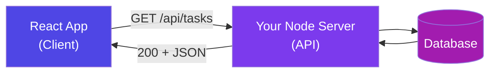
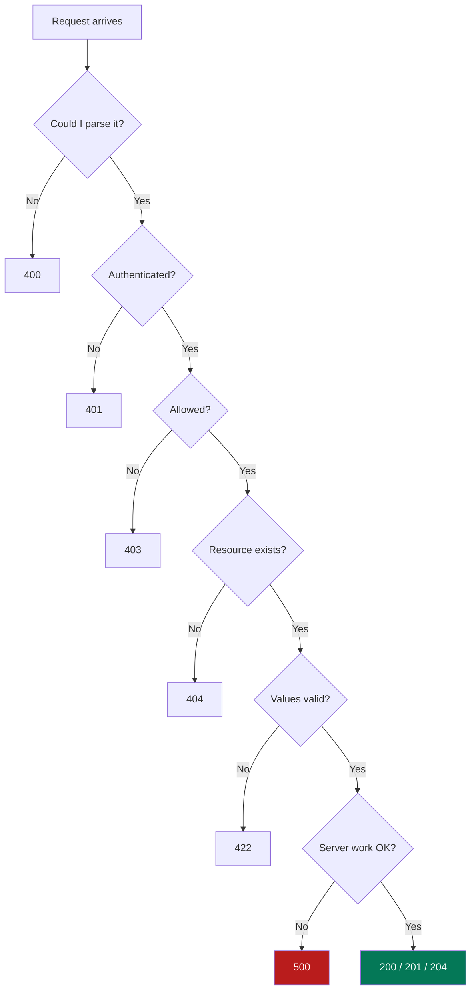
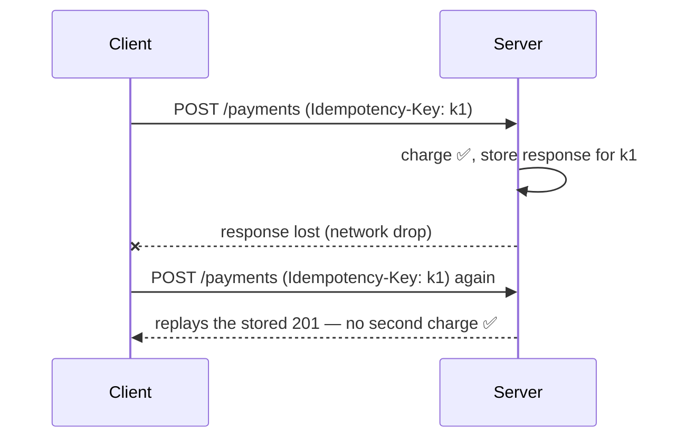
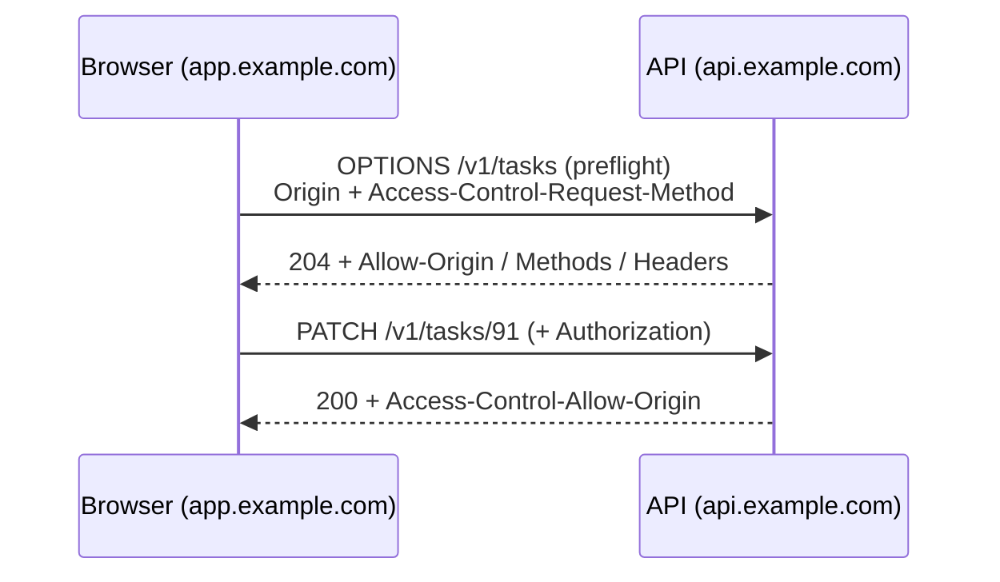
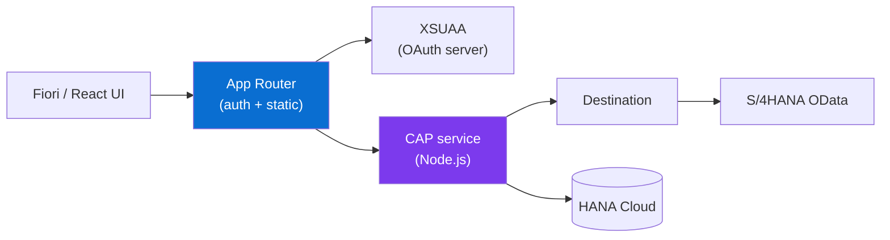
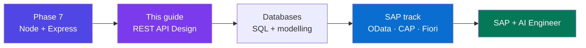

# REST API Design — Basics to Advanced

### The 3-day working guide — only the topics you'll actually use to build, secure and ship a real API (and how they map to SAP OData)

> *"Anyone can make an endpoint that works. Designing an API means making a promise other developers can understand, trust, and build on for years. That promise is the product."*

**Phase 7 · Deep Dive** · The 50-Day Challenge · Web Dev → SAP + AI Engineer

---

## Table of Contents

- [How to Use This Guide (3 Days)](#how-to-use-this-guide-3-days)
- [Part A — REST & HTTP, The Working Essentials](#part-a-rest-http-the-working-essentials)
  - [A1. What an API Is, and What REST Means](#a1-what-an-api-is-and-what-rest-means) · [A2. HTTP Methods, Safe & Idempotent](#a2-http-methods-safe-idempotent) · [A3. Status Codes That Actually Matter](#a3-status-codes-that-actually-matter) · [A4. Requests, Responses & the Headers You'll Use](#a4-requests-responses-the-headers-youll-use)
- [Part B — Designing Resources, URLs & Payloads](#part-b-designing-resources-urls-payloads)
  - [B1. Finding Your Resources and Naming URLs](#b1-finding-your-resources-and-naming-urls) · [B2. Payload Design — JSON Conventions That Make You Look Senior](#b2-payload-design-json-conventions-that-make-you-look-senior)
- [Part C — CRUD Done Right](#part-c-crud-done-right)
  - [C1. The Five Endpoints Every Resource Needs](#c1-the-five-endpoints-every-resource-needs) · [C2. Create: POST, 201 and `Location`](#c2-create-post-201-and-location) · [C3. Update: PUT vs PATCH](#c3-update-put-vs-patch) · [C4. Delete, Empty Results & No-Content Rules](#c4-delete-empty-results-no-content-rules)
- [Part D — Lists: Filtering, Sorting & Pagination](#part-d-lists-filtering-sorting-pagination)
  - [D1. Filtering & Sorting (With Whitelists)](#d1-filtering-sorting-with-whitelists) · [D2. Pagination — Offset, Cursor, and Hard Caps](#d2-pagination-offset-cursor-and-hard-caps)
- [Part E — Errors & Reliability](#part-e-errors-reliability)
  - [E1. Error Design & Picking the Right Code](#e1-error-design-picking-the-right-code) · [E2. Implementing Errors in Express (End to End)](#e2-implementing-errors-in-express-end-to-end) · [E3. Idempotency — Making Retries Safe](#e3-idempotency-making-retries-safe) · [E4. Concurrency: ETags & Optimistic Locking](#e4-concurrency-etags-optimistic-locking)
- [Part F — Security Essentials](#part-f-security-essentials)
  - [F1. AuthN vs AuthZ — and the #1 API Bug](#f1-authn-vs-authz-and-the-1-api-bug) · [F2. JWT, Refresh Tokens & Where to Store Them](#f2-jwt-refresh-tokens-where-to-store-them) · [F3. CORS — Properly Understood](#f3-cors-properly-understood) · [F4. Input Validation, Rate Limiting & Secrets](#f4-input-validation-rate-limiting-secrets) · [F5. OWASP API Top 10 & Pre-Launch Checklist](#f5-owasp-api-top-10-pre-launch-checklist)
- [Part G — Versioning, Caching, Docs & Testing](#part-g-versioning-caching-docs-testing)
  - [G1. Versioning & Breaking Changes](#g1-versioning-breaking-changes) · [G2. Caching & Performance Basics](#g2-caching-performance-basics) · [G3. Documentation with OpenAPI](#g3-documentation-with-openapi) · [G4. Testing & Monitoring](#g4-testing-monitoring)
- [Part H — SAP Mapping, Capstone & Revision](#part-h-sap-mapping-capstone-revision)
  - [H1. REST in the SAP World (OData & CAP)](#h1-rest-in-the-sap-world-odata-cap) · [H2. Capstone: The Task Tracker API Contract](#h2-capstone-the-task-tracker-api-contract) · [H3. The One-Page Cheat Sheet](#h3-the-one-page-cheat-sheet) · [H4. 15 Interview Questions With Sharp Answers](#h4-15-interview-questions-with-sharp-answers) · [H5. Glossary & What's Next](#h5-glossary-whats-next)

---

# How to Use This Guide (3 Days)

*You have 3 days for this phase. This guide is built for exactly that — only the topics you will actually use when building and defending a real API.*

**The plan:**

| Day | Read | Build |
|-----|------|-------|
| **Day 1** | Parts A, B, C | Design your resource + endpoint table; build the 5 CRUD endpoints |
| **Day 2** | Parts D, E, F | Add pagination, filtering, proper errors, JWT auth, owner-scoping |
| **Day 3** | Parts G, H | Versioning, caching, OpenAPI docs, tests; then the capstone + cheat sheet |

<p class="te"><strong>Telugu:</strong> Ee guide moodu rojula kosam ne raasindi. Roju oka set of parts chadivi, ventane code lo try cheyyi. Kevalam chadivithe gurthundadu — chesthe ne vastundi. Prathi section lo <strong>Telugu explanation</strong> kuda undi, kabatti concept miss avvadu.</p>

**What was deliberately left out:** SOAP internals, HATEOAS implementations, GraphQL/gRPC deep dives, JSON Patch operations, bulk-operation protocols, media-type versioning. They are named where relevant so you know the words — but you won't need them to build, ship or defend a REST API this month.

---

# Part A — REST & HTTP, The Working Essentials

## A1. What an API Is, and What REST Means

**Simple definition:** An **API** is a contract that lets one program use another. **REST** is the most common style for web APIs: every "thing" is a **resource** with a URL, and you act on it using standard **HTTP methods**, exchanging **JSON**.

<p class="te"><strong>Telugu:</strong> API ante rendu software madhya oka ottubadi (contract) — "ilaa adigithe, ilaa answer istaanu". REST ante daaniki oka style: prathi vishayaniki (task, user, order) oka URL istaam, mariyu HTTP verbs (GET, POST, PUT, DELETE) tho pani chestaam. Data JSON lo velthundi.</p>

**Analogy — a restaurant menu:** You don't enter the kitchen. You read the menu (the API), order a dish (request), and a plate arrives (response). The kitchen can change everything inside; as long as the menu stays the same, you're unaffected.

**The one rule that defines REST:**

> **Nouns in the URL. Verbs in the HTTP method.**

| ❌ Not REST | ✅ REST |
|-------------|---------|
| `POST /getAllTasks` | `GET /tasks` |
| `POST /createNewTask` | `POST /tasks` |
| `POST /updateTaskById?id=5` | `PATCH /tasks/5` |
| `POST /deleteTask?id=5` | `DELETE /tasks/5` |

The right column gives you four operations with **one URL pattern** and zero new vocabulary. A developer who has never seen your API can guess `DELETE /tasks/5` correctly on the first try. That guessability is the entire point.



**The 4 REST ideas you must be able to say out loud in an interview:**

1. **Resources** — everything is a thing with a URL (`/tasks/91`).
2. **Uniform interface** — same methods and status codes everywhere, so learning one endpoint teaches you all of them.
3. **Stateless** — the server keeps no session; every request carries its own identity (a token). This is what lets you run 10 servers behind a load balancer.
4. **Cacheable** — GET responses declare how long they can be reused, so browsers and CDNs can answer without touching your server.

<p class="te"><strong>Telugu:</strong> Ee naalugu — resources, uniform interface, stateless, cacheable — REST yokka asalu foundation. Interview lo "REST ante emiti?" ani adigithe, ee naalugu cheppithe chaalu.</p>

**Where REST isn't the answer (know the names, that's enough):** GraphQL when many different screens need very different slices of data; gRPC for fast internal service-to-service traffic; WebSocket/SSE when the *server* must push updates. Everything else — public APIs, CRUD apps, your Task Tracker — is REST.

---

## A2. HTTP Methods, Safe & Idempotent

**Simple definition:** The **method** says what you intend to do. Five methods cover 95% of real APIs, and two properties — *safe* and *idempotent* — decide whether a call can be cached or retried.

<p class="te"><strong>Telugu:</strong> Method ante "em cheyyali" ani cheppedi. Aidu chaalu — GET (chudu), POST (kotthadi create), PUT (motham replace), PATCH (koncham maarchu), DELETE (theesey).</p>

| Method | Meaning | Safe? | Idempotent? | Success code |
|--------|---------|-------|-------------|--------------|
| `GET` | Read | ✅ Yes | ✅ Yes | 200 |
| `POST` | Create / trigger | ❌ | ❌ **No** | 201 |
| `PUT` | Replace whole resource | ❌ | ✅ Yes | 200 / 204 |
| `PATCH` | Update part | ❌ | ⚠️ Usually | 200 |
| `DELETE` | Remove | ❌ | ✅ Yes | 204 |

- **Safe** = changes nothing on the server (`GET`). A crawler can hit it a million times harmlessly.
- **Idempotent** = calling it once and calling it five times leave the *same* final state (`PUT`, `DELETE`, `GET`). `POST` is **not** — five POSTs create five rows.

<p class="te"><strong>Telugu:</strong> <strong>Safe</strong> ante server lo emi maaradhu. <strong>Idempotent</strong> ante okasari chesina, padi sarlu chesina final result okate. POST maatram kaadu — anduke payment lo POST malli pampithe rendu sarlu charge ayye prammadam (Part E3 lo fix undi).</p>

**Analogy:** A lift button is idempotent — pressing it 10 times still summons one lift. An ATM withdrawal is not. That's exactly why your browser warns *"Confirm form resubmission"* after a POST.

**Why this matters at 2 a.m.:** A user on a weak network taps "Pay". Your server charges the card, but the response is lost. The phone retries. If `POST /payments` isn't protected, you charged them twice. This one table is why idempotency keys exist.

---

## A3. Status Codes That Actually Matter

**Simple definition:** The status code is a 3-digit number that lets *machines* act on the result without reading your message. The first digit is the whole story.

<p class="te"><strong>Telugu:</strong> Status code ante server ichche 3-digit summary. Modati digit chaalu — 2 ante success, 3 ante cache/redirect, 4 ante <strong>nee tappu</strong> (client), 5 ante <strong>naa tappu</strong> (server).</p>

| Code | Name | Send it when |
|------|------|--------------|
| **200** | OK | Successful GET, PATCH, PUT |
| **201** | Created | POST created something — **also send `Location`** |
| **202** | Accepted | Accepted, but the work runs in the background |
| **204** | No Content | Success with nothing to return — typical DELETE |
| **304** | Not Modified | Client's cached copy is still valid (with ETag) |
| **400** | Bad Request | Malformed JSON / bad param — couldn't even parse it |
| **401** | Unauthorized | Not logged in — token missing, invalid or expired |
| **403** | Forbidden | Logged in, but not allowed |
| **404** | Not Found | No such resource (or hidden on purpose) |
| **405** | Method Not Allowed | Right URL, wrong verb — send an `Allow` header |
| **409** | Conflict | Duplicate email, version clash, parent still has children |
| **412** | Precondition Failed | `If-Match` didn't match — someone else edited it |
| **422** | Unprocessable Content | Parsed fine, but the *values* failed validation |
| **429** | Too Many Requests | Rate limit hit — send `Retry-After` |
| **500** | Internal Server Error | Your code threw — never leak the stack trace |
| **503** | Service Unavailable | Down, overloaded, or in maintenance |

**The pairs people get wrong:**

| Confusion | The rule |
|-----------|----------|
| **400 vs 422** | 400 = I couldn't parse it. 422 = I parsed it, the values are invalid |
| **401 vs 403** | 401 = *who are you?* 403 = *I know you, you're not allowed* |
| **403 vs 404** | For someone else's private resource, prefer **404** — 403 confirms the id exists |
| **409 vs 422** | 409 = clashes with current *state*. 422 = the values themselves are wrong |

<p class="te"><strong>Telugu:</strong> <strong>401</strong> = "nuvvevaro naaku teliyadu, token pampu". <strong>403</strong> = "nuvvevaro telusu, kaani neeku permission ledu". Ee difference interview lo tappakunda adugutaru.</p>



**The one anti-pattern you must never ship:**

```json
❌ HTTP/1.1 200 OK
{ "success": false, "error": "Task not found" }
```

HTTP said "fine", the body says "broken". Every cache, proxy, retry policy and monitoring tool now believes it worked. Use the real code: **404**.

---

## A4. Requests, Responses & the Headers You'll Use

**Simple definition:** A request = method + path + headers + (optional) body. A response = status + headers + (usually) body. That's the whole protocol.

<p class="te"><strong>Telugu:</strong> Request lo naalugu bhaagalu — method, path (+query), headers, body. Response lo moodu — status code, headers, body. Ee 7 vishayalu ardham iyyaka HTTP lo mystery emi undadu.</p>

**A real exchange:**

```http
POST /v1/tasks HTTP/1.1
Host: api.tasktracker.com
Content-Type: application/json          ← my body is JSON
Accept: application/json                 ← send me JSON back
Authorization: Bearer eyJhbGciOi...      ← who I am

{ "title": "Buy milk", "priority": "low" }
```
```http
HTTP/1.1 201 Created
Content-Type: application/json
Location: /v1/tasks/91                   ← where the new thing lives
ETag: "v1-7f3a"

{ "id": 91, "title": "Buy milk", "done": false }
```

**Where does each piece of data go? (memorise this)**

| What | Where | Example |
|------|-------|---------|
| *Which* resource | **Path** | `/tasks/91` |
| *How* you want the result | **Query** | `?sort=-createdAt&page=2` |
| Info *about the message* | **Headers** | `Authorization`, `Content-Type` |
| The resource content | **Body** | `{ "title": "..." }` |

**Headers worth knowing by heart:**

| Header | Direction | Purpose |
|--------|-----------|---------|
| `Content-Type: application/json` | both | Format of *this* body |
| `Accept: application/json` | request | Format I want back |
| `Authorization: Bearer <jwt>` | request | Credentials |
| `If-None-Match` / `If-Match` | request | Caching / safe updates (Part E4) |
| `Idempotency-Key` | request | Retry-safe POST (Part E3) |
| `Location` | response | URL of the newly created resource |
| `ETag` | response | Version fingerprint |
| `Cache-Control` | response | Who may cache this, for how long |
| `Retry-After` | response | With 429/503 — come back in N seconds |
| `X-Request-Id` | both | Trace one call through your logs |

**Test everything by hand before writing client code:**

```bash
curl -i https://api.tasktracker.com/v1/tasks                       # -i shows headers
curl -X POST https://api.tasktracker.com/v1/tasks \
  -H "Content-Type: application/json" -H "Authorization: Bearer $TOKEN" \
  -d '{"title":"Read Part A","priority":"high"}'
curl -X PATCH .../v1/tasks/91 -H "Content-Type: application/json" -d '{"done":true}'
```

<p class="te"><strong>Telugu:</strong> Windows PowerShell lo <code>curl</code> ante veru command (Invoke-WebRequest). <code>curl.exe</code> ani rayi, leda Git Bash / Postman vaadu.</p>

**One rule about HTTPS:** always, everywhere, including "just dev". A token sent over plain HTTP is a token that has been stolen. Let your platform (Render, Vercel, SAP BTP) terminate TLS for you.

---

# Part B — Designing Resources, URLs & Payloads

## B1. Finding Your Resources and Naming URLs

**Simple definition:** First list the *things* your app talks about; each becomes a resource with a URL. Then the HTTP methods supply the actions automatically.

<p class="te"><strong>Telugu:</strong> Modata "naa app lo em em vastuvulu unnayi?" ani aalochinchu — task, user, project. Avi resources. Actions ni URL lo raayakku; method ye action ni cheptundi.</p>

**The 3-step method:**
1. Write features as sentences: *"A user can create a **task**, put it in a **project**, and add a **comment**."*
2. Underline the nouns → task, project, comment, user.
3. Each noun gets a URL: `/tasks`, `/projects`, `/comments`, `/users`.

**The 10 URL rules — this table is the whole topic:**

| # | Rule | ❌ Bad | ✅ Good |
|---|------|--------|---------|
| 1 | Nouns, not verbs | `/getTasks` | `/tasks` |
| 2 | Plural collections | `/task/5` | `/tasks/5` |
| 3 | Lowercase | `/Tasks/ByUser` | `/tasks` |
| 4 | Hyphens, not `_` or camelCase | `/task_items` | `/task-items` |
| 5 | No file extensions | `/tasks.json` | `/tasks` + `Accept` header |
| 6 | No trailing slash | `/tasks/` | `/tasks` |
| 7 | Hierarchy = ownership | `/comments?taskId=5` | `/tasks/5/comments` |
| 8 | Filters in the query string | `/tasks/done/high` | `/tasks?done=true&priority=high` |
| 9 | Version at the base | `/tasks/v1` | `/v1/tasks` |
| 10 | Short and predictable | `/api/v1/data/get/tasks/all` | `/v1/tasks` |

**Three URL shapes and what they support:**

| Shape | URL | Methods that make sense |
|-------|-----|-------------------------|
| Collection | `/tasks` | `GET` (list), `POST` (create) |
| Item | `/tasks/91` | `GET`, `PATCH`, `PUT`, `DELETE` |
| Singleton | `/users/me` | `GET`, `PATCH` |

`/users/me` is excellent design: the client never needs to know its own id, so it can never build a URL that reads someone else's profile.

**Nesting — one level, then stop:**

```
✅ GET  /projects/3/tasks      list tasks in a project
✅ POST /projects/3/tasks      create inside a project
✅ GET  /tasks/91              once it has its own id, go flat
❌ GET  /users/7/projects/3/tasks/91/comments/12/replies/4
```

**IDs — choose deliberately, it's hard to change:**

| Type | Example | Verdict |
|------|---------|---------|
| Auto-increment int | `/tasks/91` | Short, but **guessable** — leaks row counts, turns a small auth bug into a full breach |
| UUID | `/tasks/64f0c2b1...` | Safe default |
| Prefixed random (Stripe style) | `/tasks/task_9aXk21` | Best — unguessable *and* self-describing in logs |

<p class="te"><strong>Telugu:</strong> Public URLs lo <strong>UUID leda prefixed random id</strong> vaadu. 1, 2, 3 laanti ids unte attacker vaatini oka loop lo try chesi motham data chudochu (authorization lo chinna bug unte chaalu).</p>

**Actions that aren't CRUD** — three accepted patterns, in order of preference:

```http
PATCH /orders/91         { "status": "cancelled" }   ① state change (best when it fits)
POST  /orders/91/cancellation                        ② the action as a sub-resource
POST  /orders/91/cancel                              ③ a verb endpoint (fine, keep it rare)
```

Real APIs use all three — GitHub has `PUT /repos/{o}/{r}/pulls/{n}/merge`, Stripe has `POST /v1/payment_intents/{id}/capture`. Use option 3 when the alternative would be contorted.

---

## B2. Payload Design — JSON Conventions That Make You Look Senior

**Simple definition:** Thirty small decisions about your JSON. Making them once and applying them everywhere is what separates an API that feels *designed* from one that feels assembled.

<p class="te"><strong>Telugu:</strong> Chinna chinna conventions — names, casing, dates, money, null — ivi consistent ga unte API chaala professional ga anipistundi. Prathi endpoint lo oke rule follow cheyyi.</p>

**1. Casing — pick one, forever.** For a React + Node stack, use **camelCase** (`createdAt`, `dueDate`). Never mix.

**2. Dates — always ISO 8601 in UTC:**

```json
"createdAt": "2026-08-06T09:12:44Z"     ✅ unambiguous, sorts correctly as a string
"createdAt": "06/08/2026"               ❌ 6 Aug or June 8?
```
Store UTC, send UTC, let the **client** convert to local time.

**3. Money — never a float:**

```json
"amount": 1999, "currency": "INR"       ✅ paise as an integer
"amount": 19.99                         ❌ 0.1 + 0.2 = 0.30000000000000004
```

**4. Nulls and empty values:**

| Situation | Do this |
|-----------|---------|
| Field has no value | `"archivedAt": null` |
| Array with no items | `[]` — **never** `null` |
| Field not applicable | Omit the key |

Returning `[]` instead of `null` single-handedly prevents a whole class of frontend crashes (`Cannot read properties of null (reading 'map')`).

**5. Enums — machine values, not display text:**

```json
"status": "in_progress"     ✅ stable, translatable on the client
"status": "In Progress"     ❌ breaks the moment someone edits the label
```

**6. Booleans read as questions:** `done`, `isActive`, `hasAttachments`. Avoid negatives like `notActive`.

**7. Item vs collection shape — decide once:**

```json
GET /tasks/91  →  { "id": 91, "title": "Buy milk", "done": false }

GET /tasks     →  {
  "data": [ /* tasks */ ],
  "meta": { "page": 1, "limit": 20, "total": 137, "totalPages": 7 },
  "links": { "next": "/v1/tasks?page=2", "prev": null }
}
```

**Rule you cannot break:** a collection endpoint must **never** return a bare top-level array — the day you need `meta`, adding it becomes a breaking change.

**8. Request bodies — never accept server-owned fields:**

```js
// ❌ Mass assignment: client sends { "title": "x", "role": "admin", "owner": "someone-else" }
const task = await Task.create(req.body);        // 💥 they just became admin

// ✅ Whitelist explicitly
const { title, priority, dueDate } = req.body;
const task = await Task.create({ title, priority, dueDate, owner: req.user.id });
```

`id`, `createdAt`, `updatedAt` and `owner` are **always** set by the server.

**9. Validate with a schema (Zod pairs perfectly with Express):**

```js
const CreateTask = z.object({
  title:    z.string().trim().min(1).max(200),
  priority: z.enum(['low','medium','high']).default('medium'),
  dueDate:  z.string().datetime().optional(),
  tags:     z.array(z.string().max(20)).max(10).optional(),
}).strict();                                     // reject unknown keys

const parsed = CreateTask.safeParse(req.body);
if (!parsed.success) return next(parsed.error);   // → 422 (Part E2)
```

**10. Map to a DTO before responding** — the single highest-value 10 lines in your codebase:

```js
const toTaskDto = (t) => ({
  id: t._id, title: t.title, done: t.done, priority: t.priority,
  dueDate: t.dueDate, createdAt: t.createdAt, updatedAt: t.updatedAt,
  // passwordHash, internalScore, __v deliberately NOT exposed
});
```

Without this, every database schema change silently changes your public contract — and one forgotten field leaks data.

<p class="te"><strong>Telugu:</strong> Database document ni direct ga <code>res.json()</code> lo pampakku. Eppudu oka <strong>DTO</strong> (mapper function) dwara pampu. Deenitho — sensitive fields leak avvavu, mariyu DB lo field add chesina API contract maaradu.</p>

---

# Part C — CRUD Done Right

## C1. The Five Endpoints Every Resource Needs

**Simple definition:** For any resource there are five standard operations. Learn this table once and you can design any resource in two minutes.

<p class="te"><strong>Telugu:</strong> E resource ki ayina aidu standard endpoints untayi — list, create, read, update, delete. Ee table okasari nerchukunte, kotha resource vachchinapudu design cheyyadaniki rendu nimishalu chaalu.</p>

| Operation | Method + URL | Success | Returns |
|-----------|--------------|---------|---------|
| **List** | `GET /tasks` | 200 | `{ data, meta, links }` |
| **Create** | `POST /tasks` | 201 + `Location` | The created object |
| **Read** | `GET /tasks/91` | 200 | The object |
| **Update** | `PATCH /tasks/91` | 200 | The updated object |
| **Replace** | `PUT /tasks/91` | 200 / 204 | Updated object (optional) |
| **Delete** | `DELETE /tasks/91` | 204 | Nothing |

```js
router.get   ('/tasks',      listTasks);
router.post  ('/tasks',      createTask);
router.get   ('/tasks/:id',  getTask);
router.patch ('/tasks/:id',  updateTask);
router.delete('/tasks/:id',  deleteTask);
```

**`POST /tasks/91` means nothing** — return **405 Method Not Allowed** with `Allow: GET, PATCH, PUT, DELETE`. Explicitly rejecting nonsense is part of a good contract.

---

## C2. Create: POST, 201 and `Location`

**Simple definition:** `POST /tasks` creates one item. Return **201**, a `Location` header pointing at the new resource, and the created object.

<p class="te"><strong>Telugu:</strong> Kotthadi create ayithe <strong>201</strong> pampu (200 kaadu), <code>Location</code> header lo kotha URL ivvu, mariyu create ayina object ni body lo pampu — appudu client malli GET cheyyakkarledu.</p>

```js
async function createTask(req, res, next) {
  try {
    const { title, priority = 'medium', dueDate } = req.body;   // whitelist (B2)
    const task = await Task.create({ title, priority, dueDate, owner: req.user.id });
    res.status(201).location(`/v1/tasks/${task.id}`).json(toTaskDto(task));
  } catch (err) { next(err); }
}
```

| Question | Answer |
|----------|--------|
| Who generates the id? | **The server** — never trust a client-sent id |
| Duplicate exists? | **409 Conflict**, naming the conflicting field |
| Validation failed? | **422** with a field-level error list (Part E2) |
| Is POST idempotent? | **No** — see Part E3 for money-safe POSTs |
| Return the object? | **Yes** — saves a round trip and confirms server defaults |

---

## C3. Update: PUT vs PATCH

**Simple definition:** **PUT replaces the whole resource. PATCH changes part of it.** Choosing wrongly silently deletes user data.

<p class="te"><strong>Telugu:</strong> <strong>PUT</strong> ante motham replace — nuvvu pampani fields <strong>poti povachu</strong>. <strong>PATCH</strong> ante ichchina fields matrame maarustundi. Roju vaadedhi PATCH.</p>

Starting state: `{ "id": 91, "title": "Buy milk", "priority": "high", "done": false }`

```http
PUT /tasks/91   { "title": "Buy milk", "done": true }
→ { "id": 91, "title": "Buy milk", "done": true, "priority": "medium" }   ⚠️ priority LOST

PATCH /tasks/91 { "done": true }
→ { "id": 91, "title": "Buy milk", "done": true, "priority": "high" }     ✅ safe
```

| | PUT | PATCH |
|---|-----|-------|
| Missing fields | Removed / reset to default | Left untouched |
| Idempotent | ✅ Always | ⚠️ Usually |
| Best for | Settings blobs, full-form saves | Almost everything else |

**Practical advice:** support **PATCH** for normal edits; many modern APIs skip PUT entirely. Document whether sending `null` clears a field (the formal name for "yes it does" is *JSON Merge Patch*, RFC 7386).

---

## C4. Delete, Empty Results & No-Content Rules

**Simple definition:** `DELETE` returns **204**. But most real systems don't actually delete — they set a `deletedAt` timestamp.

<p class="te"><strong>Telugu:</strong> Nijamaina apps lo data ni nijam ga delete cheyyaru — <code>deletedAt</code> ani mark chestaru (soft delete). Deenitho undo, audit, mariyu potapatu delete nunchi recovery untayi.</p>

```js
// Soft delete
await Task.updateOne({ _id: id, owner: req.user.id }, { deletedAt: new Date() });
res.status(204).end();

// Every read must then exclude deleted rows — a schema hook is safest
taskSchema.pre(/^find/, function () { this.where({ deletedAt: null }); });
```

**DELETE is idempotent** — after the first call it's gone, and further calls leave it gone. The only open question is the code on the second call: **204** ("the end state is what you asked for") or **404** ("it doesn't exist now"). Pick one, document it, never mix.

**Deleting a parent that has children:** refusing with **409 Conflict** ("project still has 12 tasks") is the safest default; make cascade an explicit opt-in.

**The empty/no-content rules — this table prevents real bugs:**

| Situation | Correct response |
|-----------|------------------|
| `GET /tasks`, user has 0 tasks | **200** + `{ "data": [], "meta": { "total": 0 } }` — **not 404** |
| `GET /tasks/91`, doesn't exist | **404** |
| `DELETE` succeeded | **204**, empty body |
| `PATCH` succeeded | **200** + the updated object |
| `POST` started a background job | **202** + a status URL |

<p class="te"><strong>Telugu:</strong> Khaali list ki <strong>404 ivvakku</strong> — 200 tho <code>[]</code> pampu. "Tasks levu" ane screen veru, "error vachindi" ane screen veru. Ee tappu valla frontend lo empty state error laaga kanipistundi.</p>

---

# Part D — Lists: Filtering, Sorting & Pagination

*The moment your table has 10,000 rows, `GET /tasks` becomes a weapon pointed at your own database. This part is the safety catch.*

## D1. Filtering & Sorting (With Whitelists)

**Simple definition:** Filtering narrows a collection with query parameters; sorting orders it. Both must be restricted to a whitelist of fields.

<p class="te"><strong>Telugu:</strong> Filtering ante list nunchi kavalsinavi matrame teeskovadam. Kaani <code>req.query</code> ni direct ga database ki ivvaku — attacker <code>?password[ne]=x</code> laanti trick tho data theeyagaladu. Eppudu <strong>whitelist</strong> vaadu.</p>

```http
GET /tasks?status=open                       exact match
GET /tasks?status=open&priority=high         AND
GET /tasks?priority=high,urgent              comma = OR within one field
GET /tasks?dueDate[gte]=2026-08-01           operator
GET /tasks?sort=-dueDate,priority            "-" = descending, multi-field
GET /tasks?q=invoice                         search
```

```js
const ALLOWED  = { status: 'string', priority: 'string', projectId: 'string', dueDate: 'date' };
const OPS      = { gt: '$gt', gte: '$gte', lt: '$lt', lte: '$lte', ne: '$ne' };
const SORTABLE = ['createdAt', 'dueDate', 'priority', 'title'];

function buildFilter(query) {
  const mongo = {};
  for (const [key, value] of Object.entries(query)) {
    const [field, op] = key.replace(']', '').split('[');     // "dueDate[gte]"
    if (!ALLOWED[field]) continue;                            // 🔒 whitelist
    if (op && OPS[op])            mongo[field] = { ...(mongo[field]||{}), [OPS[op]]: value };
    else if (String(value).includes(',')) mongo[field] = { $in: String(value).split(',') };
    else if (!op)                 mongo[field] = value;
  }
  return mongo;
}

function buildSort(sort = '-createdAt') {
  return sort.split(',')
    .filter(s => SORTABLE.includes(s.replace(/^-/, '')))      // 🔒 whitelist
    .join(' ') || '-createdAt';
}
```

**Three rules:**
1. **Always have a default sort** (`-createdAt`). Without one, the database may return an unstable order and pagination will duplicate or skip rows.
2. **Add a tiebreaker** — sort by `(-priority, _id)` internally, or equal-priority rows shuffle between pages.
3. **Index every filterable and sortable field**, or your filter is a full table scan.

**Search:** `?q=milk` is fine for small data — but escape the input first, or a crafted regex becomes a denial-of-service:

```js
const safe = String(req.query.q).slice(0, 100).replace(/[.*+?^${}()|[\]\\]/g, '\\$&');
filter.$or = [{ title: { $regex: safe, $options: 'i' } },
              { description: { $regex: safe, $options: 'i' } }];
```

For anything larger, use a real text index (`$text`, Postgres `tsvector`) or a search engine.

---

## D2. Pagination — Offset, Cursor, and Hard Caps

**Simple definition:** Never return an unbounded list. Offset pagination gives you page numbers; cursor pagination gives you stability and speed.

<p class="te"><strong>Telugu:</strong> Pagination oka feature kaadu — adi <strong>safety mechanism</strong>. Modati version lone pettu, table lo moodu rows unna sare. Lekapothe okka request tho server down avutundi.</p>

**Offset pagination — the default for admin tables and business apps:**

```js
const limit = Math.min(100, Math.max(1, parseInt(req.query.limit) || 20));  // 🔒 cap
const page  = Math.max(1, parseInt(req.query.page) || 1);
const skip  = (page - 1) * limit;

const [items, total] = await Promise.all([
  Task.find(filter).sort(sort).skip(skip).limit(limit).lean(),
  Task.countDocuments(filter),
]);

res.json({
  data: items.map(toTaskDto),
  meta: { page, limit, total, totalPages: Math.ceil(total / limit) },
  links: { next: page * limit < total ? `/v1/tasks?page=${page+1}&limit=${limit}` : null,
           prev: page > 1 ? `/v1/tasks?page=${page-1}&limit=${limit}` : null },
});
```

| Offset pagination | |
|---|---|
| ✅ | Jump to any page; page numbers in the UI; easy `total` |
| ❌ | Slow at deep offsets (the DB scans and discards everything before it) |
| ❌ | **Drifts** — a row inserted while you page can show item #20 on both page 1 and page 2 |

**Cursor pagination — for feeds and infinite scroll:**

```http
GET /tasks?limit=20
→ { "data": [...], "meta": { "nextCursor": "eyJpZCI6...", "hasMore": true } }

GET /tasks?limit=20&cursor=eyJpZCI6...
```

```js
const cursor = req.query.cursor
  ? JSON.parse(Buffer.from(req.query.cursor, 'base64').toString()) : null;
const q = { ...filter };
if (cursor) q.$or = [                                    // "strictly after" the last row
  { createdAt: { $lt: new Date(cursor.c) } },
  { createdAt: new Date(cursor.c), _id: { $lt: cursor.id } },
];
const rows = await Task.find(q).sort({ createdAt: -1, _id: -1 }).limit(limit + 1).lean();
const hasMore = rows.length > limit;
const page = hasMore ? rows.slice(0, limit) : rows;
const last = page.at(-1);
const nextCursor = hasMore
  ? Buffer.from(JSON.stringify({ c: last.createdAt, id: last._id })).toString('base64')
  : null;
```

The cursor is **opaque (base64)** on purpose — if clients could read it, they'd construct their own and you could never change the scheme.

| | Offset | Cursor |
|---|--------|--------|
| Jump to page 57 | ✅ | ❌ |
| Speed at row 1,000,000 | ❌ Very slow | ✅ Constant time |
| Stable while data changes | ❌ | ✅ |
| Best for | Admin tables, page numbers | Infinite scroll, feeds, exports |

**The guardrails table — copy this into every API you build:**

| Parameter | Default | Hard max | If exceeded |
|-----------|---------|----------|-------------|
| `limit` | 20 | 100 | Clamp to 100 |
| `page` | 1 | — | Reject `page < 1` with 400 |
| `sort` | `-createdAt` | — | Ignore unknown fields |
| `q` length | — | 100 chars | 400 |
| Deep offset | — | ~page 500 | 400: "use cursor pagination" |

**Two more list habits worth 10 minutes:** `?fields=id,title` (sparse fieldsets — whitelist them, always include `id`), and `.lean()` on read-only Mongoose queries (often 3–5× faster).

---

# Part E — Errors & Reliability

*Anyone can design the happy path. Errors and retries are what developers actually spend their time on.*

## E1. Error Design & Picking the Right Code

**Simple definition:** A good error tells the client **what went wrong**, **whose fault it is**, and **how to fix it** — without leaking internals.

<p class="te"><strong>Telugu:</strong> Manchi error lo moodu vishayalu undali — em tappu jarigindi, evari tappu, ela sarichesukovali. Ivi unte frontend developer nee daggariki raakunda tane fix cheskuntadu.</p>

**Five principles:**
1. **Correct status code first** — machines act on the code, humans read the message.
2. **A stable machine-readable `code`** — `"task_not_found"` never changes, even if you reword the message.
3. **Plain-language message** — no stack traces, no SQL.
4. **Field-level detail** for validation, so the UI can highlight the right input.
5. **A `requestId`** that also appears in your logs.

```json
❌ 200 OK  { "success": false, "msg": "Error" }
❌ 500     { "error": "ValidationError: ... at model.Document.invalidate (/app/node_modules/...)" }

✅ 422 Unprocessable Content
{
  "title": "Validation failed",
  "status": 422,
  "code": "validation_failed",
  "detail": "The request body has 2 invalid fields.",
  "instance": "/v1/tasks",
  "requestId": "req_01J8ZK3",
  "errors": [
    { "field": "title",    "code": "required", "message": "Title is required." },
    { "field": "priority", "code": "enum",     "message": "Must be low, medium or high." }
  ]
}
```

That shape is the IETF standard **RFC 9457 "Problem Details"** (`Content-Type: application/problem+json`) plus your own extensions. Using a standard means you never argue about error shape again.

**Never leak internals:**

| Don't expose | Why |
|--------------|-----|
| Stack traces / SQL errors | Reveals your framework, file layout, schema |
| "User not found" vs "Wrong password" | Confirms which emails are registered → use *"Invalid email or password"* |
| `X-Powered-By` | `app.disable('x-powered-by')` |

<p class="te"><strong>Telugu:</strong> Stack trace ni client ki eppudu pampakku — attacker ki adi <strong>map</strong> laantidi. Motham detail <strong>logs</strong> lo raayi, client ki chinna message + requestId matrame ivvu.</p>

---

## E2. Implementing Errors in Express (End to End)

**Simple definition:** One error class, one mapper, one handler at the bottom of the chain — paste this into every project.

<p class="te"><strong>Telugu:</strong> Errors ni prathi route lo separate ga handle cheyyaku. Oka <code>ApiError</code> class throw cheyyi, chivaralo unna oke error handler anni chusukuntundi. Code clean ga untundi, mariyu oka format miss avvadu.</p>

```js
// errors.js
class ApiError extends Error {
  constructor(status, code, detail, extras = {}) {
    super(detail); this.status = status; this.code = code; this.extras = extras;
  }
}
const NotFound   = (what) => new ApiError(404, `${what}_not_found`, `${what} not found`);
const Validation = (errors) => new ApiError(422, 'validation_failed',
                      `The request body has ${errors.length} invalid field(s).`, { errors });

const toProblem = (err, req) => ({
  title: (err.code || 'internal_error').replace(/_/g, ' '),
  status: err.status || 500,
  code: err.code || 'internal_error',
  detail: (err.status || 500) >= 500 ? 'An unexpected error occurred.' : err.message,  // 🔒
  instance: req.originalUrl,
  requestId: req.id,
  ...(err.extras || {}),
});
```

```js
// app.js — order matters
const { randomUUID } = require('crypto');
app.use((req, res, next) => {                     // 1. correlation id
  req.id = req.get('X-Request-Id') || randomUUID();
  res.set('X-Request-Id', req.id);
  next();
});

// 2. async wrapper so rejected promises reach the handler (Express 4)
const wrap = fn => (req, res, next) => Promise.resolve(fn(req, res, next)).catch(next);
router.get('/tasks/:id', requireAuth, wrap(getTask));

// 3. unknown routes — AFTER all routes
app.use((req, res) => res.status(404).type('application/problem+json')
  .json(toProblem(new ApiError(404, 'route_not_found',
        `No route for ${req.method} ${req.originalUrl}`), req)));

// 4. the one error handler — ALWAYS LAST
app.use((err, req, res, next) => {
  if (err.name === 'ZodError')  err = Validation(err.issues.map(i =>
       ({ field: i.path.join('.'), code: i.code, message: i.message })));
  if (err.code === 11000)       err = new ApiError(409, 'duplicate_key',
       `${Object.keys(err.keyPattern)[0]} already exists`);
  if (err.name === 'CastError') err = new ApiError(400, 'invalid_id', 'Malformed id');

  logger.error({ requestId: req.id, code: err.code, msg: err.message, stack: err.stack });
  res.status(err.status || 500).type('application/problem+json').json(toProblem(err, req));
});
```

**Your error catalog — publish this in your docs:**

| Code | HTTP | Client should |
|------|------|---------------|
| `validation_failed` | 422 | Show field errors |
| `unauthenticated` / `token_expired` | 401 | Log in / refresh the token |
| `forbidden` | 403 | Show "no access" |
| `task_not_found` | 404 | Refresh the list |
| `duplicate_email` | 409 | Suggest login or reset |
| `version_conflict` | 409 | Reload and merge |
| `rate_limited` | 429 | Back off `Retry-After` |
| `internal_error` | 500 | Show a generic error + `requestId` |

**The 5-point check for every endpoint you write:** right status code? stable `code`? all bad fields listed? `requestId` in response *and* logs? nothing useful leaked to an attacker?

---

## E3. Idempotency — Making Retries Safe

**Simple definition:** When a client doesn't get a response, it can't tell whether the work happened. If it retries a `POST`, the work happens twice. An **idempotency key** fixes that.

<p class="te"><strong>Telugu:</strong> Client ki response raakapothe — request server ki chereendaa ledaa ani teliyadu. Malli pampithe payment rendu sarlu jarige prammadam. <strong>Idempotency-Key</strong> tho — same key vaste server kotthaga pani cheyyakunda, mundhu ichchina <strong>ade response</strong> ni malli istundi.</p>



```js
// Collection: idempotency { key(unique), userId, requestHash, status, code, body, createdAt(TTL 24h) }
async function idempotent(req, res, next) {
  const key = req.get('Idempotency-Key');
  if (!key) return next();
  const hash = sha256(JSON.stringify({ path: req.path, body: req.body }));

  const existing = await Idem.findOne({ key, userId: req.user.id });
  if (existing) {
    if (existing.requestHash !== hash)
      return res.status(422).json(problem('idempotency_key_reuse',
             'This key was used with a different request body.'));
    if (existing.status === 'in_progress')
      return res.status(409).json(problem('request_in_progress', 'Original request still running.'));
    return res.status(existing.code).json(existing.body);      // 🔁 replay
  }

  await Idem.create({ key, userId: req.user.id, requestHash: hash, status: 'in_progress' });
  const json = res.json.bind(res);
  res.json = async (body) => {
    await Idem.updateOne({ key, userId: req.user.id },
      { status: 'completed', code: res.statusCode, body });
    return json(body);
  };
  next();
}
```

**Rules:** the **client** generates the key (one UUID per user action, reused across retries of that action); store the request fingerprint so a reused key with different data is caught; expire keys after 24 hours; put a **unique index** on the key so the reservation is atomic. Apply it to payments, orders, emails — anything with an expensive side effect.

**Retries come from more places than you think:** client retry logic, impatient users double-tapping, mobile OS network switches, load balancers, job queues, and webhook senders. Assume duplicates *will* arrive.

---

## E4. Concurrency: ETags & Optimistic Locking

**Simple definition:** Two users edit the same task. **Optimistic concurrency** lets both try, detects the clash, and rejects the loser — instead of silently losing one person's work.

<p class="te"><strong>Telugu:</strong> Iddaru oke task ni oke samayam lo edit chesthe, okari maarpu mounam ga poyye prammadam undi (lost update). Version/ETag check pettithe — rendo save ni server "409/412" tho aapesi, "reload chesi malli try cheyyi" ani cheptundi.</p>

**The lost update problem:**

```
10:00  A reads task {title:"Buy milk", priority:"low"}
10:01  B reads the same task
10:02  A saves {priority:"high"}
10:03  B saves {title:"Buy bread"}    ← B's copy still had priority:"low"
       Result: A's change silently vanished 💥
```

**The fix — version the resource:**

```js
// PATCH /tasks/91 with header:  If-Match: "3"
const expected = req.get('If-Match')?.replace(/"/g, '');
const filter = { _id: id, owner: req.user.id, deletedAt: null };
if (expected) filter.version = Number(expected);

const updated = await Task.findOneAndUpdate(
  filter, { $set: patch, $inc: { version: 1 } }, { new: true }
).lean();

if (!updated) {
  const exists = await Task.exists({ _id: id, owner: req.user.id, deletedAt: null });
  if (exists) throw new ApiError(412, 'precondition_failed',
      'This task was modified by someone else. Reload and retry.');
  throw new ApiError(404, 'task_not_found', 'Task not found');
}
res.set('ETag', `"${updated.version}"`).json(toTaskDto(updated));
```

**The same ETag also saves bandwidth on reads:**

```http
GET /v1/tasks/91              → 200 OK, ETag: "3"
GET /v1/tasks/91
If-None-Match: "3"            → 304 Not Modified   (no body at all)
```

| Status | Meaning |
|--------|---------|
| **304** | Your cached copy is still current |
| **412** | `If-Match` failed — someone edited it first |
| **409** | Conflict with current state (duplicate, parent has children) |

**UI advice:** on a 409/412 don't just show "conflict" — reload the record, show what changed, and let the user merge. Return the current values in the error body so the client can do that without another request.

**Two more reliability patterns, briefly:**

- **Long jobs → 202.** If work takes more than a couple of seconds (reports, imports), return **202 Accepted** with `Location: /v1/jobs/job_7c2` and a `Retry-After`. The job becomes a resource the client polls: `{ "status": "running", "progress": 42 }`, then `{ "status": "succeeded", "resultUrl": "..." }`.
- **Webhooks** (your API calling *them*): sign every payload with HMAC-SHA256 over `timestamp + raw body`, retry with exponential backoff until a 2xx, and include a unique event `id` because delivery is **at-least-once** — receivers must deduplicate. Verify signatures against the **raw** body, before JSON parsing.

---

# Part F — Security Essentials

*The part that decides whether your API is safe. Nothing here is optional.*

## F1. AuthN vs AuthZ — and the #1 API Bug

**Simple definition:** **Authentication** = who are you? (401 if it fails). **Authorization** = what are you allowed to do? (403 if it fails). Authorization has three layers, and almost everyone forgets the third.

<p class="te"><strong>Telugu:</strong> <strong>Authentication</strong> ante "nuvvevaru?" — ID card check. <strong>Authorization</strong> ante "neeku ee pani cheyyadaniki permission unda?". Modati di fail ayithe 401, rendodi fail ayithe 403.</p>

| Layer | Question | Check |
|-------|----------|-------|
| **Route** | Is this endpoint for logged-in users? | `requireAuth` middleware |
| **Role/scope** | Does this role have this capability? | `requireRole('admin')` |
| **Object** ⚠️ | Does *this specific record* belong to them? | `{ _id: id, owner: req.user.id }` |

**The third layer is OWASP API risk #1 — BOLA (Broken Object Level Authorization), also called IDOR:**

```js
// ❌ VULNERABLE — any logged-in user reads any task by changing the id in the URL
const task = await Task.findById(req.params.id);

// ✅ SAFE — ownership is part of the query, not an if-check afterwards
const task = await Task.findOne({ _id: req.params.id, owner: req.user.id });
if (!task) return res.status(404).json(problem('task_not_found', 'Task not found'));
```

<p class="te"><strong>Telugu:</strong> Prathi query lo <strong>owner</strong> ni kalapali — taruvatha <code>if</code> tho check cheyyakku. Endukante 12 handlers lo oka chota <code>if</code> marchipovachu, kaani shared query helper marchipoledu. URL lo id maarchi inkokari data chuse bug — ide prapanchamlo most common API bug.</p>

```js
// Make the safe path the easy path
const ownedBy = (req) => ({ owner: req.user.id, deletedAt: null });
const task = await Task.findOne({ _id: req.params.id, ...ownedBy(req) });
```

**404 vs 403 for someone else's record:** returning 403 tells an attacker "this id exists". For anything sensitive, return **404**.

**Role checks for privileged routes:**

```js
const requireRole = (...roles) => (req, res, next) =>
  roles.includes(req.user.role) ? next()
    : res.status(403).json(problem('forbidden', 'Insufficient role'));

router.get('/admin/users', requireAuth, requireRole('admin'), listUsers);
```

---

## F2. JWT, Refresh Tokens & Where to Store Them

**Simple definition:** A **JWT** is a signed, self-contained token carrying the user's identity. The server verifies the signature instead of keeping a session — which is what makes REST stateless.

<p class="te"><strong>Telugu:</strong> JWT ante server sign chesina ID card — andulo user id, role, expiry untayi. Server database lo store cheyyakkarledu, signature check chesthe chaalu. Payload <strong>encrypt kaadu</strong> — evaraina chadavagalaru, kabatti andulo secrets pettakku.</p>

```
eyJhbGciOiJIUzI1NiJ9 . eyJzdWIiOiJ1c3JfNyIsInJvbGUiOiJ1c2VyIn0 . 4Xk9...
└──── HEADER ────┘      └──────── PAYLOAD (readable!) ────────┘   └ SIGNATURE ┘
```

```js
// Issue
const token = jwt.sign({ sub: user.id, role: user.role }, process.env.JWT_SECRET,
  { expiresIn: '15m', issuer: 'tasktracker-auth', audience: 'tasktracker-api' });

// Verify
function requireAuth(req, res, next) {
  const h = req.get('Authorization') || '';
  const token = h.startsWith('Bearer ') ? h.slice(7) : null;
  if (!token) return res.status(401).json(problem('unauthenticated', 'Missing bearer token'));
  try {
    const p = jwt.verify(token, process.env.JWT_SECRET, {
      algorithms: ['HS256'],                       // 🔒 pin the algorithm
      issuer: 'tasktracker-auth', audience: 'tasktracker-api',
    });
    req.user = { id: p.sub, role: p.role };
    next();
  } catch (e) {
    const expired = e.name === 'TokenExpiredError';
    res.status(401).json(problem(expired ? 'token_expired' : 'invalid_token', 'Invalid token'));
  }
}
```

**The five JWT mistakes:**

| Mistake | Consequence |
|---------|-------------|
| Not pinning `algorithms` | Algorithm-confusion / `alg: none` attacks forge tokens |
| No `exp` | A stolen token is valid forever |
| Weak secret (`"secret123"`) | Brute-forced offline in minutes |
| Sensitive data in the payload | It's public — anyone can decode it |
| Tokens in `localStorage` | One XSS = full account takeover |

**Token lifetimes and storage:**

| Token | Lifetime | Where |
|-------|----------|-------|
| Access token | 5–15 min | Memory, or an `httpOnly` cookie |
| Refresh token | 7–30 days, **rotating** | `httpOnly; Secure; SameSite=Strict` cookie, `path=/auth/refresh` |

```js
res.cookie('refreshToken', token, {
  httpOnly: true,      // JavaScript cannot read it → XSS-resistant
  secure: true,        // HTTPS only
  sameSite: 'strict',  // not sent cross-site → CSRF-resistant
  path: '/auth/refresh',
  maxAge: 7 * 24 * 3600 * 1000,
});
```

**Rotation with reuse detection** — the professional touch: each refresh issues a *new* refresh token and invalidates the old one. If an already-used token is presented, it was stolen → revoke every token for that user and force a re-login.

<p class="te"><strong>Telugu:</strong> Access token 15 nimishalu matrame panichestundi — dongilinchina ekkuva sepu vaadaleru. Refresh token tho kotha access token vastundi. Prathi refresh ki kotha refresh token ivvadam (rotation) — mariyu paatha token malli vaste "dongatanam jarigindi" ani telisi anni tokens revoke cheyyadam.</p>

**OAuth 2.0 / OIDC in three lines** (you'll meet this in SAP as XSUAA): "Sign in with Google" without giving Google's password to the app. Use the **Authorization Code + PKCE** flow for web/mobile, and **Client Credentials** for machine-to-machine. Your API's job as a resource server is to validate the token (signature, `iss`, `aud`, `exp`) and check the **scope** for the endpoint.

---

## F3. CORS — Properly Understood

**Simple definition:** CORS is a **browser** rule: JavaScript on `site-a.com` may not read a response from `api-b.com` unless the API allows it with response headers. It is not API security.

<p class="te"><strong>Telugu:</strong> CORS ante browser pettina rule — inko domain nunchi vachina response ni JavaScript chadavakoodadu, server permission ivvakapothe. Idi <strong>server security kaadu</strong> — Postman/curl lo CORS error raadu, endukante avi browsers kaavu. Asalu security ante authentication + authorization.</p>

**The two facts that clear up 90% of CORS confusion:**
1. The browser enforces it, not your server.
2. The request usually **reaches your server anyway** — the browser just refuses to hand the response to your JavaScript.



A **preflight** is triggered by anything non-simple — a `PATCH`/`DELETE`, JSON `Content-Type`, or an `Authorization` header. In other words: nearly every real API call.

```js
app.use(cors({
  origin: ['https://app.tasktracker.com', 'http://localhost:5173'],   // 🔒 explicit list
  methods: ['GET','POST','PUT','PATCH','DELETE'],
  allowedHeaders: ['Content-Type','Authorization','Idempotency-Key','If-Match'],
  exposedHeaders: ['ETag','X-Request-Id','Retry-After'],              // JS can read these
  credentials: true,
  maxAge: 86400,
}));
```

| Mistake | Why it's bad |
|---------|--------------|
| `origin: '*'` on an authenticated API | Any website can call it with the user's credentials |
| `origin: '*'` **with** `credentials: true` | Browsers reject the combination — it silently breaks |
| Forgetting `exposedHeaders` | Frontend can't read `ETag`/pagination headers and nobody knows why |

**CSRF in one paragraph:** if you authenticate with **cookies**, another site can make the browser send an authenticated request (the cookie is attached automatically). Defend with `SameSite=Strict/Lax` cookies, a CSRF token, and never using GET for writes. If you authenticate with **Bearer headers**, CSRF doesn't apply — headers aren't attached automatically.

---

## F4. Input Validation, Rate Limiting & Secrets

**Simple definition:** Treat everything from a client as hostile, cap how often they can call you, and keep secrets out of your code.

<p class="te"><strong>Telugu:</strong> Client nunchi vachina prathi vishayanni validate cheyyali — body, query, params, files anni. Input ni <strong>data</strong> ga chudali, code ga kaadu. Injection ante ade — data laaga vachindi code laaga run avvadam.</p>

**Injection — the four that matter for a Node API:**

| Type | Example | Prevention |
|------|---------|------------|
| **NoSQL injection** | `{"password": {"$ne": null}}` | Validate types before querying |
| **SQL injection** | `'; DROP TABLE users;--` | Parameterised queries / ORM, never string concat |
| **Path traversal** | `../../etc/passwd` | Never build file paths from user input |
| **ReDoS** | A crafted regex input | Escape user input in regexes, cap length |

```js
// ❌ If body is { email:"a@b.com", password:{"$ne":null} } this logs in with no password
const user = await User.findOne({ email: req.body.email, password: req.body.password });

// ✅ Validate types first, then compare hashes
const { email, password } = LoginSchema.parse(req.body);      // enforces strings
const user = await User.findOne({ email });
const ok = user && await bcrypt.compare(password, user.passwordHash);
```

**The security middleware stack — five lines that do a lot:**

```js
app.use(helmet());                        // security headers (HSTS, nosniff, frame options)
app.disable('x-powered-by');              // don't advertise Express
app.use(express.json({ limit: '1mb' }));  // body size cap → 413 on huge payloads
app.use(mongoSanitize());                 // strip $ and . from keys
app.set('trust proxy', 1);                // correct req.ip behind a proxy
```

**Rate limiting — tiered, not one global number:**

| Endpoint | Suggested limit |
|----------|-----------------|
| `POST /auth/login` | 5 per 15 min per **IP + email** |
| `POST /auth/forgot-password` | 3 per hour per email |
| General authenticated API | 1000 per hour per user |
| Search / reports | 30 per minute per user |

```js
const loginLimiter = rateLimit({
  windowMs: 15 * 60 * 1000, max: 5,
  keyGenerator: (req) => `${req.ip}:${req.body?.email || ''}`,
  standardHeaders: true, legacyHeaders: false,
  handler: (req, res) => res.status(429).set('Retry-After', '900')
    .json(problem('rate_limited', 'Too many login attempts. Try again in 15 minutes.')),
});
app.post('/auth/login', loginLimiter, login);
```

Send `RateLimit-Remaining` / `Retry-After` so well-behaved clients throttle themselves.

**Secrets and passwords:**

```js
const hash = await bcrypt.hash(password, 12);           // bcrypt cost ≥ 12, or argon2id
const ok   = await bcrypt.compare(input, user.passwordHash);
```

- `.env` locally + `.gitignore`; the platform's secret store in production (Render, AWS Secrets Manager, **SAP BTP service bindings**).
- Never MD5/SHA-256 alone for passwords — too fast, therefore brute-forceable.
- A secret that ever touched git is **burned** — rotate it, don't just delete the commit.
- Redact `password`, `token`, `authorization`, `otp` from logs by key name.

<p class="te"><strong>Telugu:</strong> Okasari git lo secret push chesthe, delete chesina history lo untundi — aa secret ni tappakunda <strong>rotate</strong> cheyyali. Passwords ni eppudu bcrypt/argon2 tho hash cheyyali, plain ga eppudu store cheyyakku.</p>

---

## F5. OWASP API Top 10 & Pre-Launch Checklist

**Simple definition:** The ten vulnerabilities that account for most real API breaches (OWASP 2023), each with its one-line fix.

<p class="te"><strong>Telugu:</strong> Prathi API release mundu ee list okasari chudu. Chaala breaches ivi 10 lone untayi — okka ganta review chesthe chaalu.</p>

| # | Risk | One-line fix |
|---|------|--------------|
| 1 | **BOLA** (object-level auth) | Scope every query by owner |
| 2 | Broken authentication | Short tokens, rate-limited login, strong hashing |
| 3 | Broken **property**-level auth | Whitelist writable *and* readable fields (DTOs) |
| 4 | Unrestricted resource consumption | Pagination caps, body limits, rate limits, timeouts |
| 5 | Broken function-level auth | Role check on every privileged route |
| 6 | Unrestricted access to business flows | Add friction to abusable flows (bulk signup, coupons) |
| 7 | **SSRF** | Whitelist outbound URLs; block internal IP ranges |
| 8 | Security misconfiguration | `helmet()`, no debug mode, no stack traces, tight CORS |
| 9 | Improper inventory management | Kill forgotten staging APIs and old versions |
| 10 | Unsafe third-party API consumption | Validate their responses, set timeouts |

**Print this and run it before every deploy:**

```
□ HTTPS enforced everywhere; helmet() on; x-powered-by disabled
□ Every route explicitly public or requireAuth
□ Every user-owned query scoped by owner id (BOLA)
□ Role check on every admin/privileged route
□ Request bodies validated by schema; unknown keys rejected
□ Writable fields whitelisted (no mass assignment)
□ Responses built by a DTO — no password hashes, no internal fields
□ Rate limits on auth + globally; 429 carries Retry-After
□ Body size limit (1 MB); pagination default 20 / max 100
□ Passwords hashed with bcrypt (cost ≥ 12) or argon2
□ JWT: algorithm pinned, exp set, strong secret, iss/aud checked
□ Refresh tokens rotated, httpOnly + Secure + SameSite cookie
□ CORS: explicit origin list, no wildcard with credentials
□ Errors leak nothing; requestId returned and logged
□ Secrets in env/secret manager, never in git
□ npm audit clean; dependencies updated
```

---

# Part G — Versioning, Caching, Docs & Testing

## G1. Versioning & Breaking Changes

**Simple definition:** Versioning lets you redesign without breaking clients already using the old design. Use `/v1` from day one — it costs nothing now and a migration later.

<p class="te"><strong>Telugu:</strong> Nee API ni evaro vaadutunnaru — mobile app users update cheyyaru. Oka field peru maaristhe vaalla app crash avutundi. Anduke <strong>/v1</strong> ni modati roju nunche pettu; tarvatha add cheyyadam kastam.</p>

**Where to put the version:**

| Style | Example | Verdict |
|-------|---------|---------|
| **URI** | `/v1/tasks` | ✅ **Use this** — visible, testable, easy to route |
| Header | `API-Version: 2` | Clean URLs, but invisible and easy to forget |
| Media type | `Accept: application/vnd.app.v2+json` | REST-pure, awkward for humans |
| Date (Stripe) | `Stripe-Version: 2024-06-20` | Powerful for long-lived APIs, more machinery |

**What counts as breaking — memorise this table:**

| Change | Breaking? |
|--------|-----------|
| Adding a new endpoint | ✅ Safe |
| Adding an **optional** response or request field | ✅ Safe |
| Making validation **looser** | ✅ Safe |
| Adding a **required** request field | ❌ Breaking |
| **Removing** or **renaming** a field | ❌ Breaking |
| Changing a field's type (`"5"` → `5`) | ❌ Breaking |
| Changing a status code (200 → 204) | ❌ Breaking |
| Making validation **stricter** | ❌ Breaking |
| Adding an enum value | ⚠️ Risky (breaks exhaustive switches) |
| Changing default sort or page size | ⚠️ Risky (silent behaviour change) |

**How to almost never need a v2:**
1. **Add, never remove or rename.** Need a better name? Add it, populate both, deprecate the old one in docs.
2. Never return a bare array from a collection.
3. Use objects where growth is likely: `"assignee": { "id": "usr_7" }` can grow a `name`; `"assignee": "usr_7"` cannot.
4. **Map responses through a DTO** so a database change never leaks into the contract.
5. Document that **clients must ignore unknown fields** — this one sentence buys you years of freedom.

**Deprecation is a process, not an event:**

```http
HTTP/1.1 200 OK
Deprecation: true
Sunset: Sat, 31 Jan 2027 23:59:59 GMT
Link: <https://docs.tasktracker.dev/migrate-v1-v2>; rel="deprecation"
```

Announce → warn in responses → track who still calls it → retire with **410 Gone** (not 404 — *Gone* means "stop retrying, read this link"). Give integrators 6–12 months, and support at most two live versions.

---

## G2. Caching & Performance Basics

**Simple definition:** The fastest request is the one you never make. Two headers and three database habits fix most "the API is slow" complaints.

<p class="te"><strong>Telugu:</strong> API slow ga undi ante — dadapu eppudu rendu karanalu: response chaala pedhadi, leda database ki chaala sarlu vellutunnav. Ee rendu sarichesthe chaala problems poutayi.</p>

**`Cache-Control` recipes — copy these:**

```js
res.set('Cache-Control', 'private, max-age=30');   // per-user data (browser only)
res.set('Cache-Control', 'public, max-age=300, s-maxage=3600');  // public reference data
res.set('Cache-Control', 'no-store');              // tokens, payments, anything sensitive
```

| Directive | Meaning |
|-----------|---------|
| `private` | Only the user's browser — **use for per-user data** |
| `public` | CDNs and proxies may cache it too |
| `max-age=60` | Fresh for 60 seconds |
| `s-maxage=300` | Fresh for 300 s in *shared* caches (CDN) |
| `no-store` | Never store anywhere |

**The `Vary` header — the one people forget:**

```http
Cache-Control: private, max-age=60
Vary: Authorization
```

Without `Vary: Authorization`, a shared cache can serve **user A's data to user B**. That's a data breach caused by a missing header.

<p class="te"><strong>Telugu:</strong> <code>Vary: Authorization</code> pettakapothe — shared cache lo okari data inkokariki velle prammadam undi. Idi performance bug kaadu, <strong>security bug</strong>.</p>

**Conditional GET with ETag** (same header as Part E4): client sends `If-None-Match`, server replies **304** with no body — a few hundred bytes instead of 20 KB.

**Server-side caching when the work itself is expensive:**

```js
const hit = await redis.get(key);
if (hit) return res.set('X-Cache','HIT').type('application/json').send(hit);
const body = JSON.stringify(await computeExpensiveStats(req.user.id));
await redis.setEx(key, 300, body);                 // 5-minute TTL
res.set('X-Cache','MISS').type('application/json').send(body);
```
Start with **TTL-only** invalidation (accept staleness up to the TTL); add event-based deletion only when you need it. Include every input in the key — user, filters, page, sort, version.

**The five database habits that matter most:**

1. **Index** every field you filter or sort on.
2. Kill **N+1 queries** — one query for the list, one for all the relations, not one per row:

```js
// ❌ 51 queries for 50 tasks          // ✅ 2 queries
for (const t of tasks)                  const tasks = await Task.find(f)
  t.assignee = await User.findById(...)     .populate('assignee', 'id name').lean();
```

3. `.lean()` on read-only queries; `Promise.all` for independent queries.
4. `compression()` — 70–90% smaller JSON for one line of code.
5. Measure **p95/p99**, not averages: `p50 < 100 ms, p95 < 300 ms, errors < 0.1%` is a healthy internal API. Load-test with `npx autocannon -c 100 -d 30 <url>`.

---

## G3. Documentation with OpenAPI

**Simple definition:** **OpenAPI** is a YAML file describing every endpoint and schema. From it you get docs, mock servers, client SDKs and contract tests — free.

<p class="te"><strong>Telugu:</strong> API ki UI ledu — <strong>documentation ye dani UI</strong>. OpenAPI file okasari raste, andulo nunchi docs, mock server, client code anni auto ga vastayi. Ee file ni code tho pate repo lo unchali.</p>

```yaml
openapi: 3.1.0
info: { title: Task Tracker API, version: 1.0.0 }
servers: [ { url: https://api.tasktracker.dev/v1 } ]
security: [ { bearerAuth: [] } ]

paths:
  /tasks:
    get:
      summary: List tasks
      parameters:
        - { name: status, in: query, schema: { type: string, enum: [open, done] } }
        - { name: page,   in: query, schema: { type: integer, default: 1, minimum: 1 } }
        - { name: limit,  in: query, schema: { type: integer, default: 20, maximum: 100 } }
      responses:
        '200': { description: A page of tasks,
                 content: { application/json: { schema: { $ref: '#/components/schemas/TaskPage' } } } }
        '401': { $ref: '#/components/responses/Unauthorized' }
    post:
      summary: Create a task
      requestBody:
        content: { application/json: { schema: { $ref: '#/components/schemas/CreateTask' } } }
      responses:
        '201': { description: Created, headers: { Location: { schema: { type: string } } },
                 content: { application/json: { schema: { $ref: '#/components/schemas/Task' } } } }
        '422': { $ref: '#/components/responses/ValidationError' }

components:
  securitySchemes:
    bearerAuth: { type: http, scheme: bearer, bearerFormat: JWT }
  schemas:
    Task:
      type: object
      required: [id, title, done, createdAt]
      properties:
        id:        { type: string, example: task_9aXk21 }
        title:     { type: string, maxLength: 200 }
        done:      { type: boolean }
        priority:  { type: string, enum: [low, medium, high] }
        dueDate:   { type: string, format: date-time, nullable: true }
        createdAt: { type: string, format: date-time }
```

```js
// Serve interactive docs straight from your Express app
const swaggerUi = require('swagger-ui-express');
const spec = YAML.parse(fs.readFileSync('./openapi.yaml', 'utf8'));
app.use('/docs', swaggerUi.serve, swaggerUi.setup(spec));
```

**Rules that keep docs honest:**
- Keep `openapi.yaml` **in the repo**, updated in the *same pull request* as the endpoint. Docs in a separate wiki always rot.
- Hand-write what a spec can't express: a quickstart with one working `curl`, the auth flow, pagination conventions, and the error catalog.
- **The 30-second test:** can a new developer copy one snippet from your docs and get a real `200` within 30 seconds?

**Also worth 20 minutes:** export a **Postman collection** into the repo — your frontend teammate can run every endpoint immediately, and the same collection runs in CI via `newman`.

---

## G4. Testing & Monitoring

**Simple definition:** Test the **contract** — status codes, response shapes, auth rules — not the internals. Then monitor the same things in production.

<p class="te"><strong>Telugu:</strong> API test cheyyadam ante code lopala em jarugutundo kaadu — <strong>bayataki em kanipistundo</strong> test cheyyadam. Status code correct aa, JSON shape correct aa, login lekunda access raakunda undaa — ivi.</p>

```js
const request = require('supertest');
const app = require('../src/app');

describe('POST /v1/tasks', () => {
  it('creates a task → 201 + Location', async () => {
    const res = await request(app).post('/v1/tasks')
      .set('Authorization', `Bearer ${token}`)
      .send({ title: 'Write tests' }).expect(201);
    expect(res.headers.location).toMatch(/\/v1\/tasks\//);
    expect(res.body).toMatchObject({ title: 'Write tests', done: false });
    expect(await Task.countDocuments()).toBe(1);          // it really persisted
  });

  it('rejects an empty title → 422 with a field error', async () => {
    const res = await request(app).post('/v1/tasks')
      .set('Authorization', `Bearer ${token}`).send({ title: '' }).expect(422);
    expect(res.body.code).toBe('validation_failed');
    expect(res.body.errors[0].field).toBe('title');
  });

  it('requires auth → 401', () =>
    request(app).post('/v1/tasks').send({ title: 'x' }).expect(401));

  it('never exposes another user\'s task → 404', async () => {
    const other = await Task.create({ title: 'secret', owner: otherUserId });
    await request(app).get(`/v1/tasks/${other.id}`)
      .set('Authorization', `Bearer ${token}`).expect(404);        // the BOLA test
  });
});
```

**The per-endpoint test checklist:**

```
□ Happy path returns the right status and shape
□ Each validation rule → 422 naming the field
□ 401 without a token
□ 404 for another user's resource (BOLA)
□ 404 for a non-existent id
□ Pagination: default, custom, and over-max limit
□ The database actually changed (or didn't)
```

Use `mongodb-memory-server` or a disposable Docker DB so tests never touch real data.

**Monitoring — the minimum that pays for itself:**

```js
app.get('/health', (_req, res) => res.json({ status: 'ok', uptime: process.uptime() }));
app.get('/ready',  async (_req, res) => {                 // checks dependencies
  const ok = await pingDb();
  res.status(ok ? 200 : 503).json({ status: ok ? 'ready' : 'degraded' });
});
```

Add **structured JSON logs** (one line per request with `requestId`, method, path, status, ms, userId), and alert on: 5xx rate > 1% for 5 min, p95 > 1 s, readiness failing twice, and a 401/429 spike (someone is attacking or looping).

<p class="te"><strong>Telugu:</strong> <code>console.log("something happened")</code> laanti logs tho production lo emi cheyyalevu. <strong>Structured JSON logs</strong> raayi — appudu requestId tho search chesi, oka user ki em jarigindo kshanam lo telusukovachu.</p>

---

# Part H — SAP Mapping, Capstone & Revision

## H1. REST in the SAP World (OData & CAP)

**Simple definition:** SAP exposes almost everything as **OData** — which is REST plus a standard query language. Every concept in this guide has an SAP name.

<p class="te"><strong>Telugu:</strong> SAP lo antha API-based ye. Nuvvu ee guide lo nerchukunna prathi vishayam SAP lo kooda ade — kevalam <strong>perlu veru</strong>. OData ante REST + oka standard query bhasha. Anduke nee web-dev background SAP career ki direct ga upayogam.</p>

**The six OData query options — you already know all of them:**

| OData | What it does | Your equivalent |
|-------|--------------|-----------------|
| `$filter` | Filter rows | `?status=open` (D1) |
| `$select` | Choose fields | `?fields=` (D2) |
| `$expand` | Include related entities | `?expand=` |
| `$orderby` | Sort | `?sort=` (D1) |
| `$top` / `$skip` | Page | `?limit` / `?page` (D2) |
| `$count` | Total rows | `meta.total` (B2) |

```http
GET /sap/opu/odata4/sap/api_salesorder/.../SalesOrder
    ?$filter=OverallDeliveryStatus eq 'A' and TotalNetAmount gt 1000
    &$select=SalesOrder,SoldToParty,TotalNetAmount
    &$expand=to_Item($select=Material,RequestedQuantity)
    &$orderby=CreationDate desc&$top=20&$count=true
```

Response: `{ "@odata.count": 137, "value": [ ... ] }` — the `data` envelope idea from B2, standardised.

**Two versions in the wild:** **v2** (older, `/sap/opu/odata/`, `d.results` wrapper, classic Fiori apps) and **v4** (modern, `/sap/opu/odata4/`, `value` array, S/4HANA + CAP). The service's `$metadata` endpoint returns its full schema — the OpenAPI of the OData world. **Fiori Elements reads `$metadata` and generates the whole UI**, which is exactly why SAP standardised the query syntax: predictability enables generation.

**CAP — Express with the boilerplate generated:**

```cds
// db/schema.cds
entity Tasks {
  key ID       : UUID;
      title    : String(200) @mandatory;
      done     : Boolean default false;
      priority : String(10);
      assignee : Association to Users;
}

// srv/service.cds — this is your "routes" file
service TaskService @(requires: 'authenticated-user') {
  entity Tasks as projection on Tasks;
  action complete(ID: UUID) returns Tasks;      // a non-CRUD action (B1)
}
```

```js
// srv/service.js — this is your "controller"
module.exports = (srv) => {
  srv.before('CREATE', 'Tasks', (req) => {
    if (!req.data.title?.trim()) req.error(422, 'Title is required', 'title');
    req.data.owner = req.user.id;                 // ownership, server-side (F1)
  });
};
```

CAP generates CRUD, pagination, filtering, validation and auth from that model — and `cds.app` **is an Express app**, so every middleware skill you have still applies.

**The mapping table — revise from this before an SAP interview:**

| This guide | SAP |
|------------|-----|
| Resource / collection | Entity / entity set |
| `GET /tasks/91` | `GET /Tasks(91)` |
| Filtering, sorting, paging | `$filter`, `$orderby`, `$top`/`$skip` |
| ETag / `If-Match` | OData ETags (same idea) |
| Non-CRUD action | OData actions & functions |
| OpenAPI | `$metadata` (EDMX) |
| JWT + scopes | **XSUAA** token + scopes in `xs-security.json` |
| API gateway | **SAP API Management** (quota, spike arrest, response cache) |
| Webhooks | Event Mesh |
| Express app | CAP service |
| Mongoose model | CDS entity |
| MongoDB | SAP HANA Cloud |
| `.env` | Destination service / service bindings |



**Your interview line:** *"I design REST APIs — resources, versioning, idempotency, JWT scopes, pagination, caching, OpenAPI. On BTP that becomes CAP services with OData, XSUAA scopes and destinations. The concepts transfer directly; only the vocabulary changes."*

---

## H2. Capstone: The Task Tracker API Contract

**Simple definition:** Design the API *on paper* before writing code. This table **is** the API — hand it to your frontend and you can both start today.

<p class="te"><strong>Telugu:</strong> Code raase mundu — anni endpoints, auth, status codes ni oka table lo raayi. Idi ye nee contract. Frontend developer ki idi ichchhi, iddaru okesari pani modalu pettochu.</p>

**Step 1 — nouns from the requirements:** *"A user creates tasks, groups them into projects, comments on them, and sees only their own data."* → `users`, `tasks`, `projects`, `comments`.

**Step 2 — the endpoint table:**

| Method & path | Auth | Success | Errors |
|---------------|------|---------|--------|
| `POST /v1/auth/register` | — | 201 | 409, 422 |
| `POST /v1/auth/login` | — | 200 | 401, 429 |
| `POST /v1/auth/refresh` | cookie | 200 | 401 |
| `GET /v1/users/me` | ✅ | 200 | 401 |
| `GET /v1/projects` | ✅ | 200 | 401 |
| `POST /v1/projects` | ✅ | 201 | 401, 422 |
| `DELETE /v1/projects/{id}` | ✅ | 204 | 401, 404, 409 (has tasks) |
| `GET /v1/tasks` | ✅ | 200 | 400, 401 |
| `POST /v1/tasks` | ✅ | 201 | 401, 422 |
| `GET /v1/tasks/{id}` | ✅ | 200, 304 | 401, 404 |
| `PATCH /v1/tasks/{id}` | ✅ | 200 | 401, 404, 412, 422 |
| `DELETE /v1/tasks/{id}` | ✅ | 204 | 401, 404 |
| `POST /v1/tasks/{id}/comments` | ✅ | 201 | 401, 404, 422 |
| `GET /health` | — | 200 | — |

**Query parameters for `GET /v1/tasks`:**

```
?status=open|done   ?priority=high,medium   ?projectId=prj_3   ?dueDate[lte]=2026-08-31
?q=invoice          ?sort=-dueDate          ?page=1&limit=20   ?fields=id,title,done
```

**Step 3 — the shapes:**

```json
// Task
{ "id": "task_9aXk21", "title": "Ship the notes", "done": false, "priority": "high",
  "dueDate": "2026-08-10T18:30:00Z", "projectId": "prj_3", "version": 3,
  "createdAt": "2026-08-06T09:12:44Z", "updatedAt": "2026-08-06T11:02:10Z" }

// List
{ "data": [ ... ], "meta": { "page": 1, "limit": 20, "total": 137, "totalPages": 7 },
  "links": { "next": "/v1/tasks?page=2", "prev": null } }

// Error
{ "title": "Validation failed", "status": 422, "code": "validation_failed",
  "detail": "1 field is invalid.", "requestId": "req_01J8ZK3",
  "errors": [ { "field": "title", "code": "required", "message": "Title is required." } ] }
```

**Step 4 — project structure and middleware order:**

```
src/
├── models/       Task.js  User.js  Project.js
├── schemas/      task.schema.js         ← Zod
├── services/     taskService.js         ← business logic
├── controllers/  taskController.js      ← HTTP in/out only
├── routes/v1/    tasks.routes.js
├── middleware/   auth.js validate.js error.js requestId.js
├── utils/        problem.js dto.js
├── app.js        ← express app (no listen)
└── server.js     ← listen + graceful shutdown
```

```js
// app.js — the order is the design
app.set('trust proxy', 1);
app.use(helmet());
app.use(cors(corsOptions));               // F3
app.use(compression());                   // G2
app.use(express.json({ limit: '1mb' }));  // F4
app.use(requestId);                       // E2
app.use(globalRateLimit);                 // F4

app.get('/health', health);
app.use('/docs', swaggerUi.serve, swaggerUi.setup(spec));   // G3
app.use('/v1', require('./routes/v1'));   // G1

app.use(notFoundHandler);                 // E2
app.use(errorHandler);                    // E2 — ALWAYS LAST
```

<p class="te"><strong>Telugu:</strong> Middleware <strong>order</strong> chala mukhyam — <code>express.json()</code> routes kanna mundu (lekapothe <code>req.body</code> undefined), error handler <strong>chivara</strong> (lekapothe errors handle avvavu).</p>

**Step 5 — the reference route:**

```js
router.get   ('/tasks',     requireAuth, validate({ query: ListQuery }), wrap(ctrl.list));
router.post  ('/tasks',     requireAuth, validate({ body: CreateTask }), wrap(ctrl.create));
router.get   ('/tasks/:id', requireAuth, wrap(ctrl.get));
router.patch ('/tasks/:id', requireAuth, validate({ body: UpdateTask }), wrap(ctrl.update));
router.delete('/tasks/:id', requireAuth, wrap(ctrl.remove));
```


**Deployment checklist:**

```
□ NODE_ENV=production; no stack traces in responses
□ Secrets from the platform's store; CORS origin = the real frontend URL
□ Indexes on owner, dueDate, projectId, (owner, done, createdAt)
□ /health and /ready wired to the platform's probes
□ Graceful shutdown (close server, then DB)
□ openapi.yaml served at /docs; Postman collection in the repo
```

---

## H3. The One-Page Cheat Sheet

<p class="te"><strong>Telugu:</strong> Idi motham REST oka page lo. Interview mundu, leda kotha API design chese mundu — ee okka page chaduvu, chaalu.</p>

**URLs**
```
/v1/tasks                collection   (plural, lowercase, kebab-case, noun)
/v1/tasks/{id}           item
/v1/projects/{id}/tasks  nested — list + create only, one level deep
/v1/users/me             singleton
?filter ?sort ?page ?limit ?fields ?q      ← everything else in the query string
```

**Methods**
```
GET    read     safe, idempotent, cacheable
POST   create   NOT idempotent → Idempotency-Key for money
PUT    replace  idempotent, whole object
PATCH  update   partial — use this for normal edits
DELETE remove   idempotent
```

**Status codes**
```
200 OK   201 Created (+Location)   202 Accepted   204 No Content   304 Not Modified
400 Bad Request   401 Unauthenticated   403 Forbidden   404 Not Found   405 Wrong Method
409 Conflict   412 Precondition Failed   422 Validation   429 Rate Limited
500 Server Error   503 Unavailable
```

**Shapes**
```
Item:       { "id": "...", "title": "...", "createdAt": "..." }
Collection: { "data": [...], "meta": { page, limit, total, totalPages }, "links": {...} }
Error:      { "code": "...", "status": 422, "detail": "...", "requestId": "...",
              "errors": [ { "field": "...", "code": "..." } ] }
```

**Conventions**
```
camelCase · ISO 8601 UTC dates · money in paise/cents as integers · [] never null
enums as machine values · opaque unguessable IDs · /v1 from day one · DTO on every response
```

**The 20-point design review:**

```
□ Nouns, plural, lowercase, kebab-case; no verbs in URLs
□ Nesting at most one level
□ Filters/sort/paging in the query string
□ 201 + Location on create; 204 on delete
□ Empty list = 200 + [], never 404
□ One error shape with a stable machine code
□ Validation errors list every bad field
□ No 200-with-error-inside anywhere
□ Default limit 20, hard max 100, deterministic default sort
□ Filter/sort fields whitelisted and indexed
□ Every route explicitly public or authenticated
□ Every user-owned query scoped by owner (BOLA)
□ Writable fields whitelisted; responses built by a DTO
□ Rate limits on auth + globally
□ CORS: explicit origins, no wildcard with credentials
□ HTTPS + helmet; no stack traces; secrets outside git
□ ETag/version on updates that can collide
□ Idempotency-Key on money-moving POSTs
□ /v1 in the path; breaking changes get a new version
□ openapi.yaml in the repo, updated in the same PR
```

**The 15 mistakes that cause 90% of the pain:**

| Mistake | Fix |
|---------|-----|
| Verbs in URLs (`/getTasks`) | Nouns + methods |
| `200` with `success:false` | Real status codes |
| `404` for an empty list | `200` + `[]` |
| No pagination | Default 20, max 100 |
| Forgetting owner scoping | `{ _id, owner: req.user.id }` |
| `req.body` straight to the DB | Whitelist fields |
| PUT used for partial updates | Use PATCH |
| No `exp` on JWTs | 15-minute access tokens |
| Tokens in `localStorage` | httpOnly cookie / memory |
| `Allow-Origin: *` with auth | Explicit origin list |
| Stack traces in responses | Log detail, return a code |
| No default sort | `-createdAt` + a tiebreaker |
| N+1 queries | `populate`/join or batch |
| Secrets in git | Env/secret manager + rotate |
| Breaking changes without a version | Add, deprecate, then remove |

---

## H4. 15 Interview Questions With Sharp Answers

<p class="te"><strong>Telugu:</strong> Ee prashnalu REST interviews lo dadapu eppudu vastayi. Battee kottakunda — <strong>ardham chesukoni</strong> nee maatallo cheppadam practice cheyyi.</p>

**1. What is REST?** An architectural style where every thing is a resource with a URL, manipulated using standard HTTP methods and JSON representations. Its key constraints are client–server, **stateless**, **cacheable**, **uniform interface** and layered system.

**2. Is REST a protocol?** No — HTTP is the protocol, REST is a style for using it. You can speak perfect HTTP and still violate REST.

**3. Safe vs idempotent?** Safe = changes nothing (GET, HEAD, OPTIONS). Idempotent = same end state after 1 or N identical calls (GET, PUT, DELETE, usually PATCH). POST is neither.

**4. PUT vs PATCH?** PUT replaces the whole resource — omitted fields are removed. PATCH applies a partial change. PUT is always idempotent; PATCH usually is.

**5. 401 vs 403?** 401 = not authenticated (who are you?). 403 = authenticated but not permitted.

**6. 400 vs 422?** 400 when the request couldn't be parsed; 422 when it parsed fine but the values failed validation.

**7. Why is 200-with-an-error-body wrong?** It breaks every layer that reads status codes — caches, retries, load balancers, monitoring and client libraries all think it succeeded.

**8. What does stateless mean, and why does REST require it?** The server keeps no per-client session; every request carries its own identity (a token). It's what lets you run many identical servers behind a load balancer and restart any of them safely.

**9. What are JWT's downsides?** Hard to revoke, payload is readable, size grows with claims. Mitigate with short expiry (15 min) plus rotating refresh tokens and a denylist for emergencies.

**10. What is CORS — does it secure your API?** A browser rule that stops JavaScript reading cross-origin responses unless the server allows it. It is **not** security — curl and Postman ignore it. Server-side authorization is the security.

**11. Explain idempotency keys.** The client sends a unique key per logical operation; the server stores the first response against that key and replays it on retries — so a duplicated POST can't charge twice.

**12. How do you prevent lost updates?** Optimistic concurrency: return an ETag/version, require `If-Match` on writes, reject mismatches with 412/409, and let the user merge.

**13. Offset vs cursor pagination?** Offset gives page numbers but degrades on deep pages and can duplicate rows when data shifts. Cursor is stable and constant-time, but only moves forward/back.

**14. How do you version an API, and what's a breaking change?** URI versioning (`/v1`) by default. Breaking = removing/renaming a field, adding a required field, changing a type or status code, tightening validation. Additive changes need no bump; deprecate with `Deprecation`/`Sunset` headers and retire with 410.

**15. What's the most common API vulnerability?** **BOLA / IDOR** — Broken Object Level Authorization. Fix it by scoping every query to the authenticated owner rather than checking after the fetch.

---

## H5. Glossary & What's Next

<p class="te"><strong>Telugu:</strong> Ee padalu API prapanchamlo roju vintav — prathi daaniki oka line. Revision ki idi chaalu.</p>

| Term | Meaning |
|------|---------|
| **API** | A contract letting one program use another |
| **REST** | Style: resources + HTTP verbs + JSON representations |
| **Resource** | A "thing" the API exposes, identified by a URL |
| **Endpoint** | A method + path combination |
| **Idempotent** | Same end state whether called once or many times |
| **Safe method** | Changes nothing on the server (GET/HEAD/OPTIONS) |
| **ETag** | Version fingerprint used for caching and safe updates |
| **DTO** | The mapped, safe shape you actually return |
| **BOLA / IDOR** | Reading others' records by changing an id |
| **JWT** | Signed token carrying identity claims |
| **OAuth 2.0 / OIDC** | Delegated authorization / identity on top of it |
| **Scope** | What a token is permitted to do |
| **CORS** | Browser rule for cross-origin JavaScript access |
| **CSRF** | Attack using a victim's cookies from another site |
| **Rate limiting** | Capping requests per client per window |
| **Idempotency key** | Client key that makes a POST retry-safe |
| **Cursor pagination** | Paging by "after this item" instead of an offset |
| **Problem Details** | RFC 9457 standard error JSON |
| **OpenAPI** | Standard machine-readable API description |
| **N+1 problem** | One query per row instead of one for all |
| **p95 latency** | 95% of requests are faster than this |
| **OData** | REST superset with a standard query language (SAP) |
| **CAP** | SAP Cloud Application Programming model (Node/Java) |
| **XSUAA** | SAP BTP's OAuth authorization server |

**Your 3-day build plan:**

| Day | Read | Build |
|-----|------|-------|
| **1** | A, B, C | Write the endpoint table for the Task Tracker, then build the 5 CRUD routes. Test every one with curl. |
| **2** | D, E, F | Add pagination + filtering with caps, the error handler, JWT auth, and owner-scoped queries. Write the BOLA test. |
| **3** | G, H | Add `/v1`, ETags, `openapi.yaml` at `/docs`, the test suite, then deploy and point your Phase 6 React app at it. |



**The one idea to carry forward:** an API is a **promise made to other developers**. Plural nouns, honest status codes, stable error codes, versioning, idempotency, documentation — every rule in this guide exists to make that promise easy to understand and safe to keep.

Design the contract first. Make the safe path the easy path. Write the error responses with the same care as the happy path.

<p class="te"><strong>Telugu:</strong> Chivari maata — API ante inko developer ki ichchina <strong>maata</strong>. Aa maata ni ardham cheskovadaniki sulabhamga, nammadaniki gattiga cheyyadame nee pani. Contract modata design cheyyi, errors ni kuda happy path antha shraddha tho raayi. All the best, Nikhil!</p>

---
