# Databases & SQL — Basics to Advanced

### Everything from "what is a database" to indexes, transactions and query tuning — written for a Node developer who is heading into SAP

> *"Your code can be rewritten in a weekend. Your data outlives every framework you will ever use. That is exactly why the database is the part you must get right."*

**Phase 9 of 12** · The 50-Day Challenge · Web Dev → SAP + AI Engineer

---

## Table of Contents

- [How to Use This Guide (5 Days)](#how-to-use-this-guide-5-days)
- [Part A — Foundations: Data, DBMS & the Relational Model](#part-a-foundations-data-dbms-the-relational-model)
  - [A1. Why Databases Exist — The Problem With Files](#a1-why-databases-exist-the-problem-with-files) · [A2. DBMS, RDBMS, and the Database Family Tree](#a2-dbms-rdbms-and-the-database-family-tree) · [A3. The Relational Model — Tables, Rows and Columns](#a3-the-relational-model-tables-rows-and-columns) · [A4. Keys — Primary, Foreign, Composite and Surrogate](#a4-keys-primary-foreign-composite-and-surrogate) · [A5. Inside the Box — How a Database Is Organised](#a5-inside-the-box-how-a-database-is-organised) · [A6. Setup — MySQL, a Client, and Your First Query](#a6-setup-mysql-a-client-and-your-first-query)
- [Part B — Designing the Data: ER Modelling & Normalization](#part-b-designing-the-data-er-modelling-normalization)
  - [B1. ER Modelling — Entities, Attributes, Relationships](#b1-er-modelling-entities-attributes-relationships) · [B2. From Diagram to Tables — The Mapping Rules](#b2-from-diagram-to-tables-the-mapping-rules) · [B3. Normalization — 1NF, 2NF, 3NF, BCNF](#b3-normalization-1nf-2nf-3nf-bcnf) · [B4. Denormalization — Breaking the Rules On Purpose](#b4-denormalization-breaking-the-rules-on-purpose) · [B5. Choosing Data Types](#b5-choosing-data-types) · [B6. Constraints — Making Bad Data Impossible](#b6-constraints-making-bad-data-impossible) · [B7. Case Study — The Task Tracker Schema](#b7-case-study-the-task-tracker-schema)
- [Part C — SQL Basics: Talking to the Database](#part-c-sql-basics-talking-to-the-database)
  - [C1. The Five Sub-Languages of SQL](#c1-the-five-sub-languages-of-sql) · [C2. DDL — Creating and Changing Structure](#c2-ddl-creating-and-changing-structure) · [C3. SELECT — The Anatomy of a Query](#c3-select-the-anatomy-of-a-query) · [C4. WHERE — Filtering Rows](#c4-where-filtering-rows) · [C5. NULL — The Three-Valued Logic Trap](#c5-null-the-three-valued-logic-trap) · [C6. Sorting, Limiting and De-duplicating](#c6-sorting-limiting-and-de-duplicating) · [C7. INSERT, UPDATE, DELETE — Changing Data Safely](#c7-insert-update-delete-changing-data-safely)
- [Part D — Functions: Shaping Values Inside the Query](#part-d-functions-shaping-values-inside-the-query)
  - [D1. String Functions](#d1-string-functions) · [D2. Numbers, Rounding and Money](#d2-numbers-rounding-and-money) · [D3. Dates and Times](#d3-dates-and-times) · [D4. CASE, COALESCE and Conditional Logic](#d4-case-coalesce-and-conditional-logic)
- [Part E — Aggregation: Turning Rows Into Answers](#part-e-aggregation-turning-rows-into-answers)
  - [E1. Aggregate Functions](#e1-aggregate-functions) · [E2. GROUP BY — The Mental Model](#e2-group-by-the-mental-model) · [E3. WHERE vs HAVING](#e3-where-vs-having) · [E4. Real Reports You Will Actually Be Asked to Write](#e4-real-reports-you-will-actually-be-asked-to-write)
- [Part F — JOINs: Putting the Tables Back Together](#part-f-joins-putting-the-tables-back-together)
  - [F1. Why JOINs Exist](#f1-why-joins-exist) · [F2. INNER JOIN and LEFT JOIN](#f2-inner-join-and-left-join) · [F3. RIGHT, FULL, CROSS and SELF Joins](#f3-right-full-cross-and-self-joins) · [F4. Joining Three or More Tables](#f4-joining-three-or-more-tables) · [F5. Anti-Joins — Finding What's Missing](#f5-anti-joins-finding-whats-missing) · [F6. UNION, Set Operations and the Fan-Out Trap](#f6-union-set-operations-and-the-fan-out-trap)
- [Part G — Advanced Queries: Subqueries, CTEs & Window Functions](#part-g-advanced-queries-subqueries-ctes-window-functions)
  - [G1. Subqueries](#g1-subqueries) · [G2. Derived Tables and CTEs](#g2-derived-tables-and-ctes) · [G3. Recursive CTEs — Walking a Hierarchy](#g3-recursive-ctes-walking-a-hierarchy) · [G4. Window Functions](#g4-window-functions) · [G5. Top-N Per Group — The Pattern Worth Memorising](#g5-top-n-per-group-the-pattern-worth-memorising)
- [Part H — Views, Indexes & Making Queries Fast](#part-h-views-indexes-making-queries-fast)
  - [H1. Views — Saved Queries With a Name](#h1-views-saved-queries-with-a-name) · [H2. How Indexes Work — The B-Tree](#h2-how-indexes-work-the-b-tree) · [H3. Composite and Covering Indexes](#h3-composite-and-covering-indexes) · [H4. EXPLAIN — Reading the Query Plan](#h4-explain-reading-the-query-plan) · [H5. The Optimization Checklist (and the N+1 Problem)](#h5-the-optimization-checklist-and-the-n1-problem) · [H6. Pagination at Scale](#h6-pagination-at-scale)
- [Part I — Transactions, ACID & Concurrency](#part-i-transactions-acid-concurrency)
  - [I1. Transactions and ACID](#i1-transactions-and-acid) · [I2. COMMIT, ROLLBACK and SAVEPOINT](#i2-commit-rollback-and-savepoint) · [I3. Isolation Levels and the Four Anomalies](#i3-isolation-levels-and-the-four-anomalies) · [I4. Locks and Deadlocks](#i4-locks-and-deadlocks) · [I5. Optimistic vs Pessimistic Locking](#i5-optimistic-vs-pessimistic-locking)
- [Part J — Stored Logic, Security & Administration](#part-j-stored-logic-security-administration)
  - [J1. Stored Procedures and Functions](#j1-stored-procedures-and-functions) · [J2. Triggers and Scheduled Events](#j2-triggers-and-scheduled-events) · [J3. Users, Privileges and GRANT](#j3-users-privileges-and-grant) · [J4. Backups, Restores and Migrations](#j4-backups-restores-and-migrations) · [J5. SQL Injection and Database Security](#j5-sql-injection-and-database-security)
- [Part K — MySQL From Node.js: The Real Data Layer](#part-k-mysql-from-nodejs-the-real-data-layer)
  - [K1. Connecting — The Driver and the Connection Pool](#k1-connecting-the-driver-and-the-connection-pool) · [K2. Queries, Placeholders and Mapping Rows](#k2-queries-placeholders-and-mapping-rows) · [K3. Transactions in Node](#k3-transactions-in-node) · [K4. ORMs and Query Builders](#k4-orms-and-query-builders) · [K5. Capstone — The Task Tracker Data Layer](#k5-capstone-the-task-tracker-data-layer)
- [Part L — Beyond Relational: NoSQL, Scale, Analytics & SAP](#part-l-beyond-relational-nosql-scale-analytics-sap)
  - [L1. NoSQL and the CAP Theorem](#l1-nosql-and-the-cap-theorem) · [L2. Scaling — Replication, Partitioning, Sharding and Caching](#l2-scaling-replication-partitioning-sharding-and-caching) · [L3. OLTP vs OLAP — Warehouses, ETL and Star Schemas](#l3-oltp-vs-olap-warehouses-etl-and-star-schemas) · [L4. Vector Databases and AI](#l4-vector-databases-and-ai) · [L5. Databases in the SAP World — HANA, ABAP SQL and CDS](#l5-databases-in-the-sap-world-hana-abap-sql-and-cds)
- [Part M — Revision: Cheat Sheet, Interview Q&A, Glossary](#part-m-revision-cheat-sheet-interview-qa-glossary)
  - [M1. The One-Page SQL Cheat Sheet](#m1-the-one-page-sql-cheat-sheet) · [M2. 25 Interview Questions With Sharp Answers](#m2-25-interview-questions-with-sharp-answers) · [M3. Glossary](#m3-glossary) · [M4. Your 5 Days, and What Comes Next](#m4-your-5-days-and-what-comes-next)

---

# How to Use This Guide (5 Days)

*Phase 9 is the layer under everything you have built. In Phase 6 your React app kept data in `useState` — it vanished on refresh. In Phase 7 your Express API kept it in an array — it vanished on restart. This phase is where data finally **stays**.*

**Day 1** Parts A, B — install MySQL, design the schema · **Day 2** Parts C, D, E — write 30 queries · **Day 3** Parts F, G — joins and window functions · **Day 4** Parts H, I — indexes and transactions · **Day 5** Parts J, K, L, M — security, Node integration, SAP, revision. The same plan with a "what to build" column is repeated at the end (M4).

<p class="te"><strong>Telugu:</strong> Ee guide aidu rojula kosam. Roju oka set of parts chadivi, <strong>ventane MySQL lo type cheyyi</strong> — SQL anedi chadivithe raadu, raasthe ne vastundi. Prathi section lo <strong>Telugu explanation</strong> untundi, kabatti concept ekkada miss avvadu. Chivarilo cheat sheet + 25 interview questions unnayi — revision ki avi chaalu.</p>

**How to practise:** keep this PDF on one side and a MySQL terminal on the other. Every code block is runnable. Change a number, break it deliberately, read the error — an error you have seen before is worth ten pages you have only read.

**What we use:** **MySQL 8** (what your projects and most Indian job postings use), with *PostgreSQL:* notes wherever the two differ in a way that matters. Design, joins, indexes and transactions are identical in both — and in SAP HANA, which Part L maps for you.

---

# Part A — Foundations: Data, DBMS & the Relational Model

## A1. Why Databases Exist — The Problem With Files

**Simple definition:** A **database** is an organised collection of data that many people and programs can read and change **at the same time**, safely, and get back exactly what they stored.

<p class="te"><strong>Telugu:</strong> Database ante data ni oka pusthakam laaga kaadu, oka <strong>organized store</strong> laaga pettadam — chala mandi okesari chadavagalaru, maarchagalaru, and data pogottukoru. File lo raasukunte ee guarantees emi undavu.</p>

You already know how to save data: `fs.writeFileSync('tasks.json', ...)`. It works — until it doesn't:

| Problem | With a JSON/CSV file | What a database does |
|---------|----------------------|----------------------|
| **Concurrency** | Two requests write at once → one overwrites the other, or half-written JSON | Locks + transactions serialise the writes |
| **Searching** | Load all 2 million rows into RAM and `.filter()` | An index finds the row in ~4 disk reads |
| **Partial update** | Rewrite the whole file to change one field | `UPDATE tasks SET status='done' WHERE id=91` |
| **Crash mid-write** | Corrupted file, data lost | A write-ahead log replays or rolls back — no half state |
| **Rules** | Nothing stops `age: "banana"` or a duplicate email | Types, `NOT NULL`, `UNIQUE`, `CHECK`, foreign keys |
| **Relationships** | You copy the user's name into every task | Store the user once, reference it by id |
| **Access control** | Whoever reads the file reads everything | Per-user, per-table, per-column privileges |

**Analogy:** a notebook is fine for your shopping list. If 500 people must write in it at once, find any entry in a second, and never lose a rupee when the power cuts mid-sentence — you need a bank. A DBMS is that bank for data. That's Zomato: ~1 lakh restaurants and crores of orders, "open restaurants within 3 km sorted by rating" answered in milliseconds while 10,000 people order at once.

**The one sentence to remember:** *a database is not "a place to keep data" — it is a set of guarantees about data.* Durability, consistency, isolation and integrity are what you're actually paying for.

---

## A2. DBMS, RDBMS, and the Database Family Tree

**Simple definition:** A **DBMS** (Database Management System) is the *software* that stores and serves data. The **database** is the data itself. **SQL** is the language you talk to it with.

<p class="te"><strong>Telugu:</strong> Mooduni confuse cheyyoddu — <strong>Database</strong> = data. <strong>DBMS</strong> = aa data ni chuskune software (MySQL, Postgres). <strong>SQL</strong> = aa software tho matlade bhasha. Restaurant analogy: food = database, kitchen + staff = DBMS, menu order = SQL.</p>

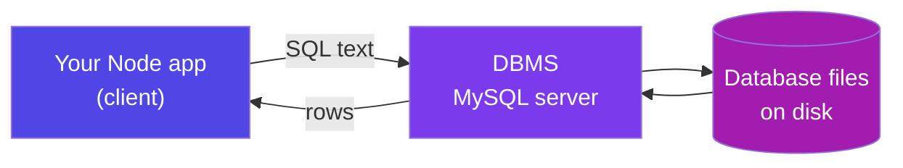

An **RDBMS** follows the **relational model**: data lives in tables connected by shared values. MySQL, PostgreSQL, Oracle, SQL Server, SQLite and SAP HANA are all relational.

| Type | Stores data as | Examples | Use it when |
|------|----------------|----------|-------------|
| **Relational** | Tables with fixed columns | MySQL, PostgreSQL, HANA | Data has structure and relationships; you need transactions. **Default choice** |
| **Document** | JSON documents | MongoDB, Firestore | Shape varies per record; you always fetch the whole document |
| **Key–Value** | `key → value`, nothing else | Redis, DynamoDB | Cache, sessions, counters — speed above all |
| **Graph** | Nodes + edges | Neo4j | Relationships *are* the data: friends-of-friends, fraud rings |
| **Columnar** | Columns stored together | Cassandra, ClickHouse, HANA | Analytics over billions of rows, few columns at a time |
| **Vector** | Embeddings (arrays of floats) | Pinecone, pgvector | "Find things that *mean* something similar" — AI / RAG |

**Real-world example — one company, four databases:** Swiggy might keep orders and payments in **PostgreSQL** (transactions), menus in **MongoDB** (every restaurant's shape differs), live delivery-partner locations in **Redis** (ok to lose), and a **ClickHouse** warehouse for analytics. This is *polyglot persistence*, and it's normal.

<p class="te"><strong>Telugu:</strong> Company lo okate database undali ani rule ledu — orders ki relational, menu ki document, live location ki Redis, analytics ki columnar. Deenine <strong>polyglot persistence</strong> antaru. Kaani nerchukovadam relational tho ne start cheyyali — 80% jobs adi.</p>

**Interview line:** *"SQL vs NoSQL" is the wrong question.* Ask "what shape is my data, and do I need multi-row transactions?" Structured + transactional → relational.

---

## A3. The Relational Model — Tables, Rows and Columns

**Simple definition:** All data is stored in **tables** (relations) with named, typed **columns** and **rows** — one row per real thing.

<p class="te"><strong>Telugu:</strong> Table ante Excel sheet laage — pai varusa column names, kinda prathi varusa oka record. Kaani Excel kanna strict: prathi column ki oka <strong>type</strong> untundi, and rules follow avvakapothe database accept cheyyadu.</p>

| Formal (exam) | Everyday (job) | Meaning |
|---------------|----------------|---------|
| Relation / Tuple / Attribute | Table / Row / Column | The grid / one thing / one property |
| Degree / Cardinality | — | Number of columns / rows |
| Domain | Data type | Allowed values for a column |

**The rules that make a table "relational":**

1. **Every row is unique** — guaranteed by a primary key.
2. **Order doesn't matter** — rows have no natural sequence. Want an order? Say `ORDER BY`. Never assume insertion order.
3. **One value per cell** — no arrays, no `"js,react,node"` in a column. This is the most common beginner mistake (B3 fixes it).
4. **One type per column** — a `DATE` column cannot hold `"tomorrow"`.

**The mental translation you already know:** an array of objects in JS is a **table**; an object is a **row**; a property is a **column**. Same shape — now on disk, typed, shared and enforced.

```js
const task = { id: 91, title: "Fix login bug", status: "open", userId: 7 };
// is exactly one row of:  tasks(id, title, status, user_id)
```

<p class="te"><strong>Telugu:</strong> JS lo array of objects unte, adi <strong>table</strong>. Okka object = <strong>row</strong>. Object property = <strong>column</strong>. Nuvvu already ee shape lo ne alochisthunnav — kevalam adi ippudu disk lo, types tho, rules tho untundi ante.</p>

---

## A4. Keys — Primary, Foreign, Composite and Surrogate

**Simple definition:** A **key** is a column (or set of columns) whose job is *identification*. The **primary key** identifies a row inside its table; a **foreign key** points at a row in another table.

<p class="te"><strong>Telugu:</strong> Key ante gurthu pattadaniki vaade column. <strong>Primary key</strong> = ee table lo ee row evaru (Aadhaar number laaga — unique, khaali kaadu). <strong>Foreign key</strong> = inko table lo unna row ni chupinche column (task lo <code>user_id</code> — aa user evaro cheptundi).</p>

| Key | Meaning | Example |
|-----|---------|---------|
| **Super key** | Any set of columns that identifies a row uniquely | `(id, email)` — works, but wasteful |
| **Candidate key** | A *minimal* super key | `id`, and also `email` |
| **Primary key (PK)** | The candidate key you chose. Unique + never NULL, one per table | `users.id` |
| **Alternate key** | The candidate keys you didn't choose (keep them `UNIQUE`) | `users.email` |
| **Composite key** | A primary key made of 2+ columns | `task_tags(task_id, tag_id)` |
| **Foreign key (FK)** | Column pointing at another table's PK | `tasks.user_id → users.id` |
| **Surrogate / natural key** | Meaningless generated id / a real-world value | `AUTO_INCREMENT` id / email, PAN, ISBN |

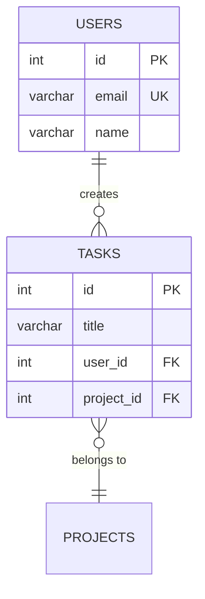

**Surrogate vs natural — the decision you will actually face.** Use a **surrogate** key, because real-world values change: people change email, companies re-issue employee codes, phone numbers get recycled. If `email` were the PK and it changed, every foreign key pointing at it would have to change too. An `AUTO_INCREMENT` id never changes because it never *means* anything.

```sql
CREATE TABLE users (
  id    INT AUTO_INCREMENT PRIMARY KEY,   -- meaningless, permanent
  email VARCHAR(255) NOT NULL UNIQUE      -- natural key, kept as an alternate key
);
```

**UUID vs AUTO_INCREMENT (a common interview question):** an `INT` is 4 bytes and inserts at the end of the index — fast; a `UUID` is 16–36 bytes and lands randomly, fragmenting the B-tree, but isn't guessable. Practical answer: `BIGINT AUTO_INCREMENT` as the PK, plus a public `uuid` column if ids shouldn't appear in URLs.

<p class="te"><strong>Telugu:</strong> Default ga <strong>AUTO_INCREMENT id</strong> vaadu — chinnadi, fast, eppudu maaradu. Email ni PK cheyyoddu (manishi email maarchukovachu). URL lo id kanipinchakudadu anukunte extra ga oka <code>uuid</code> column pettu — kaani lopala joins anni id tho ne.</p>

---

## A5. Inside the Box — How a Database Is Organised

**Simple definition:** A DBMS is layered: your SQL goes through a **parser**, an **optimizer** that decides *how* to fetch the data, an **execution engine**, a **buffer pool** in RAM, and finally files on disk — with a **log** that makes crashes survivable.

<p class="te"><strong>Telugu:</strong> Nuvvu SQL raasthe, database daanini parse chesi, <strong>optimizer</strong> "ee data ni ela teeyyali" ani plan chestundi (index vaadala, table motham chadavala), taruvatha execute chesi, RAM lo cache (buffer pool) nunchi ivvachu. Crash aithe <strong>log</strong> vaadi malli sarichestundi.</p>

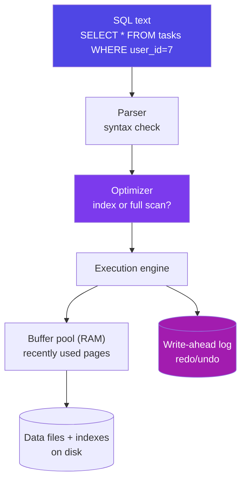

**Why the optimizer matters:** SQL is **declarative** — you say *what* you want, not *how*. Two queries that look identical can differ 1000× because one can use an index. `EXPLAIN` (H4) shows you the plan it chose.

**The three-schema architecture (a classic exam question):**

| Level | What it is | Real example |
|-------|------------|--------------|
| **External / View** | What one user or app sees | A view showing only `id, name` — salary hidden |
| **Conceptual / Logical** | The whole schema: tables, columns, constraints | Your `CREATE TABLE` statements |
| **Internal / Physical** | How bytes sit on disk — pages, files, indexes | InnoDB 16 KB pages, B-tree files |

The gaps give you **data independence**: add an index or move to a different disk without changing one query; add a column without breaking an app that reads a view. Your company moves MySQL to AWS RDS and adds three indexes — your Express code changes by zero lines. That is the reason the relational model won.

<p class="te"><strong>Telugu:</strong> <strong>Schema</strong> ante design (blueprint), <strong>instance</strong> ante ippudu andulo unna data — JS lo class vs object laaga. Database tana sonta structure ni kuda tables lo ne dachukuntundi; adi <code>information_schema</code>.</p>

---

## A6. Setup — MySQL, a Client, and Your First Query

**Simple definition:** You need three things: the **server** (the DBMS process), a **client** to type SQL into, and a **driver** so Node can talk to it.

<p class="te"><strong>Telugu:</strong> Moodu kaavali — <strong>server</strong> (MySQL process), <strong>client</strong> (SQL type cheyyadaniki — terminal or Workbench), and <strong>driver</strong> (Node nunchi matladadaniki — <code>mysql2</code> package).</p>

```bash
# Windows: MySQL Installer ("Developer Default") from dev.mysql.com
#          → MySQL Server 8 + Workbench (GUI) + CLI

# Docker (cleanest — delete it any time)
docker run --name mysql8 -e MYSQL_ROOT_PASSWORD=secret -p 3306:3306 -d mysql:8
docker exec -it mysql8 mysql -uroot -psecret
```

Port **3306** is MySQL's default (you met it in Phase 3); PostgreSQL uses 5432.

```sql
CREATE DATABASE tasktracker;   -- make a database
USE tasktracker;               -- switch into it
SHOW DATABASES;  SHOW TABLES;  -- list them
SELECT VERSION(), NOW();       -- prove the server is alive

CREATE TABLE users (
  id         INT AUTO_INCREMENT PRIMARY KEY,
  name       VARCHAR(100)  NOT NULL,
  email      VARCHAR(255)  NOT NULL UNIQUE,
  created_at TIMESTAMP     DEFAULT CURRENT_TIMESTAMP
);

INSERT INTO users (name, email) VALUES
  ('Nikhil', 'nikhil@example.com'), ('Asha', 'asha@example.com');

SELECT * FROM users;
```

**Habits that save you hours, starting today:**

| Habit | Why |
|-------|-----|
| End every statement with `;` | The client waits forever without it — that's what the `->` prompt means |
| Never work as `root` from an app | Create a limited user (J3) |
| Keep `CREATE TABLE`s in a `.sql` file in git | Your schema is source code, not something you clicked in a GUI |
| `SELECT` before `UPDATE`/`DELETE` | Run the `WHERE` as a SELECT first and look at the rows you're about to change |

<p class="te"><strong>Telugu:</strong> Rendu manchi alavatlu ippude nerchuko: (1) prathi statement chivara <code>;</code> pettadam, (2) <code>UPDATE</code> / <code>DELETE</code> munduga ade <code>WHERE</code> tho <code>SELECT</code> run chesi <strong>ye rows maarutunnayo chusukovadam</strong>. Ee rendo alavatu oka roju nee udyogaanni kaapadutundi.</p>

---

# Part B — Designing the Data: ER Modelling & Normalization

## B1. ER Modelling — Entities, Attributes, Relationships

**Simple definition:** An **ER (Entity–Relationship) model** is a drawing of your data *before* you write SQL. **Entities** are the nouns (User, Task, Project), **attributes** their properties, **relationships** the lines between them.

<p class="te"><strong>Telugu:</strong> Code raayakamundu <strong>paper meeda box-lu geeyyadam</strong> — deenine ER diagram antaru. Box = entity, box lopala unnavi = attributes, box la madhya lines = relationships. Ee 20 nimishalu taruvatha 3 rojula pani ni migulchutayi.</p>

**Finding your entities in 3 questions:** circle every **noun** in the app description; ask "do I store more than one fact about it?" (yes → table, no → column); ask "can it exist on its own?" (a Task exists, a task's *title* does not).

**Cardinality — the only four shapes that exist:**

| Relationship | Real example | How to implement |
|--------------|--------------|------------------|
| **1 : 1** | user ↔ user_profile | FK on either side, marked `UNIQUE` |
| **1 : N** | user → tasks | **FK on the "many" side** |
| **N : 1** | tasks → user | Same FK, seen from the other end |
| **M : N** | tasks ↔ tags | **A third (junction) table** |

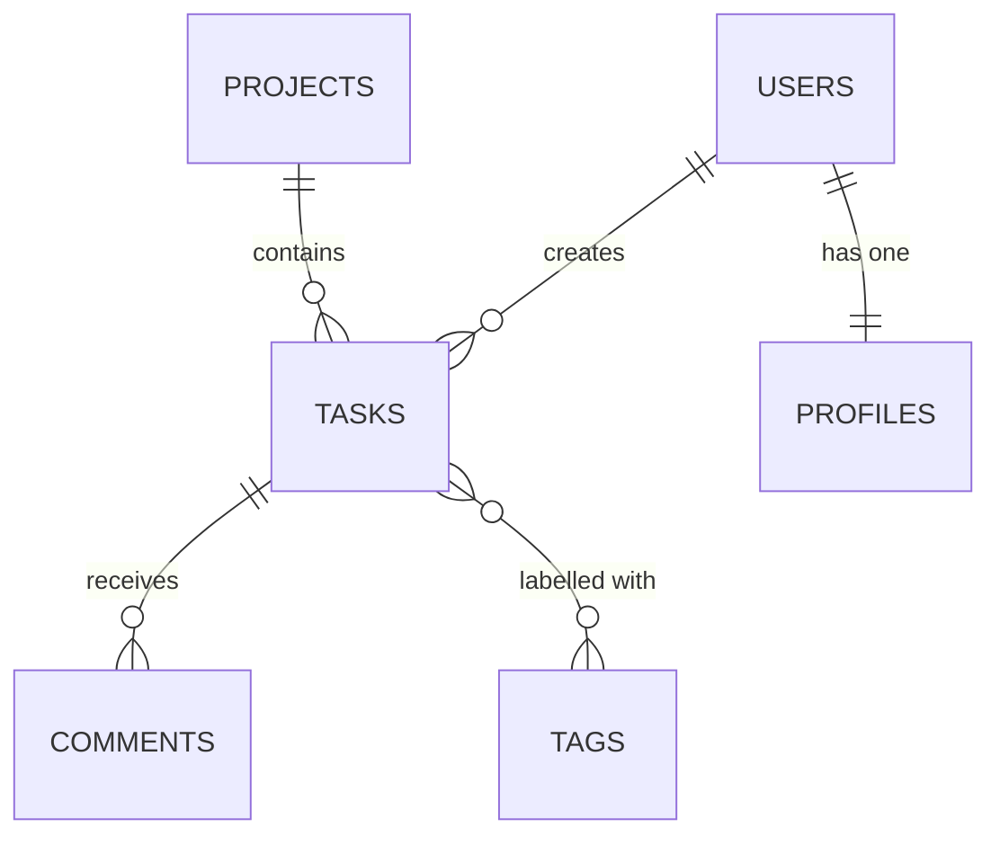

**Reading crow's-foot notation:** `||` exactly one · `o|` zero or one · `}o` zero or many · `}|` one or many. So `USERS ||--o{ TASKS` reads *one user has zero or many tasks; every task has exactly one user.*

**Participation:** if **every** task must have a user, participation is *total* → `user_id INT NOT NULL`. If a task may be unassigned, it's *partial* → nullable. Small to type, expensive to get wrong later.

<p class="te"><strong>Telugu:</strong> Modati rule: <strong>1:N lo foreign key eppudu "many" vaipuna</strong> untundi — user ki chala tasks unte, <code>user_id</code> tasks table lo untundi. Rendo rule: <strong>M:N ki eppudu moodo table</strong> kaavali. Ee rendu telisthe schema design lo sagam ayipoyinatte.</p>

---

## B2. From Diagram to Tables — The Mapping Rules

**Simple definition:** Converting an ER diagram to `CREATE TABLE`s is mechanical. Six rules cover every case you'll meet.

<p class="te"><strong>Telugu:</strong> Diagram nunchi tables ki maarchadam mechanical process — 6 rules ne. Okasari ivi nerchukunte, ye app schema ayina 15 nimishallo raayochu.</p>

| # | Rule | Result |
|---|------|--------|
| 1 | Each **entity** → one table | `users`, `tasks` |
| 2 | Each **simple attribute** → one column | `title VARCHAR(200)` |
| 3 | Each **composite attribute** → flatten into columns | `address_line1`, `city`, `pincode` |
| 4 | **1:N** → FK on the many side | `tasks.user_id` |
| 5 | **1:1** → FK on the optional side + `UNIQUE` | `profiles.user_id UNIQUE` |
| 6 | **M:N** or a multi-valued attribute → junction table, PK = the pair of FKs | `task_tags(task_id, tag_id)` |

```sql
CREATE TABLE task_tags (
  task_id INT NOT NULL,
  tag_id  INT NOT NULL,
  PRIMARY KEY (task_id, tag_id),                 -- composite PK: no duplicate pairs
  FOREIGN KEY (task_id) REFERENCES tasks(id) ON DELETE CASCADE,
  FOREIGN KEY (tag_id)  REFERENCES tags(id)  ON DELETE CASCADE
);
```

The composite primary key does real work: "tag 3 applied to task 91" becomes *impossible to store twice*, with zero application code.

**When the junction table grows up:** the moment the relationship has its own attributes, it becomes a real entity. `students ↔ courses` becomes `enrollments(student_id, course_id, enrolled_on, grade)`. `products ↔ orders` becomes `order_items(order_id, product_id, quantity, unit_price)` — and `unit_price` **must** be copied there, so the price on an old order never changes when the catalogue price does.

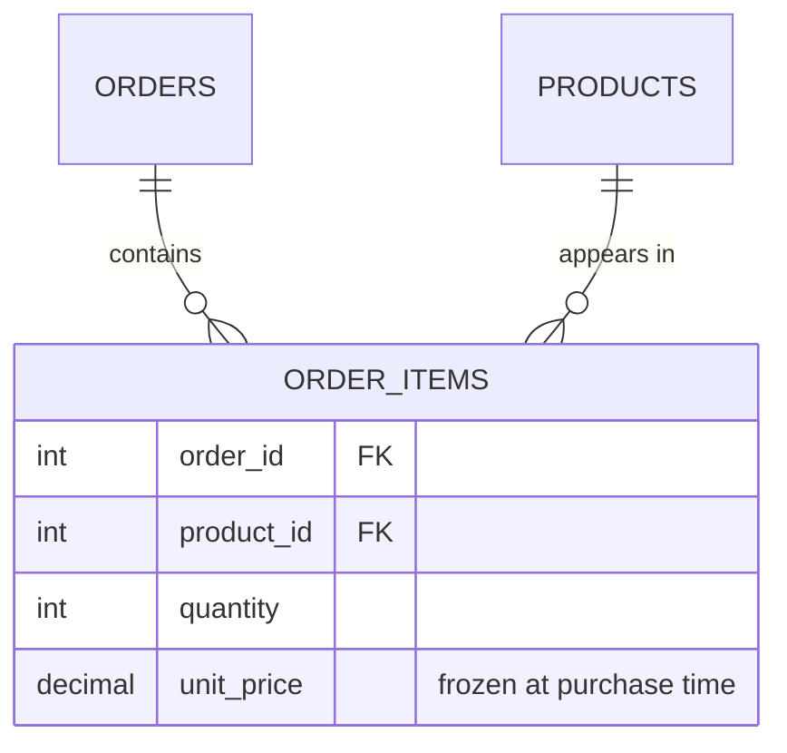

<p class="te"><strong>Telugu:</strong> Chala mukhyam: <code>order_items</code> lo <strong>unit_price</strong> copy chesi pettali. Repu product price maarithe purathana orders bill tappu avutundi. "Historical facts ni freeze cheyyali" ane rule idi.</p>

---

## B3. Normalization — 1NF, 2NF, 3NF, BCNF

**Simple definition:** **Normalization** is splitting tables so every fact is stored **exactly once**. Storing a fact twice means one day the two copies will disagree.

<p class="te"><strong>Telugu:</strong> Normalization ante — <strong>okka vishayaanni okate chota</strong> dachadam. Rendu chotla unte, repu okati maarchi rendodi marchipothe data tappu avutundi. Ade "anomaly".</p>

**The three anomalies that motivate the whole subject.** Take a deliberately bad table `(student_id, student_name, course, instructor, instructor_phone)`:

- **Update anomaly** — the instructor changes phone: you must update many rows; miss one and the database now claims two numbers.
- **Insert anomaly** — you can't add an instructor who has no students yet; there's nowhere to put them.
- **Delete anomaly** — the last student drops the course and the instructor's phone number vanishes from the company.

| Form | Rule | Plain English |
|------|------|---------------|
| **1NF** | Atomic values, no repeating groups | No `"js,react,node"` in one cell; no `phone1, phone2, phone3` |
| **2NF** | 1NF + no partial dependency on part of a composite key | Every non-key column depends on the **whole** key |
| **3NF** | 2NF + no transitive dependency | Non-key columns must not depend on **other non-key columns** |
| **BCNF** | Every determinant is a candidate key | Fixes rare cases with overlapping candidate keys |

**The mnemonic:** *every non-key attribute must depend on **the key** (1NF), **the whole key** (2NF), and **nothing but the key** (3NF) — so help me Codd.*

<p class="te"><strong>Telugu:</strong> Gurthu pettukovadaniki: prathi column <strong>the key, the whole key, and nothing but the key</strong> meeda depend avvali. 1NF = okka cell lo okate value. 2NF = composite key lo sagam meeda depend avvakudadu. 3NF = column meeda column depend avvakudadu.</p>

```
1NF ❌  tasks(id, title, tags)  where tags = 'urgent,backend,api'
        → can't be indexed; LIKE '%api%' also matches 'rapid-fire'
    ✅  tasks(id,title) + tags(id,name) + task_tags(task_id,tag_id)

2NF ❌  order_items(order_id, product_id, quantity, product_name)
                    └──── composite PK ────┘
        product_name depends on HALF the key (product_id) → partial dependency
    ✅  move product_name to products; keep only quantity + unit_price here

3NF ❌  employees(id, name, dept_id, dept_name, dept_location)
        id → dept_id → dept_name  (a non-key column determines other non-key columns)
    ✅  departments(id, name, location); employees keeps only dept_id
```

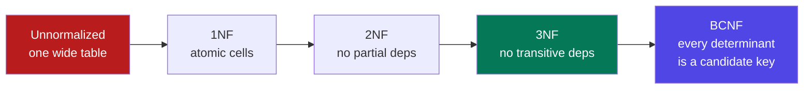

**How far in real work? 3NF.** BCNF/4NF (independent multi-valued facts split into two tables) and 5NF are exam topics you name-drop; you will not hand-derive them on the job.

**Real-world example:** `orders(id, customer_name, customer_email, customer_address, product_name, product_price, qty)` — one customer with ten orders stores their address ten times; they move house and nine rows are now lying. The 3NF version is five tables, and every fact lives once.

---

## B4. Denormalization — Breaking the Rules On Purpose

**Simple definition:** **Denormalization** is deliberately duplicating data to make reads faster — accepted only when you can prove the read pain and you handle the duplication.

<p class="te"><strong>Telugu:</strong> Konni sarlu kavaalane data ni repeat chestham — chadavadam fast kaavali kabatti. Kaani idi "sombherithanam" kaadu, oka <strong>decision</strong>. Munduga normalize cheyyi; slow ayithe, kolathalu chesaka ne denormalize cheyyi.</p>

The four patterns: a **counter column** (`posts.comment_count` instead of counting, updated on every write), a **copied column** (`order_items.product_name` — historical accuracy, correct rather than a hack), a **pre-joined reporting table** refreshed nightly, and a **materialized view** (Postgres/HANA — needs a refresh strategy).

**The rule:** normalize until it hurts, denormalize until it works — never before you have a slow query and an `EXPLAIN` proving why. YouTube doesn't `COUNT(*)` the views table; it keeps an asynchronously-updated counter, a few seconds stale, and nobody cares.

---

## B5. Choosing Data Types

**Simple definition:** The **data type** decides what a column can hold, how much space it takes, and how fast it compares. Choosing well is free performance and free validation.

<p class="te"><strong>Telugu:</strong> Data type sarigga select cheyyadam anedi uchitanga vachche performance + validation. Money ki eppudu <code>DECIMAL</code> — <code>FLOAT</code> vaadithe paisalu tappu avuthayi.</p>

| Need | Use | Not this — and why |
|------|-----|--------------------|
| Id | `INT`/`BIGINT AUTO_INCREMENT` | `VARCHAR` — 4× bigger, slower joins |
| Name, email, title | `VARCHAR(n)` with a sensible `n` | `TEXT` — can't be fully indexed, stored off-page |
| Long article body | `TEXT` | `VARCHAR(65535)` |
| **Money** | `DECIMAL(10,2)` | **`FLOAT`/`DOUBLE`** — `0.1+0.2 != 0.3` in binary floating point |
| Yes/No | `BOOLEAN` (`TINYINT(1)`) | `VARCHAR('yes')` |
| Fixed small set | `ENUM('open','done')` or a lookup table + FK | Free text — typos become new statuses |
| A moment in time | `DATETIME` (wall clock) or `TIMESTAMP` (UTC) | `VARCHAR` dates — sorting and date maths break |
| Just a date | `DATE` | `DATETIME` with a fake time |
| Flexible extra fields | `JSON` | 20 nullable columns "just in case" |

```sql
INSERT INTO payments VALUES (0.1 + 0.2, 0.1 + 0.2);      -- DOUBLE, DECIMAL(10,2)
SELECT amount_float = 0.3, amount_decimal = 0.30 FROM payments;
--   0   |   1          ← the FLOAT column lost the money
```

`DECIMAL(10,2)` = 10 digits total, 2 after the point → up to 99,999,999.99. Many Indian teams instead store **paise as a `BIGINT`** and divide in the UI — also correct, and immune to every rounding argument.

**TIMESTAMP vs DATETIME (a real production bug generator):** `DATETIME` stores what you typed and never converts (range 1000–9999); `TIMESTAMP` stores UTC and converts to the session timezone on read (range 1970–2038). Use `DATETIME` for wall-clock events ("7 pm local"), `TIMESTAMP` for instants (`created_at`, `updated_at`).

<p class="te"><strong>Telugu:</strong> <code>created_at</code>, <code>updated_at</code> ki <strong>TIMESTAMP</strong>. "Ee roju sayantram 7 gantalaki meeting" laanti wall-clock time ki <strong>DATETIME</strong>. Ee tedaa teliyakapothe server region maarinappudu anni times shift ayipothayi — real production bug idi.</p>

---

## B6. Constraints — Making Bad Data Impossible

**Simple definition:** A **constraint** is a rule the database itself enforces. Application code can be bypassed — by a script, a migration, an intern with Workbench open. The database cannot.

<p class="te"><strong>Telugu:</strong> Constraint ante database ne enforce chese rule. Nee Express validation ni evarina bypass cheyyochu, kaani database rule ni evaru bypass cheyyaleru. Anduke <strong>rendu chotla</strong> validate cheyyali: app lo manchi error message kosam, DB lo guarantee kosam.</p>

| Constraint | Guarantees |
|-----------|-------------|
| `NOT NULL` | A value must be present |
| `UNIQUE` | No two rows share it |
| `PRIMARY KEY` | `NOT NULL` + `UNIQUE`, one per table |
| `FOREIGN KEY` | The referenced row must exist |
| `CHECK` | An arbitrary condition (MySQL 8.0.16+) |
| `DEFAULT` | Fills in a value when none is given |

**Referential actions — what happens to children when the parent dies:**

| Action | Behaviour | Use for |
|--------|-----------|---------|
| `RESTRICT` / `NO ACTION` | **Refuse** the delete (the default) | Safe default; orders that must never vanish |
| `CASCADE` | Delete the children too | `task_tags` when a task goes; comments on a deleted post |
| `SET NULL` | Blank the FK (column must be nullable) | Task survives when its project is deleted |

**Name your constraints.** Unnamed ones give errors like `Duplicate entry for key 'users.email_2'`; named ones (`uq_users_email`) give errors you can translate into a friendly API message — exactly what your Phase 8 error handler needs:

```js
if (err.code === 'ER_DUP_ENTRY' && err.message.includes('uq_users_email')) {
  return res.status(409).json({ code: 'EMAIL_TAKEN', message: 'That email is already registered.' });
}
```

**Real-world example:** A team validated "email must be unique" only in Node. Two signup requests arrived 4 ms apart, both `SELECT`ed "no such email", both inserted — duplicate account, split history, a support ticket. A `UNIQUE` index makes the second insert fail at the only layer where the check is atomic.

<p class="te"><strong>Telugu:</strong> Rendu requests okesari vachchinappudu app-level check fail avutundi (rendu "email ledu" ani chusi rendu insert chestayi). <code>UNIQUE</code> constraint okate ee race ni aapagaladu. Anduke: <strong>rules eppudu database lo kuda pettu</strong>.</p>

---

## B7. Case Study — The Task Tracker Schema

**Simple definition:** The complete schema used for the rest of this guide (and for your Phase 6 + 7 capstone), designed with everything from B1–B6.

<p class="te"><strong>Telugu:</strong> Ide mana example schema — ee guide antha ee tables meede queries raastham. Nee Phase 6 React app + Phase 7 Express API deeniki ne connect avutundi. Ippude type chesi save cheskho.</p>

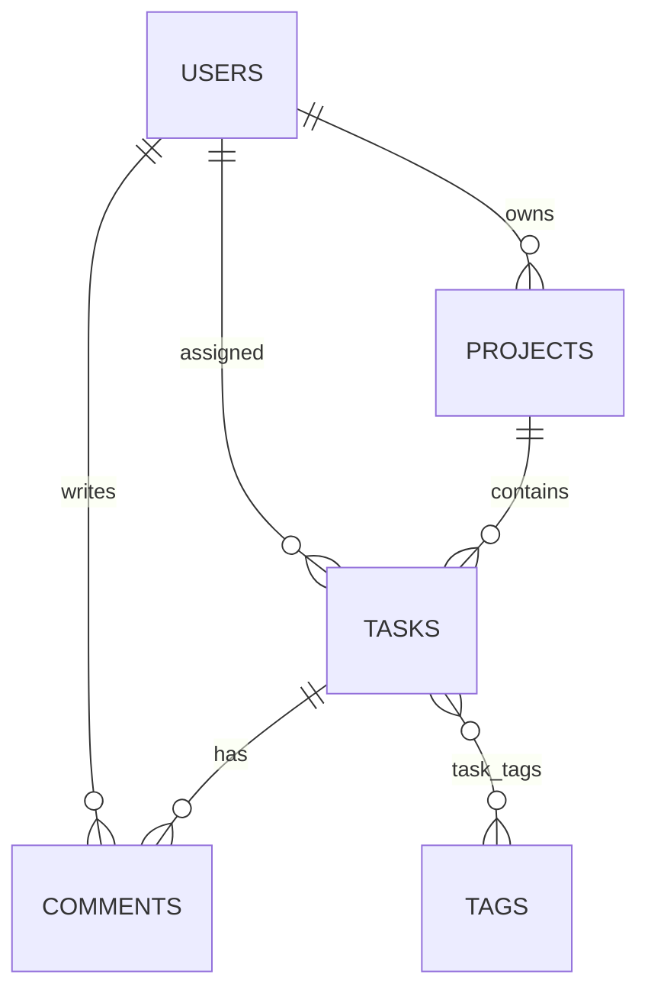

```sql
CREATE TABLE users (
  id            INT AUTO_INCREMENT PRIMARY KEY,
  name          VARCHAR(100) NOT NULL,
  email         VARCHAR(255) NOT NULL,
  password_hash VARCHAR(255) NOT NULL,          -- bcrypt, never the password
  role          ENUM('member','admin') NOT NULL DEFAULT 'member',
  created_at    TIMESTAMP DEFAULT CURRENT_TIMESTAMP,
  CONSTRAINT uq_users_email UNIQUE (email)
);

CREATE TABLE projects (
  id       INT AUTO_INCREMENT PRIMARY KEY,
  name     VARCHAR(120) NOT NULL,
  owner_id INT NOT NULL,
  CONSTRAINT fk_project_owner FOREIGN KEY (owner_id) REFERENCES users(id)
);

CREATE TABLE tasks (
  id          INT AUTO_INCREMENT PRIMARY KEY,
  title       VARCHAR(200) NOT NULL,
  description TEXT NULL,
  status      ENUM('open','in_progress','done') NOT NULL DEFAULT 'open',
  priority    TINYINT NOT NULL DEFAULT 3,
  due_date    DATE NULL,
  user_id     INT NOT NULL,
  project_id  INT NULL,
  version     INT NOT NULL DEFAULT 0,           -- optimistic locking (I5)
  created_at  TIMESTAMP DEFAULT CURRENT_TIMESTAMP,
  updated_at  TIMESTAMP DEFAULT CURRENT_TIMESTAMP ON UPDATE CURRENT_TIMESTAMP,
  CONSTRAINT chk_priority CHECK (priority BETWEEN 1 AND 5),
  CONSTRAINT fk_task_user    FOREIGN KEY (user_id)    REFERENCES users(id)    ON DELETE CASCADE,
  CONSTRAINT fk_task_project FOREIGN KEY (project_id) REFERENCES projects(id) ON DELETE SET NULL
);

CREATE TABLE comments (
  id         INT AUTO_INCREMENT PRIMARY KEY,
  task_id    INT NOT NULL,
  user_id    INT NOT NULL,
  body       TEXT NOT NULL,
  created_at TIMESTAMP DEFAULT CURRENT_TIMESTAMP,
  CONSTRAINT fk_comment_task FOREIGN KEY (task_id) REFERENCES tasks(id) ON DELETE CASCADE,
  CONSTRAINT fk_comment_user FOREIGN KEY (user_id) REFERENCES users(id)
);

CREATE TABLE tags (
  id   INT AUTO_INCREMENT PRIMARY KEY,
  name VARCHAR(50) NOT NULL UNIQUE
);

CREATE TABLE task_tags (
  task_id INT NOT NULL,
  tag_id  INT NOT NULL,
  PRIMARY KEY (task_id, tag_id),
  FOREIGN KEY (task_id) REFERENCES tasks(id) ON DELETE CASCADE,
  FOREIGN KEY (tag_id)  REFERENCES tags(id)  ON DELETE CASCADE
);
```

**Decisions defended:** `email` is `UNIQUE` but not the PK (people change emails) · `password_hash`, never `password` · `status` is an `ENUM`, so `'Done '` with a stray space is rejected · `project_id` is nullable with `SET NULL` (a task survives its project) while `user_id` is `NOT NULL` with `CASCADE` · `task_tags`' composite PK stops a tag being attached twice.

```sql
INSERT INTO users (name,email,password_hash) VALUES
 ('Nikhil','nikhil@ex.com','$2b$x'),('Asha','asha@ex.com','$2b$x'),('Ravi','ravi@ex.com','$2b$x');
INSERT INTO projects (name,owner_id) VALUES ('Website',1),('Mobile App',2);
INSERT INTO tasks (title,status,priority,due_date,user_id,project_id) VALUES
 ('Fix login bug','open',1,'2026-08-20',1,1), ('Write tests','in_progress',2,'2026-08-25',1,1),
 ('Deploy API','done',3,'2026-08-10',2,1),    ('Design splash','open',4,NULL,2,2),
 ('Push notifications','open',2,'2026-09-01',3,2);
INSERT INTO tags (name) VALUES ('urgent'),('backend'),('ui');
INSERT INTO task_tags VALUES (1,1),(1,2),(2,2),(4,3);
INSERT INTO comments (task_id,user_id,body) VALUES
 (1,2,'Reproduced on Chrome'),(1,3,'Same on Firefox'),(3,1,'Deployed at 4pm');
```

<p class="te"><strong>Telugu:</strong> Prathi table lo <strong>created_at, updated_at</strong> pettadam alavatu chesko — repu "ee row eppudu vachindi?" ani adigithe answer undali. Inko rule: password ni eppudu store cheyyakku, kevalam <strong>hash</strong> ne.</p>

---

# Part C — SQL Basics: Talking to the Database

## C1. The Five Sub-Languages of SQL

**Simple definition:** SQL looks like one language but is really five families of commands. Which family a command belongs to tells you whether it can be rolled back.

<p class="te"><strong>Telugu:</strong> SQL lo aidu vibhagalu unnayi. Mukhyam ga gurthupettukovalsinadi: <strong>DDL commands (CREATE, DROP) auto-commit avuthayi</strong> — vaatini rollback cheyyaleru. DML (INSERT, UPDATE, DELETE) ni matram rollback cheyyochu.</p>

| Family | Full name | Commands | Rollback-able? |
|--------|-----------|----------|----------------|
| **DDL** | Data **Definition** | `CREATE`, `ALTER`, `DROP`, `TRUNCATE`, `RENAME` | ❌ No (implicit commit in MySQL) |
| **DML** | Data **Manipulation** | `INSERT`, `UPDATE`, `DELETE` | ✅ Yes |
| **DQL** | Data **Query** | `SELECT` | n/a |
| **DCL** | Data **Control** | `GRANT`, `REVOKE` | ❌ No |
| **TCL** | **Transaction** Control | `COMMIT`, `ROLLBACK`, `SAVEPOINT` | — |

You can wrap `UPDATE`s in a transaction and undo a mistake. You cannot undo `DROP TABLE users;` — in MySQL it commits instantly and your only path back is the backup. *PostgreSQL differs*: DDL there is transactional, so `BEGIN; DROP TABLE …; ROLLBACK;` actually works.

---

## C2. DDL — Creating and Changing Structure

**Simple definition:** DDL builds and reshapes the containers: databases, tables, columns and indexes.

<p class="te"><strong>Telugu:</strong> DDL ante structure ni thayaru chesedi — tables create cheyyadam, columns add cheyyadam, drop cheyyadam. Data ni kaadu, <strong>data undevi (containers)</strong> ni maarchedi.</p>

```sql
CREATE DATABASE IF NOT EXISTS tasktracker
  CHARACTER SET utf8mb4 COLLATE utf8mb4_unicode_ci;   -- utf8mb4 = real Unicode + emoji
USE tasktracker;

DESCRIBE tasks;            -- columns, types, nullability, keys
SHOW CREATE TABLE tasks;   -- the exact DDL, including constraints and indexes
SHOW INDEX FROM tasks;

ALTER TABLE tasks ADD COLUMN archived BOOLEAN NOT NULL DEFAULT FALSE;
ALTER TABLE tasks MODIFY COLUMN title VARCHAR(300) NOT NULL;   -- change the type
ALTER TABLE tasks CHANGE COLUMN body description TEXT;         -- rename + retype
ALTER TABLE tasks DROP COLUMN archived;
ALTER TABLE tasks ADD INDEX idx_tasks_status (status);
ALTER TABLE tasks ADD CONSTRAINT fk_task_user
  FOREIGN KEY (user_id) REFERENCES users(id) ON DELETE CASCADE;
```

**`DROP` vs `TRUNCATE` vs `DELETE` — a guaranteed interview question:**

| | `DELETE FROM t` | `TRUNCATE TABLE t` | `DROP TABLE t` |
|---|---|---|---|
| Removes | Rows (can use `WHERE`) | **All** rows | Rows **and** the table |
| Type / Rollback | DML / ✅ | DDL / ❌ | DDL / ❌ |
| Speed on 10M rows | Slow (row by row, logged) | Instant (deallocates pages) | Instant |
| Fires triggers | ✅ | ❌ | ❌ |
| Resets `AUTO_INCREMENT` | No | **Yes** | n/a |

<p class="te"><strong>Telugu:</strong> <strong>DELETE</strong> = rows theeseyyadam (WHERE tho, rollback avutundi). <strong>TRUNCATE</strong> = table motham khaali cheyyadam, chala fast, kaani undo ledu. <strong>DROP</strong> = table ne maayam cheyyadam. Interview lo ee moodinti tedaa tappakunda adugutharu.</p>

---

## C3. SELECT — The Anatomy of a Query

**Simple definition:** `SELECT` reads data. Every complex query in this guide is this one skeleton with more pieces filled in.

<p class="te"><strong>Telugu:</strong> Ee guide lo unna prathi peddha query kuda ee <strong>okate skeleton</strong> — kevalam ekkuva parts nimpithe. Ee order ni bat-tee pattinchu.</p>

```sql
SELECT   column_list          -- 5. what to show
FROM     table                -- 1. where to read from
JOIN     other ON condition   -- 2. what to attach
WHERE    row_condition        -- 3. which rows (before grouping)
GROUP BY column               -- 4. collapse rows into groups
HAVING   group_condition      -- 4b. which groups (after grouping)
ORDER BY column [ASC|DESC]    -- 6. sort the result
LIMIT    n OFFSET m;          -- 7. take a slice
```

**The logical execution order — the single most clarifying fact in SQL.** You *write* `SELECT` first; the database *runs* it fifth:


```sql
-- ❌ Fails: WHERE runs BEFORE SELECT, so the alias doesn't exist yet
SELECT price * qty AS total FROM order_items WHERE total > 500;
-- ✅ Repeat the expression in WHERE… but ORDER BY runs AFTER SELECT, so the alias works there
SELECT price * qty AS total FROM order_items WHERE price * qty > 500 ORDER BY total DESC;

SELECT id, title, status FROM tasks;                    -- named columns (always in app code)
SELECT title AS task_name, priority AS p FROM tasks;    -- aliases
SELECT t.title, u.name FROM tasks t JOIN users u ON u.id = t.user_id;   -- table aliases
```

**Never write `SELECT *` in application code:** someone adds a `password_hash` column and your API leaks it, you pull `TEXT` you don't render, and it blocks *covering indexes* (H3).

<p class="te"><strong>Telugu:</strong> CLI lo <code>SELECT *</code> ok. Kaani <strong>app code lo eppudu columns peru raayali</strong>. Repu evaro <code>password_hash</code> column add cheste adi nee API response lo velli poddi — and covering index kuda panicheyyadu.</p>

---

## C4. WHERE — Filtering Rows

**Simple definition:** `WHERE` keeps only the rows whose condition is TRUE. Everything else — FALSE *and* UNKNOWN — is dropped.

<p class="te"><strong>Telugu:</strong> <code>WHERE</code> ante filter. Condition TRUE ayina rows ne vasthayi. Idi JS lo <code>array.filter()</code> laage, kaani millions rows meeda index vaadi chala fast ga chestundi.</p>

| Operator | Meaning | Example |
|----------|---------|---------|
| `= != <> < > <= >=` | Comparison | `WHERE priority <= 2` |
| `AND OR NOT` | Combine | `WHERE status='open' AND priority=1` |
| `BETWEEN a AND b` | Range, **inclusive** both ends | `WHERE due_date BETWEEN '2026-08-01' AND '2026-08-31'` |
| `IN (…)` / `NOT IN (…)` | Matches any / none — `NOT IN` is **dangerous with NULLs** | `WHERE status IN ('open','in_progress')` |
| `LIKE` | Pattern: `%` = any run, `_` = one char | `WHERE title LIKE 'Fix%'` |
| `IS NULL` / `IS NOT NULL` | The **only** way to test NULL | `WHERE due_date IS NULL` |
| `REGEXP` | Regular expression | `WHERE email REGEXP '^[a-z]+@'` |

```sql
SELECT title, priority FROM tasks WHERE status = 'open' AND priority <= 2;
SELECT title FROM tasks WHERE title LIKE '%bug%';          -- contains "bug"
SELECT title FROM tasks WHERE user_id IN (1,3) AND status <> 'done';
```

**Two traps that cost real time:**

1. **`AND` binds tighter than `OR`.** `WHERE a AND b OR c` means `(a AND b) OR c`. Always bracket: `WHERE user_id = 1 AND (status='open' OR status='done')` — without the brackets you get every 'done' task from every user.
2. **A leading `%` kills the index.** `LIKE 'Fix%'` is a prefix scan and can use an index; `LIKE '%bug%'` scans the whole table. For real text search use a **FULLTEXT** index:
   ```sql
   ALTER TABLE tasks ADD FULLTEXT INDEX ft_tasks_title (title, description);
   SELECT * FROM tasks WHERE MATCH(title, description) AGAINST ('login bug');
   ```

<p class="te"><strong>Telugu:</strong> <code>LIKE 'Fix%'</code> index vaadutundi (fast). <code>LIKE '%bug%'</code> — modatlo <code>%</code> unte index panicheyyadu, table motham scan avutundi. Nijamaina search kaavali ante <strong>FULLTEXT index</strong> vaadu.</p>

**Case sensitivity:** MySQL's default collation makes `WHERE name = 'nikhil'` match `'Nikhil'`. PostgreSQL is case-**sensitive** and needs `ILIKE` or `LOWER()`. This surprises people migrating between the two.

---

## C5. NULL — The Three-Valued Logic Trap

**Simple definition:** `NULL` means **"unknown"**, not zero and not empty string. Any comparison *with* an unknown produces UNKNOWN — not TRUE, not FALSE.

<p class="te"><strong>Telugu:</strong> <code>NULL</code> ante <strong>"teliyadu"</strong> — zero kaadu, khaali string kaadu. Teliyani daanitho compare chesthe answer kuda "teliyadu" ne vastundi. Anduke <code>= NULL</code> eppudu panicheyyadu; <code>IS NULL</code> vaadali. Idi SQL lo #1 bug source.</p>

```sql
SELECT NULL = NULL;      -- NULL  (not 1!)
SELECT 10 + NULL;        -- NULL — one unknown poisons the whole expression
SELECT CONCAT('a',NULL); -- NULL
SELECT NULL IS NULL;     -- 1  ✅ the only test that works
```

| A | B | `A AND B` | `A OR B` |
|---|---|-----------|----------|
| TRUE | NULL | NULL | **TRUE** |
| FALSE | NULL | **FALSE** | NULL |
| NULL | NULL | NULL | NULL |

**The three NULL bugs, in order of how often they bite:**

```sql
-- 1. WHERE drops UNKNOWN rows. This does NOT return tasks whose status is NULL:
SELECT * FROM tasks WHERE status != 'done';
--   ✅ SELECT * FROM tasks WHERE status != 'done' OR status IS NULL;

-- 2. NOT IN with a NULL anywhere in the list returns ZERO rows, silently:
SELECT * FROM users WHERE id NOT IN (SELECT user_id FROM tasks);
--   ✅ use NOT EXISTS, or add "WHERE user_id IS NOT NULL" to the subquery.

-- 3. Aggregates skip NULLs — COUNT(col) ignores them, COUNT(*) does not:
SELECT COUNT(*), COUNT(due_date), AVG(priority) FROM tasks;
--       5             4           <- AVG divides by the non-NULL count only
```

| Function | Does |
|----------|------|
| `IS NULL` / `IS NOT NULL` | The only valid test |
| `IFNULL(x, alt)` | MySQL: substitute for NULL |
| `COALESCE(a,b,c)` | First non-NULL — **standard SQL, prefer this** |
| `NULLIF(a,b)` | NULL when a = b — the divide-by-zero guard: `total / NULLIF(count,0)` |
| `<=>` | MySQL NULL-safe equals: TRUE when both sides are NULL |

**Design advice:** make columns `NOT NULL DEFAULT …` wherever a value always exists. Allow NULL only when "unknown" is a real state (no due date yet) — every nullable column is an `if` you handle forever.

<p class="te"><strong>Telugu:</strong> Rule: value eppudu untundi ante <code>NOT NULL DEFAULT</code> pettu. NULL ni kevalam "nijanga teliyadu" ane artham unnappude vaadu. Prathi nullable column nee code lo oka extra <code>if</code> — daaniki tagina karanam undali.</p>

---

## C6. Sorting, Limiting and De-duplicating

**Simple definition:** `ORDER BY` sorts, `LIMIT`/`OFFSET` takes a slice, `DISTINCT` removes duplicate rows from the result.

<p class="te"><strong>Telugu:</strong> Rows ki sonta order ledu — kaavalante <code>ORDER BY</code> raayali. Pagination ki <code>LIMIT</code> + <code>OFFSET</code>. Duplicate rows theeyyadaniki <code>DISTINCT</code>.</p>

```sql
SELECT title, priority FROM tasks ORDER BY priority ASC, due_date DESC;
SELECT DISTINCT status FROM tasks;                                 -- open, in_progress, done
SELECT * FROM tasks ORDER BY created_at DESC, id DESC LIMIT 10 OFFSET 20;   -- page 3
```

- **`ASC` is the default.** NULLs sort **first** in MySQL ascending (last in PostgreSQL, which also has `NULLS LAST`). To force them last in MySQL: `ORDER BY due_date IS NULL, due_date`.
- **Always add a tie-breaker.** `ORDER BY created_at DESC` alone is *unstable* when timestamps tie, so paginated results repeat or skip rows. Add `, id DESC`.
- **`LIMIT` without `ORDER BY` is a bug** — "any 10 rows" may change between runs.
- **`DISTINCT` applies to the whole row**, not one column: `SELECT DISTINCT status, user_id` returns unique *pairs*.
- **Deep `OFFSET` is slow** — `LIMIT 10 OFFSET 100000` walks 100,010 rows to throw 100,000 away. H6 shows keyset pagination, which is the fix and connects to the cursor pagination in your Phase 8 notes.

---

## C7. INSERT, UPDATE, DELETE — Changing Data Safely

**Simple definition:** These three are the "write" half of DML. Each deserves a `WHERE` you have checked twice.

<p class="te"><strong>Telugu:</strong> Ee moodu commands tho data maarutundi. Prathi sari <code>WHERE</code> ni rendu sarlu chudu — <code>WHERE</code> lekunda <code>UPDATE</code>/<code>DELETE</code> raasthe <strong>table motham</strong> maaripotundi.</p>

```sql
-- Many rows in ONE statement: 10-50× faster than a loop of single inserts
INSERT INTO tags (name) VALUES ('sql'),('mysql'),('nodejs');

-- Insert from a query
INSERT INTO archived_tasks (id, title)
SELECT id, title FROM tasks WHERE status='done' AND updated_at < '2026-01-01';

-- Upsert: insert, or update if it already exists
INSERT INTO tags (id, name) VALUES (1,'urgent')
ON DUPLICATE KEY UPDATE name = VALUES(name);
-- PostgreSQL: INSERT … ON CONFLICT (id) DO UPDATE SET name = EXCLUDED.name;

UPDATE tasks SET status='done', updated_at=NOW() WHERE id = 3;
UPDATE tasks SET priority = priority - 1 WHERE due_date < CURDATE() AND priority > 1;

DELETE FROM tasks WHERE status='done' AND updated_at < '2025-01-01' LIMIT 1000;
```

`LAST_INSERT_ID()` returns the id the database just generated — in Node, `result.insertId` (Part K).

**Soft delete — what most production apps actually do:**

```sql
ALTER TABLE tasks ADD COLUMN deleted_at TIMESTAMP NULL;
UPDATE tasks SET deleted_at = NOW() WHERE id = 5;      -- "delete"
SELECT * FROM tasks WHERE deleted_at IS NULL;          -- every read must filter
```

**The four safety rules — print these:**

| Rule | How |
|------|-----|
| 1. `SELECT` first | Run the exact same `WHERE` as a SELECT and look at the rows |
| 2. Safe-update mode | `SET SQL_SAFE_UPDATES = 1;` — MySQL then refuses an UPDATE/DELETE with no key in `WHERE` |
| 3. Wrap in a transaction | `START TRANSACTION; UPDATE …; SELECT …;` → looks right? `COMMIT;` else `ROLLBACK;` |
| 4. Batch big deletes | `LIMIT 1000` in a loop — a 10M-row `DELETE` locks the table and fills the log |

**Real-world example:** In 2017 a GitLab engineer deleted 300 GB of live data by running it against production instead of the standby — and the backups turned out not to work. The lesson isn't "be careful", it's *make the dangerous thing hard*.

<p class="te"><strong>Telugu:</strong> Peddha companies lo kuda ee tappu jarigindi (GitLab 2017 — production lo delete chesi 300 GB data poyindi, backups kuda panicheyyaledu). Nerchukovalsinadi: <strong>transaction lo pettu, SELECT tho verify cheyyi, appude COMMIT cheyyi</strong>.</p>

---

# Part D — Functions: Shaping Values Inside the Query

## D1. String Functions

**Simple definition:** String functions transform text *inside* the database, so you don't pull raw rows into Node just to reformat them.

<p class="te"><strong>Telugu:</strong> Text ni database lo ne maarchagalam — full name join cheyyadam, chinna akshralaki maarchadam, koncham part teeyyadam. Idi Node ki data pampi appudu maarchadam kanna fast.</p>

| Function | Does | Example → result |
|----------|------|------------------|
| `CONCAT(a,b)` / `CONCAT_WS(sep,…)` | Joins / joins with a separator, **skipping NULLs** | `CONCAT_WS(', ','Hyderabad',NULL)` → `Hyderabad` |
| `UPPER` / `LOWER` | Case | `LOWER(email)` |
| `LENGTH` / `CHAR_LENGTH` | Bytes / characters | `LENGTH('café')` → 5, `CHAR_LENGTH('café')` → 4 |
| `TRIM` / `LTRIM` / `RTRIM` | Removes spaces | `TRIM('  a  ')` → `a` |
| `SUBSTRING(s,pos,len)` | Slice — **1-indexed**, not 0 | `SUBSTRING('database',1,4)` → `data` |
| `LEFT` / `RIGHT` | From an end | `LEFT(title,20)` |
| `REPLACE(s,from,to)` | Swap text | `REPLACE(phone,'-','')` |
| `LOCATE(sub,s)` | Position, 0 if absent | `LOCATE('@',email)` |
| `LPAD` / `RPAD` | Pad to width | `LPAD(id,6,'0')` → `000091` |
| `SUBSTRING_INDEX(s,d,n)` | Split by delimiter | `SUBSTRING_INDEX(email,'@',-1)` → the domain |

```sql
SELECT
  CONCAT(UPPER(LEFT(name,1)), LOWER(SUBSTRING(name,2)))  AS proper_name,
  SUBSTRING_INDEX(email,'@',-1)                          AS domain,
  CONCAT('TASK-', LPAD(id,5,'0'))                        AS ticket_no
FROM users JOIN tasks ON tasks.user_id = users.id;
```

**Careful — a function on a column disables its index.** `WHERE LOWER(email) = 'a@b.com'` cannot use the index on `email`; `WHERE email = 'a@b.com'` can. Keep the column bare on the left of a comparison and let the collation handle case.

<p class="te"><strong>Telugu:</strong> <strong>Mukhyamaina rule:</strong> <code>WHERE</code> lo column meeda function pettaku — <code>WHERE LOWER(email) = ...</code> raasthe index panicheyyadu. Column ni yathaathadhamga vunchi, value ni maarchu.</p>

---

## D2. Numbers, Rounding and Money

**Simple definition:** Numeric functions do maths inside the query — totals, percentages, rounding.

<p class="te"><strong>Telugu:</strong> Lekkalu database lone cheyyochu. Okka jagratha: percentage lekkalu ki eppudu <code>* 100.0</code> laaga float ga maarchu, lekapothe integer division lo decimals poyye prammadam undi.</p>

| Function | Result |
|----------|--------|
| `ROUND(3.567, 2)` / `CEIL(3.1)` / `FLOOR(3.9)` | `3.57` / `4` / `3` |
| `ABS(-7)` / `MOD(10,3)` / `POWER(2,10)` / `SQRT(81)` | `7` / `1` / `1024` / `9` |
| `GREATEST(a,b,c)` / `LEAST(…)` | Biggest / smallest of the arguments |
| `FORMAT(1234567.891, 2)` | `1,234,567.89` (a *string* — display only) |

```sql
-- Percentage of tasks done per user — note the * 100.0
SELECT user_id, ROUND(SUM(status='done') * 100.0 / COUNT(*), 1) AS pct_done
FROM tasks GROUP BY user_id;
```

`SUM(status='done')` works because a boolean is 1 or 0 in MySQL — a compact "count rows matching a condition". The portable form is `SUM(CASE WHEN status='done' THEN 1 ELSE 0 END)`.

---

## D3. Dates and Times

**Simple definition:** Date functions let you filter by "this month", compute ages and durations, and format output — all in SQL.

<p class="te"><strong>Telugu:</strong> Dates tho pani cheyyadam SQL lo chala sulabham — "ee nela lo", "7 rojula lopala", "entha rojulu aindi" anni okka line lo. Kaani filter lo <strong>column meeda function</strong> pettaku — index poddi.</p>

| Function | Does |
|----------|------|
| `NOW()` / `CURDATE()` / `CURTIME()` | Current datetime / date / time |
| `DATE(dt)` / `YEAR/MONTH/DAY/HOUR(dt)` | Extract parts |
| `DATE_FORMAT(dt,'%d-%b-%Y')` | `14-Aug-2026` |
| `DATE_ADD(d, INTERVAL 7 DAY)` | Also `- INTERVAL`, `MONTH`, `YEAR`, `HOUR` |
| `DATEDIFF(a,b)` / `TIMESTAMPDIFF(unit,a,b)` | Whole days / difference in any unit |
| `LAST_DAY(d)` / `DAYNAME(d)` | Last day of that month / `'Friday'` |

```sql
SELECT title, DATEDIFF(due_date, CURDATE()) AS days_left,
       DATE_FORMAT(created_at, '%d %b %Y, %h:%i %p') AS created_pretty
FROM tasks WHERE due_date IS NOT NULL;

SELECT title FROM tasks WHERE due_date < CURDATE() AND status <> 'done';   -- overdue
SELECT title FROM tasks
WHERE due_date BETWEEN CURDATE() AND DATE_ADD(CURDATE(), INTERVAL 7 DAY);  -- due this week
```

**The index-killing date filter, and its fix:**

```sql
-- ❌ Function on the column: full table scan
WHERE YEAR(created_at) = 2026 AND MONTH(created_at) = 8
-- ✅ A range on the bare column: uses the index
WHERE created_at >= '2026-08-01' AND created_at < '2026-09-01'
```

Note `< '2026-09-01'` rather than `<= '2026-08-31'` — the latter silently drops everything that happened *during* 31 August after midnight. Half-open ranges are always correct for datetimes.

<p class="te"><strong>Telugu:</strong> Nela vaari filter ki <code>YEAR()</code>, <code>MONTH()</code> vaadaku — range vaadu. Inko sookshmam: <code>&lt;= '2026-08-31'</code> anaku, <code>&lt; '2026-09-01'</code> anu. Lekapothe 31st roju madhyahnam data motham poddi.</p>

**Timezones:** store instants in **UTC**, convert at the edges (display in the user's timezone; set the session timezone once in your connection config). `CONVERT_TZ(dt,'+00:00','+05:30')` converts inside SQL when you must.

---

## D4. CASE, COALESCE and Conditional Logic

**Simple definition:** `CASE` is SQL's `if/else`. It works anywhere an expression works — `SELECT`, `WHERE`, `ORDER BY`, even inside `SUM()`.

<p class="te"><strong>Telugu:</strong> <code>CASE WHEN</code> ante SQL lo <code>if / else if / else</code>. Idi kevalam <code>SELECT</code> lo kaadu — <code>ORDER BY</code> lo, <code>SUM()</code> lopala kuda vaadochu. Chala power ee okka keyword lo undi.</p>

```sql
SELECT title, priority,
  CASE WHEN priority = 1         THEN 'Critical'
       WHEN priority = 2         THEN 'High'
       WHEN due_date < CURDATE() THEN 'Overdue'
       ELSE 'Normal' END AS label
FROM tasks;

-- 1. Custom sort order (statuses aren't alphabetical in real life)
SELECT title, status FROM tasks
ORDER BY CASE status WHEN 'in_progress' THEN 1 WHEN 'open' THEN 2 ELSE 3 END, priority;

-- 2. Conditional aggregation — a pivot table in one query
SELECT user_id,
  SUM(CASE WHEN status='open'        THEN 1 ELSE 0 END) AS open_cnt,
  SUM(CASE WHEN status='in_progress' THEN 1 ELSE 0 END) AS wip_cnt,
  SUM(CASE WHEN status='done'        THEN 1 ELSE 0 END) AS done_cnt
FROM tasks GROUP BY user_id;

-- 3. Safe defaults for display
SELECT COALESCE(NULLIF(TRIM(description),''), 'No description') AS descr FROM tasks;
```

| Helper | Meaning |
|--------|---------|
| `IF(cond, a, b)` | MySQL shorthand for a two-branch CASE |
| `IFNULL(x, alt)` | MySQL only |
| `COALESCE(a,b,…)` | First non-NULL — **standard SQL, use this one** |
| `NULLIF(a,b)` | NULL if equal — the divide-by-zero guard |

Conditional aggregation (pattern 2) is the most useful "senior-looking" trick in everyday SQL: a dashboard that needs "tasks by status per user" as *columns* gets it in one query, with no loop in Node.

---

# Part E — Aggregation: Turning Rows Into Answers

## E1. Aggregate Functions

**Simple definition:** An **aggregate function** collapses many rows into one value: how many, how much, the average, the biggest.

<p class="te"><strong>Telugu:</strong> Aggregate ante chala rows ni <strong>okate value</strong> ga marchadam — entha mandi, motham entha, sagatu entha. JS lo <code>array.reduce()</code> laaga anukho, kaani millions rows ki kuda fast.</p>

| Function | Returns | NULLs |
|----------|---------|-------|
| `COUNT(*)` | Number of **rows** | Counts every row |
| `COUNT(col)` | Non-NULL values in that column | **Skips NULLs** |
| `COUNT(DISTINCT col)` | Number of different values | Skips NULLs |
| `SUM` / `AVG` | Total / mean | Skip NULLs (AVG divides by the non-NULL count) |
| `MIN` / `MAX` | Smallest / largest — works on dates and text too | Skip NULLs |
| `GROUP_CONCAT(col)` | Joins the values into one string (MySQL) | Skips NULLs |

```sql
SELECT COUNT(*) AS total_tasks, COUNT(due_date) AS with_deadline,
       COUNT(DISTINCT user_id) AS people, ROUND(AVG(priority),2) AS avg_priority,
       MIN(created_at) AS first_task, MAX(due_date) AS last_deadline
FROM tasks;
```

`COUNT(*)` counts rows and is what you almost always want; `COUNT(col)` counts non-NULLs — deliberate ("how many tasks have a deadline?") or a bug. `COUNT(1)` is identical in speed to `COUNT(*)` in modern MySQL.

<p class="te"><strong>Telugu:</strong> <code>COUNT(*)</code> = anni rows. <code>COUNT(column)</code> = aa column lo NULL kaani values matrame. Ee tedaa telisthe "numbers ela tappayi?" ane confusion raadu.</p>

---

## E2. GROUP BY — The Mental Model

**Simple definition:** `GROUP BY` splits rows into buckets by a value, then runs the aggregate **once per bucket**.

<p class="te"><strong>Telugu:</strong> <code>GROUP BY</code> ante rows ni <strong>buckets</strong> ga vidadeeyyadam — prathi user ki oka bucket. Taruvatha prathi bucket meeda separate ga <code>COUNT</code>/<code>SUM</code> nadustundi.</p>

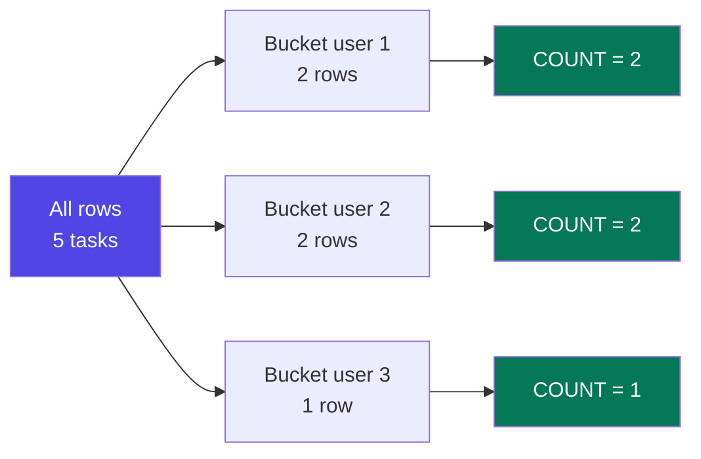

```sql
SELECT user_id, COUNT(*) AS task_count, AVG(priority) AS avg_pri
FROM tasks GROUP BY user_id;

-- One bucket per COMBINATION when you group by several columns
SELECT project_id, status, COUNT(*) AS n
FROM tasks GROUP BY project_id, status ORDER BY project_id, status;
```

**The golden rule:** *every column in your `SELECT` must be either in the `GROUP BY` or inside an aggregate.* Anything else is meaningless — if a user has 5 tasks, which single `title` should the row show?

```sql
-- ❌ MySQL 8 rejects this (ONLY_FULL_GROUP_BY is on by default)
SELECT user_id, title, COUNT(*) FROM tasks GROUP BY user_id;
-- ✅ Aggregate it, or group by it
SELECT user_id, GROUP_CONCAT(title SEPARATOR ' | ') AS titles, COUNT(*)
FROM tasks GROUP BY user_id;
```

<p class="te"><strong>Telugu:</strong> Golden rule: <code>SELECT</code> lo unna prathi column, <code>GROUP BY</code> lo undali <strong>leda</strong> aggregate lopala undali. Lekapothe MySQL 8 error istundi — adi correct, endukante aa value ki artham ledu.</p>

---

## E3. WHERE vs HAVING

**Simple definition:** `WHERE` filters **rows before** grouping. `HAVING` filters **groups after** grouping. That is the entire difference.

<p class="te"><strong>Telugu:</strong> <code>WHERE</code> = group cheyyadaniki <strong>mundhu</strong> rows filter. <code>HAVING</code> = group ayyaka <strong>results</strong> filter. Anduke aggregate (COUNT, SUM) ni <code>WHERE</code> lo raayaleru — appatiki adi inka lekkinchaledu.</p>

```sql
-- "Among non-done tasks, which users have more than 1?"
SELECT user_id, COUNT(*) AS pending
FROM tasks
WHERE status <> 'done'        -- ① drops done rows FIRST
GROUP BY user_id              -- ② then buckets
HAVING COUNT(*) > 1           -- ③ then drops small buckets
ORDER BY pending DESC;
```

| | `WHERE` | `HAVING` |
|---|---|---|
| Runs | Before `GROUP BY` | After `GROUP BY` |
| Can use aggregates | ❌ | ✅ |
| Can use column aliases | ❌ | ✅ (MySQL) |
| Can use an index | ✅ | ❌ — the work is already done |

**Performance rule:** filter as much as possible in `WHERE`, because those rows never enter a group at all. A query that says `HAVING user_id = 1` instead of `WHERE user_id = 1` grouped every user's rows for nothing.

---

## E4. Real Reports You Will Actually Be Asked to Write

**Simple definition:** Almost every "dashboard number" is one of five query shapes.

<p class="te"><strong>Telugu:</strong> Dashboard lo kanipinche prathi number kuda ee <strong>aidu shapes</strong> lo okati ne. Ivi practice chesthe, office lo "ee report kaavali" ani adigithe ventane raayagalav.</p>

```sql
-- 1. Counts by category (the classic bar chart)
SELECT status, COUNT(*) AS n FROM tasks GROUP BY status ORDER BY n DESC;

-- 2. A time series — per month
SELECT DATE_FORMAT(created_at,'%Y-%m') AS month, COUNT(*) AS created
FROM tasks GROUP BY month ORDER BY month;

-- 3. A pivot: statuses as columns, one row per project
SELECT project_id, SUM(status='open') AS open_cnt, SUM(status='in_progress') AS wip_cnt,
       SUM(status='done') AS done_cnt, COUNT(*) AS total
FROM tasks GROUP BY project_id;

-- 4. A rate per group
SELECT user_id, COUNT(*) AS total, SUM(status='done') AS done,
       ROUND(SUM(status='done')*100.0/COUNT(*), 1) AS completion_pct
FROM tasks GROUP BY user_id HAVING COUNT(*) >= 2 ORDER BY completion_pct DESC;

-- 5. Grand total plus subtotals
SELECT COALESCE(status,'ALL STATUSES') AS status, COUNT(*) AS n
FROM tasks GROUP BY status WITH ROLLUP;
```

**Real-world example — "MAU", the number every startup reports:** `SELECT COUNT(DISTINCT user_id) FROM events WHERE created_at >= CURDATE() - INTERVAL 30 DAY;` One line, with two lessons from this part: `COUNT(DISTINCT …)` (a user with 400 events counts once) and a bare-column date range so the index works.

<p class="te"><strong>Telugu:</strong> "MAU" (monthly active users) ane famous metric kuda okate line. Deenilo rendu paatalu unnayi: DISTINCT enduku, and date range ela raayali. Rendu ee part lo nerchukunnav.</p>

---

# Part F — JOINs: Putting the Tables Back Together

## F1. Why JOINs Exist

**Simple definition:** Normalization split one fact into many tables. A **JOIN** puts them back together at *query* time by matching a foreign key to a primary key.

<p class="te"><strong>Telugu:</strong> Normalization tho data ni vere vere tables lo pettam. Ippudu "task titles tho paatu user peru kuda kavali" ante aa tables ni <strong>join</strong> cheyyali — <code>tasks.user_id = users.id</code> ane match meeda. Join permanent kaadu, aa query varake.</p>

```
tasks                              users
+----+---------------+---------+   +----+--------+
| 1  | Fix login bug |    1    |-->| 1  | Nikhil |
| 3  | Deploy API    |    2    |-->| 2  | Asha   |
+----+---------------+---------+   +----+--------+
                     └── the join condition: tasks.user_id = users.id ──┘
```

```sql
SELECT t.id, t.title, u.name AS assignee
FROM tasks t
JOIN users u ON u.id = t.user_id;
```

**`ON` vs `WHERE`:** `ON` says *how rows pair up*; `WHERE` filters the paired result. For `INNER JOIN` they behave the same — for `LEFT JOIN` they absolutely do not (F2).

<p class="te"><strong>Telugu:</strong> <code>ON</code> = rows ela match avvali. <code>WHERE</code> = match ayyaka ye rows unchali. INNER join lo rendu okate laaga panichestayi, kaani <strong>LEFT join lo peddha tedaa</strong> undi.</p>

---

## F2. INNER JOIN and LEFT JOIN

**Simple definition:** `INNER JOIN` keeps only rows that matched on **both** sides. `LEFT JOIN` keeps **every** row from the left table, filling the right side with NULLs when there is no match.

<p class="te"><strong>Telugu:</strong> <strong>INNER JOIN</strong> = rendu tables lo match ayyevi matrame. <strong>LEFT JOIN</strong> = edama table lo unnavi anni untayi; kudi vaipu match lekapothe NULL vastundi. "Anni users ni chupinchu, tasks lekapoyina" ante LEFT JOIN.</p>

```
   INNER JOIN                 LEFT JOIN                  LEFT JOIN + IS NULL
  (matches only)        (all left + matched right)         (left-only rows)
   ┌───┐ ┌───┐              ███┐ ┌───┐                      ███┐ ┌───┐
   │  ███  │                │██████  │                      │███│ │   │
   └───┘ └───┘              ███┘ └───┘                      ███┘ └───┘
```

```sql
SELECT t.title, u.name FROM tasks t INNER JOIN users u ON u.id = t.user_id;

-- Every task, even ones with no project (project shows as NULL)
SELECT t.title, p.name AS project
FROM tasks t LEFT JOIN projects p ON p.id = t.project_id;
```

**The LEFT JOIN trap — a `WHERE` on the right table turns it back into an INNER JOIN:**

```sql
-- ❌ Silently drops users with zero tasks: WHERE runs after the join,
--    and NULL = 'open' is UNKNOWN, so those rows are filtered out.
SELECT u.name, t.title
FROM users u LEFT JOIN tasks t ON t.user_id = u.id
WHERE t.status = 'open';

-- ✅ Put the condition in ON — it filters what gets attached,
--    not which left rows survive.
SELECT u.name, t.title
FROM users u LEFT JOIN tasks t ON t.user_id = u.id AND t.status = 'open';
```

**This is the #1 SQL bug in real code.** Rule: with a `LEFT JOIN`, conditions on the **right** table belong in `ON`; conditions on the **left** table belong in `WHERE`.

<p class="te"><strong>Telugu:</strong> Idi #1 SQL bug: LEFT JOIN raasi taruvatha <code>WHERE</code> lo kudi table condition pedithe — adi INNER JOIN ga maaripotundi, tasks lekunda unna users maayam avutharu. <strong>Rule:</strong> kudi table condition <code>ON</code> lo, edama table condition <code>WHERE</code> lo.</p>

---

## F3. RIGHT, FULL, CROSS and SELF Joins

**Simple definition:** The remaining join types are rarer, but each has exactly one situation where it's the right tool.

<p class="te"><strong>Telugu:</strong> Migilina join types thakkuva vaadutham, kaani prathi daaniki oka use case undi. Interview lo adigutharu, kabatti oka line lo cheppagalagali.</p>

| Type | Keeps | Reality |
|------|-------|---------|
| `RIGHT JOIN` | All right rows + matched left | A LEFT JOIN written backwards — swap the tables and use LEFT. Teams standardise on LEFT |
| `FULL OUTER JOIN` | All rows from both sides | **Not in MySQL** — emulate with `LEFT … UNION … RIGHT` |
| `CROSS JOIN` | Every combination (Cartesian product) | Deliberate use: generate a grid (every user × every month) |
| `SELF JOIN` | A table joined to itself | Hierarchies: employee → manager, category → parent |

```sql
-- FULL OUTER emulation in MySQL
SELECT u.name, t.title FROM users u LEFT  JOIN tasks t ON t.user_id = u.id
UNION
SELECT u.name, t.title FROM users u RIGHT JOIN tasks t ON t.user_id = u.id;

-- SELF JOIN: every employee next to their manager (LEFT so the CEO stays)
SELECT e.name AS employee, m.name AS manager
FROM employees e LEFT JOIN employees m ON m.id = e.manager_id;
```

**The accidental CROSS JOIN — the classic disaster:** forget the `ON` clause and you get *every* combination. 10,000 users × 50,000 tasks = 500 million rows, and your server disappears. If a query is inexplicably slow and returning absurd row counts, check for a missing join condition first.

<p class="te"><strong>Telugu:</strong> <code>ON</code> marchipothe — <strong>CROSS JOIN</strong> ayipotundi: 10,000 × 50,000 = 50 crore rows. Server hang. Query vintha ga slow ga unte, modata "ON clause miss ayindaa?" ani chudu.</p>

---

## F4. Joining Three or More Tables

**Simple definition:** Joins chain. Each new `JOIN` attaches another table — including through a junction table for many-to-many.

<p class="te"><strong>Telugu:</strong> Joins ni okadani venaka okati kalupukuntu velochu. Many-to-many (task ↔ tags) kosam <strong>madhya lo junction table</strong> ni join cheyyali — rendu joins: okati <code>task_tags</code> ki, inkokati <code>tags</code> ki.</p>

```sql
-- Tasks with their assignee, project and comment count
SELECT t.id, t.title, u.name AS assignee, p.name AS project, COUNT(c.id) AS comments
FROM tasks t
JOIN      users    u ON u.id = t.user_id
LEFT JOIN projects p ON p.id = t.project_id
LEFT JOIN comments c ON c.task_id = t.id
GROUP BY t.id, t.title, u.name, p.name
ORDER BY comments DESC;

-- Many-to-many: every task with its tags, one row per task
SELECT t.id, t.title, GROUP_CONCAT(tg.name ORDER BY tg.name SEPARATOR ', ') AS tags
FROM tasks t
LEFT JOIN task_tags tt ON tt.task_id = t.id     -- hop 1: into the junction
LEFT JOIN tags      tg ON tg.id = tt.tag_id     -- hop 2: out to the real table
GROUP BY t.id, t.title;

-- Filter BY a tag (INNER joins, because a match is required)
SELECT t.title FROM tasks t
JOIN task_tags tt ON tt.task_id = t.id
JOIN tags      tg ON tg.id = tt.tag_id
WHERE tg.name = 'urgent';
```


**Real-world example — the Blog Platform query (your Tier-5 project):** "show a post with its author, its tags and its comment count" is exactly the shape above. Write it once and you have written half of every content app that exists.

---

## F5. Anti-Joins — Finding What's Missing

**Simple definition:** An **anti-join** finds rows in A that have **no** matching row in B. It answers every "who hasn't…" question.

<p class="te"><strong>Telugu:</strong> "Evaru inka <strong>cheyyaledu</strong>?", "e products ni evaru konaledu?" — ee questions anni anti-join. Rendu daarulu: <code>LEFT JOIN … WHERE right.id IS NULL</code>, leda <code>NOT EXISTS</code>.</p>

```sql
-- Users with no tasks at all
SELECT u.id, u.name FROM users u
LEFT JOIN tasks t ON t.user_id = u.id
WHERE t.id IS NULL;              -- the "no match" signature

-- The same thing with NOT EXISTS (usually fastest, and NULL-safe)
SELECT u.id, u.name FROM users u
WHERE NOT EXISTS (SELECT 1 FROM tasks t WHERE t.user_id = u.id);
```

| Form | NULL-safe? | Notes |
|------|-----------|-------|
| `LEFT JOIN … IS NULL` | ✅ | Classic, readable, fast |
| `NOT EXISTS (…)` | ✅ | **Preferred** — clearest intent, stops at the first match |
| `NOT IN (subquery)` | ❌ | Returns **zero rows** if the subquery yields a single NULL (C5) |

---

## F6. UNION, Set Operations and the Fan-Out Trap

**Simple definition:** Joins add **columns** side by side; `UNION` stacks **rows** on top of each other.

<p class="te"><strong>Telugu:</strong> <strong>JOIN</strong> = pakkana columns kalapadam. <strong>UNION</strong> = kinda rows kalapadam. UNION ki rendu queries lo <strong>column count and order okate</strong> undali.</p>

```sql
SELECT id, title, 'task' AS kind FROM tasks WHERE status = 'open'
UNION ALL
SELECT id, name,  'project'      FROM projects
ORDER BY kind, title;
```

| Operator | Does |
|----------|------|
| `UNION` | Stack + **remove duplicates** (slower — a sort/hash to dedupe) |
| `UNION ALL` | Stack, keep everything — **use this unless you truly need dedupe** |
| `INTERSECT` / `EXCEPT` | Rows in both / in the first only — MySQL 8.0.31+; older: use joins or `NOT EXISTS` |

**The fan-out trap — why your SUM is suddenly double.** Join a one-to-many *and another* one-to-many from the same parent and rows multiply: a task with 2 tags and 3 comments produces **6** rows, so `COUNT(c.id)` says 6 comments and every `SUM` is tripled.

```sql
-- ✅ Fix 1: COUNT(DISTINCT …)
SELECT t.id, COUNT(DISTINCT c.id) AS comments, COUNT(DISTINCT tt.tag_id) AS tags
FROM tasks t
LEFT JOIN comments  c  ON c.task_id  = t.id
LEFT JOIN task_tags tt ON tt.task_id = t.id
GROUP BY t.id;

-- ✅ Fix 2 (better on big tables): aggregate each side in its own subquery
SELECT t.id, t.title, COALESCE(c.n,0) AS comments, COALESCE(g.n,0) AS tags
FROM tasks t
LEFT JOIN (SELECT task_id, COUNT(*) n FROM comments  GROUP BY task_id) c ON c.task_id = t.id
LEFT JOIN (SELECT task_id, COUNT(*) n FROM task_tags GROUP BY task_id) g ON g.task_id = t.id;
```

<p class="te"><strong>Telugu:</strong> Rendu one-to-many tables ni okesari join chesthe rows <strong>guninthamavuthayi</strong> (2 tags × 3 comments = 6 rows) — counts, sums anni tappu. Fix: <code>COUNT(DISTINCT ...)</code>, leda prathi side ni separate subquery lo aggregate chesi join cheyyadam. Report numbers tappaithe modata idi anumanincu.</p>

**Real-world example:** A sales report showed revenue exactly 2× the bank statement — it joined `orders → order_items` *and* `orders → payments`, and every order had two payment rows. The bug survived three months because the number *looked* plausible.

---

# Part G — Advanced Queries: Subqueries, CTEs & Window Functions

## G1. Subqueries

**Simple definition:** A **subquery** is a `SELECT` inside another statement. It answers a smaller question whose result the outer query needs.

<p class="te"><strong>Telugu:</strong> Subquery ante query lopala inko query. "Sagatu priority kanna ekkuva unna tasks" ani kaavalante — modata sagatu lekkinchali (lopali query), taruvatha daaniki compare cheyyali (bayati query).</p>

```sql
-- 1. SCALAR — returns one value; usable anywhere a value fits
SELECT title, priority FROM tasks WHERE priority < (SELECT AVG(priority) FROM tasks);

-- 2. COLUMN (list) — feeds IN
SELECT title FROM tasks WHERE user_id IN (SELECT id FROM users WHERE role='admin');

-- 3. TABLE (derived table) — used in FROM, must be aliased
SELECT u.name, s.cnt FROM users u
JOIN (SELECT user_id, COUNT(*) cnt FROM tasks GROUP BY user_id) s ON s.user_id = u.id;

-- 4. CORRELATED — references the outer row, runs once per outer row
SELECT u.name, (SELECT COUNT(*) FROM tasks t WHERE t.user_id = u.id) AS task_count
FROM users u;
```

**`EXISTS` vs `IN` — the choice interviewers probe:**

| Use | When |
|-----|------|
| `IN (…)` | A short literal list, or a small NULL-free subquery |
| `EXISTS` | Checking existence, especially over a large table — **the default choice** |
| `NOT EXISTS` | Anti-join. Never `NOT IN` unless you've proven there are no NULLs |
| `JOIN` | You actually need **columns** from the other table |

<p class="te"><strong>Telugu:</strong> "Undaa leda?" ani chudataniki <code>EXISTS</code>. Aa table nunchi <strong>columns kuda kaavali</strong> ante <code>JOIN</code>. <code>NOT IN</code> ni NULL unde subqueries tho eppudu vaadaku — result khaali ayipotundi.</p>

**Performance note:** a correlated subquery in the `SELECT` list runs once **per outer row** — 10,000 users, 10,000 mini-queries. If one is slow, rewrite it as `LEFT JOIN … GROUP BY` and compare with `EXPLAIN`.

---

## G2. Derived Tables and CTEs

**Simple definition:** A **CTE** (Common Table Expression — the `WITH` clause) is a named subquery written *before* the main query. It turns a nested mess into a readable, top-to-bottom pipeline.

<p class="te"><strong>Telugu:</strong> <code>WITH</code> ante — subquery ki oka <strong>peru</strong> ichchi mundhu ne raayadam. Deenivalla query ni pai nunchi kinda ki chadavachu, nested brackets lo thala tirigipodu. Result okate, kaani chadavadaniki chala sulabham.</p>

```sql
-- Nested and hard to read
SELECT * FROM (
  SELECT user_id, COUNT(*) cnt FROM tasks WHERE status <> 'done' GROUP BY user_id
) x WHERE x.cnt > 1;

-- The same thing as a CTE — reads like steps
WITH pending AS (
  SELECT user_id, COUNT(*) AS cnt FROM tasks WHERE status <> 'done' GROUP BY user_id
)
SELECT u.name, p.cnt
FROM pending p JOIN users u ON u.id = p.user_id
WHERE p.cnt > 1 ORDER BY p.cnt DESC;
```

**Multiple CTEs chain — this is how real analytical SQL is written:**

```sql
WITH
  active_users AS (SELECT id, name FROM users WHERE created_at >= '2026-01-01'),
  task_stats   AS (SELECT user_id, COUNT(*) AS total, SUM(status='done') AS done
                   FROM tasks GROUP BY user_id)
SELECT a.name, s.total, s.done, ROUND(s.done * 100.0 / s.total, 1) AS pct
FROM active_users a JOIN task_stats s ON s.user_id = a.id
ORDER BY pct DESC;
```

| | Derived table | CTE (`WITH`) |
|---|---|---|
| Where written | Inline in `FROM` | Above the query |
| Reusable in the same query | ❌ Repeat it | ✅ Reference the name many times |
| Recursion | ❌ | ✅ (G3) |
| Readability | Poor when nested | Excellent |

Availability: MySQL **8.0+**, PostgreSQL, SQL Server, SQLite, HANA. On MySQL 5.7, derived tables are your only option.

<p class="te"><strong>Telugu:</strong> Job lo peddha queries anni CTEs tho ne raastharu — okoka step ki oka peru, chivarilo anni kalipi. CTE tho raasthe code review lo "idi bagundi" antaru; nested subqueries tho raasthe "idi enti?" antaru.</p>

---

## G3. Recursive CTEs — Walking a Hierarchy

**Simple definition:** A **recursive CTE** feeds its own output back in — the way you walk a tree: employees under a manager, replies under a comment, categories under a category.

<p class="te"><strong>Telugu:</strong> Tree structure (manager kinda employees, category kinda sub-categories) ni SQL lo loop laaga chadavadaniki recursive CTE. Rendu bhagalu: <strong>anchor</strong> (modati level) + <strong>recursive</strong> (tarvati levels), rendintini <code>UNION ALL</code> tho kalapadam.</p>

```sql
WITH RECURSIVE org AS (
  -- ① anchor: the starting row(s)
  SELECT id, name, manager_id, 1 AS depth
  FROM employees WHERE manager_id IS NULL
  UNION ALL
  -- ② recursive: one level deeper, joined back to the CTE itself
  SELECT e.id, e.name, e.manager_id, o.depth + 1
  FROM employees e JOIN org o ON e.manager_id = o.id
  WHERE o.depth < 10          -- always bound the depth: a cycle = infinite loop
)
SELECT CONCAT(REPEAT('— ', depth - 1), name) AS org_chart, depth
FROM org ORDER BY depth, name;
```
```
CEO                      1
— VP Engineering         2
— — Team Lead            3
— — — Nikhil             4
```

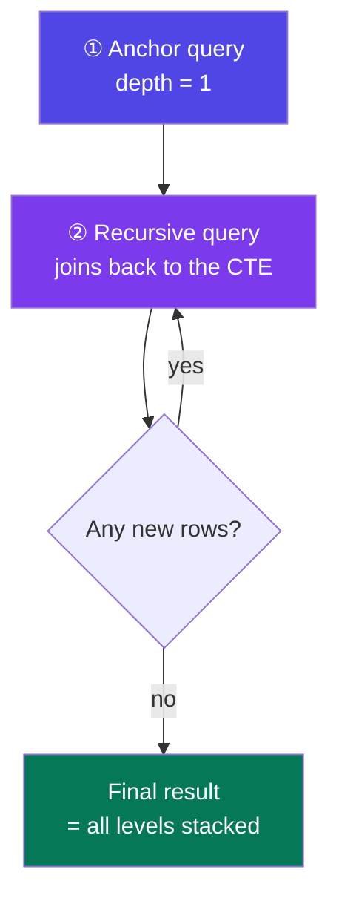

**The safety rule:** always add a depth limit. One bad row where a manager reports to their own subordinate creates a cycle; MySQL's `cte_max_recursion_depth` (default 1000) will error out, but a bound in your own `WHERE` is clearer.

---

## G4. Window Functions

**Simple definition:** A **window function** computes across a set of related rows **without collapsing them**. `GROUP BY` gives one row per group; a window function keeps every row and adds the group's answer alongside it.

<p class="te"><strong>Telugu:</strong> Idi ee guide lo <strong>atyanta powerful</strong> feature. <code>GROUP BY</code> rows ni kaluputundi (5 rows → 1 row). Window function rows ni <strong>alaage unchi</strong>, pakkana group answer ni column ga isthundi — "nee rank enta", "nee team total entha", "poyina row kanna entha ekkuva". Interview lo idi vasthe "senior" ani anukuntaru.</p>

```sql
SELECT title, user_id, priority,
       COUNT(*)      OVER (PARTITION BY user_id)                   AS my_task_count,
       RANK()        OVER (PARTITION BY user_id ORDER BY priority) AS my_rank,
       AVG(priority) OVER ()                                       AS overall_avg
FROM tasks;
```

**The anatomy — `function() OVER (PARTITION BY … ORDER BY … frame)`:**

| Piece | Means |
|-------|-------|
| `PARTITION BY col` | Restart the calculation per group (like `GROUP BY`, but rows survive) |
| `ORDER BY col` | The order *within* the window — required by ranking and offset functions |
| Frame (`ROWS BETWEEN …`) | Which rows around the current one to include — this is what makes running totals |
| Empty `OVER ()` | The whole result set is one window |

| Function | Gives |
|----------|-------|
| `ROW_NUMBER()` | 1,2,3,4 — always unique |
| `RANK()` / `DENSE_RANK()` | 1,2,2,4 (skips) / 1,2,2,3 (no gap) |
| `NTILE(4)` | Splits rows into 4 buckets (quartiles) |
| `LAG(col,1)` / `LEAD(col,1)` | The previous / next row's value |
| `FIRST_VALUE` / `LAST_VALUE` | First / last in the window |
| `SUM/AVG/COUNT/MAX() OVER(…)` | Running or windowed aggregates |

```sql
-- Month-over-month growth in one query
SELECT month, created,
       LAG(created) OVER (ORDER BY month)           AS prev_month,
       created - LAG(created) OVER (ORDER BY month) AS change
FROM (SELECT DATE_FORMAT(created_at,'%Y-%m') AS month, COUNT(*) AS created
      FROM tasks GROUP BY month) m;

-- Running total and a 7-row moving average — the frame clause doing its job
SELECT order_date, amount,
  SUM(amount) OVER (ORDER BY order_date ROWS BETWEEN UNBOUNDED PRECEDING AND CURRENT ROW) AS running_total,
  AVG(amount) OVER (ORDER BY order_date ROWS BETWEEN 6 PRECEDING AND CURRENT ROW)         AS moving_avg_7
FROM orders;
```

**Where windows run:** *after* `WHERE`, `GROUP BY` and `HAVING`, but *before* `ORDER BY`. That's why you can't filter on a window function in `WHERE` — wrap it in a CTE and filter outside, which is exactly what G5 does. Availability: MySQL **8.0+**, PostgreSQL, SQL Server, HANA, SQLite 3.25+.

---

## G5. Top-N Per Group — The Pattern Worth Memorising

**Simple definition:** "The 3 most recent tasks **per user**", "the top 5 products **per category**" — a question `GROUP BY` alone cannot answer, and window functions answer in six lines.

<p class="te"><strong>Telugu:</strong> "Prathi user ki kotha 3 tasks", "prathi category lo top 5 products" — ee prashna ki <code>GROUP BY</code> saripodu (adi group ki okate row istundi). <code>ROW_NUMBER()</code> + CTE ne sarayina daari. Ee pattern ni <strong>batti pattinchu</strong>.</p>

```sql
WITH ranked AS (
  SELECT t.*, ROW_NUMBER() OVER (PARTITION BY user_id ORDER BY created_at DESC) AS rn
  FROM tasks t
)
SELECT id, title, user_id, created_at
FROM ranked
WHERE rn <= 3                      -- filter the window result out here
ORDER BY user_id, rn;
```

Use `ROW_NUMBER()` for exactly N rows; `RANK()`/`DENSE_RANK()` when ties should all be included.

```sql
-- Deduplication is the same pattern: keep the newest row per email
WITH d AS (
  SELECT id, ROW_NUMBER() OVER (PARTITION BY email ORDER BY created_at DESC) rn FROM users
)
DELETE FROM users WHERE id IN (SELECT id FROM d WHERE rn > 1);
```

<p class="te"><strong>Telugu:</strong> Rendu vishayalu gurthupettuko — <strong>PARTITION BY</strong> ante "prathi ... ki", <strong>ORDER BY</strong> ante "e prakaram top". Ee okka pattern tho: prathi customer ki chivari order, prathi class lo first rank, prathi device ki latest status — anni raayochu.</p>

---

# Part H — Views, Indexes & Making Queries Fast

## H1. Views — Saved Queries With a Name

**Simple definition:** A **view** is a stored `SELECT` that behaves like a table. It holds no data; every time you query it, the underlying query runs.

<p class="te"><strong>Telugu:</strong> View ante — oka query ki peru pettadam. Andulo data undadu; nuvvu <code>SELECT * FROM view</code> chesinappudu lopala unna query run avutundi. Peddha complex query ni malli malli raayakunda, view ga save cheskho.</p>

```sql
CREATE VIEW v_active_tasks AS
SELECT t.id, t.title, t.status, t.priority, t.due_date,
       u.name AS assignee, p.name AS project
FROM tasks t
JOIN users u ON u.id = t.user_id
LEFT JOIN projects p ON p.id = t.project_id
WHERE t.status <> 'done';

SELECT * FROM v_active_tasks WHERE assignee = 'Nikhil' ORDER BY priority;
```

| Job a view does | Example |
|-----|---------|
| **Hide complexity** | A 5-table join becomes `SELECT * FROM v_order_summary` |
| **Enforce security** | Grant access to `v_employees_public` (no salary column) instead of the table |
| **Enforce a filter nobody can forget** | `WHERE deleted_at IS NULL` lives in the view — soft delete becomes safe |
| **Provide a stable contract** | Reshape the tables underneath, keep the view's columns identical, apps don't break |

**Materialized views:** a view whose result is physically stored and refreshed on a schedule — fast reads, stale data. PostgreSQL and HANA have them; **MySQL does not**, so people emulate one with a summary table refreshed by a scheduled event.

<p class="te"><strong>Telugu:</strong> Normal view = prathisari query run avutundi (fresh data, koncham slow). Materialized view = result ni store chesi untundi (chala fast, kaani koncham purathanam). MySQL lo adi ledu — summary table + scheduled refresh tho ne cheyyali.</p>

---

## H2. How Indexes Work — The B-Tree

**Simple definition:** An **index** is a sorted lookup structure kept beside your table. Without one, finding a row means reading every row.

<p class="te"><strong>Telugu:</strong> Index ante pusthakam chivarilo unde <strong>index page</strong> laantidi. Peru chusi page number teliyadam laaga — column value chusi row ekkada undo direct ga telustundi. Lekapothe database prathi row ni chadavali (full table scan).</p>

To find "transactions" in a 1000-page book you either flip every page (**full table scan**, O(n)) or use the index at the back (**index seek**, O(log n)). For a million rows: a million reads versus about four.

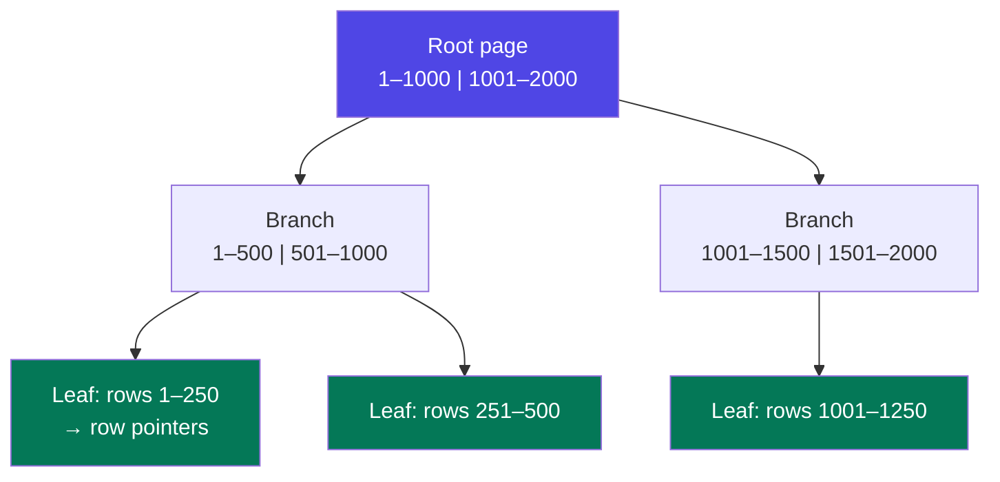

A **B+ tree** stays balanced and shallow — even a 100-million-row table is ~4 levels deep. Its leaves are linked in order, which is why an index also makes **range scans** (`BETWEEN`, `>`, `ORDER BY`) fast, not just equality.

**Clustered vs secondary (InnoDB specifics worth knowing):** the **clustered index** *is* the table — InnoDB stores rows physically in primary-key order, which is why a sequential `AUTO_INCREMENT` PK is fast (inserts append) and a random `UUID` PK is slow (inserts split pages in the middle). A **secondary index** stores `(indexed column → primary key)`, so a lookup by `email` costs two traversals: find the PK, then fetch the row. Avoiding that second step is what a *covering index* does (H3).

```sql
CREATE INDEX idx_tasks_status ON tasks (status);
CREATE UNIQUE INDEX uq_users_email ON users (email);   -- a constraint AND an index
SHOW INDEX FROM tasks;
```

**The cost of an index — this is what stops you indexing everything:** disk (six indexes can double a table's size), slower writes (every `INSERT`/`UPDATE`/`DELETE` updates every affected index), and a confused optimizer when many overlap. **Rule of thumb:** index the columns in `WHERE`, `JOIN … ON` and `ORDER BY` — nothing else until a slow query proves otherwise. Foreign keys should essentially always be indexed (MySQL does it automatically for FK constraints; other databases don't).

<p class="te"><strong>Telugu:</strong> Index free kaadu — prathi write appudu index kuda update avvali, disk kuda ekkuva. Anduke <strong>anni columns meeda index vaddu</strong>. <code>WHERE</code>, <code>JOIN</code>, <code>ORDER BY</code> lo vaade columns ki matrame.</p>

---

## H3. Composite and Covering Indexes

**Simple definition:** A **composite index** covers several columns in a fixed order. The order is everything — that's the *leftmost prefix rule*.

<p class="te"><strong>Telugu:</strong> Composite index ante rendu-moodu columns kalipi okate index. <strong>Order chala mukhyam</strong> — phone directory laaga: (city, name) ante city telisthe ne name useful. Kevalam name telisthe aa directory panikiraadu.</p>

```sql
CREATE INDEX idx_tasks_user_status_due ON tasks (user_id, status, due_date);
```

| Query filter | Uses the index? |
|--------------|------------------|
| `WHERE user_id = 1` | ✅ (first column) |
| `WHERE user_id = 1 AND status = 'open'` | ✅ (first two) |
| `WHERE user_id=1 AND status='open' AND due_date > …` | ✅ (all three) |
| `WHERE status = 'open'` | ❌ — skips the leftmost column |
| `WHERE user_id = 1 AND due_date > …` | ⚠️ Partially — uses `user_id`, then filters |

**Column order guideline:** equality columns first, the range/sort column last. For `WHERE user_id=? AND status=? ORDER BY due_date`, the perfect index is exactly `(user_id, status, due_date)` — it filters *and* returns rows already sorted, so MySQL skips the sort entirely.

**Covering index — the free speed-up:** if an index contains **every column the query touches**, the answer comes from the index and the table is never opened.

```sql
CREATE INDEX idx_cover ON tasks (user_id, status, title);
SELECT title FROM tasks WHERE user_id = 1 AND status = 'open';
-- EXPLAIN shows "Using index"  ← the marker of a covering index
```

This is another reason `SELECT *` hurts: one extra unindexed column forces the table read you were avoiding.

**When indexes silently stop working — memorise this list:**

| Killer | Fix |
|--------|-----|
| Function on the column: `WHERE YEAR(created_at)=2026` | Use a range on the bare column |
| Leading wildcard: `LIKE '%bug%'` | FULLTEXT index, or a search engine |
| Type mismatch: `WHERE phone = 9876543210` on a `VARCHAR` | Quote it: `= '9876543210'` |
| `OR` across different columns | Two queries + `UNION`, or an index the optimizer can merge |
| Low selectivity: `WHERE is_active = 1` when 95% are active | Don't index it — a scan is genuinely cheaper |
| `!=` / `NOT IN` | Usually unavoidable; rewrite as a positive condition if you can |

<p class="te"><strong>Telugu:</strong> Index unnaa panicheyyani situations ivi — column meeda function, modatlo <code>%</code>, type mismatch. Ee list gurthupettukunte, "index unnaa query slow ga undi enduku?" ane prashna ki answer nee daggara untundi.</p>

---

## H4. EXPLAIN — Reading the Query Plan

**Simple definition:** `EXPLAIN` shows the plan the optimizer chose *without running* the query: which index it will use, and roughly how many rows it must examine.

<p class="te"><strong>Telugu:</strong> <code>EXPLAIN</code> ante — "ee query ni ela chestav?" ani database ni adagadam. Guess cheyyakunda <strong>kolathalu</strong> chusi optimize cheyyadaniki idi ne daari. Query slow ga unte modata chese pani ide.</p>

```sql
EXPLAIN SELECT * FROM tasks WHERE user_id = 1 AND status = 'open';
EXPLAIN ANALYZE SELECT …;    -- MySQL 8.0.18+: actually runs it, shows real timings
```

| Column | What to look for |
|--------|------------------|
| **`type`** | Access method. Best → worst: `const` → `eq_ref` → `ref` → `range` → `index` → **`ALL`** (full scan) |
| **`key`** | The index actually used. `NULL` means none — usually the problem |
| **`rows`** | Estimated rows examined. Compare to how many you expect back |
| **`filtered`** | % of examined rows surviving the `WHERE`. Low % + high `rows` = wasted work |
| **`Extra`** | `Using index` (covering — great), `Using filesort` (sorting), `Using temporary` (temp table) |

```
-- Before: no index
type: ALL   key: NULL   rows: 1000000   Extra: Using where      → ~2.4 s
CREATE INDEX idx_tasks_user_status ON tasks (user_id, status);
-- After
type: ref   key: idx_tasks_user_status   rows: 12               → ~2 ms
```

**The one metric that matters:** *rows examined ÷ rows returned*. Close to 1 is excellent; a million examined to return ten is a missing index. That ratio beats any timing on your laptop, because timings lie once caches warm up.

| Warning sign | Usual cause |
|------|-------------|
| `type: ALL` on a big table | No usable index, or an index-killer from H3 |
| `Using filesort` | `ORDER BY` a column the index can't provide in order |
| `Using temporary` | `GROUP BY`/`DISTINCT` that can't stream — often fixable with a composite index |
| Huge `rows` with `filtered: 1.00` | Stale statistics — run `ANALYZE TABLE tasks;` |

*PostgreSQL:* `EXPLAIN (ANALYZE, BUFFERS) SELECT …` — different output, identical thinking.

---

## H5. The Optimization Checklist (and the N+1 Problem)

**Simple definition:** Slow queries have a short list of usual causes. Work down the list in order; don't guess.

<p class="te"><strong>Telugu:</strong> Query slow ga unte guess cheyyoddu — ee list ni order lo follow avvu. 90% samasyalu modati moodu steps lo ne teerutayi.</p>

| # | Check | Action |
|---|-------|--------|
| 1 | Index on the `WHERE`/`JOIN` columns? | `EXPLAIN`; add it |
| 2 | An index-killer present? | Remove functions from columns; fix type mismatches |
| 3 | Fetching columns you don't use? | Name your columns; enable a covering index |
| 4 | Fetching rows you don't use? | `LIMIT`, and filter in SQL — not in Node |
| 5 | Running one query per row? | The N+1 problem — fix below |
| 6 | A join fanning out? | `COUNT(DISTINCT)` or per-side subqueries (F6) |
| 7 | Is the *sort* the cost? | Composite index ending in the `ORDER BY` column |
| 8 | Still slow with a good plan? | Denormalize a counter, cache in Redis, or pre-aggregate nightly |

**The N+1 problem — the most common performance bug in Express apps:**

```js
// ❌ 1 query for the list + 1 per task = 101 round trips for 100 tasks
const tasks = await db.query('SELECT * FROM tasks');
for (const t of tasks) {
  t.user = await db.query('SELECT * FROM users WHERE id = ?', [t.user_id]);
}

// ✅ Fix A: one JOIN.   ✅ Fix B: two queries, stitched in memory:
const tasks = await db.query('SELECT * FROM tasks');
const ids   = [...new Set(tasks.map(t => t.user_id))];
const users = await db.query('SELECT * FROM users WHERE id IN (?)', [ids]);
const byId  = new Map(users.map(u => [u.id, u]));
tasks.forEach(t => { t.user = byId.get(t.user_id); });
```

Each round trip costs ~1 ms of network even when the query takes 0.1 ms, so 101 queries ≈ 100 ms of pure waiting. This is why ORMs ship `include`/`populate` — and why you must know when yours is quietly doing the wrong thing.

<p class="te"><strong>Telugu:</strong> <strong>N+1 problem</strong> — list ki 1 query, taruvatha prathi row ki inko query. 100 rows unte 101 queries! Fix: okate JOIN, leda rendo query lo <code>WHERE id IN (...)</code> tho anni okesari teesuko. Express apps lo slow API ki #1 karanam idi.</p>

---

## H6. Pagination at Scale

**Simple definition:** `LIMIT … OFFSET …` is fine for page 3 and terrible for page 3000. **Keyset (cursor) pagination** replaces "skip N rows" with "start after this row".

<p class="te"><strong>Telugu:</strong> <code>OFFSET 100000</code> ante database 100,010 rows chadivi, 100,000 padeyyali — kevalam 10 rows ivvadaniki. Deeniki fix <strong>keyset pagination</strong>: "ee row taruvatha nunchi 10 ivvu". Idi Phase 8 lo nerchukunna <strong>cursor pagination</strong> ki DB vaipu implementation.</p>

```sql
-- ❌ Offset pagination: slower with every page
SELECT id, title, created_at FROM tasks
ORDER BY created_at DESC, id DESC LIMIT 20 OFFSET 100000;    -- reads 100,020 rows

-- ✅ Keyset pagination: constant time on every page
SELECT id, title, created_at FROM tasks
WHERE (created_at, id) < ('2026-08-14 10:00:00', 91)         -- the cursor from the last row
ORDER BY created_at DESC, id DESC LIMIT 20;                  -- reads 20 rows, always
```

| | Offset | Keyset |
|---|--------|--------|
| Page 5000 speed | Terrible | Same as page 1 |
| "Jump to page 87" | ✅ | ❌ Only next/previous |
| Total page count | ✅ Easy | ❌ Needs a separate `COUNT(*)` |
| Rows shift while paging | Duplicates and skips | Stable |

**The connection to your API:** in Phase 8 you returned `{ data, meta: { nextCursor } }` — that cursor *is* the `(created_at, id)` pair above, base64-encoded. Offset pagination for admin tables where users jump to page numbers; keyset for feeds, infinite scroll and full-table integrations.

**Bonus:** `COUNT(*)` is expensive on large tables too — for "about 2.4M results", read `information_schema.tables.table_rows` (an estimate) or cache the count for a minute.

---

# Part I — Transactions, ACID & Concurrency

## I1. Transactions and ACID

**Simple definition:** A **transaction** is a group of statements that must succeed **together or not at all** — the database's version of "all or nothing".

<p class="te"><strong>Telugu:</strong> Transaction ante — konni statements ni okate mootha ga kattadam. <strong>Anni jaragali, leda edi jaragakudadu</strong>. Bank lo okka account nunchi paisalu teesi inkokati lo veyyakapothe — paisalu maayam! Transaction adi jaraganivvadu.</p>

```sql
START TRANSACTION;
  UPDATE accounts SET balance = balance - 5000 WHERE id = 1;
  -- 💥 if the server crashes RIGHT HERE, ₹5000 has vanished
  UPDATE accounts SET balance = balance + 5000 WHERE id = 2;
COMMIT;      -- both happened      (ROLLBACK; -- neither happened)
```

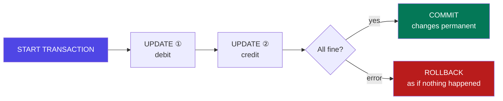

| Letter | Guarantee | Prevents | How the DB does it |
|--------|-----------|----------|--------------------|
| **A — Atomicity** | All statements or none | Half-finished transfers | Undo log + `ROLLBACK` |
| **C — Consistency** | Valid state → valid state; all constraints hold | Orphan rows, negative stock | Constraints, FKs, `CHECK` |
| **I — Isolation** | Concurrent transactions don't see half-done work | Reading a balance mid-transfer | Locks / MVCC (I3) |
| **D — Durability** | Once committed, it survives a power cut | "It said saved but it's gone" | Write-ahead log flushed to disk |

**Real-world example — IRCTC booking:** reserve the seat, charge the card, write the ticket. If the payment fails after the seat is reserved, the seat must be released — that's `ROLLBACK`. Every booking and payment system on earth is built on this idea.

<p class="te"><strong>Telugu:</strong> ACID ni interview lo tappakunda adugutharu. Gurthupettukovadaniki: <strong>A</strong>-anni leda edi ledu, <strong>C</strong>-rules eppudu correct ga untayi, <strong>I</strong>-okari pani inkokariki sagam ga kanipinchadu, <strong>D</strong>-commit ayyaka current poyina data poddi.</p>

---

## I2. COMMIT, ROLLBACK and SAVEPOINT

**Simple definition:** `COMMIT` makes changes permanent, `ROLLBACK` discards them, `SAVEPOINT` gives you a partial undo point inside a long transaction.

<p class="te"><strong>Telugu:</strong> MySQL default lo <strong>autocommit ON</strong> — prathi statement automatic ga commit ayipotundi. <code>START TRANSACTION</code> raasthe adi aagipotundi, nuvvu <code>COMMIT</code> ceppe varaku.</p>

```sql
SELECT @@autocommit;        -- 1 by default: every statement commits itself

START TRANSACTION;
  INSERT INTO orders (user_id, total) VALUES (1, 2500);
  SET @order_id = LAST_INSERT_ID();
  SAVEPOINT after_order;

  INSERT INTO order_items (order_id, product_id, quantity, unit_price)
  VALUES (@order_id, 7, 2, 1250.00);
  UPDATE products SET stock = stock - 2 WHERE id = 7 AND stock >= 2;
  -- matched 0 rows → out of stock:
  ROLLBACK TO SAVEPOINT after_order;   -- undo just the item, keep the order row
COMMIT;
```

| Command | Effect |
|---------|--------|
| `START TRANSACTION` / `BEGIN` | Opens a unit of work |
| `COMMIT` / `ROLLBACK` | Makes permanent, releasing locks / discards everything since the start |
| `SAVEPOINT name` / `ROLLBACK TO SAVEPOINT name` | A marker inside the transaction / undo back to it only |

**Rules that keep transactions healthy:**

1. **Keep them short.** An open transaction holds locks; everyone else waits behind it.
2. **Never do I/O inside one.** No HTTP calls, no email, no uploads between `BEGIN` and `COMMIT` — a 30-second API timeout becomes a 30-second lock.
3. **Never wait for a human.** "Open a transaction, show a form, commit on submit" is how you take down a database.
4. **Always `ROLLBACK` in your error handler**, then release the connection (K3 has the exact Node shape).

<p class="te"><strong>Telugu:</strong> Transaction lopala <strong>API call cheyyakku</strong> (payment gateway laanti). Gateway slow aithe lock 20 seconds untundi, migatha customers anni aagipotharu. Modata payment cheyyi, taruvatha chinna transaction lo DB rows raayyi.</p>

---

## I3. Isolation Levels and the Four Anomalies

**Simple definition:** **Isolation level** decides how much of other transactions' in-progress work yours can see. Higher isolation = fewer surprises, less concurrency.

<p class="te"><strong>Telugu:</strong> Chala transactions okesari nadusthunnappudu, okari pani inkokariki entha kanipinchali? Adi isolation level. Ekkuva isolation = safe kaani slow. Takkuva = fast kaani vintha bugs.</p>

| Anomaly | What happens |
|---------|--------------|
| **Dirty read** | You read a row another transaction hasn't committed — it rolls back, and you acted on data that never existed |
| **Non-repeatable read** | You read a row twice in one transaction and get different values |
| **Phantom read** | The same `WHERE` returns **new rows** the second time |
| **Lost update** | Two transactions read 100, both write 101, and the result is 101 instead of 102 |

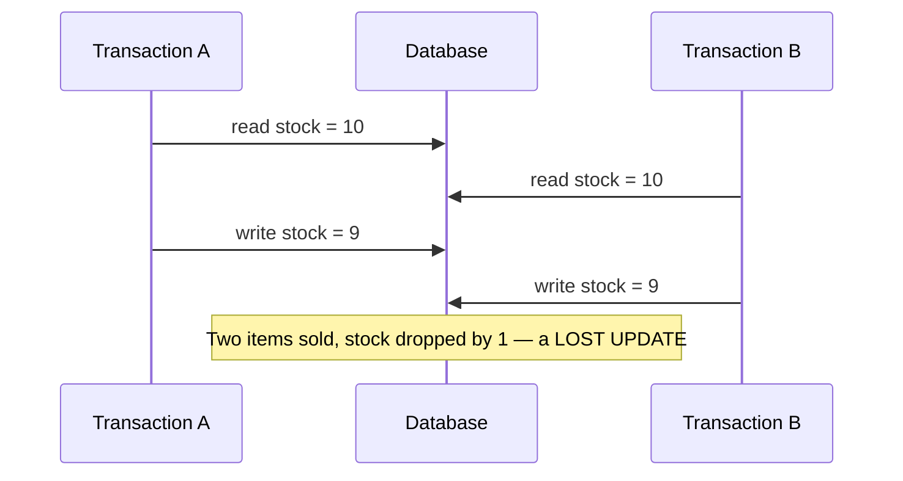

| Level | Dirty read | Non-repeatable | Phantom | Notes |
|-------|-----------|----------------|---------|-------|
| `READ UNCOMMITTED` | ❌ possible | ❌ | ❌ | Almost never used |
| `READ COMMITTED` | ✅ prevented | ❌ | ❌ | **Default in PostgreSQL, Oracle, SQL Server** |
| `REPEATABLE READ` | ✅ | ✅ | ✅ in MySQL (gap locks) | **Default in MySQL/InnoDB** |
| `SERIALIZABLE` | ✅ | ✅ | ✅ | As if transactions ran one after another. Safest, slowest |

```sql
SELECT @@transaction_isolation;                        -- REPEATABLE-READ on MySQL
SET SESSION TRANSACTION ISOLATION LEVEL READ COMMITTED;
```

**The one thing to remember:** no isolation level except `SERIALIZABLE` prevents the **lost update** above, because both transactions did a *read* then a *write* in application code. You prevent it yourself with `SELECT … FOR UPDATE` or a version column — I5.

**MVCC:** InnoDB and PostgreSQL don't block readers — they keep older versions of each row, so a reader sees a consistent **snapshot** from when its transaction started while writers carry on. That's why "readers don't block writers, writers don't block readers" holds in both.

<p class="te"><strong>Telugu:</strong> <strong>MVCC</strong> valla chadive vaallu, raase vaallu okarinokaru aapukoru — database prathi row ki purathana versions dachipedutundi. Kaani "chadivi, lekkinchi, malli raayadam" ane pattern ki matram nuvve jagratha padali (I5).</p>

---

## I4. Locks and Deadlocks

**Simple definition:** A **lock** stops two transactions changing the same row at once. A **deadlock** is two transactions each holding what the other needs — the database kills one to break the tie.

<p class="te"><strong>Telugu:</strong> Lock ante — oka row ni "nenu vaadutunna, aagu" ani pattukovadam. <strong>Deadlock</strong> ante A daggara B ki kavalasindi undi, B daggara A ki kavalasindi undi — iddaru waiting. Database okarini rollback chesi rendo daanini vadulutundi.</p>

| Lock | Meaning |
|------|---------|
| **Shared (S)** | Many readers together; blocks writers |
| **Exclusive (X)** | One writer only; blocks everyone |
| **Row lock** | InnoDB's default — just the affected rows |
| **Table lock** | Whole table (MyISAM, or DDL) — avoid |
| **Gap lock** | Locks the *range between* index values — how InnoDB stops phantoms |

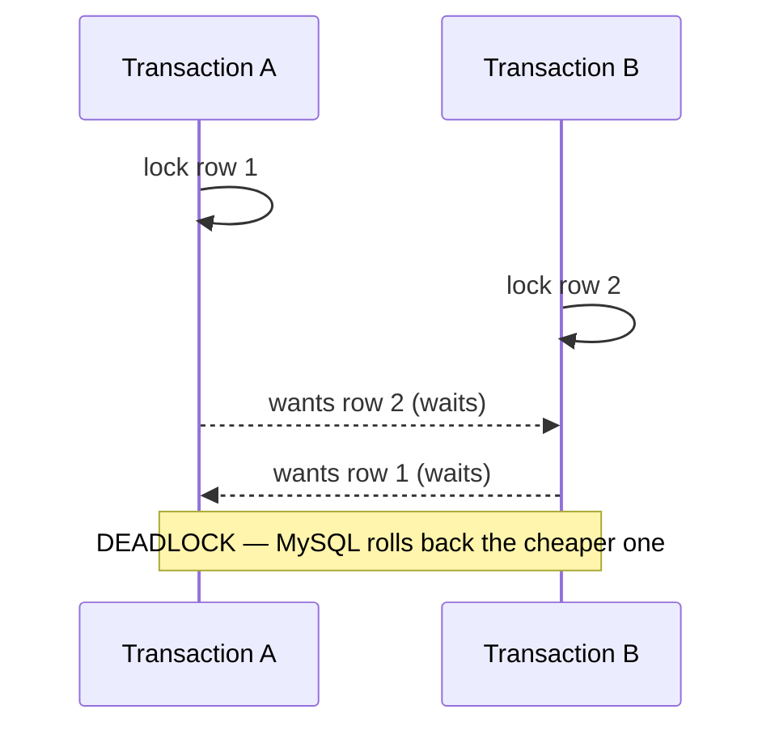

**The four rules that prevent almost every deadlock:**

1. **Always touch rows in the same order** everywhere in your code (e.g. always the lower account id first). Most deadlocks are two code paths locking in opposite orders.
2. **Keep transactions short** — less time holding, less chance of overlap.
3. **Use the right index.** Without one, MySQL locks far more rows than you think — a missing index turns a row lock into an effective table lock.
4. **Retry.** Deadlocks are normal at scale, not a bug:

```js
async function withRetry(fn, tries = 3) {
  for (let i = 0; i < tries; i++) {
    try { return await fn(); }
    catch (e) {
      if (e.code !== 'ER_LOCK_DEADLOCK' || i === tries - 1) throw e;
      await new Promise(r => setTimeout(r, 50 * (i + 1)));   // small backoff
    }
  }
}
```

**Diagnosing:** `SHOW ENGINE INNODB STATUS\G` prints the latest deadlock with both queries and the locks each held.

---

## I5. Optimistic vs Pessimistic Locking

**Simple definition:** Both solve the lost update. **Pessimistic** locks the row up front and makes others wait. **Optimistic** doesn't lock, but refuses the write if someone changed the row meanwhile.

<p class="te"><strong>Telugu:</strong> <strong>Pessimistic</strong> = "nenu vaadutunna, migatha vaallu aagandi" (lock chesi pettadam). <strong>Optimistic</strong> = "lock cheyyanu, kaani nenu raase mundu inkevaraina maarchara ani chusukuntanu" (version number tho). Conflicts thakkuva unte optimistic, ekkuva unte pessimistic.</p>

```sql
-- PESSIMISTIC
START TRANSACTION;
  SELECT stock FROM products WHERE id = 7 FOR UPDATE;   -- row is now locked
  UPDATE products SET stock = stock - 1 WHERE id = 7;   -- others wait until COMMIT
COMMIT;

-- OPTIMISTIC (the `version` column from the B7 schema)
UPDATE tasks SET title = 'New title', version = version + 1
WHERE id = 91 AND version = 4;
-- affectedRows = 1 → success.  0 → someone else edited it first.
```

```js
const [r] = await conn.execute(
  'UPDATE tasks SET title=?, version=version+1 WHERE id=? AND version=?',
  [title, id, expectedVersion]);
if (r.affectedRows === 0) {
  return res.status(409).json({ code: 'CONFLICT', message: 'Task was modified by someone else.' });
}
```

**This is exactly your Phase 8 ETag / `If-Match` flow**, at the database level: the ETag *is* the version, and `409`/`412` is what you return when `WHERE version = ?` matches nothing.

| | Pessimistic (`FOR UPDATE`) | Optimistic (version column) |
|---|---|---|
| Locks held | Yes, until COMMIT | None |
| Best when | Conflicts common; short critical section (stock, seats, balances) | Conflicts rare; long think-time (a user editing a form) |
| Failure mode | Others wait (or time out) | The write is rejected; the user retries/merges |

**The simplest fix of all — do the maths in SQL.** Most "lost update" bugs disappear when you stop reading in Node:

```sql
-- ❌ read 10 in Node, compute 9, write 9   (racy)
-- ✅ atomic: the database computes it, and the row is locked for the statement
UPDATE products SET stock = stock - 1 WHERE id = 7 AND stock >= 1;
-- affectedRows = 0 means "out of stock" — no race possible
```

<p class="te"><strong>Telugu:</strong> Chala races ki simple fix idi: value ni Node lo lekkinchakunda, <strong>SQL lo ne</strong> lekkinchadam — <code>SET stock = stock - 1 WHERE stock &gt;= 1</code>. Single statement atomic, kabatti race ne raadu. <code>affectedRows = 0</code> ayithe "stock ledu" ani artham.</p>

---

# Part J — Stored Logic, Security & Administration

## J1. Stored Procedures and Functions

**Simple definition:** A **stored procedure** is a named block of SQL saved *inside the database* and called by name. A **stored function** returns a single value usable inside a query.

<p class="te"><strong>Telugu:</strong> Stored procedure ante — konni SQL statements ni database lo ne save chesi, peru tho pilavadam. Node lo function laage, kaani adi database lopala untundi. Peddha data ni move cheyyakunda, database lone pani ayipotundi.</p>

```sql
DELIMITER $$
CREATE PROCEDURE complete_task(IN p_task_id INT, OUT p_ok BOOLEAN)
BEGIN
  DECLARE EXIT HANDLER FOR SQLEXCEPTION
  BEGIN ROLLBACK; SET p_ok = FALSE; END;

  START TRANSACTION;
    UPDATE tasks SET status='done', updated_at=NOW() WHERE id = p_task_id;
    INSERT INTO audit_log (entity, entity_id, action) VALUES ('task', p_task_id, 'completed');
  COMMIT;
  SET p_ok = TRUE;
END$$

CREATE FUNCTION task_age_days(p_id INT) RETURNS INT DETERMINISTIC READS SQL DATA
BEGIN
  DECLARE d INT;
  SELECT DATEDIFF(CURDATE(), created_at) INTO d FROM tasks WHERE id = p_id;
  RETURN d;
END$$
DELIMITER ;

CALL complete_task(3, @ok);   SELECT @ok;
SELECT title, task_age_days(id) AS age FROM tasks;
```

`DELIMITER $` exists because the body contains `;` characters — you change the statement terminator so the client doesn't cut the procedure in half. Parameters are `IN` (default), `OUT` or `INOUT`.

**Should you use them?** Honest answer for a Node developer:

| ✅ Good reasons | ❌ Bad reasons |
|---|---|
| Heavy multi-step logic where moving data to the app is the cost | "Business logic belongs in the database" — it doesn't, in a modern app |
| Multiple different apps must share exactly one implementation | Hiding logic your teammates can't see or test |
| DBA-controlled environments (banking, and **SAP/ABAP**) | Convenience — you lose git history, review, unit tests and debugging |

<p class="te"><strong>Telugu:</strong> Modern Node apps lo business logic <strong>app lo</strong> ne unchali — git lo untundi, test cheyyochu, review avutundi. Kaani banking, enterprise, SAP lo stored procedures chala vaadutharu, kabatti nerchukovadam avasaram. ABAP kuda idhe idea — logic ni data pakkana pettadam.</p>

---

## J2. Triggers and Scheduled Events

**Simple definition:** A **trigger** is code that runs automatically **before or after** an `INSERT`, `UPDATE` or `DELETE`. You never call it; the database does.

<p class="te"><strong>Telugu:</strong> Trigger ante — table lo edaina jarigithe, <strong>automatic ga</strong> run ayye code. Nuvvu pilavakkarledu. Audit log raayadaniki, counters update cheyyadaniki useful — kaani ekkuva vaadithe "invisible magic" ayipotundi.</p>

```sql
DELIMITER $$
CREATE TRIGGER trg_task_status_audit
AFTER UPDATE ON tasks
FOR EACH ROW
BEGIN
  IF OLD.status <> NEW.status THEN
    INSERT INTO task_history (task_id, old_status, new_status, changed_at)
    VALUES (NEW.id, OLD.status, NEW.status, NOW());
  END IF;
END$$
DELIMITER ;
```

| Timing × Event | Typical use |
|----------------|-------------|
| `BEFORE INSERT` | Normalise data (`SET NEW.email = LOWER(NEW.email)`) |
| `AFTER INSERT` | Maintain a counter (`comment_count + 1`) |
| `BEFORE UPDATE` | Validation a `CHECK` constraint can't express |
| `AFTER UPDATE` / `AFTER DELETE` | Audit trail / archive the removed row |

`OLD.col` and `NEW.col` give the values before and after (`OLD` only on UPDATE/DELETE, `NEW` only on INSERT/UPDATE).

**Trigger warnings — literally:** they're **invisible** (a junior debugs for a day because "something" writes rows nobody's code writes); they fire **per row**, so a 1M-row `UPDATE` runs them a million times; they can **cascade** into loops; and `TRUNCATE` skips them, so your audit trail silently misses that event. **Rule:** use triggers for audit trails and integrity you cannot express as a constraint — never to implement features.

**Scheduled events — cron inside MySQL:** `CREATE EVENT ev_purge ON SCHEDULE EVERY 1 DAY DO DELETE FROM audit_log WHERE changed_at < NOW() - INTERVAL 90 DAY;` (needs `SET GLOBAL event_scheduler = ON`). Useful for purges and refreshing summary tables — the poor man's materialized view. Most teams prefer an application scheduler because it's visible in git.

---

## J3. Users, Privileges and GRANT

**Simple definition:** DCL creates database users and gives each the **minimum** permissions it needs. Your app must never connect as `root`.

<p class="te"><strong>Telugu:</strong> Nee app <strong>root</strong> ga connect avvakudadu. Prathi app ki separate user, and daaniki avasaramaina permissions matrame. App hack ayina, aa user cheyyagalige damage varake parimitham avutundi. Deenine <strong>least privilege</strong> antaru.</p>

```sql
CREATE USER 'tasktracker_app'@'localhost' IDENTIFIED BY 'a-long-random-password';

-- Exactly what the API needs — no DROP, no ALTER, no GRANT
GRANT SELECT, INSERT, UPDATE, DELETE ON tasktracker.* TO 'tasktracker_app'@'localhost';

-- A read-only user for the dashboard, restricted to a VIEW, not the tables
CREATE USER 'reporting'@'%' IDENTIFIED BY '…';
GRANT SELECT ON tasktracker.v_active_tasks TO 'reporting'@'%';

FLUSH PRIVILEGES;
SHOW GRANTS FOR 'tasktracker_app'@'localhost';
REVOKE DELETE ON tasktracker.* FROM 'tasktracker_app'@'localhost';
```

| Privilege | Allows |
|-----------|--------|
| `SELECT, INSERT, UPDATE, DELETE` | Normal application work |
| `CREATE, ALTER, DROP` | Schema changes — **migration user only** |
| `EXECUTE` / `INDEX` / `REFERENCES` | Call procedures / manage indexes and FKs |
| `ALL PRIVILEGES`, `GRANT OPTION` | Everything, and the power to give it away — root only |

**The three-user setup careful teams use:** an **app user** (CRUD only), a **migration user** (DDL, used by CI during deploys), and a **read-only user** (dashboards, analysts). If SQL injection ever succeeds against the app user, `DROP TABLE` still isn't possible.

**Roles (MySQL 8):** `CREATE ROLE 'app_rw'; GRANT SELECT,INSERT,UPDATE,DELETE ON db.* TO 'app_rw'; GRANT 'app_rw' TO 'user1'@'%';` — grant once to the role, assign the role to many users.

---

## J4. Backups, Restores and Migrations

**Simple definition:** A **backup** is a copy you can restore from. A **migration** is a versioned, repeatable schema change kept in git alongside your code.

<p class="te"><strong>Telugu:</strong> "Backup unnadi" ante saripodu — <strong>restore chesi choodali</strong>. Test cheyyani backup ante backup ne kaadu. Migrations ante schema changes ni git lo files ga unchadam, GUI lo click cheyyakunda.</p>

```bash
# Logical backup — a .sql file of statements (portable, human-readable)
mysqldump -u root -p --single-transaction --routines --triggers \
          tasktracker > backup_2026-08-14.sql

mysql -u root -p tasktracker < backup_2026-08-14.sql      # restore
```

`--single-transaction` takes a consistent snapshot **without locking** the tables (InnoDB) — always use it on a live database.

Four kinds: **logical** (`mysqldump` SQL text — portable, slow to restore at scale), **physical** (XtraBackup / file copy — fast, version-specific), **binlog / PITR** (the stream of every change, so you can restore to *any second* and recover from a bad `DELETE`), and **managed snapshots** (AWS RDS — easiest; still test the restore). Follow 3-2-1: three copies, two media, one off-site.

**Migrations — schema as code:**

```
migrations/
  20260814_1000_create_users.sql
  20260815_0900_add_priority_to_tasks.sql   →  ALTER TABLE tasks ADD COLUMN priority TINYINT NOT NULL DEFAULT 3;
```

Tools that run these in order and record what's applied: **Knex migrations**, **Prisma Migrate**, **Flyway**, **Liquibase**, **Sequelize CLI**. Four rules:

1. **Never edit an applied migration** — add a new one; others have already run it.
2. **Forward-only and additive.** Add a column, backfill, switch the code, drop the old column in a *later* release — three deploys, zero downtime.
3. **Test on a copy of production data.** `ALTER TABLE` on 50M rows can lock a table for minutes.
4. **Migrations run in CI**, not from a laptop.

<p class="te"><strong>Telugu:</strong> Schema changes ni GUI lo click chesi cheyyaku — <strong>migration file</strong> raasi git lo pettu. Appude team members andariki, production ki, okate schema vastundi. Inko rule: apply ayina migration ni edit cheyyaku, kotta file add cheyyi.</p>

---

## J5. SQL Injection and Database Security

**Simple definition:** **SQL injection** happens when user input is glued into a query string and the database executes it as *code*. It is the oldest web vulnerability and still in the OWASP top 10.

<p class="te"><strong>Telugu:</strong> User ichche input ni query string lo kalipithe, adi <strong>code</strong> laaga run avutundi — attacker nee database motham chadavagalru, delete cheyyagalru. Fix okate mataa: <strong>parameterized queries</strong> (<code>?</code> placeholders). String concatenation ki exception ledu.</p>

```js
// ❌ Vulnerable — the classic
const email = req.body.email;   // "x' OR '1'='1"
db.query(`SELECT * FROM users WHERE email = '${email}'`);
// becomes: SELECT * FROM users WHERE email = 'x' OR '1'='1'   → every user returned
// worse:   "x'; DROP TABLE users; --"

// ✅ Safe — the value is sent separately and can never become SQL
db.execute('SELECT * FROM users WHERE email = ?', [email]);
```

**Why parameters are safe:** the query text and the data travel on different channels. The database compiles the statement *first*, then binds your value as a **value** — there is no parse step left for the input to hijack. That's a structural guarantee, not escaping.

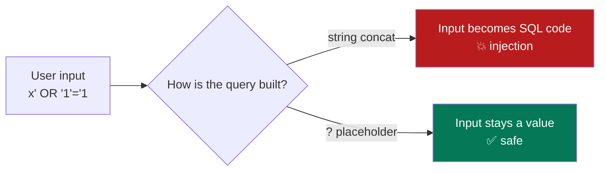

**The one thing parameters can't protect:** identifiers. `ORDER BY ?` doesn't work, so people concatenate the column name — and that's injectable. Use a **whitelist** (the same pattern as your Phase 8 sorting section):

```js
const SORTABLE = { created: 'created_at', priority: 'priority', title: 'title' };
const col = SORTABLE[req.query.sort] ?? 'created_at';       // never the raw input
const dir = req.query.dir === 'asc' ? 'ASC' : 'DESC';
const sql = `SELECT id, title FROM tasks ORDER BY ${col} ${dir} LIMIT ?`;
```

**The database security checklist:**

| # | Control | Why |
|---|---------|-----|
| 1 | Parameterized queries everywhere | Stops injection |
| 2 | Whitelist any dynamic identifier | The gap parameters leave |
| 3 | Least-privilege app user (J3) | Limits the blast radius |
| 4 | Never expose the DB port to the internet | Bind to localhost/VPC; use a bastion |
| 5 | Secrets in env vars, never in git | Leaked repos are scanned within minutes |
| 6 | TLS for connections | Stops network sniffing |
| 7 | Hash passwords with bcrypt/argon2 | A stolen dump then reveals nothing |
| 8 | Encrypt sensitive columns at rest | PAN, Aadhaar, card data |
| 9 | Don't leak SQL errors to clients | Error text tells an attacker your schema |
| 10 | Back up **and test restores** | The last line of defence |

<p class="te"><strong>Telugu:</strong> Rendu rules ni jeevitham antha gurthupettuko: (1) <strong>eppudu <code>?</code> placeholders</strong>, string concat kaadu. (2) Passwords ni <strong>bcrypt hash</strong> ga ne store cheyyali. Ee rendu unte, data leak ayina passwords safe.</p>

---

# Part K — MySQL From Node.js: The Real Data Layer

## K1. Connecting — The Driver and the Connection Pool

**Simple definition:** A **driver** lets Node speak MySQL's protocol. A **connection pool** keeps a small set of connections open and lends them out, because opening one costs 20–50 ms every time.

<p class="te"><strong>Telugu:</strong> Prathi request ki kotta connection theyyadam khareedu (20–50 ms). <strong>Pool</strong> ante — konni connections mundhu ne teesi pettadam; request vachchinappudu okati istundi, pani ayyaka tirigi teeskuntundi. Auto stand laaga: bandi eppudu siddham ga untundi.</p>

```js
// db/pool.js          npm install mysql2 dotenv
const mysql = require('mysql2/promise');

const pool = mysql.createPool({
  host: process.env.DB_HOST || 'localhost',
  port: process.env.DB_PORT || 3306,
  user: process.env.DB_USER,              // the least-privilege app user (J3)
  password: process.env.DB_PASSWORD,      // from .env — never in git
  database: process.env.DB_NAME,
  waitForConnections: true,
  connectionLimit: 10,        // start at 10; match it to your DB's max_connections
  timezone: 'Z',              // treat DATETIME as UTC — avoids the B5 timezone bug
  decimalNumbers: true,       // return DECIMAL as JS numbers, not strings
});
module.exports = pool;
```

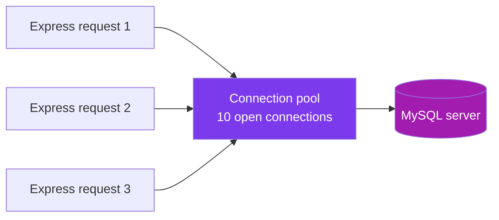

**Pool sizing sanity:** MySQL's default `max_connections` is 151, so four app instances × a pool of 50 asks for 200 and the server starts refusing connections. Ten per instance is a sane start — a bigger pool does **not** mean more throughput. And check at startup, not on the first user request: `await pool.query('SELECT 1')` in `server.js`.

<p class="te"><strong>Telugu:</strong> Server start ayyetappude <code>SELECT 1</code> tho DB connection check cheyyi — lekapothe modati user request appudu ne telustundi. Inko vishayam: <code>.env</code> ni <strong>.gitignore lo</strong> pettu, password git lo poddi.</p>

---

## K2. Queries, Placeholders and Mapping Rows

**Simple definition:** `pool.execute()` runs a parameterized query and gives back plain JavaScript objects — one per row.

<p class="te"><strong>Telugu:</strong> <code>execute()</code> vaadu — adi prepared statement vaadutundi (injection nunchi safe, malli malli vaadithe fast kuda). Result oka array of objects — kaani direct ga pampakunda <strong>mundhu shape ni sarichesukovali</strong>.</p>

```js
const [rows] = await pool.execute(
  'SELECT id, title, status FROM tasks WHERE user_id = ? AND status = ?', [userId, status]);

const [result] = await pool.execute(
  'INSERT INTO tasks (title, user_id, priority) VALUES (?, ?, ?)', [title, userId, priority]);
console.log(result.insertId);        // the new task's id

const [r] = await pool.execute('UPDATE tasks SET status=? WHERE id=? AND user_id=?',
  [status, id, userId]);
if (r.affectedRows === 0) return res.status(404).json({ code: 'NOT_FOUND' });
```

| Property | Meaning |
|----------|---------|
| `insertId` | The generated `AUTO_INCREMENT` id |
| `affectedRows` | Rows matched **and** changed by a write |
| `changedRows` | Rows whose values actually differed (UPDATE only) |

**`execute` vs `query`:** `execute()` uses a real prepared statement — the default. `query()` interpolates escaped values client-side and supports things prepared statements can't, like an array expansion:

```js
const [rows] = await pool.query('SELECT * FROM users WHERE id IN (?)', [[1, 2, 3]]);
// → SELECT * FROM users WHERE id IN (1,2,3)   (still escaped — safe)
```

**Map rows to your API shape — never return raw rows.** Your database has `snake_case` and columns like `password_hash`; your API has `camelCase` and must never leak the hash. This is Phase 8's **DTO** idea, enforced in exactly one place:

```js
const toTask = r => ({
  id: r.id, title: r.title, status: r.status, priority: r.priority,
  dueDate: r.due_date,
  assignee: r.assignee_name ? { id: r.user_id, name: r.assignee_name } : null,
  createdAt: r.created_at,
});
```

**The nested-object problem:** a JOIN returns flat rows, so a task with 3 tags arrives as 3 rows. Group them once in JS with a `Map` keyed by `row.id`, pushing each row's tag into the existing entry — never re-query per row (that's the N+1 of H5).

---

## K3. Transactions in Node

**Simple definition:** A transaction needs **one connection** held for its whole life: take it from the pool, `beginTransaction`, do the work, `commit` — and `rollback` + `release` on any error.

<p class="te"><strong>Telugu:</strong> Transaction ki <strong>okate connection</strong> chivari varaku vaadali — pool nunchi teeskoni, chivarilo tappakunda <code>release()</code> cheyyali. <code>finally</code> lo release cheyyakapothe pool khaali ayipotundi, app hang avutundi. Ide #1 tappu.</p>

```js
// db/withTransaction.js — a helper so nobody forgets a step
async function withTransaction(fn) {
  const conn = await pool.getConnection();      // ①
  try {
    await conn.beginTransaction();              // ②
    const out = await fn(conn);
    await conn.commit();                        // ③
    return out;
  } catch (e) {
    await conn.rollback();                      // ④ undo everything
    throw e;
  } finally {
    conn.release();                             // ⑤ ALWAYS — even on success
  }
}

// usage: an order that must be all-or-nothing
const orderId = await withTransaction(async conn => {
  const [o] = await conn.execute(
    'INSERT INTO orders (user_id, total, status) VALUES (?, ?, "pending")', [userId, total]);

  for (const it of items) {
    await conn.execute(
      `INSERT INTO order_items (order_id, product_id, quantity, unit_price)
       VALUES (?, ?, ?, ?)`, [o.insertId, it.productId, it.qty, it.price]);

    // atomic stock check — no read-then-write race (I5)
    const [u] = await conn.execute(
      'UPDATE products SET stock = stock - ? WHERE id = ? AND stock >= ?',
      [it.qty, it.productId, it.qty]);
    if (u.affectedRows === 0) throw new AppError('OUT_OF_STOCK', 409, it.productId);
  }
  return o.insertId;
});
```

**The three mistakes to avoid:**

1. Using `pool.execute()` inside a transaction — that takes a **different** connection, so those statements are outside your transaction and won't roll back.
2. Forgetting `finally { conn.release() }` — after 10 requests your pool is exhausted and the app hangs with no error.
3. Awaiting an HTTP call between `begin` and `commit` (payment gateways, email) — see I2.

---

## K4. ORMs and Query Builders

**Simple definition:** An **ORM** maps tables to objects so you write `Task.findAll()` instead of SQL. A **query builder** is the middle ground: you compose SQL with JavaScript and still see every query.

<p class="te"><strong>Telugu:</strong> ORM ante SQL raayakunda objects tho ne pani cheyyadam — speed ki bagundi, kaani lopala ye SQL run avutundo teliyakapothe slow queries vasthayi. Rule: <strong>modata SQL nerchuko</strong> (ee guide), taruvatha ORM vaadu — appudu adi generate chese query ni nuvvu chadavagalav.</p>

| Tool | Style | Use when |
|------|-------|----------|
| **mysql2** | Raw SQL | Learning, full control, complex reporting queries |
| **Knex** | Query builder | Composability + migrations, still SQL-shaped |
| **Prisma** | Modern typed ORM | New TypeScript projects — excellent DX, generated types |
| **Sequelize / TypeORM** | Classic ORM | Existing Node codebases, model-heavy apps |
| **Drizzle** | Typed SQL-first | You like SQL but want type safety |

```js
// Knex — SQL you can compose
const tasks = await knex('tasks')
  .join('users', 'users.id', 'tasks.user_id')
  .select('tasks.id', 'tasks.title', 'users.name as assignee')
  .where('tasks.status', 'open').andWhere('tasks.priority', '<=', 2)
  .orderBy('tasks.due_date').limit(20);

// Prisma — schema-first, fully typed
const tasks = await prisma.task.findMany({
  where: { status: 'open', priority: { lte: 2 } },
  include: { assignee: true, tags: true },
  orderBy: { dueDate: 'asc' }, take: 20,
});
```

An ORM gives you less boilerplate, injection safety by default, migrations and typed relations. It costs you hidden queries (the N+1 problem is *easy* to create accidentally), a leaky abstraction for complex reporting, and another API to learn on top of SQL.

Every serious ORM has an escape hatch — `prisma.$queryRaw`, `knex.raw()`, `sequelize.query()` — and you *will* use it for reporting queries. **Turn on query logging in development**; watching the SQL your ORM emits is how you catch an N+1 the day you write it.

---

## K5. Capstone — The Task Tracker Data Layer

**Simple definition:** The full, layered data access for your Phase 6 + 7 capstone: routes → repository → MySQL, with everything this guide taught applied.

<p class="te"><strong>Telugu:</strong> Idi nee capstone — Phase 6 React app + Phase 7 Express API ippudu <strong>nijamaina database</strong> tho. SQL antha okate chota (repository) untundi; route lo SQL undakudadu. Ee layering valla test cheyyadam, maarchadam sulabham.</p>

```
src/db/pool.js · db/withTransaction.js
    repositories/taskRepo.js   # ALL SQL for tasks lives here — nowhere else
    services/taskService.js    # business rules, no SQL
    routes/tasks.js            # HTTP only: parse, call, send status
migrations/20260814_init.sql
```

```js
// repositories/taskRepo.js
const pool = require('../db/pool');
const SORTABLE = { created: 't.created_at', due: 't.due_date', priority: 't.priority' };

// List: owner-scoped (Phase 8 BOLA fix), filtered, sorted, keyset-paginated
async function findByUser(userId, { status, tag, sort='created', dir='desc',
                                    limit=20, cursor } = {}) {
  const where = ['t.user_id = ?'];          // ← ownership is in the WHERE, never after
  const params = [userId];

  if (status) { where.push('t.status = ?'); params.push(status); }
  if (tag)    { where.push(`EXISTS (SELECT 1 FROM task_tags tt JOIN tags g ON g.id = tt.tag_id
                                    WHERE tt.task_id = t.id AND g.name = ?)`); params.push(tag); }
  if (cursor) { where.push('t.id < ?'); params.push(cursor); }      // keyset (H6)

  const col = SORTABLE[sort] ?? 't.created_at';                     // whitelist (J5)
  const ord = dir === 'asc' ? 'ASC' : 'DESC';
  const cap = Math.min(Number(limit) || 20, 100);                   // hard cap

  const [rows] = await pool.query(
    `SELECT t.id, t.title, t.status, t.priority, t.due_date, t.created_at, t.version,
            u.id AS user_id, u.name AS assignee_name,
            (SELECT COUNT(*) FROM comments c WHERE c.task_id = t.id) AS comment_count
     FROM tasks t
     JOIN users u ON u.id = t.user_id
     WHERE ${where.join(' AND ')}
     ORDER BY ${col} ${ord}, t.id ${ord}
     LIMIT ?`, [...params, cap]);
  return rows.map(toTask);
}

async function create({ title, description, priority=3, dueDate=null, userId, projectId=null }) {
  const [r] = await pool.execute(
    `INSERT INTO tasks (title, description, priority, due_date, user_id, project_id)
     VALUES (?, ?, ?, ?, ?, ?)`, [title, description, priority, dueDate, userId, projectId]);
  return findById(r.insertId, userId);
}

// Optimistic concurrency: version == the ETag from Phase 8
async function update(id, userId, fields, expectedVersion) {
  const cols = Object.keys(fields).map(k => `${COLUMN[k]} = ?`).join(', ');
  const [r] = await pool.query(
    `UPDATE tasks SET ${cols}, version = version + 1
     WHERE id = ? AND user_id = ? AND version = ?`,
    [...Object.values(fields), id, userId, expectedVersion]);
  return r.affectedRows;      // 0 → 404 (not yours) or 409 (someone else edited)
}

async function remove(id, userId) {
  const [r] = await pool.execute('DELETE FROM tasks WHERE id = ? AND user_id = ?', [id, userId]);
  return r.affectedRows;      // 0 → 404
}
```

```js
// routes/tasks.js — HTTP only
router.get('/tasks', auth, async (req, res, next) => {
  try {
    const tasks = await taskRepo.findByUser(req.user.id, req.query);
    res.json({ data: tasks, meta: { nextCursor: tasks.at(-1)?.id ?? null } });
  } catch (e) { next(e); }
});

router.delete('/tasks/:id', auth, async (req, res, next) => {
  try {
    const n = await taskRepo.remove(req.params.id, req.user.id);
    if (n === 0) return res.status(404).json({ code: 'NOT_FOUND' });
    res.status(204).end();
  } catch (e) { next(e); }
});
```

**Every guide rule is visible in that file:** parameterized queries (every `?`, J5) · a whitelisted sort column (`SORTABLE`, J5) · owner scoping on *every* query (`t.user_id = ?` — the Phase 8 BOLA fix) · named columns, no `SELECT *` (C3) · keyset pagination with a hard cap (H6) · optimistic locking via `version` (I5) · `affectedRows` driving 404/409. The indexes it wants: `(user_id, status, created_at)` and `(user_id, id)`.

**Your Day-5 exercise:** delete the in-memory array from your Phase 7 API, drop this repository in, run `EXPLAIN` on `findByUser`, add the composite index it asks for, then point your Phase 6 React app at it. That is a genuinely full-stack application — React → Express → MySQL — and a portfolio project you can defend line by line.

<p class="te"><strong>Telugu:</strong> Ide nee Day 5 pani: Phase 7 lo unna array ni theesesi ee repository ni pettu. Taruvatha <code>EXPLAIN</code> run chesi adi adigina index add cheyyi. Appudu nee daggara <strong>React → Express → MySQL</strong> full-stack project untundi — interview lo prathi line ni nuvvu explain cheyyagalav.</p>

---

# Part L — Beyond Relational: NoSQL, Scale, Analytics & SAP

## L1. NoSQL and the CAP Theorem

**Simple definition:** **NoSQL** databases drop some relational guarantees — fixed schema, joins, sometimes strict consistency — in exchange for flexibility or scale. **CAP** explains what you must give up when the network fails.

<p class="te"><strong>Telugu:</strong> NoSQL ante "SQL vaddu" kaadu — "Not Only SQL". CAP theorem cheppedi: network fail ayinappudu <strong>consistency</strong> leda <strong>availability</strong> — rendintlo okate saadhyam.</p>

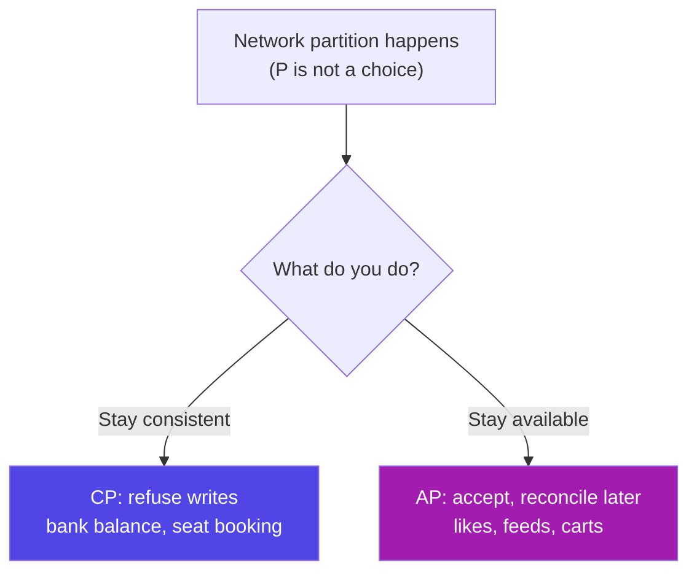

**CP** systems (MongoDB by default, HBase, banks) refuse to answer rather than answer wrongly; **AP** systems (Cassandra, DynamoDB, DNS) always answer, even if stale. **BASE** is the NoSQL answer to ACID — **B**asically **A**vailable, **S**oft state, **E**ventually consistent: your like-count may be wrong for 2 seconds; your bank balance may not.

```js
// MongoDB: one document holds everything the screen needs — no joins
{ _id: 91, title: "Fix login bug", status: "open",
  assignee: { id: 7, name: "Nikhil" }, tags: ["urgent","backend"],
  comments: [ { by: "Asha", body: "Reproduced" } ] }
// MySQL: the same information in 4 normalized tables, assembled with joins
```

| Question | Relational | Document |
|----------|-----------|----------|
| Shape varies per record? | Painful (nullable columns) | Natural |
| Need multi-row transactions? | ✅ Core strength | Supported since Mongo 4, not the sweet spot |
| Same data read many ways? | ✅ Joins let you re-slice freely | You duplicate per access pattern |
| Reporting / BI | ✅ Every tool speaks SQL | Aggregation pipeline, fewer tools |
| Schema changes | Migration | Just write the new field |

**The honest guidance:** default to relational. Reach for a document store when the data really is document-shaped (catalogues, CMS content, event payloads) or a team must move before the schema settles. Note that PostgreSQL's `JSONB` gives you 80% of document flexibility *inside* a relational database — often the best of both.

<p class="te"><strong>Telugu:</strong> Nirnayam: default ga <strong>relational</strong>. Data nijanga document laaga unte (catalogue, CMS), leda schema inka settle avvakapothe — document DB. Postgres lo <code>JSONB</code> column tho rendu prayojanalu okate chota vasthayi.</p>

---

## L2. Scaling — Replication, Partitioning, Sharding and Caching

**Simple definition:** When one server isn't enough you have four moves: **cache** it, **replicate** it, **partition** it, or **shard** it — in roughly that order of cost.

<p class="te"><strong>Telugu:</strong> Database slow ayithe order lo prayatninchu: (1) index + query fix, (2) <strong>cache</strong>, (3) <strong>replicas</strong>, (4) <strong>partition/shard</strong>. Sharding chivari option — chala kastam.</p>

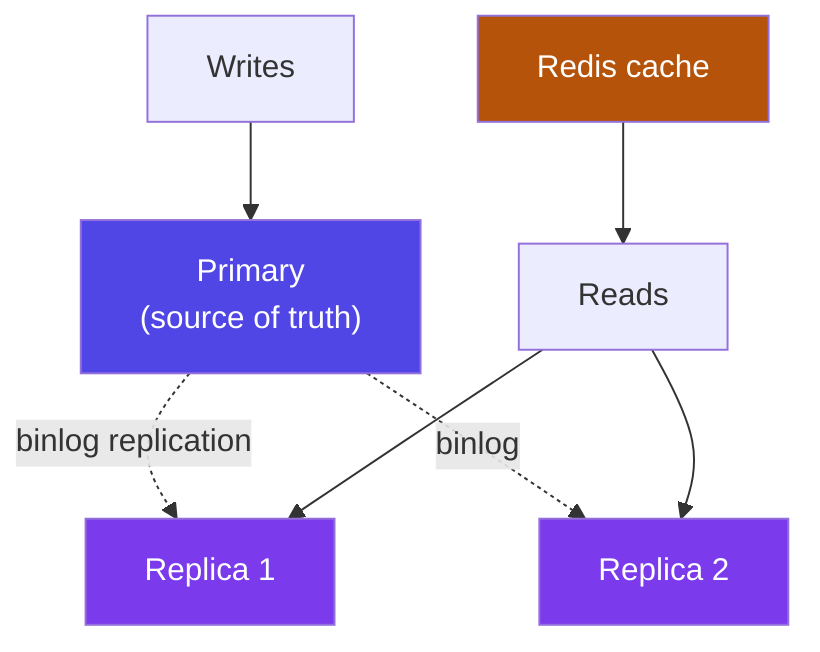

| Technique | What it does | Cost / catch |
|-----------|--------------|--------------|
| **Vertical scaling** | Bigger machine | Easiest; hits a ceiling and a price wall |
| **Read replicas** | Copies serving `SELECT`s | **Replication lag** — a user may not see their own write |
| **Caching (Redis)** | Hot answers in RAM | Invalidation is the hard part |
| **Partitioning** | Split one table by range/hash *inside* one server | Queries must include the partition key to benefit |
| **Sharding** | Split data across *different* servers | Cross-shard joins and transactions become your problem |
| **Pooling / proxy** | ProxySQL, PgBouncer | Removes connection-count limits |

```js
// Cache-aside — the caching pattern you will actually write
async function getTask(id) {
  const hit = await redis.get(`task:${id}`);
  if (hit) return JSON.parse(hit);
  const task = await taskRepo.findById(id);
  await redis.setex(`task:${id}`, 60, JSON.stringify(task));   // 60s TTL
  return task;
}
// On update: await redis.del(`task:${id}`)  ← invalidate, don't try to patch
```

```sql
-- Partitioning: still one server, one logical table
CREATE TABLE events (id BIGINT, created_at DATETIME, payload JSON)
PARTITION BY RANGE (YEAR(created_at)) (
  PARTITION p2025 VALUES LESS THAN (2026),
  PARTITION p2026 VALUES LESS THAN (2027));
-- Dropping last year's data becomes instant: ALTER TABLE events DROP PARTITION p2025;
```

**The order that actually solves problems:** fix the query → add the index → cache → replicate → partition → shard. Most teams that think they need sharding need a composite index.

---

## L3. OLTP vs OLAP — Warehouses, ETL and Star Schemas

**Simple definition:** **OLTP** is your app database — many small, fast transactions. **OLAP** is the analytics database — few enormous queries scanning years of history.

<p class="te"><strong>Telugu:</strong> <strong>OLTP</strong> = nee app database (chinna chinna fast operations). <strong>OLAP</strong> = analytics database (peddha queries — "poyina 3 samvatsaralalo ye state lo ekkuva amakalu?"). Rendu okate server lo run cheste analytics query nee app ni slow chestundi — anduke separate warehouse.</p>

| | OLTP | OLAP |
|---|------|------|
| Purpose | Run the business | Understand the business |
| Query shape | `WHERE id = 91` | `SUM(…) GROUP BY region, month` over 5 years |
| Rows touched | A few | Millions |
| Schema / storage | Normalized (3NF), row-oriented | **Denormalized** star schema, **column-oriented** |
| Examples | MySQL, PostgreSQL | Snowflake, BigQuery, Redshift, ClickHouse, **SAP BW/HANA** |

**Why columnar wins at analytics:** `SELECT SUM(amount) FROM sales` in a row store reads every column of every row off disk. A column store keeps each column together, so it reads only `amount` — 20× less I/O, and repeated values compress beautifully.

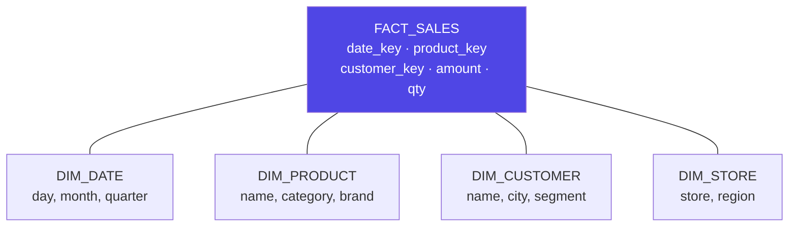

A **fact table** holds measurements plus foreign keys; **dimension tables** hold the attributes you slice by. It's deliberately denormalized so analysts join once, not five times (a *snowflake* schema normalizes the dimensions further; a star is usually preferred). **ETL / ELT** = Extract → Transform → Load; modern cloud practice flips two steps and transforms inside the warehouse with SQL — that's dbt. Tools you'll hear: Airflow, dbt, Fivetran, SAP Datasphere.

**Where this touches you:** when someone asks "can you run this report on production?", the answer is a replica or a warehouse — not the database your customers are using.

---

## L4. Vector Databases and AI

**Simple definition:** A **vector database** stores **embeddings** — arrays of numbers capturing *meaning* — and finds the nearest ones. It's how AI apps search by *idea* rather than keyword.

<p class="te"><strong>Telugu:</strong> Nee AI Engineer track ki idi mukhyam. Text ni numbers array (embedding) ga maarchi store chestham. "Login panicheyyadam ledu" ani search chesthe "sign-in fails" ane document kuda dorukutundi — endukante <strong>artham</strong> daggara ga undi, padalu kaadu.</p>

| | Relational search | Vector search |
|---|---|---|
| Matches | Exact values / keywords | **Meaning** (semantic similarity) |
| Index | B-tree | HNSW / IVF (approximate nearest neighbour) |
| Query | `WHERE title LIKE '%login%'` | "the 5 chunks closest to this question" |
| Tools | MySQL, Postgres | Pinecone, Weaviate, Qdrant, Chroma, **pgvector**, HANA vector engine |

```sql
CREATE EXTENSION vector;                       -- PostgreSQL + pgvector
CREATE TABLE docs (id SERIAL PRIMARY KEY, content TEXT, embedding vector(1536));
CREATE INDEX ON docs USING hnsw (embedding vector_cosine_ops);

-- The 5 chunks most similar in meaning to the question's embedding
SELECT content, 1 - (embedding <=> $1) AS similarity
FROM docs ORDER BY embedding <=> $1 LIMIT 5;
```

**RAG in four steps** (behind every "chat with your documents" app): **chunk** the documents → **embed** each chunk and store `(text, embedding)` → embed the question and fetch the top-k nearest chunks → **prompt** the LLM with them as context.

**The practical detail everyone learns late:** you almost always combine vector search with normal SQL filters — "nearest chunks **where** `tenant_id = 42` and `language = 'en'`". Hybrid search (vectors + keywords + metadata) beats pure vector search in production, which is exactly why `pgvector` inside PostgreSQL is so popular: one database, both kinds of query, one transaction.

<p class="te"><strong>Telugu:</strong> Nijamaina apps lo vector search okkate saripodu — normal SQL filters kuda kaavali (<code>tenant_id</code>, language, date). Anduke <strong>pgvector</strong> chala popular — okate database lo rendu panulu.</p>

---

## L5. Databases in the SAP World — HANA, ABAP SQL and CDS

**Simple definition:** Everything you learned here transfers directly to SAP. **HANA** is a relational, in-memory, **columnar** database; you query it with SQL, and ABAP developers write **ABAP SQL** on top of **CDS views**.

<p class="te"><strong>Telugu:</strong> Nee SAP track lo idi ne panikostundi. HANA kuda relational database ne — tables, keys, joins, SQL anni same. Rendu tedaalu: adi <strong>RAM lo</strong> untundi (disk kaadu), and data ni <strong>columns</strong> ga dachutundi.</p>

| MySQL concept | SAP equivalent | Note |
|---------------|----------------|------|
| Table | Transparent table (ABAP Dictionary / DDIC) | Same idea, plus a client field |
| `SELECT` | **ABAP SQL** (`SELECT … INTO TABLE @lt_x`) | Same clauses, ABAP-flavoured syntax |
| View | **CDS view** (`DEFINE VIEW ENTITY`) | Far more powerful — annotations drive Fiori UIs and OData |
| Stored procedure | **AMDP** (ABAP Managed Database Procedure) | SQLScript running inside HANA |
| Index | Secondary index in DDIC | Same B-tree thinking |
| Transaction / COMMIT | **LUW** + `COMMIT WORK` | Same ACID guarantees |
| Trigger | Rarely used; BAdIs / RAP determinations instead | SAP prefers app-layer extension |

**Two things that surprise every newcomer:**

1. **Row store vs column store.** HANA stores most tables **column-wise** in memory, so aggregations over millions of rows are near-instant. That's why S/4HANA deleted thousands of "aggregate" and "index" tables ECC needed — you can now sum the line items live.
2. **The client field (`MANDT`).** Nearly every SAP table's primary key starts with a client (tenant) column — multi-tenancy baked into the schema. It's the same "always scope your query to the owner" rule you applied with `user_id` in K5, at company scale.

```abap
" ABAP SQL — recognisably the same language you just learned
SELECT carrid, connid, SUM( seatsocc ) AS occupied
  FROM sflight
  WHERE fldate BETWEEN @lv_from AND @lv_to
  GROUP BY carrid, connid
  HAVING SUM( seatsocc ) > 100
  INTO TABLE @DATA(lt_result).
```

**The golden rule of ABAP SQL** — exactly Part H's lesson: **push the work down to the database.** Don't `SELECT *` into an internal table and loop in ABAP; filter, join and aggregate in the SQL. "Code-to-data" is the official name for the principle you already learned as "don't do in Node what SQL can do".

**CDS views in one breath:** a named, reusable SELECT defined in the ABAP layer that runs *in* HANA, can be stacked on other CDS views, and carries annotations that generate OData services and Fiori UIs. If H1 made you comfortable with views, CDS is that idea with superpowers — and it's the backbone of modern S/4HANA development.

<p class="te"><strong>Telugu:</strong> SAP lo bangaru rule: <strong>"code-to-data"</strong> — pani ni database vaipuku pampu. Anni rows ni ABAP loki teesukoni loop cheyyoddu; filter, join, aggregate anni SQL lo ne cheyyi. Ee guide Part H lo nerchukunna paate — SAP lo daaniki official peru undi ante.</p>

**Where this leads:** your SAP notes (`SAP-Master-Notes`, `ABAP-Notes`, `SAP-Fiori-UI5-Notes`) pick up exactly here — DDIC and ABAP SQL, then CDS, then OData, then Fiori.

---

# Part M — Revision: Cheat Sheet, Interview Q&A, Glossary

## M1. The One-Page SQL Cheat Sheet

<p class="te"><strong>Telugu:</strong> Idi revision page — interview ki mundhu ee okka page chusthe chaalu. Print chesi table meeda pettuko.</p>

```sql
SELECT   cols          -- runs 5th
FROM     t             -- 1st
JOIN     x ON …        -- 2nd
WHERE    row filter    -- 3rd   (no aggregates here)
GROUP BY col           -- 4th
HAVING   group filter  -- 4b    (aggregates here)
ORDER BY col           -- 6th   (aliases work here)
LIMIT    n OFFSET m;   -- 7th
```

| DDL | DML | DQL | TCL | DCL |
|-----|-----|-----|-----|-----|
| `CREATE` `ALTER` `DROP` `TRUNCATE` | `INSERT` `UPDATE` `DELETE` | `SELECT` | `COMMIT` `ROLLBACK` `SAVEPOINT` | `GRANT` `REVOKE` |

| Join | Keeps |
|---|---|
| `INNER JOIN` | Only matching rows on both sides |
| `LEFT JOIN` | All left rows + matches (NULLs where none) |
| `LEFT JOIN … WHERE right.id IS NULL` | **Anti-join** — left rows with no match |
| `CROSS JOIN` / self join | Every combination / a table joined to itself |

**The rules that prevent 90% of bugs:**

| # | Rule |
|---|------|
| 1 | `= NULL` never works — use `IS NULL` |
| 2 | `LEFT JOIN` + condition on the right table → put it in `ON`, not `WHERE` |
| 3 | `WHERE` filters rows, `HAVING` filters groups |
| 4 | Every `SELECT` column must be grouped or aggregated |
| 5 | `LIMIT` without `ORDER BY` is undefined; always add `, id` as a tie-breaker |
| 6 | No function on an indexed column in `WHERE` |
| 7 | `NOT IN` + NULL = zero rows. Use `NOT EXISTS` |
| 8 | Two one-to-many joins fan out — `COUNT(DISTINCT …)` |
| 9 | Money is `DECIMAL`, never `FLOAT` |
| 10 | Always parameterize (`?`); whitelist identifiers |

**Performance in five steps:** `EXPLAIN` it → look at `type` and `rows` → index the `WHERE`/`JOIN`/`ORDER BY` columns (equality first, range last) → name your columns so the index can cover → check you're not doing N+1.

```sql
START TRANSACTION;  …  COMMIT;   -- or ROLLBACK;
SELECT … FOR UPDATE;                                             -- pessimistic lock
UPDATE t SET c=?, version=version+1 WHERE id=? AND version=?;    -- optimistic
UPDATE products SET stock = stock - 1 WHERE id=? AND stock >= 1; -- atomic, race-free

SHOW DATABASES;  USE db;  SHOW TABLES;  DESCRIBE t;  SHOW CREATE TABLE t;
SHOW INDEX FROM t;  SHOW PROCESSLIST;  ANALYZE TABLE t;
```

---

## M2. 25 Interview Questions With Sharp Answers

<p class="te"><strong>Telugu:</strong> Ivi nijamaina interviews lo adige prashnalu. Answers ni bat-tee pattakunda <strong>sonta maatallo</strong> cheppadam practice cheyyi — appude nammakam ga vinipistundi.</p>

**1. DBMS vs RDBMS?** A DBMS manages data; an RDBMS stores it in related tables, enforces keys and constraints, and supports SQL and ACID transactions.

**2. Primary key vs unique key?** Both enforce uniqueness. A primary key can't be NULL and there's one per table; a unique key allows NULLs (one in MySQL) and you can have many.

**3. Why use a surrogate key?** Natural values change (emails, phone numbers, employee codes). A meaningless auto-increment id never changes, so foreign keys pointing at it never need updating.

**4. Explain normalization and 3NF.** Splitting tables so every fact is stored once. 3NF: every non-key attribute depends on the key, the whole key, and nothing but the key — no partial and no transitive dependencies.

**5. When would you denormalize?** When a *measured* read is too slow and you accept the duplication cost — counters, pre-joined reporting tables. Also for historical accuracy (`order_items.unit_price`), which is really a different fact, not a hack.

**6. What does `ON DELETE CASCADE` do?** Deletes the child rows when the parent goes. `RESTRICT` refuses the delete; `SET NULL` blanks the reference.

**7. `DELETE` vs `TRUNCATE` vs `DROP`?** DELETE removes rows (DML, `WHERE`, rollback-able, fires triggers). TRUNCATE empties the table fast (DDL, no rollback, resets `AUTO_INCREMENT`). DROP removes the table itself.

**8. `WHERE` vs `HAVING`?** WHERE filters rows before grouping and can use indexes; HAVING filters groups after aggregation and can use aggregate functions.

**9. The logical order of a SELECT?** FROM/JOIN → WHERE → GROUP BY → HAVING → SELECT → ORDER BY → LIMIT. It explains why an alias works in ORDER BY but not in WHERE.

**10. `INNER` vs `LEFT JOIN`, and the classic mistake?** INNER keeps only matches; LEFT keeps all left rows. The mistake is filtering the right table in `WHERE` — that turns a LEFT JOIN back into an INNER JOIN. Put those conditions in `ON`.

**11. How do you find rows with no match?** `LEFT JOIN … WHERE right.id IS NULL`, or `NOT EXISTS`. Not `NOT IN`, which returns nothing if the subquery contains a NULL.

**12. `COUNT(*)` vs `COUNT(col)`?** `COUNT(*)` counts rows; `COUNT(col)` counts non-NULL values in that column.

**13. Why is `= NULL` wrong?** NULL means unknown, and any comparison with unknown yields UNKNOWN, which `WHERE` discards. Use `IS NULL`.

**14. `UNION` vs `UNION ALL`?** Both stack result sets; `UNION` removes duplicates at the cost of a sort/hash. Use `UNION ALL` unless you truly need deduplication.

**15. What is an index and how does it work?** A sorted B+ tree beside the table mapping values to rows, turning O(n) scans into ~O(log n) seeks — and it also serves ranges and `ORDER BY`.

**16. Why not index every column?** Each index costs disk and slows every write, and too many confuse the optimizer. Index what you filter, join and sort on.

**17. Composite index and the leftmost prefix rule?** One index over several columns in order. A query can use it only if it filters on a leading prefix — `(user_id, status)` helps `WHERE user_id=…` but not `WHERE status=…` alone.

**18. What is a covering index?** An index containing every column the query needs, so the answer comes from the index and the table is never read. `EXPLAIN` shows `Using index`.

**19. How do you debug a slow query?** `EXPLAIN` it; check `type` (avoid `ALL`), `key` (not NULL), and rows-examined vs rows-returned; add or fix the index; remove index-killers; confirm you're not running N+1 queries.

**20. Explain ACID.** Atomicity (all or nothing), Consistency (constraints always hold), Isolation (concurrent transactions don't see partial work), Durability (committed data survives a crash).

**21. Isolation levels and the anomalies?** READ UNCOMMITTED / READ COMMITTED / REPEATABLE READ / SERIALIZABLE, preventing progressively: dirty reads, non-repeatable reads, phantoms. MySQL defaults to REPEATABLE READ, PostgreSQL to READ COMMITTED.

**22. What is a deadlock and how do you handle it?** Two transactions each hold what the other needs. Prevent it by locking rows in a consistent order and keeping transactions short; handle it by catching the error and retrying with backoff.

**23. Optimistic vs pessimistic locking?** Pessimistic locks the row (`SELECT … FOR UPDATE`) and makes others wait — good for short, high-contention work. Optimistic uses a version column and rejects a stale write — good for long human edit sessions, and it's the DB side of an ETag/`If-Match` flow.

**24. What is SQL injection and the only real fix?** Concatenating user input into SQL so it executes as code. The fix is parameterized queries, where the statement compiles before the value binds. For identifiers (column names in `ORDER BY`), use a whitelist.

**25. When would you choose NoSQL over SQL?** When the data is genuinely document-shaped or the access pattern is a single key at massive scale, and you need neither multi-row transactions nor ad-hoc joins. Otherwise relational — and Postgres `JSONB` covers many "we need flexibility" cases without leaving SQL.

---

## M3. Glossary

<p class="te"><strong>Telugu:</strong> Ee padalu database prapanchamlo roju vintav. Prathi daaniki okka line — revision ki idi chaalu.</p>

| Term | Meaning |
|------|---------|
| **DBMS / RDBMS** | Software managing data / one that uses related tables + SQL |
| **Schema / instance** | The design (tables, columns, constraints) / the data currently in it |
| **Primary key / foreign key** | Unique non-NULL row identifier / column referencing another table's PK |
| **Composite key / surrogate key** | PK made of several columns / meaningless generated id |
| **Normalization / 3NF** | Storing each fact exactly once |
| **Denormalization** | Deliberate duplication for read speed |
| **ER diagram / cardinality** | Picture of entities and relationships / 1:1, 1:N, M:N |
| **Junction table** | Third table implementing many-to-many |
| **Constraint** | Rule the database enforces (`NOT NULL`, `UNIQUE`, `CHECK`) |
| **NULL** | Unknown — not zero, not empty string |
| **JOIN / anti-join** | Combining tables on a match / finding rows with no match |
| **Fan-out** | Row multiplication from two one-to-many joins |
| **Subquery / CTE** | Query inside a query / named subquery via `WITH` |
| **Window function** | Per-group calculation that keeps every row |
| **View / materialized view** | Named stored query / one whose result is stored and refreshed |
| **Index / B+ tree** | Sorted structure making lookups ~O(log n) |
| **Clustered index** | The index that *is* the table (InnoDB PK) |
| **Covering index** | Index containing every column a query needs |
| **EXPLAIN / query optimizer** | Shows the plan / the component that chooses it |
| **N+1 problem** | One query per row instead of one for all |
| **Transaction / ACID** | All-or-nothing group of statements / its four guarantees |
| **Isolation level** | How much concurrent work you can see |
| **MVCC** | Versioned rows so readers never block writers |
| **Deadlock** | Two transactions each waiting on the other |
| **Optimistic / pessimistic locking** | Version check / lock the row up front |
| **Stored procedure / trigger** | Saved SQL block / code that fires automatically |
| **SQL injection** | Input executed as SQL — fixed by parameters |
| **Connection pool / ORM** | Reusable open connections / library mapping tables to objects |
| **Replication / replica lag** | Copying to secondary servers / how stale they are |
| **Sharding / partitioning** | Splitting data across servers / within one |
| **OLTP / OLAP** | Transaction workload / analytical workload |
| **CAP / BASE** | Consistency–availability trade-off / eventual consistency |
| **Vector database / embedding** | Search by meaning / the numeric representation |
| **HANA / ABAP SQL / CDS view** | SAP's in-memory DB / its SQL dialect / its view layer |

---

## M4. Your 5 Days, and What Comes Next

<p class="te"><strong>Telugu:</strong> Chivari page. Ee aidu rojula plan follow ayithe, phase chivariki nee daggara <strong>nijamaina full-stack project</strong> untundi — React, Express, MySQL. Adi interview lo chupinchagalige proof.</p>

| Day | Read | Build (do it, don't just read) |
|-----|------|-------------------------------|
| **1** | A, B | Install MySQL. Draw the Task Tracker ER diagram on paper, then write `schema.sql` and load the seed data |
| **2** | C, D, E | Write 30 queries: filters, `LIKE`, `NULL` handling, date ranges, `GROUP BY` reports, a pivot with `SUM(CASE …)` |
| **3** | F, G | Every join type on your tables; the M:N tags query; an anti-join; a CTE; `ROW_NUMBER()` top-N-per-user |
| **4** | H, I | `EXPLAIN` your slowest query and index it; write a transaction, force an error, watch it roll back; reproduce a deadlock in two terminals |
| **5** | J, K, L, M | Create a least-privilege user; wire `mysql2` into your Express API; replace the in-memory array; skim the SAP part; revise with M1 + M2 |

**On day 6 you should be able to:** draw a schema for any app description in 15 minutes and defend every key · write a 4-table join with a `GROUP BY` and get the numbers right first time · read an `EXPLAIN` and name the missing index · explain ACID and isolation levels without notes · write a Node data layer that is injection-proof, owner-scoped, paginated and transactional.

```mermaid
graph LR
  A["Phase 7<br/>Node + Express"] --> B["Phase 8<br/>REST API Design"]
  B --> C["Phase 9<br/>Databases + SQL"]
  C --> D["SAP track<br/>DDIC · ABAP SQL · CDS · HANA"]
  D --> E["SAP + AI Engineer"]
  C --> F["AI track<br/>pgvector · RAG"]
  F --> E
  style A fill:#4f46e5,color:#fff
  style C fill:#7c3aed,color:#fff
  style D fill:#0a6ed1,color:#fff
  style E fill:#047857,color:#fff
```

**The one idea to carry forward:** frameworks are fashion; **data is permanent**. React versions change and Express will be replaced, but the `users` table you design this week may still be running in ten years with a hundred million rows in it.

Design the schema before the code. Let the database enforce the rules. Push the work down to SQL. Measure with `EXPLAIN` instead of guessing. Wrap anything that must happen together in a transaction.

<p class="te"><strong>Telugu:</strong> Chivari maata — <strong>frameworks maarutayi, data migulutundi</strong>. React version maarutundi, Express poyi verokati vastundi; kaani ee vaaram nuvvu design chese <code>users</code> table padi samvatsaralu nadavachu. Anduke schema meeda pettina prathi ganta viluvainadi.<br/><br/>Code kanna mundu schema geeyyi. Rules ni database tho enforce cheyyi. Pani ni SQL vaipu pampu. Guess cheyyakunda <code>EXPLAIN</code> tho kolathalu chudu. Kalisi jaragalsinavi anni transaction lo pettu. All the best, Nikhil — Phase 9 ni gelavu!</p>

---