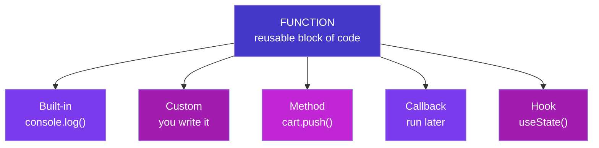
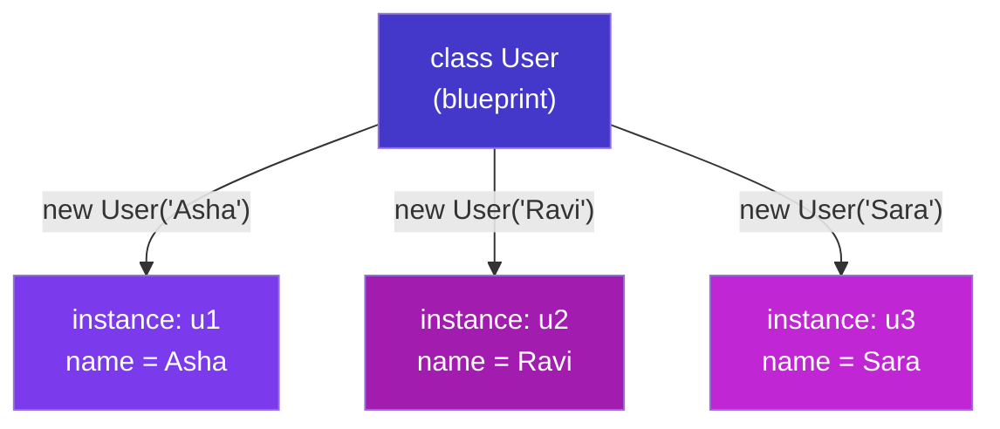
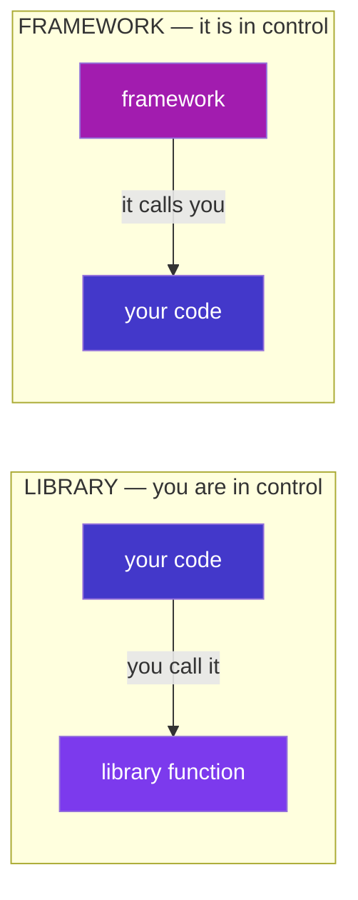

# Programming Terms — The Plain Dictionary

### Every word you'll hear while coding — in simple English + Telugu

> *"You don't truly know a concept until you can name it. Half of feeling lost as a beginner is just not knowing what the words mean. This fixes that half."*

---

## How to use this dictionary

This is a **reference**, not a read-once book. When a word trips you up — in a tutorial, a job description, a Stack Overflow answer, or your own head — look it up here. Each term gives you: a **plain meaning**, a tiny **example**, and a **Telugu** line. Deep concepts (closures, the event loop, prototypes) get a short definition here and a pointer to the full Phase 4 & 5 notes.

<p class="te"><strong>Telugu:</strong> Idi okkasari chadive book kaadu — <strong>reference</strong>. E word ayina ardham kakapothe — tutorial lo, job description lo, nee burralo — ikkada vethiki chudu. Prathi term ki: <strong>simple meaning</strong>, chinna <strong>example</strong>, oka <strong>Telugu</strong> line. Peddha concepts (closures, event loop) ki chinna definition + Phase 4-5 notes ki pointer.</p>

---

## Table of Contents

- [Part A — The Atoms of Code](#part-a-the-atoms-of-code) · variable, value, statement, expression, syntax…
- [Part B — Functions & Their Family](#part-b-functions-their-family) · function, parameter, argument, method, built-in, custom, callback, hook…
- [Part C — Objects, Classes & OOP](#part-c-objects-classes-oop) · object, property, class, instance, constructor, inheritance…
- [Part D — Data & Collections](#part-d-data-collections) · data type, array, index, object-as-map, JSON…
- [Part E — Making Decisions & Repeating](#part-e-making-decisions-repeating) · boolean, condition, loop, iteration…
- [Part F — Organising & Reusing Code](#part-f-organising-reusing-code) · module, package, library, framework, API, dependency, npm…
- [Part G — The Web & React Vocabulary](#part-g-the-web-react-vocabulary) · DOM, event, component, props, state, hook, JSX, frontend/backend…
- [Part H — Running Code & When It Breaks](#part-h-running-code-when-it-breaks) · runtime, scope, error, bug, debugging, sync/async…
- [Part I — The Developer's Workbench](#part-i-the-developers-workbench) · IDE, terminal, Git, repo, commit, deploy, environment…
- [Part J — The Confusables](#part-j-the-confusables-side-by-side) · the pairs everyone mixes up, side by side

---

# Part A — The Atoms of Code

*The smallest words. Everything else is built from these.*

**Syntax** — the grammar rules of a language: where the brackets, semicolons and quotes go. Break the syntax and the code won't even run.
<p class="teg"><strong>Telugu:</strong> Bhasha yokka <strong>grammar niyamalu</strong> — brackets, semicolons ekkada raavaalo. Syntax tappithe code run <em>ye</em> avvadu.</p>

**Statement** — one complete instruction that *does* something. Usually one line, often ending in `;`.
`let total = 0;` and `if (x > 5) { ... }` are statements.
<p class="teg"><strong>Telugu:</strong> Oka <strong>pani chese</strong> poorthi aagna — saadhaaranam ga oka line.</p>

**Expression** — any piece of code that *produces a value*. `2 + 2`, `price * qty`, `age >= 18` are all expressions.
The rough test: if it can sit on the right of `=`, it's an expression. A statement *does*; an expression *is worth* something.
<p class="teg"><strong>Telugu:</strong> Oka <strong>value ni istundi</strong>. Test: <code>=</code> ki kudivaipu pettagaligite adi expression. Statement <em>panichestundi</em>; expression <em>value istundi</em>.</p>

**Variable** — a named box that holds a value you can use and change later.
`let score = 10;` — `score` is the box, `10` is what's inside.
<p class="teg"><strong>Telugu:</strong> Value ni pettukune <strong>peru unna dabba</strong>. Taruvata vaadukovachu, maarchukovachu.</p>

**Constant** — a variable whose value can't be *reassigned* after it's set. Written with `const`.
<p class="teg"><strong>Telugu:</strong> Set chesaka <strong>malli maarchalemu</strong> — <code>const</code> tho raastam.</p>

**Value** — the actual data itself: `42`, `"Nikhil"`, `true`, a list, an object. The *thing* stored in a variable.
<p class="teg"><strong>Telugu:</strong> Asalu <strong>data</strong> — dabba lopala unna vishayam.</p>

**Literal** — a fixed value written directly in the code, exactly as it is.
`42` (number literal), `"hi"` (string literal), `[1, 2]` (array literal), `{ a: 1 }` (object literal).
<p class="teg"><strong>Telugu:</strong> Code lo <strong>neruga raasina</strong> value — <code>42</code>, <code>"hi"</code>, <code>[1,2]</code>.</p>

**Operator** — a symbol that performs an action on values: `+ - * / = === && !`. The values it works on are its **operands**.
In `price + tax`, the `+` is the operator; `price` and `tax` are operands.
<p class="teg"><strong>Telugu:</strong> Pani chese <strong>gurthu</strong> (<code>+ - === &amp;&amp;</code>). Adi pani chese values ni <strong>operands</strong> antaru.</p>

**Keyword** *(reserved word)* — a word the language owns and gives special meaning: `if`, `return`, `const`, `function`, `class`. You can't use them as your own names.
<p class="teg"><strong>Telugu:</strong> Language ki <strong>sonta</strong> prathyeka padaalu (<code>if</code>, <code>return</code>, <code>const</code>). Vaatini nee variable perlu ga vaadaleru.</p>

**Comment** — a note for humans that the computer ignores. `// single line` or `/* multi-line */`.
<p class="teg"><strong>Telugu:</strong> Manushula kosam raase note — computer <strong>paticchukodu</strong>. Comment code enduku ela raasavo cheptundi.</p>

**Declaration vs assignment** — declaring *introduces* a variable (`let x;`); assigning *gives it a value* (`x = 5`). Doing both at once is **initialization** (`let x = 5;`).
<p class="teg"><strong>Telugu:</strong> <strong>Declaration</strong> = variable ni parichayam cheyyadam (<code>let x</code>). <strong>Assignment</strong> = daaniki value ivvadam (<code>x = 5</code>). Rendu okkasari ante <strong>initialization</strong>.</p>

**Data type** — the *kind* of a value: text (`string`), a number (`number`), yes/no (`boolean`), a list (`array`), a record (`object`). See Part D and the notes (B2).
<p class="teg"><strong>Telugu:</strong> Value <strong>e rakam</strong> di — text, number, true/false, list, object.</p>

---

# Part B — Functions & Their Family

*The most important word in programming, and all its relatives. If you learn one part, learn this one.*

## The core

**Function** — a reusable, named block of code that takes **inputs**, does a job, and usually **returns** an output. Write it once, use it anywhere.
```js
function add(a, b) {
  return a + b;      // takes two inputs, returns their sum
}
```
<p class="teg"><strong>Telugu:</strong> Malli malli vaadagalige <strong>code mukka</strong> — input istav, oka pani chesi, output istundi. <strong>Okkasari</strong> raasi, ekkadaina vaadukovachu.</p>

**Call** *(invoke / run / execute)* — to actually *use* a function by writing its name with `()`. Defining a function doesn't run it; **calling** it does.
`add(2, 3)` calls `add` and gets back `5`.
<p class="teg"><strong>Telugu:</strong> Function ni <code>()</code> tho <strong>vaadadam</strong>. Function raayadam valla adi run avvadu — <strong>call</strong> chesthene run avutundi.</p>

**Parameter vs argument** — the two words for "function inputs", and they're *not* the same. A **parameter** is the placeholder in the definition; an **argument** is the real value you pass when calling.
```js
function greet(name) {      // `name` is the PARAMETER (the placeholder)
  return `Hi ${name}`;
}
greet("Nikhil");           // "Nikhil" is the ARGUMENT (the real value)
```
<p class="teg"><strong>Telugu:</strong> <strong>Parameter</strong> = definition lo unna <em>khaali chotu</em> (<code>name</code>). <strong>Argument</strong> = call chesinappudu pampe <em>nijamaina value</em> (<code>"Nikhil"</code>). Rendu veru!</p>

**Return** — the value a function hands back to whoever called it. After `return`, the function stops. No `return` → the function gives back `undefined`.
<p class="teg"><strong>Telugu:</strong> Function <strong>tirigi ichhe</strong> value. <code>return</code> taruvata function aagipotundi. <code>return</code> lekapothe <code>undefined</code> istundi.</p>

**Body** — the code inside a function's `{ }` — the actual work it does.
<p class="teg"><strong>Telugu:</strong> Function <code>{ }</code> lopali code — adi chese asalu pani.</p>

Here is the whole anatomy in one picture:

```
      keyword   name    parameters
        │        │        │
     function  add  (  a , b  )  {
        return a + b ;   ◄── body (the work) + return value
     }

     add( 2 , 3 )      ◄── a CALL, with 2 and 3 as arguments
         └───┘
        arguments
```

## Kinds of functions

**Built-in function** *(pre-built / native)* — a function the language or browser **already gives you**. You didn't write it; you just use it.
`console.log()`, `Math.max()`, `Array.map()`, `fetch()`, `parseInt()` are all built-in.
<p class="teg"><strong>Telugu:</strong> Language leda browser <strong>munde ichhina</strong> function. Nuvvu raayaledu — vaadukuntav matrame (<code>console.log</code>, <code>Math.max</code>, <code>fetch</code>).</p>

**Custom function** *(user-defined)* — a function **you write yourself** for your own needs.
```js
function calculateGST(amount) {   // YOUR function — doesn't exist until you write it
  return amount * 0.18;
}
```
<p class="teg"><strong>Telugu:</strong> Nee avasaraaniki <strong>nuvvu raase</strong> function. Nuvvu raasedaaka adi undadu.</p>

**Method** — a function that **belongs to an object**, called with a dot. Every method is a function; not every function is a method.
`cart.push(item)` — `push` is a method of the array `cart`. `"hi".toUpperCase()` — `toUpperCase` is a method of the string.
<p class="teg"><strong>Telugu:</strong> Oka <strong>object ki chendina</strong> function — dot tho pilustam. <strong>Prathi method oka function</strong>; kaani prathi function method kaadu. Dot ki mundu unna daaniki adi chendindi.</p>

**Arrow function** — a shorter way to write a function, using `=>`. Its special trait: it has no `this` of its own (notes G1).
`const double = (n) => n * 2;`
<p class="teg"><strong>Telugu:</strong> <code>=&gt;</code> tho raase <strong>chinna</strong> function. Pratyekata: daaniki sonta <code>this</code> undadu.</p>

**Anonymous function** — a function with no name, usually made to be used once and passed straight into something else.
`setTimeout(() => alert("Hi"), 1000);` — that arrow is anonymous.
<p class="teg"><strong>Telugu:</strong> <strong>Peru leni</strong> function — okkasari vaadadaaniki, neruga maro function loki pamputam.</p>

**Callback** — a function you **pass to another function**, to be called *later* — when something finishes or an event happens. The heartbeat of JavaScript.
```js
button.addEventListener("click", () => console.log("clicked!"));
//                                └──────── this is the callback ────────┘
```
<p class="teg"><strong>Telugu:</strong> Maro function ki <strong>pampe</strong> function — <em>taruvata</em> (pani aipoyaka, leda event jarigaka) pilavadaniki. JavaScript gunde chappudu ide.</p>

**Higher-order function** — a function that **takes a function as input, or returns one**. `map`, `filter`, `addEventListener` are all higher-order.
<p class="teg"><strong>Telugu:</strong> Maro <strong>function ni teeskune</strong>, leda <strong>function ni ichhe</strong> function (<code>map</code>, <code>filter</code>).</p>

**Pure function** — a function that, for the same input, always gives the same output and changes nothing outside itself. The easiest kind to test and trust (notes L7).
<p class="teg"><strong>Telugu:</strong> Oke input ki <strong>eppudu oke output</strong>, bayata emi maarchadu. Test cheyyadaniki, nammadaniki sulabham.</p>

**Recursion** — a function that **calls itself** to solve a problem by shrinking it each time. Needs a "stop" case or it loops forever.
```js
function countdown(n) {
  if (n === 0) return;      // the stop case — without it, forever
  console.log(n);
  countdown(n - 1);         // calls ITSELF with a smaller number
}
```
<p class="teg"><strong>Telugu:</strong> <strong>Tananu tanu piliche</strong> function — prathisari problem ni chinna cheskuntundi. Oka "aagu" case tappanisari, lekapothe anantam ga tirugutundi.</p>

**Hook** — in general, a **spot a framework lets you "plug into"** to run your own code. In **React** (your Phase 6), a hook is a special built-in function whose name starts with `use` — it lets a component *hook into* React features like memory and lifecycle.
`useState()` gives a component memory; `useEffect()` runs code after render.
<p class="teg"><strong>Telugu:</strong> Framework nee code ni <strong>plug cheyanichhe chotu</strong>. <strong>React</strong> lo, hook ante <code>use</code> tho modalayye special function — component ki state (<code>useState</code>), lifecycle (<code>useEffect</code>) laanti features ni <em>hook</em> chestundi. (Phase 6 lo vastundi.)</p>

Where these fit together:


---

# Part C — Objects, Classes & OOP

*The words for modelling real-world "things" in code.*

**Object** — a bundle of related data (and functions) kept together as `key: value` pairs. Models a "thing" — a user, a product, an order.
```js
const user = { name: "Nikhil", age: 26, isAdmin: false };
```
<p class="teg"><strong>Telugu:</strong> Sambandhamunna data ni kalipi unche <strong>mukka</strong> — <code>key: value</code> jantalu. Oka "vastuvu" ni chupistundi (user, product).</p>

**Property** — one `key: value` pair inside an object. `name: "Nikhil"` is a property; `name` is its **key**, `"Nikhil"` its value. Read it with a dot: `user.name`.
<p class="teg"><strong>Telugu:</strong> Object lopali <strong>oka key: value</strong> janta. <code>name</code> = key, <code>"Nikhil"</code> = value. Dot tho chaduvu: <code>user.name</code>.</p>

**Method** *(recap)* — a property whose value is a function. It's the object's *behaviour*, as opposed to its *data*.
`user.greet()` — a method. `user.name` — a data property.
<p class="teg"><strong>Telugu:</strong> Value function ayina property. Adi object yokka <strong>pani</strong> (data kaadu).</p>

**Class** — a **blueprint** for making objects of the same kind. It defines what data and methods every object of that type will have.
```js
class User {
  constructor(name) { this.name = name; }
  greet() { return `Hi, ${this.name}`; }
}
```
<p class="teg"><strong>Telugu:</strong> Oke rakam objects thayaru cheyyadaniki <strong>plan (blueprint)</strong>. Aa type prathi object ki e data, e methods untayo class cheptundi.</p>

**Instance** *(object)* — one actual object built from a class. The class is the blueprint; the instance is the built house.
`const u = new User("Nikhil");` — `u` is an instance of `User`.
<p class="teg"><strong>Telugu:</strong> Class nunchi thayarayina <strong>oka nijamaina object</strong>. Class = plan, instance = <strong>kattina illu</strong>.</p>

**`new`** — the keyword that creates a fresh instance from a class and runs its constructor.
<p class="teg"><strong>Telugu:</strong> Class nunchi <strong>kotha instance</strong> ni thayaru chese keyword.</p>

**Constructor** — the special method that runs **once**, automatically, when an instance is created — it sets up the starting data.
<p class="teg"><strong>Telugu:</strong> Instance thayarayinappudu <strong>okkasari</strong> automatic ga run ayye method — modati data ni set chestundi.</p>

**`this`** — inside a method, a word meaning "the current object I'm working on". `this.name` = *this* particular user's name (notes G1).
<p class="teg"><strong>Telugu:</strong> Method lopala, "<strong>ippudu nenu pani chestunna object</strong>" ani artham. <code>this.name</code> = ee user peru.</p>

**Inheritance** — one class **building on another**, getting all its data and methods, then adding more. Uses `extends`.
`class Admin extends User { ... }` — an Admin *is a* User, plus extra powers (notes G4).
<p class="teg"><strong>Telugu:</strong> Oka class inko daani <strong>meeda kattadam</strong> — daani data/methods anni techukoni, extra cherustundi. <code>extends</code> vaadutam.</p>

**Encapsulation** — **hiding** an object's internal data and only letting it change through safe methods. The `#` marks truly private fields (notes G5).
<p class="teg"><strong>Telugu:</strong> Object lopali data ni <strong>daachi</strong>, safe methods dwara matrame maarchanivvadam. <code>#</code> = nijam ga private.</p>

**Polymorphism** — different classes answering the **same method name** in their own way, so one line of code handles them all (notes G6).
<p class="teg"><strong>Telugu:</strong> Veru veru classes <strong>oke method peru</strong>ki tama sonta jawaabu ivvadam — okate line anni handle chestundi.</p>

The class-to-instance relationship:



---

# Part D — Data & Collections

*The words for the shapes your data comes in.*

**Data type** — the kind of a value. JavaScript's basics: `string` (text), `number`, `boolean` (true/false), `null`, `undefined`, plus `object` and `array` for structured data (notes B2).
<p class="teg"><strong>Telugu:</strong> Value <strong>e rakam</strong> di — text, number, true/false, null, undefined, object, array.</p>

**String** — text, written in quotes. `"Nikhil"`, `'hello'`, `` `Hi ${name}` ``.
<p class="teg"><strong>Telugu:</strong> <strong>Text</strong> — quotes lo raastam.</p>

**Number** — any number; JS has no separate int/decimal. `42`, `3.14`, `-7`.
<p class="teg"><strong>Telugu:</strong> <strong>Anke</strong> — JS lo int/decimal veru ledu.</p>

**Boolean** — a value that is only `true` or `false`. The basis of every decision.
<p class="teg"><strong>Telugu:</strong> <code>true</code> leda <code>false</code> matrame. Prathi nirnayaaniki adhaaram.</p>

**null vs undefined** — both mean "no value", differently. `undefined` = JS's "never set". `null` = the developer's deliberate "empty on purpose".
<p class="teg"><strong>Telugu:</strong> Rendu "value ledu" ye. <code>undefined</code> = JS "set cheyaledu". <code>null</code> = developer "kaavalane khaali".</p>

**Array** — an **ordered list** of values, in `[ ]`. Positions counted from **0**.
`const cart = ["pen", "book", "lamp"];`
<p class="teg"><strong>Telugu:</strong> <code>[ ]</code> lo <strong>vaparusa list</strong>. Positions <strong>0</strong> nunchi.</p>

**Element** — one item inside an array. In `["pen", "book"]`, `"pen"` is an element.
<p class="teg"><strong>Telugu:</strong> Array lopali <strong>oka item</strong>.</p>

**Index** — the position number of an element, starting at 0. `cart[0]` is the first element.
<p class="teg"><strong>Telugu:</strong> Element yokka <strong>position number</strong>, 0 nunchi. <code>cart[0]</code> = modatidi.</p>

**Length** — how many elements an array has. `cart.length`.
<p class="teg"><strong>Telugu:</strong> Array lo <strong>enni items</strong> unnayo. <code>cart.length</code>.</p>

**Key** — the name half of a `key: value` pair in an object. You look up values *by* their key.
<p class="teg"><strong>Telugu:</strong> Object lo <code>key: value</code> lo <strong>peru bhaagam</strong>. Key tho value ni vethukutaam.</p>

**JSON** *(JavaScript Object Notation)* — the universal **text format** for sending data between programs. Looks like a JS object but is a string. `JSON.stringify` turns an object into JSON text; `JSON.parse` turns it back (notes D6).
<p class="teg"><strong>Telugu:</strong> Programs madhya data pampe <strong>universal text format</strong>. JS object laage kanipistundi kaani adi <strong>string</strong>. Bayataki <code>stringify</code>, lopaliki <code>parse</code>.</p>

**Mutable vs immutable** — mutable data **can be changed** in place; immutable data **cannot** — you make a new copy instead. Arrays and objects are mutable; strings and numbers are immutable.
<p class="teg"><strong>Telugu:</strong> <strong>Mutable</strong> = maarchagalige; <strong>immutable</strong> = maarchaleni (kotha copy chestham). Arrays/objects mutable; strings/numbers immutable.</p>

---

# Part E — Making Decisions & Repeating

*The words for "do this only if…" and "do this again and again."*

**Condition** — an expression that is either true or false, used to decide what runs. `age >= 18`, `cart.length === 0`.
<p class="teg"><strong>Telugu:</strong> True leda false ayye expression — em run avvalo <strong>nirnayinchadaniki</strong>. <code>age &gt;= 18</code>.</p>

**if / else** — run one block when a condition is true, another when it's false. The most basic decision.
<p class="teg"><strong>Telugu:</strong> Condition nijamaithe oka block, kakapothe inko block. Atyanta moolika nirnayam.</p>

**Loop** — a block of code that **repeats**, usually until a condition stops it. `for`, `while`, `forEach`.
<p class="teg"><strong>Telugu:</strong> <strong>Malli malli</strong> jarige code block — condition aagedaaka.</p>

**Iteration** — **one single pass** through a loop. A loop that runs 5 times does 5 iterations.
<p class="teg"><strong>Telugu:</strong> Loop yokka <strong>oka round</strong>. 5 saarlu tirigite 5 iterations.</p>

**Iterable** — anything you can loop over with `for...of`: arrays, strings, Sets, Maps.
<p class="teg"><strong>Telugu:</strong> <code>for...of</code> tho tippagalige edaina — arrays, strings, Sets.</p>

**Truthy / falsy** — how non-boolean values behave inside an `if`. Six values are **falsy** (`false, 0, "", null, undefined, NaN`); everything else is **truthy** (notes B3).
<p class="teg"><strong>Telugu:</strong> <code>if</code> lopala boolean kaani values ela pravartistayo. <strong>Aaru</strong> falsy; migilinavi anni truthy.</p>

**break / continue** — inside a loop, `break` **stops** it completely; `continue` **skips** to the next iteration.
<p class="teg"><strong>Telugu:</strong> Loop lo <code>break</code> = motham <strong>aapeyi</strong>; <code>continue</code> = ee round <strong>vadili</strong> next ki.</p>

---

# Part F — Organising & Reusing Code

*How real projects are split up, and how they borrow other people's code.*

**Module** — a **single file** of code that shares some of its contents (`export`) and uses things from other files (`import`). One file = one module (notes I1).
<p class="teg"><strong>Telugu:</strong> Oka <strong>file</strong> code — konni vishayaalu <code>export</code> chesi, veeru files nunchi <code>import</code> cheskuntundi. Oka file = oka module.</p>

**Import / export** — `export` makes something in a file available to others; `import` pulls it in. This is how files share code.
<p class="teg"><strong>Telugu:</strong> <code>export</code> = ee file lodi veeriki andubaatu lo pettadam; <code>import</code> = daanni techukovadam.</p>

**Package** — a **bundle of reusable code** (usually a library) that you download and install into your project, with a name and version.
<p class="teg"><strong>Telugu:</strong> Download chesi install cheskune <strong>reusable code mutta</strong> — peru mariyu version tho.</p>

**Library** — a **collection of ready-made functions** you call to save time. **You** stay in charge and call *it*.
Examples: lodash (utilities), axios (HTTP), day.js (dates).
<p class="teg"><strong>Telugu:</strong> Time save cheyyadaniki <strong>ready-made functions samahaaram</strong>. <strong>Nuvvu</strong> control lo unti, daanini <em>nuvvu</em> pilustav.</p>

**Framework** — a **complete structure** you build your app inside. It's in charge and **calls your code** at the right moments. The famous line: *"you call a library; a framework calls you."*
Examples: React, Angular, Next.js, Express.
<p class="teg"><strong>Telugu:</strong> Nee app ni daani <strong>lopala katte poorthi nirmaanam</strong>. Adi control lo untundi, saraina samayamlo <strong>nee code ni adi pilustundi</strong>. "Library ni nuvvu pilustav; framework ninnu pilustundi."</p>

**Dependency** — any package your project **needs to run**. Listed in `package.json`.
<p class="teg"><strong>Telugu:</strong> Nee project run avvadaniki <strong>avasaramaina</strong> package. <code>package.json</code> lo untundi.</p>

**Package manager** *(npm, yarn, pnpm)* — the tool that downloads, installs, and tracks your packages. `npm install axios` fetches a package and its dependencies.
<p class="teg"><strong>Telugu:</strong> Packages ni download, install, track chese <strong>tool</strong>. <code>npm install axios</code> — package ni techipedutundi.</p>

**API** *(Application Programming Interface)* — a **defined way for two pieces of software to talk**. Two common meanings: a **web API** (URLs you send requests to, get JSON back) and a **code API** (the set of functions a library exposes for you to use).
<p class="teg"><strong>Telugu:</strong> Rendu software mukkalu <strong>maatladukune padhati</strong>. Rendu arthaalu: <strong>web API</strong> (URLs ki request pampi JSON techukovadam) mariyu <strong>code API</strong> (library ichhe functions samahaaram).</p>

**SDK** *(Software Development Kit)* — a bigger toolbox than a library: packages, tools, and docs bundled to build for a specific platform (e.g. the "SAP AI SDK", the "AWS SDK").
<p class="teg"><strong>Telugu:</strong> Library kanna <strong>peddha toolbox</strong> — oka platform kosam packages + tools + docs kalipi.</p>

Library vs framework, the control flip:


---

# Part G — The Web & React Vocabulary

*The words you'll live in once you build for the browser — and the React terms coming in Phase 6.*

**Frontend vs backend** — **frontend** is everything that runs in the user's **browser** (the buttons, the layout, what they see). **Backend** is everything that runs on the **server** (the database, the logic, the secrets).
<p class="teg"><strong>Telugu:</strong> <strong>Frontend</strong> = user <strong>browser</strong> lo nadichedi (buttons, layout, kanipinchedi). <strong>Backend</strong> = <strong>server</strong> lo nadichedi (database, logic, secrets).</p>

**Client vs server** — the **client** *asks* (usually the browser); the **server** *answers* (a computer that holds data and logic). Client sends a **request**, server sends a **response**.
<p class="teg"><strong>Telugu:</strong> <strong>Client</strong> = <em>adugutundi</em> (browser); <strong>server</strong> = <em>jawaabu istundi</em>. Client <strong>request</strong> pamputundi, server <strong>response</strong> istundi.</p>

**DOM** *(Document Object Model)* — the live **tree of objects** the browser builds from your HTML. JavaScript edits this tree and the page updates (notes E1).
<p class="teg"><strong>Telugu:</strong> Browser nee HTML nunchi thayaru chese <strong>objects chettu</strong>. JS ee chettu ni maarusthundi, page update avutundि.</p>

**Element vs node** — a **node** is any point in the DOM tree (including text and comments); an **element** is a node that's an actual HTML tag (`<div>`, `<p>`).
<p class="teg"><strong>Telugu:</strong> <strong>Node</strong> = DOM chettu lo <em>edaina point</em> (text kuda). <strong>Element</strong> = HTML tag ayina node (<code>&lt;div&gt;</code>).</p>

**Event** — **something that happens** on the page: a click, a keypress, a form submit, the page loading.
<p class="teg"><strong>Telugu:</strong> Page meeda <strong>emo jarigindi</strong> — click, key press, form submit.</p>

**Event listener** — a function that **waits for an event** and runs when it happens. Attached with `addEventListener` (notes E3).
<p class="teg"><strong>Telugu:</strong> Event kosam <strong>eduru chusi</strong>, adi jarigganae run ayye function.</p>

**Component** — a **reusable, self-contained piece of UI** — a button, a card, a navbar. React apps are built by combining components.
<p class="teg"><strong>Telugu:</strong> Malli malli vaadagalige <strong>UI mukka</strong> — button, card, navbar. React apps ivi kalipi kadataru.</p>

**Props** — the **inputs passed into a component** from its parent, read-only. Like arguments for a component.
`<Welcome name="Nikhil" />` — `name` is a prop.
<p class="teg"><strong>Telugu:</strong> Parent nunchi component ki <strong>pampe inputs</strong>, chadavadaniki matrame. Component ki arguments laantivi.</p>

**State** — data a component **owns and can change** over time; when state changes, the UI **re-renders** to match.
<p class="teg"><strong>Telugu:</strong> Component <strong>sonta ga unche, maarche</strong> data. State maarite, UI <strong>malli geeyabadutundi</strong>.</p>

**Hook** *(React)* — a built-in function starting with `use` that lets a component use React features. `useState` (memory), `useEffect` (run code after render). (Also in Part B.)
<p class="teg"><strong>Telugu:</strong> <code>use</code> tho modalayye built-in function — component ki React features istundi. <code>useState</code>, <code>useEffect</code>.</p>

**JSX** — HTML-like syntax written **inside JavaScript**, used by React. `const el = <h1>Hello {name}</h1>;`
<p class="teg"><strong>Telugu:</strong> JavaScript <strong>lopala</strong> raase HTML laanti syntax — React vaadutundi.</p>

**Render** — to **produce the visible UI** from your data/components. A **re-render** happens when state changes.
<p class="teg"><strong>Telugu:</strong> Data nunchi <strong>kanipinche UI ni thayaru</strong> cheyyadam. State maarite <strong>re-render</strong>.</p>

**Responsive** — a layout that **adapts** to any screen size, phone to desktop.
<p class="teg"><strong>Telugu:</strong> E screen size ki ayina <strong>saripoye</strong> layout — phone nunchi desktop varaku.</p>

---

# Part H — Running Code & When It Breaks

*What happens when code runs, and the words for when it doesn't.*

**Runtime** — two meanings: (1) the **time when your program is running** (as opposed to when you're writing it); (2) the **environment that runs your code** — Node.js is a JavaScript runtime.
<p class="teg"><strong>Telugu:</strong> Rendu arthaalu: (1) program <strong>run avutunna samayam</strong>; (2) code ni <strong>run chese vaatavaranam</strong> — Node.js oka JS runtime.</p>

**Compile vs interpret** — **compiling** translates the whole program to machine code *before* running (C++). **Interpreting** runs it line by line *as it goes* (classic JS). Modern JS mixes both for speed.
<p class="teg"><strong>Telugu:</strong> <strong>Compile</strong> = motham program ni run ki <em>mundu</em> machine code loki maarchadam. <strong>Interpret</strong> = line by line <em>appatikappudu</em> run cheyyadam.</p>

**Scope** — **where a variable is visible/usable** in your code. Global scope = everywhere; local scope = only inside a function or block (notes F3).
<p class="teg"><strong>Telugu:</strong> Variable <strong>ekkada kanipistundo/vaadocho</strong>. Global = anta chota; local = oka function/block lopala matrame.</p>

**Closure** — a function that **remembers the variables** from where it was created, even after that outer function has finished (notes F4).
<p class="teg"><strong>Telugu:</strong> Tanu <strong>puttina chota variables ni gurthu</strong> pettukune function — bayati function aipoyaka kuda.</p>

**Synchronous vs asynchronous** — **sync** code runs one line at a time, each waiting for the last. **Async** code can **start** a slow job (a network call) and **move on**, handling the result later (notes H).
<p class="teg"><strong>Telugu:</strong> <strong>Sync</strong> = okati taruvata okati, prathidi eduru chustundi. <strong>Async</strong> = slow pani (network) <strong>start chesi munduku</strong>, result taruvata chuskuntundi.</p>

**Promise** — an object standing for a value that **isn't ready yet** — a receipt for a future result. `async/await` is the modern way to use them (notes H4).
<p class="teg"><strong>Telugu:</strong> <strong>Inka ready kaani</strong> value ki receipt — future result ki token laantidi.</p>

**Bug** — a **mistake in the code** that makes it behave wrong. Named after a real moth found in a computer in 1947.
<p class="teg"><strong>Telugu:</strong> Code ni tappuga panichese <strong>porapaatu</strong>.</p>

**Error / exception** — the **signal JS raises when something goes wrong** at runtime (e.g. `TypeError`, `ReferenceError`). Caught with `try/catch` (notes J3).
<p class="teg"><strong>Telugu:</strong> Emaina tappu jariginappudu JS ichhe <strong>signal</strong> (<code>TypeError</code>). <code>try/catch</code> tho pattukuntaam.</p>

**Stack trace** — the **list of function calls** that led to an error, printed with it. Read top-down; the top is usually where it broke (notes J12).
<p class="teg"><strong>Telugu:</strong> Error ki daari teesina <strong>function calls list</strong>. Paina nunchi chaduvu — paidi mostam ekkada pagilindo adi.</p>

**Debugging** — the craft of **finding and fixing** bugs — with logs, breakpoints, and reasoning, not guessing (notes L / J12).
<p class="teg"><strong>Telugu:</strong> Bugs ni <strong>kanukkoni sariddi</strong> cheye naipunyam — logs, breakpoints tho, oohatho kaadu.</p>

**Console** — the panel (and the `console.log` function) where your messages and errors print. Your most-used debugging tool.
<p class="teg"><strong>Telugu:</strong> Nee messages/errors kanipinche panel (mariyu <code>console.log</code>). Ekkuva vaade debugging tool.</p>

---

# Part I — The Developer's Workbench

*The everyday tools and words around the code itself.*

**IDE / editor** — the app you **write code in**. VS Code is the popular one; it adds autocomplete, error highlighting, and debugging on top of a plain text editor.
<p class="teg"><strong>Telugu:</strong> Code <strong>raase app</strong> — VS Code popular. Autocomplete, error highlight, debugging isthundi.</p>

**Terminal / CLI** *(Command-Line Interface)* — the **text window** where you type commands to run tools (`npm install`, `git push`, `node app.js`).
<p class="teg"><strong>Telugu:</strong> Commands type chese <strong>text window</strong> — <code>npm install</code>, <code>git push</code> laanti tools ni run chestundi.</p>

**Git** — the **version-control** tool that tracks every change to your code, so you can go back, branch, and collaborate.
<p class="teg"><strong>Telugu:</strong> Nee code loni prathi maarpu ni <strong>track chese</strong> tool — venakki velladaniki, branch cheyyadaniki, kalisi pani cheyyadaniki.</p>

**Repository** *(repo)* — a **project folder that Git tracks**. On GitHub, it's your project's online home.
<p class="teg"><strong>Telugu:</strong> Git track chese <strong>project folder</strong>. GitHub lo, nee project online illu.</p>

**Commit** — a **saved snapshot** of your changes, with a message describing them. Your project's undo history.
<p class="teg"><strong>Telugu:</strong> Nee maarpula <strong>saved snapshot</strong>, oka message tho. Project yokka undo charitra.</p>

**Branch** — a **parallel line of work** where you can build a feature without touching the main code, then merge it back.
<p class="teg"><strong>Telugu:</strong> Main code ni muttukokunda feature katte <strong>samaanantara daari</strong> — taruvata merge chestham.</p>

**Push / pull** — **push** sends your commits up to GitHub; **pull** brings others' commits down to you.
<p class="teg"><strong>Telugu:</strong> <strong>Push</strong> = nee commits ni GitHub ki paiki pampu; <strong>pull</strong> = veeri commits ni kindaki techuko.</p>

**package.json** — the **manifest file** at a project's root: its name, scripts, and the list of dependencies.
<p class="teg"><strong>Telugu:</strong> Project root lo <strong>vivaraala file</strong> — peru, scripts, dependencies list.</p>

**node_modules** — the (huge) folder where npm installs all your downloaded packages. Never edited by hand, never committed to Git.
<p class="teg"><strong>Telugu:</strong> npm packages anni install ayye (peddha) folder. Cheththo muttam, Git ki pampam.</p>

**Environment variable** — a **config value kept outside the code** (API keys, database URLs), so secrets don't live in your files. Read via `process.env`.
<p class="teg"><strong>Telugu:</strong> Code <strong>bayata unche config value</strong> (API keys, DB URLs) — secrets files lo undakunda.</p>

**Build** — the step that **turns your source code into runnable output** (bundling, minifying, transpiling) before you ship it.
<p class="teg"><strong>Telugu:</strong> Nee source code ni <strong>run ayye output ga maarche</strong> step — ship cheyyadaniki mundu.</p>

**Deploy** — to **put your app on a live server** so real users can reach it. "Going to production."
<p class="teg"><strong>Telugu:</strong> Nee app ni <strong>live server meeda pettadam</strong> — nijamaina users vaadelaga. "Production loki velladam."</p>

**Transpile** — to **convert code from one form to another**: TypeScript → JavaScript, or modern JS → older JS for old browsers (Babel does this).
<p class="teg"><strong>Telugu:</strong> Code ni <strong>oka roopam nunchi inko daaniki maarchadam</strong> — TypeScript → JS, modern JS → paatha JS.</p>

**Refactor** — to **restructure code to make it cleaner** without changing what it does. Behaviour stays; readability improves.
<p class="teg"><strong>Telugu:</strong> Code ni <strong>clean cheyyadaniki</strong> tirigi raayadam — pani okate untundi, chadavadam sulabham avutundi.</p>

---

# Part J — The Confusables (side by side)

*The word-pairs that trip up every beginner, settled in one table. When two terms feel the same, come here.*

| These sound alike… | …but here's the difference |
|---|---|
| **Parameter vs Argument** | Parameter = placeholder in the *definition* (`function f(x)`). Argument = real value in the *call* (`f(5)`). |
| **Function vs Method** | A method is just a function that lives **on an object** and is called with a dot (`arr.push()`). All methods are functions. |
| **Built-in vs Custom** | Built-in = given by JS/browser (`fetch`, `Math.max`). Custom = you wrote it yourself. |
| **Library vs Framework** | You **call** a library; a framework **calls you**. Library = toolbox you control; framework = structure that runs your code. |
| **Class vs Object** | Class = the **blueprint**. Object (instance) = a **real thing built** from it. One class → many objects. |
| **Package vs Module** | Module = **one file** that imports/exports. Package = a **downloadable bundle** (often many modules) you install. |
| **== vs ===** | `==` converts types before comparing (surprises). `===` checks value **and** type. Always use `===`. |
| **null vs undefined** | `undefined` = JS never set it. `null` = you set it empty **on purpose**. |
| **Statement vs Expression** | Expression **produces a value** (`2+2`). Statement **does an action** (`if`, a loop). |
| **Sync vs Async** | Sync = one thing at a time, each waits. Async = start a slow job, carry on, handle the result later. |
| **Compile vs Interpret** | Compile = translate the whole program **before** running. Interpret = run it **line by line** as it goes. |
| **Frontend vs Backend** | Frontend = runs in the **browser** (what users see). Backend = runs on the **server** (data, logic, secrets). |
| **Client vs Server** | Client **asks** (browser sends a request). Server **answers** (sends a response). |
| **Element vs Node** | Node = any point in the DOM tree. Element = a node that's an actual HTML tag. |
| **Props vs State** | Props = inputs **passed in** from outside (read-only). State = data a component **owns and changes**. |
| **Mutable vs Immutable** | Mutable = can be changed in place (arrays, objects). Immutable = can't; you make a copy (strings, numbers). |
| **HTML vs CSS vs JS** | HTML = structure (what's on the page). CSS = style (how it looks). JS = behaviour (what it does). |
| **Bug vs Error** | Bug = the mistake in your code. Error = the runtime signal that something went wrong because of it. |

---

## One-page memory card

> **Atoms:** variable (named box) · value (the data) · expression (makes a value) · statement (does an action).
> **Function:** reusable code; *parameter* = placeholder, *argument* = real value; *return* = what it hands back.
> **Function kinds:** built-in (given) · custom (yours) · method (on an object) · callback (run later) · hook (plug into React).
> **OOP:** class (blueprint) → instance (built object) · property (data) · method (behaviour) · `this` (current object).
> **Data:** string · number · boolean · null/undefined · array (ordered list) · object (key:value) · JSON (data as text).
> **Reuse:** module (one file) · package (installed bundle) · library (you call it) · framework (calls you) · API (how software talks).
> **Web:** frontend (browser) vs backend (server) · client asks, server answers · DOM (page as a tree) · event + listener.
> **React:** component (UI piece) · props (inputs in) · state (owned, changing data) · hook (`useState`) · JSX · render.
> **Running:** runtime · scope (where a variable lives) · sync vs async · bug (mistake) → error (the signal) → debug (fix it).
> **Workbench:** IDE (VS Code) · terminal (commands) · Git (track changes) · repo · commit · push/pull · deploy (go live).
> **Golden rule:** when two words feel the same, open Part J — the difference is the whole point.

*You now have the vocabulary. Every tutorial, every job description, every error message is written in these words — and now you speak them.*
