# SAP Fiori & UI5 — Basics to Advanced

### From "what even is Fiori" to MVC, data binding, OData, routing, fragments and Fiori Elements — explained through the JavaScript & React you already know

> *"React taught you one law: change the data, and the screen redraws itself. SAP Fiori/UI5 is that exact same law, wearing an enterprise suit. Views instead of JSX, models instead of useState, binding instead of props. Learn to see the React underneath, and UI5 stops being scary and starts being familiar."*

**SAP Track** · Fiori Design + SAPUI5 Framework · builds on Phase 6 (React + Tailwind)

---

## Table of Contents

- [Part A — Meet SAP Fiori & UI5](#part-a-meet-sap-fiori-ui5)
  - [A1. What is SAP Fiori & Why It Exists](#a1-what-is-sap-fiori-why-it-exists) · [A2. The 5 Fiori Design Principles](#a2-the-5-fiori-design-principles) · [A3. Fiori vs UI5 vs SAPUI5 vs OpenUI5](#a3-fiori-vs-ui5-vs-sapui5-vs-openui5) · [A4. Freestyle UI5 vs Fiori Elements](#a4-freestyle-ui5-vs-fiori-elements) · [A5. How a UI5 App Boots (the Bootstrap)](#a5-how-a-ui5-app-boots-the-bootstrap) · [A6. How to Learn Fiori](#a6-how-to-learn-fiori-your-learning-path)
- [Part B — The MVC Architecture](#part-b-the-mvc-architecture)
  - [B1. What is MVC & Why UI5 Uses It](#b1-what-is-mvc-why-ui5-uses-it) · [B2. The Four View Types](#b2-the-four-view-types) · [B3. React Components vs UI5 MVC](#b3-react-components-vs-ui5-mvc)
- [Part C — Views (XML Views in Depth)](#part-c-views-xml-views-in-depth)
  - [C1. Anatomy of an XML View](#c1-anatomy-of-an-xml-view) · [C2. Namespaces (xmlns)](#c2-namespaces-xmlns) · [C3. Common Controls (sap.m)](#c3-common-controls-sapm) · [C4. Layouts & Containers](#c4-layouts-containers) · [C5. Control IDs & byId](#c5-control-ids-byid)
- [Part D — Controllers & the Lifecycle](#part-d-controllers-the-lifecycle)
  - [D1. What a Controller Does](#d1-what-a-controller-does) · [D2. The Lifecycle Hooks](#d2-the-lifecycle-hooks) · [D3. Event Handlers](#d3-event-handlers) · [D4. Reaching Controls & Models](#d4-reaching-controls-models)
- [Part E — Models & Data Binding (the Heart)](#part-e-models-data-binding-the-heart)
  - [E1. What is a Model](#e1-what-is-a-model) · [E2. The JSONModel](#e2-the-jsonmodel) · [E3. Property Binding](#e3-property-binding) · [E4. Binding Modes (one-way, two-way, one-time)](#e4-binding-modes-one-way-two-way-one-time) · [E5. Aggregation (List) Binding](#e5-aggregation-list-binding) · [E6. Element (Context) Binding](#e6-element-context-binding) · [E7. Expression Binding](#e7-expression-binding) · [E8. The Resource Model (i18n)](#e8-the-resource-model-i18n)
- [Part F — OData & Talking to the Backend](#part-f-odata-talking-to-the-backend)
  - [F1. What is OData](#f1-what-is-odata) · [F2. OData V2 vs V4](#f2-odata-v2-vs-v4) · [F3. The ODataModel & Metadata](#f3-the-odatamodel-metadata) · [F4. Reading & Writing (CRUD)](#f4-reading-writing-crud) · [F5. OData vs fetch/axios](#f5-odata-vs-fetchaxios) · [F6. Where OData Comes From: the ABAP Backend](#f6-where-odata-comes-from-the-abap-backend) · [F7. The Full Fiori ↔ ABAP Round-Trip](#f7-the-full-fiori-abap-round-trip) · [F8. CDS Views & RAP](#f8-cds-views-rap-the-modern-abap-that-feeds-fiori)
- [Part G — The Component & App Descriptor](#part-g-the-component-app-descriptor)
  - [G1. Component.js — the App's Root](#g1-componentjs-the-apps-root) · [G2. manifest.json — the Descriptor](#g2-manifestjson-the-descriptor) · [G3. Descriptor vs package.json/config](#g3-descriptor-vs-packagejsonconfig)
- [Part H — Routing & Navigation](#part-h-routing-navigation)
  - [H1. Why Routing](#h1-why-routing) · [H2. Routes, Patterns & Targets](#h2-routes-patterns-targets) · [H3. Navigating & Passing Parameters](#h3-navigating-passing-parameters) · [H4. UI5 Routing vs React Router](#h4-ui5-routing-vs-react-router)
- [Part I — Fragments, Dialogs & Reuse](#part-i-fragments-dialogs-reuse)
  - [I1. What is a Fragment](#i1-what-is-a-fragment) · [I2. Dialogs & Popovers](#i2-dialogs-popovers) · [I3. Fragments vs React Components](#i3-fragments-vs-react-components)
- [Part J — Formatters, Types & Validation](#part-j-formatters-types-validation)
  - [J1. Formatters](#j1-formatters) · [J2. Data Types & Validation](#j2-data-types-validation) · [J3. Formatters vs JS Functions](#j3-formatters-vs-js-functions)
- [Part K — Fiori Elements & Annotations](#part-k-fiori-elements-annotations)
  - [K1. What Are Fiori Elements](#k1-what-are-fiori-elements) · [K2. The Floorplans](#k2-the-floorplans) · [K3. Annotations](#k3-annotations) · [K4. Elements vs Freestyle (When to Use Which)](#k4-elements-vs-freestyle-when-to-use-which)
- [Part L — SAP Fiori Launchpad (FLP)](#part-l-sap-fiori-launchpad-flp)
  - [L1. What is the Launchpad](#l1-what-is-the-launchpad) · [L2. Tiles, Groups & Roles](#l2-tiles-groups-roles) · [L3. Where Apps Get Deployed](#l3-where-apps-get-deployed)
- [Part M — i18n, Theming & Accessibility](#part-m-i18n-theming-accessibility)
  - [M1. Internationalization (i18n)](#m1-internationalization-i18n) · [M2. Theming](#m2-theming) · [M3. Accessibility Built-In](#m3-accessibility-built-in)
- [Part N — The Toolbox](#part-n-the-toolbox)
  - [N1. Business Application Studio & VS Code](#n1-business-application-studio-vs-code) · [N2. UI5 Tooling (CLI)](#n2-ui5-tooling-cli) · [N3. Fiori Tools & Guided Development](#n3-fiori-tools-guided-development)
- [Part O — Master Project: Products Manager](#part-o-master-project-products-manager)
- [Part P — Interview Cheat-Sheet](#part-p-interview-cheat-sheet)
- [Part Q — Resources & Quick Reference](#part-q-resources-quick-reference)

---
<style>
/* ===== self-contained visual figures (scoped .fig / fig-*) ===== */
.fig { margin: 12px 0 15px; page-break-inside: avoid; }
.fig figcaption { font-size: 12px; color: #6b6f85; text-align: center; margin-top: 7px; font-style: italic; line-height: 1.4; }
.fig-row { display: flex; gap: 12px; align-items: stretch; }
.fig-col { flex: 1; min-width: 0; }
.win { border: 1px solid #d6d3e6; border-radius: 8px; overflow: hidden; box-shadow: 0 1px 4px rgba(0,0,0,.08); background:#fff; }
.win-bar { background:#0a6ed1; color:#fff; font-size:11.5px; font-weight:600; padding:7px 12px; }
.win-bar.old { background:#5b6270; }
.win-body { padding:11px 12px; }
.flp { display:grid; grid-template-columns:repeat(4,1fr); gap:9px; }
.tile { background:#fff; border:1px solid #e2e0ee; border-radius:8px; padding:11px; height:80px; display:flex; flex-direction:column; justify-content:space-between; }
.t-ico { width:26px;height:26px;border-radius:6px;background:#0a6ed1;color:#fff;font-size:15px;display:flex;align-items:center;justify-content:center; }
.t-title { font-size:11.5px; font-weight:600; color:#32363a; }
.t-kpi { font-size:21px; font-weight:800; color:#0a6ed1; }
.t-sub { font-size:10px; color:#7a7f92; }
.gui { background:#eef0f2; font-family:Consolas,monospace; font-size:11px; color:#333; }
.gui-row { border-bottom:1px solid #d7dade; padding:3px 8px; }
.gui-field { display:inline-block; background:#fff; border:1px solid #b9bfc7; padding:0 6px; margin:2px; min-width:52px; }
.rowlist .lrow { display:flex; justify-content:space-between; padding:6px 8px; border-bottom:1px solid #eee; font-size:12px; }
.badge { font-size:10.5px; font-weight:700; padding:1px 7px; border-radius:10px; white-space:nowrap; }
.badge.ok { background:#e5f6e9; color:#256b39; }
.badge.no { background:#fbe6e6; color:#a3211f; }
.pill { display:inline-block; background:#eef1ff; color:#3a45c9; border-radius:12px; padding:1px 9px; font-size:11px; margin:2px 3px; }
.stack { display:flex; flex-direction:column; max-width:460px; margin:0 auto; }
.layer { padding:9px 12px; font-size:12.5px; color:#fff; text-align:center; border-radius:5px; }
.arrow-v { text-align:center; color:#9aa0b4; font-size:12px; line-height:1.3; margin:2px 0; }
.logo-mark { text-align:center; margin:10px 0 4px; }
.logo-mark img { width:120px; height:auto; }
</style>


# Part A — Meet SAP Fiori & UI5

*Start from zero. You just spent Phase 6 building React apps: components, state, props, routing. SAP's UI world is built on the very same ideas — it just has different names and an enterprise backend. This part clears up the single most confusing thing for beginners: what "Fiori" actually is, and how it relates to the JavaScript framework called UI5.*
<div class="logo-mark"></div>


## A1. What is SAP Fiori & Why It Exists

**Simple definition:** **SAP Fiori** is SAP's **design language** — a set of rules, guidelines and ready-made UI patterns that make every SAP business app look, feel and behave the same way. It is *not* a programming language and *not* a framework. It is the "how SAP apps should look and work" rulebook. **SAPUI5** (usually just "UI5") is the **JavaScript framework** you actually code in to *build* apps that follow the Fiori rules.

<p class="te"><strong>Telugu:</strong> <strong>Fiori</strong> ante SAP yokka <strong>design language</strong> — anni SAP apps oke laaga kanipinchi, oke laaga pani cheyali ane <em>rules book</em>. Idi programming language kaadu. <strong>SAPUI5</strong> (short ga UI5) ante aa Fiori rules follow ayye apps ni kattadaniki vaade <strong>JavaScript framework</strong>. React lo Material-UI oka design system, React framework — alage ikkada Fiori = design system, UI5 = framework ani gurthupettuko.</p>

**The problem Fiori solves.** For 30 years SAP's screens (the old "SAP GUI") were gray, dense, keyboard-transaction-code driven (`VA01`, `ME21N`) and needed a training course to use. Every module looked different. In 2013 SAP launched Fiori to fix this: modern, clean, mobile-friendly, *consistent* apps that a new employee can use without training. Think of the jump from a 1990s desktop form to a clean web app — that's Fiori.

<figure class="fig">
<div class="fig-row">
  <div class="fig-col win">
    <div class="win-bar old">SAP GUI (1990s–2000s) · transaction VA01</div>
    <div class="win-body gui">
      <div class="gui-row">Order Type <span class="gui-field">OR</span> Sales Org <span class="gui-field">1000</span></div>
      <div class="gui-row">Sold-To <span class="gui-field">100024</span> PO No <span class="gui-field">&nbsp;</span></div>
      <div class="gui-row">Material <span class="gui-field">M-01</span> Qty <span class="gui-field">10</span></div>
      <div class="gui-row">Material <span class="gui-field">M-02</span> Qty <span class="gui-field">5</span></div>
      <div class="gui-row" style="color:#8a8f97">40+ fields · cryptic codes · needs training</div>
    </div>
  </div>
  <div class="fig-col win">
    <div class="win-bar">SAP Fiori (2013 → today) · Manage Sales Orders</div>
    <div class="win-body">
      <div class="rowlist">
        <div class="lrow"><span><b>SO-1001</b> · Acme Corp</span><span class="badge ok">Open</span></div>
        <div class="lrow"><span><b>SO-1002</b> · Globex</span><span class="badge ok">Shipped</span></div>
        <div class="lrow"><span><b>SO-1003</b> · Initech</span><span class="badge no">Blocked</span></div>
      </div>
      <div style="margin-top:8px"><span class="pill">+ Create</span><span class="pill">Filter</span><span class="pill">Share</span></div>
      <div style="font-size:11px;color:#8a8f97;margin-top:5px">clean · mobile-ready · no training</div>
    </div>
  </div>
</div>
<figcaption><b>Before &amp; after:</b> the same job — a sales order — in the old SAP GUI (left) vs a modern Fiori app (right). Fiori exists to make exactly this jump: from dense, code-driven screens to clean, role-based apps.</figcaption>
</figure>

**The everyday analogy.** Fiori is like a **brand style-guide** for a big company (fonts, colors, logo placement, tone). SAPUI5 is the **actual design software** (Photoshop) you use to produce artwork that follows the guide. The guide alone builds nothing; the software alone might build something off-brand. You need both.

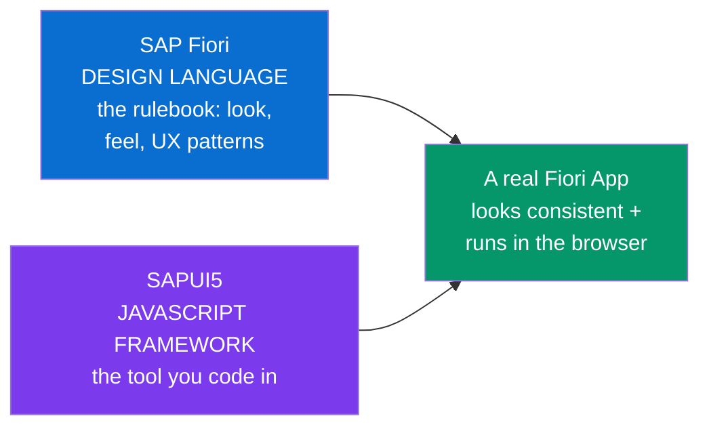

**Where you meet it in the real world:**
- Every modern SAP S/4HANA screen an employee opens — approving a leave request, creating a purchase order, checking inventory — is a Fiori app.
- The **SAP Fiori Launchpad** — the tile-based home screen employees log into — is the "desktop" that holds all these apps.
- Companies running SAP (which is most large enterprises — manufacturing, retail, banking) need Fiori/UI5 developers. **This is the job your roadmap is aiming at.**

**Why it's in your roadmap right after React:** UI5 is a component-based JavaScript UI framework with data binding, routing and a lifecycle — conceptually a cousin of React. Everything you learned in Phase 6 transfers. The rest of this document keeps pointing back to the React equivalent so the new vocabulary lands on familiar ground.

---

## A2. The 5 Fiori Design Principles

**Simple definition:** Fiori is guided by **5 core principles**. Interviewers love asking these, and they explain *why* Fiori apps are shaped the way they are. Remember them with the phrase **"Role, Adapt, Cohere, Simple, Delight."**

<p class="te"><strong>Telugu:</strong> Fiori ki <strong>5 principles</strong> unnayi — interview lo tappakunda adugutaru. Gurthupettukovadaniki: <strong>Role-based, Adaptive, Coherent, Simple, Delightful</strong>. Ee 5 emito, prati okkati oka chinna example tho kinda table lo undi.</p>

| # | Principle | What it means (plain English) | Real example |
|---|---|---|---|
| 1 | **Role-based** | Show a person only the apps and data their *job* needs — not the whole giant system. | A warehouse clerk sees "Post Goods", a manager sees "Approve Requests". Same system, different tiles. |
| 2 | **Adaptive** | One app works on phone, tablet and desktop, adjusting the layout automatically. | The approval app reflows from a wide table on desktop to stacked cards on a phone. |
| 3 | **Coherent** | Every app uses the same controls, gestures and language, so learning one teaches you all. | A "Save" button, a date picker, a filter bar look and behave identically everywhere. |
| 4 | **Simple** | Reduce clutter — focus each app on **one task done well** (the "1-1-3" idea: 1 user, 1 use-case, up to 3 screens). | Instead of one 40-field mega-transaction, several focused apps. |
| 5 | **Delightful** | Pleasant, modern, responsive — work should not feel like punishment. | Smooth animations, clear feedback, clean typography. |

**The React parallel:** These are the same instincts behind a good React app — component reuse (Coherent), responsive Tailwind classes (Adaptive), and single-responsibility components (Simple). Fiori just writes them down as law and enforces them across an entire enterprise.

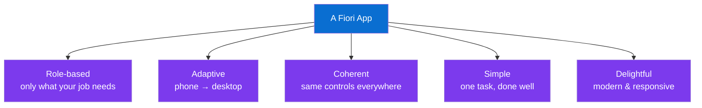

---

## A3. Fiori vs UI5 vs SAPUI5 vs OpenUI5

**Simple definition:** These four words get thrown around interchangeably and confuse every beginner. Here is the clean separation once and for all.

<p class="te"><strong>Telugu:</strong> Ee 4 padalu — Fiori, UI5, SAPUI5, OpenUI5 — anni okate ani anukuntan, kaani veru veru. Kinda table lo clear ga chudu. Short ga: <strong>Fiori = design</strong>, <strong>SAPUI5 = SAP yokka framework (paid, extra controls)</strong>, <strong>OpenUI5 = ade framework free open-source version</strong>, <strong>UI5 = rendaitiki common ga piliche peru</strong>.</p>

| Term | What it actually is | Analogy |
|---|---|---|
| **SAP Fiori** | The **design language / UX guidelines**. No code — rules & patterns. | The rulebook / brand guide |
| **SAPUI5** | SAP's **commercial JS framework** implementing Fiori; ships with extra enterprise controls (charts, smart controls) and SAP support. | Photoshop (paid, full features) |
| **OpenUI5** | The **free, open-source** core of the same framework (Apache 2.0). Same code style, fewer premium controls. | GIMP (free, most features) |
| **UI5** | Casual umbrella word for "SAPUI5 **or** OpenUI5" — the framework in general. | "an image editor" (either one) |

**The one-line answer for interviews:** *"Fiori is the design language; SAPUI5 is SAP's framework that implements it; OpenUI5 is its open-source edition; and 'UI5' is how we refer to the framework generally."*

**JS parallel:** It's exactly like **React vs Next.js vs the specific component library**. React = the core idea; a paid enterprise UI kit vs a free one = SAPUI5 vs OpenUI5. You already understand "one core, a free flavor and a paid flavor" — this is that.

---

## A4. Freestyle UI5 vs Fiori Elements

**Simple definition:** There are **two ways** to build a Fiori app. **Freestyle** = you write the views, controllers and models yourself (full control, like normal coding). **Fiori Elements** = SAP *generates* the whole UI for you from **annotations** (metadata that describes your data), so you write almost no UI code.

<p class="te"><strong>Telugu:</strong> Fiori app rendu vidhaaluga build cheyochchu. (1) <strong>Freestyle</strong> — nuvve views, controllers anni raastavu, full control (React lo anta nuvve raasinattu). (2) <strong>Fiori Elements</strong> — nuvvu data ni <em>describe</em> cheste (annotations), SAP e UI ni <strong>generate</strong> chestundi, code chala thakkuva. Rendu ee document lo nerchukuntan — mundu freestyle (concepts artham kavadaniki), taruvata elements.</p>

| | **Freestyle UI5** | **Fiori Elements** |
|---|---|---|
| Who writes the UI? | You do (XML views + controllers) | SAP generates it from annotations |
| Control level | Total — any layout you want | Standard floorplans only |
| Code volume | More | Very little UI code |
| Best for | Custom / unusual apps | Standard list-detail business apps (the 80% case) |
| React analogy | Hand-writing every component | A config-driven table library that renders itself from a schema |

**Which do you learn first?** Freestyle — because it teaches the underlying concepts (MVC, binding, routing) that Fiori Elements *hides*. Once those click, Fiori Elements feels like magic you understand. Parts B–J of this guide are freestyle; Part K covers Fiori Elements.

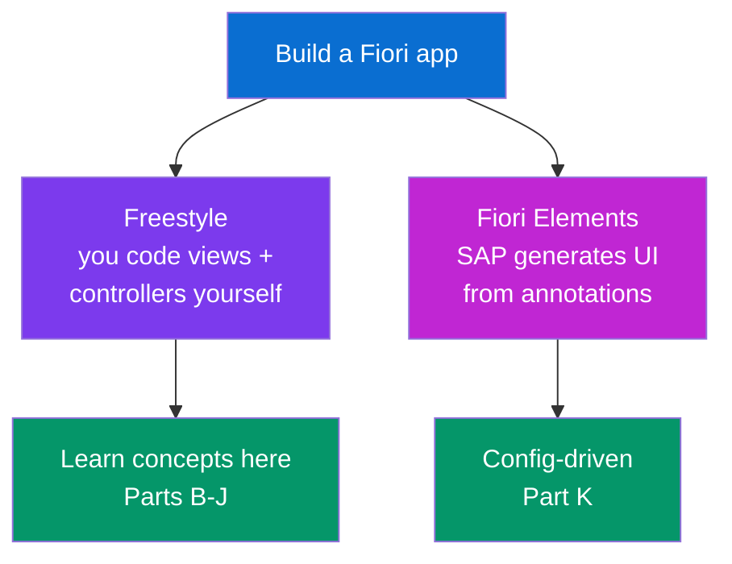

---

## A5. How a UI5 App Boots (the Bootstrap)

**Simple definition:** Every UI5 app starts from a single `index.html` that loads **one special script tag** — the **bootstrap**. That tag downloads the UI5 framework and tells it which theme, libraries and settings to use, then hands control to your app. It's the UI5 equivalent of React's `createRoot(...).render(<App/>)`.

<p class="te"><strong>Telugu:</strong> Prati UI5 app oka <code>index.html</code> tho start avutundi. Andulo oka special <code>&lt;script&gt;</code> tag untundi — dani <strong>bootstrap</strong> antaru. Ade UI5 framework ni download chesi, e theme, e libraries vadalo cheppi, app ni start chestundi. React lo <code>createRoot().render(&lt;App/&gt;)</code> en chestundo, bootstrap ade pani chestundi.</p>

**A minimal `index.html`:**

```html
<!DOCTYPE html>
<html>
<head>
    <meta charset="utf-8">
    <title>My First Fiori App</title>

    <!-- THE BOOTSTRAP: loads UI5, picks theme + libraries -->
    <script
        id="sap-ui-bootstrap"
        src="https://sdk.openui5.org/resources/sap-ui-core.js"
        data-sap-ui-theme="sap_horizon"
        data-sap-ui-libs="sap.m"
        data-sap-ui-compatVersion="edge"
        data-sap-ui-async="true"
        data-sap-ui-resourceroots='{ "myapp": "./" }'
        data-sap-ui-oninit="module:myapp/index">
    </script>
</head>
<body class="sapUiBody" id="content">
    <!-- your app's root control gets placed here -->
</body>
</html>
```

**What each bootstrap attribute does:**

| Attribute | Meaning | React analogy |
|---|---|---|
| `src` | URL of the UI5 core framework to download | The `<script>` for React itself |
| `data-sap-ui-theme` | Visual theme (`sap_horizon` is the current Fiori 3 theme) | Your Tailwind theme / CSS |
| `data-sap-ui-libs` | Which control libraries to load (`sap.m` = mobile-first controls) | Which component library you import |
| `data-sap-ui-async` | Load modules asynchronously (always `true` today) | Code-splitting / lazy loading |
| `data-sap-ui-resourceroots` | Maps an app namespace to a folder | Module path aliases |
| `data-sap-ui-oninit` | The module to run once UI5 is ready | Your entry `main.jsx` |

**The boot sequence:**

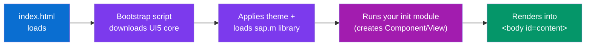

**Real-world note:** In production apps you rarely hand-write this — SAP's tooling scaffolds it, and the entry point creates a **Component** (Part G) rather than a bare view. But understanding the bootstrap demystifies "how does this thing even start."

---
## A6. How to Learn Fiori — Your Learning Path

**Simple definition:** "Learning Fiori" really means learning **three layers**: the **Fiori design ideas** (this Part), the **UI5 framework** (Parts B–J), and **how it connects to an SAP backend** (Part F). You already have the hardest prerequisite — JavaScript and React from Phases 4–6. The fastest route is: solidify concepts on fake data first, add a real backend later.

<p class="te"><strong>Telugu:</strong> "Fiori nerchuko" ante nijamga <strong>3 layers</strong> nerchukovadam — (1) Fiori design ideas (ee Part), (2) UI5 framework (Parts B–J), (3) SAP backend tho ela connect avutundo (Part F). Anni kanna kashtamaina prerequisite — JavaScript + React — nuvvu already Phase 4–6 lo nerchukunnav. Kabatti nuvvu 50% work aipoyinatte! Fast route: mundu fake data (JSONModel) tho concepts pakka cheyi, tarvata real backend add cheyi.</p>

**What you need before you start (you already have most):**

| Prerequisite | Do you have it? | Where from |
|---|---|---|
| JavaScript (ES6, functions, objects, arrays) | ✅ Yes | Phases 4–5 |
| A component + state + props mindset | ✅ Yes | Phase 6 (React) |
| Routing concept (URL → screen) | ✅ Yes | Phase 6 (React Router) |
| HTML/CSS basics | ✅ Yes | earlier phases |
| XML (just readable tags) | ⚡ 30 min | learn as you go |
| SAP backend / OData | ⬜ Later | Part F of this guide |

**The step-by-step path (do them in this order):**

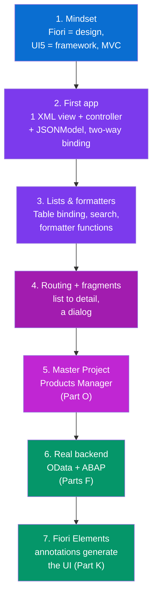

**The single most important rule for learning fast:** **start with a JSONModel, not a backend.** Beginners get stuck for days trying to connect to a real SAP system on day one. Don't. Build the whole Products Manager with fake data in a JSONModel, master binding/routing/fragments, and only *then* swap in OData (Part F). The views barely change — that's the whole point of the model abstraction.

**Where to actually practice (free, no SAP system needed):**

| Resource | What it gives you | Cost |
|---|---|---|
| **OpenUI5 SDK** (`sdk.openui5.org`) | Docs + hundreds of live, editable samples | Free |
| **"Walkthrough" tutorial** (in the SDK) | Builds a full app step-by-step — do this first | Free |
| **SAP BTP Trial** | A real cloud to deploy to + sample OData services | Free trial |
| **Northwind OData service** | A public OData service to practise real binding | Free |
| **SAP Business Application Studio** | The cloud IDE with app generator | Free tier |

**Mindset tips (from someone who's done React):**
- **Translate, don't relearn.** Every time you meet a new UI5 word, find its React twin in the B3 / Part Q map. `useState` → JSONModel, props → binding, Router → Router. You're renaming, not restarting.
- **XML is not scary.** It's JSX with different tag names and `{binding}` braces that read a model. You'll be fluent in a day.
- **Embrace "the framework calls you."** In React you got used to "change state, it re-renders." UI5 is the same: change the model, bound controls update. Stop reaching for `document.getElementById`.
- **Do the Walkthrough, then build Part O.** Reading isn't learning — type the Products Manager yourself.

**How long?** With your React background: ~**1 week** to be comfortable building freestyle apps on fake data, ~**2–3 weeks** to add OData and Fiori Elements. The concepts are familiar; you're mostly learning names and the SAP toolchain.

---


# Part B — The MVC Architecture

*This is the single most important mental model in UI5. React organizes UI into components; UI5 organizes it into MVC — Model, View, Controller. Get this and the whole framework falls into place.*

## B1. What is MVC & Why UI5 Uses It

**Simple definition:** **MVC** splits every screen into three separated jobs. **Model** = the data. **View** = what the user sees (the layout). **Controller** = the logic that reacts to events and connects the two. Each has one responsibility and they stay decoupled.

<p class="te"><strong>Telugu:</strong> <strong>MVC</strong> ante prati screen ni <strong>3 panula</strong>ga vidagottadan. <strong>Model</strong> = data (ni information). <strong>View</strong> = user ki kanipinchedi (layout, buttons). <strong>Controller</strong> = logic — event vaste en cheyalo, data ni view ki connect cheyadan. Prati okkatiki oke pani — anni kalipi unchhakunda separate ga. Ide UI5 anta organize chese vidhanan.</p>

**The three parts:**

| Part | Job | Contains | React equivalent |
|---|---|---|---|
| **Model** | Holds the data | JSON, OData, i18n texts | `useState` / props / a store |
| **View** | Describes the layout (usually XML) | Controls: buttons, tables, inputs | Your JSX return |
| **Controller** | Handles logic & events | `onInit`, `onPress` functions | Event handlers + hooks in the component |

**The restaurant analogy:**
- **Model** = the **kitchen & pantry** (the actual food/data).
- **View** = the **plated dish on the table** (what the diner sees).
- **Controller** = the **waiter** — takes your request (event), talks to the kitchen (model), brings back the update to the table (view). The diner never walks into the kitchen; the plate never cooks itself. Clean separation.

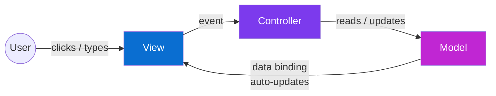

**Why bother separating them?** The same reason you split React into components and don't put everything in one file: **change one part without breaking others.** Redesign the View without touching logic; swap the data source (JSON → OData) without rewriting the View; test the Controller logic on its own. In big enterprise apps maintained for a decade by rotating teams, this discipline is survival, not style.

**The key difference from React:** In React, the component *is* both the view and (via hooks) a lot of the logic — they live in one function. UI5 **physically separates** them into different files: `View.xml` and `Controller.js`. More files, but each file does one clear thing.

---

## B2. The Four View Types

**Simple definition:** A View can be written in four formats: **XML, JS, JSON, or HTML**. **XML is the standard and what you should always use** — it's declarative, readable, and what SAP tooling generates. The others exist for edge cases.

<p class="te"><strong>Telugu:</strong> View ni 4 rakaaluga raayochchu — XML, JS, JSON, HTML. Kani <strong>XML okkate standard</strong>, andaru ade vadataru. Declarative — ante "en kanipinchalo" cheptavu, "ela" kadu (React JSX laga). Migta 3 chala arudu. Nuvvu XML matrame nerchukunte chalu.</p>

| View type | Looks like | Use it? |
|---|---|---|
| **XML View** | HTML-ish tags describing controls | ✅ **Always** — the standard |
| **JS View** | Controls created in JavaScript by hand | ❌ Legacy, verbose, avoid |
| **JSON View** | Controls described as a JSON tree | ❌ Rare |
| **HTML View** | Controls embedded in HTML | ❌ Deprecated |

**The same simple screen in XML (what you'll always write):**

```xml
<mvc:View
    controllerName="myapp.controller.Home"
    xmlns:mvc="sap.ui.core.mvc"
    xmlns="sap.m">
    <Page title="Hello Fiori">
        <Button text="Click me" press=".onPress"/>
    </Page>
</mvc:View>
```

**Why XML wins:** it reads like the UI it produces (declarative — the "what," like JSX), tooling can parse it, and designers can follow it. **This is the direct analog of JSX** — you *declare* the tree of controls, and the framework renders it. You will spend 90% of your UI5 view time in files ending `.view.xml`.

---

## B3. React Components vs UI5 MVC

**Simple definition:** React and UI5 solve the **same problem** (keep screen in sync with data) with the **same core idea** (declarative UI + reactive data) but **different packaging**. This table is your Rosetta Stone — keep coming back to it.

<p class="te"><strong>Telugu:</strong> React ni UI5 tho polche <strong>master table</strong> idi. Rendu oke pani chestayi — data mariste screen refresh — kani veru veru padalato. Ee table ni <em>Rosetta Stone</em>. Prati kotta UI5 word chusinappudu, ikkada React equivalent chusuko, teligga artham avutundi.</p>

| Concept | React (you know this) | UI5 (the new name) |
|---|---|---|
| Declarative UI markup | JSX | **XML View** |
| A piece of UI | Component | **View** (+ Controller) |
| Local data that drives UI | `useState` | **JSONModel** |
| Passing data into markup | `{value}` / props | **Data binding** `{path}` |
| Reacting to events | `onClick={fn}` | `press=".fn"` in the controller |
| App-wide shared data | Context / Redux | **Named models** on the Component |
| Reusable sub-UI | Child component | **Fragment** |
| Client-side routing | React Router | **UI5 Router** (manifest routes) |
| App config / entry | `main.jsx` + config | **Component.js** + **manifest.json** |
| Component mounted | `useEffect(() => {}, [])` | `onInit()` lifecycle hook |
| Derived/formatted display value | function in JSX | **Formatter** function |

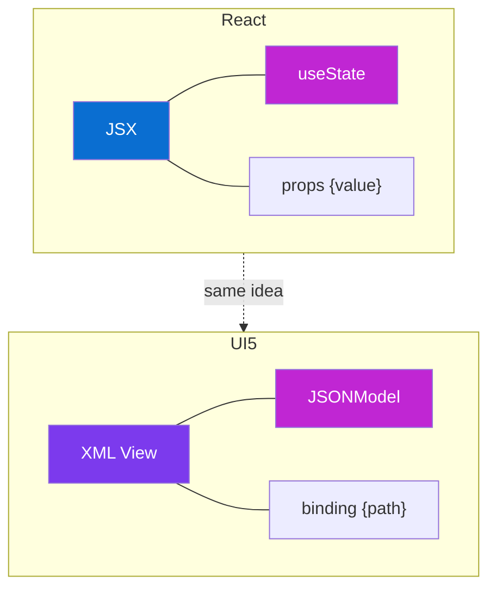

**The one sentence to remember:** *In React, state lives inside the component and flows out through JSX; in UI5, data lives in a Model and flows into the View through binding — same river, different map.*

---

# Part C — Views (XML Views in Depth)

*Now we go hands-on with the View — the "what the user sees" layer. If you can read and write XML views comfortably, you can read most UI5 code.*

## C1. Anatomy of an XML View

**Simple definition:** An XML View is a file (`Something.view.xml`) that declares a **tree of controls**. The root `<mvc:View>` tag links to its controller and declares namespaces; inside sits a `<Page>` (or other container), and inside that, the actual controls.

<p class="te"><strong>Telugu:</strong> XML View ante <code>.view.xml</code> file — andulo controls oka <strong>tree</strong>ga raastan. Paina <code>&lt;mvc:View&gt;</code> — idi controller ni link chestundi, namespaces declare chestundi. Lopala <code>&lt;Page&gt;</code>, aa page lopala buttons, inputs, tables. HTML lagane — kani SAP controls tho.</p>

**A fully annotated view:**

```xml
<!-- Home.view.xml -->
<mvc:View
    controllerName="myapp.controller.Home"   <!-- which controller runs the logic -->
    xmlns:mvc="sap.ui.core.mvc"               <!-- namespace for View, needed for <mvc:View> -->
    xmlns="sap.m"                             <!-- DEFAULT namespace: sap.m controls need no prefix -->
    xmlns:f="sap.f"                            <!-- extra namespace, used as <f:...> -->
    displayBlock="true">

    <Page id="homePage" title="{i18n>appTitle}">
        <content>
            <VBox class="sapUiMediumMargin">
                <Text text="Welcome, {/userName}"/>
                <Input value="{/searchTerm}" placeholder="Type to filter"/>
                <Button text="Search" press=".onSearch" type="Emphasized"/>
            </VBox>
        </content>
    </Page>
</mvc:View>
```

**Reading it like JSX:** `<Page>` is a layout container (like a `<div className="page">`). `<VBox>` stacks children vertically (a flex column). `{/userName}` is data binding (like `{userName}` in JSX). `press=".onSearch"` wires the click to the controller (like `onClick={onSearch}`). If you squint, it *is* JSX — just with SAP control names and binding braces that read a Model instead of a variable.

**The `.view.xml` naming matters:** UI5 tooling finds views by convention. `myapp.controller.Home` (dot-separated, no extension) resolves to the file `webapp/controller/Home.controller.js`, and the view to `webapp/view/Home.view.xml`.

---

## C2. Namespaces (xmlns)

**Simple definition:** UI5 has **thousands of controls** grouped into libraries (`sap.m`, `sap.ui.core`, `sap.f`, `sap.ui.table`…). A **namespace** (`xmlns`) tells the view *which library* a tag comes from — so `<Button>` isn't ambiguous. The default namespace (no prefix) is almost always `sap.m`.

<p class="te"><strong>Telugu:</strong> UI5 lo veladi controls unnayi, libraries ga vibhajinchi. <strong>Namespace</strong> (<code>xmlns</code>) ante — <code>&lt;Button&gt;</code> e library nunchi vchchindo cheppadan. Default namespace (prefix lenidi) eppudu <code>sap.m</code> — anduke <code>&lt;Button&gt;</code> ki prefix akkarledu. Vere library aithe <code>&lt;f:Card&gt;</code> laga prefix pedatan. React lo import statements en chestayo, namespace ade — "ee tag ekkadidi" ani cheppadan.</p>

**The most common libraries:**

| Namespace | Library | What's inside |
|---|---|---|
| `sap.m` | Main mobile-first library | Button, Input, Table, List, Page, Dialog — **your bread & butter** |
| `sap.ui.core.mvc` | Core MVC | The `<View>` tag itself |
| `sap.ui.layout` | Layouts | Grid, Form, Splitter |
| `sap.f` | Fiori | FlexibleColumnLayout, Cards, DynamicPage |
| `sap.ui.table` | Desktop grid | High-volume data tables (Analytical/Tree table) |
| `sap.uxap` | Object page | The detail-page floorplan |

**How prefixes work:**

```xml
<mvc:View
    xmlns="sap.m"                <!-- no-prefix tags come from sap.m -->
    xmlns:mvc="sap.ui.core.mvc"  <!-- <mvc:...> comes from core.mvc -->
    xmlns:f="sap.f">             <!-- <f:...> comes from sap.f -->

    <Page>                        <!-- = sap.m.Page -->
        <f:Card>                  <!-- = sap.f.Card -->
            <Button text="Hi"/>   <!-- = sap.m.Button -->
        </f:Card>
    </Page>
</mvc:View>
```

**JS parallel:** Namespaces are exactly `import { Button } from '@sap/m'`. React resolves component names through imports at the top of the file; XML resolves control names through `xmlns` declarations at the top of the view. Same job — "where does this tag live" — different syntax.

---

## C3. Common Controls (sap.m)

**Simple definition:** **Controls** are UI5's building blocks — the equivalent of HTML elements or React components. `sap.m` holds the everyday ones you'll use constantly. Learn ~15 controls and you can build most screens.

<p class="te"><strong>Telugu:</strong> <strong>Controls</strong> ante UI5 building blocks — HTML lo <code>&lt;button&gt;</code>, <code>&lt;input&gt;</code> ento, ikkada <code>Button</code>, <code>Input</code> avi. <code>sap.m</code> library lo roju vade controls unnayi. Sumaru 15 controls nerchukunte chala screens katteyochchu. Kinda mukhyamainavi table lo.</p>

**The starter set:**

| Control | Does | HTML/React cousin |
|---|---|---|
| `Button` | Clickable button | `<button>` |
| `Text` | Read-only text | `<span>` / `<p>` |
| `Label` | Field label | `<label>` |
| `Input` | Single-line text entry | `<input>` |
| `TextArea` | Multi-line entry | `<textarea>` |
| `CheckBox` / `Switch` | Boolean toggle | `<input type=checkbox>` |
| `Select` / `ComboBox` | Dropdown | `<select>` |
| `DatePicker` | Calendar picker | a date input widget |
| `List` / `Table` | Repeating rows of data | `.map()` over items |
| `Dialog` | Modal popup | a modal component |
| `MessageToast` | Brief "saved!" toast | a toast library |
| `ObjectStatus` | Colored status text (Success/Error) | a styled badge |

**A small form:**

```xml
<VBox class="sapUiSmallMargin">
    <Label text="Name" labelFor="nameIn"/>
    <Input id="nameIn" value="{/name}"/>

    <Label text="Active"/>
    <Switch state="{/active}"/>

    <Label text="Country"/>
    <ComboBox selectedKey="{/country}">
        <core:Item key="IN" text="India"/>
        <core:Item key="DE" text="Germany"/>
    </ComboBox>

    <Button text="Save" type="Emphasized" press=".onSave"/>
</VBox>
```

**Every control has:**
- **Properties** — configure it: `text`, `value`, `enabled`, `visible` (like React props/HTML attributes).
- **Aggregations** — child controls it contains: a `Page` has a `content` aggregation, a `Table` has `items` (like React `children`).
- **Events** — things it fires: `press`, `change`, `liveChange` (like `onClick`, `onChange`).
- **Associations** — a loose link to *another* control by id, e.g. `labelFor` (no direct React equivalent).

Remember those four words — **Properties, Aggregations, Events, Associations** — they describe *every* UI5 control and come up in interviews.

---

## C4. Layouts & Containers

**Simple definition:** **Layout controls** arrange other controls on screen — the UI5 equivalent of CSS flexbox/grid or Tailwind's `flex`/`grid` classes. The workhorses are `VBox` (vertical stack), `HBox` (horizontal row), and structured layouts like `Grid` and `Form`.

<p class="te"><strong>Telugu:</strong> <strong>Layout controls</strong> ante migta controls ni screen mida ela amarchalo cheppevi — CSS flexbox/Tailwind <code>flex</code>, <code>grid</code> en chestayo avi. Mुखyanga <code>VBox</code> (painunchi kinda stack), <code>HBox</code> (pkkapakkana row). Form controls ni lainlaga perchadaniki <code>Form</code>, responsive grid ki <code>Grid</code>. React lo <code>flex flex-col</code> vs <code>flex flex-row</code> ento, VBox vs HBox ade.</p>

| Layout | Arranges children | Tailwind/CSS cousin |
|---|---|---|
| `VBox` | Vertically (a column) | `flex flex-col` |
| `HBox` | Horizontally (a row) | `flex flex-row` |
| `FlexBox` | Full flexbox with justify/align | `flex` with `justify-*`/`items-*` |
| `Grid` (sap.ui.layout) | Responsive 12-column grid | CSS Grid / Tailwind `grid-cols-12` |
| `Form` / `SimpleForm` | Auto-aligned label+field rows | a form grid |
| `Panel` | A titled, collapsible box | a card/section |
| `Page` | Full screen: header + content + footer | a page shell |

**HBox vs VBox in action:**

```xml
<VBox>                                <!-- stacks these two rows top-to-bottom -->
    <HBox justifyContent="SpaceBetween" alignItems="Center">
        <Title text="Products"/>
        <Button icon="sap-icon://add" text="New"/>
    </HBox>
    <Text text="Below the header row"/>
</VBox>
```

**Fiori-specific layouts worth knowing:**
- **`sap.f.DynamicPage`** — a header that shrinks/expands as you scroll (the standard Fiori detail header).
- **`sap.f.FlexibleColumnLayout` (FCL)** — the famous 1/2/3-column master-detail layout (list on the left, details on the right, sub-details further right). This is the signature Fiori "list-detail" experience.

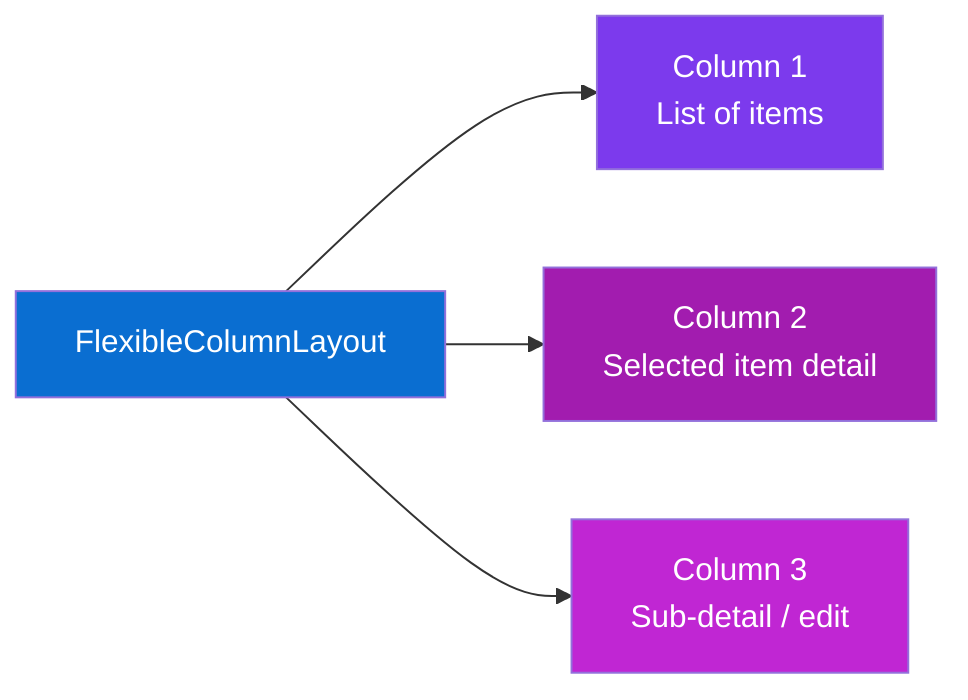

**Spacing note:** UI5 ships margin/padding CSS classes just like Tailwind: `class="sapUiSmallMargin"`, `sapUiMediumMarginBottom`, `sapUiResponsiveMargin`. They're the Fiori-approved spacing scale — reach for these instead of hand-writing CSS, exactly as you reached for Tailwind utilities.

---

## C5. Control IDs & byId

**Simple definition:** Give a control an `id` in the view, and the controller can grab that exact control with `this.byId("theId")`. UI5 auto-prefixes ids with the view id to keep them unique — so you must use `byId`, not the raw browser `getElementById`.

<p class="te"><strong>Telugu:</strong> View lo control ki <code>id</code> iste, controller lo <code>this.byId("id")</code> tho aa control ni pttukovachchu. UI5 aa id ki view id ni mundu cherchi unique chestundi — anduke browser <code>getElementById</code> pani cheyadu, <code>this.byId</code> vadali. React lo <code>useRef</code> tho DOM element ni pttukuntan kada — <code>byId</code> ade type pani, kani avasaramainappudu matrame. Ekkuvaga binding vadatan, byId thakkuva.</p>

```xml
<!-- in the view -->
<Input id="emailInput" value="{/email}"/>
```

```javascript
// in the controller
onCheck: function () {
    const oInput = this.byId("emailInput");   // the UI5 way — NOT document.getElementById
    const sValue = oInput.getValue();
    oInput.setValueState("Error");            // show a red error state
}
```

**Why not `getElementById`?** Because UI5 renders `id="emailInput"` into the DOM as something like `id="__xmlview0--emailInput"` to guarantee uniqueness when the same view is used twice. `this.byId` knows the prefix; you don't have to. **Prefer data binding over `byId`** — reach for `byId` only when you genuinely need the control object itself (focus it, set a value-state), the same way you reach for `useRef` sparingly in React instead of reading the DOM.

---

# Part D — Controllers & the Lifecycle

*The View is the "what"; the Controller is the "what happens." This is where your JavaScript from Phases 4–5 comes roaring back — a controller is just a JS object full of functions.*

## D1. What a Controller Does

**Simple definition:** A **Controller** is a JavaScript file (`Home.controller.js`) that holds all the **logic** for its view: what happens on button press, how data is loaded, how to react to events. It's a module that `extends` UI5's base `Controller` class and defines methods.

<p class="te"><strong>Telugu:</strong> <strong>Controller</strong> ante oka JavaScript file (<code>Home.controller.js</code>) — aa view ki smbandhinchina <strong>logic anta</strong> ikkada. Button press aithe en cheyali, data ela load cheyali, events ki ela react cheyali — anni ikkada functions ga. Idi UI5 yokka base <code>Controller</code> ni <code>extends</code> chestundi. React component lopala unde event handlers, useEffect logic anta — avi ikkada methods ga vstayi.</p>

**A basic controller:**

```javascript
// webapp/controller/Home.controller.js
sap.ui.define([
    "sap/ui/core/mvc/Controller",
    "sap/ui/model/json/JSONModel",
    "sap/m/MessageToast"
], function (Controller, JSONModel, MessageToast) {
    "use strict";

    return Controller.extend("myapp.controller.Home", {

        onInit: function () {
            // runs once when the view is created (like useEffect([], ...))
            const oModel = new JSONModel({ userName: "Nikhil", count: 0 });
            this.getView().setModel(oModel);
        },

        onPress: function () {
            const oModel = this.getView().getModel();
            const iCount = oModel.getProperty("/count");
            oModel.setProperty("/count", iCount + 1);       // updating data → view auto-refreshes
            MessageToast.show("Clicked " + (iCount + 1) + " times");
        }
    });
});
```

**Reading it with React eyes:**
- `sap.ui.define([...deps], function(...){})` is UI5's **module system** — it's `import` statements + a module body. The array lists dependency *paths*; the function receives them as *arguments in the same order*. (This is AMD — the ancestor of ES modules.)
- `Controller.extend("name", { ...methods })` creates your controller class — think of it as `class Home extends Controller`.
- `onInit` = `useEffect(() => {...}, [])` — runs once at startup.
- `onPress` = an `onClick` handler.
- `oModel.setProperty(...)` = `setState` — change the data, and any bound control updates itself.

**The `sap.ui.define` pattern is everywhere.** Every controller, formatter and component file starts with it. Memorize the shape: *array of dependency strings → matching function arguments → return your module*.

---

## D2. The Lifecycle Hooks

**Simple definition:** A controller has **four lifecycle methods** UI5 calls automatically at set moments: `onInit` (created), `onBeforeRendering` (about to draw), `onAfterRendering` (drawn into the DOM), `onExit` (destroyed). They're the UI5 equivalent of React's `useEffect` timings and cleanup.

<p class="te"><strong>Telugu:</strong> Controller ki <strong>4 lifecycle methods</strong> unnayi — UI5 vatini tane sraina samayanlo pilustundi. <code>onInit</code> (view create ayinappudu, okkasari), <code>onBeforeRendering</code> (screen mida giyadaniki mundu), <code>onAfterRendering</code> (DOM lo vchchaka), <code>onExit</code> (view poyetappudu, cleanup ki). React lo <code>useEffect</code> timings + cleanup en chestayo, ive avi.</p>

| Hook | When it runs | React equivalent | Use it for |
|---|---|---|---|
| `onInit` | Once, when view is created | `useEffect(() => {}, [])` | Set up models, read route args, load initial data |
| `onBeforeRendering` | Before every (re)render | (rough) top of render body | Last-minute prep before drawing |
| `onAfterRendering` | After DOM is in place | `useEffect(() => {})` after paint | DOM measurements, integrate a 3rd-party chart lib |
| `onExit` | When view is destroyed | `useEffect` cleanup `return () => {}` | Destroy dialogs, remove listeners (avoid memory leaks) |

```javascript
return Controller.extend("myapp.controller.Home", {
    onInit()            { /* wire up models, subscribe to router */ },
    onBeforeRendering() { /* rarely needed */ },
    onAfterRendering()  { /* control is now in the DOM — safe to measure/focus */ },
    onExit()            { this._oDialog && this._oDialog.destroy(); }  // cleanup!
});
```

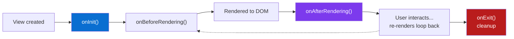

**The one to never skip:** `onExit`. If you created a Dialog fragment in a controller and don't `destroy()` it in `onExit`, you leak that control every time the view opens — the classic UI5 memory-leak bug. It's the exact discipline as returning a cleanup function from `useEffect`.

---

## D3. Event Handlers

**Simple definition:** An **event handler** is a controller method that runs when a control fires an event (press, change, etc.). You wire it in the view with `event=".methodName"`. UI5 passes an **event object** (`oEvent`) into the method, from which you read the source control and parameters.

<p class="te"><strong>Telugu:</strong> <strong>Event handler</strong> ante control oka event fire chesinappudu (press, change...) run ayye controller method. View lo <code>press=".onSave"</code> laga connect chestan (mundu dot mukhyan — controller lo unde method ani artham). UI5 aa method ki <code>oEvent</code> object pmputundi — dani nunchi e control nokkaro, e value vchchindo chduvukovachchu. React lo <code>onClick={(e) => ...}</code> lo <code>e</code> ento, <code>oEvent</code> ade.</p>

**View wires the event; controller handles it:**

```xml
<Input liveChange=".onSearch" value="{/query}"/>
<Button text="Delete" press=".onDelete"/>
```

```javascript
onSearch: function (oEvent) {
    const sValue = oEvent.getParameter("value");   // the new text
    console.log("User typed:", sValue);
},

onDelete: function (oEvent) {
    const oButton = oEvent.getSource();             // the Button that was pressed
    oButton.setEnabled(false);
}
```

**The two methods you'll use on every `oEvent`:**
- `oEvent.getSource()` — the control that fired it (like `e.target`, but the UI5 control object, not a DOM node).
- `oEvent.getParameter("name")` — event-specific data (like reading `e.target.value`). Each event documents its parameters (`change` gives `value`, a list `selectionChange` gives `listItem`, etc.).

**Why the leading dot (`.onSave`)?** It tells UI5 "look for this method on the **controller**." Without the dot it would try to resolve a global function. Always use the dot.

**JS parallel:** This is precisely React's `onClick={handleClick}` split across two files. In React the handler and the JSX live together; in UI5 the view *names* the handler as a string and the controller *defines* it. Same event-driven model you learned in Phase 4's `addEventListener`, just declared in XML.

---

## D4. Reaching Controls & Models

**Simple definition:** Inside a controller you constantly need three things: the **view** (`this.getView()`), a **control** in it (`this.byId("x")`), and a **model** (`this.getView().getModel()` or `getModel("name")`). These three calls appear in almost every controller method.

<p class="te"><strong>Telugu:</strong> Controller lo eppudu 3 vishayalu kavali: <strong>view</strong> (<code>this.getView()</code>), andulo oka <strong>control</strong> (<code>this.byId("x")</code>), mriyu <strong>model</strong> (<code>this.getView().getModel()</code>). Ee 3 calls dadapu prati method lo vstayi. Vatini gurupettuko.</p>

**The everyday toolkit:**

```javascript
// the view this controller belongs to
const oView = this.getView();

// a specific control by its id
const oInput = this.byId("emailInput");

// the default (unnamed) model, then read/write a property
const oModel = oView.getModel();
const sName  = oModel.getProperty("/name");
oModel.setProperty("/name", "New Name");

// a NAMED model (e.g. "products") set on the component
const oProducts = oView.getModel("products");

// the owning Component (app-wide things live here — router, shared models)
const oComponent = this.getOwnerComponent();
const oRouter    = oComponent.getRouter();
```

| Call | Returns | React analogy |
|---|---|---|
| `this.getView()` | The view instance | `this` component scope |
| `this.byId("x")` | A control in the view | `useRef` to an element |
| `getModel()` / `getModel("n")` | A model (data source) | the relevant piece of state/store |
| `getModel().getProperty("/p")` | A value from the model | reading `state.p` |
| `getModel().setProperty("/p", v)` | Updates it (view auto-refreshes) | `setState({p: v})` |
| `this.getOwnerComponent()` | The app-level Component | your app root / context provider |
| `getOwnerComponent().getRouter()` | The router (for navigation) | `useNavigate()` |

**The mental shortcut:** *View owns Controls; Component owns app-wide stuff (router, shared models).* When you need something local, go through the view; when you need something global, go through the component. This mirrors React's "local state vs context" instinct exactly.

---

# Part E — Models & Data Binding (the Heart)

*This is the most important part of the entire document. Data binding is UI5's superpower and the direct descendant of everything you learned about React state and props. If Parts A–D were vocabulary, this is grammar — master it and you can actually speak UI5.*

## E1. What is a Model

**Simple definition:** A **Model** is an object that **holds your data** and notifies the UI when that data changes. Bind a control to the model, and the control shows the data automatically — and (in two-way mode) writes changes back. It's `useState` and a data store rolled into one, living *outside* the view.

<p class="te"><strong>Telugu:</strong> <strong>Model</strong> ante ni <strong>data ni pttukune</strong> object — data mariste UI ki cheptundi "refresh avvu" ani. Control ni model ki <em>bind</em> cheste, data automatic ga kanipistundi; two-way aithe user mariste tirigi model loki veltundi. React lo <code>useState</code> + store en chestayo, model ade — kani view byata, separate ga.</p>

**UI5 has several model types — pick by data source:**

| Model | Holds | Use when | React analogy |
|---|---|---|---|
| **JSONModel** | A plain JS object/array in memory | Local/client data, mock data, UI state | `useState` with an object |
| **ODataModel** | Data from an OData (SAP backend) service | Real enterprise data (V2/V4) | data from a REST API |
| **ResourceModel** | Translated texts (i18n) | Every app, for labels | an i18n library |
| **XMLModel** | XML data | Rare | — |

**The binding loop — the whole idea in one picture:**

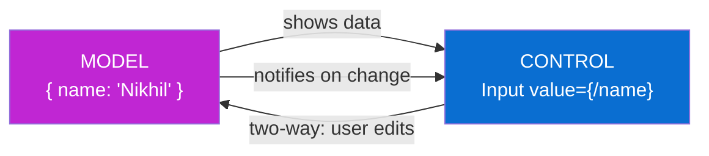

**The key difference from React:** In React, state lives *inside* the component and you call `setState` to change it. In UI5, data lives in a *separate Model object*, and **many views can share the same model**. Change the model once and every bound control across every view updates — no prop-drilling. That shared-model idea is closer to React **Context/Redux** than to local `useState`.

---

## E2. The JSONModel

**Simple definition:** The **JSONModel** wraps a plain JavaScript object or array and makes it bindable. You create it with `new JSONModel(data)`, attach it to a view or component with `setModel(...)`, and read/write it with `getProperty`/`setProperty`. It's the model you'll use to learn, prototype, and hold client-side UI state.

<p class="te"><strong>Telugu:</strong> <strong>JSONModel</strong> ante oka sadharana JS object/array ni tisukuni bind cheyagaligela chestundi. <code>new JSONModel(data)</code> tho create chesi, <code>setModel</code> tho view ki antinchi, <code>getProperty</code>/<code>setProperty</code> tho chduvu/marustan. Nerchukovadaniki, prototype ki, UI state ki ide best. React lo <code>const [x, setX] = useState(obj)</code> ento, idi ade.</p>

**Create, attach, use:**

```javascript
sap.ui.define([
    "sap/ui/core/mvc/Controller",
    "sap/ui/model/json/JSONModel"
], function (Controller, JSONModel) {
    "use strict";
    return Controller.extend("myapp.controller.Home", {

        onInit: function () {
            const oModel = new JSONModel({
                user: { name: "Nikhil", role: "Developer" },
                products: [
                    { id: 1, name: "Laptop", price: 1200, inStock: true },
                    { id: 2, name: "Mouse",  price: 25,   inStock: false }
                ],
                filter: ""
            });
            this.getView().setModel(oModel);          // unnamed (default) model
        },

        onRename: function () {
            const oModel = this.getView().getModel();
            oModel.setProperty("/user/name", "Nikhil V");   // path into the object
            // every control bound to {/user/name} updates instantly
        }
    });
});
```

**Paths are how you point into the data.** `/user/name` walks the object like `data.user.name`. Leading `/` = "from the root of the model." This path syntax is the whole game — property binding, list binding and expression binding all use it.

| JSONModel call | Does | `useState` analogy |
|---|---|---|
| `new JSONModel(obj)` | Create model from data | `useState(obj)` |
| `oModel.getProperty("/a/b")` | Read a value | `state.a.b` |
| `oModel.setProperty("/a/b", v)` | Write it (UI updates) | `setState(...)` |
| `oModel.getData()` | Whole object | `state` |
| `oModel.setData(obj)` | Replace all data | `setState(newObj)` |
| `oModel.refresh(true)` | Force re-evaluate bindings | force re-render |

**Real-world use:** even in big OData apps you keep a small JSONModel called `"view"` or `"appState"` for pure UI flags — `busy`, `editMode`, `selectedCount`. That's the direct equivalent of local `useState` for UI concerns, sitting alongside the server data.

---

## E3. Property Binding

**Simple definition:** **Property binding** connects **one property of one control** to **one value in the model**, using curly braces with a path: `text="{/user/name}"`. When the model value changes, the property updates automatically. It's `{value}` in JSX — but live and two-way-capable.

<p class="te"><strong>Telugu:</strong> <strong>Property binding</strong> ante control yokka oka property ni model lo oka value ki kalapadan — <code>text="{/user/name}"</code> laga, curly braces + path. Model value mariste property automatic ga marutundi. React lo <code>&lt;p&gt;{name}&lt;/p&gt;</code> en chestundo ade — kani idi live, mriyu two-way (input aithe user mariste model loki tirigi veltundi).</p>

```xml
<!-- one-way: model → screen -->
<Text text="{/user/name}"/>
<Title text="Welcome, {/user/name}!"/>

<!-- two-way: user types → model updates automatically -->
<Input value="{/filter}"/>

<!-- binding non-string properties -->
<Button enabled="{/canSave}" visible="{/isAdmin}"/>
```

**Two syntaxes — short and long:**

```xml
<!-- short form (99% of the time) -->
<Input value="{/email}"/>

<!-- verbose form (when you need extra options like a formatter or type) -->
<Input value="{ path: '/email', mode: 'TwoWay', type: 'sap.ui.model.type.String' }"/>
```

**The magic you get for free — the two-way demo:**

```xml
<Input value="{/filter}"/>          <!-- user types "lap" -->
<Text  text="Searching: {/filter}"/> <!-- instantly shows "Searching: lap" -->
```

Type in the input and the text below updates with **zero JavaScript**. In React you'd wire `value`, `onChange`, and `setState` by hand (a "controlled component"); UI5's two-way binding does all three automatically. This is the moment UI5 clicks for most React developers — the binding *is* the controlled-component pattern, built in.

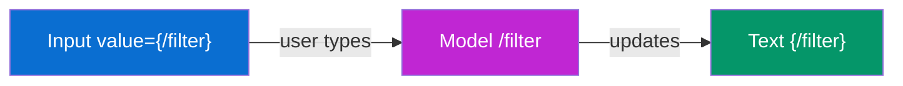

---

## E4. Binding Modes (one-way, two-way, one-time)

**Simple definition:** A binding has a **mode** that decides which way data flows. **OneWay** = model → view only. **TwoWay** = both directions (edits flow back). **OneTime** = read once, never update again. JSONModel defaults to **TwoWay**; ODataModel defaults to **OneWay**.

<p class="te"><strong>Telugu:</strong> Prati binding ki oka <strong>mode</strong> untundi — data e vaipu prvahistundo. <strong>OneWay</strong> = model nunchi view ki matrame. <strong>TwoWay</strong> = rendu vaipula (user mariste model loki tirigi). <strong>OneTime</strong> = okkasari chdivi vdileyadan, marla update kadu. JSONModel default <strong>TwoWay</strong>, ODataModel default <strong>OneWay</strong>. Idi interview lo adige vishayan.</p>

| Mode | Flow | Use for | React analogy |
|---|---|---|---|
| **OneWay** | Model → View | Read-only display | `<p>{value}</p>` |
| **TwoWay** | Model ⇄ View | Editable form fields | controlled `<input value onChange>` |
| **OneTime** | Model → View, **once** | Static labels that never change | a constant / literal |

```xml
<!-- explicit modes via the verbose syntax -->
<Text  text="{ path: '/title', mode: 'OneTime' }"/>   <!-- read once, freeze -->
<Input value="{ path: '/name',  mode: 'TwoWay' }"/>    <!-- edits flow back -->
<Text  text="{ path: '/status', mode: 'OneWay' }"/>    <!-- display, live, read-only -->
```

**Set a model's default mode:**

```javascript
const oModel = new JSONModel(data);
oModel.setDefaultBindingMode("OneWay");   // now all its bindings are OneWay unless overridden
```

**Why OneTime matters for performance:** a OneTime binding stops listening after the first read, so it costs nothing on later updates. For a label that literally never changes, it's a free optimization — like knowing a value is a constant and not putting it in React state at all.

**Interview gotcha:** *"Why did my `<Input>` bound to an OData property not save my edits?"* — because ODataModel defaults to **OneWay**; you must set TwoWay (or use the right binding) for edits to flow back. Knowing the default per model type is a classic UI5 interview point.

---

## E5. Aggregation (List) Binding

**Simple definition:** **Aggregation binding** (a.k.a. list binding) binds an **array in the model** to a **list-type control** (List, Table), repeating a **template** once per array item. It's UI5's `array.map()` — you define one row and UI5 stamps it out for every element.

<p class="te"><strong>Telugu:</strong> <strong>Aggregation binding</strong> ante model lo oka <strong>array</strong> ni List/Table control ki bind cheyadan — oka <strong>template</strong> (oka row) ivvu, prati array item ki UI5 aa row ni repeat chestundi. React lo <code>{items.map(x =&gt; &lt;li&gt;...&lt;/li&gt;)}</code> en chestundo, idi srigga ade — kani nuvvu <code>.map</code> raayavu, template ni items path ki baind chestavu, UI5 loop chestundi.</p>

**Bind a Table to the `/products` array:**

```xml
<Table items="{/products}">
    <columns>
        <Column><Text text="Name"/></Column>
        <Column><Text text="Price"/></Column>
        <Column><Text text="Status"/></Column>
    </columns>
    <items>
        <!-- THIS ROW IS THE TEMPLATE — repeated once per product -->
        <ColumnListItem>
            <cells>
                <Text text="{name}"/>                     <!-- note: relative path, no leading / -->
                <ObjectNumber number="{price}" unit="USD"/>
                <ObjectStatus text="{inStock}"/>
            </cells>
        </ColumnListItem>
    </items>
</Table>
```

**The crucial rule — relative paths inside the template.** Outside a list you write `{/products/0/name}` (absolute). Inside the template, each row is already positioned on one item, so you write just `{name}` — **relative** to the current item. This is exactly `products.map(p => <Text>{p.name}</Text>)`: inside the map, you reference `p.name`, not the whole array.

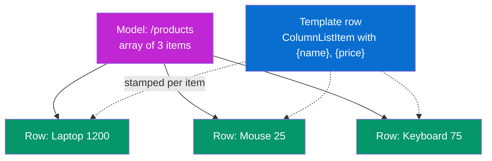

**Add sorting, filtering, grouping declaratively:**

```xml
<List items="{
    path: '/products',
    sorter: { path: 'name' },
    filters: [{ path: 'inStock', operator: 'EQ', value1: true }]
}">
    <StandardListItem title="{name}" description="{price}"/>
</List>
```

That's `products.filter(...).sort(...).map(...)` — but declared in the binding. UI5 does the loop, the sort and the filter for you. **No `key` prop needed** (unlike React) because UI5 tracks items by their binding context automatically.

---

## E6. Element (Context) Binding

**Simple definition:** **Element binding** points a **whole container** (a Panel, a Page, a Form) at **one object** in the model, so all the controls inside can use short relative paths. It's how a detail page says "everything in me is about *this one* selected product."

<p class="te"><strong>Telugu:</strong> <strong>Element binding</strong> ante oka container (Panel, Page, Form) ni model lo <strong>oke object</strong> ki point cheyadan — anduvalla lopala unde anni controls chinna relative paths vadochchu. Detail page lo "ee page anta ee okka selected product gurinchi" ani cheppadaniki idi vadatan. React lo detail component ki oka object ni prop ga pmpinattu.</p>

**Bind a whole Form to one product:**

```xml
<!-- bindElement points this Panel at /products/0 -->
<Panel binding="{/products/0}">
    <Text text="{name}"/>     <!-- relative → /products/0/name -->
    <Text text="{price}"/>    <!-- relative → /products/0/price -->
</Panel>
```

Notice: **one** `binding="{/products/0}"` on the Panel, then **relative** `{name}`, `{price}` inside. Without element binding you'd repeat `{/products/0/name}`, `{/products/0/price}` on every control.

**The real-world use — set it from code in a detail page:**

```javascript
// user clicked a row; show that product's details on the detail view
onProductPress: function (oEvent) {
    const oItem = oEvent.getSource();
    const sPath = oItem.getBindingContext().getPath();   // e.g. "/products/2"
    this.byId("detailPanel").bindElement(sPath);         // point the panel at it
}
```

**The three binding types side by side:**

| Binding | Binds | To | Analogy |
|---|---|---|---|
| **Property** | one control property | one value | `{value}` |
| **Aggregation** | a list control | an array (template repeated) | `.map()` |
| **Element** | a container | one object (relative paths inside) | passing one object as props to a detail component |

This trio — property, aggregation, element — is the complete binding toolkit. Every UI5 screen is built from combinations of these three.

---

## E7. Expression Binding

**Simple definition:** **Expression binding** lets you put a **small logical/arithmetic expression** directly in the binding, so the UI can decide things like color, visibility or a computed value **without a formatter function**. Syntax: `{= expression }`.

<p class="te"><strong>Telugu:</strong> <strong>Expression binding</strong> tho binding lone oka chinna logic/lekka raayochchu — color, visibility, leda computed value ni <em>formatter function lekunda</em> neruga cheppochchu. Syntax: <code>{= ... }</code>. React lo JSX lo <code>{price &gt; 100 ? 'Error' : 'Success'}</code> laga chinna expression raastan kada — idi ade, binding lopala.</p>

```xml
<!-- show a warning color when stock is low -->
<ObjectStatus
    text="{/stock}"
    state="{= ${/stock} < 10 ? 'Warning' : 'Success' }"/>

<!-- hide a button unless the user is an admin -->
<Button text="Delete" visible="{= ${/role} === 'admin' }"/>

<!-- computed value -->
<Text text="{= ${/price} * ${/qty} }"/>

<!-- combine two model values -->
<Text text="{= ${/firstName} + ' ' + ${/lastName} }"/>
```

**Two syntax rules to remember:**
1. The whole thing starts with `{=`.
2. Inside, each model value is wrapped as `${/path}` (dollar + braces), because a bare `{/path}` would look like a nested binding.

**When to use expression binding vs a formatter:**

| Situation | Use |
|---|---|
| Tiny logic (a comparison, a ternary, arithmetic) | **Expression binding** — inline, no extra file |
| Complex logic, i18n lookups, reused in many places | **Formatter function** (Part J) |

**JS parallel:** Expression binding is the inline `{cond ? a : b}` you write directly in JSX. A formatter is when you pull that logic out into a named helper function because it got too big or you reuse it — the exact same judgment call you already make in React.

---

## E8. The Resource Model (i18n)

**Simple definition:** The **ResourceModel** loads a **`.properties` text file** of translatable strings and exposes them to bindings under the model name `i18n`. Instead of hard-coding `"Save"`, you write `{i18n>saveBtn}` and UI5 shows the right language's text.

<p class="te"><strong>Telugu:</strong> <strong>ResourceModel</strong> ante translate cheyagalige texts unde <code>.properties</code> file ni load chesi, <code>i18n</code> ane peruto bindings ki ichche model. <code>"Save"</code> ani hard-code cheyakunda <code>{i18n&gt;saveBtn}</code> raastan — user language batti sraina text kanipistundi. React lo i18next library en chestundo, idi built-in ga ade. Prati serious app lो idi vadali.</p>

**The text file — `webapp/i18n/i18n.properties`:**

```properties
# key = value
appTitle=Product Manager
saveBtn=Save
deleteBtn=Delete
greeting=Welcome, {0}!
```

**German file — `i18n_de.properties`:**

```properties
appTitle=Produktverwaltung
saveBtn=Speichern
deleteBtn=Löschen
greeting=Willkommen, {0}!
```

**Use it in a view with the `i18n>` prefix:**

```xml
<Button text="{i18n>saveBtn}"/>
<Title text="{i18n>appTitle}"/>
```

**Use it (with a placeholder) from a controller:**

```javascript
const oBundle = this.getView().getModel("i18n").getResourceBundle();
const sMsg = oBundle.getText("greeting", ["Nikhil"]);   // "Welcome, Nikhil!"
MessageToast.show(sMsg);
```

**How UI5 picks the file:** it reads the browser/user language and loads the matching `i18n_<lang>.properties`, falling back to the base `i18n.properties`. You never write "if German then…" — UI5 resolves it. This is the **Coherent + Adaptive** Fiori principle in action, and it's why real Fiori apps ship in 30+ languages with zero code changes. Set it up on day one; retrofitting i18n later is painful (the same lesson as adding i18next to a finished React app).

---

# Part F — OData & Talking to the Backend

*Everything so far used a JSONModel with fake data. Real Fiori apps read and write **live enterprise data** from SAP — and they do it through **OData**. This is the "backend" half of the job and what separates a toy app from a real one.*

## F1. What is OData

**Simple definition:** **OData** (Open Data Protocol) is a **standardized REST protocol** for exposing and consuming data over HTTP. An SAP backend publishes an OData **service** (a URL); your UI5 app reads/writes data by calling that URL with normal HTTP verbs (GET, POST, PUT/PATCH, DELETE). It's REST with strict, self-describing rules.

<p class="te"><strong>Telugu:</strong> <strong>OData</strong> ante data ni HTTP mida ichchipuchchukovadaniki oka <strong>standard REST protocol</strong>. SAP backend oka OData <strong>service</strong> (oka URL) publish chestundi; ni UI5 app aa URL ni GET/POST/PUT/DELETE tho pilichi data chduvu/raastundi. React lo <code>fetch('/api/products')</code> tho REST API pilichavu kada — OData ade, kani chala strict rules, self-describing (data ento tane cheppukuntundi).</p>

**Why SAP standardized on OData instead of plain REST:**
- **Self-describing** — the service ships a `$metadata` document listing every entity, field, type and relationship. Tools (and Fiori Elements) can read it and build UIs automatically. Plain REST gives you no such contract.
- **Uniform query options** — filter, sort, page, expand relations via URL parameters that are the *same* on every SAP service. Learn them once, use them everywhere.
- **CRUD is standardized** — the same verb+URL shape works across thousands of SAP services.

**Query options (append to the URL — the part worth memorizing):**

| Option | Does | SQL-ish meaning | Example |
|---|---|---|---|
| `$filter` | Filter rows | `WHERE` | `$filter=Price gt 100` |
| `$select` | Pick fields | `SELECT col1,col2` | `$select=Name,Price` |
| `$orderby` | Sort | `ORDER BY` | `$orderby=Name desc` |
| `$top` / `$skip` | Page | `LIMIT/OFFSET` | `$top=20&$skip=40` |
| `$expand` | Include related entity | `JOIN` | `$expand=Supplier` |
| `$count` | Total row count | `COUNT(*)` | `$count=true` |

```
GET /sap/opu/odata/sap/PRODUCT_SRV/Products?$filter=Price gt 100&$orderby=Name&$top=20
```

**JS parallel:** OData is `fetch()` with a rulebook. In React you invented your own API shapes (`/api/products?minPrice=100`); every backend was different. OData makes *every* SAP backend speak the identical query language, so the client framework can be smart about it. That standardization is exactly what powers Fiori Elements (Part K).

---

## F2. OData V2 vs V4

**Simple definition:** There are two live versions. **OData V2** is older but still everywhere in existing SAP systems. **OData V4** is the modern, leaner, faster standard SAP is moving to. They use **different UI5 model classes** and slightly different syntax, so you must know which one a service speaks.

<p class="te"><strong>Telugu:</strong> OData rendu versions unnayi. <strong>V2</strong> — patadi, kani ipptiki chala SAP systems lo undi. <strong>V4</strong> — kottadi, telika, fast, SAP ippudu dantloki marutondi. Renditiki UI5 lo <strong>veru veru model classes</strong>, konni syntax tedalu. Service e version maatladutundo telusukovali — anduke migrate cheyadan interview lo vachche topic.</p>

| | **OData V2** | **OData V4** |
|---|---|---|
| UI5 model class | `sap.ui.model.odata.v2.ODataModel` | `sap.ui.model.odata.v4.ODataModel` |
| Age / status | Older, widely deployed | Modern, SAP's direction |
| Payload | Heavier (verbose JSON/XML) | Leaner, more efficient |
| Batch requests | Optional | Default (groups calls) |
| Fiori Elements support | Yes (mature) | Yes (growing, preferred for new) |
| Learn which first? | Both exist in the wild — know V2 for legacy, V4 for new builds |

**The practical rule:** when you join a project, check the service URL / `$metadata` header to see the version, then instantiate the **matching** model class. Code written for V2's model won't work unchanged against a V4 service — the method names and binding details differ. Most **existing** SAP landscapes are V2; most **greenfield** S/4HANA work targets V4.

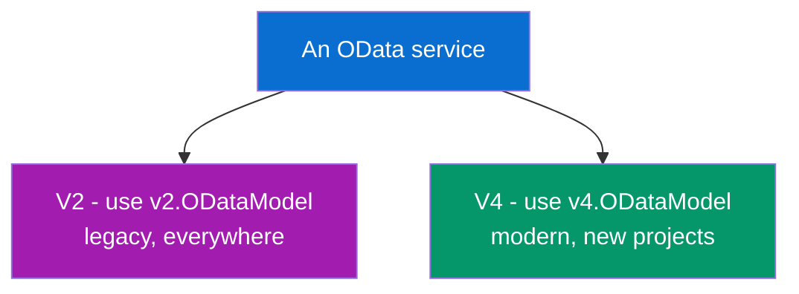

---

## F3. The ODataModel & Metadata

**Simple definition:** The **ODataModel** is the model that connects your app to an OData service URL. On startup it downloads the service's **`$metadata`** (the schema of all entities and fields), then handles all HTTP calls, caching and binding for you. Usually you configure it **once in `manifest.json`**, not in code.

<p class="te"><strong>Telugu:</strong> <strong>ODataModel</strong> ante ni app ni OData service URL ki kalipe model. Start ayyetappudu service yokka <strong>$metadata</strong> (anni entities, fields yokka schema) download chesi, taruvata anni HTTP calls, caching, binding tane chusukuntundi. Ekkuvaga <code>manifest.json</code> lo <strong>okkasari</strong> config chestan, code lo kadu. React lo axios instance ni okkasari setup chesinattu.</p>

**Configured in manifest.json (the normal way):**

```json
"sap.app": {
  "dataSources": {
    "mainService": {
      "uri": "/sap/opu/odata/sap/PRODUCT_SRV/",
      "type": "OData",
      "settings": { "odataVersion": "2.0" }
    }
  }
},
"sap.ui5": {
  "models": {
    "": {
      "dataSource": "mainService",
      "type": "sap.ui.model.odata.v2.ODataModel"
    }
  }
}
```

That declares an OData model as the **default** model (`""`), so views can bind straight to entity sets — no JavaScript needed to wire it up. UI5 creates the model, fetches metadata, and makes it available to every view.

**Bind a table straight to a backend entity set:**

```xml
<!-- "Products" is an entity set from the service metadata -->
<Table items="{/Products}">
    <items>
        <ColumnListItem>
            <cells>
                <Text text="{Name}"/>
                <ObjectNumber number="{Price}" unit="{CurrencyCode}"/>
            </cells>
        </ColumnListItem>
    </items>
</Table>
```

Same aggregation-binding syntax as the JSONModel — **but the data comes live from SAP**. UI5 turns `items="{/Products}"` into a `GET .../Products` call, paginates as you scroll, and refreshes on change. **The binding syntax you learned in Part E works identically whether the model is JSON or OData** — that's the payoff of the model abstraction. Swap the model, keep the view.

---

## F4. Reading & Writing (CRUD)

**Simple definition:** **CRUD** = Create, Read, Update, Delete. With an OData V2 model you do reads through **binding** (automatic) and writes through model methods: `create()`, `update()`, `remove()`. Each maps to an HTTP verb and is sent to the backend.

<p class="te"><strong>Telugu:</strong> <strong>CRUD</strong> = Create, Read, Update, Delete. OData V2 lo <strong>Read</strong> anta binding tho automatic (nuvvu emi raayavu). <strong>Write</strong> ki model methods: <code>create()</code>, <code>update()</code>, <code>remove()</code>. Prati okkati oka HTTP verb (POST, PUT/MERGE, DELETE) ga backend ki veltundi. React lo <code>fetch(url, {method:'POST', body})</code> en chestundo, ive avi — kani callbacks tho.</p>

**Read** — just bind, or read a single entity:

```javascript
// binding does reads automatically; to read one entity in code:
const oModel = this.getView().getModel();
oModel.read("/Products('P1')", {
    success: (oData) => console.log(oData.Name),
    error:   (oErr)  => console.error(oErr)
});
```

**Create** — POST a new entity:

```javascript
oModel.create("/Products", {
    ProductID: "P99", Name: "New Widget", Price: "49.99"
}, {
    success: () => MessageToast.show("Created"),
    error:   () => MessageToast.show("Failed")
});
```

**Update** — change an existing entity:

```javascript
oModel.update("/Products('P99')", { Price: "39.99" }, {
    success: () => MessageToast.show("Updated")
});
```

**Delete** — remove it:

```javascript
oModel.remove("/Products('P99')", {
    success: () => MessageToast.show("Deleted")
});
```

| Operation | UI5 method | HTTP verb | React/fetch analogy |
|---|---|---|---|
| Create | `oModel.create(path, data, {})` | POST | `fetch(url, {method:'POST'})` |
| Read | binding, or `oModel.read(path, {})` | GET | `fetch(url)` |
| Update | `oModel.update(path, data, {})` | PUT/MERGE | `fetch(url, {method:'PUT'})` |
| Delete | `oModel.remove(path, {})` | DELETE | `fetch(url, {method:'DELETE'})` |

**Two-way editing with deferred submit (the real pattern):** in edit forms you bind inputs TwoWay to the OData model, let the user make several changes, and then send **one** `submitChanges()` (V2) that batches them all. `resetChanges()` cancels. It's like staging edits and committing once — cleaner than a fetch per keystroke, and the batching is a big reason enterprise apps stay fast.

---

## F5. OData vs fetch/axios

**Simple definition:** You *could* call an SAP backend with plain `fetch`, but you'd re-implement everything OData+UI5 gives you free: metadata typing, auto-binding, pagination, batching, CSRF handling, caching. This table shows what the framework does for you.

<p class="te"><strong>Telugu:</strong> SAP backend ni plain <code>fetch</code> tho kuda pilavochchu, kani appudu OData+UI5 free ga ichche anni — typing, auto-binding, pagination, batching, security — nuvve marla raayali. Kinda table lo "fetch tho en cheyali" vs "UI5 tane chestundi" chudu. Ide framework value.</p>

| Concern | Plain fetch/axios (React) | UI5 + OData |
|---|---|---|
| Know the data shape | You read docs / guess | `$metadata` describes it; types are automatic |
| Show data in UI | Manually `setState` + render | **Automatic binding** `items="{/Products}"` |
| Pagination | Hand-roll infinite scroll | Built into list binding (growing/paging) |
| Multiple calls | Several fetches | **`$batch`** groups them into one request |
| Filtering/sorting on server | Build query strings yourself | `sorter`/`filters` in the binding |
| CSRF token / security | Manual header handling | Handled by the model |
| Caching | Add react-query etc. | Model caches contexts |

**The honest trade-off:** OData/UI5 is **more to learn** and **less flexible** for weird custom APIs — but for **standard SAP business data**, it eliminates hundreds of lines of boilerplate you'd otherwise write around `fetch`. It's the classic framework bargain: give up some control, get enormous productivity on the common case. For the enterprise CRUD apps Fiori targets, that bargain is overwhelmingly worth it.

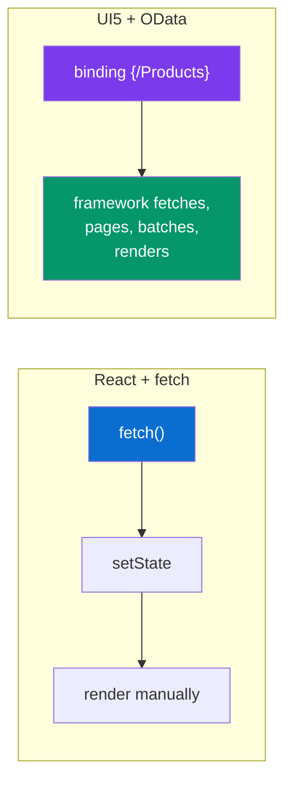

---
## F6. Where OData Comes From: the ABAP Backend

**Simple definition:** The OData service your Fiori app talks to isn't magic — it's **published by an SAP backend**, and in most companies that backend is **ABAP** (SAP's own server language, running on the SAP HANA database). Your UI5 app is the *frontend*; **ABAP is the backend that produces the data** and exposes it as OData. Understanding this link is what makes you a *full-stack* SAP developer, not just a UI person.

<p class="te"><strong>Telugu:</strong> Ne Fiori app matlade OData service akkadanunchi vastundo telusaa? — adi <strong>SAP backend</strong> publish chestundi, chaala companies lo aa backend <strong>ABAP</strong> (SAP sonta server language, HANA database meeda run avutundi). Ne UI5 app = <strong>frontend</strong>; <strong>ABAP = backend</strong> — data ni tayaru chesi OData ga bayataki istundi. React lo frontend + Node.js backend undedi kada — ikkada frontend = UI5, backend = ABAP. Ee connection artham aithe nuvvu full-stack SAP developer avutav.</p>

**The layers, top to bottom.** A Fiori app never touches the database directly. It sends an OData request over HTTP; that request travels down through SAP Gateway into the ABAP layer, which runs logic and reads the HANA database, then sends data back up. Same shape as `React → REST API → Node/Express → SQL → database`.

<figure class="fig">
<div class="stack">
  <div class="layer" style="background:#0a6ed1">Fiori / UI5 App &nbsp;·&nbsp; browser &nbsp;·&nbsp; Views · Controllers · Models</div>
  <div class="arrow-v">▲ data up &nbsp;&nbsp; ▼ request down &nbsp;·&nbsp; HTTP + OData (JSON)</div>
  <div class="layer" style="background:#7c3aed">SAP Gateway &nbsp;·&nbsp; exposes the OData service ($metadata, the URL)</div>
  <div class="arrow-v">▲ &nbsp;&nbsp; ▼</div>
  <div class="layer" style="background:#a21caf">ABAP Application &nbsp;·&nbsp; CDS Views · RAP behavior · business logic</div>
  <div class="arrow-v">▲ &nbsp;&nbsp; ▼ &nbsp;·&nbsp; SQL</div>
  <div class="layer" style="background:#059669">SAP HANA Database &nbsp;·&nbsp; the actual business data (tables)</div>
</div>
<figcaption><b>The SAP full stack.</b> Your Fiori app talks <b>OData</b> to <b>SAP Gateway</b>, which runs <b>ABAP</b> (CDS/RAP) against the <b>HANA</b> database. It's the same shape as React → REST API → Node → SQL → database.</figcaption>
</figure>

**What each layer does:**

| Layer | Job | Web-stack analogy |
|---|---|---|
| **UI5 / Fiori app** | The UI, in the browser (Parts A–J) | React frontend |
| **SAP Gateway** | Turns backend data into an **OData service** (the URL, `$metadata`) | The API/router layer |
| **ABAP application** | Business logic + **CDS views** + **RAP** (F8) | Express controllers + ORM |
| **SAP HANA database** | Stores the actual rows | PostgreSQL/MySQL |

**The key insight:** as a Fiori developer you consume the OData service the ABAP team exposes. On smaller teams **you write both** — the ABAP CDS/RAP *and* the UI5 app. Either way, the boundary is the **OData service**: it's the contract between frontend and backend, exactly like a REST API is the contract between your React app and your Node server.

---

## F7. The Full Fiori ↔ ABAP Round-Trip

**Simple definition:** Let's trace **one click** all the way down to ABAP and back, so the connection stops being abstract. When a user opens a Fiori list, a chain of well-defined steps runs across the frontend and the ABAP backend.

<p class="te"><strong>Telugu:</strong> Oka click ni motham ABAP varaku, malli venakki — end-to-end trace cheddam, ee connection clear ga artham avvadaniki. User oka Fiori list open chesinappudu, frontend nunchi ABAP backend varaku oka chain of steps jarugutundi. Kinda diagram lo prati step chudu — request kinda velli, data paiki vastundi.</p>

**Step by step — "show me all products":**

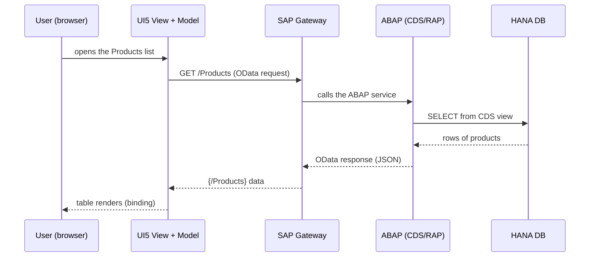

**Read it as the web round-trip you know:**
1. User opens the list → UI5 **aggregation binding** `items="{/Products}"` fires a `GET /Products`.
2. **SAP Gateway** receives the OData call and routes it to the ABAP service.
3. **ABAP** runs a **CDS view** (essentially a SQL `SELECT` with metadata) against **HANA**.
4. HANA returns rows → ABAP wraps them as an OData JSON response.
5. Gateway sends it back → the UI5 model fills → the table **renders automatically**.

**This is identical in spirit to** `fetch('/api/products')` → Express route → `SELECT * FROM products` → JSON → `setState` → render. Swap the names (Gateway = router, ABAP = controller, CDS = ORM query, HANA = Postgres) and it's the full-stack flow you already understand. The only genuinely new pieces are **Gateway** (auto-generates the OData layer) and **CDS/RAP** (next).

**Why you must know this even as a "frontend" dev:** when data is wrong or slow, the bug can live in *any* layer. Knowing the round-trip lets you say "the binding is correct, so the issue is in the CDS view" instead of guessing. That diagnostic skill is what SAP teams pay for.

---

## F8. CDS Views & RAP — the Modern ABAP that Feeds Fiori

**Simple definition:** Modern ABAP builds OData services from two things. **CDS (Core Data Services) views** define *what data* to expose (like a smart SQL view with annotations). **RAP (the ABAP RESTful Application Programming model)** adds *behavior* — create/update/delete, validations, actions. Together they generate the OData service your Fiori app (and Fiori Elements) consumes.

<p class="te"><strong>Telugu:</strong> Modern ABAP lo OData service rendu vishayalatho tayaru avutundi. <strong>CDS views</strong> — <em>e data</em> bayataki ivvalo define chestayi (annotations tho unde smart SQL view laga). <strong>RAP</strong> — <em>behavior</em> add chestundi (create/update/delete, validations, actions). Rendu kalisi ne Fiori app consume chese OData service ni generate chestayi. React lo backend framework (Express/NestJS) + database schema ki emi antamo, CDS + RAP ki adе — SAP flavour lo.</p>

**A CDS view — defines the data (like a SQL view + metadata):**

```abap
@AccessControl.authorizationCheck: #CHECK
@EndUserText.label: 'Products for Fiori'
define view entity ZI_Product as select from zproduct
{
  key product_id     as ProductID,
      name           as Name,
      price          as Price,
      currency_code  as CurrencyCode,
      in_stock       as InStock
}
```

Read it as SQL you already know: `select from zproduct` with chosen columns and aliases. The `@` lines are **annotations** — metadata SAP tools read. This one CDS view can be **exposed as an OData service** with almost no extra code.

**CDS annotations directly drive Fiori Elements (the link to Part K):**

```abap
@UI: {
  lineItem:       [{ position: 10 }],   // show as a table column
  selectionField: [{ position: 10 }] }   // show as a filter
name as Name,

@UI.lineItem: [{ position: 20 }]
price as Price
```

Those `@UI.*` annotations are the **same annotations** Fiori Elements uses (K3) — but written in the **backend CDS view**. Annotate the ABAP, and a Fiori Elements List Report renders itself. This is why CDS + Fiori Elements is SAP's fastest path: **describe the data once in ABAP, get a full app.**

**RAP — adds behavior (the "controller" layer):**

```abap
// a behavior definition: what you can DO to the data
managed implementation in class zbp_i_product unique;
define behavior for ZI_Product alias Product
{
  create;
  update;
  delete;
  validation validatePrice on save { field Price; }   // server-side rule
  action markOutOfStock result [1] $self;             // a custom action
}
```

RAP is your **backend business logic** — it's where "price can't be negative" or "only a manager can approve" lives. It maps to the create/update/delete that your UI5 `oModel.create()/update()/remove()` (F4) call.

**How the pieces connect — the whole backend-to-frontend picture:**

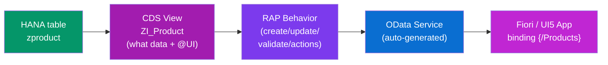

| ABAP concept | What it is | Web/JS analogy |
|---|---|---|
| **CDS view** | Defines exposed data + `@UI` annotations | A SQL view + an API schema |
| **RAP** | Behavior: CRUD, validations, actions | Express/NestJS controllers + rules |
| **Annotations** | `@UI.*` metadata that shapes the UI | A UI config / OpenAPI schema |
| **Gateway/OData** | Auto-exposes it as a service | Your REST API |

**The takeaway for your career:** you don't need to be an ABAP *expert* to be a Fiori developer — but knowing **CDS views feed your OData** and **RAP holds the business rules** lets you work across the stack, debug faster, and take on the coveted **full-stack SAP** roles. Frontend (UI5) + backend (CDS/RAP) is the complete SAP developer, and it's exactly the `React + Node/SQL` full-stack shape you already understand — with SAP names.

---


# Part G — The Component & App Descriptor

*So far, views and controllers. But a real app needs a **root** that owns routing, models and config — and a **manifest** that declares all of it. This is the UI5 equivalent of `main.jsx` + your build/app config, and it's what makes an app deployable to the Fiori Launchpad.*

## G1. Component.js — the App's Root

**Simple definition:** **`Component.js`** is the **root object** of a UI5 app — a single entry point that owns the router, the app-wide models, and startup logic. Instead of an `index.html` creating a view directly, it creates a **Component**, and the Component creates everything else. It's your `<App/>` plus the app-level setup.

<p class="te"><strong>Telugu:</strong> <strong>Component.js</strong> ante UI5 app yokka <strong>root object</strong> — okkate entry point, andulo router, app-wide models, startup logic anni untayi. <code>index.html</code> neruga view create cheyakunda oka <strong>Component</strong> ni create chestundi; aa Component migta anta create chestundi. React lo top-level <code>&lt;App/&gt;</code> + providers + router setup en chestayo, Component ade.</p>

```javascript
// webapp/Component.js
sap.ui.define([
    "sap/ui/core/UIComponent"
], function (UIComponent) {
    "use strict";
    return UIComponent.extend("myapp.Component", {

        metadata: {
            manifest: "json"          // read all config from manifest.json
        },

        init: function () {
            UIComponent.prototype.init.apply(this, arguments);   // must call super
            this.getRouter().initialize();   // start routing (reads routes from manifest)
        }
    });
});
```

**What the Component owns:**
- The **router** (`this.getRouter()`) — navigation for the whole app.
- **App-wide models** — an OData model set here is visible to *every* view (like a top-level Context provider).
- The **root view** — usually an `App` control holding a `FlexibleColumnLayout` or navigation container.
- The link to **`manifest.json`** via `metadata: { manifest: "json" }`.

**JS parallel:** `Component.js` is `main.jsx` — the single place that mounts the app, sets up the router, and provides shared data down the tree. Everything global lives here, exactly as your React app's providers and `<BrowserRouter>` wrap everything at the root.

---

## G2. manifest.json — the Descriptor

**Simple definition:** **`manifest.json`** (the **"app descriptor"**) is a JSON file that **declares everything about the app**: its id, data sources, models, routing, dependencies, and Launchpad settings — all as configuration, not code. UI5 reads it at startup and wires the app together from it.

<p class="te"><strong>Telugu:</strong> <strong>manifest.json</strong> (app descriptor) ante app gurinchi <strong>anta declare chese</strong> JSON file — app id, data sources, models, routing, dependencies, Launchpad settings — anni config ga, code kadu. UI5 start ayyetappudu idi chdivi app antā wire chestundi. React lo <code>package.json</code> + router config + env config anni oke file lo pettinattu.</p>

**A realistic manifest (trimmed) with the key sections:**

```json
{
  "sap.app": {
    "id": "myapp",
    "type": "application",
    "title": "{{appTitle}}",
    "dataSources": {
      "mainService": {
        "uri": "/sap/opu/odata/sap/PRODUCT_SRV/",
        "type": "OData",
        "settings": { "odataVersion": "2.0" }
      }
    }
  },

  "sap.ui5": {
    "dependencies": {
      "libs": { "sap.m": {}, "sap.ui.core": {} }
    },
    "models": {
      "i18n": {
        "type": "sap.ui.model.resource.ResourceModel",
        "settings": { "bundleName": "myapp.i18n.i18n" }
      },
      "": { "dataSource": "mainService", "type": "sap.ui.model.odata.v2.ODataModel" }
    },
    "routing": {
      "config": {
        "routerClass": "sap.m.routing.Router",
        "viewType": "XML",
        "viewPath": "myapp.view",
        "controlId": "app",
        "controlAggregation": "pages"
      },
      "routes": [
        { "name": "list",   "pattern": "",              "target": "list" },
        { "name": "detail", "pattern": "product/{id}",  "target": "detail" }
      ],
      "targets": {
        "list":   { "viewName": "List",   "viewId": "list" },
        "detail": { "viewName": "Detail", "viewId": "detail" }
      }
    }
  }
}
```

**The sections that matter:**

| Section | Declares | React config cousin |
|---|---|---|
| `sap.app` | Identity + data sources (backend URLs) | `package.json` name + `.env` API URLs |
| `sap.ui5` -> `dependencies` | Which UI5 libraries the app needs | `dependencies` in package.json |
| `sap.ui5` -> `models` | The models available app-wide | your top-level store/context setup |
| `sap.ui5` -> `routing` | All routes, patterns, and target views | your `<Routes>` config |

**Why config-over-code matters here:** because the manifest is *declarative data*, SAP tooling and the Launchpad can **read and even modify** it without touching your JavaScript — that's how apps get extended, re-themed, and deployed centrally across an enterprise. It's the same reason `package.json` is data, not code: tools can reason about it.

---

## G3. Descriptor vs package.json/config

**Simple definition:** The manifest bundles jobs that in a React project are **spread across several files** — `package.json`, router setup, env config, i18n config — into **one declarative descriptor**. This table maps the pieces so nothing feels alien.

<p class="te"><strong>Telugu:</strong> React project lo chala files lo pnchi unde panulu — <code>package.json</code>, router setup, env config, i18n — anni UI5 lo <strong>oke manifest.json</strong> lo vastayi. Kinda table lo edi edo map chesa. Idi chuste manifest kottaga anipinchadu.</p>

| Job | React (spread across files) | UI5 (one manifest) |
|---|---|---|
| App name & metadata | `package.json` | `sap.app.id`, `title` |
| Dependencies | `package.json` `dependencies` | `sap.ui5.dependencies.libs` |
| API base URLs | `.env` / config | `sap.app.dataSources` |
| Routing table | `<Routes>` JSX | `sap.ui5.routing.routes` |
| Global data setup | Context/store in `main.jsx` | `sap.ui5.models` |
| i18n config | i18next init | a ResourceModel entry |
| Feature flags / settings | config file | `sap.ui5` custom config |

**The mental shift:** React spreads config across code and files you *run*; UI5 concentrates it into **one JSON file you declare**. More upfront structure, but a single source of truth an entire tooling ecosystem can read. Once you accept "the manifest is the app's control panel," UI5's project layout stops feeling foreign — it's the same responsibilities you already juggle in React, just gathered in one place.

---

# Part H — Routing & Navigation

*Multi-screen apps need routing. You learned React Router in Phase 6 — UI5 routing is the same concept (URL to view), just configured in the manifest instead of JSX.*

## H1. Why Routing

**Simple definition:** **Routing** maps a **URL pattern** to a **view**, so the app can show different screens, support the browser Back button, and let users bookmark/share deep links — all without full page reloads. It's a Single-Page-App concern, identical in spirit to React Router.

<p class="te"><strong>Telugu:</strong> <strong>Routing</strong> ante oka <strong>URL pattern</strong> ni oka <strong>view</strong> ki kalapadan — dinto app veru veru screens chupinchochchu, browser Back button pani chestundi, users link bookmark/share cheyochchu — page full reload lekunda. Phase 6 lo React Router nerchukunnavu kada — UI5 routing srigga ade idea, kani manifest lo config chestan, JSX lo kadu.</p>

**The problem it solves:** without routing, a Single-Page App is stuck on one URL — Back button does nothing, and you can't link someone straight to "product P-42." Routing gives every screen its own address. A list-detail Fiori app might have:

```
""                  -> the product list
"product/P-42"      -> detail page for product P-42
"product/P-42/edit" -> edit that product
```

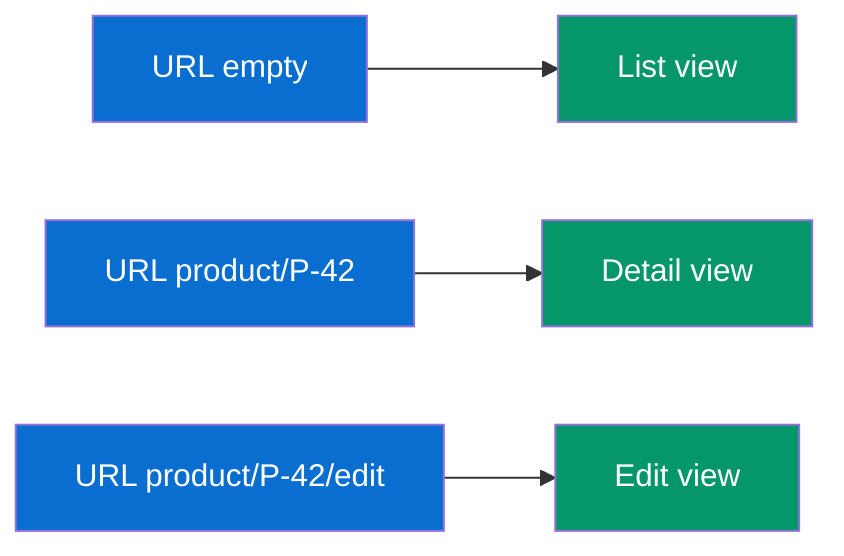

**JS parallel:** this is exactly the `path="/product/:id"` -> `<Detail/>` mapping from React Router. Same two concepts — a **pattern** with a placeholder, and a **component/view** to show. UI5 just writes the table in `manifest.json` instead of as `<Route>` elements.

---

## H2. Routes, Patterns & Targets

**Simple definition:** UI5 routing has three pieces. A **route** links a **pattern** (URL shape, with `{placeholders}`) to a **target**. A **target** says which **view** to display and where to put it. You declare all of them in the manifest's `routing` section.

<p class="te"><strong>Telugu:</strong> UI5 routing ki 3 mukkalu. <strong>Route</strong> — oka <strong>pattern</strong> (URL shape, <code>{id}</code> laga placeholders tho) ni oka <strong>target</strong> ki kaluputundi. <strong>Target</strong> — e <strong>view</strong> chupinchali, ekkada pettalo cheptundi. Ivi anni manifest lo <code>routing</code> section lo declare chestan. React Router lo <code>&lt;Route path element&gt;</code> ento, idi ade — split into route + target.</p>

```json
"routing": {
  "config": {
    "routerClass": "sap.m.routing.Router",
    "viewType": "XML",
    "viewPath": "myapp.view",
    "controlId": "app",
    "controlAggregation": "pages",
    "async": true
  },
  "routes": [
    { "name": "list",   "pattern": "",             "target": "list"   },
    { "name": "detail", "pattern": "product/{id}", "target": "detail" }
  ],
  "targets": {
    "list":   { "viewName": "List",   "viewId": "listView"   },
    "detail": { "viewName": "Detail", "viewId": "detailView" }
  }
}
```

| Piece | Job | React Router cousin |
|---|---|---|
| **config** | Defaults: view type, where views are placed | `<BrowserRouter>` + layout |
| **route** | Maps a URL pattern -> target | `<Route path=... element=...>` |
| **pattern** | The URL shape, `{id}` = a variable segment | `path="/product/:id"` |
| **target** | Which view to show and where | the `element` component |

**Pattern syntax you'll use:**
- `""` — the empty/home pattern (list screen).
- `product/{id}` — `{id}` is a **mandatory** parameter (like `:id`).
- `product/{id}/:tab:` — `:tab:` is an **optional** parameter.
- `product/{id}/**` — `**` matches the rest (a "rest" segment).

The **config** block is where you set that matched views go into the `pages` aggregation of the control with id `app` — i.e. UI5's answer to "where does the routed view render." In React that's wherever you place `<Outlet/>` or the `<Routes>`.

---

## H3. Navigating & Passing Parameters

**Simple definition:** To move between screens you get the **router** and call **`navTo(routeName, params)`**. On the destination, you subscribe to the route's **matched event** in `onInit` and read the parameters. This is UI5's `navigate("/product/42")` + `useParams()`.

<p class="te"><strong>Telugu:</strong> Screen marchadaniki <strong>router</strong> ni tisukuni <code>navTo("routeName", params)</code> pilustan. Destination view lo, <code>onInit</code> lo aa route yokka <strong>matched event</strong> ki subscribe ayi, parameters chduvukuntan. React lo <code>navigate("/product/42")</code> + <code>useParams()</code> en chestayo, ive avi — konchen ekkuva code, kani oke idea.</p>

**Navigate away (from the list, on row press):**

```javascript
onProductPress: function (oEvent) {
    const oContext = oEvent.getSource().getBindingContext();
    const sId = oContext.getProperty("ProductID");
    const oRouter = this.getOwnerComponent().getRouter();
    oRouter.navTo("detail", { id: sId });     // -> URL becomes product/<id>
}
```

**Receive the parameter (in the Detail controller):**

```javascript
onInit: function () {
    const oRouter = this.getOwnerComponent().getRouter();
    oRouter.getRoute("detail").attachPatternMatched(this._onMatched, this);
},

_onMatched: function (oEvent) {
    const sId = oEvent.getParameter("arguments").id;    // the {id} from the URL
    // now bind this view to that product:
    this.getView().bindElement("/Products('" + sId + "')");
}
```

| Task | UI5 | React Router |
|---|---|---|
| Go to a route | `oRouter.navTo("detail", {id})` | `navigate('/product/'+id)` |
| Read the URL param | `oEvent.getParameter("arguments").id` | `useParams().id` |
| React to route change | `attachPatternMatched(fn)` | `useEffect` on `useParams()` |
| Back | `window.history.back()` / nav to prev | `navigate(-1)` |

**The one extra idea vs React:** in UI5 you **subscribe to `patternMatched`** rather than reading a hook. Why? Because the detail view is often **not destroyed** between navigations (it's reused for a different id), so `onInit` runs only once — you need an *event* that fires on **every** match to re-bind to the new id. That reuse is a performance feature; the `patternMatched` subscription is how you handle it. It's the piece to internalize that has no exact React equivalent.

---

## H4. UI5 Routing vs React Router

**Simple definition:** Same job (URL to screen), different packaging: React Router declares routes as **JSX components** and reads params with **hooks**; UI5 declares routes as **manifest JSON** and reads params via **router events**. Here's the full side-by-side.

<p class="te"><strong>Telugu:</strong> Oke pani (URL to screen), veru packaging: React Router routes ni <strong>JSX</strong> ga raastundi, params ni <strong>hooks</strong> tho chduvutundi; UI5 routes ni <strong>manifest JSON</strong> lo declare chestundi, params ni <strong>router events</strong> tho chduvutundi. Kinda full comparison. React teliste idi 20 nimishallo vachchestundi.</p>

| Concept | React Router (Phase 6) | UI5 Routing |
|---|---|---|
| Where routes are defined | JSX `<Routes><Route/></Routes>` | `manifest.json` `routing` |
| Route param syntax | `/product/:id` | `product/{id}` |
| Navigate programmatically | `useNavigate()` -> `navigate(...)` | `getRouter().navTo(...)` |
| Read params | `useParams()` | `oEvent.getParameter("arguments")` |
| Link element | `<Link to=...>` | `navTo` on press (no Link tag needed) |
| Nested layouts | `<Outlet/>` | targets + `controlAggregation` |
| 404 | `path="*"` | `bypassed` / `notFound` target |

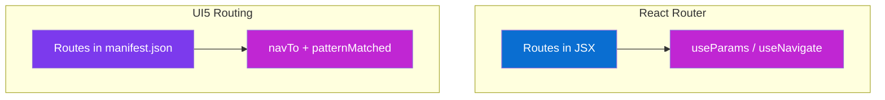

**Takeaway:** if you understood React Router, you already understand UI5 routing — you're just moving the route table from JSX into JSON and swapping `useParams()` for a route event. Everything else (patterns, params, programmatic nav, nested views) maps one-to-one.

---

# Part I — Fragments, Dialogs & Reuse

*In React you extract repeated UI into child components. UI5's reuse unit is the **Fragment** — a piece of view with no controller of its own. This part covers fragments and their most common use: dialogs.*

## I1. What is a Fragment

**Simple definition:** A **Fragment** is a **reusable piece of a view** (`Something.fragment.xml`) that has **no controller and no root container of its own**. You define UI once in a fragment and drop it into many views, or load it on demand (like a dialog). It's a lightweight, shareable chunk of controls.

<p class="te"><strong>Telugu:</strong> <strong>Fragment</strong> ante oka <strong>reusable view mukka</strong> (<code>Something.fragment.xml</code>) — dantata daki controller ledu, root container ledu. Oke UI ni okkasari raasi chala views lo vadochchu, leda avasaramainappudu load cheyochchu (dialog laga). React lo reusable child component en chestundo, fragment dadapu ade — kani state/logic tane pttukodu; parent controller vadutundi.</p>

**A fragment file — `webapp/view/ProductDialog.fragment.xml`:**

```xml
<core:FragmentDefinition
    xmlns="sap.m"
    xmlns:core="sap.ui.core">
    <Dialog id="productDialog" title="Add Product">
        <content>
            <Input value="{/newName}" placeholder="Name"/>
            <Input value="{/newPrice}" placeholder="Price"/>
        </content>
        <beginButton>
            <Button text="Save" press=".onSaveDialog"/>
        </beginButton>
        <endButton>
            <Button text="Cancel" press=".onCloseDialog"/>
        </endButton>
    </Dialog>
</core:FragmentDefinition>
```

Note `<core:FragmentDefinition>` as the root (not `<mvc:View>`) — because a fragment isn't a standalone view. Its event handlers (`.onSaveDialog`) run on **whichever controller loads it**.

**Two ways to reuse:**
- **Inline in a view** — drop a shared block (a reusable form) into multiple views with `<core:Fragment fragmentName="..."/>`.
- **On demand from a controller** — load a dialog only when needed (the common case, next).

**JS parallel:** a fragment is a **presentational child component** — markup you reuse, driven by the parent's logic and data. The difference from a full React component is that a fragment carries **no state or lifecycle of its own**; it borrows the host controller's. Think "a `.jsx` that returns JSX but has no hooks — the parent owns everything."

---

## I2. Dialogs & Popovers

**Simple definition:** A **Dialog** is a modal popup; a **Popover** is a small bubble anchored to a control. The standard pattern is to define the dialog in a **fragment**, then **lazy-load it once** from the controller and reuse the same instance. UI5 gives a helper (`loadFragment`) that caches it for you.

<p class="te"><strong>Telugu:</strong> <strong>Dialog</strong> ante modal popup; <strong>Popover</strong> ante oka control pakkana vachche chinna bubble. Standard pattern: dialog ni <strong>fragment</strong> lo define chesi, controller nunchi <strong>okkasari lazy-load</strong> chesi, ade instance ni marla marla vadadan. UI5 <code>loadFragment</code> helper dani cache chestundi. React lo modal component ni conditionally render chesinattu, kani ikkada manual open/close.</p>

**The modern loadFragment pattern (controller):**

```javascript
onOpenDialog: async function () {
    if (!this._pDialog) {
        this._pDialog = this.loadFragment({ name: "myapp.view.ProductDialog" });
    }
    const oDialog = await this._pDialog;
    oDialog.open();
},

onCloseDialog: function () {
    this.byId("productDialog").close();
},

onExit: function () {
    // ALWAYS destroy fragment dialogs to avoid leaks
    if (this._pDialog) {
        this._pDialog.then(d => d.destroy());
    }
}
```

**Why lazy-load and cache?** Creating the dialog only when first opened keeps startup fast (like React lazy-loading a modal), and caching the instance in `this._pDialog` avoids rebuilding it every open. The `onExit` `destroy()` is the mandatory cleanup — the single most common UI5 memory leak is a dialog fragment that's created but never destroyed.

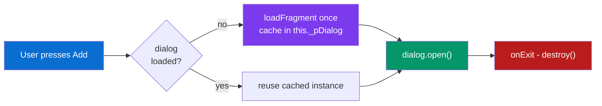

**Common popup controls:** `Dialog` (modal form/confirm), `Popover` (anchored bubble, e.g. a quick-view), `MessageBox` (one-line `MessageBox.confirm(...)` — like `window.confirm` but Fiori-styled), `MessageToast` (brief non-blocking toast), `BusyDialog` (blocking spinner).

---

## I3. Fragments vs React Components

**Simple definition:** Both extract reusable UI. The key difference: a **React component owns its own state and lifecycle**; a **fragment does not** — it's pure markup driven by the host controller's data and methods. Here's the precise mapping.

<p class="te"><strong>Telugu:</strong> Rendu reusable UI kosame. Pedda teda: <strong>React component dantata daki state, lifecycle pettukuntundi</strong>; <strong>fragment pettukodu</strong> — idi purtiga markup, host controller data/methods to nadustundi. Kinda table lo clear ga.</p>

| Aspect | React component | UI5 Fragment |
|---|---|---|
| Reusable markup | yes | yes |
| Own state (hooks) | yes `useState` | no — uses host controller's models |
| Own lifecycle | yes `useEffect` | no — uses host controller |
| Event handlers | Defined inside | Defined on the **host controller** |
| Loaded lazily | `React.lazy` | `loadFragment` |
| Typical use | Any reusable UI | Dialogs, popovers, shared form blocks |

**When you *do* need self-contained reuse with its own logic in UI5**, you don't use a fragment — you use a **nested Component** (a "reuse component") or a full View+Controller pair. Fragments are deliberately the *lightweight* option: share the markup, keep the logic in one controller.

**Takeaway for a React dev:** treat a fragment like a **"dumb"/presentational component** — it renders, it emits events upward to the controller, it holds no state. That's a pattern you already use in React (container vs presentational). UI5 just formalizes the presentational half as a fragment.

---

# Part J — Formatters, Types & Validation

*Raw data rarely displays as-is: a date needs formatting, a status needs a color, a price needs a currency symbol. In React you'd call a function in JSX. UI5 uses formatters and types — the same idea, wired into binding.*

## J1. Formatters

**Simple definition:** A **formatter** is a plain JavaScript function that transforms a bound value **for display** — e.g. turn `true` into `"Available"`, or a number into `"Success"`/`"Error"` state. You reference it in the binding, and UI5 runs it whenever the value changes.

<p class="te"><strong>Telugu:</strong> <strong>Formatter</strong> ante oka sadharana JS function — bind ayina value ni <strong>display kosan</strong> marchutundi. E.g. <code>true</code> ni <code>"Available"</code> ga, leda price ni color state ga. Binding lo dani reference chesi, value marinappudalla UI5 aa function ni pilustundi. React lo JSX lo <code>{formatPrice(p)}</code> en chestundo, formatter ade.</p>

**A formatter module — `webapp/model/formatter.js`:**

```javascript
sap.ui.define([], function () {
    "use strict";
    return {
        statusText: function (bInStock) {
            return bInStock ? "Available" : "Out of stock";
        },
        priceState: function (fPrice) {
            if (fPrice > 1000) return "Error";      // pricey -> red
            if (fPrice > 100)  return "Warning";
            return "Success";
        }
    };
});
```

**Wire it into the controller and use it in the view:**

```javascript
// controller
sap.ui.define([
    "sap/ui/core/mvc/Controller",
    "myapp/model/formatter"
], function (Controller, formatter) {
    "use strict";
    return Controller.extend("myapp.controller.List", {
        formatter: formatter,   // expose it to the view
        onInit: function () { /* ... */ }
    });
});
```

```xml
<!-- view: call the formatter through the controller's 'formatter' object -->
<ObjectStatus
    text="{ path: 'inStock', formatter: '.formatter.statusText' }"
    state="{ path: 'price',   formatter: '.formatter.priceState' }"/>
```

**Multiple inputs?** List several paths and the formatter receives them as arguments:

```xml
<Text text="{ parts: ['firstName','lastName'], formatter: '.formatter.fullName' }"/>
```
```javascript
fullName: function (sFirst, sLast) { return sFirst + " " + sLast; }
```

**JS parallel:** a formatter is exactly the helper function you call inside JSX: `<span>{statusText(p.inStock)}</span>`. UI5 just registers it in the binding so it re-runs automatically on data change — you don't call it, the framework does. Keeping formatters in a separate `formatter.js` module (and testing them like pure functions) is the standard, clean practice.

---

## J2. Data Types & Validation

**Simple definition:** A **type** (`sap.ui.model.type.*`) both **formats** a value for display *and* **parses + validates** user input on the way back. Bind an input with a type like `Float`, `Date`, or `Currency`, add **constraints**, and UI5 automatically shows red error states on invalid input — no manual validation code.

<p class="te"><strong>Telugu:</strong> <strong>Type</strong> (<code>sap.ui.model.type.*</code>) rendu panulu chestundi — value ni display ki <strong>format</strong> chesi, user input ni tirigi <strong>parse + validate</strong> chestundi. Input ki <code>Float</code>, <code>Date</code>, <code>Currency</code> laga type + <strong>constraints</strong> iste, tppu input pedite UI5 tane red error chupistundi — nuvvu validation code raayakkarledu. React lo form validation ki chala code raastan kada — ikkada built-in.</p>

**A validated numeric input:**

```xml
<Input value="{
    path: '/price',
    type: 'sap.ui.model.type.Float',
    constraints: { minimum: 0, maximum: 100000 },
    formatOptions: { minFractionDigits: 2, maxFractionDigits: 2 }
}"/>
```

Type `"abc"` -> the field turns red automatically. Type `200000` -> it flags the max-constraint violation. **Zero validation JavaScript.**

**Common built-in types:**

| Type | Formats & validates | Example constraint |
|---|---|---|
| `String` | Text | `maxLength: 40` |
| `Integer` / `Float` | Numbers | `minimum`, `maximum` |
| `Date` / `DateTime` | Dates (locale-aware) | `pattern: 'dd.MM.yyyy'` |
| `Currency` | Amount + currency code | decimals per currency |
| `Boolean` | true/false | — |

**Trigger and read validation in the controller:**

```javascript
// UI5 fires validation events; catch failures app-wide:
sap.ui.getCore().attachValidationError(function (oEvent) {
    oEvent.getParameter("element").setValueState("Error");
});
```

**JS parallel:** in React you reach for Formik/Zod/Yup to declare "this field is a number between 0 and 100000" and render error states. UI5 **builds that into binding** via types + constraints — the declaration lives right on the input, and the framework formats, parses, validates, and paints the error state. Less library glue, more convention.

---

## J3. Formatters vs JS Functions

**Simple definition:** Everything in this part is ordinary JavaScript you already know — the difference is *where* it runs and *who* calls it. This table ties formatters, types and expression binding back to the plain-JS habits from Phases 4–6.

<p class="te"><strong>Telugu:</strong> Ee part lo antā nuvvuki telisina sadharana JavaScript e — teda ekkada run avutundi, evaru pilustaru ane matrame. Kinda table formatters, types, expression binding ni Phase 4–6 plain-JS habits tho kaluputundi. Kottadi emi ledu, kotta chotu matrame.</p>

| Need | Plain JS / React | UI5 |
|---|---|---|
| Transform a value for display | function called in JSX | **Formatter** referenced in binding |
| Tiny inline logic (ternary) | `{a > 5 ? 'x' : 'y'}` in JSX | **Expression binding** `{= ... }` |
| Parse + validate input | Zod/Yup/manual | **Type + constraints** on the binding |
| Reused, complex transform | shared util function | **Formatter module** (`formatter.js`) |
| Format dates/currency by locale | `Intl.*` / a date lib | built-in **types** (locale-aware) |

**Decision guide (same judgment as React):**
- **One tiny comparison?** -> expression binding `{= ${/x} > 5 }` (inline ternary in JSX).
- **A reusable transform?** -> formatter function (extract to a helper).
- **Input that must be parsed/validated?** -> a type with constraints (Zod schema on a field).

**The big-picture takeaway:** UI5 didn't invent new concepts here — it took the plain-JS things you do (transform, validate, format) and **wired them into the binding layer** so they run automatically and declaratively. Your Phase 4–5 JavaScript is doing all the actual work; UI5 just decides *when* to call it. That's the whole relationship between "the JS you know" and "the framework": same fuel, different engine.

---

# Part K — Fiori Elements & Annotations

*Everything so far was **freestyle** — you wrote the views and controllers. Now the payoff: **Fiori Elements** lets SAP generate that whole UI for you from metadata. It only makes sense *because* you now understand what's being generated.*

## K1. What Are Fiori Elements

**Simple definition:** **Fiori Elements** is a set of **pre-built, standardized app templates ("floorplans")** that render themselves from your OData service's **metadata + annotations**. You supply *no* view XML and *almost no* controller code — SAP builds the list, the filters, the detail page, the edit form for you.

<p class="te"><strong>Telugu:</strong> <strong>Fiori Elements</strong> ante munde katina, standard <strong>app templates (floorplans)</strong> — ni OData service metadata + <strong>annotations</strong> nunchi UI ni tane generate chestayi. Nuvvu view XML raayavu, controller dadapu raayavu — list, filters, detail page, edit form anni SAP e katistundi. React lo oka table library ki schema iste tane table generate chesinattu — kani app antā.</p>

**The mental leap:** in freestyle you wrote `<Table items="{/Products}">…</Table>` and every column by hand. In Fiori Elements you instead *annotate* the `Products` entity — "these fields go in the table, this one is the title, filter by these" — and the template renders the whole List Report screen. You describe **what**, SAP decides **how**.

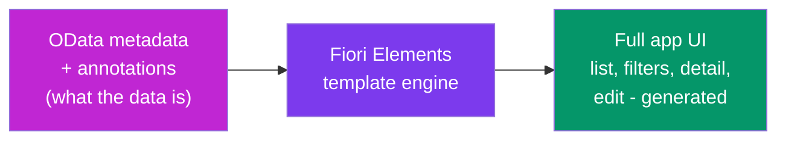

**Why enterprises love it:**
- **Consistency** — every generated app is identical in look and behavior (the Coherent principle, enforced by code).
- **Speed** — a standard list-detail app in hours, not weeks.
- **Free upgrades** — SAP improves the template, your app improves with no code change.
- **Less to maintain** — no view code means fewer bugs.

**The trade-off:** you get flexibility only where the template allows it (via annotations and small "extensions"). For a truly custom UX, you go freestyle. **The 80/20 rule:** ~80% of enterprise apps are standard enough for Fiori Elements; the other 20% are freestyle. Knowing both — and *when* to pick which — is what makes you employable.

---

## K2. The Floorplans

**Simple definition:** A **floorplan** is a standard page layout Fiori defines for a recurring job. The two you must know: the **List Report** (a filterable table of records) and the **Object Page** (the detail/edit view of one record). Fiori Elements ships templates for each.

<p class="te"><strong>Telugu:</strong> <strong>Floorplan</strong> ante Fiori define chesina standard page layout — pde pde vachche paniki. Rendu mukhyamainavi: <strong>List Report</strong> (filter cheyagalige table) mriyu <strong>Object Page</strong> (oka record detail/edit page). Fiori Elements ee renditiki templates istundi. Anni SAP apps ive 2 shapes lo undtan valla, okkasari nerchukunte andan.</p>

| Floorplan | What it shows | Real example | Freestyle equivalent |
|---|---|---|---|
| **List Report** | Filter bar + table of many records | "All Purchase Orders" with filters | your List.view.xml + Table |
| **Object Page** | One record: header + sections + edit | A single PO's full details | your Detail.view.xml |
| **Overview Page (OVP)** | Dashboard of cards | KPIs + card tiles | a cards dashboard |
| **Analytical List Page** | Charts + table combined | Sales with a chart on top | chart lib + table |
| **Worklist** | A focused to-do list (no filter bar) | "Items awaiting my approval" | a simple list page |

**The classic pairing — List Report -> Object Page:**

```mermaid
graph LR
    LR["List Report<br/>filter + table of<br/>all products"]
    OP["Object Page<br/>one product:<br/>header + details + edit"]
    LR -->|click a row| OP
    OP -->|back| LR
    style LR fill:#0a6ed1,color:#fff
    style OP fill:#7c3aed,color:#fff
```

<figure class="fig">
<div class="fig-row">
  <div class="fig-col win">
    <div class="win-bar">Products &nbsp;·&nbsp; List Report</div>
    <div class="win-body">
      <div style="font-size:11px;color:#8a8f97;margin-bottom:5px">Filter: name, price, status…</div>
      <div class="rowlist">
        <div class="lrow"><span>Laptop</span><span>$1200 &nbsp;<span class="badge ok">In stock</span></span></div>
        <div class="lrow" style="background:#eaf3fc"><span><b>Mouse</b></span><span>$25 &nbsp;<span class="badge no">Out</span></span></div>
        <div class="lrow"><span>Keyboard</span><span>$75 &nbsp;<span class="badge ok">In stock</span></span></div>
      </div>
    </div>
  </div>
  <div class="fig-col win">
    <div class="win-bar" style="background:#7c3aed">Mouse &nbsp;·&nbsp; Object Page</div>
    <div class="win-body">
      <div style="font-size:16px;font-weight:800;color:#32363a">Mouse</div>
      <div style="font-size:11.5px;color:#777;margin-bottom:8px">Product P2 · Accessories</div>
      <div class="rowlist">
        <div class="lrow"><span>Price</span><b>$25.00</b></div>
        <div class="lrow"><span>Status</span><span class="badge no">Out of stock</span></div>
        <div class="lrow"><span>Supplier</span><span>LogiTech</span></div>
      </div>
      <div style="margin-top:8px"><span class="pill">Edit</span><span class="pill">Delete</span></div>
    </div>
  </div>
</div>
<figcaption><b>The signature Fiori flow:</b> click a row in the <b>List Report</b> (left) and its <b>Object Page</b> opens (right). This is the master-detail pattern you build freestyle with routing (Part H) — or that Fiori Elements generates for you (Part K).</figcaption>
</figure>

This List-Report-to-Object-Page flow *is* the master-detail pattern you built freestyle in Part H — but generated. If you can picture your freestyle List + Detail views, you can picture exactly what these floorplans produce. That's why we did freestyle first.

---

## K3. Annotations

**Simple definition:** **Annotations** are **metadata that describe your data's meaning and presentation** — "this field is the title," "show these columns," "make this filterable," "this is a currency." Fiori Elements reads them and renders the UI. They live either in the backend (CDS) or in a local annotation file.

<p class="te"><strong>Telugu:</strong> <strong>Annotations</strong> ante ni data yokka <strong>artham mriyu presentation</strong> ni cheppe metadata — "ee field title", "ee columns chupinchu", "dinto filter cheyochchu", "idi currency". Fiori Elements ee annotations chdivi UI ni generate chestundi. Ivi backend lo (CDS) leda local annotation file lo untayi. React lo config-driven table ki ichche column config ento, annotations dadapu ade — kani data mida neruga.</p>

**A taste — annotations that build a List Report table (OData V4 / CDS style):**

```
annotate Products with @(
    UI.LineItem: [                       // the table columns
        { $Type: 'UI.DataField', Value: Name },
        { $Type: 'UI.DataField', Value: Price },
        { $Type: 'UI.DataField', Value: Category }
    ],
    UI.SelectionFields: [ Category, Price ],   // which fields appear as filters
    UI.HeaderInfo: {                            // the object page header
        TypeName: 'Product',
        Title: { Value: Name }
    }
);
```

**Read it plainly:**
- `UI.LineItem` = "these are the table columns" (what you hand-wrote as `<Column>`s).
- `UI.SelectionFields` = "put these in the filter bar."
- `UI.HeaderInfo.Title` = "this field is the record's headline."

From *just this*, Fiori Elements renders a full filterable table and a detail header — **no XML, no controller**. Change an annotation, the UI changes.

**Where annotations come from:**

| Source | What | Who writes it |
|---|---|---|
| **CDS annotations** | In the backend data model (ABAP CDS views) | Backend/full-stack dev |
| **Local annotation file** | `annotations.xml` in the UI project | Frontend dev |
| **Metadata extensions** | Layered overrides | Either |

**JS parallel:** annotations are a **declarative schema/config that a rendering engine consumes** — exactly like feeding a column-config array to a data-grid library (`columns: [{field:'name', header:'Name'}, …]`) and letting it draw the grid. You already trust config-driven components in React; Fiori Elements is that idea scaled up to an entire app, with the config living as OData annotations.

---

## K4. Elements vs Freestyle (When to Use Which)

**Simple definition:** Both build Fiori apps; you choose per project. **Fiori Elements** for standard, data-heavy CRUD apps (fast, consistent, low-code). **Freestyle** for custom or unusual UX (full control, more code). Real teams mix them.

<p class="te"><strong>Telugu:</strong> Rendu Fiori apps katistayi; project batti nuvvu choose chestavu. <strong>Fiori Elements</strong> — standard, data-heavy CRUD apps ki (fast, consistent, thakkuva code). <strong>Freestyle</strong> — custom, veru UX ki (full control, ekkuva code). Real teams rendu kalipi vadataru. Interview lo "edi eppudu?" ani adugutaru — kinda answer.</p>

| Question | Lean Fiori Elements | Lean Freestyle |
|---|---|---|
| Is it a standard list/detail CRUD app? | ✅ Yes | — |
| Do you need a very custom layout/UX? | — | ✅ Yes |
| How fast must it ship? | Very fast | Slower |
| Team's UI5 depth? | Low-code friendly | Needs stronger devs |
| Long-term maintenance cost? | Lower | Higher |
| Consistency across many apps? | Enforced | Up to you |

```mermaid
graph TD
    Q["New Fiori app to build"]
    Q --> Std{"Standard CRUD<br/>list-detail?"}
    Std -->|yes| FE["Fiori Elements<br/>annotate + generate"]
    Std -->|no, custom UX| FS["Freestyle<br/>write views + controllers"]
    style Q fill:#0a6ed1,color:#fff
    style FE fill:#059669,color:#fff
    style FS fill:#7c3aed,color:#fff
```

**The career takeaway:** you learned freestyle first *on purpose* — it teaches MVC, binding and routing, the concepts Fiori Elements hides. Now Fiori Elements reads as "the framework doing the freestyle work for me from annotations," not as magic. In real jobs you'll do Fiori Elements for the bulk and drop to freestyle **extensions** for the tricky 20%. Fluency in both is the goal.

---

# Part L — SAP Fiori Launchpad (FLP)

*An app has to live somewhere users can find it. That home is the Fiori Launchpad — the "desktop" of the SAP world.*

## L1. What is the Launchpad

**Simple definition:** The **SAP Fiori Launchpad (FLP)** is the **single entry-point web page** employees log into. It shows a personalized home of **tiles** (app shortcuts), handles login, navigation, search and theming, and launches each Fiori app inside a shared shell. Think of it as the **home screen of a phone** for SAP apps.

<figure class="fig">
<div class="win">
  <div class="win-bar">SAP Fiori Launchpad · Home &nbsp;&nbsp;|&nbsp;&nbsp; Search &nbsp;&nbsp;|&nbsp;&nbsp; Notifications &nbsp;&nbsp;|&nbsp;&nbsp; Nikhil</div>
  <div class="win-body" style="background:#f5f6f7">
    <div style="font-size:12px;font-weight:700;color:#556;margin-bottom:7px">My Home</div>
    <div class="flp">
      <div class="tile"><div class="t-ico">P</div><div class="t-title">Manage Products</div></div>
      <div class="tile"><div class="t-ico">A</div><div class="t-title">Approve Requests</div><div class="t-sub">3 pending</div></div>
      <div class="tile"><div class="t-kpi">4.2M</div><div class="t-title">Sales This Month</div></div>
      <div class="tile"><div class="t-ico">D</div><div class="t-title">Track Deliveries</div></div>
    </div>
  </div>
</div>
<figcaption><b>The Fiori Launchpad</b> — the "home screen" employees log into. Each <b>tile</b> launches one focused app; <b>dynamic tiles</b> (e.g. "Sales This Month") show a live KPI number. Which tiles you see depends on your <b>role</b>.</figcaption>
</figure>

<p class="te"><strong>Telugu:</strong> <strong>SAP Fiori Launchpad (FLP)</strong> ante employees login ayye <strong>okkate main web page</strong>. Andulo <strong>tiles</strong> (app shortcuts) unde personalized home kanipistundi, login, navigation, search, theming anni ide chusukuntundi, mriyu prati Fiori app ni oka common shell lo open chestundi. Phone home screen mida apps icons untayi kada — FLP ade, SAP apps ki.</p>

**What the Launchpad provides (so your app doesn't have to):**
- **Single sign-on** — log in once, all apps work.
- **A tile home** — role-based (each user sees only their apps — the Role-based principle).
- **A shell** — the top bar, search, user menu, theme switch, notifications — shared across every app.
- **Cross-app navigation** — jump from one app to another via **semantic intents** (`#Product-display`) rather than hard URLs.

```mermaid
graph TD
    FLP["Fiori Launchpad Shell<br/>login + search + user menu"]
    FLP --> T1["Tile: Manage Products"]
    FLP --> T2["Tile: Approve Orders"]
    FLP --> T3["Tile: Sales KPIs"]
    T1 --> App1["Your UI5 app opens<br/>inside the shell"]
    style FLP fill:#0a6ed1,color:#fff
    style T1 fill:#7c3aed,color:#fff
    style T2 fill:#7c3aed,color:#fff
    style T3 fill:#7c3aed,color:#fff
    style App1 fill:#059669,color:#fff
```

**JS parallel:** the Launchpad is like an **OS/app-shell** hosting many micro-frontends. Your app is one "page" mounted into a shared chrome that handles auth, nav and theming globally — similar to how a big React app has one shell (nav bar, auth) and lazy-loads feature modules into it. The FLP is that shell, owned by SAP, shared by every app in the company.

---

## L2. Tiles, Groups & Roles

**Simple definition:** A **tile** is the clickable card that launches an app (with a title, icon, maybe a live number). Tiles are organized into **groups/pages**, and what each user sees is controlled by their **role**. Admins assign roles; users get a personalized launchpad.

<p class="te"><strong>Telugu:</strong> <strong>Tile</strong> ante app ni open chese clickable card (title, icon, konnisarlu live number tho). Tiles ni <strong>groups/pages</strong> ga organize chestaru, mriyu prati user en chustado <strong>role</strong> decide chestundi. Admin roles assign chestadu; user ki tana job ki sambandhinchina tiles matrame kanipistayi — ide Role-based principle.</p>

| Concept | What it is | Analogy |
|---|---|---|
| **Tile** | A card that launches an app | An app icon on a phone |
| **Dynamic tile** | A tile showing a live KPI number | A badge count on an icon |
| **Group / Page** | A cluster of related tiles | A folder of apps |
| **Catalog** | The pool of apps available to assign | The app store |
| **Role** | Which catalogs/tiles a user gets | Your phone's installed apps |

**How a user's launchpad is assembled:**

```mermaid
graph LR
    Cat["Catalog<br/>all available apps"]
    Role["Role<br/>assigned to user"]
    Home["User's Launchpad<br/>only their tiles"]
    Cat --> Role --> Home
    style Cat fill:#c026d3,color:#fff
    style Role fill:#7c3aed,color:#fff
    style Home fill:#059669,color:#fff
```

**The real-world flow:** a **Basis/security admin** creates catalogs and roles; a **manager** gets the "Approvals" role and sees approval tiles; a **clerk** gets the "Goods Movement" role and sees different tiles. Same launchpad, same apps installed centrally — different faces. As a developer you mostly **register your app** (a tile + a target mapping) so admins can assign it; you rarely manage roles yourself, but you must understand the model to make your app launchable.

---

## L3. Where Apps Get Deployed

**Simple definition:** Your finished UI5 app has to be **hosted** somewhere the Launchpad can load it. The three common targets: **SAP BTP** (cloud), the **ABAP repository** (on-premise S/4HANA), and **standalone hosting** for dev/demo. Each pairs with a matching Launchpad.

<p class="te"><strong>Telugu:</strong> Ni UI5 app ni Launchpad load cheyalante ekkado <strong>host</strong> cheyali. 3 common chotlu: <strong>SAP BTP</strong> (cloud), <strong>ABAP repository</strong> (on-premise S/4HANA), mriyu dev/demo ki <strong>standalone hosting</strong>. Prati okkatiki tagina Launchpad untundi. React app ni Vercel/Netlify ki deploy chesinattu — ikkada SAP targets.</p>

| Target | Where it runs | Launchpad | React deploy analogy |
|---|---|---|---|
| **SAP BTP** (Business Technology Platform) | SAP's cloud | SAP Build Work Zone / cloud FLP | Deploying to Vercel/AWS |
| **ABAP repository** | On-premise S/4HANA server | Embedded on-prem FLP | Hosting on your own server |
| **Standalone / local** | `ui5 serve`, static host | Sandbox FLP / none | `npm run dev` / static hosting |

**The typical modern path:** develop in **Business Application Studio** or VS Code -> test locally with the UI5 dev server -> build (`ui5 build`) -> deploy to **BTP** (cloud) or the **ABAP repo** (on-premise) -> register a tile in the Launchpad so users can find it.

```mermaid
graph LR
    Dev["Develop<br/>BAS / VS Code"]
    Build["ui5 build<br/>optimized bundle"]
    Deploy["Deploy<br/>BTP or ABAP repo"]
    FLP["Register tile<br/>in Launchpad"]
    Dev --> Build --> Deploy --> FLP
    style Dev fill:#0a6ed1,color:#fff
    style Build fill:#7c3aed,color:#fff
    style Deploy fill:#a21caf,color:#fff
    style FLP fill:#059669,color:#fff
```

**Takeaway:** deployment in the SAP world = "build the static UI5 bundle, push it to an SAP-hosted place, and register it with the Launchpad." Conceptually it's the same build-and-host cycle you'd do for a React app — the destinations just have SAP names (BTP, ABAP repository) instead of Vercel/Netlify.

---

# Part M — i18n, Theming & Accessibility

*Three things enterprise apps must get right and Fiori gives you largely for free. Short but important — interviewers ask, and real projects fail without them.*

## M1. Internationalization (i18n)

**Simple definition:** **i18n** = building the app so its text can appear in **any language** without code changes. You put all display strings in `.properties` files (one per language) and bind to keys — covered in E8. Here's the discipline: **never hard-code a user-visible string.**

<p class="te"><strong>Telugu:</strong> <strong>i18n</strong> ante app ni e languagelonaina chupinchagaligela katdan — code marchakunda. Anni display texts ni <code>.properties</code> files lo (prati languageki okkati) petti, keys ki bind chestan (E8 lo chusan). Golden rule: <strong>user ki kanipinche string ni eppudu hard-code cheyaku</strong> — eppudu <code>{i18n&gt;key}</code>.</p>

**The one rule and the two files (recap + the workflow):**

```xml
<!-- NEVER this -->
<Button text="Save"/>
<!-- ALWAYS this -->
<Button text="{i18n>saveBtn}"/>
```

```properties
# i18n/i18n.properties (default/English)
saveBtn=Save
# i18n/i18n_de.properties (German)
saveBtn=Speichern
# i18n/i18n_te.properties (Telugu)
saveBtn=సేవ్ చేయి
```

**Why it's non-negotiable in SAP:** a single Fiori app may serve employees in 30 countries. Hard-coding "Save" means 30 code forks — impossible to maintain. With i18n, translators edit `.properties` files and the same code ships everywhere. **Do it from day one** — retrofitting is the painful lesson (same as bolting i18next onto a finished React app). This is the Fiori **Coherent** principle made concrete.

---

## M2. Theming

**Simple definition:** A **theme** is the complete visual skin — colors, fonts, spacing — applied across every control. UI5 ships official themes (current: **`sap_horizon`**), you pick one in the bootstrap/manifest, and **every control obeys it** with no per-component styling. Companies can also generate a **custom-branded theme**.

<p class="te"><strong>Telugu:</strong> <strong>Theme</strong> ante mottan visual skin — colors, fonts, spacing — anni controls mida apply avutundi. UI5 official themes istundi (ipptidi <strong>sap_horizon</strong>), bootstrap/manifest lo okkati choose cheste <strong>prati control ade follow avutundi</strong> — component per component style cheyakkarledu. Companies tama brand colors tho custom theme kuda generate cheyochchu. Tailwind theme config en chestundo, idi ade — kani official + centrally.</p>

| Theme | Look | Status |
|---|---|---|
| `sap_horizon` | Current Fiori 3, bright & modern | **Default today** |
| `sap_fiori_3` (Quartz) | Previous generation | Legacy |
| `sap_horizon_dark` | Dark mode | Available |
| `sap_horizon_hcb` | High-contrast black | Accessibility |
| Custom theme | Company colors/logo | Built with UI Theme Designer |

```html
<!-- pick the theme once in the bootstrap -->
<script id="sap-ui-bootstrap" ...
        data-sap-ui-theme="sap_horizon"></script>
```

**Why centralized theming matters:** change one theme setting and the *entire* app — every button, table, dialog — restyles consistently. No hunting through CSS. A bank can generate its branded theme once and apply it to hundreds of apps. **JS parallel:** it's a global design-token system — like defining your Tailwind theme/`:root` CSS variables once and having every component inherit — but standardized by SAP and swappable at runtime (including dark and high-contrast modes for free).

---

## M3. Accessibility Built-In

**Simple definition:** **Accessibility (a11y)** means the app works for users with disabilities — screen readers, keyboard-only navigation, high contrast. UI5 controls ship a11y **built in** (ARIA roles, keyboard handling, focus management), so a standard Fiori app is largely accessible by default. Your job is to not break it and to fill small gaps (labels, tooltips).

<p class="te"><strong>Telugu:</strong> <strong>Accessibility (a11y)</strong> ante disabilities unde users ki kuda app pani cheyadan — screen readers, keyboard-only, high contrast. UI5 controls lo a11y (ARIA roles, keyboard, focus) <strong>munde built-in</strong> — anduvalla standard Fiori app default gane chala accessible. Ni pni dani padu cheyakapovadan + chinna gaps (labels, tooltips) nimpadan. React lo a11y ni nuvve chala varaku raayali — ikkada free ga vastundi.</p>

**What UI5 gives you for free vs what you must add:**

| Built-in (free) | You must supply |
|---|---|
| ARIA roles on every control | Meaningful **labels** (use `Label`/`ariaLabelledBy`) |
| Full keyboard navigation (Tab, arrows) | **Tooltips** on icon-only buttons |
| Focus management in dialogs | Logical reading **order** in your layout |
| High-contrast themes | Alt text for images |
| Screen-reader announcements | Not overriding roles incorrectly |

**Concrete habits:**
```xml
<!-- an icon-only button MUST have a tooltip for screen readers -->
<Button icon="sap-icon://delete" tooltip="{i18n>deleteBtn}"/>
<!-- associate a label with its field -->
<Label text="{i18n>email}" labelFor="emailInput"/>
<Input id="emailInput" value="{/email}"/>
```

**Why it matters for the job:** enterprise and government contracts legally require accessibility (Section 508, EN 301 549). SAP builds it into the controls so you clear most of the bar automatically — a genuine advantage over hand-built React where you wire ARIA yourself. Reflects the Fiori **Delightful** principle: delightful *for everyone*.

---

# Part N — The Toolbox

*The environment and commands you'll actually use day to day. Short and practical — the equivalent of "npm + VS Code + Vite" from your React world.*

## N1. Business Application Studio & VS Code

**Simple definition:** You build UI5 apps in an IDE. The two mainstream choices: **SAP Business Application Studio (BAS)** — SAP's cloud IDE with Fiori tooling pre-installed — and **VS Code** with SAP's Fiori tools extensions. Both give you templates, previews and deploy commands.

<p class="te"><strong>Telugu:</strong> UI5 apps ni oka IDE lo katistan. Rendu main options: <strong>SAP Business Application Studio (BAS)</strong> — SAP cloud IDE, Fiori tooling munde install ayi untundi — mriyu <strong>VS Code</strong> + SAP Fiori tools extensions. Rendu templates, preview, deploy commands istayi. React lo VS Code + Vite en chestayo, ivi ade — SAP flavour tho.</p>

| Tool | What | When to use |
|---|---|---|
| **Business Application Studio (BAS)** | SAP's browser-based IDE, cloud dev spaces, Fiori tools baked in | Enterprise/cloud projects, BTP deploy |
| **VS Code + Fiori tools** | Your local editor with SAP extensions | Local dev, if you prefer VS Code |

Both give you the **Fiori Application Generator** (a wizard that scaffolds a whole app — pick a template, a data source, and it writes the manifest, views and controllers for you), plus a **live preview** and **guided deploy**. This is your `npm create vite@latest` moment — a scaffolder that produces a running app you then edit.

---

## N2. UI5 Tooling (CLI)

**Simple definition:** **UI5 Tooling** is the official **command-line** for UI5 projects — `ui5 serve` to run a dev server, `ui5 build` to produce an optimized deployable bundle. It's the `npm run dev` / `npm run build` of the UI5 world.

<p class="te"><strong>Telugu:</strong> <strong>UI5 Tooling</strong> ante UI5 projects ki official <strong>command-line</strong> — <code>ui5 serve</code> tho dev server run, <code>ui5 build</code> tho deploy ki ready optimized bundle. React lo <code>npm run dev</code> / <code>npm run build</code> en chestayo, ivi srigga avi. <code>ui5.yaml</code> ane config file untundi (Vite config laga).</p>

**The everyday commands:**

```bash
npm install --global @ui5/cli   # one-time install

ui5 serve                       # dev server + live reload  (like npm run dev)
ui5 serve --open index.html     # open the browser too
ui5 build                       # optimized build → dist/   (like npm run build)
ui5 build --clean-dest          # fresh build
```

| UI5 CLI | React/npm equivalent | Does |
|---|---|---|
| `ui5 serve` | `npm run dev` / `vite` | Local dev server, live reload |
| `ui5 build` | `npm run build` | Minified, bundled output for deploy |
| `ui5.yaml` | `vite.config.js` | Project/build config |
| `@ui5/cli` | `vite` / CRA | The tooling package |

**Takeaway:** the dev loop is identical to what you know — serve while developing, build before deploying. Different command names, same rhythm. `ui5.yaml` configures the build the way `vite.config.js` did.

---

## N3. Fiori Tools & Guided Development

**Simple definition:** **SAP Fiori tools** is a suite of extensions (in BAS and VS Code) that supercharges UI5 development: an app **generator**, a visual **page editor**, an **annotation editor**, a **service explorer**, and **Guided Development** — step-by-step recipes that write code for you.

<p class="te"><strong>Telugu:</strong> <strong>SAP Fiori tools</strong> ante UI5 development ni chala sulabhan chese extensions suite (BAS + VS Code lo): app <strong>generator</strong>, visual <strong>page editor</strong>, <strong>annotation editor</strong>, service explorer, mriyu <strong>Guided Development</strong> — step-by-step recipes e code ekkada raayalo cheppi, code ni kuda raastayi. Beginner ki idi varam — nerchukuntu real code chudochchu.</p>

| Tool | Does | React-world cousin |
|---|---|---|
| **Application Generator** | Scaffolds a full app from a template | `create-vite` / a starter kit |
| **Page Map / editor** | Visually configure Fiori Elements pages | A low-code UI builder |
| **Annotation editor** | Edit annotations with autocomplete | A schema/config editor |
| **Guided Development** | Recipes that insert working code | Documented code snippets, applied for you |
| **Service explorer** | Browse an OData service's entities | An API explorer (like Postman) |

**Why it's great for learning:** Guided Development is like a senior dev pairing with you — pick "Add a custom column," answer a couple of questions, and it inserts correct, idiomatic code you can then study. Combined with the generator, you can stand up a real Fiori Elements app connected to a live OData service in minutes, then read the generated code to understand the concepts from Parts A–K in action.

---

# Part O — Master Project: Products Manager

*Tie it all together. This is the UI5 twin of your React Task Tracker — a small but complete freestyle app that exercises MVC, models, binding, routing, fragments and formatters in one place. Build this and the whole document becomes muscle memory.*

**The goal:** a two-screen **Products Manager**. Screen 1 (**List**): a searchable table of products with an "Add" dialog. Screen 2 (**Detail**): one product's details, reached by routing. Data starts as a JSONModel (swap to OData later without touching the views).

```mermaid
graph LR
    List["List View<br/>table + search + Add dialog"]
    Detail["Detail View<br/>one product's info"]
    List -->|row press: navTo detail| Detail
    Detail -->|back| List
    Dialog["Add Product Fragment<br/>modal form"]
    List -.opens.-> Dialog
    style List fill:#0a6ed1,color:#fff
    style Detail fill:#7c3aed,color:#fff
    style Dialog fill:#c026d3,color:#fff
```

**Project structure (freestyle):**

```
webapp/
├── index.html              # bootstrap
├── Component.js            # app root, starts router
├── manifest.json          # models + routing config
├── i18n/i18n.properties    # texts
├── model/formatter.js      # priceState, statusText
├── controller/
│   ├── List.controller.js
│   └── Detail.controller.js
└── view/
    ├── App.view.xml            # root, holds the pages
    ├── List.view.xml
    ├── Detail.view.xml
    └── AddProduct.fragment.xml
```

**Step 1 — the data (List controller `onInit`):**

```javascript
onInit: function () {
    const oModel = new JSONModel({
        products: [
            { id: "P1", name: "Laptop",   price: 1200, inStock: true  },
            { id: "P2", name: "Mouse",    price: 25,   inStock: false },
            { id: "P3", name: "Keyboard", price: 75,   inStock: true  }
        ],
        newProduct: { name: "", price: 0 }
    });
    this.getView().setModel(oModel);
}
```

**Step 2 — the List view (binding + search + navigation):**

```xml
<mvc:View controllerName="myapp.controller.List"
    xmlns:mvc="sap.ui.core.mvc" xmlns="sap.m">
    <Page title="{i18n>appTitle}">
        <headerContent>
            <Button icon="sap-icon://add" text="{i18n>addBtn}" press=".onAdd"/>
        </headerContent>
        <content>
            <SearchField liveChange=".onSearch" width="100%"/>
            <Table id="productsTable" items="{/products}">
                <columns>
                    <Column><Text text="{i18n>colName}"/></Column>
                    <Column><Text text="{i18n>colPrice}"/></Column>
                    <Column><Text text="{i18n>colStatus}"/></Column>
                </columns>
                <items>
                    <ColumnListItem type="Navigation" press=".onOpenDetail">
                        <cells>
                            <Text text="{name}"/>
                            <ObjectNumber number="{price}" unit="USD"
                                state="{ path: 'price', formatter: '.formatter.priceState' }"/>
                            <ObjectStatus
                                text="{ path: 'inStock', formatter: '.formatter.statusText' }"
                                state="{= ${inStock} ? 'Success' : 'Error' }"/>
                        </cells>
                    </ColumnListItem>
                </items>
            </Table>
        </content>
    </Page>
</mvc:View>
```

**Step 3 — search (filter the aggregation) + navigate:**

```javascript
onSearch: function (oEvent) {
    const sQuery = oEvent.getParameter("newValue");
    const oBinding = this.byId("productsTable").getBinding("items");
    const aFilters = sQuery
        ? [new Filter("name", FilterOperator.Contains, sQuery)]
        : [];
    oBinding.filter(aFilters);          // declarative filter, no manual loop
},

onOpenDetail: function (oEvent) {
    const sId = oEvent.getSource().getBindingContext().getProperty("id");
    this.getOwnerComponent().getRouter().navTo("detail", { id: sId });
}
```

**Step 4 — the Add dialog (fragment + lazy load):**

```javascript
onAdd: async function () {
    if (!this._pDialog) {
        this._pDialog = this.loadFragment({ name: "myapp.view.AddProduct" });
    }
    (await this._pDialog).open();
},
onSaveNew: function () {
    const oModel = this.getView().getModel();
    const oNew = { ...oModel.getProperty("/newProduct"), id: "P" + Date.now(), inStock: true };
    const aProducts = oModel.getProperty("/products");
    oModel.setProperty("/products", [...aProducts, oNew]);   // immutable add → table refreshes
    this.byId("addDialog").close();
}
```

**What this project drills (every concept, once):**

| Feature | Concept exercised | Part |
|---|---|---|
| Products table | Aggregation binding + template | E5 |
| Search box | `oBinding.filter()` | E5 |
| Price color | Formatter | J1 |
| Status text | Formatter + expression binding | J1/E7 |
| Row -> Detail | Routing + params | H |
| Add form | Fragment + Dialog | I |
| i18n texts | ResourceModel | E8 |
| Detail screen | Element binding on the route param | E6/H3 |

**The upgrade path:** once it works with the JSONModel, change **only the manifest** to point at an OData service and rename paths to entity sets (`/products` -> `/Products`). The views barely change — proof of the model abstraction. That single swap is the "aha" that makes you trust UI5. **This is your capstone: build it, then rebuild the same thing as a Fiori Elements app to feel the difference.**

---

# Part P — Interview Cheat-Sheet

*Rapid-fire the questions that actually come up for UI5/Fiori roles. Read these aloud until the answers are reflexive.*

**Q1. Fiori vs UI5?** Fiori is the **design language** (UX guidelines); SAPUI5 is the **JavaScript framework** that implements it. OpenUI5 is its open-source edition. (A1, A3)

**Q2. What is MVC in UI5?** Model = data, View = XML layout, Controller = logic/events. Separation of concerns; the binding keeps view and model in sync. (B1)

**Q3. Which view type and why?** **XML** — declarative, tooling-friendly, the standard. (B2)

**Q4. Types of data binding?** **Property** (one control property ↔ one value), **Aggregation** (a list ↔ an array, template repeated), **Element** (a container ↔ one object, relative paths inside). (E3, E5, E6)

**Q5. Binding modes & defaults?** OneWay, TwoWay, OneTime. **JSONModel defaults TwoWay; ODataModel defaults OneWay** — classic gotcha for "why don't my edits save." (E4)

**Q6. Controller lifecycle hooks?** `onInit`, `onBeforeRendering`, `onAfterRendering`, `onExit`. Set up in `onInit`, clean up in `onExit`. (D2)

**Q7. What is a Component / manifest.json?** Component.js is the app root (owns router + models); manifest.json is the **app descriptor** declaring models, routes, data sources, dependencies. (G)

**Q8. What is OData? V2 vs V4?** A standardized REST protocol with self-describing `$metadata`. V2 = legacy but everywhere; V4 = modern, leaner, SAP's direction. Different model classes. (F1, F2)

**Q9. What is a Fragment?** Reusable view piece with **no controller of its own**; commonly used for dialogs, loaded via `loadFragment` and destroyed in `onExit`. (I1, I2)

**Q10. Formatter vs Expression binding vs Type?** Formatter = a JS function for display; expression binding = tiny inline logic `{= }`; type = format **and** validate input with constraints. (J)

**Q11. Fiori Elements vs Freestyle?** Elements = template-generated from annotations (fast, consistent, standard CRUD); Freestyle = hand-written views (full control, custom UX). ~80/20 split. (K4)

**Q12. What are annotations?** Metadata describing data meaning/presentation that Fiori Elements reads to generate the UI (`UI.LineItem`, `UI.SelectionFields`, `UI.HeaderInfo`). (K3)

**Q13. What is the Fiori Launchpad?** The single entry-point shell hosting role-based tiles; handles SSO, search, theming, cross-app navigation. (L1)

**Q14. How do you navigate between views?** `getRouter().navTo("route", {params})`; receive with `attachPatternMatched`. Routes live in the manifest. (H3)

**Q15. Biggest UI5 memory-leak cause?** Fragment dialogs created but not `destroy()`-ed in `onExit`. (D2, I2)

**Q16. `this.byId` vs `getElementById`?** UI5 prefixes ids per view for uniqueness; `this.byId` resolves the prefix. Prefer binding over `byId`. (C5)

**Q17. How does i18n work?** ResourceModel loads `.properties` files per language; bind with `{i18n>key}`. Never hard-code strings. (E8, M1)

**Q18. What is `sap.ui.define`?** UI5's AMD module system — array of dependency paths → matching function args → your returned module. (D1)

**The React-bridge one-liner (say this in interviews):** *"I come from React, and UI5 mapped over quickly — XML views are JSX, JSONModel is useState, data binding is props, the router is React Router, fragments are presentational components, and the manifest is my app config gathered in one file."* This signals you understand the concepts, not just the syntax.

---

# Part Q — Resources & Quick Reference

**Official docs & playgrounds:**

| Resource | What | URL |
|---|---|---|
| SAPUI5 SDK (Demo Kit) | Docs + API + live samples | `ui5.sap.com` |
| OpenUI5 SDK | Open-source docs/API | `sdk.openui5.org` |
| Fiori Design Guidelines | The design language, floorplans | `experience.sap.com/fiori-design-web` |
| SAP Fiori Elements docs | Annotations + templates | in the SDK, "Fiori Elements" topic |
| SAP BTP Trial | Free cloud to deploy to | `account.hana.ondemand.com` |
| UI5 Tooling | CLI docs | `sap.github.io/ui5-tooling` |

**The dot-notation → file cheatsheet:**

| You write | UI5 loads |
|---|---|
| `myapp.controller.Home` | `webapp/controller/Home.controller.js` |
| `myapp.view.Home` | `webapp/view/Home.view.xml` |
| `myapp.view.AddProduct` (fragment) | `webapp/view/AddProduct.fragment.xml` |
| `myapp.model.formatter` | `webapp/model/formatter.js` |

**Binding syntax quick reference:**

```
{/absolutePath}              property binding, from model root
{relativePath}               inside a list template / element binding
{i18n>key}                   named model (i18n) lookup
{modelName>/path}            named model, absolute path
{= ${/a} > 5 ? 'x' : 'y' }   expression binding
{ path:'/p', formatter:'.formatter.fn' }        with a formatter
{ path:'/p', type:'sap.ui.model.type.Float' }   with a type
items="{/products}"          aggregation (list) binding
binding="{/products/0}"      element (context) binding
```

**The React → UI5 master map (keep this):**

| React | UI5 |
|---|---|
| JSX | XML View |
| Component | View + Controller |
| `useState` | JSONModel |
| props / `{value}` | data binding `{path}` |
| `onClick={fn}` | `press=".fn"` |
| `useEffect([],)` | `onInit` |
| cleanup `return () =>` | `onExit` |
| Context / Redux | named models on Component |
| child component | Fragment |
| React Router | UI5 Router (manifest) |
| `useParams` | `patternMatched` args |
| `main.jsx` + config | Component.js + manifest.json |
| `fetch` / axios | ODataModel |
| helper in JSX | Formatter |
| Zod/Yup | Type + constraints |
| i18next | ResourceModel |
| `npm run dev/build` | `ui5 serve` / `ui5 build` |
| Vercel/Netlify | BTP / ABAP repository |

**Learning order (how to actually study this):**
1. Read Parts A–B until "Fiori = design, UI5 = framework, app = MVC" is automatic.
2. Do a freestyle Hello-World: one XML view, one controller, a JSONModel, two-way binding (E3). Feel the binding.
3. Add a table (E5), a formatter (J1), a second view + routing (H).
4. Add a dialog fragment (I2). Build the **Products Manager** (Part O).
5. Only then touch **Fiori Elements** (K) — you'll finally see what it generates.
6. Skim L–N so deployment and tooling aren't mysteries.

> *"You didn't start over — you upgraded. Every React instinct you built in Phase 6 has a home in UI5. Views are JSX, models are state, binding is props, the router is the router. Learn the new names, keep the old intuition, and Fiori becomes the most familiar 'new' framework you've ever picked up. Now go build the Products Manager."*

---

*End of notes. Build the Products Manager, rebuild it as Fiori Elements, and you'll have covered — in code — every concept in this document.*
