# SAP — The Complete Big Picture

### From "what even is SAP" to ECC, HANA, S/4HANA, Fiori, BTP, CAP, RAP, OData, RISE, Joule and the Agentic Autonomous Enterprise — the whole SAP universe, explained simply and connected end-to-end

> *"Fiori/UI5 taught you the screen. This guide teaches you the whole world behind the screen: the company, the database, the modules, the platform and the AI — and exactly how S/4HANA, Fiori, BTP, CAP, RAP and OData click together into one machine. Learn the map first, and every SAP job posting suddenly reads like a sentence you understand."*

**SAP Track** · The Foundation Guide · read this *before* or *alongside* the Fiori & UI5 notes

---

## Table of Contents

- [Part A — What SAP Actually Is](#part-a-what-sap-actually-is)
  - [A1. SAP the Company & the Product](#a1-sap-the-company-the-product) · [A2. What is ERP](#a2-what-is-erp) · [A3. Why Companies Pay For SAP](#a3-why-companies-pay-for-sap) · [A4. The 30,000-Foot Map](#a4-the-30000-foot-map)
- [Part B — The History & Evolution](#part-b-the-history-evolution)
  - [B1. The Timeline (R/1 to Autonomous)](#b1-the-timeline-r1-to-autonomous) · [B2. R/1, R/2, R/3 — the Founding Era](#b2-r1-r2-r3-the-founding-era) · [B3. mySAP & the Business Suite](#b3-mysap-the-business-suite) · [B4. Why Everything Had to Change](#b4-why-everything-had-to-change)
- [Part C — ERP Modules & How They Connect](#part-c-erp-modules-how-they-connect)
  - [C1. What a Module Is](#c1-what-a-module-is) · [C2. The Core Modules](#c2-the-core-modules) · [C3. The Golden Thread — One Business Process Across Modules](#c3-the-golden-thread-one-business-process-across-modules) · [C4. Master Data vs Transactional Data](#c4-master-data-vs-transactional-data)
- [Part D — SAP ECC & the ABAP World](#part-d-sap-ecc-the-abap-world)
  - [D1. What is ECC](#d1-what-is-ecc) · [D2. The 3-Tier Architecture](#d2-the-3-tier-architecture) · [D3. ABAP — the Classic Language](#d3-abap-the-classic-language) · [D4. Clients, Transports & System Landscape](#d4-clients-transports-system-landscape)
- [Part E — SAP HANA (the Engine That Changed Everything)](#part-e-sap-hana-the-engine-that-changed-everything)
  - [E1. What is HANA](#e1-what-is-hana) · [E2. In-Memory & Columnar — Why It's Fast](#e2-in-memory-columnar-why-its-fast) · [E3. HANA vs a Normal Database](#e3-hana-vs-a-normal-database)
- [Part F — SAP S/4HANA (Modern ERP)](#part-f-sap-s4hana-modern-erp)
  - [F1. What is S/4HANA](#f1-what-is-s4hana) · [F2. What Actually Changed vs ECC](#f2-what-actually-changed-vs-ecc) · [F3. Deployment Options](#f3-deployment-options) · [F4. Migration — Greenfield, Brownfield, Bluefield](#f4-migration-greenfield-brownfield-bluefield)
- [Part G — SAP Fiori (the Face)](#part-g-sap-fiori-the-face)
  - [G1. Where Fiori Fits in the Big Picture](#g1-where-fiori-fits-in-the-big-picture) · [G2. The Launchpad as the Front Door](#g2-the-launchpad-as-the-front-door)
- [Part H — OData (the Language Between Front and Back)](#part-h-odata-the-language-between-front-and-back)
  - [H1. What is OData](#h1-what-is-odata) · [H2. V2 vs V4](#h2-v2-vs-v4) · [H3. OData as the Universal Connector](#h3-odata-as-the-universal-connector)
- [Part I — SAP BTP (the Platform)](#part-i-sap-btp-the-platform)
  - [I1. What is BTP](#i1-what-is-btp) · [I2. The Four Pillars](#i2-the-four-pillars) · [I3. Cloud Foundry vs ABAP vs Kyma](#i3-cloud-foundry-vs-abap-vs-kyma)
- [Part J — CAP (Cloud Application Programming Model)](#part-j-cap-cloud-application-programming-model)
  - [J1. What is CAP](#j1-what-is-cap) · [J2. CDS — the Heart of CAP](#j2-cds-the-heart-of-cap) · [J3. A Minimal CAP App](#j3-a-minimal-cap-app) · [J4. CAP vs Node/Express](#j4-cap-vs-nodeexpress)
- [Part K — RAP (ABAP RESTful Application Programming Model)](#part-k-rap-abap-restful-application-programming-model)
  - [K1. What is RAP](#k1-what-is-rap) · [K2. The RAP Building Blocks](#k2-the-rap-building-blocks) · [K3. CAP vs RAP — When to Use Which](#k3-cap-vs-rap-when-to-use-which)
- [Part L — The Connected Picture](#part-l-the-connected-picture)
  - [L1. How S/4HANA + Fiori + OData + BTP + CAP + RAP Click Together](#l1-how-s4hana-fiori-odata-btp-cap-rap-click-together) · [L2. The Extension Story — Clean Core](#l2-the-extension-story-clean-core) · [L3. One Request, End to End](#l3-one-request-end-to-end)
- [Part M — Modern SAP: Cloud ERP, RISE & GROW](#part-m-modern-sap-cloud-erp-rise-grow)
  - [M1. RISE with SAP](#m1-rise-with-sap) · [M2. GROW with SAP](#m2-grow-with-sap) · [M3. RISE vs GROW](#m3-rise-vs-grow)
- [Part N — SAP Business AI & Joule](#part-n-sap-business-ai-joule)
  - [N1. SAP Business AI — the Three Layers](#n1-sap-business-ai-the-three-layers) · [N2. What is Joule](#n2-what-is-joule) · [N3. How Joule Works Under the Hood](#n3-how-joule-works-under-the-hood) · [N4. The AI Foundation & Generative AI Hub](#n4-the-ai-foundation-generative-ai-hub)
- [Part O — Agentic SAP & the Autonomous Enterprise](#part-o-agentic-sap-the-autonomous-enterprise)
  - [O1. Copilot vs Agent — the Big Shift](#o1-copilot-vs-agent-the-big-shift) · [O2. Joule Agents](#o2-joule-agents) · [O3. Joule Studio — Build Your Own Agent](#o3-joule-studio-build-your-own-agent) · [O4. The Autonomous Enterprise](#o4-the-autonomous-enterprise)
- [Part P — Workflows & Process Automation](#part-p-workflows-process-automation)
  - [P1. What is a Workflow](#p1-what-is-a-workflow) · [P2. SAP Build Process Automation](#p2-sap-build-process-automation) · [P3. Workflow vs Agent](#p3-workflow-vs-agent)
- [Part Q — Project Types & Career Paths](#part-q-project-types-career-paths)
  - [Q1. The Kinds of SAP Projects](#q1-the-kinds-of-sap-projects) · [Q2. The Developer Career Tracks](#q2-the-developer-career-tracks) · [Q3. Where Your Roadmap Lands You](#q3-where-your-roadmap-lands-you)
- [Part R — Interview Cheat-Sheet](#part-r-interview-cheat-sheet)
- [Part S — Glossary & Quick Reference](#part-s-glossary-quick-reference)

---

# Part A — What SAP Actually Is

*Before any acronyms, get the one big idea: SAP is the software that runs the back office of most large companies on Earth. When you buy something and it gets billed, shipped, accounted for and reordered — that whole chain often runs on SAP. This part builds that mental model from zero.*

## A1. SAP the Company & the Product

**Simple definition:** **SAP** is a German software company (founded 1972 in Walldorf) and also the name of its flagship product: the world's most widely used **ERP** system — the giant piece of software that runs a company's core operations (finance, inventory, sales, manufacturing, HR) in **one connected system**. The name stands for **S**ystems, **A**pplications & **P**roducts in data processing.

<p class="te"><strong>Telugu:</strong> <strong>SAP</strong> ante rendu vishayalu — okati Germany lo 1972 lo start ayina oka pedda <strong>software company</strong>, rendu adhe company yokka main product: prapanchamlo ekkuva companies vaade <strong>ERP</strong> software. ERP ante oka company yokka anni core operations — money (finance), samanu (inventory), sales, manufacturing, HR — anniti <strong>oke connected system</strong> lo run chese pedda software. Simple ga: "oka company ni nadipe central brain."</p>

<figure class="fig small">

<figcaption>The SAP logo. <span class="fig-credit">Trademark of SAP SE — shown here for study reference.</span></figcaption>
</figure>

**The everyday analogy.** Think of a huge factory-plus-office. Money flows in and out, trucks bring raw material, machines build products, salespeople sell them, HR pays staff. Without SAP, each department keeps its own spreadsheet and they constantly disagree. SAP is the **single shared notebook** every department writes into and reads from — so finance instantly sees a sale the moment the warehouse ships it. That "one source of truth" is the entire point.

**Scale (why this matters for your career):** SAP customers generate the majority of the world's transacted commerce (SAP claims ~87% of total global commerce touches an SAP system). Most Fortune 500 companies run SAP. That means SAP skills are **demanded everywhere and rarely go obsolete** — the systems live for decades.

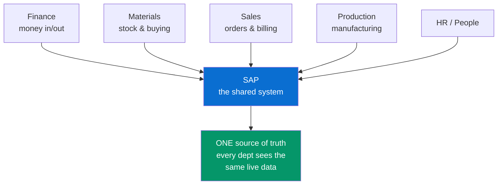

---

## A2. What is ERP

**Simple definition:** **ERP = Enterprise Resource Planning.** It is a category of software that integrates all the core business functions of a company — finance, procurement, manufacturing, supply chain, sales, HR — into **one database and one process flow**, so information entered once is available everywhere instantly. SAP is the biggest ERP vendor; Oracle and Microsoft Dynamics are competitors.

<p class="te"><strong>Telugu:</strong> <strong>ERP</strong> ante <strong>Enterprise Resource Planning</strong> — oka company yokka anni pedda panulu (finance, konugolu, tayari, sales, HR) ni <strong>oke database, oke process flow</strong> lo kalipe software category. Oka sari data enter cheste, adi anni departments ki ventane kanipistundi. SAP ee ERP field lo number one. Competitors: Oracle, Microsoft Dynamics.</p>

<figure class="fig med">
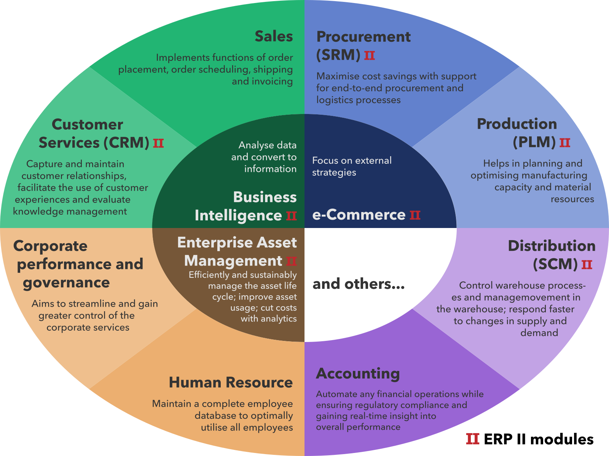
<figcaption>A typical ERP: functional modules (finance, HR, manufacturing, supply chain, CRM, inventory…) all plug into <strong>one shared core</strong>. That is exactly what SAP is. <span class="fig-credit">Image: Wikimedia Commons (CC).</span></figcaption>
</figure>

**The problem ERP solves — "islands of data."** Imagine sales uses one app, the warehouse another, accounting a third. A customer orders 100 units. Sales says "sold!", but accounting doesn't know to send a bill and the warehouse doesn't know to ship. People email spreadsheets around; numbers drift; month-end is chaos. ERP kills the islands: **one order record** flows automatically to shipping, billing and the ledger.

**Real-world example — buying a laptop online from a big retailer:**
1. You order → a **Sales** document is created.
2. Stock is checked and reserved → **Materials/Inventory**.
3. Warehouse ships → **Logistics** posts a goods movement.
4. An invoice is generated → **Billing**.
5. The revenue and the receivable hit the books → **Finance**.
6. Stock drops below reorder point → **Procurement** raises a purchase order to the supplier.

All six steps are **the same ERP system** reacting to one another. That chain is what you'll spend your SAP career building, extending and automating.

---

## A3. Why Companies Pay For SAP

**Simple definition:** Companies pay enormous sums (licenses, hardware, consultants) for SAP because a **single integrated system** removes errors, enables real-time reporting, enforces legal/audit compliance, and scales across countries and currencies — things a pile of disconnected apps can never do reliably.

<p class="te"><strong>Telugu:</strong> Companies SAP kosam chala dabbu (license, hardware, consultants) enduku pedataayi? Endukante <strong>oke integrated system</strong> valla — errors thaggutaayi, real-time reports vastaayi, government/audit rules follow avutaayi, mariyu different countries + currencies lo scale avutundi. Ee panulu vidividi apps tho jaraghavu. Adhe SAP value.</p>

| Without ERP (islands) | With SAP (one system) |
|---|---|
| Each dept re-keys data → typos & mismatch | Enter once, reused everywhere |
| Month-end = manual spreadsheet merge | Real-time financial close |
| No single audit trail | Every transaction logged & traceable |
| Hard to expand to a new country | Multi-currency, multi-language, multi-legal built in |
| Reports are days old | Live dashboards (especially on HANA) |

**The catch — and your opportunity.** SAP is powerful but **complex and expensive to implement and customize**. That complexity is exactly why SAP developers, functional consultants and (now) AI/agent builders are paid well and always in demand.

---

## A4. The 30,000-Foot Map

**Simple definition:** Everything in the rest of this guide fits into **five layers**: the **database** (HANA), the **ERP core** (ECC → S/4HANA) with its **modules**, the **UX** (Fiori/UI5), the **platform for extensions and integration** (BTP, with CAP/RAP/OData), and the **AI layer** (Business AI, Joule, Agents) sitting across all of it.

<p class="te"><strong>Telugu:</strong> Migta document anta ee <strong>5 layers</strong> lo padutundi — gurthupettuko: (1) <strong>Database</strong> = HANA, (2) <strong>ERP core + modules</strong> = ECC/S4HANA, (3) <strong>UX</strong> = Fiori/UI5, (4) <strong>Platform (extensions + integration)</strong> = BTP tho CAP/RAP/OData, (5) <strong>AI layer</strong> = Business AI, Joule, Agents. Ee 5 layers artham ayite SAP prapancham anta artham avutundi.</p>

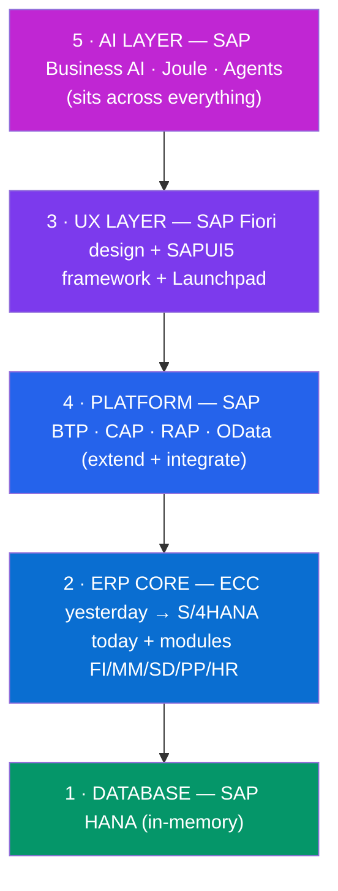

**Keep this picture in your head.** Every acronym you meet from here on is one box (or the wiring between two boxes) in this diagram.

---

# Part B — The History & Evolution

*You cannot understand S/4HANA without knowing what came before it and why it hurt. SAP's whole modern story is "we spent 40 years building a system for slow disk databases, then in-memory computing arrived and we rebuilt everything." This part is that story.*

## B1. The Timeline (R/1 to Autonomous)

**Simple definition:** SAP evolved through clear eras: **R/1** (1973), **R/2** (1979, mainframe), **R/3** (1992, client-server, the classic), **mySAP / ECC** (2004, the Business Suite), **S/4HANA** (2015, in-memory ERP), and now the **Cloud + AI + Agentic** era (2023 onward: Joule, Business AI, Autonomous Enterprise).

<p class="te"><strong>Telugu:</strong> SAP konni eras lo perigindi: <strong>R/1</strong> (1973), <strong>R/2</strong> (1979 mainframe), <strong>R/3</strong> (1992 client-server, classic version), <strong>ECC</strong> (2004 Business Suite), <strong>S/4HANA</strong> (2015 in-memory), ippudu <strong>Cloud + AI + Agentic</strong> era (2023 nundi Joule, Agents). "R" ante <em>Realtime</em>, number ante architecture generation.</p>

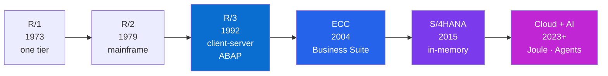

---

## B2. R/1, R/2, R/3 — the Founding Era

**Simple definition:** The **"R"** stands for **Real-time** data processing (revolutionary in the 1970s, when most processing was overnight batch). Each number is a new **architecture generation**. **R/3** (1992) is the legendary one: it moved SAP to **three-tier client-server** and introduced the **ABAP** language — the foundation everything sat on for 20+ years.

<p class="te"><strong>Telugu:</strong> <strong>R = Real-time</strong> — aa rojullo chala computers ratri anta batch lo process chesevi, SAP ventane (real-time) chesindi, adhe pedda innovation. <strong>R/3</strong> (1992) legend — idi <strong>three-tier client-server</strong> ki move ayindi mariyu <strong>ABAP</strong> ane language ni techindi. Ee ABAP meeda 20+ years SAP anta nilichindi.</p>

| Version | Year | Architecture | Why it mattered |
|---|---|---|---|
| **R/1** | 1973 | One tier (all on one machine) | First real-time financial accounting |
| **R/2** | 1979 | Mainframe (two-tier) | Ran big corporations' back offices |
| **R/3** | 1992 | **Three-tier client-server** | The breakthrough; ABAP; ran on many databases; global standard |

**The everyday analogy.** R/2 was a giant single mainframe everyone dialed into (like one huge shared calculator). R/3 split the work into three cooperating tiers — presentation (your screen), application (the logic), database (the storage) — the same shape web apps use today. That flexibility (run on Oracle, DB2, SQL Server, any hardware) made SAP the world standard.

<figure class="fig med">
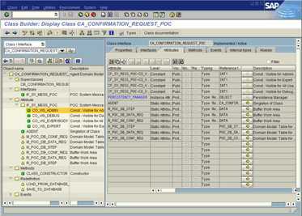
<figcaption>The classic <strong>SAP GUI</strong> (R/3 era, still in ECC): powerful but gray, dense and code-driven — the exact look that <strong>SAP Fiori</strong> (Part G) was created to replace. <span class="fig-credit">Image: Wikimedia Commons.</span></figcaption>
</figure>

---

## B3. mySAP & the Business Suite

**Simple definition:** In the 2000s SAP bundled R/3's successor and its sibling products into the **SAP Business Suite**, whose ERP core was **SAP ERP Central Component — "ECC"** (also called ECC 6.0 / SAP ERP). Around it sat **CRM** (customers), **SRM** (suppliers), **SCM** (supply chain) and **PLM** (product lifecycle). This is the system most companies still run today (support extended to **2027, with an option to 2030**).

<p class="te"><strong>Telugu:</strong> 2000s lo SAP anni products ni kalipi <strong>Business Suite</strong> chesindi, dani heart <strong>ECC</strong> (ECC 6.0). Chuttu <strong>CRM</strong> (customers), <strong>SRM</strong> (suppliers), <strong>SCM</strong> (supply chain), <strong>PLM</strong> (products) unnayi. Ee ECC ni ippatiki chala companies vaadutunnayi — kaani SAP support <strong>2027 (extended 2030)</strong> tho aagipotundi, adhe andaru S/4HANA ki move avvadaniki reason.</p>

**Why "2027" is the single most important date in SAP right now.** SAP announced it will **stop mainstream support for ECC/Business Suite 7 by end of 2027** (extended maintenance to 2030). Thousands of companies *must* migrate to **S/4HANA** before then. That deadline is fueling a global wave of S/4HANA migration projects — a huge chunk of today's SAP jobs. **Your timing is good.**

---

## B4. Why Everything Had to Change

**Simple definition:** ECC was designed for **slow spinning-disk databases**, so decades of clever-but-complex workarounds (aggregate tables, indexes, batch jobs) existed just to make reports fast. When **in-memory computing (HANA)** made data 1000× faster to read, most of that complexity became unnecessary — so SAP rebuilt the ERP core from scratch as **S/4HANA**.

<p class="te"><strong>Telugu:</strong> ECC ni <strong>slow disk databases</strong> kosam design chesaru. Reports fast raavadaniki chala extra tables, indexes, night batch jobs pettaru — chala complex. Taruvata <strong>HANA (in-memory)</strong> vachi data ni 1000x fast chesindi, aa complex workarounds anta avasaram lekunda poyayi. Anduke SAP ERP core ni kottaga <strong>S/4HANA</strong> ga rebuild chesindi.</p>

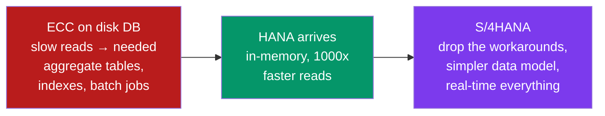

**The one-line summary of SAP's modern era:** *hardware got radically faster, so the software got radically simpler.* Everything — S/4HANA, Fiori, the cloud pivot, even the AI story — flows from that single change.

---

# Part C — ERP Modules & How They Connect

*This is the part most beginners skip and later regret. SAP's power isn't any single module — it's how the modules automatically talk to each other. Learn the modules as characters in one story, not as a list to memorize.*

## C1. What a Module Is

**Simple definition:** A **module** is a functional area of the business that SAP packages as a set of related features, tables and transactions — e.g. **FI** for financial accounting, **MM** for materials/purchasing, **SD** for sales. Modules aren't separate programs; they're **views into the same shared database**, tightly wired together.

<p class="te"><strong>Telugu:</strong> <strong>Module</strong> ante business lo oka functional area ni SAP oka package ga chesindi — FI (finance), MM (materials), SD (sales) lantivi. Ivi separate programs kaadu; anni <strong>oke shared database ni chuse veru veru kitikilu (views)</strong>, wire tho kalipi unnayi. Oka module lo change cheste, related modules ki ventane telustundi.</p>

**React parallel (for you):** think of modules like **feature folders** in a big app (`/finance`, `/sales`, `/inventory`) that all read and write the same central store. Changing a record in one folder instantly updates every screen that reads it — because there's one store, not five.

---

## C2. The Core Modules

**Simple definition:** SAP has dozens of modules, but a handful cover most business processes. Learn these names — they appear in every SAP job description.

<p class="te"><strong>Telugu:</strong> SAP lo chala modules unnayi, kaani konni core modules anni processes cover chestaayi. Kinda table lo unna perlu — <strong>FI, CO, MM, SD, PP, QM, PM, HCM, WM/EWM</strong> — prati SAP job description lo kanipistaayi, anduke baaga gurthupettuko.</p>

| Module | Full name | What it handles | Everyday example |
|---|---|---|---|
| **FI** | Financial Accounting | External books: ledger, payables, receivables | The company's official financial statements |
| **CO** | Controlling | Internal costs & profitability | "Which product line actually makes money?" |
| **MM** | Materials Management | Purchasing, inventory, stock | Reordering raw material, receiving goods |
| **SD** | Sales & Distribution | Orders, deliveries, billing, pricing | Selling to a customer and invoicing them |
| **PP** | Production Planning | Manufacturing, bills of material | Scheduling the factory to build 10,000 units |
| **QM** | Quality Management | Inspections, quality checks | Rejecting a defective batch |
| **PM** | Plant Maintenance | Equipment upkeep | Scheduling a machine service |
| **HCM** | Human Capital Mgmt | Employees, payroll, org | Paying salaries, leave requests |
| **WM / EWM** | (Extended) Warehouse Mgmt | Bin-level warehouse ops | Where exactly in the warehouse a pallet sits |

**Modern note.** In S/4HANA the boundaries between FI and CO merged into the **Universal Journal** (one table, `ACDOCA`, holding all finance+controlling line items). Also, **HCM** is largely replaced by the cloud product **SAP SuccessFactors**, and procurement by **SAP Ariba**. So "modules" today spans both the ERP core and cloud line-of-business (LoB) products.

---

## C3. The Golden Thread — One Business Process Across Modules

**Simple definition:** The classic way to *feel* how modules connect is the **Order-to-Cash** process: a single customer order flows through **SD → MM → FI/CO**, with each module handing off to the next automatically. Its mirror image is **Procure-to-Pay** (buying), flowing **MM → FI**.

<p class="te"><strong>Telugu:</strong> Modules ela connect avutaayo feel avvadaniki best example: <strong>Order-to-Cash</strong>. Oka customer order <strong>SD → MM → FI/CO</strong> gunda automatic ga flow avutundi. Ide reverse ga konugolu anedi <strong>Procure-to-Pay</strong> (<strong>MM → FI</strong>). Ee "golden thread" artham ayite ERP integration anta artham avutundi.</p>

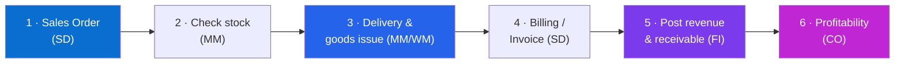

**Why interviewers love this.** If you can narrate Order-to-Cash and Procure-to-Pay across modules, you've proven you understand *integration* — the thing that separates someone who "knows SAP screens" from someone who understands SAP. Memorize the two threads.

<p class="pic"><strong>Picture it:</strong> one customer order is a <strong>baton</strong> passed hand-to-hand — Sales → Materials → Delivery → Billing → Finance — and every department holds the <em>same</em> baton, so nobody re-types anything and finance sees the sale the instant it ships.</p>

**Real example — Procure-to-Pay (buying raw material):**
1. **MM** — Purchase Requisition → Purchase Order to a vendor.
2. **MM** — Goods Receipt when the truck arrives (stock goes up).
3. **FI** — Invoice Receipt creates a payable to the vendor.
4. **FI** — Payment run pays the vendor; cash goes down.
Each step posts to the same ledger, so finance always knows the live cash position.

---

## C4. Master Data vs Transactional Data

**Simple definition:** SAP data splits into **master data** (the relatively stable "nouns" — customers, vendors, materials, employees) and **transactional data** (the "verbs/events" — orders, invoices, goods movements that reference the master data). Getting master data right is 80% of a clean SAP system.

<p class="te"><strong>Telugu:</strong> SAP data rendu rakalu: (1) <strong>Master data</strong> = sthiranga unde "nouns" — customers, vendors, materials, employees (oksari setup cheste chala kaalam undevi). (2) <strong>Transactional data</strong> = jarige "events" — orders, invoices, goods movements (ivi master data ni reference chestaayi). Master data clean ga unte ne system anta clean.</p>

| | Master Data | Transactional Data |
|---|---|---|
| Nature | Stable "who/what" | Event "what happened" |
| Examples | Customer, Vendor, Material, GL account | Sales order, Invoice, Goods movement |
| Changes | Rarely | Constantly |
| Analogy | Contacts in your phone | Your call history |

**Why you'll care as a developer.** Almost every app, OData service, CAP entity or Fiori list you build reads master data to fill dropdowns/valid values and writes transactional data as the user's action. The distinction shapes your data model.

---

# Part D — SAP ECC & the ABAP World

*ECC is the system you'll still meet at most clients (until 2027). Even in a modern S/4HANA/BTP job you must understand the classic backbone: the three-tier architecture, ABAP, and the transport/landscape system that governs how changes move to production.*

## D1. What is ECC

**Simple definition:** **SAP ECC (ERP Central Component)** is the traditional on-premise ERP core (part of the SAP Business Suite, latest version ECC 6.0). It runs the same modules (FI, MM, SD…), is written mostly in **ABAP**, and traditionally ran on **any database** (Oracle, DB2, SQL Server, and later HANA). It's the predecessor S/4HANA replaces.

<p class="te"><strong>Telugu:</strong> <strong>ECC</strong> (ERP Central Component) ante SAP yokka traditional on-premise ERP core — Business Suite lo part, latest ECC 6.0. Adhe modules (FI, MM, SD…) run chestundi, mostly <strong>ABAP</strong> lo raasaru, mariyu edi database meedanna (Oracle, DB2, SQL Server) padedi. S/4HANA ide replace chestundi.</p>

**One-line contrast to remember:** *ECC = classic ERP that runs on any database; S/4HANA = next-gen ERP that runs only on HANA.* Everything else (simpler data model, Fiori-first UX) flows from that.

---

## D2. The 3-Tier Architecture

**Simple definition:** Classic SAP (R/3 through ECC and still S/4HANA on-prem) uses a **three-tier architecture**: **Presentation** (the UI — SAP GUI or now Fiori in the browser), **Application** (the server that runs ABAP business logic, called the *NetWeaver AS ABAP*), and **Database** (where data lives). Scaling means adding more application servers.

<p class="te"><strong>Telugu:</strong> Classic SAP <strong>3-tier architecture</strong> vaadutundi: (1) <strong>Presentation</strong> = screen (paata SAP GUI, ippudu browser lo Fiori), (2) <strong>Application</strong> = ABAP logic run chese server (NetWeaver AS ABAP), (3) <strong>Database</strong> = data store. Load ekkuvaite marenni application servers add chestaaru. Ee 3 layers — React lo frontend / backend / DB laaganE.</p>

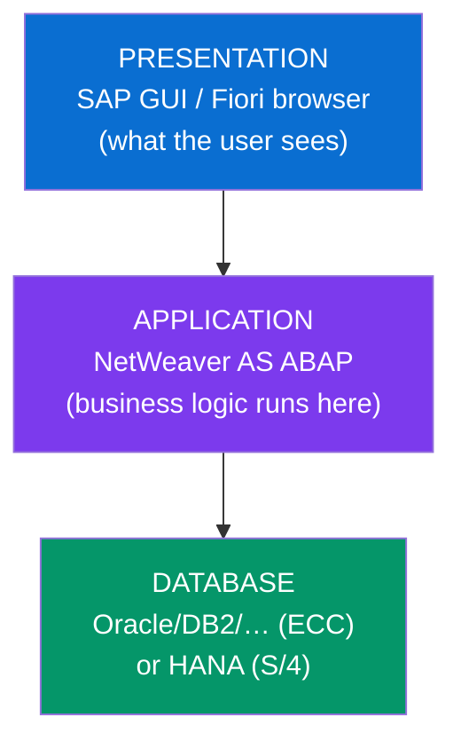

**Web-dev parallel:** presentation = frontend, application server = your Node/Java backend, database = your DB. SAP formalized this split decades before "3-tier web app" was a phrase.

---

## D3. ABAP — the Classic Language

**Simple definition:** **ABAP (Advanced Business Application Programming)** is SAP's own programming language — the language ECC and much of S/4HANA's backend logic is written in. It's a strongly-typed, database-centric language (built-in SQL called *Open SQL*), runs inside the SAP application server, and is the classic SAP developer's core skill.

<p class="te"><strong>Telugu:</strong> <strong>ABAP</strong> ante SAP sontha programming language — ECC mariyu S/4HANA backend logic ide lo raasaru. Idi strongly-typed, database-centric (built-in SQL = <em>Open SQL</em>), SAP application server lopala run avutundi. Classic SAP developer ki ABAP core skill — kaani ippudu modern side lo CAP (Node/Java) kooda vachindi.</p>

```abap
" A tiny ABAP snippet: read customers into a table and loop
DATA lt_customers TYPE TABLE OF kna1.

SELECT kunnr, name1
  FROM kna1
  INTO CORRESPONDING FIELDS OF TABLE @lt_customers
  WHERE land1 = 'IN'.          " customers in India

LOOP AT lt_customers INTO DATA(ls_cust).
  WRITE: / ls_cust-kunnr, ls_cust-name1.
ENDLOOP.
```

**JS parallel:** ABAP is verbose and enterprise-flavored (think old-school Java-meets-SQL), but the ideas map: variables, loops, functions (*forms/methods*), and inline SQL. Modern ABAP even added `@` inline declarations and objects, and the **RAP** model (Part K) makes ABAP produce OData services and Fiori apps — so ABAP is very much alive in S/4HANA.

---

## D4. Clients, Transports & System Landscape

**Simple definition:** Two SAP-specific concepts every developer must know. A **client** is an isolated tenant *inside* one SAP system (identified by a 3-digit number like `100`) with its own data. A **transport** is the packaged unit of changes that moves your development from the **DEV → QA → PROD** systems (the "system landscape") in a controlled, auditable way.

<p class="te"><strong>Telugu:</strong> Rendu SAP-special concepts: (1) <strong>Client</strong> = oke SAP system lopala isolated tenant (3-digit number, e.g. 100), sontha data tho. (2) <strong>Transport</strong> = nee code/config changes ni oka package ga <strong>DEV → QA → PROD</strong> systems gunda move chese controlled unit. Git lo commit/PR/deploy laaga — kaani SAP style lo, full audit trail tho.</p>

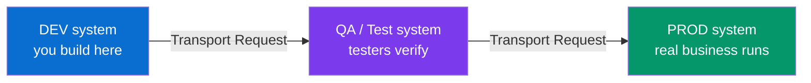

**Git parallel:** a transport is roughly a **commit + PR that promotes across environments**. DEV→QA→PROD is your dev→staging→production pipeline, but SAP enforces it at the system level with change records and approvals. Never edit PROD directly — the same rule you already live by.

---

# Part E — SAP HANA (the Engine That Changed Everything)

*HANA is the hinge the whole modern SAP story turns on. It's not a module or an app — it's a database that is so much faster than the old ones that SAP could rebuild its entire ERP around it. Understand HANA and you understand why S/4HANA exists.*

## E1. What is HANA

**Simple definition:** **SAP HANA (High-performance ANalytic Appliance)** is SAP's **in-memory, columnar database**. It keeps the whole dataset in **RAM** (not on slow disk) and stores data by **columns** (not rows), which together make analytical reads staggeringly fast — and let one system do both transactions and analytics at once (**HTAP**).

<p class="te"><strong>Telugu:</strong> <strong>SAP HANA</strong> ante SAP yokka <strong>in-memory, columnar database</strong>. Data anta <strong>RAM</strong> lo unchutundi (slow disk lo kaadu) mariyu <strong>columns</strong> ga store chestundi (rows kaadu). Ee rendu kalisi reports ni chala fast chestaayi — mariyu oke system lo transactions + analytics rendu okesari cheyochu (HTAP). Ide modern SAP ki foundation.</p>

**Name note.** People say "HANA" for the database, "S/4HANA" for the ERP that runs on it. Don't mix them: **HANA = the database engine; S/4HANA = the application that sits on HANA.**

---

## E2. In-Memory & Columnar — Why It's Fast

**Simple definition:** Two ideas stacked. **In-memory:** RAM is ~10,000× faster to access than a spinning disk, so keeping data in RAM removes the biggest bottleneck. **Columnar:** storing each column together means a query that sums one column (e.g. total sales) reads only that column, not every full row — and columns compress extremely well, so more fits in RAM.

<p class="te"><strong>Telugu:</strong> Rendu ideas: (1) <strong>In-memory</strong> — RAM disk kante chala (~10,000x) fast, anduke data anta RAM lo pedite speed peragutundi. (2) <strong>Columnar</strong> — data ni column-wise store cheste, "total sales" lanti query oke column ni chaduvutundi, prati full row kaadu; mariyu columns baaga compress avutaayi, ekkuva data RAM lo padutundi.</p>

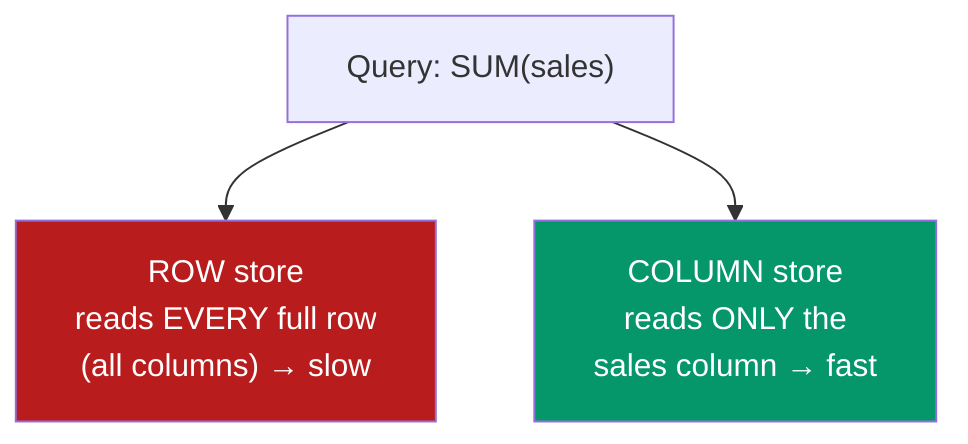

**Everyday analogy.** Row storage is a filing cabinet where each folder holds one customer's *entire* record; to total everyone's sales you open every folder. Column storage keeps all the "sales" numbers on one single sheet — you read one sheet and you're done.

---

## E3. HANA vs a Normal Database

**Simple definition:** Compared to a traditional row-based disk database (Oracle, MySQL, SQL Server), HANA trades cheap disk for expensive RAM to gain enormous speed, merges the separate "operational DB + reporting warehouse" into **one** system, and pushes calculations *into* the database (so the app server does less).

<p class="te"><strong>Telugu:</strong> Normal database (Oracle, MySQL) tho compare cheste — HANA cheap disk badulu costly RAM vaadi pedda speed sampadistundi, "operational DB + separate reporting warehouse" ni <strong>oke system</strong> lo kalupytundi, mariyu calculations ni database <em>lopalE</em> chestundi (app server load thaggutundi). Cost ekkuva kaani speed + simplicity chala ekkuva.</p>

| | Traditional DB (row, disk) | SAP HANA (column, in-memory) |
|---|---|---|
| Storage | Disk | RAM (with disk persistence for safety) |
| Layout | Row-based | Columnar (+ optional row) |
| Analytics | Needs a separate data warehouse | Same system does OLTP + OLAP (HTAP) |
| Aggregate tables | Many, to fake speed | Mostly gone — compute live |
| Cost | Cheaper hardware | Pricier RAM, but far faster |

**The payoff that created S/4HANA.** Because HANA computes totals live, SAP could **delete thousands of pre-aggregated tables and indexes** from the ERP. That radical simplification of the data model *is* the technical core of S/4HANA (next part).

---

# Part F — SAP S/4HANA (Modern ERP)

*This is the product at the center of your career target. S/4HANA is the modern re-write of SAP's ERP: same business purpose as ECC, but a simplified data model, a Fiori-first UX, and built exclusively for HANA. Most SAP jobs 2025–2030 revolve around it.*

## F1. What is S/4HANA

**Simple definition:** **SAP S/4HANA** is SAP's current-generation ERP suite — "**S**AP Business Suite **4** SAP **HANA**." It runs *only* on the HANA database, has a dramatically **simplified data model** (e.g. the Universal Journal), a **Fiori-first** user experience, and is delivered both **on-premise/private cloud** and as a **public-cloud SaaS**.

<p class="te"><strong>Telugu:</strong> <strong>S/4HANA</strong> ante SAP yokka ippati-generation ERP — "SAP Business Suite 4 HANA." Idi <strong>only HANA</strong> meeda run avutundi, chala <strong>simplified data model</strong> (e.g. Universal Journal — finance anta oke table), <strong>Fiori-first</strong> UX, mariyu <strong>on-premise/private cloud</strong> + <strong>public cloud SaaS</strong> rendu ga vastundi. ECC yokka modern rebuild ani gurthupettuko.</p>

**Reading the name aloud once fixes it:** *S(uite) 4(for) HANA.* The "4" is the version-and-pun; it is not "S-slash-4."

---

## F2. What Actually Changed vs ECC

**Simple definition:** S/4HANA keeps the business processes but overhauls the plumbing: **simplified tables** (thousands of aggregate/index tables removed), the **Universal Journal** (`ACDOCA` merges FI+CO), **Fiori** as the primary UX (SAP GUI becomes secondary), embedded **analytics** on live data, and readiness for **cloud + AI**.

<p class="te"><strong>Telugu:</strong> S/4HANA business processes ni unchutundi kaani lopala plumbing anta marustundi: (1) <strong>simplified tables</strong> (chala aggregate/index tables teesesaru), (2) <strong>Universal Journal</strong> (ACDOCA — FI+CO oke table lo), (3) <strong>Fiori</strong> primary UX (SAP GUI secondary), (4) live data meeda <strong>embedded analytics</strong>, (5) <strong>cloud + AI</strong> ready. Business same, insides kotta.</p>

| Aspect | ECC | S/4HANA |
|---|---|---|
| Database | Any (Oracle, DB2, HANA…) | **HANA only** |
| Finance data | FI tables + CO tables + aggregates | **Universal Journal** (`ACDOCA`, one line-item table) |
| UX | SAP GUI (transaction codes) | **Fiori** apps first |
| Analytics | Separate BW warehouse | **Embedded**, on live data |
| Custom code | Free-for-all modifications | **Clean core** — extend on the side (Part L) |
| Data footprint | Large, redundant | Much smaller, simplified |

<div class="ba">
  <div class="ba-col ba-before"><h4>ECC — classic</h4><ul><li>Runs on any database</li><li>1000s of aggregate/index tables</li><li>SAP GUI + transaction codes</li><li>Separate BW system for analytics</li><li>Core modified freely (hard upgrades)</li></ul></div>
  <div class="ba-col ba-after"><h4>S/4HANA — modern</h4><ul><li>HANA only, in-memory</li><li>Simplified: Universal Journal (ACDOCA)</li><li>Fiori apps first</li><li>Embedded analytics on live data</li><li>Clean core — extend on the side</li></ul></div>
</div>

**Concrete example.** In ECC, checking a customer's total open balance might read several aggregate tables kept in sync by batch jobs. In S/4HANA, HANA sums the raw `ACDOCA` line items **live** — the aggregate tables simply don't exist anymore. Faster, simpler, always current.

---

## F3. Deployment Options

**Simple definition:** S/4HANA comes in three main flavors: **On-Premise** (you run it in your own data center, full control, you patch it), **Private Cloud** (SAP-managed single-tenant, highly customizable — sold as **RISE with SAP**), and **Public Cloud** (multi-tenant SaaS, standardized, auto-updated — sold as **GROW with SAP**).

<p class="te"><strong>Telugu:</strong> S/4HANA moodu flavors lo vastundi: (1) <strong>On-Premise</strong> — nee sontha data center, full control, nuvve maintain chestaavu. (2) <strong>Private Cloud</strong> — SAP manage chestundi, single-tenant, ekkuva customization (ide <strong>RISE with SAP</strong>). (3) <strong>Public Cloud</strong> — multi-tenant SaaS, standardized, auto-update (ide <strong>GROW with SAP</strong>). Part M lo RISE vs GROW detail lo undi.</p>

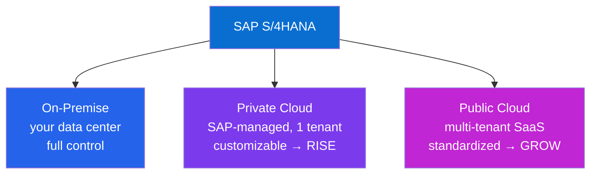

**The trend to know for interviews.** SAP is pushing hard toward the **cloud** (private and public). New innovations, and especially the **AI/Joule** features, land in the cloud editions first. "Cloud ERP" is the direction of the entire company.

---

## F4. Migration — Greenfield, Brownfield, Bluefield

**Simple definition:** Moving from ECC to S/4HANA happens three ways: **Greenfield** (brand-new clean implementation, redesign processes), **Brownfield** (technical system conversion — bring the existing system and its history across), and **Bluefield/selective** (a hybrid — new system but migrate selected data/processes).

<p class="te"><strong>Telugu:</strong> ECC nundi S/4HANA ki move moodu vidhaalaga: (1) <strong>Greenfield</strong> — kottaga, fresh ga, processes redesign chesi (clean start). (2) <strong>Brownfield</strong> — unna system ne technical ga convert cheyadam (history tho saha). (3) <strong>Bluefield/selective</strong> — rendinti mix (kotta system kaani select chesina data/processes migrate). Migration projects ippudu pedda demand — 2027 deadline valla.</p>

| Approach | What it is | Best when |
|---|---|---|
| **Greenfield** | New build, redesign processes | Old system is messy; want a fresh, clean-core start |
| **Brownfield** | Convert existing system in place | Processes are fine; want to preserve history & customizations |
| **Bluefield** | Selective/hybrid data transformation | Want a new model but keep chosen data |

**Why this is a jobs goldmine.** With ECC support ending 2027, thousands of companies are running exactly these projects right now. "S/4HANA migration/conversion" experience is one of the most bankable lines on an SAP résumé.

---

# Part G — SAP Fiori (the Face)

*You have a full separate guide on Fiori & UI5. This part places it in the big picture — how the pretty screen relates to everything underneath — so the two documents lock together.*

## G1. Where Fiori Fits in the Big Picture

**Simple definition:** **Fiori** is the **UX layer** — the design language, and **SAPUI5** the JavaScript framework, that produce the modern browser-based apps sitting on top of S/4HANA. Fiori is the *face*; S/4HANA is the *brain*; OData is the *nervous system* carrying data between them.

<p class="te"><strong>Telugu:</strong> <strong>Fiori</strong> ante <strong>UX layer</strong> — design language, mariyu <strong>SAPUI5</strong> aa JavaScript framework — S/4HANA meeda koorchune modern browser apps ni tayaru chestaayi. Fiori = <em>mokham</em> (face), S/4HANA = <em>medadu</em> (brain), OData = madhya data mose <em>naralu</em> (nerves). Detail Fiori/UI5 notes lo undi — ikkada just big picture lo place chestunnam.</p>

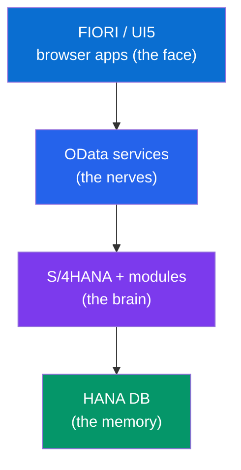

<div class="ba">
  <div class="ba-col ba-before"><h4>Before — old SAP GUI</h4><ul><li>Gray, dense forms</li><li>Cryptic codes (VA01, ME21N)</li><li>Needs a training course</li><li>Desktop only</li></ul></div>
  <div class="ba-col ba-after"><h4>After — SAP Fiori</h4><ul><li>Clean, role-based tiles</li><li>One task, done well</li><li>Usable with no training</li><li>Phone → tablet → desktop</li></ul></div>
</div>

**Cross-reference.** Everything about views, controllers, models, binding, routing and Fiori Elements lives in your **SAP Fiori & UI5 — Basics to Advanced** notes. This guide only needs you to remember: *Fiori is one layer of five, and it talks to the backend through OData.*

---

## G2. The Launchpad as the Front Door

**Simple definition:** The **SAP Fiori Launchpad (FLP)** is the single web home screen — a grid of **tiles** — that an employee logs into. Each tile launches a Fiori app. Which tiles you see depends on your **role**. It's the "desktop" that unifies dozens of apps behind one login, one theme, one search.

<p class="te"><strong>Telugu:</strong> <strong>Fiori Launchpad (FLP)</strong> ante employee login ayye single web home screen — <strong>tiles</strong> grid. Prati tile oka Fiori app open chestundi. Nee <strong>role</strong> batti edi tiles kanipistaayo decide avutundi (role-based). Anni apps ni oke login, oke theme, oke search kinda teesukoche "desktop." Ide employees ki SAP yokka front door.</p>

<figure class="fig">
<div class="flp">
  <div class="flp-bar"><span>🏠 Home ▾</span><span class="flp-search">🔍 Search apps…</span><span>👤</span></div>
  <div class="flp-body">
    <div class="flp-grp">My Work</div>
    <div class="flp-grid">
      <div class="tile"><span class="t-ic">📥</span><span>My Inbox<br/>approvals</span><b>12</b></div>
      <div class="tile kpi-amber"><span class="t-ic">🧾</span><span>Approve Purchase Orders</span><b>5</b></div>
      <div class="tile"><span class="t-ic">📝</span><span>Create Sales Order</span><span>&nbsp;</span></div>
      <div class="tile kpi-green"><span class="t-ic">📦</span><span>Track Deliveries</span><b>98%</b></div>
    </div>
  </div>
</div>
<figcaption>The <strong>SAP Fiori Launchpad</strong> — a role-based grid of tiles is the employee's home screen (custom mockup in Fiori's colours). This is the "after" to the old SAP GUI shown in Part B.</figcaption>
</figure>

**Real-world feel.** Log into a modern SAP company and you don't type transaction codes — you see a phone-like grid of tiles: "My Leave Requests," "Approve Purchase Orders," "Sales Pipeline." That's the Launchpad, and increasingly it also hosts the **Joule** assistant button (Part N) so you can just *ask* instead of hunting for a tile.

---

# Part H — OData (the Language Between Front and Back)

*OData is the single most important integration concept to carry between your Fiori notes and this one. It is the standard way SAP frontends, extensions and external systems read and write ERP data. Everything connected in Part L is connected by OData.*

## H1. What is OData

**Simple definition:** **OData (Open Data Protocol)** is a REST-based standard for building and consuming data APIs. An OData **service** exposes business data (entities like Products, Orders) over HTTP with a **self-describing metadata document**, so any client can discover what's available and do CRUD with predictable URLs and query options (`$filter`, `$expand`, `$select`).

<p class="te"><strong>Telugu:</strong> <strong>OData</strong> (Open Data Protocol) ante REST meeda built oka standard — data APIs kattadaniki + vaadadaniki. OData <strong>service</strong> business data ni (Products, Orders lanti <strong>entities</strong>) HTTP meeda expose chestundi, mariyu oka <strong>self-describing metadata</strong> istundi — client "edi data undi, edi fields unnayi" telusukoni predictable URLs tho CRUD cheyochu. REST + built-in query language ani anuko.</p>

```
GET  /sap/opu/odata/sap/ZPRODUCTS_SRV/Products?$filter=Price gt 100&$select=Name,Price
     → JSON list of products over 100, only Name + Price fields
POST /sap/opu/odata/sap/ZPRODUCTS_SRV/Products    { "Name":"Widget", "Price":50 }
     → creates a new product
```

**Why SAP standardized on it.** One protocol lets Fiori apps, Excel, mobile apps, external partners and AI agents all talk to SAP the same way — with querying, paging and metadata built in, so you don't reinvent an API style per app.

---

## H2. V2 vs V4

**Simple definition:** Two versions coexist. **OData V2** is older, still everywhere in existing Fiori apps and ECC/Gateway services. **OData V4** is the modern, leaner, more powerful version (better performance, richer queries) and is the standard for **new** S/4HANA, CAP and RAP development.

<p class="te"><strong>Telugu:</strong> Rendu versions unnayi: <strong>OData V2</strong> — paatadi, ippatiki chala Fiori apps + ECC lo undi. <strong>OData V4</strong> — modern, leaner, ekkuva powerful (better performance, richer queries) — kotta S/4HANA, CAP, RAP development ki ide standard. Interview lo: "kotta projects V4, legacy V2" ani cheppu.</p>

| | OData V2 | OData V4 |
|---|---|---|
| Age | Older, ubiquitous | Modern standard |
| Used by | Many existing Fiori apps, ECC Gateway | New S/4HANA, CAP, RAP |
| Performance | Chattier | Leaner, batched, faster |
| Direction | Legacy/maintenance | What you build new in |

---

## H3. OData as the Universal Connector

**Simple definition:** OData is the **contract** in the middle of SAP's architecture. The backend (S/4HANA via RAP, or BTP via CAP) **produces** OData services; the frontend (Fiori/UI5) and other consumers (mobile, agents, integrations) **consume** them. Learn OData well and you understand how every layer talks.

<p class="te"><strong>Telugu:</strong> OData anedi SAP architecture madhya lo unde <strong>contract</strong>. Backend (S/4HANA lo RAP, leda BTP lo CAP) OData services ni <strong>produce</strong> chestundi; frontend (Fiori/UI5) mariyu migta consumers (mobile, agents, integrations) vaatini <strong>consume</strong> chestaayi. OData baaga nerchukunte prati layer ela maatladukuntundo artham avutundi. Ide glue.</p>

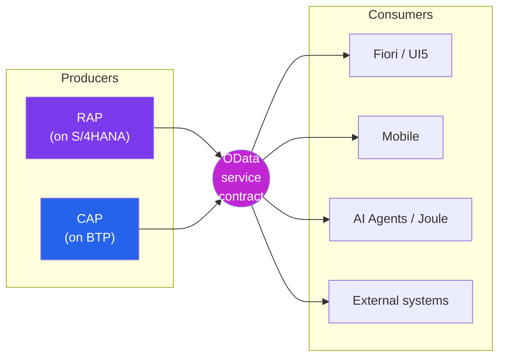

---

# Part I — SAP BTP (the Platform)

*BTP is where all the "new SAP" happens: custom apps, integrations, analytics and AI — built beside the ERP without touching it. If S/4HANA is the engine, BTP is the workshop next door where you build add-ons and wire systems together.*

## I1. What is BTP

**Simple definition:** **SAP BTP (Business Technology Platform)** is SAP's cloud **Platform-as-a-Service** — a single environment bringing together **application development**, **integration**, **data & analytics**, and **AI** services. It's where you build **extensions** and **side-by-side apps** that work *with* S/4HANA without modifying the core.

<p class="te"><strong>Telugu:</strong> <strong>SAP BTP</strong> (Business Technology Platform) ante SAP yokka cloud <strong>Platform-as-a-Service</strong> — <strong>app development</strong>, <strong>integration</strong>, <strong>data & analytics</strong>, <strong>AI</strong> — anni oke chota. Ikkade nuvvu <strong>extensions</strong> + <strong>side-by-side apps</strong> kattutaavu, S/4HANA core ni taakakunda. S/4HANA = engine ayite, BTP = pakkana workshop.</p>

**The mindset shift — "keep the core clean."** Old SAP: developers modified the ERP directly (risky, breaks upgrades). Modern SAP: you build on **BTP** and connect via OData/APIs, so upgrades stay painless. This is the **clean core** philosophy (Part L2) and BTP is the place it happens.

---

## I2. The Four Pillars

**Simple definition:** BTP is usually described as four capability areas: **Application Development & Automation** (build apps, workflows — CAP, SAP Build), **Integration** (connect systems — Integration Suite), **Data & Analytics** (SAP Datasphere, SAC), and **Artificial Intelligence** (AI Foundation, Generative AI Hub, Joule).

<p class="te"><strong>Telugu:</strong> BTP ni <strong>4 pillars</strong> ga cheptaaru: (1) <strong>App Dev & Automation</strong> — apps + workflows kattadam (CAP, SAP Build), (2) <strong>Integration</strong> — systems ni connect cheyadam (Integration Suite), (3) <strong>Data & Analytics</strong> — Datasphere, SAC, (4) <strong>AI</strong> — AI Foundation, Generative AI Hub, Joule. Ee 4 nee SAP developer toolbox.</p>

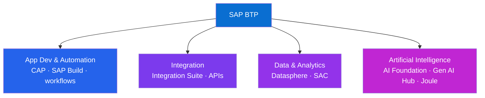

---

## I3. Cloud Foundry vs ABAP vs Kyma

**Simple definition:** BTP offers three **runtime environments** to run your code: **Cloud Foundry** (the main one — run Node.js/Java/Python apps, where CAP typically lives), **ABAP Environment** ("Steampunk" — run ABAP/RAP in the cloud), and **Kyma** (a managed Kubernetes for containerized/microservice workloads).

<p class="te"><strong>Telugu:</strong> BTP lo nee code run cheyadaniki moodu <strong>runtimes</strong>: (1) <strong>Cloud Foundry</strong> — main one, Node/Java/Python apps (CAP ikkade undi), (2) <strong>ABAP Environment</strong> ("Steampunk") — cloud lo ABAP/RAP run cheyadam, (3) <strong>Kyma</strong> — managed Kubernetes, containers/microservices ki. Nee background (JS/Node) valla <strong>Cloud Foundry + CAP</strong> neeku most natural.</p>

| Runtime | Run what | Your fit |
|---|---|---|
| **Cloud Foundry** | Node.js / Java / Python — **CAP** apps | ✅ Best match for your JS/Node roadmap |
| **ABAP Environment** ("Steampunk") | Cloud ABAP + **RAP** | For classic ABAP devs going cloud |
| **Kyma** | Containers / Kubernetes / microservices | For container-native teams |

**Your path.** Because your roadmap is Web Dev → JS/Node → React, the **Cloud Foundry + CAP (Node.js)** lane on BTP is your natural entry into SAP backend development — you'll write JavaScript, not ABAP, to build OData services.

---

# Part J — CAP (Cloud Application Programming Model)

*This is likely YOUR backend home in SAP — CAP lets you build enterprise OData services in Node.js (or Java). It's the SAP-flavored equivalent of Express + an ORM + auto-generated APIs, and it's where your JavaScript skills convert directly into SAP employability.*

## J1. What is CAP

**Simple definition:** **CAP (SAP Cloud Application Programming Model)** is a framework for building business services and apps on BTP. You describe your data and services declaratively in **CDS**, and CAP **auto-generates** a full **OData** service (with database, CRUD handlers, validation) — in **Node.js** or **Java**. You only write custom logic where needed.

<p class="te"><strong>Telugu:</strong> <strong>CAP</strong> ante BTP meeda business services + apps katte framework. Nuvvu data + services ni <strong>CDS</strong> lo declaratively cheptaavu, CAP dani nundi full <strong>OData</strong> service ni <strong>auto-generate</strong> chestundi (database, CRUD, validation anta) — <strong>Node.js</strong> leda <strong>Java</strong> lo. Custom logic avasaramaina chote raastaavu. Nee JS skills ikkade directly SAP job ga marutaayi.</p>

**Why this is your golden door.** Everything you learn in Phases 4–7 (JavaScript, Node) plugs straight into CAP. You define a schema, run one command, and you have a production-style OData API a Fiori app can consume — no ABAP required. CAP is SAP saying "web developers, come build on us in the language you already know."

---

## J2. CDS — the Heart of CAP

**Simple definition:** **CDS (Core Data Services)** is a declarative language to define your **data model** (entities, fields, associations) and **service interfaces** in compact `.cds` files. From one CDS definition, CAP generates database tables *and* the OData service. CDS is used in both CAP and (a variant of) RAP — so it's a concept worth owning.

<p class="te"><strong>Telugu:</strong> <strong>CDS</strong> (Core Data Services) ante nee <strong>data model</strong> (entities, fields, associations) mariyu <strong>service interfaces</strong> ni compact <code>.cds</code> files lo declaratively raase language. Oke CDS definition nundi CAP database tables + OData service rendu generate chestundi. CDS ni CAP mariyu RAP rendintilo vaadataaru — anduke idi own cheyaalsina concept.</p>

```cds
// db/schema.cds — define the data model once
namespace my.bookshop;

entity Books {
  key ID    : Integer;
  title     : String(111);
  stock     : Integer;
  author    : Association to Authors;   // relationship
}

entity Authors {
  key ID : Integer;
  name   : String(111);
  books  : Association to many Books on books.author = $self;
}
```

```cds
// srv/cat-service.cds — expose them as an OData service
using my.bookshop from '../db/schema';

service CatalogService {
  entity Books   as projection on bookshop.Books;
  entity Authors as projection on bookshop.Authors;
}
```

**What you get for free.** From those two tiny files, CAP gives you a running OData V4 service with full CRUD, `$filter`/`$expand`, pagination and a database schema. That is the productivity leap that makes CAP attractive — and it maps directly onto the "define a model, get an API" instinct you already have from web dev.

---

## J3. A Minimal CAP App

**Simple definition:** A CAP project is a Node.js app with `db/` (CDS data model), `srv/` (CDS services + optional JS handlers), and a `package.json`. You scaffold with the `cds` CLI, add custom logic in a `.js` file next to the service, and run it locally — exactly the mental model of an Express project with superpowers.

<p class="te"><strong>Telugu:</strong> CAP project oka Node.js app: <code>db/</code> (CDS model), <code>srv/</code> (CDS services + optional JS handlers), <code>package.json</code>. <code>cds</code> CLI tho scaffold chestaavu, custom logic ni service pakkana <code>.js</code> file lo raastaavu, local ga run chestaavu. Express project laaganE — kaani built-in OData + DB superpowers tho.</p>

```javascript
// srv/cat-service.js — custom logic, just like an Express route handler
module.exports = (srv) => {
  // run extra logic before a Book is created
  srv.before('CREATE', 'Books', (req) => {
    if (req.data.stock < 0) {
      req.error(400, 'Stock cannot be negative');   // validation
    }
  });

  // a custom action
  srv.on('READ', 'Books', async (req, next) => {
    const books = await next();     // default read
    return books;                    // could enrich here
  });
};
```

```bash
npm install -g @sap/cds-dk     # the CAP CLI
cds init bookshop              # scaffold
cds watch                      # run locally, live-reload, OData at /odata/v4/...
```

**JS parallel.** `srv.before('CREATE', ...)` is a middleware/hook; `cds watch` is your `nodemon`. If you're comfortable with Express middleware and an ORM, CAP will feel like home within a day.

---

## J4. CAP vs Node/Express

**Simple definition:** CAP is Node/Express-shaped but opinionated for enterprise: you get **OData, a data model layer, database portability, auth, and draft handling out of the box**, whereas with Express you assemble those from libraries yourself. CAP trades some freedom for a huge amount of built-in business-app plumbing.

<p class="te"><strong>Telugu:</strong> CAP anedi Node/Express laaganE kaani enterprise kosam opinionated: <strong>OData, data model layer, database portability, auth, draft handling</strong> — anni built-in vastaayi. Express lo ivi nuvve libraries tho kalupukovali. CAP konta freedom vadili, chala business-app plumbing ni free ga istundi. Enterprise ki ide win.</p>

| | Express (plain Node) | SAP CAP |
|---|---|---|
| API style | You design it | **OData** by default (standard) |
| Data layer | Pick an ORM | **CDS** built in |
| Validation/auth | Add libraries | Declarative, built in |
| Database | You wire it | Portable (SQLite dev → HANA prod) |
| Best for | Anything | Enterprise business services on SAP |

**Takeaway.** Keep your Express/Node skills sharp — CAP *is* those skills, aimed at SAP. This is the single most direct bridge from your web-dev background into a paid SAP role.

---

# Part K — RAP (ABAP RESTful Application Programming Model)

*RAP is CAP's twin on the ABAP side. Where CAP builds OData services in Node/Java on BTP, RAP builds them in modern ABAP right inside S/4HANA. You should recognize it and know when each is used — even if CAP is your day-to-day.*

## K1. What is RAP

**Simple definition:** **RAP (ABAP RESTful Application Programming Model)** is the modern way to build **OData services and Fiori apps in ABAP**, running inside S/4HANA (or the BTP ABAP Environment). It's SAP's answer to "how do classic ABAP developers build clean, cloud-ready, Fiori-first apps" — the successor to older ABAP UI programming.

<p class="te"><strong>Telugu:</strong> <strong>RAP</strong> (ABAP RESTful Application Programming Model) ante modern ABAP lo <strong>OData services + Fiori apps</strong> katte vidhaanam, S/4HANA lopala (leda BTP ABAP Environment lo) run avutundi. Classic ABAP developers ki "clean, cloud-ready, Fiori-first apps ela kattaali" ane daaniki SAP answer. CAP yokka ABAP twin ani anuko.</p>

**One clean sentence for interviews:** *CAP builds OData services in Node/Java on BTP; RAP builds OData services in ABAP inside S/4HANA. Both output OData V4 that Fiori consumes.* Same destination, different language and location.

---

## K2. The RAP Building Blocks

**Simple definition:** A RAP service is built in layers: a **CDS data model** (the tables/views), a **behavior definition** (what CRUD/actions are allowed and their logic), a **service definition** (what to expose), and a **service binding** (publish it as OData V2/V4). Fiori Elements then renders a UI from it — often with almost no UI code.

<p class="te"><strong>Telugu:</strong> RAP service layers lo untundi: (1) <strong>CDS data model</strong> — tables/views, (2) <strong>behavior definition</strong> — edi CRUD/actions allowed + logic, (3) <strong>service definition</strong> — edi expose cheyaali, (4) <strong>service binding</strong> — OData V2/V4 ga publish. Taruvata <strong>Fiori Elements</strong> dani nundi UI generate chestundi — chala takkuva UI code tho.</p>

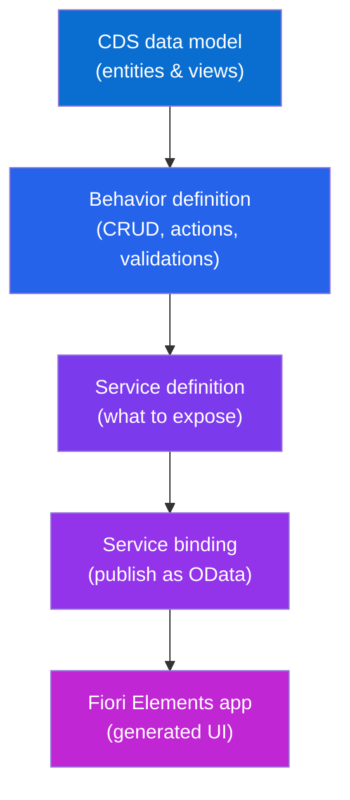

**Notice the shared vocabulary.** Both CAP and RAP start from a **CDS** model and end in an **OData** service consumed by **Fiori**. That shared spine — CDS → OData → Fiori — is the unifying idea of modern SAP development, whichever language you pick.

---

## K3. CAP vs RAP — When to Use Which

**Simple definition:** Use **RAP** when you're extending S/4HANA *in the core* with ABAP skills and the data lives in S/4HANA. Use **CAP** when you're building *side-by-side* apps on BTP, especially with Node.js/Java skills, or integrating multiple systems. Many landscapes use both.

<p class="te"><strong>Telugu:</strong> <strong>RAP</strong> — S/4HANA ni <em>core lo</em> ABAP tho extend chestunnappudu, data S/4HANA lo unnappudu. <strong>CAP</strong> — BTP meeda <em>side-by-side</em> apps kattetappudu, mukhyanga Node/Java tho, leda chala systems integrate chestunnappudu. Chala companies rendu vaadataayi. Neeku Node background valla <strong>CAP</strong> entry point.</p>

| | RAP | CAP |
|---|---|---|
| Language | ABAP | Node.js / Java |
| Runs in | S/4HANA / BTP ABAP env | BTP (Cloud Foundry / Kyma) |
| Best for | In-core S/4HANA extensions | Side-by-side apps, integrations, greenfield cloud |
| Output | OData → Fiori | OData → Fiori |
| Your fit | Later, if you learn ABAP | ✅ Now, via your JS/Node skills |

---

# Part L — The Connected Picture

*This is the payoff part — the reason the request said "S/4HANA, Fiori, BTP, CAP, RAP, OData connected." Individually they're acronyms; together they're one coherent machine. Here's the wiring diagram of modern SAP, followed by a single request traced end to end.*

## L1. How S/4HANA + Fiori + OData + BTP + CAP + RAP Click Together

**Simple definition:** They form a stack. **HANA** stores data. **S/4HANA** runs business logic on it and exposes data via **RAP → OData**. **Fiori/UI5** apps consume that OData to render screens. **BTP** sits beside S/4HANA hosting **CAP** apps (also exposing OData) and integrations — so custom features live outside the core. **OData** is the shared contract linking every arrow.

<p class="te"><strong>Telugu:</strong> Ivi anni oka <strong>stack</strong>. <strong>HANA</strong> data store chestundi. <strong>S/4HANA</strong> dani meeda business logic run chesi <strong>RAP → OData</strong> ga data expose chestundi. <strong>Fiori/UI5</strong> aa OData ni consume chesi screens choopistundi. <strong>BTP</strong> pakkana undi <strong>CAP</strong> apps + integrations host chestundi (avi kooda OData istaayi) — custom features core bayata untaayi. Prati arrow ni kalipedi <strong>OData</strong>. Ide full picture.</p>

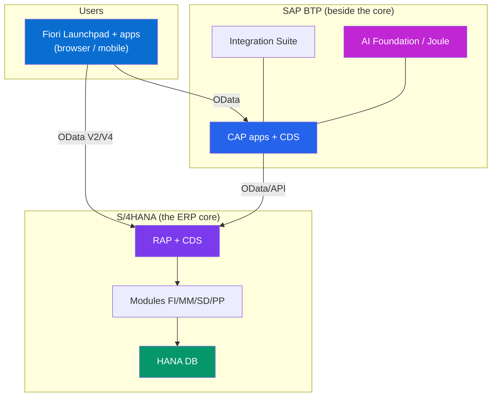

**Read the diagram as one sentence.** *Users open Fiori apps → which call OData services → produced by RAP inside S/4HANA (on HANA) or by CAP on BTP → and BTP's integration and AI services enrich it all — every connection speaking OData.*

---

## L2. The Extension Story — Clean Core

**Simple definition:** **Clean core** is the modern rule: **don't modify the S/4HANA core**; instead extend it in released, upgrade-safe ways — small **in-app** extensions (key user tools) for simple needs, and **side-by-side** extensions on **BTP** (via CAP) for bigger custom apps, all connected through released **OData/APIs**. This keeps upgrades cheap and the system cloud-ready.

<p class="te"><strong>Telugu:</strong> <strong>Clean core</strong> ante modern rule: <strong>S/4HANA core ni modify cheyoddu</strong>; badulu upgrade-safe methods lo extend cheyi — chinna avasaraalaku <strong>in-app</strong> extensions (key user tools), pedda custom apps ki <strong>BTP meeda side-by-side</strong> (CAP tho), anni released <strong>OData/APIs</strong> gunda connect. Idi upgrades ni cheap + system ni cloud-ready ga unchutundi. "Core ni taakaku, pakkana kattu."</p>

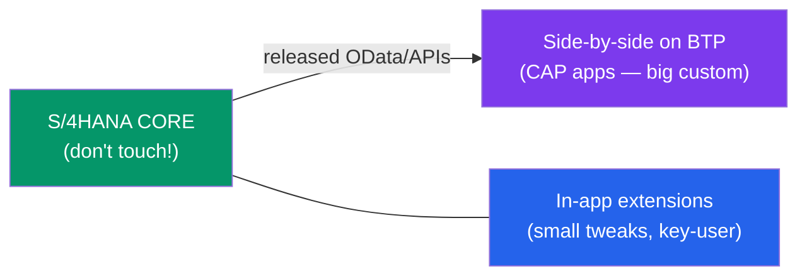

**Why this matters for the whole industry (and your job).** The old habit of hacking the ERP directly made upgrades a nightmare and blocked the move to cloud. Clean core + BTP is how SAP frees customers to take continuous updates (and AI features) — which is exactly why **BTP/CAP developer** roles are booming. You'd be building the side-by-side layer.

---

## L3. One Request, End to End

**Simple definition:** To cement it, trace a single user action — *"approve this purchase order"* — through every layer, so the acronyms become one continuous motion instead of separate words.

<p class="te"><strong>Telugu:</strong> Anta oke chota kalapadaniki, oka user action — <em>"ee purchase order ni approve cheyi"</em> — ni prati layer gunda trace cheddaam. Appudu acronyms anni separate padalu kaakunda oke continuous flow ga kanipistaayi. Kinda steps chaduvu.</p>

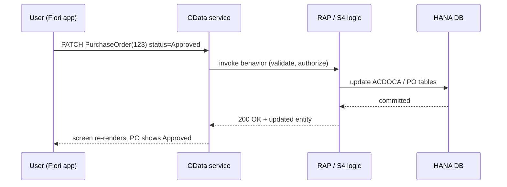

1. **User** taps *Approve* in a **Fiori** app on the Launchpad.
2. UI5 sends an **OData** `PATCH` to the service.
3. The **RAP** behavior (in **S/4HANA**) validates the user's authorization and business rules.
4. It writes to the simplified tables on **HANA**; the **Universal Journal** reflects any financial effect instantly.
5. OData returns the updated entity; the Fiori screen re-renders — and any **BTP** integration (e.g. notify the vendor) or **Joule** agent watching the process can react.

**That single flow is modern SAP.** Everything in this guide is one box in that motion. If you can narrate it, you can hold your own in an SAP architecture conversation.

---

# Part M — Modern SAP: Cloud ERP, RISE & GROW

*SAP's business model has shifted from selling licenses to selling cloud subscriptions. Two brand names — RISE and GROW — package that, and they come up constantly in 2025–2026 SAP conversations. Know what each bundles.*

## M1. RISE with SAP

**Simple definition:** **RISE with SAP** is a bundled subscription that moves a company to **S/4HANA Cloud, Private Edition** as a **fully-managed service** — SAP orchestrates the software, the HANA database, infrastructure (on a hyperscaler you choose: AWS/Azure/GCP), tools and migration services, in one contract. It targets **existing SAP customers** who need customization and control while moving to cloud.

<p class="te"><strong>Telugu:</strong> <strong>RISE with SAP</strong> ante oka bundled subscription — company ni <strong>S/4HANA Cloud, Private Edition</strong> ki move chestundi, <strong>fully-managed service</strong> ga. SAP software + HANA + infrastructure (nuvvu choose chese AWS/Azure/GCP) + tools + migration anta oke contract lo manage chestundi. Ekkuva customization + control kaavaalanukune <strong>existing SAP customers</strong> kosam. "Cloud ki move, kaani nee own processes unchukuntu."</p>

**Mnemonic.** *RISE = existing customers RISE up to cloud, keeping their customizations.* Private edition = single tenant, brownfield or greenfield, more control.

---

## M2. GROW with SAP

**Simple definition:** **GROW with SAP** is the equivalent bundle for **S/4HANA Cloud, Public Edition** — a true multi-tenant **SaaS** with standardized best-practice processes, fast (greenfield-only) implementation, and automatic quarterly updates. It targets **new / mid-market customers** who want speed and standard processes over deep customization.

<p class="te"><strong>Telugu:</strong> <strong>GROW with SAP</strong> ante <strong>S/4HANA Cloud, Public Edition</strong> kosam bundle — nijamaina multi-tenant <strong>SaaS</strong>, standardized best-practice processes, fast (greenfield only) implementation, automatic quarterly updates. Deep customization kante speed + standard processes kaavaalanukune <strong>kotta / mid-market customers</strong> kosam. "Fresh ga, fast ga, standard ga."</p>

**Mnemonic.** *GROW = new/growing companies, standardized public cloud, always up to date.* Public edition = multi-tenant, greenfield, less custom, latest innovations first.

---

## M3. RISE vs GROW

**Simple definition:** Same core product (S/4HANA Cloud) in two editions: **RISE = Private Edition** (customizable, existing customers, single-tenant), **GROW = Public Edition** (standardized SaaS, new customers, multi-tenant). Both follow **clean core** and get **Business AI / Joule**.

<p class="te"><strong>Telugu:</strong> Oke core product (S/4HANA Cloud), rendu editions: <strong>RISE = Private Edition</strong> (customizable, existing customers, single-tenant), <strong>GROW = Public Edition</strong> (standardized SaaS, new customers, multi-tenant). Rendu <strong>clean core</strong> follow chestaayi mariyu <strong>Business AI / Joule</strong> pondutaayi. Interview lo ee table gurthupettuko.</p>

| | RISE with SAP | GROW with SAP |
|---|---|---|
| Edition | S/4HANA Cloud **Private** | S/4HANA Cloud **Public** |
| Tenancy | Single-tenant | Multi-tenant SaaS |
| Customization | High (RAP + BTP) | Standard + side-by-side (BTP) |
| Implementation | Greenfield **or** brownfield | Greenfield only |
| Target | Existing/large enterprises | New/mid-market |
| Updates | Scheduled | Automatic quarterly |

---

# Part N — SAP Business AI & Joule

*Now the layer that's reshaping SAP in 2025–2026. SAP's pitch is "AI built into the processes, grounded in your business data." Joule is the face of that. This part explains Business AI, what Joule is, and — importantly — how it actually works, so you're not hand-waving in an interview.*

## N1. SAP Business AI — the Three Layers

**Simple definition:** **SAP Business AI** is SAP's umbrella strategy for AI that is **relevant** (built into business processes), **reliable** (grounded in real business data, not hallucinated), and **responsible** (governed, ethical). It shows up in three layers: **embedded AI** inside apps, the **Joule** copilot/agents across apps, and the **AI Foundation** on BTP for building custom AI.

<p class="te"><strong>Telugu:</strong> <strong>SAP Business AI</strong> ante SAP yokka AI strategy — <strong>relevant</strong> (business processes lo built-in), <strong>reliable</strong> (nijamaina business data meeda grounded, hallucination kaadu), <strong>responsible</strong> (governed, ethical). Idi moodu layers lo kanipistundi: (1) apps lo <strong>embedded AI</strong>, (2) apps anta <strong>Joule</strong> copilot/agents, (3) BTP meeda custom AI kattadaniki <strong>AI Foundation</strong>.</p>

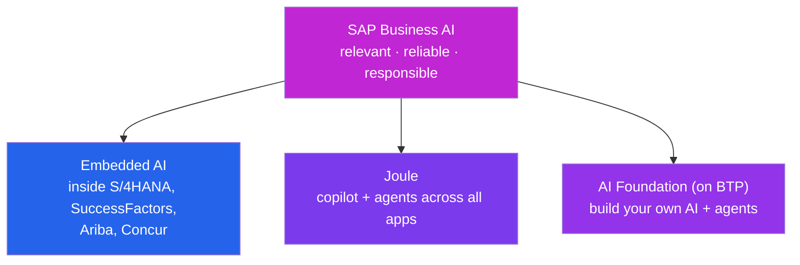

**Grounding is the whole pitch.** Generic chatbots make things up. SAP's edge is that its AI answers from **your actual ERP data and SAP's business knowledge** (via retrieval), so an answer about "open invoices for vendor X" is real, permission-checked, and actionable — not a guess.

---

## N2. What is Joule

**Simple definition:** **Joule** is SAP's **generative-AI copilot** — a natural-language assistant embedded across SAP applications (S/4HANA, SuccessFactors, Ariba, Concur, BTP). You type or speak a request in plain language; Joule understands your context and either answers with grounded information or **performs the action** in the underlying app.

<p class="te"><strong>Telugu:</strong> <strong>Joule</strong> ante SAP yokka <strong>generative-AI copilot</strong> — anni SAP apps lo (S/4HANA, SuccessFactors, Ariba, Concur, BTP) embed ayina natural-language assistant. Nuvvu plain language lo adugu, Joule nee context artham chesukoni leda grounded answer istundi leda aa app lo <strong>action chestundi</strong>. Simple chatbot kaadu — idi nijanga pani chese assistant. Launchpad lo button ga untundi.</p>

**Real examples of a Joule request:**
- *"Show me overdue invoices for customer Acme and their total."* → grounded answer from live FI data.
- *"Create a leave request for next Monday to Wednesday."* → Joule fills and submits the SuccessFactors form.
- *"Why did gross margin drop in Q2?"* → analytical explanation over your data.

<figure class="fig">
<div class="joule">
  <div class="joule-bar">✨ Joule</div>
  <div class="joule-body">
    <div class="jq">Show me overdue invoices for customer Acme and their total.</div>
    <div class="ja">Acme has <strong>3 overdue invoices</strong> totalling <strong>₹4,20,000</strong>. Oldest is #INV-2231, 28 days past due.</div>
    <div class="jq">Create a leave request for next Mon–Wed.</div>
    <div class="ja"><span class="ja-do">✓ Done —</span> submitted a 3-day leave request (Mon–Wed) to your manager for approval.</div>
  </div>
</div>
<figcaption><strong>Joule</strong>, SAP's AI copilot — ask in plain language; it answers from real ERP data or <em>performs the action</em> (custom mockup).</figcaption>
</figure>

**Scale note (2025–2026).** SAP has expanded Joule massively — thousands of **Joule Skills** and dozens of specialized **agents** — turning it from a Q&A box into an action-taking layer over the whole suite (next part).

---

## N3. How Joule Works Under the Hood

**Simple definition:** Joule pipelines a request through: **understand context** (which app, your role/permissions, history) → **plan** (match the request to available **skills/functions/scenarios** via a catalog) → **ground** (retrieve facts from SAP + your data using **RAG for enterprise, "RAGe"**) → **reason** (an LLM from the Generative AI Hub decides the answer or which function to call) → **act** (call the SAP backend to execute), always inside your **permissions**.

<p class="te"><strong>Telugu:</strong> Joule request ni ila pipeline chestundi: (1) <strong>context artham</strong> (edi app, nee role/permissions, history), (2) <strong>plan</strong> (request ni available <strong>skills/functions</strong> tho match — catalog nundi), (3) <strong>ground</strong> (SAP + nee data nundi facts retrieve — <strong>RAGe</strong>), (4) <strong>reason</strong> (Gen AI Hub lo LLM decide chestundi), (5) <strong>act</strong> (SAP backend call chesi execute). Anta nee <strong>permissions</strong> lopalE. Grounding valla hallucination takkuva.</p>

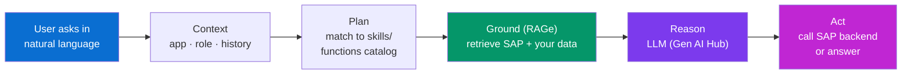

**Why a developer should know this.** It's exactly the pattern from your Phase-1 prompt-engineering and Claude Code work: context + tools/functions + retrieval + an LLM that decides whether to answer or call a function. Joule is that architecture, wired into enterprise data and guarded by SAP's authorization model. Your AI-engineering track and your SAP track **converge here.**

---

## N4. The AI Foundation & Generative AI Hub

**Simple definition:** The **AI Foundation** is the set of BTP services for building AI into your own apps: access to multiple **LLMs** (SAP's and partners') through the **Generative AI Hub**, plus vector/embedding storage (**HANA Vector Engine**), grounding tools, and the ability to build custom **Joule agents/skills**. It's how *you*, the developer, add AI — governed and grounded — to a side-by-side app.

<p class="te"><strong>Telugu:</strong> <strong>AI Foundation</strong> ante BTP lo AI kattadaniki unde services set: <strong>Generative AI Hub</strong> gunda konni <strong>LLMs</strong> (SAP + partners) access, <strong>HANA Vector Engine</strong> (embeddings/vector store), grounding tools, mariyu custom <strong>Joule agents/skills</strong> build cheye ability. Ide nuvvu — developer — governed + grounded AI ni nee side-by-side app lo add chese chotu. Nee Gen-AI skills ki SAP home.</p>

**The one-line link to your career.** Generative AI Hub is SAP's "call an LLM safely, with enterprise data and governance" service. If you know how to build AI apps (prompts, RAG, tool-calling), the AI Foundation is where you do it inside SAP — a rare and rising skill combining your two tracks.

---

# Part O — Agentic SAP & the Autonomous Enterprise

*The frontier, and the exact terms the request highlighted. 2025–2026 SAP is shifting from "AI that answers" (copilot) to "AI that acts on its own" (agents) — and stringing agents together into processes that run with little human input: the Autonomous Enterprise. Here's what those words actually mean.*

## O1. Copilot vs Agent — the Big Shift

**Simple definition:** A **copilot** waits for you and helps with one step (you stay in the loop each time). An **agent** is **goal-driven and autonomous**: give it an objective and it can **plan, reason across multiple steps, call tools, and complete a whole task** with minimal supervision — even handing off to other agents. Joule is evolving from copilot toward a network of agents.

<p class="te"><strong>Telugu:</strong> <strong>Copilot</strong> — nuvvu adiginappudu oka step help chestundi (prati saari nuvvu loop lo untaavu). <strong>Agent</strong> — <strong>goal-driven + autonomous</strong>: oka goal iste, adi <strong>plan chesi, multiple steps reason chesi, tools call chesi, full task complete</strong> chestundi — konnisaarlu vere agents ki handoff kooda. Joule copilot nundi agents network vaipu marutondi. "Help chesedi vs sontanga pani chesedi."</p>

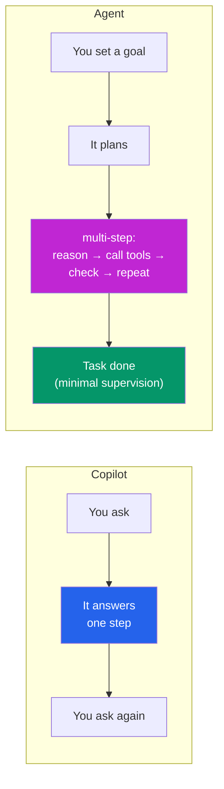

**Why this is the industry's big bet.** Surveys of enterprise buyers now cite **agentic AI** as a top purchase criterion. The promise: not "a faster form," but "a task that completes itself." SAP's advantage is that agents act on **real, permissioned ERP data and processes** — where autonomous action has real business value (and real risk, hence governance).

---

## O2. Joule Agents

**Simple definition:** **Joule Agents** are specialized, autonomous AI agents built into SAP that handle specific business jobs end-to-end — e.g. a **dispute-resolution agent**, a **cash-collection agent**, a **sourcing agent**. They collaborate: one agent's output triggers another, chaining across processes. SAP ships a growing library of them (dozens, across finance, supply chain, HR, service, sales) plus thousands of underlying skills.

<p class="te"><strong>Telugu:</strong> <strong>Joule Agents</strong> ante SAP lo built specialized autonomous agents — oka specific business pani ni end-to-end chestaayi. Example: <strong>dispute-resolution agent</strong>, <strong>cash-collection agent</strong>, <strong>sourcing agent</strong>. Ivi kalisi pani chestaayi — oka agent output vere agent ni trigger chestundi, process anta chain avutundi. SAP finance, supply chain, HR, service, sales anta konni dozens agents + velaadi skills ship chestondi.</p>

**Concrete multi-agent example (real SAP scenario).**
1. A **case-classification agent** reads an incoming customer complaint and identifies it as a **billing dispute**.
2. It routes it to the **cash-collection / dispute-resolution agent**, which pulls the invoice, checks the contract, and proposes (or applies) a resolution.
3. Finance is updated automatically — a process that used to take days resolves in seconds, with humans only approving exceptions.

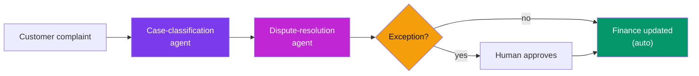

---

## O3. Joule Studio — Build Your Own Agent

**Simple definition:** **Joule Studio** (part of the AI Foundation on BTP) is the **low-code/pro-code builder** where you create **custom Joule agents and skills** — defining the agent's goal, the tools/OData services it may call, the data it grounds on, and its guardrails. This is where an SAP+AI developer actually builds agentic solutions.

<p class="te"><strong>Telugu:</strong> <strong>Joule Studio</strong> (BTP AI Foundation lo part) ante <strong>custom Joule agents + skills</strong> katte <strong>low-code/pro-code builder</strong> — agent goal, adi call cheyagala tools/OData services, ground ayye data, mariyu guardrails define chestaavu. Ide SAP+AI developer nijanga agentic solutions katte chotu. Nee prompt-engineering + tool-calling knowledge ikkade pani chestundi.</p>

**Direct line to your dual roadmap.** Building a Joule agent = defining a goal + tools + grounding + guardrails. That is *precisely* the agent-building mental model from your Claude Code / prompt-engineering phases, now expressed in SAP's platform. Someone who can do both — SAP data model **and** agent design — is exactly the profile SAP customers are scrambling to hire in 2026.

---

## O4. The Autonomous Enterprise

**Simple definition:** The **Autonomous Enterprise** is the end-state vision: a business where **networks of AI agents run end-to-end processes** (order-to-cash, procure-to-pay, hire-to-retire) largely on their own — sensing events, deciding, and acting across systems — while humans set goals, handle exceptions, and govern. It's the destination all the previous layers (S/4HANA + BTP + Joule + agents) are building toward.

<p class="te"><strong>Telugu:</strong> <strong>Autonomous Enterprise</strong> ante final vision: <strong>AI agents networks end-to-end processes</strong> (order-to-cash, procure-to-pay lantivi) ni chala varaku sontanga nadipe business — events sense chesi, decide chesi, systems anta act chestaayi — humans just goals petti, exceptions handle chesi, govern chestaaru. Migta layers (S/4HANA + BTP + Joule + agents) ee destination vaipe build avutunnayi. "Processes tamu sontanga nadustaayi, manushulu direct chestaaru."</p>

```mermaid
graph TD
    GOAL["Humans set goals<br/>& govern"]
    SENSE["Agents sense events<br/>(orders, disputes, stock)"]
    DECIDE["Agents decide<br/>& plan"]
    ACT["Agents act across<br/>S/4HANA · Ariba · SF"]
    EXC{"Exception?"}
    SENSE --> DECIDE --> ACT --> EXC
    EXC -->|routine| SENSE
    EXC -->|needs judgment| GOAL
    GOAL --> SENSE
    style GOAL fill:#0a6ed1,color:#fff
    style ACT fill:#c026d3,color:#fff
    style EXC fill:#f59e0b,color:#111
```

**The honest framing (say this in interviews).** The Autonomous Enterprise is a **direction, not a finished product** — today's reality is *many processes partly automated by agents, with humans in the loop for judgment and governance.* The value is real and growing; the mature end-state is still being built. Showing you understand both the promise **and** the "human-in-the-loop, governed, grounded" caveats marks you as someone who actually gets it.

---

# Part P — Workflows & Process Automation

*Agents are the new frontier, but a huge amount of enterprise automation is still deterministic workflows — defined steps, approvals and rules. Know the difference, because real projects mix both, and "workflow" is in the original request.*

## P1. What is a Workflow

**Simple definition:** A **workflow** is an automated sequence of **defined steps** that routes work between people and systems according to **fixed rules** — e.g. a leave request goes to your manager, then (if > 5 days) to HR, then updates the record. It's deterministic: same input, same path. Contrast with an agent, which decides its own path.

<p class="te"><strong>Telugu:</strong> <strong>Workflow</strong> ante <strong>defined steps</strong> yokka automated sequence — <strong>fixed rules</strong> batti people + systems madhya work ni route chestundi. Example: leave request → manager → (5 rojula kante ekkuvaite) HR → record update. Idi deterministic — same input, same path. Agent decide chesukuntundi; workflow munde raasina path follow chestundi.</p>

**Everyday example — expense approval.** You submit a $2,000 expense. The workflow: under $1,000 → auto-approved; $1,000–5,000 → manager approves; over $5,000 → manager + finance. Fixed, auditable, predictable. Most approval and routing logic in an enterprise is exactly this.

---

## P2. SAP Build Process Automation

**Simple definition:** **SAP Build Process Automation (SBPA)** is the BTP low-code tool to design and run these workflows and **business rules**, plus **RPA bots** (robotic process automation — software that clicks through legacy UIs). It's part of the broader **SAP Build** family (Build Apps, Build Process Automation, Build Work Zone) for citizen and pro developers.

<p class="te"><strong>Telugu:</strong> <strong>SAP Build Process Automation</strong> (SBPA) ante BTP lo workflows + <strong>business rules</strong> ni design/run chese low-code tool, mariyu <strong>RPA bots</strong> (legacy UIs lo automatic ga click chese software) kooda. Idi pedda <strong>SAP Build</strong> family lo part — Build Apps (apps), Build Process Automation (workflows), Build Work Zone (portals). Low-code + pro-code rendintiki.</p>

| SAP Build product | What it builds |
|---|---|
| **Build Apps** | Low-code UI apps (drag-and-drop) |
| **Build Process Automation** | Workflows, business rules, RPA bots |
| **Build Work Zone** | Launchpad/portal experiences |

**Where AI meets it.** SBPA now blends with agents: a workflow can call an AI skill (e.g. "extract data from this invoice PDF") mid-process, and Joule agents can trigger or be triggered by workflows. The future is **workflows + agents together** — deterministic where you need control, autonomous where you need judgment.

---

## P3. Workflow vs Agent

**Simple definition:** Use a **workflow** when the process is well-defined and you want predictable, auditable, rule-based routing. Use an **agent** when the task needs reasoning, adapts to messy inputs, or has too many branches to script. Mature automation combines them: agents for judgment, workflows for the deterministic rails.

<p class="te"><strong>Telugu:</strong> <strong>Workflow</strong> — process clear ga define ayinappudu, predictable + auditable + rule-based routing kaavaalannappudu. <strong>Agent</strong> — task ki reasoning kaavaali, messy inputs ki adapt kaavaali, leda chala branches script cheyaleninappudu. Best automation rendu kalupytundi: judgment ki agents, deterministic rails ki workflows.</p>

| | Workflow | Agent |
|---|---|---|
| Path | Fixed, pre-designed | Decided at runtime |
| Best for | Rules, approvals, routing | Reasoning, messy/varied tasks |
| Predictability | High (auditable) | Lower (goal-driven) |
| Control | You script every branch | You set a goal + guardrails |
| SAP tool | SAP Build Process Automation | Joule Agents / Joule Studio |

---

# Part Q — Project Types & Career Paths

*Finally, the practical map: what kinds of SAP projects exist, which developer roles they need, and where your specific Web-Dev → JS → React → SAP → AI roadmap lands you. This is the "so what do I actually do for a job" section.*

## Q1. The Kinds of SAP Projects

**Simple definition:** SAP work falls into recognizable project types. Knowing them helps you read job descriptions and pick a lane.

<p class="te"><strong>Telugu:</strong> SAP pani konni recognizable <strong>project types</strong> lo padutundi. Ivi teliste job descriptions artham avutaayi, mariyu neeku edi lane kaavaalo decide chesukovachu. Kinda table chaduvu.</p>

| Project type | What happens | Roles in demand |
|---|---|---|
| **S/4HANA Implementation** | Set up S/4HANA for a company (config + build) | Functional consultants, developers |
| **S/4HANA Migration** | Convert ECC → S/4HANA (green/brown/bluefield) | Migration specialists, ABAP/RAP devs |
| **Fiori/UI5 Development** | Build custom Fiori apps | UI5 developers (your Fiori notes) |
| **BTP Extension** | Side-by-side apps, integrations (CAP) | BTP/CAP (Node/Java) developers |
| **Integration** | Connect SAP ↔ other systems | Integration Suite specialists |
| **Analytics** | Dashboards, reporting (SAC, Datasphere) | Analytics consultants |
| **AI / Agentic** | Joule agents, Gen AI apps on BTP | AI + SAP developers (rare, rising) |
| **Support / AMS** | Run & maintain live systems | Support consultants |

---

## Q2. The Developer Career Tracks

**Simple definition:** For a *developer* (not a functional consultant), three main tracks exist, roughly: **ABAP/RAP** (classic, in-core, S/4HANA), **Fiori/UI5** (frontend), and **BTP/CAP** (cloud full-stack, JS/Java). Increasingly a fourth: **SAP AI / agentic** developer, spanning BTP + AI Foundation + Joule Studio.

<p class="te"><strong>Telugu:</strong> <strong>Developer</strong> ki (functional consultant kaadu) moodu main tracks: (1) <strong>ABAP/RAP</strong> — classic, in-core, S/4HANA, (2) <strong>Fiori/UI5</strong> — frontend, (3) <strong>BTP/CAP</strong> — cloud full-stack (JS/Java). Ippudu nemmadiga naalgavadi peragutondi: <strong>SAP AI / agentic</strong> developer — BTP + AI Foundation + Joule Studio. Nee path ee chivari rendinti vaipu.</p>

```mermaid
graph TD
    DEV["SAP Developer"]
    ABAP["ABAP / RAP<br/>in-core S/4HANA"]
    UI5["Fiori / UI5<br/>frontend"]
    BTP["BTP / CAP<br/>cloud full-stack (JS/Java)"]
    AIDEV["SAP AI / Agentic<br/>AI Foundation · Joule Studio"]
    DEV --> ABAP
    DEV --> UI5
    DEV --> BTP
    DEV --> AIDEV
    style DEV fill:#0a6ed1,color:#fff
    style UI5 fill:#7c3aed,color:#fff
    style BTP fill:#2563eb,color:#fff
    style AIDEV fill:#c026d3,color:#fff
```

---

## Q3. Where Your Roadmap Lands You

**Simple definition:** Your roadmap (Web Dev → JavaScript → React → SAP Fiori/UI5 → Node → BTP/CAP → AI) is deliberately aimed at the **modern, cloud, JS-based** side of SAP — **Fiori/UI5 + BTP/CAP + SAP AI** — the fastest-growing and least-crowded lane, and the one where your existing skills transfer with almost no waste.

<p class="te"><strong>Telugu:</strong> Nee roadmap (Web Dev → JS → React → Fiori/UI5 → Node → BTP/CAP → AI) kaavaalane <strong>modern, cloud, JS-based</strong> SAP vaipu pettaru — <strong>Fiori/UI5 + BTP/CAP + SAP AI</strong>. Ide fastest-growing, takkuva crowded lane, mariyu nee ippati skills waste kaakunda directly transfer ave lane. Nuvvu correct direction lo unnaavu.</p>

**Your concrete assembly (how the pieces you're learning stack into one profile):**
- **React (Phase 6)** → **Fiori/UI5** frontend apps (your Fiori notes).
- **JavaScript + Node (Phases 4–5, 7)** → **CAP** backend OData services on **BTP**.
- **OData** → the contract joining your frontend and backend.
- **Prompt engineering + Claude Code (Phases 1–2)** → **Joule Studio agents** + **AI Foundation** apps.
- Together = a **full-stack SAP BTP developer who can also build AI agents** — a genuinely rare, well-paid 2026 profile.

**One last mental hook.** Everything in this document is one machine: *HANA remembers, S/4HANA decides, OData carries, Fiori shows, BTP extends, CAP/RAP build, Joule assists, agents act.* Learn the machine, and each new SAP acronym is just a part you already know where to bolt on.

---

# Part R — Interview Cheat-Sheet

*Fast, quotable one-liners. If you can say these cleanly, you sound like someone who understands SAP as a system, not a list of buzzwords.*

<p class="te"><strong>Telugu:</strong> Kinda unnavi <strong>interview lo direct ga cheppe one-liners</strong>. Ivi clean ga cheppagaligite, "SAP ni system ga artham chesukunna vyakti" ani anipistundi. Table baaga practice cheyi.</p>

| Question | Crisp answer |
|---|---|
| What is SAP? | The world's leading **ERP** — one integrated system running a company's finance, supply chain, sales, HR, etc. |
| ECC vs S/4HANA? | ECC = classic ERP on any DB; **S/4HANA** = next-gen ERP, **HANA-only**, simplified data model, Fiori-first. |
| Why is HANA special? | **In-memory + columnar** → 1000× faster reads; runs transactions **and** analytics in one system (HTAP). |
| What's the Universal Journal? | `ACDOCA` — one table merging FI + CO line items in S/4HANA; single source of financial truth. |
| Fiori vs UI5? | Fiori = **design language**; SAPUI5 = the **JS framework** that implements it. |
| What is OData? | **REST-based** protocol with self-describing metadata; the contract between SAP frontends and backends (V2 legacy, **V4** modern). |
| What is BTP? | SAP's cloud **PaaS** for extensions, integration, analytics and AI — where **clean-core** side-by-side apps live. |
| CAP vs RAP? | Both produce **OData → Fiori**. CAP = Node/Java on BTP; RAP = ABAP in S/4HANA. |
| What is clean core? | Don't modify the core; extend via released APIs (in-app or side-by-side on BTP) so upgrades stay easy. |
| RISE vs GROW? | RISE = S/4HANA Cloud **Private** (existing, customizable); GROW = **Public** SaaS (new, standardized). |
| What is Joule? | SAP's **grounded generative-AI copilot** across apps — answers from real data and **takes actions**. |
| Copilot vs agent? | Copilot helps one step (you in the loop); **agent** is goal-driven, plans multi-step and acts autonomously. |
| Autonomous Enterprise? | Vision of **agent networks running end-to-end processes** with humans setting goals & handling exceptions. |
| Workflow vs agent? | Workflow = fixed, rule-based, auditable; agent = reasons and decides its own path. Mature systems use both. |
| Why 2027 matters? | **ECC mainstream support ends 2027** (extended 2030) → industry-wide S/4HANA migration wave = jobs. |

---

# Part S — Glossary & Quick Reference

*Every acronym in this guide in one place, so you can look up anything fast.*

<p class="te"><strong>Telugu:</strong> Ee guide lo vachina <strong>prati acronym</strong> ikkada oke chota — edaina quick ga look up chesukovadaniki. Bookmark ee section.</p>

| Term | Full form / meaning |
|---|---|
| **SAP** | Systems, Applications & Products in data processing (the company & ERP) |
| **ERP** | Enterprise Resource Planning — integrated core-business software |
| **R/1, R/2, R/3** | SAP's early architecture generations (R = Real-time) |
| **ECC** | ERP Central Component — classic on-prem ERP (Business Suite) |
| **S/4HANA** | SAP Business Suite 4 HANA — modern ERP, HANA-only |
| **HANA** | High-performance ANalytic Appliance — in-memory columnar DB |
| **HTAP** | Hybrid Transactional/Analytical Processing (one system does both) |
| **ACDOCA** | The Universal Journal table (FI + CO line items) |
| **ABAP** | Advanced Business Application Programming — SAP's classic language |
| **Fiori** | SAP's UX design language |
| **SAPUI5 / UI5** | The JavaScript framework implementing Fiori |
| **FLP** | Fiori Launchpad — the tile-based home screen |
| **OData** | Open Data Protocol — REST-based data API standard (V2 / V4) |
| **BTP** | Business Technology Platform — SAP's cloud PaaS |
| **CAP** | Cloud Application Programming Model (Node/Java on BTP) |
| **CDS** | Core Data Services — declarative data-model language |
| **RAP** | ABAP RESTful Application Programming Model (ABAP in S/4HANA) |
| **Clean core** | Keep the ERP core unmodified; extend on the side |
| **RISE with SAP** | Managed S/4HANA Cloud **Private** Edition bundle |
| **GROW with SAP** | S/4HANA Cloud **Public** Edition (SaaS) bundle |
| **LoB** | Line of Business (e.g. SuccessFactors=HR, Ariba=procurement, Concur=travel) |
| **Business AI** | SAP's relevant/reliable/responsible AI strategy |
| **Joule** | SAP's generative-AI copilot embedded across apps |
| **Joule Agents** | Specialized autonomous AI agents for business tasks |
| **Joule Studio** | BTP tool to build custom agents/skills |
| **RAGe** | Retrieval-Augmented Generation for enterprise (grounding) |
| **AI Foundation** | BTP AI services (Gen AI Hub, vector engine, agents) |
| **Gen AI Hub** | BTP service to access LLMs safely with governance |
| **SBPA** | SAP Build Process Automation — workflows, rules, RPA |
| **Autonomous Enterprise** | Vision: agent networks running end-to-end processes |
| **DEV/QA/PROD** | The three-system landscape; changes move via transports |

**Quick-reference — the modern SAP dev spine (memorize this one line):**

```
CDS  →  OData (V4)  →  Fiori/UI5
 ↑                         ↑
built by CAP (Node/Java, BTP)   consumed by users
   or RAP (ABAP, S/4HANA)       + Joule agents
        all on HANA
```

**You now hold the whole map.** Pair this with your **SAP Fiori & UI5** notes for the frontend depth, and your Phase 1–7 notes for the JS/AI foundations — together they cover the exact profile the 2026 SAP market is hungry for. Go build.
