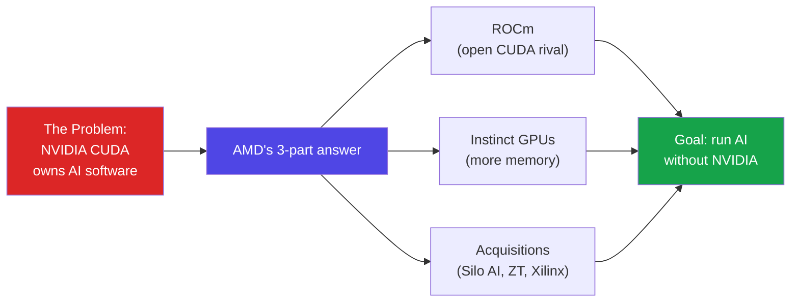
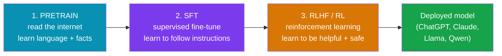
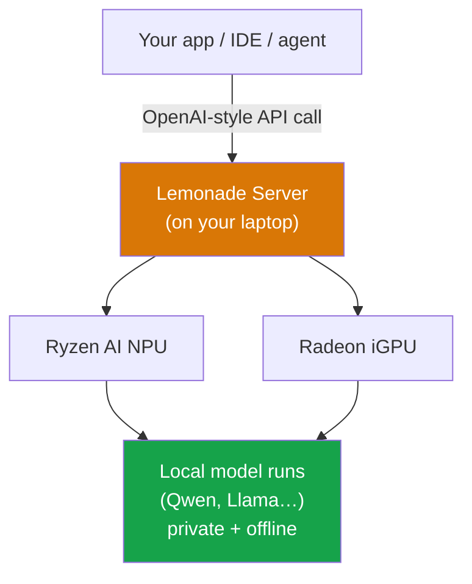
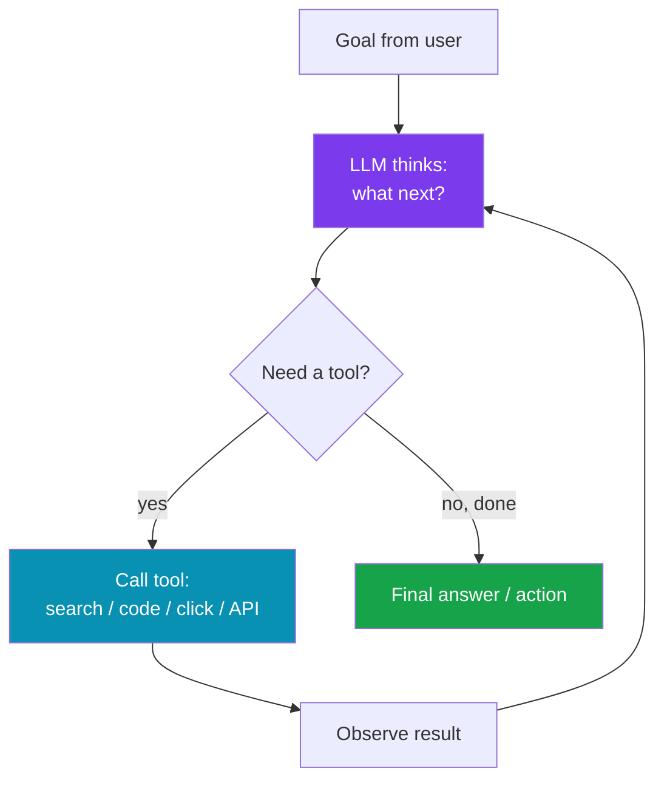
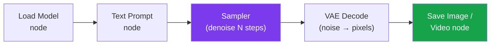

# AMD AI DevDay India 2026 — Prerequisites & Prep Guide

### Everything to learn before Aug 8 — AMD's story, the AI stack, and every workshop concept with hands-on projects

> *"You don't need to be an AI expert to walk in. You need the map: what AMD is betting on, what each session actually means, and a small project behind each one — so the demos click instead of blur."*

**Personal Prep Doc** · AMD AI DevDay India · Taj West End, Bengaluru · Saturday, Aug 8, 2026 · 10:30 AM – 6:30 PM

---

## Table of Contents

- [Part A — AMD: The Company Behind the Event](#part-a-amd-the-company-behind-the-event)
  - [A1. Who AMD Is (in one breath)](#a1-who-amd-is-in-one-breath) · [A2. The History — 1969 to Now](#a2-the-history-1969-to-now) · [A3. The Product Families](#a3-the-product-families) · [A4. Where AMD Chips Actually Run](#a4-where-amd-chips-actually-run) · [A5. How & Why AMD Entered AI](#a5-how-why-amd-entered-ai) · [A6. AMD vs NVIDIA in 2026 — The Honest Picture](#a6-amd-vs-nvidia-in-2026-the-honest-picture)
- [Part B — The Foundations You Need First](#part-b-the-foundations-you-need-first)
  - [B1. Python & Jupyter — The Lab Bench](#b1-python-jupyter-the-lab-bench) · [B2. What an LLM Actually Is](#b2-what-an-llm-actually-is) · [B3. How LLMs Are Trained (Pretrain → SFT → RLHF)](#b3-how-llms-are-trained-pretrain-sft-rlhf) · [B4. The Vocabulary — Tokens, Parameters, Quantization, Context](#b4-the-vocabulary-tokens-parameters-quantization-context) · [B5. GPU Compute 101 — VRAM, TOPS, Why AI Needs GPUs](#b5-gpu-compute-101-vram-tops-why-ai-needs-gpus) · [B6. CUDA vs ROCm vs HIP — The Platform War in One Page](#b6-cuda-vs-rocm-vs-hip-the-platform-war-in-one-page)
- [Part C — The AMD AI Stack You'll See on Stage](#part-c-the-amd-ai-stack-youll-see-on-stage)
  - [C1. ROCm — AMD's AI Software Platform](#c1-rocm-amds-ai-software-platform) · [C2. Instinct — Data-Center AI GPUs](#c2-instinct-data-center-ai-gpus) · [C3. Radeon — Consumer GPUs for AI](#c3-radeon-consumer-gpus-for-ai) · [C4. Ryzen AI & the NPU (XDNA)](#c4-ryzen-ai-the-npu-xdna) · [C5. Ryzen AI Max+ 395 "Strix Halo" — Star of the Local Demos](#c5-ryzen-ai-max-395-strix-halo-star-of-the-local-demos) · [C6. Lemonade Server & GAIA — Local Models on Ryzen AI](#c6-lemonade-server-gaia-local-models-on-ryzen-ai)
- [Part D — Concept: Scaling RL for LLMs (Hugging Face)](#part-d-concept-scaling-rl-for-llms-hugging-face)
  - [D1. What Reinforcement Learning Adds to an LLM](#d1-what-reinforcement-learning-adds-to-an-llm) · [D2. RLHF, Reward Models, PPO → GRPO](#d2-rlhf-reward-models-ppo-grpo) · [D3. Why "Scaling RL" Is Genuinely Hard](#d3-why-scaling-rl-is-genuinely-hard) · [D4. Real-World Scenarios](#d4-real-world-scenarios) · [D5. Mini-Project: See RLHF with TRL](#d5-mini-project-see-rlhf-with-trl)
- [Part E — Concept: Shared Autonomy with PyTorch (Physical AI)](#part-e-concept-shared-autonomy-with-pytorch-physical-ai)
  - [E1. What PyTorch Is](#e1-what-pytorch-is) · [E2. Physical AI & "Shared Autonomy"](#e2-physical-ai-shared-autonomy) · [E3. Real-World Scenarios](#e3-real-world-scenarios) · [E4. Mini-Project: A Tiny PyTorch Control Policy](#e4-mini-project-a-tiny-pytorch-control-policy)
- [Part F — Concept: Model Serving & the OpenClaw Agent](#part-f-concept-model-serving-the-openclaw-agent)
  - [F1. Inference Serving — Why vLLM & SGLang Exist](#f1-inference-serving-why-vllm-sglang-exist) · [F2. Multi-Modal Models](#f2-multi-modal-models) · [F3. What an Agent Actually Is (OpenClaw)](#f3-what-an-agent-actually-is-openclaw) · [F4. Real-World Agent Scenarios](#f4-real-world-agent-scenarios) · [F5. Mini-Project: Serve a Model + a Tool-Using Agent](#f5-mini-project-serve-a-model-a-tool-using-agent)
- [Part G — Concept: Vibe Coding with a Local Model](#part-g-concept-vibe-coding-with-a-local-model)
  - [G1. "Vibe Coding" Defined](#g1-vibe-coding-defined) · [G2. Local vs Cloud Models — The Trade-Offs](#g2-local-vs-cloud-models-the-trade-offs) · [G3. Lemonade + Qwen Coder on Ryzen AI Max 395](#g3-lemonade-qwen-coder-on-ryzen-ai-max-395) · [G4. Real-World Scenarios](#g4-real-world-scenarios) · [G5. Mini-Project: A Local Coding Agent](#g5-mini-project-a-local-coding-agent)
- [Part H — Concept: Fine-Tuning with Unsloth](#part-h-concept-fine-tuning-with-unsloth)
  - [H1. Fine-Tuning vs Prompting vs RAG](#h1-fine-tuning-vs-prompting-vs-rag) · [H2. LoRA & QLoRA — Cheap Fine-Tuning](#h2-lora-qlora-cheap-fine-tuning) · [H3. What Unsloth Does](#h3-what-unsloth-does) · [H4. Real-World Scenarios](#h4-real-world-scenarios) · [H5. Mini-Project: Fine-Tune a Small Model](#h5-mini-project-fine-tune-a-small-model)
- [Part I — Concept: Video Generation with ComfyUI](#part-i-concept-video-generation-with-comfyui)
  - [I1. Diffusion Models — How AI Paints](#i1-diffusion-models-how-ai-paints) · [I2. What ComfyUI Is (the Node Graph)](#i2-what-comfyui-is-the-node-graph) · [I3. Text-to-Video vs Image-to-Video](#i3-text-to-video-vs-image-to-video) · [I4. Real-World Scenarios](#i4-real-world-scenarios) · [I5. Mini-Project: First ComfyUI Video Workflow](#i5-mini-project-first-comfyui-video-workflow)
- [Part J — Concept: Sovereign AI & the India AI Ecosystem](#part-j-concept-sovereign-ai-the-india-ai-ecosystem)
  - [J1. What "Sovereign AI" Means](#j1-what-sovereign-ai-means) · [J2. India's AI Push](#j2-indias-ai-push) · [J3. Why AMD Cares](#j3-why-amd-cares) · [J4. From Campus to Code](#j4-from-campus-to-code)
- [Part K — Your Step-by-Step Prep Plan](#part-k-your-step-by-step-prep-plan)
  - [K1. The 12-Day Countdown](#k1-the-12-day-countdown) · [K2. Accounts & Installs Checklist](#k2-accounts-installs-checklist) · [K3. Track A vs Track B — Which to Pick](#k3-track-a-vs-track-b-which-to-pick)
- [Part L — Day-Of Playbook & Glossary](#part-l-day-of-playbook-glossary)
  - [L1. What to Bring & Set Up](#l1-what-to-bring-set-up) · [L2. Smart Questions to Ask Speakers](#l2-smart-questions-to-ask-speakers) · [L3. Glossary — Quick Reference](#l3-glossary-quick-reference) · [L4. After the Event](#l4-after-the-event)

---

# Part A — AMD: The Company Behind the Event

*Before you learn the tech, understand the host. Everything on stage is AMD proving one thing: that you can build serious AI without NVIDIA. Knowing the story makes every demo land harder.*

## A1. Who AMD Is (in one breath)

**Simple definition:** AMD (Advanced Micro Devices) is a ~57-year-old American chip company that designs the "brains" inside computers — the CPU (general thinking), the GPU (massively parallel math), and now the NPU (an efficient AI co-processor). It designs the chips; factories like TSMC in Taiwan physically build them (AMD is "fabless").

<p class="te"><strong>Telugu:</strong> AMD ante computer lopala unde brain chips (CPU, GPU, NPU) design chese company. Vaalla daggara sonta factory ledu — design matram chestaru, TSMC laantivi chips ni physically tayaru chestayi. Idi "fabless" model. Ee event motham AMD cheppadam: "NVIDIA lekunda kuda meeru AI build cheyyochu" ani.</p>

**Analogy:** AMD is the architect who draws the building; TSMC is the construction crew that pours the concrete. AMD's whole pitch at this event: their "buildings" (chips) can now run the heaviest AI workloads that used to need NVIDIA.

Why it matters for you: the workshops all run on AMD silicon — Ryzen AI laptops for the local-model sessions, Instinct/Radeon GPUs behind the training and video demos. The vocabulary in Part C is what the speakers will assume you know.

## A2. The History — 1969 to Now

AMD's arc is a genuine underdog story — near-bankruptcy twice, then a stunning comeback. You don't need every date, but the shape explains *why they're hungry for AI*.

| Era | What happened | Why it matters |
|-----|---------------|----------------|
| **1969** | Founded by Jerry Sanders + 7 others, months after Intel | Born as the scrappy #2 to Intel |
| **1975–90s** | Made Intel-compatible x86 chips (second-source) | Learned to survive in Intel's shadow |
| **1999–2006** | Athlon / Athlon 64 beat Intel; bought ATI (graphics) for $5.4B | Gained the GPU business it now uses for AI |
| **2006–2014** | Bulldozer flops, near-bankruptcy, sold its fabs (→ GlobalFoundries) | Became "fabless"; nearly died |
| **2014** | **Dr. Lisa Su becomes CEO** | The turnaround begins |
| **2017** | **Zen / Ryzen** launches — competitive CPUs again | AMD is back; stock and share soar |
| **2020** | Ryzen + EPYC take huge market share from Intel | Cash to invest in AI |
| **2022** | Acquires **Xilinx** ($50B, FPGA/adaptive) + **Pensando** (networking/DPU) | Buys the "adaptive compute" + networking pieces |
| **2023–2025** | Buys **Nod.ai** (AI compiler), **Silo AI** ($665M), **ZT Systems** (~$4.9B) | Assembles a full AI software + systems stack |
| **2023→** | **Instinct MI300** launches; ROCm matures | AMD's serious answer to NVIDIA's data-center AI GPUs |

<p class="te"><strong>Telugu:</strong> AMD rendu sarlu almost bankrupt ayyindi. 2014 lo Lisa Su CEO ga vachaka, 2017 lo "Ryzen" CPUs tho comeback kottaru. Aa comeback tho vachina dabbu + confidence tho ippudu AI meeda pedda bet vestunnaru. Anduke ee event lo antha energy — vaallu prove cheyyali NVIDIA ni challenge cheyyagalamu ani.</p>

**The one name to know:** **Dr. Lisa Su** — CEO since 2014, an electrical engineer (MIT PhD), widely credited with the turnaround. If the keynote references "our journey," this is it.

## A3. The Product Families

AMD makes four kinds of "compute engines." Every session touches at least one.

| Family | Type | What it's for | You'll see it in… |
|--------|------|---------------|-------------------|
| **Ryzen** | Consumer CPU (+ NPU) | Laptops & desktops; **Ryzen AI** adds an NPU for on-device AI | Vibe Coding (local model) |
| **EPYC** | Server CPU | Data-center CPUs that feed the GPUs | Behind every training demo |
| **Threadripper** | Workstation CPU | High-core creator/dev workstations | Content-creation context |
| **Radeon** | Consumer GPU | Gaming + increasingly local AI (fine-tune, image/video) | Unsloth, ComfyUI |
| **Instinct** | Data-center GPU | The heavy AI accelerators (training + large inference) | RL/LLM training talk |
| **Ryzen AI (XDNA NPU)** | NPU | Low-power AI co-processor inside Ryzen laptops | Local agent demos |
| **Versal / Xilinx** | FPGA / Adaptive | Reconfigurable chips (telecom, auto, edge) | "Sovereign / edge AI" context |

**Rule of thumb:** **CPU** = a few very smart workers doing tasks in order. **GPU** = thousands of simple workers doing the same math at once (perfect for AI). **NPU** = a small, power-sipping GPU-like unit tuned only for AI, so your laptop battery survives.

## A4. Where AMD Chips Actually Run

Not abstract — you've used AMD without knowing:

- **PlayStation 5 & Xbox Series X/S** — custom AMD CPU+GPU (semi-custom business).
- **Frontier & El Capitan supercomputers** — the world's fastest, on AMD EPYC + Instinct.
- **Microsoft Azure, Meta, Oracle Cloud** — deploy AMD Instinct for AI. Meta alone reportedly runs 173,000+ MI300X units; 7 of the 10 largest AI companies now use Instinct.
- **Most gaming laptops & many data centers** — Ryzen / EPYC.

<p class="te"><strong>Telugu:</strong> Meeru already AMD vaadaru — PS5, Xbox lo AMD chip ne. World's fastest supercomputers kuda AMD meede. Ippudu Meta, Microsoft laantivi AI kosam AMD Instinct GPUs vaadutunnaru. So "AMD AI lo kotha" kaadu — vaallu already big players.</p>

## A5. How & Why AMD Entered AI

This is the heart of the event. The story has three beats:

**Beat 1 — The CUDA moat.** For ~15 years, AI ran almost exclusively on NVIDIA GPUs, because NVIDIA built **CUDA** — the software layer every AI framework (PyTorch, TensorFlow) was written against. Hardware was never the whole game; the *software ecosystem* was NVIDIA's real moat. Buy an AMD GPU in 2018 and most AI code simply wouldn't run.

**Beat 2 — AMD's answer: ROCm + Instinct.** AMD built **ROCm** (their open-source CUDA equivalent) and the **Instinct** GPU line with one killer advantage: **memory**. AI models are huge; the more high-speed memory (VRAM/HBM) on one GPU, the bigger the model you can run without splitting it. The MI300X shipped with far more memory than NVIDIA's flagship, and MI350X pushes to **288GB HBM3e** — a real edge for running giant models.

**Beat 3 — Buying the missing pieces.** Hardware alone wasn't enough, so AMD went shopping: **Silo AI** (Europe's largest private AI lab — model-building talent), **Nod.ai** (AI compilers), **ZT Systems** (rack-scale systems know-how), **Xilinx & Pensando** (adaptive compute + networking). The goal: a *full-stack* AI offering — chips, software, systems — not just a GPU.



<p class="te"><strong>Telugu:</strong> NVIDIA balam hardware kaadu — "CUDA" ane software. Prapancham lo AI code antha CUDA meeda raasaru, so AMD GPU meeda run avvadu. AMD daaniki javabu: (1) ROCm — CUDA laantidi kaani open-source, (2) Instinct GPUs — ekkuva memory (pedda models fit avtayi), (3) companies ni konnaru (Silo AI, ZT Systems) — missing skills kosam. Motham lakshyam: NVIDIA lekunda AI run cheyyagalagatam.</p>

**Why the event exists at all:** AMD needs *developers* to actually use ROCm and Ryzen AI. A chip with no software community is dead. DevDay is AMD seeding that community in India — hence free workshops, awards, and "From Campus to Code."

## A6. AMD vs NVIDIA in 2026 — The Honest Picture

Don't walk in as a fanboy of either. The grown-up view:

| Dimension | NVIDIA | AMD | 
|-----------|--------|-----|
| **Software maturity** | CUDA — 18 yrs, everything supports it | ROCm 7 — much better, still catching up |
| **Raw training speed** | Usually wins (e.g. Blackwell) | Slightly behind, but close on tuned workloads |
| **Memory per GPU** | Less (e.g. B200 ~180GB) | **More** (MI350X ~288GB HBM3e) |
| **Cost / power efficiency** | Premium price | Often better $/performance and perf/watt |
| **Local / laptop AI** | Weaker consumer NPU story | **Strong** — Ryzen AI Max, unified memory |
| **Ecosystem lock-in** | Very high (CUDA) | Open (ROCm, open-source friendly) |

<p class="te"><strong>Telugu:</strong> NVIDIA speed lo, software lo inka mundu. Kaani AMD rendu chotla gelustundi: (1) okka GPU meeda ekkuva memory — pedda models run avtayi, (2) laptop meeda local AI — Ryzen AI Max chala strong. Price/power kuda AMD ki better ekkuva sarlu. Balanced ga chudandi — "AMD better" kaadu, "AMD ippudu real choice" ani.</p>

**Your one-liner for the day:** *"NVIDIA still wins raw speed and software maturity; AMD wins on memory-per-GPU, cost/watt, and local on-device AI — and ROCm 7 closed most of the gap."* Say that to any speaker and you'll sound informed.

---

# Part B — The Foundations You Need First

*The event's own requirement: "LLM training knowledge, agentic systems experience, Python/Jupyter familiarity." This Part gets you to that bar. If you've done Phase 12 of your roadmap (Claude API + agents), you're already halfway.*

## B1. Python & Jupyter — The Lab Bench

**Simple definition:** **Python** is the language of AI — every framework (PyTorch, Hugging Face, vLLM, Unsloth) is Python-first. **Jupyter** (and its cloud twin **Google Colab**) is a notebook where you write and run code in small cells and see output inline — perfect for experiments.

<p class="te"><strong>Telugu:</strong> AI antha Python lo ne. Jupyter/Colab ante code ni chinna chinna "cells" ga raasi, prati cell run chesi result ven/ventane chudatam. Experiments ki super — oka cell marchi malli run cheyyochu, motham program malli start cheyyakkarledu.</p>

You don't need to be a Python expert — you need to *read* it and run cells. Know these:

```python
# Variables, lists, dicts, functions — the 20% you'll see everywhere
name = "AMD"
gpus = ["MI350X", "Radeon", "Ryzen AI"]      # list
spec = {"memory_gb": 288, "type": "HBM3e"}    # dict (like JS object)

def summarize(items):                          # function
    for i, x in enumerate(items):              # loop with index
        print(f"{i}: {x}")                     # f-string (like JS template literal)

summarize(gpus)
```

```python
# Installing a package inside a notebook cell (the ! runs a shell command)
!pip install transformers torch
```

**JS → Python cheat (you're a web dev):** `const` → just assign; `console.log` → `print`; `${x}` → `f"{x}"`; `array.map` → list comprehension `[f(x) for x in arr]`; `{}` object → `dict`; `null` → `None`; `true/false` → `True/False`.

**Do before the event:** open [colab.research.google.com](https://colab.research.google.com), run 10 cells, get comfortable. That's genuinely enough.

## B2. What an LLM Actually Is

**Simple definition:** A Large Language Model is a giant math function trained on much of the internet to do one thing astonishingly well: **predict the next token** (word-piece) given the text so far. Everything else — chat, code, reasoning — emerges from doing that at massive scale.

<p class="te"><strong>Telugu:</strong> LLM ante oka pedda math function — internet antha chadivi "next word enti?" ani guess chestundi. Chat, code, reasoning — anni aa okka pani (next token predict cheyyadam) nunche putttayi, chala pedda scale valla. Magic kaadu, patterns matrame.</p>

**Analogy:** Autocomplete on your phone, but trained on trillions of words and with billions of tunable knobs (**parameters**). It doesn't "look up" answers — it computes the most likely continuation.

You already met this in your roadmap's Claude API phase. The event assumes you know: LLMs are *trained*, they have *parameters*, they run on *GPUs*, and they can be *fine-tuned* and *served*. The next sections unpack each.

## B3. How LLMs Are Trained (Pretrain → SFT → RLHF)

This single pipeline is the backbone of **three** sessions (the RL talk, the Unsloth fine-tuning workshop, and the vibe-coding model). Learn it once here.



| Stage | Plain English | Analogy | Data used |
|-------|---------------|---------|-----------|
| **1. Pretraining** | Read trillions of words; learn grammar, facts, reasoning patterns | A student reading every book in the library | Raw internet text |
| **2. SFT** (Supervised Fine-Tuning) | Show it good "question → answer" examples so it follows instructions | Giving the student worked examples | Curated Q&A pairs |
| **3. RLHF / RL** | Reward good answers, penalize bad ones, so it *prefers* helpful, safe replies | A coach giving thumbs-up / thumbs-down | Human preferences / reward signals |

<p class="te"><strong>Telugu:</strong> Model ni 3 steps lo train chestaru. (1) Pretrain — internet antha chadivistaru, language nerchukuntadi. (2) SFT — manchi "prashna → javabu" examples chupistaru, instructions follow cheyyadam nerchukuntadi. (3) RLHF — manchi javabu ki reward, chedu javabu ki penalty istaru, so helpful ga behave chestundi. Ee 3 steps ee event lo 3 sessions ki base — gurtu pettuko.</p>

**Key insight for the day:** Pretraining costs millions and only big labs do it. **You** — and most of the workshops — work at stages 2 and 3: *fine-tuning* (Unsloth) and *RL* (the HF talk) on already-pretrained open models like Llama or Qwen. That's why open models matter so much.

## B4. The Vocabulary — Tokens, Parameters, Quantization, Context

Four words the speakers will use constantly. Nail these and you'll follow everything.

| Term | Simple meaning | Why you care at the event |
|------|----------------|---------------------------|
| **Token** | A word-piece (~¾ of a word). Models read/write in tokens | Pricing, speed ("tokens/sec"), context limits are all in tokens |
| **Parameters** | The tunable "knobs" (weights). 7B = 7 billion of them | Model size; bigger = smarter but needs more memory |
| **Quantization** | Storing those knobs in fewer bits (16-bit → 4-bit) to shrink the model | This is *how* a 30B model fits in a laptop; central to local-AI demos |
| **Context window** | How many tokens the model can "see" at once (its short-term memory) | Limits how much code/doc you can feed an agent |

<p class="te"><strong>Telugu:</strong> Token = word mukka (~3/4 word). Parameters = model lopala unde knobs (7B ante 700 crore knobs). Quantization = aa knobs ni takkuva bits lo store cheyyatam (16-bit → 4-bit), so model chinnaga ayyi laptop lo fit avtundi. Context = model okesari entha text choodagalado (short-term memory). Ee 4 words speakers pdeddi sarlu vaadataru.</p>

**The quantization "aha":** A 7B model in full 16-bit precision needs ~14GB of memory. Quantized to 4-bit, it needs ~4GB — now it runs on a laptop. **This is the entire reason local AI (Ryzen AI, Lemonade) is possible.** When a speaker says "4-bit quantized Qwen," they mean "we shrank it so it runs on this laptop's memory."

## B5. GPU Compute 101 — VRAM, TOPS, Why AI Needs GPUs

**Simple definition:** AI math is millions of the *same* small operations (matrix multiplies) that can all happen at once. A **CPU** has a few fast cores (does things in sequence); a **GPU** has thousands of small cores (does them in parallel) — a perfect match. An **NPU** is a tiny GPU-like unit tuned only for AI, sipping power.

<p class="te"><strong>Telugu:</strong> AI lo same chinna math (matrix multiply) million sarlu jarugutundi — anni okesari cheyyochu. CPU ki konni fast cores (sequence lo), GPU ki veyyila chinna cores (anni okesari) — AI ki perfect. NPU ante chinna GPU laantidi, AI kose, takkuva power tho.</p>

Two numbers you'll hear:

- **VRAM / memory (GB):** how big a model + its data can fit *on the GPU*. Run out and the model won't load (or must be split across GPUs). This is AMD's headline advantage — MI350X's 288GB, Strix Halo's 128GB unified memory.
- **TOPS (Tera-Operations/sec):** raw AI throughput. The Ryzen AI Max NPU is ~50 TOPS. Higher = faster inference.

**Memory is the gatekeeper.** A common beginner shock: "I have a fast GPU but the model won't run." Almost always it's *not enough VRAM*, not speed. That's why "unified memory" (Part C5) is a big deal — it lets the model use system RAM as VRAM.

## B6. CUDA vs ROCm vs HIP — The Platform War in One Page

The single most important thing to understand about *why this event exists*.

| Layer | NVIDIA world | AMD world | What it is |
|-------|--------------|-----------|------------|
| **The GPU** | GeForce / Instinct-competitor | Radeon / Instinct | The hardware |
| **Low-level API** | **CUDA** | **ROCm** (+ **HIP**) | How code talks to the GPU |
| **Frameworks** | PyTorch, vLLM… (CUDA build) | PyTorch, vLLM… (ROCm build) | What you actually write |

- **CUDA** = NVIDIA's proprietary software layer. The reason NVIDIA dominated: everyone wrote for CUDA.
- **ROCm** = AMD's *open-source* equivalent. ROCm 7 now officially supports PyTorch, vLLM, and llama.cpp — meaning most modern AI code runs on AMD with little or no change.
- **HIP** = a thin translation layer: write once, run on *both* AMD and NVIDIA. AMD even ships **HIPIFY** to auto-convert CUDA code to HIP.

<p class="te"><strong>Telugu:</strong> CUDA = NVIDIA sonta software. Andaru CUDA meeda raasaru, so NVIDIA gelichindi. ROCm = AMD di, open-source, same pani chestundi. HIP = translator laantidi — okesari raasi AMD, NVIDIA rendintlo run cheyyochu. ROCm 7 ippudu PyTorch, vLLM support chestundi — so AMD meeda modern AI code run avtundi. Ee point event motham ki heart.</p>

**Your takeaway:** When a speaker says "it just works on ROCm now," they mean the old "AMD can't run AI code" problem is largely solved. That claim — and how true it is — is the subtext of the whole day.

---

# Part C — The AMD AI Stack You'll See on Stage

*Now the AMD-specific names. Each maps to a session or a demo laptop/rack in the room.*

## C1. ROCm — AMD's AI Software Platform

**Simple definition:** ROCm (Radeon Open Compute) is AMD's full open-source software stack that lets AI frameworks run on AMD GPUs — the direct answer to CUDA. Think "drivers + libraries + compilers" that make PyTorch talk to a Radeon or Instinct GPU.

<p class="te"><strong>Telugu:</strong> ROCm ante AMD GPUs meeda AI run cheyyadaniki kavalsina software motham — CUDA ki direct javabu, open-source. PyTorch ni AMD GPU tho matladinchedi idi.</p>

- **ROCm 7** (current): AMD claims ~3.5× inference and ~3× training gains over ROCm 6; officially supports PyTorch, vLLM, llama.cpp on Instinct + select Radeon cards.
- **HIP + HIPIFY:** write portable GPU code; auto-convert CUDA → HIP.
- **Where you meet it:** invisibly under every training/serving demo. If someone shows `torch.cuda.is_available()` returning `True` *on an AMD box*, that's ROCm doing the work (AMD keeps the `cuda` name for drop-in compatibility — a small, telling detail).

## C2. Instinct — Data-Center AI GPUs

**Simple definition:** Instinct is AMD's line of *data-center* GPUs built only for AI/HPC (no display output) — the chips that train large models and serve them at scale. The rivals to NVIDIA's H100/H200/B200.

| Model | Memory | Notable |
|-------|--------|---------|
| MI300X | 192GB HBM3 | Meta deployed 173k+; broke NVIDIA's monopoly |
| MI325X | 256GB HBM3e | Memory bump |
| **MI350X** | **288GB HBM3e, ~8TB/s** | 2026 flagship; competes with NVIDIA B200 |

<p class="te"><strong>Telugu:</strong> Instinct = AMD data-center AI GPUs, sirf AI kose (screen output undadu). Ivi pedda models train chestayi. MI350X ki 288GB memory — NVIDIA kanna ekkuva, so pedda models okka GPU meeda fit avtayi.</p>

**Where you meet it:** the "Scaling RL for LLMs" (Hugging Face) talk and any training/benchmarks. When they show cluster training, it's EPYC CPUs + Instinct GPUs (+ ZT Systems racks).

## C3. Radeon — Consumer GPUs for AI

**Simple definition:** Radeon is AMD's mainstream gaming GPU line — but with ROCm support, mid/high-end Radeon cards now double as affordable AI cards for *fine-tuning* and *image/video generation* at home.

<p class="te"><strong>Telugu:</strong> Radeon = gaming GPUs, kaani ROCm valla ivi ippudu inti daggara AI ki kuda pani chestayi — fine-tuning, image/video generation ki cheap option.</p>

**Where you meet it:** the **Unsloth fine-tuning** and **ComfyUI video** workshops target Radeon-class GPUs — the "you can do this at home" message.

## C4. Ryzen AI & the NPU (XDNA)

**Simple definition:** "Ryzen AI" = Ryzen laptop chips that include a dedicated **NPU** (Neural Processing Unit, AMD's **XDNA** architecture) — a low-power engine that runs AI *on the laptop*, no cloud, no big GPU, without draining the battery.

<p class="te"><strong>Telugu:</strong> Ryzen AI ante laptop chip lo pratyekam ga oka NPU (XDNA) untundi — chinna, power-saving AI engine. Cloud avasaram ledu, battery kuda taggadu. Meeru offline AI run cheyyochu.</p>

- **NPU vs GPU vs CPU:** the NPU does steady, efficient AI (a local chatbot, live transcription) while sipping power; the GPU does heavy bursts; the CPU coordinates.
- **Where you meet it:** every "local model" / "on-device" demo — especially Vibe Coding.

## C5. Ryzen AI Max+ 395 "Strix Halo" — Star of the Local Demos

**Simple definition:** The Ryzen AI Max+ 395 (codename **Strix Halo**) is AMD's most powerful laptop/mini-PC chip for local AI — it fuses a strong CPU, a big integrated GPU, and an NPU, all sharing one huge pool of **unified memory** so it can run models that normally need a data-center GPU.

**The specs that matter (why the room will "ooh"):**

| Spec | Value | Why it matters |
|------|-------|----------------|
| CPU | 16 Zen 5 cores | Fast general compute |
| GPU | Radeon 8060S, 40 CU | Real GPU muscle, no discrete card |
| NPU | XDNA 2, ~50 TOPS | Efficient always-on AI |
| **Unified memory** | **up to 128GB** LPDDR5X, ~256 GB/s | Up to 96GB usable as VRAM |
| Model reach | Quantized models up to ~200B params | Runs models a normal laptop can't dream of |

<p class="te"><strong>Telugu:</strong> Strix Halo (Ryzen AI Max+ 395) = AMD laptop chip lo strongest for local AI. CPU + GPU + NPU anni kalisi oke pedda memory pool (128GB varaku) share chestayi. Id  "unified memory" — andulo 96GB varaku VRAM la vaadochu. So normal laptop lo run avvani pedda models (30B, even bigger) ee laptop lo local ga run avtayi. Vibe Coding session lo ide star.</p>

**The "unified memory" trick — the key idea:** On a normal PC, the GPU has its *own* small memory (say 8–16GB), separate from system RAM. A big model won't fit. Strix Halo makes CPU, GPU, and NPU *share one 128GB pool* — so the GPU can borrow tons of memory and load a 30B+ model that a $1,500 discrete GPU can't. **That's the whole reason it can run big models locally** — and the core of the Vibe Coding demo.

## C6. Lemonade Server & GAIA — Local Models on Ryzen AI

**Simple definition:** **Lemonade Server** is AMD's open-source local LLM server — it runs models on the Ryzen AI NPU + iGPU and exposes them through a standard **OpenAI-compatible API**, so your apps talk to a *local* model exactly like they'd talk to ChatGPT. **GAIA** is AMD's open-source framework for building local *agents* on top of Lemonade.

<p class="te"><strong>Telugu:</strong> Lemonade Server ante mee Ryzen AI laptop lo model ni run chesi, daanini "OpenAI laantи API" ga icche software. So mee code local model tho matladutundi — cloud tho matladinatte. GAIA daani meeda agents build cheyyadaniki AMD framework. Vibe Coding session lo ivे vaadataru.</p>

- **OpenAI-compatible = plug-and-play:** point any tool that speaks the OpenAI API at `http://localhost:...` and it uses your *local* model — private, offline, free per-token.
- **Where you meet it:** Vibe Coding (Lemonade + Qwen Coder) and any local-agent demo (GAIA).



---

# Part D — Concept: Scaling RL for LLMs (Hugging Face)

*Session: "Scaling RL for LLMs: Infrastructure, Environments, and Training" — Hugging Face. This is the most research-heavy talk. Here's the mental model so it lands.*

## D1. What Reinforcement Learning Adds to an LLM

**Simple definition:** Reinforcement Learning (RL) trains a model by *trial, reward, and adjustment* rather than by copying examples. For LLMs, it's stage 3 (Part B3): after the model can follow instructions, RL teaches it to *prefer* answers humans (or a checker) rate as better.

<p class="te"><strong>Telugu:</strong> RL ante examples copy cheyyatam kaadu — model pryatnimchi, reward/penalty tho nerchukuntundi. LLM lo idi 3rd step: instructions follow cheyyaka, "manchi javabu" ni prefer cheyyadam nerpistundi. Ela? Manchi javabu ki reward, chedu daaniki penalty.</p>

**Analogy:** SFT is a student memorizing worked solutions. RL is the student then *taking practice tests* and adjusting from the score. That "learn from the score" step is what makes ChatGPT feel helpful instead of just knowledgeable.

## D2. RLHF, Reward Models, PPO → GRPO

The alphabet soup, decoded:

| Term | Plain English |
|------|---------------|
| **RLHF** | RL from *Human Feedback* — humans rank answers; the model learns to produce top-ranked ones |
| **Reward model** | A second model trained to *predict* those human scores automatically (so you don't need a human for every answer) |
| **PPO** | Proximal Policy Optimization — the classic (complex, memory-heavy) RL algorithm behind original ChatGPT |
| **GRPO** | Group Relative Policy Optimization — a newer, *simpler, cheaper* method (popularized by DeepSeek) that skips a lot of PPO's baggage |
| **RLVR** | RL from *Verifiable Rewards* — for math/code, the "reward" is just: did the answer pass the test? No human needed |

<p class="te"><strong>Telugu:</strong> RLHF = humans javabulani rank chestaru, model top-ranked vaatini nerchukuntundi. Reward model = aa human scores ni predict chese 2nd model (prati sari human avasaram ledu). PPO = classic RL algorithm (complex). GRPO = kotta, simple, cheap version (DeepSeek famous chesindi). Math/code ki RLVR — reward simple: test pass ayindaa leda ane.</p>

**The 2026 story the talk will ride:** RL used to be PPO-only, fiddly, and expensive. **GRPO** and **verifiable rewards** made RL dramatically cheaper and reproducible — sparking the "reasoning model" wave (models that think step-by-step and self-check). Hugging Face's **TRL** library is the standard open toolkit for all of this.

## D3. Why "Scaling RL" Is Genuinely Hard

The talk's subtitle — "Infrastructure, Environments, and Training" — flags the three hard parts:

- **Infrastructure:** RL needs the model to *generate* answers (inference) AND *learn* (training) in a tight loop across many GPUs — orchestrating that at scale is an engineering beast. (This is where AMD Instinct + ROCm + ZT Systems racks come in.)
- **Environments:** you need tasks with checkable outcomes (math problems, coding tests, games). Building good, diverse, cheat-proof "environments" is half the battle.
- **Training stability:** RL can collapse (the model finds a way to game the reward — "reward hacking"). Keeping it stable is an art.

<p class="te"><strong>Telugu:</strong> "Scaling RL" enduku kashtam? (1) Infrastructure — model generate cheyyali + learn cheyyali, rendu oke loop lo, chala GPUs meeda. (2) Environments — check cheyyagalige tasks kavali (math, code tests). (3) Stability — model reward ni cheat cheyyochu ("reward hacking"), daanini aapadam kashtam. Ee 3 challenges e talk motham.</p>

## D4. Real-World Scenarios

- **ChatGPT / Claude helpfulness** — RLHF is why they refuse bad requests and format nicely.
- **DeepSeek-R1 reasoning** — GRPO + verifiable rewards produced a top open reasoning model cheaply.
- **Code models** — RLVR: reward = "unit tests pass," directly improving real coding ability.
- **Agents** — RL is increasingly used to train agents that plan multi-step tasks (ties into Part F).

## D5. Mini-Project: See RLHF with TRL

*Goal: run one tiny RL fine-tune so the concepts stop being abstract. ~1 hour on Google Colab (free). You'll watch a model learn from a reward.*

**Step 1 — Open a free GPU notebook.** [Google Colab](https://colab.research.google.com) → Runtime → Change runtime type → GPU.

**Step 2 — Install the toolkit.**
```python
!pip install trl transformers datasets peft
```

**Step 3 — Load a tiny model + a reward idea.** Use a small model (e.g. a 135M–1B model so it fits free tier). Define a trivial, *verifiable* reward — e.g. "reward longer, more detailed answers" or "reward answers containing a keyword." This mirrors RLVR: reward is a Python function, no humans.
```python
# Pseudocode shape of a GRPO run in TRL — read for the *shape*, not to memorize
from trl import GRPOTrainer, GRPOConfig
from datasets import load_dataset

def reward_fn(completions, **kw):
    # verifiable reward: +1 per completion that includes the word "because"
    return [1.0 if "because" in c else 0.0 for c in completions]

trainer = GRPOTrainer(
    model="Qwen/Qwen2.5-0.5B-Instruct",
    reward_funcs=reward_fn,
    args=GRPOConfig(num_generations=4, max_steps=50),
    train_dataset=load_dataset("trl-lib/tldr", split="train[:200]"),
)
trainer.train()
```

**Step 4 — Watch the reward rise.** Over steps, the average reward should climb — the model *learns* to include "because" (i.e., to explain). That's RL in miniature: no examples of the right answer, just a score it optimizes toward.

**Step 5 — Reflect (this is the point).** You just did what the HF talk scales to thousands of GPUs. Now their "infrastructure / environments / stability" challenges will mean something concrete.

> **What to say at the talk:** *"When you scale GRPO, is the bottleneck the generation step or the gradient step — and how does Instinct's memory help?"* Instant credibility.

---

# Part E — Concept: Shared Autonomy with PyTorch (Physical AI)

*Session: "Shared Autonomy with PyTorch: Building Intelligent Physical AI Systems." This one leaves the chatbot world for robots.*

## E1. What PyTorch Is

**Simple definition:** PyTorch is the world's most popular open-source library for building and training neural networks. If Python is the language of AI, PyTorch is its most-used dialect — the tool nearly every model (LLMs, vision, robotics) is built in. Originally from Meta, now community-governed.

<p class="te"><strong>Telugu:</strong> PyTorch ante neural networks build + train cheyyadaniki prapancham lo most popular library (Python lo). Almost anni AI models — LLMs, vision, robots — PyTorch lo ne kadataru. AMD daaniki mukhyam endukante ROCm meeda PyTorch run avtund ani prove cheyyali.</p>

Why it appears at an AMD event: PyTorch running well on ROCm is *the* proof that "AMD can do real AI." Every framework demo silently rests on PyTorch-on-ROCm.

## E2. Physical AI & "Shared Autonomy"

**Simple definition:** **Physical AI** = AI that senses and acts in the *real world* (robots, drones, self-driving), not just text on a screen. **Shared autonomy** = human and machine *share control* — the AI handles the fine, fast, or dangerous parts while the human keeps intent and final say.

<p class="te"><strong>Telugu:</strong> Physical AI ante real world lo pani chese AI — robots, drones, self-driving cars (screen meeda text kaadu). Shared autonomy ante human + machine kalisi control cheyyatam — AI chinna/fast/dangerous panulu chestundi, human intent + final decision pettukumtaadu. Example: surgeon robot ni guide chestaadu, robot chetulu steady ga pedutumdi.</p>

**Analogy:** Modern car lane-assist. You steer (intent); the car nudges you straight and brakes if you miss danger (fast correction). Neither fully drives — you *share* it. That's shared autonomy.

## E3. Real-World Scenarios

- **Assistive robotics:** a wheelchair-mounted arm where the user says "pick that up" and the AI handles the precise grasp.
- **Surgical robots:** the surgeon directs; the system filters hand tremor and enforces safe boundaries.
- **Teleoperation + autonomy:** a human oversees a warehouse robot fleet; AI drives routine moves, human handles exceptions.
- **Advanced driver assistance (ADAS):** human + car sharing the driving task.

## E4. Mini-Project: A Tiny PyTorch Control Policy

*Goal: feel PyTorch + "an agent learning to control something" without any robot. ~1 hour, free. You'll train a tiny neural net to balance a pole (the "hello world" of control AI).*

**Step 1 — Install.**
```python
!pip install torch gymnasium
```

**Step 2 — Meet the environment.** `CartPole` = a cart that must move left/right to keep a pole upright. It's the classic control task — a stand-in for "robot keeping balance."
```python
import gymnasium as gym
env = gym.make("CartPole-v1")
obs, _ = env.reset()
print(obs)   # 4 numbers: cart position, velocity, pole angle, angular velocity
```

**Step 3 — Build a 2-layer policy net in PyTorch.** Input the 4 sensor numbers → output "push left or right."
```python
import torch, torch.nn as nn
policy = nn.Sequential(
    nn.Linear(4, 64), nn.ReLU(),
    nn.Linear(64, 2)          # 2 actions: left / right
)
```

**Step 4 — Train it (reinforcement learning again!).** Reward = +1 per timestep the pole stays up; the net adjusts to earn more. (Full training loop is ~30 lines — plenty of copy-paste notebooks exist; the point is to *run* one.)

**Step 5 — Watch it learn to balance.** Early on the pole falls instantly; after training it holds for hundreds of steps. You just built a *policy* — the exact concept behind "shared autonomy" robot control, minus the hardware.

> **Connect the dots:** this is the *same* RL idea as Part D — a policy optimizing a reward — but the "environment" is physics, not text. That's why the event pairs them.

---

# Part F — Concept: Model Serving & the OpenClaw Agent

*Workshop (Track A & B): "Build Your OpenClaw Agent with Multi-Modal Models" — open-source multi-modal models, vLLM/SGLang serving. Two big ideas: serving and agents.*

## F1. Inference Serving — Why vLLM & SGLang Exist

**Simple definition:** *Training* makes a model; *inference* is using it to answer. **Serving** is running a model efficiently so *many* users get fast answers at once. **vLLM** and **SGLang** are the two leading open-source *inference servers* that make LLMs fast and cheap to run at scale.

<p class="te"><strong>Telugu:</strong> Training = model tayaru cheyyatam. Inference = daanini vadi javabu teppinchatam. Serving = chala mandiki okesari fast javabulu icchela model ni efficient ga run cheyyatam. vLLM, SGLang ane rendu open-source servers ee pani chestayi — LLM ni fast + cheap ga run chestayi.</p>

**Why they're needed (the KV-cache problem):** naively, an LLM re-reads the whole conversation for every new token — hugely wasteful. vLLM's famous trick, **PagedAttention**, manages the model's short-term memory (the "KV cache") like an OS manages RAM pages — packing far more users onto one GPU. **Continuous batching** keeps the GPU busy instead of waiting. Result: often 5–20× more throughput than naive serving.

| Tool | One-liner |
|------|-----------|
| **vLLM** | The throughput king; PagedAttention + continuous batching; OpenAI-compatible API |
| **SGLang** | Newer; great for *structured* + multi-step + agent workloads; fast growing |

Both run on ROCm — so you can serve models on AMD GPUs. That's the workshop's foundation.

## F2. Multi-Modal Models

**Simple definition:** A multi-modal model handles more than text — it can *see* (images), and sometimes hear or watch (audio/video), plus read and write text. "Describe this photo," "read this screenshot," "what's in this chart" — all multi-modal.

<p class="te"><strong>Telugu:</strong> Multi-modal model ante sirf text kaadu — images kuda chudagaladu (audio/video kudaa konni). "Ee photo lo enti?", "ee screenshot chaduvu" — ivi multi-modal panulu. Agent ki kallu vachchinattu.</p>

For an agent, multi-modal = the agent gets *eyes*. It can look at a webpage screenshot, a diagram, or a product photo and act on it — far more capable than a text-only agent.

## F3. What an Agent Actually Is (OpenClaw)

**Simple definition:** An AI **agent** is an LLM that runs in a *loop* and can *use tools* to accomplish a goal — not just answer once. It thinks → picks a tool (search, run code, click, call an API) → sees the result → thinks again → repeats until done. **OpenClaw** is an open-source agent you'll build in the workshop.

<p class="te"><strong>Telugu:</strong> Agent ante LLM ni oka loop lo petti, tools vadadaniki icchi, oka goal complete cheyyinchatam. Alochinchu → tool vaadu (search, code run, click) → result chudu → malli alochinchu → goal ayyevaraku repeat. Meeru already Phase 12 lo Claude agents chesaaru — same idea, ippudu open models + AMD hardware meeda.</p>

**You already know this** from your roadmap's agentic AI phase (Claude API + tool use + the agent loop). OpenClaw is the same pattern with *open* models served locally/on-AMD instead of a cloud API.



## F4. Real-World Agent Scenarios

- **Coding agent:** "fix this failing test" → reads files, edits code, runs tests, iterates (your Claude Code experience).
- **Research agent:** "compare these 3 GPUs" → searches, opens pages, extracts specs, writes a table.
- **Computer-use agent:** looks at the screen (multi-modal), clicks buttons, fills forms.
- **Enterprise agent:** "reconcile these invoices" → reads PDFs, queries a DB, flags mismatches (ties straight to your SAP path).

## F5. Mini-Project: Serve a Model + a Tool-Using Agent

*Goal: serve an open model and point a tiny agent at it — the exact shape of the OpenClaw workshop. ~1–2 hours.*

**Step 1 — Serve a model (two easy paths).**
- *No-GPU path (works on any laptop today):* install **Ollama** ([ollama.com](https://ollama.com)) → `ollama run qwen2.5:3b`. It exposes an **OpenAI-compatible** API at `localhost:11434` — the *same shape* as vLLM/SGLang/Lemonade, just simpler. Perfect for learning the pattern now.
- *GPU/cloud path (closer to the workshop):* `pip install vllm` then `vllm serve Qwen/Qwen2.5-3B-Instruct` on a Colab/rented GPU.

**Step 2 — Talk to it with the OpenAI SDK.** Because it's OpenAI-compatible, your code barely changes between local and cloud:
```python
from openai import OpenAI
client = OpenAI(base_url="http://localhost:11434/v1", api_key="none")  # local!
r = client.chat.completions.create(
    model="qwen2.5:3b",
    messages=[{"role": "user", "content": "In one line: what is an AI agent?"}],
)
print(r.choices[0].message.content)
```

**Step 3 — Give it a tool (make it an agent).** Define a Python function (e.g. a calculator or a web search), describe it to the model, and loop: if the model asks to call the tool, run it, feed the result back, repeat. That loop *is* the agent. (Frameworks like **LangChain**, **LlamaIndex**, or plain function-calling all do this — even ~40 lines of your own, like your Phase 12 `runAgent`.)

**Step 4 — Add eyes (optional, multi-modal).** Swap in a vision model (e.g. a Qwen-VL) and pass an image URL; ask "what's in this screenshot?" Now your agent is multi-modal — exactly OpenClaw's premise.

> **What to bring to the workshop:** a working Ollama + a 40-line agent loop already on your laptop. You'll then swap Ollama → Lemonade/vLLM and your open model onto AMD hardware and *understand every step* instead of copy-pasting.

---

# Part G — Concept: Vibe Coding with a Local Model

*Workshop (Track B): "Vibe Coding with Local Model" — on-device AI coding on Ryzen AI Max 395 using Lemonade Server, Qwen Coder, and specialized AI agents. This is the flagship "AMD local AI" demo.*

## G1. "Vibe Coding" Defined

**Simple definition:** "Vibe coding" (term popularized by Andrej Karpathy) means building software by *describing what you want in natural language* and letting an AI write most of the code — you steer, review, and refine, working with the "vibe" of the idea rather than typing every line. Here, the twist: the AI runs **entirely on your laptop**, no cloud.

<p class="te"><strong>Telugu:</strong> Vibe coding ante — code okko line type cheyyakumdaa, "naaku idi kavali" ani English lo cheppi, AI tho code rayainchatam. Meeru steer chestaaru, review chestaaru. Ee session lo special enti ante — AI motham mee laptop lo ne run avtundi (Ryzen AI Max), cloud avasaram ledu. Private + offline + free.</p>

**Reality check (say this to sound senior):** vibe coding is great for prototypes, demos, and glue code; production still needs you to read, test, and understand what the AI wrote. It's a *power tool*, not autopilot.

## G2. Local vs Cloud Models — The Trade-Offs

| | **Cloud** (ChatGPT, Claude) | **Local** (Lemonade + Ryzen AI) |
|---|---|---|
| Privacy | Data leaves your machine | 100% on-device, private |
| Cost | Per-token, forever | Free after hardware |
| Offline | No | Yes |
| Model size | Huge (frontier) | Limited by your memory |
| Speed | Very fast (big servers) | Good, hardware-dependent |
| Best for | Hardest tasks, latest models | Private code, offline, cost-sensitive, high-volume |

<p class="te"><strong>Telugu:</strong> Cloud model — pedddi, fast, kaani data byaataki potundi + prati token ki dabbu. Local model — private, offline, free (hardware konnaka), kaani size limited. Company sensitive code, offline work, or ekkuva volume unte local better. Strix Halo 128GB memory valla pedda local models kuda run avtayi.</p>

**Why AMD wins this slide:** local AI is memory-bound (Part B5). Strix Halo's 128GB unified memory lets it run *big* local models that a normal laptop's 8–16GB GPU can't — AMD's genuine edge over both NVIDIA laptops and Apple at the high end.

## G3. Lemonade + Qwen Coder on Ryzen AI Max 395

The exact stack in the workshop:

- **Ryzen AI Max+ 395 (Strix Halo)** — the hardware (Part C5): CPU + Radeon iGPU + XDNA NPU + 128GB unified memory.
- **Lemonade Server** (Part C6) — runs the model on NPU/iGPU, exposes an OpenAI-compatible API locally.
- **Qwen Coder** — Alibaba's open, code-specialized LLM family (excellent, permissive license) — the "brain."
- **Specialized agents** — coding agents (like Continue, Cline, or Aider) that plug into the local server and edit your codebase.


## G4. Real-World Scenarios

- **Regulated industries** (banking, health, defense) where code/data *cannot* leave the building — local models are the only option.
- **Flights / remote sites** — coding assistant with no internet.
- **Cost at scale** — a team hammering an AI all day pays nothing per token locally.
- **Your SAP future** — enterprises increasingly want on-prem AI for the same privacy reasons; this skill transfers.

## G5. Mini-Project: A Local Coding Agent

*Goal: run a local coding assistant on your own laptop today — even without a Ryzen AI Max — so the workshop is "faster version of what I did" not "magic." ~1 hour.*

**Step 1 — Get a local server running.** Easiest: **Ollama** (`ollama run qwen2.5-coder:7b`) — or, if you have an AMD Ryzen AI machine, install **Lemonade** ([lemonade-server.ai](https://lemonade-server.ai) / AMD's GitHub) to use the NPU. Both expose an OpenAI-compatible endpoint.

**Step 2 — Install a coding agent in VS Code.** Add the **Continue** or **Cline** extension. In its settings, point the model to your local server (base URL `http://localhost:11434/v1`, model `qwen2.5-coder:7b`).

**Step 3 — Vibe-code something small.** Open an empty folder and prompt: *"Create an Express API with GET/POST /todos in memory, plus a test."* Watch the local model write files. Review, run, fix — that's the loop.

**Step 4 — Feel the difference.** Note the speed, the privacy (airplane-mode it — still works!), and the size ceiling (a 7B model is good, not GPT-5). Now you *understand* exactly what Strix Halo's 128GB buys: bigger, smarter local models.

> **You're a web dev** — this is the single most directly useful session for your day job. Come with Continue/Cline already working locally.

---

# Part H — Concept: Fine-Tuning with Unsloth

*Workshop (Track A): "Unsloth Fine Tuning LLM" — model customization on AMD Radeon GPUs with Unsloth Studio.*

## H1. Fine-Tuning vs Prompting vs RAG

Three ways to make a model do *your* task. Knowing when to use which is a senior-level distinction.

| Approach | What it is | Best when | Cost |
|----------|-----------|-----------|------|
| **Prompting** | Just write better instructions/examples | The base model already can do it | Free, instant |
| **RAG** | Retrieve your documents, stuff them into the prompt | The model needs your *facts/knowledge* | Cheap, no training |
| **Fine-tuning** | Actually adjust the model's weights on your data | You need a new *skill/style/format*, or smaller-model efficiency | Needs GPUs + data |

<p class="te"><strong>Telugu:</strong> Model ni mee pani ki marchadaniki 3 daarulu. Prompting — better instructions ivvatam (free). RAG — mee documents ni prompt lo joddi facts ivvatam (cheap, training ledu). Fine-tuning — model weights ne mee data meeda train cheyyatam (kotta skill/style kavalmte). Prompting/RAG saripodu anappude fine-tune cheyyali.</p>

**The trap:** beginners fine-tune when they should just RAG or prompt. Fine-tune for *behavior/skill/format* (e.g., "always answer in our brand voice as JSON"), not for *knowledge* (use RAG for that).

## H2. LoRA & QLoRA — Cheap Fine-Tuning

**Simple definition:** Full fine-tuning updates all billions of weights — hugely expensive. **LoRA** (Low-Rank Adaptation) freezes the model and trains a *tiny* set of add-on weights (often <1% of the model) — 100× cheaper, nearly as good. **QLoRA** adds 4-bit quantization so it fits on a *single consumer GPU*.

<p class="te"><strong>Telugu:</strong> Full fine-tune ante anni billion weights marchatam — chala kharidu. LoRA — model ni freeze chesi, chinna add-on weights (1% kanna takkuva) matrame train cheyyatam — 100x cheap, almost same quality. QLoRA — daaniki 4-bit quantization joddm, so okka normal GPU (Radeon) meeda ne fine-tune cheyyochu. Anduke inti daggara possible.</p>

**Analogy:** Instead of repainting a whole house (full fine-tune), you add removable sticky notes with corrections (LoRA adapters). Cheap, reversible, and you can keep many "note sets" for different tasks.

## H3. What Unsloth Does

**Simple definition:** **Unsloth** is an open-source library that makes LoRA/QLoRA fine-tuning **~2× faster and ~50–70% less memory** through hand-optimized GPU kernels — so you can fine-tune real models on modest hardware (a single Radeon or a free Colab GPU). **Unsloth Studio** is its friendlier UI.

<p class="te"><strong>Telugu:</strong> Unsloth ante fine-tuning ni 2x fast + sagam memory tho cheyyinche library — special ga raasina GPU kernels valla. So okka Radeon GPU meeda kuda real models fine-tune cheyyochु. Ee workshop lo AMD Radeon + Unsloth Studio vaadataru — "inti GPU tho fine-tune cheyyochu" ane message.</p>

Why AMD showcases it: Unsloth on Radeon = "you don't need an NVIDIA data center to customize a model." Democratizing fine-tuning is the pitch.

## H4. Real-World Scenarios

- **Brand voice / format:** a support bot that always replies in your company's tone and a fixed JSON schema.
- **Domain jargon:** a legal/medical/SAP-ABAP model fluent in your niche vocabulary.
- **Smaller-cheaper:** fine-tune a 3B model to match a 70B model *on your narrow task* — huge cost savings at inference.
- **Style transfer:** make a model write in a specific author's or teacher's style.

## H5. Mini-Project: Fine-Tune a Small Model

*Goal: complete one real LoRA fine-tune end-to-end on free Colab, so the workshop is revision. ~1 hour.*

**Step 1 — Open Unsloth's official Colab.** Unsloth publishes ready notebooks (search "Unsloth Colab Llama/Qwen"). Runtime → GPU.

**Step 2 — Install + load a 4-bit model.**
```python
!pip install unsloth
from unsloth import FastLanguageModel
model, tokenizer = FastLanguageModel.from_pretrained(
    "unsloth/Qwen2.5-3B-Instruct-bnb-4bit",   # 4-bit = fits free GPU
    max_seq_length=2048, load_in_4bit=True,
)
model = FastLanguageModel.get_peft_model(model, r=16)   # add LoRA adapters
```

**Step 3 — Bring a tiny dataset.** 50–200 examples of "input → your desired output" (e.g., "customer message → polite JSON reply"). Format as chat pairs.

**Step 4 — Train.** A LoRA run of a few hundred steps takes minutes on the free GPU. Watch loss drop.

**Step 5 — Test + save.** Prompt the model with a *new* input; see it produce your target style. Save the small LoRA adapter file (a few MB — that's the "sticky notes," not the whole model).

**Step 6 — Reflect.** You changed a model's *behavior* for <₹0. At the workshop, the same runs on a Radeon GPU via ROCm — note the speed and that it's the *identical* code path.

> **What to ask:** *"For a 3B model on a single Radeon, what dataset size and rank (r) hits the sweet spot before overfitting?"*

---

# Part I — Concept: Video Generation with ComfyUI

*Workshop (Track A & B): "Insider Look Into Captivating Video Generation (ComfyUI)" — prompt-based video workflows on PyTorch + GPU compute.*

## I1. Diffusion Models — How AI Paints

**Simple definition:** Image/video generators use **diffusion**: they learn to turn pure noise into a picture, step by step. Training teaches the model to *remove* a little noise at a time; generation runs that in reverse — start from random static, denoise ~20–50 steps guided by your text prompt, and an image emerges. Video = do this for many frames, kept consistent over time.

<p class="te"><strong>Telugu:</strong> Image/video AI "diffusion" vaadutundi. Random noise (TV static la) tho modalu petti, mee prompt prakaaram konchem konchem noise teesi, 20-50 steps lo image ni byataiki testundi. Video ante ide chala frames ki chesi, time paatu consistent ga unchatam. Anduke video generation GPU-heavy — chala steps × chala frames.</p>

**Analogy:** A sculptor starting with a rough marble block (noise) and chipping away (denoising) guided by a description until a statue (image) appears. Popular models: Stable Diffusion (image), and video models like Stable Video Diffusion / Wan / LTX.

**Why it's GPU-heavy:** video = (many denoising steps) × (many frames) × (high resolution). This is where GPU memory and compute — AMD Radeon/Instinct — matter, and why it's an AMD showcase.

## I2. What ComfyUI Is (the Node Graph)

**Simple definition:** **ComfyUI** is a free, open-source, *node-based* interface for building image/video generation pipelines visually — you drag boxes (load model → set prompt → sample → decode → save) and wire them together, instead of writing code. It's the power-user tool for generative media (runs on PyTorch, supports AMD via ROCm).

<p class="te"><strong>Telugu:</strong> ComfyUI ante image/video generate cheyyadaniki node-based visual tool. Code rayaakumdaa boxes (model load → prompt → sample → decode → save) drag chesi wire chestaaru. n8n workflow builder gurtundaa? Same feel — kaani AI images/videos kosam. AMD GPUs meeda ROCm tho run avtund.</p>

**You know this feeling** — it's like the n8n visual workflows from your roadmap's Phase 12, but the nodes are generation steps. If you can wire an n8n flow, you can read a ComfyUI graph.



## I3. Text-to-Video vs Image-to-Video

| Mode | Input → Output | Use |
|------|----------------|-----|
| **Text-to-Video** | Prompt → clip | "A drone shot over Bengaluru at sunset" |
| **Image-to-Video** | Still image → animated clip | Bring a product photo or logo to life |
| **Video-to-Video** | Clip → restyled clip | Change style/season, apply an effect |

<p class="te"><strong>Telugu:</strong> Text-to-video — matalu ichchि clip. Image-to-video — oka photo animate cheyyatam. Video-to-video — unna clip ni style marchadam. Workshop lo prompt ichchि clip generate cheyyadam nerpistaaru.</p>

## I4. Real-World Scenarios

- **Marketing/social:** generate product teasers and ads without a film crew.
- **Indie creators:** animate concept art, make music-video visuals.
- **Prototyping:** storyboard a scene in minutes.
- **Localization:** regenerate a clip's style/text per region.

## I5. Mini-Project: First ComfyUI Video Workflow

*Goal: generate one image, then one short clip, in ComfyUI — so the workshop's graph is familiar. ~1–2 hours (GPU helps; Colab/cloud works).*

**Step 1 — Get ComfyUI.** Install locally (has an **AMD/ROCm** path — see ComfyUI docs) or use a hosted ComfyUI (e.g. a Colab notebook or a cloud GPU service) if your machine lacks a strong GPU.

**Step 2 — Run the default image graph.** ComfyUI ships a text-to-image workflow. Load a Stable Diffusion checkpoint, type a prompt, hit **Queue Prompt**, watch the nodes light up and an image appear. *Read each node* — that's the diffusion pipeline from I1 made visual.

**Step 3 — Add image-to-video.** Load a video model (e.g. Stable Video Diffusion) via a template workflow; feed your generated image in; produce a 2–4 second clip. Expect it to be slow — that's the compute cost being real.

**Step 4 — Tweak one knob at a time.** Change steps, seed, prompt, motion strength — see the effect. This builds intuition for what the workshop presenter is doing live.

**Step 5 — Note the hardware reality.** Watch VRAM usage; hit limits; understand why "more GPU memory" (AMD's pitch) directly means "longer/higher-res video." 

> **What to ask:** *"On Radeon via ROCm, which video models run well today, and where's the VRAM ceiling for 720p clips?"*

---

# Part J — Concept: Sovereign AI & the India AI Ecosystem

*Sessions: "Sovereign India AI Eco System Gen" (partner) and "From Campus to Code" (AMD University). Less code, more strategy — but it's why the event is *in India*.*

## J1. What "Sovereign AI" Means

**Simple definition:** **Sovereign AI** is a country building and running its *own* AI — models, data, and the compute (chips/data centers) — inside its borders, under its own control and languages, rather than depending entirely on foreign (mostly US) providers.

<p class="te"><strong>Telugu:</strong> Sovereign AI ante oka desam sonta AI build chesukovadam — models, data, computers anni tama desam lopala, tama control lo, tama bhashallo. Vere desam (mostly US) meeda purtiga adharpadakumdaa. India ki idi mukhyam — Hindi, Telugu, Tamil laanti bhashallo, Indian data tho AI kavali.</p>

**Why it matters:** data privacy, national security, cost, and — crucially for India — **language and culture**. A model trained mostly on English/US data serves Indian users poorly. Sovereign AI = models fluent in Indian languages, aware of Indian context.

## J2. India's AI Push

- **IndiaAI Mission** — a national program funding shared GPU compute, datasets, and startups.
- **Indic LLMs** — models built for Indian languages (e.g. efforts like Sarvam, Krutrim, BharatGPT, and academic groups).
- **Shared compute** — subsidized GPU access so startups/researchers aren't priced out.

<p class="te"><strong>Telugu:</strong> India lo "IndiaAI Mission" — GPU compute, datasets, startups ki funding icche national program. Indian bhashala kosam models (Sarvam, Krutrim laantivi). Shared GPU access — chinna companies/researchers ki cheap compute. AMD ee ecosystem lo chip supplier avvali anukumtumdi.</p>

## J3. Why AMD Cares

Sovereign AI = countries buying **lots of GPUs and building data centers**. AMD wants to be that supplier (an alternative to NVIDIA) for India's sovereign compute — hence a *partner* talk on the India AI ecosystem. For AMD, "sovereign AI" is both a mission and a massive market.

## J4. From Campus to Code

**AMD University** grows the developer pipeline — students learning ROCm/Ryzen AI today become the engineers who *choose* AMD tomorrow. This session (and the awards) is AMD investing in India's student/developer community. As a career-switcher, this is your networking gold: mentors, hiring managers, and a community betting on the same open-AI future.

<p class="te"><strong>Telugu:</strong> "From Campus to Code" — students ki AMD tech nerpinchi, repu vaalle AMD choose chesela cheyyatam. Meeku idi networking ki best — mentors, hiring managers akkade untaaru. Career switch chestunna meeku ee connections chala viluvainavi.</p>

---

# Part K — Your Step-by-Step Prep Plan

*You have ~12 days (today ≈ Jul 27 → event Aug 8). Here's exactly how to spend the mornings so you walk in ready — not overwhelmed. ~1 hour/day is enough; do the projects on weekends.*

## K1. The 12-Day Countdown

| Day | Focus | Concrete action |
|-----|-------|-----------------|
| **1** | AMD story | Read Part A. Watch a "Lisa Su AMD turnaround" video + "What is ROCm" (10 min each) |
| **2** | Foundations | Read Part B. Open Colab, run 10 Python cells (Part B1) |
| **3** | Training pipeline | Re-read B3 + Part D. Watch "RLHF explained" + "GRPO/DeepSeek" (short videos) |
| **4** | RL project | Do the **TRL mini-project (D5)** on Colab |
| **5** | AMD stack | Read Part C. Watch "Ryzen AI Max 395 local LLM" + "Lemonade Server" demo |
| **6** | Serving + agents | Read Part F. Install **Ollama**, run `qwen2.5:3b`, hit it with the OpenAI SDK (F5 steps 1–2) |
| **7** | Agent project | Finish the **agent loop (F5 steps 3–4)** — reuse your Phase 12 `runAgent` |
| **8** | Vibe coding | Read Part G. Install **Continue/Cline** in VS Code → local model (G5). Vibe-code a small API |
| **9** | Fine-tuning | Read Part H. Do the **Unsloth LoRA mini-project (H5)** on Colab |
| **10** | Video gen | Read Part I. Run a **ComfyUI** text-to-image graph (I5 steps 1–2); read the nodes |
| **11** | Strategy + glossary | Read Parts J + L. Skim the glossary (L3). Pick your track (K3) |
| **12** | Light review | Re-skim your notes + the "one-liners." Pack (L1). Rest — you're ready |

<p class="te"><strong>Telugu:</strong> 12 rojulu, roju ~1 gmta chaalu. Modati aaru rojulu concepts + AMD story + rendu chinna projects (RL, agent). Taruvata vibe coding, fine-tuning, video — okko roju okkati. Chivari roju rest. Weekends lo projects ki ekkuva time ivvu. Overwhelm avvakmdi — ee event beginners-friendly, meeru already agents (Phase 12) chesaaru.</p>

## K2. Accounts & Installs Checklist

Set these up *before* Aug 8 (venue Wi-Fi + install time will eat your workshop):

- [ ] **Google account** → Colab works (free GPU for the projects)
- [ ] **Hugging Face account** + an **access token** (models/datasets need it) — [huggingface.co](https://huggingface.co)
- [ ] **Python 3.11+** installed locally + VS Code
- [ ] **Ollama** installed, one model pulled (`ollama run qwen2.5:3b`)
- [ ] **VS Code** + **Continue** (or **Cline**) extension
- [ ] **Git** + a **GitHub** account (to clone workshop repos)
- [ ] **Laptop fully charged + charger** (event explicitly says bring it)
- [ ] (Optional) a **cloud GPU** account (Colab Pro / Lightning / RunPod) as backup for heavier steps
- [ ] Downloaded a couple of small models *in advance* so you're not fighting venue Wi-Fi

## K3. Track A vs Track B — Which to Pick

Sessions run in **parallel** — you can't do both, so decide now. (Note: OpenClaw and Video Generation each appear on both tracks at different times, so you can usually catch them regardless.)

| If you care most about… | Lean | Because |
|--------------------------|------|---------|
| **Your web-dev day job / practical coding** | **Track B → Vibe Coding** | Local coding agent is the most immediately useful skill |
| **Becoming an AI/ML engineer** | **Track A → Unsloth Fine-Tuning** | Customizing models is a core ML skill |
| **Agents (your Phase 12 strength)** | Either → **OpenClaw** | It's on both tracks; catch whichever slot |
| **Creative / generative media** | Either → **Video Generation** | Also on both tracks |

<p class="te"><strong>Telugu:</strong> Rendu tracks okesari jarugutaayi — okkati matrame choodagalaru. Meeru web dev + practical ishtapadite → Track B (Vibe Coding). ML engineer avvaalante → Track A (Unsloth fine-tuning). OpenClaw agent + Video generation rendu tracks lo vstaayi, so avi miss avvवu. Munde decide chesukomdi, room lo time waste avvkumdaa.</p>

**My recommendation for you (web dev → SAP+AI):** **Track B / Vibe Coding.** A private, local coding assistant is the skill you'll use next week — and it maps directly to enterprises wanting on-prem AI (your SAP future). Catch OpenClaw in its other-track slot for the agent content.

---

# Part L — Day-Of Playbook & Glossary

## L1. What to Bring & Set Up

- **Laptop + charger** (mandatory), fully charged.
- **All accounts + installs from K2 done** — do *not* rely on venue Wi-Fi for setup.
- **A HF token** saved somewhere handy.
- **This document** (offline copy) + a notebook for the speakers' repo links/QRs.
- **Business cards / LinkedIn ready** — networking (awards, "Campus to Code") is half the value.
- Arrive by **10:00–10:15 AM** for the kickoff; workshops fill (Track A 220, Track B 200 seats).

## L2. Smart Questions to Ask Speakers

Asking one good question gets you remembered (and maybe hired). Steal these:

- **RL talk:** *"When you scale GRPO, is the bottleneck generation or the gradient step — and how does Instinct's 288GB memory change the trade-off?"*
- **Vibe Coding:** *"What's the biggest Qwen Coder model that runs comfortably on the 128GB Strix Halo, and at what tokens/sec?"*
- **Unsloth:** *"On a single Radeon via ROCm, what dataset size and LoRA rank avoid overfitting for a niche domain?"*
- **ComfyUI:** *"Which video models run well on Radeon today, and where's the VRAM ceiling for 720p?"*
- **Anyone:** *"Honestly, where does ROCm still hurt vs CUDA in your workflow?"* (Shows maturity; sparks a real answer.)

## L3. Glossary — Quick Reference

| Term | One-line meaning |
|------|------------------|
| **CPU / GPU / NPU** | Few smart cores / thousands of parallel cores / tiny power-efficient AI unit |
| **ROCm** | AMD's open-source CUDA rival — runs AI frameworks on AMD GPUs |
| **CUDA** | NVIDIA's proprietary GPU-compute layer (their historical moat) |
| **HIP / HIPIFY** | Write-once GPU code for both vendors / auto-convert CUDA→HIP |
| **Instinct** | AMD data-center AI GPUs (MI300X/MI350X) |
| **Ryzen AI / XDNA** | AMD laptop chips with an on-device AI NPU |
| **Strix Halo (AI Max+ 395)** | Top Ryzen AI chip; 128GB unified memory for big local models |
| **Lemonade Server** | AMD's local LLM server (OpenAI-compatible API) |
| **GAIA** | AMD's open-source local-agent framework |
| **Token / Parameters** | Word-piece the model reads-writes / the model's tunable knobs (7B = 7bn) |
| **Quantization (4-bit)** | Shrinking a model to fewer bits so it fits on smaller hardware |
| **Context window** | How many tokens the model can consider at once |
| **Pretrain / SFT / RLHF** | Learn language / learn to follow instructions / learn to prefer good answers |
| **RLHF / Reward model** | RL from human feedback / model that predicts human scores |
| **PPO / GRPO / RLVR** | Classic RL / cheaper newer RL / RL with test-based (verifiable) rewards |
| **TRL** | Hugging Face's RL fine-tuning library |
| **LoRA / QLoRA** | Cheap fine-tuning via tiny adapters / + 4-bit to fit one GPU |
| **Unsloth** | Library that makes LoRA/QLoRA ~2× faster, half the memory |
| **vLLM / SGLang** | High-throughput LLM inference servers (PagedAttention, batching) |
| **Agent** | LLM in a loop that uses tools to reach a goal |
| **Multi-modal** | Model that also handles images/audio/video, not just text |
| **Diffusion** | Noise→image generation method (Stable Diffusion, video models) |
| **ComfyUI** | Node-based visual tool for image/video generation |
| **Vibe coding** | Building software by describing intent; AI writes the code |
| **RAG** | Retrieve your docs into the prompt to give the model your facts |
| **Sovereign AI** | A country's own AI — models, data, compute, languages, in-borders |

## L4. After the Event

- **Star every GitHub repo** the speakers share (you'll forget names, not stars).
- **Redo one workshop** the same weekend while it's fresh — that's what makes it stick.
- **Post one takeaway on LinkedIn**, tag AMD/speakers — visibility for your career switch.
- **Fold it into your roadmap:** the local-model + agent skills slot directly into your Phase 12 (agentic AI) and your later SAP-on-prem-AI story.
- **Keep one project going:** pick the workshop you loved and build a small real thing with it over the next month.

> **The mindset:** you're not going to master AMD's stack in one day — you're going to *demystify* it, meet the community, and leave with 3–4 concrete skills and projects. Come prepped with this doc, and every session upgrades from "interesting blur" to "oh, I've done a small version of this." That's the whole goal.

---

*Prep doc for AMD AI DevDay India 2026 · Taj West End, Bengaluru · Aug 8, 2026. Built from the published agenda + AMD's 2026 stack (Ryzen AI Max+ 395 "Strix Halo", Instinct MI350X, ROCm 7, Lemonade Server, GAIA). Verify session details against the official site closer to the date — agendas shift.*
