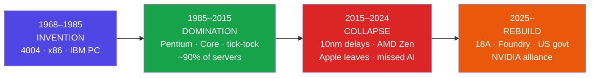
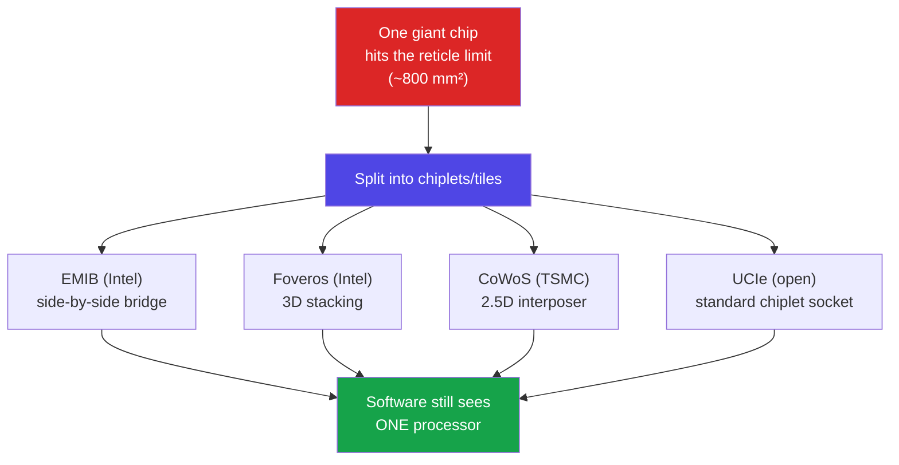
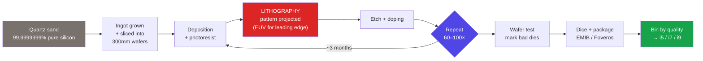
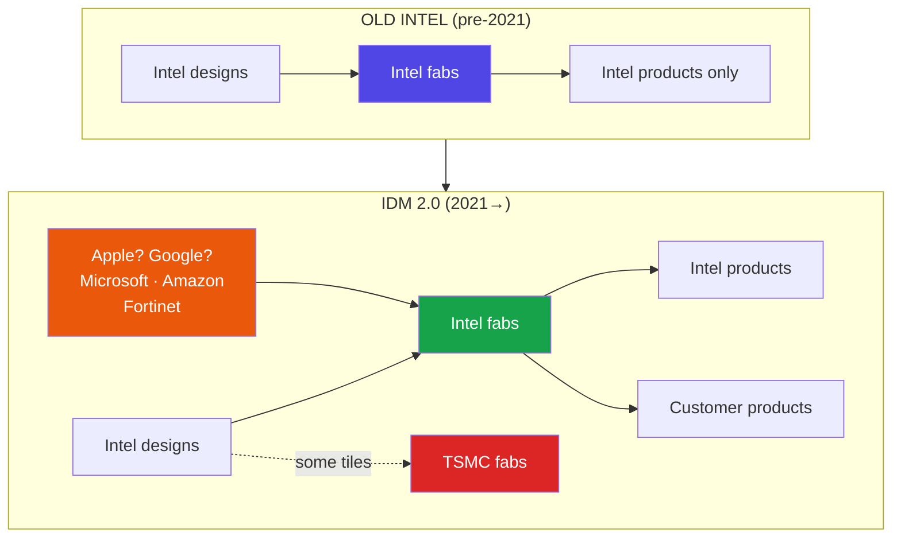
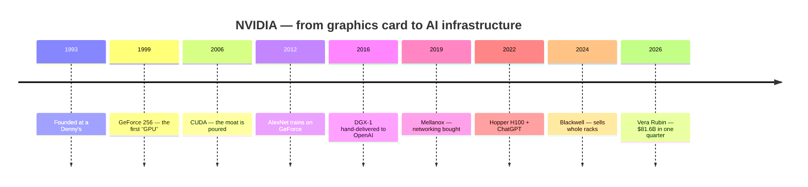
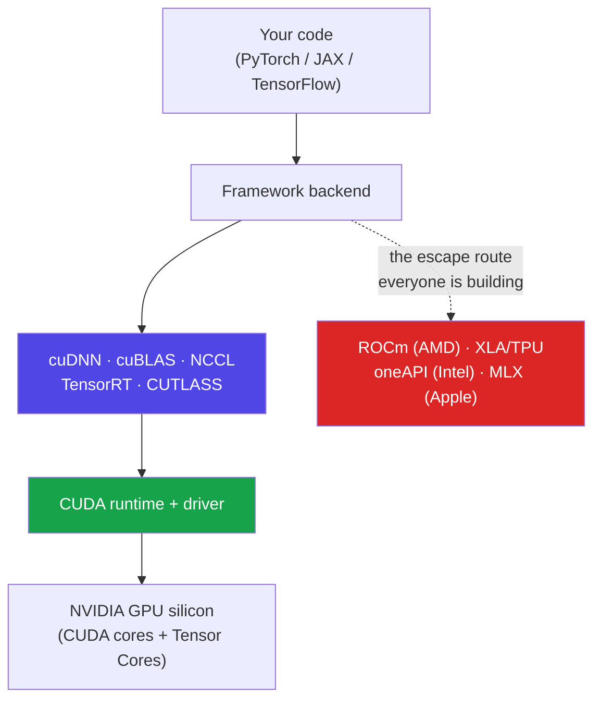
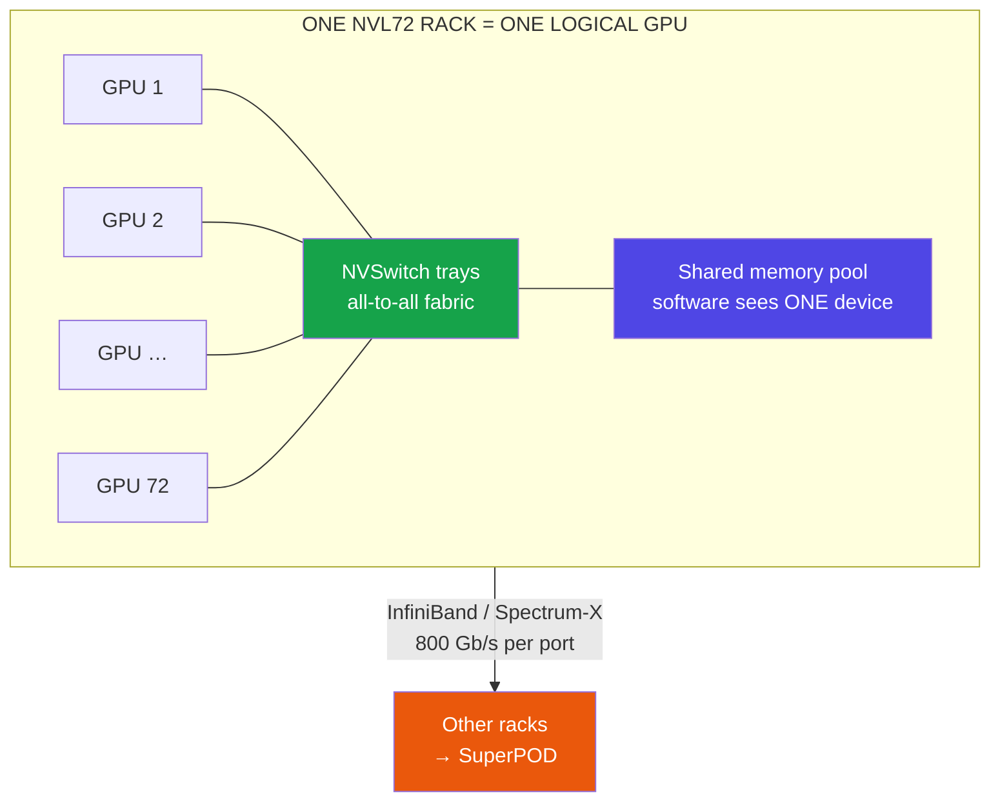
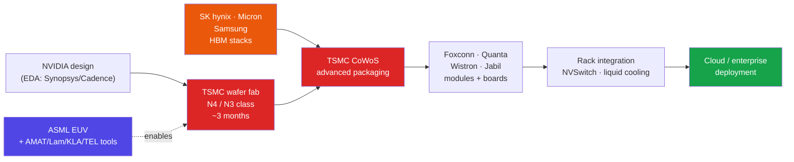
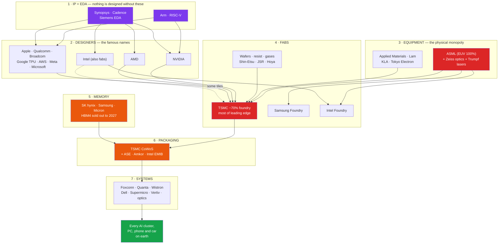
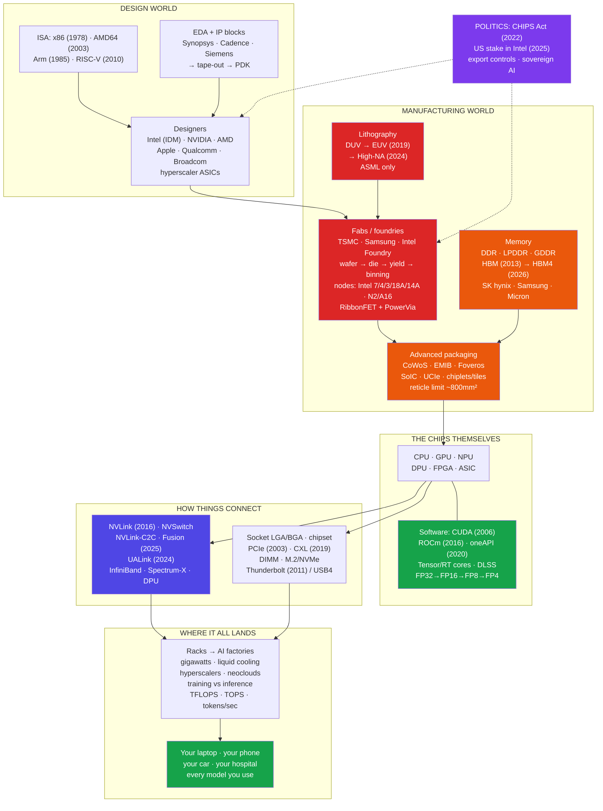

# Intel & NVIDIA — The Complete Story

### History, products, connectors, takeovers, manufacturing and industry use cases — plus the full map of who actually makes the world's chips

> *"AMD taught you the underdog's story. Intel is the empire that lost its crown and is spending everything to win it back; NVIDIA is the graphics company that quietly built the platform the entire AI era runs on. Behind both stands a chain of a dozen companies most people have never heard of — and that chain is the real story."*

**Companion Guide** · Written August 2026 · Facts current to mid-2026 · Read alongside the AMD AI DevDay prep guide

---

## Table of Contents

- [Part A — Intel: The Company That Built the Computer Age](#part-a-intel-the-company-that-built-the-computer-age)
  - [A1. Who Intel Is (in one breath)](#a1-who-intel-is-in-one-breath) · [A2. The History — 1968 to 2026](#a2-the-history-1968-to-2026) · [A3. The People and the Law That Ran the Industry](#a3-the-people-and-the-law-that-ran-the-industry) · [A4. How Intel Actually Makes Money](#a4-how-intel-actually-makes-money) · [A5. Intel in 2026 — The Honest Snapshot](#a5-intel-in-2026-the-honest-snapshot)
- [Part B — Intel's Products, Family by Family](#part-b-intels-products-family-by-family)
  - [B1. Core and Core Ultra — The PC Brains](#b1-core-and-core-ultra-the-pc-brains) · [B2. How to Read an Intel Model Number](#b2-how-to-read-an-intel-model-number) · [B3. Xeon — The Server Line](#b3-xeon-the-server-line) · [B4. Intel Arc and the Xe Graphics Push](#b4-intel-arc-and-the-xe-graphics-push) · [B5. Intel's AI Silicon — NPU, Gaudi, Crescent Island](#b5-intels-ai-silicon-npu-gaudi-crescent-island) · [B6. The Other Intels — Altera, Mobileye, Networking, Edge](#b6-the-other-intels-altera-mobileye-networking-edge) · [B7. The Process Ladder — Intel 7 to 14A](#b7-the-process-ladder-intel-7-to-14a) · [B8. Where Intel Chips Actually Run](#b8-where-intel-chips-actually-run)
- [Part C — Connectors, Sockets and Interconnects](#part-c-connectors-sockets-and-interconnects)
  - [C1. What a Socket Is — LGA, PGA, BGA](#c1-what-a-socket-is-lga-pga-bga) · [C2. The Chipset and the Platform](#c2-the-chipset-and-the-platform) · [C3. PCIe — The Universal Expansion Highway](#c3-pcie-the-universal-expansion-highway) · [C4. Memory Connectors — DIMM, SO-DIMM, CAMM2](#c4-memory-connectors-dimm-so-dimm-camm2) · [C5. Storage Connectors — SATA, M.2, U.2, NVMe](#c5-storage-connectors-sata-m2-u2-nvme) · [C6. Thunderbolt and USB — Intel's Gift to Every Laptop](#c6-thunderbolt-and-usb-intels-gift-to-every-laptop) · [C7. Display Connectors — HDMI, DisplayPort, eDP](#c7-display-connectors-hdmi-displayport-edp) · [C8. Data-Centre Interconnects — UPI, CXL, Ethernet, UALink](#c8-data-centre-interconnects-upi-cxl-ethernet-ualink) · [C9. Power Connectors — ATX, EPS, 12V-2x6](#c9-power-connectors-atx-eps-12v-2x6) · [C10. Packaging Interconnects — EMIB, Foveros, UCIe](#c10-packaging-interconnects-emib-foveros-ucie) · [C11. The Whole Connector Map in One Table](#c11-the-whole-connector-map-in-one-table)
- [Part D — Intel's Takeovers, Deals and Divestitures](#part-d-intels-takeovers-deals-and-divestitures)
  - [D1. The Acquisition Record](#d1-the-acquisition-record) · [D2. The Big Sales and Spin-Offs](#d2-the-big-sales-and-spin-offs) · [D3. The Deals That Changed Intel's Ownership](#d3-the-deals-that-changed-intels-ownership) · [D4. What the Deal History Teaches](#d4-what-the-deal-history-teaches)
- [Part E — How Intel Chips Are Manufactured](#part-e-how-intel-chips-are-manufactured)
  - [E1. Sand to Chip — The Full Journey](#e1-sand-to-chip-the-full-journey) · [E2. Inside a Fab — Cleanrooms, Wafers, Yield](#e2-inside-a-fab-cleanrooms-wafers-yield) · [E3. Lithography and Why EUV Rules Everything](#e3-lithography-and-why-euv-rules-everything) · [E4. Intel's Fab Map](#e4-intels-fab-map) · [E5. IDM 2.0 and Intel Foundry](#e5-idm-20-and-intel-foundry) · [E6. Packaging — The New Frontier](#e6-packaging-the-new-frontier)
- [Part F — Intel's Future Ideas and Bets](#part-f-intels-future-ideas-and-bets)
  - [F1. The 18A and 14A Bet](#f1-the-18a-and-14a-bet) · [F2. The Inference Pivot](#f2-the-inference-pivot) · [F3. The NVIDIA Alliance](#f3-the-nvidia-alliance) · [F4. Research Moonshots — Quantum, Neuromorphic, Optical](#f4-research-moonshots-quantum-neuromorphic-optical) · [F5. The Risks, Honestly](#f5-the-risks-honestly)
- [Part G — NVIDIA: The Company That Owns the AI Era](#part-g-nvidia-the-company-that-owns-the-ai-era)
  - [G1. Who NVIDIA Is (in one breath)](#g1-who-nvidia-is-in-one-breath) · [G2. The History — 1993 to 2026](#g2-the-history-1993-to-2026) · [G3. Jensen Huang and the Culture](#g3-jensen-huang-and-the-culture) · [G4. How NVIDIA Makes Money](#g4-how-nvidia-makes-money) · [G5. CUDA — The Real Moat](#g5-cuda-the-real-moat)
- [Part H — NVIDIA's Products, Family by Family](#part-h-nvidias-products-family-by-family)
  - [H1. GeForce RTX — The Gaming Line](#h1-geforce-rtx-the-gaming-line) · [H2. How to Read an NVIDIA Model Number](#h2-how-to-read-an-nvidia-model-number) · [H3. RTX Pro and the Workstation Line](#h3-rtx-pro-and-the-workstation-line) · [H4. The Data-Centre GPUs — V100 to Rubin](#h4-the-data-centre-gpus-v100-to-rubin) · [H5. Superchips, Racks and DGX Systems](#h5-superchips-racks-and-dgx-systems) · [H6. Grace, Vera and NVIDIA's CPU Ambition](#h6-grace-vera-and-nvidias-cpu-ambition) · [H7. Networking — Mellanox, InfiniBand, Spectrum-X, BlueField](#h7-networking-mellanox-infiniband-spectrum-x-bluefield) · [H8. Edge, Robotics and Automotive — Jetson, DRIVE, Isaac](#h8-edge-robotics-and-automotive-jetson-drive-isaac) · [H9. The Software Stack Above CUDA](#h9-the-software-stack-above-cuda) · [H10. Where NVIDIA Chips Actually Run](#h10-where-nvidia-chips-actually-run)
- [Part I — NVIDIA Connectors and the Wiring of an AI Factory](#part-i-nvidia-connectors-and-the-wiring-of-an-ai-factory)
  - [I1. PCIe Card vs SXM Module vs OAM](#i1-pcie-card-vs-sxm-module-vs-oam) · [I2. NVLink and NVSwitch — The Fabric That Makes 72 GPUs One](#i2-nvlink-and-nvswitch-the-fabric-that-makes-72-gpus-one) · [I3. NVLink-C2C and NVLink Fusion](#i3-nvlink-c2c-and-nvlink-fusion) · [I4. The Power Connector Saga — 12VHPWR to 12V-2x6](#i4-the-power-connector-saga-12vhpwr-to-12v-2x6) · [I5. Display Outputs Through the Years](#i5-display-outputs-through-the-years) · [I6. Network Connectors — QSFP, OSFP, DAC, AOC, Optics](#i6-network-connectors-qsfp-osfp-dac-aoc-optics) · [I7. Rack-Level "Connectors" — Busbars, Cold Plates, Spines](#i7-rack-level-connectors-busbars-cold-plates-spines) · [I8. Every Interconnect Compared](#i8-every-interconnect-compared)
- [Part J — NVIDIA's Takeovers and Investments](#part-j-nvidias-takeovers-and-investments)
  - [J1. The Acquisition Record](#j1-the-acquisition-record) · [J2. The Arm Deal That Died](#j2-the-arm-deal-that-died) · [J3. Groq, Enfabrica and the Inference Land-Grab](#j3-groq-enfabrica-and-the-inference-land-grab) · [J4. NVIDIA as an Investor](#j4-nvidia-as-an-investor) · [J5. What the Pattern Tells You](#j5-what-the-pattern-tells-you)
- [Part K — How NVIDIA Chips Are Manufactured](#part-k-how-nvidia-chips-are-manufactured)
  - [K1. The Fabless Model Step by Step](#k1-the-fabless-model-step-by-step) · [K2. Inside a Blackwell/Rubin Package](#k2-inside-a-blackwellrubin-package) · [K3. The Two Real Bottlenecks — CoWoS and HBM](#k3-the-two-real-bottlenecks-cowos-and-hbm) · [K4. From Chip to Rack to Data Centre](#k4-from-chip-to-rack-to-data-centre) · [K5. What a GPU Actually Costs to Build](#k5-what-a-gpu-actually-costs-to-build)
- [Part L — Industry Use Cases: Where These Chips Actually Work](#part-l-industry-use-cases-where-these-chips-actually-work)
  - [L1. Consumer — PCs, Laptops, Gaming, Consoles](#l1-consumer-pcs-laptops-gaming-consoles) · [L2. Cloud and Data Centre — Training vs Inference](#l2-cloud-and-data-centre-training-vs-inference) · [L3. The Software Industry (Your Own Stack)](#l3-the-software-industry-your-own-stack) · [L4. Healthcare and Life Sciences](#l4-healthcare-and-life-sciences) · [L5. Automotive and Robotics](#l5-automotive-and-robotics) · [L6. Manufacturing, Energy and Telecom](#l6-manufacturing-energy-and-telecom) · [L7. Finance, Retail and Media](#l7-finance-retail-and-media) · [L8. Science, Weather and Supercomputing](#l8-science-weather-and-supercomputing) · [L9. Defence, Space and Sovereign AI](#l9-defence-space-and-sovereign-ai) · [L10. India — Who Uses What, and the Fab Push](#l10-india-who-uses-what-and-the-fab-push) · [L11. The One-Table Industry Map](#l11-the-one-table-industry-map)
- [Part M — Special Section: The Whole Chip Industry and Who Depends on Whom](#part-m-special-section-the-whole-chip-industry-and-who-depends-on-whom)
  - [M1. The Nine Layers of the Chip Industry](#m1-the-nine-layers-of-the-chip-industry) · [M2. The Designers — Fabless Companies](#m2-the-designers-fabless-companies) · [M3. The IDMs — Companies That Design *and* Manufacture](#m3-the-idms-companies-that-design-and-manufacture) · [M4. The Foundries — Who Actually Builds the Chips](#m4-the-foundries-who-actually-builds-the-chips) · [M5. The Memory Makers and the HBM Chokepoint](#m5-the-memory-makers-and-the-hbm-chokepoint) · [M6. The Equipment Makers — ASML and the Tool Chain](#m6-the-equipment-makers-asml-and-the-tool-chain) · [M7. The IP and EDA Layer — Arm, RISC-V, Synopsys, Cadence](#m7-the-ip-and-eda-layer-arm-risc-v-synopsys-cadence) · [M8. Packaging and Test — The OSAT World](#m8-packaging-and-test-the-osat-world) · [M9. Materials, Wafers and Substrates](#m9-materials-wafers-and-substrates) · [M10. System Builders, Power, Cooling and Optics](#m10-system-builders-power-cooling-and-optics) · [M11. The Dependency Map](#m11-the-dependency-map) · [M12. If One Link Breaks — The Chokepoint Table](#m12-if-one-link-breaks-the-chokepoint-table) · [M13. Geopolitics — Taiwan, Export Controls, CHIPS Acts](#m13-geopolitics-taiwan-export-controls-chips-acts) · [M14. Market Shares in One Place](#m14-market-shares-in-one-place) · [M15. The Circular Money Question](#m15-the-circular-money-question)
- [Part N — Intel vs NVIDIA vs AMD — The 2026 Scoreboard](#part-n-intel-vs-nvidia-vs-amd-the-2026-scoreboard)
  - [N1. The Numbers Side by Side](#n1-the-numbers-side-by-side) · [N2. Where Each One Actually Wins](#n2-where-each-one-actually-wins) · [N3. The Moats, Ranked](#n3-the-moats-ranked) · [N4. What to Watch Next](#n4-what-to-watch-next)
- [Part O — The Timeline: Three Companies, One Chart](#part-o-the-timeline-three-companies-one-chart)
- [Part P — Glossary: One Paragraph Each, with Years](#part-p-glossary-one-paragraph-each-with-years)
  - Transistor · Integrated Circuit · Moore's Law · x86 (1978) and x86-64 / AMD64 · Arm (1985) and RISC-V · ISA · CPU, GPU, NPU, DPU, FPGA, ASIC · Fabless, Foundry, IDM, OSAT · Wafer, Die, Yield, Binning · Process Node (nm) and What the Numbers Mean · Lithography, DUV, EUV, High-NA EUV · RibbonFET / Gate-All-Around and PowerVia / Backside Power · Chiplet, Tile, Interposer, Reticle Limit · Advanced Packaging — CoWoS, EMIB, Foveros, SoIC, UCIe · HBM (2013) and HBM4 · VRAM, GDDR, LPDDR, DDR · CUDA (2006), ROCm (2016), oneAPI · Tensor Core (2017), RT Core (2018), DLSS · FP32, FP16, BF16, FP8, FP4 — Precision · TOPS, TFLOPS, Tokens per Second · PCIe (2003), CXL (2019), UALink · NVLink (2016), NVSwitch, NVLink-C2C, NVLink Fusion · InfiniBand, Ethernet, Spectrum-X, DPU · Thunderbolt (2011) and USB4 · Socket, LGA, BGA, Chipset · Training vs Inference · Hyperscaler, Neocloud, AI Factory · Tape-Out, PDK, EDA, IP Block · Intel Foundry (2021) and IDM 2.0 · CHIPS Act (2022) and the US Government Stake · Export Controls and Sovereign AI · Lisa Su, Jensen Huang, Lip-Bu Tan · The Big Picture — Every Term in One Frame

---

# Part A — Intel: The Company That Built the Computer Age

*You already know AMD's underdog story. Intel is the opposite arc: the company that defined the industry for 40 years, then lost its crown, and is now spending everything it has to win it back. Understand Intel and you understand how the whole chip business works — because Intel invented most of the rules.*

## A1. Who Intel Is (in one breath)

**Simple definition:** Intel (Integrated Electronics, founded 1968) is the American company that invented the microprocessor, created the **x86** instruction set that almost every PC and server on earth runs, and — unlike AMD and NVIDIA — **designs *and* manufactures** its own chips in its own factories. That last part is the whole story of Intel: it is an **IDM** (Integrated Device Manufacturer), not a fabless designer.

<p class="te"><strong>Telugu:</strong> Intel (1968) ante microprocessor ni kanipettina company — prapancham lo dadapu prathi PC, server nadipe <strong>x86</strong> instruction set vaalladi. AMD, NVIDIA laaga kaadu — Intel <strong>design kuda chestundi, sonta factories lo chips tayaru kuda chestundi</strong>. Deenine <strong>IDM</strong> antaru. Ee okka teda ye Intel katha antha: factories unte power ekkuva, kaani ade pedda risk kuda.</p>

**Analogy:** AMD and NVIDIA are architects who hand their blueprints to a construction giant (TSMC). Intel is the architect **who also owns the construction company, the cement plant and the cranes**. When everything works, Intel is unstoppable — nobody else controls the full stack. When the construction arm falls behind, as it did from 2015 to 2023, the architect's beautiful designs get built late and badly, and rivals using TSMC ship first.

**The three-line summary of 2026 Intel:** it lost the manufacturing lead to TSMC around 2018, lost the CPU performance crown to AMD, missed the AI boom entirely, nearly collapsed in 2024 — and is now, under a new CEO with the US government as a shareholder, betting the company on one manufacturing process called **18A** and on selling factory capacity to its own competitors.

## A2. The History — 1968 to 2026

Intel's arc has four acts: **invention** (1968–1985), **domination** (1985–2015), **collapse** (2015–2024), **rebuild** (2025– ).

| Year | What happened | Why it mattered |
|------|---------------|-----------------|
| **1968** | Robert Noyce + Gordon Moore leave Fairchild, found Intel; Andy Grove joins as employee #3 | Noyce co-invented the integrated circuit; Moore wrote Moore's Law |
| **1969** | First product: the 3101 memory chip | Intel was born a **memory** company, not a CPU company |
| **1970** | **1103 DRAM** — the first commercially successful memory chip | Made Intel a real business |
| **1971** | **Intel 4004** — the world's first commercial microprocessor: 4-bit, 2,300 transistors, 740 kHz | A whole computer's brain on one chip. The industry starts here |
| **1978** | **8086** launches — the birth of **x86** | The instruction set your laptop still speaks today |
| **1981** | IBM picks the 8088 for the **IBM PC** | The single luckiest, most important deal in computing history |
| **1985** | Exits memory (Japanese competition), bets everything on microprocessors; ships the **386** | Grove's famous "walk out the door and come back" decision |
| **1991** | **"Intel Inside"** campaign | A component brand became a household name |
| **1993** | **Pentium** launches | Intel becomes the default; brand recognition peaks |
| **1994** | Pentium **FDIV bug** → $475M recall | The first lesson that trust is the real product |
| **2000–2010** | **Itanium** (64-bit with HP) flops; AMD's x86-64 wins; Intel adopts AMD's design | Intel's biggest architectural defeat |
| **2006** | **Core** architecture (Conroe) retakes the crown; **Apple switches Macs to Intel** | The golden decade begins |
| **2007** | "**Tick-tock**" cadence: shrink the process one year, new architecture the next | Metronomic dominance; ~80–90% server share |
| **2015–2021** | **10nm disaster** — years of delays; TSMC passes Intel in manufacturing | The crown is lost. Rivals on TSMC ship better chips |
| **2017** | AMD's Zen/EPYC arrives; Intel's server share starts falling | The competitive collapse begins |
| **2018** | **Meltdown & Spectre** security flaws; CEO Brian Krzanich resigns | Reputation + leadership crisis |
| **2020** | **Apple leaves for its own Arm silicon**; Intel sells NAND business to SK hynix ($9B) | Symbolic end of an era |
| **2021** | **Pat Gelsinger** returns as CEO: "IDM 2.0" — five nodes in four years, opens **Intel Foundry** | The comeback plan is written |
| **2022** | US **CHIPS Act** passes; Intel launches **Arc** GPUs; Mobileye IPO | Government money enters the story |
| **2024** | Raptor Lake instability scandal, ~15,000 layoffs, dividend suspended, ~$13B foundry losses, Gelsinger ousted in December | Intel's worst year since 1968 |
| **2025** | **Lip-Bu Tan** becomes CEO (March); sells 51% of Altera; **US government takes ~10%**; SoftBank invests $2B; **NVIDIA invests $5B** | Survival financing + a new strategy |
| **2026** | **18A ships in volume** (Panther Lake, Xeon 6+); Q2 revenue $16.1B, **up 25%** — the fastest growth in ~15 years; foundry revenue $5.8B (+31%) | The first real evidence the rebuild is working |

<p class="te"><strong>Telugu:</strong> Intel katha naalugu bhaagalu. <strong>1968–1985 invention</strong>: memory chips tho start, 1971 lo 4004 — prapancham lo first microprocessor, 1978 lo x86 puttindi, 1981 lo IBM PC deal tho jackpot. <strong>1985–2015 domination</strong>: Pentium, "Intel Inside", tick-tock — dadapu 80–90% market. <strong>2015–2024 collapse</strong>: 10nm factory delay valla TSMC mundu velli poyindi, AMD Zen tho competition, Apple velli poyindi, AI boom miss ayyaru, 2024 lo 15,000 layoffs. <strong>2025 nunchi rebuild</strong>: kotha CEO Lip-Bu Tan, US government 10% shareholder, NVIDIA $5B, mariyu 18A process meeda motham bet. 2026 Q2 lo revenue 25% perigindi — 15 yellalo fastest.</p>



## A3. The People and the Law That Ran the Industry

**Simple definition:** Intel's story is inseparable from a handful of people and one observation that became the industry's heartbeat.

| Person | Role | What they're remembered for |
|--------|------|------------------------------|
| **Robert Noyce** | Co-founder, CEO 1968–75 | Co-invented the integrated circuit; "the Mayor of Silicon Valley" |
| **Gordon Moore** | Co-founder, CEO 1975–87 | Wrote **Moore's Law** in 1965 |
| **Andy Grove** | Employee #3, CEO 1987–98 | Turned Intel into an execution machine; *"Only the paranoid survive"* |
| **Craig Barrett / Paul Otellini** | CEOs 1998–2013 | Peak dominance; Otellini famously passed on making the **iPhone** chip |
| **Brian Krzanich / Bob Swan** | CEOs 2013–2021 | The 10nm years; the crown slips away |
| **Pat Gelsinger** | CEO 2021–2024 | Bet on IDM 2.0 and Foundry; ran out of time and money |
| **Lip-Bu Tan** | CEO since March 2025 | Ex-CEO of **Cadence** (chip design software) and a legendary chip investor; cutting costs, chasing foundry customers, pivoting to AI inference |

**Moore's Law** — the observation (1965, refined 1975) that the number of transistors on a chip **doubles roughly every two years** at similar cost. It was never a law of physics; it was a business commitment the whole industry organised itself around. It is why a ₹15,000 phone today outruns a 1990s supercomputer. In the 2020s the pure transistor-doubling has slowed and cost-per-transistor has stopped falling — which is exactly why **chiplets, packaging and specialised accelerators** (Part E6, Part K) became the new way to keep gaining performance.

<p class="te"><strong>Telugu:</strong> Intel ni ardham chesukovalante konni peru telisi undali: <strong>Noyce</strong> (integrated circuit co-inventor), <strong>Gordon Moore</strong> (Moore's Law), <strong>Andy Grove</strong> (execution machine ga marchina CEO), <strong>Pat Gelsinger</strong> (2021 comeback plan), <strong>Lip-Bu Tan</strong> (2025 nunchi CEO, mundu Cadence CEO). <strong>Moore's Law</strong> ante — chip meeda transistors prathi rendu yellaki double avutayi, ade rate lo. Idi physics law kaadu, industry antha follow ayina oka target. Ippudu adi slow ayyindi — anduke <strong>chiplets</strong> mariyu <strong>packaging</strong> kotha daari ayyayi.</p>

## A4. How Intel Actually Makes Money

Intel reports its business in a few big buckets. Knowing them makes every news headline readable.

| Segment | What it sells | Reality in 2026 |
|---------|---------------|-----------------|
| **CCG** — Client Computing | Core / Core Ultra CPUs for laptops and desktops | Still the profit engine; ~half of revenue |
| **DCAI** — Data Center & AI | Xeon server CPUs, Gaudi, upcoming AI GPUs | Under heavy attack from AMD EPYC and Arm chips |
| **Intel Foundry** | Making chips **for other companies** in Intel fabs | ~$5.8B in Q2 2026 (+31%), but most of it is still Intel making chips for itself |
| **Network & Edge / Other** | Networking silicon, edge and IoT chips, Mobileye stake | Smaller, being simplified |
| **Altera** (51% sold 2025) | FPGAs | No longer fully Intel's — Silver Lake controls it |

The crucial thing to understand: **Intel Foundry is measured separately on purpose.** Gelsinger split the company's internal accounting so the world could see how much money the factories lose or make on their own. In 2024 that number was roughly **$13 billion of operating loss**. The entire 2025–2027 plan is about turning that around by filling the fabs with **external customers**.

<p class="te"><strong>Telugu:</strong> Intel dabbu ela sampadistundo teliste news ardham avutundi. <strong>CCG</strong> = laptop/desktop CPUs (ippatiki pedda profit). <strong>DCAI</strong> = server CPUs + AI chips (AMD nunchi pedda dhebba). <strong>Intel Foundry</strong> = veru companies kosam chips tayaru cheyyadam — idi separate ga chupistaru, endukante 2024 lo daadapu <strong>$13 billion nastam</strong>. Motham plan idi: fabs ni bayati customers tho nimpi, aa nastam ni laabham ga marchadam.</p>

## A5. Intel in 2026 — The Honest Snapshot

Where things genuinely stand as of mid-2026, without cheerleading:

**What is working**
- **18A is real and shipping.** Panther Lake (Core Ultra series 3) and Xeon 6+ "Clearwater Forest" — up to 288 efficiency cores — are both manufactured on 18A at **Fab 52 in Chandler, Arizona**. Intel has a leading-edge process running on US soil, which nobody else does.
- **Revenue is growing again**: Q2 2026 revenue $16.1B, **up 25% year-over-year**, gross margin back to ~42%, foundry sales $5.8B.
- **Money in the bank**: US government (~10%), SoftBank ($2B) and NVIDIA ($5B) all bought in during 2025.
- **A named external foundry customer**: Fortinet signed on in July 2026 for security chips — small, but the first public logo under the new CEO.

**What is not working yet**
- **No AI accelerator with real market share.** Gaudi never hit even its modest $500M target. The replacement, **Crescent Island**, only samples to customers in the second half of 2026.
- **14A needs customers to exist.** Lip-Bu Tan has said publicly that if big external customers do not commit to the **14A** node, Intel may not build it at all. That is an existential sentence for a manufacturing company.
- **Server share keeps leaking** to AMD EPYC and to Arm-based chips designed by Amazon, Google and NVIDIA.
- **The government stake cuts both ways** — it is capital and political protection, but also political pressure.

> **The one sentence to remember:** Intel's 2026 is an *execution* year; the company itself says the growth inflection is 2027. Everything depends on whether external customers trust Intel's factories again.

<p class="te"><strong>Telugu:</strong> 2026 lo Intel nijam paristhiti: <strong>manchi vishayalu</strong> — 18A process nijam ga pani chestundi (Arizona Fab 52 lo Panther Lake, Xeon 6+ tayaru avutunnayi), revenue 25% perigindi, US government + SoftBank + NVIDIA dabbu pettaru. <strong>Inka kaani vishayalu</strong> — AI GPU lo market share dadapu zero (Gaudi fail, Crescent Island inka sample stage), server share AMD ki poutondi, mariyu <strong>14A</strong> node ki bayati customers raakapote adi build cheyyakapovachu ani CEO ne cheppadu. Intel ye antundi — 2026 execution year, nijamaina growth 2027 lo.</p>

---

# Part B — Intel's Products, Family by Family

*Every Intel product name you have ever seen — Core, Core Ultra, Xeon, Arc, Gaudi, Altera — placed in one map, with the model numbers decoded so you can read any spec sheet.*

## B1. Core and Core Ultra — The PC Brains

**Simple definition:** **Core** is Intel's consumer CPU brand for laptops and desktops (born 2006). Since late 2023 the premium line is renamed **Core Ultra**, and the big change is that these chips are no longer one piece of silicon — they are **tiles** (Intel's word for chiplets) glued together, and they contain an **NPU** for AI.

| Generation | Code name | Year | What was new |
|-----------|-----------|------|--------------|
| Core 2 → 14th gen | Conroe … Raptor Lake | 2006–2023 | Classic monolithic CPUs; the "i3/i5/i7/i9" era |
| **Core Ultra 100** | Meteor Lake | 2023 | First **tiled/chiplet** client CPU; first Intel **NPU** |
| **Core Ultra 200V** | Lunar Lake | 2024 | Efficiency-focused laptop chip; memory in the package; 48 NPU TOPS |
| **Core Ultra 200S** | Arrow Lake | 2024 | Desktop, new socket **LGA 1851** |
| **Core Ultra series 3** | **Panther Lake** | 2026 | **First client chip on Intel 18A**; new Xe3 graphics; AI PC platform |
| **Nova Lake** | Nova Lake | 2026–27 | Up to ~52 cores previewed at Computex 2026; socket LGA 1954 |

Two ideas explain modern Intel CPUs:

1. **Hybrid cores (since 2021).** Intel splits cores into **P-cores** (Performance — big, fast, for the app you're using) and **E-cores** (Efficient — small, for background work). Windows' scheduler decides where each thread goes. This is the same idea as a phone's big.LITTLE design, brought to the PC.
2. **Tiles.** A Core Ultra chip is a compute tile + graphics tile + SoC tile + I/O tile, stitched together on a base with Intel's **Foveros** packaging. Some tiles are even manufactured **by TSMC** — yes, Intel buys wafers from its biggest rival for parts of its own chips.

<p class="te"><strong>Telugu:</strong> <strong>Core</strong> ante Intel consumer CPU brand (laptops, desktops). 2023 nunchi premium vaatiki peru <strong>Core Ultra</strong>. Rendu kotha vishayalu: (1) <strong>Hybrid cores</strong> — P-cores (peddavi, speed kosam) + E-cores (chinnavi, background pani kosam), phone lo laage. (2) <strong>Tiles</strong> — okate pedda silicon kaadu, chinna mukkalu (compute, graphics, I/O) kalipi Foveros packaging tho attach chestaru. Konni tiles ni <strong>TSMC</strong> ne tayaru chestundi — competitor daggara Intel wafers konatam!</p>

## B2. How to Read an Intel Model Number

Once you can decode the name, a shop listing stops being noise.

```
Intel  Core  Ultra  9   285K
  |      |     |    |    |  |
  |      |     |    |    |  +-- suffix: K = unlocked/overclockable
  |      |     |    |    |              H = high-power laptop
  |      |     |    |    |              U/V = low power laptop
  |      |     |    |    |              F = no integrated graphics
  |      |     |    |    |              T = low power desktop
  |      |     |    |    +----- SKU number (higher = faster in that family)
  |      |     |    +---------- tier: 3 / 5 / 7 / 9  (budget → enthusiast)
  |      |     +--------------- "Ultra" = premium line with NPU (2023+)
  |      +--------------------- brand family
  +---------------------------- company
```

The **Xeon** side reads differently: `Xeon 6 6980P` — the family number (6), then a SKU, then **P** (Performance cores) or **E** (Efficient cores). Older Xeons used Platinum / Gold / Silver / Bronze tiers.

<p class="te"><strong>Telugu:</strong> Model number ardham chesukovadam simple: <strong>3/5/7/9</strong> = tier (budget nunchi top varaku), taruvata number = aa family lo speed, chivara letter = <strong>K</strong> (overclock cheyyochu), <strong>H</strong> (powerful laptop), <strong>U</strong> (battery-friendly laptop), <strong>F</strong> (graphics ledu, separate GPU kavali). "Ultra" ante NPU unna kotha premium line. Shop lo laptop chuse mundu ee okka box gurthu pettuko.</p>

## B3. Xeon — The Server Line

**Simple definition:** **Xeon** is Intel's server and workstation CPU brand — the chips inside the racks that run cloud computing, databases, websites and the *control* side of AI clusters. Your Node.js API in production is almost certainly executing on a Xeon or an EPYC.

Modern Xeon splits into two philosophies:

| Line | Core type | Built for | Example |
|------|-----------|-----------|---------|
| **Xeon 6 P-core** (Granite Rapids) | Performance cores | Databases, HPC, AI head-node work, per-core licensing | Xeon 6 6900P series |
| **Xeon 6 E-core** (Sierra Forest) | Efficient cores, up to 288 | Cloud-native microservices, web front-ends, density per watt | Xeon 6 6700E/6900E |
| **Xeon 6+** (Clearwater Forest, 2026) | E-cores on **Intel 18A** | Hyperscale cloud, inference serving, telecom edge | Intel's first 18A server chip |

Why Xeon still matters even in an AI world: **every GPU needs CPUs around it.** A rack of GPUs has host CPUs feeding data, running the operating system, handling storage and networking. Intel's pitch to AI builders is "we are the best *host* CPU" — and its new deal with NVIDIA (Part F3) is exactly that: custom Intel x86 CPUs sitting next to NVIDIA GPUs.

<p class="te"><strong>Telugu:</strong> <strong>Xeon</strong> ante Intel server CPU — cloud, databases, websites nadipe racks lo unde chip. Nee Node.js API production lo Xeon leda EPYC meede nadustundi. Ippudu Xeon lo rendu rakalu: <strong>P-core</strong> (peddavi, speed kavalsina pani ki) mariyu <strong>E-core</strong> (chinnavi, 288 varaku — ekkuva pani takkuva current tho). AI kaalam lo kuda Xeon avasaram, endukante <strong>prathi GPU pakkana oka CPU undali</strong> — data feed cheyyadaniki, OS nadapadaniki. Adi Intel ippudu ammutunna main story.</p>

## B4. Intel Arc and the Xe Graphics Push

**Simple definition:** **Arc** is Intel's discrete graphics card brand (launched 2022) — Intel's third serious attempt to break the NVIDIA/AMD duopoly in GPUs. The underlying architecture family is called **Xe**: Xe-LP (integrated), Xe-HPG (gaming Arc), Xe2 "Battlemage", Xe3 "Celestial", and **Xe3P** (the 2026 data-centre variant).

- **Arc A-series (2022)** — rough launch, weak drivers, but honest hardware; Intel kept fixing drivers for two years and eventually earned respect.
- **Arc B-series "Battlemage" (2024–25)** — B580/B570 became genuinely well-reviewed budget cards, especially for their **12GB of VRAM at a low price** — which matters for local AI, not just gaming.
- **Integrated Arc graphics** now ship inside Core Ultra chips, and in Panther Lake the Xe3 integrated GPU is strong enough that many thin laptops no longer need a separate card.

Why Intel bothers: graphics is not a hobby — it is the on-ramp to AI. The same shader engines that draw frames do the matrix maths that runs models. Every GPU Intel ships is also a developer with Intel's software stack (**oneAPI / SYCL**, the OpenVINO toolkit) installed.

<p class="te"><strong>Telugu:</strong> <strong>Arc</strong> ante Intel graphics card brand (2022 nunchi) — NVIDIA/AMD duopoly ni break cheyyadaniki Intel mudo prayatnam. Modati generation drivers chala weak, kaani rendu yella lo baaga fix chesaru; B580 laanti cards ippudu <strong>takkuva dhara ki 12GB VRAM</strong> ivvadam valla budget gamers ki, local AI ki manchivi. Intel ki graphics ante just gaming kaadu — <strong>AI loki daari</strong>. Frames gise engines ye AI matrix maths kuda chestayi.</p>

## B5. Intel's AI Silicon — NPU, Gaudi, Crescent Island

This is Intel's weakest area and its loudest ambition. Three separate efforts:

**1. The NPU inside every Core Ultra.** Branded **Intel AI Boost**, this is the low-power on-device AI engine — the same idea as AMD's XDNA. Meteor Lake had ~11 TOPS; Lunar Lake jumped to ~48 TOPS to clear Microsoft's 40-TOPS **Copilot+ PC** bar; Panther Lake pushes further, with Intel quoting large platform-level TOPS numbers combining CPU+GPU+NPU. This is the part of Intel's AI story that is genuinely shipping in volume, because it rides on every laptop sold.

**2. Gaudi — the accelerator that didn't land.** Intel bought **Habana Labs** in 2019 for ~$2B and shipped Gaudi 2 and **Gaudi 3** (2024). The hardware was reasonable and priced aggressively, but the software ecosystem never approached CUDA, and Intel publicly missed even a modest $500M revenue target. Honest verdict: a commercial failure that still taught Intel a lot.

**3. Crescent Island — the 2026 reset.** Announced October 2025: a **data-centre GPU built for inference only**, on the **Xe3P** architecture, with **160GB of LPDDR5X memory** and **air cooling**. Read that spec carefully — it is a deliberate anti-NVIDIA bet:

| Choice | NVIDIA/AMD flagship approach | Crescent Island's approach | The reasoning |
|--------|------------------------------|-----------------------------|---------------|
| Memory type | **HBM** (fast, scarce, expensive) | **LPDDR5X** (slower, plentiful, cheap) | Dodges the HBM shortage entirely |
| Cooling | Liquid cooling, 1000W+ racks | **Air cooled** | Fits in ordinary existing data centres |
| Workload | Training **and** inference | **Inference only** | Inference is where the volume is going |
| Capacity | 192–288GB HBM | 160GB LPDDR5X | Big enough to hold serious models cheaply |

Customer samples are due in the **second half of 2026**. If it works, Intel's AI pitch becomes "the cheap, boring, easy-to-deploy inference box" — not "we beat Rubin."

<p class="te"><strong>Telugu:</strong> Intel AI lo mudu prayatnalu. (1) <strong>NPU</strong> — prathi Core Ultra laptop lo unde chinna AI engine (AMD XDNA laantidi); idi nijam ga volume lo velthundi. (2) <strong>Gaudi</strong> — 2019 lo Habana Labs koni tesina AI accelerator; hardware paravaledu kaani software CUDA daggariki kuda raaledu, commercial ga fail ayyindi. (3) <strong>Crescent Island</strong> (2026) — kotha bet: HBM kaadu <strong>cheap LPDDR5X 160GB</strong>, liquid cooling kaadu <strong>air cooling</strong>, training kaadu <strong>inference matrame</strong>. Ante "NVIDIA ni odistam" ani kaadu — "chaala cheap ga, unna data centre lo ne pettochu" ani. 2026 second half lo customer samples.</p>

## B6. The Other Intels — Altera, Mobileye, Networking, Edge

Intel is not only CPUs. Several of these are being sold or shrunk, which is itself the story.

| Business | What it is | Status in 2026 |
|----------|-----------|----------------|
| **Altera** | FPGAs — chips you rewire with software (the Xilinx rival) | Bought 2015 for **$16.7B**; **51% sold to Silver Lake in 2025** at an **$8.75B** valuation — a brutal write-down |
| **Mobileye** | Self-driving vision chips (EyeQ) and ADAS software, Israel | Bought 2017 for **$15.3B**; IPO'd 2022; Intel keeps selling down its stake to raise cash |
| **Network & Edge** | Ethernet controllers, IPUs (data processing units), 5G/telecom silicon, industrial and robotics chips | Refocused; Intel reports 130+ customers testing Core Ultra series 3 for **edge AI and robotics** |
| **Optane / 3D XPoint** | A memory type between DRAM and SSD, with Micron | **Discontinued (2022)** — brilliant technology, no market |
| **Foundry** | Making chips for others | The centrepiece of the whole strategy (Part E5) |

<p class="te"><strong>Telugu:</strong> Intel lo CPU kaakunda inka vunnayi: <strong>Altera</strong> (FPGA chips — 2015 lo $16.7B ki konnaru, 2025 lo 51% ni kevalam $8.75B valuation ki ammaru — pedda nastam), <strong>Mobileye</strong> (self-driving cameras/chips, 2017 lo $15.3B), <strong>Network & Edge</strong> (Ethernet, 5G, robotics chips), <strong>Optane</strong> (adbhutamaina memory technology kaani market raaledu — 2022 lo aapesaru). Ee ammakalu antha oke reason ki: <strong>factories kosam dabbu</strong>.</p>

## B7. The Process Ladder — Intel 7 to 14A

**Simple definition:** a "process node" is the manufacturing recipe used to print transistors. Smaller/newer node = more transistors in the same area = faster and more efficient chips. Intel renamed its nodes in 2021 to line up with TSMC's marketing names, which confuses everyone — so here is the honest ladder.

| Intel node | Old name | Roughly comparable to | First products | Key innovation |
|-----------|----------|----------------------|----------------|----------------|
| **Intel 7** | 10nm Enhanced SuperFin | TSMC N7 | Alder/Raptor Lake (2021–23) | The node that finally worked |
| **Intel 4** | 7nm | TSMC N5-ish | Meteor Lake (2023) | Intel's **first EUV** node |
| **Intel 3** | — | TSMC N3-ish | Xeon 6 (2024) | Foundry-grade, higher density |
| **20A** | — | — | **Cancelled (2024)** | Skipped to concentrate on 18A |
| **Intel 18A** | 1.8nm-class | TSMC N2-class | **Panther Lake, Xeon 6+ (2026)** | **RibbonFET** (gate-all-around) + **PowerVia** (backside power) |
| **Intel 14A** | 1.4nm-class | TSMC A16-class | ~2027–28 | **High-NA EUV**, PowerDirect — *needs external customers to be built* |

Two genuine Intel firsts inside 18A are worth knowing because rivals are only now catching up:

- **RibbonFET** — Intel's gate-all-around transistor, where the gate wraps the channel on all four sides instead of three. Better control, less leakage.
- **PowerVia** — **backside power delivery**: power wires are routed underneath the transistors instead of competing for space with signal wires on top. Intel shipped this before TSMC, and it is a real engineering achievement.

<p class="te"><strong>Telugu:</strong> "Process node" ante transistors ni print chese recipe. Chinna node = ekkuva transistors = fast + power takkuva. Intel names: <strong>Intel 7 → 4 → 3 → (20A cancel) → 18A → 14A</strong>. 18A lo rendu nijamaina Intel firsts: <strong>RibbonFET</strong> (transistor gate naalugu vaipula chuttukuntundi — better control) mariyu <strong>PowerVia</strong> (current wires ni transistors <strong>kinda</strong> nunchi ivvadam — paina space signal wires ki migulutundi). Ee rendintlo Intel TSMC kanna mundu velindi. 14A ki High-NA EUV machines kavali — mariyu customers commit chesthene adi vastundi.</p>

## B8. Where Intel Chips Actually Run

Not abstract — you touch Intel silicon constantly:

- **Most office laptops and desktops on earth** — Core / Core Ultra, plus the Wi-Fi and Thunderbolt chips beside them.
- **The majority of cloud servers still running today** — Xeon powers a huge installed base at AWS, Azure, Google Cloud (look for instance names with "i" or Intel-labelled families).
- **Aurora supercomputer** (Argonne National Lab, USA) — an exascale machine built on Xeon CPUs + Intel Max GPUs.
- **Cars** — Mobileye EyeQ chips sit behind the windscreen of tens of millions of vehicles doing lane-keeping and emergency braking.
- **Networking gear and telecom base stations** — Intel Ethernet controllers and 5G silicon are everywhere in the plumbing.
- **Point-of-sale, medical imaging, factory robots, ATMs, digital signage** — the huge, invisible "embedded" market where reliability and 10-year supply matter more than benchmarks.

<p class="te"><strong>Telugu:</strong> Intel chips meeru rojuu vaadutunnaru: office laptops lo, cloud servers lo (AWS/Azure lo chala instances Xeon), Aurora supercomputer lo, car lo Mobileye camera chip lo, telecom towers lo, ATM lo, hospital scanning machine lo. NVIDIA/AMD news ekkuva vinipinchina, prapancham lo <strong>ekkuva computers ippatiki Intel meede</strong> nadustunnayi.</p>

---

# Part C — Connectors, Sockets and Interconnects

*Chips are useless alone. Everything interesting happens where two pieces of silicon are wired together — and most of those standards were invented or driven by Intel. This part is the complete connector vocabulary, from the socket under your CPU to the fabric linking 72 GPUs.*

<p class="te"><strong>Telugu:</strong> Chip okkate paniki raadhu — <strong>rendu chips ni kalipe wire/standard</strong> ye asalu magic. Ee bhagam lo prathi connector ni okkokkati chuddam: CPU kinda unde socket nunchi, 72 GPUs ni kalipe fabric varaku. Ivi chala varaku Intel ne kanipettindi leda push chesindi — anduke Intel bhagam lo pettanu, kaani ivi <strong>anni companies ki common</strong>.</p>

## C1. What a Socket Is — LGA, PGA, BGA

**Simple definition:** a **socket** is the mechanical + electrical connector that holds a CPU on a motherboard. It decides which CPUs fit which boards — the single most common upgrade question in the world.

| Type | Full name | Where the pins are | Used by |
|------|-----------|--------------------|---------|
| **LGA** | Land Grid Array | Pins are **on the motherboard**; the CPU has flat gold pads | Intel desktop/server, AMD AM5 |
| **PGA** | Pin Grid Array | Pins are **on the CPU** | Older AMD (AM4), older Intel laptops |
| **BGA** | Ball Grid Array | The chip is **soldered permanently** with solder balls | Nearly all laptops, phones, GPUs |

**Why it matters:** if your laptop CPU is BGA — and it almost certainly is — it can never be upgraded. That is not a conspiracy; solder balls are shorter connections, which means better signal integrity and thinner machines.

Intel's recent sockets, so you can read a motherboard listing:

| Socket | Pins | CPUs it takes | Era |
|--------|------|---------------|-----|
| **LGA 1700** | 1700 | 12th/13th/14th gen Core | 2021–2024 |
| **LGA 1851** | 1851 | Core Ultra 200S (Arrow Lake) | 2024–2025 |
| **LGA 1954** | 1954 | Nova Lake | 2026–27 |
| **LGA 4677** | 4677 | Xeon Sapphire/Emerald Rapids | 2023 servers |
| **LGA 4710 / LGA 7529** | 4710 / 7529 | Xeon 6 (the 7529 one is enormous — a chip the size of a playing card) | 2024–2026 servers |

AMD's equivalents for comparison: **AM5** (consumer, LGA, promised support through 2027+) and **SP5 / SP6** (EPYC servers).

<p class="te"><strong>Telugu:</strong> <strong>Socket</strong> ante CPU ni motherboard ki kalipe connector. Mudu rakalu: <strong>LGA</strong> (pins motherboard meeda, CPU meeda flat pads — Intel desktop), <strong>PGA</strong> (pins CPU meeda — palana AMD), <strong>BGA</strong> (chip ni permanent ga <strong>solder</strong> chestaru — laptops, phones, GPUs). Anduke laptop CPU ni upgrade cheyyalemu — adi soldered. Motherboard konetappudu socket peru (LGA 1700, LGA 1851, AM5) match avvali, lekapote CPU set avvadu.</p>

## C2. The Chipset and the Platform

**Simple definition:** the **chipset** (Intel calls it the **PCH** — Platform Controller Hub) is the second chip on a motherboard that handles everything the CPU doesn't: extra USB ports, extra PCIe lanes, SATA, audio, and overclocking permissions.

Intel's consumer chipset tiers decode like this:

| Prefix | Meaning | Typical buyer |
|--------|---------|---------------|
| **Z** (Z790, Z890) | Top tier — overclocking, most lanes | Enthusiast |
| **B** (B760, B860) | Mainstream — good value | Most people |
| **H** (H770, H810) | Basic | Office builds |
| **W / C** | Workstation / server | Xeon platforms |

**The practical rule:** a "K" CPU (unlocked) only overclocks on a "Z" chipset. That pairing rule is a business decision, not a technical one — and it is exactly the kind of platform control that made Intel enormously profitable for decades.

<p class="te"><strong>Telugu:</strong> <strong>Chipset (PCH)</strong> ante motherboard meeda rendo chip — CPU cheyyanivi anni idi chustundi: extra USB ports, SATA, audio, PCIe lanes. Intel tiers: <strong>Z</strong> (top, overclock cheyyochu), <strong>B</strong> (mainstream — chala mandiki idi chalu), <strong>H</strong> (basic). Rule: <strong>K</strong> CPU ni overclock cheyyalante <strong>Z</strong> chipset kavali. Idi technical avasaram kaadu — Intel business decision.</p>

## C3. PCIe — The Universal Expansion Highway

**Simple definition:** **PCI Express** is the high-speed road that connects the CPU to graphics cards, SSDs, network cards and AI accelerators. It is the most important connector in computing, and every company — Intel, AMD, NVIDIA — depends on it.

Two numbers define any PCIe link: the **generation** (speed per lane) and the **width** (`x1`, `x4`, `x8`, `x16` lanes).

| Generation | Year | Per-lane speed | x16 bandwidth (each direction) | Typical use |
|-----------|------|----------------|-------------------------------|-------------|
| PCIe 3.0 | 2010 | 8 GT/s | ~16 GB/s | Older GPUs, NVMe Gen3 |
| PCIe 4.0 | 2017 | 16 GT/s | ~32 GB/s | Mainstream today |
| **PCIe 5.0** | 2019 | 32 GT/s | ~63 GB/s | Current GPUs, fast SSDs, AI cards |
| **PCIe 6.0** | 2022 | 64 GT/s (PAM4 signalling) | ~121 GB/s | Rolling into AI servers |
| PCIe 7.0 | 2025 spec | 128 GT/s | ~242 GB/s | Future AI fabrics |

**Analogy:** a generation is the speed limit; lanes are how many lanes the highway has. A GPU in an `x16` slot running at `x8` because you filled another slot is the classic silent performance loss in a home build.

**Why this matters for AI:** PCIe is fast for a PC and *far too slow* for a GPU cluster. Moving a large model's activations between GPUs over PCIe would waste most of the GPU's time waiting. That single limitation is why NVIDIA built **NVLink** (Part I2) and why the industry created **CXL** and **UALink** — everything in Part I exists because PCIe alone wasn't enough.

<p class="te"><strong>Telugu:</strong> <strong>PCIe</strong> ante CPU ni graphics card, SSD, network card tho kalipe high-speed road. Rendu numbers gurthu pettuko: <strong>generation</strong> (speed — 3.0, 4.0, 5.0, 6.0) mariyu <strong>lanes</strong> (x1, x4, x8, x16 — road entha wide). AI ki idi <strong>chaalinantha vegam kaadu</strong> — anduke NVIDIA <strong>NVLink</strong> kattindi, industry <strong>CXL/UALink</strong> chesindi. Part I motham ee okka limitation valla ne puttindi.</p>

## C4. Memory Connectors — DIMM, SO-DIMM, CAMM2

**Simple definition:** RAM plugs into slots called **DIMM** slots. The connector shape and the DDR generation must both match the motherboard.

| Form | Where | Notes |
|------|-------|-------|
| **DIMM** (288-pin for DDR5) | Desktops, servers | DDR4 and DDR5 are **physically keyed differently** — they cannot be swapped |
| **SO-DIMM** | Laptops, mini-PCs | Shorter module |
| **CAMM2** | New thin laptops (2024+) | A flat, screwed-down module — thinner, faster, upgradable, replacing soldered RAM |
| **Soldered / on-package** | Ultrabooks; Intel's **Lunar Lake** put the RAM **inside the CPU package** | Fastest and most efficient, zero upgradability |
| **RDIMM / LRDIMM** | Servers only | Has a register/buffer chip for stability at high capacity; Intel Xeon is moving to **RDIMM-8000** speeds in 2026 |

**Channels matter more than people think.** A CPU has a memory controller with N channels (2 on most desktops, 8–12 on servers). Filling only one channel can cut memory bandwidth in half — and for AI work, memory bandwidth is often the real limit, not compute.

<p class="te"><strong>Telugu:</strong> RAM plug ayye slot ni <strong>DIMM</strong> antaru (laptop lo <strong>SO-DIMM</strong>, kotha thin laptops lo <strong>CAMM2</strong>). DDR4 mariyu DDR5 notch veru — okadi place lo inkoti set avvadu. Ultrabooks lo RAM soldered untundi (Intel Lunar Lake lo aithe RAM ne CPU package lopala pettaru). Mukhyam: <strong>channels</strong> — rendu sticks rendu channels lo pedithe bandwidth double. AI pani ki compute kanna <strong>memory bandwidth</strong> ye ekkuva sarlu bottleneck.</p>

## C5. Storage Connectors — SATA, M.2, U.2, NVMe

**Simple definition:** these are the ways a drive attaches. The confusing part is that **M.2 is a shape** while **NVMe and SATA are protocols** — an M.2 slot can carry either.

| Connector | Protocol | Real-world speed | Notes |
|-----------|----------|------------------|-------|
| **SATA** (cable) | AHCI/SATA | ~550 MB/s | Old, cheap, fine for bulk storage |
| **M.2 SATA** | SATA over an M.2 slot | ~550 MB/s | Looks modern, performs old — a common buying trap |
| **M.2 NVMe** | **NVMe over PCIe** | 3,500–14,000 MB/s | What you want in any 2026 machine |
| **U.2 / U.3** | NVMe | Same as above | 2.5-inch hot-swap server drives |
| **EDSFF (E1.S, E3.S)** | NVMe | Very high | The "ruler" format used in modern AI data centres |

**The keying trick:** M.2 slots have notches called **keys** — B-key, M-key, or B+M. An M-key slot with four PCIe lanes gives full NVMe speed; a B-key slot may be SATA-only or used for Wi-Fi/5G modules. Reading the key saves you from buying the wrong drive.

<p class="te"><strong>Telugu:</strong> Storage lo confusion idi: <strong>M.2 ante shape</strong>, <strong>NVMe/SATA ante protocol</strong>. Oke M.2 slot lo rendu rakala drives set avvachu — kaani SATA one <strong>~550 MB/s</strong> matrame, NVMe one <strong>3,500–14,000 MB/s</strong>. Kabatti kone mundu "M.2 NVMe" ani chudandi, kevalam "M.2" chaladu. Server lo <strong>U.2</strong> mariyu <strong>EDSFF ruler</strong> drives vadataru.</p>

## C6. Thunderbolt and USB — Intel's Gift to Every Laptop

**Simple definition:** **Thunderbolt** is Intel's high-speed port standard (co-developed with Apple, 2011) that carries PCIe + DisplayPort + power over one cable. Intel later **donated Thunderbolt 3 to the USB standards body**, which is literally how **USB4** came to exist. Every USB-C port on a modern laptop traces back to that decision.

| Version | Year | Speed | Connector |
|---------|------|-------|-----------|
| Thunderbolt 1 / 2 | 2011 / 2013 | 10 / 20 Gbps | Mini DisplayPort shape |
| **Thunderbolt 3** | 2015 | 40 Gbps | **USB-C**; donated to USB-IF → became USB4 |
| **Thunderbolt 4** | 2020 | 40 Gbps | Same speed, stricter *guarantees* (must support dual 4K, 32 Gbps PCIe, charging) |
| **Thunderbolt 5** | 2024 | **80 Gbps**, 120 Gbps burst for displays | USB-C; for external GPUs, 8K, fast docks |
| USB4 / USB4 v2 | 2019 / 2022 | 40 / 80 Gbps | The open version of the same technology |

**Why the distinction matters when buying:** USB-C is only a *shape*. The same port might be USB 2.0 (480 Mbps, charging only), USB 3.2, USB4, or Thunderbolt 5. Look for the lightning-bolt icon and the printed number.

<p class="te"><strong>Telugu:</strong> <strong>Thunderbolt</strong> ante Intel + Apple kalisi chesina high-speed port (2011). Okate cable lo data + video + power. Intel <strong>Thunderbolt 3 ni USB group ki free ga icchindi</strong> — anduke <strong>USB4</strong> puttindi. Mukhyamaina point: <strong>USB-C ante kevalam shape</strong>. Ade port USB 2.0 kavachu (chaala slow), leda Thunderbolt 5 kavachu (80 Gbps). Laptop konetappudu port pakkana <strong>lightning bolt gurthu</strong> mariyu number chudandi.</p>

## C7. Display Connectors — HDMI, DisplayPort, eDP

| Connector | Latest common version | Bandwidth | Best for |
|-----------|----------------------|-----------|----------|
| **HDMI** | 2.1 / 2.1b | 48 Gbps | TVs, consoles, home theatre; carries audio + control |
| **DisplayPort** | 2.1 (UHBR20) | 80 Gbps | PC monitors, high refresh rates, daisy-chaining monitors |
| **USB-C DP Alt Mode** | — | Varies | One cable for video + data + charging |
| **eDP** | Internal | — | The ribbon inside your laptop lid, panel to board |
| **VGA / DVI** | Legacy | — | Analog VGA (1987) is finally almost dead; DVI lingers on projectors |

**Practical note for gamers and AI dev alike:** high refresh + high resolution eats bandwidth. A 4K 240Hz monitor needs DisplayPort 2.1 or HDMI 2.1 with compression (**DSC**). If your screen looks limited to 60Hz, the cable or the port version is usually the culprit, not the GPU.

<p class="te"><strong>Telugu:</strong> Screen connectors: <strong>HDMI</strong> (TV, console, audio kuda velthundi), <strong>DisplayPort</strong> (PC monitors, ekkuva refresh rate, monitors ni chain cheyyochu), <strong>USB-C</strong> (okate cable — video + data + charging), <strong>eDP</strong> (laptop lopala screen ribbon). 4K 240Hz laanti vaatiki DisplayPort 2.1 leda HDMI 2.1 kavali. Monitor 60Hz ke aagipothe — chaala sarlu <strong>cable leda port version</strong> problem, GPU kaadu.</p>

## C8. Data-Centre Interconnects — UPI, CXL, Ethernet, UALink

This is where connectors stop being about your desk and start being about billion-dollar clusters.

| Interconnect | What it links | Who drives it | Why it exists |
|--------------|---------------|---------------|---------------|
| **UPI** (Ultra Path Interconnect) | Intel CPU ↔ Intel CPU in the same server | Intel | Lets 2–8 sockets act as one machine (AMD's equivalent: Infinity Fabric) |
| **CXL** (Compute Express Link) | CPU ↔ memory ↔ accelerators, **over PCIe wiring** | Intel-founded, now industry-wide | **Memory pooling**: attach extra RAM to a server, or share memory between machines |
| **Ethernet** | Server ↔ server ↔ world | Everyone (Broadcom, NVIDIA, Arista, Cisco) | The universal network; 400G and 800G in AI racks |
| **InfiniBand** | GPU cluster ↔ GPU cluster | NVIDIA (via Mellanox) | Ultra-low latency for training jobs |
| **UALink** | Accelerator ↔ accelerator | AMD, Intel, Broadcom, Google, Microsoft… | An **open answer to NVLink** so buyers aren't locked to NVIDIA |
| **Ultra Ethernet (UEC)** | AI cluster networking over Ethernet | Broad industry consortium | Make ordinary Ethernet good enough for AI training |

**The strategic picture in one line:** NVIDIA owns the fastest proprietary links (NVLink, InfiniBand); everyone else is trying to make *open* standards (CXL, UALink, Ultra Ethernet) good enough that customers can mix vendors. Whichever side wins decides whether AI hardware stays a monopoly or becomes a market.

<p class="te"><strong>Telugu:</strong> Data centre lo connectors: <strong>UPI</strong> (Intel CPU ki CPU), <strong>CXL</strong> (CPU ki extra memory — memory ni pool laaga share cheyyadam), <strong>Ethernet</strong> (universal network, ippudu 400G/800G), <strong>InfiniBand</strong> (NVIDIA di, chala takkuva latency), <strong>UALink</strong> mariyu <strong>Ultra Ethernet</strong> (AMD, Intel, Broadcom, Google kalisi chesina <strong>open</strong> standards — NVLink ki javabu). Motham katha okate line lo: NVIDIA daggara vegamaina <strong>sonta</strong> links unnayi; migatha andaru kalisi <strong>open</strong> standards tho aa lock ni virachaalani chustunnaru.</p>

## C9. Power Connectors — ATX, EPS, 12V-2x6

**Simple definition:** power connectors are how electricity reaches the chips, and in the AI era they have become a genuine engineering crisis.

| Connector | Delivers | Where |
|-----------|----------|-------|
| **24-pin ATX** | Motherboard main power | Every desktop |
| **8-pin EPS (4+4)** | CPU power | Motherboard top-left |
| **6/8-pin PCIe** | 75W / 150W to a GPU | Older graphics cards |
| **12VHPWR** (2022) | **600W** on one small plug | RTX 40 series; **notorious for melting when not fully seated** |
| **12V-2x6** (2023 revision) | 600W | The fixed version — shorter sense pins refuse to power an unseated plug |
| **ATX 12VO** | 12V-only motherboards | Efficiency standard, slow adoption |
| **Busbar** | Thousands of amps | AI racks: no cables at all — GPU trays slide onto a copper bar |

**The bigger story:** a PC once needed 300W. A single modern AI GPU can draw 700–1,400W, and a full NVIDIA NVL72 rack draws **over 100 kW** — as much as dozens of homes. Power delivery and cooling have become the actual limits on AI growth, which is why data-centre news is now full of gas turbines, nuclear deals and liquid cooling.

<p class="te"><strong>Telugu:</strong> Power connectors: <strong>24-pin</strong> (motherboard), <strong>8-pin EPS</strong> (CPU), <strong>12VHPWR/12V-2x6</strong> (kotha GPU cable — okate chinna plug lo <strong>600W</strong>; sarigga guccakapothe kaalipoyina cases chala vachayi). AI racks lo cables ye undavu — <strong>busbar</strong> ane copper patti meeda GPU trays slide chestaru. Peddha point: mundu PC ki 300W chalu; ippudu okka AI GPU ke 700–1,400W, okka NVL72 rack ki <strong>100 kW paiga</strong> — konni intlu vaade current. Anduke ippudu AI news lo power plants, liquid cooling gurinchi vintunnam.</p>

## C10. Packaging Interconnects — EMIB, Foveros, UCIe

**Simple definition:** the newest connectors are *inside* the chip package — tiny bridges linking chiplets that used to be one big piece of silicon. This is where Intel is genuinely world-class.

| Technology | Owner | What it does |
|-----------|-------|--------------|
| **EMIB** | Intel | A small silicon **bridge** embedded in the package substrate connecting two chiplets side by side — cheaper than a full silicon interposer |
| **Foveros** | Intel | **3D stacking** — chiplets stacked vertically on a base die (used in Core Ultra) |
| **Foveros Direct** | Intel | Copper-to-copper **hybrid bonding** — even denser, no solder bumps |
| **CoWoS** | TSMC | The industry-standard 2.5D packaging that every NVIDIA/AMD AI GPU depends on |
| **SoIC** | TSMC | TSMC's 3D stacking (used for AMD's 3D V-Cache) |
| **UCIe** | Open consortium | A **standard socket for chiplets** — so chiplets from different vendors can talk |

**Why this is the future:** a single die can only be so big (the "reticle limit", ~800 mm²). Once you hit it, the only way to get bigger is to connect multiple dies so tightly that software still sees one chip. AMD proved it with Zen 2; NVIDIA's Blackwell is two dies acting as one; Intel's Core Ultra is four tiles. **Packaging is the new Moore's Law** — and Intel says its EMIB lines are running at ~98% yields, which is a genuine competitive asset it can rent out through Foundry.



<p class="te"><strong>Telugu:</strong> Kotha connectors chip <strong>lopala ne</strong> unnayi. Okka silicon die entha peddha ga chesina oka limit (~800 mm²) daatalemu. Kabatti chinna mukkalu (chiplets) chesi, vaatini chala daggaraga kaluputaru — software ki adi <strong>okate chip</strong> laage kanipistundi. Intel vi: <strong>EMIB</strong> (pakka pakkana bridge), <strong>Foveros</strong> (pai kinda 3D stack). TSMC di: <strong>CoWoS</strong> — prathi NVIDIA/AMD AI GPU deeni meede aadutundi. <strong>UCIe</strong> ante different companies chiplets kalapadaniki common standard. Ippudu asalu poti <strong>packaging</strong> lo ne.</p>

## C11. The Whole Connector Map in One Table

| Level | Connector | Speed class | Links what |
|-------|-----------|-------------|-----------|
| Inside the package | EMIB / Foveros / CoWoS / UCIe | TB/s | Chiplet ↔ chiplet |
| Chip to board | LGA / BGA socket | — | CPU ↔ motherboard |
| Board expansion | PCIe 4.0/5.0/6.0 | 32–121 GB/s | CPU ↔ GPU, SSD, NIC |
| Memory | DIMM / SO-DIMM / CAMM2 / HBM stack | 50 GB/s – 8 TB/s | CPU/GPU ↔ RAM |
| Storage | SATA / M.2 / U.2 / EDSFF | 0.5–14 GB/s | System ↔ drive |
| Peripherals | USB-C / USB4 / Thunderbolt 5 | 10–80 Gbps | Laptop ↔ dock, display, eGPU |
| Display | HDMI 2.1 / DisplayPort 2.1 / eDP | 48–80 Gbps | GPU ↔ screen |
| CPU to CPU | UPI (Intel) / Infinity Fabric (AMD) | ~100+ GB/s | Socket ↔ socket |
| GPU to GPU | **NVLink** / Infinity Fabric / UALink | 0.9–3.6 TB/s | Accelerator ↔ accelerator |
| Memory expansion | CXL over PCIe | ~64 GB/s | Server ↔ pooled memory |
| Server to server | Ethernet 400/800G, InfiniBand NDR/XDR | 50–100 GB/s | Rack ↔ rack |
| Power | ATX / EPS / 12V-2x6 / busbar | 75W – 100kW+ | Wall ↔ silicon |

<p class="te"><strong>Telugu:</strong> Ee table okkate Part C summary — <strong>chip lopala nunchi data centre varaku</strong> prathi level lo e connector undo. Paina nunchi kindaki speed thaggutundi: package lopala TB/s, GPU-to-GPU TB/s, PCIe GB/s, network Gbps. Interview lo "how does data move" ani adigithe ee table ye nee answer.</p>

---

# Part D — Intel's Takeovers, Deals and Divestitures

*Intel's shopping list explains its ambitions; its sell-off list explains its trouble. Read both together and the strategy becomes obvious.*

## D1. The Acquisition Record

| Year | Company | Price | What Intel wanted | How it turned out |
|------|---------|-------|-------------------|-------------------|
| 1997 | Chips and Technologies | $430M | Graphics | Became early integrated graphics |
| 1999 | Level One, DSP Communications | ~$2.8B | Networking, mobile | Mixed |
| 1999 | **DEC StrongARM** (asset purchase) | — | Arm processors → XScale | **Sold to Marvell in 2006** — Intel exited Arm right before smartphones exploded |
| 2010 | **McAfee** | **$7.68B** | Security built into silicon | Rebranded, mostly **divested by 2017** |
| 2010 | Infineon Wireless | $1.4B | Phone modems | Led to the modem business **sold to Apple in 2019** ($1B) |
| 2011 | Fulcrum Microsystems | — | Ethernet switching | Absorbed |
| 2015 | **Altera** | **$16.7B** | FPGAs, data-centre acceleration | **51% sold in 2025 at an $8.75B valuation** |
| 2016 | Nervana Systems | ~$400M | AI training chips | Cancelled after Habana |
| 2016 | Movidius | — | Vision/edge AI chips | Lives on in edge products |
| 2017 | **Mobileye** | **$15.3B** | Self-driving vision | IPO'd 2022; Intel steadily selling down |
| 2019 | **Habana Labs** | **~$2B** | AI accelerators (Gaudi) | Gaudi under-sold; effort folded into the new GPU roadmap |
| 2019 | Barefoot Networks | — | Programmable switch silicon | Wound down in 2022 cuts |
| 2022 | Tower Semiconductor (attempted) | $5.4B | Foundry capacity | **Abandoned 2023** — China regulatory approval never came |
| 2022 | Granulate, Linutronix | — | Cloud optimisation, Linux | Absorbed |

<p class="te"><strong>Telugu:</strong> Intel konna companies list chusthe ambitions telustayi. Peddavi: <strong>McAfee $7.68B</strong> (security — taruvata ammesaru), <strong>Altera $16.7B</strong> (FPGA — 2025 lo sagam ni $8.75B valuation ki ammaru, pedda nastam), <strong>Mobileye $15.3B</strong> (self-driving), <strong>Habana $2B</strong> (AI chips — Gaudi ammudu poledu). Chala badha kaliginche vishayam: 1999 lo Arm processors business konnaru, kaani <strong>2006 lo ammesaru</strong> — smartphone boom modalayye konni sanvatsaralaki mundu.</p>

## D2. The Big Sales and Spin-Offs

The 2020s Intel is defined less by what it bought and more by what it let go:

| Year | Sold | To | Price | Why |
|------|------|-----|-------|-----|
| 2020 | **NAND flash / SSD business** | SK hynix | **$9B** | Exit a commodity business |
| 2019 | Smartphone modem business | Apple | ~$1B | Lost the modem war to Qualcomm |
| 2022 | Optane / 3D XPoint | Discontinued | — | No market despite great technology |
| 2022 | **Mobileye IPO** | Public markets | — | Raise cash, keep control |
| 2025 | **Altera 51%** | **Silver Lake** | **$4.46B** (values Altera at $8.75B) | Fund the fabs |
| 2025–26 | More Mobileye shares | Public markets | ~$1.5B + ~$0.9B tranches | Fund the fabs |
| 2025 | RealSense (depth cameras) | Spun out | — | Focus |

**The pattern:** almost everything sold since 2020 has funded one thing — **keeping the leading-edge factories alive**. Fabs cost $20–30B each. Selling Altera at half what you paid for it is not a good trade; it is a survival trade.

<p class="te"><strong>Telugu:</strong> 2020 taruvata Intel ni ardham chesukovadaniki — em konnaro kaadu, <strong>em ammaro</strong> chudali: NAND business SK hynix ki $9B, modem business Apple ki, Mobileye shares, Altera lo 51% Silver Lake ki $4.46B. Idantha oke pani kosam — <strong>factories ni bathikinchadam</strong>. Okka fab ki $20–30 billion avutundi. Konna dhara kanna sagam ki Altera ammadam manchi deal kaadu — adi <strong>bathakadaniki chesina deal</strong>.</p>

## D3. The Deals That Changed Intel's Ownership

2025 was the strangest year in Intel's corporate history — three outside parties bought pieces of the company:

| Investor | Stake / amount | Date | What they get |
|----------|---------------|------|---------------|
| **US Government** | 433.3M shares at $20.47 = **~9.9%** | Aug 2025 | Converted unpaid CHIPS Act grants ($5.7B) + Secure Enclave ($3.2B) into **equity** |
| **SoftBank** | **$2B** | Aug 2025 | A strategic bet on US manufacturing |
| **NVIDIA** | **$5B** at $23.28/share | Announced Sept 2025, closed Jan 2026 | A partnership, not a takeover (see Part F3) |

The US government stake is historic: Washington converted subsidies into ownership of a private chipmaker, and later extended similar equity-for-funding demands to other companies. It gives Intel political cover and cash — and gives Intel's customers a slightly awkward question about whose interests the fabs serve.

<p class="te"><strong>Telugu:</strong> 2025 lo Intel ownership ye maarindi. <strong>US government</strong> CHIPS Act grants ni shares ga marchi ~10% teesukundi (433 million shares, share ki $20.47). <strong>SoftBank</strong> $2B pettindi. <strong>NVIDIA</strong> $5B pettindi (takeover kaadu — partnership). Idi charitra lo mundu jarigindi kaadu: prabhutvam oka private chip company lo shareholder ga marindi. Intel ki dabbu + political support vachindi, kaani customers ki oka doubt kuda — "ee factories evari prayojanam kosam?"</p>

## D4. What the Deal History Teaches

Three transferable lessons — useful for any technology career, not just chips:

1. **Exiting a market at the wrong moment is worse than never entering it.** Intel sold its Arm processor business in 2006 and turned down the iPhone chip contract because the margins looked thin. Both decisions were defensible on a spreadsheet and catastrophic in hindsight.
2. **Buying capability does not buy culture.** Altera, Nervana, Habana and McAfee were all bought to add a skill. Most were absorbed, starved or resold. AMD's Xilinx integration worked far better — the difference was execution and focus, not price.
3. **Manufacturing is a commitment, not a product line.** Every 2020s divestiture funded the fabs. Once you own factories, you either feed them or they eat you.

<p class="te"><strong>Telugu:</strong> Mudu paatalu (ee paatalu chip industry ki matrame kaadu — nee career ki kuda): (1) <strong>Sariyaina samayam lo bayataki raakapovadam</strong> ekkuva nastam — Intel 2006 lo Arm business ammindi, iPhone chip deal ni "profit takkuva" ani vadulukundi; excel lo correct, charitra lo disaster. (2) <strong>Company konte skill vastundi, culture raadu</strong> — Altera, Habana, McAfee anni konnaru kaani sarigga kalapaledu; AMD Xilinx ni baaga integrate chesindi — teda dhara kaadu, execution. (3) <strong>Factories ante product kaadu, jeevitha commitment</strong> — vaatiki pani ivvakapothe avi ne ninnu tinesthayi.</p>

---

# Part E — How Intel Chips Are Manufactured

*This is the part almost nobody outside the industry understands, and it is the most impressive engineering on the planet. Sand goes in one end; a chip with tens of billions of switches comes out the other.*

## E1. Sand to Chip — The Full Journey

**Simple definition:** chip manufacturing is photography at atomic scale, repeated hundreds of times on a polished disc of silicon.

| Step | What happens | Scale/feel |
|------|--------------|-----------|
| **1. Sand → polysilicon** | Quartz sand is purified to 99.9999999% pure silicon ("eleven nines") | Chemistry, furnaces |
| **2. Ingot → wafer** | A single crystal is grown into a cylinder and sliced into **300 mm wafers**, polished mirror-flat | Each wafer is worth thousands of dollars *empty* |
| **3. Deposition** | Ultra-thin layers of insulator/metal are laid down | Layers a few atoms thick |
| **4. Photoresist** | A light-sensitive coating is spun on | Like film emulsion |
| **5. Lithography** | A **mask** pattern is projected onto the wafer with UV/EUV light, shrinking the design ~4× | The heart of the process (see E3) |
| **6. Etch** | Exposed material is chemically/plasma removed | Sculpting at nanometre scale |
| **7. Doping / implant** | Ions are fired into the silicon to change its electrical behaviour | Creates the transistor's switching ability |
| **8. Repeat 3–7** | **60–100+ times**, building layer upon layer, then wire everything with 15+ metal layers | Takes ~3 months per wafer |
| **9. Test (wafer sort)** | Every die is electrically probed | Bad dies are marked |
| **10. Dice & package** | The wafer is cut into dies; good dies are packaged (EMIB/Foveros) with a substrate and heat spreader | Now it looks like a "chip" |
| **11. Binning** | Chips are tested and sorted by speed/working cores; a partly defective die becomes a cheaper model | **This is why an i5 and an i9 are often the same design** |



<p class="te"><strong>Telugu:</strong> Chip tayaru cheyyadam ante — <strong>atom size lo photography</strong>, ade pani vandalasarlu repeat cheyyadam. Isuka nunchi start: quartz sand ni "eleven nines" (99.9999999%) pure silicon ga marchi, crystal penchi, <strong>300mm wafers</strong> ga koostaru. Taruvata prathi layer ki: coating → light tho pattern print (lithography) → etching → doping. Idi <strong>60–100 sarlu</strong> repeat — okka wafer ki <strong>daadapu 3 nelalu</strong>. Chivarilo test chesi, cut chesi, package chestaru. Chivari step <strong>binning</strong>: konni cores pani cheyyakapote aa chip ne takkuva model ga ammutaru — anduke i5, i9 chala sarlu <strong>oke design</strong>.</p>

## E2. Inside a Fab — Cleanrooms, Wafers, Yield

A modern fab ("fabrication plant") is the most expensive building humans routinely construct — **$20–30 billion** each, more than most airports.

- **Cleanroom class:** the air inside is 1,000–10,000× cleaner than a hospital operating theatre. A single dust particle can destroy a die, and dies are printed at scales where a human hair is a mountain.
- **Bunny suits:** staff are covered head to toe — not to protect the human, but to protect the wafer from human skin flakes.
- **Vibration:** fabs are built on massive isolated slabs; a passing truck can ruin a lithography exposure.
- **Yield:** the percentage of dies on a wafer that actually work. Early on a new node it might be 20–50%; mature nodes reach 80–95%. **Yield is the whole business** — the same wafer cost divided by more good chips is the difference between profit and catastrophe.
- **Defect density:** measured in defects per cm². Because big dies catch more defects, a giant AI GPU die is far more expensive per working chip than a small phone chip.
- **Water and power:** a large fab uses tens of millions of litres of ultra-pure water a day and hundreds of megawatts of power — which is why fab locations are political and environmental decisions.

<p class="te"><strong>Telugu:</strong> Fab ante manushulu regular ga kattee <strong>ati khareedaina building</strong> — okkodi ki $20–30 billion. Lopala gaali hospital operation theatre kanna <strong>vela rettlu clean</strong>; okka dhooli particle chip ni champutundi. Staff "bunny suits" vestaru — manishi ni kaapadadaniki kaadu, <strong>wafer ni manishi nunchi kaapadadaniki</strong>. Bayata lorry velthe kuda vibration valla print pale ipovachu. Motham business okka word meeda aadutundi: <strong>yield</strong> — wafer meeda entha % chips pani chestunnayo. Kotha node lo 20–50%, matured lo 80–95%. Pedda die aithe defects ekkuva tagulutayi — anduke AI GPU chala khareedu.</p>

## E3. Lithography and Why EUV Rules Everything

**Simple definition:** lithography is the machine that prints the circuit pattern. It is the single hardest step, and exactly **one company on earth** — **ASML** in the Netherlands — can make the machines needed for modern chips.

| Light type | Wavelength | Used for | Machine cost |
|-----------|-----------|----------|--------------|
| **DUV** (deep ultraviolet, 193nm immersion) | 193 nm | Down to ~7nm-class with multi-patterning | ~$80M |
| **EUV** (extreme ultraviolet, low-NA) | **13.5 nm** | 7nm → 2nm-class | **~$180–220M** |
| **High-NA EUV** | 13.5 nm, wider lens | 14A/A14-class and beyond | **~$380M each** |

How EUV actually works is genuinely absurd: droplets of molten tin are fired 50,000 times a second and hit twice by a high-power laser, vaporising into plasma that emits 13.5nm light; because *everything* absorbs that light, it cannot use lenses — it bounces off a series of the flattest mirrors ever manufactured (by **Zeiss**), all in a vacuum. Each machine is the size of a bus, ships in multiple aircraft, and takes months to install.

**Intel's specific position:** Intel was *late* to EUV (a strategic error that cost it the 10nm years) but is **first to High-NA EUV** — it took the first machines and plans to use them for **14A**. ASML plans to ship over 60 EUV systems in 2026, including around 10 High-NA units.

<p class="te"><strong>Telugu:</strong> <strong>Lithography</strong> ante circuit pattern ni wafer meeda print chese machine — motham process lo <strong>ati kashtamaina step</strong>. Prapancham lo <strong>okkate company</strong> — Netherlands lo <strong>ASML</strong> — ee machines chestundi. EUV ela pani chestundo vinte navvu vastundi: kariginchina tin chukkalu second ki 50,000 sarlu firing, laser tho rendu sarlu kotti plasma chesi, danilo nunchi 13.5nm light. Aa light ni glass lens aapesthundi — kabatti prapancham lo <strong>flattest mirrors</strong> (Zeiss) meeda bounce chesi, vacuum lo pampistaru. Okka machine bus antha, dhara <strong>$180–380 million</strong>. Intel EUV ki late ayyindi (adi 10nm disaster ki oka karanam) — kaani <strong>High-NA EUV</strong> lo mundu undi.</p>

## E4. Intel's Fab Map

Unlike AMD and NVIDIA, Intel owns the buildings. Where they are matters politically and commercially.

| Site | Country | Role |
|------|---------|------|
| **Fab 52 / Ocotillo, Chandler, Arizona** | USA | **18A volume production** — Panther Lake, Clearwater Forest |
| **D1X, Hillsboro, Oregon** | USA | R&D — where new nodes are invented before they ship |
| **Fab 34, Leixlip, Ireland** | Ireland | **Intel 4 / Intel 3** — Europe's most advanced logic fab |
| **Kiryat Gat, Fab 28/38** | Israel | Intel 7 and beyond; major manufacturing base |
| **New Mexico (Fab 9/11x), Rio Rancho** | USA | **Advanced packaging** — Foveros |
| **Penang & Kulim** | Malaysia | Assembly, test and packaging |
| **Chengdu / Dalian (Dalian sold)** | China | Test/assembly; the Dalian fab went to SK hynix with NAND |
| **Ohio ("Silicon Heartland")** | USA | Announced 2022, repeatedly delayed to ~2030 — a symbol of how hard this is |

<p class="te"><strong>Telugu:</strong> AMD, NVIDIA ki factories levu — Intel ki unnayi, mariyu avi ekkada unnayo raajakiyam ga kuda mukhyam. <strong>Arizona (Fab 52)</strong> — 18A production ikkade. <strong>Oregon (D1X)</strong> — kotha nodes ni kanipettee research fab. <strong>Ireland (Fab 34)</strong> — Europe lo ati advanced logic fab. <strong>Israel</strong> — pedda manufacturing base. <strong>New Mexico</strong> — advanced packaging. <strong>Malaysia</strong> — assembly/test. <strong>Ohio</strong> fab 2022 lo prakatinchi ippudu ~2030 ki vaayida padindi — ee pani entha kastamo cheppadaniki adi ye udaharana.</p>

## E5. IDM 2.0 and Intel Foundry

**Simple definition:** **IDM 2.0** (announced 2021) is Intel's three-part strategy: (1) keep building its own chips in its own fabs, (2) **also use TSMC** for some tiles when that's better, and (3) **open its fabs to outside customers** as **Intel Foundry** — competing directly with TSMC and Samsung.

Point 3 is the radical one. For 50 years Intel's fabs were a secret weapon used only for Intel products. Selling that capacity means:

- **Trust problem:** would AMD or NVIDIA hand their crown-jewel designs to a competitor's factory? Intel's answer was to make Foundry a separate subsidiary with its own accounting and a firewall.
- **Service problem:** foundry customers expect mature **PDKs** (process design kits), IP libraries, EDA tool support and on-time delivery. TSMC has spent 35 years perfecting this "customer service" muscle. Intel is learning it.
- **Scale problem:** foundry economics need volume. Intel Foundry reported **$5.8B in Q2 2026 (+31%)**, but the majority is still internal work.

**Where it stands in 2026:** Microsoft and Amazon signed 18A-era deals earlier; **Fortinet** became the first newly named customer under Lip-Bu Tan in July 2026; the industry expects the real verdict at the end of 2026, when **14A PDK 1.0** goes to prospective customers. Reports through 2026 have named Apple, Google, AMD and NVIDIA as evaluating 14A — evaluating is not committing, and Intel has said 14A only gets built if customers commit.



<p class="te"><strong>Telugu:</strong> <strong>IDM 2.0</strong> ante mudu vishayalu: (1) Intel sonta chips ni sonta fabs lo cheyyadam, (2) avasaram aithe <strong>TSMC daggara kuda</strong> konni tiles cheyinchukovadam, (3) sonta fabs ni <strong>bayati companies ki adde ki ivvadam</strong> (Intel Foundry) — ante TSMC tho neruga poti. Mudo point revolutionary: 50 yellaga Intel fabs raahasyam ga Intel ke pani chesayi. Ippudu problem <strong>nammakam</strong> — AMD/NVIDIA tama designs ni competitor factory ki isthaara? Anduke Foundry ni separate subsidiary chesaru. 2026 lo Fortinet first kotha customer; asalu teerpu <strong>14A</strong> ki customers commit chestaara ledha ani chivarilo telustundi.</p>

## E6. Packaging — The New Frontier

Because shrinking transistors is getting harder and more expensive, the industry's performance gains increasingly come from **how chips are assembled**, not just how they're printed.

- **2.5D** — chiplets sit side by side on an interposer/bridge (TSMC CoWoS, Intel EMIB). This is how every AI GPU attaches to its HBM memory stacks.
- **3D** — dies stacked vertically (Intel Foveros, TSMC SoIC, AMD 3D V-Cache). Shorter wires = faster and lower power.
- **Hybrid bonding** — copper pads bonded directly with no solder bumps, allowing thousands of times more connections per mm².
- **Why it's a chokepoint:** advanced packaging capacity, especially TSMC's CoWoS, is the real limit on how many AI GPUs the world can build (Part K3). Intel's EMIB/Foveros capacity is one of the few credible alternatives — and one of the strongest cards Intel Foundry holds.

<p class="te"><strong>Telugu:</strong> Transistors ni inka chinna chesukovadam kastam ayipoindi, kharchu perigipoindi — kabatti ippudu speed <strong>packaging</strong> nunchi vastundi. <strong>2.5D</strong> (chiplets pakka pakkana — CoWoS, EMIB): prathi AI GPU tana HBM memory ni ilaage kalupukuntundi. <strong>3D</strong> (pai kinda stack — Foveros, SoIC, AMD 3D V-Cache): wires potti ga untayi kabatti fast + power takkuva. Mukhyam: prapancham lo entha AI GPUs cheyyagalamo decide chesedi transistors kaadu — <strong>packaging capacity</strong>. Intel di aa konni alternatives lo okati.</p>

---

# Part F — Intel's Future Ideas and Bets

*Where Intel is putting its remaining chips — and the honest odds on each.*

## F1. The 18A and 14A Bet

**The idea:** re-establish process leadership on American soil and rent it out. 18A brings **RibbonFET** and **PowerVia**; 14A brings **High-NA EUV** and **PowerDirect**, targeting the same class as TSMC's A16.

**Why it could work:** 18A products are shipping now from Arizona; PowerVia beat TSMC to market; the US government, defence programs and geopolitics all want a non-Taiwanese leading-edge option; Intel is reportedly raising equipment orders sharply for the 14A build-out.

**Why it might not:** TSMC's N2 is essentially **booked out through 2027** by Apple, NVIDIA and AMD — customers rarely switch foundries for a slightly better node; they switch for capacity and trust. Intel must prove yields, service and predictability, all at once, with less cash than TSMC spends in a year ($56B capex in 2026).

<p class="te"><strong>Telugu:</strong> <strong>Bet #1 — 18A/14A.</strong> Lakshyam: manufacturing lead ni America lo tirigi thecchi, daanini bayati companies ki adde ki ivvadam. Manchi vaipu: 18A products ippudu Arizona lo velthunnayi, PowerVia lo Intel TSMC kanna mundu undi, prabhutvam/defence ki Taiwan bayata option kavali. Chedu vaipu: TSMC N2 ippatike <strong>2027 varaku full booking</strong> (Apple, NVIDIA, AMD); customers foundry ni node kosam maaraaru — <strong>capacity mariyu nammakam</strong> kosam maartaru. Intel aa nammakam ni thakkuva dabbu tho sampadinchali.</p>

## F2. The Inference Pivot

**The idea:** stop trying to beat NVIDIA at training giant models. Instead own the far larger, cost-sensitive market of **running** models — inference — with cheap memory, air cooling and open software.

Products behind it: **Crescent Island** (160GB LPDDR5X inference GPU, samples 2H 2026), **Xeon 6+** as an inference host, the **NPU** in every laptop, and **OpenVINO/oneAPI** as the software layer. The bet rests on a genuine industry shift: as AI moves from research to production, the world will run vastly more inference than training, and inference buyers care about **tokens per dollar per watt**, not benchmark records.

**Odds, honestly:** the strategy is sound; the execution record is poor (Nervana, Gaudi). Watch whether real customers deploy Crescent Island in 2027, not whether the specs sound good.

<p class="te"><strong>Telugu:</strong> <strong>Bet #2 — inference.</strong> "NVIDIA ni training lo odiddam" ane aalochana vadilesi, deeni kanna chala peddha market — <strong>models ni nadapadam (inference)</strong> — meeda focus. Anduke Crescent Island lo cheap LPDDR5X memory, air cooling. Logic correct: AI research nunchi production loki velthunna kaladi, training kanna inference <strong>chala rettu ekkuva</strong> jarugutundi, mariyu akkada customers ki records kaadu — <strong>oka rupayi ki entha output</strong> ane lekka mukhyam. Kaani Intel track record (Nervana, Gaudi) baaledu — 2027 lo nijamaina customers deploy chestara ani choodali.</p>

## F3. The NVIDIA Alliance

Announced September 2025, closed January 2026, and genuinely surprising: **NVIDIA invested $5B in Intel** and the two agreed to co-develop products.

| Product line | What it is |
|--------------|-----------|
| **Data centre** | Intel builds **custom x86 CPUs for NVIDIA AI platforms**, connected by **NVLink-C2C** — reported at up to ~14× PCIe 5.0 bandwidth |
| **Consumer PCs** | **"x86 RTX SoCs"** — Intel CPU cores + **NVIDIA RTX GPU chiplets in one package**, using Intel's **EMIB** packaging |

**Why each side did it.** NVIDIA gets a strong x86 host CPU partner (it already has its own Arm-based Grace/Vera, but the enterprise world runs x86), plus goodwill with US industrial policy. Intel gets cash, validation and a path into AI systems it cannot build alone. For AMD, this is the uncomfortable headline: its two biggest rivals are now shipping a joint product that competes with AMD's strongest position — CPU+GPU in one package.

**Status check (mid-2026):** Intel's CEO has publicly confirmed collaboration is ongoing; concrete products are expected around 2026–2027. Public detail has been sparse since the announcement, so treat launch timing as unconfirmed.

<p class="te"><strong>Telugu:</strong> <strong>Bet #3 — NVIDIA tho jatakattadam.</strong> Sept 2025 lo prakatana, Jan 2026 lo close: <strong>NVIDIA Intel lo $5B pettindi</strong>, rendu kalisi products chestunnayi. (1) Data centre: NVIDIA AI platforms kosam Intel <strong>custom x86 CPUs</strong> — NVLink-C2C tho connect. (2) PCs: okate package lo <strong>Intel CPU + NVIDIA RTX GPU chiplet</strong> (Intel EMIB packaging). NVIDIA ki x86 host CPU partner dorikindi; Intel ki dabbu + AI systems loki daari dorikindi. AMD ki idi ibbandi — endukante "CPU+GPU okate package" ane AMD balam meedane ee jodi vastundi.</p>

## F4. Research Moonshots — Quantum, Neuromorphic, Optical

Longer-shot bets Intel Labs keeps alive:

| Bet | What it is | Status |
|-----|-----------|--------|
| **Silicon spin qubits** | Quantum computing using the *same* silicon manufacturing Intel already owns — the "Tunnel Falls" chip | Research; the pitch is manufacturability at scale |
| **Neuromorphic (Loihi 2, Hala Point)** | Chips that compute like brains — spiking neurons, extreme energy efficiency | Research systems with ~1.15 billion neurons |
| **Optical I/O (OCI chiplet)** | Replacing copper with **light** for chip-to-chip links | Demonstrated; the industry is moving this way (see NVIDIA's co-packaged optics, Part I6) |
| **Physical AI / robotics** | Core Ultra series 3 for robots and edge AI; 130+ customers testing | Real, near-term revenue |

<p class="te"><strong>Telugu:</strong> Intel Labs lo unna long-term bets: <strong>quantum computing</strong> (silicon spin qubits — Intel ki already unna silicon factory tho ne quantum chips cheyyadam), <strong>neuromorphic</strong> (Loihi — brain laaga pani chese chips, current chala takkuva), <strong>optical I/O</strong> (copper wires badulu <strong>light</strong> tho chips ni kalapadam), mariyu <strong>robotics/physical AI</strong> (idi already 130+ customers tho nijam ga jarugutondi).</p>

## F5. The Risks, Honestly

- **Customer concentration risk on 14A:** if the big fabless names don't commit, Intel's process roadmap effectively ends at 18A, and the foundry thesis collapses.
- **Cash burn:** leading-edge fabs plus High-NA EUV tools cost more per year than Intel's entire profit in a good year.
- **AI absence:** Intel currently has near-zero share of the fastest-growing market in the history of the industry.
- **Server erosion:** AMD EPYC plus Arm-based cloud CPUs (Graviton, Axion, NVIDIA Grace/Vera) keep taking Xeon's base.
- **Politics:** government ownership is a shield today and a complication tomorrow — especially for foreign customers.
- **The upside case, fairly stated:** if 18A yields well, 14A lands two or three marquee customers, and Crescent Island finds a niche, Intel becomes the only company on earth that designs leading-edge chips *and* manufactures them at scale outside Taiwan. That is a genuinely enormous prize, and it is why so much capital keeps flowing in.

<p class="te"><strong>Telugu:</strong> Nijamaina risks: (1) <strong>14A ki customers raakapothe</strong> Intel roadmap 18A tho aagipotundi. (2) <strong>Kharchu</strong> — fabs + High-NA machines valla, manchi year lo vachche profit kanna ekkuva year ki karchu. (3) <strong>AI lo share dadapu sunna</strong>. (4) Server lo AMD + Arm chips (Graviton, Grace) Xeon ni tinesthunnayi. (5) Prabhutvam share — ippudu rakshana, repu ibbandi kavachu. Kaani <strong>upside</strong> kuda peddade: 18A yields baaga vasthe, 14A ki rendu-mudu pedda customers vasthe — Taiwan bayata leading-edge chips <strong>design + manufacture</strong> rendu chese okkate company Intel avutundi. Anduke inta dabbu ippatiki vastondi.</p>

---

# Part G — NVIDIA: The Company That Owns the AI Era

*Intel's story is about factories. NVIDIA's story is about software — a graphics company that spent 15 years building a programming platform nobody asked for, and then the world's biggest technology wave arrived on exactly that platform.*

## G1. Who NVIDIA Is (in one breath)

**Simple definition:** NVIDIA (founded 1993) is an American **fabless** chip company that invented the modern GPU, then turned it into the engine of artificial intelligence. It designs the chips; **TSMC manufactures** them; **SK hynix, Micron and Samsung** supply the memory; **Foxconn, Quanta and Wistron** assemble the systems. In fiscal 2026 it earned **$215.9 billion** in revenue, up 65%, with **$193.7 billion of that from data centres**.

<p class="te"><strong>Telugu:</strong> NVIDIA (1993) ante <strong>fabless</strong> chip company — design matrame chestundi, chips ni <strong>TSMC</strong> tayaru chestundi, memory <strong>SK hynix/Micron/Samsung</strong> nunchi vastundi, systems <strong>Foxconn/Quanta</strong> assemble chestayi. Modern GPU ni kanipettindi ivvale, taruvata daanine AI engine ga marchindi. FY2026 lo revenue <strong>$215.9 billion</strong> (65% peruguda), andulo <strong>$193.7 billion data centres nunchi</strong>. Ante — ippudu idi gaming company kaadu, <strong>AI infrastructure company</strong>.</p>

**The most important sentence about NVIDIA:** its moat is not the silicon. It is **CUDA** — the software layer every AI framework in the world is written against — plus the networking it bought from Mellanox, plus the fact that it now sells complete racks rather than chips. Competitors can match a GPU. Matching the whole stack is a decade-long project.

**Analogy:** if AI is a gold rush, NVIDIA does not pan for gold. It sells the shovels, owns the only road to the mine, runs the toll booth, and publishes the map everyone uses.

## G2. The History — 1993 to 2026

| Year | What happened | Why it mattered |
|------|---------------|-----------------|
| **1993** | Founded by **Jensen Huang, Chris Malachowsky, Curtis Priem** at a Denny's diner in San Jose | Three engineers betting that 3D graphics would matter |
| **1995** | **NV1** flops — it used a graphics technique the industry abandoned | Near-death experience #1 |
| **1997** | **RIVA 128** ships in six months and sells 1M units | The company survives, weeks from running out of money |
| **1999** | IPO; **GeForce 256** launches, marketed as *"the world's first GPU"* | Hardware transform & lighting — the word "GPU" enters the language |
| **2000** | Buys the assets of **3dfx**, its biggest rival | The graphics wars end; NVIDIA vs ATI becomes the duopoly |
| **2001** | Supplies the GPU for **Microsoft's Xbox** | Console money, and a lesson in low-margin deals |
| **2006** | **CUDA** announced with the G80 architecture | The single most consequential decision in the company's history |
| **2007–2012** | Tesla compute cards; scientists start using GPUs for physics, chemistry, finance | Slow, unglamorous groundwork |
| **2012** | **AlexNet** wins the ImageNet contest, trained on two GeForce GTX 580s | Deep learning ignites — on NVIDIA hardware, because CUDA was there |
| **2016** | **Pascal / P100**; Jensen hand-delivers the first **DGX-1** to a young lab called **OpenAI** | The AI era's origin photograph |
| **2017** | **Volta V100** introduces **Tensor Cores** — silicon built specifically for AI matrix maths | The hardware pivot to AI is complete |
| **2018** | **Turing / RTX 20** brings real-time **ray tracing** and **DLSS** to gaming | AI comes to graphics too |
| **2019–20** | Buys **Mellanox** ($6.9B) — networking. Announces the $40B **Arm** acquisition | Becomes a systems company, not a card company |
| **2020** | **Ampere A100** — the GPU that trained most of the first LLM generation | |
| **2022** | Arm deal **abandoned** under regulator pressure; **Hopper H100** launches; **ChatGPT** arrives in November | Demand goes vertical |
| **2023** | Revenue explodes; NVIDIA passes **$1 trillion** market value; US export controls on China begin biting | The AI boom's defining stock |
| **2024** | **Blackwell** (B200, GB200 NVL72) announced; buys **Run:ai**; joins the Dow Jones | Sells racks, not chips |
| **2025** | **Blackwell Ultra GB300**; **NVLink Fusion** opens the fabric to others; passes **$4T then $5T** market value; invests **$5B in Intel**; buys **Groq's assets for ~$20B** | Peak dominance — and the first serious competition |
| **2026** | **Vera Rubin** shown at GTC (March); Q1 FY2027 revenue **$81.6B, +85%**; networking alone **$14.8B** | The Rubin generation begins ramping in H2 2026 |

<p class="te"><strong>Telugu:</strong> NVIDIA katha: 1993 lo Denny's hotel lo mugguru engineers modalu pettaru. Modati product <strong>fail</strong>, company chavu daaka vellindi; 1997 lo RIVA 128 kaapadindi. 1999 lo <strong>GeForce 256</strong> — "GPU" ane padam ikkade puttindi. Asalu turning point <strong>2006 lo CUDA</strong> — GPU meeda general programs raayadaniki software. Appudu evaru adagaledu, kaani <strong>2012 lo AlexNet</strong> rendu GeForce cards meeda train ayyi deep learning ni start chesindi — CUDA akkada undatam valla ne. 2016 lo Jensen modati DGX-1 ni OpenAI ki icchadu. 2017 Tensor Cores, 2019 Mellanox (networking), 2022 ChatGPT — appati nunchi demand aakasham loki. 2025 lo <strong>$5 trillion</strong> value, Intel lo $5B investment, Groq ni ~$20B ki konnaru. 2026 lo kotha generation <strong>Rubin</strong>.</p>



## G3. Jensen Huang and the Culture

**Jensen Huang** (co-founder, CEO since day one in 1993) is one of the longest-tenured founder-CEOs in technology. Born in Taiwan, raised partly in the US, an electrical engineer by training, he still signs off on technical detail and is famous for a flat organisation with dozens of direct reports and no formal one-on-ones — information is shared broadly by email instead.

Three cultural traits explain the company's behaviour:

1. **"Our company is thirty days from going out of business."** Huang's founding-era phrase, still repeated. It produces urgency and a refusal to coast.
2. **Bet the company on a platform, then wait.** CUDA lost money for years. Wall Street complained. They kept funding it — that patience is the entire reason NVIDIA won AI.
3. **Sell the whole system.** Chips → boards → servers → racks → networking → software → cloud services. Each step up the stack raises revenue per customer and deepens lock-in.

<p class="te"><strong>Telugu:</strong> <strong>Jensen Huang</strong> — 1993 nunchi ippati varaku okate CEO (tech lo chala arudu). Taiwan lo puttaru, electrical engineer. Company culture mudu vishayalu: (1) "manam 30 rojula lo mudipoye company" ane bhayam — anduke ekkada aagaru. (2) <strong>Platform meeda bet chesi opika ga waiting</strong> — CUDA chala yellu nastam techindi, market complain chesindi, kaani vadalaledu; ade AI ni gelipinchindi. (3) <strong>Motham system ammadam</strong> — chip kaadu, board, server, rack, networking, software anni. Prathi step lo customer nunchi ekkuva dabbu + ekkuva lock-in.</p>

## G4. How NVIDIA Makes Money

| Segment | What it is | Scale (FY2026 / recent quarter) |
|---------|-----------|--------------------------------|
| **Data Center — compute** | AI GPUs (Hopper, Blackwell, Rubin), DGX systems | **$193.7B** in FY2026; the overwhelming majority of the company |
| **Data Center — networking** | InfiniBand, Spectrum-X Ethernet, NVLink fabric, BlueField DPUs | **$14.8B in a single quarter** (Q1 FY2027), up 199% YoY |
| **Gaming** | GeForce RTX cards and laptop GPUs, Switch chips | Once the whole company; now a modest slice |
| **Professional Visualisation** | RTX Pro workstation cards, Omniverse | Small but strategic |
| **Automotive & Robotics** | DRIVE, Jetson, Isaac | Small today, positioned as the next platform |

The number to internalise: **networking alone is now a bigger business than NVIDIA's entire company was before 2020.** That is the Mellanox acquisition compounding — and it explains why NVIDIA fights so hard to keep NVLink and InfiniBand proprietary.

<p class="te"><strong>Telugu:</strong> NVIDIA dabbu ekkada nunchi: <strong>Data Center compute</strong> (AI GPUs) — FY2026 lo $193.7B, ante dadapu motham company. <strong>Networking</strong> (InfiniBand, Spectrum-X, NVLink, BlueField) — okka quarter lo $14.8B, year meeda 199% peruguda. <strong>Gaming</strong> — mundu motham company, ippudu chinna share. Plus workstation, automotive/robotics. Gurthu pettukovalsina lekka: <strong>ippudu networking okkate, 2020 ki mundu motham NVIDIA kanna peddadi</strong> — adi Mellanox deal phalitham.</p>

## G5. CUDA — The Real Moat

**Simple definition:** **CUDA** (2006) is NVIDIA's software platform that lets ordinary programs run on a GPU. Before CUDA, using a GPU for maths meant disguising your problem as a graphics operation. After CUDA, you wrote something close to C.

Why it became unbeatable:

- **Time.** Twenty years of libraries, tutorials, StackOverflow answers, university courses and PhD theses.
- **Layers.** Nobody writes raw CUDA anymore — they use **cuDNN**, **cuBLAS**, **TensorRT**, **NCCL**, and above those, **PyTorch**. But every one of those layers was tuned on NVIDIA hardware first.
- **Every framework's default.** `pip install torch` gives you a CUDA build. Anything else is a deliberate, effortful choice.
- **Talent.** A generation of ML engineers learned on CUDA. Hiring for "ROCm experience" is a much shorter list.

**The honest counterpoint:** the moat is narrowing at the top of the stack. Most developers now write PyTorch, not CUDA — and PyTorch runs on AMD ROCm, Google TPUs and Apple silicon too. The heavy lock-in today is in the *bottom* layers: custom kernels, NCCL-based multi-GPU communication, and the profiling tools that make big training runs efficient.



<p class="te"><strong>Telugu:</strong> <strong>CUDA</strong> (2006) ante GPU meeda normal programs raayanichche software platform. Daani mundu GPU ni vaadalante nee lekka ni "graphics" laaga natinchali. CUDA taruvata C laage raayochu. Idi enduku break cheyyaleni moat ayindi: <strong>20 yella libraries, tutorials, courses</strong>; pai layers (cuDNN, TensorRT, PyTorch) anni modata NVIDIA meeda tune ayyayi; <code>pip install torch</code> cheste vachchedi CUDA version. Nijam ga cheppalante ee moat <strong>paina thaggutondi</strong> (andaru PyTorch raastunnaru, adi AMD/TPU meeda kuda nadustundi) — kaani <strong>kinda layers</strong> (custom kernels, multi-GPU communication, profiling tools) lo lock inka gattigane undi.</p>

---

# Part H — NVIDIA's Products, Family by Family

*From the ₹20,000 gaming card to the ₹30-crore rack — the whole catalogue, and how to read the names.*

## H1. GeForce RTX — The Gaming Line

**Simple definition:** **GeForce** is the consumer gaming GPU brand (since 1999). **RTX** (since 2018) means the card has two extra kinds of hardware beyond normal shader cores:

| Core type | Job |
|-----------|-----|
| **CUDA cores** | General parallel maths — the bulk of the chip |
| **RT cores** | **Ray tracing** — calculating how light bounces, in real time |
| **Tensor cores** | AI matrix maths — powers **DLSS**, and is what makes a gaming card usable for local AI |

**DLSS** (Deep Learning Super Sampling) is the clearest example of AI paying rent in a product you can buy: the GPU renders at a lower resolution, then a neural network upscales and fills in frames, so you get higher frame rates than the raw silicon should allow. Later versions generate whole intermediate frames.

| Generation | Year | Architecture | Notable |
|-----------|------|--------------|---------|
| GTX 10 | 2016 | Pascal | The legendary GTX 1080 / 1060 |
| RTX 20 | 2018 | Turing | First ray tracing + DLSS |
| RTX 30 | 2020 | Ampere | Made on **Samsung** 8nm; crypto-era shortages |
| RTX 40 | 2022 | Ada Lovelace | TSMC 4N; **12VHPWR** connector arrives |
| **RTX 50** | 2025 | **Blackwell** | GDDR7, DLSS 4 multi-frame generation, 12V-2x6 |

**For an AI learner, the number that matters is VRAM.** A 16GB card can fine-tune small models locally; an 8GB card mostly cannot. This is where AMD's and Intel's cheaper high-VRAM cards become interesting alternatives.

<p class="te"><strong>Telugu:</strong> <strong>GeForce</strong> = gaming GPU brand; <strong>RTX</strong> ante andulo rendu extra core types unnayi ani: <strong>RT cores</strong> (velugu ela padutundo real-time lo lekkinchadam) mariyu <strong>Tensor cores</strong> (AI matrix maths). <strong>DLSS</strong> ante — GPU takkuva resolution lo geesi, taruvata AI tho pedda chesi, madhyalo frames ni kuda AI ye create chestundi; anduke frame rate ekkuva vastundi. AI nerchukune vaariki gurthu pettukovalsindi okate: <strong>VRAM</strong>. 16GB unte chinna models ni locally fine-tune cheyyochu; 8GB tho chala kastam.</p>

## H2. How to Read an NVIDIA Model Number

```
GeForce  RTX  50 90        |     RTX  PRO  6000  Blackwell
   |      |    |  |         |      |    |     |
   |      |    |  +-- tier: 50=entry, 60=mainstream,
   |      |    |            70=upper, 80=high, 90=flagship
   |      |    +----- generation: 20/30/40/50
   |      +---------- has RT + Tensor cores
   +----------------- consumer gaming family

Suffixes:  Ti / SUPER = faster variant   |   Laptop = mobile version (slower than desktop!)
Data centre:  A100 → "Ampere"  |  H100/H200 → "Hopper"  |  B200/GB200 → "Blackwell"
              GB = Grace CPU + Blackwell GPU together   |   VR = Vera CPU + Rubin GPU
              NVL72 = 72 GPUs linked as one NVLink domain
```

**The trap to know:** an "RTX 4090 Laptop GPU" is *not* an RTX 4090. Mobile parts share the name and run at a fraction of the power. Always check the wattage.

<p class="te"><strong>Telugu:</strong> Name decode: <strong>RTX 5090</strong> lo "50" = generation, "90" = tier (90 top, 60 mainstream). <strong>Ti/SUPER</strong> ante konchem fast version. Data centre vaatilo modati letter architecture: <strong>A</strong>=Ampere, <strong>H</strong>=Hopper, <strong>B</strong>=Blackwell; <strong>GB</strong> ante Grace CPU + Blackwell GPU kalipi; <strong>NVL72</strong> ante 72 GPUs ni okate unit ga kalipina rack. Pedda trap: "RTX 4090 <strong>Laptop</strong>" ante desktop 4090 kaadu — same peru, chala takkuva power.</p>

## H3. RTX Pro and the Workstation Line

Formerly **Quadro**, now **RTX Pro** (and previously "RTX A-series"). Same silicon family as GeForce, different priorities: certified drivers for CAD/CAM and medical software, ECC memory, much larger VRAM, blower coolers for multi-card workstations, and virtualisation support so one card can be sliced across many users. In 2025–26 the **RTX Pro Blackwell** cards (up to 96GB) also became a popular "cheap" way for enterprises to run inference without buying data-centre parts.

<p class="te"><strong>Telugu:</strong> <strong>RTX Pro</strong> (mundu peru Quadro) ante workstation cards — silicon dadapu ade, kaani CAD, medical, engineering software ki <strong>certified drivers</strong>, <strong>ECC memory</strong> (thappulu sarichese memory), chala ekkuva VRAM (96GB varaku), mariyu okate card ni chala mandiki panchagalige virtualisation. Ippudu companies inference kosam data-centre GPUs badulu ivi konatam kuda modalayindi.</p>

## H4. The Data-Centre GPUs — V100 to Rubin

This is the line that changed the world economy. Each generation roughly doubles usable AI performance while adding more memory and faster links.

| GPU | Year | Process | Memory | Landmark feature |
|-----|------|---------|--------|------------------|
| **P100** (Pascal) | 2016 | TSMC 16nm | 16GB HBM2 | First **NVLink**; first HBM |
| **V100** (Volta) | 2017 | TSMC 12nm | 16/32GB HBM2 | First **Tensor Cores** |
| **A100** (Ampere) | 2020 | TSMC 7nm | 40/80GB HBM2e | MIG partitioning; trained the first LLM wave |
| **H100** (Hopper) | 2022 | TSMC 4N | 80GB HBM3 | **Transformer Engine**, FP8 |
| **H200** | 2024 | TSMC 4N | **141GB HBM3e** | Memory-focused refresh |
| **B200 / GB200** (Blackwell) | 2024–25 | TSMC 4NP | 192GB HBM3e | **Two dies acting as one**, 208B transistors; FP4 |
| **GB300** (Blackwell Ultra) | 2025 | TSMC 4NP | ~288GB HBM3e | The volume AI part of 2025–26 |
| **Rubin (VR200)** | **2026** | TSMC N3-class | **288GB HBM4** | ~50 PFLOPS FP4 per GPU; paired with the **Vera** CPU |
| **Rubin Ultra / Feynman** | 2027–28 | A16-class | — | Announced roadmap; annual cadence |

**Vera Rubin NVL144** — the 2026 flagship rack — pairs **Rubin GPUs** with an **88-core Vera CPU** (custom Arm, 176 threads) over NVLink-C2C, and delivers a claimed **3.6 exaflops of FP4 inference** and **1.2 exaflops of FP8 training** per rack: roughly **3.3× a GB300 NVL72**. Volume production is targeted for the second half of 2026.

**Why memory dominates these spec sheets:** an LLM's weights must fit in GPU memory or be shuttled in and out. More HBM per GPU = bigger models per node = fewer expensive network hops. This is precisely the axis AMD has attacked (more HBM per GPU) and why HBM supply is the industry's tightest chokepoint.

<p class="te"><strong>Telugu:</strong> Ee GPU line ye prapancha aarthika vyavastha ni marchindi. <strong>V100</strong> (2017) lo modati Tensor Cores, <strong>A100</strong> (2020) modati LLM generation ni train chesindi, <strong>H100</strong> (2022) ChatGPT boom lo star, <strong>B200/GB200</strong> (2024) rendu dies ni okkati ga kalipindi, <strong>GB300</strong> (2025) volume part, <strong>Rubin</strong> (2026) — 288GB HBM4, okka GPU ki ~50 PFLOPS FP4, pakkana <strong>Vera</strong> ane 88-core Arm CPU. Okka Vera Rubin NVL144 rack = GB300 rack kanna <strong>~3.3 rettu</strong>. Prathi spec sheet lo <strong>memory</strong> ye enduku mukhyam ante — model weights GPU memory lo padakapothe, data ni bayata nunchi teesukuravali, adi chala slow.</p>

## H5. Superchips, Racks and DGX Systems

NVIDIA stopped selling chips and started selling **buildings' worth of computer**. The ladder:

| Level | Product | What it is |
|-------|---------|-----------|
| Chip | B200, Rubin | The GPU package itself |
| **Superchip** | GH200, **GB200**, **VR200** | CPU + GPU(s) bonded on one board with **NVLink-C2C** |
| Board | **HGX** | 8-GPU baseboard that server makers build around |
| Node | **DGX** | NVIDIA's own complete server |
| **Rack** | **GB200/GB300 NVL72**, **Vera Rubin NVL144** | 72–144 GPUs wired as **one giant GPU** by NVLink |
| Cluster | **SuperPOD / AI Factory** | Hundreds of racks + InfiniBand + software + reference design |
| Desk | **DGX Spark / Station** | Small Grace-Blackwell developer machines for local work |

**Why "one giant GPU" matters:** in an NVL72 rack, all 72 GPUs share a single NVLink domain, so software can treat their combined memory as one enormous pool. Training or serving a trillion-parameter model becomes practical without hand-tuning communication across slow links. This system-level integration — not raw FLOPS — is NVIDIA's hardest advantage to copy, and it is exactly what AMD's Helios rack (72 MI455X GPUs, launched 2026) was built to answer.

<p class="te"><strong>Telugu:</strong> NVIDIA ippudu chips ammadam ledu — <strong>motham computer building</strong> ammutondi. Level ladder: chip → <strong>superchip</strong> (CPU+GPU okate board meeda) → HGX board → DGX server → <strong>NVL72 rack</strong> (72 GPUs ni okate pedda GPU laaga kalipesaru) → SuperPOD cluster. Ee "okate pedda GPU" ane vishayam kee: 72 GPUs memory antha okate pool laaga vaadukovachu, kabatti trillion-parameter model ni nadapadam sulabham. NVIDIA ni copy cheyyadam lo ati kastamaina bhagam ide — anduke AMD kuda 2026 lo <strong>Helios</strong> rack tho ade level ki vachindi.</p>

## H6. Grace, Vera and NVIDIA's CPU Ambition

NVIDIA failed to buy Arm — so it built Arm CPUs instead.

- **Grace (2023)** — a 72-core Arm server CPU designed to sit beside a GPU, connected by **NVLink-C2C at 900 GB/s** (about 7× PCIe 5.0). Sold mostly as **Grace Hopper (GH200)** and **Grace Blackwell (GB200)** superchips rather than standalone.
- **Vera (2026)** — the successor: **88 custom Arm cores, 176 threads**, up to **1.8 TB/s** of NVLink-C2C, paired with Rubin.
- **Why bother:** the CPU feeds the GPU. Owning both ends removes a dependency, removes a bottleneck, and captures more revenue per rack. It also gave NVIDIA leverage — which is part of why the Intel deal (custom x86 CPUs with NVLink) is so interesting: NVIDIA now has an Arm option *and* an x86 option, both under its own fabric.

<p class="te"><strong>Telugu:</strong> Arm company ni konalekapoyaru — kabatti <strong>Arm CPUs ne sonta ga kattaru</strong>. <strong>Grace</strong> (2023): 72-core Arm server CPU, GPU pakkana kurchuni <strong>NVLink-C2C 900 GB/s</strong> (PCIe 5.0 kanna ~7 rettu) tho matladutundi. <strong>Vera</strong> (2026): 88 cores, 176 threads, 1.8 TB/s. Enduku? GPU ki data pettedi CPU ye — rendu tama chetilo unte bottleneck poddu, dabbu ekkuva vastundi. Ippudu Intel deal tho NVIDIA daggara <strong>Arm option + x86 option</strong> rendu unnayi — rendu tama fabric meede.</p>

## H7. Networking — Mellanox, InfiniBand, Spectrum-X, BlueField

The quietest, most underrated part of NVIDIA — and now a multi-tens-of-billions business.

| Product | What it does |
|---------|--------------|
| **InfiniBand (Quantum switches)** | Ultra-low-latency cluster networking; NDR = 400 Gb/s, XDR = 800 Gb/s per port. The default for big training clusters |
| **Spectrum-X Ethernet** | Ethernet tuned for AI (congestion control, lossless behaviour) for customers who insist on Ethernet |
| **ConnectX NICs / SuperNICs** | The network card in every AI server |
| **BlueField DPUs** | Offload networking, storage and security from the CPU — a small computer on the NIC |
| **NVLink / NVSwitch** | The *inside-the-rack* fabric (Part I2) |
| **Co-packaged optics (Quantum-X / Spectrum-X Photonics)** | Optical engines built into the switch to cut power and latency at 800G+ |

**The strategic point:** by owning compute *and* the network, NVIDIA can guarantee performance at cluster scale and sell a validated design instead of parts. It also means a rival GPU has to beat not just an NVIDIA chip but an NVIDIA-designed network around it.

<p class="te"><strong>Telugu:</strong> NVIDIA lo evaru pattinchukoni, kaani ippudu tens of billions vachche bhagam — <strong>networking</strong> (Mellanox nunchi). <strong>InfiniBand</strong>: chala takkuva latency, pedda training clusters ki default. <strong>Spectrum-X</strong>: Ethernet ne kaavali ane customers kosam AI-tuned Ethernet. <strong>BlueField DPU</strong>: network card meede oka chinna computer — networking/storage/security pani CPU nunchi teesukuntundi. Strategy: compute + network rendu tama chetilo unte, <strong>parts kaadu, guarantee icchina design</strong> ammochu.</p>

## H8. Edge, Robotics and Automotive — Jetson, DRIVE, Isaac

| Platform | What it is | Where you see it |
|----------|-----------|------------------|
| **Jetson** (Nano → Orin → Thor) | Small, power-efficient AI computers for devices | Drones, robots, cameras, kiosks, college projects |
| **DRIVE / DRIVE Thor** | Automotive compute for assisted and autonomous driving | Mercedes, Volvo, BYD, Chinese EV makers |
| **Isaac / GR00T** | Robotics platform and humanoid-robot foundation models | Warehouse and humanoid robots |
| **Omniverse / Cosmos** | 3D simulation and **digital twins**; synthetic data to train robots | Factory planning (BMW), warehouse design |
| **Holoscan / Clara** | Medical imaging and surgical AI | Endoscopy, ultrasound, radiology |
| **Aerial / ARC** | GPU-accelerated 5G/6G radio networks | Telecom trials, the Nokia partnership |

**"Physical AI"** is NVIDIA's name for the next phase: models that perceive and act in the real world. The pitch is a three-computer loop — train in the data centre (DGX), simulate in **Omniverse**, deploy on **Jetson/Thor** in the machine.

<p class="te"><strong>Telugu:</strong> Data centre bayata NVIDIA: <strong>Jetson</strong> (chinna AI computer — drones, robots, cameras, college projects lo), <strong>DRIVE</strong> (cars lo self-driving compute), <strong>Isaac/GR00T</strong> (robots, humanoid robots), <strong>Omniverse</strong> (factory ni computer lo digital twin ga kattadam, robots ki training data create cheyyadam), <strong>Clara/Holoscan</strong> (medical imaging), <strong>Aerial</strong> (5G/6G networks). Deenini <strong>"Physical AI"</strong> antaru — mudu computers: data centre lo train, Omniverse lo simulate, robot lo Jetson meeda run.</p>

## H9. The Software Stack Above CUDA

NVIDIA ships far more software than most software companies. Knowing the names makes AI job descriptions readable:

| Layer | Products |
|-------|----------|
| Low-level libraries | cuDNN (neural nets), cuBLAS (linear algebra), NCCL (multi-GPU communication), CUTLASS |
| Inference | **TensorRT**, **TensorRT-LLM**, **Triton Inference Server**, **Dynamo** (distributed serving) |
| Packaged models | **NIM** microservices — a model wrapped in an API container you can deploy anywhere |
| Training/tuning | **NeMo** framework, NeMo Guardrails |
| Data science | **RAPIDS** (GPU pandas/scikit-learn), cuDF, cuML |
| Orchestration | **Run:ai** (GPU scheduling for Kubernetes), Base Command |
| Enterprise bundle | **NVIDIA AI Enterprise** — supported, licensed versions of the above |
| Simulation | Omniverse, Isaac Sim, Cosmos, Modulus |
| Quantum | **CUDA-Q**, NVQLink — connecting GPUs to quantum processors |

<p class="te"><strong>Telugu:</strong> NVIDIA chala software companies kanna ekkuva software istundi. Job descriptions lo ee perlu kanipistayi: <strong>cuDNN/cuBLAS/NCCL</strong> (kinda layer libraries), <strong>TensorRT, Triton, Dynamo</strong> (models ni fast ga serve cheyyadaniki), <strong>NIM</strong> (model ni API container ga pack chesi ekkadaina deploy), <strong>NeMo</strong> (training/fine-tuning), <strong>RAPIDS</strong> (pandas laanti pani GPU meeda), <strong>Run:ai</strong> (Kubernetes lo GPUs ni panchadam). Ivi telisthe AI infra jobs lo sagam vocabulary vachestundi.</p>

## H10. Where NVIDIA Chips Actually Run

- **Every major AI model you have used** — GPT-class models, Claude, Gemini's early training, Llama, Stable Diffusion — was trained on NVIDIA GPUs (Google also uses its own TPUs).
- **Hyperscale clouds** — AWS, Azure, Google Cloud, Oracle, CoreWeave rent H100/H200/B200 by the hour.
- **Gaming PCs and laptops** worldwide, plus the **Nintendo Switch** family (Tegra).
- **Cars** — DRIVE platforms in Mercedes, Volvo, BYD, Li Auto and others.
- **Hospitals** — MRI/CT reconstruction, surgical video AI.
- **Supercomputers** — Alps (Switzerland), JUPITER (Europe's first exascale system, Germany), and many national labs.
- **Sovereign AI programs** — national clusters in India, Japan, France, Saudi Arabia and others.
- **India specifically** — Reliance/Jio, Yotta, Tata Communications and E2E Networks have built GPU clouds on NVIDIA hardware; NVIDIA also runs large engineering sites in Bengaluru, Pune and Hyderabad.

<p class="te"><strong>Telugu:</strong> NVIDIA chips ekkada nadustayi: meeru vaadina dadapu prathi AI model NVIDIA GPUs meeda train ayyindi; AWS/Azure/Google Cloud lo gantalaki adde ki dorukutayi; gaming PCs, Nintendo Switch lo; Mercedes/Volvo/BYD cars lo; hospitals lo MRI/CT image processing lo; Europe, Japan supercomputers lo. <strong>India lo</strong>: Jio, Yotta, Tata Communications GPU clouds NVIDIA meede kattaru, mariyu Bengaluru/Pune/Hyderabad lo NVIDIA pedda engineering teams unnayi.</p>

---

# Part I — NVIDIA Connectors and the Wiring of an AI Factory

*Part C covered the connectors on your desk. This part covers the ones that turn 72 chips into a single computer — where NVIDIA's real advantage lives.*

## I1. PCIe Card vs SXM Module vs OAM

The same GPU generation ships in different physical forms, and the form decides the performance.

| Form factor | How it attaches | Power | NVLink | Typical use |
|------------|-----------------|-------|--------|-------------|
| **PCIe card** | Slots into a normal server/PC | ~300–600W | Limited (bridge between 2 cards, or none) | Enterprise servers, workstations, inference |
| **SXM module** | Bolts directly onto a **baseboard** with a dense mezzanine connector | 700–1400W+ | **Full NVLink to all peers** | DGX/HGX, all serious training |
| **OAM** (Open Accelerator Module) | Open-standard equivalent of SXM | Similar | Vendor fabric | AMD Instinct, Intel Gaudi |
| **Superchip board** | GPU + CPU soldered on one board | Very high | NVLink-C2C | GB200, VR200 |

**The practical consequence:** an "H100 PCIe" is meaningfully slower than an "H100 SXM" — lower power limit, less memory bandwidth, and far weaker GPU-to-GPU links. When someone quotes GPU counts, always ask which form factor.

<p class="te"><strong>Telugu:</strong> Oke GPU rendu-mudu roopaallo vastundi, mariyu <strong>roopam ye performance ni decide chestundi</strong>. <strong>PCIe card</strong>: normal server lo pettochu, kaani power takkuva, GPU-to-GPU link weak. <strong>SXM module</strong>: baseboard meeda neruga bolt chestaru, 700–1400W, <strong>full NVLink</strong> — serious training antha ide. <strong>OAM</strong>: ade laanti open standard (AMD, Intel vaadataru). Kabatti evaraina "manaki 100 H100 unnayi" ante — <strong>PCIe na SXM na</strong> ani adagandi, teda chala peddadi.</p>

## I2. NVLink and NVSwitch — The Fabric That Makes 72 GPUs One

**Simple definition:** **NVLink** is NVIDIA's proprietary high-speed link between GPUs — the answer to PCIe being too slow. **NVSwitch** is the switch chip that lets every GPU talk to every other GPU at full speed instead of in a chain.

| Generation | Year / GPU | Bandwidth per GPU |
|-----------|------------|-------------------|
| NVLink 1.0 | 2016, P100 | 160 GB/s |
| NVLink 2.0 | 2017, V100 | 300 GB/s |
| NVLink 3.0 | 2020, A100 | 600 GB/s |
| NVLink 4.0 | 2022, H100 | 900 GB/s |
| **NVLink 5.0** | 2024, Blackwell | **1.8 TB/s** |
| **NVLink 6** | 2026, Rubin | ~3.6 TB/s |

Compare that to **PCIe 5.0 x16 at ~63 GB/s each way** and the picture is clear: NVLink is roughly an order of magnitude faster, and that gap is the technical foundation of NVIDIA's rack-scale lead.

**What NVSwitch enables:** in a GB200 NVL72 rack, nine NVSwitch trays create an **all-to-all** network so any of the 72 GPUs can reach any other at full NVLink speed. Software sees one device with a huge shared memory pool. Building the equivalent with PCIe and Ethernet would be dramatically slower and more complex — which is exactly why AMD (UALink) and the hyperscalers want an open alternative.



<p class="te"><strong>Telugu:</strong> <strong>NVLink</strong> ante GPU ki GPU madhya NVIDIA sonta high-speed link (PCIe slow anduku). <strong>NVSwitch</strong> ante — prathi GPU prathi GPU tho <strong>full speed lo</strong> matladataniki unde switch chip. Speed: NVLink 5.0 = <strong>1.8 TB/s</strong>, Rubin lo ~3.6 TB/s; PCIe 5.0 x16 = kevalam ~63 GB/s. Ante <strong>daadapu 30 rettu</strong>. Anduke NVL72 rack lo 72 GPUs software ki <strong>okate device</strong> laaga kanipistayi. Ee okka vishayam ye NVIDIA ki asalu advantage — mariyu AMD/hyperscalers <strong>UALink</strong> ane open standard enduku kadutunnaro daaniki karanam.</p>

## I3. NVLink-C2C and NVLink Fusion

Two extensions worth knowing because they show NVIDIA's strategy:

- **NVLink-C2C (chip-to-chip)** — the same fabric used *inside* a package to bond a CPU and GPU: 900 GB/s for Grace–Hopper, up to **1.8 TB/s** for Vera–Rubin. This is what makes a "superchip" more than two chips on a board — the CPU and GPU share memory coherently.
- **NVLink Fusion (2025)** — NVIDIA **opening NVLink to third parties**, so partners can attach their own CPUs or custom accelerators to NVIDIA's fabric. Intel's custom x86 CPUs for NVIDIA platforms use exactly this path.

**Read the strategy:** opening the fabric sounds generous, but it makes NVLink the *standard* rather than a private cable. If your custom chip plugs into NVIDIA's fabric, NVIDIA still sells the switches, the network and the software — and your chip becomes a component in NVIDIA's system rather than a replacement for it.

<p class="te"><strong>Telugu:</strong> Rendu extensions: <strong>NVLink-C2C</strong> — package <strong>lopala</strong> CPU-GPU ni kalipe link (Grace-Hopper ki 900 GB/s, Vera-Rubin ki 1.8 TB/s); deeni valla CPU, GPU memory ni kalisi panchukuntayi. <strong>NVLink Fusion</strong> (2025) — NVLink ni <strong>bayati companies ki kuda</strong> teruvadam; Intel custom x86 CPUs ee daari lo ne connect avutayi. Idi udaaratha laaga kanipistundi kaani strategy: NVLink ye <strong>standard</strong> ga marite, nee chip kuda NVIDIA system lo oka <strong>bhagam</strong> ga marutundi — NVIDIA ki alternative kaadu.</p>

## I4. The Power Connector Saga — 12VHPWR to 12V-2x6

A rare case where a connector became front-page news.

- **The problem:** high-end GPUs needed 450–600W, and three or four separate 8-pin cables were ugly and space-hungry.
- **The solution (2022):** **12VHPWR** — one small 16-pin plug (12 power + 4 sense) carrying up to **600W**, introduced with the RTX 40 series and the ATX 3.0 standard.
- **What went wrong:** if the plug wasn't fully seated, or the cable was bent sharply right at the connector, current concentrated on fewer pins and the plastic melted. Hundreds of user reports followed.
- **The fix (2023–25):** **12V-2x6** shortens the four sense pins so an incompletely inserted plug simply doesn't get full power. RTX 50-series cards and ATX 3.1 power supplies use it. Best practice remains: push until it clicks, and keep the cable straight for ~35mm behind the plug.

**The wider lesson:** as power density rises, connectors stop being trivia. In a rack pulling 100kW+, the "connector" is a **copper busbar** and a **liquid cold plate**, and mechanical engineering becomes as important as silicon.

<p class="te"><strong>Telugu:</strong> Oka connector news headlines loki vachina sandarbham. Pedda GPUs ki 600W kavali — anduke <strong>12VHPWR</strong> ane okate chinna plug techaru (RTX 40 series tho). Problem: plug puurthiga guccakapothe leda cable ni plug daggara gattiga vanchithe, current konni pins meedane padi <strong>plastic kaaripoyedi</strong>. Fix: <strong>12V-2x6</strong> — sense pins ni potti ga chesaru, kabatti sarigga guccakapothe full power ye raadu. Rule: <strong>click</strong> ane varaku netti, cable ni plug venuka ~35mm varaku straight ga unchandi.</p>

## I5. Display Outputs Through the Years

| Era | Output |
|-----|--------|
| 1990s | VGA (analog) |
| 2000s | DVI, then HDMI arrives for TVs |
| 2010s | DisplayPort becomes the PC standard; NVIDIA drops VGA/DVI |
| 2020s | **DisplayPort 2.1 (UHBR20, 80 Gbps)** + **HDMI 2.1** on RTX 50; USB-C on some pro cards |

Note that **data-centre GPUs have no display outputs at all** — an H100 or Rubin cannot drive a monitor. They are pure compute engines, which surprises people the first time they rack one.

<p class="te"><strong>Telugu:</strong> Display outputs charitra: VGA (analog) → DVI → HDMI → ippudu <strong>DisplayPort 2.1</strong> + HDMI 2.1. Oka aasakthikaramaina vishayam: <strong>data centre GPUs ki display port ye undadu</strong> — H100 ki monitor pettalemu. Avi kevalam compute engines, screen kosam kaadu.</p>

## I6. Network Connectors — QSFP, OSFP, DAC, AOC, Optics

Inside an AI data centre, the cables themselves are a major cost and failure source.

| Term | Meaning |
|------|---------|
| **QSFP / QSFP-DD / OSFP** | The pluggable cages on a switch or NIC. OSFP is the bigger, better-cooled format used at 800G |
| **DAC** (Direct Attach Copper) | Cheap copper cable, only a few metres — used inside a rack |
| **AOC** (Active Optical Cable) | Fibre with transceivers built in; longer reach, more power |
| **Transceiver** | The pluggable optical module that converts electrical ↔ light; a major cost per port |
| **NDR / XDR** | InfiniBand generations: 400 Gb/s and 800 Gb/s per port |
| **Co-packaged optics (CPO)** | Putting the optical engine *inside* the switch package — cuts power dramatically. NVIDIA's Quantum-X and Spectrum-X Photonics switches are the flagship examples |

**A number that surprises people:** in large AI clusters, optical transceivers and cables can approach the cost of a meaningful fraction of the compute — and they are a leading cause of job failures, since one flaky link can stall a whole training run. That is why co-packaged optics is one of the hottest areas in the industry.

<p class="te"><strong>Telugu:</strong> AI data centre lo <strong>cables ye</strong> pedda kharchu, pedda problem. <strong>DAC</strong> = copper cable (rack lopala, konni meters matrame). <strong>AOC/transceivers</strong> = light tho pampe fibre — door velladaniki, kaani khareedu + current ekkuva. <strong>OSFP/QSFP</strong> = switch lo plug ayye slot rakalu. <strong>CPO (co-packaged optics)</strong> = optical engine ni switch chip package <strong>lopala</strong> pettadam — power chala thaggutundi. Peddha training run lo <strong>okka cable weak ga unna</strong> motham job aagipotundi — anduke ee area lo inta research.</p>

## I7. Rack-Level "Connectors" — Busbars, Cold Plates, Spines

At the top of the ladder, the connectors are physical infrastructure:

- **The NVLink spine** — a cartridge of blind-mate copper connectors on the rack's back plane; in a GB200 NVL72 it carries several kilometres of copper wiring internally and links all 72 GPUs without a single optical transceiver inside the rack (a deliberate cost and reliability decision).
- **Power busbar** — a solid copper bar down the rack; each compute tray blind-mates onto it. At 100kW+, individual power cables per node stop being practical.
- **Liquid cooling loops** — **cold plates** sit directly on the GPU package; quick-disconnect couplings let a tray be serviced without draining the loop; **CDUs** (coolant distribution units) manage the facility loop. Air cooling simply cannot remove 1,000W+ per GPU at rack density.
- **Blind-mate everything** — trays slide in and connect power, data and coolant in one push, because a technician cannot hand-plug 5,000 connections.

<p class="te"><strong>Telugu:</strong> Rack level lo "connectors" ante physical infrastructure: <strong>NVLink spine</strong> (rack venuka copper connectors cartridge — 72 GPUs ni kaluputundi, rack lopala optical cables avasaram ledu — kharchu takkuva, reliability ekkuva), <strong>busbar</strong> (rack antha unde copper patti — trays daani meeda slide ayyi power teesukuntayi), <strong>liquid cooling</strong> (GPU meeda neruga cold plate; air tho 1000W+ ni theeyalemu), mariyu <strong>blind-mate</strong> (tray ni netthithe power, data, coolant anni okesari connect avutayi — manishi vela connections cheythho pettalemu kadaa).</p>

## I8. Every Interconnect Compared

| Link | Speed (each direction) | Distance | Open or proprietary | Links |
|------|------------------------|----------|---------------------|-------|
| **PCIe 5.0 x16** | ~63 GB/s | Inside a box | Open (PCI-SIG) | CPU ↔ GPU/SSD/NIC |
| **PCIe 6.0 x16** | ~121 GB/s | Inside a box | Open | Next-gen AI servers |
| **CXL 3.x** | Rides PCIe | Inside/adjacent | Open | CPU ↔ pooled memory |
| **UPI / Infinity Fabric** | ~100+ GB/s | Inside a box | Vendor | CPU ↔ CPU |
| **NVLink 5 / 6** | **1.8 / ~3.6 TB/s** | Inside a rack | **NVIDIA** (opened via Fusion) | GPU ↔ GPU |
| **NVLink-C2C** | 0.9–1.8 TB/s | Inside a package | NVIDIA | CPU ↔ GPU |
| **UALink** | Comparable target | Inside a rack | **Open consortium** | Accelerator ↔ accelerator |
| **InfiniBand XDR** | 800 Gb/s per port | Across a hall | NVIDIA | Node ↔ node |
| **Ethernet 800G / Spectrum-X** | 800 Gb/s per port | Across a hall/campus | Open | Node ↔ node, everything else |

**How to read this table:** speed falls and distance rises as you go down. Every AI system design is the art of keeping the chattiest traffic on the fastest, shortest link — which is exactly why "how many GPUs in one NVLink domain" is the number rack designers argue about most.

<p class="te"><strong>Telugu:</strong> Ee table lo <strong>kindaki vellekoddi speed thaggutundi, distance perugutundi</strong>. AI system design ante okate art: <strong>ekkuva matladukune data ni ati vegamaina, ati potti link meeda unchadam</strong>. Anduke "okka NVLink domain lo enni GPUs unnayi" ane prashna meeda rack designers antha vaadulaadutaru. Migatha antha ee okka lekka chuttu ne tirugutundi.</p>

---

# Part J — NVIDIA's Takeovers and Investments

*NVIDIA rarely buys a competitor's product. It buys the thing sitting next to its product — and then makes that thing a required part of the system.*

## J1. The Acquisition Record

| Year | Company | Price | What NVIDIA got | Outcome |
|------|---------|-------|-----------------|---------|
| **2000** | **3dfx** (assets) | ~$70M + stock | The graphics rival that lost the 3D wars | Ended the first GPU war |
| 2003 | MediaQ | $70M | Mobile graphics | Fed early handheld work |
| 2005 | ULi Electronics | $52M | Chipsets | Platform business (later exited) |
| **2008** | **Ageia** | — | **PhysX** physics engine | Became a standard GPU feature |
| 2011 | **Icera** | $367M | Phone modems | Shut down 2015 — NVIDIA quit mobile |
| 2013 | Portland Group | — | Compilers | Strengthened the CUDA toolchain |
| **2019/20** | **Mellanox** | **$6.9B** | InfiniBand, Ethernet, NICs, DPUs | The **best acquisition in modern semiconductors** — now a $50B+/yr run-rate business |
| 2020 | Cumulus Networks | — | Network operating system software | Completed the networking stack |
| 2021 | **Arm** (attempted) | **$40B** | The CPU architecture of the world | **Abandoned 2022** — see J2 |
| 2022 | Bright Computing, Excelero | — | Cluster management, storage | Data-centre software |
| 2023 | OmniML | — | Model optimisation | Inference efficiency |
| **2024** | **Run:ai** | ~$700M | Kubernetes GPU scheduling | Made GPU sharing enterprise-ready; later open-sourced |
| 2024 | Deci AI, Brev.dev, Shoreline | — | Inference optimisation, dev tooling | Developer experience |
| 2025 | Lepton AI, Gretel | — | GPU cloud marketplace, synthetic data | Moving up the stack |
| **2025** | **Enfabrica** (licence + acquihire) | **>$900M** | Networking silicon team and CEO | Next-gen scale-up networking |
| **2025** | **Groq** (assets + acquihire) | **~$20B** | **LPU** low-latency inference technology and leadership | NVIDIA's **largest deal ever** |

<p class="te"><strong>Telugu:</strong> NVIDIA konna companies list: <strong>3dfx</strong> (2000 — modati GPU war ni mugincharu), <strong>Ageia</strong> (physics engine), <strong>Icera</strong> (modems — taruvata mudesaru), <strong>Mellanox $6.9B</strong> (2019 — ee kaalam lo ati manchi acquisition; ippudu adi okkate $50B+ business), <strong>Run:ai</strong> (Kubernetes lo GPUs panchadam), <strong>Enfabrica</strong> ($900M+ — team + technology), mariyu <strong>Groq ~$20B</strong> (2025 — vaalla chatitra lone ati pedda deal). Pattern chudandi: <strong>competitor product ni konaru — tama product pakkana unna vaatini konnaru</strong>.</p>

## J2. The Arm Deal That Died

In September 2020 NVIDIA agreed to buy **Arm** — the company whose instruction set powers essentially every smartphone, and increasingly servers and cars — from SoftBank for about **$40 billion**. It would have been the largest semiconductor deal in history.

**Why it collapsed:** Arm's business model is to license its designs *neutrally* to everyone — Apple, Qualcomm, Samsung, Amazon, and NVIDIA's direct rivals. Regulators in the US, UK and EU, plus objections from Qualcomm, Google and Microsoft, concluded that a chipmaker owning the neutral licensor would distort the entire industry. The deal was abandoned in **February 2022**; SoftBank took Arm public in 2023 instead.

**Why it mattered anyway:** losing Arm pushed NVIDIA to design its own Arm-based CPUs (Grace, then Vera) under an architecture licence. Arguably that outcome served NVIDIA better — it got the CPUs it wanted without the regulatory burden of owning the industry's neutral ground.

<p class="te"><strong>Telugu:</strong> 2020 lo NVIDIA <strong>Arm</strong> ni ~$40 billion ki konalani anukundi — prapancham lo dadapu prathi phone chip Arm design meede nadustundi. Kaani Arm business model ye "andariki <strong>neutral</strong> ga licence ivvadam" — Apple, Qualcomm, Samsung, mariyu NVIDIA competitors andariki. US, UK, EU regulators + Qualcomm/Google/Microsoft oppukoledu; <strong>2022 Feb lo deal cancel</strong>. Kaani chivaraki NVIDIA ki manchide ayyindi — Arm ni konakundaane, architecture licence tho <strong>sonta Arm CPUs</strong> (Grace, Vera) kattukundi.</p>

## J3. Groq, Enfabrica and the Inference Land-Grab

The December 2025 **Groq** deal — around **$20 billion** for the startup's assets, plus its CEO and key engineers joining NVIDIA — is the most revealing transaction in the company's history.

**What Groq had:** the **LPU** (Language Processing Unit), a non-GPU architecture with deterministic execution and on-chip SRAM instead of HBM, designed for one thing — extremely **low-latency token generation**. On many single-stream inference benchmarks it was dramatically faster per token than a GPU.

**Why NVIDIA paid so much:**
1. **Inference is the next battleground.** Training is a few thousand customers; inference is everyone, forever. Latency-sensitive workloads (agents, voice, code assistants) are where GPUs are least efficient.
2. **It removes a credible non-GPU competitor** at a moment when hyperscalers are already building their own ASICs.
3. **It sidesteps HBM.** Groq's SRAM-based design doesn't compete for the HBM supply that constrains everything else.
4. NVIDIA itself framed it as *"a role similar to Mellanox"* — a bolt-on that extends the architecture rather than replacing it.

Together with **Enfabrica** (networking silicon, >$900M for a licence and the team), the pattern is clear: NVIDIA is assembling a **low-latency inference platform** to defend the part of the market where custom ASICs threaten it most.

<p class="te"><strong>Telugu:</strong> Dec 2025 lo NVIDIA <strong>Groq</strong> assets ni ~$20 billion ki teesukundi — vaalla charitra lo ati pedda deal. Groq daggara <strong>LPU</strong> ane GPU kaani architecture undi — HBM badulu chip lopala SRAM, mariyu okate lakshyam: <strong>chala takkuva latency lo tokens ivvadam</strong>. Enduku inta dabbu? (1) Munduku <strong>inference</strong> ye asalu yuddham — training konni vela customers, inference andaru. (2) Oka nijamaina non-GPU competitor ni theesesindi. (3) HBM kosam poti padaakkarledu. NVIDIA ye annadu — "idi Mellanox laantide" ani. Enfabrica (networking) tho kalipi chudandi: <strong>low-latency inference platform</strong> ni kaduthunnaru.</p>

## J4. NVIDIA as an Investor

Beyond acquisitions, NVIDIA has become one of technology's most active strategic investors — and this is where the "circular economy" debate (Part M15) begins.

| Investment | Scale | The logic |
|-----------|-------|-----------|
| **OpenAI** | Announced up to **$100B** progressively, tied to gigawatts of deployment | The largest single consumer of NVIDIA compute |
| **Intel** | **$5B** | Secure an x86 partner; support US manufacturing |
| **Nokia** | ~$1B | Put GPUs into 5G/6G radio networks |
| **CoreWeave, Nebius, Lambda, Crusoe** | Various | "Neoclouds" that buy GPUs and rent them out |
| **xAI, Mistral, Reflection, Figure, Wayve** | Various | Model and robotics companies that consume compute |
| **Arm** (post-IPO stake), **Applied Digital**, data-centre REITs | Various | Adjacent infrastructure |

**The honest framing:** these investments are real strategy — seeding an ecosystem that needs GPUs. They are also a recognised risk, because when a supplier funds its own customers, revenue growth can partly reflect its own capital coming back around. Both readings are defensible; keep both in mind when you read AI headlines.

<p class="te"><strong>Telugu:</strong> NVIDIA konadam matrame kaadu — <strong>pettubadi</strong> kuda peddha ga pedutundi: OpenAI lo ($100B varaku, deployment prakaram), Intel lo $5B, Nokia lo ~$1B, CoreWeave laanti GPU cloud companies lo, xAI/Mistral/robotics startups lo. Rendu vaipula chudali: (1) idi <strong>strategy</strong> — GPUs vaade ecosystem ni penchadam. (2) idi <strong>risk</strong> — supplier tana customers ke dabbu isthe, revenue lo konta bhagam tana dabbu ne tirigi ravadam kavachu. Rendu vaadanalu correct — AI news chadive appudu rendu gurthupettukondi.</p>

## J5. What the Pattern Tells You

| Intel's pattern | NVIDIA's pattern |
|-----------------|------------------|
| Bought **capabilities** it lacked (security, FPGA, AI chips) and struggled to integrate them | Buys **adjacencies** that make its existing product mandatory (networking, scheduling, inference) |
| Several purchases later sold at a loss | Mellanox alone is worth many multiples of its price |
| Acquisitions often competed internally with existing teams | Acquisitions are absorbed into the platform and sold as one system |
| Sold assets to fund factories | Buys assets funded by extraordinary cash flow |

**The single lesson:** acquisitions succeed when they make the core product *more necessary*, not when they add a new product line to a struggling one.

<p class="te"><strong>Telugu:</strong> Rendu companies pattern lo teda: <strong>Intel</strong> tana daggara leni skills ni konindi (security, FPGA, AI chips) — kaani sarigga kalapaleka chala vaatini nastam ki ammindi. <strong>NVIDIA</strong> tana product <strong>pakkana</strong> unna vaatini kontundi (networking, scheduling, inference) — vaatini kalipi tana product ni inka <strong>tappanisari</strong> ga marustundi. Okate paatam: acquisition success ante kotha product line kaadu — <strong>unna product ni inka avasaram</strong> ga marchadam.</p>

---

# Part K — How NVIDIA Chips Are Manufactured

*NVIDIA owns no factories. Understanding how a Blackwell or Rubin GPU actually comes into existence is the fastest way to understand the entire global supply chain — and why one Taiwanese company decides how fast AI can grow.*

## K1. The Fabless Model Step by Step

| Stage | Who does it | What happens |
|-------|-------------|--------------|
| **1. Architecture** | NVIDIA (US, India, Israel, China teams) | Define the GPU generation: cores, memory, interconnect |
| **2. Design & verification** | NVIDIA, using **Synopsys/Cadence EDA** tools + IP blocks | Millions of lines of RTL, simulated for years of compute time |
| **3. Tape-out** | NVIDIA → TSMC | The final design is handed over; **mask sets** are made (tens of millions of dollars each) |
| **4. Wafer fabrication** | **TSMC** (Taiwan; some Arizona) | ~3 months per wafer on N4/N3-class nodes |
| **5. Wafer test** | TSMC/OSAT | Probe every die |
| **6. HBM supply** | **SK hynix, Micron, Samsung** | 8–12 DRAM dies stacked with TSVs into one HBM cube |
| **7. Advanced packaging** | **TSMC CoWoS** (+ OSATs like ASE/Amkor) | GPU dies + HBM stacks mounted on an interposer |
| **8. Module assembly** | Foxconn, Quanta, Wistron, Jabil | SXM modules, HGX baseboards |
| **9. System build** | Foxconn/Quanta/Wistron/Supermicro/Dell | Trays, racks, NVSwitch spine, cooling |
| **10. Validation & software** | NVIDIA | Firmware, CUDA stack, reference architectures |
| **11. Deployment** | Hyperscalers, neoclouds, enterprises | Powered, cooled, networked, rented |



<p class="te"><strong>Telugu:</strong> NVIDIA ki factory ledu — kabatti okka GPU ela pudutundo chudandi: (1) NVIDIA design chestundi (Synopsys/Cadence software tho), (2) design ni <strong>TSMC</strong> ki isthundi ("tape-out"), (3) TSMC Taiwan lo wafer ni ~3 nelalu tayaru chestundi, (4) <strong>HBM memory</strong> SK hynix/Micron/Samsung nunchi vastundi, (5) <strong>TSMC CoWoS</strong> packaging lo GPU + HBM ni okate package ga kaluputaru, (6) Foxconn/Quanta modules, racks kadataayi, (7) chivaraki cloud lo deploy. Ee gyapakam unchukondi — ee chain lo <strong>rendu chota matrame</strong> asalu bottleneck: CoWoS packaging mariyu HBM.</p>

## K2. Inside a Blackwell/Rubin Package

Open the metal lid of a modern AI GPU and you find a small city:

- **Two reticle-sized compute dies** (Blackwell) bonded so tightly by a 10 TB/s die-to-die link that CUDA sees **one GPU**. A single die can't be bigger — the lithography reticle limit forbids it.
- **Eight HBM stacks** around them. Each stack is 8–12 DRAM dies stacked vertically, drilled through with **TSVs** (through-silicon vias) and bonded onto a base logic die.
- **A silicon interposer** underneath, carrying tens of thousands of microscopic wires between the compute dies and the memory — this is **CoWoS** (Chip-on-Wafer-on-Substrate).
- **An organic substrate** below that, then the **BGA** balls to the board.
- **A vapour chamber or cold plate** on top; Rubin-class parts are liquid cooled by default.

**The number that explains AI economics:** Blackwell packs **208 billion transistors**; Rubin is reported at ~336 billion. Yield on a package this complex is a function of *every* component — one bad HBM stack ruins the whole assembly, which is why packaging yield is guarded as closely as wafer yield.

<p class="te"><strong>Telugu:</strong> Kotha AI GPU package lopala emundo: <strong>rendu pedda compute dies</strong> (okkate die inka pedda ga cheyyalemu — lithography limit) — 10 TB/s link tho kalipi CUDA ki <strong>okate GPU</strong> laaga chupistaru. Vaati chuttu <strong>8 HBM stacks</strong> — prathi stack lo 8–12 memory dies pai kinda, madhyalo chinna randhralu (TSVs) tho connect chesi. Kinda <strong>silicon interposer</strong> (CoWoS) — velakoladi sannati wires. Paina cooling plate. Blackwell lo <strong>208 billion transistors</strong>, Rubin lo ~336 billion. Okka HBM stack pale ipoina motham package waste — anduke packaging yield antha sensitive.</p>

## K3. The Two Real Bottlenecks — CoWoS and HBM

If you remember one thing from this part, make it this: **the limit on AI chip supply is not transistors. It is packaging and memory.**

**CoWoS (advanced packaging).** TSMC's capacity is targeted at roughly **130,000 wafers per month by late 2026** — about 4× the level of late 2024. Reports through 2026 put **NVIDIA at roughly 60% of that capacity**, having booked more than half of TSMC's 2026–27 expansion. Every AI accelerator on earth — NVIDIA, AMD, Google TPU, AWS Trainium — queues for the same packaging lines.

**HBM (High Bandwidth Memory).** The stacked memory that feeds an AI GPU:

| Supplier | Position in 2026 |
|----------|------------------|
| **SK hynix** | HBM leader — roughly **56%** of HBM revenue in Q1 2026; expected to hold the largest share of HBM4 for Rubin |
| **Samsung** | Moved into HBM4 volume shipment for Vera Rubin during 2026 |
| **Micron** | Also shipping HBM4 in 2026; the main US-headquartered supplier |

**HBM4 is reported sold out through 2027.** Worse, HBM and ordinary DRAM compete for the same wafer starts and cleanroom space — so every wafer diverted to high-margin HBM makes normal memory scarcer. That is the direct cause of the **2026 memory price shock**, with reports of DRAM contract prices rising 80–90% quarter-on-quarter and consumer RAM and SSD prices spiking worldwide. If you noticed laptop and phone prices creeping up in 2026, this is why.

<p class="te"><strong>Telugu:</strong> Ee bhagam lo okkate gurthu pettukovalante idi: <strong>AI chips supply ki limit transistors kaadu — packaging mariyu memory</strong>. (1) <strong>CoWoS</strong>: TSMC capacity 2026 chivariki nelaki ~1,30,000 wafers; andulo <strong>~60% NVIDIA de</strong>. Prapanchamlo prathi AI chip (NVIDIA, AMD, Google TPU, AWS) ide line lo nilabaduthundi. (2) <strong>HBM</strong>: SK hynix ~56% tho leader, Samsung/Micron kuda 2026 lo HBM4 pampistunnayi — kaani <strong>HBM4 2027 varaku sold out</strong>. HBM ki, normal RAM ki oke factory space — kabatti HBM ekkuva chesthe normal RAM thakkuva. Anduke 2026 lo RAM/SSD dharalu akasam ki vellayi. Mee laptop dhara perigithe karanam idi.</p>

## K4. From Chip to Rack to Data Centre

The unit of sale has moved up:

| Unit | Roughly contains | Power |
|------|------------------|-------|
| GPU package | 1–2 dies + 8 HBM stacks | 700–1,400W |
| Compute tray | 2–4 GPUs + CPU(s) | 3–6 kW |
| **Rack (NVL72/NVL144)** | 72–144 GPUs + NVSwitch spine + liquid cooling | **~120 kW+** |
| Pod / SuperPOD | 8–32 racks + InfiniBand spine | 1–4 MW |
| **AI factory** | Hundreds to thousands of racks | **100 MW – 1 GW+** |

At gigawatt scale, the constraints stop being semiconductors: **electricity, transformers, cooling water, turbines and grid connections** become the schedule. This is why 2025–26 news is full of AI companies signing power deals, and why "gigawatts" replaced "GPUs" as the unit executives quote.

<p class="te"><strong>Telugu:</strong> Ippudu ammedi chip kaadu — <strong>rack, taruvata motham data centre</strong>. Okka GPU 700–1400W; okka rack (72 GPUs) <strong>~120 kW</strong>; okka "AI factory" <strong>100 MW nunchi 1 GW varaku</strong> — ante chinna town ki saripoye current. Ee scale ki vachaka asalu adde chips kaadu — <strong>current, transformers, challadaniki neeru, grid connection</strong>. Anduke ippudu AI companies power plants tho deals cheskuntunnayi, mariyu executives "enni GPUs" ani kaakunda <strong>"enni gigawatts"</strong> ani cheptunnaru.</p>

## K5. What a GPU Actually Costs to Build

A rough, honest breakdown of where the money goes in a flagship AI accelerator (public estimates vary widely; treat these as orders of magnitude, not quotes):

| Cost element | Share of build cost | Note |
|--------------|--------------------|------|
| **HBM memory** | Often the **largest single component** | 8–12 stacks, in shortage, priced accordingly |
| Logic wafer (TSMC N4/N3) | Large | A leading-edge wafer costs roughly $18,000–30,000 and yields a limited number of huge dies |
| **CoWoS packaging & test** | Significant | Scarce capacity commands premium pricing |
| Substrate, interposer, passives | Moderate | Specialist suppliers (Ibiden, Unimicron) |
| Board, cooling, mechanical | Moderate | Vapour chambers, cold plates |
| **NVIDIA's margin** | The rest | Gross margins in the 70%+ range in recent years |

**The insight for a technologist:** the reason NVIDIA's margins survive competition is not that rivals can't design a good chip — AMD demonstrably can. It is that the *scarce inputs* (CoWoS slots, HBM allocation) are contracted years ahead, and NVIDIA's volume gives it first call on both.

<p class="te"><strong>Telugu:</strong> Okka AI GPU kharchu ekkada poutundi (approx figures — exact kaadu): ati peddha bhagam <strong>HBM memory</strong> ye, taruvata <strong>TSMC wafer</strong> (okka leading-edge wafer ~$18,000–30,000), taruvata <strong>CoWoS packaging</strong>, substrate, cooling — migilindi NVIDIA margin (ee madhya ~70%+). Asalu point: NVIDIA margins nilichedi "competitors manchi chip cheyyalekapovadam" valla kaadu — AMD chestundi. <strong>Kondari daggara matrame unna scarce inputs</strong> (CoWoS slots, HBM allocation) ni NVIDIA yellu mundu ne book chesukuntundi. Volume unte moda avakasam vaalladhe.</p>

---

# Part L — Industry Use Cases: Where These Chips Actually Work

*Every chip in this document ends up doing a job for a real person. This part maps silicon to industries — what runs where, and why that specific chip was chosen.*

## L1. Consumer — PCs, Laptops, Gaming, Consoles

| Use | Chip used | Why that one |
|-----|-----------|--------------|
| Office laptop | Intel Core Ultra / AMD Ryzen | Battery life, integrated graphics, NPU for Teams/Copilot features |
| Gaming PC | Intel or AMD CPU + **NVIDIA GeForce RTX** or AMD Radeon | Ray tracing, DLSS/FSR, driver maturity |
| **AI PC** | Core Ultra / Ryzen AI with 40+ TOPS NPU | Local transcription, background blur, on-device assistants without cloud cost |
| Consoles (PS5, Xbox) | **AMD** semi-custom APU | One vendor supplying CPU+GPU on one die at console margins |
| Nintendo Switch family | **NVIDIA Tegra** | Low power Arm SoC with a real GPU |
| Creator workstation | Threadripper/Xeon + RTX Pro | Cores for rendering, VRAM for large scenes |

<p class="te"><strong>Telugu:</strong> Consumer prapancham: office laptop lo Intel Core Ultra / AMD Ryzen (battery + NPU), gaming PC lo CPU + <strong>GeForce RTX</strong>, "AI PC" lo 40+ TOPS NPU (cloud lekunda transcription, background blur), <strong>PS5/Xbox lo AMD</strong> (okate chip lo CPU+GPU), <strong>Nintendo Switch lo NVIDIA Tegra</strong>. Prathi choice venuka oke logic: aa pani ki <strong>oka rupayi ki entha performance</strong>, mariyu battery entha untundi.</p>

## L2. Cloud and Data Centre — Training vs Inference

The single most useful distinction in the AI hardware world:

| | **Training** | **Inference** |
|---|-------------|---------------|
| What it is | Teaching the model — billions of examples, weeks of compute | Using the model — one request at a time |
| Hardware | The biggest GPUs, tightly linked (NVL72/144, Helios), InfiniBand | Wide range: GPUs, custom ASICs, CPUs, even NPUs |
| Key metric | Time to train, FLOPS, cluster efficiency | **Tokens per second per dollar per watt**, latency |
| Who buys | A few dozen frontier labs and hyperscalers | Everyone, forever |
| Memory need | Enormous (model + optimiser states + activations) | Large but smaller; KV-cache dominates |
| Current winners | **NVIDIA** overwhelmingly; AMD MI300/MI400 gaining | Fragmenting fast: NVIDIA, AMD, Google TPU, Trainium, Groq-style LPUs, Intel's inference pitch |

Cloud instance names decode to silicon — useful when you deploy your own apps: on AWS, `m7i` = Intel, `m7a` = AMD, `m7g` = Graviton (Arm), `p5`/`p6` = NVIDIA GPU nodes, `trn` = Trainium, `inf` = Inferentia.

<p class="te"><strong>Telugu:</strong> AI hardware lo ati mukhyamaina teda: <strong>Training</strong> (model ki nerpadam — vaaralu paatu, ati pedda GPUs, oke chota gattiga link chesi) mariyu <strong>Inference</strong> (model ni vaadadam — okko request). Training konni vandala customers matrame; <strong>inference ni andaru, eppatiki</strong> vaadataru. Anduke inference lo poti ekkuva: NVIDIA, AMD, Google TPU, AWS Trainium, Groq-type chips, Intel. Cloud lo instance peru chuste chip telustundi — AWS lo <code>m7i</code>=Intel, <code>m7a</code>=AMD, <code>m7g</code>=Arm Graviton, <code>p5</code>=NVIDIA GPU.</p>

## L3. The Software Industry (Your Own Stack)

Worth making concrete, because it connects this document to your own work:

- Your **React** build runs on your laptop's CPU; the bundler is mostly single-thread-sensitive, so clock speed matters more than core count.
- Your **Node/Express API** in production runs on a Xeon or EPYC core in someone's data centre — usually a fraction of one core.
- Your **database** is bound by memory bandwidth and NVMe latency — CPU choice matters less than RAM and disk.
- Your **CI pipeline** is embarrassingly parallel — this is where many-core EPYC/Xeon machines shine.
- Your **LLM API call** hits an inference cluster: an NVIDIA GPU (or TPU/Trainium) running a served model behind TensorRT-LLM/vLLM, with the KV-cache in HBM.
- Your **local AI experiments** run on your GPU's VRAM or your laptop's NPU — the constraint is memory capacity, then bandwidth, then compute.

<p class="te"><strong>Telugu:</strong> Nee sonta stack lo ee chips ela vaadipadutunnayo: <strong>React build</strong> — laptop CPU, ikkada cores kanna <strong>clock speed</strong> mukhyam. <strong>Node API</strong> production lo — Xeon/EPYC lo oka chinna bhagam. <strong>Database</strong> — CPU kanna RAM + NVMe speed mukhyam. <strong>CI pipeline</strong> — cores ekkuva unte manchidi. <strong>LLM API call</strong> — NVIDIA GPU cluster lo TensorRT-LLM/vLLM meeda. <strong>Local AI</strong> — nee GPU VRAM leda laptop NPU; ikkada limit modata <strong>memory size</strong>, taruvata bandwidth, chivarilo compute.</p>

## L4. Healthcare and Life Sciences

| Application | Silicon | How it works |
|-------------|---------|--------------|
| MRI/CT reconstruction | NVIDIA GPUs (Clara/Holoscan) | Turn raw scanner data into images in seconds instead of minutes |
| Radiology AI | GPUs, increasingly edge NPUs | Flag suspected strokes, nodules, fractures for the radiologist |
| **Drug discovery** | Large GPU clusters | Protein folding (AlphaFold-class), molecular docking, generative chemistry |
| Genomics | GPUs (Parabricks) | Cut whole-genome analysis from days to under an hour |
| Surgical video AI | Jetson/Holoscan at the bedside | Real-time guidance with strict latency limits |
| Hospital IT | Xeon/EPYC servers | The unglamorous majority of hospital computing |

<p class="te"><strong>Telugu:</strong> Vaidya rangam: <strong>MRI/CT</strong> images ni ninhalalo taiyaru cheyyadam (GPUs), <strong>radiology AI</strong> (stroke, tumour anumanam unte doctor ki flag cheyyadam), <strong>drug discovery</strong> (protein folding, kotha molecules — pedda GPU clusters), <strong>genomics</strong> (mundu rojula pani ippudu gantalone), <strong>surgery</strong> lo real-time guidance (Jetson — latency chala takkuva undali). Hospital lo migatha motham IT Xeon/EPYC servers meede.</p>

## L5. Automotive and Robotics

| Application | Silicon | Note |
|-------------|---------|------|
| Driver assistance (lane keep, AEB) | **Mobileye EyeQ** (Intel), NVIDIA DRIVE, Qualcomm Snapdragon Ride | Tens of millions of cars |
| Autonomous driving stacks | **NVIDIA DRIVE Thor**, custom silicon (Tesla FSD chip) | Hundreds of TOPS, automotive safety certification |
| In-car infotainment | Qualcomm, Intel, NVIDIA | Screens, voice, navigation |
| Factory robots / cobots | Jetson, Intel Core Ultra edge SKUs, FPGAs | Vision + control in a sealed box |
| **Humanoid robots** | Jetson Thor + Isaac GR00T | The 2026 frontier — perception, planning, manipulation |
| Warehouse automation | GPUs at the edge + Omniverse digital twins | Simulate first, deploy second |

**Why automotive silicon is special:** it must survive −40°C to +105°C, vibration, 15-year lifetimes, and functional-safety certification (ISO 26262 / ASIL-D). This is why car chips lag consumer chips by years — and why Mobileye's EyeQ, though modest in raw TOPS, ships in enormous volume.

<p class="te"><strong>Telugu:</strong> Cars mariyu robots: <strong>Mobileye EyeQ</strong> (Intel) — koti la cars lo lane keeping, emergency braking; <strong>NVIDIA DRIVE Thor</strong> — full self-driving stacks; <strong>Jetson</strong> — factory robots, humanoid robots. Car chips enduku veru ante — <strong>−40°C nunchi +105°C</strong> varaku pani cheyyali, vibration thattukovali, 15 yellu bathakali, mariyu safety certification (ASIL-D) kavali. Anduke car chips consumer chips kanna konni yellu venakabadi untayi.</p>

## L6. Manufacturing, Energy and Telecom

- **Industrial vision** — Intel Core Ultra / Movidius / FPGAs inspecting parts on a line at thousands of items per minute.
- **Predictive maintenance** — small models on edge NPUs listening to vibration and current signatures.
- **Digital twins** — Omniverse-class simulation of an entire plant (BMW, Foxconn) before a machine is moved.
- **Oil, gas and seismic** — historically one of the earliest GPU markets; enormous parallel wave-equation maths.
- **Power grids** — simulation, load forecasting, and increasingly the AI data centres themselves reshaping grid planning.
- **Telecom** — Intel Xeon-based virtualised RAN, NVIDIA Aerial GPU-accelerated radio, FPGAs and custom ASICs in base stations; the Nokia–NVIDIA partnership is aimed squarely at AI-native 6G.

<p class="te"><strong>Telugu:</strong> Factories/energy/telecom: line meeda parts ni check chese <strong>industrial vision</strong> (nimishaniki velakoladi items), machine paadavvaka mundu cheppe <strong>predictive maintenance</strong> (edge NPU meeda chinna model), motham factory ni computer lo katti try chese <strong>digital twins</strong>, oil/gas lo seismic lekkalu (GPU market lo ati purathanamainadi), mariyu telecom — 5G/6G towers lo Xeon, NVIDIA Aerial, FPGAs.</p>

## L7. Finance, Retail and Media

| Sector | Workload | Silicon |
|--------|----------|---------|
| Finance | Risk simulation, options pricing, fraud detection, **low-latency trading** | GPUs for risk/ML; **FPGAs** for microsecond trading; big Xeon/EPYC fleets |
| Retail | Recommendations, demand forecasting, checkout vision, shrink detection | GPU inference in cloud + edge boxes in stores |
| Media | Rendering, VFX, colour grading, **AI video generation**, live encoding | RTX Pro workstations, GPU render farms, NVENC encoders |
| Advertising | Ranking and bidding models running in single-digit milliseconds | Hyperscaler ASICs and GPUs |

**Note the FPGA niche:** in high-frequency trading, an FPGA can react in *nanoseconds* because the logic is literally wired, with no software loop. That is why Intel bought Altera and AMD bought Xilinx — and why that market never went away even as GPUs took over AI.

<p class="te"><strong>Telugu:</strong> Finance lo — risk lekkalu, fraud detection (GPUs), mariyu <strong>micro-second trading</strong> (FPGAs — akkada logic ni <strong>wire ne</strong> chestaru, software loop undadu, kabatti nanoseconds lo react avutundi; anduke Intel Altera ni, AMD Xilinx ni konnaru). Retail lo — recommendations, demand forecast, store cameras. Media lo — rendering, VFX, AI video, live streaming encode (RTX Pro workstations, render farms).</p>

## L8. Science, Weather and Supercomputing

| Machine | Silicon | Country |
|---------|---------|---------|
| **El Capitan / Frontier** | AMD EPYC + Instinct | USA |
| **Aurora** | Intel Xeon Max + Intel Max GPUs | USA |
| **JUPITER** | NVIDIA Grace-Hopper | Germany (Europe's first exascale) |
| **Alps** | NVIDIA Grace-Hopper | Switzerland |
| **Fugaku** | Fujitsu A64FX (Arm) | Japan |
| **AIRAWAT / national HPC** | NVIDIA GPUs | India |

Workloads: climate and weather modelling (now increasingly **AI weather models** that run in seconds instead of hours), fusion and materials simulation, astronomy pipelines, protein science, nuclear stewardship. Supercomputing is where all three companies compete head-on with public scorecards — which is why each generation's launch is timed near the TOP500 list.

<p class="te"><strong>Telugu:</strong> Supercomputers: <strong>El Capitan/Frontier</strong> (AMD), <strong>Aurora</strong> (Intel), <strong>JUPITER/Alps</strong> (NVIDIA Grace-Hopper), <strong>Fugaku</strong> (Japan, Arm), India lo <strong>AIRAWAT</strong>. Ikkada pani: vaathavaranam/climate models (ippudu AI weather models — gantala pani seconds lo), fusion research, materials science, astronomy, protein science. Ikkade mudu companies bahiranga ga <strong>score board</strong> meeda potipadutayi.</p>

## L9. Defence, Space and Sovereign AI

- **Defence** — radar and signal processing (FPGAs), autonomous systems, simulation; the US **Secure Enclave** program funds Intel to make trusted chips domestically, which is part of why the government took equity.
- **Space** — radiation-hardened processors are a specialist market (BAE, Microchip); commercially, GPUs increasingly run on-orbit inference for Earth observation so only useful data is downlinked.
- **Sovereign AI** — nations building domestic compute so their data and models aren't hostage to another country's cloud or export policy. India, Japan, France, Saudi Arabia, UAE, Singapore and the EU all have programs; NVIDIA sells into all of them and AMD is pushing hard.
- **Export controls** — this is where geopolitics touches product design directly: the US restricts advanced AI chip sales to China, which produced cut-down parts (A800, H800, then H20), further restrictions, licensing deals, and in 2026 only limited licensed shipments. NVIDIA's guidance has at points excluded China data-centre revenue entirely.

<p class="te"><strong>Telugu:</strong> Defence/space/sovereign AI: radar mariyu signal processing (FPGAs), satellites lo <strong>on-orbit inference</strong> (avasaramaina data matrame kinda pampadaniki), mariyu <strong>Sovereign AI</strong> — prathi desam tama sonta compute kattukovadam, tama data veru desam cloud meeda aadharapadakunda. India, Japan, France, Saudi, UAE, EU anni programs pettayi. Ikkade <strong>export controls</strong> kuda vastayi: China ki advanced AI chips ammakunda US aapindi — anduke NVIDIA takkuva power versions (A800, H800, H20) chesindi, taruvata avi kuda aagayi. 2026 lo China nunchi data centre revenue ni NVIDIA guidance lo lekkinchane ledu.</p>

## L10. India — Who Uses What, and the Fab Push

Because this document sits beside your AMD DevDay notes, the India picture deserves its own section.

**Who runs what**
- **GPU clouds:** Reliance/Jio, Yotta, Tata Communications, E2E Networks and CtrlS have built NVIDIA-based AI clouds; the **IndiaAI Mission** empanelled tens of thousands of GPUs for subsidised access to startups and researchers.
- **Design centres:** Intel (Bengaluru — one of its largest design sites anywhere), NVIDIA (Bengaluru, Pune, Hyderabad), AMD (Bengaluru, Hyderabad — its largest global design campus), plus Qualcomm, Micron, Broadcom, Marvell, Texas Instruments, Applied Materials and dozens more. **A very large share of the world's chip design engineering happens in India**, even though almost none of the manufacturing has.
- **IT services:** TCS, Infosys, Wipro, HCLTech run enormous Xeon/EPYC fleets and are building GPU practices.

**The manufacturing push** — India Semiconductor Mission (₹76,000 crore) projects include:

| Project | Partner | Type |
|---------|---------|------|
| Dholera, Gujarat | **Tata Electronics + PSMC (Taiwan)** | India's first commercial **fab** (mature nodes, ~28nm class) |
| Jagiroad, Assam | Tata Electronics | Large **OSAT** (assembly/test/packaging) |
| Sanand, Gujarat | **Micron** | ATMP/packaging — the first project to break ground |
| Sanand | CG Power + Renesas + Stars | OSAT |
| Sanand | Kaynes Semicon | OSAT |
| Jewar, UP | HCL + Foxconn | Display driver chips |

**The honest read:** India is starting with **packaging and mature-node fabs**, not leading edge — which is the correct sequence, because packaging is where global capacity is scarcest and skills compound fastest. Leading-edge logic requires EUV machines, a decade of yield learning and customers willing to bet products on you.

<p class="te"><strong>Telugu:</strong> <strong>India picture</strong>: GPU clouds — Jio, Yotta, Tata Communications, E2E; <strong>IndiaAI Mission</strong> valla startups/researchers ki subsidised GPUs. Design centres — Intel (Bengaluru, prapanchamlo pedda sites lo okati), NVIDIA (Bengaluru, Pune, Hyderabad), AMD (Bengaluru/Hyderabad — vaalla ati pedda design campus). Ante <strong>prapancha chip design lo pedda bhagam India lo ne jarugutundi</strong> — kaani manufacturing dadapu ledu. Ippudu <strong>India Semiconductor Mission</strong> (₹76,000 crore): Dholera lo Tata+PSMC <strong>fab</strong>, Assam lo Tata <strong>OSAT</strong>, Sanand lo Micron packaging, CG Power, Kaynes. Nijam ga cheppalante — India <strong>packaging mariyu mature nodes</strong> tho start chestondi, adi correct daari; leading-edge ki EUV machines + padi yella yield experience kavali.</p>

## L11. The One-Table Industry Map

| Industry | Typical workload | Usual silicon |
|----------|------------------|---------------|
| Consumer PC | Apps, browsing, light AI | Intel Core Ultra / AMD Ryzen + NPU |
| Gaming | Real-time rendering | GeForce RTX / Radeon |
| Cloud hosting | Web, APIs, databases | Xeon / EPYC / Arm Graviton |
| AI training | Frontier model training | NVIDIA NVL72/144, AMD Helios, TPU |
| AI inference | Serving models | GPUs, TPU, Trainium, LPU, Intel inference GPUs, NPUs |
| Healthcare | Imaging, genomics, discovery | NVIDIA GPUs + Clara/Parabricks |
| Automotive | ADAS, autonomy, infotainment | Mobileye EyeQ, NVIDIA DRIVE, Qualcomm |
| Robotics | Perception + control | Jetson, edge CPUs, FPGAs |
| Telecom | RAN, packet processing | Xeon, FPGAs, custom ASICs, NVIDIA Aerial |
| Finance | Risk, fraud, HFT | GPUs + **FPGAs** for latency |
| Media | Render, VFX, encode | RTX Pro, render farms |
| Science | Simulation | EPYC+Instinct, Xeon+Max, Grace-Hopper |
| Defence/space | Signals, rad-hard, autonomy | FPGAs, specialist processors |
| Retail/logistics | Vision, forecasting | Edge GPUs/NPUs + cloud inference |

<p class="te"><strong>Telugu:</strong> Ee okka table Part L summary — <strong>e industry lo e chip enduku</strong> ani. Pattern gamaninchandi: general logic ki <strong>CPU</strong>, parallel maths/AI training ki <strong>GPU</strong>, takkuva power tho on-device AI ki <strong>NPU</strong>, nanoseconds latency kavalsina chota <strong>FPGA</strong>, okate pani ni koti sarlu cheyyalsi vasthe <strong>custom ASIC</strong>. Kotha chip news vinnappudu ee frame lo pettandi — enti idi, e pani ki ani.</p>

---

# Part M — Special Section: The Whole Chip Industry and Who Depends on Whom

*The section you asked for. Intel, NVIDIA and AMD are the famous names, but they sit inside a chain of roughly a dozen companies, several of which are effectively irreplaceable. Remove any one of them and the modern world stops shipping computers. This part names every important player, what they control, and exactly who would break if they stopped.*

<p class="te"><strong>Telugu:</strong> Ee bhagam ye ee document lo asalu highlight. Intel, NVIDIA, AMD perlu andariki telusu — kaani vaallu oka <strong>pedda chain lo okka mukka matrame</strong>. Aa chain lo daadapu pannendu companies unnayi, andulo konni ni <strong>replace cheyyadam asadhyam</strong>. Vaatilo okkati aagipothe prapanchamlo computers tayaru kaavu. Ikkada prathi okkari peru, vaallu deenini control chestunnaro, mariyu vaallu aagipothe evaru padipotaro — anni okka chota.</p>

## M1. The Nine Layers of the Chip Industry

Every chip on earth passes through these nine layers. Almost nobody covers more than two or three.

| # | Layer | What it provides | Example companies |
|---|-------|------------------|-------------------|
| 1 | **IP / architecture** | The instruction set and reusable design blocks | Arm, RISC-V (open), Imagination, Ceva, SiFive |
| 2 | **EDA software** | The tools chips are designed in | **Synopsys, Cadence**, Siemens EDA |
| 3 | **Chip design** | The actual product | NVIDIA, AMD, Apple, Qualcomm, Broadcom, MediaTek, Intel |
| 4 | **Equipment** | The machines that build chips | **ASML**, Applied Materials, Lam Research, KLA, Tokyo Electron |
| 5 | **Materials & wafers** | Silicon, chemicals, photoresist, gases, masks | Shin-Etsu, SUMCO, JSR, Hoya, Linde |
| 6 | **Foundry / fab** | Printing the transistors | **TSMC**, Samsung, Intel Foundry, GlobalFoundries, UMC, SMIC |
| 7 | **Memory** | DRAM, HBM, NAND | **SK hynix, Samsung, Micron**, Kioxia |
| 8 | **Packaging & test (OSAT)** | Assembling dies into packages | TSMC (CoWoS), ASE, Amkor, JCET, Intel |
| 9 | **Systems & integration** | Boards, servers, racks, cooling, optics | Foxconn, Quanta, Wistron, Supermicro, Dell, Vertiv, Coherent |

**The key insight:** the *famous* companies live in layer 3. The *irreplaceable* ones live in layers 2, 4 and 6 — EDA, equipment and foundry. That is where a single company often holds 70–100% of the world's capability.

<p class="te"><strong>Telugu:</strong> Prathi chip ee <strong>tommidi layers</strong> gunda velthundi: (1) IP/architecture (Arm, RISC-V), (2) EDA software (Synopsys, Cadence), (3) chip design (NVIDIA, AMD, Apple, Intel), (4) equipment (ASML mariyu itarulu), (5) materials/wafers, (6) foundry (TSMC), (7) memory (SK hynix, Samsung, Micron), (8) packaging/test, (9) systems (Foxconn, Dell). Asalu point: <strong>perupondina companies layer 3 lo unnayi</strong>; kaani <strong>replace cheyyalenivi layers 2, 4, 6 lo</strong> unnayi — akkada okka company daggara 70–100% prapancha capability untundi.</p>

## M2. The Designers — Fabless Companies

These companies design chips and own no factories.

| Company | What they design | Depends on |
|---------|------------------|-----------|
| **NVIDIA** | AI GPUs, gaming GPUs, Arm CPUs, networking | TSMC, SK hynix/Micron/Samsung (HBM), CoWoS, Foxconn/Quanta |
| **AMD** | Ryzen/EPYC CPUs, Radeon/Instinct GPUs, Xilinx FPGAs | TSMC, HBM suppliers, CoWoS |
| **Qualcomm** | Snapdragon phone SoCs, modems, auto, PC chips | TSMC + Samsung Foundry, Arm |
| **Broadcom** | Networking switch silicon (Tomahawk/Jericho), **custom AI ASICs** for hyperscalers | TSMC, CoWoS |
| **Apple** | M-series and A-series SoCs (not sold to others) | **TSMC's most advanced node, every year, first** |
| **MediaTek** | Phone, TV and auto SoCs; ASIC partnerships | TSMC |
| **Marvell** | Custom silicon, optical DSPs, storage controllers | TSMC |
| **Arm-based cloud teams** (AWS, Google, Microsoft, Meta) | Graviton, TPU, Axion, Maia, MTIA | Broadcom/Marvell + TSMC |
| **Nvidia's rivals in AI startups** | Cerebras (wafer-scale), SambaNova, Tenstorrent | TSMC |

**Note how the right column repeats.** Nearly every fabless company on earth ends at the same two words: **TSMC** and **HBM**.

<p class="te"><strong>Telugu:</strong> Fabless companies ante — design chestaru, factory undadu: NVIDIA, AMD, Qualcomm, Broadcom, Apple, MediaTek, Marvell, mariyu cloud companies sonta chips (Graviton, TPU, Maia, MTIA). Table lo <strong>kudi column chudandi</strong> — andarikee same answer: <strong>TSMC</strong> mariyu <strong>HBM</strong>. Prapanchamlo veyyi chip companies unna, chivaraki andaru okate rendu tallula meeda aadharapadatunnaru.</p>

## M3. The IDMs — Companies That Design *and* Manufacture

| Company | Speciality | Note |
|---------|-----------|------|
| **Intel** | x86 CPUs + leading-edge logic fabs + Foundry | The only Western company with leading-edge logic manufacturing |
| **Samsung** | Memory + logic foundry + phones + displays | Competes with its own customers, which limits its foundry share |
| **Micron** | DRAM, NAND, HBM | The only US-headquartered leading memory maker |
| **SK hynix** | DRAM, NAND, **HBM leader** | The most important company in AI memory |
| **Texas Instruments** | Analog and embedded chips | Boring, enormous, everywhere |
| **Infineon, STMicro, NXP, Renesas, onsemi, Microchip, ADI** | Power, automotive, industrial, microcontrollers | A car has 1,000–3,000 chips; most come from these names, not from Intel or NVIDIA |

**A useful corrective:** the AI conversation is about a handful of giant chips. The *volume* of the industry is these companies — power management, sensors, microcontrollers, analog. When the 2021 chip shortage stopped car factories, it was mostly these humble parts missing, not GPUs.

<p class="te"><strong>Telugu:</strong> <strong>IDM</strong> ante design + manufacturing rendu chese companies: Intel (Western prapanchamlo leading-edge logic fabs unna okate company), Samsung (memory + foundry + phones), Micron, SK hynix, Texas Instruments, mariyu Infineon/ST/NXP/Renesas (cars, industrial). Oka mukhyamaina correction: AI news antha <strong>konni pedda chips</strong> gurinchi — kaani industry <strong>volume</strong> antha ee chinna chips de. 2021 lo car factories aagipoyinappudu, GPU levu ani kaadu — ee <strong>chinna power/sensor chips</strong> levu ani.</p>

## M4. The Foundries — Who Actually Builds the Chips

| Foundry | Country | Share / position | What it means |
|---------|---------|-----------------|---------------|
| **TSMC** | Taiwan | ~**70%+ of global foundry revenue**, and the great majority of leading-edge (5nm and below) | Effectively decides how many advanced chips the world gets |
| **Samsung Foundry** | South Korea | Distant second at the leading edge | Has advanced nodes but has struggled with yields and customer trust |
| **Intel Foundry** | USA | Small but strategically vital; 18A shipping, 14A pending customers | The West's only credible leading-edge alternative |
| **GlobalFoundries** | USA/Singapore/Germany | Mature nodes only (12nm+) | Deliberately exited the leading-edge race in 2018 |
| **UMC** | Taiwan | Mature nodes | Huge volumes of unglamorous chips |
| **SMIC** | China | ~7nm-class via multi-patterning, no EUV | China's champion, constrained by export controls |
| **Tower, Vanguard, PSMC, Rapidus (Japan, 2nm target)** | Various | Specialty and emerging | Rapidus is Japan's state-backed attempt to re-enter the leading edge |

**TSMC's 2026 position in numbers:** capex around **$56B for the year**; **N2 (2nm) essentially booked out through 2027**; **A16 (1.6nm)** with backside power targeted at H2 2026 into 2027, with NVIDIA reported as an early exclusive customer for a future architecture; Arizona expanding through multiple plants, with more fabs planned into the 2030s. Apple takes the newest node first, every generation.

<p class="te"><strong>Telugu:</strong> Foundries — asalu chips ni print chese companies. <strong>TSMC</strong> (Taiwan): prapancha foundry revenue lo ~70%+, leading-edge lo dadapu antha; ante prapanchaniki enni advanced chips dorukutayo <strong>decide chese company idi</strong>. <strong>Samsung Foundry</strong>: rendo sthanam kaani yields/nammakam lo venaka. <strong>Intel Foundry</strong>: chinnadi kaani strategy ki chala mukhyam. <strong>GlobalFoundries, UMC</strong>: mature nodes matrame. <strong>SMIC</strong> (China): EUV lekunda 7nm varaku, export controls valla parimitham. TSMC 2026 lekkalu: <strong>$56 billion capex</strong>, 2nm <strong>2027 varaku full booking</strong>, Arizona lo kotha plants.</p>

## M5. The Memory Makers and the HBM Chokepoint

Three companies make essentially all the high-bandwidth memory that AI depends on.

| Company | HBM position (2026) | Also makes |
|---------|--------------------|-----------|
| **SK hynix** | ~**56% of HBM revenue** in Q1 2026; expected to hold the largest HBM4 share for NVIDIA's Rubin | DRAM (roughly 30% share, trading #1/#2 with Samsung), NAND |
| **Samsung** | Entered HBM4 volume shipment for Vera Rubin during 2026 after a slow start | DRAM, NAND, foundry, displays |
| **Micron** | Shipping HBM4 in 2026; strategically important as the US-based supplier | DRAM, NAND |

**Why HBM is the tightest link in the chain:**

1. **It is sold out.** HBM4 supply is reported committed through **2027**.
2. **It cannibalises normal memory.** HBM and commodity DRAM compete for the same wafers and cleanrooms. Every HBM wafer is a DRAM wafer not made.
3. **It has cascading price effects.** 2026 saw memory prices rise dramatically — reports of **80–90% quarter-on-quarter** increases across categories — raising the price of phones, laptops, servers and even game consoles for ordinary buyers.
4. **Yield is brutal.** Stacking 12 dies with through-silicon vias and bonding them to a base die means one bad layer wastes the whole stack.
5. **It gates GPU output.** A GPU without its HBM is scrap. NVIDIA, AMD, Google and Amazon all draw from the same three suppliers.

<p class="te"><strong>Telugu:</strong> AI ki avasaramaina <strong>HBM</strong> memory ni prapanchamlo <strong>mugguru</strong> matrame chestunnaru: SK hynix (~56%, leader), Samsung, Micron. Idi enduku ati bigutu unna link ante: (1) <strong>2027 varaku sold out</strong>. (2) HBM ekkuva chesthe <strong>normal RAM thakkuva</strong> — oke factory space. (3) Anduke 2026 lo memory dharalu 80–90% perigayi — phones, laptops, consoles anni khareedu ayyayi. (4) 12 dies stack cheyyadam lo <strong>okka layer paadaina motham waste</strong>. (5) HBM lekapothe GPU pichchi mukka — NVIDIA, AMD, Google, Amazon andaru ee mugguri meede aadharapaddaru.</p>

## M6. The Equipment Makers — ASML and the Tool Chain

A fab is a building full of machines from about five companies.

| Company | Country | What it monopolises or leads |
|---------|---------|------------------------------|
| **ASML** | Netherlands | **100% of EUV lithography.** No EUV, no modern chip. Low-NA ~$180–220M each; **High-NA ~$380M each**; >60 EUV systems planned for 2026 shipment |
| **Applied Materials** | USA | Deposition, etch, ion implant, gate-all-around and backside-power process steps, HBM bonding |
| **Lam Research** | USA | Etch and deposition, especially for 3D NAND and advanced memory |
| **KLA** | USA | Process control and defect **inspection** — the machines that find the flaw before it becomes a dead wafer |
| **Tokyo Electron** | Japan | Coating/developing, etch, cleaning |
| **Zeiss SMT** | Germany | The **mirrors and optics inside every EUV machine** — arguably as irreplaceable as ASML itself |
| **Trumpf** | Germany | The high-power CO₂ lasers that create EUV plasma |
| **Screen, ASM International, Advantest, Teradyne** | Japan/NL/US | Cleaning, atomic layer deposition, test |

**The single most concentrated point in the world economy:** ASML in Veldhoven, using Zeiss optics from Oberkochen and Trumpf lasers from Ditzingen, makes the only machines capable of printing leading-edge chips. Its export licences are set by the Dutch government in coordination with the US — which is precisely how China has been kept off EUV.

<p class="te"><strong>Telugu:</strong> Fab ante daadapu <strong>aidu companies machines</strong> tho nimpina building. <strong>ASML</strong> (Netherlands) — EUV lithography lo <strong>100% monopoly</strong>; EUV lekapothe kotha chips levu; okka machine $180–380 million. <strong>Applied Materials, Lam, KLA, Tokyo Electron</strong> — deposition, etch, inspection, cleaning. <strong>Zeiss</strong> (Germany) — EUV lopala unde mirrors; ASML antha ye replace cheyyaleni company. <strong>Trumpf</strong> — plasma kosam lasers. Prapancha aarthika vyavastha lo <strong>ati concentrated point</strong> ide: Netherlands lo oka town, Germany lo rendu towns. Vaalla export licences Dutch prabhutvam US tho kalisi decide chestundi — China ki EUV ela aagipoyindo adi ye karanam.</p>

## M7. The IP and EDA Layer — Arm, RISC-V, Synopsys, Cadence

**IP (intellectual property)** — reusable designs licensed to chipmakers:

| Provider | What it licenses | Reach |
|----------|-----------------|-------|
| **Arm** | The Arm instruction set + ready-made CPU cores | Essentially **all smartphones**, plus Graviton, Grace/Vera, Apple silicon; IPO'd 2023, still majority SoftBank-owned |
| **RISC-V** | An **open, royalty-free** instruction set | Growing fast in microcontrollers, storage, India's and China's national projects |
| **Imagination, Ceva, Arteris, SiFive** | GPU, DSP, NoC, RISC-V cores | Building blocks inside other people's chips |

**EDA (Electronic Design Automation)** — the software chips are designed and verified in:

| Company | Note |
|---------|------|
| **Synopsys** | Largest; also the biggest supplier of design IP; acquired Ansys (simulation) |
| **Cadence** | Second; Intel's current CEO **Lip-Bu Tan ran Cadence** for 12 years |
| **Siemens EDA** (Mentor) | Third |

Together these three hold roughly three-quarters of the market. **Nothing gets designed without them** — which is why EDA export restrictions to China are considered as powerful a lever as blocking EUV machines.

<p class="te"><strong>Telugu:</strong> <strong>IP layer</strong>: <strong>Arm</strong> — prapanchamlo dadapu prathi phone chip Arm design meede; Apple, Amazon Graviton, NVIDIA Grace kuda Arm ne. <strong>RISC-V</strong> — open, royalty ledu; India, China projects lo perugutondi. <strong>EDA layer</strong>: chips ni design chese software — <strong>Synopsys, Cadence, Siemens</strong> — mugguriki kalipi ~75% market. (Intel CEO Lip-Bu Tan 12 yellu Cadence CEO ga panichesaru.) Ee software lekapothe <strong>evaru chip design cheyyaleru</strong> — anduke China ki EDA ammakunda aapadam, EUV aapinantha peddha weapon.</p>

## M8. Packaging and Test — The OSAT World

Once wafers are printed, someone must cut, stack, wire and test them.

| Company | Country | Role |
|---------|---------|------|
| **TSMC (CoWoS / SoIC / InFO)** | Taiwan | The advanced packaging that every AI accelerator needs; **the true supply bottleneck** |
| **ASE Technology** | Taiwan | World's largest OSAT (outsourced assembly and test) |
| **Amkor** | USA/Korea | #2 OSAT; building a large Arizona packaging plant to sit beside TSMC's fabs |
| **JCET, TFME, Hua Tian** | China | Major volume OSATs |
| **Intel (Foveros/EMIB)** | USA | One of the few non-TSMC advanced-packaging options at scale, reportedly at ~98% EMIB yields |
| **SPIL, PTI** | Taiwan | Memory and logic packaging |

**Why this layer suddenly became glamorous:** for 50 years packaging was the cheap, boring end of chipmaking. Then chiplets and HBM made it the step that determines performance *and* supply. India's semiconductor strategy starts here for exactly that reason (Part L10).

<p class="te"><strong>Telugu:</strong> Wafer print ayyaka — cut cheyyali, stack cheyyali, wires kalapali, test cheyyali. Deenine <strong>packaging/OSAT</strong> antaru. <strong>TSMC CoWoS</strong> — prathi AI chip ki kavalsindi, asalu bottleneck ide. <strong>ASE</strong> (Taiwan) prapanchamlo pedda OSAT, <strong>Amkor</strong> rendovadi (Arizona lo kotha plant), China lo JCET. <strong>Intel Foveros/EMIB</strong> — TSMC kaakunda unna konni options lo okati. 50 yellu ee step "cheap, boring" — ippudu <strong>performance mariyu supply rendintini decide chestondi</strong>. India strategy ikkade start avvadaniki karanam ide.</p>

## M9. Materials, Wafers and Substrates

The least visible layer, and full of quiet monopolies.

| Input | Who supplies it | Concentration |
|-------|----------------|---------------|
| **Silicon wafers** | Shin-Etsu, SUMCO (Japan), Siltronic, SK Siltron | Japan dominates |
| **Photoresist** | JSR, Tokyo Ohka, Shin-Etsu, Fujifilm | Japan dominates, especially EUV resist |
| **Photomasks** | Hoya, Toppan, Photronics | Very few suppliers |
| **Ultra-pure chemicals & gases** | Linde, Air Liquide, Showa Denko | Neon for lasers was disrupted by the Ukraine war |
| **ABF substrate** | Ibiden, Unimicron, Shinko | A genuine shortage constraint in AI packaging |
| **Rare metals** | China dominates gallium, germanium, rare earths; export controls used as leverage since 2023 | Strategic risk |
| **CoWoS interposers, bonding films** | Specialist Japanese/Taiwanese suppliers | Narrow supply |

**The lesson:** modern chipmaking depends on hundreds of specialty materials, many made by a single Japanese company in a single plant. When Japan restricted photoresist exports to South Korea in 2019, it caused a diplomatic crisis — because there was no alternative supplier.

<p class="te"><strong>Telugu:</strong> Evaru chudani layer — <strong>materials</strong>. Silicon wafers (Shin-Etsu, SUMCO — Japan), photoresist chemical (Japan de), photomasks (Hoya, Toppan), ultra-pure gases (neon — Ukraine war valla problem ayindi), <strong>ABF substrate</strong> (Ibiden — AI packaging lo nijamaina shortage), rare metals (gallium, germanium — China control lo, 2023 nunchi export controls weapon ga vaadutunnaru). Paatam: kotha chip tayaruki <strong>vandala special materials</strong> kavali, andulo chala vaatini Japan lo <strong>okate factory</strong> chestundi. 2019 lo Japan South Korea ki photoresist aapithe, deshaala madhya pedda vivadam ayindi — endukante <strong>vere supplier ye ledu</strong>.</p>

## M10. System Builders, Power, Cooling and Optics

The last mile — turning packages into running data centres.

| Role | Companies |
|------|-----------|
| **ODM/contract manufacturing** | **Foxconn (Hon Hai)**, Quanta, Wistron, Inventec, Jabil, Celestica |
| **Server OEMs** | Dell, HPE, Lenovo, Supermicro, Cisco |
| **Neoclouds** (buy GPUs, rent compute) | CoreWeave, Nebius, Lambda, Crusoe, Together |
| **Power & cooling** | Vertiv, Schneider Electric, Eaton, nVent, Boyd, Delta |
| **Optics** | Coherent, Lumentum, Fabrinet, Innolight, Broadcom (optical DSPs) |
| **Grid & generation** | GE Vernova, Siemens Energy, Bloom Energy, plus nuclear and gas developers signing AI power deals |

**Foxconn deserves a line of its own:** the same company that assembles iPhones assembles a large share of NVIDIA's AI servers, and is building dedicated AI-server plants in the US, Mexico and Taiwan. In the AI supply chain, "who screws the rack together" is a multi-billion-dollar business.

<p class="te"><strong>Telugu:</strong> Chivari mile — packages ni nadiche data centre ga marchadam. <strong>Foxconn, Quanta, Wistron</strong> (systems assemble chestayi — iPhone chese Foxconn ye NVIDIA AI servers kuda chestundi), <strong>Dell/HPE/Lenovo/Supermicro</strong> (server brands), <strong>CoreWeave/Nebius/Lambda</strong> (GPUs koni gantalaki adde ki icche "neoclouds"), <strong>Vertiv/Schneider</strong> (power + cooling), <strong>Coherent/Lumentum</strong> (optics), mariyu <strong>power companies</strong> (AI kosam gas/nuclear deals). "Rack ni screw pettedi evaru" ane pani kuda ippudu <strong>billion-dollar business</strong>.</p>

## M11. The Dependency Map

Read this diagram top to bottom: everything narrows to a few boxes in the middle, and those boxes are the world's real chokepoints.



<p class="te"><strong>Telugu:</strong> Ee bomma ni paina nunchi kindaki chadavandi. Paina chala companies unnayi — kaani madhyalo anni <strong>konni chinna boxes</strong> loki kudiripotayi: <strong>ASML</strong> (EUV machines), <strong>TSMC</strong> (fabs), <strong>HBM mugguru</strong>, <strong>CoWoS packaging</strong>. Avi ye prapancha chokepoints. NVIDIA, AMD, Apple, Google — andaru ee same boxes gunda ne veltharu. Anduke "AI race" ante kevalam chip design kaadu — ee <strong>naalugu boxes lo place kosam poti</strong>.</p>

## M12. If One Link Breaks — The Chokepoint Table

A blunt what-if table. This is the fastest way to understand who really holds power.

| If this stopped | Immediate effect | Time to replace | Who breaks |
|-----------------|------------------|-----------------|------------|
| **ASML EUV** | No new leading-edge chips anywhere | **A decade+, if ever** | TSMC, Samsung, Intel → NVIDIA, AMD, Apple → everyone |
| **TSMC (Taiwan)** | ~70% of foundry output, most advanced chips, gone | **5–10 years and trillions of dollars** | NVIDIA, AMD, Apple, Qualcomm, most of the world's electronics |
| **Zeiss optics / Trumpf lasers** | ASML cannot build machines | Many years | Same as ASML |
| **HBM (any one of three)** | AI GPU output falls immediately | 2–3 years for new capacity | NVIDIA, AMD, Google, AWS |
| **CoWoS packaging** | AI accelerators cannot be assembled | 1–3 years | Every AI chip vendor |
| **Synopsys/Cadence** | No new chip designs can be verified | Years | Every designer on earth |
| **Arm** | Phone/server CPU roadmaps stall (RISC-V is a partial escape) | 3–5 years | Apple, Qualcomm, AWS, NVIDIA |
| **Japanese photoresist/wafers** | Fabs run out of consumables | 2–4 years | All foundries |
| **Chinese gallium/rare earths** | Compound semiconductors and magnets constrained | 1–3 years | Power, RF, EV supply chains |
| **Foxconn/Quanta assembly** | Racks don't get built | ~1 year | AI deployments |
| **Intel Foundry** | The West's leading-edge backup disappears | — | Strategic, not immediate |

**Read the second column carefully.** In most industries, a supplier failing is a procurement problem. Here, several failures are civilisation-scale, decade-long problems — which is why chips are now treated as national security rather than commerce.

<p class="te"><strong>Telugu:</strong> Ee table ye asalu power evari daggara undo cheppestundi. <strong>ASML</strong> aagipothe — prapanchamlo kotha leading-edge chips ye levu, replace cheyyadaniki <strong>padi yellu paiga</strong>. <strong>TSMC</strong> aagipothe — 5–10 yellu, trillions of dollars. <strong>HBM</strong> lo okkaru aagina — AI GPU production ventane paditundi. <strong>Synopsys/Cadence</strong> aagithe — evaru kotha chip design cheyyaleru. Migatha industries lo supplier fail avvadam ante "vere vaadi daggara konu" ane problem. Ikkada adi <strong>padi yella jaathiya samasya</strong> — anduke chips ippudu vyaparam kaadu, <strong>desha rakshana vishayam</strong>.</p>

## M13. Geopolitics — Taiwan, Export Controls, CHIPS Acts

| Force | What it is | Effect on Intel / NVIDIA |
|-------|-----------|--------------------------|
| **Taiwan concentration** | The majority of advanced chips are made on one island under military threat | Every board on earth now has a "de-risk Taiwan" slide; drives TSMC Arizona, Japan and Germany fabs |
| **US export controls (2022→)** | Advanced AI chips and equipment restricted to China; repeatedly tightened | NVIDIA lost most China data-centre revenue; created H20/H200 licensing sagas; Intel and equipment vendors also restricted |
| **China's response** | SMIC advancing without EUV; Huawei Ascend accelerators; domestic EDA and memory pushes; export controls on gallium, germanium, rare earths | A parallel supply chain is forming |
| **US CHIPS Act** | $52.7B program; **converted into ~10% equity in Intel (2025)** | Direct government stake in Intel |
| **EU Chips Act / Japan / Korea / India programs** | Subsidised fabs, packaging and R&D | Rapidus (Japan, 2nm), India Semiconductor Mission, EU capacity targets |
| **Energy politics** | AI data centres straining grids | Power availability now decides where clusters are built |

**The 2026 reality:** technology decisions and foreign policy have merged. A GPU's specification can be set by an export rule; a fab's location can be set by a subsidy; and a company's shareholder register can include a government.

<p class="te"><strong>Telugu:</strong> Raajakiyalu ippudu technology ni neruga control chestunnayi. (1) <strong>Taiwan</strong>: prapancha advanced chips lo ekkuva bhagam okate deepam lo, aa deepam meeda military ottidi undi — anduke TSMC Arizona, Japan, Germany lo fabs kadutondi. (2) <strong>US export controls</strong>: China ki advanced AI chips ammakoodadu — NVIDIA China revenue chala vantu poyindi. (3) <strong>China javabu</strong>: EUV lekunda SMIC, Huawei Ascend chips, sonta EDA, mariyu gallium/rare earths meeda export controls. (4) <strong>CHIPS Act</strong>: US ki Intel lo ~10% share vachchindi. (5) Japan (Rapidus), EU, <strong>India</strong> kuda tama programs pettayi. Ippudu <strong>GPU spec ni export rule decide chestundi, fab place ni subsidy decide chestundi</strong>.</p>

## M14. Market Shares in One Place

Approximate 2026 positions — treat as directional, since sources and quarters differ.

| Market | Leader | Others |
|--------|--------|--------|
| **AI accelerators** | **NVIDIA**, ~85–90% of merchant GPU value | AMD growing; hyperscaler ASICs (TPU, Trainium, Maia, MTIA) taking share fast — ASIC-based AI servers projected around **28% of AI server shipments in 2026** |
| **Foundry** | **TSMC ~70%+** | Samsung, SMIC, UMC, GlobalFoundries, Intel Foundry |
| **EUV lithography** | **ASML 100%** | None |
| **HBM** | **SK hynix ~56%** | Samsung, Micron |
| **DRAM** | SK hynix / Samsung (trading #1) | Micron third |
| **Server CPUs** | Intel still largest installed base; **AMD ~1/3 and rising**; Arm (Graviton/Grace) growing | |
| **Desktop/laptop CPUs** | Intel largest by volume; AMD strong in enthusiast/gaming | Apple silicon in Macs; Qualcomm in some Windows laptops |
| **Discrete GPUs (gaming)** | **NVIDIA ~85–90%** | AMD, Intel Arc small |
| **Custom AI ASIC co-design** | **Broadcom + Marvell ~95%** | Alchip, GUC |
| **EDA** | Synopsys + Cadence + Siemens ~75%+ | |
| **Smartphone CPU architecture** | **Arm ~99%** | RISC-V emerging |
| **OSAT** | ASE largest | Amkor, JCET |

<p class="te"><strong>Telugu:</strong> 2026 market shares (approx): <strong>AI accelerators</strong> — NVIDIA ~85–90%, kaani hyperscaler sonta ASICs (TPU, Trainium, Maia) vegam ga perugutunnayi. <strong>Foundry</strong> — TSMC ~70%+. <strong>EUV</strong> — ASML 100%. <strong>HBM</strong> — SK hynix ~56%. <strong>Server CPU</strong> — Intel installed base pedda di, AMD ~1/3 ki vachindi, Arm perugutondi. <strong>Gaming GPU</strong> — NVIDIA ~85–90%. <strong>Custom AI chips design</strong> — Broadcom+Marvell ~95%. <strong>Phone architecture</strong> — Arm ~99%. Ee numbers gurthu unte, e news chadivina context ardham avutundi.</p>

## M15. The Circular Money Question

A section written so you can read AI headlines critically rather than credulously.

**What's happening:** NVIDIA invests in OpenAI; OpenAI buys NVIDIA compute. NVIDIA invests in neoclouds; neoclouds buy NVIDIA GPUs. NVIDIA invests in Intel; Intel builds CPUs for NVIDIA platforms. AMD signs multi-gigawatt deals with OpenAI and Meta. Hyperscalers announce hundreds of billions in AI capex, much of it flowing to two or three vendors.

**The bull case:** this is normal ecosystem building. Demand is real — compute is sold out, inference volumes are growing, enterprises are deploying. Suppliers have always financed ecosystems (telecom vendor financing, cloud credits, Intel's own OEM incentives).

**The bear case:** when a supplier's growth is partly funded by its own investments in its customers, revenue quality is harder to judge. Depreciation schedules on GPUs, the debt now being raised to build data centres, and the concentration of demand in a handful of buyers are the specific things careful analysts watch.

**The practical stance for a learner:** don't argue the stock. Watch three physical, uncheatable indicators — **CoWoS capacity, HBM supply, and power/grid connections**. They cannot be financed into existence, and they tell you whether the boom is converting into deployed compute.

<p class="te"><strong>Telugu:</strong> Ee section AI news ni <strong>vimarsanatmakam ga</strong> chadavadaniki. Jarugutunnadi: NVIDIA OpenAI lo dabbu pedutundi → OpenAI NVIDIA compute kontundi. NVIDIA GPU cloud companies lo pedutundi → avi NVIDIA GPUs kontayi. NVIDIA Intel lo pedutundi → Intel NVIDIA kosam CPUs chestundi. <strong>Manchi vaadana</strong>: idi normal ecosystem building; demand nijam — compute sold out. <strong>Chedu vaadana</strong>: supplier tana customers ke dabbu isthe, revenue nijamaina demandaa ledha ani cheppadam kastam. <strong>Nee stance</strong>: stock gurinchi vaadulaadaku — <strong>mudu physical things</strong> chudu: CoWoS capacity, HBM supply, mariyu power/grid connections. Ee mudintini dabbu tho create cheyyalemu — avi nijam cheptayi.</p>

---

# Part N — Intel vs NVIDIA vs AMD — The 2026 Scoreboard

*You already know AMD's story. Here all three sit side by side, judged on the same criteria, without fandom.*

## N1. The Numbers Side by Side

| | **Intel** | **NVIDIA** | **AMD** |
|---|-----------|-----------|---------|
| Founded | 1968 | 1993 | 1969 |
| Model | **IDM** — designs and manufactures | **Fabless** | **Fabless** |
| CEO | Lip-Bu Tan (2025–) | Jensen Huang (founder, 1993–) | Lisa Su (2014–) |
| Recent revenue | ~$16.1B in Q2 2026, **+25% YoY** | **$81.6B in Q1 FY2027, +85% YoY**; $215.9B in FY2026 | Growing on Instinct + EPYC |
| Where the money is | Client PCs + servers + foundry | **Data centre (~90%)** | Servers, PCs, then AI |
| AI accelerator share | Near zero | **~85–90% of merchant GPUs** | The clear #2, gaining |
| Manufacturing | Own fabs (18A now, 14A pending) | TSMC | TSMC |
| Signature moat | Fabs + x86 installed base | **CUDA + NVLink + systems** | Chiplets + price/perf + openness |
| Biggest risk | 14A without customers | Custom ASICs + concentration of buyers | Software maturity vs CUDA |

<p class="te"><strong>Telugu:</strong> Mudu companies okate table lo. <strong>Intel</strong> — IDM (sonta factories), revenue tirigi perugutondi (+25%), kaani AI lo dadapu sunna. <strong>NVIDIA</strong> — fabless, okka quarter lo $81.6B (+85%), motham dabbu data centre nunchi, AI GPU market lo ~85–90%. <strong>AMD</strong> — fabless, spashtam ga rendo sthanam, chiplets + dhara + open software ye balam. Prathi okkariki risk: Intel ki 14A customers, NVIDIA ki hyperscalers sonta chips, AMD ki software (ROCm) maturity.</p>

## N2. Where Each One Actually Wins

| Battleground | Winner today | Why |
|--------------|--------------|-----|
| AI training at scale | **NVIDIA** | CUDA + NVLink rack-scale + software + supply priority |
| AI inference (cost-sensitive) | **Contested** | AMD, TPUs, Trainium, LPUs and Intel's cheap-memory pitch all attack here |
| Server CPUs (performance/efficiency) | **AMD** | EPYC core counts and perf-per-watt |
| Server CPUs (installed base, ecosystem) | **Intel** | Decades of deployment and enterprise trust |
| Consumer laptops (volume) | **Intel** | OEM relationships, supply, brand |
| Gaming GPUs | **NVIDIA** | DLSS, ray tracing, driver ecosystem |
| Consoles and semi-custom | **AMD** | The one place it has near-total share |
| Leading-edge manufacturing outside Taiwan | **Intel** | Only credible option; strategically priceless |
| Networking for AI | **NVIDIA** | InfiniBand + Spectrum-X + NVLink |
| Open standards leadership | **AMD + Intel** | UALink, Ultra Ethernet, ROCm, oneAPI |

<p class="te"><strong>Telugu:</strong> Evaru ekkada gelustunnaru: <strong>AI training</strong> — NVIDIA (CUDA + rack-scale). <strong>Inference</strong> — evari gelupu ledu inka, andaru ikkade kottukuntunnaru. <strong>Server CPU performance</strong> — AMD; <strong>server CPU installed base</strong> — Intel. <strong>Laptops volume</strong> — Intel. <strong>Gaming GPUs</strong> — NVIDIA. <strong>Consoles</strong> — AMD (ikkada dadapu 100%). <strong>Taiwan bayata leading-edge manufacturing</strong> — Intel okkate. <strong>Open standards</strong> — AMD + Intel kalisi.</p>

## N3. The Moats, Ranked

1. **ASML's EUV monopoly** — the deepest moat in the industry, held by none of these three.
2. **TSMC's manufacturing lead** — also held by none of them; all three depend on or compete with it.
3. **NVIDIA's CUDA + systems stack** — the deepest moat any of the three owns; ~20 years old and reinforced by NVLink and rack-scale designs.
4. **x86 installed base** — jointly Intel's and AMD's; enormous inertia, slowly eroding to Arm.
5. **Intel's fabs** — a moat *and* an anchor: irreplaceable strategically, ruinously expensive operationally.
6. **AMD's chiplet expertise** — a genuine cost advantage, now being copied everywhere.

<p class="te"><strong>Telugu:</strong> Moats ranking: (1) <strong>ASML EUV monopoly</strong> — industry lo ati lothaina moat, kaani idi ee mugguriki levadu. (2) <strong>TSMC manufacturing lead</strong> — idi kuda vaalladi kaadu. (3) <strong>NVIDIA CUDA + systems</strong> — ee mugguri lo ati balamainadi. (4) <strong>x86 installed base</strong> — Intel+AMD rendintidi, kaani nemmadiga Arm ki poutondi. (5) <strong>Intel fabs</strong> — idi moat kuda, badha kuda: strategy ki avasaram, kaani kharchu bhayankaram. (6) <strong>AMD chiplets</strong> — nijamaina cost advantage, ippudu andaru copy chestunnaru.</p>

## N4. What to Watch Next

Six concrete signals that will tell you how the next two years go — better than any headline:

1. **Does Intel land 2–3 marquee 14A customers by end-2026?** If yes, Intel Foundry lives. If no, the roadmap contracts.
2. **Do Vera Rubin racks ship on schedule in H2 2026** — and does AMD's Helios/MI400 win any frontier-lab deployment beyond announcements?
3. **Custom ASIC share.** If hyperscaler ASICs pass ~30% of AI server shipments, NVIDIA's pricing power softens.
4. **HBM4 pricing and supply through 2027.** Memory, not logic, sets the ceiling.
5. **CoWoS expansion.** Watch monthly wafer capacity — it is the physical throttle on AI growth.
6. **Power.** Gigawatts connected, not GPUs ordered, is the real deployment number.

<p class="te"><strong>Telugu:</strong> Munduku emavutundo cheppe <strong>aaru signals</strong> (headlines kanna ivi better): (1) Intel <strong>14A ki 2–3 pedda customers</strong> 2026 chivariki teccharaa? (2) <strong>Vera Rubin racks</strong> H2 2026 lo time ki vachchaya, mariyu AMD Helios ki nijamaina deployments vachchaya? (3) Hyperscaler <strong>custom ASICs share</strong> ~30% daatithe NVIDIA pricing power thaggutundi. (4) <strong>HBM4 supply/price</strong> — ceiling ni memory ye decide chestundi. (5) <strong>CoWoS capacity</strong> perugudala. (6) <strong>Power</strong> — enni GPUs order chesaru kaadu, <strong>enni gigawatts connect ayyayi</strong> ane number.</p>

---

# Part O — The Timeline: Three Companies, One Chart

*The same 58 years, three arcs. Read across a row and you can see how each company's fortune was usually the mirror of another's.*

| Year | Intel | NVIDIA | AMD |
|------|-------|--------|-----|
| **1968–69** | Founded (1968) by Noyce & Moore | — | Founded (1969) by Jerry Sanders |
| **1971** | **4004** — first microprocessor | — | Second-sourcing Intel designs |
| **1978** | **8086 — x86 is born** | — | Licensed x86 |
| **1981** | IBM PC picks Intel | — | Guaranteed second source |
| **1993** | **Pentium** | **Founded** at a Denny's | Am486 |
| **1999** | Peak dominance; Dow listing | **GeForce 256 — "the first GPU"**; IPO | Athlon beats Pentium III |
| **2000** | Itanium bet begins | Buys 3dfx | K7/K8 era begins |
| **2003** | Forced to adopt x86-64 | — | **AMD64 invented** |
| **2006** | **Core** retakes the lead; Apple switches to Intel | **CUDA announced** | **Buys ATI** ($5.4B) |
| **2012** | 22nm leadership | **AlexNet** trains on GeForce | Near-bankruptcy era |
| **2014** | 14nm ships | Maxwell | **Lisa Su becomes CEO** |
| **2016** | 10nm slips for the first time | **DGX-1 to OpenAI**; P100 | Zen announced |
| **2017** | Server share starts falling | **Tensor Cores (V100)** | **Zen/Ryzen/EPYC launch** |
| **2019–20** | Apple leaves; NAND sold | **Mellanox $6.9B**; A100 | Zen 2/3 take the CPU crown |
| **2021** | Gelsinger returns; **IDM 2.0** | Arm bid pending | Ryzen dominance; Xilinx deal signed |
| **2022** | Arc GPUs; CHIPS Act | Arm bid dies; **H100**; ChatGPT | **Xilinx + Pensando** close |
| **2023** | Foundry losses mount | $1T market cap | MI300 launches |
| **2024** | Crisis year; Gelsinger out | **Blackwell**; Dow listing | MI300X ramps at Meta, Microsoft |
| **2025** | **Lip-Bu Tan CEO**; US govt ~10%; NVIDIA $5B | $4T then **$5T**; **Groq ~$20B**; NVLink Fusion | ZT Systems; MI350X; OpenAI deal |
| **2026** | **18A ships**; Xeon 6+; +25% revenue | **Vera Rubin**; $81.6B quarter | **Helios rack + MI400/MI455X**; MI500 in 2027 |

<p class="te"><strong>Telugu:</strong> Ee table ni <strong>adda ga</strong> (row ga) chadavandi — okkari gelupu inkokari otami ga ela undedo kanipistundi. 1978 lo Intel x86 kanipettindi; 2003 lo AMD daaniki 64-bit version icchindi mariyu Intel adi accept cheyyalsi vachindi. 2006 lo Intel Core tho tirigi lechindi, ade year NVIDIA <strong>CUDA</strong> prakatinchindi (appudu evaru pattinchukoledu). 2016–17 lo Intel 10nm padipoyindi, ade time lo AMD Zen tho lechindi mariyu NVIDIA Tensor Cores tho AI loki dookindi. 2026 lo — Intel 18A tho tirigi vastondi, NVIDIA Rubin tho munduku poutondi, AMD Helios tho modati sari rack level lo poti isthondi.</p>

---

# Part P — Glossary: One Paragraph Each, with Years

*The flash-card deck. Every term used in this document, one paragraph each, with the year it appeared. Parts A–M tell the story; this part is what you revise before an interview or a conference.*

<p class="te"><strong>Telugu:</strong> Ee bhagam <strong>revision kosam</strong> — prathi padam ki oka paragraph, mariyu adi e year lo vachchindo. Interview ki mundu leda conference ki mundu ide chadavandi. Telugu line prathi dhanikee undi, kabatti okka sari chadivithe chalu.</p>

### Transistor (1947)

The transistor is the atomic unit of all computing: a tiny electrical switch that is either on (1) or off (0). Invented at Bell Labs in **1947**, it replaced fragile vacuum tubes and made everything else possible. A modern AI GPU package holds **hundreds of billions** of them — Blackwell has 208 billion, Rubin is reported around 336 billion. **Example:** every calculation your laptop performs is ultimately billions of these switches flipping.

<p class="te"><strong>Telugu:</strong> <strong>Transistor</strong> (1947) ante computing lo ati chinna unit — on (1) leda off (0) ane chinna electrical switch. Modern AI GPU lo <strong>vandala billions</strong> untayi. Nee laptop chese prathi lekka chivaraki ee switches on/off avvadam ye.</p>

### Integrated Circuit (1958–59)

The IC put many transistors on a single piece of silicon instead of wiring them individually. Co-invented by Jack Kilby (TI) and **Robert Noyce** (later Intel's co-founder), it is why computers shrank from rooms to pockets. **Example:** the "chip" in every device you own is an integrated circuit — the only real difference between 1970 and today is how many transistors fit.

<p class="te"><strong>Telugu:</strong> <strong>Integrated Circuit</strong> (1958–59) ante — okkokka transistor ni wire cheyyakunda, anni okate silicon mukka meeda pettadam. Robert Noyce (Intel co-founder) co-inventor. Deeni valla ne computers gadi antha size nunchi jeb loki vachayi.</p>

### Moore's Law (1965)

Gordon Moore's observation that transistor counts double roughly every two years at similar cost. Not physics — an industry target that became a self-fulfilling roadmap for 50 years. It has slowed markedly in the 2020s, and cost-per-transistor stopped falling, which is precisely why **chiplets and advanced packaging** became the new source of gains. **Example:** a modern phone outperforms a 1990s supercomputer purely because this doubling ran for decades.

<p class="te"><strong>Telugu:</strong> <strong>Moore's Law</strong> (1965) — chip meeda transistors prathi ~2 yellaki double avutayi, dhara adhe. Idi physics law kaadu, industry pettukunna target. 2020s lo idi slow ayindi — anduke ippudu speed <strong>chiplets mariyu packaging</strong> nunchi vastondi.</p>

### x86 (1978) and x86-64 / AMD64 (2003)

**x86** is the instruction set Intel created with the 8086 in **1978** — the vocabulary almost every PC and server CPU understands. In **2003** AMD extended it to 64 bits (**AMD64**) while Intel pursued the incompatible Itanium; Intel adopted AMD's version, and it remains the standard. **Example:** software labelled `x64` or `amd64`, even on an Intel machine, is that 2003 decision fossilised into filenames.

<p class="te"><strong>Telugu:</strong> <strong>x86</strong> (1978) ante Intel kanipettina instruction set — prathi PC/server CPU ardham chesukune bhasha. <strong>AMD64</strong> (2003) ante AMD daaniki icchina 64-bit version; Intel ye adi accept chesindi. Ippatiki downloads lo "amd64" ani kanipinchedi ade.</p>

### Arm (1985) and RISC-V (2010)

**Arm** is a British company that licenses CPU designs rather than selling chips; its architecture powers **~99% of smartphones**, Apple's M-series, AWS Graviton and NVIDIA's Grace/Vera. It IPO'd in 2023 after NVIDIA's $40B acquisition attempt failed. **RISC-V** (2010, UC Berkeley) is an **open, royalty-free** instruction set gaining ground in microcontrollers and in national projects in India and China. **Example:** your phone is Arm; a growing number of storage controllers and IoT chips are RISC-V.

<p class="te"><strong>Telugu:</strong> <strong>Arm</strong> (1985) chips ammadu — <strong>designs ni licence</strong> istundi; prapancha phones lo ~99% Arm de, Apple M-series, AWS Graviton, NVIDIA Grace kuda. <strong>RISC-V</strong> (2010) ante <strong>open, royalty-free</strong> instruction set — India, China projects lo perugutondi.</p>

### ISA (Instruction Set Architecture)

The ISA is the contract between software and silicon — the list of instructions a CPU understands. x86, Arm and RISC-V are the three that matter. Changing ISA breaks binaries, which is why transitions (Apple's Intel→Arm move, Windows-on-Arm) need translation layers. **Example:** Rosetta 2 on a Mac translates x86 apps to Arm instructions on the fly.

<p class="te"><strong>Telugu:</strong> <strong>ISA</strong> ante software ki silicon ki madhya unna contract — CPU ki ardham ayye instructions list. Mukhyamainavi mudu: x86, Arm, RISC-V. ISA marithe purathana programs run avvavu — anduke Apple Intel nunchi Arm ki marinappudu <strong>Rosetta</strong> ane translator kavalsi vachindi.</p>

### CPU, GPU, NPU, DPU, FPGA, ASIC

Six kinds of processor, each optimised for a different shape of work:

| Chip | Best at | Metric | Example |
|------|---------|--------|---------|
| **CPU** | Any task, in order, with branching | GHz, cores | Core Ultra, Xeon, EPYC |
| **GPU** | Same maths on huge data, in parallel | TFLOPS | GeForce, Instinct, Rubin |
| **NPU** | Low-power on-device AI inference | TOPS | Intel AI Boost, AMD XDNA |
| **DPU** | Networking/storage/security offload | Gb/s | NVIDIA BlueField, AMD Pensando |
| **FPGA** | Logic you rewire after manufacturing; nanosecond latency | — | Altera, Xilinx |
| **ASIC** | One job, done maximally efficiently | Perf/watt | Google TPU, AWS Trainium, Bitcoin miners |

<p class="te"><strong>Telugu:</strong> Aaru rakala processors: <strong>CPU</strong> (edaina pani, order lo — logic ki), <strong>GPU</strong> (okate lekka pedda data meeda parallel ga — AI ki), <strong>NPU</strong> (takkuva power tho device lo AI), <strong>DPU</strong> (networking/storage pani CPU nunchi teesukuntundi), <strong>FPGA</strong> (tayaru ayyaka kuda logic ni marchagalam — nanoseconds latency), <strong>ASIC</strong> (okate pani, kaani ati efficient — Google TPU laantivi).</p>

### Fabless, Foundry, IDM, OSAT

Four business models. **Fabless** = designs only (NVIDIA, AMD, Qualcomm, Apple). **Foundry** = manufactures for others (TSMC, Samsung Foundry, Intel Foundry, GlobalFoundries). **IDM** = both (Intel, Samsung, Micron, TI). **OSAT** = outsourced assembly and test — the packaging specialists (ASE, Amkor, JCET). **Example:** an NVIDIA GPU is designed fabless, fabbed by a foundry, packaged partly by TSMC and partly by OSATs, then assembled by an ODM.

<p class="te"><strong>Telugu:</strong> Naalugu business models: <strong>Fabless</strong> (design matrame — NVIDIA, AMD, Apple), <strong>Foundry</strong> (veru vaari kosam tayaru chestundi — TSMC), <strong>IDM</strong> (rendu — Intel, Samsung, Micron), <strong>OSAT</strong> (packaging + testing specialists — ASE, Amkor).</p>

### Wafer, Die, Yield, Binning

A **wafer** is a 300mm silicon disc on which hundreds of chips are printed at once. Each individual chip on it is a **die**. **Yield** is the percentage of dies that work — 20–50% early on a new node, 80–95% when mature. **Binning** is sorting the results: a die with two faulty cores becomes a cheaper model instead of scrap. **Example:** an i5 and an i9, or an RTX 5070 and 5080, are frequently the *same* design sorted differently.

<p class="te"><strong>Telugu:</strong> <strong>Wafer</strong> = 300mm silicon plate, daani meeda vandala chips okesari print avutayi. Okko chip ni <strong>die</strong> antaru. <strong>Yield</strong> = andulo enni pani chestunnayo % — kotha node lo 20–50%, matured lo 80–95%. <strong>Binning</strong> = paravaledu anna vaatini takkuva model ga ammadam — anduke i5, i9 chala sarlu oke design.</p>

### Process Node (nm) and What the Numbers Mean

A node name — 7nm, 5nm, N2, 18A, 14A — is now a **marketing label**, not a physical measurement. Since roughly the 20nm era no feature actually measures the named size; the number signals a generation. Compare nodes by density, performance and power, never by name alone. **Example:** "Intel 7" was previously called 10nm; "Intel 18A" means 1.8 angstrom-class and competes with TSMC's N2.

<p class="te"><strong>Telugu:</strong> <strong>Node peru</strong> (7nm, 5nm, N2, 18A) ippudu <strong>marketing label</strong>, nijamaina koolatha kaadu — ~20nm taruvata e feature kuda aa size undadu. Node lani density, performance, power tho compare cheyyali — peru tho kaadu. "Intel 7" mundu peru 10nm.</p>

### Lithography, DUV, EUV, High-NA EUV (2019 / 2024)

Lithography prints the circuit pattern onto the wafer. **DUV** (193nm) handles older nodes with multi-patterning tricks. **EUV** (13.5nm light, in volume from **2019**) is required below ~7nm and is made **only by ASML** at ~$180–220M per machine. **High-NA EUV** (first tools **2024**, ~$380M each) uses a wider lens for the next generation — Intel took delivery first and plans to use it for 14A; ASML expects to ship around 10 High-NA units in 2026. **Example:** every leading-edge chip you own was printed by an ASML machine.

<p class="te"><strong>Telugu:</strong> <strong>Lithography</strong> = wafer meeda circuit pattern print cheyyadam. <strong>DUV</strong> (193nm) paatha nodes ki. <strong>EUV</strong> (13.5nm light, 2019 nunchi volume lo) — 7nm kinda tappanisari, mariyu <strong>ASML okkate</strong> chestundi (~$180–220M). <strong>High-NA EUV</strong> (2024, ~$380M) — next generation ki; Intel modata teesukundi, 14A ki vaadutundi.</p>

### RibbonFET / Gate-All-Around and PowerVia / Backside Power (2026)

Two transistor-era changes shipping in Intel 18A. **Gate-all-around** (Intel calls it **RibbonFET**) wraps the gate around the channel on all sides for better control and less leakage — the successor to FinFET (2011). **PowerVia** delivers power from the **back** of the wafer so the front is free for signal wiring; Intel shipped it before TSMC. **Example:** these two are why 18A is a genuine generational step rather than a rename.

<p class="te"><strong>Telugu:</strong> Intel 18A lo rendu kotha transistor technologies: <strong>RibbonFET</strong> (gate-all-around — gate channel ni <strong>naalugu vaipula</strong> chuttukuntundi, control better, leakage takkuva) mariyu <strong>PowerVia</strong> (current ni wafer <strong>venuka</strong> nunchi ivvadam — mundu vaipu signal wires ki khaali). Rendintlo Intel TSMC kanna mundu velindi.</p>

### Chiplet, Tile, Interposer, Reticle Limit

A **chiplet** (Intel says **tile**) is a small die that combines with others to form one logical processor. It exists because a single die cannot exceed the **reticle limit** (~800 mm², the largest area lithography can print in one shot) and because smaller dies yield better. An **interposer** is the silicon layer that wires chiplets together. **Example:** AMD Zen 2 (2019) mainstreamed chiplets; Intel's Core Ultra uses four tiles; Blackwell fuses two reticle-sized dies into one GPU.

<p class="te"><strong>Telugu:</strong> <strong>Chiplet</strong> (Intel bhasha lo <strong>tile</strong>) ante — chinna dies ni kalipi okate processor ga chupinchadam. Enduku? Okka die <strong>reticle limit</strong> (~800 mm²) daatalemu, mariyu chinna dies yield better. <strong>Interposer</strong> ante vaatini kalipe silicon layer. AMD Zen 2 (2019) deenini mainstream chesindi.</p>

### Advanced Packaging — CoWoS, EMIB, Foveros, SoIC, UCIe

**CoWoS** (TSMC) is the 2.5D packaging every AI accelerator uses to sit beside its HBM — and the industry's tightest capacity constraint. **EMIB** (Intel) embeds a small silicon bridge in the substrate instead of a full interposer. **Foveros** (Intel) stacks dies vertically in 3D; **SoIC** is TSMC's equivalent. **UCIe** is the open standard letting chiplets from different vendors interoperate. **Example:** TSMC's CoWoS capacity target of ~130k wafers/month by late 2026 effectively sets the ceiling on global AI chip supply.

<p class="te"><strong>Telugu:</strong> <strong>Advanced packaging</strong>: <strong>CoWoS</strong> (TSMC — prathi AI chip HBM tho ilaage kalustundi; ippudu prapanchamlo ati bigutu unna capacity), <strong>EMIB</strong> (Intel — chinna silicon bridge), <strong>Foveros/SoIC</strong> (3D stacking), <strong>UCIe</strong> (different companies chiplets kalapadaniki open standard).</p>

### HBM (2013) and HBM4 (2026)

**High Bandwidth Memory** stacks 8–12 DRAM dies vertically, connected by through-silicon vias, and sits millimetres from the GPU on the same package. It trades cost for enormous bandwidth. Generations: HBM2 (2016) → HBM2e → HBM3 (2022) → HBM3e (2024) → **HBM4 (2026)**. Made by **SK hynix (~56% share), Samsung and Micron**, and reported **sold out through 2027**. **Example:** Rubin carries 288GB of HBM4; without it the GPU would starve.

<p class="te"><strong>Telugu:</strong> <strong>HBM</strong> (2013) ante 8–12 memory dies ni pai kinda stack chesi, GPU pakkane oke package lo pettadam — bandwidth chala ekkuva. Generations: HBM2 → HBM3 → HBM3e → <strong>HBM4 (2026)</strong>. Chesedi <strong>SK hynix (~56%), Samsung, Micron</strong> matrame; <strong>2027 varaku sold out</strong>. Rubin lo 288GB HBM4.</p>

### VRAM, GDDR, LPDDR, DDR

**VRAM** is the memory on a graphics card. **GDDR** (GDDR6/GDDR7) is the high-speed type used on gaming GPUs; **HBM** is the premium stacked type on AI accelerators; **DDR** (DDR4/DDR5) is normal system RAM; **LPDDR** is the low-power variant in laptops and phones — and, notably, in Intel's Crescent Island AI GPU, chosen specifically to avoid HBM scarcity. **Example:** for local AI, VRAM capacity decides which models you can run at all.

<p class="te"><strong>Telugu:</strong> <strong>VRAM</strong> = graphics card meedi memory. <strong>GDDR</strong> = gaming GPUs lo, <strong>HBM</strong> = AI accelerators lo (khareedu, ati fast), <strong>DDR</strong> = normal system RAM, <strong>LPDDR</strong> = laptops/phones lo takkuva power type (Intel Crescent Island lo HBM shortage tappinchukovadaniki ide vaadutunnaru). Local AI ki <strong>VRAM size</strong> ye asalu limit.</p>

### CUDA (2006), ROCm (2016), oneAPI (2020)

**CUDA** is NVIDIA's GPU programming platform and the deepest software moat in the industry — 20 years of libraries, tools and trained engineers. **ROCm** is AMD's open-source equivalent, greatly improved but still catching up. **oneAPI/SYCL** is Intel's open cross-vendor answer. **Example:** `pip install torch` installs a CUDA build by default; running the same code on AMD or Intel takes deliberate effort.

<p class="te"><strong>Telugu:</strong> <strong>CUDA</strong> (2006) — NVIDIA GPU programming platform, industry lo ati lothaina software moat. <strong>ROCm</strong> (2016) — AMD open-source version, baaga improve ayindi kaani inka venaka. <strong>oneAPI</strong> (2020) — Intel di. <code>pip install torch</code> cheste default ga CUDA version vastundi — adi ye moat.</p>

### Tensor Core (2017), RT Core (2018), DLSS (2018)

**Tensor Cores** are silicon units built only for matrix multiply-accumulate — the operation neural networks are made of — introduced with Volta in **2017**. **RT Cores** accelerate ray tracing (Turing, **2018**). **DLSS** uses a neural network to upscale and generate frames, so a GPU renders fewer pixels than it displays. **Example:** DLSS 4 generates multiple intermediate frames, which is why frame-rate claims and native rendering are no longer the same thing.

<p class="te"><strong>Telugu:</strong> <strong>Tensor Cores</strong> (2017) — matrix multiplication kosam matrame chesina silicon (neural networks antha ade lekka). <strong>RT Cores</strong> (2018) — ray tracing kosam. <strong>DLSS</strong> (2018) — takkuva pixels geesi, AI tho pedda chesi, madhya frames ni kuda AI ye create chestundi.</p>

### FP32, FP16, BF16, FP8, FP4 — Precision

Precision is how many bits represent each number. Lower precision means less memory and more speed, at some accuracy cost. Training moved from FP32 → FP16/BF16 → FP8 (Hopper, 2022); inference now runs at **FP4** (Blackwell, 2024). **Example:** Rubin's headline "50 PFLOPS" figure is an FP4 number — always check which precision a benchmark quotes, because FP4 numbers look ~4× better than FP16 ones.

<p class="te"><strong>Telugu:</strong> <strong>Precision</strong> ante okka number ki enni bits vaadutunnamo. Takkuva bits = takkuva memory + ekkuva speed, konchem accuracy tagguthundi. FP32 → FP16/BF16 → FP8 (2022) → <strong>FP4</strong> (2024). Mukhyam: benchmark chuse appudu <strong>e precision</strong> ani chudandi — FP4 numbers FP16 kanna ~4 rettu peddaga kanipistayi.</p>

### TOPS, TFLOPS, Tokens per Second

**TFLOPS** = trillions of floating-point operations per second, the classic GPU metric. **TOPS** = trillions of (usually integer) operations per second, the NPU metric — Microsoft's Copilot+ bar is **40 TOPS**. **Tokens per second** is what actually matters for LLM serving, because it reflects memory bandwidth, batching and software, not just raw maths. **Example:** two GPUs with identical TFLOPS can differ hugely in tokens/second.

<p class="te"><strong>Telugu:</strong> <strong>TFLOPS</strong> = second ki trillions of floating-point operations (GPU metric). <strong>TOPS</strong> = NPU metric (Copilot+ PC ki <strong>40 TOPS</strong> kavali). <strong>Tokens per second</strong> = LLM serving lo asalu mukhyamaina number — idi memory bandwidth, batching, software anni kalipi chupistundi. Oke TFLOPS unna rendu GPUs lo tokens/second chala teda ravachu.</p>

### PCIe (2003), CXL (2019), UALink (2024)

**PCIe** is the universal expansion bus (Gen 5 ≈ 63 GB/s per x16 direction; Gen 6 doubles it). **CXL** rides on PCIe wiring to let CPUs, accelerators and **pooled memory** share coherently. **UALink** is the open accelerator-to-accelerator fabric created by AMD, Intel, Broadcom, Google and Microsoft as an alternative to NVLink. **Example:** CXL memory expanders let a server add RAM beyond its DIMM slots.

<p class="te"><strong>Telugu:</strong> <strong>PCIe</strong> (2003) = universal expansion road (Gen 5 x16 ≈ 63 GB/s). <strong>CXL</strong> (2019) = ade wiring meeda CPU, accelerators, mariyu <strong>pooled memory</strong> ni kalipe standard. <strong>UALink</strong> (2024) = NVLink ki AMD/Intel/Broadcom/Google/Microsoft kalisi chesina <strong>open</strong> alternative.</p>

### NVLink (2016), NVSwitch, NVLink-C2C, NVLink Fusion (2025)

**NVLink** is NVIDIA's proprietary GPU-to-GPU link, roughly an order of magnitude faster than PCIe: 160 GB/s (2016) → 900 GB/s (H100) → **1.8 TB/s** (Blackwell) → ~3.6 TB/s (Rubin). **NVSwitch** makes it all-to-all so 72+ GPUs behave as one. **NVLink-C2C** bonds a CPU and GPU inside a package. **NVLink Fusion** (2025) opens the fabric to third-party CPUs and ASICs — including Intel's custom x86 parts. **Example:** an NVL72 rack is one NVLink domain with a single shared memory pool.

<p class="te"><strong>Telugu:</strong> <strong>NVLink</strong> (2016) = NVIDIA sonta GPU-to-GPU link, PCIe kanna ~10 rettu fast (ippudu 1.8–3.6 TB/s). <strong>NVSwitch</strong> = 72 GPUs ni okate device laaga marche switch. <strong>NVLink-C2C</strong> = package lopala CPU-GPU link. <strong>NVLink Fusion</strong> (2025) = ee fabric ni bayati companies ki kuda teruvadam (Intel custom CPUs ilaage kalustayi).</p>

### InfiniBand, Ethernet, Spectrum-X, DPU

**InfiniBand** (NVIDIA/Mellanox) is ultra-low-latency cluster networking — NDR 400 Gb/s, XDR 800 Gb/s. **Ethernet** is the universal alternative; **Spectrum-X** is NVIDIA's AI-tuned Ethernet and **Ultra Ethernet** is the open industry effort. A **DPU** (BlueField, Pensando) is a smart NIC that runs networking, storage and security itself. **Example:** in large training clusters, a single flaky optical link can stall an entire job — networking quality is a first-class performance concern.

<p class="te"><strong>Telugu:</strong> <strong>InfiniBand</strong> = chala takkuva latency cluster network (NVIDIA/Mellanox). <strong>Ethernet</strong> = universal alternative; <strong>Spectrum-X</strong> = AI kosam tune chesina NVIDIA Ethernet; <strong>Ultra Ethernet</strong> = open industry version. <strong>DPU</strong> = network card meede networking/storage/security nadipe chinna computer.</p>

### Thunderbolt (2011) and USB4 (2019)

**Thunderbolt**, from Intel and Apple, carries PCIe + DisplayPort + power on one cable: 10 Gbps (2011) → 40 Gbps (TB3, 2015) → **80 Gbps (TB5, 2024)**. Intel donated Thunderbolt 3 to the USB standards body, which created **USB4**. **Example:** USB-C is only a connector shape — the same port could be USB 2.0 or Thunderbolt 5, so always check the marking.

<p class="te"><strong>Telugu:</strong> <strong>Thunderbolt</strong> (2011, Intel+Apple) — okate cable lo data + video + power; 10 Gbps nunchi <strong>80 Gbps (TB5, 2024)</strong> varaku. Intel TB3 ni free ga icchindi kabatti <strong>USB4</strong> puttindi. Gurthu: USB-C ante <strong>shape matrame</strong> — port marking chudandi.</p>

### Socket, LGA, BGA, Chipset

A **socket** holds the CPU: **LGA** puts pins on the board (Intel LGA 1700/1851/1954, AMD AM5), **BGA** solders the chip down permanently (all laptops). The **chipset** (Intel's PCH) is the companion chip providing extra USB, SATA and PCIe, and it decides features like overclocking. **Example:** a "K" Intel CPU only overclocks on a "Z" chipset — a business rule enforced in silicon.

<p class="te"><strong>Telugu:</strong> <strong>Socket</strong> = CPU ni board ki kalipe connector: <strong>LGA</strong> (pins board meeda — Intel LGA 1851, AMD AM5), <strong>BGA</strong> (soldered — laptops). <strong>Chipset</strong> = extra USB/SATA/PCIe iche companion chip, mariyu overclocking laanti features ni decide chestundi.</p>

### Training vs Inference

**Training** teaches a model — weeks on thousands of tightly linked GPUs, bought by a few dozen organisations. **Inference** runs the trained model — one request at a time, bought by everyone, forever, and judged on latency and cost per token. The industry's centre of gravity is shifting from the first to the second, which is why custom ASICs, Groq-style LPUs and Intel's cheap-memory GPU all target inference. **Example:** GPT-class training runs make headlines; inference pays the electricity bill.

<p class="te"><strong>Telugu:</strong> <strong>Training</strong> = model ki nerpadam (vaaralu, vela GPUs, konni vandala companies matrame). <strong>Inference</strong> = aa model ni vaadadam (okko request, <strong>andaru, eppatiki</strong>) — ikkada latency mariyu <strong>token ki dhara</strong> mukhyam. Industry bharuvu training nunchi inference ki maarutondi — anduke custom ASICs, LPUs, Intel cheap-memory GPU anni inference ni target chestunnayi.</p>

### Hyperscaler, Neocloud, AI Factory

A **hyperscaler** is a giant cloud operator (AWS, Azure, Google Cloud, Meta) large enough to design its own chips. A **neocloud** is a newer company (CoreWeave, Nebius, Lambda, Crusoe) that buys GPUs and rents them by the hour. An **AI factory** is NVIDIA's term for a data centre built purely to turn electricity into tokens. **Example:** deployment scale is now quoted in **gigawatts**, not server counts.

<p class="te"><strong>Telugu:</strong> <strong>Hyperscaler</strong> = sonta chips design chesukogaligina pedda cloud company (AWS, Azure, Google, Meta). <strong>Neocloud</strong> = GPUs koni gantalaki adde ki iche kotha companies (CoreWeave, Lambda). <strong>AI factory</strong> = current ni tokens ga marche data centre — ippudu size ni servers lo kaadu, <strong>gigawatts</strong> lo cheptunnaru.</p>

### Tape-Out, PDK, EDA, IP Block

**Tape-out** is the moment a finished design is sent to the foundry (the name comes from magnetic tape). A **PDK** (process design kit) is the foundry's rulebook and models for a node — Intel's **14A PDK 1.0** going to customers is the checkpoint that decides whether 14A gets built. **EDA** is the design software (Synopsys, Cadence, Siemens). An **IP block** is a licensed pre-made subsystem (a USB controller, an Arm core). **Example:** a modern SoC is mostly licensed IP blocks stitched together in EDA tools.

<p class="te"><strong>Telugu:</strong> <strong>Tape-out</strong> = design ni foundry ki pampe kshanam. <strong>PDK</strong> = aa node ki foundry iche rulebook (Intel <strong>14A PDK 1.0</strong> customers ki velladame asalu checkpoint). <strong>EDA</strong> = chips design chese software. <strong>IP block</strong> = readymade ga licence teesukune subsystem (USB controller, Arm core).</p>

### Intel Foundry (2021) and IDM 2.0

Intel's strategy of manufacturing chips **for other companies** while still building its own, and using TSMC where useful. It requires trust, service and scale that Intel has never needed before. In Q2 2026 Intel Foundry reported **$5.8B revenue (+31%)**, mostly internal, with **Fortinet** the first newly named external customer under CEO Lip-Bu Tan. **Example:** the 14A node's existence is explicitly conditional on external customer commitments.

<p class="te"><strong>Telugu:</strong> <strong>Intel Foundry / IDM 2.0</strong> (2021) = sonta chips cheskuntune, <strong>bayati companies kosam kuda</strong> chips tayaru cheyyadam (mariyu avasaram aithe TSMC ni kuda vaadukovadam). Deeniki nammakam, service, scale kavali — ivi Intel ki kotha. Q2 2026 lo $5.8B (+31%), ekkuva bhagam internal; Fortinet modati kotha customer. <strong>14A untundaa ledaa</strong> anedi customers commitment meede aadutundi.</p>

### CHIPS Act (2022) and the US Government Stake (2025)

The **CHIPS and Science Act** committed **$52.7B** to rebuild US semiconductor manufacturing. In **August 2025** the arrangement changed shape: unpaid Intel grants ($5.7B) plus Secure Enclave funding ($3.2B) were converted into **433.3M shares at $20.47 — about a 9.9% equity stake** for the US government. **Example:** a government is now among Intel's largest shareholders, an arrangement without modern precedent in the industry.

<p class="te"><strong>Telugu:</strong> <strong>CHIPS Act</strong> (2022) = US lo chip manufacturing tirigi kattadaniki $52.7B. <strong>Aug 2025</strong> lo Intel ki ivvalsina grants ($5.7B + $3.2B) ni <strong>shares ga marchesaru</strong> — 433.3 million shares, share ki $20.47, ante ~9.9%. Ippudu Intel lo <strong>US prabhutvam pedda shareholders lo okaru</strong>.</p>

### Export Controls and Sovereign AI (2022→)

Since October 2022 the US has restricted advanced AI chip and equipment sales to China, repeatedly tightening the rules. NVIDIA responded with cut-down parts (A800, H800, then **H20**), took a **$4.5B charge** in Q1 FY2026 and lost roughly **$8B of expected H20 revenue** in one quarter; by 2026 only limited licensed shipments were permitted and guidance excluded China data-centre revenue. **Sovereign AI** is the counter-trend: nations funding domestic compute so they are not exposed to another country's rules. **Example:** India, Japan, France, Saudi Arabia and the EU all run national AI compute programs.

<p class="te"><strong>Telugu:</strong> <strong>Export controls</strong> (2022 nunchi): China ki advanced AI chips ammadam meeda US aankshalu. NVIDIA takkuva power versions chesindi (A800, H800, <strong>H20</strong>), okka quarter lo <strong>$4.5B charge</strong> mariyu ~$8B revenue nastam. <strong>Sovereign AI</strong> = daaniki javabu — prathi desam tama sonta compute kattukovadam (India, Japan, France, Saudi, EU).</p>

### Lisa Su, Jensen Huang, Lip-Bu Tan

Three CEOs who define the current market. **Lisa Su** (AMD, 2014→) engineered the greatest turnaround in chip history. **Jensen Huang** (NVIDIA, 1993→) is the founder who bet on CUDA for a decade before it paid, and now runs the most valuable semiconductor company ever. **Lip-Bu Tan** (Intel, 2025→) is a veteran chip investor and former Cadence CEO, hired to make Intel's factories credible again. **Example:** all three are engineers by training — in this industry, technical depth at the top is not optional.

<p class="te"><strong>Telugu:</strong> Ee market ni nadipe muggru CEOs: <strong>Lisa Su</strong> (AMD, 2014 nunchi — chip charitralo ati pedda turnaround), <strong>Jensen Huang</strong> (NVIDIA, 1993 nunchi founder — CUDA meeda padi yellu nastam bharinchi bet chesaru), <strong>Lip-Bu Tan</strong> (Intel, 2025 nunchi — mundu Cadence CEO, Intel factories meeda nammakam tirigi techadaniki vachcharu). Mugguru <strong>engineers</strong> — ee industry lo pai sthayilo technical lothu tappanisari.</p>

### The Big Picture — Every Term in One Frame

*Follow the arrows: design tools and IP feed the designers; ASML's machines feed the fabs; the fabs plus memory plus packaging produce the chips; the chips become racks; the racks become the AI, PCs, cars and phones you use. Every term in Part P appears here exactly once.*



<p class="te"><strong>Telugu:</strong> Ee okka bomma lo Part P antha undi. <strong>Paina edama</strong>: design prapancham — ISA (x86, Arm, RISC-V), EDA software, mariyu design chese companies. <strong>Paina kudi</strong>: manufacturing prapancham — ASML lithography → fabs (TSMC, Intel) → memory (HBM) → packaging (CoWoS, EMIB). <strong>Madhya</strong>: velli vachche chips (CPU/GPU/NPU/DPU/FPGA/ASIC) mariyu vaati software (CUDA, ROCm). <strong>Kinda</strong>: avi ela connect avutayo (PCIe, NVLink, InfiniBand) mariyu chivaraki racks → AI factories → <strong>nee laptop, phone, car, hospital</strong>. Pakkana <strong>politics</strong> (CHIPS Act, export controls) — adi fabs ni, companies ni rendintini kaduthundi. Okka frame lo motham chip prapancham.</p>

**How one task flows through this picture:** you type a prompt into an AI app → the request lands on a **GPU** in a rack whose 72 chips are joined by **NVLink** → that GPU was designed in **EDA tools** against an **Arm** or **x86** host CPU, printed by **TSMC** on wafers patterned by an **ASML EUV** machine, fed by **HBM4** from **SK hynix**, bonded together with **CoWoS**, assembled by **Foxconn**, cooled by liquid and powered at rack scale → the model runs through **CUDA** at **FP4** precision → tokens come back to your screen in under a second. Every single link in that chain appears in this document, and now the map in your head matches the one the industry actually runs on.

<p class="te"><strong>Telugu:</strong> Okka prompt e daari lo velthundo chudandi: meeru AI app lo type chestaru → request oka <strong>GPU</strong> ki velthundi, aa rack lo 72 chips <strong>NVLink</strong> tho kalipi unnayi → aa GPU ni <strong>EDA tools</strong> lo design chesaru, <strong>TSMC</strong> lo <strong>ASML EUV</strong> machine tho print chesaru, <strong>SK hynix HBM4</strong> memory pettaru, <strong>CoWoS</strong> tho kalipaaru, <strong>Foxconn</strong> assemble chesindi, liquid cooling tho challarustunnaru → model <strong>CUDA</strong> meeda <strong>FP4</strong> precision lo run avutundi → second lopu tokens mee screen meeda vastayi. Ee chain lo prathi mukka ee document lo undi — ippudu mee bomma industry nijamaina bomma tho match avutundi.</p>

---

*Companion document to the AMD AI DevDay India 2026 prep guide. Built August 2026 from company filings, product launches and industry reporting current to mid-2026 — including Intel's Q2 2026 results and 18A ramp, NVIDIA's FY2026/Q1 FY2027 results and the Vera Rubin roadmap, TSMC's 2026 capacity plans, and the 2026 HBM/memory supply picture. Semiconductor facts move fast: verify prices, market shares and roadmap dates against primary sources before quoting them in an interview or a presentation.*
