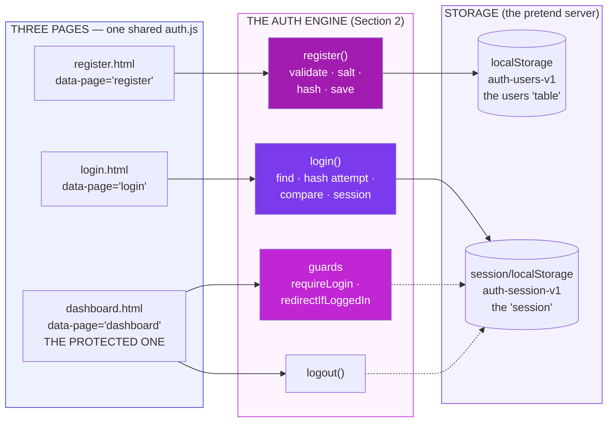

# Vanilla Auth — How It Works

### The traditional login flow, function by function — and exactly which pieces move to the server later

> *"Auth is the most-reused feature in software. Learn the flow once — register, hash, session, guard, logout — and every stack you ever touch is the same five steps in a different costume."*

---

## The skeleton



Three pages, one engine, two storage boxes. The **users box** is the pretend database (permanent). The **session box** is "who is logged in right now" (temporary). Auth is nothing more than the choreography between them.

<p class="te"><strong>Telugu:</strong> Mudu pages, okate engine, rendu storage boxes: <strong>users box</strong> = nakili database (permanent — accounts), <strong>session box</strong> = "ippudu evaru login lo unnaru" (temporary). Auth ante ee rendinti madhya jarige naatakame — register users box lo rastundi, login session box lo rastundi, guard session box ni adugutundi, logout daanini chereputundi.</p>

## ⚠️ Why this is a simulation — say it before anyone asks

Anything in the browser can be opened and edited in DevTools, so client-side "auth" cannot secure anything real. We build it **to learn the flow** — because the flow doesn't change when it moves server-side in Phase 8:

| Piece here | Real version | Why the real one is needed |
| --- | --- | --- |
| localStorage users array | MySQL `users` table | The browser's storage belongs to the *user*, not to you |
| SHA-256 in `crypto.subtle` | bcrypt on the server | bcrypt is *deliberately slow* — attackers can't try millions of guesses/sec |
| sessionStorage session | HttpOnly cookie / JWT | JS can't read an HttpOnly cookie — XSS can't steal it |
| `requireLogin()` redirect | Middleware on the API | A redirect hides a *page*; middleware protects the *data* |

**The interview line this earns you:** "I built the auth flow client-side first to learn it, then properly with Express + bcrypt + JWT" — that's a story, not just a claim.

<p class="te"><strong>Telugu:</strong> Browser lo unna edaina DevTools lo terichi maarchochu — anduke idi <strong>training model</strong>, nijamaina security kaadu. Kaani flow ade: Phase 8 lo localStorage → MySQL, SHA-256 → bcrypt (kaavalane slow — attacker second ki lakshala guesses cheyyalekunda), sessionStorage → HttpOnly cookie/JWT, page redirect → API middleware. <strong>Flow ikkada nerchuko, pieces ni server ki taruvata jarpu.</strong></p>

---

## Section 1 — The "database" and hashing

### `loadUsers()` / `saveUsers()`

The same JSON-in-localStorage pattern as the to-do list — an array of user objects behind a try/catch. Each user: `{ id, name, email, salt, passwordHash, createdAt }`. Notice what's **not** there: the password.

### `makeSalt()`

```js
const bytes = crypto.getRandomValues(new Uint8Array(16));
return [...bytes].map(b => b.toString(16).padStart(2, "0")).join("");
```

A **salt** is 16 cryptographically-random bytes (as 32 hex characters), generated fresh **per user**. It gets mixed into the password before hashing, so two users with the password `secret123` end up with completely **different** hashes. That defeats *rainbow tables* — precomputed dictionaries of "hash → common password". Note `crypto.getRandomValues`, not `Math.random()` — for anything security-flavoured, always the crypto API.

<p class="te"><strong>Telugu:</strong> Salt ante prathi user ki <strong>veru random text</strong>, password tho kalipi hash chestham. Deenivalla iddaru users ki okate password unna <strong>hashes veru</strong> vastayi — attacker daggara unna ready-made "hash → password" tables (rainbow tables) pani cheyyavu. Security ki eppudu <code>crypto.getRandomValues</code>, <code>Math.random()</code> kaadu.</p>

### `hashPassword(password, salt)`

```js
const data   = new TextEncoder().encode(salt + password);
const digest = await crypto.subtle.digest("SHA-256", data);
return [...new Uint8Array(digest)].map(b => b.toString(16).padStart(2, "0")).join("");
```

Line by line: text → bytes (`TextEncoder`) → **SHA-256** (the browser's built-in, real crypto — it's `async`, hence the `await`) → bytes → 64 hex characters.

A hash is a **one-way fingerprint**: same input always gives the same output, but there is no way back. So we never *check* a password by decrypting — we hash the login attempt and **compare fingerprints**. This is why "forgot password" resets your password instead of emailing it to you: *the site genuinely doesn't know it.*

(Real servers use **bcrypt**, which is deliberately slow and has a work-factor dial. SHA-256 is instant — great for learning, too fast to resist brute-force at server scale.)

<p class="te"><strong>Telugu:</strong> Hash ante <strong>one-way fingerprint</strong> — venakki daari ledu. Password ni eppudu dachamu; login lo user type chesindi hash chesi, dachina fingerprint tho <strong>compare</strong> chestham. Anduke "forgot password" lo mee paatha password email cheyyaru — <strong>site ki adi nijam ga teliyadu</strong>. Real servers bcrypt vaadutayi — adi kaavalane slow, brute-force ni aapadaniki.</p>

---

## Section 2 — The auth engine

### `register({ name, email, password, confirm })`

Five steps, in order:

1. **Normalise** — trim, lowercase the email (`Nikhil@X.com` and `nikhil@x.com` are the same account).
2. **Validate** — name length, email regex, password ≥ 6, confirm matches. First failure returns `{ ok: false, error }`; the page just displays it.
3. **Uniqueness** — `users.some(u => u.email === email)` → "already exists."
4. **Salt + hash** — the two functions above; the password itself is now gone forever.
5. **Save** and return `{ ok: true }`.

The function returns *facts*; the page decides what to show — same engine/page split as the cart's store.

### `login(email, password, remember)`

```js
const fail = { ok: false, error: "Invalid email or password." };  // deliberately vague
const user = loadUsers().find(u => u.email === email);
if (!user) return fail;
const attempt = await hashPassword(password, user.salt);          // THEIR salt
if (attempt !== user.passwordHash) return fail;
```

Three things to notice:

- **The same vague error for both failures.** "No account with this email" would tell an attacker which emails are registered (that leak is called *user enumeration*). Real sites are vague on purpose; now you are too.
- **The attempt is hashed with the stored user's salt** — that's the only way the fingerprints can match.
- **Success creates the session:** `{ userId, loginAt, remembered }` written to `sessionStorage` (dies with the tab — the classic session feel) or `localStorage` if **Remember me** was ticked. One checkbox = choosing a storage box.

<p class="te"><strong>Telugu:</strong> Rendu failures ki <strong>okate vague error</strong> — "ee email ki account ledu" ani cheppadam attacker ki e emails register ayyayo cheppadame (daanini <em>user enumeration</em> antaru). Attempt ni <strong>aa user salt tho ne</strong> hash cheyyali — appude fingerprints match avvagalvu. Login success ante session rayadam: Remember me tick unte localStorage (browser close ayina untundi), lekapothe sessionStorage (tab tho pothundi).</p>

### `getSession()` / `logout()`

`getSession()` checks **both** storage boxes, parses the session, then looks up the matching user — if the user was deleted, the session is worthless and returns `null`. `logout()` removes the session from both boxes and touches nothing else: **logging out never deletes the account.**

### The guards — the whole point in four lines

```js
function requireLogin()       { if (!getSession()) location.href = "login.html"; }
function redirectIfLoggedIn() { if (getSession())  location.href = "dashboard.html"; }
```

- `requireLogin()` runs **first** on the dashboard — no session, no page.
- `redirectIfLoggedIn()` runs on login/register — already in? Skip the forms.

Two tiny functions, but they *are* auth as users experience it. In Phase 8 these same two ideas become Express middleware (`auth` on protected routes) — the concept transfers one-to-one.

### The flash message

```js
setFlash("Account created! Please log in.");   // written before the redirect
const flash = takeFlash();                     // read ONCE on the next page, then deleted
```

A page redirect wipes JavaScript variables — so how does "Account created!" survive from register.html to login.html? Through sessionStorage, with a read-once-then-delete pattern. Traditional server frameworks (PHP, Rails, Django) call this exact thing a *flash message* — you've now built the browser version.

<p class="te"><strong>Telugu:</strong> Redirect appudu JS variables anni pothayi — mari "Account created!" message next page ki ela vachindi? sessionStorage dwara: rasi → redirect → <strong>okkasari chadivi ventane delete</strong>. Traditional frameworks (PHP, Rails) lo deenine <em>flash message</em> antaru — nuvvu ippudu daani browser version kattav.</p>

---

## Section 3 — Page wiring

One script serves three pages. The trick is one attribute:

```html
<body data-page="login">
```

```js
const page = document.body.dataset.page;
if (page === "register") { … }
if (page === "login")    { … }
if (page === "dashboard"){ … }
```

Each block: run the right guard, wire the page's form, `await` the engine function, then either `showMessage(error)` or redirect. The dashboard block fills the greeting and tiles — using `textContent` for the name, because **the name is user-typed input** (the XSS habit from the to-do project, applied again).

---

## The flows

### Register → Login (the happy path)


Note the traditional shape: signup does **not** log you in — it sends you to the login door with a note. (Modern apps often auto-login after signup; both are valid choices. Here we keep the classic two-step so each piece stays visible.)

### The guard, every time the dashboard opens

```
open dashboard.html → auth.js runs requireLogin() FIRST
→ getSession(): sessionStorage? localStorage? matching user?
→ yes → page renders, tiles fill
→ no  → location.href = "login.html" — you never see the content
```

### Logout

```
click Log out → logout() clears BOTH storage boxes → redirect login.html
→ from now on, dashboard.html bounces you — the guard again
```

---

## Try these (in order)

1. **See the truth in storage:** DevTools → Application → Local Storage. Find your user — salt and hash, no password. Register a second account with the *same* password and compare the two hashes: different. That's the salt.
2. **Break the session by hand:** delete the session row, refresh the dashboard, get bounced. Now *forge* one — copy a real session's JSON back in. It works! **That is exactly why real sessions live server-side** — you just did what an attacker would do.
3. **Extend it:** add "Change password" on the dashboard (verify the old one first — hash and compare, then re-salt and re-hash the new one).
4. **Extend it:** lock the account for 30 seconds after 3 failed logins (a counter + a `lockedUntil` timestamp on the user).
5. **Carry it forward:** in Phase 8, rebuild this exact flow with Express + MySQL + bcrypt + JWT — and notice you already know every step's *name and purpose*. That's the payoff.

<p class="te"><strong>Telugu:</strong> Mukhyanga #2 cheyyi: session ni DevTools lo <strong>nuvve forge chesi</strong> chudu — work avutundi! Attacker chesedi ade. <strong>Anduke real sessions server side lo untayi</strong> — ee okka experiment auth security motham ni artham chesukovadam. Taruvata Phase 8 lo ide flow ni Express + bcrypt + JWT tho malli kattinappudu, prathi step peru + enduku o nee ki already telusu — ade ee project reward.</p>
