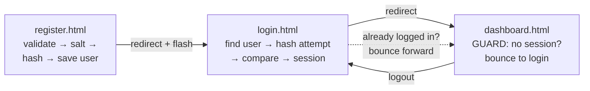

# 🔐 Vanilla Auth — Traditional Login Flow in Pure JS

The classic **register → login → session → protected page → logout** flow, built as a multi-page vanilla-JS app. One shared `auth.js`, one shared `style.css`, three HTML pages, zero dependencies.

## ⚠️ Read this first — it's a training model

**Real authentication must live on a server.** Everything in a browser can be opened and edited in DevTools, so this project cannot *actually* secure anything. What it teaches is the **flow and the vocabulary** — which are *identical* when you rebuild it properly with a backend in Phase 8:

| Here (simulation) | Real version (Phase 8) |
| --- | --- |
| Users array in localStorage | A `users` table in MySQL |
| SHA-256 + salt in the browser | bcrypt on the server (deliberately slow) |
| Session in sessionStorage | HttpOnly cookie or JWT |
| JS redirect guard on the page | Auth middleware on the API |

Learn the shape here; move each piece server-side later.

## Run it

**Double-click `register.html`.** No server, no build.

## Features

- **Sign up** — name/email/password with validation, duplicate-email check (case-insensitive)
- **Passwords are never stored** — only a per-user random **salt** + **SHA-256 hash** (via the browser's real `crypto.subtle` API)
- **Log in** — hash-and-compare; the error is deliberately vague ("Invalid email or password") so it never reveals which half was wrong
- **Session** — `sessionStorage` by default (dies with the tab, like a classic session); **Remember me** switches it to `localStorage`
- **Protected dashboard** — visiting without a session bounces you to login; visiting login *with* a session bounces you to the dashboard
- **Flash message** — "Account created! Please log in." survives the redirect, shows once, gone
- **Log out** — destroys the session, not the account

## File structure

```
auth-system/
├── register.html    signup form          (data-page="register")
├── login.html       login form           (data-page="login")
├── dashboard.html   THE PROTECTED PAGE   (data-page="dashboard")
├── style.css        shared styling
├── auth.js          shared script, 3 sections:
│                      1. "DATABASE" + hashing (localStorage, salt, SHA-256)
│                      2. AUTH ENGINE (register, login, session, guards)
│                      3. PAGE WIRING (data-page decides which form to wire)
├── README.md        this file
└── EXPLANATION.md   every function explained (+ PDF)
```

## The flow



## Concepts practiced

| Concept | Where |
| --- | --- |
| Hashing vs storing passwords, salts | `makeSalt()`, `hashPassword()` |
| The Web Crypto API (`crypto.subtle`) | `hashPassword()` — real SHA-256, async |
| `async/await` in a real flow | register + login handlers |
| Route guards / redirects | `requireLogin()`, `redirectIfLoggedIn()` |
| sessionStorage vs localStorage | the "Remember me" choice |
| Multi-page state passing | the flash message |
| Generic error messages (security habit) | `login()`'s single vague error |
| One script serving many pages | `data-page` + Section 3 |

## Try it

1. Sign up, then open DevTools → Application → Local Storage — find your user. **Your password is not there**, only `salt` and `passwordHash`.
2. Delete the Session Storage row and refresh the dashboard — the guard throws you out.
3. Register two users with the same password — compare their hashes: **different** (that's the salt working).

---

*Bridge project between the Ladder's Tier 1 (forms, storage) and Tier 4 #16 (the real Auth API). See [EXPLANATION.md](EXPLANATION.md) for the function-by-function walkthrough.*
