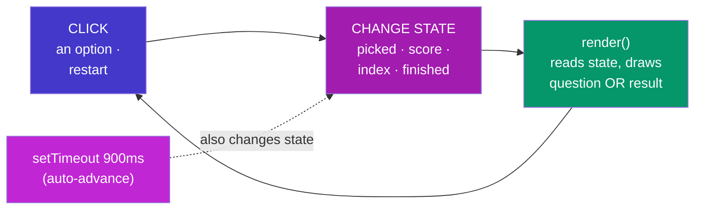

# Vanilla Quiz — How It Works

### Every function explained simply — one file, one state machine

> *"A quiz is secretly a checkout flow: a sequence of screens, one allowed action per screen, and a summary at the end. Learn the machine here, reuse it everywhere."*

---

## The skeleton



No localStorage here — a quiz *should* reset on refresh. The new ingredient is the **timer**: not every state change comes from a click; one comes from `setTimeout`.

<p class="te"><strong>Telugu:</strong> Ikkada localStorage ledu — quiz refresh lo reset avvadam correct. Kotha ingredient: <strong>timer</strong>. State ni click matrame kaadu, 900ms tarvata <code>setTimeout</code> kuda maarustundi (next question ki auto ga velladam). Circle matram ade: <strong>state maarchu → render</strong>.</p>

## The data

```js
const QUESTIONS = [
  { q: "Which company created JavaScript?",
    options: ["Microsoft", "Netscape", "Google", "Oracle"],
    answer: 1 },        // ← the POSITION of the right option (0,1,2,3)
  …
];
```

Questions are pure data — the game code never mentions any specific question. Add a seventh question and *nothing else changes*; the progress counter, scoring, and finish detection all read `QUESTIONS.length`. **Data-driven design**: content grows without code changes.

<p class="te"><strong>Telugu:</strong> Questions anni <strong>data</strong> — game code lo e question gurinchi prasthavana undadu. Kotha question add cheyyi, inkem maarchakkarledu — counter, score, finish anni <code>QUESTIONS.length</code> chusukuntayi. Content perigina code maaradu — adi data-driven design.</p>

## The state machine

```js
let state = { index: 0, score: 0, picked: null, finished: false };
```

Four numbers/flags describe *every possible moment* of the game:

| Field | Meaning |
| --- | --- |
| `index` | which question we're on (0-based) |
| `score` | how many correct so far |
| `picked` | `null` = waiting for an answer · `0–3` = answered, showing feedback |
| `finished` | `true` = show the result screen |

`picked` is the clever one — it's both a *value* (which option) and a *mode switch* (`null` = play mode, not-null = feedback mode). One field, two jobs.

<p class="te"><strong>Telugu:</strong> Naalugu fields game motham ni cheptayi. Andulo <code>picked</code> telivainadi: <code>null</code> ante 'answer kosam wait chestunnam' (options click avutayi), number ante 'answer ichesav' (green/red feedback mode, options disabled). <strong>Okka field, rendu panulu</strong> — value + mode switch.</p>

## `render()` — one function, two screens

```js
if (state.finished) { …draw the result screen…; return; }
…draw the current question…
```

**The result screen** — score, an emoji verdict (🏆 / 🎉 / 📚 chosen by a ternary chain), and a `#restart` button.

**The question screen** — progress line, the question, and the four options built with a `map` that decides each button's class:

```js
let cls = "";
if (answered && i === q.answer) cls = "correct";       // the right one → green
else if (answered && i === state.picked) cls = "wrong"; // your wrong pick → red
```

Before you answer (`picked === null`) every button is plain and clickable. After you answer, the same `render()` produces green/red versions with `disabled` — **the screen changed because the state changed**, not because we "edited" anything.

<p class="te"><strong>Telugu:</strong> Okate <code>render()</code> — rendu screens: <code>finished</code> aithe result, lekapothe question. Options ni <code>map</code> tho geestham; prathi button class ni state chusi decide chestham — answer icchaka correct ki green, nee wrong pick ki red, anni disabled. <strong>Screen maarindi enduku ante state maarindi</strong> — em 'edit' cheyaledu, malli geesam anthe.</p>

## The click handler — the whole game in one listener

One delegated listener on `#screen` (everything we draw lives inside it):

```
click → restart button?  reset state to the start → render
      → an option button?
          already answered? → ignore (the double-click guard)
          1) state.picked = which option; score++ if correct
          2) render()            ← feedback appears NOW
          3) setTimeout 900ms:
               last question? → state.finished = true
               else           → state.index++; state.picked = null
               render()        ← next question (or result) appears
```

**Two renders per answer** — one immediate (show the colours), one delayed (move on). The 900ms pause exists purely for the human: long enough to *see* the feedback, short enough not to drag.

**The guard matters:** between those two renders the player could click again. `if (state.picked !== null) return` plus the `disabled` attribute make the wait bulletproof — one from the logic side, one from the UI side.

<p class="te"><strong>Telugu:</strong> Okka answer ki <strong>rendu renders</strong>: ventane okati (green/red chupinchali), 900ms tarvata okati (next question ki). Aa madhya lo user malli click cheyyochu — anduke rendu guards: logic lo <code>picked !== null aithe return</code>, UI lo <code>disabled</code>. Okka side kaadu, rendu sides nunchi safety.</p>

## Try these (in order)

1. **Break it:** remove the `if (state.picked !== null) return` guard, click two options fast, and watch the score double-count.
2. **Extend it:** add a "streak" counter that resets on a wrong answer.
3. **Extend it:** shuffle the questions each game (`[...QUESTIONS].sort(() => Math.random() - 0.5)` is fine here).
4. **Extend it:** save the best score in localStorage and show "Best: 5/6" on the result screen — you know exactly how, from the to-do project.
5. **Notice:** this `{ index, picked, finished }` shape is a checkout wizard (`{ step, selection, placed }`) with different names. Same machine.

<p class="te"><strong>Telugu:</strong> Modata guard teesi <strong>break cheyyi</strong> — double-click bug ni sontham ga chudu. Taruvata streak, shuffle, best-score (localStorage — todo lo nerchukunnav) add cheyyi. Chivari gamanika: ee state machine ye checkout wizard — perlu maarithe ade yantram. Ade ee project asalu goal.</p>
