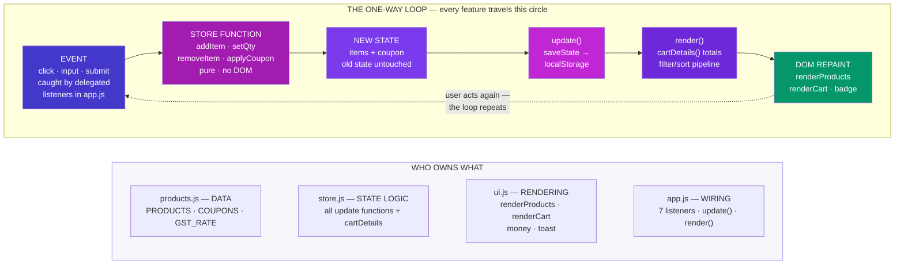
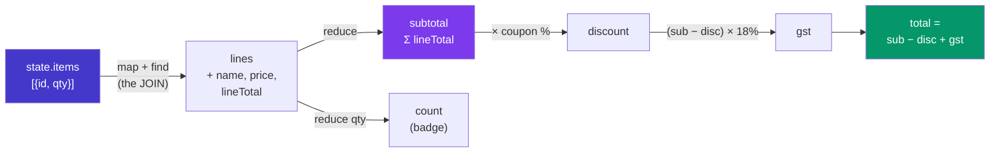
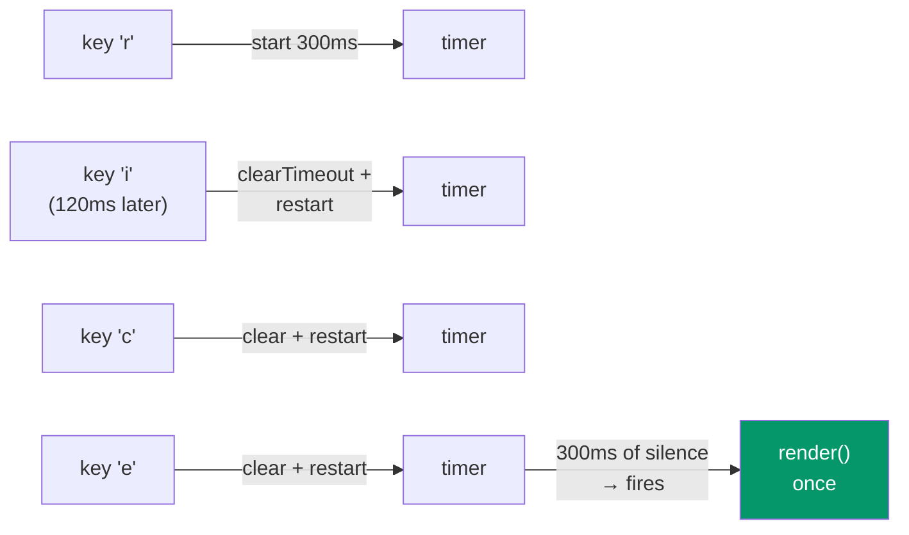
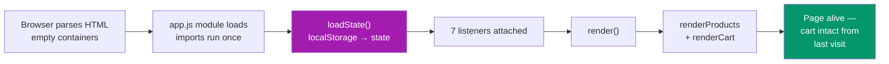
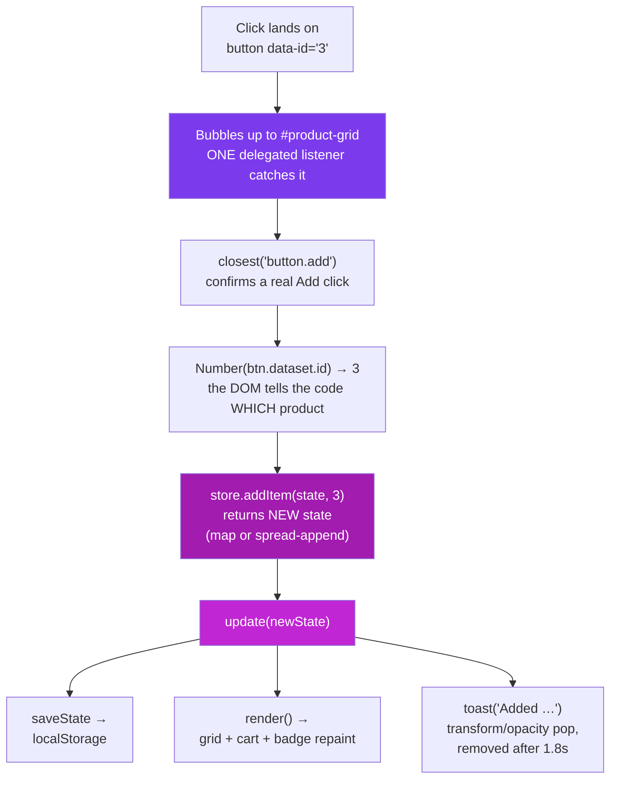
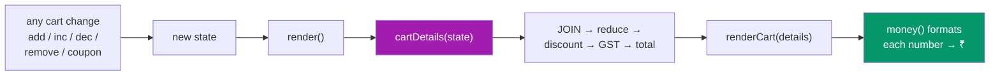

# VanillaCart — Function by Function

### Every function in the project explained: what it does, how it works, and the flow it belongs to

> *"A project you can't explain function-by-function is a project you copied. This document is the proof you didn't."*

---

## Table of Contents

- [1. The Skeleton — One Overall Diagram](#1-the-skeleton-one-overall-diagram)
- [2. products.js — The Data](#2-productsjs-the-data)
- [3. store.js — The State Engine, Function by Function](#3-storejs-the-state-engine-function-by-function)
- [4. ui.js — The Render Layer, Function by Function](#4-uijs-the-render-layer-function-by-function)
- [5. app.js — The Wiring, Function by Function](#5-appjs-the-wiring-function-by-function)
- [6. The Flows — What Happens When…](#6-the-flows-what-happens-when)

---

# 1. The Skeleton — One Overall Diagram

Four files, four jobs, one direction of data flow. Every feature in the app is some path through this picture:



**The rule the diagram encodes:** events never touch the DOM directly, and render functions never make decisions. Everything goes *around* the loop: **event → store → new state → save → render → DOM**. One way, every time.

<p class="te"><strong>Telugu:</strong> Naalugu files, naalugu panulu: <strong>products</strong> = data, <strong>store</strong> = logic (DOM muttadu), <strong>ui</strong> = drawing (decisions undavu), <strong>app</strong> = wiring. Prathi feature ee circle lo ne tirugutundi: event → store → kotha state → save → render → DOM. <strong>Okate direction, prathi saari.</strong></p>

---

# 2. products.js — The Data

No functions here — three exported constants, and one design decision.

| Export | What it is |
| --- | --- |
| `PRODUCTS` | Array of `{ id, name, price, category, emoji }` — the catalogue |
| `COUPONS` | `{ SAVE10: 0.10, WELCOME20: 0.20 }` — code → fraction off |
| `GST_RATE` | `0.18` — one named constant instead of a magic number in the maths |

**The design decision:** the cart state stores only `{ id, qty }` — never the name or price. Product facts live in ONE place, so a price change edits one line of one file, and the cart can never show a stale price. `cartDetails()` joins the two at read time, exactly like a SQL JOIN between an `orders` table and a `products` table.

<p class="te"><strong>Telugu:</strong> Cart lo product <strong>id + qty matrame</strong> dachutam — peru, price kaadu. Price okka chota ne untundi (PRODUCTS lo); cart eppudu paatha price chupinchadu. Idi SQL JOIN laantidi: rendu tables, read time lo kaluputam.</p>

---

# 3. store.js — The State Engine, Function by Function

Every function here takes state in, returns **new** state out. None of them touch the DOM, none of them mutate their input.

## 3.1 `emptyState()`

```js
const emptyState = () => ({ items: [], coupon: null });
```

The shape of "nothing in the cart," written once and reused by `loadState` and `clearCart`. Note the `({ … })` — the parentheses make the arrow return an object instead of reading `{}` as a code block (a classic arrow-function trap).

## 3.2 `loadState()`

```js
export function loadState() {
  try {
    return JSON.parse(localStorage.getItem(STORAGE_KEY)) ?? emptyState();
  } catch {
    return emptyState();
  }
}
```

**How it works, line by line:**
1. `localStorage.getItem` returns the saved **string**, or `null` on a first visit.
2. `JSON.parse` turns the string back into a live object. (`JSON.parse(null)` happens to return `null`, so the first-visit case flows through safely.)
3. `?? emptyState()` — if the result was `null`/`undefined`, start fresh. `??` and not `||`, so a legitimate falsy value would survive.
4. `try/catch` — if someone hand-edited the storage into invalid JSON, `parse` throws; a storage problem must never crash the app, so we recover with an empty cart.

**Called from:** the top of `app.js`, once, at page load.

<p class="te"><strong>Telugu:</strong> localStorage <strong>strings matrame</strong> dachutundi — anduke <code>JSON.parse</code> tho object ga maarchali. Modatisari visit lo <code>null</code> vastundi → <code>??</code> khaali cart istundi. Data corrupt aithe <code>try/catch</code> app ni crash avvakunda kaapadutundi.</p>

## 3.3 `saveState(state)`

```js
export function saveState(state) {
  localStorage.setItem(STORAGE_KEY, JSON.stringify(state));
}
```

The mirror of `loadState`: object → `JSON.stringify` → string → storage. The key `"vanillacart-v1"` is versioned on purpose — if a future version changes the state shape, bumping to `-v2` abandons old incompatible data instead of crashing on it.

**Called from:** `update()` in app.js — which means *every* state change is persisted automatically. There is no way to change the cart and forget to save it.

## 3.4 `addItem(state, id)`

```js
export function addItem(state, id) {
  const existing = state.items.find(it => it.id === id);
  const items = existing
    ? state.items.map(it => it.id === id ? { ...it, qty: it.qty + 1 } : it)
    : [...state.items, { id, qty: 1 }];
  return { ...state, items };
}
```

**How it works:**
1. `find` checks whether this product already has a cart line.
2. **Already there** → `map` builds a *new* array; only the matching line is replaced with a *new* object with `qty + 1`; every other line is reused as-is.
3. **Not there** → spread the old array into a new one and append `{ id, qty: 1 }`.
4. Return a new state object with the new items array. The original `state` is untouched — you could still compare "before vs after," which is exactly how undo features and React change-detection work.

**Why never `existing.qty++`?** Mutation would change the old state too, killing comparability — and in React it silently breaks re-rendering. The habit you build here is the habit React assumes.

<p class="te"><strong>Telugu:</strong> Item already unte → <code>map</code> tho <strong>kotha array</strong>, aa okka line matrame kotha object (<code>qty + 1</code>). Lekapothe → <code>[...items, {id, qty: 1}]</code>. <strong>Paatha state ni eppudu muttamu</strong> — anduke prathi function kotha state ni return chestundi. Ide React lo <code>setState</code> alavatu.</p>

## 3.5 `setQty(state, id, qty)`

```js
export function setQty(state, id, qty) {
  if (qty < 1) return removeItem(state, id);
  const capped = Math.min(qty, 99);
  return {
    ...state,
    items: state.items.map(it => it.id === id ? { ...it, qty: capped } : it),
  };
}
```

**How it works:**
1. `qty < 1` → delegate to `removeItem`. This one rule means the − button needs no special "was it the last one?" logic anywhere else.
2. `Math.min(qty, 99)` caps the quantity — defensive coding against a rogue value.
3. Same `map`-with-replacement pattern as `addItem`.

**Called from:** the cart's + and − buttons (`inc`/`dec` actions in app.js).

## 3.6 `removeItem(state, id)`

```js
export function removeItem(state, id) {
  return { ...state, items: state.items.filter(it => it.id !== id) };
}
```

`filter` keeps every line whose id *doesn't* match — which is how you "delete" immutably: build a new array without the item. One line, no index hunting, no `splice`.

## 3.7 `clearCart()`

```js
export function clearCart() { return emptyState(); }
```

Doesn't even need the old state — clearing is just "return the empty shape." The coupon resets too, because the empty shape says `coupon: null`.

## 3.8 `applyCoupon(state, code)`

```js
export function applyCoupon(state, code) {
  const clean = code.trim().toUpperCase();
  if (!COUPONS[clean]) return { state, ok: false };
  return { state: { ...state, coupon: clean }, ok: true };
}
```

**How it works:**
1. Normalise the input — `"  save10 "` → `"SAVE10"`. Never trust raw user input, even for casing.
2. Look the code up in the `COUPONS` table. Unknown code → return the state **unchanged** plus `ok: false`.
3. Known code → new state with `coupon` set, plus `ok: true`.

**Why return `{ state, ok }` instead of just state?** The caller (app.js) needs to know whether to toast "applied 🎉" or "invalid ❌". Returning both keeps the store silent about UI — it reports facts; the wiring decides what to show.

<p class="te"><strong>Telugu:</strong> Input ni modata <strong>shubhram cheyyi</strong> (trim + uppercase). Code table lo unte kotha state + <code>ok: true</code>; lekapothe paatha state + <code>ok: false</code>. Store UI gurinchi em telidu — <strong>facts matrame cheptundi</strong>, toast em chupinchalo app.js decide chestundi.</p>

## 3.9 `cartDetails(state)` — where the money is computed

```js
export function cartDetails(state) {
  const lines = state.items.map(it => {
    const product = PRODUCTS.find(p => p.id === it.id);
    return { ...product, qty: it.qty, lineTotal: product.price * it.qty };
  });

  const subtotal = lines.reduce((sum, l) => sum + l.lineTotal, 0);
  const discount = subtotal * (COUPONS[state.coupon] ?? 0);
  const gst      = (subtotal - discount) * GST_RATE;
  const total    = subtotal - discount + gst;
  const count    = lines.reduce((sum, l) => sum + l.qty, 0);

  return { lines, subtotal, discount, gst, total, count, coupon: state.coupon };
}
```

This is the money pipeline — five steps, each feeding the next:



**How it works:**
1. **The JOIN** — each `{ id, qty }` line is enriched with its product's name/price/emoji, plus a computed `lineTotal = price × qty`.
2. **`subtotal`** — `reduce` folds all lineTotals into one number: start at `0`, add each line.
3. **`discount`** — `COUPONS[state.coupon] ?? 0` reads the coupon's fraction; no coupon → `0`, so the same formula works with and without one (no if/else).
4. **`gst`** — 18% of the *discounted* amount (tax applies after discount — a real invoice rule).
5. **`total` and `count`** — the grand total, and the badge number (sum of quantities, not number of lines: 2 mice + 1 keyboard = 3).

**Why compute instead of store?** A stored total goes stale the moment any update path forgets to refresh it. A computed total *cannot* be wrong. This is the "derived data" principle — the single most transferable idea in the project.

<p class="te"><strong>Telugu:</strong> <strong>Money pipeline</strong>: lines (JOIN) → subtotal (<code>reduce</code>) → discount (coupon %) → GST (discount taruvata 18%) → total. Totals ni <strong>eppudu dachamu, prathi saari lekkistham</strong> — dachina total okka update marchipothe tappu aipotundi; lekkinchina total tappu avvadam <em>saadhyam kaadu</em>. Idi ee project lo atyanta mukhyamaina idea.</p>

---

# 4. ui.js — The Render Layer, Function by Function

## 4.1 `money(n)`

```js
export const money = n =>
  new Intl.NumberFormat("en-IN", { style: "currency", currency: "INR", maximumFractionDigits: 0 })
    .format(Math.round(n));
```

Turns `14999` into `"₹14,999"` — Indian digit grouping, ₹ symbol, no decimals. `Intl.NumberFormat` is built into the browser: no library, correct lakh/crore-style grouping (`1,00,000`), and swapping `"en-IN"`/`"INR"` for another locale is a one-line internationalisation.

**Note the display-rounding subtlety:** each shown number is rounded *independently* for display, but `total` is computed from the exact unrounded values. So ₹799 − ₹80 + ₹129 can display alongside a total of ₹849 (the exact maths is 848.54). Real invoices work the same way — round late, not early.

## 4.2 `renderProducts(products)`

```js
grid.innerHTML = products.map(p => `
  <article class="card">
    ...
    <button class="add" data-id="${p.id}">Add to Cart</button>
  </article>
`).join("");
```

**How it works:**
1. Takes the already-filtered/sorted array (app.js decides *what*; this function only draws).
2. Empty array → a friendly "no products match" message and an early return.
3. `map` turns each product into an HTML string; `join("")` glues them; **one** `innerHTML` assignment paints the lot. One assignment = one reflow (cheap), versus one reflow per card with repeated `appendChild`.
4. `data-id="${p.id}"` stamps each button with its product's id — this is the bridge the click handler will read back.

**Safety note:** template-literal HTML is fine here because product names are *our* data. The moment strings come from users, this pattern becomes an XSS hole and you switch to `createElement` + `textContent`.

<p class="te"><strong>Telugu:</strong> Prathi product ni HTML string ga maarchi (<code>map</code>), anni kalipi (<code>join</code>), <strong>okka saari</strong> <code>innerHTML</code> ki istham — okate reflow. Button meeda <code>data-id</code> stamp chestham — click appudu e product o adi cheptundi. User input ki matram ee pattern vaadaku (XSS) — <code>textContent</code> vaadu.</p>

## 4.3 `renderCart(details)`

Three responsibilities, in order:

1. **Badge** — `badgeEl.textContent = details.count` (the reduce-computed quantity sum).
2. **Lines** — same `map().join("")` pattern; each +/−/✕ button carries **two** data attributes: `data-action` (what to do) and `data-id` (to which line). The delegated handler reads both.
3. **Summary** — subtotal, coupon row (rendered *conditionally* — the `${details.discount > 0 ? … : ""}` ternary drops it entirely when no coupon is active), GST, and total, all formatted through `money()`.

It receives `details` (the output of `cartDetails`) rather than raw state — the render layer never computes; it only formats what the store already derived.

## 4.4 `toast(message)`

```js
const el = document.createElement("div");
el.className = "toast";
el.textContent = message;
zone.appendChild(el);
setTimeout(() => el.remove(), 1800);
```

**How it works:** create a div → set its **text** (not HTML — toasts echo coupon codes, which are user input!) → append (CSS `@keyframes pop` animates it in using only `transform`/`opacity`, the two properties that skip layout and paint) → a 1.8-second timer removes it. Multiple toasts stack because the zone is a flex column and each element is independent.

---

# 5. app.js — The Wiring, Function by Function

## 5.1 The two state variables

```js
let state = store.loadState();                       // cart — persisted
let view  = { search: "", category: "all", sort: "default" };  // UI — not persisted
```

Two kinds of state, deliberately separated: your **cart** should survive a refresh; your **half-typed search** shouldn't. Knowing *what not to persist* is as much a design decision as what to persist.

## 5.2 `update(newState)` — the heartbeat

```js
function update(newState) {
  state = newState;
  store.saveState(state);
  render();
}
```

Every mutation in the entire app funnels through these three lines: **assign → persist → repaint**. Because there is exactly one path, there is exactly one place to add logging, undo history, or a "saving…" indicator later. This function *is* the architecture.

<p class="te"><strong>Telugu:</strong> App motham lo prathi marpu ee <strong>mudu lines</strong> gunda ne veltundi: state assign → save → render. Okate daari undatam valla — repu logging, undo, analytics em add cheyyalanna <strong>okka chote</strong> add chestham. Ee chinna function e architecture.</p>

## 5.3 `render()` — the visible-products pipeline

```js
let visible = PRODUCTS
  .filter(p => p.name.toLowerCase().includes(view.search.toLowerCase()))
  .filter(p => view.category === "all" || p.category === view.category);
if (view.sort === "price-asc") visible = [...visible].sort((a, b) => a.price - b.price);
...
renderProducts(visible);
renderCart(store.cartDetails(state));
```

**How it works:**
1. Filter by search text (case-insensitive on both sides).
2. Filter by category — `"all"` short-circuits the check.
3. Sort **a copy** — `[...visible].sort(…)` — because `.sort()` mutates the array it's called on.
4. Paint both regions. The cart is re-rendered even for a search change — simpler than tracking *which* part changed, and cheap at this scale. (When that stops being cheap is exactly when a virtual DOM earns its keep.)

## 5.4 `debounce(fn, ms)` — the closure at work

```js
const debounce = (fn, ms) => {
  let timer;
  return (...args) => {
    clearTimeout(timer);
    timer = setTimeout(() => fn(...args), ms);
  };
};
```

**How it works:** `debounce` runs **once** and returns a new function. `timer` lives in the closure — the returned function remembers it between calls. Every keystroke cancels the previous timer and starts a fresh 300ms one; only when you *pause* does the timer survive long enough to fire `render()`. Ten keystrokes → one render instead of ten.



<p class="te"><strong>Telugu:</strong> <code>timer</code> variable <strong>closure</strong> lo bathiki untundi — return ayina function daanini gurthu pettukuntundi. Prathi keystroke paatha timer ni cancel chesi kotha 300ms timer pedutundi. Nuvvu <strong>aagithe ne</strong> timer complete ayyi render avutundi. 10 keys → 1 render, 10 kaadu.</p>

## 5.5 The seven event listeners

| Listener | Element | Event | What it does |
| --- | --- | --- | --- |
| Search | `#search` | `input` (debounced) | `view.search = value` → `render()` |
| Category | `#category` | `change` | `view.category = value` → `render()` |
| Sort | `#sort` | `change` | `view.sort = value` → `render()` |
| **Add to cart** | `#product-grid` | `click` (delegated) | read `data-id` → `addItem` → `update` → toast |
| **Cart actions** | `#cart-items` | `click` (delegated) | read `data-action` + `data-id` → inc/dec/remove → `update` |
| Coupon | `#coupon-form` | `submit` | `preventDefault` → `applyCoupon` → `update` → toast ok/fail |
| Clear / toggle | `#clear-cart`, `#cart-toggle` | `click` | `clearCart` → `update` / CSS class flip |

**Why the two bold ones are delegated:** cart buttons are destroyed and recreated on every render — listeners attached to them would die each time. The *container* survives renders, so its single listener works forever, including for buttons that don't exist yet. `e.target.closest("button[data-action]")` walks up from wherever the click landed to the button (or returns `null`, in which case we exit).

**The action-table trick** in the cart handler:

```js
const actions = {
  inc:    () => store.setQty(state, id, qty + 1),
  dec:    () => store.setQty(state, id, qty - 1),
  remove: () => store.removeItem(state, id),
};
update(actions[btn.dataset.action]());
```

An object lookup replaces an if/else ladder — adding a "move to wishlist" action tomorrow is one new line, not a new branch.

---

# 6. The Flows — What Happens When…

## 6.1 Page load



## 6.2 "Add to Cart" click — the full journey



## 6.3 Money update — from click to new total

Every price change on screen is this chain — no shortcuts, no cached numbers:



## 6.4 Quantity − on the last unit

`dec` → `setQty(state, id, 0)` → `qty < 1` → `removeItem` → line vanishes from the next render. The − button never knew it was the last unit; the *store rule* handled it. That's the payoff of putting logic in one place.

## 6.5 Coupon submit

Enter or button → `submit` event → `preventDefault()` (stops the browser's default full-page reload) → `applyCoupon` normalises and validates → `{ state, ok }` → `update` + a success/fail toast. Invalid codes change nothing: the same state object comes back.

---

*Companion to [README.md](README.md). Part of the 50-Day Challenge — the cart build from the JS practice lab, explained to the last function.*
