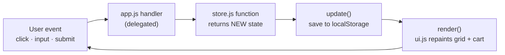

# 🛒 VanillaCart — Shopping Cart in Pure Vanilla JavaScript

A complete shopping-cart frontend built with **zero dependencies** — no React, no build step, no npm install. Just HTML, CSS, and modular ES6 JavaScript. Built to prove (and practice) the fundamentals every framework is made of.

## Features

- 🗂️ Product grid with **search** (debounced 300ms), **category filter**, and **sort** (price/name)
- ➕ Add to cart, change quantity, remove line, clear cart
- 🧾 Live totals: subtotal → coupon discount → 18% GST → grand total (all computed with `reduce`)
- 🎟️ Coupon codes (`SAVE10`, `WELCOME20`) with success/failure toasts
- 💾 Cart **survives refresh** via `localStorage`
- 📱 Responsive: cart becomes a slide-in drawer on mobile
- 🔔 Toast notifications, animated with `transform`/`opacity` only (no reflow)

## Run it

No build step — it's static files. ES modules need a server (not `file://`), so any of:

```bash
# option 1 — VS Code: right-click index.html → "Open with Live Server"

# option 2 — Node
npx serve .

# option 3 — Python
python -m http.server 8000
```

Then open `http://localhost:8000` (or whatever port your server prints).

## Project structure

```
shopping-cart/
├── index.html          the skeleton — containers the JS fills in
├── css/styles.css      grid/flex layout, transitions, mobile drawer
└── js/
    ├── products.js     DATA   — product list, coupons, GST rate
    ├── store.js        STATE  — pure update functions + localStorage (no DOM!)
    ├── ui.js           RENDER — paints DOM from data (no business logic!)
    └── app.js          WIRING — entry point: events → store → render
```

The separation is the architecture: **data / state / render / wiring**. Each file has one job, and only `app.js` knows about all of them.

## How it works — the one-way data flow



Every interaction — add, remove, search, coupon — flows through the **same three lines**:

```js
state = store.someUpdate(state, ...);   // 1. compute new state (never mutate)
saveState(state);                       // 2. persist
render();                               // 3. repaint everything from state
```

The screen is always a pure function of the state. That's the same mental model as React's `setState` — practiced here by hand, with nothing hidden.

## Concepts this project exercises

| Concept | Where |
| --- | --- |
| `map` / `filter` / `reduce` / `sort` pipelines | `store.js` totals, `app.js` visible-products |
| Immutable updates (spread, no mutation) | every function in `store.js` |
| Event delegation (one listener, many buttons) | grid + cart listeners in `app.js` |
| Closures | `debounce()` timer in `app.js` |
| Debouncing input | search box |
| `localStorage` + JSON round-trip | `loadState` / `saveState` |
| `data-*` attributes as the DOM↔data bridge | `data-id`, `data-action` |
| `preventDefault` on form submit | coupon form |
| XSS awareness (`textContent` for user input) | `toast()` in `ui.js` |
| Cheap animations (`transform`/`opacity`) | card hover, toast, mobile drawer |
| ES modules (`import`/`export`) | all four JS files |
| `Intl.NumberFormat` for ₹ currency | `money()` in `ui.js` |

## Ideas to extend it

1. Replace `products.js` with `fetch("https://fakestoreapi.com/products")` — the architecture already supports it.
2. Add a wishlist (second piece of state, same update pattern).
3. Add a checkout form with validation.
4. Rebuild the exact same app in React (Phase 6) — watch how much of `store.js` survives unchanged.

---

*Part of my 50-Day Challenge — the "Cart engine" build from the JS practice lab. See [EXPLANATION.md](EXPLANATION.md) for a line-by-line walkthrough of how everything works.*
