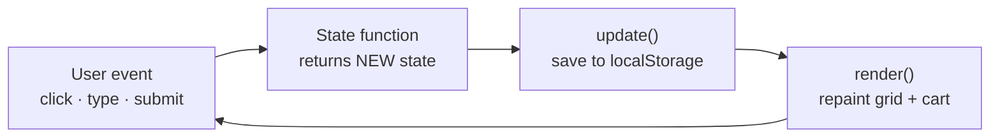

# 🛒 VanillaCart — Shopping Cart in Pure Vanilla JavaScript

A complete shopping-cart frontend with **zero dependencies and zero build steps** — one HTML file, one CSS file, one JavaScript file. Built to practice the fundamentals every framework is made of.

## Run it

**Double-click `index.html`.** That's it — no server, no npm, nothing to install.
(Or right-click → *Open with Live Server* in VS Code if you prefer auto-reload while editing.)

## Features

- 🗂️ Product grid with **search** (debounced 300ms), **category filter**, and **sort** (price/name)
- ➕ Add to cart, change quantity with + / −, remove line, clear cart
- 🧾 Live totals: subtotal → coupon discount → 18% GST → grand total (computed with `reduce`)
- 🎟️ Coupon codes (`SAVE10`, `WELCOME20`) with success/failure toasts
- 💾 Cart **survives refresh** via `localStorage`
- 📱 Responsive: the cart becomes a slide-in drawer on mobile
- 🔔 Toast notifications, animated with `transform`/`opacity` only

## Project structure

```
shopping-cart/
├── index.html       the page skeleton — empty containers the JS fills
├── style.css        all styling — grid layout, transitions, mobile drawer
├── script.js        ALL the JavaScript, in 4 labelled sections:
│                      1. DATA    products, coupons, GST rate
│                      2. STATE   the cart brain — functions that change state
│                      3. RENDER  functions that paint the screen
│                      4. WIRING  events connecting clicks → state → render
├── README.md        this file
└── EXPLANATION.md   every function explained one by one (+ EXPLANATION.pdf)
```

One JS file, but still four **sections** — the order inside the file *is* the architecture.

## How it works — the one-way flow



Every interaction — add, remove, search, coupon — flows through the same three lines:

```js
state = someStateFunction(state, ...);  // 1. compute new state (never mutate)
saveState(state);                       // 2. persist
render();                               // 3. repaint everything from state
```

The screen is always drawn *from* the state — buttons never edit the page directly. That's the same mental model as React's `setState`, practiced by hand.

## Concepts this project exercises

| Concept | Where in script.js |
| --- | --- |
| `map` / `filter` / `reduce` / `sort` pipelines | `cartDetails()`, `render()` |
| Immutable updates (spread, no mutation) | every function in Section 2 |
| Event delegation (one listener, many buttons) | grid + cart listeners in Section 4 |
| Closures | `debounce()` |
| `localStorage` + JSON round-trip | `loadState` / `saveState` |
| `data-*` attributes as the DOM↔data bridge | `data-id`, `data-action` |
| `preventDefault` on form submit | the coupon form |
| XSS awareness (`textContent` for user input) | `toast()` |
| Cheap animations (`transform`/`opacity`) | card hover, toast, drawer |
| `Intl.NumberFormat` for ₹ currency | `money()` |

## Ideas to extend it

1. Replace the `PRODUCTS` array with `fetch("https://fakestoreapi.com/products")`.
2. Add a wishlist — a second piece of state, same update pattern.
3. Add a checkout form with validation.
4. Rebuild the same app in React (Phase 6) — watch Section 2 survive almost unchanged.

---

*Part of my 50-Day Challenge — project #5 on the Project Ladder. See [EXPLANATION.md](EXPLANATION.md) for the function-by-function walkthrough.*
