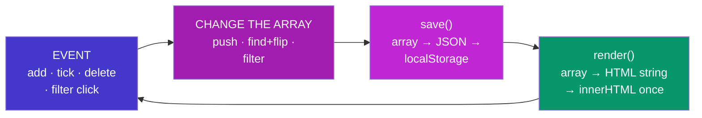

# Vanilla To-Do — How It Works

### Every function explained simply — one file, three sections

> *"The to-do list is the alphabet of UI programming: every list screen you will ever build — orders, tickets, emails — is this pattern wearing a different shirt."*

---

## The skeleton



The whole app is this circle. Every feature below is just "which part of the array do I change."

<p class="te"><strong>Telugu:</strong> App motham ee circle ye: event vachindi → <strong>array ni maarchu</strong> → save → render. Buttons page ni nerugga eppudu maarchavu — data ni maarchi, data nunchi page ni malli geestham. Ee okka pattern anni list screens ki saripotundi.</p>

## The state — two variables

```js
let todos  = load();   // [{ id: 1723600000000, text: "buy milk", done: false }, …]
let filter = "all";    // "all" | "active" | "done" — which tab is selected
```

- **`todos`** is the truth. Each todo is `{ id, text, done }`. The `id` is `Date.now()` — the millisecond timestamp, unique enough for a to-do list.
- **`filter`** is *view* state — deliberately **not saved**, so a fresh visit starts on "All". Your tasks deserve persistence; your tab selection doesn't.

<p class="te"><strong>Telugu:</strong> Rendu variables: <code>todos</code> (nijam — prathi task oka object) mariyu <code>filter</code> (e tab select ayyindo). <code>filter</code> ni kaavalane save cheyyamu — tasks refresh ni survive avvali, tab selection avvakkarledu. Edi save cheyyalo edi cheyyakudado telusukovadam kuda design decision ye.</p>

## `load()` and `save()`

```js
function load() {
  try { return JSON.parse(localStorage.getItem("todos-v1")) ?? []; }
  catch { return []; }
}
function save() {
  localStorage.setItem("todos-v1", JSON.stringify(todos));
}
```

localStorage stores **strings only**, so the array goes out through `JSON.stringify` and comes back through `JSON.parse`. First visit → `getItem` is `null` → `?? []` starts you empty. Corrupted data → `catch` starts you empty. **Storage problems never crash the app.**

<p class="te"><strong>Telugu:</strong> localStorage strings matrame dachutundi — anduke stringify/parse jodi. Modatisari <code>null</code> vastundi → <code>?? []</code> khaali list. Data cheddipothe <code>catch</code> kaapadutundi. <strong>Storage problem valla app eppudu crash avvakudadu.</strong></p>

## `render()` — the heart

Five small jobs, in order:

1. **Choose what's visible.** A ternary chain picks `todos.filter(...)` for Active/Done, or the whole array for All. `filter()` returns a *new* array — the real `todos` is untouched.
2. **Empty case.** No visible todos → a friendly `Nothing here 🎉` instead of a blank hole.
3. **Draw the list.** `visible.map(todo => \`<li>…\`).join("")` → **one** `innerHTML` assignment. Each `<li>` carries `data-id="${t.id}"` — that's how clicks will know which todo they belong to. Done todos get the `done` class; CSS does the strikethrough.
4. **The counter.** `todos.filter(t => !t.done).length` → "3 tasks left" (with singular/plural handling).
5. **Highlight the active filter button** with `classList.toggle("active", condition)`.

**Why rebuild the whole list every time?** Because it's simple and always correct. Updating "just the changed `<li>`" is exactly the bookkeeping React's virtual DOM automates — by rebuilding here, you're learning why React exists.

<p class="te"><strong>Telugu:</strong> <code>render()</code> aidu chinna panulu chestundi: e todos chupinchalo select cheyyi (filter) → khaali aithe message → list ni <strong>okkasari</strong> innerHTML tho geeyyi (prathi li meeda data-id) → 'X tasks left' counter → active filter button highlight. Prathi saari <strong>motham list</strong> malli geestham — simple mariyu eppudu correct. 'Maarina li matrame update' ane lekkalu React chestundi — ade daani pani.</p>

## `escapeHtml()` — the safety habit

```js
function escapeHtml(str) {
  return str.replaceAll("&", "&amp;").replaceAll("<", "&lt;");
}
```

Task text is **typed by a user** and we're putting it into `innerHTML`. Without escaping, someone could type `` and their text would *run as code* (XSS). Escaping `<` and `&` turns markup into harmless visible text. One tiny function, one giant habit.

<p class="te"><strong>Telugu:</strong> User type chesina text ni <code>innerHTML</code> lo pedutunnam — escape cheyakapothe evaraina <code>&lt;script&gt;</code> laantidi type chesi <strong>code ga run</strong> cheyinchagalaru (XSS). <code>&lt;</code> ni <code>&amp;lt;</code> ga maarchesthe adi kevalam kanipinche text aipotundi. Chinna function, pedda alavatu.</p>

## The add flow

```
Enter pressed → submit event → preventDefault (stop the reload!)
→ trim the text → empty? ignore → todos.push({ id: Date.now(), text, done: false })
→ clear the input → save() → render()
```

Using a `<form>` means the **Enter key works for free** — that's why add is a `submit` listener, not a button `click` listener. `e.preventDefault()` stops the browser's ancient default of reloading the page on submit.

## The tick/delete flow — delegation

There is **one** click listener on the `<ul>`, not one per task. Why? Because `render()` destroys and recreates every `<li>` each time — listeners attached to them would die with them. The `<ul>` survives forever, so its listener does too.

```
click anywhere in the list
→ closest("li.item")  — which row? (null → ignore)
→ Number(li.dataset.id) — which todo?
→ clicked .tick?  find(t => t.id === id) and flip todo.done
→ clicked .del?   todos = todos.filter(t => t.id !== id)
→ save() → render()
```

Note the two shapes: **toggle** = find the object and flip a flag; **delete** = keep everything *except* this id. `find` + `filter` are doing all the work.

<p class="te"><strong>Telugu:</strong> Prathi task ki listener <strong>kaadu</strong> — <code>ul</code> ki okate (delegation). Enduku ante render prathi saari li lanni kotthaga thayaru chestundi; vaati listeners chachipotayi, ul di bathikuntundi. Click vachaka: <code>closest</code> tho e row o, <code>data-id</code> tho e todo o telusukuni — tick aithe <code>find</code> + flag flip, delete aithe <code>filter</code> tho aa id ni vadileyyadam.</p>

## Try these (in order)

1. **Break it:** remove `e.preventDefault()` from the add form and watch the page reload and lose the input.
2. **Extend it:** add an "Edit" flow — double-click the text to change it (hint: `dblclick` event, `prompt()` is fine to start).
3. **Extend it:** add a `createdAt` date to each todo and show "today / yesterday".
4. **Compare it:** open the shopping cart's `script.js` next to this one — spot the same three-beat rhythm (change state → save → render) in both.

<p class="te"><strong>Telugu:</strong> Modata <strong>break cheyyi</strong> (preventDefault teesi chudu) — bug ni nuvve create chesthe adi jeevithantham gurthuntundi. Taruvata edit feature add cheyyi. Chivariga cart script pakkana pettukuni chudu — rendu projects lo okate rhythm kanipistundi: <strong>state maarchu → save → render</strong>.</p>
