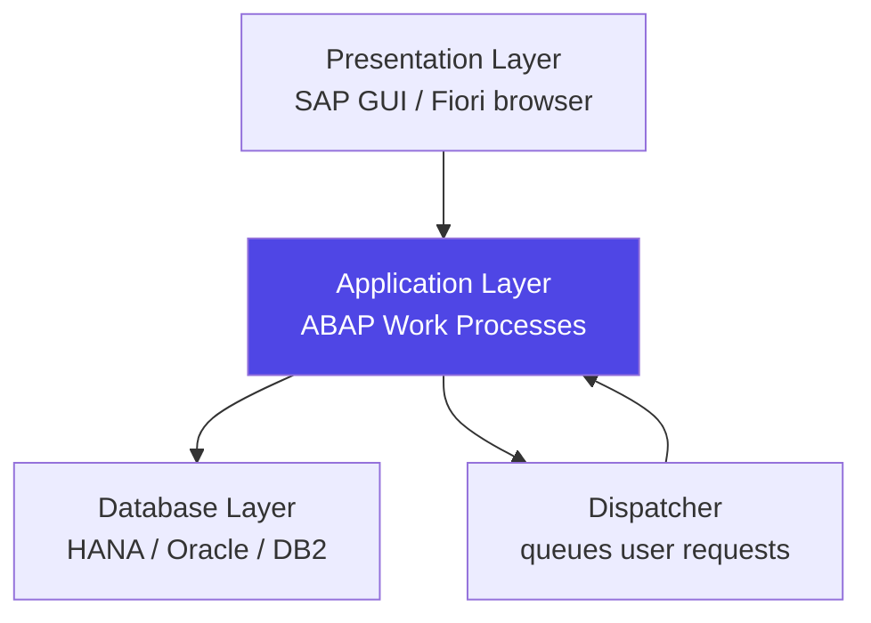
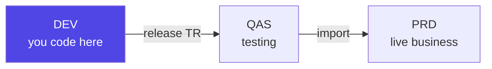
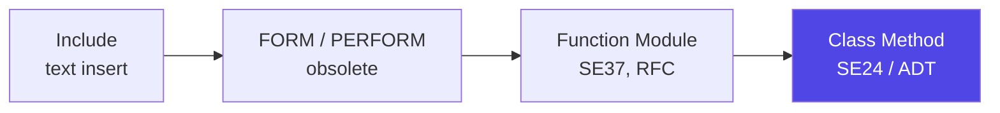
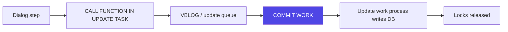
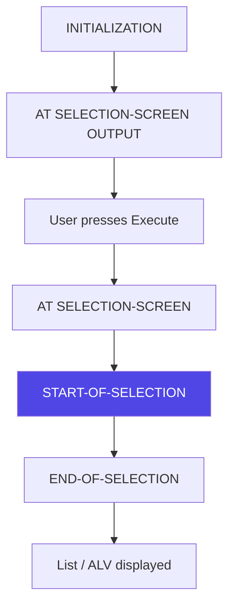
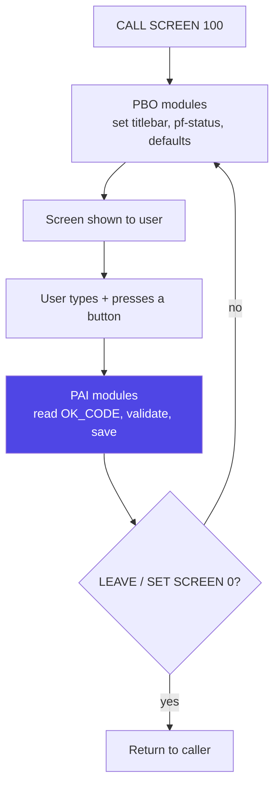
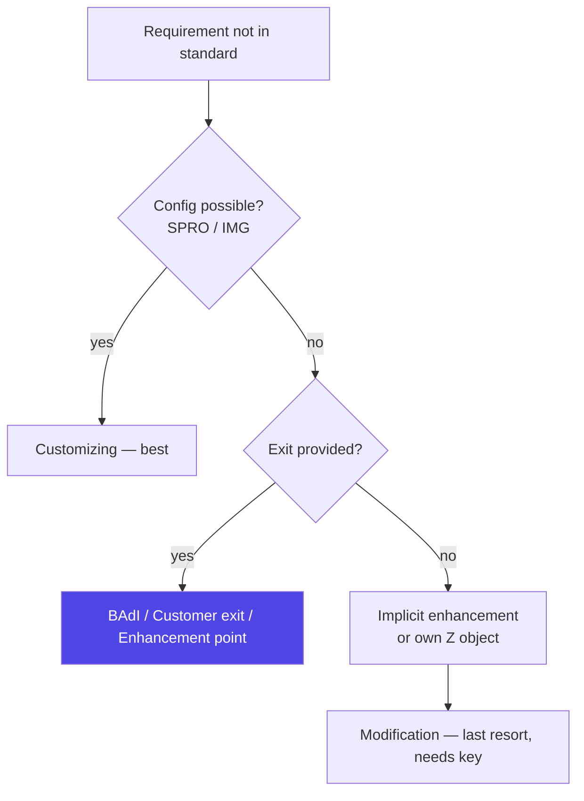
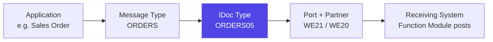
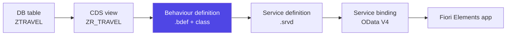

# ABAP — The Essentials

### Every ABAP topic that matters, condensed — definitions, the code that teaches each concept, and the points you must remember, in under 100 pages

> *"This is the short edition. Same ground as the full 1200-page reference, cut to what you actually need to hold in your head: what each thing is, the smallest piece of code that shows it working, and the gotcha that trips people up. Read this end to end in a week, then use the long edition only to look things up."*

**SAP Track** · The Condensed Guide · the full reference lives in ABAP-Notes.pdf

---

## Table of Contents

- [Part A — What ABAP Is & Where It Lives](#part-a-what-abap-is-where-it-lives)
  - [A1. What ABAP Is and Where It Runs](#a1-what-abap-is-and-where-it-runs) · [A2. The ABAP Stack vs the JavaScript Stack](#a2-the-abap-stack-vs-the-javascript-stack) · [A3. Classic ABAP, ABAP on HANA, and ABAP Cloud](#a3-classic-abap-abap-on-hana-and-abap-cloud) · [A4. What an ABAP Developer Actually Does](#a4-what-an-abap-developer-actually-does)
- [Part B — The Development Environment](#part-b-the-development-environment)
  - [B1. SAP GUI, Transaction Codes and the Workbench (SE80, SE38, SE11)](#b1-sap-gui-transaction-codes-and-the-workbench-se80-se38-se11) · [B2. ABAP Development Tools (ADT) in Eclipse](#b2-abap-development-tools-adt-in-eclipse) · [B3. Packages, Transport Requests and the DEV → QAS → PRD Landscape](#b3-packages-transport-requests-and-the-dev-qas-prd-landscape)
- [Part C — Your First Program and the Syntax Rules](#part-c-your-first-program-and-the-syntax-rules)
  - [C1. Program Types](#c1-program-types) · [C2. Hello World and the Syntax Rules](#c2-hello-world-and-the-syntax-rules) · [C3. WRITE and the System Fields (sy-subrc, sy-tabix, sy-datum ...)](#c3-write-and-the-system-fields-sy-subrc-sy-tabix-sy-datum) · [C4. Naming Conventions and the Z / Y Namespace](#c4-naming-conventions-and-the-z-y-namespace)
- [Part D — Data Types, Variables and Constants](#part-d-data-types-variables-and-constants)
  - [D1. DATA and the Elementary Types (C, N, D, T, I, P, F, STRING, X)](#d1-data-and-the-elementary-types-c-n-d-t-i-p-f-string-x) · [D2. TYPES, CONSTANTS and Literals](#d2-types-constants-and-literals) · [D3. TYPE vs LIKE and Dictionary Types](#d3-type-vs-like-and-dictionary-types) · [D4. CLEAR, FREE, Initial Values and Type-Conversion Traps](#d4-clear-free-initial-values-and-type-conversion-traps)
- [Part E — Operators, Expressions and Strings](#part-e-operators-expressions-and-strings)
  - [E1. Arithmetic, Comparison and Logical Operators](#e1-arithmetic-comparison-and-logical-operators) · [E2. String Handling — Classic Statements and String Templates](#e2-string-handling-classic-statements-and-string-templates) · [E3. Dates, Times and Numbers](#e3-dates-times-and-numbers)
- [Part F — Control Flow](#part-f-control-flow)
  - [F1. IF and CASE](#f1-if-and-case) · [F2. Loops — DO, WHILE, and CHECK / EXIT / CONTINUE](#f2-loops-do-while-and-check-exit-continue) · [F3. COND, SWITCH and Logic Building](#f3-cond-switch-and-logic-building)
- [Part G — Structures and Internal Tables](#part-g-structures-and-internal-tables)
  - [G1. Structures](#g1-structures) · [G2. Internal Tables and the Three Table Kinds](#g2-internal-tables-and-the-three-table-kinds) · [G3. Filling a Table — APPEND, INSERT, COLLECT, VALUE #( )](#g3-filling-a-table-append-insert-collect-value) · [G4. Reading — READ TABLE, itab[ ], line_exists](#g4-reading-read-table-itab-line_exists) · [G5. LOOP AT, GROUP BY, MODIFY, DELETE, SORT](#g5-loop-at-group-by-modify-delete-sort) · [G6. Field Symbols, FOR / REDUCE / CORRESPONDING, and Performance](#g6-field-symbols-for-reduce-corresponding-and-performance)
- [Part H — Modularization](#part-h-modularization)
  - [H1. Includes, Subroutines and Function Modules](#h1-includes-subroutines-and-function-modules) · [H2. Parameter Passing (IMPORTING / EXPORTING / CHANGING, by value vs reference)](#h2-parameter-passing-importing-exporting-changing-by-value-vs-reference) · [H3. Methods vs Function Modules vs Subroutines — What to Use Today](#h3-methods-vs-function-modules-vs-subroutines-what-to-use-today)
- [Part I — The ABAP Dictionary (DDIC)](#part-i-the-abap-dictionary-ddic)
  - [I1. Why the Dictionary Exists — Domain, Data Element, Field](#i1-why-the-dictionary-exists-domain-data-element-field) · [I2. Creating a Transparent Table — Keys, Technical Settings, Delivery Class](#i2-creating-a-transparent-table-keys-technical-settings-delivery-class) · [I3. Transparent, Pooled and Cluster Tables; Foreign Keys](#i3-transparent-pooled-and-cluster-tables-foreign-keys) · [I4. Views and a First Look at CDS](#i4-views-and-a-first-look-at-cds) · [I5. Search Helps, Lock Objects and Append Structures](#i5-search-helps-lock-objects-and-append-structures)
- [Part J — ABAP SQL — Talking to the Database](#part-j-abap-sql-talking-to-the-database)
  - [J1. ABAP SQL vs Native SQL](#j1-abap-sql-vs-native-sql) · [J2. SELECT SINGLE, SELECT INTO TABLE, and the Loop You Must Never Write](#j2-select-single-select-into-table-and-the-loop-you-must-never-write) · [J3. WHERE, ORDER BY, Aggregates and GROUP BY](#j3-where-order-by-aggregates-and-group-by) · [J4. Joins and FOR ALL ENTRIES](#j4-joins-and-for-all-entries) · [J5. INSERT, UPDATE, MODIFY, DELETE and the LUW / COMMIT WORK Concept](#j5-insert-update-modify-delete-and-the-luw-commit-work-concept) · [J6. Modern ABAP SQL and the Five Performance Rules](#j6-modern-abap-sql-and-the-five-performance-rules)
- [Part K — Modern ABAP Syntax (7.4+)](#part-k-modern-abap-syntax-74)
  - [K1. Inline Declarations and Constructor Expressions (VALUE, NEW, CONV, CAST, REF)](#k1-inline-declarations-and-constructor-expressions-value-new-conv-cast-ref) · [K2. FOR, REDUCE, CORRESPONDING and String Templates](#k2-for-reduce-corresponding-and-string-templates) · [K3. Old vs New — Side by Side](#k3-old-vs-new-side-by-side)
- [Part L — Reports, Selection Screens and ALV](#part-l-reports-selection-screens-and-alv)
  - [L1. Report Structure and Its Events](#l1-report-structure-and-its-events) · [L2. PARAMETERS, SELECT-OPTIONS and the Selection Table (SIGN/OPTION/LOW/HIGH)](#l2-parameters-select-options-and-the-selection-table-signoptionlowhigh) · [L3. Selection Screen Design and Variants](#l3-selection-screen-design-and-variants) · [L4. ALV with CL_SALV_TABLE](#l4-alv-with-cl_salv_table) · [L5. REUSE_ALV_GRID_DISPLAY, Field Catalog and Interactive Drill-Down](#l5-reuse_alv_grid_display-field-catalog-and-interactive-drill-down)
- [Part M — Object-Oriented ABAP](#part-m-object-oriented-abap)
  - [M1. Why OO ABAP — Classes and Objects](#m1-why-oo-abap-classes-and-objects) · [M2. Attributes, Methods, Visibility, Static vs Instance](#m2-attributes-methods-visibility-static-vs-instance) · [M3. Constructors; Local vs Global Classes (SE24)](#m3-constructors-local-vs-global-classes-se24) · [M4. Inheritance, Redefinition, Abstract and Final](#m4-inheritance-redefinition-abstract-and-final) · [M5. Interfaces and Polymorphism](#m5-interfaces-and-polymorphism) · [M6. Events and the Patterns You Will Use (Singleton, Factory, Strategy)](#m6-events-and-the-patterns-you-will-use-singleton-factory-strategy)
- [Part N — Error Handling and Messages](#part-n-error-handling-and-messages)
  - [N1. sy-subrc, MESSAGE and Message Classes (SE91)](#n1-sy-subrc-message-and-message-classes-se91) · [N2. Class-Based Exceptions — TRY / CATCH / CLEANUP and the CX Hierarchy](#n2-class-based-exceptions-try-catch-cleanup-and-the-cx-hierarchy) · [N3. Your Own Exception Class, and Reading a Short Dump (ST22)](#n3-your-own-exception-class-and-reading-a-short-dump-st22)
- [Part O — Dialog Programming (Module Pool)](#part-o-dialog-programming-module-pool)
  - [O1. Screens, Flow Logic, PBO and PAI](#o1-screens-flow-logic-pbo-and-pai) · [O2. Table Controls and Screen Sequences](#o2-table-controls-and-screen-sequences)
- [Part P — Data Transfer: Files, BDC, BAPIs](#part-p-data-transfer-files-bdc-bapis)
  - [P1. Files — GUI_UPLOAD, GUI_DOWNLOAD, OPEN DATASET](#p1-files-gui_upload-gui_download-open-dataset) · [P2. BDC — Call Transaction vs Session, and SHDB](#p2-bdc-call-transaction-vs-session-and-shdb) · [P3. BAPIs, the Return Table and BAPI_TRANSACTION_COMMIT](#p3-bapis-the-return-table-and-bapi_transaction_commit)
- [Part Q — Enhancements](#part-q-enhancements)
  - [Q1. The Enhancement Spectrum — Why You Never Modify SAP Code](#q1-the-enhancement-spectrum-why-you-never-modify-sap-code) · [Q2. User Exits, Customer Exits and BADIs](#q2-user-exits-customer-exits-and-badis) · [Q3. Enhancement Framework, Finding the Right Exit, and Clean Core](#q3-enhancement-framework-finding-the-right-exit-and-clean-core)
- [Part R — Forms and Output](#part-r-forms-and-output)
  - [R1. SAPscript, Smart Forms and Adobe Forms Compared](#r1-sapscript-smart-forms-and-adobe-forms-compared) · [R2. Driver Program vs Form](#r2-driver-program-vs-form)
- [Part S — Interfaces and Integration](#part-s-interfaces-and-integration)
  - [S1. RFC — Remote Function Calls](#s1-rfc-remote-function-calls) · [S2. ALE and IDocs — Structure and Key Transactions](#s2-ale-and-idocs-structure-and-key-transactions) · [S3. Proxies, Web Services and OData](#s3-proxies-web-services-and-odata)
- [Part T — Debugging, Performance and Quality](#part-t-debugging-performance-and-quality)
  - [T1. The Debugger — Breakpoints, Watchpoints, Step Types](#t1-the-debugger-breakpoints-watchpoints-step-types) · [T2. SAT and ST05, and the Performance Rules](#t2-sat-and-st05-and-the-performance-rules) · [T3. Code Inspector / ATC and ABAP Unit](#t3-code-inspector-atc-and-abap-unit) · [T4. Background Jobs (SM36 / SM37)](#t4-background-jobs-sm36-sm37)
- [Part U — Modern ABAP: HANA, CDS, RAP and ABAP Cloud](#part-u-modern-abap-hana-cds-rap-and-abap-cloud)
  - [U1. HANA and Code Pushdown](#u1-hana-and-code-pushdown) · [U2. CDS Views — Syntax, Annotations, Associations](#u2-cds-views-syntax-annotations-associations) · [U3. AMDP](#u3-amdp) · [U4. OData and SAP Gateway](#u4-odata-and-sap-gateway) · [U5. RAP and ABAP Cloud — the Full Modern Stack](#u5-rap-and-abap-cloud-the-full-modern-stack)
- [Part V — Mini Projects](#part-v-mini-projects)
  - [V1. How to Practise ABAP for Free](#v1-how-to-practise-abap-for-free) · [V2. Five Projects to Build](#v2-five-projects-to-build)
- [Part W — Interview Cheat-Sheet](#part-w-interview-cheat-sheet)
  - [W1. The Questions You Will Be Asked](#w1-the-questions-you-will-be-asked) · [W2. Rapid-Fire One-Liners](#w2-rapid-fire-one-liners)
- [Part X — Quick Reference](#part-x-quick-reference)
  - [X1. Transaction Code Cheat-Sheet](#x1-transaction-code-cheat-sheet) · [X2. Important SAP Tables](#x2-important-sap-tables) · [X3. Syntax Quick-Reference Card](#x3-syntax-quick-reference-card)

---

# Part A — What ABAP Is & Where It Lives

## A1. What ABAP Is and Where It Runs

**What:** ABAP (**A**dvanced **B**usiness **A**pplication **P**rogramming) is SAP's proprietary language for building and extending business applications. It never runs standalone — it runs **inside the SAP Application Server**, which owns the database connection, the user sessions and the memory.

<p class="te"><strong>Telugu:</strong> ABAP ni meeru laptop lo direct ga run cheyaleru — adi eppudu SAP Application Server lopala ne run avutundi. Server ye database, session, memory anni handle chestundi.</p>

The 3-tier architecture every interview asks about:



| Layer | Holds | You touch it via |
|---|---|---|
| Presentation | screens, Fiori UI | SAP GUI, browser |
| Application | ABAP code, work processes | SE80 / Eclipse ADT |
| Database | tables, views, indexes | SE11, Open SQL |

**Remember:** ABAP is compiled to bytecode and stored **in the database**, not as files on disk · a **work process** serves one request at a time, then is handed to the next user · JS analogy: the App Server is your Node runtime, but shared by 500 users at once.

---

## A2. The ABAP Stack vs the JavaScript Stack

**What:** ABAP collapses the language, runtime, ORM, IDE, version control and deployment pipeline into **one integrated system owned by SAP**. There is no npm, no package.json, no filesystem.

<p class="te"><strong>Telugu:</strong> JS lo npm, git, VS Code anni separate tools. ABAP lo ivi anni SAP system lope built-in ga vastayi — separate ga install cheyyanu.</p>

| Concern | JavaScript | ABAP |
|---|---|---|
| Runtime | Node / browser | SAP Application Server |
| DB access | Prisma, Knex | **Open SQL** (built into the language) |
| Types | TypeScript (optional) | **DDIC** types (mandatory, global) |
| Source storage | `.js` files on disk | rows in database tables |
| Package manager | npm | none — everything ships with SAP |
| Version control | git | **transport requests** |
| Deploy | CI/CD pipeline | transport DEV → QAS → PRD |
| Error style | `throw` / exceptions | `sy-subrc` + class-based exceptions |

```abap
" Open SQL is part of the language — no driver, no connection string
SELECT carrid, connid, fldate FROM sflight
  INTO TABLE @DATA(lt_flights)
  WHERE carrid = 'LH'.
```

**Remember:** no file system → you cannot `import` a file, you reference **global objects by name** · SQL is a language keyword, not a library call · everything you create is instantly visible system-wide, so naming discipline matters far more than in JS.

---

## A3. Classic ABAP, ABAP on HANA, and ABAP Cloud

**What:** Three eras of the same language. **Classic** ABAP pulls data to the app server and loops over it; **ABAP on HANA** pushes logic down into the database (CDS views, AMDP); **ABAP Cloud** (RAP, BTP, S/4HANA Cloud) restricts you to **released public APIs** only.

<p class="te"><strong>Telugu:</strong> Classic lo data ni app server ki teesukoni process chestham. HANA lo database lone process chesi result matrame teesukuntam — chala fast. Cloud lo SAP allow chesina APIs matrame vadali.</p>

| Era | Motto | Key tech | Restriction |
|---|---|---|---|
| Classic (ECC) | code-to-data | SELECT + LOOP, ALV, Dynpro | none, full table access |
| ABAP on HANA | **code pushdown** | CDS views, AMDP, AMDP procedures | still on-premise |
| ABAP Cloud | clean core | **RAP**, EML, released APIs | no direct table SELECT on SAP tables |

```abap
" Classic: pull 1M rows then aggregate in ABAP  -> slow
SELECT * FROM vbap INTO TABLE @DATA(lt_all).
LOOP AT lt_all INTO DATA(ls). lv_sum = lv_sum + ls-netwr. ENDLOOP.

" HANA style: let the DB aggregate -> one row comes back
SELECT SUM( netwr ) AS total FROM vbap
  WHERE vbeln = @lv_vbeln INTO @DATA(lv_total).
```

**Remember:** "code pushdown" is the single most-asked HANA interview phrase · ABAP Cloud forbids `SELECT * FROM mara` — you must use the released CDS view `I_Product` · **clean core** = never modify SAP standard, only extend.

---

## A4. What an ABAP Developer Actually Does

**What:** Day to day you build **reports, interfaces, conversions, enhancements, forms and workflows** (the classic **RICEFW** list) on top of SAP standard functionality, based on a functional consultant's spec.

<p class="te"><strong>Telugu:</strong> Meeru kotha SAP product build cheyyaru — already unna SAP meeda company ki kavalsina reports, interfaces, custom logic build chestharu. Functional consultant spec istadu, meeru code chestharu.</p>

| RICEFW | Meaning | Typical build |
|---|---|---|
| **R**eport | data output | ALV list of open sales orders |
| **I**nterface | system-to-system | IDoc / OData / file to a bank |
| **C**onversion | legacy data load | BAPI upload of customer master |
| **E**nhancement | change standard behaviour | BAdI on sales order save |
| **F**orm | printed output | Smartforms / Adobe invoice |
| **W**orkflow | approval chain | PO release strategy |

**Remember:** ~60% of real ABAP work is reports and enhancements · you rarely write greenfield code — you read a lot of SAP standard code first · debugging (`/h`) is a bigger daily skill than writing new syntax.

---

# Part B — The Development Environment

## B1. SAP GUI, Transaction Codes and the Workbench (SE80, SE38, SE11)

**What:** **SAP GUI** is the classic desktop client. You navigate by typing **transaction codes (tcodes)** into the command field rather than clicking menus.

<p class="te"><strong>Telugu:</strong> SAP GUI lo menu lo vetakakunda, pina unna command box lo tcode type chesi direct ga velthamu. Idi chala fast.</p>

| Tcode | Opens | Use for |
|---|---|---|
| **SE80** | Object Navigator | the all-in-one workbench |
| **SE38** | ABAP Editor | write/run reports |
| **SE11** | Data Dictionary | tables, data elements, domains |
| **SE16N** | Data Browser | look at table contents |
| **SE37** | Function Builder | function modules |
| **SE24** | Class Builder | global classes |
| **SE91 / SE93** | messages / tcode creation | |
| **ST22 / SM37 / SLG1** | dumps / jobs / app log | troubleshooting |

Command-field prefixes (interview favourite):

| Typed | Effect |
|---|---|
| `/n` + tcode | leave current tcode, open new |
| `/o` + tcode | open in a **new session** |
| `/h` | switch on the **debugger** |
| `/nex` | log off immediately |

**Remember:** `/h` then Enter then run = the fastest way into the debugger · SE16N shows data, SE11 shows structure · SE80 is being replaced by Eclipse but every legacy shop still uses it.

---

## B2. ABAP Development Tools (ADT) in Eclipse

**What:** **ADT** is the modern Eclipse-based IDE for ABAP. It is **mandatory** for CDS views, AMDP and RAP — those objects simply cannot be created in SAP GUI.

<p class="te"><strong>Telugu:</strong> ADT ante Eclipse lo ABAP develop cheyyadam. CDS views, RAP lantivi SAP GUI lo create cheyyalemu — ADT tappanisari.</p>

| Shortcut | Does |
|---|---|
| `Ctrl+Shift+A` | open any ABAP object by name |
| `Ctrl+Space` | code completion (and template insert) |
| `Ctrl+1` | **Quick Fix** — auto-declare variables, refactor |
| `Ctrl+Shift+F` | pretty printer / format |
| `F8` | run · `F5/F6` step in/over |
| `Ctrl+Shift+G` | where-used list |

```abap
" Ctrl+1 on an undeclared name writes the DATA line for you
DATA(lv_count) = lines( lt_flights ).   " inline declaration, 7.4+ only in ADT-era code
```

**Remember:** ADT connects to the same server — code still lives in the DB, Eclipse is just a nicer window · inline `DATA(...)` and modern syntax are far easier in ADT · classic Dynpro screens and Smartforms still force you back to SAP GUI.

---

## B3. Packages, Transport Requests and the DEV → QAS → PRD Landscape

**What:** Every object belongs to a **package**; every change to a non-local package is recorded in a **transport request (TR)**, which is **released** and imported through the system landscape. This is ABAP's version control and deployment in one.

<p class="te"><strong>Telugu:</strong> Meeru rasina prathi object oka package lo untundi, ah change oka transport request lo record avutundi. Aa request DEV nunchi QAS, taruvata PRD ki move avutundi.</p>



| Thing | Meaning |
|---|---|
| Package `$TMP` | **local** objects, never transportable |
| Workbench request | programs, classes, DDIC objects |
| Customizing request | config table entries (client-specific) |
| Task | one developer's slice inside a request |
| **SE09 / SE10** | your transport organizer |
| **STMS** | Basis imports it to the next system |

**Remember:** `$TMP` objects can never leave DEV — assign a real Z-package before you finish · release the **task** first, then the **request** · TR number format `DEVK900123` · a release is one-way: to fix, create a new TR (no `git revert`).

---

# Part C — Your First Program and the Syntax Rules

## C1. Program Types

**What:** SE38 asks for a program **type** when you create it. The type decides how it starts, whether it has a screen, and whether it can be called directly.

<p class="te"><strong>Telugu:</strong> Program create chesetappudu type adugutundi. Aa type batti program ela start avutundo, screen untunda ledha ani decide avutundi.</p>

| Type | Code | Runs how | Use for |
|---|---|---|---|
| Executable | **1** | directly, `REPORT` | reports (the 90% case) |
| Module pool | **M** | only via a tcode | classic Dynpro screens |
| Function group | **F** | container | function modules |
| Class pool | **K** | container | global classes (SE24) |
| Include | **I** | never alone | shared code chunks |
| Interface pool | **J** | container | global interfaces |
| Subroutine pool | **S** | via PERFORM | legacy FORM routines |

```abap
REPORT z_flight_list.        " type 1 — the only one you can just press F8 on
```

**Remember:** type **1 = executable**, the default for reports · module pool needs a tcode, it cannot be run from SE38 · includes have no `REPORT` statement of their own.

---

## C2. Hello World and the Syntax Rules

**What:** ABAP statements always **end with a period**, are **case-insensitive**, and can span any number of lines. Comments are `*` in column 1 (whole line) or `"` anywhere (rest of line).

<p class="te"><strong>Telugu:</strong> Prathi ABAP statement full stop tho aagali. Case matter avvadu, kani string values lo matram case matter avutundi.</p>

```abap
REPORT z_hello.

* full-line comment (asterisk must be in column 1)
DATA lv_name TYPE string VALUE 'Nikhil'.   " end-of-line comment

WRITE: / 'Hello', lv_name.                  " colon = chain, comma separates
WRITE: / 'Line two',
       / 'Line three'.                      " one statement, one period at the end
```

| Rule | Detail |
|---|---|
| Terminator | `.` — missing one is the #1 beginner error |
| Case | keywords/vars case-insensitive; **literals are not** |
| Chaining | `WRITE:` a, b, c**.** — colon + commas |
| Comment | `*` col 1 = whole line · `"` = rest of line |
| Literals | text = `'...'` · string = `` `...` `` |

**Remember:** `'abc'` is type C (trailing blanks trimmed), `` `abc` `` is type STRING (kept) · chaining with `:` is ABAP's only real syntactic sugar and it applies to any statement · JS analogy: the period is the semicolon, but non-optional.

---

## C3. WRITE and the System Fields (sy-subrc, sy-tabix, sy-datum ...)

**What:** `WRITE` prints to the classic list output. **System fields** are a global structure `sy` the runtime fills automatically after almost every statement — checking `sy-subrc` is the core ABAP idiom.

<p class="te"><strong>Telugu:</strong> Prathi statement taruvata SAP `sy` anedi fill chestundi. `sy-subrc` = 0 ante success, 4 ante ledu — idi ABAP lo chala mukhyam.</p>

| Field | Holds | Set by |
|---|---|---|
| **sy-subrc** | 0 = success, ≠0 = failure | almost every statement |
| **sy-tabix** | current **index** in LOOP/READ | internal table ops |
| **sy-index** | current pass of DO/WHILE | loops |
| sy-datum / sy-uzeit | system date / time | always |
| sy-uname | logged-on user | always |
| sy-mandt | client (e.g. 100) | always |
| sy-dbcnt | rows processed by last SQL | Open SQL |
| sy-repid | current program name | always |

```abap
SELECT SINGLE carrname FROM scarr
  WHERE carrid = 'LH' INTO @DATA(lv_name).
IF sy-subrc = 0.
  WRITE: / 'Found:', lv_name, 'on', sy-datum.
ELSE.
  WRITE: / 'No carrier'.
ENDIF.
```

**Remember:** check `sy-subrc` **immediately** — the next statement overwrites it · `sy-tabix` is index, `sy-index` is loop counter (classic exam trap) · never write to `sy-*` fields yourself · `WRITE` is legacy output only; real UIs use ALV or Fiori.

---

## C4. Naming Conventions and the Z / Y Namespace

**What:** SAP owns all names not starting with **Z** or **Y**. Every custom object you create must start with `Z` (the de-facto standard) or `Y`. Inside code, prefixes encode a variable's **scope and kind**.

<p class="te"><strong>Telugu:</strong> Meeru create chese anni objects `Z` tho start avvali — lekapothe SAP standard object ni overwrite chestharu. Variables ki kuda prefix vadadam standard practice.</p>

| Prefix | Means | Example |
|---|---|---|
| `lv_` / `gv_` | local / global **v**ariable | `lv_count` |
| `ls_` / `gs_` | **s**tructure (work area) | `ls_vbak` |
| `lt_` / `gt_` | internal **t**able | `lt_vbap` |
| `lr_` / `lo_` | **r**eference / **o**bject | `lo_alv` |
| `iv_ / is_ / it_` | **i**mporting parameter | `iv_vbeln` |
| `ev_ / es_ / et_` | **e**xporting parameter | `et_items` |
| `cv_` / `rv_` | **c**hanging / **r**eturning | `rv_total` |
| `lc_` / `gc_` | constant | `gc_status` |
| `Z...` / `Y...` | custom repository object | `ZCL_ORDER` |

```abap
CLASS zcl_order DEFINITION PUBLIC.
  PUBLIC SECTION.
    METHODS get_total
      IMPORTING iv_vbeln        TYPE vbak-vbeln
      RETURNING VALUE(rv_total) TYPE vbap-netwr.
ENDCLASS.
```

**Remember:** `Z` for custom, `Y` rarely used, both are "customer namespace" · registered SAP partners get `/NAMESPACE/` names instead · prefixes are convention, not enforced by the compiler — but every code review checks them.

---

# Part D — Data Types, Variables and Constants

## D1. DATA and the Elementary Types (C, N, D, T, I, P, F, STRING, X)

**What:** `DATA` declares a variable. ABAP has **8 fixed-length** built-in types plus the variable-length `STRING` and `XSTRING`. Fixed-length types are blank- or zero-padded, never null.

<p class="te"><strong>Telugu:</strong> ABAP lo variables ki eppudu default value untundi — null ane concept ledu. Fixed length types padding tho nindi potayi.</p>

| Type | Meaning | Default length | Initial value |
|---|---|---|---|
| **C** | character | 1 | blanks |
| **N** | numeric text (digits only) | 1 | `'000...'` |
| **D** | date `YYYYMMDD` | 8 | `'00000000'` |
| **T** | time `HHMMSS` | 6 | `'000000'` |
| **I** | integer (4-byte) | — | `0` |
| **INT8** | integer (8-byte) | — | `0` |
| **P** | packed decimal (money!) | 8, DECIMALS n | `0` |
| **F** | float (binary, imprecise) | 8 | `0` |
| **STRING** | variable-length text | dynamic | empty |
| **X / XSTRING** | raw bytes | 1 / dynamic | `'00'` |

```abap
DATA: lv_matnr  TYPE c LENGTH 18,
      lv_plz    TYPE n LENGTH 5,               " '00123' keeps leading zeros
      lv_date   TYPE d,
      lv_amount TYPE p LENGTH 8 DECIMALS 2,    " always P for currency
      lv_text   TYPE string.

lv_date = sy-datum.
lv_amount = '1234.56'.
```

**Remember:** **use P for money, never F** — F loses cents to binary rounding · N is a *character* type: `'007'` stays `'007'`, and arithmetic on it converts first · D and T are really C fields, so `lv_date+0(4)` gives the year · no `null`, only initial values.

---

## D2. TYPES, CONSTANTS and Literals

**What:** `TYPES` defines a reusable type (no memory allocated); `CONSTANTS` defines an immutable value that **must** be given a `VALUE`. Both make code self-documenting and are preferred over repeating literals.

<p class="te"><strong>Telugu:</strong> `TYPES` tho meeru sonta type create chestharu, memory teeskodu. `CONSTANTS` ki VALUE tappanisari ivvali, taruvata marchaleru.</p>

```abap
TYPES: ty_amount TYPE p LENGTH 11 DECIMALS 2,
       BEGIN OF ty_order,
         vbeln TYPE vbak-vbeln,
         netwr TYPE ty_amount,
       END OF ty_order,
       ty_orders TYPE STANDARD TABLE OF ty_order WITH EMPTY KEY.

CONSTANTS: gc_status_open TYPE c LENGTH 1 VALUE 'O',
           gc_max_rows    TYPE i           VALUE 1000.

DATA ls_order TYPE ty_order.
ls_order-netwr = '99.50'.
```

| Declaration | Allocates memory? | Changeable? |
|---|---|---|
| `TYPES` | no — blueprint only | n/a |
| `DATA` | yes | yes |
| `CONSTANTS` | yes (read-only) | **no** |
| `STATICS` | yes, survives call | yes |

**Remember:** `CONSTANTS` without `VALUE` = syntax error · `STATICS` keeps its value between calls of the same subroutine (like a JS closure variable) · `WITH EMPTY KEY` is the modern default for table types · JS analogy: `TYPES` ≈ a TypeScript `type`, `CONSTANTS` ≈ `const`.

---

## D3. TYPE vs LIKE and Dictionary Types

**What:** `TYPE` refers to a **type** (built-in, local, or a DDIC data element); `LIKE` refers to an **existing variable**. Best practice is to type from the **Data Dictionary** so your variable automatically matches the table column.

<p class="te"><strong>Telugu:</strong> `TYPE` ante type ni refer chestunnam, `LIKE` ante already unna variable ni. Eppudu DDIC field ni TYPE cheyadam best — table marithe code automatic ga match avutundi.</p>

```abap
DATA lv_vbeln TYPE vbak-vbeln.    " typed from the table column — best practice
DATA ls_vbak  TYPE vbak.          " whole DDIC structure as a work area
DATA lv_copy  LIKE lv_vbeln.      " same type as an existing variable
DATA lv_ernam TYPE ernam.         " data element directly
```

The DDIC type chain (SE11 asks about this constantly):

| Level | Defines | Example |
|---|---|---|
| **Domain** | technical: type + length + value range | `CHAR10`, values O/C |
| **Data element** | semantic: label, F1 help, docs | `VBELN_VA` "Sales Document" |
| **Table/Structure field** | uses a data element | `VBAK-VBELN` |

**Remember:** domain = technical, data element = meaning — that is the exam answer · `LIKE` on a DDIC object is obsolete; use `TYPE` · typing from DDIC means a length change in SE11 propagates to your code for free · `TYPE REF TO` for object references.

---

## D4. CLEAR, FREE, Initial Values and Type-Conversion Traps

**What:** `CLEAR` resets a variable to its **initial value**; `FREE` clears it **and releases the memory** (meaningful only for internal tables and strings). ABAP converts between types silently, which is where most runtime surprises come from.

<p class="te"><strong>Telugu:</strong> `CLEAR` value ni initial ki teesukelutundi, `FREE` memory kuda vadulutundi. ABAP automatic ga type convert chestundi — appude chala bugs vastayi.</p>

```abap
CLEAR lv_amount.          " 0
CLEAR ls_order.           " every field to its own initial value
CLEAR lt_orders.          " rows gone, memory still reserved
FREE  lt_orders.          " rows gone AND memory released

IF lt_orders IS INITIAL.  " correct emptiness test
ENDIF.

DATA lv_n TYPE n LENGTH 3.
DATA lv_i TYPE i.
lv_n = 7.        " -> '007'
lv_i = lv_n.     " -> 7
lv_i = '12ab'.   " short dump CX_SY_CONVERSION_NO_NUMBER
```

| Trap | What happens |
|---|---|
| C → I with letters | runtime dump, not a `NaN` |
| P → I | **rounds**, does not truncate |
| Short C target | value is **truncated silently** |
| `'abc'` vs `` `abc` `` | C trims trailing blanks, STRING keeps them |
| Comparing C to STRING | trailing blanks make them unequal |

**Remember:** `IS INITIAL` not `= ''` · `CLEAR` inside a LOOP before filling a work area prevents the classic "leftover field" bug · `FREE` only matters for big internal tables · assigning to a shorter C field truncates with **no warning** — a top production-bug source.

---

# Part E — Operators, Expressions and Strings

## E1. Arithmetic, Comparison and Logical Operators

**What:** ABAP operators need **blanks on both sides** — `a+1` is a field-offset, not addition. Since 7.4 expressions can appear almost anywhere a value is expected, so `DATA(x) = a * 2.` is legal without a helper variable.

<p class="te"><strong>Telugu:</strong> Prati operator chuttu space thappanisari — space lekapothe syntax error vasthundi. 7.4 nunchi expression ni nerugga assignment lo rayochu.</p>

| Group | Operators | Note |
|---|---|---|
| Arithmetic | `+ - * / DIV MOD **` | `/` on integers rounds; `DIV` truncates |
| Comparison | `= <> < > <= >=` | word forms `EQ NE LT GT LE GE` in legacy |
| Range/set | `BETWEEN`, `IN`, `IS INITIAL`, `IS NOT INITIAL` | `IN` works with ranges/select-options |
| String compare | `CS CP NS NP` | `CP` = covers pattern, `*` and `+` wildcards |
| Logical | `AND OR NOT` | `NOT` binds tightest, then `AND`, then `OR` |
| Bit | `BIT-AND BIT-OR BIT-XOR` | rare, on `x` types |

```abap
DATA(lv_net)  = lv_gross - lv_tax.          " blanks are mandatory
DATA(lv_half) = 7 / 2.                       " 4 if target is integer (rounds!)
DATA(lv_div)  = 7 DIV 2.                     " 3, truncating
DATA(lv_rem)  = 7 MOD 2.                     " 1

IF lv_matnr CP 'MAT*' AND lv_qty BETWEEN 1 AND 10.
  " CP = pattern match, not a normal equality
ENDIF.

IF lt_items IS NOT INITIAL AND lines( lt_items ) > 0.
ENDIF.
```

**Remember:** missing blanks around operators is the #1 beginner syntax error · `/` rounds, `DIV` truncates — a classic interview trap · use `IS INITIAL`, never `= ''`, for generic emptiness · `CS`/`CP` are case-insensitive, `CO`/`CN` are case-sensitive · JS analogy: `IS INITIAL` ≈ falsy check but type-aware.

---

## E2. String Handling — Classic Statements and String Templates

**What:** Modern ABAP builds strings with **string templates** `|...|` and embeds values in `{ }`. The classic `CONCATENATE`, `SPLIT`, `CONDENSE` statements still fill legacy code and still matter for reading it.

<p class="te"><strong>Telugu:</strong> Kotha code lo string templates <code>| |</code> vadandi — JS template literal laantide. Purana code lo CONCATENATE, SPLIT ekkuva kanipisthundi.</p>

| Task | Modern (7.4+) | Classic |
|---|---|---|
| Join | `\|{ a } { b }\|` | `CONCATENATE a b INTO r SEPARATED BY space.` |
| Length | `strlen( s )` | same |
| Substring | `substring( val = s off = 0 len = 4 )` | `s+0(4)` |
| Replace | `replace( val = s sub = 'X' with = 'Y' )` | `REPLACE 'X' IN s WITH 'Y'.` |
| Find | `find( val = s sub = 'AB' )` | `SEARCH s FOR 'AB'.` |
| Trim | `condense( s )` | `CONDENSE s NO-GAPS.` |
| Case | `to_upper( s )` / `to_lower( s )` | `TRANSLATE s TO UPPER CASE.` |
| Split | `SPLIT s AT ',' INTO TABLE lt.` | same |

```abap
DATA(lv_name) = |{ ls_kna1-name1 } ({ ls_kna1-kunnr ALPHA = OUT })|.
" ALPHA = OUT strips leading zeros: 0000001000 -> 1000

DATA(lv_msg) = |Order { lv_vbeln } has { lines( lt_items ) } items|
            && | created on { sy-datum DATE = USER }|.   " && concatenates

DATA(lv_up)  = to_upper( condense( lv_raw ) ).
SPLIT lv_csv AT ',' INTO TABLE DATA(lt_parts).
```

| Format option in `{ }` | Effect |
|---|---|
| `ALPHA = IN / OUT` | add / strip leading zeros |
| `DATE = USER` | user's date format |
| `WIDTH = 10 ALIGN = RIGHT` | padding |
| `NUMBER = USER` | decimal separator per user |

**Remember:** `CHAR` types are blank-padded and trailing blanks are ignored; `STRING` keeps them — prefer `STRING` for text · offset syntax `s+3(2)` still appears everywhere in legacy · templates need blanks inside the braces: `{ x }` not `{x}` · JS analogy: `|...{ x }...|` ≈ `` `...${x}...` ``, `&&` ≈ `+`.

---

## E3. Dates, Times and Numbers

**What:** Dates are `TYPE d` — an **8-char string `YYYYMMDD`** — and times are `TYPE t` (`HHMMSS`), so arithmetic on them works in **days** and **seconds** respectively. Numeric types differ mainly in whether they are exact (`P`, `DECFLOAT`) or approximate (`F`).

<p class="te"><strong>Telugu:</strong> Date anedi 8 character string, kaani date ki number add cheste roju vasthundi. Money ki eppudu P type vadandi, F kaadu.</p>

| Type | Meaning | Use for |
|---|---|---|
| `D` | date `YYYYMMDD` | all dates; `sy-datum` |
| `T` | time `HHMMSS` | `sy-uzeit` |
| `I` | 4-byte integer | counters |
| `P DECIMALS n` | packed, exact | **money, quantity** |
| `F` | float, binary | scientific only |
| `DECFLOAT34` | exact decimal float | modern amounts |
| `TIMESTAMP` / `TIMESTAMPL` | `TYPE p` UTC stamp | logging, CDS |

```abap
DATA(lv_today)    = sy-datum.
DATA(lv_next_wk)  = sy-datum + 7.            " arithmetic in days
DATA(lv_month)    = sy-datum+4(2).           " offset: MM
DATA(lv_first)    = CONV d( |{ sy-datum+0(6) }01| ).

DATA(lv_days) = lv_end - lv_start.           " difference in days

DATA lv_amount TYPE p LENGTH 13 DECIMALS 2.
lv_amount = 100 / 3.                          " 33.33 exactly rounded

GET TIME STAMP FIELD DATA(lv_ts).            " UTC timestamp
```

| Common helper | Purpose |
|---|---|
| `RP_LAST_DAY_OF_MONTHS` | month end |
| `CL_ABAP_TSTMP` methods | timestamp maths |
| `cl_abap_context_info=>get_system_date( )` | ABAP-Cloud-safe `sy-datum` |

**Remember:** never use `F` for currency — rounding errors fail audits · `sy-datum` is server date, user date differs by timezone · in ABAP Cloud `sy-datum` is discouraged, use `cl_abap_context_info` · date + number = date, no library needed · JS analogy: no `Date` object, dates are plain strings you can slice.

---

# Part F — Control Flow

## F1. IF and CASE

**What:** `IF / ELSEIF / ELSE / ENDIF` handles conditions; `CASE` compares one field against fixed values, and `CASE TYPE OF` branches on an object's class.

<p class="te"><strong>Telugu:</strong> Okate field ni chala values tho compare chestunte CASE vadandi, complex conditions unte IF vadandi. CASE lo fall-through undadu.</p>

```abap
IF ls_vbak-netwr > 10000 AND ls_vbak-waerk = 'USD'.
  lv_flag = 'H'.
ELSEIF ls_vbak-netwr > 1000.
  lv_flag = 'M'.
ELSE.
  lv_flag = 'L'.
ENDIF.

CASE ls_vbak-auart.
  WHEN 'OR' OR 'TA'.  lv_text = 'Standard order'.
  WHEN 'RE'.          lv_text = 'Returns'.
  WHEN OTHERS.        lv_text = 'Unknown'.
ENDCASE.

CASE TYPE OF lo_obj.                  " 7.4+, replaces long CL_ABAP_TYPEDESCR code
  WHEN TYPE cl_order INTO DATA(lo_ord).
  WHEN OTHERS.
ENDCASE.
```

**Remember:** `CASE` needs a single comparison field and equality only — no `>` · no fall-through, so no `break` needed · always code `WHEN OTHERS` (interviewers check this) · deep `IF` nesting is the top code-review complaint; return early instead · JS analogy: `CASE` ≈ `switch` but auto-breaking.

---

## F2. Loops — DO, WHILE, and CHECK / EXIT / CONTINUE

**What:** `DO` repeats a fixed or unlimited number of times, `WHILE` repeats while a condition holds, and `LOOP AT` iterates an internal table (see G5). `sy-index` counts `DO`/`WHILE` passes; `sy-tabix` is the row index inside `LOOP AT`.

<p class="te"><strong>Telugu:</strong> DO/WHILE lo sy-index, LOOP AT lo sy-tabix — rendu veru veru. EXIT ante loop nunchi bayataki, CONTINUE ante next iteration.</p>

| Statement | Effect inside a loop |
|---|---|
| `EXIT` | leave the loop immediately |
| `CONTINUE` | skip to next iteration unconditionally |
| `CHECK cond` | skip to next iteration if `cond` is false |
| `RETURN` | leave the whole method/form |

```abap
DO 5 TIMES.
  WRITE / sy-index.                    " 1..5
ENDDO.

DO.                                     " endless — must break out yourself
  lv_n = lv_n + 1.
  IF lv_n > 100. EXIT. ENDIF.
ENDDO.

WHILE lv_balance > 0.
  lv_balance = lv_balance - lv_rate.
ENDWHILE.

LOOP AT lt_vbap INTO DATA(ls_item).
  CHECK ls_item-netwr > 0.              " skip zero-value rows
  IF ls_item-matnr IS INITIAL. CONTINUE. ENDIF.
  lv_total = lv_total + ls_item-netwr.
ENDLOOP.
```

**Remember:** `CHECK` outside a loop behaves like `RETURN` — a real production bug source · `EXIT` inside `SELECT ... ENDSELECT` leaves the DB cursor open, avoid · `sy-subrc` and `sy-tabix` change on every statement, save them at once · never `SELECT` inside a `LOOP` — this is the classic performance rejection · JS analogy: `EXIT` ≈ `break`, `CONTINUE` ≈ `continue`.

---

## F3. COND, SWITCH and Logic Building

**What:** `COND` and `SWITCH` are the **expression forms** of `IF` and `CASE` — they return a value instead of assigning inside a block, so you can build a result in one statement.

<p class="te"><strong>Telugu:</strong> COND ante IF ni oka value ga return chestundi, SWITCH ante CASE laantidi. Code chinnaga, chaduvukovadaniki sulabham ga untundi.</p>

| Form | Reads as |
|---|---|
| `COND type( WHEN c THEN v ... ELSE v )` | multi-condition IF |
| `SWITCH type( f WHEN a THEN v ... ELSE v )` | CASE on one field |
| `... ELSE THROW cx_my_error( )` | raise instead of default |

**Worked example.** *Requirement: classify a sales order as HIGH / MEDIUM / LOW by net value, and translate the order type code to text.*

```abap
DATA(lv_band) = COND char1(
  WHEN ls_vbak-netwr > 10000 THEN 'H'
  WHEN ls_vbak-netwr > 1000  THEN 'M'
  ELSE 'L' ).

DATA(lv_type) = SWITCH string( ls_vbak-auart
  WHEN 'OR' THEN 'Standard'
  WHEN 'RE' THEN 'Returns'
  ELSE THROW cx_sy_conversion_error( ) ).   " no silent wrong default
```

**How to build logic like this:** name the output and its type first, list the conditions **most specific first** (order matters — the first true `WHEN` wins), then decide whether the fallback is a safe default or an exception.

**Remember:** conditions are evaluated top-down, so put narrow cases above broad ones · without `ELSE` an unmatched `COND` returns the type's initial value silently — always give `ELSE` or `THROW` · the result type must be stated (`COND char1(`), it is not inferred · JS analogy: `COND` ≈ chained ternary, `SWITCH` ≈ a `switch` that returns.

---

# Part G — Structures and Internal Tables

## G1. Structures

**What:** A structure is a **named group of fields** — one row of data. It can be declared inline (`BEGIN OF ... END OF`), from a DDIC type (`TYPE vbak`), or as a local type; nested and deep structures (a structure containing a table) are allowed.

<p class="te"><strong>Telugu:</strong> Structure ante oka row — chala fields kalipi oka peru. JS lo object laantidi. DDIC table peru tho nerugga declare cheyyochu.</p>

| Kind | Example | Note |
|---|---|---|
| Flat | all char/numeric fields | can be moved byte-wise |
| Nested | structure inside structure | access with `-` chain |
| Deep | contains a `STRING` or a table | no byte-wise moves |

```abap
TYPES: BEGIN OF ty_order,
         vbeln TYPE vbak-vbeln,
         kunnr TYPE vbak-kunnr,
         netwr TYPE vbak-netwr,
         items TYPE STANDARD TABLE OF vbap WITH EMPTY KEY,  " deep
       END OF ty_order.

DATA ls_order TYPE ty_order.
DATA ls_vbak  TYPE vbak.              " straight from DDIC

ls_order-vbeln = '0000001234'.
DATA(lv_cust) = ls_order-kunnr.

" build in one statement with VALUE
DATA(ls_new) = VALUE ty_order( vbeln = '4711' kunnr = '1000' netwr = '500' ).

MOVE-CORRESPONDING ls_vbak TO ls_order.   " copies same-named fields only
CLEAR ls_order.                            " reset all fields to initial
```

**Remember:** `MOVE-CORRESPONDING` matches by field **name**, silently ignoring the rest — great and dangerous · use `CORRESPONDING #( ... )` (G6) in modern code · `TYPE vbak` inherits DDIC changes automatically, so prefer it over hand-typed fields · a structure is the work area of a table row · JS analogy: structure ≈ a plain object with a fixed shape.

---

## G2. Internal Tables and the Three Table Kinds

**What:** An internal table is an **in-memory array of structures** — ABAP's main data container, since all DB reads land in one. The kind (STANDARD / SORTED / HASHED) fixes how rows are stored and therefore how fast reads are.

<p class="te"><strong>Telugu:</strong> Internal table ante memory lo unna table — database data anta ikkade vasthundi. Kind batti reading speed marutundi, so kind correct ga select cheyyali.</p>

| Kind | Key | Access path | Cost | Duplicates | Use when |
|---|---|---|---|---|---|
| STANDARD | non-unique, not maintained | index **or** linear search | index O(1), key **O(n) linear** | yes | default, append-heavy, small tables |
| SORTED | unique or non-unique, always in order | index or **binary search** | **O(log n)** | if non-unique | kept in key order, range reads, big loops |
| HASHED | **unique only** | key only, **no index** | **O(1) hash** | no | large lookup/master-data table |

```abap
" modern short forms
DATA lt_items TYPE STANDARD TABLE OF vbap WITH EMPTY KEY.
DATA lt_sorted TYPE SORTED TABLE OF vbap WITH NON-UNIQUE KEY vbeln posnr.
DATA lt_mara  TYPE HASHED TABLE OF mara WITH UNIQUE KEY matnr.

SELECT * FROM mara INTO TABLE @lt_mara.
DATA(ls) = lt_mara[ matnr = '000000000000001000' ].   " O(1), dumps if absent

DATA(lv_rows) = lines( lt_items ).      " row count
```

| Concept | Meaning |
|---|---|
| Work area | single row variable used to read/write |
| Header line | obsolete implicit work area — never use in new code |
| `WITH EMPTY KEY` | explicit "I don't need a key" |
| Secondary key | extra sorted/hashed key on a standard table |

**Remember:** hashed = unique key, **no index**, no `LOOP` order guarantee · sorted tables reject `APPEND` out of order (dump), use `INSERT` · a `SORTED` secondary key gives a standard table fast lookups without changing its kind · picking STANDARD then searching by key in a loop is the most common performance defect · JS analogy: **standard ≈ Array**, **hashed ≈ Map**, sorted ≈ an array you promise to keep sorted.

---

## G3. Filling a Table — APPEND, INSERT, COLLECT, VALUE #( )

**What:** `APPEND` adds at the end (standard only), `INSERT` places by key or index, `COLLECT` adds numeric fields into an existing matching row, and `VALUE #( )` builds a whole table in one expression.

<p class="te"><strong>Telugu:</strong> APPEND ante chivara add, INSERT ante sorted/hashed lo correct place lo, COLLECT ante same key unte amounts kalipestundi. VALUE tho okesari table nimpochu.</p>

| Statement | Works on | Behaviour |
|---|---|---|
| `APPEND ls TO lt.` | standard | at the end, fastest |
| `APPEND INITIAL LINE TO lt ASSIGNING <fs>.` | standard | add empty row, fill via field symbol |
| `INSERT ls INTO TABLE lt.` | all kinds | by key; `sy-subrc = 4` on duplicate in unique key |
| `INSERT ls INTO lt INDEX 1.` | standard/sorted | at a position |
| `COLLECT ls INTO lt.` | standard/sorted | sums numeric fields for equal char key |
| `VALUE #( ( ) ( ) )` | all | build inline |

```abap
APPEND VALUE #( vbeln = '4711' posnr = '10' netwr = 100 ) TO lt_items.

APPEND INITIAL LINE TO lt_items ASSIGNING FIELD-SYMBOL(<ls>).
<ls>-vbeln = '4712'.                       " no extra copy of the row

INSERT ls_mat INTO TABLE lt_mara.          " correct way for hashed/sorted
IF sy-subrc <> 0. " duplicate key
ENDIF.

DATA(lt_new) = VALUE ty_t_items(
  ( vbeln = '1' netwr = 10 )
  ( vbeln = '2' netwr = 20 ) ).

lt_new = VALUE #( BASE lt_new ( vbeln = '3' netwr = 30 ) ).  " keep existing rows

COLLECT VALUE ty_sum( kunnr = '1000' netwr = 50 ) INTO lt_totals. " aggregates
```

**Remember:** `VALUE #( )` without `BASE` **wipes the table first** — a silent data-loss bug · `APPEND` on a sorted table out of order short-dumps · `COLLECT` needs all non-numeric fields to form the key and is slow on big tables — `GROUP BY` (G5) is better · use `ASSIGNING` when filling large tables to skip a copy · JS analogy: `APPEND` ≈ `push`, `VALUE #( )` ≈ array literal, `BASE` ≈ spread `[...old, new]`.

---

## G4. Reading — READ TABLE, itab[ ], line_exists

**What:** `lt[ key = val ]` is the modern **table expression** read — short, but it **short-dumps** if no row matches. `READ TABLE` sets `sy-subrc` instead, and `line_exists( )` / `line_index( )` test presence safely.

<p class="te"><strong>Telugu:</strong> <code>lt[ ... ]</code> chala chinnaga untundi kaani row lekapothe dump avuthundi. Anduke mundu line_exists tho check cheyyali, leda READ TABLE vadali.</p>

| Need | Write |
|---|---|
| Read, row certainly exists | `DATA(ls) = lt[ vbeln = '1' ].` |
| Read, may be missing | `READ TABLE lt INTO ls WITH KEY vbeln = '1'.` then check `sy-subrc` |
| Safe expression read | `VALUE #( lt[ vbeln = '1' ] OPTIONAL )` |
| With default | `VALUE #( lt[ ... ] DEFAULT ls_fallback )` |
| Existence only | `IF line_exists( lt[ vbeln = '1' ] ).` |
| Position | `DATA(idx) = line_index( lt[ vbeln = '1' ] ).` (0 if absent) |
| Read by position | `READ TABLE lt INTO ls INDEX 1.` |
| Read without copying | `READ TABLE lt ASSIGNING FIELD-SYMBOL(<ls>) ...` |
| Read-only reference | `READ TABLE lt REFERENCE INTO DATA(lr) ...` |

```abap
IF line_exists( lt_mara[ matnr = lv_matnr ] ).
  DATA(ls_mat) = lt_mara[ matnr = lv_matnr ].
ENDIF.

DATA(ls_safe) = VALUE #( lt_mara[ matnr = lv_matnr ] OPTIONAL ). " initial if absent

READ TABLE lt_items ASSIGNING FIELD-SYMBOL(<ls_item>)
     WITH KEY vbeln = lv_vbeln posnr = '000010'.
IF sy-subrc = 0.
  <ls_item>-netwr = 0.                  " writes straight into the table
ENDIF.

READ TABLE lt_sorted INTO ls WITH KEY vbeln = '1' BINARY SEARCH. " needs sorted data
```

**Remember:** `BINARY SEARCH` on unsorted data returns wrong results with no error — always `SORT` by the same fields first · on a truly `SORTED` table binary search is automatic, don't add the addition · `INTO` copies, `ASSIGNING` does not — use `ASSIGNING` to modify in place · unhandled `CX_SY_ITAB_LINE_NOT_FOUND` from `lt[ ]` is a top production dump · JS analogy: `line_exists` ≈ `.some()`, `lt[ k = v ]` ≈ `.find()` that throws.

---

## G5. LOOP AT, GROUP BY, MODIFY, DELETE, SORT

**What:** `LOOP AT` walks a table row by row; `WHERE` filters at the source; `GROUP BY` replaces the old `AT NEW` control-break style; `MODIFY`, `DELETE` and `SORT` change the table in bulk.

<p class="te"><strong>Telugu:</strong> LOOP AT lo eppudu WHERE vadandi — loop lopala IF kanna vegam. Grouping ki GROUP BY vadandi, purana AT NEW kanna chala clear ga untundi.</p>

| Statement | Purpose |
|---|---|
| `LOOP AT lt INTO DATA(ls) WHERE f = v.` | filtered read (copy) |
| `LOOP AT lt ASSIGNING FIELD-SYMBOL(<ls>).` | read + modify in place, no copy |
| `LOOP AT lt INTO ls GROUP BY ( k = ls-kunnr )` | grouping |
| `MODIFY lt FROM ls TRANSPORTING f WHERE ...` | mass update |
| `DELETE lt WHERE f = v.` | mass delete |
| `DELETE ADJACENT DUPLICATES FROM lt COMPARING f.` | dedupe (**SORT first**) |
| `SORT lt BY f1 ASCENDING f2 DESCENDING.` | reorder (standard only) |

```abap
LOOP AT lt_items ASSIGNING FIELD-SYMBOL(<ls_item>) WHERE netwr > 0.
  <ls_item>-status = 'X'.               " modifies the table directly
ENDLOOP.

" total per customer, modern control break
LOOP AT lt_orders INTO DATA(ls_ord)
     GROUP BY ( kunnr = ls_ord-kunnr )
     INTO DATA(ls_group).
  DATA(lv_sum) = 0.
  LOOP AT GROUP ls_group INTO DATA(ls_member).
    lv_sum = lv_sum + ls_member-netwr.
  ENDLOOP.
  APPEND VALUE #( kunnr = ls_group-kunnr total = lv_sum ) TO lt_totals.
ENDLOOP.

SORT lt_items BY matnr.
DELETE ADJACENT DUPLICATES FROM lt_items COMPARING matnr.
DELETE lt_items WHERE netwr IS INITIAL.
MODIFY lt_items FROM VALUE #( status = 'C' ) TRANSPORTING status WHERE vbeln = '4711'.
```

**Remember:** `DELETE ADJACENT DUPLICATES` only removes **neighbouring** duplicates — without `SORT` it quietly keeps duplicates · never delete rows from the table you are looping over without care; `LOOP` index shifts · `SORT` is not allowed on sorted/hashed tables · `AT NEW f` / `AT END OF f` (legacy) require the table sorted by that field and blank out following fields in the work area · JS analogy: `LOOP ... WHERE` ≈ `.filter().forEach()`, `GROUP BY` ≈ `reduce` into a Map.

---

## G6. Field Symbols, FOR / REDUCE / CORRESPONDING, and Performance

**What:** Field symbols `<fs>` are **typed pointers** — assigning to one avoids copying a row; references `REF TO` do the same for objects. `FOR`, `REDUCE` and `CORRESPONDING` turn whole loops into single expressions.

<p class="te"><strong>Telugu:</strong> Field symbol ante address — copy avvadu, anduke pedda tables meeda chala fast. FOR/REDUCE tho loop antha oke line lo rayochu.</p>

```abap
" 1. field symbol: modify without copying
LOOP AT lt_items ASSIGNING FIELD-SYMBOL(<ls>).
  <ls>-netwr = <ls>-netwr * '1.18'.
ENDLOOP.

" 2. FOR — map/filter in one expression
DATA(lt_big) = VALUE ty_t_items( FOR ls IN lt_items
                                 WHERE ( netwr > 1000 )
                                 ( vbeln = ls-vbeln netwr = ls-netwr ) ).

" 3. REDUCE — fold to a single value
DATA(lv_total) = REDUCE netwr( INIT s = 0
                               FOR ls IN lt_items
                               NEXT s = s + ls-netwr ).

" 4. CORRESPONDING — structure/table mapping by name
DATA(ls_out) = CORRESPONDING ty_out( ls_vbak MAPPING id = vbeln ).
DATA(lt_out) = CORRESPONDING ty_t_out( lt_vbak ).
```

| Expression | Replaces |
|---|---|
| `FOR ... IN ... ( )` | a `LOOP` that builds a table |
| `REDUCE t( INIT ... FOR ... NEXT ... )` | a `LOOP` that accumulates |
| `FILTER #( lt WHERE f > 0 )` | `LOOP` + `APPEND` filter |
| `CORRESPONDING #( a MAPPING x = y )` | `MOVE-CORRESPONDING` + fixes |
| `REF #( lt[ 1 ] )` | data reference to a row |

**Access cost — memorise this table**

| Table kind | Read by index | Read by key | Insert |
|---|---|---|---|
| STANDARD | O(1) | **O(n) linear** (O(log n) with `BINARY SEARCH` on sorted data) | O(1) append |
| SORTED | O(1) | **O(log n) binary** | O(log n) + shift |
| HASHED | not possible | **O(1) hash** | O(1) |

| Performance rule | Why |
|---|---|
| Never `SELECT` inside `LOOP` | n round trips; use `FOR ALL ENTRIES` or a join |
| Check the driver table is not empty before `FOR ALL ENTRIES` | empty = reads **all** rows |
| `SELECT` only needed fields, never `SELECT *` | less transport, index-only reads |
| Use `ASSIGNING` over `INTO` in big loops | avoids a row copy each pass |
| Choose HASHED for repeated key lookups | turns O(n²) nested loops into O(n) |
| Add a secondary key instead of re-sorting | keeps the table kind stable |

**Remember:** an unassigned `<fs>` dumps — guard with `IF <fs> IS ASSIGNED` · `UNASSIGN` after loops that leave a dangling pointer · `CORRESPONDING` ignores unmatched fields silently, same trap as `MOVE-CORRESPONDING` · nested loops over two big standard tables is the classic O(n²) rejection in code review — make the inner one HASHED · JS analogy: `FOR` ≈ `.map()`, `REDUCE` ≈ `.reduce()`, `FILTER` ≈ `.filter()`, `<fs>` ≈ holding a reference to the array element instead of a copy.

---

# Part H — Modularization

## H1. Includes, Subroutines and Function Modules

**What:** ABAP's reuse units, oldest first: **includes** (textual code inserts), **subroutines** (`FORM`/`PERFORM`, obsolete), **function modules** (RFC-capable, grouped in function groups) and **methods** in classes (today's default).

<p class="te"><strong>Telugu:</strong> Kotha code lo eppudu class methods vadandi. FORM/PERFORM obsolete, kaani purana programs lo tappakunda kanipisthundi.</p>



| Unit | Tcode | Callable remotely | Status |
|---|---|---|---|
| Include | SE38 | no | still used to split large reports |
| `FORM` | inside program | no | **obsolete**, forbidden in ABAP Objects |
| Function module | SE37 | yes (RFC / BAPI) | still required for RFC, updates, exits |
| Method | SE24 / ADT | via RFC-enabled FM or OData | **preferred** |

```abap
" calling a function module (pattern you will read constantly)
CALL FUNCTION 'BAPI_SALESORDER_CREATEFROMDAT2'
  EXPORTING  order_header_in = ls_header
  IMPORTING  salesdocument   = lv_vbeln
  TABLES     return          = lt_return.

IF NOT line_exists( lt_return[ type = 'E' ] ).
  CALL FUNCTION 'BAPI_TRANSACTION_COMMIT' EXPORTING wait = abap_true.
ENDIF.

PERFORM calc_total USING lt_items CHANGING lv_total.   " legacy style
```

**Remember:** a report's includes are `TOP` (data), `F01` (forms), `I01` (PAI), `O01` (PBO) by convention · function groups hold shared global data across their FMs — that state persists for the session · BAPIs never `COMMIT` themselves, you must call `BAPI_TRANSACTION_COMMIT` · includes share the caller's variables, methods do not — that isolation is why methods win.

---

## H2. Parameter Passing (IMPORTING / EXPORTING / CHANGING, by value vs reference)

**What:** Direction is named **from the callee's point of view**: `IMPORTING` = input into it, `EXPORTING` = result out of it, `CHANGING` = in and out, `RETURNING` = a single result usable in an expression. Each parameter is passed **by reference by default**; `VALUE(...)` forces a copy.

<p class="te"><strong>Telugu:</strong> Direction ni method vaipu nunchi chuvvali — IMPORTING ante method loki vachche input. Default ga reference, VALUE raste copy.</p>

| Keyword | Direction | Notes |
|---|---|---|
| `IMPORTING` | in | read-only inside the method |
| `EXPORTING` | out | **cleared on entry** |
| `CHANGING` | in + out | keeps caller's value |
| `RETURNING VALUE(r)` | out, single | always by value; enables `DATA(x) = obj->m( )` |
| `RAISING` | exceptions | class-based `CX_...` |

```abap
METHODS calc_total
  IMPORTING it_items        TYPE ty_t_items
            iv_tax          TYPE p OPTIONAL
  EXPORTING ev_currency     TYPE waers
  CHANGING  cs_log          TYPE ty_log
  RETURNING VALUE(rv_total) TYPE netwr
  RAISING   cx_calc_error.

DATA(lv_sum) = lo_calc->calc_total( it_items = lt_items ).  " RETURNING only
```

| Passing | Speed | Risk |
|---|---|---|
| By reference (default) | fast, no copy | callee edits caller's data; on a dump partial changes remain |
| `VALUE( )` | copy cost | safe, caller's data untouched until normal end |

**Remember:** a method may have many `EXPORTING` but only **one** `RETURNING`, and `RETURNING` cannot be combined with `EXPORTING`/`CHANGING` · `EXPORTING` params are cleared on entry — never pass a value in expecting it to survive · use `VALUE( )` for `CHANGING`/`EXPORTING` when the caller must not see partial results · prefix convention: `iv_ is_ it_` import, `ev_ es_ et_` export, `cv_` changing, `rv_` returning · JS analogy: reference passing ≈ passing an object, `VALUE` ≈ a structured clone.

---

## H3. Methods vs Function Modules vs Subroutines — What to Use Today

**What:** Write new logic as **class methods**. Use a **function module** only when the runtime demands one — RFC, update task, BAdI/user-exit signatures, or old dynpro-bound code. Never write a new `FORM`.

<p class="te"><strong>Telugu:</strong> Kotha ga rase prati dhi class method ga rayandi. RFC leda update task kavaali ante matrame function module vadandi. FORM aithe asalu rayoddu.</p>

| Criterion | Method | Function module | Subroutine (`FORM`) |
|---|---|---|---|
| New development | **yes** | only if forced | never |
| Remote (RFC/BAPI) | no (wrap in FM) | **yes** | no |
| Update task (`IN UPDATE TASK`) | no | **yes** | no |
| Unit testable (ABAP Unit) | **easy** | awkward | very hard |
| Encapsulation / state | full (private attributes) | function group globals | none, shares program data |
| Inheritance, interfaces | **yes** | no | no |
| Allowed in ABAP Cloud | **yes** | released ones only | **no** |

```abap
CLASS lcl_order_service DEFINITION.
  PUBLIC SECTION.
    METHODS get_total IMPORTING iv_vbeln        TYPE vbeln
                      RETURNING VALUE(rv_total) TYPE netwr
                      RAISING   cx_order_error.
  PRIVATE SECTION.
    DATA mt_cache TYPE HASHED TABLE OF ty_total WITH UNIQUE KEY vbeln.
ENDCLASS.

DATA(lo_srv)   = NEW lcl_order_service( ).
DATA(lv_total) = lo_srv->get_total( '0000004711' ).   " expression-friendly
```

**Migration rule of thumb:** put the logic in a method, then let the legacy FM or `FORM` become a two-line wrapper that calls it — old callers keep working, new code and unit tests use the class.

**Remember:** ABAP Cloud / RAP allow released APIs and classes only, which settles the argument for greenfield work · function group global data is hidden shared state and the source of "works the second time" bugs · `FORM` parameters are untyped by default, so type errors surface at runtime · interviewers ask "why methods over function modules" — answer: encapsulation, inheritance, testability, Cloud-readiness.

---

# Part I — The ABAP Dictionary (DDIC)

## I1. Why the Dictionary Exists — Domain, Data Element, Field

**What:** DDIC (SE11) is SAP's **central, cross-client metadata repository**: every table, field and type is defined once and reused everywhere. A field's type is built in three layers — **Domain** (technical: type + length + value range), **Data Element** (semantic: labels + F1 help), **Field** (the column in a table).

<p class="te"><strong>Telugu:</strong> DDIC ante SAP loni anni table-lu, type-lu okate chota define chese place. Domain = technical type, Data Element = meaning + label, Field = table lo column.</p>

| Layer | Holds | Example |
|---|---|---|
| Domain | data type, length, decimals, fixed values, value table | `MATNR` — CHAR 40 |
| Data Element | short/medium/long labels, F1 documentation, search help | `MATNR` — "Material Number" |
| Field | name + data element in a table | `MARA-MATNR` |

```abap
" Reuse DDIC types instead of hardcoding lengths
DATA lv_matnr TYPE matnr.        " data element -> domain -> CHAR 40
DATA ls_mara  TYPE mara.         " whole DDIC structure
DATA lt_mara  TYPE STANDARD TABLE OF mara WITH EMPTY KEY.
```

**Remember:** change a domain's length once and every screen/report follows · fixed values in a domain auto-generate the dropdown + input check · JS analogy: domain ≈ a shared TS type, data element ≈ that type plus its i18n label · never write `TYPE c LENGTH 40` where `TYPE matnr` exists.

---

## I2. Creating a Transparent Table — Keys, Technical Settings, Delivery Class

**What:** A **transparent table** in DDIC maps 1:1 to a real database table. Creating one means: fields + **key fields** (always start with `MANDT` for client-dependent data), **Technical Settings** (data class + size category + buffering), and a **Delivery Class** that governs transport and upgrade behaviour.

<p class="te"><strong>Telugu:</strong> Transparent table ante database lo direct ga oke table untundi. MANDT first key field, taruvata Technical Settings lo buffering set cheyali.</p>

| Setting | Meaning | Typical |
|---|---|---|
| Data class | tablespace group | `APPL0` master, `APPL1` transaction, `APPL2` org |
| Size category | expected rows | 0 (small) … 4+ |
| Buffering | single record / generic / full | full only for small, rarely-changed tables |
| Delivery class | `A` application, `C` customizing, `L` temporary, `S` system | `A` for your Z-tables |
| Log data changes | writes to `DBTABLOG` | on for audit-relevant tables |

```abap
" Z-table ZCUST_ORD fields, in order:
" MANDT  MANDT (key)   client
" ORDER_ID ZORDID (key) order number
" KUNNR  KUNNR         customer  -> foreign key to KNA1
" NETWR  NETWR         net value
" WAERS  WAERK         currency  -> reference field for NETWR
```

**Remember:** currency/quantity fields **must** name a reference field (`WAERS`/`MEINS`) or activation fails · buffered table + frequent updates = stale reads, so switch buffering off · `SE14` (Database Utility) adjusts the table after a structure change that needs conversion · enhancement category must be set or you get a warning.

---

## I3. Transparent, Pooled and Cluster Tables; Foreign Keys

**What:** **Transparent** = one DDIC table, one DB table (99% of what you touch). **Pooled/Cluster** = many small DDIC tables stored inside one physical table — legacy, read-only via ABAP SQL, no joins. **Foreign keys** are DDIC-level relationships that give input checking on screens.

<p class="te"><strong>Telugu:</strong> Transparent table ye normal ga vaadatam. Pooled/Cluster legacy, vaatiki join panichedu. Foreign key ante rendu table la madhya link, screen lo input check istundi.</p>

| Type | DB mapping | Joins / Native SQL | Example |
|---|---|---|---|
| Transparent | 1:1 | yes | `MARA`, `VBAK`, `KNA1` |
| Pooled | many:1 pool | no | old `T*` config tables |
| Cluster | many:1 cluster | no | `BSEG`, `BSEC` (in classic FI) |

| Foreign key concept | Meaning |
|---|---|
| Check table | the table holding valid values (`KNA1` for `KUNNR`) |
| Foreign key field | the field being checked (`VBAK-KUNNR`) |
| Cardinality | `1:N`, `1:CN` — how many rows relate |
| Key type | `key fields of a text table`, `non-key`, `no field` |

```abap
" Foreign key only checks SCREEN input. ABAP SQL does NOT enforce it:
INSERT zcust_ord FROM @ls_ord.   " succeeds even if KUNNR is not in KNA1
```

**Remember:** foreign key = **screen-level** check only, never a runtime DB constraint in ABAP SQL · `BSEG` is a cluster table in classic ERP — that's why people index via `BSIS`/`BSAS`; in S/4HANA it is transparent · text tables (`MAKT`) hold `SPRAS` in the key and hang off a check table.

---

## I4. Views and a First Look at CDS

**What:** A **view** is a stored SELECT over one or more tables. Classic DDIC views (database, projection, maintenance, help) are being replaced by **CDS views** — DDL source objects in ADT with annotations, associations and full SQL power, pushed down to HANA.

<p class="te"><strong>Telugu:</strong> View ante table la meeda ready-made SELECT. Ippudu CDS view lu vaadatam — avi HANA lo run avutai, chala fast.</p>

| View kind | Where | Purpose |
|---|---|---|
| Database view | SE11 | inner join of transparent tables |
| Projection view | SE11 | subset of fields of one table |
| Maintenance view | SE11 | editable via SM30 |
| Help view | SE11 | outer join, used inside a search help |
| **CDS view** | ADT (Eclipse) only | modern; annotations, associations, OData exposure |

```abap
@AbapCatalog.sqlViewName: 'ZVSOHDR'      " classic DB view name (pre-7.5x)
@AccessControl.authorizationCheck: #CHECK
@EndUserText.label: 'Sales Order Header'
define view Z_SalesOrderHdr as select from vbak
  association [0..*] to vbap as _Item on $projection.SalesOrder = _Item.vbeln {
  key vbeln as SalesOrder,
      kunnr as Customer,
      @Semantics.amount.currencyCode: 'Currency'
      netwr as NetValue,
      waerk as Currency,
      _Item                                " expose association
}
```

```abap
SELECT * FROM z_salesorderhdr WHERE Customer = @lv_kunnr INTO TABLE @DATA(lt).
```

**Remember:** CDS views are created **only in Eclipse/ADT**, not SE11 · association = a join you declare once and only pay for when you use it · `@OData.publish: true` turns a CDS view into a consumable Fiori service · code-to-data: push the logic to HANA, don't loop in ABAP.

---

## I5. Search Helps, Lock Objects and Append Structures

**What:** A **search help** (F4) supplies allowed values on screens. A **lock object** generates `ENQUEUE_*`/`DEQUEUE_*` function modules for application-level locking. An **append structure** adds custom fields to an SAP table without modifying it.

<p class="te"><strong>Telugu:</strong> Search help = F4 dropdown. Lock object = oke record ni iddaru okesari edit cheyakunda aapadam. Append structure = SAP table ki mana Z-fields add cheyadam, modification lekunda.</p>

| Object | SE11 type | Key point |
|---|---|---|
| Elementary search help | selection method + import/export params | attach to data element or field |
| Collective search help | groups several elementary ones | multiple F4 tabs |
| Lock object `EZ*` | mode `E` write, `S` read, `X` exclusive-cumulative | generates `ENQUEUE_EZ…` |
| Append structure `ZA*` | fields must start `ZZ`/`YY` | upgrade-safe, no modification key |

```abap
CALL FUNCTION 'ENQUEUE_EZCUST_ORD'
  EXPORTING order_id = lv_id  _wait = 'X'
  EXCEPTIONS foreign_lock = 1 system_failure = 2 OTHERS = 3.
IF sy-subrc <> 0.
  MESSAGE 'Order locked by another user' TYPE 'E'.
ENDIF.
" ... change data ...
CALL FUNCTION 'DEQUEUE_EZCUST_ORD' EXPORTING order_id = lv_id.
```

**Remember:** locks are **advisory** — they only work if every program calls ENQUEUE · locks auto-release at `COMMIT WORK` (unless `_scope = '1'`) · view SM12 for current locks · append structures cannot be added to tables with a cluster/pool storage or to tables ending in `.INCLUDE` at the end position.

---

# Part J — ABAP SQL — Talking to the Database

## J1. ABAP SQL vs Native SQL

**What:** **ABAP SQL** (formerly Open SQL) is a database-independent SQL dialect handled by the ABAP runtime: it adds automatic **client handling**, **table buffering** and syntax checks. **Native SQL** (`EXEC SQL` / `ADBC`) passes raw SQL straight to the DB — no client filter, no buffer, no portability.

<p class="te"><strong>Telugu:</strong> ABAP SQL ni SAP kernel handle chestundi — client filter, buffer anni automatic. Native SQL ante direct database ki SQL pampadam, chala risky.</p>

| | ABAP SQL | Native SQL |
|---|---|---|
| Client field `MANDT` | auto-added to WHERE | you must add it |
| Table buffer | used | bypassed |
| DB portability | yes | no |
| Syntax checked at compile | yes | no |
| Use when | always | DB-specific feature only |

```abap
SELECT SINGLE FROM kna1 FIELDS name1 WHERE kunnr = @lv_kunnr INTO @DATA(lv_name).

" Native — escape hatch, avoid:
EXEC SQL.
  SELECT name1 INTO :lv_name FROM kna1 WHERE mandt = :sy-mandt AND kunnr = :lv_kunnr
ENDEXEC.
```

**Remember:** `CLIENT SPECIFIED` disables auto-client handling — then you must filter `MANDT` yourself · `BYPASSING BUFFER` forces a real DB read · ADBC (`CL_SQL_STATEMENT`) is the modern, object-oriented native SQL · every `SELECT` sets `SY-SUBRC` and `SY-DBCNT` (rows affected).

---

## J2. SELECT SINGLE, SELECT INTO TABLE, and the Loop You Must Never Write

**What:** `SELECT SINGLE` fetches exactly one row (give it the **full primary key**). `SELECT ... INTO TABLE` fetches a set in **one** DB round trip. A `SELECT` inside a `LOOP` — the "SELECT inside LOOP" antipattern — issues one round trip per row and is the #1 cause of slow ABAP.

<p class="te"><strong>Telugu:</strong> Loop lopala SELECT rayakudadu — prathi row ki database call avutundi, program chala slow avutundi. Bayata okesari data teeskoni, memory lo READ TABLE cheyali.</p>

```abap
" WRONG — N database calls
LOOP AT lt_vbak INTO DATA(ls_vbak).
  SELECT SINGLE name1 FROM kna1 INTO @DATA(lv_n) WHERE kunnr = @ls_vbak-kunnr.
ENDLOOP.

" RIGHT — 1 call, then in-memory hashed lookup
SELECT kunnr, name1 FROM kna1
  FOR ALL ENTRIES IN @lt_vbak WHERE kunnr = @lt_vbak-kunnr
  INTO TABLE @DATA(lt_kna1).
DATA(lt_cust) = lt_kna1.                       " make it fast to read
LOOP AT lt_vbak INTO ls_vbak.
  DATA(ls_c) = VALUE #( lt_cust[ kunnr = ls_vbak-kunnr ] OPTIONAL ).
ENDLOOP.
```

| Form | Rows | `SY-SUBRC = 0` when |
|---|---|---|
| `SELECT SINGLE` | 1 | a row was found |
| `SELECT ... INTO TABLE` | n | at least one row found |
| `SELECT ... ENDSELECT` | streams | avoid — cursor held open |
| `UP TO n ROWS` | ≤ n | use with `ORDER BY` to be deterministic |

**Remember:** `SELECT SINGLE` without the full key returns an **arbitrary** row · `INTO TABLE` **overwrites** the target, `APPENDING TABLE` adds · always check `sy-subrc` before using the result · JS analogy: it's the N+1 query problem, same as looping `await fetch()`.

---

## J3. WHERE, ORDER BY, Aggregates and GROUP BY

**What:** Filter and aggregate **on the database**, not in ABAP. Aggregates (`COUNT`, `SUM`, `AVG`, `MIN`, `MAX`) need `GROUP BY` for every non-aggregated field, and `HAVING` filters the groups.

<p class="te"><strong>Telugu:</strong> Filter, sorting, sum anni database lone cheyinchali. ABAP lo teskoni loop lo calculate cheyadam waste.</p>

```abap
SELECT kunnr, waerk,
       COUNT(*)     AS cnt,
       SUM( netwr ) AS total,
       MAX( netwr ) AS biggest
  FROM vbak
  WHERE erdat >= @lv_from AND vkorg IN @s_vkorg   " IN accepts a select-option
  GROUP BY kunnr, waerk
  HAVING SUM( netwr ) > 100000
  ORDER BY total DESCENDING
  INTO TABLE @DATA(lt_sum).
```

| Operator | Note |
|---|---|
| `IN @s_range` | works directly with SELECT-OPTIONS tables |
| `LIKE '%GmbH%'` | leading `%` kills index usage |
| `BETWEEN a AND b` | inclusive both ends |
| `IS INITIAL` / `IS NOT INITIAL` | 7.5x+; `<> ''` on numerics is wrong |
| `ORDER BY PRIMARY KEY` | only with `SELECT *` on a single table |

**Remember:** every selected non-aggregate field **must** appear in `GROUP BY` · `COUNT(*)` counts rows, `COUNT( DISTINCT f )` counts values · `SUM` over an empty set returns 0 rows, not 0 · `ORDER BY` on a non-indexed field can force a DB sort — prefer sorting a small internal table instead.

---

## J4. Joins and FOR ALL ENTRIES

**What:** A **join** combines tables in one DB statement (`INNER` = only matches, `LEFT OUTER` = keep the left rows). **FOR ALL ENTRIES (FAE)** joins a *database* table against an *internal* table — the only way to filter by data you already have in memory. FAE is heavily interview-tested because of its traps.

<p class="te"><strong>Telugu:</strong> Join = rendu DB table lu kalapadam. FOR ALL ENTRIES = internal table lo unna values tho DB table filter cheyadam. FAE lo traps chala unnai — jagratha.</p>

```abap
SELECT h~vbeln, h~kunnr, i~posnr, i~matnr, t~maktx
  FROM vbak AS h
  INNER JOIN vbap AS i ON i~vbeln = h~vbeln
  LEFT OUTER JOIN makt AS t ON  t~matnr = i~matnr
                            AND t~spras = @sy-langu     " literal belongs in ON
  WHERE h~erdat >= @lv_from
  INTO TABLE @DATA(lt_rows).
```

```abap
IF lt_vbak IS NOT INITIAL.                    " TRAP 1: empty driver = full table scan
  SELECT vbeln, posnr, matnr FROM vbap
    FOR ALL ENTRIES IN @lt_vbak
    WHERE vbeln = @lt_vbak-vbeln              " only = and comparison ops allowed
    INTO TABLE @DATA(lt_vbap).
ENDIF.
```

| FAE trap | What happens | Fix |
|---|---|---|
| Driver table empty | WHERE is dropped → **reads whole table** | guard with `IF ... IS NOT INITIAL` |
| Duplicates in driver | redundant DB reads | `SORT` + `DELETE ADJACENT DUPLICATES` first |
| Duplicates in result | FAE does an **implicit DISTINCT** | select the full key so rows stay unique |
| Missing key field in field list | rows silently collapse | always include the key fields |
| Mixed with `OR` on same field | not allowed / unpredictable | restructure the WHERE |
| Huge driver table | split into many DB calls (packet size) | keep driver in the low thousands |
| Used with aggregates / `GROUP BY` | not permitted | use a join or CDS view |

| Join vs FAE | Choose |
|---|---|
| Both sides are DB tables | **JOIN** (or a CDS view) — one statement, DB-optimised |
| One side is an internal table | **FAE** — no alternative |
| More than ~4 tables joined | consider a CDS view for readability + pushdown |

**Remember:** FAE's implicit DISTINCT is the classic interview answer — it removes duplicate result rows even without you asking · never put a LEFT-JOIN table's condition in `WHERE` (it silently becomes an inner join) · outer-join columns come back `NULL` → ABAP converts them to initial values.

---

## J5. INSERT, UPDATE, MODIFY, DELETE and the LUW / COMMIT WORK Concept

**What:** Four write statements plus the **LUW** (Logical Unit of Work): everything between two commits is one all-or-nothing bundle. `COMMIT WORK` persists it, `ROLLBACK WORK` discards it. In SAP, most updates are deferred through **update function modules** (`CALL FUNCTION ... IN UPDATE TASK`).

<p class="te"><strong>Telugu:</strong> LUW ante oke unit — anni change lu kalisi save avutai, leda anni cancel avutai. COMMIT WORK cheste save, ROLLBACK WORK cheste cancel.</p>

| Statement | Row exists | Row missing | `SY-SUBRC` |
|---|---|---|---|
| `INSERT` | fails (4) | inserts | 4 on duplicate key |
| `UPDATE` | updates | fails (4) | 4 if not found |
| `MODIFY` | updates | inserts (upsert) | 0 normally |
| `DELETE` | deletes | fails (4) | 4 if not found |

```abap
MODIFY zcust_ord FROM TABLE @lt_ord.          " set-based upsert, fastest
IF sy-subrc = 0.
  COMMIT WORK AND WAIT.                       " AND WAIT = return only once DB is done
ELSE.
  ROLLBACK WORK.
ENDIF.
```



**Remember:** never issue `COMMIT WORK` inside a BAPI loop — call the BAPI, then `BAPI_TRANSACTION_COMMIT` once · an implicit commit fires at every screen change and at the end of a dialog step, which can split your LUW · `COMMIT WORK` releases all locks · use BAPIs, not direct `UPDATE`, on SAP standard tables.

---

## J6. Modern ABAP SQL and the Five Performance Rules

**What:** Modern ABAP SQL (7.40 SP05+) requires `@` escaping for host variables, supports a comma-separated field list, `FIELDS`, CASE expressions, arithmetic, string functions and subqueries. Performance work in ABAP is mostly these five rules.

<p class="te"><strong>Telugu:</strong> Performance ki five rules gurthu pettukondi — SELECT * vaddu, loop lo SELECT vaddu, index vaadali, filter DB lo cheyali, aggregate DB lo cheyali.</p>

| # | Rule | Why |
|---|---|---|
| 1 | **Select only the fields you need** — never `SELECT *` | less data over the network; column store loves it |
| 2 | **Never SELECT inside a LOOP** | N round trips; use FAE / join / hashed lookup |
| 3 | **Keep the WHERE aligned with an index** | leading key fields first; no `%` at the start of `LIKE` |
| 4 | **Filter and aggregate on the DB** | never fetch-then-`DELETE`/`LOOP` in ABAP |
| 5 | **Read internal tables with the right key** | hashed/sorted + `READ ... WITH TABLE KEY`, never linear scan on big tables |

```abap
SELECT vbeln, kunnr,
       netwr * 1.19                     AS gross,
       CASE WHEN netwr > 10000 THEN 'A' ELSE 'B' END AS grade,
       CONCAT( kunnr, waerk )           AS tag
  FROM vbak
  WHERE erdat BETWEEN @lv_from AND @lv_to
    AND kunnr IN ( SELECT kunnr FROM kna1 WHERE land1 = 'DE' )   " subquery
  INTO TABLE @DATA(lt_res).
```

**Remember:** measure with **ST05** (SQL trace), **SAT/SE30** (runtime analysis) and **ST12** · `SE11 → Utilities → Runtime Object` shows the indexes · `DELETE lt WHERE ...` after a wide SELECT is the classic rookie mistake reviewers look for · in S/4HANA prefer a CDS view over hand-written joins.

---

# Part K — Modern ABAP Syntax (7.4+)

## K1. Inline Declarations and Constructor Expressions (VALUE, NEW, CONV, CAST, REF)

**What:** From 7.40, declare where you use: `DATA(x) = ...`, `FIELD-SYMBOL(<fs>)`. **Constructor expressions** build values inline — `VALUE` (structures/tables), `NEW` (objects/data refs), `CONV` (type conversion), `CAST` (down-cast), `REF` (reference).

<p class="te"><strong>Telugu:</strong> Kotha syntax lo variable ni use chese chotane declare cheyachu. VALUE, NEW, CONV, CAST — ivi expression la lopale object/table create chestai.</p>

```abap
DATA(lv_count) = 0.                                   " type inferred
SELECT * FROM scarr INTO TABLE @DATA(lt_carr).        " table type inferred

DATA(ls_ord) = VALUE zsord( vbeln = '0001' kunnr = '1000' netwr = '250.00' ).
DATA(lt_ord) = VALUE ztt_sord( ( vbeln = '1' ) ( vbeln = '2' ) ).

DATA(lo_out) = NEW cl_demo_output( ).                 " replaces CREATE OBJECT
DATA(lv_pack) = CONV p( '12.345' ).                   " explicit conversion
DATA(lo_sub)  = CAST cl_child( lo_parent ).           " down-cast, may raise CX_SY_MOVE_CAST_ERROR
DATA(lr_ord)  = REF #( ls_ord ).                      " data reference

" Read with default instead of a subrc check
DATA(ls_hit) = VALUE #( lt_ord[ vbeln = '1' ] OPTIONAL ).
DATA(lv_val) = VALUE #( lt_ord[ vbeln = '9' ]-netwr DEFAULT 0 ).
```

**Remember:** `VALUE #( ... )` uses the operand's type — `#` means "infer" · `lt[ ... ]` **dumps** if not found, so add `OPTIONAL` or `DEFAULT` · inline `DATA()` only works where the type is derivable · JS analogy: `DATA(x) =` ≈ `const x =`, `VALUE #( )` ≈ an object literal.

---

## K2. FOR, REDUCE, CORRESPONDING and String Templates

**What:** `FOR` is a functional loop inside `VALUE`/`REDUCE`; `REDUCE` folds a table into one value; `CORRESPONDING` copies same-named fields between structures/tables; **string templates** `|...{ }...|` replace `CONCATENATE`.

<p class="te"><strong>Telugu:</strong> FOR ante loop ni expression laga rayadam, REDUCE ante total lanti okka value ki marchadam. String template lo | | madhya { } tho variable petti join cheyachu.</p>

```abap
" FOR — map + filter in one expression
DATA(lt_big) = VALUE ztt_sord( FOR ls IN lt_ord WHERE ( netwr > 1000 )
                               ( vbeln = ls-vbeln netwr = ls-netwr * '1.19' ) ).

" REDUCE — fold to a scalar
DATA(lv_total) = REDUCE netwr( INIT s = 0 FOR ls IN lt_ord NEXT s = s + ls-netwr ).

" CORRESPONDING — copy matching fields
DATA(ls_out) = CORRESPONDING zs_out( ls_ord ).
DATA(ls_map) = CORRESPONDING zs_out( ls_ord MAPPING cust = kunnr EXCEPT netwr ).

" String templates
DATA(lv_msg) = |Order { ls_ord-vbeln ALPHA = OUT } for { lv_total DECIMALS = 2 } { ls_ord-waerk }|.
DATA(lv_dat) = |Created { sy-datum DATE = USER } at { sy-uzeit TIME = USER }|.
```

| Format option | Effect |
|---|---|
| `ALPHA = IN/OUT` | add / strip leading zeros |
| `DECIMALS = n` | fixed decimals |
| `DATE = USER` | user's date format |
| `WIDTH = n ALIGN = RIGHT` | padding |
| `CASE = UPPER` | upper-case |

**Remember:** `FOR ... WHERE` filters, `FOR ... UNTIL/WHILE` counts · `REDUCE` needs an explicit result type and `INIT` · `CORRESPONDING` matches by **name and compatible type** — silently skips the rest, so verify · JS analogy: `FOR` ≈ `map`/`filter`, `REDUCE` ≈ `reduce`, `| |` ≈ template literals.

---

## K3. Old vs New — Side by Side

**What:** One table replacing an entire chapter. Left column is what you will read in legacy code; right column is what you should write today.

<p class="te"><strong>Telugu:</strong> Ee table lo left side purathana syntax, right side kotha syntax. Legacy code chadavataniki left, kotha code rayataniki right vaadandi.</p>

| Classic (pre-7.4) | Modern (7.4+) |
|---|---|
| `DATA lv_x TYPE i.` then `lv_x = 1.` | `DATA(lv_x) = 1.` |
| `DATA ls TYPE ty. ls-a = 1. ls-b = 2.` | `DATA(ls) = VALUE ty( a = 1 b = 2 ).` |
| `CREATE OBJECT lo_x.` | `DATA(lo_x) = NEW cl_x( ).` |
| `SELECT ... INTO TABLE lt.` (pre-declared) | `SELECT ... INTO TABLE @DATA(lt).` |
| `SELECT a b FROM t WHERE f = lv.` | `SELECT a, b FROM t WHERE f = @lv.` |
| `READ TABLE lt INTO ls WITH KEY k = 1.` + `sy-subrc` | `DATA(ls) = VALUE #( lt[ k = 1 ] OPTIONAL ).` |
| `READ TABLE lt ASSIGNING <fs> ...` (declared FS) | `... ASSIGNING FIELD-SYMBOL(<fs>).` |
| `CONCATENATE a b INTO c SEPARATED BY space.` | `DATA(c) = \|{ a } { b }\|.` |
| `MOVE-CORRESPONDING ls1 TO ls2.` | `ls2 = CORRESPONDING #( ls1 ).` |
| `LOOP ... AT ... sum = sum + x. ENDLOOP.` | `DATA(sum) = REDUCE i( INIT s = 0 FOR w IN lt NEXT s = s + w-x ).` |
| `APPEND ls TO lt.` in a loop to build | `DATA(lt) = VALUE tt( FOR w IN src ( f = w-f ) ).` |
| `IF lt IS NOT INITIAL. DESCRIBE TABLE lt LINES n.` | `DATA(n) = lines( lt ).` |
| `CALL METHOD lo->m EXPORTING i = 1 IMPORTING e = v.` | `v = lo->m( i = 1 ).` (functional call) |
| `TRY. CATCH cx_root INTO lo_e.` `lo_e->get_text( )` | same, but `INTO DATA(lo_e)` |

```abap
" BEFORE
DATA: lt_out TYPE ztt_out, ls_out TYPE zs_out, lv_total TYPE netwr.
LOOP AT lt_ord INTO DATA(ls_o).
  IF ls_o-netwr > 1000.
    CLEAR ls_out.
    ls_out-vbeln = ls_o-vbeln.  ls_out-netwr = ls_o-netwr.
    APPEND ls_out TO lt_out.
    lv_total = lv_total + ls_o-netwr.
  ENDIF.
ENDLOOP.

" AFTER
DATA(lt_out)   = VALUE ztt_out( FOR o IN lt_ord WHERE ( netwr > 1000 )
                                ( vbeln = o-vbeln netwr = o-netwr ) ).
DATA(lv_total) = REDUCE netwr( INIT s = 0 FOR o IN lt_out NEXT s = s + o-netwr ).
```

**Remember:** modern syntax needs no `CLEAR` — each iteration builds a fresh row · you will still maintain classic code, so read both fluently · `CALL METHOD` is obsolete but not an error · check the system's ABAP release before using 7.5x-only features.

---

# Part L — Reports, Selection Screens and ALV

## L1. Report Structure and Its Events

**What:** An executable program (`SE38`, type 1) is **event-driven**: the runtime calls your event blocks in a fixed order. There is no `main( )` — you fill events.

<p class="te"><strong>Telugu:</strong> Report lo main function undadu. Events order lo automatic ga run avutai — INITIALIZATION, selection screen, START-OF-SELECTION, ila.</p>



| Event | Fires | Use for |
|---|---|---|
| `LOAD-OF-PROGRAM` | once, program load | rarely |
| `INITIALIZATION` | before screen shown | set default parameter values |
| `AT SELECTION-SCREEN OUTPUT` | each PBO of the screen | grey out / hide fields (`LOOP AT SCREEN`) |
| `AT SELECTION-SCREEN ON <p>` | on input, per field | validate one field |
| `AT SELECTION-SCREEN` | after all input | cross-field validation |
| `START-OF-SELECTION` | after screen passes | **the main logic** |
| `END-OF-SELECTION` | after START block | display results |
| `AT LINE-SELECTION` | user double-clicks a list line | drill-down |

```abap
REPORT zsales_report.
TABLES vbak.                                  " needed for SELECT-OPTIONS ... FOR
PARAMETERS p_vkorg TYPE vbak-vkorg OBLIGATORY.
SELECT-OPTIONS s_erdat FOR vbak-erdat.

INITIALIZATION.
  p_vkorg = '1000'.
AT SELECTION-SCREEN.
  IF s_erdat-low > sy-datum. MESSAGE 'Date in future' TYPE 'E'. ENDIF.
START-OF-SELECTION.
  PERFORM get_data.
```

**Remember:** code written before any event keyword belongs to `START-OF-SELECTION` implicitly · `MESSAGE TYPE 'E'` inside `AT SELECTION-SCREEN` redisplays the screen; elsewhere it terminates · `TABLES` is obsolete except as the reference for `SELECT-OPTIONS ... FOR`.

---

## L2. PARAMETERS, SELECT-OPTIONS and the Selection Table (SIGN/OPTION/LOW/HIGH)

**What:** `PARAMETERS` is one input field. `SELECT-OPTIONS` generates a **range table** with four columns — `SIGN`, `OPTION`, `LOW`, `HIGH` — which you can feed straight into `WHERE ... IN`.

<p class="te"><strong>Telugu:</strong> PARAMETERS = oke value. SELECT-OPTIONS = range table, andulo SIGN, OPTION, LOW, HIGH ani four columns untai. Adi direct ga WHERE ... IN lo pettachu.</p>

| Column | Values | Meaning |
|---|---|---|
| `SIGN` | `I` include, `E` exclude | in or out |
| `OPTION` | `EQ NE GT GE LT LE BT NB CP NP` | comparison; `BT` = between, `CP` = contains pattern |
| `LOW` | value | single value or lower bound |
| `HIGH` | value | upper bound (with `BT`/`NB`) |

```abap
PARAMETERS: p_vkorg TYPE vbak-vkorg OBLIGATORY DEFAULT '1000',
            p_test  AS CHECKBOX DEFAULT 'X',
            p_a     RADIOBUTTON GROUP g1,
            p_file  TYPE string LOWER CASE.
SELECT-OPTIONS: s_kunnr FOR vbak-kunnr,
                s_erdat FOR vbak-erdat NO-EXTENSION NO INTERVALS.

INITIALIZATION.
  s_erdat = VALUE #( sign = 'I' option = 'BT'
                     low = sy-datum - 30 high = sy-datum ).
  APPEND s_erdat TO s_erdat.                  " header line + body

START-OF-SELECTION.
  SELECT vbeln, kunnr, netwr FROM vbak
    WHERE vkorg = @p_vkorg AND kunnr IN @s_kunnr AND erdat IN @s_erdat
    INTO TABLE @DATA(lt_ord).
```

**Remember:** an **empty** select-option means "no restriction", not "nothing" — `IN` matches everything · `RANGES lr_x FOR ...` builds the same structure without a screen field · `OBLIGATORY` blocks an empty entry; `NO-DISPLAY` hides it; `AS CHECKBOX` gives `'X'`/`' '` · select-options have a header line, so `APPEND` after filling.

---

## L3. Selection Screen Design and Variants

**What:** Group fields into **blocks**, split them onto **tabs**, and save a filled screen as a **variant** so users (and background jobs) reuse it. Dynamic behaviour comes from `LOOP AT SCREEN` in `AT SELECTION-SCREEN OUTPUT`.

<p class="te"><strong>Telugu:</strong> Selection screen ni blocks, tabs tho neat ga arrange cheyandi. Variant ante save chesina input set — background job ki adi kavali.</p>

```abap
SELECTION-SCREEN BEGIN OF BLOCK b1 WITH FRAME TITLE TEXT-001.
  PARAMETERS: p_vkorg TYPE vbak-vkorg OBLIGATORY.
  SELECT-OPTIONS s_erdat FOR vbak-erdat.
SELECTION-SCREEN END OF BLOCK b1.

SELECTION-SCREEN BEGIN OF BLOCK b2 WITH FRAME TITLE TEXT-002.
  PARAMETERS: p_alv RADIOBUTTON GROUP g1 DEFAULT 'X' USER-COMMAND uc,
              p_csv RADIOBUTTON GROUP g1,
              p_path TYPE string.
SELECTION-SCREEN END OF BLOCK b2.

AT SELECTION-SCREEN OUTPUT.
  LOOP AT SCREEN.
    IF screen-name CS 'P_PATH'.
      screen-input = COND #( WHEN p_csv = 'X' THEN 1 ELSE 0 ).
      MODIFY SCREEN.                          " MODIFY SCREEN is mandatory
    ENDIF.
  ENDLOOP.
```

| Element | Purpose |
|---|---|
| `BLOCK ... WITH FRAME TITLE TEXT-001` | grouped box; title from text elements (SE38 → Goto → Text elements) |
| `SELECTION-SCREEN SKIP / ULINE / COMMENT` | spacing, line, label |
| `USER-COMMAND uc` on a radio group | triggers `AT SELECTION-SCREEN OUTPUT` on click |
| Variant (`Ctrl+S` on the screen, or SE38 → Variants) | saved input set; required for `SM36` background jobs |
| `screen-input / -invisible / -required` | 0/1 flags for dynamic behaviour |

**Remember:** forgetting `MODIFY SCREEN` inside `LOOP AT SCREEN` is the classic bug — nothing changes · variant attributes can protect a field or hide it · a background job **must** run with a variant since there is no user to fill the screen.

---

## L4. ALV with CL_SALV_TABLE

**What:** `CL_SALV_TABLE` is the modern, minimal-code ALV: one factory call plus `display( )` gives sorting, filtering, Excel export and layouts for free. Learn this snippet by heart.

<p class="te"><strong>Telugu:</strong> CL_SALV_TABLE tho ALV chala thakkuva code lo vastundi. Factory call, display call — ante chalu. Sorting, filter, Excel export automatic.</p>

```abap
REPORT zsalv_demo.
START-OF-SELECTION.
  SELECT carrid, connid, fldate, seatsocc, price, currency
    FROM sflight INTO TABLE @DATA(lt_flight) UP TO 100 ROWS.

  TRY.
      cl_salv_table=>factory( IMPORTING r_salv_table = DATA(lo_alv)
                              CHANGING  t_table      = lt_flight ).
      lo_alv->get_functions( )->set_all( ).            " toolbar: sort, filter, Excel
      lo_alv->get_columns( )->set_optimize( abap_true ).
      lo_alv->get_display_settings( )->set_list_header( 'Flight List' ).
      lo_alv->display( ).
    CATCH cx_salv_msg INTO DATA(lo_err).
      MESSAGE lo_err->get_text( ) TYPE 'E'.
  ENDTRY.
```

| Object | Common use |
|---|---|
| `get_functions( )->set_all( )` | enable the standard toolbar |
| `get_columns( )` | `set_optimize`, `get_column( 'PRICE' )->set_short_text( )`, `set_visible( abap_false )` |
| `get_sorts( )->add_sort( 'CARRID' )` | default sorting / subtotals |
| `get_aggregations( )->add_aggregation( 'PRICE' )` | totals row |
| `get_layout( )->set_key( )` + `set_save_restriction( )` | user-savable layouts |
| `get_event( )` → `double_click` | drill-down handler |

**Remember:** the internal table passed to `CHANGING` must stay alive — never a local that goes out of scope · `set_screen_status( )` if you need a custom GUI status · `cl_salv_table` is display-only; for editable grids use `CL_GUI_ALV_GRID` · column names in methods are always upper-case.

---

## L5. REUSE_ALV_GRID_DISPLAY, Field Catalog and Interactive Drill-Down

**What:** The classic function-module ALV you will meet in almost every legacy report. It needs a **field catalog** (one row per column) and offers callbacks for the toolbar (`PF_STATUS_SET`) and user actions (`USER_COMMAND`).

<p class="te"><strong>Telugu:</strong> Ee purathana ALV legacy code lo chala kanipistundi. Field catalog lo prathi column ki oka row rayali. Double-click ki USER_COMMAND callback vastundi.</p>

```abap
DATA: lt_fcat TYPE slis_t_fieldcat_alv, ls_fcat TYPE slis_fieldcat_alv.

" Option 1: build it from a DDIC structure
CALL FUNCTION 'REUSE_ALV_FIELDCATALOG_MERGE'
  EXPORTING i_program_name = sy-repid  i_structure_name = 'SFLIGHT'
  CHANGING  ct_fieldcat    = lt_fcat.

" Option 2: build it by hand
ls_fcat = VALUE #( fieldname = 'CARRID' seltext_m = 'Carrier'
                   col_pos = 1 hotspot = 'X' ).
APPEND ls_fcat TO lt_fcat.

CALL FUNCTION 'REUSE_ALV_GRID_DISPLAY'
  EXPORTING i_callback_program      = sy-repid
            i_callback_user_command = 'HANDLE_UCOMM'
            it_fieldcat             = lt_fcat
  TABLES    t_outtab                = lt_flight
  EXCEPTIONS program_error = 1 OTHERS = 2.

FORM handle_ucomm USING pv_ucomm TYPE sy-ucomm
                        ps_sel   TYPE slis_selfield.
  IF pv_ucomm = '&IC1'.                       " &IC1 = double-click / hotspot
    READ TABLE lt_flight INTO DATA(ls) INDEX ps_sel-tabindex.
    SET PARAMETER ID 'CAR' FIELD ls-carrid.
    CALL TRANSACTION 'BC_GLOBAL_SCARR' AND SKIP FIRST SCREEN.
  ENDIF.
ENDFORM.
```

| Field catalog key | Meaning |
|---|---|
| `fieldname` / `tabname` | column in the output table |
| `seltext_m`, `reptext_ddic` | header text |
| `col_pos`, `no_out`, `hotspot` | position, hidden, clickable |
| `do_sum`, `edit`, `outputlen` | totals, editable, width |
| `cfieldname` / `qfieldname` | currency / unit reference field |

**Remember:** the callback FORM **must** be a global `FORM` in the main program with exactly that signature · `&IC1` is the double-click command · currency columns without `cfieldname` show wrong decimals · new code should use `CL_SALV_TABLE`; know this one to maintain what exists.

---

# Part M — Object-Oriented ABAP

## M1. Why OO ABAP — Classes and Objects

**What:** A **class** is a blueprint bundling data (**attributes**) and behaviour (**methods**); an **object** is one runtime instance of it. Modern SAP (BAdIs, BOPF, RAP, ABAP Unit) is OO-only, so procedural FORM/FUNCTION code is legacy.

<p class="te"><strong>Telugu:</strong> Class ante blueprint, object ante aa blueprint nunchi vachina real instance. Kotta SAP framework anni OO metthe undi, so FORM/PERFORM nerchukovadam kante class nerchukovadam mukhyam.</p>

| Procedural | OO | Why OO wins |
|---|---|---|
| FORM / PERFORM | method / CALL METHOD | data hidden inside object |
| Function module | class method | no global memory leaks |
| Global program data | private attributes | encapsulation |
| Copy-paste reuse | inheritance / interfaces | real reuse |

```abap
CLASS lcl_flight DEFINITION.
  PUBLIC SECTION.
    METHODS constructor IMPORTING iv_carrid TYPE scarr-carrid.
    METHODS get_name RETURNING VALUE(rv_name) TYPE scarr-carrname.
  PRIVATE SECTION.
    DATA mv_carrid TYPE scarr-carrid.
ENDCLASS.

CLASS lcl_flight IMPLEMENTATION.
  METHOD constructor.
    mv_carrid = iv_carrid.
  ENDMETHOD.
  METHOD get_name.
    SELECT SINGLE carrname FROM scarr WHERE carrid = @mv_carrid INTO @rv_name.
  ENDMETHOD.
ENDCLASS.

DATA(lo_flight) = NEW lcl_flight( 'LH' ).   " NEW = CREATE OBJECT, 7.4+
WRITE lo_flight->get_name( ).
```

**Remember:** `NEW cls( )` ≈ JS `new Cls()` · `->` for instance, `=>` for static · object reference variables are `TYPE REF TO cls`, they hold a pointer not the object · garbage collected when last reference is cleared.

---

## M2. Attributes, Methods, Visibility, Static vs Instance

**What:** Members live in one of three **visibility sections** — PUBLIC, PROTECTED, PRIVATE. **Instance** members (`DATA`, `METHODS`) belong to each object; **static** members (`CLASS-DATA`, `CLASS-METHODS`) belong to the class itself and exist once per program run.

<p class="te"><strong>Telugu:</strong> PUBLIC ante andariki kanipistundi, PRIVATE ante aa class lopala matrame. CLASS-DATA anedi anni objects ki kalipi okate copy — counter laanti vati kosam vaadatam.</p>

| Section | Visible to | Typical use |
|---|---|---|
| PUBLIC | everyone | the API: methods others call |
| PROTECTED | this class + subclasses | shared helper for the hierarchy |
| PRIVATE | this class only | attributes, internal helpers |

| Kind | Declare | Call | Lives |
|---|---|---|---|
| Instance | `DATA` / `METHODS` | `lo_obj->m( )` | per object |
| Static | `CLASS-DATA` / `CLASS-METHODS` | `lcl_c=>m( )` | per program run |

```abap
CLASS lcl_counter DEFINITION.
  PUBLIC SECTION.
    CLASS-DATA gv_total TYPE i.               " one copy for all objects
    CLASS-METHODS reset.
    METHODS add IMPORTING iv_n TYPE i DEFAULT 1.
  PRIVATE SECTION.
    DATA mv_own TYPE i.                       " one per object
ENDCLASS.

CLASS lcl_counter IMPLEMENTATION.
  METHOD reset. gv_total = 0. ENDMETHOD.
  METHOD add.
    mv_own    = mv_own + iv_n.
    gv_total  = gv_total + iv_n.              " static reachable from instance method
  ENDMETHOD.
ENDCLASS.
```

**Remember:** static methods cannot touch instance attributes (no `me->`) · `me->` ≈ JS `this` and is optional unless a local variable shadows the attribute · JS analogy: `CLASS-DATA` ≈ `static`, PRIVATE ≈ `#field` · always make attributes PRIVATE and expose getters.

---

## M3. Constructors; Local vs Global Classes (SE24)

**What:** `constructor` runs once per object at `NEW`; `class_constructor` runs once per program, before first use of the class. **Local** classes live inside one program; **global** classes live in SE24 (or ADT), are named `ZCL_*`/`CL_*`, and are reusable everywhere.

<p class="te"><strong>Telugu:</strong> constructor prathi object ki oka sari run avtundi, class_constructor motham program lo oka sari matrame. Local class aa program lone, global class SE24 lo — anni programs vaadukovachu.</p>

| | Local class | Global class |
|---|---|---|
| Where | inside the program | SE24 / ADT, own repository object |
| Name | `LCL_*` | `ZCL_*`, `ZIF_*` |
| Reuse | that program only | system-wide, transportable |
| Test | quick prototyping | production code, ABAP Unit |

```abap
CLASS lcl_cfg DEFINITION CREATE PRIVATE.       " forces use of the factory
  PUBLIC SECTION.
    CLASS-METHODS class_constructor.           " no parameters ever
    METHODS constructor IMPORTING iv_id TYPE char10.
  PRIVATE SECTION.
    CLASS-DATA gv_client TYPE mandt.
    DATA mv_id TYPE char10.
ENDCLASS.

CLASS lcl_cfg IMPLEMENTATION.
  METHOD class_constructor.
    gv_client = sy-mandt.                      " runs once, before anything else
  ENDMETHOD.
  METHOD constructor.
    mv_id = iv_id.
  ENDMETHOD.
ENDCLASS.
```

**Remember:** `class_constructor` takes no parameters and cannot be called manually · a subclass constructor **must** call `super->constructor( )` first if the parent has one · JS analogy: `constructor` ≈ `constructor`, `class_constructor` ≈ static init block · `CREATE PRIVATE` blocks outside `NEW`.

---

## M4. Inheritance, Redefinition, Abstract and Final

**What:** `INHERITING FROM` gives a subclass everything public and protected from its parent. `REDEFINITION` overrides a method (same signature, always). `ABSTRACT` cannot be instantiated; `FINAL` cannot be inherited from.

<p class="te"><strong>Telugu:</strong> Child class parent nunchi anni method lu inherit chesukuntundi, kaavalsinavi REDEFINITION tho marchukovachu. ABSTRACT class ni direct ga NEW cheyalemu — daani kosam subclass kavali.</p>

| Keyword | Meaning |
|---|---|
| `INHERITING FROM cls` | single inheritance only (no multiple) |
| `REDEFINITION` | override; signature must be identical |
| `ABSTRACT` (class) | cannot `NEW`, must be subclassed |
| `ABSTRACT` (method) | no implementation, subclass must supply one |
| `FINAL` | no further subclassing / redefining |

```abap
CLASS lcl_doc DEFINITION ABSTRACT.
  PUBLIC SECTION.
    METHODS post ABSTRACT RETURNING VALUE(rv_ok) TYPE abap_bool.
    METHODS log.
ENDCLASS.
CLASS lcl_doc IMPLEMENTATION.
  METHOD log. WRITE / 'posting'. ENDMETHOD.
ENDCLASS.

CLASS lcl_invoice DEFINITION INHERITING FROM lcl_doc FINAL.
  PUBLIC SECTION.
    METHODS post REDEFINITION.
ENDCLASS.
CLASS lcl_invoice IMPLEMENTATION.
  METHOD post.
    super->log( ).            " call the parent implementation
    rv_ok = abap_true.
  ENDMETHOD.
ENDCLASS.
```

**Remember:** ABAP has **single** inheritance — use interfaces for the rest · `super->m( )` ≈ JS `super.m()` · you cannot change a signature when redefining · private methods are not inherited · mark classes FINAL by default, open them only on purpose.

---

## M5. Interfaces and Polymorphism

**What:** An **interface** (`ZIF_*`) is a pure contract: method names and signatures, no implementation. A class states `INTERFACES zif_x` and implements every method as `zif_x~method`. **Polymorphism** = one interface reference, many implementing classes, correct method chosen at runtime.

<p class="te"><strong>Telugu:</strong> Interface ante oka promise — ee methods untayi ani. Vere vere classes adhe interface implement chesthe, okate reference variable tho anni handle cheyyachu.</p>

| Point | Detail |
|---|---|
| Implement | `INTERFACES zif_pay.` in PUBLIC SECTION |
| Method name | `zif_pay~charge` (tilde) |
| Multiple | a class may implement many interfaces |
| Alias | `ALIASES charge FOR zif_pay~charge.` |
| Reference | `DATA lo TYPE REF TO zif_pay.` holds any implementer |

```abap
INTERFACE lif_pay.
  METHODS charge IMPORTING iv_amt TYPE p LENGTH 9 DECIMALS 2.
ENDINTERFACE.

CLASS lcl_card DEFINITION. PUBLIC SECTION. INTERFACES lif_pay. ENDCLASS.
CLASS lcl_card IMPLEMENTATION.
  METHOD lif_pay~charge. WRITE: / 'card', iv_amt. ENDMETHOD.
ENDCLASS.

CLASS lcl_cash DEFINITION. PUBLIC SECTION. INTERFACES lif_pay. ENDCLASS.
CLASS lcl_cash IMPLEMENTATION.
  METHOD lif_pay~charge. WRITE: / 'cash', iv_amt. ENDMETHOD.
ENDCLASS.

DATA lt_pay TYPE TABLE OF REF TO lif_pay.
lt_pay = VALUE #( ( NEW lcl_card( ) ) ( NEW lcl_cash( ) ) ).
LOOP AT lt_pay INTO DATA(lo_pay).
  lo_pay->charge( '99.00' ).      " runtime picks the right implementation
ENDLOOP.
```

**Remember:** interface methods are implicitly PUBLIC and ABSTRACT · tilde `~` is interface-qualified access · JS analogy: interfaces ≈ duck-typed contracts / TypeScript `interface` · BAdIs are just interfaces SAP calls for you · `CAST` down with `CAST lcl_card( lo_pay )`, guard with `CATCH cx_sy_move_cast_error`.

---

## M6. Events and the Patterns You Will Use (Singleton, Factory, Strategy)

**What:** An **event** lets a class announce something happened without knowing who listens; handlers register with `SET HANDLER`. The three patterns you will actually meet in SAP code are **Singleton** (one instance), **Factory** (a method decides which class to build), and **Strategy** (swap an algorithm via an interface).

<p class="te"><strong>Telugu:</strong> Event ante oka announcement — evaru vintunnaro publisher ki teliyadu. Singleton ante okate instance, Factory ante object create cheyyadaniki oka method, Strategy ante logic ni interface tho marchadam.</p>

| Pattern | Shape | Real SAP use |
|---|---|---|
| Singleton | `CLASS-METHODS get_instance` + `CREATE PRIVATE` | config, buffer, logger |
| Factory | static method returns interface ref | BAdI/handler selection |
| Strategy | interface attribute set at runtime | pricing, output rules |
| Observer | `EVENTS` + `SET HANDLER` | ALV `on_double_click` |

```abap
CLASS lcl_log DEFINITION CREATE PRIVATE.
  PUBLIC SECTION.
    CLASS-METHODS get_instance RETURNING VALUE(ro) TYPE REF TO lcl_log.
    EVENTS written EXPORTING VALUE(ev_text) TYPE string.
    METHODS write IMPORTING iv_text TYPE string.
  PRIVATE SECTION.
    CLASS-DATA go_inst TYPE REF TO lcl_log.
ENDCLASS.

CLASS lcl_log IMPLEMENTATION.
  METHOD get_instance.
    IF go_inst IS INITIAL. go_inst = NEW #( ). ENDIF.   " singleton
    ro = go_inst.
  ENDMETHOD.
  METHOD write.
    RAISE EVENT written EXPORTING ev_text = iv_text.
  ENDMETHOD.
ENDCLASS.

" handler: METHODS on_written FOR EVENT written OF lcl_log IMPORTING ev_text.
" SET HANDLER lo_h->on_written FOR lcl_log=>get_instance( ).
```

**Remember:** handler signature uses `FOR EVENT ... OF ...` and may import only the event's parameters · `SET HANDLER ... ACTIVATION abap_false` unregisters · JS analogy: events ≈ `EventTarget` / `emitter.on()`, Singleton ≈ a module-level exported instance · ALV OO grid is the event example every interviewer asks about.

---

# Part N — Error Handling and Messages

## N1. sy-subrc, MESSAGE and Message Classes (SE91)

**What:** `sy-subrc` is the classic return code — **0 means success** — set by SELECT, READ TABLE, AUTHORITY-CHECK and most statements. `MESSAGE` displays text from a **message class** maintained in **SE91** (`ZMSG`, numbers 000-999).

<p class="te"><strong>Telugu:</strong> Prathi statement taruvatha sy-subrc check cheyyali — 0 ante success. Messages ni SE91 lo message class lo pettali, code lo hardcode cheyyakudadu.</p>

| Type | Behaviour | Where used |
|---|---|---|
| S | status bar, program continues | success info |
| I | popup, then continues | information |
| W | warning, user may continue | selection screen |
| E | error, field stays open | validation (AT SELECTION-SCREEN) |
| A | abend, session terminated | fatal |
| X | short dump (MESSAGE_TYPE_X) | should-never-happen |

```abap
SELECT SINGLE * FROM vbak INTO @DATA(ls_vbak) WHERE vbeln = @p_vbeln.
IF sy-subrc <> 0.
  MESSAGE e001(zsd) WITH p_vbeln.        " 'Order &1 does not exist'
ENDIF.

MESSAGE ID 'ZSD' TYPE 'S' NUMBER 002 WITH p_vbeln INTO DATA(lv_txt). " no display
MESSAGE s003(zsd) DISPLAY LIKE 'E'.       " green-slot message shown in red
```

**Remember:** check `sy-subrc` **immediately** — the next statement overwrites it · `&1..&4` are the placeholders · `INTO lv_txt` captures the text instead of showing it · in background jobs E behaves like A · in a LOOP, `MESSAGE E` inside a screen event stops the flow.

---

## N2. Class-Based Exceptions — TRY / CATCH / CLEANUP and the CX Hierarchy

**What:** Modern ABAP raises **exception objects** instead of setting return codes. `TRY ... CATCH cx_... INTO DATA(lx) ... CLEANUP ... ENDTRY`. Every exception class inherits from `CX_ROOT`.

<p class="te"><strong>Telugu:</strong> Kotta ABAP lo error ante oka object — TRY lo code, CATCH lo error handle. CLEANUP block ante error vachhinapudu resources ni release cheyyadaniki.</p>

| Base class | Declared? | Meaning | Example |
|---|---|---|---|
| `CX_ROOT` | — | root of all exceptions; catch-all | `CATCH cx_root` |
| `CX_STATIC_CHECK` | yes, in signature | compiler forces handling | own business exceptions |
| `CX_DYNAMIC_CHECK` | optional | checked at runtime only | `cx_sy_conversion_no_number` |
| `CX_NO_CHECK` | never declared | can happen anywhere | `cx_sy_no_handler`, RFC failures |

```abap
TRY.
    DATA(lv_res) = 10 / lv_div.
    cl_abap_conv_in_ce=>create( )->convert( EXPORTING input = lv_x IMPORTING data = lv_y ).
  CATCH cx_sy_zerodivide INTO DATA(lx_zero).
    MESSAGE lx_zero->get_text( ) TYPE 'I'.
  CATCH cx_root INTO DATA(lx).                 " always last, widest last
    MESSAGE lx->get_text( ) TYPE 'E'.
  CLEANUP.
    CLEAR lv_res.                              " runs only when unwinding
ENDTRY.
```

**Remember:** order CATCH from **most specific to most general** — a leading `cx_root` swallows everything · `get_text( )` is the human message, `get_longtext( )` the long one · `RAISE EXCEPTION TYPE cx_...` throws · CLEANUP ≈ JS `finally` but runs **only** on the error path · uncaught exception = short dump.

---

## N3. Your Own Exception Class, and Reading a Short Dump (ST22)

**What:** Create `ZCX_*` in SE24 inheriting from `CX_STATIC_CHECK`, tick "with message class" so `get_text( )` uses SE91 text. **ST22** lists runtime errors (short dumps) — the dump names the error class, the source line and the call stack.

<p class="te"><strong>Telugu:</strong> Sonta exception kosam ZCX_ class create chesi CX_STATIC_CHECK nunchi inherit cheyyali. Dump vasthe ST22 lo velli error class, source line, call stack chudali — akkade answer untundi.</p>

| ST22 section | What it tells you |
|---|---|
| Error analysis | the exception class, e.g. `CX_SY_ITAB_LINE_NOT_FOUND` |
| Source Code Extract | the exact failing line, highlighted |
| Active calls / events | the call stack — read bottom-up to your Z program |
| Contents of variables | field values at the moment of the dump |

```abap
" ZCX_ORDER_LOCKED, superclass CX_STATIC_CHECK, attribute MV_VBELN
METHODS check_order IMPORTING iv_vbeln TYPE vbeln
                    RAISING   zcx_order_locked.

METHOD check_order.
  IF lv_locked = abap_true.
    RAISE EXCEPTION TYPE zcx_order_locked
      EXPORTING textid = zcx_order_locked=>locked   " message text constant
                mv_vbeln = iv_vbeln.
  ENDIF.
ENDMETHOD.
```

| Common dump | Cause |
|---|---|
| `CX_SY_ITAB_LINE_NOT_FOUND` | `lt[ key = x ]` with no hit — use `READ TABLE` + sy-subrc |
| `CX_SY_ZERODIVIDE` | divide by zero |
| `CX_SY_CONVERSION_NO_NUMBER` | char into numeric field |
| `DBIF_RSQL_INVALID_CURSOR` | COMMIT inside a SELECT loop |
| `MESSAGE_TYPE_X` | someone raised `MESSAGE X` deliberately |

**Remember:** a `RAISING` clause on the method is mandatory for `CX_STATIC_CHECK` · dumps are kept ~7 days, keep one with "Keep/Release" before it is deleted · JS analogy: `ZCX_*` ≈ `class MyError extends Error` · always read the stack bottom-up until you find your own Z object.

---

# Part O — Dialog Programming (Module Pool)

## O1. Screens, Flow Logic, PBO and PAI

**What:** A **module pool** (type M, tcode SE80/SE51) drives custom screens. Each screen has **flow logic**: **PBO** (Process Before Output) prepares the screen before it is shown; **PAI** (Process After Input) reacts to what the user did. Screen fields and program fields sync automatically when the names match.

<p class="te"><strong>Telugu:</strong> PBO ante screen chupinche mundu run ayye code — default values, dropdown, field hide/show. PAI ante user enter kottaka run ayye code — validation, save. Rendu madhya data automatic ga transfer avtundi peru okate aithe.</p>



```abap
" --- Flow logic (SE51, screen 100) ---
PROCESS BEFORE OUTPUT.
  MODULE status_0100.
PROCESS AFTER INPUT.
  MODULE user_command_0100.

" --- Module pool ---
MODULE status_0100 OUTPUT.
  SET PF-STATUS 'MAIN'.
  SET TITLEBAR  'T100'.
ENDMODULE.

MODULE user_command_0100 INPUT.
  CASE sy-ucomm.                  " OK_CODE field of the screen
    WHEN 'SAVE'.  PERFORM save_data.
    WHEN 'BACK'.  LEAVE TO SCREEN 0.
  ENDCASE.
  CLEAR sy-ucomm.                 " always clear, else it repeats
ENDMODULE.
```

**Remember:** name the OK_CODE screen field `OK_CODE` and copy it to a global, then CLEAR it · `LEAVE TO SCREEN 0` exits, `SET SCREEN 200. LEAVE SCREEN.` navigates · `FIELD f MODULE m ON INPUT` validates a single field and keeps only that field open on error · dialog programming is legacy — new UIs go to Fiori.

---

## O2. Table Controls and Screen Sequences

**What:** A **table control** shows an internal table as an editable grid on a screen; you code a `LOOP AT SCREEN`-style loop in the flow logic that moves one row at a time between the itab and the screen work area. **Screen sequences** chain screens via `SET SCREEN` / `CALL SCREEN` (modal with `STARTING AT`).

<p class="te"><strong>Telugu:</strong> Table control ante screen meeda grid — internal table lo unna rows ni row-by-row chupistundi. LOOP flow logic lo rasi, PBO lo itab nunchi screen ki, PAI lo screen nunchi itab ki data move cheyyali.</p>

| Element | Purpose |
|---|---|
| `TYPES tableview` control | declared as `CONTROLS tc TYPE TABLEVIEW USING SCREEN 100` |
| `tc-lines` | total rows, drives the scrollbar |
| `tc-current_line` | index of the row being processed |
| `LOOP AT itab ... WITH CONTROL tc` | PBO: itab → screen |
| `LOOP AT itab.` (in PAI) | PAI: screen → itab via MODIFY |

```abap
CONTROLS tc_pos TYPE TABLEVIEW USING SCREEN 100.

" --- Flow logic ---
PROCESS BEFORE OUTPUT.
  LOOP AT gt_pos INTO gs_pos WITH CONTROL tc_pos.
    MODULE fill_line.
  ENDLOOP.
PROCESS AFTER INPUT.
  LOOP AT gt_pos.
    MODULE read_line.
  ENDLOOP.

MODULE fill_line OUTPUT.
  tc_pos-lines = lines( gt_pos ).       " enables correct scrolling
ENDMODULE.

MODULE read_line INPUT.
  MODIFY gt_pos FROM gs_pos INDEX tc_pos-current_line.
ENDMODULE.
```

**Remember:** forgetting `tc-lines` breaks scrolling — classic bug · the PAI loop has no INTO, the screen fields fill the work area automatically · `CALL SCREEN 200 STARTING AT 10 5` makes a modal dialog · prefer the **ALV grid (CL_GUI_ALV_GRID)** over table controls for anything read-mostly.

---

# Part P — Data Transfer: Files, BDC, BAPIs

## P1. Files — GUI_UPLOAD, GUI_DOWNLOAD, OPEN DATASET

**What:** **Presentation server** (the user's PC) is read/written with `CL_GUI_FRONTEND_SERVICES` / `GUI_UPLOAD` / `GUI_DOWNLOAD`. **Application server** files use `OPEN DATASET` / `TRANSFER` / `READ DATASET` / `CLOSE DATASET` — the only option in background jobs.

<p class="te"><strong>Telugu:</strong> User PC lo file kaavalante GUI_UPLOAD, server lo file kaavalante OPEN DATASET. Background job lo GUI methods pani cheyyavu — appudu OPEN DATASET matrame.</p>

| Task | Presentation server | Application server |
|---|---|---|
| Pick file | `F4_FILENAME` / `file_open_dialog` | AL11 path, no dialog |
| Read | `GUI_UPLOAD` | `OPEN DATASET ... FOR INPUT` |
| Write | `GUI_DOWNLOAD` | `OPEN DATASET ... FOR OUTPUT` |
| Background job | **not possible** | works |
| Browse tcode | — | AL11 |

```abap
DATA lt_raw TYPE TABLE OF string.

cl_gui_frontend_services=>gui_upload(
  EXPORTING filename = 'C:\in\orders.csv' filetype = 'ASC'
  CHANGING  data_tab = lt_raw
  EXCEPTIONS file_open_error = 1 OTHERS = 2 ).
IF sy-subrc <> 0. MESSAGE e001(zfi). ENDIF.

OPEN DATASET '/usr/sap/tmp/orders.txt' FOR OUTPUT IN TEXT MODE ENCODING UTF-8.
IF sy-subrc = 0.
  LOOP AT lt_raw INTO DATA(lv_line).
    TRANSFER lv_line TO '/usr/sap/tmp/orders.txt'.
  ENDLOOP.
  CLOSE DATASET '/usr/sap/tmp/orders.txt'.   " never forget, file stays locked
ENDIF.
```

**Remember:** `SPLIT lv_line AT ',' INTO TABLE ...` or `cl_abap_char_utilities=>horizontal_tab` for CSV/TSV parsing · always `CLOSE DATASET` · `IN TEXT MODE ENCODING UTF-8` avoids codepage pain · authority object **S_DATASET** guards server files · AL11 to browse, CG3Y/CG3Z to move files between PC and server.

---

## P2. BDC — Call Transaction vs Session, and SHDB

**What:** **Batch Data Communication** replays a real transaction screen-by-screen to load data when no BAPI exists. Record the screens in **SHDB**, then either `CALL TRANSACTION` (synchronous, you handle errors) or **session/batch input** (`BDC_OPEN_GROUP` … `BDC_INSERT` … `BDC_CLOSE_GROUP`, processed later in **SM35**).

<p class="te"><strong>Telugu:</strong> BAPI lekapothe BDC — transaction ni screen-by-screen replay cheyyadam. SHDB lo record chesi, CALL TRANSACTION (venatane) leda session (SM35 lo tarvatha) ga run cheyyavachu.</p>

| | CALL TRANSACTION | Session (SM35) |
|---|---|---|
| Timing | immediate, synchronous | queued, run later |
| Errors | you collect via `MESSAGES INTO` | stored in the session log |
| Restart | you code it | re-process failed items in SM35 |
| Speed | faster | slower but safer |
| Mode | `'A'` all screens, `'E'` errors only, `'N'` no display | always background |

```abap
DATA lt_bdc TYPE TABLE OF bdcdata.
DATA lt_msg TYPE TABLE OF bdcmsgcoll.

APPEND VALUE #( program = 'SAPMF02K' dynpro = '0106' dynbegin = 'X' ) TO lt_bdc.
APPEND VALUE #( fnam = 'RF02K-LIFNR' fval = '0000100001' ) TO lt_bdc.
APPEND VALUE #( fnam = 'BDC_OKCODE'  fval = '/00' ) TO lt_bdc.

CALL TRANSACTION 'XK02' USING lt_bdc MODE 'N' UPDATE 'S'
     MESSAGES INTO lt_msg.
IF sy-subrc <> 0.
  LOOP AT lt_msg INTO DATA(ls_msg) WHERE msgtyp = 'E'.
    " log ls_msg-msgid / msgnr / msgv1
  ENDLOOP.
ENDIF.
```

**Remember:** `dynbegin = 'X'` marks a new screen, field rows follow · `BDC_OKCODE` carries the function code (`/00` = Enter, `=SAVE`) · `UPDATE 'S'` = synchronous, safest for checking success · BDC breaks when SAP changes the screen — always prefer a **BAPI** first · SM35 to process/analyse sessions.

---

## P3. BAPIs, the Return Table and BAPI_TRANSACTION_COMMIT

**What:** A **BAPI** is SAP's official, released API — a function module of a business object (BAPI_SALESORDER_CREATEFROMDAT2, BAPI_MATERIAL_SAVEDATA). It never commits by itself: you must call **BAPI_TRANSACTION_COMMIT** on success or **BAPI_TRANSACTION_ROLLBACK** on error. Browse them in **BAPI** tcode / SE37.

<p class="te"><strong>Telugu:</strong> BAPI ante SAP ichhina official API — BDC kante chala safe. Kaani BAPI tanaku thane commit cheyyadu, meeru BAPI_TRANSACTION_COMMIT call cheyyali, lekapothe data save avvadu.</p>

| RETURN field | Meaning |
|---|---|
| `TYPE` | S/I/W success · **E/A = failure** |
| `ID` / `NUMBER` | message class + number |
| `MESSAGE` | ready-made text |
| `ROW` | which input line failed |

```abap
DATA lt_ret TYPE TABLE OF bapiret2.

CALL FUNCTION 'BAPI_SALESORDER_CREATEFROMDAT2'
  EXPORTING order_header_in = ls_header
  IMPORTING salesdocument   = DATA(lv_vbeln)
  TABLES    order_items_in  = lt_items
            order_partners  = lt_partners
            return          = lt_ret.

IF line_exists( lt_ret[ type = 'E' ] ) OR line_exists( lt_ret[ type = 'A' ] ).
  CALL FUNCTION 'BAPI_TRANSACTION_ROLLBACK'.
ELSE.
  CALL FUNCTION 'BAPI_TRANSACTION_COMMIT' EXPORTING wait = 'X'.  " wait = data really on DB
ENDIF.
```

**Remember:** **always** check RETURN for E/A before committing — the most common real-world bug · `WAIT = 'X'` blocks until the update task finishes, needed if you read the record straight after · never `COMMIT WORK` inside a loop of BAPI calls · BAPIs are the sanctioned path: BAPI > BDC > direct table update (never).

---

# Part Q — Enhancements

## Q1. The Enhancement Spectrum — Why You Never Modify SAP Code

**What:** Changing SAP standard code directly (a **modification**) needs an access key, is flagged in **SPAU/SPDD**, and must be re-adjusted at every upgrade. The **enhancement spectrum** gives you sanctioned hook points instead, so standard objects stay untouched and upgrades stay clean.

<p class="te"><strong>Telugu:</strong> SAP standard code ni direct ga marchakudadu — upgrade prathi sari manual ga adjust cheyyali. Anduke SAP ichina exit points (BAdI, enhancement point) vaadali.</p>



| Level | Upgrade cost | Example |
|---|---|---|
| Customizing (SPRO) | none | number ranges, pricing config |
| BAdI | very low | ME_PROCESS_PO_CUST |
| Customer exit (SMOD/CMOD) | low | EXIT_SAPMM06E_012 |
| Enhancement point (implicit/explicit) | low | ENHANCEMENT-POINT in standard |
| User exit (SE38 include) | medium | MV45AFZZ |
| Modification | high, SPAU every upgrade | changing standard source |

**Remember:** the order to try is **config → BAdI → exit → enhancement point → modification (never)** · SPAU adjusts repository modifications, SPDD adjusts dictionary ones · every enhancement still needs a transport and a customer namespace `Z*`/`Y*`.

---

## Q2. User Exits, Customer Exits and BADIs

**What:** **User exits** are empty FORM routines in SAP includes (`MV45AFZZ` in SD) that you fill in — modification-adjacent, SD-heavy. **Customer exits** are function modules (`EXIT_*`) inside enhancement projects managed in **SMOD** (SAP side) and **CMOD** (your project). **BAdIs** are the OO version: an interface you implement, allowing multiple, filter-dependent implementations.

<p class="te"><strong>Telugu:</strong> User exit ante SAP ichina khali FORM — andulo mana code rasukovali. Customer exit ante EXIT_ function module, CMOD lo activate cheyyali. BAdI ante interface — SE18 lo definition, SE19 lo implementation.</p>

| Type | Tcode | Flavour | Multiple? |
|---|---|---|---|
| User exit | SE38 include (MV45AFZZ) | FORM routine | one place |
| Customer exit | SMOD / CMOD | function module `EXIT_*` | one per exit |
| Classic BAdI | SE18 / SE19 | interface + filter | yes, if multiple-use |
| Kernel BAdI | SE18 / SE19 | `GET BADI` / `CALL BADI` | yes |

```abap
" Calling a kernel BAdI from your own code
DATA lo_badi TYPE REF TO zbadi_price_check.
GET BADI lo_badi FILTERS bukrs = ls_head-bukrs.
CALL BADI lo_badi->validate
  EXPORTING is_head = ls_head
  CHANGING  cv_ok   = lv_ok.

" Implementing (SE19): fill the interface method
METHOD zif_ex_price_check~validate.
  IF is_head-netwr > 1000000. cv_ok = abap_false. ENDIF.
ENDMETHOD.
```

**Remember:** a customer exit is inactive until the CMOD project is **activated** — the classic "my code never runs" cause · BAdI implementations can be filter-dependent (per company code / country) · SE18 shows the definition and where it is called, SE19 creates your implementation · a BAdI is just M5's interface + polymorphism, called by SAP.

---

## Q3. Enhancement Framework, Finding the Right Exit, and Clean Core

**What:** The **Enhancement Framework** (7.0+) adds **explicit enhancement points/sections** placed by SAP and **implicit** ones that exist at the start/end of every FORM, method and function module — plus **enhancement options on method calls** (pre/post/overwrite exits). **Clean core** (S/4HANA) means keeping the standard untouched and using **released APIs and BAdIs only**, so upgrades and cloud conversion stay painless.

<p class="te"><strong>Telugu:</strong> Enhancement framework valla prathi FORM/method modata-chivara code add cheyyachu — standard ni touch cheyyakunda. S/4HANA lo clean core ante released API/BAdI matrame vaadali ani.</p>

**How to find the right exit fast:**

| Method | How |
|---|---|
| Breakpoint | set `BREAK-POINT` at `CALL CUSTOMER-FUNCTION` / `GET BADI` and run the tcode |
| ST05 / debugger | trace the tcode, look at the call stack |
| Repository | SE84 → Enhancements → search by package (from tcode's program) |
| Table lookup | `MODSAP` (exits), `SXS_ATTR` / `SXS_ATTRT` (BAdIs) |
| ADT | "Enhancement" tab / Enhancement Implementations in Eclipse |

```abap
" Implicit enhancement at the end of a standard method (created in ADT/SE80)
ENHANCEMENT 1 Z_ADD_PRICE_LOG.
  IF is_item-netwr > 100000.
    NEW zcl_price_log( )->write( iv_vbeln = is_item-vbeln ).
  ENDIF.
ENDENHANCEMENT.
```

| Clean core rule | Practical meaning |
|---|---|
| Use released APIs | check the "API State: Released" tag in ADT |
| No modifications | zero SPAU entries at upgrade |
| Keep Z code separate | own package, own transport layer |
| Prefer extensibility | key-user (Fiori) > developer extensibility > classic |

**Remember:** implicit enhancements exist everywhere but are invisible until you switch on "Enhancements → Show Implicit Enhancement Options" · enhancement implementations are transportable and can be **deactivated** without deleting · S/4HANA interviews always ask "clean core" — answer: released APIs, BAdIs, side-by-side extensions on BTP, never modify.

---

# Part R — Forms and Output

## R1. SAPscript, Smart Forms and Adobe Forms Compared

**What:** SAP's three printing technologies for business documents (invoice, PO, delivery note). Each generates a **function module** at activation which your **driver program** calls.

<p class="te"><strong>Telugu:</strong> Invoice, PO laantivi print cheyyadaniki SAP lo moodu form technologies unnayi — SAPscript (purathanam), Smart Forms (standard), Adobe Forms (modern, PDF).</p>

| | SAPscript | Smart Forms | Adobe Forms |
|---|---|---|---|
| Tcode | SE71 (form), SE72 (styles) | SMARTFORMS | SFP |
| Client-dependent | Yes | No | No |
| Generates FM | No (uses OPEN_FORM) | Yes, auto-named | Yes, via FP_FUNCTION_MODULE_NAME |
| Logic in form | Minimal | Full ABAP program lines | JavaScript / ABAP init |
| Main window | MAIN only, mandatory | Any, multiple pages | Body pages + subforms |
| Output | Print/spool | Print/spool/HTML | PDF (true, interactive) |
| Status | Legacy, still everywhere | Most common in ECC | Standard in S/4HANA |

```abap
" Smart Forms: never hard-code the generated FM name
DATA lv_fm TYPE rs38l_fnam.
CALL FUNCTION 'SSF_FUNCTION_MODULE_NAME'
  EXPORTING formname = 'ZSF_INVOICE'
  IMPORTING fm_name  = lv_fm.

CALL FUNCTION lv_fm                       " dynamic call, name differs per system
  EXPORTING  is_header  = ls_vbak
             control_parameters = ls_ctrl  " no_dialog, getotf
  TABLES     it_items   = lt_vbap
  EXCEPTIONS formatting_error = 1 OTHERS = 4.
```

**Remember:** the generated FM name changes between DEV/QA/PRD — always resolve it at runtime, this is a classic interview trap · SAPscript forms are client-dependent so they need manual transport (SE71 → Utilities → Copy from client) · Adobe Forms need ADS (Adobe Document Services) installed.

---

## R2. Driver Program vs Form

**What:** The **driver (print) program** selects data and calls the form; the **form** only lays out what it is given. Separation of data and presentation.

<p class="te"><strong>Telugu:</strong> Driver program data teesukuntundi, form aa data ni design chesi print chestundi. Rendintini veru veruga unchadam manchi practice.</p>

| Layer | Job | Where |
|---|---|---|
| Driver program | SELECT data, build tables, call FM | SE38 report |
| Form | Windows, text, tables, styles | SMARTFORMS / SFP |
| Output determination | Which output type calls which driver + form | NACE |

```abap
SELECT SINGLE * FROM vbak INTO @DATA(ls_vbak) WHERE vbeln = @p_vbeln.
SELECT vbeln, posnr, matnr, kwmeng FROM vbap
  INTO TABLE @DATA(lt_items) WHERE vbeln = @p_vbeln.

ls_ctrl-no_dialog = abap_true.   " suppress print popup
ls_ctrl-getotf    = abap_true.   " return OTF so we can convert to PDF
" ... call generated FM, then:
CALL FUNCTION 'CONVERT_OTF' EXPORTING format = 'PDF'
  TABLES otf = lt_otf lines = lt_pdf.
```

**Remember:** output determination (NACE) links application + output type + form — you rarely call the driver by hand in production · GETOTF = abap_true is how you get PDF bytes for email/archive · JS analogy: driver ≈ controller fetching data, form ≈ the template.

---

# Part S — Interfaces and Integration

## S1. RFC — Remote Function Calls

**What:** **RFC** calls a function module in another system (or the same one) over the network. The FM must be marked **Remote-Enabled** in SE37 → Attributes.

<p class="te"><strong>Telugu:</strong> RFC ante oka system nunchi inko system lo unna function module ni call cheyyadam. SM59 lo destination create chesi, DESTINATION addition tho pilustaru.</p>

| Type | Syntax | Behaviour |
|---|---|---|
| Synchronous (sRFC) | `DESTINATION 'DEST'` | caller waits, needs target up |
| Asynchronous (aRFC) | `STARTING NEW TASK` | fire and forget / callback |
| Transactional (tRFC) | `IN BACKGROUND TASK` + COMMIT WORK | exactly once, queued in SM58 |
| Queued (qRFC) | tRFC + `TRFC_SET_QUEUE_NAME` | exactly once **in order**, SMQ1/SMQ2 |
| Background (bgRFC) | CL_BGRFC_DESTINATION | modern successor to t/qRFC |

```abap
CALL FUNCTION 'Z_GET_CUSTOMER'
  DESTINATION 'PRD_100'                  " SM59 destination, not a system id
  EXPORTING  iv_kunnr = '0000001000'
  IMPORTING  es_kna1  = ls_kna1
  EXCEPTIONS system_failure        = 1 MESSAGE lv_msg
             communication_failure = 2 MESSAGE lv_msg
             OTHERS                = 3.
IF sy-subrc <> 0. MESSAGE lv_msg TYPE 'E'. ENDIF.
```

**Remember:** RFC-enabled FMs may only use **pass-by-value** parameters and cannot have TABLES with structures unknown remotely · always trap `system_failure` and `communication_failure`, they only exist for remote calls · SM59 = destinations, SM58 = stuck tRFC queue · tRFC guarantees once-only, sRFC guarantees nothing.

---

## S2. ALE and IDocs — Structure and Key Transactions

**What:** **ALE** is the distribution framework; the **IDoc** is its message container. An IDoc has a **control record** (EDIDC — who/what), **data records** (EDID4 — segments) and **status records** (EDIDS — history).

<p class="te"><strong>Telugu:</strong> IDoc ante SAP systems madhya data pampe standard envelope. Control record lo sender/receiver, data record lo actual data, status record lo history untundi.</p>



| Object | Tcode | Meaning |
|---|---|---|
| Segment | WE31 | one record layout (Z1MARA) |
| Basic IDoc type | WE30 | segment hierarchy (ORDERS05) |
| Message type | WE81 | logical message (ORDERS) |
| Link msg ↔ IDoc | WE82 | binding |
| Process code | WE42 (in) / WE41 (out) | which FM handles it |
| Partner profile | WE20 | per partner: msg type, port, process code |
| Port | WE21 | tRFC / file / XML transport |
| Monitor / display | WE02, WE05, WE09 | find IDocs and statuses |
| Test / reprocess | WE19, BD87 | edit-and-resend, reprocess errors |
| Distribution model | BD64 | who sends what to whom |

```abap
CALL FUNCTION 'MASTER_IDOC_DISTRIBUTE'
  EXPORTING  master_idoc_control        = ls_edidc
  TABLES     communication_idoc_control = lt_edidc_out
             master_idoc_data           = lt_edidd
  EXCEPTIONS OTHERS = 4.
COMMIT WORK.       " mandatory — IDoc is only created on commit
```

**Remember:** outbound statuses 01→03→12 good, 02/26/29 bad; inbound 53 = posted, 51 = application error, 64 = ready to process · extend, never modify, a standard IDoc type (WE30 → Extension) · BD87 reprocesses 51/64 · JS analogy: IDoc ≈ a versioned JSON message on a queue.

---

## S3. Proxies, Web Services and OData

**What:** Modern interfaces. **Proxies** (SPROXY) are generated ABAP classes from a WSDL/XSD used with SAP PI/PO. **Web services** (SOAP) are created from an FM via SOAMANAGER. **OData** is the REST/JSON protocol Fiori uses.

<p class="te"><strong>Telugu:</strong> Proxy ante WSDL nunchi generate ayye ABAP class. SOAP service SOAMANAGER lo configure chestaru. OData ante REST style — Fiori apps idi vaadatayi.</p>

| Style | Build with | Payload | Runtime config | Use |
|---|---|---|---|---|
| Client proxy | SPROXY | XML | SOAMANAGER logical port | ABAP calls outside |
| Server proxy | SPROXY | XML | SOAMANAGER endpoint | outside calls ABAP |
| SOAP service | SE80 → FM → service | XML/SOAP | SOAMANAGER | legacy integration |
| OData | SEGW / RAP | JSON/XML | /IWFND/MAINT_SERVICE | Fiori, mobile, apps |
| REST by hand | CL_HTTP_CLIENT | anything | SM59 type G | quick calls |

```abap
DATA(lo_http) = cl_http_client=>create_by_destination( 'API_ENDPOINT' ). " SM59 type G
lo_http->request->set_method( 'POST' ).
lo_http->request->set_content_type( 'application/json' ).
lo_http->request->set_cdata( /ui2/cl_json=>serialize( ls_payload ) ).
lo_http->send( ). lo_http->receive( ).
DATA(lv_json) = lo_http->response->get_cdata( ).
```

**Remember:** SPROXY = design time, SOAMANAGER = runtime config (endpoints, auth) — interviewers ask exactly this split · SM59 type **G** = HTTP to external server, type **3** = ABAP system · /ui2/cl_json is the everyday JSON helper; use `xco_cp_json` in ABAP Cloud.

---

# Part T — Debugging, Performance and Quality

## T1. The Debugger — Breakpoints, Watchpoints, Step Types

**What:** The **new ABAP debugger** (two-process) lets you step through code, inspect variables and even change them. `/h` in the command field starts it.

<p class="te"><strong>Telugu:</strong> Debugger tho code line by line nadipinchi variables choodochu. /h type chesi enter kottite next screen lo debugger start avutundi.</p>

| Key | Step | Does |
|---|---|---|
| F5 | Single step | enters subroutine/method |
| F6 | Execute | runs the call, stays at this level |
| F7 | Return | finishes current routine, comes back |
| F8 | Continue | to next breakpoint / end |

| Breakpoint kind | Survives | Note |
|---|---|---|
| Session | this logon only | the everyday one |
| External | until deleted | required for HTTP/RFC/Fiori |
| Statement | session | break at any `CALL FUNCTION` |
| Watchpoint | session | stops when a variable changes |

```abap
BREAK-POINT.                 " hard stop for everyone — never transport this
BREAK zuser01.               " stops only for that user id
ASSERT lv_total > 0.         " dumps if false; controlled via SAAB checkpoint group
```

**Remember:** debugging a background job = SM37 → select → type `JDBG` · debugging an update task needs "Update Debugging" switched on in Settings · debugging Fiori/OData needs an **external breakpoint** set for your user · ST22 = dump analysis, SM21 = system log.

---

## T2. SAT and ST05, and the Performance Rules

**What:** **SAT** (runtime analysis, replaced SE30) shows where **ABAP time** goes; **ST05** (SQL trace) shows what the **database** did. Use SAT first, ST05 when SQL is the suspect.

<p class="te"><strong>Telugu:</strong> SAT tho ABAP code lo time ekkada avutundo telustundi, ST05 tho database queries ela nadichayo telustundi. Performance problem vaste ee rendu vaadali.</p>

| Rule | Do | Never |
|---|---|---|
| Move work to DB | aggregates, JOIN, CDS | loop and add in ABAP |
| Array ops | `FOR ALL ENTRIES`, bulk INSERT | SELECT inside LOOP |
| Read tables | binary search / sorted / hashed | linear READ on big tables |
| Fields | select only needed columns | `SELECT *` |
| Index | match WHERE to index order | leading-field-skipping WHERE |
| Buffering | SE11 buffered tables | `BYPASSING BUFFER` habitually |

```abap
" Bad: nested SELECT (n+1 database round trips)
LOOP AT lt_vbak INTO DATA(ls). SELECT ... FROM vbap WHERE vbeln = ls-vbeln. ENDLOOP.

" Good: one join, DB does the work
SELECT k~vbeln, k~kunnr, p~posnr, p~matnr, SUM( p~netwr ) AS total
  FROM vbak AS k INNER JOIN vbap AS p ON k~vbeln = p~vbeln
  WHERE k~erdat >= @lv_from
  GROUP BY k~vbeln, k~kunnr, p~posnr, p~matnr
  INTO TABLE @DATA(lt_res).
```

**Remember:** `FOR ALL ENTRIES` — **always** check the driver table is not empty (empty = selects everything) and it removes duplicates silently · ST05 "Identical selects" list is the fastest win finder · ST12 = SAT + ST05 combined, the consultant's tool · SE30 is the old name, SAT the current one.

---

## T3. Code Inspector / ATC and ABAP Unit

**What:** **Code Inspector (SCI)** runs static checks; **ATC (ABAP Test Cockpit)** is the modern wrapper that gates transports. **ABAP Unit** is the built-in xUnit framework using local test classes.

<p class="te"><strong>Telugu:</strong> ATC ante code quality check tool — transport release cheyyadaniki mundu run avutundi. ABAP Unit ante test cases raase framework, JS lo Jest laantidi.</p>

**SCI** = check variants and object sets · **ATC** = the transport gate (security, performance, cloud-readiness) · **ABAP Unit** = Ctrl+Shift+F10 in ADT, with "Coverage as" for line coverage.

```abap
CLASS ltc_calc DEFINITION FOR TESTING
  DURATION SHORT RISK LEVEL HARMLESS.      " SHORT = must run in seconds
  PRIVATE SECTION.
    DATA mo_cut TYPE REF TO zcl_calc.      " cut = code under test
    METHODS setup.
    METHODS discount_10_pct FOR TESTING.
ENDCLASS.

CLASS ltc_calc IMPLEMENTATION.
  METHOD setup.  mo_cut = NEW zcl_calc( ).  ENDMETHOD.
  METHOD discount_10_pct.
    cl_abap_unit_assert=>assert_equals(
      act = mo_cut->discount( iv_amount = 100 iv_pct = 10 )
      exp = 90  msg = '10% off 100 must be 90' ).
  ENDMETHOD.
ENDCLASS.
```

**Remember:** test classes live in the **Local Test Classes** include — never transported into runtime cost · RISK LEVEL HARMLESS = no DB changes, the only level allowed in production systems · use **test doubles** (`cl_abap_testdouble_v2`) or dependency injection to avoid hitting the DB · ATC "cloud readiness" check is what tells you if code will survive in ABAP Cloud.

---

## T4. Background Jobs (SM36 / SM37)

**What:** Long-running work runs in a **background job** instead of a dialog session, escaping the ~600s dialog timeout. Define in **SM36**, monitor in **SM37**.

<p class="te"><strong>Telugu:</strong> Peddha reports dialog lo run chesthe timeout avutundi, anduke background job ga schedule chestaru. SM36 lo create, SM37 lo monitor.</p>

**SM36** define/schedule (steps, start condition) · **SM37** monitor, job log, cancel · **SM35** batch input queue · **SM50/SM66** work processes · **SP01** spool output.

```abap
DATA lv_job TYPE btcjob VALUE 'ZJOB_MAT_LOAD'.
CALL FUNCTION 'JOB_OPEN' EXPORTING jobname = lv_job
  IMPORTING jobcount = DATA(lv_cnt).

SUBMIT zr_material_load WITH p_file = lv_path
  USER sy-uname VIA JOB lv_job NUMBER lv_cnt AND RETURN.

CALL FUNCTION 'JOB_CLOSE' EXPORTING jobname = lv_job jobcount = lv_cnt
  strtimmed = abap_true.       " start immediately; else give sdlstrtdt/tm
```

**Remember:** the trio is always **JOB_OPEN → SUBMIT ... VIA JOB → JOB_CLOSE** · background jobs have no screen — `WRITE` goes to the **spool**, and any popup/`CALL SCREEN` will fail · check `sy-batch = abap_true` to branch behaviour · job steps run sequentially, a failed step cancels the job.

---

# Part U — Modern ABAP: HANA, CDS, RAP and ABAP Cloud

## U1. HANA and Code Pushdown

**What:** HANA is an **in-memory, columnar** database. The golden rule flips: instead of pulling rows into ABAP, **push the logic down** to the database with CDS, AMDP and rich Open SQL.

<p class="te"><strong>Telugu:</strong> HANA lo data memory lo, column-wise store avutundi. Anduke calculation ni ABAP lo kaakunda database lo cheyinchali — deenne code pushdown antaru.</p>

| Classic ABAP | HANA-optimised |
|---|---|
| SELECT * then LOOP + IF | WHERE + aggregate on DB |
| Sum in a loop | `SUM( ) ... GROUP BY` |
| Nested SELECT | JOIN or CDS view |
| Custom aggregation tables | CDS view on the fly |
| SORT + DELETE ADJACENT | `ORDER BY` + `DISTINCT` |

Which pushdown tool: **Open SQL 7.4+** first (expressions, joins, aggregates) · **CDS** for a reusable annotated model · **AMDP** only when you genuinely need SQLScript.

```abap
SELECT vbeln,
       SUM( netwr ) AS total,
       CASE WHEN SUM( netwr ) > 10000 THEN 'HIGH' ELSE 'LOW' END AS band
  FROM vbap
  WHERE erdat IN @s_erdat
  GROUP BY vbeln
  HAVING SUM( netwr ) > 0                  " filter after aggregation
  ORDER BY total DESCENDING
  INTO TABLE @DATA(lt_summary)
  UP TO 100 ROWS.
```

**Remember:** columnar = reading few columns of many rows is fast, `SELECT *` is now actively harmful · no secondary indexes needed for most cases, HANA scans columns fast · beware code relying on implicit sort order — HANA returns rows unordered unless you say `ORDER BY` (a real migration bug) · pool/cluster tables were converted to transparent tables in S/4.

---

## U2. CDS Views — Syntax, Annotations, Associations

**What:** **Core Data Services** define semantically rich views in DDL, created in ADT (Eclipse), not SE11. Annotations add meaning (UI, OData, authorisation) on top of plain SQL.

<p class="te"><strong>Telugu:</strong> CDS view ante database view ki semantic meaning kalipina version. Eclipse (ADT) lo raastaru, annotations tho UI, OData features vastayi.</p>

| Element | Meaning |
|---|---|
| `@AbapCatalog.sqlViewName` | the SE11 view name (not needed in newer syntax) |
| `@AccessControl.authorizationCheck` | `#CHECK` applies a DCL role |
| `@OData.publish: true` | instantly exposes an OData service |
| `@UI.lineItem` | column in a Fiori Elements list |
| `association [0..*] to X as _y` | join done lazily, only if `_y` is used |
| `@Analytics.dataCategory` | CUBE / DIMENSION for analytics |
| `key` | key fields of the view |

```abap
@AbapCatalog.sqlViewName: 'ZVSOHDR'
@AccessControl.authorizationCheck: #CHECK
@EndUserText.label: 'Sales Order Header'
@OData.publish: true
define view ZI_SalesOrder as select from vbak
  association [0..*] to ZI_SalesOrderItem as _Item on $projection.SalesOrder = _Item.SalesOrder
  association [1]    to kna1              as _Cust on $projection.Customer   = _Cust.kunnr
{
  key vbak.vbeln as SalesOrder,
      vbak.kunnr as Customer,
      _Cust.name1 as CustomerName,       // path expression, joins only when read
      @Semantics.amount.currencyCode: 'Currency'
      vbak.netwr as NetValue,
      vbak.waerk as Currency,
      _Item                              // expose association for consumers
}
where vbak.vbtyp = 'C';
```

**Remember:** an association only becomes a JOIN if you actually use it — cheaper than a view with 5 joins · `$projection.x` refers to the alias you just defined, not the source field · naming convention: `ZI_` interface view, `ZC_` consumption view, `ZR_` RAP root, `ZP_` private · extend with `extend view` instead of editing SAP-delivered CDS.

---

## U3. AMDP

**What:** **ABAP Managed Database Procedure** — a method whose body is native **SQLScript** stored and executed inside HANA. Use only when Open SQL and CDS cannot express the logic.

<p class="te"><strong>Telugu:</strong> AMDP ante ABAP class lo raase HANA SQLScript procedure. Open SQL, CDS tho kaani complex logic ki matrame vaadali.</p>

Rules: class implements `IF_AMDP_MARKER_HDB` · method carries `BY DATABASE PROCEDURE FOR HDB LANGUAGE SQLSCRIPT` · parameters must be `VALUE( )` · `USING` lists every table/view touched · debug with the ADT AMDP debugger.

```abap
CLASS zcl_sales_amdp DEFINITION PUBLIC.
  PUBLIC SECTION.
    INTERFACES if_amdp_marker_hdb.
    CLASS-METHODS top_customers
      IMPORTING VALUE(iv_year) TYPE gjahr
      EXPORTING VALUE(et_out)  TYPE ztt_top_cust.
ENDCLASS.

CLASS zcl_sales_amdp IMPLEMENTATION.
  METHOD top_customers BY DATABASE PROCEDURE FOR HDB
                       LANGUAGE SQLSCRIPT OPTIONS READ-ONLY
                       USING vbak.                       " every source listed
    et_out = SELECT kunnr, SUM( netwr ) AS total
               FROM vbak WHERE LEFT( erdat, 4 ) = :iv_year
               GROUP BY kunnr ORDER BY total DESC LIMIT 10;
  ENDMETHOD.
ENDCLASS.
```

**Remember:** `:iv_year` — colon prefix for ABAP parameters inside SQLScript · no `sy-` fields, no ABAP statements, no client handling (pass `sy-mandt` yourself) · `OPTIONS READ-ONLY` allows better optimisation and is required for use inside CDS table functions · AMDP ties your code to HANA — not allowed in ABAP Cloud released APIs unless via a table function.

---

## U4. OData and SAP Gateway

**What:** **OData** is REST + a queryable URL grammar + metadata. **SAP Gateway** is the ABAP layer that exposes it. Two ways to build: **SEGW** (classic, hand-coded) or **RAP** (modern, generated).

<p class="te"><strong>Telugu:</strong> OData ante REST protocol tho SAP data ni bayata ivvadam. SEGW lo manual ga methods raastaru; RAP lo chala varaku automatic ga vastundi.</p>

| URL part | Meaning |
|---|---|
| `/sap/opu/odata/sap/ZSRV/` | service root |
| `$metadata` | the EDMX schema |
| `SalesOrderSet('1000')` | single entity by key |
| `?$filter=NetValue gt 500` | filter |
| `?$expand=to_Items` | include the association |
| `?$select=A,B&$top=20&$skip=20` | projection + paging |
| `?$orderby=NetValue desc` | sort |
| `?$inlinecount=allpages` | total row count |

SEGW methods to redefine: `GET_ENTITYSET` (GET list) · `GET_ENTITY` (GET one) · `CREATE_ENTITY` (POST) · `UPDATE_ENTITY` (PUT/PATCH) · `DELETE_ENTITY` (DELETE).

```abap
METHOD salesorderset_get_entityset.
  DATA(lt_filter) = io_tech_request_context->get_filter( )->get_filter_select_options( ).
  " map OData filters into ranges, then read
  SELECT vbeln, kunnr, netwr FROM vbak
    INTO CORRESPONDING FIELDS OF TABLE @et_entityset
    WHERE vbeln IN @lt_range
    UP TO @is_paging-top ROWS.
ENDMETHOD.
```

**Remember:** register/activate the service in **/IWFND/MAINT_SERVICE**, test in **/IWFND/GW_CLIENT**, errors in **/IWFND/ERROR_LOG** · every modifying call needs an **X-CSRF-Token** fetched with a GET first — the single most common Fiori error · OData V2 dominates ECC/Gateway, V4 is required by RAP.

---

## U5. RAP and ABAP Cloud — the Full Modern Stack

**What:** **RAP (RESTful Application Programming model)** is the current way to build SAP apps: a CDS data model plus a **behaviour definition** becomes an OData V4 service consumed by **Fiori Elements** with almost no UI code.

<p class="te"><strong>Telugu:</strong> RAP ante SAP lo modern app build cheyye vidhaanam — CDS view, behaviour definition raaste OData service, Fiori app automatic ga vastundi.</p>



| Artefact | File | Job |
|---|---|---|
| Data model | CDS `ZR_Travel` | fields, associations, keys |
| Behaviour definition | `.bdef` | create/update/delete, validations, actions, draft |
| Behaviour implementation | ABP class `ZBP_R_TRAVEL` | ABAP for the above |
| Projection view | `ZC_Travel` | UI annotations, what the app sees |
| Service definition | `.srvd` | which entities are exposed |
| Service binding | `.srvb` | protocol: OData V2/V4, UI or API |

**Managed** = RAP handles persistence (greenfield tables). **Unmanaged** = you implement save yourself, wrapping legacy BAPIs.

```abap
managed implementation in class zbp_r_travel unique;
strict ( 2 );
define behavior for ZR_Travel alias Travel
persistent table ztravel
lock master
authorization master ( instance )
etag master LastChangedAt
draft table ztravel_d                      " enables Fiori draft (autosave)
{
  create; update; delete;
  field ( readonly ) TravelUUID, TravelID;
  field ( mandatory ) CustomerID, BeginDate;
  action ( features : instance ) acceptTravel result [1] $self;
  validation validateDates on save { field BeginDate, EndDate; create; update; }
  association _Booking { create; with draft; }
}
```

**Remember:** **ABAP Cloud** = only released SAP APIs, ABAP-for-Cloud language version, no `CALL FUNCTION`/`WRITE`/dynpro — everything is RAP + CDS · the "three-tier extensibility model": ABAP Cloud first, classic ABAP only as a documented exception · draft = the Fiori "save as you type" behaviour and is enabled by one line in the bdef · this stack is what feeds the Fiori Elements app in your UI5 notes: annotations in `ZC_` drive the whole UI.

---

# Part V — Mini Projects

## V1. How to Practise ABAP for Free

**What:** You do not need an employer's system. **SAP BTP ABAP Environment trial** (free, 90 days, renewable) plus **ADT in Eclipse** gives you real modern ABAP; the older option is a local **SAP NetWeaver ABAP Developer Edition** VM.

<p class="te"><strong>Telugu:</strong> ABAP practice cheyyadaniki company system avasaram ledu. SAP BTP trial account free ga vastundi — Eclipse lo ADT install chesi modern ABAP practice cheyyochu.</p>

| Option | Gets you | Limits |
|---|---|---|
| SAP BTP ABAP Environment (free tier) | ABAP Cloud, CDS, RAP, Fiori | no SE38/SE11 GUI, cloud syntax only |
| NW 7.52 Developer Edition (Docker/VM) | full classic ABAP + SAP GUI | ~100 GB, no HANA, no RAP |
| developers.sap.com tutorials | step-by-step RAP/CDS missions | no system of your own |

Tools: **Eclipse + ADT** (update site tools.hana.ondemand.com) · **SAP GUI** only for the classic system · **abapGit** to push everything to GitHub from day one.

**Remember:** learn in **ADT, not SE80** — every job posting from S/4HANA onward assumes Eclipse · classic system for SE38/module pool/BDC practice, BTP trial for CDS/RAP — you want both stories in an interview · push everything with abapGit so you have a portfolio link.

---

## V2. Five Projects to Build

**What:** Five projects that, done in order, cover the whole syllabus and give you real interview stories. Build each, push with abapGit, write a 3-line README.

<p class="te"><strong>Telugu:</strong> Ee aidu projects order lo cheste ABAP mottham cover avutundi. Prathi dhaanni abapGit tho GitHub lo push cheyandi — interview lo choopinchachu.</p>

**Project 1 — Employee ALV report.** Selection screen on department and joining date; display an editable, sortable ALV with totals and traffic-light status. Teaches: selection screens, internal tables, ALV.
Objects: `ZEMPLOYEE` table · `ZR_EMP_LIST` report · field catalogue.
```abap
cl_salv_table=>factory( IMPORTING r_salv_table = DATA(lo_alv)
                        CHANGING  t_table      = lt_emp ).
lo_alv->get_functions( )->set_all( ).       " toolbar: sort, filter, export
lo_alv->get_columns( )->set_optimize( ).
lo_alv->display( ).
```

**Project 2 — Sales order analysis with joins and drill-down.** Header list from VBAK; double-click a row to show its VBAP items in a second ALV. Teaches: joins, events, interactive reporting.
Objects: `ZR_SO_ANALYSIS` report · event handler class for `double_click`.
```abap
SELECT k~vbeln, k~kunnr, c~name1, SUM( p~netwr ) AS total
  FROM vbak AS k INNER JOIN vbap AS p ON k~vbeln = p~vbeln
                 LEFT OUTER JOIN kna1 AS c ON k~kunnr = c~kunnr
  WHERE k~erdat IN @s_erdat
  GROUP BY k~vbeln, k~kunnr, c~name1
  INTO TABLE @DATA(lt_hdr).
```

**Project 3 — Material upload via BAPI.** Read a spreadsheet of materials, validate, create them with the standard BAPI, write a success/error log. Teaches: file upload, BAPI, commit handling.
Objects: `ZR_MAT_UPLOAD` report · `ZMAT_LOG` table.
```abap
CALL FUNCTION 'BAPI_MATERIAL_SAVEDATA'
  EXPORTING headdata = ls_head clientdata = ls_client clientdatax = ls_clientx
  IMPORTING return   = DATA(ls_ret).
IF ls_ret-type CA 'EA'.  " error/abort → roll back this one
  CALL FUNCTION 'BAPI_TRANSACTION_ROLLBACK'.
ELSE.
  CALL FUNCTION 'BAPI_TRANSACTION_COMMIT' EXPORTING wait = abap_true.
ENDIF.
```

**Project 4 — OO refactor.** Take project 3's procedural report and split it into classes: a reader, a validator, a persister, driven by an interface so the reader can be file or RFC. Teaches: classes, interfaces, polymorphism, unit tests.
Objects: `ZIF_MAT_SOURCE` · `ZCL_MAT_FILE_SOURCE` · `ZCL_MAT_VALIDATOR` · `ZCL_MAT_LOADER` · local test class.
```abap
DATA(lo_source) = SWITCH #( p_mode
  WHEN 'F' THEN CAST zif_mat_source( NEW zcl_mat_file_source( p_file ) )
  WHEN 'R' THEN CAST zif_mat_source( NEW zcl_mat_rfc_source( p_dest ) ) ).
NEW zcl_mat_loader( lo_source )->run( ).    " loader never knows the concrete class
```

**Project 5 — CDS + RAP + Fiori app.** A managed RAP travel-booking app: root CDS entity, behaviour definition with a validation and an action, projection view with UI annotations, service binding, Fiori Elements preview. Teaches: the entire modern stack.
Objects: `ZTRAVEL` table · `ZR_Travel` · `ZR_TRAVEL.bdef` · `ZBP_R_TRAVEL` · `ZC_Travel` · `.srvd` · `.srvb`.
```abap
@UI.lineItem: [{ position: 10, label: 'Travel ID' }]
@UI.selectionField: [{ position: 10 }]
key TravelID;
@UI.identification: [{ position: 20 }]
CustomerID;
// annotations alone build the Fiori list report + object page
```

**Remember:** projects 1-3 prove classic ABAP, 4 proves OO design, 5 proves S/4HANA readiness — an interview usually digs into exactly one of each · always be able to say *why* you chose a hashed table, a BAPI over direct INSERT, or managed over unmanaged RAP.

---

# Part W — Interview Cheat-Sheet

## W1. The Questions You Will Be Asked

**What:** The 25 questions that appear in nearly every ABAP interview, with answers short enough to say out loud in 15 seconds.

<p class="te"><strong>Telugu:</strong> Prathi ABAP interview lo vachhe 25 questions ivi. Answers chinnaga, 15 seconds lo cheppagalige laaga unnayi.</p>

| Question | Model answer |
|---|---|
| Difference: internal table vs work area | Internal table holds many rows in memory; work area is one row used to read/write it. Modern ABAP mostly uses inline `INTO DATA(ls)` or field symbols instead. |
| When would you use a hashed table? | Large lookup by full unique key, no index access needed — O(1) instead of linear search. |
| WHERE vs HAVING | WHERE filters rows before aggregation, HAVING filters after `GROUP BY`. |
| INNER vs LEFT OUTER JOIN | INNER keeps only matching rows; LEFT OUTER keeps all left rows with NULLs for missing right rows. |
| FOR ALL ENTRIES pitfalls | Empty driver table selects everything; duplicates removed silently; key fields must all be in the SELECT list. |
| Difference: BAPI vs FM | A BAPI is an RFC-enabled FM that is a released method of a BOR/business object, with a `RETURN` parameter and no COMMIT inside. |
| Why call BAPI_TRANSACTION_COMMIT? | BAPIs deliberately never commit, so the caller controls the LUW and can roll back a failed set. |
| What is a LUW? | Logical Unit of Work — all-or-nothing set of DB changes, ended by COMMIT WORK or ROLLBACK WORK. |
| Update task: V1 vs V2 | V1 = time-critical, synchronous-ish, rolls back everything on failure; V2 = statistics, runs after V1, failure does not undo V1. |
| Difference: BDC vs BAPI vs LSMW | BDC replays screens (works for any tcode, brittle); BAPI is a clean API (preferred); LSMW is a config-driven migration tool wrapping both. |
| BDC modes A/E/N | A = all screens shown, E = only on error, N = fully in background. |
| Types of user exits | Classic user exits (SMOD/CMOD), customer exits, BAdIs (SE18/SE19), enhancement points/spots, implicit enhancements. |
| BAdI vs user exit | BAdI is OO, supports multiple and filter-dependent implementations, defined via SE18 — user exits allow one implementation only. |
| Interface vs abstract class | Interface = pure contract, multiple allowed, no code; abstract class = partial implementation, only one superclass. |
| Static vs instance method | `CLASS-METHODS` belongs to the class, called with `=>`, no `me->`; instance methods need an object and use `->`. |
| What is a singleton? | Private constructor plus a static `get_instance( )` returning one shared instance. |
| Difference: SAPscript vs Smart Forms | Smart Forms is client-independent, generates a function module, allows real ABAP logic and needs no MAIN window. |
| What is an IDoc? | A structured message container with control (EDIDC), data (EDID4) and status (EDIDS) records used by ALE for system-to-system exchange. |
| tRFC vs qRFC | Both guarantee exactly-once; qRFC additionally guarantees the order of messages within a queue. |
| How do you debug a background job? | SM37, select the running job, type `JDBG` in the command field. |
| Performance tuning steps | SAT for ABAP hotspots, ST05 for SQL trace, then push logic to the DB, avoid SELECT inside LOOP, select only needed fields, match indexes. |
| What is code pushdown? | Doing aggregation/filtering on HANA via CDS, AMDP or rich Open SQL instead of looping in ABAP. |
| What is a CDS association? | A reusable, lazily-evaluated join in a CDS view, resolved only when a path expression uses it. |
| What is RAP? | The RESTful ABAP Programming model: CDS model + behaviour definition + service binding produces an OData V4 service for Fiori Elements. |
| Managed vs unmanaged RAP | Managed lets the framework handle persistence; unmanaged means you implement save yourself, typically wrapping legacy BAPIs. |

**Remember:** for any "difference between" question answer in the shape *what each is → the one decisive difference → when you'd pick each* · always end a technical answer with a sentence from your own project — that is what gets remembered.

---

## W2. Rapid-Fire One-Liners

**What:** Facts an interviewer expects instantly, with no thinking pause.

<p class="te"><strong>Telugu:</strong> Ee facts venatane cheppagaligi undali — aalochinchakunda vachheyyali.</p>

| Prompt | One-liner |
|---|---|
| `sy-subrc = 0` | last statement succeeded |
| `sy-tabix` | current row index in LOOP/READ |
| `sy-index` | current pass in DO/WHILE |
| `sy-datum` / `sy-uzeit` | system date / time |
| `sy-mandt` / `sy-uname` | client / user id |
| `sy-batch` | abap_true in background |
| Buffered table types | single record, generic key, fully buffered |
| Table maintenance generator | SE11 → Utilities, gives SM30 screens |
| SE11 vs SE14 | dictionary maintain vs database utility (adjust/activate) |
| Data element vs domain | element = semantics + labels; domain = technical type + value range |
| Foreign key | check table relationship enforcing valid values |
| Search help | F4 assistance object (SE11) |
| Lock object | SE11 `EZ...`, generates ENQUEUE_/DEQUEUE_ FMs |
| MODIFY vs UPDATE | MODIFY = insert or update; UPDATE only changes existing rows |
| DELETE ADJACENT DUPLICATES | requires SORT first, `COMPARING` fields |
| `COLLECT` | sums numeric fields into a row with the same key |
| Field symbol | `<fs>` a typed pointer, `ASSIGN`ed, avoids copying |
| Data reference | `REF TO data`, dereferenced with `->*` |
| `LOOP AT ... ASSIGNING` | modify rows in place, fastest loop |
| `VALUE #( )` | inline table/structure construction (7.4+) |
| `CORRESPONDING #( )` | field-name-based mapping, replaces MOVE-CORRESPONDING |
| `REDUCE` / `FOR` | functional aggregation and table comprehension |
| `COND` / `SWITCH` | inline if/case as an expression |
| `CAST` / `NEW` | inline downcast / object creation |
| `@DATA(lt)` in SELECT | inline declaration, needs escaped host variables |
| ALV classes | `CL_SALV_TABLE` (modern), `CL_GUI_ALV_GRID` (classic) |
| Message types | S I W E A X (success, info, warning, error, abort, exit/dump) |
| Transport layers | SE09/SE10 requests, workbench vs customizing |

**Remember:** if you cannot answer, say what you *would* check (SE11, SAT, the SAP Help note) — showing method beats guessing wrong.

---

# Part X — Quick Reference

## X1. Transaction Code Cheat-Sheet

**What:** The tcodes you will type daily, grouped by what you are trying to do.

<p class="te"><strong>Telugu:</strong> Roju vaade tcodes ivi — pani prakaaram group chesi unnayi.</p>

| Area | Tcode | Purpose |
|---|---|---|
| Development | SE38 | ABAP editor (reports) |
| | SE80 | Object navigator (everything) |
| | SE24 | Class builder |
| | SE37 | Function builder |
| | SE11 / SE14 | Data dictionary / database utility |
| | SE16 / SE16N | Data browser |
| | SE93 / SE91 | Transaction code / message class |
| | SE51 / SE41 | Screen painter / menu painter |
| Enhancement | SE18 / SE19 | BAdI definition / implementation |
| | SMOD / CMOD | Customer exit project |
| | SPAU / SPDD | Adjust after upgrade |
| Forms | SE71 / SMARTFORMS / SFP | SAPscript / Smart Forms / Adobe |
| | NACE | Output determination |
| Data transfer | SM35 / SHDB | Batch input sessions / BDC recorder |
| | LSMW | Legacy migration workbench |
| Interfaces | SM59 / SM58 | RFC destinations / tRFC monitor |
| | SMQ1 / SMQ2 | qRFC out / in queues |
| | WE02 / WE05 | IDoc display |
| | WE19 / BD87 | IDoc test / reprocess |
| | WE20 / WE21 | Partner profile / port |
| | SOAMANAGER / SPROXY | Web service config / proxy generation |
| Gateway | /IWFND/MAINT_SERVICE | Activate OData service |
| | /IWFND/GW_CLIENT | Test OData |
| | /IWFND/ERROR_LOG | Gateway errors |
| Debug/analyse | ST22 / SM21 | Short dumps / system log |
| | SAT / ST05 / ST12 | Runtime / SQL / combined trace |
| | SLG1 | Application log |
| | SCI / ATC | Code inspector / test cockpit |
| Ops | SM36 / SM37 | Schedule / monitor jobs |
| | SM50 / SM66 | Work processes |
| | SP01 | Spool |
| | SU01 / PFCG | User / role maintenance |
| | STMS / SE09 / SE10 | Transport management / organiser |

---

## X2. Important SAP Tables

**What:** The tables real ABAP work touches, grouped by module. Header/item pairs are the pattern to memorise.

<p class="te"><strong>Telugu:</strong> Module vaari ga mukhyamaina tables ivi. Header–item jodilu gurthu pettukovadam chala mukhyam.</p>

| Module | Table | Contents |
|---|---|---|
| SD | VBAK / VBAP | Sales order header / items |
| | LIKP / LIPS | Delivery header / items |
| | VBRK / VBRP | Billing header / items |
| | VBFA / VBEP | Document flow / schedule lines |
| | KNA1 / KNVV | Customer general / sales area |
| | KONV, PRCD_ELEMENTS | Pricing conditions (ECC / S4) |
| MM | EKKO / EKPO | Purchase order header / items |
| | EKBE / EBAN | PO history / purchase requisition |
| | MARA / MAKT | Material general / descriptions |
| | MARC / MARD | Material plant / storage location |
| | MBEW / RESB | Material valuation / reservations |
| | MSEG / MKPF | Material document items / header |
| | LFA1 / LFB1 | Vendor general / company code |
| FI/CO | BKPF / BSEG | Accounting header / line items |
| | ACDOCA | Universal journal (S/4HANA) |
| | SKA1 / SKB1 | GL account chart / company code |
| | BSID/BSAD, BSIK/BSAK | Customer / vendor open and cleared items |
| | COEP / ANLA | CO line items / asset master |
| HR | PA0001 / PA0002 / PA0008 | Org assignment / personal data / basic pay |
| | HRP1000 / HRP1001 | Org objects / relationships |
| Basis | TSTC | Transaction codes |
| | TADIR / TRDIR | Repository directory / program attributes |
| | DD02L / DD03L | Tables / table fields |
| | DD04T / DD07T | Data element texts / domain values |
| | T000 / USR02 / AGR_USERS | Clients / user logon / role assignments |
| | NRIV / TVARVC | Number ranges / selection variants |
| | BALHDR / BALDAT | Application log |
| | EDIDC / EDID4 / EDIDS | IDoc control / data / status |
| Training | SFLIGHT / SCARR / SPFLI | Flight demo model |

---

## X3. Syntax Quick-Reference Card

**What:** Modern ABAP (7.4+) in one card, with the classic form beside it where legacy code will show you the old way.

<p class="te"><strong>Telugu:</strong> Modern ABAP syntax okka card lo. Pakkana classic form kooda undi — legacy code lo adi kanipistundi.</p>

| Purpose | Modern (7.4+) | Classic |
|---|---|---|
| Declare variable | `DATA(lv) = 'X'.` | `DATA lv TYPE c. lv = 'X'.` |
| Internal table type | `DATA lt TYPE TABLE OF mara.` | `DATA: lt TYPE STANDARD TABLE OF mara WITH HEADER LINE.` |
| Fill table | `lt = VALUE #( ( a = 1 ) ( a = 2 ) ).` | `ls-a = 1. APPEND ls TO lt.` |
| Read row | `DATA(ls) = lt[ matnr = '100' ].` | `READ TABLE lt INTO ls WITH KEY matnr = '100'.` |
| Row exists / index | `line_exists( lt[ a = 1 ] )`, `line_index( ... )` | `READ ... TRANSPORTING NO FIELDS`, `sy-tabix` |
| Loop, modify | `LOOP AT lt ASSIGNING FIELD-SYMBOL(<ls>).` | `LOOP AT lt INTO ls. ... MODIFY lt FROM ls.` |
| Loop, filter | `LOOP AT lt INTO ls WHERE a > 5.` | same |
| Copy struct | `ls2 = CORRESPONDING #( ls1 ).` | `MOVE-CORRESPONDING ls1 TO ls2.` |
| Aggregate | `DATA(t) = REDUCE i( INIT s = 0 FOR w IN lt NEXT s = s + w-v ).` | loop and add |
| Transform table | `VALUE ty( FOR w IN lt ( id = w-id ) )` | loop and append |
| Sort / dedupe / delete | `SORT lt BY a.` · `DELETE ADJACENT DUPLICATES FROM lt COMPARING a.` · `DELETE lt WHERE a = 0.` | same |
| Select single | `SELECT SINGLE * FROM mara INTO @DATA(ls) WHERE matnr = @lv.` | `SELECT SINGLE * FROM mara INTO ls WHERE matnr = lv.` |
| Select table | `SELECT a, b FROM t INTO TABLE @DATA(lt) WHERE ...` | `SELECT a b FROM t INTO TABLE lt ...` |
| Join | `FROM vbak AS k INNER JOIN vbap AS p ON k~vbeln = p~vbeln` | same |
| Aggregate SQL | `SUM( netwr ) AS total ... GROUP BY vbeln HAVING ...` | same |
| Write DB | `MODIFY ztab FROM TABLE @lt.` | `MODIFY ztab FROM TABLE lt.` |
| If-expression | `DATA(x) = COND #( WHEN a > 5 THEN 'H' ELSE 'L' ).` | `IF ... ELSE ... ENDIF.` |
| Case-expression | `SWITCH #( a WHEN 1 THEN 'X' ELSE 'Y' )` | `CASE a. WHEN 1. ...` |
| String concat | `\|Name: { lv_name } total { lv_v }\|` | `CONCATENATE ... INTO lv SEPARATED BY space.` |
| String ops | `strlen( s )`, `substring( val = s off = 0 len = 3 )`, `to_upper( s )` | `SPLIT`, `CONDENSE`, `TRANSLATE` |
| Create object | `DATA(lo) = NEW zcl_x( iv_a = 1 ).` | `CREATE OBJECT lo EXPORTING iv_a = 1.` |
| Call method | `lo->run( iv_a = 1 )`, static `zcl_x=>helper( )` | `CALL METHOD lo->run EXPORTING iv_a = 1.` |
| Downcast | `DATA(lo2) = CAST zcl_sub( lo ).` | `lo2 ?= lo.` |
| Interface | `INTERFACES zif_x.` then `zif_x~method` | same |
| Exception | `TRY. ... CATCH cx_root INTO DATA(lx). MESSAGE lx->get_text( ) TYPE 'E'. ENDTRY.` | `CATCH SYSTEM-EXCEPTIONS` / `sy-subrc` |
| Raise | `RAISE EXCEPTION TYPE zcx_err EXPORTING textid = ...` | `RAISE err.` (classic FM) |
| Boolean | `abap_true` / `abap_false` / `xsdbool( a > 1 )` | `'X'` / `space` |

**Remember:** in Open SQL 7.4+ every ABAP variable in a SELECT must be escaped with `@`, and the comma-separated field list becomes mandatory once you escape anything · `xsdbool` returns `abap_bool`, plain `boolc` returns a character — a subtle bug source · everything in the Modern column is what an S/4HANA code review expects to see.
