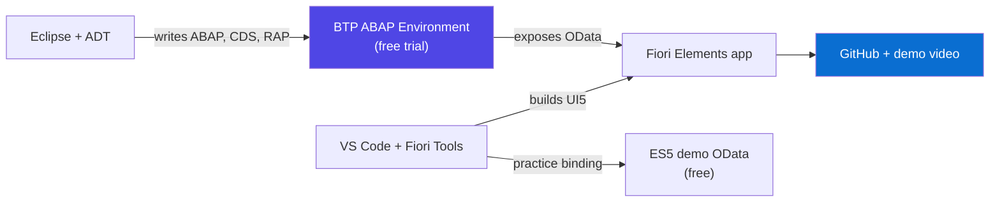
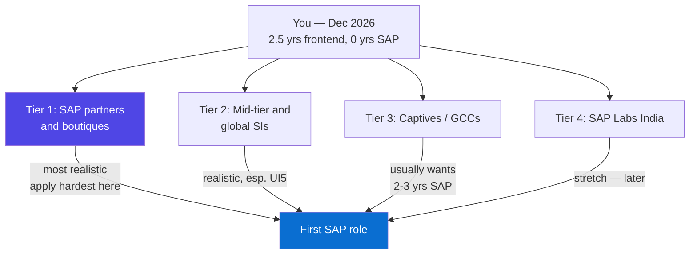

# The December Launch Plan

### Nineteen weeks from WordPress developer to SAP applicant — FLT ABAP, Fiori in parallel, a RAP portfolio, and the December application campaign

> *"You are not starting from zero. You are starting from two and a half years of shipping real interfaces to real users — which is exactly the half of SAP that nobody else in your batch will have."*

**Personal Career Plan** · 19 Aug 2026 → 31 Dec 2026 · Target: offer in early 2027

---

## Table of Contents

- [The December Launch Plan](#the-december-launch-plan)
- [How to Use This Plan](#how-to-use-this-plan)
- [Part A — The Plan at a Glance](#part-a-the-plan-at-a-glance)
  - [A1. Where You Actually Stand Today](#a1-where-you-actually-stand-today) · [A2. What "Ready to Apply" Actually Means](#a2-what-ready-to-apply-actually-means) · [A3. The Master Grid — All 19 Weeks](#a3-the-master-grid-all-19-weeks) · [A4. Your Three Hours a Day](#a4-your-three-hours-a-day)
- [Part B — Track 1: ABAP with FLT](#part-b-track-1-abap-with-flt)
  - [B1. How to Get More From the Course Than Anyone Else in It](#b1-how-to-get-more-from-the-course-than-anyone-else-in-it) · [B2. The Syllabus Audit — What FLT Teaches vs What Gets You Hired](#b2-the-syllabus-audit-what-flt-teaches-vs-what-gets-you-hired) · [B3. Your Own Practice System — Free, This Week](#b3-your-own-practice-system-free-this-week) · [B4. The ABAP Checkpoints](#b4-the-abap-checkpoints) · [B5. Debugging — The Skill That Separates You](#b5-debugging-the-skill-that-separates-you)
- [Part C — Track 2: Fiori and SAPUI5, in Parallel](#part-c-track-2-fiori-and-sapui5-in-parallel)
  - [C1. Why Fiori Is Your Second Door, Not a Side Hobby](#c1-why-fiori-is-your-second-door-not-a-side-hobby) · [C2. The Fiori Plan — Weeks 2 to 14](#c2-the-fiori-plan-weeks-2-to-14) · [C3. What Transfers From Your JS Work — and What Does Not](#c3-what-transfers-from-your-js-work-and-what-does-not) · [C4. Fiori Elements and Annotations — The 80% Pattern](#c4-fiori-elements-and-annotations-the-80-pattern) · [C5. Fiori Checkpoints](#c5-fiori-checkpoints)
- [Part D — Track 3: Building the Evidence](#part-d-track-3-building-the-evidence)
  - [D1. Why Evidence Beats Certification in SAP](#d1-why-evidence-beats-certification-in-sap) · [D2. The Portfolio App — Full Specification](#d2-the-portfolio-app-full-specification) · [D3. The Freelance Ramp](#d3-the-freelance-ramp) · [D4. Publishing — The Lever Almost Nobody Pulls](#d4-publishing-the-lever-almost-nobody-pulls) · [D5. GitHub and the Three-Minute Demo](#d5-github-and-the-three-minute-demo)
- [Part E — Certification: Which, What It Costs, and When](#part-e-certification-which-what-it-costs-and-when)
  - [E1. The Certification Decision](#e1-the-certification-decision) · [E2. What a Certificate Does and Does Not Do](#e2-what-a-certificate-does-and-does-not-do)
- [Part F — Target Companies and the Application Campaign](#part-f-target-companies-and-the-application-campaign)
  - [F1. The Four Employer Types — and Which One Opens First](#f1-the-four-employer-types-and-which-one-opens-first) · [F2. Tier 1 — SAP Partners and Boutiques (Your Best Door)](#f2-tier-1-sap-partners-and-boutiques-your-best-door) · [F3. Tier 2 — Mid-Tier and Global System Integrators](#f3-tier-2-mid-tier-and-global-system-integrators) · [F4. Tier 3 — Captives and Global Capability Centres](#f4-tier-3-captives-and-global-capability-centres) · [F5. Tier 4 — SAP Labs India](#f5-tier-4-sap-labs-india) · [F6. Which Door — Splitting Your Applications Between ABAP and Fiori](#f6-which-door-splitting-your-applications-between-abap-and-fiori) · [F7. The December Campaign — Week by Week](#f7-the-december-campaign-week-by-week) · [F8. Channels, Referrals and Where Responses Actually Come From](#f8-channels-referrals-and-where-responses-actually-come-from)
- [Part G — Your CV, LinkedIn, and the Honest Story](#part-g-your-cv-linkedin-and-the-honest-story)
  - [G1. Your Positioning Statement](#g1-your-positioning-statement) · [G2. The CV, Section by Section](#g2-the-cv-section-by-section) · [G3. The First Company's SAP Exposure — Getting This Right](#g3-the-first-companys-sap-exposure-getting-this-right) · [G4. LinkedIn and Naukri](#g4-linkedin-and-naukri) · [G5. The Three Questions You Will Definitely Be Asked](#g5-the-three-questions-you-will-definitely-be-asked)
- [Part H — Interviews, Offers, and What Comes After December](#part-h-interviews-offers-and-what-comes-after-december)
  - [H1. The Shape of an SAP Interview](#h1-the-shape-of-an-sap-interview) · [H2. Thirty Technical Questions You Must Be Able to Answer](#h2-thirty-technical-questions-you-must-be-able-to-answer) · [H3. Deploying Your AI Differentiator](#h3-deploying-your-ai-differentiator) · [H4. Salary, Offers, and Judging a Good First Job](#h4-salary-offers-and-judging-a-good-first-job) · [H5. The Printable Checklist, and What Happens After December](#h5-the-printable-checklist-and-what-happens-after-december)

---

# How to Use This Plan

*This is not a study guide. It is a **campaign plan** with a date on it. Every section ends in something you can tick off, and every week between now and 31 December has a named outcome. Read Parts A–B this week, then keep it open beside the FLT course and work the weekly grid.*

**The shape of the next 19 weeks:**

| Block | Weeks | Dates | What is happening |
|---|---|---|---|
| **Block 1 — Build the base** | W1–W6 | 17 Aug – 27 Sept | FLT course begins. Fiori Walkthrough in parallel. Free practice system running. |
| **Block 2 — Go deep** | W7–W12 | 28 Sept – 8 Nov | Core ABAP + OO. Fiori Elements. Freelance ramp starts. Portfolio app begins. |
| **Block 3 — Assemble the evidence** | W13–W15 | 9 Nov – 29 Nov | RAP portfolio app finished and deployed. Résumé, LinkedIn, SAP Community posts live. |
| **Block 4 — Apply** | W16–W19 | 30 Nov – 27 Dec | FLT course completes. Application waves 1 and 2. Interviews begin. Cert booked for January. |

<p class="te"><strong>Telugu:</strong> Idi study guide kaadu — idi <strong>date unna campaign plan</strong>. Ee roju (19 Aug 2026) nunchi 31 December varaku prathi week ki oka target undi. Naalugu blocks: modati aaru weeks base kattadam, tarvaata aaru weeks lothuga nerchukovadam, moodu weeks evidence (portfolio, resume, blogs) taiyaru cheyyadam, chivari naalugu weeks <strong>jobs ki apply cheyyadam</strong>. FLT course pakkana ee plan pettuko, prathi week grid ni follow avvu.</p>

**Three rules that decide whether this works:**

1. **The course is the floor, not the ceiling.** Everyone in your FLT batch gets the same lectures. What separates you is what you build *outside* the class hours.
2. **Evidence beats certificates.** In SAP, a working RAP app you can screen-share beats a PDF certificate every single time. Build the evidence first, certify second.
3. **December is for seeding, January is for harvesting.** Indian IT hiring genuinely slows from mid-December to the first week of January. Apply in December anyway — those applications become January interviews. Do not read a quiet December as failure.

---

# Part A — The Plan at a Glance

## A1. Where You Actually Stand Today

**Simple definition:** an honest baseline is the list of what you can prove today, written without flattery, because every plan built on an inflated starting point fails in week six.

<p class="te"><strong>Telugu:</strong> Modata neeku <strong>nijamga ee roju emi vachu</strong> ani honest ga raasuko. Ekkuva chesi cheppukunte plan aaru weeks lo padipotundi. Ee list chusi bhayapadaku — idi neeku unna <strong>asset list</strong>, weakness list kaadu.</p>

**Your assets — things a recruiter can verify:**

| Asset | Why it matters for SAP |
|---|---|
| 2.5 yrs employed frontend dev (Jan 2024 → now) | You are not a fresher. You have shipped to production, met deadlines, worked with clients. |
| HTML, CSS, JavaScript, Bootstrap, Figma | This *is* the SAPUI5/Fiori skill set. Most ABAP developers cannot do this. |
| Basic PHP | Proves you can read and modify server-side code. |
| The 50-Day Challenge: JS deep-dive, React, Node, REST, SQL, Git/Docker/AWS, System Design, Agentic AI | Covers every stated prerequisite for SAP technical work — and the last phase is a genuine rarity. |
| FLT ABAP course, in progress | Structured ABAP with an end date in mid-December. |

**Your gaps — the honest column:**

| Gap | How this plan closes it |
|---|---|
| Zero SAP project experience | Freelance work + RAP portfolio app + SAP Community visibility (Part D) |
| No S/4HANA system access | Free trial systems, set up in Week 2 (Part B3) |
| No ABAP written yet | FLT course, W1–W17 |
| No Fiori/UI5 built yet | Parallel track, W2–W14 (Part C) |
| No SAP network | Referrals, community, recruiters (Part F8) |
| No certification | Booked for January 2027 (Part E) |

**The one sentence that describes you today:** *a working frontend developer with two and a half years of production experience, currently converting to SAP full-stack, four months from being interview-ready.* That sentence is true right now. Everything in this plan is about making it **provable**.

---

## A2. What "Ready to Apply" Actually Means

**Simple definition:** your December definition of done — the specific, checkable list that means you may press "Apply" without embarrassment.

<p class="te"><strong>Telugu:</strong> "Apply cheyyadaniki ready" ante em ardham? Feeling kaadu — <strong>checklist</strong>. Ee enimidi items ready ayite, nuvvu apply cheyyochu. Anni perfect ga undali ani ledu — ivi unte interview lo confident ga nilabadagalavu.</p>

By **30 November 2026** you should be able to tick all eight:

1. ☐ **You can write ABAP without looking it up** — internal tables, SELECT into an itab, LOOP AT, classes with methods, TRY/CATCH.
2. ☐ **You can build a CDS view** and explain why it exists instead of a SELECT inside the program.
3. ☐ **You have a working RAP service** — a managed scenario with create, update, delete, and one validation.
4. ☐ **You have a Fiori app on top of it** — Fiori Elements list report plus object page, running against your own OData service.
5. ☐ **It is on GitHub**, with a README and a 3-minute demo video.
6. ☐ **You can debug** — set a breakpoint, walk a call stack, inspect an internal table, and explain what you found.
7. ☐ **Your résumé and LinkedIn tell one coherent story** (Part G).
8. ☐ **You have at least one piece of real, paid or public work** — a freelance job, or two SAP Community blog posts, or both.

**Analogy:** a driving licence test. Nobody asks whether you *feel* like a driver. They ask you to park, reverse, and stop at the line. This list is the parking test. Tick eight boxes, you drive.

**Real-world:** the candidate who applies in December with items 1–8 done beats the candidate who applies with a certificate and nothing to screen-share. Interviewers in SAP ask "show me something you built" far more often than they ask "which certificate do you hold".

---

## A3. The Master Grid — All 19 Weeks

**Simple definition:** the single table this whole plan reduces to. Print this page. Everything else in the document explains one cell of it.

<p class="te"><strong>Telugu:</strong> Ee oka table ye motham plan. Ee page print chesuko, wall meeda pettuko. Migilina document antha ee table lo unna oka cell ni explain chestundi. Prathi week ki oka <strong>outcome</strong> undi — aa outcome raakapote aa week repeat cheyyi, munduku pommaku.</p>

| Wk | Dates | ABAP (FLT) | Fiori / UI5 | Evidence & Job | Week outcome |
|---|---|---|---|---|---|
| **W1** | 17–23 Aug | Course starts; syllabus audit | — | Read Parts A–B of this plan | Plan understood, gap list written |
| **W2** | 24–30 Aug | ABAP syntax, data types | UI5 Walkthrough 1–10 | **Trial system running** | "Hello World" in both stacks |
| **W3** | 31 Aug – 6 Sept | Control flow, strings, DDIC intro | Walkthrough 11–20 | GitHub repo created | First DDIC table created |
| **W4** | 7–13 Sept | DDIC: tables, domains, data elements | Walkthrough 21–30 | LinkedIn headline updated | Portfolio data model drafted |
| **W5** | 14–20 Sept | Internal tables, LOOP AT, READ TABLE | Walkthrough 31–38 done | — | Walkthrough complete |
| **W6** | 21–27 Sept | Open SQL, joins, aggregations | XML views, MVC, models | Freelance profiles created | You can query and display data |
| **W7** | 28 Sept – 4 Oct | Modularization, function modules | OData model binding (ES5) | First freelance bid sent | UI5 app reading real OData |
| **W8** | 5–11 Oct | ALV reports | Routing, navigation | — | A working report + a 2-page app |
| **W9** | 12–18 Oct | **OO ABAP**: classes, methods | Fragments, formatters | Blog post 1 drafted | First ABAP class written |
| **W10** | 19–25 Oct | Inheritance, interfaces, exceptions | Fiori Elements intro | Blog post 1 published | OO concepts solid |
| **W11** | 26 Oct – 1 Nov | **CDS views** | Annotations | Portfolio app: CDS layer | Data model live in CDS |
| **W12** | 2–8 Nov | **RAP**: behaviour definitions | List Report + Object Page | Portfolio app: RAP layer | CRUD working via OData |
| **W13** | 9–15 Nov | RAP: validations, determinations | Fiori app on your own service | **Portfolio app end-to-end** | Full-stack demo works |
| **W14** | 16–22 Nov | Service binding, debugging drills | Polish, deploy | Demo video recorded | Screen-shareable in 3 minutes |
| **W15** | 23–29 Nov | Revision and weak spots | — | **Résumé + LinkedIn final**; blog 2 | Application kit complete |
| **W16** | 30 Nov – 6 Dec | Course wrap-up topics | — | **Wave 1: 20 applications** | Applications live |
| **W17** | 7–13 Dec | **FLT course completes** | — | **Wave 2: 25 applications** + referrals | 45 applications out |
| **W18** | 14–20 Dec | Interview prep: Part H bank | — | Interviews begin; wave 3 | First interviews done |
| **W19** | 21–27 Dec | Cert study begins | — | Holiday lull: follow-ups, blog 3 | Pipeline warm for January |
| **+** | 28–31 Dec | — | — | Review; book cert for January | January campaign ready |

---

## A4. Your Three Hours a Day

**Simple definition:** a fixed daily split, decided once, now — so you never spend the first twenty minutes of a study session deciding what to study.

<p class="te"><strong>Telugu:</strong> Rojuki 3 gantalu — kaani aa 3 gantalu ela vaadali ani <strong>ippude</strong> decide chesuko. Lekapote prathi roju "eeroju emi chadavali?" ani 20 nimishalu waste avutayi. Weekdays lo ABAP ekkuva, weekend lo Fiori + project. Ide pattern 19 weeks paatu.</p>

| | Weekday (Mon–Fri, 3 hrs) | Saturday (5 hrs) | Sunday (4 hrs) |
|---|---|---|---|
| **Block 1** | 2 hr — FLT course and practice | 2 hr — Fiori | 2 hr — portfolio app |
| **Block 2** | 45 min — hands-on typing, not watching | 2 hr — portfolio app | 1 hr — revision of the week |
| **Block 3** | 15 min — revision of yesterday | 1 hr — freelance / blog / LinkedIn | 1 hr — freelance / applications |

**The non-negotiable rule: 60% of your time is fingers on keys.** Watching an ABAP video is not learning ABAP. If a session ends and you have not typed and run code, that session did not count.

**Analogy:** you did not learn CSS by watching CSS. You learned it by breaking a layout at 11pm and fixing it. ABAP is identical — the syntax lands only when your own SELECT returns nothing and you have to work out why.

**Real-world:** the most common failure mode for career-switchers is *passive completion* — finishing the course, holding the certificate, and freezing in the first technical interview because they never wrote code alone. The daily typing rule is the whole defence against that.

**When life interferes:** you have a full-time job. Some weeks will collapse. The rule is — **protect the weekday 2 hours, sacrifice the weekend blocks, never sacrifice two weeks running.** Missing one week costs nothing. Missing three consecutive weeks moves the December date, and December is the one thing here that cannot move.

---

# Part B — Track 1: ABAP with FLT

## B1. How to Get More From the Course Than Anyone Else in It

**Simple definition:** the course gives everyone the same input. Your advantage comes entirely from what you do in the ninety minutes *after* each class.

<p class="te"><strong>Telugu:</strong> FLT lo andariki oke lecture vastundi. Nuvvu vere ela avutavu? Class ayipoyaka <strong>90 nimishalu</strong> nuvvu chese pani valla. Class lo chusinadi malli sonthaga type cheyyi, oka chinna marpu cheyyi, break cheyyi, malli fix cheyyi. Ade nuvvu batch lo top ki vellee daari.</p>

**The after-class routine — do this the same day, every day:**

| Step | Time | What you do |
|---|---|---|
| 1. Retype | 30 min | Type the day's code from scratch in your own system. Do not copy-paste. |
| 2. Break it | 20 min | Change something so it fails. Read the short dump or the error. Fix it. |
| 3. Extend it | 30 min | Add one thing the teacher did not do — an extra field, a sort, a validation. |
| 4. Note it | 10 min | Two lines in your own notes file: what it does, where it would be used in a real business. |

**Why "break it" matters more than it sounds:** SAP interviews test error-handling and debugging far more than they test happy-path syntax. Every dump you cause and fix on purpose in October is a question you answer instantly in January.

**Questions to ask your FLT instructor** — most students never ask, and the answers are worth the fees:

1. "Is this classical ABAP or ABAP Cloud syntax? Which statements here are not allowed in ABAP Cloud?"
2. "How would this be done in RAP instead?"
3. "What does this look like in a real client project — who raises the ticket, what does the transport look like?"
4. "Can you show me a production issue you debugged and how you found it?"

Answer 4 is the goldmine. Real project stories are what you will convert into intelligent interview conversation — not claimed as your experience, but as informed understanding of how projects actually run.

---

## B2. The Syllabus Audit — What FLT Teaches vs What Gets You Hired

**Simple definition:** a gap list comparing your course syllabus against the 2026 market, so you know exactly which topics you must self-study on top.

<p class="te"><strong>Telugu:</strong> FLT syllabus teesuko, ee kinda table tho compare cheyyi. Course lo <strong>ledu</strong> ani telisina topics ni nuvve sonthaga nerchukovali. Chala institutes lo classical ABAP ekkuva, modern (CDS, RAP, ABAP Cloud) thakkuva untundi — adi neeku pedda risk, endukante market ippudu modern vaipu vellindi.</p>

**Do this in Week 1.** Get the syllabus PDF, and mark every row:

| Topic | Market weight in 2026 | If missing from FLT |
|---|---|---|
| ABAP syntax, data types, control flow | Essential | Cannot be missing |
| DDIC — tables, domains, data elements, views | Essential | Cannot be missing |
| Internal tables, field symbols | Essential | Cannot be missing |
| Open SQL, joins, aggregations | Essential | Cannot be missing |
| Modularization, function modules | Important | Self-study, 1 week |
| ALV reports | Important | Self-study, 3 days |
| **OO ABAP — classes, interfaces, exceptions** | **Critical** | **Red flag. Self-study immediately.** |
| **CDS views** | **Critical** | **Red flag. Self-study, 2 weeks.** |
| **RAP** | **Critical for 2026** | **Red flag. Self-study, 3 weeks.** |
| **ABAP Cloud (restricted syntax)** | **Critical** | Self-study, 1 week |
| OData / service binding | Critical | Self-study, 1 week |
| Debugging | Critical | Self-study, ongoing |
| Smartforms, SAPscript | Low — legacy | Fine to skip or skim |
| Module Pool / Dynpro | Low — legacy | Fine to skim |
| BDC / LSMW | Low — legacy | Skim only |
| Enhancements, BAdIs, user exits | Medium | Worth a week; still asked in interviews |
| IDoc, RFC, BAPI | Medium | Worth a week; common in integration roles |

**The honest warning:** if your syllabus is heavy on Smartforms, Module Pool and BDC and light on CDS and RAP, that is the classic institute pattern. It does not mean the course is useless — the fundamentals are still the fundamentals. It means **the modern half is your job**, and Weeks 9–14 of the master grid are where you do it.

**Do not drop the legacy topics entirely.** Real client systems are full of them. You will be asked to *read and fix* classical code even in a modern role. Skim them; do not master them.

---

## B3. Your Own Practice System — Free, This Week

**Simple definition:** a personal SAP system you can log into any time, so your practice is not limited to institute lab hours.

<p class="te"><strong>Telugu:</strong> Institute lab hours meeda matrame aadharapadaku. Neeku <strong>sontha system</strong> kavali — ratri 11 gantalaki kuda code type cheyyadaniki. Manchi vishayam emitante, ippudu idi <strong>ucchitam</strong>. Nelaki 1000-2000 rupayalu server rent cheyyanavasaram ledu.</p>

**Three options, in the order you should try them:**

| Option | Cost | Good for | Catch |
|---|---|---|---|
| **SAP BTP Trial — ABAP Environment** | Free | ABAP Cloud, CDS, RAP, service binding | Trial instances expire and need recreating; restricted (Cloud) syntax only |
| **ABAP Platform Trial (Docker / VM appliance)** | Free | Classical ABAP, DDIC, SE38, SE80, ALV, debugging | Heavy: plan on 16 GB+ RAM and a large disk allocation |
| **SAP Gateway Demo System (ES5)** | Free | Practising UI5/Fiori against a real OData service | Public sandbox; availability varies, read-only in places |

**The realistic combination for you:**

- **BTP ABAP Environment** for everything modern — this is where you build the RAP portfolio app. It is also, quietly, the reason BTP cannot be fully parked: the free modern ABAP system *lives* on BTP.
- **ES5** for the Fiori track, so you can bind a UI5 app to real OData in Week 7 without waiting for your own service to exist.
- **ABAP Platform Trial** only if your machine can take it. If it cannot, do not fight it — the institute lab covers classical work, and the modern half is what you are short of anyway.

**Tooling to install in Week 2:**

1. **Eclipse + ADT (ABAP Development Tools)** — the modern ABAP IDE. Learn this, not only SE80. Job descriptions increasingly say "ADT".
2. **VS Code + SAP Fiori Tools extension pack** — for the UI5 track.
3. **Node.js and the ui5 CLI** — you already have Node from Phase 7.
4. **UI5 Inspector** Chrome extension — the DevTools you already know, for UI5.



**Week 2 is the deadline for this.** A student without a personal system practises three hours a week. A student with one practises fifteen. That single difference compounds over nineteen weeks into the gap between "took a course" and "can actually build".

---

## B4. The ABAP Checkpoints

**Simple definition:** four dated gates. At each one you either can do the listed things without help, or you repeat that block before moving on.

<p class="te"><strong>Telugu:</strong> Naalugu <strong>checkpoints</strong>. Prathi dhaggara — ee panulu evari sahayam lekunda cheyyagalava? Cheyyakapote, munduku vellaku, aa block malli cheyyi. Course munduku vellutundi kaani nuvvu concepts vadileste chivarlo interview lo dobbutundi.</p>

**Checkpoint 1 — end of September (W6).** You can, from a blank editor:

- Declare typed variables and constants; use TYPES to define a structure and a table type
- Read a database table into an internal table with SELECT ... INTO TABLE
- LOOP AT an internal table, READ TABLE with a key, SORT and DELETE ADJACENT DUPLICATES
- Write an inner join across two tables with a WHERE clause and an aggregate
- Create a transparent table in DDIC with a proper data element and domain

**Checkpoint 2 — end of October (W10).** Add:

- Write a global class with public and private methods, importing and returning parameters
- Use inheritance and redefine a method; implement an interface
- Raise and catch a class-based exception
- Build an ALV report from an internal table
- Explain the difference between a function module and a method, and when each is used

**Checkpoint 3 — mid-November (W13).** Add:

- Write a CDS view with associations and annotations, and explain why it beats a SELECT in the program
- Build a managed RAP business object with create, update and delete
- Add one validation and one determination to that behaviour definition
- Create a service definition and service binding, and open the OData metadata in a browser
- State three things ABAP Cloud forbids that classical ABAP allows

**Checkpoint 4 — end of November (W15).** Add:

- Debug: breakpoint, step through, inspect an internal table, find the line that produced the wrong value
- Explain, out loud and in under two minutes, how a click in Fiori reaches your ABAP code and returns
- Answer any question in the Part H bank without notes

**If a checkpoint fails, repeat — do not push on.** ABAP is cumulative in a way web development is not. Weak internal-table handling in October becomes an unfixable RAP problem in November.

---

## B5. Debugging — The Skill That Separates You

**Simple definition:** debugging is reading a running program to find out why it did something, and in SAP consulting it is the majority of the actual job.

<p class="te"><strong>Telugu:</strong> Nija SAP job lo <strong>kotha code raayadam thakkuva, unna code lo tappu vetakadam ekkuva</strong>. Debugging vacchesthe nuvvu chala mandi kanna mundu untavu. Interviews lo kuda "ee problem ela kanukkuntavu?" ani adugutaru. Idi nerchukovadaniki oke daari — sontham ga break cheyyi, tarvaata vetaku.</p>

Most students treat debugging as an emergency tool. Treat it as a **daily habit** from Week 3.

**The five things you must be fluent in:**

| Skill | Where | What it proves |
|---|---|---|
| Set and remove a breakpoint | ADT / SE80 | Basic competence |
| Step over, step into, return | Debugger | You understand call flow |
| Inspect an internal table's contents mid-run | Debugger variables pane | You can find bad data |
| Read the call stack | Debugger | You can trace where a value came from |
| Read a short dump (ST22) | ST22 | You can handle a production incident |

**The drill — do this weekly from W3:**

1. Take working code you wrote.
2. Introduce one bug deliberately: a wrong WHERE condition, an uninitialised variable, an unhandled exception.
3. Close the file. Wait a day.
4. Run it, and find the bug **using only the debugger** — no re-reading your own change.

**Analogy:** you already do this in Chrome DevTools. Breakpoint, step, inspect scope, read the call stack — the ABAP debugger is the same tool with different keyboard shortcuts and a different variables pane. This is another place where your frontend background makes you faster than the room, not slower.

**Real-world:** the single most common first task given to a new SAP developer on a project is not "build this app". It is *"this report is showing the wrong total for one plant — find out why."* Being visibly good at that in month one is how you get kept, extended, and promoted.

---

# Part C — Track 2: Fiori and SAPUI5, in Parallel

## C1. Why Fiori Is Your Second Door, Not a Side Hobby

**Simple definition:** Fiori/UI5 is the one part of SAP where your existing two and a half years counts as *relevant experience* rather than as background.

<p class="te"><strong>Telugu:</strong> Idi chala mukhyam — <strong>ABAP roles ki nuvvu "0 years SAP experience"</strong>. Kaani <strong>Fiori/UI5 roles ki nuvvu "2.5 years frontend experience"</strong>. Oke manishi, rendu vere kathalu. Anduke Fiori ni side hobby la kaakunda, <strong>rendo dwaram</strong> la treat cheyyali. December lo rendu rakala jobs ki apply cheyyi.</p>

Look at the same résumé through two different job descriptions:

| The role | What they see in you | Your realistic odds |
|---|---|---|
| **SAP ABAP Developer** | A career-switcher with a course certificate and no project experience | Hard — you compete with people who have 2–3 years of real ABAP |
| **SAP UI5 / Fiori Developer** | A frontend developer with 2.5 years of production JS/CSS who has learned the SAP framework | Much better — the core skill is the one you already have |

This is not a reason to abandon ABAP. Your thesis — ABAP → RAP → BTP → Joule → agents — is the right long-term direction and ABAP is correctly the spine. But **the door you walk through first does not have to be the room you end up in.** A Fiori/UI5 role puts you inside a real S/4HANA landscape, on a real project, with real transports and real tickets. From there, ABAP and RAP become on-the-job learning that someone else is paying for, and the two things you cannot buy — system access and project experience — arrive on day one.

**So the rule for December: apply to both.** Roughly 60% ABAP-flavoured roles, 40% Fiori/UI5 roles (see Part F6). Let the market decide which opens first. Both lead to the same destination.

---

## C2. The Fiori Plan — Weeks 2 to 14

**Simple definition:** a thirteen-week parallel track, mostly weekend work, taking you from zero UI5 to a Fiori Elements app on your own OData service.

<p class="te"><strong>Telugu:</strong> Fiori track ekkuva weekends lo. Motham 13 weeks. Modati 5 weeks official Walkthrough (38 steps), tarvaata OData binding, aa tarvaata Fiori Elements. Chivarki nee sontha RAP service meeda Fiori app kadatavu — adi nee portfolio.</p>

| Weeks | Focus | Deliverable |
|---|---|---|
| **W2–W5** | The official **SAPUI5 Walkthrough**, all 38 steps | A working UI5 app you built line by line |
| **W6** | MVC properly — XML views, controllers, JSON model, i18n | You can explain UI5's MVC vs React's component model |
| **W7** | **OData binding** against the ES5 demo system | A UI5 list bound to a real SAP OData service |
| **W8** | Routing and navigation; master-detail | A two-page app with deep links |
| **W9** | Fragments, dialogs, formatters | Reusable pieces; conditional display logic |
| **W10** | **Fiori Elements** introduction | A generated List Report running |
| **W11** | **Annotations** — driving the UI from metadata | You can change the UI without touching JS |
| **W12–W13** | Fiori Elements on **your own RAP service** | The portfolio app's front end |
| **W14** | Polish, deploy, record demo | Screen-shareable in 3 minutes |

**The Walkthrough is non-negotiable.** All 38 steps, typed, not read. It is the single best free SAP resource that exists, it is maintained by SAP, and finishing it puts you ahead of most people who claim UI5 on a résumé.

**Key free resources for this track:**

| Resource | Use it for |
|---|---|
| SAPUI5 Walkthrough (ui5.sap.com) | The foundation — all 38 steps |
| SAP Fiori Design Guidelines (experience.sap.com) | Why Fiori looks the way it does; floorplans |
| SAP Developers Portal (developers.sap.com) | Task-shaped tutorials, Fiori Elements, RAP |
| SAP Gateway Demo System (ES5) | A real OData service to bind against |
| UI5 Inspector (Chrome extension) | Debugging bindings and models |
| SAP Community (community.sap.com) | Real problems, real answers, and where you will publish |

---

## C3. What Transfers From Your JS Work — and What Does Not

**Simple definition:** an honest map of which of your existing skills carry straight over, which need reshaping, and which are genuinely new.

<p class="te"><strong>Telugu:</strong> Nee JS/CSS knowledge lo <strong>chala varaku</strong> Fiori ki pani chestundi — kaani anni kaadu. Ee table lo "Straight across" unnavi neeku already vachu. "Reshape" unnavi konchem marchali. "New" unnavi kotthavi. Motham meeda nuvvu Fiori ni chala mandi kanna <strong>3-4 rettlu vegam</strong> ga nerchukovachu.</p>

| Your skill | Transfers? | What changes |
|---|---|---|
| JavaScript, ES6+, async/await | **Straight across** | UI5 is JavaScript. Promises everywhere. |
| DOM and CSS | **Straight across** | Custom CSS is rarer, but debugging layout is identical |
| Chrome DevTools | **Straight across** | Add the UI5 Inspector extension |
| JSON, REST, HTTP | **Straight across** | OData *is* REST with rules — your Phase 8 work maps directly |
| MVC / component thinking (React) | **Reshape** | UI5 uses XML views + controllers, not JSX. Same idea, different shape. |
| State management | **Reshape** | UI5 **models** replace useState/Redux. Two-way binding is standard. |
| npm and tooling | **Reshape** | ui5 CLI instead of Vite; SAP Fiori Tools in VS Code |
| Figma / design sense | **Partly** | Fiori has fixed design guidelines and floorplans — less freedom, faster delivery |
| Bootstrap | **No** | Replaced entirely by sap.m controls |
| WordPress, Elementor, PHP | **No** | Leave these behind in the SAP conversation |
| — | **New** | XML views, OData V2 vs V4, annotations, Fiori Elements, the Launchpad |

**Analogy:** moving from React to UI5 is like a guitarist picking up a bass. Same hands, same music theory, different instrument and a different role in the band. Nobody starts from zero — but nobody should assume it plays itself either.

**The honest reframe:** you will learn Fiori roughly three to four times faster than an ABAP developer will. That is your edge, and it is worth saying out loud in an interview: *"Most people on an SAP team can do one side of Fiori-plus-ABAP well. I am building both, and the front end is already my day job."*

---

## C4. Fiori Elements and Annotations — The 80% Pattern

**Simple definition:** Fiori Elements builds standard SAP screens automatically from metadata, so most enterprise apps are configured rather than hand-coded.

<p class="te"><strong>Telugu:</strong> Nija SAP projects lo <strong>80% apps ni chetitho freehand ga raayaru</strong> — Fiori Elements vaadutaru. Nuvvu backend lo <strong>annotations</strong> raasthe, UI dhanantata thayaru avutundi. Idi first lo vintaga anipistundi (JS raayakunda UI ela vastundi?), kaani ide asalu SAP way. Idi telisthe interviews lo pedda plus.</p>

**The shift in thinking:** in React, you write the UI. In Fiori Elements, you *describe* the data and the UI writes itself.

```
Freestyle UI5              Fiori Elements
-----------------          --------------------------
You write XML views   →    SAP generates the views
You write controllers →    SAP handles standard behaviour
You wire the model    →    Annotations declare intent
Full control          →    Consistency, speed, less code
Use for: unusual UX        Use for: 80% of real apps
```

**A CDS annotation, and what it produces:**

```abap
@UI.lineItem: [{ position: 10, label: 'Order ID' }]
OrderId;

@UI.lineItem: [{ position: 20, label: 'Customer' }]
@UI.selectionField: [{ position: 10 }]
CustomerName;

@UI.lineItem: [{ position: 30, label: 'Status', criticality: 'StatusCriticality' }]
OrderStatus;
```

Those three annotations give you a table with three columns, a filter bar on customer, and colour-coded status — **without one line of JavaScript**. That is the pattern that runs most Fiori apps in production.

**What this means for your learning order:** do not skip freestyle UI5 and jump to Fiori Elements. You need freestyle to understand what is happening underneath, to debug it, and to build the 20% of apps Elements cannot. But know that in a real project you will reach for Elements first — and saying that in an interview signals that you understand how SAP work actually gets done.

**Real-world:** an interviewer asking "would you build this as freestyle or Fiori Elements?" is testing judgement, not syntax. The right answer is nearly always *"Elements, unless the UX requirement is genuinely non-standard — it is faster, consistent with the rest of the Launchpad, and cheaper to maintain."*

---

## C5. Fiori Checkpoints

**Simple definition:** three dated gates for the UI5 track, matching the ABAP checkpoints in B4.

<p class="te"><strong>Telugu:</strong> ABAP laage Fiori ki kuda checkpoints. Prathi dhaggara ee panulu ravali. Raakapote aa block malli cheyyi.</p>

**Checkpoint F1 — end of September (W6).** You can:

- Build a UI5 app from scratch with a manifest, XML view, controller and JSON model
- Explain the role of manifest.json and what i18n does
- Bind a list to a model and handle a press event
- Explain UI5's MVC in terms of the React model you already know

**Checkpoint F2 — end of October (W10).** Add:

- Bind an app to a real OData service and read the metadata document
- Set up routing between a list page and a detail page, with working deep links
- Use a fragment for a dialog, and a formatter for conditional display
- Generate a Fiori Elements List Report and explain where its UI came from

**Checkpoint F3 — mid-November (W14).** Add:

- Point a Fiori Elements app at **your own RAP service** and get full CRUD working
- Change the UI by editing annotations only
- Explain the full round trip: click → UI5 → OData → RAP → CDS → HANA → back
- Demo the whole thing in three minutes without notes

That last item is the one that matters most in December. The three-minute demo is the single most persuasive artefact you will own, and it is worth rehearsing until it is boring.

---

# Part D — Track 3: Building the Evidence

## D1. Why Evidence Beats Certification in SAP

**Simple definition:** evidence is anything an interviewer can look at, click, or read. It is the currency that substitutes for the project experience you do not yet have.

<p class="te"><strong>Telugu:</strong> Neeku SAP project experience ledu — adi nijam. Daani sthanam lo em pettali? <strong>Evidence</strong> — chusi, click chesi, chadavagalige vishayalu. Certificate oka PDF; kaani nuvvu kattina app ni screen share cheste, adi vere level. SAP lo "emi kattavu chupinchu" ane prasna, "e certificate undi" ane prasna kanna chala ekkuva sarlu vastundi.</p>

The uncomfortable truth about SAP hiring: it is **experience-weighted more heavily than almost any other technical field**. Web development lets a strong portfolio override a thin CV. SAP is more conservative — most postings ask for years, and most screening filters on them.

You cannot manufacture years. But you can manufacture **four things that make a screener pause**:

| Evidence | What it proves | Weight |
|---|---|---|
| **A working RAP + Fiori app** you can demo live | You can actually build the modern stack | Highest |
| **Real freelance SAP work**, with dates and deliverables | Someone paid you for SAP work | High |
| **Published SAP Community writing** | You understand it well enough to explain it | Medium-high, and rare |
| **A certificate** | You passed an exam | Medium — necessary, not sufficient |

Note the order. Everyone chasing an SAP job in January 2027 will have the certificate. Almost none of them will have the first three.

**Analogy:** two people apply to cook in a restaurant. One holds a culinary certificate. The other says "here is a dish I made, taste it, and here is a café that paid me last month." The certificate gets you past HR. The dish gets you the job.

**The rule for the next four months: build the evidence first, certify second.** If you have to choose between one more week on the portfolio app and one more week of exam revision, choose the app. The exam will still be there in January.

---

## D2. The Portfolio App — Full Specification

**Simple definition:** one end-to-end application that exercises every layer of your target stack, built between Weeks 11 and 14, designed specifically to be demonstrated in interviews.

<p class="te"><strong>Telugu:</strong> Oke app — kaani <strong>anni layers</strong> touch cheyyali: HANA table → CDS view → RAP behaviour → OData service → Fiori Elements UI. Chinna app chaalu, kaani <strong>full stack</strong> ga undali. Deenini interview lo 3 nimishalu lo chupinchali. Ade nee biggest asset.</p>

**The app: Purchase Requisition Approval.**

Chosen deliberately — it sits in MM (Materials Management), it is a process every SAP interviewer instantly recognises, and it is the exact scenario in your own early SAP notes. Building a "task tracker" signals web developer. Building a purchase requisition approval signals *SAP developer*.

**The functional story, in one paragraph:** an employee raises a purchase requisition with line items. The system calculates the total, flags anything above a threshold as high-value, and sets the status. A manager sees a filtered list, opens one, and approves or rejects it with a reason. Approval is blocked if the requisition has no items or a delivery date in the past.

**The technical layers — this is the point of the whole exercise:**

| Layer | What you build | Skill it demonstrates |
|---|---|---|
| **Database** | Two tables: requisition header, requisition items | DDIC, data elements, domains, foreign keys |
| **CDS — interface** | ZI_PurchaseReq, ZI_PurchaseReqItem with an association | CDS modelling, associations, joins |
| **CDS — consumption** | ZC_PurchaseReq with UI annotations | Projection views, annotations, criticality |
| **RAP behaviour** | Managed BO, draft-enabled, with create / update / delete | The 2026 core skill |
| **RAP actions** | Approve and Reject as custom actions | Behaviour implementation in ABAP classes |
| **RAP validations** | Reject empty items; reject past delivery dates | Business logic where it belongs |
| **RAP determination** | Auto-calculate total; set status criticality | Derived data |
| **Service** | Service definition + OData V4 binding | Exposure and the metadata document |
| **UI** | Fiori Elements List Report + Object Page | The front end, driven by annotations |

**Build order — do not deviate, each step depends on the last:**

1. **W11 —** Tables in DDIC. Then the interface CDS views with the header-to-item association. Get data showing in the ADT data preview before you go further.
2. **W11 —** Consumption view with UI annotations. You should see a usable table appear from annotations alone.
3. **W12 —** Behaviour definition (managed, draft-enabled) and behaviour implementation class. Get plain create/update/delete working.
4. **W12 —** Service definition and service binding. Open the OData metadata in a browser. Preview the generated Fiori app.
5. **W13 —** Add the validations, the determination, and the Approve/Reject actions.
6. **W13 —** Polish the Fiori Elements UI through annotations: filter bar, status colours, object page sections.
7. **W14 —** README, screenshots, GitHub, and the three-minute demo video.

**Optional stretch, only after step 7 is genuinely finished — the differentiator.** Your Phase 12 work is the rarest thing on your CV, and this is where it becomes visible in an SAP context: build a small **side-by-side agent** that consumes your own OData service and auto-triages incoming requisitions — reads open items, classifies them by category and risk, and posts a suggested priority back. Keep it outside the core, exactly as clean core says extensions should be. It is a five-minute story in an interview: *"the core stays standard; the intelligence sits beside it and talks to it through the released API."* That sentence is SAP's own 2026 architecture argument, and you will have built it.

**Scope discipline:** the app above is already enough. Resist adding features. A finished small app beats an ambitious half-built one, and W15 onward belongs to the job campaign, not to code.

---

## D3. The Freelance Ramp

**Simple definition:** small paid SAP-adjacent work, taken deliberately for the résumé line and the reference, not for the income.

<p class="te"><strong>Telugu:</strong> Freelancing ikkada <strong>dabbu kosam kaadu</strong> — resume lo oka nijamaina line kosam, inka oka reference kosam. Chinna panulu chaalu. Mukhyam: nuvvu ABAP freelance vetakoddu (inka experience ledu), <strong>UI5/Fiori frontend</strong> pani vetuku — adi neeku ippude vachu.</p>

**The critical positioning insight: sell what you can already do.** Do not bid for ABAP work — you would be selling something you are still learning. Bid for **UI5/Fiori front-end work**, where you have two and a half years of directly relevant skill and are competing against ABAP developers who dislike CSS.

**What you can credibly offer from October:**

- Converting a Figma or wireframe design into a UI5 view
- Fixing layout, responsiveness or theming issues in an existing Fiori app
- Building a freestyle UI5 app against a customer's existing OData service
- Custom UI5 controls or formatters
- Fiori Launchpad tile configuration and app descriptor work
- Writing the front end for a small SAP partner who has ABAP capacity but no UI capacity

**Where the work actually is** — in rough order of realism for you:

| Channel | Notes |
|---|---|
| **Small SAP partners and boutiques (subcontract)** | The best source. Many have ABAP people and no UI5 people. Message them directly on LinkedIn. |
| **LinkedIn network and SAP groups** | Post that you build UI5 front ends. Specific beats generic. |
| **SAP Community** | Answer questions; work follows credibility |
| **Upwork / Freelancer** | Real SAP UI5 postings exist; competition is global, so price accordingly |
| **Your FLT batch and instructor** | Instructors get asked for freelancers constantly. Tell yours you are available for UI5 work. |
| **Your current employer's network** | Any client running SAP is a conversation worth having |

**Pricing, honestly:** your first job should be priced to *win*, not to earn. A small fixed-scope job at ₹5,000–₹25,000, or an hourly rate around ₹500–₹1,500 to start. Raise it once you have two completed jobs and a testimonial. The first engagement is buying you a résumé line and a reference — that is worth far more than the fee.

**Time cap: four hours a week, maximum.** Freelancing is a supporting actor in this plan. If it starts eating the portfolio app or the FLT course, cut it back. One completed small job by December is a success; three would be a distraction.

**How it goes on the résumé — this is the honest and strong version:**

> **Freelance SAP UI5 / Fiori Developer** — Oct 2026 – present
> Built a responsive SAPUI5 master-detail application against a customer OData V2 service; implemented custom formatters and a reusable filter fragment. Delivered in 3 weeks.

Real dates. Real deliverable. Verifiable. **This is the line that replaces the SAP project you were tempted to invent** — and unlike the invented one, it survives every interview question and every background check.

---

## D4. Publishing — The Lever Almost Nobody Pulls

**Simple definition:** writing two or three short technical posts on SAP Community, which is a small enough pond that a beginner who writes clearly becomes visible fast.

<p class="te"><strong>Telugu:</strong> SAP Community lo blog raayadam — chala thakkuva mandi chesthaaru, anduke idi <strong>pedda advantage</strong>. Nuvvu expert la raayanavasaram ledu. "Nenu React nunchi UI5 ki vachanu, ee difference lu chusanu" — ide chaalu. Recruiters, hiring managers ivi chustaru. Inka interview lo "nee blog chusanu" ani antaru — appude nuvvu gelichinattu.</p>

**Why this works disproportionately in SAP:** the community is smaller and older than the JavaScript world, and beginner-perspective writing is genuinely rare. Three honest posts put your name into search results that hiring managers actually read.

**You do not need to be an expert. You need to be useful.** The most valuable thing you own is a perspective nobody else has: *someone arriving at SAP from modern frontend development, this year.*

**Three posts, already scheduled in the master grid:**

| # | Week | Title | Why it works |
|---|---|---|---|
| 1 | W10 | "Coming to SAPUI5 from React: a concept-by-concept map" | Nobody writes this. Useful to two audiences at once. |
| 2 | W15 | "My first RAP business object: five things that tripped me up" | Beginner mistakes are the most-searched content in any stack |
| 3 | W19 | "Fiori Elements annotations, explained for frontend developers" | Demonstrates the 80% pattern and your teaching ability |

**Rules for writing them:**

- 800–1,200 words. Short is fine; unfinished is not.
- Include real code and real screenshots from your own system.
- Write as a learner, never as an authority. "Here is what confused me and how I resolved it" is both honest and more readable than false expertise.
- Link them from your LinkedIn and your résumé.

**Real-world:** interviewers routinely search a candidate's name before a technical round. Finding three thoughtful posts changes the tone of the conversation before it starts — you stop being "a WordPress developer applying for SAP" and become "the person who wrote that React-to-UI5 mapping."

---

## D5. GitHub and the Three-Minute Demo

**Simple definition:** the packaging layer — making sure the work you have done is instantly visible to someone who will give it ninety seconds of attention.

<p class="te"><strong>Telugu:</strong> Nuvvu kattina daanini <strong>evaraina 90 seconds lo</strong> ardham chesukogalagali. Anduke README manchi ga raayali, screenshots pettali, inka 3 nimishala video cheyyali. Video mukhyam — chala interviews online lo untayi, link pampithe chaalu.</p>

**The GitHub repository — structure it like this:**

```
sap-purchase-requisition/
  README.md            <- the most important file
  /abap                <- CDS views, behaviour definition, classes
  /ui5                 <- the Fiori Elements app
  /docs
    architecture.png   <- one diagram: UI → OData → RAP → CDS → HANA
    screenshots/
  demo.md              <- link to the 3-minute video
```

**The README must answer four questions in the first screen:**

1. What does this app do, in business terms? (two sentences)
2. What is the technical stack? (one bullet list)
3. What does it look like? (one screenshot, immediately)
4. How do the layers fit together? (one diagram)

**The three-minute demo video** — record it in W14, rehearse it until it is dull:

| Time | Show |
|---|---|
| 0:00–0:20 | The business problem, in plain language |
| 0:20–1:00 | The running Fiori app: create a requisition, add items, see the total calculate |
| 1:00–1:40 | Trigger a validation failure, then approve successfully |
| 1:40–2:20 | The layers underneath: CDS view, behaviour definition, the annotation that drew a column |
| 2:20–3:00 | The architecture diagram and one sentence on what you would do next |

**Why three minutes:** it fits inside an interview without permission, it fits in an email to a recruiter, and it forces you to know what matters. A ten-minute demo says you cannot prioritise.

---

# Part E — Certification: Which, What It Costs, and When

## E1. The Certification Decision

**Simple definition:** one exam, taken in January 2027, chosen to match the modern stack you are building — deliberately scheduled *after* the December application wave so it never blocks you.

<p class="te"><strong>Telugu:</strong> Certification mukhyam, kaani <strong>December applications ni aapakoodadu</strong>. Course December 2nd/3rd week lo aipotundi — appatinunchi exam ki prepare avvadam kastam. Anduke exam ni <strong>January 2027</strong> lo pettuko, resume lo "scheduled January 2027" ani raayi. Adi nijam, inka adi pani chestundi.</p>

**The target: SAP Certified Associate — Back-End Developer — ABAP Cloud.**

This is the right one for your path, and the reason is specific: it tests **ABAP Cloud, CDS, and RAP** — the modern half — rather than classical ABAP. It is the certification that matches your ABAP → RAP → BTP → Joule thesis, and it is the one that signals to a screener that you did not learn 2010 ABAP.

| | Detail |
|---|---|
| **Exam code** | C_ABAPD_XXXX — the numeric suffix is the release version and updates roughly yearly. Always book the newest available. |
| **Format** | Roughly 80 multiple-choice questions, about 180 minutes, online-proctored |
| **Pass mark** | Around 65%, and it varies by exam version |
| **Covers** | ABAP core, ABAP Cloud restricted syntax, CDS, RAP, OO ABAP, SQL, unit testing |
| **Cost** | Individual exam, or the **SAP Certification Hub** subscription which bundles multiple attempts across a year |

**Verify the current code, price and syllabus at learning.sap.com before booking** — SAP changes exam versions, naming and pricing regularly, and the figures above are indicative rather than quotable.

**Why the Certification Hub subscription is usually the better buy:** it includes several attempts within the subscription period rather than one. If your first attempt is in January and you miss the pass mark by four percent, a subscription lets you re-sit within weeks instead of paying full price again. For a first-time candidate, that safety margin is worth the difference.

**The timeline that fits your December plan:**

| When | What |
|---|---|
| **W19 (21–27 Dec)** | Begin focused exam revision during the hiring lull |
| **28–31 Dec** | Book the exam for late January |
| **January 2027** | Sit the exam, while interviews from the December wave are running |

**On your December résumé, write the honest line:** *"SAP Certified Associate — Back-End Developer, ABAP Cloud — exam scheduled January 2027."* Recruiters read this as a candidate with a plan, and it is entirely true. What you must never write is the certification itself before you hold it.

---

## E2. What a Certificate Does and Does Not Do

**Simple definition:** an accurate model of the certificate's actual job in your campaign, so you neither skip it nor over-invest in it.

<p class="te"><strong>Telugu:</strong> Certificate <strong>HR filter dhaatadaniki</strong> pani chestundi. Adi neeku job ivvadu — kaani adi lekapote konni companies lo nee resume ye chudaru. Anduke: teesuko, kaani daani meeda motham aasha pettuku. Nee <strong>app</strong> ye asalu weapon.</p>

**What it genuinely does:**

- Gets you past automated and HR-level screening, where "SAP certified" is sometimes a checkbox
- Signals that you learned the *modern* stack, not the legacy one — this is its most underrated value
- Gives structure to your revision, which has its own worth
- Matters more at large SIs and staffing firms than at boutiques

**What it does not do:**

- It does not substitute for experience. No SAP hiring manager treats a certificate as a year of work.
- It does not survive a technical interview. If you certify without building, the second question exposes it.
- It does not differentiate you. By January 2027, most of your competition will hold one.

**Analogy:** a driving licence. Nobody hires a driver *because* they have a licence — but nobody hires a driver without one either. It is the entry condition, not the argument.

**The one trap to avoid:** do not delay applying until you are certified. This is the single most common self-inflicted wound among career-switchers — three months of "I'll apply once I'm certified" while the hiring window moves on. Your December applications go out with the exam *scheduled*, not passed. If an offer arrives before the exam, that is a good problem.

**Where certification sits in the priority order, one last time:**

```
1. A working RAP + Fiori app you can demo        <- build this first
2. Real freelance work with a reference
3. Published SAP Community writing
4. Certification                                  <- this one, in January
```

---

# Part F — Target Companies and the Application Campaign

## F1. The Four Employer Types — and Which One Opens First

**Simple definition:** SAP work in Bangalore sits in four distinct kinds of company, and they differ enormously in how willing they are to hire someone without SAP project experience.

<p class="te"><strong>Telugu:</strong> Bangalore lo SAP jobs naalugu rakala companies lo untayi. Ivi anni okelaga hire cheyyavu. Neelaga <strong>SAP experience lekunda</strong> vachhe vaadiki e type easy, e type kastam ani teliyali. Lekapote nuvvu tappu chota 100 applications pettesi time waste chestavu.</p>



| Tier | Who they are | Will they hire you in Dec 2026? | Pay | Learning speed |
|---|---|---|---|---|
| **1. SAP partners and boutiques** | Specialist firms doing only SAP | **Best odds** — they need UI5 capacity and hire on skill | Moderate | **Fastest** — small teams, wide exposure |
| **2. Mid-tier and global SIs** | Accenture, Infosys, Birlasoft and similar | **Good odds**, especially for UI5 roles | Moderate to good | Medium — narrower role, strong process |
| **3. Captives / GCCs** | Bosch, Mercedes R&D, Shell and similar | **Harder** — usually want 2–3 yrs SAP | **Best** | Slower, but stable and deep |
| **4. SAP Labs India** | SAP's own product organisation | **Stretch** — very competitive | Best | Product work, not consulting |

**The strategic conclusion, and it should shape your whole December:** point most of your energy at **Tier 1 and Tier 2**. Apply to Tier 3 opportunistically. Treat Tier 4 as a two-years-from-now target, not a December one.

This is not lowering your ambition. It is sequencing it. Tier 3 and Tier 4 become straightforward once you have eighteen months of real SAP project experience — and the fastest route to those eighteen months is a Tier 1 job in early 2027.

---

## F2. Tier 1 — SAP Partners and Boutiques (Your Best Door)

**Simple definition:** firms whose entire business is SAP delivery. They are smaller, they hire on demonstrated skill rather than on years, and they are chronically short of people who can do front end.

<p class="te"><strong>Telugu:</strong> Ivi <strong>nee best chance</strong>. Chinna companies, SAP matrame chesthaayi. Vaalla daggara ABAP vaallu untaru kaani <strong>UI5/Fiori vaallu ledu</strong> — adhe nee gap. Ikkada resume kanna <strong>nuvvu kattina app</strong> ekkuva pani chestundi, endukante interview ni technical manishi ye chestaru, HR filter thakkuva.</p>

**Why they are your best door — three concrete reasons:**

1. **The hiring manager interviews you directly.** No HR keyword filter standing between your portfolio and someone who can evaluate it.
2. **They are short of exactly your skill.** Most SAP boutiques are ABAP-heavy and UI5-light. You arrive filling a real gap.
3. **You learn faster.** Small teams mean you touch CDS, RAP, Fiori, transports and client calls in your first six months, instead of being assigned one narrow task for a year.

**Named targets with Bangalore presence** — verify current openings, as hiring changes:

| Company | Why it fits you |
|---|---|
| **Incture Technologies** | Bangalore-based, unusually strong on BTP and Fiori/UI5 — arguably the single best profile match on this list |
| **Sonata Software** | Bangalore HQ, SAP partner practice |
| **Yash Technologies** | Large pan-India SAP specialist, hires steadily |
| **NTT DATA Business Solutions** | SAP-dedicated arm of a global firm |
| **Applexus Technologies** | SAP partner, strong on Fiori and UX work |
| **Bristlecone** | Mahindra group; SAP supply-chain focus |
| **Seidor India** | Global SAP partner |
| **Uneecops** | SAP partner, broad practice |
| **Softtek / Zensar** | Mid-size, SAP practices with Bangalore hiring |

**How to approach them — differently from the big firms.** Do not only submit through a portal. Find the SAP delivery lead or a UI5 lead on LinkedIn and send a short, specific message:

> "I'm a frontend developer (2.5 yrs, Bangalore) who has moved to SAP — ABAP Cloud and RAP through a structured course, and SAPUI5/Fiori self-built. I've put together an end-to-end purchase requisition app: CDS → RAP → OData → Fiori Elements. Three-minute demo here: [link]. Do you have a need for UI5 capacity on any current project?"

That message works because it is short, it is specific, it leads with the demo, and it names a need they probably have. Send it to twenty people over December. Two replies is a good outcome, and two replies is enough.

---

## F3. Tier 2 — Mid-Tier and Global System Integrators

**Simple definition:** the large services firms that run most SAP implementations in India, and the highest-volume source of SAP openings.

<p class="te"><strong>Telugu:</strong> Ivi <strong>peddha companies</strong> — jobs chala ekkuva, kaani competition kuda ekkuva, inka HR filter kuda undi. Ikkada <strong>referral</strong> chala mukhyam. Direct apply kanna, lopala unna evarinaina patti referral teesukunte 5-10 rettlu ekkuva chance.</p>

**Split them into two groups, because they behave differently:**

**Group A — mid-tier, SAP-heavy, more accessible:**

| Company | Note |
|---|---|
| **Birlasoft** | Genuinely SAP-centric; strong ERP practice |
| **Hexaware** | Active SAP practice, hires laterally |
| **Mphasis** | Bangalore presence, applications practice |
| **Zensar** | Mid-size, more flexible on profile |
| **Tech Mahindra** | Large SAP practice |
| **DXC Technology** | Big SAP applications business |
| **Atos / Eviden** | Long-standing SAP practice |
| **Hitachi Digital Services** | SAP practice with India delivery |

**Group B — global SIs, higher bar, better brand and pay:**

Accenture · Deloitte · IBM · Capgemini · Infosys · TCS · Wipro · Cognizant · HCLTech · LTIMindtree · EY · PwC · KPMG

**Where you realistically fit at Tier 2 in December 2026:**

- **"SAP UI5/Fiori Developer, 2–4 years"** — you are a genuine candidate. Your frontend experience is the requirement.
- **"SAP ABAP Developer, 2–4 years"** — a stretch, but worth applying with a strong portfolio and a referral.
- **"SAP ABAP Developer, 5+ years"** — do not apply. It wastes your December and theirs.
- **Fresher/campus programmes** — you are past this and would be under-levelled.

**The referral rule for Tier 2:** a portal application from a career-switcher has a low response rate. The same application with an internal referral converts several times better. Before you apply anywhere in Group B, spend ten minutes looking for someone you can ask. Your FLT batchmates, your instructor, your college network, and your current colleagues are all live sources. Most people say yes to a referral request — the failure mode is not asking.

---

## F4. Tier 3 — Captives and Global Capability Centres

**Simple definition:** the in-house technology arms of large non-IT corporations, which run SAP for their own business rather than for clients.

<p class="te"><strong>Telugu:</strong> Ivi Bosch, Mercedes R&D, Shell laanti companies — vaalla sontha SAP system ni vaalle nadupukuntaru. <strong>Jeetham ekkuva, pressure thakkuva, stability ekkuva</strong>. Kaani ivi generally 2-3 years SAP experience adugutaru. Anduke ippudu kaadu — <strong>2028 lo ivi nee target</strong>. December lo edaina open unte apply cheyyi, kaani deenimeeda aadharapadaku.</p>

**Bangalore GCCs known to run substantial SAP operations:**

Bosch · Mercedes-Benz R&D India · Shell · Philips · ABB · Siemens · Volvo Group · Continental · Schneider Electric · Titan · Target · Lowe's · Walmart Global Tech · Unilever/HUL · Cargill · Kimberly-Clark · Danaher · Applied Materials · Micron

**Why they are worth knowing about now even though you will not get in yet:**

| Attribute | Reality |
|---|---|
| **Pay** | Typically the best of the four tiers at equivalent experience |
| **Hours and stress** | Generally better than consulting — no billable-utilisation pressure |
| **Stability** | Very high. This is the tier that matches your stated life goals most closely. |
| **Entry bar** | Usually 2–3+ years of SAP experience. December 2026 is too early. |
| **Depth** | You work one system deeply for years rather than many shallowly |

**This is your 2028 target, and naming it now is useful** — because it tells you what your first job needs to give you. Take the Tier 1 or Tier 2 role that maximises **hands-on S/4HANA work with real transports and real users**, because that is precisely what a GCC screens for two years later. A first job that parks you on documentation or testing delays this by years.

**The one December exception:** if a GCC posts a *UI5/Fiori developer* role — as opposed to an ABAP one — apply regardless of the stated years. Front-end roles in captives are the ones where non-SAP frontend experience is most often accepted, because the internal supply of UI5 skill is thin everywhere.

---

## F5. Tier 4 — SAP Labs India

**Simple definition:** SAP's own product-development organisation, with its largest site outside Germany in Bangalore.

<p class="te"><strong>Telugu:</strong> SAP Labs — Bangalore Whitefield lo. Idi <strong>kala (dream)</strong> target. Ikkada SAP <strong>product</strong> ni build chestaru, client projects kaadu. Chala competitive. Ippudu kaadu — kaani ee plan lo nuvvu chesthunna panulu (RAP app, blogs, agentic AI) sarigga ee target vaipuke velthayi. 2028-2029 lo idi realistic.</p>

**Why it is a stretch in December 2026:** SAP Labs hires for product engineering, and the bar is closer to a strong CS-fundamentals product company than to a consulting firm. Competition includes people from top product companies and SAP's own internal pipeline.

**Why it is worth naming as a destination anyway:**

- Your **agentic AI work is genuinely relevant there.** SAP Labs India works on Joule, BTP services and AI features. The Phase 12 material — tool loops, MCP, RAG, prompt design — is closer to what SAP Labs builds than to what a consulting firm needs.
- Your **50-Day Challenge fundamentals** (system design, databases, Node, cloud) are the things consulting firms ignore and product companies test. You have been accidentally preparing for Tier 4 the entire time.
- The path in is well-trodden: two to three years of strong SAP delivery, visible community contribution, then apply.

**What to do about it now:** nothing, except keep the community writing going and keep the AI thread alive in your learning. Add it to a list dated 2028. Do not spend December energy on it.

---

## F6. Which Door — Splitting Your Applications Between ABAP and Fiori

**Simple definition:** the deliberate ratio of role types you apply to, designed so you maximise total interview count without diluting your story.

<p class="te"><strong>Telugu:</strong> December lo <strong>rendu rakala jobs</strong> ki apply cheyyali — ABAP roles inka Fiori/UI5 roles. Ratio: sumaru <strong>50 ABAP / 40 Fiori / 10 vere</strong>. Rendu okate destination ki tesukelthayi. E dwaram munduga therusthundo market decide chestundi, nuvvu kaadu.</p>

**The recommended split of roughly 100 applications, December through January:**

| Role type | Share | Why |
|---|---|---|
| **SAP ABAP Developer (2–4 yrs)** | ~40% | Your stated direction; the FLT course and portfolio support it |
| **SAP UI5 / Fiori Developer (2–4 yrs)** | ~40% | Where your existing experience counts as experience |
| **SAP Technical Consultant / Full-Stack SAP** | ~15% | Titles that want both — the perfect description of you |
| **SAP Trainee / Associate Consultant** | ~5% | Lower pay, but a fast route into a real project |

**Search terms to save as alerts on Naukri and LinkedIn** — set these up in W15, not W17:

```
SAP UI5 Developer          SAP Fiori Developer
SAPUI5 Fiori Bangalore     SAP ABAP Developer
ABAP on HANA               SAP RAP Developer
SAP CDS Developer          SAP Technical Consultant
SAP Fiori UI5 Consultant   SAP BTP Developer
```

**Do not write two different résumés.** Write one, with a swappable top section. The body — portfolio app, freelance work, 50-Day Challenge, FLT course — stays identical. Only the headline and the top three bullets reorder:

- **For ABAP roles:** lead with ABAP Cloud, CDS, RAP, the purchase requisition app's backend.
- **For Fiori roles:** lead with 2.5 years production frontend, SAPUI5, Fiori Elements, OData binding.

Same truth, different emphasis. That is positioning, and it is entirely legitimate.

---

## F7. The December Campaign — Week by Week

**Simple definition:** the exact sequence of the application push, built around the one calendar fact that matters — Indian IT hiring goes quiet from roughly 15 December to 5 January.

<p class="te"><strong>Telugu:</strong> Chala mukhyamaina vishayam: <strong>December 15 nunchi January 5 varaku India IT hiring dadapu aagipotundi</strong> — holidays, year-end. Anduke December 1-15 lo <strong>gattiga</strong> apply cheyyali, tarvaata December end lo follow-up inka prep. Nija interviews <strong>January lo</strong> vastayi — adi sarigga nee "early 2027" target the. December lo reply raakapote bhayapadaku, adi normal.</p>

| Week | Dates | Action | Target |
|---|---|---|---|
| **W15** | 23–29 Nov | **Preparation week.** Résumé final, LinkedIn rewritten, Naukri profile created and made searchable, job alerts saved, referral list of 20 names built, portfolio repo public, demo video uploaded | Kit complete — zero applications sent yet |
| **W16** | 30 Nov – 6 Dec | **Wave 1.** 20 applications — Tier 1 partners first, then Tier 2 mid-tier. 10 direct LinkedIn messages to SAP delivery leads. | 20 applications, 10 messages |
| **W17** | 7–13 Dec | **Wave 2.** 25 applications across Tier 2 Group A and B. Activate every referral. Course completes — update all profiles the day it does. | 45 cumulative |
| **W18** | 14–20 Dec | **Wave 3 plus first interviews.** 15 more applications. Respond to everything within 12 hours. Begin the Part H question bank seriously. | 60 cumulative; first screens |
| **W19** | 21–27 Dec | **The lull.** Almost nothing new will be posted. Use it: follow up every unanswered application once, publish blog post 3, revise for the exam, rehearse the demo. | Pipeline warm |
| **+** | 28–31 Dec | Book the January exam. Review what got responses and what did not. Rewrite the weakest résumé bullet. Plan the January wave. | Ready for January |

**Expect this funnel, and do not be discouraged by it.** For a career-switcher with no SAP experience, realistic numbers across December and January:

```
100 applications
  →  10-15 recruiter responses
  →   6-10 screening calls
  →   3-5  technical interviews
  →   1-2  offers
```

**Two things follow from that arithmetic.** First, 60 applications in December is not enough on its own — January needs another 40 to 60. Second, this is a numbers game with a long tail, so the correct response to silence is *more applications*, not a redesigned résumé after every rejection.

**The follow-up rule:** one polite follow-up per application, seven days after applying, sent to a human if you can find one. One. Never two.

---

## F8. Channels, Referrals and Where Responses Actually Come From

**Simple definition:** the five routes into a company, ranked by how often they actually produce an interview for someone in your position.

<p class="te"><strong>Telugu:</strong> Anni channels okelaga pani cheyyavu. <strong>Referral</strong> ye anni kanna best — 100 rettlu kaakapoyina, chala rettlu better. Naukri India lo SAP recruiters ekkuva vaadataaru, LinkedIn kanna kuda. Rendu lo profile pettu. Direct portal application chivari option, kaani adi kuda cheyyali.</p>

| Channel | Effectiveness for you | What to do |
|---|---|---|
| **Referral from a person inside** | **Highest by a wide margin** | Build a list of 20 names in W15. Ask directly and specifically. |
| **Naukri.com** | **Very high in India** | Most Indian SAP recruiters search here first. A complete, keyword-rich, recently-updated profile matters more than the applications you send from it. |
| **Direct LinkedIn message to a delivery lead** | High at Tier 1, low at Tier 2 | The F2 message template. Twenty sends over December. |
| **LinkedIn Easy Apply / job posts** | Medium | Volume channel. Cheap to do, low conversion. |
| **SAP-specialist staffing consultancies** | Medium-high | They place into Tier 1 and 2 constantly. Get on three or four lists. |
| **Company career portals** | Medium | Necessary for Tier 3 and 4; slow. |
| **SAP Community visibility** | Low volume, high quality | Occasionally produces inbound approaches, which are the best kind. |

**On Naukri specifically — do not treat it as secondary.** In the Indian SAP market it is where recruiters *search*, and searching is how most SAP hires begin. Three rules: keep every keyword you can honestly claim in the profile text (SAPUI5, Fiori, Fiori Elements, ABAP, ABAP Cloud, CDS, RAP, OData, S/4HANA, JavaScript, OOP, SQL); update the profile weekly so you surface in recency-sorted searches; and set the notice period and expected salary fields realistically.

**How to ask for a referral** — short, specific, easy to say yes to:

> "Hi [name], I'm moving from frontend into SAP — finishing an ABAP Cloud course this month and I've built an end-to-end RAP + Fiori app [link]. I saw [company] has an opening for [exact role, ID]. Would you be comfortable referring me? Happy to send my CV in whatever format is easiest. Totally fine if not."

The last sentence matters. Making it easy to decline makes it easier to accept.

**Your referral list — build it in W15 from these sources:**

1. FLT batchmates and your instructor
2. Former colleagues from both companies
3. College seniors and juniors now in IT
4. Anyone in your extended network at Tier 1 and 2 firms
5. People whose SAP Community posts you have genuinely engaged with

Twenty names. Ask all twenty during December. Even a 25% response rate gives you five referred applications, and referred applications are the ones that convert.

---

# Part G — Your CV, LinkedIn, and the Honest Story

## G1. Your Positioning Statement

**Simple definition:** one sentence that explains who you are and why the switch makes sense, used at the top of the résumé, in LinkedIn, and as the answer to "tell me about yourself".

<p class="te"><strong>Telugu:</strong> Nee gurinchi <strong>oke vaakyam</strong> — resume paina, LinkedIn lo, interview lo "tell me about yourself" ki. Ee vaakyam lo <strong>nee frontend experience oka weakness kaadu, oka strength</strong> la kanapadali. Idi baaga raste, migilina interview antha sulabham avutundi.</p>

**The trap most switchers fall into:** apologising for their background. *"I was doing WordPress but I'm trying to move into SAP…"* — that sentence concedes the whole argument before the interview starts.

**The version that works:**

> **Frontend developer with 2.5 years of production experience, now building the full SAP technical stack — ABAP Cloud, CDS and RAP on the backend, SAPUI5 and Fiori Elements on the front. I bring the web skills most SAP teams are short of, and I have built an end-to-end SAP application to prove it.**

**Why this works, clause by clause:**

| Clause | What it does |
|---|---|
| "2.5 years of production experience" | Establishes you are not a fresher |
| "now building the full SAP technical stack" | Present tense, deliberate, in progress — not aspirational |
| Naming ABAP Cloud, CDS, RAP | Signals *modern* SAP, filtering you out of the legacy pile |
| "the web skills most SAP teams are short of" | Reframes your background as scarce supply |
| "I have built an end-to-end application to prove it" | Ends on evidence, and invites the demo |

**Say it out loud until it is natural.** You will use this sentence more than any other in the next four months.

---

## G2. The CV, Section by Section

**Simple definition:** a one-to-two page document whose only job is to earn a twenty-minute phone call, structured so a recruiter scanning for six seconds finds the SAP keywords immediately.

<p class="te"><strong>Telugu:</strong> Resume yokka <strong>oke pani</strong> — oka phone call ravadam. Recruiter 6 seconds matrame chustaru. Anduke SAP keywords paina undali, WordPress kinda undali. Rendu pages max. Ee kinda order ne follow avvu.</p>

**The order — and the order is the strategy:**

```
1. Name · Bangalore · phone · email · LinkedIn · GitHub
2. Positioning statement (G1) — 2 lines
3. TECHNICAL SKILLS          <- SAP first, always
4. SAP PROJECT               <- the portfolio app, with the demo link
5. EXPERIENCE                <- both jobs, reframed
6. TRAINING & CERTIFICATION
7. PUBLICATIONS              <- your SAP Community posts
8. EDUCATION
```

**Section 3 — Technical Skills.** Lead with SAP. This is the block recruiters keyword-match:

> **SAP:** ABAP, ABAP Cloud, OO ABAP, CDS Views, RAP, OData, SAP Gateway, ADT (Eclipse), S/4HANA, SAPUI5, Fiori Elements, Fiori Launchpad
> **Web:** JavaScript (ES6+), HTML5, CSS3, React, Node.js, Express, REST API design
> **Data:** SQL, MySQL, data modelling, normalisation
> **Tools:** Git, Docker, AWS, VS Code, SAP Business Application Studio, Figma

Every item on that list must be something you can discuss for two minutes. Cut anything you cannot.

**Section 4 — SAP Project.** This goes *above* your employment history, because it is the most relevant thing you own:

> **Purchase Requisition Approval — end-to-end SAP application** · [GitHub] · [3-min demo]
> Built a full-stack SAP application on the ABAP Cloud stack: DDIC data model, CDS interface and consumption views with UI annotations, a draft-enabled managed RAP business object with Approve/Reject actions, validations and determinations, exposed as an OData V4 service and consumed by a Fiori Elements List Report and Object Page.
> *Stack: ABAP Cloud · CDS · RAP · OData V4 · Fiori Elements · SAP BTP ABAP Environment*

**Section 5 — Experience.** Reframe both roles toward transferable engineering, not toward WordPress:

> **Frontend Developer** — [Company], Bangalore · Sept 2025 – Present
> • Built and maintained responsive web interfaces in HTML5, CSS3 and JavaScript for client-facing sites
> • Implemented server-side templating and customisations in PHP
> • Worked directly with clients on requirements, revisions and delivery timelines
>
> **Junior Frontend Developer & Designer** — [Company] · Jan 2024 – Sept 2025
> • Delivered responsive, cross-browser interfaces from Figma designs
> • Owned UI implementation across multiple client projects
> • Collaborated with backend developers on data integration and API consumption

**Note what changed:** "WordPress theme development" becomes "responsive web interfaces" and "server-side templating in PHP". Nothing is untrue — the emphasis simply moves toward the transferable half. Mention WordPress once at most; never in a heading.

**Section 6 — Training & Certification:**

> **SAP ABAP Full-Stack Programme** — Future Labs Technology · Aug – Dec 2026
> ABAP core, OO ABAP, Data Dictionary, Open SQL, CDS views, RAP, OData services
> **SAP Certified Associate — Back-End Developer, ABAP Cloud** — *exam scheduled January 2027*

**Two hard rules:**

1. **Two pages maximum.** One is better.
2. **The demo link goes in the header and in section 4.** It is the single highest-value item on the page — make it impossible to miss.

---

## G3. The First Company's SAP Exposure — Getting This Right

**Simple definition:** how to represent the fact that your first employer ran SAP, in a way that helps you and cannot come apart later.

<p class="te"><strong>Telugu:</strong> Nee modati company lo SAP undedi — kaani nuvvu daani meeda pani cheyyaledu. Adi <strong>project experience la chupinchakoodadu</strong>. India IT lo technical interview lo, reference check lo idi bayatapadutundi — appudu offer poyi, aa network antha telisipotundi. Nuvvu koruthunnadi <strong>stability</strong> — ade risk lo pettoddu. Manchi vishayam: nijamaina options unnayi, avi better ga kuda pani chestayi.</p>

**Be clear about the risk, once, and then move on to what works.**

Claimed SAP project experience does not usually fail at the background-verification stage — verification agencies confirm dates and designations. It fails in the **technical interview**, where an experienced SAP consultant asks questions that cannot be studied: what did your transport landscape look like, how large was the team, which S/4HANA release, walk me through a production incident you handled, who signed off your transports. And if it surfaces after joining, the outcome is termination plus an informal reputation problem in a Bangalore SAP market where recruiters and delivery leads all know each other.

That is a bad trade for anyone. It is a *particularly* bad trade for someone whose entire reason for choosing SAP was stability.

**What you can honestly say — and it is genuinely useful:**

| Situation | Honest, usable phrasing |
|---|---|
| The company ran SAP and you saw it in use | "My first employer ran SAP; I had visibility into how the business used it, which is part of what drew me to the platform." |
| You integrated with, or built UI against, anything SAP-adjacent | Describe exactly what you built and what it connected to. This is real and it counts. |
| You genuinely had no contact with it | Leave it off the résumé entirely. Use it only as context in the "why SAP?" answer. |

**The replacement that is stronger than the invention.** Everything the fabricated line was meant to buy, these four things buy honestly:

1. **Freelance SAP UI5 work** (Part D3) — a real dated résumé entry with a real client
2. **The portfolio app** (Part D2) — demonstrable in a way claimed experience never is
3. **SAP Community posts** (Part D4) — public, verifiable, and rare
4. **The FLT course** — structured, recent, and modern

A candidate with those four is more credible than a candidate claiming a year of vague SAP exposure, because every one of them can be *shown* on a screen share. That is the whole argument: the honest version is not the noble-but-weaker choice here. It is the stronger one.

---

## G4. LinkedIn and Naukri

**Simple definition:** your two searchable profiles, which do a different job from your résumé — the résumé is something you send, these are things recruiters find.

<p class="te"><strong>Telugu:</strong> Resume nuvvu <strong>pampinchedi</strong>. LinkedIn, Naukri recruiters <strong>vetiki pattukunedi</strong>. India lo SAP recruiters Naukri lo ekkuva vetakutaru. Rendintlo profile complete ga undali, keywords undali, inka <strong>prathi week update cheyyali</strong> — appude search lo paiki vastavu.</p>

**LinkedIn — the four fields that matter:**

| Field | What to put |
|---|---|
| **Headline** | `Frontend Developer → SAP Full-Stack | SAPUI5 · Fiori Elements · ABAP Cloud · CDS · RAP · OData` |
| **About** | The G1 positioning statement, plus three lines on the portfolio app, ending with the demo link |
| **Featured** | Pin the GitHub repo, the demo video, and your community posts |
| **Skills** | SAPUI5, SAP Fiori, ABAP, CDS, RAP, OData, JavaScript, S/4HANA — recruiters filter on these |

**Post on LinkedIn while you learn, roughly weekly from W10.** Short posts: something you built, something that broke and how you fixed it, a diagram from your app. This is low effort and it compounds — by December your network sees you as an SAP person, which is exactly the perception shift you need before you start asking for referrals.

**Naukri — treat it as the primary channel, not the backup.** In India, most SAP recruiters begin with a Naukri search. Three things decide whether you appear:

1. **Keywords in the profile text.** Not just the skills chips — recruiters search free text. Work SAPUI5, Fiori, ABAP Cloud, CDS, RAP, OData and S/4HANA naturally into your summary and project description.
2. **Recency.** Profiles are commonly sorted by last update. Change something small every week — this alone measurably increases recruiter views.
3. **Realistic filter fields.** Notice period and expected CTC are hard filters. Set the notice period accurately and keep expected CTC realistic for an entry SAP role, or you will be filtered out before a human sees you.

**Both profiles go live in W15 — before the first application, not after.** Recruiters look you up the same day they receive your CV. An empty LinkedIn on 1 December undoes a good résumé.

---

## G5. The Three Questions You Will Definitely Be Asked

**Simple definition:** the three questions every interviewer asks a career-switcher, and answers that are honest, short, and end in your favour.

<p class="te"><strong>Telugu:</strong> Ee <strong>moodu prasnalu</strong> prathi interview lo vastayi. Ivi ledani anukoku — ivi vastayi. Answers ni <strong>mundhe raasi, gattiga practice cheyyi</strong>. Ee moodintiki confident ga cheppagalithe, interview lo mudi bhaagam gelichinattu.</p>

**Question 1 — "Why do you want to move from web development to SAP?"**

*What they are checking:* whether you are running away from something, or moving toward something. Running away is a red flag; it predicts you will run again.

> "Two reasons. First, I want depth — in web development the stack turns over every couple of years, and I wanted a platform I could genuinely master and keep building on. Second, and more practically, I found that my frontend skills are unusually valuable in SAP: Fiori and UI5 are JavaScript, and most SAP teams are short of people who can do that side well. So it is not a reset — it is applying what I already do to a platform with a much longer runway."

Notice it never criticises web development. Interviewers hear complaints about a previous stack as a preview of how you will talk about theirs.

**Question 2 — "You have no SAP project experience. Why should we hire you?"**

*What they are checking:* self-awareness, and whether you have anything real to show. The wrong move is defensiveness. The right move is agreement followed by evidence.

> "That is fair — I have no client SAP project yet. What I do have is 2.5 years of shipping production code to deadlines, a completed ABAP Cloud programme, and an application I built end to end: CDS views, a draft-enabled RAP business object with validations and custom actions, an OData V4 service, and a Fiori Elements UI on top. I can walk you through it in three minutes now if that is useful. On the UI5 side, I am not learning from scratch — that is the work I have been doing for two and a half years."

**Then actually offer the demo.** Half the value of this answer is that it turns an interrogation into a demonstration.

**Question 3 — "Why did you leave WordPress work / what did you actually do there?"**

*What they are checking:* honesty, and whether your experience is as thin as the job title suggests.

> "I built client websites and interfaces — HTML, CSS, JavaScript, and PHP customisation on the server side. It taught me delivery under deadline and working directly with clients on requirements. What it did not give me was depth in engineering, which is why I spent this year working through JavaScript, React, Node, REST API design, SQL and system design before starting SAP — and then took the ABAP programme."

Honest about the limits, specific about what you did about it. That combination reads as maturity, and maturity is most of what a junior-to-mid hiring decision actually turns on.

**Two more worth preparing:** *"Where do you see yourself in three years?"* — answer with the ABAP → RAP → BTP → Joule progression; it shows you have a thesis, not just a job search. And *"What is your expected CTC?"* — see Part H4.

---

# Part H — Interviews, Offers, and What Comes After December

## H1. The Shape of an SAP Interview

**Simple definition:** the four-stage process almost every SAP employer runs, and what each stage is actually testing.

<p class="te"><strong>Telugu:</strong> SAP interview generally <strong>naalugu stages</strong>. Prathi stage vere vishayam chustundi. E stage lo em adugutaro mundhe telisthe, prepare cheyyadam sulabham. Mukhyam gurthupettuko — <strong>technical round lo project experience gurinchi adugutaru</strong>, appudu nee portfolio app ye nee answer.</p>

| Stage | Who | Length | What they test | Your weapon |
|---|---|---|---|---|
| **1. Recruiter screen** | HR / staffing | 15–20 min | Keywords, notice period, CTC, basic fit | The G1 statement; realistic numbers |
| **2. Technical round** | Senior developer / lead | 45–60 min | ABAP, CDS, RAP, OData, Fiori; *and* what you have built | The question bank below; the 3-min demo |
| **3. Managerial round** | Delivery manager | 30–45 min | Attitude, communication, client-readiness, why SAP | Your thesis and honest self-awareness |
| **4. HR round** | HR | 20–30 min | Salary, notice, documents, background check | Prepared numbers; complete honesty |

**Two things that surprise first-timers:**

- **The technical round is a conversation, not a test paper.** Interviewers probe *how you think*. "I don't know that one, but here is how I would find out" is an acceptable answer once or twice. Bluffing is not — it is transparent to a senior developer within one follow-up question.
- **Stage 3 fails more career-switchers than stage 2.** Delivery managers are deciding whether they can put you in front of a client. Clarity, calmness and honesty score higher than encyclopedic recall.

---

## H2. Thirty Technical Questions You Must Be Able to Answer

**Simple definition:** the recurring question set for entry-level SAP technical interviews, with the sharp version of each answer.

<p class="te"><strong>Telugu:</strong> Ee <strong>30 prasnalu</strong> interviews lo malli malli vastayi. Prathi dhaaniki answer <strong>gattiga, chinnaga</strong> cheppagalagali. Note chudakunda cheppagaligina tarvaate nuvvu ready. W18 lo ee list roju roju revise cheyyi.</p>

**ABAP core**

1. **Standard vs sorted vs hashed internal table?** Standard — index access, unsorted, linear search. Sorted — kept in key order, binary search. Hashed — unique key, near-constant-time single-row access, no index.
2. **Work area vs field symbol in a LOOP?** A work area copies each row; a field symbol (`ASSIGNING`) points at it. Field symbols avoid the copy and let you modify the row in place — faster and the modern default.
3. **SELECT SINGLE vs SELECT ... UP TO 1 ROWS?** `SELECT SINGLE` is for a full-key read of one guaranteed row. `UP TO 1 ROWS` with `ORDER BY` returns a deterministic first row from many.
4. **The FOR ALL ENTRIES trap?** If the driver table is empty, the WHERE clause is ignored and you select *everything*. Always check the driver table is not initial first. Also: it removes duplicates and needs the key fields in the select list.
5. **Why avoid SELECT inside a LOOP?** One database round trip per iteration. Use a join, or select once into an internal table and read from it.
6. **What is a domain vs a data element?** Domain holds the technical type and value range; data element holds the semantics and field labels, and uses a domain. Table fields use data elements.
7. **Transparent, pooled and cluster tables?** Transparent — one-to-one with a database table (what you will use). Pooled and cluster — several logical tables in one physical table; legacy.
8. **What is a buffer, and when should you not buffer?** Table buffering caches data on the application server. Do not buffer frequently changed or very large tables.
9. **How do you improve a slow report?** Reduce selected rows and columns, push logic into the database (CDS/Open SQL aggregation), avoid nested selects, use appropriate internal table types, check the index.
10. **What is a secondary index and when does it help?** An extra database index on non-key fields, useful when you frequently select on those fields — at the cost of slower writes.

**OO ABAP**

11. **Class vs interface?** A class provides implementation; an interface declares a contract with no implementation. ABAP has single inheritance but a class may implement many interfaces.
12. **Static vs instance method?** Static belongs to the class (`CLASS-METHODS`, called with `=>`); instance belongs to an object (called with `->`).
13. **Class-based exceptions vs classical?** Class-based use `TRY … CATCH … ENDTRY` with exception classes and carry context; classical `SY-SUBRC` checking is legacy. Modern ABAP uses class-based.
14. **What is a local class vs a global class?** Local lives inside one program; global lives in the repository (SE24/ADT) and is reusable.
15. **Why is OO ABAP mandatory now?** ABAP Cloud and RAP are built entirely on classes. Procedural ABAP is not permitted in ABAP Cloud.

**CDS and HANA**

16. **What is a CDS view and why not just a database view?** CDS adds associations, annotations, expressions, input parameters and built-in functions, and is optimised for HANA. It carries semantics, not just structure.
17. **What is code-to-data / code pushdown?** Doing aggregation, joins and filtering in the database instead of pulling rows into the application server and looping. HANA is fast; moving data is slow.
18. **Association vs join in CDS?** A join is executed always; an association is a *declared* relationship resolved only when the consumer actually requests it — cheaper and reusable.
19. **Interface vs consumption CDS view?** Interface views (`ZI_`) model the data and are reusable; consumption/projection views (`ZC_`) are shaped for one UI and carry the UI annotations.
20. **Why is HANA column-store fast?** Columns compress well, aggregation reads only needed columns, and everything is in memory — so analytical reads over few columns and many rows are dramatically faster.

**RAP and OData**

21. **What is RAP?** The RESTful Application Programming model — the standard way to build OData services on modern ABAP: CDS data model, behaviour definition, behaviour implementation, service definition, service binding.
22. **Managed vs unmanaged RAP?** Managed — the framework handles persistence for you (new applications). Unmanaged — you implement create/update/delete yourself, used when wrapping existing legacy logic.
23. **Validation vs determination vs action?** Validation checks data and blocks the save with a message. Determination derives or fills data automatically on modify or save. Action is a custom operation the user triggers, such as Approve.
24. **What is draft handling?** RAP saves incomplete user input in a draft table so the user can leave and return, and so multiple users do not collide. Enabled in the behaviour definition.
25. **Service definition vs service binding?** Definition says *what* is exposed; binding says *how* — the protocol and version, OData V2 or V4, UI or Web API.
26. **OData V2 vs V4?** V4 is leaner and more capable — better batching and filtering, less verbose payloads, and the default for new RAP services. Many existing Fiori apps still run on V2.
27. **Name four OData query options.** `$filter`, `$select`, `$expand`, `$top`/`$skip`, `$orderby`, `$batch`.

**Fiori and UI5**

28. **What is manifest.json?** The application descriptor — data sources, models, routing, dependencies, Fiori Launchpad configuration. The single source of truth for app config.
29. **Freestyle UI5 vs Fiori Elements?** Freestyle — you write the views and controllers, full control, for non-standard UX. Elements — SAP generates standard floorplans from CDS annotations; less code, consistent, and the right default for most enterprise apps.
30. **What is a fragment?** A reusable piece of UI without its own controller — used for dialogs, popovers and repeated blocks, loaded by the parent controller.

**The two questions that decide the round:** *"Walk me through something you built"* and *"Explain how a click in Fiori reaches the database and comes back."* Prepare both until you can do them without notes, from a blank whiteboard.

---

## H3. Deploying Your AI Differentiator

**Simple definition:** how to bring up your agentic AI background in an SAP interview so that it lands as relevant depth rather than as an unrelated hobby.

<p class="te"><strong>Telugu:</strong> Nee Phase 12 (Agentic AI, MCP, tool loops) knowledge <strong>chala arudu (rare)</strong>. Kaani daanini <strong>sarigga cheppali</strong> — lekapote "ee manishi SAP meeda concentrate cheyyadu" ani anukuntaru. Rule: modata SAP gurinchi maatladu, chivarlo AI ni <strong>SAP bhasha lo</strong> (Joule, clean core, side-by-side) cheppu.</p>

**The risk if you lead with it:** an SAP delivery manager hears "AI agents" and worries you will leave for an AI job in a year. Lead with SAP, always.

**The right moment** is the forward-looking question — "where do you see yourself", "why this stack", "what interests you about SAP". Then:

> "The direction I care about is where SAP is going with Business AI — Joule, Joule Studio, agents on BTP. What is unusual about my background is that I have actually built agentic systems: tool-calling loops, MCP servers, retrieval over a vector store. So when SAP talks about extending the core with intelligent side-by-side services, I understand both halves of that sentence. Near term I want to be strong at ABAP Cloud, RAP and Fiori. That is the foundation everything else sits on."

**Why this works:**

| Element | Effect |
|---|---|
| Names Joule and BTP specifically | Shows you follow SAP's actual roadmap, not generic AI hype |
| "Extending the core with side-by-side services" | Uses SAP's own clean-core language |
| Ends on ABAP, RAP and Fiori | Reassures them you are here to do the job they are hiring for |

**And if you built the optional stretch module** from D2 — the agent that consumes your own OData service — you are no longer describing an interest. You are describing something you shipped, in an SAP context, and that is a genuinely rare thing for a candidate at your level to be able to show.

**One caution:** do not over-claim. You are someone who has *built with* agentic tooling, not an AI engineer. The honest framing is stronger and it survives follow-up questions.

---

## H4. Salary, Offers, and Judging a Good First Job

**Simple definition:** realistic numbers for an entry SAP role in Bangalore, and the criteria that matter more than the number in your first offer.

<p class="te"><strong>Telugu:</strong> Modati SAP job lo <strong>jeetham peddaga perigipodu</strong> — adi normal, adi expected. Mukhyam emitante nee modati job lo <strong>nijamaina S/4HANA project</strong> meeda pani chestunnava leda ane. Sari ayina project unte, 2-3 years lo jeetham rettimpu avutundi. Tappu project (only support tickets) teesukunte, 2 years waste avutayi.</p>

**Realistic Bangalore ranges — treat as indicative and verify against live postings:**

| Profile | Typical range |
|---|---|
| Entry SAP ABAP, career-switcher, 0 yrs SAP | ₹4–7 LPA |
| **SAP UI5/Fiori role, crediting your 2.5 yrs frontend** | **₹6–10 LPA** |
| 2–3 yrs real SAP experience | ₹8–14 LPA |
| 4–6 yrs, strong RAP/Fiori | ₹15–25 LPA |
| GCC / captive, equivalent experience | Typically above SI rates |

**Note the second row.** The Fiori/UI5 door is not only easier to open — it frequently pays better at entry, precisely because your existing experience is counted rather than discounted. That is a further argument for the 40% allocation in F6.

**How to handle the CTC question:**

- If asked first, deflect once: *"I'm flexible — the priority for my first SAP role is the quality of the project. What range is budgeted for this position?"*
- If pressed, give a range, not a number, and anchor on your current CTC plus a modest step.
- **Never inflate your current CTC.** Salary slips are verified at offer stage in Indian IT. This is the same category of risk as invented experience, with the same consequence.

**Judge the offer on these five things, roughly in this order:**

1. **Will you touch a real S/4HANA system and write real code?** The single most important factor. A slightly lower offer with genuine development work beats a higher one without it.
2. **Is it development, or is it support?** Pure AMS ticket-handling teaches you far less per year.
3. **Does the project use RAP, CDS and Fiori** — or only classical ECC ABAP? Prefer modern.
4. **Is there a realistic onsite path?** In SAP consulting this is the real long-term financial lever.
5. **The number.**

**Red flags — walk away from these:**

- A long bond or service agreement with a financial penalty. These are common in India and rarely in your favour.
- "SAP role" that turns out to be manual testing, data entry, or L1 ticket triage with no system access.
- A staffing firm that cannot name the client or the project you would join.
- Any request for a training fee, deposit, or payment to secure the role.

**On the life goals** — house, car, marriage. Being straight with you about the arithmetic: the first SAP job is the *entry*, not the payoff. The step change comes at three to five years, and onsite deputation is what accelerates it. December 2026 buys you the door. 2029–2031 is when this decision starts paying for the things on your list, and it is a more certain route there than the one you are on now.

---

## H5. The Printable Checklist, and What Happens After December

**Simple definition:** everything in this plan, reduced to boxes you can tick, plus the honest picture of January onward.

<p class="te"><strong>Telugu:</strong> Ee page print chesuko. Prathi box tick chesukuntu vellu. Inka gurthupettuko — <strong>December tho aipoledu</strong>. January, February ye asalu hiring nelalu. December lo pettina applications January lo interviews avutayi. Nee target "early 2027" — adi sarigga jaruguthundi.</p>

**Block 1 — Foundation (W1–W6, by 27 Sept)**

- ☐ FLT syllabus audited against the B2 gap list
- ☐ Trial system running; Eclipse + ADT installed
- ☐ VS Code + Fiori Tools installed
- ☐ SAPUI5 Walkthrough complete, all 38 steps
- ☐ ABAP Checkpoint 1 passed; Fiori Checkpoint F1 passed
- ☐ GitHub repo created; LinkedIn headline updated

**Block 2 — Depth (W7–W12, by 8 Nov)**

- ☐ OO ABAP solid — classes, inheritance, interfaces, exceptions
- ☐ First CDS view written
- ☐ UI5 app bound to real OData; routing working
- ☐ Fiori Elements List Report generated
- ☐ Freelance profiles live; first bid sent
- ☐ Blog post 1 published
- ☐ ABAP Checkpoint 2 passed; Fiori Checkpoint F2 passed

**Block 3 — Evidence (W13–W15, by 29 Nov)**

- ☐ Portfolio app working end to end — CDS → RAP → OData → Fiori
- ☐ Validations, determination and Approve/Reject actions implemented
- ☐ README, screenshots, architecture diagram on GitHub
- ☐ Three-minute demo video recorded and rehearsed
- ☐ Résumé final; LinkedIn and Naukri profiles live
- ☐ Referral list of 20 names built
- ☐ Blog post 2 published
- ☐ ABAP Checkpoint 3 and 4 passed; Fiori Checkpoint F3 passed

**Block 4 — Campaign (W16–W19, by 31 Dec)**

- ☐ Wave 1 sent — 20 applications, 10 direct messages
- ☐ FLT course completed; all profiles updated the same day
- ☐ Wave 2 sent — 25 applications; all 20 referrals asked
- ☐ Wave 3 sent — 15 applications
- ☐ Part H2 question bank answerable without notes
- ☐ First interviews attended
- ☐ Blog post 3 published
- ☐ January certification exam booked

**What January and February actually look like — plan for this now:**

| Month | Reality |
|---|---|
| **January 2027** | The real hiring month. December applications convert to interviews. Send 40–60 more. Sit the certification exam. |
| **February 2027** | Second interview rounds, offers, negotiation. Most likely month for your first offer. |
| **March 2027** | Notice period and joining, if February produced an offer |

**If December and January produce nothing, this is what you change** — in this order, one at a time:

1. **Application volume** — if you sent under 100 by end of January, the problem is volume, not you.
2. **Role targeting** — if ABAP roles are silent but you have not pushed Fiori/UI5 hard, shift the ratio.
3. **The résumé's top third** — if recruiters open it and stop, the positioning statement and skills block are wrong.
4. **The referral count** — if every application was cold, that alone explains a low response rate.

Do not change all four at once. You will not know which one worked.

**A final word.** You are not making a leap of faith here. You are converting a real skill set into a scarcer one, over nineteen weeks, with an evidence trail at every step. The plan does not require you to be lucky. It requires you to type code most days, finish one application you can demonstrate, and send more applications than feels comfortable in December.

That is all it requires. Start with Week 1.

---