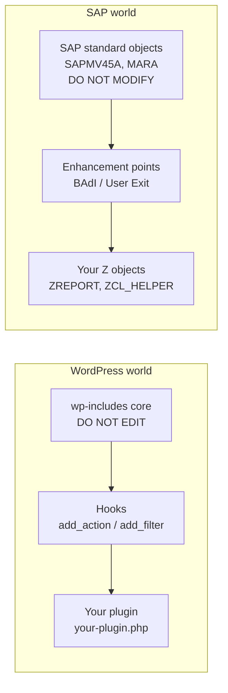
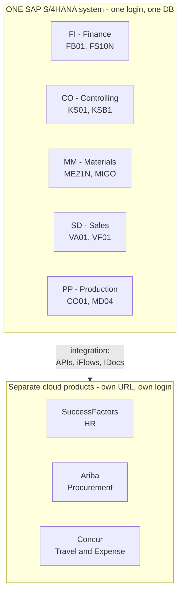
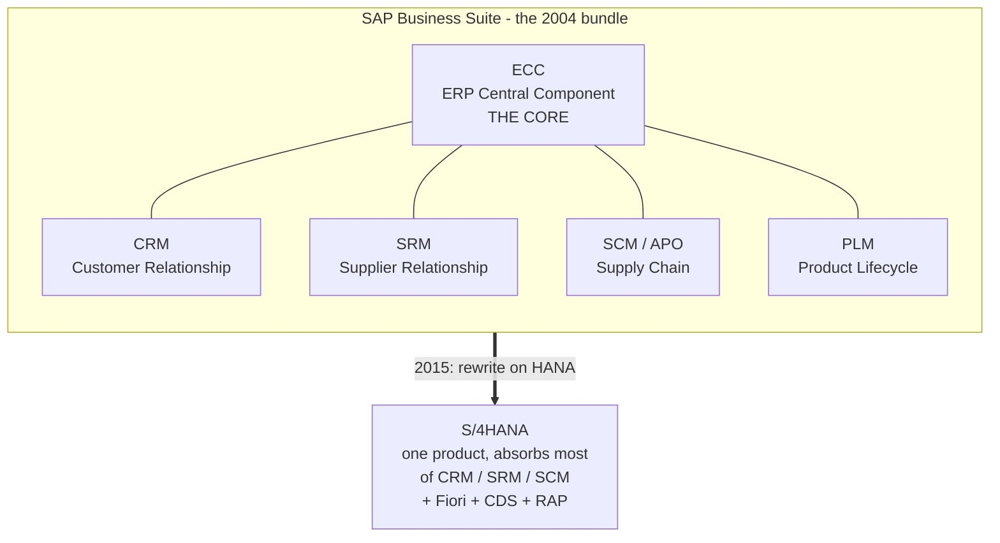
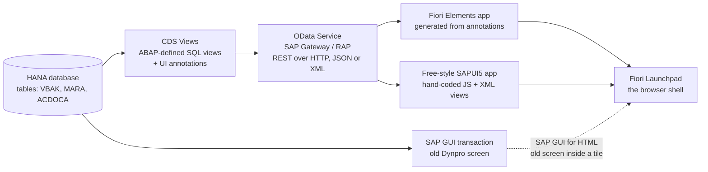
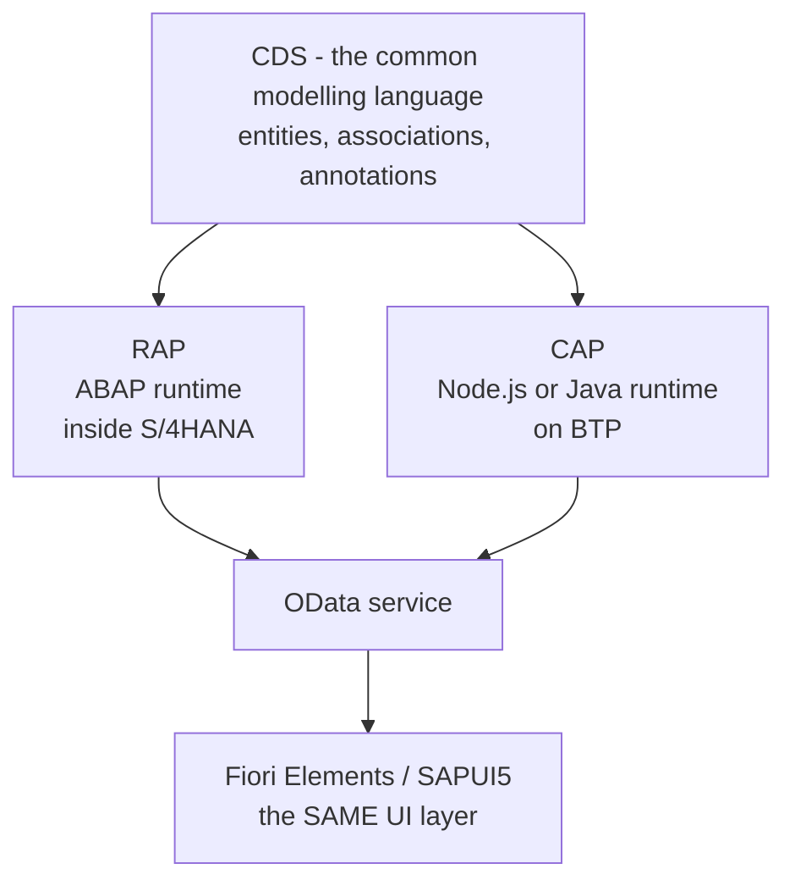
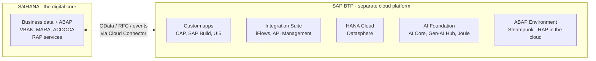
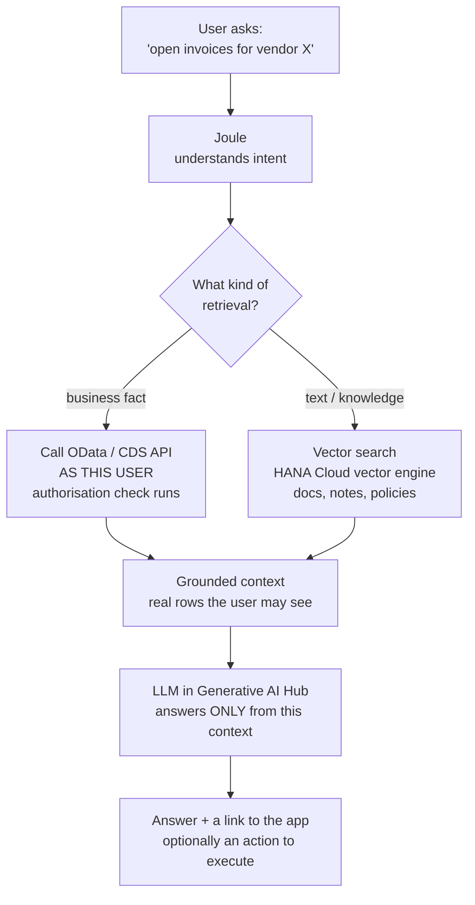
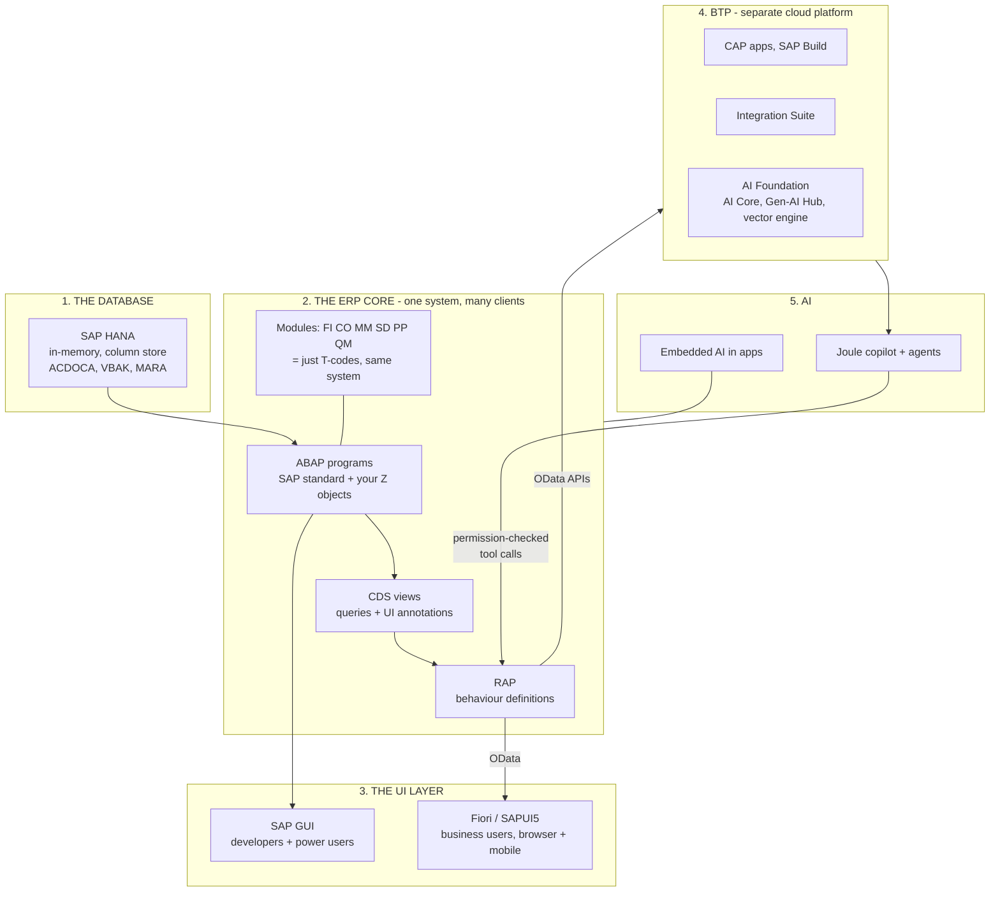

# SAP Doubts — Answered · Round 1

### Your 28 Notion doubts put into a reading order and answered one by one, plus 11 more from a web developer walking into SAP — plain English, a Telugu recap on every point, and a web-developer anchor for each

> *"You are not confused because SAP is hard. You are confused because you are meeting the middle of a 50-year-old system without being shown the outline first. Read the outline once, and most of these 28 questions collapse into four."*

**SAP Docs** · Doubts session 01 · Sourced from your Notion "SAP Doubts" page · 25 Aug 2026

---

<style>
.dbt{background:#fff7ed;border-left:3px solid #f59e0b;border-radius:0 6px 6px 0;padding:7px 12px;margin:0 0 10px;font-size:13.4px;color:#4a3411;font-style:italic;page-break-inside:avoid}
.dbt strong{color:#b45309;font-style:normal}
.ans{background:#ecfdf5;border-left:3px solid #10b981;border-radius:0 6px 6px 0;padding:7px 12px;margin:0 0 10px;font-size:13.7px;color:#0f3d2e;page-break-inside:avoid}
.ans strong{color:#047857}
</style>

## Table of Contents

- [How to Read This](#how-to-read-this)
- [Part A — What You Actually Get When Someone Hands You SAP](#part-a-what-you-actually-get-when-someone-hands-you-sap)
  - [A1. Does SAP install empty, like a fresh WordPress?](#a1-does-sap-install-empty-like-a-fresh-wordpress) · [A2. Does a fresh SAP system already have code behind every T-code?](#a2-does-a-fresh-sap-system-already-have-code-behind-every-t-code) · [A3. If SAP ships all the programs, what is an ABAP developer for?](#a3-if-sap-ships-all-the-programs-what-is-an-abap-developer-for) · [A4. ABAP vs WordPress — where pre-built ends and custom begins](#a4-abap-vs-wordpress-where-pre-built-ends-and-custom-begins) · [A5. Is the client number on the logon screen a kind of user role?](#a5-is-the-client-number-on-the-logon-screen-a-kind-of-user-role) · [A6. So only data differs between clients, and the DDIC stays the same?](#a6-so-only-data-differs-between-clients-and-the-ddic-stays-the-same) · [A7. How do I open the other modules?](#a7-how-do-i-open-the-other-modules)
- [Part B — R/3, ECC, Business Suite and S/4HANA](#part-b-r3-ecc-business-suite-and-s4hana)
  - [B1. What role does R/3 and ECC actually play?](#b1-what-role-does-r3-and-ecc-actually-play) · [B2. What is Business Suite next to ECC and S/4HANA?](#b2-what-is-business-suite-next-to-ecc-and-s4hana) · [B3. The same answer in WordPress language](#b3-the-same-answer-in-wordpress-language) · [B4. What versions does Business Suite have?](#b4-what-versions-does-business-suite-have) · [B5. How do I check whether a system is ECC or S/4HANA?](#b5-how-do-i-check-whether-a-system-is-ecc-or-s4hana)
- [Part C — Why HANA Is a Different Kind of Database](#part-c-why-hana-is-a-different-kind-of-database)
  - [C1. Column storage vs row storage — what actually changes?](#c1-column-storage-vs-row-storage-what-actually-changes) · [C2. The same thing with a real table](#c2-the-same-thing-with-a-real-table)
- [Part D — The Ugly Screen Problem — GUI, Fiori and You](#part-d-the-ugly-screen-problem-gui-fiori-and-you)
  - [D1. I am new to SAP and the GUI confuses me](#d1-i-am-new-to-sap-and-the-gui-confuses-me) · [D2. Is SAP just not visually good by default?](#d2-is-sap-just-not-visually-good-by-default) · [D3. I build modern apps — how is a 1990s look still shipping today?](#d3-i-build-modern-apps-how-is-a-1990s-look-still-shipping-today) · [D4. Is modern S/4HANA also stuck with the old GUI?](#d4-is-modern-s4hana-also-stuck-with-the-old-gui) · [D5. How do I turn the old GUI into a modern UI using Fiori?](#d5-how-do-i-turn-the-old-gui-into-a-modern-ui-using-fiori) · [D6. Can I make SAP look like a current Figma design?](#d6-can-i-make-sap-look-like-a-current-figma-design) · [D7. Is a Fiori app just a React dashboard fed by OData?](#d7-is-a-fiori-app-just-a-react-dashboard-fed-by-odata)
- [Part E — Where You Extend SAP — RAP, CAP and BTP](#part-e-where-you-extend-sap-rap-cap-and-btp)
  - [E1. Is RAP the same as CAP?](#e1-is-rap-the-same-as-cap) · [E2. What is BTP, and why is it not inside the SAP system?](#e2-what-is-btp-and-why-is-it-not-inside-the-sap-system) · [E3. Does BTP refuse to work with ECC?](#e3-does-btp-refuse-to-work-with-ecc)
- [Part F — AI in SAP — Joule, RAG and AI Foundation](#part-f-ai-in-sap-joule-rag-and-ai-foundation)
  - [F1. Is SAP AI doing RAG, and how does it see data inside S/4HANA?](#f1-is-sap-ai-doing-rag-and-how-does-it-see-data-inside-s4hana) · [F2. Embedded AI, Joule and AI Foundation — all three with one example](#f2-embedded-ai-joule-and-ai-foundation-all-three-with-one-example) · [F3. Is Joule just Claude Code inside the SAP world?](#f3-is-joule-just-claude-code-inside-the-sap-world) · [F4. Does Joule work only on BTP apps, or on the ERP core too?](#f4-does-joule-work-only-on-btp-apps-or-on-the-erp-core-too)
- [Part G — Round 1B: The Web Developer's Doubts](#part-g-round-1b-the-web-developers-doubts)
  - [G1. Why buy SAP instead of getting a SaaS product built?](#g1-why-buy-sap-instead-of-getting-a-saas-product-built) · [G2. Can I install SAP on my laptop? Where is the localhost?](#g2-can-i-install-sap-on-my-laptop-where-is-the-localhost) · [G3. Where is Git? How does ABAP code get versioned and deployed?](#g3-where-is-git-how-does-abap-code-get-versioned-and-deployed) · [G4. What happens if two developers open the same program?](#g4-what-happens-if-two-developers-open-the-same-program) · [G5. There is no npm — how do I use libraries in ABAP?](#g5-there-is-no-npm-how-do-i-use-libraries-in-abap) · [G6. How do I test? Is there a Jest or a Postman for SAP?](#g6-how-do-i-test-is-there-a-jest-or-a-postman-for-sap) · [G7. Why is everything a code — 1000, 101, OR, FERT?](#g7-why-is-everything-a-code-1000-101-or-fert) · [G8. Why does SAP have its own database, language, IDE and UI framework?](#g8-why-does-sap-have-its-own-database-language-ide-and-ui-framework) · [G9. Why are the field names German — MANDT, WERKS, BUKRS?](#g9-why-are-the-field-names-german-mandt-werks-bukrs) · [G10. Could SAP fade? Am I betting my career on the wrong thing?](#g10-could-sap-fade-am-i-betting-my-career-on-the-wrong-thing) · [G11. Will I lose my web development skills?](#g11-will-i-lose-my-web-development-skills)
- [The Whole Map on One Page](#the-whole-map-on-one-page)
- [Your Notion List — Where Each Doubt Went](#your-notion-list-where-each-doubt-went)

---

# How to Read This

Your Notion page had 28 doubts written in the order they hit you, and **Part G adds 11 more** raised later — the ones a web developer always ends up asking. That order is honest but it is not readable — the AI question near the end assumes an answer that only arrives in the third doubt. So I have **regrouped them into six Parts**, each Part answering one big thing, and inside each Part the doubts are ordered so that every answer uses only what came before it.

**Read A → B → C → D → E → F in order, once.** After that, treat it as a reference and jump to whichever doubt comes back.

<p class="te"><strong>Telugu:</strong> Nee Notion lo 28 doubts unnai, kani avi nuvvu adigina order lo unnai — chadavataniki aa order pani cheyyadu. Anduke nenu vatini <strong>6 Parts</strong> ga marchanu. Prathi Part oka pedda vishayanni cover chestundi, mariyu prathi doubt daani mundu vachina vishayam telisthene ardham ayye laaga petta. <strong>Modati sari A nunchi F varaku ee order lo ne chaduvu.</strong> Taruvata edaina doubt malli vasthe, aa oka section ki matrame velli chaduvu.</p>

**Every doubt below has the same four blocks:**

| Block | What it is |
|---|---|
| **Your doubt** (amber) | Your words from Notion, kept as you wrote them |
| **Short answer** (green) | One or two lines. If you only have a minute, read this |
| The explanation | Plain English, then the web-dev anchor, then a table or diagram |
| **Telugu** (violet) | The same answer in Tenglish, so it locks in |

**One thing to notice before you start.** Several of your doubts are really the *same* doubt asked from different angles — "is SAP empty or full", "what do ABAP developers do", "why does it look old". That is a good sign, not a bad one: it means your brain found the real question and kept circling it. The real question is this:

<p class="pic"><strong>The one question under all 28:</strong> <em>SAP already does everything. So what exactly is left for me to build, and where do I build it?</em> Parts A and B answer "what is already there". Parts D, E and F answer "where you build". If you hold only that sentence, the rest is detail.</p>

---

# Part A — What You Actually Get When Someone Hands You SAP

## A1. Does SAP install empty, like a fresh WordPress?

<p class="dbt"><strong>Your doubt:</strong> "intially I thought that we have to install the SAP system like a wordpress file — sap system donot contain any pre built thing we have to complete built from scratch. Bnz I am webdev I donot know anything about practical SAP, i just read about the SAP uses modules, wht can it do just in content."</p>

<p class="ans"><strong>Short answer:</strong> No. SAP arrives <strong>completely full</strong>. A fresh S/4HANA system already contains roughly <strong>100,000+ programs</strong>, <strong>90,000+ database tables</strong> and <strong>tens of thousands of transaction codes</strong> — a working business already inside it. You are never building from scratch. You are <strong>configuring and extending a finished product</strong>.</p>

This is the single biggest mental flip from web development, so take it slowly.

When you install WordPress, you get a skeleton: a database with about twelve tables, a login, and an empty site. Every feature after that — the shop, the booking form, the invoice — you or a plugin author builds.

When a Basis consultant installs SAP, they are not installing a skeleton. They are installing **a finished ERP that another company could run tomorrow**. Purchase orders work. Payroll works. General-ledger posting works. Material master works. Nobody wrote a line of code for you — SAP wrote it, over fifty years, and ships it as *the standard*.

**So what does "installing SAP" actually mean?** Three things, and none of them is "writing features":

```
1. PROVISION   Install the database (HANA) + the ABAP application server,
               load SAP's shipped software components into it.
               -> Now ~100k programs and ~90k tables exist. Nothing is "yours" yet.

2. CUSTOMIZE   Open SPRO (the IMG - Implementation Guide) and answer
               thousands of business questions in configuration tables:
               "What is our company code?"   "What currency?"
               "What are our plants?"        "Which chart of accounts?"
               -> This is 60-70% of a real SAP project. It is CONFIG, not code.

3. DEVELOP     Only what is genuinely missing gets written in ABAP:
               custom reports, custom forms, interfaces to other systems,
               data conversions, enhancements to standard behaviour.
               -> This is YOUR job. Typically 10-20% of a project.
```

<p class="te"><strong>Telugu:</strong> WordPress install cheste khali site vastundi — anni features nuvve build cheyyali. <strong>SAP alaa kaadu.</strong> SAP install cheste, <strong>poorti ga pani chese company software</strong> vastundi — laksha paiga programs, 90 vela tables, veyyala T-codes, anni already unnai. Purchase order, payroll, accounting — anni already pani chestai. Nee pani <strong>modati nunchi build cheyyadam kaadu</strong>. Nee pani rendu: (1) <strong>Config</strong> — SPRO lo "maa company peru idi, maa currency idi, maa plants ivi" ani settings pettadam, (2) <strong>Custom code</strong> — SAP lo lenidi matrame ABAP lo rayadam. Project lo config 60-70%, code 10-20%.</p>

**Why the confusion is completely fair:** in web development, "framework" means *starter kit*. React gives you nothing but rendering. Express gives you nothing but routing. You correctly assumed SAP was a framework of that kind. It is not. SAP is closer to **buying a running factory** than to buying steel and a welding machine.

| | WordPress / React | SAP S/4HANA |
|---|---|---|
| What you get on day 1 | Empty skeleton | A complete, working ERP |
| Tables at install | ~12 (WordPress) | ~90,000 |
| Who wrote the business logic | You / plugin authors | SAP, over 50 years |
| Your first task | Build a feature | **Configure** what already exists |
| Amount written from scratch | ~100% | ~10–20% |
| The risk you must manage | "Does it work?" | "Am I allowed to change this?" |

<p class="pic"><strong>Picture it:</strong> WordPress = an empty plot of land and a bag of cement. SAP = a fully built 40-floor office tower, already occupied. Your job as an ABAP developer is not to build the tower. It is to add a room on floor 12 without cracking the wall that holds up floor 13.</p>

---

## A2. Does a fresh SAP system already have code behind every T-code?

<p class="dbt"><strong>Your doubt:</strong> "if any one gave me SAP system Access do it have pre built codes accessed by Tcodes"</p>

<p class="ans"><strong>Short answer:</strong> Yes — completely. A <strong>T-code (transaction code)</strong> is nothing but a short name pointing at a program that already exists. When you type <code>VA01</code>, SAP looks it up in a table, finds which program that name maps to, and runs it. SAP shipped that program.</p>

**What a T-code really is.** It is a row in a table called `TSTC`. That row says: "the name `VA01` means run program `SAPMV45A`, starting at screen 4001". Nothing more magical than that.

```abap
" Conceptually, this is all a T-code is:
"
"  TSTC table
"  +--------+---------------+--------+
"  | TCODE  | PGMNA         | DYPNO  |
"  +--------+---------------+--------+
"  | VA01   | SAPMV45A      | 4001   |   " Create Sales Order
"  | SE11   | RADMASD0      | 0100   |   " ABAP Dictionary
"  | ME21N  | RM_MEPO_GUI   | 0100   |   " Create Purchase Order
"  +--------+---------------+--------+
"
" Typing /nVA01 in the command field
"   = "look up VA01 in TSTC, run whatever program it points to"
```

**Your web anchor:** a T-code is a **route**. `VA01` is to SAP what `/orders/new` is to your Express app or your React Router config. The route name is short and memorisable; behind it sits a controller with real code. The only difference is that SAP ships about a hundred thousand routes already wired, and the routing table is a database table you can open in SE16N and read for yourself.

<p class="te"><strong>Telugu:</strong> Avunu — anni already unnai. <strong>T-code ante oka route matrame.</strong> Nuvvu <code>VA01</code> type cheste, SAP <code>TSTC</code> ane table lo choosi "VA01 ante <code>SAPMV45A</code> program" ani telusukuni aa program ni run chestundi. Ee program SAP e raasindi, nuvvu kaadu. Nee Express app lo <code>/orders/new</code> ante oka controller run ayinatte, ikkada <code>VA01</code> ante oka ABAP program run avutundi. Techa emiti ante: SAP lo already <strong>laksha routes</strong> wire chesi unnai.</p>

**A few you will meet constantly, so the idea stops feeling abstract:**

| T-code | What runs behind it | Your web equivalent |
|---|---|---|
| `SE11` | ABAP Dictionary — define and inspect tables | phpMyAdmin / a schema migration file |
| `SE16N` | Data browser — look at rows in any table | `SELECT * FROM x` in a SQL client |
| `SE38` | ABAP Editor — write and run a program | VS Code + `node script.js` |
| `SE80` | Object Navigator — the full workbench | The whole VS Code sidebar |
| `SM30` | Maintain configuration table entries | An admin CRUD screen |
| `ST22` | ABAP dumps — the crash log | Your server error log / stack traces |
| `VA01` | Create a sales order (real business transaction) | The checkout endpoint of a shop |
| `ME21N` | Create a purchase order | A procurement app "new PO" page |

**One thing that will matter in interviews:** SE11, SE38 and SE80 are *developer* transactions. VA01, ME21N and FB01 are *business* transactions. Both are just T-codes. SAP does not separate them into different applications — the same window, the same command field, a different name typed into it. That is a large part of why the GUI feels overwhelming: it is a developer IDE and a business application sharing one shell.

---

## A3. If SAP ships all the programs, what is an ABAP developer for?

<p class="dbt"><strong>Your doubt:</strong> "if default sap system have all the codes, programs. whats the use of ABAP developers"</p>

<p class="ans"><strong>Short answer:</strong> Because SAP ships what is <strong>common to every company</strong>, and every real company has 10–20% that is <strong>only theirs</strong>. That gap is your entire career. The industry has a standard name for the five kinds of work in that gap: <strong>RICEF</strong>.</p>

This is the most important question on your whole list, because it is the question that decides whether the job exists. So here is the full, honest answer.

SAP wrote the *average*. A steel plant in Vizag, a pharma company in Hyderabad and a bank in Mumbai all need a general ledger — so SAP wrote one. But the steel plant also needs a quality certificate printed in a format one specific customer demands, a nightly file pushed to a government portal, and a report its plant manager designed in 2011 and refuses to give up. **SAP did not write those. Nobody did. That is the job.**

Almost every ABAP task in your first two years fits one of these five buckets. Learn the five letters — interviewers use them as shorthand.

| Letter | Stands for | What you actually build | Web-dev equivalent |
|---|---|---|---|
| **R** | **Reports** | A program that reads SAP tables and shows or exports the result — ALV grids, downloads | A dashboard page or a `/api/report` endpoint |
| **I** | **Interfaces** | Moving data in and out — to a bank, a portal, a warehouse system, another SAP box | REST / webhook integration, cron sync job |
| **C** | **Conversions** | One-time bulk loads when a company goes live — legacy data into SAP | A migration script |
| **E** | **Enhancements** | Changing how *standard* SAP behaves, at official plug-in points | A WordPress hook / Express middleware |
| **F** | **Forms** | Printed and PDF output — invoices, purchase orders, delivery notes | An HTML-to-PDF template |

<p class="te"><strong>Telugu:</strong> SAP <strong>andariki common ga kavalasindi</strong> matrame raasindi. Kani prathi company ki 10-20% <strong>vaalladi matrame</strong> ayina avasaram untundi — vaalla format lo invoice, vaalla government portal ki file, vaalla manager kavalanukunna report. <strong>Adi SAP raayaledu. Ade nee pani.</strong> Ee pani ki industry lo oka peru undi: <strong>RICEF</strong> — R = Reports, I = Interfaces (data lopaliki, bayataki), C = Conversions (paatha data ni SAP loki ekkinchadam), E = Enhancements (SAP standard behaviour ni marchadam), F = Forms (invoice, PO print leda PDF). Nee modati rendu samvatsaralalo vache prathi task ee aidintlo okati avutundi.</p>

**The second half of the answer — and this is what makes ABAP a 2027-safe skill:** the "standard" itself keeps moving. S/4HANA replaced flat table reads with **CDS views**, replaced hand-written OData with **RAP**, and pushed the UI to **Fiori**. Companies that ran ECC for fifteen years now need every one of those old Z-reports rebuilt as a CDS view feeding a Fiori app. That rebuild is a decade of work, and it needs exactly your profile: someone who understands both a database query and a front end.

<p class="pic"><strong>The line to say in an interview:</strong> "SAP standard covers the common 80%. My job is the RICEF layer — the 20% that is specific to the customer — plus rebuilding legacy ECC reports as CDS views and Fiori apps during an S/4HANA conversion." That one sentence tells the interviewer you understand what the role actually is.</p>

---

## A4. ABAP vs WordPress — where pre-built ends and custom begins

<p class="dbt"><strong>Your doubt:</strong> "explain About ABAP programming in SAP system comparing with wordpress system — like pre built and custom things"</p>

<p class="ans"><strong>Short answer:</strong> The mapping is almost exact. <strong>SAP standard = WordPress core</strong> (never edit it). <strong>Z-programs = your custom plugin</strong>. <strong>BAdIs and User Exits = WordPress hooks</strong> (<code>add_action</code> / <code>add_filter</code>). <strong>Modification = editing a core file</strong> — technically possible, professionally forbidden, and SAP makes you enter an access key to prove you meant it.</p>

You already have three years of instinct about not touching WordPress core. Transfer that instinct directly — it is the same rule, enforced far more strictly.

<figure class="fig">



<figcaption>The same architectural rule, two ecosystems. Core is sacred; you plug in at the points the vendor published; your own code lives in a namespace that is unmistakably yours.</figcaption>
</figure>

**The Z and Y namespace is the whole point.** In SAP, every object whose name starts with **Z** or **Y** is customer-owned. `MARA` is SAP's material master table; `ZMARA_EXT` would be yours. SAP guarantees it will never ship an object whose name starts with Z or Y, so an upgrade can never overwrite your work. That is exactly why your plugin lives in `wp-content/plugins/` and not in `wp-includes/`.

<p class="te"><strong>Telugu:</strong> WordPress lo <code>wp-includes</code> ni touch cheyyakudadu ani nuvvu already telusu — SAP lo kuda <strong>ade rule</strong>, kani inka strict ga. SAP raasina objects (MARA, SAPMV45A) ni marchakudadu. Nee code antha <strong>Z leda Y</strong> tho start avvali — <code>ZREPORT</code>, <code>ZTABLE</code>. SAP eppudu Z leda Y tho object release cheyyadu, kabatti upgrade vachina nee code safe ga untundi. SAP standard behaviour marchali ante, SAP <strong>official plug-in points</strong> istundi — vaatini <strong>BAdI</strong>, <strong>User Exit</strong>, <strong>Enhancement Spot</strong> antaru. Ivi WordPress lo <code>add_action</code>, <code>add_filter</code> lantive.</p>

**The full mapping table — pin this one:**

| WordPress concept | SAP / ABAP equivalent | Note |
|---|---|---|
| `wp-includes/`, `wp-admin/` core | SAP standard repository objects | Never modify |
| `wp-content/plugins/my-plugin/` | **Z / Y namespace** objects | Your code lives here |
| `add_action('save_post', ...)` | **BAdI** implementation | Modern, object-oriented, multiple implementations allowed |
| `add_filter('the_content', ...)` | **User Exit / Customer Exit** | Older mechanism, still everywhere in ECC |
| Editing `wp-includes/post.php` | **Modification** (needs an SSCR access key) | Breaks upgrades, flagged forever in SPAU |
| `wp_options` table settings | **Customizing tables** via SPRO / SM30 | Config, not code |
| Theme `functions.php` | Enhancement implementations in your package | Where small custom logic collects |
| `wp-config.php` | Instance profile / RZ10 parameters | Basis territory, not yours |
| WP database (`wp_posts`) | **DDIC tables** (`MARA`, `VBAK`, `ACDOCA`) | Defined in SE11, not in raw SQL |
| WP cron | Background jobs (SM36 / SM37) | Scheduled ABAP programs |
| A plugin update overwriting your edit | A support pack overwriting a modification | Exactly the pain you already know |

**One difference that is bigger than it looks.** In WordPress, if you break core, one site breaks and you restore a backup. In SAP, your code runs inside a system where a wrong `UPDATE` can post money to the wrong ledger for an entire company. That is why SAP separates **development → quality → production** systems, and why nothing reaches production except through a **transport request**. Your habit of "edit on staging, push to live" becomes a formal, audited pipeline with a number attached to it.

---
## A5. Is the client number on the logon screen a kind of user role?

<p class="dbt"><strong>Your doubt:</strong> "In Logon screen client is like a use role? that shows differnent data for 100 or 200"</p>

<p class="ans"><strong>Short answer:</strong> No — a client is <strong>not</strong> a role. A <strong>client is a separate company inside the same system</strong>: its own data, its own users, its own configuration. Client 100 and client 200 are two isolated businesses sharing one database and one set of programs. Roles are a different thing entirely (that is <code>PFCG</code>, and it decides what a user is <em>allowed</em> to do inside one client).</p>

You had a reasonable instinct — "different login gives different data, so it must be a role" — but the mechanism is completely different, and mixing them up is a classic beginner mistake that shows up fast in interviews. Let us separate them cleanly.

**What a client actually is, technically.** Almost every business table in SAP has a first key field called `MANDT` (German for *client*). It is three characters. Every single row carries it.

```abap
" A client-dependent table - note MANDT is the FIRST KEY field
"
"  VBAK  (Sales Order Header)
"  +-------+---------+------------+-----------+
"  | MANDT | VBELN   | ERDAT      | NETWR     |
"  +-------+---------+------------+-----------+
"  | 100   | 0000123 | 2026-08-01 |  45000.00 |   <- exists only in client 100
"  | 100   | 0000124 | 2026-08-02 |  12500.00 |
"  | 200   | 0000123 | 2026-08-01 |    900.00 |   <- SAME order number, different client
"  +-------+---------+------------+-----------+

" And here is the part that matters most to you as a developer:
SELECT * FROM vbak INTO TABLE @DATA(lt_orders).
" You did NOT write "WHERE mandt = '100'".
" ABAP Open SQL adds it AUTOMATICALLY, using the client you logged into.
" This is called the automatic client handling / client dependency.
```

That last point is the one to remember. **ABAP silently adds `WHERE MANDT = <your logon client>` to every Open SQL statement.** You never type it. If you log into 100 you can only see 100's rows; log into 200 and the same `SELECT` returns different data — same program, same table, different world.

<p class="te"><strong>Telugu:</strong> Ledu, <strong>client ante role kaadu.</strong> Client ante <strong>oke system lopala unna vere company</strong> — daaniki sonta data, sonta users, sonta configuration untundi. Client 100, client 200 — rendu vere vere business lu, kani <strong>oke database, oke programs</strong> vaadutunnai. Technical ga: prathi business table lo modati key field <code>MANDT</code> (client number) untundi. Nuvvu <code>SELECT * FROM vbak</code> ani rasthe, ABAP <strong>nuvvu adagakundane</strong> <code>WHERE MANDT = nee logon client</code> ani add chestundi. Anduke 100 lo login aithe 100 data, 200 lo login aithe 200 data vastundi. <strong>Role</strong> anedi veru — adi <code>PFCG</code> lo untundi, oka client lopala <strong>ee user ki emi cheyyadaniki permission undi</strong> ani cheputundi.</p>

**Client vs Role vs User — the three-line separation you should be able to recite:**

| Concept | Question it answers | Where you see it | Web analogy |
|---|---|---|---|
| **Client** (`MANDT`) | *Whose data am I looking at?* | Logon screen, status bar | A **tenant** in a multi-tenant SaaS app — `tenant_id` on every row |
| **User** (`SY-UNAME`) | *Who am I?* | Logon screen, `SU01` | The user record in your `users` table |
| **Role** (`PFCG`) | *What am I allowed to do?* | `PFCG`, `SU01` → Roles tab | RBAC — `admin`, `editor`, `subscriber` |

**Your strongest anchor: multi-tenancy.** If you have ever built a SaaS app where every table has a `tenant_id` and every query filters on it, you have already built SAP clients. SAP just did it in 1992, called it `MANDT`, and made the framework add the filter for you instead of leaving it to the developer to remember.

**What the standard client numbers usually mean** (these are conventions, not laws — every company sets its own):

| Client | Typical purpose |
|---|---|
| `000` | SAP's reference/master client. Shipped by SAP. Never used for business. Used for upgrades and some cross-client work |
| `001` | A copy of 000 used as a template in older systems |
| `066` | Historic "EarlyWatch" client — removed in newer releases |
| `100`, `200`, `300` | Customer clients — commonly Development, Unit-test, Training. **Your FLT practice client will be one of these** |
| `800` | The classic client number in old training and demo systems (IDES) |

<p class="pic"><strong>Practical tip for your 9–11 slot:</strong> the client you are in is shown in the <strong>status bar at the bottom right</strong> of every SAP GUI screen, next to the system ID and your username. If a colleague ever says "it works for me", the first question is always "which client are you in?"</p>

---

## A6. So only data differs between clients, and the DDIC stays the same?

<p class="dbt"><strong>Your doubt:</strong> "Only data is difference between different clients and programs, DDIC remains Same?"</p>

<p class="ans"><strong>Short answer:</strong> Mostly yes — and this is a genuinely sharp question. <strong>Programs, classes and DDIC definitions are cross-client</strong> (one copy, visible from every client). <strong>Business data is client-specific.</strong> But there is a third category you must know about: <strong>client-independent customizing</strong> — configuration that is shared by all clients even though it is "just data".</p>

You got the main line right. Let me complete it, because the exception is what an interviewer will probe.

**Everything in an SAP system falls into one of three buckets:**

| Bucket | Client-specific? | Examples | If you change it in client 100... |
|---|---|---|---|
| **Repository objects** (the Workbench) | **No — cross-client** | Programs, classes, function modules, DDIC tables/domains/data elements, CDS views, Fiori apps | ...it changes in 200, 300 and every other client immediately |
| **Client-dependent data & customizing** | **Yes** | Sales orders, materials, customers, company codes, number ranges, pricing procedures | ...100 changes, 200 is untouched |
| **Client-independent customizing** | **No — cross-client** | Factory calendar, currency/exchange-rate *definitions*, units of measure, some plant-level settings | ...it changes for everybody. **This is where accidents happen** |

**The key distinction to hold:** the *definition* of a table lives in the ABAP Dictionary and is cross-client. The *rows inside* that table are client-specific — **if** the table has `MANDT` as its first key field. A table without `MANDT` is client-independent, and its rows are shared by every client in the system.

```abap
" SE11 shows you this instantly. Look at the first key field:
"
"  MARA   (Material Master)          first key = MANDT   -> client-dependent
"  T001   (Company Codes)            first key = MANDT   -> client-dependent
"  TFACD  (Factory Calendar def.)    first key = IDENT   -> CLIENT-INDEPENDENT
"  TCURC  (Currency Codes)           first key = MANDT   -> client-dependent
"  TSTC   (Transaction Codes)        first key = TCODE   -> CLIENT-INDEPENDENT
"
" Rule of thumb: if MANDT is not the first key field,
" you are editing something that EVERY client in the system will see.
```

<p class="te"><strong>Telugu:</strong> Nuvvu adigindi correct ne, kani okka exception undi. <strong>Programs, classes, DDIC table definitions</strong> — ivi <strong>anni clients ki common</strong>. Client 100 lo program marchav ante, 200 lo kuda maripoyindi. <strong>Business data</strong> (sales orders, materials, customers) matram <strong>prathi client ki veru veru</strong>. Kani <strong>moodava rakam</strong> okati undi: <strong>client-independent customizing</strong> — idi data laage kanipistundi kani anni clients ki common. Udaharana: factory calendar, units of measure. <strong>Ela telusukovali?</strong> SE11 lo table teruchu, <strong>modati key field</strong> choodu. <code>MANDT</code> unte client-specific. Lekapothe, adi anni clients ki common — jaagratha ga marchali.</p>

**Why this design exists.** SAP wanted one system to serve a training client, a testing client and a real client without triple-installing 100,000 programs. So it split the world: **code once, data many times**. That is also why a "client copy" (transaction `SCCL` / `SCC9`) can create a whole fresh business environment in hours without touching a single program.

<p class="pic"><strong>The trap this creates, and you will hit it:</strong> your team lead says "just test it in client 200 so you do not disturb anyone". You change the program in 200. It also changed in 100 — including for the person demoing to the client right now. <strong>Code is never isolated by client.</strong> Only data is.</p>

---

## A7. How do I open the other modules?

<p class="dbt"><strong>Your doubt:</strong> "we know that we have other modules connected to core sap system, how can open those modules using t-codes or any other login way or different application?"</p>

<p class="ans"><strong>Short answer:</strong> It splits in two. The <strong>classic modules</strong> (FI, CO, MM, SD, PP, QM, PM) are <strong>not separate applications at all</strong> — they are the same system, and you open them with a different T-code in the same window. The <strong>modern cloud products</strong> (SuccessFactors, Ariba, Concur) <strong>are</strong> separate applications with their own URL and login, connected to the core by integration.</p>

This confuses almost everyone, because the word "module" is used for two very different things.

**Half one: the classic modules are just menu folders.** MM and SD are not programs you launch. They are *groupings of transactions* that happen to touch the same business area, sitting in the same repository, writing to the same database. There is no "open MM" button.

```
SAP Easy Access menu (T-code: SESSION_MANAGER)
+-- Logistics
|   +-- Materials Management (MM)     -> ME21N, ME51N, MIGO, MMBE, MM01
|   +-- Sales and Distribution (SD)   -> VA01, VA02, VL01N, VF01, XD01
|   +-- Production Planning (PP)      -> CO01, MD01, MD04
|   +-- Quality Management (QM)       -> QA01, QA32
+-- Accounting
|   +-- Financial Accounting (FI)     -> FB01, FB03, FS10N, F-28
|   +-- Controlling (CO)              -> KS01, KO01, KSB1
+-- Tools
    +-- ABAP Workbench                -> SE11, SE38, SE80, SE24

Same window. Same login. Same database. Only a different T-code typed
into the SAME command field. "Opening MM" = typing ME21N.
```

**Your web anchor:** the modules are like the **sections of one large admin panel**. WooCommerce, Yoast and a membership plugin all appear as separate menu items in `wp-admin`, but there is one WordPress, one database and one login. You do not "launch WooCommerce" — you click into its section. Same idea, larger scale.

<p class="te"><strong>Telugu:</strong> Rendu rakalu unnai, anduke confusion. <strong>Modati rakam — paatha modules</strong> (FI, CO, MM, SD, PP, QM). Ivi veru applications <strong>kaave kaadu</strong>. Ivi oke system lo, oke database lo, oke window lo unnai — matrame <strong>veru T-code</strong> type cheyyali. "MM open cheyyadam" ante <code>ME21N</code> type cheyyadam, ante. Veru login avasaram ledu. <strong>Rendo rakam — kotta cloud products</strong> (SuccessFactors HR ki, Ariba procurement ki, Concur travel ki). Ivi <strong>nijam ga veru applications</strong> — vaatiki sonta website URL, sonta login untundi. Avi core SAP tho <strong>integration</strong> dwara matrame connect avutai. WordPress lo WooCommerce oka menu section laaga — kani Shopify oka veru website laaga. Rendu rakalu ekkade tedaa.</p>

**The full picture in one diagram:**

<figure class="fig">



<figcaption>Two very different meanings of the word "module". Inside the box: a T-code away. Outside the box: a different product with its own login, joined by integration.</figcaption>
</figure>

**Three practical ways to reach a transaction you cannot remember:**

| Way | How | When to use |
|---|---|---|
| Command field | Type `/n` + the T-code, press Enter | Fastest. Use this 95% of the time |
| Easy Access menu tree | Navigate the folders on the home screen | When you are browsing a module you do not know |
| Search for the T-code | `SEARCH_SAP_MENU`, or table `TSTCT` in SE16N | When you know the *name* but not the code |

---

# Part B — R/3, ECC, Business Suite and S/4HANA

## B1. What role does R/3 and ECC actually play?

<p class="dbt"><strong>Your doubt:</strong> "explain about how ECC plays vitaol role in SAP system, the role of ECC or R/3 in business suite" · and: "I know that R1, R2 are died but i read that R/3 + few components is ECC, and HANA + ecc = S/4hana — it is really feeling confusing in starting to understand about connection of R/3 with ECC as business suite in between and how s/4 will be compared with it"</p>

<p class="ans"><strong>Short answer:</strong> They are <strong>the same product, renamed as it grew</strong>. R/3 (1992) is the ancestor. ECC (2004) is R/3 renamed and extended. S/4HANA (2015) is the rewrite of ECC for the HANA database. At every stage, <strong>this product is the ERP core</strong> — the thing that actually runs finance, materials and sales. Everything else in SAP orbits around it.</p>

Your summary was already close. Let me give you the clean timeline, because once you see it as *one product with four names*, the confusion disappears permanently.

| Era | Name | What changed | Status today |
|---|---|---|---|
| 1979 | **R/2** | Mainframe. Two-tier | Dead |
| 1992 | **R/3** | **Client–server, three-tier.** Runs on any DB (Oracle, DB2, SQL Server). ABAP + Dynpro screens. This is where SAP became huge | Renamed, not dead |
| 2004 | **ECC** (ERP Central Component) | Same product, new name. Added Enterprise Services, Enhancement Packages (EHP 1–8). ECC 6.0 is *the* version everyone means | **Still running in thousands of companies.** Mainstream maintenance ends 2027 (paid extension to 2030) |
| 2015 | **S/4HANA** | Rewritten to run **only** on HANA. Data model simplified, aggregate tables removed, Fiori as the UI, CDS + RAP as the programming model | **The present and the future** |

**So what does "R/3 + a few components = ECC" really mean?** It means SAP took the R/3 core, added service-enablement and a mechanism for shipping new features without a full upgrade (Enhancement Packages), and gave the result a new name. If you open an ECC system today you will still see `SAPMV45A` — the same sales-order program from R/3. The lineage is literal, not metaphorical.

<p class="te"><strong>Telugu:</strong> Ivi <strong>nalugu vere products kaadu — okate product, perlu marina.</strong> R/2 (mainframe, chachipoyindi) → <strong>R/3</strong> (1992, client-server, e DB tho ayina pani chestundi) → <strong>ECC</strong> (2004, R/3 ke kotta peru + konni components) → <strong>S/4HANA</strong> (2015, HANA meeda matrame nadiche laaga malli rasindi). Prathi stage lo, <strong>ee product e ERP core</strong> — nijam ga finance, materials, sales nadipedi idi. Migilinavi anni deeni chuttu tirugutai. "R/3 + few components = ECC" ante — R/3 ne teesukuni, konni kotta features kalipi, kotta peru pettaru, ante. ECC lo ippatiki <code>SAPMV45A</code> ane R/3 nati program ne pani chestondi.</p>

**Why ECC is "vital" — the part your doubt was really asking:**

1. **It is where the money is, today.** A very large share of SAP customers are still on ECC 6.0. Every one of them must move to S/4HANA before maintenance ends. That migration wave is the reason the SAP job market is hot right now, and the reason your December 2026 timing is good.
2. **It defined the vocabulary you are learning.** Company code, plant, material master, document number — all of it comes from R/3 and survives unchanged in S/4HANA.
3. **You will be asked about it.** An interviewer will say "have you worked on ECC or S/4?" Knowing that ECC is the pre-HANA ancestor with a different table structure — and being able to name one difference — is enough to answer well as a fresher.

<p class="pic"><strong>Your web-dev anchor:</strong> R/3 → ECC → S/4HANA is like <strong>AngularJS → Angular 2 → Angular today</strong>, or PHP 5 → PHP 7 → PHP 8. Same product family, same vendor, same core purpose; a rewrite in the middle that broke compatibility and forced everyone to migrate. You have lived through that pattern already.</p>

---

## B2. What is Business Suite next to ECC and S/4HANA?

<p class="dbt"><strong>Your doubt:</strong> "explain what is business suite and compare that with ECC or s/4 hana. usage and helpful?" · also: "then what about BTP is it not located in SAP system?" (answered fully in E2)</p>

<p class="ans"><strong>Short answer:</strong> <strong>SAP Business Suite was a bundle, not a product.</strong> It was the box SAP sold from 2004: ECC (the ERP core) plus CRM, SRM, SCM and PLM sold together. ECC was the centre of that box. S/4HANA later replaced ECC <em>and</em> absorbed much of what the surrounding products did — so the bundle largely dissolved into one product.</p>

This is the piece that was missing from your mental model, and it explains why the names felt tangled.

<figure class="fig">



<figcaption>Business Suite was a set of separate systems sold as one offering, with ECC in the middle. S/4HANA collapsed most of that surface area back into a single product.</figcaption>
</figure>

**The comparison you asked for, in one table:**

| | **Business Suite** | **ECC** | **S/4HANA** |
|---|---|---|---|
| What it is | A **bundle** of products | The **ERP core product** inside that bundle | The **successor** to ECC |
| Released | 2004 | 2004 (name); lineage from 1992 | 2015 |
| Database | Any (Oracle, DB2, MS SQL, and later HANA) | Any | **HANA only** |
| Contains | ECC + CRM + SRM + SCM + PLM | Finance, Logistics, HR, and so on | Finance, Logistics, and absorbed CRM/SRM/SCM functions |
| UI | SAP GUI, plus WebDynpro / Portal | SAP GUI | **Fiori first**, GUI still available |
| Data model | Classic, with many aggregate and index tables | Classic | **Simplified** — aggregates removed, universal journal |
| Programming | ABAP, Dynpro, classic Open SQL | Same | ABAP + **CDS + RAP**, code pushdown to HANA |
| Status | Superseded | Maintenance ends 2027 (extended 2030) | Current and strategic |

<p class="te"><strong>Telugu:</strong> <strong>Business Suite ante oka product kaadu — adi oka bundle</strong>, ante SAP 2004 lo ammina "box". Aa box lo: <strong>ECC</strong> (ERP core), <strong>CRM</strong> (customers), <strong>SRM</strong> (suppliers), <strong>SCM</strong> (supply chain), <strong>PLM</strong> (products). Ee box <strong>madhyalo ECC</strong> undedi — migilinavi anni daani chuttu. Taruvata 2015 lo SAP <strong>S/4HANA</strong> teesukochindi. Adi ECC place teesukundi, mariyu CRM/SRM/SCM cheyye pani lo chala bhagam <strong>tana lopala ne kalipesukundi</strong>. Anduke ippudu aa bundle deadaapu kanumarugu ayindi — okate product.</p>

<p class="pic"><strong>One naming warning, and it matters.</strong> Since 2025, SAP has <strong>re-used the brand name "SAP Business Suite"</strong> for a brand-new cloud offering — S/4HANA Cloud plus BTP plus data and AI services, sold as one suite. So "Business Suite" now means two different things depending on who is speaking and when. <strong>Old Business Suite (2004) is not the same as the new Business Suite (2025).</strong> If your FLT trainer uses the term, ask which one they mean. This is not you being confused — the name genuinely got recycled.</p>

---

## B3. The same answer in WordPress language

<p class="dbt"><strong>Your doubt:</strong> "explain what is business suite and compare that with ECC or s/4 hana. usage and helpful? explain in wordpress version"</p>

<p class="ans"><strong>Short answer:</strong> ECC is <strong>WordPress core</strong>. Business Suite is <strong>WordPress core plus the official WooCommerce / Jetpack / bbPress bundle, sold as one package</strong>. S/4HANA is <strong>a full rewrite of WordPress on a new database engine, where WooCommerce features got merged into core and the admin panel was replaced with a modern React UI</strong>.</p>

Here is the whole product story again, told entirely in the vocabulary you already own.

| SAP thing | WordPress equivalent | Why the analogy holds |
|---|---|---|
| **R/3** | WordPress 1.0 on shared hosting with MySQL | The original engine. Everything since is descended from it |
| **ECC** | **WordPress core** (the current, mature core) | The one piece nobody can run without. Everything else plugs into it |
| **Business Suite** | **A bundle: core + WooCommerce + a CRM plugin + a supplier plugin, sold together** | Separate installs, one purchase, one vendor, meant to work together |
| **CRM / SRM / SCM** | WooCommerce, a supplier plugin, an inventory plugin | Big specialised add-ons around core |
| **S/4HANA** | **WordPress rewritten to run only on a new in-memory database, with WooCommerce merged into core and the admin replaced by a React app** | Not an upgrade — a migration. Old customisations must be reworked |
| **HANA** | Swapping MySQL for an in-memory column database that is 100× faster on reporting | The engine change that forced the rewrite |
| **Fiori** | Replacing `wp-admin` with a modern React front end | New UI layer over the same data |
| **BTP** | A **separate cloud platform** where you host your own apps that call the WordPress REST API | Deliberately outside core, so core stays upgradeable |
| **ABAP** | PHP | The language the whole thing is written in, and the language you extend it with |
| **Z-programs** | Your custom plugin in `wp-content/plugins/` | Your code, safely namespaced |
| **CDS views** | Well-named SQL views that the REST API exposes automatically | Define once, and the API layer appears from annotations |

<p class="te"><strong>Telugu:</strong> WordPress bhaasha lo cheppali ante — <strong>ECC ante WordPress core</strong>. Adi lekapothe emi pani cheyyadu. <strong>Business Suite ante</strong> — WordPress core + WooCommerce + CRM plugin + supplier plugin anni <strong>kalipi oke package ga ammadam</strong>. <strong>S/4HANA ante</strong> — WordPress ni <strong>kotta database meeda malli modati nunchi rayadam</strong>, WooCommerce features ni core lo ne kalapadam, mariyu <code>wp-admin</code> place lo <strong>kotta React UI</strong> (adi Fiori) pettadam. Anduke ECC nunchi S/4HANA ki vellatam <strong>upgrade kaadu — adi migration</strong>. Nee paatha custom code antha malli sari cheyyali. Aa pane ippudu India lo veyyala mandiki udyogam istondi.</p>

<p class="pic"><strong>The sentence to carry into interviews:</strong> "ECC to S/4HANA is not a version upgrade — it is a re-platforming. The database changed, the data model was simplified, and the UI and programming model changed with it. That is why customers need developers who understand both sides."</p>

---

## B4. What versions does Business Suite have?

<p class="dbt"><strong>Your doubt:</strong> "what about version is business suite"</p>

<p class="ans"><strong>Short answer:</strong> The last one was <strong>SAP Business Suite 7</strong>, released in 2009 — and it was the final version of that bundle. Inside it sat <strong>ECC 6.0</strong>, which then grew through <strong>Enhancement Packages EHP 1 to EHP 8</strong> instead of getting new version numbers. That is why you see "ECC 6.0 EHP7" written everywhere and almost never "ECC 7".</p>

This is a small doubt with a genuinely useful answer, because the version numbers you will see on real projects come from here.

```
SAP Business Suite versions
  Business Suite (2004)   -> contained ECC 5.0
  Business Suite 7 (2009) -> contained ECC 6.0     <- THE LAST ONE

ECC 6.0 then evolved through Enhancement Packages, not version numbers:
  ECC 6.0            SAP_APPL 600     2005
  ECC 6.0 EHP 1..8   SAP_APPL 601-618 2007 - 2016
                     ^ this is why job posts say "ECC 6.0 EHP7"

S/4HANA restarted the numbering with year-based releases:
  S/4HANA 1511, 1610, 1709, 1809, 1909   (YYMM naming)
  S/4HANA 2020, 2021, 2022, 2023, ...    (year naming)
  Software component: S4CORE 100, 101, 102, ... 108, ...
```

**Why SAP stopped bumping the version number.** A full ERP upgrade is brutal — months of testing, regression across every business process. Enhancement Packages let SAP ship new features that stay **switched off by default**, so installing one changed nothing until a customer explicitly activated a Business Function. It was a way to deliver features without forcing an upgrade project.

<p class="te"><strong>Telugu:</strong> Business Suite ki chivari version <strong>Business Suite 7</strong> (2009). Daani lopala <strong>ECC 6.0</strong> undedi. Taruvata SAP kotta version numbers ivvaledu — badulu ga <strong>Enhancement Packages (EHP 1 nunchi EHP 8 varaku)</strong> ichindi. Anduke job posts lo "ECC 6.0 EHP7" ani kanipistundi, "ECC 7" ani eppudu kanipinchadu. <strong>Enduku ilaa?</strong> Full ERP upgrade ante chala kashtam — nelala testing. EHP lo kotta features vastai kani <strong>off lo ne untai</strong>; company kavalanukunte matrame on chestundi. Ante risk lekunda kotta features. S/4HANA vachaka SAP <strong>samvatsaram peru</strong> tho versions pettadam start chesindi — 1511, 1809, 2020, 2023 ilaa.</p>

<p class="pic"><strong>What to do with this:</strong> when a job description says "ECC 6.0 EHP7 to S/4HANA 2023 conversion", you now know exactly what that sentence describes — a customer on the last Business Suite generation moving to the current one. That is the most common project in the Indian SAP market right now.</p>

---

## B5. How do I check whether a system is ECC or S/4HANA?

<p class="dbt"><strong>Your doubt:</strong> "how can check that the SAP system is S/4 hand or ECC"</p>

<p class="ans"><strong>Short answer:</strong> Menu <strong>System → Status</strong>, then click the <strong>Component Information</strong> button (the magnifying glass next to Product version). If you see the component <strong>S4CORE</strong>, it is S/4HANA. If you see <strong>SAP_APPL</strong> instead, it is ECC. That one component name is the definitive answer.</p>

This is a question you may actually be asked in your first week on a project, and it takes fifteen seconds. Learn the click path by heart.

```
Step by step, in any SAP GUI screen:

  1. Menu bar:  System  ->  Status...
  2. In the popup, find the "SAP System data" box
  3. Click the magnifying-glass / "Component information" button
  4. Read the component list:

     +---------------+---------+-------------------------------+
     | Component     | Release | Means                          |
     +---------------+---------+-------------------------------+
     | S4CORE        | 108     | S/4HANA 2023          <- S/4  |
     | SAP_BASIS     | 758     | the NetWeaver/ABAP platform    |
     | SAP_ABA       | 758     | application basis              |
     +---------------+---------+-------------------------------+
                       ...versus...
     +---------------+---------+-------------------------------+
     | SAP_APPL      | 618     | ECC 6.0 EHP8          <- ECC  |
     | SAP_BASIS     | 750     |                                |
     +---------------+---------+-------------------------------+
```

**The S4CORE number tells you the exact release:**

| S4CORE | S/4HANA release |
|---|---|
| 100 | 1511 |
| 101 | 1610 |
| 102 | 1709 |
| 103 | 1809 |
| 104 | 1909 |
| 105 | 2020 |
| 106 | 2021 |
| 107 | 2022 |
| 108 | 2023 |

*(Later releases continue the same pattern — read whatever number your system shows rather than assuming.)*

<p class="te"><strong>Telugu:</strong> Chala simple. E SAP screen lo ayina, paina menu lo <strong>System → Status</strong> click chey. Vachina popup lo <strong>Component Information</strong> (magnifying glass icon) meeda click chey. Akkada component list vastundi:<br/>— <strong>S4CORE</strong> ani kanipisthe → idi <strong>S/4HANA</strong>. Pakkana unna number (108 ante 2023) release cheputundi.<br/>— <strong>SAP_APPL</strong> ani kanipisthe → idi <strong>ECC</strong>. 618 ante ECC 6.0 EHP8.<br/>Idi 15 seconds pani, kani nee modati week lo evaraina adagachu. Baaga gurthu pettuko.</p>

**Three faster secondary checks, once you know the system:**

| Check | What it tells you | Why it works |
|---|---|---|
| Does table `ACDOCA` exist in SE11? | **Exists → S/4HANA** | ACDOCA is the Universal Journal, introduced only in S/4HANA |
| Is the database HANA? (`System → Status` → Database) | HANA is *necessary* for S/4, but not proof | ECC can also run on HANA ("Suite on HANA") — so this alone is not conclusive |
| Do Fiori apps / a Launchpad exist? | Strong hint of S/4HANA | Fiori exists for ECC too, but is rarely deployed there at scale |

<p class="pic"><strong>The trap to avoid:</strong> "the database is HANA, so it must be S/4HANA" is <strong>wrong</strong>, and an interviewer may set it for you. There was an intermediate product — <strong>Suite on HANA</strong> — which was plain ECC running on the HANA database, with the old data model intact. The reliable test is always the <strong>S4CORE</strong> component, or the presence of <code>ACDOCA</code>.</p>

---
# Part C — Why HANA Is a Different Kind of Database

## C1. Column storage vs row storage — what actually changes?

<p class="dbt"><strong>Your doubt:</strong> "difference betwen HANA column storing vs traditional row stroing (oracle, myswl etc... )"</p>

<p class="ans"><strong>Short answer:</strong> A <strong>row store</strong> keeps a whole record together on disk, so reading one full record is cheap and scanning one column across a million records is expensive. A <strong>column store</strong> keeps each column together, so scanning one column is extremely cheap, compression is enormous, and aggregation over millions of rows becomes near-instant. HANA is column-first and holds the data <strong>in RAM</strong>.</p>

Two changes are happening at once here, and you must separate them or the topic stays foggy:

1. **In-memory instead of disk** — HANA keeps the working data in RAM. RAM is roughly 100,000× faster to reach than a spinning disk and still ~100× faster than a good SSD.
2. **Column-oriented instead of row-oriented** — a change in *layout*, which is the part that actually matters for the questions you will be asked.

Point 2 is the interesting one, so here is the physical picture.

```
Same 4 records. Two ways to lay them on storage.

ROW STORE  (Oracle, MySQL, SQL Server default)
  Block 1: [1001, Steel Rod,  Chennai, 45000]
  Block 2: [1002, Copper Wire, Pune,    12000]
  Block 3: [1003, Steel Rod,  Chennai,  8000]
  Block 4: [1004, Alu Sheet,  Chennai, 33000]
  -> "Give me record 1002"      = read ONE block.        FAST
  -> "SUM all amounts"          = read ALL FOUR blocks,
                                  throw away 3/4 of what you read.  SLOW

COLUMN STORE  (SAP HANA)
  Column MATNR:  [1001, 1002, 1003, 1004]
  Column DESC :  [Steel Rod, Copper Wire, Steel Rod, Alu Sheet]
  Column CITY :  [Chennai, Pune, Chennai, Chennai]
  Column AMT  :  [45000, 12000, 8000, 33000]
  -> "SUM all amounts"          = read ONLY the AMT column.  VERY FAST
  -> "Give me record 1002"      = touch 4 columns and stitch. Slightly more work
```

**The three wins that follow from this layout — these are the exam answers:**

| Win | Why it happens |
|---|---|
| **Aggregation speed** | A report reads 3 columns out of 80. A column store touches 3; a row store drags all 80 through memory |
| **Compression (typically 5–10×)** | A column holds one data type with heavy repetition. `Chennai, Chennai, Chennai` becomes a dictionary entry plus three tiny integers. Less data = less to move = faster |
| **No aggregate tables or indexes needed** | Because scanning is fast, SAP could **delete** the pre-computed totals tables that ECC needed. This is the whole basis of the "S/4HANA simplification" story |

<p class="te"><strong>Telugu:</strong> Rendu vishayalu okesari maruthunnai — vaatini veru cheyyali. <strong>Okati:</strong> HANA data ni <strong>RAM lo</strong> pedutundi, disk lo kaadu. RAM chala vegam. <strong>Rendu (idi mukhyam):</strong> data ni pettina <strong>vidhaanam</strong> maarindi. <strong>Row store</strong> (Oracle, MySQL) lo — <strong>oka record antha kalipi</strong> okka chota pedatharu. Kabatti "1002 record ivvu" ante fast. Kani "anni amounts kaliparu" ante <strong>anni records antha</strong> chadavali — chala slow. <strong>Column store</strong> (HANA) lo — <strong>oka column antha kalipi</strong> okka chota pedatharu. Kabatti "anni amounts kaliparu" ante <strong>okka AMT column</strong> matrame chaduvutundi — chala fast. Inka, oke column lo oke rakam data untundi kabatti <strong>compression 5-10 rettlu</strong> baaga pani chestundi.</p>

**One nuance that separates a good candidate from a memorised one:** HANA is not *only* a column store. It has both engines. Small, write-heavy, technical tables (queues, locks, some configuration) sit in the **row store**; the large business tables sit in the **column store**. When an interviewer asks "is HANA a column database?", the strong answer is: *"column-first, but it has a row store too, and SAP chooses per table."*

<p class="pic"><strong>Your web-dev anchor:</strong> row store vs column store is the same distinction as <strong>OLTP vs OLAP</strong> — MySQL vs BigQuery, Postgres vs ClickHouse. What SAP did that was unusual was to put both workloads in <strong>one</strong> database, so a company no longer needed a separate data warehouse just to run its reports. That single decision is the commercial argument for HANA.</p>

---

## C2. The same thing with a real table

<p class="dbt"><strong>Your doubt:</strong> "difference betwen HANA column storing vs traditional row stroing (oracle, myswl etc... ) explain with example [table way]"</p>

<p class="ans"><strong>Short answer:</strong> Take a sales table with 10 million rows and 80 columns, and ask for total revenue by city. The row store reads roughly <strong>all 80 columns × 10M rows</strong>. The column store reads <strong>2 columns × 10M rows, compressed</strong>. That is why the same report goes from minutes to under a second — and why S/4HANA could delete the pre-computed totals tables that ECC depended on.</p>

**The table as a business person sees it:**

| MANDT | VBELN | KUNNR | CITY | MATNR | QTY | NETWR | ... 74 more columns |
|---|---|---|---|---|---|---|---|
| 100 | 0000123 | C001 | Chennai | STEEL-01 | 10 | 45,000 | ... |
| 100 | 0000124 | C002 | Pune | COPPER-2 | 5 | 12,000 | ... |
| 100 | 0000125 | C001 | Chennai | STEEL-01 | 2 | 8,000 | ... |
| 100 | 0000126 | C003 | Chennai | ALU-SHT | 7 | 33,000 | ... |

**The query the business always asks:**

```abap
SELECT city, SUM( netwr ) AS total
  FROM zsales
  GROUP BY city.
```

**What each engine physically does:**

| | Row store (Oracle / MySQL) | Column store (HANA) |
|---|---|---|
| Data it must touch | Every row, all 80 columns (~10M × 80) | Only `CITY` and `NETWR` (10M × 2) |
| Bytes moved (rough) | ~8 GB | ~40 MB after compression |
| Compression | Low — mixed data types side by side | High — one type per column, dictionary-encoded |
| Parallelism | Limited | Every column split into partitions across all CPU cores |
| Typical time | Minutes | Well under a second |
| The old workaround | Maintain a **pre-aggregated totals table**, refreshed nightly | **Not needed** — aggregate live from the source |

**Now the part that turns this from trivia into an S/4HANA answer.** Because HANA can aggregate live, SAP deleted the totals and index tables that ECC could not live without:

| ECC had | S/4HANA has | Why |
|---|---|---|
| `BSEG` + index tables `BSIS`, `BSAS`, `BSID`, `BSAD`, `BSIK`, `BSAK` | **`ACDOCA`** — the Universal Journal, one line-item table | Indexes existed only so the row store could find open items fast. Column store finds them by scanning |
| `GLT0`, `COSS`, `COSP` and other totals tables | Aggregated on the fly from `ACDOCA` | Pre-computed totals became unnecessary |
| Finance and Controlling in separate tables, reconciled | **One table for FI and CO together** | The single biggest functional simplification in S/4HANA |

<p class="te"><strong>Telugu:</strong> Oka udaharana. 1 crore rows, 80 columns unna sales table teesuko. "Prathi city ki total revenue enta?" ani adagu.<br/>— <strong>Row store</strong> (Oracle): prathi row lo <strong>80 columns antha</strong> chaduvali, kani kavalasindi 2 columns matrame. Migilina 78 columns waste. Nimushalu padutundi.<br/>— <strong>Column store</strong> (HANA): <strong>CITY, NETWR</strong> — ee rendu columns matrame chaduvutundi, adi kuda compress chesi. Second kanna takkuva.<br/><strong>Deeni valla jarigina pedda maarpu:</strong> ECC lo, ee report ni fast cheyyadaniki SAP <strong>mundu ne total lu lekkinchi vere tables lo</strong> pettedi (BSIS, BSAS, GLT0 laantivi). HANA lo aa avasaram ledu — anduke S/4HANA lo aa tables ni <strong>teesesaru</strong>, mariyu anni okka <code>ACDOCA</code> table lo pettaru. Deenne <strong>Universal Journal</strong> antaru. Idi interview lo kachitanga adugutaru.</p>

<p class="pic"><strong>The one-liner to memorise:</strong> "HANA made aggregate tables unnecessary, so S/4HANA replaced the FI index and totals tables with a single line-item table, <code>ACDOCA</code> — the Universal Journal. Fewer tables, no reconciliation, and reports read the source directly." If you can say that, you have said the core of the S/4HANA data-model story.</p>

---

# Part D — The Ugly Screen Problem — GUI, Fiori and You

## D1. I am new to SAP and the GUI confuses me

<p class="dbt"><strong>Your doubt:</strong> "I am learning about SAP now a days, very new to SAP system, really confused on the GUI"</p>

<p class="ans"><strong>Short answer:</strong> The GUI is confusing for one specific, fixable reason: <strong>it is a frame, not an app</strong>. Every transaction in SAP — developer or business — runs inside the exact same window with the same toolbars. Nothing tells you where you are or what is possible. Once you learn the frame (about thirty minutes) and five T-codes, the confusion drops sharply.</p>

Let me name the three things that are actually confusing you, because "the GUI is confusing" is too vague to fix.

**Confusion 1 — there is no home page, and no visible navigation.** In a web app, the menu tells you what exists. In SAP GUI, the way in is an empty text box where you type a code you are expected to already know. That is genuinely hostile to beginners. It is also why experienced users are fast: no clicking, just typing.

**Confusion 2 — every screen looks identical.** SE11 and VA01 do completely unrelated things but share the same title bar, toolbar and status bar. Your eye gets no signal about which world you are in.

**Confusion 3 — developer tools and business tools are mixed together.** In your world, VS Code and the customer-facing site are separate applications. In SAP, they are the same window. `SE38` (write code) and `VA01` (sell something) are one keystroke apart.

<p class="te"><strong>Telugu:</strong> GUI confusing ga anipinchadaniki oka spashtamaina karanam undi: <strong>adi oka app kaadu, adi oka frame (kitiki) matrame</strong>. SAP lo e transaction ayina — developer di ayina, business di ayina — <strong>ide window lo</strong>, ide toolbar tho nadustundi. Nuvvu ekkada unnavo, ippudu emi cheyyochho screen cheppadu. Anduke moodu vishayalu confusion istunnai: (1) <strong>Home page ledu, menu ledu</strong> — nuvvu already telisina code ni type cheyyali. (2) <strong>Anni screens okelaage kanipistai.</strong> (3) <strong>Developer tools, business tools okate window lo</strong> unnai — VS Code, live website oke chota unnattu. Ee moodu ardham ayite, confusion sagam taggipotundi.</p>

**The frame, drawn once. Learn these six strips and you are never fully lost:**

```
+---------------------------------------------------------------+
| Create Sales Order: Overview                        - [] X    |  <- TITLE BAR (which screen)
+---------------------------------------------------------------+
| Sales Document  Edit  Goto  Extras  Environment  System  Help  |  <- MENU BAR (System + Help ALWAYS here)
+---------------------------------------------------------------+
| [ /nVA01     ] [OK] [Save] [Back] [Exit] [Cancel] [Print] ...  |  <- STANDARD TOOLBAR (same on every screen)
+---------------------------------------------------------------+
| [Orders] [Item overview] [Ordering party] ...                  |  <- APPLICATION TOOLBAR (changes per screen)
+---------------------------------------------------------------+
|                                                               |
|   THE ONLY PART THAT ACTUALLY CHANGES                         |  <- SCREEN BODY
|                                                               |
+---------------------------------------------------------------+
| Document 0000123 saved      | S4H | 100 | NIKHIL | OVR         |  <- STATUS BAR (message + system + CLIENT + user)
+---------------------------------------------------------------+
```

**The five T-codes to burn in this week.** Not fifty — five. Everything else can be looked up.

| T-code | What it gives you | Say it as |
|---|---|---|
| `SE11` | Table definitions — the schema | "Show me the structure" |
| `SE16N` | Table contents — the rows | "Show me the data" |
| `SE38` | Write and run an ABAP program | "Let me code" |
| `SE80` | The whole workbench in one tree | "Show me everything in this package" |
| `ST22` | Runtime error dumps | "Why did it crash?" |

<p class="pic"><strong>Two habits that will save you hours in your 9–11 FLT slot.</strong> First: <strong><code>/n</code> before every T-code</strong> — <code>/nSE11</code> means "close what I am doing and go to SE11". Without the <code>/n</code>, SAP may refuse or behave oddly depending on where you are. Second: <strong><code>/o</code> opens a new session</strong> — <code>/oSE16N</code> gives you a second window, so you can read data while your program is still open. You can have six sessions at once. Use them like browser tabs.</p>

---

## D2. Is SAP just not visually good by default?

<p class="dbt"><strong>Your doubt:</strong> "by default the SAP system Ui is not visually good ?"</p>

<p class="ans"><strong>Short answer:</strong> Correct — and it was a deliberate trade. SAP GUI was optimised for <strong>speed of data entry by trained users</strong>, not for first-time appeal. A clerk who enters four hundred orders a day never touches the mouse and never looks at colour. That user won every design argument for thirty years. SAP finally built a modern UI (Fiori) in 2013 — but it is a <em>different</em> product, not a reskin of the GUI.</p>

Do not be gentle with yourself here — your reaction is correct. The GUI is not attractive. The useful part is understanding *why*, because it changes how you talk about it professionally.

**The four reasons SAP GUI looks the way it does:**

| Reason | Explanation |
|---|---|
| **It is from 1992** | Designed for Windows 3.1 and 800×600 screens, on a 64 kbit/s office line. Every pixel and every byte was expensive |
| **It is a thin client** | The GUI holds almost no logic. The server describes the screen; the GUI paints it. Rich visuals were never in the protocol |
| **Its users are trained professionals** | An SAP power user works entirely from the keyboard. Tab, tab, tab, F8. Whitespace and large type slow them down |
| **Backward compatibility is the product** | Tens of thousands of screens exist. Redrawing them would break twenty years of muscle memory, training material and screen-scraping integrations |

<p class="te"><strong>Telugu:</strong> Nuvvu anukunnadi correct — SAP GUI chudataniki bagoledu. Kani adi <strong>tappu kaadu, adi oka nirnayam</strong>. SAP GUI ni <strong>train ayina users vegam ga data enter cheyyadaniki</strong> design chesaru, kotta vaallaki nachadaniki kaadu. Rojuki 400 orders enter chese clerk mouse ne touch cheyyadu — Tab, Tab, F8 tho ne pani chestadu. Aa user ki <strong>khali space, pedda fonts, colours</strong> — ivi anni <strong>time waste</strong>. Inka: idi <strong>1992 lo</strong>, 800x600 screens, slow internet kosam raasindi. Veyyala screens already unnai, vaatini marchite 20 samvatsarala training antha vrudha avutundi. Anduke SAP GUI ni marchakunda, <strong>2013 lo Fiori ane kotta UI</strong> ni separate ga teesukochindi.</p>

**The professional way to say this, which is very different from "SAP looks bad":**

<p class="pic"><strong>Say this instead:</strong> "SAP GUI is optimised for high-volume keyboard-driven data entry, which is why it looks dense. Fiori is the modern UX layer for occasional and mobile users. In an S/4HANA project you generally keep GUI for back-office power users and developers, and deliver Fiori apps to everyone else." That sentence marks you as someone who understands the product rather than someone who has only just seen it.</p>

**One thing worth knowing: the GUI has been re-themed, more than once.** SAP GUI for Windows 7.60+ ships themes called **Belize**, **Quartz** and (in newer releases) a Horizon-aligned theme. They soften the look considerably — flatter, lighter, closer to Fiori colours. It is worth turning one on in your practice system: `Options → Visual Design → Theme Settings`. It does not change the layout, but it stops looking like Windows 95.

---

## D3. I build modern apps — how is a 1990s look still shipping today?

<p class="dbt"><strong>Your doubt:</strong> "I am webdeveloper, choose to shift into SAP I choose ABAP on HANA S/4hana course from FLT. On my 1st look of SAP system it look outdated I think how in this era also they were using this look."</p>

<p class="ans"><strong>Short answer:</strong> Because in enterprise software, <strong>the cost of changing a screen is not the cost of the screen</strong>. It is retraining thousands of users, re-certifying validated processes, re-writing test scripts and re-doing integrations. SAP kept the GUI alive for the people who depend on it and built Fiori alongside it for everyone else. Both exist today, on purpose.</p>

You are asking the right question, and the answer is the most useful piece of enterprise-software intuition you can pick up in your first year. So let me give it to you straight.

**Think about what actually happens if SAP redesigns transaction VA01.**

| Who is affected | What it costs them |
|---|---|
| 40,000 users who enter orders daily | Retraining. Weeks of lower productivity. Errors during the transition |
| The customer's training department | Every screenshot in every training document is now wrong |
| The validation team (pharma, aerospace, food) | Re-validation of a regulated process. Months. Auditors involved |
| Integration partners | Screen-scraping and automation scripts break silently |
| The support organisation | Every existing SAP Note screenshot is obsolete |

Multiply by tens of thousands of transactions and thousands of customers. **The "ugly" screen is not a design failure that nobody noticed. It is a stability guarantee that customers pay for.**

<p class="te"><strong>Telugu:</strong> Nee prashna correct. Kani enterprise software lo <strong>oka screen marchadam khareedu, aa screen khareedu kaadu</strong>. Oka screen marchite: veyyala mandi users ki malli training ivvali; training documents lo unna prathi screenshot tappu avutundi; pharma laanti industries lo aa process ni malli government approval teesukovali (nelalu padutundi); integrations pagilipotai. Anduke SAP paatha GUI ni <strong>kaavalane</strong> uncharu — <strong>stability ki customers dabbu istaru</strong>. Kani SAP moorkhulu kaadu — 2013 lo <strong>Fiori</strong> ane poorti ga kotta, modern UI teesukochindi. <strong>Rendu ippudu kalisi ne unnai</strong>: rojuvari power users ki GUI, migilina andariki Fiori.</p>

**Now the part that is directly about your career.** Your instinct — "this should look better" — is not a problem to suppress. It is the reason a company will hire *you* over an ABAP developer who has never built a UI.

| What most ABAP freshers bring | What you bring on top |
|---|---|
| ABAP syntax, SELECT statements, ALV reports | The same, plus JavaScript, CSS, responsive layout, DevTools |
| "The report works" | "The report works, and here is a Fiori app for it on a phone" |
| Comfortable only in SE80 | Comfortable in SE80 *and* in a browser inspecting a UI5 control |

<p class="pic"><strong>Hold this line for December.</strong> Every S/4HANA project needs someone who can take a CDS view and put a decent Fiori app on it. That person is rare because most ABAP developers came from a backend-only background and find CSS genuinely unpleasant. You have shipped production CSS. <strong>Do not let the interview stop at ABAP — get Fiori/UI5 into the conversation every single time.</strong></p>

---

## D4. Is modern S/4HANA also stuck with the old GUI?

<p class="dbt"><strong>Your doubt:</strong> "modern S/4 hana also outdated GUI?"</p>

<p class="ans"><strong>Short answer:</strong> No — and yes, and the split is clean. In S/4HANA, the <strong>intended UI for business users is Fiori</strong>, running in a browser, with thousands of apps available. But <strong>SAP GUI still exists</strong> in the same system, and it is where developers and back-office power users still work. Your FLT practice system almost certainly shows you the GUI because you are learning ABAP, which is a GUI-side skill.</p>

Here is the honest state of play, which nobody explains clearly to beginners:

| Who | What they see in S/4HANA in 2026 | Why |
|---|---|---|
| A business user (approving an order, checking stock) | **Fiori Launchpad** in a browser — tiles, cards, a modern layout | This is SAP's intended experience, and where new UI investment goes |
| A back-office power user (mass data entry, complex config) | **SAP GUI** — often opened *inside* the Launchpad as a tile | Not every transaction has a Fiori app, and dense screens are still faster |
| A configuration consultant | **SAP GUI** — SPRO/IMG is still a GUI transaction | Configuration has largely not moved |
| **An ABAP developer (you)** | **SAP GUI** (SE11/SE38/SE80) or **Eclipse with ADT** | Development tooling is GUI or Eclipse. Fiori is what you *build*, not what you build *in* |

**Two facts that resolve the apparent contradiction:**

1. **SAP GUI transactions can run inside the Fiori Launchpad.** Using SAP GUI for HTML (the ITS service), a classic transaction appears as a tile and opens in a browser tab. So the user experience can be "all Fiori" even when some of it is a 1994 screen behind glass.
2. **Coverage is large but not total.** SAP publishes a **Fiori Apps Library** listing thousands of standard apps — but S/4HANA has far more transactions than that. Common processes have Fiori apps; long-tail configuration and specialist transactions often do not.

<p class="te"><strong>Telugu:</strong> Rendu correct — aithe evariki emi kanipistundo divide chala clear ga undi. S/4HANA lo <strong>business users ki Fiori</strong> — browser lo, modern tiles tho. Kani <strong>SAP GUI kuda ade system lo undi</strong>, mariyu <strong>developers, back-office power users</strong> daanine vaadutaru. Nee FLT practice system lo GUI kanipistondi ante — nuvvu <strong>ABAP</strong> nerchukuntunnavu, adi GUI vaipu skill. Inko mukhyamaina vishayam: paatha GUI transactions ni kuda <strong>Fiori Launchpad lopala tile laaga</strong> teravachu (SAP GUI for HTML). Ante user ki antha Fiori laage kanipistundi, kani lopala konni paatha screens ne. <strong>Anni transactions ki Fiori app ledu</strong> — common vaatiki undi, arudaina vaatiki ippatiki GUI ne.</p>

<p class="pic"><strong>What this means for how you spend your mornings.</strong> Do not wait for the GUI to become modern — it will not, and it does not need to. Learn the GUI as a <strong>developer tool</strong> (SE11, SE38, SE80, SE16N, ST22) and learn Fiori as the <strong>thing you deliver</strong>. Two different skills, two different windows, both needed. That is exactly the split your December plan already has.</p>

---
## D5. How do I turn the old GUI into a modern UI using Fiori?

<p class="dbt"><strong>Your doubt:</strong> "how to convert the outdated Sap system GUI into modern using Fiori"</p>

<p class="ans"><strong>Short answer:</strong> You do not <em>convert</em> the GUI. Fiori is a <strong>separate UI layer</strong> that talks to the same data through OData. You have four options, in increasing order of effort: <strong>(1) activate SAP's standard Fiori apps</strong> (mostly configuration, no code), <strong>(2) wrap the old screen</strong> in the Launchpad, <strong>(3) build a Fiori Elements app</strong> from a CDS view, <strong>(4) hand-code a free-style UI5 app</strong>. Most real projects use all four.</p>

This is the doubt that matters most for your career, so it gets the fullest answer in the document.

**First, kill the word "convert".** There is no button that turns SE38 into a React app. Fiori is not a theme applied over the GUI — it is a **different front end**, running in a browser, reaching the same ABAP server over HTTP instead of over the SAP GUI protocol.

<figure class="fig">



<figcaption>The GUI and Fiori are two front ends over one database. Fiori reaches it through CDS views and OData; the GUI reaches it directly. Nothing is converted — a second road is built.</figcaption>
</figure>

**The four routes, with honest effort estimates:**

| # | Route | What you actually do | Effort | When to choose it |
|---|---|---|---|---|
| **1** | **Activate standard Fiori apps** | Find the app in the SAP Fiori Apps Library, activate its OData service (`/IWFND/MAINT_SERVICE`), assign the Fiori catalog role in `PFCG`, add the tile in the Launchpad Designer (`/UI2/FLPD_CUST`) | Config only, no code | **Always try this first.** SAP already built thousands of apps. Free modernisation |
| **2** | **Wrap the GUI transaction** | Publish the classic transaction as a Launchpad tile via SAP GUI for HTML (ITS) | Very low | Long-tail transactions with no Fiori app. One consistent entry point for users |
| **3** | **Fiori Elements app** | Write a **CDS view** with UI annotations, expose it via **RAP** as OData, then generate a List Report or Object Page — the UI is *derived from the annotations* | Medium — mostly ABAP, little JS | The default for custom apps in S/4HANA. This is where an ABAP developer with UI sense is worth double |
| **4** | **Free-style SAPUI5** | Hand-write XML views, controllers and JS in SAP Business Application Studio or VS Code | High | Unusual layouts, dashboards, anything Fiori Elements templates cannot express. **This is where your JS/CSS background pays** |

<p class="te"><strong>Telugu:</strong> Modata oka vishayam clear cheyyali: <strong>GUI ni "convert" cheyyalemu.</strong> Fiori ante GUI meeda vese theme kaadu — adi <strong>poorti ga veru front end</strong>, browser lo nadustundi, ade ABAP server ki <strong>OData (REST API laantidi)</strong> dwara matladutundi. Ante <strong>oke database ki rendu roads</strong>. Nee daggara <strong>naalugu options</strong> unnai: (1) <strong>SAP already raasina Fiori apps ni activate cheyyadam</strong> — code avasaram ledu, config matrame. Modata idi try cheyyali. (2) <strong>Paatha GUI screen ni Launchpad lo tile laaga</strong> pettadam. (3) <strong>CDS view rasi, RAP tho OData ivvadam, Fiori Elements tho app generate cheyyadam</strong> — S/4HANA lo custom apps ki idi default. (4) <strong>Free-style UI5</strong> — JS, XML chetitho rayadam. <strong>Nee JS/CSS experience ikkade panicheyyadi.</strong></p>

**The Fiori Elements idea, because it will surprise you.** In route 3 you barely write a UI. You write a CDS view and *annotate* it, and SAP generates the screen:

```abap
@AbapCatalog.sqlViewName: 'ZVSALESORD'
@UI.headerInfo: { typeName: 'Sales Order', typeNamePlural: 'Sales Orders' }
define view Z_C_SalesOrder as select from vbak {

  @UI.lineItem:      [{ position: 10 }]
  @UI.selectionField:[{ position: 10 }]
  key vbeln as SalesOrder,

  @UI.lineItem:      [{ position: 20 }]
  erdat as CreatedOn,

  @UI.lineItem:      [{ position: 30 }]
  @UI.identification:[{ position: 30 }]
  netwr as NetValue
}
```

That annotated view, exposed through RAP, produces a working **List Report** — search fields, a sortable table, filters, export to Excel, a detail page — **without a single line of JavaScript**. Coming from React, this feels like magic and like a straitjacket at the same time. Both reactions are correct.

<p class="pic"><strong>The portfolio project this points at.</strong> Your December portfolio app should be exactly route 3 plus a touch of route 4: a Z table, a CDS view with annotations, a RAP behaviour definition with create/update/delete, an OData V4 service, and a Fiori Elements app on top — then one free-style UI5 screen to prove you can leave the template. That single project demonstrates the whole stack an S/4HANA team needs, and it is realistic to build between October and December.</p>

---

## D6. Can I make SAP look like a current Figma design?

<p class="dbt"><strong>Your doubt:</strong> "I am thinking like for now I developer modern looking websites/applications, not seeing SAP system looks Yak. can I tranform that outdated to modern looking application look (example: latest figma designs)"</p>

<p class="ans"><strong>Short answer:</strong> For <strong>your own custom apps — yes, substantially.</strong> Free-style SAPUI5 is JavaScript, XML and CSS; you control the layout, and the <strong>UI Theme Designer</strong> lets you restyle colours, fonts and branding across everything. For <strong>SAP standard transactions — no</strong>, and you should not try. And there is a strong professional reason not to go fully custom even where you can.</p>

Let me give you the honest three-part answer, because this is where enthusiasm can quietly damage a project.

**Part 1 — What you genuinely can do.**

| Technique | What it changes | Realistic freedom |
|---|---|---|
| **UI Theme Designer** | Colours, fonts, logo, spacing tokens across *all* Fiori apps and even the GUI theme | High for branding. This is how customers get their own look |
| **Free-style SAPUI5 + custom CSS** | Your own app's layout entirely — custom controls, animations, any grid you like | Very high. It is a JavaScript framework; you can do what you would do in any SPA |
| **SAP Build Apps (low-code)** | Drag-and-drop app building on BTP, still consuming the same OData | Medium — fast, but templated |
| **Your own React/Angular front end on BTP** | Everything. SAP does not block you — OData is just HTTP | Total. Uncommon, but it happens for customer-facing portals |
| **SAP Screen Personas** | Restyles *existing GUI screens* — hide fields, rearrange, add buttons, flatten the look | Surprising amount, for a GUI screen. Popular in ECC modernisation |

**Part 2 — What you cannot and should not do.** You cannot restyle standard S/4HANA transactions into a custom design system. Modifying delivered SAP UI objects is the same category of mistake as editing `wp-includes` — it breaks on the next upgrade, and support will decline to help.

**Part 3 — the professional argument, which matters more than the technical one.** Even where you *can* go fully custom, on an enterprise project you usually *should not*. SAP Fiori is a **design system** — like Material or Ant Design — with published guidelines, twelve floorplans, an accessibility standard and behaviour users already know. Reasons to stay inside it:

| Reason | Consequence of ignoring it |
|---|---|
| Consistency across hundreds of apps | Every custom app becomes its own training problem |
| Accessibility and keyboard support are built into UI5 controls | You would have to re-implement them, and enterprises audit this |
| Fiori Elements gives you a full app from annotations | Hand-coding the same screen costs 5–10× the effort to build and maintain |
| Upgrades restyle standard controls for you | Your custom CSS breaks quietly on the next UI5 version |

<p class="te"><strong>Telugu:</strong> Rendu bhagalu ga chudali.<br/><strong>Nee sonta apps ki — avunu, chala varaku cheyyochu.</strong> Free-style SAPUI5 ante JavaScript, XML, CSS ne — layout nee ishtam. Inka <strong>UI Theme Designer</strong> tho colours, fonts, logo anni marchi company branding pettochu. Kaavalante BTP meeda nee sonta React app kuda rasi, OData nunchi data teesukovachu — SAP addupadadu.<br/><strong>SAP standard transactions ki — kaadu.</strong> Vaatini marchadam ante <code>wp-includes</code> edit chesinattu — upgrade lo pagilipotundi, SAP support kuda ivvaru.<br/><strong>Mukhyamaina salah:</strong> cheyyagaligina chota kuda, <strong>poorti ga custom design cheyyakudadu</strong>. Fiori ante oka <strong>design system</strong> — Material leda Ant Design laantidi. Andulo accessibility, keyboard support, floorplans already unnai. Daani lopala unte pani 5-10 rettlu taggutundi, mariyu upgrade lo automatic ga bagupadutundi.</p>

<p class="pic"><strong>The honest reframe.</strong> Your design instinct is an asset — but in enterprise work it is best spent on <strong>which floorplan, what information hierarchy, how few clicks</strong>, not on inventing a button style. The compliment you want from a client is "this app is obvious to use", not "this app looks different from the others". Say that in an interview and you will sound like someone with three years of real product experience — which you are.</p>

---

## D7. Is a Fiori app just a React dashboard fed by OData?

<p class="dbt"><strong>Your doubt:</strong> "Fiori apps are just like creating a dashboard using reach like that but the data to display will come from HANA from Odata services is it ?"</p>

<p class="ans"><strong>Short answer:</strong> Yes — that is a genuinely accurate mental model, and you should keep it. <strong>SAPUI5 is the framework (SAP's React), Fiori is the design system, OData is the API, CDS views are the queries, HANA is the database.</strong> Two differences from React worth knowing: UI5 is MVC with two-way data binding built in (closer to Angular), and much of the UI can be <em>generated</em> from CDS annotations rather than hand-written.</p>

You built the right model on your own. Let me sharpen the vocabulary so you can use it in an interview without hedging.

**The layer-by-layer equivalence:**

| SAP layer | Your world | What it does |
|---|---|---|
| **HANA** | PostgreSQL / MySQL | Stores the data |
| **CDS view** | A SQL view + an ORM model + API annotations, in one file | Defines *what* data the app can see, and *how* it should be displayed |
| **OData service** (Gateway or RAP) | Your Express REST API | Exposes it over HTTP as JSON/XML, with filtering, paging and sorting **for free** in the protocol |
| **SAPUI5** | React / Angular | The JS framework: controls, routing, models, data binding |
| **Fiori** | Material UI / Ant Design + a UX guideline | The design system and the rules for how apps should behave |
| **Fiori Elements** | A code generator that builds the CRUD screen from your schema | Generates List Report, Object Page, Overview Page from annotations |
| **Fiori Launchpad** | The shell / app-switcher of your SPA | Tiles, search, user menu, role-based app visibility |

**The one thing OData gives you that REST does not, and interviewers like this answer.** OData is a *standard*, so the query capability comes with the protocol instead of being hand-built:

```
GET /sap/opu/odata4/sap/zui_salesorder/srvd/sap/zsalesorder/0001/SalesOrder
      ?$filter=NetValue gt 10000 and Country eq 'IN'
      &$orderby=CreatedOn desc
      &$top=20&$skip=0
      &$expand=to_Items
      &$select=SalesOrder,CreatedOn,NetValue

In Express you would hand-write parsing for filter, sort, pagination and
expansion on every endpoint. In OData the protocol defines them, the
framework implements them, and the UI5 table control CALLS them by itself
when the user sorts a column or scrolls the list.
```

<p class="te"><strong>Telugu:</strong> Nuvvu anukunnadi <strong>correct</strong> — ade model uncho. Layers ilaa untai: <strong>HANA</strong> = database (MySQL laaga). <strong>CDS view</strong> = SQL view + API model kalipi. <strong>OData</strong> = REST API (Express API laaga), kani <strong>standard</strong> — filter, sort, paging anni protocol lo ne unnai, nuvvu rayakkarledu. <strong>SAPUI5</strong> = React laanti JS framework. <strong>Fiori</strong> = Material UI laanti design system + rules. <strong>Fiori Launchpad</strong> = tiles unna home shell.<br/><strong>Rendu tedaalu gurthu unchuko:</strong> (1) UI5 anedi React kanna <strong>Angular ki daggara</strong> — MVC, two-way data binding. (2) Fiori Elements lo <strong>UI ni nuvvu rayavu — CDS annotations nunchi generate avutundi.</strong></p>

**Two honest differences from React, so you are not surprised on day one:**

| | React | SAPUI5 |
|---|---|---|
| Paradigm | Components, one-way data flow, hooks | **MVC**, XML views, controllers, **two-way binding** |
| Data layer | You fetch and manage state yourself | `ODataModel` handles fetch, cache, batching, optimistic updates |
| Building the CRUD screen | You write it | **Fiori Elements can generate it** from annotations |
| Styling | Anything you like | Theme tokens; custom CSS is possible but discouraged |
| Ecosystem | npm, enormous | SAP-controlled, small, stable, versioned with the platform |

<p class="pic"><strong>Where your existing skill transfers directly:</strong> XML views are just markup. Controllers are just JS classes with lifecycle hooks — <code>onInit</code> is <code>useEffect</code> on mount. Routing is a config object. Browser DevTools work exactly as you already use them, and UI5 adds its own inspector (<strong>Ctrl+Shift+Alt+S</strong> opens the UI5 Diagnostics tool). You are not starting from zero here — you are renaming things you already know.</p>

---

# Part E — Where You Extend SAP — RAP, CAP and BTP

## E1. Is RAP the same as CAP?

<p class="dbt"><strong>Your doubt:</strong> "is SAP RAP is similar to CAP and what common/differnces in between"</p>

<p class="ans"><strong>Short answer:</strong> They are <strong>siblings, not the same thing</strong>. Both are SAP frameworks for building OData services that Fiori apps consume, and both use CDS to model data. The difference is <strong>where they run and in what language</strong>: <strong>RAP is ABAP, inside the S/4HANA system</strong>. <strong>CAP is Node.js or Java, on BTP, outside it.</strong> As an ABAP developer, <strong>RAP is your one.</strong></p>

The confusion is understandable — SAP named them almost identically and both use the letters CDS. Here is the clean separation.

| | **RAP** (ABAP RESTful Application Programming Model) | **CAP** (Cloud Application Programming Model) |
|---|---|---|
| Language | **ABAP** | **Node.js** (JavaScript/TypeScript) or **Java** |
| Runs on | S/4HANA on-premise, or **ABAP Environment on BTP** ("Steampunk") | BTP — Cloud Foundry or Kyma |
| Data lives in | The S/4HANA database, right next to the business data | Its own **HANA Cloud** schema, separate from S/4 |
| Data modelling | **ABAP CDS** (defined in ADT/Eclipse, activated in the system) | **Core Data Services (.cds files)** in a project folder |
| Transactional behaviour | **Behaviour Definition (BDEF)** + implementation class | Service definitions + generic handlers, custom handlers in JS/Java |
| Exposes | OData V2 / V4 | OData V2 / V4 (also REST, GraphQL-ish adapters) |
| UI on top | Fiori Elements / free-style UI5 | Fiori Elements / free-style UI5 — **identical** |
| Development tool | **Eclipse + ADT** | **Business Application Studio** or VS Code |
| Best for | Extending the ERP core — anything that must touch S/4 data transactionally | Side-by-side apps, integrations, apps spanning several systems |
| Your relevance | **This is your framework.** Learn it deeply | Good to *know about*. Learn it later, if at all |

**What they genuinely share — and this is the real answer to "are they similar":**

<figure class="fig">



<figcaption>One modelling language, two runtimes, one UI layer. That shared shape is exactly why the two get confused — and why learning one makes the other quick to pick up later.</figcaption>
</figure>

<p class="te"><strong>Telugu:</strong> Ivi <strong>okate kaadu, kani anna-thammullu.</strong> Rendu kuda Fiori apps kosam OData service build cheyyadaniki, mariyu rendu <strong>CDS</strong> ane modelling language vaadutai. <strong>Tedaa:</strong> <strong>RAP</strong> anedi <strong>ABAP</strong> lo, <strong>S/4HANA system lopala</strong> nadustundi — business data pakkane. <strong>CAP</strong> anedi <strong>Node.js leda Java</strong> lo, <strong>BTP meeda, bayata</strong> nadustundi, sonta HANA Cloud database tho. Rendintiki paina <strong>UI matram okate</strong> — Fiori Elements.<br/><strong>Nuvvu enti nerchukovali?</strong> Nee course ABAP on S/4HANA — kabatti <strong>RAP nee framework</strong>. Deeplo deep ga nerchuko. CAP gurinchi <strong>telisi unte chaalu</strong>, interview lo tedaa cheppagalige varaku. Later, BTP vaipu vellinapudu nerchukovachu.</p>

<p class="pic"><strong>The one-line interview answer:</strong> "RAP is the ABAP-native model for building OData services inside S/4HANA using CDS and behaviour definitions. CAP is the equivalent on BTP in Node.js or Java for side-by-side apps. Both use CDS and both are consumed by Fiori Elements, so the UI layer is the same." That answer is complete, correct, and takes fifteen seconds.</p>

---

## E2. What is BTP, and why is it not inside the SAP system?

<p class="dbt"><strong>Your doubt:</strong> "then what about BTP is it not located in SAP system?"</p>

<p class="ans"><strong>Short answer:</strong> Correct — <strong>BTP is deliberately outside</strong>. SAP Business Technology Platform is a <strong>separate cloud platform</strong> (SAP's own AWS/Azure-style environment) where you build apps that <em>talk to</em> S/4HANA over APIs, instead of living inside it. The whole point is the "<strong>keep the core clean</strong>" principle: extensions on BTP survive upgrades untouched, because they never modify the ERP.</p>

This is the architectural idea SAP has been pushing for a decade, and it explains far more of the modern SAP world than its name suggests.

**Why "outside" is the entire point.** If a customer writes fifty Z-programs inside S/4HANA, every upgrade must check whether those fifty still work. If they instead build fifty apps on BTP that call S/4 through stable APIs, the upgrade touches nothing. That is the argument, and it is why cloud SAP systems restrict in-system development so heavily.

<figure class="fig">



<figcaption>Two separate worlds joined by APIs. The core stays upgradeable because nothing on the right ever modifies anything on the left.</figcaption>
</figure>

**What actually lives on BTP** — the names you will hear:

| BTP service | What it is | Your equivalent |
|---|---|---|
| **Cloud Foundry / Kyma runtime** | Where your apps run | Heroku / Kubernetes |
| **ABAP Environment ("Steampunk")** | An ABAP server *on BTP* — RAP, but in the cloud | A managed runtime for the language you already learn |
| **HANA Cloud** | Managed HANA database | RDS / managed Postgres |
| **Integration Suite** | Connecting SAP to everything else — iFlows, API management | Zapier / MuleSoft, enterprise grade |
| **SAP Build** | Low-code app and process builder | Retool / Power Apps |
| **AI Foundation** | AI Core, Generative AI Hub, vector engine, document grounding | Your LLM platform layer (see Part F) |
| **Cloud Connector** | A small agent installed on-premise that opens a secure tunnel to BTP | An SSH reverse tunnel / VPN, purpose-built |

<p class="te"><strong>Telugu:</strong> Avunu — <strong>BTP anedi SAP system lopala ledu, adi bayata undi, mariyu adi kaavalane alaa chesaru.</strong> BTP ante SAP sonta <strong>cloud platform</strong> (AWS leda Azure laantidi). Akkada nuvvu apps build chesi, S/4HANA tho <strong>API dwara</strong> matladatavu — S/4HANA lopala code rayakunda.<br/><strong>Enduku ilaa?</strong> Deenne "<strong>keep the core clean</strong>" antaru. Company S/4HANA lopala 50 Z-programs rasthe, prathi upgrade lo aa 50 malli test cheyyali. Adi BTP meeda unte, upgrade ki vaatitho sambandham ledu. Anduke SAP ee vaipu nettutondi.<br/><strong>Connection ela?</strong> On-premise system lo <strong>Cloud Connector</strong> ane chinna software install chestaru — adi BTP ki secure tunnel istundi.</p>

<p class="pic"><strong>Where BTP sits in your own plan.</strong> Your long-term thesis — ABAP → RAP → BTP → Joule → agents — is the right order, and BTP is deliberately the <em>third</em> step, not the first. For December interviews you need to explain what BTP is and why extensions belong there. You do not need to have built on it. Build the RAP portfolio app first; BTP is a 2027 investment.</p>

---

## E3. Does BTP refuse to work with ECC?

<p class="dbt"><strong>Your doubt:</strong> "do SAP BTP cant work with ECC it will only work with S/4 HANA"</p>

<p class="ans"><strong>Short answer:</strong> No — <strong>BTP works with ECC too.</strong> BTP connects to almost anything, including non-SAP systems. What changes with ECC is the <strong>amount of work</strong>: S/4HANA ships thousands of ready-made OData APIs and CDS views, while on ECC you often have to build the service yourself in SAP Gateway. Also, some SAP-delivered BTP content and AI scenarios are <strong>S/4HANA-only</strong> — not because of a technical wall, but because SAP builds that content against the current core.</p>

Take the "only" out of your sentence and the statement becomes true.

**How BTP actually reaches an ECC system:**

| Path | How it works | Note |
|---|---|---|
| **OData via SAP Gateway** | Install/activate SAP NetWeaver Gateway on the ECC box (or as a hub), build the service in `SEGW`, expose it | Most common. **You write the service by hand** — that work is already done for you in S/4 |
| **RFC / BAPI via Cloud Connector** | BTP app calls a classic BAPI remotely through the tunnel | Very common for older landscapes |
| **IDoc / SOAP via Integration Suite** | Message-based integration, the traditional enterprise path | Batch and asynchronous flows |
| **Events** | ECC can publish events with additional components; S/4 does it natively | Weaker on ECC |

**The honest comparison — this is the answer to the real question inside your doubt:**

| | Connecting BTP to **ECC** | Connecting BTP to **S/4HANA** |
|---|---|---|
| Is it possible? | **Yes** | Yes |
| Ready-made OData APIs | Few. You build them in `SEGW` | **Thousands**, published in the SAP API Business Hub |
| CDS views to build on | Not available (CDS arrived with the HANA-era stack) | **Rich standard CDS layer** |
| SAP-delivered extension content | Limited | Extensive |
| Joule and AI scenarios | Largely not available | The target platform |
| Practical effort for the same app | Higher — you build the API layer first | Lower — consume an existing API |

<p class="te"><strong>Telugu:</strong> Kaadu — <strong>BTP ECC tho kuda pani chestundi.</strong> Nijaniki BTP SAP kaani systems tho kuda (Salesforce, databases) pani chestundi. <strong>Tedaa "possible aa kaada" kaadu — "enta pani padutundi" ane daani lo undi.</strong><br/>— <strong>S/4HANA tho:</strong> SAP already <strong>veyyala OData APIs</strong> ichindi, CDS views ichindi. Nuvvu vaatini vaadukovadam ne.<br/>— <strong>ECC tho:</strong> aa APIs ledu. Nuvvu <strong>SAP Gateway (SEGW)</strong> lo <strong>service ni nuvve build cheyyali</strong>, leda paatha <strong>BAPI/RFC</strong> ni Cloud Connector dwara pilavali.<br/>Inka: SAP kotta ga ichhe <strong>AI, Joule scenarios chala varaku S/4HANA ke</strong> — technical adduku kaadu, SAP kotta core meeda ne build chestondi kabatti.</p>

<p class="pic"><strong>The interview-safe phrasing:</strong> "BTP is system-agnostic — it integrates with ECC, S/4HANA and non-SAP systems through the Cloud Connector, OData, RFC or the Integration Suite. The practical difference is that S/4HANA ships a rich CDS and OData layer out of the box, whereas on ECC you usually build the Gateway service yourself." Notice it answers the question *and* shows you know what SEGW is.</p>

---
# Part F — AI in SAP — Joule, RAG and AI Foundation

## F1. Is SAP AI doing RAG, and how does it see data inside S/4HANA?

<p class="dbt"><strong>Your doubt:</strong> "SAP's edge is that its AI answers from your actual ERP data and SAP's business knowledge (via retrieval), so an answer about 'open invoices for vendor X' is real, permission-checked, and actionable — not a guess. — This is implemented with RAG concept? — the data lives inside the S/4 HANA system then how AI can see it, here it will use OData ?"</p>

<p class="ans"><strong>Short answer:</strong> Yes on both counts, with one important refinement. <strong>Conceptually it is RAG</strong> — retrieve first, then let the model answer from what was retrieved. But for <em>business</em> data the retriever is not a vector search over documents: it is a <strong>permission-checked API call</strong> (OData/CDS-based) into the live system. Vector search is used for the <em>unstructured</em> half — documentation, contracts, policies — held in the <strong>HANA Cloud vector engine</strong>.</p>

Your instinct was right, and the refinement is what makes SAP's version genuinely different from a generic chatbot. Take it slowly, because this is a strong interview topic and you already have the background to hold it.

**The problem with plain RAG over ERP data.** Classic RAG embeds documents into vectors and finds the nearest ones. That is excellent for text and terrible for a question like *"open invoices for vendor X over 50 lakh, due this month"*. That question needs an exact, filtered, aggregated, permission-checked answer — which is a **query**, not a similarity search. Semantic nearest-neighbour on invoices would return plausible-looking invoices. Plausible is unacceptable in finance.

**So SAP splits retrieval into two channels:**

| Channel | Used for | Mechanism | Why |
|---|---|---|---|
| **Structured retrieval** | Business facts — invoices, orders, stock, balances | A **tool call to a real API** (OData / CDS-based service) executed **as the logged-in user** | Exact numbers, live data, and the user's own authorisations apply automatically |
| **Unstructured retrieval** | Documentation, SAP Notes, contracts, policies, attachments | **Vector search** — embeddings in the **HANA Cloud vector engine**, with document grounding | Classic RAG, appropriate for text |

**The flow, end to end:**

<figure class="fig">



<figcaption>Retrieve, then answer. The critical detail is that the structured retrieval runs under the user's own authorisations, so the model can never surface a row the user was not allowed to see.</figcaption>
</figure>

**Why the permission point is the whole commercial argument.** In SAP, authorisation is enforced in the system, per user, per company code, per plant. Because Joule calls the same services a Fiori app would call, **as that user**, an unauthorised row never reaches the model at all. Compare that with copying ERP exports into a general-purpose chatbot: the moment data leaves the system, the authorisation model is gone.

<p class="te"><strong>Telugu:</strong> Nuvvu anukunnadi correct — <strong>concept ga idi RAG ne</strong>: modata data teesuko, taruvata aa data nunchi matrame answer cheppu. Kani okka mukhyamaina tedaa undi.<br/><strong>Business data ki vector search vaadaru.</strong> "Vendor X ki open invoices" ante — adi <strong>exact query</strong> kavali, "daggara ga unna" data kaadu. Finance lo approximate answer panikiraadu. Kabatti Joule <strong>nijamaina API</strong> (OData / CDS service) ni pilustundi — <strong>nuvvu ye user ga login ayyavo aa user ga</strong>. Anduke <strong>nee permission ledu ante aa row ne AI ki velladu.</strong> Idi SAP yokka pedda balam.<br/><strong>Vector search ekkada?</strong> Documents, contracts, SAP Notes, policies laanti <strong>text</strong> ki — avi <strong>HANA Cloud vector engine</strong> lo embeddings ga untai. Ante: <strong>numbers ki API, text ki vector search.</strong></p>

<p class="pic"><strong>Your existing anchor, exactly:</strong> this is <strong>tool calling</strong>, the same pattern you already know from agent frameworks. The model does not "see the database". It is given a set of callable tools (SAP services), it picks one, the platform executes it with the user's credentials, and the result is handed back as context. Joule is an agent with SAP-shaped tools — and the tools are OData services, which is precisely what you will be building with RAP.</p>

---

## F2. Embedded AI, Joule and AI Foundation — all three with one example

<p class="dbt"><strong>Your doubt:</strong> "embedded AI inside apps, the Joule copilot/agents across apps, and the AI Foundation on BTP for building custom AI. explain these 3 with a valid example"</p>

<p class="ans"><strong>Short answer:</strong> Three layers, each for a different customer. <strong>Embedded AI</strong> = features SAP already built into standard apps (you switch them on). <strong>Joule</strong> = the conversational copilot and agents that sit across those apps (you ask; it acts). <strong>AI Foundation</strong> = the toolbox on BTP for building your own AI (you develop). Same business problem, three different levels of ownership.</p>

Let me run one story — **a supplier invoice arriving at a manufacturing company** — through all three layers, so the difference stops being abstract.

**Layer 1 — Embedded AI: SAP already built it.**

An invoice arrives for ₹4,52,000 from Sundaram Steels. SAP's standard **Cash Application / invoice matching** capability, trained on the company's own history, matches it to purchase order 4500012345 and goods receipt 5000098765 — including the ₹2,000 rounding difference that a human would otherwise research for ten minutes. Nobody wrote code. A consultant activated the feature and it learned from the history already in the system.

| | Detail |
|---|---|
| Who builds it | **SAP** |
| Who turns it on | A functional consultant |
| Your role as an ABAP developer | Little to none |
| Other real examples | Predictive accounting, intelligent goods-receipt matching, SuccessFactors text assistance, Concur expense-fraud detection |

**Layer 2 — Joule: the copilot that spans apps.**

The AP clerk still has a question and types it in the Launchpad: *"Show me all open invoices from Sundaram Steels over 4 lakh due this month."* Joule understands it, calls the right service **as that clerk**, returns the actual rows, links straight to the app — and, in agent form, can go further: *"block payment on invoice 1900001234 and notify the buyer."* That crosses from answering into **acting**, with the clerk's own authorisations enforced at every step.

| | Detail |
|---|---|
| Who builds it | **SAP** (the copilot); customers configure and extend scenarios |
| Where it appears | Fiori Launchpad, SuccessFactors, Ariba, Concur, SAP Build, ADT for developers |
| Your role | Understanding it; later, exposing your own RAP services so Joule agents can call them |

**Layer 3 — AI Foundation on BTP: you build it.**

Neither of the above solves this company's actual pain: *"Predict which supplier will deliver late, three weeks before it happens, using our five years of goods-receipt delays, plus the weather and port-congestion feed we subscribe to."* No SAP product ships that. So the team builds it on BTP:

```
1. Data       Expose delivery history from S/4HANA as a CDS view -> OData
              (an ABAP developer's job - possibly yours)
2. Model      Train it in SAP AI Core; register and monitor it in AI Launchpad
3. Documents  Embed supplier contracts into the HANA Cloud vector engine
              so the app can cite the actual penalty clause
4. LLM        Use the Generative AI Hub to write the explanation text
              (it gives governed access to several model providers)
5. App        A CAP or UI5 app on BTP shows the risk score in the buyer's workflow
6. Optional   Register it as a tool so Joule can answer "which suppliers are at risk?"
```

| | Detail |
|---|---|
| Who builds it | **The customer / a partner — you** |
| Key services | AI Core, AI Launchpad, Generative AI Hub, HANA Cloud vector engine, document grounding |
| Your role | Real, and this is where the 2027 jobs are |

<p class="te"><strong>Telugu:</strong> Moodu layers, moodu vere vere yajamanyalu. Oke udaharana tho chuddam — <strong>supplier invoice</strong> vachindi anuko.<br/><strong>1. Embedded AI — SAP ne raasindi.</strong> Invoice vachindi, SAP dane automatic ga PO tho, goods receipt tho match chestundi. Nuvvu code rayaledu, consultant feature ni <strong>on chesadu</strong>, ante.<br/><strong>2. Joule — copilot.</strong> Clerk normal English lo "Sundaram Steels nunchi 4 laksha paiga unna open invoices chupu" ani adigite, Joule <strong>aa clerk ga</strong> service pilichi, nijamaina rows istundi. Agent version ayithe "payment block chey" ani <strong>pani kuda chestundi</strong>.<br/><strong>3. AI Foundation (BTP) — nuvvu build chestavu.</strong> "Ee supplier late ga deliver chestado 3 vaaralu mundu cheppu" — idi SAP product lo ledu. Kabatti BTP meeda: S/4HANA nunchi CDS view tho data ivvu, AI Core lo model train chey, contracts ni vector engine lo pettu, Gen-AI Hub tho explanation raayinchu, UI5 app lo chupinchu. <strong>2027 lo udyogalu ee moodava layer lo ne unnai.</strong></p>

<p class="pic"><strong>The one-line separation to memorise:</strong> "Embedded AI is what SAP built into the apps. Joule is the copilot and agent layer across the apps. AI Foundation on BTP is where customers build their own AI. The first you activate, the second you configure, the third you develop." That is the whole map of SAP AI in four sentences.</p>

---

## F3. Is Joule just Claude Code inside the SAP world?

<p class="dbt"><strong>Your doubt:</strong> "Is SAP joule is just like claude code inside SAP ecosystem?"</p>

<p class="ans"><strong>Short answer:</strong> Partly — the comparison holds for <strong>one flavour</strong> of Joule and breaks for the rest. <strong>Joule for developers</strong> (in Eclipse/ADT and Business Application Studio) really is a Claude-Code-shaped assistant, but narrower: ABAP, CAP and UI5 only, inside the IDE. The <strong>main</strong> Joule is something different — a <strong>business copilot for end users</strong>, answering "where is my order" for a clerk who will never see a line of code.</p>

Since you use Claude Code every day, this comparison will teach you Joule faster than a definition would. So here it is, honestly, including where it does not flatter Joule.

| | **Claude Code** | **Joule (business)** | **Joule for developers** |
|---|---|---|---|
| Who uses it | Developers | **Business users** — clerks, buyers, managers, HR | Developers |
| Where it lives | Your terminal / IDE | Fiori Launchpad, SuccessFactors, Ariba, Concur, mobile | Eclipse ADT, Business Application Studio |
| What it reads | Your filesystem, git, shell output | **Live ERP data**, under the user's authorisations | Your ABAP/CAP project |
| What it does | Writes, edits, runs, tests code | Answers questions, navigates, and (as an agent) executes business actions | Explains code, generates ABAP/CDS, writes unit tests, helps with syntax |
| Scope | Anything you can express | SAP business processes only | SAP languages only |
| Extensibility | MCP servers, custom tools, hooks, skills | SAP-defined scenarios; customers extend via approved paths | Limited |
| Autonomy | High — multi-step, self-correcting | Growing, but action scope is deliberately constrained | Assistive, not autonomous |

**Where the analogy genuinely holds:**

- Both are **retrieval-grounded agents** rather than free-form chat. Neither answers from memory when it can call a tool.
- Both use **tool calling** as the core mechanism — Claude Code calls Bash and file tools; Joule calls SAP services.
- Both enforce a **permission boundary** — Claude Code asks before acting; Joule inherits your SAP authorisations automatically.

**Where it breaks:**

- Claude Code's user is a developer who can verify the output. Joule's main user is a clerk who **cannot**. That single difference forces SAP to be far more conservative: narrower scope, less autonomy, more confirmation steps.
- Claude Code is open-ended and extensible by anyone. Joule is a **product with defined scenarios**, not a general agent framework. If you want a general agent on SAP, that is **AI Foundation on BTP** — layer 3 from F2, not Joule.

<p class="te"><strong>Telugu:</strong> Konta varaku correct, konta varaku kaadu. Joule lo <strong>rendu roopalu</strong> unnai.<br/><strong>Joule for developers</strong> — idi <strong>Claude Code laantide</strong>, kani chala <strong>chinnadi</strong>: Eclipse leda Business Application Studio lopala, ABAP/CDS/UI5 code matrame — explain cheyyadam, generate cheyyadam, unit tests raayadam.<br/><strong>Main Joule</strong> matram <strong>veru</strong> — adi <strong>business users</strong> kosam. Code eppudu chudani oka clerk "naa order ekkada undi?" ani adagataniki. Adi live ERP data nunchi, aa user permissions tho answer istundi.<br/><strong>Pedda tedaa idi:</strong> Claude Code vaadedi developer — output tappu unte kanipettagaladu. Joule vaadedi clerk — <strong>kanipettaledu</strong>. Anduke SAP Joule ki <strong>takkuva swatantram, ekkuva confirmation steps</strong> ichindi. Nuvvu SAP lo <strong>general purpose agent</strong> kavali anukunte, adi Joule kaadu — adi <strong>BTP meeda AI Foundation</strong>.</p>

<p class="pic"><strong>Why this comparison is worth keeping.</strong> Your daily Claude Code habit has already taught you tool calling, grounding, permission boundaries and agent loops. That is the exact vocabulary SAP is now hiring for. When an interviewer asks about Joule, do not just describe it — say <em>"it is a retrieval-grounded agent whose tools are permission-checked OData services"</em>. Very few SAP freshers can say that sentence.</p>

---

## F4. Does Joule work only on BTP apps, or on the ERP core too?

<p class="dbt"><strong>Your doubt:</strong> "SAP joule works only on BTP apps or can be implemented in ERP core also?"</p>

<p class="ans"><strong>Short answer:</strong> Both — with an important asterisk. Joule <strong>runs as a cloud service delivered through BTP</strong>, but it <strong>appears inside the ERP</strong>, embedded in the Fiori Launchpad of S/4HANA and in SuccessFactors, Ariba and Concur. The asterisk: <strong>coverage is strongest on S/4HANA Cloud</strong>; private-cloud and on-premise systems can get Joule, but they need cloud connectivity, a recent release, and the scenario coverage is narrower.</p>

The confusion here comes from mixing up *where it runs* with *where you see it*. Separate those two and it resolves.

| Question | Answer |
|---|---|
| **Where does Joule run?** | In SAP's cloud, delivered through BTP. The models sit in the Generative AI Hub. Nothing large runs inside your ERP box |
| **Where do you see Joule?** | Embedded in the applications — the S/4HANA Fiori Launchpad, SuccessFactors, Ariba, Concur, SAP Build, and the developer IDEs |
| **Is it "a BTP app"?** | No — you do not open Joule as a separate app. It is a panel inside the app you are already using |
| **Does the ERP data leave the system?** | Only the retrieved, permission-checked context needed to answer, and SAP contracts govern how it is handled. It is not bulk-copied to the cloud |

**The honest picture by deployment type — this is the part that is usually glossed over:**

| Your system | Joule availability |
|---|---|
| **S/4HANA Cloud (public edition)** | Strongest. Broadest scenario coverage, updated fastest |
| **S/4HANA Cloud (private edition)** | Available, with a BTP subscription and connectivity. Narrower coverage |
| **S/4HANA on-premise** | Possible on recent releases with cloud connectivity, but the most limited. Some customers cannot allow the connection at all |
| **ECC** | Effectively not a Joule target. This is one of the concrete reasons customers are being pushed to S/4HANA |

<p class="te"><strong>Telugu:</strong> Rendu — kani <strong>rendu prashnalu veru cheyyali</strong>: "adi ekkada nadustundi?" mariyu "adi ekkada kanipistundi?"<br/><strong>Nadichedi:</strong> SAP cloud lo, <strong>BTP dwara</strong>. Models anni Generative AI Hub lo untai. Nee ERP server lo pedda ga emi nadavadu.<br/><strong>Kanipinchedi:</strong> <strong>ERP lopala ne</strong> — S/4HANA Fiori Launchpad lo, SuccessFactors lo, Ariba lo, Concur lo. Joule ni veru app laaga teravu; nuvvu vaadutunna app lo ne <strong>oka panel</strong> laaga vastundi.<br/><strong>Asterisk (mukhyam):</strong> <strong>S/4HANA Cloud</strong> lo Joule chala baaga panichestundi. <strong>Private cloud</strong> lo BTP subscription tho vastundi kani takkuva scenarios. <strong>On-premise</strong> lo cloud connection unte matrame, inka takkuva. <strong>ECC lo deadaapu ledu</strong> — idi customers ni S/4HANA ki nettadaniki SAP vaadutunna oka karanam.</p>

<p class="pic"><strong>Why this matters for your December answers.</strong> If an interviewer asks "have you worked with Joule?", the correct fresher answer is not yes. It is: <em>"Not hands-on — Joule is delivered through BTP and is strongest on S/4HANA Cloud, so it depends on the landscape. What I do understand is the mechanism: it is grounded on live business data through permission-checked services, which is exactly what a RAP OData service exposes."</em> Honest, informed, and it turns the question back to what you have actually built.</p>

---

# Part G — Round 1B: The Web Developer's Doubts

*Added 25 Aug 2026. Your SaaS question, plus ten more that a web developer walking into SAP always ends up asking. Shorter format than Parts A–F: doubt, answer, the explanation, Telugu.*

## G1. Why buy SAP instead of getting a SaaS product built?

<p class="dbt"><strong>Your doubt:</strong> "Why we SAP rather than creating a software to manage business like a SaaS product (doubt as I am from my web dev background)"</p>

<p class="ans"><strong>Short answer:</strong> Because building an ERP is not building an app — it is building <strong>fifty years of accounting law, tax rules, audit controls and industry practice</strong>, for every country you operate in, and then maintaining it forever as those rules change. A team of ten could build Vayu Fans a nice order screen in three months. They could not build a statutory-compliant general ledger, and they certainly could not keep it legal for twenty years.</p>

This is the best question on your whole list, because it is the one your instinct genuinely fights. So here is the honest case — including where your instinct is *right*.

**What people underestimate is not the screens. It is everything under them.**

| What a custom SaaS team would have to build and then maintain forever | Why it is brutal |
|---|---|
| Double-entry general ledger, sub-ledgers, period close, multi-currency | Getting this wrong is not a bug, it is a restatement |
| Statutory reporting for every country | India GST and e-invoicing, plus different rules if they export |
| Inventory valuation — moving average, standard price, FIFO | Directly changes reported profit. Auditors test it |
| Audit trail — who changed what, when, and the ability to prove it | Legally required, and it must survive upgrades |
| Segregation of duties and authorisations | The person who creates a vendor must not also pay it |
| MRP, availability check, credit management, pricing procedures | Decades of accumulated edge cases |
| Keeping all of it current as laws change | **This is the killer.** When GST rules changed, SAP shipped a note. A custom team ships a project |

**Then there are three reasons that have nothing to do with features:**

1. **Auditors already know SAP.** A custom ERP means its controls get audited from scratch every single year, at the company's cost.
2. **People are hireable.** If the four developers who built the custom system leave, the company is a hostage. SAP skills can be bought in any city — that is also, incidentally, why *your* career works.
3. **Longevity.** ERPs live 15–25 years. Custom code written by whoever was available in 2026 rarely survives that.

**Now — where you are right.** "Buy vs build" is a real decision and buying is not always the answer. The rule serious architects use is:

<p class="pic"><strong>Buy the commodity. Build the differentiator.</strong> Nobody wins customers by having a special general ledger — buy that. But if Vayu Fans invents a dealer loyalty scheme nobody else has, <em>that</em> should be built, and built <strong>on BTP beside the core</strong>, not inside it. That single sentence is the whole "keep the core clean" argument from E2, and it is also where your web-development skills stay valuable inside SAP.</p>

And note that "build our own" is rarely what actually happens — the real alternatives to SAP are **other** products: Oracle Fusion, Microsoft Dynamics 365, NetSuite, and for smaller firms Odoo or Zoho. The choice is almost never "SAP or build it ourselves". It is "which ERP".

<p class="te"><strong>Telugu:</strong> Idi nee list lo <strong> prashna</strong> — sorry, <strong>ati manchi prashna</strong>. Endukante SAP konadam ante <strong>screens konadam kaadu</strong>. Andulo unnadi <strong>50 samvatsarala accounting rules, tax rules, audit controls</strong> — mariyu avi prathi desam ki veru veru, mariyu <strong>chattalu marinappudalla update avutai</strong>. GST rules marinappudu SAP oka note pampistundi; sonta software unte, aa team ki adi <strong>oka project</strong>.<br/><strong>Inka moodu karanalu:</strong> (1) <strong>Auditors ki SAP already telusu</strong> — sonta system aithe prathi samvatsaram audit modati nunchi. (2) <strong>Manushulu dorukutaru</strong> — sonta system rasina 4 mandi velipothe company iruku lo padutundi. (SAP skills e city lo ayina dorukutai — <strong>nee career panichesedi ee karanam valla ne</strong>.) (3) <strong>ERP 15-25 samvatsaralu bratukutundi</strong>; custom code antha kaalam bratakadu.<br/><strong>Kani nuvvu anna daanilo nijam undi:</strong> rule idi — <strong>common vishayalu konali, prathyekamaina vishayalu build cheyyali</strong>. General ledger tho evaru gelavaru — adi konali. Kani Vayu Fans ki sonta dealer loyalty scheme unte, <strong>adi build cheyyali — BTP meeda, core lopala kaadu.</strong> Akkade nee web skills panikostai.</p>

---

## G2. Can I install SAP on my laptop? Where is the localhost?

<p class="dbt"><strong>Your doubt (beginner):</strong> "Where is SAP's localhost? Can I install SAP on my laptop and practise at home like XAMPP?"</p>

<p class="ans"><strong>Short answer:</strong> Not the way you install XAMPP, but <strong>yes, you have real options</strong> — and you need one before your FLT system access ends in December. The best free route for you is the <strong>SAP BTP ABAP Environment trial</strong> (ABAP in the cloud, free, works with Eclipse), plus <strong>fully local UI5 tooling</strong> for the Fiori side, which needs no SAP system at all.</p>

| Option | What you get | Cost | Good for you? |
|---|---|---|---|
| **BTP ABAP Environment trial** | A real ABAP system in the cloud. CDS, **RAP**, Eclipse ADT, Fiori | **Free trial tier** | **Yes — the best single option.** RAP is exactly your portfolio target |
| **ABAP Platform Trial (Docker)** | A full ABAP stack running locally in Docker | Free, but needs ~**16 GB+ RAM** and ~150 GB disk | Only if your laptop can take it. Closest thing to "localhost SAP" |
| **SAP Cloud Appliance Library** | A real S/4HANA appliance on AWS or Azure, with business data | **Pay per hour** of cloud compute | Good for a focused week of practice, not daily |
| **UI5 local tooling** | Node.js, `@ui5/cli`, mock OData data, VS Code | Free, fully local | **Yes — do this too.** Pure JavaScript, no SAP system needed |
| **A shared "SAP access" rental** | Someone's server, shared logins | Paid, monthly | Common in India. Works, but check what release it is |

<p class="warn"><strong>The deadline you should set yourself.</strong> Your FLT practice system may stop when the course ends in December — and that is exactly when interviews start. <strong>Set up the BTP ABAP trial in October</strong>, while you still have FLT access to compare against. Do not discover in January that you have nowhere to type.</p>

<p class="te"><strong>Telugu:</strong> XAMPP laaga install cheyyalemu, kani <strong>options unnai</strong> — mariyu December lo FLT system aagipoye lopu <strong>okati setup cheyyali</strong>.<br/>— <strong>BTP ABAP Environment trial</strong> — <strong>free</strong>, cloud lo nijamaina ABAP system, Eclipse tho pani chestundi, <strong>RAP mariyu CDS</strong> unnai. <strong>Neeku idi best.</strong><br/>— <strong>ABAP Platform Trial (Docker)</strong> — laptop lo ne nadustundi, kani <strong>16 GB RAM</strong> pai kavali.<br/>— <strong>UI5 local tooling</strong> — Node.js tho, SAP system <strong>avasarame ledu</strong>. Fiori practice ki idi.<br/><strong>Mukhyam:</strong> BTP trial ni <strong>October lo ne</strong> setup chey — FLT system inka unnappude, compare cheyyadaniki. January lo "ekkada type cheyyali?" ane paristhithi raakudadu.</p>

---

## G3. Where is Git? How does ABAP code get versioned and deployed?

<p class="dbt"><strong>Your doubt (web-dev):</strong> "There is no Git in the SAP GUI. How do developers do version control, branches, pull requests and deployment?"</p>

<p class="ans"><strong>Short answer:</strong> Classic ABAP source code does not live in files — it lives <strong>inside the database</strong>. So version control is <strong>built into the system</strong> (version management), and deployment is the <strong>transport request</strong>. Git does exist in modern SAP: <strong>abapGit</strong> for on-premise and open-source ABAP, <strong>gCTS</strong> as SAP's official Git integration, and ordinary Git for everything on BTP, CAP and UI5.</p>

| Your Git workflow | The ABAP equivalent | Note |
|---|---|---|
| `git commit` | **Activate** the object | Every activation creates a version automatically |
| `git log` / `git diff` | **Version management** — `SE38` → Utilities → Versions | Compare and restore any prior version |
| `git branch` | **No real equivalent in classic ABAP** | Branching is the thing SAP genuinely does not have |
| Merge conflict | **Cannot happen** — see G4 | The object is locked instead |
| Pull request review | Transport request review + **ATC** checks before release | Approval, but on the transport not the diff |
| `git push` / deploy | **Release the transport**, Basis imports it to QAS then PRD | Numbered, audited, one-way |
| `.gitignore`, repo | **Package** (`$TMP` for throwaway, a real package for transportable) | `$TMP` objects can never be transported |
| GitHub | **abapGit** — serialises ABAP objects to files and pushes to a real Git repo | Widely used. How open-source ABAP is shared |

**The mental shift:** Git is *optimistic* — everyone edits freely and merges later. Classic ABAP is *pessimistic* — the system stops two people editing at once, so there is nothing to merge. Neither is wrong; they solve the same problem from opposite ends.

<p class="te"><strong>Telugu:</strong> Classic ABAP lo <strong>code files lo undadu — database lo untundi</strong>. Anduke version control <strong>system lopala ne</strong> undi: nuvvu object ni <strong>activate</strong> chesina prathi sari <strong>oka version</strong> save avutundi (<code>SE38</code> → Utilities → Versions lo chudochu, compare cheyyochu, venakki teesukovachu). <strong>Deployment</strong> ante <strong>transport request</strong> — nuvvu release chestavu, Basis DEV → QAS → PRD ki import chestundi.<br/><strong>Git nijam ga unda?</strong> Undi — <strong>abapGit</strong> (open-source tool, ABAP objects ni files ga marchi GitHub ki push chestundi) mariyu <strong>gCTS</strong> (SAP official Git integration). BTP, CAP, UI5 pani ki matram <strong>normal Git ne</strong>.<br/><strong>Pedda tedaa:</strong> Git lo andaru edit chesi <strong>taruvata merge</strong> chestaru. ABAP lo <strong>okkare edit cheyyagaladu</strong>, kabatti merge ane prashne raadu.</p>

---

## G4. What happens if two developers open the same program?

<p class="dbt"><strong>Your doubt (web-dev):</strong> "If I open a program and my colleague opens the same one, whose change wins? How are merge conflicts handled?"</p>

<p class="ans"><strong>Short answer:</strong> Nobody's change is lost, because the second person is <strong>not allowed to edit at all</strong>. SAP takes an <strong>exclusive lock</strong> on the object. Your colleague sees "Object is currently being processed by user NIKHIL" and can only display it. There are no merge conflicts in classic ABAP because there is no concurrent editing.</p>

This surprises every developer arriving from Git, and it is worth understanding rather than resenting.

| | Git (optimistic) | ABAP (pessimistic) |
|---|---|---|
| Two people edit at once | Allowed, encouraged | **Blocked** |
| Conflict resolution | Merge, sometimes painful | Never needed |
| Cost | Merge conflicts | **Waiting** for the other person to finish |
| Who is locking what | `git status` | **`SM12`** — the lock entries transaction |
| If someone left for lunch holding a lock | — | Basis can delete the lock in `SM12`. Ask first |

**Two practical things to know now:**

- A lock is released when the developer **saves and leaves the object**, not when they activate. So a colleague who opened SE38 and went to lunch is still holding it.
- If a program is in **your** transport request and you have not released it, another developer changing it in a *different* request causes an overlap the Basis team will chase you about. Keep one object in one open request.

<p class="te"><strong>Telugu:</strong> Rendo vyakti <strong>edit ye cheyyalerudu</strong> — anduke evari change poddu. SAP aa object meeda <strong>exclusive lock</strong> pedutundi. Nee colleague ki "Object is currently being processed by user NIKHIL" ani vastundi, aayana <strong>display matrame</strong> cheyyagaladu. Classic ABAP lo <strong>merge conflicts ye undavu</strong>, endukante iddaru okesari edit cheyyaleru.<br/>— <strong>Git</strong>: andaru edit cheyyandi, taruvata merge chesukondi (conflict vachhe risk).<br/>— <strong>ABAP</strong>: okkare edit cheyyandi (wait cheyyalsina risk).<br/><strong>Practical:</strong> lock ni <strong><code>SM12</code></strong> lo chudochu. Evaraina object teruchi lunch ki velithe lock aage untundi — Basis team teeyagaladu, kani <strong>mundu vaallani adagali</strong>.</p>

---

## G5. There is no npm — how do I use libraries in ABAP?

<p class="dbt"><strong>Your doubt (web-dev):</strong> "In Node I run npm install and get a library. What do I do in ABAP when I need something like a date library or an Excel writer?"</p>

<p class="ans"><strong>Short answer:</strong> There is nothing to install, because <strong>the entire library is already in the system</strong>. SAP ships tens of thousands of <strong>function modules</strong> and <strong>global classes</strong> — your standard library is enormous and pre-installed. The skill is not installing; it is <strong>knowing what to search for</strong>. For genuine third-party open source, the closest thing to npm is <strong>abapGit</strong>.</p>

| You would `npm install` | In ABAP you already have | Find it with |
|---|---|---|
| `dayjs` / `date-fns` | Function modules like `HR_HK_DIFF_BT_2_DATES`, `MONTH_NAMES_GET`, and native ABAP date arithmetic | `SE37`, search `*DATE*` |
| `exceljs` / `xlsx` | `CL_GUI_FRONTEND_SERVICES` for files; **abap2xlsx** from abapGit for real Excel | abapGit |
| A table/grid component | **`CL_SALV_TABLE`** — the ALV grid, one of the most useful classes in ABAP | `SE24` |
| `axios` | `CL_HTTP_CLIENT`, or destination-based HTTP in newer releases | `SE24` |
| A JSON parser | `/UI2/CL_JSON`, or `CALL TRANSFORMATION` for XML/JSON | `SE24` |
| `nodemailer` | `CL_BCS` — Business Communication Services | `SE24` |
| `uuid` | `CL_SYSTEM_UUID` | `SE24` |

**How you actually find things** — this is a real, learnable skill, and it is what "SAP experience" partly means:

| Tool | Use |
|---|---|
| **`SE37`** with a wildcard, e.g. `BAPI_MATERIAL*` | Find function modules |
| **`SE24`** | Find and inspect global classes |
| **`SE84`** | Repository Information System — search everything by name, package or author |
| **`BAPI`** transaction | Browse SAP's official business APIs, grouped by object |
| **abapGit** | Install open-source ABAP projects — abap2xlsx, ABAP2UI5, mockA and others |

<p class="te"><strong>Telugu:</strong> ABAP lo <strong>install cheyyadaniki emi ledu — antha already system lo undi.</strong> SAP <strong>veyyala function modules</strong> mariyu <strong>classes</strong> tho ne vastundi. Ante nee "standard library" chala pedadi, mariyu adi <strong>mundu ne install ayi undi</strong>.<br/><strong>Appudu skill emiti?</strong> — <strong>emi vetakalo teliyadam</strong>. Anduke SAP lo "ee pani ki ye function module undi?" ani telisi undadam ne <strong>experience</strong> antaru.<br/>Vetike vidhaanam: <strong><code>SE37</code></strong> (function modules, wildcard tho <code>BAPI_MATERIAL*</code> laaga), <strong><code>SE24</code></strong> (classes), <strong><code>SE84</code></strong> (motham repository search).<br/><strong>Nijamaina third-party libraries kavalante</strong> — <strong>abapGit</strong> vaadatam. Udaharana: <strong>abap2xlsx</strong> (Excel files rayadaniki). Adi npm ki daggara ga vachhe okate vishayam.</p>

---

## G6. How do I test? Is there a Jest or a Postman for SAP?

<p class="dbt"><strong>Your doubt (web-dev):</strong> "Where are the tests? Is there something like Jest, ESLint, Postman and Chrome DevTools in SAP?"</p>

<p class="ans"><strong>Short answer:</strong> All four exist, with different names. <strong>ABAP Unit</strong> is your Jest. <strong>ATC (ABAP Test Cockpit)</strong> is your ESLint. <strong>The Gateway Client</strong> (or plain Postman) tests your OData services. And the <strong>ABAP Debugger</strong> plus <strong>ST05</strong> and <strong>SAT</strong> are a genuinely excellent DevTools equivalent — better than most people expect.</p>

| Your tool | SAP equivalent | How to reach it |
|---|---|---|
| **Jest / Mocha** | **ABAP Unit** — test classes marked `FOR TESTING`, assertions via `cl_abap_unit_assert` | `Ctrl+Shift+F10` in Eclipse ADT; `SE80` → Unit Test |
| Mocks / `jest.mock` | **ABAP test double framework** — `cl_abap_testdouble` | In ADT |
| **ESLint / Prettier** | **ATC** — ABAP Test Cockpit (static checks, naming, performance, security) | `ATC` transaction, or right-click → Run ATC in ADT |
| **Postman** | **`/IWFND/GW_CLIENT`** — the Gateway Client, inside the system. Or plain Postman against the OData URL | Both work. Postman is fine |
| **Chrome DevTools debugger** | **The ABAP Debugger** — breakpoints, watchpoints, step through, inspect internal tables live | Type `/h` before running, or set a breakpoint in the editor |
| **Network tab** | **`ST05`** — SQL trace. Shows every database statement your program fired | `ST05` |
| **Performance profiler** | **`SAT`** — runtime analysis | `SAT` |
| Error log | **`ST22`** — ABAP runtime dumps, with the full stack and the variable values at the moment of the crash | `ST22` |
| **UI5 Diagnostics** | `Ctrl+Shift+Alt+S` in a Fiori app | In the browser |

<p class="pic"><strong>The one to try first, because it is genuinely impressive.</strong> Type <code>/h</code> in the command field, press Enter, then run any transaction. You are now stepping through <strong>SAP's own standard code</strong>, line by line, with every variable and internal table visible. Very few commercial products let you debug the vendor's source. Doing this once teaches you more about how SAP works than a week of reading.</p>

<p class="te"><strong>Telugu:</strong> Nalugu kuda unnai, kani <strong>vere perlato</strong>:<br/>— <strong>Jest</strong> → <strong>ABAP Unit</strong> (test classes, <code>cl_abap_unit_assert</code>).<br/>— <strong>ESLint</strong> → <strong>ATC</strong> (ABAP Test Cockpit) — code quality, performance, security checks.<br/>— <strong>Postman</strong> → <strong><code>/IWFND/GW_CLIENT</code></strong>, leda normal Postman ne OData URL meeda.<br/>— <strong>DevTools debugger</strong> → <strong>ABAP Debugger</strong>. Idi chala baagundi.<br/>— <strong>Network tab</strong> → <strong><code>ST05</code></strong> (SQL trace — nee program vese prathi query chupistundi).<br/><strong>Ee okati try chey:</strong> command field lo <strong><code>/h</code></strong> type chesi Enter kotti, taruvata e transaction ayina run chey. Ippudu nuvvu <strong>SAP sonta code ni line by line</strong> debug chestunnavu. Idi oksari chesthe, <strong>vaaram rojula chadivinadanikanna</strong> ekkuva ardham avutundi.</p>

---

## G7. Why is everything a code — 1000, 101, OR, FERT?

<p class="dbt"><strong>Your doubt (beginner):</strong> "Company code 1000, movement type 101, order type OR, material type FERT — why does SAP use codes instead of readable names?"</p>

<p class="ans"><strong>Short answer:</strong> Because the code is the <strong>language-independent key</strong> and the readable name is a <strong>translation stored separately</strong>. SAP runs the same system in forty languages for one company. If the key were the English word "Finished Product", the German user would break it. So the key stays <code>FERT</code>, and every language gets its own description row.</p>

**Every coded field in SAP has a partner text table.** This is a consistent pattern, and once you see it you can find any description:

| The code lives in | The text lives in | Example |
|---|---|---|
| `T001-BUKRS` company code `1000` | `T001-BUTXT` | "Vayu Fans Pvt Ltd" |
| `MARA-MTART` material type `FERT` | `T134T` | "Finished product" / "Fertigerzeugnis" |
| `VBAK-AUART` order type `OR` | `TVAKT` | "Standard Order" |
| Movement type `101` | `T156T` | "GR goods receipt" |
| `MARA-MATNR` material | `MAKT` | "Ceiling Fan 1200mm White" |

**Three more reasons, beyond translation:**

1. **Stability.** Renaming "Standard Order" to "Regular Order" changes one text row. If the name were the key, it would change millions of document rows.
2. **Configurability.** Vayu Fans can create its own order type `ZOR` without touching code.
3. **Storage and speed.** In 1992, four characters instead of twenty across a billion rows was a real decision. It stopped mattering, but the design stayed.

<p class="doc"><strong>The practical tip.</strong> In <code>SE16N</code> there is a setting to show the <strong>key and its text side by side</strong>, and in most transactions pressing <strong>F4</strong> on a coded field lists every valid value with its description. You never have to memorise a code list — you have to remember that the text table exists.</p>

<p class="te"><strong>Telugu:</strong> Endukante <strong>code anedi bhasha tho sambandham leni key</strong>, mariyu <strong>peru anedi vere table lo unna translation</strong>. Oke SAP system lo <strong>40 bhashalu</strong> pani chestai. Key ye English maata aithe, German user ki adi pani cheyyadu. Anduke key <code>FERT</code> ga ne untundi, mariyu prathi bhasha ki <strong>sonta description row</strong> untundi.<br/><strong>Prathi code field ki oka "text table" untundi:</strong> company code <code>T001</code> lo, daani peru <code>T001-BUTXT</code> lo. Material type <code>MARA-MTART</code> lo, peru <code>T134T</code> lo. Order type <code>VBAK-AUART</code> lo, peru <code>TVAKT</code> lo.<br/><strong>Inko rendu karanalu:</strong> (1) peru marchali ante <strong>okka row</strong> maarite chalu — peru ne key aithe koti rows marchali. (2) Vayu Fans tana sonta order type <code>ZOR</code> ni <strong>code rayakunda</strong> create chesukovachu.<br/><strong>Tip:</strong> e coded field meeda ayina <strong><code>F4</code></strong> nokkite, valid values anni perlato vastai. <strong>Code list gurthu pettukokkarledu.</strong></p>

---

## G8. Why does SAP have its own database, language, IDE and UI framework?

<p class="dbt"><strong>Your doubt (web-dev):</strong> "Why not just build it in Java with Postgres and React? Why does SAP need ABAP, HANA, SE80 and UI5 — its own everything?"</p>

<p class="ans"><strong>Short answer:</strong> History explains the start; <strong>business-specific features baked into the language</strong> explain why it survived. ABAP has things no general-purpose language has — automatic client separation, database-independent SQL, business transactions that commit as a unit, built-in authorisation checks, built-in translation, built-in transport. And the whole stack is <strong>backward compatible for decades</strong>, which is what enterprises actually pay for.</p>

**The history, briefly.** SAP started in 1972. There was no portable language that could run identically on an IBM mainframe, then Unix, then Windows, over any of six different databases. So SAP built one. That was not arrogance; it was the only option.

**What ABAP has that Java does not:**

| ABAP feature | What it does | In Java you would |
|---|---|---|
| **Automatic client handling** | `SELECT` silently filters by the logged-in client (Doubts A5) | Add `WHERE tenant_id = ?` everywhere and hope nobody forgets |
| **Open SQL** | The same statement runs unchanged on Oracle, DB2, MS SQL or HANA | Use an ORM and pray about dialects |
| **LUW / `COMMIT WORK`** | One *business* transaction spans many database updates and commits together | Wire up transaction management yourself |
| **`AUTHORITY-CHECK`** | A first-class statement wired to the company's role model | Build an authorisation framework |
| **Built-in translation** | Every text object is translatable by design (G7) | Add an i18n library |
| **Transport system** | Deployment is part of the platform | Build a CI/CD pipeline |
| **Backward compatibility** | Code from 1995 still activates and runs | Rewrite for the framework of the year |

**And the honest other half:** SAP is **opening up**, deliberately. BTP runs Node.js, Java, Python and Go. **CAP** is Node.js or Java. You can put a React front end on an OData service and SAP will not stop you. The closed part is the **ERP core** — where the business rules and the audit trail live — and it is closed for the same reason a bank's core banking system is closed.

<p class="te"><strong>Telugu:</strong> <strong>Charitra:</strong> SAP 1972 lo modalayindi. Appudu mainframe, Unix, Windows — anni chotla, aaru rakala databases meeda okelaage nadiche language <strong>ledu</strong>. Anduke SAP tana sonta language raasukundi.<br/><strong>Kani adi ippatiki enduku undi?</strong> Endukante ABAP lo <strong>business ki avasaramaina vishayalu language lo ne</strong> unnai:<br/>— <code>SELECT</code> rasthe <strong>client filter automatic</strong> (Java lo nuvve prathi sari rayali).<br/>— <strong>Open SQL</strong> — oke statement Oracle, HANA, DB2 anni chotla pani chestundi.<br/>— <strong><code>COMMIT WORK</code></strong> — oka <strong>business transaction</strong> antha kalipi commit avutundi.<br/>— <strong><code>AUTHORITY-CHECK</code></strong> — permission check language lo ne undi.<br/>— <strong>1995 nati code ippatiki nadustundi.</strong> Idi companies dabbu ichi konedi.<br/><strong>Rendo vaipu nijam:</strong> SAP <strong>terchukuntondi</strong>. BTP meeda Node.js, Java, Python nadustai. CAP Node.js lo ne. OData meeda React app kuda pettochu. <strong>Moosi unnadi ERP core matrame</strong> — akkade business rules, audit trail unnai.</p>

---

## G9. Why are the field names German — MANDT, WERKS, BUKRS?

<p class="dbt"><strong>Your doubt (beginner):</strong> "MANDT, WERKS, BUKRS, MTART, KUNNR — what language is this? How am I supposed to remember them?"</p>

<p class="ans"><strong>Short answer:</strong> They are abbreviated <strong>German</strong> — SAP was founded in Walldorf, Germany in 1972. The good news: there are only about twenty you meet constantly, they <strong>never change</strong>, and once you know the German word the abbreviation stops being random and becomes obvious.</p>

| Field | German | Means |
|---|---|---|
| `MANDT` | *Mandant* | Client |
| `BUKRS` | *Buchungskreis* | Company code |
| `WERKS` | *Werk* | Plant |
| `LGORT` | *Lagerort* | Storage location |
| `MATNR` | *Materialnummer* | Material number |
| `MTART` | *Materialart* | Material type |
| `MEINS` | *Mengeneinheit* | Base unit of measure |
| `KUNNR` | *Kundennummer* | Customer number |
| `LIFNR` | *Lieferantennummer* | Vendor number |
| `VBELN` | *Verkaufsbelegnummer* | Sales document number |
| `EBELN` | *Einkaufsbelegnummer* | Purchasing document number |
| `BELNR` | *Belegnummer* | Accounting document number |
| `WAERS` | *Währung* | Currency |
| `MENGE` | *Menge* | Quantity |
| `NETWR` | *Nettowert* | Net value |
| `ERDAT` / `ERNAM` | *Erstellungsdatum / Ersteller* | Created on / created by |

**The same logic runs through table names.** `MARA` = *Material Stamm*. `VBAK` = *Verkaufsbeleg Auftrag Kopf* — sales document, order, **head**. `EKKO` = *Einkauf Kopf*. `LIKP` = *Lieferung Kopf*. That is why the header/item **K/P** pattern from the business document exists at all.

<p class="warn"><strong>Only the technical layer is German.</strong> Everything a business user sees is fully translated — the screens, the field labels, the messages, the reports. The German survives in field and table names because renaming them would break every program ever written. So it is your problem, not the end user's.</p>

<p class="te"><strong>Telugu:</strong> Ivi <strong>German</strong> maatalaki short forms — SAP 1972 lo <strong>Germany lo</strong> modalayindi. <strong>Manchi vaartha:</strong> nuvvu rojuvari chudedi <strong>irawai (20) perlu matrame</strong>, mariyu avi <strong>eppudu marav</strong>. German maata telisthe short form <strong>random ga anipinchadu</strong>: <code>WERKS</code> = <em>Werk</em> (plant), <code>BUKRS</code> = <em>Buchungskreis</em> (company code), <code>KUNNR</code> = <em>Kundennummer</em> (customer number), <code>MENGE</code> = quantity.<br/>Table perlu kuda ade logic: <code>VBAK</code> = <em>Verkaufsbeleg Auftrag <strong>Kopf</strong></em> — sales document order <strong>head</strong>. Anduke <code>K</code> = header, <code>P</code> = <em>Position</em> = item.<br/><strong>Gurthu unchuko:</strong> <strong>German unde technical layer lo matrame</strong>. Business user chuse anni — screens, labels, messages — <strong>poorti ga translate</strong> ayi untai. Ante idi <strong>nee samasya, user di kaadu</strong>.</p>

---

## G10. Could SAP fade? Am I betting my career on the wrong thing?

<p class="dbt"><strong>Your doubt (career):</strong> "Web frameworks die every few years. Could SAP die too? Am I moving into something that fades before 2035?"</p>

<p class="ans"><strong>Short answer:</strong> SAP itself is about as safe a bet as enterprise software offers — its customers are the largest companies on earth, ERP replacement cycles run 15–25 years, and switching costs are enormous. But <strong>the shape of the work will change</strong>, and that is the real risk to plan for. A pure classic-ABAP report writer in 2032 is exposed. Your stated thesis — ABAP → RAP → BTP → Fiori → AI — is the correct hedge, and you should hold it.</p>

**What is genuinely safe:**

| | Why |
|---|---|
| SAP as a company | Consistently one of the two largest ERP vendors, running the operations of a large share of the world's biggest firms |
| The migration wave | ECC mainstream maintenance ends **2027** (extended options to 2030). Thousands of customers still must move. This is a guaranteed decade of work |
| The domain knowledge | Order-to-Cash and Procure-to-Pay do not go out of fashion. What you learn in *The Business Behind SAP* stays true across any ERP |

**What is genuinely changing — plan for these, do not ignore them:**

| Shift | What it does to the job |
|---|---|
| **Cloud and "clean core"** | Public-cloud S/4HANA restricts in-system custom ABAP. Extensions move to BTP. **Classic-only ABAP skills narrow** |
| **AI-assisted development** | Routine report writing gets faster. Volume of low-end ABAP work falls |
| **Commoditisation** | Pure ABAP is widely available and price-competitive |
| **Fiori and RAP becoming the default** | The work moves *up* — CDS, RAP, OData, UI — which is exactly where your web background is an advantage |

<p class="pic"><strong>The honest read on your plan.</strong> Your instinct to treat ABAP as the spine while keeping Fiori and UI5 running seriously in parallel is <strong>correct</strong>, and it is the specific thing that protects you from every risk in the second table. Do not let a first job quietly turn you into a classic-ABAP-only developer for four years — that is the actual career risk here, not SAP disappearing.</p>

<p class="te"><strong>Telugu:</strong> <strong>SAP poddu.</strong> Prapancham lo atipeddha companies deenne vaadutunnai, ERP maarchadaniki 15-25 samvatsaralu padutundi, mariyu maarche kharchu chala ekkuva. Inka: <strong>ECC support 2027 lo aagipotundi</strong> — veyyala companies S/4HANA ki maaralsindde. Adi <strong>oka dashabdam pani</strong>.<br/><strong>Kani pani yokka roopam maarutundi</strong> — ade nijamaina risk:<br/>— <strong>Cloud mariyu "clean core"</strong>: public cloud S/4HANA lo system lopala custom ABAP <strong>takkuva</strong>. Extensions BTP ki veltunnai.<br/>— <strong>AI</strong>: chinna chinna reports rayadam vegam avutundi, aa pani <strong>tagguthundi</strong>.<br/>— <strong>Fiori, RAP</strong> default avutunnai — <strong>ikkade nee web experience advantage</strong>.<br/><strong>Nee plan correct:</strong> ABAP ni spine ga unchi, <strong>Fiori/UI5 ni parallel ga serious ga</strong> nadapadam — adi ee risks anni nunchi nin kaapadutundi. <strong>Nijamaina pramaadam SAP poyedi kaadu</strong> — modati job lo naalugu samvatsaralu <strong>classic ABAP matrame</strong> chesi aagipovadam.</p>

---

## G11. Will I lose my web development skills?

<p class="dbt"><strong>Your doubt (career):</strong> "I have 2.5 years of frontend work. If I go into ABAP, do those skills just die?"</p>

<p class="ans"><strong>Short answer:</strong> Only if you let the job make you backend-only. On the SAP path you have chosen, <strong>JavaScript, CSS, HTML, npm, Git and browser DevTools are all live daily skills</strong> — because SAPUI5 is a JavaScript framework and Fiori apps are web apps. What does fade is the React-specific ecosystem and general web infrastructure. What grows is data modelling, SQL, business domain and integration.</p>

| Skill you have | On the SAP path |
|---|---|
| JavaScript | **Used directly** — SAPUI5 controllers and formatters are JS |
| HTML / CSS | **Used** — XML views, custom controls, theming, UI Theme Designer |
| npm, Node tooling | **Used** — UI5 tooling, CAP, Business Application Studio |
| Git | **Used** — for UI5, CAP and BTP work; abapGit on the ABAP side |
| Browser DevTools | **Used daily** when debugging a Fiori app |
| Responsive design | **Used** — Fiori apps must work on phones |
| React specifically | **Fades.** UI5 is closer to Angular in shape |
| Modern CSS, general web infra, the npm ecosystem | **Fades** unless you keep a side project |
| SQL / data modelling | **Grows a lot** — CDS views are your daily work |
| Business domain knowledge | **Grows** — and it is what makes you senior |

<p class="doc"><strong>The practical instruction.</strong> When a December interviewer asks what you bring, do not present yourself as "a fresher in SAP". You are <strong>a working developer with production JavaScript and CSS experience, moving into SAP with ABAP and RAP, and able to build the Fiori layer that most ABAP developers avoid</strong>. That is a genuinely uncommon combination for a fresher, and it is true — which is the whole reason the honesty line in your career plan matters.</p>

<p class="te"><strong>Telugu:</strong> Nee skills <strong>poyipovu</strong> — nee job ni backend-only ga marchanivvakapothe. Nuvvu enchukunna daari lo <strong>JavaScript, CSS, HTML, npm, Git, DevTools — anni roju vaadutavu</strong>, endukante <strong>SAPUI5 anedi JavaScript framework</strong> mariyu Fiori apps anevi <strong>web apps</strong>.<br/><strong>Emi taggutundi:</strong> React ecosystem, kotta CSS trends, general web infrastructure — side project lekapothe.<br/><strong>Emi perugutundi:</strong> SQL, data modelling (CDS views ne nee rojuvari pani), business domain, integration — mariyu <strong>ivi ne nin senior ga chestai</strong>.<br/><strong>December interview lo ilaa cheppu:</strong> "nenu SAP lo fresher" ani kaadu — "<strong>production lo JavaScript, CSS chesina developer ni, ippudu ABAP mariyu RAP nerchukuntunna, mariyu chala ABAP developers cheyyani Fiori layer ni nenu build cheyyagalanu</strong>". Idi nijam, mariyu fresher lo <strong>chala arudu</strong>.</p>

---

# The Whole Map on One Page

Everything above, in one picture. If you keep only one page from this document, keep this one.

<figure class="fig">



<figcaption>Five layers. Your course is layers 1–2, your web background is layer 3, your 2027 thesis is layers 4–5. Every one of the 28 doubts sits somewhere on this picture.</figcaption>
</figure>

<p class="te"><strong>Telugu:</strong> Idi antha oke picture lo. <strong>Layer 1 — HANA</strong> (database). <strong>Layer 2 — ERP core</strong> (ABAP, CDS, RAP, mariyu FI/MM/SD laanti modules — ivi anni oke system lo, veru T-codes matrame). <strong>Layer 3 — UI</strong> (developers ki GUI, business users ki Fiori). <strong>Layer 4 — BTP</strong> (bayata unna cloud platform — custom apps, integration, AI toolbox). <strong>Layer 5 — AI</strong> (apps lopala embedded AI, mariyu Joule copilot).<br/><strong>Nee position:</strong> nee FLT course <strong>Layer 1-2</strong>. Nee web experience <strong>Layer 3</strong> — adi nee pedda advantage. Nee 2027 thesis <strong>Layer 4-5</strong>. Nee 28 doubts anni ee picture lo edo oka chota unnai.</p>

**The four sentences that answer most of the 28 doubts:**

| # | The sentence |
|---|---|
| 1 | **SAP ships full, not empty.** You configure and extend; you never build from scratch. Your code lives in the Z namespace, and RICEF is the name of the work |
| 2 | **R/3 → ECC → S/4HANA is one product renamed and rewritten.** Business Suite was the bundle around it. HANA's column store is what made the rewrite possible |
| 3 | **The GUI is a developer tool; Fiori is the product you deliver.** Nothing gets converted — Fiori is a second front end reaching the same data through CDS and OData |
| 4 | **Extensions belong outside the core.** RAP inside, CAP and BTP outside, and SAP's AI is a grounded agent whose tools are permission-checked OData services |

---

# Your Notion List — Where Each Doubt Went

Your original numbering, in the order you wrote them, mapped to where each one is answered. Use this to check nothing was dropped.

| Your # | Your doubt (short) | Answered in |
|---|---|---|
| 1 | Client on logon screen — like a user role? | [A5](#a5-is-the-client-number-on-the-logon-screen-a-kind-of-user-role) |
| 2 | Only data differs between clients, DDIC same? | [A6](#a6-so-only-data-differs-between-clients-and-the-ddic-stays-the-same) |
| 3 | Does SAP access come with pre-built code behind T-codes? | [A2](#a2-does-a-fresh-sap-system-already-have-code-behind-every-t-code) |
| 4 | If SAP has all programs, what do ABAP developers do? | [A3](#a3-if-sap-ships-all-the-programs-what-is-an-abap-developer-for) |
| 5 | Is the SAP UI not visually good by default? | [D2](#d2-is-sap-just-not-visually-good-by-default) |
| 6 | Is modern S/4HANA also an outdated GUI? | [D4](#d4-is-modern-s4hana-also-stuck-with-the-old-gui) |
| 7 | How to check if a system is S/4HANA or ECC | [B5](#b5-how-do-i-check-whether-a-system-is-ecc-or-s4hana) |
| 8 | Is BTP not located in the SAP system? | [E2](#e2-what-is-btp-and-why-is-it-not-inside-the-sap-system) |
| 9 | New to SAP, confused by the GUI | [D1](#d1-i-am-new-to-sap-and-the-gui-confuses-me) |
| 10 | Web developer — why does it look outdated in this era? | [D3](#d3-i-build-modern-apps-how-is-a-1990s-look-still-shipping-today) |
| 11 | How to convert the old GUI to modern using Fiori | [D5](#d5-how-do-i-turn-the-old-gui-into-a-modern-ui-using-fiori) |
| 12 | Can I make it look like the latest Figma designs? | [D6](#d6-can-i-make-sap-look-like-a-current-figma-design) |
| 13 | How to open the other modules | [A7](#a7-how-do-i-open-the-other-modules) |
| 14 | Role of ECC / R/3 in the Business Suite | [B1](#b1-what-role-does-r3-and-ecc-actually-play) |
| 15 | ABAP compared with WordPress — pre-built vs custom | [A4](#a4-abap-vs-wordpress-where-pre-built-ends-and-custom-begins) |
| 16 | I thought SAP installs empty like WordPress | [A1](#a1-does-sap-install-empty-like-a-fresh-wordpress) and [B1](#b1-what-role-does-r3-and-ecc-actually-play) |
| 17 | What is Business Suite vs ECC vs S/4HANA | [B2](#b2-what-is-business-suite-next-to-ecc-and-s4hana) |
| 18 | The same, in WordPress terms | [B3](#b3-the-same-answer-in-wordpress-language) |
| 19 | What versions does Business Suite have? | [B4](#b4-what-versions-does-business-suite-have) |
| 20 | HANA column store vs row store | [C1](#c1-column-storage-vs-row-storage-what-actually-changes) |
| 21 | The same, with a table example | [C2](#c2-the-same-thing-with-a-real-table) |
| 22 | Is RAP similar to CAP? | [E1](#e1-is-rap-the-same-as-cap) |
| 23 | Fiori app = React dashboard fed by OData? | [D7](#d7-is-a-fiori-app-just-a-react-dashboard-fed-by-odata) |
| 24 | Does BTP work only with S/4HANA, not ECC? | [E3](#e3-does-btp-refuse-to-work-with-ecc) |
| 25 | Is SAP AI implemented with RAG? How does it see the data? | [F1](#f1-is-sap-ai-doing-rag-and-how-does-it-see-data-inside-s4hana) |
| 26 | Embedded AI, Joule, AI Foundation — with an example | [F2](#f2-embedded-ai-joule-and-ai-foundation-all-three-with-one-example) |
| 27 | *(empty block in Notion)* | — |
| 28 | Is Joule like Claude Code inside SAP? | [F3](#f3-is-joule-just-claude-code-inside-the-sap-world) |
| 29 | Does Joule work only on BTP or on the ERP core too? | [F4](#f4-does-joule-work-only-on-btp-apps-or-on-the-erp-core-too) |
| — | *Why SAP and not a custom SaaS, plus 10 web-developer questions added 25 Aug* | [Part G](#part-g-round-1b-the-web-developers-doubts) |

**Five things to check with your FLT trainer this Saturday.** Everything above is general SAP truth; these five depend on *your* practice system, and only they can answer them.

| Ask them | Why it matters to you |
|---|---|
| Which client number is my practice client, and is it shared with other students? | Decides whether your Z objects can collide with a classmate's |
| Is the practice system S/4HANA or ECC? Check `System → Status` → S4CORE | Decides whether CDS, RAP and Fiori are even possible there |
| Does it have Eclipse/ADT access, or only SE80? | RAP and modern CDS work is far better in ADT |
| Is there a Fiori Launchpad on it? | Decides where you can build the portfolio app |
| Does my access continue after the course ends in December? | This is the big one. If it stops, you need a personal trial system before interviews start |

<p class="te"><strong>Telugu:</strong> Ee document lo unnadi antha <strong>general SAP nijalu</strong> — anni systems ki vartistai. Kani paina table lo unna <strong>aidu prashnalu nee practice system meeda ne aadharapadi</strong> unnai — vaatiki FLT trainer ne adagali. Andulo <strong>chivari prashna chala mukhyam:</strong> December lo course ayipoyaka <strong>aa system access untunda?</strong> Lekapothe, interviews start ayye lopu <strong>nee sonta trial system</strong> setup cheyyali. Idi Saturday doubts session lo adagatam maravaddu.</p>

---

*End of Doubts Session 01. Keep adding to the Notion page — the next round follows the same format.*
