# The Business Behind SAP

### One real company, followed end to end — every document, every T-code, every table — so that SE11, DDIC, MARA and MTART stop sounding like noise and start meaning something

> *"Your tutor is not teaching badly. He is showing you the filing cabinet before anyone told you what the company does. Learn the business first and the cabinet explains itself."*

**SAP Docs** · Written for Week 1 of your 6-month plan, after SAP Master Notes · 25 Aug 2026

---

<style>
.doc{background:#eef4ff;border:1px solid #cfe0ff;border-radius:8px;padding:8px 13px;margin:0 0 10px;font-size:13.3px;color:#1e3a5f;page-break-inside:avoid}
.doc strong{color:#0a4a8f}
.warn{background:#fff7ed;border-left:3px solid #f59e0b;border-radius:0 6px 6px 0;padding:7px 12px;margin:0 0 10px;font-size:13.4px;color:#4a3411;page-break-inside:avoid}
.warn strong{color:#b45309}
</style>

## Table of Contents

- [How to Read This](#how-to-read-this)
- [Part A — The Business, Before Any Software](#part-a-the-business-before-any-software)
  - [A1. Meet Vayu Fans — and what ERP actually means](#a1-meet-vayu-fans-and-what-erp-actually-means) · [A2. The seven end-to-end processes every ERP runs](#a2-the-seven-end-to-end-processes-every-erp-runs) · [A3. SAP vs WordPress — licensing, and what you are allowed to change](#a3-sap-vs-wordpress-licensing-and-what-you-are-allowed-to-change) · [A4. The modules — Vayu Fans' departments, in SAP names](#a4-the-modules-vayu-fans-departments-in-sap-names)
- [Part B — Putting Vayu Fans Inside SAP](#part-b-putting-vayu-fans-inside-sap)
  - [B1. The organisational structure — client, company code, plant, storage location](#b1-the-organisational-structure-client-company-code-plant-storage-location) · [B2. What actually happens when a company adopts SAP](#b2-what-actually-happens-when-a-company-adopts-sap) · [B3. Functional vs Technical — who does what](#b3-functional-vs-technical-who-does-what) · [B4. The three kinds of data — master, transaction, configuration](#b4-the-three-kinds-of-data-master-transaction-configuration)
- [Part C — Buying: Procure-to-Pay](#part-c-buying-procure-to-pay)
  - [C1. The chain, and the first three documents](#c1-the-chain-and-the-first-three-documents) · [C2. Goods receipt, invoice verification and the three-way match](#c2-goods-receipt-invoice-verification-and-the-three-way-match) · [C3. What you build as an ABAP developer in P2P](#c3-what-you-build-as-an-abap-developer-in-p2p)
- [Part D — Selling: Order-to-Cash](#part-d-selling-order-to-cash)
  - [D1. The chain, and the first three documents](#d1-the-chain-and-the-first-three-documents) · [D2. Delivery, goods issue, billing and payment](#d2-delivery-goods-issue-billing-and-payment) · [D3. Cash sale, rush order, standard order and returns](#d3-cash-sale-rush-order-standard-order-and-returns) · [D4. Document flow — how SAP links them all](#d4-document-flow-how-sap-links-them-all)
- [Part E — Making: Plan-to-Produce](#part-e-making-plan-to-produce)
  - [E1. How a fan gets built, in six documents](#e1-how-a-fan-gets-built-in-six-documents)
- [Part F — How the Business Becomes Data](#part-f-how-the-business-becomes-data)
  - [F1. Every SAP document has the same shape — header and item](#f1-every-sap-document-has-the-same-shape-header-and-item) · [F2. MARA, MARC, MTART — decoding what your tutor is saying](#f2-mara-marc-mtart-decoding-what-your-tutor-is-saying) · [F3. From a screen field to a table row](#f3-from-a-screen-field-to-a-table-row) · [F4. Reports, and the errors you will actually meet](#f4-reports-and-the-errors-you-will-actually-meet)
- [Part G — Your Job in All This](#part-g-your-job-in-all-this)
  - [G1. RICEF, mapped onto Vayu Fans](#g1-ricef-mapped-onto-vayu-fans) · [G2. The words you are saying slightly wrong](#g2-the-words-you-are-saying-slightly-wrong) · [G3. Your next week in the 9–11 slot](#g3-your-next-week-in-the-911-slot)

---

# How to Read This

You told me something important: your tutor opens SE11, says "MARA", "DDIC", "MTART", and your mind goes blank. **That is not a learning failure. It is an ordering problem.** He is showing you *where a fan's data is stored* before anyone has told you that the company makes fans, buys steel to make them, and sells them to dealers.

This document fixes the order. It follows **one company** — Vayu Fans — from the day it decides to buy SAP, through buying raw material, making a fan, selling it, and getting paid. At every step you see three things together: **the real-world event**, **the SAP document and T-code**, and **the table the data lands in**.

<p class="te"><strong>Telugu:</strong> Nee tutor tappu cheppatledu — <strong>order tappu undi.</strong> Aayana modata "data ekkada dachutaru" (SE11, MARA, DDIC) ani chupistunnadu. Kani <strong>aa company emi chestundo</strong> ne inka evaru cheppaledu. Anduke blank ga anipistundi. Ee doc adi sari chestundi. Manam <strong>okka company</strong> ni — Vayu Fans — modati nunchi chivari varaku follow avutam: SAP konadam, raw material konadam, fan tayaru cheyyadam, ammadam, dabbu raavadam. Prathi step lo <strong>moodu vishayalu kalipi</strong> chupistanu: (1) nijam ga jarigedi, (2) SAP lo aa document mariyu T-code, (3) aa data ye table lo padutundo.</p>

**Where this sits next to your other PDFs:**

| Doc | What it answers | Read it |
|---|---|---|
| **SAP Master Notes** | *What is SAP, as a product?* — history, modules, HANA, Fiori, BTP, AI | Done |
| **This document** | ***What does a business do, and how does SAP mirror it?*** | **Now — this is Week 1 of your 6-month plan** |
| **SAP GUI Complete Tour** | *How do I drive the window?* — toolbars, sessions, the command field | Beside your practice system |
| **T-Codes & Tables** | *Where is the data?* — the reference lists | As a lookup, not front to back |
| **ABAP Essentials** | *How do I write the code?* — syntax, internal tables, ABAP SQL | After this one |
| **SAP Doubts Answered 01** | *Your own 28 questions* | Done |

<p class="warn"><strong>One promise about this document.</strong> Every T-code and table name here is real, and every one of them appears in the flow at the moment you would actually use it. Do not try to memorise them. Read the <em>story</em>; the names will attach themselves to the story on their own. That is the whole difference between "I know 200 T-codes" and "I understand the business".</p>

---

# Part A — The Business, Before Any Software

## A1. Meet Vayu Fans — and what ERP actually means

**Simple definition:** **ERP** (Enterprise Resource Planning) is **one system that runs the whole company**, so that every department writes into the *same* set of records instead of keeping its own. The word "planning" is historical and misleading — think of it as **one shared truth for the whole business**.

<p class="te"><strong>Telugu:</strong> <strong>ERP</strong> ante <strong>company antha okate system tho nadapadam.</strong> Prathi department (sales, purchase, stores, accounts) <strong>vere vere files</strong> lo kaakunda, <strong>okate chota</strong> raastundi. "Planning" ane maata paatha maata, confuse cheyyakku — ERP ante nijaniki <strong>company antha kalisi vaadukune okka nijam (single truth)</strong>.</p>

**The company we will follow for the rest of this document:**

<p class="doc"><strong>Vayu Fans Pvt Ltd</strong>, Hyderabad. Makes ceiling fans. <strong>Buys</strong> steel sheet, 48W motors, copper wire and packing boxes. <strong>Makes</strong> fans in a Hyderabad factory. <strong>Sells</strong> to electrical dealers across Telangana and Tamil Nadu, and also runs a small factory outlet where walk-in customers pay cash. About 180 employees, ₹95 crore turnover. Right now it runs on Tally, five Excel files and a lot of WhatsApp.</p>

**A normal Tuesday at Vayu Fans, without ERP.** Follow the pain, because every SAP concept later exists to remove one of these:

| Time | What happens | The problem underneath |
|---|---|---|
| 9:15 | Dealer Balaji Electricals phones: "200 fans, can you deliver Friday?" | Sales has **no idea** how many fans are in the warehouse. Somebody has to walk to the store and count |
| 10:00 | Stores says 140 in stock. Sales promises 200 anyway | The stock number was already wrong — 30 were shipped yesterday and not yet recorded |
| 11:30 | Production asks purchase to order 500 motors | Purchase does not know 300 motors arrived last week and are sitting unopened |
| 14:00 | Purchase raises an order by email, no reference number | Nobody can later prove what price was agreed |
| 16:00 | Accounts receives a supplier invoice for ₹4,52,000 | Accounts cannot tell whether the goods actually arrived, or at what price |
| 18:00 | Owner asks: "How much profit did we make this month?" | Three people, three spreadsheets, three different answers. It takes four days |

**What ERP does to that Tuesday.** The same events, but every one of them writes into one connected database. Sales sees live stock because Stores' goods issue updated it a second ago. Accounts can pay the supplier invoice because the system already holds the purchase order *and* the goods receipt to check it against. The owner's profit question is a report, not a project.

<figure class="fig">

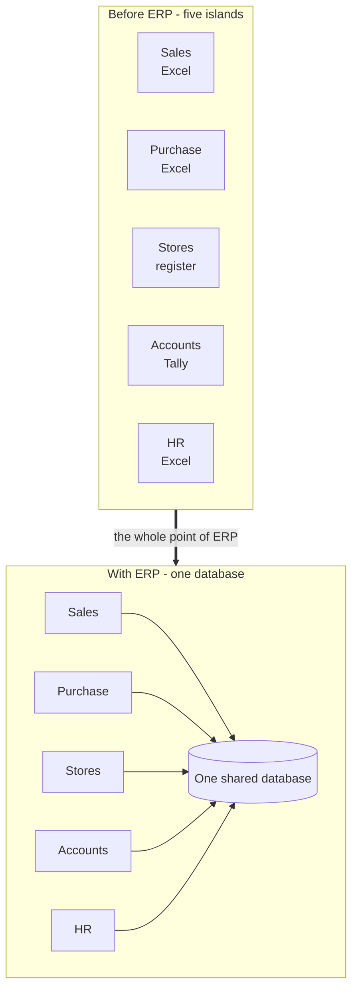

<figcaption>Every ERP benefit is a consequence of one fact: the departments stopped keeping separate copies. Nothing else about ERP is as important as this.</figcaption>
</figure>

**Your web-dev anchor.** You have built sites where the contact form wrote to one table, the shop to another, and analytics to a third service — then spent a day reconciling them. ERP is that problem solved at company scale, by refusing to have a second copy in the first place. **One database, many screens** is the whole idea.

<p class="te"><strong>Telugu:</strong> ERP raakamundu Vayu Fans lo: sales ki stock enta undo teliyadu, purchase ki already vachina motors gurinchi teliyadu, accounts ki aa invoice nijamena kaada telusukovadaniki dari ledu, owner ki profit teliyadaniki 4 rojulu. <strong>Ee samasyalu anni okate karanam valla</strong> — prathi department <strong>tana sonta file</strong> lo raastondi. ERP chesedi okate pani: <strong>aa separate files ni teesesi, andariki okate database</strong> ivvadam. Sales stock chuste adi live — endukante stores ippude update chesindi. ERP lo migilina anni features ee okka vishayam yokka <strong>parinaamam</strong> matrame.</p>

---

## A2. The seven end-to-end processes every ERP runs

**Simple definition:** An **end-to-end process** is one complete business story from trigger to money — for example, *"a customer wants fans" all the way to "the cash is in our bank"*. SAP people name these with abbreviations, use them constantly in meetings and interviews, and rarely stop to explain them. Here they all are.

<p class="te"><strong>Telugu:</strong> <strong>End-to-end process</strong> ante oka <strong>poorti business katha</strong> — modata trigger nunchi chivari lo dabbu varaku. Udaharana: "customer ki fans kavali" nunchi "maa bank lo dabbu padindi" varaku. SAP lo veetini <strong>short forms</strong> tho pilustaru (O2C, P2P laaga), meetings lo mariyu interviews lo eppudu ee maatale vaadutaru, kani <strong>evaru vivarincharu</strong>. Ivi anni ikkada unnai.</p>

| Short form | Full name | The story in one line | Vayu Fans example | Modules |
|---|---|---|---|---|
| **P2P** | **Procure to Pay** | We need something → we buy it → we pay for it | Buying 500 motors from Sundaram Motors | MM → FI |
| **S2P** | Source to Pay | P2P **plus** finding and negotiating with the supplier first | Running an RFQ to three motor suppliers, then P2P | MM, Ariba |
| **O2C** | **Order to Cash** | A customer orders → we ship → we bill → cash arrives | Balaji Electricals orders 200 fans | SD → MM → FI |
| **Q2C** | Quote to Cash | O2C **plus** the enquiry and quotation stage before the order | Balaji asks for a price, we quote, they order | SD |
| **P2P** ² | **Plan to Produce** | Forecast demand → plan → make the product → put it in stock | Making 1,000 fans for the festival season | PP → MM |
| **R2R** | **Record to Report** | Every posting → month-end close → financial statements | Vayu's monthly P&L and balance sheet | FI, CO |
| **H2R** | Hire to Retire | Job opening → hire → pay → promote → exit | Hiring a shift supervisor | HCM, SuccessFactors |
| **A2R** | Acquire to Retire | Buy an asset → depreciate it → dispose of it | The ₹40 lakh stamping machine | FI-AA |

<p class="warn"><strong>The one that trips everybody up:</strong> <strong>P2P means two different things</strong> depending on the room. In a purchasing meeting it is <strong>Procure to Pay</strong>. In a manufacturing meeting it is <strong>Plan to Produce</strong>. Listen for the context, and when you use it yourself, say the full words the first time.</p>

**The three that matter for you, in order of interview frequency:**

1. **O2C** — asked in almost every SAP interview. Learn it cold. Part D.
2. **P2P (Procure to Pay)** — the second most asked. Part C.
3. **Plan to Produce** — asked if the customer manufactures anything. Part E.

R2R, H2R and A2R you only need to *recognise* as a fresher. If someone says "we are automating R2R", you should think "month-end financial close", nod, and move on.

<p class="doc"><strong>Say this in an interview and you will sound three years older:</strong> "The two flows I know end to end are Order-to-Cash and Procure-to-Pay. In O2C the documents chain sales order → delivery → goods issue → billing → incoming payment, and each step posts into FI automatically. In P2P it is purchase requisition → PO → goods receipt → invoice verification → payment, and the invoice is checked by a three-way match." Both sentences are in Parts C and D.</p>

---

## A3. SAP vs WordPress — licensing, and what you are allowed to change

**Simple definition:** You asked whether SAP works like WordPress — take the default folder and build what the client needs. **The building part is similar. The ownership part is the opposite.** WordPress is free and open-source; you may read, change, fork and redistribute it. SAP is proprietary and paid; you may **read** most of its source code, but you may not change it freely, and doing so costs you your upgrade support.

<p class="te"><strong>Telugu:</strong> Nuvvu adigina prashna: "WordPress laaga SAP kuda default folder teesukuni, client kosam kavalasindi build cheyyadama?" — <strong>build chese vidhaanam konta varaku okate, kani yajamanyam (ownership) poorti ga vyathireka.</strong> WordPress <strong>free mariyu open-source</strong> — code chadavachu, marchavachu, copy teesi vere chota pettochu. SAP <strong>paid mariyu proprietary</strong> — code <strong>chadavachu</strong> (idi chala unusual), kani <strong>ishtam vachinatlu marchalemu</strong>, marchithe upgrade support poddi.</p>

**The licensing comparison, straight:**

| | WordPress | SAP |
|---|---|---|
| Cost of the software | **Free** (GPL) | **Paid licence**, often crores for a mid-size company |
| Can you read the source? | Yes, all of it | **Yes, almost all ABAP source** in SE38/SE80 — genuinely unusual for paid software |
| Can you change the source? | Yes, freely | **No.** Changing an SAP object needs an **SSCR access key** and is called a *modification* |
| Can you copy it to another server? | Yes | No — licensed per system, per user |
| Who you pay | Hosting, plugins, themes | Licence + ~**22% annual maintenance**, or a cloud subscription |
| Priced by | Nothing | **Named users** (Professional / Limited / Employee / Developer) + engine metrics + **Digital Access** for documents created by non-SAP systems |
| Cloud version | wordpress.com | **RISE with SAP** (private cloud) and **GROW with SAP** (public cloud), per user per month |

**Now your second question, which is the more important one:** *"I have to change or override the default things, right?"*

In WordPress, "customising" almost always means **writing code** — a child theme, a hook, a custom plugin. In SAP, most customising means **no code at all**. This is the single biggest difference in how the two jobs feel.

<figure class="fig">

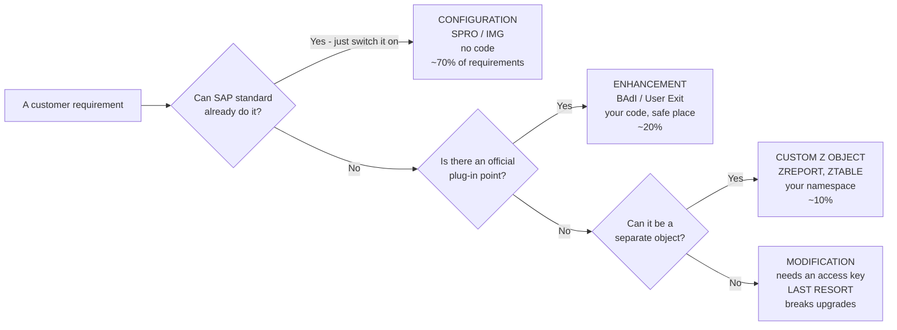

<figcaption>The decision every SAP team makes for every requirement. In WordPress the first box barely exists — you go straight to writing code. In SAP, roughly seven out of ten requirements never reach a developer at all.</figcaption>
</figure>

| | WordPress way | SAP way |
|---|---|---|
| "Change the invoice number format" | Write a filter in `functions.php` | **Configuration** — a number range in SPRO. No code |
| "Add a field to the order screen" | Edit the template | **Configuration or an append structure** — often no code |
| "Block orders above a credit limit" | Write a hook | **Configuration** — credit management settings in SPRO |
| "Print our own invoice layout" | Build a PDF template | **Development** — a Smart Form / Adobe Form. *Now* they call you |
| "Send a nightly file to the bank" | Write a cron script | **Development** — an interface program. Your job |

<p class="warn"><strong>The mindset shift to make now, because it changes how you listen in class.</strong> When a business user describes a requirement, the first SAP question is never "how do I code this?" It is <strong>"does standard SAP already do this, and has someone just not configured it?"</strong> A developer who writes a Z-program for something SPRO already handles has cost the customer money and created a maintenance liability. Your value goes up when you know what <em>not</em> to build.</p>

<p class="te"><strong>Telugu:</strong> Idi chala mukhyamaina tedaa. WordPress lo "customise cheyyadam" ante deadaapu eppudu <strong>code rayadam</strong> — child theme, hook, plugin. SAP lo matram chala varaku <strong>code ye avasaram ledu</strong>. Oka requirement vaste, SAP team ilaa aalochistundi: (1) <strong>SAP standard lo already unda?</strong> — unte SPRO lo <strong>config</strong> chesthe chalu, code avasaram ledu. Idi deadaapu <strong>70%</strong>. (2) Lekapothe, SAP ichina <strong>plug-in point (BAdI)</strong> unda? — akkada nee code rayochu, ~20%. (3) Lekapothe <strong>Z object</strong> ga vere ga rayochu, ~10%. (4) Chivari daari — SAP object ne marchadam (modification) — <strong>idi cheyyakudadu</strong>.<br/><strong>Gurthu pettuko:</strong> mancha ABAP developer ante ekkuva code rasevadu kaadu — <strong>edi rayakkarledo telisinavadu</strong>.</p>

---
## A4. The modules — Vayu Fans' departments, in SAP names

**Simple definition:** A **module** is SAP's name for **one department's part of the system**. It is not a separate program or a separate login — it is a group of transactions and tables that serve the same business area, all inside the same system (you saw this in Doubts A7). Learning the module names is really learning **which department owns which document**.

<p class="te"><strong>Telugu:</strong> <strong>Module</strong> ante SAP lo <strong>okka department ki sambandhinchina bhagam</strong>. Adi veru program kaadu, veru login kaadu — <strong>ide system lo</strong>, okate business area ki sambandhinchina T-codes mariyu tables kalipi "module" antaru. Module perlu nerchukovadam ante nijaniki <strong>ye document ki ye department yajamani</strong> ani nerchukovadam.</p>

**Vayu Fans' real departments, and what SAP calls them:**

| Vayu Fans department | SAP module | Full name | Owns these documents | Will you touch it? |
|---|---|---|---|---|
| Accounts | **FI** | Financial Accounting | Journal entries, customer/vendor invoices, payments, balance sheet | **Yes — constantly.** Every flow ends in FI |
| Costing / management | **CO** | Controlling | Cost centres, internal orders, product cost, profitability | Sometimes |
| Purchase | **MM** | Materials Management | Purchase requisition, PO, goods receipt, stock, material master | **Yes — a lot** |
| Sales & marketing | **SD** | Sales & Distribution | Inquiry, quotation, sales order, delivery, invoice | **Yes — a lot** |
| Factory / production | **PP** | Production Planning | BOM, routing, MRP, production order | Sometimes |
| Quality lab | **QM** | Quality Management | Inspection lots, quality certificates | Rarely |
| Maintenance | **PM** / EAM | Plant Maintenance | Equipment, maintenance orders, breakdowns | Rarely |
| Stores / warehouse | **WM / EWM** | Warehouse Management | Bins, transfer orders, putaway, picking | Sometimes |
| HR / payroll | **HCM** (or **SuccessFactors**) | Human Capital Management | Employee master, payroll, leave, appraisals | Rarely — usually a separate team |
| Projects (if any) | **PS** | Project System | WBS elements, project costs | Rarely |

**Two things about this list that beginners get wrong.**

**First — "procurement" is not a module name.** *Procurement* is the **business word** for buying. The **module** that does it is **MM (Materials Management)**, and the **process** is **P2P (Procure to Pay)**. Three words for the neighbourhood of one idea, and people switch between them mid-sentence. In S/4HANA SAP also brands the area as **Sourcing and Procurement** in the Fiori app library, and the cloud product for strategic sourcing is **Ariba**.

**Second — HR mostly left the building.** Classic **HCM** still exists inside ECC and S/4HANA (the infotype tables `PA0001`, `PA0002` and so on), but SAP's strategic HR product is **SuccessFactors**, a *separate cloud application* with its own login. Same for procurement sourcing (**Ariba**) and travel expenses (**Concur**). So when a project says "HR", ask which one they mean.

<figure class="fig">

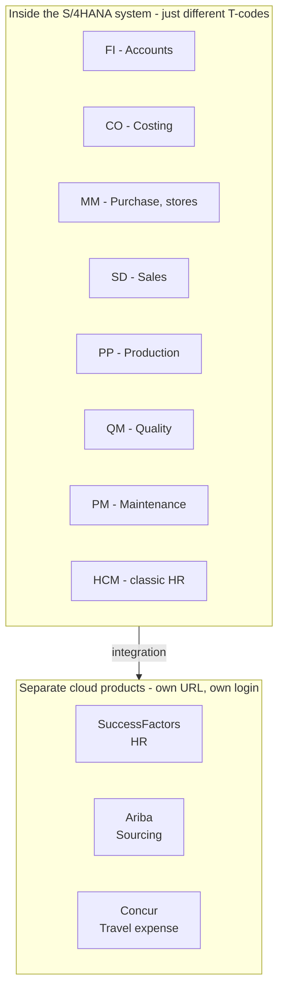

<figcaption>The classic modules are neighbourhoods in one city. SuccessFactors, Ariba and Concur are different cities connected by road.</figcaption>
</figure>

**How the modules actually meet.** This is the part interviewers test, and it is easier than it sounds — the modules meet **at the moment a document posts**. When Stores issues 200 fans (MM), the stock value drops, so **FI** must post the accounting entry in the same second. Nobody types that FI entry. Configuration decided which G/L account to hit, and SAP posted it automatically.

<p class="te"><strong>Telugu:</strong> Modules <strong>ekkada kalustayi?</strong> — <strong>document post ayye kshanam lo.</strong> Udaharana: stores 200 fans issue chesindi (MM). Aa kshanam lo stock value taggindi, kabatti <strong>FI lo accounting entry padali</strong>. Aa entry ni <strong>evaru type cheyyaru</strong> — SPRO config lo "ee movement ki ee G/L account" ani mundu ne cheppi unchutaru, SAP <strong>automatic ga</strong> post chestundi. Idi ne "integration" antaru, mariyu interview lo idi kachitanga adugutaru.</p>

<p class="doc"><strong>What to actually do with this table.</strong> Do not memorise all ten. Memorise <strong>four</strong> — <strong>MM, SD, FI, PP</strong> — because Vayu Fans' whole story runs through those, and so does 80% of ABAP work. Recognise the rest when someone says them.</p>

---

# Part B — Putting Vayu Fans Inside SAP

## B1. The organisational structure — client, company code, plant, storage location

**Simple definition:** Before Vayu Fans can create a single purchase order, someone must **describe the company to SAP**: how many legal entities, how many factories, how many warehouses, which sales teams. These descriptions are the **organisational structure**, and every document you ever create must say which parts of it it belongs to.

<p class="te"><strong>Telugu:</strong> Vayu Fans okka purchase order kuda create cheyyalante, daanikante mundu <strong>SAP ki aa company gurinchi cheppali</strong> — enni legal companies unnai, enni factories, enni godowns, enni sales teams. Deenne <strong>organisational structure</strong> antaru. Taruvata nuvvu create chese <strong>prathi document</strong> "nenu ee company code, ee plant ki chendinavaadini" ani cheppali. Idi lekapothe SAP lo emi cheyyalemu.</p>

**Vayu Fans, described to SAP.** These are the actual numbers we will use for the rest of the document:

| Level | SAP name | Field | Vayu Fans value | What it means in real life |
|---|---|---|---|---|
| 1 | **Client** | `MANDT` | `100` | The whole SAP system for Vayu Fans. Top of everything |
| 2 | **Company Code** | `BUKRS` | `1000` — Vayu Fans Pvt Ltd, INR | **The legal entity that files a balance sheet.** The most important org unit in SAP |
| 3 | **Plant** | `WERKS` | `1000` — Hyderabad Factory<br/>`1100` — Chennai Depot | A place where you make or store goods |
| 4 | **Storage Location** | `LGORT` | `RM01` raw material<br/>`FG01` finished goods | A specific store inside a plant |
| — | **Purchasing Org** | `EKORG` | `1000` | The team that negotiates with vendors |
| — | **Purchasing Group** | `EKGRP` | `P01` | The individual buyer or buying desk |
| — | **Sales Organisation** | `VKORG` | `1000` | The unit legally responsible for selling |
| — | **Distribution Channel** | `VTWEG` | `10` Dealer · `20` Factory outlet | *How* you sell to that customer |
| — | **Division** | `SPART` | `00` Fans | *What* product line |
| — | **Shipping Point** | `VSTEL` | `1000` | The gate the truck leaves from |
| — | **Controlling Area** | `KOKRS` | `1000` | The scope for cost and profit reporting (CO) |

<figure class="fig">

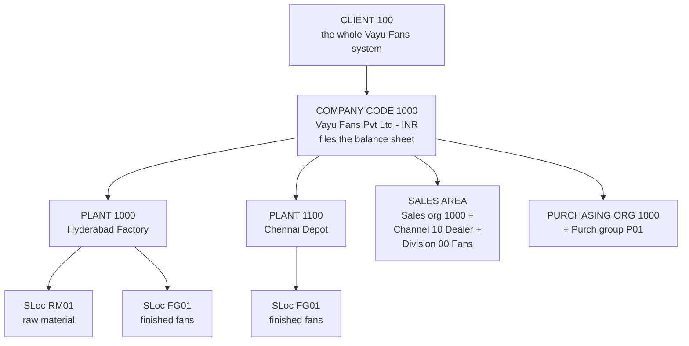

<figcaption>Vayu Fans described to SAP. Every document created later must name a point on this tree — a purchase order needs a plant and a purchasing org; a sales order needs a sales area.</figcaption>
</figure>

**The three you must never confuse:**

| | **Client** | **Company Code** | **Plant** |
|---|---|---|---|
| Question it answers | *Whose system is this?* | *Which legal company owns this money?* | *Where are the goods?* |
| Field | `MANDT` | `BUKRS` | `WERKS` |
| Table | — | `T001` | `T001W` |
| Vayu value | `100` | `1000` | `1000`, `1100` |
| Governs | Data separation (Doubts A5) | **Finance.** Balance sheet, currency | **Logistics.** Stock, production, MRP |
| Analogy | The tenant in a SaaS app | The company on the invoice letterhead | The warehouse address |

<p class="te"><strong>Telugu:</strong> Ee moodintini eppudu kalapaku:<br/>— <strong>Client (100)</strong> = "idi evari system?" Data separation kosam.<br/>— <strong>Company Code (1000)</strong> = "ee dabbu ye legal company di?" <strong>Balance sheet ee level lo ne</strong> vastundi. SAP lo <strong>ati mukhyamaina</strong> org unit idi.<br/>— <strong>Plant (1000)</strong> = "samanu ekkada undi?" Stock, production, MRP anni ee level lo.<br/>Vayu Fans ki: Hyderabad factory = plant 1000, Chennai depot = plant 1100. Rendu <strong>okate company code 1000</strong> kindaki vastai, endukante rendu okate legal company vi.</p>

<p class="warn"><strong>Why this is the reason half of all SAP errors happen.</strong> "Material 100234 not maintained in plant 1100" is the single most common beginner error message in SAP. It means: the fan exists in the system (client level), but nobody told SAP that the <strong>Chennai depot</strong> stocks it. The material master is not one record — it is a record <strong>per organisational level</strong>. That is exactly what F2 explains, and it is why MARA, MARC and MARD are three different tables.</p>

---

## B2. What actually happens when a company adopts SAP

**Simple definition:** Vayu Fans does not "install SAP and start using it". It runs an **implementation project** — typically six to eighteen months, run in phases, where consultants map the company's real processes onto SAP's standard ones, configure the system, load the data, test it, and go live on a chosen date.

<p class="te"><strong>Telugu:</strong> Vayu Fans "SAP install chesi vaadatam start chestundi" ani anukovaddu. Adi oka <strong>implementation project</strong> — deadaapu <strong>6 nunchi 18 nelalu</strong>. Andulo consultants: company nijam ga ela pani chestundo telusukuni, danini SAP standard tho match chesi, config chesi, purathana data ni ekkinchi, test chesi, oka rojuna <strong>go-live</strong> chestaru.</p>

**SAP's own method is called SAP Activate. Six phases:**

| Phase | What happens at Vayu Fans | Who is busy |
|---|---|---|
| **Discover** | Vayu evaluates SAP, sees a demo, decides to buy | Management, sales |
| **Prepare** | Project team formed, systems provisioned (DEV/QAS/PRD), plan agreed | Basis, project manager |
| **Explore** | **Fit-to-standard workshops.** "Show us how SAP handles a dealer order." Gaps are written down | **Functional consultants** + Vayu's department heads |
| **Realize** | Configuration built in DEV, gaps developed as RICEF objects, data migrated, tested | Functional **and technical** — **you are here** |
| **Deploy** | Cutover: final data load, users trained, go-live weekend | Everyone |
| **Run** | **Hypercare** (4–8 weeks of intensive support), then normal support | Support team |

**The single most important idea in that table is fit-to-standard.** The consultant does *not* ask "how do you work today, and I will build that". They show SAP's standard process and ask "can you work this way?" Every "no" becomes a **gap**, and gaps cost money. A gap that survives becomes a **Functional Specification** — and that document lands on your desk.

<figure class="fig">

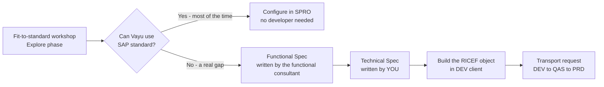

<figcaption>How work reaches an ABAP developer. You almost never receive a requirement directly from the business — it arrives as a Functional Specification after a gap was agreed and priced.</figcaption>
</figure>

**The three-system landscape, which is your "staging vs live", formalised:**

| System | SAP name | What you do there | Your web equivalent |
|---|---|---|---|
| **DEV** | Development | Write code, configure. Client 100 | Local + staging |
| **QAS** | Quality Assurance | Testing by users. Nobody codes here | Staging / UAT |
| **PRD** | Production | The real business runs here. **No development ever** | Live |

Code moves DEV → QAS → PRD only inside a **transport request** — a numbered package (like `S4DK900123`) released by you and imported by Basis. There is no other route. You cannot edit a program in PRD, and you would not want to.

<p class="te"><strong>Telugu:</strong> Nee web work lo "local → staging → live" undi kada — SAP lo adi <strong>DEV → QAS → PRD</strong>. <strong>DEV</strong> lo ne code raastavu. <strong>QAS</strong> lo users test chestaru. <strong>PRD</strong> lo nijamaina business nadustundi — akkada <strong>eppudu code rayakudadu, edit cheyyakudadu</strong>. Code okka system nunchi inkoti ki vellalante <strong>transport request</strong> (udaharana `S4DK900123`) ane number unna package lo ne vellali. Nuvvu release chestavu, Basis team import chestundi. <strong>Vere daari ledu</strong> — mariyu adi manchidi.</p>

---

## B3. Functional vs Technical — who does what

**Simple definition:** SAP work splits into two career tracks. A **Functional consultant** knows a business area (SD, MM, FI) and configures SAP without writing code. A **Technical consultant** — that is you, an ABAP developer — writes the code for the gaps that configuration cannot close. **Techno-functional** means someone who can do both, and it is the most valuable and best-paid profile.

<p class="te"><strong>Telugu:</strong> SAP lo <strong>rendu career tracks</strong> unnai. <strong>Functional consultant</strong> — business telusu (SD, MM, FI), SPRO lo <strong>config chestadu, code rayadu</strong>. <strong>Technical consultant</strong> — ante <strong>nuvvu, ABAP developer</strong> — config tho pani kani chota <strong>code raastavu</strong>. Rendu telisina vaadini <strong>techno-functional</strong> antaru — vaallake <strong>ekkuva jeetam</strong>, endukante vaallu business bhaasha, code bhaasha rendu matladagalaru.</p>

| | **Functional consultant** | **Technical consultant (you)** |
|---|---|---|
| Knows | The business process — how sales/purchase/finance work | ABAP, CDS, RAP, OData, Fiori |
| Main tool | **SPRO** (the IMG) | **SE80 / SE38 / Eclipse ADT** |
| Writes | The **Functional Specification (FS)** | The **Technical Specification (TS)** and the code |
| Typical day | Workshops, configuration, testing, explaining SAP to users | Reading an FS, building a report/interface/form, debugging |
| Typical job title | SAP SD Consultant, SAP MM Consultant, SAP FICO Consultant | SAP ABAP Developer, SAP Technical Consultant |
| Fresher salary band (India, 2026) | Comparable | Comparable |
| Path upward | Solution Architect, Process Lead | Technical Architect, then RAP/BTP/Fiori specialist |

**Here is the part that matters for your confusion in class.** You are on the **technical** track — so why does this document spend twenty pages on sales orders and goods receipts?

Because a Technical Specification reads like this:

<p class="doc"><strong>FS-2026-041:</strong> "For sales orders of order type <strong>OR</strong> in sales area <strong>1000/10/00</strong> where the delivering plant is <strong>1100</strong>, print a dealer-specific packing list at the time of <strong>PGI</strong>, showing the material, batch and carton count from the delivery, and the dealer's PO reference from <strong>VBKD-BSTKD</strong>."</p>

If "order type", "sales area", "PGI", "delivery" and "VBKD" are noise to you, **you cannot start this task** — you would have to ask five questions and look junior doing it. If you have read Part D of this document, you can read that spec in fifteen seconds and start.

<p class="te"><strong>Telugu:</strong> Nuvvu <strong>technical</strong> track lo unnavu — appudu ee doc lo sales orders, goods receipts gurinchi enduku itanta? Endukante <strong>nee daggara ki vache pani ee bhaasha lo ne vastundi</strong>. Paina unna FS chudu — andulo "order type", "sales area", "PGI", "VBKD" laanti maatalu unnai. Ivi teliyakapothe <strong>nuvvu aa pani modalu pettalevu</strong>, 5 prashnalu adagali, mariyu junior laaga kanipistavu. Business flow telisthe, <strong>ade spec ni 15 seconds lo chadivi pani modalu pettochu</strong>. <strong>Business knowledge anedi functional vaalla kosam matrame kaadu — nee vegam adi.</strong></p>

---

## B4. The three kinds of data — master, transaction, configuration

**Simple definition:** Every row in an SAP system is one of three things. **Master data** = the stable nouns (a material, a customer, a vendor). **Transaction data** = the events (a purchase order, a delivery, a payment). **Configuration data** = the rules the company set once (which G/L account, which number range, which document type). Knowing which kind you are looking at tells you who owns it and how it gets there.

<p class="te"><strong>Telugu:</strong> SAP lo prathi row ee moodintlo okati:<br/>— <strong>Master data</strong> = <strong>sthiramaina "nouns"</strong> — fan, dealer, vendor, employee. Oksari create chesthe chala kaalam untundi.<br/>— <strong>Transaction data</strong> = <strong>jarigina "events"</strong> — purchase order, delivery, invoice, payment. Rojuvari puduthai.<br/>— <strong>Configuration data</strong> = company <strong>oksari pettina rules</strong> — ye G/L account, ye number range, ye document type. Idi consultant SPRO lo pedataadu.</p>

| | **Master data** | **Transaction data** | **Configuration data** |
|---|---|---|---|
| What it is | The nouns | The events | The rules |
| Vayu example | Fan `FAN-CEIL-1200`, dealer Balaji Electricals, vendor Sundaram Motors | Sales order 5000123, PO 4500456, invoice 9000789 | "Order type OR posts to G/L 400000" |
| Created by | A data team / department user | A business user, every day | A **functional consultant**, once |
| Created with | `MM01` material, `BP` customer/vendor | `VA01`, `ME21N`, `MIGO` | **`SPRO`** |
| Tables | `MARA`, `MARC`, `KNA1`, `LFA1`, `BUT000` | `VBAK`, `EKKO`, `ACDOCA`, `MATDOC` | `T001`, `T001W`, `TVAK`, `T156` |
| Volume | Thousands | Millions | Hundreds |
| Moves between systems by | **Data migration / manual entry** | Never moved — created fresh | **Transport request** (like code) |
| Your web analogy | The `products` and `customers` tables | The `orders` table | Values in `wp_options` / a config file |

**The rule that explains a lot of SAP behaviour:** *transaction data always references master data, and configuration decides what happens when it does.* A sales order (transaction) points at a material and a customer (master), and configuration for that order type decides which G/L account the revenue lands in.

<p class="warn"><strong>This is why "master data is 80% of a clean SAP system" is a real saying.</strong> If the fan's material master has the wrong unit of measure, every order, delivery, invoice and stock figure that touches it is wrong — thousands of documents, silently. Bad transaction data is one wrong document. <strong>Bad master data is a wrong company.</strong></p>

<p class="doc"><strong>Notice the third row from the bottom.</strong> Configuration moves between systems in a <strong>transport request</strong> — the same mechanism as your code. That surprises most developers. It means a functional consultant "releases a transport" exactly like you do, and a go-live is code <em>and</em> config arriving in PRD together.</p>

---
# Part C — Buying: Procure-to-Pay

## C1. The chain, and the first three documents

**Simple definition:** **Procure-to-Pay (P2P)** is the complete story of buying something: somebody needs it → we ask suppliers for prices → we place a formal order → the goods arrive → the supplier's bill is checked → we pay. Six documents, each one referencing the one before it.

<p class="te"><strong>Telugu:</strong> <strong>Procure-to-Pay (P2P)</strong> ante <strong>konugolu yokka poorti katha</strong>: evarikaina emaina kavali → suppliers ni price adagatam → official order ivvadam → samanu raavadam → supplier bill sari chudadam → dabbu ivvadam. <strong>Aaru documents</strong>, prathi okati daani mundu dani <strong>reference chestundi</strong>. Idi ne SAP lo integration.</p>

**The full chain at Vayu Fans.** Production needs 500 motors to build fans for the festival season:

<figure class="fig">

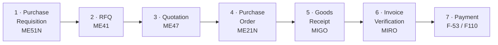

<figcaption>P2P at Vayu Fans. Steps 2 and 3 are optional — for a routine repeat purchase, most companies go straight from requisition to purchase order.</figcaption>
</figure>

**Document 1 — Purchase Requisition (PR).** An **internal request**: "we need 500 motors". It is not an order and the supplier never sees it. It can be raised by a person or generated automatically by the **MRP run** (Part E).

| | Detail |
|---|---|
| T-code | `ME51N` create · `ME52N` change · `ME53N` display |
| Table | `EBAN` (one row per item) |
| Key field | `BANFN` — requisition number, e.g. `10000234` |
| Vayu example | Production raises PR `10000234`: 500 × `MOTOR-48W`, needed 15 Sep, plant `1000` |
| Web analogy | An internal ticket: "please buy this" |

**Document 2 — RFQ (Request for Quotation).** Purchase sends the *same* request to several suppliers asking for their price and delivery date. **RFQ is the question**; the reply is the quotation.

| | Detail |
|---|---|
| T-code | `ME41` create · `ME47` enter the supplier's reply · `ME49` price comparison |
| Table | `EKKO` header / `EKPO` item — **the same tables as a purchase order**, distinguished by document category |
| Vayu example | RFQ sent to Sundaram Motors, Kirloskar and Ashok Electricals |

**Document 3 — Quotation.** The supplier's **answer**: price, delivery date, terms. In SAP you record each supplier's reply against its RFQ, then run `ME49` to compare them side by side and pick a winner.

<p class="warn"><strong>Terminology you asked about, corrected.</strong> You wrote "quotation req" as one thing. It is actually <strong>three separate documents</strong>: a <strong>Purchase Requisition</strong> is <em>our internal</em> "we need this"; an <strong>RFQ</strong> is <em>our question to a supplier</em> "what is your price?"; a <strong>Quotation</strong> is <em>their answer</em>. And confusingly, in <strong>sales</strong> (Part D) "quotation" means the opposite direction — <em>our</em> price offer to a customer.</p>

**Document 4 — Purchase Order (PO).** The **legally binding order** sent to the chosen supplier. This is the central document of P2P and the one you will meet most often.

| | Detail |
|---|---|
| T-code | `ME21N` create · `ME22N` change · `ME23N` display |
| Tables | `EKKO` **header** (vendor, date, currency, purchasing org) · `EKPO` **items** (material, quantity, price, plant) · `EKET` schedule lines (delivery dates) · `EKBE` **PO history** (what has been received and invoiced) |
| Key field | `EBELN` PO number, e.g. `4500000456`; `EBELP` item number `00010` |
| Vayu example | PO `4500000456` to vendor Sundaram Motors: 500 × `MOTOR-48W` @ ₹840, deliver to plant `1000`, storage location `RM01`, on 15 Sep |
| Web analogy | The confirmed order record after checkout — the point where a promise becomes a commitment |

<p class="te"><strong>Telugu:</strong> Modati moodu documents:<br/><strong>1. Purchase Requisition (PR) — `ME51N`, table `EBAN`.</strong> Idi <strong>lopali request</strong>: "maaku 500 motors kavali". Idi order kaadu, supplier ki velladu.<br/><strong>2. RFQ — `ME41`.</strong> Idi <strong>manam suppliers ni adige prashna</strong>: "mee price enta?"<br/><strong>3. Quotation — `ME47`.</strong> Idi <strong>supplier ichhe jawab</strong>. `ME49` tho anni quotations compare chesi okarini enchukuntam.<br/><strong>4. Purchase Order (PO) — `ME21N`, tables `EKKO` (header) + `EKPO` (items).</strong> Idi <strong>official order</strong>, supplier ki velutundi, legal ga bind avutundi. P2P lo <strong>ati mukhyamaina document idi.</strong></p>

---

## C2. Goods receipt, invoice verification and the three-way match

**Simple definition:** The last three steps are where money actually moves. **Goods Receipt** records that the truck arrived and increases stock. **Invoice Verification** checks the supplier's bill against the order and the receipt. **Payment** sends the money. The check in the middle — the **three-way match** — is the single most important control in P2P, and interviewers ask about it by name.

<p class="te"><strong>Telugu:</strong> Chivari moodu steps lo ne <strong>nijam ga dabbu kadulutundi</strong>. <strong>Goods Receipt</strong> = truck vachindi ani record chesi <strong>stock penchadam</strong>. <strong>Invoice Verification</strong> = supplier pampina bill ni order tho, vachina samanu tho <strong>sari chudadam</strong>. <strong>Payment</strong> = dabbu ivvadam. Madhyalo unna check ni <strong>three-way match</strong> antaru — P2P lo <strong>ati mukhyamaina control</strong> idi, mariyu interview lo peru tho ne adugutaru.</p>

**Document 5 — Goods Receipt (GR).** The truck arrives at the Hyderabad factory gate with 500 motors. Stores records it.

| | Detail |
|---|---|
| T-code | `MIGO` (movement type **101** = goods receipt against a PO) |
| Tables | **S/4HANA: `MATDOC`.** ECC: `MKPF` header + `MSEG` items |
| What it does | Stock of `MOTOR-48W` in plant `1000`, SLoc `RM01` goes **up by 500**. `EKBE` (PO history) records the receipt |
| **And in FI** | An accounting document posts automatically: **Stock account debit ₹4,20,000 / GR-IR clearing account credit ₹4,20,000** |

**That FI posting is the module integration from A4, made concrete.** Nobody in Accounts typed it. Configuration decided the accounts; MM triggered it; FI recorded it — in the same second, from one MIGO screen.

**Document 6 — Invoice Verification (IV).** Sundaram Motors' bill arrives for ₹4,20,000. Accounts enters it in `MIRO`, referencing the PO.

| | Detail |
|---|---|
| T-code | `MIRO` |
| Tables | `RBKP` header · `RSEG` items |
| **And in FI** | **GR-IR clearing debit ₹4,20,000 / Vendor (accounts payable) credit ₹4,20,000** |

**The three-way match, which is the whole point:**

<figure class="fig">

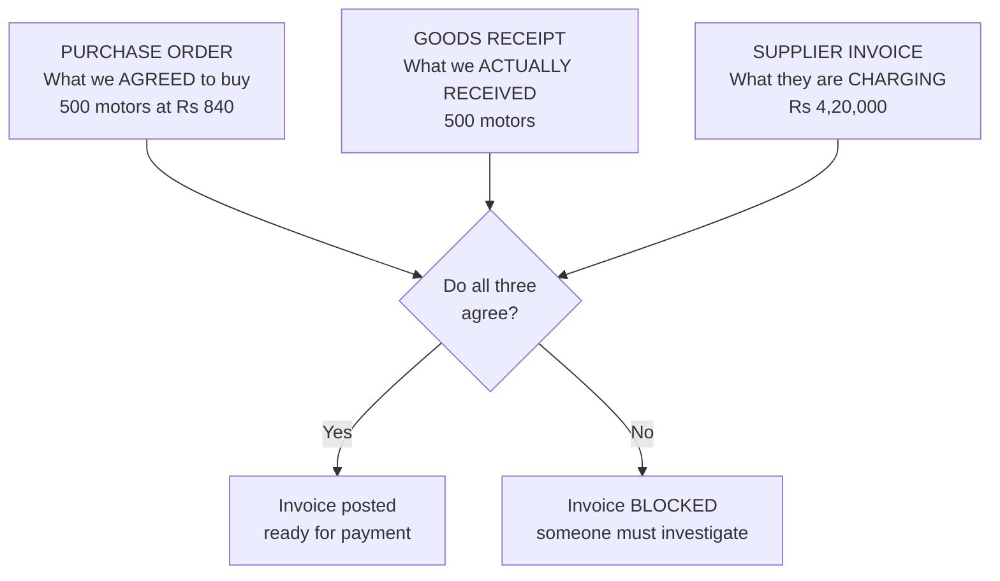

<figcaption>The three-way match. If the supplier billed for 500 but only 480 arrived, SAP blocks the invoice automatically. This is the control that stops a company paying for goods it never received.</figcaption>
</figure>

**Document 7 — Payment.** Accounts pays the vendor and the payable clears.

| | Detail |
|---|---|
| T-code | `F-53` manual payment · **`F110`** the automatic payment run (used in practice) |
| Tables | `BKPF` header + `BSEG` items in ECC · **`ACDOCA`** in S/4HANA |
| **In FI** | **Vendor debit ₹4,20,000 / Bank credit ₹4,20,000.** The payable is gone; cash is down |

**The whole P2P money story, in one table.** This is worth reading twice — it is how every SAP person thinks about the flow:

| Step | Stock | Accounting entry | Net effect |
|---|---|---|---|
| PO created | no change | **none** — a PO is only a commitment | Nothing has happened financially |
| Goods receipt | **+500 motors** | Stock Dr / GR-IR Cr | We own goods; we owe *something* |
| Invoice verified | no change | GR-IR Dr / Vendor Cr | We owe *Sundaram Motors* specifically |
| Payment | no change | Vendor Dr / Bank Cr | Debt cleared, cash gone |

<p class="te"><strong>Telugu:</strong> <strong>5. Goods Receipt — `MIGO`, movement type 101.</strong> Truck vachindi. Stock <strong>500 penchutundi</strong>. Table: S/4HANA lo <strong>`MATDOC`</strong> (ECC lo `MKPF`/`MSEG`). Ade kshanam lo <strong>FI lo entry automatic ga</strong> padutundi.<br/><strong>6. Invoice Verification — `MIRO`, tables `RBKP`/`RSEG`.</strong> Supplier bill ni <strong>PO tho, GR tho compare</strong> chestundi. Ee moodu match ayithe ne invoice post avutundi — deenne <strong>three-way match</strong> antaru. 500 ki bill vesi 480 ne vasthe, SAP invoice ni <strong>block chestundi</strong>.<br/><strong>7. Payment — `F110`.</strong> Dabbu velli, vendor ki manam ichhe baaki teerutundi.<br/><strong>Mukhyamaina vishayam:</strong> PO create chesinappudu <strong>accounting entry padadu</strong> — adi kevalam oka promise. Nijamaina entry <strong>goods receipt daggara</strong> modalavutundi.</p>

---

## C3. What you build as an ABAP developer in P2P

**Simple definition:** Standard SAP already does everything above. Your work sits in the gaps around it — and in P2P those gaps are remarkably predictable. Here is what an ABAP developer at Vayu Fans would actually be asked to build in the first year, mapped onto the **RICEF** categories from your Doubts document.

<p class="te"><strong>Telugu:</strong> Paina cheppina antha <strong>SAP already chestundi</strong>. Nee pani daani <strong>chuttu unna gaps lo</strong> untundi — mariyu P2P lo aa gaps deadaapu <strong>anni companies lo okelaage</strong> untai. Vayu Fans lo modati samvatsaram lo nuvvu build cheyye pani ivi.</p>

| RICEF | Real Vayu Fans task | What you touch |
|---|---|---|
| **R** Report | "Show all POs to Sundaram Motors where goods arrived late" | `SELECT` from `EKKO`, `EKPO`, `EKBE`; ALV grid — or a **CDS view + Fiori list** in S/4HANA |
| **R** Report | "Pending purchase requisitions older than 15 days, by buyer" | `EBAN`, ALV, e-mail as spreadsheet |
| **I** Interface | "Send the day's POs to Sundaram Motors' system as a file every night" | Background job (`SM36`), file or IDoc, `EKKO`/`EKPO` |
| **I** Interface | "Import the bank statement and clear vendor payments automatically" | File read, FI posting via BAPI |
| **C** Conversion | "Load 4,200 old vendor records from Tally into SAP at go-live" | `BP` / vendor creation via **LSMW** or a BAPI-driven Z-program |
| **E** Enhancement | "Block any PO over ₹5 lakh unless the plant head is in the release strategy" | A **BAdI** on PO save — no standard config covers Vayu's rule |
| **E** Enhancement | "Default the storage location to RM01 for all raw-material POs" | A BAdI or a user exit on `ME21N` |
| **F** Form | "Print our own PO layout with the Vayu logo and GST terms" | **Smart Form** or **Adobe Form**, printed from `ME23N` |

**Notice the pattern.** Reports and forms come from *"SAP shows it, but not the way we want"*. Interfaces come from *"another system needs this data"*. Conversions happen **once**, at go-live. Enhancements come from *"our company has a rule SAP does not know about"*.

<p class="doc"><strong>The most useful thing on this page for your practice slot.</strong> Pick the very first row and build it. Open <code>SE16N</code>, look at <code>EKKO</code> and <code>EKPO</code>, find how they join (<code>EBELN</code>), then write a small report in <code>SE38</code> that selects POs for one vendor. That single exercise touches a business process, two real tables, a join, and an ALV — and it is a genuine, if small, portfolio item.</p>

---

# Part D — Selling: Order-to-Cash

## D1. The chain, and the first three documents

**Simple definition:** **Order-to-Cash (O2C)** is the mirror image of P2P: a customer wants something → we quote a price → they order → we ship → we bill → they pay. It is the most-asked flow in SAP interviews, so of everything in this document, learn this one best.

<p class="te"><strong>Telugu:</strong> <strong>Order-to-Cash (O2C)</strong> anedi P2P ki <strong>addam (mirror)</strong>: customer ki emaina kavali → manam price cheptam → vaallu order chestaru → manam pampistam → bill vestam → vaallu dabbu istaru. <strong>SAP interviews lo ati ekkuva adige flow idi</strong> — kabatti ee doc lo anni kanna deenne baaga nerchuko.</p>

**The full chain at Vayu Fans.** Dealer Balaji Electricals wants 200 ceiling fans:

<figure class="fig">

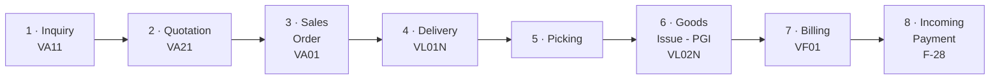

<figcaption>O2C at Vayu Fans. Steps 1 and 2 are optional for a regular dealer who simply phones in an order — most real orders start at step 3.</figcaption>
</figure>

**Document 1 — Inquiry.** The customer asks "do you make a 1200mm fan, and roughly what does it cost?" No commitment either side.

| | Detail |
|---|---|
| T-code | `VA11` create · `VA12` change · `VA13` display |
| Tables | `VBAK` header · `VBAP` items — **the same tables as a sales order** |
| Web analogy | A "request a quote" form submission |

**Document 2 — Quotation.** Vayu's formal price offer, valid until a date. **This is the opposite direction from the P2P quotation in C1** — here *we* are the ones quoting.

| | Detail |
|---|---|
| T-code | `VA21` create · `VA22` change · `VA23` display |
| Tables | `VBAK` / `VBAP` |
| Vayu example | Quotation `20000088`: 200 × `FAN-CEIL-1200` @ ₹1,450, valid 30 days |

**Document 3 — Sales Order.** Balaji accepts. This is **the** central document of O2C — everything downstream references it.

| | Detail |
|---|---|
| T-code | **`VA01`** create · `VA02` change · `VA03` display |
| Tables | `VBAK` **header** (customer, order type, sales area, date) · `VBAP` **items** (material, quantity, plant) · `VBEP` **schedule lines** (confirmed delivery dates) · `VBKD` business data (the dealer's own PO reference) |
| Key field | `VBELN` order number, e.g. `5000000123`; item `POSNR` `000010` |
| Vayu example | Order `5000000123`, order type `OR`, sales area `1000/10/00`, 200 × `FAN-CEIL-1200`, plant `1000`, requested date 12 Sep |

**Three things happen automatically the moment you save a sales order.** Beginners assume these are separate steps; they are not:

| Automatic step | What it does | Where it comes from |
|---|---|---|
| **Availability check (ATP)** | Checks whether 200 fans can be ready by 12 Sep, and confirms a date in `VBEP` | Configuration + live stock |
| **Pricing** | Works out ₹1,450 per fan from the price list, dealer discount and taxes, and stores the result in the condition tables | The **pricing procedure** in config |
| **Credit check** | If Balaji already owes too much, the order is **blocked** for release | Credit management config |

<p class="te"><strong>Telugu:</strong> <strong>1. Inquiry — `VA11`.</strong> Customer "ee fan chestara, entha?" ani adagatam. Emi commitment ledu.<br/><strong>2. Quotation — `VA21`.</strong> Manam ichhe <strong>official price offer</strong>. (P2P lo quotation supplier istadu; ikkada <strong>manam istam</strong> — direction addam.)<br/><strong>3. Sales Order — `VA01`</strong>, tables <strong>`VBAK` (header) + `VBAP` (items)</strong>. Idi O2C lo <strong>gundekaya</strong>. Save chesina kshanam lo <strong>moodu panulu automatic ga</strong> jarugutai: (a) <strong>stock unda ani check</strong> (ATP), (b) <strong>price lekkinchadam</strong> (pricing procedure), (c) <strong>credit check</strong> — dealer already ekkuva baaki unte order <strong>block avutundi</strong>.</p>

---

## D2. Delivery, goods issue, billing and payment

**Simple definition:** The order is a promise. These four steps turn it into goods leaving the gate, a legal invoice, and money in the bank — and each one posts into stock or finance automatically.

<p class="te"><strong>Telugu:</strong> Sales order anedi kevalam <strong>oka mata (promise)</strong>. Ee naalugu steps aa mata ni — <strong>samanu bayataki vellatam, legal invoice, bank lo dabbu</strong> — ga marustai. Prathi step lo stock leda finance lo entry <strong>automatic ga</strong> padutundi.</p>

**Document 4 — Delivery.** Warehouse creates a delivery document against the order: "these 200 fans, from plant 1000, leaving through shipping point 1000".

| | Detail |
|---|---|
| T-code | `VL01N` create · `VL02N` change · `VL03N` display |
| Tables | `LIKP` **header** · `LIPS` **items** |
| Key field | `VBELN` delivery number, e.g. `80000456` |
| Stock effect | Stock is **reserved**, not yet reduced |

**Step 5 — Picking.** Physically taking 200 fans off the shelf and recording the picked quantity. In a plain system this is a field in `VL02N`; with **WM/EWM** it becomes a **transfer order** (`LT03`) telling a worker which bin to go to.

**Document 6 — Post Goods Issue (PGI).** The trigger word you will hear constantly. PGI means **the goods have legally left the company**.

| | Detail |
|---|---|
| T-code | Done inside `VL02N` — the **PGI** button |
| Creates | A **material document** (`MATDOC` in S/4HANA), movement type **601** |
| Stock effect | Finished-goods stock **-200** |
| **And in FI** | **Cost of Goods Sold debit / Inventory credit.** Automatic |

<p class="warn"><strong>PGI is the moment ownership changes,</strong> and it is why "has it been PGI'd?" is a question you will hear every day on a project. Before PGI: the fans are Vayu's stock. After PGI: they are Balaji's goods in transit, Vayu's stock is down, and the cost has hit the P&L. No invoice yet — that is the next step.</p>

**Document 7 — Billing (Invoice).** The legal invoice to the customer.

| | Detail |
|---|---|
| T-code | `VF01` create · `VF02` change · `VF03` display · `VF04` billing due list |
| Tables | `VBRK` **header** · `VBRP` **items** |
| Key field | `VBELN` billing document, e.g. `90000789` |
| **And in FI** | **Customer (accounts receivable) debit ₹2,90,000 / Revenue credit** (plus GST) |

**Document 8 — Incoming Payment.** Balaji pays. The receivable clears.

| | Detail |
|---|---|
| T-code | `F-28` manual · or automatic clearing from a bank statement |
| Tables | `BKPF`/`BSEG` in ECC · **`ACDOCA`** in S/4HANA |
| **In FI** | **Bank debit / Customer credit.** The receivable is gone; cash is up |

**The whole O2C money story, the mirror of C2:**

| Step | Stock | Accounting entry | Net effect |
|---|---|---|---|
| Sales order | no change | **none** — only a promise | Nothing financial yet |
| Delivery created | reserved | none | Goods earmarked |
| **PGI** | **-200 fans** | COGS Dr / Inventory Cr | Goods gone, cost recognised |
| Billing | no change | Customer Dr / Revenue Cr | Revenue recognised, they owe us |
| Payment | no change | Bank Dr / Customer Cr | Cash in |

<p class="te"><strong>Telugu:</strong> <strong>4. Delivery — `VL01N`, tables `LIKP`/`LIPS`.</strong> Warehouse "ee 200 fans, ee plant nunchi, ee gate nunchi" ani document creates. Stock inka taggaledu, kevalam <strong>reserve</strong> ayindi.<br/><strong>5. Picking.</strong> Shelf nunchi 200 fans teesi record cheyyadam.<br/><strong>6. PGI (Post Goods Issue) — `VL02N` lo button.</strong> <strong>Idi ati mukhyam:</strong> ee kshanam lo samanu <strong>legal ga company nunchi bayataki vellindi</strong>. Stock <strong>-200</strong>, mariyu FI lo <strong>COGS entry</strong> padutundi. Project lo "PGI ayinda?" ane prashna <strong>roju vintavu</strong>.<br/><strong>7. Billing — `VF01`, tables `VBRK`/`VBRP`.</strong> Customer ki <strong>legal invoice</strong>. FI lo customer <strong>baaki (receivable)</strong> padutundi.<br/><strong>8. Payment — `F-28`.</strong> Dealer dabbu ichhadu, baaki teerindi, bank lo dabbu penchindi.</p>

---
## D3. Cash sale, rush order, standard order and returns

**Simple definition:** You asked about a "cash order". The correct SAP term is **cash sale**, and it is one of several **sales document types** — a configuration setting on the sales order that changes how the whole rest of the flow behaves. Same `VA01` screen, same `VBAK` table, one different field, a completely different process.

<p class="te"><strong>Telugu:</strong> Nuvvu "cash order" ani annavu — SAP lo daani <strong>sariyaina peru "Cash Sale"</strong>. Idi <strong>sales document type</strong> anevaatilo okati. Document type ante sales order meeda unna <strong>okka field</strong> — kani adi <strong>migilina flow antha ela nadavalo</strong> nirnayistundi. <strong>Ade `VA01` screen, ade `VBAK` table</strong> — okka field maare, kani process poorti ga veru.</p>

**The four types you must know:**

| Type | Code | What is different | Vayu Fans example |
|---|---|---|---|
| **Standard order** | `OR` | The normal flow. Order today, deliver later, invoice later, payment in 30 days | Balaji Electricals orders 200 fans for next week |
| **Rush order** | `RO` / `SO` | **Delivery is created automatically** when you save the order. Goods go out today; billing happens later | A dealer's shop burnt stock and needs 20 fans today, on credit |
| **Cash sale** | `CS` / `BV` | **Delivery *and* billing happen immediately.** Customer pays at the counter and walks out with the fan. Revenue posts to a **cash account**, not to a customer receivable | A walk-in customer buys one fan at Vayu's factory outlet |
| **Returns** | `RE` | Runs **backwards** — goods come in, a credit memo goes out | Balaji returns 5 fans with a wobbling blade |

<figure class="fig">

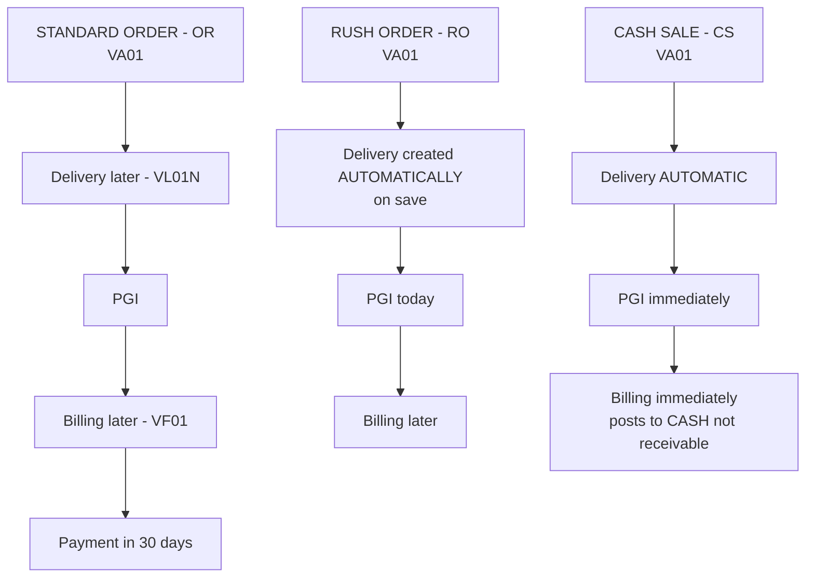

<figcaption>One field on the sales order changes the entire downstream process. This is configuration doing the work that would be a hundred lines of `if` in a hand-built application.</figcaption>
</figure>

**Why this matters more than it looks.** In a system you built yourself, "cash sale" would be a branch in your code — `if (paymentType === 'cash') { skipInvoicing(); postToCashAccount(); }`. In SAP it is a **row in a configuration table** (`TVAK`), created by a functional consultant in SPRO, that tells the system which delivery type, which billing type and which account to use. **No developer was involved.** That is the difference described in A3, shown working.

| | Your hand-built app | SAP |
|---|---|---|
| Adding a new order behaviour | Write a new branch, test it, deploy | **Copy an existing document type in SPRO, change a few settings** |
| Who does it | A developer | A functional consultant |
| Time | Days | Hours |
| Risk | New code paths | Configuration, tested but no new code |

<p class="te"><strong>Telugu:</strong> Ee naalugu types gurthu unchuko:<br/>— <strong>`OR` Standard order</strong>: normal — ippudu order, taruvata delivery, taruvata bill, 30 rojulalo dabbu.<br/>— <strong>`RO` Rush order</strong>: order save cheyyagane <strong>delivery automatic ga</strong> tayaru avutundi. Samanu ee roje veltundi, bill taruvata.<br/>— <strong>`CS` Cash Sale</strong>: <strong>delivery mariyu billing rendu ventane</strong> jarugutai. Customer counter lo dabbu ichi fan teesukelipotadu. Dabbu <strong>cash account</strong> loki veltundi, customer baaki lekka lo padadu.<br/>— <strong>`RE` Returns</strong>: <strong>venakki</strong> — samanu tirigi vastundi, credit memo veltundi.<br/><strong>Mukhyamaina point:</strong> nee sonta app lo idi <code>if (cash) {...}</code> ani <strong>code</strong> rasevaadivi. SAP lo idi <strong>SPRO lo oka config row</strong> (<code>TVAK</code> table) matrame — <strong>developer avasaram ledu</strong>.</p>

---

## D4. Document flow — how SAP links them all

**Simple definition:** Every document in a chain stores a **reference to the one before it**, and SAP keeps a table of those links. The result is that from any document you can see the entire story — forwards and backwards — in one click. That table is **`VBFA`**, and the button is **Document Flow**.

<p class="te"><strong>Telugu:</strong> Prathi document <strong>daani mundu dani reference</strong> ni daachukuntundi, mariyu SAP ee links anni oka table lo unchutundi. Anduke <strong>e document nunchi ayina</strong> — sales order nunchi ayina, invoice nunchi ayina — <strong>motham katha</strong> okka click lo chudochu, mundu ki venakki rendu vaipula. Aa table peru <strong>`VBFA`</strong>, aa button peru <strong>Document Flow</strong>.</p>

**Try this in your practice system — it is the single best five-minute exercise in this document:**

```
1. VA03  -> enter a sales order number -> Enter
2. Menu: Environment -> Display Document Flow   (or the "Document Flow" button)
3. You will see something like this:

   Sales order 5000000123 ................... 12.09.2026  Completed
     |
     +-- Delivery 80000456 ................... 13.09.2026  Completed
     |     |
     |     +-- WMS transfer order 12345 ....... 13.09.2026  Completed
     |     +-- GD goods issue: delvy 4900001 .. 13.09.2026  Completed
     |
     +-- Invoice 90000789 .................... 14.09.2026  Completed
           |
           +-- Accounting document 1000000456 . 14.09.2026  Cleared

4. Double-click ANY line to jump straight into that document.
```

**What you just saw, and why it is the heart of ERP.** Five different departments created five different documents across three days — Sales, Warehouse, Stores, Billing, Accounts. Nobody re-typed anything, and every document knows its parents and children. **That single screen is what a company is buying when it buys an ERP.**

| | Detail |
|---|---|
| Table | **`VBFA`** — Sales Document Flow |
| Key fields | `VBELV` preceding document · `VBELN` subsequent document · `VBTYP_N` document category |
| Where you see it | The **Document Flow** button in `VA03`, `VL03N`, `VF03` |
| Your web analogy | A `parent_id` / foreign-key chain across `orders`, `shipments`, `invoices`, `payments` — plus a ready-made UI to walk it |

**Document categories in `VBFA` — worth recognising:**

| `VBTYP` | Means |
|---|---|
| `A` | Inquiry |
| `B` | Quotation |
| `C` | **Sales order** |
| `J` | **Delivery** |
| `M` | **Invoice** |
| `H` | Returns |

<p class="doc"><strong>An interview question you can now answer completely:</strong> "How would you find out whether a sales order has been invoiced?" — <em>"Open VA03 and check the document flow, which reads table VBFA. Programmatically I would select from VBFA where VBELV is the order and VBTYP_N is 'M' for invoice."</em> That answer shows you understand both the screen and the data behind it.</p>

---

# Part E — Making: Plan-to-Produce

## E1. How a fan gets built, in six documents

**Simple definition:** **Plan-to-Produce** is the manufacturing flow: work out how many fans are needed → check what raw material that requires → order what is missing → issue components to the shop floor → build → put finished fans into stock. It is the flow that connects P2P (buying) to O2C (selling).

<p class="te"><strong>Telugu:</strong> <strong>Plan-to-Produce</strong> ante <strong>tayaru chese flow</strong>: enni fans kavalo lekkinchadam → daaniki enta raw material kavalo choodadam → lenidi konadam → components ni factory ki ivvadam → fan tayaru cheyyadam → tayarayina fans ni stock lo pettadam. Idi <strong>P2P (konadam) ni O2C (ammadam) tho kalipe</strong> madhya flow.</p>

**The two master records everything depends on.** These come first, before any production:

| Master record | What it says | T-code | Tables |
|---|---|---|---|
| **BOM** (Bill of Material) | **The recipe.** One `FAN-CEIL-1200` = 1 motor + 1.2 kg steel sheet + 8 m copper wire + 3 blades + 1 box | `CS01` create · `CS03` display | `MAST`, `STKO` header, `STPO` items |
| **Routing** | **The method.** Step 10 stamping (12 min), step 20 winding (18 min), step 30 assembly (9 min), step 40 testing (4 min) | `CA01` create · `CA03` display | `PLKO` header, `PLPO` operations |

**Now the flow. Vayu needs 1,000 fans for the festival season:**

<figure class="fig">

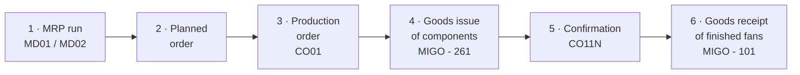

<figcaption>Plan-to-Produce. Step 1 is where SAP earns its keep: MRP reads the BOM, compares required against available, and generates every purchase requisition and planned order the factory needs.</figcaption>
</figure>

| Step | What happens at Vayu Fans | T-code | Effect |
|---|---|---|---|
| **1. MRP run** | SAP reads the BOM, multiplies by 1,000, checks stock, and works out what is short: 1,000 motors needed, 300 in stock → **short 700** | `MD01` / `MD02` | Creates **planned orders** for fans and **purchase requisitions** for missing components |
| **2. Planned order** | A proposal, not yet firm: "make 1,000 fans starting 1 Sep" | `MD04` to view | Nothing posted yet |
| **3. Production order** | The planned order is converted into a firm order with a number, a BOM copy and a routing copy | `CO01` / `CO40` | Tables `AUFK` header, `AFKO`, `AFPO` |
| **4. Goods issue** | Components leave the raw-material store for the shop floor | `MIGO` movement **261** | Raw-material stock **down**; cost collects on the production order |
| **5. Confirmation** | The shop floor reports "step 30 done, 400 fans assembled, 6.4 hours" | `CO11N` | Actual time and quantity recorded |
| **6. Goods receipt** | Finished fans go into the finished-goods store | `MIGO` movement **101** | Finished stock **up**; the fans are now sellable in O2C |

**Notice the join.** Step 1 generated **purchase requisitions** — that is `EBAN`, the first document of P2P in C1. And step 6 put fans into stock — which is what a sales order in D1 checks during its availability check. **The three flows are one loop**, which is exactly the thing an ERP exists to close:

<p class="doc"><strong>The full Vayu Fans loop, in one sentence:</strong> MRP says we are short 700 motors → a purchase requisition becomes a PO → the motors arrive and stock rises (<strong>P2P</strong>) → they are issued to a production order and become fans (<strong>Plan-to-Produce</strong>) → a dealer orders 200 and the availability check sees them → they are delivered, invoiced and paid for (<strong>O2C</strong>) → every step posted to the ledger along the way (<strong>R2R</strong>).</p>

<p class="te"><strong>Telugu:</strong> Modata rendu master records kavali: <strong>BOM (`CS01`)</strong> = fan ki emi emi kavalo ane <strong>recipe</strong>; <strong>Routing (`CA01`)</strong> = ye step enta sepu ane <strong>vidhaanam</strong>.<br/>Taruvata flow: <strong>1. MRP run (`MD01`)</strong> — SAP BOM chusi, 1000 fans ki enta kavalo lekkinchi, stock lo enta undo chusi, <strong>takkuva unnadanni kanipettutundi</strong>. Lenivaatiki <strong>purchase requisitions</strong> automatic ga create chestundi. <strong>2. Planned order</strong> — kevalam proposal. <strong>3. Production order (`CO01`)</strong> — firm order. <strong>4. Goods issue (261)</strong> — components factory ki. <strong>5. Confirmation (`CO11N`)</strong> — "itanta ayindi" ani cheppadam. <strong>6. Goods receipt (101)</strong> — tayarayina fans stock loki.<br/><strong>Mukhyam:</strong> step 1 lo puttina purchase requisition ne <strong>P2P start</strong>. Step 6 lo padina stock ne <strong>O2C lo check chestundi</strong>. <strong>Moodu flows kalisi oka loop</strong> — ERP unde karanam ide.</p>

---

# Part F — How the Business Becomes Data

## F1. Every SAP document has the same shape — header and item

**Simple definition:** You have now met nine business documents. Almost every one of them is stored the same way: **one header row** holding what is true for the whole document, and **many item rows** holding each line. Once you see this pattern you can guess the table structure of a document you have never met.

<p class="te"><strong>Telugu:</strong> Ippati varaku nuvvu <strong>9 documents</strong> chusavu. Vaatilo deadaapu anni <strong>okate vidhanga</strong> store avutai: <strong>okka header row</strong> — document motham ki common ga undedi (customer evaru, date, currency) — mariyu <strong>chala item rows</strong> — prathi line ki okati (ye material, enni, entha rate). Ee pattern oksari ardham aithe, <strong>nuvvu eppudu chudani document</strong> yokka tables kuda oohinchagalavu.</p>

| Document | **Header table** | **Item table** | Key field |
|---|---|---|---|
| Purchase requisition | — | `EBAN` (item-level only) | `BANFN` |
| Purchase order | **`EKKO`** | **`EKPO`** | `EBELN` / `EBELP` |
| Goods movement | `MKPF` (ECC) | `MSEG` (ECC) · **`MATDOC`** in S/4HANA | `MBLNR` |
| Vendor invoice | `RBKP` | `RSEG` | `BELNR` |
| Inquiry / quotation / **sales order** | **`VBAK`** | **`VBAP`** | `VBELN` / `POSNR` |
| Delivery | **`LIKP`** | **`LIPS`** | `VBELN` |
| Billing document | **`VBRK`** | **`VBRP`** | `VBELN` |
| Accounting document | `BKPF` | `BSEG` (ECC) · **`ACDOCA`** in S/4HANA | `BELNR` |

**Why it is split this way.** Balaji's order has one customer, one date and one currency — but three different fan models. Storing the customer three times would be wasteful and would let the three rows disagree. So SAP stores it once in `VBAK` and three times in `VBAP`, joined by `VBELN`.

```abap
" The join you will write more than any other in your career:
SELECT k~vbeln, k~kunnr, k~erdat,          " header: order no, customer, date
       p~posnr, p~matnr, p~kwmeng, p~netwr " items:  line, material, qty, value
  FROM vbak AS k
  INNER JOIN vbap AS p ON p~vbeln = k~vbeln
  WHERE k~vkorg = '1000'                    " Vayu's sales organisation
    AND k~erdat >= '20260901'
  INTO TABLE @DATA(lt_orders).
```

**The naming logic, so you can guess instead of look up:** SAP's German-derived naming is consistent once you see it. `EKKO` = *Einkauf Kopf* (purchasing head), `EKPO` = *Einkauf Position* (purchasing item). `VBAK` = *Verkauf Beleg Auftrag Kopf* (sales document order head), `VBAP` = the item. **`K` at the end usually means header (Kopf); `P` usually means item (Position).**

<p class="te"><strong>Telugu:</strong> <strong>Enduku rendu tables?</strong> Balaji order lo — customer okkade, date okkate, kani <strong>3 rakala fans</strong> unnai. Customer peru 3 sarlu raasthe waste, mariyu aa 3 rows lo tedaa vachhe pramaadam. Anduke SAP: customer ni <strong>`VBAK` lo oksari</strong>, items ni <strong>`VBAP` lo 3 sarlu</strong> pettindi, rendintini <strong>`VBELN`</strong> tho kaluputundi.<br/><strong>Peru logic (German nunchi vachindi):</strong> chivara <strong>`K`</strong> unte deadaapu <strong>header (Kopf)</strong>, chivara <strong>`P`</strong> unte <strong>item (Position)</strong>. `EKKO`/`EKPO`, `VBAK`/`VBAP`, `LIKP`/`LIPS` — anni ee pattern ne.</p>

---

## F2. MARA, MARC, MTART — decoding what your tutor is saying

**Simple definition:** Your tutor opens SE11 and says "MARA". Here is what that actually means: **`MARA` is the table where the general information about a material lives.** But a material's data does *not* all live in one table — it is split by **organisational level**, which is why there are several MAR- tables and why you kept losing the thread.

<p class="te"><strong>Telugu:</strong> Nee tutor SE11 teruchi "MARA" antadu. Daani artham: <strong>`MARA` ante material yokka general information unde table.</strong> Kani <strong>okka material data antha okka table lo undadu</strong> — adi <strong>organisational level batti vidipotundi</strong>. Anduke MAR- tho modalayye tables konni unnai, mariyu nuvvu confuse ayyavu. Idi ardham aithe class antha spashtam avutundi.</p>

**Vayu Fans' ceiling fan, `FAN-CEIL-1200`, spread across five tables:**

| Table | Level | What it holds | Vayu example |
|---|---|---|---|
| **`MARA`** | **Client** — true everywhere | Material number, **material type**, base unit, material group, weight | `MATNR` `FAN-CEIL-1200`, `MTART` `FERT`, `MEINS` `EA` |
| **`MAKT`** | Client + language | The **description** | "Ceiling Fan 1200mm White" |
| **`MARC`** | **Plant** | Planning data — MRP controller, procurement type, lot size | In plant `1000`: made in-house. In plant `1100`: not maintained at all |
| **`MARD`** | **Storage location** | **Stock quantity** | `LABST` unrestricted stock in `1000`/`FG01` = 340 |
| **`MBEW`** | **Plant + valuation** | **Price and value** | Standard price ₹1,180 |
| **`MVKE`** | **Sales area** | Sales data — sales unit, tax classification | Sold via channel `10` and `20` |

<figure class="fig">

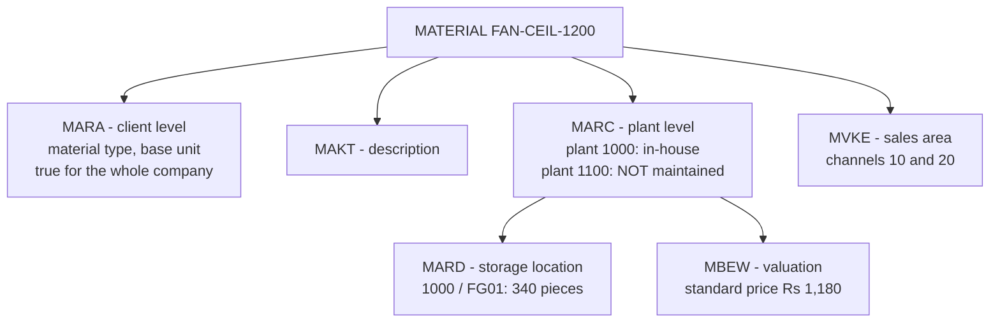

<figcaption>One material, six tables. The split follows the organisational structure from B1 exactly — which is why B1 had to come first.</figcaption>
</figure>

**Now the error from B1 makes sense.** *"Material FAN-CEIL-1200 not maintained in plant 1100"* means: the `MARA` row exists, but **no `MARC` row exists for plant 1100**. Nobody extended the material to the Chennai depot. The fix is not code — it is `MM01` with the plant view. **That is a five-second diagnosis once you know this table split, and a lost afternoon if you do not.**

**And `MTART` — the field you heard as "MTAR".** It is the **material type**, a four-character field in `MARA` that classifies what kind of thing a material is. It controls which screens appear, which number range is used, and how it is valued.

| `MTART` | Means | Vayu Fans example |
|---|---|---|
| **`ROH`** | Raw material (bought, consumed in production) | `STEEL-SHT-01`, `MOTOR-48W`, `CU-WIRE-22` |
| **`HALB`** | Semi-finished (made in-house, used in-house) | `MOTOR-ASSY` — a wound motor assembly |
| **`FERT`** | **Finished product** (made in-house, sold) | `FAN-CEIL-1200` |
| **`HAWA`** | Trading goods (bought and resold, no production) | Imported remote-control kits |
| **`VERP`** | Packaging | `BOX-FAN-STD` |
| **`DIEN`** | Service (no stock) | Installation service |

<p class="warn"><strong>Say the field names out loud once, because your tutor will not slow down for them.</strong> <code>MATNR</code> = material number · <code>MTART</code> = material type · <code>MEINS</code> = base unit of measure · <code>MATKL</code> = material group · <code>WERKS</code> = plant · <code>LGORT</code> = storage location · <code>LABST</code> = unrestricted stock. Seven names. They come from German words, they never change, and they appear in almost every ABAP program you will ever read.</p>

<p class="te"><strong>Telugu:</strong> Okka fan data <strong>aaru tables lo</strong> undi, endukante adi <strong>organisational level</strong> batti vidipotundi:<br/>— <strong>`MARA`</strong> = client level. Company antha ki common — material number, <strong>material type</strong>, unit.<br/>— <strong>`MARC`</strong> = <strong>plant level</strong>. Plant 1000 lo maintained, plant 1100 lo <strong>ledu</strong>.<br/>— <strong>`MARD`</strong> = storage location level. <strong>Stock enta undo</strong> ikkade.<br/>— <strong>`MBEW`</strong> = <strong>price</strong>. <strong>`MVKE`</strong> = sales data. <strong>`MAKT`</strong> = description.<br/><strong>Anduke</strong> "Material not maintained in plant 1100" ane error vastundi — `MARA` row undi kani <strong>`MARC` row ledu</strong>. Fix code kaadu, <strong>`MM01` lo plant view create cheyyadam</strong>.<br/><strong>`MTART`</strong> (nuvvu "MTAR" annavu) = <strong>material type</strong>. `ROH` = raw material, `HALB` = semi-finished, <strong>`FERT` = finished product</strong>, `HAWA` = trading goods, `VERP` = packing, `DIEN` = service.</p>

---
## F3. From a screen field to a table row

**Simple definition:** This is the single most useful skill in your first month, and it answers your question "how do I see data in tables". You are looking at a value on an SAP screen and you need to know **which table and field it came from**. SAP tells you, in three clicks, on any field, on any screen.

<p class="te"><strong>Telugu:</strong> Idi nee modati nela lo <strong>ati upayogakaramaina skill</strong>, mariyu "table lo data ela chudali" ane nee prashnaki jawab idi. Screen meeda oka value kanipistondi — adi <strong>ye table, ye field nunchi vachindo</strong> teluskovali. SAP ne cheputundi, <strong>moodu clicks lo</strong>, e field meeda ayina, e screen lo ayina.</p>

**The technique. Do this in your practice system today:**

```
STEP 1 - FIND THE FIELD
  VA03 -> open any sales order -> click ONCE inside the "Sold-to party" field
  Press F1
  -> a help window opens

STEP 2 - GET THE TECHNICAL NAME
  In that help window, click the "Technical Information" button (the spanner/wrench icon)
  -> you see:
        Table Name  : VBAK
        Field Name  : KUNNR
        Data Element: KUNAG
        Screen field: VBAK-KUNNR

  THAT IS THE ANSWER. The customer on this screen lives in VBAK-KUNNR.

STEP 3 - LOOK AT THE DEFINITION (optional)
  SE11 -> Database table: VBAK -> Display
  -> every field, its data element, its domain, its length

STEP 4 - LOOK AT THE ACTUAL ROWS
  SE16N -> Table: VBAK -> Enter
  -> put 5000000123 in VBELN -> Execute
  -> you see the real row behind the screen you were just looking at
```

**Do that once and something clicks permanently:** the SAP screen is a *view*; `SE16N` shows you the *data*; `SE11` shows you the *schema*. Three windows onto the same thing.

| Tool | Shows you | Your web equivalent |
|---|---|---|
| The transaction (`VA03`) | The business view, formatted for a user | Your rendered page |
| **`F1` → Technical Information** | Which table and field this value comes from | **DevTools → Inspect Element** |
| **`SE11`** | The table *definition* — fields, types, keys | The schema / migration file |
| **`SE16N`** | The actual *rows* | `SELECT * FROM x` in a SQL client |

**A few things about `SE16N` that will save you time:**

| Thing | Why it matters |
|---|---|
| Enter selection criteria before executing | `VBAK` has millions of rows. Always filter — by `VBELN`, `ERDAT` or `KUNNR` |
| Set **Number of hits** | Default is often 500. Raise it deliberately, never to "all" on a production table |
| Tick **Check maximum number of hits** off with care | An unbounded read on `ACDOCA` can hurt a production system |
| Use the **layout / field selection** button | Choose which columns show — `VBAK` has over 100 |
| `SE16N` vs `SE16` vs `SE17` | `SE16N` is the modern one. Use it |

**And the last piece — writing code against what you just found.** You asked "how do I write code". The full answer is your **ABAP Essentials** PDF; here is the bridge, using the exact table you just inspected:

```abap
*&--- Your first genuinely useful program: Vayu Fans open sales orders
REPORT zvayu_open_orders.

DATA: lt_orders TYPE TABLE OF vbak.

SELECT vbeln, kunnr, erdat, netwr           " the fields F1 just showed you
  FROM vbak
  WHERE vkorg = '1000'                       " Vayu's sales organisation
    AND erdat >= '20260901'
  INTO TABLE @DATA(lt_result).

LOOP AT lt_result INTO DATA(ls_order).
  WRITE: / ls_order-vbeln, ls_order-kunnr, ls_order-erdat, ls_order-netwr.
ENDLOOP.
```

Type this in `SE38`, activate it, run it. **You have now read a real business table that a real business document wrote to.** Everything else in ABAP is a bigger version of these ten lines.

<p class="te"><strong>Telugu:</strong> Ee technique ni <strong>ee roje</strong> practice system lo cheyyi:<br/>1. `VA03` lo oka order teruchu → "Sold-to party" field lo click chesi <strong>`F1`</strong> nokku.<br/>2. Vachina window lo <strong>"Technical Information"</strong> click chey → <strong>Table Name: `VBAK`, Field Name: `KUNNR`</strong> ani chupistundi. <strong>Ade jawab.</strong><br/>3. <strong>`SE11`</strong> lo `VBAK` teruchu → table <strong>structure</strong> chudochu.<br/>4. <strong>`SE16N`</strong> lo `VBAK` teruchu → <strong>nijamaina rows</strong> chudochu.<br/><strong>Idi nee DevTools laantidi:</strong> screen = rendered page, `F1` = Inspect Element, `SE11` = schema, `SE16N` = SQL client. Oksari chesthe, <strong>eppatiki gurthu untundi</strong>.</p>

---

## F4. Reports, and the errors you will actually meet

**Simple definition:** Two things fill an SAP consultant's day that nobody teaches in a course: **reading standard reports**, and **understanding error messages**. Your 6-month plan calls these out as Week 7 and Week 11 for good reason — high-paying SAP jobs go to people who can fix things, and fixing starts with reading the message properly.

<p class="te"><strong>Telugu:</strong> SAP lo pani chese vaadi roju lo <strong>rendu vishayalu</strong> ekkuva samayam teesukuntai, kani vaatini <strong>course lo evaru nerpinchru</strong>: (1) <strong>standard reports chadavadam</strong>, (2) <strong>error messages ardham chesukovadam</strong>. Nee 6-month plan lo veetini Week 7, Week 11 ga pettadam correct — <strong>ekkuva jeetam</strong> ichhe SAP jobs <strong>problem solve chesevaallake</strong> vastai.</p>

**Standard reports you should open once, just to know they exist:**

| T-code | Shows | Vayu Fans use |
|---|---|---|
| **`MMBE`** | Stock overview for one material across all plants | "How many fans do we have, and where?" |
| `MB52` | Warehouse stock with values | Stock valuation at month end |
| `ME2N` / `ME2L` | Purchase orders by number / by vendor | "What is still open with Sundaram Motors?" |
| **`VA05`** | Sales order list | "All orders for Balaji this month" |
| `VF05` | Billing document list | Invoices raised in a period |
| **`FBL1N`** / **`FBL5N`** | Vendor / customer line items | "What do we owe, what are we owed?" |
| `FS10N` | G/L account balances | Any account, any period |
| `MD04` | Stock/requirements list for a material | The single most-used PP screen |
| `ST22` | **ABAP runtime dumps** | Where you go when a program crashed |
| `SM37` | Background job monitor | "Did last night's interface run?" |

**In S/4HANA, most of these also exist as Fiori apps** with the same data and a better UI — but the T-codes still work, and on a project people still say "check MMBE".

**The six errors you will genuinely meet, and what each one really means:**

| Message | What it actually means | Where to fix it |
|---|---|---|
| *"Material X not maintained in plant Y"* | `MARA` row exists, **`MARC` row missing** (F2) | `MM01`, extend to that plant |
| *"Deficit of stock" / "Deficit of BA unrestricted"* | Not enough physical stock for this movement | Check `MMBE`; the real answer is usually a missing goods receipt |
| *"Document is incomplete"* | A field the **incompletion procedure** requires is blank on the sales order | `VA02`, the incompletion log tells you which field |
| *"Account determination error"* | Config does not say which **G/L account** to post to for this combination | Functional consultant, `VKOA` (SD) or `OBYC` (MM) |
| *"No number range interval found"* | The number range for this document type was never created, or has run out | `SNRO` / config. Very common on a fresh training system |
| *"Enter a value for field X"* | A mandatory field for **this document type** in **this configuration** | Fill it — but ask *why* it is mandatory; that is a config decision |

<p class="warn"><strong>The habit worth building from day one.</strong> When SAP shows a message in the status bar, <strong>double-click it</strong>. You get the long text, the message class and number (for example <code>M7 021</code>), and often a "Procedure" section telling you exactly what to do. Most beginners read the one-line message, panic, and ask someone. The long text usually contains the answer.</p>

<p class="doc"><strong>The scenario question your plan mentions — "stock mismatch, how does SAP solve it?"</strong> System stock says 340 fans; the warehouse counts 332. SAP's answer is <strong>physical inventory</strong>: create a count document (<code>MI01</code>), enter the counted quantity (<code>MI04</code>), and post the difference (<code>MI07</code>). SAP then posts an inventory adjustment to FI automatically. The eight missing fans become a costed, audited, explainable difference instead of an argument. Being able to tell that story is exactly what "real-time scenario" questions are testing.</p>

---

# Part G — Your Job in All This

## G1. RICEF, mapped onto Vayu Fans

**Simple definition:** You have now seen the whole business. Here is your place in it — every task an ABAP developer at Vayu Fans would receive in the first year, mapped to the flow it belongs to. This is what "what do I do as an ABAP dev" actually looks like on a real project.

<p class="te"><strong>Telugu:</strong> Ippudu nuvvu <strong>motham business</strong> chusavu. Ikkada nee sthanam emiti ani chuddam — Vayu Fans lo oka ABAP developer ki modati samvatsaram lo vache <strong>prathi task</strong>, adi ye flow ki chendinado tho kalipi. "ABAP dev ga nenu emi chestanu" ane prashnaki <strong>nijamaina jawab idi</strong>.</p>

| Flow | Task you receive | Type | What you actually touch |
|---|---|---|---|
| **O2C** | "Dealer-wise sales report with margin, monthly" | **R** | `VBAK` + `VBAP` + `VBRP`, ALV — or a CDS view + Fiori list |
| **O2C** | "Print our own invoice layout with GST and the Vayu logo" | **F** | Smart Form / Adobe Form, printed from `VF03` |
| **O2C** | "Do not allow an order if the dealer's overdue balance exceeds ₹5 lakh" | **E** | A **BAdI** on sales-order save, reading FI open items |
| **O2C** | "Upload dealer orders from their Excel template" | **I** | File upload + sales order creation via BAPI |
| **P2P** | "Late-delivery report by vendor, last 12 months" | **R** | `EKKO` + `EKPO` + `EKBE` |
| **P2P** | "Our own PO print layout" | **F** | Smart Form from `ME23N` |
| **P2P** | "Auto-default storage location RM01 on raw-material POs" | **E** | BAdI / user exit on `ME21N` |
| **P2P** | "Nightly file of new POs to Sundaram Motors" | **I** | `SM36` background job + file/IDoc |
| **Plan-to-Produce** | "Shop-floor screen showing today's production orders" | **R** | `AUFK` + `AFKO` + `AFPO`, or a Fiori app |
| **Go-live** | "Load 4,200 vendors and 11,000 materials from Tally" | **C** | LSMW / BAPI-driven Z-programs. **Happens once** |
| **R2R** | "Month-end reconciliation report for the CFO" | **R** | `ACDOCA` |

**Read the middle column.** Out of eleven tasks, **five are reports**. That is not an accident — reports are the majority of ABAP work almost everywhere, they are the safest thing to give a fresher, and they are the fastest way to look competent in your first month.

<p class="doc"><strong>What this means for your December portfolio.</strong> Build <strong>one</strong> of these properly rather than five badly. The strongest single choice is the first row done the modern way: a <strong>CDS view</strong> over <code>VBAK</code>/<code>VBAP</code> with UI annotations, exposed through <strong>RAP</strong> as OData, with a <strong>Fiori Elements</strong> list report on top. It is one project that demonstrates the business flow, the data model, the modern programming model and the UI — which is exactly the combination that makes your web background pay.</p>

---

## G2. The words you are saying slightly wrong

**Simple definition:** You asked me to correct your terminology, so here it is directly. None of these are serious mistakes — they are exactly the words a beginner mishears in a fast-moving class. But saying them correctly in December will matter, because interviewers read precision as experience.

<p class="te"><strong>Telugu:</strong> Nuvvu adigav kabatti, nee maatalni <strong>direct ga sari chestunna</strong>. Ivi pedda tappulu kaavu — <strong>vegam ga nadiche class lo</strong> evarikaina ilaage vinipistundi. Kani December interviews lo <strong>sariyaina maata</strong> vaadadam mukhyam, endukante interviewers <strong>khachitatvanni experience ga</strong> chustaru.</p>

| You said | The correct term | What it actually is |
|---|---|---|
| **"MTAR"** | **`MTART`** | The **material type** field in `MARA` — `ROH`, `HALB`, `FERT`, `HAWA` (F2) |
| **"cash order"** | **Cash sale** | A sales document type where delivery and billing happen immediately and revenue posts to cash (D3) |
| **"quotation req"** | **Three different documents** | **Purchase requisition** (our internal need), **RFQ** (our question to a supplier), **Quotation** (their answer, or *our* offer to a customer in SD) (C1) |
| **"delivery notes"** | **Delivery** (`VL01N`) | The delivery is the *document*; the "delivery note" or packing list is the *printout* of it (D2) |
| **"O2O"** | **O2C** — Order to Cash | The sell-side flow (A2, Part D) |
| **"sales, order"** as one thing | **Sales order** | One document, `VA01`, table `VBAK` (D1) |
| **"procurement"** as a module | The **module is MM**; the *process* is **P2P**; the *area* is Sourcing & Procurement | Three words, one neighbourhood (A4) |
| **"SAP system UI"** | **SAP GUI** (the desktop client) vs **Fiori** (the browser UI) | Two different front ends over the same data |
| **"DDIC"** | **ABAP Dictionary** — DDIC is the abbreviation | Where table, data element and domain definitions live. `SE11` is its transaction |
| **"client"** meaning customer | In SAP, **client = `MANDT`**, a tenant | The buying company is the **customer** (`KUNNR`) or, on a project, "the client" in the consulting sense. Watch the context |

<p class="warn"><strong>One more that will come up.</strong> "Table" in SAP usually means a <strong>DDIC transparent table</strong> (a real database table, defined in SE11). But you will also hear <strong>internal table</strong> — an in-memory array inside an ABAP program, which is nothing to do with the database. When your tutor says "put it in a table", listen for which one he means. ABAP Essentials Part G covers internal tables properly.</p>

---

## G3. Your next week in the 9–11 slot

**Simple definition:** You said you sit in class blank while the tutor opens screens. That stops when you arrive already knowing what the screen is *for*. Here is a concrete five-day plan for your practice system that follows this document, so class becomes recognition instead of introduction.

<p class="te"><strong>Telugu:</strong> Tutor screens teruchutunte nuvvu blank ga kurchuntunnav ani cheppav. <strong>Aa screen deniki upayogam</strong> ani mundu ne telisi vasthe adi aagipotundi. Ikkada nee practice system kosam <strong>aidu rojula plan</strong> undi — ee doc ni follow avutundi, mariyu class ni "kotta vishayam" nunchi "idi naaku telusu" ga marchutundi.</p>

| Day | Do this in your 9–11 slot | It proves you understood |
|---|---|---|
| **Mon** | `SE16N` → open `MARA`, filter one material. Then open `MARC` and `MARD` for the same material. See the same `MATNR` in three tables at three levels | **F2** — the org-level split |
| **Tue** | `VA03` → open any sales order. `F1` on five fields, note the table and field name each time. Then `SE16N` on `VBAK` and find that exact order | **F3** — screen to table |
| **Wed** | `VA03` → **Document Flow**. Walk it from order to accounting document. Write the chain in your notebook | **D4** — how documents link |
| **Thu** | `ME23N` → open a purchase order. Find the **PO history** tab. See the goods receipt and the invoice against it | **C1–C2** — the three-way match, visible |
| **Fri** | `SE38` → create `ZVAYU_TEST`, paste the ten-line program from **F3**, change the table to `EKKO`, activate, run | **F3** — you can read business data with code |

**Three questions to ask your tutor this week.** Asking a good question is the fastest way to stop being invisible in a class:

1. *"When you create a sales order, which configuration decides the G/L account the revenue posts to?"* — shows you understand SD→FI integration.
2. *"Is our practice system S/4HANA or ECC? Can I check with System → Status → S4CORE?"* — shows you know the difference and that CDS/RAP depend on it.
3. *"Which document types are configured in this system — do we have a cash sale type I can try?"* — shows you know document types drive the flow.

<p class="doc"><strong>The one sentence to hold from this entire document.</strong> SAP is not a programming problem you are failing to understand — it is a <strong>business</strong> you had not been shown. A fan gets planned, its parts get bought, it gets made, it gets sold, and money moves — and every screen your tutor opens is one moment in that story. Once you can place the screen in the story, SE11, DDIC, MARA and MTART are just filing labels. And filing labels are easy.</p>

<p class="te"><strong>Telugu:</strong> Ee doc antha lo nunchi <strong>okka vaakyam</strong> gurthu unchuko: <strong>SAP nuvvu ardham chesukoleni programming problem kaadu — adi neeku evaru chupinchani oka business.</strong> Fan ki plan padutundi, daani parts konataru, adi tayaru avutundi, adi ammutaru, dabbu kadulutundi — nee tutor teriche <strong>prathi screen aa katha lo oka kshanam</strong> matrame. Aa screen ni katha lo <strong>ekkada peduthundo</strong> nuvvu cheppagaliginappudu, SE11, DDIC, MARA, MTART anevi kevalam <strong>file meeda raasina labels</strong> matrame. Labels nerchukovadam sulabham.</p>

---

*Next: read **ABAP Essentials** — you now have the business context that makes its SELECT statements mean something. Bring new doubts to Saturday; they go into Doubts Round 02.*
